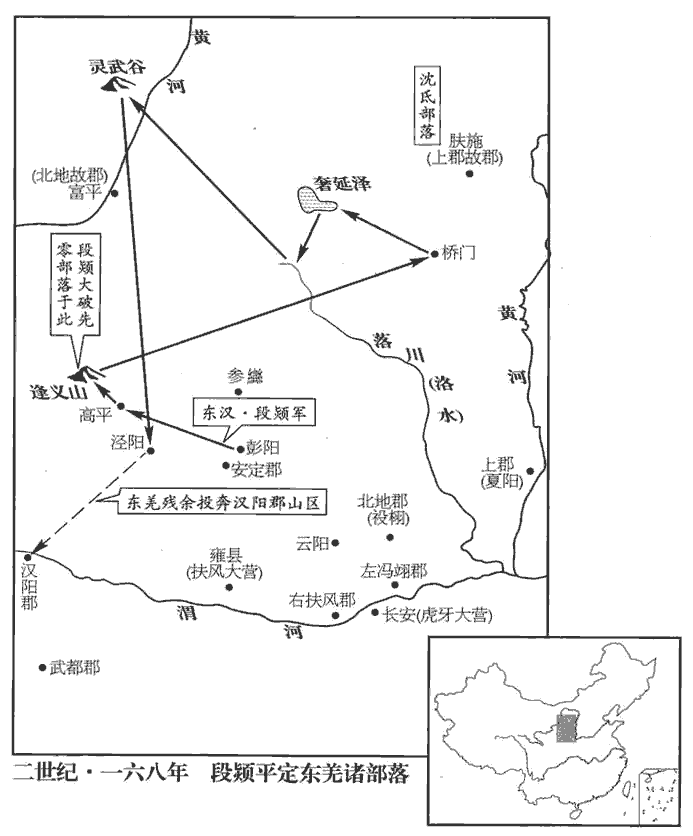

 漢紀四十八起強圉協洽（丁未），盡重光大淵獻（辛亥），凡五年。

# 孝桓皇帝下

## 永康元年（丁未，一六七）是年六月，始改元。

1春，正月，東羌先零圍祋duì祤yǔ‹陕西耀县›，掠雲陽‹陕西淳化西北›，二縣皆屬左馮翊yì。宋白曰：耀州華原、同官縣，本漢祋祤縣地，雲陽故城在今縣西北六十里。零，音憐。祋duì，音丁活翻，又音丁外翻。祤yǔ，音詡xǔ。當煎諸種復反。種，章勇翻。復，扶又翻；下同。段熲jiǒng擊之於鸞鳥‹甘肃武威南›，熲，高迥翻。鸞，音雚guàn。鳥，讀曰雀。大破之，西羌遂定。

〖译文〗 [1]春季，正月，东羌先零部包围县，劫掠云阳县。当煎等诸部羌民再度起兵反叛。护羌校尉段率军在鸾鸟县邀击，大破叛羌，将西羌平定。

2夫餘王夫台寇玄菟tù‹辽宁沈阳›；夫，音扶。菟，同都翻。玄菟太守公孫域擊破之。守，式又翻。

〖译文〗 [2]夫馀王国国王夫台攻打玄菟郡，玄菟郡太守公孙域率军将其击破。

3夏，四月，先零羌寇三輔，攻沒兩營，兩營，京兆虎牙營，扶風雍營。零，音憐。殺千餘人。

〖译文〗 [3]夏季，四月，先零部羌民大举进犯三辅地区，攻灭京兆虎牙营和扶风雍营，杀害一千余人。

4五月，壬子晦‹三十›，日有食之。

〖译文〗 [4]五月壬子晦（三十日），发生日食。

5陳蕃既免，朝臣震栗，莫敢復為黨人言者。復，扶又翻。朝，直遙翻；下同。為，于偽翻。賈彪曰：「吾不西行，大禍不解。」賈彪，颍川定陵人。自颍川至雒陽為西行。乃入雒陽，說城門校尉竇武、尚書魏郡‹河北临漳西南邺镇›霍諝xū等，說，輸芮翻。諝，私呂翻。使訟之。武上疏曰：「陛下即位以來，未聞善政，常侍、黃門，競行譎詐，妄爵非人。伏尋西京，佞臣執政，終喪天下。譎，古穴翻。喪，息浪翻。今不慮前事之失，復循覆車之軌，臣恐二世之難，難，乃旦翻。必將復及，趙高之變，不朝則夕。謂望夷宮之事也。近者姦臣牢脩造設黨議，遂收前司隸校尉李膺等逮考，連及數百人，曠年拘錄，事無效驗。謂自去年興獄至今年，事終無其實也。校，戶教翻。臣惟膺等建忠抗節，志經王室，此誠陛下稷、卨xiè、伊、呂之佐；卨，古契字，音息列翻。而虛為姦臣賊子之所誣枉，天下寒心，海內失望。惟陛下留神澄省，澄，清也。省，察也。省，悉井翻。時見理出，賢曰：時，謂即時也。以厭神【章：乙十六行本「神」作「人」；乙十一行本同；孔本同；退齋校同。】鬼喁yóng喁之心。喁，魚恭翻。今臺閣近臣，尚書朱㝢、荀緄、劉祐、魏朗、劉矩、尹勳等，皆國之貞士，朝之良佐；緄gǔn，古本翻。考異曰：武傳：武上疏曰：「今臺閣近臣，尚書令陳蕃、僕射胡廣、尚書朱㝢等。」按蕃、廣時不為令僕，故去之。尚書郎張陵、媯guī皓、媯，俱為翻。姓譜：媯，帝舜之後。苑康、姓譜：苑姓，商武丁之子受封於苑，因以為氏。左傳：齊有大夫苑何忌。楊喬、邊韶、陳留風俗傳：邊祖于宋平公子戍，字子邊。又左傳，周有大夫邊伯。戴恢等，文質彬彬，明達國典，內外之職，群才并列。而陛下委任近習，專樹饕餮，饕，吐刀翻。餮，他結翻。外典州郡，內幹心膂，宜以次貶黜，案罪糾罰；信任忠良，平決臧否，使邪正毀譽，各得其所，否，音鄙。譽，音余。寶愛天官，唯善是授，天官，言天命有德，人君不可以私授。如此，咎徵可消，天應可待。間者有嘉禾、芝草、黃龍之見。是年，魏郡言嘉禾生，巴郡言黃龍見。見，賢遍翻。夫瑞生必於嘉士，福至實由善人，在德為瑞，無德為災。陛下所行不合天意，不宜稱慶。」書奏，因以病上還城門校尉、槐里侯印綬。霍諝xū亦為表請。上，時掌翻。為，于偽翻；下同。帝意稍解，使中常侍王甫就獄訊黨人范滂等，皆三木囊頭，暴於階下，賢曰：三木，頭及手、足皆有械，更以物蒙覆其頭也。甫以次辯詰曰：「卿等更相拔舉，更，工衡翻。迭為脣齒，其意如何？」滂曰：「仲尼之言，『見善如不及，見惡如探湯，』賢曰：探湯，喻去之疾也，見論語。探，吐南翻。滂欲使善善同其清，惡惡同其汙，謂王政之所願聞，不悟更以為黨。古之脩善，自求多福。今之脩善，身陷大戮。身死之日，願埋滂於首陽山‹山西永济西南›側，上不負皇天，下不愧夷、齊。」賢曰：伯夷、叔齊餓死首陽山，事見史記。首陽山，在雒陽東北。杜佑曰：偃師縣有首陽山。甫愍然為之改容，乃得并解桎梏gù。鄭玄註周禮曰：木在手曰桎，在足曰梏。桎，之日翻。梏，工沃翻。李膺等又多引宦官子弟，宦官懼，請帝以天時宜赦。六月，庚申‹八›，赦天下，改元；黨人二百餘人皆歸田里，書名三府，禁錮終身。考異曰：帝紀於去年冬書「李膺等二百餘人受誣為黨人，并坐下獄，書名三府。」案陳蕃以訟李膺，免。即膺等下獄已在前，後遇赦，方得書名三府。則帝紀所紀為兩，無所用，故去之。又故書「三府」為「王府」，劉攽bān曰：當為「三府」。

〖译文〗 [5]陈蕃被免职以后，朝廷文武大臣大为震动恐惧，再没有人敢向朝廷替党人求情。贾彪说：“我如果不西去京都洛阳一趟，大祸不可能解除。”于是，他就亲自来到洛阳，说服城门校尉窦武、尚书魏郡人霍等人，使他们出面营救党人。窦武上书说：“自陛下即位以来，并没有听说施行过善政。常侍、黄门却奸诈百出，竞相谋取封爵。回溯西京长安时代，阿谀奉承的官员掌握朝廷大权，终于失去天下。而今不但不忧虑失败的往事，反而又走到使车辆翻覆的轨道上，我恐怕秦朝二世胡亥覆亡的灾难，一定会再度降临，赵高一类的变乱，也早晚都会发生。最近，因奸臣牢修捏造出朋党之议，就逮捕前司隶校尉李膺等入狱，进行拷问，牵连到数百人之多，经年囚禁，事情并无真实证据。我认为，李膺等人秉着忠心，坚持节操，志在筹划治理王室大事，他们都真正是陛下的后稷、子契、伊尹、吕尚一类的辅佐大臣，却被加上虚构罪名，遭受奸臣贼子的冤枉陷害，以致天下寒心，海内失望。唯有请陛下留心澄清考察，立即赐予释放，以满足天地鬼神翘首盼望的心愿。而今，尚书台的亲近大臣，如尚书朱、荀绲、刘、魏郎、刘矩、尹勋等人，都是国家的忠贞之士，朝廷的贤良辅佐。尚书郎张陵、妫皓、苑康、杨乔、边韶、戴恢等人，举止文雅，崐通达国家的典章制度，朝廷内外的文武官员，英才并列。然而，陛下却偏偏信任左右亲近，依靠奸佞邪恶，让他们在外主管州郡，在内作为心腹。应该把这批奸佞邪恶之徒陆续加以废黜，调查和审问他们的罪状，进行惩罚。信任忠良，分辨善恶和是非，使邪恶和正直、诽谤和荣誉各有所归。遵照上天的旨意，将官位授给善良的人。果真如此，天象灾异的征兆可以消除，上天的祥瑞指日可待。近来，虽偶尔也有嘉禾、灵芝草、黄龙等出现，但是，祥瑞发生，一定是因为有贤才，福佑降临，一定是由于有善人，如果有恩德，它就是吉祥，没有恩德，它就是灾祸。而今陛下的行为不符合天意，所以不应该庆贺。”奏章呈上后，窦武即称病辞职，并缴还城门校尉、槐里侯的印信。霍也上书营救党人。桓帝的怒气稍稍化解，派中常侍王甫前往监狱审问范滂等党人。范滂等人颈戴大枷，手腕戴铁铐，脚挂铁镣，布袋蒙住头脸，暴露在台阶下面。甫逐一诘问说：“你们互相推举保荐，象嘴唇和牙齿一样地结成一党，究竟有什么企图？”范滂回答说：“孔丘有言：‘看见善，立刻学习都来不及。看见恶，就好象把手插到滚水里，应该马上停止。’我希望奖励善良使大家同样清廉，嫉恨恶人使大家都明白其卑污所在。本以为朝廷会鼓励我们这么做，从没有想到这是结党。古代人修德积善，可以为自己谋取多福。而今修德积善，却身陷死罪。我死后，但愿将我的尸首埋葬在首阳山之侧，上不辜负皇天，下不愧对伯夷、叔齐。”王甫深为范滂的言辞而动容，可怜他们的无辜遭遇，于是命有关官吏解除他们身上的刑具。而李膺等人在口供中，又牵连出许多宦官子弟，宦官们也深恐事态继续扩大。于是请求桓帝，用发生日食作为借口，将他们赦免。六月庚申（初八），桓帝下诏，大赦天下，改年号。党人共二百余人，都遣送回各人的故乡；将他们的姓名编写成册，分送太尉、司徒、司空三府，终身不许再出来做官。

范滂往候霍諝而不謝。或讓之，滂曰：「昔叔向不見祁奚，晉范宣子囚叔向，祁奚請而免之，不見叔向而歸，叔向亦不告免焉而朝。吾何謝焉！」滂南歸汝南，南陽士大夫迎之者，車數千兩，兩，音亮。鄉人殷陶、黃穆侍衛於旁，應對賓客。滂謂陶等曰：「今子相隨，是重吾禍也！」遂遁還鄉里。

〖译文〗 范滂前往拜访霍，却不肯道谢。有人责备他，范滂回答说：“过去，叔向不见祁奚，我何必多此一谢。”范滂南归汝南郡时，南阳的士绅乘车来迎接他的有数千辆之多。他的同乡殷陶、黄穆站在他身边侍卫，为他应接对答宾客。范滂对殷陶等人说：“而今你们跟随我，是加重我的灾祸！”于是，他便悄悄逃回故乡。

初，詔書下舉鉤黨，賢曰：鉤，謂相連也。下，遐稼翻。郡國所奏相連及者，多至百數，唯平原‹山东平原›相史弼獨無所上。上，時掌翻。詔書前後迫切，州郡髡笞掾史。從事坐傳舍責曰：掾，俞絹翻。賢曰：續漢志：每州有從事史及諸曹掾史。傳，客舍也；音知戀翻。坐傳舍召弼而責。余謂「髡笞掾史」句绝，言詔書督迫，州郡至於髡笞掾史，青州從事則坐平原傳舍而責史弼也。「詔書疾惡黨人，惡，烏路翻。旨意懇惻。青州‹山东北部›六郡，其五有黨，平原何治而得獨無？」弼曰：「先王疆理天下，賢曰：疆，界也。理，正也。畫界分境，水土異齊，風俗不同。記王制曰：凡居民財，必因天地，寒暖燥濕，廣谷大川異制，民生其間者異俗，剛柔、輕重、遲速異齊。齊，才細翻。前書曰：凡民函五常之性，而其剛柔緩急，音聲不同，繫水土之風氣，故謂之風；好惡取舍動靜無常，隨君上之情欲，故謂之俗。他郡自有，平原自無，胡可相比！若承望上司，誣陷良善，淫刑濫罰，以逞非理，則平原之人，戶可為黨。相有死而已，相，息亮翻。所不能也！」從事大怒，即收郡僚職送獄，郡僚職，謂郡諸曹掾史也。遂舉奏弼。會黨禁中解，弼以俸贖罪，所脫者甚眾。

〖译文〗 最初，下诏搜捕党人，各郡、各封国奏报检举，牵连所及，多的以百计数，只有平原国宰相史弼，一个党人也没有奏报。诏书前后多次下达，严厉催促州郡官府，限期奏报；掾史等属吏甚至受到刑和鞭刑。青州从事坐在平原国的传舍，质问史弼说：“诏书对党人痛恨入骨，皇帝的旨意如此诚恳痛切。青州共有六个郡国，其中五个郡国都有党人，平原国何治理得独无党人？”史弼回答说：“先王治理天下，划分州郡国县境界，水土有不同，风俗有差异。其他郡国有的，平原国恰恰就没有，怎么能够相比。如果仰望上司长官的旨意，诬陷善良无辜的人，甚至依靠严刑酷罚，使非理的举动得逞，则平原国的人民，家家户户都是党人。我这个封国宰相，只有一死而已，坚决不能做出这种事情。”从事勃然大怒，立即逮捕史弼的所有属吏，送往监狱囚禁，然后弹劾史弼。正好遇着桓帝下令解除党禁，史弼用薪俸赎罪，所救脱的人很多。

竇武所薦：朱㝢，沛‹安徽淮北›人；苑康，勃海‹河北南皮›人；楊喬，會稽‹绍兴›人；會，工外翻。邊韶，陳留‹河南陈留›人。喬容儀偉麗，數上言政事，數，所角翻。帝愛其才貌，欲妻以公主，妻，七細翻。喬固辭，不聽，遂閉口不食，七日而死。

〖译文〗 窦武所推荐的人有：朱，沛国人；苑康，勃海郡人；杨乔，会稽郡人；边韶，陈留郡人。杨乔容貌和仪表壮美，多次上书奏陈朝廷政事，桓帝喜爱他的才华和美貌，打算把公主嫁给他为妻，杨乔坚决推辞。桓帝不许，杨乔闭口崐绝食，七日而死。

6秋，八月，巴郡‹重庆›言黃龍見。見，賢遍翻。初，郡人欲就池浴，見池水濁，因戲相恐，「此中有黃龍，」語遂行民間，太守欲以為美，故上之。上，時掌翻。郡吏傅堅諫曰：「此走卒戲語耳。」太守不聽。

〖译文〗 [6]秋季，八月，巴郡上报说，发现黄龙。最初，一群人想去池塘洗澡，看到池塘的水浑浊，因此大家互相开玩笑地恐吓说：“里面有一条黄龙！”于是这句开玩笑的话在民间传播开来，郡太守认为这是美事，所以将它上报朝廷。郡府属吏傅坚劝阻说：“这只是差役的一句戏言，怎能当真？”郡太守不听规劝。

7六月，【張：「月」作「州」。】大水，勃海【張：「海」下脫「海」字。】溢。

〖译文〗 [7]六月，发生大水灾，勃海海水倒灌泛滥。

8冬，十月，先零羌寇三輔，零，音憐。張奐遣司馬尹端、董卓拒擊，大破之，斬其酋豪，首虜萬餘人，酋，慈由翻。三州清定。時奐督幽‹河北北及辽宁›、并‹山西›、涼‹甘肃›三州。奐論功當封，以不事宦官，故不果封，唯賜錢二十萬，除家一人為郎。奐辭不受，請徙屬弘農‹河南灵宝东北›。舊制，邊人不得內徙。詔以奐有功，特許之。奐，燉煌淵泉人。拜董卓為郎中。卓，隴西‹甘肃临洮›人，性粗猛有謀，羌胡畏之。董卓事始此。

〖译文〗 [8]冬季，十月，先零部羌民攻打三辅地区，张奂派遣司马尹端、董卓率军阻击，大败羌民，斩杀酋长、豪帅等，加上俘虏，共一万余人。幽州、并州、凉州等三州动乱全部平定。张奂按照功劳应该晋封侯爵，但他不肯奉承宦官，结果没能晋封侯爵，只赏赐钱二十万，任命他家中一人为郎。张奂推辞不肯接受，只请求朝廷准许将他家的户籍迁移到弘农郡著籍。按照过去的法令规定，边郡人士不准迁居内地。桓帝下诏，因张奂有功，特别给予批准。任命董卓为郎中。董卓是陇西郡人，性情粗暴勇猛而有智谋，羌人、胡人都畏惧他。

9十二月，壬申‹二十三›，復癭陶王悝kuī為勃海王。悝貶事見上卷延熹八年。癭，於郢翻。悝，苦回翻。

〖译文〗 [9]十二月壬申（二十三日），重新改封瘿陶王刘悝为勃海王。

10丁丑‹二十八›，帝‹刘志›崩于德陽前殿。年三十六。戊寅‹二十九›，尊皇后‹窦妙›曰皇太后。太后臨朝。初，竇后既立，御見甚稀，見，賢遍翻。唯采女田聖等有寵。后素忌忍，帝梓宮尚在前殿，遂殺田聖。城門校尉竇武議立嗣，召侍御史河間‹河北献县›劉鯈，鯈，式竹翻。問以國中宗室之賢者，鯈稱解瀆亭‹河北安国东›侯宏。賢曰：解瀆亭在今定州義豐縣東北。杜佑曰：義豐，漢之安國縣也。宏者，河間孝王之曾孫也，祖淑，父萇，世封解瀆亭侯。武乃入白太后，定策禁中，以鯈守光祿大夫，與中常侍曹節并持節將中黃門、虎賁、羽林千人，將，即亮翻。奉迎宏，時年十二。考異曰：范書云：「即帝位，年十三」，袁紀，初立為嗣詔書云，「年十有二」；建寧二年誅黨人時，云年十四。袁紀是也。

〖译文〗 [10]丁丑（二十八日），桓帝在德阳前殿驾崩。戊寅（二十九日），尊皇后窦妙为皇太后。窦太后临朝主持朝政。起初，窦妙被立为太后，但很少能见到桓帝，只有采女田圣等人受到桓帝的宠爱。窦后忌妒而又残忍，当桓帝的棺材还停在德阳前殿时，她就下令处死田圣。城门校尉窦武为了商议确定新皇帝人选，征召侍御史河间国人刘，向他询问刘姓皇族中的贤才，刘推荐解渎亭侯刘宏。刘闳是河间王刘开的曾孙，祖父刘淑，父亲刘苌，两世都封为解渎亭侯。于是窦武入宫秉报窦太后，在宫禁中决策。任命刘为守光禄大夫，和中常侍曹节共同持节，率领中黄门、虎贲武士、羽林军等一千人，前往迎接刘宏。当时，刘宏年仅十二岁。

# 孝靈皇帝上之上諱宏。諡法：亂而不損曰靈。伏侯古今註：「宏」之字曰「大」。

## 建寧元年（戊申，一六八）

1春，正月，壬午‹三›，以城門校尉竇武為大將軍。考異曰：袁紀：「延熹九年，四月，戊寅；特進竇武為大將軍。武移病固讓，至于數十；不許。」范書在今年正月，壬午，武傳，為大將軍亦在迎立靈帝後。今從之。前太尉陳蕃為太傅，考異曰：帝紀，拜蕃太傅在即位後；傳在前。緣有蕃責尚書等語，故知從傳是也。與武及司徒胡廣參錄尚書事。三人謂之參。

〖译文〗 [1]春季，正月壬午（初三），升城门校尉窦武为大将军。任命前太尉陈蕃为太傅，和窦武以及司徒胡广统领尚书台事宜。

時新遭大喪，國嗣未立，諸尚書畏懼，多託病不朝。陳蕃移書責之曰：「古人立節，事亡如存。賢曰：言人主雖亡，法度尚在，當行之與不亡時同，故曰如存。余謂「事死如事生，事亡如事存，」中庸之文，言人主雖死亡，事之如生存也。今帝祚未立，政事日蹙，諸君柰何委荼蓼liǎo之苦，息偃在牀，詩國風曰：誰謂荼苦，其甘如薺jì。周頌曰：未堪家多難，予又集于蓼。小雅曰：或息偃在牀。於義安乎！」諸尚書惶怖，怖，普布翻。皆起視事。

〖译文〗 这时，正逢桓帝死亡的大丧，继位皇帝还没有即位，尚书们都内心畏惧，很多人假装生病不敢入朝理事。陈蕃写信责备他们说：“古人树立名节，君王虽然死亡，我们事奉他，犹如他仍生存。而今新皇帝尚未即位，政事更加紧迫，各位怎么可以在这样艰苦的处境中，推卸自己应尽的职责，而躺在床上休息？这在大义上又怎么能够安心？”尚书们惶惧恐怖，都纷纷入朝治理政事。

2己亥‹二十›，解瀆亭‹河北安国东›侯至夏門亭，使竇武持節，以王青蓋車迎入殿中；庚子‹二十一›，即皇帝位‹刘宏，时年十三›，改元。

〖译文〗 [2]已亥（二十日），解渎亭侯刘宏抵达夏门亭。窦太后命窦武持节，用皇子封王时专用的青盖车，将刘宏迎接入宫。庚子（二十一日），刘宏即皇帝位，为汉灵帝，改年号。

3二月，辛酉‹十三›，葬孝桓皇帝‹刘志›于宣陵‹河南孟津东南三十里铺北›，賢曰：宣陵，在雒陽東南三十里。廟曰威宗。

〖译文〗 [3]二月辛酉（十三日），将桓帝安葬在宣陵，庙号为威宗。

4辛未‹二十三›，赦天下。

〖译文〗 [4]辛未（二十三日），大赦天下。

5初，護羌校尉段熲jiǒng既定西羌‹湟中一带及渭水上游›，去年熲定西羌。而東羌‹陕西北部及宁夏›先零等種猶未服，度遼將軍皇甫規、中郎將張奐招之連年，既降又叛。桓帝延熹四年，皇甫規招降東羌。六年，規薦張奐。至永康元年，七年之間，羌之叛服無常。降，戶江翻；下同。桓帝詔問熲曰：「先零、東羌造惡反逆，而皇甫規、張奐各擁強眾，不時輯定，欲令熲移兵東討，未識其宜，可參思術略。」熲上言曰：「臣伏見先零、東羌雖數叛逆，數，所角翻。而降於皇甫規者，已二萬許落；善惡既分，餘寇無幾。今張奐躊躇久不進者，躊躇，猶豫也，又住足也。當慮外離內合，兵往必驚。且自冬踐春，屯結不散，人畜疲羸，有自亡之勢，欲更招降，坐制強敵耳！臣以为狼子野心，难以恩纳，势穷虽服，兵去复动，复，扶又翻。唯当长矛挟脅，白刃加颈耳。計東種所餘三萬餘落，種，章勇翻；下同。近居塞內，路無險折，非有燕、齊、秦、趙從橫之勢，從，子容翻。而久亂并、涼，累侵三輔，西河、上郡已各内徙，事见五十二卷顺帝永和五年。安定、北地复至单危，复，扶又翻。下同自雲中‹内蒙托克托›、五原‹内蒙包头›，西至漢陽‹甘肃甘谷›二千餘里，匈奴諸羌，并擅其地，是為癰疽jū伏疾，留滯脅下，如不加誅，轉就滋大。若以騎五千、步萬人、車三千兩，兩，音亮。三冬二夏，足以破定，無慮用費為錢五十四億，賢曰：無慮，都凡也。毛晃曰：總計曰無慮，猶言多少如是無疑也。如此，則可令群羌破盡，匈奴長服，內徙郡縣，得反本土。伏計永初中，諸羌反叛，十有四年，用二百四十億；事見五十卷安帝元初五年。永和之末，復經七年，用八十餘億。事見五十二卷沖帝永嘉元年。費耗若此，猶不誅盡，餘孽復起，于茲作害。今不暫疲民，則永寧無期。臣庶竭駑劣，伏待節度。」駑，音奴。帝許之，悉聽如所上。上，時掌翻。熲於是將兵萬餘人，齎jí十五日糧，從彭陽‹甘肃镇原东›直指高平‹宁夏固原›，賢曰：彭陽、高平，并縣名，屬安定郡。彭陽縣，即今原州彭原縣也。高平縣，今原州也。與先零諸種戰於逢義山。賢曰：山在今原州平高縣。杜佑曰：平高縣，即漢之高平也。虜兵盛，熲眾皆恐。熲乃令軍中長鏃zú利刃，范書段熲傳作「張鏃利刃」。長矛三重，重，直龍翻。挾以強弩，列輕騎為左右翼，謂將士曰：「今去家數千里，進則事成，走必盡死，努力共功名！」因大呼，呼，火故翻。眾皆應聲騰赴，【張：「赴」下脫「熲」字。】馳騎於傍，突而擊之，虜眾大潰，斬首八千餘級。太后‹窦妙›賜詔書褒美曰：「須東羌盡定，當并錄功勤；今且賜熲錢二十萬，以家一人為郎中。」敕中藏府調金錢、綵物增助軍費，百官志：中藏府令，屬少府，掌中幣帛金銀諸貨物。調，徒弔翻。藏，沮浪翻。拜熲破羌將軍。

〖译文〗 [5]起初，护羌校尉段既已平定西羌，然而，东羌先零等部尚未归服。度辽将军皇甫规、中郎将张奂，连年不断地进行招抚，羌人不断归降，又不断起兵进行反叛。桓帝下诏询问段说：“东羌先零等部羌民作恶反叛，然而皇甫规、张奂各拥有强兵，不能及时平定，我想命令你率军到东方讨伐，不知道是否恰当，请认真考虑一下战略。”段上书说：“我认为先零以及东羌诸部，虽然数度反叛，但向皇甫规投降的，已有二万余大小帐落，善恶已经分明，残余的叛羌所剩无几。而今张奂所以徘徊踌躇，久不进兵，只因为顾虑已归服朝廷的羌人，仍跟叛羌相通，大军一 动，他们必然惊慌。并且，从冬天开始，直到现在，已是春季，叛羌屯聚集结不散，战士和马匹都十分疲惫，有自行灭亡的趋势，想再一次招降他们，坐着不动便可制服强敌。我认为，叛羌是狼子野心，很难用恩德感化。当他们势穷力屈时，虽然可以归服，一旦朝廷军队撤退，又重新起兵反叛。唯一的办法，只有用长矛直指他们的前胸，用大刀直加他们的颈项。共计东羌诸部只剩下三万余个帐落，全部定居在边塞之内，道路没有险阻，并不具备战国时代燕、齐、秦、赵等国纵横交错的形势。可是，他们却长久地扰乱并、凉二州，不断侵犯三辅地区，迫使西河郡和上郡的太守府都已迁徙到内地，安定郡、北地郡又陷于孤单危急。自云中郡、五原郡、西到汉阳郡，二千余里，土地全被匈奴人、羌人据有。这就等于恶疮暗疾，停留在两胁之下，如果不把他们消灭，势力将迅速膨胀。倘若用骑兵五千人、步兵一万人、战车三千辆，用三个冬季和两个夏季的时间，足可以击破平定，约计用费为钱五十四亿。这样，就可以使东羌诸部尽破，匈奴永远归服，迁徙到内地的郡县官府，也可以迁回故地。据我计算，自安帝永初年代中期起，诸部羌人起兵反叛，历时十四年，用费二百四十亿。顺帝永和年代末期，羌人再度起兵反叛，又历时七年，用费八十余亿。如此庞大的消耗，尚且不能把叛羌诛杀灭尽，以致残余羌众重新起兵反叛，遗害至今天。而今如果不肯使人民忍受暂时劳累的痛苦，则永久的安宁便遥遥无期。我愿竭尽低劣的能力，等待陛下的节制调度。”桓帝批准，完全采纳段所提出的上述计划。于是，段率军一万余人，携带十五日粮食，从彭阳直接插到高平，在逢义山跟先零等部羌民决崐战。羌军强大，段部众都很恐惧。段便下令军中，使用长箭头和锋利的大刀，前面排列三重举着长矛的步兵，挟持着强劲有力能够射远的弓弩，两边排列着轻装的骑兵，掩护着左右两翼。他激励将士说：“现在，我们远离家乡数千里，向前进则事情成功，逃走一定大家全死，共同努力争取功名！”就大声呐喊，全军跟随呐喊，步兵和骑兵同时发动攻击，先零羌军崩溃，段军队斩杀羌众八千余人。窦太后下诏褒奖说：“等到东羌全部平定，再合并论功行赏。现在，暂时赏赐段钱二十万，任命段家一人为郎中。”并且，命令中藏府调拨金钱等钱帛财物，帮助军费，擢升段为破羌将军。

 

6閏月，甲午，追尊皇祖為孝元皇，沈約曰：孝元皇，諡法所不載。今按周公諡法：能思辨眾曰元；行義說民曰元；主義行德曰元；靖民則法曰元。夫人夏氏為孝元后，夏，戶雅翻。考為孝仁皇，諡法：貴賢親親曰仁。尊帝母董氏為慎園貴人。皇祖，解瀆亭侯淑也。皇考，侯萇也。賢曰：慎園，在今瀛州樂壽縣東南，俗呼為二皇陵。

〖译文〗 [6]闰月甲午（疑误），追尊灵帝祖父刘淑为孝元皇，祖母夏氏为孝元后，父亲刘苌为孝仁皇，母亲董氏为慎园贵人。

7夏，四月，戊辰，太尉周景薨，司空宣酆免；以長樂衛尉王暢為司空。樂，音洛。

〖译文〗 [7]夏季，四月戊辰（疑误），太尉周景去世。司空宣酆被免官；擢升长乐卫尉王畅为司空。

8五月，丁未朔‹一›，日有食之。

〖译文〗 [8]五月丁未朔（初一），发生日食。

9以太中大夫劉矩為太尉。

〖译文〗 [9]擢升太中大夫刘矩为太尉。

10六月，京師大水。

〖译文〗 [10]六月，京都洛阳发生大水灾。

11癸巳‹十七›，錄定策功，封竇武為聞喜侯，武子機為渭陽侯，考兩漢志無渭陽縣，蓋因舅氏之親而為封國之名。兄子紹為鄠侯，鄠hù，音戶。靖為西鄉侯，中常侍曹節為長安鄉侯，侯者凡十一人。

〖译文〗 [11]癸巳（十七日），论拥立皇帝的功劳，封窦武为闻喜侯，窦武的儿子窦机为渭阳侯，侄儿窦绍为侯，窦靖为西乡侯，中常侍曹节为长安乡侯，共封侯爵十一人。

涿郡‹河北涿州›盧植上書說武曰：說，輸芮翻。「足下之於漢朝，猶旦、奭之在周室，建立聖主，四海有繫，論者以為吾子之功，於斯為重。今同宗相後，披圖案牒，以次建之，何勳之有！自和帝無嗣，安帝以肅宗之孫入立。沖、質短祚，桓帝以肅宗曾孫入立。桓帝無嗣，又以肅宗玄孫入立。是同宗相後，以次建之也。圖，以族屬之遠近寫為圖也。牒，譜第之也。豈可橫叨天功以為己力乎！橫，戶孟翻。宜辭大賞，以全身名。」武不能用。植身長八尺二寸，長，直亮翻。音聲如鍾，性剛毅，有大節。少事馬融，少，詩照翻。融性豪侈，多列女倡歌舞於前，倡，音昌。植侍講積年，未嘗轉盼，融以是敬之。

〖译文〗 郡人卢植上书劝说窦武说：“你现在在汉王朝中所处的地位，犹如姬旦、姬在周王朝所处的地位一样，拥戴圣明君主，关系到全国人民，谈论者认为你的功劳中，这是最为重大的了。皇室的血统关系，本是一脉先后相传，你只不过按照图牒的次序，确立皇帝人选，这又有什么功勋？岂可贪天之功，当作自己的力量。我建议你，应该辞去朝廷给你的大赏，保全你的身分和名誉。”窦武不能采纳。卢植身长八尺二寸，说话的声音犹如洪钟一样响亮，性情刚正坚毅，有大节。年少时跟随马融学习儒家经书，马融性格豪放不羁，常让女伎在面前载歌载舞。卢植在座下听讲多年，从来没有斜视一眼，马融因此对他十分敬重。

太后‹窦妙›以陳蕃舊德，特封高陽鄉侯。蕃上疏讓曰：「臣聞割地之封，功德是為。為，于偽翻。臣雖無素潔之行，行，下孟翻。竊慕君子『不以其道得之，不居也』。孔子曰：富與貴，是人之所欲也，不以其道得之，不處也。若受爵不讓，掩面就之，詩云：受爵不讓，至于己斯亡。使皇天震怒，災流下民，於臣之身，亦何所寄！」太后不許。蕃固讓，章前後十上，上，時掌翻。竟不受封。

〖译文〗 窦太后为了感激陈蕃旧日对她的恩德，特封他为高阳乡侯。陈蕃上书辞让说：“我听说分割国家土地，作为封爵食邑，应该以功劳或恩德作为标准。我虽然没有清白廉洁的品行，但我羡慕正人君子‘不是用正当的方法得到的东西，不能接受。’倘若我接受封爵而不辞让，捂住脸面坐上这个位置，将使皇天盛怒，降灾祸于百姓。这样，我渺小的身子，又向何处寄托！”窦太后不准。陈蕃坚决辞让，奏章前后上呈有十次之多，终于不肯接受封爵。

12段熲將輕兵追羌，出橋門‹陕西子长西北›，據東觀記，橋門，谷名。水經註云：橋門，即橋山之長城門也。晨夜兼行，與戰於奢延澤‹内蒙鄂托克前旗东南›、落川‹洛河上游›、令鮮水上，賢曰：即上郡奢延縣界也。水經註：奢延水出奢延縣西南赤沙阜，東流入于河。落川，在奢延水南。賢曰：令鮮，水名，在今甘州張掖縣界，一名合黎水，一名羌谷水。余考鮮水既捷，乃追戰於靈武谷，此鮮水非甘州之鮮水明矣，當在上郡北地界。連破之；又戰於靈武谷‹宁夏贺兰县西北贺兰山东麓›，賢曰：靈武，縣名，有谷，在今靈州懷遠縣西北。余據前書地理志，北地郡有靈武縣，靈武谷當在此縣界，非唐靈州之靈武縣也。羌遂大敗。秋，七月，熲至涇陽‹甘肃平凉西北›，涇陽縣，屬安定郡。賢曰：故城在今原州平涼縣南。餘寇四千落，悉散入漢陽‹甘肃甘谷›山谷間。

〖译文〗 [12]破羌将军段，率领轻装部队穷追残余羌众，出桥门谷，日夜兼程，先后在奢延泽、落川、令鲜水等地接连发生战斗，取得一连串胜利。尔后，又崐追到灵武谷，大败羌众。秋季，七月，段率军追击到泾阳，残余羌众只剩下四千余个帐落，全都逃散进入汉阳郡的各个山谷里。

護匈奴中郎將張奐上言：「東羌雖破，餘種難盡，種，章勇翻。段熲性輕果，慮負敗難常，宜且以恩降，可無後悔。」詔書下熲，下，遐稼翻。熲復上言：「臣本知東羌雖眾，而輭弱易制，復，扶又翻；下同。輭，乳兗翻，柔也。所以比陳愚慮，比，毗至翻。思為永寧之算；而中郎將張奐說虜強難破，宜用招降。降，戶江翻。聖朝明監，信納瞽言，故臣謀得行，奐計不用。事勢相反，遂懷猜恨，信叛羌之訴，飾潤辭意，云臣兵『累見折衂nǜ』，賢曰：傷敗曰衂nǜ，音女六翻。又言『羌一氣所生，不可誅盡，賢曰：言羌亦稟天之一氣所生，誅之不可盡也。山谷廣大，不可空靜，血流污野，傷和致災。』污，烏故翻。臣伏念周、秦之際，戎狄為害，中興以來，羌寇最盛，誅之不盡，雖降復叛。今先零雜種，累以反覆，攻沒縣邑，剽略人物，剽，匹妙翻。發冢露尸，禍及生死，上天震怒，假手行誅。昔邢為無道，衛國伐之，師興而雨；左傳曰：「衛大旱，卜有事于山川，不吉。寧莊子曰：「昔周飢，克殷而年豐。今邢方無道，天其欲衛討邢乎！」從之，師興而雨。臣動兵涉夏，連獲甘澍，澍，音樹，又音注，時雨也。歲時豐稔，人無疵疫。上占天心，不為災傷；下察人事，眾和師克。自橋門以西、落川以東‹陕西北部及宁夏›，故宮縣邑，更相通屬，杜佑曰：橋門以西，落川以東，今金城、會寧、平涼郡地。屬，之欲翻。非為深險絕域之地，車騎安行，無應折衂nǜ。案奐為漢吏，身當武職，駐軍二年，不能平寇，桓帝延熹九年，奐督三州二營。虛欲修文戢jí戈，招降獷guǎng敵，賢曰：獷，惡貌也，音各猛翻。誕辭空說，僭而無徵。左傳：臧會卜為信與僭。杜預註曰：僭jiàn，不信也。何以言之？昔先零作寇，趙充國徙令居內，宣帝時，趙充國擊西羌，降者三萬餘人，徙之金城，置金城屬國以處之。令，使也，音零。煎當亂邊，馬援遷之三輔，始服終叛，至今為鯁，賢曰：鯁，與梗同。梗，病也。大雅云：至今為梗。故遠識之士，以為深憂。今傍郡戶口單少，數為羌所創毒，數，所角翻；下同。創，初良翻，傷也。而欲令降徒與之雜居，降，戶江翻。是猶種枳棘於良田，養蛇虺huǐ於室內也。故臣奉大漢之威，建長久之策，欲絕其本根，不使能殖。賢曰：殖，生也。左傳曰：見惡如農夫之務去草焉，絕其本根，勿使能殖。本規三歲之費，用五十四億；今適朞年，所耗未半，而餘寇殘燼，杜預曰：燼，火餘木也。將向殄滅。臣每奉詔書，軍不內御，賢曰：御，制御也。淮南子曰：國不可從外理，軍不可從中御。願卒斯言，卒，子恤翻，終也。一以任臣，臨時量宜，量，音亮。不失權便。」

〖译文〗 护匈奴中郎将张奂向朝廷上书说：“东羌虽然被击破，但是残余羌民很难全部消灭，段性情轻率而果敢，应考虑到东羌诸部 的失败，难以保持经常。最好是以恩德招降，就永远不会后悔。”朝廷下诏，将张奂的建议转告段，段再次向朝廷上书说：“我原本知道东羌虽然人数众多，然而，他们的力量软弱，容易制服。所以，才不断向朝廷陈述我的愚见，想做永远安宁的打算。可是，中郎将张奂总是强调羌人力量强大，难以击破，应该采用招降的策略。圣明朝廷明镜高悬，采纳我的犹如瞽者的妄说，所以，我的谋略才得以施行，而张奂的计划才被搁置不用。只因为事态的发展，跟张奂原来所预料的恰恰相反，张奂便心怀猜疑忌妒，听信叛羌的申诉，润饰言辞和文意，指责我的军队‘不断受到挫折’，又宣称：‘羌人和汉人都是上天所生，不能诛杀灭尽，山谷广阔高大，不能空着无人居住。流血污染原野，有伤和气，招致天灾。’我低头思考，周王朝、秦王朝时代，西戎、北狄为害。汉王朝中兴以来，羌人的侵犯为害最大，杀也杀不完，虽然归降，不久又起兵反叛。而今先零等诸部 羌人，多次反复无常，攻陷县邑，抢夺人民财物，挖掘坟墓棺木，暴露死尸，使生人和死者都遭受灾祸。于是上天盛怒，才借我所统御的大军之手，对他们进行诛杀。过去，春秋时代，邢国暴虐无道，卫国对它进行讨伐，大军出动之日，上天及时降雨。我率军征战，经过夏天，接连获降及时雨，庄稼丰收，人民也没有瘟疫疾病。上应天心，不降灾异伤害；下受人民拥戴，大众齐心，出师获胜。从桥门以西，落川以东，旧有的宫殿和县城聚邑，互相连接，并不是穷山恶水的绝域地带，车辆马匹，都能安全行驶，不会遭到毁伤损坏。张奂身为汉朝官吏，担任武职，到任二年，仍不能扫平贼寇，徒想兴修文教，止息干戈，招降八凶悍的敌人，这纯粹是虚诞无用之说，安全不能得到验证。为什么这么说呢？过去，先零羌众侵犯边塞，赵充国把他们迁居到边塞之内；煎当羌众扰乱边塞，马援把他们迁移到三辅地区。他们开始时全都降服，而后来终于起兵反叛，至今仍为祸害。所以，凡是有远见卓识的人士，都深感忧虑。而今沿边各郡，汉人户口稀少，常常遭受羌人的毒害。如果再把大批降羌内迁，让他们和汉人杂居在一起，这就犹如把荆棘种到良田，把毒蛇豢养在卧室一样。所以，我依靠大汉朝廷的威名，建立长久安宁的计策，打算彻底地铲除病根，使它再不能发生。本来规划三年的经费，支用五十四亿，迄今一载，消耗不到一半，然而，残余的叛羌，已象灰烬一样，濒临灭绝。我每次拜读诏书，对军事行动朝廷绝不干预。但愿把这个精神贯彻到底，凡事都交由我全权处理，临事应变，不失军机。”

13八月，司空王暢免，宗正劉寵為司空。

〖译文〗 [13]八月，司空王畅被免官，擢升宗正刘宠为司空。

14初，竇太后之立也，陳蕃有力焉。事見五十五卷桓帝延熹八年。及臨朝，政無大小，皆委於蕃。蕃與竇武同心戮力，以獎王室，徵天下名賢李膺、杜密、尹勳、劉瑜等，皆列於朝廷，與共參政事。於是天下之士，莫不延頸想望太平。而帝乳母趙嬈及諸女尚書，賢曰：女尚書，內官也。嬈ráo，音乃了翻。旦夕在太后側，中常侍曹節、王甫等共相朋結，諂事太后，太后信之，數出詔命，有所封拜。蕃、武疾之，嘗共會朝堂，數，所角翻。朝，直遙翻。蕃私謂武曰：「曹節、王甫等，自先帝時操弄國權，操，千高翻。濁亂海內，今不誅之，後必難圖。」武深然之。蕃大喜，以手推【章：乙十六行本「推」作「椎」；乙十一行本同；孔本同；熊校同。】席而起。武於是引同志尚書令尹勳等共定計策。

〖译文〗 [14]起初，窦妙被册封为皇后，陈蕃曾经尽过力量。等到窦妙当上太后，临朝主持朝政时，就把大小政事全部交付陈蕃。陈蕃和窦武同心合力，辅佐皇室，征召天下闻名的贤才李膺、杜密、尹勋、刘瑜等人，都进入朝廷，共同参与朝廷政事。于是，天下的士人，无不伸长脖子殷切盼望太平盛世的来临。然而，灵帝的奶妈赵娆跟女尚书们，早晚都守候在窦太后身边，和中常侍曹节、王甫等人互相勾结，奉承窦太后。于是，得到窦太后的宠信，多次颁布诏书，封爵拜官。陈蕃、窦武对此深为痛恨。有一次，在朝堂上共同商议朝廷政事，陈蕃私下对窦武说：“曹节、王甫等人，从先帝时起，就操纵国家大权，扰乱天下，今天如果不杀掉他们，将来更难下手。”窦武也很同意陈蕃的意见。陈蕃大为高兴，用手推席起身。于是，窦武便和志同道合的尚书令尹勋等人，共同制定计策。

會有日食之變，蕃謂武曰：「昔蕭望之困一石顯，事見二十八卷元帝初元二年。況今石顯數十輩乎！蕃以八十之年，欲為將軍除害，今可因日食斥罷宦官，以塞天變。」為，于偽翻。塞，悉則翻。武乃白太后曰：「故事，黃門、常侍但當給事省內【張：「內」下脫「典」字。】門戶，主近署財物耳；省內，謂禁中也。近署財物，謂少府所掌中藏府、尚方、內者諸署也。今乃使與政事，任重權，與，讀曰預。子弟布列，專為貪暴。天下匈匈，正以此故，宜悉誅廢以清朝廷。」太后曰：「漢元以來故事，漢元，漢初也。世有宦官，但當誅其有罪者，豈可盡廢邪！」時中常侍管霸，頗有才略，專制省內，武先白收霸及中常侍蘇康等，皆坐死。武復數白誅曹節等，復，扶又翻。數，所角翻。太后冘yóu豫未忍，冘，音淫。故事久不發。蕃上疏曰：「今京師囂囂，道路諠譁，言侯覽、曹節、公乘昕、王甫、鄭颯等，與趙夫人、諸尚書并亂天下，公乘，秦爵也。此以爵為氏。乘，繩證翻。昕，許斤翻。趙夫人即趙嬈。颯，音立。附從者升進，忤逆者中傷，忤，五故翻。中，竹仲翻。一朝群臣如河中木耳，朝，直遙翻，謂舉朝之臣也。汎汎東西，耽祿畏害。陛下今不急誅此曹，必生變亂，傾危社稷，其禍難量。量，音良。願出臣章宣示左右，并令天下诸姦知臣疾之。」太后不納。

〖译文〗 正好遇上发生日食的灾变，陈蕃对窦武说：“过去，萧望之困在一个石显手里，何况今天有数十个石显！我今年已八十岁，只想帮助将军铲除祸害。正可抓住发生日食这个机会，斥退废黜宦官，来消除天象变异。”于是窦武禀告太后说：“按照旧日的典章制度，黄门、常侍只在宫内供职，负责管理门户，保管宫廷财物。而今却教他们参与朝廷政事，掌握重要权力，家人子弟，布满天下，专门贪赃暴虐。天下舆论沸腾，正是为了这个缘故，应该将他们全部诛杀或废黜，以肃清朝廷。”窦太后吃惊地说：“自从汉王朝建立以来，按照旧日的典章制度，世世代代都有宦官，只应当诛杀其中犯法有罪的，怎么能够将他们全都消灭？”当时，中常侍管霸，很有才能和谋略，在禁宫独断专行。窦武请准窦太后，先行逮捕管霸，以及中常侍苏康等，都坐罪处死。窦武又多次向窦太后请求诛杀曹节等，窦太后犹豫不决，不忍批准，所以，便把事情拖延下去。于是陈蕃又上书说：“而今京都洛阳人心不安，道路喧哗，传言侯览、曹节、公乘昕、王甫、郑疯等，和赵妖、尚书们共同扰乱天下。凡是依附和服从他们的升官进爵，违背和抗拒他们的中伤陷害。举朝的文武官员，好象河水中漂流的树木一样，一会漂到东，一会漂到西，只知道贪图俸禄，畏惧权势。陛下如果现在不迅速诛杀此辈，一定会发生变乱，危害国家，灾祸难以预计。请求把这份奏章，宣示左右，并命天下的奸佞们都知道我对他们深恶痛绝。”窦太后不肯采纳。

是月，太白犯房之上將，入太微。晉書天文志：房四星為明堂，天子布政之宮也，亦四輔也。第一星，上將也；次，次將也；次，次相也；上星，上相也。太微，天子庭也。侍中劉瑜素善天官，天官，即天文也。史記天官書猶後之天文志。惡之，惡，烏路翻。上書皇太后曰：「案占書：宮門當閉，將相不利，姦人在主傍；願急防之。」又與武、蕃書，以星辰錯繆不利，大臣宜速斷大計。斷，丁亂翻。於是武、蕃以朱㝢為司隸校尉，劉祐為河南尹，虞祁為雒陽令。武奏免黃門令魏彪，以所親小黃門山冰代之，姓譜：周有山師之官，子孫以為氏。或云：烈山氏之後。使冰奏收長樂尚書鄭颯，長樂尚書，蓋以太后臨朝置之，以掌奏下外朝文書眾事也。樂，音洛；下同。送北寺獄。蕃謂武曰：「此曹子便當收殺，何復考為！」復，扶又翻；下同。武不從，令冰與尹勳、侍御史祝瑨雜考颯，辭連及曹節、王甫。勳、冰即奏收節等，使劉瑜內奏。

〖译文〗 同月，金星侵犯房宿上将星，深入太微星座。侍中刘瑜一 向精于天文，对上述天象感到厌恶，于是向窦太后上书说：“根据《占书》，天上有此星象崐，宫门应当关闭，将对将相不利，奸人近在咫尺，但愿紧急防备。”同时，又写信警告窦武、陈蕃，指出星辰错乱，对大臣不利，应该迅速确定大计。于是窦武、陈蕃任命朱寓为司隶校尉，刘为河南尹，虞祁为洛阳县令。窦武奏准将黄门令魏彪免官，任命所亲信的小黄门山冰接替。然后由山冰出面，弹劾和逮捕长乐尚书郑飒，送往北寺监狱囚禁。陈蕃对窦武说：“对于这批家伙，抓住便应当场诛杀，还用审问？”窦武没有听从，命山冰、尹勋、侍御史祝共同审问郑飒。郑飒在供辞中，牵连到曹节、王甫。尹勋、山冰根据郑飒的口供，立即奏请窦太后准予逮捕曹节等人，奏章交由刘瑜呈递。

九月，辛亥‹七›，武出宿歸府。典中書者先以告長樂五官史朱瑀yǔ，瑀盜發武奏，長樂，太后宮也。太后宮有女尚書五人，五官史主之。考異曰：范書帝紀作「丁亥」，袁紀作「辛亥」。按長曆，是年，九月，乙巳朔，無丁亥。今從袁紀。罵曰：「中官放縱者，自可誅耳，我曹何罪，而當盡見族滅！」因大呼曰：呼，火故翻，下同。「陳蕃、竇武奏白太后廢帝，為大逆！」乃夜召素所親壯健者長樂從官史共普、張亮等十七人，長樂從官史，掌太后宮從官。從，才用翻。共，音龔。喢血共盟，喢shà，色洽翻。謀誅武等。曹節白帝曰：「外間切切，切切，猶言迫急也。請出御德陽前殿。」令帝拔劍踊躍，使乳母趙嬈等擁衛左右，取棨qǐ信，閉諸禁門，賢曰：棨，有衣戟也。漢官儀曰：凡居宮中，皆施籍於掖門。案姓名當入者，本官為封棨qǐ，傳審印信，然後受也。召尚書官屬，脅以白刃，使作詔板，拜王甫為黃門令，詔板，所謂尺一也。持節至北寺獄，收尹勳、山冰。冰疑，不受詔，甫格殺之，并殺勳；出鄭颯，還兵劫太后，奪璽綬。璽，斯氏翻。綬，音受。令中謁者守南宮，閉門絕複道。謁者掌守門戶；文帝自代邸入立，有謁者十人，持戟衛端門是也。雒陽南、北宮有複道相通。使鄭颯等持節及侍御史謁者捕收武等。武不受詔，馳入步兵營，與其兄子步兵校尉紹共射殺使者。射，而亦翻。召會北軍五校士數千人屯都亭‹洛阳驿马车总站›，雒陽都亭也。校，戶教翻。下令軍士曰：「黃門、常侍反，盡力者封侯重賞。」陳蕃聞難，將官屬諸生八十餘人，并拔刃突入承明門，難，乃旦翻。考異曰：袁紀：「蕃到承明門，使者不內，曰：『公未被詔召，何得勒兵入宮！』蕃曰：『趙鞅專兵向宮，以逐君側之惡，春秋義之。』有使者出開門，蕃到尚書門，正色云云。」今從范書。到尚書門，攘臂呼曰：呼，火故翻。「大將軍忠以衛國，黃門反逆，何云竇氏不道邪！」王甫時出與蕃相遇，適聞其言，而讓蕃曰：「先帝新棄天下，山陵未成，武有何功，兄弟父子并封三侯！謂武子機封渭陽侯，兄子紹封鄠hù侯，紹弟靖封西鄉侯。又設樂飲讌，多取掖庭宮人，旬日之間，貲財巨萬，大臣若此，為是道邪！謂此非不道而何。公為宰輔，苟相阿黨，復何求賊！復，扶又翻。」使劍士收蕃，蕃拔劍叱甫，辭色逾厲。遂執蕃，送北寺獄。考異曰：范書蕃傳曰：「蕃拔劍叱甫，甫兵不敢近。乃益人圍之數十重，遂執蕃送獄。」今據袁紀。黃門從官騶蹋踧cù蕃曰：從，才用翻。騶，側尤翻。賢曰：騶，騎士也。踧，子六翻。「死老魅！魅，明祕翻。物老而能為精怪，曰魅。復能損我曹員數、夺我曹稟bǐng假不！」稟，給也。假，借也。不，俯九翻。即日，殺之。時護匈奴中郎將張奐徵還京師，曹節等以奐新至，不知本謀，矯制以少府周靖行車騎將軍、加節，與奐率五營士討武。夜漏盡，天且明也。王甫將虎賁、羽林等合千餘人，出屯朱雀掖門，北宮南掖門曰朱雀門。將，即亮翻。與奐等合，已而悉軍闕下，與武對陳。陳，讀曰陣。甫兵漸盛，使其士大呼武軍曰：「竇武反，汝皆禁兵，當宿衛宮省，何故隨反者乎！先降有賞！」營府兵素畏服中官，營府，謂五營校尉府也。於是武軍稍稍歸甫，自旦至食時，兵降略盡。降，戶江翻。武、紹走，諸軍追圍之，皆自殺，梟首雒陽都亭；梟，工堯翻。收捕宗親賓客姻屬，悉誅之，及侍中劉瑜、屯騎校尉馮述，皆夷其族。宦官又譖虎賁中郎將河間‹河北献县›劉淑、故尚書會稽‹绍兴›魏朗，云與武等通謀，皆自殺。會，工外翻。遷皇太后於南宮，徙武家屬於日南‹越南东河›；自公卿以下嘗為蕃、武所舉者及門生故吏，皆免官禁錮。議郎勃海‹河北南皮›巴肅，姓譜：巴，巴國之後，後漢又有揚州刺史巴祗。始與武等同謀，曹節等不知，但坐禁錮，後乃知而收之。肅自載詣縣，肅，勃海高城縣‹河北盐山›人。縣令見肅，入閤，解印綬，欲與俱去。肅曰：「為人臣者，有謀不敢隱，有罪不逃刑，既不隱其謀矣，又敢逃其刑乎！」遂被誅。被，皮義翻。

〖译文〗 九月辛亥（初七），窦武休假，出宫回家住宿。负责主管奏章的宦官得到消息，先行报告长乐五官史朱、朱秘密拆阅窦武的奏章，诟骂说：“宦官放任犯罪，自然可以诛杀，可是我们又有什么罪过，却应当全都遭到灭族？”因而大声呼喊说：“陈蕃、窦武奏请皇太后废黜皇帝，大逆不道！”便连夜召集一向亲近的健壮宦官、长乐从官史共普、张亮等十七人歃血共同盟誓，合谋诛杀窦武等人。曹节急忙向灵帝报告说：“外面情况紧急，请陛下赶快登上德阳前殿。”并且，教灵帝拔出佩剑，做出欢欣奋起的模样，派奶妈赵娆等在灵帝左右保护，收取符信，关闭宫门，召唤尚书台官属，用利刀威胁，命他们撰写诏书，任命王甫为黄门令，持节到北寺监狱，逮捕尹勋、山冰。山冰怀疑诏书不是真的，拒不受诏，王甫格杀山冰，接着又杀死尹勋，将郑飒释放出狱。随后，王甫又率领卫士回宫，劫持窦太后，夺取皇帝的玺印。命中谒者守卫南宫，紧闭宫门，切断通往北宫的复道。派郑飒等持节，率领侍御史、谒者，逮捕窦武等人。窦武拒不受诏，投奔步兵校尉军营，跟他的侄儿、步兵校尉窦绍，共同射杀使者。召集会合北军五校尉营将士数千人，进屯都亭，对军士下令说：“黄门、中常侍谋反，努力作战的，封侯、重赏。”陈蕃听到事变，率领他的部属官员，和学生门徒八十余人，各人拔出刀剑，闯入承明门，一直走到尚书台门前，振臂大声呼喊说：“大将军忠心卫国，黄门反叛，为何反说窦武大逆不道？”当时，王甫出来，正好和陈蕃相遇，听见他的呼喊、斥责陈蕃说：“先帝刚刚去世，修筑坟墓尚未竣工，窦武有什么功劳，兄弟父子三人同时赀财产累积上万，朝廷大臣这种行为，不是无道，又是什么？你是宰辅大臣，苟且互相结党，还去什么地方捉拿奸贼？”命令武士逮捕陈蕃，陈蕃拔剑斥责王甫，言辞和脸色都更加严厉。可是，武士终于把陈蕃拘捕，送到北寺监狱囚禁。黄门从官骑士用脚踢着陈蕃得意洋洋地说：“死老精怪，还能不能裁减我们的人员数目，克扣我们的俸给和借贷？”并于当天在狱中将陈蕃杀死。这时，护匈奴中郎将张奂正好被召回京都洛阳。曹节等人因张奂新到，不了解政变的内幕。于是假传皇帝圣旨，擢升少府周靖为行车骑将军、加节，和张奂率领五校尉营留下的将士前往讨伐窦武。此时，天已微明，王甫率领虎贲武士、羽林军等共计一千余人，出朱雀掖门布防，跟张奂等会合。不久，全部抵达宫廷正门，和窦武对阵。这样，王甫的兵力渐盛，他教士兵向窦武军队大声呼喊说：“窦武谋反，你们都是皇帝的警备部队，应当保卫皇宫，为什么追随谋反的人？先投降的有赏！”北军五营校尉府的官兵，一 向畏惧归服宦官，于是窦武的军队开始有人投奔王甫，从清晨到早饭时，几乎全部归降。窦武、窦绍被迫逃走，各路军队追捕包围，他们两人都自杀身亡，被砍下人头悬挂在洛阳都亭示众。紧接着，又大肆搜捕窦武的亲族、宾客、姻戚，全部加以诛杀。侍中刘瑜、屯骑校尉冯述，被屠灭全族。宦官又诬陷虎贲中郎将河间国人刘淑，前尚书会稽郡人魏郎，说他俩和窦武等人通谋，他俩也都自杀。将窦太后迁到南宫，把窦武的家属放逐到日南郡。从三公、九卿以下，凡是陈蕃、窦武所推荐的官员，以及他们的学生门徒和过去的部属，全都免官，从此不许再出来作官。议郎、勃海郡人巴肃开始时参与窦武共同密谋，曹节等人不知道，只是坐罪禁锢不许再做官，后来才被发现，于是，下令逮捕巴肃。巴肃自己乘车来到县廷，县令见到巴肃以后，迎到后阁，解下县令印信，打算和巴肃一起逃走。巴肃说：“做臣下的，有谋略不敢隐藏，有罪过不敢逃避刑罚，既然没有隐藏谋略，又怎么敢逃避应得的刑罚？”便被诛杀。

曹節遷長樂衛尉，封育陽侯。育陽縣，屬南陽郡。王甫遷中常侍，黃門令如故。朱瑀yǔ、共普、張亮等六人皆為列侯，共，音龔。姓譜：共，商諸侯之國，晉有左行共華。又云，鄭共叔段之後。十一人為關內侯。於是群小得志，士大夫皆喪氣。喪，息浪翻。

〖译文〗 曹节升任长乐卫尉，封为育阳侯。王甫升任中常侍，仍照旧兼任黄门令。朱、共普、张亮等六人，都封为列侯。另外，还有十一人封为关内侯。于是，一群小人得志，士大夫们都垂头丧气。

蕃友人陳留‹河南陳留›朱震收葬蕃尸，匿其子逸，事覺，繫獄，合門桎梏。震受考掠，桎，之日翻。梏，工沃翻。掠，音亮。誓死不言，逸由是得免。武府掾桂陽‹湖南郴州›胡騰殯斂武尸，行喪，掾，俞絹翻。斂，力贍翻。坐以禁錮。武孫輔，年二歲，騰詐以為己子，與令史南陽張敞百官志：大將軍府，令史及御屬三十一人。共匿之於零陵‹湖南永州›界中，亦得免。

〖译文〗 陈蕃的朋友、陈留郡人朱震，收殓埋葬陈蕃的尸体，把陈蕃的儿子陈逸秘密藏匿起来。事情被发觉以后，朱震全家被捕，男女老幼都被戴上刑具。朱震虽遭严刑拷打，誓死不肯吐露真情，陈逸因此得以逃命。窦武大将军府的掾吏、桂阳郡人胡腾收殓殡葬窦武的尸体，为窦武吊丧，受到禁锢，不许做官的处分；窦武的孙子窦辅，年仅二岁，胡腾将他冒充是自己的儿子，跟大将军府令史、南阳郡人张敞把他藏到零陵郡境内，也得以逃命。

張奐遷大司農，以功封侯。奐深病為曹節等所賣，固辭不受。

〖译文〗 张奂升任大司农，因功封侯。张奂懊悔中了曹节等人的奸计，坚决推辞，不肯接受封侯。

15以司徒胡廣為太傅，錄尚書事，司空劉寵為司徒，大鴻臚許栩為司空。臚，陵如翻。栩，況羽翻。

〖译文〗 [15]任命司徒胡广为太傅，主管尚书事务；司空刘宠为司徒；擢升大鸿胪许栩为司空。

16冬，十月，甲辰晦‹三十›，日有食之。

〖译文〗 [16]冬季，十月甲辰晦（三十日），发生日食。

17十一月，太尉劉矩免，以太僕沛國‹安徽淮北›聞人襲為太尉。聞人，姓也，風俗通曰：少正卯，魯之聞人，其後氏焉。

〖译文〗 [17]十一月，太尉刘矩被免官，升太仆、沛国人闻人袭为太尉。

18十二月，鮮卑及濊貊寇幽、并二州。濊huì，音穢。貊mò，莫百翻。

〖译文〗 [18]十二月，鲜卑和貊侵犯幽、并二州。

19是歲，疏勒‹新疆喀什›王季父和得殺其王自立。

〖译文〗 [19]同年，西域疏勒王国国王的叔父和得，杀掉国王，自立为王。

20烏桓大人上谷難樓有眾九千餘落，遼西‹辽宁义县›丘力居有眾五千餘落，【張：「落」下脫「皆」字。】自稱王。遼東‹辽宁辽阳›蘇僕延有眾千餘落，自稱峭王。峭，音七笑翻。右北平‹河北丰润›烏延有眾八百餘落，自稱汗魯王。史言烏桓強盛。

〖译文〗 [20]乌桓酋长上谷难楼拥有部众九千余个帐落；辽西郡的丘力居拥有部众五千余个帐落，自己称王；辽东郡的苏仆延拥有部众一千余人帐落，自称峭王；右北平郡的乌延拥有部众八百余个帐落，自称汗鲁王。

## 二年（己酉，一六九）

1春，正月，丁丑‹四›，赦天下。

〖译文〗 [1]春季，正月丁丑（疑误），大赦天下。

2帝‹刘宏，时年十四›迎董貴人於河間‹河北献县›。三月，乙巳‹三›，尊為孝仁皇后，居永樂宮；樂，音洛。拜其兄寵為執金吾，兄子重為五官中郎將。

〖译文〗 [2]灵帝将母亲董贵人从河间国迎接到京都洛阳。三月乙巳（初三），尊董贵人为孝仁皇后，住永乐宫。任命董贵人的哥哥董宠为执金吾，侄儿董重为五官中郎将。

3夏，四月，壬辰‹二十一›，有青蛇見於御坐上。見，賢遍翻。坐，徂臥翻。癸巳‹二十二›，大風，雨雹，霹靂，霹靂，震霆也。考異曰：帝紀：「建寧二年，四月癸巳，大風雨雹。」楊賜傳：「熹平元年，青蛇見御坐。」續漢志：「熹平元年，四月，甲午，青蛇見御坐。」袁紀：「建寧二年，四月，壬辰，青蛇見；癸巳，大風。」按張奐傳，論陳、竇薦王、李，與袁紀相應。今從之。拔大木百餘。詔公卿以下各上封事。大司農張奐上疏曰：「昔周公葬不如禮，天乃動威。尚書大傳曰：周公薨，成王欲葬之成周。天乃雷電以風，禾則盡偃，大木斯拔，邦人大恐。王葬周公于畢，示不敢臣也。今竇武、陳蕃忠貞，未被明宥，被，皮義翻。妖眚之來，皆為此也，為，于偽翻。宜急為收葬，為，于偽翻。徙還家屬，其從坐禁錮，一切蠲除。蠲juān，吉玄翻。又，皇太后雖居南宮，而恩禮不接，朝臣莫言，遠近失望。宜思大義顧復之報。」賢曰：顧，旋視也。復，反覆也。小雅曰：父兮生我，母兮鞠我，顧我復我，出入腹我。上深嘉奐言，以問諸常侍，左右皆惡之，惡，烏路翻。帝不得自從。奐又與尚書劉猛等共薦王暢、李膺可參三公之選，曹節等彌疾其言，遂下詔切責之。奐等皆自囚廷尉，數日，乃得出，并以三月俸贖罪。俸，扶用翻。

〖译文〗 [3]夏季，四月壬辰（二十一日），金銮宝殿的皇帝御座上发现一条青蛇。癸巳（二十二日），刮大风，降冰雹，雷霆霹雳，拔起大树一百余棵。灵帝下诏，命三公、九卿以下官员，每人各呈密封奏章。大司农张奂上书说：“过去，周公姬旦埋葬时，因违背礼制，上天震怒。而今窦武、陈蕃对国家一片忠贞，还没有得到朝廷公开的宽恕，天降怪异反常的事物，都是为此而发。应该迅速地收敛安葬他们，召回他们被放逐边郡的家属，因跟从他们受连坐而遭到禁锢的，全部撤除。还有，皇太后虽然居住南宫，可是恩遇礼敬都不及时周到，朝廷大臣无人敢说，远近的人都很失望。应该思念大义，回报父母养育的亲恩。”灵帝深以为有理，询问中常侍们的意见，宦官们都大为反感，而灵帝又不能自作决定。张奂又与尚书刘猛等联名推荐王畅、李膺是担任三公的合适人选，曹节等人更加痛恨张奂等人多嘴，便让灵帝下诏严厉责备。张奂等人自动投入廷尉狱，请求囚禁，数日之后，才被释放，但仍罚俸三月赎罪。

郎中東郡‹河南濮阳西南›謝弼上封事曰：「臣聞『惟虺huǐ惟蛇，女子之祥』。詩小雅無羊之辭。鄭玄註云：虺、蛇穴處，陰之祥也。伏惟皇太后定策宮闥tà，援立聖明，書曰：『父子兄弟，罪不相及』，左傳：胥臣曰：康誥曰：「父不慈，子不祗，兄不友，弟不恭，不相及也。」今尚書康誥無此語。竇氏之誅，豈宜咎延太后！幽隔空宮，愁感天心，如有霧露之疾，陛下當何面目以見天下！孝和皇帝不絕竇氏之恩，事見四十七卷永元九年。前世以為美談。禮，『為人後者為之子』，今以桓帝為父，豈得不以太后為母哉！願陛下仰慕有虞蒸蒸之化，凱【章：乙十六行本「凱」上有「俯思」二字；乙十一行本同；孔本同；張校同。】風慰母之念。書舜典曰：烝烝乂，不格姦。孔安國註云：烝烝，猶進進也。言舜進於善道。詩凱風曰：有子七人，莫慰母心。臣又聞『開國承家，小人勿用』，易師卦上六爻辭。今功臣久外，未蒙爵秩，阿母寵私，乃享大封，大風雨雹，亦由於茲。雨，于具翻。又，故太傅陳蕃，勤身王室，而見陷群邪，一旦誅滅，其為酷濫，駭動天下；而門生故吏，并離徙錮。離，遭也。蕃身已往，人百何贖！詩國風黃鳥曰：如可贖兮，人百其身。宜還其家屬，解除禁網。夫台宰重器，國命所繫，今之四公，唯司空劉寵斷斷守善，餘皆素餐致寇之人，必有折足覆餗之凶，賢曰：四公，謂劉矩為太尉，許訓為司徒，胡廣為太傅及寵也。書曰：如有一介臣，斷斷猗yī無他技。孔安國註云：斷斷猗然，專一之臣也。素，空也；無德而食其祿曰素餐。易曰：負且乘，致寇至。又曰：鼎折足，覆公餗sù。鼎以喻三公；餗，鼎實也；折足覆餗，言不勝其任。據是年聞人襲已代劉矩為太尉，餘三公亦不與賢註合。斷，丁亂翻。折，而設翻。餗，音速。可因災異，并加罷黜，徵故司空王暢、長樂少府李膺并居政事，庶災變可消，國祚惟永。」左右惡其言，惡，烏路翻。出為廣陵‹扬州›府丞，府丞，即郡丞也。去官，歸家。曹節從子紹為東郡太守，以他罪收弼，掠死於獄。掠，音亮。

〖译文〗 郎中东郡人谢弼上呈密封奏章说：“我曾经听说：‘蟒蛇毒蛇，女子征兆’，我认为，当初是皇太后在深宫之中决定迎立陛下的大计。《尚书》说：‘父子兄弟，罪行不相连及’，窦姓家族的诛杀，岂能把罪过加到皇太后身上？如今被幽禁隔离在空宫之中，忧伤之情上感天心。万一发生措手不及的急病，陛下还有什么面目再见天下？和帝不断绝窦太后的养育之恩，前世传为美谈。《礼记》上说：‘作为谁的后嗣，就是谁的儿子’而今陛下承认桓帝为父，岂能不承认皇太后为母？盼望陛下仰慕虞舜孝顺的教化，回想《凯风》歌颂思念母亲的恩情。我又听说：‘开国承家，不能任用小人。’而今功臣久在外面，没有得到封爵和增加薪俸，然而，陛下的奶妈却私下得到宠爱，享受很高的封爵。刮大风以及降冰雹，也都是由于这个缘故。还有，前太傅陈蕃毕生为王室尽力，竟被一群邪恶小人陷害，一旦被杀，全族灭绝，其酷刑滥罚，天下为之震骇。甚至连他的学生门徒，以及过去的部署，都遭到贬谪放逐，禁锢不许做官。崐陈蕃已经死去，即令一百条生命也不能赎他生还。应该将他的家属召回京都洛阳，解除禁令。尚书令和太尉、司徒、司空都是社稷大臣，国家命脉所在。可是现在的四公，只有司空刘宠还能推行善政，其他三位都是无德食禄，招贼引寇之辈，必然发生鼎足折断，食物倾覆的凶事。正好趁着天降灾异，把他们全部罢免。征召前司王畅、长乐少府李膺等参与政事。差不多能使灾变消除，国运永昌。”灵帝左右近侍，对谢弼的建议非常痛恨，于是贬他出任广陵郡太守府的府丞。谢弼自动辞职，回到家乡。曹节的堂侄曹绍正担任东郡的郡太守，用其他的罪名逮捕谢弼，在监狱中把他严刑拷打而死。

帝以蛇妖問光祿勳楊賜，賜上封事曰：「夫善不妄來，災不空發。王者心有所想，雖未形顏色，而五星以之推移，陰陽為其變度。夫皇極不建，則有龍蛇之孽，賢曰：洪范五行傳曰：皇，大也；極，中也；建，立也；孽，災也。君不合大中，是謂不立。蛇、龍，陰類也。詩云：『惟虺惟蛇，女子之祥。』惟陛下思乾剛之道，別內外之宜，抑皇甫之權，割豔妻之愛，賢曰：豔妻，周幽王后褒姒也。皇甫卿士，皆后之黨，用后嬖bì寵而居位也。詩云：皇甫卿士，豔妻煽方處。別，彼列翻。則蛇變可消，禎祥立應。」賜，秉之子也。

〖译文〗 灵帝向光禄勋杨赐询问有关蛇妖的事，杨赐上呈密封奏章说：“祥瑞不会妄自降临，灾异也不会无故发生。君王心里有所思想，虽然没有形诸脸色，但金木水火土等五星已经为之推移，阴阳也都随之改变。君王的权威不能建立，就会发生龙蛇一类灾孽。《诗经》上说：‘蟒蛇毒蛇，女子征兆。’只有请陛下思虑阳刚的道理，应该有内外之别，抑制皇后家族的权力，割舍娇妻艳妾的宠爱，则蛇变可以消失，祥瑞立刻就会出现。”杨赐是杨秉的儿子。

4五月，太尉聞人襲、司空許栩免；六月，以司徒劉寵為太尉，太常汝南‹河南平舆西北射桥乡›許訓為司徒，太僕長沙‹湖南長沙›劉囂為司空。囂素附諸常侍，故致位公輔。

〖译文〗 [4]五月，太尉闻人袭、司空许栩都被免官。六月，任命司徒刘宠为太尉，擢升太常汝南人训为司徒，太仆长沙郡人刘嚣为司空。刘嚣一向阿谀奉承中常侍，所以才得以擢升到三公高位。

5詔遣謁者馮禪說降漢陽‹甘肃甘谷›散羌。說，輸芮翻。降，戶江翻。段熲以春農，百姓布野，羌雖暫降，而縣官無廩lǐn，必當復為盜賊，復，扶又翻。不如乘虛放兵，放兵，謂縱兵擊羌也。勢必殄滅。熲於是自進營，去羌所屯凡亭山‹甘肃彭阳西南›四五十里，魏收地形志，安定鶉chún陰縣有凡亭。杜佑作瓦亭山。註云：瓦亭山，在今平涼郡蕭關縣。遣騎司馬田晏、假司馬夏育將五千人先進，擊破之。夏，戶雅翻。羌眾潰東奔，復聚射虎谷‹甘肃天水西›，復，扶又翻；下同。分兵守谷上下門，熲規一舉滅之，不欲復令散走。秋七月，熲遣千人於西縣‹甘肃礼县东北›結木為柵，西縣，前漢屬隴西郡，後漢屬漢陽郡。參據二志，皆云縣有嶓冢山，西漢水所出。是則禹貢所謂「嶓冢導漾，東流為漢」，其發源之地也。段熲討羌起於安定高平；羌敗，則追至上郡奢延，及大敗於靈武谷，乃追至安定‹甘肃镇原东南曙光乡›涇陽。諸羌散入漢陽山谷間，聚屯凡亭山；凡亭既破，復聚射虎谷，熲乃於西縣結柵以遮之。以羌奔潰所趨考之，射虎谷在西縣東北，凡亭山當在射虎谷東北。蓋東羌為熲兵所追，復欲西奔出塞，歸其舊來巢穴，而殲於是谷也。賢曰：西縣故城，在今秦州上邽guī縣西南。廣二十步，長四十里遮之。廣，古曠翻。長，直亮翻。分遣晏、育等將七千人銜枚夜上西山，結營穿塹，去虜一里許，又遣司馬張愷kǎi等將三千人上東山，上，時掌翻。虜乃覺之。熲因與愷等挾東、西山，縱兵奮擊，破之，追至谷上下門，窮山深谷之中，處處破之，斬其渠帥以下萬九千級。帥，所類翻。馮禪等所招降四千人，分置安定‹甘肃镇原东南曙光乡›、汉阳‹甘肃甘谷›、隴西‹甘肃临洮›三郡。於是東羌悉平。熲凡百八十戰，斬三萬八千餘級，獲雜畜四十二萬七千餘頭，畜，許又翻。費用四十四億，軍士死者四百餘人；更封新豐縣侯，邑萬戶。

〖译文〗 [5]灵帝下诏，派遣谒者冯禅前往汉阳郡，说服残余的羌众投降。破羌将军段认为，春天是农耕季节，农夫布满田野，羌众即使暂时投降，地方官府也无能力供给他们的粮食，最后一定再次起兵为盗贼，不如趁他们空虚的时候，纵兵出击，一定可以将他们杀绝。于是段亲自率军出征，挺进到离羌众所驻守的凡亭山四五十里的地方，派遣骑司马田晏、假司马夏育率领五千人作先锋，击破羌众的大营。羌众向东撤退，重新聚集在射虎谷，并且分兵把守射虎谷的上下门。段计划一举将他们全部歼灭，不许他们再溃散逃亡。秋季，七月，段派遣一千余人在西县用木柱结成栅栏，纵深二十步，长达四十里，进行遮挡。然后，分别派遣田晏、夏育率领兵士七千人，口中衔枚不许言语，乘夜攀登上西山，安营扎寨，挖凿壕沟，进到距羌众屯聚一里许的地方。又派遣司马张恺等率领三千人攀登上东山。这时，被羌众发觉。段因而和张恺分别由东山和西山纵兵夹击，大破羌众，追击到射虎谷的上下门和穷山深谷之中，势如破竹，斩杀叛羌酉长以下共一万九千余人。冯禅等所招降的四千人，被分别安置在安定、汉阳、陇西等三郡。于是，东羌诸部的叛乱全部被平定。段先后共经历一百八十次战役，斩杀三万八千余人，俘获各种家畜四十二万七千余头，用费四十四亿，军吏和士兵死亡四百余人。东汉朝廷改封段为新丰县侯，每年征收一万户人家的租税。

臣光曰：書稱『天地，萬物父母。惟人萬物之靈，亶dǎn聰明，作元后，元后作民父母。」周書泰誓之辭。亶，誠也。夫蠻夷戎狄，氣類雖殊，其就利避害，樂生惡死，樂，音洛。惡，烏路翻。亦與人同耳。御之得其道則附順服從，失其道則離叛侵擾，固其宜也。是以先王之政，叛則討之，服則懷之，處之四裔，裔，邊也。處，昌呂翻。不使亂禮義之邦而已。若乃視之如草木禽獸，不分臧否，不辨去來，悉艾殺之，否，音鄙。艾，讀曰刈yì。豈作民父母之意哉！且夫羌之所以叛者，為郡縣所侵冤故也；侵冤者，為所侵刻而銜冤。叛而不即誅者，將帥非其人故也。苟使良將驅而出之塞外，擇良吏而牧之，則疆埸yì之臣也，豈得專以多殺為快邪！夫御之不得其道，雖華夏之民，亦將蠭起而為寇，又可盡誅邪！然則段紀明之為將，段熲，字紀明，犯太宗嫌諱，故稱字。雖克捷有功，君子所不與也。

〖译文〗 臣司马光曰：《尚书》说：“天地是万物的父母。而人是万物的精灵。其中特别聪明的人，作为天子。天子是人民的父母。”蛮夷戎狄各族的气质虽然跟我们不一样，但趋利避害，乐生恶死，也跟我们是相同的。治理得法，则归顺服从；治理不得法，则背叛侵扰，自在道理之中。所以，从前圣明君王的为政，背叛则进行讨伐，归服就进行安抚，把他们安置在四方极远的边疆地带，不使他们扰乱中原的礼义之邦而已。如果把他们当作草木禽兽，不区分善和恶，不辨别背叛和归服，竟然都象割草似的将他们一律杀掉，岂是作人民父母的本意？况且羌族之所以起兵反叛，是由于不堪忍受郡县官府侵刻，而心中衔冤的缘故。而对于叛乱者，不能当时就加以诛杀，这是由于统帅将领都不是合适人选的缘故。假如派遣优秀的将领把他们驱逐到塞外，再选择优秀的文吏进行治理，则奔驰疆场的大臣，岂能再有机会用大肆杀戮去称心快意？如果治理不得法，即令是中原地区的汉民，也会蜂拥而起，成为寇盗，又怎能把他们斩尽杀绝？所以，段这个将领，虽然克敌有功，但是，正人君子对他并不赞许。

6九月，江夏‹湖北新洲›蠻反，夏，戶雅翻。州郡討平之。

〖译文〗 [6]九月，江夏郡蛮族起兵反叛，州郡官府出兵，将其讨伐平定。

7丹楊‹安徽宣城›山越圍太守陳夤yín，夤擊破之。山越本亦越人，依阻山險，不納王租，故曰山越。寇擾郡縣，蓋自此始。其後孫吳悉取其地，以民為兵，遂為王土。

〖译文〗 [7]丹杨郡山越族起兵反叛，包围郡太守陈夤，被陈夤率军击破。

8初，李膺等雖廢錮，事見上卷桓帝延熹九年。天下士大夫皆高尚其道而汙穢朝廷，希之者唯恐不及，更共相標榜，為之稱號：賢曰：標榜，猶相稱揚也。余謂立表以示人曰標，揭書以示人曰榜；標榜，猶言表揭也。更，工衡翻。以竇武、陳蕃、劉淑為三君，君者，言一世之所宗也；李膺、荀翌、「翌」，范書作「昱」。杜密、王暢、劉祐、魏朗、趙典、朱㝢為八俊，俊者，言人之英也；郭泰、范滂、尹勳、巴肅及南陽‹河南南阳›宗慈、陳留‹河南陈留›夏馥、汝南蔡衍、泰山‹山东泰安›羊陟為八顧，顧者，言能以德行引人者也；行，下孟翻。張儉、翟超、岑晊、苑康翟，萇伯翻。晊，之日翻。及山陽‹山东金乡西北昌邑镇›劉表、汝南陳翔、魯國‹山东曲阜›孔昱、山陽檀敷為八及，及者，言其能導人追宗者也；賢曰：導，引也。言謂所宗仰者。度尚及東平‹山東東平›張邈、王孝、東郡劉儒、泰山胡母班、風俗通曰：胡母姓，本陳胡公之後也，公子完奔齊，遂有齊國。齊宣王母弟別封母鄉，遠取胡公，近取母邑，故曰胡母氏。陳留秦周、魯國‹山东曲阜›蕃嚮、賢曰：蕃，姓也，音皮。東萊‹山东龙口东黄城集›王章為八廚，廚者，言能以財救人者也。及陳、竇用事，復舉拔膺等；陳、竇誅，膺等復廢。

〖译文〗 [8]起初，李膺等虽然遭到废黜和禁锢，但天下的士族和文人都很尊敬他们，认为是朝廷政治恶浊，盼望能跟他们结交，唯恐不被他们接纳，而他们也互相赞誉，各人都有美号。称窦武、陈蕃、刘淑为三郡，所谓君，说他们是一代宗师；李膺、荀翌、杜密、王畅、刘、魏郎、赵典、朱为八俊，所谓俊，说他们是一代英雄俊杰；郭泰、范滂、尹勋、巴肃，以及南阳郡人宗慈、陈留郡人夏馥、汝南郡人蔡衍，泰山郡人羊陟为八顾，所谓顾，说他们是一代德行表率；张俭、翟超、岑、苑康，以及山阳郡人刘表、汝南郡人陈翔、鲁国人孔昱、山阳郡人檀敷为八及，所谓及，说他们是一代导师；度尚、以及东平国人张邈、王孝、东郡人刘儒、泰山郡人胡母班、陈留郡人秦周、鲁国人蕃响、东莱郡人王章为八厨，所谓厨、说他们是一代舍财救人的侠士。等到后来，陈蕃、窦武掌握朝廷大权，重新举荐和提拔李膺等人。陈蕃、窦武被诛杀，李膺等人再度被废黜。

宦官疾惡膺等，每下詔書，輒申黨人之禁。復，扶又翻。惡，烏路翻。下，遐稼翻。侯覽怨張儉尤甚，以破其冢宅也，事見上卷桓帝延熹九年。覽鄉人朱并素佞邪，為儉所棄，承覽意指，上書告儉與同鄉二十四人別相署號，共為部黨，圖危社稷，而儉為之魁。詔刊章捕儉等。刊章者，刊去并姓名而下其章也。冬，十月，大長秋曹節因此諷有司奏「諸鉤黨者故司空虞放及李膺、杜密、朱㝢、荀翌、翟超、劉儒、范滂等，賢曰：鉤，謂相牽引也。請下州郡考治。」下，遐稼翻。治，直之翻。是時上年十四，問節等曰：「何以為鉤黨？」對曰：「鉤黨者，即黨人也。」上曰：「黨人何用為惡而欲誅之邪？」對曰：「皆相舉群輩，欲為不軌。」上曰：「不軌欲如何？」對曰：「欲圖社稷。」上乃可其奏。軌，法度也。君君、臣臣，所謂法也。為人臣而欲圖危社稷，謂之不法，誠是也。而諸閹以此罪加之君子，帝不之悟，視元帝之不省召致廷尉為下獄者，闇又甚焉！悲夫！

〖译文〗 宦官们对李膺等人非常痛恨，所以皇帝每次颁布诏书，都要重申对党人的禁令。中常侍侯览对张俭的怨恨尤为厉害。侯览的同郡人朱并素来奸佞邪恶，曾被张俭尖刻抨击过，便秉承侯览的旨意，上书检举说，张俭和同郡二十四人，分别互起称号，共同结成朋党，企图危害国家，而张俭是他们的首领。灵帝下诏，命将朱并的姓名除掉，公布奏章，逮捕张俭等人。冬季，十月，大长秋曹节暗示有关官吏奏报：“互相牵连结党的，有前司空虞放，以及李膺、杜密、崐朱、荀翌、翟超、刘儒、范滂等，请交付州郡官府拷讯审问。”当时，灵帝年仅十四岁，问曹节说：“什么叫做互相牵连结党？”曹节回答说：“互相牵连结党，就是党人。”灵帝又问：“党人有什么罪恶，一定要诛杀？”曹节又回答说：“他们互相推举，结成朋党，准备有不轨行动。”灵帝又问：“不轨行动，想干什么？”曹节回答说：“打算推翻朝廷。”于是，灵帝便批准。

或謂李膺曰：「可去矣！」對曰：「事不辭難，罪不逃刑，臣之節也。左傳：羊舌赤之言曰：事君不辟難，有罪不逃刑。吾年已六十，死生有命，去將安之！」乃詣詔獄，考死；門生故吏并被禁錮。被，皮義翻。侍御史蜀郡‹成都›景毅子顧為膺門徒，未有錄牒，不及於譴，錄，記也。牒，籍也。時聚徒教授，多者以千計，各錄記其姓名於譜牒。毅慨然曰：「本謂膺賢，遣子師之，豈可以漏脫名籍，苟安而已！」遂自表免歸。

〖译文〗 有人告诉李膺说：“你应该逃了。”李膺说：“侍奉君王不辞艰难，犯罪不逃避刑罚，这是臣属的节操。我年已六十，生死有命，逃向何方？”便主动前往诏狱报到，被酷刑拷打而死。他的学生和过去的部属都被禁锢，不许再做官。侍御史蜀郡人景毅的儿子景顾是李膺的学生，因为在名籍上没有写他的名字，所以没有受到处罚。景毅感慨地说：“我本来就认为李膺是一代贤才，所以才教儿子拜他为师，岂可以因为名籍上脱漏而苟且偷安？”便自己上书检举自己，免职回家。

汝南督郵吳導受詔捕范滂，至征羌‹河南郾城东南›，抱詔書閉傳舍，征羌縣，屬汝南郡，本當鄉縣，光武以來歙有平羌之功，改為征羌侯國以封之，因名焉。滂，縣人也。賢曰：傳，驛舍也，音知戀翻。征羌故城在今豫州郾陵縣東南。伏牀而泣，一縣不知所為。滂聞之曰：「必為我也。」為，于偽翻。即自詣獄。縣令郭揖大驚，出，解印綬，引與俱亡，曰：「天下大矣，子何為在此！」滂曰：「滂死則禍塞，何敢以罪累君。塞，悉則翻。累，力瑞翻。又令老母流離乎！」其母就與之訣，滂白母曰：「仲博孝敬，足以供養。仲博，滂弟字也。供，俱用翻。養，羊尚翻。滂從龍舒君歸黃泉，存亡各得其所。惟大人割不可忍之恩，勿增感戚！」仲博者，滂弟也。龍舒君者，滂父龍舒‹安徽霍山县东南›侯相顯也。相，息亮翻。母曰：「汝今得與李、杜齊名，死亦何恨！李、杜謂李膺、杜密。即有令名，復求壽考，可兼得乎！」復，扶又翻。滂跪受教，再拜而辭。顧其子曰：「吾欲使汝為惡，惡不可為；使汝為善，則我不為惡。」行路聞之，莫不流涕。

〖译文〗 汝南郡督邮吴导接到逮捕范滂的诏书，抵达征羌侯国时，紧闭驿站旅舍的屋门，抱着诏书伏在床上哭泣，全县的人都不知道发生了什么事情。范滂得到消息后说：“一定是为我而来。”即自行到监狱报到。县令郭揖大吃一惊，把他接出来，解下印信，要跟范滂一道逃亡，说：“天下大得很，你怎么偏偏到这个地方来？”范滂回答说：“我死了，则灾祸停止，怎么敢因为我犯罪来连累你，而又使我的老母亲流离失所！”他的母亲来和他诀别，范滂告诉母亲说：“范仲博孝顺恭敬，足可供养您。我则跟从龙舒君归于九泉之下。生者和死者，都各得其所。只求您舍弃不能忍心的恩情，不要增加悲伤。”范仲博是范滂的弟弟。龙舒君是范滂的父亲，即已故的龙舒侯国宰相范显。母亲说：“你今天得以和李膺、杜密齐名，死有何恨！既已享有美名，又要盼望长寿，岂能双全？”范滂跪下，聆听母亲教诲，听完以后，再拜而别。临行时，回头对儿子说：“我想教你作恶，但恶不可作；教你行善、即我不作恶。”行路的人听见，无不感动流涕。

凡黨人死者百餘人，妻子皆徙邊，天下豪桀及儒學有行義者，行，下孟翻。宦官一切指為黨人；有怨隙者，因相陷害，睚眦之忿，濫入黨中。睚yá，牛懈翻。眦zì，士懈翻。州郡承旨，或有未嘗交關，亦離禍毒，離，與罹同，遭也。其死、徙、廢、禁者又六七百人。廢禁，謂廢棄而禁錮。

〖译文〗 因党人案而死的共有一百余人，他们的妻子和儿女都被放逐到边郡。天下英雄豪杰，以及有良好品行和道义的儒家学者，宦官一律把他们指控为党人。有私人怨恨的，也乘机争相陷害，甚至连瞪了一眼的小积忿，也滥被指控为党人。州郡官府秉承上司的旨意，有的人和党人从来没有牵连和瓜葛，也遭到惩处。因此而被处死、放逐、废黜、禁锢的人，又有六七百人之多。

郭泰聞黨人之死，私為之慟曰：「詩云：『人之云亡，邦國殄瘁。』為，于偽翻。詩大雅瞻卬之辭。毛氏曰：殄，盡也。瘁，病也。瘁，似醉翻。漢室滅矣，但未知『膽烏爰止，于誰之屋』耳！」詩小雅正月之辭。毛氏註曰：富人之屋，烏所集也。鄭氏曰：視烏集於富人之屋，以言今民亦當求明君而歸之。考異曰：范書以泰此語為哭陳、竇。袁紀以為哭三君、八俊，今從之。泰雖好臧否人倫，好，呼到翻。否，音鄙。而不為危言覈hé論，覈，謂深探其實也，刻覈也。故能處濁世而怨禍不及焉。處，昌呂翻。

〖译文〗 郭泰听到党人相继惨死的消息，暗中悲恸说：“《诗经》上说：‘人才丧亡，国家危亡。’汉王朝行将灭亡，但不知道‘乌鸦飞翔，停在谁家。’”郭泰虽然也喜爱评论人物的善恶是非，但从不危言耸听、苛刻评论，所以才能身处浑浊的乱世，而没有遭到怨恨和灾祸。

張儉亡命困迫，望門投止，望門而投之，以求止舍，困急之甚也。莫不重其名行，行，下孟翻。破家相容。後流轉東萊‹山东龙口东黄城集›，止李篤家。外黃令毛欽操兵到門，考兩漢志，外黃縣屬陳留郡，黃縣屬東萊郡。毛欽蓋為黃縣令，「外」字衍。操，千高翻。篤引欽就席曰：「張儉負罪亡命，篤豈得藏之！若審在此，此人名士，明廷寧宜執之乎？」欽因起撫篤曰：「蘧qú伯玉恥獨為君子，足下如何專取仁義！」篤曰：「今欲分之，明廷載半去矣。」賢曰：明廷，猶言明府，言不執儉，得義之半也。欽歎息而去。篤導儉經北海‹山东昌乐西›戲子然家，戲，許宜翻。姓譜：伏戲氏之後。遂入漁陽‹北京密云›出塞。其所經歷，伏重誅者以十數，連引收考者布徧天下，宗親并皆殄滅，郡縣為之殘破。為，于偽翻。儉與魯國孔襃bāo有旧，亡抵襃，不遇，贤曰抵，归也。襃弟融，年十六，匿之，後事泄，儉得亡走，国相收襃、融送獄，相，息亮翻。未知所坐。融曰：「保納舍藏者，融也，當坐。」謂自保無他而納儉，因舍止而藏匿之。襃曰：「彼來求我，非弟之過。」吏問其母，母曰：「家事任長，任，音壬。長，知兩翻。妾當其辜。」一門爭死，郡縣疑不能決，乃上讞yàn之，賢曰：前書音義曰：讞，請也。上，時掌翻。讞，音宜桀翻。詔書竟坐襃。及黨禁解，儉乃還鄉里，後為衛尉，卒，年八十四。儉傳云：建安初，徵為衛尉，不得已而起。儉見曹氏世德已萌，乃闔門縣車，不豫政事，歲餘，卒於許下。夏馥聞張儉亡命，歎曰：「孽自己作，空汙良善，汙，烏路翻。一人逃死，禍及萬家，何以生為！」乃自翦須變形，須，與鬚同。入林慮山中‹河南林州西›，慮，音廬。隱姓名，為冶家傭，親突煙炭，形貌毀瘁，瘁，似醉翻。積二三年，人無知者。馥弟靜，載縑帛追求餉之，馥不受曰：「弟柰何載禍相餉乎！」黨禁未解而卒。

〖译文〗 张俭逃亡，困急窘迫，每当望见人家门户，便投奔请求收容。主人无不敬重他的声名和德行，宁愿冒着家破人亡的危险也要收容他。后来他辗转逃到东莱郡，住在李笃家里。外黄县令毛钦手持兵器来到李笃家中，李笃领着毛钦就座以后说：“张俭是背负重罪的逃犯，我怎么会窝藏他！假如他真的在我这里，这人是有名的人士，您难道非捉拿他不可？”毛钦因而站起身来，抚摸着李笃的肩膀说：“蘧伯玉以单独为君子而感到耻辱，你为何一个人专门获得仁义？”李笃回答说：“而今就想和你分享，你已经获得了一半。”于是毛钦叹息告辞而去。李笃便引导张俭经由北海郡戏子然家，再进入渔阳郡，逃出塞外。张俭自逃亡以来，所投奔的人家，因为窝藏和收容他而被官府诛杀的有十余人，被牵连遭到逮捕和审问的几乎遍及全国，这些人的亲属也都同时被灭绝，甚至有的郡县因此而残破不堪。张俭和鲁国人孔褒是旧友，当他去投奔褒时，正好遇上孔褒不在家，孔褒的弟弟孔融年仅十六岁，作主把张俭藏匿在家。后来事情被泄露，张俭虽然得以逃走，但鲁国宰相将孔褒、孔融逮捕，送到监狱关押，不知道应该判处谁来坐罪？孔融说：“接纳张俭并把他藏匿在家的，是我孔融，应当由我坐罪。”孔褒说：“张俭是来投奔我的，不是弟弟的罪过。”负责审讯的官吏征求他俩母亲的意见，母亲说：“一家的事，由家长负责，罪在我身。”一家母子三人，争相赴死，郡县官府疑惑不能裁决，就上报朝廷。灵帝下诏，将孔褒诛杀抵罪。等到党禁解除以后，张俭才返回家乡，后来又被朝廷任命为卫尉，去世时，享年八十四岁。当初，夏馥听到张俭逃亡的消息，叹息说：“自己作孽，应由自己承当，却凭空去牵连善良的人。一人逃命，使万家遭受灾祸，何必活下去！”于是他把胡须剃光，改变外貌，逃入林虑山中，隐姓埋名，充当冶铸金属人家的佣工，亲自挖掘烟炭，形容憔悴，为时二三年，没有人知道他是谁。夏馥的弟弟夏静带着缣帛，追着要馈赠与他。夏馥不肯接受，并且对夏静说：“你为什么带着灾祸来送给我？”党禁还没有解除，他便去世了。

初，中常侍張讓父死，歸葬潁川‹河南禹州›，雖一郡畢至，而名士無往者，讓甚恥之，陳寔獨弔焉。及誅黨人，讓以寔故，多所全宥。南陽何顒yóng，素與陳蕃、李膺善，亦被收捕，顒，魚容翻。被，皮義翻。乃變名姓匿汝南‹河南平舆›間，與袁紹為奔走之交，常私入雒陽，從紹計議，為諸名士罹黨事者求救援，設權計，使得逃隱，所全免甚眾。

〖译文〗 起初，中常侍张让的父亲去世，棺柩运回颍川郡埋葬，虽然全郡的人几乎都来参加丧礼，但知名的人士却没有一个人前来，张让感到非常耻辱。只有陈单独前来吊丧。等到大肆诛杀党人，张让因为陈的缘故，曾出面保全和赦免了很多人。南阳郡人何一向和陈蕃、李膺友善，也在被搜捕之列。于是他就改名换姓，藏匿在南阳郡和汝南郡之间，与袁绍结为奔走患难之交。他经常私自进入京都洛阳，和袁绍一道合计商议，为陷入党人案的名士们寻求救援，为他们策划，想方设法使其逃亡或隐藏，所保全和免于灾祸的人很多。

初，太尉袁湯三子，成、逢、隗wěi，成生紹，逢生術。據術字公路，當讀如月令「審端徑術」之術，音遂。又據說文：術，邑中道，讀從入聲。則二音皆通。隗，五罪翻。逢、隗皆有名稱，少歷顯官。稱，尺證翻。少，詩照翻。時中常侍袁赦考異曰：袁紀作「袁朗」，今從范書袁隗傳。以逢、隗宰相家，與之同姓，推崇以為外援，故袁氏貴寵於世，富奢甚，不與他公族同。紹壯健有威容，愛士養名，賓客輻湊歸之，輜軿píng，柴轂gǔ，填接街陌。賢曰：說文曰：軿車，衣車也。鄭玄註周禮曰：軿，猶屏也，取其自蔽隱。柴轂，賤者之車。袁紹事始此。黨錮既死，而誅宦官者二袁也。人不為善而欲去害己者，天其許之乎！術亦以俠氣聞。逢從兄子閎，少有操行，俠，戶頰翻。從，才用翻。少，詩照翻。行，下孟翻。以耕學為業，逢、隗數饋之，無所受。數，所角翻。閎見時方險亂，而家門富盛，常對兄弟歎曰：「吾先公福祚，後世不能以德守之，而競為驕奢，與亂世爭權，此即晉之三郤xì矣。」先公，謂袁安也。三郤，謂晉大夫郤錡qí、郤犨chōu、郤至也。郤氏世為晉卿，三子者憑藉世資，驕奢侵權，為厲公所殺。及黨事起，閎欲投迹深林，以母老，不宜遠遁，乃築土室四周於庭，不為戶，自牖纳飲食。母思閎時，往就視，母去，便自掩閉，兄弟妻子莫得見也。潛身十八年，卒於土室。

〖译文〗 当初，太尉袁汤生有三个儿子：袁成、袁逢、袁隗。袁成生袁绍，袁逢生袁术。袁逢、袁隗都有声望，自幼便担任显要官职。当时，中常侍袁赦认为袁逢、袁隗出身宰相之家，又和他同姓，特别推崇和结纳作为自己的外援，所以袁姓家族以尊贵荣宠著称当世，非常富有奢侈，跟其他三公家族绝不相同。袁绍体格健壮，仪容庄重，喜爱结交天下名士，宾客们从四面八方前来归附于他，富人乘坐的有帘子的辎车，贱者乘坐的简陋小车，填满街巷，首尾相接。袁术也以侠义闻名当世。袁逢的堂侄袁闳少年时便有良好的品行，以耕种和读书为业，袁逢、袁隗多次馈赠于他，袁闳全不接受。袁闳眼看时局险恶昏乱，而袁姓家族富有贵盛，常对兄弟们叹息说：“我们先祖的福禄，后世的子孙不能用德行保住，而竞相骄纵奢侈，与乱世争权夺利，这就会如晋国的三大夫一样。”等到党人之案爆发，袁闳本想逃到深山老林，但因母亲年老，不适宜远逃，于是在庭院里建筑了一间土屋，只有窗而没有门，饮食都从窗口递进。母亲思念儿子时，到窗口去看看他，母亲走后，就自己把窗口关闭，连兄弟和妻子儿女都不见面。一直隐身居住了十八年，最后在土屋中去世。

初，范滂等非訐jié朝政，賢曰：訐，謂橫議是非也。訐，居謁翻。朝，直遙翻。自公卿以下皆折節下之，折，而設翻。下，遐稼翻。太學生爭慕其風，以為文學將興，處士復用。申屠蟠pán獨歎曰：「昔戰國之世，處士橫議，列國之王，至為擁篲先驅，史記：鄒衍如燕，昭王擁篲先驅，請列弟子之座而受業，築碣jié石宮，身親往師之。處，昌呂翻。復，扶又翻。橫，戶孟翻。為，于偽翻。篲，祥歲翻。卒有坑儒燒書之禍，事見七卷秦始皇三十四年、三十五年。卒，子恤翻。今之謂矣。」乃絕迹於梁‹河南商丘›、碭‹河南永城东北›之間，碭，音唐。因樹為屋，自同傭人。居二年，滂等果罹黨錮之禍，唯蟠超然免於評論。

〖译文〗 起初，范滂等非议和抨击朝廷政事。自三公、九卿以下文武官员，都降低自己的身份，对他恭敬备至。太学学生争先恐后地仰慕和学习他的风度，认为文献经典之学将再度兴起，隐居的士人将会重新得到重用。只有申屠蟠独自叹息说：“过去，战国时代隐居的士人肆意议论国家大事，各国的国王甚至亲自为他们执帚扫除，作为前导，结果产生焚书坑儒的灾祸。这正是今天所面临的形势。”于是在梁国和砀县之间，再也见不到他的行迹。他靠着大树，建筑一栋房屋，把自己变成佣工模样。大约居住了两年，范滂等果然遭受党锢大祸，只有申屠蟠超脱世事，才免遭抨击。

臣光曰：天下有道，君子揚于王庭以正小人之罪，而莫敢不服。天下無道，君子囊括不言以避小人之禍，而猶或不免。坤之六四，居近五之位而無相得之義，乃上下閉隔之時，群陰既盛，故當括囊以避禍。夬guài以五陽決一陰，小人衰微，君子道盛，故可揚于王庭以聲小人之罪。黨人生昏亂之世，不在其位，四海橫流，而欲以口舌救之，臧否人物，橫，戶孟翻。否，音鄙。激濁揚清，撩虺蛇之頭，撩，連條翻。蹺【章：乙十六行本「蹺」作「踐」；乙十一行本同；孔本同；退齋校同；熊校同。】虎狼之尾，以至身被淫刑，被，皮義翻。禍及朋友，士類殲滅而國隨以亡，不亦悲乎！殲，息廉翻。夫唯郭泰既明且哲，以保其身，以尹吉甫美仲山甫者美郭泰。申屠蟠見幾而作，不俟終日，謂申屠蟠得豫之六二。幾，居希翻。卓乎其不可及已！

〖译文〗 臣司马光曰：天下政治清明，正人君子在朝廷上扬眉吐气，依法惩治小人的罪过，没有人敢不服从。天下政治混乱，正人君子闭口不言，以躲避小人的陷害，尚且不能避免。党人生在政治昏暗混乱的时代，又不担任朝廷的高官显位，面对天下民怨沸腾，却打算用舆论去挽救。评论人物的善恶，斥恶奖善，这就犹如用手去撩拨毒蛇的头，用脚践踏老虎和豺狼的尾巴，以致自身遭受酷刑，灾祸牵连朋友。读书人被大批杀害，王朝也跟着覆亡，岂不可悲！其中只有郭泰最为明智，竟能择安去危，保全自身。申屠蟠见机行动，不到一天，立刻回头，他的卓识远见，不是平常人所能赶得上的！

9庚子晦‹三十›，日有食之。

〖译文〗 [9]庚子晦（疑误），发生日食。

10十一月，太尉劉寵免；太僕扶溝‹河南扶溝东北古城村›郭禧為太尉。

〖译文〗 [10]十一月，太尉刘宠被免官，擢升太仆扶沟县人郭禧为太尉。

11鮮卑寇并州‹山西›。

〖译文〗 [11]鲜卑侵犯并州。

12長樂太僕曹節病困，詔拜車騎將軍。有頃，疾瘳chōu，上印綬，上，時掌翻。復為中常侍，位特進，秩中二千石。

〖译文〗 [12]长乐太仆曹节病危，灵帝下诏，任命他为车骑将军。不久，病愈，交回印信，仍担任中常侍，官位为特进，官秩为中二千石。

13高句驪‹吉林集安›王伯固寇遼東‹辽宁辽阳›，玄菟‹辽宁沈阳›太守耿臨討降之。句，如字，又音駒。驪，力知翻。

〖译文〗 [13]高句丽国王伯固侵犯辽东郡，玄菟郡太守耿临率军前往讨伐，伯固归降。

## 三年（庚戌，一七零）

1春，三月，丙寅晦‹三十›，日有食之。

〖译文〗 [1]春季，三月丙寅晦（三十日），发生日食。

2徵段熲jiǒng還京師，拜侍中。熲在邊十餘年，未嘗一日蓐rù寢，熲，古迥翻。郭璞曰：蓐，席也。與將士同甘苦，故皆樂為死戰，樂，音洛。所嚮有功。

〖译文〗 [2]征调段返回京都洛阳，任命他为侍中。段在边疆十余年，从来没有一天安心睡觉，和将士同甘共苦，所以部属都甘愿奋不顾身地拚死战斗，大军所到之处都能建立功勋。

3夏，四月，太尉郭禧罷；以太中大夫聞人襲為太尉。

〖译文〗 [3]夏季，四月，太尉郭禧被罢免，擢升太中大夫闻人袭为太尉。

4秋，七月，司空劉囂罷；八月，以大鴻臚梁國橋玄為司空。姓譜：黃帝葬橋山，子孫守冢，因氏焉。

〖译文〗 [4]秋季。七月。司空刘嚣被罢免。八月，擢升大鸿胪、梁国人桥玄为司空。

5九月，執金吾董寵坐矯永樂太后屬請，下獄死。屬，之欲翻。下，遐稼翻。

〖译文〗 [5]九月，执金吾董宠因假传他的妹妹董太后的谕旨有所请托，被下狱处死。

6冬，鬱林‹广西桂平›太守谷永以恩信招降烏滸‹广西横山›人十餘萬，萬震曰：烏滸之地，在廣州之南，交州之北。賢曰：烏滸，南方夷號也。廣州記曰：其俗食人，以鼻飲酒，口中進噉dàn如故。劉昫xù曰：貴州鬱平縣，漢鬱林廣鬱縣地，古西甌ōu駱越所居，谷永招降烏滸，開置七縣，即此也。杜佑曰：烏滸地在今南海郡之西南，安南府北朔寧郡管。滸，呼古翻。皆內屬，受冠帶，開置七縣。

〖译文〗 [6]冬季，郁林郡太守谷永用恩德和威信招降乌浒蛮族十余万人，归服朝廷，授给帽子和腰带，设立了七个县。

7涼州‹甘肃›刺史扶風孟佗賢曰：佗，音駞。遣從事任涉將敦煌兵五百人，與戊己校尉【章：乙十六行本「校尉」作「司馬」；乙十一行本同。】曹寬、西域長史張宴將焉耆qí‹新疆焉耆›、龜qiū茲‹新疆库车›、車師前‹吐鲁番›、後部‹新疆吉木萨尔南›，合三萬餘人討疏勒‹新疆喀什›，以元年疏勒弒其王也。任，音壬。敦，徒門翻。校，戶孝翻。龜茲，音丘慈。攻楨中城‹疏勒东›，四十餘日，不能下，引去。其後疏勒王連相殺害，朝廷亦不能復治。復，扶又翻。治，直之翻。

〖译文〗 [7]凉州刺史、右扶风郡人孟佗派遣从事任涉率领敦煌郡兵五百人，会同戊已校尉曹宽、西域长史张宴，动员焉耆王国、龟兹王国、车师前王国、车师后王国军队，共三万余人，前往讨伐疏勒王国，功打桢中城，经过四十余天不能攻克，只好撤退。从此以后，疏勒国王接连不断地被杀害，朝廷再也没有力量进行干预。

初，中常侍張讓有監奴，典任家事，威形諠赫。諠xuān，況遠翻。孟佗資產饒贍，贍，而豔翻。與奴朋結，傾竭饋問，無所遺愛。言其汎愛無有遺者。奴咸德之，問其所欲。佗曰：「吾望汝曹為我一拜耳！」為，于偽翻。時賓客求謁讓者，車常數百千兩，兩，音亮。佗詣讓，後至，不得進，監奴乃率諸倉頭迎拜於路，遂共轝yú車入門，轝yú，羊茹翻。賓客咸驚，謂佗善於讓，皆爭以珍玩賂之。佗分以遺讓，遺，于季翻。讓大喜，由是以佗為涼州‹甘肃›刺史。

〖译文〗 最初，中常侍张让府中有一位负责掌管家务的奴仆，威风和权势显赫。孟佗家资财产富足，跟这位奴仆结成好友。孟佗倾尽所有馈赠给他，对其他的家奴也都一样巴结奉承，毫不吝啬。因此，家奴们对他大为感激，问他希望什么。孟佗回答说：“我只希望你们向我一拜就足够了。”家奴们满口答应。当时，每天前往求见张让的宾客，车辆常常有数百甚至上千之多。有一天，孟佗也前往晋见，稍后才到达，车辆无法前进，于是那位奴仆总管率领他的属下奴仆前来迎接，就在路旁大礼参拜，引导孟佗车辆驶进大门。宾客们见此情景，全都大吃一惊，认为孟佗和张让的关系不同平常，便争相送给孟佗各种珍贵的玩赏物品。孟佗将这些馈赠的物品分送给张让，张让大为欢喜。由于这个缘故，于是任命孟佗为凉州刺史。

## 四年（辛亥，一七一）

1春，正月，甲子‹三›，帝加元服，赦天下，唯黨人不赦。

〖译文〗 [1]春季，正月甲子（初三），灵帝行成年加冠礼，大赦天下，只有党人不在赦免之列。

2二月，癸卯‹十三›，地震。

〖译文〗 [2]二月癸卯（十三日），发生地震。

3三月，辛酉朔‹一›，日有食之。

〖译文〗 [3]三月辛酉朔（初一），发生日食。

4太尉聞人襲免；以太僕汝南‹河南平舆西北射桥乡›李咸為太尉。

〖译文〗 [4]太尉闻人袭被免官，擢升汝南郡人李咸为太尉。

5大疫。司徒許訓免；以司空橋玄為司徒；夏，四月，以太常南陽‹河南南阳›來豔為司空。

〖译文〗 [5]发生大瘟疫。司徒许训被免官，任命司空桥玄为司徒。夏季，四月，擢升太常南阳郡人来艳为司空。

6秋，七月，司空來豔免。

〖译文〗 [6]秋季，七月，司空来艳被免官。

7癸丑，立貴人宋氏為皇后。后，執金吾酆之女也。

〖译文〗 [7]癸丑（疑误），灵帝封宋贵人为皇后。宋皇后是执金吾宋酆的女儿。

8司徒橋玄免；以太常南陽‹河南南阳›宗俱為司空，前司空許栩為司徒。

〖译文〗 [8]司徒桥玄被免官，擢升太常、南阳郡人宗俱为司空，任命前任司空许栩为司徒。

9帝以竇太后‹窦妙›有援立之功，冬，十月，戊子朔‹一›，率群臣朝太后於南宮，親饋上壽。朝，直遙翻。饋，進食也。黃門令董萌因此數為太后訴冤，數，所角翻。為，于偽翻。帝深納之，供養資奉，有加於前。共，居用翻。養，羊尚翻。曹節、王甫疾之，誣萌以謗訕shàn永樂宮，帝母孝仁董太后所居也。樂，音洛。下獄死。下，遐稼翻。

〖译文〗 [9]灵帝认为窦太后援立自己继承帝位有功，冬季，十月戊子朔（初一），他率领朝廷文武百官，前往南宫朝见窦太后，并亲自向窦太后进食和祝寿。因此，黄门令董萌多次为窦太后申诉冤枉，灵帝深为采纳，对于供养窦太后的财物，都比以前增加。曹节、王甫对此非常痛恨，于是诬告董萌诽谤灵帝母亲董太后，将董萌下狱处死。

鮮卑‹河北尚义南大青山›寇并州‹山西›。

〖译文〗 [10]鲜卑攻打并州。

