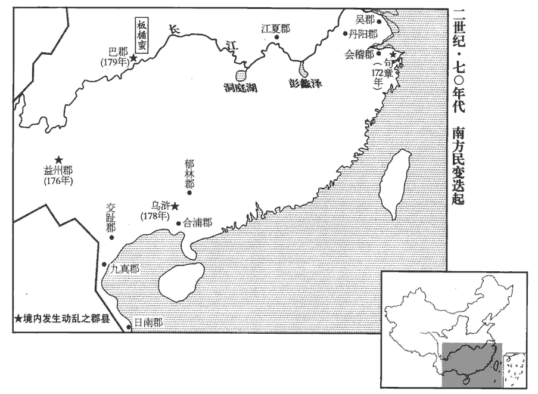

 漢紀四十九起玄黓yì困敦（壬子），盡上章涒tūn灘（庚申），凡九年。

# 孝靈皇帝上之下

## 熹平元年（壬子，一七二）

1春，正月，車駕‹刘宏，时年十七›上原陵‹河南孟津东北于家村›。司徒掾陳留蔡邕曰：「吾聞古不墓祭。朝廷有上陵之禮，始謂可損；今見威儀，察其本意，乃知孝明皇帝至孝惻隱，不易奪也。據禮儀志，西都舊有上陵，至東都則其儀文愈備，其略見四十四卷永平元年。上，時掌翻。掾，俞絹翻。易，以豉翻。禮有煩而不可省者，此之謂也。」

〖译文〗 [1]春季，正月，灵帝前往光武帝原陵祭祀。司徒掾陈留郡人蔡邕说：“我曾经听说，古代君王从不到墓前祭祀。皇帝有上陵举行墓祭的礼仪，最初认为可以减损。而今亲眼看到墓祭的威仪，体察它的本来用意，方才了解明帝的至孝隐衷，的确不能取消。有的礼仪似乎多余，但实际上是必不可少的，大概就是指此。”

2三月，壬戌‹八›，太傅胡廣薨，年八十二。廣周流四公，太傅、太尉、司徒、司空。三十餘年，賢曰：廣以順帝漢安元年為司空，至熹平元年薨，三十一年也。歷事六帝，安、順、沖、質、桓、靈。禮任極優，罷免未嘗滿歲，輒復升進。復，扶又翻。所辟多天下名士，與故吏陳蕃、李咸并為三司。三司，即三公。練達故事，明解朝章，解，戶買翻，曉也。朝，直遙翻。故京師諺曰：「萬事不理，問伯始；天下中庸，有胡公。」胡廣，字伯始。夫既曰：「萬事不理問伯始」，則當時之責望亦重矣，豈可以三十餘年周流四公為榮哉！賢曰：中，和也。庸，常也。中和可常行之德也。然溫柔謹愨què，常遜言恭色以取媚於時，無忠直之風，天下以此薄之。

〖译文〗 [2]三月壬戌（初八），太傅胡广去世，享年八十二岁。胡广，字伯始，历任太傅、太尉、司徒和司空，前后任职三十余年，曾侍奉过安、顺、冲、质、桓、灵等六个皇帝，受到极优厚的礼遇，每次被免职，不出一年，即又复职。他所聘用的大都是天下的知名人士，曾和他过去的部属陈蕃、李咸并列三公。他非常熟悉先朝的典章制度，通晓当代的朝廷规章，所以京都洛阳有谚语说：“万事不理问伯始，不偏不倚有胡公。”然而，胡广温柔敦厚，谨小慎微，以此取媚朝廷，没有忠贞正直的气节，天下的人因此而轻视他。

3五月，己巳‹十六›，赦天下，改元。

〖译文〗 [3]五月己巳（十六日），大赦天下，改年号。

4長樂太僕侯覽坐專權骄奢，策收印綬，自殺。長樂太僕，太后宮官也；主馭yù，宦者為之，秩二千石。樂，音洛。

〖译文〗 [4]长乐太仆侯览因专权跋扈和骄横奢侈获罪，灵帝下令收回印信，侯览自杀。

5六月，京師大水。

〖译文〗 [5]六月，京都洛阳发生大水灾。

6竇太后母卒於比景‹越南筝河口›，太后‹窦妙›憂思感疾，癸巳‹十›，崩於雲臺。宦者積怨竇氏，以衣車載太后尸置城南市舍，數日，曹節、王甫欲用貴人禮殯。帝曰：「太后親立朕躬，統承大業，豈宜以貴人終乎！」於是發喪成禮。

〖译文〗 [6]窦太后的母亲于比景病故，窦太后过度忧伤，思念成疾。癸巳（初十），在南宫云台去世。因宦官们对窦姓家族积怨甚深，所以用运载衣服的车，把窦太后的尸体运到洛阳城南的市舍，停放数日后，曹节、王甫想用贵人的礼仪来埋葬窦太后。灵帝说：“窦太后亲自拥立朕为皇帝，继承大业，怎么能用贵人的礼仪为她送终？”于是仍照皇太后的礼仪发丧。

節等欲別葬太后，而以馮貴人配祔fù。賢曰：祔，謂新死之主祔於先死者之廟，婦祔於其夫，所祔之妃妾祔於妾祖姑也。詔公卿大會朝堂，朝，直遙翻。令中常侍趙忠監議。監，古銜翻。太尉李咸時病，扶輿而起，擣椒自隨，孔穎達曰：釋木云：檓huǐ，大椒。郭璞曰：今椒樹叢生，實大者名為檓。陸璣疏云：椒樹如茱萸，有針刺，葉堅而滑澤，蜀人作茶，吳人作茗，皆合煮其葉以為香。今成皋山間有椒，謂之竹葉椒，其樹亦如蜀椒，少毒熱，不中合藥也，可著飲食中；又用烝雞豚，最佳香。東海諸島亦有椒樹，枝葉皆相似，子長而不圓，甚香，其味似橘皮。本草亦云：椒，大熱，有毒。按李咸擣椒自隨，齊明帝將殺高武諸孫，敕太官煮椒二斛，蓋其毒能殺人也。謂妻子曰：「若皇太后不得配食桓帝，吾不生還矣！」欲以死爭之也。既議，坐者數百人，各瞻望良久，莫肯先言。趙忠曰：「議當時定！」廷尉陳球曰：「皇太后以盛德良家，母臨天下，宜配先帝，是無所疑，」忠笑而言曰：「陳廷尉宜便操筆。」操，千高翻。球即下議曰：「皇太后自在椒房，有聰明母儀之德；遭時不造，援立聖明承繼宗廟，功烈至重。先帝晏駕，因遇大獄，遷居空宮，不幸早世，家雖獲罪，事非太后，今若別葬，誠失天下之望。且馮貴人冢嘗被發掘，骸骨暴露，與賊併尸，魂靈汙染，賢曰：段熲為河南尹，坐盜發馮貴人冢，左遷諫議大夫。余據熲以延熹三年入為侍中，轉執金吾、河南尹，則發冢之事於是年近耳。被，皮義翻。且無功於國，何宜上配至尊！」忠省球議，省，悉井翻；下同。作色俛fǔ仰，蚩球曰：「陳廷尉建此議甚健！」蚩，笑也。球曰：「陳、竇既冤，皇太后無故幽閉，臣常痛心，天下憤歎！今日言之，退而受罪，宿昔之願也！」李咸曰：「臣本謂宜爾，誠與意合。」於是公卿以下皆從球議。曹節、王甫猶爭，以為：「梁后家犯惡逆，別葬懿陵，梁后先桓帝崩，葬懿陵。梁冀誅，始廢陵為貴人冢。武帝黜廢衛后，而以李夫人配食，戾太子之亂，武帝策廢其母衛后，后自殺。武帝崩，霍光緣帝雅意，以李夫人配食。今竇氏罪深，豈得合葬先帝！」李咸復上疏曰：「臣伏惟章德竇后虐害恭懷，安思閻后家犯惡逆，竇后事見四十六卷章帝建初八年。閻后事見五十卷、五十一卷安帝延光三年、四年。復，扶又翻。而和帝無異葬之議，順朝無貶降之文。朝，直遙翻。至於衛后，孝武皇帝身所廢棄，不可以為比。今長樂太后尊號在身，親嘗稱制，且援立聖明，光隆皇祚。太后以陛下為子，陛下豈得不以太后為母！子無黜母，臣無貶君，宜合葬宣陵，一如舊制。」帝省奏，從之。省，悉景翻。考異曰：袁紀云：「河南尹李咸執藥上書曰：『昔秦始皇幽閉母后，感茅焦之言，立駕迎母，供養如初。夫以秦后之惡，始皇之悖，尚納直臣之語，不失母子之恩，豈況皇太后不以罪歿，陛下之過有重始皇！臣謹左手齎章，右手執藥，詣闕自聞。如遂不省，臣當飲鴆自裁，下覲jìn先帝，具陳得失。』章省，上感其言，使公卿更議。廷尉陳球乃下議。」與范不同，今從范書。

〖译文〗 曹节等人又打算将窦太后埋葬到别处，而把冯贵人的尸体移来和桓帝合葬。灵帝下诏，召集三公、九卿等文武百官，在朝堂上集会议论，命中常侍赵忠监督集议。当时，太尉李咸正卧病在床，挣扎着抱病上车，并且随身携带了毒药，临走时对妻子说：“倘若皇太后不能随桓帝一同祭祀，我决不活着回家！”会议开始后，与会者数百人，互相观望了很久，没有人肯先发言。赵忠催促说：“议案应当迅速确定！”廷尉陈球说：“皇太后品德高尚，出身清白，以母仪治理天下，应该配享先帝，这是毫无疑问的。”赵忠笑着说：“那就请陈廷尉赶快执笔起草议案。”陈球立即下笔写道：“窦太后身处深宫之中，天赋聪明，兼备天下之母的仪容和品德。遭逢时世艰危，窦太后援立陛下为帝，继承皇家宗庙祭祀，功勋卓著。先帝去世后，不幸兴起大狱，窦太后被迁往空宫居住，过早离开人世。窦家虽然有罪，但事情并非太后主使发动。而今倘若改葬别处，确实使天下失望。并且冯贵人的坟墓曾经被盗贼发掘过，骨骸已经暴露，与贼寇尸骨混杂，魂灵蒙受污染。何况冯贵人对国家又没有任何功劳，怎么有资格配享至尊？”赵忠看完陈球起草的议案，气得脸色大变，全身发抖，嗤笑说：“陈廷尉起草的议案真好！”陈球回答说：“陈蕃、窦武既已遭受冤枉，窦太后又无缘无故地被幽禁，我一直很痛心，天下之人无不愤慨叹息！今天，我既然已经把话说了出来，即使是会议之后遭到报复，决不后悔，这正是我一向的愿望。”太尉李咸紧接着说：“我原来就认为应该如此，陈廷尉的议案和我的意见完全相同。”于是三公、九卿以下的文武百官全都赞成陈球的意见。曹节、王甫仍继续争辩，他们认为：“梁皇后为先帝正妻，后因梁家犯恶逆大罪，将梁皇后别葬在懿陵。汉武帝废黜正妻卫皇后，而以李夫人配享。现在窦家罪恶如此深重，怎么能和先帝合葬？”太尉李咸又向灵帝上书说：“我俯伏回想，章帝窦皇后陷害梁贵人，安帝阎皇后家犯恶逆大罪，然而和帝并没有提出将嫡母窦皇后改葬别处，顺帝也没有下诏贬降嫡母阎皇后。至于废黜卫皇后，那是武帝在世时亲自作出的决定，不可以用来相比。而今长乐太后一直拥有皇太后的尊号，又曾亲身临朝治理天下，况且援立陛下为帝，使皇位光大兴隆。皇太后既然把陛下当作儿子，陛下怎能不把皇太后当作母亲？儿子没有废黜母亲的，臣属没有贬谪君王的。所以应将窦太后与先帝合葬宣陵，一切都要遵从旧制。”灵帝看了奏章，完全采纳李咸的意见。

秋，七月，甲寅‹二›，葬桓思皇后于宣陵。

〖译文〗 秋季，七月甲寅（初二），将窦太后安葬在宣陵，谥号为桓思皇后。

7有人書朱雀闕，古今註：永平二年十一月，初作北宮，朱爵，南司馬門闕，在宮門之外。言：「天下大亂，曹節、王甫幽殺太后，考異曰：舊云：「常侍侯覽多殺黨人」按時覽已死，恐誤。今去之。公卿皆尸祿，無忠言者。」詔司隸校尉劉猛逐捕，十日一會。猛以誹書言直，不肯急捕。月餘，主名不立；賢曰：不得書闕主名。猛坐左轉諫議大夫，以御史中丞段熲代之。熲乃四出逐捕，及太學游生繫者千餘人。節等又使熲以他事奏猛，論輸左校。校，戶教翻。

〖译文〗 [7]有人在朱雀门上书写，说：“天下大乱，曹节、王甫幽禁谋杀太后，三公、九卿，空受俸禄而不治事，没有人敢说忠言。”灵帝下诏，命司隶校尉刘猛负责追查搜捕，每十天作一次汇报。刘猛认为所书写的话与实际情况相符，因此不肯加紧搜捕。过了一月有余，仍然没有搜捕到书写的人犯。刘猛因此坐罪，被贬为谏议大夫，又任命御史中丞段接替刘猛。于是段派人四出追查搜捕，包括在太学游学的学生在内，逮捕和关押的有一千余人。曹节等人又指使段寻找别的借口弹劾刘猛，判处将他遣送到左校营罚服苦役。

初，司隸校尉王寓依倚宦官，求薦於太常張奐，奐拒之，寓遂陷奐以黨罪禁錮。奐嘗與段熲爭擊羌，不相平，事見上卷建寧元年。熲為司隸，欲逐奐歸敦煌而害之；奐徙屬弘農事見上卷桓帝永康元年。敦，徒門翻。奐奏記哀請於熲，乃得免。

〖译文〗 最初，前司隶校尉王寓依靠宦官的势力，曾请求太常张奂推荐，被张奂拒绝。王寓便诬陷张奂为党人，使他遭受禁锢，不许做官。而张奂跟段之间曾经因对西羌战争有过争执，互相怨恨不平。所以段担任司隶校尉以后，打算把张奂驱逐到敦煌郡，然后加以杀害。后因张奂向段写信苦苦哀求，才免于难。

初，魏郡‹河北临漳西南邺镇›李暠為司隸校尉，暠hào，古老翻。以舊怨殺扶風‹陕西兴平›蘇謙；謙子不韋瘞yì而不葬，瘞，於計翻。變姓名，結客報仇。暠遷大司農，不韋匿於廥kuài中，鑿záo地旁達暠之寢室，說文曰：廥，芻chú稾gǎo藏，音工外翻。殺其妾并小兒。暠大懼，以板藉地，一夕九徙。又掘暠父冢，斷取其頭，斷，丁管翻。標之於市。暠求捕不獲，憤恚，嘔血死。恚huì，於避翻。不韋遇赦還家，乃葬父行喪。張奐素睦於蘇氏，而段熲與暠善，熲辟不韋為司隸從事，不韋懼，稱病不詣。熲怒，使從事張賢就家殺之，先以鴆與賢父曰：「若賢不得不韋，便可飲此！」賢遂收不韋，并其一門六十餘人，盡誅之。

〖译文〗 当初，魏郡人李担任司隶校尉，因为从前的怨恨而杀害左扶风人苏谦。苏谦的儿子苏不韦将父亲的尸体浅埋在地面上，不肯入土下葬。然后，改名换姓，结交宾客，决心为父报仇。稍后，李擢升为大司农，苏不韦躲藏在草料库中，挖掘地道，一直通到李的卧室，杀死李的妾和幼儿。李十分恐惧，用木板遍铺地面，一夜之间，搬动九次。苏不韦又挖掘李父亲的坟墓，砍下死尸的头，悬挂到集市上。李请求官府派人缉捕，未能抓获，他愤恨以极，竟至吐血而死。后来，苏不韦遇到朝廷颁布赦令，才敢回到家乡，安葬父亲，举行丧礼。张奂一向和苏家和睦，而段和李亲善。段延聘苏不韦为司隶从事，苏不韦感到恐惧，声称有病不肯就职。段勃然大怒，派遣从事张贤在苏家将苏不韦杀死。行前，段先将一杯毒酒交给张贤的父亲，并且威胁他说：“如果张贤此去杀不了苏不韦，你就把这杯毒酒喝下去！”张贤便逮捕苏不韦，连同他的一家共六十余人，全都杀死。

8勃海王悝之貶癭陶也，悝kuī，苦回翻。癭，於郢翻。因中常侍王甫求復國，許謝錢五千萬；既而桓帝遺詔復悝國，悝復國事見上卷永康元年。悝知非甫功，不肯還謝錢。中常侍鄭颯、中黃門董騰數與悝交通，颯，音立。數，所角翻。甫密司察以告段熲。司，讀曰伺。冬，十月，收颯送北寺獄，使尚書令廉忠誣奏「颯等謀迎立悝，大逆不道」，遂詔冀州‹河北中部南部›刺史收悝考實，迫責悝，令自殺；妃妾十一人、子女七十人、伎女二十四人皆死獄中，伎，渠綺翻。傅、相以下悉伏誅。甫等十二人皆以功封列侯。

〖译文〗 [8]勃海王刘悝当初被贬降为瘿陶王时，请托中常侍王甫游说桓帝，如果能够恢复原来的封国，愿送给五千万钱作为谢礼。不久，桓帝去世，遗诏恢复刘悝原来的封国。刘悝知道，这不是王甫的功劳，因此不肯送给王甫这笔谢钱。中常侍郑飒、中黄门董腾经常和勃海王刘悝来往，王甫秘密派人监督，将情况告诉段。冬季，十月，逮捕郑飒，羁押北寺监狱。王甫又指使尚书令廉忠诬告说：“郑飒等人阴谋迎立勃海王刘悝当皇帝，大逆不道。”于是灵帝下诏，命冀州刺史逮捕刘悝，就地审问核实，责令他自杀。刘悝的妃妾十一人、子女七十人，歌舞伎女二十四人，全都死在狱中。封国太傅、宰相以下官吏，全都伏诛。王甫等十二人都因此有功被朝廷封为列侯。

9十一月，會稽‹绍兴›妖賊許生起句章‹浙江余姚东南›，句章縣，屬會稽郡。賢曰：故城在今越州鄮mào縣西。十三州志曰：句踐之地，南至句無，其後併吳，因大城之，章霸功，以示子孫，故曰句章。妖，於驕翻。句，音章句之句。自稱陽明皇帝，眾以萬數，遣揚州‹安徽中部及江南›刺史臧旻mín、丹陽‹安徽宣城›太守陳寅討之。

〖译文〗 [9]十一月，会稽郡妖贼许生在句章县聚众起兵，自称“阳明皇帝”，部众多达以万计数。朝廷派遣扬州刺史臧、丹阳郡太守陈寅率军前往讨伐。

 

10十二月，司徒許栩罷；以大鴻臚袁隗wěi為司徒。隗，五罪翻。考異曰：袁紀在四年。今從范書。

〖译文〗 [10]十二月，司徒许栩被罢免，擢升大鸿胪袁隗为司徒。

11鮮卑寇并州‹山西›。

〖译文〗 [11]鲜卑侵犯并州。

12是歲，單于車兒死，子屠特若尸逐就單于立。車，昌遮翻。

〖译文〗 [12]同年，南匈奴汗国伊陵若尸逐就单于栾提车儿去世，儿子继位，号为屠特若尸逐就单于。

## 二年（癸丑，一七三）

1春，正月，大疫。

〖译文〗 [1]春季，正月，发生大瘟疫。

2丁丑‹二十七›，司空宗俱薨。

〖译文〗 [2]丁丑（二十七日），司空宗俱去世。

3二月，壬午‹三›，赦天下。

〖译文〗 [3]二月壬午（初三），大赦天下。

4以光祿勳楊賜為司空。

〖译文〗 [4]擢升光禄勋杨赐为司空。

5三月，太尉李咸免。

〖译文〗 [5]三月，太尉李咸被免官。

6夏，五月，以司隸校尉段熲為太尉。

〖译文〗 [6]夏季，五月，擢升司隶校尉段为太尉。

7六月，北海‹山东昌乐西›地震。

〖译文〗 [7]六月，北海国发生地震。

8秋，七月，司空楊賜免；以太常颍川‹河南禹州›唐珍為司空。珍，衡之弟也。

〖译文〗 [8]秋季，七月，司空杨赐被免官，擢升太常颍川郡人唐珍为司空。唐珍是唐衡的弟弟。

9冬，十二月，太尉段熲罷。

〖译文〗 [9]冬季，十二月，太尉段被罢免。

10鮮卑寇幽‹河北北及辽宁›、并‹山西›二州。

〖译文〗 [10]鲜卑侵犯幽州、并州。

11癸酉晦‹二十九›，日有食之。

〖译文〗 [11]癸酉晦（二十九日），发生日食。

## 三年（甲寅，一七四）

1春，二月，己巳‹二十六›，赦天下。

〖译文〗 [1]春季，二月己巳（十六日），大赦天下。

2以太常東海‹山东郯城›陳耽為太尉。

〖译文〗 [2]擢升太常东海郡陈耽为太尉。

3三月，中山穆王暢薨，無子，國除。暢，中山簡王焉之曾孫。焉，光武子。考異曰：本傳云：「子節王稚嗣，無子，國除。」與帝紀異，未知孰是，又不知稚薨在何年，今且從帝紀。

〖译文〗 [3]三月，中山王刘畅去世，无子继承，封国被撤除。

4夏，六月，封河間王利子康為濟南王，奉孝仁皇祀。帝入繼大宗，故以康奉孝仁皇祀。利，帝從兄弟也。濟，子禮翻。

〖译文〗 [4]夏季，六月，封河间王刘利的儿子刘康为济南王，侍奉灵帝父亲、孝仁皇刘苌的祭祀。

5吳郡‹江苏苏州›司馬富春‹浙江富阳›孫堅召募精勇，得千餘人，助州郡討許生。百官志，郡有丞、長史，而無司馬。蓋是時以盜起，置司馬以主兵也。富春縣，屬吳郡。賢曰：今杭州富陽縣也，避晉簡文帝母鄭太后諱，改曰富陽。冬，十一月，【張：「月」下脫「堅從」二字。】臧旻mín、陳寅大破生於會稽‹绍兴›，斬之。會，工外翻。

〖译文〗 [5]吴郡司马富春县人孙坚招募精锐强悍的勇士，集结千余人，帮助州郡官府讨伐妖贼许生。冬季，十一月，臧、陈寅在会稽郡大破许生，并将许生斩杀。

6任城‹山东济宁东南›王博薨，無子，國絕。桓帝延熹四年，博紹封任城國。

〖译文〗 [6]任城王刘博去世，无子继承，封国撤销。

7十二月，鮮卑入北地‹陕西耀县›，太守夏育率屠各追擊，破之。守，式又翻。夏，戶雅翻。屠，直於翻。遷育為護烏桓校尉。鮮卑又寇并州‹山西›。

〖译文〗 [7]十二月，鲜卑攻入北地郡，太守夏育率领屠各兵前往追击，将其击破。夏育被朝廷擢升为护乌桓校尉。鲜卑又侵犯并州。

8司空唐珍罷，以永樂少府許訓為司空。永樂少府，董太后宮官也。樂，音洛。

〖译文〗 [8]司空唐珍被罢免，擢升永乐少府许训为司空。

## 四年（乙卯，一七五）

1春，三月，詔諸儒正五經文字，命議郎蔡邕為古文、篆、隸三體書之，刻石，立于太學門外。雒陽記曰：太學在雒陽城南開陽門外，講堂長十丈，廣二丈，堂前石經四部，本碑凡四十六枚。西行，尚書、周易、公羊傳十六碑存，十二碑毀。南行，禮記十五碑悉崩壞。東行，論語三碑毀。禮記碑上有諫議大夫馬日磾dī、議郎蔡邕名。古文，科斗書也。篆zhuàn，大篆也。隸，今謂之八分書。後魏江式曰：伏羲氏作而八卦形其畫，軒轅氏興而靈龜彰其采。古史蒼頡覽二象之爻，觀鳥獸之迹，別刱chuàng文字，以代結繩。迄於三代，厥體頗異。雖依類取制，未能殊蒼氏矣。周禮：保氏教國子以六書：一曰指事，二曰象形，三曰形聲，四曰會意，五曰轉注，六曰假借。蓋是史頡之遺法。及宣王太史史籀zhòu著大篆十五篇，與古文或同或異，時人即謂之籀書。孔子修六經，左丘明述春秋，皆以古文。七國殊軌，文字乖別；秦兼天下，李斯奏罷不合秦文者。斯作蒼頡篇，車府令趙高作爰歷篇，太史令胡母敬作博學篇，皆取史籀，或頗有省改，所謂小篆者也。秦燒經書，滌除舊典，官獄繁多，以趣約易，始用隸書，古文由此息矣。隸書者，始皇使下杜人程邈附於小篆所作也。世人以邈徒隸，即謂之隸書。故秦有八體：一曰大篆，二曰小篆，三曰符書，四曰蟲書，五曰摹mó印，六曰署書，七曰殳shū書，八曰隸書。漢興有尉律學，教以籀zhòu書，又習八體。又有草書，莫知誰始，其書形雖無厥誼，亦是一時之變通也。孝宣時，召通蒼頡讀者，獨張敞從受之。涼州刺史杜業、沛人爰禮、講學大夫秦近亦能言之。孝平時，徵禮等百餘人說文字於未央宮中，黃門侍郎揚雄採以作訓纂zuǎn。亡新居攝，使大司馬甄豐校文字之部，頗改定古文，時有六書：一曰古文，孔子壁中書也；二曰奇字，即古文而異者；三曰篆書，云小篆也；四曰佐書，秦隸書也；五曰繆篆，所以摹mó印也；六曰鳥蟲，所以書幡信也。壁中書者，魯恭王壞孔子宅，而得尚書、春秋、論語、孝經也。又北平侯張蒼獻春秋左氏傳，書體與孔氏相類，即前代之古文矣。後漢，郎中扶風曹喜號曰工篆，小異斯法，而甚精巧，自是後學，皆其法也。又詔侍中賈逵修理舊文，殊藝異術，王教一端，苟有可以加於國者，靡不悉集。逵，即汝南許慎古學之師也。慎嗟時人之好奇，歎俗儒之穿鑿，撰說文解字十五篇，類聚群分，雜而不越，最可得而論也。左中郎將陳留蔡邕採李斯、曹喜之法，為古今雜形。詔於太學立石碑，刊載五經，題書楷法，多是邕書。後開鴻都，書畫奇能莫不雲集。時諸方獻篆，無出邕者。魏初，博士清河張揖著埤pí蒼、廣雅、古今字詁gǔ，綴拾遺漏，增長事類，抑於文為益，然其字詁gǔ方之許篇，古今體用，或得或失。陳留邯郸淳亦與揖同時，善倉、雅、許氏字指，八體六書，精究閑理，有名於揖，又建三字石經於漢碑西，較之說文篆隸大同，而古字小異。又有京兆韋誕、河東衛覬jì二家，并號能篆，當時臺觀牓題、寶器之銘，悉是誕書，咸傳之子孫，世稱其妙。晉世，義陽王典祠令呂忱表上字林六卷，尋其況趣，附託許慎說文；而按偶章句，隱別古籀zhòu奇惑之字，文得正隸，不差篆意也。忱弟靜別放故左校令李登聲類之法，作韻集五卷，使宮商龣jiǎo徵羽各為一篇，而文字與兄便是魯、衛，音讀楚、夏，時有不同。皇魏承百王之季，世易風移，文字改變，篆形繆錯，隸體失真，俗學鄙習，復加虛造，巧談辯士，以意為疑，炫惑於時，難以釐lí改，乃曰「追來為歸，巧言為辯，小兔為䨲nóu，神虫為蠶，」如斯甚眾，皆不合孔氏古書、史籀大篆、許氏說文、石經三字也。式言字學，本末頗詳，故備著之。趙明誠金石錄曰：石經，蓋漢靈帝熹平四年所立，其字則蔡邕小字八分書也；後漢書儒林傳敘云「為古文、篆、隸三體」者，非也，蓋邕所書乃八分，而三體石經乃魏時所建也。洪氏隸續曰：石經見於范史帝紀及儒林、宦者傳，皆云五經。蔡邕、張馴傳則曰六經。惟儒林傳云：為古文、篆、隸三體書法。酈氏水經云，漢立石經於太學。魏正始中，又刻古文、篆、隸三字石經。唐志有三字石經古篆兩種，曰尚書，曰左傳。獨隋志所書異同，其目有一字石經七種，三字石經三種。既以七經為蔡邕書矣，又云魏立一字石經，乃其誤也。范蔚宗時，三體石經與熹平所鐫并列於學官，故史筆誤書其事，後人襲其譌é錯，或不見石刻，無以考正。趙氏雖以一字為中郎所書，而未見三體者。歐陽氏以三體為漢碑，而未嘗見一字者。近世方勺作泊宅編，載其弟匋táo所跋石經，亦為范史、隋志所惑，指三體為漢字。至公羊碑有馬日磾等名，乃云世用其所正定之本，因存其名。可謂謬論。北史江式云：魏邯郸淳以書教皇子，建三字石經於漢碑西。按此碑以正始年中立。漢書云：元嘉元年，度尚命邯郸淳作曹娥碑。時淳已弱冠，自元嘉至正始亦九十餘年。式以三字為魏碑則是；謂之邯郸淳所書，非也。使後儒晚學咸取正焉。碑始立，其觀視及摹mó寫者車乘日千餘兩，填塞街陌。乘，繩證翻。兩，音亮。塞，悉則翻。

〖译文〗 [1]春季，三月，灵帝下诏，命儒学大师们校正《五经》文字，命议郎蔡邕用古文、大篆、隶书三种字体书写，刻在石碑上，竖立在太学门外，使后来的儒生晚辈，都以此作为标准。石碑刚竖立时，坐车前来观看以及临摹和抄写的，每天有一千余辆之多，填满大街小巷。

2初，朝議以州郡相黨，人情比周，比，毗至翻；下同。乃制昏姻之家及兩州人士不得對相監臨，監，古銜翻。至是复有三互法，賢曰：三互，謂婚姻之家及兩州人不得交互為官也。復，扶又翻；下同。禁忌轉密，選用艱難，幽‹河北北及辽宁›、冀‹河北中、南部›二州久缺不補。蔡邕上疏曰：「伏見幽、冀舊壤，鎧、馬所出，賢曰：鎧，甲也。周禮考工記曰：燕無函。函，亦甲也。言幽、燕之地，家家皆能為函，故無函匠也。左傳曰：冀之北土，馬之所生。比年兵饑，漸至空耗。今者闕職經時，吏民延屬，比，毗至翻。延屬者，延頸而屬望也。屬，之欲翻。而三府選舉，踰月不定。臣怪問其故，云避三互。十一州有禁，當取二州而已。又，二州之士或復限以歲月，復，扶又翻；下同。狐疑遲淹，兩州懸空，萬里蕭条，無所管繫。愚以為三互之禁，禁之薄者。今但申以威靈，明其憲令，對相部主，冀州之人刺幽州，幽州之人刺冀州，是為對相部主。尚畏懼不敢營私；況乃三互，何足為嫌！昔韓安國起自徒中，韓安國，梁人，坐法抵罪，梁內史缺，天子遣使拜為梁內史，起徒中為二千石。朱買臣出於幽賤，朱買臣，吳人，家貧，賣薪以自給，後隨計吏至長安，拜會稽太守。并以才宜，還守本邦，豈復顧循三互，繫以末制乎！臣願陛下上則先帝，蠲juān除近禁，其諸州刺史器用可換者，無拘日月、三互，以差厥中。」朝廷不從。

〖译文〗 [2]最初，朝廷集议，因州郡之间互相勾结，徇私舞弊，于是制定法律，规定有婚姻关系的家庭，以及两州的人士，不得互相担任负责督察对方的上官。到现在，更制定“三互法”，禁忌更加严密，朝廷选用州郡等地方官员时非崐常艰难。所以，幽州、冀州的刺史，职位空缺很久，一直找不到合适的人选来接任。于是蔡邕上书说：“我俯伏观察，幽州、冀州故土，本来是盛产铠甲和骑马的地方，连年以来，遭受兵灾和饥馑，逐渐使得两州的物力和财力损耗殆尽。而今两州刺史职位长期空缺，官吏和人民都延颈盼望。可是三公推荐的人选，却长期不能确定。我深感奇怪，打听原因何在，据有关官吏回答说，是为了避免‘三互法’。其他十一州也都同样存在禁止‘三互法’的问题，非独这两州应当禁止而已。此外，这两州的人士，有的又因受年资的限制，狐疑不定，拖延时间。结果，使两州刺史的职位长期空缺，万里疆域一片萧条，没有人去管理。我认为，‘三互法’不过是最轻微的禁令。而今只要利用朝廷的威权，申明国家的法令，即使是两州的人士互相交换担任刺史尚且畏惧，不敢结党营私，何况还有‘三互法’的限制，又有什么嫌疑？过去，韩安国拔起于囚徒之中，朱买臣出身于微贱家庭，都是因为他们的才能胜任，才被派回他们出身的本郡、本封国为官，难道还要顾及‘三互法’的禁忌，受这种非根本制度的束缚？我希望陛下对上效法先帝，撤消最近制定的‘三互法’禁令，对于各州刺史，凡是才能可以胜任的，应该及时任命和调换，不再受年资、‘三互法’的限制，使之成为定制。”朝廷不肯听从。

臣光曰：叔向有言：「國將亡，必多制。」左傳叔向詒yí子產書之言也。明王之政，謹擇忠賢而任之，凡中外之臣，有功則賞，有罪則誅，無所阿私，法制不煩而天下大治。治，直吏翻。所以然者何哉？執其本故也。及其衰也，百官之任不能擇人，而禁令益多，防閑益密，有功者以閡文不賞，閡hé，與礙ài同。為姦者以巧法免誅，上下勞擾而天下大亂。所以然者何哉？逐其末故也。孝靈之時，刺史、二千石貪如豺虎，暴殄烝民，而朝廷方守三互之禁。以今視之，豈不適足為笑而深可為戒哉！

〖译文〗 臣司马光曰：叔向曾经说过：“国家行将灭亡，法令规章一定繁多。”圣明君王治理国家，谨慎选择忠良贤能加以任用。无论是对朝廷和地方的臣属，凡是有功的加以奖赏，有罪的则加以诛杀，没有任何偏袒。法令规章并不繁多，却能做到天下大治。为什么会如此？是因为抓住了治理国家的根本。等到国家行将衰败灭亡之时，文武百官不能选择合适的人才担任，各种禁令愈来愈多，防范措施也愈来愈严密。有功的因碍于条文得不到奖赏，作奸犯罪的却巧妙地利用法律，得以免除诛杀，上下劳苦骚扰，天下反而大乱。为什么会如此？是因为治理国家舍本逐末的缘故。汉灵帝时，州刺史、郡太守贪婪暴虐，如狼似虎，残害人民，无以复加。然而，朝廷却还在严格遵守“三互法”的禁令，以防止官吏结党营私。现在回顾起来，岂不正好是一场笑话，应该深深地引为鉴戒。

3封河間王建孫佗為任城王。佗，帝從兄弟之子也。佗，徒河翻。任，音壬。

〖译文〗 [3]封河间王刘建的孙子刘佗为任城王。

4夏，四月，郡、國七大水。

〖译文〗 [4]夏季，四月，有七个郡、封国发生大水灾。

5五月，丁卯‹一›，赦天下。

〖译文〗 [5]五月丁卯（初一），大赦天下。

6延陵‹陕西咸阳北›園災。延陵，成帝‹刘骜›陵也。

〖译文〗 [6]汉成帝陵园延陵失火。

7鮮卑寇幽州。

〖译文〗 [7]鲜卑侵犯幽州。

8六月，弘農‹河南灵宝东北›、三輔螟。

〖译文〗 [8]六月，弘农郡和三辅地区螟虫成灾。

9于窴‹新疆和田›王安國攻拘彌‹新疆于田›，大破之，殺其王。窴，徒賢翻。戊己校尉、西域長史各發兵輔立拘彌侍子定興為王，人眾裁千口。

〖译文〗 [9]于阗王国国王安国攻打拘弥王国，大破拘弥军。斩杀拘弥王。戊己校尉、西域长史分别出兵援救，并帮助拥立拘弥王国送到朝廷当人质的王子定兴为拘弥王国的国王，全国的人口只有一千人。

## 五年（丙辰，一七六）

1夏，四月，癸亥，赦天下。

〖译文〗 [1]夏季，四月癸亥（疑误），大赦天下。

2益州‹云南晋宁东晋城镇›郡夷反，太守李顒yóng討平之。顒，魚容翻。

〖译文〗 [2]益州郡夷族起兵反叛，太守李率军前往讨伐，将其平定下去。

3大雩yú。

〖译文〗 [3]朝廷举行祈雨祭祀大典。

4五月，太尉陳耽罷；以司空許訓為太尉。

〖译文〗 [4]五月，太尉陈耽被罢免，任命司空许训为太尉。

5閏月，永昌‹云南保山›太守曹鸞上書曰：「夫黨人者，或耆年淵德，或衣冠英賢，皆宜股肱王室，左右大猷yóu者也；而久被禁錮，辱在塗泥。被，皮義翻。謀反大逆尚蒙赦宥，黨人何罪，獨不開恕乎！所以災異屢見，見，賢遍翻。水旱荐臻，皆由於斯。宜加沛然，以副天心。」帝‹刘宏，时年二十一›省奏，大怒，省，悉井翻。即詔司隸、益州檻車收鸞，送槐里獄‹陕西兴平›，掠殺之。永昌郡，屬益州刺史。而扶風槐里縣，屬司隸。蓋詔益州收鸞，而司隸送槐里獄。掠，音亮。於是詔州郡更考黨人門生、故吏、父子、兄弟在位者，悉免官禁錮，爰及五屬。賢曰：謂斬衰、齊衰、小功、大功、緦麻也。

〖译文〗 [5]闰月，永昌郡太守曹鸾上书说：“所谓党人，有的是老年高德，有的是士大夫中的英俊贤才，都应该辅佐皇室，在陛下左右参与朝廷的重大决策。然而竟被长期禁锢，不许做官，甚至被驱逐到泥泞地带，备受羞辱。犯了谋反大逆的重罪，尚且能蒙陛下的赦免，党人又有什么罪过，独独不能受到宽恕？之所以灾异经常出现，水灾和旱灾接踵而至，原因都由于此。陛下应该赐下恩典，以符合上天的心意。”灵帝看完奏章，勃然大怒，立即下诏，命司隶和益州官府逮捕曹鸾，用囚车押到京都洛阳监禁，严刑拷打而死。于是灵帝又下诏各州、各郡官府，重新调查党人的学生门徒、旧时的部属、父亲、儿子、兄弟，凡是当官的，全都被免职，加以禁锢，不许再做官。这种处分，扩大到包括党人同一家族中五服之内的亲属。

6六月，壬戌‹三›，以太常南陽‹河南南陽›劉逸為司空。

〖译文〗 [6]六月壬戌（初三），擢升太常南阳郡人刘逸为司空。

7秋，七月，太尉許訓罷；以光祿勳劉寬為太尉。

〖译文〗 [7]秋季，七月，太尉许训被罢免，擢升光禄勋刘宽为太尉。

8冬，十月，司徒袁隗wěi罷；十一月，丙戌，以光祿大夫楊賜為司徒。

〖译文〗 [8]冬季，十月，司徒袁隗被罢免。十一月丙戌（疑误），擢升光禄大夫杨赐为司徒。

是岁，鲜卑寇幽州。

〖译文〗 [9]同年，鲜卑侵犯幽州。

## 六年（丁巳，一七七）

1春，正月辛丑‹十五›，赦天下。

〖译文〗 [1]春季，正月辛丑（十五日），大赦天下。

2夏四月，大旱。七州蝗。

〖译文〗 [2]夏季，四月，大旱，有七个州蝗虫成灾。

令三公條奏長吏苛酷貪污者，罷免之。平原‹山东平原›相漁陽‹北京密云›陽球坐嚴酷，徵詣廷尉。姓譜：齊人遷陽，子孫以國為氏。一曰：周景王封少子於陽樊，因邑命氏。考異曰：本傳：司空張顥hào條奏。按顥，光和元年為太尉，未嘗為司空。球，光和元年陷蔡邕時，已為將作大匠，不知被徵果在何年，唯熹平五年、六年、大旱，故附於此。帝以球前為九江‹安徽定远西北›太守討贼有功，球傳云：九江山贼起，三府上球有理姦才，拜九江太守。球到，設方略，凶贼殄破。特赦之，拜議郎。

〖译文〗 灵帝下诏，命三公分别举奏苛刻酷虐和贪污的地方官员，一律将他们罢免。平原国宰相渔阳郡人阳球被指控为严刑酷罚，征召回京都洛阳，送往廷尉处治罪。灵帝因阳球从前担任九江郡太守时，讨伐盗贼建立过功勋，特别下令将他赦免，任命他为议郎。

3鮮卑‹河北尚義南大青山›寇三邊。鮮卑强盛，東西北三邊，皆被寇也。

〖译文〗 [3]鲜卑侵犯东、西、北等三边。

4市賈小民相聚為宣陵‹刘志›孝子者數十人，詔皆除太子舍人。宣陵，桓帝陵。百官志：太子舍人秩二百石，更直宿衛，如三署郎中。賈，音古。

〖译文〗 [4]京都洛阳有数十名小市民共同聚集到桓帝陵园宣陵，自称是“宣陵孝子”。灵帝下诏，一律将他们任命为太子舍人。

5秋，七月，司空劉逸免；以衛尉陳球為司空。

〖译文〗 [5]秋季，七月，司空刘逸被免官，擢升卫尉陈球为司空。

6初，帝好文學，好，呼到翻。自造皇羲篇五十章，因引諸生能為文賦者并待制鴻都門下；後諸為尺牘及工書鳥篆者，賢曰：說文曰：牘，書板也，長二尺。藝文志曰：六體者，古文、奇字、篆書、隸書、繆篆、蟲書。音義曰：古文，謂孔子壁中書也。奇字，即古文而異者也。篆書，謂小篆，蓋秦始皇使程邈所作也。隸書亦程邈所獻，主於徒隸，從簡易也。繆篆，謂其文屈曲纏繞，所以摹印章。蟲書，謂為蟲鳥之形，所以書旛信也。皆加引召，遂至數十人。侍中祭酒樂松、賈護多引無行趣勢之徒置其間，百官志：侍中有僕射一人，中興轉為祭酒。行，下孟翻。趣，七喻翻。憙陳閭里小事；憙，許記翻。帝甚悅之，待以不次之位；又久不親行郊廟之禮。會詔群臣各陳政要，蔡邕上封事曰：「夫迎氣五郊，清廟祭祀、養老辟雍，迎氣五郊及養老辟雍，註并見四十四卷明帝永平二年。漢宗廟一歲五祀，春以正月，夏以四月，秋以七月，冬以十月及臘。皆帝者之大業，祖宗所祗zhī奉也。而有司數以蕃國疏喪、宮內產生及吏卒小汙，疏喪，謂疏屬之喪也。賢曰：小汙，謂病及死也。數，所角翻。廢闕不行，忘禮敬之大，任禁忌之書，拘信小故，以虧大典。自今齋制宜如故典，漢制：凡齋，天地七日，宗廟、山川五日，小祀三日。齋日內有汙染解齋，副倅cuì行禮；先齋一日有汙穢災變，齋祀如儀。庶答風霆、災妖之異。妖，於驕翻。又，古者取士必使諸侯歲貢，尚書大傳曰：古者諸侯之於天子，三歲一貢士。孝武之世，郡舉孝廉，又有賢良、文學之選，於是名臣輩出，文武并興。漢之得人，數路而已。賢曰：數路，謂孝廉、賢良、文學之類也。夫書畫辭賦，才之小者；匡國治政，未有其能。治，直之翻；下同。陛下即位之初，先涉經術，聽政餘日，觀省篇章，省，悉井翻。聊以游意當代博弈，非以為教化取士之本。而諸生競利，作者鼎沸，其高者頗引經訓風喻之言，下則連偶俗語，有類俳pái優，或竊成文，虛冒名氏。臣每受詔於盛化門，差次錄第，其未及者，亦復隨輩皆見拜擢。既加之恩，難復收改，但守奉祿，於義已弘，不可復使治民，復，扶又翻。及在州郡。昔孝宣會諸儒於石渠‹石渠观，长安未央宫北›，事見二十七卷甘露三年。章帝集學士於白虎‹白虎观，洛阳北宫›，事見四十六卷建初四年。通經釋義，其事優大，文武之道，所宜從之。若乃小能小善，雖有可觀，孔子以為致遠則泥，君子固當志其大者。賢曰：子夏曰：雖小道，必有可觀者焉，致遠恐泥。鄭玄註云：小道，如今諸子書也。泥，謂滯陷不通。邕以為孔子之言，當別有所據也。泥，乃計翻。又，前一切以宣陵孝子為太子舍人，臣聞孝文皇帝制喪服三十六日，事見十四卷文帝後七年。雖繼體之君，父子至親，公卿列臣受恩之重，皆屈情從制，不敢踰越。今虛偽小人，本非骨肉，既無幸私之恩，又無祿仕之實，恻隱之心，義無所依。至有姦軌之人通容其中；桓思皇后‹窦妙›祖載之時，鄭玄曰：祖，謂將葬，祖祭於庭。載，謂升柩於車也。東郡‹河南濮阳西南›有盜人妻者，亡在孝中，本縣追捕，乃伏其辜。虛偽雜穢，難得勝言。勝，音升。太子官屬，宜搜選令德，豈有但取丘墓凶醜之人！其為不祥，莫與大焉，言雖它有不祥，莫與比并大也。宜遣歸田里，以明詐偽。」書奏，帝‹刘宏，时年二十二›乃親迎氣北郊及行辟雍之禮。又詔宣陵孝子為舍人者悉改為丞、尉焉。漢縣置丞、尉。丞，署文書，典知倉獄。尉，主盜賊。

〖译文〗 [6]起初，灵帝喜好文学创作，自己撰写《皇羲篇》五十章，遴选太学中能创作辞赋的学生，集中到鸿都门下，等待灵帝的诏令。后来，善于起草诏书和擅长书写鸟篆的人，也都加以征召引见，便达到数十人之多。侍中祭酒乐松、贾护，又引荐了许多没有品行，趋炎附势之徒，夹杂在他们中间。每当灵帝召见时，喜欢说一些民间街头巷尾的琐碎趣事，灵帝非常喜悦，于是不按照通常的次序，往往对他们越级擢升。而灵帝很久没有亲自前往宗庙祭祀祖宗，到郊外祭祀天地。正好遇到灵帝下诏，命朝廷文武百官分别上书陈述施政的要领，于是蔡邕上密封奏章说：“迎接四季节气于五郊，到宗庙去祭祀祖宗，在太学举行养老之礼，都是皇帝的重大事情，受到祖宗们的重视。可是有关官吏却多次借口血缘关系已经非常疏远的王、侯们的丧事，或者皇宫内妇女生小孩，以及吏卒患病或死亡，而停止举行这些大典。结果，忘却了礼敬天地神明和祖宗这一类大事，专门听信那些禁忌之书，拘泥于小事，以致减损和毁坏国家大典。从今以后，一切斋戒制度都应恢复正常，以平息上天震怒和妖异灾变。此外，古代朝廷任用官员，总是命令各国诸侯定期向天子推荐。到汉武帝时期，除了由每郡官府推荐孝廉以外，还遴选贤良、文学等科目的人才，于是著名的大臣不断出现，文官武吏都很兴盛。汉王朝遴选国家官吏，也只不过是通过这几个渠道而已。至于书法、绘画、辞赋，不过是小小的才能，对于匡正国家，治理政事，则无能为力。陛下即位初期，先行涉猎儒家经学，在处理朝廷政事的空暇时间，观看文学作品，不过是用来代替赌博、下棋，当作消遣而已，并不是把它作为教化风俗和遴选人才的标准。然而，太学的学生们竞相贪图名利，写作的人情绪沸腾，其中高雅的，还能引用儒家经书中有益教化的言论；而庸俗的，却通篇是俚语俗话，好象艺人的戏文；有些人甚至抄袭别人的文章，或冒充别人的姓名。我每次在盛化门接受诏书，看到对他们分别等级一一录用，其中一些实在不够格的人，也都追随他们的后面，得到任命或擢升。恩典既已赏赐，难以重新收回更改，准许他们领取俸禄，已是宽宏大量，不能再任命他们做官，或者派遣他们到州郡官府任职。过去，汉宣帝在石渠阁会聚诸儒，汉章帝在白虎观集中经学博士，统一对经书的解释，这是非常美好的大事，周文王、武王的圣王大道，应该遵从去做。倘若是小的才能、小的善行，虽然也有它的价值，但正如孔丘所认为的那样，从长远的观点观察却行不通。所以，正人君子应当追求远大的目标。还有，不久之前，陛下把‘宣陵孝子’一律任命他们为太子舍人。我曾经听说过，汉文帝规定，服丧只需三十六日，即令是继承帝位的皇帝，又是父子至亲，以及身受重恩的三公、九卿等文武大臣，都要克制自己的感情，遵守这项制度，不得超越。而今这批弄虚作假的市井小人，跟先帝并非骨肉之亲，既没有受过先帝的厚恩，又没有享受过官位和俸禄，他们的孝心，从道理上说没有任何依据。甚至有一些为非作歹的人，也乘机混到里面。窦太后的棺柩抬上丧车时，东郡有一位犯通奸罪的逃亡犯混进孝子行列之中，幸而被原籍的县府追查逮捕，他才服罪。象这一类弄虚作假的肮脏行径，难以胜数。皇太子的属官，应该挑选有美德的人士担任，岂能专门录用坟墓旁的凶恶丑陋之徒？这种不吉祥的征兆，没有比它更大的了。应该把他们都遣归故乡，以便辨明诈骗和虚伪的奸佞小人。”奏章呈上去后，于是灵帝亲自到崐北郊举行迎接节气的祭祀，以及前往太学主持典礼。又下诏，凡是“宣陵孝子”被任命为太子舍人的，一律改任县级丞、尉。

7護烏桓校尉夏育上言：校，戶教翻。夏，戶雅翻。上，時掌翻。「鮮卑寇邊，自春以來三十餘發，請徵幽州諸郡兵出塞擊之，一冬、二春，必能禽滅。」先是護羌校尉田晏坐事論刑，先，悉薦翻。被原，被，皮義翻。欲立功自效，乃請中常侍王甫求得為將。甫因此議遣兵與育并力討贼，帝乃拜晏為破鮮卑中郎將；大臣多有不同；乃召百官議於朝堂。蔡邕議曰：「征討殊類，所由尚矣。然而時有同異，勢有可否，故謀有得失，事有成敗，不可齊也。夫以世宗神武，將帥良猛，財賦充實，所括廣遠，數十年間，官民俱匱，猶有悔焉。謂輪臺哀痛之詔也。況今人財并乏，事劣昔時乎！自匈奴遁逃，鮮卑強盛，據其故地，事見四十七卷和帝永元五年。稱兵十萬，才力勁健，意智益生；加以關塞不嚴，禁網多漏，精金良鐵，皆為賊有，漢人逋bū逃為之謀主，兵利馬疾，過於匈奴。昔段熲良將，習兵善戰，有事西羌，猶十餘年。段熲自桓帝延熹二年擊西羌，至建寧二年始成功，凡十一年。今育、晏才策未必過熲，鮮卑種眾不弱曩時，種，章勇翻。而虚计二载，载，子亥翻。自许有成，若祸结兵连，岂得中休，当复征发众人，转运无已，复，扶又翻。是為耗竭諸夏，并力蠻夷。夫邊垂之患，手足之疥搔，中國之困，胸背之瘭biāo疽jū，賢曰：疥，音介。搔，新到翻。埤pí蒼曰：瘭，必燒翻。杜預註左傳曰：疽，惡瘡也。方今郡縣盜賊尚不能禁，況此醜虜而可伏乎！昔高祖忍平城之恥，呂后棄慢書之詬，詬，古候翻，恥也。方之於今，何者為盛？天設山河，秦築長城，漢起塞垣，所以別內外，異殊俗也。別，彼列翻。苟無䠞國內侮之患則可矣，䠞，與蹙同。豈與蟲螘yǐ之虜螘，與蟻同。校往來之數哉！雖或破之，豈可殄盡，而方令本朝為之旰食乎！為，于偽翻；下同。旰gàn，晚也，音古按翻。昔淮南王安諫伐越曰：『如使越人蒙死以逆執事，廝輿之卒有一不備而歸者，前書音義曰：廝，微也。輿，眾也。雖得越王之首，猶為大漢羞之。』而欲以齊民易醜虜，皇威辱外夷，就如其言，猶已危矣，況乎得失不可量邪！」量，音良。帝不從。八月，遣夏育出高柳‹山西阳高›，田晏出雲中‹内蒙托克托›，匈奴中郎將臧旻mín率南單于出鴈門，各將萬騎，三道出塞二千餘里。檀石槐命三部大人各帥眾逆戰，檀石槐分其國為三部，見五十五卷桓帝延熹九年。帥，讀曰率。育等大敗，喪其節傳輜重，喪，息浪翻。傳，株戀翻。重，直用翻。各將數十騎奔還，死者什七八。三將檻車徵下獄，下，遐稼翻。贖為庶人。

〖译文〗 [7]护乌桓校尉夏育上书说：“鲜卑侵犯边界，自春季以来，已经发动了三十余次进攻。请求征调幽州各郡的郡兵出塞进行反击，只需经过一个冬季、两个春季，一定能够将他们完全擒获歼灭。”在此之先，护羌校尉田晏因事坐罪判刑，受到恕免，打算立功报答朝廷；于是请托中常侍王甫，请求朝廷准许他为将，率军出击。因此，王甫极力主张派兵和夏育联合进军，讨伐鲜卑。灵帝便任命田晏为破鲜卑中郎将。可是大臣多半反对派兵，于是召集文武百官在朝常上集议。蔡邕发表意见说：“征讨外族，由来久远。然而时间有同有异，形势有可有不可，所以谋略有得有失，事情有成功有失败，不能等量齐观。以汉武帝的神明威武，将帅优良勇猛，财物军赋都很充实，开拓的疆土广袤辽远，然而经过数十年的时间，官府和人民都陷于贫困，尚且深感后悔。何况今天，人财两缺，和过去相比国力又处于劣势！自从匈奴向远方逃走以后，鲜卑日益强盛，占据了匈奴汗国的故土，号称拥有十万军队，士卒精锐勇健，智谋层出不穷。加上边关要塞并不严密，法网禁令多有疏漏，各种精炼的金属和优良的铁器，都外流到敌人手里。汉族人中的逃犯成为他们的智囊。他们的兵器锐利，战马迅疾，都已超过了匈奴。过去，段是一代良将，熟悉军旅，骁勇善战。然而，对西羌的战事，仍持续了十余年之久。而今夏育、田晏才能和谋略未必超过段，而鲜卑民众的势力却不弱于以往。竟然凭空提出两年的灭敌计划，自认为可以成功。倘若兵连祸结，就不能中途停止，不得不继续征兵增援，不断转运粮秣，结果为了全力对付蛮夷各族，使内地虚耗殆尽。边疆的祸患，不过是生在手脚上的疥癣一类的小患，内地困顿，才是生在胸背上毒疮一类的大患。而今郡县的盗贼尚且无法禁止，怎能使强大的外族降服？过去，高帝忍受平城失败的羞耻，吕太后忍受匈奴单于傲慢书信的侮辱，和今天相比，哪个时代强盛？上天设置山河，秦王朝修筑长城，汉王朝建立关塞亭障，用意就在于隔离内地和边疆，使不同风俗习惯的民族远远分开。只要国家内地没有紧迫和忧患的事就可以了，岂能和那种昆虫、蚂蚁一样的野蛮人计较长短？即使能把他们打败，又岂能把他们歼灭干净，使朝廷高枕无忧？过去，淮南王刘安劝阻讨伐闽越王国时说过：”如果闽越王国冒死迎战，打柴和驾车的士卒只要有一个受到伤害，虽然砍下闽越国王的人头，还是为大汉王朝感到羞耻。‘而竟打算把内地的人民和边疆的外族等量齐观，将皇帝的威严受辱于边民，即便能象夏育、田晏所说的那样，尚且仍有危机，何况得失成败又不可预料？“灵帝不肯听从。八月，派遣夏育大军出高柳，田晏大军出云中，匈奴中郎将臧率领南匈奴屠特若尸逐就单于出雁门，各率骑兵一万余人，分三路出塞，深入鲜崐卑国土二千余里。鲜卑酋长檀石槐命令东、中、西等三部大人各率领部众迎战。夏育等人遭到惨败，甚至连符节和辎重全都丧失，各人只率领骑兵数十人逃命奔回，死去的士卒占十分之七八。夏育、田晏、臧等三位将领被装入囚车，押回京都洛阳，关进监狱，后用钱赎罪，贬为平民百姓。

8冬，十月，癸丑朔‹一›，日有食之。

〖译文〗 [8]冬季，十月癸丑朔（初一），发生日食。

9太尉劉寬免。

〖译文〗 [9]太尉刘宽被免官。

10辛丑，京师地震。

〖译文〗 [10]辛丑（疑误），京都洛阳发生地震。

11十一月，司空陳球免。

〖译文〗 [11]十一月，司空陈球被免官。。

12十二月，甲寅‹三›，以太常河南‹洛阳东白马寺东›孟𢒰為太尉。𢒰，音乙六翻。

〖译文〗 [12]十二月甲寅（初三），擢升太常河南尹人孟为太尉。

13庚辰‹二十九›，司徒楊賜免。

〖译文〗 [13]庚辰（二十九日），司徒杨赐被免官。

14以太常陳耽為司空。

〖译文〗 [14]擢升太常陈耽为司空。

15遼西‹辽宁义县西›太守甘陵‹山东临清›趙苞到官，遣使迎母及妻子，垂當到郡；道經柳城‹辽宁朝阳›，杜佑曰：漢遼西郡故城在盧龍城東。柳城縣，屬遼西郡；賢曰：故城在今營州南。值鮮卑萬餘人入塞寇鈔，鈔，楚交翻。苞母及妻子遂為所劫質，質，音致，劫以為質也。載以擊郡。苞率騎二萬與賊對陳，陳，讀曰陣。贼出母以示苞，苞悲號，謂母曰：「為子無狀，欲以微祿奉養朝夕，不圖為母作禍。號，戶刀翻。養，羊亮翻。為，于偽翻。昔為母子，今為王臣，義不得顧私恩，毀忠節，唯當萬死，無以塞罪。」塞，悉則翻。母遙謂曰：「威豪，趙苞，字威豪。人各有命，何得相顧以虧忠義，爾其勉之！」苞即時進戰，賊悉摧破，其母妻皆為所害。苞自上歸葬，自上奏乞歸葬也。上，時掌翻。帝遣使弔慰，封鄃shū侯。鄃，音輸。苞葬訖，謂鄉人曰：「食祿而避難，非忠也；難，乃旦翻。殺母以全義，非孝也。如是，有何面目立於天下！」遂歐血而死。

〖译文〗 [15]辽西郡太守甘陵国人赵苞到任之后，派人到故乡迎接母亲和妻子，将到辽西郡城时，路上经过柳城，正遇着鲜卑一万余人侵入边塞劫掠，赵苞的母亲和妻子全被劫持作为人质，用车载着她们来攻打辽西郡城。赵苞率领骑兵二万人布阵迎战，鲜卑在阵前推出赵苞的母亲给赵苞看，赵苞悲痛号哭，对母亲说：“当儿子的罪恶实在不可名状，本来打算用微薄的俸禄早晚在您左右供养，想不到反而为您招来大祸。过去我是您的儿子，现在我是朝廷的大臣，大义不能顾及私恩，自毁忠节，只有拚死一战，否则没有别的办法来弥补我的罪恶。”母亲远望着嘱咐他说：“我儿，各人生死有命，怎能为了顾及我而亏损忠义？你应该尽力去做。”于是赵苞立即下令出击，鲜卑全被摧毁攻破，可是他的母亲和妻子也被鲜卑杀害。赵苞上奏朝廷，请求护送母亲、妻子的棺柩回故乡安葬。灵帝派遣使节前往吊丧和慰问，封赵苞为侯。赵苞将母亲、妻子安葬已毕，对他家乡的人们说：“食朝廷的俸禄而逃避灾难，不是忠臣；杀了母亲而保全忠义，不是孝子。如此，我还有什么脸面活在人世？”便吐血而死。

## 光和元年（戊午，一七八）是年三月改元。

1春，正月，合浦‹广西合浦东北›、交趾‹越南河内东北北宁府›烏滸蠻反，滸，呼古翻。招引九真‹越南清化›、日南‹越南东河›民攻沒郡縣。

〖译文〗 [1]春季，正月，合浦郡、交趾郡乌浒蛮族起兵反叛，并招诱九真郡、日南郡百姓攻陷郡县。

2太尉孟𢒰yù罢。

〖译文〗 [2]太尉孟被罢免。

3二月，辛亥朔‹一›，日有食之。

〖译文〗 [3]二月辛亥朔（初一），发生日食。

4癸丑‹三›，以光祿勳陳國‹河南淮阳›袁滂為司徒。

〖译文〗 [4]癸丑（初三），擢升光禄勋陈国人袁滂为司徒。

5己未‹九›，地震。

〖译文〗 [5]己未（初九），发生地震。

6置鴻都門學，其諸生皆敕州郡、三公舉用辟召，或出為刺史、太守，入為尚書、侍中，有封侯、賜爵者；賜爵關內侯以下也。士君子皆恥與為列焉。

〖译文〗 [6]设立鸿都门学校，学生全都命各州、郡、三公推荐征召，有的被任命崐出任州刺史、郡太守，有的入皇宫担任尚书、侍中，有的被封为侯，有的被赐给关内侯以下的爵称。有志操和有学问的人，都以和这些人为伍而感到羞耻。

7三月，辛丑‹二十一›，赦天下，改元。

〖译文〗 [7]三月辛丑（二十一日），大赦天下，改年号。

8以太常常山‹河北元氏›張顥hào為太尉。顥，中常侍奉之弟也。

〖译文〗 [8]擢升太常常山国人张颢为太尉。张颢是中常侍张奉的弟弟。

9夏，四月，丙辰‹七›，地震。

〖译文〗 [9]夏季，四月丙辰（初七），发生地震。

10侍中寺雌雞化為雄。

〖译文〗 [10]侍中官署有一只母鸡变成公鸡。

11司空陳耽免；以太常來豔為司空。

〖译文〗 [11]司空陈耽被免官，擢升太常来艳为司空。

12六月，丁丑‹二十九›，有黑氣墮帝‹劉宏，時年二十三›所御溫德殿東庭中，長十餘丈，似龍‹长，直亮翻。›。

〖译文〗 [12]六月丁丑（二十九日），有一道黑气从天而降，坠落到灵帝常去的温德殿东侧庭院中，长十余丈，好象一条黑龙。

13秋，七月，壬子，青虹見玉堂後殿庭中。洛陽宮殿名，南宮有玉堂前後殿。見，賢遍翻。詔召光祿大夫楊賜等詣金商門，洛陽記曰：南宮有崇德殿、太極殿，殿西有金商門。問以災異及消復之術。消復者，消變而復其常也。賜對曰：「春秋讖曰：『天投蜺，天下怨，海內亂。』春秋演孔圖曰：霓者，斗之亂精也，失度投蜺見。郭璞註爾雅曰：雙出，色鮮盛者為雄，曰虹；闇àn者為雌，曰蜺。加四百之期，亦復垂及。春秋演孔圖曰：劉四百歲之際，褒漢王輔，皇王以期，有名不就。宋均註曰：雖褒族人為漢王以自輔，以當有應期，名見攝錄者，故名不就也。復，扶又翻。今妾媵yìng、閹尹之徒共專國朝，媵，以證翻。朝，直遙翻。欺罔日月；又，鴻都門下招會群小，造作賦說，見寵於時，更相薦說，更，工衡翻。旬月之間，并各拔擢。樂松處常伯，任芝居納言，常伯，侍中。納言，尚書。處，昌呂翻。郤xì儉、梁鵠hú各受豐爵不次之寵，姓譜：郤，晉卿郤氏之後。而令搢紳之徒委伏畎quǎn畮mǔ，畮，古畝字。口誦堯、舜之言，身蹈絕俗之行，行，下孟翻。棄捐溝壑，不見逮及。冠履倒易，陵谷代處，幸賴皇天垂象譴告。周書曰：『天子見怪則修德，諸侯見怪則修政，卿大夫見怪則修職，士庶人見怪則修身。』此逸書也。唯陛下斥遠佞巧之臣，遠，于願翻。速徵鶴鳴之士，易曰：鶴鳴在陰，其子和之；我有好爵，吾與爾靡之。繫辭曰：君子居室，言善，則千里之外應之。鶴鳴之士，言士之修身踐言，為時所稱者也。斷絕尺一，斷，丁管翻。抑止槃pán游，冀上天還威，眾變可弭。」

〖译文〗 [13]秋季，七月壬子（疑误），南宫玉堂后殿庭院中发现青色彩虹。灵帝下诏，召集光禄大夫杨赐等人到金商门，向他们询问天降灾异的原因，以及消除的方法。杨赐回答说：“《春秋谶》书上说：”天上投下彩虹，天下怨恨，海内大乱。‘再加上四百岁的周期，将要来到，而今妃嫔、侍妾以及宦官之辈共同专断国家朝政，欺罔帝王臣民。还有在鸿都门下招集一群小人，依靠写作辞赋，受到宠爱，互相推荐，不出十天到一月的时间内，每个人都得到越级提拔和擢升。乐松担任了侍中的职务，任芝做了尚书的官职，俭、梁鹄都受到封为高爵和越级提拔的荣宠。而今却令士大夫们屈身乡村田野，口中朗诵唐尧、虞舜的言论，亲自实践超出世俗之上的行为，而他们却被遗弃在水沟山谷，不能把才能贡献给国家。这是一种帽子和鞋子颠倒穿戴，山陵和深谷交换位置的反常现象。幸赖上天降下灾异，谴告陛下。《周书》说：“天子遇见怪异则反省恩德，诸侯遇见怪异则反省政事，卿、大夫遇见怪异则反省是否尽忠职守，士、庶民遇见怪异则反省自己的言论和行为。’所以只有请陛下斥退和疏远奸佞的臣属，迅速征召品德高尚，言行一致，被世人所称道的人士，断绝假传圣旨的渠道，停止没有节制的娱乐游戏，才能希望上天平息愤怒，各种灾异才能消除。”

議郎蔡邕對曰：「臣伏思諸異，皆亡國之怪也。天於大漢殷勤不已，故屢出祅yāo變以當譴責，祅，與妖同，於驕翻。欲令人君感悟，改危即安。今蜺墮、雞化，皆婦人干政之所致也。前者乳母趙嬈，貴重天下，嬈，奴鳥翻。讒諛驕溢，續以永樂門史霍玉，永樂門史，董太后宮官。樂，音洛。依阻城社，又為姦邪。今道路紛紛，復云有程大人者，宮中耆宿，皆稱中大人。復，扶又翻。察其風聲，將為國患；宜高為隄防，明設禁令，深惟趙、霍，以為至戒。今太尉張顥hào，為玉所進；光祿勳偉璋，有名貪濁；偉，姓；璋，名。又長水校尉趙玹，玹，音玄。屯騎校尉蓋升，蓋，古合翻。并叨時幸，榮富優足；宜念小人在位之咎，退思引身避賢之福。伏見廷尉郭禧，純厚老成；光祿大夫橋玄，聰達方直；故太尉劉寵，忠實守正；并宜為謀主，數見訪問。數，所角翻。夫宰相大臣，君之四體，委任責成，優劣已分，不宜聽納小吏，雕琢大臣也。賢曰：雕琢，謂鐫削以成其罪也。又，尚方工技之作，續漢志：尚方，掌上手工，作御刀劍諸好器物。技，巨綺翻。鴻都篇賦之文，可且消息，以示惟憂。惟，思也。宰府孝廉，士之高選，近者以辟召不慎，切責三公，而今并以小文超取選舉，開請託之門，違明王之典，眾心不厭，賢曰：厭，伏也，音一葉翻。莫之敢言；臣願陛下忍而絕之，思惟萬機，以答天望。聖朝既自約厲，左右近臣亦宜從化，人自抑損，以塞咎戒，塞，悉則翻。則天道虧滿，鬼神福謙矣。易曰：天道虧盈而益謙，鬼神害盈而福謙。以盈為滿者，避惠帝諱也。夫君臣不密，上有漏言之戒，下有失身之禍，易曰：君不密則失臣，臣不密則失身。願寢臣表，無使盡忠之吏受怨姦仇。」章奏，帝覽而歎息；因起更衣，更，工衡翻。曹節於後竊視之，悉宣語左右，語，牛倨翻。事遂漏露。其為邕所裁黜者，側目思報。

〖译文〗 议郎蔡邕也回答说：“我俯伏思念各种灾异，都是亡国之怪。只国为上天对汉王朝仍有旧情，所以屡次显示妖孽变异的反常现象作为警告和谴责，希望让人君感动悔悟，远离危险，转向平安。而今青虹下坠，母鸡变成公鸡，都是妇人干涉朝政的结果。从前乳母赵娆位尊权重，闻名全国，谗害忠良，谄媚求宠，骄纵横溢。接着是永乐门史霍玉依仗国家的权势，作奸犯科。而今道路上纷纷传言，又说宫内出了一位程大人，看他的声势，将要成为国家的祸患。应该高筑堤防，明白设置禁令，以赵娆、霍玉作为最深刻的鉴戒。现在的太尉张颢是霍玉推荐引进的；光禄勋伟璋是有名的贪官，还有长水校尉赵、屯骑校尉盖升，都同时得到宠幸，享尽荣华富贵。应该顾念小人在位的灾祸，退而思考抽身让贤的福佑。我曾见到廷尉郭禧忠纯笃厚，年高有德；光禄大夫桥玄聪明通达，端平正直；前太尉刘宠忠诚老实，笃守正道，都应该成为主谋的人，陛下应该多向他们征求意见。宰相等三公大臣是君王的四肢，应该委以重任，责令他们成功，优劣既已分明，不应该再听信小吏的谗言，罗织大臣的罪状。同时，宫廷百工技艺的制作，鸿都门学校创作辞赋的篇章，似乎应该暂时停止，以表示专心国家的忧患。出任州刺史、郡太守的孝廉，本是读书人中的优秀人才，近来因推荐征召不当，又下诏严辞谴责三公。而今都只因为写了一篇小文章，便得越级提拔，因而大开请托之门，违背圣明君王的典章制度，众心不服，没有人敢说出来。我希望陛下忍痛割舍，专心致志治理国家大事，以报答上天的厚望。陛下既亲自带头约束限制，左右亲近的大臣也应当跟着效法，上下人人谦卑，以堵塞灾祸的警戒，则上天将把灾祸惩罚骄傲自满的人，鬼神将把福佑赏赐谦卑的人。君王和臣属之间，如果说话不能严守秘密，则君王将会受到泄漏言语的指责，臣属将有遭到丧失生命的大祸。请陛下千万不要泄漏我的奏章，以免尽忠的官吏遭到奸佞邪恶的怨恨和报复。”奏章呈上去后，灵帝一边观看，一边叹息。后因灵帝起身更换衣服，曹节在后面偷偷观看，把内容全告诉他左右的人，事情被泄露出去。其中被蔡邕提出要制裁和废黜的人，都对他恨之入骨图谋报复。

初，邕與大鸿臚劉郃素不相平，臚，陵如翻。郃，古合翻，又曷閣翻。叔父衛尉質又與將作大匠陽球有隙。球即中常侍程璜女夫也。璜遂使人飛章言「邕、質數以私事請託於郃，郃不聽。邕含隱切，志欲相中。」賢曰：中，傷也。郃，古合翻。數，所角翻。中，竹仲翻。於是詔下尚書召邕詰狀。下，遐稼翻；下是下同。詰，去吉翻。邕上書曰：「臣實愚戇，戇，陟降翻。不顧後害，陛下不念忠臣直言，宜加掩蔽，誹謗卒至，卒，讀曰猝。便用疑怪。臣年四十有六，孤特一身，得託名忠臣，死有餘榮，恐陛下於此不復聞至言矣！」復，扶又翻。於是下邕、質於雒陽獄，劾以「仇怨奉公，議害大臣，大不敬，棄市。」誣邕以請託不聽，志欲中傷，為仇怨奉公之吏。三公、九卿皆大臣也。劾，戶概翻，又戶得翻。事奏，中常侍河南‹洛阳东白马寺东›呂強愍邕無罪，力為伸請，為，于偽翻。帝亦更思其章，有詔：「減死一等，與家屬髡鉗徙朔方‹内蒙包头›，不得以赦令除。」陽球使客追路刺邕，刺，七亦翻。客感其義，皆莫為用。球又賂其部主，部主，州牧、郡守也。使加毒害，所賂者反以其情戒邕，由是得免。

〖译文〗 当初，蔡邕和大鸿胪刘一向互相不服。蔡邕的叔父卫尉蔡质又和将作大匠阳球有怨恨。而阳球正是中常侍程璜的女婿。于是程璜便唆使别人用匿名信诬告说：“蔡邕、蔡质多次因私事请托刘，都被刘拒绝，因此蔡邕怀恨在心，蓄意打算中伤刘。”于是灵帝下诏，命尚书召唤蔡邕质问情况。蔡邕上书说：“我实在愚昧而又憨直，完全没有顾及到日后的祸害，陛下不垂怜忠臣直言的苦心，应该加以掩蔽和保护，诽谤一旦出现，便对我产生怀疑和责怪。我今年已有四十六岁，孑然一身，孤立无援，得以寄托忠臣而显名，虽然身死也有余荣，但恐怕陛下从此再也不能听到真实的言语。”结果，逮捕蔡邕、蔡质，关押到洛阳监狱。有关官吏弹劾他俩说：“公报私仇，企图伤害大臣，犯了大不敬的罪，应绑赴街市斩首示众。”奏报上去后，中常侍、河南尹人吕强，怜悯蔡邕无辜冤枉，竭力为他求情，灵帝也重新回想蔡邕的密封奏章，下诏说：“减死罪一等，和家属一道全都剃去头发，用铁圈束颈，贬逐到朔方郡，即使遇到赦令也不得赦免。”阳球一路上接连派出刺客，追赶和刺杀蔡邕，所有的刺客都为蔡邕的大义所感动，不肯听命。阳球又贿赂并州刺史、朔方郡太守，命他们下毒手杀害，并州刺史、朔方郡太守反将实情告诉蔡邕，让他戒备，蔡邕这才得以死里逃生。

14八月，有星孛于天市。孛bèi，蒲內翻。

〖译文〗 [14]八月，有异星出现在天市星旁。

15九月，太尉張顥hào罷；以太常陳球為太尉。

〖译文〗 [15]九月，太尉张颢被罢免，擢升太常陈球为太尉。

16司空來豔薨。考異曰：袁紀云：「豔以久病罷。」今從范書。冬，十月，以屯騎校尉袁逢為司空。

〖译文〗 [16]司空来艳去世。冬季，十月，擢升屯骑校尉袁逢为司空。

17宋皇后無寵，後宮幸姬，眾共譖毀。勃海王悝kuī妃宋氏即后之姑也，中常侍王甫恐后怨之，悝被誅，事見上熹平元年。悝，苦回翻。因譖后挾xié左道祝詛；祝，職救翻。詛，莊助翻。帝信之，遂策收璽綬。璽，斯氏翻。綬，音受。后自致暴室，以憂死。父不其鄉侯酆及兄弟并被誅。不其縣，前漢屬琅邪郡，後漢併省為鄉。賢曰：故城在今萊州即墨縣西南，蓋其縣之鄉也。其，音基。被，皮義翻；下同。

〖译文〗 [17]因宋皇后得不到灵帝的宠爱，于是后宫一些受到灵帝宠爱的妃嫔便共同诬陷和诋毁她。勃海王刘悝的正妻宋妃是宋皇后的姑母，中常侍王甫恐怕宋皇后因她的姑母被诛杀而怨恨他，也乘机诬告宋皇后采用巫蛊、方术等邪门旁道诅咒皇帝。灵帝信以为真，下令收缴皇后印信。宋皇后自行前往暴室监狱，在狱中忧郁而死。她的父亲不其乡侯宋酆以及兄弟们，都一同被诛杀。

18丙子晦‹三十›，日有食之。

〖译文〗 [18]丙子晦（三十日），发生日食。

尚書盧植上言：「凡諸黨錮多非其罪，可加赦恕，申宥回枉。又，宋后家屬并以無辜委骸橫尸，不得斂葬，斂，力贍翻。宜敕收拾，以安遊魂。又，郡守、刺史一月數遷，宜依黜陟以章能否，縱不九載，可滿三歲。賢曰：書曰：三歲考績，三考黜陟幽明。孔安國註曰：三年考功。三考，九年。能否幽明有別，升進其明者，黜退其幽者，此皆唐堯之法也。載，子亥翻。又，請謁希求，一宜禁塞，塞，悉則翻。選舉之事，責成主者。又，天子之體，理無私積，宜弘大務，蠲juān略細微。」帝不省。省，悉井翻。

〖译文〗 尚书卢植上书说：“凡是遭朝廷禁锢的党人，多数没有犯罪，应加赦免和宽恕，使他们的冤枉得到昭雪。宋皇后的家属都以无辜受罪，抛弃骨骸，尸首纵横，不能得到收殓埋葬，应该准予收拾掩埋，使游魂得到安宁。郡太守、州刺史一个月内往往调动数次，应该按照正常的升进和黜退制度，考核他们能否胜任，即令不能任满九年，至少也应任满三年。私人请托，一律应该禁止，推荐和选举人才，应该责成主管官吏负责。天子以国为家，按照道理不能有私人的积蓄，应该放眼国家大事，忽略细微末节。”灵帝不理。

19十一月，太尉陳球免；十二月，丁巳‹十二›，以光祿大夫橋玄為太尉。

〖译文〗 [19]十一月，太尉陈球被免官，十二月丁巳（十二日），擢升光禄大夫桥玄为太尉。

20鮮卑寇酒泉‹甘肃酒泉›；種眾日多，重，章勇翻。緣邊莫不被毒。被，皮義翻。

〖译文〗 [20]鲜卑侵犯酒泉郡，出动的兵力日益增多，边界一带都深受他们的毒害。

21詔中尚方即尚方也，屬少府。為鴻都文學樂松、江覽等三十二人圖象立贊，以勸學者。為，于偽翻。尚書令陽球諫曰：「臣案松、覽等皆出於微蔑，蔑者，微之甚，幾於無也。斗筲shāo小人，筲，竹器，容斗二升，音所交翻。依憑世戚，附託權豪，俛fǔ眉承睫，睫，即涉翻，目毛也。徼進明時。徼jiǎo，一遙翻。或獻賦一篇，或鳥篆盈簡，賢曰：八體書有鳥篆，象形以為字也。而位升郎中，形圖丹青。亦有筆不點牘，辭不辨心，假手請字，妖偽百品，莫不蒙被殊恩，蟬蛻滓zǐ濁。賢曰：說文曰：蛻，蟬蛇所解皮也，音式銳翻，或音他外翻。是以有識掩口，謂掩口而笑也。天下嗟嘆。臣聞圖象之設，以昭勸戒，欲令人君動鑒得失，未聞豎子小人詐作文頌，而可妄竊天官，垂象圖素者也。今太學、東觀東觀，在南宮。觀，古玩翻。足以宣明聖化，願罷鴻都之選，以銷天下之謗。」書奏，不省。省，悉井翻。

〖译文〗 [21]灵帝下诏，命中尚方官署为鸿都门的文学之士乐松、江览等三十二人，各画一张肖像，分别配上赞美的言辞，作为对后学晚辈的劝告和勉励。尚书令阳球上书劝阻说：“我查考乐松、江览等人都出身微贱，不过是才识短浅的斗筲小人，依靠和皇室世代有婚姻关系的国戚，依附和请托有权势的豪门，看人眼色，阿谀奉承，侥幸得以上进。有的呈献一篇辞赋，有的写出满简的鸟篆，竟然被擢升为郎中，还要用丹青画像。也有一个字没写，一句辞不会作，完全请别人代替出手，怪诞诈伪，花样百出，可是全都蒙受特殊的恩典，好象鸣蝉脱壳一样，从微贱的地位中解脱出来。以致有见识的人无不对此掩口而笑，天下一片嗟叹之声。我听说之所以设立画像，是为了表示劝勉告诫，希望君主的举动能够借鉴前人的得失成败，却从来没有听说竖子小人们弄虚作假，写作了几篇歌颂文章，就可以妄自窃取高官厚禄，并且在素帛上留下画像。而今有太学、东观这两个地方，已经足够宣传圣明的教化，请陛下废止鸿都门文学的推荐和选举，以解除天下的谴责。”奏章呈上去后，灵帝不理。

22是歲，初開西邸賣官，開邸舍於西園，因謂之西邸。入錢各有差：二千石二千萬；四百石四百萬；其以德次應選者半之，或三分之一；於西園立庫以貯之。貯zhù，丁呂翻。或詣闕上書占令長，隨縣好醜，豐約有賈。占，章贍翻。長，知兩翻。賈，讀曰價。富者則先入錢，貧者到官然後倍輸。又私令左右賣公卿，公千萬，卿五百萬。初，帝為侯時常苦貧，及即位，每歎桓帝不能作家居，居，積也。曾無私錢，故賣官聚錢以為私藏。藏，徂浪翻。

〖译文〗 [22]同年，第一次开设“西邸”机构，公开出卖官爵，按照官位高低收钱多少不等。俸禄等级为二千石的官卖钱二千万，四百石的官卖钱四百万，其中按着德行依次当选的出一半的钱，或者至少出三分之一的钱。凡是卖官所得到的钱，在西园另外设立一个钱库贮藏起来。有人曾到宫门上书，指定要买某县的县令、长官职，根据每个县的大小、贫富等好坏情况，县令、长的价格多少不等。有钱的富人先交现钱买官，贫困的人到任以后照原定价格加倍偿还。灵帝还私下命令左右的人出卖三公、九卿等朝廷大臣的官职，每个公卖钱一千万，每个卿卖钱五百万。当初，灵帝为侯时经常苦于家境贫困，等到当了皇帝以后，常常叹息桓帝不懂经营家产，没有私钱。所以，大肆卖官，聚敛钱财，作为自己的私人积蓄。

帝嘗問侍中楊奇曰：「朕何如桓帝？」對曰：「陛下之於桓帝，亦猶虞舜比德唐堯。」帝不悅曰：「卿強項，賢曰：強項，言不低屈也。真楊震子孫，死後必復致大鳥矣。」大鳥事見五十一卷安帝延光四年。復，扶又翻。奇，震之曾孫也。

〖译文〗 灵帝曾经询问侍中杨奇说：“朕比桓帝如何？”杨奇回答说：“陛下和桓帝相比，犹如虞舜和唐尧相比一样。”灵帝大不高兴，说：“你的性格刚强，不肯向别人低头，真不愧是杨震的子孙，死后一定会再引来大鸟。”杨奇是杨震的曾孙。

23南匈奴‹内蒙准格尔旗›屠特若尸逐就单于死，子呼徵立。

〖译文〗 [23]南匈奴汗国屠特若尸逐就单于去世，他的儿子栾提呼征继位为单于。

## 二年（己未，一七九）

1春，大疫。

〖译文〗 [1]春季，发生大瘟疫。

2三月，司徒袁滂免，以大鴻臚劉郃為司徒。考異曰：袁紀：「二月，丁巳，滂免。」「劉郃」作「劉邵」。今從范書。

〖译文〗 [2]三月，司徒袁滂被免官，擢升大鸿胪刘为司徒。

3乙丑‹二十二›，太尉橋玄罷，拜太中大夫；以太中大夫段熲jiǒng為太尉。玄幼子遊門次，為人所劫，登樓求貨；所謂劫質也。玄不与。司隸校尉、河南尹圍守玄家，不敢迫。玄瞋目呼曰：瞋，七人翻。呼，火故翻。「姦人無狀，玄豈以一子之命而縱國賊乎！」促令攻之，玄子亦死。玄因上言：「天下凡有劫質，皆并殺之，不得贖以財寶，開張姦路。」由是劫質遂絕。質，音致。

〖译文〗 [3]乙丑（二十二日），太尉桥玄被罢免，任命他为太中大夫；擢升太中大夫段为太尉。桥玄最小的儿子在门口游玩，被匪徒劫持，当作人质，登楼要求钱货作赎金，桥玄不肯给。司隶校尉、河南尹等派人将桥玄的家宅包围守住，不敢向前进逼。桥玄怒目大声呼喊说：“奸人的罪恶数不胜数，我岂能因一个儿子的性命，而让国贼逃脱法网？”催促他们迅速进攻，桥玄的儿子也被杀害。桥玄因而向朝廷上书说：“天下凡是有劫持人质勒索财物的，都应该同时诛杀，不准许用钱财宝物赎回人质，为奸邪开路。”从此，劫持人质的事件绝迹。

4京兆‹西安›地震。

〖译文〗 [4]京兆发生地震。

5司空袁逢罷；以太常張濟為司空。

〖译文〗 [5]司空袁逢被罢免，擢升太常张济为司空。

6夏，四月，甲戌朔‹一›，日有食之。

〖译文〗 [6]夏季，四月甲戌朔（初一），发生日食。

7王甫、曹節等姦虐弄權，扇動內外，太尉段熲阿附之。節、甫父兄子弟為卿、校、牧、守、令、長者布滿天下，所在貪暴。校，戶教翻。守，式又翻。長，知兩翻。甫養子吉為沛‹安徽淮北›相，尤殘酷，凡殺人，皆磔zhé尸車上，隨其罪目，宣示屬縣，賢曰：罪目，罪名也。磔，陟格翻。夏月腐爛，則以繩連其骨，周徧一郡乃止，見者駭懼。視事五年，凡殺萬餘人。尚書令陽球常拊髀bì發憤曰：「若陽球作司隸，此曹子安得容乎！」既而球果遷司隸。

〖译文〗 [7]王甫、曹节等人奸邪暴虐，玩弄权势，朝廷内外无不插手，太尉段又迎合顺从他们。曹节、王甫的父亲和兄弟，以及养子，侄儿们，都分别担任九卿、校尉、州牧、郡太守、县令、长等重要官职，几乎布满全国各地，他们所到之处，贪污残暴。王甫的养子王吉担任沛国的宰相，更为残酷，每逢杀人，都把尸体剖成几块放到囚车上，张贴罪状，拉到所属各县陈尸示众。遇到夏崐季尸体腐烂，则用绳索把骨骼穿连起来，游遍一郡方才罢休，看到这种惨状的人，无不震骇恐惧。他在任五年，共诛杀一万余人。尚书令阳球曾用手拍着大腿发愤说：“如果有一天我阳球担任了司隶校尉，这一群宦官崽子怎能容他们横行？”过了不久，阳球果然调任司隶校尉。

甫使門生於京兆界‹西安›辜榷què官財物七千餘萬，前書音義曰：辜，障也；榷，專也；謂障餘人買賣而自取其利。榷，古岳翻。京兆尹杨彪发其奸，言之司隸，京兆属司隸所部。彪，赐之子也。时甫休沐里舍，里舍，私第也。熲jiǒng方以日食自劾。球詣闕謝恩，因奏甫、熲及中常侍淳于登、袁赦、封𦐇tà等罪惡，姓譜：封，夏封父之後。𦐇，音吐嗑翻。辛巳‹八›，悉收甫、熲等送雒陽獄，及甫子永樂少府萌、沛相吉。樂，音洛。球自臨考甫等，五毒備極；萌先嘗為司隸，乃謂球曰：「父子既當伏誅，亦以先後之義，少以楚毒假借老父。」少，詩沼翻。球曰：「爾罪惡無狀，死不滅責，乃欲論先後求假借邪！」萌乃罵曰：「爾前奉事吾父子如奴，奴敢反汝主乎！今日臨阨è相擠，擠，子細翻，又則兮翻。行自及也！」球使以土窒萌口，箠扑交至，箠，止橤翻。扑，普卜翻。父子悉死於杖下；熲亦自殺。乃僵磔甫尸於夏城門，大署牓曰：「賊臣王甫。」盡沒入其財產，妻子皆徙比景‹越南筝河口›。

〖译文〗 这时，正好王甫派他的门生在京兆的境界内独自侵占公家财物七千余万钱，被京兆尹杨彪检举揭发，并呈报给司隶校尉。杨彪是杨赐的儿子。当时，王甫正在家中休假，段也正好因发生日食而对自己提出弹劾。阳球入宫谢恩，于是趁着这个机会，向灵帝当面弹劾王甫、段，以及中常侍淳于登、袁赦、封等人的罪恶。辛巳（初八），便将王甫、段等，以及王甫的养子、永乐少府王萌，沛国的宰相王吉，全都逮捕，关押在洛阳监狱。阳球亲自审问王甫等人，五种酷刑全都用上。王萌先前曾经担任过司隶校尉，于是他对阳球说：“我们父子当然应该被诛杀，但求你念及我们前后同官，宽恕我的老父亲，教他少受点苦刑。”阳球说：“你的罪恶举不胜举，即令是死了也不会磨灭你的罪过，还跟我说什么前后同官，请求宽恕你的老父？”王萌便破口大骂说：“你从前侍奉我们父子，就象一个奴才一样，奴才竟然胆敢反叛你的主子！今天乘人之危，落井下石，你会自己受到报应。”阳球命从人用泥土塞住王萌的嘴巴，鞭棍齐下，王甫父子全被活活打死。段也自杀。于是阳球把王甫的僵尸剖成几块，堆放在夏城门示众，并且张贴布告说：“这是贼臣王甫！”把王甫的家产全部没收，并将他的家属全都放逐到比景。

球既誅甫，欲以次表曹節等，乃敕中都官從事曰：中都官從事，即都官從事，主察舉百官犯法者。中興以後，專令掊pǒu擊貴戚。「且先去權貴大猾，去，羌呂翻。乃議其餘耳。公卿豪右若袁氏兒輩，時諸袁以與袁赦同宗，貴寵於世。從事自辦之，何須校尉邪！」權門聞之，莫不屏氣。屏，必郢翻。曹節等皆不敢出沐。會順帝虞貴人葬，虞貴人，順帝母。百官會喪還，曹節見磔甫尸道次，慨然抆wěn淚曰：賢曰：抆，拭也，音亡粉翻。「我曹可自相食，何宜使犬舐其汁乎！」舐shì，池爾翻。考異曰：袁紀云：「球會虞貴人葬，還入夏城門，曹節見謁於道旁。球大罵曰：『賊臣曹節。』」節收淚於車中，而有是語。今從范書。語諸常侍：「今且俱入，勿過里舍也。」語，牛倨翻。節直入省，白帝曰：「陽球故酷暴吏，前三府奏當免官，以九江‹安徽定远西北›微功，復見擢用。事見上熹平六年。復，扶又翻；下同。愆qiān過之人，好為妄作，好，呼到翻。不宜使在司隸，以騁毒虐。」帝乃徙球為衛尉。時球出謁陵，諸陵皆在司部，故司隸出謁陵。節敕尚書令召拜，不得稽留尺一。球被召急，因求見帝，【章：甲十一行本「帝」下有「叩頭」二字；乙十一行本同；張校同；退齋校同。】曰：「臣無清高之行，橫蒙鷹犬之任，謂司隸主搏噬姦非，猶鷹犬也。行，下孟翻。橫，戶孟翻。前雖誅王甫、段熲，蓋狐狸小醜，未足宣示天下。願假臣一月，必令豺狼鴟chī梟各服其辜。」梟xiāo，堅堯翻。叩頭流血。殿上呵叱曰：「衛尉扞hàn詔邪！」至於再三，乃受拜。

〖译文〗 阳球既已将王甫诛杀，打算按照次序，弹劾曹节等人，于是，他告诉中都官从事说：“暂且先将权贵大奸除掉，再帝议除掉其他的奸佞。至于三公、九卿中的豪强大族，象袁姓家族那一群小孩子，你这位从事自己去惩办就行了，何必还要我这位校尉出面动手！”权贵豪门听到这个消息，无不吓得不敢大声呼吸。曹节等人连休假日也都不敢出宫回家。正好遇着顺帝的妃子虞贵人去世，举行葬礼，文武百官送葬回城，曹节看见已被剁碎了的王甫尸体抛弃在道路旁边，禁不住悲愤地擦着眼泪说：“我们可以自相残杀，却怎能教狗来舔我们的血？”于是他对其他中常侍说：“现在我们暂且都一起进宫，不要回家。”曹节一直来到后宫，向灵帝禀报说：“阳球过去本是一个暴虐的酷吏，司徒、司空、太尉等三府曾经对他提出过弹劾，应当将他免官。只因他在担任九江郡太守任期内微不足道的功劳，才再任命他做官。犯过罪的人，喜爱妄作非为，不应该教他担任司隶校尉，任他暴虐。”灵帝便调任阳球为卫尉。当时，阳球正在外出晋见皇家陵园，曹节命尚书令立即召见阳球，宣布这项任命，不得拖延诏令。阳球见到被召急迫，因此请求面见灵帝，说：“我虽然没有清洁高尚的德行，却承蒙陛下教我担任犹如飞鹰和走狗一样的重任。前些时虽然诛杀王甫、段，不过是几个狐狸小丑，不足以布告天下。请求陛下准许我再任职一个月，一定会让犹如豺狼和恶鸟一样的奸佞邪恶全都低头认罪。”说罢，又叩崐头不止地向灵帝请求，竟然出血。宦官们在殿上大声斥责说：“卫尉，你敢违抗圣旨呀！”一连喝斥了两三次，阳球只好接受任命。

於是曹節、朱瑀yǔ等權勢復盛。節領尚書令。郎中梁‹河南商丘›人審忠上書曰：審，姓也。漢初有審食其。「陛下即位之初，未能萬機，皇太后念在撫育，權時攝政，故中常侍蘇康、管霸應時誅殄。太傅陳蕃、大將軍竇武考其黨與，志清朝政。朝，直遙翻。華容侯朱瑀知事覺露，禍及其身，遂興造逆謀，作亂王室，撞蹹tà省闥tà，撞，直江翻。蹹，與踏同。執奪璽綬，迫脅陛下，聚會群臣，離間骨肉母子之恩，間，古莧翻。遂诛蕃、武及尹勲等，因共割裂城社，自相封赏，事见上卷建宁元年。父子兄弟，被蒙尊榮，被，皮義翻。素所親厚，布在州郡，或登九列，或據三司。九列，九卿也。三司，三公也。不惟祿重位尊之責，惟，思也。而苟營私門，多蓄財貨，繕修第舍，連里竟巷，盜取御水，以作漁釣，賢曰：水入宮苑為御水。車馬服玩，擬於天家。天家，猶王家也。君，天也，故謂之天家。群公卿士，杜口吞聲，莫敢有言，州牧郡守，承順風旨，辟召選舉，釋賢取愚。故蟲蝗為之生，夷寇為之起。為，于偽翻。天意憤盈，積十餘年；故頻歲日食於上，地震於下，所以譴戒人主，欲令覺悟，誅鉏chú無狀。昔高宗以雉雊gòu之變，故獲中興之功；高宗肜róng日：有飛雉升鼎耳而雊gòu，懼而脩德，殷以中興。近者神祇啟悟陛下，發赫斯之怒，詩云：王赫斯怒。故王甫父子應時馘guó𢧵jié，路人士女莫不稱善，若除父母之讎。誠怪陛下復忍孽臣之類，不悉殄滅。忍，謂含忍也，隱忍也。孽，魚列翻。昔秦信趙高，以危其國；事見八卷秦二世紀。吳使刑臣，身遘其禍。左傳：吳伐越，獲俘焉，以為閽，使守舟。吳子餘祭觀舟，閽以刀弒之。今以不忍之恩，赦夷族之罪，姦謀一成，悔亦何及！臣為郎十五年，皆耳目聞見，瑀之所為，誠皇天所不復赦。願陛下留漏刻之聽，漏之度，晝夜百刻。留漏刻之聽，言少須臾留聽也。裁省臣表，省，悉井翻。掃滅醜類，以答天怒。興瑀考驗，有不如言，願受湯鑊之誅，妻子并徙，以絕妄言之路。」章寢不報。

〖译文〗 因此，曹节、朱等人的权势又重新兴盛起来。曹节兼任尚书令。郎中梁国人审忠上书说：“陛下即位的最初几年，不能亲自处理国家的政事，皇太后思念抚养和培育的恩情，暂时代理主持朝政。前任中常侍苏康、管霸及时伏诛。太傅陈蕃、大将军窦武考讯审问他们的余党，目的在于肃清朝政。华容侯朱知道事情被发觉暴露，祸害将要降临到自己身上，于是便无端制造逆谋，扰乱王室，冲击皇宫，抢夺皇帝玺印，逼迫和威胁陛下，集合群臣，挑拨离间皇太后与陛下之间的母子骨肉恩情，而竟诛杀陈蕃、窦武以及尹勋等人。结果，宦官们共同割裂国土，互相封爵赏赐，父子兄弟，都受到尊崇荣宠。他们一向亲近信任和厚待的人，都分布在各州各郡，有的被擢升为九卿，有的甚至担任了三公的高位。他们不考虑俸禄丰厚和官位尊贵的责任，却随便钻营私人请托的门路，多方设法积蓄财物，大肆扩建家宅，连街接巷，甚至盗取流经皇宫的御水，用来垂钓；而车马衣服，玩赏物品，上比君王。三公、九卿等朝廷大臣，闭口吞声，谁也不敢说话。州牧、郡太守顺从和迎合他们的意旨，征聘和推荐人才时，摒弃贤能，任用愚蠢无能。因此蝗虫成灾，外族起兵反叛。上天的愤怒，已积有十余年之久。所以连年以来，天上发生日食，地下发生地震，就是为了谴责和警戒君主，想让君主早日悔悟，诛杀罪恶不可名状的人。过去，商高宗因发生野鸡飞到鼎耳啼叫的变异，因而修德，使商王朝得以中兴。最近，天地神明为了促使陛下醒悟，发雷霆之怒，所以王甫父子及时伏诛，路上行人和成年男女无不拍手称快，好象报了杀父母的冤仇一样。只是抱怨陛下为什么继续容忍残余的丑类，不将他们一网打尽？过去，秦王朝信任宦官赵高，终于使秦王朝灭亡；吴王余祭信任受刑之人，结果竟被他刺杀身亡。而今陛下以不忍心诛杀的恩德，赦免他们灭族的大罪，如果他们的奸谋一旦成功，即使后悔也来不及了。我为郎已有十五年之久，所有这些情况都是亲眼看见，亲耳听到的。朱的所作所为，连皇天都不会原谅。请求陛下抽出片刻的时间，垂听我的陈述，察看和裁决我的奏章，扫清和诛杀奸邪，回报上天的愤怒。我愿意跟朱当面对质，如果有一句假话，甘愿接受身被烹杀，妻子和儿子都被放逐的惩罚，以杜绝乱说的道路。”奏章呈上去后，被搁置起来，没有回报。

中常侍呂強清忠奉公，帝以眾例封為都鄉侯，強固辭不受，因上疏陳事曰：「臣聞高祖重約，非功臣不侯，所以重天爵、明勸戒也。中常侍曹節等，宦官祐薄，品卑人賤，讒諂媚主，佞邪徼寵，徼，一遙翻，又古堯翻。有趙高之禍，未被轘huàn裂之誅。賢曰：轘裂，以車裂也。陛下不悟，妄授茅土，開國承家，小人是用，易曰：開國承家，小人勿用。又并及家人，重金兼紫，賢曰：金印紫綬；重兼，言累積也。重，直龍翻。交結邪黨，下比群佞。比，毗至翻。陰陽乖剌，剌，盧達翻。稼穡荒蕪，人用不康，罔不由茲。臣誠知封事已行，言之無逮，封事，謂封爵之事也。所以冒死干觸陳愚忠者，實願陛下損改既謬，從此一止。臣又聞後宮采女數千餘人，衣食之費日數百金，比穀雖賤而戶有饑色，比，頻寐翻，言近者也。按法當貴而今更賤者，由賦發繁數，以解縣官，數，所角翻。賢曰：縣官調發既多，故賤糶tiào穀以供之。解，居隘翻，發也。寒不敢衣，飢不敢食，民有斯戹è而莫之卹。宮女無用，填積後庭，天下雖復盡力耕桑，猶不能供。復，扶又翻；下同。又，前召議郎蔡邕對問於金商門，邕不敢懷道迷國，蓋引論語迷邦之言。不曰邦者，避高帝諱。而切言極對，毀刺貴臣，譏呵宦官。陛下不密其言，至令宣露，群邪項領，膏唇拭舌，賢曰：詩曰：駕彼四牡，四牡項領。註云：項，大也。四牡者，人所駕，今但養大其領，不肯為用，諭大臣自恣，王不能使也。膏唇拭舌，謂欲讒毀故也。競欲咀嚼，造作飛條。賢曰：飛條，飛書也。陛下回受誹謗，致邕刑罪，室家徙放，老幼流離，豈不負忠臣哉！今群臣皆以邕為戒，上畏不測之難，下懼劍客之害，賢曰：謂陽球使客追刺邕也。難，乃旦翻。臣知朝廷不復得聞忠言矣！故太尉段熲，武勇冠世，冠，古玩翻。習於邊事，垂髮服戎，賢曰：垂髮，謂童子也。功成皓首，歷事二主，二主，靈帝、桓帝。勳烈獨昭。陛下既已式序，式，用也。式序者，用敘其功也。位登台司，而為司隸校尉陽球所見誣脅，一身既斃，而妻子遠播，播，遷也。天下惆悵，惆，丑鳩翻。功臣失望。宜徵邕更加授任，反熲家屬，則忠貞路開，眾怨以弭矣。」帝知其忠而不能用。

〖译文〗 中常侍吕强清廉忠直，奉公守法。灵帝按照众人的成例，封他为都乡侯。吕强坚决推辞，不肯接受，因而上书陈述政事说：“我曾经听说，汉高祖郑重约定，不是功臣不可封侯。这是为了尊重国家的封爵，明白劝勉和告诫后人。中常侍曹节等人身为宦官，福菲薄，品格卑下，出身微贱，依靠谗言和谄媚取悦人主，使用奸佞邪恶的手段邀取恩宠，有赵高的祸害，却还没有受到车裂酷刑的诛杀。陛下不知悔悟，妄自赐给食邑，建立侯国，使邪恶小人得到任用，家人们一同晋升，印绶重叠，互相结成邪党，下面又勾结一群奸佞小人。阴阳违背，农田荒芜，人民缺吃少穿，全都由此而起。我当然知道封爵已成事实，说也没有用处。但我仍然冒着死罪触犯陛下，陈述我的一片愚忠，实在只是盼望陛下减少和改正以往的过失，到此为止。我又听说，后宫的采女有数千余人，仅仅衣食一项的费用，每天都要耗费数百金之多。近来，谷价虽然降低，但家家户户，面有饥色。按照道理，谷价应该涨价，而现在反而降低，是由于赋敛和征发繁多，需要限期交给官府，只好故意压低谷价。农民天冷时不敢买衣服穿，饥饿时不敢吃饱，他们如此困苦，又有谁来怜恤？宫女们毫无用处，却塞满后宫，即使是全国都尽力耕田种桑，尚且无法供养。去年，命议郎蔡邕前往金商门回答陛下的询问，蔡邕不敢隐瞒真情，迷惑朝廷，极力直言回答，抨击到权贵大臣，责备到当权的宦官。陛下不能为他保守秘密，以致泄漏出去，奸佞邪恶之辈，肆无忌惮，张牙舞爪，恨不得把蔡邕咬碎嚼烂，于是制作匿名信进行诬陷。陛下听信他们的诽谤，以至蔡邕被判处重刑，家属也遭到放逐，老幼流离失所，岂不辜负了忠臣？而今群臣都以蔡邕作为警戒，上怕意外的灾难，下惧刺客的杀害，我知道朝廷从此再也听不到忠直的言语！已故太尉段威武和勇猛盖世，尤其是熟悉边防事务，童年时就投身军旅，直到老年白头时才完成大功，历事二帝，功业特别显著。陛下既已按次第叙灵功劳，位列三公，然而却遭到司隶校尉阳球的诬陷和胁迫，身既死亡，妻子被放逐到边远地方，天下的人伤心，功臣失望。应该把蔡邕召回京都洛阳，重新委任官职，迁回段的家属，则忠贞路开，众人的怨恨可以平息。”灵帝知道吕强忠心，但不能采纳他的建议。

8丁酉‹二十四›，赦天下。

〖译文〗 [8]丁酉（二十四日），大赦天下。

9上祿‹甘肃西和东南›長和海賢曰：上祿縣，屬武都郡，今成州縣。姓譜：和，本自羲和之後；一云卞和之後。上言：「禮，從祖兄弟別居異財，恩義已輕，服屬踈末。而今黨人錮及五族，既乖典訓之文，有謬經常之法。」帝覽之而悟，於是黨錮自從祖以下皆得解釋。從祖，緦麻服。從，才用翻。

〖译文〗 [9]上禄县长和海上书灵帝说：“根据礼制，同曾祖而不同祖父的兄弟，已经分开居住，家财也已分开，恩德和情义已经很轻，从丧服上说只不过是疏远的家族。而今禁锢党人却扩大到这类疏远亲属，既不符合古代的典章制度，也不符合正常的法令规章。”灵帝看到奏章后醒悟，于是对党人的禁锢从伯叔祖父以下都得到解除。

10五月，以衛尉劉寬為太尉。

〖译文〗 [10]五月，擢升卫尉刘宽为太尉。

11護匈奴中郎將張脩與南單于呼徵不相能，脩擅斬之，更立右賢王羌渠為單于。更，工衡翻。秋，七月，脩坐不先請而擅誅殺，檻車徵詣廷尉，死。

〖译文〗 [11]护匈奴中郎将张与南匈奴汗国单于栾提呼徵不和睦，张擅自斩杀栾提呼征，并改立右贤王栾提羌渠为南匈奴汗国单于。秋季，七月，张被指控事先没有奏请朝廷批准而擅自诛杀，被用囚车押回京都洛阳，送往廷尉监狱处死。

12初，司徒劉郃兄侍中鯈tiáo與竇武同謀，俱死，鯈，直留翻；桓紀作「劉儵」。永樂少府陳球說郃曰：賢曰：桓帝母孝崇皇后宮曰永樂，置太僕、少府。余據此時帝母孝仁董太后居永樂宮，非孝崇后也。說，輸芮翻。「公出自宗室，位登台鼎，天下瞻望。社稷鎮衛，豈得雷同，容容無違而已。今曹節等放縱為害，而久在左右，又公兄侍中受害節等，今可表徙衛尉陽球為司隸校尉，以次收節等誅之，政出聖主，天下太平，可翹足而待也！」郃曰：「凶豎多耳目，恐事未會，先受其禍。」尚書劉納曰：「為國棟梁，傾危不持，焉用彼相邪！」論語：孔子曰：「危而不扶，顛而不持，則將焉用彼相矣！」焉，於虔翻。郃許諾，亦與陽球結謀。球小妻，程璜之女，由是節等頗得聞知，乃重賂璜，且脅之。璜懼迫，以球謀告節，節因共白帝曰：「郃與劉納、陳球、陽球交通書疏，謀議不軌。」帝大怒。冬，十月，甲申‹十四›，劉郃、陳球、劉納、陽球皆下獄，死。下，遐稼翻。

〖译文〗 [12]当初，司徒刘的哥哥侍中刘因和窦武共同策划诛杀宦官，一同被杀。永乐少府陈球向刘进言说：“您出身皇族，位居三公，天下的人都仰望着您镇守和捍卫国家，怎么可以随声附和，唯唯诺诺，深恐得罪别人？现今曹节等人为所欲为，放任为害。而且他们久居在皇帝左右，您的哥哥侍中刘就是被曹节等人杀害的。您可以上书朝廷，推荐卫尉阳球重新出任司隶校尉，将曹节等人逐个逮捕诛杀，由圣明的君主亲自主持朝政，天下太平，只要一举足的短时间内即可到来。”刘说：“宦官等凶恶小人的耳目很多，恐怕事情还没有等到机会，反则先受到灾祸。”尚书刘纳进言说：“身为国家的栋梁大臣，国家行将倾覆而不扶持，还要您这种辅佐干什么？”于是刘应允承诺，也和阳球密谋。阳球的妾是中常侍程璜的女儿，因此曹节等人逐渐得到消息。于是用厚重的礼物贿赂程璜，并且对他进行威胁。程璜恐惧迫急，就把阳球等人的密谋全都告诉了曹节。于是曹节等人共同向灵帝报告说：“刘跟刘纳、陈球、阳球互通书信，往来勾结，密谋越出常轨的行动。”灵帝勃然大怒。冬季，十月甲申（十四日），将刘、陈球、刘纳、阳球逮捕下狱，都在狱中处死。

13巴郡‹重庆›板楯蠻反，楯shǔn，食尹翻。遣御史中丞蕭瑗督益州‹四川云南›刺史討之，不克。瑗，于眷翻。

〖译文〗 [13]巴郡板部蛮族起兵反叛，朝廷派遣御史中丞萧瑗督促益州刺史率军前往讨伐，未能取胜。

14十二月，以光祿勳楊賜為司徒。

〖译文〗 [14]十二月，擢升光禄勋杨赐为司徒。

15鮮卑寇幽‹河北北及辽宁›、并‹山西›二州。

〖译文〗 [15]鲜卑侵犯幽州、并州。

## 三年（庚申，一八零）

1春，正月，癸酉，赦天下。

〖译文〗 [1]春季，正月癸酉（疑误），大赦天下。

2夏，四月，江夏‹湖北新洲›蠻反。夏，戶雅翻。

〖译文〗 [2]夏季，四月，江夏郡蛮族起兵反叛。

3秋，酒泉‹甘肃酒泉›地震。

〖译文〗 [3]秋季，酒泉郡发生地震。

4冬，有星孛bèi于狼、弧。晉書天文志：狼，一星，在東井東南。弧，九星，在狼東南。孛，蒲內翻。

〖译文〗 [4]冬季，有异星出现于狼星、弧星之间。

5鮮卑寇幽‹河北北及辽宁›、并‹山西›二州。

〖译文〗 [5]鲜卑侵犯幽州、并州。

6十二月，己巳‹五›，立貴人何氏為皇后。考異曰：袁紀在十一月。今從范書。徵后兄潁川太守進為侍中。后本南陽屠家，以選入掖庭，生皇子辨，故立之。為何進謀誅宦官、敗國亡家張本。

〖译文〗 [6]十二月己巳（初五），封何贵人为皇后。征召何皇后的哥哥、颍川郡太守何进为侍中。何皇后本是南阳郡一个屠户家的女儿，后被选进宫廷，生下皇子刘辨，所以被灵帝立为皇后。

7是歲作罼bì圭、靈昆苑。賢曰：罼圭苑有二，東罼圭苑，周一千五百步，中有魚梁臺，西罼圭苑周三千三百步，并在雒陽宣平門外。司徒楊賜諫曰：「先帝之制，左開鴻池，右作上林，不奢不約，以合禮中。今猥規郊城之地以為苑囿，壞沃衍，杜預註左傳曰：衍沃，平美之地也。壞，音怪。廢田園，驅居民，畜禽獸，畜，許六翻。殆非所謂若保赤子之義。書曰：若保赤子，惟民其康乂。今城外之苑已有五六，賢曰：陽嘉元年，起西苑。延熹二年，造顯陽苑。雒陽宮殿名有平樂苑、上林苑。桓帝延熹元年置鴻德苑。可以逞情意，順四節也。賢曰：逞，快也。四節，謂春蒐sōu、夏苗、秋獮xiǎn、冬狩。宜惟夏禹卑宮、太宗露臺之意，惟，思也。以尉下民之勞。」書奏，帝欲止，以問侍中任芝、樂松；任，音壬。考異曰：范書云「中常侍樂松」。松本鴻都文學，必非中常侍。袁紀云「侍中」，今從之。對曰：「昔文王之囿百里，人以為小；齊宣五里，人以為大。齊宣王問於孟子曰：「文王之囿，方七十里，人猶以為小；寡人之囿，方四十里，人以為大，何也？」對曰：「文王之囿方七十里，芻蕘ráo者往焉，雉兔者往焉，與人同之；人以為小，不亦宜乎！今王之囿，殺其麋鹿者如殺人之罪；人以為大，不亦宜乎！」此云五里，微與孟子異。今與百姓共之，無害於政也。」帝悅，遂為之。

〖译文〗 [7]同年，灵帝下令兴建圭苑、灵昆苑。司徒杨赐上书劝阻说：“先帝创立制度，左边开辟鸿池，右边兴建上林苑，既不算奢侈，也不算十分节约，正好符合礼仪法度。而今增多规划城郊之地，作为皇家苑囿，破坏肥沃的土地，荒废田园，把农民驱逐出去，畜养飞禽走兽，这大概不是爱民如子的大义。崐况且现在城外的皇家苑囿已经有五六个之多，足够陛下任情游乐，满足四季的需要。应该好好回想一下夏禹宫室简陋，汉文帝拒绝兴建露台的本意，体恤小民的劳苦。”奏章呈上去后，灵帝打算停止兴建，询问侍中任芝、乐松的意见。他们二人回答说：“过去，周文王的苑囿，方圆有一百里，人们尚且认为太小；齐宣王的苑囿，方圆只有五里，人们却认为太大。现今如果陛下和老百姓共同享用，对政事没有什么妨害。”灵帝听了非常喜悦，便下令兴建。

8巴郡‹重庆›板楯shǔn蠻反。

〖译文〗 [8]巴郡板部蛮族再度起兵反叛。

9蒼梧‹广西梧州›、桂陽‹湖南郴州›賊攻郡縣，零陵‹湖南永州›太守楊琁xuán制馬車數十乘，以排囊盛石灰於車上，賢曰：排囊，即今囊袋也。排，音蒲拜翻。盛，時征翻。繫布索於馬尾；索，昔各翻。又為兵車，專彀gòu弓弩。及戰，令馬車居前，順風鼓灰，賊不得視，因以火燒布然，馬驚，奔突賊陣，因使後車弓弩亂發，鉦鼓鳴震，群盜波駭破散，波駭者，蓋喻以物擊水，一波動，萬波隨而駭動。追逐傷斬無數，梟其渠帥，梟者，斬首而梟之木上也。梟xiāo，堅堯翻。帥，所類翻。郡境以清。荊州刺史趙凱誣奏琁實非身親破賊，而妄有其功；琁與相章奏。凱有黨助，遂檻車徵琁，防禁嚴密，無由自訟；乃噬臂出血，書衣為章，具陳破賊形勢，及言凱所誣狀，潛令親屬詣闕通之。詔書原琁，拜議郎；凱受誣人之罪。琁，喬之弟也。楊喬，見上卷桓帝永康元年。

〖译文〗 [9]苍梧郡、桂阳郡盗贼联合攻打郡县。零陵郡太守杨制作了马车数十辆，在马车上放着盛满石灰的大袋，把绑袋口的布索系在马尾巴上；另外，又专门准备载着张满弓弩的战车。等到战斗开始时，命马车在前面冲锋，石灰顺着风势飞扬，盗贼都睁不开眼睛。再用火点燃布索，马受惊后，向盗贼的阵地狂奔乱跑，跟在后面的战车弓弩齐发，战鼓震天动地，群盗犹如波涛一样惊骇破散。杨挥军追击，杀伤和杀死的不计其数，并将盗贼首领斩首，将他的头悬挂在木头上，郡境得以完全平静。荆州刺史赵凯向朝廷上书诬告说，杨实际上不是亲自上阵破贼，而妄说自己有功。杨也向朝廷上书进行答辩。但因赵凯在朝廷有同党的帮助，便下令逮捕杨，用囚车押解回京都洛阳，囚禁在监狱，由于防范和戒备森严，杨无法申诉。于是他咬破手臂，撕裂衣服，写成血书作为奏章，详细陈述自己破贼的形势，以及反驳赵凯诬陷自己的情况，秘密交给前来探监的亲属，到宫门呈递。结果，灵帝下诏，赦免杨无罪，任命他为议郎。赵凯受到诬告反坐的惩处。杨是杨乔的弟弟。

