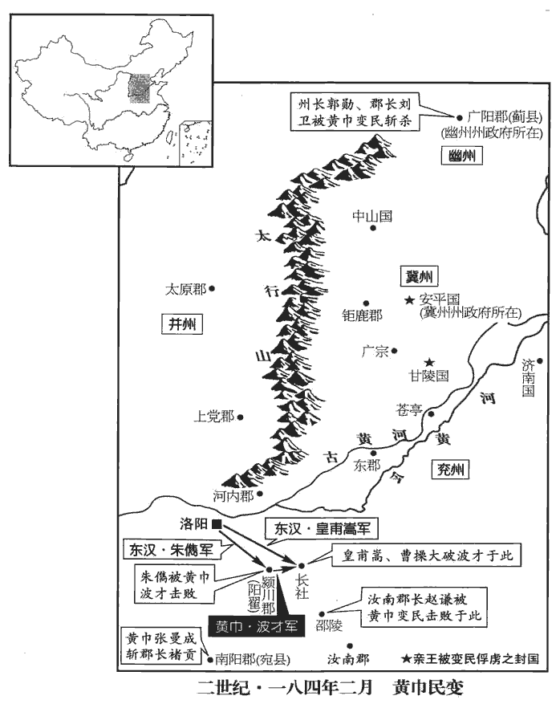
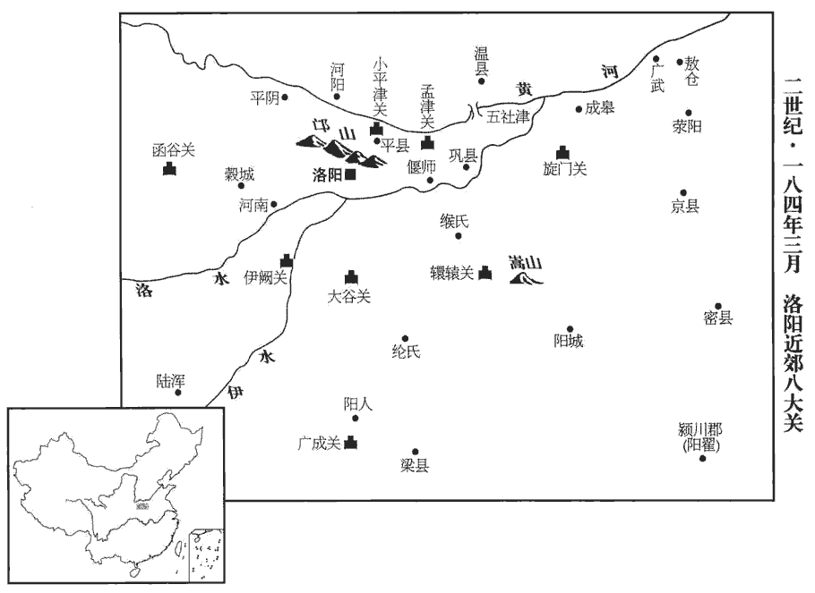
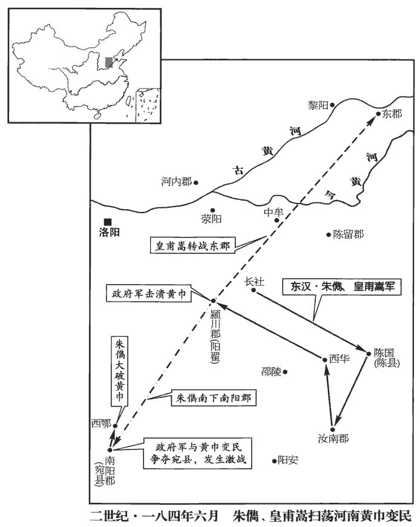
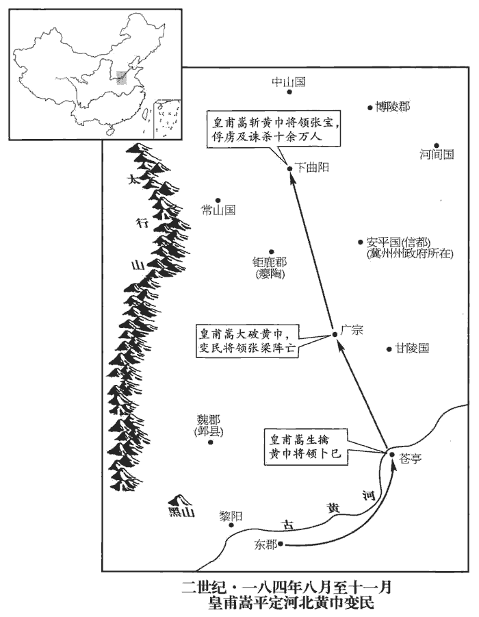
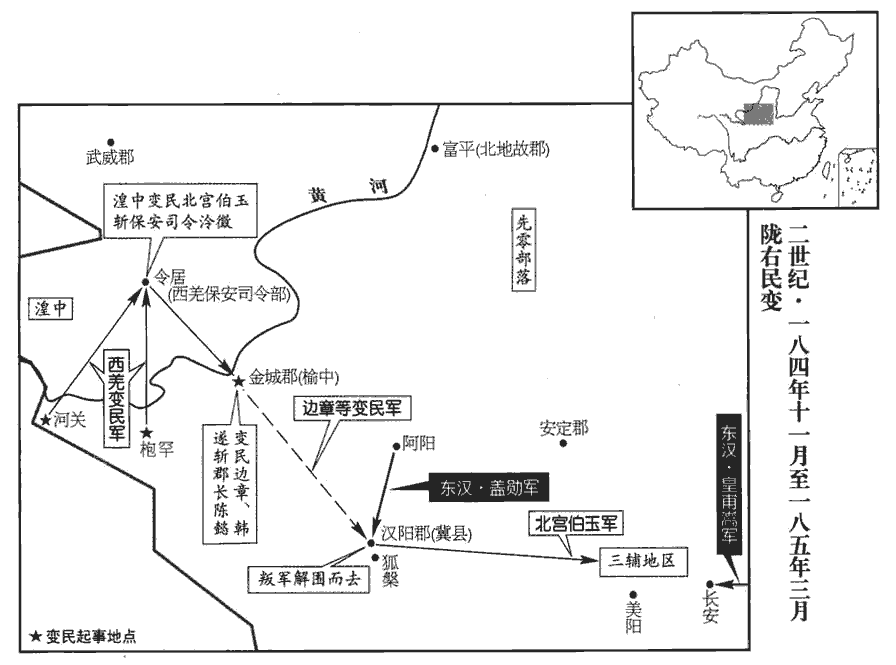
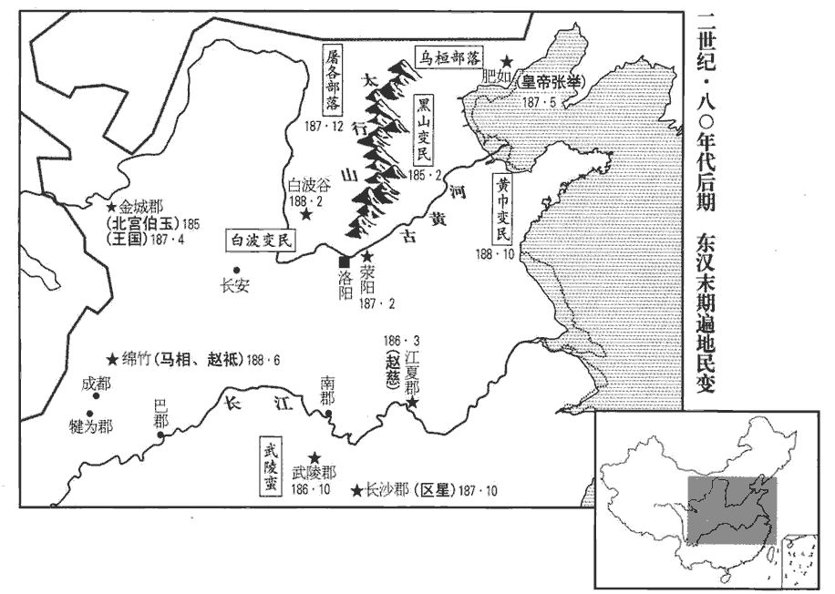
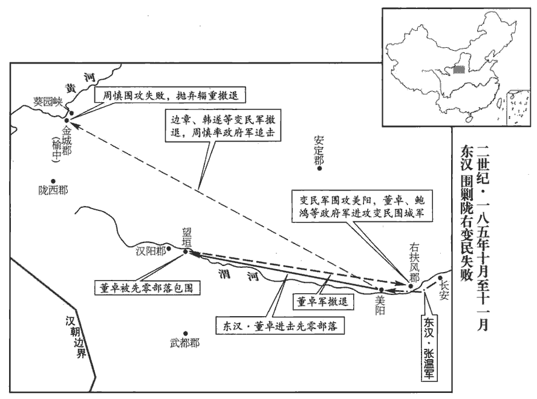

 漢紀五十起重光作噩（辛酉），盡強圉單閼，（丁卯），凡七年。

# 孝靈皇帝中

## 光和四年（辛酉，一八一）

1春，正月，初置騄lù驥jì厩丞，領受郡國調馬。賢曰：騄驥，善馬也。調，謂徵發也。調，徒釣翻；下同。豪右辜榷què，前書音義曰：辜，障也。榷，專也。謂障餘人買賣而自取其利。榷，古岳翻。馬一匹至二百萬。

〖译文〗 [1]春季，正月，首次设立骥厩丞，负责接收和饲养从各郡、国征发来的马匹。由于各地豪强垄断马匹交易，马价涨到一匹值二百万钱。

2夏，四月，庚子，赦天下。

〖译文〗 [2]夏季，四月，庚子（疑误），大赦天下。

3交趾‹越南河内东北北宁府›烏滸蠻久為亂，烏滸蠻反事始上卷光和元年。滸，呼古翻。牧守不能禁，交趾人梁龍等復反，攻破郡縣。復，扶又翻。詔拜蘭陵‹山东苍山西南兰陵镇›令會稽‹绍兴›朱儁為交趾刺史，蘭陵縣，屬東海郡。會，古外翻。擊斬梁龍，降者數萬人，降，戶江翻。旬月盡定；以功封都亭侯，徵為諫議大夫。

〖译文〗 [3]交趾地区的乌浒蛮人作乱，历时已久，州郡长官不能制服。交趾人梁龙等又起来反叛，攻破了东汉政权所置的郡、县。灵帝下诏任命兰陵令会稽人朱俊为交趾刺史。朱俊领兵击败了叛军，梁龙被斩，数万人投降，不过一个月，便全部平定了当地的叛乱。朱俊因功被封为都亭侯，并征召入朝担任谏议大夫。

4六月，庚辰‹十九›，雨雹如雞子。雨，于具翻。

〖译文〗 [4]六月，庚辰（十九日），天上降下大如鸡蛋的冰雹。

5秋，九月，庚寅朔‹一›，日有食之。

〖译文〗 [5]秋季，九月，庚寅（初一），出现日食。

6太尉劉寬免；衛尉許𢒰為太尉。𢒰yù，於六翻。考異曰：袁紀：「十月，許郁坐辟召錯繆，免。楊賜為太尉。」今從范書。

〖译文〗 [6]太尉刘宽被免职，任命卫尉许为太尉。

7閏月，辛酉‹二›，北宮東掖庭永巷署災。

〖译文〗 [7]闰九月，辛酉（初二），洛阳北宫东掖庭永巷署发生火灾。

8司徒楊賜罷；冬，十月，太常陳耽為司徒。考異曰：袁紀：「三年閏月，楊賜久病罷。十月，陳耽為司徒。」蓋誤置閏於去年。按長曆，此年閏十月，以袁紀考之，閏九月為是，恐長曆差一月。今從范書帝紀。

〖译文〗 [8]司徒杨赐被免职。冬季，十月，任命太常陈耽为司徒。

9鮮卑寇幽‹河北北及辽宁›、并‹山西›二州。檀石槐死，子和連代立。和連才力不及父而貪淫，後出攻北地‹陕西耀县›，北地人射殺之。射，而亦翻。其子騫曼尚幼，兄子魁頭立。後騫曼長大，長，知两翻。與魁頭爭國，眾遂離散。魁頭死，弟步度根立。

〖译文〗 [9]鲜卑族侵犯幽州与并州。鲜卑族首领檀石槐去世，他的儿子和连继任首领。和连不仅才干和能力不如他的父亲，而且贪财好色，后来在进攻北地时，被北地人射死。由于他的儿子骞曼年龄尚小，便由他哥哥的儿子魁头担任首领。后来骞曼长大，与魁头争夺首领的地位，致使部众离散。魁头去世后，他的弟弟步度根继任首领。

10是歲，帝‹刘宏，时年二十六›作列肆於後宮，使諸采女販賣，更相盜竊爭闘；更，工衡翻。帝著商賈服，著，陟略翻；下同。賈，音古。從之飲宴為樂。樂，音洛。又於西園弄狗，著進賢冠，帶綬。賢曰：三禮圖曰：進賢冠，文官服之，前高七寸，後高三寸，長八寸。續漢志曰：靈帝寵用便嬖bì子弟，轉相汲引，賣關內侯，直五百萬。強者貪如豺狼，弱者略不類物，真狗而冠也。綬，音受。又駕四驢，帝躬自操轡，驅馳周旋；續漢志曰：驢者，乃服重致遠，上下山谷，野人之所用耳，何有帝王君子而驂cān駕之乎！天意若曰，國且大亂，賢愚倒植，凡執政者皆如驢也。操，千高翻。京師轉相倣效，驢價遂與馬齊。

〖译文〗 [10]这一年，灵帝在后宫修建了许多商业店铺，让宫女们行商贩卖。于是，后宫中相互盗窃和争斗的事情屡有发生。灵帝穿上商人的服装，与行商的宫女们一起饮酒作乐。灵帝又在西园玩狗，狗的头上戴着文官的帽子，身上披着绶带。他还手执缰绳，亲自驾驶着四头驴拉的车子，在园内来回奔驰。京城洛阳的人竞相仿效，致使驴的售价与马价相等。

帝好為私稸，好，呼倒翻。稸，與蓄同。收天下之珍貨，每郡國貢獻，先輸中署，名為「導行費」。賢曰：中署，內署也。導，引也。貢獻外別有所入，以為所獻希之導引也。中常侍呂強上疏諫曰：「天下之財，莫不生之陰陽，」賢曰：萬物稟陰陽而生。歸之陛下，豈有公私！而今中尚方斂諸郡之寶，中御府積天下之繒，中尚方、中御府，皆屬少府，天子私藏也。繒，慈陵翻。西園引司農之藏，中厩聚太僕之馬，中厩，即騄驥厩。而所輸之府，輒有導行之財，調廣民困，費多獻少，調，徒弔翻。少，詩沼翻。姦吏因其利，百姓受其敝。又，阿媚之臣，好獻其私，好，呼到翻。容諂姑息，自此而進。舊典：選舉委任三府，尚書受奏御而已；三府選其人而舉之；尚書受其奏以進御。受試任用，責以成功，功無可察，然後付之尚書舉劾，請下廷尉覆按虛實，行其罪罰；劾，戶概翻，又戶得翻。下，遐稼翻。於是三公每有所選，參議掾屬，咨其行狀，度其器能；掾，俞絹翻。行，下孟翻。度，徒洛翻。然猶有曠職廢官，荒穢不治。治，直之翻。今但任尚書，或有詔用，詔用者，不由三公、尚書，徑以詔書用之也。如是，三公得免選舉之負，尚書亦復不坐，責賞無歸，豈肯空自勞苦乎！」書奏，不省。復，扶又翻。省，悉井翻。

〖译文〗 灵帝还喜好积蓄私房钱，收集天下的各种奇珍异宝。每次各郡、国向朝廷进贡，都要先精选出一部分珍品，送交管理皇帝私人财物的中署，叫做“导行费”。中常侍吕强上书规劝说：“普天之下的财富，无不生于阴阳，都归陛下所有，难道有公私之分！而现在，中尚方广敛各郡的珍宝，中御府堆满天下出产的丝织品，西园里收藏着理应由大司农管理的钱物，骥厩中则饲养着本该归太仆管理的马匹。而各地向朝廷交纳贡品时，都要送上导行费。这样，征调数量增加，人民贫困，花费增多，贡品却少。贪官污吏从中取利，黎民百姓深受其苦。更有一些阿谀献媚的臣子，喜欢进献私人财物，陛下对他们姑息纵容，这种不良之风因此越来越盛。依照以往制度，选拔官员的事情应由三府负责，尚书只负责将三府的奏章转呈给陛下。被选拔者通过考核，加以委任，并责求他们拿出政绩。没有政绩者时，才交付尚书进行弹劾，提请转到给廷尉核查虚实，加以处罚。因此，三公在选拔人才时，都要与僚属仔细评议，了解这些人的品行，评估他们的才干。尽管如此严格，仍然有些官员不能胜任，使政务荒废。如今只由尚书负责选拔官员，或由陛下颁下诏书，直接任用，这样，三公就免除了选拔不当的责任，尚书也不再因此获罪。奖惩都得不到，难道谁还肯自己白白地辛劳吗？”奏章呈上，灵帝未加理睬。

11何皇后性強忌，後宮王美人生皇子協，后酖zhèn殺美人。帝大怒，欲廢后；諸中官固請，得止。

〖译文〗 [11]何皇后嫉妒心非常重，后宫王美人生下皇子刘协，何皇后就用毒药把王美人杀死。灵帝大怒，要废掉何皇后，宦官们竭力为她求情，才使灵帝打消这个想法。

12大長秋華容侯曹節卒；華容縣，屬南郡。中常侍趙忠代領大長秋。

〖译文〗 [12]大长秋、华容侯曹节去世，由中常侍赵忠代理大长秋的职务。

## 五年（壬戌，一八二）

1春，正月，辛未‹十四›，赦天下。

〖译文〗 [1]春季，正月，辛未（十四日），大赦天下。

2詔公卿以謠言舉刺史、二千石為民蠹害者。太尉許𢒰、司空張濟承望內官，受取貨賂，𢒰，許六翻。其宦者子弟，賓客，雖貪汙穢濁，皆不敢問，而虛糾邊遠小郡清修有惠化者二十六人，吏民詣闕陳訴。司徒陳耽上言：「公卿所舉，率黨其私，所謂放鴟梟而囚鸞鳳。」考異曰：劉陶傳：「光和五年，以謠言舉二千石。耽與議郎曹操上言。」按耽已為司徒，不應與議郎同上言。王沈魏書曰：「是歲以災異博問得失，太祖因此上書切諫」，不云與耽同上言也。今但云陳耽。帝以讓𢒰、濟，由是諸坐謠言徵者，悉拜議郎。

〖译文〗 [2]灵帝下诏，命令公卿根据流传的民谣，检举为害百姓的刺史和郡守。太尉许和司空张济投靠有权势的宦官，收受贿赂，对那些担任刺史、郡守的宦官子弟或宾客，尽管他们贪赃枉法、声名狼藉，全不敢过问，却毫无根据地检举了地处边远小郡，清廉而颇有政绩的官员二十六人。这些官员的部属及治下的百姓，到洛阳皇宫门前为他们申诉。司徒陈耽上书说：“这次公卿的检举行动，大都包庇各自的私党，正是所谓是放走鸱枭那样的恶鸟，而将凤凰囚禁起来。”灵帝为此责备了许、张济，并将那些因所谓民谣而被征召问罪的官员，全都任命为议郎。

3二月，大疫。

〖译文〗 [3]二月，瘟疫到处流行。

4三月，司徒陳耽免。

〖译文〗 [4]三月，司徒陈耽被免职。

5夏，四月，旱。

〖译文〗 [5]夏季，四月，发生旱灾。

6以太常袁隗wěi為司徒。

〖译文〗 [6]任命太常袁隗为司徒。

7五月，庚申‹五›，永樂宮署災。樂，音洛。

〖译文〗 [7]五月，庚申（初五），永乐宫署发生火灾。

8秋，七月，有星孛于太微。孛bèi，蒲內翻。

〖译文〗 [8]秋季，七月，有异星出现于太微星旁。

9板楯shǔn蠻‹四川阆中一带›寇亂巴郡‹重庆›，連年討之，不能尅。帝‹刘宏，时年二十七›欲大發兵，以問益州‹四川云南›計吏漢中‹陕西汉中›程包，對曰：「板楯七姓，板楯七姓，羅、朴、督、鄂、度、夕、龔，皆渠帥也。楯shǔn，食尹翻。自秦世立功，復其租賦。復，方目翻。其人勇猛善戰。昔永初中，羌入漢川，郡縣破壞，得板楯救之，羌死敗殆盡，事見四十九卷安帝元初元年，註亦見是年。羌人號為神兵，傳語種輩，勿復南行。語，牛据翻。種，章勇翻。復，扶又翻；下同。至建和二年，羌復大入，實賴板楯連摧破之。前車騎將軍馮緄gǔn南征武陵，亦倚板楯以成其功。近益州郡‹云南晋宁东晋城镇›亂，太守李顒yóng亦以板楯討而平之。緄，古本翻，又音昆。顒，魚容翻。忠功如此，本無惡心。長吏鄉亭更賦至重，長，知兩翻。更，工衡翻。僕役箠楚，過於奴虜，箠chuí，止橤翻。亦有嫁妻賣子，或乃至自剄割，雖陳冤州郡，而牧守不為通理，為，于偽翻。闕庭悠遠，不能自聞，含怨呼天，無所叩愬，故邑落相聚以【章：甲十一行本「以」下有「致」字；乙十一行本同；退齋校同。】叛戾，非有謀主僭號以圖不軌。今但選明能牧守，守，式又翻。自然安集，不煩征伐也！」帝從其言，選用太守曹謙，宣詔赦之，即時皆降。降，戶江翻。

〖译文〗 [9]板蛮人在巴郡作乱，官军连年征讨，未能平定。灵帝打算出动大军，为此询问益州派入朝中汇报情况的计吏汉中人程包。程包回答说：“板族中有七个大姓，自秦时，他们就建立过功勋，因此得到免除田租赋税的优待。他们全都骁勇善战。从前在永初年间，羌族人攻入汉川，郡、县政权全被破坏，得到板人的援救，羌人才被打败，死伤殆尽。羌人称板人为神兵，并相互告诫，不要再向南进入这一地区。到了建和二年，羌人又大举入侵，全靠板人，才连续击败了羌人。前车骑将军冯绲南征武陵，也是依靠板人，才得以成功。最近益州郡发生叛乱，太守李也是用板人平定了叛乱。板人如此忠心耿耿，屡建功勋，原本没有反抗朝廷的意思。可是，地方官府向板人征收的赋税极重，役使他们，残酷地鞭打，超过对待奴隶。还有人为交纳赋税被迫卖妻卖子，甚至有人因不堪忍受而刎颈自杀。尽管他们曾到州、郡官府去陈诉冤情，但州、郡长官既不处理，又不向上奏报。路途遥遥，无法到京城直接向陛下喊冤，满含怨气地向苍天呼喊，仍是投诉无门。于是，各部落便聚集起来进行反抗。他们完全是迫于无奈，并无建立政权闹独立的野心。如今，只要任命清廉能干的官员去担任州、郡长官，动乱自然就会平定，无须调军征伐。”灵帝听从了程包的建议，任命曹谦担任巴郡太守，宣布皇帝赦免他们叛乱行为的诏书，板人立刻全部投降了。

10八月，起四百尺觀於阿亭道。觀，古玩翻。

〖译文〗 [10]八月，在阿亭道建造起高达四百尺的楼台。

11冬，十月，太尉許𢒰罷；以太常楊賜為太尉。

〖译文〗 [11]冬季，十月，太尉许被免职，任命太常杨赐为太尉。

12帝校獵上林苑，歷函谷關‹河南新安东›，遂狩于廣成苑。十二月，還，幸太學。

〖译文〗 [12]灵帝在上林苑打猎，后又经函谷关，到广成苑进行狩猎。十二月，回到京城洛阳，到太学进行巡视。

13桓典為侍御史，宦官畏之。典常乘驄馬，京師為之語曰：「行行且止，避驄馬御史！」驄馬，青白雜色。典，焉之孫也。順帝永建初，焉為太傅。焉，榮之孫也。

〖译文〗 [13]桓典担任侍御史，宦官们都很怕他。桓典常骑一匹青白杂色的马，京城洛阳因此传言说：“走走停停，避开骑杂色马的御史。”桓典是桓焉的孙子。

## 六年（癸亥，一八三）

1春，三月，辛未‹二十一›，赦天下。

〖译文〗 [1]春季，三月，辛未（二十一日），大赦天下。

2夏，大旱。

〖译文〗 [2]夏季，出现严重旱灾。

3爵號皇后母為舞陽君。

〖译文〗 [3]封何皇后的母亲为舞阳君。

4秋，金城‹甘肃陇西›河水溢出二十余里。

〖译文〗 [4]秋季，金城郡境内的黄河水暴涨，泛滥两岸二十余里。

5五原‹内蒙包头›山岸崩。考異曰：本紀云：「大有年。」按今夏大旱，縱使秋成，亦不得為大有年。今不取。

〖译文〗 [5]五原郡境内发生山崩。

6初，鉅鹿‹河北宁晋西南›張角奉事黃、老，以妖術教授，號「太平道」。呪zhòu符水以療病，妖，於驕翻。呪，職救翻。令病者跪拜首過，首，式救翻。今道家所施符水，祖張道陵，蓋同此術也。或時病愈，眾共神而信之。角分遣弟子周行四方，轉相誑誘，誑kuáng，居況翻。誘，音酉。十餘年間，徒眾數十萬，自青‹山东北部›、徐‹江苏北部›、幽‹河北北部›、冀‹河北中、南部›、荊‹湖北湖南›、揚‹安徽中部及江南›、兗‹山东西›、豫‹河南›八州之人，莫不畢應。或棄賣財產，流移奔赴，填塞道路，塞，悉則翻。未至病死者亦以萬數。郡縣不解其意，解，戶買翻。反言角以善道教化，為民所歸。

〖译文〗 [6]最初，钜鹿人张角信奉黄帝、老子，以法术和咒语等传授门徒，号称“太平道”。他用念过咒语的符水治病，先让病人下跪，说出自己所犯的错误，然后喝下府水。有些病人竟然就此痊愈，于是，人们将他信奉如神明。张角派他的弟子走遍四方，不断诳骗引诱，十余年的时间，信徒多达数十万，青州、徐州、幽州、冀州、荆州、扬州、兖州和豫州等八州之人，无不响应。有的信徒卖掉自己的家产，前往投奔张角，他们塞满道路，尚未到达而死在途中的也数以万计。郡、县的官员不了解张角的真实意图，反而讲张角教民向善，因而为百姓所拥戴。

太尉楊賜時為司徒，賜為司徒，熹平五年也。上書言：「角誑曜百姓，遭赦不悔，稍益滋蔓。蔓，音萬。今若下州郡捕討，恐更騷擾，速成其患。宜切敕chì刺史、二千石，簡別流民，下，遐稼翻。別，彼列翻。各護歸本郡，以孤弱其黨，然後誅其渠帥，可不勞而定。」會賜去位，事遂留中。賢曰：謂所論事留在禁中，未施用之。余據賜以熹平六年免。帥，所類翻。司徒掾劉陶復上疏申賜前議，掾，俞絹翻。復，扶又翻。言：「角等陰謀益甚，四方私言，云角等竊入京師，覘視朝政。覘chān，丑廉翻。朝，直遙翻。鳥聲獸心，私共鳴呼；州郡忌諱，不欲聞之，但更相告語，更，工衡翻。莫肯公文。宜下明詔，重募角等，賞以國土，有敢回避，與之同罪。」帝殊不為意，方詔陶次第春秋條例。陶明春秋，為之訓詁gǔ，故詔之次第條例。

〖译文〗 太尉杨赐当时正担任司徒，他上书说：“张角欺骗百姓，虽受到免除罪责的赦令，仍不思悔改，反而逐渐蔓延扩张。现在，如果命州、郡进行镇压，恐怕会加重局势的混乱，促使其提前叛乱。应该命令刺史、郡守清查流民，将他们分别护送回本郡，以削弱张角党徒的力量，然后再诛杀那些首领。这样，不必劳师动众，就可以平息事态。”恰在此时，杨赐去职，他的奏章遂留在皇宫，未能实行。马徒掾刘陶再次上书，重提杨赐的这项建议，说：“张角等人正在加紧策划阴谋，四方秘密传言说：‘张角等偷偷潜入京城洛阳，窥探朝廷的动静。’其在各地的党徒暗地里遥相呼应。州郡官员怕如实呈报会受到朝廷的处分，不愿上奏，只是私下相互间通知，不肯用公文的形式来通报。为此，建议陛下公开颁发诏书，悬重赏捉拿张角等人，以封侯作为奖赏。官员中若有胆怯回避者，与张角等人同罪论处。”灵帝对这件事很不在意，反而下诏让刘陶整理《春秋条例》。

角遂置三十六方；方，猶將軍也，大方萬餘人，小方六七千，考異曰：袁紀作”坊”，今從范書。各立渠帥；帥，所類翻。訛言「蒼天已死，黃天當立，歲在甲子，天下大吉。」以白土書京城寺門寺門，在京城諸官寺舍之門。及州郡官府，皆作「甲子」字。大方馬元義等先收荊、揚數萬人，期會發於鄴‹河北临漳西南邺镇›。元義數往來京師，數，所角翻。以中常侍封諝、徐奉等為內應，諝，私呂翻。約以三月五日內外俱起。

〖译文〗 张角设置三十六个方，方，犹如将军。大方统率一万余人，小方统率六七千人，各立首领。他宣称：“苍天已死，黄天当立，岁在甲子，天下大吉。”并用白土在京城洛阳各官署及各州、郡官府的大门上都写上“甲子”二字。他们计划，由大方马元义等先集结荆州、扬州的党徒数万人，按期会合，在邺城起事。马元义多次前往京城洛阳，以中常侍封、徐奉等人为内应，约定于次年的三月五日，京城内外同时发动。

## 中平元年（甲子，一八四）是年十二月改元。

1春，角弟子濟南‹山东章丘›唐周上書告之。濟，子禮翻。考異曰：袁紀云「濟陰人唐客」，今從范書。於是收馬元義，車裂於雒陽。考異曰：袁紀曰：「五月乙卯，馬元義等於京都謀反，伏誅。」今從范書。詔三公、司隸按驗宮省直衛及百姓有事角道者，誅殺千餘人；下冀州逐捕角等。下，遐稼翻。角等知事已露，晨夜馳敕諸方，一時俱起，皆著黃巾以為標幟，著，陟略翻。幟，尺志翻，又音誌。故時人謂之「黃巾賊」。二月，角自稱天公將軍，角弟寶稱地公將軍，寶弟梁稱人公將軍，考異曰：司馬彪九州春秋云：「角弟梁，梁弟寶」，袁紀云「角弟良、寶」，今從范書。所在燔fán燒官府，劫略聚邑，聚，才喻翻。州郡失據，長吏多逃亡；長，知兩翻。旬月之間，天下響應，京師震動。安平‹河北冀县›、甘陵‹山东临清›人各執其王應賊。

〖译文〗 [1]春季，张角的弟子济南人唐周上书告密。于是，朝廷逮捕了马元义，在洛阳用车裂的酷刑将他处死。灵帝下诏，命令三公和司隶校尉调查皇宫及朝廷官员、禁军将士和普通百姓中信奉张角“太平教”者，处死了一千余人。同时还下令让冀州的官员捉拿张角等人。张角等得知计划已经泄露，便派人昼夜兼程赶往各地，通知各方首领，一时间各方全都起兵，他们个个头戴黄巾作为标志，因此当时人称他们为“黄巾贼”。二月，张角自称天公将军，他弟弟张宝称地公将军，张梁称人公将军。他们焚烧当地官府，劫掠城镇。州郡官员无力抵抗，大多弃职逃跑。不过一个月的时间，天下纷纷响应，京城洛阳为之震动。安平国和甘陵国的人民分别生擒了安平王和甘陵王，响应黄巾军。

 

2三月，戊申‹三›，以河南尹何進為大將軍，封慎侯，慎縣，屬汝南郡。率左、右羽林五營營士屯都亭，修理器械，以鎮京師；置函谷‹河南新安›、太谷‹河南偃师西南›、廣成‹河南汝阳东›、伊闕‹洛阳南龙门镇›、轘轅‹河南登封西北›、旋門‹河南荥阳西›、孟津‹河南孟津东黄河渡口›、小平津‹孟津东›八關都尉。函谷關在河南穀城县。贤曰，太谷在洛阳东，廣成在河南新城县，京相璠fán曰，伊闕在洛阳西南五十里，轘轅關在緱gōu氏县东南，水经註曰，旋门坂在成皋县西南十里，孟津在河内河阳县南，小平津在河南平县北，贤曰，在今巩县西北。杜佑曰，洛州新安县东北有汉八关城。

〖译文〗 三月，戊申（初三），任命河南尹何进为大将军，并封他为慎侯。何进统率左、右羽林军以及屯骑、步兵、越骑、长水、射声等五营将士，驻扎在都亭，整修军械，守卫京城洛阳。还设置了函谷关、太谷关、广成关、伊阙关、辕关、旋门关、孟津关、小平津关等八关都尉。

 

帝召群臣會議。北地‹陕西耀县›太守皇甫嵩以為宜解黨禁，益出中藏錢、西園厩馬以班軍士。中藏府令，屬少府，宦者為之。中藏錢，漢所謂禁錢也。西園厩馬，即騄驥厩馬。藏，徂浪翻。嵩，規之兄子也。上問計於中常侍呂強，對曰：「黨錮久積，人情怨憤，若不赦宥，輕與張角合謀，為變滋大，悔之無救。今請先誅左右貪濁者，大赦黨人，料簡刺史、二千石能否，料，音聊，量也，度也。則盜無不平矣。」帝懼而從之。壬子‹七›，赦天下黨人，還諸徙者；謂黨人妻子徙邊者也。唯張角不赦。發天下精兵，遣北中郎將盧植討張角，漢有三署中郎將，五官及左、右署。又有使匈奴中郎將。北中郎將則創置於此時，蓋以討河北黃巾也。左中郎將皇甫嵩、右中郎將朱儁討潁川‹河南禹州›黃巾。

〖译文〗 灵帝召集群臣商议对策。北地郡太守皇甫嵩认为，应该解除禁止党人作官的禁令，并拿出皇帝私人所有的中藏府钱财以及西园骥厩中的良马，赏赐给出征的将士。皇甫嵩是皇甫规哥哥的儿子。灵帝询问中常侍吕强的意见，吕强说：“对党人的禁令时间已经很长了，人心怨恨愤怒，若不予以赦免，他们将轻举妄动，与张角联合起来，叛乱之势便会更趋扩大，到那时，后悔就来不及了。现在，请先将陛下左右贪赃枉法的官员处死，大赦所有的党人，并考察各地刺史、郡守的能力。如果这样做，叛乱就不会不平息了。”灵帝对黄巾军的势力感到害怕，接受了吕强的建议。壬子（初七），大赦天下党人，已经被流放到边疆地区的党人及其家属都可以重返故乡，唯有张角不在赦免范围之内。与此同时，征调全国各地的精兵，派遣北中郎将卢植征讨张角，左中郎将皇甫嵩、右中郎将朱俊征讨在颍川地区活动的黄巾军。

是時中常侍趙忠、張讓、夏惲yùn、郭勝、段珪、宋典等皆封侯貴寵，夏，戶雅翻。惲，於粉翻。上常言：「張常侍是我公，趙常侍是我母。」由是宦官無所憚畏，并起第宅，擬則宮室。上嘗欲登永安候臺，據續漢志：永安宮在北宮東北，宮中有候臺。洛陽宮殿名曰：永安宮，周回六百九十八丈，故基在洛陽故城中。宦官恐望見其居處，乃使中大人尚但諫曰：賢曰：尚，姓；但，名。姓譜：師尚父之後。後漢有尚士、尚子平。「天子不當登高，登高則百姓虛散。」上自是不敢復升臺榭。觀靈帝以尚但之言不敢復升臺榭，誠恐百姓虛散也，謂無愛民之心可乎！使其以信尚但者信諸君子之言，則漢之為漢，未可知也。賢曰：春秋潛潭巴曰：天子毋高臺榭，高臺榭則下叛之。蓋因此以誑帝也。復，扶又翻；下同。及封諝、徐奉事發，上詰責諸常侍曰：詰，去吉翻。「汝曹常言黨人欲為不軌，皆令禁錮，或有伏誅者。今黨人更為國用，汝曹反與張角通，為可斬未？」皆叩頭曰：「此王甫、侯覽所為也！」於是諸常侍人人求退，各自徵還宗親、子弟在州郡者。

〖译文〗 当时，中常侍赵忠、张让、夏恽、郭胜、段、宋典等都被封为侯爵，身份贵宠。灵帝常说：“张常侍是我父亲，赵常侍是我母亲。”于是，宦官无所忌惮，纷纷大兴土木，仿照皇宫的式样修建宅第。一次，灵帝曾想登上永安宫的望台，观看皇宫周围的景致。宦官们生怕灵帝看到自己的宅第，便让中大人尚但劝阻灵帝，说：“天子不应当登高，登高则会使人民流散。”灵帝从此不再敢登较高的楼台亭榭。及至封、徐奉为张角做内应的事情败露，灵帝斥责诸位常侍说：“你们常说党人图谋不轨，将他们全都禁锢起来，有人甚至遭到诛杀。现在党人倒是在为国家出力，你们反与张角勾结，该不该处斩？”宦官们都叩头说：“这些都是王甫、侯览干的。”于是，诸位常侍都收敛退避，各自将他们在外担任州、郡官员的亲属及子弟召回。

趙忠、夏惲yùn等遂共谮吕强，云與黨人共議朝廷，數讀霍光傳，言其欲謀廢立也。數，所角翻。强兄弟所在，並皆貪穢，帝使中黃門持兵召强，强聞帝召，怒曰：「吾死，亂起矣。丈夫欲盡忠國家，豈能對獄吏乎。」遂自殺。忠、惲復譖曰：「强見召，未知所問，而就外自屛，賢曰：自屛謂自殺也。屛，必郢翻。有奸明審。」遂收捕其宗親，沒入財産。

〖译文〗 于是，赵忠、夏恽等人一同向灵帝诬告吕强，说：“吕强与党人一起议论朝廷，经常阅读《霍光传》，他的兄弟全都在官位上贪脏枉法。”灵帝听后，令中黄门带着兵器召吕强入宫。吕强得知灵帝召他的用意后，忿忿地说：“我死之后，必有大乱。大丈夫要为报国尽忠，怎能去面对狱吏呢！”便自杀了。赵忠、夏恽等再次诬陷说：“吕强被召，还不知道要问他什么事，就在外自杀了，这说明他确实有罪。”于是，灵帝下令逮捕吕强的亲属，将财产没收。

侍中河內‹河南武陟›向栩上便宜，譏刺左右。栩，況羽翻。上，時掌翻；下同。張讓誣栩與張角同心，欲為內應，收送黃門北寺獄，殺之。郎中中山‹河北定州›張鈞上書曰：「竊惟張角所以能興兵作亂，萬民所以樂附之者，樂，音洛。其源皆由十常侍多放父兄、子、弟婚親、賓客典據州郡，辜榷財利，榷，古岳翻。侵掠百姓，百姓之冤，無所告訴，故謀議不軌，聚為盜賊。宜斬十常侍，縣頭南郊，以謝百姓，據宦者傳，是時張讓、趙忠、夏惲、郭勝、孫璋、畢嵐、栗嵩、段珪、高望、張恭、韓悝、宋典十二人，皆為中常侍。言十常侍，舉大數也。縣，讀曰懸。考異曰：范書宦者傳上列常侍十二人名，而下云十常侍。未詳。遣使者布告天下，可不須師旅而大寇自消。」帝以鈞章示諸常侍，皆免冠徒跣頓首，乞自致雒陽詔獄，并出家財以助軍費。有詔，皆冠履視事如故。帝怒鈞曰：「此真狂子也！十常侍固當有一人善者不！」不，俯九翻。御史承旨，遂誣奏鈞學黃巾道，收掠，死獄中。掠，音亮。

〖译文〗 侍中、河内人向栩向灵帝上书，抨击宦官。张让便诬告向栩与张角同心，要做张角的内应。于是向栩被捕，送交黄门北寺监狱处死。郎中、中山人张钧上书说：“我认为，张角所以能够兴兵作乱，百姓所以乐于归附张角，原因都在于十常侍多放任自己的父兄、子弟、亲戚及其投靠者充任州郡长官，搜刮财富，掠夺百姓。百姓有冤无处申诉，这才打算与朝廷对抗，聚集起来成为盗贼。应该斩杀十常侍，将他们的头悬挂在京城南郊，向百姓谢罪，并派使者向全国宣布此事。这样，可以不出动军队镇压，庞大的寇盗集团就会自行解散。”灵帝将张钧的奏章交诸常侍看，这些人全都吓得摘下帽子，除去鞋袜，下跪叩头，请求灵帝允许他们到洛阳专门审理皇帝亲自交办案件的诏狱去投案自首，并将家产献出，用以补助军费。灵帝下诏，令诸常侍全都穿戴起表示官位的衣帽鞋袜，继续担任原职。他对张钧上奏一事发怒说：“这真是个狂人！难道十常侍中本不该有一个好人！”御史顺承灵帝的心意，诬奏张钧信奉黄巾道，遂将他逮捕入狱，拷打致死。

庚子，南陽黃巾張曼成攻殺太守褚貢。

〖译文〗 [2]庚子（疑误），南阳郡的黄巾军将领张曼成进攻并杀死太守褚贡。

3帝問太尉楊賜以黃巾事，賜所對切直，帝不悅。夏，四月，賜坐寇賊免。以太僕弘農鄧盛為太尉。已而帝閱錄故事，得賜與劉陶所上張角奏，乃封賜為臨晉侯，臨晉縣，屬馮翊。賢曰：故城在今同州朝邑縣西南。上，時掌翻。陶為中陵鄉侯。

〖译文〗 [3]灵帝询问太尉杨赐有关黄巾军的情况，杨赐的回答恳切直率，灵帝感到不快。夏季，四月，杨赐因未能平息黄巾叛乱而被免职。任命太仆、弘农人邓盛为太尉。过了一些时候，灵帝翻阅过去的奏章，发现了杨赐与刘陶所上的有关张角的奏章。于是，封杨赐为临晋侯，刘陶为中陵乡侯。

4司空張濟罷；以大司農張溫為司空。

〖译文〗 [4]司空张济被免职。任命大司农张温为司空。

5皇甫嵩、朱儁合將四萬餘人將，即亮翻。共討潁川，【張：「川」下脫「黃巾」二字。】嵩、儁jùn各統一軍。儁與賊波才戰，敗；嵩進保長社‹河南長葛›。長社縣，屬潁川郡。賢曰：今許州縣，故城在長葛縣西。

〖译文〗 [5]皇甫嵩、朱俊率军四万人，一同讨伐颍川郡的黄巾军。皇甫嵩和朱俊各率一支军队，朱俊与黄巾军将领波才交战，被击败。皇甫嵩率军进驻长社，固守县城。

6汝南‹河南平舆西北射桥乡›黃巾敗太守趙謙於邵陵‹河南鄄城东›。邵陵縣，屬汝南郡。賢曰：故城在今豫州郾陵縣東。敗，補邁翻。廣陽‹北京›黃巾殺幽州刺史郭勳及太守劉衛。

〖译文〗 [6]汝南郡的黄巾军在邵陵击败太守赵谦所率的官军。广阳郡的黄巾军杀幽州刺史郭勋及太守刘卫。

7波才圍皇甫嵩於長社‹河南長葛›。嵩兵少，少，詩沼翻。軍中皆恐。賊依草結營，會大風，嵩約敕軍士皆束苣乘城，賢曰：苣，音巨。說文云：束葦燒之。使銳士間出圍外，縱火大呼，間，古莧翻。呼，火故翻。城上舉燎應之，嵩從城中鼓譟而出，奔擊賊陳，陳，讀曰陣。賊驚，亂走。會騎都尉沛國‹安徽淮北›曹操將兵適至，五月，嵩、操與朱儁合軍，更與賊戰，大破之，斬首數萬級。封嵩都鄉侯。

〖译文〗 [7]波才率黄巾军将皇甫嵩围困在长社县城。皇甫嵩兵少，军中都感到恐慌。黄巾军的营寨所设之处荒草遍野，适逢狂风大作，皇甫嵩让士兵们全都手持成束苇草上城。另命一批勇士，偷偷地越过包围圈，放火烧草并高声呐喊。与此同时，城上的军士也一齐点燃火把，与之呼应。皇甫嵩率军从城中擂鼓呐喊而出，直捣敌阵。黄巾军大惊，溃散奔逃。这时，恰好骑都尉、沛国人曹操率兵赶到。五月，皇甫嵩、曹操与朱俊会师，再次出战，大败黄巾军，斩杀数万人。灵帝封皇甫嵩为都乡侯。

操父嵩，為中常侍曹騰養子，不能審其生出本末，或云夏侯氏子也。吳人作曹暪mèn傳及郭頒世語，并云嵩，夏侯氏之子，夏侯惇dūn之叔父，操於惇為從父兄弟。操少機警，有權數，而任俠放蕩，不治行業；少，詩照翻。行，下孟翻；下同。世人未之奇也，唯太尉橋玄及南陽何顒異焉。顒yóng，魚容翻。玄謂操曰：「天下將亂，非命世之才，不能濟也。能安之者，其在君乎！」顒見操，歎曰：「漢家將亡，安天下者，必此人也。」玄謂操曰：「君未有名，可交許子將。」子將者，訓之從子劭也，許劭，字子將。許訓為公，見上卷熹平三年、四年。從，才用翻。好人倫，多所賞識，與從兄靖俱有高名，好共覈hé論鄉黨人物，每月輒更其品題，故汝南俗有月旦評焉。後置州郡中正本於此。好，呼到翻。更，工衡翻。嘗為郡功曹，府中聞之，莫不改操飾行。曹操往造劭而問之造，七到翻。曰：「我何如人？」劭鄙其為人，不答。操乃劫之，劭曰：「子，治世之能臣，亂世之姦雄。」言其才絕世也。天下治則盡其能為世用，天下亂則逞其智為時雄。操大喜而去。曹操事始此。

〖译文〗 曹操的父亲曹嵩，是中常侍曹腾的养子，他原来的姓氏已无法确定，据传为夏侯氏。曹操自小为人机警，有谋略，善权术，并喜欢行侠仗义，行为放荡，不经营家产事业。因此，当时人认为他并无什么过人之处。唯有太尉桥玄和南阳人何对他另眼相看。桥玄对他说：“天下即将大乱，不是掌握时代命运的杰出人才，不能拯救。能够平息这场大乱的人，恐怕就是你吧。”何看到曹操后叹息说：“汉朝就要灭亡，能够重新安定天下的，一定是此人。”桥玄向曹操建议说：“你在世上尚无名气，可以与许子将结交。”许子将就是许训的侄子许劭。许劭善于待人接物，能够辨别人的品行和能力，与他的堂兄许靖都有很高的名望。两人喜欢一起评论本地的知名人士，并根据这些人士的所作所为，逐月更改评语和排列顺序。为此，汝南人称之为“月旦评”。许劭曾经担任过郡府中管理人事的功曹，府中官员听说了他的名望，无不改变、修饰自己的操行，以求得到一个较好的评语，曹操前去拜访许劭，询问他对自己的评价，说：“我是一个什么样的人呢？”许劭鄙视曹操的为人，故闭口不答。曹操于是加以威胁，许劭才说：“你在天下太平时可以成为一个能臣，在天下大乱时则会成为一个奸雄。”曹操听后，大喜而去。

朱儁之擊黃巾也，其護軍司馬北地‹陕西耀县›傅燮上疏曰：護軍司馬，官為司馬，而使監護一軍。「臣聞天下之禍不由於外，皆興於內。是故虞舜先除四凶，然後用十六相，尚書：舜流共工于幽州，放驩huān兜于崇山，竄三苗于三危，殛鯀于羽山，四罪而天下咸服。左傳曰：高陽氏有才子八人，蒼舒、隤tuí敱ái、檮táo戭yǎn、大臨、厖máng降、庭堅、仲容、叔達、謂之八元。高辛氏有才子八人，伯奮、仲堪、叔獻、季仲、伯虎、仲熊、叔豹、季貍，謂之八愷。舜臣堯，流四凶族，舉十六相。明惡人不去，則善人無由進也。今張角起於趙‹河北›、魏‹河南东部›，黃巾亂於六州，此皆釁發蕭牆而禍延四海者也。臣受戎任，奉辭伐罪，始到潁川，戰無不尅；黃巾雖盛，不足為廟堂憂也。臣之所懼，在於治水不自其源，末流彌增其廣耳。」治，直之翻。陛下仁德寬容，多所不忍，故閹豎弄權，忠臣不進。誠使張角梟xiāo夷，黃巾變服，謂其黨歸順，去其黃巾而復服時人之服也。梟，堅堯翻。梟夷，謂梟斬而誅夷之。臣之所憂，甫益深耳。何者？夫邪正之人不宜共國，亦猶冰炭不可同器。彼知正人之功顯而危亡之兆見，皆將巧辭飾說，共長虛偽。見，賢遍翻。長，知兩翻。夫孝子疑於屢至，即曾母投杼，事見三卷周赧王七年。市虎成於三夫，韓子：龐共與魏太子質於邯郸。共謂魏王曰：「今一人言市有虎，王信乎？」王曰：「否。」「二人言，信乎？」王曰：「否。」「三人言，信乎？」王曰：「寡人信矣。」共曰：「夫市無虎明矣，然三人言誠市有虎。今邯鄲去魏遠於市，謗臣者過三人，願王熟察之！」若不詳察真偽，忠臣將復有杜郵之戮矣！白起事見五卷周赧王五十八年。復，扶又翻。郵，音尤。陛下宜思虞舜四罪之舉，速行讒佞之誅，則善人思進，姦凶自息。」趙忠見其疏而惡之。惡，烏路翻。燮擊黃巾，功多當封，忠譖訴之；帝識燮言，賢曰：識，記也，音志。得不加罪，竟亦不封。

〖译文〗 朱俊进攻黄巾军时，他的护军司马、北地人傅燮上书说：“我听说，天下的灾祸不是来源于外部，而全是起因于内部。正因如此，虞舜先除去四凶，然后才任用十六位贤能之士铺佐自己治理天下。这说明，恶人不除，善人就不可能取得权力。如今张角在赵、魏之地起兵，黄巾军在六州作乱，这场大乱的根源是在宫廷之内，蔓延到四海。我受陛下的委任，奏命率军讨伐叛乱。从颍川开始，一直是战无不胜。黄巾军势力虽大，并不足以使陛下担忧。我所恐惧的是，如果治理洪水不从源头治起，下游势必泛滥得更加严重。陛下仁爱宽容，对许多不对的事情不忍处理，因此宦官们控制了朝政大权，忠臣不能得到重用。即使真将张角砍头处死，平息了黄巾叛乱，我的忧虑会更深。为什么呢？这是因为，邪恶小人与正人君子不能在朝廷共存，如同寒冰与炽炭不能放入一个容器一样。那些邪恶之辈明白，正直之士的成功，预示着他们行将灭亡，因此必然要花言巧语，共同弄虚作假。传播假消息的人多了，即使是曾参那样的孝子也难免遭受怀疑；市中明明没有老虎，但只要有三个人说有，人们就会相信。假如陛下不能详细辨察真伪，那么忠臣就会再次像秦国名将白起那样含冤而死了！陛下应该深思虞舜对四凶的处理，尽速诛杀那些善进谗言的佞臣，这样，善人就会愿意为朝廷尽力，叛乱自会平息。”赵忠看到这份奏章，感到厌恶。傅燮征讨黄巾军立下很多战功，应得到封爵的赏赐，赵忠便向灵帝讲傅燮的坏话。灵帝记得傅燮奏章所言，没有对傅燮加罪，但到底也没有封他。

8張曼成屯宛‹河南南阳›下百餘日。宛，於元翻。六月，南陽太守秦頡jié擊曼成，斬之。

〖译文〗 [8]黄巾将领张曼成驻军宛城城下一百多天。六月，阳太守秦颉进攻黄巾军，斩杀张曼成。

9交趾‹两广及越南北›土多珍貨，前後刺史多無清行，行，下孟翻。財計盈給，輒求遷代，故吏民怨叛，執刺史及合浦‹广西合浦东北›太守來達，自稱柱天將軍。三府選京‹河南荥阳›令東郡賈琮cóng為交趾刺史。京縣，屬河南尹。琮，祖宗翻。琮到部，訊其反狀，咸言「賦斂過重，斂，力贍翻。百姓莫不空單。京師遙遠，告冤無所，民不聊生，故聚為盜賊。」琮即移書告示，各使安其資業，招撫荒散，蠲juān復傜役，蠲，吉玄翻。復，音方目翻，除也。誅斬渠帥為大害者，帥，所類翻。簡選良吏試守諸縣，歲間蕩定，百姓以安。巷路為之歌曰：「賈父來晚，使我先反；今見清平，吏不敢飯！」言吏不敢過民家而飯也。飯，扶晚翻。

〖译文〗 [9]交趾地区盛产珍珠等宝物，先后担任刺史的官员多无清谦行为，算计财物搜刮够了，便要求调任，因此下层官吏及百姓因愤恨而起来反抗，俘虏刺史及合浦太守来达，其首领自称为“柱天将军”。三府选用京县县令、东郡人贾琮任交趾刺史。贾琮到任后，调查叛乱的原因，人们都说：“官府征收的赋税太重，百姓无不被搜刮一空。京城洛阳过于遥远，无处诉冤。民不聊生，只好聚在一起做盗贼。”贾琮便发布文告，让百姓自安居生产，招抚流亡在外的饥民返乡，免除徭役，将为害大的盗贼首领斩杀，选派清廉干练的官吏担任属下各县的代理县长。一年之间，叛乱全被平定，百姓得以安居。大街小巷的人们歌颂贾琮：“贾父来得晚，使我先造反；如今见清平，吏不敢派饭！”

10皇甫嵩、朱儁乘勝進討汝南、陳國‹河南淮阳›黃巾，追波才於陽翟‹河南禹州›，擊彭脫於西華‹河南西華西南›，姓譜：波，姓也。其先事王莽為波水將軍，子孫以為氏。陽翟縣，屬潁川郡。西華縣，屬汝南郡。賢曰：西華故城，在今陳州項城縣西；又曰，在今溵yīn水縣西北。并破之，餘賊降散，降，戶江翻。三郡悉平。嵩乃上言其狀，以功歸儁，於是進封儁西鄉侯，遷鎮賊中郎將。此因欲鎮安黃巾餘賊而置官。詔嵩討東郡，儁討南陽。

〖译文〗 [10]皇甫嵩、朱俊乘胜进攻在汝南郡和陈国的黄巾军，在阳翟追击黄巾将领波才，在西华攻打黄巾军另一将领彭脱，都取得了胜利。黄巾军的剩余部众或者投降，或者逃散，三郡的叛乱被全部平定。皇甫嵩上书报告作战情况，将功劳归于朱俊。于是朝廷进封朱俊为西乡侯，提升为镇贼中郎将。灵帝下诏，命令皇甫嵩讨伐东郡的黄巾军，朱俊计伐南阳的黄巾军。

北中郎將盧植連戰破張角，斬獲萬餘人，角等走保廣宗‹河北威县东›。廣宗縣，屬鉅鹿郡。賢曰：今貝州宗城縣。植築圍鑿塹，造作雲梯，垂當拔之。垂，幾也。塹，七艷翻。帝遣小黃門左豐視軍，或勸植以賂送豐，植不肯。豐還，言於帝曰：「廣宗賊易破耳，易，以豉翻。盧中郎固壘息軍，以待天誅。」帝怒，檻車徵植，減死一等；遣東中郎將隴西‹甘肃临洮›董卓代之。盧植先為北中郎將，卓為東中郎將。四中郎將始於此。

〖译文〗 北中郎将卢植率军连续战败张角，斩杀和俘虏黄巾军一万余人，张角等退保广宗县城。卢值率军将广宗城包围，修筑长墙，挖掘壕沟，制造攻城用的云梯，马上就要攻下广宗城。恰在此时，灵帝派小黄门左丰到卢植军中视察。有人劝卢植贿赂左丰，卢植不肯。左丰回到洛阳，对灵帝说：“据守广宗的贼寇很容易攻破，然而卢植只是让军队躲在营垒里休息，等待上天诛杀张角。”灵帝大怒，派人用囚车将卢植押解回洛阳，判处比死罪轻一等的处分。派东中郎将、陇西人董卓代替卢植任职。

 

11巴郡‹重庆›張脩以妖術為人療病，為，于偽翻。其法略與張角同，令病家出五斗米，號「五斗米師」。秋，七月，脩聚眾反，寇郡縣；時人謂之「米賊」。考異曰：范書靈帝紀有此張脩。陳壽魏志張魯傳有「劉焉司馬張脩」，劉艾典略有「漢中張脩」，裴松之以為「張脩」應是「張衡」，非典略之失，則傳寫之誤。案魯傳云：「祖父陵，父衡、皆為五斗米道。衡死，魯復行之。」劉焉司馬張脩與魯同擊漢中，魯襲殺脩，非其父也。今此據范書。

〖译文〗 [11]巴郡人张用法术为人治病，所用方法大致与张角相同。他治病时，让病家出五斗米，因此号为“五斗米师”。秋季，七月，张聚众起来造反，攻打郡、县，当时人称他们为“米贼”。

12八月，皇甫嵩與黃巾戰於蒼亭‹山东阳谷东北›，蒼亭，在東郡范縣界，獲其帥卜巳。帥，所類翻。董卓攻張角無功，扺罪，乙巳‹三›，詔嵩討角。

〖译文〗 [12]八月，皇甫嵩与黄巾军在苍亭大战，俘虏黄巾军将领卜巳。董卓进攻张角，未能取胜，受到处分。乙巳（初三），灵帝下诏，命皇甫嵩率军征讨张角。

13九月，安平‹河北冀县›王續坐不道，誅，安帝延光元年，改樂成國曰安平，以孝王得紹封。續，得子也。國除。

〖译文〗 [13]九月，安平王刘续被指控为大逆不道，处死，封国撤销。

初，續為黃巾所虜，國人贖之得還，朝廷議復其國。議郎李燮曰：「續守藩不稱，稱，尺證翻。損辱聖朝，不宜復國。」朝廷不從。燮坐謗毀宗室，輸作左校；校，戶教翻。未滿歲，王坐誅，乃復拜議郎。京師為之語曰：「父不肯立帝，謂李固不肯立質、桓二帝也。子不肯立王。」

〖译文〗 当初，刘续被黄巾军所俘，安平国人将他赎回。朝廷进行讨论，打算恢复他的封国。议郎李燮提出：“刘续身为一个藩王，不仅没有尽到职责，损害了朝廷的声誉，不该让他恢复封国。”朝廷没有听从李燮的意见。李燮被指控为诽谤宗室，送到左校去服苦役。不到一年，安平王刘续因罪被处死，李燮才被释放，重新任议郎。京城洛阳人将此事与其父李固不肯立质帝、桓帝事联系在一起，称颂说：“父不肯立帝，子不肯立王。”

14冬，十月，皇甫嵩與張角弟梁戰於廣宗‹河北威县东›，梁眾精勇，嵩不能尅；明日，乃閉營休士以觀其變，知賊意稍懈，懈，居隘翻。乃潛夜勒兵，雞鳴，馳赴其陳，陳，讀曰陣。戰至晡bū時，大破之，斬梁，獲首三萬級，赴河死者五萬許人。角先已病死，剖棺戮尸，傳首京師。十一月，嵩復攻角弟寶於下曲陽‹河北晋州西›，斬之，下曲陽縣，屬鉅鹿郡；以常山有上曲陽，故此稱下。復，扶又翻。斬獲十餘萬人。即拜嵩為左車騎將軍，領冀州‹河北中部南部›牧，封槐里侯。嵩能溫卹xù士卒，每軍行頓止，須營幔修立，然後就舍，軍士皆食，爾乃嘗飯，爾，如此也。故所嚮有功。

〖译文〗 [14]冬季，十月，皇甫嵩与张角的弟弟张梁交战于广宗，张梁率领的黄巾军骁勇善战，皇甫嵩未能取胜。第二天，皇甫嵩关闭营门，让士兵休息，以观察敌军的变化。看到黄巾军情绪逐渐松懈，便趁夜部署军队，清晨鸡鸣之时，疾驰冲向敌阵。交战至傍晚时，黄巾军大败，张梁被斩首，黄巾军三万多人被杀，约五万人被逼落河中淹死。张角在此之前已经病故，他的棺材被剖开，乱刀碎尸，头颅被送到洛阳。十一月，皇甫嵩又在下曲阳进攻张角的弟弟张宝，张宝被斩杀，黄巾军被杀、被俘共十余万人。灵帝闻讯大喜，立即任命皇甫嵩为左车骑将军，兼冀州牧，并封为槐里侯。皇甫嵩能够体恤士兵，每次行军休息时，总是等到营帐全部修好，他才去休息，士兵全都吃上饭，他才去吃。所以能够所向无敌，建立功勋。

 

15北地‹宁夏吴忠西南金积镇›先零羌及枹fú罕‹甘肃临夏›、河關‹青海同仁›群盜反，河關、枹罕二縣，皆屬隴西郡。零，音憐。枹，音膚。共立湟中‹青海东北部›義從胡北宮伯玉、李文侯將軍，北宮，以所居為氏。左傳有衛大夫北宮文子。孟子有北宮黝yǒu。從，才用翻。殺護羌校尉泠徵。賢曰：泠，姓也，周有泠州鳩，音零。金城‹兰州东›人邊章、韓遂素著名西州‹甘肃东部›，群盜誘而劫之，使專任軍政，誘，音酉。任，音壬。殺金城太守陳懿，攻燒州郡。

〖译文〗 [15]北地郡羌族的先零部落及罕、河关两地的盗贼起来反抗，共同拥立湟中的义勇首领胡人北宫伯玉和李文侯为将军，杀死护羌校尉泠征。金城人边章、韩遂在西州素有盛名，起事者将其诱骗来，武力胁迫他们主持军政事务，杀死金城太守陈懿，攻打焚烧州郡官府。

初，武威‹甘肃武威›太守倚恃權貴，恣行貪暴，武威太守，史失其姓名。涼州‹甘肃›從事武都蘇正和案致其罪。刺史梁鵠hú懼，欲殺正和以免其負，訪於漢陽‹甘肃甘谷›長史敦煌蓋勳。續漢志：郡太守置丞一人；郡當邊戍者，丞為長史。敦，徒門翻。蓋，徒盍翻。勳素與正和有仇，或勸勳因此報之，勳曰：「謀事殺良，非忠也；乘人之危，非仁也。」乃諫鵠曰：「夫紲xiè食鷹隼，欲其鷙也。」賢曰：紲，繫也。廣雅曰：鷙，執也。取其能服執眾鳥。隼，聳尹翻。食，讀曰飤sì。鷙而亨之，亨，讀作烹。將何用哉！」鵠乃止。正和詣勳求謝，勳不見，曰：「吾為梁使君謀，不為蘇正和也。」為，于偽翻。怨之如初。

〖译文〗 起初，武威郡的太守依仗权贵的势力，为所欲为，贪污残暴。凉州从事、武都人苏正和调查并举发了他的罪行。凉州刺史梁鹄感到害怕，想杀死苏正和，以免牵连自己，于是去征求汉阳郡长史、敦煌人盖勋的意见。盖勋一向与苏正和有仇，有人劝盖勋乘此机会进行报复，盖勋说：“借刺史向我征求意见的机会谋害人才，是不忠；乘人之危，是不仁。”他劝阻梁鹄说：“人们养猎鹰，是要用它捕捉猎物，如因猎鹰捕捉了猎物而将它煮杀，那么养它还有什么用呢？梁鹄便打消了杀苏正和的念头。苏正和听说此事后，前去拜访盖勋，向他致谢。盖勋避而不见，说：“我是为梁使君着想，并不是为了苏正和。”他对苏正和的仇恨丝毫未减，一如当初。

後刺史左昌盜軍穀數萬，勳諫之。昌怒，使勳與從事辛曾、孔常別屯阿陽‹甘肃静宁›以拒賊，阿陽縣，屬漢陽郡。欲因軍事罪之；而勳數有戰功。數，所角翻。及北宮伯玉之攻金城也，勳勸昌救之，昌不從。陳懿既死，邊章等進圍昌於冀‹甘肃甘谷›，昌召勳等自救，辛曾等疑不肯赴，勳怒曰：「昔莊賈後期，穰ráng苴jū奮劍。齊景公時，燕、晉侵齊，景公以司馬穰苴為將，禦之，令寵臣莊賈監軍。穰苴與期旦日會。賈素驕貴，夕時乃至。穰苴召軍正問曰：「軍法，期而後者云何？」對曰：「當斬。」遂斬賈以徇于三軍。今之從事豈重於古之監軍乎！」監，古銜翻。曾等懼而從之。勳至冀，誚qiào讓章等以背叛之罪；誚，才笑翻。背，蒲妹翻。皆曰：「左使君若早從君言，以兵臨我，庶可自改；今罪已重，不得降也。」乃解圍去。

〖译文〗 后来，刺史左昌偷盗军粮数万石，盖勋进行劝阻，左昌大怒，遂让盖勋与从事辛曾、孔常率军另驻阿阳抵抗盗贼，想借口盖勋作战不力而加罪于他。然而盖勋屡立战功，左昌无计可施。及至北宫伯玉攻打金城，盖勋劝左昌发兵援救，左昌没有听从他的意见。陈懿死后，边章等进军，在冀县包围左昌。左昌召盖勋等去救援，辛曾等人迟疑，不肯出兵。盖勋大怒说：“从前庄贾身为监军而延误军期，被司马穰苴处死，今天的从事难道比古时的监军还要尊贵吗？”辛曾等感到害怕，便听从他的主张，出兵援救。盖勋到达冀县后，用背叛的罪名斥责边章等人，边章等人都说：“假如左刺史早些听从您的意见，出兵对付我们，或许我们还能改过自新。如今罪过已重，不能归降了。”于是，撤除对冀县的包围离去。

叛羌圍校尉夏育於畜官‹甘肃天水境›，前書尹翁歸傳有論罪輸掌畜官。音義曰：右扶風，畜牧所在，有苑師之屬，故曰：畜官。畜，音許救翻。勳與州郡合兵救育，至狐槃‹甘肃甘谷南›，晉時，秦苻生葬姚弋仲於狐槃。載記曰：在天水冀縣。為羌所敗。勳餘眾不及百人，身被三創，敗，補邁翻。被，皮義翻。創，初良翻。堅坐不動，指木表曰：「尸我於此！」句就種羌滇吾以兵扞眾曰：賢曰：句就，羌別種。句，音古侯翻。種，章勇翻。滇，音顛。「蓋長史賢人，汝曹殺之者為負天。」勳仰罵曰：「死反虜！汝何知，促來殺我！」眾相視而驚。滇吾下馬與勳，勳不肯上，上，時掌翻。遂為羌所執。羌服其義勇，不敢加害，送還漢陽‹甘肃甘谷›。後刺史楊雍表勳領漢陽太守。

〖译文〗 叛乱的羌族人将护羌校尉夏育围困在官府畜牧场。盖勋与州、郡联合出兵去救夏育。援军行进到狐，被羌族人打败。盖勋手下所剩不足一百人，身上三处负伤，但仍稳坐不动。他指着路边的木牌说：“就将我的尸体放在这里。”句就部落的羌人首领滇吾手执武器不许众人杀死盖勋，并说：“盖长史是一位贤人，你们如果将他杀死，就会得罪上天。”盖勋仰天大骂道：“该死的反叛羌人，你知道什么，赶快来杀我！”羌人都大吃一惊，面面相觑。滇吾下马让盖勋骑，盖勋不肯上马，于是被羌人俘虏。羌人钦佩他的仁义与勇敢，不敢加害，便将他送回汉阳。后来，凉州刺史的杨雍上表保举盖勋兼任汉阳太守。

 

16張曼成餘黨更以趙弘為帥，眾復盛，帥，所類翻；下同。復，扶又翻；下同。至十餘萬，據宛城‹河南南阳›。朱儁與荊州‹湖北湖南›刺史徐璆qiú等合兵圍之，宛，於元翻。璆，渠尤翻。自六月至八月不拔；有司奏徵儁。司空張溫上疏曰：「昔秦用白起，燕任樂毅，皆曠年歷載，乃能尅敵。」史記：白起事秦昭王為大良造，攻魏，破之。後五年，攻趙，拔光狼城。後七年，攻楚，拔鄢yān、鄧五城。明年，拔郢，燒夷陵，遂東至竟陵。樂毅事燕昭王，為上將軍，伐齊，入臨菑，徇齊五歲，下七十餘城。儁討潁川‹河南禹州›已有功效，引師南指，方略已設；臨軍易將，將，即亮翻。兵家所忌，宜假日月，責其成功。」帝乃止。儁擊弘，斬之。

〖译文〗 [16]黄巾将领张曼成被杀后，所余部众又拥立赵弘为统师，人数再度扩大，达到十余万，攻占了宛城。朱俊与荆州刺史徐等率军联合将宛城包围起来。从六月攻至八月，一直未能攻克。有关部门要求将朱俊调回。司空张温上书说：“从前秦国任用白起，燕国任用乐毅，都是经过长年艰苦奋战，才能战胜敌人。在征讨颍川黄巾时便已建立战功，挥师南下，已经确定作战计划；在战争之中更换统帅，是兵家的禁忌。应该再给一些时间，让他取得成功。”灵帝这才作罢。不久，朱俊发动进攻，将赵弘斩杀。

賊帥韓忠復據宛‹河南南阳›拒儁，儁鳴鼓攻其西南，賊悉眾赴之；儁自將精卒掩其東北，乘城而入。忠乃退保小城，惶懼乞降；將，即亮翻；降，戶江翻；并下同。諸將皆欲聽之，儁曰：「兵固有形同而勢異者。昔秦、項之際，民無定主，故賞附以勸來耳。今海內一統，唯黃巾造逆。納降無以勸善，討之足以懲惡。今若受之，更開逆意，賊利則進戰，鈍則乞降，縱敵長寇，長，知兩翻。非良計也！」因急攻，連戰不剋。儁登土山望之，顧謂司馬張超曰：「吾知之矣。賊今外圍周固，內營逼急，乞降不受，欲出不得，所以死戰也。萬人一心，猶不可當，況十萬乎！不如徹圍，并兵入城，忠見圍解，勢必自出，自出則意散，破【章：甲十一行本「破」上有「易」字；乙十一行本同；孔本同；張校同。】之道也。」既而解圍，忠果出戰，儁因擊，大破之，斬首萬餘級。

〖译文〗 黄巾将领韩忠再次占据宛城抗拒朱俊。朱俊让士兵们敲着军鼓进攻宛城西南角，黄巾军全都赶赴该处抵御。朱俊却亲率精兵袭击宛城的东北角，登上城墙而入。韩忠退守小城，惊慌失措，要求投降。诸将都愿意接受，但朱俊说：“在军事上，本有形式相同而实质不同的情况，从前秦末项羽争霸的时候，人民没有确定的君主，因此要奖赏归附者，以鼓励人们前来归顺。如今天下统一，只有黄巾军起来造反，如果接受了他们的投降，就无法鼓励那些守法的百姓；而严厉镇压，就能惩罚罪犯。现在如果接受他们的投降，就会进一步助长叛军的势头，他们在有利时起兵进攻，不利时则请求投降。这是放纵敌人的作法，不是上策。”朱俊连续发起猛攻，未能攻克。他登上土山，观察黄巾军的情况，回头对司马张超说：“我知道原因了。现在叛军被严密围住，内部形势危急，他们求降不成，突围又无路可走，因而死战。万人一心，已是势不可挡，更何况十万人一心呢！不如撤除包围圈，集中兵力攻城。韩忠见到包围解除了，势必自己出来求生，自己出城定会各寻生路，斗志全消。这是破敌的最好办法。”于是朱俊解除包围，韩忠果然出战，朱俊乘势攻击，大破黄巾军，杀死一万余人。

南陽太守秦頡殺忠，餘眾復奉孫夏為帥，還屯宛。儁急攻之，司馬孫堅率眾先登；癸巳‹二›，拔宛城。孫夏走，儁追至西鄂‹河南南阳东北石桥镇›精山，西鄂縣，屬南陽郡。賢曰：故城在今鄧州向城縣南；精山在其南。復破之，斬萬餘級。於是黃巾破散，其餘州郡所誅，一郡數千人。

〖译文〗 南阳太守秦颉杀死韩忠，剩下的黄巾军又推举孙夏为统帅，再次占领宛城。朱俊发起猛攻，司马孙坚率领部下首先登上城墙。癸巳（二十二日），攻下宛城。孙夏逃走，朱俊追至西鄂县的精山，再次击溃黄巾军，斩杀一万余人。黄巾军溃不成军。其他州、郡诛杀的黄巾余众，每郡数千人。

17十二月，己巳‹二十九›，赦天下，改元。

〖译文〗 [17]十二月，己巳（二十九日），大赦天下，改年号为中平元年。

18豫州刺史太原王允破黃巾，得張讓賓客書，與黃巾交通，上之。上，時掌翻。上責怒讓；讓叩頭陳謝，竟亦不能罪也。讓由是以事中允，中，竹仲翻，中傷也。遂傳下獄，賢曰：傳，逮也。傳，株戀翻。下，遐稼翻。會赦，還為刺史；旬日間，復以他罪被捕。被，皮義翻。楊賜不欲使更楚辱，賢曰：更，經也。楚，苦痛。更，工衡翻。遣客謝之曰：「君以張讓之事，故一月再徵，凶慝難量，量，音良。幸為深計！」賢曰：深計，謂令自死。諸從事好氣決者，好，呼到翻。共流涕奉藥而進之。允厲聲曰：「吾為人臣，獲罪於君，當伏大辟以謝天下，辟，毗亦翻。豈有乳藥求死乎！」前書王嘉傳：何謂咀藥而死。乳，當作咀。投杯而起，出就檻車。既至，【章：甲十一行本「至」下有「廷尉」二字；乙十一行本同；孔本同；張校同；退齋校同。】大將軍進與楊賜、袁隗共上疏請之，得減死論。考異曰：允傳云「太尉袁隗、司徒楊賜」。按隗、賜時皆不為此官，恐誤也。

〖译文〗 [18]豫州刺史太原人王允打败黄巾军，从收缴物品中查出宦官首领张让门下的宾客与黄巾军往来联系的书信，便将这些信件上报朝廷。灵帝知道后大发雷霆，斥责张让。张让叩头请罪，灵帝竟也不再追究。于是张让寻机诬告王允，遂将王允逮捕入狱。恰巧赶上大赦，王允得以恢复原职。可是在十天之内又以别的罪名被捕。杨赐不愿让王允再遭受拷打的痛苦和羞辱，派人对王允说：“因为你揭发了张让，所以会一月之内再次被捕。张让凶恶无比，阴险难测，希望你好好考虑一下，是否还要再受折辱。”王允属下那些年轻气盛的从事们，泪流满面，一同将毒药进奉给王允。王允厉声说道：“我身为一个臣子，得罪了君王，理应由司法机构正式处死，以公告天下，怎么能服毒自杀呢！”于是摔掉药杯，奋然起身，出门登上囚车。他被押解到廷尉以后，大将军何进与杨赐、袁隗一起上书营救，王允才得以免死，被判处减死一等之罪。

## 二年（乙丑，一八五）

1春，正月，大疫。

〖译文〗 [1]春季，正月，瘟疫到处流行。

2二月，己酉‹十›，南宮雲臺災。庚戌‹十一›，樂城門災。據續漢志：蓋樂成殿門也。「城」，當作「成」。五行志作「樂城門」。劉昭曰：南宮中門也。

〖译文〗 [2]二月，巳酉（初十），洛阳南宫的云台发生火灾。庚戌（十一日），皇宫的乐城门又发生火灾。

中常侍張讓、趙忠說帝斂天下田，畮十錢，說，輸芮翻。斂，力贍翻。畮古畝字。以脩宮室，鑄銅人。樂安‹山东高青东南›太守陸康上疏諫曰：「昔魯宣稅畮而蝝yuán災自生，公羊傳曰：初稅畝者何？履畝而稅也。何休註云：宣公無恩信於人，人不肯盡力於公田，起履踐案行其畝，穀好者稅取之。蝝，螽zhōng子也。傳曰：冬，蝝生。此其言蝝生何？上變古易常也。註云：上，公上。謂宣公變易公田舊制而稅畝也。蝝，余專翻。哀公增賦而孔子非之，左傳：季孫欲以田賦，使冉有訪諸仲尼，仲尼私於冉有曰：子季孫若欲行而法，則周公之典在；若欲苟而行，又何訪焉！豈有聚奪民物以營無用之銅人，捐捨聖戒，自蹈亡王之法哉！」內倖譖康援引亡國以譬聖明，援，于元翻。大不敬，檻車徵詣廷尉。侍御史劉岱表陳解釋，得免歸田里。康，續之孫也。陸續，事見四十五卷明帝永平十四年。

〖译文〗 中常侍张让、赵忠劝说灵帝对全国的耕地加收田税，每亩十钱，用以修建宫殿，铸造铜人。乐安郡太守陆康止书劝阻，说：“从前春秋时，鲁宣公按亩征收田税，因而蝗虫的幼虫大量孵出，造成灾害；鲁哀公想要增加百姓的赋税，孔子认为这种作法不对。怎么能强行搜刮人民的财物去修造无用的铜人？又怎么能将圣人的告诫弃之脑后，自己去效仿亡国君主的作法呢？”宦官们攻击陆康援引亡国的例子，来比喻圣明的皇帝，是犯了亵渎皇帝的“大不敬”的罪过。遂用囚车将陆康押送到廷尉监狱。侍御史刘岱上书为他辩解，陆康才未被处死，放逐还乡。陆康是陆续的孙子。

又詔發州郡材木文石，部送京師。黃門常侍輒令譴呵不中者，因強折賤買，僅得本賈十分之一，中，竹仲翻。賈，讀曰價。因復貨之，宦官【張：「宦官」作「中者」。】復不為即受，材木遂至腐積，宮室連年不成。刺史、太守復增私調，復，扶又翻。調，徒弔翻。百姓呼嗟。又令西園騶分道督趣，騶，側尤翻。趣，讀曰促。恐動州郡，多受賕賂。刺史、二千石及茂才、孝廉遷除，皆責助軍、脩宮錢，大郡至二三千萬，餘各有差。當之官者，皆先至西園諧價，然後得去；賢曰：諧，謂平定其價也。其守清者乞不之官，皆迫遣之。時鉅鹿‹河北宁晋西南›太守河內司馬直新除，以有清名，減責三百萬。直被詔，悵然曰：「為民父母而反割剝百姓以稱時求，被，皮義翻。稱，尺證翻。吾不忍也。」辭疾；不聽。行至孟津‹河南孟津东黄河渡口›，上書極陳當世之失，即吞藥自殺。書奏，帝為暫絕脩宮錢。為，于偽翻。

〖译文〗 灵帝又下诏让各州、郡向朝廷进献木材及纹理美观的石料，分批送往京城洛阳。宦官们在验收时，百般挑剔，对认为不合格的，强迫州、郡官贱卖，价格仅为原价的十分之一。各州、郡不能完成定额，于是重新购买木材，而宦官们仍是百般挑剔，不肯立即接收，致使运来的木材都堆积在一起朽坏了，宫殿则连年未能修成。各地的刺史、太守更乘机私自增加百姓赋税，从中贪污，人民怨叹哀鸣。灵帝又命令西园的皇家卫士分别到各州、郡去督促，这些人恐吓惊拢州郡官府，收受大量贿赂。刺史、二千石官员以及茂才、孝廉在升迁和赴任时，都要交纳“助军”和“修宫”钱。大郡的太守，通常要交二三千万钱，其余的依官职等级不同而有差别。凡是新委任的官员，都要先去西园议定应交纳的钱数，然后方能赴任。有些清廉之士，请求辞职不去的，也都被逼迫上任、交钱。当时，河内人司马直刚刚被任命为钜鹿太守，因他平素有清谦之称，故将他应交的数额减少三百万。司马直接到诏书后，怅然长叹，说：“身为百姓的父母官，却要剥削百姓去迎合当前这种弊政，我于心不忍。”遂借口有病而辞职，但是未获批准。在赴任途中，他走到孟津，上书极为详细直率地陈述了当时的各种弊政，然后服毒自杀。他的奏章呈上后，灵帝受到震动，暂时停止征收修宫钱。

3以朱儁為右車騎將軍。

〖译文〗 [3]任命朱俊为右车骑将军。

4自張角之亂，所在盜賊并起，博陵‹河北博野东南›張牛角、常山‹河北元氏›褚飛燕及黃龍、左校、于氐根、張白騎、劉石、左髭文八、【張：「文」作「丈」。】平漢大計、司隸緣城、雷公、浮雲、白雀、楊鳳、于毒、五鹿、李大目、白繞、眭suī固、苦蝤之徒，不可勝數，朱儁傳曰：輕便者言飛燕。于氐根，賢註曰：左傳曰：于思于思。杜預云：于思，多須之貌。騎白馬者為張白騎。大聲者稱雷公。大眼者為大目。「左髭文八」作「左髭丈八」。校，戶教翻。騎，奇寄翻。眭suī，息隨翻。蝤，才由翻。勝，音升。大者二三萬，小者六七千人。

〖译文〗 [4]自从张角举事之后，各地盗贼纷纷起事。有博陵人张牛角、常山人褚飞燕以及黄龙、左校、于氐根、张白骑、刘石、左髭文八、平汉大计、司隶缘城、雷公、浮云、白雀、杨凤、于毒、五鹿、李大目，白绕、眭固、苦蝤等，简直举不胜举。这些队伍大的有二三万人，小的有六七千人。

張牛角、褚飛燕合軍攻癭陶‹河北宁晋西南›，癭、於郢翻。牛角中流矢，中，竹仲翻。且死，令其眾奉飛燕為帥，帥，所類翻。改姓張。飛燕名燕，輕勇趫捷，故軍中號曰「飛燕」。趫，丘妖翻。山谷寇賊多附之，部眾寖廣，殆至百萬，號黑山‹河南鹤壁›賊，杜佑曰：衛州衛縣，漢朝歌縣也。紂都朝歌，在今縣西。縣西北有黑山。河北諸郡縣并被其害，被，皮義翻。朝廷不能討。燕乃遣使至京師，奏書乞降；降，戶江翻。遂拜燕平難中郎將，難，乃旦翻。使領河北諸山谷事，歲得舉孝廉、計吏。

〖译文〗 张牛角和褚飞燕联合进攻瘿陶，张牛角被流箭射中，临死之前，命令他的部下尊奉褚飞燕为统帅，同时让褚飞燕改姓张。褚飞燕原名为褚燕，因他身轻如燕，又骁勇善战，故此军中都称他为“飞燕”。张燕接管了张牛角的队伍之后，山区的叛匪纷纷归附到他麾下，部众渐多，达到近百万人，号称“黑山贼”。黄河以北的各郡、县都受到侵扰，朝廷却无力派兵围剿。于是，张燕派使者到京城洛阳，上书朝廷请求归降。灵帝于是任命张燕为平难中郎将，使他管理黄河以北山区的行政及治安事务，每年可以向朝廷推荐孝廉，并派遣计吏到洛阳去汇报。

 

5司徒袁隗免。隗，五罪翻。三月，以廷尉崔烈為司徒。烈，寔之從兄也。崔寔作政論。從，才用翻。

〖译文〗 [5]司徒袁隗被免职。三月，任命廷尉崔烈为司徒。崔烈是崔的堂兄。

是時，三公往往因常侍、阿保入錢西園而得之，賢曰：阿保，謂傅母也。余謂阿母，保母也。段熲、張溫等雖有功勤名譽，熲jiǒng，古迥翻。然皆先輸貨財，乃登公位。烈因傅母入錢五百萬，故得為司徒。及拜日，天子臨軒，百僚畢會，帝顧謂親幸者曰：「悔不少靳jìn，可至千萬！」賢曰：靳，固之也，居焮xìn翻。程夫人於傍應曰：「崔公，冀州名士，豈肯買官！賴我得是，反不知姝邪！」賢曰：姝，美也。言反不知斯事之美也。姝，春朱翻。烈由是聲譽頓衰。

〖译文〗 当时，官员往往通过宦官或者灵帝幼时的乳母，向西园进献财物后，才能出任三公。段、张温等人虽然立有军功或是很有声望，但也都是先进献钱物，然后才能登上三公之位。崔烈通过灵帝的乳母进献五百万钱，因此当上司徒。到正式任命那天，灵帝亲自出席，百官都来参加。灵帝对左右的亲信说：“真后悔没有稍吝惜一些，否则可以要到一千万。”乳母程夫人在旁边接着说：“崔烈是冀州的名士，怎么肯用钱来买官！多亏了我，他才肯出这么多，您反而不满意吗！”因此，崔烈的声望顿时大为下跌。

6北宮伯玉等寇三輔，詔左車騎將軍皇甫嵩鎮長安‹西安›以討之。

〖译文〗 [6]北宫伯玉等进攻三辅地区，灵帝下诏，命左车骑将军皇甫嵩镇守长安，指挥大军进行讨伐。

時涼州兵亂不止，徵發天下役賦無已，崔烈以為宜棄涼州。詔會公卿百官議之，議郎傅燮厲言曰：「斬司徒，天下乃安！」尚書奏燮廷辱大臣。帝以問燮，對曰：「樊噲以冒頓悖逆，憤激思奮，未失人臣之節，季布猶曰『噲可斬也』。事見十二卷惠帝三年。今涼州天下要衝，國家藩衛。高祖初興，使酈商別定隴右；高祖以將軍酈商為隴西都尉，別定北地郡。世宗拓境，列置四郡，武帝元狩二年，匈奴渾邪王降。太初元年，置酒泉、張掖郡。四年，以休屠王地為武威郡。後元年，分酒泉郡置敦煌郡。議者以為斷匈奴右臂。斷，丁管翻。今牧御失和，使一州叛逆；烈為宰相，不念為國思所以弭之之策，為，于偽翻。乃欲割棄一方萬里之土，臣竊惑之！若使左袵rèn之虜得居此地，說文曰：袵，衣衿。夷狄之人左袵。士勁甲堅，因以為亂，此天下之至慮，社稷之深憂也。若烈不知，是極蔽也；知而故言，是不忠也。」帝善而從之。

〖译文〗 当时，凉州地区不断有人起兵造反，官府为了筹措进行征讨的军费，不断加征赋税。司徒崔烈认为应该放弃凉州。灵帝下诏让公卿百官商议这件事，议郎傅燮正颜厉色地说道：“斩了司徒，天下才能安定！”尚书弹劾傅燮在宫殿上公开侮辱大臣有罪。灵帝命傅燮陈述理由，傅燮回答说：“以前樊哙因为匈奴冒顿单于冒犯中国，出于忠义激愤，要求出兵征讨，并没有失去人臣礼节，而季布还说：‘樊哙应该处死。’如今凉州是天下的交通要道，并负有守护国家西边门户的重任。高祖刚刚平定天下时，就让郦商去占领陇右；武帝开拓疆土，设立了武威、张掖、酒泉、敦煌四郡，当时舆论认为这是切断了匈奴的右臂。现在，地方官员治理失当，致使全州起来造反，崔烈身为宰相，不为国家考虑如何平定叛乱的策略，反而要舍弃这块广袤万里的国土，我感到困感不解！如果胡人得以居住此地，兵强马壮，铠甲坚实，据以作乱，这就是天下最大的忧虑，甚至会危及政权的稳固。假如崔烈不懂这一点，说明他极端愚蠢；如果他懂得而故意提此建议，则是不忠。”灵帝同意并听从了傅燮的意见。

7夏，四月，庚戌‹十二›，大雨雹。雨，于具翻。

〖译文〗 [7]夏季，四月，庚戌（十二日）天降大雹。

8五月，太尉鄧盛罷；以太僕河南張延為太尉。

〖译文〗 [8]五月，太尉邓盛被免职。任命太仆、河南人张延为太尉。

9六月，以討張角功，封中常侍張讓等十二人為列侯。

〖译文〗 [9]六月，灵帝以讨伐张角有功的名义，封中常侍张让等十二人为列侯。

10秋，七月，三輔螟。說文曰：螟míng，蟲食穀葉者。

〖译文〗 [10]秋季，七月，三辅地区螟虫成灾。

11皇甫嵩之討張角也，過鄴‹河北临漳西南邺镇›，見中常侍趙忠舍宅踰制，奏沒入之。又中常侍張讓私求錢五千萬，嵩不與。二人由是奏嵩連戰無功，所費者多，徵嵩還，收左車騎將軍印綬，削戶六千。綬，音受。八月，以司空張溫為車騎將軍，執金吾袁滂為副，以討北宮伯玉；拜中郎將董卓為破虜將軍，與盪寇將軍周慎并統於溫。

〖译文〗 [11]皇甫嵩征讨张角时，途经邺城，看到中常侍赵忠建造的住宅超过法定的规格，就上奏朝廷建议将赵忠的宅第予以没收。此外，中常侍张让曾私下向皇甫嵩索取五千万钱贿赂，被皇甫嵩久战不胜，没有战功，浪费了大批军用物资。于是，灵帝便将皇甫嵩召回洛阳，收回他左车骑将军的印信绶带，并把他的封邑削减六千户。八月，任命司空张温为车骑将军，执金吾袁滂作他的副手，率军征讨北宫伯玉。并任命中郎将董卓为破虏将军，与荡寇将军周慎一起归张温指挥。

12九月，以特進楊賜為司空。冬，十月，庚寅‹九月二十四›，臨晉文烈侯楊賜薨。以光祿大夫許相為司空。相，訓之子也。建寧二年，許訓為司徒。

〖译文〗 [12]九月，任命特进杨赐为司空。冬季，十月，庚寅（疑误），临晋侯杨赐去世，被谥为“文烈”。任命光禄大夫许相为司空。许相是许训的儿子。

13谏議大夫劉陶上言：「天下前遇張角之亂，後遭邊章之寇，今西羌逆類已攻河東‹山西黄河以东›，恐遂轉盛，豕突上京。河東東南至雒陽五百里耳。民有百走退死之心，而無一前闘生之計，西寇浸前，車騎孤危，車騎，謂張溫也。假令失利，其敗不救。臣自知言數見厭，數，所角翻。而言不自裁者，以為國安則臣蒙其慶，國危則臣亦先亡也。謹復陳当今要急八事。」復，扶又翻。大較言天下大亂，皆由宦官。宦官共讒陶曰：「前張角事發，詔書示以威恩，自此以來，各各改悔。今者四方安靜，而陶疾害聖政，專言妖孽。妖，於驕翻。孽，魚列翻。州郡不上，上，時掌翻。陶何緣知？疑陶與賊通情。」於是收陶下黃門北寺獄，掠按日急。下，遐稼翻。掠，音亮。陶謂使者曰：「臣恨不與伊、呂同疇，而以三仁為輩。孔子曰：殷有三仁焉：微子去之，箕子為之奴，比干諫而死。今上殺忠謇jiǎn之臣，下有憔悴之民，悴，秦醉翻。亦在不久，後悔何及！」遂閉气而死。前司徒陳耽為人忠正，宦官怨之，亦誣陷，死獄中。

〖译文〗 [13]谏议大夫刘陶上书说：“天下先有张角之乱，后有边章之乱。如今西边的羌族叛军已在攻打河东郡，恐怕要越闹越大，威胁到京城洛阳的安全。百姓们只有许多撤退逃生的念头，而没有一点前进奋战以求生存的打算。西面的叛军日渐逼进，车骑将军张温孤军无援，假如疆场失利，败局将不可收拾。我深知这样反复上书，必将招致陛下的厌烦，但是仍然不克制自己，要继续向陛下进言，是因为我知道，国家平安，我也将从中受益；国家危险，我则会先行毁灭。现在，我再次陈述目前急待处理的八件事情。”这八件要事的主旨，是指出天下之所以大乱，都是因宦官引起。于是宦官们一齐向灵帝诬陷刘陶，说：“以前，张角反叛之后，陛下发布诏书，威恩并施。从那以后，叛乱者都已改悔。现在四方安宁，而刘陶对陛下圣明的政治不满，专门揭露妖孽一类的黑暗面。刘陶所言之事，州、郡并没有上报，他又是怎么知道的？我们怀疑刘陶与贼人有联系。”灵帝于是下令逮捕刘陶，送交宦官控制的黄门北寺监狱，严型拷问，日益迫急。刘陶对代表皇帝审讯的使臣说：“我恨自己不能像伊尹、吕尚那样为明主出力，却与商朝末年的微子、箕子、比干三位仁人同一命运。如今上面滥杀忠良正直的臣子，下面的百姓则憔悴不堪，这个政权也不会支持很久了，将来后悔也来不及了！”于是，闭住气自杀身亡。前任司徒陈耽为人忠正，宦官们很怨恨他，也加以诬陷，使他死在狱中。

14張溫將諸郡兵步騎十餘萬屯美陽‹陕西武功西北›，美陽縣，屬扶風。賢曰：在今雍州武功縣北。杜佑曰：美陽本前漢頻陽縣。邊章、韓遂亦進兵美陽，溫與戰，輒不利。十一月，董卓與右扶風‹陕西兴平›鮑鴻等并兵攻章、遂，大破之，章、遂走榆中‹甘肃兰州东›。榆中縣，屬金城郡。賢曰：故城在今蘭州金城縣東。杜佑曰：蘭州治五泉縣，漢榆中故城在今縣東。

〖译文〗 [14]张温统率诸郡的步、骑兵十余万驻扎在美阳。边章、韩遂也进军美阳，张温与他们交战失利。十一月，董卓与右扶风鲍鸿等合兵进攻边章、韩遂，大破他们统领的西羌军。边章、韩遂败退榆中。

溫遣周慎將三萬人追之。參軍事孫堅說慎曰：「賊城中無穀，當外轉粮食，堅願得萬人斷其運道，參軍事之官，始見於此。杜佑曰：漢靈帝時，陶謙，幽州刺史，參司空、車騎將軍張溫軍事。時孫堅亦為參軍。晉時，軍府乃置為官員。說，輸芮翻。斷，丁管翻；下同。將軍以大兵繼後，賊必困乏而不敢戰，走入羌中‹青海东北›，并力討之，則涼州可定也！」慎不從，引軍圍榆中城，而章、遂分屯葵園峽‹甘肃榆中东北›，反斷慎運道，慎懼，棄車重而退。重，直用翻。

〖译文〗 张温派周慎率领三万人追剿边章、韩遂。参军事孙坚向周慎建议说：“叛军据守的城中缺少粮食，将从外面运入。我愿充领一万人，截断敌军的运粮道，将军统大军跟在后面接应，叛军必然会因疲惫饥饿而不敢应战，退回羌人腹地。到那时，再合力围剿他们，就可以平定凉州。”周慎没有听从他的建议，率军将榆中城团团围住。而边章、韩遂分兵驻守葵园峡，反而将官军的运粮道路截断。周慎感到恐慌，丢弃辎重撤军。

溫又使董卓將兵三萬討先零羌，零，音憐。羌、胡圍卓於望垣‹甘肃天水西北›北，望垣縣，屬漢陽郡。陳壽三國志曰：望垣，峽名。糧食乏絕，乃於所渡水‹渭水›中立【章：甲十一行本「立」上有「僞」字；乙十一行本同。】𨻳yàn以捕魚，而潛從𨻳下過軍，賢曰：續漢書，「𨻳」字作「堰」，其字義則同，但異體耳。比賊追之，比，必寐翻。決水已深，不得渡，遂還屯扶風‹陕西兴平›。

〖译文〗 张温又派董卓率领三万人去讨伐羌族的先零部落。羌人与胡人在望垣以北将董卓团团围住。董卓军中缺粮，于是便在打算渡河的地方筑起堤堰，假装要捕鱼充饥。然后，在堤堰的掩护之下，悄然撤退。等到羌人发觉而追击时，董卓早将堤堰决开，河水已深，致使羌人无法过河追赶。于是董卓回师，驻扎扶风。

 

張溫以詔書召卓，卓良久乃詣溫；溫責讓卓，卓應對不順。孫堅前耳語謂溫曰耳語，附耳而語也。：「卓不怖罪怖，普布翻。而鴟chī張大語，宜以召不時至，陳軍法斬之。」溫曰：「卓素著威名于河‹黄河›、隴‹隴山›之間，今日殺之，西行無依。」堅曰：「明公親率王師，威震天下，何賴於卓！觀卓所言，不假明公，輕上無禮，一罪也；章、遂跋扈經年，當以時進討，而卓云未可，沮jǔ軍疑眾，二罪也；沮，在呂翻。卓受任無功，應召稽留，而軒昂自高，三罪也。古之名將仗鉞臨眾，未有不斷斬以成功者也。今明公垂意於卓，垂意，犹言降意也。斷，丁亂翻。不即加誅，虧損威刑，於是在矣。」溫不忍發，乃曰：「君且還，卓將疑人。」堅遂出。

〖译文〗 张温以皇帝的诏书征召董卓，董卓拖延很久才前去晋见张温。张温责备董卓，而董卓应答时毫不恭顺。孙坚上前附在张温的耳边悄声说道：“董卓不怕获罪，反而气焰嚣张，口气很大，应该按照军法‘受召不及时到达’一条，申明法令，予以处斩。”张温回答说：“董卓在黄河、陇山之间一向有威望，今天将他杀死，西征将没有依靠。”孙坚说：“将军亲自统率皇家大军，威震天下，何必依赖于董卓！观察董卓的言谈举止，对您不尊重，轻视长官，举止无礼，是第一条罪状；连章、韩遂叛乱一年多，应及时征讨，而董卓却说不可，动摇军心，是第二条罪状；董卓接受委派，无功而回，长官征召时又迟迟不到，而且态度倨傲自大，是第三条罪状。古代的名将受命统军出征，没有不靠断然诛杀以成功的。如果将军对董卓加意拉拢，不立即诛杀，那么，损害统帅威严和军中法规的过失，就在您的身上。”张温不忍心动手，便说：“你先回去，时间一长，董卓会起疑心的。”孙坚于是告辞而出。

15是歲，帝造萬金堂於西園，引司農金錢、繒帛牣積堂中，賢曰：牣rèn，滿也。復藏寄小黃門、常侍家錢各數千萬，復，扶又翻。又於河間‹河北献县›買田宅，起第觀。帝故封河間解瀆亭侯。觀，古玩翻。

〖译文〗 [15]本年，灵帝在西园修造万金堂，把大司农所管国库中的金钱及绸缎等都搬到万金堂中，堆得满满的。灵帝还把钱寄存在小黄门、中常侍家中，每家各存数千万。并在他当皇帝之前的封地河间购买田地，修建住宅。

## 三年（丙寅，一八六）

1春，二月，江夏‹湖北新洲›兵趙慈反，夏，戶雅翻。殺南陽太守秦頡jié。

〖译文〗 [1]春季，二月，江夏郡的兵士赵慈聚众造反，杀死南阳郡太守秦颉。

2庚戌‹十六›，赦天下。

〖译文〗 [2]庚戌（十六日），大赦天下。

3太尉張延罷。遣使者持節就長安拜張溫為太尉。三公在外始於溫。

〖译文〗 [3]太尉张延被免职。灵帝派遣使者持符节到长安，任命张温为太尉。在京城以外任命三公，由张温开始。

4以中常侍趙忠為車騎將軍。帝使忠論討黃巾之功，執金吾甄舉謂忠曰：甄，之人翻。「傅南容前在東軍，有功不侯，傅燮，字南容。不侯事見上年。天下失望。今將軍親當重任，宜進賢理屈，以副眾心。」忠納其言，遣弟城門校尉延致殷勤於傅燮。延謂燮曰：「南容少答我常侍，少，詩沼翻。萬戶侯不足得也！」燮正色拒之曰：「有功不論，命也。傅燮豈求私賞哉！」忠愈懷恨，然憚其名，不敢害，出為漢陽‹甘肃甘谷›太守。考異曰：袁紀在明年九月。今從范書。

〖译文〗 [4]任命中常侍赵忠为车骑将军。灵帝命赵忠评定讨伐黄巾军的功劳。执金吾甄举对赵忠说：“傅燮先前在征伐东方的黄巾军时，立有大功，但是未被封侯，天下人感到失望。如今将军亲负这项重任，应该推举贤人，审理冤情，以满足众人之心。”赵忠采纳了甄举的意见，派他的弟弟城门校尉赵延去向傅燮致意。赵延对傅燮说：“只要你肯稍稍接受我哥哥的友情，封万户侯则不在话下。”傅燮正色地拒绝他说：“有功而未得到封赏，是我的命运不好，我岂能乞求私人的恩惠！”赵忠知道后，越发怀恨，然而顾忌傅燮的名望，不敢公开加以迫害，便任命他为汉阳郡太守，离开了京城。

5帝‹刘宏，时年三十一›使鉤gōu盾令宋典脩南宮玉堂，南宮有玉堂殿。又使掖庭令畢嵐鑄四銅人，又鑄四鐘，皆受二千斛。賢曰：銅人列於倉龍、玄武闕外。鐘懸於雲臺及玉堂殿前。又鑄天祿、蝦há蟆má吐水於平門外橋東，轉水入宮。賢曰：天祿，獸也。按今鄧州南陽縣北有宗資碑，旁有兩石獸，鐫其膊，一曰天祿，一曰辟邪；此即天祿、辟邪，并獸名也。漢有天祿閤，亦因獸以立名。又作翻車、渴烏，施於橋西，用灑南北郊路，賢曰：翻車，設機車以引水。渴烏，為曲桶，以氣引水上也。車，尺遮翻。以為可省百姓灑道之費。

〖译文〗 [5]灵帝让钩盾令宋典在南宫里修建玉堂殿。并让掖庭令毕岚铸造四个铜人，再铸四口铜钟，容量都为两千斛。又铸造一种名为“天禄”的兽及吐水的蛤蟆，在平门外的桥东吐水，将水输入皇宫之内。又作翻车和渴乌，放在桥西，用来浇洒城外南北大道，认为可以节省百姓洒水泼道的费用。

6五月，壬辰晦‹三十›，日有食之。

〖译文〗 [6]五月，壬辰晦（三十日），出现日食。

7六月，荊州‹湖北湖南›刺史王敏討趙慈，斬之。

〖译文〗 [7]六月，荆州刺史王敏讨伐赵慈，将他斩杀。

8車騎將軍趙忠罷。

〖译文〗 [8]车骑将军赵忠被免职。

9冬，十月，武陵‹湖南常德›蠻反，郡兵討破之。

〖译文〗 [9]冬季，十月，武陵蛮族反叛，武陵郡的军队将他们镇压下去。

前太尉張延為宦官所譖，下獄死。

〖译文〗 [10]前任太尉张延遭宦官们诬陷，被逮捕，死在狱中。

十二月，鮮卑寇幽、并二州。

〖译文〗 [11]十二月，鲜卑族侵掠幽州与并州。

徵張溫還京師。

〖译文〗 [12]征召张温回京城洛阳。

## 四年（丁卯，一八七）

1春，正月，己卯‹二十一›，赦天下。

〖译文〗 [1]春季，正月，己卯（二十一日），大赦天下。

2二月，滎陽‹河南滎陽›賊殺中牟‹河南中牟›令。中牟縣，屬河南尹。賢曰：今鄭州縣。三月，河南尹何苗討滎陽賊，破之；拜苗為車騎將軍。

〖译文〗 [2]二月，荥阳盗贼杀死中牟县令。三月，河南尹何苗统军讨伐荥阳盗贼，将他们镇压下去。灵帝任命何苗为车骑将军。

3韓遂殺邊章及北宮伯玉、李文侯，擁兵十餘萬，進圍隴西‹甘肅臨洮›，太守李相如叛，與遂連和。

〖译文〗 [3]韩遂杀死边章及北宫伯玉、李文侯，吞并了他们的部队，指挥着十余万大军行动包围了陇西郡。陇西郡太守李相如叛变朝廷，与韩遂联合在一起。

涼州刺史耿鄙率六郡兵討遂。鄙任治中程球，百官志，州刺史置從事史，員職略與司隸同，無都官從事；其功曹從事為治中從事，主州選署及眾事。球通姦利，士民怨之。漢陽‹甘肃甘谷›太守傅燮謂鄙曰：「使君統政日淺，民未知教。賊聞大軍將至，必萬人一心，邊兵多勇，其鋒難當；而新合之眾，上下未和，萬一內變，雖悔無及。不若息軍養德，明賞必罰，賊得寬挺，賢曰：挺，解也，又緩也。必謂我怯，群惡爭勢，其離可必。然後率已教之民，討成離之賊，其功可坐而待也！」鄙不從。夏，四月，鄙行至狄道‹甘肃临洮›，州別駕反應賊，別駕從事，刺史行部，則奉引錄眾事。先殺程球，次害鄙，賊遂進圍漢陽。城中兵少糧盡，燮猶固守。

〖译文〗 凉州刺史耿鄙率领属下六郡的军队讨伐韩遂。耿鄙很信任治中程球，但程球贪赃枉法，好营私利，引起士人和百姓的不满。汉阳太守傅燮对秋鄙说：“您到职的时间不长。人民还没有很好地受到教化。贼军听说官军即将征讨，必然会万众一心。边疆地区士兵人多骁勇善战，锋锐难当。而我军则是由六郡的军队新近组合而成，上下尚未和睦，万一发生内乱，尽管后悔也来不及了。不如让军队修整一下，培养统帅的威信，做到赏罚分明。贼军看到形势缓和，必然认为我军胆怯，他们之间就会争权夺利，必然离心离德。然后，您率领已经教化好的民众，去征伐已然分崩离析的贼军，大功可以坐着等待完成！耿鄙不听从。夏季，四月，耿鄙大军行进到狄道，凉州别驾叛变，响应贼军，先杀程球，后杀耿鄙。贼军因而进兵包围了汉阳郡，城中兵少，粮尽，但傅燮仍然坚守。

時北地‹宁夏吴忠西南金积镇›胡騎數千隨賊攻郡，皆夙懷燮恩，共於城外叩頭，求送燮歸鄉里。傅燮，北地靈州人。燮子幹，年十三，言於燮曰：「國家昏亂，遂令大人不容於朝。朝，直遙翻。今兵不足以自守，宜聽羌、胡之請，還鄉里，徐俟有道而輔之。」言未終，燮慨然歎曰：「汝知吾必死邪！聖達節，次守節。左傳：曹公子臧曰：聖達節，次守節，下失節。」殷紂暴虐，伯夷不食周粟而死。吾遭世亂，不能養浩然之志，食祿，又欲避其難乎！難，乃旦翻。吾行何之，必死於此！汝有才智，勉之勉之！主簿楊會，吾之程嬰也。」史記，趙朔娶晉成公姊為夫人。晉景公三年，屠岸賈殺趙朔，滅其族。朔妻有遺腹，走公宮。朔客公孫杵臼謂客程嬰曰：「胡不死？」嬰曰：「朔之婦有遺腹，即幸而生男，吾奉之；即女也，吾徐死耳！」居無何，朔妻生男。屠岸賈聞之，乃索於公宮。朔妻置兒於絝中，祝曰：「趙宗滅乎，若啼；即不滅，若無聲。」及索兒，竟無聲。程嬰曰：「今一索不得，後必復索之。」杵臼乃取他嬰兒，負之匿山中。諸將攻殺杵臼并兒，然趙孤兒乃在程嬰所，即趙武也。居十五年，景公乃立趙武為卿，而復其田邑。

〖译文〗 当时，有数千名北地郡的胡人骑兵跟随贼军攻打郡城，他们都怀念傅燮的恩德，一齐在城外叩头，请求护送傅燮返回家乡北地郡。傅燮的儿子傅干只有十三岁，对父亲说：“皇上昏庸糊涂，致使您在朝中无法容身。如今部下兵少，无法坚守。应该听从羌、胡人的请求，回归故乡，将来等到有圣明的天子出来，再去辅佐。”傅干的话没有说完，傅燮十分感慨，叹息道：“你知道我必须会死吗！只有圣人能通达权变，其次则是坚守节操。从前商纣王暴虐，忠臣伯夷仍然严守臣节，不吃周朝的粮食而饿死。我生逢乱世，不能居家静养浩然之气。已经接受了朝廷的傣禄，还想逃避危险吗！我往哪里走？一定要死在这里。你有才智，要好好努力！主簿杨会就是我的程婴，他会尽力照顾你的。”

狄道人王國使故酒泉太守黃衍說燮曰：「天下已非復漢有，府君寧有意為吾屬帥乎？」帥，所類翻。燮按劍叱衍曰：「若剖符之臣，反為賊說邪！」遂麾左右進兵，臨陳戰歿。說，輸芮翻。為，于偽翻。陳，讀曰陣。考異曰：袁紀在明年五月。今從范書。耿鄙司馬扶風馬騰亦擁兵反，與韓遂合，共推王國為主，寇掠三輔。

〖译文〗 狄道人王国派前酒泉太守黄衍前来劝说傅燮道：“汉朝已不再能统治天下了，您愿意做我们的首领吗？”傅燮按剑叱责黄衍说：“你身为国家正式任命的太守，反倒为叛军做说客吗？”于是，傅燮率领左右冲向贼军，临阵战死。耿鄙属下的司马扶风人马腾也率军造反，与韩遂联盟，共同推举王国为首领，攻击抢掠三辅地区。

4太尉張溫以寇賊未平，免；以司徒崔烈為太尉。五月，以司空許相為司徒；光祿勳沛國‹安徽淮北›丁宮為司空。

〖译文〗 [4]太尉张温因为没能平定叛乱，被免职。任命司徒崔烈为太尉。五月，任命司空许相为司徒，光禄勋、沛国人丁宫为司空。

5初，張溫發幽州‹河北北及辽宁›烏桓突騎三千以討涼州‹甘肃›，故中山‹河北定州›相漁陽‹北京密云›張純請將之，溫不聽，而使涿‹河北涿州›令遼西‹辽宁义县西›公孫瓚將之。涿郡，治涿縣。瓚，藏旱翻。軍到薊中‹河北北›，烏桓以牢禀逋縣，縣，讀曰懸。牢，價直也。禀，給也。賢曰：前書音義：牢，廩食也。古者名廩為牢。多叛還本国。張純忿不得將，將，即亮翻。乃與同郡故泰山‹山东泰安东›太守張舉及烏桓大人丘力居等連盟，劫略蓟中‹河北北›，薊音计。殺護烏桓校尉公綦qí稠。公綦，複姓。右北平‹河北丰润›太守劉政、遼東‹辽宁辽阳›太守陽終等，眾至十餘萬，屯肥如‹河北迁安东北›。肥如縣，屬遼西郡。應劭曰：肥子奔燕，燕封於此。賢曰：故城今平州。舉稱天子，純稱彌天將軍、安定王，移書州郡，云舉當代漢，告天子避位，敕公卿奉迎。

〖译文〗 [5]当初，张温征发幽州乌桓族的三千名骑兵去征讨凉州贼军，前中山国相、渔阳人张纯请求统领这些乌桓骑兵，张温不肯，而让涿县县令，辽西人公孙瓒统领。部队到蓟县时，乌桓骑兵因为粮饷拖欠不发，多数人叛逃，返回乌桓部落。张纯因为没有让他统领乌桓兵而怀恨在心，便与同郡人、前泰山郡太守张举和乌桓部落首领丘力居等联盟，抢劫蓟县，并杀死护乌桓校尉公綦稠、右北平郡太守刘政，辽东郡太守阳终等人，部众多达十余万，驻扎在肥如县。张举称皇帝，张纯称弥天将军、安定王。他们发布公文通告各州、郡，宣称张举将取代东汉政权，要求灵帝退位，命公卿奉迎张举。

6冬，十月，長沙‹湖南長沙›賊區ōu星自稱將軍，區，烏侯翻，姓也；又如字。考異曰：范書作「觀鵠」，今從陳壽吳志。眾萬餘人；詔以議郎孫堅為長沙太守，討擊平之，封堅烏程侯。烏程縣，屬吳郡。為堅以長沙兵討董卓張本。

〖译文〗 [6]冬季，十月，长沙盗贼区星自称将军，部众有一万多人。灵帝下诏，任命议郎孙坚为长沙太守，将他们镇压下去。孙坚被封为乌程侯。

7十一月，太尉崔烈罷；以大司農曹嵩為太尉。

〖译文〗 [7]十一月，太尉崔烈被免职。任命大司农曹嵩为太尉。

8十二月，屠各胡反。屠各胡，即匈奴也。屠，直於翻。

〖译文〗 [8]十二月，匈奴屠各胡部落反叛。

9是歲，賣關內侯，直五百萬錢。

〖译文〗 [9]本年，售卖关内侯，价格为五百万钱。

10前太丘‹河南永城东北›長陳寔卒，長，知兩翻。海內赴弔者三萬餘人。寔在鄉閭，平心率物，其有爭訟，輒求判正，判，分也，剖也。剖析而見正理也。曉譬曲直，退無怨者；至乃歎曰：「寧為刑罰所加，不為陳君所短！」楊賜、陳耽，每拜公卿，群僚畢賀，輒歎寔大位未登，愧於先之。先，悉薦翻。

〖译文〗 [10]前任太丘县县长陈去世。全国各地前去参加吊丧活动的有三万余人。陈在乡里，公平正直地统率民众。百姓发生争执，都要请他裁决，他把是非曲直讲解得十分清楚，事过之后没有抱怨的。甚至有人叹息说：“宁可接受型罚，也不愿被陈先生责备！”杨赐和陈耽，每当被任命为公、卿等高级职务，文武百官都来祝贺时，总叹息陈未能出任高官，对自己先任要职而感到惭愧。

