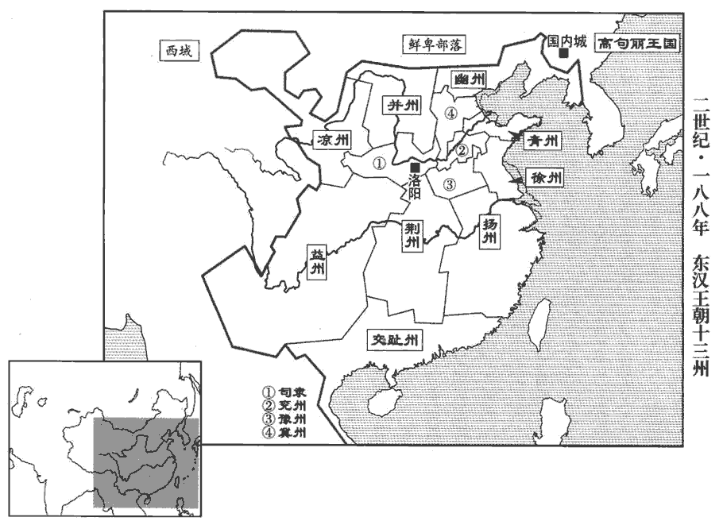
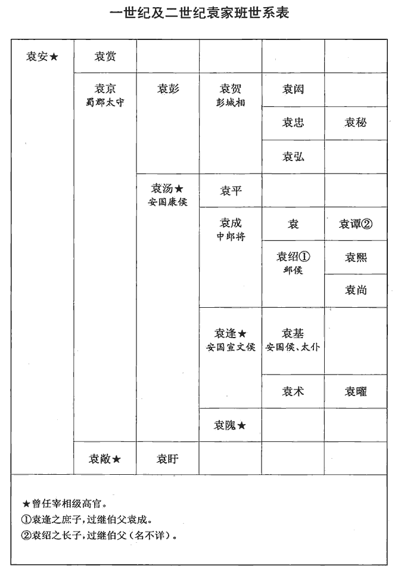
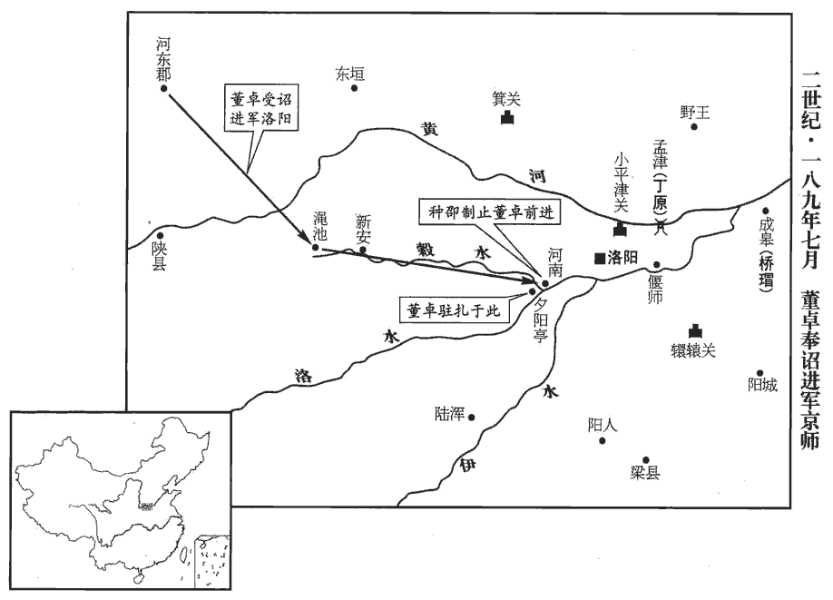
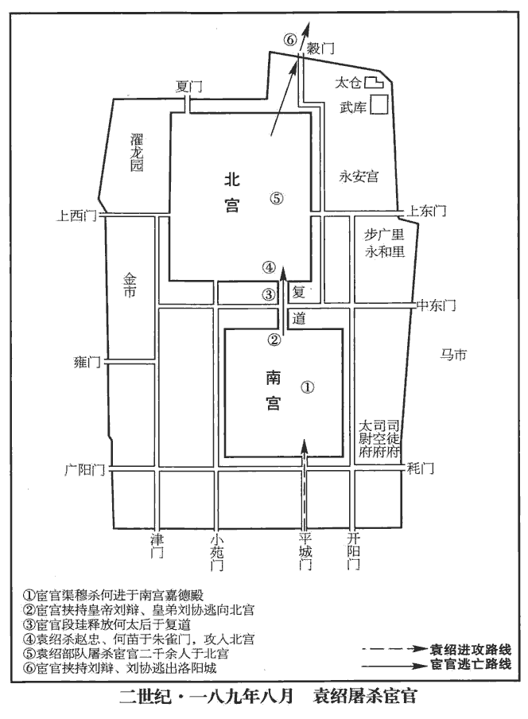
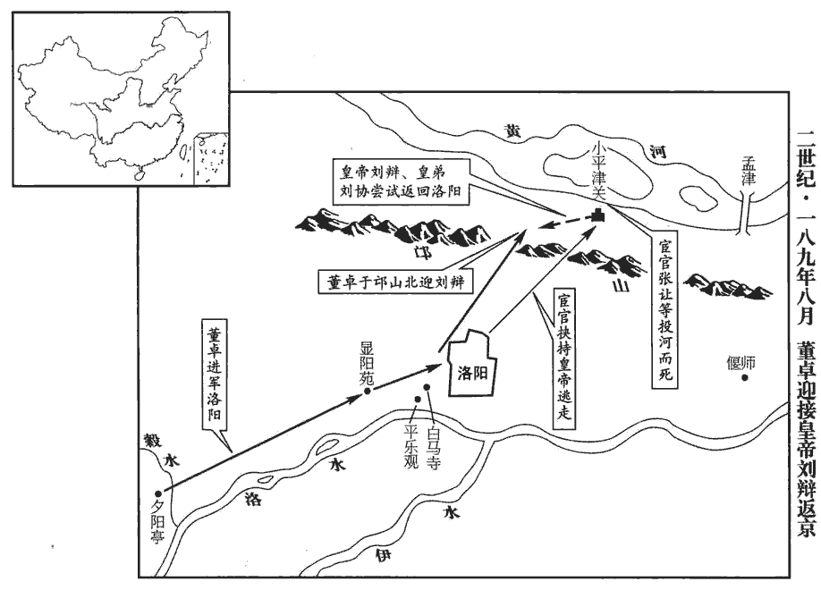
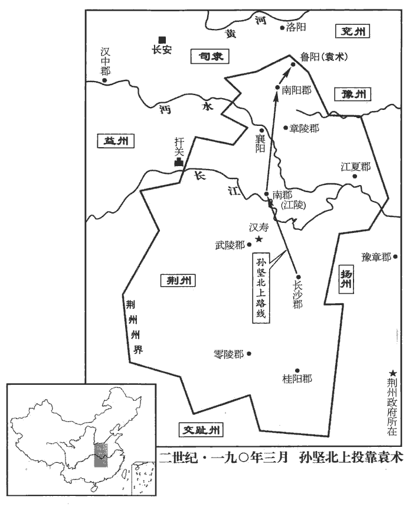
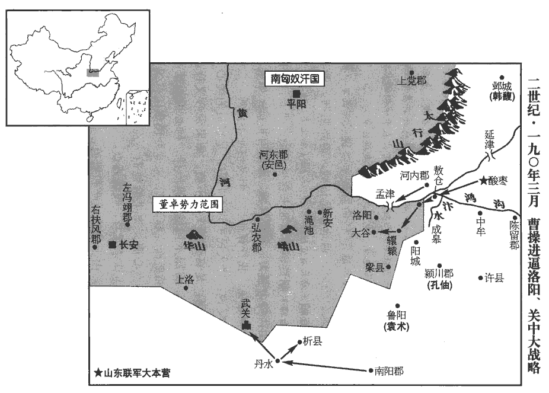

 漢紀五十一起著雍執徐（戊辰），盡上章敦牂（庚午），凡三年。

# 孝靈皇帝下

## 中平五年（戊辰，一八八）

1春，正月，丁酉‹十五›，赦天下。

〖译文〗 [1]春季，正月，丁酉（十五日），大赦天下。

2二月，有星孛bèi于紫宮。紫宮，即太微也。匡衛十二星之內，皆曰紫宮，天子之宮也。孛，蒲內翻。

〖译文〗 [2]二月，有异星出现于紫微星旁。

3黃巾餘賊郭大等起於河西‹汾河以西›白波谷‹山西襄汾西›，帝紀作「西河」，當從之。又按宋白續通典，河南府河清縣，今理白波鎮，無以此谷於孟津為河西歟！寇太原‹山西太原›、河東‹山西夏县›。

〖译文〗 [3]黄巾军残部郭大等人在河西白波谷起兵，进攻太原郡、河东郡。

4三月，屠各胡攻殺并州‹山西›刺史張懿。屠，直於翻。

〖译文〗 [4]三月，匈奴屠各部落进攻并州，杀并州刺史张懿。

5太常江夏‹湖北新洲›劉焉見王室多故，建議以為：「四方兵寇，由刺史威輕，既不能禁，且用非其人，以致離叛。宜改置牧伯，選清名重臣以居其任。」焉內欲求交趾牧。以交趾僻遠，可以避禍也。侍中廣漢‹四川广汉›董扶扶學圖讖，何進薦之，徵拜侍中。私謂焉曰：「京師將亂，益州分野有天子氣。」蔡邕月令章句：自危十度至壁八度，謂之豕韋之次，衛之分野。自壁八度至胃一度，謂之降婁之次，魯之分野。自胃一度至畢六度，謂之大梁之次，趙之分野。自畢六度至井十度，謂之實沈之次，晉之分野。自井十度至柳三度，謂之鶉首之次，秦之分野。自柳三度至張十二度，謂之鶉火之次，周之分野。自張十二度至軫六度，謂之鶉尾之次，楚之分野。自軫六度至亢八度，謂之壽星之次，鄭之分野。自亢八度至尾四度，謂之大火之次，宋之分野。自尾四度至斗六度，謂之析木之次，燕之分野。自斗六度至須女二度，謂之星紀之次，越之分野。自須女二度至危十度，謂之玄枵xiāo之次，齊之分野。晉書天文志用後魏太史令陳卓所言郡國所入宿度，今亦載之：自軫十二度至氐四度為壽星，於辰在辰，鄭分，屬兗州。自氐五度至尾九度為大火，於辰在卯，宋分，屬豫州。自尾十度至南斗十一度為析木，於辰在寅，燕分，屬幽州。自南斗十二度至須女七度為星紀，於辰在丑，吳、越分，屬楊州。自須女八度至危十五度為玄枵，於辰在子，齊分，屬青州。自危十六度至奎四度为諏zōu訾zī，於辰在亥，衛分，属并州。自奎五度至胃六度为降娄，於辰在戌，鲁分，属徐州。自胃七度至畢十一度為大梁，於辰在酉，趙分，屬冀州。自畢十二度至東井十五度為實沈，於辰在申，魏分，屬益州。自東井十六度至柳八度為鶉首，於辰在未，秦分，屬雍州。自柳九度至張十六度為鶉火，於辰在午，周分，屬三河。自張十七度至軫十一度為鶉尾，於辰在巳，楚分，屬荊州。分，扶問翻。焉乃更求益州。會益州刺史郤xì儉賦斂煩擾，謠言遠聞，郤，乞逆翻。春秋晉大夫郤氏。考異曰：范書作「郗儉」，今從陳壽蜀志。斂，力贍翻。聞，音問。而耿鄙、張懿皆為盜所殺，朝廷遂從焉議，選列卿、尚書為州牧，各以本秩居任。列卿，秩中二千石；尚書，秩六百石耳。東都以後，尚書職任重於列卿。以焉為益州‹四川云南›牧，太僕黄琬為豫州牧，宗正東海‹山东郯城›劉虞為幽州‹河北北及辽宁›牧。州任之重，自此而始。焉，魯恭王之後；虞，東海恭王之五世孫也。虞嘗為幽州刺史，民夷懷其恩信，故用之。董扶及太倉令趙韙wěi百官志：太倉令，秩六百石，主受郡國傳漕穀，屬大司農。韙，羽鬼翻。皆棄官，隨焉入蜀。

〖译文〗 [5]太常江夏人刘焉看到汉朝王室多难，向灵帝建议：“各地到处发生叛乱，是由于刺史权小威轻，既不能禁制，又用人不当，所以引起百姓叛离朝廷。应该改置州牧，选用有清廉名声的重臣担任。”刘焉内心里想担任交趾牧，但侍中、广汉人董扶私下里对刘焉说：“京城洛阳将要发生大乱，根据天象，益州地区将出现新的皇帝。”于是，刘焉改变主意，要求去益州。正好益州刺史俭横征暴敛，有关他的暴政的民谣广泛流传；再加上耿鄙、张懿都被盗贼杀死，朝廷就采纳刘焉建议，选用列卿、尚书为州牧，各自以本来的官秩出任。任命刘焉为益州牧、太仆黄琬为豫州牧、宗正东海人刘虞为幽州牧。各州长官权力的增重由此开始。刘焉是鲁恭王刘余的后代，刘虞是东海恭王刘强的五世孙。刘虞曾担任过幽州刺史，百姓与夷人都怀念他的恩德与信誉，因而朝廷有这一任命。董扶与太仓令赵韪都辞去官职，随同刘焉到益州去。

 

6‹刘宏，本年三十三岁›詔發南匈奴‹王庭设美稷内蒙古准格尔旗›兵配劉虞討張純，單于羌渠遣左賢王將騎詣幽州。國人恐發兵無已，於是右部䤈落反，建武中，右部薁犍日逐王比來降，立為䤈落尸逐鞮dī單于。右部䤈落者，蓋其支庶，分居右部，因以為種落之號。䤈，馨兮翻。與屠各胡合，屠，直於翻。凡十餘萬人，攻殺羌渠。考異曰：帝紀：「屠各胡攻殺并州刺史張懿，遂與南匈奴左部胡合，殺其單于。」今從匈奴傳。國人立其子右賢王於扶羅為持至尸逐侯單于。賢曰：於扶羅，即前趙劉淵之祖也，是為亂晉之首。

〖译文〗 [6]灵帝下诏征发南匈奴兵，分配给刘虞，去征伐张纯。南匈奴单于羌渠派遣左贤王率领骑兵赴幽州听候调遣。匈奴人害怕以后不断征发兵员，于是右部落反叛，与屠各胡部落联合，共有十余万人，进攻并杀死羌渠。匈奴人立羌渠的儿子右贤王於扶罗为持至尸逐侯单于。

7夏，四月，太尉曹嵩罷。

〖译文〗 [7]夏季，四月，太尉曹嵩被免职。

8五月，以永樂少府南陽樊陵為太尉；樂，音洛。六月，罷。

〖译文〗 [8]五月，任命永乐少府南阳樊陵为太尉；六月，将他免职。

9益州‹四川云南›賊馬相、趙袛等起兵緜竹‹四川德阳北黄许镇›，緜竹縣，屬廣漢郡。賢曰：故城在今益州緜竹縣東。自號黃巾，殺刺史郤儉，進擊巴郡‹重庆›、犍為‹四川彭山›，旬月之間，破壞三郡，犍，居言翻。壞，音怪。有眾數萬，自【章：甲十一行本「自」上有「相」字；乙十一行本同；張校同。】稱天子。州從事賈龍率吏民攻相等，數日破走，州界清靜。龍乃選吏卒迎劉焉。

〖译文〗 [9]益州人马相、赵祗等在绵竹起兵，自称为“黄巾”，杀死刺史俭，进攻巴郡、犍为，不过一个月，连破三郡，有部众数万人，马相自称天子。益州从事贾龙等率领官吏及百姓进攻马相等，几天后将他们打败，马相等逃跑，益州界内安宁。贾龙于是选派官兵去迎接刘焉。

焉徙治緜竹，撫納離叛，務行寬惠，以收人心。為劉焉專制益州張本。

〖译文〗 刘焉将州府迁到绵竹，招抚离散叛乱的百姓，为政宽容，施行恩德，以收揽人心。

10郡国七大水。

〖译文〗 [10]有七个郡、国发生水灾。

11故太傅陳蕃子逸與術士襄楷會於冀州‹河北中部南部›刺史王芬坐，坐，才臥翻。楷曰：「天文不利宦者，黃門、常侍真族滅矣。」逸喜。芬曰：「若然者，芬願驅除！」因與豪傑轉相招合，上書言黑山賊攻劫郡縣，欲因以起兵。會帝‹刘宏，时年三十三›欲北巡河間‹河北献县›舊宅，帝先為解瀆亭‹河北安国东›侯，有舊宅在河間。芬等謀以兵徼劫，徼，讀曰邀。誅諸常侍、黃門，因廢帝，立合肥侯，以其謀告議郎曹操。以此謀告操，蓋亦知操之為時雄矣。操曰：「夫廢立之事，天下之至不祥也。古人有權成敗、計輕重而行之者，伊、霍是也。此等語，豈常人所能及哉！伊、霍皆懷至忠之誠，據宰輔之勢，因秉政之重，同眾人之欲，故能計從事立。今諸君徒見曩者之易，易，以豉翻。未覩當今之難，而造作非常，欲望必克，不以危乎！」芬又呼平原華歆xīn、陶丘洪共定計。華，戶化翻。姓譜：堯子丹朱，居陶丘，其後氏焉。洪欲行，歆止之曰：「夫廢立大事，伊、霍之所難。芬性疏而不武，此必無成。」洪乃止。會北方夜半有赤氣，東西竟天，太史上言：「北方有陰謀，上，時掌翻。不宜北行。」帝乃止。敕芬罷兵，俄而徵之。芬懼，解印綬亡走，至平原‹山东平原›，自殺。綬，音受。

〖译文〗 [11]已故太傅陈蕃的儿子陈逸与法术家襄楷在冀州刺史王芬处见面，襄楷说：“从天象来看，不利于宦官，那些黄门、常侍们真的要被灭族了。”陈逸对此非常高兴。王芬说：“如果真是这样，我愿意充当干这件事的先锋。”就与各地的豪杰互相联系，上书说黑山地区的盗贼攻打抢劫他属下的郡、县，想以此为借口起兵。正好灵帝想到北方来巡视他在河间的旧居，王芬等计划用武力来劫持灵帝，杀死那些常侍、黄门，然后废黜灵帝，另立合肥侯为皇帝。王芬等将这个计划告诉议郎曹操。曹操说：“废立皇帝是天下最不吉祥的事。古代，有的人衡量轻重、计算成败后施行，伊尹和霍光便是如此。这两个人都满怀忠诚，以宰相的地位，凭借执政大权，加上同众人的愿望一致，故此能实现计划，成就大事。如今，各位只看到他们当初的轻而易举，而未看到现在的困难。用这种非常的手段，想一定达到目的，难道不觉得危险吗？”王芬又邀请平原人华歆、陶丘洪来共同策划。陶丘洪准备动身，华歆进行劝阻，说：“废立皇帝的大事，伊尹、霍光都感觉很困难。何况王芬疏阔而又缺乏威武气概，这次举动一定会失败。”陶丘洪于是没有去。这时候，北方天空在半夜时候有一道赤气，从东到西，横贯天际，负责观测天象的太史上书说：“北方地区有阴谋，陛下不宜去北方。”灵帝于是作罢，命令王芬解散已集结的士兵。不久，征召王芬到洛阳去。王芬害怕，就解下印绶逃亡，跑到平原时自杀了。

12秋，七月，以射聲校尉馬日磾dī為太尉。日磾，融之族孫也。磾，丁奚翻。

〖译文〗 [12]秋季，七月，任命射声校尉马日为太尉。马日他是马融的族孙。

13八月，初置西園八校尉，校，戶教翻。以小黃門蹇碩為上軍校尉，姓譜：蹇，姓也。左傳有秦大夫蹇叔。虎賁中郎將袁紹為中軍校尉，屯騎校尉鮑鴻為下軍校尉，議郎曹操為典軍校尉，趙融為助軍左校尉，馮芳為助軍右校尉，諫議大夫夏牟為左校尉，淳于瓊為右校尉；皆統於蹇碩。考異曰：范書袁紹傳，「紹為佐軍校尉」，何進傳「淳于瓊為佐軍校尉」。今從樂資山陽公載記。帝自黃巾之起，留心戎事；碩壯健有武略，帝親任之，雖大將軍亦領屬焉。

〖译文〗 [13]八月，开始设置西园八校尉。任命小黄门蹇硕为上军校尉，虎贲中郎将袁绍为中军校尉，屯骑校尉鲍鸿为下军校尉，议郎曹操为典军校尉，赵融为助军左校尉，冯芳为助军右校尉，谏议大夫夏牟为左校尉，淳于琼为右校尉，都由蹇硕统一指挥。灵帝自黄巾军起事以后，开始留心军事。蹇硕身体壮健，又通晓军事，很受灵帝信任，连大将军也要听从他的指挥。

14九月，司徒許相罷；以司空丁宮為司徒，光祿勳南陽劉弘為司空。

〖译文〗 [14]九月，司徒许相被免职。任命司空丁宫为司徒，光禄勋南阳人刘弘为司空。

15以衛尉條侯董重為票騎將軍。重，永樂太后兄子也。票，匹妙翻。樂，音洛。

〖译文〗 [15]任命卫尉、条侯董重为票骑将军。董重是灵帝母亲永乐太后哥哥的儿子。

16冬，十月，青‹山东北›、徐‹江苏北›黃巾復起，復，扶又翻。寇郡縣。

〖译文〗 [16]冬季，十月，青州、徐州的黄巾军再度起兵，攻掠郡县。

17望氣者以為京師當有大兵，兩宮流血。帝欲厭之，厭，一葉翻。乃大發四方兵，講武於平樂觀下，水經註：穀水自白馬寺東南逕平樂觀，在上西門外。樂，音洛。觀，古玩翻。起大壇，上建十二重華蓋，蓋高十丈；壇東北為小壇，復建九重華蓋，高九丈。列步騎數萬人，結營為陳。重，直龍翻。高，居傲翻。陳，讀曰陣；下同。甲子‹十六›，帝親出臨軍，駐大華蓋下，大將軍進駐小華蓋下。帝躬擐huàn甲、介馬，賢曰：擐，貫也，音宦。介，亦甲也。稱「無上將軍」，行陳三帀zā而還，行，下孟翻。帀，作答翻。以兵授進。帝問討虜校尉蓋勳曰：蓋，古盍翻。「吾講武如是，何如？」對曰：「臣聞先王曜德不觀兵。國語載祭zhài公謀父之言。今寇在遠而設近陳，不足以昭果毅，左傳曰：戎昭果毅以聽之谓武。殺敵為果，致果為毅。祇黷武耳！」帝曰：「善！恨見君晚，群臣初無是言也。」勳謂袁紹曰：「上甚聰明，但蔽於左右耳。」與紹謀共誅嬖倖，嬖bì，卑義翻，又必計翻。考異曰：勳傳云：「勳時與宗正劉虞、佐軍校尉袁紹同典禁兵。勳謂虞、紹云云。」按虞於匈奴未叛之前已為幽州牧，又宗正非典兵之官。今除之。蹇碩懼，出勳為京兆尹。

〖译文〗 [17]用观察云气来预言吉凶的法术家认为，京城洛阳将有兵灾，南北两宫会发生流血事件。灵帝想通过法术来压制，于是大批征调各地的军队，在平乐观下举行阅兵仪式。修筑一个大坛，上面立起十二层的华盖，高达十丈；在大坛的东北修筑了一个小坛，又立起九层的华盖，高九丈。步骑兵数万人列队，设营布阵。甲子（十六日），灵帝亲自出来阅兵，站在大华盖之下，大将军何进站大小伞盖之下。灵帝亲自披戴甲胄，骑上有护甲的战马，自称“无上将军”，绕军阵巡视三圈后返回，将武器授予何进。灵帝问讨虏校尉盖勋说：“我这样检阅大军，你觉得怎样？”盖勋回答：“我听说从前圣明的君王显示恩德，不炫耀武力。如今，贼寇都在远地，陛下却在京城阅兵，不足以显示消灭敌人的决心，只表现为黩武罢了。”灵帝说：“你的看法很对，可惜我见到你太晚，群臣当初没有讲过这样的话。”盖勋对袁绍说：“皇帝很聪明，只是被他左右的人蒙蔽住了。”他与袁绍密谋一起诛杀宦官。蹇硕感到恐惧，将他调离京城，派到长安去担任京兆尹。

18十一月，王國圍陳倉‹陕西宝鸡东陈仓›。詔復拜皇甫嵩為左將軍，復，扶又翻。督前將軍董卓，合兵四萬人以拒之。

〖译文〗 [18]十一月，王国包围陈仓。灵帝下诏再次任命皇甫嵩为左将军，统率前将军董卓，共有军队四万人，去抵抗王国。

19張純與丘力居鈔略青、徐、幽、冀四州；鈔，楚交翻。詔騎都尉公孫瓚討之。瓚與戰於屬國石門‹辽宁朝阳西南›，屬國，遼東屬國也。賢曰：石門，山名，在今營州柳城縣西南。瓚，藏旱翻。純等大敗，棄妻子，踰塞走；悉得所略男女。瓚深入無繼，反為丘力居等所圍於遼西‹辽宁义县西›管子城，二百餘日，糧盡眾潰，士卒死者什五六。

〖译文〗 [19]张纯与乌桓酋长丘力居在青、徐、幽、冀四州境内到处抢掠。灵帝下诏命骑都尉公孙瓒进行讨伐。公孙瓒在辽东属国的石门山与他们交战，张纯等大败，丢弃妻子儿女，越过边塞逃跑。他们所抢掠浮虏的男女百姓，都被公孙瓒夺回。公孙瓒乘胜深入追击，但没有后援，反被丘力居等包围在辽西郡管子城，过了二百余日，粮尽而全军溃散，士兵死亡了十分之五六。

20董卓謂皇甫嵩曰：「陳倉危急，請速救之。」嵩曰：「不然，百戰百勝，不如不戰而屈人兵。陳倉雖小，城守固備，未易可拔。易，以豉翻。王國雖強，攻陳倉不下，其眾必疲，疲而擊之，全勝之道也，將何救焉！」國攻陳倉八十餘日，不拔。

〖译文〗 [20]董卓对皇甫嵩说：“陈仓形势危急，请赶快救援。”皇甫嵩说：“不然，百战百胜，不如不战而胜。陈仓虽小，但城垣坚固，守卫严密，不容易攻破。王国兵力虽强，但攻不下陈仓，部众必然疲乏，我们乘他们疲乏，发动攻击，这是获得彻底胜利的策略，用得着什么援救呢！”王国围攻陈仓八十余天，未能攻破。

## 六年（己巳，一八九）

1春，二月，國眾疲敝，解圍去，皇甫嵩進兵擊之。董卓曰：「不可！兵法，窮寇勿迫，歸眾勿追。」賢曰：司馬兵法之言。嵩曰：「不然。前吾不擊，避其銳也；今而擊之，待其衰也；所擊疲師，非歸眾也；國眾且走，莫有闘志，以整擊亂，非窮寇也。」遂獨進擊之，使卓為後拒，連戰，大破之，斬首萬餘級。卓大慙恨，由是與嵩有隙。為後獻帝初平二年卓怖嵩張本。

〖译文〗 [1]春季，二月，王国的部队疲惫不堪，解围撤退。皇甫嵩下令进军追击，董卓说：“不行。兵法上说：‘穷寇勿迫，归众勿追。’”皇甫嵩说：“不然，以前我们不进攻，是躲避他们的锐气；现在发动进攻，是等到他们士气已经低落。我们现在所攻击的是疲惫之师，而不是‘归众’；王国的部队正要逃走，已无斗志，并不是‘穷寇’。”于是皇甫嵩独自率军进击，命令董卓作后援。皇甫嵩边连续进攻，大获全胜，斩杀一万多人。董卓大为羞惭恼恨，从此与皇甫嵩结下仇恨。

韓遂等共廢王國，而劫故信都‹河北冀縣›令漢陽‹甘肅甘谷›閻忠，使督統諸部。忠病死，遂等稍爭權利。更相殺害，更，工衡翻。由是寖衰。

〖译文〗 韩遂等人共同废掉王国的首领地位，胁迫前信都县令汉阳人阎忠担任首领，统率各部。阎忠病死，韩遂等人逐渐争权夺利，继而互相攻杀，于是势力逐渐衰弱。

2幽州牧劉虞到部，遣使至鮮卑中，告以利害，責使送張舉、張純首，厚加購賞。丘力居等聞虞至，喜，各遣譯自歸。舉、純走出塞，餘皆降散。虞上罷諸屯兵，上，時掌翻，奏也。但留降虜校尉公孫瓚，將步騎萬人屯右北平‹河北丰润›。瓚以石門之捷，自騎都尉拜降虜校尉。降，戶江翻。校，戶教翻。三月，張純客王政殺純，送首詣虞。公孫瓚志欲掃滅烏桓，而虞欲以恩信招降，由是與瓚有隙。為後初平四年瓚殺虞張本。

〖译文〗 [2]幽州牧刘虞到任后，派使臣到鲜卑部落去，告诉他们利害，责令他们斩送张举和张纯的人头，悬以重赏。丘力居等听说刘虞来到幽州，都很高兴，各派翻译来晋见刘虞，自动归降。张举、张纯逃到塞外，所余部下全都投降或逃散。刘虞上奏，请求将征集的各部队全部遣散，只留下降虏校尉公孙瓒，率领步、骑兵一万人，驻扎在右北平。三月，张纯的门客王政刺杀张纯，带张纯的人头去见刘虞。公孙瓒决心用武力消灭乌桓部落，而刘虞想用恩德和信义来招降他们，因此两人之间产生矛盾。

3夏，四月，丙子朔‹一›，日有食之。

〖译文〗 [3]夏季，四月，丙子朔（疑误），出现日食。

4太尉馬日磾免；遣使即拜幽州牧劉虞為太尉，封容丘侯。容丘縣，屬東海郡。考異曰：袁紀：「三月己丑，光祿劉虞為司馬，領幽州牧。」今從范書。

〖译文〗 [4]太尉马日被免职。灵帝派遣使臣到幽州去任命幽州牧刘虞为太尉，封为容丘侯。

5蹇碩忌大將軍進，與諸常侍共說帝遣進西擊韓遂；說，輸芮翻。帝從之。進陰知其謀，奏遣袁紹收徐、兗二州兵，須紹還而西，以稽行期。

〖译文〗 [5]蹇硕忌恨大将军何进，与诸常侍共同劝说灵帝派遗何进西征韩遂，灵帝同意了。何进暗中获悉他们的阴谋后，上奏请求派袁绍到徐州和兖州去调集军队，要等到袁绍回来再进行西征，以便拖延行期。

6初，帝‹刘宏，时年三十四›數失皇子，數，所角翻。何皇后生子辯，養於道人史子眇miǎo家，號曰「史侯」。賢曰：道人，謂有道術之人。王美人生子協，董太后自養之，號曰「董侯」。群臣請立太子。帝以辯輕佻無威儀，佻，初彫翻，輕薄也。欲立協，猶豫未決。會疾篤，屬協於蹇碩。屬，之欲翻，託也。丙辰‹十一›，帝‹刘宏›崩于嘉德殿。年三十四。嘉德殿在南宮九龍門內。碩時在內，欲先誅何進而立協，使人迎進，欲與计事；進即駕往。碩司馬潘隱與進早舊，迎前目之。進驚，馳從儳chán道歸營，廣雅曰：儳，疾也；仕鑒翻。引兵入屯百郡邸，天下郡國百餘，皆置邸京師。謂之百郡邸者，百郡總為一邸也。因稱疾不入。

〖译文〗 [6]当初，灵帝连续死去了几个儿子，因此，何皇后生下儿子刘辩后，就送到道人史子眇家去抚养，故被称为“史侯”。王美人生下儿子刘协，由董太后亲自抚养，被称为“董侯”。群臣请求灵帝立太子。灵帝认为刘辩为人轻佻，缺乏威仪，想立刘协，但犹豫未决。正在这时，灵帝病重，把刘协托付给蹇硕。丙辰（十一日），灵帝于嘉德殿驾崩。蹇硕当时在皇宫中，想先杀何进，然后立刘协为皇帝。他派人去接何进要与他商议事情，何进即刻乘车前往。蹇硕的司马潘隐与何进早有交谊，在迎接他时用眼神示意。何进大惊，驰车抄近道跑回自己控制的军营，率军进驻各郡国在京城的官邸，声称有病，不再进宫。

戊午‹十三›，皇子辯即皇帝位，年十四。考異曰：帝紀云「年十七」，張璠fán漢紀曰「帝年十四」，今從之。尊皇后曰皇太后。太后臨朝。朝，直遙翻；下同。赦天下，改元為光熹。封皇弟協為勃海王。協年九歲。以後將軍袁隗為太傅，與大將軍何進參錄尚書事。

〖译文〗 戊午（十三日），皇子刘辩即帝位，当时他十四岁。尊称母亲何皇后为皇太后。何太后临朝主持朝政，大赦天下，改年号为光熹。封皇弟刘协为勃海王，当时他只有九岁。任命后将军袁隗为太傅，与大将军何进共同主持尚书事务。

進既秉朝政，忿蹇碩圖己，陰規誅之。袁紹因進親客張津，勸進悉誅諸宦官。進以袁氏累世貴寵，袁安為司空、司徒，子敞為司空，孫湯為司空、司徒、太尉，湯子逢為司空，少子隗亦為三公，是累世貴寵也。而紹與從弟虎賁中郎將術皆為豪桀所歸，信而用之。從，才用翻；下同。復博徵智謀之士復，扶又翻。何顒yóng、荀攸及河南鄭泰等二十餘人，以顒為北軍中候，攸為黃門侍郎，百官志：給事黃門侍郎，六百石，掌侍從左右，給事中，關通內外。獻帝起居注曰：帝初即位，令侍中、給事黃門侍郎員各六人，出入禁中，近侍帷幄，省尚書事。蓋前無定員，至帝始定員數也。顒，魚容翻。泰為尚書，與同腹心。攸，爽之從孫也。

〖译文〗 何进既已掌握朝政大权，怨恨蹇硕想谋害自己，暗中计划将他杀死。袁绍通过何进的亲信门客张津，劝说何进将所有的宦官一网打尽。何进因袁氏历代都有人作高官，袁绍与堂弟虎贲中郎将袁术又为天下豪杰所拥戴，因此相信并任用他们。又广泛征聘有智谋的人士何、荀攸及河南人郑泰等二十人，任命何为北军中侯，荀攸为黄门侍郎，郑泰为尚书，把他们都作为自己的心腹。荀攸是荀爽的族孙。

蹇碩疑不自安，與中常侍趙忠、宋典等書曰：「大將軍兄弟秉國專朝，今與天下黨人謀誅先帝左右，掃滅我曹，但以碩典禁兵，故且沈吟。今宜共閉上閤，上閤，省閤也。沈，持林翻。急捕誅之。」中常侍郭勝，進同郡人也，太后及進之貴幸，勝有力焉，考異曰：袁紀作「郭脈」，九州春秋作「郎勝」，今從何進傳。故親信何氏；與趙忠等議，不從碩計，而以其書示進。庚午‹二十五›，進使黃門令收碩，誅之，因悉領其屯兵。

〖译文〗 蹇硕心里疑虑不安，写信给中常侍越忠、宋典等人说：“大将军何进兄弟控制朝政，独断专行，如今与天下的党人策划要诛杀先帝左右的亲信，消灭我们。只是因为我统率禁军，所以暂且迟疑。现在应该一起动手，关闭宫门，赶快将何进逮捕处死。”中常侍郭胜与何进是同郡之人，何太后及何进能有贵宠的地位，他帮了很大的忙，因此他亲近信赖何氏。郭胜与赵忠等人商议后，拒绝蹇硕的提议，而把蹇硕的信送给何进看。庚午（二十五日），何进令黄门令逮捕蹇硕，将他处死，于是把禁军全部置于自己指挥之下。

 

票騎將軍董重，票，匹妙翻。與何進權勢相害，中官挾重以為黨助。董太后每欲參干政事，何太后輒相禁塞，塞，猶遏也。塞，悉則翻。董后忿恚huì，詈曰：「汝今輈zhōu張，怙hù汝兄耶！恚，於避翻。賢曰：輈張，猶強梁也。兄，謂進也。輈，音舟。吾敕票騎斷何進頭，如反手耳！」斷，丁管翻。何太后聞之，以告進。五月，進與三公共奏：「孝仁皇后使故中常侍夏惲等交通州郡，辜較財利，悉入西省。夏，戶雅翻。惲，於粉翻。較，讀曰榷què。西省，即謂永樂宮司。故事，蕃后不得留京師；賢曰：蕃后，謂平帝母衛姬。王莽攝政，恐其專權，后不得留在京師，故以為故事也。請遷宮本國。」奏可。辛巳‹六›，進舉兵圍票騎府，收董重，免官，自殺。六月，辛亥‹七›，董太后憂怖，暴崩。怖，普布翻。考異曰：九州春秋曰：「太后憂懼，自殺。」今從皇后紀。民間由是不附何氏。

〖译文〗 票骑将军董重与何进互争权力，宦官们依靠董重做为党援。董太后每次想要干预国家政事，何太后都加以阻止。董太后感到愤恨，骂道：“你现在气焰嚣张，是依仗你的哥哥何进！我如命令票骑将军董重砍下何进的人头，只是举手之劳！”何太后听到后，告诉给何进。五月，何进与三公共同上奏：“董太后派前中常侍夏恽等与州、郡官府相互勾结，搜刮财物，都存在她所住永乐宫。按照过去的贯例，藩国的王后不能留住在京城，请把她迁回本国。”何太后批准了这一奏章。辛巳（初六），何进举兵包围了票骑将军府，逮捕董重，免除他的职务，董重自杀。六月，辛亥（初七），董太后又忧又怕，突然死去。从此以后，何进一家失去民心。

7辛酉‹十七›，葬孝靈皇帝于文陵。賢曰：在雒陽西北二十里。何進懲蹇碩之謀，稱疾，不入陪喪，又不送山陵。

〖译文〗 [7]辛酉（十七日），把灵帝安葬在文陵。何进警惕会发生蹇硕那样的阴谋，自称有病，不入宫去陪丧，也不送灵帝的棺椁到墓地。

8大水。

〖译文〗 [8]发生水灾。

9秋，七月，徙勃海王協為陳留王。

〖译文〗 [9]秋季，七月，改封勃海王刘协为陈留王。

10司徒丁宮罷。

〖译文〗 [10]司徒丁宫被免职。

11袁紹復說何進曰：復，扶又翻。說，輸芮翻。「前竇武欲誅內寵而反為所害者，但坐言語漏泄；五營兵士皆畏服中人，而竇氏反用之，自取禍滅。事見五十六卷建寧元年。今將軍兄弟并領勁兵，謂進及弟苗也。部曲將吏皆英俊名士，樂盡力命，樂，音洛。事在掌握，此天贊之時也。將軍宜一為天下除患，以垂名後世，不可失也！」為，于偽翻；下同。進乃白太后，請盡罷中常侍以下，以三署郎補其處。太后不聽，曰：「中官統領禁省，自古及今，漢家故事，不可廢也。且先帝新棄天下，我柰何楚楚與士人共對事乎！」楚詞註曰：楚楚，鮮明貌。詩曰：衣裳楚楚。進難違太后意，且欲誅其放縱者。紹以為中官親近至尊，近，其靳翻。出納號令，今不悉廢，後必為患。而太后母舞陽君及何苗數受諸宦官賂遺，數，所角翻；下同。遺，于季翻。知進欲誅之，數白太后為其障蔽；又言：「大將軍專殺左右，擅權以弱社稷。」太后疑以為然。進新貴，素敬憚中官，雖外慕大名而內不能斷，斷，丁亂翻；下同。故事久不決。

〖译文〗 [11]袁绍又向何进建议说：“从前窦武他们想要消灭宦官，反而被宦官所杀害，只是因为消息泄露。五营兵士一向畏惧宦官的权势，而窦氏反而利用他们，所以自取灭亡。如今将军兄弟同时统帅禁军劲族，部下将领官吏都是俊杰名士，乐于为您效命，事情全在掌握之中，这是天赐良机。将军应该一举为天下除去大害，垂名后世，不要错过这个机会！”何进于是向太后建议，请求全部撤换中常侍及以下的宦官，委派三署郎官代替他们的职务。何太后不答应，说：“从古至今，都是由宦官来管理皇宫内的事情，这条汉朝的传统制度，不能废掉。何况先帝刚刚去世，我怎能衣冠整齐地与士人相对共事呢！”何进难以违背太后的意思，打算暂且诛杀最跋扈的宦官。袁绍认为宦官最亲近太后和皇帝，百官的奏章及皇帝诏命都由他们来回传递，现在如果不彻底除掉，将来一定会有后患。但是何太后的母亲舞阳君和弟弟何苗多次接受宦官们的贿赂，知道何进要消灭宦官，屡次向何太后进言阻止，又说：“大将军擅自杀害左右近臣，专权独断，削弱国家。”太后心中疑虑，认为他们的话有理。何进新近掌握重权，但他一向对宦官们既尊敬又畏惧，虽然羡慕得到除去宦官的美名，但心中不能当机立断，因此事情拖下来，久久不能决定。

紹等又為畫策，多召四方猛將及諸豪傑，使并引兵向京城‹洛阳›，以脅太后；進然之。主簿廣陵‹扬州›陳琳諫曰：「諺稱『掩目捕雀』，夫微物尚不可欺以得志，況國之大事，其可以詐立乎！今將軍總皇威，握兵要，龍驤虎步，高下在心，此猶鼓洪爐燎毛髮耳。但當速發雷霆，行權立斷，則天人順之。而反委釋利器，利器，謂兵柄也。更徵外助，大兵聚會，強者為雄，所謂倒持干戈，授人以柄，功必不成，祇為亂階耳！」進不聽。典軍校尉曹操聞而笑曰：「宦者之官，古今宜有，但世主不當假之權寵，使至於此。既治其罪，治，直之翻。當誅元惡，一獄吏足矣，何至紛紛召外兵乎！欲盡誅之，事必宣露，吾見其敗也。」

〖译文〗 袁绍又为何进出谋划策，劝他多召各地的猛将和英雄豪杰，让他们都率军向京城洛阳进发，以此来威胁何太后，何进同意了这一计划。主簿、广陵人陈琳劝阻说：“民间有一句谚语，叫‘闭起眼睛捉麻雀’。像那样的小事，尚且不可用欺诈手段达到目的，何况国家大事，怎么可以用欺诈办成呢？如今将军身集皇家威望，手握兵权，龙行虎步，为所欲为。这样对付宦官，好比是用炉火去烧毛发。只要您发动，用雷霆万钧之势当机立断，发号施令，那么上应天意，下顺民心，很容易达到目的。然而如今反而放弃手中的权柄，去征求外援。等到各地大军聚集时，强大者就将称雄，这样做就是所谓倒拿武器，而把手柄交给别人一样，必定不会成功，只会带来大乱罢了。”何进不听。典军校尉曹操听说后笑着说：“在宫中服务的宦官，古今都应该有，只是君王不应该给予大权和宠信，使他们发展到现在这个程度。既然要惩治他们，应当除去首恶，只要一个狱吏就足够了。何至于纷纷攘攘地征召各地部队呢！假如要想将他们一网打尽，事情必然会泄露，我将看到此事的失败。”

初，靈帝徵董卓為少府，據卓傳，中平六年徵卓為少府。蓋即是年也。卓上書言：「所將湟中‹青海东北部›義從及秦、胡兵將，即亮翻。從，才用翻。皆詣臣言：『牢直不畢，禀賜斷絕，妻子飢凍。』牽挽臣車，使不得行。羌、胡憋腸狗態，賢曰：言羌、胡心腸憋惡，情態如狗也。方言云：憋，惡也。郭璞云：憋怤fū，急性也。憋，音芳列翻。怤，音芳于翻。臣不能禁止，輒將順安慰，增異復上。」賢曰：如其更增異志，當復聞上。洪氏隸釋曰：漢靈帝建寧二年，魯相史晨祠孔廟奏後云「增異輒上」，光和二年，樊毅復華下民租口算奏後云「增異復上」。此蓋當時奏文結末之常語。蓋言繼今事有增於此者，異於此者，將復上奏也。復，扶又翻。上，時掌翻。朝廷不能制。及帝寢疾，璽書拜卓并州牧，璽，斯氏翻。令以兵屬皇甫嵩。卓復上書言：「臣誤蒙天恩，掌戎十年，士卒大小，相狎彌久，戀臣畜養之恩，為臣奮一旦之命，畜，許六翻。為，于偽翻。乞將之北州，效力邊垂。」將，如字，又即亮翻。之，往也。嵩從子酈說嵩曰：從，才用翻。酈，音歷。考異曰：袁紀作「從子邐」，今從范書。「天下兵柄，在大人與董卓耳。今怨隙已結，勢不俱存。卓被詔委兵而上書自請，此逆命也。彼度京師政亂，被，皮義翻。度，徒洛翻。故敢躊躇不進，此懷姦也。二者，刑所不赦。且其凶戾無親，將士不附。大人今為元帥，嵩討王國時為督，故曰元帥。杖國威以討之，上顯忠義，下除凶害，無不濟也。」嵩曰：「違命雖罪，專誅亦有責也。卓不釋兵為違命，嵩擅討卓為專誅。不如顯奏其事，使朝廷裁之。」乃上書以聞。帝以讓卓。卓亦不奉詔，駐兵河東‹山西夏县›以觀時變。

〖译文〗 起初，灵帝征召董卓入朝担任少府。董卓上书说：“我所统领的湟中地区的志愿附属军以及羌、胡兵都来见我，说：‘没有发给足够的粮饷，没有赏赐，妻子儿女都饥寒交迫。’把我的车子拖住，使我无法动身。这些羌、胡人都心肠险恶，很难驾驭，我不能让他们听从命令，只能先留下来进行安抚。有新的情况，再随时汇报。”朝廷无法约束董卓。到灵帝病重时，下诏任命董卓为并州牧，命令他把军队交给皇甫嵩指挥。董卓又上书说：“我得到陛下信任，掌兵达十年之久。在全军上下，久已培养起感情，他们眷恋我的恩德，愿意一朝为我效死。请求陛下准许我把这支军队带到并州，为国家守卫边疆。”皇甫嵩的侄子皇甫郦向皇甫嵩建议说：“全国的军权，主要握在您和董卓手中。现在双方已结下仇怨，势必不能共存。董卓接到命令他交出军权的诏书，但他却上书请求带走军队，是违抗皇帝的诏命。他认为朝中政治混乱，所以敢于拖延时间，按兵不动，这是心怀奸诈。这两项都是不能赦免的大罪。而且他凶暴残忍，不受将士拥戴。您现在身为元帅，倚仗国威去讨伐他，对上表示您的忠义，又为下边消除一个祸害，无往不利。”皇甫嵩说：“尽管董卓违抗诏命有罪，但不得朝廷批准，就擅自讨伐他，也有罪，不如公开奏报这件事，由朝廷来裁决。”于是，上书奏明。灵帝下诏责备董卓。董卓仍不肯服从，把军队驻扎在河东郡，以观察时局变化。

何進召卓使將兵詣京師。考異曰：進傳曰：「召卓屯關中上林苑。」按時卓已駐河東，若屯上林，則更為西去，非所以脅太后也。今從卓傳。侍御史鄭泰諫曰：「董卓強忍寡義，志欲無厭，厭，於鹽翻。若借之朝政，借，子夜翻。授以大事，將恣凶欲，必危朝廷。明公以親德之重，據阿衡之權，秉意獨斷，斷，丁亂翻。誅除有罪，誠不宜假卓以為資援也！且事留變生，殷鑒不遠，謂竇武之事，可為殷鑒也。宜在速決。」尚書盧植亦言不宜召卓，進皆不從。泰乃棄官去，謂荀攸曰：「何公未易輔也。」易，以豉翻。

〖译文〗 何进召董卓率军到洛阳来。侍御史郑泰劝谏说：“董卓为人强悍，不讲仁义，又贪得无厌。假如朝廷依靠他的支持，授以兵权，他将为所欲为，必然会威胁到朝廷的安全。您作为皇帝国戚，掌握国家大权，可以依照本意独断独行，惩治那些罪人，实在不应该依靠董卓作为外援！而且事情拖得太久，就会起变化，先前窦武之事的教训并不久远，应该赶快决断。”尚书卢植也认为不应当召董卓，何进都不接受。郑泰于是辞职而去，告诉荀攸说：“何进是个不容易辅佐的人。”

進府掾王匡，騎都尉鮑信，皆泰山‹山东泰安›人，進使還鄉里募兵；并召東郡太守橋瑁屯成皋‹河南荥阳西北汜水关›，瑁，音冒。使武猛都尉丁原將數千人寇河內‹河南武陟›，燒孟津，火照城中，賢曰：武猛，謂其有武藝而勇猛，取其嘉名，因以名官。皆以誅宦官為言。

〖译文〗 何进的僚属王匡与骑都尉鲍信都是泰山人，何进让他们回乡去召募军队。又召东郡太守桥瑁屯兵成，让武猛都尉丁原率领数千人进军河内郡，焚烧黄河的孟津渡口，火光直照到洛阳城中。这些行动都以消灭宦官作为口号。

 

董卓聞召，即時就道，并上書曰：「中常侍張讓等，竊倖承寵，濁亂海內。臣聞揚湯止沸莫若去薪；去，羌呂翻。前書：枚乘諫吳王曰：欲湯之凔，一人炊之，百人揚之，無益也，不如絕薪止火而已。凔，音則亮翻，寒也。潰癰雖痛，勝於內食。言癰疽蘊結，破之雖痛，勝於內食肌肉，浸淫滋大也。昔趙鞅興晉陽‹太原›之甲以逐君側之惡，公羊傳曰：晉趙鞅取晉陽之甲以逐荀寅與士吉射者曷為？君側之惡人也。此逐君側之惡人，曷為以叛言之？無君命也。今臣輒鳴鐘鼓如雒陽，賢曰鳴鐘鼓者，聲其罪也。請收讓等以清姦穢！」太后猶不從。何苗謂進曰：「始共從南陽來，俱以貧賤依省內以致富貴，言何后因宦官得進，進兄弟以此致富貴也。國家之事，亦何容易。易，以豉翻。覆水不收，宜深思之，水覆於地，不可復收，言事發則不可收拾。且與省內和也。」卓至澠池，澠，彌兗翻。而進更狐疑，使諫議大夫种卲宣詔止之。卓不受詔，遂前至河南；河南，周之王城，去雒陽不遠。种，音沖。卲迎勞之，勞，力到翻。因譬令還軍。卓疑有變，使其軍士以兵脅卲。卲怒，稱詔叱之，軍士皆披，披，芳靡翻。遂前質責卓；卓辭屈，乃還軍夕陽亭。賢曰：夕陽亭在河南城西。卲，暠之孫也。

〖译文〗 董卓接到何进召他进京的命令，立刻上路出发。同时上书说：“中常侍张让等人，利用得到皇帝宠幸之机，扰乱天下。我曾听说，扬汤止沸。不如釜底抽薪；疮痈溃烂虽然疼痛，但胜于向内侵蚀脏腑。从前赵鞅统率晋阳的军队来清除君王身边的恶人，如今我则敲响钟鼓到洛阳来，请求逮捕张让等人，以清除奸邪！”太后仍然不答应。何苗对何进说：“我们当初一起从南阳来，出身贫贱，都是依靠宦官的扶助，才有今天的富贵。国家大事，又谈何容易，覆水难收，应该多加考虑。应暂且与宦官们和解。”董卓到渑池时，何进更加犹豫不决，派谏议大夫种邵拿着皇帝诏书去阻止董卓。董卓不接受诏命，一直进军到河南。种邵迎接尉劳他的军队，并劝令他退军。董卓疑心洛阳政局已发生变动，命部下用武器威胁种邵。种邵大怒，用皇帝的名义叱责他们，士兵都害怕地散开。于是种邵上前当面责问董卓，董卓理屈辞穷，只好撤军回到夕阳亭。种邵是种的孙子。

袁紹懼進變計，因脅之曰：「交構已成，形勢已露，將軍復欲何待而不早決之乎？事久變生，復為竇氏矣！」復，扶又翻。進於是以紹為司隸校尉，假節，專命擊斷；漢司隸校尉本持節，至元帝時，諸葛豐為司隸，始去節。今假紹節，重其權也。斷，丁亂翻。從事中郎王允為河南尹。紹使雒陽方略武吏司察宦者，而促董卓等使馳驛上奏，欲進兵平樂觀。上，時掌翻。樂，音洛。觀，古玩翻。太后乃恐，悉罷中常侍、小黃門使還里舍，唯留進所私人以守省中。諸常侍、小黃門皆詣進謝罪，唯所措置。進謂曰：「天下匈匈，正患諸君耳。今董卓垂至，諸君何不早各就國！」袁紹勸進便於此決之，勸進於此時悉誅之也。至于再三；進不許。紹又為書告諸州郡，詐宣進意，使捕案中官親屬。

〖译文〗 袁绍怕何进改变主意，便威胁他说：“矛盾已经形成，行动迹象已经显露，将军还想等待什么，而不早作决断？事情拖得太久会发生变化，就要重演窦武被害的惨剧了！”何进于是任命袁绍为司隶校尉，假节，有不经请示就逮捕或处死罪犯的权力。又任命从事中郎王允为河南尹。袁绍命属下的方略武吏去侦察宦官动静，又催促董卓等人，让他们派驿使紧急上奏，在奏章上声称要进军到平乐观。于是何太后大为恐惧，把中常侍、小黄门等宦官都罢免回家，只留下一些何进所亲信的人守在宫中。诸常侍、小黄门都去向何进请罪，表示一切听从他的处置。何进对他们说：“天下动荡不定，只是由于厌恨你们。如今董卓马上就要来了，你们为什么还不早日各自回到自己的封国去！”袁绍劝何进乘此机会一网打尽，以至再三申明理由，但何进不许。袁绍又用公文通知各州、郡官府，假借何进的名义，要各地逮捕宦官们的亲属。

進謀積日，頗泄，中官懼而思變。張讓子婦，太后之妹也，讓向子婦叩頭曰：「老臣得罪，當與新婦俱歸私門。唯受恩累世，賢曰：唯，思念也。今當遠離宮殿，離力智翻。情懷戀戀，願復一入直，復，扶又翻；下同。得暫奉望太后陛下顏色，然後退就溝壑，死不恨矣！」子婦言於舞陽君，入白太后；乃詔諸常侍皆復入直。

〖译文〗 何进的密谋因时间太长，泄露了不少。宦官们感到恐惧，想改革局面。张让的儿媳是何太后的妹妹，张让向她叩头请求说：“我现在犯下罪责，理应全家回到家乡。想到我家几代蒙受皇恩，如今要远离宫殿，心中恋恋不舍。我愿再入宫侍候一次，得以暂时见到太后，趋承颜色，然后退到沟壑，死也没有遗恨了！”这位儿媳向母亲舞阳君说情，舞阳君又入宫向何太后说情。于是何太后下诏，让诸常侍全都重新入宫服侍。

八月，戊辰‹二十五›，進入長樂宮，樂，音洛。白太后，請盡誅諸常侍。中常侍張讓、段珪相謂曰：「大將軍稱疾，不臨喪，不送葬，今欻xū入省，賢曰：欻，音許勿翻。此意何為？竇氏事竟復起邪？」使潛聽，具聞其語。乃率其黨數十人持兵竊自側闥入，伏省戶下，進出，因詐以太后詔召進，入坐省閤。讓等詰進曰：「天下憒憒，詰，去吉翻。說文曰：憒憒，亂也，古對翻。亦非獨我曹罪也。先帝嘗與太后不快，幾至成敗，事見上卷光和四年。幾，居希翻。我曹涕泣救解，各出家財千萬為禮，和悅上意，但欲託卿門戶耳。今乃欲滅我曹種族，不亦大甚乎！」種，章勇翻。於是尚方監渠穆拔劍斬進於嘉德殿前。案百官志，尚方有令、丞而無監，桓、靈之世，諸署令悉以宦者為之，尚方監必亦置於是時也。渠，姓也。左傳：天王使宰渠伯糾來聘。又衛有渠孔御戎。讓、珪等為詔，以故太尉樊陵為司隸校尉，少府許相為河南尹。尚書得詔版，疑之，曰：「請大將軍出共議。」中黃門以進頭擲與尚書曰：「何進謀反，已伏誅矣！」

〖译文〗 八月，戊辰（二十五日），何进入长乐宫，奏告何太后，请求杀死全体中常侍。中常侍张让、段商议说：“大将军何进自称有病，不参加先帝的丧礼，不送葬到墓地去，如今突然入宫，这是什么意图？难道窦武事件竟要重演吗？”派人去窃听何进兄妹的谈话，获知全部谈话内容。于是率领自己的党羽数十人，手持武器，偷偷从侧门进去，埋伏在殿门下。等何进出来，就假传太后的旨意召他。何进入宫，坐在省。于是张让等人责问何进说：“天下大乱，也不单是我们宦官的罪过。先帝曾经跟太后生气，几乎废黜太后，我们流着泪进行解救，各人都献出家财千万作为礼物，使先帝缓和下来，只是要托身于你的门下罢了。如今你竟想把我们杀死灭族，不也太过分了吗！”于是尚方监渠穆拔出剑来，在喜德殿前杀死何进。张让、段等写下诏书，任命前太尉樊陵为司隶校尉，少府许相为河南尹。尚书看到诏书，觉得可疑，说：“请大将军何进出来共同商议。”中黄门将何进的人头扔给尚书，说：“何进谋反，已被处死了！”

進部曲將吳匡、張璋在外，聞進被害，被，皮義翻。欲引兵入宮，宮門閉。虎賁中郎將袁術與匡共斫攻之，中黃門持兵守閤。會日暮，術因燒南宮青瑣門，衛瓘guàn曰：青瑣，門邊青鏤也。一曰天子門內有眉格再重，裹青畫曰瑣。考異曰：何進傳作「九龍門」。今從袁紀。欲以脅出讓等。讓等入白太后，言大將軍兵反，燒宮，攻尚書闥tà，尚書闥，即尚書門。因將太后、少帝及陳留王劫省內官屬，從複道走北宮。將，如字，攜也，挾也。尚書盧植執戈於閤道窗下，仰數段珪；數，所具翻。珪懼，乃釋太后，太后投閤，乃【章：甲十一行本「乃」作「得」；乙十一行本同；孔本同。】免。袁紹與叔父隗矯詔召樊陵、許相，斬之。紹及何苗引兵屯朱雀闕下，捕得趙忠等，斬之。吳匡等素怨苗不與進同心，而又疑其與宦官通謀，乃令軍中曰：「殺大將軍即【章：甲十一行本「卽」上有「者」字；乙十一行本同；孔本同；張校同。】車騎也，時苗為車騎將軍。吏士能為報讎乎！」為，于偽翻。皆流涕曰：「願致死！」匡遂引兵與董卓弟奉車都尉旻攻殺苗，棄其尸於苑中。紹遂閉北宮門，勒兵捕諸宦者，無少長皆殺之，少，詩照翻。長，知兩翻。凡二千餘人，或有無須而誤死者。須，古鬚字通。紹因進兵排宮，或上端門屋，以攻省內。宮之正南門曰端門，省禁也。

〖译文〗 何进部下的军官吴匡、张璋在皇宫外，听到何进被杀害，打算率军入宫，但宫门已关闭。虎贲中郎将袁术与吴匡等共同进攻皇宫，用刀劈砍宫门，中黄门等则手持武器，防住宫门。适逢黄昏，袁术于是纵火烧南宫的青琐门，想以此威胁宫中交出张让等人。张让等人到后宫禀告何太后，说：“大将军何进的部下谋反，纵火烧宫，并进攻尚书门。”他们裹胁着何太后、少帝、陈留王刘协，劫持宫内的其他官员从天桥阁道逃向北宫。尚书卢植手持长戈站在阁道的窗下，仰头斥责段，段惊恐害怕，于是放开何太后，何太后从窗口跳下，得以幸免。袁绍与他叔父袁隗假传圣旨，召来樊陵、许相，把他们处斩。袁绍与何苗等率兵驻扎在朱誉门下，捉住赵忠等人处斩。吴匡等人一向就怨恨何苗不与何进同心，而且怀疑他与宦官有勾结，于是号令军中说：“杀死大将军的人就是车骑将军何苗，将士们能为大将军报仇吗？何进部下都流着泪说：“愿拼死为大将军报仇！”于是吴匡就率兵与董卓的弟弟奉车都尉董一起攻杀何苗，把他的尸体扔在宫苑里。于是袁绍关上北宫门，派兵捉拿宦官，不论老少，一律杀死，共二千余人毙命，有人因为未长胡须而被误杀。袁绍乘势率军进攻，扫荡宫禁，有的士兵爬上端门屋，向宫内冲击。

庚午‹二十七›，張讓、段珪等困迫，遂將帝與陳留王數十人步出穀門，穀門，位在子，雒城正北門也。夜，至小平津，賢曰：小平津在今鞏縣西北。杜佑曰：鞏縣西北有小平縣故城，又北有津，曰小平津。六璽不自隨，公卿無得從者，從，才用翻。唯尚書盧植、河南中部掾閔貢夜至河上。漢官儀：諸郡置五部督郵以監屬縣；河南尹置四部督郵，中部為掾。掾，俞絹翻。貢厲聲質責讓等，且曰：「今不速死，吾將殺汝！」因手劍斬數人。手，式又翻。讓等惶怖，怖，普布翻；下同。叉手再拜，叩頭向帝辭曰：「臣等死，陛下自愛！」遂投河而死。

〖译文〗 庚午（二十七日），张让、段等被困宫中，无计可施，只好带着少帝、陈留王刘协等数十人步行出门。夜里，到达小平津。皇帝所用的六颗御玺没有随身带上，没有公卿跟随，只有尚书卢植、河南中部掾闵贡夜里到达黄河岸边。闵贡厉声斥责张让等人，而且说：“你们如今还不快死，我就要来杀你们！”于是用手中的剑砍死数名宦官，张让等又惊又怕，拱手再拜，又向少帝叩头辞别说：“我们死了，请陛下自己保重！”于是投河而死。

 

貢扶帝與陳留王夜步逐螢光南行，欲還宮，行數里，得民家露車，露車者，上無巾蓋，四旁無帷裳，蓋民家以載物者耳。共乘之，至雒舍止。雒舍，地名，在北芒之北。辛未‹二十八›，帝獨乘一馬，陳留王與貢共乘一馬，從雒舍南行，公卿稍有至者。董卓至顯陽苑，顯陽苑，桓帝延熹二年所造，在雒陽西。遠見火起，知有變，引兵急進；未明，到城西，聞帝在北，因與公卿往奉迎於北芒阪下‹邙山北›。帝見卓將兵卒至，將，即亮翻。卒，讀曰猝。恐怖涕泣。群公謂卓曰：「有詔卻兵。」卓曰：「公諸人為國大臣，不能匡正王室，至使國家播蕩，東都群臣謂天子為國家。何卻兵之有！」卓與帝語，語不可了；了，曉解也。乃更與陳留王語，问禍亂由起，王答，自初至終，無所遺失。卓大喜，以王為賢，且為董太后所養，卓自以與太后同族，遂有廢立之意。

〖译文〗 闵贡扶着少帝与陈留王刘协，在夜里追着萤火虫的微光徒步向南走，想回到宫中。走了几里地，得到百姓家一辆板车，大家一齐上车，到达洛舍歇息。辛未（二十八日），找到马匹，少帝独自骑一匹，陈留王刘协和闵贡合骑一匹，从洛舍向南走，这时才逐渐有公卿赶来。董卓率军到显阳苑，远远望见起火，知道发生变故，便统军急速前进。天还没亮，来到城西，听说少帝在北边，就与大臣们一齐到北芒阪下奉迎少帝。少帝见董卓突然率大军前来，吓得哭泣。大臣们对董卓说：“皇帝下诏，要军队后撤。”董卓说：“你们这些人身为国家大臣，不能辅佐王室，致使皇帝在外流亡，为什么要军队后撤！”董卓上前参见少帝，少帝说起话来语无伦次。于是董卓又与陈留王刘协交谈问起事变经过，刘协一一回答，从始至终，毫无遗漏。董卓十分高兴，觉得刘协贤能，而且又是由董太后养大的，他认为自己与董太后同族，于是心里有了废黜少帝，改立刘协为皇帝的念头。

是日，帝還宮，赦天下，改光熹為昭寧。失傳國璽，為下獻帝初平二年孫堅得璽張本。璽，斯氏翻。餘璽皆得之。以丁原為執金吾。騎都尉鮑信自泰山募兵適至，說袁紹曰：說，輸芮翻。「董卓擁強兵，將有異志，今不早圖，必為所制；及其新至疲勞，襲之，可禽也！」紹畏卓，不敢發。信乃引兵還泰山‹山东泰安›。

〖译文〗 当天，少帝回到宫中，大赦天下，改后号将光熹元年改为昭宁元年。传国御玺丢失了，皇帝六玺中的其他五玺全都找到。任命丁原为执金吾。骑都尉鲍信到泰山郡募兵，恰到这时归来，他劝说袁绍：“董卓统率强兵，将有不轨的打算。现在不早作打算，必然会被他控制。应该乘他刚到，兵马都很疲惫，发动袭击，可以生擒董卓！”袁绍畏惧董卓，不敢发动进攻。于是鲍信率领部队返回泰山郡。

董卓之入也，步騎不過三千，自嫌兵少，恐不為遠近所服，率四五日輒夜潛出軍近營，明旦，乃大陳旌鼓而還，以為西兵復至，復，扶又翻。雒中無知者。俄而進及弟苗部曲皆歸於卓，卓又陰使丁原部曲司馬五原‹内蒙包头›呂布殺原而并其眾，卓兵於是大盛。乃諷朝廷，以久雨，策免司空劉弘而代之。

〖译文〗 董卓到洛阳，手下只有步、骑兵三千人。嫌自己兵力单薄，担心不能使远近慑服。于是，每隔四五天，就派军队夜里悄悄出发到军营附近处，第二天早上，再严整军容，大张旗鼓地返回，让人以为西方凉州又派来了援军，而洛阳城中没有人知道他的底细。不久，何进与何苗的部下都投靠董卓，董卓又暗中指使丁原部下的司马、五原人吕布杀死丁原而吞并了他的部队，从此董卓兵力大增。于是他暗示朝廷，以下雨不停止为理由，让皇帝颁策罢免司空刘弘的职务，由自己接任。

 

初，蔡邕徙朔方‹内蒙包头›，事見五十七卷光和元年。會赦得還。五原‹包头›太守王智，甫之弟也，奏邕謗訕朝廷；邕遂亡命江海，積十二年。董卓聞其名而辟之，稱疾不就。卓怒，詈曰：「我能族人！」邕懼而應命，到，署祭酒，甚見敬重，舉高第，三日之間，周歷三臺，邕舉高第，補侍御史，又轉治書御史，遷尚書，三日之間，周歷三臺。遷為侍中。

〖译文〗 起初，蔡邕被流放到朔方郡，遇到大赦后，得以返回家乡。五原郡太守王智是中常侍王甫的弟弟，指控蔡邕诽谤朝廷，于是蔡邕流亡江湖，前后达十二年。董卓听说了蔡邕的名声，便征召他做自己的僚属。蔡邕自称有病，不肯接受征召。董卓大怒，骂道：“我能把蔡邕全族杀得一个不剩！”蔡邕感到恐惧，只得接受命令。他到洛阳后，被任命为司空祭酒。董卓对蔡邕十分敬重，以考绩优秀为理由举荐他，使他在三日内连续升迁三次，在三个不同的官署任职，最后被任命为侍中。

12董卓謂袁紹曰：「天下之主，宜得賢明，每念靈帝，令人憤毒！賢曰：毒，恨也。董侯似可，今欲立之，為能勝史侯否？人有小智大癡，亦知復何如為當；且爾，劉氏種不足復遺！」且爾，猶言且如此也。卓意欲廢漢自立。紹曰：「漢家君天下四百許年，恩澤深渥，兆民戴之。今上富於春秋，未有不善宣於天下。公欲廢嫡立庶，恐眾不從公議也！」卓按劍叱紹曰：「豎子敢然！敢然，猶言敢如此也。天下之事，豈不在我！我欲為之，誰敢不從！爾謂董卓刀為不利乎！」紹勃然曰：「天下健者豈惟董公！」引佩刀，横揖，徑出。卓以新至，見紹大家，故不敢害。紹縣節於上東門，縣所假司隸節也。上東門，位在寅。賢曰：雒陽城東面北頭門也。縣，讀曰懸。逃奔冀州。

〖译文〗 [12]董卓对袁绍说：“天下的君主，应该由贤明的人来担任。每当想起灵帝，就使人愤恨。‘董侯’看似不错，现在我打算改立他为皇帝，不知他是否能胜过‘史侯’？有的人小事聪明，大事糊涂，谁知道他又会怎样？如果他也不行，刘氏就不值得再留种了！”袁绍说：“汉朝统治天下约四百年，恩德深厚，万民拥戴。如今皇上年龄尚幼，没有什么过失传布天下。您想废嫡立庶，恐怕众人不会赞同您的提议！”董卓手按剑柄，呵叱袁绍说：“小子，你胆敢这样放肆！天下大事，难道不由我决定！我要想这样做，谁敢不服从？你以为董卓的刀不锋利吗！”袁绍勃然大怒，说：“天下的英雄豪杰，难道只有你董公一个人！”袁绍把佩刀横过来，向众人作了一个揖，径直而出。董卓因新到洛阳，见袁绍是累代高官的大家，所以没敢害他。袁绍把司隶校尉的符节悬挂在上东门，离开洛阳逃奔冀州。

九月，癸酉‹八月三十›，卓大會百僚，奮首而言曰：「皇帝闇弱，不可以奉宗廟，為天下主。今欲依伊尹、霍光故事，更立陳留王，何如？」更，工衡翻。公卿以下皆惶恐，莫敢對。卓又抗言曰：賢曰：抗，高也。「昔霍光定策，延年按劍。事見二十四卷昭帝元平元年。有敢沮大議，皆以軍法從事！」沮，在呂翻。坐者震動。尚書盧植獨曰：「昔太甲既立不明，昌邑罪過千餘，故有廢立之事。今上富於春秋，行無失德，非前事之比也。」卓大怒，罷坐。將殺植，蔡邕為之請，坐，徂臥翻。為，于偽翻。議郎彭伯亦諫卓曰：「盧尚書海內大儒，人之望也；今先害之，天下震怖。」怖，普布翻。卓乃止，但免植官，植遂逃隱於上谷‹河北怀来›。卓以廢立議示太傅袁隗，隗報如議。

〖译文〗 九月，癸酉（疑误），董卓召集文武百官，蛮横地说：“皇帝没有能力，不可以奉承宗庙，做统治天下的君主。如今，我想依照伊尹、霍光的前例，改立陈留王为皇帝，你们觉得怎样？”公卿及以下官员都十分惶恐，没有人敢回答。董卓又高声说：“从前霍光定下废立的大计后，田延年手握剑柄，准备诛杀反对的人。现在有谁胆敢反对这项计划，都以军法从事！”在座的人无不震骇。只有尚书卢植说：“从前太甲继位后昏庸不明，昌邑王有千余条罪状，所以有废立之事发生。现在的皇帝年龄尚幼，行为没有过失，不能与前例相比。”董卓大怒，离座而去。他准备杀卢植，蔡邕为卢植求情，议郎彭伯也劝阻董卓，说：“卢尚书是全国有名的大儒，受人尊敬。现在先杀了他，将使全国都陷入恐怖之中。”董卓这才停止动手，只是免去卢植的官职。于是，卢植逃到上谷郡隐居起来。董卓派人把废立皇帝的计划送到太傅袁隗看，袁隗回报同意。

甲戌‹一›，卓復會群僚於崇德前殿，復，扶又翻。遂脅太后策廢少帝，曰：「皇帝在喪，無人子之心，威儀不類人君，今廢為弘農王，立陳留王協為帝。」袁隗解帝璽綬，以奉陳留王，扶弘農王下殿，北面稱臣。太后鯁gěng涕，言不敢出聲，但鯁咽而流涕也。群臣含悲，莫敢言者。

〖译文〗 九月甲戌（初一），董卓又在崇德前殿召集百官，威胁何太后下诏废黜少帝刘辩，诏书说：“皇帝为先帝守丧期间，没有尽到作儿子的孝心，而且仪表缺乏君王应有的威严。如今，废他为弘农王，立陈留王为皇帝。”袁隗把少帝刘辩身上佩带的玺绶解下来，进奉给陈留王刘协。然后扶弘农王刘辩下殿，向坐在北面的刘协称臣。何太后哽咽流涕，群臣都心中悲伤，但没有一个人敢说话。

卓又議：「太后踧迫永樂宮，踧cù，子六翻。至令憂死，逆婦姑之禮。」左傳曰：婦，養姑者也；虧姑以成婦，逆莫大焉。乃遷太后於永安宮。赦天下，改昭寧為永漢。丙子‹三›，卓酖zhèn殺何太后，公卿以下不布服，會葬，素衣而已。卓又發何苗棺，出其尸支解節斷，棄於道邊，殺苗母舞陽君，棄尸於苑枳落中。落，籬落也。枳zhǐ，似棘，多刺，江南為橘，江北為枳，人以袸jiàn籬。

〖译文〗 董卓又提出：“何太后曾经逼迫婆母董太皇太后，使她忧虑而死，违背了儿媳孝敬婆母的礼制。”于是，把何太后迁到永安宫。大赦天下，把年号昭宁改为永汉。丙子（初三），董卓用毒药害死何太后。公卿及以下官员不穿丧服，在参加丧礼时，只穿白衣而已。董卓又把何苗的棺木掘出来，取出尸体，肢解后砍为节段，扔在道边。还杀死何苗的母亲舞阳君，把尸体扔在御树篱墙的枳苑中。

13詔除公卿以下子弟為郎，以補宦官之職，侍於殿上。

〖译文〗 [13]下诏，任命朝中公卿及以下官员的子弟为郎官，以填补原来由宦官担任的职务，在宫殿侍侯皇帝。

14乙酉‹十二›，以太尉劉虞為大司馬，封襄賁侯。襄賁縣，屬東海郡。應劭曰：賁，音肥。董卓自為太尉，領前將軍事，加節傳、斧鉞、虎賁，更封郿méi侯。傳，知戀翻。郿縣，屬扶風。賢曰：今岐州縣。師古曰：郿，音媚。

〖译文〗 [14]乙酉（十二日），任命太尉刘虞为大司马，封襄贲侯。董卓自己担任太尉，兼前将军，并加赐代表皇帝权力的符节，以及作为仪仗的斧钺和虎贲卫士，进封为侯。

15丙戌‹十三›，以太中大夫楊彪為司空。

〖译文〗 [15]丙戌（十三日），任命太中大夫杨彪为司空。

16甲午‹二十一›，以豫州牧黃琬為司徒。

〖译文〗 [16]甲午（二十一日），任命豫州牧黄琬为司徒。

17董卓率諸公上書，追理陳蕃、竇武及諸黨人，悉復其爵位，遣使弔祠，擢用其子孫。

〖译文〗 [17]董卓率领三公等大臣上书，请求重新审理陈蕃、窦武以及党人的案件，一律恢复爵位，派使者去祭悼他们的坟墓，并擢用他们的子孙为官。

18自六月雨至于是月。

〖译文〗 [18]自六月到九月，大雨连绵不断。

19冬，十月，乙巳‹三›，葬靈思皇后。

〖译文〗 [19]冬季，十月，乙巳（初三），安葬何太后。

20白波賊寇河東‹山西夏县›，考異曰：帝紀：「五年九月，南單于叛，與白波賊寇河東。」案匈奴傳，帝崩之後，於扶羅乃與白波賊為寇。紀誤，今從傳。董卓遣其將牛輔擊之。

〖译文〗 [20]白波叛军进攻河东郡，董卓派部下将领牛辅率军讨伐。

初，南單于於扶羅既立，國人殺其父者遂叛，單于羌渠被殺，事見上卷中平五年。共立須卜骨都侯為單于。於扶羅詣闕自訟。會靈帝崩，天下大亂，於扶羅將數千騎與白波賊合兵寇郡縣。時民皆保聚，鈔掠無利，鈔，楚交翻。而兵遂挫傷。復欲歸國，國人不受，乃止河東平陽‹山西临汾›。須卜骨都侯為單于一年而死，南庭遂虛其位，以老王行國事。

〖译文〗 当初，南匈奴单于於扶罗继位后，谋杀他父亲的南匈奴人于是叛变，共同拥立须卜骨都侯为单于。於扶罗到洛阳向朝廷控告他们。正赶上灵帝驾崩，天下大乱，於扶罗便率领数千骑兵联合白波叛军共同攻击郡、县。当时百姓都聚集在坞堡里自守，於扶罗没有抢掠到什么东西，自己的部队却有不少伤亡。他想再回到自己的领地去，但南匈奴人不接纳他，他便停留在河东郡的平阳县。须卜骨都侯做了一年单于后就去世了，南匈奴于是空下王位，而由须卜骨都侯的父亲代行单于职权。

21十一月，以董卓為相國，漢自蕭何為相國後，不復除拜。贊拜不名，入朝不趨，劍履上殿。

〖译文〗 [21]十一月，任命董卓为相国。允许他在参拜皇帝时不唱名，上朝不趋行，佩剑穿鞋上殿。

22十二月，戊戌，以司徒黃琬為太尉，司空楊彪為司徒，光祿勳荀爽為司空。

〖译文〗 [22]十二月，戊戌（疑误），任命司徒黄琬为太尉，司空杨彪为司徒，光禄勋荀爽为司空。

初，尚書武威周毖bì，城門校尉汝南伍瓊，說董卓矯桓、靈之政，擢用天下名士以收眾望，卓從之，毖，兵媚翻。說，輸芮翻。考異曰：范書云：「吏部尚書漢陽周珌、侍中汝南伍瓊」，袁紀作「侍中周毖」，今從魏志及英雄記。命毖、瓊與尚書鄭泰、長史何顒等沙汰穢惡，顯拔幽滯。於是徵處士荀爽、陳紀、韓融、申屠蟠pán。處，昌呂翻。復就拜爽平原‹山东平原›相，復，扶又翻。行至宛陵‹安徽宣州›，宛陵縣屬河南尹，在雒陽東。遷光祿勳，視事三日，進拜司空。自被徵命及登台司，凡九十三日。又以紀為五官中郎將，融為大鴻臚。紀，寔之子；融，韶之子也。爽等皆畏卓之暴，無敢不至。獨申屠蟠得徵書，人勸之行，蟠笑而不答，卓終不能屈，年七十餘，以壽終。卓又以尚書韓馥為冀州牧，侍中劉岱為兗州刺史，陳留孔伷zhòu為豫州刺史，伷音冑。考異曰：九州春秋作「孔冑」今從董卓傳。東平‹山东東平›張邈為陳留太守，潁川‹河南禹州›張咨為南陽太守。卓所親愛，并不處顯職，但將校而已。將校，謂中郎將、校尉。處，昌呂翻。

〖译文〗 起初，尚书、武威人周毖，城门校尉、汝南人伍琼劝说董卓矫正桓帝、灵帝时的弊政，征召天下有名望的士人，以争取民心。董卓采纳了这个建议，命令周毖、伍琼与尚书郑泰、长史何等淘汰贪脏枉法与不称职的官员，选拔被压抑的人才。于是，征召未作过官的士人荀爽、陈纪、韩融、申屠蟠入朝任职。又派使者到荀爽家乡去任命他为平原国相，荀爽赴任途中走到宛陵，又被任命为光禄勋。荀爽到任办公三天，又升任司空。从他被征召，到升任三公，一共九十三天。又任命陈纪为五官中郎将，韩融为大鸿胪，陈纪是陈的儿子，韩融是韩韶的儿子。荀爽等人都害怕董卓的残暴，被征召就不敢不来。只有申屠蟠接到被征召的命令后没有动身，别人都劝他前往，他笑而不答。董卓到底没能勉强他作官，他活到七十余岁，在家寿终正寝。董卓又任命尚书韩为冀州牧，侍中刘岱为兖州刺史，陈留人孔为豫州刺史，东平人张邈为陈留太守，颖川人张咨为南阳太守。董卓自己的亲信都没有担任高官，只是在军队中担任中郎将、校尉一类的职务。

23詔除光熹、昭寧、永漢三號。除三號，復稱中平六年。

〖译文〗 [23]下诏废除光熹、昭宁、永汉三个年号，仍称本年为中平六年。

24董卓性殘忍，一旦專政，據有國家甲兵、珍寶，威震天下，所願無極，語賓客曰：「我相，貴無上也！」自言非人臣之相，其悖逆如此。語，牛倨翻。相，息亮翻。侍御史擾龍宗詣卓白事，不解劍，擾龍，姓也，蓋古擾龍氏之後。立檛zhuā殺之。檛，側瓜翻。是時，雒中貴戚，室第相望，金帛財產，家家充積，卓縱放兵士，突其廬舍，剽虜資物，剽，匹妙翻。妻略婦女，不避貴戚；【章：甲十一行本「戚」作「賤」；乙十一行本同；孔本同；張校同。】人情崩恐，不保朝夕。

〖译文〗 [24]董卓性情残忍，一旦控制朝政大权，全国武装力量和国库中的珍宝等全由他掌握，威震天下，欲望没有止境。他对门下的宾客说：“我的相貌，是尊贵无上的！”侍御史扰龙宗晋见董卓汇报事情，没有解下佩剑，立刻就被打死。当时，洛阳城内的皇亲国戚很多，宅第相望，家家都堆满了金银财宝。董卓放纵部下的士兵冲入他们的内宅，强夺财物，奸淫掳略妇女不回避皇亲国威。致使人心惶恐，朝不保夕。

卓購求袁紹急，周毖、伍瓊說卓曰：「夫廢立大事，非常人所及。袁紹不達大體，恐懼出奔，非有他志。今急購之，勢必為變。袁氏樹恩四世，袁安四世至紹。門生故吏徧於天下，若收豪桀以聚徒眾，英雄因之而起，則山東非公之有也。不如赦之，拜一郡守，紹喜於免罪必無患矣。」卓以為然，乃即拜紹勃海‹河北南皮›太守，封邟鄉侯。邟kàng，苦浪翻。又以袁術為後將軍，曹操為驍騎校尉。

〖译文〗 董卓悬赏捉拿袁绍，催逼急迫。周毖、伍琼对董卓说：“废立皇帝这种大事，不是平常人所能明白的。袁绍不识大体，得罪了您以后，心里害怕而出奔，并没有别的想法。如今急着悬赏捉拿他，势必会使他反叛。袁氏家族连续四世建立恩德，门生、故吏遍布天下，假若袁绍收罗豪杰以聚集徒众，其他的豪杰便会乘机起事，那样的话崤山以东地区就不归您所有了。不如赦免袁绍，任命他为一个郡的太守，他因赦免而感到高兴，就必定不会再有后患。”董卓认为有理，于是派使臣去任命袁绍为勃海太守，封乡侯。又任命袁术为后将军，曹操为骁骑校尉。

術畏卓，出奔南陽。操變易姓名，間行東歸，過中牟‹河南中牟›，中牟縣，屬河南尹。間，古莧翻。為亭長所疑，執詣縣。時縣已被卓書，被，皮義翻。唯功曹心知是操，以世方亂，不宜拘天下雄雋，因白令釋之。白中牟令也。操至陳留，散家財，合兵得五千人。

〖译文〗 袁术害怕董卓，出奔南阳。曹操改名换姓，从小路向东逃回家乡，经过中牟县时，亭长疑心他来历不明，促起来送到县里。当时县里已收到董卓下令缉捕曹操的公文，只有功曹心里知道他是曹操，认为天下正乱，不应该拘捕英雄豪杰，就向县令建议，把曹操释放。曹操回到陈留郡，把家产出卖，集结起五千人的部队。

是時，豪傑多欲起兵討卓者，袁紹在勃海‹河北南皮›，冀州牧韓馥遣數部從事守之，不得動搖。部從事，部郡國從事也。勃海一郡，遣部從事數人守之，恐紹起兵也。東郡太守橋瑁瑁，莫報翻。詐作京師三公移書與州郡，陳卓罪惡，云「見逼迫，無以自救，企望義兵，解國患難。」企，欺冀翻。難，乃旦翻。馥得移，請諸從事問曰：「今當助袁氏邪，助董氏邪？」治中從事劉子惠曰：「今興兵為國，為，于偽翻。何謂袁、董！」馥有慙色。子惠復言：「兵者凶事，不可為首；今宜往視他州，有發動者，然後和之。復，扶又翻。和，戶臥翻。冀州於他州不為弱也，他人功未有在冀州之右者也。」馥然之。馥乃作書與紹，道卓之惡，聽其舉兵。考異曰：范書、魏志俱有此事。范書在舉兵之後，魏志在舉兵之前。若在舉兵後，時紹已為盟主，馥何敢禁其發兵？若在舉兵前，則近是也。今從魏志。

〖译文〗 这时候，天下的豪杰之士多准备起兵讨伐董卓。袁绍在勃海郡，冀州牧韩派了几个部从事来监视他，使他无法起兵。东郡太守桥瑁伪造了一份京城中三公给各州、郡的文书，陈述董卓的种种罪恶，说：“我们受到逼迫，无法自救，盼望各地兴起义兵，解除国家的大难。”韩得到这份文书，请属下的从事们来商议，向他们说：“如今应当帮助袁绍呢，还是帮助董卓呢？”治中从事刘子惠说：“如今起兵是为了国家，怎么谈到袁绍、董卓！”韩面有惭愧之色。刘子惠又说：“起兵是很凶险的事情，不能抢先发动。现在应派人去看其他各州，有人发动，我们然后再响应。冀州的势力不比其他州弱，别人的功劳不会在冀州之上。”韩认为有理，于是写信给袁绍，讲述董卓的罪恶，对他起兵表示赞同。

# 孝獻皇帝甲諱協。諡法：聰明睿智曰獻。古今註：「協」之字曰「合」。張璠fán記曰：靈帝以帝似己，故名曰協。帝王紀曰：協，字伯和。蜀諡帝曰愍，魏諡帝曰獻，此從魏諡者，以魏受漢禪為正也。

## 初平元年（庚午，一九零）

1春，正月，關東州郡皆起兵以討董卓，推勃海太守袁紹為盟主；紹自號車騎將軍，諸將皆板授官號。時卓挾天子，紹等罔攸稟命，故權宜板授官號。紹與河內太守王匡屯河內‹河南武陟›，冀州牧韓馥留鄴‹河北临漳西南邺镇›，給其軍糧。豫州刺史孔伷zhòu屯潁川‹河南禹州›，兗州刺史劉岱、陳留太守張邈、邈弟廣陵太守超、東郡太守橋瑁、山陽太守袁遺、濟北相鮑信與曹操俱屯酸棗‹河南延津›，酸棗縣屬陳留郡。瑁，音冒。後將軍袁術屯魯陽‹河南鲁山›，魯陽縣，屬南陽郡。眾各數萬。豪桀多歸心袁紹者；鮑信獨謂曹操曰：「夫略不世出，能撥亂反正者，君也。苟非其人，雖強必斃。君殆天之所啟乎！」

〖译文〗 [1]春季，正月，函谷关以东的各州、郡全都起兵讨伐董卓，推举勃海太守袁绍为盟主。袁绍自称车骑将军，诸将全都被临时授予官号。袁绍与河内郡太守王匡驻军河内、冀州牧韩留守邺城，供应军粮。豫州刺史孔驻军颖川，兖州刺史刘岱、陈留郡太守张邈、张邈的弟弟广陵郡太守张超、东郡太守桥瑁、山阳郡太守袁遗、济北国相鲍信和曹操都驻军酸枣，后将军袁术驻军鲁阳。各路军马都有数万人。各路豪杰多拥戴袁绍，只有鲍信对曹操说：“现在谋略超群，能拨乱反正的人，就是阁下了。假如不是这种人才，尽管强大，却必将失败。您恐怕是上天所派来的吧！”

2辛亥‹十›，赦天下。

〖译文〗 [2]辛亥（初十），大赦天下。

3癸酉，董卓使郎中令李儒酖殺弘農王辯‹年十五›。

〖译文〗 [3]癸酉（疑误），董卓派郎中令李儒用毒酒杀死了弘农王刘辩。

4卓議大發兵以討山東‹崤山之东›。尚書鄭泰曰：「夫政在德，不在眾也。」卓不悅曰：「如卿此言，兵為無用邪！」泰曰：「非謂其然也，以為山東不足加大兵耳。明公出自西州‹甘肃东部›，少為將帥，閑習軍事。少，詩照翻。袁本初公卿子弟，生處京師；張孟卓東平‹山东東平›長者，坐不闚堂；處，昌呂翻。長，知兩翻。張邈，字孟卓。賢曰：坐不闚堂，言不妄視也。孔公緒清談高論，噓枯吹生；孔伷zhòu，字公緒。賢曰：枯者噓之使生，生者吹之使枯，言談論有所抑揚也。并無軍旅之才，臨鋒決敵，非公之儔也。謂臨兵鋒而與敵人決勝負也。況王爵不加，尊卑無序，若恃眾怙力，將各棊qí峙以觀成敗，不肯同心共膽，與齊進退也。此數語，公業雖以釋言於卓，然關東諸將情態實不過如此。且山東承平日久，民不習戰；關西頃遭羌寇，婦女皆能挾弓而闘，天下所畏者，無若并、涼之人與羌、胡義從；從，才用翻。而明公擁之以為爪牙，譬猶驅虎兕以赴犬羊，兕sì，序姊翻；似牛一角而青色，身重千斤，角重百斤。鼓烈風以掃枯葉，誰敢禦之！無事徵兵以驚天下，使患役之民相聚為非，棄德恃眾，自虧威重也。」卓乃悅。

〖译文〗 [4]董卓准备大规模发兵去讨伐崤山以东地区。尚书郑泰说：“为政在于德，而不在于兵多。”董卓很不高兴地说：“照你这么讲，军队就没有用吗？”郑泰说：“我不是那个意思，而是认为崤山以东不值得出动大军讨伐。您在西州崛起，年轻时就出任将帅，熟飞军事。而袁绍是个公卿子弟，生长在京城；张邈是东平郡的忠厚长者，坐在堂上，眼睛都不会东张西望；孔中会高谈阔论，褒贬是非；这些人全无军事才能，临阵交锋，决不是您的对手。何况他们的官职都是自己封的，未得朝廷任命，尊卑没有次序。如果倚仗兵多势强来对阵，这些人将各自保存实力，以观成败，不肯同心合力，共进共退。而且崤山以东地区太平的时间已很长，百姓不熟悉作战，函谷关以西地区新近受过羌人的攻击，连妇女都能弯弓作战。无下人的畏惧，没有像对并州、凉州的军队作为爪牙，作起战来，犹如驱赶老虎猛兽去捕捉狗羊，鼓起强风去扫除枯叶，谁能抵抗！无事征兵会惊动天下，使得怕服兵役的人聚集作乱。放弃德政，而动用军队，是损害自己的威望。”董卓这才高兴。

5董卓以山東兵盛，欲遷都以避之，公卿皆不欲而莫敢言。畏其暴也。卓表河南尹朱儁為太僕以為己副，使者召拜，儁辭，不肯受；因曰：「國家西遷，必孤天下之望，孤，負也。以成山東之釁，臣不知其可也。」使者曰：「召君受拜而君拒之，不問徙事而君陳之，何也？」儁曰：「副相國，非臣所堪也；遷都非計，事所急也。辭所不堪，言其所急，臣之宜也。」由是止不為副。

〖译文〗 [5]董卓认为崤山以东的军事联盟声势浩大，打算把京都由洛阳迁到长安进行躲避。公卿都不愿意，但没有敢说。董卓上表推荐河南尹朱俊为太仆，作为自己的副手，派使者去召朱俊接受任命。朱俊拒不接受，对使者说：“把京都向西迁徒，必然会使天下失望，反而给崤山以东的联军造成了机会，我认为不应该这样作。”使者说：“召您接受太仆的任命，而您拒绝了，没有问起迁都的事情，您却说了许多，这是为什么？”朱俊说：“作为相国的副手，是我所不能承担的重任；而迁都是失策，又很急迫。我拒绝无力承担的重任，说出认为是当务之急的事情，正是作臣子的本分。”因此，董卓不再勉强朱俊作自己的副手。

卓大會公卿議，曰：「高祖都關中，十有一世，光武宮雒陽，於今亦十一世矣。案石包讖，當時緯書之外，又有石包室讖，蓋時人附益為之，如孔子閉房記之類。宜徙都長安‹西安›，以應天人之意。」百官皆默然。司徒楊彪曰：「移都改制，天下大事，故盤庚遷亳，殷民胥怨。書序曰：盤庚五遷，將治亳，殷民咨胥怨。昔關中遭王莽殘破，故光武更都雒邑，更，工衡翻。歷年已久，百姓安樂，樂，音洛；下同。今無故捐宗廟，棄園陵，恐百姓驚動，必有糜沸之亂。賢曰：如糜粥之沸也。詩云：如沸如羹。石包讖，妖邪之書，豈可信用！」卓曰：「關中肥饒，故秦得并吞六國。且隴右材木自出，杜陵‹西安东南›有武帝陶竈，并功營之，可使一朝而辦。百姓何足與議！若有前卻，我以大兵驅之，可令詣滄海。」賢曰：言不敢避險難也。彪曰：「天下動之至易，易，以豉翻。安之甚難，惟明公慮焉！」卓作色曰：「公欲沮國計邪！」太尉黃琬曰：「此國之大事，楊公之言，得無可思！」卓不答。司空荀爽見卓意壯，恐害彪等，因從容言曰：從，千容翻。「相國豈樂此邪！樂，音洛。山東兵起，非一日可禁，故當遷以圖之，此秦、漢之勢也。」謂秦、漢都關中，因山河形勢以制天下。卓意小解。琬退，又為駁議。駁，北角翻。二月，乙亥‹五›，卓以災異奏免琬、彪等，以光祿勳趙謙為太尉，太僕王允為司徒。城門校尉伍瓊、督軍校尉周毖固諫遷都，卓大怒曰：「卓初入朝，二君勸用善士，故卓相從，而諸君到官，舉兵相圖，此二君賣卓，卓何用相負！」庚辰‹十›，收瓊、毖，斬之。楊彪、黃琬恐懼，詣卓謝，卓亦悔殺瓊、毖，乃復表彪、琬為光祿大夫。復，扶又翻。

〖译文〗 董卓召集公卿商议迁都，说：“高祖建都关中，共历十一世；光武帝建都洛阳，到现在也是十一世了。按照《石包谶》的说法，应该迁都长安，以上应天意，下顺民心。”百官都默不作声。司徒杨彪说：“迁都改制，是天下大事。殷代盘庚迁都毫邑，就引起殷民的怨恨。从前关中地区遭到王莽的破坏，所以光武帝改在洛阳建都，历时已久，百姓安乐。现在无缘无故地抛弃皇家宗庙与先帝的陵园，恐怕会惊动百姓，定将导致大乱。《石包谶》是一本专谈妖邪的书，怎么能相信使用！”董卓说：“关中土地肥饶，所以泰国能吞并六国，统一天下。而且陇右地区出产木材，杜陵在武帝留下的烧制陶器的窑灶，全力经营，很快就能安顿好。跟百姓怎么值得商量，如果他们在前面反对，我以大军在后驱赶，可以让他们直赴沧海。”杨彪说：“动天下是很容易的，但再安天下就很困难了，愿您考虑！”董卓变脸说：“你要阻挠国家大计吗？”太尉黄琬说：“这是国家大事，杨公所说的，恐怕是可以考虑的。”董卓不答话。司空荀爽看见董卓已很生气，恐怕他要伤害杨彪等人，于是和缓地说：“难道相国是乐于这样做吗！崤山以东起兵，不是一天可以平定的，所以要先迁都，以对付他们。这正与秦朝和汉初的情况相同。”董卓怒气才稍平息。黄琬退下后，又上书反对迁都。二月，乙亥（初五），董卓以灾异为借口，上奏皇帝，免除黄琬、杨彪的职务。任命光禄勋赵谦为太尉，太仆王允为司徒。城门校尉伍琼、督军校尉周毖坚决劝谏，反对迁都，董卓大怒，说：“我初入朝，你们两个劝我选用良善之士，我听从了，而这些人到任后，都起兵反对我，这是你们两个人出卖我，我有什么对不起你们！”庚辰（初十），逮捕伍琼、周毖，将他们处斩。杨彪、黄琬恐惧，就到董卓那里谢罪。董卓也因杀死伍琼、周毖而感到后悔，于是上表推举杨彪、黄琬为光禄大夫。

6卓徵京兆尹蓋勳為議郎；蓋，古盍翻。時左將軍皇甫嵩將兵三萬屯扶風‹陕西兴平›，潘岳關中記曰：三輔舊治長安城中，長吏各在其縣治民；光武東都之後，扶風出治槐里，馮翊出治高陵。勳密與嵩謀討卓。會卓亦徵嵩為城門校尉，嵩長史梁衍說嵩曰：「董卓寇掠京邑，廢立從意，今徵將軍，大則危禍，小則困辱。今及卓在雒陽，天子來西，以將軍之眾迎接至尊，奉令討逆，徵兵群帥，說，輸芮翻。帥，所類翻。袁氏逼其東，將軍迫其西，此成禽也！」嵩不從，遂就徵。嵩前不能從兄子酈之言，今又不從衍之策，自揣其才不足以制卓故也。勳以眾弱不能獨立，亦還京師。卓以勳為越騎校尉。河南尹朱儁為卓陳軍事，卓折儁曰：「我百戰百勝，決之於心，卿勿妄說，且汙我刀！」為，于偽翻。折，之舌翻。汙，烏故翻。蓋勳曰：「昔武丁之明，猶求箴諫，賢曰：武丁，殷王高宗也，謂傅說曰：「啟乃心，沃朕心。」說復于王曰：「惟木從繩則正，后從諫則聖。」余謂蓋勳忠直之士，時卓方謀僭逆，不應以武丁之事為言。據國語，楚左史倚相曰：昔衛武公年數九十有五矣，猶箴儆於國曰：「毋謂我老耄而捨我，必恭恪於朝，朝夕以交戒我。聞一二之言，必誦志而納之，以訓道我。」及其沒也，謂之叡聖武公。勳蓋以衛武公之事責卓也。史書傳寫誤以「公」為「丁」耳。況如卿者，而欲杜人之口乎！」卓乃謝之。

〖译文〗 [6]董卓征召京兆尹盖勋为议郎。这时左将军皇甫嵩统兵三万驻扎在扶风，盖勋秘密与皇甫嵩商议讨伐董卓。正在这时，董卓也征召皇甫嵩为城门校尉。皇甫嵩的长史梁衍向皇甫嵩建议说：“董卓在京城抢掠，随自己的心意废立皇帝。如今征召将军，大将有性命之忧，小则会受到羞辱。现在乘董卓在洛阳，天子到西方来，将军统率大军迎接皇帝，然后奉皇帝之命讨伐叛逆董卓，向各地将领征兵，袁绍等人在东边进攻，将军在西边夹击，这就能生擒董卓！”皇甫嵩没有采纳他的建议，接受了征召，动身去洛阳。盖勋因自己兵弱不能独立，也回到洛阳。董卓任命盖勋为越骑校尉。河南尹朱俊对董卓分析军事形势，董卓轻蔑地说：“我百战百胜，胸中自有主张。你不要胡说，否则你的血将玷污我的宝刀！”盖勋说：“从前武丁那样圣明的君王，还请求别人提建议，何况象您这样的人，竟要封住别人的嘴吗？”董卓于是表示歉意。

7卓遣軍至陽城‹河南登封东南›，值民會於社下，此二月事也。陽城縣屬潁川郡。悉就斬之，駕其車重，重，直用翻。載其婦女，以頭繫車轅，歌呼還雒，云攻賊大獲。卓焚燒其頭，以婦女與甲兵為婢妾。甲兵，謂甲兵之士。

〖译文〗 [7]董卓派军队到阳城，正好百姓在祭祀土地神的场所集会。军队就当场把男人全部斩杀，用他们的车子，装载俘虏的妇女，把人头系在车辕上，唱着叫着回到洛阳，宣称：“攻击叛军，大获全胜！”董卓把人头烧掉，把妇女分给士兵做奴婢或妾。

8丁亥‹十七›，車駕‹刘协，时年十岁›西遷，董卓收諸富室，以罪惡誅之，沒入其財物，死者不可勝計；勝，音升。悉驅徙其餘民數百萬口於長安，步騎驅蹙，更相蹈藉，藉，慈夜翻。飢餓寇掠，積尸盈路。卓自留屯畢圭苑中，悉燒宮廟、官府、居家二百里內，室屋蕩盡，無復雞犬。又使呂布發諸帝陵及公卿以下冢墓，收其珍寶。卓獲山東兵，以猪膏塗布十餘匹，用纏其身，然後燒之，先從足起。

〖译文〗 [8]丁亥（十七日），献帝刘协西迁长安。董卓逮捕洛阳城中富豪，加以罪恶之名处死，把他们的财物没收，死者不计其数。驱赶剩下的数百万居民，都向长安迁徒。命步兵、骑兵在后逼迫，马踏人踩，互相拥挤，加上饥饿和抢掠，百姓不断死去，沿途堆满尸体。董卓自己留驻在毕圭苑中，命部下纵火焚烧一切宫殿、官府及百姓住宅，二百里内，房屋尽毁，不再有鸡犬。又让吕布率兵挖掘历代皇帝陵寝和公卿及以下官员的墓地，搜罗珍宝。董卓曾捉到一批山东兵，他命人用十余匹涂上猪油的布裹到这些山东兵的身上，然后从脚点火，将他们烧死。

9三月，乙巳‹五›，車駕入長安‹西安›，考異曰：袁紀作「己巳」，今從范書。居京兆府舍，師古曰：三輔黃圖曰：京兆府在尚冠前街，東入故中尉府。後乃稍葺宮室而居之。時董卓未至，朝政大小皆委之王允。允外相彌縫，內謀王室，甚有大臣之度，自天子及朝中皆倚允；允屈意承卓，卓亦雅信焉。朝，直遙翻。

〖译文〗 [9]三月，乙巳（初五），献帝到达长安，在京兆尹的府中住下。后将宫殿稍加修整，才搬入宫中。这时董卓还未到长安，朝中大小事务都交给司徒王允负责。王允在外补救缺失，在内为王室筹划，很有大臣风度，从天子到文武百官，都倚靠王允。王允对董卓曲意逢迎，而董卓也一直信任王允。

10董卓以袁紹之故，戊午‹十八›，殺太傅袁隗、太僕袁基，及其家尺口以上五十餘人。尺口，謂嬰孩也。

〖译文〗 [10]董卓因袁绍的缘故，戊午（十八日），杀死太傅袁隗、太仆袁基，及其袁家婴孩以上的五十余口。

11初，荊州‹湖北湖南›刺史王叡裴松之曰：叡，晉太保祥伯父也。與長沙‹湖南長沙›太守孫堅共擊零‹湖南永州›、桂‹湖南郴州›賊，零、桂，零陵、桂陽也。以堅武官，言頗輕之。及州郡舉兵討董卓，叡與堅亦皆起兵。叡素與武陵‹湖南常德›太守曹寅不相能，揚言當先殺寅。寅懼，詐作按行使者檄移堅說叡罪過，令收，行刑訖，以狀上。上，時掌翻。堅承檄，即勒兵襲叡。叡聞兵至，登樓望之，遣問「欲何為？」堅前部答曰：「兵久戰勞苦，欲詣使君求資直耳。」據吳錄，資直者，衣資之直也。叡見堅驚曰：「兵自求賞，孫府君何以在其中？」堅曰：「被使者檄誅君！」被，皮義翻。叡曰：「我何罪？」堅曰：「坐無所知！」叡窮迫，刮金飲之而死。陶弘景曰：生金有毒，不鍊，服之殺人。堅前至南陽，眾已數萬人。南陽太守張咨不肯給軍糧，堅誘而斬之；陳壽志曰：堅以牛酒誘之。吳歷曰：堅詐疾以誘之。郡中震慄，無求不獲。前到魯陽‹河南鲁山›，魯陽縣屬南陽郡。與袁術合兵。術由是得據南陽，考異曰：范書術傳云：「劉表上術為南陽太守。」表傳云：「術阻兵屯魯陽，表不得至荊州。魏志術傳：「孫堅殺張咨，術得據南陽。」魏武帝紀，此年二月已云術屯南陽。蓋術初奔魯陽，此春孫堅取南陽，術乃據之，猶以魯陽為治所也。表堅行破虜將軍、領豫州刺史。

〖译文〗 [11]起初，荆州刺史王睿与长沙太守孙坚共同讨伐零陵、桂阳二郡的叛贼。王睿因孙坚是个武官，言语之中，很轻视他。及至各州、郡起兵计伐董卓时，王睿与孙坚也一同起兵。王睿一向与武陵太守曹寅互不相下，扬言要先杀死曹寅。曹寅害怕了，就伪造一份朝廷按行使者的公文给孙坚，宣布王睿的罪状，要孙坚拘捕王睿，行刑后，再把情况上报。孙坚得到这份公文，就率军袭击王睿。王睿听说孙坚部队到来，登上城楼眺望，派人前去询问：“你们要干什么？”孙坚的前锋部队回答说：“士兵长期征战，很辛苦，想面见刺史请求发给军饷。”王睿在楼上见到孙坚，大惊，问他：“士兵自来求赏，孙太守怎么也在其中？”孙坚说：“接到使者的公文，要处死你。”王睿说：“我犯了什么罪？”孙坚说：“你犯了‘无所知’的罪，”王睿被逼无奈，只好刮下金屑，吞饮而死。孙坚率军前进到南阳，部众已经有数万人。南阳太守张咨不肯供给军粮，孙坚将他诱出而斩杀。南阳郡中十分震恐，孙坚要什么就给什么。孙坚进军到鲁阳，与袁术合兵。袁术因此得以占领南阳，上表保奏孙坚代理破虏将军、兼豫州刺史。

 

詔以北軍中候劉表為荊州刺史。時寇賊縱橫，道路梗塞，縱，子容翻。塞，悉則翻。表單馬入宜城‹湖北宜城›，賢曰：宜城縣屬南郡，本鄢，惠帝三年，改名宜城請南郡‹湖北江陵›名士蒯良、蒯越，與之謀曰：「今江南宗賊甚盛，賢曰：宗黨共為賊。各擁眾不附，若袁術因之，禍必至矣。吾欲徵兵，恐不能集，其策焉出？」焉，於虔翻。蒯良曰：「眾不附者，仁不足也；附而不治者，義不足也。苟仁義之道行，百姓歸之如水之趣下，趣，七喻翻。何患徵兵之不集乎！」蒯越曰：「袁術驕而無謀，宗賊帥多貪暴，為下所患，帥，所類翻；下同。若使人示之以利，必以眾來。使君誅其無道，撫而用之，一州之人有樂存之心，樂，音洛。聞君威德，必襁負而至矣。襁，居兩翻。兵集眾附，南據江陵，北守襄陽‹湖北襄樊›，荊州八郡可傳檄而定，郡國志：荊州部南陽、南郡、江夏、零陵、桂陽、長沙、武陵七郡。漢官儀以章陵足為八郡。公路雖至，無能為也。」袁術，字公路。表曰：「善！乃使越誘宗賊帥，至者五十五人，皆斬之而取其眾。誘，音酉。帥，所類翻。遂徙治襄陽‹湖北襄樊›，荊州刺史本治武陵漢壽。襄陽縣，屬南郡。鎮撫郡縣，江南悉平。荊部在江南者，長沙、武陵、零陵、桂陽四郡也。為劉表專制荊州張本。

〖译文〗 献帝下诏任命北军中候刘表为荆州刺史，当时遍地都是盗贼，阻断了道路。刘表单人匹马进入宜城，请来南郡的名士蒯良、蒯越，与他们商议说：“如今江南宗党势力十分强大，各自拥兵独立，假如袁术借助他们的力量乘机来攻，必然会大祸监头。我想征兵，但恐怕征集不起来，你们有什么高见！”蒯良说：“民众不归附，是宽仁不够；归附而不能治理，是恩义不足。只要施行仁义之道，百姓就会归附，像水向下流一样，为什么担心征集不到呢？”蒯越说：“袁术骄傲而缺乏谋略。宗党首领多贪残凶暴，部下离心离德，若让人显示好处，这些首领必然会率众前来。您把横行无道者处死，招扶收编他们的部下，州内百姓都想安居乐业，听说了您的威望和恩德，一定会扶老携幼，前来投奔。聚集兵众后，据守江陵和襄阳这南、北两处，荆州境内的八郡，发布公文就可平定。即使那时袁术来攻，也无计可施。”刘表说：“很好！”就派蒯越去引诱各宗党首领，有五十五个首领来到，刘表把他们全部处斩，吞并他们的部队。于是把州府移到襄阳，镇压安抚郡县，荆州属下的长江以南地区全部平定。

 

12董卓在雒陽，袁紹等諸軍皆畏其強，莫敢先進。曹操曰：「舉義兵以誅暴亂，大眾已合，諸君何疑！向使董卓倚王室，據舊京，東向以臨天下，雖以無道行之，猶足為患。今焚燒宮室，劫遷天子，海內震動，不知所歸，此天亡之時也，一戰而天下定矣。」遂引兵西，將據成皋‹河南滎陽西北汜水镇›，張邈遣將衛茲分兵隨之。進至滎陽汴水，班志：汴水在滎陽西南。遇卓將玄菟‹辽宁沈阳›徐榮，菟，同都翻。與戰，操兵敗，為流矢所中，所乘馬被創。中，竹仲翻。被，皮義翻。創，初良翻。從弟洪以馬與操，操不受。從，才用翻。洪曰：「天下可無洪，不可無君！」遂步從操，夜遁去。榮見操所將兵少，力戰盡日，謂酸棗‹河南延津›未易攻也，易，以豉翻。亦引兵還。

〖译文〗 [12]董卓镇守洛阳，袁绍等各部队都畏惧董卓军力强盛，无人胆敢先行进攻。曹操说：“我们兴起义兵来诛除暴乱，大军已经集结，诸位还有什么迟疑！假如董卓倚仗皇帝的权威，据守洛阳，向东进军，尽管他凶残无道，也会成为我们的大患。如今他烧毁宫殿，强迫天子迁徒，全国震动，不知道该跟从谁，这正是上天赐予我们灭亡董卓的时机，一战就可以平定天下。”于是，曹操率军向西进发，准备攻占成，张邈拨出部分军队，派部将卫兹率领，随曹操一同进军。曹军行进到荥阳汴水，与董卓部将玄菟人徐荣的部队相遇，双方交战，曹军战败。曹操被流箭射中，所骑的马也受了伤。他的堂弟曹洪把马让给他，他不肯接受，曹洪说：“天下可以没有曹洪，不可以没有您！”于是曹操上马，曹洪步行跟从，乘着黑夜逃走。而徐荣见曹操虽然兵少，但奋战了一整天才败退，认为酸枣不容易攻破，也率军返回。

操到酸棗，諸軍十餘萬，日置酒高會，不圖進取，操責讓之，因為謀曰：為，于偽翻；下同。「諸君能聽吾計，使勃海引河內‹河南武陟›之眾臨孟津‹河南孟津东黄河渡口›，勃海，謂袁紹也。酸棗諸將守成皋，據敖倉‹河南荥阳北敖山粮仓›，塞轘轅‹河南登封西北›、太谷‹河南偃师西南›，全制其險，塞，悉則翻。轘，音環。使袁將軍率南陽之軍軍丹‹河南淅川›、析‹河南西峡›，入武關‹陕西商县西南›，此謂袁術也。丹水及析縣皆屬弘農郡。以震三輔，皆高壘深壁，勿與戰，益為疑兵，示天下形勢，以順誅逆，可立定也。觀操之計，但欲形格勢禁，待其變起於下耳，非主於戰也。今兵以義動，持疑不進，失天下望，竊為諸君恥之！」邈等不能用。操乃與司馬沛國‹安徽淮北›夏侯惇等詣揚州‹安徽中部及江南›，募兵，得千餘人，還屯河內。從袁紹也。

〖译文〗 曹操回到酸枣，见到各路军马十余万，每天只是喝酒聚会，没人图谋进取。曹操责备他们，并建议说：“你们如能听从我的计划，请袁绍率领河内诸军进逼孟津，而驻扎酸枣的各位将领则据守成，占领敖仓，封锁辕、太谷，控制全部险要地区；请袁术率领南阳军阴进驻丹水、析县，攻入武关，以威胁三辅地区。各部队全都高筑营垒，坚守不战，多布置疑兵，显示出天下大军汇集的形势，然后名正言顺地讨征叛逆，可以很快平定局势。如今我们号称义兵，但一直迟疑不前，使天下人失望，我为大家感到羞耻！”张邈等不采纳他的建议。于是曹操与司马沛国人夏侯等到扬州去召募新兵，得一千余人，返回后驻扎在河内郡。

頃之，酸棗‹河南延津›諸軍食盡，眾散。劉岱與橋瑁相惡，岱殺瑁，以王肱領東郡太守。青州‹山东北部›刺史焦和亦起兵討董卓，姓譜：周武王封神農之後於焦，後以國為氏。務及諸將西行，務進兵與酸棗諸將相及也。不為民人保障，兵始濟河，黃巾已入其境。青州素殷實，甲兵甚盛，和每望寇奔北，未嘗接風塵、交旗鼓也。性好卜筮，信鬼神，好，呼到翻。入見其人，清談干雲，出觀其政，賞罰淆亂，州遂蕭條，悉為丘墟。頃之，和病卒，袁紹使廣陵‹扬州›臧洪領青州以撫之。

〖译文〗 不久，驻在酸枣的各路军队因为粮食吃尽，兵众四散。兖州刺史刘岱与东郡太守桥瑁相互敌视，刘岱杀死桥瑁，任命王肱兼任东郡太守。青州刺史焦和也起兵讨伐董卓，想与各路将领会合，一道西征，没有保护本州人民的安全。他的军队刚开始渡黄河，黄巾军已进入了青州。青州地区一向富庶，军队装备很优良，但焦和每次作战都望风而逃，从来没有与敌人正面交过锋。他非常相信占卜，信奉鬼神。见面观察他，他长于高谈阔论，出来看他的政务，则赏罚不明。结果全州一派萧条景象，到处都是废墟。不久，焦和病死，袁绍派广陵人臧洪兼任青州刺史，安抚百姓。

13夏，四月，以幽州‹河北北及辽宁›牧劉虞為太傅，道路壅塞，塞，悉則翻。信命竟不得通。先是，幽部應接荒外，荒外，言荒服之外也。先，悉薦翻。資費甚廣，歲常割青、冀賦調二億有餘以足之。調，徒弔翻。時處處斷絕，委輸不至，委，於偽翻。輸，舂遇翻。而虞敝衣繩屨，食無兼肉，務存寬政，勸督農桑，開上谷‹河北怀来›胡市之利，通漁陽‹北京密云›鹽鐵之饒，上谷舊有關市，與胡人貿易。漁陽舊有鹽官、鐵官。民悅年登，穀石三十，青、徐士庶避難歸虞者百餘萬口，虞皆收視溫卹，為安立生業，難，乃旦翻。為，于偽翻。流民皆忘其遷徙焉。

〖译文〗 [13]夏季，四月，任命幽州牧刘虞为太傅，因为道路阻断，使者和诏书无法到达。以前，由于幽州境外是边远地区，所需费用很多，每年都从青、冀二州所交的赋税中拨出两亿多钱，来补助幽州。这时，各地的联系都困战乱而断绝，补助也运不到。刘虞身披破旧认裳，脚穿草鞋，进餐时只吃一个肉菜，为政宽厚，劝导督促百姓从事农业、桑蚕业，开放上谷郡的胡市，与胡人交易取利，发展渔阳郡的盐、铁生产，使百姓欢悦，粮食丰收，每石谷价只有三十钱。青州、徐州的士人和百姓为了避难来投奔刘虞的达到一百余万人。刘虞将他们全部收留，加以安扶，为他们安家立业，使这些人都忘记自己是流亡在外。

14五月，司空荀爽薨。六月，辛丑，以光祿大夫种拂為司空。拂，卲之父也。

〖译文〗 [14]五月，司空荀爽去世。六月，辛丑（疑误），任命光禄大夫种拂为司空。种拂是种邵的父亲。

15董卓遣大鴻臚韓融、少府陰脩、執金吾胡母班、將作大匠吳脩、越騎校尉王瓌guī安集關東，解譬袁紹等。胡母班、吳脩，王瓌至河內，袁紹使王匡悉收擊【章：甲十一行本「擊」作「繫」；乙十一行本同；退齋校同。】殺之。瓌guī，工回翻。考異曰：謝承後傳衍漢書曰：「班，王匡之妹夫。班與匡書云：『僕與太傅馬公、太僕趙岐、少府陰脩俱受詔命。關東諸郡，雖實嫉卓，猶以銜奉王命，不敢玷辱。而足下獨囚僕於獄，欲以釁鼓，此悖暴無道之甚者也！』按范書此年六月，遣韓融等安集關東，袁術、王匡各執而殺之。三年八月，遣馬日磾及趙岐慰撫天下。袁紀，遣馬、趙亦在三年八月，時董卓已死。而此書云與馬、趙俱受詔，又云恚卓遷怒，自相乖迕。疑非班書。今不取。袁術亦殺陰脩；惟韓融以名德免。

〖译文〗 [15]董卓派大鸿胪韩融、少府阴、执金吾胡毋班、将作大匠吴、越骑校尉王去招抚关东将领，劝说袁绍等人服从朝廷。胡毋班、吴、王走到河内，袁绍命令王匡把他们全都抓起来杀掉。袁术也杀死了阴，只有韩融因德高望重，免于一死。

16董卓壞五銖錢，賢曰：光武中興，除王莽貨泉，更用五銖錢。孔穎達曰：五銖者，其重五銖，凡十黍為一絫lěi，十絫為一銖，二十四銖為一兩。錢邊作五銖字。壞，音怪。更鑄小錢，更，工衡翻。悉取雒陽及長安銅人、鐘虡jù，飛廉、銅馬、之屬以鑄之，銅人，秦始皇所鑄也。賢曰：鐘虡，以銅為之。前書音義曰：虡，鹿頭龍身，神獸也。說文：鐘鼓之跗，以猛獸為飾也。武帝置飛廉館。音義曰：飛廉，神禽，身似鹿，頭如爵，有角，蛇尾，文如豹文。明帝永平五年，迎取長安飛廉、銅馬置上西門外，名平樂館。銅馬則東門京所作，置於金馬門外者也。余據馬援亦進銅馬。虡，音巨。由是貨賤物貴，穀石至數萬錢。

〖译文〗 [16]董卓废除五铢钱，另铸小钱作为货币。把洛阳及长安所有的铜人、鹿头龙身铜像、雀头鹿身蛇尾铜像、铜马等都熔掉铸钱，从此钱贱物贵，物价猛涨，每石谷价高达数万钱。

17冬，孫堅與官屬會飲於魯陽城東，董卓步騎數萬猝至，堅方行酒談笑，整頓部曲，無得妄動。後騎漸益，堅徐罷坐，坐，才臥翻。導引入城，乃曰：「向堅所以不即起者，恐兵相蹈藉，諸君不得入耳。」卓兵見其整，不敢攻而還。

〖译文〗 [17]冬季，孙坚与部下官员正在鲁阳城东饮酒聚会，董卓部下数万步、骑兵忽然来到。孙坚一边敬洒谈笑，一边整顿军队，不许轻举妄动。后来骑兵逐渐增多，孙坚才慢慢站起身。他率领大家入城后，才说：“刚才，我所以没有立即起身。是恐怕部队慌乱，互相拥挤，使你们无法入城。”董卓的军队看孙坚部伍严整，不敢进攻而退还。

18王匡屯河陽津，河陽津，即孟津。董卓襲擊，大破之。

〖译文〗 [18]王匡驻在河阳津，董卓派军袭击，大破王匡军队。

19左中郎將蔡邕議「孝和以下廟號稱宗者，皆宜省去，以遵先典；」從之。禮，祖有功而宗有德。和帝以下無德可宗，故去之。去，羌呂翻。考異曰：袁紀在明年。今從范書。

〖译文〗 [19]左中郎将蔡邕提议：“孝和帝以后的皇帝，庙号称‘宗’的，都应该撤去，以遵循传统的典制。”献帝同意。

20中郎將徐榮薦同郡故冀州刺史公孫度於董卓，卓以為遼東太守。度到官，以法誅滅郡中名豪大姓百餘家，郡中震慄，乃東伐高句驪，句，如字，又音駒。驪，力知翻。西擊烏桓，語所親吏柳毅、陽儀等曰：語，牛倨翻。姓譜：柳，本自魯孝公子子展之孫，以王父字為氏。至展禽，食采於柳下，因為氏。「漢祚將絕，當與諸卿圖正【章：甲十一行本「正」作「王」；乙十一行本同；孔本同；熊校同。】耳。」於是分遼東為遼西、中遼郡，各置太守，越海收東萊‹山东龙口东黄城集›諸縣，置營州刺史。自立為遼東侯、平州牧，立漢二祖廟，承制，郊祀天地，藉田，杜佑曰：藉，借也，謂借人力以理之，勸率天下，使務農也。春秋傳曰：郊而後耕，遂藉人力以成歲功，故謂之帝藉。臣瓚曰：親耕以躬親為義，不得以假借為稱。藉，謂蹈藉也。師古曰：瓚說是。說文，帝藉千畝。藉秦昔翻。乘鸞路，設旄頭、羽騎。羽騎，羽林騎也。

〖译文〗 [20]中郎将徐荣向董卓推荐同郡人、前冀州刺史公孙度，董卓任命他为辽东郡太守。公孙度到任后，依照法律处死郡中豪门大姓一百余家，全郡的人震惊战。于是他向东征伐高句骊，向西攻击乌桓部族。他对亲信官吏柳毅、阳仪等说：“汉朝的统治将要完结，我要和你们一同建立起一个王国。”于是分割辽东郡的一部分，设置辽西郡、中辽郡，各设太守。并渡海去占领东莱各县，设置营州，委派营州刺史。公孙度自称为辽东侯、平州牧，建立汉朝高祖刘邦和世祖光武帝刘秀的祭庙，代表皇帝发号施令，在郊外祭祀天地，并举行藉田之礼，以表示重视农业。他出入时乘坐皇帝使用的鸾车，设有旄头、由羽林骑士护卫。

