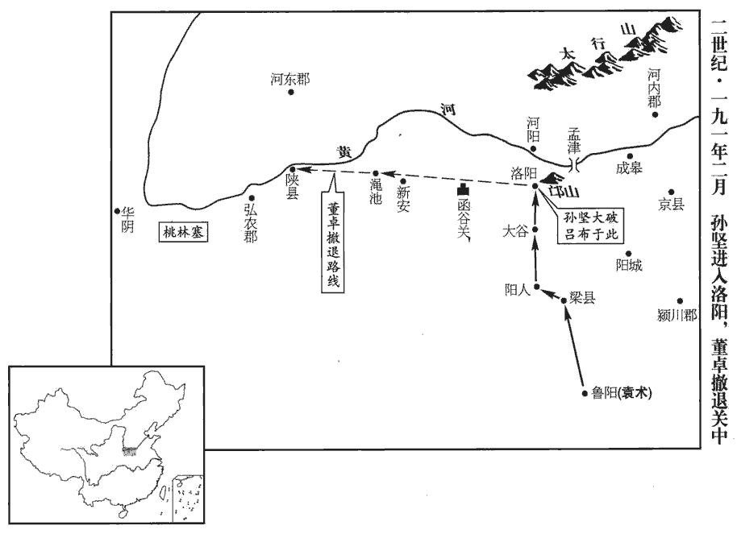
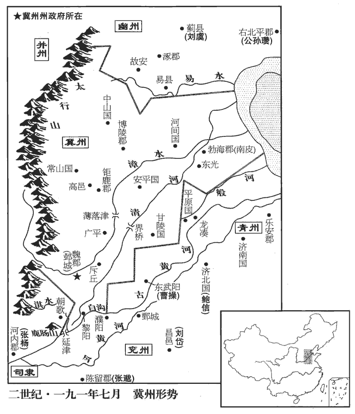
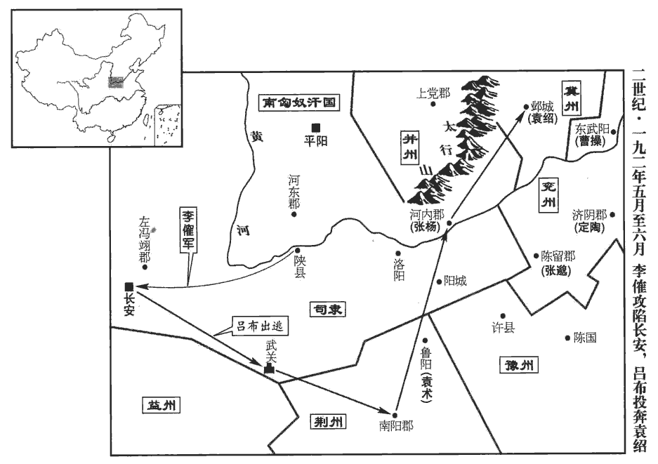
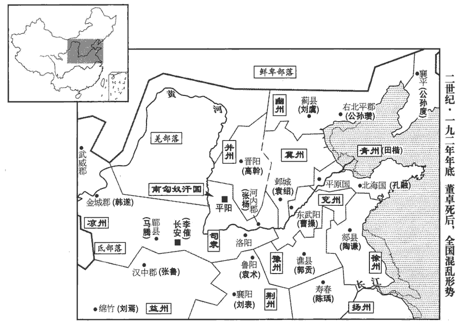
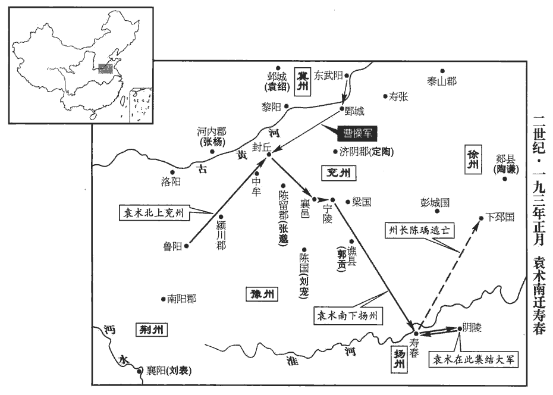
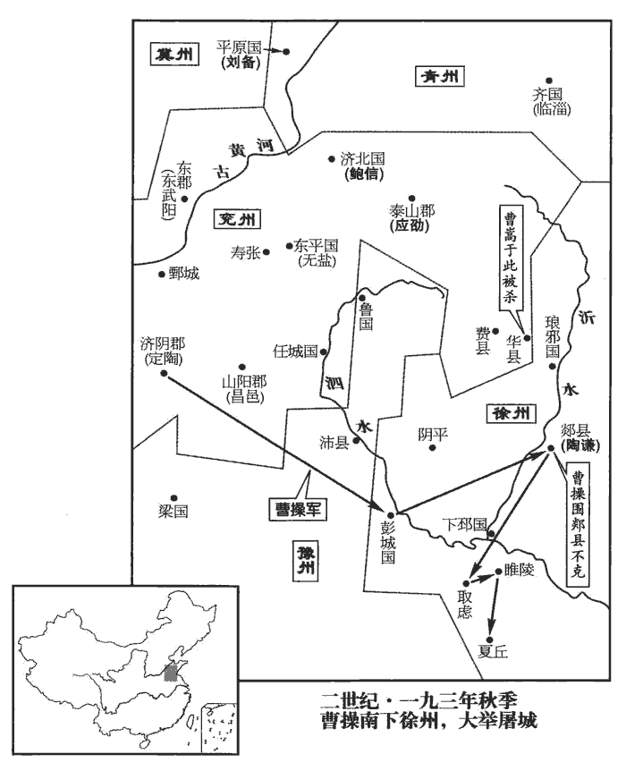

 漢紀五十二起重光協洽（辛未）盡昭陽作噩（癸酉），凡三年。

# 孝獻皇帝乙

## 初平二年（辛未，一九一）

1春，正月，辛丑‹六›，赦天下。

〖译文〗 [1]春季，正月，辛丑（初六），大赦天下。

2關東諸將議：以朝廷幼沖，迫於董卓，遠隔關塞，關塞，謂函谷關‹河南新安›、桃林塞‹东起河南灵宝西至陕西潼关›也。不知存否，幽州‹河北北›牧劉虞，宗室賢儁，欲共立為主。曹操曰：「吾等所以舉兵而遠近莫不響應者，以義動故也。今幼主‹刘协，时年十一›微弱，制於姦臣，非有昌邑亡國之釁xìn，昌邑，謂昌邑王賀也。而一旦改易，天下其孰安之！諸君北面，我自西向。」幽州在北，長安在西，故操云然。韓馥、袁紹以書與袁術曰：「帝非孝靈子，欲依絳、灌誅廢少主、迎立代王故事，少，詩照翻。奉大司馬虞為帝。」術陰有不臣之心，不利國家有長君，長，知兩翻。乃外託公義以拒之。紹復與術書曰：「今西名有幼君，無血脈之屬，謂帝非靈帝子也。復，扶又翻；下同。公卿以下皆媚事卓，安可復信！復，扶又翻；下同。但當使兵往屯關要，皆自蹙死；東立聖君，太平可冀，如何有疑！又室家見戮，不念子胥，謂子胥能報父兄之讎也。可復北面乎？」以殺袁隗等為出於帝。術答曰：「聖主聰叡，有周成之質，賊卓因危亂之際，威服百寮，此乃漢家小厄之會，乃云今上『無血脈之屬』，豈不誣乎！又曰『室家見戮，可復北面』，此卓所為，豈國家哉！慺慺赤心，慺lóu，力侯翻。志在滅卓，不識其他！」馥、紹竟遣故樂浪‹朝鲜平壤›太守張岐等齎jí議上虞尊號。樂浪，音洛琅。上，時掌翻。虞見岐等，厲色叱之曰：「今天下崩亂，主上蒙塵，吾被重恩，被，皮義翻。未能清雪國恥；諸君各據州郡，宜共戮力盡心王室，而反造逆謀以相垢汙邪！」汙，烏故翻。固拒之。馥等又請虞領尚書事，承制封拜，復不聽，欲奔匈奴以自絕；紹等乃止。

〖译文〗 [2]关东各州、郡起兵讨伐董卓的将领们商议，认为献帝年龄幼小，被董卓所控制，又远在长安，关塞相隔，不知生死，幽州牧刘虞是宗室中最贤明的，准备拥立他为皇帝。曹操说：“我们这些人所以起兵，而且远近之人无不响应的原因，正由于我们的行动是正义的。如今皇帝幼弱，虽为奸臣所控制，但没有昌邑王刘贺那样的可以导致亡国的过失，一旦你们改立别人，天下谁能接受！你们向北边迎立刘虞，我自尊奉西边的皇帝。”韩、袁绍写信给袁术说：“皇帝不是灵帝的儿子，我们准备依周勃和灌婴废黜少主，迎立代王的先例，尊奉大司马刘虞为皇帝。”袁术暗中怀有当皇帝的野心，认为国家有一个年长的皇帝对自己不利，于是表面假托君臣大义，拒绝了韩和袁绍的建议。袁绍再次给袁术写信，说：“如今西边名义上有一个年幼的皇帝，而并没有皇家的血统。公卿等朝臣都谄媚董卓，怎能再相信他们！只要派兵去守住关口要塞，自会把他们全都困死。我们在东边拥立一个圣明的皇帝，就可期望过上太平日子，为什么迟疑不决？再说，咱们全家被杀，你不想想伍子胥是怎样为父兄报仇的，难道可以再向这样的皇帝称臣吗？”袁术回信说：“皇帝职明睿智，有周成王姬诵那样的资质。贼臣董卓乘国家危乱之时，用暴力压服群臣，这是汉朝的一个小小厄运，你意说皇帝‘没有皇家血统’，这岂不是诬蔑吗！你还说‘全家被杀，难道可以再向这样的皇帝称臣’，这事是董卓做的，岂是皇帝吗！我满腔赤诚，志在消灭董卓，不知其他的事情！”韩与袁绍竟然派遣前任乐浪郡太守张岐等带着他们的提议到幽州，向刘虞奉上皇帝的尊号。刘虞见到张岐等人，厉声呵斥他们说：“如今天下四分五裂，皇帝在外蒙难，我受到国家重恩，未能为国雪耻。你们各自据守州、郡，本应尽心尽力为王室效劳，却反而策划这种逆谋来沾污我吗！”他坚决拒绝。韩等人又请求刘虞主持尚书事务，代表皇帝封爵任官，刘虞仍不接受，打算逃入匈奴将自己隔绝起来，袁绍等人这才作罢。

3二月，丁丑‹十二›，以董卓為太師，位在諸侯王上。

〖译文〗 [3]二月，丁丑（十二日），任命董卓为太师，地位在诸侯王之上。

4孫堅移屯梁‹河南汝州›東，為卓將徐榮所敗，敗，補邁翻。復收散卒進屯陽人‹河南汝州西北›。賢曰：梁縣，屬河南郡，今汝州縣。陽人聚故城，在梁縣西。卓遣東郡‹河南濮阳西南›太守胡軫督步騎五千擊之，以呂布為騎督。軫與布不相得，堅出擊，大破之，梟其都督華雄。梟，古堯翻。華，戶化翻。

〖译文〗 [4]孙坚率军移驻梁县以东，被董卓部将徐荣打败，他又收集残部进驻阳人。董卓派遣东郡太守胡轸统率步、骑兵五千人，攻打孙坚，任命吕布为骑督。胡轸与吕布不和，孙坚出来迎战，大破胡轸，斩杀他部下的都督华雄。

或謂袁術曰：「堅若得雒，不可復制，此為除狼而得虎也。」術疑之，不運軍糧。堅夜馳見術，陽人去魯陽‹河南鲁山›百餘里。畫地計校曰：「所以出身不顧者，上為國家討賊，為，于偽翻。下慰將軍家門之私讎。堅與卓非有骨肉之怨也，而將軍受浸潤之言，浸潤之譖，出論語。還相嫌疑，何也？」術踧cù踖jí，踧，子六翻。踖，資昔翻。踧踖，不自安貌。即調發軍糧。調，徒釣翻。

〖译文〗 有人对袁术说：“假如孙坚攻占洛阳，就不能再控制他，这是除掉了狼而得到了虎。”袁术感到疑虑，便不再给孙坚运送军粮。孙坚连夜奔驰，去见袁术，在地上画图为他分析形势，说：“我所以奋不顾身，上为国家讨伐逆贼，下为将军报家门私仇。我与董卓并没有个人怨恨，而将军却听信外人的挑拨之言来猜忌我，这是为什么？”袁术惭愧不安，立即调发军粮。

堅還屯，卓遣將軍李傕jué說堅，傕，克角翻。說，輸芮翻；後同。欲與和親，令堅疏子弟任刺史、郡守者，許表用之。堅曰：「卓逆天無道，今不夷汝三族縣示四海，縣讀曰懸。則吾死不瞑目，瞑，莫定翻。豈將與乃和親邪！」乃，汝也。復進軍大谷‹河南偃师西南›，距雒九十里。賢曰：大谷口，在故嵩陽西北八十五里，北出對雒陽故城，張衡東京賦云「盟津達其後，大谷通其前」是也。距，至也。卓自出，與堅戰於諸陵間，卓敗走，卻屯澠池‹河南澠池西›，聚兵於陝‹河南三门峡›。澠，彌兗翻。陝，式冉翻。堅進至雒陽，擊呂布，復破走。堅乃掃除宗廟，祠以太牢，得傳國璽於城南甄官井中；甄官署之井中也。晉職官志：少府之屬有甄官令，而續漢志無之，蓋屬於他署，未置專官也。甄官，掌琢石、陶土之事。為後建安元年袁術奪璽張本。璽，斯氏翻。分兵出新安、澠池間以要卓。要，一遙翻。

〖译文〗 孙坚回到驻地，董卓派将军李劝说孙坚，表示愿与孙坚结成儿女亲家，并要孙坚把他子弟中想做刺史、太守的，开列一个名单，由他推荐任用。孙坚说：“董卓逆天无道，我今天要是不能灭你三族，昭示天下，则我死不瞑目，怎会与你结亲！”孙坚继续进军，抵达距洛阳九十里的大谷。董卓亲自出击，与孙坚在诸陵园之间交战，董卓败逃，退守渑池，在陕县集结兵力。孙坚进入洛阳，进攻吕布，吕布也被打败，退走。于是孙坚打扫皇帝宗庙，用猪、牛、羊进行祭祀。在城南甄官署的水井中，找到了传国御玺。他又分兵到新安、渑池，以逼迫董卓。

 

卓謂長史劉艾曰：「關東軍敗數矣，數，所角翻。皆畏孤，無能為也。惟孫堅小戇，說文曰：戇，愚也。音都降翻。頗能用人，當語諸將，使知忌之。語，牛倨翻；下同。孤昔與周慎西征邊、韓於金城‹兰州东›，孤語張溫，求引所將兵為慎作後駐，溫不聽。溫又使孤討先零叛羌，零，意憐。孤知其不克而不得止，遂行，留別部司馬劉靖將步騎四千屯安定‹甘肃镇原东南曙光乡›以為聲勢。叛羌欲𢧵歸道，𢧵，即截字。孤小擊輒開，畏安定有兵故也。虜謂安定當數萬人，不知但靖也。而孫堅隨周慎行，謂慎求先將萬兵造金城‹兰州东›，將，即亮翻。造，七到翻。使慎以二萬作後駐。邊、韓畏慎大兵，不敢輕與堅戰，而堅兵足以斷其運道。斷，丁管翻。兒曹用其言，涼州‹甘肃›或能定也。溫既不能用孤，慎又不能用堅，卒用敗走。事見五十八卷靈帝中平二年。卒，子恤翻。堅以佐軍司馬所見略與人同，固自為可；言其才可用也。但無故從諸袁兒，終亦死耳！」乃使東中郎將董越屯澠池，中郎將段煨屯華陰‹陕西華陰›，煨，烏回翻。華，戶化翻。中郎將牛輔屯安邑‹山西夏县›，姓譜：牛本自殷，周封微子於宋，其裔司寇牛父敗狄於長丘，死之，其子孫以王父字為氏。其餘諸將布在諸縣，以禦山東。輔，卓之婿也。卓引還長安。孫堅脩塞諸陵，塞，悉則翻。引軍還魯陽‹河南鲁山›。

〖译文〗 董卓对长史刘艾说：“关东的叛军屡败，都畏惧我，不会有什么作为。只有孙坚有点不知死活，挺会用人，应该告诉诸将，让他们知道提防。我从前与周慎到金城郡西征边章、韩遂，我向张温请求率领部下做周慎的后援，张温不同意。张温又派我去讨伐先零的叛乱羌人，我知道不能取胜，但又不能不去，于是出发，留下别部司马刘靖率领四千步、骑兵驻在安定，作为呼应。羌军想切断我的归路，我只作轻微攻击就冲开了阻截，这是因为他们害怕安定的驻军。羌军以为安定会有数万大军，不知只有刘靖一支部队。孙坚随周慎作战，向周慎请求先率一万人前往金城，让周慎率二万人为后援。边章、韩遂害怕周慎的大军，不敢轻易与孙坚开战，而孙坚的军队足以切断他们的粮道。假如周慎那帮小子能用孙坚的计谋，凉州或许能够平安。而张温既不能听从我，周慎又不能听从孙坚，最后只能战败而退走。孙坚是个佐军司马，见解却与我大致相同，确实是可用之才。只是他无缘无故地跟随袁家的那些公子，最终还是会送命的！”于是，董卓派东中郎将董越驻守渑池，中郎将段煨驻守华阴，中郎将牛辅驻守安邑，其余的将领分布各县，以抵御山东联军的进攻。牛辅是董卓的女婿。董卓回到长安。孙坚在修复历代皇帝的陵墓后，率军回到鲁阳。

5夏，四月，董卓至長安，公卿皆迎拜車下。卓抵手謂御史中丞皇甫嵩曰：「義真，怖未乎？」皇甫嵩，字義真。怖，普布翻。嵩曰：「明公以德輔朝廷，大慶方至，何怖之有！若淫刑以逞，將天下皆懼，豈獨嵩乎！」考異曰：范書嵩傳及山陽公載記記嵩語與此不同，今從張璠漢紀。卓黨欲尊卓比太公，稱尚父，卓以問蔡邕，邕曰：「明公威德，誠為巍巍，然比之太公，愚意以為未可，宜須關東平定，車駕還反舊京，然後議之。」卓乃止。

〖译文〗 [5]夏季，四月，董卓抵达长安。公卿都来迎接，在他车前参拜。董卓击掌对御史中丞皇甫嵩说：“皇甫义真，你害怕不害怕？”皇甫嵩回答说：“您以德辅佐朝廷，巨大的喜庆方才到来，我有什么害怕的！如果随意杀戮，滥施刑罚，则天下人人畏惧，岂只是我一个人呢！”董卓的党羽想依照周朝开国功臣羌子牙的先例，尊称董卓为“尚父”。董卓征求蔡邕的意见，蔡邕说：“您的威德，确实很高，但我觉得不可以与羌子牙相比。应该等到平定函谷关以东的叛乱，皇帝返回旧京洛阳，然后再商议此事。”于是董卓作罢。

卓使司隸校尉劉囂籍吏民有為子不孝、為臣不忠、為吏不清、為弟不順者，皆身誅，財物沒官。於是更相誣引，更，工衡翻。冤死者以千數。百姓囂囂，道路以目。囂，五羔翻。韋昭曰：「不敢發言，以目相眄miǎn而已。」

〖译文〗 董卓命令司隶校尉刘嚣，将官员与百姓中儿女不孝顺父母、臣属不忠于长官，官吏不清廉以及弟弟不尊敬兄长的人进行登记，一律处死，财物由官府没收。于是有许多人互相诬告，含冤而死的人数以千计。百姓惶恐不安，在路上相遇时，只敢用眼睛相互示意。

6六月，丙戌‹二十三›，地震。

〖译文〗 [6]六月，丙戌（二十三日），发生地震。

7秋，七月，司空种拂免；以光祿大夫濟南‹山东章丘›淳于嘉為司空。濟，子禮翻。太尉趙謙罷；以太常馬日磾為太尉。磾，丁奚翻。

〖译文〗 [7]秋季，七月，司空种拂被免职，任命光禄大夫、济南人淳于嘉为司空。太尉赵谦被免职，任命太常马日为太尉。

8初，何進遣雲中‹内蒙托克托›張楊還并州‹山西›募兵，會進敗，楊留上黨‹山西长子›，有眾數千人。袁紹在河內‹河南武陟›，楊往歸之，與南單于於扶羅屯漳水。濁漳水出上黨長子而東過鄴，鄴則韓馥所居也。韓馥以豪傑多歸心袁紹，忌之；陰貶節其軍糧，欲使其眾離散。會馥將麴qū義叛，姓譜：漢有平原鞠譚，其子閟避難，改曰麴氏，後遂為西平著姓。馥與戰而敗，紹因與義相結。

〖译文〗 [8]起初，何进派遣云中人张杨回并州去召募兵马。恰赶上何进被杀，张杨就留在上党，有部众数千人。袁绍在河内，张杨前往归附，与南匈奴单于於扶罗共同在漳水岸边扎营。冀州刺史韩因为各地豪杰多拥戴袁绍，心中嫉妒，暗地里减少对袁绍的军粮供应，想使他的军队离散。正在这时，韩部将麴义叛变，韩进行讨伐，反被麴义战败。袁绍就乘此机会与麴义相互联合。

 

紹客逄紀謂紹曰：逄páng，蒲江翻。「將軍舉大事而仰人資給，仰，牛向翻。不據一州，無以自全。」紹曰：「冀州兵強，吾士飢乏，設不能辦，無所容立。」紀曰：「韓馥庸才，可密要公孫瓚要，讀曰邀。使取冀州，馥必駭懼，因遣辯士為陳禍福，為，于偽翻。馥迫於倉卒，卒，讀曰猝。必肯遜讓。」紹然之，即以書與瓚。瓚遂引兵而至，外託討董卓而陰謀襲馥，馥與戰不利。會董卓入關，紹還軍延津‹河南卫辉东古黄河口›，續漢志，酸棗縣北有延津。使外甥陳留‹河南陳留›高幹及馥所親潁川‹河南禹州›辛評、荀諶chén、郭圖等說馥曰：諶，時壬翻。說，輸芮翻。「公孫瓚將燕‹河北北›、代‹山西北›之卒乘勝來南，而諸郡應之，其鋒不可當。袁車騎引軍東向，自河內至延津，為東向。其意未可量也，量，音良。竊為將軍危之！」為，于偽翻。馥懼，曰：「然則為之柰何？」諶chén曰：「君自料寬仁容眾為天下所附，孰與袁氏？」馥曰：「不如也。」「臨危吐決，吐決謂吐奇決策也。智勇過人，又孰與袁氏？」馥曰：「不如也。」「世布恩德，天下家受其惠，又孰與袁氏？」馥曰：「不如也。」諶曰：「袁氏一時之傑，將軍資三不如之勢久處其上，處，昌呂翻。彼必不為將軍下也。夫冀州，天下之重資也，彼若與公孫瓚并力取之，危亡可立而待也。夫袁氏，將軍之舊，且為同盟，謂同盟討董卓。當今之計，若舉冀州以讓袁氏，彼必厚德將軍，瓚亦不能與之爭矣。是將軍有讓賢之名，而身安於泰山也。」馥性恇kuāng怯，因然其計。恇，去王翻。馥長史耿武、別駕閔純、治中李歷聞而諫曰：考異曰：九州春秋作「耿彧」，今從范書、魏志、袁紀。又范書，騎都尉沮jǔ授諫，無李歷，今從魏志、袁紀。「冀州帶甲百萬，穀支十年。袁紹孤客窮軍，仰我鼻息，鼻息，氣一出入之頃也。鼻氣噓之則溫，吸之則寒，故云然。醫書云：血為脈，氣為息，脈息之名自是而分。呼吸者，氣之槖tuó籥yuè；動應者，血之波瀾。其經以身寸度之，計十六丈二尺。一呼脈再動，一吸脈再動，呼吸定息脈五動，閏以大息則六動。一動一寸，故一息脈行六寸，十息六尺，百息六丈，二百息十二丈，七十息四丈二尺。計二百七十息，漏水下二刻盡十六丈二尺，營周一身；百刻之中得五十營。故曰脈行陽二十五度、行陰二十五度也。息者以呼吸定之，一日計一萬三千五百息。呼吸進退既遲於脈，故一日一夜方行盡十六丈二尺經絡，而氣周於一身，大會於風府。脈屬陰，陰行速，猶太陰一月一周天。息屬陽，陽行遲，猶太陽一歲一周天。如是則應天常度。「閏」，當作「間」。譬如嬰兒在股掌之上，絕其哺乳，立可餓殺，柰何欲以州與之！」馥曰：「吾袁氏故吏，且才不如本初，度德而讓，度，徒洛翻。古人所貴，諸君獨何病焉！」先是，馥從事趙浮、程渙將強弩萬張屯孟津，先，悉薦翻。將，即亮翻。聞之，率兵馳還。時紹在朝歌‹河南淇县›清水，據水經，清水出河內脩武縣，逕獲嘉、汲縣而入于河，不至朝歌；惟淇水則逕朝歌耳。蓋俗亦呼淇水為清水。據九州春秋，紹時在朝歌清水口，浮等自孟津東下，則兩軍皆舟行大河而向鄴也。清水口即淇口，南岸即延津。浮等從後來，船數百艘，眾萬餘人，整兵鼓，夜過紹營，紹甚惡之。惡，烏路翻。浮等到，謂馥曰：「袁本初軍無斗糧，各已離散，雖有張楊、於扶羅新附，未肯為用，不足敵也。小從事等請以見兵拒之，見，賢遍翻。旬日之間，必土崩瓦解；明將軍但當開閤高枕，枕，職任翻。何憂何懼！」馥又不聽，乃避位，出居中常侍趙忠故舍，遣子送印綬以讓紹。紹將至，從事十人爭棄馥去，獨耿武、閔純杖刀拒之，不能禁，乃止；紹皆殺之。紹遂領冀州牧，承制以馥為奮威將軍，而無所將御，將，即亮翻。將御，猶言統御也。亦無官屬。紹以廣平‹河北曲周东北›沮授為奮武將軍，廣平縣屬鉅鹿郡。沮，千余翻，又音諸，姓也，黃帝史官沮誦之後。使監護諸將，寵遇甚厚。監，古銜翻。魏郡‹河北临漳西南邺镇›審配、鉅鹿‹河北宁晋西南›田豐并以正直不得志於韓馥，紹以豐為別駕，配為治中，及南陽‹河南南陽›許攸、逄紀、潁川‹河南禹县›荀諶chén皆為謀主。

〖译文〗 袁绍的门客逢纪对袁绍说：“将军倡导大事，却要依靠别人供应粮草，如果不能占据一个州作为根据地，就不能保全自己。”袁绍说：“冀州兵强，而我的部下又饥又乏，假如不能成功，就没有立足之处了。”逢纪说：“韩是一个庸才，您可秘密联络公孙瓒，让他攻打冀州。韩必然惊慌恐惧，我们便乘机派遣有口才的使节去为他分析祸福，韩迫于突然发生的危机，必然肯把冀州出让给您。”袁绍觉得有理，就写信给公孙瓒。公孙瓒率军到冀州，表面上声称去讨伐董卓，而密谋袭击韩。韩与公孙瓒交战，失败。正好董卓进入函谷关，袁绍便率军返回延津，派外甥、陈留人高干与韩所亲信的颖川人辛评、荀谌、郭图等人去游说韩：“公孙瓒统率燕、代两地的军队乘胜南下，各郡纷纷响应，军锋锐不可当。袁绍又率军向东移动，意图不可估量，我们为将军担心。”韩心中恐慌，问他们说：“既然这样，那么该怎么办呢？“荀谌说：“您自己判断一下，宽厚仁义，能为天下豪杰所归附，比得上袁绍吗？”韩说：“比不上。”荀谌又问：“那么，临危不乱，遇事果断，智勇过人，比得上袁绍吗？”韩说：“比不上。”荀谌再问：“数世以来，广布恩德，使天下家家受惠，比得上袁绍吗？”韩说：“比不上。”荀谌说：“袁绍是这一时代的人中豪杰，将军以三方面都不如他的条件，却又长期在他之上，他必然不会屈居将军之下。冀州是天下物产丰富的重要地区，他要是与公孙瓒合力夺取冀州，将军立刻就会陷入危亡的困境。袁绍是将军的旧交，又曾结盟共讨董卓，现在办法是，如果把冀州让给袁绍，他必然感谢您的厚德，而公孙瓒也无力与他来争。这样，将军便有让贤的美名，而自身则比泰山还要安稳。”韩性情怯懦，于是同意了他们的计策。韩的长史耿武、别驾闵纯、治中李历得到消息，劝阻韩说：“冀州地区可以集结起百万大军，所存粮食够吃十年。袁绍只是一支孤单而缺乏给养的客军，仰仗我们的鼻息，好像怀抱中的婴儿，不能他奶吃，立刻就会饿死，为什么要把冀州交给他呢！”韩说：“我本来是袁家的老部下，才干也不如袁绍，自知能力不足而让贤，是古人所称赞的行为，你们为什么偏要反对呢？”先前，韩派从事赵浮、程涣率领一万名弓弩手驻守孟泽，他们听到这个消息，率军火速赶回冀州。当时袁绍在朝歌清水口，赵浮等从后赶来，有战船数百艘，兵众一万余人，军容鼓声整齐，在夜里经过袁绍的军营，袁绍十分厌恶。赵浮等赶到冀州，对韩说：“袁绍军中没有一斗粮食，已经各自离散，虽然有张杨、於扶罗等新近归附，但不会为他效力，不足以为敌。我们这几个小从事，愿领现有部队抵御他，不过十天，袁军必然土崩瓦解。将军您只管打开房门，放心睡觉，既不用忧虑，也不必害怕！”韩仍不采纳，于是离开冀州牧官位，从官府中迁出，在中常侍赵忠的旧宪居住，派儿子把印绶送给袁绍，让出冀州。袁绍将要到达邺城，韩部下的十名从事争先恐后地离开韩，唯独耿武、闵纯挥刀阻拦，但禁止不了，只好作罢。袁绍来到后，将耿武、闵纯二人处死。袁绍于是兼任冀州牧，以皇帝的名义任命韩为奋威将军，但既没有兵，也没有官属。袁绍任命广平人沮授为奋武将军，派他临护所有将领，对他十分宠信。魏郡人审配、巨鹿人田丰都因为人正直，不为韩欣赏，袁绍任命田丰为别驾，审配为治中，与南阳人许攸、逢纪、颖川人荀谌都成为袁绍的主要谋士。

紹以河內‹河南武陟›朱漢為都官從事。紹置都官從事，則猶領司隸校尉也。漢先為韓馥所不禮，且欲徼jiǎo迎紹意，徼，一遙翻。擅發兵圍守馥第，拔刃登屋，馥走上樓，上，時掌翻。收得馥大兒，槌chuí折兩腳；折，而設翻。紹立收漢，殺之。馥猶憂怖，從紹索去，怖，普布翻。索，山客翻。往依張邈。後紹遣使詣邈，有所計議，與邈耳語；耳語，附耳而语也。馥在坐上，坐，徂cú臥翻。謂為見圖，無何，起至溷hùn，以書刀自殺。溷，戶困翻；圊qīng也，廁也。時雖已有紙，猶多用刀筆書，故有書刀。

〖译文〗 袁绍任命河内人朱汉为都官从事。朱汉原先曾被韩轻慢，这时又想迎合袁绍的心意，便擅自发兵包围韩的住宅，拔刀登屋。韩逃上楼去，朱汉捉到韩的大儿子，将他的两只脚打断。袁绍立即逮捕朱汉，将他处死。但是韩仍然优虑惊恐，请求袁绍让他离去，袁绍同意，于是韩就去投奔陈留郡太守张邈。后来，袁绍派使者去见张邈，商议机密时，使者在张邈耳边悄声细语。韩当时在座，以为是在算计自己。过了一会儿，他起身走进厕所，用刮削简牍的书刀自杀。

鮑信謂曹操曰：「袁紹為盟主，因權專利，將自生亂，是復有一卓也。復，扶又翻。若抑之，則力不能制，袛以遘難。遘，與構同。難，乃旦翻。且可規大河之南以待其變。」操善之。會黑山、于毒、白繞、眭suī固等十餘萬眾略東郡‹河南濮阳›，王肱不能禦。曹操引兵入東郡，擊白繞於濮陽，破之。眭，息為翻。濮，博木翻。袁紹因表操為東郡太守，治東武陽‹山东莘縣南›。東武陽縣，屬東郡。應劭曰：縣在武水之陽。水經註曰：武水即漯luò水。賢曰：故城在今魏州莘縣南。守，式又翻。

〖译文〗 鲍信对曹操说：“袁绍身为盟主，却利用职权，专谋私利，将自行生乱，成为第二个董卓。如果抑制他，我们没有力量，只会树敌。我们可暂且先去黄河以南发展势力，等待形势变化。”曹操十分同意。正好黑山、于毒、白绕、眭固等下余万人进攻东郡，太守王肱不能抵御。曹操就率军进入东郡，在濮阳进攻白绕，将白绕打败。于是，袁绍便向朝廷举荐曹操为东郡太守，曹操将郡府设在东武阳。

9南單于劫張楊以叛袁紹，屯於黎陽‹河南浚县›。董卓以楊為建義將軍、河內太守。

〖译文〗 [9]南匈奴单于於抚罗动持张杨，背叛了袁绍，驻军黎阳。董卓任命张杨为建义将军，河内郡太守。

10太史望氣，言當有大臣戮死者；董卓使人誣衛尉張溫與袁術交通，冬，十月，壬戌‹一›，笞殺溫於市以應之。張溫不能斬卓於西征之時，反死於卓手，可哀也已。

〖译文〗 [10]太史观察天象后声称，朝中大臣中将有人被杀死。董卓借机派人诬告卫尉张温与袁术秘密联络。冬季，十月，壬戌（初一），将张温在闹市中笞打而死，以应天象。

11青州黃巾寇勃海，眾三十萬，欲與黑山合。公孫瓚率步騎二萬人逆擊於東光‹河北東光›南，大破之，東光縣，屬勃海。賢曰：今滄州縣。斬首三萬餘級。賊棄其輜重，重，直用翻。奔走渡河；瓚因其半濟薄之，賊復大破，復，扶又翻；下同。死者數萬，流血丹水，言水為之丹也。收得生口七萬餘人，車甲財物不可勝算，勝，音升。威名大震。

〖译文〗 [11]青州黄巾军进攻勃海，部众达三十万人，准备与黑山军会合。公孙瓒率领步、骑兵二万人在东光县以南迎击，大破黄巾军，斩杀三万余人。黄巾军丢弃辎重，奔逃渡过黄河。公孙瓒在黄巾军流过一半时逼近，黄巾军再次大败，死了数万人，河水被血染成了红色。被浮虏的有七万余人，车辆、甲胄和财物不计其数。公孙瓒威名大震。

12劉虞子和為侍中，帝思東歸，使和偽逃董卓，潛出武關‹陕西商南西南›詣虞，令將兵來迎。考異曰：范書劉虞傳，「虞使田疇使長安，時和為侍中，因遣從武關出。」按魏志公孫瓚傳，但云天子思歸，不云因疇至也。若爾，當令和與疇俱還，不應出武關。又疇未還，劉虞已死。虞死在初平四年冬，界橋戰在三年春。范書誤也。和至南陽，袁術利虞為援，留和不遣，許兵至俱西，令和為書與虞。虞得書，遣數千騎詣和。公孫瓚知術有異志，止之，虞不聽。瓚恐術聞而怨之，亦遣其從弟越將千騎詣術，從，才用翻；下同。而陰教術執和，奪其兵，由是虞、瓚有隙。虞先與瓚有隙，至是而隙愈深。和逃術來北，復為袁紹所留。

〖译文〗 [12]刘虞的儿子刘和在宫廷担任侍中，献帝想要东归洛阳，便命刘和假装逃避董卓，秘密地经武关去见刘虞，要刘虞出兵去接献帝。刘和走到南阳时，袁术企图利用刘虞为外援，便扣住刘和，应许在刘虞兵到之后一起西行，命刘和给刘虞写信。刘虞接到信后，便派数千名骑兵去见刘和。公孙瓒知道袁术素有称帝的野心，就劝阻刘虞，但是刘虞不听。公孙瓒害怕袁术知道此事后会怨恨自己，也派堂弟分孙越率领一千名骑兵去见袁术，并暗中挑唆袁术扣留刘和，吞并刘虞派去的队伍。从此刘虞与公孙瓒有了仇怨。刘和从袁术处逃走北上，又被袁绍留住不放。

是時關東州、郡務相兼并以自強大，袁紹、袁術亦自離【章：甲十一行本「離」上有「相」字；乙十一行本同；孔本同。】貳。術遣孫堅擊董卓未返，紹以會稽‹绍兴›周昂為豫州刺史，襲奪堅陽城‹河南登封东南›。陽城縣，屬潁川郡。堅領豫州刺史，屯陽城。堅歎曰：「同舉義兵，將救社稷，逆賊垂破而各若此，吾當誰與戮力乎！」引兵擊昂，走之。袁術遣公孫越助堅攻昂，越為流矢所中死。中，竹仲翻。公孫瓚怒曰：「余弟死禍起於紹。」遂出軍屯磐河‹自山东平原县入渤海›，水經：大河故瀆東北逕西平昌縣故城北，分派東入般縣，為般河。余據賢註；般，音卜滿翻。此作「磐」，讀當如字。賢又曰：般，即爾雅九河鉤磐河也。其枯河在今滄州樂陵縣東南。魏收地形志，安德郡般縣有故般河。上書數紹罪惡，數，所具翻。進兵攻紹。冀州諸城多叛紹從瓚，紹懼，以所佩勃海太守印绶授瓚從弟范，遣之郡，而范遂背紹，領勃海兵以助瓚。背，蒲妹翻。瓚乃自署其將帥，嚴綱為冀州刺史，田楷為青州刺史，單經為兗州刺史，單，音善，姓也。姓譜：周卿士單襄公之後。又悉改置郡、縣守、令。

〖译文〗 这时，函谷关以东的各州、郡长官只顾相互吞并，扩充自己的势力，袁绍、袁术兄弟自身也离心离德。袁术派孙坚前去攻打董卓，孙坚尚未返回，袁绍就任命会稽人周昂为豫州刺史，偷袭并攻占孙坚的根据地阳城。孙坚叹息道：“大家共同为大义而起兵，想要拯救国家，现在逆贼董卓就要被打败了，但我们却各自如此相待，我能与谁一起合力奋战呢！”孙坚率军还击周昂，周昂败退。袁术派公孙越帮助孙紧进攻周昂，公孙越被流箭射死。公孙瓒知道后大怒，说：“我弟弟的死，祸首就是袁绍。”于是他率军驻扎磬河，上书朝廷，历数袁绍所犯的罪恶，然后进军攻击袁绍。冀州下属各城多数背叛袁绍而响应公孙瓒。袁绍感到恐慌，便把自己所佩带的勃海太守印绶授予公孙瓒的堂弟公孙范，派他前往勃海郡出任太守，以求和解。然而，公孙范随即便背叛了袁绍，率领勃海郡的军队，前去协助公孙瓒。于是公孙瓒自行任命部将严纲为冀州刺史，田楷为青州刺史，单经为兖州刺史，并全部更换了各郡、县的长官。

初，涿郡‹河北涿州›劉備，中山靖王之後也，蜀書云：備，中山靖王勝子陸城亭侯貞之後；然自祖父以上，世系不可攷。少孤貧，與母以販履為業，少，詩照翻。長七尺五寸，垂手下厀，顧自見其耳；長，直亮翻。厀，與膝同。言其有異相也。有大志，少語言，喜怒不形於色。少，詩沼翻。嘗與公孫瓚同師事盧植，由是往依瓚。瓚使備與田楷徇青州有功，因以為平原‹山东平原›相。備少與河東‹山西夏县›關羽、涿郡‹河北涿州›張飛相友善；少，詩照翻。以羽、飛為別部司馬，分統部曲。備與二人寢則同牀，恩若兄弟，而稠人廣坐，坐，徂臥翻。侍立終日，隨備周旋，不避艱險。常山‹河北元氏›趙雲為本郡將吏兵詣公孫瓚，為，于偽翻。將，即亮翻。瓚曰：「聞貴州人皆願袁氏，願下當有從字。君何獨迷而能反乎？」雲曰：「天下訩訩，訩，許容翻；眾語喧嘵之貌。未知孰是，民有倒縣之厄，縣，讀曰懸。鄙州論議，從仁政所在，不為忽袁公，私明將軍也。」為，于偽翻；下同。劉備見而奇之，深加接納，雲遂從備至平原，為備主騎兵。劉備事始此。

〖译文〗 当初西汉中山靖王刘胜的后裔、涿郡人刘备，幼年丧父，家境贫苦，与母亲一起靠贩卖草鞋为生。刘备身高七尺五寸，双手下垂时能够超过膝盖，耳朵很大，连自己的眼睛都能看得到。他胸怀大志，不多说话，喜怒不形于色。他因曾经与公孙瓒一起在卢植门下学习儒家经义，所以便投靠公孙瓒。公孙瓒派他与田楷夺取青州，建立了战功，因此被任命为平原国相。刘备年轻时与河东人关羽、涿郡人张飞交情深厚，于是委派他们两人为别部司马，分别统领部队。他与这两人同榻而眠，情同手足，但是在大庭广众之中，关羽和张飞整日站在刘备身边侍卫。他们跟随刘备应付周旋，不避艰险。常山人赵云率领本郡的队伍前去投奔公孙瓒，公孙瓒问他说：“听说你们冀州人都愿归顺袁绍，怎么唯独你能迷途知返呢？”赵云答道：“天下大乱，不知道谁是能够拯救大难的人。百姓遭受的痛苦，就像是被倒吊起来一样。我们冀州的百姓，只是向往仁政，并不是轻视袁绍而亲附将军。”刘备见到赵云后，认为他胆识出众，便用心交结。于是赵云就随刘备到平原国，为他统领骑兵。

13初，袁術之得南陽，戶口數百萬，而術奢淫肆欲，徵斂無度，斂，力贍翻。百姓苦之，稍稍離散。既與袁紹有隙，各立黨援以相圖謀。術結公孫瓚而紹連劉表，豪傑多附於紹。術怒曰：「群豎不吾從而從吾家奴乎！」據袁山松書，紹，司空逢之孼子，出後伯父成，故術云然。又與公孫瓚書曰：「紹非袁氏子。」紹聞大怒。

〖译文〗 [13]当初，袁术占领南阳时，有户口数百万，但他骄奢淫逸，征收赋税没有限度，百姓困苦，逐渐外逃。他与袁绍结下怨仇后，两人自树立党羽，寻求外援，互相算计。袁术勾结公孙瓒，袁绍则联合刘表。当时，豪杰多数都归附袁绍。袁术愤怒地说：“这些小子不跟随我，反而跟随我们家的家奴吗！”他还给公孙瓒写信说：“袁绍不是袁家的儿子。”袁绍听到后大怒。

術使孫堅擊劉表，表遣其將黃祖逆戰於樊‹湖北襄樊汉水北岸›、鄧‹樊城西北›之間，鄧縣，屬南陽郡。樊城，周仲山甫之邑，在漢水北。杜佑曰：樊城，今襄州安養縣。劉昫曰：鄧城縣，漢之鄧縣，古樊城也：宋改安養縣；天寶元年改為臨漢縣；貞元二十一年移縣古鄧城，乃改為鄧城縣。堅擊破之，遂圍襄陽。表夜遣黃祖潛出發兵，祖將兵欲還，堅逆與戰，祖敗走，竄峴xiàn山‹襄阳东南›中。峴山去襄陽十里。峴，戶典翻。堅乘勝，夜追祖，祖部曲【章：甲十一行本無「曲」字；乙十一行本同。】兵從竹木間暗射堅，殺之。射，而亦翻。考異曰：范書，「初平三年春，堅死。」吳志孫堅傳亦云初平三年。英雄記曰，「初平四年正月七日死。」袁紀，「初平三年五月。」山陽公載記載策表曰：「臣年十七，喪失所怙。」裴松之按策以建安五年卒，時年二十六，計堅之亡，策應十八，而此表云十七，則為不符。張璠fán漢紀及胡沖吳曆并以堅初平二年死，此為是而本傳誤也。今從之。堅所舉孝廉長沙桓階詣表請堅喪，表義而許之。堅兄子賁率其士眾就袁術，術復表賁為豫州刺史。復，扶又翻；下同。術由是不能勝表。

〖译文〗 袁术派孙坚去攻击荆州刺史刘表，刘表派部将黄祖在樊城和邓县一带迎战。孙坚打败黄祖，于是围困襄阳。刘表派黄祖乘夜偷偷出城，前去调集各郡的授军，黄祖率军想要返回襄阳时，孙坚迎击，黄祖败退，逃入岘山。孙坚乘胜连夜追赶，黄祖的部曲潜伏在竹林树丛之中，用暗箭将孙坚射死。孙坚生前推荐的孝廉长沙人桓阶晋见刘表，请求他归还孙坚的尸体安葬。刘表为他的义举所感动，表示同意发还。孙坚哥哥的儿子孙贲率领孙坚的部队投靠袁术。袁术又上表推荐孙贲担任豫州刺史。从此以后，袁术不再能战胜刘表。

14初，董卓入關，留朱儁守雒陽，而儁潛與山東諸將通謀，懼為卓所襲，出奔荆州。卓以弘農‹河南灵宝东北›楊懿為河南尹；儁復引兵還雒，擊懿，走之。儁以河南殘破無所資，乃東屯中牟‹河南中牟›，移書州郡，請師討卓。徐州刺史陶謙上儁行車騎將軍，上，時掌翻。遣精兵三千助之，餘州郡亦有所給。謙，丹陽‹安徽宣城›人。丹陽縣，屬丹陽郡，今潤州縣。朝廷以黃巾寇亂徐州，用謙為刺史。謙至，擊黃巾，大破走之，州境晏然。

〖译文〗 [14]当初，董卓入函谷关时，留朱俊镇守洛阳。而朱俊暗中与山东地区的将领们联络，他怕董卓发觉后会出兵袭击，就逃到荆州。董卓任命弘农人杨懿为河南尹，朱俊又率军返回洛阳，进攻杨懿，杨懿败逃。朱俊见洛阳已残破不堪，便向东移驻中牟县。同时向各州、郡发出公文，号召各地派军讨伐董卓。徐州刺史陶谦上表推荐朱俊代理车骑将军，并派三千名精兵援助朱俊，其他州、郡也纷纷响应。陶谦是丹阳人，朝廷因黄巾军侵扰徐州，便任命他为刺史。陶谦到职之后，大破黄巾军，将其逐出，恢复了徐州境内的秩序。

15劉焉在益州‹四川云南›陰圖異計。沛‹安徽淮北›人張魯，自祖父陵以來世為五斗米道，陵即今所謂天師者也。後魏寇謙之祖其道。客居于蜀。魯母以鬼道常往來焉家，焉乃以魯為督義司馬，洪氏隸釋曰：劉焉在蜀，創置督義司馬，助義、褒義校尉。劉表在荊州，亦置綏民校尉。漢衰，諸侯擅命，率意各置官屬。以張脩為別部司馬，與合兵掩殺漢中‹陕西汉中›太守蘇固，斷絕斜谷閣，斜谷，在漢中西北，今興元府西北入斜谷路，至鳳州界百五十里，有棧閣二千九百八十九間，板閣二千八百九十二間。郡國志曰：褒城縣北有褒谷，北口曰斜，南口曰褒，長四百七十里，同為一谷。兩山高峻，中間谷道，褒水所流，曹操謂斜谷道為五百里石穴者此也。余據班志，斜水出衙岭山，北至郿入渭；褒水亦出衙岭，南至南鄭入沔miǎn，則褒、斜雖同為一谷，而衙岭乃其分水處也。斷，丁管翻。斜，音余奢翻。谷，音穀，又音浴。殺害漢使。焉上書言「米賊斷道，不得復通」。斷，丁管翻。又託他事殺州中豪強王咸、李權等十餘人，以立威刑。犍為‹四川彭山›太守任岐及校尉賈龍由此起兵攻焉，焉擊殺岐、龍。焉意漸盛，作乘輿車具千餘乘，乘，繩證翻。劉表上「焉有似子夏在西河疑聖人」之論。禮記檀弓：曾子責子夏曰：吾與子事夫子於洙、泗之間，退歸老於西河之上，使西河之人疑汝於夫子，而罪一也。表蓋言焉在蜀僭擬，使蜀人疑為天子也。上，時掌翻。時焉子范為左中郎將，誕為治書御史，續漢志曰：治書侍御史二人，秩六百石，掌選明法律者為之；凡天下諸讞yàn疑事，掌以法律當其是非。蔡質曰：選御史高第補之。胡廣曰：宣帝幸宣室，齋居而決事，令御史二人治書，治書御史起此。治，直之翻。璋為奉車都尉，皆從帝在長安，惟小子別部司馬瑁素隨焉；帝使璋曉喻焉，焉留璋不遣。

〖译文〗 [15]刘焉在益州暗中策划独立。沛国人张鲁从他祖父张陵创立五斗米道以来，世代信奉，迁到蜀地居住。张鲁的母亲因会神秘的道术，经常出入刘焉家中，于是刘焉任命张鲁为督义司马，张为别部司马，派两人联合率兵攻杀汉中郡太守苏固，并封锁了益州到长安的通道斜谷阁，截杀朝廷派来的使臣。刘焉上书朝廷，说：“米贼将道路阻断，不能再与朝廷联系。”又找借口杀死州中豪强王咸、李权等十余人，以建立型威。犍为郡太守任岐与校尉贾龙因此起兵攻打刘焉，刘焉迎击，杀死任岐、机龙。刘焉渐渐得意忘形，制作了唯有皇帝才能使用的御车及其他车具一千多辆。荆州刺史刘表为此上书说：“刘焉在益州处处仿效皇帝，就像子夏在西河模仿孔圣人一样。”当时，刘焉的儿子刘范为左中郎将，刘诞为治书御史，刘璋为奉车都尉，都跟随献帝住在长安，只有小儿子别部司马刘瑁一直跟随在刘焉身边。献帝派刘璋到益州，向刘焉讲清道理，刘焉则将刘璋留下，不让他再回长安。

16公孫度威行海外，中國人士避亂者多歸之，北海‹山东昌乐西›管寧、邴原、王烈皆往依焉。寧少時與華歆為友，少，詩照翻。華，戶化翻。嘗與歆共鋤菜，見地有金，寧揮鋤不顧，與瓦石無異，歆捉而擲之，人以是知其優劣。邴原遠行遊學，八九年而歸，師友以原不飲酒，會米肉送之；原曰：「本能飲酒，但以荒思廢業，故斷之耳。思，相吏翻。斷，音短。今當遠別，可一飲燕。」於是共坐飲酒，終日不醉。寧、原俱以操尚稱，度虛館以候之。操，七到翻。候者，伺其至也。寧既見度，乃廬於山谷，時避難者多居郡南‹辽宁辽阳南›，難，乃旦翻。而寧獨居北，示無還志，後漸來從之，旬月而成邑。寧每見度，語唯經典，不及世事；還山，專講詩、書，習俎zǔ豆，非學者無見也。由是度安其賢，民化其德。邴原性剛直，清議以格物，格，正也。度以下心不安之。寧謂原曰：「潛龍以不見成德。乾：初九，潛龍勿用。孔子曰：君子以成德為行，潛之為言也，隱而未見，行而未成，是以君子弗用。見，賢遍翻。言非其時，皆招禍之道也。」密遣原逃歸，度聞之，亦不復追也。復，扶又翻。王烈器業過人，少時名聞在原、寧之右。少，詩照翻。聞，文運翻；名聲所至曰聞。善於教誘，鄉里有盜牛者，主得之，盜請罪，曰：「刑戮是甘，乞不使王彥方知也！」王烈，字彥方。烈聞而使人謝之，遺布一端。布帛六丈曰端，一曰八丈曰端。按古以二丈為端。遺，于貴翻。或問其故，烈曰：「盜懼吾聞其過，是有恥惡之心，既知恥惡，則善心將生，故與布以勸為善也。」後有老父遺劍於路，行道一人見而守之，至暮，老父還，尋得劍，怪之，以事告烈，烈使推求，推，尋也。乃先盜牛者也。諸有爭訟曲直將質之於烈，質，正也。或至塗而反，或望廬而還，還，旬緣翻。皆相推以直，推，移也。前書韓延壽傳，以田相移。即此義也。不敢使烈聞之。度欲以為長史，烈辭之，為商賈以自穢，乃免。賈，音古。

〖译文〗 [16]公孙度的声威远传海外，中原地区人士为了躲避战乱纷纷归附他。北海人管宁、邴原和王烈都前往投奔。管宁少年时与华歆是朋友，曾一起锄菜，看到地上有一块黄金，管宁继续挥锄不止，视黄金如同瓦砾，华歆却将黄金拾起后又扔掉。人们从这件事上判断出他们二人的优劣。邴原曾到远方去游学，八九年后才返回家乡，老师和朋友们以为他不会喝酒，所以只拿来米和肉为他送行。邴原说：“我本来有酒量，只是因为怕荒废学业，才将酒戒掉。如今就要与你们远别，可以喝一次。”于是与众人坐在一起饮酒，喝了一天也没醉。管宁、邴原都以节操高尚而闻名于世，公孙度听说他们来到辽东，便准备宾馆，迎候二人。管宁见过公孙度之后，就在山谷中修建小屋。当时前来避难的人大多居住在郡城南郊，而唯独管宁住在北郊，表示他不想返回家乡。后来人们渐渐地在他的周围落户。不过一个月，就形成了村庄。管宁每次见到公孙度，只谈儒学经典，不涉及世事；回到山中，则专门讲授《诗经》、《尚书》，研习古代祭祀的礼仪，只会见学者，不见其他的人。因此，公孙度因管宁为人贤明而不再提防他，民间则受到他品德的感化。邴原为人性情刚直，喜欢评价人物，抨击不合理的现象，从公孙度以下的各级官吏，都对他表示不满。管宁对邴原说：“隐藏的龙，以不为人所见而成其德。不合时机而发表意见，都会招来灾祸。”他秘密教邴原逃回中原。公孙度听说后，也没有派人追赶。王烈器度宽宏，学业精深，年轻时名望在管宁、邴原之上。他善于教诲，乡里有人偷牛，被牛的主人捉住，偷牛贼请求说：“甘愿受型被杀，只求不让王烈知道。”王烈听说后让人前去看他，并送给他一匹布。有人询问送布的原因，王烈说：“偷牛贼害怕我听到他的过失，表示他还有羞耻心。既然知道羞耻，就能够生出善心。我送给他布，就是鼓励他从善。”后来，有一位老人将佩剑丢失在路上，一位行人看到后，便守在旁边，到了傍晚，老人回来，找到了丢失的剑，大为惊奇，便把这件事告诉王烈。王烈派人调查，原来守剑的人就是从前那个偷牛贼。民间发生争执后，去请王烈裁决，有的才走到半路，有的只看到他的住宅，便纷纷退回去，向对方表示让步，而不愿让王烈知道他们有过纠纷。公孙度想任命王烈为长史，王烈推辞不受，而去经营商业来贬低自己，表示无意为官。公孙度这才作罢。

## 三年（壬申，一九二）

1春，正月，丁丑，赦天下。

〖译文〗 [1]春季，正月，丁丑（疑误），大赦天下。

2董卓遣牛輔將兵屯陝‹河南三门峡›，輔分遣校尉北地‹陕西耀县›李傕、張掖‹甘肃张掖›郭汜、武威‹甘肃武威›張濟將步騎數萬擊破朱儁於中牟，傕，古岳翻。汜，音祀，又孚梵翻。因掠陳留‹河南陈留›、潁川‹河南禹州›諸縣，所過殺虜無遺。

〖译文〗 [2]董卓派牛辅率军驻在陕县，牛辅分别派遣校尉北地人李、张掖人郭汜、武威人张济率领步、骑兵数万人袭击中牟，大败朱俊，并沿抢掠陈留、颖川两郡所属各县，所过之处，烧杀掳掠，人民几乎死尽。

初，荀淑有孫曰彧，少有才名，少，詩照翻。何顒見而異之，曰：「王佐才也！」及天下亂，彧謂父老曰：「潁川四戰之地，言其地平，四面受敵。宜亟避之。」鄉人多懷土不能去，彧獨率宗族去依韓馥。會袁紹已奪馥位，待彧以上賓之禮。彧度紹終不能定大業，度，徒洛翻。聞曹操有雄略，乃去紹從操。操與語，大悅，曰：「吾子房也！」比之張良。以為奮武司馬。操初起兵為奮武將軍，故以彧為奮武司馬。其鄉人留者，多為傕、汜等所殺。

〖译文〗 当初，荀淑的孙子荀，从小就有才华名望。何见到他大为惊异，说：“真是一个辅佐君王的人才！”及至天下大乱，荀对乡里父老说：“颖川地势平阔，四面受敌，应该尽早躲避。”乡里人多依恋故土，舍不得离去。只有荀率领他的家族前去投奔韩。这时袁绍已经夺取了韩的地位，他用上宾之礼接待荀。荀认为袁绍最终不能成就大业，听说曹操有雄才大略，于是离开袁绍，前去投奔曹操。曹操与他面谈之后，大为高兴，说：“这就是我的张良！”于是任命他为奋武司马。那些留在颖川未走的乡人，多在这次劫难中被李、郭汜等杀害。

3袁紹自出拒公孫瓚，與瓚戰於界橋‹河北威县东›南二十里。水經：大河右瀆東北逕鉅鹿郡廣宗縣故城南，又東北逕界城亭北，又東北逕信都郡武強縣故城東。此蓋於河瀆上作橋。註又云：清河東北逕界城亭東，水上有大梁，謂之界城橋。賢曰：今貝州宗城縣側有古界城，此城近枯漳水，界橋當在此水上。杜佑曰：界橋在貝州宗城縣東。瓚兵三萬，其鋒甚銳。紹令麴義領精兵八百先登，強弩千張夾承之。瓚輕其兵少，縱騎騰之。義兵伏楯下不動，未至十數步，一時同發，讙呼動地，讙，許元翻。瓚軍大敗。斬其所置冀州刺史嚴綱，考異曰：九州春秋作「劉綱」。今從范書、魏志。獲甲首千餘級。追至界橋，瓚斂兵還戰，義復破之，復，扶又翻。遂到瓚營，拔其牙門，賢曰：真人水鏡經曰：凡軍始出，必令完堅；若有折，將軍不利。牙門旗竿，軍之精也，即周禮司職云「軍旅會同置旌門」是也。餘眾皆走。

〖译文〗 [3]袁绍亲自率军迎战公孙瓒，两军会战于界桥以南二十里处。公孙瓒部下有三万人马，锐不可当。袁绍命令义率领精兵八百人为先锋，并在左右两侧布置了一千张强弩。公孙瓒轻视义兵少，命令骑兵冲阵。义的士兵则用盾牌掩护身体，一动不动。等双方相距不到十几步时，两侧弓弩齐发，喊杀之声动地。公孙瓒军大败，他所任命的冀州刺史严纲被杀，死亡一千余人。义率兵追至界桥，公孙瓒集结军队，进行反扑。义再次大胜，于是到达公孙瓒军营，拔掉了营门大旗。公孙瓒的残军全部逃走。

初，兗州‹山东西部›刺史劉岱與紹、瓚連和，紹令妻子居岱所，瓚亦遣從事范方將騎助岱。及瓚擊破紹軍，語岱令遣紹妻子，語，牛倨翻。別敕范方：「若岱不遣紹家，將騎還！吾定紹，將加兵於岱。」岱與官屬議，連日不決，聞東郡程昱有智謀，召而問之。昱曰：「若棄紹近援而求瓚遠助，此假人於越以救溺子之說也。言勢不能相及也。越人習水，故以為能救溺，溺，奴歷翻。夫公孫瓚非袁紹之敵也，今雖壞紹軍，壞，音怪。然終為紹所禽。」岱從之。范方將其騎歸，未至而瓚敗。

〖译文〗 起初，兖州刺史刘岱与袁绍、公孙瓒的关系都很好。袁绍让自己的妻子儿女寄居在刘岱家中，公孙瓒也派从事范方率领骑兵前往协助刘贷。及至公孙瓒初次击败袁绍的军队后，告诉刘岱，让交出袁绍的家眷。同时另下命令给范方：“如果刘岱不交出袁绍的家眷，就率领骑兵返回。等我平定袁绍之后，再对刘岱用兵。”刘岱与部属商议对策，一连几天不能决定。后听说东郡人程昱足智多谋，便召他来征询意见。程昱说：“舍弃冀州袁绍这个近援，而想得到幽州公孙瓒的远助，就好像到遥远的越地去请游泳能手来解救这里已快淹死的人一样，是毫无用处的。而且公孙瓒不是袁绍的对手，如今公孙瓒打败袁绍的军队，然而他紧终将被袁绍擒获。”刘岱听从了他的意见。范方率骑兵离开兖州，返回公孙瓒的大营，还未到达，公孙瓒便已经溃败。

4曹操軍頓丘‹河南内黄东南›，頓丘縣，屬東郡。師古曰：以丘名縣也。丘一成為頓丘，謂一頓而成也。或曰：成，重也，一重之丘也。于毒等攻東武陽。操引兵西入山，攻毒等本屯。毒等時掠魏郡，屯于西山。諸將皆請救武陽。操曰：「使賊聞我西而還，武陽自解也；不還，我能敗其本屯，虜不能拔武陽必矣。」敗，蒲邁翻。遂行。毒聞之，棄武陽還。操遂擊眭固及匈奴於扶羅於內黃‹河南內黃西北›，內黃縣屬魏郡；陳留有外黃，故加內。眭，息隨翻。皆大破之。

〖译文〗 [4]曹操驻军顿丘，于毒等进攻东武阳。曹操命令军队西行入山，前去攻击于毒等的营寨。部下将领全都请求援救东武阳。曹操说：“让叛匪听说我们西行，如果他们回来救援，那么东武阳的包围不救自解；如果他们不回来，那么我们能够攻下他们的营寨，而他们肯定不能攻下武阳。”于是率军出发。于毒听说曹军西行，便放弃东武阳，赶回来援救营寨。曹操乘势进军内黄，向眭固及南匈奴单于於扶罗发动进攻，大败这两支队伍。

5董卓以其弟旻mín為左將軍，兄子璜為中軍校尉，皆典兵事，宗族內外并列朝廷。卓侍妾懷抱中子皆封侯，弄以金紫。卓車服僭擬天子，召呼三臺，三臺：尚書臺、御史臺、符節臺也。晉書曰：漢官：尚書為中臺，御史為憲臺，謁者為外臺，是謂三臺。尚書以下皆自詣卓府啟事。又築塢於郿‹陕西眉县›，英雄記曰：郿去長安二百六十里。漢書，郿，音媚，地名。高厚皆七丈，積穀為三十年儲，自云：「事成，雄據天下，不成，守此足以畢老。」

〖译文〗 [5]董卓任命他的弟董为左将军，倒子董璜为中军校尉，都执掌兵权。他的宗族及亲戚都在朝中担任大官，就连董卓侍妾刚生下的儿子也都被封为侯爵，把侯爵用的金印和紫色绶带当作玩具。董卓所乘坐的车辆和穿着的各种衣饰，都与皇帝的一样。他对尚书台、御史台、符节台发号施令，尚书以下的官员都要到他的太师府去汇报和请示。他又在地修建了一个巨大的堡坞，墙高七丈，厚也有七丈，里面存了足够吃三十年的粮食。他对自己说：“大事告成，可以雄据天下；如果不成，守住这里也足以终老。”

卓忍於誅殺，諸將言語有蹉跌者，蹉，倉何翻。跌，徒結翻。便戮於前，人不聊生。司徒王允與司隸校尉黃琬、僕射士孫瑞、尚書楊瓚密謀誅卓。中郎將呂布，便弓馬，膂力過人，膂，脊骨也。卓自以遇人無禮，行止常以布自衛，甚愛信之，誓為父子。然卓性剛褊biǎn，嘗小失卓意，卓拔手戟擲布，手戟，小戟，便於擊刺者。布拳捷，勇力為拳，迅疾為捷。避之，而改容顧謝，卓意亦解。布由是陰怨於卓。卓又使布守中閣，而私於傅婢，益不自安。王允素善待布，布見允，自陳卓幾見殺之狀，幾，居希翻。允因以誅卓之謀告布，使為內應。布曰：「如父子何？」曰：「君自姓呂，本非骨肉。今憂死不暇，何謂父子？擲戟之時，豈有父子情邪！」布遂許之。

〖译文〗 董卓性情残暴，随意杀人，部下将领言语稍有差错，就被当场处死，致使人人自危。司徒王允与司隶校尉黄琬、仆射士孙瑞、尚书杨瓒等密谋除掉董卓。中郎将吕布精于骑射，力气超过常人。董卓知道自己待人寡恩无礼，害怕遭到暗害，无论去什么地方，都常常让吕布做自己的随从侍卫，对他十分宠信，发誓说情同父子。但是董卓性情刚愎，曾经为了一件不合自己心意的小事，拔出手戟掷向吕布。吕布身手矫健，避开手戟，又和言悦色地向董卓道歉，董卓才息怒作罢。吕布从此暗中怨恨董卓。董卓又命吕布守卫中，吕布乘机与董卓的一位侍女私通，越发心中不安。王允一向待吕布很好。吕布见王允时，主动说出几乎被董卓所杀的事情，于是王允将诛杀董卓的计划告诉吕布，并让他做内应。吕布说：“但我们有父子之情，怎么办？”王允说：“你自姓吕，与他本没有骨肉关系，如今顾虑自己的生死都来不及，还谈什么父子！他在掷戟之时，难道有父子之情吗！”吕布于是应允。

夏，四月，丁巳‹二十三›，帝‹刘协，时年十二›有疾新愈，大會未央殿。卓朝服乘車而入，魏祕書監秦靜曰：漢氏承秦改六冕之制，朝服俱玄冠、絳衣而已。晉名曰五時朝服。有四時朝服，又有朝服。陳兵夾道，自營至宮，左步右騎，屯衛周帀zā，帀，作答翻。令呂布等扞衛前後。王允使士孫瑞自書詔以授布，使尚書僕射自書詔者，懼其泄也。布令同郡騎都尉李肅考異曰：袁紀作「李順」，今從范書、魏志。與勇士秦誼、陳衛等十餘人偽著衛士服，著，陟略翻。守北掖門內以待卓。卓入門，肅以戟刺之；刺，七亦翻；下同。卓衷甲，不入，衷甲者，被甲於內，而加衣甲上。傷臂，墮車，顧大呼曰：呼，火故翻。「呂布何在！」布曰：「有詔討賊臣！」卓大罵曰：「庸狗，敢如是邪！」布應聲持矛刺卓，趣兵斬之。趣，讀曰促。主簿田儀及卓倉頭前赴其尸，布又殺之，凡所殺三人。布即出懷中詔版以令吏士曰：「詔討卓耳，餘皆不問。」吏士皆正立不動，大稱萬歲。百姓歌舞於道，長安中士女賣其珠玉衣裝市酒肉相慶者，填滿街肆。弟旻mín、璜等及宗族老弱在郿，皆為其群下所斫射死。射，而亦翻。暴卓尸於市，暴，薄木翻，又薄報翻。天時始熱，卓素充肥，脂流於地，守尸吏為大炷，炷，燈也，燼所著者。置卓臍中然之，光明達曙，如是積日。諸袁門生聚董氏之尸，焚灰揚之於路。塢中有金二三萬斤，銀八九萬斤，錦綺奇玩積如丘山。以王允錄尚書事，呂布為奮威將軍、假節、儀比三司，奮威將軍始於漢元帝用任千秋為之。沈約曰：呂布為奮武將軍、儀比三司，猶儀同三司也。封溫侯，溫縣，屬河內郡，周大夫蘇忿生之邑。共秉朝政。朝，直遙翻。

〖译文〗 夏季，四月，丁巳（疑误），献帝患病初愈，在未央殿大会朝中百官。董卓身穿朝服，乘车入朝。从军营到皇宫的道路两侧警卫密布，左侧是步兵，右侧是骑兵，戒备森严，由吕布等在前后侍卫。王允命士孙瑞自己书写诏书交给吕布。吕布让同郡人、骑都尉李肃与勇士秦谊、陈卫等十余人冒充卫士，身穿卫士的服装，埋伏在北掖门等待董卓。董卓一进门，李肃举戟刺去，董卓内穿铁甲，未能刺入，只伤了他的手臂，跌到车下。董卓回头大喊：“吕布在哪里？”吕布说：“奉皇帝诏令，讨伐贼臣！”董卓大骂说：“狗崽子，你胆敢如此！”吕布没等董卓骂完，就手持铁矛将他刺死，并催促士兵砍下他的头颅。主簿田仪及董卓的奴仆扑到董卓的尸前，又被吕布杀死，共杀了三个人。吕布随即从怀中取出诏书，命令官兵们说：“皇帝下诏，只讨董卓，其他人一概不问。”官兵们听后都立正不动，高呼万岁。百姓大街道上唱歌跳舞，以示庆祝。长安城中的士人、妇女卖掉珠宝首饰及衣服，用来买酒买肉，互相庆贺，街市拥挤得水泄不通。董卓的弟弟董、董璜以及留在坞的董氏家族老幼，都被他们的部下用刀砍死，或用箭射死。董卓的尸体被拖到市中示众。当时天气渐热，董卓一向身体肥胖，油脂流到地上，看守尸体的官吏便作了一个大灯捻，放在董卓的肚脐上点燃，从晚上烧到天亮，就这样一连烧了几天。受过董卓迫害的袁氏家族的门生们，把已被斩碎的董卓尸体收拢起来，焚烧成灰，所撤在大路上。坞中藏有黄金二三万斤，白银八九万斤，绫罗绸缎、奇珍异宝堆积如山。献帝任命王允主持尚书事务；吕布为奋威将军，假节，礼仪等待遇均与三公相等，封温侯，与王允一起主持朝政。

卓之死也，左中郎將高陽侯蔡邕在王允坐，高陽縣，屬涿郡；又陳留圉縣有高陽亭。坐，徂臥翻。聞之驚歎。允勃然，叱之曰：「董卓國之大賊，幾亡漢室，幾，居希翻。君為王臣，所宜同疾，而懷其私遇，反相傷痛，豈不共為逆哉！」即收付廷尉。邕謝曰：「身雖不忠，古今大義，耳所厭聞，口所常玩，豈當背國而嚮卓也！背，蒲妹翻。願黥首刖足，繼成漢史。」初，邕徙朔方，自徒中上書，乞續漢書諸志，蓋其所學所志者在此。士大夫多矜救之，不能得。太尉馬日磾謂允曰：「伯喈曠世逸才，蔡邕，字伯喈。多識漢事，當續成後史，為一代大典；而所坐至微，誅之，無乃失人望乎！」允曰：「昔武帝不殺司馬遷，使作謗書流於後世。賢曰：凡史官記事，善惡必書。謂遷所記但是漢家不善之事，皆為謗也，非獨指武帝之身，即高祖善家令之言、武帝算緡榷酤之類是也。班固集云：史遷著書成一家之言，至以身陷刑。故微文譏刺，貶損當世，非義士也。方今國祚中衰，中，竹仲翻。戎馬在郊，不可令佞臣執筆在幼主左右，既無益聖德，復使吾黨蒙其訕議。」復，扶又翻。日磾退而告人曰：「王公其無後乎！善人，國之紀也；制作，國之典也；滅紀廢典，其能久乎！」邕遂死獄中。

〖译文〗 董卓被杀时，左中郎将、高阳侯蔡邕正在王允家中作客，听到这一消息后，为之惊叹。王允勃然大怒，斥责说：“董卓是国家的大贼，几乎灭亡了汉朝王室的统治。你是汉朝的大臣，应当同仇敌忾，而你怀念他的私人恩惠，反为他悲痛，这岂不是与他共同为逆吗！”当时就将蔡邕逮捕，送交廷尉。蔡邕承认自己有罪，说：“虽然我身处这样一个不忠的地位，但对古今的君臣大义，耳中常听，口中常说，怎么会背叛国家而袒护董卓呢！我情愿在脸上刺字，砍去脚，让我继续写完《汉史》。”许多士大夫同情蔡邕，设法营救他，但没有成功。太尉马日对王允说：“蔡伯喈是旷世奇才，对汉朝的史事典章了解很多，应当让他完成史书，这将是一代大典。而且他所犯的罪是微不足道的，杀了他，岂不使天下士人失望！”王允说：“从前武帝不杀司马迁，结果使得他所作的谤书《史记》流传后世。如今国运中衰，兵马就在郊外，不能让奸佞之臣在幼主身边撰写史书，这既无益于皇帝的圣德，还会使我们这些人受到讥讽。”马日退出后，对别人说：“王允的后代大概要灭绝！善人是国家的楷模，史著是国家的经典。毁灭楷模，废除经典，国家如何能够长久？”于是，蔡邕就死在狱中。

初，黃門侍郎荀攸與尚書鄭泰、侍中种輯等謀曰：「董卓驕忍無親，雖資強兵，實一匹夫耳，可直刺殺也。」刺，七亦翻。考異曰：魏志云，「攸與何顒、伍瓊同謀。」按顒、瓊死已久，恐誤。事垂就而覺，收攸繫獄，泰逃奔袁術。攸言語飲食自若，會卓死，得免。

〖译文〗 起初，黄门侍郎荀攸与尚书郑秦、侍中种辑等秘密商议：“董卓骄横残忍，没有真正的亲信，虽然手握强兵，实际上不过是一个孤立的独夫民贼，可以径直把他刺死！”事情将成，而消息泄露，荀攸被捕入狱，郑泰逃走，投奔袁术。荀攸在狱中沉着镇定，言谈和饮食都与平时一样。恰好董卓被杀，荀攸得以幸免。

6青州‹山东北部›黃巾寇兗州，劉岱欲擊之，濟北相鮑信諫曰：「今賊眾百萬，百姓皆震恐，士卒無鬬志，不可敵也。然賊軍無輜重，唯以鈔略為資，重，直用翻。今不若畜士眾之力，先為固守；彼欲戰不得，攻又不能，其勢必離散，然後選精銳，據要害，擊之，可破也。」岱不從，遂與戰，果為所殺。

〖译文〗 [6]青州的黄巾军攻掠兖州，兖州刺史刘岱准备出兵迎击。济北国相鲍信劝阻他说：“如今黄巾军有百万之众，百姓全都十分恐慌，士兵也没有斗志，不能对付敌人。然而黄巾军没有辎重，只靠抢劫来供应军需。我们不如保存实力，首先固守城池。敌军求战不得，攻城不下，势必离散。到那时再挑选精兵，分据各关口要塞，一定可以将敌军打败。”刘岱不听，率军出战，果然被黄巾军杀死。

曹操部將東郡陳宮謂操曰：「州今無主，而王命斷絕，宮請說州中綱紀，綱紀，即謂州別駕及治中諸從事也。說，輸芮翻；下同。明府尋往牧之，牧之，謂為州牧。資之以收天下，此霸王之業也。」宮因往說別駕治中曰：「今天下分裂而州無主；曹東郡，命世之才也，若迎以牧州，必寧生民。」鮑信等亦以為然，乃與州吏萬潛等至東郡，迎操領兗州刺史。操遂進兵擊黃巾於壽張‹山东东平西南›東，不利，賊眾精悍，悍，下罕翻，又侯旰翻。操兵寡弱，操撫循激勵，明設賞罰，承間設奇，間，古莧翻。晝夜會戰，戰輒禽獲，賊遂退走。鮑信戰死，操購求其喪不得，乃刻木如信狀，祭而哭焉。詔以京兆‹西安›金尚為兗州刺史，將之部，操逆擊之，尚奔袁術。為後建安二年尚不屈於術張本。

〖译文〗 曹操的部将东郡人陈宫对曹操说：“现在刺史已死，州中无主，与朝廷的联系也已断绝，无法再委任新的刺史。我想去说服州中的主要官员，同意由您来主持州中事务。以此作为资本，进而夺取天下，这是霸王大业。”于是，陈宫前去劝说别驾、治中等主要官员。”如今天下分裂，而无人主持州政。曹操是一代英才，假如迎接他做刺史，必然能够使百姓安宁。”鲍信等也有同样的看法，便与州中官吏万潜等人来到东郡，迎接曹操兼任兖州刺史。曹操随后率军到寿张县东攻击黄巾军，未能取胜。黄巾军骁勇精悍，而曹军则兵力单薄。曹操稳定军心，鼓舞士气，严明赏罚制度，并且连设奇计，昼夜不停地会战，每次都杀伤不少敌军。于是黄巾军退出兖州。鲍信战死，曹操悬赏寻找他的尸体，但终究没有找到，于是就雕刻了一个鲍信的木像。下葬时，曹操亲去祭奠，放声大哭。朝廷任命京兆人金尚为兖州刺史。金尚将要赴任，遭到曹操迎击，金尚逃走，投奔了袁术。

7五月，考異曰：范書，「丁酉，大赦」，袁紀，「丁未，大赦」。按是年正月，丁丑，大赦；及李傕求赦，王允曰：「一歲不再赦。」然則五月必無赦也。以征西將軍皇甫嵩為車騎將軍。

〖译文〗 [7]五月，任命征西将军皇甫嵩为车骑将军。

8初，呂布勸王允盡殺董卓部曲，允曰：「此輩無罪，不可。」布欲以卓財物班賜公卿、將校，允又不從。允素以劍客遇布，布負其功勞，多自誇伐，既失意望，漸不相平。允性剛稜疾惡，賢曰：稜léng，威稜也，音力登翻。余謂稜，方稜也；剛稜，猶言剛方。初懼董卓，故折節下之。下，遐稼翻。卓既殲滅，自謂無復患難，殲，息廉翻。復，扶又翻。難，乃旦翻。頗自驕傲，以是群下不甚附之。

〖译文〗 [8]当初，吕布劝王允把董卓的部曲全部杀死，王允说：“这些人没有罪，不能处死。”吕布想把董卓的财物赏赐给朝中大臣及统兵将领，王允又没有答应。王允一向把吕布视为一员武将，不愿他干预朝政。而吕布认为自己诛杀董卓有功，到处夸耀。既然屡次失望，心中逐渐不高兴。王允性情刚直方正，嫉恶如仇，当初因为畏惧董卓，不得不委曲低头。董卓被诛之后，他自认为不会再有什么祸难，颇为骄傲，因此部属们对他并不十分拥戴。

允始與士孫瑞議，特下詔赦卓部曲，既而疑曰：「部曲從其主耳。今若名之惡逆而赦之，恐適使深自疑，非所以安之也。」乃止。又議悉罷其軍，或說允曰：「涼州人素憚袁氏而畏關東，今若一旦解兵開關，必人人自危。可以皇甫義真為將軍，就領其眾，因使留陝‹河南三门峡›以安撫之。」允曰：「不然。關東舉義兵者，皆吾徒也，今若距險屯陝，雖安涼州‹甘肃›，而疑關東之心，不可也。」陝，失冉翻。

〖译文〗 王允起初曾与士孙瑞商议，特别下诏赦免董卓部曲。接着又感到迟疑，说道：“部曲只是遵从主人的命令，本无罪可言。如今要把他们作为恶逆之人予以赦免，恐怕反会招致他们的猜疑，并不是令他们安心的办法。”因而没有颁布赦书。后又商议全部解散董卓所统率的军队。有人对王允说：“凉州人一直害怕袁绍，畏惧关东的大军。如今若是一旦解散军队，打开函谷关，董卓的部下一定会人人自危。可任命皇甫嵩为将军，率领董卓的旧部，并留驻陕县以进行安抚。”王允说：“不然，关东的义兵将领与我们是一致的，现在如果再将大军留驻陕县，扼守险要，虽然安抚了凉州人，却会使关东将领起疑，这是不行的。”

時百姓訛言當悉誅涼州人，卓故將校遂轉相恐動，皆擁兵自守，將，即亮翻。校，戶教翻。更相謂曰：「蔡伯喈但以董公親厚尚從坐；今既不赦我曹而欲使解兵，今日解兵，明日當復為魚肉矣。」更，工衡翻。復，扶又翻。呂布使李肅至陝，以詔命誅牛輔，輔等逆與肅戰，肅敗，走弘農‹河南灵宝东北›，布誅殺之。輔恇怯失守，恇kuāng，去王翻。會營中無故自驚，輔欲走，為左右所殺。李傕等還，傕等自陳留、潁川還也。輔已死，傕等無所依，遣使詣長安求赦。王允曰：「一歲不可再赦。」不許。傕等益懼，不知所為，欲各解散，間行歸鄉里，間，古莧翻。討虜校尉武威賈詡曰：「諸君若棄軍單行，則一亭長能束君矣；長，知兩翻。不如相率而西，以攻長安，為董公報仇，為，于偽翻。事濟，奉國家以正天下；若其不合，不合，謂事不濟，不與本計合也。走未晚也。」傕等然之，乃相與結盟，率軍數千，晨夜西行。王允以胡文才、楊整脩皆涼州大人，賢曰：大人，谓大家豪右。又曰：大人，長老之稱，言尊事之也。召使東，解釋之，不假借以溫顏，謂曰：「關東鼠子，欲何為邪？卿往呼之！」於是二人往，實召兵而還。

〖译文〗 当时，百姓中盛传要杀死所有的凉州人，于是那些原为董卓部下的将领惊恐不安，全都控制军队，以求自保。他们还相互传言：“蔡邕只因受过董卓的信任和厚待，尚且被牵连处死。现在既没有赦免我们，又要解散我们的军队。如果今天解散军队，明天我们就会成为任凭宰杀的鱼肉了。”吕布派李肃前往陕县，宣布皇帝诏命，诛杀牛辅。牛辅等率军迎击李肃。李肃战败，逃回弘农，被吕布处死。牛辅心中惶恐不安，恰巧遇上军营中无故发生夜惊，牛辅想弃军逃走，被左右亲信杀死。李等回到大营时，牛辅已死，李等无以依靠，便派使者前往长安请求赦免。王允回答说：“一年之内，不能发布两次赦免令。”拒绝了他们的请求。李等更加害怕，不知如何是好，打算解散军队，各人分别走小路逃回家乡。讨虏校尉、武威人贾诩说：“如果你们放弃军队，孤身逃命，只需一个亭长就能把你们捉起来，不如大家齐心合力，西进攻打长安，去为董卓报仇。如果事情成功，可以拥戴皇帝以号令天下，如若不成，再逃走也不迟。”李等同意。于是一起宣誓结盟，率领着数千人马，昼夜兼程向长安进发。王允知道胡文才、杨整修都是凉州有威望的人物，便召见胡、杨二人，想让他们去东方会见李等人，解释误会。可是王允在面见他们时，并没有和颜悦色，而是说：“这些潼关东面的鼠辈，想要干什么？你们去把他们叫来！”因此，胡文才和杨整修去见李等人，实际上是把大军召回长安。

傕隨道收兵，比至長安，比，必寐翻，及也。已十餘萬，與卓故部曲樊稠、李蒙等合圍長安城，城峻不可攻，守之八日。考異曰：魏志云十日，今從范書。呂布軍有叟兵內反，賢曰：叟兵即蜀兵也；漢代謂蜀為叟。六月，戊午‹一›，引傕眾入城，放兵虜掠。布與戰城中，不勝，將數百騎以卓頭繫馬鞍出走，駐馬青瑣門外，衛瓘guàn曰：青瑣，戶邊青鏤也。一曰：天子門內有眉格再重，里青畫曰瑣。招王允同去。允曰：「若蒙社稷之靈，上安國家，吾之願也；如其不獲，則奉身以死之。朝廷幼少，朝廷，謂天子也。恃我而已，臨難苟免，吾不忍也。難，乃旦翻。努力謝關東諸公，勤以國家為念！」太常种拂曰：「為國大臣，不能禁暴禦侮，使白刃向宮，去將安之！」遂戰而死。

〖译文〗 李沿途招集人马，等到达长安时，已有十余万之众。他们与董卓旧部樊稠、李蒙等会合，一起包围了长安。长安城墙高大，无法进攻。守到第八天，吕布属下的蜀郡士兵叛变。六月，戊午（初一），叛军引李部队入城，李等放纵士兵大肆抢掠。吕布与李等在城中交战不胜，便率领数百名骑兵，把董卓的头颅挂在马鞍上，突围出走。他在青琐门外停马，招呼王允一起逃走，王允回答说：“如果得到社稷之灵保佑，国家平安，这是我最大的愿望，如果此愿不能实现，那么我将为之献出生命。如今皇帝年龄幼小，只能倚仗着我，遇到危险而自己逃命，我不忍心这样做。请勉励关东的各位将领，常将皇帝和国家大局放在心上。”太常种拂说：“身为国家大臣，不能禁止暴力，抵御凌辱，致使刀枪指向皇宫，还想逃到哪里！”于是奋战而死。

傕、汜屯南宮掖門，殺太僕魯馗、馗，音逵。大鴻臚周奐、臚，陵如翻。城門校尉崔烈、越騎校尉王頎qí，頎，音祈。吏民死者萬餘人，狼籍滿道。王允扶帝上宣平門避兵，三輔黃圖曰：長安城東面北頭門號宣平門。上，時掌翻。傕等於城門下伏地叩頭，帝謂傕等曰：「卿等放兵縱橫，欲何為乎？」橫，戶孟翻。傕等曰：「董卓忠於陛下，而無故為呂布所殺，臣等為卓報讎，為，于偽翻。非敢為逆也。請事畢詣廷尉受罪。」傕等圍門樓，共表請司徒王允出，問「太師何罪？」允窮蹙，乃下見之。己未‹二›，赦天下，以李傕為揚武將軍，郭汜為揚烈將軍，揚武將軍始於建武之初，馬成為之。揚烈將軍蓋始於是時。樊稠等皆為中郎將。傕等收司隸校尉黃琬，殺【章：甲十一行本「殺」上有「下獄」二字；乙十一行本同。】之。

〖译文〗 李、郭汜等驻扎在南宫掖门，杀死太仆鲁馗、大鸿胪周奂、城门校尉崔烈、赵骑校尉王颀等人，官吏和百姓被杀一万余人，尸体散乱地堆满街道。王允扶着献帝逃上宣平门，躲避乱兵。李等人在城下伏地叩头，献帝对李等人说：“你们放纵士兵，想要做什么？”李等说：“董卓忠于陛下，却无故被吕布杀害，我们为董卓报仇，并不敢作叛逆之事。待到此事了结之后，我们情愿上廷尉去领受罪责。”李派兵围住宣平门楼，联名上表，要求司徒王允出面，问道：“太师董卓有什么罪！”王允被逼无奈，只好走下楼来面见李等人。己未（初二），大赦天下。任命李为扬武将军，郭汜为扬烈将军，樊稠等人都为中郎将。李等逮捕司隶校尉黄琬，将他处死。

初，王允以同郡宋翼為左馮翊‹陕西高陵›，王宏為右扶風‹陕西兴平›，允，太原人。傕等欲殺允，恐二郡為患，乃先徵翼、宏。宏遣使謂翼曰：「郭汜、李傕以我二人在外，故未危王公，危，謂殺也。今日就徵，明日俱族，計將安出？」翼曰：「雖禍福難量，量，音良。然王命，所不得避也！」宏曰：「關東義兵鼎沸，欲誅董卓，今卓已死，其黨與易制耳。易，以豉翻。若舉兵共討傕等，與山東相應，此轉禍為福之計也。」翼不從，宏不能獨立，遂俱就徵。甲子‹七›，傕收允及翼、宏，并殺之；允妻子皆死。宏臨命詬曰：詬，許候翻，又古候翻，怒罵也。「宋翼豎儒，不足議大計！」賢曰：豎者，言賤劣如僮豎。傕尸王允於市，莫敢收者，故吏平陵令京兆趙戩棄官收而葬之。戩，子踐翻。始，允自專討卓之勞，士孫瑞歸功不侯，故得免於難。難，乃旦翻。

〖译文〗 起初，王允任命同郡人宋翼为左冯翊，王宏为右扶风。李等想要杀死王允，又恐怕他们起兵反抗，于是先要献帝下诏征召宋翼、王宏。王宏派人对宋翼说：“郭汜、李因为我们两人在外，所以不敢杀害王允。如果今日应召，明日就会全族被害，你有什么办法吗？”宋翼回答说：“虽然祸福无法预料，然而皇帝的诏命是不能违抗的。”王宏的使人说：“关东诸州、郡义兵好象滚水沸腾，想要诛杀董卓，如今董卓已死，他的党容易制服。如果起兵一同讨伐李等人，与关东诸军相互呼应，正是转祸为福的上策。”宋翼不同意，王宏孤立不能成事，于是双双接受征召。甲子（初七），李逮捕王允、宋翼、王宏，一齐处死。王允的家小也都被杀死。王宏临死之前辱骂道：“宋翼，你这个没用的腐儒，真不足以与你商议国家大事！”李把王允的尸体放置在闹市之中，没人胆敢前去收尸。王允从前的部属、平陵县县令京兆人赵戬，放弃官位，将王允的尸体收葬。当初，王允将讨伐董卓的功劳全都归于自己。由于士孙瑞的功劳归给了王允，没有封侯，因而这次能够幸免于难。

臣光曰：易稱「勞謙君子有終吉」，易繫辭曰：勞而不伐，有功而不德，厚之至也。語以其功下人者也。德言盛，禮言恭。謙也者，致恭以存其位者也。程頤註曰：有勞而能謙，又須君子行之，有終則吉。夫樂高喜勝，人之常情。平時能謙，固已鮮矣，況有功勞可尊乎！雖使知謙之善，勉而為之，若矜負之心不忘，則不能常久，欲其有終不可得也。惟君子安履謙順，故久而不變，乃所謂有終則吉也。士孫瑞有功不伐，以保其身，可不謂之智乎！

〖译文〗 臣司马光曰：《易经》说：“辛劳而又谦让的君子，有善终吉祥。”士孙瑞立下大功而不夸耀，以保护自己的身家性命，岂不应称他是智慧过人！

9傕等以賈詡為左馮翊，欲侯之，詡曰：「此救命之計，何功之有！」固辭不受。又以為尚書僕射，詡曰：「尚書僕射，官之師長，長，知兩翻。天下所望，詡名不素重，非所以服人也。」乃以為尚書。

〖译文〗 [9]李等任命贾诩为左冯翊，想封他为侯爵。贾诩说：“我提出的只是救命之计，有什么功劳！”坚决辞让不受。李又任命他为尚书仆射，贾诩说：“尚书仆射是宫廷的主要官员，为天下所瞩目，我平素名望不重，不能使人心服。”于是任命贾诩为尚书。

10呂布自武關‹陕西商南西南›奔南陽，袁術待之甚厚。布自恃有功於袁氏，謂殺董卓為袁氏報仇也。恣兵鈔掠。鈔，楚交翻。術患之，布不自安，去，從張楊於河內。李傕等購求布急，布又逃歸袁紹‹时在邺城·河北省临漳县西南邺镇›。

〖译文〗 [10]吕布途经武关到南阳投奔袁术，袁术待他十分优厚。吕布认为自己杀死了董卓，对袁家有功，因此放纵部下士兵抢掠，袁术对此不满。吕布察觉后，心不自安，便离开袁术，去河内投奔张杨。李等人悬赏捉拿吕布，形势很紧，吕布又从张杨处逃走，改投袁绍。

 

11丙子‹十九›，以前將軍趙謙為司徒。

〖译文〗 [11]丙子（十九日），任命前将军赵谦为司徒。

12秋，七月，庚子‹十三›，以太尉馬日磾為太傅，錄尚書事；磾，丁奚翻。八月，以車騎將軍皇甫嵩為太尉。

〖译文〗 [12]秋季，七月，庚子（十三日），任命太尉马日为太傅，主持尚书事务。八月，任命车骑将军皇甫嵩为太尉。

13诏太傅馬日磾、太僕趙岐杖節鎮撫關東。

〖译文〗 [13]献帝下诏，命令太傅马日、太仆赵岐持符节去安抚关东诸州、郡。

14九月，以李傕為車騎將軍、領司隸校尉、假節；郭汜為後將軍，樊稠為右將軍，張濟為驃騎將軍，皆封侯。驃，匹妙翻。傕、汜、稠筦朝政，筦guǎn，與管同。濟出屯弘農。

〖译文〗 [14]九月，任命李为车骑将军，兼任司隶桃尉，假节；任命郭汜为后将军，樊稠为右将军，张济为骠骑将军，都封为侯爵。李、郭汜、樊稠掌管朝政，张济出京，率军驻在弘农郡。

15司徒趙謙罷。

〖译文〗 [15]司徒赵谦被免职。

16甲申‹二十九›，以司空淳于嘉為司徒，光祿大夫楊彪為司空，錄尚書事。

〖译文〗 [16]甲申（二十九日），任命司空淳于喜为司徒，光禄大夫杨彪为司空，主持尚书事务。

17初，董卓入關，說韓遂、馬騰與共圖山東，說，輸芮翻。遂、騰率眾詣長安。會卓死，李傕等以遂為鎮西將軍，遣還金城‹兰州东›；騰為征西將軍，遣屯郿‹陕西眉县›。晉書職官志曰：四征起於漢代，四鎮通於柔遠。

〖译文〗 [17]起初，董卓入关后，劝说韩遂、马腾等人一起对抗关东讨伐董卓的联军，韩遂、马腾率军前往长安。他们到达长安时，正赶上董卓被杀。李等便任命韩遂为镇西将军，派他返回金城；马腾为征西将军，率军前去驻守地。

18冬，十月，荊州刺史劉表遣使貢獻。以表為鎮南將軍荊州牧，封成武侯。成武縣，前漢屬山陽郡，後漢屬濟陰郡。

〖译文〗 [18]冬季，十月，荆州刺史刘表派遗使者到长安进献贡品。任命刘表为镇南将军、荆州牧，封成武侯。

19十二月，太尉皇甫嵩免，以光祿大夫周忠為太尉，參錄尚書事。

〖译文〗 [19]十二月，太尉皇甫嵩被免职，任命光禄大夫周忠为太尉，参与主持尚书事务。

20曹操追黃巾至濟北，悉降之，濟，子禮翻。降，戶江翻。得戎卒三十餘萬，男女百餘萬口，收其精銳者，號青州兵。所降者青州黃巾也，故號青州兵。

〖译文〗 [20]曹操追击黄巾军到济北，黄巾军全体投降。曹操得到兵士三十余万，男女一百余万口。曹操从中挑选精锐，称为“青州兵”。

操辟陳留毛玠為治中從事，玠言於操曰：「今天下分崩，乘輿播蕩，生民廢業，饑饉流亡，公家無經歲之儲，百姓無安固之志，難以持久。夫兵義者勝，魏相嘗引是言。守位以財，易大傳曰：何以聚人，曰財；何以守位，曰仁。宜奉天子以令不臣，脩耕植以畜軍資，操之所以芟shān群雄者，在迎天子都許、屯田積穀而已；二事乃玠發其謀也。如此，則霸王之業可成也。」操納其言，遣使詣河內太守張楊，欲假塗西至長安；楊不聽。

〖译文〗 曹操延聘陈留人毛为治中从事，毛向曹操进言：“如今天下四分五裂，皇帝流亡在外，百姓无法生产，因饥荒而弃家流亡。官府没胡一年的存粮，百姓不能安心，这种局面难以持久。奉行仁义的军队，才以取得胜利；拥有丰富的财源，才能贡固自己的地位。应该尊奉天子，用朝廷的名义向那些叛逆之臣发号施令；发展农业和桑蚕业，以积蓄军用物资。这样，就能够成就霸王之业。”曹操采纳了他的建议，派人晋见河内郡太守张杨，想借道西上长安与朝廷联系，被张杨拒绝。

定陶‹山东定陶›董昭說楊曰：說，輸芮翻。「袁、曹雖為一家，勢不久群。曹今雖弱，然實天下之英雄也，當故結之。故者，結交之因也，謂因事而結之。況今有緣，宜通其上事，上，時掌翻；下同。并表薦之，若事有成，永為深分。」分，扶問翻，契分也。楊於是通操上事，仍表薦操。昭為操作書與李傕、郭汜等，為，于偽翻。各隨輕重致殷勤。

〖译文〗 定陶人董昭劝说张杨：“虽然袁绍与曹操联盟，但势必不会长久合作。曹操如今势力虽弱，然而他实际上是天下真正的英雄。应当寻找机会与他结交，何况现有借路这个机缘。最好允许他的使者通过，将他的奏章上呈朝廷，并上表推荐他。如果事情成功，就可以成为长久的深交。”于是张杨允许曹操的使者通过河内郡前往长安，同时自己上表推荐曹操。董昭还以曹操的名义定信给李、郭汜等人，依照他们的权势轻重，分别致以问候。

傕、汜見操使，以為關東欲自立天子，今曹操雖有使命，非其誠實，使，疏吏翻。議留操使。黃門侍郎鍾繇說傕、汜曰：「方今英雄并起，各矯命專制，唯曹兗州乃心王室，而逆其忠款，非所以副将来之望也。」傕、汜乃厚加报答。当是时，董昭在河内，鍾繇在长安，操不能使也，而各为操道地，蓋聞其雄略，先為效用以自結也。繇，皓之曾孫也。鍾皓見五十三卷桓帝建和三年。

〖译文〗 李、郭汜见到曹操的使者，认为关东诸将领想自己拥立皇帝，如今曹操虽然派使前来表示效忠，但并不是真心诚意。李、郭二人商议，准备把使者扣留在长安。黄门侍郎钟繇向李、郭汜建议说：“如今天下英雄一同崛起，各自冒用朝廷的名义独断专行。唯有曹操心向王室。假如朝廷拒不接受他的忠诚，会使将来打算效法他的人失望。”李、郭汜于是款待曹操的来使，并给以很丰厚的回报。钟繇是钟皓的曾孙。

21徐州刺史陶謙與諸守相共奏記，推朱儁為太師，守，式又翻。相，悉亮翻。因移檄牧伯，欲以同討李傕等，奉迎天子。會李傕用太尉周忠、尚書賈詡策，徵儁入朝，儁乃辭謙議而就徵，復為太僕。

〖译文〗 [21]徐州刺史陶谦与各郡、国的太守、国相联合签署文书，推举车骑将军朱俊为太师。并用公文通知各州长官，号召共同讨伐李等人，奉迎天子返回洛阳。正在这时，李采用太尉周忠、尚书贾诩的计谋，用皇帝名义征召朱俊入朝。于是朱俊辞谢陶谦的提议，应召入朝，又被任命为太仆。

22公孫瓚復遣兵擊袁紹，至龍湊‹山东德州东北›，龍湊，地名，在平原界。漢晉春秋載紹與瓚書曰：「龍河之師，羸兵前誘，大兵未濟，而足下膽破眾散，不鼓而敗。」則龍湊蓋河津也。詳味紹書，龍湊宜在勃海界。又袁譚軍龍湊，曹操攻之，拔平原，走保南皮，蓋在平原界也。復，扶又翻；下同紹擊破之。瓚遂還幽州，不敢復出。

〖译文〗 [22]公孙瓒又派遣军队进攻袁绍，到达龙凑，被袁绍军队击败。公孙瓒于是退回幽州，不敢再出来。

23揚州‹府历阳，安徽和县›刺史汝南陳溫卒，袁紹使袁遺領揚州；袁術擊破之，遺走至沛，為兵所殺。術以下邳‹江苏睢宁西北古邳镇›陳瑀為揚州刺史。考異曰：獻帝紀，「四年，三月，袁術殺陳溫，據淮南。」魏志術傳云：「術殺溫，領其州。」裴松之按：英雄記，溫自病死，不為術所殺。九州春秋曰：「初平三年，揚州刺史陳禕yī死，術以瑀領揚州。」蓋陳禕yī當為陳溫，實以三年卒，今從之。

〖译文〗 [23]扬州刺史、汝南人陈温去世。袁绍委派袁遗兼任扬州刺史。袁术派军队击败袁遗，袁遗逃到沛，被乱兵杀死。袁术任命下邳人陈为扬州刺史。

 

## 四年（癸酉，一九三）

1春，正月，甲寅朔‹一›，日有食之。

〖译文〗 [1]春季，正月，甲寅朔（初一），出现日食。

2丁卯‹十四›，赦天下。考異曰：袁紀，五月丁卯赦。今從范書。

〖译文〗 [2]丁卯（十四日），大赦天下。

3曹操軍甄zhēn城‹山东鄄城北›。甄城縣，屬濟陰郡。賢曰：今濮州縣也。甄，音絹，蜀本作「鄄juàn」，為是。【章：甲十一行本正作「鄄」；乙十一行本同；張校同。】袁術為劉表所逼，引兵屯封丘‹河南延津北›，黑山別部及匈奴於扶羅皆附之。曹操擊破術軍，遂圍封丘；術走襄邑‹河南睢县›，又走寧陵‹河南寧陵›。封丘、襄邑二縣屬陳留郡；寧陵縣屬梁國。宋白曰：封丘，古封國之地，左傳所謂「封父之繁弱」是也，漢為封丘縣。寧陵縣，古寧城，漢高祖改為寧陵縣。操追擊，連破之。術走九江‹安徽寿县›，揚州刺史陳瑀拒術不納。術退保陰陵‹安徽定远西北›，集兵於淮‹淮河›北，復進向壽春‹安徽寿县›；陰陵、壽春二縣，皆屬九江郡。壽春，揚州刺史治所。復，扶又翻。瑀懼，走歸下邳，術遂領其州，兼稱徐州伯。李傕欲結術為援，以術為左將軍，封陽翟侯，陽翟縣，屬潁川郡。假節。

〖译文〗 [3]曹操驻军甄城。袁术受荆州刺史刘表军队的逼迫，率军移驻封兵，黑山军的一个分支部队与南匈奴单于於扶罗都归附袁术。曹操击败袁术军队，于是包围封丘。袁术退到襄邑，又退到宁陵，曹操在后面追击，接连打败袁术。袁术逃到九江，扬州刺史陈率军抵御，不许袁术入境。袁术退守阴陵，在淮河以北集结部队，又向寿春进军。陈大为恐惧，逃回下邳。于是袁术占领寿春，自称扬州刺史，兼称徐州伯。李想拉拢袁术作外援，便任命袁术为左将军，封阳翟侯，假节。

 

4袁紹與公孫瓚所置青州刺史田楷連戰二年，士卒疲困，糧食并盡，互掠百姓，野無青草。紹以其子譚為青州刺史，楷與戰，不勝。會趙岐來和解關東，瓚乃與紹和親，各引兵去。

〖译文〗 [4]袁绍与公孙瓒所委任的青州刺史田楷连续作战两年，军队疲惫不堪，粮食全都吃尽，因抢掠百姓致使田地间连青草都难得见到。袁绍任命自己的儿子袁谭为青州刺史，田楷进攻袁谭，未能取胜。正好朝廷派赵岐前来调解关东各州、郡的矛盾，公孙瓒于是与袁绍结为儿女亲家，各自率兵退回。

5三月，袁紹在薄落津‹河北广宗北›。續漢志，安平國經縣西有漳水津，名薄落津。鉅鹿郡癭陶縣有薄落亭。水經註，漳水逕鉅鹿縣故城西，水有故津，謂之薄落津。魏郡兵反，與黑山賊于毒等數萬人共覆鄴城，殺其太守。紹還屯斥丘‹河北成安东南›。斥丘縣，屬鉅鹿郡。賢曰：故城在今相州成安縣東南。十三州志云：土地斥鹵，故云斥丘。

〖译文〗 [5]三月，袁绍驻军薄落津。这时，他属下魏郡的士兵叛变，与黑山军于毒等数万人联合，攻占邺城，杀死魏郡太守。袁绍率军回到斥丘。

6夏，曹操還軍定陶。

〖译文〗 [6]夏季，曹操大军回到定陶。

7徐州治中東海‹山东郯城›王朗及別駕琅邪趙昱說刺史陶謙曰：「求諸侯莫如勤王，左傳晉大夫狐偃之言。說，輸芮翻。今天子越在西京，宜遣使奉貢。」謙乃遣昱奉章至長安‹西安›。詔拜謙徐州牧，加安東將軍，封溧陽侯。溧陽縣屬丹陽郡。以昱為廣陵‹扬州›太守，朗為會稽‹绍兴›太守。

〖译文〗 [7]徐州治中、东海人王朗和别驾、琅邪人赵昱向刺史陶谦建议说：“要想求得诸侯的信任与拥护，最好的办法莫过于尊奉君王。如今天子流亡在长安，应该派遣使者前去进贡。”陶谦于是派赵昱作为使节，携带呈给皇帝的奏章到长安。献帝下诏任命陶谦为徐州牧，加授安东将军，封为溧阳侯。任命赵昱为广陵太守，王朗为会稽太守。

是時，徐方百姓殷盛，古語多謂州為方，故八州八伯謂之方伯。書曰「惟此陶唐，有此冀方」，詩曰「徐方不庭」是也。穀實差豐，流民多歸之。而謙信用讒邪，疏遠忠直，遠，于願翻。刑政不治，由是徐州漸亂。許劭避地廣陵‹扬州›，謙禮之甚厚，劭告其徒曰：「陶恭祖外慕聲名，內非真正，陶謙，字恭祖。待吾雖厚，其勢必薄。」遂去之。後謙果捕諸寓士，人乃服其先識。

〖译文〗 当时，徐州地区百姓富裕，粮食丰足，各地流民多来投奔。但是陶谦信任奸佞小人，疏远忠直之士，司法及政务都管理不善，使得徐州政局也逐渐混乱。许劭避难来到广陵，陶谦对他的礼节和待遇都很厚。许劭对他的门徒们说：“陶谦外表上追求尊重贤才的名声，但实际上他并不是正人君子。现在待我虽厚，将来必然会改变。”于是，他离开徐州。后来，陶谦果然大肆逮捕流亡到徐州的士大夫，人们才佩服许劭的先见之明。

8六月，扶風‹陕西兴平›大雨雹。雨，于具翻。

〖译文〗 [8]六月，扶风郡下了大冰雹。

9華山‹陕西华阴南›崩裂。華，戶化翻。

〖译文〗 [9]华山发生山崩。

10太尉周忠免，以太僕朱儁為太尉，錄尚書事。

〖译文〗 [10]太尉周忠被免职，任命太仆朱俊为太尉，主持尚书事务。

11下邳闕宣聚眾數千人，賢曰：風俗通曰：闕，姓也，承闕黨童子之後；縱橫家有闕子著書。自稱天子；陶謙擊殺之。考異曰：范書謙傳作「閻宣」。今從魏志武紀及謙傳。魏武紀又曰：「謙與宣共舉兵，取泰山華、費，掠任城。」謙傳亦云：「謙始與合從，後遂殺之，并其眾。」按謙據有徐州，託義勤王，何藉宣數千之眾而與之合從！蓋謙別將與宣共襲曹嵩，故曹操以此為謙罪而伐之耳。

〖译文〗 [11]下邳人阙宣聚集百姓数千人，自称天子。陶谦击斩阙宣。

12大雨，晝夜二十餘日，漂沒民居。

〖译文〗 [12]大雨昼夜不停地持续二十余日，淹没了许多百姓的住宅。

13袁紹出軍入朝歌‹河南淇县›鹿腸山，朝歌縣，屬河內郡。賢曰：朝歌故城在今衛縣西。續漢志曰：朝歌有鹿腸山。討于毒，圍攻五日，破之，斬毒及其眾萬餘級。紹遂尋山北行，進擊諸賊左髭丈八等，皆斬之。又擊劉石、青牛角、黃龍左校、郭大賢、李大目、于氐根等，復斬數萬級，皆屠其屯壁。遂與黑山賊‹太行山一带›張燕及四營屠各、鴈門‹山西朔州东南›烏桓戰於常山‹河北元氏›。復，扶又翻。屠，直於翻。屠各，匈奴種。燕精兵數萬，騎數千匹。紹與呂布共擊燕，連戰十餘日，燕兵死傷雖多，紹軍亦疲，遂俱退。

〖译文〗 [13]袁绍率军深入朝歌境内的鹿肠山，讨伐于毒。围攻五日，攻破于毒，斩杀于毒及其部下万余人。袁绍于是顺山北行，进攻左髭丈八等乱匪，将乱匪全部斩死。又进击刘石、青牛角、黄龙左校、郭大贤、李大目、于氐根等，又斩杀数万人，乱匪的营寨全部遭到屠戮。最后，袁绍与黑山军张燕以及四营的匈奴屠名部落和雁门的乌桓部落在常山交战。张燕有精兵数万人，战马数千匹。袁绍与吕布联合进攻张燕，一连战斗了十余天，张燕军死伤虽多，袁绍军也感到疲惫，于是双方自撤退。

呂布將士多暴橫，橫，戶孟翻。紹患之，布因求還雒陽。紹承制以布領司隸校尉，遣壯士送布，而陰圖之。布使人鼓箏於帳中，說文：箏，樂也，鼓絃竹身。十三絃，蒙恬所造。一說：秦人薄義，父子爭瑟而分之，因以為名。按箏制與瑟同，瑟二十五絃而箏十三絃，故云然。風俗通：箏，秦聲，五絃、筑身。箏者，上圓象天，下平象地，中空準六合，絃柱十二擬十二月，乃仁智之器也。今并、涼二州箏形如瑟，不知誰改也。釋名：箏，施絃高；箏箏然，音爭。密亡去，送者夜起，斫帳被皆壞。明旦，紹聞布尚在，懼，閉城自守。布引軍復歸張楊。

〖译文〗 吕布部下的将士多凶横强暴，袁绍颇为厌恨。吕布于是请求返回洛阳。袁绍用皇帝的名义任命吕布兼任隶校尉，派遣精壮武士护送吕布，命令他们暗中将他害死。吕布命人在他的帐内弹筝，自己悄悄地溜走了。武士们乘夜袭击吕布，帐篷和床被全部砍坏。第二天早晨，袁绍得知吕布仍然活着，大为恐惧，下令关闭城门，严加防守。吕布率军再度依附张杨。

14前太尉曹嵩避難在琅邪‹山东临沂›，難，乃旦翻。其子操令泰山‹山东泰安东›太守應劭迎之。嵩輜重百餘兩，重，直用翻。兩，音亮。陶謙別將守陰平‹山东枣庄西南阴平乡›，陰平縣，屬東海郡。賢曰：故城在今沂州承縣西南。士卒利嵩財寶，掩襲嵩於華‹山东费县东北›、費‹山东费县西北›間，殺之，前漢志，華、費二縣皆屬泰山郡。續漢志，泰山有費縣，無華縣，蓋併省也。水經：時水南過華縣東，又南過費縣東，入沂。賢曰：費縣故城，在費縣東北。費，音祕。并少子德。秋操引兵擊謙，攻拔十餘城，至彭城‹江苏徐州›，大戰，謙兵敗，走保郯‹山东郯tán城›。郯縣，屬東海郡，徐州刺史治所。

〖译文〗 [14]前任太尉曹嵩在琅邪躲避战乱，他的儿子曹操命令泰山郡太守应劭迎接曹嵩到兖州。曹嵩携带辎重一百余车，陶谦的一个部将驻守在阴平县，其士兵贪图曹嵩的财产，于是在华县与费县的交界处发动袭击，杀死曹嵩和他的小儿子曹德。秋天，曹操率军进攻陶谦，攻克十余城。到达彭城时，与陶谦的军队展开大战，陶谦战财，逃到郯县固守。

初，京‹河南荥阳›、雒遭董卓之亂，民流移東出，多依徐土，遇操至，坑殺男女數十萬口於泗水，水為不流。為，于偽翻。

〖译文〗 先前，洛阳一带遭受董卓之乱，百姓向东迁徒，大多投奔徐州。这次遇到曹操到来，男女老幼数十万人被驱赶到泗水河中淹死，尸体阻塞了河道，致使水不能流。

操攻郯不能克，乃去，攻取慮‹安徽灵璧西北›、睢陵‹江苏泗洪东南›、夏丘‹安徽泗县›，三縣皆屬下邳國。杜佑曰：泗州下邳縣北有漢武原故城，又北有郯縣故城。睢陵故城在下邳東南。夏丘，堯封禹為夏伯，邑於此，漢為夏丘縣。師古曰：取，音趨，又音秋。慮，音廬。睢，音雖。夏，戶雅翻。皆屠之，雞犬亦盡，墟邑無復行人。

〖译文〗 曹操围攻郯县，未能攻下，于是离开，攻取虑、睢陵、夏丘三县，所过之处全都遭到屠戮，鸡犬不留，旧城废址不再有行人。

 

15冬，十月，辛丑‹二十二›，京師地震。

〖译文〗 [15]冬季，十月，辛丑（二十二日），京城长安发生地震。

16有星孛bèi于天市。孛，蒲內翻。

〖译文〗 [16]有异星出现在天市星旁。

17司空楊彪免。丙午‹二十七›，以太常趙溫為司空，錄尚書事。

〖译文〗 [17]司空杨彪被免职。丙午（二十七日），任命太常赵温为司空，主持尚书事务。

18劉虞與公孫瓚積不相能，瓚數與袁紹相攻，數，所角翻；下同。虞禁之，不可，而稍節其稟假。瓚怒，屢違節度，又復侵犯百姓。虞不能制，乃遣驛使奉章陳其暴掠之罪，瓚亦上虞稟糧不周。上，時掌翻。二奏交馳，互相非毀，朝廷依違而已。依違，言甲奏上則依甲而違乙，乙奏上則依乙而違甲，無決然之是非也。瓚乃築小城於薊城‹北京›東南以居之，薊縣，屬廣陽國，幽州牧所治也。薊，音計。虞數請會，瓚輒稱病不應；虞恐其終為亂，乃率所部兵合十萬人以討之。時瓚部曲放散在外，倉卒掘東城欲走。卒，與猝同。虞兵無部伍，不習戰，又愛民廬舍，敕不聽焚燒，戒軍士曰：「無傷餘人，殺一伯珪而已。」公孫瓚，字伯珪。攻圍不下。瓚乃簡募銳士數百人，因風縱火，直衝突之，虞眾大潰。虞與官屬北奔居庸‹北京延庆›，居庸縣，屬上谷郡。胡嶠曰：自幽州西北入居庸關。宋祁曰：唐媯guī州懷戎縣東南五十里有居庸塞，東連盧龍、碣石，西屬太行、常山，實天下之險。瓚追攻之，三日，城陷，執虞并妻子還薊，猶使領州文書。會詔遣使者段訓增虞封邑，督六州事；拜瓚前將軍，封易侯。易縣，前漢屬涿郡，後漢省。瓚乃誣虞前與袁紹等謀稱尊號，脅訓斬虞及妻子於薊市。故常山‹河北元氏›相孫瑾、掾張逸、張瓚等相與就虞，罵瓚極口，然後同死。掾，俞絹翻。瓚傳虞首於京師，故吏尾敦於路劫虞首，歸葬之。賢曰：尾，姓；敦，名。余按古有尾生。虞以恩厚得眾心，北州百姓流舊莫不痛惜。流者，他州人流入幽州者也；舊者，舊著籍幽州者也。

〖译文〗 [18]幽州牧刘虞与公孙瓒之间的矛盾日益加深，公孙瓒数次与袁绍相互攻击，刘虞禁止无效，因而逐渐减少对公孙瓒的粮草供应。公孙瓒大怒，不断违背刘虞的命令，又经常侵掠百姓。刘虞无力制约，于是派遗上书陈述公孙瓒横暴掠夺百姓的罪状，公孙瓒也上书指责刘虞扣军粮。两人不断上奏，相互攻击，朝廷只能敷衍而已。于是公孙瓒在蓟城的东南修筑一座小城，率军在内居住。刘虞几次请他会商，他都称病不肯前往。刘虞担心他终将叛乱，于是率领部下合计十万大军，计伐公孙瓒。当时公孙瓒的部下都分散在外，仓卒之间掘开东城打算逃走，刘虞的部队没有纪律，缺乏训练，刘虞又爱惜百姓的房屋，下令不许纵火，他告诫士兵说：“不要伤害其他人，只杀公孙瓒一人。”因此围兵战斗力不强，未能攻克。公孙瓒于是挑选了几百名勇士，乘风纵火，直冲突围，刘虞军队一下子溃散，刘虞与部下官属向北逃到居庸关。公孙瓒赶来，围攻居庸关，三日后攻下，把刘虞及其妻子儿女捉回蓟城，仍让刘虞签署州府的文书。正在此时，朝廷派使者段训宣布献帝诏书，增加刘虞的封邑，让他总官六州的事务；任命公孙瓒为前将军、封为易侯。公孙瓒便乘机诬告刘虞先前曾与袁绍等人通谋要当皇帝，胁迫段训在蓟城的闹市处死刘虞及其妻子儿女。前任常山国相孙瑾，掾张逸、张瓒等一同自动聚到刘虞周围，对公孙瓒破口大骂，然后与刘虞一起被杀。公孙瓒把刘虞的头颅送往京城长安，刘虞的旧部尾敦在半路上截下头颅，送回安葬。刘虞为人宽厚，广施仁义，因此深得民心。幽州的百姓，无论是当地上著，还是流亡来的外乡人，无不痛惜他的惨死。

初，虞欲遣使奉章詣長安，而難其人，眾咸曰：「右北平‹河北丰润›田疇，年二十二，年雖少，少，詩照翻。然有奇材。」虞乃備禮，請以為掾。具車騎將行，疇曰：今道路阻絕，寇虜縱橫，稱官奉使，為眾所指。願以私行，期於得達而已。」虞從之。疇乃自選家客二十騎，俱上西關，出塞，傍北山，傍，步浪翻。西關，即居庸關。北山，即陰山。直趣朔方‹内蒙包头›，循間道至長安致命。趣，七喻翻。間，古莧翻。

〖译文〗 当初，刘虞想派遗使者到长安去呈送奏章，但难以找到合迁的人选。众人都说：“右北平人田畴，今年二十二岁，年纪虽轻，然而却有奇才。”于是刘虞送上礼物，请他做自己的僚属。车马备好，将要出发的时候，田畴说：“如今道路阻断，盗寇横行，如果公开官方使者的身份，必会成为他们劫掠的目标。我愿以平民百姓的身份私自前往，只要能到达长安就行。”刘虞同意了他的建议。田畴便在自己的门客中挑选二十名骑士，一道从居庸关出塞，沿阴山直抵朔方郡，再走小路到达长安，向朝廷呈上刘虞的奏章。

詔拜疇為騎都尉。疇以天子方蒙塵未安，不可以荷佩榮寵，荷，下可翻。固辭不受。得報，馳還，比至，虞已死，比，必寐翻。疇謁祭虞墓，陳發章表，章表，當依下文作章報。哭泣而去。公孫瓚怒，購求獲疇，謂曰：「汝不送章報我，何也？」疇曰：「漢室衰穨，人懷異心，唯劉公不失忠節。章報所言，於將軍未美，恐非所樂聞，樂，音洛。故不進也。且將軍既滅無罪之君，又讎守義之臣，疇恐燕、趙之士皆將蹈東海而死，莫有從將軍者也。」瓚乃釋之。

〖译文〗 献帝下诏任命田畴为骑都尉。田畴认为皇帝流亡，蒙受垢辱，尚未安定，自己不能任官享受荣耀，因而坚决辞让不受。他得到朝廷回复的章报后，就急速赶回幽州。但等他回来时，刘虞已被杀害。田畴到刘虞墓前祭拜，陈放朝廷章报，并汇报其中内容，然后痛哭离去。公孙瓒知道后，大怒，悬赏捉拿田畴。捉到后，公孙瓒问田畴说：“你为什么不把朝廷的章报送给我？”田畴说：“汉朝王室势力衰微，人人都怀有异心，只有刘虞没有失去忠贞的节操。章报中的内容，对将军并没有赞美之词，恐怕也不是将军所愿意看到的，因此我没有送来。而且，将军既然杀害无罪的上级，又分视固守节义的臣僚，我恐怕燕、赵地区的豪杰之士都将跳到东海里淹死，而没有人肯追随将军。”公孙瓒只好将他释放。

疇北歸無終‹天津蓟县›，無終縣，屬右北平郡，春秋無終子之國，疇蓋其縣人。宋白曰：無終，唐為薊州玉田縣。率宗族及他附從者數百人，掃地而盟曰：「君仇不報，吾不可以立於世！」遂入徐無山中‹河北玉田东北凤凰顶›，徐無縣，屬右北平郡，有徐無山。營深險平敞地而居，躬耕以養父母，養，羊亮翻。百姓歸之，數年間至五千餘家。疇謂其父老曰：「今眾成都邑，而莫相統一，又無法制以治之，治，直之翻。恐非久安之道。疇有愚計，願與諸君共施之，可乎？」皆曰：「可！」疇乃為約束，相殺傷、犯盜、諍訟者，諍，讀曰爭。晉王沈釋時論：闟tà茸勇敢於饕諍。叶韻平聲。隨輕重抵罪，重者至死，凡一十餘條。又制為婚姻嫁娶之禮，與學校講授之業，校，戶教翻。班行於眾，眾皆便之，至道不拾遺。北邊翕然服其威信，烏桓、鮮卑各遣使致饋，疇悉撫納，令不為寇。

〖译文〗 田畴回到无终县，率领宗族以及归附他的数百人，扫地而盟誓说：“刘虞之仇不报，我不能再活在世上！”于是进入徐无山中，在深险之处找到一块平地，建立营寨居住。他亲自进行耕作，以奉养父母。百姓前来投奔，数年间增加到五千余家。田畴对乡里父老说：“如今大家聚集到一起，已形成村镇，但不相统一，又没有法律来约束，这恐怕不是维持长久安定的方式。我有一个计划，愿意与诸位父老一起实施，可以吗？”大家都说：“可以！”于是，田畴制订法令，凡是相互杀伤、偷盗以及因争吵而告状的人，按照情节轻重予以处罚，最重的判处死刑，共十余条。他又制定婚姻嫁聚的礼仪和学堂讲授的课程。法令制订后，向众人公布实行，大家都乐于遵循，甚至路不拾遗。北方边塞地区的人都很敬服田畴的威信，乌桓、鲜插部落分别派来向田畴致意，并送上礼物。田畴对他们一律安抚接纳，让他们不要侵扰作乱。

19十二月，辛丑‹二十三›，地震。

〖译文〗 [19]十二月，辛丑（二十二日），发生地震。

20司空趙溫免。乙巳‹二十七›，以衛尉張喜為司空。

〖译文〗 [20]司空赵温被免职。乙巳（二十七日），任命卫尉张喜为司空。

