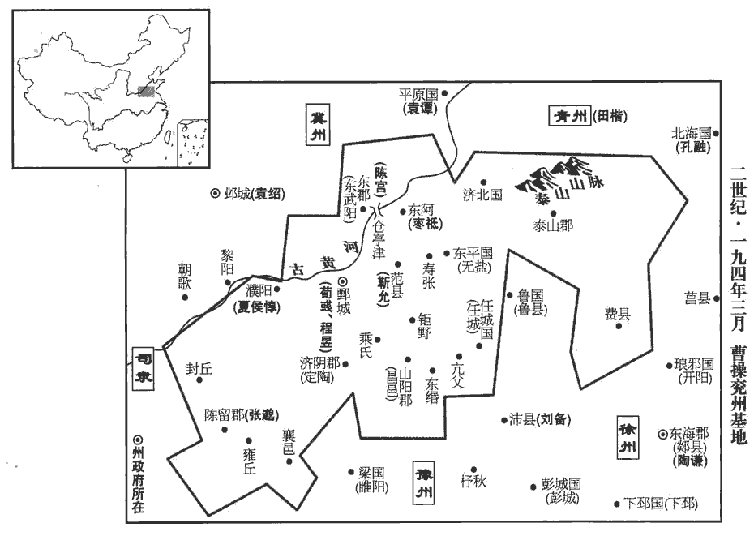
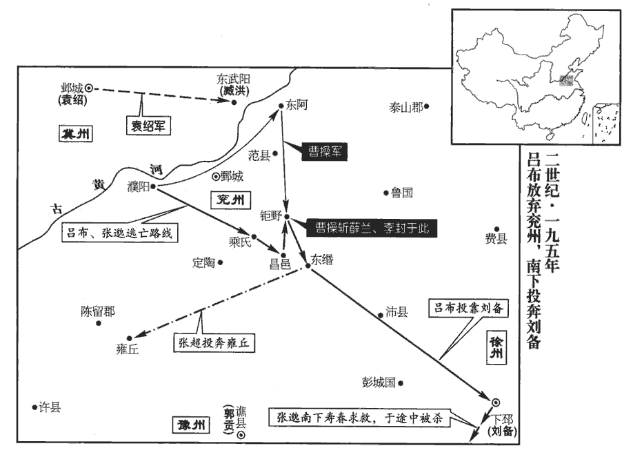
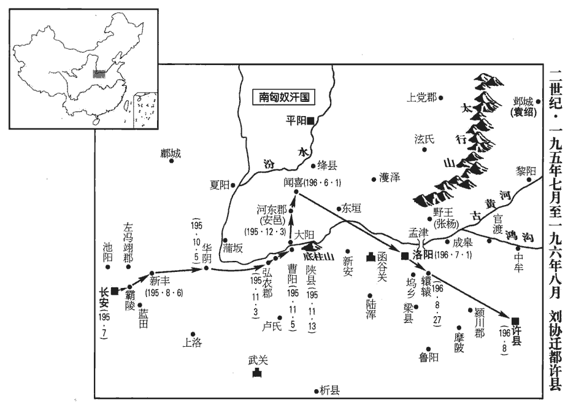
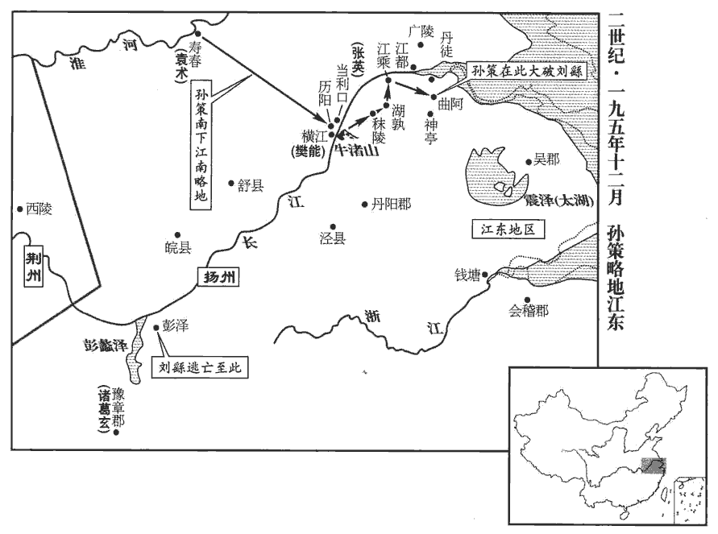
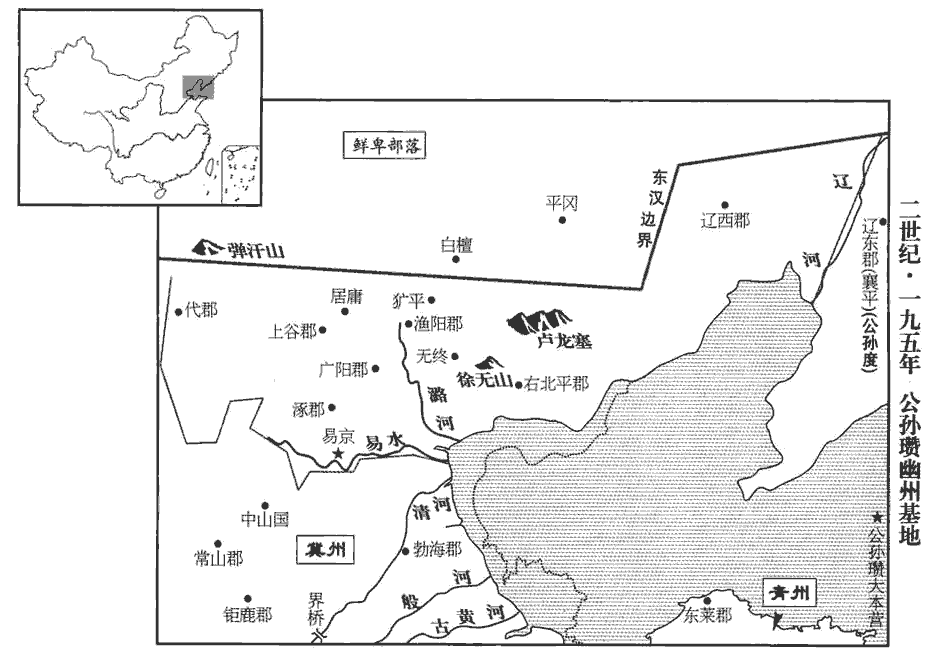

 漢紀五十三起閼逢閹茂（甲戌），盡旃蒙大淵獻（乙亥），凡二年。

# 孝獻皇帝丙

## 興平元年（甲戌，一九四）

1春，正月，辛酉‹十三›，赦天下。

〖译文〗 [1]春季，正月，辛酉（十三日），大赦天下。

2甲子‹十六›，帝‹刘协，时年十四›加元服。

〖译文〗 [2]甲子（十六日），献帝举行加冠礼。

3二月，戊寅‹一›，有司奏立長秋宮。詔曰：「皇妣bǐ宅兆未卜，孝經：卜其宅兆而安厝cuò之。兆，塋域也。何忍言後宮之選乎！」壬午‹五›，三公奏改葬皇妣王夫人，追上尊號曰靈懷皇后。王夫人死，見五十八卷靈帝光和四年。皇后紀曰：改葬文昭陵。上，時掌翻。

〖译文〗 [3]二月，戊寅（初一），有关部门奏请献帝选立皇后。献帝下诏说：“我母亲安葬的地方还未定，怎么忍心谈挑选后妃的事呢？”壬午（初五），三公上奏，请将献帝的母亲王美人改葬到灵帝之陵，并追加尊号，称“灵怀皇后”。

4陶謙告急於田楷，楷與平原‹山东平原›相劉備救之。備自有兵數千人，謙益以丹陽‹安徽宣城›兵四千，備遂去楷歸謙，謙表為豫州刺史，屯小沛‹江苏沛县›。沛國，治相縣，而沛自為縣，屬沛國，時人謂沛縣為小沛。由此時呼備為劉豫州。豫州刺史本治譙，備領刺史而屯小沛。按此時又有豫州刺史郭貢，朝命不行，私相署置者也。曹操軍食亦盡，引兵還。

〖译文〗 [4]徐州牧陶谦向青州刺史田楷告急，田楷与平原国相刘备率兵去援救他。刘备拥有自己的军队数千人，陶谦又增拨丹阳郡兵士四千名归他指挥，于是刘备就脱离田楷，投奔陶谦。陶谦上表推荐刘备担任豫州刺史，驻扎在小沛。正好曹操军粮也已告尽，率军撤回兖州。

5馬騰私有求於李傕，傕jué，古岳翻。不獲而怒，欲舉兵相攻；帝遣使者和解之，不從。韓遂率眾來和騰、傕，既而復與騰合。遂知傕之不足與也。復，扶又翻。諫議大夫种卲、种，音沖。侍中馬宇、左中郎將劉范謀使騰襲長安，己為內應，以誅傕等。壬申，騰、遂勒兵屯長平觀‹陕西泾阳东南›。觀，古玩翻。卲等謀泄，出奔槐里‹陕西兴平›。傕使樊稠、郭汜及兄子利擊之，騰、遂敗走，還涼州。又攻槐里，卲等皆死。庚申‹十三›，詔赦騰等。傕等力不能制騰、遂，因下詔赦之。夏，四月，以騰為安狄將軍，遂為安降將軍。二將軍號，一時暫置耳，後世不復置。降，戶江翻。

〖译文〗 [5]征西将军马腾为私事有求于李，因未得到满足而大怒，打算部署军队进攻李。献帝派遣使者进行调解，马腾不肯听从。韩遂率军从金城郡来调解马腾与李的纠纷，结果反而又与马腾联合。谏议大夫种邵、侍中马宇、左中郎将刘范策划让马腾进袭长安，自己做内应，以诛灭李等人。壬申（疑误），马腾、韩遂率军进驻长平观。种邵等人的计划泄露，他们便从长安出逃，跑到槐里。李派樊稠、郭汜及自己的侄子李利发动进攻，马腾、韩遂兵败退回凉州。樊稠等又进攻槐里，种邵等人全都被杀。庚申（疑误），下诏赦免马腾等人。夏季，四月，任命马腾为安狄将军，韩遂为安降将军。

6曹操使司馬荀彧、壽張‹山东东平西南›令程昱守甄城‹山东鄄城›，甄城縣，屬濟陰郡。水經註曰：沇yǎn州舊治。魏武創業始於此。河上之邑，最為峻固。甄，當作「鄄」juàn。續漢志：兗州刺史治昌邑。宋白曰：漢獻帝於鄄城置兗州。蓋曹操以刺史始治此。復往攻陶謙，復，扶又翻。遂略地至琅邪‹山东临沂›、東海‹山东郯城›，所過殘滅；還擊破劉備於郯東。謙恐，欲走歸丹陽‹安徽宣城›。謙，丹陽人也。會陳留太守張邈叛操迎呂布，操乃引軍還。還，從宣翻，又如字。

〖译文〗 [6]曹操委派司马荀、寿张县令程昱留守鄄城，自己再次前往徐州进攻陶谦，于是沿途攻掠，直到琅邪、东海，所过之处受到严重破坏。大军返回，又在郯县以东击败刘备的军队。陶谦震恐，打算逃回丹阳。正在这时，陈留太守张邈背叛曹操，迎接吕布入兖州，于是曹操撤军，回救兖州。

初，張邈少時，好游俠，少，詩照翻。好，呼到翻。俠，戶頰翻。袁紹、曹操皆與之善。及紹為盟主，有驕色，盟主，事見五十九卷初平元年。邈正議責紹；紹怒，使操殺之。操不聽，曰：「孟卓，親友也，是非當容之。今天下未定，柰何自相危也！」操之前攻陶謙，見上卷上年。志在必死，敕家曰：「我若不還，往依孟卓。」後還見邈，垂泣相對。泣，垂淚也。

〖译文〗 起初，张邈年轻时，行侠仗义，袁绍、曹操都与他友善。及至袁绍当上讨伐董卓联军的盟主，待人接物态度傲慢，张邈义正辞严地责备袁绍。袁绍恼羞成怒，让曹操去杀张邈。曹操不肯听从，说：“张邈是亲近的朋友，即使他有不对的地方，也该宽容。如今天下尚未安定，怎么能自相残杀呢？”曹操第一次进攻陶谦时，决心战死，曾命令家中妻小说：“我如果不能生还，他们就去投靠张邈。”后来曹操回来见到张邈，两人相对流下眼泪。

陳留高柔謂鄉人曰：「曹將軍雖據兗州，本有四方之圖，未得安坐守也。而張府君恃陳留之資，將乘間為變，間，古莧翻。欲與諸君避之，何如？」眾人皆以曹、張相親，柔又年少，不然其言。柔從兄幹自河北呼柔，柔舉宗從之。高幹從袁紹在河北。

〖译文〗 陈留人高柔对同乡人说：“曹操虽然目前占有兖州，但他本有兼并天下的图谋，不会安心坐守这块地盘。而张邈倚仗陈留郡作资本，将会找机会另作打算。我想和你们一同避开争战，怎么样？”众人都认为曹操与张邈互相亲善，而高柔年纪又轻，不相信他的预言。恰好高柔的堂兄高干从河北召唤高柔，高柔带着全族人前往河北依附高干。

 

呂布之捨袁紹從張楊也，事見上卷上年。過邈，過，工禾翻。臨別，把手共誓；紹聞之，大恨。邈畏操終為紹殺己也，為，于偽翻。心不自安。前九江‹安徽寿县›太守陳留邊讓嘗譏議操，操聞而殺之，并其妻子。讓素有才名，由是兗州士大夫皆恐懼。陳宮性剛直壯烈，內亦自疑，乃與從事中郎許汜、王楷及邈弟超共謀叛操。宮說邈曰：說，輸芮翻；下同。「今天下分崩，雄傑并起，君以千里之眾，當四戰之地，撫劍顧盼，亦足以為人豪，而反受制於人，不亦鄙乎！今州軍東征，謂操兵征徐州也。其處空虛，呂布壯士，善戰無前，若權迎之，共牧兗州，觀天下形勢，俟時事之變，此亦縱橫之一時也。」縱，子容翻。邈從之。

〖译文〗 吕布离开袁绍去投奔张杨时，路过陈留郡，拜访张邈，临别时，一同握手盟誓。袁绍知道这一消息后，大为痛恨。张邈担心曹操终究会为袁绍谋害自己，心中不能自安。前任九江太守、陈留人边让曾经讥讽过曹操，曹操知道后，将边让及其妻子儿女全部杀死。边让一向才华出众，声望很高，因此兖州地区的士大夫全都感到恐惧。陈宫性情梗直刚烈，心里也疑虑不安，就与从事中郎许汜、王楷以及张邈的弟弟张超一起策划背叛曹操。陈宫对张邈进言：“如今天下分袭，豪杰纷纷崛起，您拥有广达千里的疆土民众，又处于四方必争的冲要之地，手抚佩剑，左右顾盼，也足以成为人中豪杰。却反而受制于人，不是太鄙陋了吗？如今曹操统率大军东征，州中空虚，吕布是个壮士，能征善战，无人可比，如果暂时迎接他来，共同主持兖州事务，观察天下的形势，等待时局变化，这也是您纵横捭阖的一个时机。”张邈听从了陈宫的意见。

時操使宮將兵留屯東郡‹山东莘县南›，遂以其眾潛迎布為兗州牧。布至，邈乃使其黨劉翊告荀彧曰：「呂將軍來助曹使君擊陶謙，宜亟供其軍食。」眾疑惑，彧知邈為亂，即勒兵設備，急召東郡太守夏侯惇於濮陽‹河南濮陽›西南；惇來，布遂據濮陽。濮，博木翻。時操悉軍攻陶謙，留守兵少，少，詩沼翻。而督將、大吏多與邈、宮通謀，督將，領兵；大吏，通掌州郡事者。將，即亮翻。惇至，其夜，誅謀叛者數十人，眾乃定。

〖译文〗 当时曹操派陈宫率兵留守东郡，于是陈宫就率军秘密迎接吕布来担任兖州牧。吕布到达后，张邈就派他的党羽刘翊告诉荀说：“吕将军来帮助曹刺史进攻陶谦，应该赶快供给他军粮。”众人感到疑惑，荀知道张邈将要背叛，就立即部署军队进行防守，并急速征召在濮阳的东郡太守夏侯。夏侯前来救援，吕布便占据濮阳。当时曹操把所有的军队都带去进攻陶谦，留守的兵很少，而且大部分将领和主要官吏都参与了张邈、陈宫的阴谋。夏侯赶到以后，当天夜里，就诛杀了几十个参与叛变阴谋的官员，情势才稳定下来。

豫州刺史郭貢率眾數萬来至城下，或言與呂布同謀，眾甚懼。貢求見荀彧，彧將往，惇等曰：「君一州鎮也，謂一州倚之為重也。往必危，不可。」彧曰：「貢與邈等，分非素結也，分，扶問翻。今來速，計必未定，及其未定說之，縱不為用，可使中立。賢曰：不令其有所去就也。說，輸芮翻；下同。若先疑之，彼將怒而成計。」貢見彧無懼意，謂鄄城未易攻，易，以豉翻。遂引兵去。

〖译文〗 豫州刺史郭贡率领数万人的大军来到鄄城城下，有谣言说他与吕布合谋，城中众人十分恐惧。郭贡要求会见荀。荀准备出城会面，夏侯等劝阻他说：“你是一州的主持人，出城必定有危险，不能去。”荀说：“郭贡与张邈等人并不是老交情，如今来得这样迅速，必是还未定好策略，趁他尚未定好策略时说服他，即便他不能帮助我们，也可使他保持中立。如果先疑心他，将使他在一怒之下打定主意，投到敌人那边”郭贡看到荀并恐惧之心，认为鄄城不易攻破，于是率军离去。

是時，兗州郡縣皆應布，唯鄄城‹山东鄄城›、范‹山东梁山县西北›、東阿‹山东阳谷东北阿城镇›不動。賢曰：范縣屬東郡，今濮陽縣。東阿縣屬東郡，今濟州縣也。布軍降者言：「陳宮欲自將兵取東阿，又使氾嶷yí取范。」降，戶江翻。氾，符咸翻。皇甫謐云：本姓凡氏，遭秦亂，避地於氾水，因氏焉。嶷，鄂力翻。吏民皆恐。程昱本東阿人，彧謂昱曰：「今舉州皆叛，唯有此三城，宮等以重兵臨之，非有以深結其心，三城必動。君，民之望也，宜往撫之。」昱乃歸過范，說其令靳允曰：過，工禾翻。說輸芮翻。靳，居焮翻，姓也。戰國楚有幸臣靳尚。「聞呂布執君母、弟、妻子，孝子誠不可為心。今天下大亂，英雄并起，必有命世能息天下之亂者，此智者所宜詳擇也。得主者昌，失主者亡。陳宮叛迎呂布而百城皆應，似能有為；然以君觀之，布何如人哉？夫布麤中少親，剛而無禮，匹夫之雄耳。宮等以勢假合，不能相君也；相，如字。言不能相與定君臣之分也。兵雖眾，終必無成。曹使君智略不世出，殆天所授；君必固范，我守東阿，則田單之功可立也。田單，事見五卷周赧王三十六年。孰與違忠從惡而母子俱亡乎？唯君詳慮之！」允流涕曰：「不敢有貳心。」時氾嶷已在縣，允乃見嶷，伏兵刺殺之，刺，七亦翻。歸，勒兵自守。

〖译文〗 当时，兖州属下的郡、县全都响应吕布，只有鄄城、范县、东阿县没有动摇。吕布军中归降的人说：“陈宫准备自己率军攻取东阿，又派汜嶷攻取范县。”官民全都感到恐慌。程昱本是东阿人，荀对他说：“如今全州都已背叛，只剩下了这三个城。陈宫等派大军攻城，如果我们不能紧密地团结民心，这三城必定会动摇。你在东阿人民中声望很高，应该前去进行安抚。”于是，程昱离开鄄城返回东阿，在途中经过范县，劝说范县县令靳允道；“听说吕布已将您的母亲、弟弟和妻子儿女都抓了起来，孝子的心情自然十分沉重。如今天下大乱，英雄纷纷崛起，其中必定会有一位主宰时代命运安定天下的人，这是智者应该对比仔细选择的。跟对主人，才能兴旺；跟错主人，就会败亡。陈宫背叛曹操，迎接吕布，而诸城全都响应，似乎能有所作为。然而据您观察，吕布是个什么样的人？吕布为人粗暴而很少与人亲近，又刚愎无礼，不过是个勇猛的匹夫而已。陈宫等人在目前形势下与他联合，只是互相利用，不会奉吕布为主，因此，他们虽然兵多，但终究不会成事。曹操的智慧谋略盖世，简直是上天特别授予他的。您一定要坚守范县，我来守住东阿，就可以立下田单恢复齐国那样的大功。这样，难道不比你违背忠义去跟随恶人，结果母子都被杀死要好吗？请您好好考虑！”靳允流着泪说：“我不敢有二心。”这时，汜嶷已率兵进入范县，靳允便出来会见汜嶷，用伏兵将汜嶷刺杀。回城后，部署军队坚守。

徐眾評曰：允於曹公未成君臣；母至親也，於義應去。衛公子開方仕齊，積年不返，管仲以為不懷其親，安能愛君！齊桓公問管仲曰：「開方何如？」對曰：「棄親以適君，非人情，難親。」是以求忠臣必於孝子之門；允宜先救至親。徐庶母為曹公所得，劉備遣庶歸北，欲為天下者恕人子之情也；事見後六十五卷建安十三年。曹公亦宜遣允。

〖译文〗 徐众评曰：靳允与曹操之间并没有确立君臣关系，而母亲是至亲，依照道义，靳允应该辞官去跟随母亲。春秋时期，卫国公子开方到齐国当官，多年没有返回家乡，官仲认为，不惦念自己父母的人，又怎么能爱君主！所以，访求忠臣一定要到孝子之门。靳允应该首先去营救自己的至亲骨肉。徐庶的母亲被曹操俘虏，刘备就送徐庶返回北方，以便营救他的母亲。想要掌握天下的人，应当体恤作儿子的孝顺之情。而曹操也应该让靳允离开。

7昱又遣別騎絕倉亭津‹山东阳谷北古黄河渡口›，水經註：河水過東阿縣北。河水於范縣東北流，為倉亭津。述征記曰：倉亭津在范縣界，去東阿六十里。陳宮至，不得渡。昱至東阿，東阿令潁川‹河南禹州›棗祗已率厲吏民拒城堅守，潁川文士傳：棗氏本姓棘，避難改焉。卒完三城以待操。卒，子恤翻。操還，執昱手曰：「微子之力，吾無所歸矣。」表昱為東平‹山东東平›相，屯范。呂布攻鄄城不能下，西屯濮陽。曹操曰：「布一旦得一州，不能據東平，斷亢父‹山东济宁南›、泰山之道，乘險要我，東平國，當亢父、泰山之道。亢父本屬東平，章帝元和元年，分屬任城。賢曰：亢父故城在今兗州任城縣。斷，丁管翻。亢父，音抗甫。要，一遙翻。而乃屯濮陽，吾知其無能為也。」乃進攻之。

〖译文〗 [7]程昱又派遣一支骑兵部队，截断黄河上的仓亭津渡口，陈宫率军到河边，无法渡河。程昱来到东阿，东阿县令、颖川人枣祗已率领吏民在城墙上坚守。他们终于守住这三城等到曹操大军的归来。曹操回来后，握着程昱的手说：“假若不是你尽力，我就无家可归了。”曹操上表推荐程昱为东平国相，驻在范县。吕布进攻鄄城，未能攻克，就向西移驻濮阳。曹操说：“吕布一下子得到一州的地盘，却不能占据东平，切断亢父、泰山的要道，利用险要的地势来对抗我，反而回驻濮阳，我知道他没有多大作为。”于是进攻吕布。

8五月，以揚武將軍郭汜為後將軍，安集將軍樊稠為右將軍，安集將軍，亦一時暫置。并開府如三公，合為六府，時太傅馬日磾出使，李傕以車騎將軍開府，汜、稠又開府，與三公合為六府。皆參選舉。李傕等各欲用其所舉，若一違之，便忿憤喜怒，主者患之，乃以次第用其所舉。主者，蓋尚書也。先從傕起，汜次之，稠次之，三公所舉，終不見用。

〖译文〗 [8]五月，任命扬武将军郭汜为后将军，安集将军樊稠为右将军，都和三公一样开府，设置僚属。加上先前已享受这种待遇的车骑将军李，与三公的府署合称为六府，都参预全国官员的推荐与选举。李等人都要任用自己所推荐的人选，要是一有违背，就大发脾气。有关机构无法应付，只好依照次序任用他们所推荐的人选，先从李推荐的开始，其次是郭汜，再次是樊稠，三公所推举的人才，根本没有被任用的机会。

9河西四郡以去涼州治遠，隔以河寇，涼州刺史本治漢陽郡冀縣‹甘肃甘谷›，時寇賊繁興，遂與河西隔絕。河寇蓋群盜阻河為寇者。上書求別置州。六月，丙子‹一›，詔以陳留邯鄲商為雍州刺史，典治之。風俗通：邯鄲以國為姓。余謂邯鄲非國也，蓋以邑為姓。左傳，晉有邯鄲午。時置雍州，治武威。治，直之翻。

〖译文〗 [9]河西的敦煌、酒泉、张掖、武威四郡，因为距离凉州官府所在地冀县太远，而且交通又被盗寇阻断，因此上书请求另外设置一州。六月，丙子（初一），下诏设置雍州，任命陈留人邯郸商为雍州刺史，治理河西四郡事务。

丁丑‹二›，京师地震；戊寅‹三›，又震。

〖译文〗 [10]丁丑（初二），京师长安发生地震。戊寅（初三），再次发生地震。

乙酉晦‹三十›，日有食之。

〖译文〗 [11]乙酉晦（疑误），出现日食。

秋七月壬子‹七›，太尉朱儁免。

〖译文〗 [12]秋季，七月，壬子（初七），太尉朱俊被免职。

戊午‹十三›，以太常楊彪為太尉，錄尚書事。

〖译文〗 [13]戊午（十三日），任命太常杨彪为太尉，主持尚书事务。

甲子‹十九›，以鎮南將軍楊定為安西將軍，開府如三公。

〖译文〗 [14]甲子（十九日），任命镇南将军杨定为安西将军，允许他开府置僚属，待遇与三公相同。

自四月不雨至于是月，穀一斛直錢五十萬，長安‹西安›中人相食。帝令侍御史侯汶出太仓米豆為貧人作糜，汶，音聞。糜，粥也。為，于偽翻。餓死者如故。帝疑稟賦不實，稟，給也。賦，與也。取米豆各五升於御前作糜，得二盆。乃杖汶五十，於是悉得全濟。觀此，則獻帝非昏蔽而無知也，然終以失天下者，威權去己而小惠不足以得民也。

〖译文〗 [15]从四月到七月，一直没有降雨，谷价一斛值五十万钱。因为饥荒，长安城中的百姓出现人吃人的现象。献帝命令侍御史侯汶取出太仓中储存的米、豆为贫民熬粥，进行施舍。可是饿死的人仍像过去一样多。献帝怀疑有人从中作弊，便命令用米、豆各五升，在自己面前熬粥，煮出两盆。于是，责打侯汶五十棍。贫民才都得以保全性命。

八月，馮翊羌寇屬縣，郭汜、樊稠等率眾破之。

〖译文〗 [16]八月，冯翊地区的羌族人进攻属下各县，郭汜、樊稠率军将其击败。

呂布有別屯在濮陽西，曹操夜襲破之，未及還；會布至，身自搏戰，自旦至日昳dié，昳，徒結翻，日昃也。數十合，相持甚急。操募人陷陳，陳，讀曰陣。司馬陳留典韋將應募者進當之，典姓，韋名。布弓弩亂發，矢至如雨，韋不視，謂等人曰：等人者，立等以募人，及等者，謂之等人。或曰：等人，一等應募之人也。「虜來十步，乃白之。」等人曰：「十步矣。」又曰：「五步乃白。」等人懼，疾言「虜至矣！」韋持戟大呼而起，呼，火故翻。所抵無不應手倒者，布眾退。會日暮，操乃得引去；拜韋都尉，令常將親兵數百人，繞大帳左右。

〖译文〗 [17]吕布有一支部队驻在濮阳以西，曹操乘夜袭击，将其击溃。还未来得及撤回，正遇上吕布前来援救。吕布亲自冲锋陷阵，自清晨一直战到太阳偏西，交战数十回合，两军相持不下，十分危急。曹操召募壮士去突击敌阵，司马、陈留人典韦率领那些应募壮士在阵前抵御吕布军队的进攻。吕布军中弓弩齐发，箭如雨下。典韦对敌人连看也不看，对那些壮士说：“敌人来到距我们十步的地方，再告诉我。”壮士们说：“已经十步了。”典韦又说：“相距五步时再告诉我。”那些壮士们见敌人已到面前，大为惊惶，赶快喊：“敌人已经到了！”典韦手执铁戟，大喊而起，冲入敌阵，对面的敌人无不应手而倒，吕布的军队后撤。这时天色已晚，曹操才得以率军退回自己的营寨。回营后，曹操提升典韦为都尉，命他平日率领亲兵数百人，在自己的大帐左右负责警卫。

濮陽大姓田氏為反間，間，古莧翻。操得入城，燒其東門，示無反意。及戰，軍敗，布騎得操而不識，問曰：「曹操何在？」操曰：「乘黃馬走者是也。」布騎乃釋操而追黃馬者。操突火而出，至營，自力勞軍，令軍中促為攻具，進，復攻之，既自力勞軍，又促軍進攻者，恐既敗之後，士氣衰沮也。勞，力到翻。復，扶又翻。與布相守百餘日。蝗蟲起，百姓大餓，布糧食亦盡，各引去。九月，操還鄄城。布到乘氏‹山东鉅野西南›，乘氏縣，屬濟陰郡。應劭曰：春秋，魯敗宋師於乘丘，即其地。宋白曰：今濟州鉅野縣西南五十七里乘氏故城是也。乘，繩證翻。為其縣人李進所破，東屯山陽‹山东金乡西北昌邑镇›。

〖译文〗 濮阳县的大姓田氏为吕布实行反间计，假意作曹操的内应。曹操得以进入濮阳城后，纵火焚烧所经过的东门，表示自己不再退回。及至与吕布交战，曹军大败，吕布部下的骑士捉到曹操而不认识，问道：“曹操在哪里？”曹操说：“骑黄马逃走的那人，就是曹操。”吕布的骑士就放开曹操，而去追那骑黄马的人。曹操从大火中突围而出，回到营中，亲自慰问军士，命令军中赶快制作攻城用的器械。随即进军，再次攻击濮阳。他与吕布相持一百余天，发生蝗灾，百姓饥馑，吕布的存粮也已吃尽，两军各自撤退。九月，曹操回到鄄城。吕布率军到乘氏县，被乘氏县人李进击败，向东退到山阳。

冬，十月，操至東阿。袁紹使人說操，欲使操遣家居鄴；說，輸芮翻。操新失兗州，軍食盡，將許之。程昱曰：「意者將軍殆臨事而懼，不然，何慮之不深也！夫袁紹有并天下之心，而智不能濟也；將軍自度能為之下乎？度，徒洛翻。將軍以龍虎之威，可為之韓、彭邪！今兗州雖殘，尚有三城，能戰之士，不下萬人，以將軍之神武，與文若、昱等收而用之，荀彧，字文若。霸王之業可成也，願將軍更慮之！」操乃止。

〖译文〗 冬季，十月，曹操来到东阿县。这时，袁绍派人劝说曹操，想让曹操把家眷送到邺城居住。曹操新近失掉兖州，军中粮食也已吃尽，便准备接受袁绍的建议。程昱说：“大概将军怕是临事畏惧，不然，为什么考虑得这么不深！袁绍有并吞天下的野心，但他的智谋却不足以实现他的野心。将军自己考虑一下，能做他的下属吗？将军以龙虎之威，可以当他的韩信、彭越吗？如今兖州虽已残破，还有三城控制在您的手中，能战的兵士不下万人，凭将军的谋略与武功，再加上荀和我们这些人，齐心协力，是可以成就霸王之业的，愿将军重新考虑！”曹操于是放弃了原来的打算。

十二月，司徒淳于嘉罷，以衛尉趙溫為司徒，錄尚書事。

〖译文〗 [18]十二月，司徒淳于嘉被免职，任命卫尉赵温为司徒，主持尚书事务。

馬騰之攻李傕也，劉焉二子範、誕皆死。議郎河南龐羲，素與焉善，乃募將焉諸孫入蜀。龐，皮江翻。將，如字，領也，攜也，挾也。會天火燒城，焉徙治成都‹四川成都›，劉焉初居绵竹‹四川广汉›。疽發背而卒。說文曰：疽，久癰。州大吏趙韙等貪焉子璋溫仁，共上璋為益州刺史，韙，羽鬼翻。上，時掌翻。詔拜潁川‹河南禹州›扈瑁為刺史。瑁，音冒。璋將沈彌、婁發、甘寧反，擊璋，不勝，走入荊州‹湖北湖南›；詔乃以璋為益州牧。璋以韙為征東中郎將，率眾擊劉表，屯朐qú䏰rěn‹四川云阳西双江镇›。朐䏰縣，屬巴郡。師古曰：朐，音劬qú。晉書音義：朐，音蠢。䏰，如允翻。賢曰：朐䏰故城，在今夔州雲安縣西，萬戶故城是也。䏰，音閏。劉昫xù曰：開州盛山縣，漢朐䏰地。余據今雲安軍，漢朐䏰縣地，土地下濕，多朐䏰蟲，故名。劉禹錫曰：朐䏰，蚯蚓也。裴松之曰：䏰，如振翻。

〖译文〗 [19]马腾进攻李时，刘焉的两个儿子刘范、刘诞都被杀死。议郎、河南人庞羲，平时与刘焉友善，便派人带刘焉的孙子们入蜀。这时，原州府所在地绵竹城被雷击引起的大火烧毁，刘焉就把州府移到成都，因背生毒疮而去世。州中主要官员赵韪等贪图刘焉的儿子刘璋性情温和，好施仁义，便一同上表请求朝廷委任刘璋为益州刺史。献帝下诏，任命颖川人扈瑁为益州刺史。刘璋的部将沈弥、娄发、甘宁等人叛变，进攻刘璋，战败，逃入荆州。朝廷对益州事务鞭长莫及，只好下诏任命刘璋为益州刺史。刘璋任命赵韪为征东中郎将，率军进攻刘表，驻守朐。

徐州牧陶謙疾篤，謂別駕東海‹山东郯城›麋竺曰：姓譜：楚大夫受封於南郡麋亭，因以為氏。或言工尹麋之後，以名為氏。「非劉備不能安此州也。」謙卒，竺率州人迎備。備未敢當，曰：「袁公路近在壽春‹安徽寿县›，袁術，字公路。君可以州與之。」典農校尉下邳‹江苏睢宁北古邳镇›陳登曰：據裴松之註三國志云：陶謙表登為典農校尉。魏志曰：曹公置典農校尉，秩比二千石。蓋先已有此官，曹公增其秩耳。「公路驕豪，非治亂之主，治，直之翻。今欲為使君合步騎十萬，為，于偽翻。上可以匡主濟民，下可以割地守境；觀登此言，固未易才也。若使君不見聽許，登亦未敢聽使君也。」北海‹山东昌乐西›相孔融謂備曰：「袁公路豈憂國忘家者邪！冢中枯骨，何足介意！據陳壽志，備謂竺等曰：「袁公路近在壽春。此君四世五公，君可以州歸之。」融言：「冢中枯骨，何足介意。」正為四世五公發也。今日之事，百姓與能；天與不取，悔不可追。」易曰：人謀鬼謀，百姓與能。言百姓惟能者是與也。前書曰：天與不取，反受其咎。備遂領徐州。

〖译文〗 [20]徐州牧陶谦病势危重，他对别驾、东海人糜竺说：“除非刘备，不能保护本州的安全。”陶谦去世后，糜竺率领徐州官民迎接刘备。刘备不敢担当此任，说：“袁术近在寿春，你们可以把徐州交给他。”典农校尉、下邳人陈登说：“袁术骄奢横暴，不是能治理乱世的君主。如今，我们打算为您集结起十万步、骑大军，上可以辅佐君王，拯救百姓，下可以割据一方，保守疆土。如果您不答应我们的请求，我们也不敢听从您的建议。”北海国相孔融说：“袁术岂是忧国忘家的人！不过是依仗祖上遗留下的威望，根本不足介意。今天的事情，是百姓选择贤能。这种上天赐予的机会，如果拒绝，后悔就来不及了。”于是刘备接受他们的请求，兼任徐州牧。

初，太傅馬日磾與趙岐俱奉使至壽春‹安徽寿县›，磾dī，丁奚翻。岐守志不橈，橈náo，奴教翻。袁術憚之。日磾頗有求於術，術侵侮之，從日磾借節視之，因奪不還，條軍中十餘人，使促辟之。日磾從術求去，術留不遣，又欲逼為軍師；日磾病其失節，嘔血而死。杜預曰：病者，以為己病也。

〖译文〗 [21]当初，太傅马日与赵岐一起奉朝廷使命来到寿春，赵岐严守气节，不肯迁就，袁术对他很敬畏。马日经常有求于袁术，袁术就折辱马日，向他借所持的代表皇帝权力的符节看，乘机夺走不还，又开列了军中十几个人的名单，要马日赶快征召任命。马日向袁术请求离去，袁术扣留不放，又要逼迫他担任军师。马日悔恨自己失去献帝授予的符节，吐血而死。

初，孫堅娶錢唐‹杭州›吳氏，生四男，策、權、翊yì、匡及一女。堅從軍於外，留家壽春‹安徽寿县›。策年十餘歲，已交結知名。舒‹安徽庐江›人周瑜與策同年，亦英達夙成，夙，早也。聞策聲問，自舒來造焉，便推結分好，造，七到翻。分，扶問翻。推分而結好也。好，呼到翻；下同。勸策徙居舒‹安徽庐江›；策從之。瑜乃推道旁大宅與策，推，吐雷翻。升堂拜母，有無通共。及堅死，策年十七，還葬曲阿‹江苏丹阳›；曲阿縣，屬吳郡。賢曰：今潤州縣。余據曲阿，古雲陽縣也。秦時言其地有天子氣，始皇鑿北阬以敗其勢，截直道使阿曲，故謂之曲阿。杜佑曰：曲阿，今丹陽郡丹陽縣。已乃渡江，居江都‹江苏邗hán江西南›，結納豪俊，有復讎之志。以父堅為黃祖所殺也。

〖译文〗 [22]当初，孙坚娶钱唐人吴氏为妻子，生下四个儿子，即孙策、孙权、孙翊、孙匡，此外还有一个女儿，孙坚在外征战，把家眷留在寿春。孙策十余岁时，已开始结交当地知名之士。舒县人周瑜与孙策同岁，也英武豪迈，少年早成，听到孙策的名声，便从舒县前来拜访，两人一见如故，互相推心置腹。周瑜劝孙策移居舒县，孙策同意，周瑜就把临近道路的一座大宅院让给孙策居住。周瑜还到内堂去拜见了孙策的母亲，两家互通有无。孙坚死时，孙策十七岁，把父亲的棺木送回老家曲阿去安葬。安葬后，他渡过长江，住在江都，结交天下豪杰，立志为父亲报仇。

丹陽‹安徽宣城›太守會稽‹绍兴›周昕與袁術相惡，會，工外翻。術上策舅吳景領丹陽太守，上，時掌翻。攻昕，奪其郡，以策從兄賁為丹陽都尉。從，才用翻。下賢從同。策以母弟託廣陵‹扬州›張紘hóng，徑到壽春見袁術，涕泣言曰：「亡父昔從長沙入討董卓，與明使君會於南陽‹河南南陽›，同盟結好，不幸遇難，勳業不終。事見五十九卷初平元年、二年。難，乃旦翻。策感惟先人舊恩，欲自憑結，願明使君垂察其誠！」術甚奇之，然未肯還其父兵，謂策曰：「孤用貴舅為丹陽太守，賢從伯陽為都尉，舅，謂吳景。孫賁，字伯陽。彼精兵之地，丹陽號為天下精兵處。可還依召募。」策遂與汝南‹河南平舆西北射桥乡›呂范及族人孫河迎其母詣曲阿，依舅氏，因緣召募，得數百人；而為涇縣‹安徽涇縣›大帥祖郎所襲，涇縣，屬丹陽郡。賢曰：今宣州縣。姓譜：祖，商祖己之後。帥，所類翻。幾至危殆，於是復往見術。幾，居希翻。復，扶又翻；下同。術以堅餘兵千餘人還策，表拜懷義校尉。策騎士有罪，逃入術營，隱於內厩，策指使人就斬之，訖，詣術謝。謝入術營專殺也。術曰：「兵人好叛，當共疾之，好，呼到翻。何為謝也！」由是軍中益畏憚之。術初許以策為九江太守，已而更用丹陽‹安徽宣城›陳紀。更，工衡翻。後術欲攻徐州，從廬江太守陸康求米三萬斛；康不與。術大怒，遣策攻康，謂曰：「前錯用陳紀，錯，誤也。每恨本意不遂，今若得康，廬江真卿有也。」策攻康，拔之，術復用其故吏劉勳為太守；復，扶又翻。策益失望。

〖译文〗 丹阳郡太守、会稽人周昕与袁术互相敌视，袁术上表推荐孙策的舅父吴景兼任丹阳郡太守，进攻周昕，夺下丹阳郡，将孙策的堂兄孙贲任命为丹阳都尉。孙策把母亲和弟妹托付给广陵人张，自己直接到寿春去见袁术，流着泪对袁术说：“我已故的父亲当年从长沙出发讨伐董卓，与您在南阳相会，共结盟好。他不幸中途遇难，没能完成功业。我感念您对我父亲的旧恩，愿继续为您效力，请您明察我的一征诚心！”袁术对孙策的谈吐举止，很感惊异，但不肯交还他父亲原来统率的队伍，对他说：“我已任用你舅父吴景为丹阳郡太守，你堂兄孙贲为都尉，丹阳郡是出精兵的地方，你可以回去依靠他们的力量召募兵马。”孙策就与汝南人吕范、本族人孙河将母亲接到曲阿，依靠舅父吴景，乘机在当地募兵，得到数百人。但他遭到泾县的土豪祖郎的袭击，几乎被杀。于是他再次去见袁术。袁术把孙坚旧部千余人还给孙策，向朝廷上表推荐他担任怀义校尉。孙策部下的一名骑士犯罪后逃入袁术大营，隐藏在里面的马房中，孙策派人进去当场将骑士处斩，然后，他拜见袁术，表示谢罪。袁术说：“有些士兵喜欢叛变，我与你一样痛恨这种行为，你为什么要谢罪！”从此以后，袁术军中对孙策更加畏惧。袁术最初应许孙策为九江郡太守，但此后却改用丹阳人陈纪。后来，袁术准备进攻徐州，要求庐江郡太守陆康提供三万斛米，陆康不给。袁术大怒，派孙策去进攻陆康，对孙策说：“以前我错用陈纪为九江太守，每以不合本意而感到遗憾。这次你如果能战胜陆康，庐江郡就真的归你所有了。”孙策进攻陆康，攻下庐江郡府。但是袁术又任用自己的部下刘勋为庐江郡太守，孙策对他更加失望。

侍御史劉繇yáo，岱之弟也，素有盛名，詔書用為揚州刺史；州舊治壽春續漢志：揚州本治歷陽。蓋中世以後徙治壽春也。術已據之，繇欲南渡江，吳景、孫賁迎置曲阿‹江苏丹阳›。及策攻廬江，繇聞之，以景、賁本術所置，懼為袁、孫所并，遂構嫌隙，迫逐景、賁；景、賁退屯歷陽‹安徽和县›，歷陽縣屬九江郡，今和州。繇遣將樊能、于糜屯橫江‹安徽和县东南长江渡口，对岸是采石矶›，張英屯當利口‹安徽和县东金河口›以拒之。橫江渡在今和州，正對江南之采石，即今之楊林渡口。當利浦，在今和州東十二里。術乃自用故吏惠衢為揚州刺史，惠，姓也。戰國時梁有惠施。以景為督軍中郎將，與賁共將兵擊英等。

〖译文〗 侍御史刘繇是已故兖州刺史刘岱的弟弟，一向声望很高，朝廷下诏任命他为扬州刺史。扬州州府以前设在寿春，但这时已被袁术占据，刘繇想把州府设在长江以南，吴景、孙贲就迎接刘繇到曲阿。及至孙策进攻庐江，刘繇听到消息后，认为吴景、孙贲本是袁术安置的人，害怕自己被袁术、孙策等所兼并，于是产生敌意，将吴景、孙贲等赶走。吴景、孙贲退守历阳，刘繇派部将樊能、于糜驻横江，张英驻当利口以防备他们。袁术知道后，就自己委派旧部下惠衢为扬州刺史，委任吴景为督军中郎将，与孙贲等率军一起进攻张英等。

## 二年（乙亥，一九五）

1春，正月，癸丑‹十一›，赦天下。考異曰：袁紀作「癸酉」。按長曆，是月癸卯朔，無癸酉，今從范書。

〖译文〗 [1]春季，正月，癸丑（十一日），大赦天下。

2曹操敗呂布於定陶‹山东定陶›。敗，補邁翻。

〖译文〗 [2]曹操在定陶击败吕布。

3詔即拜袁紹為右將軍。即拜者，就拜之也。時紹在鄴，就鄴拜之。考異曰：袁紀作「後將軍」。今從范書。

〖译文〗 [3]朝廷下诏派使者到邺城，就地任命袁绍为右将军。

4董卓初死，三輔民尚數十萬戶，李傕等放兵劫掠，加以饑饉，二年間，民相食略盡。李傕、郭汜、樊稠各相與矜功爭權，欲鬬者數矣，數，所角翻。賈詡每以大體責之，雖內不能善，外相含容。

〖译文〗 [4]董卓刚死的时候，三辅地区的百姓还有数十万户。由于李等人纵兵抢掠，加上饥荒，百姓吃人肉充饥，两年之间，几乎死尽。李、郭汜、樊稠相互夸耀自己的功勋，争权夺利，有几次要冲突起来。贾诩每次都责备他们要以大局为重，因此，虽然他们内部不能友好相处，但表面还是团结一致。

樊稠之擊馬騰、韓遂也，李利戰不甚力，稠叱之曰：「人欲截汝父頭，利，傕兄子也，故云然。何敢如此，我不能斬卿邪！」及騰、遂敗走，稠追至陳倉‹陕西宝鸡东陈仓›，遂語稠曰：語，牛倨翻。「本所爭者非私怨，王家事耳。與足下州里人，韓遂，金城人，與樊稠皆涼州人也。欲相與善語而別。」乃俱卻騎，前接馬，交臂相加，共語良久而別。軍還，李利告傕，「韓、樊交馬語，不知所道，意愛甚密，」傕亦以稠勇而得眾，忌之。稠欲將兵東出關，從傕索益兵。索，山客翻。二月，傕請稠會議，便於坐殺稠。坐，徂臥翻。由是諸將轉相疑貳。

〖译文〗 樊稠进攻马腾、韩遂时，李的侄子李利作战不很出力，樊稠斥责他说：“人家要来砍你叔父的人头，你还胆敢如此松懈，难道我不能杀你吗！”马腾、韩遂败退时，樊稠军追到陈仓，韩遂对樊稠说：“本来咱们之间争的不是个人仇怨，而是国家大事。我与你都是同州人，临别前想再说几句知心话。”于是各自命令军士后退，他们两个人骑马上前对话，相互握手致意，交谈很久才告别。大军回到长安后，李利报告李说：“樊稠与韩遂两人马头相交地密谈，不知道谈话的内容，只看到你们很亲近。”李也因为樊稠作战勇猛而得到部属拥戴，对他有猜忌之心。樊稠准备率军东出函谷关，向李要求增加军队。二月，李请樊稠商议事情，就在会上杀死了樊稠。从此以后，将领们之间相互猜忌，不能团结一致。

傕數設酒請郭汜，數，所角翻。或留汜止宿。汜妻恐汜愛傕婢妾，思有以間之。間，工莧翻。會傕送饋，餉食，曰饋。妻以豉為藥，擿tī以示汜曰：豉，是義翻。擿，他歷翻，挑也。「一栖不兩雄，我固疑將軍信李公也。」以雞為喻也，一栖而兩雄，必斗。他日，傕復請汜，飲大醉，復，扶又翻；下同。汜疑其有毒，絞糞汁飲之，糞汁解眾毒。於是各治兵相攻矣。治，直之翻。

〖译文〗 李经常摆下酒宴款待郭汜，有时还留郭汜住宿在自己家中。郭汜的妻子恐怕郭汜会喜欢上李家的侍女，想用计阻止郭汜前往。正好李送来食物，郭汜妻把豆豉说成毒药，挑出来给郭汜看，说：“一群鸡中容不下两只公鸡，我实在不明白将军为什么这样信任李。”另一天，李又宴请郭汜，郭汜饮酒过量而大醉。他疑心酒里有毒，就喝下粪汁来使自己呕吐。于是，他们各自部署队伍，相互攻击。

帝使侍中、尚書和傕、汜，傕、汜不從。汜謀迎帝幸其營，夜有亡者，告傕。三月，丙寅‹二十五›，傕使兄子暹xiān將數千兵圍宮，以車三乘迎帝。暹，息廉翻。將，即亮翻。乘，繩證翻；下同。太尉楊彪曰：「自古帝王無在人家者，諸君舉事，柰何如是！」暹xiān曰：「將軍計定矣。」於是群臣步從乘輿以出，兵即入殿中，掠宮人、御物。帝至傕營，傕又徙御府金帛置其營，遂放火燒宮殿、官府、民居悉盡。帝復使公卿和傕、汜，汜留楊彪及司空張喜、尚書王隆、光祿勳劉淵、衛尉士孫瑞、太僕韓融、廷尉宣璠、璠fán，孚袁翻。大鴻臚榮郃hé、榮，姓也。前書有男子榮畜。姓譜：周榮公之後。郃，曷閤翻，又古合翻。大司農朱儁、將作大匠梁卲、屯騎校尉姜宣等於其營以為質。質，音致；下同。朱儁憤懣發病死。懣，音悶，又音滿。

〖译文〗 献帝派侍中、尚书去调解李和郭汜的矛盾，但李、郭汜都不服从。郭汜阴谋劫持献帝到他的军营，夜里，有人逃到李营中，将部汜的计划告诉李。三月，丙寅（二十五日），李派侄子李暹率领数千名兵士包围皇宫，用三辆车迎接献帝到自己营中。太尉杨彪说：“自古以来，帝王从没有住在臣民家中的，你们做事，怎么能这样呢！”李暹说：“将军的计划已经定了。”于是，群臣徒步跟在献帝的车后出宫。军队立即就进入宫殿，抢掠宫女和御用器物。献帝到李营中后，李又将御府所收藏的金帛搬到自己营里，随即放火将宫殿、官府和百姓的房屋全部烧光。献帝又派公卿调解李、郭汜的矛盾，郭汜就把太尉杨彪及司空张喜、尚书王隆、光禄勋刘渊、卫尉士孙瑞、太仆韩融、廷尉宣、大鸿胪荣、大司农朱俊、将作大匠梁邵、屯骑校尉姜宣等都扣留在营中，作为人质。朱俊十分气愤，发病而死。

5夏，四月，甲子‹二十三›，立貴人琅邪‹山东临沂›伏氏‹伏寿›為皇后；以后父侍中完為執金吾。

〖译文〗 [5]夏季，四月，甲子（疑误），献帝立贵人、琅邪人伏氏为皇后，任命皇后的父亲、侍中伏完为执金吾。

6郭汜饗xiǎng公卿，議攻李傕。楊彪曰：「群臣共鬬，一人劫天子，一人質公卿，可行乎！」質，音致。汜怒，欲手刃之。彪曰：「卿尚不奉國家，吾豈求生邪！」中郎將楊密固諫，汜乃止。傕召羌、胡數千人，先以御物繒綵與之，繒，慈陵翻。許以宮人、婦女，欲令攻郭汜。汜陰與傕黨中郎將張苞等謀攻傕。丙申‹二十五›，汜將兵夜攻傕門，矢及帝簾帷中，又貫傕左耳。苞等燒屋，火不然。楊奉於外拒汜，汜兵退，苞等因將所領兵歸汜。

〖译文〗 [6]郭汜设宴款待被扣的朝廷大臣，商议进攻李。太尉杨彪说：“你们这些臣属互相争斗，一个人劫持天子，一个人将公卿做人质，这怎么能行呢！”郭汜大怒，想要亲手用刀杀死杨彪，杨彪说：“你连皇上都不尊奉，我难道还会求生吗？”中郎将杨密竭力劝阻，郭汜这才作罢。李召集数千名羌人和胡人，先以御用物品和绸缎赏赐他们，许诺还将赏赐宫女和民间妇女，打算要他们进攻郭汜。郭汜则暗中与李的党羽中郎将张苞等勾结，策划进攻李。丙申（二十五日），郭汜率军乘夜进攻李营门，飞箭射到献帝御帐的帷帘中，还贯穿了李的左耳。张苞等人在营内放火烧房，但火没有燃着。李部下杨奉在营外抵抗郭汜，郭汜军撤退，张苞于是率领部下投奔郭汜。

是日，傕復移乘輿幸北塢，據傕、汜和後，然後帝得出長安宣平門，則此塢蓋在長安城中；傕、汜於城中各築塢而居也。復，扶又翻。使校尉監塢門，監，工銜翻。內外隔絕，侍臣皆有飢色。帝求米五斗、牛骨五具以賜左右。傕曰：「朝晡bū上飰，上，時掌翻。飰fàn，與飯同。何用米為？」乃以臭牛骨與之。帝‹刘协，时年十五›大怒，欲詰責之。侍中楊琦諫曰：「傕自知所犯悖逆，欲轉車駕幸池陽‹陕西泾阳县›黃白城‹陕西三原东北›，池陽縣，屬馮翊yì。賢曰：故城在今涇陽縣西北。水經註曰：黃白城，本曲梁宮也。詰，去吉翻。悖，蒲妹翻，又蒲沒翻。臣願陛下忍之。」帝乃止。司徒趙溫與傕書曰：「公前屠陷王城，殺戮大臣，今爭睚眥之隙，睚yá，牛懈翻，怒視也。眥zì，疾智翻，目際也。毛晃曰：厓眥，舉目相忤貌，亦作眦，士懈翻。以成千鈞之讎，千鈞，言重也。朝廷欲令和解，詔命不行，而復欲轉乘輿於黃白城，此誠老夫所不解也。乘，繩證翻。解，胡買翻，曉也。於易，一為過，再為涉，三而弗改，滅其頂凶。易大過上六曰：過，涉，滅頂，凶。溫依此而分一再三之義。不如早共和解。」傕大怒，欲殺溫，其弟應諫之，數日乃止。據獻帝起居注，應，溫故掾也。

〖译文〗 这天，李又把献帝迁移到北坞，派校尉把守坞门，断绝内外交通，献帝左右的侍臣都面有饥色。献帝派人向李要求供应五斗米，五具牛骨，以赐给左右。李说：“早晚两次送饭，要米干什么用？”于是把已发臭的牛骨头送去，献帝大怒，想要责问李。侍中杨琦劝阻说：“李自己知道所犯下的是叛逆大罪，打算把陛下转移到池阳的黄白城，我愿陛下忍耐。”献帝这才作罢。司徒赵温写信给李说：“你先前攻陷京城，烧杀抢掠，杀害大臣，如今为了一些小小怨恨而铸成深仇，皇上想要让你们和解，但诏书无人遵奉，而你又打算把皇上转移到黄白城，这实在让我不解。根据《易经》，第一次为过分，第二次就陷入水中，第三次还不改，就将被淹没，大凶。不如早些与郭汜和解。”李大怒，想要杀死赵温，他弟弟李应劝阻，几天后，李才作罢。

傕信巫覡厭勝之術，覡，刑狄翻。國語：在女曰巫，在男曰覡。厭，益涉翻。常以三牲祠董卓於省門外；每對帝或言「明陛下」，或言「明帝」，為帝說郭汜無狀，為，于偽翻。帝亦隨其意應答之。傕喜，自謂良得天子歡心也。良，信也。

〖译文〗 李相信男、女巫师解除灾祸的法术，经常在宫门外用猪、牛、羊三牲祭奠董卓。李每次见到献帝，或者称献帝为“明陛下”，或者称“明帝”，向献帝述说郭汜的罪行，献帝也顺着李的意思应答。李大喜，自己以为已得到献帝的欢心。

閏月，己卯‹九›，帝使謁者僕射皇甫酈和傕、汜。考異曰：袁紀「酈」作「麗」。今從范書。酈先詣汜，汜從命；又詣傕，傕不肯，曰：「郭多，盜馬虜耳，英雄記曰：郭汜，一名多。何敢欲與吾等邪，必誅之！君觀吾方略士眾，足辦郭多否邪？郭多又劫質公卿，質，音致；下同。所為如是，而君苟欲左右之邪！」左右，助也，音佐佑。酈曰：「近者董公之強，將軍所知也；呂布受恩而反圖之，斯須之間，身首異處，此有勇而無謀也。今將軍身為上將，荷國寵榮，荷，下可翻。汜質公卿而將軍脅主，誰輕重乎！張濟與汜有謀，楊奉，白波賊帥耳，帥，所類翻。猶知將軍所為非是，將軍雖寵之，猶不為用也。」傕呵之令出。酈出，詣省門，白「傕不肯奉詔，辭語不順。」天子所居曰禁中，亦曰省中；省門，即禁門也。帝恐傕聞之，亟令酈去。傕遣虎賁王昌呼，欲殺之，昌知酈忠直，縱令去，還答傕，言「追之不及」。

〖译文〗 闰五月，己卯（初九），献帝派谒者仆射皇甫郦调解李、郭汜的争端。皇甫郦先去拜见郭汜，郭汜答应服从。皇甫郦又去拜见李，李不肯接受，说：“郭汜不过是个盗马贼罢了，怎么敢与我平起平坐，一定要杀死他！您看我的谋略和队伍，是不是已经足够制服郭汜？郭汜又劫持大臣作为人质，行为如此恶劣，而您还要帮助他吗！”皇甫郦说：“不久以前，董卓势力的强大，是将军所知道的。但吕布受他恩宠，却反过来杀害他，不过眨眼之间，董卓已经身首异处，这是因为董卓有勇而无谋。如今，将军身为上将，受到朝廷荣宠，郭汜劫持大臣，而将军却劫持天子，这罪过是谁轻谁重？张济已与郭汜联合在一起，杨奉不过是个白波军的首领，还知道将军所作的事情不对，将军虽然宠信他，但恐怕他也不会听你支使。”李大声呵斥，让皇甫郦出去。皇甫郦离开李大营，到献帝住处汇报，说：“李不肯奉召，而且言辞不恭顺。”献帝恐怕李听到，赶快命令皇甫郦离去。李果然派虎贲武士王昌来叫皇甫郦，准备杀死他。王昌知道皇甫郦忠贞正直，就放他逃走，回去报告李说：“皇甫郦已逃走，追赶不上。”

辛巳‹十一›，以車騎將軍李傕為大司馬，在三公之右。

〖译文〗 辛巳（十一日），任命车骑将军李为大司马，位在三公之上。

7呂布將薛蘭、李封屯鉅野‹山东鉅野›，鉅野縣，屬山陽郡，郭周於此置濟州。曹操攻之，布救蘭等，不勝而走，操遂斬蘭等。操軍乘氏‹山东鉅野西南›，乘，繩證翻。以陶謙已死，欲遂取徐州，還乃定布。荀彧曰：「昔高祖保關中‹陕西中部›，光武據河內，高祖取天下，令蕭何守關中；光武經營河北，令寇恂守河內：皆以為王業根本。皆深根固本以制天下，進足以勝敵，退足以堅守，故雖有困敗而終濟大業。將軍本以兗州首事，平山東之難，賢曰：曹操初從東郡守鮑信等迎，領兗州牧，遂進兵破黃巾等，故能平定山東也。余據此時山東猶未盡平，彧誇之耳。難，乃旦翻。百姓無不歸心悅服。且河、濟天下之要地也，禹貢：兗州之域。孔安國曰：東南據濟，西北距河。濟，子禮翻。今雖殘壞，猶易以自保，易，以豉翻。是亦將軍之關中、河內也，不可以不先定。今已破李封、薛蘭，若分兵東擊陳宮，宮必不敢西顧，以其間【章：甲十一行本「間」下有「勒兵」二字；乙十一行本同；孔本同；張校同。】收熟麥，約食畜穀，一舉而布可破也。破布，然後南結揚州，謂結劉繇也。共討袁術，以臨淮、泗。若舍布而東，舍，讀作捨。多留兵則不足用，少留兵則民皆保城，不得樵采，布乘虛寇暴，民心益危，唯甄城、范、衛可全，衛，謂濮陽。杜預曰：濮陽古衛地。「甄」，當作「鄄」。其餘非己之有，是無兗州也。若徐州不定，將軍當安所歸乎！且陶謙雖死，徐州未易亡也。易，以豉翻。彼懲往年之敗，將懼而結親，結親，猶言親結也。相為表里。今東方皆已收麥，必堅壁清野以待將軍，攻之不拔，略之無獲，不出十日，則十萬之眾，未戰而先自困耳。前討徐州，威罰實行，謂多所屠戮也。其子弟念父兄之恥，必人自為守，無降心，就能破之，尚不可有也。徐州子弟，既有父兄之讎，必不心服於操，縱破其兵，猶不能有其地也。降，戶江翻。夫事故【章：甲十一行本「故」作「固」；乙十一行本同；孔本同。】有棄此取彼者，以大易小可也，以安易危可也，權一時之勢，不患本之不固可也。今三者莫利，惟將軍熟慮之。」操乃止。

〖译文〗 [7]吕布的部将薛兰、李封驻军巨野，曹操向他们发动进攻、吕布前来援救，被曹操击败，退走。于是曹操斩杀薛兰等人。曹操驻军乘氏，因徐州牧陶谦已死，便准备先夺取徐州，回来再攻打吕布。荀说：“从前高祖守保关中，光武帝占据河内，都巩固基地以控制天下，进足以胜敌，退足以坚守，所以虽有困顿失利，但最终完成统一天下的大业。将军本来从兖州起兵，平定山东之乱，百姓无不对您心悦诚服。而且，兖州处于黄河与济水之间，是天下的冲要之地，如今虽已残破，但还易于自保，这正是将军的‘关中’、‘河内’，不能不先把这个基地安定下来。现在，已击破李封、薛兰，如果分兵向东进攻陈宫，他必然不敢再有西进的打算，我们便乘机收获已成熟的麦子，节约饭食，储备粮草，就可以一举击败吕布。击败吕布后，再向南与扬州刺史刘繇结盟，共同讨伐袁术，控制淮水、泗水一带。如果现在不管吕布，而去向东攻打徐州，多留兵则出征兵力不足，少留兵则只有让全体百姓守城，不要说收麦，连上山砍柴也不能进行。吕布乘虚进攻，民心就会更加动摇，只有鄄城、范县、濮阳可以保全，其余的城都会失去，那就等于您不再占有兖州了。如果出征不能平定徐州，将军将回到哪里去呢！而且陶谦虽然已死，徐州并不容易灭亡。那里的人接受往年失败的教训，必然因畏惧而团结一致，内外呼应。如今东边徐州的麦子已经收割，他们必定坚壁清野，等待将军。既攻不下城，又抢掠不到物资，不出十天，十万大军还没有作战，已先自陷困境了。上次讨伐徐州，您曾实行威罚，徐州的子弟们想到父兄的仇恨，必然人人固守，不肯归降，即使您能攻破城池，仍不能使他们归顺。在考虑事情时，经常要有舍此取彼的选择，可以取大而舍小，可以求安全而舍危险，可以在不威胁根本稳固的前提下采取权宜之计。现在东征徐州，并不符合以上三个取舍标准，请将军仔细斟酌。”曹操这才打消了东征的念头。

布復從東緡mín‹山东金乡›東緡縣，屬山陽郡，春秋之緡邑也。宋白曰：今濟州金鄉縣，本漢東緡縣。復，扶又翻；下同。緡，眉巾翻。與陳宮將萬餘人來戰，操兵皆出收麥，在者不能千人，屯營不固。屯西有大隄，其南樹木幽深，操隱兵隄里，出半兵隄外；布益進，乃令輕兵挑戰，挑，徒了翻。既合，伏兵乃悉乘隄，前書音義曰：乘，登也。步騎并追，【章：甲十一行本「追」作「進」；乙十一行本同；孔本同；熊校同。】大破之，追至其營而還。布夜走，操復攻拔定陶‹山东定陶›，分兵平諸縣。布東奔劉備，張邈從布使其弟超將家屬保雍丘‹河南杞县›。雍丘縣，屬陳留郡，故杞國也。

〖译文〗 吕布再次从东缗出发，与陈宫率领万余人来进攻曹操。曹操部下的士兵全都出去收割麦子，在营中的不到一千人，难以守住营寨。在营寨西边有一条大堤，南边有一片茂密深广的树林。曹操把一半士兵埋伏在堤后，另一半士兵暴露在堤外布下阵势。吕布的军队逼近时，曹操才命轻装部队挑战，等到两军厮杀在一起以后，伏兵才登上大堤杀出，步兵与骑兵一齐冲锋，大破吕布的军队，直追到吕布的营寨才返回。吕布当夜撤退。曹操又攻下定陶，分兵平定各县。吕布向东到徐州投奔刘备。张邈跟随吕布，让自己的弟弟张超带领家属退守雍丘。

布初見備，甚尊敬之，謂備曰：「我與卿同邊地人也！布，五原人‹内蒙包头›，備，涿郡人‹河北涿州›，五原、涿郡皆邊地也。布見關東起兵，欲誅董卓。布殺卓東出，關東諸將無安布者，皆欲殺布耳。」請備於帳中，坐婦牀上，令婦向拜，酌酒飲食，名備為弟。備見布語言無常，外然之而內不悅。

〖译文〗 吕布初见刘备时，十分尊敬，对刘备说：“我与你都是连疆出身的人，我见到函谷关以东诸州、郡起兵，目的是讨伐董卓。但我杀死董卓后，来到关东，关东的诸将领没有一个接纳我，而都要杀死我！”吕布请刘备到自己帐中，坐在妻子的床上，让自己妻子向刘备行礼。又设酒宴款待刘备，称刘备为弟。刘备见吕布语无伦次，外表上与他应酬，内心里感到不快。

 

8李傕、郭汜相攻連月，死者以萬數。六月傕將楊奉謀殺傕，事泄，遂將兵叛傕，傕眾稍衰。果如皇甫酈之言。庚午，鎮東將軍張濟自陝‹河南三门峡›至，陝縣，屬弘農，張濟初平三年出戍焉。陝，式冉翻。欲和傕、汜，遷乘輿權幸弘農‹河南灵宝东北›。乘，繩證翻；下同帝亦思舊京，謂雒陽也。遣使宣諭，十反，汜、傕許和，欲質其愛子。質，音致；下同。傕妻愛其男，和計未定，而羌、胡數來闚省門，數，所角翻。曰：「天子在此中邪！李將軍許我宮人，今皆何在？」帝患之，使侍中劉艾謂宣義將軍賈詡曰：宣義將軍，亦一時暫置。「卿前奉職公忠，故仍升榮寵；今羌、胡滿路，宜思方略。」詡乃召羌、胡大帥飲食之，帥，所類翻。飲，於禁翻。食，讀曰飤sì。許以封賞，羌、胡皆引去，傕由此單弱。於是復有言和解之計者，復，扶又翻。傕乃從之，各以女為質。

〖译文〗 [8]李、郭汜相互攻击，一连几个月，死者数以万计。六月，李部将杨奉打算谋杀李，计划泄露，便率领部下背叛李，李的势力逐渐衰落。庚午（疑误），镇东将军张济从陕县来到长安，打算调解李与郭汜的争端，迎接献帝前往弘农。献帝也思念旧京洛阳，便派遣使者到李、郭汜营中传达圣旨。使者反复十次，李与郭汜才答应讲和，打算互相交换爱子，作为人质。李的妻子疼爱儿子，所以和约没有谈成。而在这段时间，李部下的羌人与胡人不断地到献帝住地的大门窥探，说：“皇帝在这里面吗！李答应赐给我们的宫女，如今都在什么地方？”献帝不安，派侍中刘艾对宣义将军贾诩说：“你以前对国家忠心耿耿，恪尽职守，因此得到提升，享受荣宠。如今羌人与胡人塞满道路，你应该筹划一个对策。”于是，贾诩大开酒宴，款待羌人和胡人的首领，许诺授予他们爵位和赏赐财物，这些羌人和胡人才全部离去，李从此势力单弱。于是又有人提出和解的建议时，李便同意与郭汜讲和，相互交换女儿作人质。

秋，七月，甲子，車駕出宣平門，宣平門，長安城東出北頭第一門。當渡橋，汜兵數百人遮橋曰：「此天子非也？」車不得前。傕兵數百人，皆持大戟在乘輿車前，兵欲交，侍中劉艾大呼曰：「是天子也！」使侍中楊琦高舉車帷，帝曰：「諸君【章：甲十一行本「君」作「兵」；乙十一行本同。】何敢迫近至尊邪？」呼，火故翻。近，其靳翻。汜兵乃卻。既渡橋，士眾皆稱萬歲。夜到霸陵‹西安东北›，從者皆飢，從，才用翻。張濟賦給各有差。傕出屯池陽‹陕西泾阳›。

〖译文〗 秋季，七月，甲子（疑误），献帝乘车出宣平门，正要过护城河桥，郭汜部下数百名士兵在桥上拦住去路，问：“这是不是天子！”献帝车驾无法前进。李部下数百名士兵，全都手执大戟守在车前，两军就要交手，侍中刘艾大声喊：“真的是天子！”让侍中杨琦把车帘高高掀起，献帝说：“你们怎敢这样迫近至尊！”郭汜的兵才撤退，渡过桥后，官兵一起高呼：“万岁！”晚上走霸陵，侍从官员与卫士都饥饿不堪，张济根据各人官职大小，分别给予饮食。李离开长安，驻军池阳。

丙寅，以張濟為票騎將軍，開府如三公；票，匹妙翻。郭汜為車騎將軍，楊定為後將軍，楊奉為興義將軍：皆封列侯。以楊奉自白波賊帥勤王，故以興義寵之。又以故牛輔部曲董承為安集將軍。蜀志曰：承，獻帝舅也。裴松之曰：承，靈帝母董太后之姪，於獻帝為丈人；蓋古無丈人之名，故謂之舅也。

〖译文〗 丙寅（疑误），献帝任命张济为票骑将军，允许他开府置僚属，待遇与三公相同。任命郭汜为车骑将军，杨定为后将军，杨奉为兴义将军，都封为列侯。又任命原为牛辅部曲的董承为安集将军。

郭汜欲令車駕幸高陵‹陕西高陵›，高陵縣，屬馮翊。公卿及濟，以為宜幸弘農‹河南灵宝东北›，大會議之，不決。帝遣使諭汜曰：「弘農近郊廟，近，其靳翻。勿有疑也！」汜不從。帝遂終日不食。汜聞之曰：「可且幸近縣。」八月，甲辰‹六›，車駕幸新豐‹陕西临潼东北零口乡›。丙子，郭汜復謀脅帝還都郿，復，扶又翻；下同。侍中种輯知之，密告楊定、董承、楊奉令會新豐。郭汜自知謀泄，乃棄軍入南山。自新豐驪山西接終南，謂之南山。

〖译文〗 郭汜想让献帝前往高陵，公卿与张济都认为应该去弘农，召开大会进行商议，但决定不下。献帝派使者去告诉郭汜：“我只是因为弘农离祭祀天地之处和祖先宗庙较近，并无别的意思，将军不要猜疑！”郭汜仍不服从。于是献帝整天不肯进食。郭汜听到后说：“可以暂且先到附近的县城，再作商议。”八月，甲辰（初六），献帝到达新丰。丙子（疑误），郭汜又阴谋胁迫献帝西还，定都地。侍中种辑得到消息，秘密通知杨定、董承、杨奉，命令他们到新丰来会合。郭汜知道阴谋败露，于是抛弃他的军队，逃入终南山。

9曹操圍雍丘，張邈詣袁術求救，未至，為其下所殺。

〖译文〗 [9]曹操率军包围雍丘，张邈去见袁术请求救援，他还没有走到，就被自己部下杀死。

10冬，十月，以曹操為兗州牧。

〖译文〗 [10]冬季，十月，任命曹操为兖州牧。

11戊戌‹一›，郭汜黨夏育、高碩等謀脅乘輿西行。夏，戶雅翻。侍中劉艾見火起不止，請帝出幸一營以避火。時郭汜、楊定、董承、楊奉各自為營，艾不敢指言，故請幸一將營，惟帝意所向也。楊定、董承將兵迎天子幸楊奉營，夏育等勒兵欲止乘輿，楊定、楊奉力戰，破之，乃得出，壬寅‹五›，行幸華陰‹陕西華陰›。華，戶化翻。

〖译文〗 [11]戊戌（初一），郭汜的党羽夏育、高硕等策划劫持献帝西行，先纵火扰乱人心。侍中刘艾看到火起不息，就请献帝到其他军营中躲避火势。杨定、董承率军接献帝到杨奉营，夏育等出兵企图阻拦献帝，杨定、杨奉奋力作战，击败夏育等，献帝才得以逃出。壬寅（初五），献帝抵达华阴。

寧輯將軍段煨具服御及公卿已下資儲，欲上幸其營。寧輯之號，猶安集，亦一時暫置也。煨，烏回翻。煨與楊定有隙，定黨种輯、左靈言煨欲反，太尉楊彪、司徒趙溫、侍中劉艾、尚書梁紹皆曰：「段煨不反，臣等敢以死保。」董承、楊定脅弘農督郵令言郭汜來在煨營，帝疑之，乃露次於道南。野宿無廬舍，謂之露次。

〖译文〗 宁辑将军段煨准备好献帝的衣服车马等御用物品和公卿及以下官员们所需要的物资器具，想要献帝进驻他的大营。段煨与杨定有仇，杨定的同党种辑、左灵声称段煨蓄意谋反。太尉杨彪、司徒赵温、侍中刘艾、尚书梁绍都说：“段煨不会谋反，我们愿以性命来作保证！”董承、杨定威胁弘农郡督邮，让他向献帝报告说：“郭汜已来到段煨营中。”献帝惊疑不定，只好在路南露宿。

丁未‹十›，楊奉、董承、楊定將攻煨，使种輯、左靈請帝為詔，帝曰：「煨罪未著，奉等攻之，而欲令朕有詔邪！」輯固請，至夜半，猶弗聽。奉等乃輒攻煨營，十餘日不下。煨供給御膳，稟贍百官，無有二意。贍，而豔翻。詔使侍中、尚書告諭定等，令與煨和解，定等奉詔還營。

〖译文〗 丁未（初十），杨奉、董承、杨定等人准备进攻段煨，派种辑、左灵来请求献帝下诏。献帝说：“段煨并没有谋反的迹象，杨奉等人去进攻他，还要命令朕下诏吗？”种辑一再坚持，直到半夜，献帝仍然拒绝下诏。于是杨奉等就进攻段煨大营，一连十余天，未能攻下。段煨供应献帝的御膳及百官的饮食，并没有二心。献帝下诏，派侍中、尚书等告诉杨定等，命令他们与段煨和解。杨定等奉诏回营。

 

李傕、郭汜悔令車駕東，聞定攻煨，相招共救之，因欲劫帝而西。楊定聞傕、汜至，欲還藍田‹陕西藍田›，為汜所遮，單騎亡走荊州‹湖北湖南›。張濟與楊奉、董承不相平，乃復與傕、汜合。十二月，帝幸弘農，張濟、李傕、郭汜共追乘輿，大戰於弘農東澗，承、奉軍敗，百官士卒死者，不可勝數，棄御物、符策、典籍，略無所遺。凡乘輿服御之物，皆為御物。符，銅虎符、竹使符之類。符之為言扶也，兩相扶合而不差也。又曰：符，輔也，所以輔信；又合也，驗也。策，編簡為之。古者誥命皆書之策。漢制，天子策書長二尺。典籍，內府圖籍及尚書中故事之類。勝，音升。射聲校尉沮儁被創墜馬，沮，子余翻。創，初良翻。傕謂左右曰：「尚可活否？」儁罵之曰：「汝等凶逆，逼劫天子，使公卿被害，被，皮義翻。宮人流離，亂臣賊子，未有如此也！」傕乃殺之。

〖译文〗 李、郭汜后悔让献帝去弘农，听说杨定进攻段煨，就相互召响，共同率军援救，想乘机劫持献帝去西方。杨定听说李、郭汜前来，想退回蓝田，但被郭汜拦住，于是他自己单人匹马逃到荆州。张济又与杨奉、董承发生冲突，于是再次跟李、郭汜联合。十二月，献帝抵达弘农。张济、李、郭汜一同追赶献帝，在弘农东涧展开大战，董承、杨奉的军队战败，被杀死的文武百官与兵士，不计其数。御用物品、符信典策、图书档案等，几乎全部散落。射声校尉沮俊受伤落马，李对左右说：“这人还能活吗？”沮俊诟骂道：“你们这帮凶恶的逆贼，逼劫天子，使公卿被害，宫女流散。乱臣贼子，还没有人像这样大逆不道！”于是李将沮俊杀死。

壬申‹五›，帝露次曹陽‹河南灵宝东北黄河南岸›。賢曰：曹陽，澗名，在今陝州西南七里，俗謂之七里澗。崔浩云：自南山北通於河。魏武帝改曰好陽。杜佑曰：陝郡西四十五里有曹陽澗。以下文觀之，杜佑說是。承、奉乃譎傕等與連和，而密遣間使至河東，譎，古穴翻。間，古莧翻。使，疏吏翻。招故白波帥李樂、韓暹xiān、胡才帥，所類翻。暹，息廉翻。及南匈奴‹王庭设平阳，山西临汾›右賢王去卑；并率其眾數千騎來，與承、奉共擊傕等，大破之，斬首數千級。

〖译文〗 壬申（疑误），献帝抵达曹阳，露宿在外。董承、杨奉等假装与李等联合，而暗中派出使者到河东郡去招请原白波军的首领李乐、韩暹、胡才以及南匈奴右贤王去卑，全都各率部下数千骑兵前来，与董承、杨奉等合击李等。李等大败，被斩杀数千人。

於是董承等以新破傕等，可復東引。庚申‹二十三›，車駕發東，自曹陽發而東行也。董承、李樂衛乘輿，胡才、楊奉、韓暹、匈奴右賢王於後為拒。傕等復來戰，奉等大敗死者甚於東澗。光祿【章：甲十一行本「祿」下有「勳」字；乙十一行本同；孔本同；退齋校同。】鄧淵、廷尉宣璠fán、璠，孚袁翻。少府田芬、大司農張義皆死。司徒趙溫、太常王絳、衛尉周忠、司隸校尉管郃為傕所遮，欲殺之，郃，古合翻，又曷閤翻。賈詡曰：「此皆大臣，卿柰何害之！」乃止。李樂曰：「事急矣，陛下宜御馬。」上曰：「不可舍百官而去，此何辜哉！」觀帝此言，發於臨危之時，豈可以亡國之君待之哉，特為強臣所制耳。舍，讀曰捨。兵相連綴四十里，方得至陝，杜佑曰：陝，春秋虢國之地，所謂北虢也。乃結營自守。

〖译文〗 于是董承等人认为李等刚刚被打败，可以继续东行。庚申（二十四日），献帝一行向东进发，董承、李乐保护车驾，胡才、杨奉、韩暹与匈奴右贤王去卑率军作为后卫。李等又来进攻，杨奉等大败，死亡人数比在弘农东涧时还多。光禄勋邓渊、廷尉宣、少府田芬、大司农张义全都被杀。司徒赵温、太常王绛、卫尉周忠、司隶校尉管被李俘虏，李要杀死他们，贾诩说：“这些人都是朝中大臣，你怎么能杀害他们！”李这才作罢。李乐对献帝说：“形势十分危急，陛下应该上马。”献帝说：“我不能丢下百官，自己逃命，他们有什么罪！”军队断断续续地在道路上连接有四十里长，然后到达陕县，于是筑起营寨固守。

時殘破之餘，虎賁、羽林不滿百人，傕、汜兵繞營叫呼，呼，火故翻。吏士失色，各有分散之意。李樂懼，欲令車駕御船過砥柱‹河南三门峡北黄河中›，出孟津‹河南孟津东黄河渡口›，水經註：河水逕大陽縣南，又東過底柱間。底柱，山名也。昔禹治洪水，山陵當水者鑿之，故破山以通河。河水分流，包山而過，山見水中，若柱然，故曰底柱。三穿既決，水勢疏分，指狀表目，亦曰三門山；在虢城東北，大陽城東。自底柱而下至五戶滩，其間一百二十里，有一十九滩，水流濬jùn急，破舟船，自古所患。河水又東過平陰縣北，又東過河陽縣南，則孟津也。楊彪以為河道險難，非萬乘所宜乘；萬乘，繩證翻；下乘輿同。乃使李樂夜渡，潛具船，舉火為應。上與公卿步出營，皇后兄伏德扶后，一手挾絹十匹。董承使符節令孫徽從人間斫之，百官志：符節令，屬少府，秩六百石，為符節臺率，主符節事，凡遣使，掌授節。殺旁侍者，血濺后衣。濺，子賤翻。河岸高十餘丈，高，居傲翻。不得下，乃以絹為輦，使人居前負帝，餘皆匍匐而下，或從上自投，冠幘zé皆壞。既至河邊，士卒爭赴舟，董承、李樂以戈擊之，手指於舟中可掬。左傳，晉荀林父帥師戰于邲而敗，中軍與下軍爭舟，舟中之指可掬也。帝乃御船，同濟者，皇后及楊彪以下纔數十人，其宮女及吏民不得渡者，皆為兵所掠奪，衣服俱盡，髮亦被截，凍死者不可勝計。勝，音升。衛尉士孫瑞為傕所殺。

〖译文〗 当时，在大败之后，护驾的虎贲、羽林武士不到一百人。李、郭汜的兵士绕着献帝的营寨大声呼喊，官兵们惊慌失色，都有分散逃跑的想法。李乐感到恐惧，想让献帝乘船沿黄河而下，经过砥柱，从孟津上岸。太尉杨彪认为黄河水路艰难，不宜于让天子冒这么大的危险。于是派李乐乘夜渡河，秘密准备船只，举火把作为信号。献帝与公卿徒步走出营寨，伏皇后的哥哥伏德一手扶着伏皇后，一手挟着十匹绢。董承派符节令孙微用刀在人群中开道，杀死伏皇后身边的侍者，鲜血溅到伏皇后的衣服上。黄河堤岸离水面有十余丈高，无法下去，就用绢结成坐椅，让人在前面背着献帝，其余的人都爬着下去，有的人从堤岸上自己跳下去，把官帽全都撤坏了。到达河边后，士卒争先恐后地跳上渡船，董承、李乐等用长戈阻拦，船中堆满了被砍落的手指，多得可以用手捧起来。献帝这才上船，与他同时渡过河的，只有伏皇后以及杨彪以下数十人。宫女与跟随的官员、百姓未能渡河的，都遭到乱兵的掠夺，衣服全被脱光，连头发也被割掉，冻死的人不计其数。卫尉士孙瑞被李杀死。

傕見河北有火，遣騎候之，適見上渡河，呼曰：「汝等將天子去邪！」董承懼射之，以被為幔。懼傕兵射之，故以被為幔，以禦箭。幔，莫半翻，幕也。射，而亦翻。既到大陽‹山西平陆›，賢曰：大陽縣，屬河東郡。前書音義曰：在大河之陽，即今陝州河北縣是也。幸李樂營。河內太守張楊使數千人負米來貢餉。乙亥‹三›，帝御牛車，幸安邑‹山西夏县›，安邑縣，屬河東郡。河東太守王邑奉獻綿帛，悉賦公卿以下，賦，給與也，分畀也。封邑為列侯，拜胡才為征東將軍，張楊為安國將軍，安國將軍之號，蓋始於此。皆假節開府。其壘壁群帥競求拜職，帥，所類翻。刻印不給，至乃以錐畫之。

〖译文〗 李看到黄河北岸有火光，就派骑兵侦察，正看见献帝在渡河，就大声喊：“你们把天子弄到哪里去？”董承害怕他们射箭，就把被子张开做帷幔进行掩护。到达大阳以后，进入李乐军营。河内郡太守张杨派数千人背着米来进贡。乙亥（疑误），献帝乘坐牛车，抵达安邑。河东郡太守王邑奉献丝绵与绸缎，献帝全部赏赐给公卿及随行官员。献帝封王邑为列侯，任命胡才为征东将军、张杨为安国将军，都持符节，享有开府置僚属的权力。他们部下将领竞相向献帝乞请官职，因任命官员太多，来不及刻印，以至用铁锥来划。

乘輿居棘籬中，門戶無關閉，天子與群臣會，兵士伏籬上觀，互相鎮壓以為笑。鎮，側人翻。

〖译文〗 献帝住在以荆棘为篱的房中。门窗不能关闭，献帝与群臣们举行朝会时，兵士们就趴在篱笆上观望，相互拥挤取乐。

帝又遣太僕韓融至弘農與傕、汜等連和，傕乃放遣公卿百官，頗歸所掠宮人及乘輿器服。已而糧穀盡，宮人皆食菜果。

〖译文〗 献帝又派太仆韩融到弘农，与李、郭汜等讲和，李这才放走被他浮虏的公卿百官，并归还了不少被掠去的宫女和御用物品。不久，粮食吃光，宫女们全都以野菜、野果充饥。

乙卯‹十九›，張楊自野王‹河南沁阳›來朝，野王縣，屬河內郡，隋、唐為河內縣。謀以乘輿還雒陽；諸將不聽，楊復還野王。

〖译文〗 乙卯（十九日），河内郡太守张杨从野王县来朝见献帝，计划护送献帝返回洛阳，但是护驾的将领们不同意，张杨就又回到野王。

是時，長安城空四十餘日，強者四散，羸者相食，羸，倫為翻。二三年間，關中無復人跡。

〖译文〗 这时候，长安城中无人管理，达四十余天。身强力壮的都四散逃命，老幼病弱的只能自相残杀，靠吃人肉度日。两三年间，关中地区不再有人的踪迹。

沮授說袁紹曰：「將軍累葉台輔，世濟忠義。今朝廷播越，播，流也，遷也。越，顛墜也，走也。賢曰：播，遷也；越，逸也；言失其所居。說，輸芮翻；下同。宗廟殘毀，觀諸州郡雖外託義兵，內實相圖，未有憂存社稷卹民之意。今州域粗定，州域，謂冀州之域也。粗，坐五翻。兵強士附，西迎大駕，即宮鄴都‹河北临漳西南邺镇›，即，就也。挾天子而令諸侯，畜士馬以討不庭，不庭，謂不朝者。杜預曰：下之事上，皆成禮於庭中。一曰：庭，直也；不庭，謂不直者。誰能禦之！」潁川‹河南禹州›郭圖、淳于瓊曰：「漢室陵遲，為日久矣，王肅註家語曰：言若丘陵之漸逶遲。今欲興之，不亦難乎！且英雄并起，各據州郡，連徒聚眾，動有萬計，所謂秦失其鹿，先得者王。今迎天子自近，近，其靳翻。動輒表聞，從之則權輕，違之則拒命，非計之善者也。」授曰：「今迎朝廷，於義為得，於時為宜，若不早定，必有先之者矣。」紹不從。紹不能從授之言，果為曹操所先。帝既都許，乃欲移以自近，不亦晚乎！先，悉薦翻。考異曰：魏志紹傳曰：「天子在河東，紹遣郭圖使焉。圖還說紹迎天子都鄴，紹不從。」今從范書。

〖译文〗 沮授向袁绍建议说：“将军的祖先，几代都是国家大臣，世传忠义。如今，天子流离失所，宗庙也残败毁坏。我看到各州、郡虽然表面上都声称是义兵，实际上互相图谋，并没有忧国忧民的想法。如今，将军已基本平定冀州地区，兵强马壮，将士听命，如果您向西去迎接天子，迁都邺城，就可以挟天子而令诸侯，积蓄兵马，讨伐不服从朝廷的叛逆，天下有谁能与您对抗？”颖川人郭图、淳于琼说：“汉朝王室的没落，为时已久，如今要使它复兴，不是太困难了吗！而且英雄豪杰纷纷起兵，各据州、郡，部下人马动辄数以万计。这正是泰朝失其鹿，先得者为王的时机。现在，要是把天子迎接到自己身边，一举一动都要上表奏请服从天子，则自己权力减轻；不服从，则要蒙受违抗圣旨的罪名。这不是上策。”沮授说：“现在迎接天子，即符合君臣大义，又是最有利的时机，如果不能早日决定，必定会有人抢先下手。”袁绍没有采纳沮授的建议。

12初，丹陽朱治嘗為孫堅校尉，治從堅討長沙、零、桂賊，表行都尉；又從破董卓於陽人，表行督軍校尉。見袁術政德不立，勸孫策歸取江東‹江苏南部太湖流域›。時吳景攻樊能、張英等，歲餘不克。策說術曰：「家有舊恩在東，願助舅討橫江‹安徽和县东南›；橫江拔，因投本土召募，可得三萬兵，以佐明使君定天下。」策本江東人，故謂之本土。術知其恨，谓許以九江、廬江而不用也。而以劉繇據曲阿，王朗在會稽‹绍兴›，會，工外翻。謂策未必能定，乃許之，表策為折衝校尉。將兵千餘人、騎數十匹，校，戶教翻。將即亮翻。騎，奇寄翻。行收兵，比至歷陽‹安徽和县›，比，必寐翻。眾五六千。時周瑜從父尚為丹陽太守，從，才用翻。瑜將兵迎之，仍助以資糧，策大喜，曰：「吾得卿，諧也！」諧，偶也，合也。史言推結分好，正當於此觀之，又當於此別分好二字。英雄相遇於草澤，一見之頃，靡然為之服役，此豈聲音笑貌所能為哉！進攻橫江‹安徽和县东南›、當利，皆拔之，樊能、張英敗走。

〖译文〗 [12]当初，丹阳人朱治曾经在孙坚部下担任过校尉，他看到袁术为政混乱，对待下属刻薄，就劝孙策返回故乡，去占据江东。当时孙策的舅父吴景攻打樊能、张英等人，一年多未能取胜。孙策便向袁术请求说：“我家在江东地区对人民有旧恩，我愿意帮助舅父去进攻横江。攻陷横江后，我便回到家乡去召募兵马，可以集结起三万兵众，用来辅佐将军平定天下。”袁术知道孙策对自己心怀不满，但由于当时扬州刺史刘繇占据曲阿，会稽郡太守王朗守在本郡，他认为孙策不一定能将他们击败，于是同意了孙策的请求，上表推荐他为折冲校尉。孙策率领千余名步兵和数十名骑兵出发，一边走一边招兵，到达历阳的时候，已经增加到五六千人。这时，周瑜的伯父周尚为丹阳郡太守，周瑜率兵迎接孙策，并援助他军费和粮草。孙策大喜，说：“我得到你的帮助，一定能成功！”孙策进攻横江、当利，全都攻克，樊能、张英战败逃走。

 

策渡江轉斗，所向皆破，莫敢當其鋒者。百姓聞孫郎至，皆失魂魄。江表傳曰：策年少，雖有位號，而吳人皆謂之孫郎。長吏委城郭，竄伏山草。山草，言深山茂草之中也。李固對策曰：「臣伏從山草，痛心傷臆yì，」則山草二字，當時常談也。長，知兩翻。及策至，軍士奉令，不敢虜略，雞犬菜茹，一無所犯，茹，亦菜也。民乃大悅，競以牛酒勞軍。策為人，美姿顏，能笑語，闊【章：甲十一行本「闊」上有「性」字；乙十一行本同；孔本同；張校同。】達聽受，善於用人，是以士民見者莫不盡心，樂為致死。勞，力到翻。樂，音洛。為，于偽翻。考異曰：魏志、袁紀皆云，「初平四年，策受袁術使渡江。」漢獻帝紀、吳志孫策傳皆云「興平元年」，虞溥江表傳云「策興平二年渡江」。按術初平四年，始得壽春。策傳云術欲攻徐州，從陸康求米，事必在劉備得徐州後也。劉繇傳稱吳景攻繇，歲餘不克，則策渡江不應在興平元年已前。今依江表傳為定。

〖译文〗 孙策渡江以后，辗转作战，战无不胜，没有人能抵挡住他的攻势，百姓听到孙策将要到达，全都失魂落魄；各地官员弃城出逃，躲到深山之中。及至孙策到来，军队奉有命令，不敢进行掳掠，民间的一只鸡、一条狗、一棵蔬菜，都不能触动。于是民心大为欢悦，争先用牛肉和美酒去慰劳孙策的军队。孙策相貌英俊，言谈幽默，性格豁达，能接受别人的意见，善于使用人才。因此，无论士大夫还是一般百姓，凡是见过他的人，都为他尽心尽力，乐意为他效死。

策攻劉繇牛渚營‹安徽马鞍山西南采石矶›，郡國志：丹陽郡秣陵縣南，有牛渚。杜佑曰：牛渚圻qí，即宣城郡當塗縣采石，今太平州當塗縣北三十里有牛渚山是也。盡得邸閣糧穀、戰具。邸，至也，言所歸至也。閣，庋guǐ置也。邸閣，謂轉輸之歸至而庋置之也。時彭城‹江苏徐州›相薛禮、下邳‹江苏睢宁北古邳镇›相丹陽‹安徽宣城›笮zé融依繇為盟主，禮據秣陵城‹江苏江宁南秣陵乡›，沈約曰：秣陵，其地本名金陵，本治去京邑六十里，今故治村是也。元豐九域志：江寧府江寧縣有秣陵鎮。丁度集韻：笮，側格切，姓也。風俗通：楚有笮倫。融屯縣南，策皆擊破之。又破繇別將於梅陵，唐書地理志，宣州南陵縣有梅根鎮，今有梅根港。轉攻湖孰‹江苏江宁东南湖孰镇›、江乘‹南京东北›，皆下之，郡國志，丹陽郡有湖孰、江乘二縣。元豐九域志，江寧府上元縣有湖孰鎮。進擊繇於曲阿。

〖译文〗 孙策进攻刘繇设在牛渚的营地，获得了存在那里的全部粮草与武器。当时，彭城国相薛礼、下邳国相丹阳人笮融都拥戴刘繇为盟主，薛礼驻守秣陵城，笮融驻军秣陵县南，都被孙策击破。孙策又攻破刘繇驻在梅陵的一支部队，转而进攻湖孰、江乘，全都攻克。于是到曲阿进击刘繇。

繇同郡太史慈時自東萊‹山东龙口东黄城集›來省繇。太史，以官為氏。繇與慈皆東萊人也。省，悉景翻。會策至，或勸繇可以慈為大將。繇曰：「我若用子義，太史慈，字子義。許子將不當笑我邪！」以其覈hé論人品也。但使慈偵視輕重。偵，丑正翻，候視也。時獨與一騎卒遇策於神亭‹江苏金坛西北›，神亭，在今鎮江府丹陽縣界。卒，讀曰猝。策從騎十三，從，才用翻。皆堅舊將遼西‹辽宁义县西›韓當、零陵‹湖南永州›黃蓋輩也。慈便前鬬，正與策對，策刺慈馬，刺，七亦翻。而擥lǎn得慈項上手戟，擥，與攬同。慈亦得策兜鍪móu。會兩家兵騎并各來赴，於是解散。若隆技擊，則慈、策適相當耳。然慈終困於策，何也？

〖译文〗 刘繇的同郡人太史慈这时从东莱来看望刘繇，正赶上孙策进攻曲阿。有人劝刘繇可任用太史慈为大将，刘繇说：“我如果任用太史慈，许劭不会笑话我吗！”他只派太史慈去侦察敌军动静。有一次，太史慈只带一个骑兵外出，在神亭与孙策突然相遇，当时跟随孙策的有十三名骑士，都是辽西人韩当、零陵人黄盖等当年追随孙坚的旧将。太史慈便向前出战，正与孙策相对，孙策一枪刺中太史慈的马，夺得太史慈脖子后面插的手戟，而太史慈也夺得孙策的头盔。正在此时，两家的骑兵各自同时赶来，于是双方散开。

繇yáo與策戰，兵敗，走丹徒‹江苏镇江东丹徒镇›。考異曰：帝紀，繇敗走在興平元年。今從江表傳。策入曲阿，勞賜將士，勞，力到翻。發恩布令，告諭諸縣：「其劉繇、笮zé融等故鄉部曲來降首者，一無所問：首，式救翻。樂從軍者，一身行，樂，音洛；下同。復除門戶；復，方目翻。一人以身行，除其門戶賦役也。不樂者不強。」強，其兩翻。旬日之間，四面雲集，得見兵二萬餘人，見，賢遍翻。馬千餘匹，威震江東。

〖译文〗 刘繇与孙策交战，兵败，逃往丹徒。孙策进入曲阿，慰劳赏赐将士，发布宽大命令，通知各县：“凡是刘繇、笮融等人的乡亲故友和部下，前来自首归降的，一概不咎既往。愿意去当兵的，一家只出一人，免除全家的赋役负担；不愿再当兵的，也不勉强。”不过十天，应募者从四面涌来，得到二万余名兵士，一千余匹战马。孙策的声威震动江东。

丙辰‹二十›，袁術表策行殄寇將軍。殄tiǎn寇將軍號，蓋始於此。策將呂范言於策曰：「今將軍事業日大，士眾日盛，而綱紀猶有不整者，范願暫領都督，佐將軍部分之。」分，扶問翻。策曰：「子衡既士大夫，呂范，字子衡。加手下已有大眾，立功於外，范先領宛陵令，破丹陽賊而還。豈宜復屈小職，知軍中細事乎！」范曰：「不然。今捨本土而託將軍者，非為妻子也，呂范，汝南人。復，扶又翻。為，于偽翻。欲濟世務也。譬猶同舟涉海，一事不牢，即俱受其敗。此亦范計，非但將軍也。」策笑，無以答。范出，便釋褠gōu，著袴kù褶xí，褠，居侯翻，單衣也。著，陟略翻。褶，席入翻。袴褶，騎服也。執鞭詣閣下啟事，自稱領都督，策乃授傳，傳，株戀翻，符傳也。委以眾事；由是軍中肅睦，威禁大行。老子曰：盜亦有道；儻無其道，安能為盜哉！

〖译文〗 丙辰（二十日），袁术上表推荐孙策代理殄寇将军。孙策的部将吕范对孙策说：“如今，将军事业日益兴盛，部下将士越来越多，但军中纪律还有不完备的地方，我愿意暂时担任都督，帮助将军进行治理。”孙策说：“子衡你既然是士大夫，手下又统率重兵，在外立下军功，难道应再让你屈居这种小官职，管理军中的细小事情吗？”吕范说：“不然，我如今舍弃故乡来追随将军，不是为了妻子儿女，而是为了搞好世间的政务。譬如共同乘一条船去飘洋过海，一件事不牢靠，就使大家全都受害。我这样作，也是为我自己打算，不仅是为将军。”孙策笑了笑，无法回答。吕范出来后，就脱去单衣，换上便于骑马的军服，手执鞭子，到孙策办事的房前报告，自称兼任都督，于是孙策就授给他符传，委任所应主管的各项工作。自此之后，营中气氛严肃和睦，军纪严明，禁令得到彻底贯彻。

策以張紘hóng為正議校尉，彭城‹江苏徐州›張昭為長史，常令一人居守，守，手又翻。一人從征討，及廣陵‹扬州›秦松、陳端等亦參與謀謨mó。與，讀曰預。策待昭以師友之禮，文武之事，一以委昭。昭每得北方士大夫書疏，專歸美於昭，策聞之，歡笑曰：「昔管子相齊，一則仲父，二則仲父，而桓公為霸者宗。新序曰：有司請吏於齊桓公，公曰：「以告仲父。」有司又請，公曰：「以告仲父。」在側者曰：「一則告仲父，二則告仲父；易哉為君！」公曰：「吾未得仲父則難；已得仲父，曷為其不易！」故王者勞於求賢，佚於得人。今子布贤，我能用之，張昭，字子布。其功名獨不在我乎！」策任張昭，昭何足以當管仲。策之斯言，蓋因北方人士書疏，從而歸重耳。英雄胸次，可易測邪！

〖译文〗 孙策委任张为正议校尉，彭城人张昭为长史，经常让他们一个人留守，一个人跟随自己出征。广陵人秦松、陈端等也参预决策。孙策以老师和朋友的礼节对待张昭，行政与军务大事，全都委托他来处理。张昭经常收到北方士大夫的书信，信中把江东地区的政绩都归功于张昭。孙策知道后，高兴地说：“从前管仲在齐国为相，把诸事都交给他作主，而齐桓公终于成为五霸之首。如今，张昭为人贤明，我能任用他，他的功名难道不属于我吗！”

袁術以從弟胤為丹陽‹安徽宣城›太守。從，才用翻。周尚、周瑜皆還壽春‹安徽寿县›。

〖译文〗 袁术委任堂弟袁胤为丹阳郡太守，周尚与周瑜都回到寿春。

劉繇自丹徒‹江苏镇江东丹徒镇›將奔會稽‹绍兴›，會，工外翻。許劭曰：「會稽富實，策之所貪，且窮在海隅，不可往也。不如豫章‹江西南昌›，北連豫壤，西接荊州；若收合吏民，遣使貢獻，與曹兗州相聞，雖有袁公路隔在其間，其人豺狼，不能久也。豫章在大江東南，豫、兗之壤在淮北。袁術時據九江、廬江之間，故云隔在其中。足下受王命，孟德、景升必相救濟。」曹操，字孟德；劉表，字景升。繇從之。

〖译文〗 刘繇想从丹徒逃到会稽郡，许劭对他说：“会稽郡殷实富裕，正是孙策所贪图的，而且该郡又远在海边，你不能去那里。还不如到豫章郡，那里北连豫州，西接荆州，如果能把官员与百姓安顿好，派使者到朝廷去进贡，与占据兖州的曹操取得联系，尽管现在袁术隔断了豫章与中原的联系，但像他这样豺狼之辈不会长久。您是朝廷正式任命的刺史，曹操与刘表必定会予以援助。”刘繇听从了他的劝告。

13初，陶謙以笮zé融為下邳相，使督廣陵‹扬州›、下邳、彭城‹江苏徐州›糧運。融遂斷三郡委輸以自入，斷，讀曰短。委，於偽翻。流所聚曰委。毛晃曰：凡以物送之曰輸，則音平聲；指所送之物曰輸，則音去聲；委輸之委，亦音去聲。大起浮屠祠，課人誦讀佛經，招致旁郡好佛者至五千餘戶。好，呼到翻。每浴佛，釋氏謂佛以四月八日生，事佛者以是日為浴佛會。輒多設飲食，布席於路，經數十里，費以鉅億計。鉅億計，言以億億計也。及曹操擊破陶謙，徐土不安，融乃將男女萬口走廣陵，將，即亮翻。廣陵太守趙昱待以賓禮。先是彭城‹江苏徐州›相薛禮為陶謙所逼，屯秣陵，融利廣陵資貨，遂乘酒酣殺昱，放兵大掠，因過江依禮，既而復殺之。先，悉薦翻。復，扶又翻。

〖译文〗 [13]起初，徐州牧陶谦委任笮融为下邳国相，派他负责监督广陵、下邳、彭城的粮食运输。笮融就把这三个郡国应交的粮食都据为己有，大肆兴建佛教寺庙，命令百姓诵读佛经，又招引邻郡的佛教徒五千余户迁徒到下邳国来。每逢释迦牟尼生日，举办“浴佛会”时，都在路边摆设宴席，连绵不断，长达数十里，耗费钱物数以亿计。到曹操击败陶谦，徐州局势动荡时，笮融便率领男女信徒万余人退到广陵。广陵郡太守赵昱用宾客之礼接待笮融。在这以前，彭城国相薛礼受到陶谦军队的逼迫，率领部下迁徒到秣陵。而笮融贪图广陵富庶，就在一次宴席上，乘酒酣之机杀死了赵昱，纵容部下大肆抢掠。又乘势渡过长江到秣陵去投靠薛礼。接着又杀死了薛礼。

劉繇使豫章‹江西南昌›太守朱皓攻袁術所用太守諸葛玄，玄退保西城‹南昌西›。西城，在豫章南昌縣西。考異曰：袁暐wěi獻帝春秋云劉表上玄領豫章太守，范書陶謙傳亦云劉表所用，而陳志諸葛亮傳云術所用；按許劭勸繇依表，必不攻其所用矣，今從亮傳。及繇泝江西上，駐於彭澤‹江西湖口东›，彭澤縣，屬豫章郡，彭蠡澤在西。上，時掌翻。使融助皓攻玄。許劭謂繇曰：「笮zé融出軍，不顧名義者也。朱文明喜推誠以信人。朱皓，字文明。喜，許記翻。更【章：甲十一行本「更」作「宜」；乙十一行本同；孔本同；退齋校同。】使密防之。」融到，果詐殺皓，代領郡事。繇進討融，融敗走，入山，為民所殺，詔以前太傅掾華歆為豫章太守。掾，于絹翻。

〖译文〗 刘繇派豫章郡太守朱皓进攻袁术委任的豫章郡太守诸葛玄，诸葛玄退守西城。及至刘繇沿江西上，驻军彭泽，便派笮融去帮助朱皓进攻诸葛玄。许劭对刘繇说：“笮融出动军队，不讲名节，不顾信义，朱皓喜欢以诚待人，要让朱皓严密提防笮融。”笮融到达后，果然用诡计杀死朱皓，接管了豫章郡事务。刘繇进军讨伐笮融，笮融战败，逃入深山，为当地百姓杀死。朝廷下诏，任命前太傅掾华歆为豫章郡太守。

丹陽‹安徽宣城›都尉朱治逐吳郡太守許貢而據其郡，貢南依山賊嚴白虎。嚴白虎有眾萬餘人，阻山屯聚，在吳郡之南。

〖译文〗 丹阳郡都尉朱治赶走吴郡太守许贡，占领吴郡。许贡南逃，投靠山贼首领严白虎。

14張超在雍丘，曹操圍之急，超曰：「惟臧洪當來救吾。」張超先為廣陵太守，請臧洪為功曹，委之以政。眾曰：「袁、曹方睦，洪為袁所表用，洪為超使劉虞，路梗，因寓於袁紹；紹表為東郡太守，治東武陽。必不敗好以招禍。」敗，補邁翻。好，呼到翻。招，音翹，又如字，召也。超曰：「子源天下义士，臧洪字子源。终不背本，背，蒲妹翻。但恐见制强力，强力谓强有力也。不相及耳。」洪時為東郡‹山东莘县南›太守，徒跣號泣，從紹請兵，將赴其難，號，戶刀翻。難，乃旦翻。紹不與；請自率所領以行，亦不許。雍丘遂潰，張超自殺，操夷其三族。

〖译文〗 [14]张超固守雍丘，曹操对他发动猛烈的围攻，张超说：“只有臧洪会来救我。”部下众人都说：“袁绍与曹操目前关系亲密，臧洪是袁绍推荐委任的官员，他必定不会破坏袁、曹的和睦而招惹大祸。”张超说：“臧洪是天下知名的义士，最终不会背弃旧恩，只怕他被袁绍的强大力量控制，不能及时赶来。”臧洪当时担任东郡太守，他赤着双脚，大声痛哭着请求袁绍发兵，要去解救张超急难，袁绍不肯发兵。臧洪又请求自己率领东郡的人马去救摇，袁绍也不允许。于是雍丘被曹操攻陷，张超自杀，他的全家老小以及内外亲属被曹操全部杀死。

洪由是怨紹，絕不與通。紹興兵圍之，歷年不下。紹令洪邑人陳琳以書喻之，洪復書曰：「僕小人也，本乏志用；中因行役，蒙主人傾蓋，家語：孔子之郯tán，遇程子於塗，傾蓋而語。恩深分厚，遂竊大州，寧樂今日自還接刃乎！分，扶問翻。樂，音洛。當受任之初，自謂究竟大事，共尊王室。豈悟本州被侵，郡將遘戹è，郡將，謂張超也。將，即亮翻。請師見拒，辭行被拘，使洪故君遂至淪滅，區區微節，無所獲申，豈得復全交友之道、重虧忠孝之名乎！復，扶又翻。重，直用翻。斯所以忍悲揮戈，收淚告絕。行矣孔璋，足下徼利於境外，陳琳，字孔璋。徼jiǎo，一遙翻。臧洪投命於君親；吾子託身於盟主，盟主，謂袁紹也。臧洪策名於長安；帝在長安。子謂余身死而名滅，僕亦笑子生而無聞焉！」

〖译文〗 臧洪因此怨恨袁绍，与袁绍断绝一切关系。袁绍发兵包围东郡，攻打一年多，仍未攻克。袁绍命令与臧洪同县的陈琳写信给臧洪，为他分析利害。臧洪复信说：“我是一个渺小的人，本无大志。在仁途中，得到袁绍的赏识，受恩深厚，被委以重任，难道我愿意像今天这样干戈相向吗？当初我受任之时，自以为能完成大事，共尊王室。谁知道当我的本州受到攻击。郡长官陷于危难之时，我请求发兵，却遭到拒绝；想单独出兵，又在辞行时被扣下，致使我的故主全家被害。我对故主的节义，无法表达，难道还能顾全你我的朋友交谊，再去损害忠孝的名声吗！因此我强忍悲痛，挥戈而起，拭去眼泪，毅然决裂。别了，老朋友！你在境外谋求利益，我则为君亲效命；你托身投靠盟主袁绍，我则为朝廷尽心。你认为我将身死名灭，我也笑你虽生而无闻。”

紹見洪書，知無降意，降，戶江翻。增兵急攻。城中糧穀已盡，外無強救，洪自度必不免，度，徒洛翻。呼將吏士民謂曰：「袁氏無道，所圖不軌，且不救洪郡將，洪於大義，不得不死；念諸君無事，空與此禍，與，讀曰預。可先城未敗，將妻子出。」先，悉薦翻。將，如字，領也。皆垂泣曰：「明府與袁氏本無怨隙，今為本朝郡將之故，自致殘困；吏民何忍當舍明府去也！」初尚掘鼠煮筋角，後無可復食者。舍，讀曰捨。復，扶又翻；下同。主簿啟內廚米三升，請稍以為饘粥，杜預曰：饘zhān，糜也，之連翻。洪歎曰：「何能獨甘此邪！」使作薄糜，徧班士眾，又殺其愛妾以食將士。食，讀曰飤sì。將士咸流涕，無能仰視者。男女七八千人，相枕而死，枕，職任翻。莫有離叛者。城陷，生執洪。紹大會諸將見洪，謂曰：「臧洪，何相負若此！今日服未？」洪據地瞋目曰：「諸袁事漢，四世五公，自袁安至袁隗四世，安為司徒，子敞為司空，孫湯為司空，曾孫逢為司空，隗為太傅凡五公。瞋，昌真翻。可謂受恩。今王室衰弱，無扶翼之意，欲因際會，希冀非望，多殺忠良以立姦威。洪親見呼張陳留為兄，張陳留為超兄邈也。則洪府君亦宜為弟，同共戮力，為國除害，為，于偽翻；下刃為、欲為、舉為同。柰何擁眾觀人屠滅！洪惜力劣，劣，弱也。不能推刃為天下報仇，公羊傳曰：事君猶事父也，父受誅，子復讎，推刃之道。推，吐雷翻。何謂服乎！」紹本愛洪，意欲令屈服，原之；見洪辭切，知終不為己用，乃殺之。

〖译文〗 袁绍见到臧洪的回信，知他没有投降的意思，就增兵猛攻。城中粮食已尽，外面没有强大的救兵，臧洪自知不能幸免，就把官员、将士和百姓召集来，告诉他们：“袁绍无道，又图谋不轨，而且不去援救我本郡的长官，我出于君臣大义，不能不死。我想到你们与此并不相干，却凭空卷入这场大祸，可在城未破前，带领你们的妻儿去逃命。”众人都流着泪说：“您与袁绍本来没有仇怨，如今只是为了本朝的旧长官，而自己找来灾难。我们怎能忍心抛下您去逃生！”开始，城中还能挖到老鼠，并煮食皮革制品，后来就再没有可吃的东西了。主簿告诉臧洪，内厨房只剩三升米，请主允许做一点稠粥。臧洪说：“我怎么能单独下咽呢！”便命人熬成稀粥，让所有的士兵共享。臧洪又杀死自己的爱妾，给将士食用。将士们都泪流满面，不能抬头仰视。城中有男女七八千人因饥饿而死，尸体相互枕藉，重叠堆积，但没有人背叛臧洪。城陷后，臧洪被生擒。袁绍召集诸将，审问臧洪说：“臧洪，你为什么这样背叛我！今天服了没有？”臧洪两手撑着，坐在地上，瞪起眼睛说道：“你们袁家侍奉汉朝，四代有五个人出任三公，可以说是受到皇室的深恩。如今皇室势力衰弱，却没有辅佐之意，反而想乘机图谋不轨，靠多杀忠良来树立自己的威望。我亲眼见到你称张邈为兄，那么我的故主、张邈弟弟张超也就是你的弟弟，大家应该齐心协力，为国除害，怎么能按兵不动，眼看着他被人杀害！我自恨力量薄弱，不能挥刀为天下人报仇，谈什么服不服。！”袁绍本来很喜欢臧洪，想要使他屈服后，再加宽怒。见他言词激烈，知道决不会再为自己效力，就下令杀死臧洪。

洪邑人陳容少親慕洪，時在紹坐，少，詩照翻。坐，徂臥翻；下同。起謂紹曰：「將軍舉大事，欲為天下除暴，而先誅忠義，豈合天意！臧洪發舉為郡將，柰何殺之！」紹慙，使人牽出，謂曰：「汝非臧洪儔，空復爾為！」爾為，猶如此也。容顧曰：「仁義豈有常，蹈之則君子，背之則小人。背，蒲妹翻。今日寧與臧洪同日而死，不與將軍同日而生也！」遂復見殺，復，扶又翻。在坐無不歎息，竊相謂曰：「如何一日殺二烈士！」

〖译文〗 臧洪的同县人陈容自小亲近敬慕臧洪，这时正好在座，站起来对袁绍说：“将军身负大任，要为天下除害，却先诛杀忠义之人，怎么能上合天意！臧洪起兵是为了他的故主，为什么要杀他！”袁绍心中惭愧，派人把陈容拉出去，对他说：“你不是臧洪那样的人，再讲这些话有什么用！”陈容回过头来说：“仁义并没有一定形式，遵循仁义就是君子，背弃仁义就是小人。今天我宁愿与臧洪同日而死，不愿与将军同日生！”于是陈容也被杀死。在座的人无不叹息，私下互相议论说：“怎么能在一天之中杀死两位烈士！”

 

15公孫瓚既殺劉虞，事見上卷初平四年。盡有幽州之地，志氣益盛，恃其才力，不恤百姓，記過忘善，睚眦必報。睚，牛懈翻。眦，士懈翻。衣冠善士，名在其右者，必以法害之，有材秀者，必抑困使在窮苦之地。或問其故，瓚曰：「衣冠皆自以職分當貴，不謝人惠。」分，扶問翻。故所寵愛，類多商販、庸兒，與為兄弟，或結婚姻，所在侵暴，百姓怨之。

〖译文〗 [15]公孙瓒杀死刘虞后，占有全部幽州，更加趾高气扬，倚仗自己的才干和武力，不体恤百姓。只记住别人的过失，却不记得别人的好处，连瞪他一眼的小事，也必定要报复。对士大夫名望在他之上的，一定假借法律来加以陷害；对有才能的人，一定要想法压抑，把对方置于穷因之地。有人问公孙瓒这样作的原因，公孙瓒说：“士大夫们全都自认为他们应该富贵，给他们富贵，他们也不会感谢。”所以公孙瓒所宠信的都是商贩一类的庸人，与这些人结为兄弟，或者互通婚姻。这些人到处侵扰欺人，百姓怨恨他们。

劉虞從事漁陽‹北京密云›鮮于輔等，姓譜：鮮于，子姓，周武王封箕子於朝鮮，支子仲食采於于，因以鮮于為氏。合率州兵欲共報仇，以燕國閻柔素有恩信，推為烏桓司馬。應劭漢官曰：護烏桓校尉，有司馬二人，秩六百石。燕，於賢翻。柔招誘胡、漢數萬人，與瓚所置漁陽太守鄒丹戰于潞‹河北三河西›北，誘，音酉。潞縣屬漁陽郡。斬丹等四千餘級。烏桓峭王亦率種人峭，七肖翻。種，章勇翻。及鮮卑七千餘騎，隨輔南迎虞子和與袁紹將麴qū義合兵十萬共攻瓚，破瓚於鮑丘‹潮白河，源河北丰宁西北流经天津宁河县入渤海›，鮑丘，水名。水經註：鮑丘水從塞外來，南過漁陽縣東，和等破瓚處也。又南過潞縣西。賢曰：鮑丘水又謂之潞水，俗又謂之大榆河，在今幽州漁陽縣。斬首二萬餘級。於是代郡‹山西阳高›、廣陽‹北京›、上谷‹河北怀来›、右北平‹河北丰润›各殺瓚所置長吏，復與鮮于輔、劉和兵合，瓚軍屢敗。

〖译文〗 已故幽州牧刘虞的从事、渔阳人鲜于辅等人，集结率领州中的军队，要一同为刘虞报仇。燕国人阎柔因平素威信较高，被推举为乌桓司马。阎柔召引胡人、汉人，有数万之多，与公孙瓒委任的渔阳郡太守邹丹在潞县以北大战，阎柔获胜，斩杀邹丹及其部下四千余人。乌桓峭王也率领乌桓人及鲜卑人，共七千余骑兵，随鲜于辅南下迎接刘虞的儿子刘和，与袁绍部将义联合，共计十万兵马，进攻公孙瓒。在鲍丘打败公孙瓒，斩杀两万余人。于是，代郡、广阳郡、上谷郡与右北平郡纷纷起兵，杀死公孙瓒所委任的官员，又与鲜于辅、刘和的队伍会师。公孙瓒军队屡战屡败。

先是有童謠曰：長，知兩翻。復，扶又翻。先，悉薦翻。「燕南垂，趙北際，中央不合大如礪，唯有此中可避世。」瓚自謂易地‹河北雄县西北›當之，遂徙鎮易，為圍塹十重，於塹里築京，皆高五六丈，為樓其上；中塹為京，特高十丈，水經註：易京，在易城西四五里，易水逕其南。賢曰：前書，易縣屬涿郡。續漢志曰：屬河間。瓚所居易京故城，在今幽州歸義縣南十八里。爾雅曰：絕高謂之京，非人力謂之丘。重，直龍翻；下同。高，居傲翻。塹，七豔翻。自居焉。以鐵為門，斥去左右，去，羌呂翻。男人七歲以上不得入門，專與姬妾居。其文簿、書記皆汲而上之。以繩索引之而上，若汲水然。上，時掌翻。令婦人習為大聲，使聞數百步，聞，音問。以傳宣教令。疏遠賓客，無所親信，遠，于願翻。謀臣猛將，稍稍乖散。自此之後，希復攻戰。復，扶又翻。或問其故。瓚曰：「我昔驅畔胡於塞表，事見五十九卷靈帝中平五年。掃黃巾於孟津‹河南孟津东黄河渡口›，事見上卷初平二年。當此之時，謂天下指麾可定。至於今日，兵革方始，觀此，非我所決，不如休兵力耕，以救凶年。兵法，百樓不攻。今吾諸營樓樐lǔ數十重，賢曰：樐，即櫓字，見說文。釋名曰：櫓，露也。上無覆屋。積穀三百萬斛，食盡此穀，足以待天下之事矣。」

〖译文〗 在此之前，有童谣说：“燕国南疆，赵国北界，中央不合，大如砺石，只有此中，可以避世。”公孙瓒自认为童谣所说的地方是指易县，就把自己的大本营迁到那里，在周围挖掘了十道堑壕，在堑壕内修筑许多土丘，每座土丘都有五六丈高，在上面建起高楼。在中央有一个最高的土山，达到十丈，供公孙瓒自己居住。以铁为门，左右侍卫全被隔在门外，七岁以上的男子不许入内，只与姬妾同住。文书、报告等都用绳子吊上城。他又命令妇女练习放大嗓门，使声音能传到数百步，以便向其他城楼传达命令。公孙瓒于是疏远宾客，没有亲信；部下的谋士与猛将逐渐离散。而且从此以后，公孙瓒也很少再出外作战。有人问起原因，公孙瓒说：“我从前在塞外驱逐胡人部落，在孟津扫荡黄巾叛军，那时，自认为可以凭借自己的能力，平定天下叛乱。但到了今天，战乱才不过刚刚开始，看起来，大局并非能够由我决定。因此，不如让士兵们养精蓄锐，努力耕作，以渡过荒年。兵法上讲：百楼不攻。如今，我的军队分驻各楼，有深堑高楼数十重，存粮食三百万斛，吃尽这些粮食，足可以看到天下局势的变化了。”

16南單于於扶羅死，弟呼廚泉立，居于平陽‹山西临汾›。平陽縣，屬河東郡。

〖译文〗 [16]南匈奴单于於扶罗去世，他弟弟呼厨泉继位，率部驻在平阳。

