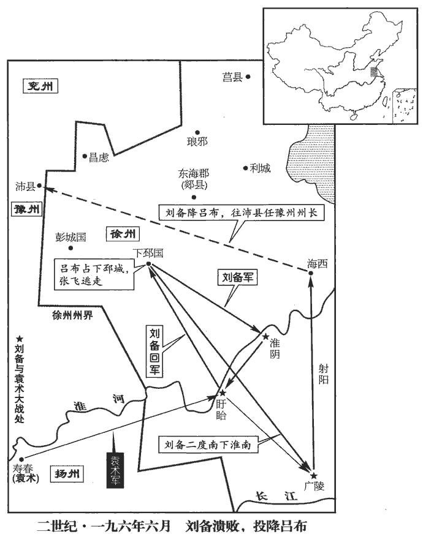
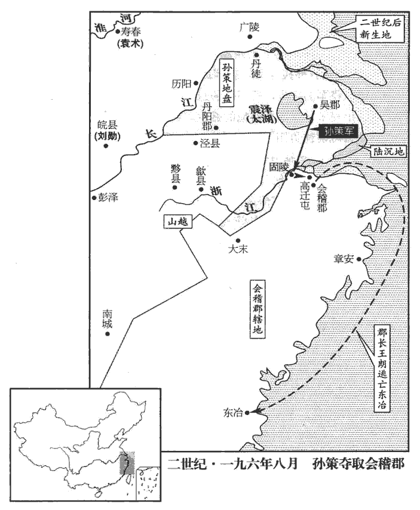
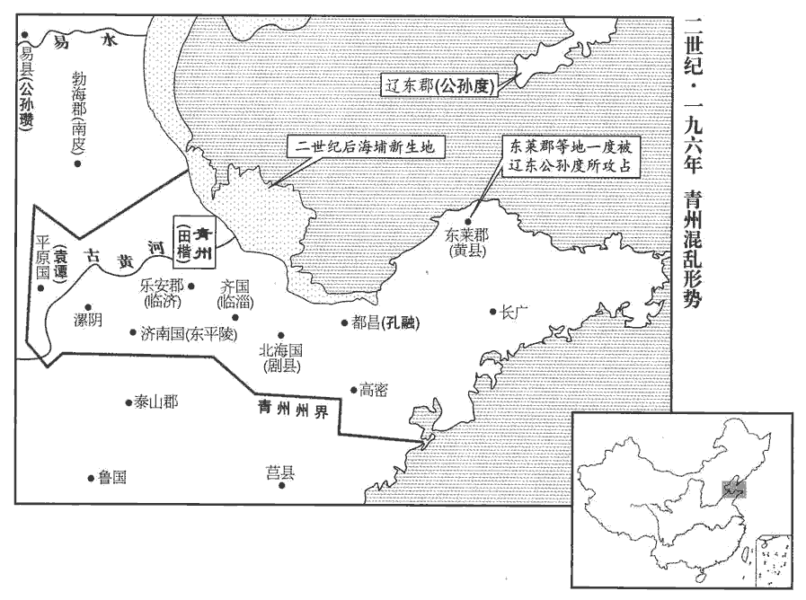
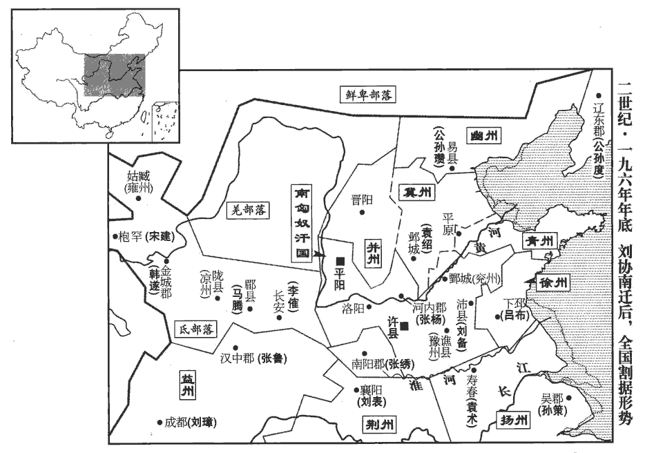
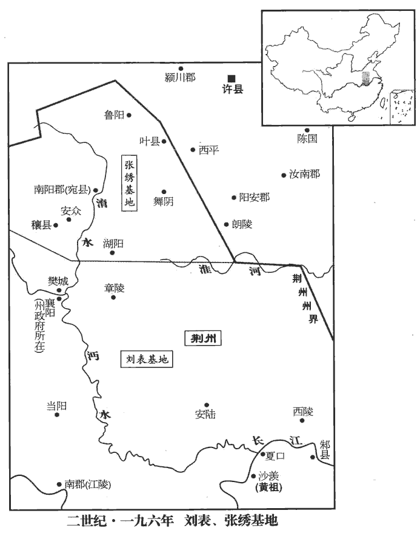
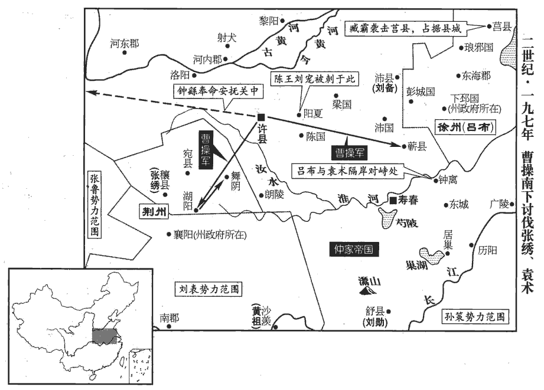
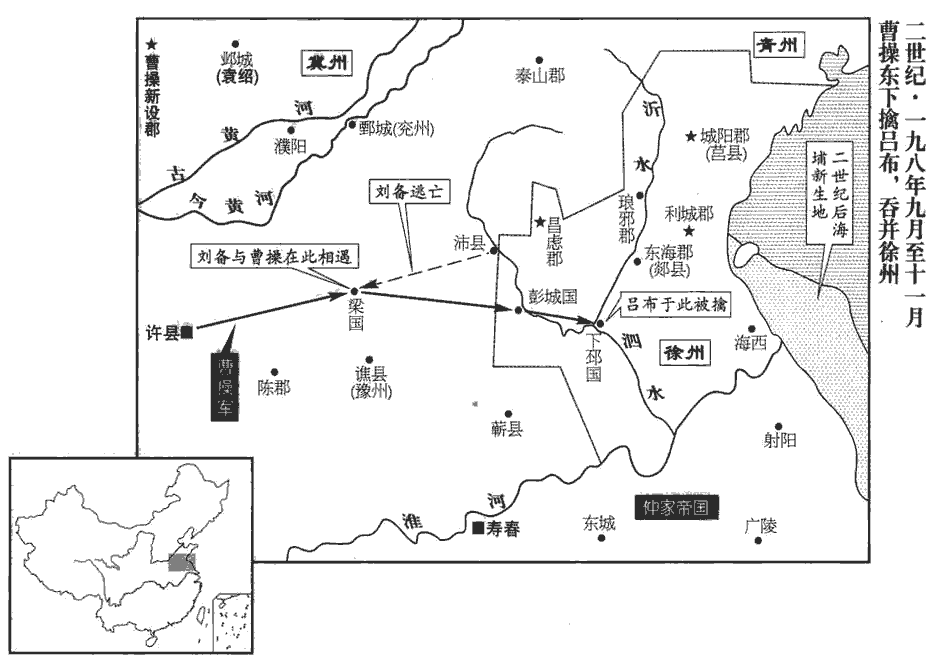

 漢紀五十四起柔兆困敦（丙子），盡著雍攝提格（戊寅），凡三年。

# 孝獻皇帝丁

## 建安元年（丙子，一九六）

1春，正月，癸酉‹七›，大赦，改元。

〖译文〗 [1]春季，正月，癸酉（初七），大赦天下，改年号为建安元年。

2董承、張楊欲以天子還雒陽，楊奉、李樂不欲，由是諸將更相疑貳。更，工衡翻，下更有同。二月，韓暹xiān攻董承，承奔野王‹河南沁阳›。野王，張楊所屯也。暹，息廉翻。韓暹屯聞喜‹山西闻喜›，胡才、楊奉之塢鄉‹河南偃师南›。郡國志：河南緱gōu氏縣西南有塢聚。胡才欲攻韓暹，上‹刘协，时年十六›使人喻止之。

〖译文〗 [2]董承、张杨打算护送献帝回洛阳，杨奉、李乐不同意，于是将领们进一步相互猜疑。二月，韩暹进攻董承，董承败走，投奔驻在野王的张杨。韩暹驻军闻喜，胡才、杨奉率军前往坞乡。胡才准备进攻韩暹，献帝派人传旨，阻止他进军。

3汝南‹河南平舆西北射桥乡›、潁川‹河南禹州›黃巾何儀等擁眾附袁術，曹操擊破之。

〖译文〗 [3]汝南、颖川的黄巾军首领何仪等率众投靠袁术，曹操出军击溃何仪等。

4張楊使董承先繕脩雒陽宮。太僕趙岐為承說劉表，使遣兵詣雒陽，助脩宮室；軍資委輸，前後不絕。為，于偽翻。說，輸芮翻。委，于偽翻。流所聚曰委。毛晃曰：凡以物送之曰輸，則音平聲；指所送之物曰輸，則音去聲。委輸之委，亦音去聲。夏，五月，丙寅‹二›，帝遣使至楊奉、李樂、韓暹營，求送至雒陽，奉等從詔。六月乙未‹一›，車駕幸聞喜‹山西闻喜›。

〖译文〗 [4]张杨派董承先去修缮被董卓烧毁的洛阳宫殿。太仆赵岐为董承去说服刘表，使刘表派兵到洛阳，协助修缮宫殿，并源源不断地输送军用物资和粮草。夏季，五月，丙寅（初二），献帝派使者到杨奉、李乐、韩暹等人营中，要求他们护送自己返回洛阳，杨奉等听从诏命。六月，乙未（初一），献帝抵达闻喜。

5袁術攻劉備以爭徐州，備使司馬張飛守下邳‹江苏睢宁北古邳镇›，自將拒術於盱眙‹江苏盱眙›、淮陰‹江苏淮陰›，郡國志：盱眙、淮陰二縣屬下邳國。盱眙，音吁怡。相持經月，更有勝負。更，工衡翻。下邳相曹豹，陶謙故將也，與張飛相失，飛殺之，城中乖亂。袁術與呂布书，勸令襲下邳，許助以軍糧。布大喜，引軍水陸东下。布去年奔備，蓋屯於下邳之西。備中郎將丹陽‹安徽宣城›許耽開門迎之。張飛敗走，布虜備妻子及將吏家口。備聞之，引還，比至下邳，比，必寐翻。下比明同。兵溃。備收餘兵東取廣陵‹扬州›，與袁術戰，又敗，屯於海西‹江苏灌南›，前漢志，海西縣，屬東海郡；續漢志，屬廣陵郡。考異曰：蜀志備傳於此云，「楊奉、韓暹寇徐、揚間，備邀擊，盡斬之。」按暹、奉後與呂布同破袁術，於時未死也；備傳為誤。飢餓困踧cù，踧，子六翻。吏士相食，從事東海麋竺以家財助軍。備請降於布，降，戶江翻。布亦忿袁術運糧不繼，乃召備，復以為豫州刺史，與并勢擊術，使屯小沛‹江苏沛县›。賢曰：高祖本泗水郡沛縣人，及得天下，改泗水為沛郡，小沛即沛縣。宋白曰：郡國志云：古偪bī陽國，漢為沛縣，而沛郡理相城，以沛縣為小沛。考異曰：備傳云：「遣關羽守下邳」，此在布敗後；備傳誤也。布自稱徐州牧。

〖译文〗 [5]袁术进攻刘备，以争夺徐州。刘备派司马张飞守下邳，自己率军到盱眙、淮阴一带抵抗袁术。两军相持一下多月，各有胜负。下邳国相曹豹，是已故徐州牧陶谦的旧部，与张飞关系不好，被张飞杀死，下邳城中大乱。袁术写信给吕布，劝他袭击下邳，应许援助军粮。吕布大袁，率军水陆并进，向东袭击下邳。刘备部下的中郎将、丹阳人许耽打开城门，迎接吕布。张飞兵败退走，吕布俘虏了刘备的妻子儿女以及官员、将领们的家属。刘备听到消息后，率军回救，到达下邳后，全军溃散。刘备收拾残部，向东攻取广陵，与袁术交战，又被打败，退守海西。军中将士饥饿不堪，只好自相残杀，以人肉充饥。从事、东海人糜竺命出家中财产，资助军费。刘备向吕布请求投降。吕布也正忿恨袁术运粮中断，于是召刘备前来，又委任他为豫州刺史。吕布要与刘备一起进攻袁术，让刘备驻军小沛。吕布自称徐州牧。

 

布將河內郝萌夜攻布，布科頭袒tǎn衣，走詣都督高順營。科頭，不冠露髻也。今江東人猶謂露髻為科頭。順即嚴兵入府討之，萌敗走；比明，萌將曹性擊斬萌。

〖译文〗 吕布的部将河内人郝萌叛变，乘夜进攻吕布，吕布未戴冠帽，袒露衣衫，逃到都督高顺营中，高顺立即率军入府讨伐郝萌，郝萌战败逃走。到天明时，郝萌部将曹性斩杀郝萌。

6庚子‹六›，楊奉、韓暹奉帝東還，張楊以糧迎道路。秋，七月，甲子‹一›，車駕至雒陽，幸故中常侍趙忠宅。丁丑‹十四›，大赦。八月，辛丑‹八›，幸南宮楊安殿。張楊以為己功，故名其殿曰楊安。楊謂諸將曰：「天子當與天下共之，朝廷自有公卿大臣，楊當出扞外難。」難，乃旦翻。遂還野王‹河南沁阳›，楊奉亦出屯梁‹河南汝州›，郡國志：梁縣，屬河南尹，春秋之梁國也。韓暹、董承并留宿衛。癸卯‹十›，以安國將軍張楊為大司馬，楊奉為車騎將軍，韓暹為大將軍、領司隸校尉，皆假節鉞。

〖译文〗 [6]庚子（初六），杨奉、韩暹护送献帝东还洛阳，张杨运输粮食，在路上迎接。秋季，七月，甲子（初一），献帝到达洛阳，住在前中常侍赵忠的家中。丁丑（十四日），大赦天下。八月，辛丑（初八），献帝到达洛阳南宫杨安殿。张杨认为献帝返回旧都是自己的功劳，所以把那座宫殿命名为杨安殿。张杨对诸将领说：“天子，是全国百姓的天子，朝廷自有公卿大臣来辅佐，我应该离开京城，做抵御外敌的屏障。”于是他返回野王，杨奉也出京驻军梁县。韩暹、董承二人留在洛阳，负责保卫洛阳与皇宫的安全。癸卯（初十），任命安国将军张杨为大司马，杨奉为车骑将军，韩暹为大将军兼任司隶校尉，都被赐予代表天子权威的符节和黄钺。

是時，宮室燒盡，百官披荊棘，依牆壁間，州郡各擁強兵，委輸不至；群僚飢乏，尚書郎以下自出採稆lǚ，續漢志：尚書侍郎三十六人，四百石。本註曰：一曹有六人，主作文書起草。蔡質漢儀曰：尚書郎初從三署詣臺試，初上臺稱守尚書郎中，滿歲稱尚書郎，三年稱侍郎。賢曰：稆，音呂。埤蒼曰：穭lǚ，自生也。稆，與穭同。或飢死牆壁間，或為兵士所殺。

〖译文〗 当时，宫殿都被烧毁，百官劈开荆棘，靠在墙壁间居住。州、郡长官自拥有强兵，不肯进贡。官员们又饿又乏，尚书郎以下的官员自己出去采摘野菜。有人饿死于断墙残壁之间，有人被士兵杀死。

7袁術以讖言「代漢者當塗高」，自云名字應之。賢曰：「當塗高」者，魏也。然術自以「術」及「路」皆是塗，故云應之。又以袁氏出陳，為舜後，以黃代赤，德運之次，賢曰：陳大夫轅濤塗，袁氏其後也，五行火生土，故云以黃代赤。遂有僭逆之謀。聞孫堅得傳國璽，事見五十九卷初平元年。拘堅妻而奪之。及聞天子敗於曹陽‹河南灵宝东北黄河南岸›，事見上卷興平二年。乃會群下議稱尊號；眾莫敢對。主簿閻象進曰：「昔周自后稷至于文王，積德累功，參分天下有其二，猶服事殷。國語曰：后稷勤周，十五代而王。毛詩國風序曰：國君積行累功以致爵位。論語，孔子曰：三分天下有其二，以服事殷。明公雖奕世克昌，未若有周之盛；漢室雖微，未若殷紂之暴也！」術默然。

〖译文〗 [7]袁术认为，民间流行的一句预言“代汉者当途高”中的“途”与自己的名字“术”和表字“公路”相应，并认为袁氏的祖先出于春秋时代的陈国，是舜的后裔，舜是土德，黄色；汉是火德，赤色；以黄代赤，是五行运转顺序。于是他就有了篡位的打算。听说孙坚得到传国御玺，袁术就拘留了孙坚的妻子，强行夺下。及至他听到献帝败于曹阳的消息，就召集部下，商议称帝事宜。部下无人胆敢应对。主薄阎象进言道：“从前，周朝自始祖后稷传到文王，累积恩德，功勋卓著。三分天下，已经占有二分，但仍然臣服于殷朝。虽然您家世代为官显赫，但没有周朝当初的兴盛，汉朝王室虽然衰微，却没有殷纣王那样的暴行！”袁术听后默然不语。

術聘處士張范；處，昌呂翻。范不往，使其弟承謝之。術謂承曰：「孤以土地之廣，士民之眾，欲徼福齊桓，擬迹高祖，何如？」徼，一遙翻。承曰：「在德不在強。夫用德以同天下之欲，雖由匹夫之資而興霸王之功，不足為難。若苟欲僭擬，干時而動，眾之所棄，誰能興之！」術不悅。

〖译文〗 袁术征聘隐士张范，张范不肯前往，派自己弟弟张承去向袁术表示歉意。袁术对张承说：“我以土地的广阔，百姓和军队的众多，想要与齐桓公比美，以汉高祖为榜样，你觉得怎么样？”张承说：“此事在于德，而不在于强。用恩德来顺应天下百姓的希望，即使是由一个人的资本去建立霸王的事业，也不困难。如果是想篡位，违背天时而动，会为众人所抛弃，谁也不能使他兴盛起来！”袁术听后很不高兴。

孫策聞之，與術書曰：「成湯討桀稱『有夏多罪』，尚書湯誓曰：有夏多罪，天命殛之。夏，戶雅翻。武王伐紂曰『殷有重罰』，史記：武王徧告諸侯曰：殷有重罰，不可不伐。此二主者，雖有聖德，假使時無失道之過，無由逼而取也。今主上非有惡於天下，徒以幼小，脅於強臣，異於湯、武之時也。且董卓貪淫驕陵，志無紀極，至於廢主自興，亦猶未也，而天下同心疾之，況效尤而甚焉者乎！左傳曰：尤而效之，罪又甚焉。又聞幼主明智聰敏，有夙成之德，夙，早也。天下雖未被其恩，咸歸心焉。使君五世相承，賢曰：安生京，京生陽，陽生逢，逢生術，凡五代。被，皮義翻。為漢宰輔，榮寵之盛，莫與為比，宜效忠守節，以報王室，則旦、奭之美，率土所望也。時人多惑圖緯之言，妄牽非類之文，苟以悅主為美，不顧成敗之計，古今所慎，可不孰慮！孰，與熟通。忠言逆耳，前書：張良曰：忠言逆耳，利於行。駮bó議致憎，賢曰：駮，雜也，議不同也；言以持異議致憎疾也。駮，北角翻。苟有益於尊明，無所敢辭。」術始自以為有淮南之眾，料策必與己合，及得其書，愁沮發疾。沮，在呂翻。既不納其言，策遂與之絕。

〖译文〗 孙策听到消息后，写信给袁术说：“商汤讨伐夏桀时说：‘有夏多罪’，周武王讨伐殷纣王时说：‘殷有重罚’，商汤与周武王，虽然有圣德，但假如当时夏桀、殷纣没有失道的过失，也没有理由逼迫他们而夺取天下。如今天子并未对天下百姓犯有过失，只是因为年龄幼小，被强臣所胁迫，与商汤和周武王的时代不同。即使像董卓那样贪淫凶暴，欺上凌下，野心极大的人，也还未也废黜天子，自立为帝。而天下还是一致痛恨他，何况仿效他而做得更过分呢！又听说年幼的天子明智聪敏，有早成之德，天下虽然还未承受到他的恩泽，但全都归心于他。您家中五代连续出任汉朝的三分或辅佐大臣，荣宠的深厚，任何家族都不能相比，应该忠心耿耿，严守臣节，以报答王室。这便是周公姬旦、召公姬的美业，天下人的愿望。现在人们多被图纬之类的预言书所迷惑，望文生义，牵强附会，只求讨主人的欢心，并不考虑成败。称帝的事，从古至今都十分慎重，岂能不深思熟虑！忠言逆耳，异议招致憎恶，但只要对您有益，我一切都不敢推辞。”袁术开始时自以为拥有淮南的兵众，预料孙策一定会拥护自己。及至接到孙策的信后，因忧虑沮丧而生病。他既然没有听从孙策的意见，孙策便与他断绝了关系。

8曹操在許‹河南许昌东›，郡國志，許縣，屬潁川郡，帝既徙都，改曰許昌。杜佑曰：漢許昌故城，在今縣南三十里。宋白曰：在今縣西南四十里。謀迎天子。眾以為「山東未定，韓暹、楊奉，負功恣睢，未可卒制。」睢，香萃翻。恣睢，暴戾之貌。卒，讀曰猝。荀彧曰：「昔晉文公納周襄王而諸侯景從，賢曰：左傳：狐偃言於晉侯曰：「求諸侯莫如勤王，諸侯信之，且大義也。」晉侯以左師逆王，王入于王城，取太叔于溫，殺之于隰xí城，遂定霸業，天下服從。師古曰：景從，言如景之從形也。漢高祖為義帝縞素而天下歸心。事見九卷高祖三年。為，于偽翻。自天子蒙塵，蒙，冒也，言播越在草莽，蒙冒塵埃也。將軍首唱義兵，徒以山東擾亂，未遑遠赴。今鑾駕旋軫，鄭玄註周禮曰：軫，車後橫木也。東京榛蕪，義士有存本之思，兆民懷感舊之哀。誠因此時，奉主上以從人望，大順也；秉至公以服天下，大略也；扶弘義以致英俊，大德也。四方雖有逆節，其何能為，韓暹、楊奉，安足恤哉！若不時定，使豪傑生心，後雖為慮，亦無及矣。」操乃遣揚武中郎將曹洪將兵西迎天子，西漢有中郎將，東漢分置三署、虎賁、羽林中郎將，建安之後，群雄兵爭，自相署置，始有名號中郎將。董承等據險拒之，洪不得進。考異曰：魏志此事在正月，而荀彧傳迎天子在都雒後。今從傳。

〖译文〗 [8]曹操在许县，计划迎接献帝。部下众人都认为：“崤山以东尚未平定，而且韩暹、杨奉等人自认为护驾有功，骄横凶暴，不能迅速制服。”荀说：“以前，晋文公重耳迎纳周襄王，各国一致推举他为霸主；汉高祖为义帝发丧，身穿孝服，使得天下百姓诚心归附。自从天子流离在外，将军首先倡导兴起义军，只因崤山以东局势混乱，来不及远行迎驾。如今献帝返回旧京，但洛阳荒废，忠义之士希望能保全根本，黎民百姓也怀念旧的王室，为之悲伤。借此时机，奉迎天子以顺从民心，是最合乎时势的行动；用大公无私的态度使天下心悦诚服，是最正确的策略；坚守君臣大义，辅佐朝廷，召揽天下英才，是最大的德行。这样，尽管四方还有不遵从朝廷的叛逆，但他们能有什么作为？韩暹、杨奉之辈，有什么值得顾虑！如果不及时决定，使别的豪杰生出奉迎的念头，以后尽管再费心机，也来不及了。”于是曹操派遣扬武中郎将曹洪率兵向西，到洛阳迎接献帝。董承等扼守险要阻拦，曹洪不能前进。

議郎董昭，以楊奉兵馬最強而少黨援，少，詩沼翻。作操書與奉曰：「吾與將軍聞名慕義，便推赤心。今將軍拔萬乘之艱難，反之舊都，乘，繩證翻。翼佐之功，超世無疇，何其休哉！方今群凶猾夏，孔安國曰：猾，亂也。夏，華夏。夏，戶雅翻。四海未寧，神器至重，事在維輔；必須眾賢以清王軌，誠非一人所能獨建，心腹四支，實相恃賴，一物不備，則有闕焉。將軍當為內主，吾為外援，今吾有糧，將軍有兵，有無相通，足以相濟，死生契闊，相與共之。」毛萇曰：契闊，勤苦也；此蓋謂死也，生也，處勤苦之中，相與共之也。契，苦結翻。奉得書喜悅，語諸將軍曰：「兗州諸軍近在許耳，有兵有糧，國家所當依仰也。」語，牛倨翻。仰，牛向翻。遂共表操為鎮東將軍，襲父爵費亭侯。操祖曹騰封費亭侯，養子嵩襲爵，今以操襲嵩爵也。郡國志：沛國酇cuó縣‹河南永城›有費亭，曹騰所封也。應劭曰：酇，音嵯。師古曰：王莽改酇曰贊治，則此縣亦有贊音。晉地道記：山陽郡湖陆縣西有費亭城，魏武帝初所封。考異曰：魏志在六月，而董昭傳在都雒後。今從傳。

〖译文〗 议郎董昭认为杨奉的兵马最强，但缺少外援，就用曹操的名义给杨奉写信说：“我与将军相互倾慕，只听到名声，便已推心置腹。如今，将军在艰难之中救出天子，护送他回到旧都洛阳，卫护辅佐的功勋，盖世无双，是何等的美业！现在，各地不法之徒扰乱中原，天下不宁，君主的平安至关重要，事情主要靠辅佐大臣。所有的贤明之士必须一齐努力，才能肃清君王道路上的障碍，这决不是一个人的力量所能办得到的。心脏、胸腹与四肢，实际是互相依存的，缺少了任何一件，都不完整。将军应当在朝廷主持事务，我则作为外援，如今我有粮草，将军有兵马，互通有无，足以相辅相成，我们生死与共，祸福同当。”杨奉接到信后十分高兴，对其他将领说：“兖州的军队，近在许县，有兵有粮，朝廷正可以倚靠他们。”于是诸将联名上表推荐曹操担任镇东将军，并承袭他父亲曹嵩的爵位费亭侯。

韓暹矜功專恣，董承患之，因潛召操；操乃將兵詣雒陽。既至，奏韓暹、張楊之罪。暹懼誅，單騎奔楊奉。帝以暹、楊有翼車駕之功，詔一切勿問。辛亥‹十八›，以曹操領司隸校尉、錄尚書事。操於是誅尚書馮碩等三人，討有罪也；袁宏紀曰：誅碩及議郎侯祈、侍中壺崇。封衛將軍董承等十三人為列侯，賞有功也；宏紀曰：封衛將軍董承、輔國將軍伏完、侍中丁□、种輔輯、尚書僕射鍾繇、尚書郭溥、御史中丞董芬、彭城相劉艾、馮翊韓斌、東郡太守楊眾、議郎羅卲、伏德、趙蕤ruí為列侯。贈射聲校尉沮儁為弘農太守，矜死節也。沮儁死，事見上卷興平二年。沮，子余翻。

〖译文〗 韩暹倚仗护驾有功，专横霸道，董承对他十分厌恨，就私下派人召请曹操。于是曹操亲率大军到达洛阳。到达后，向献帝奏报韩暹、张杨的不法行为。韩暹害怕被杀，单人匹马投奔杨奉。献帝认为韩暹、张杨护驾有功，下诏一切不予追究。辛亥（十八日），命曹操兼任司隶校尉，主持尚书事务。于是曹操诛杀尚书冯硕等三人，处罚他们犯下的罪过；封卫将军董承等十三人为列侯，奖赏他们护驾有功；追赠射声校尉沮俊为弘农太守，哀怜他为国尽节而死。

操引董昭并坐，問曰：「今孤來此，當施何計？」昭曰：「將軍興義兵以誅暴亂，入朝天子，輔翼王室，此五霸之功也。此下諸將，人殊意異，未必服從，今留匡弼，事勢不便，惟有移駕幸許耳。然朝廷播越，新還舊京，遠近跂望，跂，渠宜翻，舉足也。冀一朝獲安，今復徙駕，不厭眾心。復，扶又翻。厭，於叶翻，又如字。夫行非常之事，乃有非常之功，願將軍算其多者。」凡舉事有利亦有害，惟算其利多而害少者行之。操曰：「此孤本志也。楊奉近在梁‹河南汝州›耳，聞其兵精，得無為孤累乎？」累，力偽翻；下同。昭曰：「奉少黨援，心相憑結，鎮東、費亭之事，皆奉所定，宜時遣使厚遺答謝，以安其意。少，詩沼翻。遺，于季翻。說『京都無糧，欲車駕暫幸魯陽‹河南鲁山›，魯陽縣，屬南陽郡。魯陽近許，轉運稍易，近，其靳翻。易，以豉翻。可無縣乏之憂。』縣，讀曰懸。奉為人勇而寡慮，必不見疑，比使往來，比，必寐翻。使，疏吏翻。足以定計，奉何能為累！」操曰：「善！」即遣使詣奉。庚申‹二十七›，車駕出轘huán轅‹河南登封西北›而東，河南緱氏縣有轘轅關。轘，音環。遂遷都許‹河南许昌东›。己巳，幸曹操營，以操為大將軍，封武平侯。武平縣，屬陳國。此取其以神武平禍亂也。宋白曰：亳州鹿邑縣，後漢於今縣東北置武平縣，隋改為鹿邑，取故鹿邑城為名，其古鹿邑城在縣西十三里，春秋鹿鳴地也。始立宗廟社稷於許‹河南许昌东›。

〖译文〗 曹操请董昭与自己并坐在一起，问他：“现在我已到洛阳，应当采取什么策略？”董昭说：“将军兴起义兵，讨伐暴乱，入京朝见天子，辅佐王室，这是春秋时期五霸的功业。现在洛阳的各位将领，都有自己的打算，未必听从将军的指挥。如今留在洛阳控制朝政，有许多不利因素，只有请天子移驾到许县这个办法最好。但是天子在外流离多时，刚回到旧都城，远近都盼望迅速获得安定，如今再要移驾，是不符合民心的。不过，只有做不同寻常的事情，才能建立不同寻常的功业，希望将军作出利多弊少的选择。”曹操说：“我本来的计划就是这样的。只是杨奉近在梁县，听说他兵强马壮，该不会阻挠我吗？”董昭说：“杨奉缺少外援党羽，所以他愿与将军结交。任命您为镇东将军、封费亭侯的事情，都是杨奉的主意，应该及时派遗使者带去重礼表示感谢，使他安心。并告诉他说：‘洛阳无粮，想让献帝暂时移驾鲁阳，鲁阳靠近许县，运输较为便利，可以免去粮食匮乏的忧虑’杨奉这个人有勇无谋，一定不会疑心，在使者往来期间，足以定下大计，杨奉怎能进行阻挠！”曹操说：“很好！”立即派使者去晋见杨奉。庚申（二十七日），献帝车驾出辕关，向东行进，于是迁都于许县，改称许县为许都。己巳（疑误），献帝抵达曹操军营，任命曹操为大将军，封武平侯。平始在许都建立祭祀皇家祖先的宗庙与作为国家象征的祭祀土、谷之神的社稷。

9孫策將取會稽‹绍兴›。會，工外翻。吳‹苏州›人嚴白虎等眾各萬餘人，處處屯聚，諸將欲先擊白虎等。策曰：「白虎等群盜，非有大志，此成禽耳。」遂引兵渡浙江‹富春江›。浙，之舌翻。會稽功曹虞翻說太守王朗曰：「策善用兵，不如避之。」朗不從。發兵拒策於固陵‹浙江萧山西北›。

〖译文〗 [9]孙策打算攻取会稽郡。这时，吴郡人严白虎等，各有部众万余人，在各处建有许多堡寨。诸将领想先攻击严白虎等，孙策说：“严白虎等人不过是一群强盗，没有大志，他们容易对付。”于是率军渡过浙江。会稽功曹虞翻劝太守王郎说：“孙策善于用兵，不如先躲避一下他的锐气。”王朗不听，发兵据守固陵，抵抗孙策。

策數渡水戰，不能克。策叔父靜說策曰：「朗負阻城守，難可卒拔。查瀆‹浙江萧山境›南去此數十里，宜從彼據其內，說，輸芮翻。數，所角翻。卒，讀曰猝。水經註：浙江東逕固陵城北。昔范蠡築城於浙江之濱，言可以固守，謂之固陵，今之西陵也。浙江又東逕柤zhā塘，謂之柤瀆，孫策襲王朗所從出之道也。裴松之曰：查，音祖加翻。所謂攻其無備，出其不意者也。」策從之，夜，多然火為疑兵，分軍投查瀆道襲高遷屯‹浙江萧山东›。裴松之曰：按今永興縣有高遷橋。沈約曰：永興本漢餘暨縣，吳更名。蔡邕嘗經會稽高遷亭，取椽chuán竹以為笛，即其處也。朗大驚，遣故丹陽‹安徽宣城›太守周昕等帥兵逆戰，帥，讀曰率。策破昕等，斬之。朗遁走；虞翻追隨營護朗，浮海至東冶‹福建福州›，前漢志：冶縣，屬會稽郡。師古曰：故閩越地；光武改曰章安。晉志曰：建安郡故秦閩中郡，漢高祖五年，以立閩越王；及武帝滅之，徙其人，名為東冶；後漢改為候官都尉；及吳，置建安郡。洪氏隸釋據西漢志曰：會稽西部都尉治錢唐，南部都尉治回浦。李宗諤è圖經曰：文帝時，以山陰為都尉治；元狩中，徙治錢唐，為西部；元鼎中，又立東部都尉，治冶；光武改回浦為章安，以冶立東候官。吳孫亮傳曰：五鳳中，以會稽東部為臨海郡。孫休傳：永安中，以會稽南部為建安郡。沈約宋志曰：東陽太守本會稽西部都尉。又曰：臨海太守本會稽東部都尉。前漢都尉治鄞yín，後漢分會稽為吳郡，疑是都尉徙治章安。續漢志：章安故冶，光武更名。晉太康記：本鄞縣南之回浦鄉，章帝立。未詳孰是。又曰：司馬彪云：章安是故冶。然則臨海亦冶地也。張勃吳錄曰：是句踐冶鑄之所，後分為會稽東、南二部都尉：東部，臨海是也；南部，建安是也。杜佑通典曰：後漢改冶縣為候官都尉，後分冶縣為會稽東南二都尉，今福州是南部，台州是東部。又曰：二漢會稽西部都尉理婺wù州。數說異同，各有脫誤，嘗參訂之。自秦置會稽郡，其治在今吳門；至順帝分置吳郡，而會稽徙郡於山陰。以浙江為兩郡之境，故錢唐在西漢時屬會稽，所以為西部治所；及會稽移於浙東，則西部亦移於婺wù女。回浦後改章安，乃會稽之東部，今台州蓋其地。冶縣則是南部，在吳屬建安郡，至唐遂為福州。太康記嘗云：回浦本鄞yín之南鄉，或云東部治鄞，因致休文之疑。然鄞及回浦皆西漢縣名，謂西漢割鄞yín而置縣，或未可知。至章帝時，回浦已非鄉矣。太康所紀，亦誤也。前志註會稽之冶縣云：本閩越地。續志曰：章安，故冶，閩越地，光武更名。因脫其中數字，故劉昭補註惑於太康記，而休文復不能剖判也。當云章安故回浦，章帝更名；東候官，故冶，閩越地，光武更名：於文乃足。此郡之末有「東部侯國」四字，卻是衍文，侯與候相近，而南部所治，故文有錯亂。班史註回浦為南部。司馬彪謂章安是故冶，張勃謂分冶為東、南二都尉，杜佑謂二漢西部皆在婺wù女，圖經以冶為東部，皆誤也。余按洪說甚詳，其言錢唐，西漢時屬會稽，所以為西部治所，此語亦恐有未安處。策追擊，大破之，朗乃詣策降。降，戶江翻。

〖译文〗 孙策几次渡水作战，都未能取胜。他的叔父孙静对他说：“王朗据守坚城，很难一下攻破。从这里向南数十里是查渎，应从那里进入王朗的后方，这正是兵法上讲的：攻其无备，出其不意。”孙策采纳这个建议。夜里，点燃许多火把，作为疑兵。然后，派出一支部队从查渎道进袭高迁屯。王朗大惊，派前丹阳郡太守周昕等率军迎战，孙策打败周昕等人，斩周昕。王朗逃走，虞翻追随，掩护王朗，乘船渡海逃到东冶。孙策追击他们，大破王朗军，王朗只好向孙策投降。

 

策自領會稽‹绍兴›太守，復命虞翻為功曹，待以交友之禮。策好遊獵，好，呼到翻。翻諫曰：「明府喜輕出微行，從官不暇嚴，喜，許記翻。從，才用翻。吏卒常苦之。夫君人者不重則不威，重，尊重。威，威嚴。言不尊重，則無威嚴。故白龍魚服，困於豫且；張衡東京賦之辭，註云：說苑曰：吳王欲從民飲酒，伍子胥諫曰：「不可。昔白龍下清泠líng之淵，化為魚，漁者豫且射中其目。白龍上訴天帝。曰：『當是之時，若安置而形？』白龍對曰：『我下清泠之淵，化為魚。』天帝曰：『魚固人之所射也，豫且何罪！』夫白龍，天帝貴畜也；豫且，宋國之賤臣也。白龍不化，豫且不射。今棄萬乘之位而從布衣之士飲酒，臣恐其有豫且之患矣。」王乃止。且，子余翻。白蛇自放，劉季害之。事見七卷秦二世元年。願少留意！」少，詩沼翻。策曰：「君言是也。」然不能改。為策死於輕出張本。

〖译文〗 孙策自己兼任会稽郡太守，仍委任虞翻为功曹，用朋友的礼节对待他。孙策喜欢外出打猎，虞翻劝阻他说：“您喜欢轻装便服出行，随从官员来不及警戒，兵士们常常感到辛苦，身为长官，如不够稳重，就不容易树立权威。所以传说中的白龙，一旦变为鱼，普通的渔夫豫且就可射它；而白蛇自己放纵，被汉高祖刘邦杀死。请您稍加留心。”孙策说：“你说得对。”但他仍不能改这个习惯。

10九月，司徒淳于嘉、太尉楊彪、司空張喜皆罷。

〖译文〗 [10]九月，司徒淳于嘉、太尉杨彪、司空张喜被免职。

11車駕之東遷也，楊奉自梁欲邀之，不及。冬，十月，曹操征奉，奉南奔袁術，遂攻其梁屯，拔之。

〖译文〗 [11]曹操护送献帝从洛阳向东迁到许县时，杨奉从梁地出兵想要阻拦，但未来得及。冬季，十月，曹操出兵征讨杨奉，杨奉向南投奔袁术，曹操攻陷了杨奉在梁地的营寨。

12詔書下袁紹，責以「地廣兵多，而專自樹黨，下，遐稼翻；下之下同。樹黨，謂以子譚為青州‹山东北部›刺史，熙為幽州‹河北北›刺史，外甥高幹為并州‹山西中部›刺史。不聞勤王之師，但擅相討伐。」謂與公孫瓚相攻也。紹上書深自陳愬。戊辰，以紹為太尉，封鄴侯。紹恥班在曹操下，怒曰：「曹操當死數矣，數，所角翻；下同。我輒救存之，操自滎陽汴水之敗，收兵從紹於河內‹河南武陟›，紹表為東郡太守；呂布襲取兗州，紹復與操連和，欲令其遣家居鄴也。今乃挾天子以令我乎！」表辭不受。操懼，請以大將軍讓紹。丙戌‹二十五›，以操為司空，行車騎將軍事。

〖译文〗 [12]献帝下诏给袁绍，责备他：“地广兵多，但专门结党营私，没听说有勤王救驾的军队出动，只是擅自互相讨伐。”袁绍上书，深自谴责和辩解。戊辰（疑误），任命袁绍为太尉，封邺侯。袁绍耻于自己的官位在曹操之下，大发雷霆，说：“曹操几次要死了，都是我救了他。现在他竟挟持天子，对我来发号施令！”上书辞让，拒绝接受。曹操感到害怕，请求把自己担任的大将军一职授予袁绍。丙戌（疑误），任命曹操为司空，代行车骑将军职务。

操以荀彧為侍中，守尚書令。操問彧以策謀之士，彧薦其從子蜀郡‹成都›太守攸攸既免董卓之禍，復辟公府，舉高第，遷任城相，不行；以蜀險固，人民殷盛，求為蜀郡太守，道絕，不得至，駐荊州。從，才用翻；下同。及潁川郭嘉。操徵攸為尚書，與語，大悅，曰：「公達，非常人也。荀攸，字公達。吾得與之計事，天下當何憂哉！」以為軍師。

〖译文〗 曹操委任荀为侍中，代理尚书令。曹操请荀推荐出谋划策之士，荀推荐自己的侄子、蜀郡太守荀攸和颖川人郭嘉。曹操征召荀攸为尚书，和他谈话后，大为高兴，说：“荀攸不是寻常之人，我能与他商议大事，天下会有什么可忧虑的呢！”任用荀攸为军师。

初，郭嘉往見袁紹，紹甚敬禮之，居數十日，謂紹謀臣辛評、郭圖曰：「夫智者審於量主，量，音良。故百全而功名可立。袁公徒欲效周公之下士，而不知用人之機，多端寡要，好謀無決，欲與共濟天下大難，定霸王之業，難矣。好，呼到翻。大難，乃旦翻。吾將更舉而求主，更，工衡翻，改也。子盍去乎！」二人曰：「袁氏有恩德於天下，人多歸之，且今最強；去將何之！」嘉知其不寤，不復言，復，扶又翻。遂去之。操召見，與論天下事，喜曰：「使孤成大業者，必此人也！」嘉出，亦喜曰：「真吾主也！」操表嘉為司空祭酒。陳壽三國志作「司空軍祭酒」，此逸「軍」字。晉志曰：當塗得志，尅平諸夏，初置軍師祭酒，參掌戎律。

〖译文〗 起初，郭嘉去见袁绍，袁绍对他十分礼敬。郭嘉住了几十天，对袁绍的谋臣辛评、郭图说：“有智之士要审慎地选择主人，才能保全自己，建立功业。袁绍只想仿效周公姬旦礼贤下士，却不懂得用人的方法。事务繁杂，却缺少重点；喜欢谋略，但又优柔寡断。要与他共同拯救天下的大难，建立霸王之业，太困难了。我将另投明主，你们为何不离去呢？”辛评、郭图说：“袁氏家族对天下有恩德，人们多来归附，而且现在他的势力最强，还要去投奔谁？”郭嘉知道他们执迷不悟，便不再说，于是离去。曹操召见郭嘉，与他谈论天下大事，高兴地说：“使我成就大业的，一定就是此人！”郭嘉出来后，也高兴地说：“这真是我的主人！”曹操上表推荐郭嘉为司空祭酒。

操以山陽‹山东金乡西北昌邑镇›滿寵為許令，操從弟洪，有賓客在許界數犯法，寵收治之，洪書報寵，報，告也。前書，霍顯曰：「少夫幸報我以事。」數，所角翻。治，直之翻。寵不聽。洪以白操，操召許主者，主者，許縣主史也。寵知將欲原客，乃速殺之。操喜曰：「當事不當爾邪！」

〖译文〗 曹操委任山阳人满宠为许都行政长官。曹操堂弟曹洪门下的宾客在许都境内屡次犯法，满宠逮捕宾客进行审讯。曹洪写信向满宠求情，满宠不理。曹洪报告了曹操，于是曹操召见许都的主要官员。满宠知道将要教他释放宾客，便迅速将宾客处死。曹操高兴地说：“负责的官员，难道不该这样做吗！”

13北海‹山东昌乐西›太守孔融，負其高氣，志在靖難，而才疏意廣，訖無成功。訖，竟也，終也。難，乃旦翻。高談清教，盈溢官曹，辭氣清【章：甲十一行本「清」作「溫」；乙十一行本同；孔本同；熊校同。】雅，可玩而誦，論事考實，難可悉行。但能張磔網羅，磔zhé，陟格翻，開也。而目理甚疏；造次能得人心，造，七到翻。久久亦不願附也。其所任用，好奇取異，多剽輕小才。好，呼到翻。剽，匹妙翻。輕，墟正翻。至於尊事名儒鄭玄，執子孫禮，易其鄉名曰鄭公鄉，玄傳曰：融深敬玄，告高密縣為玄特立一鄉，曰：「昔齊置士鄉，越有君子軍，皆異賢之意也。太史公、廷尉吳公、謁者僕射鄧公，皆漢之名臣。又南山四皓，有園公、夏黃公，世嘉其高，皆悉稱公。然則公者，仁德之正號，不必皆三事大夫也。今鄭君鄉，宜曰鄭公鄉。」及清儁之士左承祖、劉義遜等，皆備在座席而已，不與論政事，曰：「此民望，不可失也！」

〖译文〗 [13]北海郡太守孔融，以才气出众自负，立志平定祸乱。但他志大才疏，一直没有成效。他高谈阔论，盈溢官府，谈吐优雅，可使人玩味传诵，但把他的议论具体实施，却很难全行得通。他只会口出大言，而漏洞很多。他一时可得人心，但久而久之，人们便不愿再依附。他所任用的官员，好标新立异，多数是耍小聪明的轻浮之人。孔融尊奉大儒郑玄，以子孙之礼对待郑玄，把郑玄所居住的乡改名为郑公乡。对其他有名望的清俊之士左承祖、刘义逊等，全都只当作宾客奉陪在座而已，不与他们讨论国家政事，他说：“这是人民尊敬的人物，不能失去他们。”

黃巾來寇，融戰敗，走保都昌。賢曰：都昌縣，屬北海郡，故城在今青州臨朐縣東北。時袁、曹、公孫首尾相連，融兵弱糧寡，孤立一隅，不與相通。左承祖勸融宜自託強國，融不聽而殺之，劉義遜棄去。青州‹山东›刺史袁譚攻融，自春至夏，戰士所餘纔數百人，流矢交集，而融猶隱几讀書，談笑自若。隱，於靳翻。賢曰：隱，憑也。城夜陷，乃奔東山，都昌縣之東山也。妻子為譚所虜。曹操與融有舊，徵為將作大匠。

〖译文〗 黄巾军来进攻北海郡，孔融战败，退守都昌。当时，袁绍、曹操、公孙瓒等的势力范围相互连接，孔融兵力薄弱，粮草不足，孤立在一个角落，与他们不相来往。左承祖劝孔融，应自己选择一个较大的势力作为依靠。孔融没有听从，反而将他杀死。刘义逊因此背弃孔融，离开北海郡。青州刺史袁谭进攻孔融，从春到夏，孔融部下只剩数百名战士，乱箭四飞，孔融却还靠在案几上读书，谈笑自若。都昌城在夜里被攻破，孔融这才逃往东山，他的妻子儿女都被袁谭俘虏。曹操与孔融是老友，就征召他到朝廷担任将作大匠。

袁譚初至青州‹山东›，其土自河而西，不過平原。譚北排田楷，田楷，公孫瓚用為青州刺史。東破孔融，威惠甚著；其後信任群小，肆志奢淫，聲望遂衰。

〖译文〗 袁谭刚到青州时，在黄河以西的疆界，不超过平原县。他向北攻击公孙瓒委任的青州刺史田楷，向东又攻破北海郡太守孔融，威望和惠政十分突出。但他后来信任一些奸佞小人，纵欲肆志，骄奢淫逸，声望便衰落了。

 

14中平以來，天下亂離，民棄農業，諸軍并起，率乏糧穀，無終歲之計，飢則寇掠，飽則棄餘，瓦解流離，無敵自破者，不可勝數。勝，音升。袁紹在河北，軍人仰食桑椹，仰，牛向翻。椹，桑實也；其始生也，色青，熟則色黑，可食。椹，音甚。袁術在江淮，取給蒲蠃luǒ，蠃，蚌屬，盧戈翻。民多相食，州里蕭條。羽林監棗祗請建置屯田，潁川文士傳：棗氏，本姓棘，避難改焉。漢官：羽林有左右監，秩六百石，屬光祿勳。曹操從之，以祗為屯田都尉，以騎都尉任峻為典農中郎將。魏志曰：曹公置典農中郎將，秩二千石；典農都尉，秩六百石或四百石。典農校尉，秩比二千石，所主如中郎；所主部分別而少為校尉。募民屯田許下，得穀百萬斛。於是州郡例置田官，所在積穀，倉廩皆滿。故操征伐四方，無運糧之勞，遂能兼并群雄。軍國之饒，起於祗而成於峻。

〖译文〗 [14]汉灵帝中平年以来，天下混乱分裂，百姓无法从事农业生产。各地纷纷组织军队，但都缺乏粮草，没有一年的储备。饥饿时就抢掠，吃饱后就扔掉剩下的粮食。军队分崩离析，未受攻击就自行瓦解的，数不胜数。袁绍在河北，军士靠吃桑椹度日；袁术在长江、淮河之间，以蛤蚌为食。很多百姓互相残杀，用人肉充饥，各地都是一片萧条景象。羽林监枣祗请求建立屯田制度，曹操采纳了他的建议。曹操委任枣祗为屯田都尉，委任骑都尉任峻为典农中郎将。召募百姓在许都周围屯田，收获谷物一百万斛。于是州、郡依照规定设置主管屯田的官员，各地存粮都装满了仓库。所以曹操出兵征战四方，无须运粮的劳苦，便能兼并各地方割据势力。军队与国家的富裕，是由枣祗创业，而由任峻完成的。

 

15袁術畏呂布為己害，乃為子求婚，布復許之。乃為，于偽翻。復，扶又翻。術遣將紀靈等步騎三萬攻劉備，備求救於布。諸將謂布曰：「將軍常欲殺劉備，今可假手於術。」布曰：「不然。術若破備，則北連泰山諸將，泰山諸將謂臧霸、孫觀、吳敦、尹禮輩。吾為在術圍中，不得不救也。」便率步騎千餘馳往赴之。靈等聞布至，皆斂兵而止。布屯沛城西南，遣鈴下請靈等，鈴下，卒也，在鈴閣之下，有警至則掣chè鈴以呼之，因以為名。續漢志曰：五百、鈴下，侍閣、門闌部署、街里走卒，皆有程品，多少隨所典領。程大昌續演繁露曰：鈴下威儀，殆今典客之吏。靈等亦請布，布往就之，與備共飲食。布謂靈等曰：「玄德，布弟也，劉備，字玄德。為諸君所困，故來救之。布性不喜合鬬，喜解鬬耳。」言不喜合人之鬬，喜解人之鬬也。喜，許記翻。乃令軍候植戟於營門，布彎弓顧曰：「諸君觀布射戟小支，賢曰：周禮考工記曰：為戟，博二寸，內倍之，胡參之，援四之。鄭註云：援直刃，胡其孑也。小支，謂胡也，即今之戟旁曲支。植，直吏翻，立也。射，而亦翻。中者當各解兵，不中可留決鬬。」布即一發，正中戟支。中，竹仲翻；下同。靈等皆驚，言：「將軍天威也！」明日復歡會，然後各罷。

〖译文〗 [15]袁术害怕吕布危害自己，就为儿子向吕布女儿求婚，吕布答应了。袁术派遣部将纪灵等率领步、骑兵三万进攻刘备，刘备向吕布求救。吕布属下的将领们对吕布说：“将军一直想杀刘备，这次可以借袁术的手来实现。”吕布说：“不然。袁术如果击溃刘备，就可以向北联络泰山的诸将领，我就将陷入袁术的包围之中，因此不能不救刘备。”吕布便率领步、骑兵一千余人急速赶赴刘备处。纪灵等听说吕布前来，都收兵回营，停止攻战。吕布驻军沛城西南，派遣侍卫去请纪灵等人，纪灵等也派人来请吕布，吕布就前往纪灵营中，邀请刘备一起赴宴。吕布对纪灵等人说：“刘玄德是我的弟弟，被你们围困，所以我来救他。我生性不喜欢聚合别人争斗，只喜欢化解别人的争斗。”于是命令军官把铁戟竖立在营门，吕布拉满了弓，对旁观的人说：“你们看我射戟头旁边的戟支，如果射中，你们就各自罢兵，如果不中，你们可以留下厮杀。”吕布随即射了一箭，正中戟支。纪灵等全都大吃一惊，说：“将军真是天赋神威！”第三天，又设酒欢宴，然后各自班师。

備合兵得萬餘人，布惡之，復，扶又翻。惡，烏路翻。自出兵攻備；備敗走，歸曹操，操厚遇之，以為豫州牧。或謂操曰：「備有英雄之志，今不早圖，後必為患。」操以問郭嘉，嘉曰：「有是。然公起義兵，為百姓除暴，為，于偽翻。推誠杖信以招俊傑，猶懼其未也。今備有英雄名，以窮歸己而害之，是以害賢為名也。如此，則智士將自疑，回心擇主，公誰與定天下乎！夫除一人之患以沮四海之望，安危之機也，不可不察。」沮，在呂翻。考異曰：傅子以為程昱、郭嘉勸操殺備。今從魏書。操笑曰：「君得之矣！」遂益其兵，給糧食，使東至沛，收散兵以圖呂布。

〖译文〗 刘备集合起一万余人的部队，吕布认为受到了威胁，就亲自出兵攻打刘备。刘备败走，投奔曹操。曹操对他的待遇十分优厚，又让朝廷任命他为豫州牧。有人对曹操说：“刘备有英雄大志，如今不趁早除掉他，必然会有后患。”曹操为此征询郭嘉的意见，郭嘉说：“这种说法是对的。但是，您兴起义兵，为百姓除暴，诚心诚意地招募天下英雄豪杰，还惟恐他们不来。如今刘备有英雄之名，因走投无路前来投靠，而您却杀掉他，这将会使您得到谋害贤才的恶名。果真如此，有才智的人士将各自疑虑，改变心意，另选主人，您还去和谁一起平定天下！因除去一个人的祸患，而失去天下人的期望，这是关系今后安危的关键，您不可不仔细考虑。”曹操笑着说：“你分析得很对。”于是拨给刘备一些军队，供应粮草，让他往东到小沛一带，集合被击溃的残部，与吕布对抗。

初，備在豫州，舉陳郡袁渙為茂才。武帝元封六年，詔州郡舉茂才。茂才，即秀才也，避光武諱，史遂書為茂才。渙為呂布所留，布欲使渙作書罵辱備，渙不可，再三強之，不許。強，其兩翻。布大怒，以兵脅渙曰：「為之則生，不為則死！」渙顏色不變，笑而應之曰：「渙聞唯德可以辱人，不聞以罵！使彼固君子邪，且不恥將軍之言；彼誠小人邪，將復將軍之意，言布以書罵備，備君子邪，固不以罵為恥；其小人邪，將復以書罵布也。則辱在此不在於彼。且渙他日之事劉將軍，猶今日之事將軍也，如一旦去此，復罵將軍，可乎？」復，扶又翻。布慚而止。

〖译文〗 当初，刘备在豫州，曾推举陈郡人袁涣为茂才。袁涣被吕布扣留，吕布想要袁涣写一封信辱骂刘备，袁涣不答应，吕布再三强迫，仍被袁涣拒绝。吕布大怒，用剑威胁袁涣说：“你写了这封信，就可以活；不写，就得死！”袁涣面不改色，笑着回答说：“我听说只有道德可以使人感到羞耻，没听说用诟骂可以达到这个目的。假如刘备是个君子，他不会以将军的诟骂为耻；假如他真是小人，就将回骂将军，则受到羞辱的是将军，而不是他。而且，我当初跟随刘备，犹如今天跟随将军，如果有一天我离开这里，再为别人写信骂将军，难道可以吗？”吕布感到惭愧，于是作罢。

16張濟自關中引兵入荊州界，攻穰ráng城，穰縣，屬南陽郡。為流矢所中死。中，竹仲翻。荊州官屬皆賀，劉表曰：「濟以窮來，主人無禮，言無郊勞授館之禮也。至於交鋒，此非牧意，牧受弔，不受賀也。」使人納其眾；眾聞之喜，皆歸心焉。濟族子建忠將軍繡代領其眾，屯宛。宛，於元翻。

〖译文〗 [16]张济从关中率军进入荆州地界，攻穰城，被流箭射中而死。荆州官员都向荆州牧刘表祝贺。刘表说：“张济因穷途潦倒而来，我作为主人，未尽到礼节，竟导致双方交锋，这并非我的本意。我只接受哀悼，不接受祝贺。”他派人去收容张济的部队，张济部下知道后大喜，全都诚心归附。张济的族侄、建忠将军张绣接管部队，驻守宛城。

初，帝既出長安，宣威將軍賈詡上還印綬，上，時掌翻。往依段煨于華陰‹陕西華陰›。華，戶化翻。詡素知名，為煨軍所望，煨wēi禮奉甚備。詡潛謀歸張繡，或曰：「煨待君厚矣，君去安之！」詡曰：「煨性多疑，有忌詡意，禮雖厚，不可恃久，將為所圖。詡既為煨軍所望，則必為煨所忌矣。久留則煨懼詡奪其軍，必將圖殺之。我去必喜，又望吾結大援於外，必厚吾妻子；繡無謀主，亦願得詡：則家與身必俱全矣。」詡遂往，繡執子孫禮，煨果善視其家。詡說繡附於劉表，說，輸芮翻。繡從之。詡往見表，表以客禮待之。詡曰：「表，平世三公才也，不見事變，多疑無決，無能為也！」

〖译文〗 当初，献帝离开长安后，宣威将军机诩就交回印绶，到华阴去投靠段煨。贾诩素有名望，段煨军中将士很仰慕他，段煨对他礼遇十分周到。贾诩暗中笄投奔张绣，有人对他说：“段煨待您这么优厚，您还要到哪里去？”贾诩说：“段煨性情多疑，有嫉妒我在军中的威望的意思，虽然现在礼遇周到。但不能长久依赖，将来会有杀身之祸。我离开后，他一定很高兴，又希望我在外给他争取强援，必然会优待我的妻子儿女。张绣军中没有谋士，也愿意得到我，这样，我与家眷就必定都可以保全了。”贾诩就前往张绣军中，张绣对他十分敬重，以晚辈自居。段煨也果然对贾诩的家眷十分优待。贾诩劝说张绣依附刘表，张绣同意。贾诩去见刘表，刘表用宾客的礼节招待他。贾诩与刘表接触后，说：“刘表在天下太平时，是担任三分的人才。但他看不清乱世的变化，又为人多疑，缺乏决断，不会有所作为！”

 

劉表愛民養士，從容自保，從，千容翻。境內無事，關西、兗、豫學士歸之者以千數。表乃起立學校，講明經術，校，戶教翻。命故雅樂郎河南杜夔作雅樂。蔡邕曰：漢樂四品：一曰太予樂，典郊廟上陵殿舉之樂；二曰周頌雅樂，典辟雍饗射六宗社稷之樂；三曰黃門鼓吹，天子所以宴樂群臣；四曰短簫鐃歌，軍樂也。樂備，表欲庭觀之。夔曰：「今將軍號不為天子，合樂而庭作之，無乃不可乎！」表乃止。

〖译文〗 刘表在荆州爱护百姓，优待士大夫，和平自保，荆州境内安宁无事，百姓生活安定。函谷关以西、兖州、豫州的学者，来投奔刘表的数以千计。于是刘表建立学府，用以讲授儒家经典。他命令前宫廷雅乐郎、河南人杜制作雅乐。制作完毕后，刘表想在庭中观看演奏。杜说：“如今将军在名义上不是天子，却设置雅乐当庭雅乐，恐怕不可以吧！”刘表于是打消此意。

平原‹山东平原›禰mí衡，少有才辯，而尚氣剛傲，禰，乃禮翻，姓也。少，詩照翻。孔融薦之於曹操。衡罵辱操，操召衡為鼓吏，故為衡所罵辱。操怒，謂融曰：「禰衡豎子，孤殺之，猶雀鼠耳！顧此人素有虛名，遠近將謂孤不能容之。」乃送與劉表，表延禮以為上賓。衡稱表之美盈口，而好譏貶其左右，好，呼到翻。於是左右因形而譖之曰：「衡稱將軍之仁，西伯不過也，唯以為不能斷，斷，丁亂翻。終不濟者，必由此也。」其言實指表短，而非衡所言也。表由是怒，以江夏太守黃祖性急，送衡與之，祖亦善待焉。後衡眾辱祖，祖殺之。操怒衡而送與表，猶以表為寬和愛士，觀其能容與否也。表怒衡而送與祖，知祖性急，必不能容衡，是直欲寘zhì之死地耳。二人皆挾數用術，表則淺矣。

〖译文〗 平原人祢衡自幼有才华，能言善辩，但气盛、刚直而又骄傲，孔融把他推荐给曹操。祢衡辱骂曹操，曹操大怒，对孔融说：“祢衡这个小子，我要杀他，不过像宰一只麻雀或老鼠一样罢了！只是想到此人一向有虚名，杀了他，远近之人将说我没有容人之量。”于是把祢衡送给刘表。刘表对祢衡礼节周到，把他当作上宾。祢衡很赞美刘表的所作所为，但却爱讥讽刘表左右的亲信。于是，刘表的亲信就势诬陷祢衡，对刘表说：“祢衡称颂将军仁义爱人，可以与周文王相比。但又认为将军临事不能决断，而最终的失败，必定是由于这个原因。”这话实际上指出了刘表的缺点，但却不是祢衡说的。刘表因此大怒，知道江夏郡太守黄祖性情暴躁，就把祢衡送到江夏。黄祖对祢衡也很优待，但后来祢衡当众辱骂黄祖，黄祖将他杀死。

## 二年（丁丑，一九七）

1春，正月，曹操討張繡，軍于淯水‹白河，源于河南›嵩县西南白河乡至湖北襄樊入汉水，水經註：淯水出弘農盧氏縣攻離山，東逕宛縣南，操軍敗處也。淯，音育。繡舉眾降。操納張濟之妻，繡恨之；又以金與繡驍將胡車兒，繡聞而疑懼，襲擊操軍，殺操長子昂。操中流矢，敗走，降，戶江翻。驍，堅堯翻。車，尺遮翻。長，知兩翻。中，竹仲翻。校尉典韋與繡力戰，左右死傷略盡，韋被數十創。被，皮義翻。創，初良翻。繡兵前搏之，韋雙挾兩人擊殺之，瞋目大罵而死。瞋，七人翻。操收散兵，還住舞陰‹河南泌阳西北古城寨›。舞陰縣，屬南陽郡。繡率騎來追，操擊破之，繡走還穰‹河南邓州›，復與劉表合。復，扶又翻。

〖译文〗 [1]春季，正月，曹操率军讨伐张绣，驻在水，张绣率部众投降曹操。曹操收纳张绣族叔张济的妻子为姬妾，张绣感到恼恨。曹操又送金银给张绣部下的绕将胡车儿，张绣得知后，疑虑不安，便袭击曹军，杀死曹操的长子曹昂。曹操被流箭射中，狼狈败逃。校尉内典同张绣奋力交战，左右的卫士死伤将尽，他身上受伤数十处，张绣部下冲上前来，他双后抓住两个敌人奋力击杀，最后，瞪起眼睛大骂张绣而死。曹操收集残部，退回舞阴驻守。张绣率领骑兵前来追击，被曹操击败，张绣退回穰城，再度与刘表联合。

是時，諸軍大亂，平虜校尉泰山‹山东泰安东›于禁獨整眾而還，道逢青州兵劫掠人，禁數其罪而擊之；數，所具翻。青州兵走，詣操。禁既至，先立營壘，不時謁操。或謂禁：「青州兵已訴君矣，宜促詣公辨之。」禁曰：「今賊在後，追至無時，不先為備，何以待敵！且公聰明，譖訴何緣得行！」徐鑿塹安營訖，塹，七豔翻。乃入謁，具陳其狀。操悅，謂禁曰：「淯水之難，難，乃旦翻。吾猶狼狽，將軍在亂能整，討暴堅壘，討暴，謂擊劫掠者。堅壘，謂先鑿záo塹安營也。有不可動之節，雖古名將，何以加之！」於是錄禁前後功，封益壽亭侯。操引軍還許。

〖译文〗 这时，曹操部下诸军一片混乱，只有平虏校尉、泰山人于禁整顿部队，有秩序地撤回。路上，于禁见到曹操属下的青州军抢掠百姓，便数说他们的罪状，并派兵进行攻击。青州兵逃走，去向曹操告状。于禁到达以后，先安营扎寨，没有立即去拜见曹操。有人对于禁说：“青州兵已经先去告您的状了，您应该快去向曹公解释。”于禁说：“如今敌人就在后面，随时都会赶到，不先作好准备，怎么迎敌！而且曹公英明，随意诬告怎么能行得通呢！”于是从容地挖好壕沟，安好营寨后，才进入拜见曹操，报告全部情况。曹操很高兴，对于禁说：“水之败，连我也狼狈不堪，将军在混乱中能整顿好自己的队伍，讨平暴乱，巩固营垒，有不可动摇的气节，即使是古代名将，也不会比你更好！”于是累计于禁的前后战功，封为益寿亭侯。曹操率军返回许都。

2袁紹與操書，辭語驕慢。操謂荀彧、郭嘉曰：「今將討不義而力不敵，何如？」對曰：「劉、項之不敵，公所知也。漢祖惟智勝項羽，故羽雖強，終為所禽。今紹有十敗，公有十勝，紹雖強，無能為也。紹繁禮多儀，公體任自然，此道勝也。紹以逆動，公奉順以率天下，謂奉天子以率天下，於理為順。此義勝也。桓、靈以來，政失於寬，紹以寬濟寬，故不攝，攝，整也。左傳曰：書於伐秦，攝也。杜預註曰：能自攝整。公糾之以猛，【章：甲十一行本「猛」下有「以」字；乙十一行本「猛」下有「而」字。】上下知制，此治勝也。治，直吏翻。紹外寬內忌，用人而疑之，所任唯親戚子弟，公外易簡而內機明，易，以豉翻。用人無疑，唯才所宜，不間遠近，此度勝也。間，古莧翻。紹多謀少決，失在後事，公得策輒行，應變無窮，此謀勝也。紹高議揖讓以收名譽，士之好言飾外者多歸之，好，呼到翻；下同。公以至心待人，不為虛美，士之忠正遠見而有實者皆願為用，此德勝也。紹見人飢寒，恤念之，形於顏色，其所不見，慮或不及，公于目前小事，时有所忽，至于大事，与四海接，恩之所加，皆过其望，虽所不见，慮無不周，此仁勝也。紹大臣爭權，讒言惑亂，公御下以道，浸潤不行，此明勝也。論語：浸潤之譖不行焉，可謂明也已矣。言譖人者如水之浸潤以漸而入也。紹是非不可知，公所是進之以禮，所不是正之以法，此文勝也。紹好為虛勢，不知兵要，荀子與臨武君議兵於趙孝成王前，王曰：「請問兵要。」公以少克眾，少，詩沼翻。用兵如神，軍人恃之，敵人畏之，此武勝也。」操笑曰：「如卿所言，孤何德以堪之！」嘉又曰：「紹方北擊公孫瓚，瓚，藏旱翻。可因其遠征，東取呂布；若紹為寇，布為之援，此深害也。」彧曰：「不先取呂布，河北未易圖也。」紹攻公孫瓚，而操乘間東取呂布。操擊劉備，而紹不能襲許，此其所以敗也。易，以豉翻。操曰：「然，吾所惑者，又恐紹侵擾關中，西亂羌、胡，南誘蜀、漢，誘，音酉。是我獨以兗、豫抗天下六分之五也，為將奈何？」彧曰：「關中將帥以十數，將，即亮翻。帥，所類翻。莫能相一，唯韓遂、馬騰最強，彼見山東方爭，必各擁眾自保，今若撫以恩德，遣使連和，虽不能久安，比公安定山東，足以不動。遂，騰之叛服，卒如荀彧所料。比，必寐翻。侍中、尚書僕射鍾繇有智謀，若屬以西事，屬，之欲翻。公無憂矣。」操乃表繇以侍中守司隸校尉，持節督關中諸軍，特使不拘科制。繇至長安，移書騰、遂等，移，猶遺也。為陳禍福，為，于偽翻。騰、遂各遣子入侍。

〖译文〗 [2]袁绍在给曹操的信中，措辞十分傲慢。曹操对荀、郭嘉说：“现在，我准备讨伐背逆君臣大义的袁绍，但势力没有他强大，应该怎么办？”他们回答说：“刘邦的势力比不上项羽，是您所知道的。刘邦只靠谋略战胜项羽，所以项羽虽强，最终仍被击败。如今，袁绍有十项失败因素，而您有十项胜利因素，袁绍虽然强大，却不会有什么作为。袁绍讲究排场，礼仪繁多；而您待人接物出于自然，这是在处世之道上胜过他。袁绍身为臣子，如果起兵进攻，便是叛逆；而您尊奉天子以统率天下，这是在道义上胜过他。自从桓帝、灵帝以来，政令失于松驰，袁绍却用松驰来补救松驰，因此缺乏法纪，令出不行；而您用严厉来纠正松弛，使得大小官员都知道遵守法纪，这是在治理上胜过他。袁绍外表宽厚而内心猜忌，用人好起疑心，只信任亲戚子弟；而您外表平易近人，内心机敏善察，用人不疑，只看才干，不问远近亲疏，这是在器度上胜过他。袁绍计谋多而决断少，往往错过时机；而您制定了策略就立即施行，可应付无穷的变化，这是在谋略上胜过他。袁绍喜欢高谈阔论，谦恭揖让，以沽名钓誉，因此，那些华而不实的士大夫多去投奔他；而您以至诚待人，不虚情假义，忠诚正直、有远见和真才实学之士都愿为您效力，这是在品德上胜过他。袁绍看到他人饥寒交迫，怜悯之情便在面色上显露出来，但对没有看到的，就有时考虑不周；而您对于眼前的小事，经常忽略不管，但对于大事，以及与全国各地的交往，您所施的恩惠却往往出人意外，对于看不到的事情，也考虑得无不十分周全，这是在仁义上胜过他。袁绍后下的大臣争权夺利，互进谗言，混淆视听；而您管理属下有方，谗言诬陷行不通，这是在明智上胜过他。袁绍做事没有标准，所是所非不可知；而您对正直、有功的人礼敬，对邪恶、犯罪的人以法律制裁、这是在文治上胜过他。袁绍喜欢虚张声势，而不知兵家要诀；而您善于以弱胜强，用兵如神，部下信赖，敌人畏惧，这是在武功上胜过他。”曹操笑道：“照你们的分析，我有什么德能担当得起！”郭嘉又说：“袁绍正在北方攻击公孙瓒，可乘他远征之机，先向东收拾吕布。如果袁绍攻我，吕布在旁支援，就会成为大害。”荀说：“不先击败吕布，我们就不容易攻击占据河北的袁绍。”曹操说：“你们分析得对。我感到为难的是，又怕袁绍扰乱关中，向西联合羌人、胡人，向南勾结蜀、汉地方势力，那样的话，则我将仅以兖州、豫州来对抗全国其余六分之五的地区，该怎么办呢？”荀说：“关中将领数以十计，各自为政，不能统一，其中韩遂、马腾势力最强，他们看到崤山以东地区发生争斗，必然各自拥兵自保，如今，要是用恩德去安抚他们，派使者去与他们联和，虽然不会长久安定，但足以维持到您克定崤山以东。侍中、尚书仆射钟繇有智谋，如果让他处理关中事务，您就不必忧虑了。”曹操于是上表推荐，并由朝廷批准，在命钟繇以侍中兼任司隶校尉持符节，监督关中地区诸军，还授予他不受法令制度约束的特权。钟繇到达长安后，发送文书给马腾、韩遂等，为他们陈述利害，马腾、韩遂等都表示服从朝廷，各自派遣儿子到朝廷任职，充当人质。

3袁術稱帝於壽春‹安徽寿县›，自稱仲家，以九江‹安徽寿县›太守為淮南尹，置公卿百官，郊祀天地。沛‹安徽淮北›相陳珪，球弟子也，少與術遊；術以書召珪，又劫質其子，少，詩照翻。質，音致。期必致珪。珪答書曰：「曹將軍興復典刑，將撥平凶慝，以為足下當戮力同心，匡翼漢室；而陰謀不軌，以身試禍，欲吾營私阿附，有死不能也。」術欲以故兗州刺史金尚為太尉，尚不許而逃去，術殺之。金尚奔術見六十卷初平三年。

〖译文〗 [3]袁术在寿春登极做皇帝，自称“仲家”，改九江郡太守为淮南尹，作为京都最高行政长官。设置公卿百官，到郊外祭祀天地。沛国相陈是陈球弟弟的儿子，从小与袁术是朋友。袁术用文书征召陈，又劫持陈的儿子做人质，以求一定能召来陈。陈回信说：“曹将军重振朝廷权威，将扫平叛逆，我以为您也会同心协力，辅佐汉家王室。然而您却阴谋不轨，以身试祸，还想要我因私废公，阿附于您，我宁死不从。”袁术打算委任前任兖州刺史金尚为太尉，金尚拒绝后逃走，袁术将他杀死。

4三月，詔將作大匠孔融持節拜袁紹大將軍，兼督冀、青、幽、并四州。

〖译文〗 [4]三月，献帝下诏，派将作大匠孔融持符节到邺城，任命袁绍为大将军，兼管冀州、青州、幽州、并州四州的军务。

5夏，五月，蝗。

〖译文〗 [5]夏季，五月，发生蝗灾。

6袁術遣使者韓胤以稱帝事告呂布，因求迎婦，布遣女隨之。陳珪恐徐、揚合從，為難未已，術領揚州，布領徐州。從，子容翻。難，乃旦翻。往說布曰：說，輸芮翻。「曹公奉迎天子，輔贊國政，將軍宜與協同策謀，共存大計。今與袁術結昏，必受不義之名，將有累卵之危矣！」布亦怨術初不己受也，事見六十卷初平三年。女已在塗，乃追還絕昏，械送韓胤，梟首許市。梟，堅堯翻。

〖译文〗 [6]袁术派遣使者韩胤把自己称帝的事告诉吕布，并乘此机会要求为袁术的儿子迎娶吕布的女儿，吕布让女儿随韩胤回寿春。陈担心徐州与扬州联合在一起，祸难更难平定，就去劝说吕布：“曹操奉迎天子，辅佐朝政，将军应该与他同心协力，共商大计。如今要是与袁术缔结婚姻，必然招来不义的名声，将会有危如累卵的处境。”吕布也怨恨袁术当初不肯接纳自己。吕布的女儿已随韩胤上路，吕布便将她追回来，拒绝了婚事，并给韩胤戴上型具送走。韩胤在许都街市上处斩，他的人头被挂起来示众。

陳珪欲使子登詣曹操，布固不肯。會詔以布為左將軍，操復遺布手書，深加尉納。復，扶又翻。遺，于季翻。尉，與慰同，安之也。漢書車千秋傳：尉安黎庶。顏師古曰：尉安之字本無「心」布大喜，即遣登奉章謝恩，并答操書。登見操，因陳布勇而無謀，輕於去就，宜早圖之。操曰：「布狼子野心，誠難久養，非卿莫究其情偽。」即增珪秩中二千石，漢制：王國相秩二千石。增秩中二千石，則秩視九卿。拜登廣陵太守。臨別，操執登手曰：「東方之事，便以相付。」令陰合部眾以為內應。

〖译文〗 陈想让儿子陈登去晋见曹操，吕布坚决不同意。正在这时，献帝下诏任命吕布为左将军，曹操又亲自写信给吕布，对他大加慰勉和拉拢。吕布大喜，立即派陈登带上谢恩的奏章和答复曹操的信，前往京师。陈登见到曹操，指出吕布有勇无谋，反复无常，应该尽早对他下手。曹操说：“吕布狼子野心，确实难以长期蓄养，除了你，没有人能够洞察他的虚伪。”随即将陈的官秩升至中二千石，并任命陈登为广陵太守。临别之时，曹操握着陈登的手说：“东方的事情，就委托给你了。”命令他暗中联络部众，作为内应。

始，布因登求徐州牧不得，登還，布怒，拔戟斫几曰：「卿父勸吾協同曹操，絕婚公路；今吾所求無獲，而卿父子并顯重，但為卿所賣耳！」登不為動容，為，于偽翻。徐對之曰：「登見曹公言：『養將軍譬如養虎，當飽其肉，不飽則將噬人。』公曰：『不如卿言。譬如養鷹，飢即為用，飽則颺yáng去。』其言如此。」布意乃解。

〖译文〗 当初，吕布曾要陈登请求朝廷任命自己为徐州牧，这一请求遭到拒绝。陈登返回后，吕布大怒，拔出戟来，猛击桌案，喊道：“你父亲劝我与曹操联合，拒绝袁术家的婚事，如今，我的要求被拒绝，而你们父子却加官晋爵，只是我被你出卖罢了！”陈登不动声色，慢慢地回答：“我见到曹操，对他说：‘养将军就好像是养虎，必须让他吃饱，否则就会吃人。’曹操却说：‘你说得不对，实际是与养鹰一样，只有让他饿着，才服从命令，如果让他吃饱，就会展翅高飞，无处寻觅。’曹操就是这样讲的。”吕布的怒气才平息下来。

袁術遣其大將張勳、橋蕤ruí等與韓暹xiān、楊奉連勢，步騎數萬趣下邳，趣，七喻翻。七道攻布。布時有兵三千，馬四百匹，懼其不敵，謂陳珪曰：「今致術軍，卿之由也，為之柰何？」珪曰：「暹、奉與術，卒合之師耳，卒，讀曰猝。謀無素定，不能相維，子登策之，比於連雞，勢不俱棲，戰國策：秦惠王曰：「諸侯之不可一，猶連雞之不能俱上於棲。」立可離也。」布用珪策，與暹、奉書曰：「二將軍親拔大駕，而布手殺董卓，俱立功名，今柰何與袁術同為賊乎！不如相與并力破術，為國除害。」為，于偽翻。且許悉以術軍資與之。暹、奉大喜，即回計從布。布進軍，去勳營百步，暹、奉兵同時呌jiào呼，呼，火故翻。并到勳營，勳等散走，布兵追擊，斬其將十人首，所殺傷墯duò水死者殆盡。布因與暹、奉合軍向壽春‹安徽寿县›，水陸并進，到鍾離‹安徽凤阳东北临淮镇›，鍾離縣，屬九江郡，距壽春二百餘里。所過虜掠，還渡淮北，留書辱術。術自將步騎五千揚兵淮上，布騎皆於水北大咍hāi笑之而還。咍，呼來翻。楚人謂相啁tiào笑曰咍。

〖译文〗 袁术派遣大将线勋、桥蕤等与韩暹、杨奉联合，共有步、骑兵数万人，直逼下邳，分七路进攻吕布。吕布当时有步兵三千，战马四百匹，恐怕抵挡不住，就对陈说：“今天把袁术的大军给招惹来，是由于你的缘故，现在应该怎么办？”陈说：“韩暹、杨奉与袁术只是暂时结合，没有永久的利害，也不能维持长期的团结。我儿子陈登预料，他们就好像几只公鸡，决不能同时住在一个鸡窝里，很快就会离散。”吕布采用陈的计策，写信给韩暹、杨奉说：“二位将军亲自护送天子从关中出来，而我亲自杀死董卓，都为国家立下大功。如今你们怎么能和袁术一起做贼！不如大家合力击破袁术，为国除害。”并且答应将袁术的军用物资以及粮草全部给他们两个。韩暹、杨奉收信后大喜，就改变主意，与吕布联合。吕布大军逼到距张勋营寨百步时，韩暹、杨奉部下同时倒戈，呼喊着一同冲向张勋营中，张勋等四散逃命，吕布军队追击斩杀袁术十名将领。其余的或被杀死，或落水淹死，袁术大军几乎全军复没。吕布乘势与韩暹、杨奉合兵一处，前往寿春，水陆并进到达钟离，一路上烧杀抢掠，又渡过淮河，回到北岸，留下一封辱骂袁术的信。袁术亲自率领步、骑兵五千人，在淮河南岸炫耀武力。吕布的骑兵都在北岸大声嘲笑，然后撤回。

泰山賊帥臧霸襲琅邪相蕭建於莒‹山东莒县›，前漢莒縣，屬城陽國，後漢屬琅邪國。帥，所類翻。破之。霸得建資實，許以賂布而未送，布自往求之。其督將高順諫曰：將，即亮翻；下所將、順將同。「將軍威名宣播，遠近所畏，何求不得，而自行求賂！萬一不克，豈不損邪！」布不從。既至莒，霸等不測往意，固守拒之，無獲而還。

〖译文〗 泰山盗贼首领臧霸到莒县去袭击琅邪国相萧建，攻陷莒县，得到萧建的辎重。臧霸曾答应送给吕布一部分，但没有送到，吕布就亲自前去索取。吕布的部将高顺劝阻吕布说：“将军威名远扬，远近畏惧，想要什么会要不到，何必自己去索取财物！万一不成，岂不损害威名吗！”吕布不听。吕布到莒县后，臧霸等不知吕布的来意，坚守城池，抵御吕布，吕布空手而归。

順為人清白有威嚴，少言辭，所將七百餘兵，號令整齊，每戰必克，名「陷陳營」。少，詩沼翻。陳，讀曰陣。布後疏順，以魏續有內外之親，奪其兵以與續，及當攻戰，則復令順將，順亦終無恨意。布疏順而親續，其後執順以败布者續也。將，即亮翻。布性決易，易，以豉翻。所為無常，順每諫曰：「將軍舉動，不肯詳思，忽有失得，動輒言誤，誤豈可數乎！」數，所角翻。布知其忠而不能從。

〖译文〗 高顺为人廉洁，有威望，很少说话。部下有七百余兵，号令整齐，每战必胜，号称“陷阵营”。吕布后来疏远高顺，因为魏续是自己的亲威，就把高顺的部下拨给魏续指挥。等到需要冲锋陷阵时，才又交给高顺率领，但高顺始终没有怨恨。吕布性情不稳定，反复无常，高顺每每劝他说：“将军行动，不肯多加思考，忽然失利后，总说有错误，但错误怎么可一再发生呢？”吕布知道他忠于自己，但不能采纳他的意见。

7曹操遣議郎王誧誧bū，滂古翻，又匹布翻。以詔書拜孫策為騎都尉，襲爵烏程侯，策父堅，以討賊功封烏程侯。烏程縣，屬吳郡，今安吉州縣。考異曰：江表傳曰：「建安二年夏，王誧奉戊辰詔書賜策。」不知其何月也。領會稽‹绍兴›太守，會，工外翻。使與呂布及吳郡‹苏州›太守陳瑀yǔ共討袁術。策欲得將軍號以自重，誧bū便承制假策明漢將軍。明漢將軍，亦權宜置此號，言明於逆順，知尊漢室也。下輔漢同。

〖译文〗 [7]曹操派议郎王携带献帝诏书，去任命孙策为骑都尉，承袭父亲孙坚的爵位乌程侯，兼任会稽郡太守。命令孙策与吕布及吴郡太守陈共同讨伐袁术。孙策想得到将军的名号，以抬高自己的地位，王就以献帝代表的名义，任命他为明汉将军。

策治嚴，嚴：裝也。行到錢唐‹杭州›。錢唐縣，前漢屬會稽郡，後漢省其地，當屬吳郡界。錢唐記曰：昔郡議曹華信議立此塘以防海，募有能致一斛土者，與錢一千，旬月之間，來者雲集。塘未成而不復取，於是載土石者，皆委之而去，塘以之成，故名錢塘。瑀陰圖襲策，潛結祖郎、嚴白虎等，使為內應。策覺之，遣其將呂范、徐逸攻瑀於海西‹江苏灌南›；瑀敗，單騎奔袁紹。

〖译文〗 孙策准备行装上路，走到钱唐时，吴郡太守陈阴谋袭击孙策，暗中勾结祖郎、严白虎等，让他们做内应。孙策察觉，派遣部将吕范、徐逸到海西去进攻陈，陈战败，单人匹马投奔袁绍。

8初，陳王寵有勇，善弩射。寵，明帝子陳敬王羨之曾孫也。黃巾賊起，寵治兵自守，治，直之翻。國人畏之，不敢離叛。國相會稽‹绍兴›駱俊素有威恩，是時王侯無復租祿，而數見虜奪，數，所角翻。或并日而食，轉死溝壑，而陳獨富強，鄰郡人多歸之，有眾十餘萬。及州郡兵起，寵率眾屯陽夏‹河南太康›，賢曰：陽夏縣，屬淮陽國。夏，音工雅翻。自稱輔漢大將軍。袁術求糧於陳，駱俊拒絕之，術忿恚，恚huì，於避翻。遣客詐殺俊及寵，陳由是破敗。

〖译文〗 [8]当初，陈王刘宠勇猛过人，善用弓弩。黄巾军起兵后，刘宠征召境内兵士，固大守城池，陈国人惧怕他，不敢叛变。陈国的国相、会稽人骆俊一向很有威望，当时，诸封国的王、侯都已不再享有租赋收入，反而不断遭到抢掠，有的两天才能吃上一顿饭，流离在外，死于荒野。只有陈国仍很富强，邻郡的百姓纷纷前去投靠，拥有部众十余万人。到各州、郡起兵讨伐董卓时，刘宠率军驻阳夏，自称辅汉大将军。袁术向陈国要粮草，被骆俊拒绝，袁术大为生气，派刺客诈降，乘机杀死骆俊和刘宠，陈国从此衰败。

9秋，九月，司空曹操東征袁術。術聞操來，棄軍走，留其將橋蕤等於蘄qí陽‹蕲县，安徽宿州南›以拒操；賢曰：蘄水出江夏蘄春縣北山。水經註云：即蘄山也，西南流逕蘄山，又南對蘄陽，注于大江，亦謂之蘄陽口。余據三國志，術時侵陳，操東征之，術留蕤等拒操，蕤等敗死，術乃走渡淮。則蓋戰於淮外也，安得至江夏之蘄陽哉！此蓋沛國之蘄縣，范史衍陽字，而通鑑因之耳。操擊破蕤ruí等，皆斬之。考異曰：范書呂布傳云：「布破張勳於下邳，生擒橋蕤。」此又一橋蕤，將蕤被獲又還也？然魏志呂布傳無橋蕤事，當是范書誤。術走渡淮，時天旱歲荒，士民凍餒，術由是遂衰。

〖译文〗 [9]冬季，九月，司空曹操东征袁术，袁术听说曹操前来，抛下军队逃跑，留大将桥蕤等据守蕲阳抵抗曹操。曹操大破桥蕤等，将桥蕤等将领全部斩杀。袁术渡过淮河，逃到淮北。当时旱灾很重，土地荒芜，百姓饥寒交迫，袁术从此便没落下。

操辟陳國‹河南淮阳›何夔為掾，掾，俞絹翻。問以袁術何如，對曰：「天之所助者順，人之所助者信。術無信順之實而望天人之助，其可得乎！」操曰：「為國失賢則亡，君不為術所用，亡，不亦宜乎！」操性嚴，掾屬公事往往加杖；夔常蓄毒藥，誓死無辱，是以終不見及。

〖译文〗 曹操延聘陈国人何为自己的僚属，问他对袁术的看法。何说：“只有顺应嘲流，才能得到上天帮助；只有信誉卓著，才能得到百姓帮助。袁术既不顺应潮流，又缺乏信誉，却盼望上天与百姓帮助他，怎么可以得到呢！曹操说：“任何一个政权，失去贤能的人才，都会灭亡，袁术不能重视你这样的人才，灭亡的命运不是注定了吗？”曹操性情严厉，部下僚属往往因公事而受到棍棒的责打，何常常随身携带毒药，誓死不受责打的侮辱，因此，他到底也未受过责打。

沛國‹安徽淮北›許褚，勇力絕人，聚少年及宗族數千家，堅壁以禦外寇，淮、汝、陳‹河南淮阳›、梁‹河南商丘›間皆畏憚之，操徇淮、汝，褚以眾歸操，操曰：「此吾樊噲也！」即日拜都尉，引入宿衛，諸從褚俠客，皆以為虎士焉。俠，戶頰翻。

〖译文〗 沛国人许褚勇力过人，聚集少年勇士及宗族数千家，坚守寨垒，以抵御外侵。淮河、汝水、陈国、梁国一带都很畏惧他的势力。曹操进军到淮河、汝水一带时，许褚率领部众归附曹操，曹操高兴地说：“这就是我的樊哙！”当天就委任许褚为都尉，让他作自己的侍卫首领，跟随许褚的少年侠客们，都被任命为侍卫武士。

 

10故太尉楊彪與袁術昏姻，據彪傳，彪子脩，袁術之甥。彪蓋娶於袁氏也。曹操惡之，惡，烏路翻。誣云欲圖廢立，奏收下獄，劾以大逆。下，遐稼翻。劾，戶概翻，又戶得翻。將作大匠孔融聞之，不及朝服，朝，直遙翻。往見操曰：「楊公四世清德，震、秉、賜、彪，四世以清白稱。海內所瞻。周書，父子兄弟，罪不相及，況以袁氏歸罪楊公乎！」操曰：「此國家之意。」國家，謂帝也。融曰：「假使成王殺召公，周公可得言不知邪！」操使許令滿寵按彪獄，融與尚書令荀彧皆屬寵曰：「但當受辭，勿加考掠。」屬，之欲翻。掠，音亮。寵一無所報，考訊如法。數日，求見操，言之曰：「楊彪考訊，無他辭語。此人有名海內，若罪不明白，必大失民望；竊為明公惜之。」為，于偽翻。操即日赦出彪。初，彧、融聞寵考掠彪，皆怒；及因此得出，乃更善寵。彪見漢室衰微，政在曹氏，遂稱腳攣，攣luán，閭緣翻，牽縮也。積十餘年不行，由是得免於禍。

〖译文〗 [10]前任太尉杨彪与袁术家有姻亲关系，曹操对此感到厌恶，便诬告杨彪图谋罢黜皇帝，另立新君。奏报献帝后，将杨彪逮捕下狱，指控他有大逆不道之罪。将作大匠孔融听到消息后，来不及换上朝服，就赶去见曹操，对他说：“杨公四代都有清高的品德，受到天下人的仰慕。根据《周书》，父子兄弟，有罪都互不牵连，何况将袁术之罪加到杨彪头上！”曹操说：“这是天子的意思。”孔融说：“假如周成五要杀死召公，周公能说不知道吗？”曹操命令许都令满宠来审理杨彪案件，孔融与尚书令荀都嘱咐满宠说：“只应接受杨彪的口供，不要用刑加以拷问。”满宠根本未加理睬，照样严型拷问，过了几天，满宠求见曹操，汇报说：“杨彪受刑后，没有供出什么罪行，这个人全国闻名，如果没有确实证据就定罪，必定会大失民心，我为您惋惜。”曹操当天就下令赦免杨彪。起初，荀、孔融听到满宠拷打杨彪的消息，都感到愤慨，等到杨彪因此而被赦免，才明白满宠的用意，于是对待满宠更加亲近。杨彪看到东汉王室已经衰败，政权控制在曹操手中，就自称腿脚痉挛，十几年不走路，因此得以免祸。

11馬日磾喪至京師，日磾死，見六十一卷興平元年。磾，丁奚翻。朝廷議欲加禮，孔融曰：「日磾以上公之尊，秉髦節之使，使，疏吏翻。而曲媚姦臣，為所牽率，王室大臣，豈得以見脅為辭！聖上哀矜舊臣，未忍追按，不宜加禮。」朝廷從之。金尚喪至京師，詔百官弔祭，拜其子瑋為郎中。

〖译文〗 [11]太傅马日的灵柩运回京师，朝廷商议要为他大办丧事，提高仪式规格。孔融说：“马日以上公的尊贵地位，代表天子出使，而他曲意谄媚奸臣，受奸臣的牵制。朝廷的大臣，怎么能以被人胁迫作为借口！天子怜悯旧臣，不忍加以追究，但不应该再提高规格。”朝廷接受了孔融的意见。已故兖州刺史金尚的灵柩运到京师，献帝下诏，命令文武百官进行祭吊，任命他的儿子金玮为郎中。

12冬，十一月，曹操復攻張繡，復，扶又翻，又如字。拔湖陽‹河南唐河西南湖阳镇›，湖陽縣，屬南陽郡。禽劉表將鄧濟；又攻舞陰‹河南泌阳西北古城寨›，下之。

〖译文〗 [12]冬季，十一月，曹操再次进攻张绣，攻占湖阳，生拎擒刘表部将邓济。曹军又进攻舞阴，攻克。

13韓暹、楊奉在下邳‹江苏睢宁北古邳镇›，寇掠徐、揚間，軍飢餓，辭呂布，欲詣荊州；布不聽。奉知劉備與布有宿憾，私與備相聞，欲共擊布；備陽許之。奉引軍詣沛‹江苏沛县›，備請奉入城，飲食未半，於座上縛奉，斬之。暹失奉，孤特，與十餘騎歸并州，為杼zhù秋‹安徽萧县西北›令張宣所殺。杼秋縣，前漢屬梁國，後漢屬沛國。師古曰：杼，音食汝翻。胡才、李樂留河東‹山西夏县›，才為怨家所殺，怨，於元翻。樂自病死。郭汜為其將伍習所殺。

〖译文〗 [13]韩暹、杨奉在十邳，纵兵抢掠徐州与扬州交界地区，但军队仍然饥饿，便向吕布告辞，打算到荆州投靠刘表。吕布不允许他们离开。杨奉知道刘备与吕布有宿怨，便暗中与刘备联络，想与刘备一起进攻吕布。刘备假装同意。杨奉率军到沛县，刘备请杨奉进城，摆宴席款待杨奉。酒宴还未到一半，就在席上将杨奉捆起来，随即斩杀。韩暹失去杨奉，十分孤立，率领部下十余名骑士投奔并州，途中被杼秋县令张宣杀死。胡才、李乐留在河东，胡才被仇人杀死，李乐自己病死。郭汜被部将伍习杀死。

14潁川‹河南禹州›杜襲、趙儼、繁欽避亂荊州，繁，音婆。左傳：殷民七族，有繁氏。西漢有御史大夫繁延壽。劉表俱待以賓禮。欽數見奇於表，數，所角翻。見，賢遍翻；下見能同。襲喻之曰：「吾所以與子俱來者，徒欲全身以待時耳，豈謂劉牧當為撥亂之主而規長者委身哉！長，知兩翻。子若見能不已，非吾徒也，吾與子絕矣！」欽慨然曰：「請敬受命！」及曹操迎天子都許，儼謂欽曰：「曹鎮東必能匡濟華夏，夏，戶雅翻；下同。吾知歸矣！」遂還詣操，操以儼為朗陵長。朗陵縣‹河南确山南任店镇›，屬汝南郡。長，知兩翻。

〖译文〗 [14]颖川人杜袭、赵俨、繁钦到荆州避难，刘表都以宾客的礼节接待他们。繁钦屡次向刘表贡献奇计，受到刘表的欣赏。杜袭劝告繁钦说：“我所以与你一起来到荆州，只是为了保全性命，以等待时机罢了。你难道认为刘表是拨乱反正的英主，而打算让长者托身于他吗！你如果不断显示才能，就不再是我的学生，咱们从此绝交！”繁饮感慨地说：“我接受你的劝告！”及至曹操奉迎天子，定都许县，赵俨对繁钦说：“曹操一定能安定全国，我知道应该归附谁了。”

陽安‹河南驻马店›都尉江夏‹湖北新洲›李通妻伯父犯法，操分汝南二縣置陽安都尉。儼收治，致之大辟。治，直之翻。辟，毗亦翻。時殺生之柄，決於牧守，守，式又翻。通妻子號泣以請其命。號，戶刀翻。通曰：「方與曹公戮力，義不以私廢公！」嘉儼執憲不阿，與為親交。

〖译文〗 阳安郡都尉、江夏人李通妻子的伯父犯法，赵俨将他逮捕问罪，判外死刑。当时，百姓的生杀大权都控制在州、郡长官手中。李通的妻子号哭着哀求李通救她伯父一命，李通说：“我正与曹公同心协力，在道义上，不能以私废公！”李通赞扬赵俨执法无私，与赵俨结为好友。

## 三年（戊寅，一九八）

1春，正月，曹操還許‹河南许昌›。攻張繡而還也。三月，將復擊張繡。復，扶又翻。荀攸曰：「繡與劉表相恃為強；然繡以遊軍仰食於表，仰，牛向翻。表不能供也，勢必乖離。不如緩軍以待之，可誘而致也；誘，音酉。若急之，其勢必相救。」操不從，圍繡於穰‹河南邓州›。

〖译文〗 [1]春季，正月，曹操回到许都。三月，曹操准备再次进攻张绣，荀攸说：“张绣与刘表互相依靠，力量强大。但张绣是外来的军队，完全依靠刘表供应粮草，刘表无力长期供给，最后势必会闹翻。不如暂缓出军，等待变化，采用招诱的手段吸引张绣。如果进军紧逼，则他们必然互相救援。”曹操没有采纳，进军包围张绣驻军的穰城。

2夏，四月，使謁者僕射裴茂，姓譜：伯益之後，封𨛬péi鄉，因以為氏，後徙封解邑，乃去「邑」從「衣」。詔關中諸將段煨等討李傕，夷其三族。董卓之黨，於是盡矣。煨，烏回翻。傕，古岳翻。以煨為安南將軍，封闅鄉侯。闅wén，音旻mín。

〖译文〗 [2]夏季，四月，朝廷派谒者仆射裴茂到关中传达献帝所下诏书，命令段煨等诸将领联合讨伐李。段煨等将李的本族亲属全部诛灭，任命段煨为安南将军，封乡侯。

3初，袁紹每得詔書，患其有不便於己者，欲移天子自近，使說曹操以許下埤pí溼，近，其靳翻。說，輸芮翻；下同。埤，皮弭翻，又讀與卑同。雒陽殘破，宜徙都鄄城‹山东鄄城北›以就全實；鄄，音絹。操拒之。田豐說紹曰：「徙都之計，既不克從，宜早圖許，奉迎天子，動託詔書，號令海內，此算之上者。不爾，終為人所禽，雖悔無益也。」紹不從。

〖译文〗 [3]起初，袁绍每接到诏书，对其中一些于自己不利的措施，很觉烦恼，因此想把天子迁到离自己较近的持方。他派使者去游说曹操，指出许都地势低而潮湿，洛阳已经残破，最好迁都到鄄城，以靠近富裕的地区，便于供应。曹操拒绝了这个建议。袁绍的谋士田丰劝袁绍说：“迁都的建议既然已被拒绝，应当早日进攻许都，奉迎天子。然后，就可利用皇帝的诏书，号令全国，这是上策。不这样，最终会受制于人，尽管后悔也没有用了。”袁绍未予采纳。

會紹亡卒詣操，云田豐勸紹襲許，操解穰‹河南邓州›圍而還，還，從宣翻，又如字。張繡率眾追之。五月，劉表遣兵救繡，屯於安眾‹河南镇平›，守險以絕軍後。水經註：梅溪水出南陽宛縣北紫山，南逕杜衍縣東，土地墊下，湍溪是注，古人於安眾堨è之，令遊水是瀦zhū，謂之安眾港。郡國志，南陽郡有安眾侯國。操與荀彧書曰：「吾到安眾，破繡必矣。」及到安眾‹河南邓州东北杨庄›，操軍前後受敵，操乃夜鑿險偽遁。表、繡悉軍來追，操縱奇兵步騎夾攻，大破之。他日，彧問操：「前策賊必破，何也？」操曰：「虜遏吾歸師，而與吾死地，兵法曰：歸師勿遏。又曰：置之死地而後生。吾是以知勝矣。」

〖译文〗 正好袁绍部下有逃兵投奔曹操，说到男丰劝说袁绍袭击许都，曹操便从穰县解围撤退。张绣率军在后追赶。五月，刘表派军去援救张绣，驻在安众，据守险要，切断曹军退路。曹操给荀写信说：“我到了安众，一定可以击败张绣！”及至到达安众，曹军腹背受敌，曹操于是乘夜开凿险道，假装要逃跑。刘表、张绣率领全部军队前来追击，曹操布下埋伏，命步兵与骑兵前后夹击，大破刘表与张绣联军。后来，荀询问曹操说：“您以前料定敌军必败，是根据什么？”曹操说：“敌人阻挡我们退兵，是把我军置于死地，我因此知道可以获胜。”

繡之追操也，賈詡止之曰：「不可追也，追必敗。」繡不聽，進兵交戰，大敗而還。詡登城謂繡曰：「促更追之，更戰必勝。」繡謝曰：「不用公言，以至於此，今已敗，柰何復追？」復，扶又翻；下同。詡曰：「兵勢有變，促追之！」言兵勢無常，審知其變，則因敗而為勝。繡素信詡言，遂收散卒更追，合戰，果以勝還。此亦小勝耳。乃問詡曰：「繡以精兵追退軍而公曰必敗，以敗卒擊勝兵而公曰必克，悉如公言，何也？」詡曰：「此易知耳。易，以豉翻。將軍雖善用兵，非曹公敵也。曹公軍新退，必自斷後，斷，丁管翻；下同。故知必敗。曹公攻將軍，既無失策，力未盡而一朝引退，必國內有故也。有故，謂有變也。已破將軍，必輕軍速進，留諸將斷後，諸將雖勇，非將軍敵，故雖用敗兵而戰必勝也。」繡乃服。

〖译文〗 张绣追击曹操时，贾诩阻止他说：“不能去追，追则必败！”张绣未听，进兵交战，大败而回。贾诩登上城墙，对张绣说：“赶快再去追击，再战必胜！”张绣向他道歉说：“没有听您的话，以至落到如此地步，现已大败，怎么还要再追？”贾诩说：“兵势变化无常，赶快追击！”张绣一向信服贾诩的话，就收拾残兵败将，再去追赶。交兵会战，果然得胜而归。于是问贾诩说：“我用精兵去追赶退军，而您说必败；用败兵去击败军，而您说必胜。结果完全如您预料，原因在哪里？”贾诩说：“这很容易明白。将军虽善于用兵，但不是曹操的对手。曹操军队刚开始撤退，必然亲自率军断后，所以知道将军必败。曹操进攻将军，既没有失策之处，又不是力量用尽，却一下子率军撤退，一定是他的后方发生了变故。他已击败将军的追兵，必然轻装速进，而留下其他将领断后。其他将领虽然勇猛，却不是将军的对手，所以将军虽然率败兵去追击，也必能获胜。”张绣于是大为敬服。

呂布復與袁術通，遣其中郎將高順及北地‹陕西耀县›太守鴈門‹山西朔州东南›張遼攻劉備；布以遼遙領北地太守耳。曹操遣將軍夏侯惇救之，為順等所敗。敗，補邁翻。秋，九月，順等破沛城‹江苏沛县›，虜備妻子，備單身走。

〖译文〗 [4]吕布又与袁术联合，派其部将中郎将高顺与北地太守、雁门人张辽进攻刘备。曹操派将军夏侯去援救刘备，被高顺等击败。秋季，九月，高顺等攻破沛城，俘虏了刘备的妻子儿女，刘备只身逃走。

曹操欲自擊布，諸將皆曰：「劉表、張繡在後，而遠襲呂布，其危必也。」荀攸曰：「表、繡新破，勢不敢動。布驍猛，又恃袁術，若從橫淮、泗間，驍xiāo，堅堯翻。從，子容翻。豪傑必應之。今乘其初叛，眾心未一，往可破也。」操曰：「善！」比行，泰山屯帥臧霸、孫觀、吳敦、尹禮、昌豨xī等皆附於布。比，必寐翻。帥，所類翻。豨，許豈翻，又音希。史言攸料敵之審。姓譜：昌姓，昌意之後。操與劉備遇於梁‹河南商丘›，進至彭城‹江苏徐州›。陳宮謂布：「宜逆擊之，以逸待勞，無不克也。」布曰：「不如待其來，蹙著泗水中。」著，直略翻。冬，十月，操屠彭城‹江苏徐州›。廣陵‹扬州›太守陳登率郡兵為操先驅，進至下邳。布自將屢與操戰，皆大敗，將，即亮翻。還保城，不敢出。

〖译文〗 曹操打算亲自去进击吕布，诸将都说：“刘表、张绣在后，如果您率军远袭吕布，必然会发生危机。”荀攸说：“刘表、张绣新近受创，在此情势下，不敢有所举动。吕布为人骁勇，又倚仗袁术的势力，如果他纵横淮河、泗水之间，必有其他豪杰起来响应。如今趁他刚刚背叛朝廷，众心不定，大军前往，可以将他击破。”曹操说：“很好！”等到曹操大军出动时，泰山军首领臧霸、孙观、吴敦、尹礼、吕等都归附于吕布。曹操在梁地遇到刘备，一同进驻彭城。陈宫对吕布说：“应当迎击他们，以逸待营。无往不胜！”吕布说：“不如等待他们自己前来，我把他们赶到泗水中淹死。”冬季，十月，曹操在彭城屠城。广陵郡太守陈登率领广陵郡郡兵作为曹操的先锋，进抵下邳。吕布亲自率军，屡次与曹操交战，全都大败，只好退守城池，不敢出战。

 

操遺布書，為陳禍福；遺，于季翻。為，于偽翻。布懼，欲降。降，戶江翻。陳宮曰：「曹操遠來，勢不能久。將軍若以步騎出屯於外，宮將餘眾閉守于內，若向將軍，宮引兵而攻其背；若但攻城，則將軍救於外。不過旬月，操軍食盡，擊之，可破也。」布然之，欲使宮與高順守城，自將騎斷操糧道。斷，丁管翻。布妻謂布曰：「宮、順素不和，將軍一出，宮、順必不同心共城守也，如有蹉跌，蹉cuō，昌何翻。跌，徒結翻。將軍當於何自立乎！且曹氏待公臺如赤子，猶舍而歸我。陳宮字公臺；歸布事，見上卷興平元年。舍，讀曰捨。今將軍厚公臺不過曹氏，而欲委全城，捐妻子，孤軍遠出，若一旦有變，妾豈得復為將軍妻哉！」復，扶又翻；下同。布乃止；潛遣其官屬許汜、王楷求救於袁術。汜，音祀。術曰：「布不與我女，理自當敗，何為復來？」汜、楷曰：「明上今不救布，為自敗耳；布破，明上亦破也。」術時僭號，故稱之為明上。術乃嚴兵為布作聲援。布恐術為女不至，故不遣救兵，以緜纏女身縛著馬上，夜自送女出，與操守兵相觸，格射不得過，復還城。為，于偽翻。著，直略翻。射，而亦翻。

〖译文〗 曹操写信给吕布，为他陈述利害，吕布恐惧，打算投降。陈宫说：“曹操远来，势不能停留过久。将军如果率领步、骑兵屯驻城外，由我率领剩下的军队在内守城，如果曹军进攻将军，我就领兵攻击他们的后背；如果曹军攻城，则将军在外援救。不过一个月，曹军粮食吃光，我们再行反击，可以破敌。”吕布同意，打算留陈宫与高顺守城，自己率骑兵截断曹军的粮道。吕布的妻子对吕布说：“陈宫与高顺一向不和，将军一出城，陈宫与高顺必然不能同心协力地守城。万一出现什么问题，将军要在哪里立脚！而且曹操对待陈宫犹如父母对待怀抱中的幼儿，陈宫还舍弃曹操来投靠我们；你待陈宫并未超过曹操，就把全城交给他，抛别妻儿家小，孤军远出。如果一亘有变，我难道能再做你的妻子吗？”吕布就打消那个计划，偷偷派遣部下官员许汜、王楷向袁术求救。袁术说：“吕布不把女儿给我送来，理应失败，为什么又来找我？”许汜、王楷说：“您现在不救吕布，是自取败亡。吕布一破，您也就要破了。”袁术于是整顿动员军队，声援吕布。吕布担心袁术因为自己不送女儿而不发兵救援，就用丝绵将女儿身体裹住，绑到马上，乘夜亲自送女儿出城，与曹操守兵相遇。曹军弓弩齐发，吕布不能通过，只得又退回城中。

河內‹河南武陟›太守張楊素與布善，欲救之，不能，乃出兵東市，野王縣‹河南沁阳›東市也。遙為之勢。十一月，楊將楊醜殺楊以應操，別將眭suī固復殺醜，眭，息隨翻。將其眾北合袁紹。楊性仁和，無威刑，下人謀反發觉，對之涕泣，輒原不問，故及於難。難，乃旦翻。

〖译文〗 河内郡太守张杨一向与吕布关系很好，想去援救，但势力不足，只能率军出驻野王县东市，遥作声势。十一月，张杨部将杨杀死张杨，响应曹操。另一个部将眭固又杀死杨，率领部下向北投奔袁绍。张杨性格宽厚仁慈，没有威严，不讲法治。部下有人叛变而被发觉，他却对着叛徒流眼泪，问题予以原谅，不加追问，因此终于被害。

操掘塹圍下邳，積久，士卒疲敝，欲還。荀攸、郭嘉曰：「呂布勇而無謀，今屢戰皆北，銳氣衰矣。三軍以將為主，將，即亮翻。主衰則軍無奮意。陳宮有智而遲，今及布氣之未復，宮謀之未定，急攻之，布可拔也。」乃引沂、泗灌城，泗水東南流，過下邳縣西，沂yí水南流，亦至下邳縣西，而南入于泗，故併引二水以灌城。水經註：沂水於下邳縣北，西流分為二水：一水於城北西南入泗，一水逕城東屈從縣南，亦注泗，謂之小沂水，水上有橋，張良遇黃石公處也。操於此處引沂、泗灌城。月餘，布益困迫，考異曰：范書布傳云「灌其城三月」，魏志傳亦曰「圍之三月」。按操以十月至下邳，及殺布，共在一季，不可言三月。今從魏志武紀。臨城謂操軍士曰：「卿曹無相困我，我當自首於明公。」首，式救翻。陳宮曰：「逆賊曹操，何等明公！今日降之，降，戶江翻；下同。若卵投石，豈可得全也！」

〖译文〗 曹操挖掘壕沟包围下邳城。但很久未能攻克，兵士十分疲惫，他打算撤军。荀攸、郭嘉说：“吕布有勇无谋，现在连战连败，锐气已衰。三军完全要看主将的情况，主将锐气一衰，则三军半志全消。陈宫虽有智谋，但机变不够。现在应该乘吕布锐气未复，陈宫智谋未定的时机，发动猛攻，可以消灭吕布。”于是，曹军开凿沟渠，引沂水、泗水来灌城。又过了一个月，吕布更加困窘，登上城头对曹军士兵说：“你们不要这样逼迫我，我要向明公自首。”陈宫说：“曹操不过是个逆贼，怎么配称明公！我们现在投降，就好象用鸡蛋去敲石头，岂能保住性命！”

布將侯成亡其名馬，已而復得之，諸將合禮以賀成，成分酒肉先入獻布。布怒曰：「布禁酒而卿等醞釀，為欲因酒共謀布邪！」成忿懼，十二月，癸酉‹二十四›，成與諸將宋憲、魏續等共執陳宮、高順，率其眾降。布與麾下登白門樓‹江苏睢宁北古邳镇南门›。水經註：下邳城南門名白門。宋武北征記曰：下邳城有三重，大城周四里，呂布所守也。魏武禽布於白門，大城之門也。宋白曰：下邳中城，南臨白樓門。兵圍之急，布令左右取其首詣操，左右不忍，乃下降。

〖译文〗 吕布郭将侯成丢失一匹好马，不久又找回来，将领们联合送礼给侯成，向他道贺。侯成设宴招待诸将，先分一份酒肉献给吕布。吕布发怒说：“我下令禁酒，而你们又违令酿酒，打算借饮酒来共同算计我吗？”侯成又气又怕。十二月，癸酉（二十四日），侯成与宋宪、魏续等将领共同捉住陈宫、高顺，率领部众归降曹操。吕布率领左右亲兵登上白门楼，曹军四面紧逼，吕布命令左右亲兵砍下他的人头去投降曹操，亲兵们不忍下手，吕布于是下楼投降。

布見操曰：「今日已往，天下定矣。」操曰：「何以言之？」布曰：「明公之所患不過於布，今已服矣。若令布將騎，明公將步，天下不足定也。」將，即亮翻。騎，奇寄翻。顧謂劉備曰：「玄德，卿為坐上客，坐，徂臥翻。我為降虜，繩縛我急，獨不可一言邪？」操笑曰：「縛虎不得不急。」乃命緩布縛，劉備曰：「不可。考異曰：獻帝春秋曰：「太祖意欲活布，命使寬縛，主簿王必趨進曰：『布，勍虜也，其眾近在外，不可寬也。』太祖曰：『本欲相緩，主簿復不聽，如之何？』今從范書、陳志。明公不見呂布事丁建陽、董太師乎！」丁原，字建陽，董卓，官至太師，布皆殺之，事見五十九卷靈帝中平六年及六十卷初平三年。操頷之。頷之者，微動頤頷hàn以應之。布目備曰：「大耳兒，最叵pǒ信！」備顧自見其耳，故云然。叵，普火翻，不可也。洪邁曰：叵為不可，此以切腳稱也。

〖译文〗 吕布见到曹操，说：“从今以后，天下可以平定了。”曹操说：“为什么这样讲？”吕布说：“您所顾忌的人，不过是我吕布。现在，我已归顺，如果让我率领骑兵，您自统步兵，则天下无人能敌。”吕布又回头对刘备说：“刘玄德，你是座上客，我为阶下囚，绳子把我捆得太紧，难道不能帮我说句话吗？”曹操笑着说：“捆绑猛虎，不能不紧。”于是下令给吕布松绑，刘备说：“不行，您没有看到吕布事奉丁原与董卓的情形吗？”曹操点头赞同。吕布瞪着刘备说：“大耳朵的家伙，最不可信！”

操謂陳宮曰：「公臺平生自謂智有餘，今竟何如！」宮指布曰：「是子不用宮言，以至於此。若其見從，亦未必為禽也。」操曰：「柰卿老母何？」宮曰：「宮聞以孝治天下者不害人之親，治，直之翻。老母存否，在明公，不在宮也。」操曰：「柰卿妻子何？」宮曰：「宮聞施仁政於天下者不絕人之祀，妻子存否，在明公，不在宮也。」操未復言。宮請就刑，遂出，不顧，操為之泣涕，復，扶又翻。為，于偽翻。并布、順皆縊殺之，傳首許市。操召陳宮之母，養之終其身，嫁宮女，撫視其家，皆厚於初。操厚陳宮之家而不肯存孔融之嗣，必陳宮之妻子，可保其無能為也。

〖译文〗 曹操对陈宫说：“你平生自以为智谋有余，现在怎么样？”陈宫指着吕布说：“这个人不用我的计策，才落到这样的下场。如果他听我的话，也未必就被你捉住。”曹操说：“那你的老母怎么办呢？”陈宫说：“我听说，以孝道治理天下的人，不伤害别人的双亲，我老母的生死，决定于您，而不在我。”曹操说：“你的妻子儿女怎么办？”陈宫说：“我听说施仁政于天下的人，不灭绝别人的后代，妻子儿女的生死，也决定于您，而不在我。”曹操没有再说话。陈宫请求受刑，于是走出门，不再回头，曹操忍不住为他落泪。陈宫与吕布、高顺全都被绞死，他们的头颅被送到京师许都。曹操把陈宫的母亲召来，赡养她直到去世；又把他的女儿嫁出去，对陈宫家属的持养照顾，比当初陈宫跟随自己时还要丰厚。

前尚書令陳紀、紀子群在布軍中，操皆禮用之。張遼將其眾降，拜中郎將。臧霸自亡匿，操募索得之，索，山客翻。使霸招吳敦、尹禮、孫觀等，皆詣操降。操乃分琅邪‹山东临沂›、東海‹山东郯城›、為城陽‹山东莒县›、利城‹江苏赣榆西›、昌慮郡‹山东藤州东南›，城陽，西漢王國，光武省，併入琅邪。利城、昌慮二縣，皆屬東海。此蓋因諸屯帥所居，而分為郡也。慮，師古音廬。悉以霸等為守相。

〖译文〗 前任尚书令陈纪与他儿子陈群在吕布军中，曹操对他们全都以礼相待，并任用他们为官。张辽率领他的部下归降，被任命为中郎将。臧霸自己逃到民间隐藏起来，曹操悬赏将他捉拿，派他去招降吴敦、尹礼、孙观等，这些人全都到曹操营中归降。曹操于是分割琅邪和东海，增置城阳、利城和昌虑三郡，将臧霸等人全都任命为郡太守和封国国相。

初，操在兗州，以徐翕xī、毛暉huī為將。及兗州亂，翕、暉皆叛。兗州既定，翕、暉亡命投霸。操語劉備，語，牛倨翻。令霸送二首，霸謂備曰：「霸所以能自立者，以不為此也。霸受主公生全之恩，不敢違命；然王霸之君，可以義告，願將軍為之辭。」備以霸言白操，操歎息謂霸曰：「此古人之事，而君能行之，孤之願也。」皆以翕、暉為郡守。守，式又翻。陳登以功加伏波將軍。

〖译文〗 起初，曹操在兖州时，徐翕、毛晖都是他部下的将领。及至兖州大乱时，徐翕与毛晖都叛变了曹操。兖州平定后，这两个人逃亡，投奔了臧霸。曹操让刘备传话，命令臧霸送来徐翕与毛晖的人头。臧霸对刘备说：“我所以能够自立，正是因为不作这种出卖朋友的事情。我受到主公的不杀之恩，不敢违抗命令。但是，成就王霸大业的君主，可以用大义来说服，希望将军为我美言。”刘备把臧霸的话告诉曹操，曹操叹息着对臧霸说：“这是古人的高尚行为，而你能作到，这正是我的愿望。”于是，将徐翕、毛晖都任命为太守。陈登因功升任伏波将军。

5劉表與袁紹深相結約。治中鄧羲諫表，表曰：「內不失貢職，外不背盟主，背，蒲妹翻。此天下之達義也。治中獨何怪乎？」羲乃辭疾而退。

〖译文〗 [5]刘表与袁绍往来密切，交情深厚。治中邓对他进行劝告，刘表说：“我对朝廷不缺进贡，对地方不背盟主，这是天下人都能理解的道理。你为什么偏要见怪呢？”于是邓自称有病而辞去职务。

長沙‹湖南長沙›太守張羨，性屈強，屈，渠勿翻。強，巨兩翻。屈強，梗戾不順從貌。表不禮焉。郡人桓階說羨舉長沙、零陵‹湖南永州›、桂陽‹湖南郴州›三郡以拒表，遣使附於曹操，羨從之。說，輸芮翻。考異曰：魏志桓階傳，袁、曹相拒官渡而階說羨。按范書劉表傳，建安三年，羨拒表，在官渡前也。

〖译文〗 长沙郡太守张羡，性格倔强，刘表对他不礼敬。长沙人桓阶建议张羡将长沙、零陵、桂阳三郡联合起来抗拒刘表，派使者向曹操表示归附，张羡听从了他的建议。

6孫策遣其正議校尉張紘hóng獻方物，正議校尉，亦孫策私所署置。曹操欲撫納之，表策為討逆將軍，討逆將軍，亦創置也。封吳侯；由烏程徙封吳，進其封也。考異曰：江表傳曰：「倍於元年所獻。其年，制書拜討逆，封吳侯。」按策貢獻在二年，非元年也。又陳志紘傳曰：「建安四年，遣紘奉章詣許。」按吳書紘述策材略、忠款，曹公乃優文褒崇，改號加封。然則紘來在策封吳侯前，本傳誤也。以弟女配策弟匡，又為子彰取孫賁女；為，于偽翻。取，讀曰娶。禮辟策弟權、翊yì；操禮辟權、翊，欲其至以為質耳。以張紘為侍御史。

〖译文〗 [6]孙策派他部下的正议校尉张到朝廷进贡地方特产。曹操打算笼络孙策，就上表推荐孙策担任讨逆将军，封吴侯；把自己的侄女嫁给孙策的弟弟孙匡，又为儿子曹彰娶孙贲的女儿。还延聘孙策的弟弟孙权、孙翊到京师任职，任命张为侍御史。

袁術以周瑜為居巢‹安徽巢湖›長，以臨淮‹安徽定远东南›魯肅為東城‹安徽定远›長。居巢縣，屬廬江郡。東城縣，前漢屬九江郡，後漢省，當是術復置也。長，知兩翻。瑜、肅知術終無所成，皆棄官渡江從孫策，策以瑜為建威中郎將。肅因家於曲阿‹江苏丹阳›。

〖译文〗 袁术委任周瑜为居巢县长，临淮人鲁肃为东城县长。周瑜与鲁肃知道袁术最后成不了大事，都抛弃官职，渡过长江来投奔孙策。孙策任用周瑜为建威中郎将。鲁肃于是把全家都搬到曲阿来定居。

曹操表徵王朗，策遣朗還。操以朗爲諫議大夫，參司空軍事。參軍事昉于魏、晋之間，位望頗重。孫楚謂石苞曰：「天子命我參卿軍事」是也。自是以後，位望輕矣。

〖译文〗 曹操上表，请朝廷征召被孙策俘虏的会稽郡太守王朗，孙策送王朗返回京师。曹操任命王朗为谏议大夫，参议司空府的军事。

袁術遣間使間，古莧翻。使，疏吏翻。賫jī印綬與丹陽‹安徽宣城›宗帥祖郎等，帥，所類翻。使激動山越，共圖孫策。劉繇之奔豫章‹江西南昌›也，太史慈遁于蕪湖‹安徽蕪湖›山中，自稱丹陽太守。策已定宣城‹安徽宣州›以東，惟涇以西六縣未服，慈因進住涇縣‹安徽涇縣›，大爲山越所附。蕪湖，涇縣皆屬丹陽郡。宣城縣前漢亦屬丹陽，後漢省。晋太康元年，分丹陽立宣城郡，復置縣屬焉。山越，越民依阻山險而居者。于是策自將討祖郎于陵陽‹安徽黃山市西北›，禽之。陵陽縣，屬丹陽郡。陵陽子明得仙于此，縣山因名。策謂郎曰：「爾昔襲孤，事見上卷興平元年。斫孤馬鞍，今創軍立事，除弃宿恨，惟取能用，與天下通耳，非但汝，汝勿恐怖。」怖，普布翻。郎叩頭謝罪，即破械，署門下賊曹。又討太史慈于勇里‹安徽涇縣西北›，勇里，在涇縣。禽之，解縛，捉其手捉，執也。曰：「寧識神亭時邪？若卿爾時得我云何？」神亭‹江蘇金壇西北›事見上卷興平二年。慈曰：「未可量也。」量音良。策大笑曰：「今日之事，當與卿共之。聞卿有烈義，天下智士也，慈，東萊‹山東龍口東黃城集›人，少爲郡奏曹史。時郡與州有隙，交章以聞，而州章先到雒，慈劫取壞之，由是知名。後赴孔融之急，詣劉備求救，此策所謂烈義也。但所託未得其人耳。謂劉繇也。孤是卿知己，勿憂不如意也。」即署門下督軍還，祖郎、太史慈俱在前導，軍人以爲榮。

〖译文〗 袁术派遗秘密使者，将印绶带给丹阳郡地方势力首领祖郎等，要祖郎去煽动山越人，共同打击孙策。刘繇被孙策打败，投奔豫章郡时，太史慈逃到芫湖地区的山中，自称为丹阳太守。孙策已经平定宣城以东地区，只有泾县以西的六县还未征服。太史慈就进驻泾县，大受山越人的拥护。于是，孙策亲自率军到陵阳去征讨祖郎，将他生擒。孙策对祖郎说：“你以前袭击我，曾砍中我的马鞍。如今我兴建军队，创立大业，抛除旧恨，只要是能用之才，就加以任用。我对天下人都是如此，不仅是你一个人，你不必害怕。”祖郎叩头请罪，孙策立即打开他的枷锁，任命他为门下贼曹。孙策又进军勇里攻讨太史慈，将他生擒。孙策解开捆绑太史慈的绳索，握着他的手说：“还记得神亭相遇时的情景吗？如果你那时捉到我，会怎么对待？”太史慈说：“无法估量。”孙策大笑着说：“今天的大事，我要与你一同开创。听说你有胆烈，为人忠勇，是天下的智士，只是你所跟随的并不是真正的明主罢了。我是你的知已，不要担心不能如意。”随即任用太史慈为门下督。孙策大军返回时，祖郎、太史慈一同在前面开道，全军都认为是荣耀。

會劉繇卒于豫章‹江西南昌›，士衆萬餘人，欲奉豫章太守華歆xīn爲主。歆以爲因時擅命，非人臣所宜，衆守之連月，卒謝遣之。卒，子恤翻。華，戶化翻。其衆未有所附，策命太史慈往撫安之，謂慈曰：「劉牧往責吾爲袁氏攻廬江，劉繇奉王命牧揚州，故以稱之。攻廬江事見上卷興平元年。爲，于僞翻。吾先君兵數千人，盡在公路許，吾志在立事，安得不屈意于公路而求之乎？其後不遵臣節，諫之不從。事見上建安元年。丈夫義交，苟有大故，不得不離。吾交求公路及絕之本末如此，恨不及其生時與共論辯也。今兒子在豫章‹南昌›，卿往視之。幷宣孤意于其部曲。部曲樂來者與俱來，不樂來者且安慰之。樂，音洛。幷觀華子魚所以牧御方規何如。華歆，字子魚。卿須幾兵，多少隨意。」慈曰：「慈有不赦之罪，將軍量同桓、文，當盡死以報德。今幷息兵，兵不宜多，將數十人足矣。」左右皆曰：「慈必北去不還。」策曰：「子義捨我，當復從誰！」復，扶又翻。餞送昌門，孫權記註曰：吳西郭門曰閶門，夫差作，以天門通閶闔，故名之。後春申君改曰昌門。把腕別曰：腕，烏貫翻。「何時能還？」答曰：「不過六十日。」慈行，議者猶紛紜言遣之非計。策曰：「諸君勿復言，孤斷之詳矣。斷，丁亂翻。太史子義雖氣勇有膽烈，然非縱橫之人，縱，子容翻。其心秉道義，重然諾，然，是也，决辭也。諾，應也，許辭也。重，不輕也。一以意許知己，死亡不相負，諸君勿憂也。」慈果如期而反，謂策曰：「華子魚，良德也，然無他方規，自守而已。又，丹陽‹安徽宣城›僮芝，自擅廬陵‹江西泰和›，僮，姓也。風俗通：漢有交趾刺史僮尹。一曰：僮即童也，顓頊子老童之後，或從「人」，廬陵縣屬豫章郡。番陽‹江西波陽›民帥別立宗部，言『我已別立郡海昏‹江西永修西北艾城鄉›上繚‹江西永修›，不受發召』，番陽縣，屬豫章郡。宗部，即所謂江南宗賊也。帥，所類翻。海昏縣屬豫章郡。時縣民數千家，自相結聚，作宗伍，壁于上繚。水經註：僚水導源建昌縣，漢元帝永光二年，分海昏立。僚水又東逕新吳縣，漢中平中立。僚水又逕海昏縣，謂之上僚水。繚，讀曰僚。子魚但覩視之而已。」策拊掌大笑，遂有兼幷之志。

〖译文〗 正在这时，扬州牧刘繇在豫章郡去世。他部下有万余人，打算推举豫章郡太守华歆为首领。华歆认为：“利用时机擅自夺取权力，不是人臣应该做的事情。”刘繇的部众坚持了几个月，华歆最终还是表示辞谢，把他们送走。于是这些部众无所归依。孙策命令太史慈前去安抚，他对太史慈说：“刘州牧以前责备我为袁术进攻庐江。当时，我父亲遗留下的数千精兵都在袁术那里，我志在建立大业，怎么能不向他屈意低头而索求我父亲的旧部呢！后来袁朴不遵守臣节，不听从劝谏，大丈夫以道义相交，但有大的变动时，也不能不分离，我当初投靠袁术及后来与他断交的经过，就是这样。只恨不能在刘州牧活着的时候向他解释清楚。如今，刘州牧的儿子在豫章，你去看望一下，并把我的意思宣告给他的部曲，他们乐意来的就随你一同来，不乐意的也加以安抚，并观察一下华歆治理郡务的能力怎样。你需要带多少兵去，可以自作决定。”太史慈说：“我曾犯下不可宽怒的重罪，将军有齐桓公、晋文公那样的气量，我应当以死报答将军的恩德。如今双方并没有交战，不宜多带人马，率领数十人足够了。”孙策左右的人都说：“太史慈一定会向北逃走，不再回来。”孙策说：“太史慈如果舍弃我，还会再追随谁？”孙策在昌门为太史慈饯行，握住太史慈的手腕道别说：“什么时候能回来？”太史慈回答说：“不过六十天。”太史慈走后，大家仍议论纷纷，认为派他去是失策。孙策说：“你们不要再说，我已考虑周详。太史慈虽然为人勇猛、胆识过人，但不是一个反复之人。他以道义为重，一诺千金，一旦视作知已，生死不会相负。你们不要担忧。”太史慈果然如期返回，对孙策说：“华歆品德高尚，但没有别的谋略，只能自保而已。另外，丹阳人僮芝擅自占领庐陵，番阳地方势力首领别立宗部，声称：‘我们已在海昏、上缭另立郡府，不接受豫章郡的命令。’而华歆只能干瞪眼而已。”孙策拍手大笑，于是有了兼并豫章郡的想法。

袁紹連年攻公孫瓚，不能克，以書諭之，欲相與釋憾連和；瓚不答，而增修守備，謂長史太原‹山西太原›關靖曰：「當今四方虎爭，無有能坐吾城下相守經年者明矣，袁本初其若我何！」紹于是大興兵以攻瓚。先是瓚別將有爲敵所圍者，瓚不救，先，悉薦翻。曰：「救一人，使後將恃救，不肯力戰。」及紹來攻，瓚南界別營，自度守則不能自固，度，徒洛翻。又知必不見救，或降或潰。降戶江翻。紹軍徑至其門，易京‹河北雄縣西北›之門也。瓚遣子續請救于黑山諸帥，黑山諸帥，張燕等也。帥，所類翻。而欲自將突騎出傍西山，自易京西抵故安閻鄉以西，諸山連接中山之界，山谷深廣，皆黑山諸賊所依阻也。傍，步浪翻。擁黑山之衆侵掠冀州，橫斷紹後。斷，丁管翻。關靖諫曰：「今將軍將士莫不懷瓦解之心，所以猶能相守者，顧戀其居處老少，處，昌呂翻。而恃將軍爲主故耳。堅守曠日，或可使紹自退。若舍之而出，舍，讀曰捨。後無鎮重，易京‹河北雄縣西北›之危，可立待也。」瓚乃止。紹漸相攻逼，瓚衆日䠞。䠞cù，子六翻。

〖译文〗 [7]袁绍连年进攻公孙瓒，不能攻克，就写信给公孙瓒，想与他解开过去的仇怨，互相联合。公孙瓒不予理睬，反而增强防备，他对长史、太原人关靖说：“如今四方龙争虎斗，显然没有人能连年坐在我的城下相守，袁绍能对我怎么样！”袁绍于是大举增兵，向公孙瓒进攻。在此之前，公孙瓒据守各地的将领中，有人被敌军围困，公孙瓒不肯救援，他说：“如果救了这一个人，会使其他将领以后依赖救援，不肯努力奋战。”等到袁绍前来进攻时，公孙瓒派到南境营寨防守的将领，自知坚守不住，又知必定不会有人援救，于是有的投降，有的溃散。袁绍大军长驱直入，到达易京城门。公孙瓒派儿子公孙续向黑山军的将领们求援，并准备自己率领精锐骑兵出城，奔往西山，带领黑山军反攻冀州，切断袁绍的退路。关靖劝阻公孙瓒说：“如今将军部下将士无不怀着离散之心，所以还能坚守，只是因为顾念全家老少都在这里，而且依赖将军在此主持大局。继续坚守，拖延时日，或许能使袁绍知难自退。如果将军舍弃他们，率兵出城，后方无人作主，易京的陷落，便指日可待。”公孙瓒于是放弃出城打算。袁绍大军逐渐进逼，公孙瓒部众日益窘迫。

