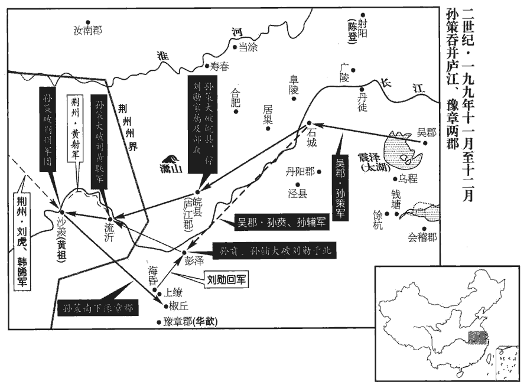
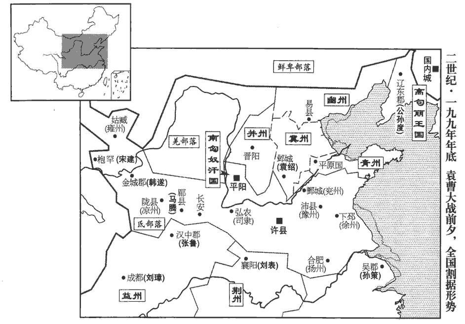
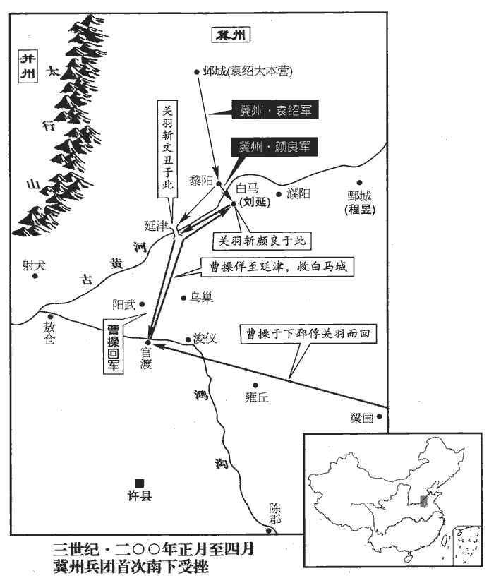
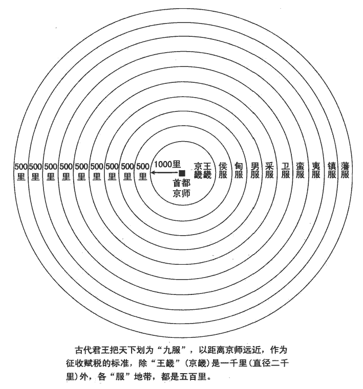
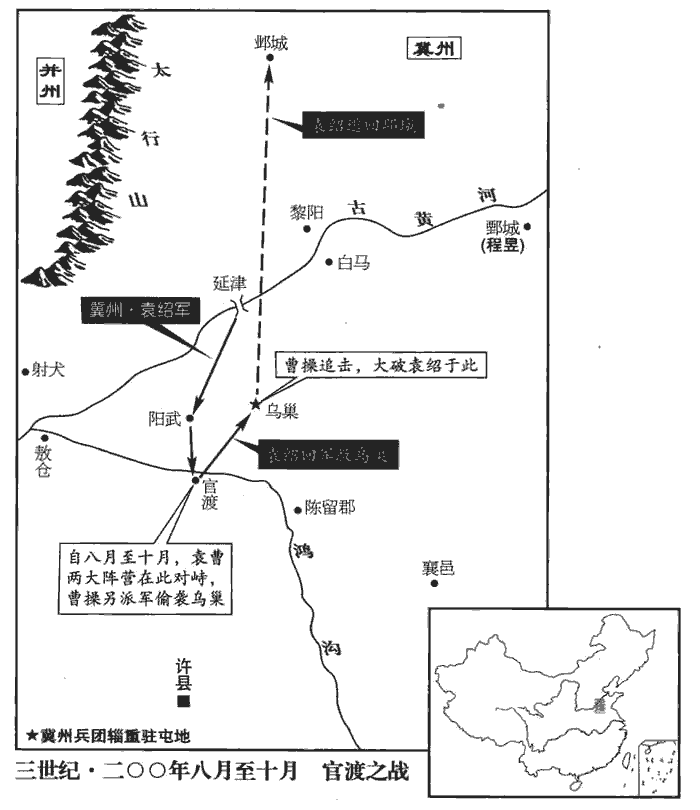

 漢紀五十五起屠維單閼（己卯），盡上章執徐（庚辰），凡二年。

# 孝獻皇帝戊

## 建安四年（己卯，一九九）

1春，【章：甲十一行本「春」下有「三月」二字；乙十一行本同；張校同。】黑山賊‹太行山一带›帥張燕與公孫續率兵十萬，三道救之。帥，所類翻。未至，瓚密使行人齎書告續，使引五千鐵騎於北隰之中，賢曰：下溼曰隰。孔穎達曰：下濕，謂土地窊wā下，常沮jù洳rù，名為隰也。起火為應，瓚欲自內出戰。紹候得其書，如期舉火。瓚以為救至，遂出戰。紹設伏擊之，瓚大敗，復還自守。復，扶又翻。紹為地道，穿其樓下，施木柱之，度足達半，便燒之，樓輒傾倒，稍至京中。柱，拄也。易之中京，瓚所居也。度，徒洛翻。瓚自計必無全，乃悉縊其姊妹、妻子，然後引火自焚。紹趣兵登臺，斬之。縊，於賜翻，又於計翻。趣，讀曰促。田楷戰死。關靖歎曰：「前若不止將軍自行，未必不濟。吾聞君子陷人危，必同其難，難，乃旦翻。豈可以獨生乎！」策馬赴紹軍而死。公孫瓚之計與陳宮之計，一也。陳宮之計，呂布不能用；公孫瓚之計，關靖止之：是知不惟決計之難，贊決者亦難也。續為屠各所殺。屠各，胡也。屠，直於翻。

〖译文〗 [1]春季，黑山军首领张燕与公孙续率兵十万，分三路援救公孙瓒，张燕的援军还未到，公孙瓒秘密派使者送信给公孙续，让他率五千铁骑到北方低洼地区埋伏，点火作为信号，公孙瓒打算自己出城夹击袁绍围城部队。袁绍的巡逻兵得到这封书信，袁绍就按期举火，公孙瓒以为援军已到，就率军出战。袁绍的伏兵发动进攻，公孙瓒大败，回城继续坚守。袁绍围城部队挖掘地道，挖到公孙瓒部队固守的城楼下，用木柱撑住，估计已挖到城楼的一半，便纵火烧毁木柱，城楼就倒塌了。袁绍用这种方法逐渐攻到公孙瓒所住的中京。公孙瓒自料必定不能幸免，就绞死自己的姊妹、妻子儿女，然后放火自焚。袁绍催促士兵登上高台，斩公孙瓒。田楷战死。关靖叹息说：“以前，如果不是我阻止将军自己出城，未必没有希望。我听说君子使别人陷入危难时，自己一定与他分担患难，怎么能自己独自逃生呢！”就骑马冲入袁绍军中而死。公孙续被匈奴屠各部杀死。

漁陽‹北京密云›田豫說太守鮮于輔曰：輔既斬鄒丹，遂領漁陽太守。說，輸芮翻。守，式又翻。「曹氏奉天子以令諸侯，終能定天下，宜早從之。」輔乃率其眾以奉王命。‹刘协，时年十九›詔以輔為建忠將軍，都督幽州六郡。

〖译文〗 渔阳人田豫劝告本郡太守鲜于辅说：“曹操尊奉天子来号令诸侯，最终能够平定天下，应该早早归顺他。”鲜于辅于是率领部下归附朝廷。献帝下诏任命鲜于辅为建忠将军，都督幽州六郡军务。

初，烏桓王丘力居死，子樓班年少，從子蹋頓有武略，代立，少，詩照翻。從，才用翻；下同。賢曰：蹋，音大蠟翻。楊正衡晉書音義：蹋，徒合翻。總攝上谷‹河北怀来›大人難樓、遼東‹辽宁辽阳›大人蘇僕延、右北平‹河北丰润›大人烏延等。袁紹攻公孫瓚，蹋頓以烏桓助之。瓚滅，紹承制皆賜蹋頓、難樓、蘇僕延、烏延等單于印綬；又以閻柔得烏桓心，因加寵慰以安北邊。其後難樓、蘇僕延奉樓班為單于，以蹋頓為王，然蹋頓猶秉計策。

〖译文〗 起初，乌桓王丘力居死后，他的儿子楼班年龄还小，侄儿蹋顿勇武善战，富有谋略，就接替了丘力居的王位，总领上谷大人难楼、辽东大人苏仆延、右北平大人乌延等。袁绍进攻公孙瓒时，蹋顿率领乌桓人帮助袁绍。公孙瓒灭亡后，袁绍用皇帝的名义对蹋顿、难楼、苏仆延、乌延等都赐予单于印绶。袁绍又因为阎柔受到乌桓人敬重，对阎柔待遇特别优厚，以求得北方连境的安定。后来，难楼、苏仆延共同尊奉楼班为单于，以蹋顿为王，但实际事务仍由蹋顿掌管。

2眭suī固屯射犬‹河南武陟西北›，郡國志：河內野王縣有射犬聚。唐懷州河內縣有漢射犬故城。眭，息隨翻。夏，四月，曹操進軍臨河，使將軍史渙、曹仁渡河擊之。仁，操從弟也。固自將兵北詣袁紹求救，與渙、仁遇於犬城，渙、仁擊斬之。操遂濟河，圍射犬；射犬降，降，戶江翻。操還軍敖倉‹河南荥阳北敖山粮仓›。

〖译文〗 [2]眭固驻军于射犬。夏季，四月，曹操进军到黄河岸边，派将军史涣、曹仁渡过黄河，进攻眭固。曹仁是曹操的堂弟。眭固亲自率军北上向袁绍求援，在犬城与史涣、曹仁相遇，史涣、曹仁进击，杀死眭固。于是曹操亲统大军渡过黄河，围困射犬，射犬投降。曹军还驻敖仓。

初，操在兗州舉魏种孝廉。种，音沖。兗州叛，張邈舉兗州附呂布事見六十一卷興平元年。操曰：「唯魏种且不棄孤。」及聞种走，操怒曰：「种不南走越、北走胡，不置汝也！」既下射犬，生禽种，操曰：「唯其才也！」釋其縛而用之，以為河內‹河南武陟›太守，屬以河北事。屬，之欲翻。

〖译文〗 当初，曹操在兖州推荐魏种为孝廉。兖州反叛时，曹操说：“只有魏种不会辜负我。”及至听到魏种逃走的消息，曹操大怒，说：“你魏种不逃到南越、北胡，我就不放过你！”攻下射犬以后，生擒魏种，曹操说：“只因为他有才干！”解开捆绑他的绳索，任用他为河内郡太守，让他负责黄河以北的事务。

3以衛將軍董承為車騎將軍。

〖译文〗 [3]任命卫将军董承为车骑将军。

4袁術既稱帝‹都寿春，安徽寿县›，淫侈滋甚，媵御數百，媵yìng，以證翻。無不兼羅紈，厭粱肉，自下飢困，莫之收恤。既而資實空盡，不能自立，乃燒宮室，奔其部曲陳簡、雷薄於灊山‹安徽霍山›，灊縣，屬廬江郡，有天柱山。賢曰：灊縣之山也。灊，今壽州霍山縣也。灊，音潛。復為簡等所拒，遂大窮，士卒散走，憂懣不知所為。復，扶又翻。懣，音悶。乃遣使歸帝號於從兄紹紹與術同祖袁湯，以親則從，以年則兄也。曰：「祿去漢室久矣，袁氏受命當王，符瑞炳然。今君擁有四州，賢曰：青、冀、幽、并。人戶百萬，謹歸大命，君其興之！」袁譚自青州迎術，欲從下邳‹江苏睢宁北古邳镇›北過。曹操遣劉備及將軍清河‹山东临清›朱靈邀之，術不得過，復走壽春‹安徽寿县›。六月，至江亭，坐簀zé床而歎曰：「袁術乃至是乎！」賢曰：簀，笫zǐ也；謂無茵席也。因憤慨結病，歐血死。術從弟胤畏曹操，不敢居壽春，率其部曲奉術柩及妻子奔廬江太守劉勳於皖城‹安徽潜山›。皖縣，屬廬江郡，今舒州也。師古曰：皖，胡管翻；杜佑曰：音患。考異曰：吳志孫策傳曰：「術死、長史楊弘、大將張勳等將其眾，欲就策，廬江太守劉勳邀擊，悉虜之，收其珍寶以歸。」與諸書不同。今從范書、陳志術傳及江表傳。故廣陵‹扬州›太守徐璆qiú得傳國璽，獻之。璆，渠尤翻。傳國璽，術拘孫堅妻所奪者。璽，斯氏翻。

〖译文〗 [4]袁术称帝后，奢靡贪淫的程度比以前更厉害，后宫妃嫔有数百人，无不身穿绫罗绸缎，饱食精美的饭菜。属下将士饥饿困苦，他却毫不并心。不久，储存的各种物资都已耗尽，自己无法维持，于是烧毁宫殿，去投奔驻在山的部将陈简、雷薄，但又遭到陈简等的拒绝。于是袁术大为困窘，部下士兵不断逃走。他心中忧虑烦闷，无计可施，只好派人把皇帝的尊号送给他的堂兄袁绍，说：“汉朝王室的气数久已尽了，袁氏应当接受天命为君王，符命与祥瑞都显示得很明白。如今您拥有四州的地盘，人口一百万户，我谨将上天授予的使命归献给您，请您复兴大业！”袁谭从青州来迎接袁术，想从下邳北方通过。曹操派遣刘备及将军、清河人朱灵率军进行拦截，袁术无法通过，再退回寿春。六月，袁术到达江亭，坐在只辅着竹席的床上，叹息说：“我袁术竟落到这个地步吗！”气愤感慨成病，吐血而死。袁术的堂弟袁胤害怕曹操，不敢留在寿春，率领部曲带着袁术的灵柩与家眷，投奔驻在皖城的庐江太守刘勋。前任广陵郡太守徐得到传国御玺，献给朝廷。

5袁紹既克公孫瓚，心益驕，貢御稀簡。主簿耿包密白紹，宜應天人，稱尊號。紹以包白事示軍府。白事，所白之事也。僚屬皆言包妖妄，宜誅，妖，於驕翻。紹不得已，殺包以自解。

〖译文〗 [5]袁绍消灭公孙瓒后，更加骄横，对朝廷进贡的次数和数量减少。主簿耿包秘密向袁绍建议，应当应天顺民，即位称帝。袁绍把耿包的建议告诉军府的官员，官员们一致认为耿包大逆不道，应该斩首。袁绍不得已，杀掉耿包以表白自己无意称帝。

紹簡精兵十萬、騎萬匹，欲以攻許‹河南许昌东›。沮授諫曰：「近討公孫瓚，師出歷年，百姓疲敝，倉庫無積，未可動也。宜務農息民，先遣使獻捷天子；若不得通，乃表曹操隔我王路，沮，子余翻。王路，謂尊王之路也。然後進屯黎陽‹河南浚县›，漸營河南，益作舟舡chuán，繕修器械，分遣精騎抄其邊鄙，令彼不得安，我取其逸，如此，可坐定也。」使紹能用授言，曹其殆乎！抄，楚交翻。郭圖、審配曰：「以明公之神武，引河朔之強眾，以伐曹操，易如覆手，易，以豉翻。何必乃爾！」授曰：「夫救亂誅暴，謂之義兵；恃眾憑強，謂之驕兵；義者無敵，驕者先滅。前漢魏相上書曰：兵義者王，兵驕者滅。曹操奉天子以令天下，今舉師南向，於義則違。且廟勝之策，不在強弱。曹操法令既行，士卒精練，非公孫瓚坐而受攻者也。今棄萬安之術而興無名之師，前漢董公曰：兵出無名，事故不成。竊為公懼之！」為，于偽翻；下為之同。圖、配曰：「武王伐紂，不為不義；況兵加曹操而云無名，且以公今日之強，將士思奮，不及時以定大業，所謂『天與不取，反受其咎』，史記范蠡之言。此越之所以霸，吳之所以滅也。監軍之計在於持牢，紹使授監護諸將，故稱為監軍。持牢，猶今南人言把穩也。監，古銜翻。而非見時知幾之變也。」幾，居衣翻。紹納圖言。圖等因是譖授曰：「授監統內外，監，古銜翻。威震三軍，若其寖盛，何以制之！夫臣與主同者亡，此黃石之所忌也。臣與主同，言作威作福與主無別也。黃石，即張良於下邳圯yí上所得之書也。且御眾於外，不宜知內。」紹乃分授所統為三都督，使授及郭圖、淳于瓊各典一軍。騎都尉清河‹山东临清›崔琰yǎn諫曰：「天子在許，民望助順，不可攻也！」紹不從。

〖译文〗 袁绍挑选了精兵十万，良马万匹，打算攻打许都。沮授劝阻他说：“近来讨伐公孙瓒，连年出兵，百姓疲困不堪，仓库中又没有积蓄，不能出兵。应当抓紧农业生产，使百姓休养生息。先派遣使者将消灭公孙瓒的捷报呈献天子，如果捷报不能上达天子，就可以上表指出曹操断绝我们与朝廷的联系，然后出兵进驻黎阳，逐渐向黄河以南发展。同时多造船只，整修武器，分派精锐的骑兵去骚扰曹操的边境，使他不得安定，而我们以逸待劳，这样，坐着就可以统一全国。”郭图、审配说：“以您用兵如神的谋略，统率北方的强兵，去讨伐曹操，易如反掌，何必那样费事？”沮授说：“用兵去救乱除暴，被称为义兵；倚仗人多势众，被称为骄兵。义兵无敌，骄兵先亡。曹操尊奉天子以号令天下，如今我们要是举兵南下，就违背了群臣大义。而且，克敌制胜的谋略，不在于强弱。曹操法令严明，士兵训练有素，不是公孙瓒那样坐等被打的人。如今要舍弃万全之计而出动无名之师，我为您担忧！”郭图、审配说：“周武王讨伐商纣王，并不是不义；何况我们是讨伐曹操，怎么能说是师出无名？而且以您今天的强盛，将士们急于立功疆场，不乘此时机奠定大业，就正像古人所说的：‘不接受上天给予的赏赐，就会反受其害。’这正是春秋时期越国所以兴盛，吴国所以灭亡的原因，监军沮授的计策过于持重，不是随机应变的谋略。”袁绍采纳了郭图等的意见。郭图等乘机向袁绍讲沮授的坏话，说：“沮授总管内外，威震三军，如果势力逐渐扩张，将怎样控制他！臣下的权威与君主一样，就一定会灭亡，这是兵书《黄石》指出的大忌。而且统军在外的人，不应同时主持内部政务。”袁绍就把沮授所统领的军队分为三部分，由三位都督指挥，派沮授、郭图与淳于琼各统一军。骑都尉、清河人崔琰劝阻袁绍说：“天子在许都，民心倾向于那边，不能进攻！”袁绍不听。

許下諸將聞紹將攻許‹河南许昌›，皆懼，曹操曰：「吾知紹之為人，志大而智小，色厲而膽薄，忌克而少威，少，詩沼翻；下以少同。兵多而分畫不明，將驕而政令不壹，將，即亮翻。土地雖廣糧食雖豐，適足以為吾奉也。」孔融謂荀彧曰：「紹地廣兵強，田豐、許攸智士也，為之謀，審配、逄紀忠臣也，逄páng，皮江翻。任其事，任，音壬。顏良、文醜勇將也，統其兵，殆難克乎！」彧曰：「紹兵雖多而法不整，田豐剛而犯上，許攸貪而不治，審配專而無謀，逄紀果而自用，此數人者，勢不相容，必生內變。顏良、文醜，一夫之勇耳，可一戰而禽也。」

〖译文〗 许都的将领们听说袁绍要来进攻，都心中害怕。曹操说：“我知道袁绍的为人，志向很大而智谋短浅，外表勇武而内心胆怯，猜忌刻薄而缺少威信，人马虽多而调度无方，将领骄横而政令不一，他的土地虽然广大，粮食虽然丰足，却正好是为我们预备的。”孔融对荀说：“袁绍地广兵强，有田丰、许攸这样的智士为他出谋划策，审配、逢纪这样的忠臣为他办事，颜良、文这样的勇将为他统领军队，恐怕难以战胜吧！”荀说：“袁绍的兵马虽多，但法纪不严。田丰刚直，但昌犯上司；许攸贪婪，又治理无方；审配专权，却没有谋略；逢纪处事果断，但自以为是。这几个人，势必不能相容，一定会生内讧。颜良、文不过是匹夫之勇，一仗就可以捉住他们。”

秋，八月，操進軍黎陽‹河南浚县›，使臧霸等將精兵入青州‹山东›以扞hàn東方，臧霸起於泰山，稱雄於東方者也，故使之為扞；袁氏雖欲自平原而東，無能為矣。留于禁屯河上。九月，操還許，分兵守官渡‹河南中牟东北›。賢曰：裴松之北征記曰：中牟臺，下臨汴水，是為官渡，袁紹、曹操壘尚存焉。在今鄭州中牟縣北。據水經註，汴水即莨làng蕩渠也。杜佑曰：鄭州中牟縣北十二里，有中牟臺，是為官渡城，袁、曹相持之所。

〖译文〗 秋季，八月，曹操进军黎阳，派臧霸等充领精兵，到青州去保卫东方边境，留于禁驻扎在黄河之畔。九月，曹操返回许都，分兵驻守官渡。

袁紹遣人招張繡，并與賈詡書結好。繡欲許之，詡於繡坐上好，呼到翻。坐，徂臥翻。顯謂紹使曰：「歸謝袁本初，兄弟不能相容，謂與袁術有隙，各結黨與以相圖也。顯者，明言之於稠人中也。而能容天下國士乎！」繡驚懼曰：「何至於此！」竊謂詡曰：「若此，當何歸？」詡曰：「不如從曹公。」繡曰：「袁強曹弱，又先與曹為讎，謂淯水之戰，殺其子也。從之如何？」詡曰：「此乃所以宜從也。夫曹公奉天子以令天下，其宜從一也；紹強盛，我以少眾從之，少，詩沼翻；下同。必不以我為重，曹公眾弱，其得我必喜，其宜從二也；夫有霸王之志者，固將釋私怨以明德於四海，其宜從三也。願將軍無疑！」冬，十一月，繡率眾降曹操，降，戶江翻。操執繡手，與歡宴，為子均取繡女，為，于偽翻。取，讀曰娶。拜揚武將軍；表詡為執金吾，封都亭侯。凡郡、國、縣、道治所，皆有都亭。

〖译文〗 袁绍派使者去拉拢张绣，并给张绣的谋士贾诩写信，表示愿与贾诩结交。张绣打算答应袁绍。贾诩在张绣招待袁绍使者时，高声对使者说：“请回去为我们谢谢袁绍的好意，他与兄弟袁术不能相容，而能容天下的英雄豪杰吗！”张绣又惊又怕，说：“怎么至于这样！”他悄悄地对贾诩说：“像现在这样，咱们应当依靠谁？”贾诩说：“不如依靠曹操。”张绣说：“袁绍势力雄厚，曹操势单力孤，而且我们以前又与曹操结过怨仇，怎么归附他呢？”贾诩说：“正因为如此，才应当归附曹操。曹操尊奉天子以号令天下，名正言顺，这是应该归附的第一条理由。袁绍强盛，我们以不多的人马去投靠他，必定不会受到重视；而曹操势单力薄，得到我们必然十分高兴，这是应该归附的第二条理由。抱有称霸天下大志的人，一定会抛弃私怨，以向四表明他的恩德，这是应该归附的第三条理由。希望将军不要疑虑。”冬季，十一月，张绣率部投降曹操。曹操握着张绣的手，与他一起欢宴，为儿子曹均娶张绣的女儿为妻。任命张绣为扬武将军；上表推荐贾诩担任执金吾，封都亭侯。

關中‹陕西中部›諸將以袁、曹方爭，皆中立顧望。涼州‹甘肃东部南部›牧韋端使從事天水‹甘肃甘谷›楊阜詣許，阜還，關右諸將問：「袁、曹勝敗孰在？」阜曰：「袁公寬而不斷，好謀而少決；不斷則無威，斷，丁亂翻；下同。少決則後事，今雖強，終不能成大業。曹公有雄才遠略，決機無疑，法一而兵精，能用度外之人，所任各盡其力，必能濟大事者也。」

〖译文〗 关中地区的将领们看到袁绍与曹操正在争斗，都保持中立，坐观成败。凉州牧韦端派遣从事、天水人杨阜前往许都，杨阜返回后，关中将领们问他：“袁绍与曹操相争，将会谁胜谁败？”杨阜说：“袁公宽容而不果断，好谋而迟疑不决；不果断就没有威信，迟疑不决就会错过时机，如今虽强，但终究不能成就大业。曹公有雄才大略，当机立断，毫不迟疑，法令统一，兵强马壮，能不拘一格地任用人才，部下各尽其力，一定能成就大业。”

曹操使治書侍御史河東衛覬jì鎮撫關中，治，直之翻。覬，音冀。時四方大有還民，關中諸將多引為部曲。覬書與荀彧曰：「關中膏腴之地，頃遭荒亂，人民流入荊州者十萬餘家，聞本土安寧，皆企望思歸；企，去智翻，舉踵也。而歸者無以自業，諸將各競招懷以為部曲，郡縣貧弱，不能與爭，兵家遂強，一旦變動，必有後憂，夫鹽，國之大寶也，亂來放散，宜如舊置使者監賣，監，古銜翻；下同。以其直益市犁牛，若有歸民，以供給之，勤耕積粟以豐殖關中，遠民聞之，必日夜競還。又使司隸校尉留治關中以為之主，治，直之翻。則諸將日削，官民日盛，此強本弱敵之利也。」彧以白操，操從之。始遣謁者僕射監鹽官，河東安邑鹽池，舊有鹽官。鹽之為利厚矣，齊用管子鬻yù筴cè而霸；晉之定都，諸大夫必欲其近鹽；至漢武之世，斡之以佐軍興；及唐安、史之亂，第五琦榷què鹽以贍國用；自此遂為經賦，其利居天下歲入之半，監，工銜翻。司隸校尉治弘農。時以鍾繇為司隸校尉。據魏略及三國志，繇實治洛陽，蓋暫治弘農，以招撫關中也。關中由是服從。

〖译文〗 曹操派治书侍御史、河东人卫觊镇抚关中地区。当时有许多难民归来，关中的将领们大多把他们收容下来，作为部曲。卫觊写信给荀说：“关中土地肥沃，不久前遭受战乱，百姓流入荆州的有十万余家。听说家乡安宁，都盼望返回故乡。但回乡的人无法自立谋生，将领们争相招揽他们，作为部曲。郡、县贫弱，没有力量与将领们抗拒，于是将领们势力扩大，一旦发生变故，必然会有后患。盐，是国家的重要财富，战乱以来无人管理，应当依照过去的制度，设置使者负责专卖，用专卖的收入去购买农具、耕牛，如果有返乡的百姓，就供应他们，让他们辛勤耕作，广积粮食，使关中富裕起来。流亡远方的百姓知道后，必定不分昼夜地争着归来。还应该让司隶校尉留驻关中，主持关中地区事务。这样，将领们的势力就会日益削弱，官府与百姓就会日益强盛，这是强固根本，削弱敌人的好办法。”荀把卫觊的建议报告给曹操，被曹操采纳。于是开始派遣谒者仆射主管盐政事务，监督专卖，将司隶校尉的官署设在弘农。关中地区从此受到朝廷控制。

袁紹使人求助於劉表，表許之而竟不至，亦不援曹操。從事中郎南陽韓嵩、漢制，惟司隸校尉有從事中郎，至漢末，則州牧亦有從事中郎矣。別駕零陵劉先說表曰：說，輸芮翻。「今兩雄相持，天下之重在於將軍。若欲有為，起乘其敝可也；如其不然，固將擇所宜從。豈可擁甲十萬，坐觀成敗，求援而不能助，見賢而不肯歸！此兩怨必集於將軍，恐不得中立矣。曹操善用兵，賢俊多歸之，其勢必舉袁紹，然後移兵以向江、漢，恐將軍不能禦也。今之勝計，勝計，謂諸計之中，此計為勝也。莫若舉荊州以附曹操，操必重德將軍；長享福祚，垂之後嗣，此萬全之策也。」蒯越亦勸之，蒯，苦怪翻。表狐疑不斷，乃遣嵩詣許曰：「今天下未知所定，而曹操擁天子都許，君為我觀其釁xìn。」為，于偽翻；下同。嵩曰：「聖達節；次守節。左傳，曹公子欣時之言。嵩，守節者也。夫君臣名定，以死守之；今策名委質，質，如字。唯將軍所命，雖赴湯蹈火，死無辭也。以嵩觀之，曹公必得志於天下。將軍能上順天子，下歸曹公，使嵩可也；如其猶豫，嵩至京師，天子假嵩一職，不獲辭命，則成天子之臣，將軍之故吏耳。在君為君，則嵩守天子之命，義不得復為將軍死也。惟加重思，為，于偽翻。重，除用翻。重思，猶言三思也。無為負嵩！」表以為憚使，強之。以其憚於使許，強之使行。使，疏吏翻。至許‹河南许昌›，詔拜嵩侍中、零陵太守。及還，盛稱朝廷、曹公之德，勸表遣子入侍。表大怒，以為懷貳，大會寮屬，陳兵，持節，將斬之，持節，以示將斬，猶不敢專殺，存漢制也。數曰：「韓嵩敢懷貳邪！」眾皆恐，欲令嵩謝。嵩不為動容，數，所具翻。為，于偽翻。徐謂表曰：「將軍負嵩，嵩不負將軍！」且陳前言。表妻蔡氏諫曰：「韓嵩，楚國之望也；且其言直，誅之無辭。」表猶怒，考殺從行者，從，才用翻；下同。知無他意，乃弗誅而囚之。

〖译文〗 袁绍派使者向荆州牧刘表请求援助，刘表应许他的请求，但援军始终不到，而他也不帮助曹操。从事中郎、南阳人韩嵩和别驾、零陵人刘先劝刘表说：“如今袁绍、曹操两雄相持，天下的重心在于将军。如果您想有所作为，可以乘他们斗得两败俱伤时起兵；如果没有那个意思，就应当选择所应归附的对象，进行援助。怎么能拥兵十万，坐观成败，遇到求援而不能相助，看见贤能的人而不肯归附！这样，双方的怨恨必定都集中到您身上，您恐怕就不能中立了。曹操善于用兵，贤才俊杰多为他效力，势必战胜袁绍，然后他再进军长江、汉水一带，恐怕将军您抵御不住。如今最好的办法，不如将荆州归附曹操，曹操一定会感激将军，将军就可以长享福运，并可传给后代，这是万全之策。”蒯越也劝刘表这样作，刘表犹豫不决，于是派韩嵩前往许都，对韩嵩说：“如今天下不知谁能最后胜利，而曹操拥戴天子，建都于许县，你为我去观察一下那里的形势。”韩嵩说：“圣人可以通达权变，次者只能严守节操。我是个守节的人，君臣名分一定，就以死守之。如今我作为将军的僚属，只服从您的命令，赴汤蹈火，虽死不辞。据我看来，曹操一定会统一天下。如果将军能上尊天子，下归曹操，就可以派我出使许都；如果将军犹豫不决，我到京城，万一天子授予我一个官职，又无法辞让，则我就成为天子之臣，只是将军的旧部了。既成为天子的臣属，便遵奉天子的命令，在大义上就不能再为将军效命了。请您三思，不要辜负了我的一腔忠诚！”刘表以为韩嵩害怕出使到许都，就强迫他去。韩嵩到达许都，献帝下诏，任命韩嵩为侍中、零陵郡太守。韩嵩从许都返回后，盛赞朝廷与曹操的恩德，劝刘表把儿子送到朝廷做人质。刘表大怒，认为韩嵩有二心，就召集全体僚属，排列武士，手持代表天子权力的符节，打算杀死韩嵩。刘表责问韩嵩说：“韩嵩，你竟敢怀有二心吗！”大家都为他担心，劝他向刘表谢罪。韩嵩不动声色，态度从容地对刘表说：“是将军辜负了我，我并没有辜负将军！”就把自己以前说过的话又重复了一遍。刘表的妻子蔡氏劝告刘表说：“韩嵩是楚地有名望的人士，而且他的话有理，杀他没有罪名。”刘表仍然怒气不息，用重刑拷问跟随韩嵩出使的官员，有的被拷打致死，终于知道韩嵩没有背叛自己的意思，就未杀韩嵩，而把他囚禁起来。

6揚州賊帥鄭寶欲略居民以赴江表，帥，所類翻；下同。以淮南劉曄yè，高族名人，曄出於漢之宗室，與蔣濟、胡質俱為揚州名士。欲劫之使唱此謀，曄患之。會曹操遣使詣州，有所案問，曄要與歸家。要，讀曰邀。寶來候使者，曄留與宴飲，手刃殺之，斬其首以令寶軍曰：「曹公有令，敢有動者，與寶同罪！」其眾數千人皆讋zhé服，讋，即涉翻，失氣也。推曄為主。曄以其眾與廬江‹安徽潜山›太守劉勳，勳怪其故，曄曰：「寶無法制，其眾素以鈔略為利；僕宿無資，謂先無名位為之資也。鈔，楚交翻。而整齊之，必懷怨難久，故以相與耳！」天下殽xiáo亂之時，設有不幸為眾推，當以劉曄為法。勳以袁術部曲眾多，不能贍，遣從弟偕求米於上繚‹江西永修›諸宗帥，不能滿數，不滿其所求之數也。繚，讀曰僚。偕召勳使襲之。

〖译文〗 [6]扬州地区叛匪首领郑宝打算裹胁百姓到长江以南，他认为淮南人刘晔出身皇族，本人名望又高，准备劫持刘晔，以刘晔的名义来发动此事，刘晔对此很忧虑。正好曹操派遣使者到扬州来调查一件事情，刘晔就邀请使者同自己一道回家。郑宝前来拜见使者，刘晔留他参加宴会。在宴会上，刘晔亲手用刀杀死郑宝，砍下他的头颅。然后，拿着郑宝的人头，命令郑宝的部下：“曹公有命令，胆敢不服从命令的，与郑宝同罪。”郑宝部下有数千人，都被镇服，推举刘晔作首领。刘晔把这数千人交给庐江郡太守刘勋，刘勋很奇怪，询问原因。刘晔说：“郑宝军中没有纪律，部众向来靠抢掠百姓取利。我一向没有资才，而又要对他们进行整编，必然会引起怨恨，局面难以持久，所以把这些人交给您管辖。”刘勋因为收容袁术的部属太多，粮草供应不上，就派遣堂弟刘偕向上缭的宗党首领们征集粮草。上缭宗党首领们未能满足刘偕的要求，刘偕就通知刘勋，请他派兵进行袭击。

孫策惡勳兵強，偽卑辭以事勳曰：「上繚宗民數欺鄙郡，惡，烏路翻。數，所角翻。欲擊之，路不便。上繚甚富實，願君伐之，請出兵以為外援。」且以珠寶、葛越賂勳。文選註曰：葛越，草布也。今葛布謂之葛越，白布謂之白越。勳大喜，外內盡賀，劉曄獨否，勳問其故，對曰：「上繚雖小，城堅池深，攻難守易，易，以豉翻。不可旬日而舉也。兵疲於外而國內虛，策乘虛襲我，則後不能獨守。是將軍進屈於敵，退無所歸，若軍必出，禍今至矣。」勳不聽，遂伐上繚‹江西永修›；至海昏‹江西永修西北艾城乡›，宗帥知之，皆空壁逃遷，勳了無所得。時策引兵西擊黃祖‹时驻沙羡，湖北武汉西南金口镇›，行及石城‹安徽马鞍山东南›，海昏縣，屬豫章郡，當豫章大江之口，有地名慨口。永元中，分海昏置建昌縣。上繚，在建昌界。石城縣，屬丹楊郡。賢曰：在今蘇州西南。余據水經：石城縣在牛渚東。酈道元註又云：牛渚在石城東減五百里。未知孰是。又據五代志，宣城秋浦縣，舊曰石城。宋白曰：池州貴池、石埭dài二縣，皆漢石城縣之地。聞勳在海昏，策乃分遣從兄賁、輔將八千人屯彭澤‹江西湖口西›，宋白曰：彭澤縣，取彭蠡澤為名，漢屬豫章郡，今江州彭澤縣、南康軍都昌縣皆漢彭澤縣地。自與領江夏太守周瑜將二萬人襲皖城‹安徽潜山›，克之，夏，戶雅翻。皖，戶版翻。得術、勳妻子及部曲三萬餘人；表汝南李術為廬江太守，給兵三千人以守皖城，為李術不附孫氏張本。皆徙所得民東詣吳‹苏州›。勳還至彭澤‹江西湖口西›，孫賁、孫輔邀擊，破之。勳走保流沂‹湖北黄石›，流沂，地名，近西塞。西塞山，在今壽昌軍東北三十里。求救於黃祖，祖遣其子射率船軍五千人助勳。船軍，即舟師也。策復就攻勳，復，扶又翻；下同。大破之。勳北歸曹操，射亦遁走。

〖译文〗 会稽郡太守孙策对刘勋的强大势力颇为忌惮，假装言辞谦卑地对刘勋表示顺服说：“上缭的宗党民众，屡次欺负本郡，我打算进攻他们，但路远不便。上缭很为富庶，希望您进兵讨伐，我愿出兵作为外援。”并用珠宝和葛布来贿赂刘勋。刘勋大喜，内外一致向他祝贺，只有刘晔不以为然。刘勋问他原因，刘晔说：“上缭虽小，但城堡坚固，壕沟深广，易守难攻，不会在十天之内攻克。大军被困在坚城之下而后方空虚，如果孙策乘虚袭击我们，后方便难于自守。这样，则将军进不能攻陷敌城，退又无家可归。因此，如果大军一定要出，灾祸今天就会到来。”刘勋不听，于是讨伐上缭。大军到达海昏，宗党首领听到风声，全都赶快逃跑，只留下空城，刘勋什么也没有抢到。这时，孙策率兵向西进攻黄祖，走到石城，听说刘勋在海昏，就分派堂兄孙贲、孙辅率领八千人驻在彭泽，自己与兼任江夏郡太守的周瑜率领二万人袭击刘勋的根据地皖城，攻克该城，俘虏了袁术与刘勋的家眷以及部曲三万余人。孙策上表推荐汝南人李术担任庐江郡太守，拨给他三千士兵，守卫皖城，把其余被俘的人都东迁到自己控制的吴郡。刘勋率军返回，到达彭泽，受到孙贲、孙辅的截击，大败。刘勋退守流沂，向黄祖求救，黄祖派儿子黄射率五千水军来援助刘勋。孙策再次前来进攻刘勋，刘勋大败，向北投奔曹操，黄射也逃走了。

策收得勳兵二千餘人，船千艘，遂進擊黃祖。十二月，辛亥‹八›，策軍至沙羡‹湖北武汉西南金口镇›，沙羡縣，屬江夏郡。晉灼曰：羡，音夷。水經註：蒲圻qí，江中有沙陽洲，沙陽縣治。縣本江夏之沙羡，晉太康中，改曰沙陽縣。劉表遣從子虎及南陽韓晞，將長矛五千來救祖。從，才用翻。將，即亮翻。甲寅‹十一›，策與戰，大破之，斬晞。祖脫身走，獲其妻子及船六千艘，艘，蘇刀翻。士卒殺溺死者數萬人。

〖译文〗 孙策收编了刘勋部下的士兵二千余人，俘获了一千艘船只，乘势进攻黄祖。十二月，辛亥（初八），孙策进军到沙羡，刘表派遗遣侄子刘虎与大将南阳人韩，率领五千名手持长矛的士兵来救黄祖。甲寅（十一日），两军会战，孙策大败敌军，斩杀韩。黄祖脱身脱逃走，黄祖的家眷及战船六千艘被孙策俘获，黄祖部下士兵被杀死及淹死的有数万人。

 

策盛兵將徇豫章‹江西南昌›，屯于椒丘‹江西新建东北›，椒丘，去豫章南昌縣數十里。謂功曹虞翻曰：「華子魚自有名字，華歆，字子魚。自有名字，言其名聞當時也。然非吾敵也。若不開門讓城，金鼓一震，不得無所傷害。卿便在前，具宣孤意。」翻乃往見華歆曰：「竊聞明府與鄙郡故王府君齊名中州，海內所宗，雖在東垂，常懷瞻仰。」歆曰：「孤不如王會稽。」王朗為會稽太守，為策所破。會，工外翻。翻復曰：「不審豫章資糧器仗，士民勇果，孰與鄙郡？」復，扶又翻。歆曰：「大不如也。」翻曰：「明府言不如王會稽，謙光之譚耳；易曰：謙尊而光。譚，與談同。精兵不如會稽，實如尊教。」孫討逆智略超世，用兵如神，前走劉揚州，君所親見；劉揚州，謂劉繇。南定鄙郡，亦君所聞也。鄙郡，即謂會稽。今欲守孤城，自料資糧，已知不足，不早為計，悔無及也。今大軍已次椒丘‹江西新建东北›，僕便還去，明日日中迎檄不到者，與君辭矣。」歆曰：「久在江表，常欲北歸；孫會稽來，吾便去也。」乃夜作檄，明旦，遣吏齎jí迎。策便進軍，歆葛巾迎策。考異曰：華嶠譜敘曰：「孫策略有揚州，盛兵徇豫章，一郡大恐，官屬請出郊迎。歆曰：『無然。』策稍進，復白發兵。又不聽。及策至，一府皆造閤，請出避之，乃笑曰：『今將自來，何遽避之！』有頃，門下白曰：『孫將軍至』，請見，乃前與歆共坐，談議良久，夜乃別去。義士聞之，皆長歎而心自服也。」此說太不近人情，今不取。策謂歆曰：「府君年德名望，遠近所歸；策年幼稚，稚，直利翻。宜脩子弟之禮。」便向歆拜，禮為上賓。

〖译文〗 孙策统大军准备进攻豫章郡，驻扎在椒丘，他对功曹虞翻说：“华歆虽有名望，但不是我的对手。如果他不开门让城，一旦发动进攻，不会没有死伤。请你就在他的面前，讲明我的意思。”虞翻就先去拜见华歆，说：“听说您与我郡的前任太守王郎在中原地区都享有盛名，受到海内的一致尊崇，虽然我居住在偏远的东方，心中常常景仰。”华歆说：“我不如王朗。”虞翻又说：“不知豫章郡的粮草储存，武器装备以及民众的勇敢斗志，比我们会稽郡如何？”华歆说：“远远比不上。”虞翻说：“您说名望不如王朗，是谦虚之词；但兵力精强比不上会稽，则正如您的判断。孙将军智谋出众，用兵如神。以前，他攻破扬州刺史刘繇，是您亲眼所见；再向南平定我们会稽郡，您也一定有耳闻。如今，你要固守孤城，自己已知粮草不足，不早作打算，后悔就来不及了。现在孙将军大军已到椒丘，我这就回去，如果明天中牛迎接孙将军的檄文还没送到，我就不能与您再见了。”华歆说：“我久在江南，常想北归家乡，孙将军一到，我就离开。”于是，华歆连夜赶写迎接孙策的檄文，第二天一早，就派人送到孙策军前。孙策随即领军前进，华歆头戴葛巾，身着便装迎接孙策。孙策对华歆说：“您年高德劭，名满天下，深为远近人心所归；我年幼识浅，应当用子弟拜见长辈的礼节见您。”于是，孙策按照子弟的礼节拜见华歆，将华歆尊为上宾。

孫盛曰：歆既無夷、皓韜邈之風，又失王臣匪躬之操，夷、皓，謂伯夷、四皓也。易曰：「王臣蹇蹇，匪躬之故。」言華歆不能高尚其志，又失蹇蹇匪躬之節也。橈心於邪儒之說，交臂於陵肆之徒，位奪節墮，咎孰大焉！邪儒，謂虞翻；陵肆，謂孫策也。橈，奴教翻。墮，讀曰隳。

〖译文〗 孙盛曰：华歆既没有伯夷与商山四皓那样不慕荣利的高风亮节，又失去朝廷大臣尽忠忘私的操守，却屈从邪恶书生的游说，结交孙策那样的横行之徒，官位被夺，气节堕毁，有什么过错比这更大的呢！

7策分豫章為廬陵郡，以孫賁為豫章‹江西南昌›太守，孫輔為廬陵‹江西泰和›太守。會僮芝病，輔遂進取廬陵，僮芝據廬陵事見上卷上年。留周瑜鎮巴丘‹江西峡江›。裴松之曰：按孫策于時始得豫章、廬陵，尚未能得定江夏。瑜之所鎮，應在今巴丘縣也，與後所屯巴丘處不同。余據晉地理志，廬陵郡有巴丘縣。沈約曰：晉立。今撫州崇仁縣即其地。梁改巴丘曰巴山。

〖译文〗 [7]孙策分豫章郡，另立庐陵郡，委任孙贲为豫章郡太守，孙辅为庐陵郡太守，恰好占据庐陵的僮芝有病，孙辅就进军攻取庐陵，留周瑜镇守巴丘。

孫策之克皖城也，撫視袁術妻子；及入豫章‹江西南昌›，收載劉繇喪，善遇其家。士大夫以是稱之。

〖译文〗 孙策攻克皖城时，安抚照顾袁术的妻子家小；等到他进入豫章，又运送刘繇的棺柩，厚待刘繇的家属。士大夫因此而称赞孙策。

會稽‹浙江绍兴›功曹魏騰嘗迕策意，迕，五故翻。策将杀之，众忧恐，计无所出，策母吳夫人倚大井謂策曰：「汝新造江南，其事未集，方當優賢禮士，捨過錄功。魏功曹在公盡規，汝今日殺之，則明日人皆叛汝。吾不忍見禍之及，當先投此井中耳！」策大驚，遽釋騰。

〖译文〗 会稽郡功曹魏腾曾经得罪孙策，孙策要杀死他，众官员忧虑恐惧，却又无计可施。孙策的母亲吴夫人倚着大井的栏杆，对孙策说：“你刚刚开创江南的局面，诸事都还没有安顿，正应该礼贤下士，不念过失，只记功劳。魏功曹在公事上尽职尽责，你今天杀了他，那么明天别人都会背叛你。我不忍心见到大祸监头，应当先投到这个井里自尽！”孙策大惊，赶快释放魏腾。

初，吳郡太守會稽盛憲舉高岱孝廉，許貢來領郡，岱將憲避難於營帥許昭家。烏程鄒佗、錢銅及嘉興王晟chéng等難，乃旦翻。帥，所類翻。姓譜：彭祖裔孫孚，為周錢府上士，因官命氏。佗，徒河翻。沈約曰：嘉興縣，本名長水，秦改曰由拳；吳孫權黃龍四年，由拳縣生嘉禾，改曰禾興，孫皓避父名，改曰嘉興縣，屬吳郡。晟，承正翻。各聚眾萬餘或數千人，不附孫策。策引兵撲討，皆破之，撲，普卜翻。進攻嚴白虎。白虎兵敗，奔餘杭‹浙江餘杭西南余杭镇›，餘杭縣，前漢屬會稽郡，後漢分屬吳郡。投許昭。程普請擊昭，策曰：「許昭有義於舊君，有誠於故友，此丈夫之志也。」裴松之曰：許昭有義於舊君，謂濟盛憲也；有誠於故友，則受嚴白虎也。乃舍之。舍，讀曰捨。

〖译文〗 当初，吴郡太守、会稽人盛宪曾推荐高岱为孝廉，许贡来接管吴郡，高岱就把盛宪藏在营帅许昭家中避难。乌程人邹佗、钱铜以及嘉兴人王晟等，每人都拥有部众一万余人或数千人，不肯归附孙策。本年，孙策进军讨伐，将他们全部击破，就又挥军进讨严白虎。严白虎战败，逃到余杭，投奔许昭。孙策部将程普请求进击许昭，孙策说：“许昭对过去的长官有义，对老朋友有诚，这正是大丈夫应有的志气。”于是，没有进军去逼迫许昭。

8曹操復屯官渡。復，扶又翻。操常從士徐他等謀殺操，常從士，常隨從在左右者也。從，才用翻。他，徒何翻。入操帳，見校尉許褚，色變，褚覺而殺之。

〖译文〗 [8]曹操又进驻官渡。曹操身边的侍卫徐他等策划谋杀曹操。他们进入曹操的营帐，刚想动手，见到校尉许褚，脸色大变。许褚发觉，将徐他等杀死。

9初，車騎將軍董承稱受帝衣帶中密詔，與劉備謀誅曹操。操從容謂備曰：從，千容翻。「今天下英雄，惟使君與操耳，本初之徒，不足數也！」備方食，失匕箸；備以操知其英雄，懼將圖己，故驚失匕筯也。匕，匙也；箸，挾也。箸，遲助翻。值天雷震，備因曰：「聖人云『迅雷風烈必變』，論語記孔子之容。良有以也。」遂與承及長水校尉种輯、將軍吳子蘭、王服等同謀。會操遣備與朱靈邀袁術，程昱、郭嘉、董昭皆諫曰：「備不可遣也！」操悔，追之，不及。術既南走，朱靈等還。備遂殺徐州刺史車冑，留關羽守下邳，行太守事，身還小沛‹江苏沛县›。車，尺遮翻。考異曰：蜀志先敘董承謀洩誅死，備乃殺車冑。魏志，備殺車冑後，明年，董承乃死。袁紀，備據下邳亦在承死前。蜀志誤也。東海賊昌豨xī及郡縣多叛操為備。據蜀志，昌豨即昌霸。豨，許豈翻，又音希。呂布之敗，太山諸屯帥皆降於曹操，獨豨反側於其間，蓋自恃其才略過於臧霸之徒也。備眾數萬人，遣使與袁紹連兵，操遣司空長史沛國‹安徽淮北›劉岱、中郎將扶風‹陕西兴平›王忠擊之，不克。備謂岱等曰：「使汝百人來，無如我何；曹公自來，未可知耳！」

〖译文〗 [9]当初，车骑将军董承声称接受了献帝衣带中的密诏，与刘备一起密谋刺杀曹操。一天，曹操从容地对刘备说：“如今天下的英雄，只有您和我罢了，袁绍之流，是算不上数的！”刘备正在吃东西，匙子和筷子跌落，正遇到天上打雷，刘备乘机说：“圣人说：‘遇到迅雷和暴风，使人改变脸色。’真是这样。”事后，刘备便与董承以及长水校尉种辑、将军吴子兰、王服等一同策划。这时，曹操派遣刘备与朱录去截击袁术，程昱、郭嘉、董昭等都劝阻曹操，说：“不可派遣刘备率兵外出！”曹操后悔，派人去追，没有追上。袁术既向南退回寿春，朱灵等班师加朝。刘备就杀死徐州刺史车胄，留关羽镇守下邳，代理下邳郡太守，自己回到小沛。车海乱匪首领昌以及其他郡县多背叛曹操，归附刘备。刘备拥有部众数万人，派使者与袁绍联系会师。曹操派遣司空长史、沛国人刘岱和中郎将、扶风人王忠率军进攻刘备，刘贷等失利。刘备对刘岱等人说：“像你们这样的，来上一百个，也不能把我怎么样；如果曹公亲自来，胜负就难以预料了。”

 

## 五年（庚辰，二零零）

1春，正月，董承謀洩，壬子‹九›，曹操殺承及王服、种輯，皆夷三族。

〖译文〗 [1]春季，正月，董承的密谋败露。壬子（疑误），曹操杀死董承和王服、种辑，并将他们的三族全部屠灭。

操欲自討劉備，諸將皆曰：「與公爭天下者，袁紹也。今紹方來而棄之東，言紹方來寇，乃棄而不顧而東征備也。紹乘人後，若何？」操曰：「劉備，人傑也，今不擊，必為後患。」郭嘉曰：「紹性遲而多疑，來必不速。備新起，眾心未附，急擊之，必敗。」操師遂東。冀州別駕田豐說袁紹曰：「曹操與劉備連兵，未可卒解。說，輸芮翻。卒，讀曰猝。公舉軍而襲其後，可一往而定。」紹辭以子疾，未得行。豐舉杖擊地曰：「嗟乎！遭難遇之時，而以嬰兒病失其會，惜哉，事去矣！」

〖译文〗 曹操打算亲自出马讨伐刘备，将领们都说：“与您争夺天下的是袁绍，如今袁绍大军压境，而您却向东讨伐刘备，如果袁绍在背后进行攻击，怎么办？”曹操说：“刘备是人中豪杰，如今不进攻他，必定成为后患。”郭嘉说：“袁绍性情迟钝，而且多疑，即使来进攻，也必定不会很快。刘备刚刚创立基业，人心还没有完全归附，赶快进攻，一定能将刘备击败。”曹操于是挥师东征刘备。冀州别驾田丰邓袁绍说：“曹操与刘备交战，不会立即分出胜负，将军率军袭击他的后方，可以一举成功。”袁绍因儿子患病而推辞，未能出兵。田丰举杖击地说：“唉！遇到这种难得的机会，却因为婴儿的病而放弃，可惜啊，大事完了！”

 

曹操擊劉備，破之，考異曰：魏書曰：「備謂操與大敵連，不得東；而候騎卒至，言曹公來，備大驚，然猶未信。自將數十騎出望公軍，見麾旌，便棄眾而走。」計備必不至此，魏書多妄。獲其妻子；進拔下邳‹江苏睢宁北古邳镇›，禽關羽；又擊昌豨xī，破之。備奔青州，因袁譚以歸袁紹。紹聞備至，去鄴‹河北临漳西南邺镇›二百里迎之；紹遠出迎備，重敬之也。駐月餘，所亡士卒稍稍歸之。

〖译文〗 曹操进攻刘备，将刘备打败，俘虏了他的妻子家小。曹操接着攻克下邳，捉住关羽，又击败昌。刘备逃奔青州，通过袁谭投奔袁绍。袁绍听说刘备来到，出邺城二百里，亲自去迎接刘备。刘备在邺城住了一个多月，被打散的士兵遂渐回到刘备身边。

曹操還軍官渡‹河南中牟东北›，紹乃議攻許‹河南许昌东›，田豐曰：「曹操既破劉備，則許下非復空虛。復，扶又翻。且操善用兵，變化無方，眾雖少，少，詩沼翻；下同。未可輕也，今不如以久持之。將軍據山河之固，擁四州之眾，外結英雄，內修農戰，然後簡其精銳，分為奇兵，孫子兵法曰：凡戰，以正合，以奇勝。註曰：正者，當敵；奇者，擊其不備。乘虛迭出以擾河南，救右則擊其左，救左則擊其右，使敵疲於奔命，民不得安業，我未勞而彼已困，不及三年，可坐克也。今釋廟勝之策定策於廟堂之上而決勝於千里之外，謂之廟勝。孫子曰：未戰而廟勝，得算多也；未戰而廟不勝，得算少也。而決成敗於一戰，若不如志，悔無及也。」紹不從。豐強諫忤紹，紹以為沮眾，械繫之。忤，五故翻。沮，在呂翻。於是移檄州郡，數操罪惡。數，所具翻。二月，進軍黎陽‹河南浚县›。

〖译文〗 曹操率军回到官渡，袁绍才开始计议进攻许都。田丰说：“曹操既然击败刘备，则许都已不再空虚。而且曹操善于用兵，变化无穷，兵马虽少，却不可轻视。现在，不如按兵不动，与他相持。将军据守山川险固，拥有四州的民众，对外结交英雄，对内抓紧农耕，加强战备。然后，挑选精锐之士，分出来组成奇兵，频繁攻击薄弱之处，扰乱黄河以南。敌军救右，我军则击其左；救左，则击其右，使得敌军疲于奔命，百姓无法安心生产，我们没有劳苦，而敌军已经陷入困境，不到三年，就可坐等胜利。现在放弃必胜的谋略，而要以一战来决定成败，万一不能如愿，后悔就来不及了。”袁绍没有采纳。田丰竭力劝谏，冒犯了袁绍，袁绍认为田丰扰乱军心，给他戴上刑具，关押起来。于是，袁绍用公文通告各州、郡，宣布曹操的罪状。二月，袁绍进军黎阳。

沮授臨行，會其宗族，散資財以與之沮，子余翻。曰：「勢存則威無不加，勢亡則不保一身，哀哉！」其弟宗曰：「曹操士馬不敵，君何懼焉！」授曰：「以曹操之明略，又挾天子以為資，我雖克伯珪，公孫瓚，字伯珪。眾實疲敝而主驕將忲tài，將，即亮翻。忲，他蓋翻，侈也。軍之破敗，在此舉矣。揚雄有言：『六國蚩蚩，為嬴弱姬。』其今之謂乎」賢曰：法言之文也。嬴，秦姓；姬，周姓。方言曰：蚩，悖也。六國悖惑，侵弱周室，終為秦所併也。為，于偽翻。

〖译文〗 沮授在出军前，召集宗族，把自己的家产分给族人，说：“人势则权威无所不加，失势则连自己性命民保不住，真是可悲！”他弟弟沮宗说：“曹操的兵马比不上我军，您为什么害怕呢？”沮授说：“凭曹操的智慧与谋略，又挟持天子作为资本，我们虽战败公孙瓒，但士兵实际上已经疲惫，加上主上骄傲，将领奢侈，全军复没，就在这一仗了。扬雄曾经说过：‘六国纷纷扰扰，只不过是为秦取代周而效劳。’这说的是今天啊！”

振威將軍程昱沈約曰：振威將軍，始於後漢初，宋登為之。以七百兵守鄄城‹山东鄄城北›。鄄，音絹。曹操欲益昱兵二千，昱不肯，曰：「袁紹擁十萬眾，自以所向無前，今見昱少兵，必輕易，少，詩沼翻；下同。易，以豉翻。不來攻。若益昱兵，過則不可不攻，攻之必克，徒兩損其勢，願公無疑。」紹聞昱兵少，果不往。操謂賈詡曰：「程昱之膽，過於賁、育矣！」賁，音奔。

〖译文〗 振威将军程昱率七百人守鄄城。曹操打算给他增加二千名士兵，程昱不肯，说：“袁绍拥兵十万，自以为所向无前，看到我兵力溥弱，一定瞧不起，不会来攻。如给我增兵，则袁绍大军经过就不会不进攻，进攻必然攻克，那就白白损失您和我两处的实力，请您不必担心。”袁绍听说程昱兵少，果然没去进攻。曹操对贾诩说：“程昱的胆量，超过古代勇士孟贲和夏育了！”

袁紹遣其將顏良攻東郡太守劉延於白馬‹河南滑縣東北古黄河渡口›。賢曰：白馬縣，屬東郡，今滑州縣也，故城在今縣東。沮授曰：「良性促狹，雖驍勇，不可獨任。」紹不聽。驍，堅堯翻。夏，四月，曹操北救劉延。荀攸曰：「今兵少不敵，必分其勢乃可。公到延津‹河南卫辉东›，杜預曰：陳留酸棗縣北，有延津。唐衛州新鄉縣有延津關。關蓋在延津北岸，曹操所向，乃延津南岸。若將渡兵向其後者，紹必西應之，然後輕兵襲白馬，掩其不備，顏良可禽也。」操從之。紹聞兵渡，即分兵西邀之。操乃引軍兼行趣白馬，趣，七喻翻。未至十餘里，良大驚，來逆戰。操使張遼、關羽先登擊之。羽望見良麾蓋，戎車，大將所乘者，設幢chuáng麾，張蓋。策馬刺良於萬眾之中，刺，七亦翻。斬其首而還，還，從宣翻，又如字。紹軍莫能當者。遂解白馬之圍，徙其民，循河而西。

〖译文〗 袁绍派大将颜良到白马进攻东郡太守刘延，沮授说：“颜良性情急躁狭隘，虽然骁勇，但不可让他独当一面。”袁绍不听。夏季，四月，曹操率军向北援救刘延。荀攸说：“如今我们兵少，不是袁军的对手，只有分散他的兵力才行。您到延津后，做出准备渡河袭击袁绍后方的样子，袁绍必然向西应战。然后，您率军轻装急进，袭击白马，攻其不备，就可击败颜良。”曹操听从了荀攸的计策。袁绍听说曹军要渡河，就分兵向西阻截。曹操于是率军急速向白马挺进，还差十余里，颜良才得到消息，大吃一惊，前来迎战。曹操派张辽、关羽作先锋，关羽望见颜良的旌旗伞盖，策马长驱直入，在万众之中刺死颜良，斩下他的头颅而归，袁绍军中无人能够抵挡。于是，解开白马之围，曹操把全城百姓沿黄河向西迁徒。

紹渡河追之，沮授諫曰：「勝負變化，不可不詳。今宜留屯延津，分兵官渡，若其克獲，還迎不晚，還迎留屯大軍也。設其有難，難，乃旦翻。眾弗可還。」紹弗從。授臨濟歎曰：「上盈其志，下務其功，悠悠黃河，吾其濟乎！」遂以疾辭。紹不許而意恨之，復省其所部，并屬郭圖。

〖译文〗 袁绍要渡过黄河进行追击，沮授劝阻他说：“胜负之间，变化无常，不能不慎重考虑。如今应当把大军留驻在延津，分出部分军队去官渡，如果他们告捷，回来迎接大军也不晚，如果大军渡河南下，万一失利，大家就没有退路了。”袁绍不听他的劝告。沮授在渡河时叹息着说：“主上狂妄自大，下边将领只会贪功，悠悠黄河，我们能成功吗？”于是，沮授称病辞职。袁绍不批准，但心中怀恨，就又解除沮授的兵权，把他所率领的军队全部拨归郭图指挥。

紹軍至延津南，操勒兵駐營南阪下，水經註：白馬縣有神馬亭，實中層峙，南北二百步，東西五十餘步，自外耕耘墾斫，削落平盡。正南有陟躔chán，陛下方軌，西去白馬津可二十里，南距白馬縣故城可五十里，即開山圖所謂白馬山也。南陂其在山之南歟！此時操兵循河已入酸棗界，當攷kǎo。使登壘望之，曰：「可五六百騎。」有頃，復白：「騎稍多，步兵不可勝數。」復，扶又翻；下同。勝，音升。數，所具翻。操曰：「勿復白。」令騎解鞍放馬。是時，白馬輜重就道。諸將以為敵騎多，不如還保營。荀攸曰：「此所以餌敵，如何去之！」操顧攸而笑。紹騎將文醜與劉備將五六千騎前後至。諸將復白「可上馬。」操曰：「未也。」有頃，騎至稍多，或分趣輜重。趣，七喻翻。重，直用翻。操曰：「可矣。」乃皆上馬。時騎不滿六百，遂縱兵擊，大破之，斬醜。醜與顏良，皆紹名將也，再戰，悉禽之，紹軍奪氣。三軍以氣為主，氣奪則其軍不振。

〖译文〗 袁绍大军到达延津以南，曹操部署军队在南阪下安营，派人登上营垒望。望的人报告说：“敌军大约有五六百骑兵。”一会儿，又报告说：“骑兵逐渐增多，步兵不可胜数。”曹操说：“不必再报告了。”命令骑兵解下马鞍，放马休息。这时，从白马运送的辎重已经上路，将领们认为敌军骑兵多，不如回去守卫营垒。荀攸说：“这正是引敌上钩，怎么能离开？“曹操看着荀攸微微一笑。袁绍的骑兵将领文与刘备率领五六千骑兵先后赶到，曹军将领们都说：“可以上马了。”曹操说：“还没到时候。”又过了一会儿，袁军的骑兵更多了，有的已分别攻击曹军的辎重车队，曹操说：“时候到了。”于是曹军全体骑兵上马。当时曹军骑兵不到六百人，曹操挥军猛击，大破袁军，斩杀文。文与颜良都是袁绍军中有名的大将，两次交战，先后被曹军杀死，袁绍军中士气大衰。

初，操壯關羽之為人，而察其心神無久留之意，使張遼以其情問之，羽歎曰：「吾極知曹公待我厚；然吾受劉將軍恩，誓以共死，不可背之。背，蒲妹翻。吾終不留，要當立效以報曹公乃去耳。」遼以羽言報操，操義之。及羽殺顏良，操知其必去，重加賞賜。羽盡封其所賜，拜書告辭，而奔劉備於袁軍。袁紹軍也。左右欲追之，操曰：「彼各為其主，為，于偽翻。勿追也。」

〖译文〗 起初，曹操欣赏关羽的为人，但观察关羽的心思，没有久留之意，就派张辽去了解关羽的想法，并羽叹息说：“我十分明白曹公待我情义深厚，但我受刘将军厚恩，已发誓与他同生死，共患难，不能背弃誓言。我最终不会留在这里，但要立功报答曹公后才离去。”张辽把关羽的话报告给曹操，曹操佩服他的义气。等到关羽杀死颜良后，曹操知道他一定要去，就重加赏赐。关羽把所有曹操赏赐的东西都封存起来，留下一封拜别的书信向曹操辞行，就到袁绍军投奔刘备。曹操的左右将领要去追赶关羽，曹操说：“他是各为其主，不要去追。”

操還軍官渡‹河南中牟东北›，閻柔遣使詣操，操以柔為烏桓校尉。鮮于輔身見操於官渡，操以輔為右度遼將軍，還鎮幽土。當是時，幽州為紹所統，與許隔遠，而柔、輔已歸心於操矣。漢度遼將軍，始於范明友；中興之後，置度遼將軍以護南匈奴，屯於西河。今使鮮于輔還鎮幽土，故以為右度遼將軍。自中國而北，向以西河為左，幽土為右也。

〖译文〗 曹操回军官渡，阎柔派遣使者拜见曹操，曹操任命阎柔为乌桓校尉。鲜于辅亲自到官渡拜见曹操，曹操任命他为右度辽将军，回去镇守幽州。

2廣陵‹扬州›太守陳登治射陽‹江苏宝应东北射阳乡›，射陽縣，前漢屬臨淮郡，後漢屬廣陵郡。應劭曰：在射水之陽。今楚州山陽縣有射陽湖，即其地。賢曰：射陽在今楚州安宜縣東。孫策西擊黃祖，登誘嚴白虎餘黨，圖為後害。策還擊登，軍到丹徒‹江苏镇江东丹徒镇›，丹徒縣，前漢屬會稽郡，後漢分屬吳郡，春秋之朱方也。秦時望氣者云，其地有天子氣。始皇使赭徒二千人鑿城以敗其勢，改曰丹徒。考異曰：此事出江表傳。據策傳云：「策謀襲許，未發而死。」陳矯傳云：「登為孫權所圍於匡奇。登令矯求救於太祖，太祖遣赴救。吳軍既退，登設伏追奔，大破之。」先賢行狀云：「登有吞滅江南之志，孫策遣軍攻登於匡奇城，登大破之，斬虜以萬數。賊忿喪軍，尋復大興兵向登。登使功曹陳矯求救於太祖。」此數者，參差不同。孫盛異同評云：「按袁紹以建安五年至黎陽，策以四月遇害。而志云：策聞曹公與紹相拒於官渡，謬矣。伐登之言為有證也。」今從之。須待運糧。初，策殺吳郡太守許貢，考異曰：江表傳曰：「初，貢上表於漢帝，言策驍雄，宜召還京邑，若放於外，必作世患。候吏得表以示策，策以讓貢，貢辭無表，策令武士絞殺之。」按貢先為朱治所迫，已去郡依嚴白虎，安能復爾，蓋策破白虎時殺貢耳。貢奴客潛民間，欲為貢報讎。策性好獵，數出驅馳，為，于偽翻。好，呼到翻。數，所角翻。所乘馬精駿，從騎絕不能及，從，才用翻。卒遇貢客三人，卒，讀曰猝。射策中頰，後騎尋至，皆刺殺之。策創甚，射，而亦翻。中，竹仲翻。刺，七亦翻。創，初良翻。召張昭等謂曰：「中國方亂，以吳、越之眾，三江之固，韋昭曰：三江，謂吳松江、錢塘江、浦陽江也。吳地記云：松江東北行七十里，得三江口，東北入海為婁江，東南入海為東江，并松江為三江。足以觀成敗，公等善相吾弟！」相，息亮翻。呼權，佩以印綬，謂曰：「舉江東之眾，決機於兩陳之間，陳，讀曰陣，與天下爭衡，衡，所以平輕重也；爭衡，言分爭之世，兵力所加，天下大勢為之輕重也。卿不如我；舉賢任能，各盡其心以保江東，我不如卿。」丙午‹四›，策卒，考異曰：虞喜志林云：策以四月四日死，故置此。陳志策傳：「策陰欲襲許，迎漢帝，密治兵。部署未發，為許貢客所殺。」郭嘉傳曰：「策渡江，北襲許，眾聞皆懼。嘉料之曰：『策輕而無備，必死於匹夫之手。』果為貢客所殺。」嘉雖先見，安能知策死於未襲許之前乎！蓋時人見策臨江治兵，疑其襲許，嘉料其不能為耳。時年二十六。

〖译文〗 [2]广陵郡太守陈登把郡府设在射阳，孙策向西攻击黄祖，陈登引诱严白虎的余党，准备在孙策后方起事。孙策率军回击陈登，先驻在丹徒，等待运输粮草。当初，孙策曾杀死吴郡太守许贡，许贡的家奴和门客藏在民间，打算为许贡报仇。孙策性喜打猎，经常在外追赶野兽，他骑的一匹骏马速度极快，卫士们的马根本追不上。孙策乘马驱驰时，突然遇到许贡的三个门客，他们用箭射中孙策面颊，后面的卫士骑马随即将门客全部刺杀。孙策受伤很重，召唤张昭等人，对他们说：“中原正在大乱，以吴、越的人力，据守三江险要，足以坐观成败。你们一定要好好辅佐我的弟弟！”把孙权叫来，把印绶给孙权佩上，对孙权说：“率领江东的人马，决战于疆场，与天下英雄相争，你不如我；遴选贤才，任用能臣，使他们各尽忠心，保守江东，我不如你。”四月，丙午（初四），孙策去世，当时他二十六岁。

權悲號，未視事，號，戶刀翻。張昭曰：「孝廉！此寧哭時邪！」孫權先為陽羨長，郡察孝廉，故以稱之。乃改易權服，扶令上馬，使出巡軍。昭率僚屬，上表朝廷，下移屬城，中外將校，各令奉職。周瑜自巴丘‹江西峡江›將兵赴喪，遂留吳，以中護軍與張昭共掌眾事。秦置護軍都尉，漢因之。高祖以陳平為護軍中尉。武帝復以為護軍都尉，屬大司馬。三國虎爭，始有中護軍之官。東觀記曰：漢大將軍出征，置中護軍一人。魏、晉以後，資輕者為中護軍，資重者為護軍將軍。然吳又有左右護軍，則吳制自是分中、左、右為三部。時策雖有會稽‹绍兴›、吳郡‹苏州›、丹陽‹安徽宣城›、豫章‹江西南昌›、廬江‹安徽潜山›、廬陵‹江西泰和›，然深險之地，猶未盡從，流寓之士，皆以安危去就為意，未有君臣之固，而張昭、周瑜等謂權可與共成大業，遂委心而服事焉。

〖译文〗 孙权悲痛号哭，没有去主持军政事务。张昭对他说：“孙孝廉，这难道是哭的时候吗？”于是给孙权换好官服，扶孙权上马，要他出去巡视军营。张昭率领僚属，向朝廷上表奏报孙策的死讯，并通知属下郡、县，命令各地官吏和大小将领都严守岗位。周瑜从巴丘率兵前来奔丧，就留在吴郡，担任中护军，与张昭一起主持军政事务。当时孙策虽然已经占有会稽、吴郡、丹阳、豫章、庐江、庐陵这几个郡，但偏远山区，还未全部控制。流亡客居在江南的士大夫，也还怀有暂时避难的想法，与孙策、孙权未建立起稳定的君臣关系。但张昭、周瑜等人认为可以与孙权共同完成大业，于是尽心尽力地为孙权效力。

3秋，七月，‹刘协，时年二十›立皇子馮為南陽王；壬午‹十二›，馮薨。

〖译文〗 [3]秋季，七月，献帝封皇子刘冯为南阳王。壬午（十二日），刘冯去世。

4汝南‹河南平舆西北射桥乡›黃巾劉辟等叛曹操應袁紹，紹遣劉備將兵助辟，郡縣多應之。紹遣使拜陽安‹河南确山北›都尉李通為征南將軍，劉表亦陰招之，通皆拒焉。或勸通從紹，通按劍叱之曰：「曹公明哲，必定天下；紹雖強盛，終為之虜耳。吾以死不貳。」即斬紹使，使，疏吏翻。送印綬詣操。

〖译文〗 [4]汝南郡的黄巾军首领刘辟等背叛曹操，响应袁绍，袁绍派遣刘备统兵去援助刘辟，周围的郡、县纷纷起来响应。袁绍派使者委任阳安郡都尉李通为征南将军，刘表也暗中派人来招李通，李通一概拒绝。有人劝李通与袁绍联络，李通手按剑柄叱责说：“曹公明智，必然平定天下；袁绍虽然强盛，终究会败在曹公之手。我誓死不二。”随即杀死袁绍使者，把袁绍送来的印绶上交给曹操。

通急錄戶調，調，徒釣翻；下同。戶出绵絹謂之調。錄，收拾也。朗陵‹河南确山南任店镇›長趙儼見通曰：「方今諸郡并叛，獨陽安懷附，復趣收其绵絹，復，扶又翻。趣，讀曰促。小人樂亂，樂，音洛。無乃不可乎？」通曰：「公與袁紹相持甚急，左右郡縣背叛乃爾，背，蒲妹翻；下同。若緜絹不調送，觀聽者必謂我顧望，有所須待也。」儼曰：「誠亦如君慮，然當權其輕重。小緩調，當為君釋此患。」為，于偽翻。乃書與荀彧曰：「今陽安郡百姓困窮，鄰城并叛，易用傾蕩，易，以豉翻。乃一方安危之機也。且此郡人執守忠節，在險不貳，以為國家宜垂慰撫；而更急斂緜絹，斂，力贍翻。何以勸善！」彧即白操，悉以緜絹還民，上下歡喜，郡內遂安。通擊群賊瞿恭等，皆破之，瞿qú，姓也；王僧孺百家譜有苍梧瞿寶。遂定淮、汝之地。

〖译文〗 李通加紧按户征收绵绢，朗陵县令赵俨去见李通，对他说：“如今其他郡县都已叛变，只阳安仍旧附朝廷。现在又要按户强收绵绢，小人喜欢作乱，这样强行征敛，恐怕不可以吧？”李通说：“曹公与袁绍相持，正在危急时刻，周围郡、县竟然这样背叛，如果不立刻征收绵绢，送到许都，就必定会有人说我坐观成败，有所等待。”赵俨说：“事情确实像您考虑得那样，但是应当区别轻重缓急。稍稍放松，我来为你消除这个顾虑。”赵俨于是给荀写信说：“如今阳安郡百姓穷困，邻近郡县都已叛变，容易受到影响，这正是这一地区安危的关键时刻。而且阳安郡的百姓保持忠节，身处险境而并无二心，我认为国家应该加以慰抚，但却反而加紧征收绵绢，这怎么能劝导百姓一心向善呢？”荀立刻报告曹操，曹操下令把已征收的绵、绢一律退还能百姓。上下都十分高肖，于是全郡安定。李通进攻郡内的地方势力首领瞿恭等，全部击溃他们，平定了淮、汝地区。

時操制新科，下州郡，頗增嚴峻，而調緜絹方急。長廣‹山東萊›阳東太守何夔長廣縣，前漢屬琅邪郡，後漢屬東萊郡。此蓋操遣樂進入青州，新收以為郡。言於操曰：「先王辨九服之賦以殊遠近；周官職方氏辨九服之邦國：方千里曰王畿，其外方五百里曰侯服，又其外方五百里曰甸服，又其外方五百里曰男服，又其外方五百里曰采服，又其外方五百里曰衛服，又其外方五百里曰蠻服，又其外方五百里曰夷服，又其外方五百里曰鎮服，又其外方五百里曰藩服。制三典之刑以平治亂。周官大司寇：掌建邦之三典，以佐王刑邦國：一曰刑新國用輕典，二曰刑平國用中典，三曰刑亂國用重典。治，直吏翻。愚以為此郡宜依遠域新邦之典，其民間小事，使長吏臨時隨宜，上不背正法，下以順百姓之心。背，蒲妹翻；下同。比及三年，比，必寐翻。民安其業，然後乃可齊之以法也。」操從之。

〖译文〗 当时曹操制定了新的法令，颁下州、郡执行，比以前严厉得多，而且征收绵、绢正很急迫。长广郡太守何对曹操说：“古代的君王把赋税分为九等，以距京城的远近作为标准，而且根据归附早晚与治乱的情况订立了轻典、中典、重典三种不同的刑法标准。我认为长广郡应该按照归附较晚的边远地区施行法律，赋税从轻，法令从宽。民间的小事，由地方官员因地制宜，自行处理，上不违背朝廷正法，下可顺应百姓之心。等到三年以后，百姓安居东业，然后再推行朝廷的统一法令。”曹操批准了这个意见。

 

劉備略汝、潁之間，自許以南，吏民不安，曹操患之。曹仁曰：「南方以大將【章：甲十一行本無「將」字；乙十一行本同。】軍方有目前急，其勢不能相救，劉備以強兵臨之，其背叛故宜也。備新將紹兵，未能得其用，擊之，可破也。」操乃使仁將騎擊備，破走之，將，即亮翻。盡復收諸叛縣而還。

〖译文〗 刘备率军攻掠汝、颖地区，自许都以南，官民都人心不安，曹操对此很忧虑。曹仁说：“南方认为大将军目前正与袁绍相持到危急关头，势不能去援救，刘备又率强兵压境，所以他们背叛是在所难免的。不过，刘备刚开始率领袁绍的士兵，还不能得心应手，立刻进攻，可以击破刘备。”曹操就派曹仁率骑兵进攻刘备，刘备兵败溃逃，曹仁全部收复叛变各县后才回军。

備還至紹軍，陰欲離紹，還，從宣翻，又如字。離，力智翻，去也。乃說紹南連劉表。紹遣備將本兵復至汝南‹河南平舆西北射桥乡›，說，輸芮翻。復，扶又翻；下同。與賊龔都等合，眾數千人。曹操遣將蔡楊擊之，為備所殺。

〖译文〗 刘备回到袁绍军中，暗中打算离开袁绍。于是，他劝说袁绍与荆州的刘表联合。袁绍派刘备率领他原来的部队再到汝南，与盗匪首领龚都等联合，有部众数千人。曹操派部将蔡杨前去进攻，被刘备杀死。

袁紹軍陽武‹河南原阳西南›，陽武縣，屬河南尹，在官渡水北。沮授說紹曰：「北兵雖眾而勁果不及南，南軍穀少而資儲不如北；南幸於急戰，北利在緩師。宜徐持久，曠以日月。」紹不從。八月，紹進營稍前，依沙塠為屯，塠duī，都回翻。東西數十里。操亦分營與相當。

〖译文〗 袁绍驻军阳武，沮授劝袁绍说：“我军数量虽多，但战斗力比不上曹军；曹军粮草短缺，军用物资储备比不上我军。因此，曹操利于速战速决，我军利于打持久战。应当作长期打算，拖延时间。”袁绍没有采纳。八月，袁绍大军向前稍作推进，依沙丘扎营，东西达数十里。曹操也把部队分开驻扎，与袁绍营垒相对。

5九月，庚午朔‹一›，日有食之。

〖译文〗 [5]九月，庚午朔（初一），出现日食。

6曹操出兵與袁紹戰，不勝，復還，堅壁。紹為高櫓，賢曰：釋名曰：櫓者，露上無覆屋也。起土山，射營中，射，而亦翻。營中皆蒙楯而行。楯，食尹翻。賢曰：今之旁排也。操乃為霹靂車，賢曰：以其發石聲烈震，呼之為霹靂，即今之砲車也。張晏曰：范蠡兵法，飛石重十二斤，為機發，行三百步。操蓋祖其遺法耳。魏氏春秋曰：以古有矢石。又傳云：旝kuài動而鼓。說曰：旝，發石也，於是造發石車。車，尺遮翻。發石以擊紹樓，皆破；紹復為地道攻操，操輒於內為長塹以拒之。操眾少糧盡，少，詩沼翻；下同。士卒疲乏，百姓困於征賦，多叛歸紹者。操患之，與荀彧書，議欲還許，以致紹師。賢曰：致，猶至也。兵法：善戰者，致人，不致於人。彧報曰：「紹悉眾聚官渡，欲與公決勝敗。公以至弱當至強，若不能制，必為所乘，是天下之大機也。且紹，布衣之雄耳，能聚人而不能用。以公之神武明哲而輔以大順，何向而不濟！今穀食雖少，未若楚、漢在滎陽、成皋間也。是時劉、項莫肯先退者，以為先退則勢屈也。公以十分居一之眾，賢曰：言與紹眾相懸也。畫地而守之，賢曰：言畫地作限隔也。搤è其喉而不得進，已半年矣。搤，於革翻。情見勢竭，必將有變。見，賢遍翻。此用奇之時，不可失也。」操從之，乃堅壁持之。

〖译文〗 [6]曹操出兵与袁绍交战，没有取胜，又退回营垒，坚守不出。袁绍军中制造高楼，堆起土山，居高临下地向曹营射箭，曹军在营中行走，都要用盾牌遮挡飞箭。曹操制成霹雳车，发射石块，将袁绍的高楼全都击毁。袁绍又挖地道进攻，曹军在营内挖一道长长的深沟，以抵御袁军从地下来攻。曹操兵少粮尽，士兵疲惫不堪，百姓无法交纳沉重的赋税，纷纷背叛而降附袁绍。曹操大为忧虑，给荀写信，说准备用退回许都的办法，引诱袁军深入。荀回信说：“袁绍集中全部军队到官渡，打算与您一决胜负。您以最弱者抵抗最强者，如果不能制敌，就将为敌所制，这正是夺取天下的重要关键。而且，袁绍只是布衣中的英雄罢了，能把人才招集在自己身边，却不能任用。以您的神武明智，加上尊奉天子、名正言顺，有谁能阻拦得住！如今，粮食虽少，但还没有到楚、汉在荥阳、成对峙时的困境。那时刘邦、项羽谁也不肯先向后撤，是因为先退就会处于劣势。您的军队只有袁绍军队的十分之一，但您坚守不动，扼住袁军的咽喉，使袁军无法前进，已长达半年。情势显现，已到终结，必将发生变化，这正是出奇制胜的时机，一定不能放弃。”曹操听从荀的劝告，于是坚守营垒，与袁绍相持。

操見運者，撫之曰：「卻十五日卻，後也；晉人帖中多用「少卻」字，其意猶言「少退」也。為汝破紹，不復勞汝矣。」為，于偽翻。復，扶又翻；下同。紹運穀車數千乘至官渡。乘，繩證翻；下同。荀攸言於操曰：「紹運車旦暮至，其將韓猛锐而輕敵，擊，可破也！」操曰：「誰可使者？」攸曰：「徐晃可。」乃遣偏將軍河東徐晃按沈約志，曹魏置將軍四十號，偏將軍、裨pí將軍居其末。與史渙邀擊猛，破走之，燒其輜重。重，直用翻；下同。

〖译文〗 曹操见到运输粮草的人，安抚他们说：“再过十五天，为你们击败袁绍，就不再辛苦你们运粮了。”袁绍的运粮车数千辆来到官渡，荀攸对曹操说：“袁绍的运送辎重的车队马上就要来了，押运的大将韩猛勇敢而轻敌，进攻他，可以把他击败！”曹操说：“派谁去合适？”荀攸说：“徐晃最合适。”于是，曹操派遣偏将军河东人徐晃与史涣在半路截击韩猛，击退韩猛，烧毁辎重。

 

冬，十月，紹復遣車運穀，使其將淳于瓊等將兵萬餘人送之，宿紹營北四十里。沮授說紹：「可遣蔣奇別為支軍於表，說，輸芮翻。支，別也；表，外也。以絕曹操之鈔。」鈔，楚交翻。紹不從。

〖译文〗 冬季，十月，袁绍又派大批车辆运粮草，让大将淳于琼等率领一万余人护送，停留在袁绍大营以北四十里处。沮授劝袁绍说：“可派遗蒋奇率一支军队，在运粮队的外围巡逻，以防曹操派军袭击。”袁绍不听。

許攸曰：「曹操兵少而悉師拒我，許下餘守，勢必空弱。若分遣輕軍，星行掩襲，星行，戴星而行也。許可拔也。許拔，則奉迎天子以討操，操成禽矣。如其未潰，可令首尾奔命，破之必也。」紹不從，曰：「吾要當先取操。」會攸家犯法，審配收繫之，攸怒，遂奔操。考異曰：魏志武紀曰：「攸貪財，袁紹不能足，來奔。」今從范書紹傳。

〖译文〗 许攸说：“曹操兵少，而集中全力来抵抗我军，许都由剩下的人守卫，防备一定空虚，如果派一支队伍轻装前进，连夜奔袭，可以攻陷许都。占领许都后，就奉迎天子以讨伐曹操，必能捉住曹操。假如他未立刻溃散，也能使他首尾不能兼顾，疲于奔命，一定可将他击败。”袁绍不同意，说：“我一定要先捉住曹操。”正在这时，许攸家里有人犯法，留守邺城的审配将他们逮捕，许攸知道后大怒，就投奔曹操。

操聞攸來，跣出迎之，撫掌笑曰：「子卿遠來，吾事濟矣！」許攸，字子遠，今呼為子卿，貴之也。或曰：操字攸曰：「子遠，卿來，吾事濟矣。」於文為順。既入坐，坐，徂臥翻。謂操曰：「袁氏軍盛，何以待之？今有幾糧乎？」操曰：「尚可支一歲。」攸曰：「無是，更言之！」又曰：「可支半歲。」攸曰：「足下不欲破袁氏邪，何言之不實也！」操曰：「向言戲之耳。其實可一月，為之柰何？」攸曰：「公孤軍獨守，外無救援而糧穀已盡，此危急之日也。袁氏輜重萬餘乘，在故市、烏巢‹均在河南封丘西›，據水經，烏巢澤，在陳留酸棗縣東南。乘，繩證翻。屯軍無嚴備，若以輕兵襲之，不意而至，燔fán其積聚，積，七賜翻。聚，慈喻翻。不過三日，袁氏自敗也。」操大喜，乃留曹洪、荀攸守營，自將步騎五千人，皆用袁軍旗幟，幟，赤志翻。銜枚縛馬口，夜從間道出，間，古莧翻。人抱束薪，所歷道有問者，語之曰：語，牛倨翻。「袁公恐曹操鈔略後軍，遣兵以益備。」聞者信以為然，皆自若。既至，圍屯，大放火，營中驚亂。會明，瓊等望見操兵少，出陳門外，陳，讀曰陣。操急擊之，瓊退保營，操遂攻之。

〖译文〗 曹操听说许攸前来，等不及穿鞋，光着脚出来迎接他，拍手笑着说：“许子卿，你远道而来，我的大事可成功了！”入座以后，许攸对曹操说：“袁军势大，你有什么办法对付他？现在还有多少粮草？”曹操说：“还可以支持一年。”许攸说：“没有那么多，再说一次。”曹操又说：“可以支持半年。”许攸说：“您不想击破袁绍吗？为什么不说实话呢！”曹操说：“刚才只是开玩笑罢了，其实只可应付一个月，怎么办呢？”许攸说：“您孤军独守，外无救援，而粮草已尽，这是危急的关头。袁绍有一万多辆辎重车，在故市、乌巢，守军戒备不严密，如果派轻装部队袭击，出其不意而来，焚毁他们的粮草与军用物资，不出三天，袁绍大军就会自行溃散。”曹操大喜，于是留下曹洪、荀攸防守大营，亲自率领五千名步骑兵出击。军队一律用袁军的旗号，兵士嘴里衔着小木棍，把马嘴绑上，以防发出声音，夜里从小道出营，每人抱一捆柴草。经过的路上遇到有人盘问，就回答说：“袁公恐怕曹操袭击后方辎重，派兵去加强守备。”听的人信以为真，全都毫无戒备。到达乌巢后，围住袁军辎重，四面放火，袁军营中大乱。正在这时，天已渐亮，淳于琼等看到曹军兵少，就在营外摆开阵势，曹操进军猛击，淳于琼等抵挡不住，退守营寨，于是曹军开始进攻。

紹聞操擊瓊，謂其子譚曰：「就操破瓊，吾拔其營，彼固無所歸矣！」就，即也；言即使操破淳于瓊，而我攻拔其營，將無所歸也。乃使其將高覽、張郃等攻操營。郃，曷閤翻，又古盍翻。郃曰：「曹公精兵往，必破瓊等，瓊等破，則事去矣，請先往救之」郭圖固請攻操營。郃曰：「曹公營固，攻之必不拔。若瓊等見禽，吾屬盡為虜矣。」紹但遣輕騎救瓊，而以重兵攻操營，不能下。

〖译文〗 袁绍听到曹操袭击淳于琼的消息，对儿子袁谭说：“就算曹操攻破淳于琼，我去攻破他的大营，让他无处可归。”于是，派遣大将高览、张去攻打曹军大营。张说：“曹操亲率精兵前去袭击，必能攻破淳于琼等，他们一败，辎重被毁，则大势已去，请先去救援淳于琼。”郭图坚持要先攻曹操营寨。张说：“曹操营寨坚固，一定不能攻克。如果淳于琼等被捉，我们都将成为俘虏。”袁绍只是派轻兵去援救淳于琼，而派重兵进攻曹军大营，未能攻下。

紹騎至烏巢，操左右或言「賊騎稍近，請分兵拒之。」操怒曰：「賊在背後，乃白！」士卒皆殊死戰，遂大破之，斬瓊等，盡燔其糧穀，士【章：甲十一行本「士」上有「殺」字；乙十一行本同；孔本同；張校同。】卒千餘人，皆取其鼻，牛馬割脣舌，以示紹軍。紹軍將士皆恟懼。恟xiōng，許勇翻。郭圖慙其計之失，復譖張郃於紹曰：復，扶又翻。「郃快軍敗。」郃忿懼，遂與高覽焚攻具，詣操營降。降，戶江翻；下同。曹洪疑不敢受，荀攸曰：「郃計畫不用，怒而來奔，君有何疑！」乃受之。

〖译文〗 袁绍增援的骑兵到达乌巢，曹操左右有人说：“敌人的骑兵逐渐靠近，请分兵抵抗。”曹操怒喝道：“敌人到了背后，再来报告！”曹军士兵都拼死作战，于是大破袁军，斩杀淳于琼等，烧毁袁军全部粮秣。将一千余名袁军士兵的鼻子全都割下，将所俘获的牛马的嘴唇、舌头也割下，拿给袁绍军队看。袁军将士看到后，大为恐惧。郭图因自己的计策失败，心中羞愧，就又去袁绍那里诬告张，说：“张听说我军失利，十分幸灾乐祸。”张听说后，又恨又怕，就与高览烧毁了攻营的器械，到曹营去投降。曹洪生怕中计，不敢接受他们投降。荀攸说：“张因为计策不为袁绍采用，一怒之下来投奔，您有什么可怀疑的！”于是接受张、高览的投降。

於是紹軍驚擾，大潰。紹及譚等幅巾乘馬，傅子曰：漢末，王公多委正服，以幅巾為雅，是以袁紹、崔豹之徒，雖為將帥，皆著縑jiān巾。魏太祖以天下凶荒，資財乏匱，擬古皮弁，裁縑帛以為帢qià，合乎簡易隨時之義，以色別其貴賤，于今施行。可謂軍容，非國容也。與八百騎渡河。操追之不及，盡收其輜重、圖書、珍寶。餘眾降者，操盡阬之，前後所殺七萬餘人。考異曰：范書紹傳曰：「所殺八萬人。」按獻帝起居注：曹公上言，凡斬首七萬餘級。

〖译文〗 于是，袁军惊恐，全面崩溃。袁绍与袁谭等戴着头巾，骑着快马，率领八百名骑士渡过黄河而逃。曹军追赶不及，但缴获了袁绍的全部辎重、图书和珍宝。袁军残部投降，全部被曹操活埋掉，先后杀死的有七万余人。

沮授不及紹渡，為操軍所執，乃大呼曰：呼，火故翻。「授不降也，為所執耳！」操與之有舊，迎謂曰：「分野殊異，遂用圮pǐ绝，二十八宿布列於天，各有躔chán度。周天三百六十五度四分度之一，分為十二次。班固取三統曆十二次配十二野，而分野之說行焉。費直說周易、蔡邕月令章句所言頗有先後，魏太史令陳卓更言郡國所入宿度，而分野之說詳矣。皇甫謐曰：黃帝推分星次以定律度，天有十二次，日月之所躔也；地有十二分，王侯之所國也。分，扶問翻。「圮」，當作「否」；否，隔也。不圖今日乃相禽也！」授曰：「冀州失策，自取奔北。紹牧冀州，故稱之，猶劉備以牧豫州，稱之為劉豫州。授知力俱困，宜其見禽。」操曰：「本初無謀，不相用計，今丧乱未定，知读曰智，丧息浪翻。方当与君图之。」授曰：「叔父母弟县命袁氏，县读曰悬。若蒙公靈，速死為福。」操歎曰：「孤早相得，天下不足慮也。」遂赦而厚遇焉。授尋謀歸袁氏，操乃殺之。

〖译文〗 沮授来不及跟上袁绍渡河逃走，被曹军俘虏，于是他大喊：“我不是投降，只是被擒！”曹操和他是老相识，亲自来迎接他，对他说：“咱们处在不同的地区，一直被隔开不能相见，想不到今天你会被我捉住。”沮授说：“袁绍失策，自取失败。我的才智和能力全都无法施展，该当被擒。”曹操说：“袁绍缺乏头脑，不能采用你的计策，如今，天下战乱未定，我要与你一同创立功业。”沮授说：“我叔父与弟弟的性命，都控制在袁绍手中。如果蒙您看重，就请快些杀我，这才是我的福气。”曹操叹息说：“我如果早就得到你，天下大事都不值得担忧了。”于是，赦免沮授，并给予他优厚待遇。不久，沮授策划逃回袁绍军中，曹操这才将他杀死。

操收紹書中，得許下及軍中人書，皆焚之，曰：「當紹之強，孤猶不能自保，況眾人乎！」此光武安反側之意。英雄處事，世雖相遠，若合符節。

〖译文〗 曹操收缴袁绍的往来书信，得到许都官员及自己军中将领写能袁绍的信，他将这些信全部烧掉，说：“当袁绍强盛之时，连我都不能自保，何况众人呢！”

冀州城邑多降於操。降，戶江翻。袁紹走至黎陽北岸，入其將軍蔣義渠營，把其手曰：「孤以首領相付矣！」義渠避帳而處之，處，昌呂翻。使宣號令。眾聞紹在，稍復歸之。

〖译文〗 冀州属下的郡县多投降曹操。袁绍逃到黎阳的黄河北岸，进入部将蒋义渠营中，握着他的手说：“我把脑袋托付给你了。”蒋义渠把大帐让给袁绍，让他在内发号施令，袁军残部知道袁绍还在，又逐渐聚集起来。

或謂田豐曰：「君必見重矣。」豐曰：「公貌寬而內忌，不亮吾忠，亮，信也，明也。而吾數以至言迕之，數，所角翻。迕，五故翻。若勝而喜，猶能救【章：乙十一行本「救」作「赦」；孔本同；張校同。】我，今戰敗而恚，恚，於避翻。內忌將發，吾不望生。」紹軍士皆拊膺泣曰：「向令田豐在此，必不至於敗。」紹謂逄紀曰：逄páng，皮江翻。「冀州諸人聞吾軍敗，皆當念吾，惟田別駕前諫止吾，與眾不同，吾亦慙之。」紀曰：「豐聞將軍之退，拊手大笑，喜其言之中也。」中，竹仲翻。紹於是謂僚屬曰：「吾不用田豐言，果為所笑。」遂殺之。初，曹操聞豐不從戎，謂紹囚之，不使從軍也。喜曰：「紹必敗矣。」及紹奔遁，復曰：復，扶又翻；下同。「向使紹用其別駕計，尚未可知也。」

〖译文〗 有人对田丰说：“您一定会受到重用。”田丰说：“袁绍外貌宽厚而内心猜忌，不能明白我的一片忠心，而我屡次因直立相劝而触怒了他，如果他因胜利而高兴，或许能赦免我；现在因战败而愤恨，妒心将要发作，我不指望能活下去。”袁军将士都捶胸痛哭，说：“假如田丰在这里，一定不至于失败。”袁绍对逢纪说：“留在冀州的众人，听到我军失败，都会挂念我；只有田丰以前曾经劝阻我出兵，与众人不同，我也感到心中有愧。”逢纪说：“田丰听说将军失利，拍手大笑，庆幸他的预立实现了。”袁绍于是对僚属说：“我没有用田丰的计策，果然被他取笑。”就下令把田丰处死。起初，曹操听说田丰没有随军出征，高兴地说：“袁绍必败无疑。”到袁绍大败逃跑时，曹操又说：“假如袁绍采用田丰的计策，胜败还难以预料。”

審配二子為操所禽，紹將孟岱言於紹曰：「配在位專政，族大兵強，且二子在南，必懷反計。」郭圖、辛評亦以為然。紹遂以岱為監軍，代配守鄴‹河北临漳西南邺镇›。監，古銜翻。護軍逄紀素與配不睦，紹以問之，紀曰：「配天性烈直，每慕古人之節，必不以二子在南為不義也。願公勿疑。」紹曰：「君不惡之邪？」惡，烏路翻。紀曰：「先所爭者，私情也；今所陳者，國事也。」紹曰：「善！」乃不廢配，配由是更與紀親。逄紀能為審配言，而不肯救田豐之死，果為國事乎！冀州城邑叛紹者，紹稍復擊定之。

〖译文〗 审配的两个儿子被曹军俘虏。袁绍部将孟岱对袁绍说：“审配官居高位，专权独断，家族人丁旺盛，兵马十分精锐，而且他两个儿子都在曹操手中，一定会心生背叛之意。”郭图、辛评也以为如此。袁绍就委任孟岱为监军，代规审配镇审邺城。护军逢纪一向与审配不和睦，袁绍去征询逢纪的意见，逢纪说：“审配天性刚直，经常仰慕古人的气节，一定不会因为两个儿子在敌人手中而作出不义的事来。希望您不要怀疑。”袁绍说：“你不恨他吗？”逢纪说：“以前我与他争执是私人小事，如今我所说的是国家大事。”袁绍说：“好！”于是，没有罢免审配的职务。自此以后，审配与逢纪的关系日益亲近。冀州属下一些背叛袁绍的城邑，袁绍逐渐收复平定。

紹為人寬雅，有局度，喜怒不形於色，而性矜愎自高，愎bì，平逼翻；戾也，狠也。短於從善，故至於敗。

〖译文〗 袁绍为人宽厚文雅，有气度，喜怒不形于色，但性格刚愎自用，难于采纳别人的正确意见，所以最终失败。

7冬，十月，辛亥‹十二›，有星孛bèi于大梁。賢曰：大梁，酉之分。蔡邕曰：自胃一度至畢六度，謂之大梁之次。皇甫謐曰：自胃七度至畢十度曰大梁之次。晉書天文志從謐。孛，蒲內翻。

〖译文〗 [7]冬季，十月，辛亥（十二日），有异星出现在大梁星次。

8廬江太守李術攻殺揚州刺史嚴象，廬江梅乾、雷緒、陳蘭等各聚眾數萬在江淮間，曹操表沛國‹安徽淮北›劉馥為揚州刺史。時揚州獨有九江‹安徽寿县›，時廬江、丹陽、會稽、吳郡、豫章，皆屬孫氏；馥刺揚州，獨有九江耳。馥單馬造合肥‹安徽合肥›空城，建立州治，郡國志：漢揚州刺史治歷陽。今馥移合肥，後又移治壽春，而江左揚州治建業，揚州分矣。造，七到翻。招懷乾、緒等，皆貢獻相繼。數年中，恩化大行，流民歸者以萬數。於是廣屯田，興陂bēi堨ài；堨，於葛翻。以土壅水曰堨。官民有畜，乃聚諸生，立學校；又高為城壘，多積木石，以脩戰守之備。為孫權攻合肥不能下張本。

〖译文〗 [8]庐江郡太守李术袭击扬州刺史严象，将严象杀死。庐江人梅乾、雷绪、陈兰等各自聚集数万人，分布于江、淮之间。曹操上表推荐沛国人刘馥担任扬州刺史。当时扬州属下只有九江郡控制在曹操手中，刘馥单人匹马到合肥这座空城来上任，在合肥建立州府，招抚梅乾、雷绪等，他们都相继向朝廷进贡。数年之中，广施恩德，推行教化，来归附的流民数以万计。于是刘馥广开屯田，大修水利官府与百姓都有积蓄。于是召集学生兴建学校。又加高城墙、堡垒，积聚守城用的滚木石块，加强作战和防守的准备。

9曹操聞孫策死，欲因喪伐之。侍御史張紘hóng諫曰：三年，策遣紘獻方物至許，拜侍御史。「乘人之喪，既非古義，古不伐喪。若其不克，成讎棄好，好，呼到翻。不如因而厚之。」操即表權為討虜將軍，討虜將軍之號，創置於此。領會稽‹绍兴›太守。會，工外翻。

〖译文〗 [9]曹操听到孙策的死讯，打算乘孙权等正在办丧事之机，大举讨伐。侍御史张说：“乘人办丧事进行讨伐，是不符合古代道义的，如果不能攻克，便化友为敌，不如利用这个机会厚待他。”于是曹操上表推荐孙权担任讨虏将军，兼任会稽郡太守。

操欲令紘輔權內附，乃以紘為會稽東部都尉。沈約曰：臨海太守，本會稽東部都尉治。前漢都尉治鄞yín，後漢分會稽為吳郡，疑是都尉徙治章安也。紘至吳‹苏州›，太夫人以權年少，少，詩照翻。委紘與張昭共輔之。紘思惟補察，知無不為。太夫人問揚武都尉會稽董襲曰：「江東可保不？」不，讀曰否。襲曰：「江東有山川之固，而討逆明府恩德在民，討虜承基，大小用命，討逆，策也；討虜，權也。張昭秉眾事，襲等為爪牙，此地利人和之時也，萬無所憂。」權遣張紘之部，或以紘本受北任，嫌其志趣不止於此，權不以介意。介，間也，纖微也；言其意不以纖微嫌間也。

〖译文〗 曹操想让张辅佐孙权，劝导孙权归附朝廷，于是，上表推荐张担任会稽郡东部都尉。张来到吴郡，孙权的母亲吴夫人认为孙权年纪尚轻，委托张与张昭共同辅佐孙权。张一心辅政，尽心尽力。吴夫人向扬武校尉、会稽人董袭说：“江东能保得住吗？”董袭说：“江东地形险要，易守难攻。孙策将军的恩德留在民间，孙权将军继承基业，大小官员都拥护他。张昭主持大局。我们这些武将作为爪牙，这正是地利人和之时，万无一失，不必担忧。”孙权派遣张到会稽郡上任，有人认为张本是朝廷任命的官员，疑心他的志向不仅在此，但孙权并不因此而介意。

魯肅將北還，肅從孫策事，見上卷三年。周瑜止之，考異曰：肅傳曰：「劉子揚招肅往依鄭寶，肅將從之。瑜以權可輔，止肅。」按劉曄殺鄭寶，以其眾與劉勳，勳為策所滅，寶安得及權時也。因薦肅於權曰：「肅才宜佐時，當廣求其比以成功業。」權即見肅，與語，悅之。賓退，獨引肅合榻對飲，榻，牀也。有坐榻，有臥榻。今江南又呼几案之屬為卓牀。卓，高也；以其比坐榻、臥榻為高也。合榻，猶言合卓也。曰：「今漢室傾危，孤思有桓、文之功，君何以佐之？」肅曰：「昔高帝欲尊事義帝而不獲者，以項羽為害也。今之曹操，猶昔項羽，將軍何由得為桓、文乎！肅竊料之，漢室不可復興，曹操不可卒除，復，扶又翻。卒，讀曰猝。為將軍計，惟有保守江東以觀天下之釁耳。若因北方多務，勦除黃祖，進伐劉表，竟長江所極，據而有之，此王業也。」江東君臣上下，本謀不過此耳。權曰：「今盡力一方，冀以輔漢耳，此言非所及也。」張昭毀肅年少粗疏，少，詩照翻。權益貴重之，賞賜儲偫zhì，富擬其舊。魯肅家本饒富，先嘗指囷qūn以資周瑜矣。偫，直里翻。

〖译文〗 鲁肃将要返回北方故乡，周瑜劝他留下，并向孙权推荐说：“鲁肃才干出众，应当委以重任，还要多延聘一些他这样的人才，以成就大业。”孙权立即接见鲁肃，与他交谈，大为赏识。等到宾客都告辞后，单独留下鲁肃，把坐榻合在一处，相对饮酒。孙权说：“如今汉王室垂危，我想建立齐桓公、晋文公那样的功业，你有什么办法帮助我？”鲁肃说：“从前，汉高祖刘邦打算尊奉义帝，但并未如愿，是因为项羽从中阻碍。如今的曹操，正象当年的项羽，将军有什么办法去效仿齐桓公、晋文公呢？我私下推测，汉朝王室已不能复兴，曹操也不能一下就被消灭掉。为将军打算，只有保守江东，以观察天下大局的变化。如果能乘曹操在北方用兵，无暇南顾之机，消灭黄祖，进讨刘表，把长江流域全部控制，这就能建立帝王之业。”孙权说：“如今我尽力经营一方，只是希望辅佐汉王室罢了，你所说的这些我还没有想到。”张昭诽谤鲁肃年轻、粗疏，但孙权却越发重视鲁肃，赏赐给他财物，使鲁肃的豪富同鲁家当年一样。

權料諸小將兵少而用薄者，并合之。料，力條翻，量也；又力弔翻。別部司馬汝南呂蒙，續漢志：大將軍營五部，部各有校尉一人，軍司馬一人，其別營領屬為別部司馬，其兵多少，各隨時宜。軍容鮮整，士卒練習。權大悅，增其兵，寵任之。

〖译文〗 孙权检查属下的低级将领，将部下兵力较少而能力又差的加以合并。别部司马、汝南人吕蒙，部下军容整齐，训练有素，孙权大为夸奖，为他增兵，并加以宠任。

功曹駱統勸權尊賢接士，勤求損益，饗賜之日，人人別進，問其燥濕，人之居處，避濕就燥。問其燥濕者，問其居處何如也。加以密意，誘諭使言，察其志趣。權納用焉。統，俊之子也。駱俊見上卷二年。誘，音酉。

〖译文〗 功曹络统劝孙权尊敬贤才，接纳各地士人，勤于征询对自己的意见；在宴会赏赐的日子，个别接见，询问生活起居，以示亲近；鼓励发言，观察他们的能力与志向。孙权都采纳了。骆统是络俊的儿子。

廬陵太守孫輔恐權不能保江東，陰遣人齎書呼曹操。行人以告，權悉斬輔親近，分其部曲，徙輔置東。置之吳東也。

〖译文〗 庐陵太守孙辅恐怕孙权不能保住江东，暗中派人送信给曹操，请他率军南下。那个送信密使报告了孙权，孙权把孙辅左右的亲信全部处死，分散孙辅的部属，把他迁徒到东部看管起来。

曹操表徵華歆為議郎、參司空軍事。廬江太守李術不肯事權，而多納其亡叛。術本權兄策所樹置也。權以狀白曹操曰：「嚴刺史昔為公所用，而李術害之，肆其無道，宜速誅滅。今術必復詭說求救。明公居阿衡之任，以伊尹況操。復，扶又翻；下同。海內所瞻，願敕執事，勿復聽受。」因舉兵攻術於皖城。皖，戶板翻。術求救於操，操不救。遂屠其城，梟術首，梟xiāo，堅堯翻。徙其部曲二萬餘人。

〖译文〗 曹操上表朝廷，征召华歆为议郎，参议司空府的军务。庐江郡太守李术不肯服从孙权，而且收容孙权部下的叛徒。孙权把这些情况报告曹操，说：“扬州刺史严象，是您从前任用的，却被李术杀害。李术肆无忌惮地杀害朝廷官员，应当尽早诛灭。如今我出兵征讨，李术必定还会花言巧语，向朝廷求救。您身负天下重任，一举一动，都会被全国所注意。请求您告诉负责具体事务的官员，不要再听信李术的话。”于是孙权进军皖城，围攻李术。李术向曹操求救，曹操不加理睬。于是孙权攻下皖城，放纵士兵屠城，砍下李术的人头示众，把李术的部属二万余人都迁到自己的控制区内。

10劉表攻張羨，連年不下。羨叛表事始上卷三年。曹操方與袁紹相拒，未暇救之。羨病死，長沙復立其子懌yì。表攻懌及零、桂，皆平之。於是表地方數千里，帶甲十餘萬，遂不供職貢，郊祀天地，居處服用，僭擬乘輿焉。處，昌呂翻。

〖译文〗 [10]刘表进攻长沙郡太守张羡，连年不能攻克。曹操正与袁绍在官渡对峙，分不出兵力来救张羡。张羡病死后，长沙人又拥立他的儿子张怿接替他的职务。刘表进攻张怿以及零陵、桂阳两郡，全部平定。从此，刘表拥有土地数千里，军队十余万，便不再向朝廷进贡。他在郊外祭祀天地，住处和衣服器具，都仿照皇帝的式样。

11張魯以劉璋闇懦，不復承順，襲別部司馬張脩，殺之而并其眾。魯初與脩取漢中，事見六十卷初平二年。璋怒，殺魯母及弟，魯遂據漢中‹陕西汉中›，與璋為敵。璋遣中郎將龐羲擊之，不克。璋以羲為巴郡‹府安汉，四川南充›太守，屯閬中‹四川閬中›以禦魯。閬中縣，屬巴郡。羲輒召漢昌‹四川巴中›賨cóng民為兵，譙周巴記曰：和帝永元中，分宕渠之地置漢昌縣，屬巴郡。夷人歲入賨錢，口四十，謂之賨民。賨cóng，徂宗翻。或構羲於璋，璋疑之。趙韙數諫不從，亦恚恨。數，所角翻。

〖译文〗 [11]张鲁认为刘璋懦弱无能，不再服从刘璋的命令，袭击别部司马张，杀死张而吞并了他的队伍。刘璋大怒，杀死张鲁的母亲和弟弟，于是张鲁占据汉中地区，与刘璋为敌。刘璋派中郎将庞羲进攻张鲁，未能取胜。刘璋委任庞羲为巴郡太守，驻守阆中，抵抗张鲁。庞羲未请示刘璋，就召集汉昌的人为兵，有人向刘璋诬告庞羲图谋不轨，刘璋起疑。赵韪屡次劝告刘璋，刘璋不加理睬，赵韪也怀恨在心。

初，南陽、三輔‹陕西中部›民流入益州者數萬家，劉焉悉收以為兵，名曰東州兵。璋性寬柔，無威略，東州人侵暴舊民，璋不能禁。趙韙素得人心，趙韙從焉入蜀，璋又韙所立，益州之大吏也。因益州士民之怨，遂作亂，引兵數萬攻璋；厚賂荊州，荊州劉表也。與之連和；蜀郡‹成都›、廣漢‹四川广汉›、犍為‹四川彭山›皆應之。犍，居言翻。

〖译文〗 当初，南阳及三辅地区的百姓因避难而流亡到益州的有数万家，刘璋的父亲刘焉把他们都收编为部队，称为东州兵。刘璋性格宽厚而仁慈，没有威信，东州兵欺压侵掠益州原有的居民，刘璋不能禁止。赵韪一向深得民心，便利用益州百姓对刘璋的怨恨，起兵反抗，率军数万人进攻刘璋。赵韪还给荆州牧刘表送去厚礼，与他联盟。蜀郡、广汉郡、犍为郡都起来响应赵韪。

