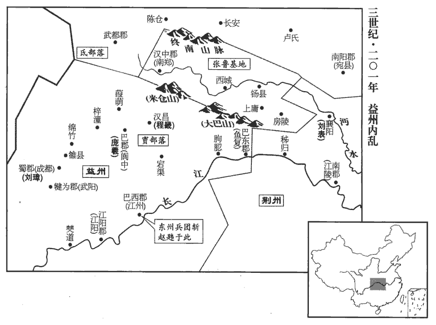
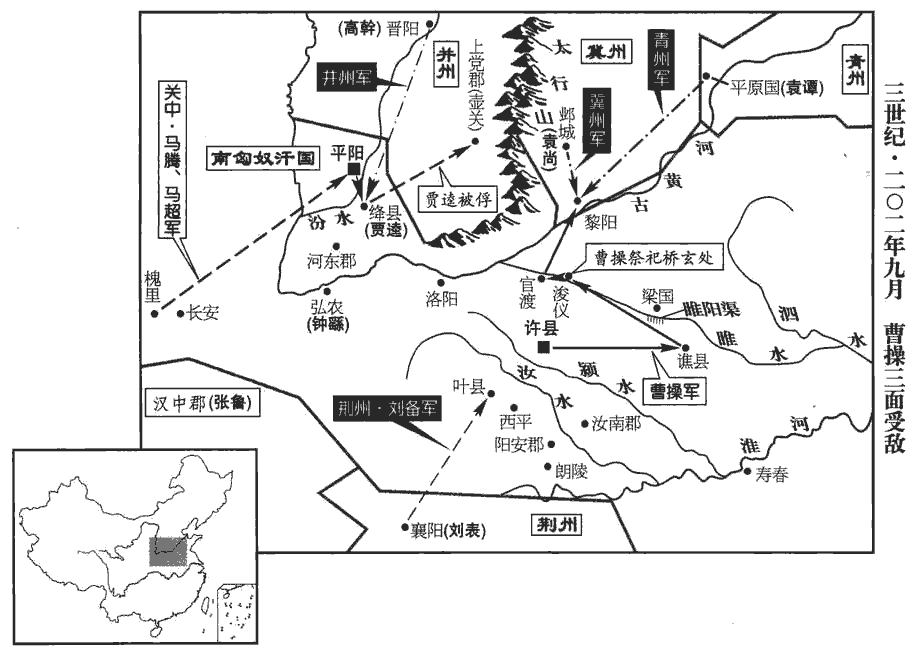
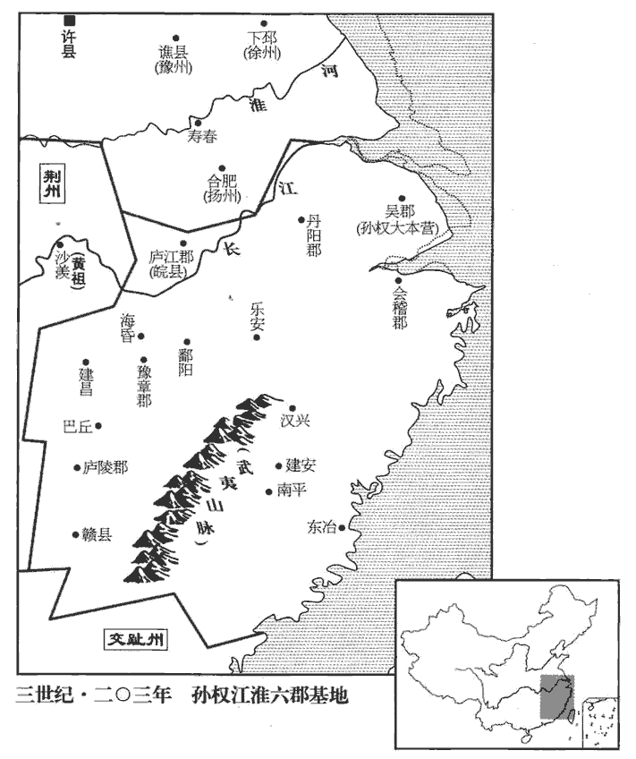
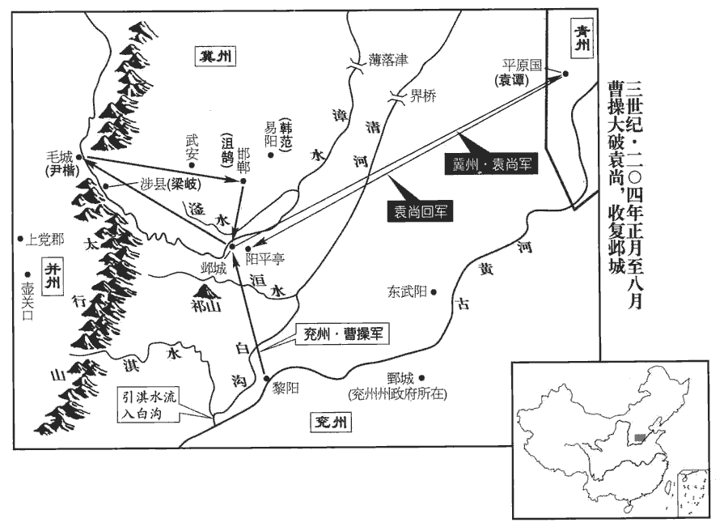
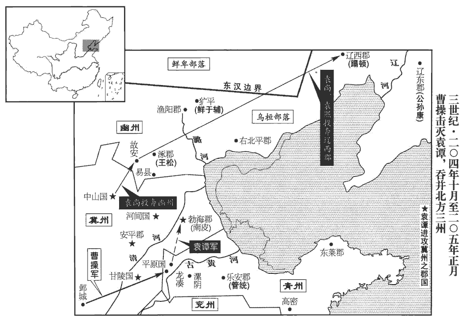
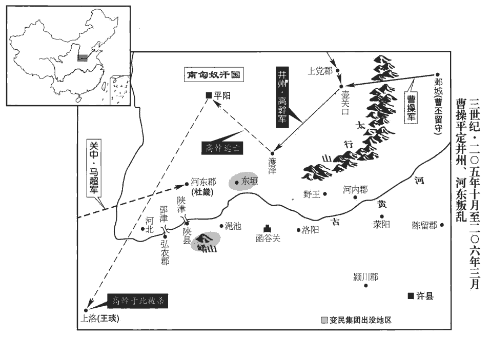

 漢紀五十六起重光大荒落（辛巳），盡旃蒙作噩（乙酉），凡五年。

# 孝獻皇帝己

## 建安六年（辛巳，二零一）

1春，三月，丁卯朔‹一›，日有食之。

〖译文〗 [1]春季，三月，丁卯（疑误），出现日食。

2曹操就穀於安民‹山东梁山县东北›。據水經，東平壽張縣西界，有安民亭。亭在濟水東，亭北對安民山。洪氏隸釋曰：濟水逕須句城西，水西有安民山。趙明誠金石錄曰：按地理志，須句城，即今中都縣。以袁紹新破，欲以其間擊劉表。間，古莧翻。荀彧曰：「紹既新敗，其眾離心，宜乘其困，遂定之；而欲遠師江、漢，若紹收其餘燼，乘虛以出人後，則公事去矣。」操乃止。夏，四月，操揚兵河上，擊袁紹倉亭‹山东阳谷北古黄河渡口›軍，破之，紹蓋遣軍屯倉亭津。秋，九月，操還許。

〖译文〗 [2]曹操率军移驻到粮食丰足的安民地区。曹操认为袁绍才被击败，打算利用这个间隙去进攻刘表。荀说：“袁绍刚吃了一场败仗，军心涣散，应该乘他尚未摆脱困境之机，一扫而平。而您却要远征长江、汉水之间，如果袁绍收拾残部，乘虚从后面突袭，则您的事业将付诸流水。”曹操便停止了远征荆州的打算。夏季，四月，曹操率军沿黄河行进，炫耀军威，进攻袁绍驻在仓亭的军队，打败袁绍军。秋季，九月，曹操回到许都。

3操自擊劉備於汝南‹河南平舆西北射桥乡›，備奔劉表，龔都等皆散。備合龔都事見上卷上年。表聞備至，自出郊迎，以上賓禮待之，益其兵，使屯新野‹河南新野›。水經註，新野縣，在安眾縣東南。備在荊州數年，嘗於表坐起至廁，慨然流涕。表怪，問備，備曰：「平常身不離鞍，坐，徂臥翻。離，力智翻。髀bì肉皆消。今不復騎，髀里肉生。日月如流，老將至矣，而功業不建，是以悲耳。」史言備志氣不衰，所以能成三分之業。復，扶又翻。

〖译文〗 [3]曹操亲自率军到汝南进攻刘备，刘备败走，到荆州投靠刘表，龚都等人都四散而逃。刘表听到刘备来的消息，亲自到郊外来迎接，用上宾的礼节接待刘备，又给刘备增加一些部队，让刘备驻扎在新野。刘备在荆州住几年。曾有一次，他在会见刘表时起身上厕所，感慨地流下泪来。刘表感到奇怪，问他是什么原因，刘备说：“我平常身不离马鞍，大腿内侧没有什么肉。如今不再骑马，大腿内侧长出了肉。日月如同流水，人已经快老了，但功业没有建立，所以悲伤。”

4曹操遣夏侯淵、張遼圍昌豨xī於東海‹山东郯城›，豨叛操事見上卷三年。豨，許豈翻，又音希。數月，糧盡，議引軍還。遼謂淵曰：「數日已來，每行諸圍，豨輒屬目視遼，行，下孟翻。屬，之欲翻。又其射矢更稀；此必豨計猶豫，故不力戰。遼欲挑與語，射，而亦翻。挑，徒了翻。儻可誘也。」儻tǎng，或然之辭。誘，音酉。乃使謂豨曰：「公有命，使遼傳之。」豨果下與遼語。遼為說操神武，方以德懷四方，先附者受大賞。為，于偽翻。豨乃許降。降，戶江翻。遼遂單身上三公山，上，時掌翻。入豨家，拜妻子。豨歡喜，隨遼詣操；操遣豨還。

〖译文〗 [4]曹操派遣夏侯渊、张辽率军在东海围攻昌，数月未能攻下，曹军粮草已尽，将领们商议撤军。张辽对夏侯渊说：“几天以来，我每次巡视阵地，昌的目光总追随着我，而且他们的箭也比以前射得更少。这必定是昌心中犹豫，所以未尽全力作战。我准备引动他交谈，或许能诱使他归降。”于是，张辽派人对昌说：“曹公有命令，让张辽传达给你。”昌果然下城与张辽交谈。张辽向他盛赞曹操的谋略武功，说曹操正广施恩德，招纳四方豪杰，先归附的可受到重赏。昌便答应投降。张辽就孤身一人上三公山，到昌家中，会见他的妻子，昌十分高兴，随张辽一起去拜见曹操，曹操命昌返回原处。

5趙韙圍劉璋於成都。東州人恐見誅滅，相與力戰，韙遂敗退，追至江州‹重庆›，賢曰：江州縣，屬巴郡。今渝州巴縣。殺之。趙韙隨劉焉入蜀，將以圖富貴，而卒以殺身。行險以徼幸，不如居易以俟命也。龐羲懼，遣吏程祁宣旨於其父漢昌‹四川巴中›令畿，漢昌縣，屬巴郡；漢末分宕渠置。索賨兵‹四川东北部›。索，山客翻。賨cóng，徂宗翻。畿曰：「郡合部曲，本不為亂，縱有讒諛，要在盡誠，若遂懷異志，不敢聞命。」羲更使祁說之，畿曰：「我受牧恩，當為盡節，說，輸芮翻。為，于偽翻；下為之同。汝為郡吏，自宜效力。謂父子當各盡節於所事也。不義之事，有死不為。」羲怒，使人謂畿曰：「不從太守，禍將及家！」畿曰：「樂羊食子，非無父子之恩，大義然也。樂羊，註見四十三卷光武建武十二年。今雖羹祁以賜畿，畿啜之矣。」羲乃厚謝於璋。璋擢畿為江陽‹四川省泸州市›太守。劉璋分犍為為江陽郡。宋白曰：瀘州之瀘川江安縣，本江陽地。

〖译文〗 [5]赵韪率军在成都包围刘璋，东州人恐怕受到屠杀，都拼死作战，杀退赵韪，并追击到江州将他杀死。庞羲听说赵韪被杀，心中恐惧，派属官程祁传达命令给他父亲汉昌县令程畿，征调人队伍。程畿说：“郡里召集队伍，本不是为了叛乱，纵然有人进谗言加以陷害，也只能对上表白我们的忠诚，如果因此而怀有异心，则我不敢遵从命令。”庞羲又派程祁去劝说程畿，程畿说：“我受到刘州牧的大恩，应当为他尽节；而你身为郡的官员，自当为庞太守效力。不义的事情，我宁死也不会去做！”庞羲大怒，派人对程畿说：“如果你不服从太守，将给你全家带来灾祸。”程畿说：“乐羊吃下他儿子的肉，并不是没有父子间的恩情。而是为了维护君臣大义。如今，即使庞太守把程祁煮成肉羹来赐给我，我也会吃下去。”庞羲无奈，便送上重礼，向刘璋道歉。刘璋提拨程畿担任江阳郡太守。

 

朝廷聞益州‹四川云南›亂，以五官中郎將牛亶dǎn為益州刺史；徵璋為卿，不至。卿，九卿也。

〖译文〗 朝廷听说益州局势混乱，任命五官中郎将牛为益州刺史，征召刘璋入京担任卿，刘璋不去。

6張魯以鬼道教民，使病者自首其過，首，式救翻。為之請禱；實無益於治病，然小人昏愚，競共事之。犯法者，三原，然後乃行刑；治，直之翻。原，赦也。不置長吏，皆以祭酒為治。魯以鬼道教民，其來學者，初名為鬼卒，後號祭酒。祭酒各領部眾。長，知兩翻。治，直吏翻。民、夷便樂之，樂，音洛。流移寄在其地者，不敢不奉其道。後遂襲取巴郡‹四川南充›。朝廷力不能征，遂就寵魯為鎮民中郎將，領漢寧‹陕西汉中›太守，袁山松書曰：建安二十年，分漢中之安陽置漢寧郡。通貢獻而已。

〖译文〗 张鲁用鬼神之道教化百姓。他让病人自己坦白所犯的过失，再由他为病人向上天祈祷。这种方法实际上并不能治病，但那些愚昧的人却深信不疑，争着一同信奉张鲁。对犯法的人，张鲁饶恕三次，然后才施用刑法。不设置官吏，而全部由天师道中的首领祭酒来管理各级行政事务。当地的百姓以及夷人对张鲁的制度都很欢迎，外地流亡到汉中地区的人，也不敢不信奉天师道。后来，张鲁又夺取巴郡。朝廷无力进行征讨，只好安抚张鲁，任命他为镇民中郎将，兼任汉宁郡太守。张鲁对特朝廷，只是进贡当地土特产而已。

民有地中得玉印者，群下欲尊魯為漢寧王。功曹巴西‹四川閬中›閻圃諫曰：譙周巴記曰：初平六年，趙韙分巴為二郡，欲得巴舊名，以墊江為治，安漢以下為永寧郡。建安六年，劉璋分巴，以永寧為巴東郡，墊江為巴郡，閬中為巴西郡。「漢川之民，戶出十萬，財富土沃，四面險固；上匡天子，則為桓、文，次及竇融，不失富貴。今承制署置，勢足斬斷，斷，丁亂翻。不煩於王。願且不稱，勿為禍先。」魯從之。

〖译文〗 民间有人从地里掘出一颗玉印，张鲁的部下打算尊称张鲁为汉宁王。功曹、巴西人阎圃劝阻张鲁说：“汉水流域有十万户百姓，土地肥沃，物产丰富，四面地势险要，利于固守。上辅佐天子，可望建成齐桓公、晋文公那样的功业；次一等的，也可像窦融那样，不失去富贵。如今，作为皇帝的代表来行使职权，形势上已完全独立自主，不必要王爵的称号。希望您能暂不称王，先不要惹祸。”张鲁听从了阎圃的意见。

## 七年（壬申，二零二）

1春，正月，曹操軍譙‹安徽亳州›，譙縣，屬沛國，操之鄉里。遂至浚儀‹河南开封›，治睢陽渠‹流经河南商丘南›。浚儀縣，屬陳留郡。睢水於此縣首受莨làng蕩渠水，東過睢陽縣，故謂之睢陽渠。睢，音雖。治，直之翻。遣使以太牢祀橋玄。玄識操於微時，故祀之。進軍官渡‹河南中牟东北›。

〖译文〗 [1]春季，正月，曹操率军驻在谯县，又进驻浚仪，挖掘睢阳渠。曹操派使者用太牢的规格祭祀已故太尉桥玄。曹军前进到官渡。

袁紹自軍敗慙憤，發病嘔血，夏五月，薨。

〖译文〗 [2]袁绍自从官渡战败之后，羞愧愤恨，发病吐血。夏季，五月，袁绍去世。

初，紹有三子，譚、熙、尚。紹後妻劉氏愛尚，數稱於紹，數，所角翻。紹欲以為後而未顯言之。乃以譚繼兄後，紹本司空逢之孽子，出後伯父成。成蓋先有子，死，而紹後之。紹欲廢譚立尚，故以譚繼兄後。出為青州刺史。沮授諫曰：沮，子余翻。「世稱萬人逐兔，一人獲之，貪者悉止，分定故也。慎子曰：兔走於街，百人逐之，貪心俱存，人莫之非者，以兔為未定分也。積兔在市，過而不顧，非不欲兔也，分定之後，雖鄙不爭。分，扶問翻。譚長子，當為嗣，而斥使居外，禍其始此矣。」譚、尚之爭，沮授固知之矣。長，知兩翻；下同。紹曰：「吾欲令諸子各據一州，以視其能。」於是以中子熙為幽州刺史，中，讀曰仲。外甥高幹為并州刺史。此皆前事，史因紹死而譚、尚爭，書之以先事。

〖译文〗 袁绍有三个儿子：袁谭、袁熙、袁尚。袁绍后妻刘氏偏爱袁尚，经常在袁绍面前称赞袁尚。袁绍想让袁尚作自己的继承人，但没有明说，就把长子袁谭过继给自己已死去的哥哥，让他离开邺城，去担任青州刺史。沮援劝阻袁绍说：“世人常说：一万个人追逐一只野兔，一个人捉到后，其他人即使贪心，也全停止下来，这是因为所有权已经确定。袁谭是您的长子，应当做继承人，而您却把他排斥在外，灾祸将由此开始。”袁绍说：“我想让儿子们各自主持一州的事务，以考察他们的能力。”于是，他委派次子袁熙为幽州刺史，外甥高干为并州刺史。

逄紀、審配素為譚所疾，逄páng，皮江翻。辛評、郭圖皆附於譚，而與配、紀有隙。及紹薨，眾以譚長，欲立之。配等恐譚立而評等為害，遂矯紹遺命，奉尚為嗣。譚至，不得立，自稱車騎將軍，袁紹初起兵，自稱車騎將軍，故譚亦稱之。屯黎陽‹河南浚县›。尚少與之兵，少，詩沼翻。而使逄紀隨之。譚求益兵，審配等又議不與。譚怒，殺逄紀。秋，九月，曹操渡河攻譚。譚告急於尚，尚留審配守鄴‹河北临漳西南邺镇›，自將助譚，與操相拒。連戰，譚、尚數敗，退而固守。數，所角翻。

〖译文〗 逢纪、审配一向被袁谭所忌恨，辛评、郭图则拥护袁谭，而与逢纪、审配有矛盾。等到袁绍死后，众人都认为袁谭是长子，打算拥立他继承袁绍。审配等人恐怕袁谭掌权后，会受到辛评等人的报复，就假传袁绍的遗命，尊奉袁尚做袁绍的继承人。袁谭自青州赶来奔丧，不能接替父亲的职位，就自称车骑将军，驻军黎阳。袁尚拨给袁谭很少一部分兵力，而让逢纪去跟随他。袁谭请求再增加兵力，审配等人商议后又予以拒绝。袁诃大怒，杀死逢纪。秋季，九月，曹操渡过黄河，进攻袁谭。袁谭向袁尚求救。袁尚留审配守邺城，亲自率军去救袁谭，与曹操对抗。两军交战数次，袁谭、袁尚连续失败，只好退守营寨。

尚遣所置河東太守郭援，與高幹、匈奴南單于共攻河東‹山西夏县›，發使與關中諸將馬騰等連兵，使，疏吏翻。騰等陰許之，援所經城邑皆下。河東郡吏賈逵守絳‹山西侯马东›，絳縣，屬河東郡，春秋晉所都也。援攻之急；城將潰，父老與援約，不害逵，乃降，降，戶江翻。援許之。援欲使逵為將，將，即亮翻。以兵劫之，逵不動。左右引逵使叩頭，逵叱之曰：「安有國家長吏為賊叩頭！」逵，郡吏，非長吏也。以守絳故，自謂縣長吏。為，于偽翻。援怒，將斬之，或伏其上以救之。絳吏民聞將殺逵，皆乘城呼曰：呼，火故翻。「負約殺我賢君，寧俱死耳！」乃囚於壺關‹山西长治北›，著土窖中，壺關縣，屬上黨郡。著，陟略翻。窖，居效翻；掘地以藏粟之所。蓋以車輪。逵謂守者曰：「此間無健兒邪，而使義士死此中乎？」有祝公道者，適聞其言，乃夜往，盜引出逵，折械遣去，不語其姓名。語，牛倨翻。

〖译文〗 袁尚派遣他所委任的河东郡太守郭援，与高干、匈奴南单于一起进攻河东郡。袁尚又派使者到关中去，与马腾等将领们联系共同起兵，马腾等都暗中答应。郭援率军进攻，一路所经过的县城都被攻下或者归降。河东郡官员贾逵守卫绛县，郭援猛攻不止，城将陷落时，城中父老与郭援约定：不杀害贾逵，他们就投降。郭援答应了。郭援想让贾逵做他的将领，用武力相胁迫，贾逵毫不动摇。左右的人拉贾逵的衣服，让他叩头，贾逵厉声叱责说：“哪有国家官员向贼人叩头的道理！”郭援大怒，就要杀死贾逵，有人伏在贾逵身上，以保护他。绛县的官民们听说要杀死贾逵，都登上城墙，高声喊道：“如果背弃誓言，杀害我们的好长官，宁可大家一起拼死！”于是郭援把贾逵抽到壶关，关在地窖里，用车轮盖住洞口。贾逵对看守们说：“此间难道没有一个英雄好汉，而使义士死在地窖里吗？”有一个叫祝公道的壮士，正好听到贾逵的话，就在夜里前去把贾逵偷偷救出来，打开刑具，放贾逵逃走，没有讲出自己的姓名。

 

曹操使司隸校尉鍾繇圍南單于於平陽‹山西临汾›，平陽縣，屬河東郡。時南單于呼廚泉居之。未拔而救【章：甲十一行本「救」作「援」；乙十一行本同；孔本同；熊校同。】至。繇使新豐‹陕西临潼东北零口乡›令馮翊‹陕西大荔›張既說馬騰，新豐縣，屬京兆太守。說，輸芮翻。為言利害。為，于偽翻。騰疑未決。傅幹說騰曰：「古人有言：『順德【章：甲十一行本「德」作「道」；乙十一行本同；孔本同；熊校同。】者昌，逆德者亡。』新城三老董公之言。曹公奉天子誅暴亂，法明政治，上下用命，可謂順道矣。治，直吏翻。袁氏恃其強大，背棄王命，背，蒲妹翻。驅胡虜以陵中國，可謂逆德矣。今將軍既事有道，【章：甲十一行本「道」下有「不盡其力」四字；乙十一行本同；孔本同；張校同；退齋校同。】陰懷兩端，謂既附曹公，又與袁氏通也。欲以坐觀成敗；吾恐成敗既定，奉辭責罪，將軍先為誅首矣！」於是騰懼。幹因曰：「智者轉禍為福。今曹公與袁氏相持，而高幹、郭援合攻河東‹山西夏县›，曹公雖有萬全之計，不能禁河東之不危也。將軍誠能引兵討援，內外擊之，謂河東之兵，擊之於內，而馬騰之兵，擊之於外也。其勢必舉。是將軍一舉，斷袁氏之臂，斷，丁管翻。解一方之急，曹公必重德將軍，將軍功名無與比矣。」騰乃遣子超將兵萬餘人與繇會。

〖译文〗 曹操派司隶校尉钟繇在平阳包围南匈奴单于，未能攻陷，而对方援军已经到达。钟繇派新丰县令、冯翊人张既劝说马腾，为他分析利害。马腾听后，犹豫不决。部下将领傅干对马腾说：“古人说过：‘顺德者昌，逆德者亡。’曹操尊奉天子，平定暴乱，法纪严谨，政治清明，上下听从命令，可以称为顺德；袁氏家话族倚仗势力强大，犯上作乱，勾结匈奴来侵掠中国，可以称为逆德。如今将军已尊奉朝廷，却又暗中骑墙，想坐观成败。我恐怕等到成败定下来之后，曹操奉旨问罪征讨，将军将第一个被杀！”马腾听后十分恐惧。傅干乘机建议说：“明智的人能转祸为福。如今，曹操与袁氏家族相持不下，而高干、郭援合力进攻河东郡，曹操虽然有万全之计，也无为挽救河东郡的危局。将军假如能在此危急关头领军征讨郭援，内外夹击，必能取胜。将军这一举动，既斩断袁氏家族的臂膀，又解救了河东郡的危急，曹操必然深深感激将军，将军的功名将无人能够相比。”于是，马腾派儿子马超率军一万余人与钟繇会合。

初，諸將以郭援眾盛，欲釋平陽‹山西临汾›去。鍾繇曰：「袁氏方強，援之來，關中陰與之通，所以未悉叛者，顧吾威名故耳。若棄而去，示之以弱，所在之民，誰非寇讎，縱吾欲歸，其得至乎！此為未戰先自敗也。言若退師避援，則關中諸將必叛，雖欲歸司隸治所，亦不得而至也。且援剛愎好勝，必易吾軍，易，輕也。愎，平逼翻。好，呼到翻。易，以豉翻。若渡汾為營，水經註：汾水南過平陽縣東。及其未濟擊之，可大克也。」援至，果徑前渡汾，眾止之，不從。濟水未半，繇擊，大破之。戰罷，眾人皆言援死而不得其首。援，繇之甥也。晚後，馬超校尉南安‹甘肃陇西东南›龐德，於鞬中出一頭，秦川記曰：靈帝中平五年，分漢陽置南安郡，領䝠huán道、新興、中陶三縣。鞬jiàn，居言翻；盛弓矢器。繇見之而哭。德謝繇，繇曰：「援雖我甥，乃國賊也，卿何謝之有！」南單于遂降。降，戶江翻。考異曰：魏志張既傳曰：「高幹及單于皆降。」非也。

〖译文〗 起初，将领们看到郭援军势强盛，想放弃平阳离去。钟繇说：“袁氏的势力正强，郭援这次来，关中的势力暗中与他相勾结，他们所以没有全部背叛朝廷，只因为顾虑我的威名罢了。如果弃平阳而离去，向郭援示弱，则各地的百姓都会成为敌人，即使我想回去，又怎么能退得回去呢？这是未作战而先自败退。而且郭援刚愎好胜，必然看不起我军，如果他渡过汾河来扎营，趁他未渡完时，我们突然袭击，可获大胜。”郭援到达后，果然直接前行渡河，部下纷纷劝阻，但郭援不听。当他部下渡过没有一半时，钟繇率军奋击，大破郭援。战斗结束后，钟繇部下诸将都说郭援已被杀死，但没有找到郭援的人头。郭援是钟繇的外甥。后来，马超部下的校尉、南安人庞德从装弓箭的袋子里取出一个人头，钟繇见到后哭了，原来那正是郭援的人头。庞德向钟繇道歉，钟繇说：“郭援虽是我的外甥，但他是背叛朝廷的逆贼，你有什么可道歉的！”南匈奴单于看到援军已败，便投降了。

3劉表使劉備北侵，至葉‹河南葉縣西南›，葉縣，屬南陽郡。春秋楚葉公子高之邑也。葉，之涉翻。曹操遣夏侯惇、于禁等拒之。備一旦燒屯去，惇等追之。裨將軍鉅鹿‹河北宁晋西南›李典曰：裨將軍，在偏將軍之下。裨pí，頻彌翻。「賊無故退，疑必有伏。南道窄狹，窄，側格翻。草木深，不可追也。」惇等不聽，使典留守而追之，果入伏里，兵大敗。典往救之，備乃退。

〖译文〗 [3]刘表派刘备向北进攻，到达叶县。曹操派夏侯、于禁等前去抵挡。刘备突然放火烧去自己军营，向后撤退。夏侯等率军追赶。裨将军、巨鹿人李典说：“刘备无故撤退，我怀疑定有埋伏。南边道路狭窄，草木深密，不能追赶。”夏侯等不听，命令李典留守而自己领兵追赶，果然陷入埋伏，大败。李典率军援救，刘备才撤军。

4曹操下書責孫權任子，任，質任也。操蓋以此覘孫權，而觀其所以應之。權召群僚會議，張昭、秦松等猶豫不決。權引周瑜詣吳夫人前定議，吳夫人，權母也。瑜曰：「昔楚國初封，不滿百里之地。繼嗣賢能，廣土開境，遂據荊、揚，【章：甲十一行本「揚」下有「至於南海」四字；乙十一行本同；孔本同；退齋校同。】傳業延祚，九百餘年。周成王封熊繹於楚以子男之田，國於丹陽，漢南郡枝江縣是也。其後浸強，至若敖、蚡冒封畛zhěn於汝，武王、文王奄有江、漢之間，莊王以後，與中國爭盟，威王破越至于南海，及秦而滅，凡九百餘年。今將軍承父兄餘資，兼六郡之眾，父，謂孫堅；兄，謂孫策。六郡，會稽、吳、丹陽、豫章、廬陵、廬江也。兵精糧多，將士用命，鑄山為銅，煮海為鹽，境內富饒，人不思亂，有何逼迫而欲送質？質，音致；下同。質一入，不得不與曹氏相首尾，與相首尾，則命召不得不往，如此，便見制於人也。極不過一侯印，僕從十餘人，車數乘，馬數匹，豈與南面稱孤同哉！建安十三年，操自荊州東下約孫權會獵，時周瑜未至，魯肅說權，其意亦與此同。從，才用翻。乘，繩證翻。不如勿遣，徐觀其變。若曹氏能率義以正天下，將軍事之未晚；若圖為暴亂，彼自亡之不暇，焉能害人！」此數語，所謂相時而動也。然瑜之言不悖於大義，魯肅、呂蒙輩不能及也。焉，於虔翻。吳夫人曰：「公瑾議是也。公瑾與伯符同年，小一月耳，周瑜，字公瑾。孫策，字伯符。瑾，渠吝翻。我視之如子也，汝其兄事之。」遂不送質。

〖译文〗 [4]曹操发下公文，要孙权派自己的弟弟或儿子到朝廷来作官。孙权召集众官员进行会商，张昭、秦松等人犹豫不决。孙权领周瑜来见自己母亲吴夫人，在她面前作最后决定。周瑜说：“从前，楚国开始受封于周朝时，统治的区域方圆不到一百里。后继的国君贤明能干，开拓疆土，遂占有荆州与扬州，王业相传延续，达九百多年。如今，将军承袭父、兄的基业，拥有六郡的地盘与人力，兵精粮足，将士听命。上山开采铜矿，沿海炼制食盐，境内富庶，人心安定，有什么压力使咱们要送人质？人质一送去，就不能不与曹操紧密联系，既然紧密联系，那么朝廷下令征召时就不能不前往。这样，就会被人所控制。最多不过是得一个侯印，有十几个仆从，几辆车，几匹马，难道与面向南方而称孤道寡相同吗！不如不送人质，慢慢观察事态变化。如果曹操真能以君臣大义来治理天下，将军再侍奉他也不晚。如果他图谋不轨，犯上作乱，他救自己都顾不上，又怎么能害人？”吴夫人对孙权说：“周瑜说得很对。他与你哥哥孙策同年，只小一个月。我把作看作自己的儿子，你要当作哥哥来尊敬他。”因此决定不送人质。

## 八年（癸未，二零三）

1春，二月，曹操攻黎陽‹河南浚县›，考異曰：魏志武紀作三月。今從范書袁紹傳。又魏志紹傳云：「譚、尚與太祖相拒黎陽，自二月至九月。」當云自九月至二月。與袁譚、袁尚戰於城下，譚、尚敗走，還鄴‹河北临漳西南邺镇›。夏，四月，操追至鄴，收其麥；考異曰：范書紹傳曰：「尚逆擊，破操軍。」今從魏志紹傳。余謂此諸葛孔明所謂偪bī於黎陽時也，必有破操軍事，魏人諱而不書耳。諸將欲乘勝遂攻之，郭嘉曰：「袁紹愛此二子，莫適立也。適，丁歷翻，主也。今權力相侔，各有黨與，謂辛評、郭圖等附譚，審配等附尚也。急之則相保，緩之則爭心生。不如南向荊州荊州，劉表。以待其變；變成而後擊之，可一舉定也。」操曰：「善！」五月，操還許，留其將賈信屯黎陽‹河南浚县›。

〖译文〗 [1]春季，二月，曹操进攻黎阳，与袁谭、袁尚在黎阳城下展开大战，袁谭、袁尚败走，退回邺城。夏季，四月，曹操大军追到邺城，收割了地里的小麦。曹军将领都提出要乘胜攻打邺城，郭嘉说：“袁绍生前喜欢这两个儿子，没能决定让谁作继承人。如今，他们权力相等，各有党羽辅佐。情况危急，就相互援救；局势稍有缓和，就又会争权夺利。不如先向南进取荆州，等待他们兄弟内讧，然后再进攻，可以一举平定。”曹操说：“好！”五月，曹操回到许都，留部将贾信驻守黎阳。

譚謂尚曰：「我鎧甲不精，故前為曹操所敗。鎧，可亥翻。敗，補邁翻。今操軍退，人懷歸志，及其未濟，出兵掩之，可令大潰，此策不可失也。」尚疑之，既不益兵，又不易甲。譚大怒，郭圖、辛評因謂譚曰：「使先公出將軍為兄後者，皆審配之謀也。」譚遂引兵攻尚，戰於門外。鄴城門外也。譚敗，引兵還南皮‹河北南皮›。南皮縣，屬勃海郡。賢曰：今滄州縣；章武有北皮亭，故此曰南皮。宋白曰：縣道記云：景州之南皮，在郡東六十里。南皮縣北有迎河，河之北有故皮城，是後漢勃海郡所理，與郡理城南北非遠，中隔迎河故瀆。

〖译文〗 袁谭对袁尚说：“我的部下铠甲不够精良，所以先前被曹军击败。现在曹军撤退，人人思归，在他们未完全渡过黄河以前，出兵追击，可使他全军溃散，这种时机，万万不可错过。”袁尚疑心袁谭另有打算，既不增加他的兵马，也不肯给他部下更换铠甲。袁谭大怒，郭图、辛评乘机对袁谭说：“使已故袁公把你过继给哥哥的，全是审配的主意。”袁谭就率军进攻袁尚，在邺城门外大战起来，袁谭战败，率军退回南皮。

別駕北海‹山东昌乐西›王脩，率吏民自青州往救譚。漢青州刺史治臨菑。譚欲更還攻尚，脩曰：「兄弟者，左右手也。譬人將鬬而斷其右手，斷，丁管翻。曰『我必勝』，其可乎？夫棄兄弟而不親，天下其誰親之！彼讒人離間骨肉以求一朝之利，願塞耳勿聽也。間，古莧翻。塞，悉則翻。若斬佞臣數人，復相親睦，以御四方，可横行於天下。」譚不從。譚將劉詢起兵漯陰‹山东齐河县东北›以叛譚，漯陰縣，屬平原郡。應劭曰：漯水，出東武陽，東北入海。賢曰：縣在漯水之南，故城在今齊州臨邑縣西。師古曰：漯，音他答翻。諸城皆應之。譚歎曰：「今舉州皆叛，豈孤之不德邪！」王脩曰：「東萊‹山东龙口东黄城集›太守管統，雖在海表，此人不反，必來。」後十餘日，統果棄其妻子來赴譚，妻子為賊所殺。譚更以統為樂安‹山东高青东南›太守。漢末，樂安國除為郡。

〖译文〗 袁谭的别驾、北海人王，率领官吏和百姓从青州来援救袁谭。袁谭打算再次进攻袁尚，王劝阻说：“兄弟之间的关系，好比是人的左、右手。假如上个人要与别人争斗，先砍断自己的右手，还说‘我一定能胜’，难道对吗？抛弃兄弟而不亲近，天下还有谁能亲近？那些进谗言的小人，离间别人的骨肉，只是为了追求眼前的一点小利，希望您塞住耳朵，不要听信。如果能下决心杀掉几个奸佞小人，与兄弟重相和睦，齐心协力，抵御四方，可以横行于天下。”袁谭不听。袁谭部将刘询在漯阴起兵，背叛袁谭，各城全都响应。袁谭叹息说：“如今全州都叛变，难道是我缺少恩德吗？”王说：“东莱郡太守管统，虽然远在海滨，但这个人不会反叛，一定前来追随。”又过了十余天，管统果然抛弃家眷来投奔袁谭，他的家眷被叛军杀死。袁谭又委任管统为乐安郡太守。

2秋，八月，操擊劉表，軍于西平‹河南舞阳东南›。西平縣，屬汝南郡。從郭嘉之謀也。

〖译文〗 [2]秋季，八月，曹操进攻刘表，大军驻扎西平。

3袁尚自將攻袁譚，大破之，將，即亮翻。譚奔平原‹山东平原›，嬰城固守。前書音義曰：嬰，謂以城自繞也。尚圍之急，譚遣辛評弟毗pí詣曹操請救。

〖译文〗 [3]袁尚亲自统帅大军进攻袁谭，袁谭大败，逃到平原，据城固守。袁尚将城围住，发动猛攻。袁谭派辛评的弟弟辛毗到曹操那里求救。

劉表以書諫譚曰：「君子違難不適讎國，左傳公山不狃niǔ之言。難，乃旦翻。交絕不出惡聲，史記樂毅答燕惠王書之言。況忘先人之讎，棄親戚之好，而為萬世之戒，遺同盟之恥哉！表與袁紹同盟。好，呼到翻。遺，于季翻；下同。若冀州有不弟之傲，左傳曰：段不弟。書曰：象傲。尚據冀州，故稱之。仁君當降志辱身，以濟事為務，事定之後，使天下平其曲直，不亦為高義邪！」又與尚書曰：「金、木、水、火以剛柔相濟，然後克得其和，能為民用金能勝木，然執柯伐柯，非木無以成金斲削之利；水能勝火，然水在火上，非火無以成水烹餁之功。此類非一，可以概推也。青【章：甲十一行本「青」上有「今」字；乙十一行本同；孔本同；張校同。】州天性峭急，峭，七笑翻。譚據青州，故稱之。迷於曲直。仁君度數弘廣，綽然有餘，當以大包小，以優容劣，先除曹操以卒先公之恨，卒，子恤翻。事定之後，乃議曲直之計，不亦善乎！若迷而不反，則胡夷將有譏誚之言，誚qiào，才笑翻。況我同盟，復能戮力為君之役哉！此韓盧、東郭自困於前而遺田父之獲者也。」淳于髡說齊威王曰：韓盧者，天下之俊犬也；東郭狻suān者，天下之狡兔也。韓盧逐東郭狻，騰山者五，環山者三，兔極於前，犬疲於後，犬兔俱疲，各死其處，田父見而獲之，無勞苦而擅其功。今齊、魏相持，頓兵敝眾，恐秦、楚乘其後而有田父之功也。譚、尚皆不從。

〖译文〗 刘表写信劝袁谭说：“君子即使避难，也不会逃到敌国；即使与人绝交，也不会进行辱骂。况且你忘掉父亲的仇恨，抛弃了兄弟之情，而作出这种万世都会引以为戒的事情，使同盟之人都为你感到耻辱。如果袁尚有不尊重兄长的傲慢举动，你也该委曲求全，以大局为重。等到大局已定，再由天下人来评论曲直，不也是高风亮节吗？”刘表又给袁尚写信，说：“金、木、水、火四种物质，以刚柔互配，才能相辅相成，为人所用。袁谭天性急躁，不能明辨是非，你器量宽弘，包容他还绰绰有余，应当以大容小，以优容劣，先除去曹操，以了却你父亲的遗恨。等到大事已定，再来评论谁是谁非，不好吗？如果执迷不悟，则胡人夷人都会讥笑你们，何况我们这些盟友，还会再尽力为你作战吗！这正是韩卢狗和东郭兔互相追逐，先行自困，而耕田老农不劳而获的故事的再现！”袁谭、袁尚都不听刘表的劝解。

辛毗至西平‹河南舞阳东南›見曹操，致譚意，群下多以為劉表強，宜先平之，譚、尚不足憂也。荀攸曰：「天下方有事，而劉表坐保江、漢之間，其無四方之志可知矣。袁氏據四州之地，帶甲數十萬，紹以寬厚得眾心；使二子和睦以守其成業，則天下之難未息也。謂能為曹操患也。難，乃旦翻。今兄弟遘惡，「遘」，當作「構」。或曰：遘，遇也；謂以惡相遇也。其勢不兩全，若有所并則力專，力專則難圖也；謂譚、尚若并於一，則能專力以禦操，其勢難圖。及其亂而取之，天下定矣，此時不可失也。」操從之。

〖译文〗 辛毗到西平拜见曹操，转达袁谭求救的请求。曹操部下官员多认为刘表势大，应当先消灭刘表，袁谭、袁尚自相残杀，不足忧虑。荀攸说：“目前，正是天下英雄争霸之机，而刘表坐守江、汉之间，可知他胸无占有四方的大志。袁氏家族占据四州之地，有兵马数十万，袁绍以宽厚而得民心，假如他的两个儿子和睦相处，共守已有的基业，则天下灾难不能平息。如今他们兄弟相争，势不两立，如果一个人吞并了另一个人，则力量就会集中起来，力量集中后，再想进取就困难了。应该乘他们相持不下时动手夺取，天下就可以平定了。这个机会不能失去。”曹操表示同意。

後數日，操更欲先平荊州，使譚、尚自相敝，辛毗望操色，知有變，以語郭嘉。語，牛倨翻。嘉白操，操謂毗曰：「譚必可信，尚必可克不？」不，讀曰否。毗對曰：「明公無問信與詐也，直當論其勢耳。袁氏本兄弟相伐，非謂他人能間其間，乃謂天下可定於己也。能間，工莧翻。言袁氏兄弟相攻，其初計不謂他人能乘其間，乃謂并青、冀為一，則可乘勢以定天下耳。今一旦求救於明公，此可知也。言其勢窮。顯甫見顯思困而不能取，譚，字顯思，尚，字顯甫。此力竭也。兵革敗於外，謀臣誅於內，謂逄紀、田豐等死也。兄弟讒䦧，䦧xì，馨激翻；鬬也，很也，戾也。國分為二，連年戰伐，介冑生蟣jǐ蝨shī，加以旱蝗，饑饉并臻；天災應於上，人事困於下，民無愚智，皆知土崩瓦解，此乃天亡尚之時也。今往攻鄴‹河北临漳西南邺镇›，尚不還救，即不能自守；還救，即譚踵其後。以明公之威，應困窮之敵，擊疲敝之寇，無異迅風之振秋葉矣。秋葉易隕，況遇迅風乎。天以尚與明公，明公不取而伐荊州；荊州豐樂，樂，音洛。國未有釁。仲虺huǐ有言，『取亂侮亡』。見尚書。孔安國註曰：亂則取之，有亡形則侮之。方今二袁不務遠略而內相圖，可謂亂矣；居者無食，行者無糧，可謂亡矣。朝不謀夕，民命靡繼，而不綏之，欲待他年；他年或登，歲熟曰登。又自知亡而改脩厥德，失所以用兵之要矣。今因其請救而撫之，利莫大焉。且四方之寇，莫大於河北，河北平，則六軍盛而天下震矣。」觀毗之言，非為譚請救也，勸操以取河北也。操曰：「善！」乃許譚平。

〖译文〗 过了几天，曹操又打算先平定荆州，让袁谭、袁尚自相削弱。辛毗观察曹操脸色，知道他又改变主意，就去告诉郭嘉。郭嘉报告曹操，曹操对辛毗说：“袁谭是否一定可信？袁尚是否一定能被攻克？”辛毗说：“您不要问是否有许，只应看整个形势的发展变化。袁谭、袁尚兄弟相争，并未考虑到别人会乘机利用，只是认为天下可由自己平定。如今，袁谭向您求救，表明他已走投无路；袁尚看到袁谭陷入困境，却不能一举攻破袁谭，说明袁尚也已智穷力竭。他们的形势是军队在外战败，谋士在内被杀，兄弟内讧，土地割裂，连年征战，将士的甲胄里都长出虱子。再加上旱灾与蝗灾，造成饥荒，天灾人祸，上下交应，百姓无论智慧或是愚笨，都已知道袁氏统治将要土崩瓦解，这正是上天灭亡袁尚的时机。如今您去攻打邺城，袁尚不撤军回救，邺城就不能自守；袁尚返回救援，袁谭就会在后攻击。以您的军威，对付穷困之敌，进击疲惫之军，犹如疾风去吹落秋叶一般。上天把袁尚赏赐给您，您却不去进攻袁尚，而要讨伐荆州。荆州富裕安乐，没有机会可供您利用。从前仲虺说：‘敌人有内乱则夺取，敌人有覆亡迹象则侵入。’如今，袁氏兄弟不顾长远大局，自相攻击，可称为内乱；居民饥饿，行人无粮，可称为覆亡的迹象。黄河以北的百姓朝不虑夕，性命全无保障，而您不立即去安抚，却要等到以后。以后如果赶上丰收，袁氏兄弟又醒悟到已濒于危亡而痛改前非，则您就将失去用兵的机会。现在，利用袁谭求救而去援助，对您是最有利的。而且您的敌人，没有比占据黄河以北的袁氏更强大的了。您平定黄河以北后，就军威大盛，震动天下了。”曹操说：“对！”于是，答应出兵救援袁谭。

冬，十月，操至黎陽‹河南浚县›。尚聞操渡河，乃釋平原還鄴‹河北临漳西南邺镇›。尚將呂曠、高翔畔歸曹操，譚復陰刻將軍印以假曠、翔。操知譚詐，乃為子整聘譚女以安之，而引軍還。操本有伐尚因而取譚之心，況復有誘曠、翔之事乎！聘其女為子婦以安之，所謂將欲取之，必姑與之也。復，扶又翻；下同。為，于偽翻。

〖译文〗 冬季，十月，曹操进军到黎阳。袁尚听到曹军渡过黄河的消息，解除对平原的包围，撤回邺城。袁尚部将吕旷、高翔背叛袁尚，投降曹操。袁谭又暗中刻好将军的印信，送给吕旷、高翔。曹操知道袁谭并非真心归降，便为儿子曹整娶袁谭的女儿为妻，以安袁谭之心，然后，曹操班师回朝。

 

4孫權西伐黃祖‹基地在沙羡湖北省武汉市金口镇›，破其舟軍，惟城未克，而山寇復動。丹陽、豫章、廬陵，皆有山越。權還，過豫章‹江西南昌›，使征虜中郎將呂范平鄱陽‹江西波阳›、會稽‹绍兴›，呂范傳止云鄱陽，孫權傳則有「會稽」二字，以地里攷之，「會稽」二字衍。盪寇中郎將程普討樂安‹江西德兴东北›，晉志及宋志，鄱陽郡有樂安縣，吳立。建安十五年，孫權始分豫章立鄱陽郡。盪寇中郎將，權所置也。建昌都尉太史慈領海昏‹江西永修西北艾城乡›，和帝永元十六年，分海昏立建昌縣，屬豫章郡。孫策分海昏、建昌六縣，以太史慈為建昌都尉，治海昏。以別部司馬黃蓋、韓當、周泰、呂蒙等守劇縣令長，劇，艱也，甚也，言其地當山越之要，最為艱劇之甚者也。討山越，悉平之。建安‹福建建瓯›、漢興‹福建浦城›、南平‹福建南平›民作亂，聚眾各萬餘人，建安，本冶縣地，會稽南部都尉治焉。建安中，分東侯官置建安縣，用漢年號也，今建寧府地。漢興縣，沈約曰：漢末立，吳更名吳興。南平縣亦漢末立，晉武平吳，改曰延平，今南劍州地。時皆屬南部都尉。權使南部都尉會稽‹绍兴›賀齊進討，皆平之，復立縣邑，料出兵萬人；拜齊平東校尉。會，工外翻。復，如字。料，音聊。校，戶教翻。

〖译文〗 [4]孙权西征黄祖，大破黄祖水军，只是未能攻克黄祖据守的城池。正在这时，山区的土著居民山越再度起兵反抗，孙权只好撤军。孙权经过豫章郡，派征虏中郎将吕范平定鄱阳、会稽，荡寇中郎将程普进讨乐安，由建昌都尉太史慈兼管海昏县事务，委任别部司马黄盖、韩当、周泰、吕蒙等分别兼任山越聚剧县的县令和县长，分别率军讨伐山越，完全平定了山越的反抗。建安、汉兴、南平三县百姓起来反抗，每县都聚集起一万余人。孙权派南部都尉、会稽人贺齐讨伐，全部平定。重建县城，挑选出精兵一万余人，晋升贺齐为平东校尉。

## 九年（甲申，二零四）

1春，正月，曹操濟河，遏淇水入白溝‹流经河南滑县、浚县›以通糧道。袁尚在鄴，操將攻之，故通糧道。班志曰：淇水至黎陽入河。曹操於水口下大枋fāng木以成堰，遏淇水東入白溝。水經註曰：淇水東過內黃縣南，為白溝。

〖译文〗 [1]春季，正月，曹操渡过黄河。曹操派人堵住淇水，使共流入白沟，以便运输军粮。

二月，袁尚復攻袁譚於平原‹山东平原›，復，扶又翻。留其將審配、蘇由守鄴‹河北临漳西南邺镇›。曹操進軍至洹huán水，水經：洹水出上黨泫氏縣，東過隆慮縣北，又東北出山，逕鄴縣南。洹，于元翻，又音桓。蘇由欲為內應，謀泄，出奔操。操進至鄴‹河北临漳西南邺镇›，為土山、地道以攻之。尚武安‹河北武安›長尹楷屯毛城‹河北涉县西北›，以通上黨‹山西长子›糧道。武安縣，屬魏郡，唐洺州地。長，知兩翻；下同。夏，四月，操留曹洪攻鄴，自將擊楷，破之而還；又擊尚將沮鵠hú於邯鄲，拔之。裴松之曰：沮，音葅。河朔間，今猶有此姓。鵠，沮授子也。沮，子余翻。邯鄲，音寒丹。

〖译文〗 二月，袁尚又到平原去进攻袁谭，留部将审配、苏由镇守邺城。曹操进军到洹水，苏由打算为曹操作内应，因密谋泄露，苏由就出城投奔曹操。曹操大军到达邺城后，上筑土山，下挖地道，发动进攻。袁尚委任的武安县县长尹楷驻军毛城，以保护通向上党的粮道。夏季，四月，曹操留曹洪继续攻打邺城，亲自统军进攻尹楷，击败尹楷后回师。又去进攻镇守邯郸的袁尚部将沮鹄，攻陷邯郸。

易陽‹河北永年东南›令韓范、涉‹河北涉县›長梁岐皆舉縣降。易陽縣，屬趙國。涉縣，蓋漢末分上黨之潞縣置。魏後置廣平郡，二縣皆屬焉。北齊廢涉縣入刈陵縣；隋、唐復置涉縣。宋白曰：涉縣，因縣南涉河為名。磁州昭義縣理故涉城，永泰元年改名昭義。徐晃言於操曰：「二袁未破，諸城未下者傾耳而聽，宜旌賞二縣以示諸城。」操從之，范、岐皆賜爵關內侯。黑山賊帥張燕遣使求助，操拜平北將軍。晉志曰：四平止於喪亂時。以河北未平，授以此號。及晉以後，征、鎮、安、平，以次進號。帥，所類翻。

〖译文〗 易阳县县令韩范、涉县县长梁岐都献出县城，投降曹操。徐晃对曹操说：“袁氏兄弟还未被打败，未归降的诸城都在侧耳倾听，应该表彰奖赏这两个县的官员，为那些城作个榜样。”曹操听从了，将韩范、梁岐都封为关内侯。黑山军首领张燕派使者来拜见曹操，请求派军协助曹操进攻袁氏兄弟，曹操委任他为平北将军。

五月，操毀土山、地道，鑿塹圍城，周回四十里，土山、地道，急攻也；知非急攻可拔，故鑿塹圍城，絕其內外以久困之。塹，七艷翻。初令淺，示若可越。配望見，笑之，不出爭利。操一夜濬之，廣深二丈，廣，古曠翻；深，悉禁翻；度之廣深也。後放此。引漳水以灌之；水經註：漳水過鄴縣西，魏武堨è以圍鄴。城中餓死者過半。

〖译文〗 五月，曹操毁去土山、地道，开凿壕沟，包围邺城，围圈达四十里。最初让挖得很浅，看去好像可以越过。审配在城上看见，放声大笑，没有派兵出来破坏。曹操派人乘夜疏浚，一夜之间，挖成深二丈、宽二丈的深壕，把漳河水引入壕沟，完全断绝了邺城内外的联系。城中人饿死大半。

秋，七月，尚將兵萬餘人還救鄴；未到，欲令審配知外動止，先使主簿鉅鹿‹河北宁晋西南›李孚入城。孚斫問事杖，繫著馬邊，問事卒也，主行杖，猶伍伯之類。問事杖，問事所執杖也。著，直略翻。自著平上幘，幘有顏、題，其顏却摞luò施巾，連題卻覆之。平上幘者，其上平也。晉志引漢註曰：冠惠文者宜短耳，今平上幘也；冠進賢者宜長耳，今介幘也。文吏服介幘，武吏服平上幘。著，陟略翻。將三騎，投暮詣鄴下；自稱都督，歷北圍，循表而東，表，圍城所立標表也。騎，奇寄翻。步步呵責守圍將士，隨輕重行其罰。遂歷操營前，至南圍，當章門，鄴城有七門，正南曰章門，亦曰中陽門。復責怒守圍者，收縛之。因開其圍，馳到城下，呼城上人，城上人以繩引孚，得入。不先經操營前，則守圍者必疑，不可得而收縛，圍亦不可開矣。孚之來也，其定計固指從章門入也。復，扶又翻；下同。配等見孚，悲喜，鼓譟稱萬歲。守圍者以狀聞，操笑曰：「此非徒得入也，方且復出。」操知其復出，非不欲嚴為之防也，審孚所以得入之由，服其多智，有不可得而防者也。孚知外圍益急，不可復冒，乃請配悉出城中老弱以省穀，夜，簡別數千人，皆使持白幡，從三門并出降。鄴城南面三門曰：鳳陽門、中陽門、廣陽門。簡別，彼列翻。降，戶江翻；下同。孚復將三騎作降人服，隨輩夜出，突圍得去。

〖译文〗 秋季，七月，袁尚率军一万人回救邺城。在未到前，想让审配了解外面的形势，先派主簿、巨鹿人李孚入城。李孚砍下树枝作为责打人的刑杖，系在马旁，自己戴上武官用的头巾，率领三名骑兵，黄昏时到达邺城。李孚自称为都督，从北边进入围城的曹军大营，顺着标志，向东巡查，一路上不断叱责守围的将士，根据违反军中法纪的轻重，分别给予处罚。经过曹操大营前，巡视到城南，对着邺城正南的章门，李孚又大声责骂守围将士，把他们捆绑起来。然后，李孚乘机批开营门，急驰到城下，向城上呼喊，城上的守军放下绳子，把李孚等吊上城去。审配等看见李孚，悲喜交加，高声欢呼“万岁”！守城将士向曹操汇报，曹操笑着说：“这个人不但能进城，还会再出来。”他孚知道外边围困得更紧，不能再假冒曹军出城，就请审配把城中的老弱全都放出城去，以节省粮食。晚上，挑选出老弱数千人，让他们全都手持白旗，从三个城门一同出去向曹军投降。李孚又带领那三个骑兵也打扮成投降人的样子，杂在人群中，乘夜突围而去。

 

尚兵既至，諸將皆以為：「此歸師，人自為戰，不如避之。」兵法曰：歸師勿遏。操曰：「尚從大道來，當避之；若循西山來者，此成禽耳。」從大道來則人懷救根本，不顧勝敗，有必死之志；循山而來，則其戰可前可卻，人有依險自全之心，無同力致命之意。操所以料尚者如此，兵法所謂「觀敵之動」者也。尚果循西山來，東至陽平亭，去鄴十七里，臨滏fǔ水‹滏阳河›為營。郡國志：鄴有滏水。左思魏都賦曰：北臨漳、滏，則冬夏異沼。註云：鄴北有滏水，水熱，故名滏口。夜，舉火以示城中，城中亦舉火相應。配出兵城北，欲與尚對決圍。操逆擊之，敗還，尚亦破走，依曲漳為營，賢曰：漳水之曲也。操遂圍之。未合，尚懼，遣使求降；操不聽，圍之益急。尚夜遁，保祁山‹河南安阳西›，陳壽魏武紀作「祁山」，袁紹傳作「濫口」，范史袁紹傳作「藍口」。賢註曰：相州安陽縣界有藍嵯cuó山，與鄴相近，蓋藍山之口。考異曰：魏志紹傳云，「還走濫口」，范書作「藍口」。今從魏武紀。操復進圍之；復，扶又翻。尚將馬延、張顗等，臨陳降，眾大潰，尚奔中山‹河北定州›。盡收其輜重，陳，讀曰陣。重，直用翻。得尚印綬、節鉞及衣物，以示城中，城中崩沮。沮，在呂翻。審配令士卒曰：「堅守死戰！操軍疲矣，幽州方至，幽州，謂袁熙也。何憂無主！」配以此安眾心，可謂忠勇矣。操出行圍，巡行長圍也。行，下更翻。配伏弩射之，幾中。射，而亦翻。幾，居希翻。中，竹仲翻。

〖译文〗 袁尚的援军到达以后，曹军将领们都认为：“这是思归之军，人人都将拼死作战，不如先避开。”曹操说：“袁尚如果从大路来，应当避开；如果沿着西山来，则将被我们击败。”袁尚果然沿着西山向邺城出发，在距邺城十七里的阳平亭，在滏水边扎营。晚上，点火告知城中守军，城中也点火相应。审配率军出城，驻在城北，准备与袁尚内外夹击，冲破曹军的包围。曹操迎击审配，审配抵挡不住，退回城里。袁尚也被曹军击败，退到漳河拐弯处安营。曹操于是包围袁尚营寨，还未安全围住时，袁尚畏惧，派使者向曹操请求投降，曹操拒绝接受，加紧部署包围。袁尚乘夜逃走，退守祁山。曹操又进军包围，袁尚部将马延、张等临阵投降，袁尚全军溃散，袁尚逃往中山。曹军俘获了袁尚的全部辎重，得到袁尚的印绶、节杖、黄钺以及衣物等，拿去给邺城守军看，守军斗志顿时崩溃。审配命令将士们说：“坚守死战！曹操已经疲惫不堪了，袁熙率领的幽州援军就要来到，我们还怕没有人来作主吗！”曹操出营巡视围城部队，审配埋伏强弩射击，几乎射中曹操。

配兄子榮為東門校尉，鄴城東門曰建春門。七門之名，蓋皆石氏所命也。八月，戊寅‹二›，榮夜開門內操兵。內，讀曰納。配拒戰城中，操兵生獲之。辛評家繫鄴獄，辛毗pí馳往，欲解之，已悉為配所殺。操兵縛配詣帳下，毗逆以馬鞭擊其頭，罵之曰：「奴，汝今日真死矣！」配顧曰：「狗輩，正由汝曹，破我冀州，恨不得殺汝也；且汝今日能殺生我邪！」言殺生由曹操，不由辛毗。有頃，操引見，謂配曰：「曩日孤之行圍，何弩之多也！」配曰：「猶恨其少！」謂射操不中也。少，詩沼翻。操曰：「卿忠於袁氏，亦自不得不爾。」意欲活之。配意氣壯烈，終無橈辭，橈náo，奴教翻，曲也。而辛毗等號哭不已，號，戶刀翻。遂斬之。冀州人張子謙先降，素與配不善，笑謂配曰：「正南，審配字正南。卿竟何如我？」配厲聲曰：「汝為降虜，審配為忠臣，雖死，豈羨汝生邪！」臨行刑，叱持兵者令北向，曰：「我君在北也。」袁紹下士，能盡死以效節者，審配一人而已。我君在北，謂袁尚已北奔也。操乃臨祀紹墓，哭之流涕；慰勞紹妻，還其家人寶物，賜雜繒絮，稟食之。勞，力到翻。繒，慈陵翻。食，讀曰飤。

〖译文〗 审配哥哥的儿子审荣为邺城东门校尉。八月，戊寅（初二），审荣乘夜打开城门，放曹军入城。审配在城中抵抗，被曹军生擒。辛评的家眷被关在邺城监狱中，辛毗赶去，打算救护他们，但全家都已被审配下令杀死。曹军士兵把审配绑起来带到大帐，辛毗迎面用马鞭猛抽审配头部，大骂他说：“奴才，你今天死定了！”审配瞪着辛毗说：“狗东西，正是由于你们这些人，冀州才遭到曹军蹂躏，我恨不能亲手杀死你。而且，你今天能决定我的生死吗！”过了一会儿，曹操接见审配，对他说：“那天我巡视围城部队，你怎么有那么多弓弩！”审配说：“我还恨弓弩少！”曹操说：“你效忠于袁氏，也不得不那样做。”有心宽恕审配。但审配意气壮烈，始终不说一句屈服求饶的话，而辛毗等人在旁号哭不止，曹操遂下令杀死审配。冀州人张子谦先投降了曹操，他一向与审配关系不好，笑着对审配说：“审配，你到底比我怎么样？”审配厉声叱责他说：“你是投降的俘虏，而我是忠臣，虽然一死，难道羡慕你活吗！”等到行刑时，审配大声命令刽子手让自己面向北方，说：“我的君主在北方。”曹操亲自去袁绍墓前祭祀，痛哭流涕。安慰袁绍的妻子，退还袁家的金银财宝，并赐给绸缎丝绵等，发给生活费用。

初，袁紹與操共起兵，紹問操曰：「若事不輯，則方面何所可據？」輯，猶集也，集，成也。觀紹此言，則起兵之時，固無勤王之心而有割據之志矣。操曰：「足下意以為何如？」紹曰：「吾南據河，北阻燕‹河北北›、代‹山西北›，兼戎狄之眾，南向以爭天下，庶可以濟乎！」操曰：「吾任天下之智力，以道御之，無所不可。」

〖译文〗 起初，袁绍与曹操共同起兵讨伐董卓，袁绍问曹操说：“假如大事不成，有什么地方可以据守？”曹操说：“你的意思如何？”袁绍说：“我南据黄河，北方依靠燕、代地区，召集北方蛮族兵力，向南争夺天下，大概可以成功吧！”曹操说：“我任用天下的贤能智士，加以正确指导，在什么地方都成。”

九月，‹刘协，时年二十四›詔以操領冀州牧；操讓還兗州。當時政自操出，領則真領，而讓非真讓也。

〖译文〗 九月，献帝下诏，任命曹操兼任冀州牧。曹操接受此职后，辞去所兼兖州牧的职务。

初，袁尚遣從事安平牽招至上黨督軍糧，牽，姓；招，名。未還，尚走中山，招說高幹以并州迎尚，并力觀變，說，輸芮翻。幹不從。招乃東詣曹操，操復以為冀州從事；又辟崔琰yǎn為別駕，操謂琰曰：「昨按戶籍，可得三十萬眾，故為大州也。」琰對曰：「今九州幅fú裂，二袁兄弟親尋干戈，左傳，子產曰：昔高辛氏有二子，伯曰閼è伯，季曰實沈，居于曠林，不相能也，日尋干戈以相征討。杜預註曰：尋，用也。冀方蒸庶，暴骨原野，未聞王師存問風俗，救其塗炭，而校計甲兵，唯此為先，斯豈鄙州士女所望於明公哉！」操改容謝之。此操之所以重崔琰而亦不能不害崔琰也。

〖译文〗 起初，袁尚派从事、安平人牵招到上党去监督运输军粮，牵招还没有回来，袁尚已逃到中山。牵招劝说并州刺史高干迎接袁尚到并州来，合力以观察局势变化，高干不听。牵招于是到东方投奔曹操，曹操仍任用他为冀州从事。曹操又延聘崔琰为别驾，对崔琰说：“昨天，我翻阅冀州的户籍，可以征召到三十万人，所以是个大州。”崔琰回答说：“如今天下分崩离析，袁氏兄弟自相残杀，冀州的百姓陷于水深火热之中，死尸遍布原野而无人掩埋。如今朝廷大军进驻冀州，没有听到有慰问民间疾苦，拯救百姓的举动，反而先计算兵员的数量，唯独将此放在首位，这岂是敝州百姓对您的期望呢！”曹操改变态度，郑重地向崔琰道歉。

許攸恃功驕嫚，烏巢之捷，計出於攸，故恃其功。嘗於眾坐呼操小字曰：「某甲，裴松之曰：操一名吉利，小字阿瞞。曰某甲者，史隱其辭。坐，徂臥翻。卿非我，不得冀州也！」操笑曰：「汝言是也。」然內不樂，樂，音洛。後竟殺之。

〖译文〗 许攸仗恃功劳，态度傲慢，曾在众人坐在一起的场合中，喊着曹操的小名说：“曹阿瞒，要不是我，你得不到冀州！”曹操笑着说：“你说得对。”但心里感到不高兴，后来竟杀掉了许攸。

2冬，十月，有星孛于東井。晉天文志：南方東井八星，天之南門，黃道所經，天之亭候，主水衡事，法令所取平也。孛bèi，蒲內翻。

〖译文〗 [2]冬季，十月，有异星出现在东井星旁。

3高幹以并州降，操復以幹為并州刺史。為幹復叛張本。降，戶江翻。復，扶又翻。

〖译文〗 [3]高干归降曹操，献出并州，曹操仍任命他为并州刺史。

4曹操之圍鄴也，袁譚復背之，復，扶又翻；下同。略取甘陵‹山东临清›、安平、勃海‹河北南皮›、河間‹河北献县›。攻袁尚於中山，尚敗，走故安‹河北易县东南›，故安縣，屬涿郡。賢曰：故城在今易州易縣南。從袁熙；譚悉收其眾，還屯龍湊‹山东平原东›。操與譚書，責以負約，與之絕婚，女還，然後進討。袁尚破走，操於是始討譚。十二月，操軍其門，譚拔平原‹山东平原›，走保南皮‹河北南皮›，臨清河而屯。水經：清河過南皮縣西。操入平原，略定諸縣。

〖译文〗 [4]曹操围攻邺城时，原已归降曹操的袁谭又背叛曹操，攻取甘陵、安平、勃海、河间。袁谭又进攻据守中山的袁尚，袁尚抵挡不住，败走故安，投奔幽州刺史袁熙。袁谭将袁尚的残部全部收编，回军驻扎龙凑。曹操写信给袁谭，责备他违背誓约，与他断绝婚姻关系，把袁谭女儿送回后，出军讨伐袁谭。十二月，曹军到达其门，袁谭自平原撤出，退守南皮，在清河沿岸布防。曹操进入平原。占领诸县。

 

5曹操表公孫度為武威將軍，封永寧鄉侯。度曰：「我王遼東‹辽宁辽阳›，何永寧也！」王，于況翻。藏印綬於武庫。遼東郡之武庫也。是歲，度卒，子康嗣位，以永寧鄉侯封其弟恭。

〖译文〗 [5]曹操上表推荐公孙度为武威将军，封永宁乡侯。公孙度说：“我已在辽东为王，永宁乡侯算什么？”把曹操派人送来的印绶收藏到武器库中。这一年，公孙度去世，他儿子公孙康继位。公孙康把永宁乡侯的爵位封给自己的弟弟公孙恭。

操以牽招嘗為袁氏領烏桓，牽，姓；招，名。袁紹先嘗辟招為督軍從事，兼領烏桓突騎。遣詣柳城‹辽宁朝阳东南›，撫慰烏桓。值峭王嚴五千騎欲助袁譚，又，公孫康遣使韓忠假峭王單于印綬。峭王大會群長，烏桓部落，各有君長。峭，七笑翻。使，疏吏翻。長，知兩翻。忠亦在坐。坐，才臥翻；下同。峭王問招：「昔袁公言受天子之命，假我為單于；今曹公復言當更白天子，假我真單于；遼東‹辽宁辽阳›復持印綬來。復，扶又翻。如此，誰當為正？」招答曰：「昔袁公承制，得有所拜假；中間違錯天子命，違，異也，背也。錯，乖也。曹公代之，言當白天子，更假真單于；【章：甲十一行本「于」下有「是也」二字；乙十一行本同。】遼東下郡，何得擅稱拜假也！」忠曰：「我遼東在滄海之東，擁兵百餘萬，又有扶餘‹辽宁昌图›、濊貊‹朝鲜半岛东部›之用，濊huì，音穢。貊mò，莫百翻。當今之勢，強者為右，曹操何得獨為是也！」招呵忠曰：「曹公允恭明哲，孔安國尚書註曰：允，信也。翼戴天子，伐叛柔服，宁静四海，汝君臣顽嚚yín，嚚，鱼今翻，左傳曰：不道忠信之言為嚚。今恃險遠，背違王命，背，蒲妹翻。欲擅拜假，侮弄神器；威福，帝王之神器。方當屠戮，何敢慢易咎毀大人！」大人，謂曹公。易，以豉翻。便捉忠頭頓築，拔刀欲斬之。峭王驚怖，怖，普布翻。徒跣抱招，以救請忠，左右失色。招乃還坐，為峭王等說成敗之效，禍福所歸；皆下席跪伏，敬受敕教，敕，戒也。為，于偽翻。便辭遼東‹辽宁辽阳›之使，罷所嚴騎。

〖译文〗 曹操因牵招曾经受袁绍委任管理乌桓骑兵，因此派他去柳城，安抚乌桓部落。正赶上乌桓峭王动员五千名骑兵，准备去援助袁谭。另外，公孙康也派使者韩忠给峭王送来单于印绶。峭王召集各部落酋长会商，韩忠也在座。峭王问牵招说：“从前，袁绍说奉天子之使，委任我为单于；如今，曹操又说要再上表奏请天子，委任我为真单于；如今，曹操又说要再上表奏请天子，委任我为真单于；而辽东又派人送来单于的印绶。这样，谁应当是真的？”牵招回答说：“从前，袁绍代表天子发号施令，有权封授官爵；后来他违背天子旨意，曹操取代了他，说要奏明天子，重新封你为真单于。辽东不过是一个偏远的小郡，能擅自封授官爵！”韩忠说：“我辽东在沧海之东，拥有雄兵百万，夫馀国以及貊部都听命于我。当今的形势，是强者为首，曹操怎么能唯我独尊！”牵招大声呵斥韩忠说：“曹公以诚信待人，恭谨明智，辅佐天子，讨伐叛逆，安抚顺服，平定全国的混乱。你们辽东上下都顽劣奸诈，嚣张跋扈。如今倚仗地形险要而又远离中原，就背叛朝廷，竟敢擅自封授官爵，侮弄天子，应当处以极刑，怎么敢侮辱诋毁曹公这样的朝中大臣！”牵招上前揪住韩忠的头发，把他的头往地上叩按，抽出佩刀，打算杀死韩忠。峭王又惊又怕，光着脚奔过去，抱住牵招，请牵招饶了韩忠。左右之人，都大惊失色。牵招这才回到座位，为峭王等人分析成败祸福的原因与后果，峭王等酋长们都离开座位，向牵招跪拜，恭敬地接受朝廷命令。峭王等于是把辽东的使臣打发回去，解散了已集结准备援助袁谭的骑兵。

6丹陽‹安徽宣城›大都督媯guī覽、郡丞戴員殺太守孫翊。將軍孫河屯京城‹江苏镇江›，馳赴宛陵‹安徽宣城›，京城，即漢吳郡丹徒縣也。孫權自吳徙居之，命曰京城，亦曰京口。余謂此「京」，取爾雅「丘絕高曰京」之義。宛陵，丹陽郡治所。媯覽、戴員，盛憲之黨也。媯，俱為翻；姓也。舜居媯guī汭ruì，其後因以為氏。員，音云。覽、員復殺之；復，扶又翻。遣人迎揚州刺史劉馥，馥，曹操所用也。令住歷陽‹安徽和县›，以丹陽應之。歷陽與丹陽隔江，使馥來屯，以為聲援。

〖译文〗 [6]丹阳郡大都督妫览、郡丞戴员杀死太守孙翊。将军孙河驻在京城，听到消息后赶赴宛陵，又被妫览、戴员杀死。妫览、戴员等派人去迎接朝廷任命的扬州刺史刘馥，让他住在历阳，他们就以丹阳郡归顺朝廷。

覽入居軍府中，欲逼取翊妻徐氏。徐氏紿dài之曰：「乞須晦日，月終為晦，陰之盡也。紿，蕩亥翻。設祭除服，然後聽命。」覽許之。徐氏潛使所親語翊親近舊將孫高、傅嬰等與共圖覽，語，牛倨翻。高、嬰涕泣許諾，密呼翊時侍養者二十餘人與盟誓合謀。侍養，謂侍翊左右，而厚蒙給養者。到晦日，設祭。徐氏哭泣盡哀，畢，乃除服，薰香沐浴，言笑懽悅。大小悽愴，悽，悲也，痛也。愴，傷也，音初亮翻。怪其如此。覽密覘，無復疑意。覘chān，丑廉翻，又丑艷翻。復，扶又翻。徐氏呼高、嬰置戶內，使人召覽入。徐氏出戶拜覽，適得一拜，徐大呼：「二君可起！」呼，火故翻。高、嬰俱出，共殺覽，餘人即就外殺員。徐氏乃還縗cuī絰dié，復著縗絰也。縗，倉回翻。奉覽、員首以祭翊墓，舉軍震駭。

〖译文〗 妫览迁到原先孙翊居住的府第中，打算强迫孙翊的妻子徐氏嫁给自己。徐氏骗他说：“请您等到这个月底，我祭奠丈夫、脱去丧服之后，再听从您的命令。”妫览同意了。徐氏暗中派人与孙翊原来的亲近部将孙高、傅婴等策划共除妫览、戴员。孙高、傅婴流着泪许诺，他们秘密找来孙翊原先的侍卫武士二十余人，共同盟誓，作好安排。到月底，徐氏摆设香案，祭奠亡夫，尽情痛哭。祭奠完毕后，就脱下丧服，熏香洗澡，言谈笑语十分欢悦。郡府上下的人们，心中都深为悲痛，怪徐氏不该这样。妫览派人秘密观察后，不再怀疑。徐氏把孙高、傅婴安排在自己房中，然后派人去请妫览进来。徐氏出门拜见妫览，中拜了一拜，徐氏大叫：“两位将军，可以动手了！”孙高、傅婴一起出来，共同杀死了妫览，其余的人立即在外边杀死戴员。徐氏于是又换上丧服，用妫览、戴员的人头，祭奠孙翊。全军无不震骇。

孫權聞亂，從椒丘還。椒丘‹江西新建东北›，在豫章。至丹陽，悉族誅覽、員餘黨，擢高、嬰為牙門，牙門，將也。其餘賞賜有差。

〖译文〗 孙权听到变乱的消息，立即从椒丘回军，到丹阳后，把妫览、戴员余党的全家老小以及亲属统统杀死。提拨孙高、傅婴为牙门，其他有功人员，也都受到不同的党赐。

河子韶，年十七，收河餘眾屯京城‹江苏镇江›。權引軍歸吳‹苏州›，夜至京城下營，試攻驚之；兵皆乘城，傳檄備警，讙聲動地，讙huān，許元翻。頗射外人。權使曉喻，乃止。明日見韶，拜承烈校尉，統河部曲。史言孫權能用人以保江東。射，而亦翻。

〖译文〗 孙河的儿子孙韶，年仅十七岁，收集孙河的余部守卫京城。孙权率军返回吴郡，晚上到达京城城下安营。孙权为了考察孙韶的能力，假装攻城来惊吓他。孙韶的军队全都登城防守，传递号令，戒备森严，呼声动地，箭矢纷纷向外射出。孙权派人说明情况，城上才停止。第二天，孙权接见孙韶，委任他为承烈校尉，统率孙河的部曲。

## 十年（乙酉，二零五）

1春，正月，曹操攻南皮‹河北南皮›，袁譚出戰，士卒多死。操欲缓之，議郎曹純曰：「今縣師深入，純，仁之弟也。縣，讀曰懸。難以持久，若進不能克，退必喪威。」喪，息浪翻。乃自執桴鼓以率攻者，桴fú，音膚。遂克之。譚出走，追斬之。

〖译文〗 [1]春季，正月，曹操进攻南皮，袁谭率军出战，曹军伤亡惨重。曹操准备稍微减缓攻势，议郎曹纯说：“如今，咱们孤军深入，难以持久，如果进不能攻克敌城，一后退就会大损军威。”曹操于是亲自擂动战鼓，命令部下进攻，遂攻陷南皮。袁谭出逃，被曹军追上，杀死。

李孚自稱冀州主簿，求見操曰：「今城中強弱相陵，人心擾亂，以為宜令新降為內所識信者，宣傳明教。」降，戶江翻。操即使孚往入城，告諭吏民，使各安故業，不得相侵，城中乃安。李孚，小才也，挾才以求知，非懷才以待聘者也。操於是斬郭圖等及其妻子。郭圖、審配各有黨附，交鬬譚、尚，使尋干戈，以貽yí曹氏之驅除。譚、尚既敗，二人亦誅，禍福之報為不爽矣。

〖译文〗 李孚自称冀州主簿。求见曹操，对曹操说：“现在城中秩序骚乱，百姓不分强弱，相互攻杀，人心惶惶。我认为，应当派遣新近归降而又为城内所认识信任的人去传达您的命令。”曹操立即派李孚入城，告诉城中官民，让他们各安故业，不得互相侵犯，城中才安定下来。曹操于是斩杀袁谭的谋士郭图等及其妻子儿女。

袁譚使王脩運糧於樂安‹山东高青东南›，聞譚急，將所領兵往赴之，至高密‹山东高密›，聞譚死，下馬號哭曰：「無君焉歸！」號，戶刀翻。焉，於虔翻。遂詣曹操，乞收葬譚尸，操許之，復使脩還樂安‹山东高青东南›，督軍糧。譚所部諸城皆服，唯樂安太守管統不下。操命脩取統首，使還運糧，就取統首也。脩以統亡國忠臣，解其縛，使詣操，操悅而赦之，辟脩為司空掾。

〖译文〗 袁谭先派王到乐安去运输粮草，王听到袁谭情况危急，赶快率领部队前去援助，走到高密，听到袁谭的死讯，下马号哭说：“没有了主人，我到哪里去呢！”就去拜见曹操，请求让他收葬袁谭的尸体，曹操答应了，仍派王到乐安去督运军粮。当时，袁谭属下的各城都已归顺曹操，只有乐安郡太守管统未降。曹操命令王击斩管统统的人头。王认为管统是效忠故主的忠臣，捉住管统后，解开捆绑他的绳索，让他去拜见曹操。曹操大为高兴，赦免管统，并延聘王为司空掾。

郭嘉說操多辟青、冀、幽、并名士以為掾屬，使人心歸附，操從之。官渡之戰，袁紹使陳琳為檄書，數操罪惡，連及家世，極其醜詆。及袁氏敗，琳歸操，操曰：「卿昔為本初移書，說，輸芮翻；下同。數，所具翻。為，于偽翻；下同。但可罪狀孤身，何乃上及父祖邪！」按文選，琳為紹檄豫州。蓋帝都許，許屬潁川郡，豫州部屬也，故選專以檄豫州為言。琳檄略曰：「操祖父騰，與左悺guàn、徐璜并作妖孽，饕餮放橫，傷化害人。父嵩，乞匄gài攜養，因臧買位，竊盜鼎司。操姦閹遺醜，僄piào狡鋒俠，好亂樂禍。」又數其殘賢害善，專制朝政，發掘墳陵之罪。文多不載。琳謝罪，操釋之，使與陳留阮瑀yǔ俱管記室。漢公府有記室令史，主上章表報書記。

〖译文〗 郭嘉劝说曹操多延聘青、冀、幽、并四州的名士作为属官，使人心归附，曹操采纳了他的意见。官渡之战前，袁绍命令陈琳撰写讨伐曹操的檄文，历数曹操的罪恶，并攻击曹家的祖先，极尽丑化诋毁之能事。等到袁绍失败后，陈琳投降曹操，曹操对他说：“你从前为袁结写檄文，只该攻击我本人，为什么要向上攻击到我的父亲、祖父？”陈琳谢罪，曹操便赦免他，派他与陈留人阮一同担任主管撰写奏章的记室。

先是漁陽‹北京密云›王松據涿郡‹河北涿州›，先，悉薦翻。郡人劉放說松以地歸操，操辟放參司空軍事。為劉放因此管魏機密以亂魏張本。

〖译文〗 先前，渔阳人王松占据涿郡，涿郡人刘放劝说王松以涿郡归降曹操，曹操延聘刘放参议司空府军务。

袁熙為其將焦觸、張南所攻，與尚俱奔遼西‹辽宁义县西›烏桓。遼西烏桓，其酋曰蹋頓。觸自號幽州刺史，驅率諸郡太守令長，背袁向曹，長，知兩翻。背，蒲妹翻。陳兵數萬，殺白馬而盟，令曰：「敢違者斬！」眾莫敢仰視，各以次歃。歃shà，色洽翻。別駕代郡韓珩曰：珩，音行。「吾受袁公父子厚恩，今其破亡，智不能救，勇不能死，於義闕矣；若乃北面曹氏，所不能為也。」一坐為珩失色。坐，徂臥翻。觸曰：「夫舉大事，當立大義，事之濟否，不待一人，可卒珩志，以厲事君。」卒，子恤翻。乃捨之。觸等遂降曹操，皆封為列侯。降，戶江翻。

〖译文〗 袁熙受到他自己部将焦触、张南的攻击，与袁尚一起投奔辽西郡的乌桓部落。焦触自称幽州刺史，胁迫所属各郡、县的长官，都背叛袁氏，归顺曹操。焦触等集结数万人的部队，杀死白马，歃血为盟，下令说：“有敢于违抗者，一律斩首。”众人在威逼之下，都不敢抬头，各自按顺序歃血盟誓。别驾、代郡人韩珩说：“我受到袁氏父子的厚恩，如今袁氏已经破亡，我的智谋不能拯救他们，又没有勇气去死节，于君臣大义已经有缺欠。如果再去归顺曹操，就更为失节，我不能作这样的事。”在场的人都被吓得变了颜色，生怕焦触会立刻杀死韩珩。焦触说：“发动大事，应立大义，事情的成败，不在乎一个人，我们可以成全韩珩的志愿，以勉励忠心事主的人。”于是，听任韩珩离去。焦触等就全部归降曹操，都被封为列侯。

2夏，四月，黑山‹太行山一带›賊帥張燕率其眾十餘萬降，帥，所類翻。封安國亭侯。

〖译文〗 [2]夏季，四月，黑山军首领张燕率领部下十余万人归降曹操，他被封安国亭侯。

3故安‹河北易县东南›趙犢、霍奴等殺幽州刺史及涿郡‹河北涿州›太守，三郡烏桓攻鮮于輔於獷平‹北京密云东北›。三郡烏桓，遼西蹋頓、遼東蘇僕延、右北平烏延也。獷平縣，屬漁陽郡。服虔曰：獷guǎng，音鞏。師古曰：音九勇翻，又音鑛。秋，八月，操討犢等，斬之；乃渡潞水救獷平，烏桓走出塞。

〖译文〗 [3]故安人赵犊、霍奴等杀死幽州刺史和涿郡太守。辽西、辽东、右北平等三郡的乌桓部落进攻鲜于辅据守的犷平。秋季，八月，曹操大军讨伐赵犊等，杀死赵犊等人。于是，曹军又渡过潞水去援救犷平，乌桓部落退到塞外。

4冬，十月，高幹聞操討烏桓，復以并州叛，復，扶又翻。執上黨‹山西长子›太守，舉兵守壺關口‹山西长治东›。賢曰：潞州上黨縣有壺山口，因其險而置關焉。二漢志，壺關縣，屬上黨郡。操遣其將樂進、李典擊之。河內‹河南武陟›張晟，眾萬餘人，寇崤xiáo‹河南三门峡东南›、澠‹河南渑池西›間，晟，成正翻。澠，彌兗翻。弘農‹河南灵宝东北›張琰yǎn起兵以應之。

〖译文〗 [4]冬季，十月，驻守并州的高干听到曹操讨伐乌桓的消息，又背叛曹操，逮捕上党郡太守，派兵拒守壶关口。曹操派部将乐进、李典进击，河内人张晟聚集起一万余人，侵掠崤山、渑池一带，弘农人张琰起兵响应张晟。

河東‹山西夏县›太守王邑被徵，被，皮義翻。郡掾衛固及中郎將范先等詣司隸校尉鍾繇，請留之。掾，俞絹翻。繇不許。固等外以請邑為名，而內實與高幹通謀。曹操謂荀彧曰：「關西諸將，外服內貳，張晟寇亂殽、澠，南通劉表，固等因之，將為深害。當今河東‹山西夏县›，天下之要地也，高幹據并州，馬騰、韓遂等據關中，往來交通，皆由河東，故曰要地。君為我舉賢才以鎮之。」為，于偽翻。彧曰：「西平‹青海西宁›太守京兆‹西安›杜畿，漢末分金城置西平郡。勇足以當難，難，乃旦翻；下同。智足以應變。」操乃以畿為河東太守。鍾繇促王邑交符，交郡符也。邑佩印綬，徑從河北‹山西芮城›詣許‹河南许昌›自歸。河北縣，屬河東郡。宋白曰：陝州平陸縣，本漢大陽縣地，後漢改為河北縣。

〖译文〗 河东郡太守王邑受到朝廷征召，郡掾卫固与中郎将范先等去拜见司隶校尉钟繇，请求让王邑留任，钟繇未同意。卫固等表面上是请求挽留王邑，实际上却暗中与高干勾结。曹操对荀说：“函谷关以西的将领们，表面上服从朝廷，却怀有二心。张晟等侵犯崤山、渑池一带，向南与荆州的刘表联合，卫固等乘机起事，将会成为我们的心腹大患。现在河东郡是天下的冲要之地，你为我推荐一个贤能的人才，来镇守河东。”荀说：“西平郡太守、京兆人杜畿，他的勇气足以承当危难，智谋足以应付变化莫测的局势。”曹操就任命杜畿为河东郡太守。钟繇催促王邑办理移交，王邑却携带印绶，自己直接从河东郡属下的河北县去许都，向朝廷报到。

衛固等使兵數千人絕陝津‹山西平陆西南太阳渡，对岸是河南三门峡›，水經註：河水東過陝縣北，河北對茅城，謂之茅津，亦謂之陝津。陝，式冉翻。杜畿至，數月不得渡，操遣夏侯惇討固等，未至，畿曰：「河東有三萬戶，非皆欲為亂也。今兵迫之急，欲為善者無主，必懼而聽於固。固等勢專，【章：甲十一行本「專」下有「必以死戰」四字；乙十一行本同；孔本同；張校同。】討之不勝，為難未已；討之而勝，是殘一郡之民也。且固等未顯絕王命，外以請故君為名，必不害新君，吾單車直往，出其不意，固為人多計而無斷，斷，丁亂翻。必偽受吾，吾得居郡一月，以計縻mí之，足矣。」遂詭道從郖dòu津渡‹陝津西二十二公里›。水經註：河水東逕湖縣故城北，又東合柏谷水，又東右合門水。河水於此有郖津之名。郖，音竇。

〖译文〗 卫固等派兵数千人切断黄河上的陕津渡口，杜畿到达河边，几个月不能渡过黄河。曹操派遣夏侯率军讨伐卫固等，还未开到，杜畿说：“河东郡有三万户百姓，并不是都想背叛朝廷。现在大军如果逼迫太急，想要顺从朝廷的人无人引导，必然因畏惧而听从卫固的指挥，卫固等人的势力会更加强大。大军讨伐不能取胜，就难于结束这场灾难；即使征伐得胜，也会使一郡的百姓都受到残害。而且卫固等人没有公开背叛朝廷，表面上以要求旧长官留任为理由，必然不会谋害新长官。我只乘一辆车直接去上任，出其不意，卫固为人谋略虽多，但缺乏决断，必然会假意接纳我。我只要能在郡中待一个月的时间，用计策稳住他，就足够了。”于是，杜畿绕道从津渡过黄河。

 

范先欲殺畿以威眾，且觀畿去就，於門下斬殺主簿以下三十餘人，畿舉動自若。於是固曰：「殺之無損，徒有惡名；且制之在我。」遂奉之。畿謂固、先曰：「衛、范，河東之望也，吾仰成而已。仰，牛向翻。然君臣有定義，成敗同之，大事當共平議。」以固為都督，行丞事，領功曹；既以為都督，又令行郡丞事，又領功曹也。都督掌兵，丞貳太守，於郡事無所不關，功曹掌選署功勞，陽以郡權悉與之也。將校吏兵三千餘人，皆范先督之。將，即亮翻。校，戶教翻。固等喜，雖陽事畿，不以為意。固欲大發兵，畿患之，說固曰：「今大發兵，眾情必擾，不如徐以貲zī募兵。」固以為然，從之，得兵甚少。以貲募兵，則郡計不足以繼，故得兵甚少。畿又喻固等曰：「人情顧家，諸將掾史，可分遣休息，掾，于絹翻。急緩召之不難。」固等惡逆眾心，惡，烏路翻。又從之。於是善人在外，陰為己援；惡人分散，各還其家。

〖译文〗 范先想杀死杜畿，以威胁部众。后来决定先观察杜畿的态度，就在郡府的门前杀死主簿以下三十余人。杜畿毫不在乎，言谈举止都没有改变常态。因此，卫固说：“杀了他并没有好处，只会招来恶名，而且他是被控制在咱们手里。”于是，卫固等人就正式尊奉杜畿为河东郡的太守。杜畿对卫固、范先说：“你们卫家、范家，是河东郡的两大望族，我要仰仗你们来办事。然而咱们有长官、部属的确定名分，今后要有福共享，有难同担，遇到大事要共同商量。”杜畿委任卫固为都督，代理郡丞的职务，又兼任功曹；全郡的大小将领及兵士有三千多人，都由范先指挥。卫固等心中大喜，虽然表面上服从杜畿，实际上没把他当回事。卫固要大举征发全郡百姓当兵，杜畿担心这样会使他的力量大为增长，就对卫固说：“如今要是大量征发百姓，会使民心骚动，不如采用募兵的方式慢慢来。”卫固认为有理，同意杜畿的方法，但募到的士兵很少。杜畿又对卫固说：“顾念家庭，是人之常情，各级将领和郡中文职官吏，可以让他们轮流休息，到情况需要时，再征召他们，也不困难。”卫固等不愿因拒绝杜畿的建议而招来众人的怨恨，也同意了。这样，善人在外边可以暗中相助，而与卫固等同谋的恶人都各自回家。

會白騎攻東垣‹山西垣曲›，白騎，張白騎之眾相聚為賊者也。垣縣，屬河東郡，「東」字衍。續漢志，垣縣，註云：山在東，狀如垣。蓋此時已有東垣之名。騎，奇寄翻。高幹入濩huò澤‹山西阳城西›。濩澤縣，屬河東郡。賢曰：今澤州縣。師古曰：濩，音烏號翻。畿知諸縣附己，乃出，單將數十騎，赴堅壁而守之，將，即亮翻。堅壁，壁壘之最堅者。吏民多舉城助畿者，舉城，謂舉屬縣城也。比數十日，比，必寐翻。得四千餘人。固等與高幹、張晟共攻畿，不下，略諸縣，無所得。曹操使議郎張既西徵關中諸將馬騰等，皆引兵會擊晟等，破之，斬固、琰等首，其餘黨與皆赦之。

〖译文〗 正在这时，有一股号称白骑的武装力量进攻东垣，高干也率军进入泽。杜畿知道诸县都已归附自己，就离开郡城，只身率领数十名骑兵，选择一个坚固的营寨进行防守。属下各县的官吏与百姓都纷纷占据城池，援助杜畿。到几十天后，杜畿已有四千多人。卫固与高干、张晟合兵进攻杜畿据守的营寨，未能攻下；又去周围各县抢掠粮草，也没有收获。曹操派议郎张既西得，去关中征调马腾等将领平定叛乱，他们都出兵联合进攻张晟等，大获全胜，斩杀卫固、张琰等人，赦免了其余的党羽。

於是杜畿治河東‹山西夏县›，務崇寬惠。治，直之翻。民有辭訟，畿為陳義理，遣歸諦思之，為，于偽翻。諦dì，丁計翻；審也。父老皆自相責怒，不敢訟；勸耕桑，課畜牧，百姓家家豐實；然後興學校，校，戶教翻。舉孝弟，弟，讀曰悌。修戎事，講武備，河東遂安。畿在河東十六年，常為天下最。為曹操因河東資實以平關中張本。杜畿之子為杜恕，恕之子為杜預。其守河東，觀其方略，固未易才也。余竊謂杜氏仕於魏、晉，累世貴盛，必有家傳，史因而書之，固有過其實者。

〖译文〗 从此，杜畿治理河东郡，以宽大为主，广施仁惠。百姓有来打官司的，杜畿为他们讲解仁义道德，分析事理，让他们回去好好考虑。父老们都自相责备，不敢再去告状。杜畿劝勉百姓努力耕田，种桑养蚕，鼓励他们饲养牲畜，使得家家都富裕起来。然后，又兴建学堂，推举孝顺父母、友爱兄弟的人；修造城防，制作武器，加强作战训练；河东郡便安定下来。杜畿在河东郡任职十六年，政绩常常为天下第一。

5祕書監、侍中荀悅桓帝延熹二年，置祕書監，秩六百石。作申鑒五篇，奏之。悅，爽之兄子也。時政在曹氏，天子恭己，言恭己南面而已，政事無所預也。孔子曰：無為而治者，其舜也歟！夫何為哉，恭己正南面而已。後世遂以政在強臣、己無所預為恭己。舜之恭己，果如是哉！悅志在獻替，獻可替否。而謀無所用，故作是書。其大略曰：「為政之術，先屏四患，屏，必郢翻。乃崇五政。偽亂俗，私壞法，放越軌，奢敗制：壞，音怪。敗，補邁翻。四者不除，則政末由行矣，是謂四患。興農桑以養其生，審好惡以正其俗，好，呼到翻。惡，烏路翻。宣文教以章其化，立武備以秉其威，明賞罰以統其法，是謂五政。人不畏死，不可懼以罪；人不樂生，不可勸以善。故在上者，先豐民財以定其志，是謂養生。此說，萬世不可易也。樂，音洛。善惡要乎功罪，毀譽效於準驗，書云：無稽之言勿聽。聽言責事，舉名察實，無或詐偽以蕩眾心。蕩，謂動之也。以詐偽動之，則人之心亦必動於詐偽，以應其上。故俗無姦怪，民無淫風，是謂正俗。榮辱者，賞罰之精華也，故禮教榮辱以加君子，化其情也；桎梏鞭撲以加小人，化其形也。桎zhì，之日翻。梏gù，工沃翻。撲，普卜翻。若教化之廢，推中人而墜於小人之域，推，吐雷翻。教化之行，引中人而納於君子之塗，是謂章化。在上者必有武備以戒不虞，安居則寄之內政，國語：管仲相齊桓公，作內政以寄軍令。有事則用之軍旅，是謂秉威。賞罰，政之柄也。人主不妄賞，非愛其財也，賞妄行，則善不勸矣；不妄罰，非矜其人也，罰妄行，則惡不懲矣。賞不勸，謂之止善，罰不懲，謂之縱惡。在上者能不止下為善，不縱下為惡，則國法立矣。是謂統法。四患既獨，【章：甲十一行本「獨」作「蠲」；乙十一行本同；孔本同；熊校同。】五政又立，行之以誠，守之以固，簡而不怠，疏而不失，垂拱揖讓，而海內平矣。」荀悅申鑒，其立論精切，關於國家興亡之大致，過於彧、攸；至於揣摩天下之勢，應敵設變，以制一時之勝，悅未必能也。曹操姦雄，親信彧、攸，而悅乃在天子左右。悅非比於彧、攸，而操不之忌，蓋知悅但能持論，其才必不能辦也。嗚呼！東都之季，荀淑以名德稱，而彧、攸以智略濟，荀悅蓋得其祖父之彷彿耳！其才不足以用世，其言僅見於此書。後之有天下國家者，尚論其世，深味其言，則知悅之忠於漢室，而有補於天下國家也。蠲juān，吉玄翻。

〖译文〗 [5]秘书监、侍中荀悦，撰写《申鉴》五篇，上奏给献帝。荀悦是荀爽哥哥的儿子。当时，政权掌握在曹操手中，献帝只是表面上的最高统治者，荀悦有志为朝廷贡献自己的才干，但他的谋略都无处施展，所以著述此书。书中的主要内容是：“治理天下的办法，首先是消灭‘四患’，然后要推行‘五致’。以虚伪败坏风谷。用私心破坏法纪，行为放荡而超越正常规定，奢侈靡费而损坏国家制度，不消灭这四种现象，就无法推行政令，所以称之为‘四患’。振兴农业与桑蚕业，以保障百姓生活；分辨善恶，以纠正民间习俗；推行文化教育，以改善社会风气；建立武备，以维持朝廷的威严；赏罚分明，以统一法令，这就是‘五政’。百姓不怕死，就不要以刑罚来恐吓他们；百姓没有生趣，就不可能劝导他们向善。所以，身居高位的人，要先使百姓富足起来。使他人安居乐业，这就是保障民生。对于善、恶，要以功、罪为标准来判定；对于毁谤与赞誉，要用实际效果来进行检验。对人不仅要听他的言论，更要观察他的行为；不被他的名声所困扰，要考察他是否名实相符；不能让虚伪狡诈的人得逞，免得人们去纷纷仿效。因此，没有奸怪的习俗，民间没有淫乱之风，这就是纠正民俗。奖励与羞辱是赏赐、惩罚的核心，所以礼教规定，荣誉与羞辱只能施加于君子，以改变他们的内心；枷锁与鞭笞则专用来对付小人，以改变他们的行为。如果不推行教化，就会使中等资质的人也堕落成小人；而推行教化，就能使这些中等资质的人升为君子；这就是改善社会风气。作为统治者，必然要拥有军队，以防备不能预料的变化，平时用来管理内政，战时则效命疆场，这就是维持威严。赏赐与惩罚，是执政的权柄。君王不随意赏赐，并不是爱息财物，而是因为，随意赏赐，就不能用赏赐来劝导人们行善；君王五不随意惩罚，并不是姑息怜悯，而是因为，随意惩罚，就不能使惩罚来打击犯罪。赏赐而没有起到劝导的作用，就是阻止人们行善；惩罚而没有起倒打击的作用，就是纵容人们作恶。作为统治者，能够不阻止下面的人行善，不纵容下面的人作恶，则国法确立，这就是统一法令。除去了‘四患’，又建立了‘五政’，诚心诚意地执行，长期坚持，简要而不懈怠，疏阔而不遗漏。这样，不需劳神费心，天下就能太平了

