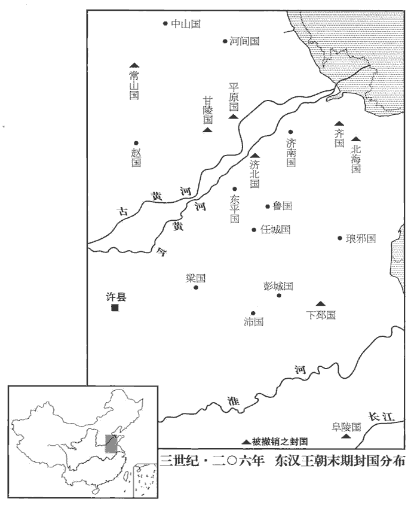
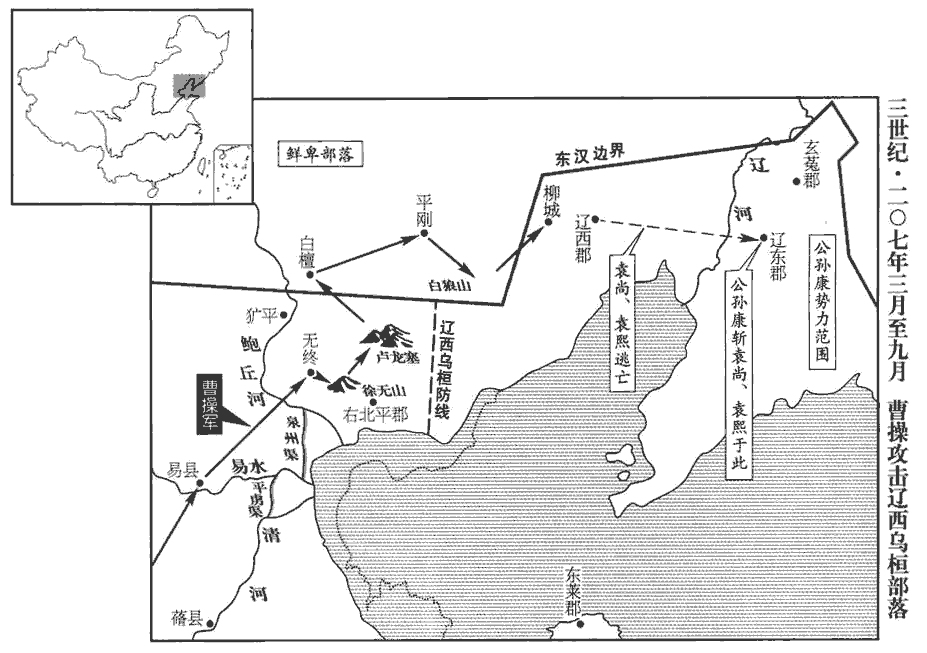
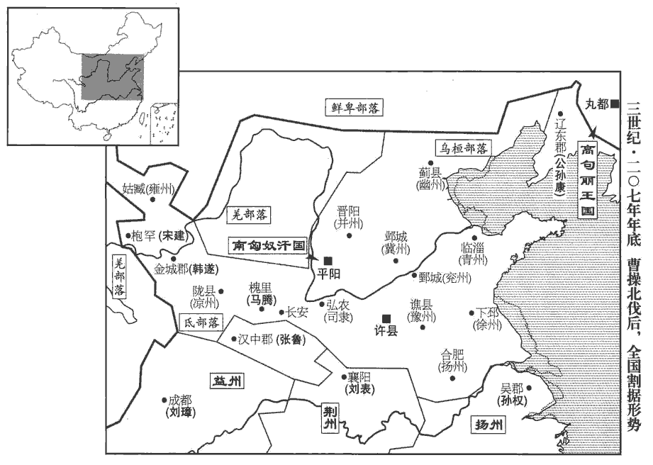
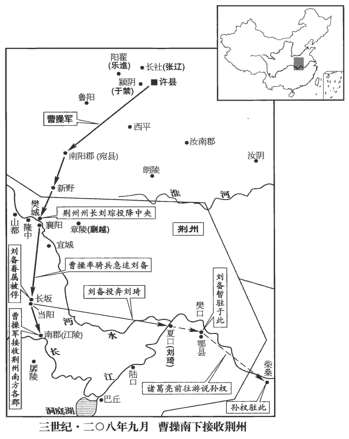
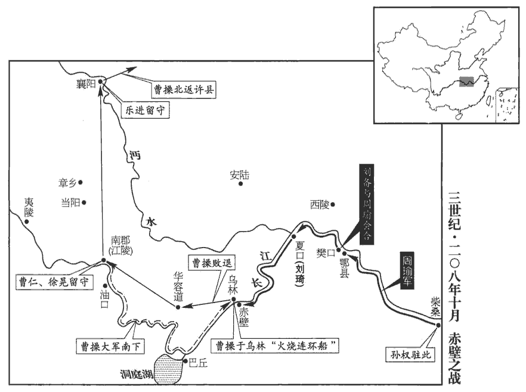
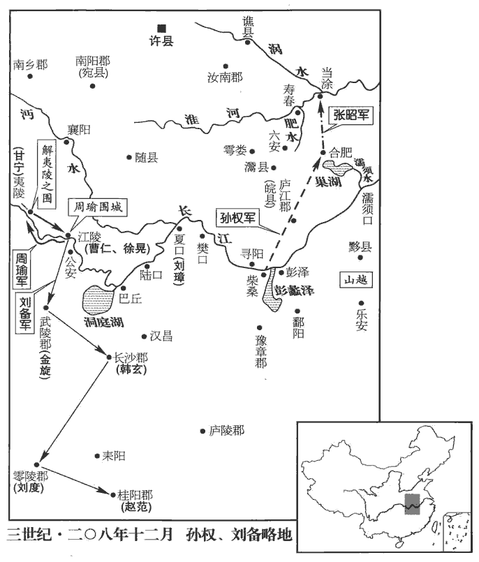
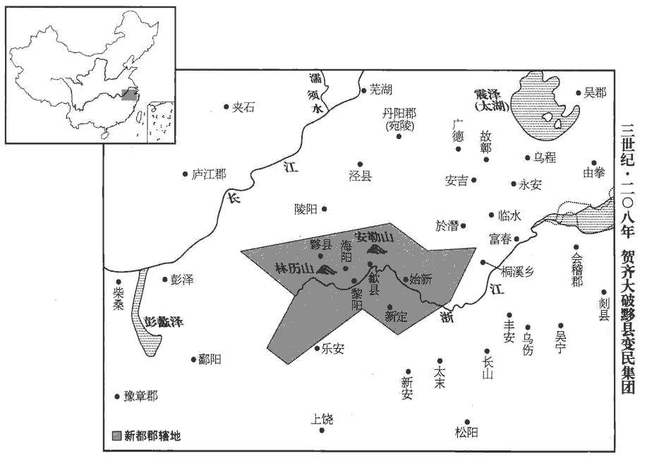

 漢紀五十七起柔兆閹茂（丙戌），盡著雍困敦（戊子），凡三年。

# 孝獻皇帝庚

## 建安十一年（丙戌，二零六）

1春，正月，有星孛bèi于北斗。晉天文志：北斗七星，在太微北：一曰天樞，二曰璇，三曰璣，四曰權，五曰玉衡，六曰開陽，七曰搖光；一至四為魁，五至七為杓biāo。孛，蒲內翻。

〖译文〗 [1]春季，正月，有异星出现在北斗星座。

2曹操自將擊高幹，將，即亮翻。留其世子丕守鄴‹河北临漳西南邺镇›，使別駕從事崔琰傅之。操圍壺關‹在山西长治北›，三月，壺關降。降，戶江翻。高幹自入匈奴‹王庭设平阳，山西临汾›求救，單于不受；幹獨與數騎亡，欲南奔荊州，騎，奇寄翻。欲奔劉表也。上洛都尉王琰捕斬之，上洛縣‹陕西商州›，前漢屬弘農，後漢屬京兆。嶢yáo關在縣西北，故置都尉。劉昫xù曰：言縣在洛水之上，故以為名。并州悉平。

〖译文〗 [2]曹操亲自率军征讨并州刺史高干，留下世子曹丕镇守邺城，派别驾、从事崔琰辅佐曹丕。曹操大军包围壶关。三月，壶关投降。高于亲自去向匈奴求救，被匈奴单于拒绝。高干身边只剩几名骑兵卫士，想南逃到荆州去投奔刘表。半路上，被上洛都尉王琰捉获，斩首。并州全部平定。

曹操使陳郡‹河南淮阳›梁習以別部司馬領并州刺史。時荒亂之餘，胡、狄雄張，張：知亮翻。吏民亡叛入其部落，南匈奴部落皆在并州界。兵家擁眾，各為寇害。謂諸豪右擁眾自保者。習到官，誘喻招納，誘，音酉。皆禮召其豪右，稍稍薦舉，使詣幕府；豪右已盡，次發諸丁強以為義從；言其以義從軍也。從，才用翻。又因大軍出征，令諸將分請以為勇力。吏兵已去之後，稍移其家，前後送鄴‹河北临漳西南邺镇›，凡數萬口；其不從命者，興兵致討，斬首千數，降附者萬計。單于恭順，名王稽顙sǎng，名王，即匈奴諸部王也。降，戶江翻。稽，音啟。服事供職，同於編戶。編，聯次也；編於民籍，故曰編戶。邊境肅清，百姓布野，勤勸農桑，令行禁止。令之則行，禁之則止。長老稱詠，以為自所聞識，刺史未有如習者。長，知兩翻。習乃貢達名士避地州界者，河內‹河南武陟›常林、楊俊、王象、荀緯及太原王凌之徒，操悉以為縣長，緯，于貴翻。長，知兩翻。後皆顯名於世。

〖译文〗 曹操派陈郡人梁习以别部司马的职务，兼任并州刺史。当时在兵荒马乱之后，匈奴等各北方胡狄各族的势力都很大，官吏及百姓往往叛逃到他们的部落中；其余许多地方势力也都拥有强大的武装力量，各霸一方。梁习到任后，用引诱和劝导的方法招纳那些地方势力，对那些首领都以礼相待，并推荐其中一些人作官，让他们到州府来任职。等这些首领都离开本乡后，就征发当地青壮年充当志愿军。梁习又借大军出征之机，把这些志愿军分送到将领们部下，至别处作战。在这些官员、兵士都离去以后，就陆续把他们的家小迁到邺城，前后送走的共有数万人。有不服从命令的，就出兵进行征讨，杀死几千人，投降的数以万计。于是，匈奴单于态度恭顺，各部落的王爷对梁习叩拜服从，承担赋税徭役，与编于民籍的百姓一样。边境隶清，农夫遍布田野，梁习鼓励农业和桑蚕业，法令得到严格执行，父老们称赞，认为记忆之中，没有一个刺史比得上梁习。梁习又向朝廷推荐来并州躲避战乱的各地名士，如河内人常林、杨俊、王象、荀纬以及太原人王凌等，曹操都任命他们为县长，以后，这些人都闻名于世。

初，山陽‹山东金乡西北昌邑镇›仲長統遊學至并州，過高幹，仲長，複姓。過，工禾翻。幹善遇之，訪以世事。統謂幹曰：「君有雄志而無雄材，好士而不能擇人，好，呼到翻。所以為君深戒也。」幹雅自多，自以為多才也。不悅統言，統遂去之。幹死，荀彧舉統為尚書郎。百官志：尚書侍郎三十六人，四百石；一曹六人，主作文書起草。蔡質漢儀曰：尚書郎，初從三署詣臺試，初上臺，稱守尚書郎中；歲滿，稱尚書郎；三年，稱侍郎。著論曰昌言，孔安國曰：昌，當也。當理之言。其言治亂，略曰：「豪傑之當天命者，未始有天下之分者也，治，直吏翻。分，扶問翻。無天下之分，故戰爭者競起焉。角智者皆窮，角力者皆負，角，競也，校也。形不堪復伉，復，扶又翻；下同。伉kàng，口浪翻，敵也。勢不足復校，乃始羈首係頸，就我之銜紲耳。賢曰：銜，勒也。紲xiè，羈也。紲，音息列翻。及繼體之時，豪傑之心既绝，士民之志已定，貴有常家，尊在一人。當此之時，雖下愚之才居之，猶能使恩同天地，威侔鬼神，周、孔數千無所復角其聖，賁、育百萬無所復奮其勇矣。賁，音奔。彼後嗣之愚主，見天下莫敢與之違，自謂若天地之不可亡也，乃奔其私嗜，騁其邪欲，君臣宣淫，左傳，泄冶曰：「公卿宣淫，民無效焉。」杜預曰：宣，示也。上下同惡，荒廢庶政，棄忘人物。信任親愛者，盡佞諂容說之人也；說，讀曰悅。寵貴隆豐者，盡后妃姬妾之家也。遂至熬天下之脂膏，斵生民之骨髓，怨毒無聊，禍亂并起，中國擾攘，四夷侵叛，土崩瓦解，一朝而去，昔之為我哺乳之子孫者，今盡是我飲血之寇讎也。至於運徙勢去，猶不覺悟者，豈非富貴生不仁，沈溺致愚疾邪！沈，持林翻。存亡以之迭代，治亂從此周復，左傳：美、惡周必復，天之道也。天道常然之大數也。」

〖译文〗 当初，山阳人仲长统游学来到并州，拜访刺史高干，高干对他待遇优厚，征求他对时局看法。仲长统对高干说：“你有雄心大志，却缺乏雄才大略；喜好贤能之士，却不能鉴别人才。在这些事上面，你要深以为戒。”高干一向自以为是，对仲长统的话很不高兴，仲长统就离开了高干。高干死后，荀推荐仲长统担任尚书郎。仲长统撰写《昌言》，分析国家的安危治乱，主要大意是：“受命于上天的英雄豪杰，并不是从开始时就有统一天下的名分，由于没有这种名分，所以竞争者纷纷崛起。但到后来，那些仗恃智谋的，智谋穷尽，仗恃力量的，力量枯竭。形势不允许再对抗，也不足以再较量，于是才被捉住头，捆住颈，置于我们控制之下。等到第二代统治者继位时，那些豪杰已不再有争夺天下的雄心，士大夫与百姓都已习惯于遵从命令，富贵之家已经固定，威权都集中于君主一人手中。在这时候，即使是一个下等的蠢才坐在皇帝的宝座上，也能使他的恩德大到与天地相同，使他的威严达到与鬼神相似的地步。即使是有几千个周公姬旦和孔夫子这样的圣人，也无法再发挥他们的圣明；有百万个孟贲和夏育之类的勇士，也无处再施展他们的勇力。那些继承天下的愚蠢帝王，见到天下没有人敢违抗旨意，就自认为政权会像天地不会灭亡，于是随意发展自己的嗜好，放纵自己的邪恶欲望，君主与臣僚都为所欲为，上下一齐作恶，荒废朝政，排斥人才。所信任亲近的，都是奸佞谄媚的小人；所庞爱提升的，都是后宫妃嫔的家族。以至达到熬尽天下民脂民膏，敲骨吸髓的程度。人民身受怨毒，痛苦不堪，灾祸战乱，同时而起。中原大地纷扰不安，四方外族相继背叛，政权土崩瓦解，毁于一旦。从前受我养护哺育的小民，如今全都成为喝我鲜血的仇敌。至于那些大势已去，还不觉悟的人，岂不是富贵产生的麻木不仁，溺爱导致的愚昧顽劣吗！政权的存亡相互交替，治理与战乱也不断周而复始地循环，这正是天地运行的规律。”

3秋，七月，武威‹甘肃武威›太守張猛殺雍州刺史邯鄲商；興平元年，分涼州河西四郡置雍州。雍，於用翻。州兵討誅之。猛，奐之子也。

〖译文〗 [3]秋季，七月，武威太守张猛杀死雍州刺史邯郸商。州中的军认讨伐张猛，把他杀死。张猛是张奂的儿子。

4八月，曹操東討海賊管承，至淳于‹山东安丘东北›，淳于縣，屬北海國。賢曰：故城在今密州安丘縣東北。遣將樂進、李典擊破之，承走入海島。

〖译文〗 [4]八月，曹操向东讨伐海上的盗贼管承，进军到淳于，派大将乐进、李典击败管承，管承逃到海岛上。

5昌豨復叛，操遣于禁討斬之。豨xī，許豈翻，又音希。豨降見上卷建安六年。復，扶又翻。

〖译文〗 [5]昌又背叛曹操，曹操派于禁讨伐，斩杀昌。

6是歲，‹刘协，时年二十六›立故琅邪‹府开阳，山东临沂›王容子熙為琅邪王，齊‹府临淄，山东淄博东临淄镇›、北海‹府剧县，山东昌乐西›、阜陵‹府阜陵，安徽全椒东南›、下邳‹府下邳，江苏睢宁东古邳镇›、常山‹府元氏，河北元氏›、甘陵‹府甘陵，山东临清›、濟陰‹府卢县，山东长清›、平原‹府平原，山东平原›八國皆除。容，光武子琅邪孝王京之雲孫也。容薨，國絕，今復立其子。齊，光武兄武王縯yǎn之後。北海，縯少子靖王興之後。阜陵，光武子質王延之後。下邳，明帝子惠王衍之後。常山，明帝子頃王昞bǐng之後。甘陵，章帝子清河孝王慶之後。濟陰，明帝子悼王長薨而無子，國除久矣；據范史，當是濟北，章帝子惠王壽之後，亦以是年國除。平原，和帝子懷王勝始封，薨而無子，以河間王開子翼繼之；翼廢為蠡吾侯，子志立為桓帝，復以帝兄碩為平原王，奉翼後，至是國亦除。八國皆除，而獨立熙繼琅邪者，容先遣弟邈至長安貢獻，操時在東郡，邈盛稱其忠誠，操以此德容，故為容立後。除八國者，漸以弱漢宗室也。濟，子禮翻。

〖译文〗 [6]这一年，献帝立已故琅邪王刘容的儿子刘熙为琅邪王，撤销齐、北海、阜陵、下邳、常山、甘陵、济阴、平原等八个王国。

 

7烏桓‹河北北部›乘天下亂，略有漢民十餘萬戶，袁紹皆立其酋豪為單于，酋，慈由翻。以家人子為己女，妻焉。妻，七細翻。遼西‹辽宁义县西›烏桓蹋頓尤強，蹋，徒臘翻。為紹所厚，故尚兄弟歸之，數入塞為寇，數，所角翻。欲助尚復故地。曹操將擊之，鑿平虜渠、泉州渠以通運。操紀云：鑿渠，自呼沱入泒gū水，名平虜渠；又從泃jū河口，鑿入潞河，名泉州渠，以通海。泒，音孤。泃，音句。賢曰：呼沱河，舊在饒陽南，至曹操因饒河故瀆，決令北注新溝水，所以今在饒陽縣北。說文：泒水，出鴈門葰jùn人戍夫山，東北入海。水經註：泃水，出右北平無終縣西山，西北流，過平谷縣而東南流，又南流入於潞河，又東合泉州渠口，曹操所鑿也。渠東至海陽縣樂安亭南與濡rú水合，而入于海。泉州、平谷二縣，皆屬漁陽郡。賢曰：泉州故城，在今幽州雍奴縣南。海陽縣，屬遼西郡。葰jùn，相維翻。

〖译文〗 [7]乌桓人乘天下大乱，掳掠汉人十余万户。袁绍把各部落的酋长都封为单于，并以平民家的姑娘做自己的女儿，嫁给那些单于做妻子。辽西乌桓酋长蹋顿的势力尤其强盛，受到袁绍的厚待，因此袁尚兄弟去投奔蹋顿。蹋顿屡次派兵入塞抢掠，想帮助袁尚恢复旧有的疆土。曹操准备出军讨伐，开凿平虏渠、泉州渠，以便运输大军所需的粮草。

8孫權‹时驻吴县，江苏苏州›擊山賊麻、保二屯，平之。水經註：江水過陸口而東，左得麻屯口，南直蒲圻qí洲，水北入百有餘里，吳所屯也。

〖译文〗 [8]孙权攻击山贼盘据的麻屯和保屯，完全平定。

## 十二年（丁亥，二零七）

1春，二月，曹操自淳于‹山东安丘东北›還鄴‹河北临漳西南邺镇›。丁酉‹五›，操奏‹刘协，时年二十七›封大功臣二十餘人，皆為列侯；因表萬歲亭侯荀彧功狀，九域志：鄭州有萬歲亭，彧所封也。三月，增封彧千戶。又欲授以三公，彧使荀攸深自陳讓，至于十數，乃止。

〖译文〗 [1]春季，二月，曹操从淳于返回邺城。丁酉（初五），曹操上奏献帝并得到批准，封大功臣二十余人，都为列侯。又上表称赞万岁亭侯荀的功劳。三月，为表彰荀，在他原来侯国封户的基础上，又增加一千户。还准备任命荀为三公，荀派荀攸恳切地表达自己的辞让之意，先后达到十余次，曹操才同意。

2曹操將擊烏桓。諸將皆曰：「袁尚亡虜耳，夷狄貪而無親，豈能為尚用。今深入征之，劉備必說劉表以襲許‹河南许昌›，說，輸芮翻。萬一為變，事不可悔。」郭嘉曰：「公雖威震天下，胡恃其遠，必不設備，因其無備，卒破【章：甲十二行本「破」作「然」；乙十一行本同；孔本同；張校同。】擊之，可破滅也。卒，讀曰猝。且袁紹有恩於民夷，而尚兄弟生存。今四州之民，徒以威附，德施未加，施，式豉翻。舍而南征，舍，讀曰捨。尚因烏桓之資，招其死主之臣，言欲為其主致死，而留滯不得逞者。胡人一動，民夷俱應，以生蹋頓之心，成覬覦之計，覬，音冀。覦，音俞。恐青、冀非己之有也。表，坐談客耳，自知才不足以御備，重任之則恐不能制，輕任之則備不為用，雖虛國遠征，公無憂矣。」操從之。行至易‹河北雄县西北›，易縣，前漢屬涿郡，後漢省。宋白曰：漢易縣故城，在今涿州歸義縣東南十五里，大易故城是。郭嘉曰：「兵貴神速。今千里襲人，輜重多，難以趨利，重，直用翻；下同。趨，七喻翻。且彼聞之，必為備；不如留輜重，輕兵兼道以出，掩其不意。」

〖译文〗 [2]曹操准备出兵征讨乌桓，将领们都说：“袁尚只不过是个逃亡罪犯，乌桓人贪得无厌而不念旧情，岂能受袁尚利用。如今大军深入塞外征乌桓，刘备必然劝说刘表乘虚袭击许都，万一发生变化，事情就后悔不及了。”郭嘉说：“您虽然威震天下，但乌桓人倚仗距离遥远，一定不会预先防备，乘其不备，突然袭击，可以一战告捷。况且，袁绍对这一地区的百姓以及塞外的异族有恩德，而袁尚兄弟现在还活在世上。如今冀、青、幽、并四州的百姓，只是因畏惧而服从我们，并没有受过我们的恩德。如果我们离开这里而率军南征，袁尚利用乌桓的武力作资本，招集愿为恩主效死的部属，乌桓人一动，四州的百姓及异族都会纷纷响应，这会使蹋顿动心，生出非分的打算，恐怕青州与冀州就不会再在您的控制下了。刘表不过是个只会坐在那里发议论的人，他自知才干不能驾御住刘备，重用刘备则害怕控制不住，轻用则刘备不会为他所用。因此，即使我们调走全国兵力远征，您也不必担扰。”曹操听从了郭嘉的意见。大军进发到易县，郭嘉提议说：“兵贵神速，如今远涉千里进行奇袭，辎重太多，难以掌握先机。而且假如乌桓人得到消息，必然加强戒备；不如留下辎重，军队轻装以加倍的速度急进，出其不意地进攻。”

初，袁紹數遣使召田疇於無終‹天津蓟县›，疇保無終，見六十卷初元四年。數，所角翻。又即授將軍印，使安輯所統，疇皆拒之。及曹操定冀州，河間邢顒yóng謂疇曰：「黃巾起來，二十餘年，海內鼎沸，百姓流離。今聞曹公法令嚴。民厭亂矣，亂極則平，請以身先。」遂裝，還鄉里。顒，鱼容翻。顒從疇游，積五年乃歸。先，悉薦翻。疇曰：「邢顒，天民之先覺者也。」伊尹曰：予，天民之先覺者也。此以道自任者也。若邢顒之先覺，特見幾耳。操以顒為冀州從事。疇忿烏桓多殺其本郡冠蓋，謂郡中名勝之士。意欲討之而力未能。操遣使辟疇，疇戒其門下趣治嚴。趣，讀曰促。嚴即裝也。自東都避明帝諱，改裝曰嚴，後遂因之。門人曰：「昔袁公慕君，禮命五至，君義不屈；今曹公使一來而君若恐弗及者，何也？」使，疏吏翻；下同。疇笑曰：「此非君所識也。」遂隨使者到軍，拜為蓨tiáo‹河北景县›令，蓨縣，前漢屬信都，後漢屬勃海。師古曰：蓨，音條。隨軍次無終‹天津蓟县›。

〖译文〗 起初，袁绍几次派使者到无终县去召田畴，又派人授予田畴将军的印信，让田畴召抚所统部众，田畴都拒绝了。到曹操平定冀州后，河间人邢对田畴说：“黄巾军起事以来，已二十多年，天下动荡不定，百姓流离失所。如今，听说曹公法令严明，百姓对战乱已经厌恶，乱到极点，就会归于平静，请让我先去试探一下。”于是，邢收拾行装，返回家乡。田畴说：“邢是个先知先觉的人。”曹操委任邢为冀州从事。田畴忿恨乌桓人经常杀害本郡著名的士大夫，想讨伐乌桓而力量不够。曹操派使者来征召田畴，田畴要他的部属赶快为他治理行装，部属说：“以前，袁绍仰慕您的名声，曾五次礼聘，您一直拒绝；如今，曹操的使者一来，您就好像迫不及待，这是什么原因？”田畴笑着说：“这就不是你们所能知道的了。”他随同使者一起到曹操军中，被任命为令，随大军进驻无终县。

 

時方夏水雨，而濱海洿下，洿wū，汪胡翻。濘滯不通，虜亦遮守蹊要，蹊，逕路也；蹊要，徑路要處也。濘，乃定翻。軍不得進。操患之，以問田疇。疇曰：「此道，秋夏每常有水，淺不通車馬，深不載舟船，為難久矣。舊北平郡治在平岡‹内蒙宁城西南›，道出盧龍‹河北迁安西北›，達于柳城‹辽宁朝阳南›；前漢右北平郡治平岡縣，後漢省平岡縣，改治土垠縣。垠，音銀。賢曰：土垠故城，在今平州西南。水經註曰：自無終東出盧龍塞，又東越青陘至凡城二百許里。自凡城東北出，趣平岡，可百八十里，向黃龍則五百里。故田疇引軍出盧龍塞，塹山堙yīn谷，五百餘里，逕白檀，歷平岡，登白狼山，望柳城也。自建武以來，陷壞斷絕，垂二百載，載，子亥翻。而尚有微逕可從。今虜將以大軍當由無終‹天津蓟县›，不得進而退，懈弛無備。若嘿回軍，從盧龍口越白檀‹河北滦平›之險，出空虛之地，路近而便，掩其不備，蹋頓可不戰而禽也。」操曰：「善！」乃引軍還，而署大木表於水側路傍曰：「方今夏暑，道路不通，且俟秋冬，乃復進軍。」復，扶又翻。虜候騎見之，誠以為大軍去也。騎，奇寄翻。

〖译文〗 当时正赶上夏季，大雨不止，沿海一带泥泞难行，而且乌桓人还在交通要道派兵把守，曹军受阻无法前进。曹操十分忧虑，向田畴询问对策。田畴说：“这条道路每逢夏秋两季常常积水，浅不能通车马，深不能载舟船，是长期不能解决的难题。原来右北平郡府设在平冈，道路通过卢龙塞，到达柳城。自从光武帝建武以来，道路陷坏，无人行走，已将近二百年，但仍留有道路的残迹可循。现在乌桓人以为无终是我们大军的必经之路，大军不能前进，只好撤退，因此他们放松以了戒备。如果我们默默地回军，却从卢龙塞口越过白檀险阻，进到他们没有设防的区域，路近而行动方便，攻其不备，可以不战而捉住蹋顿。”曹操说：“很好！”于是率军从无终撤退，在水边的路旁留下一块大木牌，上面写着：“现在夏季暑热，道路不通，且等到秋冬，再出兵讨伐。”乌桓人的侦察骑兵看到后，当真以为曹军已经离去。

操令疇將其眾為鄉導，將，即亮翻。鄉，讀曰嚮。上徐無山‹河北玉田北凤凰顶›，史記正義：徐無山，在右北平徐無縣西北。徐無山，即田疇所保聚處。塹山堙yīn谷，五百餘里，經白檀‹河北滦平›，歷平岡‹内蒙宁城西南›，涉鮮卑庭，白檀縣，屬右北平郡。宋白曰：白檀故城，在檀州燕樂縣界。此時鮮卑庭已在右北平郡界，蓋慕容廆wěi之先也。塹，七艷翻。東指柳城‹辽宁朝阳南›。未至二百里，虜乃知之。尚、熙與蹋頓及遼西單于樓班、樓班，丘力居之子也。右北平單于能臣抵之等右北平單于曰乌延。能臣抵之，或者乌延之异名欤。将数万骑逆军。八月，操登白狼山‹辽宁喀喇沁左翼东境›，水经註：白狼山在右北平石城縣西。烏丸傳：逆戰於凡城，則白狼山蓋在凡城。卒與虜遇，卒，讀曰猝。眾甚盛。操車重在後，車重，即輜重。重，直用翻。被甲者少，左右皆懼。被，皮義翻。少，詩沼翻。操登高，望虜陣不整，乃縱兵擊之，使張遼為前鋒，虜眾大崩，斬蹋頓及名王已下，胡、漢降者二十餘萬口。降，戶江翻。

〖译文〗 曹操命令田畴率领他的部众作向导，上徐无山，凿山填谷，行进五百余里，经过白檀、平冈，又穿过鲜卑部落的王庭，向东直指柳城。距离二百余里时，乌桓人才知道。袁尚、袁熙与蹋顿以及辽西单于楼班、右北平单于能臣抵之等率领数万名骑兵迎击曹军。八月，曹操登上白狼山，突然与乌桓军相遇，而乌桓军军力强盛。曹军车辆辎重都在后边，身披铠甲的将士很少，曹操左右的人都感到畏惧。曹操登高，看到乌桓军队不整，就纵兵攻击，派张辽为先锋，乌桓军队大乱，斩杀蹋顿和各部落王爷及以下的乌桓首领，投降的胡人与汉人共有二十余万。

遼東單于速僕丸速僕丸，即蘇僕延，語有輕重耳。與尚、熙奔遼東太守公孫康，其眾尚有數千騎。或勸操遂擊之，操曰：「吾方使康斬送尚、熙首，不煩兵矣。」九月，操引兵自柳城‹辽宁朝阳南›還。公孫康欲取尚、熙以為功，乃先置精勇於厩中，然後請尚、熙入，未及坐，康叱伏兵禽之，遂斬尚、熙，并速僕丸首送之。諸將或問操：「公還而康斬尚、熙，何也？」操曰：「彼素畏尚、熙，吾急之則并力，緩之則自相圖，其勢然也。」操梟尚首，梟xiāo，古堯翻。令三軍：「敢有哭之者斬！」牽招獨設祭悲哭，牽招先為袁氏從事，故祭哭之。操義之，舉為茂才。

〖译文〗 辽东单于速仆丸与袁尚、袁熙投奔辽东郡太守公孙康，跟随他们的还有数千名骑兵。有人劝曹操乘势追击，曹操说：“我将使公孙康送来袁尚、袁熙的人头，不必再劳师动众。”九月，曹操率大军从柳城班师。公孙康想要杀死袁尚、袁熙，作为对朝廷立下的功劳，于是先埋伏精兵在马厩中，然后请袁尚、袁熙进来，他们还没来得及入座，公孙康叫出伏兵，把他们捉住。于是斩杀袁尚、袁熙，连同速仆丸的人头一起送给曹操。将领中有人问曹操：“您已退军而公孙康杀死袁尚、袁熙，这是为什么？”曹操说：“公孙康一向畏惧袁尚、袁熙，我如果急攻，他们就会合力抵抗；缓和时，他们就会自相残杀；是形势使他们这样做的。”曹操把袁尚的头颅悬挂起来示众，号令三军：“有敢于哭泣的，处斩！”牵招却独自设祭，放声悲哭，曹操认为他是忠于故主的义士，推荐他为茂才。

時天寒且旱，二百里無水，軍又乏食，殺馬數千匹以為糧，鑿地入三十餘丈方得水。既還，科問前諫者，科，條也。問前諫者，科具其姓名也。眾莫知其故，人人皆懼。操皆厚賞之，曰：「孤前行，乘危以徼倖，徼，堅堯翻。雖得之，天所佐也，顧不可以為常。諸君之諫，萬安之計，是以相賞，後勿難言之。」

〖译文〗 当时天寒，又遇上大旱，二百里没有水，军队缺乏粮食，只好杀死几千匹战马作为军粮，挖地三十余丈才见到水。大军返回后，曹操调查以前劝阻他出兵征讨乌桓的人，众人不知道是因为什么，都心怀畏惧。曹操对劝阻者都加以厚赏，对他们说：“我先前出兵，实在危险，虽然侥幸获胜，全是靠上天保佑，不能作为常规。你们的意见，才是万全之计，所以加以赏赐，以后不要害怕提相反的意见。”

3冬，十月，辛卯‹三›，有星孛bèi于鶉chún尾。蔡邕曰：自張十二度至軫zhěn六度，謂之鶉尾之次。陳卓曰：自張十七度至軫十一度，謂之鶉尾；於辰在巳。

〖译文〗 [3]冬季，十月，辛卯（初三），有异星出现在鹑尾星次。

4乙巳‹十七›，黃巾殺濟南‹府东平陵，山东章丘›王贇yūn。賢曰：贇，河間孝王開五代孫。靈帝立其父康為濟南王，以奉孝仁皇祀。濟，子禮翻。贇，於倫翻。

〖译文〗 [4]乙巳（十七日），黄巾军杀死济南王刘。

5十一月，曹操至易水‹海河支流，源于河北易县›，烏桓單于代郡‹山西阳高›普富盧、上郡‹陕西榆林南鱼河堡›那樓皆來賀。

〖译文〗 [5]十一月，曹操到达易水，乌桓代郡部落单于普富卢、上郡部落单于那楼都来向曹操祝贺。

師還，論功行賞，還，從宣翻，又如字。以五百戶封田疇為亭侯。疇曰：「吾始為劉公報仇，率眾遁逃，事見六十卷初平四年。為，于偽翻。志義不立，反以為利，非本志也。」固讓不受。操知其至心，許而不奪。不奪其志也。孔子曰：匹夫不可奪志。

〖译文〗 大军回到邺城，论功行赏，封田畴为亭侯，封地有五百户。田畴说：“我当初是为刘虞报仇，率众逃亡，我的志愿没有达到，反而以此获利，这不是我的本意。”坚决辞让，不肯接受封爵。曹操知道田畴是出于真心，同意他的辞让，没有勉强他接受。

6操之北伐也，劉備說劉表襲許‹河南许昌›，說，輸芮翻。表不能用。及聞操還，表謂備曰：「不用君言，故為失此大會。」猶言大機會也。備曰：「今天下分裂，日尋干戈，事會之來，豈有終極乎！若能應之於後者，則此未足為恨也。」豪桀之言，故自與常人不同。

〖译文〗 曹操出兵北伐乌桓时，刘备劝刘表发兵袭击许都，刘表不能用他的计策。等听到曹操得胜班师的消息，刘表对刘备说：“没有听你的话，结果失掉这个大好机会。”刘备说：“如今天下分裂，战争不断，机会的到来，难道会有终极吗？要是能不放过以后的机会，则这次也不足以遗憾。”

 

是歲，孫權西擊黃祖‹时驻湖北武昌西南金口镇›，虜其人民而還。

〖译文〗 [6]这一年，孙权向西攻击黄祖，俘虏百姓后返回吴郡。

7權母吳氏疾篤，引見張昭等，屬以後事而卒。屬，之欲翻。卒，子恤翻。

〖译文〗 [7]孙权的母亲吴夫人病危，召见张昭等人，嘱托后事之后去世。

8初，琅邪‹山东临沂›諸葛亮寓居襄陽隆中‹湖北襄樊西二十里›，亮從父玄，為豫章太守，將亮之官。會漢朝以朱皓代玄，玄與亮往依劉表。漢晉春秋曰：亮家于南陽之鄧縣，在襄陽城西二十里，號曰隆中。按東坡詩萬山西北古隆中也。故其萬山詩云：「回頭望西北，隱隱龜背起；傳云古隆中，萬樹桑柘zhè美。」每自比管仲、樂毅；時人莫之許也，惟潁川‹河南禹州›徐庶與崔州平謂為信然。州平，烈之子也。崔烈事靈帝，以入錢為公。

〖译文〗 [8]起初，琅邪人诸葛亮寄居襄阳隆中，经常把自己比作管仲和乐毅；但当时人并不认可，只有颍川人徐庶与崔州平认为确是如此。崔州平是崔烈的儿子。

劉備在荊州，訪士於襄陽‹湖北襄樊›司馬徽。徽曰：「儒生俗士，豈識時務，識時務者在乎俊傑。此間自有伏龍、鳳雛。」備問為誰，曰：「諸葛孔明、龐士元也。」諸葛亮，字孔明。龐統，字士元。龐，皮江翻。徐庶見備於新野‹河南新野›，備器之。物之有用者謂之器：器之者，器重之也；重其才之足以用世也。庶謂備曰：「諸葛孔明，臥龍也，將軍豈願見之乎？」備曰：「君與俱來。」庶曰：「此人可就見，不可屈致也，將軍宜枉駕顧之。」

〖译文〗 刘备在荆州，向襄阳人司马徽询访人才。司马徽说：“一般的儒生与俗士，怎么能认清时务，能认清时务的，只有俊杰之士。在襄阳这里，自有伏龙与凤雏。”刘备问是谁，司马徽说：“就是诸葛亮与庞统。”徐庶在新野县见到刘备，刘备对徐庶很器重。徐庶对刘备说：“诸葛亮乃是卧龙，将军愿见他吗？”刘备说：“请你与他一起来。”徐庶说：“这个人，你可以去见他，不可以召唤他来，将军应当屈驾去拜访他。”

備由是詣亮，備以梟雄之才，聞徐庶一言，三枉駕以見孔明，此必庶之材器有以取重於備，備遂信之也。庶自辭備歸操之後，寂無所聞，今觀其捨舊從新之言，質天地而無愧，則其人從可知矣。凡三往，乃見。因屏人曰：「漢室傾頹，姦臣竊命，孤不度德量力，欲信大義於天下，屏，必郢翻。度，徒洛翻。量，音良。信，讀曰申。而智術淺短，遂用猖蹶，猖，披猖。蹶，顛蹶。至于今日。然志猶未已，君謂計將安出？」亮曰：「今曹操已擁百萬之眾，挾天子而令諸侯，此誠不可與爭鋒。孫權據有江東，已歷三世，國險而民附，賢能為之用，此可與為援而不可圖也。荊州北據漢、沔miǎn，利盡南海，謂自桂陽、蒼梧跨有交州，則利盡南海也。東連吳‹苏州›、會‹绍兴›，吳會者，言吳為東南一都會也。西通巴‹重庆›、蜀‹成都›，此用武之國，而其主不能守，此殆天所以資將軍也。益州險塞，沃野千里，天府之土；劉璋闇弱，張魯在北，民殷國富而不知存恤，智能之士思得明君。張松、法正之徒雖未與亮交際，亮固逆知之矣。將軍既帝室之冑，冑，裔也。信義著於四海，若跨有荊、益，保其巖阻，撫和戎、越，結好孫權，好，呼到翻；下同。內脩政治，外觀時變，則霸業可成，漢室可興矣。」所謂俊傑者，量時審勢規畫定於胸中，儻非其人，未易與之言也。治，直吏翻。備曰：「善！」於是與亮情好日密。好，呼到翻。關羽、張飛不悅，備解之曰：「孤之有孔明，猶魚之有水也。魚有水則生，無水則死。願諸君勿復言。」復，扶又翻。羽、飛乃止。

〖译文〗 刘备于是拜访诸葛亮，一共去了三次，才见到诸葛亮。于是，刘备让左右的人都出去，说道：“汉朝王室已经衰败，奸臣窃据朝政大权，我不度德量力，打算伸张正义于天下，但智谋短浅，以致于遭受挫折，到了今天这个地步。但我的雄心壮志仍然未息，你认为应当如何去作？”诸葛亮说：“如今，曹操已经拥有百万大军，挟持天子以号令天下，此人确实不可与他争锋。孙权占据江东，已经历三代，地势险要，民心归附，贤能人才都为他尽力，此人可以与他联盟，却不可算计他。荆州地区，北方以汉水、沔水为屏障，南方直通南海，东边连接吴郡、会稽，西边可通巴郡、蜀郡，正是用武之地，但主人刘表却不能守，这恐怕是上天赐给将军的资本。益州四边地势险阻，中有沃野千里，是天府之地，而益州牧刘璋昏庸儒弱，北边还有张鲁相邻，虽然百姓富庶，官府财力充足，却不知道珍惜，智士贤才都希望有一个圣明的君主。将军既是汉朝王室的后裔，信义闻名天下，如果能占有荆州与益州，据守险要，安抚戎、越等族，与孙权结盟，对内修明政治，对外观察时局变化，这样，就能建成霸业，复兴汉朝王室了。”刘备说：“很好！”从此与诸葛亮的情谊日益亲密。关羽、张飞对此感到不满，刘备对他们解释说：“我得到诸葛亮，是如鱼得水，希望你们不要再说了。”关羽、张飞才停止抱怨。

司馬徽清雅有知人之鑒。同縣龐德公素有重名，徽兄事之。諸葛亮每至德公家，獨拜牀下，德公初不令止。觀孔明獨拜德公於牀下，孔明所以事德公者為何如邪！德公初不令止，德公所以自居者為何如邪！德公於是不可及矣。德公從子統，少時樸鈍，未有識者，從，才用翻。少，詩照翻。惟德公與徽重之。德公嘗謂孔明為臥龍，士元為鳳雛，德操為水鑑jiàn；故德操與劉備語而稱之。司馬徽，字德操。

〖译文〗 司马徽为人高雅，善于鉴别人才。与他同县的庞德公一向名望很高，司马徽把他当作兄长那样对待。诸葛亮每次到庞德公家里，都在床下向庞德公独拜。庞德公起初也不阻止。庞德公的侄子庞统，从小朴实，沉默寡言，大家都没有看到他的才能，只有庞德公与司马徽重视他。庞德公曾经说诸葛亮是“卧龙”，庞统是“凤雏”，司马徽是“水镜”。所以，当司马徽与刘备谈话时，向刘备称赞诸葛亮与庞统。

## 十三年（戊子，二零八）

1春，正月，司徒趙溫辟曹操子丕pī。操表「溫辟臣子弟，選舉故不以實」；策免之。操以溫辟其子，怒而免之，駕言選舉不以實耳！考異曰：獻帝起居注在十五年，范書帝紀在十三年。按是年罷三公官，溫不至十五年也。

〖译文〗 [1]春季，正月，司徒赵温延聘曹操的儿子曹丕为僚属。曹操上表说：“赵温召聘我的子弟为僚属，说明他并不依据真才实学选拔人才。”献帝颁策将赵温免职。

2曹操還鄴‹河北临漳西南邺镇›，作玄武池以肄舟師。鄴城有玄武苑，操鑿池其中。肄，以四翻，習也。

〖译文〗 [2]曹操回到邺城，修建玄武池，用以训练水军。

3初，巴郡甘寧將僮客八百人歸劉表，寧走荊州事見六十一卷興平元年。表儒人，不習軍事，寧觀表事勢終必無成，恐一朝眾散，并受其禍，聚而不用，其禍必至。欲東入吳‹苏州›。黃祖在夏口‹湖北武汉›，應劭shào曰：沔水自江夏別至南郡華容為夏水，過江夏郡‹湖北武昌西南金口镇›而入于江。蓋指夏水入江之地為夏口。庾yǔ仲雍曰：夏口，一曰沔口，或曰魯口。水經註曰：沔水南至江夏沙羡縣北，南入于江。然則曰夏口，以夏水得名；曰沔口，以沔水得名，曰魯口，以魯山得名；實一處也。其地在江北。自孫權置夏口督。屯江南，今鄂州治是也。故何尚之云：夏口在荊江之中，正對沔口。賢註亦謂夏口戍在今鄂州。於是相承以鄂州為夏口，而江北之夏口晦矣。軍不得過，乃留，依祖三年，祖以凡人畜之。畜，許六翻，養也。孫權擊祖，祖軍敗走，權校尉凌操將兵急追之。姓譜：衛康叔支子，為周凌人，子孫以為氏。寧善射，將兵在後，射殺操，射殺之射，而亦翻。祖由是得免。軍罷，還營，待寧如初。祖都督蘇飛數薦寧，數，所角翻。祖不用；寧欲去，恐不免；飛乃白祖，以寧為邾長。邾縣‹湖北黄州›，屬江夏郡。地道記曰：楚滅邾，徙其君於此。賢曰：邾故城在今復州竟陵縣東。飛蓋開其奔吳之路也。長，知兩翻。宋白曰：黃州，漢邾縣也。寧遂亡奔孫權，考異曰：吳志孫權傳，建安八年、十二年，皆嘗討黃祖。凌統傳，父操死時，統年十五，攝父兵。後擊麻、保屯，刺殺陳勤。按周瑜、孫瑜傳，以十一年擊麻、保屯，則操死似在八年，然後五年寧乃奔權，似晚。今無年月可據，追言之。周瑜、呂蒙共薦達之，權禮異，同於舊臣。

〖译文〗 [3]起初，巴郡人甘宁率领奴朴和宾客八百人投奔刘表。刘表是个儒者，不懂军事，甘宁看出刘表终究难以成就大业，恐怕一朝众叛亲离，自己也要受牵连，就打算东入吴郡。但刘表的部将黄祖据下待了三年，黄祖一直把他当作凡人来对待。孙权攻击黄祖，黄祖军队大败而逃，孙权部下的校尉凌操领兵急速追赶。甘宁善于射箭，率兵在后掩护，射死凌操，黄祖因此免于一死。黄祖收军，回营后，对待甘宁还像过去一样。黄祖部下的都督苏飞屡次推荐甘宁，黄祖仍不加以重用。甘宁打算离开，但又怕边防戎备森严，难于脱身。苏飞就向黄祖推荐甘宁担任邾县县长。甘宁于是逃亡，投奔孙权。周瑜、吕蒙共同向孙权推荐甘宁，孙权对甘宁礼遇特别优厚，与跟随自己多年的旧臣一样。

寧獻策於權曰：「今漢祚日微，曹操終為篡盜。南荊之地，山川形便，誠國之西勢也。謂在吳之西，據上流之形勢。寧觀劉表，慮既不遠，兒子又劣，言又弱於表也。非能承業傳基者也。至尊當早圖之，不可後操。言若不先圖劉表，必為操所圖也。後，戶遘翻。圖之之計，宜先取黃祖。祖今昏耄已甚，財穀并乏，左右貪縱，吏士心怨，舟船戰具，頓廢不脩，頓，壞也。左傳：甲兵不頓。頓，讀曰鈍。怠於耕農，軍無法伍，至尊今往，其破可必。一破祖軍，鼓行而西，據楚關‹重庆奉节东›，楚關，扞關也。蜀伐楚，楚為扞關以拒之，故曰楚關。大勢彌廣，即可漸規巴、蜀矣。」權深納之。張昭時在坐，難曰：「今吳下業業，坐，徂臥翻。難，乃旦翻。業業，危懼之意。若軍果行，恐必致亂。」寧謂昭曰：「國家以蕭何之任付君，君居守而憂亂，奚以希慕古人乎！」言固有攸當者，張昭不得以強辭距也。守，式又翻。權舉酒屬寧曰：「興霸，甘寧，字興霸。屬，之欲翻。今年行討，如此酒矣，決以付卿。卿但當勉建方略，令必克祖，則卿之功，何嫌張長史之言乎！」昭為權長史。權之此言，既以獎甘寧之氣，又以全張昭之體。不有居者，誰守社稷；不有行者，誰扞牧圉yǔ。長，知兩翻。

〖译文〗 甘宁向孙权献计说：“如今，汉朝王室日见衰弱，曹操终究会篡夺江山。荆州南部，山川险要，在我们的西边，控制着长江上游。据我观察，刘表既没有深谋远虑，他的儿子又更加拙劣，不是能继承基业的人。您应当尽早采取行动，不能落在曹操后面。夺取荆州的策略，是应该先进攻黄祖。黄祖现在已经十分老迈昏愦，钱财与粮草都很缺乏，左右亲信都贪赃枉法，官吏与兵士都心怀怨恨，战船武器废坏，无人修整，农业荒废，军无法纪。如果您现在出兵征讨，一定可攻破黄祖。攻破黄祖后，大张旗鼓地向西占据楚关，则势力大增，就可以逐步规划夺取巴、蜀地区了。”孙权很以为然。张昭当时也在座，提出疑问说：“现在吴郡民心不稳，大军如果出征，恐怕会发生变乱。”甘宁对张昭说：“国家把萧何那样的重任托付给您，您留守后方，却担心发生变化，怎么能效法古代名臣呢！”孙权举杯向甘宁敬酒，说：“甘兴霸，今年进行讨伐，就像这杯酒，已决定交付给你。你只管努力去制定策略，使得一定能攻破黄祖，就是你的大功，何必在乎张长史的话呢！”

權遂西擊黃祖。祖橫兩蒙衝釋名曰：船狹而長曰蒙衝，以衝突敵船。挾守沔口‹武汉›，以栟bīng閭大紲xiè繫石為矴，栟閭，㯶zōng櫚也。郭璞曰：落穫也，中作器索。栟，卑盈翻。紲，音薛，長繩也。矴，丁定翻，錘舟石。上有千人，以弩交射，飛矢雨下，軍不得前。偏將軍董襲與別部司馬凌統俱為前部，各將敢死百人，人被兩鎧，乘大舸gě，將，即亮翻。被，皮義翻。方言，南楚江、湘，凡船大者謂之舸，小者謂之艖chā。舸，嘉我翻。突入蒙衝里。襲身以刀斷兩紲，斷，丁管翻。蒙衝乃橫流，大兵遂進。祖令都督陳就，以水軍逆戰。平北都尉呂蒙蒙自別部司馬，以功為平北都尉。勒前鋒，親梟就首。梟，堅堯翻。於是將士乘勝，水陆并進，傅其城，傅，讀曰附。盡銳攻之，遂屠其城‹沙羡，湖北武昌西南金口镇›。祖挺身走，追斬之，挺，拔也。虜其男女數萬口。

〖译文〗 于是孙权西征黄祖。黄祖用两艘以生牛皮包裹的狭长的蒙冲战船封锁沔口，用粗大的棕绳捆住巨石，作为碇石，固定船身。船上有一千人，用弓弩向外轮流发射，箭如雨下，孙权军队无法上前。偏将军董袭与别部司马凌统都是孙权的先锋，各率敢死队一百人，每人身披两副铠甲，乘大船，闯入黄祖的蒙冲战船之间。董袭抽刀砍断两根棕绳，蒙冲战船模漂在水上，孙权大军才得以前进。黄祖命令都督陈就率水军迎战。孙权部将平北都尉吕蒙统率前锋，亲手斩下陈就的人头，悬挂示众。于是吴军将士乘胜猛追，水陆并进，逼近夏口城，出动全部精锐部队猛攻，攻陷后大肆屠杀。黄祖突围而逃，被追上杀死。吴军俘虏了数万男女。

權先作兩函，欲以盛祖及蘇飛首。盛，時征翻。權為諸將置酒，甘寧下席叩頭，血涕交流，為權言：「飛疇昔舊恩，舊恩，謂薦而不用，又開之使奔吳也。為，于偽翻；下同。寧不值飛，固已捐骸於溝壑，不得致命於麾下。今飛罪當夷戮，特從將軍乞其首領。」權感其言，謂曰：「今為君置之。若走去何？」寧曰：「飛免分裂之禍，受更生之恩，逐之尚必不走，豈當圖亡哉！亡，謂亡走。若爾，爾，猶言如此也。寧頭當代入函。」權乃赦之。凌統怨寧殺其父操，常欲殺寧；權命統不得讎之，令寧將兵屯於他所。

〖译文〗 孙权预先制作了两个木盒，打算装黄祖与苏飞的人头。得胜后，孙权为诸将领摆宴庆功，甘宁走下坐位，向孙权叩头流血，鲜血与眼泪一齐往下流，对孙权进述苏飞从前对待自己的恩德，说：“我甘宁如果没有遇到苏飞，肯定已死在沟壑，而不能在您部下效力了。如今，苏飞的罪本该处死，我特地请求将军饶他一命。”孙权为甘宁的话所感动，说：“现在就为你放了他，如果他逃跑怎么办？”甘宁说：“苏飞能免除斩首之祸，受到您再生的大恩，赶他都不会走，怎么会打算逃跑呢！如果他这样做，我甘宁的人头将代替他放入木盒。”孙权于是不令赦免苏飞。凌统怨恨甘宁杀死他的父亲凌操，经常打算杀死甘宁。孙权命令凌统不得仇恨甘宁，并让甘宁领兵到别的地方驻守。

4夏，六月，罷三公官，復置丞相、御史大夫。漢初，以丞相、御史大夫、太尉為三公，哀帝元壽二年，以大司馬、大司徒、大司空為三公，中興以來，以太尉、司徒、司空為三公。今雖復置丞相、御史，而操自為丞相，事權出於一矣。癸巳‹九›，以曹操為丞相。操以冀州別駕從事崔琰為丞相西曹掾，司空東曹掾陳留毛玠jiè為丞相東曹掾，元城‹河北大名东北›令河內‹河南武陟›司馬朗為主簿，弟懿為文學掾，冀州主簿盧毓yù為法曹議令史。別駕從事，州牧行部，則奉引，錄眾事。漢制，公府西曹掾主府史署用，東曹掾主二千石、長吏遷除及軍吏，黃閣主簿錄省眾事。文學掾，漢郡曹有之，操於公府創置也。法曹主郵驛科程事。時公府諸曹，皆置議令史。元城縣，屬魏郡毓，植之子也。

〖译文〗 [4]夏季，六月，朝廷撤除三公的职位，重新设置丞相、御史大夫。癸巳（初九），任命曹操为丞相。曹操委任冀州别驾、从事崔琰为丞相西曹掾，司空东曹掾陈留人毛为丞相东曹掾，元城县县令河内人司马朗为主簿，他弟弟司马懿为文学掾，冀州主簿卢毓为法曹议令史。卢毓是卢植的儿子。

琰、玠并典選舉，其所舉用皆清正之士，雖於時有盛名而行不由本者，終莫得進。拔敦實，斥華偽，進沖遜，抑阿黨。行，下孟翻。沖，謙虛也，和也。由是天下之士莫不以廉節自勵，雖貴寵之臣，輿服不敢過度，至乃長吏還者，垢面羸衣，獨乘柴車，軍吏入府，朝服徒行，長，知兩翻。朝，直遙翻。吏潔於上，俗移於下。操聞之，歎曰：「用人如此，使天下人自治，吾復何為哉！」復，扶又翻。

〖译文〗 崔琰与毛一起负责官员的选拔、任免事务，他们所选用的都是清廉正直的人士。虽然当时名望很高，但品行不佳的人，始终不能获得任用。他们选拔敦厚务实的人才，排斥只会空谈的浮华虚伪之人；进用谦虚和睦的长者，压抑结党营私的小人。因此，天下的士大夫无不以清廉的节操来勉励自己，即便是高官庞臣，车辆、衣服的形式，也不敢超越制度。以至高级官员回家时，蓬头垢面，衣服破烂，独自乘坐柴车；文武官员入府办公时，穿着朝服，徒步从家中走到官署。身居高位的官员都如此廉洁，民间的风俗也随之改变。曹操知道后，叹息说：“像这样任用人才，使天下人都自我控制，我还有什么可做的呢！”

司馬懿，少聰達，多大略，少，詩照翻。崔琰謂其兄朗曰：「君弟聰亮明允，剛斷英特，斷，丁亂翻。非子所及也！」操聞而辟之，懿辭以風痹。痹bì，必至翻，濕病也。操怒，欲收之，懿懼，就職。司馬懿始此。

〖译文〗 司马懿自小聪明通达，有雄才大略。崔琰对他哥哥司马朗说：“你弟弟聪明机智，遇事果断，是个杰出的人才，你比不上他！”曹操听说后，征聘司马懿为僚属，司马懿借口患有风湿病而加以推辞。曹操大怒，想要逮捕他，司马懿畏惧，才接受了职务。

5操使張遼屯長社‹河南长葛东北老城镇›，臨發，軍中有謀反者，夜，驚亂起火，一軍盡擾。遼謂左右曰：「勿動！是不一營盡反，必有造變者，欲以驚動人耳。」乃令軍中：「其不反者安坐。」遼將親兵數十人中陳而立，將，即亮翻。陳，讀曰陣。有頃，皆定，即得首謀者，殺之。

〖译文〗 [5]曹操派张辽驻守长社，临出发时，军中有人造反，乘夜在营中放火，全军都惊恐不定。张辽对左右说：“不要乱动！这不是全营的人都想造反，只是少数叛乱分子制造混乱，想扰乱军心。”就下令说：“凡没有参与叛乱的，都坐在那里不动。”张辽率领数十名亲兵在营的中央站定，过了一会，全军都安定下来，随即捉到主谋的人，将他们处死。

遼在長社，于禁屯潁陰‹河南许昌›，樂進屯陽翟‹河南禹州›，三將任氣，多共不恊，共，相與也。操使司空主簿趙儼幷參三軍，每事訓諭，遂相親睦。

〖译文〗 张辽在长社，于禁驻军颍阴，乐进驻军阳翟，三个将领都意气用事，互不配合。曹操派司空主簿赵俨同时参预三支部队的军务，遇到事情，就从中调解开导，使他们关系逐渐和睦。

6初，前將軍馬騰與鎮西將軍韓遂結為異姓兄弟，晉職官志曰：四鎮通於柔遠。蓋漢末始置也。後以部曲相侵，更為讎敵。朝廷使司隸校尉鍾繇、涼州刺史韋端和解之，徵騰入屯槐里‹陕西兴平›。曹操將征荊州，使張既說騰，令釋部曲還朝，說，輸芮翻。騰許之。已而更猶豫，既恐其為變，乃移諸縣促儲偫，偫zhì，直里翻。二千石郊迎，騰不得已，發東。發而東入朝也。操表騰為衛尉，考異曰：典略曰：「建安十五年，徵騰為衛尉。」按張既傳，「曹公將征荊州，令既說騰入朝。」蓋「三」字誤為「五」耳。以其子超為偏將軍，統其眾，悉徙其家屬詣鄴‹河北临漳西南邺镇›。為後十七年族騰張本。

〖译文〗 [6]起初，前将军马腾与镇西将军韩遂结拜为异姓兄弟，但后来由于部属间相互闹摩擦，关系逐渐恶化，进而成为仇敌。朝廷派司隶校尉钟繇、凉州刺史韦端来调解他们的矛盾，征召马腾驻军槐里。曹操准备远征荆州，派张既劝说马腾，建议他放弃军权，到朝廷担任官职。马腾表示同意，但是后来又犹豫不决。张既恐怕马腾改变主意，就下令沿途各县准备粮草等物资，以供马腾路上需要，又命令各郡太守都到郊外去迎送，马腾不得已，只好启程向东进发。曹操上表推荐马腾担任卫尉，任命他儿子马超为偏将军，继续统领马腾的部队，把马腾的家属全都迁到邺城。

7秋，七月，曹操南擊劉表。

〖译文〗 [7]秋季，七月，曹操出军南征刘表。

8八月，丁未‹二十四›，以光祿勳山陽‹山东金乡西北昌邑镇›郗慮為御史大夫。郗xī，丑脂翻。姓譜：郗為高平望姓。

〖译文〗 [8]八月，丁未（二十四日），任命光禄勋山阳人郗虑为御史大夫。

9壬子‹二十九›，太中大夫孔融棄市。融恃其才望，數戲侮曹操，數，所角翻。發辭偏宕，賢曰：偏邪跌宕，不拘正理。余謂此偏，非邪之謂，言其論議抑揚，有所偏重也。宕，徒浪翻，過也。多致乖忤。忤，五故翻。操以融名重天下，外相容忍而內甚嫌之。融又上書，「宜準古王畿之制，千里寰內不以封建諸侯。」操疑融所論建漸廣，益憚之。周禮，方千里曰國畿，其外方五百里曰侯畿。鄭玄曰：畿，限也。千里寰內不以封建，則操不可以居鄴矣，故憚之。融與郗慮有隙，慮承操風旨，構成其罪，令丞相軍謀祭酒路粹軍師祭酒、軍謀祭酒，皆操所置。奏：「融昔在北海‹山东昌乐西›，建安初，融為北海相。見王室不靜，而招合徒眾，欲規不軌。及與孫權使語，謗讪朝廷。使，疏吏翻。又，前與白衣禰mí衡跌蕩放言，賢曰：跌蕩，無儀檢也。放，縱也。禰，乃禮翻。更相贊揚。更，工衡翻。衡謂融曰『仲尼不死』，融答『顏回復生』，復，扶又翻。大逆不道，宜極重誅。」操遂收融，并其妻子皆殺之。

〖译文〗 [9]壬子（二十九日），太中大夫孔融被分开处死，孔融倚仗自己的才干与名望，屡次戏弄、嘲笑曹操，随便发表议论，褒贬人物，多与曹操意见不合。曹操因为孔融名重天下，所以表面上容忍他的言行，而心里十分厌恶。孔融又上书给献帝，提出：“应该遵照古代的王畿制度，在京师周围一千里的地方，不可建立封国。”曹操发现孔融的议论范围越来越广，对孔融更加忌惮。孔融与郗虑一向有矛盾，郗虑秉承曹操的意思，罗织孔融的罪状，命令丞相军谋祭酒路粹上奏：“孔融从前担任北海国国相时，看到天下大乱，就召集徒众，准备图谋不轨。后来与孙权的使者谈话，又讥讽、诽谤朝廷。另外，他从前与平民祢衡在一起行为放荡，互相标榜，祢衡称赞孔融为‘孔子不死’，孔融称赞祢衡是‘颜回复生’。这些都是大逆不道的行为，应该处以极刑。”曹操于是下令逮捕孔融，连他的妻子儿女一起处死。

初，京兆‹西安›脂習與融善，脂，姓也。魏略：脂習，字元升，後為中大夫。每戒融剛直太過，必罹世患。及融死，許下莫敢收者。習往撫尸曰：「文舉舍我死，孔融，字文舉。舍，讀曰捨。吾何用生為！」操收習，欲殺之，既而赦之。

〖译文〗 当初，京兆人脂习与孔融关系亲近，经常告诫孔融，说他性情过于刚直，必然会招来大祸。等到孔融被杀后，许都没有人敢去收葬孔融的尸体。脂习前去抚着孔融的尸体，哭着说：“孔文举弃我而去，我为什么还活着！”曹操逮捕脂习，打算处死，接着又把他赦免了。

10初，劉表二子，琦、琮。琦，渠宜翻。琮，徂宗翻。表为琮娶其後妻蔡氏之姪，蔡氏遂爱琮而恶琦，为，于伪翻。恶，乌路翻。表妻弟蔡瑁，瑁，莫报翻。外甥張允并得幸於表，日相與毀琦而譽琮。譽，音余。琦不自寧，與諸葛亮謀自安之術，亮不對。後乃共升高樓，因令去梯。去羌呂翻。謂亮曰：「今日上不至天，下不至地，言出子口，而入吾耳，可以言未？」亮曰：「君不見申生在內而危，重耳居外而安乎？」申生，晉獻公之太子，為驪姬所譖，自縊而死。重耳，申生之弟，懼驪姬之讒，出奔。獻公卒後，重耳入，是為文公，遂為霸主。重，直龍翻。琦意感悟，陰規出計。會黃祖死，琦求代其任，表乃以琦為江夏太守。夏，戶雅翻。表病甚，琦歸省疾。省，悉景翻。瑁、允恐其見表而父子相感，更有託後之意，乃謂琦曰：「將軍命君撫臨江夏，其任至重；今釋眾擅來，必見譴怒。傷親之歡，重增其疾，重，直用翻。非孝敬之道也。」遂遏于戶外，使不得見，琦流涕而去。表卒，瑁、允等遂以琮為嗣。琮以侯印授琦，琦怒，投之地，將因奔喪作難。難，乃旦翻。會曹操軍至，琦奔江南。按劉備敗於當陽，濟沔與琦會，然後俱到夏口。琦奔江南，在劉琮降後。史究其終言之。

〖译文〗 [10]起初，刘表有两个儿子，刘琦与刘琮。刘表把后妻蔡氏的侄女嫁给刘琮，蔡氏就喜爱刘琮而厌恶刘琦。蔡氏的弟弟蔡瑁与刘表的外甥张允都是刘表的亲信，他们经常称赞刘琮，诋毁刘琦。刘琦心中不安，就与诸葛亮商议保护自己的对策，但诸葛亮不回答。后来，刘琦与诸葛亮一起登上高楼，命令左右把梯子撤开，对诸葛亮说：“如今上不着天，下不着地，话从你嘴里说出，只进入我一个人的耳中，可以说了吗？”诸葛亮说：“你难道不记得，春秋时晋国的太子申生在国中遭到危险，而他弟弟重耳在外流亡却终获平安的事情？”刘琦领悟了诸葛亮的意思，暗中策划从刘表身边离开。正好黄祖被孙权杀死，刘琦就请求接替黄祖的职务。刘表于是委任刘琦为江夏郡太守。不久，刘表病重，刘琦从江夏回襄阳来探视。蔡瑁、张允恐怕他与刘表相见，触动父子感情，刘表可能会立刘琦为继承人，于是就对刘琦说：“将军委派你镇守江夏，责任十分重大。如今你擅离职守，父亲见到你一定会生气。伤害亲人的感情，增重他的病势，不是孝顺之道。”他们把刘琦关到门外，不许他与刘表见面，刘琦只好流着眼泪离开。刘表去世后，蔡瑁、张允等就拥立刘琮继任荆州牧。刘琦大怒，把印信扔到地上，准备借奔丧的名义起兵讨伐方琮。正在这时，曹操大军已南下荆州，刘琦就投奔江南。

章陵‹湖北枣阳南›太守蒯越四親園廟在章陵，時以為郡，置守。及東曹掾傅巽等勸劉琮降操，降，戶江翻；下同。曰：「逆順有大體，強弱有定勢。以人臣而拒人主，逆道也；以新造之楚而禦中國，必危也；以劉備而敵曹公，不當也。當，如字，言不敵也。三者皆短，將何以待敵？且將軍自料何如劉備？若備不足禦曹公，則雖全楚不能以自存也；若足禦曹公，則備不為將軍下也。」琮從之。考異曰：范書、陳志表傳皆云韓嵩亦說琮降。按嵩時被囚，必不預謀。九月，操至新野，琮遂舉州降，以節迎操。節，漢節也。琮父表受之於漢。諸將皆疑其詐，婁圭曰：「天下擾擾，【章：甲十一行本下「擾」字作「攘」；乙十一行本同。】各貪王命以自重，今以節來，是必至誠。」操遂進兵。

〖译文〗 章陵郡太守蒯越及东曹掾傅巽等劝刘琮投降曹操，对他说：“逆顺有一定的道理，强弱有一定的形势。以臣属的身份去抗拒天子，是对国家叛逆；以刚接手的荆州去抵御朝廷大军，必会陷入危险；依靠刘备去对抗曹操，一定失败。这三个方面我们都不行，拿什么去对付曹操大军？而且将军您自己考虑一下，您比得上刘备吗？如果刘备挡不住曹操，则即使是投入荆州的全部力量，也不足以自保；如果刘备挡得住曹操，则他就不会再居于将军之下子。”刘琮听从他们的意见。九月，曹操到达新野县，刘琮就以荆州投降曹操，派人用朝廷过去颁发的符节去迎接曹操。曹军将领都疑心刘琮是诈降，娄圭说：“现在天下分裂，各地割据势力都贪图用代表王命的符节来抬高自己的身份。这次送来符节，这必定是真心诚意。”曹操于是接受刘琮的投降，继续进军。

時劉備屯樊‹湖北襄樊汉水北岸›，樊城，在襄陽東，北臨漢水，周大夫樊仲山甫之邑也；唐為襄州安養縣。琮不敢告備。備久之乃覺，遣所親問琮，琮令官屬宋忠詣備宣旨。時曹操已在宛‹河南南阳›，備乃大驚駭，謂忠曰：「卿諸人作事如此，不早相語，語，牛倨翻。今禍至方告我，不亦太劇乎！」劇，甚也。引刀向忠曰：「今斷卿頭，斷，丁管反。不足以解忿，亦恥丈夫臨別復殺卿輩！」復，扶又翻。遣忠去。乃呼部曲共議，或勸備攻琮，荊州可得。備曰：「劉荊州臨亡託我以孤遺，無父曰孤。遺，棄也；言父母棄之而去，故曰孤遺。今人謂孤独無所依仰者為孤遺。背信自濟，背，蒲妹翻。吾所不為，死何面目以見劉荊州乎！」備將其眾去，過襄陽‹湖北襄樊›，將，即亮翻。過，工禾翻；下同。駐馬呼琮；琮懼，不能起。琮左右及荊州人多歸備。備過辭表墓，涕泣而去。比到當陽‹湖北當陽东北›，比，必寐翻。當陽縣，屬南郡。衆十余萬人，輜重數千兩，重，直用翻，兩音亮。日行十餘里，別遣關羽乘船數百艘，艘，蘇刀翻。使會江陵‹湖北江陵›。或謂備曰：「宜速行保江陵，江陵，南郡治所。今雖擁大眾，被甲者少，被，皮義翻。少，詩沼翻。若曹公兵至，何以拒之！」備曰：「夫濟大事必以人為本，今人歸吾，吾何忍棄去！」

〖译文〗 当时，刘备驻军樊城，刘琮不敢把投降的事告诉刘备。刘备过了很久才察觉情况不对，派遣亲信去问刘琮，刘琮命令属官宋忠去向刘备传达旨意。当时，曹操已在宛城，于是刘备大惊失色，对宋忠说：“你们这些人怎么能这样办事，不早些告诉我，如今大祸临头才讲，不也太过分了吗！”拔出刀指着宋忠说：“如今即使砍下你的头，也不足以解我心中的愤恨，而且我也耻于身为大丈夫而临别时还杀你们这些人！”就放宋忠回去。于是，刘备召集部属，共商对策。有人劝刘备进攻刘琮，可以夺下荆州。刘备说：“刘表临死时，把孤儿刘琮托付给我，请我代为照顾。违背信义，只图私利的事情，我不能作。否则，死后有什么脸去见刘表呢！”刘备率领部下撤离，经过襄阳时，停下马来呼喊刘琮，刘琮害怕，不敢露面。刘琮的左右亲信和荆州的人士，有许多都跟随刘备离去。刘备到刘表的墓前祭奠，流着泪辞别而去。到达当阳时，跟随刘备的已有十余万人，还有辎重车几千辆，每天只能走十余里。刘备另派关羽率部乘几百艘船，让他从水路到江陵会师。有人对刘备说：“您应当火速行动，保守江陵。如今人数虽众，但披有铠甲的兵士并不多，如果曹军来到，怎样抵挡！”刘备说：“要成大事业，必须以民众为根本，如今百姓来归附于我，我怎么忍心舍弃他们而去呢？”

習鑿záo齒論曰：劉玄德雖顛沛險難而信義愈明，顛沛，猶言顛仆。難，乃旦翻。勢偪bī事危而言不失道。追景升之顧，則情感三軍；戀赴義之士，則甘與同敗。終濟大業，不亦宜乎！。

〖译文〗 习凿齿论曰：刘备尽管处在颠沛流离和危险艰难之中，却更讲信义；尽管形势事态危急，说出的话却并不违背道德。他追念刘表当年的旧恩，以情感动三军；眷恋追随他的民众，使这些人都甘心与他共度患难。刘备终于能建成大业，不也是应该的吗？

11劉琮將王威說琮曰：說，輸芮翻。「曹操聞將軍既降，劉備已走，必懈弛無備，輕行單進。若給威奇兵數千，徼之於險，操可獲也。徼，一遙翻。獲操，即威震四海，非徒保守今日而已。」琮不納。使琮用威言，操其殆哉！

〖译文〗 [11]刘琮的部将王威向刘琮建议说：“曹操知道将军已经投降，刘备已经逃走，必然放松戒备，只率前锋部队轻装急进。如果让我带领几千名奇兵，埋伏在险要地区，突然袭击，可以捉住曹操。只要捉住他，就可威震天下，不仅是可以保住今天的局面。”刘琮没有采纳。

操以江陵有軍實，軍實，糧儲、器械之類。恐劉備據之，乃釋輜重，重，直用翻。輕軍到襄陽‹湖北襄樊›。聞備已過，操將精騎五千急追之，一日一夜行三百餘里，及於當陽之長坂‹湖北当阳北›。當陽長坂，在今荊門軍當陽縣東南百二十里。盛弘之荊州記云：當陽縣東有櫟林長坂。宋白曰：漢當陽舊城，在今縣北。春秋傳：楚伐麇jūn。潁容釋例曰：麇，當陽也。孔穎達曰：陂者曰坂。陂，彼寄翻，又普羅翻。李巡曰：陂者，謂高峰山陂。備棄妻子，與諸葛亮、張飛、趙雲等數十騎走，操大獲其人眾輜重。

〖译文〗 曹操知道江陵贮有军用物资，恐怕刘备先到，占据江陵，就留下辎重，轻装前进。到到襄阳后，听说刘备已经过去，曹操亲自率领五千名精锐骑兵急速追赶，一天一夜跑了三百余里，在当阳县的长坂追上刘备。刘备抛下妻子及儿子，与诸葛亮、张飞、赵云等数十人骑马逃走，曹操俘获了大量的人马辎重。

徐庶母為操所獲，庶辭備，指其心曰：「本欲與將軍共圖王霸之業者，以此方寸之地也。今已失老母，方寸亂矣，無益於事，請從此別。」遂詣操。

〖译文〗 徐庶的母亲被曹军俘获，徐庶向刘备告辞，指着自己的心说：“我本来打算与将军共同建立王霸大业，是靠此方寸之地，现在失去老母，方寸已乱，留下无益于事，请从此与将军分别。”于是去见曹操。

 

張飛將二十騎拒後，拒後，即古之殿也。飛據水斷橋，斷，丁管翻。瞋目橫矛曰：「身是張益德也，瞋，七人翻。自此迄于梁、陳，士大夫率自謂曰「身」。張飛，字益德。可來共決死！」操兵無敢近者。近，其靳翻；下同。

〖译文〗 张飞率领二十名骑兵断后，他据守河岸，拆去桥梁，模握长矛，怒目而视，对曹军大喊道：“我就是张翼德，有谁敢来决一死战！”曹军士卒无人敢于上前。

或謂備：「趙雲已北走。」備以手戟擿zhì之曰：「子龍不棄我走也。」擿，讀與擲同。趙雲，字子龍。頃之，雲身抱備子禪，與關羽船會，得濟沔，遇劉琦眾萬餘人，與俱到夏口‹武汉›。

〖译文〗 有人向刘备说：“赵云已向北逃走。”刘备大怒，将手戟向那人扔过去，说：“赵子龙不会丢下我逃跑。”过了一会儿，赵云抱着刘备的儿子刘禅来到。刘备等与关羽的船队会合，得以渡过沔水，遇到刘琦及其所率领的一万余人，与刘琦一起到达夏口。

曹操進軍江陵‹湖北江陵›，以劉琮為青州刺史，封列侯，并蒯越等，侯者凡十五人。釋韓嵩之囚，囚韓嵩，事見六十三卷建安四年。待以交友之禮，使條品州人優劣，皆擢而用之。以嵩為大鸿臚，蒯越為光祿勳，劉先為尚書，鄧羲為侍中。

〖译文〗 曹操进军江陵，任命刘琮为青州刺史，封为列侯，连同蒯越等人，被封为侯爵的一共有十五人。曹操下令从狱中释放韩嵩，用朋友的礼节来接待他，让韩嵩评价荆州人士的优劣，都加以提拔任用。任命韩嵩为大鸿胪，蒯越为光禄勋，刘先为尚书，邓羲为侍中。

荊州大將南陽文聘別屯在外，琮之降也，呼聘，欲與俱。聘曰：「聘不能全州，當待罪而已！」操濟漢，漢，即沔也。漢書地理志註曰：東漢水受氐道水，一名沔，過江夏謂之夏水，入江。如淳曰：漢中人謂漢水為沔水。師古曰：漢上曰沔。祝穆曰：天下之大川，以漢名者二，班固謂之東漢、西漢，而黎州之漢水源於飛越嶺者，不與焉。固之所謂東漢，則禹貢之漾漢；其源出於今興元之西縣嶓bō冢山，逕洋、金、房、均、襄、郢，復至漢陽入江者是也。西漢則蘇代所謂：「漢中之甲，輕舟出於巴，乘夏水下漢，四日而至五渚」者。其源出於西和州徼jiào外，徑階、沔州與嘉陵水會，俗謂之西漢，又徑大安軍、利、劍、閬、果、合，與涪水會，至渝州入江。聘乃詣操。操曰：「來何遲邪？」聘曰：「先日不能輔弼劉荊州以奉國家；荊州雖沒，常願據守漢川，保全土境。生不負於孤弱，死無愧於地下，而計不在己，以至於此，實懷悲慙，無顏早見耳！」遂歔欷流涕。歔，音虛。欷，許既翻，又音希。操為之愴然，為，于偽翻。愴，七亮翻。字謂之曰：「仲業，文聘，字仲業。卿真忠臣也。」厚禮待之，使統本兵，為江夏‹府石阳，湖北汉川›太守。

〖译文〗 荆州大将南阳人文聘统兵驻扎在外，刘琮投降时，曾召呼文聘，想与他一起投降。文聘说：“我不能保全荆州，只应等待定罪而已！”曹操渡过汉水，文聘才来拜见曹操。曹操说：“你为什么来得这么晚呢？”文聘说：“从前，我不能辅佐刘荆州尊奉朝廷；刘荆州死后，我经常想据守汉水，保全荆州的疆域。活着不辜负于孤弱的刘琮，死去无愧于地下的故主刘表。但是，我身不由已，为大势所趋，到了今天的地步，心中实在悲哀羞愧，没有脸早来相见！”于是文聘流泪不止，使得曹操也感到伤感，喊着文聘的表字说：“文仲业，你是真正的忠臣！”对他厚礼相待，让他统率原来部队，任命他为江夏郡太守。

初，袁紹在冀州，遣使迎汝南士大夫。西平‹河南舞阴东南›和洽，姓譜：和，本羲和之後，一云卞和之後。以為冀州土平民強，英傑所利，【章：甲十一行本「利」下有「四戰之地」四字；乙十一行本同。】不如荊州土險民弱，易依倚也，易，以豉翻。遂從劉表。表以上客待之。洽曰：「所以不從本初，辟爭地也。辟，讀曰避。昏世之主，不可黷dú近，近，其靳翻。久而不去，讒慝將興。」遂南之武陵‹湖南常德›。表辟南陽劉望之為從事，而其友二人皆以讒毀為表所誅，望之又以正諫不合，投傳告歸。傳，株戀翻。望之弟廙yì謂望之曰：廙，逸職翻，又羊至翻。「趙殺鳴犢，仲尼回輪。史記：孔子將西見趙簡子，至河而聞竇鳴犢、舜華之死，臨河而歎曰：「丘之不濟，命也夫！」子貢進曰：「何謂也？」孔子曰：「竇鳴犢、舜華，晉之賢大夫也。趙簡子未得志之時，須此兩人而後從政。丘聞之：刳kū胎殺夭，則麒麟不至；竭澤而漁，則蛟龍不合陰陽；覆巢毀卵，則鳳凰不翔。何則？君子諱傷其類。夫鳥獸之於不義也，尚知避之，而況乎丘哉！」乃還。今兄既不能法柳下惠，和光同塵於內，柳下惠為士師，三黜而不去。孟子曰：柳下惠不羞汙君，不卑小官，遺佚而不怨，阨è窮而不憫。故曰：爾為爾，我為我，雖袒tǎn裼xī裸裎chéng於我側，爾焉能浼měi我哉！故由由然與之偕而不自失焉。所謂和光同塵也。則宜模范蠡遷化於外，謂范蠡去越而扁舟五潮，卒居於陶，隨其所遷而自為變化也。坐而自絕於時，殆不可也。」望之不從，尋復見害，復，扶又翻。廙yì奔揚州‹安徽中部及江南地区›。南陽韓暨避袁術之命，徙居山都山‹湖北谷城东南›。劉表又辟之，遂遁居孱chán陵‹湖北公安西南›。山都山，在南陽郡山都縣。孱陵縣屬武陵郡，後劉備改曰公安。賢曰：孱陵故城，在今荊州公安縣西南。孱，音士顏翻。表深恨之，暨懼，應命，除宜城長‹湖北宜城›。河東‹山西夏县›裴潛亦為表所禮重，潛私謂王暢之子【張：「子」作「孫」。】粲及河內司馬芝曰：「劉牧非霸王之才，王，于況翻。乃欲西伯自處，處，昌呂翻。其敗無日矣！」遂南適長沙。於是操以暨為丞相士曹屬，丞相府有戶曹、賊曹、兵曹、鎧曹、士曹掾、屬各一人；兵、鎧、士三曹，蓋操所置也。潛參丞相軍事，時方用兵，故丞相府置參軍事。職官分紀，漢三公府有參軍事。蓋亦謂此時所置耳。洽、廙yì、粲皆為掾屬，漢公府并有掾、屬，東西曹掾比四百石，餘曹比三百石，其屬比二百石。三公為天子之股肱，掾、屬則三公之喉舌，魏、晉置，多者或數十人。芝為菅jiān令，菅縣‹山东济阳东›，屬濟南郡。應劭曰：菅，音姦。考異曰：粲傳曰：太祖置酒漢濱，粲奉觴賀云云。按操恐劉備據江陵，至襄陽即過，日行三百里，引用名士，皆至江陵後所為，不得更置酒漢濱，恐誤。從人望也。

〖译文〗 起初，袁绍在冀州，派遣使者去迎接他家乡汝南郡的士大夫到冀州来。西平人和洽认为冀州地势平坦，民风强悍，是英雄豪杰所争夺的地方，不如荆州地势险要，民风柔弱，易于安身依靠，就去荆州投奔刘表。刘表用上客的礼节接待他，和洽对别人说：“我所以不去投奔袁绍，是为了躲避争夺之地。对于乱世中昏庸的君主，不可过于亲近，我再久留下去，就会被奸人的谗言所中伤。”于是，他离开襄阳，向东到武陵居住。刘表延聘南阳人刘望之为从事，而刘望之的两个朋友都因为谗言的陷害，被刘表杀死。刘望之因所提的正确意见不被刘表接受而弃官回家。刘望之的弟弟刘对刘望之说：“从前晋国的大夫赵鞅杀死窦呜犊，孔子就中途返回，不再前往晋国。如今，哥哥您既然不能效法柳下惠那样，与世沉浮，随波逐流，就应该以范蠡为榜样，远远地迁到统治者的范围以外去。坐在家里，却自认为已离开争权夺势的政局，恐怕不行！”刘望之没有听从弟弟的话，不久也被刘表杀死。刘逃奔扬州。南阳人韩暨逃避袁术的征聘，便迁居到山都山，刘表又征聘他为僚属，韩暨就逃到孱陵隐居起来。刘表十分恼怒，韩暨害怕刘表下毒手，只好接受职务，出任宜城县县长。河东人裴潜也受到刘表的礼遇和敬重，但裴潜悄悄对王畅的儿子王粲以及河内人司马芝说：“刘表没有霸王的才干，却以殷朝未的西伯姬昌的地位自居，他随时都可能失败！”于是裴潜向南迁到长沙。曹操占领荆州后，征聘韩暨为丞相士曹属，裴潜参预丞相府的军事，和洽、刘与王粲都担任丞相府的掾属，并委派司马芝为菅县县令，以顺应民心。

12冬，十月，癸未朔‹一›，日有食之。

〖译文〗 [12]冬季，十月，癸未朔（初一），出现日食。

13初，魯肅聞劉表卒，言於孫權曰：「荊州與國鄰接，江山險固，沃野萬里，士民殷富，若據而有之，此帝王之資也。今劉表新亡，二子不協，軍中諸將，各有彼此。謂有附琦者，有附琮者。劉備天下梟雄，與操有隙，梟，堅堯翻。前書張良曰：「九江王布，楚梟將。」師古曰：梟，言最勇健也。有隙，謂備欲殺操不遂也。寄寓於表，表惡其能而不能用也。惡，烏路翻。若備與彼協心，上下齊同，則宜撫安，與結盟好；好，呼到翻。如有離違，離違，言人有離心，互相違異也。宜別圖之，以濟大事。肅請得奉命弔表二子，并慰勞其軍中用事者，及說備使撫表眾，勞，力到翻。說，輸芮翻，下同。同心一意，共治曹操，治，直之翻。備必喜而從命。如其克諧，天下可定也。今不速往，恐為操所先。」權即遣肅行。

〖译文〗 [13]起初，鲁肃听到刘表去世的消息，就对孙权建议说：“荆州与我们相邻，江山险固，沃野万里，百姓富足，如果能占领荆州，就奠定了帝王的基业。现在刘表刚死，他的两个儿子不和睦，军中将领也分为两派。刘备是天下的英雄人物，与曹操矛盾很深，寄居在刘表那里，刘表嫉妒他的才干而不能加以重用。如果刘备与刘表的儿子齐心协力，上下团结，我们就应当与他们和平相处，共结盟好。如果刘备与他们离心离德，我们就该另打主意，以成就大业。我请求您派我去向刘表的两个儿子吊丧，并慰劳他们军中的主要将领。同时劝说刘备，让他安抚刘表的部众，同心一意，共抗曹操，刘备一定会高兴地接受的。如果能达到目的，就能平定天下。现在不赶快前去，就恐怕会让曹操占先。”孙权立即派鲁肃去荆州。

 

到夏口‹武汉›，聞操已向荊州，晨夜兼道，比至南郡‹湖北江陵›，比，必寐翻。而琮已降，備南走，肅徑迎之，與備會於當陽長坂。肅宣權旨，論天下事勢，致殷勤之意。且問備曰：「豫州今欲何至？」備先為豫州牧，故以稱之。備曰：「與蒼梧‹广西梧州›太守吳巨有舊，欲往投之。」肅曰：「孫討虜聰明仁惠，敬賢禮士，江表英豪，咸歸附之，曹操表權為討虜將軍，故稱之。已據有六郡，兵精糧多，足以立事。今為君計，莫若遣腹心自結於東，以共濟世業，荊州在西，吳在東。世業，猶言世事也。而欲投吳巨；巨是凡人，偏在遠郡，行將為人所併，豈足託乎！」備甚悅。肅又謂諸葛亮曰：「我，子瑜友也。」即共定交。子瑜者，亮兄瑾也，諸葛瑾，字子瑜。瑾，渠吝翻。避亂江東‹江苏南部太湖流域›，為孫權長史。備用肅計，進住鄂縣‹湖北鄂州›之樊口‹鄂州西›。住，止軍也。水經註：江水過鄂縣北而東流，右得樊口；樊山下寒溪水所注也。陆游曰：黃州與樊口正相對。郡國志，鄂縣，屬江夏郡。孫策破黃祖於此，改曰武昌。今壽昌軍是也。通鑑以為孫權所改。

〖译文〗 鲁肃到达夏口，听说曹操大军已向荆州进发，便日夜兼程前往，等他到达南郡时，刘琮已经投降曹操，刘备已经向南撤退。鲁肃便直接去见刘备，在当阳的长坂与他相会。鲁肃传达了孙权的意图，与刘备讨论天下大事，对刘备表示诚恳的关心。并且询问刘备说：“刘豫州，如今您打算到什么地方去？”刘备说：“苍梧郡太守吴巨是我的老朋友，打算去投奔他。”鲁肃说：“孙将军聪明仁惠，敬重与优待贤能之士，江南的英雄豪杰都归附于他。现在已占有六郡的土地，兵精粮多，足以成就一番事业。如今为您打算，最好是派遣心腹之人到江东去与孙权将军联系，可以共建大业。而您却想投奔吴巨，吴巨不过是个凡夫俗子，又在偏远的边郡，即将被别人吞并，怎么可以托身于他呢？”刘备听后大为高兴。鲁肃又对诸葛亮说：“我是诸葛子瑜的朋友。”于是诸葛亮与鲁肃也成为朋友。诸葛子瑜就是诸葛亮的哥哥诸葛瑾，他避乱到江东，担任孙权的长史。刘备采纳鲁肃的计策，进驻鄂县的樊口。

曹操自江陵‹湖北江陵›將順江東下。諸葛亮謂劉備曰：「事急矣，請奉命求救於孫將軍。」遂與魯肅俱詣孫權。亮見權於柴桑‹江西九江›，柴桑縣，屬豫章郡。晉置尋陽郡於江南，即此柴桑縣地也。今江州德化縣西南九十里有柴桑山。說權曰：說，式芮翻。「海內大亂，將軍起兵江東，劉豫州收眾漢南，與曹操共爭天下。今操芟shān夷大難，略已平矣，杜預曰：芟，刈yì也；夷，殺也。芟，所銜翻。難，乃旦翻；下同。遂破荊州，威震四海。英雄無用武之地，故豫州遁逃至此，願將軍量力而處之！量，音良。處，昌呂翻。若能以吳、越之眾與中國抗衡，衡以取平。上下相當無所卑屈曰抗。不如早與之絕；若不能，何不按兵束甲，北面而事之！今將軍外託服從之名而內懷猶豫之計，事急而不斷，斷，丁亂翻。禍至無日矣。」權曰：「苟如君言，劉豫州何不遂事之乎？」亮曰：「田橫，齊之壯士耳，猶守義不辱；事見十一卷漢高帝五年。況劉豫州王室之冑，冑，系也。英才蓋世，眾士慕仰，若水之歸海。若事之不濟，此乃天也，安能復為之下乎！」復，扶又翻。權勃然曰：勃然，作色慍yùn怒也。「吾不能舉全吳之地，十萬之眾，受制於人。吾計決矣！非劉豫州莫可以當曹操者；然豫州新敗之後，安能抗此難乎？」難，乃旦翻。亮曰：「豫州軍雖敗於長坂，今戰士還者及關羽水軍精甲萬人，劉琦合江夏戰士亦不下萬人。曹操之眾，遠來疲敝，聞追豫州，輕騎一日一夜行三百餘里，此所謂『強弩之末勢不能穿魯縞』者也。前書韓安國曰：衝風之衰，不能起毛羽；強弩之末，力不能入魯縞。師古註曰：縞，素也。曲阜之地，俗善作之，尤為輕細，故以取喻也。故兵法忌之，曰『必蹶上將軍』。兵法：百里而趨利者，蹶上將。且北方之人，不習水戰；又，荊州之民附操者，偪bī兵勢耳，非心服也。今將軍誠能命猛將統兵數萬，與豫州協規同力，破操軍必矣。操軍破，必北還；如此，則荊、吳之勢強，鼎足之形成矣。荊，謂備；吳，謂權。鼎足之形，謂三分天下也。成敗之機，在於今日！」權大悅，與其群下謀之。

〖译文〗 曹操从江陵出发，将要顺长江东下。诸葛亮对刘备说：“形势危急，我请求奉命去向孙将军求救。”于是他就和鲁肃一起去见孙权。诸葛亮在柴桑见到孙权，对孙权说：“天下大乱，将军在长江以东起兵，刘备在汉水以南召集部众，与曹操共同争夺天下。现在，曹操基本已经消灭北方的主要强敌，接着南下攻破荆州，威震四海。在曹操大军面前，英雄无用武之地，所以刘备逃到这里，希望将军量力来加以安排。如果将军能以江东的人马，与占据中原的曹操相抗衡，不如及早与操断绝关系；如果不能，为什么不早点解除武装，向他称臣？现在，将军表面上服从朝廷，而心中犹豫不决，事情已到危急关头而不果断处理，大祸马上就要临头了。”孙权说：“假如像你说的那样，刘备为什么不服从曹操？”诸葛亮说：“田模，不过是齐国的壮士，还坚守节义，不肯屈辱投降；何况刘备是皇室后裔，英雄才略，举世无双，士大夫们对他的仰慕，如同流水归向大海。如果大事不成，这是天意，怎么能再居于曹操之下呢？”孙权勃然大怒，说：“我不能把全部吴国故地和十万精兵拱手奉送，去受曹操的控制。我的主意已定！除刘备以外，曹没有能抵挡曹操的人，但刘备新近战败之后，怎么能担当这项重任呢？”诸葛亮说：“刘备的军队虽然在长坂大败，但现在陆续回来的战士和关羽的水军加起来有一万精兵，刘琦集结江夏郡的战士，也不下一万人。曹操的军队远道而来，已经疲惫。听说在追赶刘备时，轻骑兵一天一夜奔驰三百余里，这正是所谓‘强弩射出的箭，到了力量已尽的时候，连鲁国生产的薄绸都穿不透’。所以《兵法》以此为禁忌，说‘必定会使上将军受挫’。而且，北方地区的人，不善于进行水战。另外，荆州地区的民众归附曹操，只是在他军队的威逼之下，并不是心悦诚服。如今，将军如能命令猛将统领数万大军，与刘备齐心协力，一定能打败曹军。曹操失败后，必然退回北方，这样荆州与东吴的势力就强大起来，可以形成鼎足三分的局势。逃成败的关键，就在于今天！”孙权听后非常高兴，就去与他的部属们商议。

是時，曹操遺權書曰：遺，于季翻。「近者奉辭伐罪。旌麾南指，劉琮束手。今治水軍八十萬眾，方與將軍會獵於吳。」治，直之翻。權以示臣【章：甲十一行本「臣」作「羣」；乙十一行本同；孔本同。】下，莫不響震失色。長史張昭等曰：「曹公，豺虎也，挾天子以征四方，動以朝廷為辭；今日拒之，事更不順。且將軍大勢可以拒操者，長江也；今操得荊州，奄有其地，劉表治水軍，蒙衝鬬艦乃以千數，杜佑曰：蒙衝，以生牛皮蒙船覆背，兩廂開掣chè棹zhào孔，左右有弩窗、矛穴，敵不得近，矢石不能敗。此不用大船，務於速疾，乘人之所不及，非戰之船也。鬬艦，船上設女牆，可高三尺，牆下開掣棹孔。船內五尺，又建棚，與女牆齊。棚上又建女牆，重列戰敵。上無覆背，前後左右樹牙旗、幟旛、金鼓此戰船也。艦，戶黯翻。操悉浮以沿江，兼有步兵，水陆俱下，此為長江之險已與我共之矣，而勢力眾寡又不可论。愚謂大計不如迎之。」魯肅獨不言。權起更衣，更，工衡翻。肅追於宇下。韓詩曰：屋𥧥為宇。陸德明曰：屋四垂為宇；又隤tuí下曰宇。考工記曰：宇欲卑。權知其意，執肅手曰：「卿欲何言？」肅曰：「向察眾人之議，專欲誤將軍，不足與圖大事。今肅可迎操耳，如將軍不可也。何以言之？今肅迎操，操當以肅還付鄉黨，品其名位，猶不失下曹從事，下曹從事，諸曹從事之最下者。乘犢車，晉志曰：犢車，牛車也。古之貴者不乘牛車。漢武帝推恩之末，諸侯寡弱，貧者至乘牛車。其後稍貴之。自靈、獻以來，天子至士，遂為常乘。從吏卒，交游士林，士林，多士之林；謂京邑大都，四方賢士所聚也。累官故不失州郡也。將軍迎操，欲安所歸乎？願早定大計，莫用眾人之議也！」權歎息曰：「諸人持議，甚失孤望。今卿廓開大計，正與孤同。」

〖译文〗 这时，曹操写信给孙权说：“最近，我奉天子之命，讨伐有罪的叛逆，军旗指向南方，刘琮降服。如今，我统领水军八十万人，将要与将军在吴地一道打猎。”孙权把这封书信给部属们看，他们无不惊惶失色。长史张昭等人说：“曹操是豺狼虎豹，挟持天子以征讨四方，动不动就用朝廷的名义来发布命令。今天我们如果进行抗拒，就更显得名不正而言不顺。况且将军可以抵抗曹操的，是依靠长江天险。现在，曹操占有荆州的土地，刘表所训练的水军，包括数以千计的蒙冲战船，已由曹操接管，曹操计全部船只沿长江而下，再加上步兵，水陆并进。这样，长江天险已由曹操与我们共有，而双方势力的众寡又不能相提并论。因此，依我们的愚见，最好是迎接曹操，投降朝廷。”只有鲁肃一言不发。孙权起身上厕所，鲁肃追到房檐下，孙权知道鲁肃的意思，握着鲁肃的手说：“你想说什么？”鲁肃说：“刚才，我观察众人的议论，只是想贻误将军，不足以与他们商议大事。现在，像我鲁肃这样的人可以迎降曹操，但将军却不可以。为什么这样说呢？现在我在迎接曹操，曹操一定会把我交给乡里父老去评议，以确定名位，也还会做一个下曹从事，能乘坐牛车，有吏卒跟随，与士大夫们结交，步步升官，也能当上州、郡的长官。可是将军迎接曹操，打算到哪里去安身呢？希望将军能早定大计，不要听那些人的意见。”孙权叹息说：“这些人的说法，太让我失望了。如今，你阐明的策略，正与我想的一样。”

時周瑜受使至番陽‹江西波阳›，肅勸權召瑜還。瑜已受命出使，蓋行未遠也。使，疏吏翻。番，蒲何翻。瑜至，謂權曰：「操雖託名漢相，其實漢賊也。相，息亮翻。將軍以神武雄才，兼仗父兄之烈，割據江東，地方數千里，兵精足用，英雄樂業，英雄之士猶樂其業，言無他志也。樂，音洛。當橫行天下，為漢家除殘去穢；為，于偽翻。去，羌呂翻。況操自送死，而可迎之邪！請為將軍籌之：為，于偽翻：下保為同。今北土未平，馬超、韓遂尚在關西，為操後患；而操舍鞍馬，仗舟楫，與吳、越爭衡。舍，讀曰捨。北人便於鞍馬，南人便於舟楫；言操舍而就所短。今又盛寒，馬無藁gǎo草，說文曰：禾莖為藁，音工老翻。驅中國士眾遠涉江湖之間，不習水土，必生疾病。此數者用兵之患也，而操皆冒行之，將軍禽操，宜在今日。瑜請得精兵數萬人，進住夏口，前書地理志曰：夏水過江夏郡入江水。水經註曰：黃鵠山，東北對夏口城，亦沙羡縣治。蓋齊、梁之魯山城，今之漢陽軍，即其地；所謂漢口也。祝穆曰：夏口，一名魯口。似指漢水之口。然何尚之云：夏口，在荊江之中，正對沔口。而章懷太子亦謂夏口戍在鄂州。故唐史皆指鄂州為夏口。蓋本在江北，自孫權取對岸夏口之名以名之，而江北之名始晦。保為將軍破之！」權曰：「老賊欲廢漢自立久矣，徒忌二袁、呂布、劉表與孤耳；今數雄已滅，惟孤尚存。孤與老賊勢不兩立，君言當擊，甚與孤合，此天以君授孤也。」因拔刀斫前奏案曰：「諸將吏敢復有言當迎操者，與此案同！」言欲斬之也。復，扶又翻。乃罷會。

〖译文〗 当时，周瑜奉命到达番阳，鲁肃劝孙权把他召回来。周瑜来到后，对孙权说：“曹操虽然名义上是汉朝的丞相，但实际上是汉朝的贼臣。将军以神武英雄的才略，又凭借父、兄的基业，割据江东，统治的地区有几千里，精兵足够使用，英雄乐于效力，应当模行天下，为汉朝清除邪恶的贼臣。何况曹操自己前来送死，怎么可以去迎降？请允许我为将军分析：如今北方尚未完全平定，马超、韩遂还驻兵函谷关以西，是曹操的后患。而曹操舍弃鞍马，改用船舰，与生长在水乡的江东人来决一胜负。现在正是严寒，战马缺乏草料。而且，驱使中原地区的士兵远道跋涉来到江湖地区，不服水土，必然会发生疾疫。这几方面是用兵的大患，而曹操都贸然行事。将军抓住曹操的时机，正在今天。我请求率领精兵数万人，进驻夏口，保证能为将军击破曹操。”孙权说：“曹操老贼早就想要废掉汉朝皇帝，自己篡位了，只是顾忌袁绍、袁术、吕布、刘表与我孙权。现在，那几个英雄都已被消灭，只剩下我还存在。我与老贼势不两立。你主张迎战曹军，正合我意，是上天把你授给了我！”孙权就势拔出佩刀，砍向面前的奏案，说：“将领官吏们，有胆敢再说应当投降曹操的，就与这个奏案一样！”于是散会。

是夜，瑜復見權曰：「諸人徒見操書言水步八十萬而各恐懾，不復料其虛實，便開此議，甚無謂也。謂迎操之議也。懾，之涉翻。今以實校之，彼所將中國人不過十五六萬，且已久疲；將，即亮翻。所得表眾亦極七八萬耳，尚懷狐疑。夫以疲病之卒御狐疑之眾，言新附之人，心懷狐疑，未能出死命而為之力戰也。眾數雖多，甚未足畏。瑜得精兵五萬，自足制之，願將軍勿慮！」權撫其背曰：「公瑾，卿言至此，甚合孤心。子布、元表諸人，秦松，字文表，元，恐當作「文」。各顧妻子，挾持私慮，深失所望；獨卿與子敬與孤同耳，魯肅，字子敬。此天以卿二人贊孤也。五萬兵難卒合，卒，讀曰猝。已選三萬人，船糧戰具俱辦。卿與子敬、程公程公，程普也；時江東諸將，普年最長，人皆呼程公。便在前發，孤當續發人眾；多載資糧，為卿後援。卿能辦之者誠決，謂能辦操，則誠為能決勝也。邂逅不如意，不期而會曰邂逅，謂兵之勝負，或有不如本心之所期者也。便還就孤，孤當與孟德決之。」遂以周瑜、程普為左右督，將兵與備并力逆操；將，即亮翻。以魯肅為贊軍校尉，使之贊軍謀，因以為官稱。助畫方略。

〖译文〗 当天夜里，周瑜又去见孙权，说：“众人只看到曹操信中说有水、陆军八十万而各自惊恐，不再去分析其中的虚实，就提出向曹操投降的意见，太不像话。现在咱们据实计算一下，曹操所率领的中原部队不过十五六万人，而且长期征战，早已疲惫；新接收的刘表的部队，至多有七八万人，仍然心怀猜疑。以疲惫的士卒，驾驭心怀猜疑的部众，人数虽多，却并没有什么可怕的。我只要有五万精兵，就足以制服敌军，望将军不要顾虑！”孙权拍着周瑜的背说：“周公瑾，你说到这个地步，非常合我的心意。张昭、秦松等人，各顾自己的妻子儿女，怀有私心，非常使我失望。只有你与鲁肃和我的看法相同，这是上天派你们两个人来辅佐我。五万精兵一时难以集结，已挑选了三万人，战船、粮草及武器装备都已备齐，你和鲁肃、程普率兵先行，我当继续调集人马，多运辎重、粮草，作为你的后援。你能战胜曹军，就当机立断；如果失利，就退到我这里来，我当与曹操决一胜负。”于是，孙权任命周瑜、程普为左、右督，率兵与刘备合力迎战曹操；又任命鲁肃为赞军校尉，协助筹划战略。

劉備在樊口‹湖北鄂州西›，日遣邏吏於水次候望權軍。邏，郎佐翻，巡也。吏望見瑜船，馳往白備，備遣人慰勞之。勞，力到翻。瑜曰：「有軍任，不可得委署；委，棄也。署，置也。儻能屈威，謂能自屈其威而來見。誠副其所望。」備乃乘單舸gě往見瑜曰：「今拒曹公，深為得計。戰卒有幾？」舸，古我翻。幾，居豈翻。瑜曰：「三萬人。」備曰：「恨少。」少，詩沼翻。瑜曰：「此自足用，豫州但觀瑜破之。」備欲呼魯肅等共會語，瑜曰：「受命不得妄委署；若欲見子敬，可別過之。」過，音戈。詩云：不我過。杜甫詩：吟詩許見過。皆從平聲。備深愧喜。愧者，自愧呼肅之非；喜者，喜瑜之整也。

〖译文〗 刘备驻军樊口，每天派巡逻的士兵在江边眺望孙权的军队。士兵看到周瑜的船队，就立即乘马回营报告刘备。刘备派人前去尉劳。周瑜对慰劳的人说：“我有军事任务在身，不能委派别人代理，如果刘备能屈尊前来会面，实在符合我的愿望。”刘备就乘一只船去见周瑜，说：“现在抵抗曹操，实在是很明智的决定。不知有多少战士？”周瑜说：“三万人。”刘备说：“可惜太少了。”周瑜说：“这已足够用，将军且看我击败曹军。”刘备想要召呼鲁肃等来共同谈话，周瑜说：“接受军令，不得随意委托人代理，如果您要见鲁肃，可以另去拜访他。”刘备既很惭愧，又很高兴。

進，與操遇於赤壁‹湖北蒲圻qí西北赤壁镇›。水經註：江水自沙羨而東，右逕赤壁山北。郡县志：赤壁山，在蒲圻西百三十里，北岸烏林，與赤壁相對，即周瑜用黃蓋策焚曹公船處。杜佑曰：赤壁，在鄂州蒲圻縣。武昌志曰：曹操自江陵追劉備至巴丘，遂至赤壁，遇周瑜兵，大敗，取華容道歸。赤壁山，在今嘉魚縣，對江北之烏林。巴丘，今巴陵；華容，今石首也。黃州赤壁非是。今之華容縣，則晉之安南縣也。

〖译文〗 周瑜大军继续前进，在赤壁与曹操相遇。

時操軍眾，已有疾疫。初一交戰，操軍不利，引次江北‹乌林，湖北洪湖东北乌林镇›。瑜等在南岸，瑜部將黃蓋曰：「今寇眾我寡，難與持久。操軍方連船艦，首尾相接，可燒而走也。」乃取蒙衝鬬艦十艘，艘，蘇曹翻，船之總名。載燥荻、枯柴，灌油其中，裹以帷幕，上建旌旗，豫備走舸，繫於其尾。杜佑曰：走舸，舷上立女牆，置棹zhào夫多，戰卒少，皆選勇力精锐者，往返如飛鷗，乘人之所不及。金鼓旗幟，列之於上，此戰船也。先以書遺操，遺，于季翻。詐云欲降。降，戶江翻；下同。時東南風急，蓋以十艦最著前，著，直略翻。中江舉帆，餘船以次俱進。操軍吏士皆出營立觀，指言蓋降。去北軍二里餘，同時發火，火烈風猛，船往如箭，燒盡北船，延及岸上營落。頃之，煙炎張天，炎，與燄同，以贍翻。張，知亮翻。人馬燒溺死者甚眾。瑜等率輕锐繼其後，雷鼓大震，【章：甲十一行本「震」作「進」；乙十一行本同；孔本同。】雷，盧對翻，疾擊鼓也。北軍大壞。操引軍從華容道‹湖北监利东›步走，華容縣‹湖北潜江西南›，屬南郡；從此道可至華容縣也。杜佑曰：古華容，在竟陵郡監利縣。遇泥濘，道不通，濘，乃定翻。天又大風，悉使羸兵負草填之，騎乃得過。羸兵為人馬所蹈藉，陷泥中，死者甚眾。羸，倫為翻。劉備、周瑜水陸并進，追操至南郡‹湖北江陵›。時操軍兼以饑疫，死者太半。操乃留征南將軍曹仁、横野將軍徐晃守江陵，横野大將軍，光武以命王常。折衝將軍樂進守襄陽，折衝將軍始此。引軍北還。

〖译文〗 当时曹操的部队中已发生疾疫。两军初次交战，曹军失利，退到长江北岸。周瑜等驻军在长江南岸，周瑜部将黄盖说：“如今敌众我寡，难以长期相持。曹军正把战船连在一起，首尾相接，可以用火攻，击败曹军。”于是，选取蒙冲战船十艘，装上干荻和枯柴，在里边浇上油，外面裹上帷幕，上边插上旌旗，预先备好快艇，系在船尾。黄盖先派人送信给曹操，谎称打算投降。当时东南风正急，黄盖将士艘战船排在最前面，到江心时升起船帆，其余的船在后依次前进。曹操军中的官兵都走出营来站着观看，指着船，说黄盖来投降了。离曹军还有二里多远，那十艘船同时点火，火烈风猛，船象箭一样向前飞驶，把曹军战船全部烧光，火势还蔓延到曹军设在陆地上的营寨。顷刻间，浓烟烈火，遮天蔽日，曹军人马烧死和淹死的不计其数。周瑜等率领轻装的精锐战士紧随在后，鼓声震天，奋勇向前，曹军大败。曹操率军从华容道步行撤退，遇到泥泞，道路不通，天又刮起大风。曹操让所有老弱残兵背草铺在路上，骑兵才勉强通过。老弱残兵被人马所践踏，陷在泥中，死了很多。刘备、周瑜水陆并进，追赶曹操直到南郡。这时，曹军又饿又病，死了一大半。曹操就留下征南将军曹仁、模野将军徐晃镇守江陵，折冲将军乐进镇守襄阳，自己率军返回北方。

周瑜、程普將數萬眾，與曹仁隔江未戰。甘寧請先徑進取夷陵‹湖北宜昌›，往，即得其城，因入守之。益州將襲肅舉軍降，先取夷陵，則與益州為鄰，故襲肅舉軍以降。襲，姓；肅，名。周瑜表以肅兵益横野中郎將呂蒙。橫野，本將軍號，以資序未至，故為中郎將。蒙盛稱「肅有膽用，且慕化遠來，於義宜益，不宜奪也。」權善其言，還肅兵。曹仁遣兵圍甘寧，寧困急，求救於周瑜，諸將以為兵少不足分，呂蒙謂周瑜、程普曰：「留凌公績於江陵‹湖北江陵›，凌統，字公績。蒙與君行，解圍釋急，勢亦不久。蒙保公績能十日守也。」瑜從之，大破仁兵於夷陵‹湖北宜昌›，獲馬三百匹而還。於是將士形勢自倍，瑜乃渡江，屯北岸，與仁相拒。十二月，孫權自將圍合肥‹安徽合肥›，合肥，曹操置，揚州刺史治焉。時刺史已移治壽春。考異曰：魏志武紀，「十二月，權為備攻合肥。公自江陵征備，至巴丘，遣張喜救合肥。權聞喜至，乃走。公至赤壁與備戰，不利。」孫盛異同評曰：「按吳志，備先破公軍，然後權攻合肥，而此紀云，先攻合肥，後有赤壁之事，二者不同，吳志為是。」又陳矯傳云：「陳登為權所圍于匡奇，令矯求救於曹操。」而先賢行狀云：「登為策所圍。」按策始欲攻登，未濟江，已為許貢客所殺。吳書云：「權征合肥，命張昭別討匡奇。」於時陳矯已為曹仁長史。又陳登年三十六而卒，必已不在。不知登之被圍果在何時也。使張昭攻九江‹安徽寿县›之當塗‹安徽怀远南马头城›，不克，此古當塗縣也。

〖译文〗 周瑜、程普率领几万人马，与曹仁隔长江对峙，尚未开战。甘宁请求先去直接夺取夷陵。甘宁率部前往，一到就占领了夷陵，于是入城防守。益州牧刘璋的部将袭肃率领全军投降。周瑜上表，请求用袭肃的部队扩充横野中郎将吕蒙的兵力。吕蒙极力称赞袭肃，说：“袭肃有胆识，有才干，而且仰慕归化，远来投奔。从道理上讲，应该扩充他的兵力，而不应夺去他的军权。”孙权赞同吕蒙的看法，归还袭肃的军权。曹仁派兵包围甘宁，甘宁被困，形势危急，向周瑜求救。吴军将领们以为兵力单薄，不能再分出援军去救甘宁。吕蒙对周瑜、程普说：“留凌统驻守江陵，我与您前去解围，也不会需要太长的时间，我保证凌统能守住十天。”周瑜同意他的建议，在夷陵大破曹仁军队，获战马三百匹归来。于是，全军上下士气倍增，周瑜就渡过长江，驻兵北岸，与曹仁相持。十二月，孙权亲自率军包围合肥，派张昭率军攻打九江郡所属的当涂，未能攻克。

 

劉備表劉琦為荊州刺史，引兵南徇四郡，武陵‹湖南常德›太守金旋、長沙太守韓玄、桂陽‹湖南郴州›太守趙范、零陵‹湖南永州›太守劉度皆降。廬江‹安徽潜山›營帥雷緒率部曲數萬口歸備。帥，所類翻。備以諸葛亮為軍師中郎將，軍師，亦古將軍號。曹操初置軍師祭酒，而備置軍師中郎將，皆以一時軍事創置官名也。然軍師祭酒止決軍謀，中郎將則有兵柄。亮後又進軍師將軍。使督零陵、桂陽、長沙三郡，調其賦稅以充軍實；調，徒弔翻。以偏將軍趙雲領桂陽太守。

〖译文〗 刘备向朝廷上表推荐刘琦担任荆州刺史，率领军队向南夺取荆州南部的四郡。武陵太守金旋、长沙太守韩玄、桂阳太守赵范、零陵太守刘度全都投降。庐江营帅雷绪率领部属几万人归降刘备。刘备任命诸葛亮为军师中郎将，派他督察零陵、桂阳、长沙三郡，征收赋税，以补充军用物资。又任命偏将军赵云兼任桂阳太守。

14益州牧劉璋聞曹操克荊州，遣別駕張松致敬於操。松為人短小放蕩，然識達精果。操時已定荊州，走劉備，不復存錄松。復，扶又翻。主簿楊脩白操辟松，操不納；松以此怨，歸，勸劉璋絕操，與劉備相結，璋從之。為後十六年璋迎備張本。

〖译文〗 [14]先前，益州牧刘璋听到曹操占领荆州的消息，派遣别驾张松去向曹操表达敬意。张松身材矮小，行为放荡，但他通达事理，精明果断。曹操当时已平定荆州，打得刘备狼猾逃走，不再像从前对待贤士那样亲切地接待张松。主簿杨建议曹操征聘张松为僚属，曹操没有采纳。张松因此心怀怨恨，回到益州后，劝刘璋与曹操断绝关系，与刘备结交，刘璋听从了。

習鑿齒論曰：昔齊桓一矜其功而叛者九國；公羊傳曰：葵丘之會，桓公震而矜之，叛者九國。曹操暫自驕伐而天下三分。皆勤之於數十年之內而棄之於俯仰之頃，豈不惜乎\!

〖译文〗 习凿齿论曰：从前，齐桓公一炫耀自己的功业，立刻就有九国背叛；曹操的暂时骄傲自负，导致天下分为三国鼎立的局势。他们都是将辛勤经营数十年的事业毁弃于低头仰头的片刻之间，岂不可惜吗！

15曹操追念田疇功，恨前聽其讓，事見上十二年。曰：「是成一人之志而虧王法大制也。」乃復以前爵封疇。復，扶又翻；下同。疇上疏陳誠，以死自誓。操不聽，欲引拜之，至于數四，終不受。有司劾疇：「狷介違道，苟立小節，宜免官加刑。」操下世子及大臣博議。劾，戶概翻，又戶得翻。狷，吉縣翻。下，遐稼翻。世子丕以「疇同於子文辭祿，國語，鬬且曰：楚成王聞子文之朝不及夕也，以令尹秩之。成王每出子文之祿，必逃，王止而又復。人謂子文曰：「人生求富，而子逃之，何也？」對曰「夫從政者，以庇民也。民多曠者，而我取富焉，是勤民以自封也，死無日矣。我逃死，非逃富也。」申胥逃賞，左傳，吳破楚入郢，申包胥如秦乞師，立依庭牆而哭日夜不絕聲，勺飲不入口者七日，秦師乃出，大敗吳師。楚子入于郢，賞申包胥。包胥曰：「吾為君也，非為身也，君既定矣，又何求！」遂逃賞。宜勿奪以優其節。」尚書荀彧、司隸校尉鍾繇，亦以為可聽。操猶欲侯之，疇素與夏侯惇善，操使惇自以其情喻之。惇就疇宿而勸之，疇揣知其指，揣，初委翻。不復發言。惇臨去，固邀疇，疇曰：「疇，負義逃竄之人耳；謂不能為劉虞報讎，自竄於徐無山也。蒙恩全活，為幸多矣，岂可卖盧龍之塞‹河北迁安西北›，以易赏禄哉，纵国私畴，畴独不愧于心乎，将军雅知畴者，犹复如此，若必不得已，請願效死，刎首於前。」言未卒，刎，武粉翻。卒，子恤翻。涕泣横流。惇具以答操，操喟kuì然，知不可屈，乃拜為議郎。

〖译文〗 [15]曹操追念田畴的功劳，后悔以前允许他辞让封爵，说：“这是成全一个人的志愿，而破坏国家的法制。”于是，仍用先前要封的爵位来封他。田畴上书，表达自己的诚意，誓死不肯接受。曹操不听，想要拉他来拜封，甚至再三再四地施加压力，田畴始终不肯。有关部门弹劾田畴说：“田畴自命清高，违背圣人大道，只顾建立自己的名节，应该免除官职，加以处分。”曹操命令世子曹丕与大臣们共同商议这事，世子曹丕认为：“田畴的行动，与从前楚国的令尹子文辞让俸禄，申包胥逃避赏赐的情况相同，不应勉强，以此来褒扬他的节操。”尚书荀、司隶校尉钟繇也认为可以允许田畴辞让。曹操仍然想封田畴为亭侯，因田畴一向与夏侯关系亲密，曹操就派夏侯自己前去用友情说服田畴。夏侯在田畴的住处进行劝说，田畴知道他的来意，不再说话。夏侯临走时，还坚持要田畴接受，田畴说：“我是一个辜负故主恩义，逃避危险的人。蒙受大恩，得以活命，已是大幸了，怎么能靠出卖卢龙塞而换取封爵呢？即使是朝廷对我特别优待，难道我心中不惭愧吗？将军是一向了解我的，还这样勉强我接受，如果迫不得已，我情愿一死，在您的面前自刎。”话还没有说完，已泪流满面。夏侯一一向曹操汇报，曹操叹息，知道不能让田畴屈服，于是任命田畴为议郎。

 

16操幼子倉舒卒，操傷惜之甚。司空掾邴原女早亡，操欲求與倉舒合葬，原辭曰：「嫁殤，非禮也。未成人而死曰殤。生未為配偶而死合葬，故曰非禮。原之所以自容於明公，公之所以待原者，以能守訓典而不易也。若聽明公之命，則是凡庸也，明公焉以為哉！」焉，於虔翻。操乃止。

〖译文〗 [16]曹操的小儿子曹仓舒去世，曹操十分悲痛惋惜。司空掾邴原的女儿也年幼早亡，曹操想请求邴原同意，让他女儿与曹仓舒合葬。邴原拒绝说：“为夭亡的儿女婚嫁，不符合古礼。我所以能为您效劳，您所以委任我担任职务，都是因为我能严守古代圣贤的经典而不违背。如果听从您的命令，我就成了平庸之人，您这样还有什么意思呢？”曹操才打消想法。

17孫權使威武中郎將賀齊虞預曰：賀氏，本姓慶氏。齊伯父純，安帝時為侍中，避帝父孝德皇帝諱，改為賀氏。討丹陽黟yī‹安徽黟县›、歙shè‹安徽歙县›賊。黟帥陳僕、祖山等二萬戶屯林歷山，魏氏春秋曰：丹陽郡黟縣，有林歷山。歙縣亦屬丹陽郡。師古曰：黟，音伊。歙，音攝。帥，所類翻。四面壁立，不可得攻，軍住經月。齊陰募輕捷士，於隱險處，夜以鐵戈拓山潛上，上，時掌翻；下同。縣布以援下人。縣，讀曰懸。援，于元翻，引也。得上者百餘人，令分布四面，鳴鼓角；賊大驚，守路者皆逆走，還依眾，大軍因是得上，大破之。權乃分其地為新都郡‹浙江淳安›，權分歙縣為徙新‹浙江淳安›、新定‹浙江淳安西南›、休陽‹安徽休宁›、黎陽‹安徽黄山市›，并黟‹安徽黟县›為六縣，置新都郡；晉武帝太康元年，更名新安郡，唐睦州是也；皇宋改徽州。以齊為太守。

〖译文〗 [17]孙权派威武中郎将贺齐讨伐丹阳郡属下黟、歙两地的盗贼。黟地的盗贼首领陈仆、祖山等率领二万户在林历山中建立营寨，四面者是绝壁，无法进攻。贺齐的军队驻扎一个多月，无计可施。后来，贺齐秘密召募身手敏捷的壮士，在隐蔽的险要之处，乘夜用铁戈挖开岩石间缝隙，悄悄攀登上山，然后悬下布带，把下边的人拉上去。一共上去一百余人，让他们分布在四面，擂响战鼓，吹起号角，山上的敌军大吃一惊，扼守山路的人全都向上逃回大营。贺齐大军因此能从山路上来，大破敌军。孙权于是把这两地从丹阳郡分出，设立新都郡，任命贺齐为新都太守。

