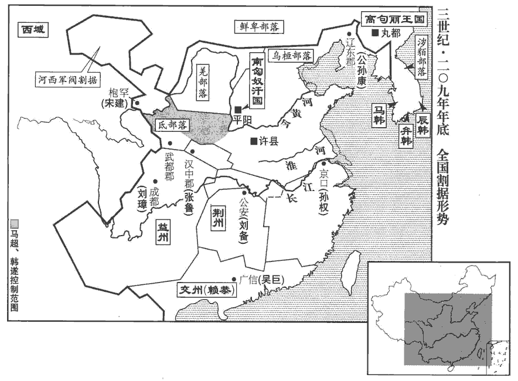
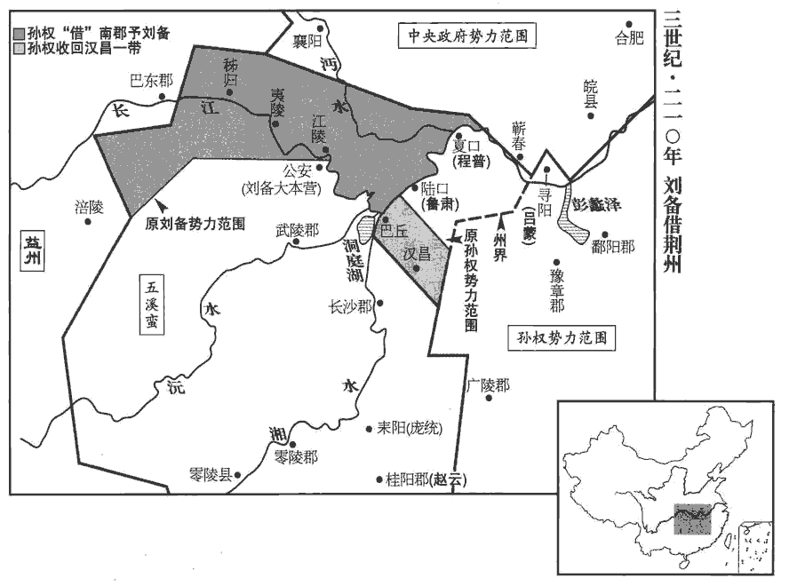
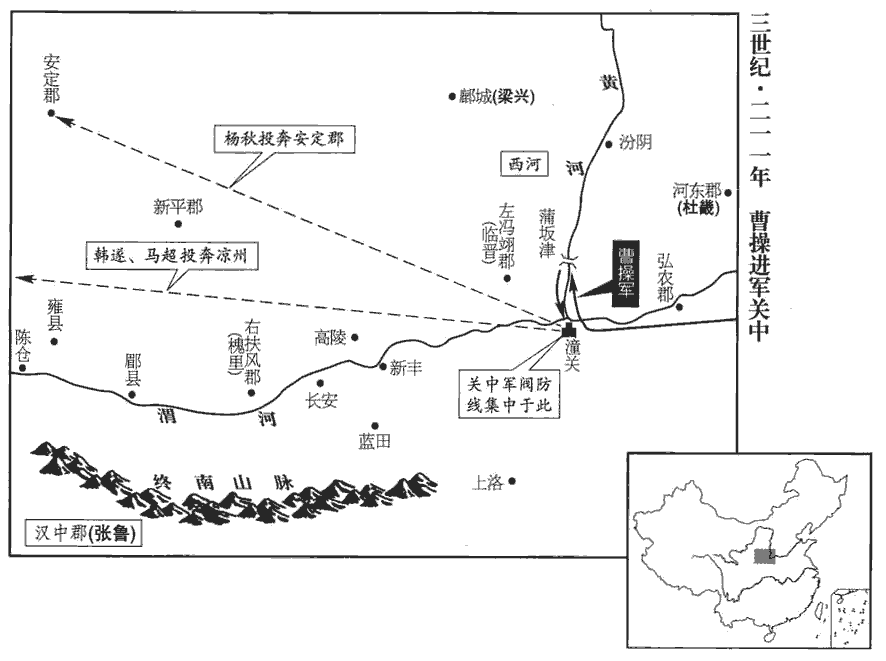
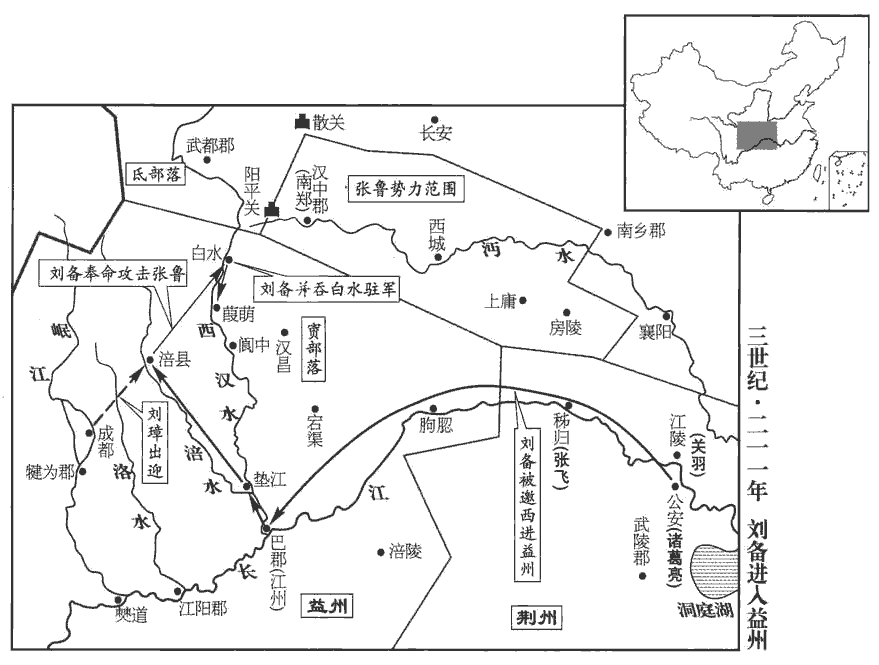
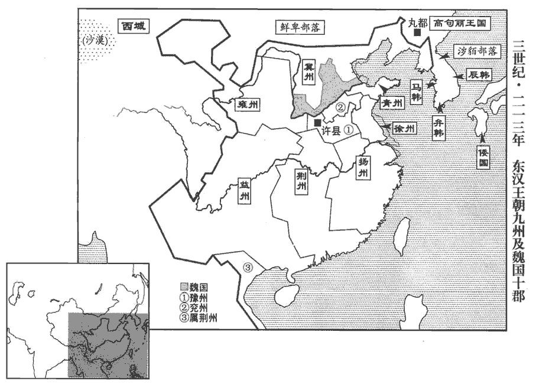
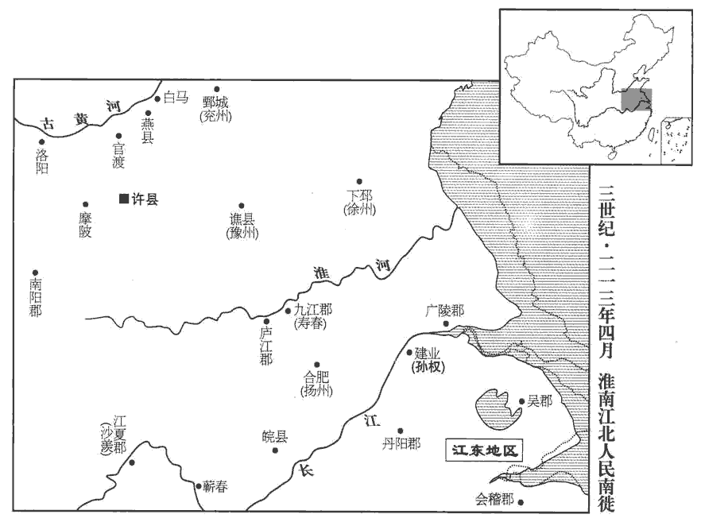
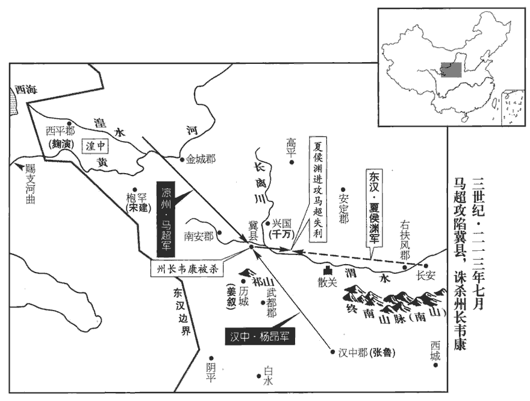

 漢紀五十八起屠維亦奮若（己丑），盡昭陽大荒落（癸巳），凡五年。

# 孝獻皇帝辛

## 建安十四年（己丑，二零九）

1春，三月，曹操軍至譙‹安徽亳州›。自赤壁還也。

〖译文〗 [1]春季，三月，曹操大军到达谯县。

2孫權圍合肥，久不下。權率輕騎欲身往突敵，長史張紘諫曰：「夫兵者凶器，戰者危事也。兵凶器、戰危事，前書鼂cháo錯之言。今麾下恃盛壯之氣，忽強暴之虜，以權在軍中，故稱麾下。三軍之眾，莫不寒心。雖斬將搴qiān旗，威震敵場，此乃偏將之任，非主將之宜也。將，即亮翻。願抑賁、育之勇、賁、音奔。懷霸王之計。」權乃止。

〖译文〗 [2]孙权包围合肥，很久未能攻克。孙权率领轻骑准备亲自突击敌人，长史张劝阻说：“武器是不吉祥的器物，战争是很危险的事情。如今将军倚仗着锐气，轻视强大凶暴的敌人，使得三军上下，无不为您担心。即使能杀死敌将，俘获战旗，威震敌军，这不过是一个偏将的责任，不是主将所该作的事情。愿您抑制一下像孟贲、夏育那样的勇气，而胸怀争霸天下的王者谋略。”孙权才停止出击。

曹操遣將軍張喜將兵解圍，久而未至。揚州別駕楚國‹江苏徐州›蔣濟密白刺史，偽得喜書，云步騎四萬已到雩yú婁‹河南固始›，雩婁縣，屬廬江郡。師古曰：雩yú，音許于翻。婁，音力于翻。晉地道記，雩婁在安豐縣西南。遣主簿迎喜。三部使齎書語城中守將：語，牛倨翻。「一部得入城，二部為權兵所得。」權信之，遽燒圍走。考異曰：魏志武纪：「十二月，權圍合肥。」劉馥傳云「攻圍百餘日」。孫權傳云「踰月不能下」。由此言之，權退必在今年，明矣。

〖译文〗 曹操派将张喜率军解救合肥，时间很长还未到。扬州别驾楚国人蒋济秘密向刺史建议：假装收到张喜的书信，声称四万步、骑兵已经到达雩娄，派主簿去迎接张喜。又三次派信使携带写有这一消息的书信去通知城中的守将。其中有一次到了城里，另外两次被孙权部下的兵士俘获。孙权相信了这个假情报，赶快烧毁围城的器械撤走。

3秋，七月，曹操引水軍自渦guō入淮‹涡水，淮河支流，于安徽怀远入淮河›，班志：淮陽扶溝縣，渦水首受狼湯渠，東至向入淮；過郡三，行千里，水經註曰：至下邳睢陵縣入淮。師古曰：渦，音戈，又音瓜。狼，音浪。湯，音徒浪翻。出肥水，軍合肥，開芍què陂bēi‹安徽寿县西南安丰塘›屯田。水經註：肥水，出九江成德縣廣陽鄉西，西北入芍陂。陂周一百二十許里，在壽春縣南八十里，楚相孫叔敖所造也。自芍陂上施水，則至合肥。肥水又北過壽春縣北，入于淮。師古曰：芍，音鵲。

〖译文〗 [3]秋季，七月，曹操统率水军自涡水进入淮河，在肥水登岸，驻屯合肥，重新修整芍陂的水利设施，在周围地区屯田。

4冬，十月，荊州地震。

〖译文〗 [4]冬季，十月，荆州地区发生地震。

5十二月，操軍還譙‹安徽亳州›。

〖译文〗 [5]十二月，曹操的军队返回谯县。

6廬江‹安徽潜山›人陳蘭、梅成據灊‹安徽霍山›、六‹安徽六安›叛、灊、六二縣、皆屬廬江郡。賢曰：灊，今壽州霍山縣。灊，音潛。操遣盪寇將軍張遼討斬之；盪，徒朗翻。考異曰：遼傳無年。按繁欽征天山賦云「建安十四年十二月甲辰，丞相武平侯曹公東征，臨川未濟，群舒蠢動，割有灊、六，乃俾bǐ上將盪寇將軍張遼治兵南岳之陽。」又云：「陟天柱而南徂cú。」故置於此。因使遼與樂進、李典等將七千餘人屯合肥。

〖译文〗 [6]庐江人陈兰、梅成占据县、六安进行叛乱，曹操派荡寇将军张辽讨伐，斩杀陈兰、梅成等。曹操即命张辽与乐进、李典等率七千余人屯驻合肥。

7周瑜攻曹仁歲餘，所殺傷甚眾，仁委城走。權以瑜領南郡太守，屯據江陵；守式又翻。程普領江夏太守，治沙羡‹湖北武昌西南金口镇›；夏，戶雅翻。羡，音夷。呂范領彭澤‹江西湖口东›太守；范傳云：范領彭澤太守，以彭澤、柴桑、歷陽為奉邑。呂蒙領尋陽令‹湖北武穴东北›。劉備表權行車騎將軍，領徐州牧。會劉琦卒，權以備領荊州牧，周瑜分南岸地‹湖北江陵对岸›以給備。荊江之南岸，則零陵、桂陽、武陵、長沙四郡地也。備立營於油口‹湖北公安›，改名公安。水經：南平郡孱陵縣有油水，西北注于江，曰油口。即劉備立營之處也。

〖译文〗 [7]周瑜率军围攻曹仁一年有余，杀伤曹军甚多，曹仁弃城撤走。孙权任命周瑜兼任南郡太守，屯驻江陵；程普兼任江夏太守，设郡府在沙羡；吕范兼任彭泽太守；吕蒙兼任寻阳县令。刘备向朝廷上表，推荐孙权代理车骑将军，兼任徐州牧。正在这时，刘琦去世，孙权让刘备兼任荆州牧，周瑜将荆州长江以南的地区分给刘备。刘备将军营设在油口，并把那里改名为公安。

權以妹妻備。妻，七細翻。妹才捷剛猛，有諸兄風，侍婢bì百餘人，皆執刀侍立，備每入，心常凜凜。恐為所圖也。

〖译文〗 孙权把妹妹嫁给刘备。孙权的妹妹才思敏捷，性情刚猛，有她兄长们的风度。她的侍婢一百余人，都手执利刀在旁站着侍候。刘备每次进入内宅，心都很恐惧。

 

曹操密遣九江‹安徽寿县›蔣幹往說周瑜。說，輸芮翻；下同。幹以才辨獨步於江、淮之間，言江、淮人士，無能敵其才辯者。乃布衣葛巾，自託私行詣瑜。瑜出迎之，立謂幹曰：「子翼良苦，遠涉江湖，蔣幹，字子翼。為曹氏作說客邪！」為，于偽翻。因延幹，與周觀營中，行視倉庫、軍資、器仗訖，還飲宴，示之侍者服飾珍玩之物。因謂幹曰：「丈夫處世，處，昌呂翻；下同。遇知己之主，外託君臣之義，內結骨肉之恩，言行計從，禍福共之，假使蘇、張更生，謂蘇秦、張儀也。能移其意乎！」幹但笑，終無所言。還白操，稱瑜雅量高致，非言辭所能間也。間，古莧翻。

〖译文〗 曹操秘密派遣九江人蒋干去游说周瑜。蒋干以才能、机辩闻名于长江、淮河之间，没有人能胜过他。蒋干换上平民穿的布衣，戴上葛布制成的头巾。自称因私人交谊来看望周瑜。周瑜出来迎接他，站着对他说：“蒋子翼，你真是很辛苦，涉水远道而来，是为曹操作说客吗！”遂邀请蒋干进来，与他一同参观军营，巡视仓库、军用物资与武器装备之后。回来设宴款待蒋干，洒席间让蒋干看自己的侍女、服装、饰物以及各种珍贵的宝物，并对他说：“大丈夫生活在世上，遇到知已的君主，外表上有君臣关系，内心却情同骨肉，言听计从，有福共享，有难同当，即使苏秦、张仪重生，能转移他的心意吗！”蒋干只是笑，一直不谈私人关系之外的话。他回来向曹操汇报，称颂周瑜胸襟宽广，志向远大，不是言语所能挑拔离间的。

8丞相掾和洽言於曹操曰：「天下之人，材德各殊，不可以一節取也。儉素過中，自以處身則可，以此格物，所失或多。格，正也。掾，俞絹翻。今朝廷之議，吏有著新衣、著，陟略翻。乘好車者，謂之不清；形容不飾、衣裘敝壞者，謂之廉潔。至令士大夫故汙辱其衣，藏其輿服；朝府大吏，或自挈qiè壺飧sūn以入官寺。朝，直遙翻。飧，蘇昆翻，熟食曰飧。夫立教觀俗，貴處中庸，為可繼也。中者，正道；庸者，常道。程子曰：不偏之謂中，不易之謂庸。今崇一概難堪之行以檢殊塗，檢，束也，檢柙xiá也。概，與槩同。行，下孟翻；下同。勉而為之，必有疲瘁。瘁，秦醉翻。古之大教，務在通人情而已；凡激詭之行，則容隱偽矣。」操善之。

〖译文〗 [8]丞相掾和洽向曹操提出建议说：“天下的人，才干和品德各不相同，不能只用一个标准来选拔人才。以过分的节俭朴素来约束自己是可以的，但用这标准来限制别人，或许就会出现许多失误。如今朝廷上的舆论是官吏中穿新衣服，乘好车的人，就被称为不清廉；而不修饰仪表，穿破旧衣服的人，则被赞为廉洁。致使士大夫故意弄脏自己的衣裳，收藏起车子、服饰。朝廷各部门的高级官员，有的还自己携着饭罐，到官府上班。树立榜样以供人仿效，最好采用中庸之道，这样才能坚持下去。如今一概提倡这些使人难以忍受的行为，用它来约束各阶层的人士，勉强施行，必然会疲惫不堪。古人的教化，只是务求通达人情；凡是偏激怪异的行为，则会包藏虚伪。”曹操认为他的见解很好。

## 十五年（庚寅，二一零）

1春，下令曰：「孟公綽為趙、魏老則優，不可以為滕、薛大夫。論語載孔子之言。朱子曰：公綽，魯大夫。趙、魏，晉卿之家。老，家臣之長。大家勢重而無諸侯之事，家老望尊而無官守之責。優，有餘也。滕、薛，二國名；大夫，任國政者。滕、薛國小政繁，大夫位高責重。然則公綽蓋廉靜寡欲，而短於才者。若必廉士而後可用，則齊桓其何以霸世！管仲富擬公室，築三歸之臺，塞門反坫diàn，鏤lòu簋guǐ朱紘hóng，桓公用之而霸。二三子其佐我明揚仄陋，書堯典曰：明明揚仄陋。揚，舉也。唯才是舉，吾得而用之！」

〖译文〗 [1]春季，曹操下令说：“从前，孟公绰做晋国赵、魏两家贵族的家臣首领是才力有余的，但不能胜任滕、薛等小国大夫的职务。假如必须是清廉的人才能使用，那么，齐桓公又怎么能称霸于世！大家要帮助我显扬高明人士，即使身份卑微，也要推举，只要有才能就进荐上来，让我能够任用他们！”

2二月，乙巳朔‹一›，日有食之。

〖译文〗 [2]二月，乙巳朔（初一），出现日食。

3冬，曹操作銅爵臺於鄴‹河北临漳西南邺镇›。水經註：銅爵臺，在鄴城西北，因城為之，高十丈，有屋百餘間。

〖译文〗 [3]冬季，曹操在邺城修建铜爵台。

4十二月，己亥，操下令曰：「孤始舉孝廉，操年二十，舉孝廉，為郎。自以本非巖穴知名之士，恐為世人之所凡愚，恐時人以凡愚待之也。欲好作政教以立名譽，故在濟南‹山东章丘›，除殘去穢，操為濟南相，國有十餘縣，長吏多阿附貴戚，贓汙狼籍。於是奏免其八，姦宄guǐ逃竄，境內肅然。濟，子禮翻。去，羌呂翻。平心選舉。以是為強豪所忿，恐致家禍，故以病還鄉里。時年紀尚少，少，詩照翻。乃於譙東五十里築精舍，欲秋夏讀書，冬春射獵，為二十年規，待天下清乃出仕耳。然不能得如意，徵為典軍校尉，見五十九卷靈帝中平五年。意遂更欲為國家討賊立功，為，于偽翻。使題墓道言『漢故征西將軍曹侯之墓』，此其志也。而遭值董卓之難，興舉義兵。見五十九卷初平元年。難，乃旦翻。後領兗州，破降黃巾三十萬眾；見六十卷初平三年。降，戶江翻。又討擊袁術，使窮沮而死；見六十三卷建安四年。沮，在呂翻。摧破袁紹，見六十三卷建安五年。梟其二子；斬譚見六十四卷十年；斬尚見上卷十二年。梟，堅堯翻。復定劉表，見上卷上年。復，扶又翻。遂平天下。身為宰相，人臣之貴已極，意望已過矣。設使國家無有孤，不知當幾人稱帝，幾人稱王。或者人見孤強盛，又性不信天命，恐妄相忖度，言有不遜之志，言其將篡也。度，徒洛翻。每用耿耿，耿，古幸翻。毛公曰：耿耿，猶儆儆也，又憂也。故為諸君陳道此言，為，于偽翻。皆肝鬲之要也。鬲gé，胸鬲也。然欲孤便爾委捐所典兵眾以還執事，歸就武平‹河南鹿邑西北武平城村›侯國，實不可也。何者？誠恐己離兵為人所禍，離，力智翻。既為子孫計，又己敗則國家傾危，是以不得慕虛名而處實禍也！處，昌呂翻。然兼封四縣，食戶三萬，何德堪之！江湖未靜，謂孫、劉也。不可讓位；至於邑土，可得而辭。今上還陽夏‹河南太康›、柘zhè‹河南柘城›、苦‹河南鹿邑东›三縣，戶二萬，但食武平萬戶，上，時掌翻。武平、陽夏、柘、苦四縣皆屬陳國。夏，音賈。且以分損謗議，少減孤之責也！少，詩沼翻；下同。

〖译文〗 [4]十二月，已亥（疑误），曹操下令说：“我最初被推荐为孝廉时，自以为本来不是隐居深山的知名之士，恐怕被世人看作平庸无能，打算好好处理政务，推行教化，以树立名誉，故在济南国任国相时，铲除残暴邪恶势力，公正地选拔人才。由于这样，受到强门豪族的忌恨，我恐怕给家中招来灾祸，就借口有病，回到家乡。当时年纪还不大，就在谯县县城以东五十里处修建书房，打算秋季与夏季读书，冬季与春季射猎，计划这样过二十年，等天下安定以后，再出来做官。但我未能如愿，被朝廷征召为典军校尉，于是改变主意，想为国家讨贼立功，使墓道的石碑上可以题写‘汉朝故征西将军曹侯之墓’，这就是我的志愿。而后遇到董卓之乱，我兴起义兵。以后，我任兖州牧，击败黄巾军，迫使三十万黄巾军投降；又讨伐袁术，使他走投无路，穷困而死；击败袁绍，将他的两个儿子斩首示众；再消灭刘表，于是平定天下。我身为宰相，作为臣子达到尊贵的顶点，也已超出了我的愿望。假设国家没有我，不知会几个人称帝，几个人称王？或许有人看到我势力强盛，又生性不信天命，恐怕会随便猜测，说我有篡位的野心，每一想到这些，心中就感到不安。所以，向你们述说这些话，都是我的肺腑之言。然而，想要我就这样放弃所统领的军队，交还给主管部门，回到我的封地武平侯国，实在是不可能的。为什么呢？我确实害怕自己一离开军队就会被人谋害，既是为我的子孙打算，又因为我一失败就会使国家危亡，所以，我不能追求虚名，而遭受实际的灾祸。然而，我的封地共有四个县，享有收取三万户百姓租税的权利，我的品德怎么能配得上呢？天下尚未安定，我不可以辞去官位；至于封地，是可以退让的。如今，我把阳夏、柘、苦三县的二万户封地归还给国家，只享受武平的一万户百姓的租税，姑且以此来减少对我的诽谤议论，同时也稍微减轻我的责任！”

5劉表故吏士多歸劉備，備以周瑜所給地少，不足以容其眾，乃自詣京‹江苏镇江›見孫權，京，京口城也。權時居京，故劉備、周瑜皆詣京見之。後都秣mò陵，於京口置京督，又曰徐陵督。爾雅：絕高曰京。其城因山為壘，緣江為境，因謂之京口。求都督荊州。荊州八郡，瑜既以江南四郡給備，備又欲兼得江、漢間四郡也。瑜上疏於權曰：「劉備以梟雄之姿，梟，堅堯翻。而有關羽、張飛熊虎之將，必非久屈為人用者。愚謂大計，宜徙備置吳，盛為築宮室，多其美女玩好，以娛其耳目；好，呼到翻。分此二人各置一方，使如瑜者得挾與攻戰，大事可定也。今猥割土地以資業之，謂資之土地，使成霸業。聚此三人俱在疆埸，埸yì，音亦。恐蛟龍得雲雨，終非池中物也！」呂范亦勸留之。權以曹操在北，方當廣擥英雄，擥lǎn，魯敢翻，手取也。不從。不從瑜、范之言也。備還公安‹湖北公安›，久乃聞之，歎曰：「天下智謀之士，所見略同。時孔明諫孤莫行，其意亦慮此也。孤方危急，不得不往，此誠險塗，殆不免周瑜之手！」

〖译文〗 [5]刘表原来的部属大多数归附刘备，刘备因为周瑜拔给他的土地太少，不足以容纳自己的部下，就亲自到京口去面见孙权，请求把荆州全部交给自己管理。周瑜上书给孙权说：“刘备是一代枭雄，而且有关羽、张飞这些熊、虎一样的猛将辅佐，肯定不能长久屈居，为人所用。我认为，从大计考虑，应当把刘备迁走，安置在吴郡，为他大兴土木地建造住宅，多给他供应美女和其它玩赏娱乐的物品，使他耳目迷恋。同是，把关羽和张飞这两个人分开，派他们各驻一地，使像我周瑜这样的将领能统率他们的攻战，天下大事就可以安定了。如今滥割土地给他作为资本，使这三人都聚在疆界，恐怕就会像蛟龙得到云雨的赞助，终究不会再留在水池中了。”吕范也劝孙权留下刘备。孙权认为曹操在北方，正应该广为招揽英雄豪杰，没有听从他们的建议。刘备回到公安后，过了很久才听到这些内幕，叹息说：“天下的智谋之士，看法都差不多，当时诸葛亮劝我不要去，也是担心发生这样的事情。我正在危急中，不得不去，这实在是走险路，几乎逃不出周瑜之手！”

 

周瑜詣京‹京口，江苏省镇江市›見權曰：「今曹操新敗，憂在腹心，謂操以赤壁之敗，威望頓損，中國之人或欲因其敗而圖之，是憂在腹心。未能與將軍連兵相事也。相事，謂相與從事於戰攻也。乞與奮威俱進，取蜀而并張魯‹时据汉中郡陕西省汉中市›，因留奮威固守其地，與馬超結援，瑜還與將軍據襄陽以䠞操，䠞cù，子六翻。北方可圖也。」權許之。奮威者，孫堅弟子奮威將軍、丹陽太守瑜也。

〖译文〗 周瑜到京口去拜见孙权，说：“现在，曹操新近在赤壁大败而归，担心内部有人叛变，不能同将军用军队交战，我请求与奋威将军一起进军，夺取蜀地，并吞张鲁，然后，留奋威将军牢固地守卫那里，与马超结成联盟。我回来与将军据守襄阳，紧逼曹操，这样，就可以规划进取北方了。”孙权同意这个计划。奋威将军，是指孙坚弟弟的儿子，丹阳太守孙瑜。

周瑜還江陵為行裝，於道病困，與權牋曰：「脩短命矣，誠不足措；但恨微志未展，不復奉教命耳。復，扶又翻；下同。方今曹操在北，疆埸yì未靜；劉備寄寓，有似養虎；言養虎將自遺患。天下之事，未知終始，此朝士旰gàn食之秋，旰，古旦翻，晚也。朝，直遙翻。至尊垂慮之日也。魯肅忠烈，臨事不苟，可以代瑜。儻所言可采，瑜死不朽矣！」卒於巴丘‹湖南岳阳›。裴松之曰：瑜欲取蜀，還江陵治嚴，所卒之處，應在今之巴陵，與前所鎮巴江，名同處異也。據水經註，巴丘山在湘水右岸，晉武帝太康元年立巴陵縣，宋文帝元嘉十六年置巴陵郡，今岳州也。考異曰：按江表傳，瑜與策同年，策以建安五年死，年二十六，瑜死時年三十六，故知在今年也。權聞之哀慟，曰：「公瑾有王佐之資，今忽短命，孤何賴哉！」自迎其喪於蕪湖。蕪湖縣，屬丹陽郡。瑜有一女、二男，權為長子登娶其女；為，于偽翻。長，知兩翻。以其男循為騎都尉，妻以女，胤為興業都尉，妻以宗女。妻，七細翻。

〖译文〗 周瑜回到江陵准备行装，在途中病势沉重，上书给孙权说：“人寿的长短都是由命运决定的，实在不足惋惜。我只恨心中的微小志愿尚未实现，再也不能执行您的命令罢了。现在，曹操在北方，疆场并没有平静；刘备寄居在荆州，好像是在家里养了一只老虎。天下的大局，还在动荡不定，这正是大臣和将士们奋发忘食之时，也是您思虑运筹之日。鲁肃为人忠烈，临事不苟，可以接替我的职务。假如我的建议可以被采纳，我就虽死不朽了。”周瑜在巴丘去世。孙权得到消息后，十分悲痛，大哭着说：“周瑜有辅佐帝王的才能，现在忽然短命而死，我依靠谁呢？”孙权亲自到芜湖去迎接周瑜的录柩。周瑜有一个女儿、两个儿子，孙权为自己的大儿子孙登娶周瑜的女儿为妻；任命周瑜的儿子周循为骑都尉，把自己的女儿嫁给他；又任命周瑜的另一个儿子周胤为兴业都尉，把自己宗族的一个姑娘嫁给他。

初，瑜見友於孫策，太夫人又使權以兄奉之。是時權位為將軍，諸將、賓客為禮尚簡，而瑜獨先盡敬，便執臣節。程普頗以年長，數陵侮瑜，瑜折節下之，長，知兩翻。數，所角翻。折，而設翻。下，遐稼翻。終不與校。普後自敬服而親重之，乃告人曰：「與周公瑾交，若飲醇醪láo，不覺自醉。」酒不澆為醇。醪，滓zǐ汁酒。

〖译文〗 起初，周瑜是孙策的朋友，孙权的母亲吴太夫人又曾让孙权把周瑜当作兄长来尊敬。当时，孙权的职位只是讨虏将军，部下将领与宾客们对他的礼节还较为简单，而只有周瑜带头，以臣属礼节事奉孙权。程普自以为年龄比周瑜大，多次凌辱周瑜，周瑜却降低自己的身份来对待程普，始终不与他计较。后来，程普佩服周瑜，对周瑜亲近敬重，于是告诉别人说：“与周公瑾交往，好象喝下醇厚的美酒，不知不觉就已沉醉。”

權以魯肅為奮武校尉，代瑜領兵，令程普領南郡‹湖北江陵›太守。魯肅勸權以荊州借劉備，與共拒曹操，權從之。為孫、劉爭荊州張本。考異曰：肅傳曰：「曹公聞權以土地業備，方作書，落筆於地。」恐操不至於是，今不取。乃分豫章‹南昌›為番陽郡‹江西波阳›，番，蒲何翻。分長沙為漢昌郡‹湖南平江南›；鄱陽，今饒州地。沈約志，長沙郡有吳昌縣，漢末之漢昌也，吳更名。至隋，廢吳昌入羅縣；唐武德八年，又省羅縣入湘陰。則知吳立漢昌郡，在唐岳州湘陰縣界。復以程普領江夏太守，復，扶又翻。魯肅為漢昌‹湖南平江›太守，屯陸口‹湖北嘉鱼西南陆溪镇›。水經，江水左逕烏林南，又東，右岸得蒲磯口，即陸口也。水出下雋jùn縣西三山溪，入蒲圻qí縣北，逕呂蒙城西；孫權征長沙、零、桂所鎮也。

〖译文〗 孙权任命鲁肃为奋武校尉，接替周瑜，统领军队，命令程普兼任南郡太守。鲁肃劝孙权把荆州借给刘备，与刘备共同抵抗曹操，孙权同意，于是，从豫章郡中分出一部分土地，设立番阳郡；从长沙郡分出一部分土地，设立汉昌郡；又任命程普兼任江夏郡太守，鲁肃为汉昌郡太守，率军驻在陆口。

初，權謂呂蒙曰：「卿今當塗掌事，當塗，猶言當路也。不可不學！」蒙辭以軍中多務。權曰：「孤豈欲卿治經為博士邪！但當涉獵，見往事耳。師古曰：涉，若涉水；獵，若獵獸。言歷覽之，不專精也。治，直之翻。卿言多務，孰若孤？孤常讀書，自以為大有所益。」蒙乃始就學。及魯肅過尋陽‹湖北武穴东北›，與蒙論議，大驚曰：「卿今者才略，非復吳下阿蒙！」蒙曰：「士別三日，即更刮目相待，大兄何見事之晚乎！」肅遂拜蒙母，結友而別。

〖译文〗 起初，孙权对吕蒙说：“你现在担任要职，执掌权力，不能不学习。”吕蒙推辞说军中事多，没有时间学习。孙权说：“我难道是要你研究儒家经典，去做博士吗？我只是要你去浏览书籍，了解过去发生过的事情。你说事多，但谁会像我这样忙？我经常读书收，自以为得到很多好处。”于是吕蒙开始读书。等到鲁肃经过寻阳时，与吕蒙谈话，大吃一惊说：“你今天的才干谋略，再不是吴郡那里的阿蒙了！”吕蒙说：“士别三日，就应该重新刮目相看，大哥为什么对这个道理明白得这么晚呢！”鲁肃就去拜见吕蒙的母亲，与吕蒙结为好友才分手。

劉備以從事龐統守耒lěi陽‹湖南耒阳›令，耒陽縣，屬桂陽郡。宋白曰：郡國志云：鰲山口，即耒陽縣。耒，盧對翻。在縣不治，免官。魯肅遺備書曰：「龐士元非百里才也，使處治中、別駕之任，始當展其驥jì足耳！」遺，于季翻。處，昌呂翻。百官志：司隸校尉，從事史十二人：功曹從事，主選署及眾事；別駕從事，校部、行部則奉引，錄眾事。州牧則改功曹從事為治中從事。杜佑曰：別駕從事史，從刺史行部，別乘一乘傳車，故謂之別駕。治中從事史，居中治事，主眾曹。功曹，主選用。諸葛亮亦言之。備見統，與善譚，大器之，善譚者，劇論當世事也。譚，與談同。遂用統為治中，親待亞於諸葛亮，與亮并為軍師中郎將。

〖译文〗 刘备任命从事庞统为耒阳县县令，庞统在任时政务荒废，被免官。鲁肃写信给刘备，说：“庞统的才干不适于管理一个方圆百里的小县，让他处在治中、别驾的职务上，才能发挥他的才干。”诸葛亮也谈到庞统的才干。刘备召见庞统，与他详细谈论天下大势后，大为器重，就任命他为治中，对他的亲信程度及待遇仅次于诸葛亮，委任庞统与诸葛亮同时担任军师中郎将。

6初，蒼梧‹广西梧州›士燮xiè為交趾‹越南河内东北北宁府›太守。交州‹两广及越南北›刺史朱符為夷賊所殺，州郡擾亂，燮表其弟壹領合浦‹广西合浦东北›太守，䵋wěi領九真‹越南清化›太守，䵋，胡悔翻，又于鄙翻。武領南海‹广州›太守。燮體器寬厚，中國士人多往依之。雄長一州，偏在萬里，威尊無上，天下殽亂，燮雄據偏州，人但知威尊，無復知有天子也。長，知兩翻。出入儀衛甚盛，震服百蠻。

〖译文〗 [6]起初，苍悟人士燮担任交趾郡太守。交州刺史朱符被夷人乱贼杀死，州郡陷入混乱。士燮上表推荐他的弟弟士壹代理合浦郡太守，士代理九真郡太守，士武代理南海经郡太守。士燮性情宽厚，有很多中原地区的士大夫都去投奔他。士燮在交州地区权势显赫，与朝廷又相隔万里，他在那里的威望与尊严都到了至高无上的程度，出入时的仪仗警卫十分盛大，威震当地的各蛮族，使他们顺服。

朝廷遣南陽‹河南南陽›張津為交州‹两广及越南北›刺史。津好鬼神事，常著絳帕頭，好，呼到翻。著，陟略翻。帕，莫白翻。項安世家說：頭巾，一名𢄓wù，音隖wù；一名帞mò。陸游曰：袹頭者，巾幘zé之類，猶今言幞頭。韓文公云「以紅袹首」，已為失之，東坡云「絳袹蒙頭讀道書」，增一「蒙」字，其誤尤甚。鼓琴、燒香，讀道書，云可以助化，為其將區景所殺，區ōu，烏侯翻，姓也，又虧于翻。據史，自賈琮cóng以前，皆為交趾刺史，未得為交州。晉志，永和九年，交趾太守周敞求立為州，朝議不許，即拜敞為交趾刺史。建安八年，張津為刺史，士燮為交趾太守，共表立為州，乃拜津為交州牧。十五年，移居番禺。劉表遣零陵‹湖南永州›賴恭代津為刺史。姓譜：賴為楚所滅，子孫以國為氏。風俗通：漢有交趾太守賴先。是時蒼梧‹广西梧州›太守史璜死，表又遣吳巨代之。朝廷賜燮璽書，以燮為綏南中郎將，董督七郡，領交趾太守如故。【章：甲十一行本「故」下有「後」字；乙十一行本同；孔本，「後」字作空格。】巨與恭相失，巨舉兵逐恭，恭走還零陵。

〖译文〗 朝廷派遣南阳人张津担任交州刺史，张津迷信鬼神，经常用绛色头巾包头，弹琴、烧香，读道家的书籍，说可以有助于得道。张津被他的部将区景杀死，刘表派遣零陵人赖恭代替张津担任刺史。这时，苍梧郡太守史璜逝世，刘表又派吴巨代理苍梧太守。朝廷赐给士燮诏书，任命他为绥南中郎将，管理七郡的军务，同时仍兼任交趾太守。吴巨与赖恭关系恶化，吴巨发兵进攻赖恭。赖恭逃回零陵。

孫權以番陽‹江西波阳›太守臨淮‹江苏泗洪南›步騭zhì為交州刺史，姓譜：晉有步揚，食采於步，因氏焉。番，蒲荷翻。騭，職日翻。士燮率兄弟奉承節度。吳巨外附內違，騭誘而斬之，誘，音酉。威聲大震。權加燮左將軍，燮遣子入質。質，音致。由是嶺南始服屬於權。

〖译文〗 孙权任命番阳郡太守临淮人步骘为交州刺史，士燮率领自己的兄弟们都听从步骘的命令。吴巨表面上服从，心里却另有打算，步骘把他引诱出来杀死，声威大震。孙权提升士燮为左将军，士燮派遣自已的儿子到孙权那里充当人质。从此，王岭以南的地区开始归属于孙权。

## 十六年（辛卯，二一一）

1春，正月，以曹操世子丕為五官中郎將，置官屬，為丞相副。漢五官中郎將，主五官郎而已，未嘗置官屬也；領屬光祿勳，未嘗為丞相副也。

〖译文〗 [1]春季，正月，任命曹操世子曹丕为五官中郎将，设置官属，作为丞相曹操的副手。

2三月，操遣司隸校尉鍾繇討張魯，使征西護軍夏侯淵等將兵出河東‹山西夏县›，與繇會。淵之族，操所自出也；付以西征先驅之任，以資序未得為征西將軍，故以護軍為名。倉曹屬高柔諫曰：公府倉曹，主倉穀事；有掾，有屬。「大兵西出，韓遂、馬超疑為襲己，必相扇動。宜先招集三輔，三輔苟平，漢中‹陕西汉中›可傳檄而定也。」操不從。

〖译文〗 [2]三月，曹操派遣司隶校尉钟繇讨伐张鲁，命令征西护军夏侯洲等率领大军从河东出发，与钟繇会合。丞相仓曹属高柔劝曹操说：“大军向西进发，韩遂、马超会疑心是袭击他们，必然互相煽动。应当先安定三辅地区，如果三辅地区平定，只需发布文书，就能平定汉中。”曹操不听。

關中諸將果疑之，操舍關中而遠征張魯，伐虢取虞之計也。蓋欲討超、遂而無名、先張討魯之勢以速其反，然後加兵耳。馬超、韓遂、侯選、程銀、楊秋、李堪、張橫、梁興、成宜、馬玩等十部皆反，其眾十萬，屯據潼關‹陕西潼關›；潼關，在弘農華陰縣。水經註曰：河在關內南流，潼激關山，因謂之潼關；晉所謂桃林之塞，秦所謂陽華是也。操遣安西將軍曹仁督諸將拒之，晉百官志曰：四安起於魏初。謂安東、安西、安南、安北四將軍也。敕令堅壁勿與戰。命五官將丕留守鄴‹河北临漳西南邺镇›，以奮武將軍程昱參丕軍事，沈約曰：奮武將軍，始於漢末。門下督廣陵‹扬州›徐宣為左護軍，門下督，督將之居門下者。留統諸軍，樂安‹山东高青东南›國淵為居府長史，統留事。姓譜：齊有國氏，世為上卿。又鄭七穆子國之後，為國氏。秋，七月，操自將擊超等。將，即亮翻；下同。議者多言：「關西兵習長矛，非精選前鋒，不可當也。」操曰：「戰在我，非在賊也。賊雖習長矛，將使不得以刺，諸君但觀之。」在我而不在敵，故可以制勝，此未易與常人言也。刺，七亦翻；下同。

〖译文〗 关中的将领们果然起了疑心，马超、韩遂、侯选、程银、杨秋、李堪、张横、梁兴、成宜、马玩等十部都起来造反，合起来有十万人马，据守潼关。曹操派遣安西将军曹仁统率诸将抵挡，令他们坚守营寨，不要出战。命令五官中郎将曹丕留守邺城，委任奋武将军程昱协助曹丕处理军务；任命门下督广陵人徐宣为左护军，留在邺城统率留守部队；任命乐安人国渊为丞相府的居府长史，负责留守事务。秋季，七月，曹操亲统大军，进攻马超等。许多参预军务讨论的人都说：“函谷关以西的士兵善于使用长矛，不挑选精锐部队作前锋，会抵抗不住的。”曹操说：“战争的决定权控制在我手中，而不在敌人手中。他们虽然善于使用长矛，我将使他们的长矛无法刺杀，你们只管着看吧。”

 

八月，操至潼關‹陕西潼關›，與超等夾關而軍。操急持之，而潛遣徐晃、朱靈以步騎四千人渡蒲阪津‹山西永济西黄河渡口›，據河西為營，蒲阪津，在蒲阪縣西。河西即唐之蒲津關。考異曰：晃傳曰：「太祖至潼關，恐不得渡，召問晃。晃曰：『公盛兵於此，而賊不復別守蒲阪，知其無謀也。今假臣精兵渡蒲阪津，為軍先置以截其里，賊可禽也。』太祖曰：『善。』「按武帝紀，潛遣二將渡蒲阪，皆太祖之謀，而晃傳云皆晃之策。蓋陳氏各欲稱其功美，不相顧耳。閏月，操自潼關北渡河。兵眾先渡，操獨與虎士百餘人留南岸斷後。斷，丁管翻。馬超將步騎萬餘人攻之，矢下如雨，操猶據胡牀不動。許褚扶操上船，船工中流矢死，中，竹仲翻。褚左手舉馬鞍以蔽操，右手剌船。校尉丁斐，放牛馬以餌賊，賊亂，取牛馬，操乃得渡；遂自蒲阪渡西河，循河為甬道而南。超等退拒渭口‹渭水入黄河处，即潼关›，前書，渭水至船司空入河。後漢省船司空，屬華陰縣。渭口之東，即潼關也。操乃多設疑兵，潛以舟載兵入渭，為浮橋，夜，分兵結營於渭南。超等夜攻營，伏兵擊破之。超等屯渭南，遣使求割河以西請和，操不許。九月，操進軍，悉渡渭。超等數挑戰，又不許；固請割地，求送任子，賈詡以為可偽許之。操復問計策，數，所角翻。挑，徒了翻。復，扶又翻。詡曰：「離之而已。」操曰：「解！」解，戶買翻，曉也。

〖译文〗 八月，曹操来到潼关，与马超等隔着潼关扎营。曹操表面上对马超急剧施加压力，暗中却派遣徐晃、朱灵率领步、骑兵四千人渡过蒲阪渡口，到黄河以西扎营。闰八月，曹操从潼关向北渡过黄河。士兵先过河，曹操单独与虎贲武士一百余人留在黄河南岸断后。马超率领步、骑兵一万余人前来进攻，箭如雨下，曹操仍坐在折凳上不动。许褚扶曹操上船。船工被流箭射中而死，许褚左手举起马鞍来为曹操抵挡乱箭，右手撑船。校尉丁斐，把曹军的牛马放出来引诱箸人，马超军大乱，兵士纷纷去抢牛马，曹操才得以渡过黄河。曹操大军就从蒲阪渡过西河，沿河作甬道，向南推进。马超等退守渭水流入黄河的渭口。曹操于是多设疑兵，暗中用船装载士兵进入渭水，修造浮桥。夜里，分兵到渭水南岸修筑营垒。马超等乘夜攻营，被伏兵击败。马超等在渭南驻军，派遣使者请求割让黄河以西土地，请求和解。曹操不答应。九月，曹操进军，全部渡过渭水。马超等几次挑战，但曹操仍然不许应战。马超等一再请求割让土地，并请求送儿子去作人质。贾诩部队认为可以假装同意，曹操再问他下一步的策略，贾诩说：“离间他们的联盟而已。曹操说：“我明白了。”

韓遂請與操相見，操與遂有舊，於是交馬語移時，遂與樊稠交馬語，而得以斃稠；與曹操交馬語，乃以自斃。然後知遂之所以遇稠者，非用數也。若馬超等之疑遂，則猶李傕之疑稠耳。不及軍事，但說京都舊故，拊手歡笑。時秦、胡觀者，前後重沓，重，直龍翻。操笑謂之曰：「爾欲觀曹公邪？亦猶人也，非有四目兩口，但多智耳！」既罷，超等問遂，「公何言？」遂曰：「無所言也。」超等疑之。他日，操又與遂書，多所點竄，如遂改定者；超等愈疑遂。二者皆所以離之也。考異曰：許褚傳曰：「太祖與韓遂、馬超等會語，左右皆不得從，唯將褚。超負其力，陰欲前突太祖，素聞褚勇，疑從騎是褚，乃問曰：『公有虎侯者安在？』太祖顧指褚，褚瞋目眄miǎn之，超不敢動。」按時超不與遂同在彼，故疑此說妄也。操乃與克日會戰，克日者，剋定其日也。先以輕兵挑之，挑，徒了翻。戰良久，乃縱虎騎夾擊，大破之，斬成宜、李堪等。遂、超奔涼州，楊秋奔安定‹甘肃镇原东南曙光乡›。

〖译文〗 韩遂请求与曹操相见，曹操与韩遂本来是老朋友，于是，他们两人来到阵前，马头相交，在一起说了很长时间，没有说到军事，只是谈论京都的往事与老朋友们，高兴时拍手欢笑。当时，马超等部队中的关中人与胡人都来围观，前后重重叠叠，曹操笑着对他们说：“你们是想来看曹操吗？我也是一个人，并没有四只眼两张嘴，只是智谋多一些罢了。”会面结束后，马超等人问韩遂说：“曹操说了些什么？”韩遂说：“没有说什么。”马超等有了疑心。另一天，曹操又给韩遂写了一封信，信中圈改涂抹了许多地方，好象是韩遂所改的，马超等更加怀疑韩遂。曹操于是与马超等约定日期，进行会战。曹操先派轻装部队进行挑战，与马超等大战多时，才派遣精锐骑兵进行夹击，大破马超等，斩杀成宜、李堪等。韩遂、马超逃奔凉州，杨秋逃奔安定。

諸將問操曰：「初，賊守潼關，渭北道缺，缺，謂缺而不備。不從河東擊馮翊‹陕西大荔›而反守潼關，引日而後北渡，何也？」操曰：「賊守潼關，若吾入河東‹山西夏县›，賊必引守諸津，則西河未可渡，吾故盛兵向潼關；賊悉眾南守，西河之備虛，故二將得擅取西河；然後引軍北渡，賊不能與吾爭西河者，以二將之軍也。二將，徐晃、朱靈也。將，即亮翻。連車樹柵，為甬道而南，既為不可勝，兵法；先為不可勝以待敵之可勝。且以示弱。渡渭為堅壘，虜至不出，所以驕之也；故賊不為營壘而求割地。吾順言許之，所以從其意，使自安而不為備，因畜士卒之力，一旦擊之，所謂疾雷不及掩耳。淮南子之言。兵之變化，固非一道也。」

〖译文〗 将领们问曹操说：“开始，敌军主力据守潼关，渭水以北的道路都空虚无备。但您不从河东进攻冯翊，反而屯兵在潼关之下，过了些日子再北渡黄河，是为什么？”曹操说：“敌军据守潼关，如果我军进入河东，敌军就会分兵把守各处渡口，我们便不能渡过西河。我故意以重兵集中在潼关，敌军就集中力量在南防守潼关，西河的戒备空虚，所以徐晃、朱灵两位将军能轻易取得西河。然后，我率大军北渡黄河，敌军无法与我争夺西河的原因，就在于两位将军已先驻军在那里了。我用车两和树木等，向南修建甬道，既是为了安全，也是向敌军示弱。渡过渭水后修筑营垒，敌人挑战而坚守不出，是使敌军骄傲自大；因此，敌军未修营垒，而请求割地。我答应了要求，所以顺从他们的意思是为了使他们自以为安全而不加防备。同时，我们养精蓄锐，一旦发起攻击，好比是迅雷不及掩耳。乐机变化莫测，不能执着于一种方法。”

始，關中諸將每一部到，操輒有喜色。諸將問其故，操曰：「關中長遠，若賊各依險阻，征之，不一二年不可定也。今皆來集，其眾雖多，莫相歸服，軍無適主，適，丁歷翻。一舉可滅，為功差易，吾是以喜。」當此之時，關西之兵最為精強，而破於操者，法制不一也。易，以豉翻。

〖译文〗 开始时，关中联军的每一部将领率军来到，曹操都面有喜色，部下将领们询问缘故，曹操说：“关中地区辽阔广大，如果他们各自据险坚守，我们征讨他们，没有一两年平定不了。现在，他们全都集中在一起，人数虽多，但互不相下，军队没主帅，可以一举消灭，比逐一征讨要容易，所以我心中喜悦。”

冬，十月，操自長安北征楊秋，圍安定‹甘肃镇原东南曙光乡›。秋降，降，戶江翻。復其爵位，使留撫其民。

〖译文〗 冬季，十月，曹操从长安出发，向北讨伐杨秋，包围安定。杨秋投降，曹操恢复杨秋的爵位，让他留下来安抚部众。

十二月，操自安定還，留夏侯淵屯長安。以議郎張既為京兆尹。既招懷流民，興復縣邑，百姓懷之。

〖译文〗 十二月，曹操从安定班师，留夏侯渊驻守长安，任命议郎张既为京兆尹。张既用怀柔的政策招集流亡在外的难民重返家乡，兴建恢复县城与村镇，受到百姓的拥戴。

遂、超之叛也，弘農‹河南灵宝东北›、馮翊‹陕西大荔›縣邑多應之，河東‹山西夏县›民獨無異心；操與超等夾渭為軍，軍食一仰河東。仰，牛向翻。及超等破，餘畜尚二十餘萬斛，畜，讀曰蓄。操乃增河東太守杜畿秩中二千石。

〖译文〗 韩遂、马超叛变朝廷时，弘农、冯翊属下的县邑多起来响应，只有河东郡的百姓没有异心。曹操与马超等隔渭水相持，军粮全靠河东郡供给。到马超等被击败后，还剩下二十余万斛军粮。曹操因此提高河东郡太守杜畿的官秩为中二千石。

3扶風‹陕西兴平›法正為劉璋軍議校尉，軍議校尉，使之議軍事。蓋時議必推正之善謀，璋能官之而不能用耳。璋不能用，又為其州里俱僑客者所鄙，正邑邑不得志。僑，寄也，寓也。鄙，薄也。邑邑，不樂之意。益州‹四川云南›別駕張松與正善，自負其才，忖璋不足與有為，忖，度也，思也。忖cǔn，寸本翻。常竊歎息。松勸璋結劉備，璋曰：「誰可使者？」松乃舉正。璋使正往，正辭謝，佯為不得已而行。還，為松說備有雄略，為，于偽翻。密謀奉戴以為州主。

〖译文〗 [3]扶风人法正担任益州牧刘璋的军议校尉，但未受到刘璋的重用，又受到与他一起客居益州同州老乡们的鄙视，法正心情郁闷而不得志。益州别驾张松与法正关系亲密，张松对自己的才干十分自负，觉得刘璋庸庸碌碌，不能同他一起有所作为，经常暗中叹息。张松劝刘璋与刘备结交，刘璋说：“谁可以充当使者？”于是张松推荐法正。刘璋派法正担任使者，法正推辞，然后假装是不得已而接受任务出发。法正回来后，对张松说刘备有雄才大略，他们两人密谋策划奉迎刘备作为益州之主。

會曹操遣鍾繇向漢中‹陕西汉中›，璋聞之，內懷恐懼。松因說璋曰：說，输芮翻。「曹公兵無敵於天下，若因張魯之資以取蜀土，誰能禦之！劉豫州，使君之宗室而曹公之深讎也，使，疏吏翻。善用兵；若使之討魯，魯必破矣。魯破，則益州強，曹公雖來，無能為也！今州【章：甲十一行本「州」下有「中」字；乙十一行本同；孔本同；張校同。】諸將龐羲、李異等，皆恃功驕豪，據裴松之註，龐羲免璋諸子於難，而李異殺趙韙，故各恃功。欲有外意。謂其意欲附外也。不得豫州，則敵攻其外，民攻其內，必敗之道也！」璋然之，遣法正將四千人迎備。主簿巴西‹四川阆中›黃權諫曰：譙周巴記曰：劉璋分巴郡墊江已上為巴西郡。「劉左將軍有驍名，曹操表備為左將軍，故稱之。驍xiāo，堅堯翻。今請到，欲以部曲遇之，則不滿其心；欲以賓客禮待，則一國不容二君，若客有泰山之安，則主有累卵之危。不若閉境以待時清。」璋不聽，出權為廣漢長。廣漢縣‹四川广汉›，屬廣漢郡。長，知兩翻。從事廣漢王累，自倒懸於州門以諫，璋一無所納。

〖译文〗 正在这时，曹操派遣钟繇率军讨伐占据汉中的张鲁，刘璋听到消息后，心中恐惧。张松乘机劝他说：“曹操的兵马天下无敌，如果攻下汉中后，利用张鲁的库存物资来进攻益州，谁能抵抗得住！刘备是您的同宗，曹操的大仇人，又善于用兵，如果让刘备讨伐张鲁，一定能击破张鲁。张鲁一破，则益州势力增强，曹操即使来攻，也无能为力了。现在本州的将领们如庞羲、李异等都自恃功劳，骄横不法，想要向外投靠。如果得不到刘备的帮助，则敌人在外面进攻，百姓在内叛变，一定会失败。”刘璋同意他的见解，派法正率领四千人去迎接刘备。主簿巴西人黄权劝谏刘璋说：“刘备以骁勇闻名于世，现在把他请来，要把他当作部曲来看待，则他不会满意；要以宾客的礼节接待，则一国不容二主。如果客人安如泰山，则主人就会危如累卵。不如关闭边界，以等待时局安定。”刘璋不听，把黄权调出，去担任广汉县县长。从事广汉人王累，把自己倒吊在成都城门来劝阻刘璋，刘璋一概不听。

法正至荊州，陰獻策於劉備曰：「以明將軍之英才，乘劉牧之懦弱；張松，州之股肱，別駕，州之上佐，故曰股肱。響應於內，以取益州，猶反掌也。」考異曰：韋曜吳書曰：「備前見張松，後得法正，皆厚以恩德接納，盡其殷勤之歡。因問蜀中闊狹，兵器府庫，人馬眾寡，及諸要害道里遠近；松等具言之。」按劉璋、劉備傳，松未嘗先見備，吳書誤也。備疑未決。龐統言於備曰：「荊州荒殘，人物殫盡，東有孫車騎，備表權為車騎將軍，故以稱之。北有曹操，難以得志。今益州戶口百萬，土沃財富，誠得以為資，大業可成也！」備曰：「今指與吾為水火者，曹操也。言水火者，以其性相反也。操以急，吾以寬；操以暴，吾以仁；操以譎，吾以忠：譎，古穴翻。每與操反，事乃可成耳。今以小利而失信義於天下，柰何？」統曰：「亂離之時，固非一道所能定也。且兼弱攻昧，尚書仲虺huǐ之言。逆取順守，前書陸賈曰：「湯、武逆取而順守之。」古人所貴。若事定之後，封以大國，何負於信！今日不取，終為人利耳。」備以為然。乃留諸葛亮、關羽等守荊州，以趙雲領留營司馬，留營司馬，掌留營軍事也。備將步卒數萬人入益州。

〖译文〗 法正到荆州后，暗中向刘备献计说：“以将军的英明才干，正应利用刘璋的懦弱无能；张松是益州的主要官员，在内响应；这样来攻取益州，易如反掌。”刘备迟疑不决。庞统对刘备说：“荆州荒凉残破，人才已尽，东有孙权，北有曹操，难以得志。如今，益州的户口有一百万，土地肥沃，财产丰富，如果真得到益州作为资本，可成大业！”刘备说：“现在，与我势同水火的，只有曹操。曹操严厉，我则宽厚，曹操凶暴，我则仁慈；曹操诡诈，我则忠信；总与曹操相反，事情才能成功。如果现在因为贪图小利而对天下失去信义，怎么办？”庞统说：“天下大乱之时，本不是靠一种方法就能平定的。而且兼并弱小，进攻愚昧，用不合礼义的方法取得，再用合乎礼义的方法加以治理，这些行为都是古人所崇尚的。如果在事定之后，赐给刘璋面积广大的封地，对信义有什么违背！今天咱们不去夺取，终究会落入别人手中。”刘备同意他的看法。于是，留下诸葛亮、关羽等守卫荆州，任命赵云兼任留营司马，刘备亲自率领几万名步兵进入益州。

 

孫權聞備西上，上，時掌翻。遣舟船迎妹；而夫人欲將備子禪還吳‹苏州›，張飛、趙雲勒兵截江，乃得禪還。

〖译文〗 孙权听到刘备西入益州的消息，派船来接妹妹；孙夫人打算带刘备的儿子刘禅返回吴郡娘家，张飞、赵云部署军队在长江拦截孙权的船队，才把刘禅带回荆州。

劉璋敕在所供奉備，備入境如歸，前後贈遺以巨億計。遺，于季翻。備至巴郡‹重庆›，巴郡太守嚴顏拊心歎曰：「此所謂『獨坐窮山，放虎自衛』者也。」備自江州北由墊江水詣涪‹四川绵阳›。巴郡，治江州。墊江縣‹重庆垫江›，屬巴郡。涪縣，屬廣漢郡。墊江水，蓋即涪內水也。庾yǔ仲雍曰：江州縣對二水口，右則涪內水，左則蜀外水。墊，音疊dié。涪，音浮。賢曰：涪縣故城，今綿州城。墊江縣，唐之合州。璋率步騎三萬餘人，車乘帳幔，乘，繩證翻。幔，莫半翻，幕也。精光耀日，往會之。張松令法正白備，便於會襲璋。備曰：「此事不可倉卒！」卒，讀曰猝。龐統曰：「今因會執之，則將軍無用兵之勞而坐定一州也。」備曰：「初入他國，恩信未著，此不可也。」璋推備行大司馬，領司隸校尉；備亦推璋行鎮西大將軍，領益州牧。晉百官志曰：四镇通於柔遠。謂鎮東、鎮西、鎮南、鎮北四將軍也。所將吏士，更相之適，之，往也。更，工衡翻。歡飲百餘日。璋增備兵，厚加資給，使擊張魯，又令督白水‹四川广元北朝天镇›軍。白水關，在廣漢白水縣，劉璋置軍屯守，即楊懷、高沛之軍也。杜佑曰：梁州金牛縣，漢葭萌縣地，縣南有故白水關。備并軍三萬餘人，車甲、器械、資貨甚盛。璋還成都，備北到葭萌‹四川广元西南›，葭萌縣，屬廣漢郡。賢曰：葭萌，今利州益昌縣。應劭曰：葭，音家。師古曰：萌，音氓。蜀王封其弟葭萌於此，因以名邑。先主改曰漢壽。未即討魯，厚樹恩德以收眾心。

〖译文〗 刘璋命令沿途各郡、县为刘备提供所需物资，刘备进入益州境内，好像回到家中，刘璋前后赠送各种物资数以亿计。刘备到达巴郡，巴郡太守严颜扶胸叹息说：“这正是应验了‘独自坐在深山中，放出老虎来自卫’的谚语。”刘备自江州向北经垫江水到达涪县。刘璋率领步、骑兵三万余人，车辆悬挂着帐帷，耀眼生辉，与阳光互映，到涪县来会见刘备。张松让法正向刘备建议，就在会面时袭击刘璋。刘备说：“这件事不可仓猝！”庞统说：“现在，乘会面时捉住刘璋，则将军不必动用武力，就可坐得一州。”刘备说：“刚刚进入别人的地盘，恩德与信义尚未表现出来，不能这样做。”刘璋推举刘备代理大司马，兼任司隶校尉；刘备也推举刘璋代理镇西大将军，兼任益州牧。两人部下的官兵，也相互交往，在一起欢宴一百余日。刘璋给刘备增兵，拨给大量军用物资，让他去进攻张鲁，又命刘备指挥驻在白水的益州部队。加上刘璋拨来的部队，刘备部下已有三万余人，车辆、甲胄、器械及粮草钱财等都很充足。刘璋回到成都，刘备向北进发，到达葭萌，没有立即进攻张鲁，先广施恩德，收买人心。

## 十七年（壬辰，二一二）

1春，正月，曹操還鄴‹河北临漳西南邺镇›。‹刘协，时年三十二›詔操贊拜不名，入朝不趨，劍履上殿，如蕭何故事。

〖译文〗 [1]春季，正月，曹操回到邺城，献帝下诏，命令在曹操拜见皇帝时，司仪官只称他的官职，不称名字；准许曹操入朝见到皇帝时，不必迈小步向前急走，并可以佩剑穿鞋上殿，遵照汉初丞相萧何的先例。

2操之西征也，河間‹河北献县›民田銀、蘇伯反，扇動幽、冀。五官將丕欲自討之，功曹常林曰：據林傳，時為五官將功曹。「北方吏民，樂安厭亂，樂，音洛。服化已久，守善者多；銀、伯犬羊相聚，不能為害。方今大軍在遠，外有強敵，將軍為天下之鎮，謂留守鄴也。輕動遠舉，雖克不武。」乃遣將軍賈信討之，應時克滅。餘賊千餘人請降，議者皆曰：「公有舊法，圍而後降者不赦。」降，戶江翻。程昱曰：「此乃擾攘之際，權時之宜。今天下略定，不可誅之；縱誅之，宜先啟聞。」議者皆曰：「軍事有專無請。」昱曰：「凡專命者，謂有臨時之急耳。今此賊制在賈信之手，故老臣不願將軍行之也。」丕曰：「善。」即白操，操果不誅。既而聞昱之謀，甚悅，曰：「君非徒明於軍計，又善處人父子之間。」以勸丕不專殺也。處，昌呂翻。

〖译文〗 [2]曹操西征关中时，河间人田银、苏伯造反，煽动幽州、冀州的百姓，引起混乱。五官中郎将曹丕打算亲自率军去征讨，功曹常林说：“北方的官员和百姓，乐于安定，厌恶战乱，服从朝廷的时间已很久，遵守法令的占多数。田银、苏伯等不过是聚集在一起的狗和羊，造不成多大的伤害。现在，我们的大军在远方，境外有强敌，将军镇守邺城，身系天下安危，轻率出军进行征讨，即使平定，也不足以显示威武。”于是，曹丕派遣将军贾信去讨伐，随即消灭叛军。还剩一千余人，请求投降，参预讨论的人都说：“曹公从前下过命令，凡是被包围后再投降的，一律不赦免。”程昱说：“这是在战乱时期所采取的一种临时应变策略。现在天下已基本平定，不能随便杀戮；即使要杀，也应当先向曹公报告。”那些人都说：“军事上的举动，可以专断，不必请示。”程昱说：“专断是指临时发生紧急情况。必须当机立断。现在，这些叛民控制在贾信手中，因此，我不愿将军擅作决定。”曹丕说：“对。”立即派人向曹操报告，曹操果然下令赦免不杀。后来，听到程昱的建议，非常高兴，说：“你不仅明了军事策略，还善于处理别人父子之间的关系。”

故事：破賊文書，以一為十；國淵上首級，皆如其實數，國淵時統留事。上，時掌翻。操問其故，淵曰：「夫征討外寇，多其斬獲之數者，欲以大武功，聳民聽也。河間‹河北献县›在封域之內，銀等叛逆，雖克捷有功，淵竊恥之。」操大悅。

〖译文〗 过去的惯例，在击败敌军的文告中，杀死一人要报成十人。而国渊在报告斩杀人数时，都据实上报。曹操询问他原因，国渊说：“征讨境外的敌寇，多报杀死及俘虏人数，是为了炫耀武力，耸人听闻。河间在咱们的疆界以内，田银等进行叛乱，虽然取得胜利，建立战功，我心中却感到羞耻。”曹操大为高兴。

3夏，五月，癸未，誅衛尉馬騰，夷三族。騰詣鄴見上卷十三年。

〖译文〗 [3]夏季，五月，癸未（疑误），诛杀卫尉马腾，并把他的三族一齐处死。

4六月，庚寅晦‹二十九›，日有食之。

〖译文〗 [4]六月，庚寅晦（二十九日），出现日食。

5秋，七月，螟。

〖译文〗 [5]秋季，七月，发生螟灾。

6馬超等餘眾屯藍田‹陕西藍田›，夏侯淵擊平之。

〖译文〗 [6]马超等人的残余部众驻守蓝田，夏侯渊率军讨伐，全部平定。

鄜賊梁興鄜fū縣‹陕西洛川东南›，前漢屬左馮翊，後漢省。師古曰：鄜，音敷。寇略馮翊‹陕西大荔›，諸縣恐懼，皆寄治郡下，議者以為當移就險阻。左馮翊鄭渾曰：「興等破散，藏竄山谷，雖有隨者，率脅從耳。今當廣開降路，降，戶江翻；下同。宣谕威信，而保險自守，此示弱也。」乃聚吏民，治城郭，為守備，治，直之翻。募民逐賊，得其財物婦女，十以七賞。民大悅，皆願捕賊；賊之失妻子者皆還，求降，渾責其得他婦女，然後還之。於是轉相寇盜，黨與離散。又遣吏民有恩信者分布山谷告諭之，出者相繼；乃使諸縣長吏各還本治，以安集之。長，知兩翻。興等懼，將餘眾聚鄜城‹陕西洛川东南›，操使夏侯淵助渾討之，遂斬興，餘黨悉平。渾，泰之弟也。鄭泰，見用於董卓而欲圖卓者也。

〖译文〗 县盗贼梁兴在冯翊抢掠。各县的官员十分害怕，都把县府移到郡府所在地。议论此事的人认为应当迁移到险要的地方去据守。左冯翊郑浑说：“梁兴等已经破散，陷藏逃窜到高山深谷，虽然还有人跟随，但大多数是被他胁迫的。现在，应当广开招降的途径，宣扬朝廷的威信，而据险自守这种作法是示弱。”于是，郑浑聚集官吏百姓，修整城郭，严加守备，招募百姓攻击叛民，获得叛民的财物和妇女，十分之七赏赐给夺取者。百姓大为高兴，都愿意追捕叛民。失去妻子的叛民，都回来请求投降，郑浑责令他们送来叛民所俘获的其他妇女，然后才还给他们的妻子。于是，这些叛民互相攻击，梁兴的党羽纷纷离散。郑浑又派有威望的官员和百姓分别到山谷去宣传朝廷的旨意，出来投降的人络绎不绝。郑浑于是命令各县的官员都把县府迁回本地，安抚百姓及投降的叛民。梁兴等恐惧，率领残部聚集在城，曹操派夏侯渊率军协助郑浑进行征讨，于是斩杀梁兴，余党全部平定。郑浑是郑泰的弟弟。

7九月，庚戌‹二十一›，立皇子熙為濟陰王，懿為山陽王，邈為濟北王，敦為東海王。時許靖在蜀，聞立諸王，曰：「將欲翕之，必姑張之；將欲奪之，必姑與之。其孟德之謂乎。」濟，子禮翻。

〖译文〗 [7]九月，庚戍（二十一日），献帝封皇子刘熙为济阴王，刘懿为山阳王，刘邈为济北王，刘敦为东海王。

8初，張紘以秣陵‹江苏江宁南秣陵乡›山川形勝，勸孫權以為治所；及劉備東過秣陵，亦勸權居之。權於是作石頭城‹南京西北石头山›，徙治秣陵，改秣陵為建業。秣陵，屬丹陽郡，本金陵也，秦始皇改；孫權改曰建業；後避晉愍帝諱，改曰建康。石頭城，在今建康城西二里。金陵志：石頭城去臺城九里，南合秦淮水。張舜民曰：石頭城者，天生城壁，有如城然，在清涼寺北覆舟山上。江行自北來者，循石頭城，轉入秦淮。陸游曰：龍灣望石頭山，不甚高，然峭立江中，繚繞如垣牆。清涼寺距石頭里餘，西望宣化渡及歷陽諸山。宋白曰：晉平吳，分為二邑，自淮水南為秣陵，北為建業。江表傳：紘謂權曰：「秣陵，楚武王所置，名為金陵；地势岡阜連石頭。昔秦始皇東巡，經此縣，望氣者云，金陵地形，有王者都邑之氣，故掘斷連岡，改名秣陵。今處所具存，宜為都邑。」獻帝春秋又載權曰：「秣陵有小江百餘里，可以安大船，吾方理水軍，當移據之。」又據晉書郗xī隆傳，隆為揚州刺史，鎮秣陵。齊王冏檄令赴討趙王倫，隆停檄不下。時王邃鎮石頭，隆軍西赴邃者甚眾。隆遣從事於牛渚禁之，不得止。將士奉邃攻殺隆。則石頭在牛渚西。詳考是事，秣陵軍將赴邃，欲自牛渚而西勤王也；石頭自在牛渚東。

〖译文〗 [8]起初，张认为秣陵山川雄伟，地势险要，劝孙权把秣陵作为治所。到刘备向东经过秣陵时，也曾劝孙权到那里居住。孙权于是修建石头城，把治所迁到秣陵，将秣陵改称建业。

9呂蒙聞曹操欲東兵，說孫權夾濡rú須水‹巢湖裕溪河›口立塢。說，輸芮翻。賢曰：濡須，水名，在今和州歷陽縣西南。孫權夾水立塢，狀如偃月。杜佑曰：濡須水，在歷陽西南百八十里。余據濡須水出巢湖，在今無為軍北二十五里，濡須塢在今巢縣東南四十里。諸將皆曰：「上岸擊賊，上，時掌翻。洗足入船，何用塢為！」蒙曰：「兵有利鈍：戰無百勝，如有邂逅，敵步騎蹙，人不暇及水，其得入船乎？」權曰「善！」遂作濡須塢‹安徽含山与巢湖市交界处偃月坞›。

〖译文〗 [9]吕蒙听说曹操打算再次东征，劝说孙权在濡须水口的两岸修建营寨。将领们都说：“上岸攻击敌军，洗洗脚就上船了，要营寨有什么用？”吕蒙说：“军事有顺利之时，也有失利之时，不会百战百胜，如果敌人突然出现，步骑兵紧紧逼迫，我们连水边也到不了，难道能上船吗？”孙权说：“很对！”于是，下令修筑营寨，就称作濡须坞。

10冬，十月，曹操東擊孫權。董昭言於曹操曰：「自古以來，人臣匡世，未有今日之功；有今日之功，未有久處人臣之勢者也。處，昌呂翻；下同。今明公恥有慙德，樂保名節；樂，音洛。然處大臣之勢，使人以大事疑己，誠不可不重慮也。」重，直用翻。乃與列侯諸將議，以丞相宜進爵國公，九錫備物，以彰殊勳。賢曰：禮含文嘉曰：九錫，一曰車馬，二曰衣服，三曰樂器，四曰朱戶，五曰納陛，六曰虎賁百人，七曰斧鉞，八曰弓矢，九曰秬jù鬯chàng。謂之九錫，錫，予也；九錫皆如其德。左傳曰：分魯公以大路、大旂、夏后氏之璜、封父之繁弱、祝宗、卜史、備物典策。荀彧以為：「曹公本興義兵以匡朝寧國，朝，直遙翻。秉忠貞之誠，守退讓之實；君子愛人以德，記檀弓，曾子曰：君子之愛人也以德，細人之愛人也以姑息。不宜如此。」操由是不悅。及擊孫權，表請彧勞軍于譙‹安徽亳州›，勞，力到翻。因輒留彧，以侍中、光祿大夫、持節、參丞相軍事。輒，言專輒也。操軍向濡須，彧以疾留壽春‹安徽寿县›，飲藥而卒。彧傳云：操饋之食，發視，乃空器也，於是飲藥而卒。考異曰：陳志彧傳曰：「以憂薨。」范書彧傳曰：「操饋之食，發視，乃空器也，於是飲藥而卒。」孫盛魏氏春秋亦同。按彧之死，操隱其誅。陳壽云以憂卒，蓋闕疑也。今不正言其飲藥，恐後世為人上者，謂隱誅可得而行也。彧行義修整而有智謀，好推賢進士，故時人皆惜之。行，下孟翻。好，呼到翻。

〖译文〗 [10]冬季，十月，曹操率军东征孙权。董昭对曹操说：“自古以来，人臣拯救国家的功劳，从来没有您今天的功业这样大；有您今天功业的人，没有长久居于臣属的。现在，您以惭愧为耻，乐于保持名节；然而您处在大臣的地位，会使人为这件大事怀疑您，实在不可不多加考虑。”于是，与列侯及将领们商议，认为丞相曹操应该进爵为国公，由皇帝赐给他表示特权的九锡，来表彰曹操的特殊功勋。荀认为：“曹公原来是为了拯救朝廷，安定天下而发起义兵的，怀有忠贞的诚心，严守退让的实意。君子以德爱人，不应当这样。”曹操因此很不高兴。到东征孙权时，曹操上表请求献帝派荀到谯县来慰劳军队。荀到后，曹操就借机留下他，让他以侍中、光禄大夫的身份，持符节，参预丞相府的军事。曹操大军向濡须进发，荀因病留在寿春，喝下毒药而死。荀品德高尚，行为端正，而且有智谋，喜欢推荐贤能的士人，因此，当时人对他的去世都很惋惜。

臣光曰：孔子之言仁也重矣，自子路、冉求、公西赤門人之高第，令尹子文、陳文子諸侯之賢大夫，皆不足以當之，而獨稱管仲之仁，豈非以其輔佐齊桓，大濟生民乎！論語：孟武伯問：「子路仁乎？」子曰：「不知也。」又問。子曰：「由也，千乘之國，可使治其賦也，不知其仁也。」「求也何如？」曰：「求也，千室之邑，百乘之家，可使為之宰也，不知其仁也。」「赤也何如？」曰：「赤也，束帶立於朝，可使與賓客言也，不知其仁也。」子張問曰：「令尹子文，三仕為令尹，無喜色；三已之，無慍色。舊令尹之政，必以告新令尹。何如？」子曰：「忠矣。」曰：「仁矣乎？」曰：「未知，焉得仁？」「崔子弒齊君，陳文子有馬十乘，棄而違之，至於他邦，則曰猶吾大夫崔子也，違之，之一邦，則又曰猶吾大夫崔子也，違之。何如？」子曰：「清矣。」曰：「仁矣乎？」曰：「未知，焉得仁？」子貢曰：「管仲非仁者與？桓公殺公子糾，不能死，又相之。」子曰：「管仲相桓公，霸諸侯，一匡天下，民到于今受其賜；微管仲，吾其被髮左衽矣！豈若匹夫匹婦之為諒也，自經於溝瀆而莫之知也！」子路曰：」桓公殺公子糾，召忽死之，管仲不死。曰：未仁乎？」子曰：「桓公九合諸侯，不以兵車，管仲之力也！如其仁！如其仁！」齊桓之行若狗彘zhì，管仲不羞而相之，行，下孟翻。相，息亮翻。其志蓋以非桓公則生民不可得而濟也。漢末大亂，群生塗炭，自非高世之才不能濟也。然則荀彧捨魏武將誰事哉！

〖译文〗 臣司马光曰：“孔子对于评价仁德是非常重视的。即使是子路、冉求、公西赤这些杰出的门人，令尹子文、陈文子这些诸侯的贤能大夫，都不够资格，而唯独称赞管仲的仁德，岂不是因为他辅佐齐桓公，对百姓有很大的恩德吗？齐桓公的行为像猪狗一样，但管仲并不以为羞耻而辅佐他，是因为他知道，没有齐桓公，百姓就不能得到拯救。汉末天下大乱，百姓灾难深重，假如没有绝顶的才能，便不能拯救百姓。既然这样，那么荀舍弃曹操，还能去辅佐谁呢？

齊桓之時，周室雖衰，未若建安之初也。建安之初，四海蕩覆，尺土一民，皆非漢有。荀彧佐魏武而興之，舉賢用能，訓卒厲兵，決機發策，征伐四克，遂能以弱為強，化亂為治，治，直吏翻。十分天下而有其八，其功豈在管仲之後乎！管仲不死子糾而荀彧死漢室，其仁復居管仲之先矣！復，扶又翻。

〖译文〗 齐桓公的时代，周期王室虽已衰败，但还没有像建安初期的汉朝王室那样。建安初期，全国大乱，汉朝朝廷连一尺土地、一个百姓都没有。荀辅佐曹操而使他兴起，推荐任用贤能的人才，训练军队，裁决机要，制定策略，征伐四方，连续获胜。于是转弱为强，化乱为治，占有了天下的十分之八，荀的功劳难道还不如管仲吗！管仲没有为子纠而死，但荀却为汉朝王室而死，他的仁德又在管仲之上了！

而杜牧乃以為「彧之勸魏武取兗州，則比之高、光，官渡不令還許，則比之楚、漢，及事就功畢，乃欲邀名於漢代，譬之教盜穴牆發匱而不與同挈qiè，得不為盜乎！」臣以為孔子稱「文勝質則史」，見論語。凡為史者記人之言，必有以文之。然則比魏武於高、光、楚、漢者，史氏之文也，豈皆彧口所言邪！用是貶彧，非其罪矣。且使魏武為帝，則彧為佐命元功，與蕭何同賞矣；彧不利此而利於殺身以邀名，豈人情乎！

〖译文〗 可是，杜牧却认为：“荀在劝曹操攻取兖州时，把他比作高祖刘邦与光武帝刘秀；在官渡之战时不让曹操撤退回许都，则比作楚汉相争。等到大事已经完成，荀才想在汉代留下尽忠的声名。这就好比教小偷去挖墙破柜而不与小偷分赃，能说他不是小偷吗？”臣认为，孔子说：“文胜质则史。”所有撰写历史的人，在记载历史人物的言语时，都会加以修饰。那么，把曹操比作刘邦、刘秀以及楚汉相争等，只是史学家的文字，怎么会都是荀所说的话呢！根据这些话来贬低荀，是冤枉人。而且，假使曹操称帝，那么荀将成为最大的开国功臣，会受到与萧何一样的赏赐。荀不贪图这样的富贵，而牺牲生命换取的名声，难道是人之常情吗！

11十二月，有星孛于五諸侯。晉天文志曰：五諸侯五星，在東井北。又太微南蕃，左執法東北一星曰謁者，謁者東北三星曰三公，三公北三星曰九卿，九卿西五星曰內五諸侯，內侍天子，不之國也。孛，蒲內翻。

〖译文〗 [11]十二月，有异星出现在五诸侯星座。

12劉備在葭萌‹四川广元西南›，龐統言於備曰：「今陰選精兵，晝夜兼道，徑襲成都，劉璋既不武，又素無豫備，大軍卒至，卒，讀曰猝。一舉便定，此上計也。楊懷、高沛，璋之名將，各杖強兵，據守關頭，即白水關頭也‹四川广元北朝天镇›。聞數有牋諫璋，數，所角翻。使發遣將軍還荊州。將軍遣與相聞，說荊州有急，欲還救之，并使裝束，外作歸形，此二子既服將軍英名，又喜將軍之去，計必乘輕騎來見將軍，因此執之，進取其兵，乃向成都，此中計也。退還白帝‹重庆奉节东›，白帝，即巴東魚復縣城也。公孫述據成都，自稱白帝，改魚復曰白帝城。連引荊州，徐還圖之，此下計也。若沈吟不去，沈，持林翻。將致大困，不可久矣。」備然其中計。

〖译文〗 [12]刘备驻军在葭萌，庞统向刘备建议说：“现在，应暗中挑选精兵，昼夜不停地兼程赶路，直接袭击成都，刘璋既不懂军事，又一向没有预备，大军突然到达，可以一举平定，这是上策。杨怀、高沛都是刘璋部下的名将，各领强兵，据守关头，听说他们多次上书，劝刘璋把将军送回荆州。将军派人去告诉他们，说荆州有紧急情况，您打算回军救援，并让人打点行装，表面上作出要回去的样子。这两个人既佩服将军的英名，又高兴将军离去，我想他们一定会轻装骑马来见将军。乘机把他们捉住，吞并他们的部队，再向成都进军，这是中策。退回白帝城，与荆州力量联合在一起，再慢慢策划进取益州的办法，这是下策。如果迟疑着不离去，将会陷入严重困境，不能再耽误了。”刘备同意采用庞统的中策。

及曹操攻孫權，權呼備自救。備貽yí璋書曰：「孫氏與孤本為脣齒，而關羽兵弱，今不往救，則曹操必取荊州，轉侵州界，州界，謂益州界‹四川云南›。其憂甚於張魯。魯自守之賊，不足慮也。」因求益萬兵及資糧，璋但許兵四千，其餘皆給半。備因激怒其眾曰：「吾為益州征強敵，師徒勤瘁，瘁，秦醉翻。而積財吝賞，何以使士大夫死戰乎！」張松書與備及法正曰：「今大事垂立，如何釋此去乎！」松兄廣漢太守肅，恐禍及己，因發其謀。於是璋收斬松，敕關戍諸將文書皆勿復得與備關通。復，扶又翻。備大怒，召璋白水軍督楊懷、高沛，責以無禮，斬之；責其無客主之禮也。勒兵徑至關頭，并其兵，進據涪城‹四川绵阳›。此用龐統之中計也。

〖译文〗 等到曹操进攻孙权，孙权要求刘备回军援救。刘备写信给刘璋，说：“孙权和我本是唇齿的相依，而关羽兵力薄弱，现在不在援救，曹操就一定夺取荆州，进而侵犯益州边界，这远比张鲁更值得担心。张鲁是个只求自保的贼寇，不足以使人忧虑。”乘机要求刘璋给他增拨一万名士兵和军用物资，刘璋只允许拨给四千人，军用物资也都只给一半。刘备就以此为借口，激怒他部下的将士说：“我们为益州讨伐强敌，士卒劳苦，而刘璋却爱惜财物，如此吝啬，怎么能使士大夫为他死战呢！”张松写信给刘备和法正说：“现在，大事马上就可完成，怎么能放弃这里离去呢？”张松的哥哥、广汉郡太守张肃知道张松的密谋后，恐怕祸事会连累自己，就告发了张松的阴谋。于是刘璋逮捕张松，把他处斩，同时，向各关口要塞守将发布文书，命令他们都不要再与刘备往来。刘备大怒，召见刘璋部下的白水军督杨怀、高沛，责备他们对客人无礼，把这两人处斩。刘备率领军队直接进驻关头，吞并了杨怀、高沛的部队。继续进军，占领涪城。

## 十八年（癸巳，二一三）

1春，正月，曹操進軍濡須口，號步騎四十萬，攻破孫權江西營，大江東北流，故自歷陽至濡須口皆謂之江西，而建業謂之江東。獲其都督公孫陽。權率眾七萬禦之，相守月餘。操見其舟船器仗軍伍整肅，歎曰：「生子當如孫仲謀；孫權，字仲謀。如劉景升兒子，豚犬耳！」權為牋與操，說：「春水方生，公宜速去。」別紙言：「足下不死，孤不得安。」操語諸將曰：語，牛倨翻。「孫權不欺孤。」乃徹軍還。

〖译文〗 [1]春季，正月，曹操大军攻到濡须口，号称步、骑兵四十万人，攻破孙权设在长江西岸的营寨，俘获孙权部下的都督公孙阳。孙权率领七万人抵抗曹军，两军相持一个多月。曹操看到孙权的战船、武器精良，军队严整，叹息说：“生儿子应当像孙权，至于刘表的儿子，不过是猪狗！”孙权写信给曹操，说：“春水正要上涨，您应当赶快撤军。”另附的一张纸上写着：“您不死，我就不能安宁。”曹操对部将们说：“孙权不欺骗我。”于是撤军返回北方。

2庚寅‹三›，‹刘协，时年三十三›詔并十四州，復為九州。十四州，司、豫、冀、兗、徐、青、荊、揚、益、梁、雍、并、幽、交也。復為九州者，割司州之河東、河內、馮翊、扶風及幽、并二州皆入冀州；涼州所統，悉入雍州，又以司州之京兆入焉；又以司州之弘農、河南入豫州，交州并入荊州，則省司、涼、幽、并而復禹貢之九州矣。此曹操自領冀州牧，欲廣其所統以制天下耳。

〖译文〗 [2]庚寅（初三），献帝下诏，把全国的十四个州合并，恢复为九个州。

 

3夏，四月，曹操至鄴‹河北临漳西南邺镇›。

〖译文〗 [3]夏季，四月，曹操到达邺城。

4初，曹操在譙‹安徽亳州›，恐濱江郡縣為孫權所略，欲徙令近內，近，其靳翻。以問揚州別駕蔣濟，曰：「昔孤與袁本初對軍官渡‹河南中牟东北›，徙燕‹河南延津›东北、白馬‹河南滑县›民，民不得走，賊亦不敢鈔。事見六十三卷建安五年。燕縣、白馬縣，皆屬東郡。燕，春秋之南燕國也。賢曰：燕故城今滑州胙zuò城縣。鈔，楚交翻。燕，於賢翻。今欲徙淮南民，何如？」對曰：「是時兵弱賊強，不徙必失之。自破袁紹以來，明公威震天下，民無他志，人情懷土，實不樂徙，樂，音洛。懼必不安。」操不從。既而民轉相驚，自廬江‹安徽寿县西南›、九江‹安徽寿县›、蘄qí春‹湖北蕲春›、廣陵‹江苏扬州›，戶十餘萬皆東渡江，蘄春縣，本屬江夏郡。沈約曰：吳立蘄春郡。此據吳志書之也。蘄，音祁。江西‹巢湖流域›遂虛，合淝以南，惟有皖城‹安徽潜山›。皖縣，屬廬江郡。賢曰：今舒州懷寧縣。師古曰：皖，音胡管翻。濟後奉使詣鄴‹河北临漳西南邺镇›，使，疏吏翻。操迎見，大笑曰：「本但欲使避賊，乃更驅盡之！」拜濟丹陽‹安徽宣城›太守。丹陽郡已屬孫權，濟不得之郡也。

〖译文〗 [4]当初，曹操在谯县时，恐怕沿长江一带的郡县受到孙权的侵略，打算把百姓迁徙现内地，问扬州别驾蒋济对这个问题的看法，说：“从前，我与袁绍在官渡对峙时，曾迁徙过燕县与白马县的百姓，百姓没有走散，敌军也不敢抢掠。现在，我想迁徙淮河南岸的百姓，怎么样？”蒋济回答说：“当年我弱敌强，不迁徒就会失去那些百姓。自从攻破袁绍以来，您威震天下，百姓没有二心，而且人情依恋故乡，实在不愿意迁徙，我担心一定会使百姓不安。”曹操没有听从。不久，百姓互相转告，惊恐不安，从庐江、九江、蕲春到广陵，十余万户全部东渡长江。长江以西于是空无人烟，在合肥以南，只剩皖城还有百姓。后来，蒋济奉命出使到邺城，曹操接见他，大笑着说：“我本来只是想让百姓避开敌军，却反而把他们全驱赶到敌人那里去了！”任命蒋济为丹阳郡太守。

 

5五月，丙申‹十›，以冀州‹黄河北›十郡封曹操為魏公，時以冀州之河東‹山西夏县›、河內‹河南武陟›、魏郡‹河北临漳西南邺镇›、趙國‹河北邯郸›、中山‹河北定州›、常山‹河北元氏›、鉅鹿‹河北宁晋西南›、安平‹河北冀县›、甘陵‹山东临清›、平原‹山东平原›凡十郡為魏國。以丞相領冀州牧如故。又加九錫：大輅lù、戎輅各一，玄牡二駟；袞冕之服，赤舄xì副焉；毛萇曰：赤舄，人君之盛屨jù也；釋舄，複履也。鄭玄曰：複下曰舄。鄭眾曰：舄有三等，赤舄為上，冕服之舄。軒縣之樂，六佾yì之舞；周禮：樂縣之位，王宮縣，諸侯軒縣。鄭眾曰：宮縣，四面縣；軒縣；去其一面。縣，讀曰懸。舞佾之數，天子八，諸侯六。杜預曰：八佾，八八六十四人；六佾，六六三十六人。服虔曰：天子八八，諸侯六八，大夫四八，士二八。宋傅隆曰：鄭伯納晉悼公女樂二八，晉以一八賜魏絳。此樂以八人為列之證也。佾，音逸。朱戶以居；納陛以登；虎賁之士三百人；鈇fū、鉞各一；彤弓一，彤矢百，玈lú弓十，玈矢千；玈與盧同，黑色也。秬jù鬯chàng一卣yǒu，珪、瓚副焉。

〖译文〗 [5]五月，丙申（初十），献帝封曹操为魏公，把冀州属下的十个郡作为他的封地，曹操仍继续担任丞相，兼任冀州牧。同时，加“九锡”：御用大车和兵车各一辆，各配有四匹黑色雄马驾车；龙袍、冠冕并配上红色的礼鞋；诸侯享用的三面悬挂的乐器和三十六个人演出的方阵舞；住宅的大门可以漆成红色；登堂的台阶可以修在檐下；虎贲卫士三百人；象征权威的兵器斧、钺各一柄；朱红色的弓一把，朱红色的箭一百支，黑色的弓十把，黑色的箭一千支；祭神用的美酒一罐，并配有玉圭和玉勺。

6大雨水。

〖译文〗 [6]天降大雨。

7益州從事廣漢‹四川广汉›鄭度聞劉備舉兵，謂劉璋曰：「左將軍懸軍襲我，兵不滿萬，士眾未附，軍無輜重，重，直用翻。野穀是資，其計莫若盡驅巴西‹四川阆中›、梓潼‹四川梓潼›民內、涪水以西，梓潼縣，屬廣漢郡，漢武帝元鼎元年置，以縣倚梓林而枕潼水為名；建安二十二年，劉備分立梓潼郡。班志，梓潼有五婦山，駞水所出，南入涪。應劭曰：涪水出廣漢，南入漢。水經曰：涪水出廣漢涪縣西北，東至廣漢與梓潼水合，又西南流，又南入于墊江。註云：涪水出廣漢屬國剛氐道徼外；梓潼水即五婦水也，同入于墊江，即所謂內水也。其倉廩野穀，一皆燒除，高壘深溝，靜以待之。彼至，請戰，勿許，久無所資，不過百日，必將自走，走而擊之，此必禽耳。」劉備聞而惡之，惡，烏路翻。以問法正。正曰：「璋終不能用，無憂也。」璋果謂其群下曰：「吾聞拒敵以安民，未聞動民以避敵也。」不用度計。

〖译文〗 [7]益州从事、广汉人郑度听到刘备起兵的消息，对刘璋说：“左将军刘备孤军深入，远道来袭，他部下士兵不到一万人，而且将士并未全心归附他，军队又没有辎重，只能靠抢掠田野的庄稼为食。因此，最好的办法是把巴西与梓潼境内的百姓全部驱赶到内水、涪水以西，把巴西与梓潼仓库中的粮食物资以及田野里的庄稼全部烧掉，咱们高垒深沟，静待变化。刘备率军前来挑战，咱们坚守不出。他们无处抢掠粮草，不过一百天，必然会自动撤退，等他们后退时咱们再出击，一定可以捉到刘备。”刘备听到消息后，十分忧虑，向法正询问对策，法正说：“刘璋最终不会采用郑度的计策，您不必担心。”刘璋果然对部下说：“我听说过抵抗敌人以保护百姓；从未听说要迁徙百姓来躲避敌人的。”不用郑度的计策。

璋遣其將劉璝、冷苞、張任、鄧賢、吳懿等拒備，皆敗，退保绵竹‹四川德阳北黄许镇›；璝，姑回翻，又胡隈翻。冷，魯杏翻，姓也。按本或作「泠」，泠，音魯經翻。绵竹縣，屬廣漢郡；唐屬漢州；九域志，在州東北九十三里。懿詣軍降。降，戶江翻；下同。璋復遣護軍南陽‹河南南陽›李嚴、江夏‹湖北武汉西南金口镇›費觀督绵竹諸軍，復，扶又翻；下同。夏，戶雅翻。費，父沸翻。嚴、觀亦率其眾降於備。備軍益強，分遣諸將平下屬縣。劉璝、張任與璋子循退守雒城‹四川广汉›，雒縣，屬廣漢郡，雒水所出；唐為漢州治所。備進軍圍之。任勒兵出戰於鴈橋‹四川广汉东南›，鴈江，在雒縣南，曾有金鴈，故名為鴈橋。軍敗，任死。

〖译文〗 刘璋派部将刘、冷苞、张任、邓贤、吴懿等抵抗刘备，都被击败，退守绵竹，吴懿向刘备大军投降。刘璋又派护军南阳人李严、江夏人费观统帅驻在绵竹的各路军马，但李严、费观也率领自己的部下向刘备投降。刘备军队的势力更加强大，分派部下将领去占领周围各县。刘、张任与刘璋的儿子刘循退守雒城，刘备进军把雒城围住。张任率军出城，在雁桥与刘备军大战，张任军战败，张任战死。

8秋，七月，魏‹河北临漳西南邺镇›始建社稷、宗廟。

〖译文〗 [8]秋季，七月，魏国开始建立祭祀土神与谷神的社稷坛和曹氏祖先的宗庙。

9魏公操納三女為貴人。自此以後，曹操不書姓而冠以國。操三女，長憲，次節，次華；節後立為皇后。

〖译文〗 [9]曹操进献三个女儿给献帝作妃嫔，都被封为贵人。

10初，魏公操追馬超至安定‹甘肃镇原东南曙光乡›，聞田銀、蘇伯反，引軍還。參涼州軍事楊阜言於操曰：「超有信、布之勇，甚得羌、胡心；若大軍還，不設備，隴上諸郡非國家之有也。」隴西、南安、漢陽、永陽，皆隴上諸郡也。獻帝起居注，初平四年，分漢陽、上郡為永陽。操還，超果率羌、胡擊隴上‹陇山之西›諸郡縣，郡縣皆應之，惟冀城‹甘肃甘谷›奉州郡以固守。冀縣，屬漢陽郡，郡及涼州刺史治焉。

〖译文〗 [10]当初，曹操追赶马超到安定，听到田银、苏伯起兵的消息，率军返回。参凉州军事杨阜对曹操说：“马超有韩信、英布那样勇猛，很得羌人和胡人的信服，如果大军撤回，又不加以防备，陇山以西的各郡恐怕就不能再属于朝廷了。”曹操撤军后，马超果然率领羌人，胡人进攻陇山以西的各郡县，各郡县都起来响应，只有作为凉州州府及汉阳郡府所在地的冀城坚守不降。

超盡兼隴右之眾，張魯復遣大將楊昂助之，復，扶又翻。凡萬餘人，攻冀城‹甘肃甘谷›，自正月至八月，救兵不至。刺史韋康遣別駕閻溫出，告急於夏侯淵，夏侯淵時屯長安。外圍數重，重，直龍翻。溫夜從水中潛出。明日，超兵見其迹，遣追獲之。超載溫詣城下，使告城中云：「東方無救。」隴右在西方，操在關東，故曰東方。溫向城大呼曰：呼，火故翻。「大軍不過三日至，勉之！」城中皆泣，稱萬歲。超雖怒，猶以攻城久不下，徐徐更誘溫，冀其改意。誘，音酉。溫曰：「事君有死無二，而卿乃欲令長者出不義之言乎！」超遂殺之。

〖译文〗 马超兼并了陇山以西的所有部队，张鲁又派大将杨昂率军援助马超，共有有一万余人，进攻冀城，从正月直攻到八月，朝廷救兵也没有到。凉州刺史韦康派别驾阎温出城，向夏侯渊求救。马超军在冀城外包围了好几层，阎温乘夜从水里秘密游出城去。第二天，马超部下士兵看到足迹，派人追踪，把阎温捉住。马超把阎温带到城下，命令阎温告诉城中守军说：“东方没有救兵。”阎温向城中大喊：“大军不过三天就会来到，你们努力坚守！”城中守军都流下眼泪，高呼万岁。马超虽然恼怒，但由于冀城很久攻不下，仍慢慢地进一步引诱阎温，希望他回心转意。阎温说：“奉事君主，只有一死，没有二心。而你竟想让长者说出那种违背道义的话吗！”马超于是杀死阎温。

 

已而外救不至，韋康及太守欲降。降，戶江翻。楊阜號哭諫曰：「阜等率父兄子弟以義相勵，有死無二，以為使君守此城，號，戶刀翻。為，于偽翻。今柰何棄垂成之功，陷不義之名乎！」刺史、太守不聽，開城門迎超。超入，遂殺刺史、太守，自稱征西將軍、領并州牧、督涼州軍事。

〖译文〗 过了些时候，外面的救兵仍没有来，刺史韦康及太守打算投降，杨阜大哭着劝阻他们说：“我们率领自己的父兄子弟，以大义互相勉励，誓死没有二心，就是为了协助你们守住此城。现在，怎么能放弃这唾于可得的功勋，陷入不义的罪名呢？”刺史、太守中听杨阜的劝阻，打开城门迎接马超。马超入城后，就杀死刺史、太守，自称征西将军，兼任并州牧、督凉州军事。

魏公操使夏侯淵救冀‹甘肃甘谷›，未到而冀敗。淵去冀二百餘里，超來逆戰，淵軍不利。氐王千萬反應超，屯興國‹甘肃晋宁南›，氐王千萬，略陽清水氐種也，其後是為仇池之楊。興國，城名。淵引軍還。

〖译文〗 曹操命令夏侯渊率军援救冀城，还没到，冀城已经投降。夏侯渊率冀城还有二百余里时，马超出军迎战，夏侯渊作战失利。这时，号称氐王的氐人首领千万又起兵响应马超，驻军兴国，夏侯渊率军撤回。

會楊阜喪妻，就超求假以葬之。喪，息浪翻。假，居訝翻，休假也。求假，猶古之請告請急也。阜外兄天水‹甘肃甘谷›姜敘為撫夷將軍，擁兵屯歷城‹甘肃西和北›。水經註，歷城在西縣，去仇池一百二十里，後改為建安城。杜佑曰：歷城，在今同谷郡西七里，去仇池九十里。宋白曰：晉置仇池郡於歷城。今為成州。阜見敘及其母，歔欷悲甚。歔，音虛；欷，許既翻，又音希，泣餘聲也。敘曰：「何為乃爾？」阜曰：「守城不能完，君亡不能死，亦何面目以視息於天下！目之視物，一出入息之頃，則一瞬。馬超背父叛君，虐殺州將，背，蒲妹翻。將，即亮翻。豈獨阜之憂責，一州士大夫皆蒙其恥。君擁兵專制而無討賊心，此趙盾所以書弒君也。趙盾，晉卿趙宣子也。左傳，趙穿攻靈公於桃園，宣子未出山而復，太史書曰：「趙盾弒其君。」以示於朝。宣子曰：「不然。」對曰：「子為正卿，亡不越境，反不討賊，非子而誰！」超強而無義，多釁，易圖耳。」易，以豉翻。敘母慨然曰：「咄duō！伯奕，韋使君遇難，亦汝之負，豈獨義山哉！咄，當沒翻。姜敘，字伯奕；楊阜，字義山。負，罪負也。難，乃旦翻。人誰不死，死於忠義，得其所也。但當速發，勿復顧我；我自為汝當之，復，扶又翻。為，于偽翻。不以餘年累汝也。」累，力瑞翻。敘乃與同郡趙昂、尹奉、武都‹甘肃成县›李俊等合謀討超，又使人至冀，結安定‹甘肃镇原东南曙光乡›梁寬、南安‹甘肃陇西东南›趙衢使為內應。超取趙昂子月為質，質，音致。昂謂妻異曰：據皇甫謐列女傳，異，士氏女也。「吾謀如是，事必萬全，當柰月何？」異厲聲應曰：「雪君父之大恥，喪元不足為重，喪，息浪翻。況一子哉！」

〖译文〗 正在这时，杨阜的妻子去世，杨阜向马超请假去安葬妻子。杨阜的表兄、天水人姜叙担任抚夷将军，率军驻在历城。杨阜见到姜叙和姜叙的母亲，抽泣不止，十分悲痛。姜叙说：“你为什么这样悲痛？”杨阜说：“守城而没能守住，长官被杀而不能同死，我还有什么脸活在世上！马超背叛父亲与皇上，残酷杀死本州的长官，这岂是我杨阜一个人忧心自责的问题，一州的士大夫都因此蒙受到耻辱。你拥有重兵，受命全权管理这一地区，而没有讨伐逆贼之心，从前，赵盾正是因为这样做而被史官记载为弑君的。马超虽然强大，但不讲道义，弱点很多，容易对付。”姜叙的母亲慨然说：“好了！姜叙，韦刺史遇难，也有你的责任，难道只是杨阜一个人吗！谁能不死，能死于忠义，就是死得其所。你只应快些行动，不要再管我；我自会为你担当，不会以我的余年牵累你。”姜叙就与同郡人赵昂、尹奉、武都人李俊等人，共同商议讨伐马超，又派人到冀城，结交安定人梁宽、南安人赵衢，让他们做内应。马超命令赵昂交出儿子赵月作为人质，赵昂对妻子士异说：“我们已经如此谋划，事情一定能成功，应当把赵月怎么办？”士异厉声回答：“能昭雪君父的大耻，就是掉脑袋也不足惜，何况一个儿子！”

九月，阜與敘進兵，入鹵城‹甘肃天水西北›，鹵城，當在西縣、冀縣之間。昂、奉據祁山‹甘肃礼县东北›，以討超。水經註：祁山，在嶓bō冢之西七十許里，山上有城，極為險固，漢水逕其南。又曰：祁山，在上邽guī西南二百四十里。杜佑曰：祁山，在今同谷郡長道縣東十里。余據今西和州長道縣南十里有祁山，古來南北二岈yá，有萬餘家。諸葛亮表言「祁山去沮五百里，有人萬戶」者，此也。超聞之，大怒，趙衢因譎說超，使自出擊之。譎，古穴翻。說，輸芮翻。超出，衢與梁寬閉冀城門‹甘肃甘谷›，盡殺超妻子。超進退失據，乃襲歷城‹甘肃西和北›，得敘母。敘母罵之曰：「汝背父之逆子，殺君之桀賊，背父，謂馬騰在鄴，不顧而反；殺君，謂殺韋康也。背，蒲妹翻。天地豈久容汝，而不早死，敢以面目視人乎！」超殺之，又殺趙昂之子月。楊阜與超戰，身被五創。超兵敗，遂南奔張魯。被，皮義翻。創，初良翻。考異曰：楊阜傳云「十七年九月」，武帝紀，「十八年超在漢陽，復因羌、胡為害。十九年正月，趙衢等討超，超奔漢中。」按姜敘九月起兵，超即應出討，超出，衢等即應閉門，不應至來年正月。蓋魏史書捷音到鄴之月耳。楊阜傳誤也。魯以超為都講祭酒，魯為五斗米道，自號師君。其來學者，初名鬼卒，後號祭酒，各領部眾。都講祭酒者，魯使學者都習老子五千文，置都講祭酒，位次師君。欲妻之以女。妻，七細翻。或謂魯曰：「有人若此，不愛其親，焉能愛人！」焉，於虔翻。魯乃止。操封討超之功，侯者十一人，賜楊阜爵關內侯。

〖译文〗 九月，杨阜与姜叙进兵，进入卤城，赵昂、尹奉占据祁山，以讨伐马超。马超听到消息，大怒，赵衢乘势编造理由，劝马超自己率军去进攻杨阜等人。马超出城后，赵衢与梁宽等关闭冀城城门，把马超的妻子儿女全部杀死。马超进退失据，于是袭击历城，捉到姜叙的母亲。姜叙的母亲痛骂马超，说：“你这个背叛父亲的逆子，杀害长官的恶贼，天地岂能长久容你，你不早死，还敢见人！”马超杀死她，又把赵昂的儿子赵月杀死。杨阜与马超大战，身受五处重伤。马超被杨阜等打败，就向南投奔张鲁。张鲁任命马超为都讲祭酒，打算把自己的女儿嫁给马超。有人对张鲁说：“像这样的人，不爱自己的父母，怎么能爱别人！”张鲁才打消嫁女的念头。曹操封赏讨伐马超的功臣，封十一个人为侯爵，杨阜被封为关内侯。

11冬，十一月，魏初置尚書、侍中、六卿；以荀攸為尚書令，涼茂為僕射，涼，姓；茂，名。毛玠、崔琰、常林、徐奕、何夔為尚書，魏置五曹尚書，吏部、左民、客曹、五兵、度支。王粲、杜襲、衛覬jì、和洽為侍中，自是以後，侍中遂以四人為定員。鍾繇為大理，大理，漢廷尉之職。王脩為大司農，袁渙為郎中令，行御史大夫事，郎中令，漢光祿勳之職。陳群為御史中丞。時以御史大夫為三公，以中丞為御史臺主。

〖译文〗 [11]冬季，十一月，魏国开始设置尚书、侍中和六卿等官职。任命荀攸为尚书令，凉茂为尚书仆射，毛、崔琰、常林、徐奕、何夔为尚书，王粲、杜袭、卫觊、和洽为侍中，钟繇为大理，王为大司农，袁涣为郎中令，并代理御史大夫事务，陈群为御史中丞。

袁渙得賞賜，皆散之，家無所儲，乏則取之於人，不為皦察之行，皦jiǎo，吉了翻。行，下孟翻。然時人皆服其清。時有傳劉備死者，群臣皆賀，惟渙獨否。

〖译文〗 袁涣得到赏赐，都散给亲戚、朋友，家中没有积蓄。当家用不足时，就向别人索取，从来不故作清白，详察小事，然而当时人都佩服他的清廉。这时，有刘备已死的传言，群臣都为此道驾，只有袁涣不这样做。

魏公操欲復肉刑，令曰：「昔陳鴻臚以為死刑有可加於仁恩者，臚，陵如翻。御史中丞能申其父之論乎？」陳群父紀為漢大鴻臚。陳群對曰：「臣父紀以為漢除肉刑而增加於笞，事見十五卷文帝十三年。本興仁恻而死者更眾，所謂名輕而實重者也。名輕則易犯，易，以豉翻。實重則傷民。且殺人償死，合於古制；至於傷人，或殘毀其體而裁剪毛髮，非其理也。若用古刑，使淫者下蠶室，盜者刖yuè其足，則永無淫放穿踰之姦矣。下，遐稼翻。刖，音月。穿者，穿穴隙；踰者，踰垣牆。夫三千之屬，周穆王作甫刑，墨罰之屬千，劓yì罰之屬千，剕fèi罰之屬五百，宮罰之屬三百，大辟之罰其屬二百，五刑之屬三千。雖未可悉復，若斯數者，時之所患，宜先施用。漢律所殺殊死之罪，仁所不及也，其餘逮死者，可易以肉刑。如此，則所刑之與所生，足以相貿矣。貿，易也。今以笞死之法，易不殺之刑，是重人支體而輕人軀命也。」當時議者，唯鍾繇與群議同，餘皆以为未可行。操以軍事未罷，顧眾議而止。

〖译文〗 曹操打算恢复肉刑，下令说：“从前，大鸿胪陈纪认为死刑有仁慈的一面，御史中丞陈群，能申说你父亲的理论吗？”陈群回答说：“我父亲陈纪认为，汉代废除肉刑而增加笞刑，本来是出于仁慈的目的，但死于鞭杖之下的人更多，这就是所谓名义上减轻，而实质上加重，名义上轻，则使百姓容易犯法；实质上重，则伤害百姓。而且，杀人偿命，是符合古代法制的；至于伤人，或者残害身体，或者剪去头发，者不合理。如果恢复古代刑法，对犯强奸罪的施用宫刑，把偷盗者的脚砍去，就会永远没有淫荡和挖洞越墙偷盗的罪犯了。古代的三千条刑法，虽然不能全部恢复，但像上在所举的几种罪，正是现在的社会问题，应当先施行。汉朝法律，对判处斩首的罪人，不能讲求仁爱；除此之外，其余判死刑的人，可以改判肉刑。这样，施加刑罚与保存生命就足以相抵了。现在，以鞭笞致死的刑法替换不杀人的肉刑，是重视人的肢体，而轻视人的生命。”当时参与讨论的人，只有钟繇与陈群意见相同。其余人的都认为不能恢复肉刑。曹操因为四方征战还没有停止，顾虑众人的意见，停止了恢复肉刑的打算。

