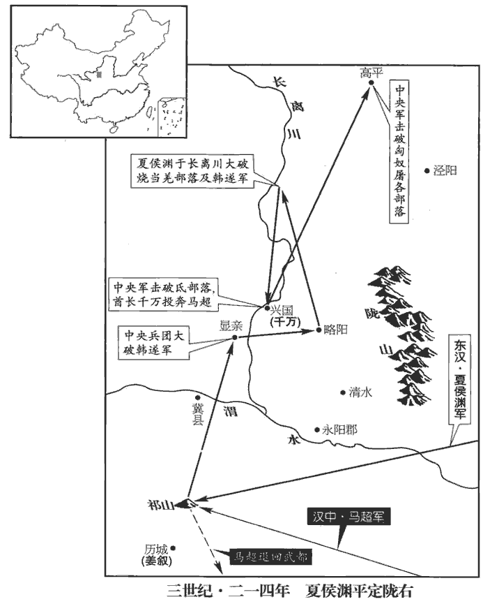
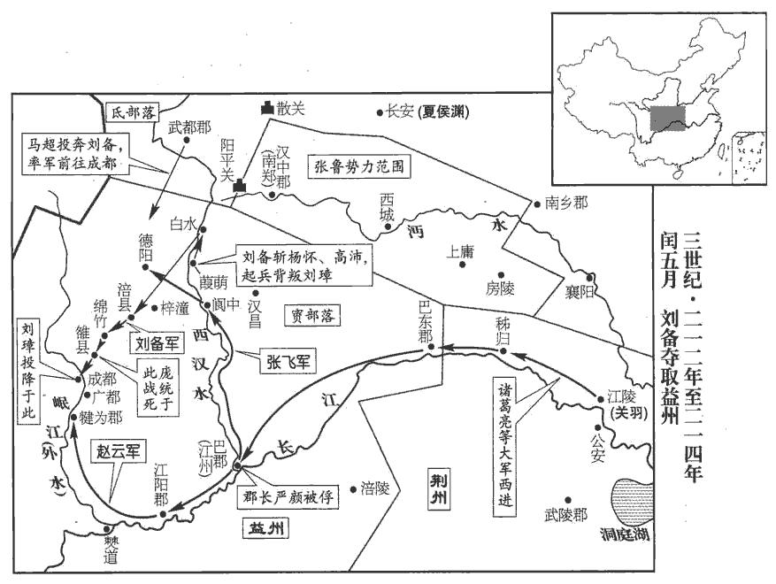
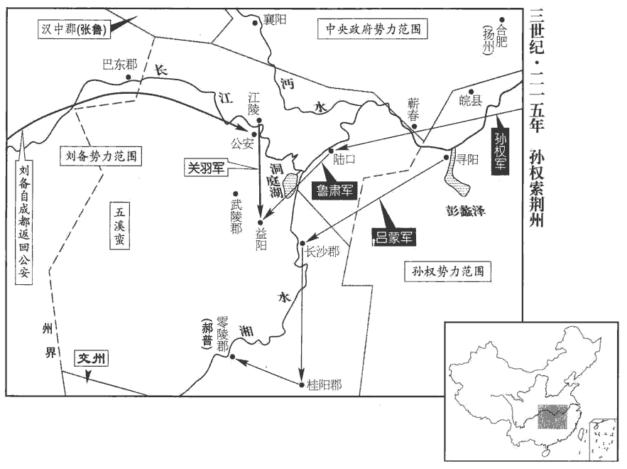
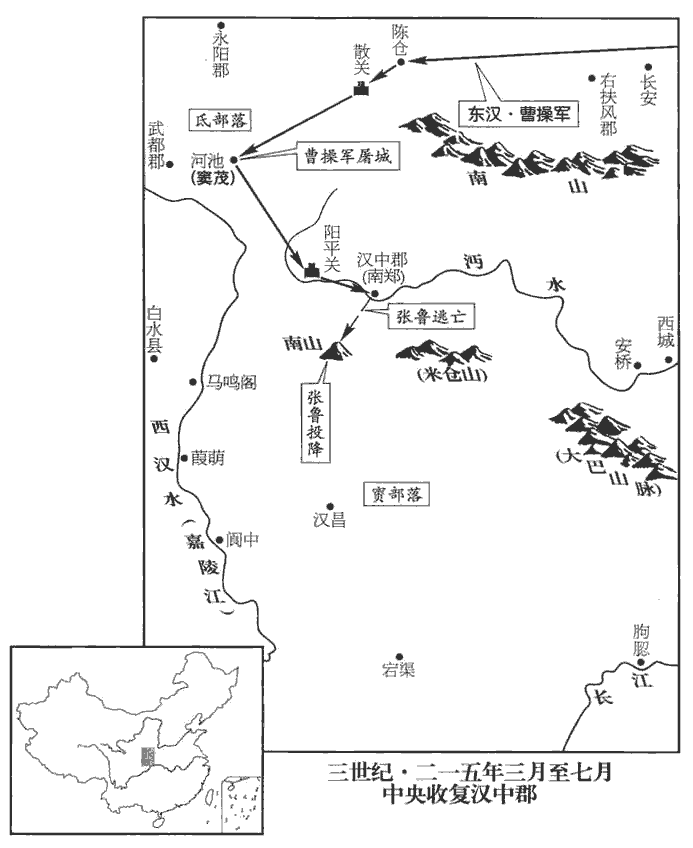
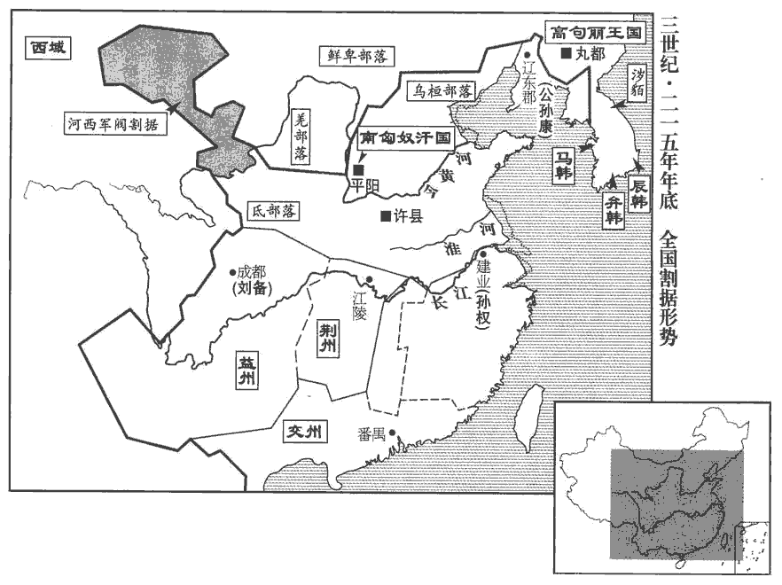

 漢紀五十九起閼逢敦牂（甲午），盡柔兆涒tūn灘（丙申），凡三年。

# 孝獻皇帝壬

## 建安十九年（甲午，二一四）

1春，馬超從張魯求兵，北取涼州，魯遣超還圍祁山。姜敘【章：甲十一行本「敘」下有「等」字；乙十一行本同；孔本同。】告急於夏侯淵，諸將議欲須魏公操節度。淵曰：「公在鄴，反覆四千里，比報，敘等必敗，非救急也。」比，必寐翻。遂行，使張郃督步騎五千為前軍。郃，古合翻，又曷閤翻。超敗走。

〖译文〗 [1]春季，马超请求张鲁分派给他一支军队，向北攻取凉州，张鲁派遣马超回军围攻祁山，祁山守将姜叙向夏侯渊告急。夏侯渊部下将领议论，认为必须上报魏公曹操，由他发令调度。夏侯渊说：“魏公远在邺城，向他报告，往返行程四千里，等他的命令传到这里，姜叙等人必定早已被打败，这不能解救危机。”于是命令部队行动，由张率步、骑兵五千人为先头部队。马超败退而走。

韓遂在顯親‹甘肃秦安西北›，顯親縣屬漢陽郡，班志無之，蓋光武所置，以封竇友。賢曰：顯親故城，在今秦州成紀縣東。淵欲襲取之，遂走。淵追至略陽城‹甘肃秦安东北›，去遂三十餘里，諸將欲攻之，或言當攻興國氐‹甘肃静宁南›。魏略曰：建安中，興國氐王阿貴，百頃氐王千萬，各有部落萬餘，從馬超為亂。超破之後，阿貴為夏侯淵所攻滅，千萬南入蜀。淵以為：「遂兵精，興國城固，攻不可卒拔，不如擊長離‹葫芦河，源于宁夏西吉，南流至甘肃天水注入渭河›諸羌。水經註：瓦亭水，南逕隴西成紀縣，東歷長離川，謂之長離水；燒當等羌居之。卒，讀曰猝。長離諸羌多在遂軍，必歸救其家。若捨羌獨守則孤，謂遂若捨羌而不救，獨擁兵自守，則其勢孤。救長離則官兵得與野戰，必可虜也。」淵乃留督將守輜重，重，直用翻。自將輕兵到長離，攻燒羌屯，遂果救長離，諸將見遂兵衆，欲結營作塹乃與戰，塹，七豔翻。淵曰：「我轉鬬千里，今復作營塹，則士眾罷敝，不可復用。復，扶又翻。罷，讀曰疲。賊雖眾，易與耳。」易，以豉翻。乃鼓之，大破遂軍，進圍興國。氐王千萬奔馬超，餘眾悉降。轉擊高平‹宁夏固原›、屠各，皆破之。屠，直如翻。

〖译文〗 韩遂驻军显亲。夏侯渊欲图袭击韩遂，夺取显亲，韩遂退走。夏侯渊追到略阳城，距离韩遂驻地三十余里。将领们准备向韩遂发动攻击，有人建议应当进攻兴国的氐人。夏侯渊认为：“韩遂的军队精锐，兴国有坚固的城防，进攻很难迅速取胜，不如攻打长离的羌人部落。很多长离的羌人都在韩遂军中，他们必然会回去援救自己的家乡。韩遂若舍弃长离羌人拥兵自守，便会失去羌人的支持而势孤力单；如果援救长离，我们就可以与他的部队进行野战，一定能够生擒韩遂。”于是，夏侯渊留下督将守卫辎重，亲自率军轻装至长离，攻打烧羌部落，韩遂果然来救长离。夏侯渊的部下将领见韩遂兵多，要扎下营盘、挖好堑壕再作战。夏侯渊说：“我军千里转战，如果再扎营盘，掘堑壕，士兵便会疲惫不堪，无法再用他们去作战了。韩遂兵虽多，却容易对付。”夏侯渊下令击鼓进攻，一举击溃了韩遂的军队，并乘胜包围了兴国。氐王千万逃到马那里，其余的官兵都投降了夏侯渊。夏侯渊又转而进攻高平、屠各两个部落，也都把他们击溃。

 

2三月，‹刘协，时年三十四›詔魏公操位在諸侯王上，改授金璽、赤紱fú、遠遊冠。漢制：諸侯王金印、赤紱、遠遊冠。董巴曰：遠遊冠，制如通天，高九寸，正豎、頂少邪，乃直下為鐵卷梁，有展筩tǒng橫之於前，無山述。

〖译文〗 [2]三月，献帝颁发诏书，确认魏公曹操地位在诸侯王之上，改授金制印玺、帝王和诸侯专用的红色绶带，以及诸侯王专用的远游冠。

3夏，四月，旱。五月，雨水。

〖译文〗 [3]入夏，四月，干旱。五月，雨多。

4初，魏公操遣廬江‹安徽寿县西南›太守朱光屯皖‹安徽潜江›，皖，戶板翻。大開稻田。呂蒙言於孫權曰：「皖田肥美，若一收孰，彼眾必增；收孰，謂稻成熟而收之也。有糧則可以增眾。孰，古熟字通。宜早除之。」閏月，權親攻皖城‹安徽潜江›。諸將欲作土山，添攻具，呂蒙曰：「治攻具及土山，必歷日乃成；治，直之翻。城備既脩，外救必至，不可圖也。且吾乘雨水以入，若留經日，水必向盡，還道艱難，蒙竊危之。今觀此城，不能甚固，以三軍銳氣，四面并攻，不移時可拔；及水以歸，全勝之道也。」權從之。蒙薦甘寧為升城督，寧手持練，身缘城，為士卒先；蒙以精銳繼之，手執枹鼓，枹fú，音膚。士卒皆騰踊。侵晨進攻，食時破之，獲朱光及男女數萬口。既而張遼至夾石‹安徽桐城北夹山›，夾石在今安慶府桐城縣北四十七里，今名西峽山。聞城已拔，乃退。權拜呂蒙為廬江太守，守，式又翻。還屯尋陽‹湖北武穴东北›。

〖译文〗 [4]当初，魏公曹操派庐江太守朱光在皖屯兵，大量开垦土地，种植稻谷。吕蒙向孙权建议：”皖地田土肥沃，如果一旦稻熟收获，曹军必然扩充，应当早日除去朱光。”闰五月，孙权亲自率军攻打皖城。将领们计划堆土山和增加攻城的设备，吕蒙说：“制造攻城设备和堆土成山，须多日才能完工。到那时，敌人城防已经巩固，援兵必定到来，我们将不能夺得皖城。况且我军乘雨多水大而来，如果旷日久留，大水必定渐渐退走，我们回兵的道路会遇到困难，我以为那是很危险的。现在看来，此城不会十分坚固，我三军士气高昂，四面齐攻，很快就可攻克，然后趁大水未退而回军，这才是大获全胜的策略。孙权采纳了这一建议。吕蒙推荐甘宁为升城督，甘宁手持白色熟绢，身先士卒攀上城墙；吕蒙命令精锐战士紧随其后，他亲自擂鼓指挥，战士们踊跃登城。拂晓发起攻击，早上辰时已经攻克皖城，俘获朱光以及城中男女数万人。不久，张辽率兵赶到夹石，听说皖城失守，便领兵撤退了。孙权任命吕蒙为庐江太守。回兵驻守寻阳。

5諸葛亮留關羽守荊州‹湖北江陵›，與張飛、趙雲將兵泝流克巴東‹重庆奉节东›。譙周巴記曰：初平六年，趙韙分巴郡安漢以下為永寧郡。建安六年，劉璋以永寧為巴東郡，唐夔州、開州之地也。至江州‹重庆›，破巴郡太守嚴顏，生獲之。飛呵顏曰：呵，虎何翻。「大軍既至，何以不降，而敢拒戰！」顏曰：「卿等無狀，侵奪我州。我州但有斷頭將軍，無降將軍也！」降，戶江翻；下同。我州，謂益州也。飛怒，令左右牽去斫頭。顏容止不變，曰：「斫頭便斫頭，何為怒邪！」飛壯而釋之，引為賓客。分遣趙雲從外水‹岷江›定江陽‹四川泸州›、犍為‹四川彭山›，江陽縣，本屬犍為郡，劉璋分立江陽郡；唐為瀘州。犍為郡，唐為資、簡、嘉、眉之地。今渝州亦漢巴郡地也，對二水口，右則涪內水，左則蜀外水。自渝上合州至綿州者，謂之內水；自渝上戎、瀘至蜀者，謂之外水。犍，居言翻。飛定巴西‹四川阆中›、德陽‹四川江油东北马角镇›。譙周巴記：建安六年，劉璋分巴郡墊江以上為巴西。德陽縣屬廣漢郡，唐遂州地。

〖译文〗 [5]诸葛亮留关羽留守荆州，与张飞、越云率兵溯长江而上，攻克巴东。至江州，打败并生擒了巴郡太守严颜。张飞呵斥严颜：“我大军已到，你为什么不投降，而敢率军顽抗！”严颜说：“你们无理夺取我江州，江州只有断头将军，没有投降将军！”张飞大怒，命令左右部属把严颜拉出去斩首。严颜形容举止不变，说：“砍头便砍头，发什么火！”张飞佩服严颜的胆魄，将他释放，并让他做自己的宾客。诸葛亮派遣赵云经外水出兵平定江阳、犍为，派张飞平定巴西、德阳。

劉備圍雒城‹四川广汉›且一年，龐統為流矢所中，卒‹年三十六›。法正牋與劉璋，為陳形勢強弱，中，竹仲翻。卒，子恤翻。為，于偽翻。且曰：「左將軍從舉兵以來，舊心依依，實無薄意。蓋時人以璋倚備為用，備反襲璋，議備之薄也。愚以為可圖變化，以保尊門。」尊門，謂璋家門。璋不答。雒城潰，備進圍成都。諸葛亮、張飛、趙雲引兵來會。

〖译文〗 刘备围攻雒城近一年，庞统被流矢射中而死。法正写信给刘璋，分析了形势强弱，并说：“左将军刘备起兵后，对您仍有旧情，实际上没有恶意。我认为您应改变态度，以保住家门的尊贵。”刘璋未予答复。刘备攻破雒城，进而包围了成都。诸葛亮、张飞、赵去也率兵前来会合。

馬超知張魯不足與計事，又魯將楊昂等數害其能，超內懷於邑。數，所角翻。師古曰：於邑，短氣貌，讀并如字。又，於，音烏，邑，音烏合翻。備使建寧督郵李恢往說之，蜀志：後主建興三年，改益州郡為建寧郡。恢此時蓋為益州郡督郵，史因後改郡名而書之耳。說，輸芮翻；下同。超遂從武都‹甘肃成县›逃入氐中‹甘肃南部›，密書請降於備。備使人止超，而潛以兵資之。超到，令引軍屯城北，城中震怖。怖，普布翻。

〖译文〗 马超知道张鲁是个不值得与其计议大事的人，张鲁的部将杨昂等人又多次诋毁他的才能，因此心中忧郁。刘备派建宁督邮李恢前去游说马超，马超便从武都逃到氐人部落，秘密写信给刘备请求归降。刘备派人制止了马超，但暗中派兵给以帮助。马超来到成都，刘备命他率军驻扎城北，成都城内的人非常震惊，心中恐惧。

備圍城數十日，使從事中郎涿郡‹河北涿州›簡雍入說劉璋。簡，姓也。魯有大夫簡叔。蜀志曰：簡雍姓耿，後音訛為簡。時城中尚有精兵三萬人，穀帛支一年，吏民咸欲死戰。璋言：「父子在州二十餘年，靈帝中平五年，劉焉牧益州，至是二十七年。無恩德以加百姓。百姓攻戰三年，肌膏草野者，以璋故也，膏，古報翻。何心能安！」遂開城，與簡雍同舆出降，降，戶江翻。群下莫不流涕。備遷璋于公安‹湖北公安›，盡歸其財物，佩振威將軍印綬。曹公先加璋振威將軍，故仍佩其印綬。

〖译文〗 刘备包围成都数十天，派从事中郎涿郡人简雍进城劝降刘璋。此时城中还有精兵三万人，粮食和丝帛可以支持一年，官吏和百姓都愿死战到底。刘璋说：“我们父子统领益州二十余年，对百姓没有什么恩德。百姓苦战三年，暴尸荒野，实在是因为我刘璋的缘故，我怎能安心！”因此命令打开城门，和简雍同乘一辆车出来投降，部属无不伤心落泪。刘备把刘璋安置在公安这个地方，归还他的全部财物，让他佩带振威将军印绶。

 

備入成都，置酒，大饗士卒。取蜀城中金銀，分賜將士，還其穀帛。凡城中公私所有金銀，悉取以分賜將士，至於穀帛，則各還所主也。備領益州牧，以軍師中郎將諸葛亮為軍師將軍，益州太守。此益州太守非漢武帝所開置之益州郡也。武帝所置之益州郡，劉蜀為南中地宅。蓋劉璋置益州太守與蜀郡太守并治成都郭下。南郡‹湖北江陵›董和為掌軍中郎將，并署左將軍府事，署府事者，總錄軍府事也。偏將軍馬超為平西將軍，晉百官志：四平，立於喪亂。謂平東、平西、平南、平北四將軍也。軍議校尉法正為蜀郡太守、揚武將軍，裨pí將軍南陽‹河南南陽›黃忠為討虜將軍，從事中郎麋竺為安漢將軍，漢大將軍府有從事中郎，職參謀議。簡雍為昭德將軍，北海‹河北昌乐西›孫乾為秉忠將軍，安漢、昭德、秉忠，皆備所置將軍號也。廣漢‹四川射洪东南柳树镇›長黃權為偏將軍，長，知兩翻。汝南‹河南平›舆西北射桥乡許靖為左將軍長史，龐羲為司馬，龐，皮江翻。李嚴為犍為‹四川彭山›太守，犍，居言翻。費觀為巴郡太守，費，父沸翻。山陽‹山东金乡西北昌邑镇›伊籍為從事中郎，零陵‹湖南永州›劉巴為西曹掾，掾，俞絹翻。廣漢‹四川广汉›彭羕為益州治中從事。羕yàng，餘亮翻。

〖译文〗 刘备进入成都，大摆酒宴，犒劳士卒，取出城中存放的金银，分赐给将士，而粮食和丝帛则物归原主。刘备兼任益州牧，任命军师中郎将诸葛亮为军师将军，益州太守、南郡人董和为掌军中郎将，并且代理左将军府事，偏将军马超为平西将军，军议校尉法正为蜀郡太守、扬武将军，裨将军、南阳人黄忠为讨虏将军，从事中郎麋竺为安汉将军，简雍为昭德将军，北海人孙乾为秉忠将军，广汉长黄权为偏将军，汝南人许靖为左将军长史，庞羲为司马，李严为犍为太守，费观为巴郡太守，山阳人伊籍为从事中郎，零陵人刘巴为西曹掾，广汉人彭为益州治中从事。

初，董和在郡清儉公直，為民夷所愛信，蜀中推為循吏，故備舉而用之。備之自新野‹河南新野›奔江南也，事見六十五卷十三年。荊楚群士從之如雲，而劉巴獨北詣魏公操。操辟為掾，遣招納長沙‹湖南长沙›、零陵‹湖南永州›、桂陽‹湖南郴州›。會備略有三郡，巴事不成，欲由交州道還京師。時諸葛亮在臨蒸‹湖南衡陽›，沈約曰：吳立衡陽郡，臨蒸縣屬焉。盖吴所置也。水經註：蒸水出衡陽重安縣西邵陵縣界耶薑山，東北流過臨蒸縣北，東注于湘，謂之蒸口。以書招之，巴不從，備深以為恨。巴遂自交趾入蜀依劉璋。及璋迎備，巴諫曰：「備，雄人也，入必為害。」既入，巴復諫曰：復，扶又翻。「若使備討張魯，是放虎於山林也。」璋不聽，巴閉門稱疾。備攻成都，令軍中曰：「有害巴者，誅及三族。」及得巴，甚喜。是時益州郡縣皆望風景附，獨黃權閉城堅守，須璋稽服，乃降。稽，音啟；言稽顙服從也。降，戶江翻；下同。於是董和、黃權、李嚴等，本璋之所授用也；璋以和為益州太守，權為府主簿，嚴為護軍。吳懿、費觀等，璋之婚親也；璋兄瑁娶吳懿妹，璋母費氏。彭羕，璋之所擯棄也；羕仕益州不過書佐，人毀之於璋，髡鉗為徒隸。劉巴，宿昔之所忌恨也；備皆處之顯任，處，昌呂翻。盡其器能，有志之士，無不競勸，益州之民，是以大和。初，劉璋以許靖為蜀郡太守。成都將潰，靖謀踰城降備，備以此薄靖，不用也。法正曰：「天下有獲虛譽而無其實者，許靖是也。許靖與弟劭并有高名，汝南月旦評，二人者為之也。然今主公始創大業，主公之稱，始於東都。改明公稱主公，尊事之為主也。天下之人，不可戶說，不可戶戶而說之也。說，如字宜加敬重，以慰遠近之望。」備乃禮而用之。

〖译文〗 当初，董和在益州郡的时候，清明，俭朴、公平、正直，受到汉夷百姓的爱戴和信任，大家公认他是循礼守法的官吏，所以得到刘备的提拨和任用。刘备从新野逃到江南，荆州一带的士人投奔他的非常多，唯独刘巴跑到魏公曹操那里。曹操任命刘巴为掾，派遣他去招降和接收长沙、零陵、桂阳三郡。正赶上刘备夺取了三郡，刘巴无法完成任务，准备由交州转道返回京城。这时诸葛亮在临蒸，写信劝他投奔刘备，他不同意，刘备深感是件恨事。刘巴从交趾进入蜀地依附刘璋。当刘璋准备迎接刘备入蜀的时候，刘巴劝谏说：“刘备是一代奸雄，进入蜀地必定害人。”刘备入蜀以后，刘巴再次劝谏说：“要是让刘备去征讨张鲁，如同放虎归山。”刘璋不听，他便闭门称病。刘备围攻成都，向军队下令：“谁若伤害刘巴，诛灭三族。”及至得到刘巴，刘备非常高兴。当时益州各郡县闻风都如影随形般地投靠刘备，只有黄权紧闭城门坚守，等到刘璋跪拜投降，他才归附。这样，本为刘璋所任用的董和、黄权、李严等，刘璋的姻亲吴懿、费观等，刘璋所排斥的彭，刘备往日所忌恨的刘巴，刘备都予以重用，以尽其才能。有志之士，都争相努力尽职，益州百姓，因此非常合睦。以前，刘璋任命许靖为蜀郡太守。成都将被攻破时，许靖曾计划出城投降刘备，刘备因此而看不起许靖，对他不加任用。法正对刘备说：“世上有一种有虚名而其实不副的人，许靖就是这种人。然而主公您现在刚开始创建大业，不能让天下人议论您。对许靖还是敬重为好，以此抚慰远近之人，不使失望。”刘备这才对许靖以礼相待，加以任用。

成都之圍也，備與士眾約：「若事定，府庫百物，孤無預焉。」及拔成都，士眾皆捨干戈赴諸藏，藏，徂浪翻。競取寶物。軍用不足，備甚憂之，劉巴曰：「此易耳。易，以豉翻。但當鑄直百錢，直百錢，一錢直百也。杜佑曰：蜀鑄直百錢，文曰「直百」。亦有勒為五銖者，大小稱兩如一焉，并徑七分，重四銖。平諸物價，令吏為官市。」備從之。數月之間，府庫充實。

〖译文〗 围攻成都时，刘备曾与部下约定：“若攻破成都，官府仓库的一切财物，你们可以任意地拿，我决不干预。”破城之后，士兵们都扔掉兵器，奔向仓库争抢财物，造成军费不足，刘备深感忧虑。刘巴说：“这很容易解决，只要铸造一种值百钱的的钱币，平抑物价，命官吏设立官市。”刘备采纳了这一建议，几个月后，府库的财物就充足了。

時議者欲以成都名田宅分賜諸將。趙雲曰：「霍去病以匈奴未滅，無用家為。事見十九卷武帝元狩四年。今國賊非但匈奴，未可求安也。須天下都定，各反桑梓，都定，猶言皆定也。桑梓，謂其故鄉祖父之所樹者。詩云：維桑與梓，必恭敬止。歸耕本土，乃其宜耳。益州人民，初罹兵革，田宅皆可歸還，令安居復業，然後可役調，調，徒弔翻。得其歡心；不宜奪之，以私所愛也。」備從之。

〖译文〗 当时，有人建议把成都有名的肥田沃土和住宅分给将领们。赵云说：“霍去病曾认为匈奴尚未消灭，不应考虑自己的家业。现在的国贼远非匈奴可比，我们不能贪图安乐。等到天下都安定以后，将士们重归故里，在自己的田地上耕作，才会各得其所。益州的百姓，刚刚遭受兵灾战祸，土地、田宅都应归还原来的主人，使百姓平安定居，恢复生产，然后才可以向他们征发兵役，收取租税，获得他们的好感；不应该夺取他们财物，以私宠自己所爱的将领。”刘备接受了赵云的意见。

備之襲劉璋也，留中郎將南郡‹湖北江陵›霍峻守葭萌城‹四川广元西南›。張魯遣楊昂誘峻求共守城。峻曰：「小人頭可得，城不可得！」昂乃退。後璋將扶禁、向存等帥萬餘人由閬水‹嘉陵江上游›上，扶，姓；禁，名。帥，讀曰率。閬làng水即西漢水，禹貢所謂「嶓bō冢導漾，東流為漢」者也。水經註：漾水出隴西氐道縣嶓冢山，謂之西漢水；東南至廣漢白水縣西，又東南至葭萌縣，又東南過巴郡閬中縣與閬水會。水出閬陽縣而東，逕其縣南，又東注漢水。昔劉璋攻霍峻於葭萌也，自此水上。又東南入漢州江津縣，東南入于江。余據此水，今謂之嘉陵江。攻圍峻，且一年。峻城中兵纔數百人，伺其怠隙，選精銳出擊，大破之，斬存。伺，相吏翻。備既定蜀，乃分廣漢為梓潼郡‹四川梓潼›，唐梓州之地。宋白曰：綿州巴西縣，本漢涪縣，屬廣漢郡。華陽國志：漢元初二年，廣漢自繩鄉移治涪，後治雒；劉備立梓潼郡，以縣屬焉。隋改為巴西縣。唐梓州治郪qī，天寶方改為梓潼郡。以峻為梓潼太守。

〖译文〗 刘备袭击刘璋时，留中郎将南郡人霍峻守卫葭萌城。张鲁派杨昂引诱霍峻，要求共同守城。霍峻说：“我的头可得，而城不可得！”杨昂只好作罢。后来刘璋的部将扶禁、向存等人，率领一万余人溯阆水向上游进发，围攻霍峻近一年。霍峻在城中只有数百名战士，窥伺敌人疲惫的机会，挑选精锐出击，大破敌军，斩杀了向存。刘备占据蜀地后，从广汉郡分出梓潼郡，任命霍峻为梓潼太守。

法正外統都畿，備都成都，以蜀郡為都畿。內為謀主，一飧sūn之德、睚yá眦zì之怨，無不報復，飧，千安翻。睚，五懈翻。眦，士懈翻。擅殺毀傷己者數人。或謂諸葛亮曰：「法正太縱橫，橫，戶孟翻。將軍宜啟主公，抑其威福。」亮曰：「主公之在公安也，北畏曹操之強，東憚孫權之逼，近則懼孫夫人生變於肘腋。事見上卷十四年。法孝直為之輔翼，令翻然翱翔，不可復制。謂迎備入益州也。復，扶又翻。如何禁止孝直，使不得少行其意邪！」法正，字孝直。少，詩沼翻。

〖译文〗 法正在外统辖蜀郡，在内是为刘备出谋划策的主要人物。他恩怨分明，对他有过一餐饭的恩惠，他都予以报答；对他有一瞪眼的怨恨，他也无不报复，擅自杀害了一些伤害过自己的人，有人对诸葛亮说：“法正肆意横行，将军您应该禀报主公，限制他作威作福。”诸葛亮说：“主公在公安的时候，北边畏惧曹操的强大，东边害怕孙权的威胁，近处则担心孙夫人在家中搞出内乱，法正象羽翼一样辅佐主公，使主公能够自由翱翔，不再受制于他人。怎么能禁止法正，而不许他稍稍随心所欲呢！”

諸葛亮佐備治蜀，頗尚嚴峻，人多怨歎者。治，直之翻。法正謂亮曰：「昔高祖入關，約法三章，秦民知德。事見九卷高帝元年。今君假借威力，跨據一州，初有其國，未垂惠撫；且客主之義，宜相降下，下，遐稼翻。願緩刑弛禁以慰其望。」以亮等初至為客，益州人士則主也。亮曰：「君知其一，未知其二。秦以無道，政苛民怨，匹夫大呼，呼，火故翻。天下土崩；高祖因之，可以弘濟。弘，大也。劉璋暗弱，自焉以來，焉，璋父也。有累世之恩，文法羈縻，互相承奉，德政不舉，威刑不肅。蜀土人士，專權自恣，君臣之道，漸以陵替。寵之以位，位極則賤；順之以恩，恩竭則慢。所以致敝，實由於此。吾今威之以法，法行則知恩；限之以爵，爵加則知榮。榮恩并濟，上下有節。為治之要，於斯而著矣。」孔子曰：政寬則濟之以猛，孔明其知之。治，直吏翻。

〖译文〗 诸葛亮辅佐刘备治理蜀地，很强调严刑峻法，很多人怨恨叹息。法正对诸葛亮说：“以前汉高祖入函谷关，约法三章，秦地的百姓感恩戴德。如今，您借助权势的力量，占据一州的地方，刚刚建立国家，还没有施加恩惠，进行安抚，况且从外来的客与本地的主这间的关系讲，客人的姿态应当降低，希望您能放宽刑律和禁令，以适应当地人的意愿。”诸葛亮回答说：“您只知其一，不知其二。秦因为暴虐无道，政令苛刻，造成人民对它的怨恨，所以一介草民大呼一声，天下就土崩瓦解。汉高祖在这种情况下，可以采用宽大的政策而获得很大成功。刘璋糊涂软弱，从其父刘焉那时起，刘家对蜀地的人两世的恩惠，全靠典章和礼仪维系上下的关系，互相奉承，德政不能施行，刑罚失掉威业。蜀地的人专权而为所欲为，君臣之道，渐渐破坏。给予高官表示宠爱，官位无法再高时，反而被臣下轻视；顺从臣下的要求，施加恩惠，不能的时候，臣下便会轻狂怠慢。蜀地所以到了破败的地步，实在是由于这样的原因引起的。我现在要树立法令的威严，法令被执行，人们便会知道我们的恩德；以爵位限定官员的地位，加爵的人便会觉得很荣耀。荣耀和恩德相辅相成，上下之间有一定的规矩，治国的主要原则，由此清楚地显示出来了。”

劉備以零陵‹湖南永州›蔣琬為廣都‹四川成都南华阳镇›長。長，知兩翻。備嘗因游觀，奄至廣都，見琬眾事不治，時又沈醉。沈，持林翻。沈醉，言為酒所沈滯也。備大怒，將加罪戮。諸葛亮請曰：「蔣琬社稷之器，非百里之才也。其為政以安民為本，不以脩飾為先，願主公重加察之。」重，直用翻，言再三加察也。備雅敬亮，乃不加罪，倉卒但免官而已。

〖译文〗 刘备任命零陵人蒋琬为广都长。刘备外也游览，突然到达广都，见蒋琬不处理各项政务，当时又喝得烂醉。刘备大怒，要将蒋琬治以死罪。诸葛亮为蒋琬求情说：“蒋琬是治国的栋梁之材，不是治理百里小县的官史。他施政以安定百姓为本，不以做表面文章为先，希望主公重新考察。”刘备一向尊重诸葛亮，才没有给蒋琬定罪，只是在仓促中免去了他的官职。

6秋，七月，魏公操擊孫權，留少子臨菑侯植‹时年二十三›守鄴。少，詩照翻。考異曰：植傳云：「太祖戒之曰：『吾昔為頓丘令，年二十三，思此時所行，無悔於今。今汝年亦二十三矣。』」又云：「植，太和六年薨，年三十一。」按植今年年二十三，則死時當年四十一矣。本傳誤也。操為諸子高選官屬，為，于偽翻。以邢顒為植家丞；顒防閑以禮，無所屈橈náo，顒，魚容翻。防，隄也。閑，闌也。防以制水，閑以制獸，皆禁止之義也。橈，奴教翻。由是不合。庶子劉楨美文辭，植親愛之。漢制：列侯置家丞、庶子各一人，主侍侯，使理家事。楨，音貞。楨以書諫植曰：「君侯採庶子之春華，忘家丞之秋實，為上招謗，其罪不小，愚實懼焉。」

〖译文〗 [6]秋季，七月，魏公曹操进攻孙权，留下小儿子临侯曹植守卫邺城。曹操为自己的几个儿子选任官属的标准很高，任命邢为曹植的家丞。邢对曹植按礼仪严格约束，从不退让，因此与曹植不合。庶子刘桢擅长写文章，辞藻华丽，曹植对他很亲近、喜爱。刘桢写信劝谏曹植：“君侯您只采撷庶子我华丽的春花，而忽视了家丞的秋实，将为君上招来毁谤，罪过不小，我实在感到恐惧。”

7魏尚書令荀攸卒。攸深密有智防，智以料事，防以保身。自從魏公操攻討，常謀謨mó帷幄，時人及子弟莫知其所言。操嘗稱，「荀文若之進善，不進不休；荀公達之去惡，不去不止。」去惡之去，羌呂翻。荀彧，字文若；荀攸，字公達。又稱：「二荀令之論人，久而益信，吾沒世不忘。」彧為漢尚書令，攸為魏尚書令。

〖译文〗 [7]魏尚书令荀攸去世。荀攸深沉明智，善于保护自己。自从跟随魏公曹操四方征战，经常参与机密，献计献策，当时的人和他的子弟，都不知道他曾献过哪些计策。曹操曾称赞说：“荀进献好的建议，不被采纳不罢休；荀攸排除错误的行为，不达到目的不停止。”又说：“荀和荀攸两位尚书令，对人物的评论，时间愈久，愈显示他们的观点中肯，我终身都不会忘却。”

8初，枹罕‹甘肃临夏›宋建因涼州亂，自號河首平漢王，枹罕縣，前漢屬金城郡，後漢屬隴西郡。枹，音膚。賜支河首在金城河關之西，建自以居河上流，故以為號。改元，置百官，三十餘年。冬，十月，魏公操使夏侯淵自興國‹甘肃静宁南›討建，圍枹罕‹甘肃临夏›，拔之，斬建。淵別遣張郃等渡河，入小湟中‹青海阿尼玛卿山西北›，湟水源出西海鹽池之西北，東至金城允吾縣入河。夾湟兩岸之地，通謂之湟中。又有湟中城，在西平、張掖之間，小月氏之地也，故謂之小湟中。河西諸羌皆降，降，戶江翻。隴右平。

〖译文〗 [8]以前，罕人宋建乘凉州动乱，自己号称河首平汉王，更改年号，设置官署，任命各级官吏，长达三十余年。冬季，十月，魏公曹操派夏侯渊从兴国出发征讨宋建，包围并攻克了罕，将宋建斩首。夏侯渊派张等人渡过黄河，进入小湟中，河西羌人各部落全部归降，陇右地区被平定了。

9帝自都許以來，守位而已，左右侍衛莫非曹氏之人者。議郎趙彥常為帝陳言時策，魏公操惡而殺之。為，于偽翻。惡，烏路翻。操後以事入見殿中，帝不任其懼，見，賢遍翻；下同。任，音壬，勝也；不任，猶言不勝也。因曰：「君若能相輔，則厚；不爾，幸垂恩相捨。」操失色，俛fǔ仰求出。舊儀：三公領兵，朝見，令虎賁執刃挾之。以其領兵，懼其為變，故防之也。朝，直遙翻，下同。見，賢遍翻。操出，顧左右，汗流浹背；浹，即協翻。自後不復朝請。復，扶又翻。

〖译文〗 [9]汉献帝自从建都许昌以来，仅仅能够保住自己的皇帝地位而已，左右随从侍卫无一不是曹操的人。议郎赵彦经常为汉献帝分析时势，进献对策，因此遭到魏公曹操的憎恶而被杀害。后来，曹操有事进殿见献帝，汉献帝无法控制恐惧，对曹操说：“您若能辅佐我，就宽厚些；否则，您就开恩把我抛开。”曹操大惊失色，急忙应付着请求告辞。汉朝旧制规定：领兵的三公在朝见皇帝时，都要由虎贲武士持刀挟持。曹操出殿后，回顾左右，汗流浃背，从此不再朝见献帝。

董承女為貴人，操誅承，求貴人殺之。帝以貴人有姙，姙rèn，如林翻，孕也。累為請，不能得。為，于偽翻。伏皇后由是懷懼，乃與父完書，言曹操殘逼之狀，賊人者謂之殘。逼，言其逼上也。令密圖之，完不敢發。至是，事乃泄，董承誅事見六十三卷五年。操大怒，十一月，使御史大夫郗慮持節策收皇后‹伏寿›璽綬，郗xī，丑之翻。璽，斯氏翻。綬，音受。以尚書令華歆為副，勒兵入宮，收后。后閉戶，藏壁中。歆壞戶發壁，就牽后出。華子魚有名稱於時，與邴原、管寧號三人為一龍，歆為龍頭，原為龍腹，寧為龍尾。歆所為乃爾；邴原亦為操爵所縻mí；高尚其事，獨管寧耳。當時頭尾之論，蓋以名位言也。嗚呼！壞，音怪。時帝在外殿，引慮於坐，坐，徂臥翻。后‹伏寿›被髮、徒跣、行泣過，訣曰：「不能復相活邪？」被，皮義翻。復，扶又翻。帝‹刘协，时年三十四›曰：「我亦不知命在何時！」顧謂慮曰：「郗公，漢御史大夫，三公也，故以呼之。天下寧有是邪！」遂將后下暴室，以幽死；下，遐稼翻。所生二皇子，皆酖zhèn殺之，兄弟及宗族死者百餘人。

〖译文〗 垂承的女儿是献帝的贵人，曹操杀掉董承以后，要求把他的女儿董贵人也杀死。汉献帝以贵人有身孕为由，多次向曹操求情，曹操都不同意。伏皇后因此而心怀恐惧，写信给父亲伏完，谈了曹操逼迫皇帝的凶恶行为。到这时，事情泄露出来，曹操知道后非常愤怒。十一月，派御史大夫郗虑带着符节和策书，收缴了皇后的印玺绶带，派尚书令华歆为副，率兵入宫逮捕伏皇后。皇后关上门，藏在夹墙里。华歆砸门破壁，把皇后拖了出来。汉献帝当时在外殿，招呼郗虑坐下，皇后披头散发，光着双脚，边走边哭，经过献帝面前诀别道：“不能再救我一命吗？”献帝说：“我也不知道自己能活到几时！”他看着郗虑说：“郗公，天下难道竟有这样的事吗！”就这样把皇后关在宫中的监狱里，幽禁而死。她生的两个皇子，也被用毒酒杀死了，她的兄弟以及宗族亲属被害者有一百余人。

10十二月，魏公操至孟津‹河南孟津东黄河渡口›。

〖译文〗 [10]十二月，魏公曹操到达孟津。

11操以尚書郎高柔為理曹掾。理曹，漢公府無之，蓋操所置。掾，俞絹翻。舊法：軍征士亡，考竟其妻子。考覈hé而窮竟之也。而亡者猶不息。操欲更重其刑，并及父母、兄弟，柔啟曰：「士卒亡軍，誠在可疾，疾，惡也。書曰：爾毋忿疾于頑。然竊聞其中時有悔者。愚謂乃宜貸其妻子，一可使誘其還心。誘，音酉。正如前科，固已絕其意望；而猥復重之，復，扶又翻，下同。柔恐自今在軍之士，見一人亡逃，誅將及己，亦且相隨而走，不可復得殺也。此重刑非所以止亡，乃所以益走耳！」操曰：「善！」即止不殺。

〖译文〗 [11]曹操任命尚书郎高柔为理曹掾。旧有的法令规定：军队征来的兵士逃跑了，要追究他们的妻子、儿女。但士兵逃亡仍然不断。曹操要加重对逃兵的刑罚，连带追究他们的父母、兄弟。高柔说：“士兵开小差，确实很可恶，但听说他们之中也常有人后悔。我以为，应当宽恕他们的妻子、儿女，或许可以诱使他们心回意转。只按照以前的法令，本已断绝了他们返回的希望，要是再加重刑罚，我恐怕从今以后，军队中的士兵，见到一人逃跑，害怕自己受牵连而死，也会跟着逃跑，将不再有人可杀了。这样，加重刑罚不但不能制止士兵逃跑，反而会使逃兵更多。”曹操说：“很好！”便停止了处死逃兵的刑罚。

## 二十年（乙未，二一五）

1春，正月，甲子‹十八›，‹刘协，时年三十五›立貴人曹氏‹曹节›為皇后；魏公操之女【張：「女」上脫「中」字。】也。

〖译文〗 [1]春季，正月，甲子（十八日），魏公曹操的女儿曹贵人被册立为皇后。

2三月，魏公操自將擊張魯，將自武都‹甘肃成县›入氐，武都，本白馬氐所居之地，武帝開以為郡。氐人塞道，塞，悉則翻。遣張郃、朱靈等攻破之。郃，古合翻，又曷閤翻。夏四月，操自陈仓‹陕西宝鸡东陈仓›出散关‹陕西宝鸡西南›，至河池‹甘肃徽县›，陈仓县属右扶风，唐岐州宝鸡县是。大散关在其西南，河池县属武都郡，余據大散關在今鳳州梁泉縣。氐王竇茂眾萬餘人，恃險不服，五月，攻屠之。西平‹青海西宁›、金城‹甘肃兰州东›諸將麴演、蔣石等共斬送韓遂首。漢末分金城為西平郡。

〖译文〗 [2]三月，魏公曹操亲自率兵攻打张鲁，准备自武都进入氐人所居之地。氐人在途中拦截，曹操派张、朱灵打败了氐人。夏季，四月，曹操从陈仓出散关，到达河池。氐王窦茂有部众一万余人，仗恃地势险要，不肯降服。五月，曹军打败氐人，并进行屠杀。西平、金城的演、蒋石等将领共同杀死韩遂，把他的头颅献给曹操。

3初，劉備在荊州‹湖北湖南›，周瑜、甘寧等數勸孫權取蜀。數，所角翻。權遣使謂備曰：使，疏吏翻。「劉璋不武，不能自守，若使曹操得蜀，則荊州危矣。今欲先攻取璋，次取張魯，一統南方，雖有十操，無所憂也。」備報曰：「益州民富地險，劉璋雖弱，足以自守。今暴師於蜀、漢，轉運於萬里，欲使戰克攻取，舉不失利，此孫、吳所難也。孫、吳，謂孫武、吳起也。議者見曹操失利於赤壁‹湖北蒲圻qí西北赤壁镇›，謂其力屈，無復遠念；復，扶又翻。今操三分天下已有其二，將欲飲馬於滄海，觀兵於吳會，吳會，謂吳地為一都會。會，讀如字。一說，吳、會，謂吳、會稽二郡之地。會，音工外翻。何肯守此坐須老乎！而同盟無故自相攻伐，借樞於操，樞者，門戶所由以運動也。言操欲搖動吳、蜀而未得其樞，若自相攻伐，是借之以可動之樞也。使敵乘其隙，非長計也。且備與璋託為宗室，冀憑威靈以匡漢朝。朝，直遙翻。今璋得罪於左右，備獨悚懼，非所敢聞，願加寬貸。」權不聽，遣孫瑜率水軍住夏口‹湖北武汉›。備不聽軍過，謂瑜曰：「汝欲取蜀，吾當被髮入山，不失信於天下也。」言宗室被攻而不能救，無面目以立於天下也。被，皮義翻。使關羽屯江陵‹湖北江陵›，張飛屯秭歸‹湖北秭归›，秭歸縣，屬南郡，唐之歸州。諸葛亮據南郡‹湖南公安›，南郡，本治江陵，吳得荊州，置南郡於江南；晉平吳，以江陵為南郡，以江南之南郡為南平郡。亮所據蓋江南之南郡也。備自住孱陵‹湖北公安西南›，孱chán，應劭音踐；師古士連翻。權不得已召瑜還。及備西攻劉璋，權曰：「猾虜，乃敢挾詐如此！」備留關羽守江陵，魯肅與羽鄰界；羽數生疑貳，肅常以歡好撫之。數，所角翻。好，呼到翻。

〖译文〗 [3]以前，刘备在荆州时，周瑜、甘宁等人多次劝孙权夺取蜀地。孙权派遣使者对刘备说：“刘璋软弱，不能保护自己，假如曹操得到蜀地，荆州就危险了。我现在计划先攻破刘璋，再击败张鲁，统一南方，即使有十个瑛操，我也没有什么可担忧的了。”刘备回答说：“益州人民富裕，地势险要，刘璋虽然软弱，保护自己还有足够的力量。现在若使军队行进在蜀、汉之地，餐风宿露，在万里道路上转运给养，要想战必克，攻必取，举措不失利，就是孙武和吴起也难以做到。议论的人见曹操在赤壁失败，就说他已经没有什么力量，不再有长远打算。然而现今三分天下曹操已拥有其二，准备到沧海去饮马，到吴郡会稽来阅兵，怎么会守着这个局面坐等年老呢？而抗曹的同盟之间却无故自相攻伐，把机会借给曹操，让敌人钻空子，这水是长久之计。况且我和刘璋都是刘姓皇族，希望凭借祖上尊严的神灵匡扶汉朝。如今刘璋得罪了您，我独自感到惶恐，不敢听从您的计划，请求宽恕。”孙权不听刘备的劝告，派孙瑜率水军驻在夏口。刘备不允许孙权的军队过境，对孙瑜说：“你们若要攻取蜀地，我将披头散发，隐遁山林之中，不能在天下人面前失信。”便派关羽驻守江陵，张飞屯兵在秭归，诸葛亮据守南郡，他自己坐镇孱陵。孙权不得已，把孙瑜召回。及至刘备向西进攻刘璋时，孙权说：“这个滑头，竟敢如此搞阴谋诡计！”刘备留下关羽防守江陵，鲁肃的防区与关羽为邻；关羽多次产生疑虑，鲁肃则经常以友好的态度使他安心。

 

及備已得益州，權令中司馬諸葛瑾從備求荊州諸郡。時權署置諸將有別部司馬；則中司馬者，蓋中軍司馬也。瑾自長史轉中司馬，位任蓋不輕矣。瑾，渠吝翻。備不許，曰：「吾方圖涼州，涼州定，乃盡以荊州相與耳。」權曰：「此假而不反，乃欲以虛辭引歲也。」謂延引歲時也。孟子曰：久假而不歸，焉知其非有也。遂置長沙‹湖南长沙›、零陵‹湖南永州›、桂陽‹湖南郴州›三郡長吏。長，知兩翻。關羽盡逐之。權大怒，遣呂蒙督兵二萬以取三郡。

〖译文〗 刘备得到益州后，孙权派中司马诸葛瑾向刘备索求荆州的各郡。刘备不同意，说：“我正准备夺取凉州，取得凉州以后，才能把荆州全部给你们。”孙权说：“这是有借无还，不过是找借口以拖延时日罢了。”因此任命了长沙、零陵、桂阳三郡的地方长官。关羽则全部加以驱逐。孙权大怒，派吕蒙率兵二万人夺取三郡。

蒙移書長沙、桂陽，皆望風歸服，惟零陵太守郝普城守不降。降，戶江翻；下同。劉備聞之，自蜀親至公安，遣關羽爭三郡。孫權進住陸口‹湖北嘉鱼西南陆溪镇›，為諸軍節度；使魯肅將萬人屯益陽以拒羽；益陽縣屬長沙郡。應劭曰：在益水之陽。輿地志：今潭州安化縣，本漢益陽縣。杜佑曰：潭州益陽縣，漢故城在今縣東。宋白曰：益陽故城在今益陽縣東八十里，其城魯肅所築。飛書召呂蒙，使捨零陵急還助肅。蒙得書，祕之，夜，召諸將授以方略；晨，當攻零陵，顧謂郝普故人南陽鄧玄之曰：「郝子太聞世間有忠義事，亦欲為之，而不知時也。郝普，字子太。郝，呼各翻。今左將軍在漢中為夏侯淵所圍，關羽在南郡，至尊身自臨之。彼方首尾倒縣，縣，讀曰懸。救死不給，豈有餘力復營此哉！今吾計力度慮而以攻此，復，扶又翻。度，徒洛翻；下同。曾不移日而城必破，城破之後，身死，何益於事，而令百歲老母戴白受誅，豈不痛哉！度此家不得外問，此家，謂郝普也。謂援可恃，故至於此耳。君可見之，為陳禍福。」為，于偽翻。玄之見普，具宣蒙意；普懼而出降。蒙迎，執其手與俱下船，語畢，出書示之，因拊手大笑。普見書，知備在公安而羽在益陽，慙恨入地。蒙留孫河，委以後事，考異曰：按孫河已死，或他人同姓名耳。即日引軍赴益陽。

〖译文〗 吕蒙向长沙、桂阳发送文书，二郡都望风归服，只有零陵太守郝普据城坚守不降。刘备得到消息以后，亲自从蜀抵达公安，派关羽争夺三郡。孙权则亲至陆口坐镇，指挥调度各军；派鲁肃领兵一万人驻屯益阳，对抗关羽；用紧急军书传召吕蒙，让他放弃零陵去帮助鲁肃。吕蒙接到孙权的书面命令后，秘密藏了起来。夜间，召集部下将领，宣布了自己的作战方案；清晨，在向零陵发起攻击时，吕蒙看着郝普的旧友南阳人邓玄之说：“郝普听说世间有忠义之事，也想那样做，但他不了解时势。现在左将军刘备在汉中被夏侯渊包围，关羽则在南郡，我们主公亲自来征讨，他们好像首尾倒悬，救命都来不及，哪里有余力量再救援零陵！如今我已考虑周全，准备充分，将向零陵城发起攻击，不久必定可攻进城去，城破之后，郝普自己身死了，有什么益处，而且牵连百岁白发老母遭受诛杀，难道不让人痛心吗！我想郝普是得不到外边的消息，以为可以依靠援兵，所以坚守到现在。你应该去见他，为他分析祸福。”邓玄之见到郝普，把吕蒙的意思全都告诉他。郝普被吓住了，出城投降。吕蒙亲自迎接，拉着他的手一起下船，谈话后，吕蒙把孙权的军书命令拿来给他看，拍手大笑。郝普看到军书命令，才知道刘备已到公安，而关羽在益阳，惭愧悔恨得要钻到地底下。吕蒙留下孙河，命令他处理零陵的事务，当天率军奔赴益阳。

魯肅欲與關羽會語，諸將疑恐有變，議不可往。肅曰：「今日之事，宜相開譬。劉備負國，是非未決，羽亦何敢重欲干命！」乃邀羽相見，各駐兵馬百步上，但諸將軍單刀俱會。肅因責數羽以不返三郡，數，所具翻。羽曰：「烏林之役，左將軍身在行間，戮力破敵，即謂赤壁之戰也。行，戶剛翻。豈得徒勞，無一塊土，而足下來欲收地邪！」塊，苦潰翻。肅曰：「不然。始與豫州覲於長阪‹湖北当阳东北›，事并見六十五卷十三年。豫州之眾不當一校，校，戶教翻。計窮慮極，志勢摧弱，圖欲遠竄，謂欲投吳巨也。望不及此。主上矜愍豫州之身無有處所，不愛土地士民之力，使有所庇蔭以濟其患；而豫州私獨飾情，愆德墮好。私獨，謂私其一己之所獨也。墮，讀曰隳duò。好，呼到翻；下同。今已藉手於西州矣，謂得益州，有以藉手也。又欲翦并荊州之土，斯蓋凡夫所不忍行，而況整領人物之主乎！」羽無以答。會聞魏公操將攻漢中‹陕西汉中›，考異曰：備傳云「曹公定漢中。」孙权傳云：「入汉中。」按操以七月入汉中，備未应即闻之，而八月权已攻合肥，盖闻曹公兵始欲向汉中，即引兵還耳。劉備懼失益州，使使求和於權。權令諸葛瑾報命，更尋盟好。遂分荊州，以湘水為界：長沙、江夏、桂陽以東屬權，南郡、零陵、武陵‹湖南常德›以西屬備。班志，湘水出零陵陽海山，至酃líng入江，過郡二，行二千五百三十里。吳、蜀分荊州，長沙、桂陽、零陵、武陵以湘水為界耳；南郡、江夏各自依其郡界。夏，戶雅翻。諸葛瑾每奉使至蜀，使，疏吏翻。與其弟亮但公會相見，退無私面。

〖译文〗 鲁肃准备与关羽会谈，将领们恐怕发生变故，劝鲁肃不要去。鲁肃说：“事到如今，最好的办法是开导、劝说。刘备忘恩负义，是非还没有最后的结论，关羽又如何敢再打算谋害我的性命！”于是，邀请关羽会面，各自在百步以外止住自己的部队，只有又方的将领带佩刀相见。鲁肃责备关羽不返还三郡，关羽说：“乌林那次战役，刘左将军直接参战，竭尽全力打败了敌人，难道能白白辛苦，不拥有一块土地？而您要来收取土地了吗！”鲁肃说：“不对！开始在长阪与刘备会面时，他的部众抵挡不了一校的人马，智竭计穷，士气低落，势力衰颓，打算远逃，那时想不到会有今天。我们主公可怜刘备无处守身，不吝惜土地和百姓的劳役，使刘备有了落脚之地，帮助他解决了困难。而刘备却自私自利，虚情假意，辜铡恩德，损坏我们的友好关系。现在他已得到益州，有了力量，又要兼并荆州土地，这样的事连普通人都不忍心做，何况领导一邦的领袖人物！”关羽无话可答。正这时，有人说魏公曹操将要攻打汉中，刘备恐怕失去益州，派使者向孙权求和。孙权命令诸葛瑾答复刘备，愿再度和好。于是双方以湘水为界，分割了荆州：长沙、江夏、桂阳以东归属孙权，南郡、零陵、武陵以西归属刘备。诸葛瑾每次作为使者到蜀，和他的弟弟诸葛亮只在公务会议上相见，退下后并不私相会面。

4秋，七月，魏公操至陽平‹陕西勉县西›。水經註：濜jìn水發武都氐中，南逕張魯城東。城因崤嶺，周迴五里；東臨峻谷，杳然百尋；西、北二面，連峰接崖，莫究其極；從南為盤道，登陟二里有餘。庾仲雍謂山為白馬塞，東對白馬城，一名陽平關。濜水南流入沔，謂之濜口。或曰：陽平關，即今興元百牢關是也。杜佑曰：陽平關，在漢中褒城縣西北。張魯欲舉漢中‹陕西汉中›降，降，戶江翻；下同。其弟衛不肯，率眾數萬人拒關堅守，橫山築城十餘里。初，操承涼州從事及武都‹甘肃成县›降人之辭，說「張魯易攻，易，以豉翻。陽平城下南北山相遠，遠，于願翻。不可守也」，信以為然。及往臨履，不如所聞，乃歎曰；「他人商度，度，徒洛翻。少如人意。」少，詩沼翻。攻陽平山上諸屯，山峻難登，既不時拔，士卒傷夷者多，軍食且盡，操意沮，便欲拔軍截山而還，沮，在呂翻。截山者，防其追尾也。還，從宣翻，又如字；下同。遣大將軍夏侯惇、將軍許褚呼山上兵還。會前軍夜迷惑，誤入張衛別營，營中大驚退散。侍中辛毗、主簿劉曄yè等在兵後，語惇、褚，語，牛倨翻。言「官兵已據得賊要屯，賊已散走」，猶不信之。惇前自見，乃還白操，進兵攻衛，衛等夜遁。考異曰：武帝紀曰：「公至陽平，張魯使弟衛等據關，攻之不拔，乃引還。賊守備解散，公乃密遣解𢶏等乘險夜襲，大破之。」劉曄傳曰：「太祖欲還，令曄督後諸軍。曄策魯可克，馳白太祖，不如致攻，遂進兵，魯乃奔走。」郭頒世語：「魯遣五官掾降，弟衛拒王師不得進。魯走巴中。軍糧盡，太祖將還。西曹掾郭諶chén曰：『魯已降，留使既未反，衛雖不同，偏攜可攻。縣軍深入以進必克，退必不免。』太祖疑之。夜有野麋數千，突壞衛營，軍大驚，高祚等誤與衛眾遇，衛以為大軍見掩，遂降。」魏名臣奏載楊暨表曰：「武皇帝征張魯，以十萬之眾，身親臨履。張衛之守，蓋不足言。地險守易，雖有精兵虎將，勢不能施。對兵三日，欲抽軍還。天祚大魏，魯守自壞，因以定之。」又載董昭表。其「承涼州」以下，皆昭表所述，必得實。今從之。

〖译文〗 [4]秋季，七月，魏公曹操抵达阳平。张鲁准备以汉中为代价投降曹操，他的弟弟张卫不同意，率兵众数万人凭借关隘坚守，在山上横向筑城墙十余里。当初，曹操听了凉州从事及从武都投降过来的人所说的话：“张鲁容易被击败，阳平城外的南、北山相距很远，无法防守。”便相信了。等他亲自实地观察后，发现不像所听说的那样，因而感叹地说：“别人的揣度，很少能令人满意。”攻打阳平山守军时，山势险峻难登，不能及时攻取，士兵死伤很多，军粮也快用尽。曹操心情沮丧，便想让军队开拨，切断山道以后撤走，派大将军夏侯、将军许褚喊回山上的战士。恰巧，前部军队在夜间迷路，误入张卫下属军营，张卫的士兵大惊溃散。侍中辛毗、主簿刘晔等人跟在迷路士兵之后，便报告夏侯、许褚说：“我军已经占据了敌人的重要据点，敌人已经溃散。”夏侯等人还不信。夏侯亲眼目睹后，才回去报告了曹操，继续进兵攻打张卫，张卫等人乘夜逃走。

張魯聞陽平‹陕西勉县西›已陷，欲降，閻圃曰：「今以迫往，功必輕；不如依杜濩huò赴朴胡，杜濩，賨cóng邑侯也。朴胡，巴七姓夷王也。余據板楯蠻渠帥有羅、朴、督、鄂、度、夕、龔七姓，不輸租賦，此所謂七姓夷王也。其餘戶歲入賨錢，口四十，故有賨侯。孫盛曰：朴，音浮；濩，音戶。與相拒，然後委質，質，如字。功必多。」乃奔南山‹陕西南郑东南米仓山›入巴中。今興元府，古漢中之地也。興元之南有大行路，通於巴州。其路險峻，三日而達于山頂。其絕高處謂之「孤雲、兩角，去天一握。」孤雲、兩角，二山名也；今巴州漢巴郡宕渠縣之北界也。三巴之地，此居其中，謂之中巴。巴之北境有米倉山，下視興元，實孔道也。左右欲悉燒寶貨倉庫，魯曰：「本欲歸命國家，而意未得達。今之走避銳鋒，非有惡意。寶貨倉庫，國家之有。」遂封藏而去。操入南鄭，南鄭縣，漢中郡治所。甚嘉之，又以魯本有善意，遣人慰喻之。

〖译文〗 张鲁听说阳平已被曹军攻陷，要投降。阎圃说：“现在因为受到曹军压力而被迫投降，一定没有什么功；不如通过杜投奔朴胡，一同抗拒曹军，然后再归顺，功一定大。”于是逃奔南山进入巴中。张鲁部下要烧毁全部宝物和仓库，张鲁说：“本来我们准备归顺国家，而这样的意愿还没有转达上去。如今离开这里，只是为了躲避大军的锋锐，并没有恶意。宝物仓库，本是国家所有。”于是，把府库封存好以后，张鲁等人才离去。曹操进入南郑，对张鲁的作法非常赞赏。又因为张鲁原本有善意，派人前往安慰晓谕。

 

丞相主簿司馬懿言於操曰：「劉備以詐力虜劉璋，蜀人未附，而遠爭江陵‹湖北江陵›，此機不可失也。今克漢中，益州震動，進兵臨之，勢必瓦解。聖人不能違時，亦不可失時也。」操曰：「人苦無足，既得隴，復望蜀邪！」光武詔岑彭等曰：「人苦不知足，既得隴，復望蜀。」劉曄曰：「劉備，人傑也，有度而遲；得蜀日淺，蜀人未恃也。今破漢中，蜀人震恐，其勢自傾。以公之神明，因其傾而壓之，無不克也。若少緩之，諸葛亮明於治國而為相，關羽、張飛勇冠三軍而為將，少，詩沼翻。治，直之翻。相，息亮翻。冠，古玩翻。將，即亮翻；下同。蜀民既定，據險守要，則不可犯矣。今不取，必為後憂。」操不從。居七日，蜀降者說「蜀中一日數十驚，守將雖斬之而不能安也。」考異曰：劉曄傳云「備雖斬之」，按備傳云：「備下公安，聞曹公定漢中，乃還。」如此，則備時猶在公安也。操問曄曰：「今尚可擊不？」不，讀曰否。曄曰：「今已小定，未可擊也。」七日之間，何以遽謂之小定？曄蓋窺覘備之守蜀有不可犯者，故為此言以對操焉耳。乃還。以夏侯淵為都護將軍，都護將軍，以盡護諸將而立號；光武始以命賈復。督張郃、徐晃等守漢中‹陕西汉中›；以丞相長史杜襲為駙馬都尉，留督漢中事。襲綏懷開導，百姓自樂出徙洛、鄴者八萬餘口。樂，音洛。

〖译文〗 丞相主簿司马懿向曹操建议：“刘备靠奸诈动持了刘璋，蜀人还没有归附他，他却去远行争夺江陵，这是个不能失去的好机会。现在，我们攻克了汉中，益州受到震动，此时进兵攻击，势必土崩瓦解。圣人不能违背天时，也不能错过良机。”曹操说：“人都是苦于不知足，既得到陇地，又眼望着蜀地吗！”刘晔说：“刘备，是人中豪杰，做事有章法，但是缓慢；取得蜀地时间不长，还不能依靠蜀人。我们刚刚攻取汉中，蜀地之人受到很大震动，非常恐慌，势将自行崩溃。以主公的英明，趁其崩溃时率兵压境，一定能取胜。如果稍有迟缓，诸葛亮擅长治国而为相，关羽、张飞勇冠三军而为将，蜀地人民安定以后，据守险要之处，我们就很难进攻了。现在不去攻取，必将成为我们的后患。”曹操没有听从这些建议。七天后，蜀地来降的人说：“蜀中一天发生数十次惊忧，守将虽然以斩杀来弹压，仍然安定不下来。”曹操问刘晔：“现在还能进攻吗？”刘晔回答：“现在蜀地已初步安定，不能再进攻。”于是撤军。任命夏侯渊为都护将军，率领张、徐晃等人守卫汉中；任命丞相长史杜袭为附马都尉，留下掌管汉中的事务。杜袭采取怀柔政策进行开导，汉中的百姓自愿出来迁徙到洛、邺两地的有八万余人。

5八月，孫權率眾十萬圍合肥‹扬州政府所在›。時張遼、李典、樂進將七千餘人屯合肥；魏公操之征張魯也，為教與合肥護軍薛悌tì，署函邊曰：「賊至，乃發。」及權至，發教，教曰：「若孫權至者，張、李將軍出戰，樂將軍守，護軍勿得與戰。」操以遼、典勇銳，使之戰；樂進持重，使之守；薛悌文吏也，使勿得與戰。諸將以眾寡不敵，疑之。張遼曰：「公遠征在外，比救至，彼破我必矣。比，必寐翻。是以教指及其未合逆擊之，折其盛勢，以安眾心，然後可守也。」進等莫對。遼怒曰：「成敗之機，在此一戰。諸君若疑，遼將獨決之。」欲獨出戰也。李典素與遼不睦，慨然曰：「此國家大事，顧君計何如耳，吾可以私憾而忘公義乎！請從君而出。」於是遼夜募敢從之士，得八百人，椎牛犒饗。犒，苦到翻。明旦，遼被甲持戟，先登陷陳，殺數十人，斬二大將，大呼自名，陳，讀曰陣。呼，火故翻。衝壘入至權麾下。權大驚，不知所為，走登高冢，以長戟自守。遼叱權下戰，權不敢動，望見遼所將眾少，乃聚圍遼數重。少，詩沼翻。重，直龍翻。遼急擊圍開，將麾下數十人得出。餘眾號呼曰：「將軍棄我乎？」號，戶高翻。遼復前【章：甲十一行本「前」作「還」；乙十一行本同；退齋校同。】突圍，拔出餘眾。復，扶又翻；下同。權人馬皆披靡，無敢當者。披，普靡翻。自旦戰至日中，吳人奪氣。乃還脩守備，眾心遂安。

〖译文〗 [5]八月，孙权率军队十万人围攻合肥。此时，张辽、李典、乐进率七千人在合肥驻守。魏公曹操去征讨张鲁，留一份指令给合肥护军薛悌，在指令的封套边上写道：“敌人来了，再找开看。”及至孙权到来，薛悌等人打开指令，指令中写道：“假若孙权到来，张、李将军出战迎敌，乐将军守城，护军不要参战。：将军们认为寡不敌众，对曹操的指示有怀疑。张辽说：“魏公远征张鲁，等他派救兵到达，敌人必定已将我们攻破了。所以他指示趁敌人未集结时予以迎头抗击，以摧折敌军锋芒，安定我军军心，然后才可能拒守。”乐进等人都不发言。张辽气愤地说：“胜负的关键，在此一战。诸位若还有疑问，我张辽将独自出战，以决胜负。”李典原本与张辽不和，却感慨地说：“这是国家大事，只是看您的计谋将会怎样罢了，我怎么能因为私人的恩怨而损害公义呢！我请求和您一起出战。”于是，张辽当夜募集敢于自己出战的兵士八百人，杀牛设宴隆重犒赏他们。第二天清晨，张辽身穿铠甲，手持战戟，身先士卒，冲锋陷阵，杀死数十人，斩敌两员大将，高喊“我是张辽”，冲破敌兵营垒，直到孙权的大旗下。孙权大惊，不知所措，退上一座高丘，用长戟抵御。张大声叫喊着，要孙权下来交战，孙权不敢动，看到张辽所带的人马并不多，乃下令将张辽重重包围。张辽急忙打开重围，带领部下数十人冲出来。其余的人高喊：“将军要抛弃我们吗？”张辽又返身杀回，再度突围，救出其余的战士。孙权的人马都望风披靡，不敢抵挡。从清晨一直战到中午，东吴的士兵丧失了斗志。张辽这才命令回城，部署守城，整修城防，人心军心于是安定。

權守合肥十餘日，城不可拔，徹軍還。兵皆就路，權與諸將在逍遙津北，水經註：合肥東有逍遙津，水上舊有梁。張遼覘望知之，覘，丑廉翻，又丑艷翻。即將步騎奄至。甘寧與呂蒙等力戰扞敵，凌統率親近扶權出圍，復還與遼戰，左右盡死，身亦被創，度權已免，乃還，被，皮義翻。創，初良翻。度，徒洛翻。權乘駿馬上津橋，上，時掌翻。橋南已徹，丈餘無板；親近監谷利在馬後，親近監，官也。谷，姓也；利，名也。江表傳曰：谷利者，本左右給使也，以谨直為親近監。使權持鞍緩控，控，即馬鞚。利於後著鞭以助馬勢，著，陟略翻。遂得超渡。賀齊率三千人在津南迎權，權由是得免。

〖译文〗 孙权包围合肥十多天，无法攻陷，便撤军返回。十兵们已经上路，孙权和部下将领们在逍遥津北岸，张辽从远处看到后，便率领步、骑兵突然杀到。甘宁与吕蒙等人奋力抵御，凌统率领亲兵扶孙权冲出包围，又杀进去与张辽奋战，身边的战士全部战死了，他自己也受了伤，佑计孙权已无危险，他才退回去。孙权乘骏马来到逍遥津桥上，桥南部的桥板已撤去，有一丈多宽没有桥板。亲近监谷利在孙权马后，要孙权抓住马鞍，放松缰绳，他在后面猛烈用鞭抽马，加强马的冲势，于是飞跃过去。贺齐率三千人在逍遥津南岸迎接，孙权因此得免于难。

權入大船宴飲，賀齊下席涕泣曰：「至尊人主，常當持重，今日之事，幾致禍敗。群下震怖，幾居希翻。怖，普布翻。若無天地，願以此為終身之誡！」權自前收其淚曰：「大慙，權慙謝賀齊也。謹已刻心，非但書紳也。」論語，子張問於孔子，以孔子之言書諸紳。故以答賀齊。

〖译文〗 孙权登上大船，在船舱设宴饮酒，贺齐从席间走出，哭着说：“主公无比尊贵，应处处小心谨慎，今天的事情，几乎造成巨大灾难。我们这些部属都非常惊恐，如同天塌地陷，希望您终身记住这一教训！”孙权亲自上前为贺齐擦去眼泪说：“很惭愧，我把这次教训铭刻在心中，不仅仅写在束身的大带上。”

6九月，巴、賨cóng夷帥朴胡、杜濩、任約，各舉其眾來附。賨，臧宗翻。帥，所類翻。於是分巴郡，以胡為巴東太守，濩為巴西太守，約為巴郡太守，皆封列侯。後三人皆為劉備所破。

〖译文〗 [6]九月，巴、夷两个少数部族首领朴胡、杜、任约，各率全体部众归附朝廷。于是朝廷划分巴郡，以朴胡为巴东太守，杜为巴西太守，任约为巴郡太守，三人都被封为列侯。

7冬，十月，始置名號侯以賞軍功。魏書曰：置名號爵十八級，關中侯爵十七級，皆金印、紫綬。又置關內外侯十六級，銅印、龜紐、墨綬。皆不食租。裴松之曰：今之虛封，蓋自此始。

〖译文〗 [7]冬季，十月，开始设置只有名号的侯爵，奖赏那些有军功的人。

8十一月，張魯將家屬出降。降，戶江翻；下同。魏公操逆拜魯鎮南將軍，待以客禮，封閬中侯，賢曰：閬中縣，屬巴郡，今隆州。余據隆州後避唐玄宗諱改為閬州。杜佑曰：閬中，今閬州城。閬，音浪。邑萬戶。封魯五子及閻圃等皆為列侯。

〖译文〗 [8]十一月，张鲁率领家属出来投降。魏公曹操亲迎，授予张鲁镇南将军的官职，按照宾客的礼节接待他，封他为阆中侯，食邑万户。同时，封张鲁的五个儿子，以及阎圃等人为列侯。

習鑿齒論曰：「閻圃諫魯勿王，事見六十四卷建安六年。而曹公追封之，將來之人，孰不思順！塞其本源而末流自止，塞，悉則翻。其此之謂歟！若乃不明於此而重焦爛之功，此引前書徐福焦頭爛額事，見二十五卷漢宣帝地節四年。豐爵厚賞止於死戰之士，則民利於有亂，俗競於殺伐，阻兵杖力，杖，除兩翻。干戈不戢jí矣。曹公之此封，可謂知賞罰之本矣。

〖译文〗 习凿齿论曰：“阎圃劝谏张鲁不要称王，而曹操却追封他，以后的人，哪有不愿归顺曹操的！堵塞水的源头，其下游的水自然不再流动，说的不正是这个道理吗！假如不明白这一点，仅重视武力征伐的作用，丰厚的爵位和赏赐只给那些拼死作战的武士，民众百姓便会认为动乱有利可图，习惯于争相攻杀，倚仗武力，战乱就不会停止了。曹操这样封赏，可以说是了解赏罚的根本原则。

9程銀、侯選、龐悳dé皆隨魯降。程銀、侯選，關中部帥也；龐悳，馬超將也：渭南、冀城之敗，皆奔張魯。悳，古德字。魏公操復銀、選官爵，拜悳立義將軍。

〖译文〗 [9]程银、侯选、庞德都随张鲁归降曹操。魏公曹操恢复了程银、侯选的官爵，授予庞德立义将军的职位。

10張魯之走巴中也，黃權言於劉備曰：「若失漢中，則三巴不振，此為割蜀之股臂也。」三巴，巴東‹重庆奉节东›、巴西‹四川阆中›、巴郡‹重庆›也。備乃以權為護軍，率諸將迎魯；魯已降，權遂擊朴胡、杜濩、任約，破之。魏公操使張郃督諸軍徇三巴，欲徙其民於漢中‹陕西汉中›，進軍宕渠‹四川渠县东北三汇镇›。宕渠縣，本屬巴郡，時屬巴西郡。賢曰：宕渠故城，在今渠州流江縣東北。杜佑曰：俗號車騎城是也。宋白曰：宕渠城，漢車騎將軍馮緄gǔn增修，俗名車騎城。師古曰：宕，音徒浪翻。劉備使巴西太守張飛與郃相拒，五十餘日，飛襲擊郃，大破之。郃走還南鄭，備亦還成都。

〖译文〗 [10]张鲁逃奔巴中时，黄权对刘备说：“如果失去汉中，则三巴将很难挽救，这等于割去了蜀的四肢。”刘备因此任命黄权为护军，率领兵将去迎接张鲁；因张鲁已归降了曹操，黄权便去攻打朴胡、杜、任约，获胜。魏公曹操派张统领军队占领三巴，企图把那里的民众迁徙到汉中，张率军向岩渠进发。刘备派遣巴西太守张飞抗拒张。五十多天后，张飞向张发动袭击，张大败，退回南郑。刘备也回到成都。

 

操徙出故韓遂、馬超等兵五千餘人，使平難將軍殷署等督領，平難將軍，曹氏所置。難，乃旦翻。以扶風‹陕西兴平›太守趙儼為關中護軍。操使儼發千二百兵助漢中守禦，殷署督送之，行者不樂。樂，音洛。儼護送至斜谷口‹陕西眉县西南›，斜，余遮翻。谷，音浴，又古祿翻。還，未至營，署軍叛亂。儼自隨步騎百五十人，皆叛者親黨也，聞之，各驚，被甲持兵，被，皮義翻。不復自安。復，扶又翻。儼徐喻以成敗，慰勵懇切，皆慷慨曰：「死生當隨護軍，不敢有二！」前到諸營，各召料簡諸姦結叛者料，音聊，量度也，理也。八百餘人，散在原野。儼下令：惟取其造謀魁率治之，率，讀曰帥，所類翻。治，直之翻。餘一不問；郡縣所收送皆放遣，乃即相率還降。儼密白：「宜遣將詣大營，大營，謂操營也。將，讀如字，送也。請舊兵鎮守關中。」魏公操遣將軍劉柱將二千人往，當須到乃發遣。俄而事露，諸營大駭，不可安諭。不可以言語諭之使安帖也。儼遂宣言；「當差留新兵之溫厚者千人，鎮守關中，差，初皆翻，擇也。其餘悉遣東。」遣之東赴操營。便見主者內諸營兵名籍，立差別之。主者，主兵籍者也。差，初皆翻，擇也，又初加翻，言以等差別異之也。別，彼列翻，分也，異也。留者意定，與儼同心，其當去者亦不敢動。儼一日盡遣上道，上，時掌翻。因使所留千人分布羅落之。分布於行者之間，羅列而遮落之也。東兵尋至，東兵，劉柱所將之兵也。乃復脅諭，復，扶又翻。并徙千人，令相及共東。凡所全致二萬餘口。

〖译文〗 曹操分出原属于韩遂、马超的士卒五千余人，派平难将军殷署等人统领，又任命扶风太守赵俨为关中护军。曹操命令赵俨派兵一千二百加强汉中防务，由殷署监督送往汉中，将要被派往汉中的十兵很不情愿。赵俨送这些人到斜谷口后返回，尚到军营，殷署的部队发生叛乱。跟随赵俨的步、骑兵一百五十人，都是叛军的亲戚同党，他们听说叛乱以后，都很惊慌，穿戴好铠甲，手执兵器，惶惶不安。赵俨从容地对他们分析了成败得失，恳切地加以抚慰勉励，士兵们都慷慨地说：“不论生死，我们都会跟随护军，不敢有二心！”他们前往各营，分别召唤、鉴别那些结党叛乱者，共八百余人，分散在田野中。赵俨下令：只取那些谋划叛乱的首领进行惩治，其余的一概不追究。郡县将所逮捕的人全部释放，于是叛兵相继回来投降。赵俨秘密上报：“应当将这批人送到大营，请用旧部队来镇守关中。”魏公曹操派将军刘柱率两千人前往，约定等抵达后再发遣关中兵。不久事情泄露。各营非常惊恐，用劝导已不能使众人安定下来。赵俨于是宣布：“我将在你们当中挑选温和老实的一千人留下，镇守关中，其余的全都派往东方。”于是召见主管官员，命令呈上各营士兵名册，立刻进行择别。留下来的人情绪稳定，与赵俨同心，那些该走的人也不敢有所举动。赵俨在一天内将该走的人全部发遣上路，并将所留下的一千人分布到各处守置。不久，刘柱所率部队从东方赶到，赵俨于是再次威胁劝导，将留下的一千人也一并发遣，让他们跟在先前被发遣的部队后面，一同前往东方。总共安全送到东方二万余人。

## 二十一年（丙申，二一六）

1春，二月，魏公操還鄴‹河北临漳西南邺镇›。

〖译文〗 [1]春季，二月，魏公曹操回到邺城。

2夏，五月，‹刘协，时年三十六›進魏公操爵為王。

〖译文〗 [2]夏季，五月，进封魏公曹操为王。

初，中尉崔琰yǎn薦鉅鹿‹河北宁晋西南›楊訓於操，中尉，秦官，漢因之，至武帝改為執金吾。今操復置中尉，實則漢執金吾之職也。操禮辟之。及操進爵，訓發表稱頌功德。或笑訓希世浮偽，謂琰為失所舉。琰從訓取表草視之，與訓書曰：「省表事佳耳，省，悉景翻。時乎，時乎！會當有變時。」琰本意，譏論者好譴呵而不尋情理也。好，呼到翻。時有與琰宿不平者，白琰「傲世怨謗，意旨不遜」，以「會當有變」為意旨不遜。操怒，收琰付獄，髡kūn為徒隸。前白琰者復白之云：「琰為徒，對賓客虬須直視，虬須，卷鬚也；直視者，目不他矚也。復扶又翻；下同。若有所瞋。」瞋，昌真翻，怒目也。遂賜琰死。

〖译文〗 当初，中尉崔琰把巨鹿人杨训推荐给曹操，曹操以礼征召并任用杨训。及至曹操进爵为王，杨训作表为他歌功颂德。有人嘲笑杨训阿谀世俗，轻浮虚伪，说崔琰推荐人不当。崔琰从杨训那里把上表的底稿取来查看，给杨训写信说：“看了你的上表，事情做得很好。什么时代啊！总有一天会改变的。”崔琰的本意，是讥讽那些乱议论的人太苛求，而不通情理。当时有与崔琰历来不和的人，上告崔琰“傲慢而目空一切，怨愤诽谤，信中有悖逆不逊之意”。曹操很气愤，下令把崔琰逮捕入狱，处以剃光头发服苦役的刑罚。那个告发崔琰的人又说：“崔琰当了刑徒，对宾客捻着胡须直视，似乎心有所恨。”曹操于是命令崔琰自杀。

尚書僕射毛玠傷琰無辜，心不悅。人復白玠怨謗，操收玠付獄，侍中桓階、和洽皆為之陳理，為，于偽翻。操不聽。階求按實其事。操曰：「言事者白，玠不但謗吾也，乃復為崔琰觖jué望。觖有二音：音窺瑞翻者，望也，言有所覬望也；音古穴翻者，怨望也。此當從入聲。此捐君臣恩義，妄為死友怨歎，死友，言其背公而相為死也。為，于偽翻。殆不可忍也。」洽曰：「如言事者言，玠罪過深重，非天地所覆載，覆，敷又翻。臣非敢曲理玠以枉大倫也，孟子曰：內則父子，外則君臣，人之大倫也。以玠歷年荷寵，荷，下可翻。剛直忠公，為眾所憚，不宜有此。然人情難保，要宜考覈hé，兩驗其實。今聖恩不忍致之于理，更使曲直之分不明。」分，扶問翻。操曰：「所以不考，欲兩全玠及言事者耳。」洽對曰：「玠信有謗主之言，當肆之市朝；論語：子服景伯曰：吾力猶能肆諸市朝。應劭曰：大夫以上尸諸朝，士以下尸诸市。朝，直遙翻。若玠無此言，言事者加誣大臣以誤主聽，不加檢覈，臣竊不安。」操卒不窮治，卒，子恤翻。治，直之翻；下同。玠遂免黜，終於家。

〖译文〗 尚书仆射毛对崔琰无辜而死很伤感，心中闷闷不乐。又有人告发毛怨愤诽谤，曹操下令将毛逮捕入狱。侍中桓阶、和洽都为毛辩解，曹操不听。桓阶请求查清事实，魏王曹操说：“告发他的人说，毛不但诽谤我，而且为崔琰感到怨愤。这是抛弃君臣的恩义，狂妄地为处死的故友怨愤，对这些行为，恐怕不可容忍。”和洽说：“假如事实确实如告发的人所说，毛罪过深重，天地难容。我不敢强辞夺理地为毛辩护，破坏臣下对君王绝对服从这一最高准则。以毛多年受到您的宠爱和信任，为人刚直、忠诚、公正，被很多人忌惮，他不应有这样的事。然而人的思想难保会发生变化，应当进行审查，对告发者和毛两方面进行核实。当今大王圣恩，不忍将此案交到司法部门，更使得是非曲直的界限不明。”曹操说：”所以不追究，只是要使毛和告发的人都得以保全罢了。”和洽回答说：“毛如确实有诽谤主上的言论，应该斩首示众；如果没有，告发的人就是诬陷大臣，混淆主上的视听。不加审查，我感到不安。”曹操到底没有追究，毛被放了出来，罢黜官职，后来在家中去世。

是時西曹掾沛國‹安徽淮北›丁儀用事，玠之獲罪，儀有力焉；群下畏之側目。尚書僕射何夔及東曹屬東莞‹山东沂水东北›徐奕東莞縣屬琅琊國，春秋之鄆yùn邑也；晉置東莞郡；唐密州莒县即其地也。莞，姑丸翻。獨不事儀，儀譖奕，出為魏郡太守，操既居鄴，建安十七年，割河內之蕩陰、朝歌、林慮，東郡之衛國、頓丘、東武陽、發干，鉅鹿之癭陶、曲陽、南和，廣平之廣平、任，趙國之襄國、邯鄲、易陽，以益魏郡。十八年，分置東、西都尉。此以自相府掾屬補郡為出。賴桓階左右之得免。左右，讀曰佐佑。尚書傅選謂何夔曰：「儀已害毛玠，子宜少下之。」夔曰：「為不義，適足害其身，焉能害人！少，詩沼翻。下，遐稼翻。焉，於虔翻。且懷姦佞之心，立於明朝，其得久乎！」為丁儀被誅張本。朝，直遙翻。

〖译文〗 当时，西曹掾、沛国人丁仪得势，毛获罪，丁仪起了很大作用，群臣都很怕他，不敢正眼相视。唯有尚书仆射何夔以及东曹属东莞人徐奕不依附丁仪。徐奕遭丁仪谗毁，被调离京城任魏郡太守，靠了桓阶的帮助，才得以免受伤害。尚书傅选对何夔说：”丁仪已经害了毛，您应对他稍稍低头。”何夔回答说：“做事不义，恰恰害了自己，怎么能够害人！况且怀有奸险之心的人，在圣明的朝廷中，能够长得了吗！”

崔琰從弟林，從，才用翻。嘗與陳群共論冀州人士，稱琰為首，群以智不存身貶之。林曰：「大丈夫為有邂逅耳，邂，下懈翻。逅，戶茂翻。即如卿諸人，良足貴乎！」

〖译文〗 崔琰的堂弟崔林，曾经和陈群一同评论冀州的人物，称崔琰为第一，陈郡则认为崔琰的才智还不足以保护自身，因而贬低崔琰。崔林说：“大丈夫只看有没有机会遇到明主罢了，如果像各位一样，就算高贵了吗？”

3五月，己亥朔‹一›，日有食之。

〖译文〗 [3]五月，已亥朔（初一），出现日食。

4代郡‹河北蔚县›烏桓三大人皆稱單于，代郡烏桓單于：其一曰普盧，其二曰無臣氐，其三則未之聞也。恃力驕恣，太守不能治。魏王操以丞相倉曹屬裴潛為太守，漢公府有倉曹，有掾，有屬，主倉穀事。欲授以精兵。潛曰：「單于自知放橫日久，橫，戶孟翻。今多將兵往，必懼而拒境，少將則不見惮，宜以計謀圖之。」遂單車之郡，單于驚喜。潛撫以恩威，單于讋服。讋zhé，質涉翻。

〖译文〗 [4]代郡乌桓的三个首领都称单于，依仗实力，态度骄横，恣意妄行，以往的太守对他们无可奈何。魏王曹操任命丞相仓曹属裴潜为太守，准备给他一支精干的部队。裴潜说：”单于自己也知道放纵横行的时间很长了，现在多带兵去，他们必会感到恐惧而拒绝我们入境；少带，他们则不怕，因此应当用计谋去解决问题！”于是，裴潜只驾单车到郡，单于们又惊又喜。裴潜恩威并加，进行安抚，单于们慑服。

5初，南匈奴‹王庭设平阳，山西临汾›久居塞內，南匈奴自光武建武二十六年即入居塞內。與編戶大同而不輸貢賦。議者恐其戶口滋蔓，浸難禁制，宜豫為之防。秋，七月，南單于呼廚泉入朝于魏，朝，直遙翻。魏王操因留之於鄴‹河北临漳西南邺镇›，使右賢王去卑監其國。監，古銜翻；下同。單于歲給綿、絹、錢、穀如列侯，子孫傳襲其號。分其眾為五部，各立其貴人為帥，分為左‹定居兹氏，山西汾阳›、右‹定居祁县，山西祁县›、前‹定居蒲子，山西隰县›、後‹定居九原，山西忻州›、中‹定居大陵，山西文水›五部，分居并州諸郡，而監國者居平陽。帥，所類翻。選漢人為司馬以監督之。

〖译文〗 [5]当初，南匈奴长期居住在塞内，和编入户籍的平民大致相同，但是不交纳贡赋。议论的人担心他们户口迅速增加，渐渐难以控制，应该加以预防。秋季，七月，南单于呼厨泉到魏朝见，魏王曹操借机把他留在邺城，派右贤王去卑监理其国事务。单于每年所享受的绵、绢、钱、粮待遇，与列侯相同，子孙可以世代传袭封号。同时，把单于的部属分为五部，各设立一个贵族为统帅，并选派汉人作司马监督他们。

6八月，魏以大理鍾繇為相國。

〖译文〗 [6]八月，魏任命大理钟繇作相国。

7冬，十月，魏王操治兵擊孫權；十一月，至譙‹安徽亳州›。

〖译文〗 [7]冬季，十月，魏王曹操练兵准备向孙权进攻；十一月，到达谯郡。

