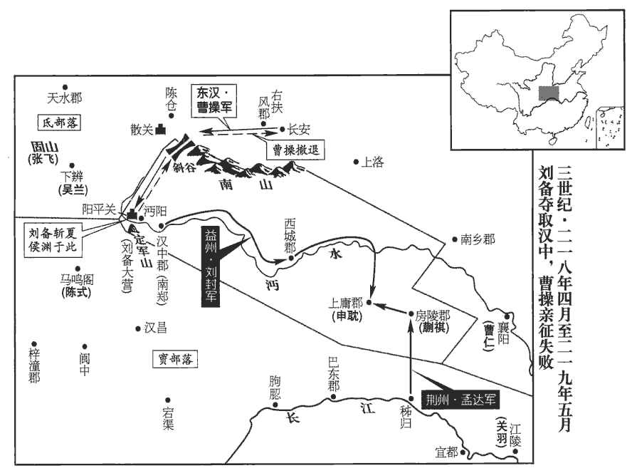
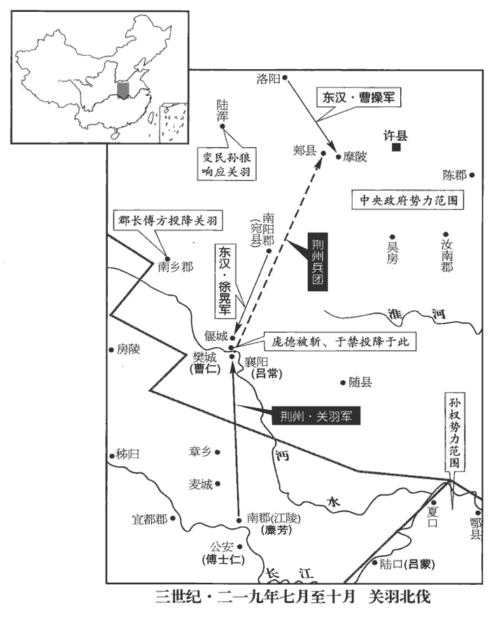
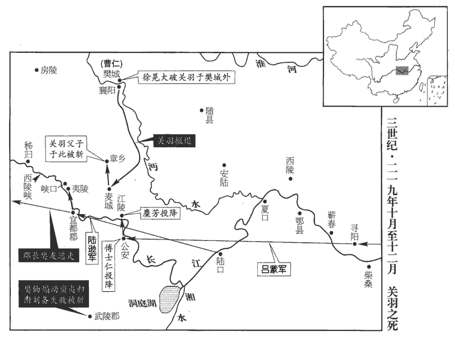

 漢紀六十起強圉作噩（丁酉），盡屠維大淵獻（己亥），凡三年。

# 孝獻皇帝癸

## 建安二十二年（丁酉，二一七）

1春，正月，魏王操軍居巢‹安徽巢湖›，居巢縣，屬廬江郡，春秋之巢國。宋白曰：今無為軍，本巢縣之無為鎮，曹操攻吳，築城於此，無功而退，因號無為城。臨濡須水上壖ruán地，秦、漢為居巢，春秋但名巢，辭有詳略耳。考異曰：孫權傳，曹公次居巢，攻濡須，并在去冬。今從魏武紀。孫權保濡須，二月，操進攻之。孫權所保者，十七年所築濡須塢也。

〖译文〗 [1]春季，正月，魏王曹操驻军居巢，孙权守卫濡须。二月，曹操向濡须进攻。

初，右護軍蔣欽屯宣城‹安徽宣城›，宣城縣，屬丹陽郡。賢曰：故城在今宣州南陵縣東。蕪湖‹安徽芜湖›令徐盛收欽屯吏，表斬之。蕪湖縣，屬丹陽郡，春秋吳鳩茲之地。宋白曰：以其地卑，畜水非深，而生蕪藻，故曰蕪湖。及權在濡須‹安徽含山西南›，欽與呂蒙持諸軍節度，欽每稱徐盛之善。權問之，欽曰：「盛忠而勤強，有膽略，器用好，萬人督也。今大事未定，臣當助國求才，豈敢挾私恨以蔽賢乎？」權善之。

〖译文〗 当初，孙权的右护军蒋钦驻屯宣城，芜湖令徐盛逮捕了蒋钦的属吏，并上表将他斩首。及至孙权在濡须时，蒋钦和吕蒙负责指挥各路军队，蒋钦每每称赞徐盛的优点。孙权问蒋钦为什么称赞徐盛，蒋钦回答：“徐盛忠诚、勤勉、贤强，有胆略，有器度，是个统帅万人的杰出将领。如今事业尚未成功，臣下我应当帮助国家访求人才，怎么敢怀着私人怨恨而遮蔽贤能呢？”孙权对此非常赞赏。

三月，操引軍還，留伏波將軍夏侯惇、都督曹仁、張遼等二十六軍屯居巢‹巢湖›。晉志曰：光武建武初，征伐四方，始置督軍御史，事竟，罷。建安中，魏武為相，始遣大將軍督之，二十一年，命夏侯惇督二十六軍是也。蕭子顯曰：漢順帝時，御史中丞馮赦討九江賊，督揚、徐二州軍事。何、徐宋志云起魏武，王珪之職儀云起光武，并非也。權令都尉徐詳詣操請降，操報使脩好，誓重結婚。降，戶江翻。使，疏吏翻。好，呼到翻。重，直龍翻。權留平虜將軍周泰督濡須；平虜將軍，蓋孫氏創置。朱然、徐盛等皆在所部，以泰寒門，不服。寒門，言所出微也。權會諸將，大為酣樂，命泰解衣，權手自指其創痕，樂，音洛。創，初良翻。問以所起，泰輒記昔戰鬬處以對。畢，使復服；權把其臂流涕曰：「幼平，周泰，字幼平。卿為孤兄弟，為，于偽翻。戰如熊虎，不惜軀命，被創數十，被，皮義翻。膚如刻畫，孤亦何心不待卿以骨肉之恩，委卿以兵馬之重乎！」周泰傳：權住宣城，忽略不治圍落。山賊卒至，權始上馬，賊鋒刃已交。泰投身衛權，身被十二創。是日，微泰，權幾危。又從討黃祖，拒曹公，攻曹仁，皆有功，故委之。坐罷，住駕，使泰以兵馬道從，坐，才臥翻。道，讀曰導。從，才用翻。鳴鼓角作鼓吹而出；樂纂曰：司馬法：軍中之樂，鼓笛為上，使聞之者壯勇而樂和；細絲、高竹不可用也，慮悲聲感人，士卒思歸之故也。唐紹曰：鼓吹之樂，以為軍容。昔黃帝涿鹿有功，以為警衛。劉昫xù曰：鼓吹，本軍旅之音，馬上奏之。自漢以來，北狄之樂，總歸鼓吹署。余按漢制，萬人將軍給鼓吹。吹，昌瑞翻。於是盛等乃服。

〖译文〗 三月，曹操率军撤回，留下伏波将军夏侯统领曹仁、张辽等二十六支部队驻守居巢。孙权让都尉徐详到曹操那里请求投降；曹操派使者回复，愿意建立友好关系，发誓与孙权重结姻亲。孙权留平虏将军周泰统领濡须守军，朱然、徐盛等人都成了周泰的部下，他们认为周泰出身寒微，心中不服。孙权召集各位将领，大摆酒宴，奏乐畅饮。在酒席上孙权让周泰解开衣服，用手指着他身上的伤痕，询问受伤经过，周泰对那些战斗地点全都记得，依次回答。讲完，孙权要他重新穿好衣服，拉着他的手臂，淌着泪说：”周泰，你为了我孙氏兄弟，像熊和虎一样勇猛作战，不顾惜自己的身体性命，受伤数十处，肌肤像刀刻划过一样，我又怎么忍心不把你看作亲骨肉，委以统帅兵马的重任！”宴席散后，孙权暂留，让周泰以兵马开路、护卫，擂鼓鸣号，奏起军乐，走出了军营。于是，徐盛等人才服从周泰指挥。

2夏，四月，‹刘协，时年三十七›詔魏王操設天子旌旗，出入稱警蹕。

〖译文〗 [2]夏季，四月，献帝下诏：魏王曹操可用皇帝专用的旌旗，出入同帝王一样称警跸，实行戒严和清道。

3六月，魏以軍師華歆為御史大夫。華，戶化翻。

〖译文〗 [3]六月，魏任命军师华歆为御史大史。

4冬，十月，命魏王操冕十有二旒liú，乘金根車，駕六馬，設五時副車。董巴與服志曰：金根車：輪皆朱班重牙，貳轂兩轄。金薄繆龍，為輿倚較，文虎伏軾。龍首銜軛，左右吉陽筩，鸞雀立衡。𣝛文畫輈，羽蓋華蚤。建大旂qí十二斿liú，畫日月升龍。駕六馬，象鑣biāo鏤錫，金鍐zōng、方釳xì，插翟尾，朱兼樊纓，赤罽jì易茸，金就十有二。左纛dào，以氂máo牛尾為之，在左騑fēi馬軛è上，大如斗。是為德車。五時車，安、立亦皆如之，各如方色。白馬者，朱其髦尾為朱鬣云。所御駕六；餘皆駕四。後從為副車。晉志：五時安、立車，亦建旗十二，各隨車色。立車則正竪其旗，安車則邪注。鍐zōng，亡范「祖叢」翻。釳xì，許乙翻，鐵孔也。鍐，馬首飾。

〖译文〗 [4]冬季，十月，献帝下诏增加魏王曹操的特权：魏王曹操所戴王冠可有十二条旒，可乘金根车，以六匹马驾驶，可设五时副车。

5魏以五官中郎將丕為太子。

〖译文〗 [5]魏立五官中郎将曹丕为太子。

初，魏王操娶丁夫人，無子；妾劉氏，生子昂；卞氏生四子，丕、彰、植、熊。王使丁夫人母養昂；昂死於穰ráng，事見六十二卷建安二年。丁夫人哭泣無節，操怒而出之，以卞氏為繼室。植性機警、多藝能，才藻敏贍，操愛之。操欲以女妻丁儀，妻，七細翻。丕以儀目眇，眇者，一目小。諫止之。儀由是怨丕，與弟黃門侍郎廙yì晉百官志：給事黃門侍郎，秦官也，漢以後并因之，與侍中俱管門下眾事，無員；及晉，置員四人。廙，逸職翻，又羊至翻。及丞相主簿楊脩，數稱臨菑侯植之才，數，所角翻。勸操立以為嗣。脩，彪之子也。操以函密訪於外，尚書崔琰露版答曰：露板，不封也。「春秋之義，立子以長。春秋公羊傳曰：立嫡以長不以賢，立子以貴不以長。長，知兩翻。加五官將仁孝聰明，宜承正統，將，即亮翻。琰以死守之。」植，琰之兄女婿也。尚書僕射毛玠曰：「近者袁紹以嫡庶不分，覆宗滅國。廢立大事，非所宜聞。」東曹掾邢顒曰：「以庶代宗，先世之戒也，願殿下深察之。」掾，俞絹翻。顒，魚容翻。丕使人問太中大夫賈詡以自固之術。詡曰：「願將軍恢崇德度，躬素士之業，朝夕孜孜，不違子道，如此而已。」丕從之，深自砥礪。他日，操屏人問詡，屏，必郢翻。詡嘿然不對。操曰：「与卿言而不答，何也？」詡曰：「属有所思，属之欲翻，下右属同。故不即对耳。」操曰：「何思？」詡曰：「思袁本初、劉景升父子也。」袁紹父子事見六十四卷六年、七年；劉表父子事見六十五卷十三年。操大笑。

〖译文〗 当初，魏王曹操娶丁夫人，没有生儿子。妾刘氏，生儿子曹昂；卞氏生下四个儿子：曹丕、曹彰、曹植、曹熊。曹操让丁夫人以母亲的名义抚养曹昂；曹昂死在穰城，丁夫人哭泣得不能自制，曹操气忿之下，休了丁夫人，以卞氏继为正妻。曹植生性机警，富有能力，才华横溢而敏捷多智，曹操很爱他。曹操要把女儿嫁给丁仪为妻，曹丕因为丁仪一只眼瞎，劝阻了曹操。丁仪因此怨恨曹丕，和弟弟黄门侍郎丁，以及丞相主簿杨，多次称赞临侯曹植的才干，劝曹操立他为继承人。杨本是杨彪的儿子。曹操用信秘密探访外面对立继承人的看法。尚书崔琰用不封口的信答复说：“按照《春秋》之义，应立长子。而且五官将曹丕仁厚、忠孝、聪明，应做继承人，我的看法至死不变。”曹植是崔琰哥哥的女婿。尚书仆射毛说：“前不久，袁绍因嫡亲、旁支不分，宗族和国土都遭覆灭。废立继承人的大事，不是臣子所应听到的。”东曹掾邢说：“以旁支代替正统继承人，是先世的戒条，希望殿下深入考虑。”曹丕派人向太中大夫贾诩询问巩固自己地位的方法。贾诩说：“愿将军您能发扬德性和气度，亲身去做寒素之人的事情，早晚孜孜不倦，不违背做儿子应该遵守的规矩，这样就可以了。”曹丕听从了贾诩的话，暗自深深地磨炼自己。一天，曹操命众人退下，询问贾诩，贾诩默然不答。”曹操说：“我与你说话，你却不回答，这是为什么？”贾诩说：“我正在考虑，所以没有立即回答您。”曹操说：“你考虑什么？”贾诩回答说：“我是在想袁绍、刘表两对父子啊。”曹操大笑起来。

操嘗出征，丕、植并送路側，植稱述功德，發言有章，左右屬目，操亦悅焉。丕悵然自失，濟陰吳質耳語曰：「王當行，流涕可也。」及辭，丕涕泣而拜，操及左右咸歔欷，濟，子禮翻。歔，音虛。欷，音希，又許既翻。於是皆以植多華辭而誠心不及也。植既任性而行，不自雕飾，五官將御之以術，矯情自飾，宮人左右并為之稱說，為，于偽翻。故遂定為太子。

〖译文〗 一次，曹操带兵出征，曹丕和曹植共同送到路旁，曹植称颂曹操的功德，出口成章，旁边的人都瞩目赞赏，曹操自己也很高兴。曹丕感到惆怅，若有所失，济阴人吴质在他耳边说：“魏王即将上路的时候，流泪哭泣即可。”及至辞行时，曹丕哭着下拜，曹操和部属们都很伤感。因此，大家都认为曹植华丽的辞藻多而诚心不及曹丕。曹植既然做事任性，言行不加掩饰，而曹丕则施用权术，掩盖真情，自我矫饰，宫中的人和曹操部属大多为他说好话，所以最终被立为太子

左右長御賀卞夫人曰：漢皇后宮有旁側長御。「將軍拜太子，丕為五官將，故稱之為將軍。天下莫不喜，夫人當傾府藏以賞賜。」藏，徂浪翻。夫人曰：「王自以丕年大，故用為嗣。我但當以免無教導之過為幸耳，亦何為當重賜遺乎！」遺，于季翻。長御還，具以語操，語，牛倨翻。操悅，曰：「怒不變容，喜不失節，故最為難。」

〖译文〗 左右长御向卞夫人祝贺说：“曹丕将军被立为太子，天下人没有不欢喜的，夫人应该把府中所藏财物都拿来赏赐大家。”夫人说：“魏王只因为曹丕年长，所以立他为继承人。我只应以庆幸免去了教导无方的过失罢了，又有什么理由要重重赏赐别人呢！”长御回去，把夫人的话全告诉了曹操，曹操很高兴，说：“怒时脸不变色，喜时不忘记节制，原本是最难做到的。”

太子抱議郎辛毗頸而言曰：「辛君知我喜不？」不，讀曰否。毗以告其女憲英，憲英歎曰：「太子，代君主宗廟、社稷者也。代君，不可以不戚；主國，不可以不懼。宜戚而【章：甲十一行本「而」作「宜」；乙十一行本同。】懼，而反以為喜，何以能久！魏其不昌乎！」女子之智識，有男子不能及者。

〖译文〗 太子曹丕抱住议郎辛毗的脖子说：“辛君，你知道我高兴吗？”辛毗把这件事对他女儿宪英谈起，宪英叹息地说：“太子是代替君王主持宗庙和社稷的人。代替君王，不可以不扰虑；管理国家，不可以不恐惧。他本应忧虑和恐惧，却反而很高兴，怎么能长久！魏是不会昌盛的！”

久之，臨菑侯植乘車行馳道中，開司馬門出。漢令乙：騎乘車馬行馳道中，已論者沒入車馬改具。又宮衛令：出入司馬門者皆下。是司馬門猶可得而出入也。若魏制，則司馬門惟車駕出乃開耳。操大怒，公車令坐死。由是重諸侯科禁，而植寵日衰。植妻衣繡，操登臺見之，以違制命，還家賜死。以違制命罪植妻，則當時蓋禁衣錦繡也。衣，於既翻。

〖译文〗 过很久，临侯曹植违反制度，乘车在驰道正中行驶，打开司马门而出。曹操大怒，掌管宫门的公车令被定罪处死。从此以后，他加重了对诸侯的限制，对曹植的宠爱也一天不如一天了。一次，曹植的妻子身穿锦绣的衣服，被曹操登上高台看见，认为她违反了禁止穿锦绣的制度，命她返回娘家，并赐自尽。

6法正說劉備曰：說，輸芮翻。「曹操一舉而降張魯，定漢中，降，戶江翻。不因此勢以圖巴、蜀，而留夏侯淵、張郃屯守，郃，古合翻，又曷閣翻。身遽北還，此非其智不逮，而力不足也，必將內有憂偪故耳。今策淵、郃才略，不勝國之將帥，舉眾往討，必可克之。克之之日，廣農積穀，觀釁伺隙，上可以傾覆寇敵，尊獎王室；中可以蠶食雍、涼，廣拓境土，晉志曰：漢改周之雍州為涼州，以地處西方，常寒涼也。地勢西北邪出，在南山之間，南隔西羌，西通西域，于時號為斷匈奴右臂。獻帝時，涼州數亂，河西五郡，去州隔遠，乃別立雍州。末又依古典為九州，乃令關右盡為雍州。魏時復分以為涼州。雍，於用翻。下可以固守要害，為持久之計。此蓋天以與我，時不可失也。」備善其策，乃率諸將進兵漢中‹陕西汉中›，遣張飛、馬超、吳蘭等屯下辨‹甘肃成县›。下辨縣，屬武都郡。賢曰：今成州同谷縣。師古曰：辨，音步見翻，又步莧翻。魏王操遣都護將軍曹洪拒之。

〖译文〗 [6]法正向刘备建议说：“曹操一举收降了张鲁，占据汉中，不借助这个有利时机进攻巴、蜀两地，却留夏侯渊、张驻守汉中，自己急速北返，这样做并非是他才智不够，而是力量不足，必将有内忧的缘故。如今估计夏侯渊、张的才能，不及我们的将领，现在举兵进攻，一定可以取胜。夺取汉中后，广开农田，积蓄粮草，等待有可乘之机。搞得好，可以将曹操彻底击败，恢复皇室的权威；次之，可以蚕食雍、凉二州，拓展我们的疆土；最次，也可以据险固守，与曹操长期对峙。这是上天的赐与，时机不可丧失。”刘备赞同法正的策略，于是率领进军汉中，派张飞、马超、吴兰等驻军下辨。魏王曹操派都护将军曹洪拒敌。

7魯肅卒，孫權以從事中郎彭城‹江苏徐州›嚴畯代肅，畯，音俊。督兵萬人鎮陸口‹湖北嘉鱼西南陆溪镇›。眾人皆為畯喜，為，于偽翻。畯固辭以「樸素書生，不閑軍事」，閑，習也。發言懇惻，至于流涕。權乃以左護軍虎威將軍呂蒙兼漢昌‹湖南平江南›太守以代之。虎威將軍，蓋孫權置。沈約志，曹魏置四十號將軍，虎威第三十四。眾嘉嚴畯能以實讓。

〖译文〗 [7]鲁肃去世，孙权派从事中郎、彭城人严接替鲁肃的职务，率兵一万人驻守陆口。大家都向严贺喜，严却以“朴实书生，不熟悉军事”为借口坚决推辞，言辞十分恳切，甚至流下了眼泪。孙权便派左护军、虎威将军吕蒙兼汉昌太守，代替鲁肃的职位。大家都赞许严能据实相让。

8定威校尉吳郡‹苏州›陸遜定威校尉，亦權創置。言於孫權曰：「方今克敵寧亂，非眾不濟；而山寇舊惡，依阻深地。舊惡，謂自舊為惡者。夫腹心未平，難以圖遠，可大部伍，取其精銳。」言可大為部伍，擇取精銳也。權從之，以為帳下右部督。會丹陽‹安徽宣城›賊帥費棧zhàn作亂，費，父沸翻，姓也。棧，士限翻。扇動山越。權命遜討棧，破之。遂部伍東三郡，東三郡，丹陽、新都、會稽也。強者為兵，羸者補戶，羸，倫為翻。得精卒數萬人；宿惡盪除，盪，徒朗翻。所過肅清，還屯蕪湖。會稽‹绍兴›太守淳于式表「遜枉取民人，愁擾所在。」言遜之所在，民人皆愁擾也。會，工外翻。遜後詣都，言次，稱式佳吏，孫權時都秣陵‹南京›。言次，謂言論之次，猶今云語次。權曰：「式白君，而君薦之，何也？」遜對曰：「式意欲養民，是以白遜；若遜復毀式以亂聖聽，不可長也。」權曰：「此誠長者之事，顧人不能為耳。」復，扶又翻。長，知兩翻。

〖译文〗 [8]定威校尉、吴郡人陆逊向孙权建议：“如今要打败敌人，平定动乱，没有大军就不能成功；而山贼作恶很久，盘据深山。腹心之患不解除，很难向远处发展。可以扩充我们的军队，选取精锐。”孙权采纳了这一建议，以陆逊为帐下右部督。恰在这时，丹阳贼人首领费栈作乱，煽动山越反叛。孙权命陆逊讨伐费栈，将山贼击败。于是在东部三郡征集军队，强壮者当兵，老弱者为后备，得到精兵数万人。陆逊所过之处，将一向作恶的盗贼扫除干净，于是回驻芜湖。会稽太守淳于式上表，称：“陆逊随意征发搜刮百姓，给所到之处带来愁苦和骚扰。”陆逊在此之后回到都城，言谈之间，称赞淳于式是个好官吏。孙权问陆逊：“淳于式告发你，你却推荐他，这是为什么？”陆逊回答说：“淳于式本意是要百姓休养生息，所以告发我；如果我再底毁他，以扰乱您的视听，这种风气不能长。”孙权赞叹说：“这实在是谨厚长者做的事，一般人可做不到。”

9魏王操使丞相長史王必典兵督許‹河南许昌›中事。魏王操猶領漢丞相而居鄴，故以必為長史典兵督許。時關羽‹时驻公安，湖北公安›強盛，京兆‹西安›金禕yī覩漢祚將移，乃與少府耿紀、司直韋晃、司直，即丞相司直。禕，吁韋翻。太醫令吉本、風俗通：吉，周尹吉甫之後。漢有漢中太守吉恪。本子邈、邈弟穆等謀殺必，挾天子以攻魏，南引關羽為援。

〖译文〗 [9]魏王曹操派丞相长史王必掌管军队，督理许都的事务。当时关羽实力强盛，京兆人金见汉朝政权将被取代，便和少府耿纪、司直韦晃、太医令吉本、吉本的儿子吉邈、吉邈的弟弟吉穆等人密谋杀掉王必，挟持天子打击曹魏的势力，并在南面联合关羽作为外援。

## 二十三年（戊戌，二一八）

1春，正月，吉邈等率其黨千餘人，夜攻王必，燒其門，射必中肩，射，食亦翻。中，竹仲翻。帳下督扶必奔南城。許昌‹东汉首都，河南许昌›之南城也。會天明，邈等眾潰，必與潁川‹河南禹州›典農中郎將嚴匡共討斬之。潁川典農中郎將屯田許下。

〖译文〗 [1]春季，正月，吉邈等人率党羽一千余人，在夜间攻击王必，烧毁王必住所的门，用箭射中他的肩部。帐下督扶着王必逃到许都南城。正好天明，吉邈和他的党羽溃散，王必和颖川典农中郎将严匡共同讨伐，斩杀吉邈等人。

2三月，有星孛于東方。孛bèi，蒲內翻。

〖译文〗 [2]三月，有异星出现在东方。

3曹洪將擊吳蘭，張飛屯固山，聲言欲斷軍後，斷，丁管翻；下同。眾議狐疑。騎都尉曹休曰：漢武帝置三都尉，騎都尉其一也。「賊實斷道者，當伏兵潛行；今乃先張聲勢，此其不能，明矣。宜及其未集，促擊蘭，蘭破，飛自走矣。」洪從之，進，擊破蘭，斬之。三月，張飛、馬超走。情見勢屈，宜其走也。休，魏王族子也。

〖译文〗 [3]曹洪将要攻击吴兰，而张飞驻军固山，声称要切断曹军的后路。曹洪和将领们商议，犹豫不决。骑都尉曹休说：“张飞等人若确实要切断我军后路，应该派军队隐蔽行军，而现在却先大造声势，而实际上做不到，这是很清楚的。我军应该敌人尚未集结，迅速攻击吴兰，吴兰被击败，张飞自然退走。”曹洪听从了这一建议，进军击败吴兰军，斩杀吴兰。三月，张飞、马超撤退。曹休是魏王曹操的同族子侄辈。

4夏，四月，代郡‹河北蔚县›、上谷‹河北怀来›烏桓無臣氐等反。先是，魏王操召代郡太守裴潛為丞相理曹掾，先，悉薦翻。掾，于絹翻。操美潛治代之功，治，直之翻。潛曰：「潛於百姓雖寬，於諸胡為峻。今繼者必以潛為治過嚴而事加寬惠。治，直吏翻。彼素驕恣，過寬必弛；既弛，【章：甲十一行本「弛」下有「又」字；乙十一行本同；張校同。】將攝之以法，攝，持也，整也。此怨叛所由生也。以勢料之，代必復叛。」後魏陸侯治高車，與潛異世而同轍。復，扶又翻。於是操深悔還潛之速。後數十日，三單于反問果至。操以其子鄢陵侯彰行驍騎將軍，鄢陵縣，屬潁川郡。驍騎將軍，始於漢武帝，以命李廣。陸德明曰：鄢，謁晚翻，又於建翻。漢書作「傿」。師古曰：音偃。使討之，彰少善射御，膂力過人。少，詩照翻。操戒彰曰：「居家為父子，受事為君臣，動以王法從事，爾其戒之！」

〖译文〗 [4]夏季，四月，居住在代郡、上谷郡的乌桓族无臣氐等造反。先前，魏王曹操召回代郡太守裴潜，任命为丞相相理曹掾。曹操赞扬裴潜治理代郡的成就，裴潜说：“我对百姓虽然宽容，但对胡人却很严厉。今后我的继任者，必然认为我的沼理过严而采取宽厚的措施。那些胡人一向骄横，过度宽厚必然导致放纵，放纵以后再用法令限制，这将是引起他们生怨反叛的原因。根据情势预测，代郡的乌桓必定还要反叛。”于是曹操深悔召裴潜回来得太快了。几十天过后，乌桓三个单于反叛的消息果然传来了。曹操以儿子鄢陵侯曹彰代理骁将军，派去讨伐反叛的乌桓。曹彰从小擅长射箭骑马，力量过人。曹操告诫曹彰：“在家的时候，我们是父子；接受任务后，就变成了君臣，一举一动都要按朝廷法令行事，你要小心！”

5劉備屯陽平關‹陕西勉县西›，夏侯淵、張郃、徐晃等‹时驻陕西汉中›與之相拒。備遣其將陳式等絕馬鳴閣道‹四川广元北›，馬鳴閣，在今利州昭化縣。徐晃擊破之。張郃屯廣石，廣石，當在巴、漢之間。備攻之不能克，急書發益州兵。諸葛亮以問從事犍為‹四川彭山›楊洪，洪曰：「漢中，益州咽喉，犍，居言翻。咽，音煙。存亡之機會，若無漢中，則無蜀矣。此家門之禍也，發兵何疑。」時法正從備北行，亮於是表洪領蜀郡太守；眾事皆辦，遂使即真。遂使之代法正。

〖译文〗 [5]刘备驻军阳平关，曹军夏侯渊、张、徐晃等与他对峙。刘务派部下将领陈式等人去切断马鸣阁的道路，被徐晃打败。张驻守在广石，刘备攻打不下来，急发文书调集益州军队。诸葛亮问从事、犍为人杨洪应如何处理此事，杨洪说：“汉中是益州的咽喉，存亡的关键，如失去汉中，就没有蜀了，这是家门前的祸患，对发兵有什么疑问！”当时蜀郡太守法正跟随刘备到了北方，诸葛亮于是上表请求由杨洪代理蜀郡太守。杨洪将各项政务全都办理妥当，于是获得正式任命。

初，犍為‹四川彭山›太守李嚴辟洪為功曹，嚴未去犍為而洪已為蜀郡；洪舉門下書佐何祗有才策，漢制：郡閣下及諸曹各有書佐，幹主文書。靈帝光和二年樊毅復華下民租口算碑載其上尚書奏牘，前書年、月、朔日，弘農太守臣毅頓首死罪上尚書，後書臣毅誠惶誠恐、頓首頓首、死罪死罪上尚書，後繫掾臣條，屬臣淮，書佐臣謀。洪尚在蜀郡，而祗已為廣漢太守。是以西土咸服諸葛亮能盡時人之器用也。

〖译文〗 从前，犍为太守李严曾任命杨洪为功曹，李严未离开犍为，而杨洪已做了蜀郡太守。杨洪推荐自己门下的书佐何祗，称他有才干；杨洪仍在蜀郡，而何祗已经做了广汉太守。因此，西土人士都佩服诸葛亮，能够充分利用当时的人才。

秋，七月，魏王操自將擊劉備；九月，至長安。

〖译文〗 秋季，七月，魏王曹操亲自率兵进攻刘备。九月，到达长安。

6曹彰擊代郡‹河北蔚县›烏桓，身自搏戰，鎧中數箭，鎧，可亥翻。中，竹仲翻。意氣益厲；乘勝逐北，至桑乾‹河北阳原东›之北，桑乾縣，屬代郡。宋白曰：今雲州東至桑乾督帳一百五十里。孟康曰：乾，音干。大破之，斬首、獲生以千數。時鮮卑大人軻比能軻比能本小種鮮卑，以勇健不貪，斷法平端，眾推之為大人。將數萬騎觀望強弱，見彰力戰，所向皆破，乃請服，北方悉平。

〖译文〗 [6]曹彰征讨代郡的乌桓时，亲自参加战斗，铠甲被射中数箭，却愈战愈勇，乘胜追击败兵，直至桑干河以北，大败乌桓，杀死、俘虏乌桓上千人。当时鲜卑族首领轲比能率骑兵数万人，观望曹彰和乌桓的强弱，见曹彰的军队作战勇敢，所向披靡，取得了胜利，便请求归服曹彰。北方全部平定。

7南陽‹河南南阳›吏民苦繇役，繇，讀曰傜。苦於供給曹仁之軍也。冬，十月，宛守將侯音反。宛，於元翻。南陽太守東里袞鄭子產居東里，支子以為氏。與功曹應余迸竄得出；音遣騎追之，飛矢交流，余以身蔽袞，被七創而死，被，皮義翻。創，初良翻。音騎執袞以歸。時征南將軍曹仁屯樊‹湖北襄樊汉水北岸›以鎮荊州，魏王操命仁還討音。功曹宗子卿說音曰：說，輸芮翻。「足下順民心，舉大事，遠近莫不望風；然執郡將，將，即亮翻。逆而無益，何不遣之！」音從之。子卿因夜踰城從太守收餘民圍音，會曹仁軍至，共攻之。

〖译文〗 [7]南阳的官吏和百姓饱受徭役之苦。冬季，十月，宛城守将侯音反叛。南阳太守东里与功曹应余奋力逃了出来，侯音派人骑也追击，乱箭齐发，应余用身体掩护东里，受伤七处而死。侯音的骑兵抓住东里，带了回去。此时，征南将军曹仁驻军樊城，以威慑荆州，魏王曹操命曹仁回来讨伐侯音。功曹宗子卿对侯音说：“您顺应民心，兴起大事，远近无不都寄希望于您。现在您捉住郡太守，是悖逆行为，没有益处，为什么不把他放走！”侯音听从了宗子卿的话。宗子卿于是夜里越过城墙，跟随太守召集未参加反叛的民众包围侯音。恰好曹仁的军队也赶到了，便联合起来进攻侯音。

## 二十四年（己亥，二一九）

1春，正月，曹仁屠宛‹河南南阳›，斬侯音，復屯樊‹湖北襄樊汉水北岸›。復，扶又翻。

〖译文〗 [1]春季，正月，曹仁在宛城进行屠杀，把侯音斩首，仍回军驻守樊城。

2初，夏侯淵戰雖數勝，數，所角翻。魏王操常戒之曰：「為將當有怯弱時，不可但恃勇也。將當以勇為本，行之以智計；但知任勇，一匹夫敵耳。」及淵與劉備相拒踰年，備自陽平‹陕西勉县西›南渡沔水，緣山稍前，營於定軍山‹陕西勉县南›。華陽國志曰：漢中沔陽縣有定軍山，北臨沔水。據法正傳：於定軍、興勢作營，則定軍山正在興勢也。今按興勢山在洋州興道縣西北二十里，去沔陽地里相遠，當從華陽國志。考異曰：備傳云：「於定軍山勢作營」，法正傳作「定軍、興勢」。今從黃忠傳。淵引兵爭之。法正曰：「可擊矣。」備使討虜將軍黃忠乘高鼓譟攻之，淵軍大敗，斬淵考異曰：淵傳曰：「備夜燒圍鹿角。淵使張郃護東圍，自將輕兵護南圍。備挑郃戰，郃軍不利。淵分兵半助郃，為備所襲，戰死。」張郃傳曰：「備於走馬谷燒都圍，淵救火，從他道與備相遇，交戰，短兵接刃，淵遂沒。」今從劉備、黃忠、法正傳。及益州刺史趙顒。顒刺益州，操所命也。淵軍既敗，顒亦死。顒，魚容翻。張郃引兵還陽平‹陕西勉县西›。自廣石還陽平。是時新失元帥，軍中擾擾，不知所為。督軍杜襲初，操東還，留襲督漢中軍事。帥，所類翻。與淵司馬太原郭淮收斂散卒，號令諸軍曰：「張將軍國家名將，劉備所憚；今日事急，非張將軍不能安也。」遂權宜推郃為軍主。郃出，勒兵按陳，陳，讀曰陣，下同。諸將皆受郃節度，眾心乃定。明日，備欲渡漢水來攻；諸將以眾寡不敵，欲依水為陳以拒之。郭淮曰：「此示弱而不足挫敵，非算也。不如遠水為陳，引而致之，半濟而後擊之，備可破也。」既陳，備疑，不渡。淮遂堅守，示無還心；以狀聞於魏王操，操善之，遣使假郃節，復以淮為司馬。

〖译文〗 [2]当初，夏侯渊虽然多次打胜仗，魏王曹操却经常告诫他说：“作为将领，应有胆怯的时候，不能单凭勇猛。将领应当以勇敢为根本，但在行动时要依靠智慧和计谋；又依靠勇敢，只能敌得过一名普通人罢了。”后来，夏侯渊与刘备对峙了一年有余，刘备从阳平向南，渡过沔水，顺着山势稍微前行，在定军山扎下营盘。夏侯渊率兵争夺定军山。法正说：“可以发动攻击了。”刘备派讨虏将军黄忠率兵居高临下，擂鼓呐喊，发动进攻，夏侯渊的军队大败，夏侯渊和益州刺史赵被斩。张率军退回阳平。此时，曹军新失统帅，军中人心惶惶，不知如何是好。督军杜袭和夏侯渊的司马、太原人郭淮集合散乱的兵卒，对各营将士发出号令：”张将军是国家的名将，为刘备所惧怕；如今军情紧迫，只有在张将军的指挥下，才能转危为安。”于是临时推举张为军中主帅。张出来统率军队，巡视阵地，将领们都接受张的指挥，军心才安定下来。第二天，刘备打算渡汉水发动攻击；曹军将领们认为寡不敌众，准备依凭汉水列阵抵抗。郭淮说：“这是向敌人示弱，而不能挫败敌人，不是好计策。不如远离汉水列阵，把敌人吸引过来，等他们渡过一半后，我们再出击，就可以打败刘备。”曹军列好阵，刘备产生怀疑，命令不要渡河。郭淮于是坚守阵地，表明曹军没有撤退之心。郭淮等人把情况上报魏王曹操，曹操很同意他们的作法，派使者把符节授予张，仍任命郭淮为司马。

3二月，壬子晦‹三十›，日有食之。

〖译文〗 [3]二月，壬子晦（三十日），出现日食。

4三月，魏王操自長安出斜谷‹陕西眉县西南›，軍遮要以臨漢中。斜谷道險，操恐為備所邀截，先以軍遮要害之處，乃進臨漢中。或云：遮要，地名。劉備曰：「曹公雖來，無能為也，我必有漢川矣。」乃斂眾拒險，終不交鋒。操運米北山下，黃忠引兵欲取之，過期不還。翊軍將軍趙雲將數十騎出營視之，翊軍將軍，備所創置也。值操揚兵大出，雲猝與相遇，遂前突其陳，且鬬且卻。魏兵散而復合，追至營下，雲入營，更大開門，偃旗息鼓。魏兵疑雲有伏，引去；雲雷鼓震天，雷，盧對翻。惟以勁弩於後射魏兵，射，而亦翻。魏兵驚駭，自相蹂踐，墮漢水中死者甚多，蹂，人九翻。備明旦自來，至雲營，視昨戰處，曰：「子龍一身都為膽也！」言其膽大，能以孤軍亢操大兵。

〖译文〗 [4]三月，魏王曹操从长安出发，穿过斜谷，派兵据守险要之处，以便大军顺利到达汉中。刘备说：“曹公虽然亲自前来，也起不了什么作用，我一定要占有汉川。”于是集结军队，占据险要阻拦。始终不与曹军交战。曹军在北山下运送粮米，黄忠率军企图夺取，超过约定的时间，不见回转。翊军将军赵云率领骑兵数十人出营查看，恰巧曹操大军出动，赵去与敌人猝然相遇，便冲击敌阵，且战且退。曹军散开后再度汇合，追至赵云的军营前，赵云进入军营，又大开营门，偃旗息鼓。曹军怀疑营中有埋伏，于是撤退。赵云命令擂起战鼓，鼓声震天，却只以强弩在后面射杀曹兵。曹军非常惊骇，自相践踏，落入汉水中而死的很多。第二天一早，刘备亲自来到赵云的兵营，察看了昨天的战场，说：“子龙一身都是胆啊！”

操與備相守積月，魏軍士多亡。亡，逃亡也。夏，五月，操悉引出漢中諸軍還長安，劉備遂有漢中。

〖译文〗 曹操与刘备对峙了一个月，曹军有很多人逃跑。夏季，五月，曹操率领所有进攻汉中的军队返回长安，刘备因此占据了汉中。

操恐劉備北取武都氐以逼關中，武都‹甘肃成县›，本白馬氐地。問雍州刺史張既，既曰：「可勸使北出就穀以避賊，前至者厚其寵賞，則先者知利，後必慕之。」操從之，使既之武都‹甘肃成县›，徙氐五萬餘落出居扶風‹陕西兴平›、天水‹甘肃甘谷›界。操蓋已棄武都而不有矣。諸氐散居秦川，苻氏亂華自此始。

〖译文〗 曹操害怕刘备在北面占有武都氐人的部众，从而进逼关中，就询问雍州刺史张既的意见。张既说：“可劝告氐人，让他们向北迁移到有粮谷之处，以避开刘备。先迁移的人给以重赏，这样先迁移的人就知道有利可图，后面的人定会羡慕他们。”曹操听从这个建议，派张既到武都，迁徙氐人五万余户离开故地到扶风、天水交界处居住。

 

5武威‹甘肃武威›顏俊，張掖‹甘肃张掖›和鸞、酒泉‹甘肃酒泉›黃華、西平‹青海西宁›麴演等，各據其郡，自號將軍，更相攻擊。俊遣使送母及子詣魏王操為質以求助。更，工衡翻。質，音致。操問張既，既曰：「俊等外假國威，內生傲悖，悖，蒲內翻，又蒲沒翻。計定勢足，後即反耳。今方事定蜀，且宜兩存而鬬之，猶卞莊子之刺虎，坐收其敝也。」戰國策曰：卞莊子刺虎，管豎子止之曰：「兩虎方食牛，牛甘必爭鬬，則大者傷，小者亡。從傷刺之，一舉必有兩獲。」莊子然之，果獲二虎。刺，七亦翻。王曰：「善！」歲餘，鸞遂殺俊，武威王祕又殺鸞。

〖译文〗 [5]武威的颜俊、张掖的和鸾、酒泉的黄华、西平的演等人，各自占据所在的郡，自称将军，互相攻击。颜俊派使者把母亲和儿子送到魏王曹操那里作人质，以求帮助。曹操询问张既，张既说：“颜俊等人，对外借国家的权威，对内则傲慢悖逆，等到计谋得逞，势力强大，然后就会反叛。如今，我们正在致力攻蜀，暂且应该让颜俊等人并存互斗，犹如卞庄子杀虎一样，让二虎相斗，坐等收拾两败之局。”魏王说：“很好！”过了一年以后，和鸾杀了颜俊，武威的王秘又杀了和鸾。

6劉備遣宜都‹湖北枝城›太守扶風‹陕西兴平›孟達從秭歸‹湖北秭归›北攻房陵‹湖北房县›，殺房陵太守蒯祺。張勃吳錄曰：劉備分南郡立宜都郡，領夷道、狠山、夷陵三縣。房陵縣，本屬漢中郡。此郡疑劉表所置，使蒯祺守之；否則祺自立也。蒯，苦怪翻。又遣養子副軍中郎將劉封自漢中乘沔水下，統達軍，劉封，本羅侯寇氏之子，長沙劉氏之甥。備至荊州，以未有繼嗣，養之為子。與達會攻上庸‹湖北竹山西南田家坝›，上庸太守申耽舉郡降。上庸縣，屬漢中郡。賢曰：故城在今房州清水縣西。魏略曰：申耽初在西城、上庸間，聚眾數千家，與張魯通；又遣使詣曹公，公加其號為將軍，使領上庸都尉。降，戶江翻。備加耽征北將軍，領上庸太守，以耽弟儀為建信將軍、西城太守。西城縣‹陕西安康›，屬漢中郡，備亦分為郡以授儀；唐為金州。

〖译文〗 [6]刘备派遣宜都太守、扶风人孟达从秭归向北进攻房陵，杀了房陵太守蒯祺。又派遣养子、副军中郎将刘封从汉中顺沔水而下，统令孟达所部，与孟达一起进攻上庸，上庸太守申耽率全郡投降。刘备加封申耽为征北将军，兼上庸太守，任命申耽的弟弟申仪为建信将军、西城太守。

7秋，七月，劉備自稱漢中王，設壇場於沔陽‹陕西勉县›，沔陽縣，屬漢中郡。陳兵列眾，群臣陪位，讀奏訖，乃拜受璽綬，御王冠。璽，斯氏翻。綬，音受。王冠，遠遊冠也。因驛拜章，上還所假左將軍、宜城亭侯印綬。左將軍及宜城亭侯，皆操所表授也。上，時掌翻。立子禪為王太子。拔牙門將軍義陽‹河南桐柏东›魏延為鎮遠將軍，牙門、鎮遠，皆劉備創置將軍號。領漢中太守，以鎮漢川。魏文帝分南陽郡立義陽郡，又立義陽縣屬焉；此在延入蜀之後，史追書也。鎮遠將軍，蓋備所創置。宋白曰：義陽，唐為申州，宋為信陽軍。備還治成都，以許靖為太傅，法正為尚書令，關羽為前將軍，張飛為右將軍，馬超為左將軍，黃忠為後將軍，前、後、左、右將軍皆漢官。餘皆進位有差。

〖译文〗 [7]秋季，七月，刘备自称汉中王，在沔阳设坛场，布置军队排列成阵，郡臣都来陪从，读过奏章，跪拜接受汉中王的印玺绶带，戴上王冠。派使者乘驿马车将奏章送呈献帝，归还以前授予的左将军、宜城亭侯的印绶。立儿子刘禅为王太子。提拨牙门将军义阳人魏延为镇远将军，兼汉中太守，镇守汉川。刘备回到成都主持各项政务，任命许靖为太傅，法正为尚书令，关羽为前将军，张飞为右将军，马超为左将军，黄忠为后将军，其余的人按照等级都有升迁。

遣益州前部司馬犍為‹四川彭山›費詩即授關羽印綬，犍，居言翻。費，父沸翻。羽聞黃忠位與己并，怒曰：「大丈夫終不與老兵同列！」不肯受拜。詩謂羽曰：「夫立王業者，所用非一。昔蕭、曹與高祖少小親舊，少，詩照翻。而陳、韓亡命後至；論其班列，韓最居上，謂陳平、韓信自楚而來，韓信王而蕭，曹侯，故曰韓最居上。未聞蕭、曹以此為怨。今漢中王以一時之功，隆崇漢室；然意之輕重，寧當與君侯齊乎！言備以一時使忠與羽班，而意之輕重則不在此。曹操嘗表羽為漢壽亭侯，故稱之為君侯。且王與君侯譬猶一體，同休等戚，禍福共之；愚謂君侯不宜計官號之高下、爵祿之多少為意也。僕一介之使，使，疏吏翻。銜命之人，君侯不受拜，如是便還，但相為惜此舉動，為，于偽翻。恐有後悔耳。」羽大感悟，遽即受拜。

〖译文〗 刘备派益州前部司马、犍为人费诗去关羽驻地授予关羽官印，关羽闻知黄忠地位和自己一样，愤怒地说：“大丈夫绝不能和老兵同列！”不肯接受任命。费诗对关羽说：”创立王业的人，所用的人不能都一样。以前萧何、曹参和汉高祖年幼时就关系很好，而陈平、韩信是后来的亡命之人；可排列地位，韩信位居最上，没有听说萧何、曹参对此有过怨恨。如今汉中王因为一时的功劳，尊崇黄忠，而在他心中的轻重，黄忠怎能和您相比呢！况且汉中王与您犹如一体，休戚相前，祸福与共。我认为您不应计较官号的高下，以及爵位和俸禄的多少。我仅是一个使者，奉命之人，您如果不接受任命，我就这样回去。只是我为您这样感到惋惜，恐怕您以后要后悔的。”关羽听了他的话以后，大为感动，醒悟过来，立即接受了任命。

8‹刘协，时年三十九›詔以魏王操夫人卞氏為王后。

〖译文〗 [8]献帝下诏，封魏王曹操的夫人卞氏为魏王王后。

9孫權攻合肥。時諸州兵戍淮南‹府安徽寿县›。魏改漢九江郡為淮南郡。揚州刺史溫恢謂兗州刺史裴潛曰：「此間雖有賊，然不足憂。今水潦方生，而子孝縣軍，無有遠備，曹仁，字子孝，時為征南將軍。縣，讀曰懸。關羽驍猾，政恐征南有變耳。」驍，堅堯翻。已而關羽果使南郡太守麋芳守江陵‹湖北江陵›，將軍傅衍士仁守公安‹湖北公安›，羽自率眾攻曹仁於樊。仁使左將軍于禁、立義將軍龐德等屯樊北。操以龐德自漢中來歸，故進號立義將軍。八月，大霖雨，漢水溢，平地數丈，于禁等七軍皆沒。禁與諸將登高避水，羽乘大船就攻之，禁等窮迫，遂降。降，戶江翻；下同。龐德在隄上，被甲持弓，箭不虛發，射必中也。龐，皮江翻。被，皮義翻。自平旦力戰，至日過中，羽攻益急；矢盡，短兵接，德戰益怒，氣愈壯，而水浸盛，吏士盡降。降，戶江翻；下同。德乘小船欲還仁營，水盛船覆，失弓矢，獨抱船覆水中，為羽所得，立而不跪。示不屈伏。羽謂曰：「卿兄在漢中，魏略曰：德從兄柔在蜀。我欲以卿為將，不早降何為！」德罵羽曰：「豎子，何謂降也！魏王帶甲百萬，威振天下；汝劉備庸才耳，豈能敵邪！我寧為國家鬼，不為賊將也！」羽殺之。將，即亮翻。魏王操聞之【章：甲十一行本「之」下有「流涕」二字；乙十一行本同；孔本同。】曰：「吾知于禁三十年，操收兵兗州，禁即為將。何意臨危處難，處，昌呂翻。難，乃旦翻。反不及龐德邪！」封德二子為列侯。

〖译文〗 [9]孙权进攻合肥。当时各州的军队都驻守在淮南。扬州刺史温恢对兖州刺史裴潜说：“此处虽然有贼人，却不值得担忧。现在刚刚涨水，征南将军曹仁却孤军深入，没有长远的准备，关羽强悍狡猾，只恐怕征南将军会有变故。”不久，关羽果然令南郡太守糜芳守卫江陵，将军士仁守公安，他自己率军向樊城的曹仁进攻。曹仁派左将军于禁、立义将军庞德等人驻守樊城之北。八月，天降大雨，汉水泛滥，平地水深数丈，于禁等开路兵马都被大水所淹。于禁和将领们登到高处避水，关羽乘大船前来进攻，于禁等无处可逃，于是投降。庞德站在堤上，身穿铠甲，手挽弓，箭无虚发，自清晨拼力死战，到日过中午，关羽的进攻愈来愈急。庞德的箭射尽了，就短兵相接，庞德愈战愈怒，胆气愈壮，但水势愈来愈大，部下的官员和士兵都投降了。庞德乘上小船，想返回曹仁的军营，小船被大水冲翻，失去了弓箭，只有他一人在水中抱住翻船，被关羽俘虏。见关羽时，他站着不肯下跪。关羽对他说：“你的兄长在汉中，我准备让你做我的将领，为什么不早早投降呢？”庞德大骂说：“小子，什么叫投降！魏王统帅百万大军，威振天下；你家刘备不过是个庸才，岂能和魏王匹敌！我宁可作国家的鬼，也不作贼人的将领！”关羽杀掉了庞德。魏王曹操闻知此事，说：“我和于禁相识三十年，怎料在危难之处，于禁反而不如庞德呢！”于是封庞德的两个儿子为列侯。

羽急攻樊城‹湖北襄樊汉水北岸›，城得水，往往崩壞，眾皆恟懼。恟，許勇翻。或謂曹仁曰：「今日之危，非力所支，可及羽圍未合，乘輕船夜走。」汝南太守滿寵曰：「山水速疾，冀其不久。聞羽遣別將已在郟jiá下，寵為汝南太守，操令助曹仁屯樊城。郟縣‹河南郏县›，屬潁川郡。師古曰：郟，音夾。晉地理志，襄城郡復有郟縣，蓋東漢省而魏、晉復置縣也。自許以南，百姓擾擾，羽所以不敢遂進者，恐吾軍掎其後耳。掎jǐ，居蟻翻。今若遁去，洪河以南，非復國家有也，洪河，大河也。君宜待之。」仁曰：「善！」乃沈白馬與軍人盟誓，沈，持林翻。同心固守。城中人馬纔數千人，城不沒者數板。城高二尺為一板。羽乘船臨城，立圍數重，重，直龍翻。外內斷絕。羽又遣別將圍將軍呂常於襄陽‹湖北襄樊›。荊州刺史胡脩、南鄉‹河南淅川西南›太守傅方皆降於羽。水經註：漢建安中，割南陽右壤為南鄉郡，屬荊州。

〖译文〗 关羽向樊城发起猛攻，城中进水，处处崩塌，众人都惊恐不安。有人对曹仁说：“现在的危难，不是我们的力量所能应付的，应该趁关羽的包围尚未完成，乘轻便船只连夜退走。”汝南太守满宠说：“山洪来得快，去得也快，希望不会滞留很久。据说关羽已经派别的部队至郏下，许都以南百姓混乱下安。关羽之所以不敢再向前推进，是顾虑我们攻击他的后路。现在如果我军退走，黄河以南地区，就不再为国家所有了，您应该在这里坚守以待。”曹仁说：“你说得对！”于是将白马沉入河中，与将干们盟誓，齐心合力，坚守樊城。城中军队只有数千人，未被水淹没的城墙也仅有几尺高。关羽乘船至城下，立即将樊城重重包围，使其内外断绝。关羽又派别的将领把将军吕常包围在襄阳。荆州刺史胡、南乡太守傅方都投降了关羽。

 

10初，沛國‹安徽淮北›魏諷有惑眾才，傾動鄴都‹河北临漳西南邺镇›，魏相國鍾繇辟以為西曹掾。此魏相國府之西曹掾也。滎陽任覽，與諷友善；同郡鄭袤，袤，音茂。泰之子也，每謂覽曰：「諷姦雄，終必為亂。」九月，諷潛結徒黨，與長樂衛尉陳禕yī謀襲鄴；樂，音洛。禕，吁韋翻。未及期，禕懼而告之。太子丕誅諷，連坐死者數千人，鍾繇坐免官。

〖译文〗 [10]当初，沛国人魏讽有迷惑众人之才，在邺城很有影响，魏的相国钟繇延聘他为西曹掾。荥阳人任览是魏讽的好朋友，他的同郡人郑袤是郑泰的儿子，常对任览说：“魏讽是个奸雄，最终会作乱。”九月，魏讽秘密纠结党徒，与长乐卫尉陈谋划袭击邺城。未到预定日期，陈害怕，告发了此事。太了曹丕诛杀了魏讽，被牵连处死的有数千人，钟繇因此案被免掉官职。

11初，丞相主簿楊脩與丁儀兄弟謀立曹植為魏嗣，脩為漢丞相主簿，操官屬也。五官將丕患之，以車載廢簏lù內朝歌‹河南淇县›長吳質，與之謀。長，知兩翻。脩以白魏王操，操未及推驗。丕懼，告質，質曰：「無害也。」明日，復以簏載絹以入，脩復白之，推驗，無人；推，按也。復，扶又翻。操由是疑焉。其後植以驕縱見疏，植乘車行馳道中，私開司馬門出，既得罪矣；曹仁為關羽所圍，操欲遣植救仁，而植醉不能受命，於是益見疏。而植故連綴脩不止，脩亦不敢自絕。每當就植，慮事有闕，忖度操意，忖cǔn，寸本翻。度，徒洛翻。豫作答教十餘條，敕門下，「教出，隨所問答之」，於是教裁出，答已入；操怪其捷，推問，始泄。操亦以脩袁術之甥，惡之，惡，烏路翻。乃發脩前後漏泄言教，交關諸侯，以脩豫作答教，謂之漏泄；與植往來，謂之交關諸侯。收殺之。

〖译文〗 [11]当初，丞相主簿杨和丁仪兄弟策划立曹植为魏的太子，五官将曹丕对此很担扰，把朝歌长吴质藏在旧竹箱中，用车接来，和他计议。杨将此事告诉了魏王曹操。曹操尚未调查，曹丕感到恐惧，告诉了吴质。吴质说：“没有关系。”第二天，又用竹箱载绢进入曹丕的宅邸，杨又报告了曹操，进行检查，里边却没有人。曹操因此对杨等人产生怀疑。后来曹植因为骄纵而被曹操疏远。但曹植却不停地主动和杨联系，杨也不敢与他断绝来往。每当到曹植那里，顾虑曹植做事有不妥之处，杨就揣度曹操的意图，预先为曹植草拟十几条答辞，告诉曹植手下的人：“魏王的训诲来时，根据他的问话，作出相应的回答。”因此，魏王曹操的训诲刚刚送来，曹植的答辞就已经送去。曹操对这样迅速的回答觉得很奇怪，经过追问，真相才泄露出来，此外，曹操还因为杨是袁术的外甥而厌恶他，因此便公布了他多次泄漏魏王训诲，交结诸侯的罪状，把他抓起来杀了。

12魏王操以杜襲為留府長史，駐關中。置留府於關中者，以備蜀也。關中營帥許攸帥，所類翻。此又一許攸，非自袁紹來奔之許攸也。擁部曲不歸附，而有慢言，操大怒，先欲伐之。群臣多諫「宜招懷攸，共討強敵；」操橫刀於厀，厀，與膝同。作色不聽。襲入欲諫，操逆謂之曰：「吾計已定，卿勿復言！」復，扶又翻。襲曰：「若殿下計是邪，臣方助殿下成之；若殿下計非邪，雖成，宜改之。殿下逆臣令勿言，何待下之不闡乎！」闡chǎn，開也，大也，明也。操曰：「許攸慢吾，如何可置！」置，捨也。襲曰：「殿下謂許攸何如人邪？」操曰：「凡人也。」襲曰：「夫惟賢知賢，惟聖知聖，凡人安能知非凡人邪！方今豺狼當路而狐狸是先，人將謂殿下避強攻弱；進不為勇，退不為仁。臣聞千鈞之弩，不為鼷xī鼠發機；萬石之鍾，不以莛tíng撞起音。三十斤為鈞。千鈞之弩，言其重也。鼷鼠，小鼠也。說文曰：有螫毒者。或謂之甘鼠。陸佃埤pí雅曰：鼷鼠者，甘口，齧niè人及鳥獸皆不痛。博物志云：鼠之最小者。本草說鼷鼠極細，不可卒見。四斤鈞為石，石，百二十斤也。莛，草莖也。東方朔曰：以莛撞鍾。是皆言力勢重者，不以輕觸而發動也。鼷，音奚。莛，音廷。撞，直江翻。今區區之許攸，何足以勞神武哉！」操曰：「善！」遂厚撫攸，攸即歸服。

〖译文〗 [12]魏王曹操任命杜袭为留府长史，驻守关中。关中营帅许攸率部曲不肯归顺，而且口出傲慢之言，曹操大怒，开始时欲图讨伐他。很多大臣劝谏曹操“应该招抚许攸，以便共同征讨强敌”。曹操把刀横在膝上，满面怒容，不听劝谏。杜袭要进去劝谏，曹操迎出来说：“我的主意已定，你不要再说了！”杜袭对他说：“如果殿下的计划正确，我将帮助殿下实施；如果殿下的计划不正确，尽管已经决定，也应该改变。殿下迎出来命令我不说话，为什么对待下属这样不开明啊！”曹操说：“许攸轻慢我，怎么能置之不理！”杜袭说：“殿下认为许攸是什么人？”曹操说：“是个凡人。”杜袭说道：“只有贤人知道谁是贤人，圣人知道谁是圣人，凡人又怎么会知道非凡人呢！如今豺狼挡在路上，却先去捉狐狸，人们会说殿下避强攻弱，进攻谈不上勇，撤退也谈不上仁慈。我听说，千钧之力的强弩，不射鼷鼠这样的小兽；万石的大钟，不会被草茎撞响。如今区区一个许攸，怎么值得劳动您的英明神武呢！”曹操说：“很好！”于是以优厚的待遇安抚许攸，许攸随即归服。

13冬，十月，魏王操至洛陽。

〖译文〗 [13]冬季，十月，魏王曹操到达洛阳。

14陸渾‹河南嵩县东北›民孫狼等作亂，陸渾縣，屬弘農郡，秦、晉遷陸渾之戎於此。宋白曰：陸渾，河南府伊陽縣地。師古曰：渾，音胡昆翻。殺縣主簿，南附關羽。羽授狼印，給兵，還為寇賊，自許以南，往往遙應羽，羽威震華夏。夏，戶雅翻。魏王操議徙許都以避其銳，丞相軍司馬司馬懿、西曹屬蔣濟言於操曰：「于禁等為水所沒，非戰攻之失，於國家大計未足有損。劉備、孫權，外親內疏，關羽得志，權必不願也。可遣人勸權躡niè其後，許割江南以封權，則樊圍自解。」操從之。

〖译文〗 [14]陆浑百姓孙狼等造反作乱，杀死了县主簿，向南归附关羽。关羽授给孙狼官印，给他军队，让他回去作寇贼。在许都以南，处处有人与关羽遥相呼应，关羽的威名震动了整个中原。魏王曹操与群臣商议，准备离开许都，以躲避关羽的威风、锐气。丞相军司马司马懿、西曹属蒋济对曹操说：“于禁等人战败，是因为大水淹没，并非因为攻战失利，对国家大计没有构成大损害。刘备和孙权，从外表看关系密切，实际上很疏远，关羽得志，孙权必然不愿意。可派人劝孙权威胁关羽的后方，答应孙权把江南封给他，这样樊城之围自然就解除了。”曹操听从了他们的建议。

初，魯肅嘗勸孫權以曹操尚存，宜且撫輯關羽，與之同仇，不可失也。及呂蒙代肅屯陸口‹湖北嘉鱼西南陆溪镇›，以為羽素驍雄，有兼并之心，驍，堅堯翻。且居國上流，其勢難久，密言於權曰：「今令征虜守南郡，孫皎時為征虜將軍。潘璋住白帝‹重庆奉节东›，此即甘寧據楚關之計也。蔣欽將游兵萬人循江上下，應敵所在，蒙為國家前據襄陽‹湖北襄樊›，為，于偽翻。如此，何憂於操，何賴於羽！且羽君臣矜其詐力，所在反覆，不可以腹心待也。今羽所以未便東向者，以至尊聖明，蒙等尚存也。今不於強壯時圖之，一旦僵仆，欲復陳力，其可得邪！」僵仆，謂死也。復，扶又翻。權曰：「今欲先取徐州，自廣陵以北，皆徐州之地。然後取羽，何如？」對曰：「今操遠在河北，撫集幽、冀，未暇東顧，餘【章：甲十一行本「餘」作「徐」；乙十一行本同。】土守兵，聞不足言，曹操審知天下之勢，慮此熟矣。此兵法所謂「城有所不守」也。往自可克。然地勢陸通，驍騎所騁，騁，丑郢翻。至尊今日取徐州，操後旬必來爭，雖以七八萬人守之，猶當懷憂。呂蒙自量吳國之兵力不足北向以爭中原者，知車騎之地，非南兵之所便也。不如取羽，全據長江，形勢益張，易為守也。」權善之。易，以豉翻。

〖译文〗 当初，鲁肃曾经劝说孙权，由于曹操势力仍然存在，应该暂且安抚结交关羽，和他共同对敌，不能失去和睦。乃至吕蒙代替鲁肃驻军陆口，认为关羽一贯勇猛雄武，怀有兼并江南的野心，况且他的军队驻扎在孙权势力的上游，这种形势难以持久，便秘密告诉孙权说：“如果现在命令征虏将军孙皎守南郡，潘璋驻守白帝，蒋钦率领流动部队一万人沿长江上下活动，哪里出现敌人，就在哪里投入战斗，而我在我方的上游据守襄阳，这样，何必担扰曹操，何必依赖关羽！况且关羽君臣自负他们的诡诈力量，反复无常，不可以真心相待。现在关羽所以未立即向东进攻我们，是因为您圣贤英明，以及我和其他将领们还存在。如今，不在我们强壮时解除这一后患，一旦我们死去，再欲与他较量，还有可能吗？”孙权说：“现在，我准备先攻取徐州，然后再进攻关羽，怎么样？”吕蒙回答说：“如今曹操远在黄河以北，安抚幽州、冀州，来不及考虑东部的事情，其余地区的守军，听说不值得一提，前去进攻，就可以打败。然而陆地交通方便，适合骁勇的骑兵驰骋，您今天夺取了徐州，曹操十天之后就一定会来争夺，尽管用七、八万人防守，仍会令人担忧。不如击败关羽，将长江上下游全部占据，我们的势力更加壮大，也就容易守卫了。”孙权很赞同吕蒙的建议。

權嘗為其子求昏於羽，為，于偽翻。羽罵其使，不許昏；使，疏吏翻。權由是怒。及羽攻樊，呂蒙上疏曰；「羽討樊而多留備兵，必恐蒙圖其後故也。蒙常有病，乞分士眾還建業，以治疾為名，治，直之翻。羽聞之，必撤備兵，盡赴襄陽。大軍浮江晝夜馳上，上，時掌翻。襲其空虛，則南郡可下而羽可禽也。」此南郡，謂江陵。遂稱病篤。權乃露檄召蒙還，露檄，欲使羽知之。陰與圖計。蒙下至蕪湖，定威校尉陸遜謂蒙曰：「關羽接境，如何遠下，後不當可憂也？」蒙曰：「誠如來言，然我病篤。」遜曰：「羽矜其驍氣，陵轢lì於人，轢lì，郎狄翻。始有大功，意驕志逸，但務北進，未嫌於我；有相聞病，必益無備，今出其不意，自可禽制。下見至尊，宜好為計。」英雄之士所見略同，蒙所以知其意思深長也。蒙曰：「羽素勇猛，既難為敵，且已據荊州，恩信大行，兼始有功，膽勢益盛，未易圖也。」兵事尚密，遜之言雖當蒙之心，蒙未敢容易為遜言之。易，以豉翻。蒙至都，權問：「誰可代卿者？」蒙對曰：「陸遜意思深長，思，相吏翻。才堪負重，觀其規慮，終可大任；而未有遠名，非羽所忌，無復是過也。復，扶又翻；下同。若用之，當令外自韜隱，內察形便，然後可克。」權乃召遜，拜偏將軍、右部督，以代蒙。遜至陸口‹湖北嘉鱼西南陆溪镇›，為書與羽，稱其功美，深自謙抑，為盡忠自託之意。羽意大安，無復所嫌，稍撤兵以赴樊。果墮蒙計。遜具啟形狀，陳其可禽之要。

〖译文〗 孙权曾经为自己的儿子向关羽的女儿求婚，关羽骂了孙权的使者，拒绝通婚，孙权因此很恼怒。及至关羽进攻樊城，吕蒙向孙权上书说：“关羽征讨樊城，却留下很多军队防守，一定是害怕我从后面进攻他。我经常患病，请求您允许我以治病为名，率一部分士兵回建业，关羽知道后，必定撤走防守的军队，全部调往襄阳。我大军昼夜乘船溯长江而上，趁他的防守空虚，进行袭击，南郡就可攻取，关羽也会被我擒获。”于是，吕蒙自称病重。孙权则公开发布命令召吕蒙返回，暗中与他进行策划。吕蒙顺江而下至芜湖时，定威校尉陆逊对吕蒙说：“关羽和您的防区相邻，为什么远远离开，以后不会为此而担忧吗？”吕蒙说：“的确如您所说，可是我病得很重。”陆逊说：“关羽自负骁勇，欺压他人，刚刚取得大功，骄傲自大，一心致力向北进攻，对我军未加怀疑，不听说您病重，必然更无防备，如果出其不意，就可以将他擒服。您见到主公，应该妥善筹划此事。”吕蒙说：“关羽素来勇猛善战，我们很难与他为敌，况且他已占据荆州，大施恩德和信义，再加上刚刚取得很大成功，胆略和气势更加旺盛，不易对付。”吕蒙回到建业，孙权询问：“谁可以代替你？”吕蒙回答说：“陆逊思虑深远，有能力担负重任，看他的气度，终究可以大用；而且他没有大名声，不是关羽所顾忌的人，没有人比他更合适了。如果行用他，应该要他在外隐藏锋芒，内里观察形势，寻找可乘之机，然后向敌人进攻，可以取得胜利。”孙权于是召来陆逊，任命他为偏将军、右部督，以接替吕蒙。陆逊至陆口，写信给关羽，称颂关羽的功德，深深地自我谦恭，表示愿意尽忠和托付自己的前程。关羽因此感到很安定，不再有疑心，便逐渐撤出防守的军队赶赴樊城。陆逊把全部情况向孙权作了汇报，陈述可以擒服关羽的战略要点。

羽得于禁等人馬數萬，糧食乏絕，擅取權湘關米；吳與蜀分荊州，以湘水為界，故置關。權聞之，遂發兵襲羽。權欲令征虜將軍孫皎與呂蒙為左右部大督，征虜將軍，始於光武以命祭遵。蒙曰：「若至尊以征虜能，宜用之；以蒙能，宜用蒙。昔周瑜、程普為左右部督，督兵攻江陵，雖事決於瑜，普自恃久將，將，即亮翻。且俱是督，遂共不睦，幾敗國事，此目前之戒也。」事見六十六卷建安十五年。幾，居希翻。敗，補邁翻。權寤，謝蒙曰：「以卿為大督，命皎為後繼可也。」

〖译文〗 得到于禁等人的军队数万人，粮食不足，军队断粮，便擅自取用孙权湘关的粮米；孙权闻知此事，便派兵袭击关羽。孙权准备任命征虏将军孙皎和吕蒙为左、右两路军队的最高统帅，吕蒙说：“如果您认为征虏将军有才能，就应任用他为统帅；若认为我有才能，就应任用我。以前，周瑜和程普为左、右部督，率兵攻打江陵，虽然事情由周瑜作决定，然而程普伏恃自己是老将，而且二人都是统帅，于是双方不合睦，几乎败坏国家大事，这正是现在要引以为戒的。”孙权醒悟，向吕蒙道谢说：“以你为统帅，可以任命孙皎做你的后援。”

魏王操之出漢中也，使平寇將軍徐晃屯宛以助曹仁；平寇將軍，蓋亦曹操所置，考沈約志，不在四十號之數。及于禁陷沒，晃前至陽陵陂bēi。關羽遣兵屯偃城，括地志：偃yǎn城，在襄州安養縣北三里，古郾yǎn子之國。晃既到；詭道作都塹，示欲截其後，羽兵燒屯走。詭道出偃城之後，通為長塹，故曰都塹。晃得偃城，連營稍前。操使趙儼以議郎參曹仁軍事，與徐晃俱前，餘救兵未到；晃所督不足解圍，而諸將呼責晃，促救仁。儼謂諸將曰：「今賊圍素固，水潦猶盛，我徒卒單少，少，詩沼翻。而仁隔絕，不得同力，此舉適所以敝內外耳。當今不若前軍偪圍，遣諜通仁，使知外救，以勵將士。計北軍不過十日，尚足坚守，然後表里俱發，破賊必矣。如有緩救之戮，余為諸君當之。」為，于偽翻。諸將皆喜。晃營距羽圍三丈所，作地道及箭飛書與仁，消息數通。消者，浸微浸滅之意；息者，漸生漸長之意。消息數通，則城內城外各知安否也。晃營迫羽圍如此而不能制，使呂蒙不襲取江陵，羽亦必為操所破，而操假手於蒙者，欲使兩寇自敝，而坐收漁人、田父之功也。數，所角翻。

〖译文〗 魏王曹操出兵汉中时，派平寇将军徐晃驻屯宛城援助曹仁；及至于禁兵败，徐晃向前推进到阳陵陂。关羽派兵驻扎偃城，徐晃军队到达后，通过隐秘的小径围绕偃城，掘一道长壕，表示要截断关羽守军的后路，关羽守军便烧毁营盘退走了。徐晃占据偃城后，连结军营逐渐向前推进。曹操派赵俨以议郎的身份参与曹仁的军事部署，和徐晃所部一同前进，而其余的救兵尚未赶到。徐晃率领的军队没有足够的力量解樊城之围，而将领们却呼叫着责备徐晃，催促他去救曹仁。赵俨对将领们说：“如今贼兵已经将樊城紧紧包围，水势仍然很大，我们兵力单薄，又与曹仁隔绝，不能同心合力，这一举动恰会使城里城外都受到伤害。如今不如向前靠近关羽的包围圈，派遣间谍通知曹仁，使他知道外援已到，以激励守城将士。算来曹仁部被围未超过十天，还可以坚守，然后里外一齐发动，一定可以打败关羽。假如有迟缓不发救兵之罪，一人替诸位承当。”将领们都很高兴。徐晃在距关羽的包围圈三丈之外的地方，扎下营盘，挖地道和射箭书通知曹仁，多次沟通消息。

孫權為牋與魏王操，請以討羽自效，及乞不漏，令羽有備。操問群臣，群臣咸言宜密之。董昭曰：「軍事尚權，期於合宜。宜應權以密，而內露之。羽聞權上，若還自護，圍則速解，便獲其利。可使兩賊相對銜持，以馬為喻也。兩馬欲相踶dì齧niè，既加之銜勒，兩不能動矣，而欲鬬之氣未衰，相對銜持，則兩雖跳梁，力必自敝。上，時掌翻。坐待其敝。祕而不露，使權得志，非計之上。又，圍中將吏不知有救，計糧怖懼。計城中之糧不足以持久，則心懷怖懼也。怖，普布翻。儻有他意，為難不小。難，乃旦翻。露之為便。且羽為人強梁，自恃二城守固，必不速退。」操曰：「善！」即敕徐晃以權書射著圍里及羽屯中，射，而亦翻。著，直略翻。圍里聞之，志氣百倍；羽果猶豫不能去。羽雖見權書，自恃江陵、公安守固，非權旦夕可拔；又因水勢結圍以臨樊城，有必破之勢，釋之而去，必喪前功，此其所以猶豫也。

〖译文〗 孙权写信给魏王曹操，请求允许他讨伐关羽，为朝廷效力，并请求不要把消息泄漏出去，使关羽有所防范。曹操问群臣，群臣都说应当保密。董昭却说：“军事行动，注重权变，要求合乎时宜。我们应当答应孙权为他保密，但暗中将消息泄露出去。关羽知道孙权来信的内容以后，若要回兵保护自己，樊城的包围就迅速解除，我们便可获利。同时，还使孙权、关羽像两匹被勒住马衔的斗马一样，相互敌对而动弹不得，我们可以坐着等待他们精疲力尽。如果保守秘密不泄露，使孙权如意，这不是上策。再者，被围的将士不知道有救兵，计算城中粮食不足以持久，心中会惶恐不安。倘若再有其他的想法，危害不会小，还是泄露出去为好。况且关羽为人强悍，自恃江陵、公安两城防守坚固，一定不会很快退兵。”曹操说：“很对！”立即下令徐晃将孙权的书言用箭射入围城之内和关羽军营中。被围的将士得到书信后，士气增长百倍，关羽果然犹豫不决，不愿撤兵离去。

魏王操自雒陽南救曹仁，群下皆謂：「王不亟行，今敗矣。」侍中桓階獨曰：「大王以仁等為足以料事勢不也？」不，讀曰否。曰：「能。」「大王恐二人遺力邪？」二人，謂曹仁、呂常也。曰：「不然。」「然則何為自往？」曰：「吾恐虜眾多，而徐晃等勢不便耳。」階曰；「今仁等處重圍之中重，直龍翻，下同。而守死無貳者，誠以大王遠為之勢也。夫居萬死之地，必有死爭之心。內懷死爭，外有強救，大王按六軍以示餘力，何憂於敗而欲自往？」操善其言，乃駐軍摩陂‹河南郏县东›，據水經，摩陂bēi在潁川郟縣，縱廣可一十五里。魏青龍元年，有龍見于陂，於是改曰龍陂。前後遣殷署、朱蓋等凡十二營詣晃。

〖译文〗 魏王曹操从洛阳南下解救曹仁，属下臣僚都说：“大王如不迅速行动，如今就要败了。”唯有侍中桓阶说：“大王认为曹仁等人能否估计目前的形势？”曹操说：“能够。”桓阶又问：“大王恐怕曹仁、吕常不尽力吗？”答道：“不是。”“那么为什么您要亲自去呢？”回答说：“我担心敌人太多，而徐晃等人力量不足。”桓阶说：“如今曹仁等人身处重围之中，仍然死守，没有二心，实在是因为他们认为大王您在远处作外援的缘故。处于万死的危险之地，必定有拼死抗争之心。城内将士有拼死抗争之心，城外有强大的救援，大王您控制六军，显示我们还有多余的军力，何必担心失败而亲自出征？”曹操很同意桓阶的话，于是驻扎在摩陂，先后派遣殷署、朱盖等共十二营军队到徐晃那里增援。

關羽圍頭有屯，又別屯四冢，晃乃揚聲當攻圍頭屯而密攻四冢。【章：乙十一行本「冢」下有「羽見四冢」四字。】欲壞，自將步騎五千出戰；「自將」之上，有「羽」字文意乃明。晃擊之，退走。羽圍塹鹿角十重，重，直龍翻。晃追羽，與俱入圍中，破之，傅方、胡脩皆死，羽遂撤圍退，然舟船猶據沔水，襄陽隔絕不通。

〖译文〗 关羽在围头派有军队驻守，在四冢还有驻军。徐晃于是扬言将进攻围头，却秘密攻打四冢。关羽见四冢危急，便亲自率领步、骑兵五千人出战，徐晃迎击，关羽退走。关羽在堑壕前围有十重鹿角，徐晃追击关羽，二人都进入关羽对樊城的包围圈，包围圈被打破，傅方、胡修都被杀死，关羽于是撤围退走，然而关羽的船只仍据守沔水，去襄阳的路隔绝不通。

呂蒙至尋陽‹湖北武穴东北›，盡伏其精兵𦩷gōu𦪇lù中，𦩷，居侯翻。𦪇，盧谷翻。博雅曰：𦩷𦪇，舟也。使白衣搖櫓，作商賈人服，賈，音古。晝夜兼行，羽所置江邊屯候，盡收縛之，是故羽不聞知。屯候雖被收縛，使麋、傅無叛心，羽猶可得聞知也。麋芳、士仁素皆嫌羽輕己，羽之出軍，芳、仁供給軍資不悉相及，羽言「還，當治之」，治，直之翻。芳、仁咸懼。於是蒙令故騎都尉虞翻權以翻為騎都尉，以謗徙丹陽。蒙請以自隨，時無官爵，故稱故官。為書說仁，為陳成敗，說，輸芮翻。為，于偽翻。仁得書即降。降，戶江翻；下同。翻謂蒙曰：「此譎兵也，謂蒙以譎計行兵也。譎jué，古穴翻。當將仁行，留兵備城。」遂將仁至南郡。將，如字。麋芳城守，蒙以仁示之，芳遂開門出降。蒙入江陵，釋于禁之囚，得關羽及將士家屬，皆撫慰之，約令軍中：「不得干歷人家，有所求取。」蒙麾下士，與蒙同郡人，取民家一笠以覆官鎧；覆，敷救翻。官鎧雖公，蒙猶以為犯軍令，不可以鄉里故而廢法，遂垂涕斬之。於是軍中震慄，道不拾遺。蒙旦暮使親近存恤耆老，問所不足，疾病者給醫藥，飢寒者賜衣糧。羽府藏財寶，皆封閉以待權至。藏，徂浪翻。

〖译文〗 吕蒙到达寻阳，把精锐士卒都埋伏在名为的船中，让百姓摇橹，穿商人的衣服，昼夜兼程，将关羽设置在江边守望的官兵全都捉了起来，所以关羽对吕蒙的行动一无所知。麋芳、士仁一直都不满意关羽轻视自己，关羽率兵在外，麋芳、士仁供应军用物资不能全部送到，关羽说：“回去后，当会治罪。”麋芳、士仁都感到恐惧。于是吕蒙命令原骑都尉虞翻写信游说士仁，为其指明得失，士仁得到虞翻信后，便投降了。虞翻对吕蒙说：“这种隐秘的军事行动，应该带着士仁同行，留下军队守城。”于是带着士仁至南郡。麋芳守城，吕蒙要士仁出来与他相见，麋芳于是开城出来投降了。吕蒙到达江陵，把被囚的于禁释放，俘虏了关羽其将士们的家属，对他们都给以抚慰，对军中下令：“不得骚扰百姓和向百姓索取财物。”吕蒙帐下有一亲兵，与吕蒙是同郡人，从百姓家中拿了一个斗笠遮盖官府的铠甲；铠甲虽然是公物，虽蒙仍认为他违犯了军令，不能因为是同乡的缘故而破坏军法，便流着眼泪将这个亲兵处斩了。于是全军震恐战惊。南郡因此道不拾遗。吕蒙还在早晨和晚间派亲信去慰问和抚恤老人，询问他们生活有什么困难，给病人送去医药，对饥寒的人赐与衣服和粮食。关羽库存的财物、珍宝，全部被封闭起来，等候孙权前来处理。

關羽聞南郡破，即走南還。還，從宣翻，又如字。曹仁會諸將議，咸曰：「今因羽危懼，可追禽也。」趙儼曰：「權邀羽連兵之難，邀，當作徼，徼辛也。難，乃旦翻。謂與曹仁連兵。欲掩制其後，顧羽還救，恐我乘其兩疲，故順辭求效，求效，猶言求自效也。或曰：巽順其辭以求成效。乘釁因變以觀利鈍耳。今羽已孤迸bèng，言羽失根本，而勢孤奔迸也。更宜存之以為權害。若深入追北，權則改虞於彼，將生患於我矣，虞，度也，防也；謂度羽不能為害，則改其防羽之心而防操，則必為操之患矣。王必以此為深慮。」仁乃解嚴。趙儼之計，此戰國策士所謂兩利而俱存之之計也。解嚴，解所嚴兵，不復追羽也。是後陸遜敗劉備於峽中，收兵而還，不復追備，計亦出此。魏王操聞羽走，恐諸將追之，果疾敕仁如儼所策。

〖译文〗 关羽得知南郡失守后，立即向南回撤。曹仁召集将领们商议，众人都说：“如今趁关羽身困境，内心恐惧，可派兵追击，将他擒获。”赵俨说：“孙权侥幸乘关羽和我军麋战之机，试图进在羽后路，又顾忌关羽率军回救，怕我军趁其双方疲劳时，从中取利，所以才言辞和顺地请求为我效力，不过是乘事机的变化观望胜败罢了。如今关羽已势力孤单，正仓促奔走，我们更应让他继续存在，去危害孙权。如果对战败的关羽穷追不舍，孙权就将由防备关羽改为给我们制造祸患了，魏王必将对此深为忧虑。”于是，曹仁下令不要再穷追关羽。魏王曹操知道关羽退走，唯恐将领们追击他，果然迅速给曹仁下达命令，正如赵俨的判断。

關羽數使人與呂蒙相聞，數，所角翻。蒙輒厚遇其使，使，疏吏翻。周游城中，家家致問，或手書示信。羽人還，私相參訊，訊，問也。咸知家門無恙，見待過於平時，故羽吏士無鬬心。呂蒙所以禽關羽者，攜之而已。恙，金亮翻。

〖译文〗 关羽多次派使者与吕蒙联系，吕蒙每次都厚待关羽的使者，允许在城中各种游览，向关羽部下亲属各家表示慰问，有人亲手写信托他带走，作为平安的证明。使者返回，关羽部属私下向他询问家中情况，尽知家中平安，所受对待超过以前，因此关羽的将士都无心再战了。

會權至江陵，荊州將吏悉皆歸附；獨治中從事武陵潘濬jùn稱疾不見，權遣人以牀就家輿致之，濬伏面著牀席不起，涕泣交橫，哀哽不能自勝。著，直略翻。勝，音升。權呼其字與語，潘濬字承明。慰諭懇惻，使親近以手巾拭其面。濬起，下地拜謝，即以為治中，荊州軍事，一以諮之。郝普、麋芳、傅士仁之在吳，未有所聞也，而潘濬所以自見者，與陸遜、諸葛瑾班，識者當於此而觀人。武陵部從事樊伷zhòu誘導諸夷，圖以武陵附漢中王備。漢制：州牧、刺史部諸郡，各郡置部從事。伷，與冑同。誘，音酉。外白差督督萬人往討之，差，初佳翻，擇也。督，將也。權不聽；特召問濬，濬答：「以五千兵往，足以擒伷。」權曰：「卿何以輕之？」濬曰：「伷是南陽舊姓，南陽之樊，光武之母黨，故謂之舊姓。頗能弄脣吻，而實無才略。今人以辨給觀人才，何其謬也！吻，武粉翻。口邊曰吻。臣所以知之者，伷昔嘗為州人設饌zhuàn，為，于偽翻。饌，雛戀翻，又雛皖翻。比至日中，比，必寐翻。食不可得，而十餘自起，此亦侏儒觀一節之驗也。」侏儒，優人，以能諧笑取寵。觀其一節，足以驗其技。權大笑，即遣濬將五千人往，果斬平之。權以呂蒙為南郡太守，封孱陵侯，孱，仕連翻。賜錢一億，黃金五百斤；以陸遜領宜都‹湖北枝城›太守。吳錄曰：蜀昭烈帝立宜都郡於西陵。即夷陵也；唐為峽州夷陵郡。

〖译文〗 正在此时，孙权到达江陵，荆州的文武官员都归附了；只有治中从事武陵人潘浚称病不见。孙权派人带床到他家，将他抬来，潘浚脸朝下伏在床席上下起，涕泪纵横，哽咽不能自止。孙权称呼他的表字和他讲话，诚恳地慰问劝导，让左右亲近的人用手巾为他擦脸。潘浚起身，下地拜谢，孙权当即任命他为治中，有关荆州的军事，全都听取他的意见。武陵部队事樊引诱少数部族，欲图使武陵依附汉中王刘备。有人上书请求派遣统帅率领一万人去征讨樊，孙权不同意，特别召见潘浚询问。潘浚回答：“派兵五千人，就足可以擒获樊。”孙权说：“你为什么如此轻敌？”潘浚回答说：“樊是南阳的世家，颇会摇唇鼓舌，实际上没有才智、胆略。我之所以了解他，是因为过去樊曾为州中的人设宴，直至中午，客人仍无饭莱可吃，十余人自己起身离去，这也就如同观察侏儒演戏，看一节就可知道他有多少伎俩了。”孙权大笑，立即派潘浚率兵五千人前去征讨，果然将樊等人斩首，平定了叛乱。孙权任命吕蒙为南郡太守，封为孱陵侯，赏赐一亿钱，黄金五百斤；任命陆逊兼任宜都太守。

十一月，漢中王備所置宜都太守樊友委郡走，諸城長吏及蠻夷君長皆降於遜。長，知兩翻。遜請金、銀、銅印以假授初附，擊蜀將詹晏等詹zhān，姓也；周有詹父，楚有詹尹。及秭歸大姓擁兵者，皆破降之，前後斬獲、招納凡數萬計。權以遜為右護軍、鎮西將軍，進封婁侯，屯夷陵‹湖北宜昌›，守峽口‹湖北宜昌西北›。婁縣，前漢屬會稽郡，後漢屬吳郡。范成大吳郡志：婁縣，今謂之崑山縣，東北三里有村落，名婁縣，蓋古婁縣治所也。峽口，西陵峽口也。宜都記曰：自黃牛灘東入西陵界，至峽口一百許里。山水紆yū曲，兩岸高山重嶂，非日中夜半，不見日月。

〖译文〗 十一月，汉中王刘备设置的宜都太守樊友放弃宜都郡而走，各城的长官以及各少数部族的酋长都归降了陆逊。陆逊请求以金、银、铜制的官印授与刚刚归附的官史，并进攻刘备的将领詹晏等人和世居秭归、拥兵自重的大姓，将其全部击溃，使他们归降，前后斩首、俘获以及招降数以万计。孙权任命陆为右护军、镇西将军，进封为娄侯，率兵驻扎夷陵，守卫峡口。

 

關羽自知孤窮，乃西保麥城‹湖北当阳东南›。荊州記曰：南郡當陽縣東南有麥城。孫權使誘之，羽偽降，誘，音酉。降，戶江翻。立幡旗為象人於城上，因遁走，兵皆解散，纔十餘騎。權先使朱然、潘璋斷其徑路，斷，丁管翻。十二月，璋司馬馬忠獲羽及其子平於章鄉‹湖北当阳东北›，水經註：漳水出臨沮縣東荊山，南逕臨沮縣之漳鄉南，潘璋禽關羽於此。漳水又南逕當陽縣，又南逕麥城東。斬之，遂定荊州。

〖译文〗 关羽自知孤立困穷，便向西退守麦城。孙权派人诱降，关羽伪装投降，把幡旗做成人像立在城墙上，然后逃遁，士兵都跑散了，跟随他的只有十余名骑兵。孙权已事先命令朱然、潘璋切断了关羽的去路。十二月，潘璋手下的司马马忠在章乡擒获关羽及其儿子关平，予以斩首，于是，孙权占据荆州。

初，偏將軍吳郡全琮全，姓；琮，名。上疏陳關羽可取之計，權恐事泄，寢而不答；及已禽羽，權置酒公安‹湖北公安›，顧謂琮曰：「君前陳此，孤雖不相答，今日之捷，抑亦君之功也。」於是封琮陽華亭侯。權復以劉璋為益州牧，駐秭歸‹湖北秭歸›，未幾，璋卒。劉備入益州，遷璋于公安，今為權所得。幾，居豈翻。

〖译文〗 当初，偏将军吴郡人全琮向孙权上书，陈述进攻关羽的策略，孙权担心事情泄露，而未作答复；擒获关羽以后，孙权在公安设酒宴，对全琮说：“你先前陈述进攻关羽的策略，我虽然没有答复，今天取得的胜利，也有你的功劳。”于是封全琮为阳华亭侯。孙权恢复了刘璋益州牧的职务，令其驻在秭归，不久，刘璋就去世了。

呂蒙未及受封而疾發，權迎置於所館之側，所以治護者萬方。時有加鍼zhēn，權為之慘慼qī。治，直之翻。為，于偽翻。欲數見其顏色，數，所角翻。又恐勞動，常穿壁瞻之，見小能下食，則喜顧左右【章：甲十一行本「右」下有「言笑」二字；乙十一行本同；孔本同；張校同；退齋校同。】，不然則咄唶jiè，咄duō，當沒翻，咨也。唶，子夜翻，嘆也。夜不能寐。病中瘳chōu，為下赦令，為，于偽翻；下同。群臣畢賀，已而，竟卒，年四十二。權哀痛殊甚，為置守冢三百家。

〖译文〗 吕蒙还未来得及受封便疾病发作，孙权把他接来，安顿在行馆的侧房，千方百计为他治疗和护理。医生为吕蒙针灸时，孙权便为他感到愁苦悲伤；想多去看望几次，又恐怕他劳累，只好在墙壁上挖个小洞经常偷看，见吕蒙可以吃少量的食物，便高兴地回顾左右；不然的话，便唉声叹气，夜不成眠。吕蒙的病好了一半，孙权便下令赦免罪犯，以示庆贺，文武官员都来道喜。不久，吕蒙竟然去世，享年四十二岁。孙权异常悲痛，命令三百户人家守护他的坟墓。

權後與陸遜論周瑜、魯肅及蒙曰：「公瑾雄烈，膽略兼人，遂破孟德，開拓荊州，邈焉寡儔。子敬因公瑾致達於孤，孤與宴語，便及大略帝王之業，此一快也。事見六十三卷五年。後孟德因獲劉琮之勢，張言方率數十萬众水步俱下，張言者，張大而言之。孤普請諸將，咨問所宜，無適先對；無適先對，猶言莫適先對也。適，音的。至張子布、秦文表秦松，字文表。俱言宜遣使脩檄迎之，子敬即駮言不可，駮bó，異也；立異議以糾駮眾議之非。駮，北角翻。勸孤急呼公瑾，付任以眾，逆而擊之，此二快也。事見六十五卷十三年。後雖勸吾借玄德地，事見六十六卷十五年。是其一短，不足以損其二長也。周公不求備於一人，論語載周公語魯公之言。故孤忘其短而貴其長，常以比方鄧禹也。鄧禹建策以開光武中興之業，而其後不能定赤眉，故以肅比之。子明少時，呂蒙，字子明。少，詩照翻。孤謂不辭劇易，劇，艱也。易，以豉翻。果敢有膽而已；及身長大，長，知兩翻。學問開益，籌略奇至，可以次於公瑾，但言議英發不及之耳。圖取關羽，勝於子敬。子敬答孤書云：『帝王之起，皆有驅除，羽不足忌。』謂關羽之強，適足為吳之驅除也。此子敬內不能辦，外為大言耳，孤亦恕之，不苟責也。然其作軍屯營，不失令行禁止，部界無廢負，謂部界之內，無有廢職以為罪負也。路無拾遺，其法亦美矣。」

〖译文〗 后来，孙权与陆逊评论周瑜、鲁肃和吕蒙时说：“周公瑾有雄心大志，胆略过人，因此能打败曹操，攻取荆州，很少有人能够和他相比。鲁子敬经周瑜的推荐和我相识，我与他闲谈，便谈及建立帝王大业的远大谋略，这是第一件痛快事。后来，曹操接着收服刘琮的声势，扬言亲率水、陆军数十万同时南下，我询问所有将领，请都对策，谁都不愿先回答，问到张昭、秦松时，都说应派使者写好公文，前去迎接。鲁子敬当即反驳说不可，劝我迅速召回周公瑾，命令他率大军迎击曹操，这是第二件痛快事。此后，他虽然劝我把土地借给刘备，这是他的一个失误，但却不足以损害他的两大贡献。周公对一个人不求全责备，所以我忽略他的失误而重视他的贡献，常常将他比作邓禹。吕子明年轻时，我认为他只是不怕艰难，果敢不怕死而已；在他年长以后，学问愈来愈好，韬略常常出奇制胜，可仅次于周公瑾，只是言谈议论、才华横溢不如他罢了。谋划消灭关羽这一点，却超过鲁子敬。鲁子敬给我的信中说：‘成就帝王大业的人，都要利用他人的力量开路，对关羽不值得顾忌。’这是鲁子敬实际不能对付关羽，外表却空说大话罢了；我仍原谅了他，没有苛刻指责。可是他行军作战，安营驻守，能做到令行禁止，他的辖区内，官员都尽心尽职，治安良好，路不拾遗，他的治理方法还是很好的。”

孫權與于禁乘馬併行，併，讀曰并。虞翻呵禁曰：「汝降虜，降，戶江翻。何敢與吾君齊馬首乎！」抗鞭欲擊禁，抗，舉也。權呵止之。

〖译文〗 孙权和于禁乘马并行，虞翻斥责于禁说：“你是个俘虏，怎么敢和我们主公并马而行！”举鞭要抽打于禁，孙权呵斥制止了他。

15孫權之稱藩也，魏王操召張遼等諸軍悉還救樊，未至而圍解。徐晃振旅還摩陂，操迎晃七里，置酒大會；王舉酒謂晃曰：「全樊、襄陽，將軍之功也。」亦厚賜桓階，以為尚書。操嫌荊州殘民及其屯田在漢川者，此漢川，謂襄、樊上下，漢水左右之地也。皆欲徙之。司馬懿曰：「荊楚輕脆易動，易，以豉翻。關羽新破，諸為惡者，藏竄觀望，徙其善者，既傷其意，將令去者不敢復還。」操曰：「是也。」是後諸亡者悉還出。

〖译文〗 [15]孙权臣服后，魏王曹操召张辽等各路军队都回来解救樊城，尚未到达，樊城的包围已经解除。徐晃整顿好军队回到摩陂，曹操亲到七里之外迎接徐晃，大摆酒宴，款待众将士。魏王举杯对徐晃说：“保全樊城、襄阳，是将军的功劳。”又重赏了桓阶，任命他为尚书。曹操对荆州的残余民众和在汉水两岸屯田的人有疑忌，想将这些人全部迁徙到其他地区。司马懿说：“我们在荆楚一带的力量还很薄弱，容易发生动荡，关羽刚刚被消灭，那些作恶的人，或藏或逃，在等待观望；如果迁徙那些善良的人，既伤了他们的心，又使那些离开的人不敢再回来。”曹操说：“你说得对。”从此以后，那些逃亡的人果然都回来了。

16魏王操表孫權為票騎將軍，假節，領荊州牧，封南昌侯。南昌縣，屬豫章郡。票，匹妙翻。權遣校尉梁寓入貢，又遣朱光等歸，朱光為權所獲，見上卷十九年。上書稱臣於操，稱說天命。操以權書示外曰：「是兒欲踞吾著爐火上邪！」著，直略翻。蓋言漢以火德王，權欲使操加其上也。然操必以權書示外者，正欲以觀眾心耳。侍中陳群等皆曰：「漢祚已終，非適今日。殿下功德巍巍，群生注望，注，猶屬望。故孫權在遠稱臣。此天人之應，異氣齊聲，殿下宜正大位，復何疑哉！」復，扶又翻。操曰：「若天命在吾，吾為周文王矣。」文王三分天下有其二，以服事殷。

〖译文〗 [16]魏王曹操上表给皇帝，推荐孙权为票骑将军，授予符节，兼任荆州牧，封为南昌侯。孙权派校尉梁寓入朝进贡，又将被俘虏的朱光等人送还，上书向曹操称臣，劝曹操顺应天命，即位称帝。曹操把孙权的信给大家看，说：“这小子要把我放在炉火上烤吗！”侍中陈群等人都说：“汉朝的统治已经结束，并非只是今日。殿下您的功德，如同高山一样巍峨，天下人都寄希望于您，所以孙权在远方向您称臣。这是天意在人间的反应，所以异口同声，殿下应该正式登基称帝，还有什么可犹豫的！”曹操说：“如果上天要我做皇帝，我还是当周文王吧。”

臣光曰：教化，國家之急務也，而俗吏慢之；風俗，天下之大事也，而庸君忽之。夫惟明智君子，深識長慮，然後知其為益之大而收功之遠也。光武遭漢中衰，群雄糜沸，奮起布衣，紹恢前緒，征伐四方，日不暇給，乃能敦尚經術，賓延儒雅，開廣學校，校，戶教翻。脩明禮樂，武功既成，文德亦洽。繼以孝明、孝章，遹yù追先志，遹，述也，遵也。遹，音聿yù。臨雍拜老，橫經問道。自公卿、大夫至于郡縣之吏，咸選用經明行脩之人，行，下孟翻。虎賁衛士皆習孝經，賁，音奔。匈奴子弟亦遊大學，是以教立於上，俗成於下。其忠厚清脩之士，豈惟取重於搢紳，搢jìn紳shēn，謂搢笏hù、垂紳，在朝公卿、大夫也。亦見慕於眾庶；愚鄙污穢之人，豈惟不容於朝延，【章：甲十一行本「延」作「廷」；乙十一行本同；熊校同。】亦見棄於鄉里。自三代既亡，風化之美，未有若東漢之盛者也。及孝和以降，貴戚擅權，嬖倖用事，嬖bì，卑義翻，又必計翻。賞罰無章，賄賂公行，賢愚渾殽，是非顛倒，可謂亂矣。然猶緜緜不至於亡者，上則有公卿、大夫袁安、楊震、李固、杜喬、陳蕃、李膺之徒面引廷爭，爭，讀曰諍。用公義以扶其危，下則有布衣之士符融、郭泰、范滂、許卲之流，立私論以救其敗，私論者，謂其不得預議於朝，而私立論於下，以矯朝議之失也。是以政治雖濁而風俗不衰，治，直吏翻。至有觸冒斧鉞，僵仆於前，而忠義奮發，繼起於後，隨踵就戮，視死如歸。夫豈特數子之賢哉？亦光武、明、章之遺化也。當是之時，苟有明君作而振之，則漢氏之祚猶未可量也。量，音良。不幸承陵夷頹敝之餘，重以桓、靈之昏虐，保養姦回，孔安國曰：回，邪也。重，直用翻。過於骨肉；殄滅忠良，甚於寇讎；積多士之憤，蓄四海之怒。於是何進召戎，董卓乘釁，袁紹之徒從而構難，難，乃旦翻。遂使乘輿播越，乘，繩證翻。宗廟丘墟，王室蕩覆，烝民塗炭，大命隕絕，不可復救。復，扶又翻。然州郡擁兵專地者，雖互相吞噬，猶未嘗不以尊漢為辭。以魏武之暴戾強伉，伉kàng，口浪翻。加有大功於天下，其蓄無君之心久矣，乃至沒身不敢廢漢而自立，豈其志之不欲哉？猶畏名義而自抑也。由是觀之，教化安可慢，風俗安可忽哉！

〖译文〗 臣司马光曰：教化，是国家的紧要任务，而俗吏却不加重视；风俗，是天下的大事，而庸君却对此疏忽。只有明智的君子，经过深思熟虑，然后才知道它们的益处之大，功效之深远。汉光武帝逢汉朝中期衰落，群雄蜂起，天下大乱。他以一介平民，奋发起兵，继承恢复祖先的事业，征伐四方，终日忙碌，没有空闲，仍能够推崇儒家经典，以宾客之礼延聘儒家学者，大力兴办学校，昌明礼乐，武功既完成，教育和感化的德政也普遍推行开了。接着是明帝、章帝，遵循先辈的遗志，亲临辟雍拜见国家奉养的三老五更，手拿经典向老师请教。上自公卿、大夫，下至郡县官吏，全都选用熟悉儒家经典、品行端正的人，就是虎贲卫士也都学习《孝经》，匈奴贵族的子弟们也要到国家设立的学校学习。因此，教化建立于上，风俗形成于下。忠诚、厚道、重视道德修养的人，不仅受到高官的尊重，也为百姓所仰慕；卑鄙、邪恶、下流之徒，不仅不被朝廷容纳，也被乡里鄙弃。自从夏、商、周三代灭亡之后，教化风俗之好，还没有象东汉那样兴盛过。可是，到汉和帝以后，皇亲国戚独擅大权，奸佞小人得势妄行，赏罚没有标准，贿赂公行，贤良愚劣不分，是非颠倒，可以说是大乱了。然而东汉韩廷仍然能够延续，不至于灭亡，原因在于上有公卿、大夫袁安、杨震、李固、杜乔、陈蕃、李膺等人，不惜冒犯龙颜，在朝廷上据理力争，运用公义挽救危乱；下有身为平民的符融、郭泰、范滂、许邵之辈，以民间舆论矫正已经败坏的社会风气。所以，政治虽然污浊，而风俗却不衰败，甚至有人甘愿冒斧钺诛杀的危险，前面的人倒下了，后面的人忠义之心更加激奋，紧紧跟随，虽接踵被杀，仍视死如归。这难道只是他们几个人的忠正、贤德吗？也是汉光武帝、明帝、章帝遗留的教化使他们如此。在那时，如果有贤明的君主发奋振作，则汉朝的皇统治仍然不可估量。不幸的是，经过伤害、衰败之后，又加上了昏暴虐的桓帝和灵帝，保护奸佞，胜过骨肉之亲；屠杀忠良，胜过对待仇敌；百官的愤怒积压在一起，天下的不满汇合到一处。于是何进从外地召来了军队，董卓乘机夺权，袁绍等人以此为借口向朝廷发难，使得皇帝流亡，宗庙荒废，王室倾覆，百姓遭殃，汉朝的生命已经结束，无法挽救。然而各州郡掌握军队、占据地盘的人，虽然你争我夺，互相吞并，却没有不以尊崇汉朝为号召的。以魏武帝曹操的粗暴强横，加上对天下建立的大功，他畜养取代君王的野心已经很久了。但是，直至去世，他都不敢废掉汉朝皇帝，自己取而代之，难道他没有做皇帝的欲望？还是畏惧名义不顺而克制自己罢了。由此看来，教化怎么可以轻视，风俗又怎么可以忽略！

