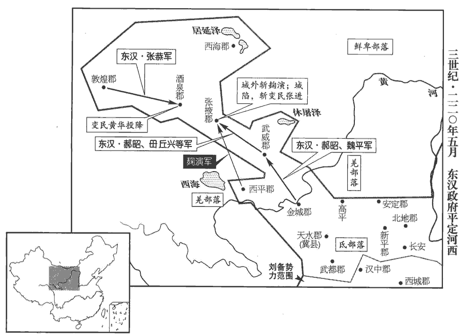
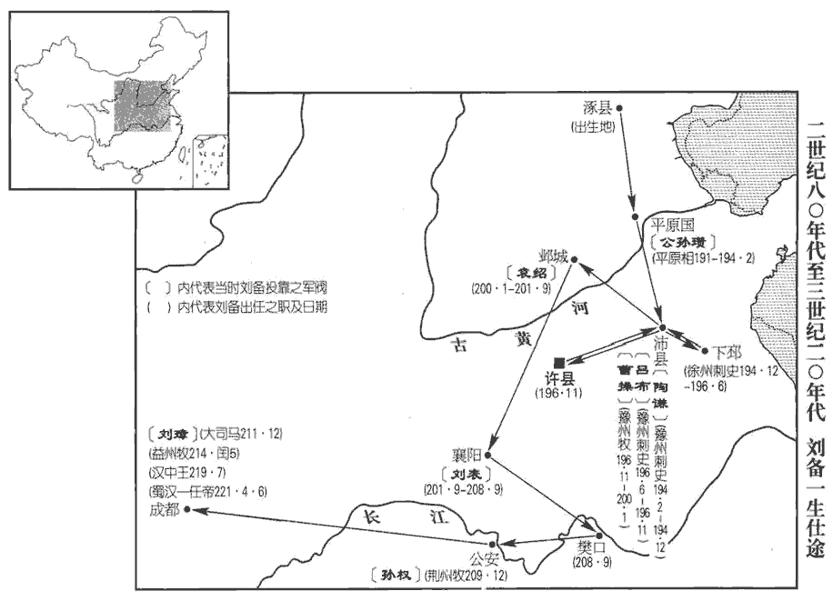
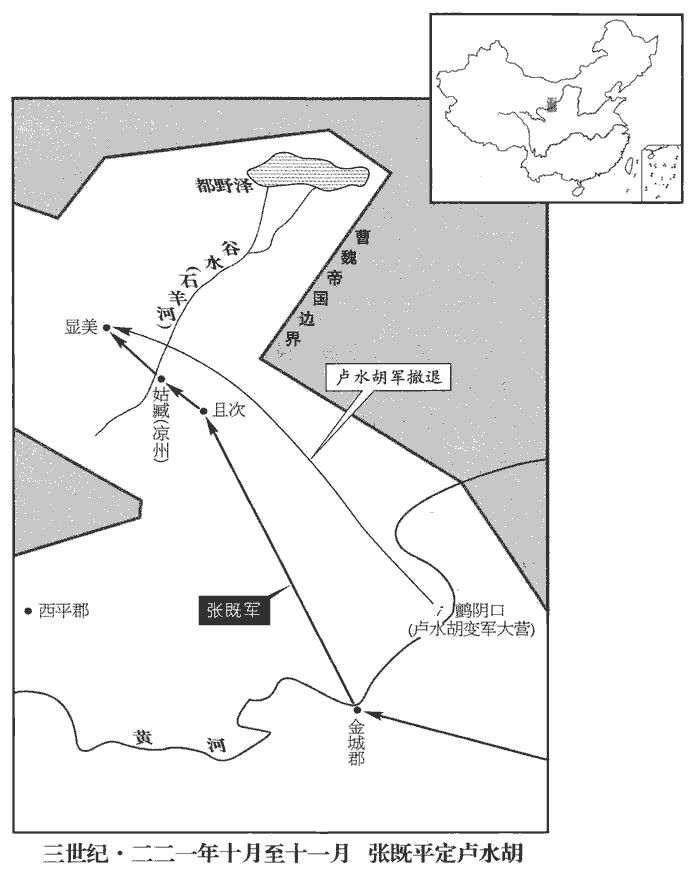
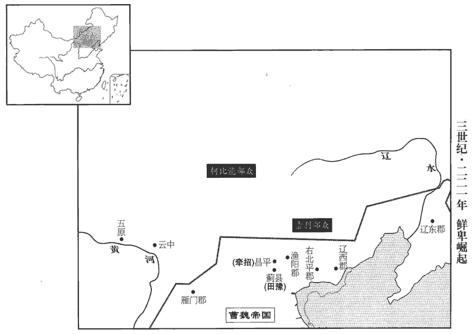
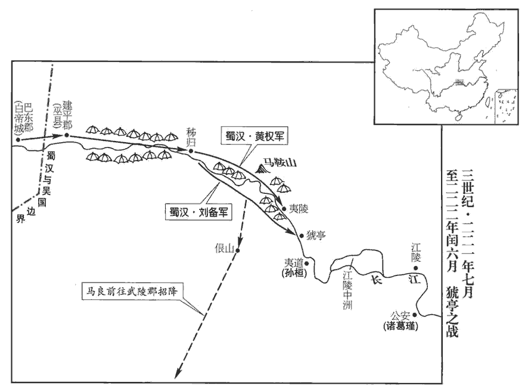
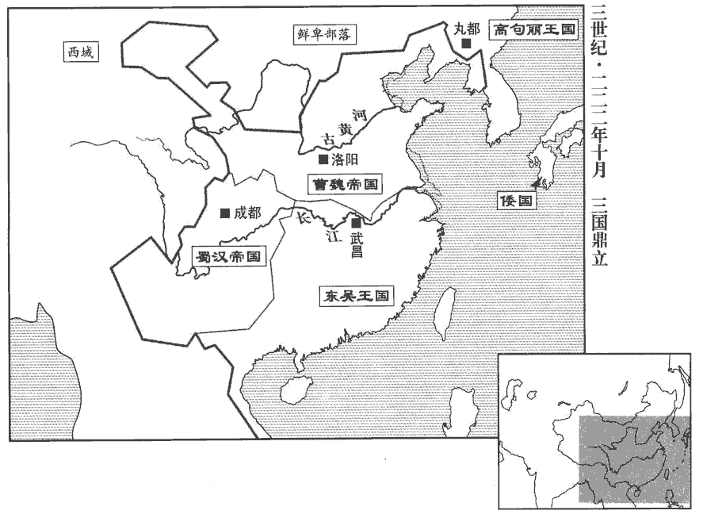
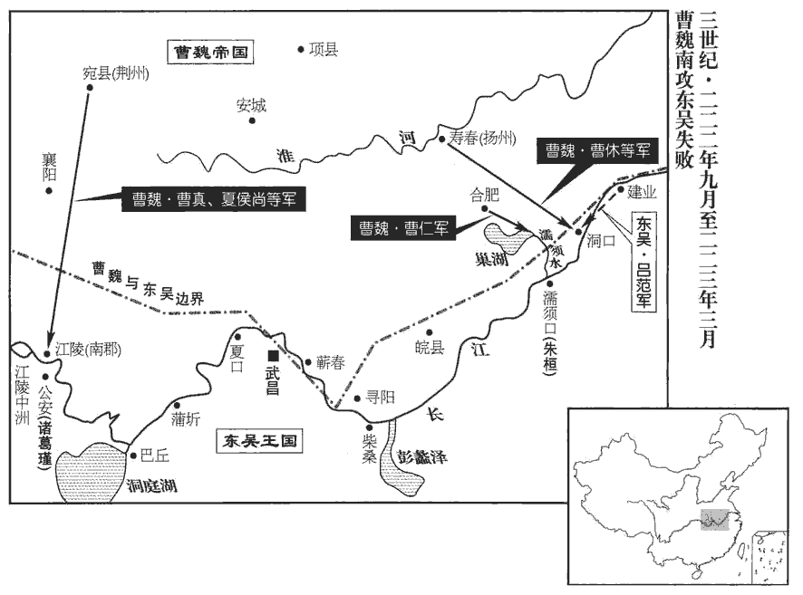

 魏紀一起上章困敦（庚子），盡玄黓yì攝提格（壬寅），凡三年。
>  
> 操破袁尚，得冀州，遂居於鄴。鄴，漢之魏郡治所。魏，大名也；遂封為魏公。又讖云：「代漢者當塗高。」當塗高者，魏也。文帝受漢禪，國遂號魏。

# 世祖文皇帝上諱丕，字子桓，武王操長子也。諡法：學勤好問曰文。世祖，廟號也。禮，祖有功而宗有德。諡法：景物四方曰世；承命不迁曰世；靖民則法曰皇；明一德者曰皇；明一合道曰皇。德象天地曰帝；按道無為曰帝。

## 黃初元年（庚子，二二零）魏受漢禪，推五德之運，以土繼火。土色黃，故紀元曰黃初。是年十月受禪，方改元。

1春，正月，武王‹曹操›至洛陽‹河南洛阳东白马寺东›；庚子‹二十三›，薨。魏王操諡曰武。王知人善察，難眩以偽。眩者，目無常主；難眩以偽，謂人不能亂其明。識拔奇才，不拘微賤，隨能任使，皆獲其用。與敵對陳，陳，讀曰陣。意思安閑，思，相吏翻。如不欲戰然；及至決機乘勝，氣勢盈溢。勳勞宜賞，不吝千金；無功望施，施，式豉翻。分豪不與。豪，即毫字。用法峻急，有犯必戮，或對之流涕，然終無所赦。雅性節儉，不好華麗。好，呼到翻。故能芟shān刈yì群雄，幾平海內。曰「幾」者，以不能并吳、蜀也。芟，所銜翻。幾，居希翻。

〖译文〗 [1]春季，正月，魏武王曹操抵达洛阳；庚子（二十三日），曹操去世。魏王知人善任，善于洞察别人，很难被假像所迷惑；能够发掘和提拔有特殊才能的人，不论地位多么低下，都按照才能加以任用，使他们充分发挥自己的才智。和敌人对阵时，他仪态安详，似乎不愿意打仗；可是一旦制定好策略，向敌人发动攻击，便气势充沛，斗志昂扬。对有功的将士和官吏，赏赐时不吝千金；而对没有功却希望受到赏赐的人，则分文不给。执法时严峻急切，违法的一定加以惩罚，有时对犯罪的人伤心落泪，也不加赦免。生活俭朴，不崇尚富丽奢华。报以能够消灭各个强大的割据势力，几乎统一全国。

是時太子在鄴，軍中騷動。群僚欲祕不發喪。諫議大夫賈逵以為事不可祕，乃發喪。或言宜易諸城守，悉用譙‹安徽亳州›、沛‹安徽淮北›人。曹氏，沛國譙人，小見者以鄉人為可信也。守，式又翻；下同。魏郡太守廣陵‹扬州›徐宣厲聲曰：「今者遠近一統，人懷效節，何必專任譙、沛，以沮宿衛者之心！」乃止。沮，在呂翻。青州兵擅擊鼓，相引去；青州兵，獻帝初平三年操破黃巾所降者。眾人以為宜禁止之，不從者討之。賈逵曰：「不可。」為作長檄，令所在給其稟食。為，于偽翻；下上為、下為同。稟，讀曰廩。食，如字。長檄，猶今軍行所至幫券也。鄢陵侯彰從長安來赴，操自漢中還師而東，彰定代而西迎操，因留彰長安。鄢，陸德明謁晚翻，又於建翻；師古音偃。問逵：先王璽綬所在。璽，斯氏翻。綬，音受。逵正色曰：「國有儲副，先王璽綬，非君侯所宜問也。」凶問至鄴‹河北临漳西南邺镇›，太子號哭不已。號，戶刀翻。中庶子司馬孚諫曰：續漢志：太子中庶子，秩六百石，職如侍中。「君王晏駕，天下恃殿下為命；當上為宗廟，下為萬國，柰何效匹夫孝也！」太子良久乃止，曰：「卿言是也。」時群臣初聞王薨，相聚哭，無復行列。行，戶剛翻。孚厲聲於朝曰：朝，直遙翻。「今君王違世，天下震動，當早拜嗣君，以鎮萬國，而但哭邪！」乃罷群臣，備禁衛，治喪事。孚，懿之弟也。治，直之翻。群臣以為太子即位，當須詔命。謂須待漢帝詔命也。尚書陳矯曰：「王薨于外，天下惶懼。太子宜割哀即位，以繫遠近之望。且又愛子在側，愛子，謂鄢陵侯彰也。彼此生變，則社稷危矣。」即具官備禮，一日皆辨。辨，與辦同，蜀本作「辦」。明旦，以王后令，策太子即王位，大赦。漢帝‹刘协，时年四十›尋遣御史大夫華歆奉策詔，授太子‹曹丕›丞相印、綬，魏王璽、綬，領冀州牧。華，戶化翻。於是尊王后曰王太后。

〖译文〗 此时，太子曹丕正在邺城，驻洛阳的军队骚动不安。大臣们想先保守秘密，暂时不公布曹操去世的消息。谏议大夫贾逵认为不应该保密，才把丧事公之于众。有人说，应当把各个城池的守将都换上曹操家乡的谯县人和沛国人。魏郡太守、广陵人徐宣大声说：“如今各地都归于一统，每个人都怀有效忠之心，何必专用谯县人和沛国人，以伤害那些守卫将士的感情！”撤换之事才不再提起。青州籍的原黄巾军士兵擅自击鼓离去，大家认为应加制止，对不服从命令者派兵征讨。贾逵说：“不可以这样做。”于是他写了一篇很长的文告，命令青州兵所到之处的地方官府，要给他们提供粮食。鄢陵侯曹彰从长安赶来，询问贾逵魏王的印玺在何处，贾逵严肃地说：“国家已经确定了先王的继承人，先王的印玺，不是君侯您应当询问的。”噩耗传到邺城，太子曹丕恸哭不已。中庶子司马孚劝谏说：“先王去世，举国上下都仰仗殿下您的号令。您应上为祖宗的基业着想，下为全国的百姓考虑，怎么能效法普通人尽孝的方式呢？”曹丕很久以后才止住哭声，对司马孚说：“你说得对。”当时，大臣们刚刚听到曹操去世的消息，相聚痕哭，一片混乱。司马孚在朝堂上大声说：“如今君王去世，全国震动，当务之急是拜立新君，以镇抚天下，难道你们只会哭泣吗？”于是命令群臣退出朝堂，安排好宫廷警卫，处理丧事。司马孚是司马懿的弟弟。大臣们认太子曹丕即魏王位，应该有汉献帝的诏令。尚书陈矫说：“魏王在外去世，全国惊惶恐惧。太子应节哀即位，以安定全国上下的人心。况且魏王钟爱的儿子曹彰正守在灵柩旁边，他若在此时有不智之举，生出变故，国家就危险了。”当即召集百官，安排礼议，一天之内，全部办理完毕。第二天清晨，以魏王后的命令，拜太子曹丕继承曹操为魏王，下令大赦天下罪犯。不久，汉献帝派御史大夫华歆带着诏书，授予曹丕丞相印绶和魏王玺绶，仍兼任冀州牧，于是曹丕尊奉母后卞氏为王太后。

2改元延康。此漢改元，魏志也。

〖译文〗 [2]改年号为延康。

3二月，丁未朔‹一›，日有食之。

〖译文〗 [3]二月，丁未朔（初一），出现日食。

4壬戌‹十六›，以太中大夫賈詡為太尉，御史大夫華歆為相國，大理王朗為御史大夫。

〖译文〗 [4]壬戌（十六日），任命太中大夫贾诩为太尉，御史大夫华歆为相国，大理王朗为御史大夫。

5丁卯‹二十一›，葬武王于高陵。高陵，在鄴城西。操遺令曰：汝等時時登銅雀臺，望吾西陵墓田。魏紀載操令曰：規西門豹祠西原上為陵。

〖译文〗 [5]丁卯（二十一日），安葬魏王曹操的遗体在邺城西面的高陵。

6王弟鄢陵侯彰等皆就國。臨菑‹山东淄博东临淄镇›監國謁者灌均，希指奏「臨菑侯植醉酒悖慢，劫脅使者。」時禁切藩侯，使謁者監其國；監，古銜翻。悖，蒲內翻，又蒲沒翻。王貶植為安鄉侯，誅右刺姦掾沛國丁儀王莽置左右刺姦以督姦猾。光武中興，亦置刺姦將軍；然公府掾無其員也。魏、晋公府始有營軍刺姦等員。掾，俞絹翻。及弟黃門侍郎廙yì并其男口，并男口誅之，絕其世也。廙，逸職翻，又羊至翻。皆植之黨也。

〖译文〗 [6]魏王曹丕的弟弟鄢陵侯曹彰等人都回到自己的封地。临侯曹植的监国谒者灌均，迎合曹丕的意图，上奏说：“临侯曹植酗酒，言辞轻狂使用慢，动持并胁迫魏王的使者。”曹丕贬曹植为安乡侯，将曹植的党羽，右刺奸掾、沛国人丁仪，黄门侍郎丁兄弟，二人及两家男子全部处死。

魚豢huàn論曰：諺言：「貧不學儉，卑不學恭。」非人性分殊也，分，扶問翻。勢使然耳。假令太祖防遏植等在於疇昔，此賢之心，何緣有窺望乎！彰之挾恨，尚無所至；至於植者，豈能興難！難，乃旦翻。乃令楊脩以倚注遇害，丁儀以希意族灭，哀夫！

〖译文〗 鱼豢论曰：有句谚语：“贫穷的人，不用学，自然会俭朴；卑下的人，不用学，自然会谦恭。”这并不是说人的性格有差别，而是环境造成的。如果曹操很早就管束曹植等人的举止，有这样贤明的用心，曹植等人怎么会有非分的想法呢？曹彰怀有怨恨，尚且没有到达这一地步；至于曹植，哪里能发动什么变乱！偏偏使杨修因曹植的倚重而遇害，丁仪因逢迎曹植而全家被杀，太令人哀叹了！

7初置散騎常侍、侍郎各四人，散騎常侍，秦官也。秦置散騎，又置中常侍。散騎，騎從乘輿車後；中常侍得入禁中：皆以為加官。漢東京初省散騎，而中常侍用宦者。至是初置散騎，合之於中常侍為一官，曰散騎常侍，掌規諫，不典事；貂璫dāng插右，騎而散從，後遂為顯職。散騎侍郎，自魏至晉與散騎常侍、侍中、黃門侍郎共平尚書奏事，江左乃罷。其宦人為官者不得過諸署令；謂左•右•中尚方、中黃、左•右藏、左校、甄官、奚官、黃門、掖庭、永巷、御府、鉤gōu盾、中藏府、內者等署也。為金策，藏之石室。時當選侍中、常侍，王左右舊人諷主者，便欲就用，不調餘人。調，徒弔翻。司馬孚曰：「今嗣王新立，當進用海內英賢，如何欲因際會，自相薦舉邪！官失其任，得者亦不足貴也。」遂他選。

〖译文〗 [7]开始设置散骑常侍、侍郎各四人，宫中的宦官任官不得超过各署令；并将这一规定用金写在策书上，存放在宗庙的石函里。当时，正在选拔侍中、常侍等官员，长期跟随曹丕左右的亲信就暗示主持选官的人，想自己担任，不再从他处选调。司马孚说：“现在新王刚刚登位应该征召和任用全国各地的人才，怎么能够凭借这种机遇，举荐自己身边的人呢？任职不根据才能，做了官也并不尊贵。”因此，才从他处进行选拔。

8尚書陳群，以天朝選用不盡人才，天朝，謂漢朝也。朝，直遙翻。乃立九品官人之法；州、郡皆置中正以定其選，擇州郡之賢有識鑒者為之，區別人物，第其高下。九品中正自此始。九品，上上、上中、上下、中上、中中、中下、下上、下中、下下也。別，彼列翻。

〖译文〗 [8]尚书陈群认为，汉朝任用的官员，并没有把人才都选举出来，于是设立九口官人的制度：在州和郡都设置中正的职位，以确定应该选用哪些人；中正由各州、郡正贤德、能够鉴别人才的人担任，由他们鉴别人物品行、能力，分出高低不同等级。

9夏，五月，戊寅‹三›，漢帝追尊王祖太尉曰太王，王祖，漢太尉曹嵩也。夫人丁氏曰太王后。

〖译文〗 [9]夏季，五月，戊寅（初三），汉献帝追封曹丕的祖父太尉曹嵩为魏太王，曹嵩的夫人丁氏为魏太王后。

10王以安定‹甘肃镇原东南曙光乡›太守鄒岐為涼州刺史。西平‹青海西宁›麴qū演結旁郡作亂以拒岐；張掖張進執太守杜通，酒泉黃華不受太守辛機，皆自稱太守以應演；誅韓遂者麴演也；蓋威行涼部久矣，故進等皆應之。武威三種胡復叛。種，章勇翻。復，扶又翻。武威太守毌丘興毌guàn丘，複姓也。告急於金城‹甘肃兰州东›太守、護羌校尉扶風‹陕西兴平›蘇則，則將救之，郡人皆以為賊勢方盛，宜須大軍。時將軍郝昭、魏平先屯金城，受詔不得西渡。金城與武威、張掖、酒泉隔河。則乃見郡中大吏及昭等謀曰：「今賊雖盛，然皆新合，或有脅從，未必同心；因釁xìn擊之，善惡必離，離而歸我，我增而彼損矣。既獲益眾之實，且有倍氣之勢，率以進討，破之必矣。若待大軍，曠日彌久，善人無歸，必合於惡，善惡既合，勢難卒離。卒，讀曰猝。雖有詔命，違而合權，專之可也。」昭等從之，乃發兵救武威，降其三種胡，降，戶江翻；下同。與毌丘興擊張進於張掖。麴演聞之，將步騎三千迎則，辭來助軍，實欲為變，則誘而斬之，誘，音酉。出以徇軍，其黨皆散走。則遂與諸軍圍張掖，破之，斬進；黃華懼，乞降。據裴松之註，華即後為兗州刺史奏王淩者也。事見七十五卷邵陵厲公嘉平三年。河西平。

〖译文〗 [10]魏王曹丕提升安定太守邹岐为凉州刺史。西平的演勾结附近几郡制造动乱，抗拒邹岐；张掖郡的张进把太守杜通抓了起来，酒泉郡的黄华则拒绝太守辛机赴郡就任，他们都自称太守响应演。武威郡的三个部落的胡人也再度反叛。武威太守丘兴，向金城太守、护羌校尉扶风人苏则告急，苏则要率兵相救，郡中官员认为贼人的势力正盛，救援武威需要大批军队。当时将军郝昭、魏平，原来即驻扎在金城，但奉令不得西渡黄河。苏则召集郡中主要官员以及郝昭等人计议说：“如今贼人气焰虽盛，然而都是刚刚拼凑起来的，其中有些人被坏人裹胁，未必和贼人一条心；应该利用贼人的内部矛盾，乘机进攻，他们中的善良之辈必然脱离那些邪恶之徒，归附我们，这样，我们增强了力量，贼人的势力也就减弱了。我们既获得增加兵员的实力，又使气势倍增，率兵进讨，一定能够将贼人击溃。如果等待大军到来，需要很长时间，敌军中善良的人没有归宿，必然与邪恶之徒同流合污，善、恶两种人混合在一起，在短期内很难分开开。虽然有命令不得西渡，为权宜之计而暂时违背，自己作决定也是可以的。”郝昭等人同意了，于是调集军队救援武威，三个部落的胡人被降服了。苏则、郝昭等人又和丘兴一起进攻张掖郡的张进。演听说这一消息，率领步、骑兵三千人来迎苏则，声称前来助战，实际上是准备发动突然袭击，苏则借机引诱演会面，将其斩首，并把尸体拖出来展示给他的部属，演的党羽便都散走了。于是，苏则率兵和各路军队包围了张掖，攻克张掖城，杀了张进。黄华恐惧，请求设降。河西各郡全部平定了。

 

初，敦煌太守馬艾卒官，敦，徒門翻。卒，子恤翻；下同。郡人推功曹張恭行長史事；恭遣其子就詣朝廷請太守。會黃華、張進叛，欲與敦煌并勢，執就，劫以白刃；就終不回，私與恭疏曰：「大人率厲敦煌，忠義顯然，豈以就在困厄之中而替之哉！今大軍垂至，但當促兵以掎之耳。掎jǐ，舉綺翻。從後牽曰掎，又云，偏引曰掎。願不以下流之愛，使就有恨於黃壤也。」論語曰：君子惡居下流，天下之惡皆歸焉。謂下流當惡居而不當愛也。一曰：流，輩也；牽於父子之愛，而廢君臣之義，是常人之流下一等見識，故曰下流之愛。恭即引兵攻酒泉，別遣鐵騎二百及官屬，緣酒泉北塞，東迎太守尹奉。黃華欲救張進，而西顧恭兵，恐擊其後，故不得往而降。就卒平安，奉得之郡，詔賜恭爵關內侯。

〖译文〗 当初，敦煌太守马艾在任上去世，郡中的人推举功曹张恭暂代长史职务；张恭派儿子张就到朝廷请求派太守赴敦煌郡就任。正赶上黄华、张进叛乱，企图与敦煌郡联合，因此动持了张就，把钢刀架在他脖子上，胁迫他答应结盟，张就誓死不从，秘密送信给张恭说：“您治理敦煌郡，忠义这心，昭示天下，岂能因为我在困境中而改变初衷呢！如今大军很快就要抵达这里，您应率兵从后而牵制黄华。希望父亲不要因为爱儿子，而使儿子饮恨黄泉。”张恭立即率兵攻打酒泉，另派铁甲骑兵二百人及敦煌的属官，沿着酒泉北塞，向东迎接新任郡太守尹奉。黄华企图救援张进，又顾忌西部张恭的部队攻击后路，所以不敢前去救援，只好投降了。张就也因此保全了性命，尹奉得以到郡就任。献帝下诏，赐张恭关内侯的爵位。

11六月，庚午‹二十六›，王引軍南巡。

〖译文〗 [11]六月瘐午（二十六日），魏王曹丕率烟南下巡查。

12秋，七月，孫權遣使奉獻。

〖译文〗 [12]秋季，七月，孙权派使者至汉朝廷奉献贡物。

13蜀將軍孟達屯上庸‹湖北竹山西南田家坝›，與副軍中郎將劉封不協；封侵陵之，達率部曲四千餘家來降。達有容止才觀，觀，工玩翻。王甚器愛之，引與同輦，以達為散騎常侍、建武將軍，封平陽亭侯。合房陵‹湖北房县›、上庸‹湖北竹山西南田家坝›、西城‹陕西安康›三郡為新城‹府湖北房县›，蜀分三郡見上卷漢獻帝建安二十四年。以達領新城太守，委以西南之任。行軍長史劉曄yè曰：時魏王引軍南巡，以曄為長史。「達有苟得之心，而恃才好術，好，呼到翻。必不能感恩懷義。新城與孫、劉接連，蜀之漢中，吳之宜都，皆與新城接連。若有變態，為國生患。」王不聽。為孟達叛魏張本。為，于偽翻。遣征南將軍夏侯尚、右將軍徐晃與達共襲劉封。上庸太守申耽叛封來降，封破，走還成都。

〖译文〗 [13]蜀将军孟达驻军上庸，与副军郎将刘封不和，爱到刘封欺辱，一气之下，率领部曲四千余家降魏。孟达仪表堂堂，气质不凡，深受曹歪器重和钟爱。曹丕与他同乘一辆车子，任命他为散骑常侍、建武将军，封平阳亭侯。又合并房陵、上庸、西城三郡为新城郡，由孟达兼任太守，负责西南面军政事务。行军长史刘晔对曹丕说：“孟达有侥幸取利之心，而且依恃才智，喜欢权术，肯定不会对您感恩报答。新城郡与孙权、刘备的地盘相接，一旦发生变故恐怕会对国家产生危害。”魏王曹丕不听。派征南将军夏侯尚、右将军徐晃和孟达一起袭击刘封。蜀上庸太守申耽背叛刘封，投降了曹军。刘封被击败，逃回成都。

初，封本羅‹湖南汨罗›侯寇氏之子，漢中王初至荊州，以未有繼嗣，養之為子。諸葛亮慮封剛猛，易世之後，終難制御，勸漢中王因此際除之；遂賜封死。

〖译文〗 当初，刘封本来是罗侯人寇姓人家的儿子，汉中王刘备刚到荆州时，没有儿子，收刘封为养子。诸葛亮认为刘封傲慢固执，性情凶悍，顾虑在刘备去世后，无人能控制他，劝刘备借此机会，将他除掉；刘备便命刘封自杀了。

14武都‹甘肃成县›氐王楊僕率種人內附。種，章勇翻。

〖译文〗 [14]武都氐族酋长杨仆率部落依附汉朝廷。

15甲午‹二十›，王次于譙‹安徽亳州›，大饗六軍及譙父老于邑東，設伎樂百戲，伎，巨綺翻。吏民上壽，日夕而罷。

〖译文〗 [15]早午（二十日），魏王曹丕驻谯县，在谯县城东大摆宴席，犒劳军队将士，招待谯胰父老，并不歌舞百戏，官员和百姓前来为魏王祝寿，直到日落才散去。

孫盛曰：三年之喪，自天子達于庶人。故雖三季之末，謂三代之季也。七雄之敝，秦、趙、韓、魏、齊、楚、燕為戰國七雄。猶未有廢衰cuī斬於旬朔之間，釋麻杖於反哭之日者也。麻，絰dié也。居父喪苴jū杖。禮：既葬而反哭。檀弓曰：反哭升堂，反諸其所作也。反哭之弔也，哀之至也；反而亡焉，失之矣，於是為甚。衰，倉回翻。逮于漢文，變易古制，事見十五卷文帝後七年。人道之紀，一旦而廢，固已道薄於當年，風頹於百代矣。魏王既追漢制，替其大禮，處莫重之哀處，昌呂翻。而設饗宴之樂，居貽yí厥之始而墮王化之基，夏書曰：有典有則，貽厥子孫。墮，讀曰隳。及至受禪，顯納二女，獻帝之禪也，冊詔魏王曰：漢承堯運，有傳聖之義；釐降二女，以嬪于魏。是以知王齡之不遐，卜世之期促也。

〖译文〗 孙盛曰：父母去世，子女要守丧三年，上自皇帝，下至百姓，都应如此。所以尺管夏、商、周三代的末期已经衰落，以及战国时期，七雄争霸，全国混乱，也没有人在十天半月之内就脱去孝服，在必须回庙堂哭祭已故父母的日子里扔掉丧杖。到汉文帝时，更改了古代的制度，为人之道的纲纪，一下子就被废除了，所以道德大不如前，风气也比古代几坏得多了。魏王曹丕又仿汉代的制度，接受汉代的礼仪，在人生最应哀痛的时候，却摆宴席，演歌舞，身处创业之始，便毁坏了君王的基础。在接受汉朝皇帝禅让的时候，又公开纳汉献帝的两个女儿为妃，由此可知，曹丕很难长寿，曹氏政权一定是个短命王朝。

16王‹曹丕›以丞相祭酒賈逵為豫州刺史。豫州，統潁川、汝陰、汝南、梁國、沛郡、譙郡、魯郡、弋陽、安豐等郡。晉地理志曰：魏武分沛郡立譙郡，分汝南立汝陰郡，合陳郡於梁國。沈約志曰：弋陽縣，本屬汝南，魏文帝分立郡，又分廬江為安豐郡。是時天下初定，刺史多不能攝郡。攝，總錄也。逵曰：「州本以六條詔書察二千石以下，舉漢制也。故其狀皆言嚴能鷹揚，有督察之才，不言安靜寬仁，有愷kǎi悌tì之德也。今長吏慢法，盜賊公行，州知而不糾，天下復何取正乎！」復，扶又翻。其二千石以下，阿縱不如法者，皆舉奏免之。外脩軍旅，內治民事，治，直之翻。興陂田，通運渠，吏民稱之。王曰：「逵真刺史矣。」布告天下，當以豫州為法；賜逵爵關內侯。

〖译文〗 [16]魏王曹丕任命丞相祭酒贾逵为豫州刺史。当时国家刚刚安定，刺史大都不能统辖所属各郡的事务。贾逵说：“州刺史，原本是以六条诏书监察二千石及其以下官吏，所以在考察报告中，都使用威严雄武、有督察官吏之才等辞句；而不说他们安详、平和、宽厚、仁爱，有谦谦君子之德。如今郡的长官不重视法令，致使盗贼公开抢动、行窃，刺史即使知道也不加追究。这样下去，国家还能走上正轨吗！”对放纵坏人，不按法令办事的，二千石及以下官吏，他都一律上奏朝廷，予以罢免。他还对外整顿武备，对内认真处理民事，开垦水田，疏通转运粮米的水道，受到官员和百姓的称赞。曹丕说：“贾逵者真正的刺史。”于是向全国发出公告。以豫州为全国各州的榜样，封贾逵为关内侯。

17左中郎將李伏、太史丞許芝表言：「魏當代漢，見於圖緯，其事眾甚。據獻帝傳，李伏引孔子玉板，許芝引春秋漢含孳、玉板讖、佐助期、孝經中黃讖、易運期讖。群臣因上表勸王順天人之望，時勸進者，辛毗、劉曄、傅巽、衛臻、桓階、陳矯、陳群、蘇林、董巴；繼之者，司馬懿、鄭渾、羊祕、鮑勛。王不許。

〖译文〗 [17]左中郎将李伏、太史丞许芝向曹丕上书说：“魏应该取代汉，经过占验河图和纬书，很多事例都证明了这一点。”大臣们因此都上表，劝魏王曹丕遵从上天的意志，顺应官员和百姓的愿望，取代汉朝，登基答帝，曹丕不同意。

冬，十月，乙卯‹十三›，漢帝‹刘协›告祠高廟，使行御史大夫張音持節奉璽綬詔冊，禪位于魏。王三上書辭讓，乃為壇於繁陽‹河南临颍西北›，時南巡至潁川潁陰縣，築壇於曲蠡之繁陽亭。述征記曰：其地在許南七十里。東有臺，高七丈，方五十步；南有壇，高二丈，方三十步，即受終之壇也。是年以繁陽為繁昌縣。辛未‹二十九›，升壇受璽綬，即皇帝位，考異曰：陳志云：「丙午，行至曲蠡，漢帝禪位。庚午，升壇即祚。」袁紀亦云：「庚午魏王即位。」按獻帝紀，乙卯始發禪冊，二十九日登壇受命。又文帝受禪碑至今尚在，亦云辛未受禪。陳志、袁紀誤也。范書云：「魏遣使求璽綬，曹皇后不與，如此數輩，后乃呼使者，以璽抵軒下，因涕泣橫流曰『天不祚爾！』左右皆莫能仰視。」按此乃前漢元后事，且璽綬無容在曹后之所，此說妄也。燎祭天地、嶽瀆，改元，大赦。

〖译文〗 冬季，十月，乙卯（十三日），汉献帝在高祖庙祭祀，报告列祖列宗，派代理御史大夫张音带着符节，捧着皇帝玺绶以及诏书，要让位给魏王曹丕。曹丕三次上书推辞，然后在繁阳筑起高坛，辛未（二十九日），登坛受皇帝玺绶，即皇帝位。燃起大火祭祀天地、山川，更改年号，大赦全国。

十一月，癸酉‹一›，奉漢帝為山陽公，山陽縣‹河南焦作›，屬河內郡。行漢正朔，用天子禮樂；封公四子為列侯。追尊太王曰太皇帝，武王曰武皇帝，廟號太祖；尊王太后曰皇太后。以漢諸侯王為崇德侯，列侯為關中侯。群臣封爵、增位各有差。改相國為司徒，御史大夫為司空。漢獻帝建安十三年罷三公官，今復舊。山陽公奉二女以嬪于魏。

〖译文〗 十一月，癸酉（初一），曹丕尊奉汉献帝刘协为山阳公，仍然使用汉朝的历法，行皇帝的礼仪、音乐；封他的四个儿子为列侯。曹丕追尊自己的祖父魏太王曹嵩为太皇帝；父亲魏武王曹操为武皇帝，庙号为太祖；尊奉母亲魏太后卞氏为皇太后。改汉封朝的诸侯王为嵩德侯，列侯为关中侯。大臣们封爵、升迁，各有不同。又把相国改称司徒，御史大夫改称司空。山阳公间协奉献自己的两个女儿给魏文帝曹丕作妃子。

帝‹曹丕›欲改正朔，侍中辛毗曰：「魏氏遵舜、禹之統，應天順民；至於湯、武，以戰伐定天下，乃改正朔。孔子曰：『行夏之時，』左氏傳曰：『夏數為得天正，』何必期於相反！」帝善而從之。自是之後，遂皆以建寅為正。傳，直戀翻。時群臣并頌魏德，多抑損前朝；朝，直遙翻。散騎常侍衛臻獨明禪授之義，稱揚漢美。帝數目臻曰：數，所角翻。「天下之珍，當與山陽共之。」帝欲追封太后父、母，尚書陳群奏曰：「陛下以聖德應運受命，創業革制，當永為後式。按典籍之文，無婦人分土命爵之制。在禮典、婦因夫爵。禮記：婦人無爵，從夫之爵。秦違古法，漢氏因之，非先王之令典也。」帝曰：「此議是也，其勿施行。」仍著定制，藏之臺閣。臺閣，尚書中藏故事之處。

〖译文〗 魏文帝曹丕要重新颁布历法，侍中辛毗说：“魏朝遵循虞舜和夏禹一脉相承的继承关系，顺应天命，合乎民心；只有商汤、周武王，依靠武力征伐统一全国，才会更改历法。孔子说：‘实行夏的历法’，《左传》说：‘夏朝的历法，最符合天地运行的规律，’我们为什么要和它相反呢？”文帝称赞并采纳了辛毗的建议。当时，大臣们都称颂魏朝的功德，贬损汉朝。散骑常侍卫臻却阐述禅让的大义，称赞汉朝的功绩。文帝看了卫臻几次说：“普天下的珍宝，我要和山阳公共同享用。”文帝要追封母亲卞太后的父母，尚书陈群上奏说：“陛下以圣明的德行，顺应天命，创立大业，革除旧制，应该永远成为后代遵从的典范。根据典籍记载，汉有分封妇人土地和爵位的制度。记载礼仪的典籍中，只有妇人附从丈夫的爵位。秦朝违背古代制度，汉朝又继承秦朝的体制，都不符古代君王的法令和经典。”文帝说：“你的看法很对，不要封太后的父母了。”并写下了这一建议，确定为制度，保存在收藏档案的台阁中。

18十二月，初營洛陽宮。戊午‹十七›，帝如洛陽。裴松之曰：按諸書記，是時帝居北宮，以建始殿朝群臣，門曰承明。陳思王植詩「謁帝承明廬」是也。至明帝時，始於漢南宮崇德殿處起太極、昭陽諸殿。魏略曰：漢火行也。火忌水，故「洛」去「水」而加「隹」zhuī。魏於行次為土。土，水之牡也；水得土而流，土得水而柔。故除「隹」加「水」，變「雒」為「洛」。

〖译文〗 [18]十二月，开始营建洛阳宫殿。戊午（十七日），魏文帝曹丕到洛阳。

19帝謂侍中蘇則曰：「前破酒泉、張掖，西域通使敦煌，使，疏吏翻。敦，徒門翻。獻徑寸大珠，可復求市益得不？」復，扶又翻。不，讀曰否。則對曰：「若陛下化洽中國，德流沙幕，即不求自至。求而得之，不足貴也。」帝嘿然。

〖译文〗 [19]文帝对侍中苏则说：“以前攻破酒泉、张掖的时候，西域瘟派使臣至敦煌，贡献直径一寸的大珍珠，可否再让他们来习卖而得？”功则回答说：“如果陛下以教化润泽全国，威德远吸沙漠，不求珍珠，也会有人送来；向人求取才得到，已无珍贵可言。”文帝默然无语。

20帝召東中郎將蔣濟為散騎常侍。時有詔賜征南將軍夏侯尚曰：「卿腹心重將，重將，即亮翻。特當任使，作威作福，殺人活人。」尚以示濟。濟至，帝問以所聞見，對曰：「未有他善，但見亡國之語耳。」帝忿然作色而問其故，濟具以答，因曰：「夫『作威作福』，書之明誡。書洪范曰：臣無有作威作福，臣而有作威作福，其害于而家，凶于而國。天子無戲言，古人所慎；惟陛下察之！」帝即遣追取前詔。

〖译文〗 [20]文帝征召中郎将蒋济为散骑常侍。当时曾有诏书赐给征南将军侯尚说：“你是我非常信任的重要将领，特别委以重任，随你作威作福，有杀人和赦免人特权。”夏侯尚把诏书拿给蒋济看了。蒋济抵达京城，文帝问他有什么见闻，蒋济回答说：“汉有什么可称道之处，只听到了亡国之音。”文帝听后很生气，脸上立刻变了颜色，问他为什么这么说。”蒋济如实回答说：“‘作威作福’，《尚书》中清楚地将它写作戒律。天子无戏言，古人对这一点非常慎重，还请陛下明察！”文帝立即下令追回给夏侯的诏书。

21帝欲徙冀州士卒家十萬戶實河南。時營洛陽，故欲徙冀州士卒家以實之。時天旱蝗，民饑，群司以為不可，而帝意甚盛。侍中辛毗與朝臣俱求見，見，賢遍翻。帝知其欲諫，作色以待之，皆莫敢言。毗曰：「陛下欲徙士家，其計安出？」帝曰：「卿謂我徙之非邪？」毗曰：「誠以為非也。」帝曰：「吾不與卿議也。」毗曰：「陛下不以臣不肖，置之左右，廁之謀議之官，侍中，於周為常伯之任，在天子左右，備切問近對，拾遺補闕。安能不與臣議邪！臣所言非私也，乃社稷之慮也，安得怒臣！」帝不答，起入內；毗隨而引其裾，帝遂奮衣不還，良久乃出，曰：「佐治，卿持我何太急邪！」辛毗，字佐治。治，直吏翻。毗曰：「今徙，既失民心，又無以食也，故臣不敢不力爭。」帝乃徙其半。帝嘗出射雉，顧群臣曰：「射雉樂哉！」毗對曰：「於陛下甚樂，於群下甚苦。」帝默然，後遂為之稀出。射，而亦翻。樂，音洛。為，于偽翻。

〖译文〗 [21]文帝要迁徙冀州籍士兵的家属十万户，充实河南郡。当时，天大旱，又闹蝗灾，百姓饥馑，朝廷各部门都认为不可以，而文帝态度却很坚决。侍中辛毗和朝廷大臣请求晋见，文帝知道他们要劝谏，板起面孔等着，大家见他脸色不好，都不敢说话。辛毗说：“陛下要迁徙士兵家属，理由是什么？”曹丕说：“你认为我的作法不对？”辛毗回答说：“确实不对。”文帝说：“我不和你讨论。”辛毗说：“陛下不认为我不成才，所以将我安排在陛身边，作为咨询的官员，陛下怎么能不和我讨论呢？我的话并非对我个人有什么好处，而是为国家着想，有什么理由对我发脾气呢？”文帝不答，起身要进内室；辛毗在后面赶上，拉住他的衣襟，文帝猛地拽过衣襟，头也不回地走了进去，过了很久，他又出来，对辛毗说：“辛佐治，你为什么把我挟持得那么急迫！”辛毗说：“迁徙民众，既失人心，又缺少粮食，所以我不得不力争。”这样，文帝只迁徙了五万户。文帝曾出外打野鸡取乐，对官员们说：“射野鸡，实在令人高兴！”辛毗对答说：“这对陛下来说，的确是件高兴事；对我们这些臣子，可是件苦差事。”文帝默然无语，以后就很少出来打猎了。

## 二年（辛丑，二二一）考異曰：陳志，「正月，乙亥，朝日于東郊。」裴松之以為朝日在二月，按二月辛丑朔，無乙亥。

1春，正月，‹曹丕，时年三十五›以議郎孔羨為宗聖侯，奉孔子祀。漢平帝元始元年，封褒成君孔霸曾孫均為褒成侯，奉孔子祀；王莽敗，失國。光武建武十三年，復封均子志為褒成侯。志子損，和帝永元四年徙封褒亭侯，世世相傳，至獻帝初國絕。魏封孔子二十一世孫羨為宗聖侯，邑百戶。晉封二十三世孫震為奉聖亭侯。後魏封二十七世孫乘為崇聖大夫；孝文太和十九年幸魯，又改封二十八世孫珍為崇聖侯。北齊改封三十一世孫□為恭聖侯。周武帝平齊，改封鄒國公。隋文帝仍舊封鄒國公；煬帝改封為紹聖侯。唐太宗貞觀十一年，封孔子裔孫倫為褒聖侯。

〖译文〗 [1]春季，正月，封议郎孔羡为宗圣侯，奉侍祭祀孔子。

2三月，加遼東‹辽宁辽阳›太守公孫恭車騎將軍。恭，公孫度次子，康之弟也。

〖译文〗 [2]三月，加封辽东太守公孙恭为车骑将军。

3初復五銖錢。漢獻帝初平元年，董卓壞五銖錢，今復之。

〖译文〗 [3]开始恢复使用五铢钱。

4蜀中傳言漢帝‹刘协›已遇害，於是漢中王發喪制服，諡曰孝愍皇帝。群下競言符瑞，勸漢中王稱尊號。前部司馬費詩上疏曰：時費詩為益州前部司馬。費，父沸翻。「殿下以曹操父子偪主篡位，故乃羈旅萬里，糾合士眾，將以討賊。今大敵未克而先自立，恐人心疑惑。昔高祖與楚約，先破秦者王之。王，于況翻。及屠咸陽，獲子嬰，猶懷推讓；推，吐雷翻。況今殿下未出門庭，便欲自立邪！愚臣誠不為殿下取也。」為，于偽翻。王不悅，左遷詩為部永昌‹云南保山›從事。為益州刺史部從事，部永昌郡。夏，四月，丙午‹六›，漢中王‹刘备，时年六十一›即皇帝位於武擔之南‹成都西北›，蜀本紀曰：武都有丈夫化為女子，顏色美好，蓋山精也。蜀王娶以為妻，不習水土，疾病欲歸國。蜀王留之，無幾物故。蜀王發卒之武都擔土，於成都郭中葬，蓋地數畝，高十丈，號曰武擔也。裴松之曰：按武擔山在成都西北，蓋以乾位在西北，故就之以即祚。杜佑曰：武擔山在蜀郡西。大赦，改元章武。以諸葛亮‹时年四十一›為丞相，許靖為司徒。

〖译文〗 [4]蜀地传言汉献帝已经遇害，于是，汉中王刘备下令披麻戴孝，为汉献帝举行丧礼，尊谥汉献帝为孝愍皇帝。群臣纷纷上书，说有很多吉祥之兆，请求刘备即位称帝。前部司马费诗上书说：“殿下因为曹操父子逼迫皇帝，篡夺帝位所以才万里流亡，召集士卒，领兵讨伐曹氏奸贼。如今大敌尚未击败，您却先自称皇帝，恐怕人们会对您的行为产生疑惑。从前，汉高祖与楚人相约，谁先灭掉秦朝，谁就称王。等到攻克咸阳，俘获了秦皇帝子婴，汉高祖对王称号仍然推让。而殿下如今尚未走出门庭，便要自己称皇帝，愚臣我实在认为您不应该这样做。”汉中王对此很不高兴，将费诗降职为州部永昌从事。夏季，四月，丙午（初六），汉中王刘备在成都西北的武担山之南登基称帝，大赦罪犯，改年号为章武。任命诸葛亮为丞相，许靖为司徙。

 

臣光曰：天生烝民，其勢不能自治，必相與戴君以治之。治，直之翻。苟能禁暴除害以保全其生；賞善罰惡使不至於亂，斯可謂之君矣。溫公之說，正祖周書所謂「撫我則后，虐我則讎」之意。白虎通曰：君者，群也；群下之所歸心也。是以三代之前，海內諸侯，何啻chì萬國，黃帝置左右大監，監于萬國。禹會諸侯於塗山，執玉帛者萬國。有民人、社稷者，通謂之君。合萬國而君之，立法度，班號令，而天下莫敢違者，乃謂之王。王德既衰，強大之國能帥諸侯以尊天子者，則謂之霸。帥，讀曰率。故自古天下無道，諸侯力爭，或曠世無王者，固亦多矣。如共工氏在伏羲、神農之間，秦在周、漢之間，皆謂之霸而不王，所謂曠世無王也；又如有窮之於夏，共和之於周，亦曠世而無王也。秦焚書坑儒，漢興，學者始推五德生、勝，以秦為閏位，在木火之間，霸而不王，於是正閏之論興矣。孟康曰：秦推五勝，以周為火，用水勝之。漢儒以庖犧繼天而王，為百王首，德始於木。共工氏霸九域，雖有水德，在木火之間，非其序也，故霸而不王。神農氏以火承木，故為炎帝。神農氏沒，黃帝氏作，火生土，故為土德。少昊，黃帝之子，土生金，故為金德。少昊之衰，顓頊受之，金生水，故為水德。顓頊之所建，帝嚳kù受之，水生木，故為木德。高辛氏衰，天下歸堯，木生火，故為火德。堯嬗shàn舜，火生土，故為土德。舜嬗禹，土生金，故為金德。汤伐桀纉zuǎn禹，金生水，故为水德。周伐商，水生木，故為木德。漢伐秦繼周，木生火，故為火德。共工及秦不在五德相生之正運，故曰閏位。及漢室顛覆，三國鼎跱zhì。晉氏失馭yù，五胡雲擾。宋、魏以降，南、北分治，各有國史，互相排黜，南謂北為索虜，北爲【章：甲十六行本「爲」作「謂」；乙十一行本同；熊校同。】南為島夷。索虜者，以北人辮髮，謂之索頭也。島夷者，以東南際海，土地卑下，謂之島中也。朱氏代唐，四方幅裂，朱邪入汴，比之窮、新，唐莊宗自以為繼唐，比朱梁於有窮篡夏、新室篡漢。運曆年紀，皆棄而不數，此皆私己之偏辭，非大公之通論也。臣愚誠不足以識前代之正閏，竊以為苟不能使九州合為一統，皆有天子之名而無其實者也。雖華夏【章：甲十六行本「夏」作「夷」；乙十一行本同；張校同。】仁暴，大小強弱，或時不同，夏，户雅翻。要皆與古之列國無異，豈得獨尊獎一國謂之正統，而其餘皆為僭偽哉！若以自上相授受者為正邪，則陳氏何所受？【章：甲十六行本「受」作「授」；乙十一行本同。】拓跋氏何所受？若以居中夏者為正邪，夏，戶雅翻。則劉、石、慕容、苻、姚、赫連所得之土，皆五帝、三王之舊都也。若以有道德者為正邪，則蕞爾之國，必有令主，蕞zuì，徂cú外翻，小貌。三代之季，豈無僻王！是以正閏之論，自古及今，未有能通其義，確然使人不可移奪者也。臣今所述，止欲敘國家之興衰，著生民之休戚，使觀者自擇其善惡得失，以為勸戒，非若春秋立褒貶之法，撥亂世反諸正也。正閏之際，非所敢知，但據其功業之實而言之。周、秦、漢、晉、隋、唐，皆嘗混壹九州，傳祚於後，子孫雖微弱播遷，猶承祖宗之業，有紹復之望，四方與之爭衡者，皆其故臣也，故全用天子之制以臨之。其餘地醜德齊，醜，類也；言地之廣狹相類也。莫能相壹，名號不異，本非君臣者，皆以列國之制處之，處，昌呂翻。彼此均敵，無所抑揚，庶幾不誣事實，近於至公。近，其靳jìn翻。然天下離析之際，不可無歲、時、月、日以識事之先後。識，音誌。據漢傳於魏而晉受之，晉傳于宋以至於陳而隋取之，唐傳於梁以至於周而大宋承之，故不得不取魏、宋、齊、梁、陳、後梁、後唐、後晉、後漢、後周年號，以紀諸國之事，「魏」下當有「晉」字。非尊此而卑彼，有正閏之辨也。昭烈之於漢，雖云中山靖王之後，而族屬疏遠，不能紀其世數名位，亦猶宋高祖稱楚元王後，宋高祖，彭城人，自謂漢楚元王交二十一世孫；蓋以彭城楚都，故其苗裔家於此地也。南唐烈祖稱吳王恪kè後，南唐初欲祖吳王恪，或請祖鄭王元懿。唐主命考二王苗裔，以吳王孫禕yī有功，禕子峴xiàn為丞相，遂祖吳王。是非難辨，故不敢以光武及晉元帝為比，使得紹漢氏之遺統也。溫公紀年之意，具於此論。

〖译文〗 臣司马光曰：上天养育黎民百姓，但出们却不能管理自己，需要推戴出君主来统治。如果这些人能够制止暴行，除去坏人，保障百姓的正常生活；奖赏善良，惩罚邪恶，使社会不发生动乱，才是名符其实的君主。所以夏、商、周三代以前，天下的诸侯国，岂止一万个，能够统治民众，祭祀土地、五谷之神的人，统统被称之为君主。集结万国而加以统治，创立制度，发布号令，天下无人敢违抗的人，被称之为王。王的威德衰落了，强大的国君能够统帅各路诸侯，维护王的威信，便被称作霸。所以自古以来，天下混乱的时候，诸侯们便依靠武力互相争夺，长期没有王的时代，也是很多的。秦焚毁书籍，坑杀儒生，汉朝兴起后，有些学者开始推演金、木、水、火、土五德的相生相克，认为秦朝的帝位是不正统的“闰”位，在“木德”和“火德”之间，能够称作“霸”，却不能称“王”，于是兴起了“正”和“闰”，即正统与非正统的争论。汉朝政权被颠覆，出现了三国的鼎足而立。在此之后的晋朝又失去了控制全国的能力，五个胡族扰得中原大乱。南朝宋和北魏以后，南方和北方被分而治之，各写自己的国史，互相排斥，彼此攻击，南方人底毁北言人为“索虏”，北方人辱骂南方人为“岛夷”。朱温取代唐朝政权，全国分裂，沙陀人李存勖进入汴京，建立后唐政权，把朱温比作篡夺夏朝政权的有穷氏和取代西汉政权的王莽新室，其历法和纪年，都弃而不用，这都是包藏私心的偏颇心理，不是出于为天下人着想的至公之论。臣下愚昧，不足以辨清以前的那些朝代，哪个是“正”哪个是“闰”，但是我私下以为，如果不能使全国统一，这样的君主，就是只有“天子”之名，而无“天子”之实。虽然因为时代不同，这样的政权有“华”与“夷”、仁厚与暴虐、大与小、强与弱的区别，总的来说，它们都与古代的列国没有什么不同，怎么能够唯独尊崇一个政权为正统，而认为其余的都是窃国的伪政权呢？如果以上下交替的政权为正统，那么南朝的政权继承谁的？拓拢氏的北魏又继承谁的？如果以居于中原华夏这地的政权为正统，则匈奴刘氏、羯族石氏，鲜卑慕容氏、氐族苻氏、羌族姚氏、匈奴赫连氏，这些政权统治的区域，却都是五帝和三王的旧地。如果以有道德的政权为正统，则蕞尔小国也会有贤明的君主，夏、商、周三代的时候，难道就没有淫邪的君王吗？所以说，“正”与“闰”的理论，从古至今，也没有人搞清它的真正涵义，并提出无法反驳的确定不移的论据。我在这里所陈述的史实，只是说明国家的兴衰，着重讲述与国计民生休戚相关的内容，由读者自己去辨别善恶、得失，以作为警戒和劝勉；而不是《春秋》那样，根据大义对历史人物作出褒贬，以此引导混乱的社会走上正轨。谁是“正”，谁是“闰”，我不敢妄谈，只是根据事业成就如实叙述罢了。周、秦、汉、晋、隋、唐这些朝代，都曾统一全国，将皇位传给自己的子孙，他们的后代虽然衰微，甚至颠沛流离，但还是接替着祖宗的基业，有着继承恢复的愿望，而与他们争夺天下的人，又都是他们以前的臣属，所以仍然以君臣的关系来看待。对其余土地、威德、名号没有什么区别，原本就非君臣关系的政权，都以对待列国的方法来处理，不厚此薄彼，也不抬高一些人，贬低一些人，这才不会歪曲事实，接近公平。然而对国家分崩离析的时代，不能没有年、月、日等时间概念以陈述事件发生的先后顺序。根据汉朝将帝位禅让给曹魏，晋朝又从曹魏接受皇位，以后传于南朝宋，至于陈，又为隋取代，唐传后梁，至于后周，又被大宋承袭下来。所以不得不使用曹魏、南朝宋、齐、梁、陈、后梁、后唐、后晋、后汉、后周的年号，以便于记载各国的史实，并非尊崇谁、鄙视谁，也没有“正”和“闰”之别。蜀汉昭烈帝刘备对汉朝而言，虽然自称是西汉中山靖王的后代，然而属关系太疏远了，已说不清有多少代，处于什么名分和地位，就同南朝宋高祖刘裕自称是西汉楚元王的后代，南唐烈祖李自称是唐朝吴王李恪的后代一样，真假难辨，所以不敢把刘备与东汉光武帝刘秀继承西汉政权，东晋元帝司马睿继承西晋政权相比拟，让他承继汉朝的遗统。

5孫權自公安‹湖北公安›徙都鄂‹湖北鄂州›，更名鄂曰武昌。更，工衡翻。

〖译文〗 [5]孙权将吴的都城从公安迁徙至鄂，改鄂名为武昌。

6五月，辛巳‹十二›，漢主立夫人吳氏為皇后。后，偏將軍懿之妹，故劉璋兄瑁之妻也。瑁，莫報翻。立子禪為皇太子。娶車騎將軍張飛女為皇太子妃。

〖译文〗 [6]五月，辛巳（十二日），汉王刘备册立夫人吴氏为皇后。吴皇后是偏将军吴懿的妹妹，已故刘璋的兄长刘瑁的妻子。又立儿子刘禅为皇太子。娶车骑将军张飞的女为皇太子妃。

7太祖‹曹操›之入鄴‹河北临漳西南邺镇›也，入鄴見六十四卷漢建安十年。帝為五官中郎將，見袁熙妻中山‹河北定州›甄氏‹甄洛›美而悅之，甄，之人翻。太祖為之聘焉，為，于偽翻。生子叡ruì。及即皇帝位，安平‹河北冀县›郭貴嬪有寵，據陳壽志，郭嬪pín，安平廣宗人。漢廣宗縣屬鉅鹿郡。晉志：廣宗始屬安平。蓋魏氏割度也。六宮置貴嬪始此。孔穎達曰：嬪，婦人之美稱，可賓敬也。嬪，毗賓翻。甄夫人留鄴不得見，失意，有怨言，郭貴嬪譖之，帝大怒，六月，丁卯‹二十八›，遣使賜夫人‹甄洛›死。為明帝立、郭太后以憂崩張本。

〖译文〗 [7]魏太祖曹操进入邺城时，文帝曹丕为五官中郎将，见到袁熙的妻子、中山人甄氏长得美貌，很喜欢，太祖因此为他娶甄氏为妻，生子曹睿。曹丕称帝后，安平人贵嫔郭氏深受宠爱。甄夫人被留在邺城，不能相见，心情不畅，因而有怨言，郭贵嫔乘机谗毁甄夫人，文帝大怒，六月，丁卯（二十八日），派使臣命甄夫人自尽。

8帝以宗廟在鄴‹河北临漳西南邺镇›，武王之封魏王，建宗廟於鄴。祀太祖於洛陽建始殿，如家人禮。建始殿，帝所起，以建國之始命名。父為士，子為天子，祭以天子；安有用家人禮者哉！

〖译文〗 [8]魏文帝因为皇家宗庙在邺城，所以在洛阳建始殿祭祀太祖曹操，一如祭祀家人的礼议。

9戊辰晦‹二十九›，日有食之。有司奏免太尉，仍東漢中世之制也。詔曰：「災異之作，以譴元首，而歸過股肱，豈禹、湯罪己之義乎！左傳，臧文仲曰：禹、湯罪己，其興也勃焉。其令百官各虔厥職。後有天地之眚，勿復劾三公。」復，扶又翻。

〖译文〗 [9]戊辰晦（二十九日），出现日食。有关官员奏请罢免太尉，文帝下诏说：“出现天灾和怪异的现象，那是上天在责备君主，如果把过错归于辅佐朝政的大臣，难道符合夏禹、商汤归过于己的本意吗？现命令各级官员尽自己的职责。今后天地出现灾祸，不要再弹劾三公。”

10漢主立其子永為魯王，理為梁王。晉書地理志：劉備以郡國封建諸王，或遙采嘉名，不由檢其土地所出，孫權亦取中州嘉號封建諸王。自此迄於南北朝，大率類此。

〖译文〗 [10]汉王刘备立儿子刘永为鲁王，刘理为梁王。

11漢主恥關羽之沒，將擊孫權。翊軍將軍趙雲曰：「國賊，曹操，非孫權也。若先滅魏，則權自服。今操身雖斃，子丕篡盜，當因眾心，早圖關中，居河、渭上流以討凶逆，關東義士必裹糧策馬以迎王師。不應置魏，先與吳戰。兵勢一交，不得卒解，非策之上也。」趙雲之言，可謂知所先後矣。卒，讀曰猝。群臣諫者甚眾，漢主皆不聽。廣漢‹四川广汉›處士秦宓處，昌呂翻。宓，莫必翻，通作密。不應州郡辟命，故曰處士。陳天時必無利，坐下獄幽閉，然後貸出。貸，原也，赦也。下，遐稼翻。

〖译文〗 [11]刘备为关羽的被杀深感耻辱，准备进攻孙权，翊军将军赵云说：“国贼是曹操，而不是孙权。如果无灭掉魏，则孙权自然归服。如今曹操虽然已经死去，他的儿子曹丕窃夺了汉朝的皇位。我们应当顺应民心，尽早夺取关中，占据黄河、渭水上游，以利于征讨凶顽叛逆，函谷关以东的义士，一定会自带军粮，驱策战马迎接陛下的正义之师。我们不应置曹操而不顾，先和孙权开战。两国战端一开，不可能很快结束，这不是上策。”大臣中劝谏的人很多，汉王都不同意。广汉郡一个不愿为官的士人秦宓，上书陈述天时对蜀军必定不利，因此而被治罪入狱拘押，后来才被赦免。

初，車騎將軍張飛，雄壯威猛亞於關羽；羽善待卒伍而驕於士大夫，飛愛禮君子而不恤軍人。漢主常戒飛曰：「卿刑殺既過差，差，次也。過差，猶今人言過次也。又日鞭檛zhuā健兒而令在左右，檛zhuā，陟加翻，箠也。此取禍之道也。」飛猶不悛。悛quān，丑緣翻，改也。漢主將伐孫權，飛當率兵萬人自閬中‹四川阆中›會江州‹重庆›。閬中縣，屬巴西郡。此亦由內水下江州也。杜佑曰：漢江州縣故城在巴縣西。臨發，其帳下將張達、范彊殺飛，以其首順流奔孫權。漢主聞飛營都督有表，曰：「噫，飛死矣！」表當自飛上，而都督越次上之，故知其必死也。凡用兵，必觀人事，既失關羽，又喪張飛，兵可以無出矣。

〖译文〗 当初，车骑将军张飞，英勇善战、雄壮威武仅次于关羽；关羽关心士兵，对士大夫却很傲慢；张飞则对士大夫彬彬有礼，而不关心士兵。汉王经常告诫张飞说：“你刑罚过严，杀人太多，再把那些受过鞭打的将士留在自己的身边，这是招来祸患的做法。”张飞还是不改。汉王刘备将要征讨孙权，张飞应率兵一万人从阆中出发，与大军在江州会合。发兵之前，帐下将领张达、范强杀死了张飞，二人带着张飞的头颅，顺长江而下投降了孙权。汉王听说张飞军营的营都督前来上表，便说：“哎呀，张飞死了！”

陳壽評曰：關羽、張飛皆稱萬人之敵，為世虎臣。羽報效曹公，事見六十三卷獻帝建安五年。飛義釋嚴顏，事見六十七卷建安十九年。并有國士之風。然羽剛而自矜，飛暴而無恩，以短取敗，理數之常也。

〖译文〗 陈寿评曰：关羽、张飞，都被称作万人之敌，是当世的虎将。关羽报恩曹操，张飞义释严颜，都有国中出类拔萃之士的风度。但是，关羽刚愎自用，自恃才智勇力，张飞暴虐不施恩惠，两人都因为自身的弱点而丧命，这是合乎常理的。

12秋，七月，漢主自率諸軍擊孫權，權遣使求和於漢。南郡‹湖北江陵›太守諸葛瑾遺漢主牋曰：遺，于季翻。「陛下以關羽之親，何如先帝？時蜀人傳漢帝已遇害，因稱之為先帝。荊州大小，孰與海內？俱應仇疾，誰當先後？若審此數，易於反掌矣。」漢主不聽。諸葛瑾之言，天下之公也。使漢主因此與吳解仇繼好，魏氏其旰gàn食乎！易，以豉翻。時或言瑾別遣親人與漢主相聞者，權曰：「孤與子瑜，有死生不易之誓，子瑜之不負孤，猶孤之不負子瑜也。」然謗言流聞於外，陸遜表明瑾必無此，宜有以散其意。權報曰：「子瑜與孤從事積年，恩如骨肉，深相明究。其為人，非道不行，非義不言。玄德昔遣孔明至吳‹苏州›，蓋謂亮至吳求救時也。孤嘗語子瑜曰：語，牛倨翻。『卿與孔明同產，且弟隨兄，於義為順，何以不留孔明？孔明若留從卿者，孤當以書解玄德，意自隨人耳。』意，料度也。權自言料度備意，必當相從。子瑜答孤言：『弟亮已失身於人。委質定分，質，如字。分，扶問翻。義無二心。弟之不留，猶瑾之不往也。』其言足貫神明，今豈當有此乎！前得妄語文疏，即封示子瑜，并手筆與之。孤與子瑜，可謂神交，非外言所間。間，古莧翻。知卿意至，輒封來表以示子瑜，使知卿意。」觀孫權君臣之間，推誠相與，讒間不行於其間，所以能保有江東也。

〖译文〗 [12]秋季，七月，汉王亲自率领各路军队进攻孙权，孙权派使臣向蜀汉求和。孙权的南郡太守诸葛瑾写信给汉王：“陛下认为您和关羽的感情，是否比您和先帝的感情更亲密？荆州的大小，比全国怎么样？都是仇敌，哪个在先，哪个在后？如果把这想明白，该怎么办就易如反掌。”汉王置之不理。当时有人传言诸葛瑾派遣亲信和汉王互通消息，孙权说：“我和诸葛瑾有生死不变的誓言，他不会背叛我，如同我不会背弃他一样。”然而流言仍然四处传播，陆逊上表说，诸葛瑾肯定不会做那种事，但是应该有所表示，解除他心中的顾虑。孙权回信说：“诸葛瑾和我共事多年，情同骨肉，互相了解很深。他的为人是，不合道德的事不做，不合礼义的话不说。以前刘备派诸葛亮到我吴地，我曾对诸葛瑾说：‘你与诸葛亮是同胞兄弟，弟弟顺从兄长，才符合礼义，为什么不把诸葛亮留下呢？诸葛亮如果留下和你在一起，我会写信给刘备解释，我想他会同意的。’诸葛瑾回答说：‘我弟弟诸葛亮已经失于算计为刘备效劳，双方有了君臣的名分，按照礼义不应再有二心。弟弟不留在这里，如同我不投降刘备，是一个道理。’他的话足以上达神明，现在怎么会做出那种事？以前收到到他有诽谤言论的上书，我立即封起来送给他，并亲笔写上批语。我和诸葛瑾，可以说是推心置腹之交，决非外人的流言所能离间。我已明白你的想法，立即封起你的奏表，送给诸葛瑾，让他了解你的意思。

漢主遣將軍吳班、馮習攻破權將李異、劉阿等於巫‹重庆巫山县›，巫縣，漢屬南郡；吳初屬宜都郡，後孫休分立建平郡，巫屬焉。賢曰：巫故城在今夔州巫山縣北。杜佑曰：巫，歸州巴東縣是。又曰：巫山縣，楚之巫郡，漢為巫縣，故城在今縣北，晉置建平郡於此。進兵秭歸‹湖北秭归›，兵四萬餘人。武陵‹湖南常德›蠻夷皆遣使往請兵，權以鎮西將軍陸遜為大都督、假節，督將軍朱然、潘璋、宋謙、韓當、徐盛、鮮于丹、孫桓等五萬人拒之。孫權始命呂蒙為大督以取關羽，今又復命陸遜為大都督以拒劉備。大都督之號蓋昉此。

〖译文〗 刘备派将军吴班、冯习在巫县击溃孙权的将领李异、刘职等人，率兵四万余人继续向秭归进军。武陵的蛮夷各部都派使者请求派兵前往。孙权派镇西将军陆逊为大都督，持符节，统领将军朱然、潘璋、宋谦、韩当、徐盛、鲜于丹、孙桓等五万人，对抗蜀汉的军队。

13皇‹曹丕›弟鄢陵侯彰、宛侯據、魯陽侯宇、譙侯林、贊侯袞、襄邑侯峻、弘農侯幹、壽春侯彪、歷城侯徽、平輿侯茂皆進爵為公；鄢，謁晚翻，又於建翻，又音偃。宛，於元翻。魯陽縣，屬南陽郡。譙縣、酇縣，屬譙郡。襄邑，屬陳留郡。壽春，屬淮南郡。歷城，屬濟南郡。平輿，屬汝南郡。應劭曰：輿，音預。安鄉侯植改封甄城侯。植以見忌貶侯，今乃改封縣侯。甄城屬東郡。蜀本作「鄄」城，當從之。鄄，音絹。

〖译文〗 [13]魏文帝的弟弟鄢陵侯曹彰、宛侯曹据、鲁阳侯曹宇、谯侯曹林、赞侯曹衮、襄邑侯曹峻、弘农侯曹、寿春侯曹彪、历城侯曹微、平舆侯曹茂都进爵为公；改封安乡侯曹植为鄄城侯。

14築陵雲臺。據水經註，陵雲臺在洛陽城中，金市之東。

〖译文〗 [14]修筑陵云台。

15初，帝詔群臣令料劉備當為關羽出報孫權否，為，于偽翻；下同。眾議咸云：「蜀小國耳，名將唯羽；羽死軍破，國內憂懼，無緣復出。」復，扶又翻。侍中劉曄獨曰：「蜀雖陿弱，陿，即狹字。而備之謀欲以威武自強，勢必用眾以示有餘。且關羽與備，義為君臣，恩猶父子；羽死，不能為興軍報敵，於終始之分不足矣。」分，扶問翻。

〖译文〗 [15]当初，魏文帝要大臣们分析刘备是否会为关羽报仇，进攻孙权，大臣们都议论说：“蜀是小国，名将只有一个关羽，他战败身亡，军队被消灭，蜀国正处在担忧和恐惧之中，不会再出兵了。”只有侍中刘晔说：“蜀虽然地界狭窄，国力软弱，但刘备企图依靠威武加强自己，势必要出兵，以表明他的力量强大有余。况且关羽和刘备，名义上是君臣，恩情却如同父子；关羽被杀，不能出兵为他报仇，也不合善始善终的礼义。”

八月，孫權遣使稱臣，卑辭奉章，并送于禁等還。權破南郡得于禁事，見上卷獻帝建安二十四年。朝臣皆賀，朝，直遙翻。劉曄獨曰：「權無故求降，降，戶江翻；下同。必內有急。權前襲殺關羽，劉備必大興師伐之。外有強寇，眾心不安，又恐中國往乘其釁，故委地求降，一以卻中國之兵，二假中國之援，以強其眾而疑敵人耳。劉曄之言，曲盡權之情偽。天下三分，中國十有其八。吳、蜀各保一州，約而言之，謂吳保揚，蜀保益也。阻山依水，有急相救，此小國之利也；今還自相攻，天亡之也，宜大興師，徑渡江襲之。蜀攻其外，我襲其內，吳之亡不出旬日【章：甲十六行本「日」作「月」；乙十一行本同；孔本同；張校同。】矣。吳亡則蜀孤，若割吳之半以與蜀，蜀固不能久存，況蜀得其外，我得其內乎！」帝曰：「人稱臣降而伐之，疑天下欲來者心，不若且受吳降而襲蜀之後也。」對曰：「蜀遠吳近，又聞中國伐之，便還軍，不能止也。今備已怒，興兵擊吳，聞我伐吳，知吳必亡，將喜而進與我爭割吳地，必不改計抑怒救吳也。」抑，按止也。帝不聽，遂受吳降。若魏用劉曄之言，吳其殆矣。

〖译文〗 八月，孙权派使者向魏称臣，奏章言辞谦卑，还将于禁等人送还。朝廷大臣都表示祝贺，唯独刘晔说：“孙权无故向我投降，一定是内部发生危机。前不久，他偷袭并杀死了关羽，刘备必然会出动大军讨伐他。孙权外部有强大的敌寇，部属心情不安，又恐怕我们乘机进攻，所以献上土地请求投降，一可防止我们进兵，二可借助我们的援助，加强他自己的地位，迷惑他的敌人。如今天下三分，我们占有全国土地听十分之八，吴和蜀各自仅保有一个州的地域，凭恃险要，依托长江大湖，有急难时互相援救，这样才对小国有利。我们应大举进兵，直接渡江袭击孙权。蜀从外部进攻，我们从内部偷袭，不出十天，吴必亡。吴灭亡，蜀的势力也就孤单了，即使将吴的一地割让给蜀，它也不会存在很久，何况蜀只得到吴的边远地区，我们却能得到吴的本土。”文帝说：“有人投降称臣，我们却讨伐他，会使天下愿意归附我们的人产生疑心，不如暂且接受吴的归降，袭击蜀的后路。”刘晔说；“我们距蜀的路途远，但靠近吴，蜀知道我们向它进攻，便退军攻击吴国，听说我军伐吴，知道吴必亡，将会很高兴地迅速向吴进军，同我们争夺、分割吴的疆土，而决不会改变计划，抑制自己的怒火去救援吴。”文帝不听，接受了吴国的归降。

于禁須髮皓白，形容憔顇，顇，與悴同，秦醉翻。見帝，泣涕頓首。帝慰諭以荀林父、孟明視故事，晉大夫荀林父與楚戰，敗于邲bì，晉景公復用之以取赤狄。秦大夫孟明為晉禽于殽，秦穆公復用之以霸西戎。父，音甫。拜安遠將軍，安遠將軍號，亦前此未有也。令北詣鄴謁高陵。帝使豫於陵屋畫關羽戰克、龐德憤怒、禁降伏之狀。畫，古𦘕字通。禁見，慙恚發病死。恚，於避翻。

〖译文〗 于禁的头发胡须全都白了，面容憔悴，见到文帝，哭泣着下拜叩首。文帝以古代晋国荀林父、秦国孟明视的故事做比喻安慰他，任命他为安远将军，要他北到邺城去拜谒曹操的陵墓高陵。文帝事先派人在陵园的屋子里画上关羽得胜、庞德发怒、于禁投降的壁画。于禁看到这些画，惭愧悔恨，患病而死。

臣光曰：于禁將數萬眾，敗不能死，生降於敵，既而復歸；文帝廢之可也，殺之可也，乃畫陵屋以辱之，斯為不君矣！賞慶刑威曰君。

〖译文〗 臣司马光曰：于禁率兵数万人，兵败而不能战死疆场，为求生而降敌，后来又回到本土，文帝榀以罢黜他，也可以处死他，竟然在陵园里作画羞辱他，这就不像个君王了。

16丁巳‹二十九›，遣太常邢貞奉策即拜孫權為吳王，加九錫。即，就也。劉曄曰：「不可。先帝征伐天下，十兼其八，威震海內；陛下受禪即真，德合天地，聲暨四遠。權雖有雄才，故漢票騎將軍、南昌侯耳，票騎、南昌，操挾漢而命之也，事見上卷漢建安二十四年。官輕勢卑；士民有畏中國心，不可強迫與成所謀也。強，其兩翻。不得已受其降，可進其將軍號，封十萬戶侯，不可即以為王也。夫王位去天子一階耳，其禮秩服御相亂也。漢自景、武以後，裁削藩王，不使與京師同制。自曹操為魏王，加九錫，禮秩服御與天子相亂矣。彼直為侯，江南士民未有君臣之分。分，扶問翻。我信其偽降，就封殖之，封，增土以培之。殖，養之使蕃茂也。崇其位號，定其君臣，是為虎傅翼也。傅，讀曰附。權既受王位，卻蜀兵之後，外盡禮以事中國，使其國內皆聞，內為無禮以怒陛下；陛下赫然發怒，興兵討之，乃徐告其民曰：『我委身事中國，不愛珍貨重寶，隨時貢獻，不敢失臣禮，而無故伐我，必欲殘我國家，俘我人民、以為僕妾。』吳民無緣不信其言也。信其言而感怒，上下同心，戰加十倍矣。」又不聽。史言帝再不聽劉曄之言，為後伐吳無功張本。諸將以吳內附，意皆縱緩，獨征南大將軍夏侯尚益修攻守之備。山陽‹山东金乡西北昌邑镇›曹偉，素有才名，此山陽郡也，屬兗州。聞吳稱藩，以白衣與吳王交書求賂，欲以交結京師，帝聞而誅之。

〖译文〗 [16]丁巳（十九日），魏文帝派太常邢贞带策命，封孙权为吴王，为表示尊礼，加赐九锡，刘晔说：“不可以封孙权。先皇帝征伐天下，已经拥有全国领土的十分之八，威德震动海内，陛下接受汉朝皇帝的禅让，真正做了皇帝，德行符合天地，声名远播四方。孙权虽有雄才大略，只不过是汉朝的票骑将军、南昌侯而已，官品很低，权势卑下，其属民都有畏惧我中原朝廷之心，很难强迫他们合谋共事。我们不得已接受他的归降，可以晋封他将军的称号，封他为十万户侯，却不能一下子封他为王。王和皇帝相比，只相差一级，所使用的礼乐、服饰、车马的等级也很混乱。孙权仅被封为侯，江南的士人，百姓和他便没有君臣的名分。如果我们相信他的假投降，就大大晋封他，尊崇他的地位，给他加上王的称号，使江南人和他确立群、臣关系，这是为猛虎加上双翼！孙权既然取得子王的地位，迫使蜀军退走之后，外表上遵守礼节，服从朝廷，使人们都知道这件事；实质上对朝廷无理，以激怒陛下；陛下如果发怒动火，出动大军征伐他，他就不慌不忙地对他的百姓说：‘我们委身于中原朝廷，不爱惜珍宝物，按时贡献礼物，不敢违背臣下对皇帝的礼节；但朝廷却无缘无故地征讨我们，一定要消灭我们的国家，俘虏我们的人民去作他们的奴仆和婢妾。’吴的民众便不会不相信他的话。相信这种话而感慨、愤怒，君臣上下一心，战斗力就会增强十倍”文帝仍然不听。曹魏的将领认为吴已经归附，便放松了对吴军的守备，只有征南大将军夏侯尚进一步加强了防务。山阳人曹伟，一向因才智而闻名，知道吴归附曹魏，便以平民的身份写信给吴王孙权，要求给他一些财物，用来贿赂京城的官员，文帝知道此事后，下令将曹伟处死。

17吳又城武昌。既城石頭，又城武昌，此吳人保江之根本也。

〖译文〗 [17]吴又在武昌筑城。

18初，帝欲以楊彪為太尉，彪辭曰：「嘗為漢朝三公，朝，直遙翻。值世衰亂，不能立尺寸之益，若復為魏臣，復，扶又翻。於國之選，亦不為榮也。帝乃止。冬，十月，己亥‹二›，公卿朝朔旦，并引彪，待以客禮；賜延年杖、詩：其檉chēng其椐jū。傳云：椐，樻guì。孫炎云：樻，腫節，可以作杖。陸璣疏云：節中腫，以扶老；今人以為馬鞭及杖，弘農共北山甚有之。陸曰：即今靈壽杖是也。師古曰；木似竹，有枝節，長不過八九尺，圍三四寸，自然有合杖制，不煩削治。陳藏器云：生劍南山谷，圓長皮紫，作杖，令人延年益壽。馮几，使著布單衣、皮弁以見；馮，讀曰憑。著，直略翻。見，賢遍翻。拜光祿大夫，秩中二千石；漢制：光祿大夫比二千石。晉志曰：光祿大夫，漢置，無定員，多以為拜假賻fù贈之使及監護喪事。魏氏以來，轉復優重，不復以為使命之官。其諸公告老者，皆家拜此位；及在朝顯職，復用加之。朝見，位次三公；朝，直遙翻。見，賢遍翻。又令門施行馬，魏、晉之制，三公及位從公，門施行馬。程大昌曰：行馬者，一木橫中，兩木互穿，以施四角，施之於門，以為約禁也。周禮謂之梐bì枑hù，今官府前叉子是也。置吏卒，以優崇之。年八十四而卒。楊彪有愧於龔勝多矣。

〖译文〗 [18]开始，文帝要任命杨彪为太尉，杨彪推辞说：“我曾经做地汉朝的三公，遇到社会动荡，对汉朝不能有一尺一寸的帮助；如今再做魏的臣子，对国家选用人材来说，也不光彩。”文帝这才没有任用他。冬季，十月，已亥（初二），大臣早晨上朝，文帝特地要杨彪上前，以宾客的礼节对待他；赐给他延年杖，倚靠身体的小几，允许他穿布制的单衣、戴平常朝会用的皮弁冠上朝；任命他为光禄大夫，品级为中二千石；朝见时，班位仅次于太尉、司徒、司空三公；特许他在门前施用“行马”，设置吏员和士卒，以示优待和尊崇。杨彪在八十四岁时去世。

19以穀貴，罷五銖錢。復五銖錢無幾何而罷。

〖译文〗 [19]因为粮价太高，文帝下令停止使用“五铢钱。”

20涼州盧水‹甘肃石羊河›胡治元多等反，河西‹甘肃中部›大擾。帝召鄒岐還，以京兆尹張既為涼州刺史，遣護軍夏侯儒、將軍費曜等繼其後。費，父沸翻。胡七千餘騎逆拒既於鸇zhān陰口‹甘肃靖远›，鸇陰縣，前漢屬安定郡，後漢屬武威郡。鸇陰口，鸇陰河口也。既揚聲軍從鸇陰，乃潛由且次出武威。二漢志，武威有揟xū次縣。孟康曰：揟，音子如翻。次，音咨。即且次也。胡以為神，引還顯美。顯美縣，前漢屬張掖郡；後漢及魏、晉屬武威郡。既已據武威，曜乃至，儒等猶未達。既勞賜將士，勞，力到翻。欲進軍擊胡，諸將皆曰：「士卒疲倦，虜眾氣銳，難與爭鋒。」既曰：「今軍無見糧，見，賢遍翻。當因敵為資。若虜見兵合，退依深山，追之則道險窮餓，兵還則出候寇鈔，鈔，楚交翻。如此，兵不得解，所謂一日縱敵，患在數世也。」左傳，先軫曰：「一日縱敵，數世之患也。」遂前軍顯美。十一月，胡騎數千，因大風欲放火燒營，將士皆恐。既夜藏精卒三千人為伏，使參軍成公英督千餘騎挑戰，姓譜：衛成公之後為成公氏，余不敢謂之傳信。敕使陽退；胡果爭奔之，因發伏截其後，首尾進擊，大破之，斬首獲生以萬數，河西悉平。

〖译文〗 [20]凉州的卢水胡人治元多等造反，河西走廊地区一片混乱。文帝召回邹岐，任命京兆尹张既为凉州刺史，派护军夏侯儒、将军费曜等人随后进军。卢水胡骑兵七千余人在阴口迎击张既，张既声称从阴口进兵，却秘密从且次至武威，卢水胡人因此以为他是神人，撤军退守显美县。张既占据了武威后，费曜才赶到，夏侯儒还尚未抵达。张既犒劳、赏赐了将士，准备进攻卢水胡人，部下将领们都说：“我军士兵疲惫，敌人气焰旺盛，很难和他们对抗。”张既说：“如今我军缺少粮食，只有依靠从敌人那里缴获，假如敌人见到我军会合在一起，退回去依凭深山，我军追击，则道路艰险，士兵饥饿；退兵，则敌人又出来抢掠，那样，我们的征战将永无休止。所以说，一日纵敌，遗害数代。”于是，率兵进军显美。十一月，卢水胡骑兵数千人，企图趁大风放火焚烧张既的军营，将领都很惊恐。张既在夜间选精锐士兵三千人设下埋伏，派参军成公英率骑兵一千余人向敌人挑战，命令他有意败退；卢水胡士兵果然奋力追赶，张既令伏兵截路击敌兵的后路，前后夹击，大获全胜，斩首、俘获敌兵近万人，河西走廊全部平定了。

 

後西平‹青海西宁›麴光反，殺其郡守。諸將欲擊之，既曰：「唯光等造反，郡人未必悉同；若便以軍臨之，吏民、羌、胡必謂國家不別是非，別，彼列翻。更使皆相持著，著，直略翻。此為虎傅翼也。為，于偽翻。傅，讀曰附。光等欲以羌、胡為援，今先使羌、胡鈔擊，鈔，楚交翻。重其賞募，所虜獲者，皆以畀之。外沮其勢，沮，在呂翻。內離其交，必不戰而定。」乃移檄告諭諸羌，為光等所詿guà誤者原之；詿，古賣翻。能斬賊帥送首者當加封賞。帥，所類翻。於是光部黨斬送光首，其餘皆安堵如故。

〖译文〗 以后，西平人光反叛，杀死西平的郡守。将领们要进攻光，张既说：“叛乱的只是光等人，西平郡的大多数人未必随同他；如果我们派兵前去，西平的官员、百姓、羌人和胡人一定会说朝廷是非不分，便会促使他们依附光，这如同为虎添翼。光等人企图引羌人和胡人作后援，假如我们先派羌人和胡人对光的部队进行攻击和抄掠，给他们以重赏，所掠夺的人和物，都归他们所有。这样，既从外部打击了光的势力，又从内部破坏了他和羌人、胡人之间的关系，不用一兵一卒即可平定叛乱。”于是张既向羌人发出文告说，被光等欺骗的人，都不予追究，能够杀死光等贼帅并送其首级来的，一定会得到封赏。不久，光的部下把他杀死，并送来了首级，其余的人又安居如故。

21邢貞至吳，吳人以為宜稱上將軍，九州伯，王制九州，其一州為天子之縣內，八州八伯。不當受魏封。吳王曰：「九州伯，於古未聞也。昔沛公亦受項羽封為漢王，事見九卷漢高帝元年。蓋時宜耳，復何損邪！」復，扶又翻；後同。遂受之。吳王出都亭候貞，貞入門，不下車。張昭謂貞曰：「夫禮無不敬，法無不行。而君敢自尊大，豈以江南寡弱，無方寸之刃故乎！」貞即遽下車。中郎將琅邪‹山东临沂›徐盛忿憤，顧謂同列曰：「盛等不能奮身出命，為國家并許、洛，吞巴、蜀，為，于偽翻。而令吾君與貞盟，不亦辱乎！」因涕泣橫流。貞聞之，謂其徒曰：「江東‹江苏南部太湖流域›將相如此，非久下人者也。」觀貞此言，善覘國者也。使還之日，嘗以復於魏主否？然觀貞以張昭之言而下車，則其氣已奪矣。

〖译文〗 [21]邢贞抵吴，吴的大臣认为孙权应自称上将军、九州伯，而不应接受曹魏的封号。吴王孙权说：“从古至今，尚未听说过九州伯这一称号。从前沛公刘邦也接受项羽封给的汉王，这是一时的权宜之计，又有什么损害！”于是孙权决定接受曹魏的封号。吴王至都城的亭舍等侯邢贞，邢贞进门不下车。张昭对邢贞说：“没有不恭敬的礼节，也没有不被实行的法令。而客下敢于妄自尊大，是不是以为江南人少力弱，边一寸兵刃都没有！”邢贞当即迅速下车。中郎将琅邪人徐盛愤怒地看着其他将领说：“我们不能拼出性命为国家兼并许都、洛阳，吞并巴、蜀，却使君王与邢贞结盟，难道不感到羞辱吗？”说着便泪流满面。邢贞听到这些话，对随从说：“吴国有这样的将相，不会甘心久居人下的。”

吳主【章：甲十六行本「主」作「王」；乙十一行本同；下均同。】遣中大夫南陽‹河南南陽›趙咨入謝。帝問曰：「吳主何等主也？」對曰：「聰明、仁智、雄略之主也。」帝問其狀，對曰：「納魯肅於凡品，是其聰也；拔呂蒙於行陳，是其明也；行，戶剛翻。陳，讀曰陣。獲于禁而不害，是其仁也；取荊州兵不血刃，是其智也；據三州虎視於天下，三州：荊、揚、交也。是其雄也；屈身於陛下，是其略也。」帝曰：「吳王頗知學乎？」咨曰：「吳王浮江萬艘，艘，蘇刀翻。帶甲百萬，任賢使能，志存經略，雖有餘閒，博覽書傳，傳，直戀翻。歷史籍，采奇異，【張：「奇異」作「微奧」。】不效書生尋章摘句而已。」帝好文章，故趙咨以此言譏之。「摘」，蜀本作「擿tī」。帝曰：「吳可征否？」對曰：「大國有征伐之兵，小國有備禦之固。」此二語本之管子。帝曰：「吳難魏乎？」對曰：「帶甲百萬，江、漢為池，何難之有！」帝曰：「吳如大夫者幾人？」對曰：「聰明特達者，八九十人；如臣之比，車載斗量，不可勝數。」量，音良。勝，音升。

〖译文〗 吴王派中大夫南阳人赵咨入朝致谢。文帝问他：“吴王是什么样的君主？”赵咨回答：“是个聪明、仁厚、智慧、有雄才谋略的君主。”文帝问何以见得，赵咨对他说：“从平民百姓中选拔鲁肃，委以重任，可说是聪；从行伍中提升吕蒙，任为统帅，应该说是明；俘获于禁而不加害，是他的仁厚；夺取荆州而兵不血刃，是他的智慧；仅占据荆、扬、交三州之地，却对天下虎视耽耽，是他的雄才；屈尊而向陛下称臣，这是他的谋略。”文帝又问：“吴王很有学问吗？”赵咨说：“吴王有战船万艘，军队百万，任用贤能，志在治理天下，闲暇时则博览经典，披阅史籍，吸收书中的精华奇纱这处，而不仿效愚腐书生的作法，只在书中寻章摘句做文章。”文帝问：“吴可以征服吗？”赵咨回答说：“大国有征讨小国的军队，小国则有充分的防备。”文帝接着问：“吴把魏看成是祸难吗？”赵咨对答说：“吴有大军百万，有长江和汉水护城，还有什么祸难！”文帝问：“吴像你这样的人才有几人？”赵咨回答道：“特别聪明通达的人，有八、九十位；像我这样的人，车载斗量，数不胜数。”

帝遣使求雀頭香、大貝、明珠、象牙、犀角、玳瑁、孔雀、翡翠、闘鴨、長鳴雞於吳。本草以香附子為雀頭香。此物處處有之，非珍也，恐別是一物。貝，質白如玉，紫點為文，皆行列相當。明珠，出合浦，大者徑寸。象出交趾，雄者有兩長牙，長丈餘。犀亦出交趾，惟通天犀最貴，角有白理如線，置米群雞中，雞往啄米，見犀輒驚卻，南人呼為駭雞犀。玳瑁狀如龜，腹背甲有烘點，其大者如盤盂。諸蕃志：瑇dài瑁形如龜、黿，背甲十三片，黑白班文間錯，邊欄缺齧如鋸。無足而有四鬣，前長後短，以鬣棹zhào水而行。鬣與首斑文如甲。老者甲厚而黑白分明，少者甲薄而花字模糊。世傳鞭血成斑者，妄也。孔雀，生羅州，雄者尾金翠色，光耀可愛。埤pí雅曰：博物志云：孔雀尾多變色，或紅或黃，諭如雲霞，其色不定。人拍其尾則舞。尾有金翠，五年而後成。始生三年，金翠尚小。初春乃生，三四月後復凋，與花萼俱衰榮。人採其尾以飾扇拂，生取則金翠之色不減。南人取其尾者，握刀蔽于叢竹潛隱之處，伺過，急斬其尾，若不即斷，回首一顧，金翠無復光彩。每欲小棲，先擇置尾之地。故欲生捕，候雨甚則往擒之，尾霑而重，不能高翔，人雖至，且愛其尾，不復鶱xiān揚也。翡翠，大小一如雀，雄赤曰翡，雌青曰翠，羽可為飾。鴨馴狎，能闘者難得。長鳴雞者，其鳴聲長也。吳群臣曰：「荊、揚二州，貢有常典。禹別九州，任土作貢，此常典也。魏所求珍玩之物，非禮也，宜勿與。」吳王曰：「方有事於西北，謂與蜀相距，復須備魏也。江表元元，恃主為命。彼所求者，於我瓦石耳，孤何惜焉！且彼在諒闇之中，闇ān，音陰。而所求若此，寧可與言禮哉！」皆具以與之。史言帝為敵國所窺。

〖译文〗 文帝派使臣要求吴进贡雀头香、大贝、明珠、象牙、犀角、玳瑁、孔雀、翡翠、斗鸭、长鸣鸡。吴的大臣们说：“荆、扬二州，按照常规向朝廷纳贡魏所要珍玩宝物，不合乎礼制，不应该给他。”吴王说：“我国正在和西北的蜀相对峙，江南的民众百姓，都依赖魏的支持保全自己。它所要求的东西，对我们来说如同石块瓦片，我没有什么可吝惜的。况且曹丕仍在守丧期间，却要求我们奉献这么多珍玩宝物，还怎么能和他谈礼议呢？”于是，按照要求如数献上。

22吳王以其子登為太子，妙選師友：以南郡太守諸葛瑾之子恪、綏遠將軍張昭之子休、沈約志，四十號將軍，綏遠第十四。大理吳郡顧雍之子譚、偏將軍廬江陳武之子表皆為中庶子，入講詩書，出從騎射，騎，奇寄翻。謂之四友。登接待僚屬，略用布衣之禮。

〖译文〗 [22]吴王立儿子孙登为太子，为他精心选择了师、友：任命南郡太守诸葛瑾的儿子诸葛恪、绥远将军张昭的儿子张休、大理吴郡人顾雍的儿子顾谭、偏将军庐江人陈武的儿子陈表四人都为中庶子，进宫为孙登讲解诗书，出外则教导骑射，这四个人被称为四友。孙登接待属下时，只简略地依照平民之间的交往礼仪。

23十二月，帝行東巡。

〖译文〗 [23]十二月，魏文帝到东部视察。

24帝欲封吳王子登為萬戶侯，吳王以登年幼，上書辭不受；復遣西曹掾吳興‹福建浦城›【章：甲十六行本「興」作「郡」；乙十一行本同；孔本同。】沈珩入謝，姓譜：沈姓出吳興，本自周文王第十子聃季，食采於沈，即汝南平輿沈亭是也，子孫以國為氏。及楚莊王之子公子真封於沈鹿，其後有沈尹戍、沈諸梁。珩，音行。并獻方物。帝問曰：「吳嫌魏東向乎？」珩曰：「不嫌。」曰：「何以？」曰：「信恃舊盟，言歸于好，好，呼到翻。是以不嫌；若魏渝盟，自有豫備。」又問：「聞太子當來，寧然乎？」珩曰：「臣在東朝，朝不坐，宴不與，吳在江東，故曰東朝。「朝不坐宴不與」，記檀弓記尹商陽之言。朝，直遙翻。若此之議，無所聞也。」帝善之。

〖译文〗 [24]文帝要封吴王孙权的儿子孙登为万户侯，吴王以儿子年幼为由，上书推辞；接着又派西曹掾吴兴人沈珩入朝道谢，还献上了江南的特产。文帝问沈珩：“吴是否怀疑我们会向东发动进攻？”沈珩回答：“不怀疑。”问：“为什么？”答：“相信凭借我们以前的盟誓，两国言归于好，所以不怀疑；即使魏破坏盟约，我们也早有准备。”又问；“据说吴的太子将要来，这消息是否属实？”沈珩答道：“我在吴国，既不上朝，也不参加宴会，还未曾听到这种议论。”文帝认为他答对得体。

吳王於武昌臨釣臺水經，武昌有樊山，北背大江，江上有釣臺。飲酒，大醉，使人以水灑群臣醉者，以水灑之醒，然後能飲。曰：「今日酣飲，惟醉墮臺中，乃當止耳！」張昭正色不言，出外，車中坐。王遣人呼昭還入，謂曰：「為共作樂耳，樂，音洛；下同。公何為怒乎？」昭對曰：「昔紂為糟丘酒池，長夜之飲，紂以酒為池，糟丘足以望七里，一鼓而牛飲者三千人。懸肉為林，使男女倮逐於其間，為長夜之飲。當時亦以為樂，不以為惡也。」王默然慙，遂罷酒。

〖译文〗 吴王和臣下在武昌钓台上饮酒，酩酊大醉，令人把水洒在大臣身上，使他们清醒后继续再喝，吴王说：“今日畅饮，不醉倒在钓台上，我们不停杯！”张昭板着面孔、一言不发地出去，坐在车子里。吴王派人将张昭叫回来，对他说：“大家不过是共享欢乐，您为什么发怒？”张昭回答说：“以前商纣王作糟丘和酒池，通宵饮酒，当时也以为很快乐，没想过有什么不好。”吴王深感惭愧，一言不发，停止了酒宴。

吳王與群臣飲，自起行酒，虞翻伏地，陽醉不持；王去，翻起坐。翻為是者，所以諫也。王大怒，手劍欲擊之，手劍，手援劍也。記曰：子手弓。手，守又翻。侍坐者莫不惶遽。坐，徂臥翻。惟大司農劉基起抱王，諫曰：「大王以三爵之後，手殺善士，雖翻有罪，天下孰知之！古者，臣侍君宴，不過三爵，懼其失節也。且大王以能容賢蓄眾，故海內望風；今一朝棄之，可乎！」王曰：「曹孟德尚殺孔文舉，事見六十五卷漢獻帝建安十三年。孤於虞翻何有哉！」基曰：「孟德輕害士人，天下非之。大王躬行德義，欲與堯、舜比隆，何得自喻於彼乎？」翻由是得免。王因敕左右：「自今酒後言殺，皆不得殺。」基，繇之子也。劉繇為孫策所襲，走死。

〖译文〗 一次，吴王和大臣饮酒，亲自起身行酒劝饮，虞翻装醉倒地，吴王过去后，他又坐了起来。吴王大怒，手握宝剑要刺虞翻，在座的臣僚无不大惊失色。只有大司农刘基上前抱住吴五，劝谏说：“大王在酒过三杯之后，要亲手杀死贤能之士，即使虞翻有罪，天下又有谁知道？况且大王因为能够招贤容众，才使四海之内的人仰慕；如今却一朝之间毁掉自己的声誉，可以吗？”吴王说：“曹操尚且杀子孔融，我杀个虞翻又算得了什么！”刘基说：“曹操轻率地杀害士人，因而受到天下人的谴责。大王推行德行礼义，要和尧、舜比高下，怎么能够把自己和曹操相提论呢？”虞翻这才免去了一场灾祸。吴王也因此向手下人命令：“从今后，凡我在酒后下令杀人，都不得执行”。刘基是刘繇的儿子。

25初，太祖既克蹋頓，事見六十五卷漢獻帝建安十二年。蹋，徒臘翻。而烏桓浸衰，鮮卑大人步度根、軻比能、素利、彌加、厥機等因閻柔上貢獻，求通市，通關市，以其土物與中國互市也。上，時掌翻。太祖皆表寵以為王。軻比能本小種鮮卑，種，章勇翻。以勇健廉平為眾所服，由是能威制諸部，最為強盛，徒勇健而不廉平，未必能制諸部也。自雲中‹内蒙托克托›、五原‹内蒙包头›以東抵遼水，皆為鮮卑庭。軻比能與素利、彌加割地統御，各有分界。分，扶問翻。軻比能部落近塞，近，其靳翻。中國人多亡叛歸之；素利等在遼西‹辽宁卢龙东›、右北平‹河北丰润›、漁陽‹北京密云›塞外，道遠，故不為邊患。帝以平虜校尉牽招為護鮮卑校尉，南陽‹河南南阳›太守田豫為護烏桓校尉，使鎮撫之。

〖译文〗 [25]当初，魏太祖曹操攻杀了蹋顿，乌桓族因此逐渐衰落了。鲜卑酋长步度根、轲比能、素利、弥加、厥机等人通过阎柔向朝廷纳贡，并请求进行贸易，太祖向汉献帝上表，都封他们为王，以示尊崇。轲比能本属于小种鲜卑部落，因勇敢健壮，廉洁公正，为本族人所信服，由于很有威望，因而控制了各部落，势力也最为强大。从云中、五原又东，一直至辽水，都是鲜卑人居住的地区，轲比能和素利、弥加争区域进行统治，各有自己的边界。轲比能统辖的地区靠近边塞，有很多中原人逃到他的地区；素利等人的辖区则在辽西、右北平和渔阳的边塞之外，距离较远，所以没有对边境造成危害。文帝任命平虏校尉牵招为护鲜卑校尉，南阳太守田豫为护乌桓校尉，派他们镇抚鲜卑和乌桓。

 

## 三年（壬寅，二二二）

1春，正月，丙寅朔‹一›，日有食之。

〖译文〗 [\[1]\]春季，正月，丙寅朔（初一），出现日食。

2庚午‹五›，帝‹曹丕，时年三十六›行如許昌‹河南许昌东›。晉志曰：漢獻帝都許，魏受禪，徙都洛陽。許宮室、武庫存焉，改為許昌。

〖译文〗 [2]庚午（初五），魏文帝到许昌巡视。

3詔曰：「今之計、孝，計、孝，上計吏及孝廉也。古之貢士也；若限年然後取士，是呂尚、周晉不顯於前世也。呂尚，年八十餘，文王以為師。周太子晉，少有令名。其令郡國所選，勿拘老幼；儒通經術，吏達文法，到皆試用。有司糾故不以實者。」故不以實，謂用意為姦欺者。

〖译文〗 [3]文帝下诏：“现在的上计和孝廉，也就是代向朝廷荐举的人才；如果限定年龄，然后再举荐，年老的吕尚、年幼的周朝王子晋等人就不可能扬名于古代。现命令各郡、国选拔人才，不必拘泥于年龄老幼；儒者能够通晓经典，官吏能够懂得文墨，熟悉法令，都榀以试用。有关的部门要纠举弄虚作假的人。”

4二月，鄯善‹新疆若羌›、龜茲‹新疆库车›、于闐‹新疆和田›王各遣使奉獻。鄯，上扇翻。龜茲，音丘慈。闐，徒賢翻，又徒見翻。是後西域復通，置戊己校尉。漢自安帝以後，未嘗不欲通西域，訖不能通。今雖置戊己校尉，亦不能如漢之屯田車師也。復，扶又翻。

〖译文〗 [4]二月，鄯善、龟兹、于阗王分别派使者入朝贡献物品。从此，中原与西域又恢复了联系，并在西域设置了戊己校尉。

5漢主‹刘备，时年六十二›自秭歸‹湖北秭归›將進擊吳‹府武昌，湖北鄂州›，治中從事黃權諫曰：「吳人悍戰，而水軍㳂yán流，進易退難。捍，下罕翻，下旰翻。易，以豉翻。臣請為先驅以當寇，陛下宜為後鎮。」漢主不從，以權為鎮北將軍，使督江北諸軍；為漢主兵敗、權不能自反張本。自率諸將，自江南緣山截領，領，古嶺字通。軍於夷道‹湖北枝城›猇xiāo亭‹湖北枝江县西猇亭镇，北临长江›。裴松之曰：猇，許交翻。夷道縣漢屬南郡，吳屬宜都郡。吳將皆欲迎擊之。將，即亮翻。陸遜曰：「備舉軍東下，銳氣始盛；且乘高守險，難可卒攻。卒，讀曰猝。攻之縱下，猶難盡克，若有不利，損我大勢，非小故也。今但且獎厲將士，廣施方略，以觀其變。若此間是平原曠野，當恐有顛沛交逐之憂；今緣山行軍，勢不得展，自當罷於木石之間，徐制其敝耳。」罷，讀曰疲。魏人言陸議見兵勢，正由此耳。諸將不解，解，古買翻，曉也。以為遜畏之，各懷憤恨。

〖译文〗 [5]汉王刘备从秭归出兵，进攻吴国。治中从事黄权劝谏说：“吴人强悍善战，而我们的水军顺长江而下，前进容易，撤退因难。请陛下派我率军为前锋，向敌人发动攻击，陛下应该在后方坐镇。”汉王没有采纳，却任命黄权为镇北将军，派他统领长江以北的各路蜀军。同时，亲率将士，沿长江南岸翻山越岭向吴进发，驻军在夷道县的亭。吴国将领都请求出兵迎击，陆逊说：“刘备率军沿长江东下，锐气正盛，而且凭据高山，坚守险要，很难向他们发起迅猛的进攻。即使攻击成功，也不能守全将他们击败攻，如果攻击不利，将损伤我们的主力，绝不是小小的失误。目前，我们只有褒奖和激励将士，多方采纳和实施破敌的策略，观察形势变化。如果这一带为平原旷野，我们还要担心有互相追逐的困扰；如今他们沿着山岭布署军队，不但兵力无法展开，反而因困在树木乱石之中，自己的渐渐精疲力竭，我们要有耐心，等待他们自己败坏而加以攻击。”各位将领仍不理解，认为陆逊惧怕刘备大军，对他强烈不满。

漢人自佷hěn山‹湖北长阳西南›通武陵‹湖南常德›，佷山縣，前漢屬武陵郡；後漢屬南郡；吳屬宜都郡。孟康曰：佷，音桓。唐峽州辰陽縣有佷山。佷，音銀。杜佑曰：峽州長楊縣，漢佷山縣。余按：唐志「辰陽」，誤也，當作「長陽」。使侍中襄陽‹湖北襄樊›馬良以金錦賜五谿諸蠻夷，授以官爵。為馬良不得還蜀張本。

〖译文〗 蜀汉从山与武陵联络，派侍中襄阳人马良给武陵五的各蛮夷部落送去黄金和锦帛，并授予他们的首领官职和爵位。

6三月，乙丑‹一›，立皇子齊公叡為平原王、皇弟鄢陵公彰等皆進爵為王。甲戌‹十›，立皇子霖為河東王。

〖译文〗 [6]三月，乙丑（初一），魏文帝立皇子齐公曹睿为平原王，晋封皇弟鄢陵公曹彰等人为王。甲戌（初十），立皇子曹霖为河东王。

7甲午‹三十›，帝行如襄邑‹河南睢县›。

〖译文〗 [7]甲午（三十日），文帝襄邑巡视。

8夏，四月，戊申‹十四›，立鄄城侯植為鄄城王。鄄，音絹。是時，諸侯王皆寄地空名而無其實；王國各有老兵百餘人以為守衛，隔絕千里之外，不聽朝聘，為設防輔監國之官以伺察之；防輔者，言防其為非而輔之以正也。監國，即監國謁者也。朝，直遙翻。為，于偽翻。雖有王侯之號而儕於匹夫，儕chái，士皆翻。皆思為布衣而不能得。法既峻切，諸侯王過惡日聞；獨北海王袞謹慎好學，好，呼到翻。未嘗有失。文學、防輔相與言曰：晉百官志：王國置師友、文學各一人。防輔不書者，魏氏防制藩國過差，晉武帝懲其失而不置也。「受詔察王舉措，有過當奏，有善亦宜以聞。」遂共表稱陳袞美。袞聞之，大驚懼，責讓文學曰：「脩身自守，常人之行耳，行，下孟翻。而諸君乃以上聞，是適所以增其負累也。累，力瑞翻。且如有善，何患不聞，而遽共如是，是非所以為益也。」袞之言，漢北海王睦之故智也。

〖译文〗 [8]夏季，四月，戊申（十四日），立鄄城侯曹植为鄄城王。当时，诸侯王只保有封国的空名而汉有实力；各王国只有百余名老兵作为警卫，与都城隔绝千里，又不允许诸侯王到京城朝见皇帝，朝廷在各诸侯王国设置防辅和监国等官员，以监视诸侯王的行动；他们虽有王侯的名义，而实际上与平民百姓汉有什么两样，都想作平民百姓即又不能够。法令既然严峻急切，诸侯王有过错和恶行的情况便天天都听到。只有北海王曹痛勤奋好学，行为谨慎，未曾有过失。王国的文学和防辅商量说：“我们奉命观察北海王的举止行为，他有过失，我们要上报朝廷；有善行，我们也应该向朝廷汇报。”于是二人联名上表陈述曹衮的优点。曹衮知道后，非常惊恐，责备文学官说：“重视道德修养，约束自己，这是做人的本分，而各位却将这些上报朝廷，恰恰是给我增加负担。如果有善行，不怕朝廷不知道，而诸位急迫上报，是在给我帮倒忙。”

9癸亥‹二十九›，帝还许昌‹河南许昌东›。

〖译文〗 [9]癸亥（二十九日），文帝回到许昌。

10五月，以江南八郡為荊州，江北諸郡為郢州。既以孫權為荊州牧，統江南八郡，故以江北諸郡置郢州，吳自立，則郢州廢矣。

〖译文〗 [10]五月，把长江以南的八郡划归荆州，以江北的各郡设置郢州。

11漢人自巫峽建平‹重庆巫山县›連營至夷陵界‹湖北宜昌›，水經註，巫峽首尾一百六十里。巫縣屬建平郡，則巫峽正在建平郡界，至夷陵則為宜都郡界。然孫休永安三年始分宜都立建平郡，此時未有建平也，史追書耳。杜佑曰：吳建平，今巴東郡。立數十屯，以馮習為大督，張南為前部督，自正月與吳相拒，至六月不決。漢主遣吳班將數千人於平地立營，吳將帥皆欲擊之，陸遜曰：「此必有譎，且觀之。」譎，古穴翻。漢主知其計不行，乃引伏兵八千從谷中出，遜曰：「所以不聽諸君擊班者，揣之必有巧故也。」揣，初委翻。遜上疏於吳王曰：「夷陵‹湖北宜昌›要害，國之關限，自三峽下夷陵，連山疊嶂，江行其中，迴旋湍激。至西陵峽口，始漫為平流。夷陵正當峽口，故以為吳之關限。雖為易得，亦復易失。易，以豉翻。復，扶又翻；下同。失之，非徒損一郡之地，荊州可憂，今日爭之，當令必諧。備干天常，不守窟穴而敢自送，臣雖不材，憑奉威靈，以順討逆，破壞在近，無可憂者。臣初嫌之水陸俱進，今反捨船就步，處處結營，察其布置，必無他變。伏願至尊高枕，不以為念也。」枕，職任翻。

〖译文〗 [11]蜀军自巫峡建平扎营，直至夷陵附近，设立数十座营盘，以冯习为总指挥，张南为前军指挥，从正月开始与吴军对峙，到六月仍未决战。汉王命令吴班率数千人在平地扎营，吴军将领都要求出击，陆逊说：“这一定有诡诈，我们暂且观察。”汉王见计划无法实现，只好命令八千伏兵从山谷中出来。陆逊说：“我之所以没有听从诸位进攻吴班的建议，是国为我估计刘备一定有计谋的缘故。”陆逊向吴王上书说：“夷陵是军事要地，它的得失，关系到我们的生死存亡。夷陵虽然易得，也容易再失去。失去夷陵，不仅仅是损失了一个郡，就连荆州也令人担忧。今日争夺夷陵，一定要彻底取得胜利。刘备违背常情，不守护自己的巢穴，即胆敢自己送上门来，臣下虽然不才，凭借大王的威灵，名正言顺地讨伐逆贼，大败敌军就在眼前，没有什么可忧虑的。我当初担心刘备会水陆并进，现在他却舍水路不走，从陆路进发，随处扎营，观察他的军事部署，一定不会有什么变化了。希望至尊的大王高枕而卧，不必把这件事老挂在心上。”

閏月，遜將進攻漢軍，諸將并曰：「攻備當在初，今乃令入五六百里，相守經七八月，其諸要害皆已固守，擊之必無利矣。」遜曰：「備是猾虜，更嘗事多，更，工衡翻。其軍始集，思慮精專，未可干也。今住已久，不得我便，兵疲意沮，計不復生。掎jǐ角此寇，左傳：晉人角之，諸戎掎之。角者，當前與之角；掎者，從後掎其足也。沮，在呂翻。掎，居蟻翻。正在今日。」乃先攻一營，不利，諸將皆曰：「空殺兵耳！」遜曰：「吾已曉破之之術。」乃敕各持一把茅，以火攻，拔之；一爾勢成，言一拔營之頃，而兵之勝勢成也。一爾，猶言一如此也。通率諸軍，同時俱攻，斬張南、馮習及胡王沙摩柯等首，破其四十餘營。漢將杜路、劉寧等窮逼請降。降，戶江翻；下同。

〖译文〗 闰六月，陆逊要向蜀军发动进攻，部下将领都说：“发动进攻，应在刘备立足未稳的时候，如今蜀军已深入我国五六百里，和我们对峙七八个月，占据了险要，加强了防守，现在进攻不会顺利。”陆逊说：“刘备是个很狡猾的家伙，再加之经验丰富，蜀军刚集结时，他思虑周详，我们无法向他发动攻击。如今蜀军已驻扎很长时间，却仍找不到我军的漏洞，将士疲惫，心情沮丧，再也无计可施。现在正是我们对他前后夹击的好机会。”于是，下令先向蜀军的一个营垒发动攻击，战斗失利，将领们都说：“白白损兵折将！”陆逊说：“我已经有了破敌之策。”命令战士每人拿一束茅草，用火攻击，得胜；这样一来，又乘势领各路军队全面出击，斩杀蜀军营垒四十余座。蜀将杜路、刘宁走投无路，只得向吴军请求投降。

漢主‹刘备›升馬鞍山‹在湖北宜昌西北›，今峽州夷陵縣有馬鞍山。陳兵自繞，遜督促諸軍，四面蹙cù之，土崩瓦解，死者萬數。漢主夜遁，驛人自擔燒鐃鎧斷後，僅得入白帝城‹重庆奉节东›，漢主初連兵入夷陵界，沿路置驛，以達于白帝。及兵敗，諸軍潰散，惟驛人自擔所棄鐃鎧，燒之于隘以斷後，僅得脫也。據水經註：燒鎧斷道處，地名石門，在秭歸縣西。杜佑曰：歸州巴東縣有石門山，劉備斷道處。鐃，尼交翻，如鈴，無舌而有秉。周禮，以金鐃止鼓。軍中所用也。斷，丁管翻。其舟船、器械，水、步軍資，一時略盡，尸骸塞江而下。塞，悉則翻。漢主大慙恚曰：「吾乃為陸遜所折辱，豈非天耶！」依險行兵，敵扼其衝，情見勢屈；敵乘其懈，至於失師，此非天也。將軍義陽‹河南桐柏东›傅肜róng為後殿，魏文帝分南陽郡立義陽郡，又立義陽縣屬焉。此在肜入蜀之後，史追書也。肜，余中翻。殿，丁練翻。兵眾盡死，肜氣益烈。吳人諭之使降，肜罵曰：「吳狗，安有漢將軍而降者！」遂死之。從事祭酒程畿泝江而退，從事祭酒，諸從事之長也。眾曰：「後追將至，宜解舫輕行。」舫，甫妄翻。方舟曰舫；又，并兩舟曰舫。畿曰：「吾在軍，未習為敵之走也。」亦死之。言擐huàn甲執兵以臨敵，固欲就死，未嘗習走也。

〖译文〗 汉王登上马鞍山，环绕自己布置军队，陆逊督促各军四面围攻，紧缩包围圈，蜀军土崩瓦解，战死一万余人。汉王连夜逃走，驿站员亲自挑着兵器铠甲在险要路口焚烧，以阴挡吴军的追击，汉王才得以逃入白帝城。蜀军的船只、器械，水、陆军的军用物资，一下子全被夺取；尸体塞满长江江面，顺流而下。汉王既惭愧又失望地说：“我被陆逊羞辱，这是天意啊！”将军义阳人傅肜掩护大军退却，部下全部战死，他却愈战愈勇，吴军劝他投降，他大骂说：“吴国的狗西，哪有汉将军会投降的！”终于血战而死。从事祭酒程畿逆长江乘船退却部下说：“后面追兵紧迫，应把两船连结的方舟拆开，轻舟撤退。”程畿说：“我从军以来，还未学过如何逃跑。”也战死了。

 

初，吳安東中郎將孫桓別擊漢前鋒於夷道，夷道縣，漢屬南郡，吳屬宜都郡。為漢所圍，求救於陸遜，遜曰：「未可。」諸將曰：「孫安東，公族，見圍已困，柰何不救？」遜曰：「安東得士眾心，城牢糧足，無可憂也。待吾計展，欲不救安東，安東自解。」及方略大施，漢果奔潰。桓後見遜曰：「前實怨不見救；定至今日，言至今日而事始定。乃知調度自有方耳！」調，徒弔翻。

〖译文〗 当初，吴安东中郎将孙桓，另外率军在夷道抗击蜀军前锋，被蜀军包围，向陆逊求援，陆逊说：“不可以。”将领们说：“孙将军是大王的同族，如今被围受困，为什么不派兵救援？”陆逊答道：“孙将军深得军心，城池坚固，军粮充足，不必担忧。我的计划成功之后，我们不救孙将军，对孙将军的包围也会自行解除。”等到陆逊的计划大获成功，包围孙桓的蜀军果然争相逃走。后来，孙桓见到陆逊说：“最初确实埋怨你不来救援，现在事情已经明朗，才知道你调度有方。”

初，遜為大都督，諸將或討逆時舊將，討逆，謂孫策也。或公室貴戚，各自矜持，【章：甲十六行本「持」作「恃」；乙十一行本同；張校同。】不相聽從。遜按劍曰：「劉備天下知名，曹操所憚，今在疆界，此強對也。強對，猶言強敵。諸君并荷國恩，荷，下可翻。當相輯睦，共翦此虜，上報所受，高爵厚祿，受恩多矣；總兵扞敵，受任重矣；皆當有以上報。而不相順，何也？僕雖書生，受命主上，國家所以屈諸君使相承望者，以僕尺寸可稱，能忍辱負重故也。忍辱，言能容諸將；負重，則自任也。各在其事，豈復得辭！復，扶又翻。軍令有常，不可犯也！」言將行軍法也。及至破備，計多出遜，諸將乃服。吳王聞之曰：「公何以初不啟諸將違節度者邪？」對曰：「受恩深重，此諸將或任腹心，或堪爪牙，或是功臣，皆國家所當與共克定大事者，臣竊慕相如、寇恂相下之義以濟國事。」相如事見四卷周赧王三十六年。寇恂事見四十卷漢光武建武二年。王大笑稱善，加遜輔國將軍，晉職官志：輔國大將軍，位從公，其號蓋始於漢獻帝以命伏完，然猶未加大。領荊州牧，改封江陵侯。

〖译文〗 陆逊开始被任命为大都督时，部下将领，有些是讨逆将军孙策的老部下，有些是孙权的同族或亲戚，都很骄傲自大，不服从指挥调度。陆逊手按宝剑说：“刘备是天下闻名的强人，曹操都忌惮他，如今已率大军进入我国境内，是我们的强劲对手。诸位都受过国家大恩，应该和睦相处，齐心合力消灭强敌，以报国家；但是，你们却不服从我的指挥，究竟为什么？我陆逊虽为一介书生，却是受了主公的委任。主公之所以委屈各位作我的部下，是认为我还有一点点可以称道，就是能忍辱负重。大家各有职责，岂能推辞！军有常法，不可违犯！”等到大败刘备，知道计谋多出自陆逊，各位将领才心服口服。吴王知道这些事情以后，对陆逊说：“将军当初为什么不向我举报那些不听指挥的人？”陆逊回答说：“我受主公恩德深重，而这些将领，或者是陛下的心腹爱将，或者是陛下的得力助手，或者是国家功臣，都是陛下应当依赖、共同成就大业的人。我仰慕蔺相如、寇恂以国事为重，委屈求全的作法，为的是有利于国家大事。”吴王大笑，倍加赞赏，加给陆逊辅国将军称号，兼任荆州牧，改封为江陵侯。

初，諸葛亮‹时年四十二›與尚書令法正好尚不同，好，呼到翻。而以公義相取，亮每奇正智術。及漢主伐吳而敗，時正已卒，亮嘆曰：「孝直若在，必能制主上東行；就使東行，必不傾危矣。」觀孔明此言，不以漢主伐吳為可，然而不諫者，以漢主怒盛而不可阻，且得上流，可以勝也。兵勢無常，在於觀變出奇，故曰孝直在必不傾危。漢主在白帝，徐盛、潘璋、宋謙等各競表言「備必可禽，乞復攻之。」復，扶又翻。吳王以問陸遜。遜與朱然、駱統上言曰：「曹丕大合士眾，外託助國討備，內實有姦心，謹決計輒還。」曹公不追關羽，陸遜不再攻劉備，其所見固同也。以智遇智，三國所以鼎立歟！

〖译文〗 从前，诸葛亮和尚书令法正的爱好、崇尚不同，但是二人都以公事为重，各取所长，诸葛亮很赞赏法正的智谋。汉王攻吴惨败的时候，法正已经去世，诸葛亮感叹说：“如果法正仍然在世，一定能够阻止主公进攻吴国的行动；即使东下，也绝不会失败。”汉王逃至白帝城，吴将徐盛、潘璋、宋谦等人争相上表请求“继续进攻，一定能够生擒刘备”。吴王问陆逊怎么办。陆逊和朱然、骆统上书说：“曹丕正在调集军队，表面上宣称我们讨伐刘备，实际包藏祸心，请您下令全军退回。”

初，帝聞漢兵樹柵連營七百餘里，謂群臣曰：「備不曉兵，豈有七百里營可以拒敵者乎！『苞原隰xí險阻而為軍者為敵所禽』，此兵忌也。孫權上事今至矣。」上事，謂上奏言兵事也。上，時掌翻。後七日，吳破漢書到。

〖译文〗 当初，魏文帝听蜀军树立木栅扎营，相连七百余里，便对他的大臣们说：“刘备不懂军事，哪有连营七百里能够和敌人对峙的！‘在杂草丛生、地势平坦、潮湿低洼、艰险阻塞等处安营的军队，一定会被敌人打败’，这是兵家大忌。孙权报捷的上奏，很快就到。”仅过七天，吴军攻破蜀军的捷报果然送来了。

12秋，七月，冀州大蝗，饑。

〖译文〗 [12]秋季，七月，冀州地区发生严重的蝗灾，出现饥荒。

13漢主既敗走，黃權在江北，道絕，不得還，八月，率其眾來降。降，戶江翻；下同。漢有司請收權妻子，漢主曰：「孤負黃權，權不負孤也。」以不能用權言也。待之如初。帝謂權曰：「君捨逆效順，欲追蹤陳、韓邪？」陳、韓謂韓信、陳平去楚歸漢。對曰：「臣過受劉主殊遇，降吳不可，還蜀無路，是以歸命。且敗軍之將，免死為幸，何古人之可慕也！」帝善之，拜為鎮南將軍，封育陽侯，自此以後，皆名號侯，不復註其國邑；其地名難知者，猶為之註。加侍中，使陪乘。陪乘，猶驂乘也。乘，繩證翻。蜀降人或云漢誅權妻子，帝詔權發喪。權曰：「臣與劉、葛推誠相信，葛，謂諸葛孔明。明臣本志。竊疑未實，請須。」須，待也。後得審問，果如所言。馬良亦死於五谿‹湖南西部贵州东部›。

〖译文〗 [13]汉王大败而逃，道路被吴军切断，黄权在长江北岸，无法退回，八月，率部下向曹魏归降。蜀汉的有关官员请示是否逮捕黄权的妻子、儿女，汉王说：“是我对不起黄权，不是黄权对不起我。”仍同以前一样对待黄权的家属。文帝对黄权说：“你舍弃叛逆，投效朝廷，是在效法陈平、韩信脱离项羽，投奔汉高祖的作为吧？”黄权回答说：“臣下以前受蜀主的厚恩，既不能降吴，又因道路不通而无法回蜀，只好归顺了陛下。况且败军之将，能保住一条性命已是万幸，哪里还敢谈效法古人！”文帝很优待他，拜为镇南将军，封育阳侯，加给侍中的官衔，还尊崇他让他作自己的陪乘。一些从蜀汉投降过来的人说，蜀汉已处死黄权的妻子、儿女，文帝要黄权为亲人发丧。黄权说：“我与刘备、诸葛亮以诚相待，他们深知我的为人和志向。我怀疑此事未必属实，应再等一等。”后来得到确切消息，事实果然如黄权所说。马良也死在武陵的五。

14九月，甲午‹三›，詔曰「夫婦人與政，亂之本也。與，讀曰豫。自今以後，群臣不得奏事太后，后族之家不得當輔政之任，又不得橫受茅土之爵。橫，戶孟翻。以此詔傳之後世，若有背違，背，蒲妹翻。天下共誅之。」卞太后每見外親，不假以顏色，常言：「居處當節儉，處，昌呂翻。不當望賞、念自佚也。外舍當怪吾遇之太薄，后妃謂其外家為外舍。吾自有常度故也。吾事武帝四、五十年，行儉日久，不能自變為奢。有犯科禁者，吾且能加罪一等耳，言罪加於常人犯法者一等也。莫望錢米恩貸也。」

〖译文〗 [14]九月，甲午（初三），文帝下诏：“妇人参政，是国家动乱的根源。从今以后，大臣有事不得向皇太后上奏，皇太后和皇后的亲属不能担任辅佐朝政的大臣，也不能封为王或诸侯。这一诏书要传给后代，谁若违背，天下共诛之。”卞太后每次会见自己的亲属，都不表示亲热。她常说：“生活要节俭，不应有盼望赏赐、贪图安逸的想法。我的族人常怪我对他们太薄情，这是因为我有自己的准则。我侍奉武皇帝四五十年，已经过惯了俭朴的生活，不可能变得奢侈豪华。族人违犯法令制度，我还要比对平常人罪加一等，不能指望我会送金钱、粮食给你们，或者宽免你们。”

15帝將立郭貴嬪為后，中郎棧潛上疏曰：漢三署中郎及虎賁、羽林中郎，皆秩比六百石。魏文帝自五官中郎將登極，省五官將，惟左、右中郎及虎賁、羽林中郎。棧zhàn，仕限翻。丁度曰：姓也。何氏姓苑：棧姓出任城。棧潛，任城人也；蓋自潛始著。棧，士限翻。「夫后妃之德，盛衰治亂所由生也。是以聖哲慎立元妃，必取先代世族之家，擇其令淑，以統六宮，虔奉宗廟。易曰：『家道正而天下定。』易家人曰：夫夫婦婦而家道正，家道正而天下定矣。由內及外，先王之令典也。春秋書宗人釁夏云：『無以妾為夫人之禮。』賈公彥曰：襄二十四年，公子荊之母嬖bì，將以為夫人，使宗人釁夏獻其立夫人之禮。對曰：「無之。」公怒曰：「汝為宗司，立夫人，國之大禮也，何故無之？」對曰：「周公、武公娶于薛，孝公、惠公娶于商，自桓以下娶于齊，此禮也則有；若以妾為夫人，則固無其禮也。」公卒立之。齊桓誓命于葵丘‹河南民权东北›，亦曰『無以妾為妻』。見孟子。令後宮嬖寵，常亞乘輿。嬖，卑義翻，又博計翻。乘，繩證翻。若因愛登后，使賤人暴貴，臣恐後世下陵上替，開張非度，非度，猶言非法。亂自上起也。」帝不從。庚子‹九›，立皇后郭氏。

〖译文〗 [15]文帝要立郭贵嫔为皇后，中郎栈潜上书说：“后妃的品德，直接关系到国家的盛衰、治乱。所以圣明的君主立皇后都很慎重，一要从世代显贵的家族中选择贤惠的淑女作皇后，统御后宫妃嫔，虔诚地祭奉皇家宗庙。《易经》说：‘家庭的关系理顺了，国家就会安定。’由治理家事推及到治理国事，这是前代帝王奉行的原则。《春秋》中记载宗人衅夏的话：‘不存在以妾作妻之礼。’齐桓公在葵丘盟誓时也说：‘不存在以妾作妻子’。现在后宫受宠的妃嫔，地位仅次于君王。如果因为宠爱她们，就立她们为皇后，使下贱的人尊贵起来，为臣恐怕今后低贱者被册立，高贵者遭废弃的事会层出不穷，没有法令制度能够限制，祸乱也就从上面开始了。”文帝不听劝谏。庚子（初九），立郭贵嫔为皇后。

16初，吳王遣于禁護軍浩周、浩，姓也。姓譜：漢有青州刺史浩賞。軍司馬東里袞東里之先，以居里為氏。詣帝，自陳誠款，辭甚恭慤què。帝問周等，「權可信乎？」周以為權必臣服，而袞謂其不可必服。帝悅周言，以為有以知之，故立為吳王，復使周至吳。復，扶又翻。周謂吳王曰：「陛下未信王遣子入侍，周以闔門百口明之。」吳王為之流涕霑襟，為，于偽翻。指天為誓。周還而侍子不至，但多設虛辭。帝欲遣侍中辛毗、尚書桓階往與盟誓，并責任子，吳王辭讓不受。帝怒，欲伐之，劉曄曰：「彼新得志，上下齊心，而阻帶江湖，不可倉卒制也。」卒，讀曰猝。帝不從。

〖译文〗 [16]以前，吴王派于禁的护军浩周、军司马东里衮晋见魏文帝，表达忠诚，言辞非常恭敬。文帝问浩周等人：“孙权要信吗？”浩周认为孙权一定会臣服，而东里衮则认为孙权不一定会臣服。文帝很喜欢浩周的话，认为浩周真正了解孙权，因而决定封孙权为吴王，并派浩周返回吴国。浩周对吴王说：“文帝陛下不相信大王会送公子去作人质，我以全族百人的性命担保公子一定会去。”吴王为此感动得热泪沾衣，对天发誓。浩周回到曹魏，而孙权却没把儿子送去，只是以漂亮话来推托。文帝要派侍中辛毗、尚书桓阶前往吴盟誓，并催促吴王送儿子上路，吴王礼貌地予以回绝。文帝愤怒，要派大军讨伐，刘晔劝谏说：“吴刚刚取得胜利，上下齐心，而且有江河湖泊的阻隔，我们不可能在仓卒之间将它制伏。”文帝不听。

九月，命征東大將軍曹休、前將軍張遼、鎮東將軍臧霸出洞口‹安徽和县南长江渡口›，據張遼傳，帝遣遼與曹休至海陵，臨江與諸將破呂范。又據賀齊傳，齊督扶州以上至皖。黃武初，魏使曹休來伐，齊住新市，會洞口諸軍遭風流溺，賴齊未濟，諸將倚以為勢，休等憚之，遂引軍還。又據王淩傳，遼等至廣陵臨江。蓋廣陵即海陵也。蕭子顯曰：南兗州刺史每以秋月出海陵觀濤；與京口對岸。又據晉書譙王尚之傳，桓玄攻尚之于歷陽，使馮該斷洞浦，焚舟艦。則洞口在歷陽江邊明矣。大將軍曹仁出濡須‹安徽含山西南›，上軍大將軍曹真、征南大將軍夏侯尚、左將軍張郃、右將軍徐晃圍南郡‹湖北江陵›。郃，古合翻。吳建威將軍呂范督五軍，以舟軍拒休等，左將軍諸葛瑾‹时驻湖北公安›、平北將軍潘璋、將軍楊粲救南郡‹湖北江陵›，裨將軍朱桓以濡須督拒曹仁。

〖译文〗 九月，命令征东大将军曹休、前将军张辽、镇东将军臧霸出击洞口，大将军曹仁出击濡须，上军大将军曹真、征南大将军夏侯尚、左将军张、右将军徐晃包围南郡。吴则派建威将军吕范指挥五路军队，以水军抗拒曹休等人；左将军诸葛瑾、平北将军潘璋、将军杨粲救援南郡；裨将军朱桓在濡须指挥，抗拒曹仁。

17冬，十月，甲子‹三›，表首陽山‹河南偃师西北›東為壽陵，首陽山在洛陽東北。作終制，務從儉薄，不臧金玉，臧，讀曰藏。一用瓦器。令以此詔藏之宗廟，副在尚書、祕書、三府。其副本在尚書及祕書及三公府也。前「臧」字因舊史，後「藏」字用今字。

〖译文〗 [17]冬季，十月，甲子（初三），文帝在首阳山东营建自己的陵墓，发布有关葬礼制度的文告，要求丧事务必从俭，墓中不得陪葬金器和玉器，一律用陶器。还命令将这一诏书存放在皇家宗庙，副本保存在尚书台、秘书监及三公府。

 

18吳王以揚越‹江西及浙江›蠻夷多未平集，乃卑辭上書，求自改厲；「若罪在難除，必不見置，當奉還土地民人，寄命交州‹两广及越南北部›以終餘年。」又與浩周書云：「欲為子登求昏宗室；」為，于偽翻。又云：「以登年弱，欲遣孫長緒、張子布隨登俱來。」孫卲，字長緒，吳王稱尊號，以卲為丞相。帝報曰：「朕之與君，大義已定。豈樂勞師遠臨江、漢。樂，音洛。若登身朝到，夕召兵還耳。」於是吳王‹孙权，时年四十一›改元黃武，吳改元黃武，亦以五德之運，承漢為土德也。臨江拒守。

〖译文〗 [18]吴王因扬、越一带蛮夷很多尚未归附，便言辞谦卑地上书，请求自己改过勉励，上书说：“如果我的罪责难以原谅，必须加以制裁，我一定奉还朝廷封给我的土地和人民，寄居在交州度过余年。”又写信给浩周说：“我想为儿子孙登向皇帝的宗室求婚。”又说：“孙登年幼，我准备派孙邵、张邵陪同前往。”文帝回信说：“联和你的君臣关系已经确定，怎么会乐于劳师动众，远去长江和汉水，如果孙登早晨到这里，我晚上就命令大军撤回。”于是，吴王改年号为黄武，凭借长江拒守。

帝自許昌南征，復郢州為荊州。是年二月置郢州，吳畔，復為荊州。十一月，辛丑‹十一›，帝如宛‹河南南阳›。宛，於元翻。曹休在洞口‹安徽和县南长江渡口›，自陳：「願將銳卒將，即亮翻。虎步江南，因敵取資，事必克捷，若其無臣，不須為念。」帝恐休便渡江，驛馬止之。侍中董昭侍側，曰：「竊見陛下有憂色，獨以休濟江故乎？今者渡江，人情所難，就休有此志，勢不獨行，當須諸將。臧霸等既富且貴，無復他望，復，扶又翻。但欲終其天年，保守祿祚而已，何肯乘危自投死地，以求徼倖！徼，堅堯翻。苟霸等不進，休意自沮。沮，在呂翻。臣恐陛下雖有敕渡之詔，猶必沈吟，未便從命也。」沈，持林翻。頃之，會暴風吹吳呂范等船，綆纜悉斷，綆，古杏翻；纜，盧瞰翻；皆索也，所以維舟者也。直詣休等營下，斬首獲生以千數，吳兵迸散。迸，北孟翻。帝聞之，敕諸軍促渡。軍未時進，吳救船遂至，收軍還江南。曹休使臧霸追之，不利，將軍尹盧戰死。

〖译文〗 文帝从许昌出发，亲自指挥大军南下征讨，又把郢州恢复为荆州。十一月，辛丑（十一日），文帝至宛城。曹休在洞口上书请求：“愿率精锐士卒，像猛虎一样进军江南，从敌人处夺取物资给养，一定成功，如果不幸战死，陛下不必挂念。”文帝惟恐曹休迫不急待地渡江，便派人骑驿马传令制止。侍中董昭随侍身边，说：“我私下观察，陛下面有忧色，只是因为顾虑曹休渡江吗？现在渡江，困难重重，即使曹休有此意，他也不能单独行动，还要得到其他将领的支持。臧霸等人，既有大量财富，又有尊贵的地位，已无更大的奢望，只希望这样下去，一直到死，保住禄位传给子孙而已，怎么会冒险投身危险之地，以求侥幸取胜呢？如果臧霸等人不支持渡江，曹休也自然就失去信心，为臣恐怕即使陛下下令渡江，他们也会犹豫不决，未必立即执行命令。”不久，正巧暴风吹断吴将吕范船队的所有缆绳，船只一直漂向曹休等人的营垒之下，魏军斩杀俘获吴军数千人。吴军溃散。文帝得到报告，下令各军迅速渡江。魏军尚未进兵，吴军救援的船只已经赶到，招集溃军退回江南。曹休派臧霸率兵追击，战斗不利，将军尹卢战死。

 

19庚申晦‹三十›，日有食之。

〖译文〗 [19]庚申晦（三十日），出现日食。

29吳王使太中大夫鄭泉聘于漢，漢太中大夫宗瑋報之，吳、漢復通。

〖译文〗 [20]吴王派太中大夫郑泉到蜀汉聘问，蜀汉派太中大夫宗玮至吴回报，吴蜀间又恢复了关系。

21漢主聞魏師大出，遺陸遜書曰：「賊今已在江、漢，吾將復東，遺，于季翻。復，扶又翻；下同。將軍謂其能然否？」遜答曰：「但恐軍新破，創夷未復，始求通親；通親，謂通使而交親也。創，初良翻。復，如字。且當自補，未暇窮兵耳。若不推算，欲復以傾覆之餘遠送以來者，無所逃命。」

〖译文〗 [21]汉王听说魏大举攻吴，写信给陆逊说：“曹军现抵达长江、汉水一带，我将再度率军东下，将军认为我能否这样做？”陆逊回信说：“只恐怕贵军新败，元气还未恢复，所以才和我国恢复关系。当务之急是养好创伤，修补元气，还没有闲暇对外用兵。如果阁下不慎重考虑，欲图再次率残兵败将远途送来，仍然难逃覆灭的下场。”

22漢漢嘉‹四川名山县北›太守黃元叛。漢嘉郡，本前漢青衣縣地，屬蜀郡；後漢順帝陽嘉二年，改為漢嘉縣，屬蜀郡屬國，蜀分為漢嘉郡。

〖译文〗 [22]蜀汉汉嘉太守黄元反叛。

吳將孫盛督萬人據江陵中洲‹湖北枝江县长江中岛›，據潘璋傳，則江陵中洲即百里洲也。其洲自枝江縣西至上明，東及江津。江津北岸，即江陵故城。以為南郡‹湖北江陵›外援。

〖译文〗 [23]吴将孙盛率兵一万从占据江陵中洲，作为外围协助保卫南郡。

