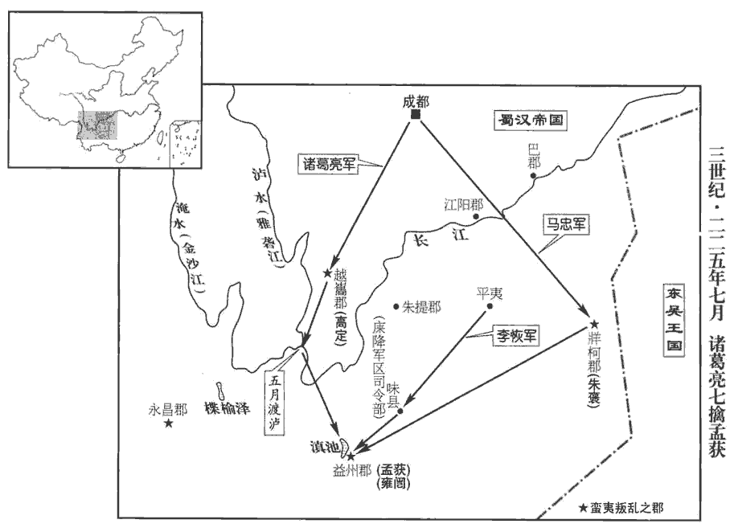
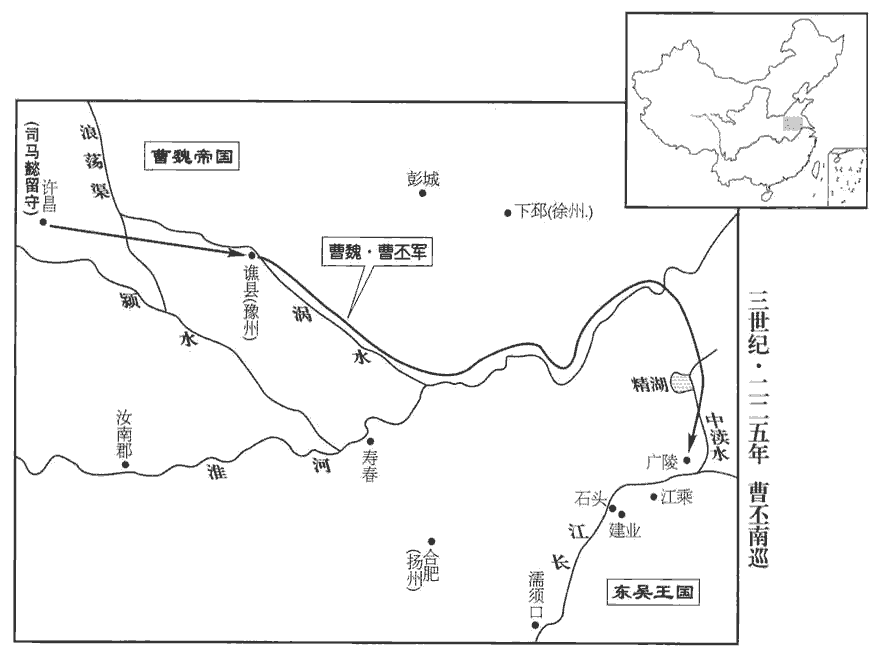
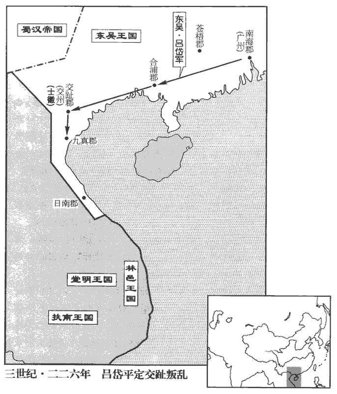
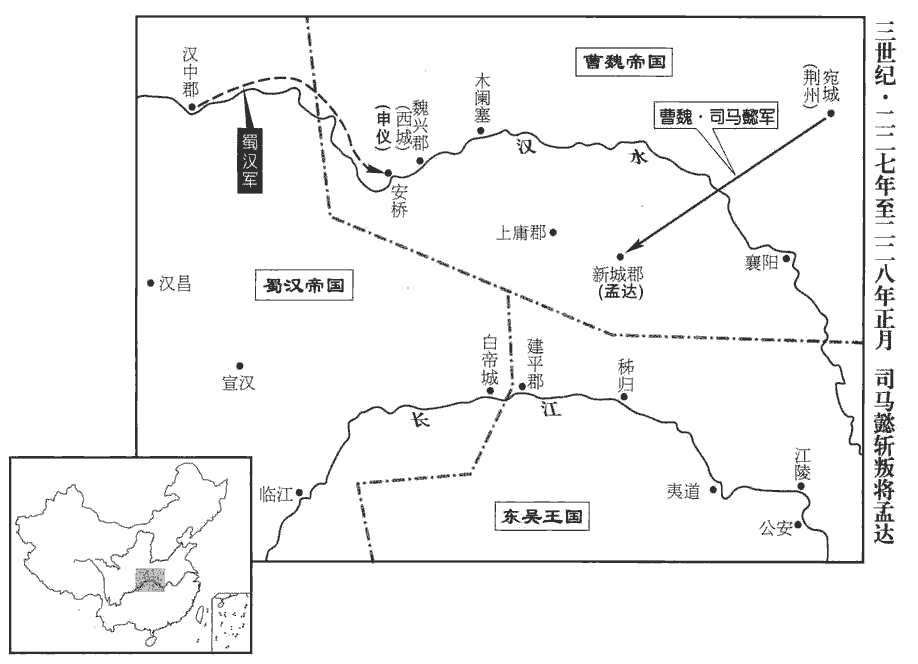

 魏紀二起昭陽單閼（癸卯），盡強圉協洽（丁未），凡五年。

# 世祖文皇帝下

## 黃初四年（癸卯，二二三）

1春，正月，曹真使張郃擊破吳兵，遂奪據江陵中洲‹湖北枝江长江中岛›。去年吳將孫盛據中洲。郃，古合翻，又曷閤翻。

〖译文〗 [1]春季，正月，曹真派张击溃吴军一部，攻占江陵的中洲。

2二月，諸葛亮‹时年四十三›至永安‹重庆奉节东›。水經註；蜀先主為吳所敗，退屯白帝，改白帝為永安，巴東郡治也。

〖译文〗 [2]二月，诸葛亮到达永安。

3曹仁以步騎數萬向濡須‹安徽含山西南›，先揚聲欲東攻羨溪，羨溪在濡須東，而蜀本註以為沙羨，誤矣。杜佑曰：羨溪在濡須東三十里。朱桓分兵赴之；去年吳王以朱桓為濡須督。既行，仁以大軍徑進，桓聞之，追還羨溪兵，兵未到而仁奄至。時桓手下及所部兵在者纔五千人，諸將業業各有懼心，孔安國曰：業業，危懼意。桓喻之曰：「凡兩軍交對，勝負在將，將，即亮翻。不在眾寡。諸君聞曹仁用兵行師，孰與桓邪？兵法所以稱『客倍而主人半』者，謂俱在平原無城隍之守，又謂士卒勇怯齊等故耳。今仁既非智勇，加其士卒甚怯，又千里步涉，人馬罷困。罷，讀曰疲。桓與諸君共據高城，南臨大江，北背山陵，背，蒲妹翻。以逸待勞，為主制客，此百戰百勝之勢，雖曹丕自來，尚不足憂，況仁等邪！」桓乃偃旗鼓，外示虛弱以誘致仁。誘，音酉。仁遣其子泰攻濡須城，分遣將軍常雕、王雙等乘油船別襲中洲‹濡须水中小岛›。油船，蓋以牛皮為之，外施油以扞水。中洲者，桓部曲妻子所在也。蔣濟曰：「賊據西岸，列船上流，而兵入洲中，是為自內地獄，內，與納同。危亡之道也。」仁不從，自將萬人留橐tuó皋‹安徽巢湖西北›，橐皋，在廬江居巢縣，春秋會吳于橐皋，即其地。今曰柘zhè皋，在濡須北。余按班志，橐皋縣屬九江郡。孟康音拓tuò姑。杜預曰：橐皋在淮南逡遒縣東南。陸德明曰：橐，章夜翻，又音託。為泰等後援。桓遣別將擊雕等，而身自拒泰，泰燒營退；桓遂斬常雕，生虜王雙，臨陳殺溺死者千餘人。陳，讀曰陣。

〖译文〗 [3]曹仁率步、骑兵数万人进军濡须，先放出风声说向东进攻羡溪，吴军濡须守将朱桓分派部队增援羡溪。援军刚出发，曹仁即率大军直扑濡须，朱桓得知后，急忙派人追回增援羡溪的部队，这支部队尚未返回，曹仁突然杀到。当时，朱桓的守军仅有五千人，部下将领都惶惶有畏惧之心。朱桓对他们分析说：“两军交战，胜负的关键在于将领如何，而不在人数多寡。诸位认为曹仁指挥作战的能力，会比我朱桓高明吗？兵法所说，‘远来进攻的军队要超过当地防守军队的一倍’，是就平原旷野，没有城池坚守而言，也是针对双方战斗力相同而言。如今，曹仁智勇不足，再加上所率兵将胆怯畏惧，又是千里跋涉，人困马乏。我和诸位高据坚城，南临长江，北靠山岭，以逸待劳，就地作好准备以制伏远来的敌人，这是百战百胜的形势，即使曹丕亲自来，我们尚且无忧，更不用说区区曹仁了。于是朱桓偃旗息鼓，显赤虚弱以引诱曹仁。曹仁派儿子曹泰进攻濡须城，又派将军常雕、王双等人乘牛皮油船袭击濡须附近的中洲。中洲，是朱桓的亲兵部队及其妻子、儿女所在地。蒋济说：“敌人据守长江西岸，船只停泊在上游，而我军却进攻中洲，这如同步入地狱，自取灭亡。”曹仁不听，亲率一万人留驻橐，作为曹泰的后援部队。朱桓分派将领进攻常雕，自己抗击曹泰，曹泰烧毁营盘退走；朱桓斩杀常雕，生擒王双，临阵被杀死淹死的魏军有一千余人。

初，呂蒙病篤，吳王‹孙权，时年四十二›問曰：「卿如不起，誰可代者？」蒙對曰：「朱然膽守有餘，愚以為可任。」朱然者，九真‹越南清化›太守朱治姊子也；本姓施氏，治養以為子，時為昭武將軍。昭武將軍，吳所置也。蒙卒，吳王假然節，鎮江陵‹湖北江陵›。及曹真等圍江陵，破孫盛，吳王遣諸葛瑾等將兵往解圍，瑾，渠吝翻。夏侯尚擊卻之。江陵中外斷絕，城中兵多腫病，堪戰者裁五千人。真等起土山，鑿地道，立樓櫓臨城，弓矢雨注，將士皆失色；然晏如無恐意，呂蒙所謂膽守，於此見之。方厲吏士，伺間隙，伺，相吏翻。間，古莧翻。攻破魏兩屯。魏兵圍然凡六月，江陵令姚泰領兵備城北門，見外兵盛，城中人少，少，詩沼翻。穀食且盡，懼不濟，謀為內應，然覺而殺之。

〖译文〗 以前，吕病重，吴王问他：“如果你的病情不能好转，谁可以接替你的职务？”吕蒙回答说：“朱然胆略过人，注重节操，我认为他可接替。”朱然是九真太守朱治的外甥，本姓施，被朱治收为养子，当时为昭武将军。吕蒙去世，吴王授予朱然符节，镇守江陵。曹真等人包围江陵，打败了孙盛，吴王派诸葛瑾等人率军前去解围，再度被夏侯尚击退。江陵城内外断绝联系，城中许多士兵浮肿患病，能够参加战斗的只有五千人。曹真命令士兵堆土山、挖地道，临城立起无顶高台楼橹，向城中放箭，箭如雨下，守城将士都大惊失色；朱然却泰然若，没有丝豪恐惧，不断激励将士，寻找知薄弱之处，率军出击，攻破魏军两座营垒。魏军包围江陵长达六个月，江陵令姚泰率兵防守北门，见敌军力量经大，守城军队兵少，粮食将尽，害怕守不住，阴谋作魏军的内应，被朱然发觉后处死。

時江水淺陿，陿，與狹同。夏侯尚欲乘船將步騎入渚中‹长江中小岛›安屯，渚，洲也，即江陵之中洲也。作浮橋，南北往來，議者多以為城必可拔。董昭上疏曰：「武皇帝智勇過人，而用兵畏敵，不敢輕之若此也。言行兵不敢履危道。夫兵好進惡退，好，呼到翻。惡，烏路翻。常然之數。平地無險，猶尚艱難，就當深入，還道宜利，兵有進退，不可如意。今屯渚中，至深也；浮橋而濟，至危也；一道而行，至陿也。三者，兵家所忌，而今行之。賊頻攻橋，誤有漏失，謂橋或為敵所斷也。渚中精銳非魏之有，將轉化為吳矣。臣私慼之，忘寢與食，慼，憂也。而議者怡然不以為憂，豈不惑哉！加江水向長，長，知兩翻。一旦暴增，何以防禦！就不破賊，尚當自完，柰何乘危，不以為懼！惟陛下察之。」帝即詔尚等促出。吳人兩頭并前，魏兵一道引去，不時得泄，泄，去也。僅而獲濟。吳將潘璋已作荻筏，欲以燒浮橋，會尚退而止。後旬日，江水大漲，帝謂董昭曰：「君論此事，何其審也！」會天大疫，帝悉召諸軍還。

〖译文〗 当时长江水浅，江面狭窄，夏侯尚企图乘船率步、骑兵进入江陵中洲驻扎，在江面上架设浮桥，以便和北岸来往，魏军参与计议的人都认为一定能够攻克江陵。董昭却上书文帝说：“武皇帝智勇过人，用兵却很谨慎，从不敢像今天这样轻视敌人。打仗时，进兵容易，退兵难，这是最平常的道理。平原地带，没有险阻，退兵都困难，即使要深入进军，还要考虑撤退的便利。军队前进与后退，不能只按自己的想象意图行事。如今在中洲驻扎军队，是最深入的进军；在江上架设浮桥往来，是最危险的事；只有一条道路可以通行，是狭隘的道路。这三者，都是军事行动的大忌，而我们却正在做。如果敌人集中力量攻击浮桥，我军稍有疏漏，中洲的精税部队将不再属于魏，而为吴所有。我对这件事非常忧虑，寝食不安，而谋划此事的人却很坦然，毫不担忧，真令人困惑不解！加之长江水位正在上升，一旦暴涨，我军将如何防御！如果无法击败敌人，就应该保全自己，为什么在这样危险的情况下，不感到恐惧呢？希望陛下认真考虑。”文帝立即下诏，命令夏侯尚等人迅速退出中洲。吴军两面并进，魏军大队人马只从一条通道退却，挤在一起，一时很难退出，最后勉强撤回北岸。吴将潘璋已制好芦苇筏子，准备烧魏军的浮桥，恰巧夏侯尚率兵退回，未得实施。十天过后，江水暴涨，文帝对董昭说；“你的预料，竟如此准确！”当时又赶上闹瘟疫，文帝遂命令各军全线撤退。

三月，丙申‹八›，車駕還洛陽。

〖译文〗 三月，丙申（初八），文帝回到洛阳。

初，帝‹曹丕，时年三十七›問賈詡曰：「吾欲伐不從命以一天下，吳、蜀何先？」對曰：「攻取者先兵權，建本者尚德化。陛下應期受禪，撫臨率土，若綏之以文德而俟其變，則平之不難矣。吳、蜀雖蕞爾小國，依山阻水。劉備有雄才，諸葛亮善治國；蕞，徂外翻。治，直之翻。孫權識虛實，陸議見兵勢；陸議，即陸遜。遜傳云：遜本名議。據險守要，汎舟江湖，皆難卒謀也。據險守要謂蜀，汎舟江湖謂吳。卒，讀曰猝。用兵之道，先勝後戰，量敵論將，量，音良。將，即亮翻。故舉無遺策。臣竊料群臣無備、權對，雖以天威臨之，未見萬全之勢也。昔舜舞干戚而有苗服，舜誕敷文德，舞干羽于兩階，七旬有苗格。臣以為當今宜先文後武。」帝不納，軍竟無功。

〖译文〗 以前，文帝曾问贾诩：“我计划坟不服从命令的人，以统一天下，吴、蜀两国，应先讨代哪一个？”贾诩回答说：“进攻他国，应首先在军事上权衡；完成统一的根本大计，则当崇尚道德教化。陛下顺应形势，接受汉朝禅让，统治全国，如果广文教、道德以安抚人心，静候形势变化，平定天下并不难。吴、蜀虽然都是小国，但是地势险要，有长江天险。刘备有雄诸大略，诸葛亮善于治国；孙权长于辨别虚实，陆逊精通军事；蜀汉固守险要，吴国泛舟江湖，我们很难在短期内将他们击败。用兵的原则是，先了解夺取胜利的途径，然后再作战；根据敌人的力量，任命将领，这样才能做到攻战无误。我料想我们的文臣武将汉有人是刘备、孙权的对手，即使陛下亲自对付他们，也未必一定有取胜的把握。从前虞舜在朝廷上作战争舞蹈，有苗部落就归服了。我认为陛下目前应首先修明文治，然后再用武力征讨。”文帝不听，出动大军，结果无功而回。

4丁未‹十九›，陳忠侯曹仁卒‹年五十六›。

〖译文〗 [4]丁未（十九日），陈忠侯曹仁去世。

5初，黃元為諸葛亮所不善，聞漢主疾病，懼有後患，故舉郡反，燒臨邛城‹四川邛崃›。臨邛縣，漢屬蜀郡。蜀既分置漢嘉郡‹四川名山县北›，則此時當屬漢嘉。邛，渠容翻。時亮東行省疾，省，悉景翻。成都單虛，元益無所憚。益州治中從事楊洪，啟太子遣將軍陳曶hū、鄭綽討元。曶，呼骨翻。眾議以為元若不能圍成都，當由越巂‹四川西昌›據南中。南中，漢益州、永昌二郡之地。洪曰：「元素性凶暴，無他恩信，何能辦此！不過乘水東下，冀主上平安，面縛歸死；如其有異，奔吳求活耳。但敕曶、綽於南安峽口‹四川乐山›邀遮，即便得矣。」元軍敗，果順江東下，曶、綽生獲，斬之。此順蜀青衣水東下也。水經註：青衣水出青衣縣西蒙山，東至蜀郡臨邛縣與沫水合，又東至犍為南安縣入于江，所謂南安峽口也。

〖译文〗 [5]此前，黄元被诸葛亮所嫌弃，知道汉王患病，恐怕诸葛亮加害，因而率领汉嘉全郡反叛，火烧临邛城，当时诸葛亮由成都东下看望刘备，成都守备单薄虚弱，黄元因此无所忌惮。益州治中从事杨洪，报告太子刘禅，派将军陈、郑绰讨伐黄元。大臣们谇为，如果黄元不能包围成都，会经越占据南中。杨洪说：“黄元一向性情凶狠残暴，对下属不施恩德信义，没有能力那样做！不过是顺青衣江东下，盼望主公平安，再捆起自己，请求治罪；即使吸其他变化，也不过逃奔吴国求条活命而已。只要命伶陈、郑绰在南安峡口拦截，就可将他生擒。”黄元叛乱失败果然顺青衣江东下，被陈、郑绰生擒后斩首。

6漢主病篤，命丞相亮輔太子，以尚書令李嚴為副。漢主謂亮曰：「君才十倍曹丕，必能安國，終定大事。若嗣子可輔，輔之；如其不才，君可自取。」自古託孤之主，無如昭烈之明白洞達者。亮涕泣曰：「臣敢不竭股肱之力，效忠貞之節，繼之以死！」用晉荀息答獻公語意。漢主又為詔敕太子曰：「人五十不稱夭，夭，於兆翻；短折曰夭。吾年已六十有餘，何所復恨，復，扶又翻。但以卿兄弟為念耳。勉之，勉之！勿以惡小而為之，勿以善小而不為！惟賢惟德，可以服人。汝父德薄，不足效也。自漢以下，所以詔敕嗣君者，能有此言否？汝與丞相從事，事之如父。」夏，四月，癸巳，漢主殂於永安‹重庆奉节东白帝城›，年六十三。諡曰昭烈。諡法：昭德有勞曰昭，有功安民曰烈。

〖译文〗 [6]汉王病重，命令丞相诸葛亮辅佐太子刘禅，以尚书令李严作诸葛亮的副手。汉王对诸葛亮说：“你的才干胜过曹丕十倍，必定能安定国家，完成大业。如果刘禅还可以辅佐，你就辅佐他；如果他汉有才德，你可取而代之。”诸葛亮淌着泪说：“臣下怎敢不竭尽全力辅佐太子，忠贞不二地为国效命，至死不渝！”汉王又下诏给太子：“人活五十而死不能称为夭折，我已经活了六十多岁，还有什么遗憾，只是牵挂你们兄弟。要努力，再努力啊！不要因坏事很小就去做，也不要因为好事很小就不去做！只有贤明和德行，才会使人折服。父亲德行浅薄，不值得你们效法。你与丞相共同处理政务，对待他要像父亲一样。”夏季，四月，癸巳（疑误），汉王刘备病逝于永安，谥号为昭烈皇帝。

丞相亮奉喪還成都，以李嚴為中都護，留鎮永安。

〖译文〗 丞相诸葛亮护送灵车回到成都，由李严作中都护，留下镇守永安。

五月，太子禪即位，時年十七。蜀後主諱禪，字公嗣。尊皇后曰皇太后，大赦，改元建興。封丞相亮為武鄉侯，領益州牧，政事無巨細，咸決於亮。亮乃約官職，脩法制，以先主、孔明君臣之相得，而約官職脩法制乃行於輔後主之時，此易之戒浚恆也。發教與群下曰：「夫參署者，集眾思，廣忠益也。參署，謂所行之事，參其同異，署而行之也。若遠小嫌，難相違覆，曠闕損矣。違，異也；覆，審也。難於違異，難於覆審，則事有曠闕損矣。遠，于願翻。違覆而得中，猶棄敝蹻qiāo而獲珠玉。蹻，訖約翻，屐也，草履也。然人心苦不能盡，惟徐元直處茲不惑。又，董幼宰參署七年，徐庶，字元直。董和，字幼宰。處，昌呂翻。事有不至，至于十反，來相啟告。此所謂相違覆也。苟能慕元直之十一，幼宰之勤渠，有忠於國，則亮可以少過矣。」少，詩沼翻。又曰：「昔初交州平，亮躬耕隴畝，與崔州平、徐庶等友善。州平，崔烈子，均之弟也。屢聞得失；後交元直，勤見啟誨；前參事於幼宰，每言則盡；後從事於偉度，數有諫止。數，所角翻。雖資性鄙暗，不能悉納，然與此四子終始好合，好，呼到翻。亦足以明其不疑於直言也。」偉度者，亮主簿義陽‹河南桐柏东›胡濟也。

〖译文〗 五月，太子间禅即位为蜀汉皇帝，当时十七岁，尊奉皇后为皇太后，大赦罪犯，改年号为建兴。封丞相诸葛亮为武乡侯，兼任益州牧，国事无论大小，都取决于诸葛亮。于是诸葛亮精简官职，修订法制，向百官发下文告说：“所谓参预朝政，署理政务，就是要集合众人的心思，采纳有益国家的意见。如果因为一些小隔阂而彼此疏远，就无法到不同意见，我们的事业将会受到损失。听取不同意见而能得出正确的结论，如同扔掉破草鞋而获得珍珠美玉。然而人们很难做到这一点，只有徐庶在听取各种意见时不受困惑。还有董和，参预朝政、署理政务七年，某项措施有不稳妥之处，反复十次征求意见，向我报告。如果能做到徐庶的十分之一，像董和那样勤勉、尽职、效忠，我就可以减少过失了。”他又说：“过去我结交崔州平，他多次指出我的优缺点；后来又结交徐庶，得到很多启发和教诲；先前与董和商议事情，他每次都能做到知无不言，言无不尽；随后又与胡伟度共事，他的多次劝谏，使我避免了很多失误。我虽然生性愚昧，见识浅陋，对他们给我的教益不能全部吸取，然而和这四人的始终很好，也可表明我对直言是不疑的。”胡伟度，就是诸葛亮的主簿义阳人胡济。

亮嘗自校簿書，主簿楊顒直入，顒yóng，魚容翻。諫曰：「為治有體，治，直吏翻。上下不可相侵。請為明公以作家譬之：為，于偽翻。今有人，使奴執耕稼，婢典炊爨cuàn，雞主司晨，犬主吠盜，牛負重載，載，才再翻。馬涉遠路；私業無曠，所求皆足，雍容高枕，枕，職任翻。飲食而已。忽一旦盡欲以身親其役，不復付任，復，扶又翻。勞其體力，為此碎務，形疲神困，終無一成。豈其智之不如奴婢雞狗哉？失為家主之法也。是故古人稱『坐而論道，謂之王公；作而行之，謂之士大夫。』周官考工記之言。故丙吉不問橫道死人而憂牛喘，丙吉相漢宣帝，嘗出逢清道，群闘者死傷橫道，吉過之不問。前行逢人逐牛，牛喘吐舌。吉使騎吏問：「逐牛行幾里矣？」掾史謂丞相前後失問。吉曰：「民闘相殺傷，長安令、京兆尹職也。方春少陽用事，未可大熱，恐牛近行，用暑故喘，此時氣失節，有所傷害。三公調和陰陽，職當憂，是以問之。」掾史乃服，以吉知大體。陳平不肯知钱穀之數，云『自有主者』，事見十三卷漢文帝元年。彼誠達於位分之體也。分，扶問翻。今明公為治，乃躬自校簿書，流汗終日，不亦勞乎！」亮謝之。及顒卒，亮垂泣三日。

〖译文〗 诸葛亮曾经亲自校对公文，主簿杨径直入内劝他说：“治理国家是有制度的，上司和下级做的工作不能混淆。请您允许我以治家作比喻：现在有一个人，命奴仆耕田，婢女烧饭，雄鸡所晓，狗咬盗贼，以牛拉车，以马代步；家中事务无一旷废，要求的东西都可得到满足，优闲自得，高枕无忧，只是吃饭饮酒而已。忽然有一天，对所有的事情都要亲自去做，不用奴婢、鸡狗、牛马，结果劳累了自己的身体，陷身琐碎事务之中，弄得疲惫不堪，精神萎靡，却一事无成。难道他的才能不及奴婢和鸡狗吗？不是，而是因为他忘记了作为一家之主的职责。所以古人说‘坐着讨论问题，作出决定的人是王公；执行命令，亲身去做事情的人，称作士大夫’。因此，丙吉不过问路上杀人的事情，却担心耕牛因天热而喘；陈平不去了解国家的钱、粮收入，而说‘这些自有具体负责的人知道’，他们都真正懂得各司其职的道理。如今您管理全国政务，却亲自校改公文，终日汗流浃背，不是太劳累了吗？”诸葛亮深深表示感谢。杨去世，诸葛亮哭泣了三天。

7六月，甲戌‹十七›，任城威王彰卒。諡法：猛以強果曰威；服叛定功曰威。

〖译文〗 [7]六月，甲戌（十七日），任城威王曹彰去世。

8甲申‹二十七›，魏壽肅侯賈詡卒。魏壽，亭名。諡法：剛德克就曰肅；執心決斷曰肅。

〖译文〗 [8]甲申（二十七日），魏寿肃侯贾诩去世。

9大水。

〖译文〗 [9]发生水灾。

10吳賀齊襲蘄qí春‹湖北蕲春›，虜太守晉宗以歸。蘄春縣，漢屬江夏郡；吳分立蘄春郡，即蘄陽也，東晉避諱改焉。水經：蘄水出江夏蘄春縣北山。註云：即蘄山也，西南流逕蘄山，又南對蘄陽，會于大江，亦謂之蘄河口。據賀齊傳：晉宗，吳將也，叛降魏，還為蘄春太守，齊襲而虜之。

〖译文〗 [10]吴将贺齐袭击蕲春，俘虏太守晋宗，然后退兵。

11初，益州郡‹云南晋宁东晋城镇›耆帥雍闓kǎi殺太守正昂，因士燮以求附於吳，耆，渠伊翻，長也，老也。今嵊shèng、剡shàn之間，猶謂閭里之長曰耆。帥，所類翻。雍，於用翻，姓也。闓，音開，又可亥翻。闓自交州道求附於吳。正，姓也。秦有正先。又執太守成都張裔以與吳，吳以闓為永昌‹云南保山›太守。永昌功曹呂凱、府丞王伉伉，口浪翻。率吏士閉境拒守，闓不能進，使郡人孟獲誘扇諸夷，誘，音酉。諸夷皆從之；牂柯‹贵州福泉›太守朱褒、越巂‹四川西昌›夷王高定皆叛應闓。牂柯，音臧哥。巂，音髓。諸葛亮以新遭大喪，皆撫而不討，務農殖穀，閉關息民，閉越巂之靈關也。民安食足而後用之。

〖译文〗 [11]以前，益州郡的地方土豪雍杀死太守正昂，通过吴交趾太守土燮向吴请求归附，又把益州郡的新任太守、成都人张裔抓起来献给吴，吴任命雍为永昌太守。永昌郡功曹吕凯、府丞王伉率后封锁边界，坚守城池。雍不能进城，派同郡人孟获惑和煽动各地的夷族纷纷跟着叛乱。柯太守朱褒、越的夷族酋长高定。都起兵响应雍。诸葛亮因为刚刚遇上国葬，对叛众只是抚慰，没有派兵征讨；一心发展农业，种植粮食，坚守关隘，使百姓休养生息，等人民生活安定，粮食充足以后，才使用民力。

12秋，八月，丁卯‹十一›，以廷尉鍾繇為太尉，治書執法高柔代為廷尉。漢宣帝幸宣室，齋居決事，令侍御史二人治書侍側，後因別置，謂之治書侍御史。及魏又置治書執法，掌奏劾，而治書侍御史掌律令，二官俱置。及晉唯置治書侍御史四人。治，直之翻。是時三公無事，又希與朝政，與，讀曰預。柔上疏曰：「公輔之臣，皆國之棟梁，民所具瞻；詩曰：赫赫師尹，民具爾瞻。而置之三事，不使知政，古者謂三公為三事。詩曰：三事大夫。謂三公也。遂各偃息養高，偃息，言偃臥以自安也。鮮有進納，鮮，息淺翻。誠非朝廷崇用大臣之義，大臣獻可替否之謂也。左傳：齊晏子曰：君所謂可而有否焉，臣獻其否以成其可；君所謂否而有可焉，臣獻其可而去其否。古者刑政有疑，輒議於槐、棘之下。周禮：朝士掌外朝之法，面三槐，三公位焉；左九棘，孤卿大夫位焉。鄭註云：樹棘以為位者，取其赤心而外刺，象以赤心三刺也。槐之言懷也；懷來人於此，欲與之謀。王制曰：成獄辭，史以獄成告于正，正聽之；正以獄成告于大司寇，大司寇聽之于棘木之下；大司寇以獄之成告于王，王命三公參聽之。自今之後，朝有疑議及刑獄大事，宜數以咨訪三公。朝，直遙翻；下同。數，所角翻。三公朝朔、望之日，又可特延入講論得失，博盡事情，庶有補起天聽，光益大化。」帝嘉納焉。

〖译文〗 [12]秋季，八月，丁卯（十一日），任命廷尉钟繇为太尉，治书执法高柔代理廷尉。当时三公没有具体事务，又很少参预朝廷的政治决策，高柔向文帝上书说：“三公辅佐大臣，都是国家的栋梁，为百姓所瞩目。现在虽设置三公的职位，却不使他们参预朝政，他们只好各自休养，安度晚年，很少提出建议，这实在不是朝廷尊崇和使用大臣、要他们献计献策的本意。在古代，刑罚和政令有疑冲时，都与三公和大臣在槐树、棘木之下商议。从今以后，朝廷在政治措施上有疑问，以及关系到刑狱的大事，应该多询问三公的意见。三公在每月初一、十五上朝的时候，还要特别请他们分析讲解政策得失，以求尽量了解事实，这样既可以启发您的思路，弥补考虚不周之处，还能使您的威德更加发扬光大。”文帝很赞赏地采纳了这一建议。

13辛未‹十五›，帝校獵于滎陽‹河南荥阳›，遂東巡。九月，甲辰‹十九›，如許昌‹河南许昌东›。

〖译文〗 [13]辛未（十五日），文帝到荥阳打猎，顺便巡视东部。九月甲辰（十九日），前往许昌。

14漢尚書義陽鄧芝言於諸葛亮曰：「今主上幼弱，初即尊位，宜遣大使重申吳好。」使，疏吏翻；下同。申，亦重也；所以申固盟約也。重，直用翻。好，呼到翻；下同。亮曰：「吾思之久矣，未得其人耳，今日始得之。」芝問：「其人為誰？」亮曰：「即使君也。」乃遣芝以中郎將脩好於吳。冬，十月，芝至吳‹都武昌，湖北鄂州›，時吳王猶未與魏絕，狐疑，不時見芝。芝乃自表請見曰：「臣今來，亦欲為吳，非但為蜀也。」為，于偽翻。吳王見之，曰：「孤誠願與蜀和親，然恐蜀主幼弱，國小勢偪，為魏所乘，不自保全耳。」芝對曰：「吳、蜀二國，四州之地。四州，荊、揚、梁、益也。大王命世之英，諸葛亮亦一時之傑也。蜀有重險之固，重險，謂外有斜、駱、子午之險，內有劍閣之險也。重，直龍翻。吳有三江之阻。韋昭曰：三江，吳松江、錢塘江、浦陽江也。吳地記云：松江東北行七十里得三江口，東北入海為婁江，東南入海為東江，并松江為三江。合此二長，共為脣齒，進可并兼天下，退可鼎足而立，此理之自然也。大王今若委質於魏，質，如字。魏必上望大王之入朝，朝，直遙翻。下求太子之內侍，若不從命，則奉辭伐叛，蜀亦順流見可而進，如此，江南之地非復大王之有也。」吳王默然良久曰：「君言是也。」遂絕魏，專與漢連和。

〖译文〗 [14]汉尚书、义阳人邓芝对诸葛亮说：“如今皇上年幼弱小，刚刚即位，应派重要使臣到吴再次申明和好的愿望。”诸葛亮说：“我对事事已考虑很久了，只是一直没有合适的人选，现在找到了。”邓芝问：“这人是谁？”诸葛亮说：“就是使君你啊。”于是派邓芝以中郎将的身份与吴重建友好关系。冬季，十月，邓芝到达吴。当时吴王尚未和魏断绝关系，所以犹豫不决，没有立即接见邓芝。邓芝便自己上表请求接见，上表说：“臣下这次来，也是为吴着想，不仅仅只为蜀的利益。”吴五这才接见了他，说；“孤确实愿意与蜀和好，可是恐怕蜀国君主幼弱，疆域狭窄，势力不强，给魏以可乘之机，你们无法保全自己。”邓芝对他说：“吴、蜀两国，占有四个州的地域。大王您是当世的英雄，诸葛亮也是一代人杰。蜀国地势险要，防守坚固，吴国有长江等三条大江的阻隔。两国的优势加在一起，再联合起来像唇齿一样相辅相依，进可兼并天下，退可与魏鼎足而立，这是很自然的道理。假如大王归附于魏，魏一定会进一步提出无理要求，上逼您朝拜，下求太子作人质，如果不服从，便以讨伐叛逆为借口，发动进攻，蜀则顺流东下，趁机分取利益，到那时，江南之地可就不再为大王您所有了。”吴王沉默了很久，说：“你说得很对”。于是和魏断绝关系，专与蜀汉和好。

15是歲，漢主立妃張氏為皇后。后，張飛之女也。

〖译文〗 [15]同年，蜀汉后主立妃子张氏为皇后。

## 五年（甲辰，二二四）

1春，二【章︰甲十六行本「二」作「三」；乙十一行本同。】月，帝‹曹丕，时年三十八›自許昌還洛陽。

〖译文〗 [1]春季，二月，魏文帝从许昌返回洛阳。

2初平以來，學道廢墜。夏，四月，初立太學；置博士，依漢制設五經課試之法。博士課試之法，始於漢武帝，事見十九卷元朔五年。平帝時，歲課甲科四十人為郎中，乙科二十人為太子舍人，丙科四十人補文學掌故。東都五經立十四博士，皆以家法教授古文尚書、毛詩、穀梁、左氏春秋，雖不立學官，然皆擢高第為講郎，給事近署。順帝增甲乙之科，員各十人。

〖译文〗 [2]自汉献帝初平年以来，教育制度废弛。夏季，四月，开始建立太学，设博士的职务，依照汉朝制度，采取以《五经》考试的办法。

3吳王‹孙权，时年四十三›使輔義中郎將吳郡‹苏州›張溫聘于漢‹都成都，四川成都›，自是吳、蜀信使不絕。使，疏吏翻。時事所宜，吳主常令陸遜語諸葛亮‹时年四十四›；語，牛倨翻。又刻印置遜所，王每與漢主‹刘禅，时年十八›及諸葛亮書，常過示遜，過，工禾翻。輕重、可否有所不安，每令改定，以印封之。釋名曰：印，信也，所以封物以為驗也；亦曰因也，封物相因付也。

〖译文〗 [3]吴王派辅议中郎将吴郡人张温到蜀汉聘问，从此以后，吴、蜀两国使者和书信往来不断。有事需要互通消息，吴王常令陆逊告诉诸葛亮；还专刻一枚自己的印章放在陆逊那里，吴王给蜀汉后主或诸葛亮写信，常先给陆逊看过，言辞轻重、处事可否，有不当之处，即令陆逊改正，再用印封好发出。

漢復遣鄧芝聘于吳，復，扶又翻。吳主謂之曰：「若天下太平，二主分治，不亦樂乎？」樂，音洛。芝對曰：「天無二日，土無二王。孟子載孔子之言。如并魏之後，大王未深識天命，君各茂其德，臣各盡其忠，將提枹fú鼓，則戰爭方始耳。」枹，音膚。吳王大笑曰：「君之誠款乃當爾邪！」

〖译文〗 蜀汉再次派邓芝到吴拜会，吴王对他说：“如果天下太平，由两国君主分而治之，不也是很好吗？”邓芝回答说：“天上没有两个太阳，地上也不能并存两个皇帝。在兼并魏之后，假如大王未能深刻领会上天的意旨，两国国君各自发扬德行，两国的臣子为各自的君王尽忠，将出擂起战鼓，那时战争才刚刚开始。”吴王大笑说：“你的诚实竟到了这个地步吗！”

4秋，七月，帝東巡，如許昌。帝欲大興軍伐吳，侍中辛毗諫曰：「方今天下新定，土廣民稀，而欲用之，臣誠未見其利也。先帝屢起銳師，臨江而旋。今六軍不增於故，而復脩之，此未易也。脩之，謂脩怨也。左傳曰：將脩先君之怨。復，扶又翻。易，以豉翻。今日之計，莫若養民屯田，十年然後用之，則役不再舉矣。」帝曰：「如卿意，更當以虜遺子孫邪？」遺，于季翻；下同。對曰：「昔周文王以紂遺武王，惟知時也。」帝不從，留尚書僕射司馬懿鎮許昌。八月，為水軍，親御龍舟，循蔡‹蔡河，在安徽阜阳入颍水›、潁‹颍水，在安徽寿县西南正阳关入淮›，浮淮如壽春‹安徽寿县›。魏收地形志：陳留扶溝縣有蔡河。水經：蔡河自陳留浚儀東南流而入於潁。潁水出潁川陽城縣少室山，東南流至新陽，與蔡河合，又東南至慎縣東南，入于淮。九月，至廣陵‹扬州›。

〖译文〗 [4]秋季，七月，文帝东部巡视，前往许昌。文帝欲图大举攻吴，侍中辛毗劝谏说：“现在国家初步安定，土地虽然广阔，人口却很稀少，在这时动用百姓的力量，臣下实在看不出有什么好处。武皇帝多次出动精锐，只能到达长江边便要退兵。现在，我们的军队在数量和实力上并不比从前强大，却要再次前去报仇，这不是件容易的事。目前我们应采取的策略，莫过于休养民力，开垦田地，十年之后，再用兵打仗，就能够一举成功了。”文帝说：“依你的意思，是要把孙权这个后患留给子孙了。”辛毗回答说：“从前周文王所以把商纣王留给武王去消灭，是因为他知道时机尚未成熟。”文帝不听劝谏，留下尚书仆射司马懿镇守许昌。八月，亲自乘龙舟指挥水军，沿着蔡河、颍水进入淮河，到达寿春。九月，抵达广陵。

吳安東將軍徐盛建計，植木衣葦，為疑城假樓，自石頭‹南京西北›至于江乘‹南京东北›，植木於內，以蘆䕠fèi遮其外，為疑城假樓。今淮甸諸郡城敵樓，皆以蘆䕠遮護之。江乘縣屬丹陽郡，吳省為典農都尉治，其地在建業東北。衣，於既翻。聯緜相接數百里，一夕而成；又大浮舟艦於江。艦，戶黯翻。

〖译文〗 吴安东将军徐盛建议，在竖立的木桩上包起苇席，做成假城池和望楼，分布在石头城至江乘一线，联绵相接，长达数百里，一夜之间全部建成，又在长江上布下许多舰船，往返巡航。

時江水盛長，長，知兩翻。帝臨望，歎曰：「魏雖有武騎千群，無所用之，未可圖也。」騎，奇寄翻。帝御龍舟，會暴風漂蕩，幾至覆沒。幾，居希翻。帝問群臣：「權當自來否？」咸曰：「陛下親征，權恐怖，必舉國而應。怖，普布翻。又不敢以大眾委之臣下，必當自來。」劉曄曰：「彼謂陛下欲以萬乘之重牽己，而超越江湖者在於別將，乘，繩證翻。將，即亮翻；下同。必勒兵待事，未有進退也。」大駕停住積日，吳王不至，帝乃旋師。是時，曹休表得降賊，辭「孫權已在濡須口‹安徽含山西南›。」降，戶江翻；下同。中領軍衛臻曰：晉百官志曰：漢建安四年，魏武丞相府置中領軍。文帝踐阼，始置領軍將軍，置長史、司馬；江左以後，資重者為領軍將軍，資輕者為中領軍。沈約志曰：領軍掌內軍，漢武帝置中壘校尉，掌北軍營。光武省，置北軍中候，監五校營。魏武為丞相，相府自置領軍，非漢官也。文帝以領軍主五校、中壘、武衛三營。晉武帝初，省；使中軍將軍羊祜hù統二衛、前、後、左、右、驍騎七軍，即領軍之任也。祜遷，復置北軍中候。懷帝永嘉中，又改曰中領軍。「權恃長江，未敢亢衡，亢，與抗同。此必畏怖偽辭耳！」考核降者，果守將所作也。

〖译文〗 当时长江水位迅猛上涨，文帝临江而望，叹息说：“尽管魏有铁骑成千上万，却毫无用武之地，看来无法取胜了！”文帝乘坐的龙舟，在狂风大浪中上下颠簸，几乎被巨浪掀翻。文帝问群臣：“孙权会亲自前来吗？”大臣们都说：“陛下亲率大军攻吴，孙权恐惧，一定要调动全国的力量来应付，但他又不敢把大批军队交给臣下指挥，肯定会亲自前来。”刘晔却说：“孙权一定认为陛下打算以亲征将他引出来，而另派将领渡江跨湖，所以他肯定部署军队等待进攻，既不会亲自前来，他的军队也不会退走。”文帝大驾在江边停留很多天，吴王却仍然没有来，于是下令撤军。当时，曹休上书，说吴投降的人供称：“孙权已经在濡须口。”中领军卫臻说：“孙权只依恃长江天险，而不敢与我军在军事上抗衡，这一定是掩饰畏惧心理而制造的假话。”再去拷打审问投降的人，果然是吴守将散布的谎言。

5吳張溫少以俊才有盛名，少，詩照翻。顧雍以為當今無輩，諸葛亮亦重之。溫薦引同郡暨豔為選部尚書。暨，居乙翻，姓也。葉夢得石林燕語曰：元豐五年，黃冕仲榜，唱名，有暨陶者，主司初以洎jì音呼之，三呼不應。蘇子容時為試官，神宗顧蘇，蘇曰：「當以入聲呼之。」果出應。上曰：「何以知為入聲？」蘇言：「三國志，吳有暨豔。陶恐其後。」遂問陶鄉貫。曰：「崇安人。」上喜曰：「果吳人也。」漢置四曹尚書，其一曰常侍曹，主丞相、御史、公卿事。光武改常侍為吏部曹，主選舉祠祀。靈帝以梁鵠hú為選部尚書，魏復改選部為吏部。吳蓋循東都之制。豔好為清議，好，呼到翻。彈射百僚，覈hé奏三署，三署，謂五官、左、右三署郎也。射，食亦翻。率皆貶高就下，降損數等，其守故者，十未能一；其居位貪鄙，志節汙卑者，皆以為軍吏，置營府以處之；處，昌呂翻。多揚人闇àn昧之失以顯其謫。謫zhé，罰也。同郡陸遜、遜弟瑁及侍御史朱據皆諫止之。瑁與豔書曰：「夫聖人嘉善矜愚，論語，子游曰：君子嘉善而矜不能。瑁，音冒。忘過記功，以成美化。加今王業始建，將一大統，此乃漢高棄瑕錄用之時也。謂棄其瑕玷而錄其材用。若令善惡異流，貴汝、潁月旦之評，漢末，汝南許劭與從兄靖，俱有高名，好共覈論鄉黨人物，每月輒更其品題，故汝南俗有月旦評。誠可以厲俗明教，然恐未易行也。易，以豉翻。宜遠模仲尼之汎愛，論語載孔子之言曰：汎愛眾，而親仁。近則郭泰之容濟，郭泰善人倫，而不為危言覈論。獎拔士人，成名者甚眾，而不絕左原、賈淑之險惡，所謂容濟也。庶有益於大道也。」據謂豔曰：「天下未定，舉清厲濁，足以沮勸；沮，在呂翻。若一時貶黜，懼有後咎。」豔皆不聽。於是怨憤盈路，爭言豔及選曹郎徐彪專用私情，憎愛不由公理；豔、彪皆坐自殺。坐自殺，謂賜死也。溫素與豔、彪同意，亦坐斥還本郡以給廝吏，廝，音斯，賤也。卒於家。始，溫方盛用事，餘姚‹浙江餘姚西›虞俊歎曰：「張惠恕才多智少，餘姚縣，屬會稽郡，在今越州上虞縣東。張溫，字惠恕。華而不實，怨之所聚，有覆家之禍；吾見其兆矣。」無幾何而敗。幾，居豈翻。

〖译文〗 [5]吴国张温年轻时，以聪明才智享有盛名，顾雍认为当时无人能与他相比，诸亮也很推重他。张温推荐同郡人暨艳作吴的选部尚书。暨艳喜欢议论朝政，弹劾朝廷百官，对五官、左右三署郎官，审查尤其严格，几乎都被降职，甚至被降数级，能够保住原来官位的，十个人中也没有一个；那些为官贪婪鄙下，没有志向和节操的人，都被他发落成为军吏，安插在军队的各营各府。他还经常揭发别人的隐私，加以夸大张扬，以证明他处罚得当。同郡人陆逊、陆瑁写信给暨艳说：“圣贤的人赞扬善行，而体谅别人的愚昧；忘记别人的过错，而记住人家的功劳，以形成美好的风化。如今大王的伟业刚刚开始，将要统一全国，现在正是如同汉高祖不求全责备，广泛招揽人才的时代。如果一定要在善恶好坏之间划出一条清楚的界限，重视像过去许劭所作的人物口评，固然可以改变风俗，申明教化，然而恐怕目前很难推行。应该远学孔子的泛爱亲仁，近效郭泰的宽厚容人，这才有益于正道常理。”朱据也对暨艳说：“天下尚未平定，如果只举荐那些完全清白的人，而容不得一丝缺点，恰恰破坏了劝导作用；如果一下子都被免职，恐怕会带来祸患。”暨艳不听。于是怨恨之声遍布于路途，人们都争着告发暨艳和选曹郎徐彪专凭私人感情任用官吏，爱憎不以公理作标准；暨艳和徐彪都被治罪自杀了。张温和暨艳、徐彪素来意见一致，也被牵连治罪，逐回本郡的官府做杂役，后来死在家中。当当，在张温得势的时候，余姚人虞俊叹息说：“张温才能有余而明智不足，华而不实，人们的怨忿将会聚集在他身上，有败家之祸，我已经看见先兆了。”不久，张温果然被治罪逐回。

6冬，十月，帝還許昌。

〖译文〗 [6]冬季，十月，魏文帝回到许昌。

7十一月，戊申晦‹二十九›，日有食之。

〖译文〗 [7]十一月，戊申（二十九日），出现日食。

8鮮卑軻比能誘步度根兄扶羅韓殺之，誘，音酉。步度根由是怨軻比能，更相攻擊。更，工衡翻。步度根部眾稍弱，將其眾萬余落保太原‹山西太原›、鴈門‹山西代县›；是歲，詣闕貢獻。步度根，檀石槐之孫也。而軻比能眾遂強盛，出擊東部大人素利，護烏丸校尉田豫乘虛掎其後；掎jǐ，魚豈翻。軻比能使別帥瑣奴拒豫，帥，所類翻。豫擊破之。軻比能由是攜貳，數為邊寇，幽、并苦之。數，所角翻。

〖译文〗 [8]鲜卑族酋长轲比能诱杀另一酋长步度根的兄长扶罗韩，因此步度根十分怨恨轲比能，二人率部互相攻击。步度根的部众弱于轲比能，遂率领其部一万余户退保太原、雁门。当年，步度根入朝进贡。轲比能的部落从此强盛起来，攻击东部酋长素利。护乌丸校尉田豫，乘轲比能后方空虚，从背后发起攻击；轲比能另派将领琐奴对抗田豫，被击败。从此以后，轲比能更怀二心，经常进入边塞抢掠，幽、并二州深受其害。

## 六年（乙巳，二二五）

1春，二月，詔以陳群為鎮軍大將軍，隨車駕董督眾軍，錄行尚書事；司馬懿為撫軍大將軍，留許昌，督後臺文書。魏、晉之制，大將軍不開府者，品秩第二，其祿與特進同，置長史、司馬、主簿、諸曹官屬。行尚書，謂尚書之隨駕者；後臺，謂尚書臺之留許昌者也。三月，帝‹曹丕，时年三十九›行如召陵‹河南郾yǎn城东›，通討虜渠‹流经郾城东北›；召陵縣，漢屬汝南郡；晉志屬潁川郡。賢曰：召陵故城在今豫州郾城縣東，通討虜渠以伐吳也。召，讀曰邵。乙巳‹二十八›，還許昌。

〖译文〗 [1]春季，二月，文帝下诏，以陈群为镇军大将军，随御驾出征，负责督察各路军队，总领随驾尚书台事务；以司马懿为抚军大将军，留守许昌，负责处理留守尚书台公文。三月，文帝前往召陵，开通讨虏渠；乙巳（二十八日），回到许昌。

2并州刺史梁習討軻比能，大破之。

〖译文〗 [2]并州刺史梁习讨伐轲比能，大获全胜。

3漢諸葛亮‹时年四十五›率眾討雍闓，參軍馬謖送之數十里。謖sù，所六翻。亮曰：雖共謀之歷年，今可更惠良規。」謖曰：「南中‹云南›恃其險遠，不服久矣；虽今日破之，明日復反耳。復，扶又翻；下同。今公方傾國北伐以事強賊，彼知官勢內虛，漢俗謂天子為縣官，亦謂為國家。官勢，猶言國勢也。其叛亦速。若殄盡遺類以除後患，既非仁者之情，且又不可倉卒也。卒，讀曰猝。夫用兵之道，攻心為上，攻城為下，心戰為上，兵戰為下，願公服其心而已。」此馬謖所以為善論軍計也。亮納其言。謖，良之弟也。

〖译文〗 [3]蜀汉诸葛亮率兵讨伐雍，参军马谡送行数十里。诸葛亮说：“虽然我们一起谋划此事多年，今天请你再一次提出好计划。”马谡说：“南中依恃地形险要和路途遥远，叛乱不服已经很久了。即使我们今天将其击溃，明天他们还要反叛。目前您正准备集中全国的力量北伐，以对付强贼，叛匪知道国家内部空虚，就会加速反叛。如果将他们全部杀光以除后患，既不是仁厚者所为，也不可能在短期内办到。用兵作战的原则，以攻心为上，攻城为下；以心理战为上，以短兵相接为下，望您能使其真心归服。”诸葛亮采纳了马谡的建议。马谡是马良的弟弟。

4辛未‹二十四›，帝以舟師復征吳，群臣大議。宮正鮑勛諫曰：據勛傳，宮正，即御史中丞也。「王師屢征而未有所克者，蓋以吳、蜀脣齒相依，憑阻山水，有難拔之勢故也。往年龍舟飄蕩，隔在南岸，事見上。聖躬蹈危，臣下破膽，此時宗廟幾至傾覆，幾，居希翻。為百世之戒。今又勞兵襲遠，日費千金，兵法曰：興師十萬，日費千金。中國虛耗，今【章︰甲十六行本「今」作「令」；乙十一行本同；退齋校同。】黠虜玩威，國語，祭公謀父曰：先王耀德不觀兵。夫兵戢jí而時動，動則威，觀則玩，玩則無震。黠xiá，下八翻。臣竊以為不可。」帝怒，左遷勛為治書執法。勛，信之子也。鮑信從武帝戰死。夏，五月，戊申‹二›，帝如譙‹安徽亳州›。

〖译文〗 [4]辛未（疑误），魏文帝将率水军大举攻吴，召集群臣讨论。宫正鲍勋劝谏说：“朝廷屡次出动大军征讨，之所以没有取得成果，是因为吴、蜀两国唇齿相依，凭借地势险要和长江的阻隔，有难以攻克的优越条件。去年亲征，龙船被波涛漂荡在长江南岸遇阻，陛下身陷危境，大臣们心惊胆破，那时朝廷几乎被倾覆，应作为后世百代的警戒。如今又劳师动众，远途征讨，每天的经费需要用千金，国家的钱财都白白耗费掉了，而狡猾的敌人仍在那里耀武扬威，我认为再不可以这样了。”文帝听到鲍勋这番议论，大为愤怒，将鲍勋降职为治书执法。鲍勋是鲍信的儿子。夏季，五月，戊申（初二），文帝前往谯郡。

5吳丞相北海‹山东昌乐西›孫劭卒。初，吳當置丞相，眾議歸張昭，吳王‹孙权，时年四十四›曰：「方今多事，職大者責重，非所以優之也。」及劭卒，百僚復舉昭，吳王曰：「孤豈為子布有愛乎！為，于偽翻。領丞相事煩，而此公性剛，所言不從，怨咎將興，非所以益之也。」六月，以太常顧雍為丞相、平尚書事。雍為人寡言，舉動時當，當，丁浪翻。吳王嘗歎曰：「顧君不言，言必有中。」至飲宴歡樂之際，中，竹仲翻。樂，音洛；下同。左右恐有酒失，而雍必見之，是以不敢肆情。吳王亦曰：「顧公在坐，坐，沮臥翻。使人不樂。」其見憚如此。初領尚書令，封陽遂鄉侯；拜侯還寺，寺，官舍也。而家人不知，後聞，乃驚。及為相，其所選用文武將吏，各隨能所任，心無適莫。適，音的。心之所主為適，心之所否為莫。時訪逮民間及政職所宜，輒密以聞，若見納用，則歸之於上；不用，終不宣泄；宣，明也，布也。泄，漏也。吳王以此重之。然於公朝有所陳及，辭色雖順而所執者正；軍國得失，自非面見，口未嘗言。王常令中書郎中書郎，魏曰通事郎，晉為中書侍郎。詣雍有所咨訪，若合雍意，事可施行，即相與反覆究而論之，為設酒食；為，于偽翻；下同。如不合意，雍即正色改容，默然不言，無所施設。郎退告王，王曰；「顧公歡悅，是事合宜也；其不言者，是事未平也。孤當重思之。」重，直用翻。江邊諸將，各欲立功自效，多陳便宜，有所掩襲。王以訪雍。雍曰；「臣聞兵法戒於小利，此等所陳，欲邀功名而為其身，非為國也。為，于偽翻。陛下宜禁制，苟不足以曜威損敵，所不宜聽也。」王從之。

〖译文〗 [5]吴丞相北海人孙劭去世。当初，吴国要设置丞相一职，大家首推昭。吴王说：“如今是多事之秋，职位越高，责任愈重，这一职务对张昭来说，并非优待。”孙劭去世，文武官员再次推举张昭，吴王又说：“孤岂不敬爱张子布？丞相负责的政务烦多，而张昭性情刚烈，我若不听从他，他就会不满和怨忿，这对他并没有什么好处。”六月，任太顾雍为丞相，平尚书事。顾雍为人沉默寡言，举止稳妥，吴王曾赞叹说：“顾君不说话则已，话即能抓住要害。”每次设筵饮酒作乐，大臣们都恐怕酒后失态，被在场的顾雍到，所以不敢放开酒量。吴王也说：“顾公在座，使人不乐。”可见大臣和吴王多么忌惮他。顾雍刚兼任尚书令的时候，被封变阳遂乡侯；拜过爵位后，回到官邸，家人仍不知道他已被封侯，后来听说，都很吃惊。及至受任为丞相，他选用文官武将，都各按才能加以任用，而不夹杂自己的好恶。常常私下到民间访查政治得失，每当有好的建议，都秘密上报，如被采纳，将功劳归于主上；如不被采纳，则始终不泄露出去；吴王为此很看重他。然而他在朝廷发表意见时，言辞虽然和顺，却能将正确意见坚持到底；对于政治得失，若非亲眼所见，决不妄加评论。吴王有事情，常令中书郎到顾雍那里咨询访问。如果顾雍同意，觉得此事可以施行，便与中书郎反复讨论研究，并为他预备酒饭；如果不同意，顾雍便表情严肃，默然无语，什么都不预备。中书郎回去将情况报告吴王，吴王说：“顾公高兴，说明此事应该办；他不发表意见，表明办法还不稳妥，孤应当反复考虑。”驻守长江岸边的将领，都想建功立业，报效国家，很多人上书，认为时机有利，应发兵袭击魏军。吴王为此事询访顾雍，顾雍说：“我听说贪图小利为兵家所戒，他们的这些条陈，是要为自己邀取功名，而不是为国家着想。陛下应加制止，如果不能扬我威武，重创敌人，就不应听从。”吴王采纳了顾雍的意见。

6利成郡‹江苏赣榆西›兵蔡方等反，利成縣，漢屬東海郡，魏武始分置利成郡。殺太守徐質，推郡人唐咨為主，詔屯騎校尉任福等討平之。任，音壬。咨自海道亡入吳，吳人以為將軍。

〖译文〗 [6]利成郡士兵蔡方等人造反，杀太守徐质，推举同郡人唐咨作首领。文帝命令屯骑校尉任福等讨平叛乱。唐咨从海路逃到吴国，被吴国任命为将军。

7秋，七月，立皇子鑒為東武陽王。

〖译文〗 [7]秋季，七月，魏文帝立皇子曹鉴为东阳武王。

8漢諸葛亮至南中‹云南›，所在戰捷。亮由越巂‹四川西昌›入，巂，音髓。斬雍闓及高定。使庲lái降‹云南曲靖›督益州李恢由益州入，裴松之曰：訊之蜀人云：庲降，地名，去蜀三千餘里。時未有寧州，號為南中，立此職以總攝之；晉泰始中，始分為寧州平夷縣，屬牂柯郡。余據蜀志，庲降督住平夷‹贵州毕节›，蓋僑治，非庲降之本地也。至馬忠為庲降督，乃自平夷移住建寧味縣，後遂為寧州治所。門下督巴西‹四川阆中›馬忠由牂柯‹贵州福泉›入，擊破諸縣，復與亮合。牂柯，音臧哥。復，如字，又扶又翻。孟獲收闓kǎi餘眾以拒亮。獲素為夷、漢所服，亮募生致之，既得，使觀於營陳之間，陳，讀曰陣；下同。問曰：「此軍何如？」獲曰：「向者不知虛實，故敗。今蒙賜觀營陳，若祇如此，即定易勝耳。」易，以豉翻；下同。亮笑，縱使更戰。七縱七禽而亮猶遣獲，獲止不去，曰：「公，天威也，南人不復反矣！」復，扶又翻。亮遂至滇池，滇池縣屬益州郡。池周回二百餘里，水源深廣，而末更淺狹，有似倒流，故謂之滇池。滇，音顛。

〖译文〗 [8]蜀汉诸葛亮到达南中，征讨叛乱，所到必胜。诸葛亮从越进兵，斩杀雍柯和高定。派降督、益州人李恢从益州进兵，门下督、巴西人马忠从进兵，击溃南中各县的叛军，再度和诸葛亮会合，孟获收拾雍的残部抗拒诸葛亮。孟获深得当地汉人和夷族的信赖，诸葛亮要生擒孟获，以后果然将孟获俘获，让他参观了蜀军的军营战阵，问他说：“这样的军队如何？”孟获说：“以前不知道你们的虚实，所以遭到失败。如今蒙您允许我参观你们的军营战阵，如果贵军只是这样的军队，我一定能轻易取胜。”诸葛亮笑了笑，将孟获释放，要他再战。前后把孟获放回七次，又生擒七次，最后诸葛亮仍将孟获释放，孟获却不再走了，对诸葛亮说：“您有天威１南方人不会再反叛了！”于是诸葛亮到达滇池。

益州‹云南晋宁东晋城镇›、永昌‹云南保山›、牂柯‹贵州福泉›、越巂‹四川西昌›四郡皆平，亮即其渠率而用之。即，就也。渠，大也。渠率，大率也。率，與帥同，音所類翻。或以諫亮，亮曰：「若留外人，則當留兵，兵留則無所食，一不易也；加夷新傷破，父兄死喪，留外人而無兵者，必成禍患，二不易也；又，夷累有廢殺之罪，喪，息浪翻。易，以豉翻；下同。殺，讀曰弒；殺其郡將，是亦弒也。自嫌釁xìn重，若留外人，終不相信，三不易也。今吾欲使不留兵，不運糧，而綱紀粗定，夷、漢粗安故耳。」粗，坐五翻。亮於是悉收其俊傑孟獲等以為官屬，出其金、銀、丹、漆、耕牛、戰馬以給軍國之用。自是終亮之世，夷不復反。復，扶又翻。

〖译文〗 益州、永昌、柯、越四郡都被平定了，诸葛亮仍然任用当地原来的首领为四郡的地方官吏。有人劝诸葛亮不要这样做，诸葛亮说：“如果留外地人为官，则要留驻军队，留驻军队，则粮秣供应困难，这是第一个难题；这些夷族刚受过战争之苦，父兄多有死伤，怨气未消，任用外地人而不留驻军队，定有祸患，这是第二个难题；这些夷族叛乱分子屡次三番杀死和废掉官吏，自知有罪，与我们隔阂很深，若留下外地人为官，终究难以被他们信任，这是第三个难题。我现在是要不留军队，不转运粮食，使法令、政纪大体得以贯彻，让夷族和汉人大何安定下来。”于是诸葛亮网罗孟获等当地的著名人物，任命为地方官使，让他们贡献金、银、丹、漆、耕牛、战马，供给军队和朝廷使用。从此之后，在诸葛亮的有生之年，这一地区的夷族再也没有反叛。

 

9八月，帝以舟師自譙循渦入淮。水經：陰溝水，出河南陽武縣蒗𦿆渠，東南至沛為渦水，渦水東逕譙郡，又東南至下邳淮陰縣入于淮。杜佑曰：亳州治譙縣，有渦水，渦guō音戈。尚書蔣濟表言水道難通，帝不從。冬，十月，如廣陵故城‹扬州›，廣陵故城謂之蕪城，今其處不可考。臨江觀兵，戎卒十餘萬，旌旗數百里，有渡江之志。吳人嚴兵固守。時天寒，冰，舟不得入江。帝見波濤洶湧，洶，許拱翻。歎曰：「嗟乎，固天所以限南北也！」遂歸。孫韶遣將高壽等率敢死之士五百人，於逕路夜要帝，要，一遙翻。帝大驚。壽等獲副車、羽蓋以還。還，從宣翻，又如字；下同。於是戰船數千皆滯不得行，議者欲就留兵屯田，蔣濟以為：「東近湖‹江苏高邮高邮湖›，北臨淮‹淮河›，若水盛時，賊易為寇，不可安屯。」近，其靳翻。易，以豉翻。帝從之，車駕即發。還，到精湖‹江苏高邮北›，據蔣濟傳，精湖在山陽；山陽在下邳淮陰縣界，今楚州山陽縣。水稍盡，盡留船付濟。船連延在數百里中，濟更鑿地作四五道，蹴cù船令聚；豫作土豚目錄作「土塍chéng」；廣韻作「土坉tún」，註云：以草裹土築城及鎮水也。遏è斷湖水，斷，丁管翻。皆引後船，一時開遏入淮中，乃得還。

〖译文〗 [9]八月，魏文帝命令水军从谯沿涡水进入淮河。尚书蒋济上表说水路很难通行，文帝不听。冬季，十月，前往广陵故城，在长江岸边检阅军队，魏军将士十余万，旌旗飘荡数百里，大有跨过长江的意图。吴布置军队严阵以待。当时天气寒冷，江边结冰，战船无法入江。文帝眼望长江的汹涌波涛，叹息说：“哎！这是上天注定要分割大江南北啊！”于是下令撤军。孙韶派部将高寿等率敢死队五百人，从小路夜袭文帝，文帝大惊。高寿等缴获了文帝的副车、羽盖而回。当时，魏军战船数千艘因阻滞无法撤退，有人建议留下军队就地屯田，蒋济认为：“此地东近高邮湖，北滨准河，在水在的时候，很容易被吴军抄掠，不能在这里屯田。”文帝采纳了蒋济的意见，车驾和军队当即开拔。撤至精湖，水路几乎没有了，文帝将船只都留给了蒋济。战船前后相连数百里，蒋济令人挖开四五条水道，将船全部集中在一起；并提前堆好土坝，截断湖水，把后面的船都拖入，再掘开水坝，船只全部随水涌入淮河，这样，魏军的舰船才得以返回。

 

10十一月，東武陽王鑒薨。

〖译文〗 [10]十一月，东武阳王曹鉴去世。

11十二月，吳番陽‹江西波阳›賊彭綺攻沒郡縣，眾數萬人。番，蒲河翻。

〖译文〗 [11]十二月，吴番阳贼人彭绮攻陷郡县城池，有部众数万人。

## 七年（丙午，二二六）

1春，正月，壬子‹十›，帝‹曹丕，时年四十›還洛陽，謂蔣濟曰：「事不可不曉。吾前決謂分半燒船於山陽湖中，謂到精湖，水盡，船不得過，欲分半船也。宋白曰：楚州山陽縣本射陽縣地，晉義熙置山陽郡及山陽縣，以境內有地名山陽，因以為名。戴延之西征記：山陽，津名。卿於後致之，略與吾俱至譙。又每得所陳，實入吾意。自今討賊計畫，善思論之。」

〖译文〗 [1]春季，正月，壬子（初十），魏文帝返回洛阳，对蒋济说：“对事情不能不弄清楚。我先前决定将一半船只毁在山阳湖中，幸亏你设法将船只解救，虽然在我后面，却几乎与我同时到达谯郡。还有你每次提的建议，都很合我的心意。今后征讨孙权的计划，要认真研究讨论。”

2漢丞相亮‹时年四十六›欲出軍漢中‹陕西汉中›，前將軍李嚴當知後事，移屯江州‹重庆›，留護軍陳到駐永安‹白帝城，重庆奉节东›，而統屬於嚴。

〖译文〗 [2]蜀汉丞相诸葛亮准备出兵至汉中，前将军李严负责后方事务，移驻江州，留护军陈到驻军永安，归属李严指挥。

3吳‹都武昌，湖北鄂州›陸遜以所在少穀，少，詩沼翻。表令諸將增廣農畝。吳王‹孙权，时年四十五›報曰：「甚善！令孤父子親受田，車中八牛，以為四耦，耒lěi廣五寸為伐，二伐為耦。漢制，后稷始甽zhèn田，以二耜sì為耦。註云：并兩耜而耕也。雖未及古人，亦欲令與眾均等其勞也。」

〖译文〗 [3]吴将陆逊因为所在地区粮谷匮乏，上表请求命令各位将领广开田地，增加粮食产量。吴王回复说：“你的建议很好。让我父子亲自下田，以八头牛犁地，四张犁耕作，虽然不及古代的帝王，也是想和大家一起劳作。”

4帝之為太子也，郭夫人弟有罪，魏郡‹河北临漳西南邺镇›西部都尉鮑勛治之；漢獻帝建安十八年，魏武分魏郡置東、西部都尉；後以東部都尉立陽平郡，西部都尉立廣平郡，謂之三魏，皆屬司州。治，直之翻；下同。太子請，不能得，由是恨勛。及即位，勛數直諫，數，所角翻。帝益忿之。帝伐吳還，屯陳留界。勛為治書執法，太守孫邕見出，過勛；見，賢遍翻。過，古禾翻。時營壘未成，但立標埒liè，標，表也。埒，說文曰，庳bēi垣也；又封道曰埒。埒，龍輟翻。邕邪行，不從正道，軍營令史劉曜欲推之，勛以塹壘未成，解止不舉。塹，七豔翻。帝聞之，詔曰：「勛指鹿作馬，用趙高事。收付廷尉。」廷尉法議，「正刑五歲」，法議，引法而議也。正，結正也。五歲刑，髡鉗為城旦舂。三官駮bó，「依律，罰金二斤」，三官，廷尉正、監、平也。駮，北角翻。帝大怒曰：「勛無活分，分，扶問翻。而汝等欲縱之！收三官已下付刺姦，當令十鼠同穴！」鍾繇、華歆、陳群、辛毗、高柔、衛臻等并表「勛父信有功於太祖」，事見五十九卷漢獻帝初平元年，六十卷二年、三年。華，戶化翻。求請勛罪，帝不許。高柔固執不從詔命，帝怒甚，召柔詣臺，召詣尚書臺也。遣使者承指至廷尉誅勛。勛死，乃遣柔還寺。

〖译文〗 [4]文帝做太子的时候，郭夫人的弟弟犯法，被当时的魏郡西部都尉鲍勋治罪；太子曹丕向鲍勋请求赦免，遭到拒绝，因此对鲍勋心怀忌恨。等到即位做了皇帝。鲍勋又多次直言对谏，更使文帝恨不上加恨。魏军征讨吴国后退兵，驻扎在陈留地区。鲍勋任治书执法，太守孙邕晋见文帝，出来后，顺路去鲍勋那里拜访；当时营垒尚未筑好，刚刚立下界标，孙邕穿行，汉有起正路，军营令史刘曜要追究孙邕，鲍勋认为营垒尚未建成，劝止了刘曜，没有上所。文帝知道后，下诏说：“鲍勋指鹿为马，抓起来交给廷尉治罪。”廷尉根据法律议定，“应处五年徒刑”，廷尉正、廷尉监、廷尉平三位官员所驳说：“依照律法，只应罚黄金二斤”，文帝大为生气说：“鲍勋该处死，而你们却要放掉他，将廷尉正、监、平三官及其下属官员抓起来交给刺奸治罪，要把你们这些老鼠埋在一个坑里！”钟繇、华歆、陈群、辛毗、高柔、卫臻等人一起上表，说鲍勋的父亲鲍信有功于武皇帝，请求赦免鲍勋，文帝不许。廷尉高柔拒不服从文帝的诏命，文帝更加愤怒，把高柔召至尚书台，然后，派使者秉承旨意到廷尉监狱将鲍勋处死。鲍勋处死之后，才放高柔回廷尉官府。

票騎將軍都陽侯曹洪，家富而性吝嗇，票，匹妙翻。帝在東宮，嘗從洪貸絹百匹，不稱意，恨之；遂以舍客犯法，下獄當死，稱，尺證翻。下，遐稼翻。群臣并救，莫能得。卞太后責怒帝曰：「梁‹河南商丘›、沛‹江苏沛县›之間，非子廉無有今日。」曹洪，字子廉。洪脫武帝事見五十九卷初平元年。又謂郭后曰：「令曹洪今日死，吾明日敕帝廢后矣！」於是郭后泣涕屢請，乃得免官，削爵土。

〖译文〗 票骑将军都阳侯曹洪，家中富有，但很吝啬。文帝做太子时，曾向曹洪借用一百匹娟，未能满意，所以心怀忌恨。后来，曹洪宾客犯法，便将曹洪逮捕入狱，判处死刑，大臣们都为曹洪求情，仍不赦免。卞太后气愤地责备文帝：“当年在梁沛之间大战时，若没有曹洪，我们怎么会有今天。”又对郭皇后说：“皇帝今天处死曹洪，我明天就要他废掉你这个皇后！”于是，郭皇后多次哭着为曹洪求情，曹洪才免于一死，被免去官职，削去爵位和封地。

5初，郭后無子，帝使母養平原王叡；以叡母甄夫人被誅，事見上卷元年。故未建為嗣。叡事后甚謹，后亦愛之。帝與叡獵，見子母鹿，帝親射殺其母，命叡射其子；射，而亦翻。叡泣曰：「陛下已殺其母，臣不忍復殺其子。」復，扶又翻。帝即放弓矢，為之惻然。為，于偽翻。夏，五月，帝疾篤，乃立叡為太子。丙辰‹十六›，召中軍大將軍曹真、鎮軍大將軍陳群、撫軍大將軍司馬懿，沈約志曰：中軍將軍，漢武帝以公孫敖為之，時為雜號。鎮軍、撫軍，皆始於此。中、鎮、撫三號。比四鎮。晉志，諸大將軍開府位從公者，為武官公，皆著武冠，平上黑幘zé。并受遺詔輔政。丁巳‹十七›，帝殂cú。年四十。通鑑書法，天子奄有四海者書「崩」，分治者書「殂」。惟東晉諸帝，以先嘗混一書「崩」。說文曰：殂，往死也。

〖译文〗 [5]当初，郭皇后没有儿子，文帝让她以母亲的名义抚养平原王曹睿，曹睿因为母亲甄夫人被杀，没有被立为太子。他谨慎侍奉郭皇后，深得郭皇后喜爱。一天，文帝和曹睿父子二人射猎，见到一只母鹿带着一只小鹿，文帝亲手射死了母鹿，要曹睿射那只小鹿，曹睿哭着说：“陛下已经杀了母亲，我不忍心再杀她的儿子。”文帝当即放下弓箭，恻然心伤。夏季，五月，文帝病重，立曹睿为太子。丙辰（十六日），召中军大将军曹真、镇军大将军陈群、抚军大将军司马懿，发布遗诏，命令他们辅佐太子曹睿主持政事。丁巳（十七日），文帝去世。

陳壽評曰：文帝天資文藻，下筆成章，博聞強識，才藝兼該。若加之曠大之度，勵以公平之誠，邁志存道，克廣德心，則古之賢主，何遠之有哉！

〖译文〗 陈寿评曰：文帝有文学天赋，下笔成章，博闻强记，才艺都很有造诣。如果再加以宽博旷达的气度和公平挚诚之心，激励自己维护道义的志向，尽心广布贤德恩惠，则比古代的贤明君主，也不会相差太远！

6太子‹曹叡，时年二十三›即皇帝位，尊皇太后曰太皇太后，皇后曰皇太后。

〖译文〗 [6]太子曹睿即帝位，尊皇太后卞氏为太皇太后，养母郭皇后为皇太后。

初，明帝在東宮，不交朝臣，不問政事，惟潛思書籍；思，相吏翻。即位之後，群下想聞風采。居數日，獨見侍中劉曄，語盡日，眾人側聽，曄既出，問：「何如？」曰：「秦始皇、漢孝武之儔，才具微不及耳。」

〖译文〗 当初，魏明帝曹睿在东宫做太了的时候，不结交朝廷大臣，不过问政事，只是埋头读书。即位后，大臣们都想见识他的风采。过了数天，只接见了侍中刘晔，谈了一整天，其他人在外侧耳而听。刘晔出来，都问”怎么样？”刘晔说：“志向可与秦始皇、汉武帝相比，只是才智稍稍及不上。”

帝初蒞政，陳群上疏曰：「夫臣下雷同，是非相蔽，國之大患也。若不和睦則有讎黨，左傳：晉郤xì芮曰：有黨必有讎。有讎黨則毀譽無端，毀譽無端則真偽失實，譽，音余。此皆不可不深察也。」

〖译文〗 明帝开始主持政事，陈群上书说：“大臣随声附和，是非不分，是国家的大祸害。但是，如果不和睦相处，则又各树党羽；必然互相仇视，无端诋毁、诽谤；无端诋毁、诽谤，造成真假难辨，这些都不可以不深入考察。”

7癸未，追諡甄夫人‹甄洛›曰文昭皇后。甄，之人翻。

〖译文〗 [7]癸未（疑误），曹睿追谥生母甄夫人谥号为文昭皇后。

8壬辰，立皇弟蕤為陽平王。蕤ruí，如隹翻。

〖译文〗 [8]壬辰（疑误），立弟弟曹蕤为阳平王。

9六月，戊寅‹九›，葬文帝于首陽陵‹河南偃师西北首阳山›。葬於洛陽東北首陽山，因以名陵。

〖译文〗 [9]六月，戊寅（初九），将文帝的遗体安葬在首阳陵。

10吳王聞魏有大喪，秋，八月，自將攻江夏郡‹湖北云梦›，太守文聘堅守。文聘時屯石陽。祝穆曰：魏初定荊州，屯沔陽為重鎮。晉立沔陽縣，江夏郡自上昶chǎng移理焉。今臨嶂山在漢陽軍西六十里，晉沔陽縣治也，意石陽即此地。夏，戶雅翻。朝議欲發兵救之。朝，直遙翻。帝曰：「權習水戰，所以敢下船陸攻者，冀掩不備也。今已與聘相拒；夫攻守勢倍，終不敢久也。」先是，朝廷遣治書侍御史荀禹慰勞邊方，先，悉薦翻。治，直之翻。勞，力到翻。禹到江夏，發所經縣兵及所從步騎千人乘山舉火，乘，登也。吳王遁走。

〖译文〗 [10]吴王听说魏文帝去世。秋季，八月，亲自率军进攻江夏郡，太守文聘率兵坚守。朝廷商议派兵增援，明帝说：“孙权的军队惯于水上作战，他们如今敢于弃船从陆上进攻，不过是盼望我军没有准备。目前文聘已经据城坚守，而进攻的一方需要比防守的力量大一倍才能互相对抗，孙权终究不敢在江夏城下久留。”不久前，朝廷曾派治书侍御史荀禹慰劳边防将士，他进入江夏境，便调动所经各县的士卒，和自己的随从步、骑兵一千人，登山放火，吴王便悄悄撤走了。

11辛巳‹十二›，立皇子冏為清河王。

〖译文〗 [11]辛巳（十二日），立皇子曹为清河王。

12吳左將軍諸葛瑾等寇襄陽‹湖北襄樊›，司馬懿擊破之，斬其部將張霸；曹真又破其別將於尋陽‹湖北武穴东北›。此江北之尋陽，漢故縣地。

〖译文〗 [12]吴左将军诸葛瑾等进攻襄阳，司马懿把他击败，并斩杀了吴将张霸；曹真又在寻阳击败诸葛瑾的另一部将。

13吳丹陽‹江苏南京›、吳‹苏州›、會‹绍兴›山民復為寇，吳、會，吳郡、會稽也。會，工外翻。復，扶又翻。攻沒屬縣。吳王分三郡險地為東安郡，三郡，豫章、丹陽、新都也。吳錄曰：東安郡治富春‹浙江富阳›。或曰：三郡，丹陽、吳、會稽也。項安世家說曰：丹楊，以多赤柳，在丹楊山。晉書、南史并用「楊」字。若丹陽則今江陵府枝江縣，楚之始封。余按二漢志，丹陽郡，本秦鄣郡，漢武帝更名丹陽郡。若丹陽縣，班志註誤，誠如項氏所云。晉、宋以後，以丹陽郡為丹陽尹，治秣陵。二漢之丹楊郡，治宛陵。宛陵，晉、宋屬宣城郡。治所既異漢、魏之時，自當依二漢志為丹陽郡。以綏南將軍全琮領太守。綏南將軍，吳所創置。琮至，明賞罰，招誘降附，誘，音酉。降，戶江翻。數年，得萬餘人。吳王召琮還牛渚‹安徽马鞍山西南采石矶›，罷東安郡。

〖译文〗 [13]吴地丹阳、吴、会三郡山民再度叛乱，攻克三郡的属县。吴王以三郡险要山地新设东安郡，任命绥南将军全琮兼太守。全琮上任后，申明并严格执行赏罚办法，引诱、招降那些随从叛乱的人，几年间，就收纳了一万余人。吴王将全琮召回牛渚，撤销了东安郡。

14冬，十月，清河王冏卒。

〖译文〗 [14]冬季，十月，清河王曹去世。

15吳陸遜陳便宜，勸吳王以施德緩刑，寬賦息調。調，徒弔翻。又云：「忠讜之言，讜dǎng，音黨，善言也。不能極陳；求容小臣，數以利聞。」求，猶乞也。數，所角翻。王報曰：「書載『予違汝弼』，而云不敢極陳，何得為忠讜哉！」舜曰：予違汝弼，汝無面從，退有後言。讜，音黨。於是令有司盡寫科條，使郎中褚逢齎jí以就遜及諸葛瑾，意所不安，令損益之。

〖译文〗 [15]吴陆逊对有利于国家的措施提出建议，劝吴王广施德政，缓和刑罚，放宽赋税，免征徭役。又说：“忠诚善良的建议，不能彻底向君王陈述；取悦君王的小臣，才反复以小利上奏。”回复说：“《尚书》上记载：‘我不错误，你要帮我改正’。你在信中不敢彻底陈述，怎么能称作忠心善良呢？”于是命令有关人员，把将要实施的条款拟好，派郎中令褚逢带给陆逊和诸葛瑾，让他们对其中的不妥之处进行删改或增添。

16十二月，以鍾繇為太傅，曹休為大司馬，都督揚州如故，晉志曰：黃初三年，始置都督諸州軍事。曹真為大將軍，華歆為太尉，王朗為司徒，陳群為司空，司馬懿為票騎大將軍。華，戶化翻。票，匹妙翻。歆讓位於管寧，帝不許。徵寧為光祿大夫，敕青州給安車吏從，以禮發遣，寧，北海‹山东昌乐东南›朱虛人，青州所部。從，才用翻。寧復不至。復，扶又翻。

〖译文〗 [16]十二月，魏明帝任钟繇为太傅，曹休为大司马，仍然负责扬州方面的军务。任曹真为大将军，华歆为太尉，王朗为司徒，陈群为司空，司马懿为票骑大将军。华歆要将职位让给管宁，明帝不同意。征调管宁为光禄大夫，给管宁所在青州的官府下达命令，要他们以对待朝廷大臣的礼仪，用可坐乘的安车并派官吏将管宁护送到都城，但是管宁仍不应召。

17是歲，吳交趾‹越南河内东北北宁府›太守士燮xiè卒，吳王以燮子徽為安遠將軍，領九真‹越南清化›太守，以校尉陳時代燮。交州刺史呂岱以交趾絕遠，表分海南三郡為交州，以將軍戴良為刺史；海東四郡為廣州，岱自為刺史；海南三郡，交趾、九真、日南也。海東四郡，蒼梧、南海、鬱林、合浦也。遣良與時南入。而徽自署交趾太守，發宗兵拒良，自漢末之亂，南方之人率宗黨相聚為兵以自衛。良留合浦‹广西合浦东北›。交趾栢鄰，【章︰甲十六行本「栢」作「桓」；乙十一行本同；孔本同；熊校同；下同。】燮舉吏也，叩頭諫徽，使迎良。徽怒，笞殺鄰，鄰兄治合宗兵擊，不克。呂岱上疏請討徽，督兵三千人，晨夜浮海而往。或謂岱曰：「徽藉累世之恩，為一州所附，未易輕也。」易，以豉翻。岱曰：「今徽雖懷逆計，未知吾之卒至；卒，讀曰猝。若我潛軍輕舉，掩其無備，破之必也。稽留不速，使得生心，嬰城固守，七郡百蠻，雲合響應，雖有智者，誰能圖之！」遂行，過合浦‹广西合浦东北›，過，工禾翻。與良俱進。岱以燮弟子輔為師友從事，師友從事者，署為從事，而待以師友之禮。遣往說徽。說，輸芮翻。徽率其兄弟六人出降，降，戶江翻。岱皆斬之。

〖译文〗 [17]这一年，吴交趾太守士燮去世，吴王任命士燮的儿子士徽为安远将军，兼任九真太守，以校尉陈时接任士燮的交趾太守职位。交州刺史吕岱认为交趾太遥远，上表请求将海南三郡划归交州，由将军戴良任刺史；海东四郡设立广州，吕岱为刺史；派戴良和陈时南下。而士徽自封为交趾太守，率自己的宗族的军队抗拒戴良，戴良在合浦停留。交趾人柏邻，以前经士燮推荐在郡中作吏员，叩头劝士徽迎接戴良来交趾上任。士徽大怒，将柏邻活活打死，柏邻的哥哥柏治召集自己的宗族士兵进攻士徽，未获成功。吕岱上书请求征讨士徽，他指挥三千士兵，日夜兼程，渡海前往。有人对吕岱说：“士微凭借他家几代对交趾人的恩德，为一州人所归附，不可轻视。”吕岱说：“现在士徽虽然图谋不轨，却不知我已迅速到达这里；如果我隐蔽行动，轻装出发，突然打他个措手不及，必定一举获胜；假如我行动国迟缓，使他产生疑心，绕城固守，七个郡的上百个蛮族部落，群起响应即使有才智很高的人，谁又能够谋取他呢！”于是下令行动，过合浦时，与戴良联合进军。吕岱以士燮的侄子士辅为从事，待以师友之礼，派他前去劝士徽投降。士徽领兄弟六人出降，吕岱把他们都斩首了。

孫盛論曰：夫柔遠能邇，莫善於信。呂岱師友士輔，使通信誓；徽兄弟肉袒，推心委命，岱因滅之以要功利，要，讀曰邀。君子是以知呂氏之祚不延者也。呂岱子孫無聞。

〖译文〗 孙盛论曰：安扶边远地区的人，亲近他们，最好的办法是讲信义。吕岱以师友之礼对待士辅，要他信誓旦旦地去劝降士徽，士徽兄弟坦露臂膀，表示投诚，吕岱却为邀功名、谋私利将他们杀害，明智的人由此可知吕氏为什么没有后代延续下来。

18徽大將甘醴及栢治率吏民共攻岱，岱奮擊，破之。於是除廣州，復為交州如故。岱進討九真‹越南清化›，斬獲以萬數；又遣從事南宣威命，暨徼外扶南‹柬埔寨›、林邑‹越南中部›、堂明‹老挝南部›諸王，各遣使入貢於吳。扶南在海大灣中，北距日南七千里。林邑國本漢象林縣地，直交趾海行三千里。堂明即道明國，在真臘北。徼jiào，吉弔翻。

〖译文〗 [18]士徽的大将甘醴及柏治率领交趾的官员和百姓共同攻击吕岱，吕岱奋力抵抗，才将甘醴等人击败。于是又撤销广州，恢复原来的交州建置。吕岱进军九真，杀死和俘获近万人；又派从事向南深入，传布吴王的声威，促使境外扶南、林邑、堂明的各王，分别派使臣向吴进贡。

 

# 烈祖明皇帝上之上諱叡，字元仲，文帝長子也。諡法：照臨四方曰明。

## 太和元年（丁未，二二七）

1春，吳解煩督胡綜、據綜傳，劉備下白帝，權以見兵少，使綜料諸縣，得六千人，立解煩兩部督。督，督將也。番陽‹江西波阳›太守周魴擊彭綺qǐ，生獲之。番，蒲何翻。魴，音房。

〖译文〗 [1]春季，吴解烦督胡综、番阳太守周鲂讨伐彭绮，将其生擒。

初，綺自言舉義兵，為魏討吳，為，于偽翻。議者以為因此伐吳，必有所克。帝‹曹叡，时年二十四›以問中書令太原‹山西太原›孫資，沈約志：魏武帝為王，置祕書令，典尚書奏事。文帝黃初初，改為中書令，置監。資曰：「番陽宗人，前後數有舉義者，數，所角翻。眾弱謀淺，旋輒乖散。昔文皇帝嘗密論賊形勢，言洞浦‹安徽和县南长江渡口›殺萬人，得船千數，數日間，船人復會；事見上卷文帝黃初三年。江陵‹湖北江陵›被圍歷月，被，皮義翻。權裁以千數百兵住東門，而其土地無崩解者；是其法禁上下相維之明驗也。以此推綺，懼未能為權腹心大疾也。」至是，綺果敗亡。

〖译文〗 当初，彭绮自称举兵起义，为魏征吴，有些大臣建议，借机攻吴，一定会成功。明帝询问中书令太原人孙资，孙资说：“番阳的强宗大族，前后数次起事，但人数不多，见识浅陋，很快就都散了。以前文皇帝曾详细分析过吴的形势，说我军在洞浦杀吴军民一万人，缴获一千余艘战船，可是在数日之间，吴军又把人和船聚集到一起；江陵被围数月，孙权仅率一千几百名士兵驻在江陵东门，而吴地并未发生大的动乱；这是他们法纪严密，上下共相维护的明显证据。以此推论经彭绮的起事，恐怕不会成为孙权的心腹之患。”到这时，彭绮果然失败了。

2二月，立文昭皇后‹甄洛›寢園於鄴‹河北临漳西南邺镇›。甄后賜死於鄴，因葬焉。王朗往視園陵，見百姓多貧困，而帝方營脩宮室，朗上疏諫曰：「昔大禹欲拯天下之大患，故先卑其宮室，儉其衣食；論語：孔子曰：禹卑宮室，菲飲食，而盡力乎溝洫xù。句踐欲廣其禦兒‹浙江桐乡西南崇福镇›之疆，亦約其身以及家，儉其家以施國；句，音鉤。國語：句踐既獲成於吳，其地北至于禦兒。非其身之所種則不食；非其夫人之所織則不衣。十年不收於國，卒以報吳。禦兒，吳、越分界之所，今嘉興府即其地，今有語兒鄉。施，弋智翻。漢之文、景，欲恢弘祖業，故割意於百金之臺，昭儉於弋綈tí之服；事見十五卷漢文帝後七年。霍去病中才之將，猶以匈奴未滅，不治第宅。事見十九卷漢武帝元狩四年。治，直之翻。明卹xù遠者略近，事外者簡內也。今建始之前，足用列朝會；崇華之後，足用序內官；華林、天淵，足用展遊宴。建始、崇華二殿，皆在洛陽北宮。水經註：穀水逕洛陽故城北，東歷大夏門下，枝分渠水，東入華林園，又東為天淵池。世語曰：魏武自漢中還洛陽，起建始殿，近漢濯龍祠。朝，直遙翻。華，如字。若且先成象魏，象魏，觀闕也。象者，法象也；魏者，高巍也。脩城池，其餘一切須豐年，專以勤耕農為務，習戎備為事，則民充兵強而寇戎賓服矣。」

〖译文〗 [2]二月，在邺城为文昭皇后设立陵园，王朗前往陵园巡视，见那里的百姓多数很贫困，而明帝当时正在修建宫室，王朗上书劝谏说：“从前大禹要拯救天下的人民免于灾难，所以先使自己的宫室尽量简陋，衣食尽量节俭；越王勾践为拓展御儿的疆界，也约束自己和家人，节俭家用补充国用；汉朝的文帝、景帝，为了发扬祖先的事业，停修了自己很喜欢、而且只需要百金的楼台，只穿很俭朴的粗厚衣；霍去病仅是个中等才能的将领仍认为匈奴尚未消灭，不置宅邸。这些都说明，有远虑者，近时要简略；要对付外敌，必须要内部简朴。目前，建始殿前面，足够大臣列班上朝；崇华殿后面，足够内官侍候问安；华林园和天渊池，足够用于宴会和游乐。不妨先建成宫廷外的门阙，修筑好城池，其余的工程等年景好的时候再兴建。当前应当专劝民农耕为主要工作，整顿军队为紧迫任务。在人民富裕、军队强大以后，敌人自然会前来归服。”

3三月，蜀丞相亮‹时年四十七›率諸軍北駐漢中‹陕西汉中›，使長史張裔、參軍蔣琬統留府事。臨發，上疏曰：「先帝創業未半而中道崩殂，今天下三分，益州疲敝，此誠危急存亡之秋也。然侍衛之臣不懈於內，忠志之士忘身於外者，蓋追先帝之殊遇，欲報之於陛下也。誠宜開張聖聽，以光先帝遺德，恢弘志士之氣；不宜妄自菲薄，引喻失義，以塞忠諫之路也。塞，悉則翻。

〖译文〗 [3]三月，蜀汉丞相诸葛亮率领各路军队向北挺进，驻军汉中，以长史张裔、参军蒋琬留下处理丞相府的各项政务。出发前，诸葛亮上书说：“先皇帝开创大业，刚刚见些成效，却中途溘然长逝了。如今的天下分成三个政权鼎足而立，要算益州的蜀国最为贫穷困乏，这正是一个生死存亡的时刻。然而身边近臣仍能兢兢业业、毫不怠懈地在朝内尽其职守；忠勇将士舍身奋战在沙场，出生入死，是因为追念先皇帝的知遇之恩，想要全力报答给陛下。陛下正应虚心听取各方面意见，发扬光大先皇帝遗下的威德，振奋有志之士的气节；而不应自己轻视自己，讲出不合道理的话来，以致阻塞忠臣进谏的渠道。

宮中、府中，俱為一體，蜀後主建興元年命亮開府治事。所謂府中，蓋丞相府也。陟罰臧否，不宜異同。否，皮鄙翻。若有作姦犯科，科，律條也。及為忠善者宜付有司論其刑賞，以昭陛下平明之理，不宜偏私，使內外異法也。觀孔明所謂兩不宜，則後主之為君可知矣。

〖译文〗 “宫廷和相府，是一个整体，提升、贬黜、表彰、指责，不应有什么区别。如果有触犯法纪的行为，或尽忠立功的表现，应该让有关部门按规定给予处罚、奖赏，以显示陛下公允、明察，不能有偏私之心，使宫廷内外执法不统一。

侍中、侍郎郭攸之、費禕yī、董允等，時攸之、禕為侍中，允為黃門侍郎。費，父沸翻。禕，吁韋翻。此皆良實，志慮忠純，是以先帝簡拔以遺陛下。遺，于季翻。愚以為宮中之事，事無大小，悉以咨之，然後施行，必能裨bì補闕漏，有所廣益。將軍向寵，向，式亮翻，姓也。性行淑均，行，下孟翻。曉暢軍事，試用於昔日，先帝稱之曰能，是以眾議舉寵為督。愚以為營中之事，悉以咨之，必能使行陳和睦，優劣得所。行，戶剛翻。陳，讀曰陣。

〖译文〗 “侍中郭攸之、费、侍郎董允等人，都是善良诚实、思想纯正的忠臣，所以先皇帝特意选拔他们留下来辅佐陛下。我以为宫廷中事务，不论大小，都应先和他们商议，然后再付诸实施，这样一定能弥补缺漏，得到更多的好处。将军向宠，品行平和公正，通晓军事，在以前经过考验，先皇帝答赞他很有才能，所以被大家推举为掌管禁兵的中部督。我认为各项军务，都应征求他的意见，必定会令将士和睦，使才智出众和能力较差的人都能各得其所。

親賢臣，遠小人，此先漢所以興隆也；親小人，遠賢臣，此後漢所以傾頹也。遠，于願翻。先帝在時，每與臣論此事，未嘗不歎息痛恨於桓、靈也。侍中、尚書、長史、參軍，此悉端良、死節之臣，願陛下親之，信之，則漢室之隆，可計日而待也。

〖译文〗 “亲近贤臣，疏远小人，这是前汉得以兴盛的原因；亲近小人，疏远贤臣，这是后汉衰败的根由。先皇帝在世，每次与我谈起这些，没有一次不对桓帝、灵帝时代的政治腐败痛心疾首。侍中郭攸之、费，尚书陈震，长史张裔，参军蒋琬，都是端正善良、能以死报国的忠臣，希望陛下亲近他们，信任他们，则汉室的兴盛，将指日可待。

臣本布衣，躬耕南陽‹河南南阳›，苟全性命於亂世，不求聞達於諸侯。先帝不以臣卑鄙，猥自枉屈，三顧臣於草廬之中，諮臣以當世之事；事見六十五卷漢獻帝建安十二年。由是感激，遂許先帝以驅馳。後值傾覆，受任於敗軍之際，奉命於危難之間，事見上卷文帝黃初四年。難，乃旦翻。爾來二十有一年矣。自建安十二年至是年，凡二十一年。先帝知臣謹慎，故臨崩寄臣以大事也。

〖译文〗 “我本是一介平民，在南阳亲自耕作，本来只想在风雨飘摇的动荡年代保全性命，从未想通达贵显，名扬天下。先皇帝不嫌弃我地位卑下，屈尊俯就，三次往茅庐相访，向我询问天下形势，使我感激万分，这才答应为先皇帝奔走效命。后来军事上遇到挫折，在败军之际承担重任，在危难时刻接受使命，从那时至今，已整整二十一年了。先皇帝深知我行事谨慎，因此在临终前托付国家大事。

受命以來，夙夜憂歎，恐託付不效，以傷先帝之明。故五月渡瀘‹金沙江›，水經註：犍為朱提縣西八十里，有瀘津水，廣六七百步，深十數丈，多瘴氣，鮮有行者。益州記曰：瀘水兩峰有殺氣，暑月舊不行，故武侯以夏渡為難。賢曰：瀘水，一名若水，出旄牛徼外，經朱提至僰bó道入江，在今巂州南。特有瘴氣，三月、四月經之必死，五月以後行者得無害。故諸葛亮表云「五月渡瀘」，言其艱苦也。深入不毛。地不生草木為不毛。今南方已定，甲兵已足，當獎率三軍，北定中原，庶竭駑鈍，駑，音奴。攘除姦凶，興復漢室，還于舊都，此臣所以報先帝，而忠陛下之職分也。分，扶問翻。至於斟酌損益，進盡忠言，則攸之、禕yī、允之任也。願陛下託臣以討賊興復之效，不效，則治臣之罪以告先帝之靈，治，直之翻。責攸之、禕、允等之慢以章其咎。陛下亦宜自謀，以諮諏zōu善道，諏，遵須翻。諮事為諏。察納雅言，雅，正也。深追先帝遺詔，臣不勝受恩感激。今當遠離，勝，音升。離，力智翻。臨表涕零，不知所言。」遂行，屯于沔北‹汉水上游›陽平‹陕西勉县西›石馬‹阳平关›。水經註：沔水逕白馬戍南，謂之白馬城，一名陽平關。又有白馬山，山石似馬，望之逼真。後魏分沔陽置嶓bō冢縣，屬華陽郡；隋罷郡，置白馬鎮於古諸葛城，縣治不改；大業二年，改嶓冢為西縣；縣，唐屬梁州。

〖译文〗 “自从接受先皇帝遗命以来，日夜忧虑叹息，唯恐辜负重托，有损先皇帝知人之明。于是五月渡过泸水，深入到荒凉的不毛之地。如今南方已经平定，军力弃足，正应当激励将士，统率三军北定中原，我愿竭尽平庸之力，铲除奸贼，恢复大汉皇室，重返故都，这正是我报答先皇帝，效忠陛下的本分。至于处理政事，掌握分寸，进纳忠言，则是郭攸之、费、董允等人的职责。希望陛下将讨伐国贼、复兴大汉朝廷的重任交给我，若无成效，请您治罪，以告先皇帝在天之灵；如果郭攸之、费、董允疏忽失职，就责备追究他们的过错。陛下自己也应慎重考虑，征询和选择妥善的治国方略，访察、采纳好的建议，真正遵循先皇帝遗训。如此则臣下我就受恩不浅，感激不尽了。现在将要远离陛下，在写这份表章时激动得泪流不止，不知该说些什么。”于是率军出发，驻屯在沔水北岸的阳平石马。

亮辟廣漢‹四川广汉›太守姚伷zhòu為掾，伷，音冑。掾，丞相掾也，音于絹翻。伷并進文武之士，亮稱之曰：「忠益者莫大於進人，進人者各務其所尚。今姚掾并存剛柔以廣文武之用，可謂博雅矣。願諸掾各希此事以屬其望。」希，慕也。鄭氏周禮註：屬，合也。

〖译文〗 诸葛亮征召广汉太守姚为丞相掾，姚同时推荐了很多文武官员，诸葛亮称赞他说：“对国家效忠进益，莫过于举荐人才，但推荐者往往根据自己的崇尚。而今掾属姚举荐官员，却能刚柔并济地同时推举文官武将，以备国家之用，可称广博典雅。希望各位掾属都以姚为榜样，不负我对你们的期望。”

帝聞諸葛亮在漢中‹陕西汉中›，欲大發兵就攻之，以問散騎常侍孫資，資曰：「昔武皇帝征南鄭，取張魯，陽平之役，危而後濟，事見六十七卷建安二十年。又自往拔出夏侯淵軍，事見六十八卷建安二十四年。數言『南鄭直為天獄，中斜谷道為五百里石穴耳，』言其深險，喜出淵軍之辭也。又，武皇帝聖於用兵，察蜀賊棲於山巖yán，視吳虜竄於江湖，皆橈而避之，數，所角翻。斜，余遮翻。谷，音浴。橈náo，奴教翻，曲也，屈也。不責將士之力，不爭一朝之忿，誠所謂見勝而戰，知難而退也。今若進軍就南鄭討亮，道既險阻，計用精兵及轉運鎮守南方四州，遏禦水賊，凡用十五六萬人，四州，荊、徐、揚、豫也。必當復更有所發興，復，扶又翻。天下騷動，費力廣大，此誠陛下所宜深慮。夫守戰之力，力役參倍。但以今日見兵見，賢遍翻。分命大將據諸要險，威足以震攝強寇，鎮靜疆埸，埸，音亦。將士虎睡，百姓無事。數年之間，中國日盛，吳、蜀二虜必自罷敝。」罷，讀曰疲。帝乃止。

〖译文〗 明帝得到诸葛亮抵达汉中的报告，准备大举出兵向诸葛亮发起进攻。他就这件事询问散骑常侍孙资，孙资说：“以前武皇帝攻打南郑，征讨张鲁，在阳平之战中，身临险境，而后才勉强取胜，后来又亲自率兵救出夏侯渊的军队。他曾多次说：‘南郑真像天上的监狱，中间的斜谷道简直是五百里石穴。’由于那里的地形险恶，他庆幸救夏候渊的军队脱离险境，才说了上面的话。再者，武皇帝用兵如神，深知蜀贼栖息在崇山峻岭之间，吴匪流窜于江河大湖之上，因而加以容忍，暂时避开，不强迫将士们死打硬拼，不争一朝一夕的气忿，这就是所谓有可胜的机会便战，无取胜的把握便退的战略。如果现在进兵南郑讨伐诸葛亮，不但道路艰险，还要调集精兵，转运物资，再加上镇守南方的荆、徐、扬、豫四州，防止吴的水上进犯，共需兵力十五六万人，这样，就还需要征发更多的兵役，调集更多的物资，全国都会因此骚动起来，耗费巨大，这的确需要陛下深思。防守和进攻相比，仅需二分之一的力量。但以我军现有的兵力，份派重要将领据守各险关要隘，威力即足以使强敌震恐，使我国边境安然无事，将士可以养精蓄锐，百姓也不受劳役之苦。数年之后，我国国力强，吴、蜀二敌必然自己疲惫下去。”明帝就停止了攻击计划。

4初，文帝罷五銖錢，事見六十九卷黃初元年。使以穀帛為用，人間巧偽漸多，競濕穀以要利，薄絹以為市，雖處以嚴刑，不能禁也。要，一遙翻。處，昌呂翻。司馬芝等舉朝大議，朝，直遙翻。以為：「用錢非徒豐國，亦所以省刑，今不若更鑄五銖為便。」夏，四月，乙亥‹十›，復行五銖錢。

〖译文〗 [4]当初，帝废止了五铢钱，以粮食和丝绢代替钱币。社会上弄巧作假的理解越来越多，争相把粮食搞湿以获利，用很薄的丝绢买卖东西，虽然严刑处罚，仍不能禁止。司马芝等人在朝廷上展开讨论，认为：“以钱作贷币不仅仅为了增加国家的收入，还可以减省刑罚，现在不如恢复铸造五铢钱更为有利。”夏季，四月，乙亥（初十），恢复使用五铢钱。

5甲申‹十九›，初營宗廟于洛陽。

〖译文〗 [5]甲申（十九日），开始在洛阳营建宗庙。

6六月，以司馬懿都督荊、豫州諸軍事，率所領鎮宛‹河南南阳›。宛，於元翻。

〖译文〗 [6]六月，任命司马懿都督荆、豫二州诸军事，率自己所属军队镇守宛城。

7冬，十二月，立貴嬪河內‹河南武陟›毛氏為皇后。后，典虞工卒毛嘉之女也。初，帝為平原王，納河內虞氏為妃；及即位，虞氏不得立為后，太皇卞太后慰勉焉。虞氏曰：「曹氏自好立賤，未有能以義舉者也。武帝立卞后，文帝立郭后，皆非正室。好，呼到翻。然后職內事，君聽外政，禮記昏義：古者，天子后立六宮、三夫人、九嬪、二十七世妇、八十一御妻，以聽天下之內治，以明章婦順，故天下內和而家理。天子立六官、三公、九卿、二十七大夫、八十一元士，以聽天下之外治，以明章天下之男教，故外和而國治。其道相由而成；苟不能以善始，未有能令終者也，殆必由此亡國喪祀矣！」喪，息浪翻。虞氏遂絀chù還鄴宮。絀，敕律翻。

〖译文〗 [7]冬季，十二月，立贵嫔河内人毛氏为皇后。以前，明帝为平原王时，娶河内人虞氏为妃；即位为帝以后，虞氏没有被立为皇后，太皇卞太后因此而安慰和劝抚她。虞氏说：“曹氏家族本来就好立地位低贱、没有按照礼义推举的人。然而皇后管理宫内事务，国君负责朝廷政事，内外相辅而成；如果没有好的开端，就决不会有好的结果，恐怕一定会因此而亡国灭宗了。”由于卞太后也是低贱出身，虞氏因此被贬回邺城的皇宫。

8初，太祖、世祖皆議復肉刑，以軍事不果。太祖議復肉刑事見六十六卷漢獻帝建安十八年。其後文帝臨饗群臣，詔謂大理欲復肉刑，此誠聖王之法，公卿當共善議。議未定，會有軍事，復寢。及帝即位，太傅鍾繇上言：「宜如孝景之令，其當棄市欲斬右趾者，許之；其黥qíng、劓yì、左趾、宮刑者，劓，魚器翻。自如孝文易以髡kūn笞chī，可以歲生三千人。」詔公卿已下議，司徒朗以為：「肉刑不用已來，歷年數百；今復行之，恐所減之文未彰於萬民之目，而肉刑之問已宣於寇讎之耳，非所以來遠人也。今可按繇所欲輕之死罪，使減死髡刑，嫌其輕者，可倍其居作之歲數，魏制，髡刑居作五歲。內有以生易死不訾zī之恩，外無以刖yuè易釱dì駭耳之聲。」訾，津私翻。釱，大計翻。在頸曰鉗，在足曰釱dì。臣瓚曰：漢文帝除肉刑，以完易髡，以笞代劓yì，以釱dì左右趾代刖。議者百餘人，與朗同者多。帝以吳、蜀未平，且寢。

〖译文〗 [8]当初，魏武帝、文帝都议论恢复肉刑，因为不断有战争而未能实施。明帝即位，太傅钟繇建议：“应仿汉景帝的命令，应当斩首示众的人如果自愿以砍去右脚代替，应允许；对黥面、割鼻、砍左脚、宫刑等刑罚，仍然按照汉文帝的法令，以剃发和鞭打代替，这样一年可以使三千人保留性命。”明帝下诏要公卿及以下的臣僚讨论，司徒王朗认为：“不用肉刑至今已经数百年了，现在恢复，恐怕所减刑罚的好处还未使人民见到，而恢复肉刑的恶名已经传到贼寇的耳朵里，这不是招抚远方人士的办法。现在不妨根据钟繇减免死刑的建议，将死刑减为剃发做苦工，如果认为这样的处罚太轻了，可以延行他们服刑的时间。如此，对内有以生代死的广大无量的恩德，对外则没有以砍脚代替脚镣的骇人听闻的恶名。”讨论的人有百余名，多数同意王朗的意见。明帝因为吴、蜀两国尚未平定，也就把此事放下子。

9是歲，吳昭武將軍韓當卒，其子綜淫亂不軌，懼得罪，閏月，將其家屬、部曲來奔。為韓綜為吳所禽張本。

〖译文〗 [9]这一年，吴昭武将军韩当去世，他的儿子韩综道德败坏，不守法令，害怕被治罪，闰十二月，率领家属和宗族军队来投魏。

10初，孟達既為文帝所寵，又與桓階、夏侯尚親善；及文帝殂，階、尚皆卒，卒，子恤翻。達心不自安。諸葛亮聞而誘之，誘，音酉。達數與通書，陰許歸蜀；數，所角翻。達與魏興‹陕西安康›太守申儀有隙，魏興，蜀之西城郡也，文帝改曰魏興。儀密表告之。達聞之，惶懼，欲舉兵叛；司馬懿以書慰解之，達猶豫未決，懿乃潛軍進討。諸將言：「達與吳、漢交通，宜觀望而後動。」懿曰：「達無信義，此其相疑之時也。當及其未定促決之。」乃倍道兼行，八日到其城下‹新城郡，湖北房县›。吳、漢各遣偏將向西城安橋‹陕西安康西南›、木闌塞‹陕西旬阳东北›以救達，水經註：魏興安陽縣西北，有高橋溪口，文水入漢之口也。漢水又東逕西城縣故城南，又東逕木蘭塞南，右岸有城，名陵城，周回數里；左岸壘石數十行，重壘數十里，中謂之木蘭塞，盖吴兵向安橋而蜀兵向木蘭塞也，晏类要云：伎陵城在金州洵阳县，庾雍汉水记：即木蘭塞，蜀軍救孟達之所。懿分諸將以距之。初，達與亮書曰：「宛‹河南南阳›去洛‹洛阳东白马寺东›八百里，司馬懿時屯宛。去吾一千二百里。聞吾舉事，當表上天子，比相反覆，一月間也，上，时掌翻，比，必寐翻。則吾城已固，諸軍足辦。吾所在深險，司馬公必不自來；諸將來，吾無患矣。」及兵到，達又告亮曰：「吾舉事八日而兵至城下，何其神速也！」

〖译文〗 [10]当初，孟达受文帝宠信，又和桓阶、夏侯尚关系密切，文帝去世后，桓阶和夏侯尚也相继故去，孟达心中忧虑不安。诸葛亮知道后，便引诱孟达，孟达和诸葛亮多次通信，秘密答应归蜀；孟达和魏兴太守申仪有隔阂，申仪秘密上表告发了孟达。孟达听说后，惊惶恐惧，企图举兵反叛；司马懿写信安慰劝解了他，孟达因此犹豫不决。司马懿则秘密率军进讨，部下将领说：“孟达已和吴、蜀互相串通，我们应先观察他的动向，然后再采取行动。”司马懿说：“孟达是个不讲信义的人，这时正在怀疑观望。我军应趁他尚未作出决定，迅速加以解决。”于是司马懿率军急速行军，日夜兼程，仅用八天就抵达孟达的新城城下。吴、蜀各派将领进兵西城的安桥、木兰塞援救孟达，司马懿则派将领进兵西城的安桥、木兰塞援救孟达，司马懿则派将领分路拦阻。当初，孟达写信给诸葛亮说：“宛城距洛阳八百里，距我所在新城一千二进里。听说我起兵，自然要向明帝报告，连续往返，要用一个月的时间，那时我的城池已防守坚固，各军也作好充分的准备。我的防区地形险要，司马懿肯定不会亲自前来，其他将领来，不会对我造成威害。”及至司马懿的军队兵临城下，孟达又写信对诸葛亮说：“我起兵仅八天，司马懿便兵临城下，怎么如此神速！”

