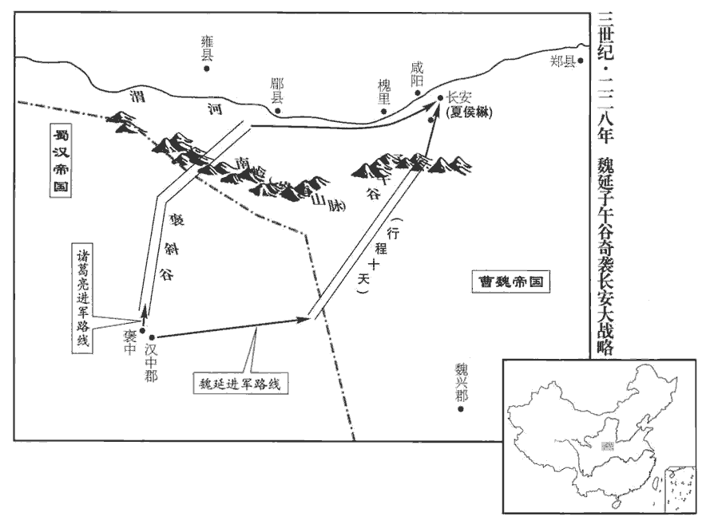
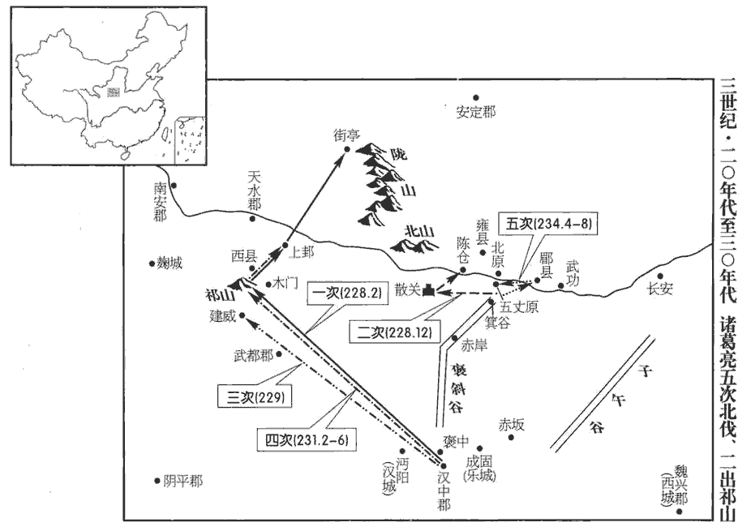
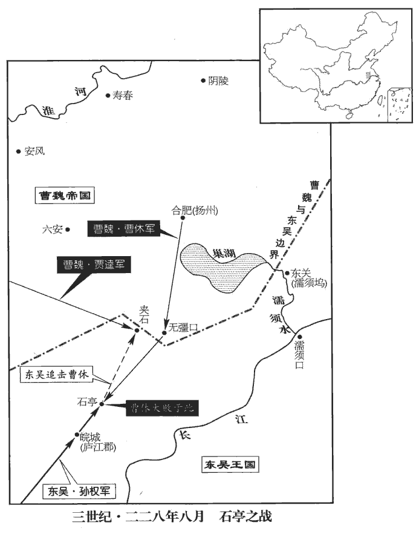
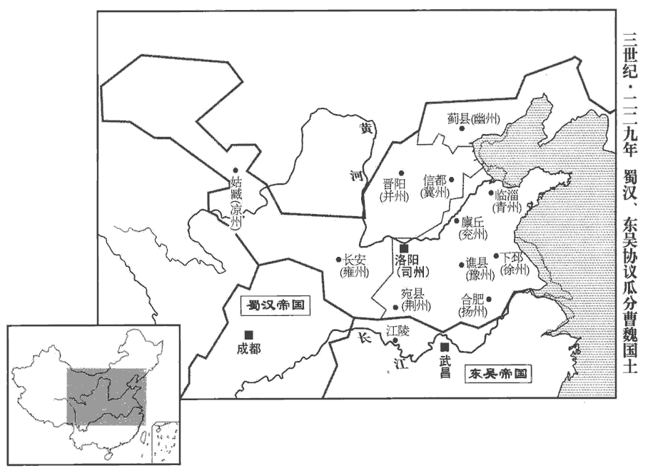

 魏紀三起著雍涒灘（戊申），盡上章閹茂（庚戌），凡三年。

# 烈祖明皇帝上之下

## 太和二年（戊申，二二八）

1春，正月，司馬懿攻新城‹湖北房县›，旬有六日，拔之，斬孟達。申儀久在魏興‹陕西安康›，擅承制刻印，多所假授；懿召而執之，歸于洛陽。歸儀于京師也。

〖译文〗 [1]春季，正月，司马懿围攻新城，用十六天时间，攻下了城，斩杀孟达。申仪在魏兴已经很久，擅称秉受旨意刻印，多次假借名义授官。司马懿召见而逮捕了他，返回洛阳。

2初，征西將軍夏侯淵之子楙mào尚太祖女清河公主，此女欲以妻丁儀，文帝止之，以妻楙。楙，音茂。文帝少與之親善，少，詩照翻。及即位，以為安西將軍，都督關中，鎮長安，使承淵處。淵鎮長安見六十六卷漢獻帝建安十六年

〖译文〗 [2]起初，征西将军夏侯渊的儿子夏侯和太祖的女儿清河公主结了婚，文帝年少时和他亲近友好，等到继子帝位，便任命他为安西将军，都督关中，镇守长安，让他承接夏侯渊的防区。

諸葛亮‹时年四十八›將入寇，與群下謀之。丞相司馬魏延曰：漢丞相有長史而無司馬，是時用兵，故置司馬。「聞夏侯楙，主婿也，怯而無謀。今假延精兵五千，負糧五千，直從褒中‹陕西汉中西北褒河镇›出，循秦嶺而東，當子午‹北起陕西长安西南子口›，南至石泉县午口，长三百三十公里而北，褒中縣，屬漢中郡。子午道，王莽所通，事見三十六卷平帝元始五年。安帝延光四年，順帝罷子午道，通褒斜路。三秦記曰：子午，長安正南山名。秦嶺谷，一名樊川。余按今洋州東百六十里有子午谷。郡縣志曰：舊子午道在金州安康縣界，梁將軍王神念以緣山避水，橋梁百數，多有毀壞，乃別開乾路，更名子午道，則今路是也。不過十日，可到長安。楙聞延奄至，必棄城逃走。長安中惟御史、京兆太守耳。時遣督軍御史與京兆太守共守長安。，晉志曰：文帝受禪，改漢京兆尹為太守。守，式又翻。橫門邸閣與散民之穀，足周食也。魏置邸閣於橫門以積粟。民聞兵至必逃散，可收其穀以周食。橫音光。比東方相合聚，尚二十許日，比，必寐翻。而公從斜谷‹陕西太白西南褒河山谷›來，斜，余遮翻。谷，音浴，又古祿翻。亦足以達。如此，則一舉而咸陽以西可定矣。」亮以為此危計，不如安從坦道，可以平取隴右‹陇山以西›，十全必克而無虞，故不用延計。由今觀之，皆以亮不用延計為怯。凡兵之動，知敵之主，知敵之將。亮之不用延計者，知魏主之明略，而司馬懿輩不可輕也。亮欲平取隴右，且不獲如志，況欲乘险僥倖，盡定咸陽以西邪！

〖译文〗 诸葛亮将要攻打魏，税下人商量这次军事，行动。丞相司马魏延说：“听说夏侯是魏帝的女婿，此人胆却而没有智谋。现请给我五千人的精锐部队，带着五千人口粮，直接从褒中出发，沿着秦岭向东，到子午道后折向北方，用不了十天功夫，可以抵达长安。夏侯听到我突然来到，一定弃城逃走。长安城中就只有御史、京兆太守了。横门粮仓的存粮以及百姓逃散剩下的粮食，足以供给军粮。等到魏国在东方集结起军队，还要二十多天时间，而您从斜谷出来接应，也完全可以到达。这样，就可以一举而平定咸阳以西的地区了。”诸葛亮认为这是危而不妥的计策，不如安全地从平坦的路上出去，可以稳稳当当地取得陇右地区，有百分之百的把握取胜而不会有失，所以不用魏延之计。

 

 

亮揚聲由斜谷道取郿‹陕西眉县›，班志：斜水出衙嶺山北，至郿入渭，脈水沿山，則斜谷之路可知矣。郿，師古音媚。郿故城，陳倉縣東北十五里故郿城是。使鎮東將軍趙雲、揚武將軍鄧芝為疑兵，據箕谷‹陕西太白›；今興元府褒縣北十五里有箕山，鄭子真隱於此，趙雲、鄧芝所據，即此谷也。又據後漢書馮異傳：箕谷當在陳倉之南，漢中之北。帝‹曹叡，时年二十五›遣曹真都督關右諸軍軍郿‹陕西眉县›。亮身率大軍攻祁山‹甘肃礼县东北›，戎陳整齊，陳，讀曰陣。號令明肅。始，魏以漢昭烈既死，數歲寂然無聞，是以略無備豫；謂不豫為之備也。而卒聞亮出，卒，讀曰猝。朝野恐懼，於是天水‹甘肃甘谷›、南安‹甘肃陇西东南›、安定‹甘肃镇原东南曙光乡›皆叛應亮，魏分隴右置秦州，天水南安屬焉。漢靈帝中平四年，分漢陽之䝠道立南安郡。漢陽郡至晉方改為天水，史追書也。安定郡，屬雍州，杜佑曰：南安今隴西郡隴西縣。關中響震，朝臣未知計所出，帝曰：「亮阻山為固，今者自來，正合兵書致人之術，兵法曰善戰者致人。帝姑以此言安朝野之心耳。破亮必也。」乃勒兵馬步騎五萬，遣右將軍張郃督之，西拒亮。郃，古合翻，又曷閤翻。丁未，帝行如長安。親帥師繼郃之後以張聲勢。如，往也。

〖译文〗 诸葛亮扬言从斜谷取城，命令镇东将军赵云、扬武将军邓芝充当疑兵，据守箕谷；明帝派遣曹真都督关右地区各军驻扎在城。诸葛亮亲自统率大军进攻祁山，军阵整齐，号令严明。起初，魏认为蜀汉昭烈亮刘备已经去世，几年来没有什么动静，因此放松了防备；而突然听到诸葛亮出兵，朝廷和民众都很惧怕。于是，天水、南安、安定等郡都背叛魏而响应诸葛亮，关中如雷轰顶，受到震动，朝廷大臣不知不什么对策，明帝说：“诸葛亮本来依据山险固守，现在亲自前来，正合乎兵书所说招敌前来的策略，一定能够打败诸葛亮。”于是统领步兵和骑兵五万大军，命右将军张监管军务，向西抵御诸葛亮。丁未（疑误），明帝到达长安。

初，越巂‹四川西昌›太守馬謖，才器過人，好論軍計，好，呼到翻。諸葛亮深加器異；漢昭烈臨終，謂亮曰：「馬謖言過其實，不可大用，君其察之！」亮猶謂不然，以謖為參軍，每引見談論，自晝達夜。以孔明之明略，所以待謖者如此，亦足以見其善論軍計矣。觀孔明南征之時，謖陳攻心之論，豈悠悠坐談者所能及哉！及出軍祁山‹甘肃礼县东北›，亮不用舊將魏延、吳懿等為先鋒，而以謖督諸軍在前，與張郃戰于街亭‹甘肃张家川北›。續漢志：漢陽略陽縣有街泉亭，前漢之街泉縣也，省入略陽。杜佑曰：街泉亭在隴縣。又曰：平涼郡界有街泉亭，馬謖為張郃所敗處。又考五代史志，漢川郡西縣有街亭山、嶓bō冢山、漢水，則隋之西縣，蓋兼得隴西之䝠道、漢陽之西縣矣。又按郡國縣道記：梁州之西縣，本名白馬城，又曰濜jìn口城，後魏正始中，立嶓bō冢縣，隋始改曰西縣。此非續漢志漢陽之西縣也。

〖译文〗 起初，越太守马谡，才气和抱负超过常人，喜好议论军事谋略，诸葛亮对他深为器重；昭烈帝刘备临终之时对诸葛亮说：“马谡言语浮夸，超过实际才能，不可委任大事，您要对他多加考察。”诸葛亮还认为不是这样，让马谡做参军，时常接见一起谈论，从白天直到黑夜。等到出兵祁山，诸葛亮不用旧将魏延、吴懿等为先锋，而是让马谡统领各军在前，同张在街亭交战。

謖違亮節度，舉措煩擾，舍水上山，不下據城。郃傳言謖依阻南山。舍，讀曰捨。上，時掌翻。張郃絕其汲道，擊，大破之，士卒離散。亮進無所據，乃拔西縣‹甘肃礼县东北›千餘家還漢中‹陕西汉中›。續漢志：西縣，前漢屬隴西郡，後漢屬漢陽郡，有嶓bō冢山、西漢水。收謖下獄，殺之。亮自臨祭，為之流涕，下，遐稼翻。為，于偽翻。撫其遺孤，恩若平生。殺之者，王法也，恩之者，故人之情不忘也。蔣琬謂亮曰：「昔楚殺得臣，文公喜可知也。左傳：晉文公及楚子玉得臣戰于城濮‹山东鄄城西南›，楚師敗績。晉入楚軍三日穀，文公猶有憂色，曰：「得臣猶在，憂未歇也。」及楚殺得臣，然後喜可知也。杜預曰：謂喜見於顏色。天下未定而戮智計之士，豈不惜乎！」觀此，則蔣琬亦重謖矣。亮流涕曰：「孫武所以能制勝於天下者，用法明也；孫子始計篇曰：法令孰行。言法令行者必勝也，故其教吳宮美人兵，必殺吳王寵姬二人以明其法。是以揚干亂法，魏絳戮其僕。左傳：晉悼公合諸侯，其弟揚干亂行，魏絳戮其僕。悼公謂魏絳能以刑佐民，使佐新軍。四海分裂，兵交方始，若復廢法，何用討賊邪！」

〖译文〗 马谡违背诸葛亮的指挥调度，军事行动混乱无章，放弃水源上山驻扎，不在山下据守城邑。张断绝马谡取水的道路，发动进攻并大败马谡，蜀军溃散。诸葛亮前进没有据点，就攻取西县一千多人家回到汉中。把马谡关进监狱，杀了他。诸葛亮亲自吊丧，为他痛哭流涕，安抚他的子女，如同平素一样恩待他们。蒋琬对诸葛亮说：“古时候晋国同楚国交战楚国杀了领兵的得臣，晋文公喜形于色。现在天下没有平定，而杀了智谋之士，难道不惋惜吗？”诸葛亮流着眼泪说：“孙武能够制敌而取胜于天下的原因，是用法严明；所以晋悼公的弟弟扬干犯法，魏绛就杀了为他驾车的人。现在天下分裂，交战刚刚开始，如果又废弃军法，怎么能够讨伐敌人呢？”

謖之未敗也，裨將軍巴西‹四川阆中›王平連規諫謖，謖不能用；及敗，眾盡星散，惟平所領千人鳴鼓自守，張郃疑其有伏兵，不往逼也，於是平徐徐收合諸營遺迸，率將士而還。據王平傳：平所識不過十字。觀其收馬謖敗散之兵，拒曹爽猝至之師，則用兵方略，固不在於多識字也。迸，北孟翻。還，從宣翻，又如字。亮既誅馬謖及將軍李盛，奪將軍黃襲等兵，平特見崇顯，加拜參軍，統五部兼當營事，既總統五部兵，時亮屯漢中，又使之兼當營屯之事。進位討寇將軍，封亭侯。後漢之制，列侯有縣侯、鄉侯、亭侯。亮上疏請自貶三等，漢主‹刘禅，时年二十二›以亮為右將軍，行丞相事。

〖译文〗 马谡没有失败时，裨将军巴西人王平一再规劝马谡，马谡不采纳；等到失败，部众四散，只有王平率领的一千人擂响战鼓，把守营地，张怀疑有伏兵不敢往前逼近，于是王平缓缓地收扰各部散余的士兵，率领人马返回。诸葛亮既杀了马谡和将军李盛，还夺了将军黄袭等的兵权，王平的名声地位就特别提高和显示出来，又提拔他为参军，统伶部兵马和营屯之事，官位晋升到讨寇将军，封为亭侯。诸葛亮上书请求自己贬降三级，汉后主任命诸葛亮为右将军，兼理丞相的职务。

是時趙雲、鄧芝兵亦敗於箕谷‹陕西太白›，雲斂眾固守，故不大傷，雲亦坐貶為鎮軍將軍。據晉書職官志：鎮軍將軍在四征、四鎮將軍之上。今趙雲自鎮東將軍貶鎮軍將軍，蓋蜀漢之制，以鎮東為專鎮方面，而以鎮軍為散號，故為貶也。亮問鄧芝曰：「街亭軍退，兵將不復相錄，錄，收拾也。將，即亮翻；下同。復，扶又翻。箕谷軍退，兵將初不相失，何故？」芝曰：「趙雲身自斷後，斷，丁管翻。軍資什物，略無所棄，兵將無緣相失。」雲有軍資餘絹，亮使分賜將士，雲曰：「軍事無利，何為有賜，其物請悉入赤岸‹陕西留坝北›庫，水經註：褒水西北出衙嶺山，東南逕大石門，歷故棧道下谷，俗謂「千梁無柱」也。諸葛亮與兄瑾書曰：「前趙子龍退軍，燒壞赤崖閣道緣谷一百餘里，其閣梁一頭入山腹，一頭立柱於水中。今水大而急，不得安柱。」又云：「頃大水暴出，赤崖以南，橋閣悉壞。」時趙子龍與鄧伯苗一戍赤崖屯田，一戍赤崖口，但得緣崖與伯苗相聞而已。後亮死于五丈原，魏延先退而焚之，即是道也。赤崖即赤岸，蜀置庫於此，以儲軍資。須十月為冬賜。」須，待也。亮大善之。

〖译文〗 这时赵云、邓芝的部队也在箕谷战败，赵云收敛部队坚守，所以损失不大，但也因此被贬为镇军将军。诸葛亮问邓芝道：“街亭失利，大军败退，兵将不再可收拾，箕谷战败部队撤退，兵将依然齐整如初，是什么原因呢？”邓芝说：“赵云亲自在部队后面拒敌，军需物资，一点都没有抛弃，兵将没有什么缘由可以散乱。”赵云有军资和剩余的绢帛，诸葛亮让用来分给将士，赵云说：“军事上没有胜利，为什么要有赏赐，这些物资请全部存入赤岸库，等到十月用作冬季犒劳品。”诸葛亮很赞同这个意见。

或勸亮更發兵者，亮曰：「大軍在祁山、箕谷，皆多於賊，而不破賊，乃為賊所破，此病不在兵少也，在一人耳。謂兵之勝敗在將也。少，詩沼翻。今欲減兵省將，將，即亮翻。明罰思過，校變通之道於將來；若不能然者，雖兵多何益！自今已後，諸有忠慮於國者，但勤攻吾之闕，則事可定，賊可死，功可蹻足而待矣。」蹻qiāo，巨嬌翻。於是考微勞，甄壯烈，甄；稽延翻，察也，別也。引咎責躬，布所失於境內，厲兵講武，以為後圖，戎士簡練，民忘其敗矣。善敗者不亡，此之謂也。姜維之敗，則不可復振矣。

〖译文〗 有人劝说诸葛亮再次发兵，诸葛亮说：“大军在祁山、箕谷的时候，都多于敌军，但没有打败敌人，反而被敌人打败，问题不在于兵少，而在于将领。现在我打算减少兵将，显明责罚，反思过失，将来另想变通的办法。如果不能这样，即使兵多也没有什么用处！从今以后，凡是一心为国家分忧效忠的人，只要多多批评我的过错，那么大事就可以安定，敌人就可以打垮，大功就可跷足而待了。”于是考察有功将士，连微小的功劳也不遗漏，对壮烈之士，一一加以甄别，引过自责，把自己的过失在境内公开宣布，练兵讲武，准备将来进取。将士精简干练，民众忘记既往的兵败了。

亮之出祁山也，天水‹甘肃甘谷›參軍姜維詣亮降。降，戶江翻。亮美維膽智，辟為倉曹掾，續漢志：丞相倉曹掾，主倉穀事。使典軍事。考異曰：孫盛雜語曰：「維詣諸葛亮，與母相失。後得母書，令求當歸。維曰：『良田百頃，不在一畝，但有遠志，不在當歸也。』」按維粗知學術，恐不至此。今不取。

〖译文〗 诸葛亮出兵祁山的时候，天水参军姜维向诸葛亮归降。诸葛奶赞赏姜维的胆识，任用他做仓曹掾，掌管军事。

曹真討安定等三郡，皆平。真以諸葛亮懲於祁山，後必出從陳倉‹陕西宝鸡东陈仓›，乃使將軍郝昭等守陳倉，治其城。杜佑曰：漢陳倉故城，在今縣東二十里。治，直之翻。

〖译文〗 曹真讨伐安定等三个郡，都已平定。曹真认为诸葛亮以祁山之败为戒，以后一定从陈仓兵，于是让将军郝昭等驻守陈仓，修建城池。

3夏，四月，丁酉‹八›，帝還洛陽。

〖译文〗 [3]夏季，四月，丁酉（初八），魏明帝返回洛阳。

4帝以燕國‹北京›徐邈為涼州刺史。晉志曰：涼州，蓋以其地處西方，常寒涼也。地勢西北邪出在南山之間，南隔西羌，西通西域，統金城、西平、武威、張掖、西郡、酒泉、敦煌、西海等郡。邈務農積穀，立學明訓，進善黜惡，與羌、胡從事，不問小過；若犯大罪，先告都【章：甲十六行本「都」作「部」；乙十一行本同；孔本同；熊校同。】帥，使知應死者，乃斬以徇。帥，所類翻。由是服其威信，州界肅清。

〖译文〗 [4]明帝任命燕国人徐邈为凉州刺史。徐邈重视农业，广积粮食，开学校，显明训导，提升贤良之士，罢免邪恶之官，和羌人、胡人办事，不计较小过，但如犯了大罪，先报告仓们的首领，使其知道应该处死的人，然后才斩首示众。由此，都顺服于他的声威信誉，凉州界内安定无事。

5五月，大旱。

〖译文〗 [5]五月，天大旱。

6吳王使鄱陽‹江西波阳›太守周魴密求山中舊族名帥為北方所聞知者，所謂山越宗帥也。魴，符方翻。帥，所類翻。令譎挑揚州‹府合肥，安徽合肥›牧曹休。魏揚州止得漢之九江、廬江二郡地，而江津要害之地，多為吳所據。譎，古穴翻。挑，徒了翻。魴曰：「民帥小醜，不足杖任，事或漏泄，不能致休。乞遣親人齎牋以誘休，言被譴懼誅，欲以郡降北，誘，音酉。降，戶江翻。求兵應接。」吳王許之。時頻有郎官詣魴詰問諸事，郎官，尚書郎也。詰，去吉翻。魴因詣郡門下，鄱陽郡門下。下髮謝。吳王之詰，周魴之謝，皆所以譎曹休也。休聞之，率步騎十萬向皖‹安徽潜山›以應魴；皖，戶板翻；下同。帝又使司馬懿向江陵‹湖北江陵›，懿督諸軍屯宛，使向江陵。賈逵‹时驻西阳，河南光山›向東關，東關，即濡須口‹安徽含山西南›，亦謂之柵江口，有東、西關；東關之南岸，吳築城，西關之北岸，魏置柵。後諸葛恪於東關作大堤以遏巢湖，謂之東興堤，即其地也。三道俱進。

〖译文〗 [6]吴王派遣番阳太守周鲂秘密求助已为北方所知名的山越宗帅，想让他们去诳诱魏扬州牧曹休。周鲂说：“山民宗帅地位低贱，不足以依赖信任，事情如有汇漏，不能使曹上钩。请派亲信带着我的书信去引诱曹休，说我受到责难，害怕被杀，打算以郡归降北方，请求派兵接应。”吴王同意。当时不断有尚书郎到周鲂处查究各种事情，周鲂因而来到番阳郡门之下，剪下头发谢罪。曹休听到后，率领步骑兵十万人向皖城进发接应周鲂。明帝又命司马懿向江陵方向、贾逵向东关方向，三路大军同时进发。

秋，八月，吳王至皖‹安徽潜山›，以陸遜為大都督，假黃鉞，親執鞭以見之；此猶古之王者遣將跪而推轂gǔ之意也。以朱桓、全琮為左右督，琮，徂宗翻。各督三萬人以擊休。休知見欺，而恃其眾，欲遂與吳戰。朱桓言於吳王曰：「休本以親戚見任，非智勇名將也。今戰必敗，敗必走，走當由夾石‹安徽桐城北夹山›、挂車‹桐城西南桂镇›。元豐九域志：舒州桐城縣北有挂車鎮，有挂車嶺，鎮因嶺而得名。此兩道皆險阨，若以萬兵柴路，柴路，謂以柴塞路也。則彼眾可盡，休可生虜。臣請將所部以斷之，斷，丁管翻。若蒙天威，得以休自效，便可乘勝長驅，進取壽春‹安徽寿县›，割有淮南以規許、洛，漢末都許，有許昌宮；魏時都洛。魏略曰：文帝改長安、譙、許昌、鄴、洛陽為五都，立石表，西界宜陽，北循太行，東北界陽平，南循魯陽，東界郯tán，為中都之地。此萬世一時，不可失也！」言歷萬世，惟有此一時機會可乘耳。權以問陸遜，遜以為不可，乃止。

〖译文〗 秋季，八月，吴王到达皖城，任命陆逊为大都督，赐予黄，手执马鞭接见了他。又任命朱桓、全琮分别担任左、右督，各领三万人迎击曹休。曹休知道被欺诈，仍然仗恃人多，打算就与吴国交战。朱桓对吴王说：“曹休本因是皇亲国戚而被任用，并不是有勇有谋的名将。今如交战必败无疑，败后必逃，逃走时肯定经由夹石、挂车。这两条道路都很险要狭隘，如若能让一万士兵用柴断路，那么可把他的部众全部俘虏，甚至可以生擒曹休。请求用我的部队断路，若蒙上天神威，使得曹休自动投降，我们就可乘胜长驱直入，进而攻取寿春，割据准南，划分许昌、洛阳，这是万世难逢的良机，切不可失！”孙权以此询问陆逊，陆逊认为不可，于是没有采取行动。

 

尚書蔣濟上疏曰：「休深入虜地，與權精兵對，而朱然等在上流，乘休後，臣未見其利也。」前將軍滿寵上疏曰：「曹休雖明果而希用兵，今所從道，背湖旁江，易進難退，背，蒲妹翻。旁，步浪翻。易，以豉翻。此兵之絓地也。絓guà，古賣翻，罥juàn也。言其地險，師行由之，為所罥挂，進退不可也。孫子地形篇曰：地形有通者，有挂者。我可以往，彼可以來曰通。可以往，難以返曰挂。若入無彊口‹安徽庐江西›，無彊口，在夾石東南。宜深為之備！」寵表未報，休與陸遜戰于石亭‹安徽潜山东北›。時吳王在皖口，遣遜等與休戰于石亭，則其地當在今舒州懷寧、桐城二縣之間。遜自為中部，令朱桓、全琮為左右翼，三道并進，衝休伏兵，因驅走之，追亡逐北，徑至夾石‹安徽桐城北夹山›，斬獲萬餘，牛馬騾驢車乘萬兩，軍資器械略盡。休蓋未嘗整陳交戰而敗也。兩，音亮。乘，繩證翻。

〖译文〗 尚书蒋济上书说：“曹休深入敌方境内，与孙权的精锐部队对垒，而朱然等在长江上游，正处于曹休背后，我看不出什么有利之处。”前将军满宠上书说：“曹休虽然明智果断但很少用兵，这次他的行军路线背靠湖泊，傍依长江，容易进军，难以退却，这是战争中易于受阻之地。如果大军进入无疆口，应该严加戒备。”满宠有表章还未得到答复，曹休陆逊已在石亭开战。陆逊自己统率中路大军，命朱桓、全琮分别为左、右翼，三路并进，冲击曹休埋伏的部队，乘势把他们赶走了，吴军在后追杀，直抵夹石，斩杀、生擒一万余人，缴获牛马驴骡车辆上万，以及几乎全部的军资器械。

初，休表求深入以應周魴，帝命賈逵引兵東與休合。按逵傳，逵自豫州進兵，取西陽以向東關，休自壽春向皖。西陽在皖之西，而東關又在皖之東，今與休合，蓋使合兵向東關也。逵曰：「賊無東關之備，必并軍於皖‹安徽潜山›，休深入與賊戰，必敗。」乃部署諸將，水陸并進，行二百里，獲吳人，言休戰敗，吳遣兵斷夾石，斷，丁管翻；下同。諸將不知所出；或欲待後軍，逵曰：「休兵敗於外，路絕於內，進不能戰，退不得還，安危之機，不及終日。賊以軍無後繼，故至此，今疾進，出其不意，此所謂『先人以奪其心』也左傳：軍志曰：先人有奪人之心。先，悉薦翻。賊見吾兵必走。若待後軍，賊已斷險，兵雖多何益！」乃兼道進軍，多設旗鼓為疑兵。吳人望見逵軍，驚走驚走者，斷夾石之軍耳。休乃得還。逵據夾石，以兵糧給休，休軍乃振。初，逵與休不善，逵與休不善。文帝黃初中，欲假逵節，休曰：「逵性剛，易侮諸將，不可為督。」遂止。及休敗，赖逵以免。

〖译文〗 起初，曹上书请求深入呈地以接应周鲂，明帝命令贾逵率兵向东与曹休汇合。贾逵说：“贼兵在东关没有防备，肯定是在皖城集合部队，曹休深入与敌作战，必定失败。”于是部署各将领水路陆路同时并进，行出二百里，擒获吴国人，说曹休大军战败，吴国正派遣兵士阻断夹石通路。将领不知怎么办好，有的想等待后继部队。贾逵说：“曹休对外兵败，对内路绝，进不能战，退不能还，正处在生死存亡的紧急关头，恐怕支持不到天黑。敌军因为没有后续部队，所以只追到夹石，现在我们急速进军，出其不意，这就是所谓的‘先声夺人，以挫伤敌人的土气’，敌兵看到我军来到，一定退走。假如我们等待后援，敌军已将险路切断，兵虽多又有什么益处！”于是以加倍的速度行军，没途设下许多旌旗战鼓作为疑兵。吴国人从远处看到贾逵部队，惊恐撤走，曹休于是才得以返回。贾逵据守夹石，供给曹休士兵粮草，曹休部队才振作起来。开始，贾逵与曹休关系不好，等到曹休失败，依赖贾逵才得幸免于难。

7九月，乙酉‹二十九›，立皇子穆為繁陽王。

〖译文〗 [7]九月，乙酉（二十九日），明帝立皇子穆为繁阳王。

8長平壯侯曹休上書謝罪，帝以宗室不問。敗軍者必誅，焉可以宗室而不問邪！休慙憤，疽jū發於背，庚子，卒。帝以滿寵都督揚州以代之。

〖译文〗 子[8]长平壮侯曹休上书谢罪，明帝以曹休是皇族不加追究。曹休羞愧郁结，背上生疽，庚子（疑误），去世。魏帝任命满宠都督扬州，代替曹休遗缺。

9護烏桓校尉田豫擊鮮卑鬱築鞬，鬱築鞬妻父軻比能救之，以三萬騎圍豫於馬城‹河北怀安›。馬城縣，漢屬代郡，魏、晉省，蓋城邑殘破，已棄為荒外之地矣。鞬，居言翻。上谷‹北京延庆›太守閻志，柔之弟也，素為鮮卑所信，自漢建安時，閻柔已護烏桓，故其兄弟為二虜所信。往解諭之，乃解圍去。

〖译文〗 [9]护乌桓校尉田豫进攻鲜卑人郁筑，郁筑的岳父轲比能前来相救，用三万骑兵把田豫围困在马城上谷太守阎志是阎柔的弟弟，素来为鲜卑人所信赖，前去解释劝导，轲比能才解围而去。

10冬，十一月，蘭陵成侯王朗卒。

〖译文〗 [10]冬季，十一月，兰陵成侯王朗去世。

11漢諸葛亮聞曹休敗，魏兵東下，關中虛弱，欲出兵擊魏，群臣多以為疑。因祁山之敗，疑魏不可伐。亮上言於漢主曰：「先帝深慮以漢、賊不兩立，王業不偏安，故託臣以討賊。以先帝之明，量臣之才，固當知臣伐賊，才弱敵強；然不伐賊，王業亦亡，惟坐而待亡，孰與伐之！是故託臣而弗疑也。臣受命之日，寢不安席，食不甘味，思惟北征，宜先入南，故五月渡瀘‹金沙江›，深入不毛。瀘，魯都翻。臣非不自惜也，顧王業不可偏全於蜀都，故冒危難以奉先帝之遺意也，難，乃旦翻；下同。而議者以為非計。今賊適疲於西，又務於東，疲於西，謂郿縣、祁山之師；務於東，謂江陵東關、石亭之師也。兵法乘勞，此進趨之時也。謹陳其事如左：高帝明并日月，謀臣淵深，然涉險被創，被，皮義翻。創，初良翻。危然後安。今陛下未及高帝，謀臣不如良、平，而欲以長計取勝，坐定天下，此臣之未解一也。解，讀曰懈，言未敢懈怠也；後皆同。劉繇、王朗各據州郡，論安言計，動引聖人，群疑滿腹，眾難塞胸，今歲不戰，明年不征，使孫策坐大，遂并江東。此臣之未解二也。難，乃旦翻。坐大，言坐致強大也。策破劉繇事見六十一卷漢獻帝興平二年，破王朗事見六十二卷建安元年。曹操智計殊絕於人，其用兵也，髣髴孫、吳；以操之善用兵，亮謂之髣髴孫、吳，孫、吳固未易才也。然困於南陽，險於烏巢，危於祁連，偪於黎陽，幾敗伯山，殆死潼關，然後偽定一時耳；困於南陽，謂攻穰為張繡所敗也。險於烏巢，謂攻袁紹將淳于瓊時也。偪於黎陽，謂攻袁譚兄弟時也。幾敗伯山，謂與烏桓戰於白狼山時也。殆死潼關，謂與馬超戰時也。危於祁連，當考；或曰圍袁尚於祁山時也。偽定者，言雖定一時之功，而有心於篡漢，故曰偽。幾，居希翻。況臣才弱，而欲以不危定之，此臣之未解三也。曹操五攻昌霸不下，四越巢湖不成，任用李服而李服圖之，委夏侯而夏侯敗亡；昌霸，昌豨xī也。操累攻不下，後命于禁擊斬之。四越巢湖不成，謂攻孫權也。李服，蓋王服也，與董承謀殺操被誅。夏侯，謂夏侯淵守漢中為先主所敗也。先帝每稱操為能，猶有此失，況臣駑下，何能必勝！此臣之未解四也。駑下者，自謙以馬為喻，若駑駘tái下乘也。自臣到漢中，中間朞jī年耳，然喪趙雲、陽群、馬玉、閻芝、丁立、白壽、刘郃、鄧銅等及曲長、屯將七十餘人，喪，息浪翻。郃，古合翻，又曷閤翻。曲長，一曲之長也。軍行有部，部下有曲，曲各有長。長，丁丈翻。屯將，將屯者也。將，即亮翻。突將、無前、將，即亮翻。賨cóng叟、青羌、散騎、武騎一千餘人，蜀兵謂之叟，賨叟，巴賨之兵也。青羌，亦羌之一種。散騎、武騎，當時騎兵分部之名。賨，藏宗翻。騎，奇寄翻。皆數十年之內，糾合四方之精銳，非一州之所有；若復數年，則損三分之二，復，扶又翻。當何以圖敵！此臣之未解五也。言不戰而將士耗損已如此也。今民窮兵疲，而事不可息，事不可息，則住與行，勞費正等而不及虛圖之，亮意欲及魏與吳連兵未解，乘虛而圖之也。欲以一州之地與賊支久，此臣之未解六也。支，持也；支久，猶言持久也。夫難平者事也，昔先帝敗軍於楚，當此時，曹操拊手，謂天下已定，然後先帝東連吳、越，事見六十五卷漢獻帝建安十三年。拊手，乘快之意發見於外者也。西取巴、蜀，事見六十七卷建安十九年。舉兵北征，夏侯授首事見六十八卷建安二十四年。此操之失計而漢事將成也。然後吳更違盟，關羽毀敗，事見六十八卷建安二十四年。此兩然後之然，轉語之辭，與他文然後之義不同。秭歸蹉cuō跌，曹丕稱帝。事見六十九卷黃初元年、三年。凡事如是，難可逆見。臣鞠躬盡力，死而後已，至於成敗利鈍，非臣之明所能逆覩也。」自祁山之敗，亮益知魏人情偽，故其所言如此。

〖译文〗 [11]蜀汉诸葛亮听说曹休战败，魏军东下，关中虚弱，打算出兵攻魏，群臣对能否取胜多存怀疑。诸葛亮对汉后主进言说：“先帝深深忧虑的是汉和魏贼不能同时并立，帝王的基业不能偏安于蜀地，所以托付我讨伐敌人。以先帝的英明，度量我的才干，当然了解我讨伐敌人的能力不足而人强大；但是不讨伐敌人，帝王的基业也会夭亡，只是坐等失败，还不如去讲座攻敌人呢！所以，托付我这一重任而不加怀疑。我自从接受命令的那一天起，睡觉不安稳，吃饭没滋味，想着由于要北伐敌人，应当先安定南方，所以五月渡过沪水，深入偏远荒蛮的地区。我不是不爱惜自己，是考虑到帝王的基业不可以在蜀都，所以顶着危难来继承先帝的遗志，但议论的人认为这不是好办法。如今敌人刚刚在西面的祁山之役中疲惫不堪，又对吴国用兵，兵法上有乘敌人疲劳之机的说法，这正是进取的时机。谨请让我陈述下列事项：汉帝刘邦明如日月，谋臣智谋深远，但也历经危难，受过重创，危难过后，才转而安定天下。如今陛下比不上高帝，谋臣不如张良、陈平，而打算用持久之计取胜，坐收统一天下之利，这是我不敢懈怠的第一个原因。刘繇、王朗各自占据州郡，谈论安危之计，动辄引证圣人之言，然而对人疑忌满腹，办事众难填胸，今年不打仗，明年不征伐，使得孙策安然地强大起来，以致于吞并江东，这是我不敢懈怠的第二个原因。曹操的智谋超过别人，指挥作战好似孙武、吴起，但也曾在南阳被困，乌巢遇险，祁连临危，黎阳受逼，几乎败于伯山，差一点死在潼关，然后才篡得天下，获一时平定；何况我才疏力弱，而想不经过危难就平定天下，这是我不敢懈怠的第三个原因。曹操五次攻打昌霸不能攻下，四次跨越巢湖不能成功，任用李服而李服谋害他，委任夏侯渊而夏侯渊败亡；先帝每每称赞曹操是英才，还有这些失误，何况我是庸才，怎能必胜！这是我不敢懈怠的第四个原因。自从我到了汉中，只经过一年时间，竟丧亡了赵云、阳群、马玉、阎芝、丁立、白寿、无前、叟、青羌、散骑、武骑一千余人，都是几十年之内，从四面八方集合起来的精英，不是一州所能具有；如果再过几年，就要损失三分之二，还能用什么去打垮敌人呢？这是我不敢懈怠的第五个原因。如今民众贫困兵士疲乏，可是国家大事不可停息，国家大事不可停息，那么原地驻守和出兵进取，付出的辛劳和费用正好相等，而不乘关中宽虚的时机进攻敌人，打算以一州之地同敌人长期对峙，这是我不敢懈怠的第六个原因。心中难以平静下来的是天下大事，以前先帝在楚地战败，当时曹操拍手高兴，说天下已定。然而后来先帝东连孙吴，西取益州，挥师北伐，杀了夏侯渊，这是曹操的失策而汉朝大业将要成功了。但后来吴国又违背盟约，关羽败亡，秭归受挫，曹丕称帝。世上事情都是如此曲折，实在难以预料。我只有鞠躬尽力，死而后已，至于成败得失，不是我的见识所能预见的了。”

十二月，亮引兵出散關‹陕西宝鸡西南大散岭上›，圍陳倉，陳倉已有備，亮不能克。曹真使郝昭先守，故亮不能克。此下申言昭守亮攻，客主相持之事，通鑑書法類如此。亮使郝昭鄉人靳詳於城外遙說昭，靳jìn，居焮xìn翻。說，輸芮翻；下同。昭於樓上應之曰：「魏家科法，卿所練也，科，條也。練，習也。我之為人，卿所知也。我受國恩多而門戶重，卿無可言者，但有必死耳。卿還謝諸葛，便可攻也。」詳以昭語告亮，亮又使詳重說昭，重，直用翻。言「人兵不敵，空【章：甲十六行本「空」上有「無爲」二字；乙十一行本同；孔本同；張校同。】自破滅。」昭謂詳曰：「前言已定矣，我識卿耳，箭不識也。」詳乃去。亮自以有眾數萬，而昭兵纔千餘人，又度東救未能便到，魏兵救陳倉者自東來，故曰東救。度，徒洛翻。乃進兵攻昭，起雲梯衝車以臨城，昭於是以火箭逆射其梯，射，而亦翻；下同。梯然，梯上人皆燒死；昭又以繩連石磨壓其衝車，磨，莫臥翻，石磑wèi也。衝車折。折，而設翻。亮乃更為井闌百尺以射城中，以木交構若井闌狀。以土丸填壍，壍，七豔翻。欲直攀城，昭又於內築重牆。重，直用翻。亮又為地突，地突，地道也。欲踊出於城里，昭又於城內穿地橫截之。晝夜相攻拒二十餘日。

〖译文〗 十二月，诸葛亮率领大军从散关出发，包围陈仓，陈仓早已有准备，诸葛亮没能攻下来。诸葛亮让郝昭同乡人靳详在城外远远地劝说郝昭，郝昭在城楼上对靳详说：“魏国的法律，您是熟悉的，我的为人，您是了解的。我深受国恩而且门第崇高，您不必多说，只有一死而已。您回去告诉诸葛亮，就来攻打吧。”靳详把郝昭的话告诉了诸葛亮，诸葛亮又让靳详再次劝告郝昭，说“兵众悬殊，抵挡不住，和必白白自取毁灭。”郝昭对靳详说：“前面已说定了，我认识您，箭可不认识您。”靳详只好返回。诸葛亮自以为几万兵马，而郝昭才有一千多兵众，又估计东来的救兵未必就能赶到，于是进军攻打郝昭，架起云梯，云梯燃烧起来，梯上的人都被烧死，郝昭又用绳子系上石磨，掷击汉军的冲车，冲车被击毁。诸葛亮就又制做了百尺高的井字形木栏，以向城中射箭，用土块填塞护城的壕沟，想置接攀登城墙；郝昭又在城内筑志一道城墙。诸葛亮又挖地道，想从地道进入城里，郝昭又在城内挖横向地道进行拦截。昼夜攻守相持了二十多天。

曹真遣將軍費耀等救之。帝召張郃于方城‹河南叶县西南›，時郃將兵伐吳，屯于方城。續漢志曰：葉縣南有長山曰方城，屈完所謂「楚國方城以為城」者，即此也。使擊亮。帝自幸河南城‹河南洛阳›，置酒送郃，河南城在洛陽城西。問郃曰：「遲將軍到，遲，直利翻，待也。亮得無已得陳倉乎！」郃知亮深入無穀，屈指計曰：「比臣到，亮已走矣。」比，必寐翻。郃晨夜進道，未至，亮糧盡，引去；將軍王雙追之，亮擊斬雙。詔賜昭爵關內侯。攻者不足，守者有餘。尚論其才，則全城卻敵者，其才非優於攻者也，客主之勢異耳。故曰用兵之術，攻城最下。

〖译文〗 曹真派遣将军费耀等援救郝昭。明帝召见在方城的张，命他攻击诸葛亮。明帝亲自来到河南城，摆下酒席为张送行，问张：“等将军赶到，诸葛亮是不是已经取得陈仓呢？”张了解诸葛亮深入作战缺乏粮食，屈指计算一下说：“等到我到了那里，诸葛亮已撤走了。”张日夜兼程赶路，还没到达，诸葛亮的粮食已尽，领兵退去；将军王双追赶，被诸葛亮击杀。明帝颁布诏书赐郝昭关内侯的爵位。

12初，公孫康卒，子晃、淵等皆幼，官屬立其弟恭。恭劣弱，不能治國，淵既長，治，直之翻。長，知兩翻。脅奪恭位，上書言狀。侍中劉曄曰：「公孫氏漢時所用，公孫度守遼東‹辽宁辽阳›，見五十九卷獻帝初平元年。遂世官相承，古者世爵不世官；爵，謂公侯伯子男，官謂卿大夫也。今謂之世官者，以公孫氏所據之地，漢遼東太守之職守耳，子孫相襲，是世官也。水則由海，陸則阻山，外連胡夷，絕遠難制，而世權日久；今若不誅，後必生患。若懷貳阻兵，然後致誅，於事為難；不如因其新立，有黨有仇，有黨故能奪恭位，與之為仇者，則恭之黨也。先其不意，以兵臨之，先，悉薦翻。開設賞募，可不勞師而定也。」帝不從，拜淵楊烈將軍、遼東太守。為公孫淵叛魏張本。

〖译文〗 [12]起初，公孙康去世，他的儿子公孙晃、公孙渊都还年幼，所属官吏拥立公孙康的弟弟公孙恭。公孙恭才能低下，性格懦弱，不能冶理所辖的地区。公孙渊已然长大，胁迫公孙恭，夺得太守之位，上书说明事情经过。侍中刘晔说：“公孙氏为汉代所用，因而世代承袭这一职位，其水路有大海相隔，陆路有群山阻挡，对外勾结胡人，遥远难以控制，而且世代为官，权势日久，现在如不诛杀，以后必生祸患。如等到他们怀有二心守险叛乱，然后再加讨伐，将会更加难办。不如趁他刚刚即位，有党羽也有仇敌，出其不意，以大军压境，公开悬赏招募，可以不必动兵打仗而平定。”明帝没有采纳，封公孙渊为杨烈将军、辽东太守。

13吳王以揚州牧呂范為大司馬，印綬未下而卒。下遐稼翻。初，孫策使范典財計，時吳王年少，少，詩照翻。私從有求，范必關白，不敢專許，當時以此見望。望，責望也，怨望也。吳王守陽羨長，陽羨縣‹江苏宜兴›，前漢屬會稽郡，後漢屬吳郡。賢曰：故城在今常州義興縣南。長，知兩翻。有所私用，策或料覆，料，音聊。覆，審救也。功曹周谷輒為傅著簿書，為，于偽翻。傅，讀曰附。著直略翻。使無譴問，王臨時悅之。及後統事，以范忠誠，厚見信任，以谷能欺更簿書，不用也。周世宗之待周美，我朝太祖之重竇儀，事亦類此。更，工衡翻。

〖译文〗 [13]吴王任用扬州牧吕范为大司马，印信和绶带还没有下达，吕范就去世了。最初，孙策让吕范掌管财经，当时吴王孙权年少，私下向吕范借钱索物，吕范定要禀告，不敢专断许可，为此，当时即被孙权怨恨。后来，孙权代理阳羡长，有私下开支，孙策有时进行核计审查，功曹周谷就为孙权制造假账，使他不受责问，孙权那时十分满意他。但等到孙权统管国事后，认为吕范忠诚，深为信任，而周谷善于欺骗，伪造簿册文书，不予录用。

## 三年（己酉，二二九）

1春，漢諸葛亮‹时年四十九›遣其將陳戒攻武都‹甘肃成县›、陰平‹甘肃文县›二郡，陰平道，前漢屬廣漢郡，後漢屬廣漢屬國都尉，魏分置陰平郡，唐為文州。雍州‹府长安，陕西西安›刺史郭淮引兵救之。禹貢：黑水西河為雍州。以其四山之地，故以雍名焉；亦謂西北之位，陽所不及，陰陽雍閼。周都豐、鎬，雍州為王畿；平王東遷，雍州為秦地。漢武置十三州，以雍州之西偏為涼州，其餘并屬司隸。光武都洛，關中復置雍州，尋罷，復以司隸統三輔。獻帝興平元年，河西為河寇所隔，置雍州以統河西諸郡。至魏，以河西置涼州，以隴右為雍州。及晉，以隴右置秦州，而雍州統京兆、馮翊yì、扶風、安定、北地、新平、武都、陰平。雍，於用翻。亮自出至建威‹甘肃西和›，水經註：漢水西南逕祁山軍南，西流與建安川水合。建安水導源建威西北山，東逕建威城南，又東逕西縣、歷城南。祝穆曰：天下之大川，以漢名者二，班固謂之東漢、西漢，而黎州之漢水源於飛越嶺者不與焉。固之所謂東漢，則禹貢之漾漢，其源出於今興元之西縣嶓冢山，逕洋、金、房、均、襄、郢復至漢陽入江者是也。西漢則蘇代所謂「漢中之甲，輕舟出於巴，乘夏水下漢四日而至五渚」者，其源出於西和州徼jiǎo外，徑階沔川與嘉陵水會，俗謂之西漢；又逕大安軍、利、劍、阆、果、合與涪水會，至渝州入江。淮退，亮遂拔二郡以歸；漢主‹刘禅，时年二十三›復策拜亮為丞相。

〖译文〗 [1]春季，蜀汉诸葛亮派遣部将陈戒攻打武都、阴平二郡，率领州刺史郭准领兵前去相救。诸葛亮亲自抵达建威城，郭准退去，诸葛亮于是攻下二郡回帅，汉王又委诸葛亮为丞相。

2夏，四月，丙申‹十三›，吳‹都武昌，湖北鄂州›王‹孙权，时年四十八›即皇帝位，大赦，改元黃龍。時夏口、武昌并言黃龍見，權遂以改元。百官畢會，吳主歸功周瑜。綏遠將軍張昭，舉笏hù欲褒贊功德，未及言，沈約志：魏置將軍四十號，綏遠第十四。吳主曰：「如張公之計，今已乞食矣。」歸功周瑜，以能拒曹公而成三分之業也。乞食，謂張昭欲迎曹公也。事見六十五卷漢獻帝建安十三年。昭大慙cán，伏地流汗。吳主追尊父堅為武烈皇帝，兄策為長沙桓王，立子登為皇太子，封長沙桓王子紹為吳侯。

〖译文〗 [2]夏季，四月，丙申（十三日），吴王即皇帝位，大赦天下，改年号为黄龙。文武百官都来朝会，吴王把功劳归于周瑜。绥远将军张昭，举起板想要歌黛颂德，没等开口说话，吴王说：“如果当初听了张公的计议，现在已经要饭了。”张昭极为羞愧，伏在地上直流汗。吴王追尊父亲孙坚为武烈皇帝，哥哥孙策为长沙桓王，立儿子孙登为皇太子，封长沙桓王孙策的儿子孙绍为吴侯。

以諸葛恪kè為太子左輔，張休為右弼，顧譚為輔正，陳表為翼正都尉，輔正及翼正都尉皆吳自創置之。而謝景、范慎、羊衜等皆為賓客，衜，古道字。於是東宮號為多士。太子使侍中胡綜作賓友目目者，因其人之才品為之品題也。曰：「英才卓越，超踰倫匹，則諸葛恪；精識時機，達幽究微，則顧譚；凝辯宏達，言能釋結，則謝景；凝，堅定也。宏，闊遠也。達，明通也。好辯者每不能堅定其所守，故以能凝辯而證據宏遠明通者，可以釋難疑之糾結也。究學甄微，游夏同科，則范慎。」究，窮竟也。甄，察別也。夏，戶雅翻。羊衜私駮bó綜曰：「元遜才而疏，子嘿精而狠，叔發辯而浮，孝敬深而陿。」諸葛恪，字元遜；顧譚，字子嘿；謝景，字叔發；范慎，字孝敬。狠，戶墾翻。陿，與狹同。衜卒以此言為恪等所惡，卒，子恤翻。惡烏路翻。其後四人皆敗，如衜所言。

〖译文〗 吴王任用诸葛恪为太子左辅，张休为右弼，顾谭为辅正，陈表为翼正都尉，而谢景、范慎、羊等都作为宾客，于是东宫号称人才济济。太子孙登让侍中胡综作《宾友目》说：“英才卓越，出类拔萃，是诸葛恪；精识时势，见解深刻，是顾谭；雄辩明达，言能释疑，是谢景；学问深邃，可与子游、子夏等同，是范慎。”羊私下反驳胡综说：“诸葛恪才大然而粗疏，顾谭精明然而残忍，谢景善辩然而浮浅，范慎精深然而狭窄。”羊终于因此言被诸葛恪等厌恶，以后这四人全都败倒，正中羊所言。

吳主使以并尊二帝之議往告于漢。漢人以為交之無益，而名體弗順，宜顯明正義，絕其盟好。天無二日，土無二王，古今之正義也。好，呼到翻。丞相亮曰：「權有僭逆之心久矣，國家所以略其釁情者，求掎jǐ角之援也。釁，隙也。情，欲也。左傳：戎子駒支對范宣子曰：「殽之師，晉禦其上，戎亢其下，秦師不復，我諸戎實然，譬如捕鹿，晉人角之，諸戎掎之，與晉踣bó之」。杜預註曰：掎其足也。今若加顯絕，讎我必深、當更移兵東戍，與之角力，須并其土，乃議中原。彼賢才尚多，將相輯穆，未可一朝定也。頓兵相守，坐而須老，須，待也。使北賊得計，非算之上者。北賊，謂魏也。昔孝文卑辭匈奴，先帝優與吳盟，事并見前。優，饒也，今人猶謂寬假為優饒。皆應權通變，深思遠益，非若匹夫之忿者也。言所計者大也。今議者咸以權利在鼎足，不能并力，且志望已滿，無上岸之情，謂孫權之志在保江，不能上岸而北向也。上，時掌翻。推此，皆似是而非也。何者？其智力不侔móu，故限江自保；權之不能越江，猶魏賊之不能渡漢，言魏不能渡漢而圖江陵也，此漢，班志所謂東漢水也。非力有餘，而利不取也。若大軍致討，彼高當分裂其地以為後規，下當略民廣境，示武於內，非端坐者也。言蜀若破魏，吳亦將分功。若就其不動而睦於我，我之北伐，無東顧憂，河南之眾不得盡西，此之為利，亦已深矣。言蜀與吳和，則雖傾國北伐，不須東顧以備吳，而魏河南之眾，欲留備吳，不得盡西以抗蜀兵也。權僭逆之罪，未宜明也。」乃遣衛尉陳震使於吳，賀稱尊號。吳主與漢人盟，約中分天下，以豫、青、徐、幽屬吳，兗、冀、并、涼屬漢，其司州之土，以函谷關為界。漢武帝置司隸校尉，所部三輔、三河諸郡，其界西得雍州之京兆、扶風、馮翊三郡，北得冀州之河東、河內二郡，東得豫州之河南、弘農二郡，位望隆乎牧伯，銀印青綬，在十三部刺史之上。後漢省朔方刺史以隸并州，合司隸於十三部之數。魏以司隸所部河東、河南、河內、弘農并冀州之平陽，合五郡置司州，以三輔還屬雍州。此言司州以函谷關為界，以漢司隸所部分之也。

〖译文〗 吴王派使者到蜀国通告他已即皇帝位，提议两国并尊二帝。蜀汉认为与吴国结交没有益处而且名号体制不顺，应该显明正义，断绝友好盟约。丞相诸葛亮说：“孙权有僭号篡逆之心已经很久了，我们国家所以不追究他的薄义寡情，是有求于他的犄角之援。现在如果公开断绝关系，吴国对我们仇恨必定加深，我们势必转移力加强东方防卫。与吴国对抗，必须先兼并吴国国土，才能谈论进取中原。可是，吴国贤能人才还很多，文武将相，团结和睦，不可能一朝平定。要是兵防守，师老兵疲，使得北敌得逞，这不是谋略之上策。以前孝文帝对匈奴出以谦卑之辞，先帝宽容大度与吴国结盟，都是权衡形势，随时变通，深思长远的利益，绝非如匹无一时忿恨用事。而今议论的人都以为孙权的利益在于鼎足之势，不能与我们合力，而且已经踌躇满志，没有北伐的愿望，这样推断，都是似是而非。为什么？是他的智谋和实力不够，所以以长江为界保全自己；孙权不能越江北上，犹如魏贼不能渡过汉水南下，不是力量有余，并且有利也不去夺取。若我们大军伐魏，孙权的上策应当先是分占魏的土地再作打算，不策当是劫掠民众开拓疆境，在国内显示武力，绝不会端坐不动的。即使他不动而与我们和睦相处，我们从北伐，没有东顾之忧，魏黄河以南的部队为了防备吴国，也不能全部向西调动，就是这一点利益，也已经够深远的了。孙权僭号篡逆之罪，不宜公开表明。”于是派遣卫尉陈震出使到吴，祝贺孙权称号登极。吴王与蜀汉结盟，约定将来平分天下，以豫、青、徐、幽四州属吴，兖、冀、并、凉四州属汉，司州地区以函谷关界划分。

 

張昭以老病上還官位及所統領，上，時掌翻。更拜輔吳將軍，更，工衡翻。班亞三司，改封婁侯，婁，古縣也，前漢屬會稽郡，東漢分屬吳郡，今蘇州崑山縣地。吳以封昭，非真國於婁而君國子民也。食邑萬戶。昭每朝見，見賢遍翻；下同。辭氣壯厲，義形於色，曾已直言逆旨，「已」，當作「以」，古已、以字通。中不進見。後漢使來，使，疏吏翻；下同。稱漢德美，而群臣莫能屈，吳主歎曰：「使張公在坐，坐，徂臥翻。彼不折則廢，安復自誇乎！」折，屈也。李奇曰：廢，失氣也。晉灼曰：廢，不收也。復，扶又翻；下同。明日，遣中使勞問，勞，力到翻。因請見昭，昭避席謝，吳主跪止之。昭坐定，仰曰：「昔太后、桓王不以老臣屬陛下，而以陛下屬老臣，太后，謂權母吳氏也。屬，之欲翻。是以思盡臣節以報厚恩，而意慮淺短，違逆盛旨。然臣愚心所以事國，志在忠益畢命而已；若乃變心易慮以偷榮取容，此臣所不能也！」吳主辭謝焉。

〖译文〗 张昭因年老多病辞去官职，交回所辖部众，改为辅吴将军，班位次于三公，并改封为娄侯，食邑一万户。张昭每次朝见，辞严气盛，义形于色，曾以直言冒犯旨意，以后不肯来朝见。后来，蜀汉使节来到吴国，称赞蜀汉的美德，然而文武众臣都不能辩倒他。吴王叹息说：“假使张公在座，他不折不服，气焰也会收敛，怎么可能再自夸呢？”次日，由宫中派遣使者部侯张昭，接着亲自请见。张昭离开席位请罪，吴王跪下阻止了他。张昭坐定之后，仰起头说：“以前太后、桓王没有把老臣托付给陛下，而是把陛下托付给老臣，所以我是想竭尽臣节报答厚恩，然而见识肤浅，违逆陛下旨意。可是，我是一片愚拙之心为国效劳，志在忠心效命而已！如若变心，想要为了荣华富贵巴结奉承，这是我不能做的。”吴王连连辞谢。

3元城哀王禮卒。

〖译文〗 [3]元城哀王曹礼去世。

4六月，癸卯‹二十一›，繁陽王穆卒。

〖译文〗 [4]六月，癸卯（二十一日），繁阳王曹穆去世。

5戊申‹二十六›，追尊高祖大長秋曰高皇帝，大長秋，漢宦者曹騰也。夫人吳氏曰高皇后。

〖译文〗 [5]戊申（二十六日），魏明帝追尊曹氏高祖汉大长秋曹腾为高皇帝，夫人吴氏为高皇后。

6秋，七月詔曰：「禮，王后無嗣，擇建支子以繼大宗，嫡子之出相承為宗子，庶子之出為支子。支，岐出也。則當纂正統而奉公義，何得復顧私親哉！漢宣繼昭帝後，加悼考以皇號；事見二十五卷元康元年。哀帝以外藩援立，而董宏等稱引亡秦，惑誤時朝，朝，直遙翻。既尊恭皇，立廟京都，又寵藩妾，使比長信，敘昭穆於前殿，昭，讀曰佋，如遙翻。并四位於東宮，僭差無度，人神弗祐，而非罪師丹忠正之諫，用致丁、傅焚如之禍。序昭穆於前殿，謂定陶恭皇與元帝序昭穆也。東宮，謂太后宮。四位，謂丁、傅、趙后與元后并稱太后，事具見三十四卷、三十五卷。自是之後，相踵行之。謂漢安帝尊父清河孝王為孝德皇，桓帝尊祖河間孝王為孝穆皇，父蠡吾侯志為孝崇皇，靈帝尊祖河間王淑為孝元皇，父解瀆亭侯萇為孝仁皇，其妃皆尊為后也。昔魯文逆祀，罪由夏父；宋國非度，譏在華元。春秋：文公二年，大事于太廟，躋jī僖公；逆祀也。於是夏父弗忌為宗伯，且明見曰：「吾見新鬼大，舊鬼小，先大後小，順也。躋聖賢，明也。」君子以為失禮。禮無不順。祀，國之大事也，而逆之，可謂禮乎！成公二年，宋文公卒，始厚葬，用蜃炭，益車馬，始用殉，重器備。君子謂華元於是乎不臣。華，戶化翻。其令公卿有司，深以前世行事為戒，後嗣萬一有由諸侯入奉大統，則當明為人後之義；敢為佞邪導諛時君，妄建非正之號，以干正統，謂考為皇，稱妣為后，則股肱大臣，誅之無赦。其書之金策，藏之宗廟，著于令典！」帝無子，知必以支孽為後，故豫下此詔，以約飭chì為人子為人臣者。

〖译文〗 [6]秋季，七月，明帝颁布诏书说：“古礼规定，王后没有儿子时，遴选庶子继承大宗，就应当继承正统而奉公义，怎么能再主个人亲情！汉宣帝继承昭帝的帝位，追加生父皇号；哀帝以封国国君身分即位，而董宏等竟然引用灭亡的秦国为例，迷惑当时朝廷，既尊称生父为恭皇，在京城建立祭庙，又宠用藩国妃妾，使她和长信宫的太皇太后并相比同。在朝廷前殿叙论亲疏远近，后宫同时并立四位太后，超越身分，毫无节制，人神都不保佑，而非难归罪于忠正规劝的师丹，这样就招致了丁太后、傅太后墓被王莽发掘的祸事。自此以后，继位君王接连效法。从前鲁文公违反傺祀礼议，这种逆祀之罪是由于夏父胡言诱惑；宋文公厚葬过度，大臣华元受到指责。现在我下令公、卿、主官，深刻地以前代所行之事为戒，皇室后裔中万一有由诸侯身分继承帝位的，就应当明白入嗣继承的大义。有谁胆敢用佞邪之词诱惑庚媚当时君主，图为已死的父母建立非正统尊号，干犯正统，称已死的父亲为皇，称已死的母亲为后，那么你们这些国家重臣，要对那些佞臣诛杀不赦。这份诏书要用金写在简册上，藏在宗庙之中，载入国家法典。”

7九月，吳主遷都建業‹南京›，皆因故府，不復增改，復，扶又翻。留太子登及尚書九官於武昌，九官，九卿也。使上大將軍陸遜輔太子，并掌荊州及豫章‹南昌›三郡事，董督軍國。吳於大將軍之上復置上大將軍。三郡，豫章、鄱陽、廬陵也。三郡本屬揚州，而地接荊州，又有山越，易相扇動，故使遜兼掌之。

〖译文〗 [7]九月，吴王迁都建业，全部承用原有的宫室王府，不再增设改建，留下太子孙登及尚书九卿在武昌，让大将军陆逊辅佐太子，并掌管荆州及豫章三郡事务，监督全国的军政大事。

南陽‹河南南陽›劉廙嘗著先刑後禮論，廙yì，羊職翻，又羊至翻。同郡謝景稱之於遜，遜呵之曰：「禮之長於刑久矣；長，知兩翻。廙以細辯而詭先聖之教，詭，異也，戾也。君今侍東宮，宜遵仁義以彰德音，若彼之談，不須講也！」

〖译文〗 南阳人刘曾经著《先刑后礼论》，同郡人高等景向陆逊称赞这部书，陆逊呵斥说：“礼仪为首，先于刑法，已很久了，刘用繁琐的辩解违背先圣的教化，你现在在太子宫中任职，理应遵照仁义之礼以宣扬恩德之音，象刘那样的言论，没必要讲！”

太子與西陵‹湖北宜昌›都督步騭zhì書，吳保江南，凡邊要之地皆置督，獨西陵置都督，以國之西門統攝要重也。杜佑曰：西陵，今夷陵郡。騭，之日翻。求見啓誨，騭於是條于時事業在荊州界者，及諸僚吏行能以報之，行，下孟翻。因上疏獎勸曰：「臣聞人君不親小事，使百官有司各任其職，故舜命九賢，則無所用心，不下廟堂而天下治也。舜命九官：禹作司空，宅百揆，契作司徒，棄后稷，皋陶作士，益作朕虞，垂共工，夷作秩宗，龍作納言，夔典樂。治，直吏翻。故賢人所在，折衝萬里，晏子春秋曰：晉平公欲攻齊，使范昭觀焉，景公觴之。范昭曰：「願請君之棄爵。」景公曰：「諾。」已飲，晏子命徹尊更之。范昭歸，以報晉平公曰：「齊未可伐也，吾欲恥其君而晏子知之。」仲尼聞之曰：「起於尊俎之間，而折衝千里之外。」漢何武上封事曰：「虞有宮之奇，晉獻不寐；衛青在位，淮南寢謀。故賢人立朝，折衝厭難，勝於無形。」信國家之利器，崇替之所由也。願明太子重以經意，則天下幸甚！」

〖译文〗 太子孙登给西陵都步骘写信，请求指教。步骘于是把当时荆州界内情况和各官吏的品行才能一一分析报告，并上书鼓励规劝说：“我听说君王不亲临小事，而是让各级官吏尽忠职守，所以舜帝任用九位贤人，自己不用再操心，不出庙堂而天下便行到治理。所以贤人所在之地，能抵御万里之外的敌人，他们实在是国家的杰出人才，兴哀的关键。愿使太子明晓重视，深加留意，这就是天下的大幸运了！”

張紘hóng還吳迎家，道病卒。臨困，授子【章：甲十六行本「子」下有「靖」字；乙十一行本同；孔本同；張校同；退齋校同。】留牋留牋，猶今遺表也。曰：「自古有國有家者，咸欲脩德政以比隆盛世，至於其治，多不馨香，書君陳曰：至治馨xīn香，感于神明。治，直吏翻；下同。非無忠臣賢佐也。由主不勝其情，弗能用耳。夫人情憚難而趨易，好同而惡異，易，以豉翻。好，呼到翻。惡，烏路翻。與治道相反。傳曰：『從善如登，從惡如崩』，言善之難也。人君承奕世之基，據自然之勢，操八柄之威，周禮天官：太宰以八柄詔王馭yù群臣：一曰爵以馭其貴，二曰祿以馭其富，三曰予以馭其幸，四曰置以馭其行，五曰生以馭其福，六曰奪以馭其貧，七曰廢以馭其罪，八曰誅以馭其過。操，千高翻。甘易同之歡，易，以豉翻。無假取於人，而忠臣挾難進之術，吐逆耳之言，其不合也，不亦宜乎！離則有釁，言納忠而不合於上，則上下之情離，釁隙由此而生也。巧辯緣間，間，古莧翻。眩於小忠，戀於恩愛，賢愚雜錯，黜陟失序，其所由來，情亂之也。故明君寤之，求賢如飢渴，受諫而不厭，抑情損欲，以義割恩，則上無偏謬之授，下無希冀之望矣！」吳主省書，為之流涕。省，悉景翻。為，于偽翻。

〖译文〗 张回吴郡迎接家眷，中途病死去。临终时，将写好的遗表交给儿子。遗表说：“自到来主持国家的人，全都打算修行德政与太平盛世相媲美。至于治理的结果，多不能实现，不是没有忠臣贤能辅佐，而是由于主上不能克制自己的私情，不能任用他们。人之常情都是畏惧艰难，趋就容易，喜好相同意见，厌恶不同意见，这与治国之道正好相反。古书上说，‘从善如同登山，从恶如同山崩’，是比喻为善多么因难。君王承袭祖先累世的基业，据有至尊的自然之势，有掌握天下八种权柄的威严，喜好容易受到赞同带来的欢快，无需听取采纳别人意见，而忠义之臣提出难以采纳的方案，说出逆耳的言语，与君王不能契合，不也正当如此吗！君王与忠臣疏远就会出现袭痕，花言巧语之人借机离间，君王被这点所谓有忠心搞得迷迷糊糊，迷恋于个人私恩错爱，使得贤明和愚下混在一起，罢免和进用都失去标准，这种情形由来的原因，是私情作怪。所以圣明的君王明察此情，求访贤能如饥似渴，接受规劝而不厌烦，抑制私情，损减私俗，出于大义割舍私恩，那么上面没有偏颇错廖的任用，下面也就不抱非分之想了。”吴王读着这封遗书，感动得流出热泪。

8冬，十月，改平望觀曰聽訟觀。水經註：平望觀在華林園東南，天淵池水逕觀南。觀，古玩翻。帝常言：「獄者，天下之性命也。」每斷大獄，常詣觀临聽之。斷，丁亂翻。初，魏文侯師李悝kuī著法經六篇，悝，苦回翻。漢藝文志：法家者流，李子三十二篇。註云：李悝相魏，富國強兵。今言法經六篇，蓋其書有經有解，若韓非子也。商君受之以相秦。蕭何定漢律，益為九篇，後稍增至六十篇。又有令三百餘篇，決事比九百六卷，師古曰：比，以例相比況也。程大昌曰：古書皆卷，至唐始為葉子，今書冊也。世有增損，錯糅無常，糅róu，女救翻，雜也。後人各為章句，馬、鄭諸儒十有餘家，馬、鄭，馬融、鄭玄也。以至於魏，所當用者合二萬六千二百七十二條，七百七十三萬餘言，覽者益難。帝乃詔但用鄭氏章句。尚書衛覬jì奏曰：覬，音冀。「刑法者，國家之所貴重而私議之所輕賤；獄吏者，百姓之所縣命縣，讀曰懸。而選用者之所卑下。王政之敝，未必不由此也；請置律博士。」帝從之。晉職官志：律博士，屬廷尉。又詔司空陳群、散騎常侍劉邵等刪約漢法，制新律十八篇，州郡令四十五篇，尚書官令、軍中令合百八十餘篇，州郡令，用之刺史、太守；尚書令，用之於國；軍中令，用之於軍。於正律九篇為增，於旁章科令為省矣。

〖译文〗 [8]冬季，十月，魏改平望观为听讼观。明帝常说：“刑狱之事，关系天下人的性命。”每次判决重要刑事案件，经常到听讼观临听。以前，魏文侯老师李悝著《法经》六篇，商鞅接受了其中的思想以辅佐秦国，萧何制定《汉律》，增加到九篇，以后逐渐增到六十篇。又有《令》三百余篇，《决事比》九百零六卷。世代都有增加和减光，错杂无常。后代人又各自逐章逐句作注，有马融、郑玄等儒学大师十余家，以至到了魏，能够适用的总计有二万六千二百七十二条，七百七十三万余言，阅读愈加困难。明帝于是诏，只采用郑氏注。尚书卫觊上奏说：“刑法，对于国家非常宝贵重要，但却被人们私下议论时所轻视；监狱官吏，掌握着百姓性命，但却被任用者所鄙屑。国家败坏，未必不是由于这一缘故。请设置法律博士。”明帝睬纳了他的意见。又下诏命司空陈群、散骑常侍刘邵等修改汉朝法规，制定《新律》十八篇，《州郡令》四十五篇，《尚书官令》、《军中令》合计一百八十余篇，虽然比萧何《正律》九篇有所增加，但比其它附属法令精减了。

9十一月，洛陽廟成，元年，初營宗廟，至是而成。迎高‹曹腾›、太‹曹嵩›、武‹曹操›、文‹曹丕›四神主于鄴‹河北临漳西南邺镇›。高帝，漢大長秋曹騰；太帝，漢太尉曹嵩。裴松之曰：魏初唯立親廟，四祀四室而已，至景初元年，始定七廟之制。

〖译文〗 [9]十一月，洛阳皇家宗庙建成，从邺城迎来高帝、太帝、武帝、文帝四位先祖的灵位供奉。

10十二月，雍丘王植徙封東阿。

〖译文〗 [10]十二月，雍丘王曹植被迁徙，封于东阿。

11漢丞相亮徙府營於南山‹秦岭›下原上，築漢城於沔陽‹陕西勉县›，築樂城於成固‹陕西城固›。沔陽、成固二縣，皆屬漢中郡。水經註：沔水逕白馬戍城南，城即陽平關也。又東逕武侯壘南，諸葛武侯所居也。又東逕沔陽故城南，城南對定軍山。又東過南鄭縣，又東過成固縣南。如此，則漢城在南鄭西，樂城在南鄭東也。又南鄭縣東南百八十里有梁州山，與孤雲兩角山相接，大山四圍，其中三十里許，甚平。或云：古梁州治也。杜佑曰：樂城在梁州西縣西南。杜佑曰：洋州興道縣，漢城固縣地，蜀之興勢。宋白曰：興勢，山名，在興道縣西北二十里洋州管下。西鄉縣，本成固縣地。

〖译文〗 [11]汉丞相诸葛亮把相府、军营迁移到南山下的平原上，在沔阳县修建汉城，在成固县修建乐城。

## 四年（庚戌，二三零）

1春，吳‹都建业，南京›主‹孙权，时年四十九›使將軍衛溫、諸葛直將甲士萬人，浮海求夷洲、亶dǎn洲，後漢書東夷傳曰：會稽海外有夷洲及亶洲，傳言秦始皇使徐福將童男女數千人入海，求蓬萊神仙不得，福懼誅，不敢還，遂止此洲，世世相承，有數萬家，人民時至會稽市。會稽東冶縣人有入海行，遭風流移至亶洲者，所在絕遠，不可往來。沈瑩臨海水土志曰：夷洲在臨海東，去郡二千里。土地無霜雪，草木不死，四面是山谿，地有銅鐵，唯用鹿骼為矛以戰闘，摩厲青石以作弓矢，取生魚肉雜貯大瓦器中，以鹽鹵之，歷月餘日，仍啖食之，以為上肴也。今人相傳，倭人即徐福止王之地，其國中至今廟祀徐福。欲俘其民以益眾，陸遜、全琮皆諫，以為：「桓王創基，兵不一旅。今江東見眾，見，賢遍翻。自足圖事，不當遠涉不毛，萬里襲人，風波難測。又民易水土，必致疾疫，欲益更損，欲利反害。且其民猶禽獸，得之不足濟事，無之不足虧眾。」吳主不聽。

〖译文〗 [1]春季，吴王派遣将军卫温、诸葛直率领兵士一万人，渡海寻求夷洲、洲，打算俘获当地民众以增加民力。陆逊、全琮都来劝止，认为“桓王创立基业时，兵士不过五百人，而今江东人已很多，足够使用，不应当远渡大洋，深入不毛之地，向万里之外发兵袭人，海上狂风巨浪，难以预测。而且民众一旦改变水土环境，肯定会引发疾病，打算增加民力反而更加受损，打算谋利反被其害；况且当地民人犹如禽兽，得到他们不足以事业有帮助，没有他们也不会显得民众亏缺。”吴王没有接受。

2尚書琅邪‹山东临沂›諸葛誕、中書郎南陽鄧颺yáng等中書郎，即通事郎。晉志曰：魏黃初初，中書既置監、令，又置通事郎，次黃門郎。黃門郎已署事過，通事乃署名，已署，奏以入，為帝省讀，書可。及晉，改曰中書侍郎。颺yáng，余章翻，又余亮翻。相與結為黨友，更相題表，更，工衡翻。以散騎常侍夏侯玄等四人為四聰，誕輩八人為八達。玄，尚之子也。中書監劉放子熙，中書令孫資子密，吏部尚書衛臻子烈三人咸不及比，以其父居勢位，容之為三豫。晋職官志曰：漢武帝遊宴後庭，始使宦者典事尚書，謂之中書謁者，置令、僕射。成帝改中書謁者令曰中謁者令，罷僕射。漢東京省中謁者令，而有中官謁者令，非其職也。魏武帝為魏王，置秘書令，典尚書奏事；文帝黃初初，改為中書，置監、令，以祕書左丞刘放為中書監，右丞孫資為中書令，監、令自此始。魏又改漢選部尚書曰吏部尚書。比，等比也，音毗寐翻。三豫者，容三人得豫於題品之中也。

〖译文〗 [2]尚书琅琊人诸葛诞、中书郎南阳人邓等互相结成朋党，争相题品吹捧，以散骑常侍夏侯玄等四人为四聪，诸葛诞等八人为八达。夏侯玄是夏侯尚的儿子。中书监刘放的儿子刘熙、中书伶孙资的儿子孙密、吏部尚书卫臻的儿子卫烈三人都不能与他们相提并论，但因他们的父亲高居权势之位，特别容纳三人得参预题品，称为三豫。

行司徒事董昭資望輕未可為公者為行事。上疏曰：「凡有天下者，莫不貴尚敦樸忠信之士，深疾虛偽不真之人者，以其毀教亂治，敗俗傷化也。治，直吏翻。敗補邁翻。近魏諷伏誅建安之末，曹偉斬戮黃初之始。魏諷事見六十八卷建安二十四年。曹偉事見六十九卷黃初二年。伏惟前後聖詔，深疾浮偽，欲以破散邪黨，常用切齒；而執法之吏，皆畏其權勢，莫能糾擿tī，擿，他狄翻。毀壞風俗，壞，音怪。侵欲滋甚。竊見當今年少，不復以學問為本，少，詩照翻。專更以交游為業；國士不以孝悌清脩為首，乃以趨勢游利為先。趨，七喻翻。合黨連群，互相褒歎，以毀訾為罰戮，訾zī，將此翻。用黨譽為爵賞，附己者則歎之盈言。歎者，嗟歎而稱其美也。盈，溢也。歎美之過溢於言辭，則為溢美之言。不附者則為作瑕釁。玉之病曰瑕，器之隙曰釁xìn。至乃相謂：『今世何憂不度邪，但求人道不勤，羅之不博耳；言廣布黨友，則互為羽翼，身安而無患，可以度世也。人何患其不己知，但當吞之以藥而柔調耳。』謂毀譽所加，彼誠好譽而惡毀，則其心柔服調順，於我無忤，如吞之以藥也。又聞或有使奴客名作在職家人，冒之出入，往來禁奧，交通書疏，有所探問。謂如職在尚書，出入禁省，則有令，史，有主書，有蒼頭、廬兒為之給使。今使奴客冒其名，以出入往來為姦。凡此諸事，皆法之所不取，刑之所不赦，雖諷、偉之罪，無以加也！」帝‹曹叡，时年二十七›善其言。二月，壬午‹四›，詔曰：「世之質文，隨教而變。謂殷尚質，周尚文，各隨教而變也。兵亂以來，經學廢絕，後生進趣，不由典謨mó。二典、三謨也。豈訓導未洽，將進用者不以德顯乎？其郎吏學通一經，才任牧民，博士課試，擢其高第者，亟用；其浮華不務道本者，罷退之！」郎吏，謂尚書郎也。於是免誕、颺等官。

〖译文〗 行司秆事董昭上书说：“凡拥有天下的帝王，无不崇沿尊重朴实忠信之士，深恶虚伪不真之人，这是因后者毁坏教化，扰乱秩序，伤风败俗。近有魏讽在建安末年被诛杀，曹伟在黄初二年被处死。俯伏思量陛下前后颁布的诏书，极为痛恶浮华虚伪，想要打破拆散明党，常常因此而切齿痛恨；而执法的官吏，却畏他们的权势，不敢监督揭发，败坏风俗行为，赵来越严重。我暗中观察，当今年轻人不再把作学问当作进取之本，而专门以互相结交朋友为业。国中士人不以孝悌清廉修身为第一，而以趋炎附势营利为先，结成朋党，连成群伙，互相恭维，叹息怀才不遇，把诋毁当作惩罚羞辱，把朋党赞誉看作封爵奖赏，对依附自己的人则连声赞叹，好话说尽，对不依附自己的人则百般挑剔，以至互相说：‘当今之世什么忧虑不能消除，只怕人事关系不够，交结党友不多而已，还担心什么别人不了解自己，只要让他听几句好话，就会像吃了灵丹妙药对你温和服贴。’又听说有的人还指使家中奴仆宾客冒充属下差役，出入宫廷官府禁地，来往书信，探听消息。凡是这一类事情，都是法律不容许，刑罚不赦免的。即使魏讽、曹伟的罪过，也不比他们更重！”明帝同意董昭的说法。二月，壬午（初四），下诏说：“社会风气的朴实和浮华，随着教化而改变。兵荒战乱以来，儒家经典的教授完全荒废，年轻人进取的途径，不在经典，这岂不是训导不恰当、对将提拔任用的人不突出考察品德吗？从现在起，郎记必须通晓一种经典才可以升任地方长官，博士课的考试，择取成绩优秀者马上录用，华而不实、不务正道的人罢免！”于是，免去诸葛诞、邓的官职。

3夏，四月，定陵成侯鍾繇卒。

〖译文〗 [3]夏季，四月，定陵成侯钟繇去世。

4六月，戊子‹十一›，太皇太后卞氏殂。秋七月，葬武宣皇后。

〖译文〗 [4]六月，戊子（十一日），太皇太后卞氏去世。秋季七月，安葬武宣皇后卞氏。

5大司馬曹真以「漢人數入寇，數所角翻。請由斜谷‹陕西太白西南褒河山谷›伐之；斜，余遮翻。谷，音浴。諸將數道并進，可以大克。」帝從之，詔大將軍司馬懿泝漢水由西城‹陕西安康›入，與真會漢中‹陕西汉中›，諸將或由子午谷‹陕西宁陕北›、或由武威入。「武威」恐當作「武都」，否則「建威」也。司空陳群諫曰：「太祖昔到陽平‹陕西勉县西›攻張魯，事見六十七卷漢獻帝建安二十年。多收豆麥以益軍糧，魯未下而食猶乏。今既無所因，且斜谷阻險，難以進退，轉運必見鈔截，鈔，楚交翻。多留兵守要，則損戰士，不可不熟慮也！」帝從群議。真復表從子午道；復，扶又翻。群又陳其不便，并言軍事用度之計。詔以群議下真，真據之遂行。詔以議下真，將與之商度可否也。真銳於出師，遂以詔為據而行。下，遐稼翻。

〖译文〗 [5]大司马曹真认为：“蜀汉多次入侵，请下令由余谷出兵讨伐，各将领分几路同时并进，可以大胜。”明帝听从了曹真的建议，颁布诏书命大将军司马懿逆汉水由西城进军，与曹真在汉中汇合，其他将领有的由子午谷，有的由武威进军入蜀。司空陈群劝谏说：“太祖以前到阳平攻打张鲁，大量收集豆麦以增加军粮供给，张鲁没有攻下而粮食已经缺乏。如今既然不能就地取粮，况且斜谷地势险阴，无论进退，都很困难。转运粮食肯定会被抄袭截击，如果多留士兵据守险要之处，便会使战士受损失，不可不深思熟虑！”明帝听从了陈群的建议。曹真再次上书要从子午道进攻汉中，陈群又陈述不便行事的理由，并谈到军事费用的预算情况。明帝下诏把陈群的议论交给曹真参考，曹真却据此诏书随即出动。

6八月，辛巳‹五›，帝行東巡；乙未‹十六›，如許昌。

〖译文〗 [6]八月，辛巳（初五），明帝向东巡行；乙未（十九曰），到达许昌。

7漢丞相亮‹时年五十›聞魏兵至，次于成固‹陕西城固›赤坂‹陕西洋县›以待之。赤坂在今洋州東二十里龍亭山，坂色正赤。魏兵泝漢水及從子午道入者，皆會于成固，故於此待之。召李嚴使將二萬人赴漢中‹陕西汉中›，表嚴子豐為江州‹重庆›都督，督軍典嚴後事。李嚴本都督江州，今赴漢中，令其子為督軍以典後事。

〖译文〗 [7]蜀汉丞相诸葛亮听说魏军来到，驻扎在成固、赤坂等魏军。让李严率领二万人赶往汉中，上表请让李严的儿子李丰为江州都督，统领军队掌管接应之事。

會天大雨三十餘日，棧道斷絕，太尉華歆上疏曰：華，戶化翻。上，時掌翻。「陛下以聖德當成‹姬诵›、康‹姬钊›之隆，願先留心於治道，治，直吏翻。以征伐為後事。為國者以民為基，民以衣食為本。使中國無飢寒之患，百姓無離上之心，則二賊之釁可坐而待也！」魏以吳、蜀為二賊。帝報曰：「賊憑恃山川，二祖勞於前世，猶不克平，二祖謂太祖武皇帝、世祖文皇帝也。朕豈敢自多，謂必滅之哉！諸將以為不一探取，探，他含翻。無由自敝，是以觀兵以闚其釁。若天時未至，周武還師，乃前事之鑒，朕敬不忘所戒。」

〖译文〗 正值大雨不停，连降三十多天，栈道断绝，太尉华歆上书说：“陛下以圣道而处在象成康之治一样的盛世，希望先专心于国家的文治，把征伐作为以后的事情。主持国家的人以民众为基础，民众以衣食为根本。如能使中原没有饥饿寒冷之苦，百姓对上边没有离心离德之意，那么吴、蜀二贼的矛盾，可以坐待其爆发！”明帝答道：“敌人凭借高山大川，太祖和世祖前世劳苦，还没平定，朕岂敢自己吹嘘，说一定消灭敌人呢？将领们以为不一一进取，二贼不可能自行败亡，因此用兵以窥测敌人的破绽。如果天时还没有到来，周武王纣，会师盟津而回军，就是前车之鉴，朕不会忘记历史的鉴戒。”

少府楊阜上疏曰：「昔武王白魚入舟，君臣變色，史記：周文王崩，武王奉文王木主東觀兵于孟津。武王渡河，中流，白魚躍入王舟。是時諸侯不期而會者八百，皆曰：「紂可伐矣。」武王曰：「汝未知天命，未可也。」乃還師。動得吉瑞，猶尚憂懼，況有災異而不戰竦者哉！今吳、蜀未平，而天屢降變，諸軍始進，便有天雨之患，稽閡山險，閡，與礙同。已積日矣。轉運之勞，擔負之苦，所費已多，若有不繼，必違本圖。傳曰：『見可而進，知難而退，左傳：隨武子之言。軍之善政也。』徒使六軍困於山谷之間，進無所略，退又不得，非王兵之道也。」王兵，王者之兵也。

〖译文〗 少杨阜上书说：“从前周武王渡黄河伐纣，一条白鱼跃入舟中，君臣险色大变，行军得到吉祥的瑞兆，还那么害怕，何况面对真正的灾异而能不战栗吗？而今吴、蜀没有平定，而上天屡次降下灾变，各路大军刚刚进发，便天降大雨之灾，积沙乱石阻塞山路，已经有不少日子。转运军用物资的劳累，肩挑背负的辛苦，耗费的已经很多，如果供应不能跟上，一定事与愿违。《左传》上说：‘看到便利就进，知道困难就退，是用兵的良法。’白白地让大军在山谷之间受困，进没有什么可以掠取，退又不可能，不是帝王之师的做法。”

散騎常侍王肅上疏曰：「前志有之：『千里饋糧，士有飢色，樵蘇後爨，師不宿飽，』前書李左車說陳餘之言，蓋前乎左車，已有是言矣。此謂平塗之行軍者也；又況於深入阻險，鑿路而前，則其為勞必相百也。今又加之以霖雨，山坂峻滑，眾迫而不展，糧遠而難繼，實行軍者之大忌也。聞曹真發已踰月而行裁半谷，謂子午谷之路，行纔及半也。治道功夫，戰士悉作。治，直之翻。是賊偏得以逸待勞，乃兵家之所憚也。言之前代，則武王伐紂，出關而復還；復，扶又翻。論之近事，則武、文征權，臨江而不濟；事見漢獻帝紀及魏文帝紀。豈非所謂順天知時，通於權變者哉！兆民知上聖以水雨艱劇之故，休而息之，後日有釁，乘而用之，則所謂悅以犯難，民忘其死者矣。」易兌卦彖tuàn辭。難，乃旦翻。肅，朗之子也。王朗為公於黃初之初。

〖译文〗 散骑常侍王肃上书说：“从前的书上有这样的话：‘从千里之外供给粮食，士兵谅会面有饥色，依靠就近拾柴做饭，军队就会经常吃不饱。’这是说在平路行军的情况，又何况是深入峻岭，靠开凿山路前进，所费劳力与平地行军相比，一定相差百倍。现在又加上霖雨不断，山道崎岖，又陡又滑，兵众拥挤而不能展开，粮食远在外地，难以跟上，实在是行军的大忌。听说曹真发兵已过了一个月而行军才到子午谷的半路，修路的劳动，战士全都参加，让敌人独得以逸待劳，这是兵家所禁忌的。拿古代来说，就是周武王伐纣，出了关而又退回；拿近代而论，就是武帝、文帝征伐孙权，到了长江而不渡，难道不是所谓的顺天知时，随时变通的先例吗？百姓知道圣明的君主因为雨水造成艰难的缘故，休兵停战，以后遇有机会，就会因此而拼力效用，那就是所谓乐意冒险，民忘其死的了。”王肃是王朗的儿子。

九月詔曹真等班師。班，還也。

〖译文〗 九月，下诏命曹真班师。

8冬，十月，乙卯‹十一›，帝‹曹叡，时年二十七›還洛陽。時左僕射徐宣總統留事，漢成帝罷中書宦者，置尚書五人，一人為僕射四人分為四曹，一曰：常侍曹，二曰二千石曹，三曰民曹，四曰主客曹；後又置三公曹，是為五曹。光武改常侍曹為吏部曹，又置中都官曹，合為六曹，并令、僕二人，謂之八坐。後改吏部為選部，魏又改選部為吏部，又有左民、客曹、五兵、度支，凡五曹尚書、左右二僕射、一令為八坐。帝還，主者奏呈文書。尚書諸曹，各有主者。還，從宣翻，又如字；下同。帝曰：「吾省與僕射省何異！」省，悉景翻。竟不視。

〖译文〗 [8]冬季，十月，乙卯（十一日），明帝返回洛阳。当时，左仆射徐宣总管留守京师之事，明帝归来后，主事官吏把徐宣批示后的文书呈送明帝过目，明帝说：“我审阅和仆射审阅有什么不同！”竟然看都不看。

9十二月，【章：甲十六行本「月」下有「辛未」二字；乙十一行本同；孔本同；張校同。】改葬文昭皇后‹甄洛›于朝陽陵。帝以舊陵庳bēi下改葬，朝陽陵亦在鄴。

〖译文〗 [9]十二月，将文昭皇后改葬在邺城朝阳陵。

10吳主揚聲欲至合肥，征東將軍滿寵表召兗、豫諸軍皆集，吳尋退還，詔罷其兵。寵以為：「今賊大舉而還，非本意也；此必欲偽退以罷吾兵，而倒還乘虛，掩不備也。」表不罷兵。上表言敵情，請不罷兵也。後十餘日，吳果更到合肥城，不克而還。

〖译文〗 [10]吴王扬言要出兵到合肥，征东将军满宠上表奏请调兖州、豫州各军全部集中。吴军不久退兵，明帝下诏停止此次军事行动。满宠认为：“现在敌大举进兵不战而还，不是他们的本意。这必定是打算伪装退却以使我们停止作战准备，再倒转回来乘虚而入，攻我不备。”上表请求不能停止备战。十几天后，吴军果然重到合肥城下，攻不下城，只好退兵。

11漢丞相亮以蔣琬為長史。亮數外出，數，所角翻。琬常足食足兵，以相供給。亮每言：「公琰託志忠雅，蔣琬，字公琰。當與吾共贊王業者也。」

〖译文〗 [11]蜀丞相诸葛亮任用蒋琬为长史，诸葛亮数次外出征战，蒋琬常能筹措足够的粮食和兵员供给诸葛亮。诸葛亮每次都说：“蒋琬忠心而又有雅量，当是与我共同佐助帝王之业的人。”

12青州人隱蕃姓譜：隱，以諡為氏。逃奔入吳，上書於吳主曰：「臣聞紂為無道，微子先出；商紂無道，微子抱祭器而奔周。高祖寬明，陳平先入。事見九卷漢高帝二年。臣年二十二，委棄封域，歸命有道，賴蒙天靈，得自全致，言蒙天之靈得自全而致身于吴也。臣至止有日，而主者同之降人，未見精別，此主者，謂主客之官。降，戶江翻。別，彼列翻。使臣微言妙旨，不得上達，於邑三歎，於邑，短氣貌，讀如本字。或曰：於，音烏，邑，烏合翻。曷惟其已！用詩人語。謹詣闕拜章，乞蒙引見。」見，賢遍翻。吳主即召入，蕃進謝，答問及陳時務，甚有辭觀。言其敏於言辭，美於儀觀也。觀，古玩翻。侍中右領軍胡綜侍坐，吳置中領軍及左右領軍。坐，徂臥翻。吳主問何如？綜對曰：「蕃上書大語有似東方朔，巧捷詭辯有似禰衡，禰mí，乃禮翻。而才皆不及。」吳主又問：「可堪何官？」綜對曰：「未可以治民，治，直之翻。且試都輦小職。」國都在輦轂下，故曰都輦。吳主以蕃盛語刑獄，用為廷尉監。自漢以來，廷尉有正，有監，有平。左將軍朱據、廷尉郝普數稱蕃有王佐之才，數，所角翻。普尤與之親善，常怨歎其屈。於是蕃門車馬雲集，賓客盈堂，自衛將軍全琮等皆傾心接待；惟羊衜及宣詔郎豫章楊迪吳置宣詔郎，掌宣傳詔命。拒絕不與通。潘濬jùn子翥zhù，亦與蕃周旋，翥，章庶翻。杜預曰：周旋，相追逐也。饋餉之。濬聞，大怒、疏責翥曰：「吾受國厚恩，志報以命，言志在致命以報國恩。爾輩在都‹南京›，當念恭順親賢慕善。何故與降虜交，以糧餉之！降，戶江翻。在遠聞此，心震面熱，惆悵累旬。惆，丑鳩翻。疏到，急就往使受杖一百，促責所餉！」濬欲布其子之罪於國中以絕後禍也。使，疏吏翻。當時人咸怪之。頃之，蕃謀作亂於吳，事覺，亡走，捕得，伏誅。吳主切責郝普，普惶懼，自殺。朱據禁止，禁止者，雖未下之獄，使人守之，禁其不得出入，止不得與親黨交通也。鄭樵通志曰：禁止謂禁入殿省也。符所屬行之。盤洲洪氏曰：魏、晉以來，三臺奏劾，則符光祿勳加禁止；解禁止亦如之。禁止者，身不得入殿省，光祿勳主殿門故也。歷時乃解。

〖译文〗 [12]青州人隐蕃逃到吴国，上书给吴王说：“我听说商纣王行为无道，微子先出离本国；汉高祖宽厚英明，陈平首先入境投靠。我今年二十二岁，舍弃故土，最顺于有道圣君，承蒙上天保佑，得以安全抵达，我来到此地已有数日，而主客之官把我看作一般的归降之士，没有再加精细的考察甄别，使我的精辟见解和美好意图不能呈献给陛下，再三叹息，为什么这样！谨到宫门呈递奏章，乞蒙召见。”吴王随即召他入宫，隐蕃叩谢，回答问题和陈述时势，极善言辞，仪态从容。侍中右领军胡综在座，吴王问他印象如何？胡综答道：“隐蕃上书语气大，好象东方朔，乘巧敏捷、善于诡辩，好象祢衡，可是才能却比不上。”吴王又问：“可以担当什么官职？”胡答：“不可让他治理民众，暂且在京都试任一个低等职务。”吴王认为隐蕃多谈刑狱之事，就任他为廷尉监。左将军朱据、廷尉郝普屡次称隐蕃有辅佐帝王之才，郝普尤其与隐蕃亲密友好，经常抱怨叹息隐蕃屈才。于是隐蕃门前车马云集，宾客满堂，卫将军全琮以下等都倾心交往，只有羊和宣诏郎豫章人杨迪拒绝与隐蕃交往。潘浚的儿子潘翥，也和隐蕃交往应酬，还赠送物品给他，潘浚听说后勃然大怒，写信责备潘翥说：“我受国家厚恩，志在以生命回报，你住在京师，应当心怀恭顺，亲近贤能，仰慕善行，为什么和一个投降的人交往，还送给他粮食！我在远方听到此事，心头震动，脸上发热，惆怅数十天。信到后，赶快到信使那里接受一百杖的责罚，立刻索回赠送的物品！”当时人们都对潘浚的做法感到奇怪。没多久，隐蕃图谋在吴国叛乱，事被发觉逃走，后被捉到处死。吴王严厉责备郝普，郝普极为恐惧，自杀了。朱据被软禁，过一些时间才予解除。

13武陵‹湖南常德›五谿蠻夷叛吳，吳主以南土清定，召交州刺史呂岱還屯長沙漚口。呂岱討交州，見上卷文帝黃初七年。

〖译文〗 [13]武陵郡五蛮夷反叛吴国，吴王认为南方疆土安定，调交州刺史吕岱回军驻守长沙沤口。

