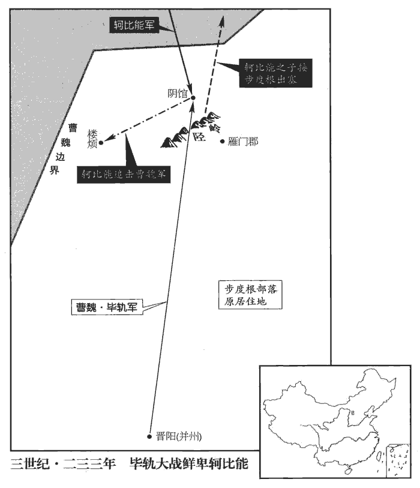
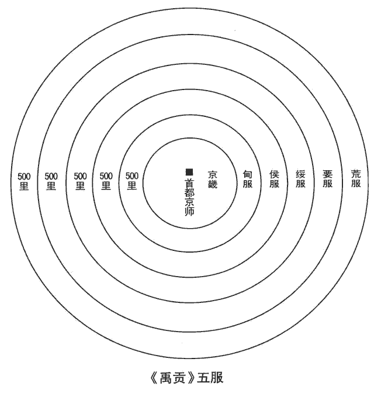
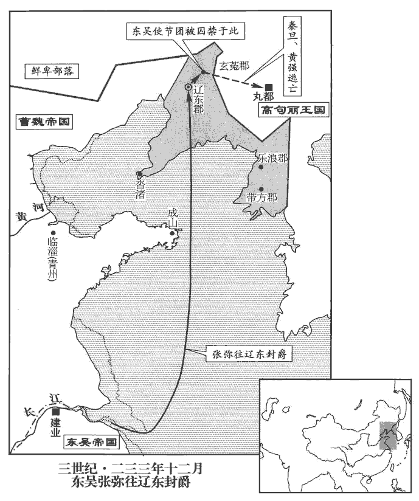
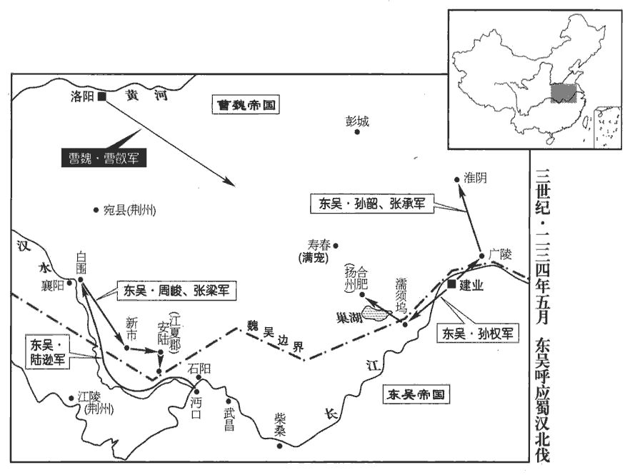

 魏紀四起重光大淵獻（辛亥），盡閼逢攝提格（甲寅），凡四年。

# 烈祖明皇帝中之上

## 太和五年（辛亥，二三一）

1春，二月，吳主‹孙权，时年五十›假太常潘濬jùn節，使與呂岱督軍五萬人討五溪蠻。濬姨兄蔣琬為諸葛亮長史，同出為姨，母之姊妹曰姨，妻之姊妹亦曰姨。若母之兄弟則當呼為舅，此蓋妻之兄弟也。長，知兩翻。武陵‹湖南常德›太守衛旍jīng奏濬遣密使與琬相聞，旍，與旌同。使，疏吏翻。欲有自託之計。吳主曰：「承明不為此也。」潘濬，字承明。即封旍表以示濬，而召旍還，免官。

〖译文〗 [1]春季，二月，吴王授予太常潘浚符节，命他与吕岱统领大军五万人讨伐五蛮。潘浚的妻只蒋琬担任诸葛亮长史，武陵太守卫上奏说潘浚派遣密使与蒋琬联系，有寄托归附的打算。吴王说：“潘浚不会做这种事。”随即封好卫奏章以给潘浚看，而把卫召回，免去官职。

2衛溫、諸葛直軍行經歲，士卒疾疫死者什八九，亶dǎn洲‹日本›絕遠，卒不可得至，卒，子恤翻。得夷洲‹琉球群岛›數千人還。溫、直坐無功，誅。吳遣溫、直，見上卷上年。

〖译文〗 [2]卫温、诸葛直率军出海已有一年，兵士因为得了传染病而死的有十之八九。洲极其遥远，最终也没能到达，只掠得夷洲几千人返回。卫温、诸葛直因出师无细，论罪被杀。

3漢丞相亮命李嚴以中都護署府事。蜀置左、右、中三都護。署府事，署漢中留府事也。嚴更名平。更，工衡翻。亮帥諸軍入寇，圍祁山‹甘肃礼县东北›，以木牛運。亮集曰：木牛者，方腹曲頭，一腳四足。頭入領中，舌著於腹，載多而行少，宜可大用，不可少使。特行者數十里，群行者二十里也。曲者為牛頭，雙者為牛腳，橫者為牛領，轉者為牛足，覆者為牛背，方者為牛腹，垂者為牛舌，曲者為牛肋，刻者為牛齒，立者為牛角，細者為牛鞅，攝者為牛鞦䩜zhòu。牛仰雙轅，人行六尺，牛行四步，載一歲糧，日行二十里，而人不大勞。帥，讀曰率。於是大司馬曹真有疾，帝‹曹叡，时年二十八›命司馬懿西屯長安‹西安›，督將軍張郃、費曜、戴陵、郭淮等以禦之。郃，古合翻，又曷閣翻。費，父沸翻。

〖译文〗 [3]蜀汉丞相诸葛亮命李严以中都护的官职署理汉中留府的事务，李严改名李平。诸葛亮率领各路大军进犯魏境，围祁山，用木牛运输军用物资。这时大司马曹真有病，明帝命司马懿向西驻扎在长安，统领将军张、费曜、戴陵、郭淮等御诸葛亮。

4三月，邵陵元侯曹真卒。

〖译文〗 [4]三月，邵陵元侯曹真去世。

5自十月不雨，至于是月。

〖译文〗 [5]自去年十月起不降雨，一直到这个月。

6司馬懿使費曜、戴陵留精兵四千守上邽guī‹甘肃天水›上邽縣，前漢屬隴西郡，後漢以來屬漢陽郡。餘眾悉出，西救祁山。張郃欲分兵駐雍‹陕西凤翔›、郿‹陕西眉县›，雍、郿二縣皆屬扶風郡。雍，於用翻。郿，音媚，又音眉。懿曰：「料前軍能獨當之者，將軍言是也。若不能當而分為前後，此楚之三軍所以為黥qíng布禽也。」事見十二卷漢高帝十一年。觀懿此言，蓋自知其才不足以敵亮矣。遂進。亮分兵留攻祁山，自逆懿于上邽。郭淮、費曜等徼亮，徼，讀曰邀。亮破之，因大芟shān刈yì其麥，芟，所銜翻。與懿遇於上邽之東。懿斂軍依險，兵不得交，亮引還。

〖译文〗 [6]司马懿命费曜、戴陵留下四千精兵防守上，其余的士兵全部出动，往西援救祁山。张打算分出部分兵力驻守在雍县、县，司马懿说：“估计前面的部队能够独立抵挡敌军，将军的意见就对了；如果前面的部队不能抵挡敌军而分为前后两部分，这说是楚国三军所以被黥布击溃的原因。”于是进军。诸葛亮分出一支部队留下来进攻祁山，亲自率领大军到上迎战司马懿。郭淮、费曜等抄袭诸葛亮，诸葛亮击败他们，乘机收割了上的麦子，与司马懿在上以东相遇。司马懿收兵据险防守，两军不得交战，诸葛亮率军退回。

懿等尋亮後至于鹵城‹甘肃天水西北›。張郃曰：「彼遠來逆我，請戰不得，謂我利在不戰，欲以長計制之也。且祁山知大軍已在近，人情自固，可止屯於此，分為奇兵，示出其後，不宜進前而不敢偪，坐失民望也。今亮孤軍食少，少，詩沼翻。亦行去矣。」懿不從，故尋亮。有意為之曰故。尋者，隨而躡其後。既至，又登山掘營，不肯戰。賈栩、魏平數請戰，數，所角翻。因曰：「公畏蜀如虎，柰天下笑何！」懿病之。懿實畏亮，又以張郃嘗再拒亮，名著關右，不欲從其計，及進而不敢戰，情見勢屈，為諸將所笑。栩，況羽翻。諸將咸請戰，夏，五月，辛巳‹十›，懿乃使張郃攻無當監何平於南圍，無當蓋蜀軍部之號，言其軍精勇，敵人無能當者；使平監護之，故名官曰無當監。南圍，蜀兵圍祁山之南屯。監，古暫翻。自按中道向亮。按，據也。懿分道進兵，欲以解祁山之圍，自據中道，與亮旗鼓相向也。亮使魏延、高翔、吳班逆戰，魏兵大敗，漢人獲甲首三千，懿還保營。

〖译文〗 司马懿尾随诸葛亮之后到达卤城。张说：“他这来迎战我军，要求作战达不到目的，认为我军利于不战，打算以持久之计制胜。况且祁山方面知道大军已经靠近，人心自然稳定，可以在这里驻军，分出一支奇兵，出现在他们的后路，不应当只敢尾随而不敢追击，使得民众失望。现在诸葛亮孤军用战，粮食又少，也快要走了。”司马懿不听从张的意见，有意尾随诸葛亮。已经赶上，又上山扎营，拒绝同诸葛亮交战。贾栩、魏平多次请求出战，还说：“您畏蜀如虎，怎能不让天下人取笑！”司马懿对此很不满意。将领们纷纷请求出战。夏季，五月，辛已（初十），司马懿便让张攻击围祁山之南的蜀无当军监军何平，亲自据中路与诸葛亮正面对峙。诸葛亮命魏延、高翔、吴班迎战，魏军大败，蜀军俘获了三千人，司马懿退军何卫大营。

六月，亮以糧盡退軍，司馬懿遣張郃追之。郃進至木門‹甘肃礼县东北›，木門去今天水軍天水縣十里。水經註：籍水出上邽當亭西山，東歷當亭川，又東入上邽縣，左佩五水，右帶五水；木門谷之水其一也。導源南山，北流入籍水。與亮戰，蜀人乘高布伏，弓弩亂發，飛矢中郃右厀而卒。中，竹仲翻。厀，與膝同。卒，子恤翻。

〖译文〗 六月，诸葛亮因为粮尽退军，司马懿命张追击。张进兵到木门，与诸葛亮交战，蜀军利用居于高地布下伏兵，万箭齐发，张右膝中箭而死。

7秋，七月，乙酉‹十五›，皇子殷生，大赦。

〖译文〗 [7]秋季，七月，乙酉（十五日），皇子曹殷生，大赦天下。

8黃初以來，諸侯王法禁嚴切，【章：甲十六行本「切」下有「吏察之急」四字；乙十一行本同；孔本同。】至于親姻皆不敢相通問。東阿王植上疏曰：「堯之為教，先親後疏，自近及遠。堯親九族，九族既睦，平章百姓；百姓昭明，協和萬邦。周文王刑于寡妻，至于兄弟，以御于家邦。詩大雅思齊之辭。毛氏註曰：刑，法也。寡妻，嫡妻也。御，迎也。鄭氏曰：寡妻，寡有之妻，言賢也。御，治也。文王以禮法接待其妻，至于宗族，以此又能為政治于家邦也。伏惟陛下資帝唐欽明之德，體文王翼翼之仁，惠洽椒房，恩昭九族，群后百寮，番休遞上，上時掌翻。李周翰曰：遞，迭也。言百寮宿衛以次休息，更遞上直。執政不廢於公朝，朝，直遙翻；下同。下情得展於私室，親姻之路通，慶弔之情展，誠可謂恕己治人，推惠施恩者矣。治，直之翻。至於臣者，人道絕緒，禁錮明時，臣竊自傷也。不敢乃望交氣類，易曰：同聲相應，同氣相求。此言志同道合者，謂疇昔文會之友也。脩人事，敘人倫，近且婚媾不通，兄弟乖絕，吉凶之問塞，塞，悉則翻。慶弔之禮廢，恩紀之違，甚於路人；隔閡之異，殊於胡、越。殊，絕也。閡，五慨翻。今臣以一切之制，一切，謂權宜也。一說：一切，謂不問可否，一切整齊之也。永無朝覲之望，至於注心皇極，皇極，宅中之位，人君居之。結情紫闥，神明知之矣。然天實為之，謂之何哉！詩邶bèi風北門之詩也。鄭氏曰：詩人事君無二志，故歸之於天。余謂植之意，蓋謂君者天也，天可違乎！退惟諸王常有戚戚具爾之心，詩曰：戚戚兄弟，莫遠具爾。爾，義與邇同。願陛下沛然垂詔，使諸國慶問，四節得展，四節，謂四時之節。展，舒也。以敘骨肉之歡恩，全怡怡之篤義。論語，孔子曰：兄弟怡怡。妃妾之家，膏沐之遺，歲得再通，呂延濟曰：膏，脂也。沐，甘漿之屬也。遺，于季翻。齊義於貴宗，等惠於百司，貴宗，謂貴戚及公卿之族也。百司，謂百官也。如此，則古人之所歎，風雅之所詠，復存於聖世矣！臣伏自惟省，無錐刀之用；思，惟也。省，悉景翻。及觀陛下之所拔授，若以臣為異姓，竊自料度，不後於朝士矣。度，徒洛翻。若得辭遠游，戴武弁biàn，解朱組，佩青紱，諸王冠遠游冠，佩朱紱。三都尉、諸侍中、常侍皆戴武弁，佩青紱。駙馬、奉車，趣得一號，安宅京室，駙馬、奉車都尉及騎都尉为三都尉，皆漢武帝置，魏、晉以下多以宗室及外戚為之。執鞭珥ěr筆，出從華蓋，入侍輦轂，承答聖問，拾遺左右，珥，仍吏翻。珥筆，插筆也。古者侍臣持橐tuó簪筆。華蓋，乘輿車上施之。魏、晉之制，侍中與散騎常侍，或乘輿御殿及出游幸、祭祀、治兵，侍中居左，常侍居右，備切問近對，拾遺補闕。乃臣丹誠之至願，不離於夢想者也。離，力智翻。遠慕鹿鳴君臣之宴，中詠常棣dì匪他之誡，詩鹿鳴，宴群臣、嘉賓；常棣，燕兄弟也。其詩曰：凡今之人，莫如兄弟。所謂匪他也；又頍kuǐ弁biàn詩：豈伊異人，兄弟匪他。下思伐木友生之義，終懷蓼lù莪é罔極之哀，伐木，燕朋友故舊，其詩曰：相彼鳥矣，猶求友聲，矧shěn伊人矣，不求友生。蓼莪之詩曰：哀哀父母，生我劬qú勞。欲報之德，昊天罔極。知念其父母，必念其同氣矣。蓼，音六。每四節之會，塊然獨處，處，昌呂翻。左右惟僕隸，所對惟妻子，高談無所與陳，精義無所與展，未嘗不聞樂而拊心，臨觴而歎息也。臣伏以犬馬之誠不能動人，譬人之誠不能動天，崩城、隕霜，齊大夫杞梁戰死於莒城，其妻向城而哭，城為之崩。鄒衍盡忠於君，燕惠王信讒而繫之，鄒子仰天而哭，正夏而天降霜。臣初信之，以臣心況，徒虛語耳！況譬也。若葵藿之傾太陽，雖不為回光，然向之者誠也。言葵藿草也，傾葉於日，日雖不為回光，終是誠心向日也。為，于偽翻。竊自比葵藿，若降天地之施，垂三光之明者，實在陛下。施，式智翻；下同。臣聞文子曰：『不為福始，不為禍先。』文子九篇。班固曰：文子，老子弟子。李周翰曰：福始禍先，謂諸王皆不表，植獨先表也。今之否隔，友于同憂，否隔，不通也。友于，兄弟也。否，皮鄙翻。而臣獨倡言者，實不願於聖世有不蒙施之物，欲陛下崇光被時雍之美，宣緝熙章明之德也！」光被時雍，言帝堯睦族之效。詩周頌曰：維清緝熙，文王之典。鄭氏箋曰：緝熙，光明也。故植以言文王之治。被，皮義翻。詔報曰：「蓋教化所由，各有隆敝，非皆善始而惡終也，事使之然。隆，崇也，謂立教之始，各有所崇，其流之敝，則事勢使之然也。惡，如字。今令諸國兄弟情禮簡怠，妃妾之家膏沐疏略，本無禁錮諸國通問之詔也；矯枉過正，下吏懼譴，以至於此耳。已敕有司，如王所訴。」

〖译文〗 [8]黄初以来，对诸侯王的法制禁令为严厉，以至于姻戚之间都不敢互相往来问侯。东阿王曹植上书说：“尧教化天下，先从亲族开始再推及到疏远的人，从近支推及到远支。周文王以礼法对待其妻，推及兄弟，用此来治理国家。陛下具有唐尧一样神明完美的德行，推行文王谦谨恭敬的仁爱之心，恩惠遍沾后宫，恩宠显于九族，诸王百官轮流入值，国家的务不会在朝堂废弃，个人的感情也能在私下展布，姻亲之间的交往可以通达，喜庆哀吊的情感能够表达，真可谓是推己及人、广施恩德的了。至于为臣我，人际关系完全断绝，在政治清明时却受到禁锢，我暗自伤心。不敢奢望结交志同道合的朋友，再去修明世事，叙次人伦，更何况近来姻亲关系不能交往，兄弟之间背离绝交，吉凶之事不得不到音信，喜庆哀吊之礼完全废除。恩情如此背离，甚于过路之人，隔如此深远，超过胡人、越人。现在我因为受到种种制约，永无进朝晋见的希望，至于倾心王室，情绕宫庭，只有神明才知道。可是天意如此，有什么可说的呢！但是想到各位新王时常怀有兄弟手足这情，愿陛下能沛然开恩赐下诏书，使各封国互相祝贺通问，四时之节，得以来京展拜，以叙骨肉欢聚的情谊，成全兄弟友好的义理。妃妾的母家，馈赠脂粉，一年可以两次往来问候，使亲王在礼义上与其他皇亲外戚比齐，在待遇上和文武百官同等。如果这样，那么古人所赞叹、《诗经》所歌咏的就再现于当今圣世了！我私下反省自己，连锥刀的用处都没有；但看到陛下所提拔任用的人，如果把我当作皇室之外的人，私下度量，也不比在朝人士差。如能允许我脱下藩王所戴远游冠，戴上大臣的武弁帽，解下藩王的红绣带，佩上大臣的青绣带，得到一个驸马都尉、奉车都尉之类的名号，把宅第安在京师，手执马鞭，帽边插笔，天子出游时随从前后，天子返宫后待命殿前，圣上垂问，承应回答，拾遗补阙，侍奉左右，这就是我亦诚之心的最大愿望，梦以求的理想。我追慕《鹿鸣》所描述君臣之的情景，经常吟咏《常棣》‘兄弟不是外人’的告诫，近思《伐木》求友的意义，最终感怀《蓼莪》父母之恩难以报答的悲哀，每逢四时节令，离群独处，左右只有奴仆，面前只有妻子儿女，高谈阔论没有人听，精辟见解不能发挥，未尝不是听到音乐就抚心悲痛，举起洒怀就长长叹息。我以犬马的诚心不能感动人，正如人的真城不能感动天。感动上天而使城墙崩塌、夏日降霜的典故，我当初相信它们，但以我的心相比，这些不过是些虚夸！犹如向日葵倾向太阳，虽然太阳不为之回光，然而倾向之心是真诚的。我暗中自比为向日葵，而能够降下天地般恩惠，赐给日月星一样光明的人，其实正是陛下。我听说《文子》一书上说：‘不要开始有福，不要首先遇祸。’现在互相疏远隔阂，兄弟一同担忧，而我独自首先上奏的原因，实在是不愿意在圣明之世仍有人蒙受不到恩泽，想使陛下崇尚唐尧时代亲族和睦的美好，发扬文王之世政治清明的德政！”明帝用诏书回答说：“教化的推行，各有兴盛和衰落，不都是开始完善，终局非坏不可，而是时势迫使它这样。现今只是让各封国兄弟之间人情礼仪间化，妃妾母家减省脂粉馈赠，并没有禁止各封国往来问候的诏命。矫枉过正，下边的官吏害怕受到谴责，才造成您说的那种状况。已命令主管官员，照您的意见办。”

植復上疏曰：「昔漢文發代‹府晋阳，山西太原›，疑朝有變，復，扶又翻。朝，直遙翻。宋昌曰：『內有朱虛、東牟之親，外有齊、楚、淮南、琅邪，此則磐石之宗，願王勿疑。』事見十三卷漢高后八年。臣伏惟陛下遠覽姬文二虢guó之援，虢仲虢叔，文王之母弟，文王咨于二虢，以成王業。中慮周成召、畢之輔，召公、畢公，周同姓也。二伯分治，輔成王以成太平之功。召，讀曰邵；下同。下存宋昌磐石之固。臣聞羊質虎皮，見草則悅，見豺則戰，忘其皮之虎也。揚子之言。今置將不良，有似於此。將，即亮翻。故語曰：『患為之者不知，知之者不得為也。』昔管、蔡放誅，周、召作弼；成王幼，管叔、蔡叔以武庚畔。成王誅管叔，放蔡叔，以周公為師，召公為保，而相左右。叔魚陷刑，叔向贊國。左傳：晉邢侯與雍子爭田，久而無成。韓宣子使叔魚斷舊獄，罪在雍子。雍子納其女於叔魚，叔魚蔽罪於邢侯。邢侯怒，殺叔魚及雍子於朝。宣子問其罪於叔向，不以叔向為私其親而从之決平也。三監之釁，臣自當之；二南之輔，求必不遠。華宗貴族藩王之中，必有應斯舉者。夫能使天下傾耳注目者，當權者是也，故謀能移主，威能懾下，懾，之涉翻。豪右執政，不在親戚，權之所在，雖疏必重，勢之所去，雖親必輕。蓋取齊者田族，非呂宗也；分晉者趙、魏，非姬姓也。齊太公姓呂；其後為田成子所取，非呂族也。晉唐叔，姬姓；其後為趙籍、魏斯、韓虔所分，此不言韓，以韓亦姬姓。惟陛下察之。苟吉專其位，凶離其患者，異姓之臣也。離，力智翻；下得離同。欲國之安，祈家之貴，存共其榮，歿mò同其禍者，公族之臣也。今反公族疏而異姓親，臣竊惑焉。今臣與陛下踐冰履炭，登山浮澗，寒溫燥濕，高下共之，豈得離陛下哉！不勝憤懣，勝，音升。懣，音悶。拜表陳情。若有不合，乞且藏之書府，不便滅棄，臣死之後，事或可思。若有毫釐少挂聖意者，乞出之朝堂，朝，直遙翻；下同。使夫博古之士，糾臣表之不合義者，如是則臣願足矣。」帝但以優文答報而已。植求自試，而但以優詔答之，終疑之也。

〖译文〗 曹植又上书说：“从前，汉文帝众代国出发，怀疑朝廷肆生事变，宋昌说：‘京城内有朱虚侯、东牟侯这些皇亲，外有齐、楚、淮南、琅琊各封国，都是磐石般的皇族，望君王不要怀疑。’我想陛下远的一定观览过周文王依靠虢仲、虢叔两位弟弟完成王业的记载，近一点还考虑过周成王时召公、毕公辅佐朝政之事，再就是关于宋昌磐石之固的比喻。我听说羊披上虎皮，看见草就高兴，看见豺狼就胆战，是忘记它身上披的虎皮了。而今任用的将领不优良，则与此相似。所以俗话说：‘怕就怕做事的人不了解所做的事，了解应该怎样做事的人却不能够去做。’古代周成王杀死管叔，流放蔡叔，用周公、召公作为辅佐；叔鱼被恶侯所杀，叔向却助晋国以成霸业；西周三监之乱，我自会引以为戒；二南之辅，不必远求。皇宗显贵和封国藩王中，必定有这种人才。能使天下倾耳注目的人，是当权者。所以谋略能够使人主改变，威望能够使下面慑服。豪门大族执政，不在于是否皇亲国戚，掌握着权柄，虽然疏远也举足轻重；势力衰落，虽是皇亲也必定轻微。所以取代齐国的人是田姓家族，而非吕姓家族；瓜分晋国者，是赵姓、魏姓，而不是姬姓，请陛下明察。在吉祥太平时专擅权位，在凶祸来临时赶快逃避的，都是异姓之臣。希望国家安定，祈求家族高贵，存则共享荣耀，亡时同当灾祸，都是皇族之臣。而今反倒疏远皇族亲近异姓，我因不解。我跟陛下齐踏薄冰，同蹈炭火，攀登高山，跨越深漳，寒冷炎热，燥热潮湿，无论环境好坏，都在一起，怎么能离开陛下呢？我内心不胜悲愤苦闷，上书陈情，如有不合圣意之处，请求暂且交给书府收藏，不要毁掉丢弃，我死之后，或许可以引起深思。如果有一丝一毫能合陛下圣意的地方，请在朝廷公开，使博古通今之士纠正我上书中不合大义之处。如能这样，我的愿望就满足了。”明帝只是以措辞感人的文章作为回答而已。

八月，詔曰：「先帝著令，不欲使諸王在京都者，謂幼主在位，母后攝政，防微以漸，關諸盛衰也。朕惟不見諸王十有二載，自文帝黃初元年遣植等就國，至是十二年。惟，思也。載，子亥翻。悠悠之懷，能不興思！其令諸王及宗室公侯各將適子一人朝明年正月，適，讀曰嫡。後有少主、母后在宮者，自如先帝令。」

〖译文〗 八月，明帝下诏说：“先帝颁布诏令，不想让亲王们留在京都的原因，是因为皇帝年幼，母后摄政，防微杜，关系国家盛衰。朕不见各亲王已有十二年，悠悠情怀，怎能不思念！现下令所有亲王及皇族的公爵侯爵，各派嫡子一人于明年正月来京朝会，但以后如有皇帝年少、母后在宫摄政的情况，自当按先帝的诏令办。”

9漢丞相亮之攻祁山也，李平留後，主督運事。李平即李嚴，改名曰平。會天霖雨，平恐運糧不繼，遣參軍狐忠、狐忠，即馬忠也，少養外家，姓狐，名篤，後復姓馬，改名忠。此姓從先，名從後。姓譜：狐，周王子狐之後；又晉有狐突。督軍成藩喻指，呼亮來還；喻以後主指言運糧不繼。亮承以退軍。平聞軍退，乃更陽驚，說「軍糧饒足，何以便歸！」又欲殺督運岑述以解己不辦之責。又表漢主‹刘禅，时年二十五›，說「軍偽退，欲以誘賊。」【章：甲十六行本「賊」下有「與戰」二字；乙十一行本同；孔本同；張校同；退齋校同。】此又欲解以上指喻亮之罪也。誘，音酉。亮具出其前後手筆書疏，本末違錯。平辭窮情竭，首謝罪負。首，式救翻。於是亮表平前後過惡，免官，削爵土，徙梓潼郡‹四川梓潼›。平蓋嘗封侯也。復以平子豐為中郎將、參軍事，出教敕之曰：敕，戒也。「吾與君父子勠力以獎漢室，表都護典漢中‹陕西汉中›，委君於東關‹重庆›，東關謂江州。謂至心感動，終始可保，何圖中乖乎！若都護思負一意，思負，謂思其罪負也。一意謂一意於為國，無復詭變以自營也。君與公琰yǎn推心從事，否可復通，否，皮鄙翻。逝可復還也。詳思斯戒，明吾用心！」

〖译文〗 [9]蜀汉丞相诸葛亮进攻祁山的时候，李平留守后方，掌管督运军需事务。当时正值霖雨连绵，他平担心运粮供应不上，派遣参军狐忠、督军成藩传喻后主旨意，叫诸葛亮退军。诸葛亮承此旨退回。李平听到退军的消息，假装惊讶，说“军粮充足，为什么就回来？”又要杀督远粮的岑述来解脱自己失职不办的责任。还向汉王上表，说“军队假装退却，是想引诱敌人”。诸葛亮出示李平前后亲笔所写的全部信函、书奏等，矛盾重重。李平理屈词穷，低头认罪。于是诸葛亮上表奏明李平前后的罪恶，罢掉官职，削去封爵和食邑，流放到梓潼郡。又任用李平的儿子李丰为中郎将、参军事，写信告诫他说：“我和你们父子同心力辅助汉室，上表推荐你父亲典理汉中事务，委任你在东关镇守，自认为真心感动，自始至终可以依靠，怎么会想到中途背离呢？如果你父亲能认罪诲过，一心一意为国效忠，你与蒋琬推心置腹，同心共事，那么闭塞的可能通泰失去的可以再得到。请仔细思考这一劝戒，明白我的用心。”

亮又與蔣琬、董允書曰：「孝起前為吾說，正方腹中有鱗甲，李嚴，字正方。為，于偽翻；下同。鄉黨以為不可近。近，其靳翻。吾以為鱗甲但不當犯之耳，不圖復有蘇、張之事出於不意，謂蘇秦、張儀捭bǎi闔其說，以反覆諸侯之間，今李平復為之。復，扶又翻。可使孝起知之。」孝起者，衛尉南陽陳震也。

〖译文〗 诸葛亮又给蒋琬、董允写信说：“孝起以前对我说李严居心刻深，乡里认为不好接近。我以为他虽然严峻苛刻，但不触犯他也无妨，没有想到又有苏秦、张仪反复无常之事出人意料地重演，可以让孝起知道这件事。”孝起就是卫尉南阳人陈震。

10冬，十月，吳主使中郎將孫布詐降，以誘揚州‹府合肥›刺史王淩，吳主伏兵於阜陵‹安徽全椒东南›以俟之。阜陵縣，漢屬九江郡；魏改九江為淮南郡。晉志曰：阜陵縣，漢明帝時淪為麻湖。麻湖在今和州歷陽縣西三十里。杜佑曰：漢阜陵縣在滁州全椒縣南。布遣人告淩云：「道遠不能自致，乞兵見迎。」淩騰布書，騰，傳也，上也。請兵馬迎之。征東將軍满寵以為必詐，不與兵，而為淩作報書曰：「知識邪正，欲避禍就順，去暴歸道，甚相嘉尚。今欲遣兵相迎，然計兵少則不足相衛，多則事必遠聞。聞，音問。且先密計以成本志，臨時節度其宜。」會寵被書入朝，被，皮義翻。朝，直遙翻。敕留府長史，「若淩欲往迎，勿與兵也。」淩於後索兵不得，索，山客翻。乃單遣一督將步騎七百人往迎之，布夜掩擊，督將迸走，死傷過半。迸bèng，北孟翻。孫權自量其國之力，不足以斃魏，不過時於疆埸之間，設詐用奇，以誘敵人之來而陷之耳，非如孔明真有用蜀以爭天下之心也。淩，允之兄子也。王允，獻帝時誅董卓。

〖译文〗 [10]冬季，十月，吴王派遣中郎将孙布诈降，以引诱扬州刺史王凌，吴王在阜陵设下伏兵布诈降，孙布派人告诉王凌说：“道路太远，不能自己前去，请求出兵迎接。”王凌把孙布的书向上呈报，请求出兵相迎。征东将军满宠认为这必是许诈降，不给派军队，而替王凌写了一封给孙布的回信说：“知道邪正之分，想要避开灾祸，顺应天意，脱离暴政，归顺正道，非常值得嘉许。本打算派兵迎接，可是算计着兵少不足以保卫您，兵多则事情必然远近传播。请暂且先对你的意图严加保密，以成全本来的志向，临到时机合适时再做部署。”适逢满宠接到命令入朝，临行命令留府长史：“如果王凌想要去迎孙布，一定不要给他军队。”王凌在这以后要不到兵，就单独派遣一名督将率领步、骑兵七百人前往迎接，孙布乘夜袭击，督将逃走，兵士死伤过半。王凌是王允的侄子。

先是淩表寵年過耽酒，不可居方任。方任，方面之任也。先，悉薦翻。帝將召寵，給事中郭謀曰：「寵為汝南太守、豫州刺史漢建安中，武王操以寵為汝南太守，太和三年，刺豫州，是年都督揚州。二十餘年，有勳方岳；自魏以下，以督州為方岳之任，謂其職猶古之方伯、岳牧也。及鎮淮南，吳人憚之。若不如所表，將為所闚kuī，可令還朝，朝，直遙翻。問以東方事以察之。」帝从之。既至，體氣康強，帝慰勞遣還。勞，力到翻。

〖译文〗 先前，王凌上表说满宠年纪老迈，酷嗜饮酒，不可再担任独当一面的职务。明帝将要召回满宠，给事中郭谋说：“满宠任汝南太守、豫州刺史二十多年来，著有功劳，后来镇守准南，吴中十分畏惧他。如果情况不象王凌上表所说，将被敌人窥探利用，可以令他还朝，用询问东方军事的方式考察他。”明帝听从了他的意见。满宠既到，看起来身体健康气色强壮，明帝加以慰劳后让他回任上。

11十一月，戊戌晦‹三十›，日有食之。

〖译文〗 [11]十一月，戊戌晦（三十日），出现日食。

12十二月，戊午‹二十›，博平敬侯華歆卒。諡法：夙夜警戒曰敬；合善典法曰敬。華，戶化翻。

〖译文〗 [12]十二月，戊午（二十日），博平敬侯华歆去世。

13丁卯‹三十›，吳大赦，改明年元曰嘉禾。會稽南始平言嘉禾生，故以改元。

〖译文〗 [13]丁卯（二十九日），吴国大赦，改明年年号为嘉禾。

## 六年（壬子，二三二）

1春，正月，吳主‹孙权，时年五十一›少子建昌侯慮卒。太子登自武昌‹湖北鄂州›入省吳主，因自陳久離定省，子道有闕；記曲禮曰：凡為人子之禮，冬溫而夏凊，昏定而晨省。省，悉景翻。離；力智翻。又陳陸遜忠勤，無所顧憂。乃留建業。

〖译文〗 [1]春季，正月，吴王的小儿子建昌侯孙虑去世。太子孙登从武昌入朝晋见吴王，诉说自己久离京城父母，不能尽到儿子的孝道；又说陆逊忠心勤恳，没有什么可顾虑担忧的。于是孙登留在建业。

2二月，詔改封諸侯王，皆以郡為國。

〖译文〗 [2]二月，魏明帝颁诏改封诸侯王，都由郡改称为国。

3帝‹曹叡，时年二十九›愛女淑卒，帝痛之甚，追諡平原懿公主，立廟洛陽，葬於南陵，取甄后從孫黃與之合葬，甄，之人翻。從才用翻。追封黃為列侯，為之置後，襲爵。為，于偽翻；下同。帝欲自臨送葬，又欲幸許。司空陳群諫曰：「八歲下殤，禮所不備，記檀弓曰：周人以殷人之棺椁葬長殤，以夏后氏之堲jí周葬中殤、下殤，以有虞氏之瓦棺葬無服之殤。鄭玄註云：略未成人。陸德明曰：十六至十九為長殤，十二至十五為中殤，八歲至十一為下殤，七歲以下為無服之殤，生未三月不為殤。况未朞月，而以成人禮送之，加為制服，舉朝素衣，朝夕哭臨，自古以來，未有此比。朝，直遙翻；下同。臨，力鴆翻。比，毗寐翻。而乃復自往視陵，復，扶又翻。親臨祖載。願陛下抑割無益有損之事，此萬國之至望也。又聞車駕欲幸許昌，二宮上下，皆悉居東，舉朝大小，莫不驚怪。或言欲以避衰，或言欲以便移殿舍，避衰，謂五行之氣，有王有衰，徙舍以避之也。今人謂之避災。便移殿舍，謂欲營繕宮室，故出幸許以便移殿舍也。或不知何故。臣以為吉凶有命，禍福由人，移走求安，則亦無益。若必當移避，繕治金墉城西宮水經註：金墉城在洛陽城西北角。治，直之翻。及孟津別宮，皆可權時分止，何為舉宮暴露野次，公私煩費，不可計量。量，音良。且吉士賢人，猶不妄徙其家以寧鄉邑，使無恐懼之心，子思居於衛，有齊寇。或曰：「寇至，盍去諸？」子思曰：「如伋去，君誰與守！」況乃帝王萬國之主，行止動靜，豈可輕脫哉！」少府楊阜曰：「文皇帝、武宣皇后崩，陛下皆不送葬，所以重社稷，備不虞也；何至孩抱之赤子而送葬也哉！」帝皆不聽。三月，癸酉‹七›，行東巡。

〖译文〗 [3]明帝的爱女曹淑去世，明帝极为悲痛，追谥为平原懿公主，在洛阳建庙，在南陵安葬，取甄后已亡的侄孙甄黄与她合葬匹配，追封甄黄为侯爵，并为他选立继承人，承袭爵位。明帝想要亲皇送葬，还想前往许昌。司空陈群直言规劝说：“八岁以下的孩子死亡，没有丧葬的礼仪，何况还未满月，就以成人丧葬之送葬，加穿丧服，满朝都穿白衣服，日夜在棺哀哭，自古以来没有能与此相比的。而陛下还要亲自去察看陵暮，亲自送葬。愿陛下抑制割舍这种有损无益之事，这是普天下最大的愿望。又听说陛下打算驾临许昌，太后、皇后两宫上下，都一齐随驾东行，满朝大小官员无不感到震惊奇怪。有人说这是想要避灾，有人说是打算营缮宫室而迁移殿舍，有的则不知什么原因。我认为吉祥和凶险，全是天命，灾祸和福分，由人掌握，用移居来祈求平安，也无益于事。如果必须移居避灾，修缮整治金墉城西宫及孟津别宫，都可暂时分住，为什么要举宫上下暴露在旷野之地，公私花费巨大，难以计算。而且贤人吉士还不轻易迁居搬家，以便乡里安宁，使乡亲们没有恐惧之心，何况陛下是天下的主人，一举一动怎么可以如此轻率呢！”少府杨阜说：“文皇帝、武宣皇后去世，陛下都不送葬，为的是以国家利益为重，以防不测，为什么要给一个尚在襁褓中的婴儿送葬呢？”明帝都不接受。三月，癸酉（初七），起驾向东巡游。

4吳主遣將軍周賀、校尉裴潛乘海之遼東‹辽宁辽阳›，從公孫淵求馬。

〖译文〗 [4]吴王派遣将军周贺、校尉裴潜乘船渡海到辽东，向公孙渊求购马匹。

初，虞翻性疏直，數有酒失，又好抵忤人，抵，觸也。數，所角翻。好，呼到翻。忤，五故翻。多見謗毀。吳主嘗與張昭論及神仙，翻指昭曰：「彼皆死人而語神仙，世豈有仙人也！」吳主積怒非一，遂徙翻交州‹广州›。及周賀等之遼東，翻聞之，以為五谿宜讨；遼東絕遠，聽使來屬，尚不足取，今去人財以求馬，去，猶棄也。去，羌呂翻。既非國利，又恐無獲。欲諫不敢，作表以示呂岱，岱不報。為愛憎所白，讒佞之人，有愛有憎，而無公是非，故謂之愛憎。白，陳奏也。復徙蒼梧‹广西梧州›猛陵‹广西梧州西›。猛陵縣屬蒼梧郡。劉昫xù曰：唐梧州孟陵縣。藤州鐔xín津縣、龔州南平•武林•隋建三縣，皆漢猛陵縣地。復扶又翻。

〖译文〗 起初，虞翻性情粗疏率直，洒后屡次出现过失，又喜好顶撞别人，多次被人毁谤。吴王曾与张昭谈论到神仙，虞翻指着张昭说：“他们都是死人而你却说是神仙，世上哪有仙人！”吴王对虞翻的恨愤不止一次两次，于是将虞翻贬到交州。等到周贺等去辽东，虞翻听到后，认为应该出兵讨伐五，辽东相隔极远，即使前来归附，也不足取，而今派人带财物去辽东购马，既不是国家之利又恐怕没有收获，想上书规劝不敢，将奏章给吕岱过目，吕岱没有回答。虞翻被怨恨的人告发，再次被贬到苍梧郡猛陵县。

5夏，四月，壬寅‹六›，帝如許昌。

〖译文〗 [5]夏季，四月，壬寅（初六），明帝到达许昌。

6五月，皇子殷卒。

〖译文〗 [6]五月，皇子曹殷去世。

7秋，七月，以衛尉董昭為司徒。

〖译文〗 [7]秋季，七月，明帝提升卫尉董昭为司徒。

8九月，帝行如摩陂‹河南郏县东›，治許昌宮，起景福、承光殿。治，直之翻。

〖译文〗 [8]九月，明帝前往摩陂，修整许昌皇宫，新建景福殿、承光殿。

9公孫淵陰懷貳心，數與吳通。數，所角翻。帝使汝南‹河南息县›太守田豫督青州諸軍自海道，幽州刺史王雄自陸道討之，海道自東萊浮海，陸道自遼西渡遼水。散騎常侍蔣濟諫曰：「凡非相吞之國，不侵叛之臣，光武報竇融書曰：吾與爾，非相吞之國。左傳：戎子駒支對范宣子曰：為不侵不叛之臣。不宜輕伐。伐之而不能制，是驅使為賊也。故曰：『虎狼當路，不治狐狸。』治，直之翻。先除大害，小害自已。今海表之地，累世委質，質，如字。歲選計、孝，計、孝，謂每歲上計及舉孝廉也。不乏職貢，議者先之。先悉薦翻。正使一舉便克，得其民不足益國，得其財不足為富；儻不如意，是為結怨失信也。」帝不聽。豫等往皆無功，詔令罷軍。

〖译文〗 [9]辽东太守公孙渊暗地怀有二心，多次与吴国联系，明帝命当南太守田豫督领青州各路大军从海道，幽州刺史王雄从陆路同时进军讨伐公孙渊。散骑常侍蒋济劝谏说：“凡不是准备加以吞并的国家，不骚扰又不叛逆的藩属，都不宜轻易出兵诗伐。讨伐他们而不能制服，是迫使他们成为寇贼。所以说：‘虎狼当路，不治狐狸。’先除掉大害，小害自会消失。如今海边之地，世世代代臣属于朝廷，每年上计报告人口、赋税、刑狱等情况，推举孝廉，不缺赋税和贡品，朝廷官员议论时都把辽东排在前面。即使一举出兵就能把他们打败，获得的民众也不足以增加国力，获得的财物也不能使我们富足；倘若失败，会由此结下怨恨，自毁信誉。”明帝不接爱。田豫待前往征讨都徒劳无功，下诏停止用兵。

豫以吳使周賀等垂還，歲晚風急，必畏漂浪，東道無岸，當赴成山‹山东荣成东北成山角›，成山無藏船之處，遂輒以兵屯據成山。賀等還至成山，班志：成山在東萊郡不夜縣；後漢省不夜縣。括地志：成山在萊州文登縣西北百九十里。遇風，豫勒兵擊賀等，斬之。吳主聞之，始思虞翻之言，乃召翻於交州。會翻已卒，以其喪還。還，從宣翻，又如字。

〖译文〗 田豫认为吴国买马使节周贺等行将返归，时已冬季，海上风急，肯定畏惧海浪飘摇，靠岸行驶，而东边海岸水浅不能靠岸，必当赴经成山，成山又没有藏船之处，于是就派出部队把守成山。周驾等返回行至成山，果然遇风上岸，田豫率军袭击周贺等，并杀了他。吴王听说后，才想起虞翻的建议，于是召虞翻从交州返回。这时虞翻已经去世，只运回灵柩。

10十一月，庚寅‹二十八›，陳思王植卒‹年四十一›。諡法：追悔前過曰思。

〖译文〗 [10]十一月，庚寅（二十八日），陈思王曹植去世。

11十二月，帝還許昌宮。

〖译文〗 [11]十二月，明帝回到许昌宫。

12侍中劉曄為帝所親重。帝將伐蜀，朝臣內外皆曰「不可」。朝，直遙翻。曄入與帝議，則曰「可伐」；出與朝臣言，則曰「不可」。曄有膽智，言之皆有形。謂言蜀之可伐與不可伐，皆有勝負之形，可以動人之聽。中領軍楊暨，中領軍，主中壘、五校、武衛等三營。漢建安四年，魏武丞相府，自置中領軍；文帝踐阼，始置領軍將軍。其後以資重者為領軍將軍，資輕者則為中領軍。帝之親臣，又重曄，執不可伐之議最堅，每從內出，輒過曄，過，工禾翻。曄講不可之意。後暨與帝論伐蜀事，暨切諫，帝曰：「卿書生，焉知兵事！」焉，於虔翻；下同。暨謝曰：「臣言誠不足采，侍中劉曄，先帝謀臣，常曰蜀不可伐。」帝曰：「曄與吾言蜀可伐。」暨曰：「曄可召質也。」質，證也，驗也，對問也。詔召曄至，帝問曄，終不言。後獨見，見，賢遍翻；下同。曄責帝曰：「伐國，大謀也，臣得與聞大謀，與，讀曰預。常恐眯夢漏泄以益臣罪，眯，毋禮翻，一作「寐」。說文曰：寐而眯，厭。厭，讀曰魘yǎn。焉敢向人言之！夫兵詭道也，軍事未發，不厭其密。陛下顯然露之，臣恐敵國已聞之矣。」於是帝謝之。曄見出，責暨曰：「夫釣者中大魚，見賢遍翻。中，竹仲翻。則縱而隨之，須可制而後牽，則無不得也。人主之威，豈徒大魚而已！子誠直臣，然計不足采，不可不精思也。」暨亦謝之。

〖译文〗 [12]侍中刘晔为明帝所亲近器重。明帝将要讨伐蜀国，朝廷内外都说：“不可。”刘晔入朝与明帝商议，则说：“可讨伐”；出来和朝廷大臣讨论，则又曰“不可”。晔有胆有识，谈论起来，有声有色，很动听，中领军杨暨是明帝的亲信大臣，也看重刘晔，是持不可伐意见中最为强硬的人，每次从朝廷出来，就去拜访刘晔，刘晔都讲不可讨伐的道理。后来，杨暨和明帝谈起伐蜀之事，杨暨恳切规劝，明帝说：“你是个书生，怎么知晓军事！”杨暨谢罪说：“我的话诚然不足采纳，侍中刘晔是先帝的谋臣，常常说蜀不可讨伐。”明帝说：“刘晔与我说蜀可伐。”杨暨说：“可以把刘晔叫来对质。”明帝下诏让刘晔来，问刘晔，刘晔始终不说话。后来刘晔单独晋见，责备明帝说：“讨伐一个国家，是一项重大的决策，我知道这件大事后，常常害怕说梦话泄漏出去增加我的罪过，怎么敢向人说这件事？用兵之道在于诡诈，军事行动没开始时，越机密越好。陛下公开泄漏出去，我恐怕敌国已经听说了。”于是明帝向他道歉。刘晔出来后，责怪杨暨说：“渔夫钓到一条大鱼，就要放长线跟在后，必须到可以制用时再用线将它牵回，那就没有得不到的。帝王的威严，难道只是一条大鱼而已！你诚然是正直的臣僚，然而计谋不足以采纳，不可不仔细想一想。”杨暨也向他道歉。

或謂帝曰：「曄不盡忠，善伺上意所趨而合之，伺，相吏翻。趨，七喻翻。陛下試與曄言，皆反意而問之，若皆與所問反者，是曄常與聖意合也。每問皆同者，曄之情必無所逃矣。」言者謂曄善迎合上意，上若有所問，試反上意而問之，曄之對必與上所問者反，而與上意所向者合，每問皆然，則可以見曄迎合之情矣。帝如言以驗之，果得其情，從此疏焉。疏，與踈同。曄遂發狂，出為大鴻臚，以憂死。侍中，在天子左右。大鴻臚，外朝官也。臚，陵如翻。

〖译文〗 有人对明帝说：“刘晔不尽忠心，善于探察皇上的意向而献媚迎合，请陛下试一试，和刘晔说话时全用相反的意思问他，如果他的回答都与所问意思相反，说明刘晔经常与陛下圣意相一致。如果他的回答都与所问意思相同，刘晔的迎合之情必然暴露无遗。”明帝如其所言检验刘晔，果然发现他的迎合之情，从此疏远了他。刘晔于是精神失常，出任大鸿胪，因忧虑而死。

傅子曰：巧詐不如拙zhuō誠，信矣。晉傅玄著書，號傅子。以曄之明智權計，若居之以德義，行之以忠信，古之上賢，何以加諸！獨任才智，不敦誠慤，敦，厚也，崇尚也。內失君心，外困於俗，卒以自危，卒，子恤翻。豈不惜哉！

〖译文〗 《傅子》曰：巧诈不如拙诚，确实是这样。以刘晔的聪明智慧和权术计谋，如果坚守道德大义，将忠信作为行动的准则，即使是古代的贤人，又怎能超过他！而刘晔只是施展才智，不重诚恳，在内失掉君王的宠信，在外受窘于世俗的压力，最终因此危害了自己，岂不可惜！

13曄嘗譖尚書令陳矯專權，矯懼，以告其子騫qiān。騫曰：「主上明聖，大人大臣，今若不合，不過不作公耳。」後數日，帝意果解。

〖译文〗 [13]刘晔曾经进谗言说尚书令陈矫专权，陈矫十分害怕，将此事告诉儿子陈骞。陈骞说：“主上圣明，您是大臣，如果不能融洽，不过不当三公而已。”几天后，明帝的不满之意果然消除。

尚書郎樂安‹山东邹平东北›廉昭以才能得幸，好抉擿tī群臣細過以求媚於上。好呼到翻。抉，一決翻，挑也。擿，他歷翻，發動也。黃門侍郎杜恕上疏曰：「伏見廉昭奏左丞曹璠fán以罰當關不依詔，坐判問。續漢志：尚書左右丞各一人，掌錄文書期會；左丞主吏民章報及騶伯史，右丞主假署印綬及紙筆墨諸財用庫藏。蔡質漢儀曰：左丞總典臺中綱紀，無所不統。魏、晉之制，左丞主臺內禁令，宗廟祠祀，朝儀禮制，選用署吏急假；右丞掌臺內庫藏、廬舍，凡諸器用之物及廩振人租布、刑獄、兵器，督錄遠道文書章表奏事。罰，罪罰也。關，白也。言有罪罰當關白，而不依詔書，故坐以判問。判，剖也，析也；問，責問也；剖析其事而責問之也。璠fán，孚袁翻。又云：『諸當坐者別奏。』廉昭又云諸當坐者，別奏，意欲并奏令僕坐之。尚書令陳矯自奏不敢辭罰，亦不敢陳理，志意懇惻。臣竊愍然為朝廷惜之！為，于偽翻。古之帝王所以能輔世長民者，長，知兩翻。莫不遠得百姓之懽心，近盡群臣之智力。今陛下憂勞萬機，或親燈火，而庶事不康，刑禁日弛。原其所由，非獨臣不盡忠，亦其主不能使也。百里奚愚於虞而智於秦，韓信之言，見十卷漢高帝三年。豫讓苟容中行而著節智伯，豫讓事范、中行氏，智伯伐而滅之，移事智伯。後趙襄子滅智伯，豫讓漆身吞炭，必報襄子，五起而不中。人問豫讓，豫讓曰：「「范、中行眾人遇我，我故眾人報之；智伯國士遇我，我故國士報之。」行，戶剛翻。斯則古人之明驗矣。若陛下以為今世無良才，朝廷乏賢佐，豈可追望稷jì、契xiè之遐蹤，契，息列翻。坐待來世之俊乂乎！今之所謂賢者，盡有大官而享厚祿矣，然而奉上之節未立，向公之心不一者，委任之責不專，而俗多忌諱故也。臣以為忠臣不必親，親臣不必忠。今有疏者毀人而陛下疑其私報所憎，譽人而陛下疑其私愛所親，左右或因之以進憎愛之說，遂使疏者不敢毀譽，此言帝信其所親而疑其所疏，遂使在遠之臣不敢言，以至是非失其真也。疏，與踈同。譽，音余。以至政事損益，亦皆有嫌。陛下當思所以闡廣朝臣之心，篤厲有道之節，有道，謂有道之士也。使之自同古人，垂名竹帛，反使如廉昭者擾亂其間，臣懼大臣將遂容身保位，坐觀得失，為來世戒也。昔周公戒魯侯曰：『無使大臣怨乎不以。』以，用也；見論語。言不賢則不可為大臣，為大臣則不可不用也。書數舜之功，稱去四凶，共工、驩huān兜、鯀、三苗，世濟其惡，然後去之。數，所具翻。去，羌呂翻。不言有罪無問大小則去也。言小過當略而不問。今者朝臣不自以為不能，以陛下為不任也；不自以為不知，以陛下為不問也。知，讀曰智。陛下何不遵周公之所以用，大舜之所以去，使侍中、尚書坐則侍帷幄，行則從華輦，親對詔問，各陳所有，則群臣之行皆可得而知，行，下孟翻。忠能者進，闇劣者退，誰敢依違而不自盡。以陛下之聖明，親與群臣論議政事，使群臣人得自盡，賢愚能否，在陛下之所用。以此治事，何事不辦；治，直之翻；下同。以此建功，何功不成！每有軍事，謂二邊有警急之時也。詔書常曰：『誰當憂此者邪？吾當自憂耳。』近詔又曰：『憂公忘私者必不然，但先公後私即自辦也。』近詔，謂近日所下詔也。先，悉薦翻。後，戶遘翻。伏讀明詔，乃知聖思究盡下情，然亦怪陛下不治其本而憂其末也。為治之本在於任賢，事之治不治，乃其末也。人之能否，實有本性，雖臣亦以為朝臣不盡稱職也。稱，尺證翻。明主之用人也，使能者不敢遺其力，而不能者不得處非其任。處，昌呂翻。選舉非其人，未必為有罪也；舉朝共容非其人，乃為怪耳。朝直遙翻。陛下知其不盡力而代之憂其職，知其不能也而教之治其事，豈徒主勞而臣逸哉，雖聖賢并世，終不能以此為治也。為治，直吏翻。陛下又患臺閣禁令之不密，人事請屬之不絕，屬，之欲翻；下同。作迎客出入之制，以惡吏守寺門，寺門，官寺之門也。斯實未得為禁之本也。昔漢安帝時，少府竇嘉辟廷尉郭躬無罪之兄子，猶見舉奏，章劾紛紛。按范書：郭躬，章帝元和三年拜廷尉，和帝永元六年卒，不及安帝時。蓋躬死後，竇嘉方辟其兄子也。劾，戶概翻，又戶得翻。近司隸校尉孔羨辟大將軍狂悖之弟，裴松之曰：按大將軍，司馬宣王也；晉書云：宣帝第五弟名通，為司隸從事，疑恕所云狂悖者。悖，蒲內翻，又蒲沒翻。而有司嘿爾，望風希指，甚於受屬，屬，之欲翻。選舉不以實者也。嘉有親戚之寵，躬非社稷重臣，猶尚如此；以今況古，陛下自不督必行之罰，以絕阿黨之原耳。出入之制，與惡吏守門，非治世之具也。治，直之翻。使臣之言少蒙察納，少，詩沼翻。何患於姦不削滅，而養若廉昭等乎！夫糾擿姦宄guǐ，忠事也；擿tī，他狄翻然而世憎小人行之者，以其不顧道理而苟求容進也。若陛下不復考其終始，復，扶又翻。必以違眾迕世為奉公，迕，五故翻。密行白人為盡節；謂潛伺人之過失以白上，乃以為盡節也。焉有通人大才而更不能為此邪？焉，於虔翻。誠顧道理而弗為耳。使天下皆背道而趨利，則人主之所最病者也，陛下將何樂焉！」背，蒲妹翻。趨，七喻翻；下同。樂，音洛。恕，畿之子也。建安中，畿守河東，有能名。

〖译文〗 尚书郎乐安人廉昭因有才干受到宠信，他喜好收集群臣的微小过失用以向上献媚。黄门侍郎杜恕上书说：“我看见谦昭上奏说左丞曹有罪罚应当禀报，但曹不依据诏书，应深入追究责问。还说：‘其安应当处罚的人另行奏报。’尚书令陈矫上奏说自己不敢逃避处罚，也不敢陈述理由，辞意恳切悲恻，我暗自哀怜而为朝廷惋惜。古代帝王所以能矫正世风抚育人民的原因，没有不是远得百姓的戴，近靠群臣的竭尽智力。而今陛下日理万机，担忧劳苦，有时还在灯光下处理公务，但很多事情仍不能安顿，刑法禁令日渐松弛。察究原因，并非只是群臣不尽忠心，也是主上不能恰当地使用他们。百里奚在虞地愚钝而在秦国足智多谋，豫让在中行氏那里马马虎虎过日子，而在智伯那里显出了节操，这些都是古人的明证。如果陛下当今之世没有良才，朝廷乏贤能辅佐，难道可以追望稷、契的遥远踪迹，坐等来世的俊杰吗？现在所谓的贤能，都做了大官而享受着厚禄，然而侍奉君王的节操没建立，奉公守法的心思不专一的原因，是由于对委任的职责没有独断的权力，而时俗有许多禁忌的缘故。我以为忠臣不必是亲信，亲信不一定就忠心耿耿。现在被疏远的人批评别人而陛下怀疑是挟私报仇，赞誉别人则陛下怀疑是出以私情偏爱，左右亲信有的就乘机顺着您的心意说话，于是使被疏远的人不敢提出批评或赞誉，以至政事中的变更也都受到猜嫌。陛下应当思如何使朝臣的心胸开阔起来，鼓励有道之士的气节，使他们自行向古人看齐，垂名史册，可是现在反而让像廉昭这种人在中间扰乱，我恐怕大臣们将会只要求安身保位，而坐观国家得失，成为后世的鉴戒。古代周公警告鲁侯说：“不在使大臣抱怨不任用他们。’这是说不是贤能就不可用为大臣，凡是大臣就不可不用。《尚书》举出舜的功劳，称他除去四凶，不是说有罪的人可以不问大小一概赶走。而今朝廷大臣不是认为自己没有才干，而认为是陛下不任用；不是认为自己无知，而认为是陛下没有询问，陛下为什么不遵照周公和贤能，大舜排除奸恶的作法，使侍中、尚书坐则在帷幄中侍侯，行则跟从在御驾左右，亲自答对陛下诏问，各尽所知，那么群臣的品德行为都可以了解，忠成贤能的人进用，愚笨恶劣的人降职，谁还敢模棱两可而不竭尽才能。以陛下的圣明，亲自与群臣商议国家大事，使群臣人人能竭尽才能，是贤能还是愚劣，在于陛下使用恰当。这样治理事情，什么事不能办；这样来建立功勋，什么功勋不能成就！每有军机大事，诏书上常说：‘谁能忧虑这些呢？我只能自己忧虑。’最近诏书上又说：‘忧公忘私的人必定不能这样，但先公后私自己就可以做到。’恭读圣明诏书，才知道陛下对下情了解得很深很透，然而也对陛下不根本上治理而只忧虑枝节问题感到奇怪。人贤能与否，当然有先天本情，就是我也认为朝廷大臣不都完全称职。圣明的主上用人，是使贤能的人不敢保留他的能力，而使没有才能的人不得占据不能胜任的官位。推选不是贤能之人，未必是有罪过；满朝上下都能容得这种不适当的人，才是怪事。陛下明知某人没有尽力而为他的职责忧虑，知道某人没有才能而教他办事，岂不只是主上辛劳而臣下安逸吗？即使圣贤同时并存于世，也终究不能认为这样就算是治理国家。陛下还担心台阁禁令不够严，人情请托不能断绝，定出迎客出入的制度，让凶恶的官吏守卫官府厦门，这实在不是实行禁令的根本作法。以前汉安帝时，少府窦嘉征召廷尉郭躬无罪侄儿，还有人止书控，纷纷弹劾。最近司隶校尉孔羡聘用大将军狂妄无理的弟弟，而主管官员不说一句话，那种望风迎合的态度，甚于接受嘱托，这是不按实情选用人才的结果。窦嘉有皇亲的宠信，郭躬不是国家重臣，还尚且如此；用今天的情况和古代相比，这是陛下自己没有作出必要的处罚用以杜绝结党营私的源头。也入禁地的制度，让恶吏守门，不是治世的办法。假使我的话有一点承陛下明察采纳，还怕什么邪恶不除灭，而豢养廉昭之辈！本来，检举揭发奸恶，就是尽忠的举动；然而世人憎恨小人来这样做，是因为他们不顾情理而只是以迎合以求提拔。如果陛下不再察究事情的来龙去脉，一定以为违背众议抵世事是为奉公，窥人过失向上告发是尽忠节。那么为什么真有才能的人反而不去做这种事？实在是顾及正道而不去这样做而已。使天下的人都背离正道而去谋取私利，本是君王所最忧虑的，陛下还有什么可高兴的呢？”杜恕是杜畿的儿子。

帝嘗卒至尚書門，卒，讀曰猝。尚書門，尚書臺門也。陳矯跪問帝曰：「陛下欲何之？」帝曰：「欲案行文書耳。」矯曰：「此自臣職分，非陛下所宜臨也。若臣不稱其職，則請就黜退，行，下孟翻。分，扶問翻。稱，尺證翻。陛下宜還。」帝慙，回車而反。帝嘗問矯：「司馬公忠貞，可謂社稷之臣乎！」矯曰：「朝廷之望也；社稷則未知也。」陳矯、賈逵皆忠於魏，而二人之子皆為晋初佐命；豈但利祿之移人哉？非故家喬木而教忠不先也。

〖译文〗 明帝曾经突然来到尚书台门，陈矫跪着向明帝说：“陛下要去哪里？”明帝说：“我想看一看公文。”陈矫说：“这是我的职责，不是陛下应该亲临的事情。如果我不称职，那么就请罢免我，陛下应该回去。”明帝惭悔，乘车返回。明帝曾经问陈矫：“司马懿忠贞不渝，可以答得上是国家大臣吗？”陈矫答：“他是朝廷中有声望的人，国家能不能依靠他不知道。”

14吳陸遜引兵向廬江‹安徽寿县西南›；論者以為宜速救之。滿寵曰：「廬江雖小，將勁兵精，將，即亮翻。守則經時。謂陸遜若以兵圍守，必經時而不能拔。又，賊舍船二百里來，句絕。舍，讀曰捨。後尾空絕，不來尚欲誘致，今宜聽其遂進，但恐走不可及耳。」乃整軍趨楊宜口‹安徽六安陽泉口›，魏廬江郡治陽泉縣。續漢志：陽泉縣有陽泉湖，故陽泉鄉也，漢靈帝封黃琬為侯國。水經註：陽泉水受決水，東北流，逕陽泉縣故城東，又西北入決水，謂之陽泉口。趨，七喻翻。吳人聞之，夜遁。

〖译文〗 [14]吴陆逊率军向庐江进发，朝中议论认为应该火速前往救援。满宠说：“庐江虽小，但有精兵良将，可以防守一段时间。而且，敌人是舍船登陆行军二百里而来，没有后继部队。不来还找算引诱他们来，现在应该听任他们向前行进，怕的就是他们逃走我们赶不上。”于是整军直赴杨宜口，吴军听到消息后，连夜撤退。

是時，吳人歲有來計。滿寵上疏曰：「合肥城南臨江湖，北遠壽春‹安徽寿县›，魏揚州治壽春，距合肥二百餘里。遠，于願翻；下同。賊攻圍之，得據水為勢；官兵救之，當先破賊大輩，然後圍乃得解。賊往甚易，易，以豉翻。而兵往救之甚難，宜移城內之兵，其西三十里，有奇險可依，更立城以固守，此為引賊平地而掎其歸路，掎jǐ，居蟻翻。於計為便。」護軍將軍蔣濟議以為：「既示天下以弱，且望賊煙火而壞城，壞，音怪。此為未攻而自拔；一至於此，劫略無限，必淮北為守。」濟言望風移戍，吳必劫掠無限，将限淮以自守也。帝未許。寵重表曰：重，直用翻。「孫子言『兵者，詭道也，故能而示之不能，驕之以利，示之以懾，』懾shè，懼也。懾，之涉翻。此為形實不必相應也。又曰：『善動敵者形之。』今賊未至而移城卻內，所謂形而誘之也。引賊遠水，遠，于願翻。擇利而動，舉得於外，則福生於內矣！」尚書趙咨以寵策為長，趙咨蓋必黃初初自吳使于魏者也。文帝重其辯給，遂臣於魏。詔遂報聽。

〖译文〗 这时，吴国每年都有攻魏的计划。满宠上书说：“合肥城南临长江、巢湖，北面远离寿春，敌军围攻合肥，肯定据水取占地势；我军救援，应当先攻破敌人主力部队，然后包围才会解除。敌军进攻极为容易容易，而我们出兵救援却很困难，应该调出城内军队，在城西三十上，有奇险可依，另建城堡固守，这是为了引诱敌人上岸，在平地上功断他们的退路，此计为宜。”护军将军蒋济议论说：“这样做既是向天下表现出软弱，而且望到敌人烟火就毁坏城池，这是敌人还未进攻而先自动解除防守。一旦到这种地步，敌人就会肆强抢掠夺，我军肯定将会退到淮河北岸防守。”明帝不同意。满宠又上书说：“孙子说‘用兵必须诡诈，所以要能战而显示也不能，以小利引诱敌人骄狂，假装恐惧使敌人上当’，这就是表面和实质不必相适应。又说：‘善于牵动敌人者要造成一定的势态。’现在敌人未到而我们已从城内撤出，这就是以阵势引诱敌人。引诱敌人远离水域，选择有利时机发动攻击，在城外战场上取胜，城内就会得到保佑！”尚书赵咨认为满宠的计策比较完善，明帝于是下诏批准。

## 青龍元年（癸丑，二三三）

1春，正月，甲申‹二十三›，青龍見摩陂‹河南郏县东›井中。二月，帝‹曹叡，时年三十›如摩陂觀龍，改元。自是改摩陂曰龍陂。

〖译文〗 [1]春季，正月，甲申（二十三日），在摩陂中出现一条青龙。二月，明帝去摩陂观青龙，更改年号。

2公孫淵遣校尉宿舒、姓譜：宿本風姓，伏羲之後封於宿。風俗通：漢有鴈門太守宿詳。郎中令孫綜晉志：王國置郎中令，淵未封王，僭置之也。奉表稱臣於吳；吳主‹孙权，时年五十二›大悅，為之大赦。為，于偽翻。三月，吳主遣太常張彌、執金吾許晏、將軍賀達將兵萬人，金寶珍貨，九錫備物，乘海授淵，封淵為燕王。舉朝大臣自顧雍以下皆諫，以為「淵未可信而寵待太厚，但可遣吏兵護送舒、綜而已；」吳主不聽。張昭曰：「淵背魏懼討，背，蒲妹翻。遠來求援，非本志也。若淵改圖，欲自明於魏，兩使不反，使，疏吏翻。不亦取笑於天下乎！」吳主反覆難昭，難，乃旦翻。昭意彌切。吳主不能堪，按劍【章：甲十六行本「劍」作「刀」；乙十一行本同。】而怒曰：「吳國士人入宮則拜孤，出宮則拜君，孤之敬君亦為至矣，而數於眾中折孤，數，所角翻。折，之舌翻。孤常恐失計。」失計，謂不能容昭而殺之也。昭孰視吳主古孰、熟字通。曰：「臣雖知言不用，每竭愚忠者，誠以太后臨崩，呼老臣於牀下，遺詔顧命之言故在耳。」事見六十五卷漢獻帝建安十二年。因涕泣橫流；吳主擲刀於地，與之對泣。然卒遣彌、晏往。卒，子恤翻。昭忿言之不用，稱疾不朝；朝，直遙翻。吳主恨之，土塞其門，塞，悉則翻。昭又於內以土封之。張昭事吳，有古大臣之節。

〖译文〗 [2]公孙渊派遣校尉宿舒、郎中令孙综携带表章赴吴称臣，吴王非常高兴，为此大赦天下。三月，吴王派遗太常张弥、执金吾许晏、将军贺达率领大军万人，携带金银财宝、奇珍异贷及九锡齐备，乘船渡海赏赐公孙渊，封公孙渊为燕王。自顾雍以下的满朝大臣都直言规劝，座为“公孙渊不可轻信，这样做，对他的恩遇太厚了，只要派遣官兵护送宿舒、孙综就够了。”吴王不接受。张昭说：“孙渊背叛魏国，害怕讨伐，从远地而来求援，绝不是他的本意。如果公孙渊改变主意，打算自动向魏表明忠心，我们的两位使节不能返回，不也让天下人取笑吗？”吴王反复驳诘张昭，张昭越发坚持己见。吴王不能忍受，按着佩剑恼怒地说：“吴国士族之人入宫则参拜我，出宫则参拜您，我敬重您已经到了极点，而您屡次在大庭广众之下顶撞我，我常常唯恐自己做出不愿做的事。”张昭看着吴王说：“我虽然知陛下不会采纳我的建议，但每次都竭尽愚忠的原因，实在是因为太后临终时呼唤我到她的床前，留下遗诏，吩咐我辅佐陛下的话音犹在耳边的缘故。”接着泪满面，吴王将刀扔在地上，与张昭相对哭泣。然而还是派遣张弥、许晏去往辽东。张昭对不采纳他的意见忿忿不平，声称有病不去朝见。吴王怨恨张昭，下令用土将张昭家的大门都住，张昭又从里面用土将门封死。

3夏，五月，戊寅‹十八›，北海王蕤ruí卒。

〖译文〗 [3]夏季，五月，戊寅（十八日），北海王曹蕤去世。

4閏月，庚寅朔‹一›，日有食之。

〖译文〗 [4]闰五月，庚寅朔（初一），出现日食。

5六月，洛陽宮鞠室災。鞠室者，畫地為域以蹴鞠，因以名室。

〖译文〗 [5]六月，洛阳宫鞠室发生火灾。

6鮮卑軻比能誘保塞鮮卑步度根與深結和親，步度根保塞，見七十卷文帝黃初五年。誘，音酉。自勒萬騎迎其累重於陘xíng北‹山西代县西北›。累，力瑞翻。重，直用翻。陘，音刑。陘北，陘嶺‹句注山›之北也，唐代州鴈門縣有東陘關、西陘州。荊【章：甲十六行本「荊」作「幷」；乙十一行本同；孔本同。】州刺史畢軌表輒出軍，以外威比能，內鎮步度根。帝省表曰：省，悉景翻。「步度根已為比能所誘，有自疑心。今軌出軍，慎勿越塞過句注也。」漢靈帝末，羌胡大擾定襄、雲中、五原、朔方、上郡，并流徙分散。建安二十年，集塞下荒地，置新興郡，自陘嶺以北并棄之，故以句注為塞。比詔書到，比，必寐翻。軌已進軍屯陰館‹山西朔州东南›，應劭曰：句注，山名，在鴈門陰館縣。杜佑曰：句注山，即鴈門縣西陘嶺。句，伏儼音俱，包愷音鉤。遣將軍蘇尚、董弼追鮮卑。軻比能遣子將千餘騎迎步度根部落，與尚、弼相遇，戰於樓煩‹山西宁武›，陰館、樓煩二縣，漢皆屬鴈門郡，而晉志無之，蓋已棄之荒外矣。二將沒，步度根與泄歸泥部落皆叛出塞，泄歸泥，扶羅韓之子。與軻比能合寇邊。帝遣驍騎將軍秦朗將中軍討之，晉職官志：驍騎將軍、游擊將軍，并漢雜號將軍也，魏置為中軍。軻比能乃走幕北，泄歸泥將其部眾來降。步度根尋為軻比能所殺。

〖译文〗 [6]鲜卑首领轲比能引诱保塞鲜卑首领步度根与他深交和睦，亲自率领一万骑兵在陉北迎接步度根的人马辎重，荆州刺史毕轨上表请求马上出兵，对外威胁柯比能，对内镇压步度根。明帝审阅上表后说：“步度根已以被轲比能引诱，心虚多疑。现在毕轨也兵征讨，一定要谨慎行事，不要越过边塞句注山。”等到诏书送到，毕轨已经进军到阴馆驻屯，派遣将军苏尚、董弼追击鲜卑人。轲比能派遣儿子率领一千多骑兵迎接步度根部落，自己与苏尚、董弼遭遇，在楼烦交战。苏尚、董弼战死，步度根部落与泄归泥部落全部叛变出塞，与轲比能联合，侵犯魏边境。明帝派遣骁骑将军秦郎率中军前往征讨，轲比能逃到漠北，泄归泥率领部众归降，步度根不久就轲比能杀掉。

 

7公孫淵知吳遠難恃，乃斬張彌、許晏等首，傳送京師，悉沒其兵資珍寶。卒如張昭之言。傳，直戀翻。冬，十二月，詔拜淵大司馬，封樂浪公。樂浪，音洛琅。

〖译文〗 [7]公孙渊自知吴国相距遥远难以信用靠，于是斩张弥、许晏等人首级，送到京城，全部吞并了吴国的士兵及带来的金银财宝。冬季，十二月，颁诏任命公孙渊为大司马，封为乐浪公。

吳主聞之，大怒曰：「朕年六十，世事難易，靡所不嘗。嘗，試也。易，以豉翻。近為鼠子所前卻，謂稱臣以誘吳使同前，既又斬其使以卻之也。令人氣踊如山。不自截鼠子頭以擲于海，無顏復臨萬國，復，扶又翻。就令顛沛，不以為恨！」知其不可，而欲興忿兵也。

〖译文〗 吴王听到消息勃然大怒说：“腾年已六十，人世间的艰难困苦，还有什么没经历过，近来却被鼠辈所戏弄，令人气涌如山。如不亲手斩掉鼠辈的脑袋扔进大海，就再也无颜君临万国，即令为此亡国颠沛，也决不怨恨！

陸遜上疏曰：「陛下以神武之資，誕膺期運，破操烏林‹赤壁对岸，湖北洪湖东北乌林镇›，事見六十五卷漢獻帝建安十三年。敗備西陵‹湖北宜昌›，事見六十九卷文帝黃初三年。敗補邁翻。禽羽荊州‹湖北江陵›；事見六十八卷建安二十四年。斯三虜者，當世雄傑，皆摧其鋒。聖化所綏，萬里草偃，言如風行而草偃也。方蕩平華夏，總一大猷。猷yóu，道也，謀也。夏，戶雅翻。今不忍小忿而發雷霆之怒，違垂堂之戒，千金之子，坐不垂堂，以喻權不當自越海而加兵於遼東。輕萬乘之重，乘，繩證翻。此臣之所惑也。臣聞之，行萬里者不中道而輟chuò足，圖四海者不懷細而害大。強寇在境，荒服未庭，陛下乘桴遠征，桴，芳無翻。編竹木渡水，大者曰栰，小者曰桴。必致闚𨵦yú，慼至而憂，悔之無及。若使大事時捷，則淵不討自服。今乃遠惜遼東眾之與馬，謂權所以遠惜遼東而不忍棄絕之者，以其民眾與其地產馬也。柰何獨欲捐江東萬安之本業而不惜乎！」

〖译文〗 陆逊上书说：“陛下以神明威武的资质，生当大命，在乌林大破曹操，在西陵大败刘备，在荆州生擒关羽，这三个败虏都是当世英雄，却都被陛下摧折他们的锋芒。圣明的教化安抚四方，风行万里而小草为之倾倒，如今，正临荡平中原、统一天下之时，现在不能忍住小恨而发出雷霆万钧般怒火，是违背了‘千金之子，坐不垂堂’的古训，轻视自己为帝王的贵重身分，这是我感到惑的。我听说，行万里路的人不在中途止步，立志取得天下的人不对小事耿耿于怀而危害大局。强大的敌人压境，荒远之地还没有臣服，陛下乘船远征，必然给敌人以可乘之机，事到临头才去忧虑，恐怕后悔都来不及了。如能使国家大事及时报捷，那么分孙渊不用征讨自己就会归顺。而今陛下还恋惜远在辽东的人口和马匹，怎么单单要舍弃江东万安的根本基业而不珍惜呢？”

 

尚書僕射薛綜上疏曰：「昔漢元帝欲御樓船，薛廣德請刎頸以血染車。事見二十八卷永光元年。刎，武粉翻。何則？水火之險至危，非帝王所宜涉也。今遼東戎貊小國，貊mò，莫百翻。無城隍之固，備禦之術，器械銖鈍，銖者，十分黍shǔ之重，言其輕也。犬羊無政，往必禽克，誠如明詔。然其方土寒埆，埆què，克角翻，墝qiāo瘠jí也。穀稼不殖，民習鞍馬，轉徙無常，卒聞大軍之至，自度不敵，卒，讀曰猝。度，徒洛翻。鳥驚獸駭，長驅奔竄，一人匹馬，不可得見，虽獲空地，守之無益，此不可一也。加又洪流滉huǎng瀁yàng，滉瀁，水深廣貌。滉，戶廣翻。瀁，以兩翻，又余亮翻。有成山之難，海行無常，風波難免，焂shū忽之間，人船異勢，雖有堯、舜之德，智無所施，賁、育之勇，力不得設，此不可二也。賁，音奔。加以鬱霧冥其上，鹹水蒸其下，善生流腫，轉相洿染，洿wū，烏故翻。流腫者，謂毒氣下流，足為之腫，古人謂之重膇zhuì，今人謂之腳氣。凡行海者，稀無此患，此不可三也。天生神聖，當乘時平亂，康此民物。今逆虜將滅，海內垂定，乃違必然之圖，尋至危之阻，忽九州之固，肆一朝之忿，既非社稷之重計，又開闢以來所未嘗有，斯誠群僚所以傾身側息，謂傾身而臥，側鼻而息，不得展布四體，安於偃仰也。食不甘味，寢不安席者也。」

〖译文〗 尚书仆射薛综上书说：“从前汉元帝想乘楼船，薛广德请求自刎，以鲜血染车来阻止。为针么？因为水火无情，至危至险，不是帝王所应北临之地。今辽东蛮戒小国，没有坚固的城堡，防御的战术，兵器轻钝，如犬、羊一般不懂治国，前去征伐必胜无疑，正如陛下诏书所言。然而其国土狭小、贫瘠严寒，庄稼不能生长，民众熟习骑马，流动无常，忽听大军来到，自量抵抗不过，如鸟惊兽骇，四散远逃，我们会连一人一马都见不到，虽然得到了这块空旷地方，但守住它毫无益处，这是不可出兵的原因之一。加之大海无际，洪流深广，已有成山之难，海上肮行变化无常，大风大浪难以避免，转眼之间，连人带船全被吞没，即使有尧舜的德行和智慧，也无法施展，有孟贲、夏育的勇敢和力量，也不能发挥，这是不可出兵的原因之二。还有，浓郁的云雾罩在天空，咸苦的海水蒸发在下面，极易使人生脚气病，互相传染，凡在海上肮行的人，很少有人不生此病，这是不可出兵的原因之三。上天生出神明的圣人，当运用时机削平动乱，使人民康盛，社会富足。而今敌逆就要灭除，海内将要平安，却要违背既定的大政方略，自寻至危的困阻，忽视国家的安危，发泄一时的气愤，既不是有利于国家的大计，又是开天辟地以来未曾有过的举动，实在是群臣所以坐卧不安，吃饭不香，睡觉不稳的原因。”

選曹尚書陸瑁上疏曰：吳選曹尚書，即魏選部尚書。瑁，音冒。「北寇與國，壤地連接，苟有間隙，間，古莧翻；下同。應機而至。夫所以為越海求馬，曲意於淵者，為赴目前之急，除腹心之疾也。為，于偽翻。而更棄本追末，捐近治遠，治，直之翻。忿以改規，激以動眾，斯乃猾虜所願聞，非大吳之至計也。北寇、猾虜，皆謂魏也。又兵家之術，以功役相疲，勞逸相待，得失之間，所覺輒多。兵法：以逸待勞，又曰：逸則能勞之。言敵人用智以疲我，苦不自覺，比我覺知，則得失之間相去多矣。且沓渚‹辽宁大连西旅顺›去淵，道里尚遠，遼東郡有沓氏縣，西南臨海渚。應劭曰：沓，長答翻。又據陳壽志：景初三年，以遼東東沓縣吏民渡海，居齊郡界為新沓縣，即沓渚之民也。今到其岸，兵勢三分，使強者進取，次當守船，又次運糧，行人雖多，难得悉用。加以單步負糧，經遠深入，賊地多馬，邀截無常。若淵狙詐，與北未絕，動眾之日，脣齒相濟；此慮魏乘吳伐遼之间而南侵也。狙，千余翻。若實了然無所憑賴，了然，猶言曉然也。蜀本作「孑然」，文義尤長。孑，孤孑也。謂淵孤立孑然無援也。其畏怖遠迸，或難卒滅，怖，普布翻。迸，北孟翻。卒，讀曰猝。使天誅稽於朔野，山虜乘間而起，山虜，謂丹楊、豫章、鄱陽、廬陵、新都等郡山越也。「乘」蜀本作「承」。間，古莧翻。恐非萬安之長慮也！」吳主未許。

〖译文〗 选曹尚南瑁上书说：“北方的魏与我国土地相接，如果稍有空隙，就会乘机而入。我们所以要渡越大海，求购马匹，违心结交孙渊的原因，是为解决眼前的马荒之急，除掉魏这一心腹之患。现在反而要舍本求末，舍近求远，因一时气忿改变规划，一时激动兴师动众，这才是狡猾的敌人愿意听到的，而绝不是我大吴最好计策。还有，兵家战术，在于使敌人疲劳，以逸待劳，得失之间，察觉与不察觉则大不相同，况且沓渚县离公孙渊路途还很遥远，如大军到达，也要把兵力一分为三，让体格强壮的士兵向前进攻，稍差的守卫船舰，最差的运送粮食。大军人数虽然很多，但难以全部用上。加之靠步行背粮，长途跋涉深入故境，那一带战马众多，能够随时截击我们。如果公孙渊狡猾奸许，与魏并未断绝关系，我们大军出动之日，他们就会如同唇齿，互相援助；如果确实孤立无援，因为惧怕而远逃，或许也难很快消灭，我们对他的惩罚及于北方荒野，而国内的山越叛民乘机四起，这恐怕也不是万全的长久这策。”吴王没有同意。

瑁重上疏曰：重，直龍翻。「夫兵革者，固前代所以誅暴亂、威四夷也。然其役皆在姦雄已除，天下無事，從容廟堂之上，從，千容翻。以餘議議之耳。至於中夏鼎沸，九域盤互之時，盤互，謂各盤據而互為敵也。夏，戶雅翻。率須深根固本，愛力惜費，未有正於此時舍近治遠，以疲軍旅者也。舍，讀曰捨。治，直之翻。昔尉佗叛逆，僭號稱帝，于時天下乂安，百姓康阜，然漢文猶以遠征不易，告喻而已。佗tuó，徒河翻。事見十三卷漢文帝元年。易，以豉翻。今凶桀未殄，疆埸yì猶警，埸，音亦。未宜以淵為先。願陛下抑威任計，暫寧六師，潛神嘿規，以為後圖，天下幸甚！」吳主乃止。

〖译文〗 陆瑁再次上书说：“战争，固然中古代用来诛杀暴乱、威镇四方蛮夷的行动。然而战事要在奸雄已经灭除，天下太平无事，在朝廷之上从从容容地充分讨论之后才可进行。至于在中原战乱不断，九州之地各自盘踞相互为敌之时，大都须将本国的根本大业加深加固，爱护人力，珍惜财物，没有偏在这时舍近治远，使军队疲的，从前尉佗叛逆，僭号称帝，当时天下太平，百姓安居富足，可是汉文帝仍然认为出兵远征并不容易，只是派陆贾前去劝喻而已。而今首恶元凶还未消灭，边境地区不断报警，不宜先去讨伐公孙渊。愿陛下抑制盛怒，任用计谋，暂息六军，秘密策划，以后再去图取，则天下万幸！”吴王这才罢休。

吳主數遣人慰謝張昭，數，所角翻。昭固不起。吳主因出過其門呼昭，過，工禾翻。昭辭疾篤。吳主燒其門，欲以恐之，恐，丘共翻。昭亦不出。吳主使人滅火，住門良久，昭諸子共扶昭起，吳主載以還宮，深自克责，昭不得已，然後朝會。朝，直遙翻。

〖译文〗 吴王多次派人慰问张昭，向他道歉，张昭始终不出来。吴王有次出宫，经过张昭家门呼唤他，张昭声答病重。吴王让人火烧张昭家门，想要恐吓张昭，张昭也不出来。吴王便让人把火来掉，在门中长时间等侯，张昭几个儿子一齐扶张昭起床，吴王自己的车把他拉回宫，深切地责备自己，张昭不得已，然后参加朝会。

初，張彌、許晏等至襄平‹辽宁辽阳›，襄平縣，遼東郡治所，淵所都也。公孫淵欲圖之，乃先分散其吏兵，中使秦旦、張群、杜德、黃強等及吏兵六十人置玄菟‹辽宁沈阳›。中使，中節人使也。使，疏吏翻。陳壽曰：漢武帝開玄菟郡，治沃沮城；後為夷貊mò所侵，徙郡句驪西北。菟，同都翻。玄菟在遼東北二百里，此非玄菟郡舊治也。太守王贊領戶二百，旦等皆舍於民家，仰其飲食，仰，牛向翻。積四十許日。旦與群等議曰：「吾人遠辱國命，自棄於此，與死無異。今觀此郡，形勢甚弱，若一旦同心，焚燒城郭，殺其長吏，為國報恥，長，知兩翻。為，于偽翻。然後伏死，足以無恨。孰與偷生苟活，長為囚虜乎！」群等然之。於是陰相結約，當用八月十九日夜發，其日中時，為郡中張松所告，贊便會士眾，閉城門，旦、群、德、強皆踰城得走。時群病疽瘡著厀，疽，千余翻。著，直略翻。厀，與膝同。不及輩旅，德常扶接與俱，崎嶇山谷，崎丘宜翻。嶇，音區。行六七百里，創益困，不復能前，創，初良翻；下同。臥草中，相守悲泣。群曰：「吾不幸創甚，死亡無日，卿諸人宜速進道，冀有所達，空相守俱死於窮谷之中，何益也！」德曰：「萬里流離，死生共之，不忍相委。」委，棄也。於是推旦、強使前，推，吐雷翻。德獨留守群，採菜果食之。食，讀曰飤。旦、強別數日，得達句麗‹都丸都，吉林集安›，因宣吳主詔於句麗王位宮及其主簿，高句麗國，在遼東之東千里。位宮，漢高句麗王宮之曾孫也。宮生而開目能視，及長，勇壯，數犯漢邊。位宮生墮duò地，亦能開目視人。句麗呼相似為「位」，以似其祖，故名曰位宮。句麗有相加、對盧、沛者、古鄒大加、主簿、優台、使者、帛衣、先人。「帛衣」，三國志作「皁衣」。句，音如字，又音駒。驪，力知翻。紿dài言有賜，為遼東所劫奪。紿dài，徒亥翻。位宮等大喜，即受詔命，使人隨旦還迎羣，【章：甲十六行本「羣」下有「德」字；乙十一行本同。】遣皁衣二十五人，送旦等還吳，奉表稱臣，貢貂皮千枚，鶡hé雞皮十具。郭璞註山海經曰：鶡雞似雉而大，青色，有毛角，闘敵死乃止。鶡，何葛翻。旦等見吳主，悲喜不能自勝。勝，音升。吳主壯之，皆拜校尉。

〖译文〗 最初，张弥、许晏等到达辽东襄平，公孙渊打算消灭他们，于是拆散他们的官兵，把中使秦旦、张群、杜德、黄强等及宫兵六十人安置在玄菟。玄菟在辽东以北二百里，太守王赞管辖二百户人家。秦旦等都居住在民家，靠他们供给饮食，住了四十多天。秦旦与张群等商议说：“我们远在异域，辜负了使命，被弃于此地，与死无异。现观察此郡，防守十分薄弱，如果我们一旦齐心，放火焚烧城廓，杀死他们的官吏，为国家报仇雪耻，然后一死，也足以无恨了。这比苟且偷生，长久地做囚犯活着怎么样！”张群等都赞成。于是暗中相互约定，当在八月十九日夜里起事。那天中午，被郡中人张松告密，王赞便集合起部众，关闭城门，秦旦、张群、杜德、黄强全都爬过城墙逃出。当时张群膝盖生疮，跟不上别人，杜德常常搀扶照应他一起走，山路程崎岖不平，走出六七百里，伤势更加严重，不能再向前走，躺在草丛中，互相守悲伤流泪。张群说：“我不幸伤得厉害，离死没儿天了，你们几位应该加紧向前赶路，指望有个去处，白白地守着我都会死在深山穷谷之中，有什么益处！”杜德说：“万里流离，生死与共，怎么能忍心抛弃你！”于是推出秦旦、黄强在前先行，杜德一人留守张群，采集野菜、山果给他吃。秦旦、杜德离开了几天，到达高句丽国，随机宣称吴王给高句丽王位宫及其主簿颁下诏书，谎称赏有赐品，都被辽东所劫掠。位宫等非常高兴，随即受诏，下令使人跟随秦旦返回迎接张群，又派遣差役二十五人，护送秦旦等返回吴国，上表称臣，进贡貂皮一千张，鸡皮十件。秦旦等见到吴王，悲喜交集，不能自制，吴王也被他们感动，都提升为校尉。

 

8是歲，吳主出兵欲圍新城‹合肥西北›，合肥新城也。以其遠水，積二十餘日，不敢下船。大船向岸，船高岸卑，故謂舍船就岸曰下船，以自船而下也。遠，于願翻。满寵謂諸將曰：「孫權得吾移城，必於其眾中有自大之言，今大舉來欲要一切之功，要，一遙翻。雖不敢至，必當上岸耀兵以示有餘。」上，時掌翻。乃潛遣步騎六千，伏肥水隱處以待之。吳主果上岸耀兵，寵伏兵卒起擊之，卒，讀曰猝。斬首數百，或有赴水死者。吳主又使全琮攻六安‹安徽六安›，亦不克。

〖译文〗 [8]这一年，吴王出动大军打算围攻新城，但因远离水域，停泊二十多天，不敢下船上岸。满宠对将领们说：“孙权得知我们迁移城址，必定在他的部众中说了狂妄自大的话，如今大举出兵而来，是想求得一时之功，虽然不敢到城前攻击，也必当上岸炫耀武力，显示实力有余。”于是秘密派遣步、骑兵六千人，埋伏在肥水隐蔽的地方等待。吴王果然率军上岸炫耀，满宠伏兵突然起而袭击，斩杀吴兵数百，吴兵中也有跳入水中淹死的。吴王又派全琮攻打六安，也没能攻下。

9蜀庲lái降‹味县，云南曲靖›都督張翼水經註：寧州建寧縣，故庲降都督屯，蜀後主建興三年，分益州郡置之。用法嚴峻，南夷豪帥劉胄叛。帥，所類翻。丞相亮‹时年五十三›以參軍巴西‹四川阆中›馬忠代翼，召翼令還。其人謂翼宜速歸即罪。其人，謂召翼者也。即，就也。翼曰：「不然，吾以蠻夷蠢動，不稱職，故還耳。稱，尺證翻。然代人未至，吾方臨戰場，當運糧積穀，為滅賊之資，豈可以黜退之故而廢公家之務乎！」於是統攝不懈，懈，古隘翻。代到乃發。馬忠因其成基，破胄，斬之。

〖译文〗 [9]蜀国降都督张翼执法严峻，南方夷人首领刘胄起兵叛乱。丞相诸葛亮命参军巴西人马忠接替张翼，调张翼返回。他的部下告诉张翼应即速返归接受处罚，张翼说：“不对，我是因为蛮夷叛乱，没有能力平息，因此被召回。可是，接替我的人还没有到达，而我正身临战场，应当转运粮食积存谷米，作为消灭叛敌的资本，怎么可以因罢黜的缘故而使国家的军务荒废呢？”于是统筹兼理毫不松懈，马忠抵达后才出发返回。马忠利用张翼打下的基础，击败刘胄，并杀了他。

10諸葛亮勸農講武，作木牛、流馬，亮集曰：流馬尺寸之數，肋長三尺五寸，廣三寸，厚二寸二分，左右同前軸孔分墨去頭四寸，徑中二寸。前腳孔分墨去前軸孔四寸五分，廣一寸。前杠孔分墨去前腳孔分墨三寸七分，孔長二寸，廣一寸。後軸孔去前杠孔分墨一尺五分，大小與前同。後腳孔分墨去後軸孔三寸五分，大小與前同。後杠孔去後腳孔分墨二寸七分，後載尅去後杠孔分墨四寸五分。前杠長一尺八寸，廣二寸，厚一寸五分；後杠與等。板方，囊一板厚八分，長二尺七寸，高一尺六寸五分，廣一尺六寸。每枚受米二斛三斗，從上杠孔去肋下七寸，前後同。上杠孔去下杠孔分墨一尺三寸，孔長一寸五分，廣七分，八孔同。前後四腳廣二寸，厚一寸五分。形制如象靬jiān，長四寸，徑面四寸三分，孔徑中二腳杠長二尺一寸，廣二寸五分，厚一寸四分，同杠耳。運米集斜谷口‹陕西汉中西北›，治斜谷‹陕西太白西南褒河山谷›邸閣；息民休士，三年而後用之。按明年亮即出斜谷，所謂「息民休士，三年而後用之」，通自再攻祁山之後，至是凡三年也。斜，昌遮翻。谷，音浴，又古祿翻。

〖译文〗 [10]诸葛亮鼓励发展农业，训练军队，制作木牛、流马为运载工具，运粮集存在斜谷口，修整斜谷屯积军粮和物资的仓库；百姓和士兵得以休息，前后三年，才动用他们。

## 二年（甲寅，二三四）考異曰：唐太宗晉書景懷夏侯后傳，后以此年死。云「宣帝居上將之重，諸子并有雄才大略，后知帝非魏之純臣，而后既魏氏之甥，帝深忌之，遂以鴆崩。」按是時司馬懿方信任於明帝，未有不臣之迹，況其諸子乎！徒以魏甥之故，猥鴆其妻，俱非事實，蓋甚之之辭。不然，師自以他故鴆之也。今不取。

1春，二月，亮‹时年五十四›悉大眾十萬由斜谷‹陕西太白西南褒河山谷›入寇，遣使約吳同時大舉。

〖译文〗 [1]春季，二月，诸葛亮倾十万大军从斜谷出兵攻魏，并派遣使节前往吴国相约同时大举出兵。

2三月，庚寅‹六›，山陽公‹刘协，年五十五›卒，獻帝自禪位至卒，十有四年，年五十四。帝‹曹叡，时年三十一›素服發喪。

〖译文〗 [2]三月，庚寅（初六），山阳公刘协去世，魏明帝身穿素服发丧。

3己酉‹二十五›，大赦。

〖译文〗 [3]已酉（二十五日），大赦天下。

4夏，四月，大疫。

〖译文〗 [4]夏季，四月，流行瘟疫。

5崇華殿災。是歲，復修改崇華曰九龍殿，引穀水過九龍前，為玉井綺欄，蟾蜍含受，神龍吐出。

〖译文〗 [5]洛阳崇华殿发生火灾。

6諸葛亮至郿‹陕西眉县›，郿，音媚，又音眉。軍於渭水之南。司馬懿引軍渡渭，背水為壘以拒之，背，蒲妹翻。謂諸將曰：「亮若出武功‹陕西武功西›，依山而東，誠為可憂；若西上五丈原‹陕西眉县西›，水經註：五丈原在郿縣西，渭水逕其北。又亮與步騭zhì書曰：原在武功西十里。上，時掌翻。諸將無事矣。」亮果屯五丈原。

〖译文〗 [6]诸葛亮到达县，大军驻扎在渭水的南面。司马懿率领军队渡过渭水，背水立营抵御诸葛亮，对将领们说：“诸葛亮如果从武功出兵，依山而往东，确实可怕；如果向西前往五丈原，将领们就没事了。”诸葛亮果然驻扎在五丈原。

雍州刺史郭淮言於懿曰：雍，於用翻。「亮必爭北原，宜先據之。」議者多謂不然，淮曰：「若亮跨渭登原，連兵北山‹汧qiān山›，隔絕隴道，搖盪民夷，盪，徒朗翻。此非國之利也。」懿乃使淮屯北原。塹壘未成，塹，七豔翻。漢兵大至，淮逆擊卻之。

〖译文〗 雍州刺史郭淮对司马懿说：“诸葛亮肯定争夺北原，应当先去占据它。”议论的人多数都说不必这样，郭淮说：“如果诸葛亮跨过渭水登上北原，和北山连兵，断绝长安通往陇西的道路，使百姓和羌人动荡不安，这对国家是不利的。”司马懿便郭淮驻防在北原。营垒还没有筑成，蜀炽大部队已经到来，郭淮迎战，击退了蜀军。

亮以前者數出，數，所角翻。皆以運糧不繼，使己志不伸，乃分兵屯田為久駐之基，耕者雜於渭濱居民之間，而百姓安堵，軍無私焉。

〖译文〗 诸葛亮因为前几次出兵，都是由于运粮跟不上，使自己的志向不能伸展，就分出部队实行屯田，作为长期驻军的基础，屯田的士兵和渭水之滨居民杂处在一起，而百姓安居乐业，蜀军并无私弊。

 

7五月，吳主‹孙权，时年五十三›入居巢湖口‹安徽巢湖›，巢湖口即今柵江口也，在和州歷陽縣西南百五十里，水導源巢湖。裴松之曰：巢，祖了翻。今巢湖與焦湖通，焦、勦音近，故有勦音，今讀如字。向合肥新城，即太和六年满寵所築新城也。華夷對境圖：魏合肥新城，今為廬州謝步鎮。眾號十萬；又遣陸遜、諸葛瑾將萬餘人入江夏‹湖北鄂州›、沔口‹武汉汉水入长江口›，向襄陽‹湖北襄樊›；瑾，渠吝翻。沔；彌兗翻。將軍孫韶、張承入淮，向廣陵‹扬州›、淮陰‹江苏淮陰›。六月，满寵欲率諸軍救新城，殄夷將軍田豫曰：殄夷將軍，蓋魏所置，然不在沈約志所謂四十號將軍之數。「賊悉眾大舉，非圖小利，欲質新城以致大軍耳。質，音致。宜聽使攻城，挫其銳氣，不當與爭鋒也。城不可拔，眾必罷怠；罷怠然後擊之，可大克也。罷，讀曰：疲。若賊見計，言窺見吾所以待敵之計也。必不攻城，勢將自走。若便進兵，適入其計矣。」

〖译文〗 [7]五月，吴王率军信驻巢湖口，直指合肥新城，号称十万大军；又派遣陆逊、诸葛瑾统率一万余人进入江夏、沔口，进指襄阳；将军孙韶、张承进入淮河，直指广陵、淮阴。六月，满宠想要率领各路大军救援新城，殄夷将军田豫说：“敌人倾巢动，大举进攻，不是为图小利，而是打算以新城为钓饵，引诱我大军前来。应当听任仓们攻打新城，挫伤其锐气，不应与之争战以决胜负，城攻不下，士兵必然疲怠；待他们疲怠后再攻击，可以大获全胜。如果敌人看出这一计策，必不再攻城，势必自行撤退。如果我们马上进军，正中了他们的奸计。”

時東方吏士皆分休，寵表請召中軍兵，并召所休將士，分休，猶番休也。須集擊之。散騎常侍廣平‹河北永年东南旧永年镇›劉劭議以為：「賊眾新至，心專氣銳，寵以少人自戰其地，少，詩沼翻。若便進擊，必不能制。寵請待兵，未有所失也，以為可先遣步兵五千，精騎三千，先軍前發，先，悉薦翻。扬聲進道，震曜形勢。騎到合肥，疏其行隊，疏，讀曰踈。行，戶剛翻。多其旌鼓，曜兵城下，引出賊後，擬其歸路，要其糧道。賊聞大軍來，騎斷其後，必震怖遁走，要，一遙翻。斷，丁管翻。怖普布翻。不戰自破矣。」帝從之。

〖译文〗 此时，在东方的部队正轮番休假，满宠上表请征召中军兵，并征召休假的将士，集中力量迎战。散骑常侍广平人刘劭商议时认为：“敌军人数众多，而且刚刚来到，意志专一，士气旺盛，满宠因守军人少又在自己防地作战，即使出击，步定不能制胜敌军。他请求援军，没什么过失。我认为可以先派遣步兵五千，精骑兵三千，做为先头出发，扬言从数道进军，造成震慑敌人的形势。骑兵到达合肥，疏散队列，多布旌旗，多擂战鼓，在城下展示兵力，然后带领部队从敌人背后出现，占其退路，扼其粮道。敌人听说我大军前来，骑兵截断了后路，必定震惊而逃，不战自破。”明帝采纳子这一建议。

寵欲拔新城守，致賊壽春‹安徽寿县›，帝不聽，曰：「昔漢光武遣兵據略陽‹甘肃秦安东北›，終以破隗wěi囂，事見四十二卷建武八年。先帝東置合肥，南守襄陽，西固祁山‹甘肃礼县东北›，賊來輒破於三城之下者，地有所必爭也。合肥、襄陽以備吳，祁山以備蜀也。縱權攻新城，必不能拔。敕諸將堅守，吾將自往征之，比至，恐權走也。」比，必寐翻。乃使征蜀護軍秦朗督步騎二萬助司馬懿禦諸葛亮，敕懿：「但堅壁拒守以挫其鋒，彼進不得志，退無與戰，久停則糧盡，虜略無所獲，則必走；走而追之，全勝之道也。」秋，七月，【章：甲十六行本「月」下有「壬寅」二字；乙十一行本同。】帝御龍舟東征。

〖译文〗 满宠想要转移新城守军，引敌人到寿春，明帝不同意，说：“从前汉光武派遣部队占据略阳，终于攻破隗嚣。先帝在东方设置合肥，在南方把守襄阳，在西方固守祁山，贼兵一来就在这三城之下被击败，其原因正是因为它们处于必争之地。即使权攻打新城，肯定不能攻下。命令将士们坚持守住，我将亲自前往征讨。到那时，孙权恐已经逃走。”于是派遣征蜀护军秦朗统率步、骑兵二万人援助事马懿抵御诸葛亮，命令司马懿：“一定要坚守壁垒，不与决战，挫败敌军锋芒，使们们进攻不能得逞，撤退不能交战，停留时间长久，粮食就要耗尽，劫掠也不会有收获，则必撤军。待敌撤退时再去追击，才是全胜之道。”秋季，七月明帝亲登龙舟东征。

满寵募壯士焚吳攻具，射殺吳主之弟子泰；射，而亦翻。又吳吏士多疾病。帝未至數百里，疑兵先至。吳主始謂帝不能出，聞大軍至，遂遁，孫韶亦退。

〖译文〗 满宠招募壮士焚烧吴国攻城的器械，射死吴王的侄子孙泰，而且吴国官兵多有生病。明帝离吴国驻地数百里时，迷惑敌人的先遣军已先行到达。吴王开始认为明帝不会亲征，听到率大军已到，于是撤走，孙韶也退兵。

陸遜遣親人韓扁奉表詣吳主，邏者得之。扁，補典翻，又音篇。邏，郎佐翻。諸葛瑾聞之甚懼，書與遜云：「大駕已還，賊得韓扁，具知吾闊狹，且水乾，宜當急去。」乾，音干。遜未答，方催人種葑、豆，葑fēng，菜也；謂之蔓菁。豆，菽shū也。與諸將弈棋、射戲如常。瑾曰：「伯言多智略，陸遜，一名議，字伯言。其必當有以。」乃自來見遜。遜曰：「賊知大駕已還，無所復憂，得專力於吾。又已守要害之處，兵將意動，謂敵既知權還，料遜兵當退，已分守要害之處，欲以遮截遜所部兵，既無進取之氣，而有遮截之慮，則其意恐動，將至於或降或潰也。復，扶又翻。且當自定以安之，施設變術，然後出耳。今便示退，賊當謂吾怖，怖，普布翻。仍來相蹙，必敗之勢也。」乃密與瑾立計，令瑾督舟船，遜悉上兵馬以向襄陽城‹湖北襄樊›；上，時掌翻。魏人素憚遜名，遽還赴城。瑾便引船出，遜徐整部伍，張拓聲勢，步趣船，趣，七喻翻。魏人不敢逼。行到白圍‹湖北襄樊西北白水淯水›与汉水汇合处，蓋立圍屯於白河口，因以為名。託言住獵，潛遣將軍周峻、張梁等擊江夏、新市‹湖北京山东北›、安陸‹湖北云梦›、石陽‹湖北汉川›，新市、安陸二縣，皆屬江夏郡。魏初以文聘為江夏太守，屯石陽，舟車湊焉，頗為繁富。沈約曰：江夏曲陵縣本名石陽，晉武帝太康元年，改曰曲陵；宋明帝泰始六年，併曲陵入安陸縣。斬獲千餘人而還。

〖译文〗 陆逊派遣亲信韩扁携带表章到吴王那里，被魏巡逻的人截获。诸葛瑾听到消息后非常害怕，写信给陆逊说：“主上已经撤军回去，敌军俘得韩扁，会完全知道我们的虚实，而且河水已干，应当火速撤军。”陆逊未回答，正在催促部众种菜、种豆，和部将下棋射戏同平常一样。诸葛瑾说：“陆逊足智多谋，他一定有原因。”于是亲自前来会见陆逊。陆逊说”贼军知道主上已经回去，再没有什么忧虑的，得以专门用力对付我。而且他们地住关口要道，我们的兵将心怀恐惧，应当镇定以安军心，再设计权变，然后撤出。现在即便表示撤退，贼军必定认为我们害怕了，仍然会来施加压力，我们势所必败。”于是秘密地与诸葛瑾订下计谋，命令诸葛瑾督领船队，陆逊出动全部兵马以示向襄阳城进发，魏兵素来惧怕陆逊的名声，急忙撤还赶赴襄阳城。诸葛瑾便率领船队驶出，陆逊从容地整理队伍，故作声势，步行走到船上，魏军不敢逼近。行到白围时，假称停留打猎，秘密派遣将军周峻、张梁等袭击江夏、新市、安陆、石阳，杀死俘获一千人余人而还。

群臣以為司馬懿方與諸葛亮相守未解，車駕可西幸長安‹西安›。帝曰：「權走，亮膽破，大军足以制之，吾無憂矣。」遂進軍至壽春‹安徽寿县›，錄諸將功，封賞各有差。

〖译文〗 群臣以为司马懿正在同诸葛亮相持不解，明帝可以向西临幸长安。明帝说：“孙权已经退走，诸葛亮必然破胆，大军足以制胜，我没有忧虑了。”于是进军到寿春，检录各将领的功劳，封官授爵赏赐嘉奖各有不同。

8八月，壬申‹二十›，葬漢孝獻皇帝于禪陵。帝王紀曰：禪陵在濁鹿城西北十里。賢曰：在今懷州脩武縣北二十五里。劉澄之地記曰：以漢禪魏，因以名焉。

〖译文〗 [8]八月，壬申（二十日），在禅陵为汉献帝下葬。

9辛巳‹二十九›，帝還許昌。

〖译文〗 [9]辛巳（二十九日），明帝返回许昌。

10司馬懿與諸葛亮相守百餘日，亮數挑戰，數，所角翻。挑，徒了翻。懿不出。亮乃遺懿巾幗婦人之服；字書：幗，古獲翻。婦人喪冠也；又古對翻。據劉昭註補輿服志，公卿、列侯夫人紺gàn繒幗。蓋婦人首飾之稱，不特喪冠也。遺，于季翻。懿怒，上表請戰，帝使衛尉辛毗杖節為軍師以制之。護軍姜維謂亮曰：「辛佐治杖節而到，賊不復出矣。」治，直吏翻。復，扶又翻。亮曰：「彼本無戰情，所以固請戰者，以示武於其眾耳。將在軍，君命有所不受，孫武子及司馬穰苴之言也。將，即亮翻。苟能制吾，豈千里而請戰邪！」

〖译文〗 [10]司马懿同诸葛亮相持了一百多天，诸葛亮多次挑战，司马懿就是不出兵。诸葛亮就把妇女使用的头巾、发饰和衣服送给司马懿，司马懿恼羞成怒，上表请求出战。明帝派遣卫尉辛毗执持符节为军师来节制司马懿的行动。护军姜维对诸葛亮说：“辛毗持符节来到，贼军不会再出战了。”诸葛亮说：“司马懿本来就无心作战，所以一定要请求出战，是向部众表示敢于用武而已。将领在军中，君主的命令可以不接受，如果他能制胜我军，难道还要远隔千里而请求作战吗？”

亮遣使者至懿軍，懿問其寢食及事之煩簡，不問戎事。懿所憚者亮也，問其寢食及事之煩簡，以覘壽命之久近耳，戎事何必問邪！使者對曰：「諸葛公夙興夜寐，罰二十以上，皆親覽焉；所噉dàn食不至數升。」懿告人曰：「諸葛孔明食少事煩，其能久乎！」噉，徒濫翻。少，詩沼翻。

〖译文〗 诸葛亮派遣使节到司马懿军中，司马懿向使者询问诸葛亮的睡眠、饮食和办事多少，不打听军事情况，使者答道：“诸葛公早起晚睡，凡是二十杖以上的责罚，都亲自披阅；所吃的饭食不到几升。”司马懿告诉人说：“诸葛孔明进食少而事务烦，他还能活多久呢！”

亮病篤，漢【章：甲十六行本「漢」下有「主」字；乙十一行本同。】‹刘禅，时年二十八›使尚書僕射李福省侍，省，悉景翻。因諮以國家大計。福至，與亮語，已，別去，已，竟也，語竟而別也。數日復還。復，扶又翻；下同。亮曰：「孤知君還意，近日言語雖彌日，有所不盡，更來求決耳，公所問者，公琰yǎn其宜也。」福謝：「前實失不諮請，如公百年後，誰可任大事者，故輒還耳。乞復請蔣琬之後，誰可任者？」亮曰：「文偉可以繼之。」又問其次，亮不答。費禕yī，字文偉。亮不答繼禕之人，非高帝「此後亦非乃所知」之意，蓋亦見蜀之人士無足以繼禕者矣。嗚呼！

〖译文〗 诸葛亮病重，汉后主派遣尚书仆射李福前来问候，同时询问国家大事。李福来到，诸葛亮谈话完毕，辞别而去，几天之后又回来。诸葛亮说：“我知道您返回来的意图，近来虽然整天谈话，有些事还没有交待，又来听取决定了。你所要问的事蒋琬适合。”李福道歉说：“日前确实不曾询问，如您面年这后，谁可以担负重任，所以就又返回。再请问蒋琬之后，谁可承担重任？”诸葛亮说：“费可以继任。“又问费这后怎么样？诸亮没有回答。

是月，亮卒于軍中‹年五十四›。長史楊儀整軍而出。百姓奔告司馬懿，懿追之。姜維令儀反旗鳴鼓，若將向懿者，懿斂軍退，不敢偪。猶恐亮未死也。於是儀結陳而去，陳，讀曰陣。入谷然後發喪。入斜谷也。百姓為之諺曰：「死諸葛走生仲達。」司馬懿，字仲達。以當時百姓之諺觀之，時人之於孔明何如也！懿聞之，笑曰：「吾能料生，不能料死故也。」懿按行亮之營壘處所，歎曰：「天下奇才也！」方亮之出也，懿以為若西上五丈原，諸將無事矣。及亮既死退軍，懿按行其營壘處所，以為天下奇才。觀此，則知懿已料亮之必屯五丈原，而力不能制，姑為此言以安諸將之心耳。行，下孟翻。追至赤岸‹陕西留坝北›，不及而還。還，從宣翻。又如字。

〖译文〗 这个月，诸葛亮在军中去世，长史杨仪整顿军队而退。百姓跑着去报告司马懿，司马懿追赶汉宫。姜维命令杨仪调转战旗方向，擂响战鼓，象是即将对司马懿进攻。司马懿收军后退，不敢向前逼进。于是杨仪结阵离去，进入斜谷之后才发丧。百姓为此事编了一句谚语说：“死诸葛亮吓走活仲达。”司马懿听到后笑着说：“这是我能够意料诸葛亮活着，不能料想诸葛亮已死的缘故。”司马懿到诸葛亮驻军营垒处所察看，感叹说：“真是天下的奇才啊！”追到赤岸，没有追上蜀军而还。

初，漢前軍師魏延，蜀置中軍師、前軍師、後軍師。勇猛過人，善養士卒。每隨亮出，輒欲請兵萬人，與亮異道會于潼關‹陕西潼關›，如韓信故事，韓信請兵故事，見九卷漢高帝二年。亮制而不許。延常謂亮為怯，歎恨己才用之不盡。楊儀為人幹敏，亮每出軍，儀常規畫分部，筹度糧穀，不稽思慮，斯須便了，斯，此也，須待也；言即此待之，便可辦事。分，扶問翻。度，徒洛翻。軍戎節度取辦於儀。延性矜高，當時皆避下之，下遐稼翻。唯儀不假借延，延以為至忿，有如水火。言不可同處也。亮深惜二人之才，不忍有所偏廢也。

〖译文〗 起初，蜀汉前军师魏延，勇猛过人，善待士兵。每次跟随诸葛亮出兵，总是请求带兵一万人，和诸葛亮分道行军队一样，诸葛亮制止而不许可。魏延常说诸葛亮胆怯，叹息抱怨自己的才干没有得到充分发挥。杨仪为人干练机敏，诸葛亮每次兵，杨仪常常规划调遣部队，筹办粮谷，不假思索，即刻便完，军事节制调度，都依靠杨仪办理。魏延性格矜持高傲，当时众将都避而让之，只有杨仪对他不加忍让，魏延最为忿恨，如同水火不能相容。诸葛亮深深爱惜二人的才干，不忍心偏废任何一方。

費禕yī使吳，費，父沸翻。使，疏吏翻。吳主醉，問禕曰：「楊儀、魏延，牧豎小人也，雖嘗有鳴吠之益於時務，然既已任之，勢不得輕。若一朝無諸葛亮，必為禍亂矣，諸君憒憒，憒kuì，古對翻；釋云：心亂也。不知防慮於此，豈所謂貽yí厥孫謀乎！」禕對曰：「儀、延之不協，起於私忿耳，而無黥、韓難御之心也。黥布、韓信也。今方掃除強賊，混一函夏，夏，戶雅翻。功以才成，業由才廣，若捨此不任，防其後患，是猶備有風波而逆廢舟檝，非長計也。」檝，與楫同。

〖译文〗 费出使到吴国，吴王酒醉，问费说：“杨仪、魏延是像牧童一样的小人，虽然曾经以鸡鸣狗吠的本事有益于时务，但是既已任用他俩，情势不能轻视。如果一旦诸葛亮不在了，必定发生祸乱，各位糊涂，不知道对此要用心防备，难道这就是所谓谋及子孙吗？”费答道：“杨仪、魏延的不和，是起因于私忿，而没有黥布、韩信的叛逆心意。如今正在扫除强敌，统一华夏，功劳依靠人才来成就，业绩需要人才来扩展，如果舍弃他们而不任用，防备他们造成后患，就如同防备发生风波反倒弃舟楫一样，不是最好的办法。”

亮病困，與儀及司馬費禕等作身歿之後退軍節度，令延斷後，斷，讀曰短。姜維次之；若延不從命，軍便自發。亮固知延非儀所能令矣。亮卒，儀祕不發喪，令禕往揣延意指。揣，初委翻。延曰：「丞相雖亡，吾自見在。此魏延矜高之語也。見，賢遍翻。府親官屬，便可將喪還葬，府親官屬，謂長史以下也。吾當自率諸軍擊賊；云何以一人死廢天下之事邪！且魏延何人，當為楊儀之所部勒，作斷後將乎！」將，即亮翻。自與禕yī共作行留部分，分，扶問翻。令禕手書與己連名，告下諸將。時禕為亮司馬，延知儀必不己從，故因禕來，劫與共作行留處分。行謂當從亮喪還者，留，謂當留拒敵者，延欲令禕手書處分之語，告其下諸將也。禕紿dài延曰：「當為君還解楊長史，長史文吏，稀更軍事，紿，徒亥翻。為，于偽翻。更，工衡翻。必不違命也。」禕出，奔馬而去。延尋悔之，已不及矣。尋，繼也，言繼時而悔也。

〖译文〗 诸葛亮病危的时候，与杨仪和司马费等安排死后退军的调度，命令魏延殿后阻击追敌，姜维作为副将；如果魏延不服从命令，军队便自行出发。诸葛亮去世，杨仪秘而不发丧，让费去魏延处揣度他的意向。魏延说：“丞相虽然去世，还有我在。相府亲信和官属，便可将遗体送还归葬，我当亲自统率各路大军攻击贼军；怎么能因一人死去而废弃天下的大事呢？何况我魏延是何等人，就应当被杨仪约束，作断后的将军吗？”他就私自和费共同作出撤退和留下的安排，让费亲笔写信连同自己签名，传告下面将领。费欺骗魏延说：“我当为您回去向杨仪解释，杨仪是个文官，很少经历军事，一定不会违抗尊命。”费出来，策马奔驰而去。魏延旋即后悔，但已追不到费了。

延遣人覘儀等，欲按亮成規，諸營相次引軍還，覘，丑廉翻。還从宣翻，又如字；下同。延大怒，攙儀未發，攙，初銜翻。自後爭前曰攙，今人猶言攙先。率所領徑先南歸，所過燒絕閣道。延、儀各相表叛逆，一日之中，羽檄xí交至。漢主以問侍中董允、留府長史蔣琬，琬、允咸保儀而疑延。儀等令槎山通道，槎chá，仕下翻，邪斫木也。晝夜兼行，亦繼延後。延先至，據南谷口，南谷，即褒谷也。南谷曰褒，北谷曰斜，長四百七十里，同為一谷。遣兵逆擊儀等，儀等令將軍何平於前禦延。何平，即王平也，本養外家何氏，後復姓王，此從其初姓。平叱先登曰：「公亡身尚未寒，汝輩何敢乃爾！」延士眾知曲在延，莫為用命，為，于偽翻。皆散。延獨與其子數人逃亡，奔漢中‹陕西汉中›，儀遣將馬岱追斬之，遂夷延三族。蔣琬率宿衛諸營北行赴難，難，乃旦翻。行數十里，延死問至，乃還。問，音訊也。始，延欲殺儀等，冀時論以己代諸葛輔政，故不降魏而南還擊儀，實無反意也。延雖無反意，使其輔政，是速蜀之亡也。降，戶江翻。

〖译文〗 魏延派人窥探到杨仪等人打算按照诸葛亮既定的计划，各军营依次带领部队撤还。魏延勃然大怒，抢在杨仪没有发兵之前率领所属部队径先南归，所过之处烧绝栈道。魏延、杨仪各自上表说对方叛逆，一天之内，羽书一并送到都城。汉后主以此事询问侍中董允、留府长史蒋琬，董允、蒋琬都担保杨仪而怀疑魏延。杨仪等人命令砍伐山林打通道路，日夜兼程行进，紧随在魏延之后。魏延先到，占据南谷口派兵迎击杨仪等人，杨仪等命将军何平在前面抵御魏延。何平叱责先登上南谷口的士兵说：“诸葛公死，尸骨未寒，你们怎如此！”魏延的部众知道魏延理亏，不愿为他卖命，都四散逃走。魏延独自和他的儿子共几个人逃奔汉中，杨仪派遣将领马岱追杀了他们，最终诛灭魏延三族。蒋琬率领宿卫各军北上赶汉中，走出几十里，魏延被杀的音讯传来，于是回军。开始时，魏延想杀杨仪等人，希望舆论让自己代替诸葛亮辅政，所以不向魏投降而南还攻击场仪，确实没有叛逆之心。

諸軍還成都，大赦，諡諸葛亮曰忠武侯。初，亮表於漢主曰：「成都有桑八百株，薄田十五頃，子弟衣食，自有餘饒，臣不別治生以長尺寸。治，直之翻。長，知兩翻。若臣死之日，不使內有餘帛，外有贏財，以負陛下。」卒如其所言。卒，子恤翻。

〖译文〗 各路大军返回成都，大赦天下，赐诸葛亮谥号为忠武侯。当初，诸葛亮曾上表汉王说：“我在成都有桑树八百株，薄田十五顷，家中子弟衣食，自有富裕，我没有别的收入增加家产。臣死去之日，必不让家内有多余的绢帛，家外有多余的钱财，而有负陛下。”最后，果如其所言。

丞相長史張裔常稱亮曰：「公賞不遺遠，罰不阿近，爵不可以無功取，刑不可以貴勢免，此賢愚所以僉qiān忘其身者也！」

〖译文〗 丞相长史张裔常称赞诸葛亮：“他行赏不遗忘疏远的人，处罚不宽恕亲近的人，封爵不允许无功者取得，刑责不因为是权贵而免除。这就是贤能者和一般人都能够忘身报国的原因。”

陳壽評曰：諸葛亮之為相國也，撫百姓，示儀軌，儀，度也。軌，法也。約官職，從權制，開誠心，布公道；盡忠益時者，雖讎必賞，犯法怠慢者，雖親必罰，服罪輸情者，雖重必釋，游辭巧飾者，雖輕必戮，善無微而不賞，惡無纖而不貶，庶事精練，物理其本，言事事物物必從其本而治之。循名責实，虛偽不齒；終於邦域之內，咸畏而愛之，刑政雖峻而無怨者，以其用心平而勸戒明也，可謂識治之良才，管、蕭之亞匹矣。治，直吏翻。亞，次也。匹，偶也。

〖译文〗 陈寿评曰：诸葛亮当丞相，安抚百姓，显示法度准则，限制官员的职权，遵照法令制度，开诚布公，坦白无私。对尽忠而有益于国家的人，即使是仇人也必加奖赏，对违法而怠慢的人，即使是亲近者也必定处罚；对真心诚意认罪悔改的人，即使罪行较重也必定释放，对革命化言巧语进行掩饰的人，即使罪行较轻也必定诛杀；再小的善行也予以赞扬，再小的恶行也予以贬责。精熟各种事物，能从根本上治理，要求名义与实际相符，端端厌恶虚伪。最终是蜀国上下都对他怀有敬晨爱戴之情，刑罚虽然严苛，但没有怨恨，这是因为他用心公正，而且劝诫分明。可以说他是懂得治国之道的卓越人才，与管仲和萧何并列。

11初，長水校尉廖立，廖liào，力弔翻，姓也。裴松之音理救翻。姓譜：廖姓，周文王子伯廖之後，後漢有廖湛zhàn。風俗通曰：古有廖叔安，左傳作飂，蓋其後也。自謂才名宜為諸葛亮之副，常以職位游散，散悉亶翻。怏怏怨謗無已，亮廢立為民，徙之汶山‹四川汶川›。據立傳，廢徙汶山，後主初立之時也。汶山，漢武帝開為郡，宣帝地節三年，合於蜀郡，蜀又分置汶山郡；唐為茂州汶山縣。汶，音㟭。及亮卒，立垂泣曰：「吾終為左衽矣！」李平聞之，亦發病死。平廢徙，見上太和五年。平常冀亮復收己，得自補復，策後人不能故也。復，扶又翻。

〖译文〗 [11]当初，长水校尉廖立，自以为才气名声适宜作诸葛亮的副手，常因职位调动频繁，抱怨诽谤，怏怏不已。诸葛亮罢免廖立为平民，放逐到汶山。到诸葛亮去世，廖立流着泪说：“我终生要做野人了！”李平听到噩耗，也发病而死。这是由于李平常常希望诸葛亮再次收用自己，得以补过，而料想后来的当权者不能这样做的缘故。

習鑿齒論曰：昔管仲奪伯氏駢pián邑三百，沒齒而無怨言，聖人以為難。見論語，鄭氏曰：小國之下大夫，采地方一成，其定稅三百家故三百戶也。其實大國下大夫亦三百戶，故論語云：管仲奪伯氏駢邑三百。一成所以三百家者，一成九百夫，宮室、塗巷、山澤，三分去一，餘有六百夫，又不易再易，通率一家受二夫之田，是定稅三百家也。諸葛亮之使廖立垂泣，李嚴致死，豈徒無怨言而已哉！夫水至平而邪者取法，鑑至明而醜者忘怒；水鑑之所以能窮物而無怨者，以其無私也。水鑑無私，猶以免謗；況大人君子懷樂生之心，樂，音洛。流矜恕之德，法行於不可不用，刑加乎自犯之罪，爵之而非私，誅之而不怒，天下有不服者乎！

〖译文〗 习凿齿论曰：从前管仲夺了伯氏在骈地的采邑三百多家，伯氏终生没有怨言而已！圣人都取为是件难事。诸葛亮去世使廖立流泪哭泣，李平发病而死，岂只是没有怨言而已！水最平正，倾斜的物体会取以为准；镜最明亮，丑陋的人会忘记发怒。平水、明镜所以能使万物原形毕现而不招致怨恨的原因，是由于它们无私。水、镜无私，还可以因此免遭毁谤，何况大人君子心怀怜惜众生的爱心，广布体恤宽恕的恩德，法在不可不用时才使用，刑罚加于罪犯自己所犯下的罪行，不因怒而诛杀，天下还会有不顺服的人吗？

12蜀人所在求為諸葛亮立廟，漢主不聽；為，于偽翻。百姓遂因時節私祭之於道陌上。步兵校尉習隆等姓譜：習，國名，後以為姓。風俗通：漢有習響，為陳相。上言：請近其墓‹陕西勉县南五公里定军山›，立一廟於沔陽‹陕西勉县›，近，其靳翻。斷其私祀。斷，音短。漢主從之。

〖译文〗 [12]蜀地民众请求为诸葛亮建立祭庙，汉王不准。百姓于是随着岁时节令在路上自己祭祀。步兵校尉习隆等向上建议：请在靠近诸葛亮墓地的沔阳，建立一个祭庙，断绝私人祭祀。汉后主同意了。

漢主以左將軍吳懿為車騎將軍，假節，督漢中‹陕西汉中›，代魏延也。以丞相長史蔣琬為尚書令，總統國事，尋加琬行都護，假節，領益州刺史。時新喪元帥，喪，息浪翻。遠近危悚，琬出類拔萃，類，倫也。萃，聚也。處群僚之右，處，昌呂翻。既無戚容，又無喜色，神守舉止，有如平日，由是眾望漸服。

〖译文〗 汉后主任左将军吴懿为车骑将军，授予符节，督领汉中，任丞相长史蒋琬为尚书令，总管国事，不久又给蒋琬加官行都护，授予符节，兼益州刺史。当时刚刚失去统帅，远近都惶惶不安，蒋琬则出类拔萃，处在百官之首，既没有悲戚的面容，也没有高兴的样子，神态举止，如同平日。于是逐渐赢得人心。

吳人聞諸葛亮卒，恐魏承衰取蜀，增巴丘‹湖南岳阳›守兵萬人，此巴丘即巴陵也。今岳州巴陵縣有天岳山，臨大江，一名幕阜，前有培塿lǒu，謂之巴蛇冢，相傳以為羿屠巴蛇於洞庭，其骨若陵，因謂之巴陵。一欲以為救援，二欲以事分割。漢人聞之，亦增永安‹重庆奉节东›之守以防非常。漢主使右中郎將宗預使吳，使，疏吏翻。吳主問曰：「東之與西，譬猶一家，而聞西更增白帝之守，何也？」對曰：「臣以為東益巴丘之戍，西增白帝之守，皆事勢宜然，俱不足以相問也。」吳主大笑，嘉其抗盡。謂抗言不為吳屈，又盡情無所隱也。禮之亞於鄧芝。蜀先主殂，諸葛亮當國，始遣鄧芝使吳。

〖译文〗 吴国听说诸葛亮去世，害怕魏乘机攻取蜀地，增加巴丘守军一万人，一是打算用以救援，二是打算待机分割。蜀国听到后，也增加永安的守军的以防止非常情况发生。汉后主命右中郎将宗预出使吴国，吴王问道：“吴国与西蜀，尤如一家，可是听说西蜀却增加了白帝城的守军，为什么？”宗预对答说：“我认为吴国增加巴丘的军队，西蜀增加白帝城的守卫，都是符合时势的必然举动，都不足以互相询问。”吴王大笑，称赞他抗言不屈，言无所隐。对他的礼遇仅次于邓芝。

13吳諸葛恪以丹陽‹南京›山險，民多果勁，雖前發兵，徒得外縣平民而已，陸遜先嘗部伍山越為兵，事見六十八卷漢獻帝建安二十四年。其餘深遠，莫能禽盡，屢自求為官出之，為，于偽翻。三年可得甲士四萬。眾議咸以為：「丹陽地勢險阻，與吳郡‹苏州›、會稽‹绍兴›、新都‹浙江淳安›、番陽‹江西波阳›四郡鄰接，會，工外翻。番，蒲何翻。周旋數千里，山谷萬重。重，直龍翻。其幽邃人民，未嘗入城邑，對長吏，長，知兩翻。皆仗兵野逸，白首於林莽；莽，莫補翻，又母黨翻；草深曰莽。逋亡宿惡，咸共逃竄。山出銅鐵，自鑄甲兵。俗好武習戰，好，呼到翻。高尚氣力；其升山越險，抵突叢棘，若魚之走淵，猿狖yòu之騰木也。走，音奏。狖，余救翻。說文曰：狖yòu，鼠屬，善旋。時觀間隙，間，古莧翻。出為寇盜，每致兵征伐，尋其窟藏，其戰則蠭fēng至，敗則鳥竄，自前世以来，不能羈也，皆以爲難，恪父瑾聞之，亦以事終不逮，逮，及也；謂恪所出山民，終不能及四萬之數也。歎曰：「恪不大興吾家，將赤吾族也！」恪盛陳其必捷，吳主乃拜恪撫越將軍，以招撫山越為將軍號。領丹陽太守，使行其策。

〖译文〗 [13]吴国诸葛恪因丹阳山路程险阻，山民又多强悍，虽然以前出征讨，只是空得一些外县的平民而已，其余都藏在深山远谷，不能全部擒获，便多次请求到当地做官让山民出山，保证三年可获得士兵四万。大家都认为：“丹阳地势险阻，与吴郡、会稽、新都、番阳四郡邻接，周围数千里，山谷万重。当地人民深居幽谷，从没有进过城，遇到官吏，都是手持武器，在山野中逃跑，老死在丛林之中。被追捕逃亡的惯犯，也都一起逃窜。山里出产铜铁，自己铸造兵器。民俗喜好练武，熟习打仗，崇尚气势勇力。他们爬高山越险地、穿密林过棘丛，好象鱼游深渊、猿猴攀树一样自如。不时观察机会，出山抢掠，时常招致官兵讨伐，寻找他们藏身的山洞。他们战则一轰而上，败则如鸟飞鼠窜，从前代以来，一直没能制服他们。”大家都认为很难。诸葛恪的父亲葛谨听到后，也认为事情最终办不到，叹息说：“诸葛恪不能使我家兴旺，终将使家门败灭！”诸葛恪一再说他必能取胜报捷，吴王于是任命他为抚越将军，兼丹阳太守，让他按自己的计划行事。

14冬，十一月，洛陽地震。

〖译文〗 [14]冬季，十一月，洛阳发生地震。

15吳潘濬jùn討武陵蠻‹湖南常德›，數年，斬獲數萬。自是群蠻衰弱，一方寧靜。十一月，濬還武昌‹湖北鄂州›。太和五年，吳遣潘濬討武陵蠻。

〖译文〗 [15]吴国潘浚讨伐武陵蛮夷，几年时间，斩杀俘获几万人。自此之后，各蛮夷部落衰落，一方平静无事。十一月，潘浚返回武昌。

