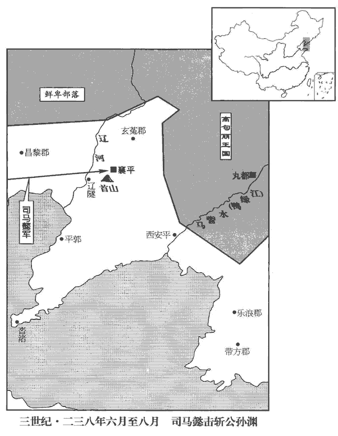
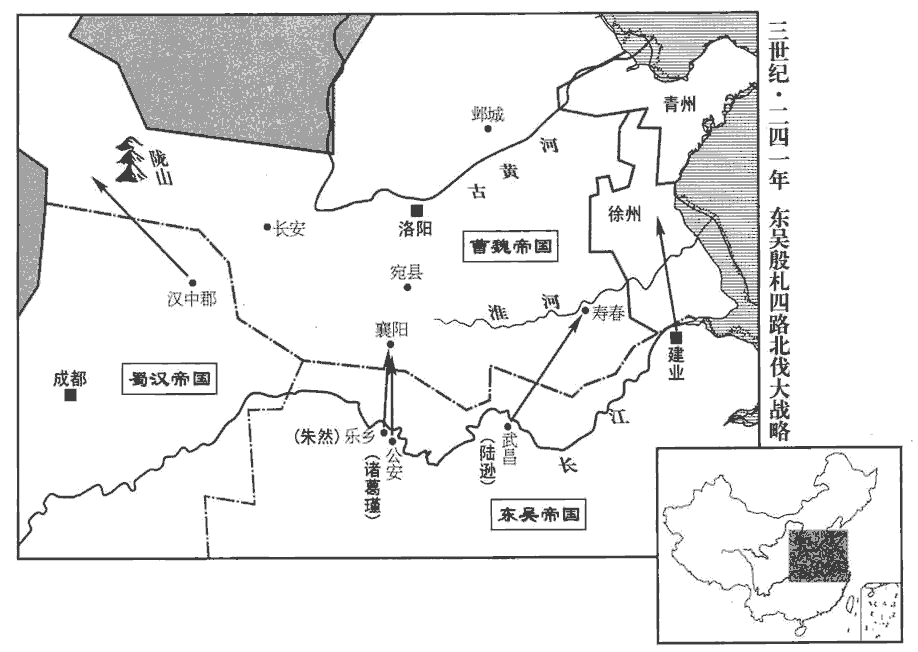
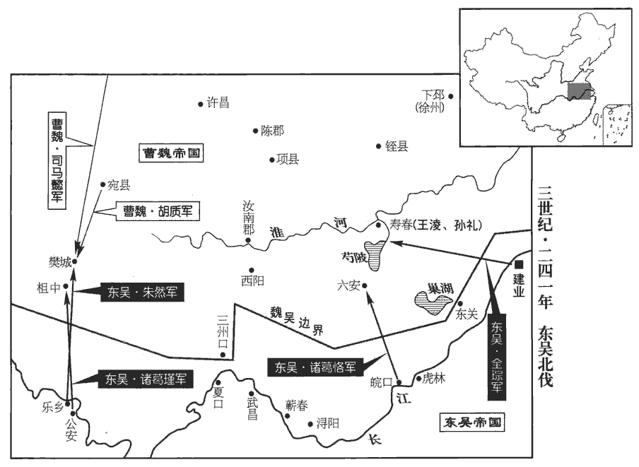
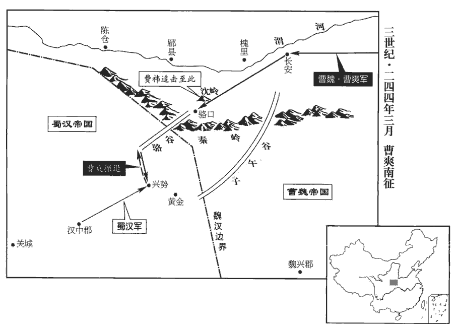

 魏紀六起著雍敦牂（戊午），盡旃蒙赤奮若（乙丑），凡八年。

# 烈祖明皇帝下

## 景初二年（戊午，二三八）

1春，正月，帝‹曹叡，时年三十五›召司馬懿於長安，使將兵四萬討遼東。討公孫淵也。留司馬懿於長安，以備蜀也。諸葛亮死，乃敢召之遠略。將即亮翻。議臣或以為四萬兵多，役費難供。議臣，當時謀議之臣也。帝曰：「四千里征伐，續漢志：遼東郡在洛陽東北三千六百里。雖云用奇，亦當任力，不當稍計役費也。」帝謂懿曰：「公孫淵將何計以待君？」對曰：「淵棄城豫走，上計也；據遼東拒大軍，其次也；「遼東」當作「遼水」。坐守襄平‹辽宁辽阳›，此成禽耳。」襄平縣，漢遼東郡治所，公孫淵所都。帝曰：「然則三者何出？」對曰：「唯明智能審量彼我，量，音良。乃豫有所割棄，此既非淵所及。」又謂：「今往孤遠，言孤軍遠征也。不能支久；必先拒遼水，後守襄平也。」帝曰：「還往幾曰？」對曰：「往百日，攻百日，還百日，以六十日為休息，如此，一年足矣。」

〖译文〗 [1]春季，正月，明帝从长安召回司马懿，命他率军四万人讨伐辽东。参预谋议的大臣有的认为四万兵员太多，军费难以提供。明帝说：“四千里远征讨伐，虽说要出奇制胜，但也应当依靠实力，不应斤斤计较军费。”明帝对司马懿说：“公孙渊放弃守城先行逃走，是上策；据守辽东抗拒大军，是中策；如死守襄平，必被生擒。”明帝说：“那么，三者中他将采用哪一种？”回答说：“只有明智的人，才能审慎度量敌我双方的力量，才会预先有所舍弃。这既不是公孙渊的才智所能达到的，他又会认为我军是孤军远征，不能支持长久，一定是先在辽水抗拒，然后退守襄平。”明帝说：“往返需多少天？”回答说：“进军一百天，攻战一百天，返回一百天，以六十天作为休息日，这样的话，一年足够了。”

公孫淵聞之，復遣使稱臣，求救於吳。吳人欲戮其使，欲報張彌、許晏之忿也。事見七十二卷青龍元年。復，扶又翻。羊衜曰：衜，古道字。「不可，是肆匹夫之怒而捐霸王之計也，不如因而厚之，遣奇兵潛往以要其成。要，一遙翻。若魏伐不克，而我軍遠赴，是恩結遐夷，義形萬里；若兵連不解，首尾離隔，則我虜其傍郡，驅略而歸，亦足以致天之罰，報雪曩事矣。」吳主‹孙权，时年五十七›曰：「善！」乃大勒兵，謂淵使曰：「請俟後問，當從簡書，左傳：狄伐邢，管敬仲言於齊侯曰：詩云：「豈不懷歸，畏此簡書。」簡書，同惡相恤之謂也；請救邢以從簡書。必與弟同休戚。淵遣使謝吳，自稱燕王，求為兄弟之國，故權因而稱之為弟。又曰：「司馬懿所向無前，深為弟憂之。」此晉史臣為此語耳，權必無此言。為，于偽翻。

〖译文〗 公孙渊听到消息，再次源遣使节称臣，向吴国求救。吴国打算杀掉来使，羊说：“不可，这是发泄匹夫一时怒气，而破坏称霸称王的大计，不如就势厚待他，然后派遣奇兵暗中前往，以胁迫公孙渊归附。如果魏讨伐不能取胜，而我军远赴救难，便与远方夷族结下恩情，大义表现于万里之外。如果双方交战难解难分，辽东前方、后方分隔，那么我们就在它边陲郡县，驱逐劫掠而归，也足以表达上天的惩罚，对往事报仇雪恨了。”吴王说：“好！”于是大规模地集结部队，并对公孙渊来使说：“请回去等候音信，我们遵从来函吩咐，一定和老弟休戚与共！”又说：“司马懿所向无敌，我深为老弟担忧。”

帝問於護軍將軍蔣濟曰：「孫權其救遼東乎？」濟曰：「彼知官備已固，魏、晉之間，謂國家為官。利不可得，深入則非力所及，淺入則勞而無獲；權雖子弟在危，猶將不動，況異域之人兼以往者之辱乎！亦謂斬張彌、許晏也。今所以外揚此聲者，譎其行人，譎，古穴翻。詐也。疑之於我，我之不克，冀其折節事己耳。然沓渚‹辽宁大连西旅顺›之間，去淵尚遠，若大軍相守，事不速決，則權之淺規，或得輕兵掩襲，未可測也。」淺規，謂規圖淺攻，不敢深入；吳君臣之為謀，已不逃蔣濟所料矣。

〖译文〗 明帝向护军将军蒋济问道：“孙权会救援辽东吗？”蒋济说：“孙权知道我们戒备严密，不可能从中渔利，援军深入则力所不及，不深入势必徒劳无功；即使是儿子、兄弟处于那种危险境地，孙权都不会出动，何况是异域他国之人，加之以前还被羞辱过。如今所以向外宣扬出兵救辽，不过是欺骗辽东来使，使我们产生疑惧，一旦我们不能攻克，希望公孙渊向他臣服而已。可是沓渚县离公孙渊所在地相距还远，如果大军受到阻碍，相持不下，战斗不能速决，那么孙权的临时决策，或者轻兵突袭，就不可预料了。”

2帝問吏部尚書盧毓：「誰可為司徒者？」毓薦處士管寧。處，昌呂翻。帝不能用，更問其次，對曰：「敦篤至行，則太中大夫韓暨；行，下孟翻。亮直清方，则司隸校尉崔林；貞固純粹，則太常常林。」二月，癸卯‹十一›，以韓暨為司徒。

〖译文〗 [2]明帝问吏部尚书卢毓说：“谁可以担任司徒？”卢毓推荐处士管宁，明帝不采用，又问其次的人选，卢毓答道：“敦厚忠诚的是太中大夫韩暨，耿直高洁的是司隶校尉崔林，忠贞纯朴的是太常常林。”二月，癸卯（十一日），任命韩暨担任司徒。

3漢主‹刘禅，时年三十二›立皇后張氏，前后之妹也。立王貴人子璿為皇太子，璿，旬緣翻。瑤為安定王。

〖译文〗 [3]汉王立张氏为皇后，是前皇后的妹妹。立王贵人的儿子刘为皇太子，刘瑶为安定王。

大司農河南孟光問太子讀書及情性好尚於祕書郎郤xì正，東漢以馬融為祕書郎，詣東觀典校書；祕書郎蓋自融始。好，呼到翻；下同。郤，綺戟翻。正曰：「奉親虔恭，夙夜匪懈，有古世子之風；懈，古隘翻。接待群僚，舉動出於仁恕。」光曰：「如君所道，皆家戶所有耳；謂其才行不逾中人也。吾今所問，欲知其權略智謀【章：甲十六行本「謀」作「調」；乙十一行本同；孔本同；張校同；下同。】何如也。」正曰：「世子之道，在於承志竭歡，承志，謂承君父之志；竭歡，謂左右就養，承顏順色，以盡親之歡。既不得妄有施為；智謀藏於胸懷，權略應時而發，此之有無，焉可豫知也！」焉，於虔翻。光知正慎宜，慎宜者，謹言語，擇其所宜言乃言也。不為放談，乃曰：「吾好直言，無所回避。今天下未定，智意為先，智意自然，不可力強致也。強，其兩翻。儲君讀書，寧當傚吾等竭力博識以待訪問，如博士探策講試以求爵位邪！按漢書音義，作簡策難問例置案上，在試者意投射，取而答之，謂之射策，即探策也；若錄政化得失，顯而問之，謂之對策。探，吐南翻。當務其急者。」正深謂光言為然。正，儉之孫也。儉為益州刺史，漢靈帝中平五年，為盜賊所殺。

〖译文〗 蜀大司农河南人孟光向秘书郎王询问太子读书情况及性情爱好，正说：“侍奉双亲虔诚恭敬，日日夜夜毫不怠懈，有古代世子的风范；接待群臣，举措出以仁义宽恕之心。”孟光说：“如您所说，都是每家子弟所具备的。我今天要问的，是想知道他的权略智谋如何？”正说：“作为世子的大义，在于继承君父的志向，尽心使父母欢乐。既不能随便有所作为，就把智谋深藏在胸怀之内，权略顺应时势发挥，是否具备这些，怎么可以预先知道呢？”孟光知道正讲话谨慎合宜，不敢放开畅谈，便说：“我喜欢直言，没有什么避讳。如今天下未定，智谋最为重要，智谋是先天秉性，不可用力强迫求得。太子读书，怎么可以效法我们博学强记以备咨询，象博士探策讲试一样以谋求一官半职呢？应当在最急需的方面下功夫。”正深感孟光言之有理。正是俭的孙子。

4吳人鑄當千大錢。杜佑曰：孫權赤烏元年，鑄一當千大錢，徑一寸四分，重十六銖。

〖译文〗 [4]吴国铸造可当一千的大钱。

5夏，四月，庚子‹九›，南鄉恭侯韓暨卒。

〖译文〗 [5]夏季，四月，庚子（初九），南乡恭侯韩暨去世。

6庚戌‹十九›，大赦。

〖译文〗 [6]庚戌（十九日），魏大赦天下。

7六月，司馬懿軍至遼東，公孫淵使大將軍卑衍、楊祚姓譜：卑，卑耳國之後，或云鮮卑之後。蔡邕胡太傅碑有太傅掾鴈門卑登。將步騎數萬屯遼隧‹辽宁海城西北›，圍塹二十餘里。考異曰：晉宣紀云「南北六七十里」，今從淵傳。諸將欲擊之，懿曰：「賊所以堅壁，欲老吾兵也，今攻之，正墮其計。且賊，大眾在此，其巢窟空虛；直指襄平，破之必矣。」乃多張旗幟，欲出其南，幟，昌志翻。衍等盡銳趣之。懿潛濟水，出其北，直趣襄平；趣，七喻翻。衍等恐，引兵夜走。諸軍進至首山，首山在襄平西南。淵復使衍等逆戰，復，扶又翻；下同。懿擊，大破之，遂進圍襄平。

〖译文〗 [7]六月，司马懿大军到达辽东，公孙渊命大将军卑衍、杨祚统率步、骑兵数万人驻扎在辽隧，围城挖掘了长达二十余里的壕沟。魏军将领们想要攻城，司马懿说：“敌人所以坚守壁垒不肯决战，是打算拖死我军，现在攻打他们，正中其计。而且敌人主力在此，他们的老巢必定空虚，我军直指襄平，必能攻破。”于是，打出许多战旗，佯作要向南方出动，卑衍等率全部精锐部队随之向南。司马懿率军暗中渡过辽河，向北挺进，直扑襄平。卑衍等大为惊恐，率军连夜撤回。魏各路大军进抵首山，公孙渊再命卑衍等迎战。司马懿迎击，大败卑衍，遂进军包围襄平。

秋，七月，大霖雨，遼水暴漲，運船自遼口‹辽宁营口，辽河入渤海处›徑至城下。遼口，遼水津渡之口也。雨月餘不止，平地水數尺；三軍恐，欲移營，懿令軍中：「敢有言徙者斬！」都督令史張靜犯令，斬之，晉職官志：魏制，諸公加兵者置都督令史一人。軍中乃定。賊恃水，樵牧自若，諸將欲取之，懿皆不聽。司馬陳珪曰：「昔攻上庸‹湖北竹山西南田家坝›，八部俱進，晝夜不息，故能一旬之半，拔堅城，斬孟達。事見七十一卷太和二年。今者遠來而更安緩，愚竊惑焉。」懿曰：「孟達眾少而食支一年，將士四倍於達而糧不淹月；淹，留也；言所留之糧不支一月也。以一月圖一年，安可不速！以四擊一，正令失半而克，猶當為之，是以不計死傷，與糧競也。競，爭也。懿之語珪，猶有廋sōu辭，蓋其急攻孟達，豈特與糧競哉？懼吳、蜀救兵至耳。今賊眾我寡，賊飢我飽，水雨乃爾，爾，如此也。功力不設，雖當促之，亦何所為！自發京師，不憂賊攻，但恐賊走。今賊糧垂盡而圍落未合，掠其牛馬，抄其樵采，抄，楚交翻。此故驅之走也。夫兵者詭道，善因事變。言善兵者，能因事而變化也。賊憑眾恃雨，故雖飢困，未肯束手，當示無能以安之。取小利以驚之，非計也。」懿知淵可禽，欲以全取之。朝廷聞師遇雨，咸欲罷兵。帝曰：「司馬懿臨危制變，禽淵可計日待也。」

〖译文〗 秋季，七月，连降大雨，辽河暴涨，运粮船队从辽口直抵城下。大雨下了一个多月不停，平地水深数尺，魏三军恐惧，打算迁移营垒，司马懿下令军中：“有敢说迁营者斩！”都督令史张静违抗命令，被斩，军心这才安定。敌人依仗水势，砍柴放牧依然如故，将领们想要俘获他们，司马懿都不准许。司马陈说：“从前攻打上庸，八支部队同时进发，日夜不停，所以能用十六天时间攻下坚城，斩杀孟达。这次远征而来，反而更安闲迟缓，我私下感到疑惑。”司马懿说：“孟达兵少但存粮可支撑一年，我军将士四倍于孟达，但粮食不能支持一个月。以一个月攻打一年，怎么可以不快速？以四个兵士攻击一个敌人，即使丧失一半而能够攻克，都应当去做，所以不顾死伤地强攻，是与粮食竞争啊！如今敌众我寡，敌饥我饱，何况雨水如此之大，功力不能施展，虽然应当速战速决，又能干什么呢？自打从京师出发，不担心敌人进攻，只恐怕敌人逃走。如今敌人粮食就要耗尽，可是我们的包围还没完成，抢掠他们的牛马，抄袭他们的樵夫，这是故意逼迫他们逃走。用兵是一种诡诈的行为，要善于随机应变。敌人凭仗人多，倚仗雨大，虽然饥饿窘困，还不肯束手投降，应当显示出我们无能以便使他们安心。如果因贪图小利使他们惊吓逃跑，这不是好的计策。”朝中听说大军遇雨，一致打算退兵。明帝说：“司马懿有能力临危控制事变，捉住公孙渊指日可待。”

雨霽，懿乃合圍，作土山地道，楯櫓鉤衝，楯，干也，攻城之士以扞蔽其身。櫓，樓車，登之以望城中。鉤，鉤梯也。所以鉤引上城者。衝，衝車也，以衝城。晝夜攻之，矢石如雨。淵窘急，窘，巨隕翻。糧盡，人相食，死者甚多，其將楊祚等降。八月，淵使相國王建、御史大夫柳甫請解圍卻兵，當君臣面縛。懿命斬之，檄告淵曰：「楚、鄭列國，而鄭伯猶肉袒牽羊迎之。左傳：楚莊王圍鄭，克之，入自皇門，至于逵路，鄭伯肉袒牽羊以逆。孤天子上公，漢太傅，位上公。懿時為太尉而自謂上公，以太尉於三公為上也。而建等欲孤解圍退舍，豈得禮邪！二人老耄，傳言失指，已相為斬之。為，于偽翻。若意有未已，可更遣年少有明決者來！」少，詩照翻。淵復遣侍中衛演乞克日送任，送任，謂送質子也。復，扶又翻。懿謂演曰：「軍事大要有五：能戰當戰，不能戰當守，不能守當走；餘二事，但有降與死耳。降，戶江翻。汝不肯面縛，此為決就死也，不須送任！」壬午‹二十三›，襄平潰，淵與子脩將數百騎突圍東南走，大兵急擊之，斬淵父子於梁水之上。班志：遼東郡遼陽縣，註云：大梁水西南至遼陽，入遼水。水經註：小遼水出玄菟高句麗縣遼山，西南流逕襄平縣，入大梁水；水出北塞外，西南流而入于遼水。懿既入城，誅其公卿以下及兵民七千餘人，築為京觀。杜預曰：積尸封土於其上，謂之京觀。觀，古玩翻。遼東、帶方‹朝鲜沙里院城›、樂浪‹朝鲜平壤›、玄菟‹辽宁沈阳›四郡皆平。漢帶方縣，屬樂浪郡，公孫氏分立郡。陳壽曰：建安中，公孫康分屯有以南荒地為帶方郡，倭、韓諸國羈屬焉。樂浪，音洛琅。菟，同都翻。

〖译文〗 雨止，司马懿随即合拢包围圈，高堆土山，深挖地道，用干、橹车、钩梯、冲车，日夜攻城，射箭与石密集如雨。公孙渊窘迫危急，粮食已尽，以至人与人互相格杀残食，死亡极多，部将杨祚等投降。八月，公孙渊派遣相国王建、御史大夫柳甫请求解围退兵，如果同意，君臣定当自缚面降。司马懿命斩来使，用檄文通知公孙渊说：“楚国和郑国地位相等，可是郑伯还光着脊背牵羊出城迎降。我是天子的上公，而王建等想要我解围后退，难道不失礼吗？这二个老糊涂，传话失去意指，已被我杀掉。如还有请降之意，就另派年轻有明快决断的人前来。”公孙渊又派侍中卫演，请求指定日期，派送人质。司马懿对卫演说：“军事大要有五条，能战则战，不能战就当坚守，不能坚守就当逃走。剩下的两条路，就只有投降和死了。公孙渊不肯自缚面降，这是决心去死，不必送来人质！”壬午（疑误），襄平城败溃，公孙渊和儿子公孙带领数百骑兵从东南突围逃走，魏军急忙追击，在梁水岸边斩杀了公孙渊父子。司马懿既已进入襄平城；诛杀城中公卿以下官吏及兵民七千余人，积尸封土，筑成大坟，辽东、带方、乐浪、玄菟四郡全部平定。

淵之將反也，將軍綸lún直、賈范等苦諫，綸lún，姓；直，名；其先以邑為姓。淵皆殺之，懿乃封直等之墓，顯其遺嗣，釋淵叔父恭之囚。淵囚恭事見七十一卷太和二年。中國人欲還舊鄉者，恣聽之。遂班師。司馬懿與諸葛亮相守閉壁，若無能為者；及討公孫淵，智計橫出。鄙語有云：「棋逢敵手難藏行」，其是之謂乎！

〖译文〗 公孙渊将要反叛时，将军纶直、贾范等苦苦劝阻，都被公孙渊诛杀。司马懿于是堆土加高纶直等人的坟墓，显扬他们的子弟，释放了为朝廷所立而被公孙渊囚禁的叔父。中原人想要返回故里，听任自便。然后班师。

初，淵兄晃為恭任子在洛陽，先淵未反時，數陳其變，先，悉薦翻。數，所角翻；下同。欲令國家討淵；及淵謀逆，帝不忍市斬，欲就獄殺之。晃數陳淵之必反，非同逆者也；帝欲殺之以絕其類，刑之於市則無名，故欲就獄殺之。廷尉高柔上疏曰：「臣竊聞晃先數自歸，陳淵禍萌，雖為凶族，原心可恕。夫仲尼亮司馬牛之憂，司馬牛，宋司馬桓魋tuí之弟也。魋凶惡，牛憂之，曰：「人皆有兄弟，我獨亡。」謂魋之積惡，將死亡無日。祁奚明叔向之過，左傳：晉人逐欒盈，殺羊舌虎，囚虎兄叔向。祁奚見范宣子曰：「管、蔡為戮，周公右王；若之何以虎也棄社稷！」宣子言諸公而免之。在昔之美義也。臣以為晃信有言，宜貸其死；苟自無言，便當市斬。今進不赦其命，退不彰其罪，閉著囹圄yǔ，使自引分，著，直略翻。引分，即引決也。四方觀國，或疑此舉也。」帝不聽，竟遣使齎金屑飲晃及其妻子，飲，於鴆翻。賜以棺衣，殯斂於宅。宅，晃所居者。斂，力贍翻。

〖译文〗 最初，公孙渊的哥哥公孙晃作为公孙恭的人质住在洛阳，公孙渊还未反叛时，公孙晃几次报告公孙渊的变故，打算让魏出兵讨伐。到公孙渊图谋叛逆，明帝不忍心把公孙晃在街市斩首，打算下狱处决。廷尉高柔上书说：“我私下听说公孙晃以前多次自动归附，报告公孙渊已萌生祸心，他虽然是凶犯宗族，但是推究其本心，是可以宽恕的。从前，孔丘曾经明察司马牛的忧虑，祁奚曾经指明叔向没有过失，这都是古代的美好义行。我认为公孙晃确实在先前有过举报，应免他一死；如果他本来没有告发，应应当在街市上斩首示众。如今是进不赦免其性命，退又不公开其罪状，只是紧闭狱门，命他自杀，天下各地，或许会怀疑我们的做法。”明帝不采纳，竟派遣使节带着搀有金屑的酒让公孙晃和他的妻子儿女饮下，然后赏赐棺木丧衣，埋葬在公孙晃的住宅。

 

8九月，吳改元赤烏。權以赤烏集於殿前改元。

〖译文〗 [8]九月，吴改年号为赤乌。

9吳步夫人卒。

〖译文〗 [9]吴步夫人去世。

初，吳主為討虜將軍，在吳，娶吳郡‹苏州›徐氏；太子登所生庶賤，吳主令徐氏母養之。徐氏妬，故無寵。及吳主西徙，謂自吳而西徙都武昌‹湖北鄂州›也。徐氏留處吳；而臨淮‹江苏泗洪›步夫人寵冠後庭，步夫人，騭之族也。處，昌呂翻。冠，古玩翻。吳主欲立為皇后，而群臣議在徐氏，吳主依違者十餘年。依違，不決也。會步氏卒，群臣奏追贈皇后印綬，綬，音受。徐氏竟廢，卒於吳。

〖译文〗 起初，吴王任讨虏将军，驻守吴郡，娶吴郡人徐氏。太子孙登生母出身卑贱，吴王命徐氏抚养。徐氏十分嫉妒，所以失宠。等到吴王向西迁移，徐氏仍留住在吴郡。这时，临淮人步夫人在后宫最受宠爱，吴王打算立为皇后，可是群臣议论应立徐氏，吴王犹豫不决，拖延了十几年。恰好步氏去世，群臣奏请追赠步夫人皇后印信、绶带。徐氏竟被废，在吴郡去世。

10吳主使中書郎呂壹典校諸官府及州郡文書，壹因此漸作威福，深文巧詆，排陷無辜，毀短大臣，纖介必聞。太子登數諫，數，所角翻；下同。吳主不聽，群臣莫敢復言，復，扶又翻。皆畏之側目。

〖译文〗 [10]吴王让中书郎吕壹主管各官府及州郡公文，吕壹因此渐渐作威作福起来，援引法律条文进行狡诈的诋毁，排斥陷害无辜，诽谤朝廷大臣，连细微小事也禀闻吴王。太子孙登屡次规劝，吴王都不接受，群臣不敢再表示意见，对吕壹都深怀恐惧，侧目而视。

壹誣白故江夏‹湖北鄂州›太守刁嘉謗訕國政，訕shàn，山諫翻。吳主怒，收嘉，繫獄驗問。時同坐人皆畏怖壹，其時與嘉同坐者。坐，徂臥翻。并言聞之。侍中北海‹山东昌乐东南›是儀獨云無聞，是，姓；儀，名。儀本姓氏，孔融嘲儀以氏字為民上無頭，遂改姓是。遂見窮詰，累日，詔旨轉厲，群臣為之屏息。為，于偽翻。屏，必郢翻；屏息，不敢舒氣也。儀曰：「今刀鋸已在臣頸，臣何敢為嘉隱諱，自取夷滅，為不忠之鬼！顧以聞知當有本末。」據實答問，辭不傾移，吳主遂舍之；舍，讀曰捨。嘉亦得免。

〖译文〗 吕壹诬告前江夏太守刁嘉诽谤讥讽朝政，吴王大怒，逮捕了刁嘉，下狱审问。当时被牵连的人都畏惧吕壹，都说听到过刁嘉诽谤之词，只有侍中北海人是仪一人说没有听到过，于是被连日穷追诘问，诏书也越发严厉，群臣都为他捏着一把汗，是仪说：“如今刀锯已经架在脖颈上，我怎敢为刁嘉隐瞒，自取杀身灭门之祸，成为不忠的鬼魂？只是要说听到、了解此事，必须有头有尾。”是仪据实回答审问，供辞不改，吴王于是放了他，刁嘉也被免罪。

上大將軍陸遜、太常潘濬憂壹亂國，每言之輒流涕。壹白丞相顧雍過失，吳主怒，詰責雍，詰，去吉翻。黃門侍郎謝厷語次問壹：厷，與宏同；乎萌翻「顧公事何如？」壹曰：「不能佳。」厷又問：「若此公免退，誰當代之？」壹未答。厷曰：「得無潘太常得之乎？」壹【章：甲十六行本「壹」下有「良久」二字；乙十一行本同；孔本同；退齋校同。】曰：「君語近之也。」近，其靳翻。厷曰：「潘太常常切齒於君，但道無因耳。謂欲奏舉其罪而非太常之職，故其道無因也。今日代顧公，恐明日便擊君矣！」漢制，丞相、御史舉奏百官有罪者。壹大懼，遂解散雍事。潘濬求朝，詣建業‹南京›，濬本留武昌。朝，直遙翻。欲盡辭極諫，至，聞太子登已數言之至建業而知太子數言壹事。而不見從；濬乃大請百寮，欲因會手刃殺壹，以身當之，以身當擅殺之罪。為國除患。為，于偽翻；下同。壹密聞知，稱疾不行。

〖译文〗 上大将军陆逊、太常潘浚忧虑吕壹祸乱国政，一谈到这件事，就止不住流泪。吕壹指控丞相顾雍有过失，吴王大怒，责问顾雍。黄门侍郎谢在闲谈时问吕壹：“顾公之事如何？”吕壹答：“不能乐观。”谢又问：“如果此公被免，应当是谁代替他？”吕壹没回答。谢说：“莫非是潘浚？”吕壹答：“你的话差不多。”谢又说：“潘浚常常对你恨得咬牙切齿，只是没有机会讲罢了。今日他如接替顾公，恐怕明日就会打击你了。”吕壹万分恐惧，亲自去建业，打算尽辞极谏。到达后，听说太子孙登已经多次揭发吕壹，而不被接受。潘浚于是宴请文武百官，打算在席间亲手杀死吕壹，再以性命抵罪，为国除害。吕壹得到密报，声称有病不去赴宴。

西陵‹湖北宜昌›督步騭上疏曰：「顧雍、陸遜、潘濬，志在竭誠，寢食不寧，念欲安國利民，建久長之計，可謂心膂股肱社稷之臣矣。宜各委任，不使他官監其所司，課其殿最。監，古銜翻。殿，丁甸翻。賢曰：殿，軍後也；課居後也。最，凡要之先也；課居先也。此三臣思慮不到則已，豈敢欺負所天乎！」君，天也。

〖译文〗 西陵督步骘上书说：“顾雍、陆逊、潘浚志在竭诚报国，睡觉吃饭都不安宁，思虑着怎样安国利民，建立国家的长治久安之计，可以说是君王的心腹和肢体，国家的重臣了。应当对他们分别委以重任，不要让其他官员监督他们主管的工作，考核他们的政绩等次。这三位大臣思虑不到的事情就算了，岂敢欺骗辜负君王呢？”

左將軍朱據部曲應受三萬緡mín，工王遂詐而受之。壹疑據實取，考問主者，主者，據军吏也。死於杖下；據哀其無辜，厚棺斂之，棺，古玩翻。歛，力驗翻。壹又表據吏為據隱，故厚其殯。吳主數責問據，據無以自明，藉草待罪；數日，典軍吏劉助覺，言王遂所取。劉助覺其事而言之。吳主大感悟，曰：「朱據見枉，況吏民乎！」乃窮治壹罪，治，直之翻。賞助百萬。

〖译文〗 左将军朱据的部曲应领受三万钱，工匠王遂将钱诈骗冒领。吕壹怀疑朱据实际将钱私取，拷问朱据部下主事的军吏，将他打死在棍棒之下。朱据哀伤他无辜屈死，丰厚地为他入殓安葬。吕壹又上表说朱据军吏为朱据隐瞒，所以朱据为他厚葬。吴王屡次责问朱据，朱据无法表明自己清白，只好搬出家门，坐卧在草席上听候定罪。几天后，典军吏刘助发觉此事，说钱被王遂取走。吴王深有感触，省悟地说：“朱据尚被冤枉，何况小小吏民呢！”于是深究吕壹罪责，赏赐刘助钱百万钱。

丞相雍至廷尉斷獄，斷，丁亂翻。壹以囚見。雍和顏色問其辭狀，臨出，又謂壹曰：「君意得無欲有所道乎？」道，言也。壹叩頭無言。時尚書郎懷敘懷，姓；敘，名。姓譜：無懷氏之後。面詈辱壹，雍責敘曰：「官有正法，何至於此！」有司奏壹大辟，辟，毗亦翻。或以為宜加焚裂，用彰元惡，殷紂用炮烙之刑，項羽燒殺紀信，漢武帝焚蘇文於橫橋，然未以為刑名也。王莽作焚如之刑，後世不復遵用。裂，謂車裂，古之轘huàn刑。吳主以訪中書令會稽‹绍兴›闞澤，會，古外翻。闞，姓也。左傳齊有大夫闞止。澤曰：「盛明之世，不宜復有此刑。」復，扶又翻；下同。吳主從之。

〖译文〗 丞相顾雍到廷尉审理和判决案件，吕壹以阶下囚身分相见，顾雍面色温和地审问他的口供，临走出时，又对吕壹说：“您是否还有什么要讲的？”吕壹叩头无语。当时尚书郎怀叙当面责骂羞辱吕壹，顾雍责备怀叙说：“官府有正常的法律，为什么要这样！”有关部门奏请处以吕壹死刑，有的认为应加以焚烧、车裂之刑，以表明他是罪魁祸首，吴王就此事请问中书令会稽人阚泽，阚泽说：“盛明之世，不宜再有此刑。”吴王听从了他的意见。

壹既伏誅，吳主使中書郎袁禮告謝諸大將，因問時事所當損益，禮還，復有詔責諸葛瑾、步騭、朱然、呂岱等曰，袁禮還云：『與子瑜、子山、義封、定公相見，諸葛瑾，字子瑜。步騭，字子山。朱然，字義封。呂岱，字定公。瑾，渠吝翻。騭，職日翻。并咨以時事當有所先後，謂時事所當行何者為先，何者為後也。各自以不掌民事，不肯便有所陳，悉推之伯言、承明。推，吐雷翻。陸遜，字伯言。潘濬，字承明。伯言、承明見禮，泣涕懇側，辭旨辛苦，至乃懷執危怖，有不自安之心。』怖，普布翻。聞之悵然，深自刻怪！刻，怪也。何者？夫惟聖人能無過行，行，下孟翻。明者能自見耳。人之舉厝cuò，何能悉中！中，竹仲翻。獨當己有以傷拒眾意，忽不自覺，故諸君有嫌難耳。不爾，何緣乃至於此乎？與諸君從事，自少至長，髮有二色，二色，謂班白也。少，詩照翻。長，知兩翻。以謂表里足以明露，公私分計足用相保，分，扶問翻。義雖君臣，恩猶骨肉，榮福喜戚，相與共之。忠不匿情，智無遺計，事統是非，言行事是，則君臣同其是；非，則同其非也。諸君豈得從容而已哉！從，千容翻。同船濟水，將誰與易！易，如字。齊桓有善，管子未嘗不歎，有過未嘗不諫，諫而不得，終諫不止。今孤自省無桓公之德，省，悉景翻。而諸君諫諍未出於口，仍執嫌難；以此言之，孤於齊桓良優，未知諸君於管子何如耳！」下之於上，不從其令而從其意。孫權自謂優於齊桓，而責其臣以管子。使吳誠有管子，亦不敢盡言於權，觀諸陸遜可見矣。

〖译文〗 吕壹既已处死，吴王让中书郎袁礼向诸位大将道歉，同时询问他们对时事兴革的意见。袁礼返回后，又有诏书责备诸葛瑾、步骘、朱然、吕岱等说：“袁礼回来后说：‘与诸葛瑾、步骘、朱然、吕岱相见，同时向他们询问时事先后安排的意见，各人都以不掌民事为由，不肯当即发表意见，全推给陆逊、潘浚。陆逊、潘浚见到袁礼，流泪不止，态度诚恳痛切，辞意辛酸痛苦，甚至心怀危惧，有一种感觉不安全的神情。’我听了不禁怅然，内心深感困惑。为什么？天下只有圣人才能无过，只有聪明人才能自察。普通人的举止行动，怎么可能全部正确？自以为是而有伤害抵触众意的地方，一时忽视而没有觉察，所以使各位心存疑忌畏难了。不然的话，有什么缘由至于这样？和各位共事，从年少至年长，如今头发已经花白，自以为表里都可以和诸位坦诚相见，公私情分足以互保；大义上我们是君臣关系，但恩情上犹如骨肉至亲，荣耀、福分、喜乐、悲戚，都共同分享和承受。忠臣不应该隐瞒实情，智士不应该保留谋略，不论事情是非如何，各位怎么可以袖手旁观，自得悠闲呢？我们是同舟共济，还有谁能替代？古代齐桓公有善行，管仲没有不赞叹；有过失，没有不直言规劝；如不被采纳，则永不休止地规劝。如今我自知没有齐桓公的德行，可是各位不肯开口直言规劝，仍然采取避嫌畏难的态度，就这一点而言，我比齐桓公还好一点，不知各位比起管仲来又是如何？”

11冬，十一月，壬午‹二十四›，以司空衛臻為司徒，司隸校尉崔林為司空。

〖译文〗 [11]冬季，十一月，壬午（二十四日），魏任命司空卫臻担任司徒，司隶校尉崔林担任司空。

12十二月，漢蔣琬出屯漢中‹陕西汉中›。

〖译文〗 [12]十二月，蜀蒋琬出兵驻扎在汉中。

13乙丑‹八›，帝不豫。

〖译文〗 [13]乙丑（初八），魏明帝患病。

14辛巳‹二十四›，立郭夫人為皇后。

〖译文〗 [14]辛巳（二十四日），魏立郭夫人为皇后。

15初，太祖為魏公，以贊令劉放、酂cuó縣‹河南永城西鄼城乡›，漢屬沛郡，王莽改曰贊治，魏分屬譙郡。或曰贊，相也，凡出令使之贊相，因以為官名。蓋魏武霸府所置也。參軍事孫資皆為祕書郎。文帝即位，更名祕書曰中書，以放為監，資為令，遂掌機密。漢桓帝延熹二年，置祕書監；魏武為魏王，置祕書令丞，典尚書奏事，黃初初，改為中書，置監、令，中書有監、令自此始。自魏及晉，遂為要官，荀勗xù所謂鳳凰池也。更，工衡翻。帝即位，尤見寵任，皆加侍中、光祿大夫，封本縣侯。放，涿郡‹河北涿州›方城人‹河北固安›。資，太原‹山西太原›中都人‹山西平遥›。是時，帝親覽萬機，數興軍旅，數，所角翻。腹心之任，皆二人管之；每有大事，朝臣會議，常令決其是非，擇而行之。中護軍蔣濟上疏曰：此疏亦是濟為中護軍時所上，通鑑因敘放、資事而書之於此。「臣聞大臣太重者国危，左右太親者身蔽，古之至戒也。往者大臣秉事，外內扇動；蓋謂文帝時也。或曰：謂受遺大臣也。陛下卓然自覽萬機，莫不祗肅。夫大臣非不忠也，然威權在下，則眾心慢上，勢之常也。陛下既已察之於大臣，願無忘之於左右，左右忠正遠慮，未必賢於大臣，至於便辟取合，或能工之。便pián，毗連翻。辟pì，讀曰僻。今外所言，輒云『中書雖使恭慎，不敢外交』。但有此名，猶惑世俗，況實握事要，日在目前；儻因疲倦之間有所割制，謂因人主疲倦之時，有所剖割而制斷也。眾臣見其能推移於事，即亦因時而向之。一有此端，私招朋援，臧否毀譽，必有所興，否，音鄙。譽，音余。功負賞罰，必有所易，負，罪也；易則賞罰不當乎功罪。直道而上者或壅，曲附左右者反達，因微而入，緣形而出，意所狎信，不復猜覺。此宜聖智所當早聞，外以經意，則形際自見；言放、資日在左右，狎而信之，不復覺其為姦；非若早聞忠言，自覽萬機，外以示經意國事，則放、資之形際必呈露而不可掩矣。復，扶又翻。見賢遍翻。或恐朝臣畏言不合，而受左右之怨，莫適以聞。適，丁歷翻。臣竊亮陛下潛神默思，公聽并觀，若事有未盡於理，而物有未周於用，將改曲易調，調，徒釣翻。以琴瑟為喻也。遠與黃、唐角功，角者，兩兩相當也。黃、唐，黃帝、唐堯。近昭武、文之績，豈牽近習而已哉！然人君不可悉任天下之事，必當有所付；若委之一臣，自非周公旦之忠，管夷吾之公，則有弄權【章：甲十六行本「權」作「機」；乙十一行本同；孔本同。】敗官之敝。敗，補邁翻。當今柱石之士雖少，至於行稱一州，少，詩沼翻。行，戶孟翻。智效一官，忠信竭命，各奉其職，可并驅策，不使聖明之朝有專吏之名也！」專吏，謂專任放、資。帝不聽。自此以前皆非此年事。通鑑因放、資患失之心以誤帝託孤之事，遂書之於此以先事。

〖译文〗 [15]最初，太祖还是魏公时，任命赞令刘放、参军事孙资同时担任秘书郎。文帝即位，改称秘书为中书，任命刘放担任中书监，孙资担任中书令，两人掌管机密。明帝即位，两人尤其受到恩宠信任，都加任侍中、光禄大夫，封为本县侯。这时，明帝亲自处理日常政务，屡次出兵，中枢筹划都由他俩掌管；每有国家大事，朝臣集会议事，经常让他俩决断是非，择定而行。中护军蒋济上书说：“我听说大臣权力太重，国家就有危险，左右过于亲近，耳目必受蒙蔽，这是古代最大的戒鉴。以前大臣掌事，内外动摇不安；陛下识见高明，亲自处理国事，无不肃然安定。大臣不是不忠，只是权威下移，人们对君王就一定怠慢，这是情势发展的必然。陛下既然已经对大臣有所明察，希望不要忘记左右亲信造成的流弊。左右亲信的忠心和谋略，未必胜于大臣，至于逢迎诌媚、阿谀奉承，有的却极其擅长。如今外面议论，动辄就说‘中书’，虽然让他们恭敬谨慎，不敢对外交往，然而仅有这个名义，就可以迷惑世俗，何况实际掌握国家要事，整日侍奉在眼前；倘若趁着陛下疲倦之时，有所剖断，窃弄权威，大臣见他们能影响国事，也就会顺势转而趋向他们。一旦有此弊端，私结成朋党，褒贬毁誉就会兴起，功过赏罚必定颠倒，走正路向上的或许会被阻塞，而曲意逢迎左右近侍的却能显贵，他们抓住空子就钻，看到迹象就干，陛下亲信他们，也就不再猜疑。这按理是应该让陛下早早听到了解，用心留意，则左右近侍的形迹自然暴露。有人担心朝廷大臣会害怕进言不妥而受左右近臣的怨恨，因而不敢上报陛下和他们对抗。我认为陛下静神沉思，垂听舆论全面观察，如果事物有不尽合理或是不合于用的，就要改换曲调，远可以和黄帝、唐尧的功劳相等，近可以使武帝、文帝的政绩发扬，岂止是不受左右控制而已！可是君王不可能独自承担天下的全部事情，必当有所托付。如果委任一个臣属，除非有周公旦的忠心，管仲的公道，否则就有弄权败官的弊病。当今之世，栋梁之才虽然很少，但德行能称职于一州，才智可效力于一官，忠信尽力，各奉其职的人，还是可供驱策的，不要使圣明之朝出现恶吏专权的丑名！”明帝不接受。

及寢疾，深念後事，乃以武帝子燕王宇為大將軍，與領軍將軍夏侯獻、武衛將軍曹爽、魏制：領軍將軍主中壘、五校、武衛等三營。武衛將軍，蓋領武衛營也。太祖以許褚典宿衛，遷武衛中郎將，武衛之號自此始。後又遷武衛將軍，於是武衛始有將軍之號。晉泰始初，罷武衛將軍官。屯騎校尉曹肇、驍騎將軍秦朗等對輔政。爽，真之子；肇，休之子也。帝少與燕王宇善，故以後事屬之。少，詩照翻。屬，之欲翻。

〖译文〗 到明帝病重卧床，深虑后事，才任命武帝之子燕王曹宇担任大将军，与领军将军夏侯献、武卫将军曹爽、屯骑校尉曹肇、骁骑将军秦朗等共同辅政。曹爽是曹真之子，曹肇是曹休之子。明帝年少时与燕王曹宇亲近友好，所以把后事嘱托给他。

劉放、孫資久典機任，獻、肇心內不平；殿中有雞棲樹，二人相謂曰：「此亦久矣，其能復幾！」殿中畜雞以司晨，棲於樹上，因謂之雞棲樹。獻、肇指以喻放、資。一言而發司馬氏篡魏之機，言之不可不謹也如是夫！以此觀獻、肇之輕脫，又何足以託孤哉！復扶又翻。幾，居豈翻。放、資懼有後害，陰圖間之。間，古莧翻。燕王性恭良，陳誠固辭。帝引放、資入臥內，問曰：「燕王正爾為？」言其性恭良，為事正如此也。對曰：「燕王實自知不堪大任故耳。」帝曰：「誰可任者？」時惟曹爽獨在側，放、資因薦爽，且言：「宜召司馬懿與相參。」帝曰：「爽堪其事不？」不，讀曰否。爽流汗不能對。放躡其足，耳之曰：附耳語之也。「臣以死奉社稷。」帝從放、資言，欲用爽、懿，既而中變，敕停前命；放、資復入見說帝，復，扶又翻。見，賢遍翻。說，輸芮翻。帝又從之。放曰：「宜為手詔。」帝曰：「我困篤，不能。」放即上牀，執帝手強作之，強，其兩翻。遂齎出，大言曰：「有詔免燕王宇等官，不得停省中。」皆流涕而出。考異曰：放傳曰：「宇性恭良，陳誠固辭。帝引見放、資入臥內，問曰：『燕王正爾為？』放、資對曰：『燕王實自知不堪大任故耳。』帝曰：『曹爽可代宇否？』放、資因贊成之。又深陳宜速召太尉司馬宣王，帝纳其言。放、資既出，帝意復變，詔止宣王勿來。尋更見放、資曰：『我自召太尉，而曹肇等反使吾止之。』命更為詔，帝獨召爽與放、資俱受詔命，遂免宇、獻、肇、朗官。」按陳壽當晉世作魏志，若言放、資本情，則於時非美，故遷就而為之諱也。今依習鑿齒漢晉春秋、郭頒世語，似得其實。甲申‹二十七›，以曹爽為大將軍。帝嫌爽才弱，復拜尚書孫禮為大將軍長史以佐之。為下爽出孫禮張本。復，扶又翻。

〖译文〗 刘放、孙资长久地掌管国家机要，夏侯献、曹肇心中忿忿不平。殿中有一只鸡飞上树，两人互相说：“这也太久了，看他们还能活几天！”刘放、孙资怕有后患，私下想加以离间。燕王曹宇性情恭顺温和，诚恳地坚决推辞，明帝让刘放、孙资进入卧室问道：“燕王正是如此吗？”刘放、孙资答道：“燕王实际是自知不能承担重任，所以这样。”明帝问：“谁可以承担？”当时只有曹爽一人在旁，刘放、孙资顺势推荐曹爽，并且说：“应当召回司马懿参与。”明帝问：“曹爽能承担这件大事吗？”曹爽汗流满面，紧张得不能回答。刘放暗中踩他的脚，耳语说：“快说以死奉社稷。”明帝听从刘放、孙资建议，打算任用曹爽、司马懿，不久中途又改变，下令停止先前的任命。刘放、孙资再次入见游说明帝，明帝再度听从他们的意见。刘放说：“最好亲自写下诏书。”明帝说：“我疲乏极了，不能写。”刘放随即上床，把着明帝的手勉强写下诏书，遂拿着出宫大声说：“有诏书免去燕王曹宇等的官职，不得在宫中滞留。”曹宇等流泪而出。甲申（二十七日），任命曹爽担任大将军，明帝嫌曹爽才能不足，又任命尚书孙礼担任大将军长史辅助他。

是時，司馬懿在汲‹河南卫辉›，時自遼東還師，次于汲也。汲縣自漢以來屬河內郡。帝令給使辟邪辟邪，給使之名，猶漢丞相倉頭呼為宜祿也。齎手詔召之。先是，燕王為帝畫計，先，悉薦翻。為，于偽翻。以為關中事重，宜遣懿便道自軹zhǐ關‹河南济源西›西還長安‹西安›，關中事重，謂備蜀及撫安氐、羌也。軹縣，屬河內郡。賢曰：軹故城在洛州濟源縣東南。五代志：軹關，在河內郡王屋縣。杜佑曰：軹關在河南府濟源縣界。事已施行。懿斯須得二詔，前後相違。疑京師有變，乃疾驅入朝。朝，直遙翻。

〖译文〗 这时，司马懿正在汲县，明帝派遣给使辟邪，带着手诏前去召司马懿。开始，燕王替明帝筹划，认为关中事关重大，应让司马懿走小道从轵关向西回到长安，事情已经施行。司马懿不久又接到第二封诏书，前后矛盾，怀疑京师发生变故，于是急速入朝。

## 三年（己未，二三九）

1春，正月，懿至，入見，見，賢遍翻。帝執其手曰：「吾以後事屬君，見，賢遍翻。屬，之欲翻。君與曹爽輔少子。少，詩照翻。死乃可忍，吾忍死待君，得相見，無所復恨矣！」復，扶又翻。乃召齊、秦二王以示懿，別指齊王芳謂懿曰：「此是也，君諦視之，勿誤也！」諦dì，丁計翻，審也。又教齊王令前抱懿頸。懿頓首流涕。是日，立齊王為皇太子。帝尋殂‹曹叡，年三十六›。陳壽曰：年三十六。裴松之曰：按魏武以建安九年八月定鄴，文帝始納甄后，明帝應以十年生，計至此年正月，整三十四年耳。時改正朔，以故年十二月為今年正月，可強名三十五年，不得三十六也。

〖译文〗 [1]春季，正月，司马懿回到京师，入见明帝。明帝拉着他的手说：“我把后事嘱托给您，您要与曹爽一起辅佐幼子。死岂是可以忍住的，我强忍着不死是为等待您。能够与您相见，再无遗恨了。”于是召来齐王曹芳、秦王曹询拜见司马懿，又指着齐王曹芳对司马懿说：“就是他了，您仔细看看，不要看错！”又教齐王曹芳上前抱住司马懿的脖颈，司马懿叩头流泪。这一天，立齐王曹芳为皇太子，明帝旋即去世。

帝沈毅明敏，沈，持林翻。任心而行，料簡功能，料，音聊。屏絕浮偽。屏，必郢翻。行師動眾，論決大事，謀臣將相，咸服帝之大略。性特強識，雖左右小臣，官簿性行，名跡所履，行，戶孟翻。及其父兄子弟，一經耳目，終不遺忘。忘，巫放翻。

〖译文〗 明帝深沉刚毅，聪明敏捷，但纵情任性。能够择别官吏的事功和能力，排除虚浮不实。每次发兵出征，讨论决定大事，谋臣将相，全都佩服明帝的远大谋略。记忆力极强，虽然只是左右卑微小官，但档案中所记有关的禀性行为、主要事迹和经历，及家中父兄子弟的情况，一经过目，终身不忘。

孫盛論曰：聞之長老，魏明帝天姿秀出，立髮垂地，口吃少言，吃，居乞翻；言蹇jiǎn也。而沈毅好斷。沈，持林翻。好，呼到翻。斷，丁亂翻。初，諸公受遺輔導，帝皆以方任處之，謂使曹休鎮淮南、曹真鎮關中、司馬懿屯宛也。處，昌呂翻。政自己出。優禮大臣，開容善直，雖犯顏極諫，無所摧戮，其君人之量如此其偉也。然不思建德垂風，不固維城之基，詩曰：宗子維城。此言帝猜忌宗室，以亡魏。至使大權偏據，社稷無衛，悲夫！

〖译文〗 孙盛论曰：听长辈说，魏明帝容貌英秀出众，站立时长发垂地，有些口吃，话语不多，但性格沉着刚毅而有决断。起初，各位大臣接受遗诏辅政，魏明帝把他们都派出去镇守地方，朝政则由自己亲自处理。对大臣优待礼敬，心胸开阔，喜爱爽直，即使大臣当面冒犯批评，也不折辱诛杀，他的君主度量是如此宽宏。可是他不考虑建立恩德，使风范流传后世，不巩固曹氏宗室作为基础，至使大权旁落，社稷无人保卫，可悲！

2太子‹曹芳›即位，年八歲；大赦。尊皇后曰皇太后，加曹爽、司馬懿侍中，假節鉞，都督中外諸軍、錄尚書事。晉職官志曰：持節都督無定員。前漢遣使始有持節。光武建武初，征伐四方，始權時置督軍御史，事竟罷。建安中，魏武為相，始遣大將軍督之，二十一年，征孫權還，遣夏侯惇督二十六軍是也。文帝黃初三年，始置都督諸州軍事，或領刺史。又上軍大將軍曹真都督中外諸軍事，假黃鉞，則總統內外諸軍矣。錄尚書事，漢東都諸公之重任也，今爽、懿既督中外諸軍，又錄尚書事，則文武大權，盡歸之矣。自此迄于六朝，凡權臣壹是專制國命。諸所興作宮室之役，皆以遺詔罷之。曰以者，非遺詔真有此指也。

〖译文〗 [2]太子曹芳即位，时年八岁。大赦天下。尊称皇后为皇太后，给曹爽、司马懿加封侍中官职，授符节、黄钺，为都督中外诸军事、录尚书事。各处修建宫殿的劳役，都以遗诏的名义罢除。

爽、懿各領兵三千人更宿殿內，更，工衡翻。爽以懿年位素高，常父事之，每事諮訪，不敢專行。或問使爽能守此而不變，可以免魏室之禍否？曰：貓鼠不可以同穴，使爽能率此而行之，亦終為懿所啖食耳。

〖译文〗 曹爽、司马懿各自领兵三千人轮流在宫内宿卫，曹爽因司马懿年纪已大，地位一向很高，经常把他当作父辈侍奉，每有事情必去拜访咨询，不敢独断专行。

初，并州刺史東平‹山东东平西南›畢軌姓譜：畢本畢公高之後。及鄧颺、李勝、何晏、丁謐颺，余章翻，又余亮翻。皆有才名而急於富貴，趨時附勢，明帝惡其浮華，趨，七喻翻。惡烏路翻。皆抑而不用。曹爽素與親善，及輔政，驟加引擢，以為腹心。晏，進之孫；謐，斐之子也。何進見漢靈帝紀。丁斐事見六十六卷獻帝建安十六年。晏等咸共推戴爽，以為重權不可委之於人。丁謐為爽畫策，為，于偽翻。使爽白天子發詔，轉司馬懿為太傅，外以名號尊之，內欲令尚書奏事，先來由己，得制其輕重也。爽從之。為下懿族爽等張本。二月，丁丑‹二十一›，以司馬懿為太傅、以爽弟羲為中領軍、訓為武衛將軍、彥為散騎常侍侍講，以在少帝左右，令侍講說。侍講之官，起乎此也。其餘諸弟皆以列侯侍從，從，才用翻。出入禁闥tà，貴寵莫盛焉。

〖译文〗 最初，并州刺史东平人毕轨及邓、李胜、何晏、丁谧都有才名，但急于富贵，趋炎附势，明帝厌恶他们虚浮不实，都加抑制而不录用。曹爽一向与他们亲近友好，到掌权辅政，马上引荐提升，成为心腹。何晏是何进的孙子，丁谧是丁斐之子。何晏等都共同推戴曹爽，认为大权不能托付给别人。丁谧替曹爽出谋划策，让曹爽禀告皇帝发布诏书，改任司马懿为太傅，外表上用虚名使他尊贵，实际上打算让尚书主事，上奏先由曹爽过目，以便控制轻重缓急，曹爽听从其计。二月，丁丑（二十一日），任命司马懿担任太傅，曹爽弟曹羲担任中领军，曹训担任武卫将军，曹彦担任散骑常侍、侍讲，其余兄弟都以列侯身分侍从，出入宫廷禁地，尊贵宠信没有超过他们的了。

爽事太傅，禮貌雖存，而諸所興造，希復由之。復，扶又翻；下同。爽徙吏部尚書盧毓為僕射，毓，余六翻。而以何晏代之，以鄧颺、丁謐為尚書，畢軌為司隸校尉。晏等依勢用事，附會者升進，違忤者罷退，內外望風，莫敢忤旨。忤，五故翻。黃門侍郎傅嘏gǔ謂爽弟羲曰：「何平叔外靜而內躁，銛xiān巧好利，不念務本，何晏，字平叔。銛xiān，思廉翻，利也。好，呼到翻。吾恐必先惑子兄弟，仁人將遠而朝政廢矣！」遠，于願翻。晏等遂与嘏gǔ不平，因微事免嘏官。又出盧毓為廷尉，尚書內朝官，九卿外朝官，故云出。畢軌又枉奏毓免官，眾論多訟之，乃復以為光祿勳。孫禮亮直不撓，爽心不便，出為揚州‹府合肥›刺史。傅嘏gǔ、盧毓、孫禮所以不合於曹爽者，其心未背曹氏也；及其合於司馬懿，則事不可言矣。三子者，豈本心所欲哉？勢有必至，事有固然也。撓náo，奴教翻。

〖译文〗 曹爽侍奉太傅，外表仍恭敬有礼，但各项决定很少再经他认可。曹爽让吏部尚书卢毓为仆射，而让何晏取而代之。任命邓、丁谧担任尚书，毕轨担任司隶校尉，何晏等依仗曹爽势力用事，迎合的人升官进职，违抗的人罢黜斥退，朝廷内外都看风向行事，不敢违抗他们的意旨。黄门侍郎傅嘏对曹爽的兄弟曹羲说：“何晏外表文静而内心浮躁，巧取好利，不求务本，我恐怕他一定先诱惑你们兄弟，仁人志士将远远离去，而朝政将要荒废了。”何晏等于是对傅嘏心怀不满，因细微小事免去他的官职。又让卢毓从尚书省出来任为廷尉，但毕轨又上奏诬诌，卢毓被免官，舆论多为卢毓辩冤，才又任命他为光禄勋。孙礼耿直不屈，曹爽感到不利，就让孙礼出京担任扬州刺史。

3三月，以征東將軍满寵為太尉。

〖译文〗 [3]三月，任命征东将军满宠担任太尉。

4夏，四月，吳督軍使者羊衜dào擊遼東守將，俘人民而去。果如蔣濟所料。督軍使者，漢官也，魏黃初二年，罷督軍官，而吳猶仍漢制。

〖译文〗 [4]夏季，四月，吴国督军使者羊率军攻击辽东守将，劫掠当地百姓而归。

5漢蔣琬為大司馬，東曹掾犍為‹四川彭山›楊戲，素性簡略，琬與言論，時不應答。或謂琬曰：「公與戲言而不應，其慢甚矣！」琬曰：「人心不同，各如其面，左傳：鄭子產謂子皮曰：人心不同，各如其面；吾豈敢謂子面如吾面乎！面從後言，古人所誡。尚書：舜、禹君臣之相告戒，其言曰：汝無面從，退有後言。戲欲贊吾是邪，則非其本心；欲反吾言，則顯吾之非，是以默然，是戲之快也。」又督農楊敏嘗毀琬曰：「作事憒憒，督農，猶魏、吳之典農也。憒kuì，古悔翻，悶悶也。誠不及前人。」或以白琬，主者請推治敏，治，直之翻。琬曰：「吾實不如前人，無可推也。」主者乞問其憒憒之狀，琬曰：「苟其不如，則事不理，事不理，則憒憒矣。」後敏坐事繫獄，眾人猶懼其必死，琬心無適莫，論語，孔子曰：君子之於天下也，無適也，無莫也，義之與比。謝顯道曰：適，可也；莫，不可也。適，丁歷翻。敏得免重罪。此諸葛孔明所以屬琬也。

〖译文〗 [5]蜀国蒋琬担任大司马，东曹掾犍为人杨戏，平素性情简慢，言语不多，蒋琬与他谈话，时时不作回答。有人对蒋琬说：“您与杨戏谈话他竟不回答，太怠慢了。”蒋琬说：“人的心意不同，就像各人的面孔不同一样，当面顺从，背后议论，是古人所警诫的。杨戏想要赞同我对，但不是他的本意；想要反对我的话，就显出我的不对，所以沉默不语，这是杨戏表里一致的地方。”另外，督农场敏曾经毁谤蒋琬说：“办事糊涂，实在不如前任。”有人把话告诉蒋琬，主事官请求追查惩治杨敏，蒋琬说：“我确实不如前任，没有什么要追查的。”主事官请他说说糊涂表现在什么地方，蒋琬说：“既然不如前任，事情就不应该处理，事情不应该处理，就是糊涂了。”后来，杨敏因犯事入狱，众人还担心他必被处死，蒋琬对他不抱成见，杨敏得以免治重罪。

6秋，七月，帝‹曹芳，时年八岁›始親臨朝。朝，直遙翻。

〖译文〗 [6]秋季，七月，魏帝开始亲临朝政。

7八月，大赦。

〖译文〗 [7]八月，大赦天下。

8冬，十月，吳太常潘濬卒。吳主以鎮南將軍呂岱代濬，與陸遜共領荊州文書。岱時年已八十，體素精勤，躬親王事，與遜同心協規，有善相讓，南土稱之。

〖译文〗 [8]冬季，十月，吴国太常潘浚去世。吴王任命镇南将军吕岱接替潘浚，与陆逊共管荆州文书。吕岱时年已经八十，身体一直很健康，为官专心勤奋，亲自处理政事，与陆逊同心协力，事情办好时两人互相推让，南方人士对他们非常称道。

十二月，吳將廖式殺臨賀‹广西贺县›太守嚴綱等，臨賀縣，漢屬蒼梧郡，縣臨賀水，因以為名；吳分立為臨賀郡；唐為賀州。廖，力救翻。今力弔翻。自稱平南將軍，攻零陵‹湖南永州›、桂陽‹湖南郴州›，搖動交州諸郡，眾數萬人。呂岱自表輒行，星夜兼路，吳主遣使追拜交州牧，及遣諸將唐咨等絡繹相繼，攻討一年，破之，斬式及其支黨，郡縣悉平。當方面者當如呂岱；委人以方面者當如孫權。岱復還武昌‹湖北鄂城›。

〖译文〗 十二月，吴将廖式杀临贺郡太守严纲等，自称平南将军，攻陷零陵、桂阳，煽动交州各郡，聚众数万人。吕岱上表后立即前往平乱，连夜兼程，吴王派遣使节在后追赶，任命吕岱为交州牧，并派遣将领唐咨等率兵增援，前后相继，讨伐攻打了一年，终于平息叛乱，杀了廖式及其党羽，各郡县全部平定。吕岱又返回武昌。

9吳都鄉侯周胤將兵千人屯公安‹湖北公安›，有罪，徙廬陵‹江西泰和›；諸葛瑾、步騭為之請。吳主曰：「昔胤年少，初無功勞，橫受精兵，為，于偽翻。少，詩照翻。橫，戶孟翻。爵以侯將，謂既受侯爵，又將兵也。將，即亮翻。蓋念公瑾以及於胤也。而胤恃此，酗淫自恣，酗，吁句翻。前後告諭，曾無悛改。悛quān，丑緣翻。孤於公瑾，義猶二君，二君，謂諸葛瑾、步騭也。樂胤成就，豈有已哉！樂，音洛。迫胤罪惡，未宜便還，且欲苦之，使自知耳。以公瑾之子，而二君在中間，苟使能改，亦何患乎！」

〖译文〗 [9]吴国都乡侯周胤率兵一千人驻防公安县，犯了罪，被放逐到庐陵。诸葛瑾、步骘为他求情。吴王说：“以前周胤年幼，开始并无功劳，平白地领受精兵，封以侯爵，全都是思念周瑜才对他宠爱的。但周胤依仗恩宠，酗酒荒淫，恣意放纵，前后多次告诫，没有改悔。我对周瑜的情义同你们二位一样，乐于看到周胤有所成就，岂有终止？可是迫于周胤罪恶太重，不应该现在让他回来，我还想让他尝点苦头，使他能自己了解自己。就凭他是周瑜的儿子，又有你们二位在中间，假如他能改正，还有什么担忧呢？”

瑜兄子偏將軍峻卒，全琮請使峻子護領其兵。吳主曰：「昔走曹操，拓有荊州，皆是公瑾，事見六十五卷漢獻帝建安十三年。常不忘之。初聞峻亡，仍欲用護。聞護性行危險，用之適為作禍，行，下孟翻。為，于偽翻。故更止之。孤念公瑾，豈有已哉！」

〖译文〗 周瑜的侄子偏将军周峻去世，全琮请求让周峻的儿子周护接领周峻部队。吴王说：“从前击败曹操、吞并荆州，全是周瑜的功劳，我常记不忘。起初听说周峻去世，便打算任用周护。后听说周护性情凶狠，任用他恰恰是让他去闯祸，所以改变了主意。我思念周瑜，岂有终止！”

10十二月，詔復以建寅之月為正。用地正事見上卷景初元年。是時仍用景初曆，但不以十一月為正耳。

〖译文〗 [10]十二月，魏帝下诏恢复以建寅之月为正月。

# 邵陵厲公上諱芳，字蘭卿；明帝無子，養以為子。諡法：殺戮無辜曰厲。帝後以失權，為司馬氏所廢，以其不終，加以惡諡。陳壽志三少帝紀皆書本爵，此書見廢後之爵，自此以後，例如此，惟高貴鄉公書本爵，蓋見弒之後，不復有他號也。帝之廢也，歸藩于齊。魏世譜曰：晉受禪，封齊王為邵陵縣公，泰始十年薨，諡日厲。扈蒙曰：暴慢無親曰厲。

## 正始元年（庚申，二四零）

1春，旱。

〖译文〗 [1]春季，发生旱灾。

2越巂‹四川西昌›蠻夷數叛漢，殺太守，自諸葛亮平高定之後，越巂夷數反，殺太守龔祿、焦璜。巂音髓。數，所角翻。是後太守不敢之郡，寄治安定縣‹安上，四川屏山县北›，去郡八百餘里。安定縣不見于志，當是因越巂移治而暫立也。漢主‹刘禅，时年三十四›以巴西‹四川阆中›張嶷yí為越巂太守，嶷招慰新附，誅討強猾，蠻夷畏服，郡界悉平，復還舊治。漢越巂郡治邛都縣‹四川西昌›。嶷，魚力翻。

〖译文〗 [2]蜀国越郡蛮夷常有叛乱，杀死太守，以至后来的太守不敢到郡治中就职，而在安定县寄住治事，距郡治八百余里。汉后主任命巴西人张嶷担任越太守，张嶷招降安抚新归附的夷人，征讨诛杀强悍狡黠的夷人，各部落于是敬畏顺服，郡内全部平定，郡府又迁回原址。

3冬，吳饑。

〖译文〗 [3]冬季，吴国发生饥荒。

## 二年（辛酉，二四一）

1春，吳人將伐魏。零陵‹湖南永州›太守殷札言於吳主‹孙权，时年六十›曰：「今天棄曹氏，喪誅累見，「殷札」，一作「殷禮」。喪誅，謂魏累有大喪，蓋天誅也。見，賢遍翻。虎爭之際而幼童涖事。陛下身自御戎，取亂侮亡，書仲虺之誥之辭。宜滌荊、揚之地，滌，洗也，言舉國興師後無留者，其地如洗也。舉強羸之數，使強者執戟，羸者轉運。羸，倫為翻。西命益州，軍于隴右，益州，謂蜀也。授諸葛瑾‹时驻公安，湖北公安›，朱然‹时驻乐乡，湖北松滋东北›大眾，直指襄陽‹湖北襄樊›，陸遜‹时驻武昌，湖北鄂州›、朱桓別征壽春‹安徽寿县›，大駕入淮陽‹淮河之北›，歷青、徐。前漢之淮陽，後漢章帝改曰陳郡；此直謂淮水之陽耳。襄陽、壽春，困於受敵，長安以西，務禦蜀軍，許、洛之眾，勢必分離，掎角并進，民必內應。將帥對向，或失便宜，一軍敗績，則三軍離心；便當秣馬脂車，陵蹈城邑，乘勝逐北，以定華夏。若不悉軍動眾，循前輕舉，則不足大用，易於屢退，易，以豉翻。民疲威消，時往力竭，非上策也。」吳主不能用。傾國出師，決勝負於一戰，苻堅之所以亡也，吳主非不能用殷札之計，不肯用也。

〖译文〗 [1]春季，吴国将要讨伐魏。零陵太守殷札对吴王说：“如今上天废弃曹氏，丧事凶杀不断出现。当此猛虎争斗之际，而让一个孩子临政。陛下应当亲自统率大军，夺取乱国，征服衰世，尽出荆州、扬州的人力、物力，调查丁壮和老弱的人数，让丁壮执戟上阵，老弱转运物资；在西方让蜀汉在陇右驻屯；命诸葛瑾、朱然率领大军直指襄阳；陆逊、朱桓另外出征寿春；陛下御驾进军淮河以北，进攻青州、徐州。襄阳、寿春被我们围困，长安以西要全力防御蜀军，许昌、洛阳的军队势力要分散，我们多方牵制，同时进军，民众一定响应。到时将帅交战，只要有一处指挥失当，一军战败，则三军军心涣散。我们正好备马整车，攻陷城邑，乘胜追击，平定华夏。如果我们不出动全部大军，只是象以前一样出动少量部队，则不足以完成大事，容易屡屡败退，民众疲沓，军威消失，时间过去，力量耗竭。这不是上策。”吴王没有接受。

 

夏，四月，吳全琮略淮南‹安徽寿县›，決芍què陂bēi‹安徽寿县西南安丰塘›，賢曰：芍陂今在壽州安豐縣東，陂徑百里，灌田萬頃。華夷對境圖：芍陂周回三百二十四里，與陽泉、大業并孫叔敖所作，開溝引渒pài水為子午渠，開六門，灌田萬頃。芍，音鵲。諸葛恪‹时驻皖口，安徽安庆›攻六安‹安徽六安›，朱然圍樊‹湖北襄樊汉水北岸›，諸葛瑾攻柤zū中‹湖北南漳东›。襄陽記曰：柤，讀如租稅之租。柤中在上黃界，去襄陽一百五十里。魏時夷正王權梅敷兄弟三人、部曲萬餘家屯此，分布在中廬、宜城西山𨻳yàn、沔二谷中，土地平敞，宜桑麻，有水陸良田。沔南之膏腴沃壤，謂之柤中。杜佑曰：柤中在襄州南漳县界，杨正衡曰：柤，側瓜翻。征東將軍王淩、揚州‹府合肥›刺史孫禮與全琮戰於芍陂，琮敗走。荊州‹府宛县，河南南阳›刺史胡質以輕兵救樊‹湖北樊城›，魏荊州統江夏、襄陽、南陽、新城、魏興、上庸。或曰：「賊盛，不可迫。」質曰：「樊城卑兵少，故當進軍為之外援，不然，危矣。」遂勒兵臨圍，城中乃安。

〖译文〗 夏季，四月，吴国全琮进击淮南，掘开芍陂堤岸，诸葛恪攻打六安，朱然围困樊城，诸葛瑾攻打中。魏征东将军王凌、扬州刺史孙礼与全琮在芍陂交战，全琮败逃。荆州刺史胡质派出轻装部队救援樊城，有人说：“敌人强盛，不能靠近。”胡质说：“樊城城墙低矮，守军又少，所以应当强行进军作为外援，不然，樊城就危险了。”于是率军逼近吴国围城部队，城中军心始安。

 

2五月，吳太子登卒‹年三十三›。

〖译文〗 [2]五月，吴国太子孙登去世。

3吳兵猶在荊州，太傅懿曰：「柤中民夷十萬，隔在水南，流離無主，樊城被攻，歷月不解，此危事也，請自討之。」六月，太傅懿督諸軍救樊；吳軍聞之，夜遁，追至三州口‹湖北黄陂东›，三州口，謂荊、豫、揚三州之口。魏荊州之地，東至江夏，豫州之地，南至弋陽，揚州之地，西至六安，三州口當在其間。又按王昶傳：昶督荊、豫諸軍事，自宛徙屯新野，習水軍於三州，則三州蓋地名。口，水口。大獲而還。

〖译文〗 [3]吴国部队仍留在荆州，太傅司马懿说：“中汉民和夷人有十万之多，隔在沔水南岸，流离逃亡，无家可归，樊城被围，已过一个多月还没解除，这是危急之势，请派我亲自前去征讨。”六月，太傅司马懿率领各军救援樊城，吴军听到消息后，连夜遁逃。司马懿率军追到三州口，获大量物资和俘虏而归。

4閏月，吳大將軍諸葛瑾卒‹年六十八›。瑾太【章：甲十六行本「太」作「長」；乙十一行本同；孔本同。】子恪先已封侯，恪以適當為世子；曰太子，誤也。恪以出山民功封侯，事見上卷景初元年。吳主以恪弟融襲爵，攝兵業，攝，領也，承也，領父之兵，承父之業也。駐公安‹湖北公安›。

〖译文〗 [4]闰五月，吴国大将军诸葛瑾去世。诸葛瑾的长子诸葛恪先前已被封侯，吴王让诸葛恪弟弟诸葛融承袭父亲的爵位，统率父亲的部队，驻扎在公安县。

5漢大司馬蔣琬以諸葛亮數出秦川，關中之地，沃野千里，秦之故國，謂之秦川。數，所角翻。道險、運糧難，卒無成功，卒，子恤翻。乃多作舟船，欲乘漢、沔東下，襲魏興‹陕西安康›、上庸‹湖北竹山西南田家坝›。漢、沔之水，自漢中東歷魏興、上庸以達于襄陽。欲爭天下，則當出兵秦川，魏興、上庸，非其地也。會舊疾連動，未時得行。漢人咸以為事有不捷，還路甚難，非長策也；漢主‹刘禅，时年三十五›遣尚書令費禕yī、費，父沸翻。中監軍姜維等喻指。中監軍，即中護軍之任也。蜀置前監軍、後監軍、中監軍，位三軍師之下琬乃上言：「今魏跨帶九州，根蔕滋蔓，平除未易。易，以豉翻。若東西并力，首尾掎角，掎jǐ，居蟻翻。雖未能速得如志，且當分裂蠶食，先摧其支黨。然吳期二三，連不克果。克，能也；果，決也；言不能決然進兵也。輒與費禕等議，以涼州胡塞之要，進退有資，且羌、胡乃心思漢如渴，宜以姜維為涼州刺史。涼州之地，蜀惟得武都、陰平二郡而已。若維征行，御制河右，臣當帥軍為維鎮繼。帥，讀曰率。今涪‹四川绵阳›水陸四通，惟急是應，若東西【章：甲十六行本「西」作「北」；乙十一行本同；張校同。】有虞，赴之不難，請徙屯涪。」涪縣，漢屬廣漢郡，蜀屬梓潼郡。涪，音浮。漢主從之。

〖译文〗 [5]蜀国大司马蒋琬认为诸葛亮屡次出兵秦川，由于道路险阻，转运粮食困难，最终也没有成功，于是大量制造船舰，打算利用汉水、沔水顺流东下，袭击魏兴、上庸。正逢蒋琬旧病连续发作，没能及时配合吴国行动。大家都认为这样一旦不能取胜，撤退极其困难，不是上策。汉后主派遣尚书令费、中监军姜维等向蒋琬说明大家意见。蒋琬于是上书说：“如今魏的势力已横跨九州，蒂蔓延成长，铲除不易。如果吴国和西蜀齐心合力，首尾夹击，虽然不能迅速实现宏图大志，暂且也可分割其力量，蚕食其国土，摧垮其边陲。然而与吴国二三次约定同时进军，都未能实现。我与费等商议，认为凉州是胡人边塞要地，进退都有依赖，而且当地羌人、胡人都如饥似渴地想着归顺我朝，最好让姜维担任凉州刺史。如果姜维征讨能够控制河西，我将率军继进，作他的后援。如今涪县水路陆路四通八达，足以应付紧急情况，如果东方、西方发生危险，前去救援都不困难，请把大本营迁到涪县驻屯。”汉后主采纳了这一建议。

6朝廷欲廣田畜穀於揚、豫之間，使尚書郎汝南‹河南息县›鄧艾行陳‹河南淮阳›、項‹河南沈丘›以東至壽春‹安徽寿县›。陳縣，漢屬陳國。項縣，漢屬汝南郡。晉志，二縣并屬梁國。行，下孟翻。艾以為：「昔太祖破黃巾，因為屯田，積穀許都以制四方。事見六十二卷漢獻帝建安元年。今三隅已定，事在淮南，每大軍出征，運兵過半，功費巨億。陳‹河南淮阳›、蔡‹河南上蔡›之間，土下田良，可省許昌左右諸稻田，并水東下，汝水、潁水、蒗蕩渠水、渦guō水皆經陳、蔡之間而東入淮。令淮北二萬人，淮南三萬人，什二分休，常有四萬人且田且守；五萬人分一萬番休迭戍，周而復始，是常有四萬人屯田。益開河渠以增溉灌，通漕運。計除眾費，歲完五百萬斛以為軍資，六、七年間，可積二【章：甲十六行本「二」作「三」；乙十一行本同；孔本同；熊校同。】千萬斛於淮上，此則十萬之眾五年食也。以此乘吳，無不克矣。」太傅懿善之。是歲，始開廣漕渠，每東南有事，大興軍眾，汎舟而下，達于江、淮，資食有餘而無水害。史究言鄧艾興屯田之利。

〖译文〗 [6]魏打算在扬州、豫州之间开荒垦田，积蓄粮谷，令尚书郎汝南人邓艾到陈县、项县以东至寿春一带巡视，邓艾认为：“从前太祖大破黄巾施行屯田，在许都囤积粮谷用来制胜四方。如今三边都已平定，军事行动集中在淮河以南，每次大军出征，转运军粮的兵士占了一半，耗费多亿。陈县、蔡县一带土地平坦肥沃，可以减少许昌附近稻田，把水并入河道向东灌溉，命令淮河以北二万人，淮河以南三万人，十分之二轮流休息，常驻的四万人边屯田边防守。宜多挖河渠增加灌溉，开通漕运。除去全部开支，总计每年可获五百万斛作为军费。六七年内，可在淮河土地上积蓄二千万斛，这就是十万大军五年的粮食。以此雄厚基础攻吴，无往而不胜。”太傅司马懿认为妥善。这一年，开始扩开漕渠。以后每次东南方出现战事，遂大举出兵，乘舟而下，直抵长江、淮河，军费、粮食都绰绰有余，并且消除了水患。

7管寧卒‹年八十四›。寧名行高潔，人望之者，邈然若不可及，即之，熙熙和易。行，下孟翻。易，以豉翻。能因事導人於善，人無不化服。及卒，天下知與不知，無【章：甲十六行本「無」上有「聞之」二字；乙十一行本同；孔本同；張校同。】不嗟歎。

〖译文〗 [7]管宁去世。管宁名声极大，行为高洁，是人们仰慕的人。看上去好象不可接近，但与他在一起，却感到和乐平易。他擅长随事诱导人们行善，人们无不受到感化，由衷敬服。到死时，天下不管认识他还是不认识他的，无不哀叹。

## 三年（壬戌，二四二）

1春，正月，漢姜維率偏軍自漢中‹陕西汉中›還住涪‹四川绵阳›。蜀諸軍時皆屬蔣琬，姜維所領偏軍耳。

〖译文〗 [1]春季，正月，蜀国姜维率领偏师从汉中回到涪县驻防。

2吳主‹孙权，时年六十一›立其子和為太子‹时年十九›，大赦。

〖译文〗 [2]吴王立儿子孙和为太子，大赦天下。

3三月，昌邑景侯满寵卒。秋，七月，乙酉‹十九›，以領軍將軍蔣濟為太尉。

〖译文〗 [3]三月，昌邑景侯满宠去世。秋季，七月，乙酉（十九日），任命领军将军蒋济担任太尉。

4吳主遣將軍聶友、校尉陸凱將兵三萬擊儋dān耳‹海南儋州›、珠崖‹海南琼山›。儋耳、珠崖，漢武帝開以為郡，屬交趾州，元帝以後棄之。聶，尼輒翻。儋，都甘翻。

〖译文〗 [4]吴王派遣将军聂友、校尉陆凯率军三万人攻打儋耳、珠崖。

5八月，吳主封子霸為魯王。霸，和母弟也，寵愛崇特與和無殊。為後吳廢和誅霸張本。尚書僕射是儀領魯王傅，上疏諫曰：「臣竊以為魯王天挺懿德，兼資文武，當今之宜，宜鎮四方，為國藩輔，宣揚德美，廣耀威靈，乃國家之良規，海內所瞻望。且二宮宜有降殺，殺，所戒翻。以正上下之序，明教化之本。」書三、四上，吳主不聽。四上，時掌翻。

〖译文〗 [5]八月，吴王封儿子孙霸为鲁王。孙霸是孙和的胞弟，受到特别的宠爱，与孙和没有差别。尚书仆射是仪兼任鲁王傅，上书规劝说：“我私下认为鲁王天资卓越，又有美德，文武双全，当今之计应让他镇守四方，作为辅助朝廷的屏藩，宣扬美德，广布威望，才是国家的良策，举国上下的希望。而且太子和亲王之间，应该有所差别，用以端正上下秩序，显明教化的根本。”上书三四次，吴王都不理睬。

## 四年（癸亥，二四三）

1春，正月，帝‹曹芳，时年十二›加元服。

〖译文〗 [1]春季，正月，魏帝行加冠礼。

2吳諸葛恪‹时驻皖口，安徽安庆›襲六安‹安徽六安›，漢六安國都六縣；後漢為六安侯國，屬廬江郡；晉為六縣，屬廬江郡。掩其人民而去。

〖译文〗 [2]吴国诸葛恪率军袭击六安，劫掠当地百姓而归。

3夏，四月，立皇后甄氏，甄，之人翻。大赦。后，文昭皇后兄儼之孫也。

〖译文〗 [3]夏季，四月，魏立皇后甄氏，大赦天下。甄皇后是文昭皇后兄长甄俨的孙女。

4五月，朔‹一›，日有食之，既。

〖译文〗 [4]五月，朔（初一），出现日食，为日全食。

5冬，十月，漢蔣琬自漢中‹陕西漢中›還住涪‹四川绵阳›，疾益甚，以漢中太守王平為前監軍、鎮北大將軍，督漢中。監，古銜翻。

〖译文〗 [5]冬季，十月，蜀国蒋琬从汉中返回涪县居住，病情更加严重，任命汉中太守王平担任前监军、镇北大将军，督领汉中。

6十一月，漢主‹刘禅，时年三十六›以尚書令費禕yī為大將軍、錄尚書事。

〖译文〗 [6]十一月，汉后主任命尚书令费担任大将军、录尚书事。

7吳丞相顧雍卒‹年七十六›。

〖译文〗 [7]吴丞相顾雍去世。

8吳諸葛恪遠遣諜人觀相徑要，諜，達協翻。相，息亮翻。欲圖壽春‹安徽寿县›。太傅懿將兵入舒‹安徽庐江›，舒縣，屬廬江郡，春秋之故國也，時在吳、魏境上棄而不耕，去皖口‹安庆›甚近。欲以攻恪，吳主‹孙权，时年六十二›徙恪屯於柴桑‹江西九江›。柴桑縣，漢屬豫章郡，吳屬武昌郡，有柴桑山；在今江州德化西九十里。杜佑曰：江州尋陽縣南楚城驛，即古之柴桑縣。宋白曰：江州瑞昌縣，蓋柴桑之舊城。

〖译文〗 [8]吴诸葛恪派遣暗探，观察山川地要，准备攻打寿春。太傅司马懿率军进入舒县，打算由此进攻诸葛恪。吴王调移诸葛恪在柴桑驻屯。

9步騭、朱然各上疏於吳主曰：「自蜀還者，咸言蜀欲背盟，騭，職日翻。上時掌翻。背蒲妹翻。與魏交通，多作舟船，繕治城郭；治，直之翻。又，蔣琬守漢中，聞司馬懿南向不出兵，乘虛以掎角之，掎，居蟻翻。反委漢中，還近成都。事已彰灼，無所復疑，近，其靳翻。復，扶又翻。宜為之備。」吳主答曰：「吾待蜀不薄，聘享盟誓，無所負之，何以致此！司馬懿前來入舒，旬日便退。蜀在萬里，何知緩急而便出兵乎！昔魏欲入漢川，曹真欲入漢中，事見七十一卷明帝太和四年。此間始嚴，亦未舉動，謂嚴兵而未發也。會聞魏還而止；還，從宣翻，又如字。蜀寧可復以此有疑邪！人言苦不可信，朕為諸君破家保之。」復扶又翻。為，于偽翻。

〖译文〗 [9]步骘、朱然分别上书给吴王说：“从蜀地归来的人，都说蜀国打算背弃盟约，正在大量制作船舰，修缮城池。还有，蒋琬驻守汉中，听说司马懿南下，不但不出兵，乘虚进行夹击，反而放弃汉中，回到成都附近。事情已经十分明显，无可置疑，应多加戒备。”吴王回答说：“我对待蜀国不薄，聘问宴享，结盟明誓，没有辜负他们的地方，怎么能变成这样？司马懿大军前来进入舒县，十日便撤退了。蜀在万里之外，怎么会知道司马懿用兵是快是慢而就贸然出兵呢？从前，魏打算进入汉川，这中间我们也是严阵以待，没有举师动众，随后听到魏已回军才算结束，怎么可以再以此怀疑蜀汉呢？传言实在不可信，我愿以家族破败而为诸位担保。”

10征東將軍、都督揚•豫諸軍事王昶據王昶傳，「揚」當作「荊」。上言：「地有常險，守無常勢。今屯宛‹河南南阳›，去襄陽‹湖北襄樊›三百餘里，有急不足相赴。」遂徙屯新野‹河南新野›。新野縣，屬南陽郡。

〖译文〗 [10]征东将军及都督扬、豫诸军事王昶上书说：“地势的险阻固定不变，防守的形势却变化无常。如今驻屯的宛县，距离襄阳三百余里，遇有紧急情况，来不及赴援。”于是移驻在新野县。

11宗室曹冏裴松之曰：冏，中常侍兄叔興之後，少帝之族祖也。上書曰：「古之王者，必建同姓以明親親，必樹異姓以明賢賢。親親之道專用，則其漸也微弱；賢賢之道偏任，則其敝也劫奪。謂威權陵偪，劫其君而奪之也。先聖知其然也，故博求親疏而并用之，故能保其社稷，歷紀長久。紀，年紀也。今魏尊尊之法雖明，親親之道未備，或任而不重，或釋而不任。臣竊惟此，惟，思也。寢不安席，謹撰合所聞，論其成敗撰，具也，述也。音雛免翻。曰：昔夏、商、周歷世數十，而秦二世而亡。何則？三代之君與天下共其民，故天下同其憂；呂延濟曰：與天下共其民，謂建立諸侯與之共理，同有其利也。故天下有難，則諸侯同憂。秦王獨制其民，故傾危而莫救也。秦觀周之敝，以為小弱見奪，於是廢五等之爵，立郡縣之官，呂向曰：秦皇觀周所以敝者，乃以勢弱而諸侯奪其國也，遂廢五等之爵而立郡縣之吏。五等，公、侯、伯、子、男也。內無宗子以自毗pí輔，毗，亦輔也。外無諸侯以為藩衛；譬猶芟刈股肱，獨任胸腹，觀者為之寒心，芟，所銜翻。為，于偽翻。而始皇晏然自以為子孫帝王萬世之業也，豈不悖哉！悖，蒲內翻。故漢祖奮三尺之劍，驅烏合之眾，五年之中，遂成帝業。何則？伐深根者難為功，摧枯朽者易為力，理勢然也。用班固漢宗室諸侯王表文意。易，以豉翻。漢監秦之失，封殖子弟；及諸呂擅權，圖危劉氏，而天下所以不傾動者，徒以諸侯強大，盤石膠固【章：甲十行本「固」下有「故」字；乙十一行本同；孔本同；張校同。】也。然高祖封建，地過古制，故賈誼以為欲天下之治安，莫若眾建諸侯而少其力；賈誼治安策之言，見十四卷文帝六年。少，詩沼翻。治，直吏翻。文帝不從。至於孝景，猥用鼂cháo錯之計，削黜諸侯，遂有七國之患。事見十六卷漢景帝三年。蓋兆發高帝，釁鍾文、景，鍾，聚也。由寬之過制，急之不漸故也。所謂『末大必折，尾大難掉』，左傳田無宇之言。折，而設翻。掉，徒弔翻。尾同於體，猶或不從，況乎非體之尾，其可掉哉！武帝從主父之策，下推恩之令，事見十八卷漢武帝元朔二年。自是之後，遂以陵夷，子孫微弱，衣食租稅，不預政事。至于哀、平，王氏秉權，假周公之事而為田常之亂，宗室諸侯，或乃為之符命，頌莽恩德，事見三十六卷王莽初始元年。豈不哀哉！由斯言之，非宗子獨忠孝於惠、文之間而叛逆於哀、平之際也，徒權輕勢弱，不能有定耳。賴光武皇帝挺不世之姿，擒王莽於已成，紹漢嗣於既絕，斯豈非宗子之力也！嗣，祥使翻。而曾不監秦之失策，襲周之舊制，至於桓、靈，閹宦用事，君孤立於上，臣弄權於下；由是天下鼎沸，姦宄guǐ并爭，宗廟焚為灰燼，宮室變為榛藪sǒu。謂董卓之亂也。

〖译文〗 [11]皇族曹上书说：“古代帝王，必定任用同姓皇族，以表明亲近亲族，也必定任用异性大臣，以表明尊重贤能。只采用亲近亲族的办法治国，随着它的浸蚀，皇权就会渐渐衰弱；只采用尊重贤能的办法治国，随着它的把持，皇权就会被夺取。先圣了解这种必然趋势，所以对于皇族和非皇族广泛求取，同时并用，因而能够保有社稷，历时长久。如今魏尊重贤能的法律虽已严明，亲近亲族的办法还不完备，或者任而不重用，或者放置不任用。我私下思虑这些，睡觉都不能安宁，谨对所听到的加以陈述，议论它的成败得失。古代夏、商、周历经数十世代，而秦只传到二世即归灭亡，为什么？夏商周三代的君王与各封国共同管理万民，所以出现危险而没人相救。秦王朝看到周王朝的衰败，认为是弱小的封国终会被吞夺，于是废除五等爵，建立郡县制，朝廷内没有皇族子弟辅佐，朝廷外没有诸侯屏卫，好象一个人割掉四肢独由胸腹支撑，旁观者为之寒心，可秦始皇还安然自得，认为是为子孙创立了帝王的万世之业，岂不荒谬！所以汉高祖奋起三尺之剑，以乌合之众起兵，五年之中，成就了帝王之业。这是为什么？因为拔除盘根错节难以成功，摧枯拉朽容易得力，这是事理之必然。汉朝看到秦朝的失误，于是大封皇族子弟。等到诸吕擅权，危害刘氏皇族，而天下却没有发生动摇，其原因仅仅在于诸侯力量强大，有如粘在一起的磐石一样稳固。然而汉高祖分封诸侯建立藩国，封地面积超过古代规定，所以贾谊认为要想天下得到治理安定，不如广建诸侯国而减少诸侯势力，汉文帝没有采纳。到了汉景帝，由于采用晁错的计策，削减封国领土，于是爆发了七国之乱。征兆出现在汉高帝时，祸患聚集于文帝、景帝之时，是由于开始宽厚得超过规定，而后来削减时又太急切的缘故。所谓：‘末大必折，尾大难掉’，尾巴与身子同属一体，有时也不顺从，便何况不是属于一体的尾巴，岂能摆得动？汉武帝采纳主父偃的计策，颁布让诸侯自己可以分封子弟的推恩令，自此以后，封国力量由此衰败，子孙微弱，除了收取租税维持衣食生活外，不能参予国政。到了哀帝、平帝时，王莽掌权，借着周公之事，重演田常之乱，封国诸侯中，有的甚至制造天赐祥瑞，歌颂王莽恩德，岂不令人悲哀？由此说来，并不是皇族子弟偏偏在惠帝、文帝之际忠孝双全，而在哀帝、平帝之际就变成叛逆，是权力轻微，势力薄弱，不能平定祸乱而已。幸赖光武皇帝发扬不世的英姿，在王莽做了皇帝后仍能将他擒获，使汉代皇族子嗣在将要灭绝之时得以延续，岂不是皇族子弟的力量！可是以后，又不能借鉴秦王朝的教训，不知道承袭周王朝的旧制，到了汉桓帝、汉灵帝时，宦官执政，君王孤立于上，大臣弄权于下，于是天下大乱，奸人并争，宗庙被烧成灰烬，宫室变成荒草树丛。

太祖皇帝龍飛鳳翔，掃除凶逆。大魏之興，于今二十有四年矣；自黃初受禪至是二十四年。觀五代之存亡而不用其長策，五代：夏、商、周、秦、漢。覩前車之傾覆而不改於轍迹。子弟王空虛之地，君有不使之民；空虛，謂有封國之名，實不能有其地也。君不使之民，謂抗藩王之尊於國民之上，不得而臣使也。王，于況翻宗室竄於閭閻，不聞邦國之政；權均匹夫，勢齊凡庶。內無深根不拔之固，外無盤石宗盟之助，呂延濟曰：盤石，大石也，以其堅重不可轉易也。宗盟，謂同姓諸侯盟會者也。非所以安社稷，為萬世之業也。且今之州牧、郡守，守，式又翻。古之方伯诸侯，皆跨有千里之土，兼军武之任，或比国数人，比，毗必翻，又毗至翻。或兄弟并據；而宗室子弟，曾無一人間廁其間，人間，古莧翻。與相維制，非所以強榦弱枝，備萬一之虞也。今之用賢，或超為名都之主，或為偏師之帥；帥，所類翻。而宗室有文者必限小縣之宰，有武者必置百人之上，張銑xiǎn曰：言宗室位卑也。百人之上，百夫長也。非所以勸進賢能、褒異宗室之禮也。語曰：『百足之蟲，至死不僵』，馬蚿xián百足。僵，居良翻。以其扶之者眾也。此言雖小，可以譬大。是以聖王安不忘危，存不忘亡，故天下有變而無傾危之患矣。」冏冀以此論感悟曹爽，爽不能用。以明帝之明，且不能用陳思王之言，況曹爽之愚闇哉！

〖译文〗 “太祖皇帝龙飞凤翔，扫除凶逆，大魏兴起，至今已有二十四年了。观察五代的存亡原因，而不采用他们的治国良策；目睹前车之倾覆，却不改变车道。皇家子弟空有虚名而实无封地，封国之君空有百姓而不能役使；皇族成员迁居在大街小巷，不知道国家大政方针；权力如一介小民，势力同寻常百姓。内无盘根错节的稳固，外无磐石般诸侯结盟相助，这是不能够使国家安定，成就万世大业的。况且现在的州牧、郡守，与古代的方伯、诸侯一样，都拥有千里之地，身兼军队要职，有的一家数人担任高官，有的兄弟同时占据要职；而皇族子弟竟无一人跻身于其间，与他们互相牵制，这不是使主干强大、枝梢微弱、防备万一的办法。如今所谓任用贤能，或提拔到著名城市为长，或担任一军统帅；可是皇族子弟有文才的，必只限于当一个小县县宰，有武略的，必只限于当一个只管百人的小官，这不是奖励进取，任用贤能，褒奖优待皇族子弟的礼法。俗语说‘百足之虫，至死不本僵’，这是因为扶持它身体的脚众多的缘故。这句话说的虽是小虫，但可以比喻国家大事。所以，圣明的君王在安定时不忘记危乱，存时不忘记亡，即使天下发生变故，也不会有覆灭的灾难了。”曹希望以这番议论使曹爽有所感动而省悟，曹爽不采纳。

## 五年（甲子，二四四）

1春，正月。吳主‹孙权，时年六十三›以上大將軍陸遜為丞相，其州牧、都護、領武昌‹湖北鄂城›事如故。遜先為荊州牧、右都護，領武昌事。

〖译文〗 [1]春季，正月，吴王任命上大将军陆逊担任丞相，原担任的州牧、都护、领武昌事等官职继续兼任。

2征西將軍、都督雍、涼諸軍事夏侯玄，雍，於用翻。大將軍爽之姑子也。玄辟李勝為長史，勝及尚書鄧颺欲令爽立威名於天下，勸使伐蜀；太傅懿止之，不能得。三月，爽西至長安，發卒十餘萬人，與玄自駱口‹陕西周至西南›入漢中‹陕西汉中›。駱口，駱谷口也。駱谷在漢中成固縣東北，北達扶風郿縣。

〖译文〗 [2]征西将军及都督雍、凉诸军事夏侯玄，是大将军曹爽姑母之子。夏侯玄征召李胜担任长史，李胜与尚书邓打算让曹爽在天下树立威名，劝他伐蜀。太傅司马懿劝止他们，没能止住。三月，曹爽西行至长安，发兵十余万人，与夏侯玄一起从骆口进入汉中。

 

漢中守兵不滿三萬，諸將皆恐，欲守城不出以待涪兵。自蔣琬屯涪‹四川绵阳›，蜀之重兵在焉。王平曰：「漢中去涪垂千里，賊若得關‹陕西宁强西南阳平关›，便為深禍，垂，幾及也。關，關城也。杜佑曰：關城，俗名張魯城，在西縣西四十里。嗚呼！王侯设險以守其國。其後關城失守，鍾會遂平行至漢中；王平謂賊若得關，遂為深禍，斯言驗矣。今宜先遣劉護軍據興勢‹陕西洋县北›，水經註：小成固城北百二十二里有興勢坂。寰宇記：興勢山在洋州興道縣北四十三里今郡城所枕，形如一盆，外險而內有大谷，為盤道上數里，方及四門，因名興勢。東坡指掌圖以為在興元，恐非也。杜佑曰：興勢即洋州興道縣。寰宇記與通典合矣。宋白曰：興勢山在今興道縣西北二十里。劉護軍，劉敏也。平為後拒：若賊分向黃金‹陕西洋县东北›，黃金谷在興道縣，山有黃金峭。黃金谷有黃金戍，傍山依峭險折七里。杜佑曰：黃金戍在洋州黃金縣西北八十里，張魯所築，南接漢川，北枕古道，險固之極。平帥千人下自臨之，帥，讀曰率；下同。比爾間涪軍亦至，比，必寐翻。此計之上也。」諸將皆疑，惟護軍劉敏與平意同，遂帥所領據興勢，多張旗幟，彌亘百餘里。幟，昌志翻。

〖译文〗 汉中守军不足三万人，将领们都很恐慌，打算坚守城池不出兵迎战，等待涪县的救援。王平说：“汉中距离涪县将近一千里，敌人如果攻占了关城，便成为深灾大祸，应该先派遣刘护军占据兴势，我在后面拒敌。如果敌人分兵向黄金攻击，我率领一千人亲自迎战，周旋之间，涪县援军便会到达，这是上策。”将领们都持怀疑，只有护军刘敏与王平意见相同，便率所领部队占据兴势，并漫山遍野插上战旗，连绵一百余里。

閏月，漢主‹刘禅，时年三十七›遣大將軍費禕yī督諸軍救漢中，將行，光祿大夫來敏詣禕別，求共圍棋；于時羽檄交至，人馬擐huàn甲，嚴駕已訖，擐，胡慣翻，貫甲也。禕與敏對戲，色無厭倦。敏曰：「向聊觀試君耳；君信可人，必能辨賊者也。」

〖译文〗 闰三月，汉后主派遣大将军费统领各军救赴汉中，将出发时，光禄大夫来敏来到费住所送别，请求一起下一局围棋。此时，战地文书交错送到，士兵战马都已披挂铠甲，出动命令已经下达，可是费与来敏对奕，仍面无厌倦。来敏说：“我是故意考验您的，您确实令人满意，一定可以退敌。”

3夏，四月，丙辰朔‹一›，日有食之。

〖译文〗 [3]夏季，四月，丙辰朔（初一），出现日食。

4大將軍爽兵距興勢不得進，關中‹陕西中部›及氐、羌轉輸不能供，牛馬騾驢多死，民夷號泣道路，騾，盧戈翻。號，戶高翻。涪軍及費禕兵繼至。參軍楊偉為爽陳形勢，為，于偽翻。宜急還，不然，將敗。鄧颺、李勝與偉爭於爽前。偉曰：「颺、勝將敗國家事，可斬也！」後將敗，補邁翻。爽不悅。

〖译文〗 [4]大将军曹爽率领部队到达兴势后受到抵抗，不能前进。关中以及氐、羌部落转运的军粮供给不上，牛马骡驴大量死亡，当地百姓在路边哀号哭泣，涪县大军及费部队相继到达。参军杨伟向曹爽分析形势，认为应当紧急撤还，不然将大败。邓、李胜与杨伟在曹爽面前争执起来，杨伟说：“邓、李胜将败坏国家大事，应该斩首！”曹爽大为不快。

太傅懿與夏侯玄書曰：「春秋責大德重。責，責望也。德，恩德也。言責望之甚大者，其恩之為甚重也。昔武皇帝再入漢中，幾至大敗，事見六十七卷漢獻帝建安二十年及六十八卷建安二十四年。幾，居希翻。君所知也。今興勢至險，蜀已先據，若進不獲戰，退見邀絕，覆軍必矣，將何以任其責！」任，音壬。玄懼，言於爽；五月，引軍還。費禕進據三嶺以截爽，自駱谷出扶風，隔以中南山，其間有三嶺：一曰沈嶺，近芒水；一曰衙嶺；一曰分水嶺。爽爭險苦戰，僅乃得過，失亡甚眾，關中為之虛耗。為，于偽翻。

〖译文〗 太傅司马懿给夏侯玄去信说：“《春秋》大义，对大臣重臣要求严而施恩重。从前武皇帝第二次进入汉中，几乎大败，你是知道的。如今兴势地形十分险要，蜀军已率先占据，如果进攻，敌人不应战，退却又被阻截，全军必然覆灭，你将承担什么责任？”夏侯玄恐惧，对曹爽说了上面的话。五月，率领大军退还，费进军占据三岭阻截曹爽，曹爽争险夺关进行苦战，仅只得以逃出，失散伤亡甚重，关中地区为这次行动白白耗费了大量人力、物力。

5秋，八月，秦王詢卒。

〖译文〗 [5]秋季，八月，秦王曹询去世。

6冬，十二月，安陽孝侯崔林卒。諡法：大慮行節曰孝；五宗安之曰孝；慈惠愛親曰孝。

〖译文〗 [6]冬季，十二月，安阳孝侯崔林去世。

7是歲，漢大司馬琬以病固讓州職於大將軍禕，漢主乃以禕為益州刺史，以侍中董允守尚書令，為禕之副。

〖译文〗 [7]这一年，蜀国大司马蒋琬因病坚持将州职辞让给大将军费，汉后主遂任命费担任益州刺史，侍中董允担任尚书令，作为费的副手。

時戰【嚴：「戰」改「軍」。】國多事，戰國者，謂國日有戰爭也。公務煩猥；猥，雜也。禕為尚書令，識悟過人，每省讀文書，省，悉景翻。舉目暫視，已究其意旨，其速數倍於人，終亦不忘。常以朝晡bū聽事，其間接納賓客，飲食嬉戲，加之博弈，每盡人之歡，事亦不廢。及董允代禕，欲斆xiào禕之所行，旬日之中，事多愆滯。愆，違也。允乃歎曰：「人才力相遠若此，非吾之所及也！」乃聽事終日而猶有不暇焉。

〖译文〗 [8]当时蜀正值征战多事之秋，公务繁杂细碎，费担任尚书令，见识过人，每审阅公文，略望一眼，便已知道其中主要意思，速度超过常人几倍，并且过目不忘。经常在早晨和傍晚听取大家意见，处理公事，中间接待宾客，饮食娱乐，还要作博奕之戏，每次都能使人尽兴快乐，公事也不荒废。等到董允接替费，想要效法费行为，十天之中，很多事情都被耽误。董允于是叹息说：“人的才力相差如此之大，不是我能赶得上的！”于是整天听取意见处理公务，还是没有空闲。

## 六年（乙丑，二四五）

1春，正月，以票騎將軍趙儼為司空。票，匹妙翻。

〖译文〗 [1]春季，正月，任命票骑将军赵俨担任司空。

2吳太子和與魯王同宮，禮秩如一，群臣多以為言，是儀之諫，見於是卷三年。蓋諫者不特是儀也。吳主‹孙权，时年六十四›乃命分宮別僚；二子由是有隙。史言和、霸之隙，亦兩宮僚屬交構以成之。別，彼列翻。

〖译文〗 [2]吴国太子孙和与鲁王孙霸同住一宫，礼仪和俸禄完全一样，群臣对此颇有议论。吴王于是命令两人分宫居住，僚属也加区别。由此，兄弟之间产生了感情上的裂痕。

衛將军全琮遣其子寄事魯王，以書告丞相陸遜，遜報曰：「子弟苟有才，不憂不用，不宜私出以要榮利；私出，謂出私門也。要，一遙翻。若其不佳，終為取禍。且聞二宮勢敵，必有彼此，此古人之厚忌也。」寄果阿附魯王，輕為交搆。遜書與琮曰：「卿不師日磾dī而宿留阿寄日磾事，見二十二卷漢武帝後元二年。宿，音秀。留，音溜。阿，相傳從安入聲。終為足下家門致禍矣。」琮既不答遜言，更以致隙。

〖译文〗 卫将军全琮让儿子全寄侍奉鲁王，写信告诉丞相陆逊，陆逊回答说：“你的儿子如果真有才干，不必担忧不被任用，不宜出任私门幕职，邀取荣华。如果才力不佳，最终也会招来灾祸；况且听说两宫势均力敌，必定各要党羽，这是古人最避忌的。”全寄果然攀附鲁王，轻率地与之结交。陆逊写信给全琮说：你不学汉朝金日严格对待儿子，反而庇护阿寄，最终会为你的家门招来灾祸。”全琮不仅不回答陆逊，反而与陆逊发生了裂痕。

魯王曲意交結當時名士。偏將軍朱績以膽力稱，王自至其廨，廨，居隘翻。公宇也。就之坐，欲與結好；好，呼到翻。績下地住立，辭而不當。績，然之子也。

〖译文〗 鲁王一心要结交当时知名人士。偏将军朱绩以有胆力著称，鲁王亲自到他的官署，挨近他坐下，想要与他结好。朱绩走下座位站在一旁，推辞不敢承当。朱绩是朱然的儿子。

於是自侍御、賓客，造為二端，仇黨疑貳，滋延大臣，舉國中分。吳主聞之，假以精學，禁斷賓客往來。斷，讀曰短。督軍使者羊衜上疏曰：「聞明詔省奪二宮備衛，抑絕賓客，使四方禮敬不復得通，復，扶又翻。遠近悚然，大小失望。或謂二宮不遵典式；就如所嫌，猶且補察，密加斟酌，不使遠近得容異言。臣懼積疑成謗，久將宣流，而西北二隅，蜀在西，魏在北。去國不遠，將謂二宮有不順之愆，不審陛下何以解之！」

〖译文〗 从那时起，从侍从到宾客，形成对立的两派，仇视敌党，猜忌贰心，逐渐蔓延到朝廷大臣，全国分为两派，吴王听说后，借口让他俩专心学习，断绝与宾客的往来。督军使者羊上书说：“听说陛下公开颁诏剥夺两宫的卫队，断绝了宾客，使四方礼敬再不能表达，远远近近为之震惊，大大小小感到失望。有的说这是由于两宫不遵守法典礼仪。即使确如所怀疑的那样，也应多加补救，严密斟酌，不让外人说三道四。我恐怕猜疑积多变成毁谤，时间一长，必将四处流传，西方和北方，距离我国不远，将说两宫有不能调和的过错，不知陛下将如何解释？”

吳主長女魯班適左護軍全琮，少女小虎適驃騎將軍朱據。二女，步夫人所生也。全公主與太子母王夫人有隙，吳主欲立王夫人為后，公主阻之；恐太子立怨己，心不自安，數譖毀太子。吳主寢疾，遣太子禱於長沙桓王廟，孫策追諡長沙桓王。杜佑曰：孫權都建業，立兄長沙桓王廟於朱雀橋南。太子妃叔父張休居近廟，邀太子過所居。全公主使人覘視，近，其靳翻。過，工禾翻。覘chān，丑廉翻，窺也因言「太子不在廟中，專就妃家計議」，又言「王夫人見上寢疾，有喜色」，吳主由是發怒；夫人以憂死，太子寵益衰。

〖译文〗 吴王的长女鲁班嫁给左护军全琮，小女小虎嫁给骠骑将军朱据。全公主鲁班与太子孙和的母亲王夫人有隔阂，吴王想要立王夫人为皇后，公主加以阻止。后又恐怕太子即位后怨恨自己，心里感到不安，便多次毁谤太子。吴王病重在床，派遣太子去长沙桓王孙策祭庙祈祷。太子妃的叔父张休在庙附近住家，邀请太子顺便来家坐坐。全公主派人监视，因而报告说：“太子不在庙中，只去了妃家商议事情”，又说，“王夫人看到陛下病重卧床，而有喜色”。吴王于是发怒，王夫人因忧虑而死，对太子的宠爱更为衰减。

魯王之黨楊竺、全寄、吳安、孫奇等共譖毀太子，吳主惑焉。陸遜上疏諫曰：「太子正統，宜有盤石之固，魯王藩臣，當使寵秩有差，彼此得所，上下獲安。」書三四上，四上，時掌翻。辭情危切；論語：孔子曰：邦有道，危言危行。程顥hào曰：危，獨也，與眾異而不安之謂。余按此所謂危者，謂嫡庶無別，則亡國之禍隨之，人不敢言，而遜獨言之，所謂危也。又欲詣都口陳嫡庶之義。吳主不悅。考異曰：吳錄曰：「權時見楊竺，辟左右而論霸之才，竺深述霸有文武英姿，宜為嫡嗣，於是權乃許立焉。既而遜有表極諫，權疑竺泄之，乃斬竺。」按竺死在太子廢後，吳錄所述妄也。

〖译文〗 鲁王的党羽杨竺、全寄、吴安、孙奇等一起诬陷毁谤太子，吴王感到迷惑。陆逊上书规劝说：“太子是正统，应该有坚如磐石的稳定地位，鲁王是藩国之臣，对他宠爱俸禄应当有所差别，彼此各得其所，上下才能安定。”连续上书三四次，辞情激切，还要去京师，当面陈述嫡庶的大义，吴王不快。

太常顧譚，遜之甥也，亦上疏曰：「臣聞有國有家者，必明嫡庶之端，異尊卑之禮，使高下有差，等級踰邈；如此則骨肉之恩全，覬覦之望絕。覬，音冀。覦，音俞。昔賈誼陳治安之計，論諸侯之勢，以為勢重雖親，必有逆節之累，治，直吏翻。累，力瑞翻。勢輕雖疏，必有保全之祚，故淮南親弟，不終饗國，失之於勢重也；吳芮疏臣，傳祚長沙，得之於勢輕也。昔漢文帝使慎夫人與皇后同席，袁盎退夫人之位，帝有怒色；及盎辨上下之義，陳人彘zhì之戒，帝既悅懌，夫人亦悟。事見十三卷漢文帝二年。今臣所陳，非有所偏，誠欲以安太子而便魯王也。」由是魯王與譚有隙。

〖译文〗 太常顾谭是陆逊的外甥，也上书说：“我听说无论是国还是家，一定要明确嫡庶的区别，使尊卑之礼各不相同，高下有别，等级不可超越。只有这样，内肉的恩情才能保全，夺嫡的邪念才可断绝。从前贾谊陈述治安之策，议论诸侯的形势，认为势力太重虽是亲族也必有叛逆的危险，势力轻微虽然疏远，也必有保全的福分。所以淮南王虽是文帝的亲弟弟，但没能终身享受他的封邑俸养，是失之于势力太重；吴芮是疏远的臣僚，世代在长沙做官享福，是得益于势力轻微。从前汉文帝让慎夫人与皇后并坐，袁盎让慎夫人座位后退，文帝面有怒色；等到袁盎谈论起上下尊卑大义，陈说戚夫人被砍成人彘的警戒，文帝已然面有喜色，慎夫人也醒悟。今天我所陈述的，并不偏袒任何一方，实在是打处稳定太子并便利鲁王。”由此，鲁王与顾谭有了隔阂。

芍陂‹安徽寿县西南安丰塘›之役，二年，全琮與魏戰于芍陂。譚弟承及張休皆有功；全琮子端、緒與之爭功，端、緒，琮之二子。譖承、休於吳主，吳主徙譚、承、休於交州‹广州›，又追賜休死‹年四十一›。

〖译文〗 芍陂之战，顾谭的弟弟顾承和张休都立有功劳。全琮的儿子全端、全绪与他们争功，向吴王诬诌顾承、张休，吴王贬顾承、张休到交州，又追赐张休自尽。

太子太傅吾粲請使魯王出鎮夏口‹武汉›，姓譜：吾，本己姓，夏昆吾氏之後。夏，戶雅翻。出楊竺等不得令在京師‹南京›，又數以消息語陸遜；數，所角翻；下同。語，牛倨翻。魯王與楊竺共譖之，吳主怒，收粲下獄，誅。下，遐稼翻。數遣中使責問陸遜，遜憤恚而卒。恚huì，於避翻。其子抗為建武校尉，代領遜眾，送葬東還，自荊州東還葬吳。還，從宣翻，又如字。吳主以楊竺所白遜二十事問抗，抗事事條答，吳主意乃稍解。

〖译文〗 太子太傅吾粲请求派鲁王出镇夏口，逐出杨竺等人，不要让他们留在京师，又多次向陆逊通报消息。鲁王与杨竺一起诬陷吾粲，吴王大怒，拘捕吾粲下狱处死，屡次派遣中使责问陆逊，陆逊愤懑而死。陆逊的儿子陆抗担任建武校尉，代管陆逊的部队，送葬东行回吴郡。吴王又拿杨竺指控陆逊的二十件事一一质问陆抗，陆抗一件一件地作出回答，吴王怒意才稍稍化解。

3夏，六月，都卿穆侯趙儼卒。諡法：中情見貌曰穆。

〖译文〗 [3]夏季，六月，都乡穆侯赵俨去世。

4秋，七月，吳將軍馬茂謀殺吳主及大臣以應魏，事泄，并黨與皆伏【章：甲十六行本「伏」作「族」；乙十一行本同；孔本同。】誅。吳曆曰：茂本魏淮南鍾離長，叛降吳。

〖译文〗 [4]秋季，七月，吴国将军马茂图谋杀害吴王及大臣以降魏，事情泄漏，马茂和他的党羽都被诛杀。

5八月，以太常高柔為司空。

〖译文〗 [5]八月，任命太常高柔担任司空。

6漢甘太后殂。甘太后，後主之母，據陳壽志，先已卒於南郡。此吳太后也，吳懿之妹，先主入蜀，始納焉。證以蜀志，其殂在是年。

〖译文〗 [6]蜀甘太后去世。

7吳主遣校尉陳勳將屯田及作士三萬人鑿句容‹江苏句容›中道，自小其至雲陽‹江苏丹阳›西城，通會市，作邸閣。沈約曰：句容，漢舊縣，屬丹陽郡，今在建康府南九十里；有茅山，亦謂之句曲山。班固曰：會稽曲阿縣本秦雲陽縣也，後漢屬吳郡。沈約曰：曲阿，本曰雲陽，秦始皇改曰曲阿；吳嘉禾三年復曰雲陽。今相傳秦時或言其地有天子氣，始皇鑿坑以敗其勢，截直道使阿曲，故謂之曲阿。劉昫xù曰：潤州金壇縣，本曲阿縣地。會市者，作市以會商旅。句，如字。

〖译文〗 [7]吴王派遣校尉陈勋统率屯田部队及工匠三万人，开凿句容山道，从小其直到云阳西城，开通集市，以会商旅，并修建了存储粮物的邸阁。

8冬，十一月，漢大司馬琬卒。

〖译文〗 [8]冬季，十一月，蜀大司马蒋琬去世。

9十二月，漢費禕至漢中，行圍守。魏延鎮漢中，實兵諸圍以禦敵，所謂圍守也。行，下孟翻。

〖译文〗 [9]十二月，蜀费抵达汉中，巡视戍边军队。

10漢尚書令董允卒；以尚書呂乂為尚書令。

〖译文〗 [10]蜀尚书令董允去世，任命尚书吕担任尚书令。

董允秉心公亮，獻可替否，備盡忠益，漢主‹刘禅，时年三十九›甚嚴憚之。宦人黃皓，便僻佞慧，便，毗連翻漢主愛之。允上則正色規主，下則數責於皓；數，所具翻。皓畏允，不敢為非，終允之世，皓位不過黃門丞。續漢志：黃門令丞一人，以宦者為之。

〖译文〗 董允心地正直无私，诤言进谏，竭尽忠心。汉王对他非常敬畏。宦官黄皓，关于花言巧语，逢迎献媚，汉王对他十分宠爱。董允对上则严肃地规劝汉王，对下则多次指责黄皓。黄皓畏惧董允，不敢胡作非为，直到董允去世时，黄皓的官位不过黄门丞。

費禕yī以選曹郎汝南‹河南息县›陳祗代允為侍中，漢六曹尚書，一曹有郎六人。選曹郎，屬選部。選，須絹翻。祗矜厲有威容，多技藝，挾智數，故禕以為賢，越次而用之。祗與皓相表里，皓始預政，累遷至中常侍，操弄威柄，終以覆國。自陳祗有寵，而漢主追怨董允日深，謂為自輕，謂允為輕己也。由祗阿意迎合而皓浸潤搆gòu間故也。間，古莧翻。

〖译文〗 费任命选曹郎汝南人陈祗接替董允担任侍中，陈祗端庄威严，多才多艺，很有心计，所以费认为他是贤能，越级提拔任用。陈祗与黄皓内外勾结，黄皓才开始参予政事，多次升迁至中常侍，操弄权柄，终于断送了蜀国。自从陈祗受到宠信，汉后主追怨董允日渐加深，认为董允轻视他，这是由于陈祗阿谀迎合及黄皓不断离间的缘故。

