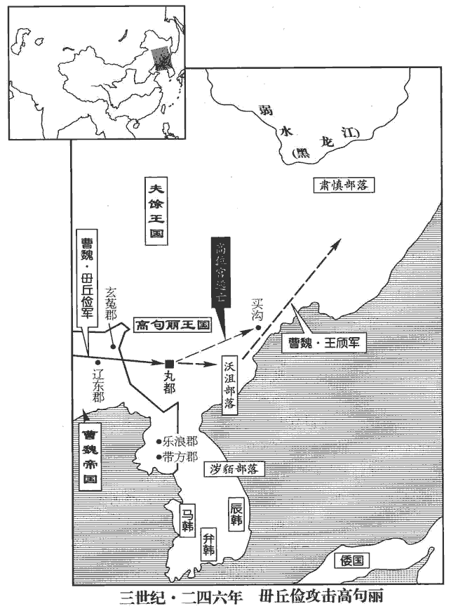
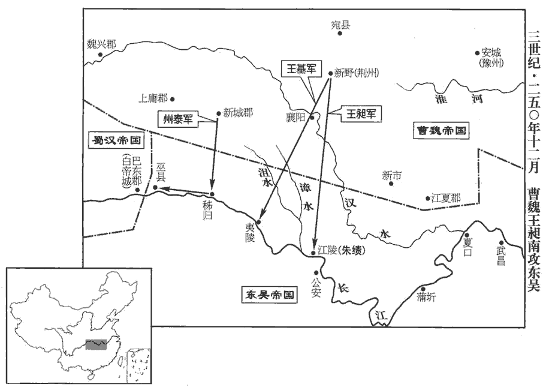
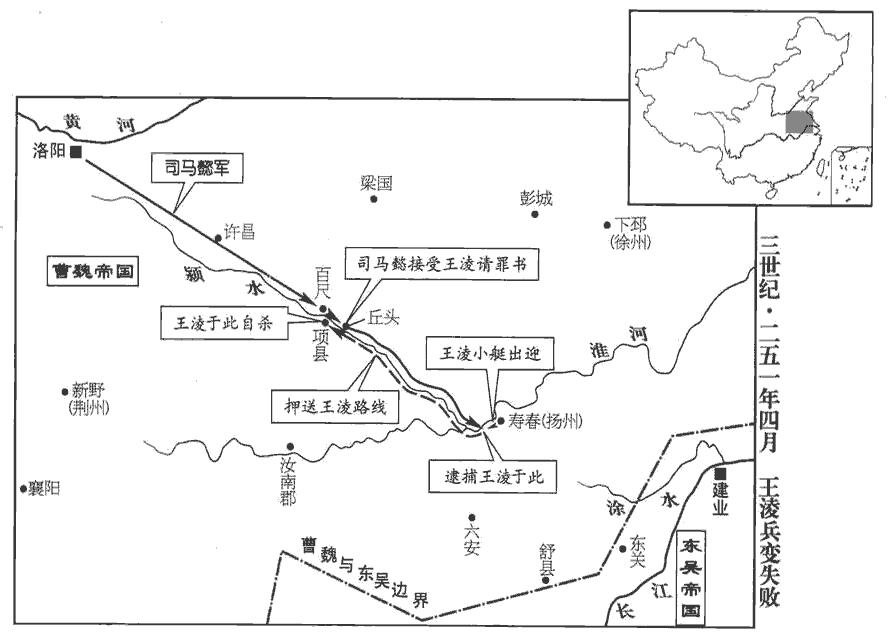
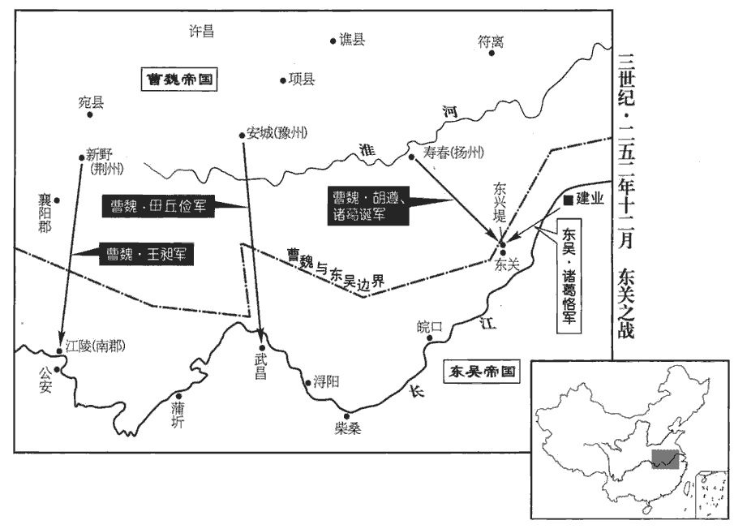

 魏紀七起柔兆攝提格（丙寅），盡玄黓yì涒tūn灘（壬申），凡七年。

# 邵陵厲公中

## 正始七年（丙寅，二四六）

1春，二月，吳車騎將軍朱然寇柤中‹湖北南漳东›，柤，讀如祖；楊正衡側瓜翻。殺略數千人而去。

〖译文〗 [1]春季，二月，吴国车骑将军朱然侵犯中，杀死掠夺了数千人之后，才离去。

2幽州刺史毌guàn丘儉以高句驪王位宮數為侵叛，句，如字，又音駒。驪，力知翻。數，所角翻；下同。督諸軍討之；位宮敗走，儉遂屠丸都‹吉林集安›，高句驪都於丸都之下，多大山深谷，毌丘儉傳謂懸車束馬以上丸都，可知矣。唐志：自鴨淥江口舟行百餘里，乃小舫泝流東北行，凡五百三十里而至丸都城。斬獲首虜以千數。句驪之臣得來數諫位宮，位宮不從；得來歎曰：「立見此地將生蓬蒿。」遂不食而死。儉令諸軍不壞其墓，壞，音怪。不伐其樹，得其妻子，皆放遣之。位宮單將妻子逃竄，儉引軍還；未幾，復擊之，幾，居豈翻。復，扶又翻。位宮遂奔買溝‹朝鲜会宁›。後漢書東夷傳：買溝婁，北沃沮之地，去南沃沮八百餘里。句驪名城為溝婁。杜佑曰：北沃沮一名買溝婁。又曰：高句麗居紇hé升骨城，漢為縣，屬玄菟郡，賜以衣幘、朝服、鼓吹，常從郡受之；後稍驕恣，不復詣郡，但於東界築小城以受之，遂名此城為幘溝漊。溝漊者，高麗名城也。建安中，其王伊夷模更作新國都於丸都山下，在沸流水西。魏正始中，毌丘儉屠丸都，銘不耐城而還。又曰：東沃沮在蓋馬大山之東。北沃沮一名買溝漊，去南沃沮八百餘里，與挹婁接。儉遣玄菟‹辽宁沈阳›太守王頎qí追之，過沃沮‹朝鲜东北部›千有餘里，沃沮之地，在蓋馬大山之東。漢武帝滅朝鮮，開置玄菟郡，治沃沮城。後玄菟內徙，沃沮更屬樂浪。光武廢省，就以其渠帥為縣侯。其國小，迫於句驪，遂臣屬焉。菟，同都翻。頎，渠希翻。沮，千余翻。至肅慎氏‹黑龙江下游一带›南界，魏東夷挹婁之國，即古肅慎氏也。刻石紀功而還，所誅納八千餘口。言誅殺者及納降者，總八千餘口。還，從宣翻，又如字。論功受賞，侯者百餘人。

〖译文〗 [2]魏国幽州刺史丘俭因为高句丽国王位宫屡次侵犯边境举兵叛乱，所以就率军去讨伐他；位宫失败逃走后，丘俭屠杀高句丽国的首都丸都城军民，杀死、俘虏的数以千计。高句丽的大臣得来曾经多次劝谏位宫不要叛乱，但位宫不听；得来悲叹地说：“用不了多久就将见到此地长满蓬蒿野草了。”说完之后就绝食而死了。丘俭得知此事后，命令各路军队不得毁坏得来的墓，不得砍伐墓地的树木，如俘获了得来的妻子儿女，也全部释放回家。位宫独自带着妻子儿女狼狈逃窜，丘俭也率军回撤了；但没过多久，丘俭又派兵追杀位宫，位宫逃奔到买沟，丘俭随即派遣玄菟太守王欣继续追击，一直追过了沃沮城一千多里，到达了肃慎氏的南部边界，就在那里刻石立碑，记述了此次战功，然后率军凯旋而归。此次进攻诛杀及纳降的敌军总计有八千余人。于是论功行赏，受封为侯爵者有一百余人。

 

3秋，九月，吳主‹孙权，时年六十五›以驃騎將軍步騭為丞相，驃，匹妙翻。車騎將軍朱然為左大司馬，衛將軍全琮為右大司馬。分荊州為二部：以鎮南將軍呂岱為上大將軍，督右部，自武昌‹湖北鄂州›以西至蒲圻qí‹湖北嘉鱼西南陆溪镇›；水經註：陸水出長沙下雋縣，西逕蒲圻縣北，又逕蒲𡼠山北入大江，謂之陸口。江水又逕蒲𡼠山北對蒲𡼠洲，洲頭即蒲圻縣治。武昌志曰：蒲𡼠山今在嘉魚縣境，蓋蒲圻縣初置于此。宋白曰：蒲圻縣，漢沙羨縣地，吳黃武二年，於沙羨縣置蒲圻縣，在荊江口，因湖以稱，故曰蒲圻。以威北將軍諸葛恪為大將軍，督左部，代陸遜鎮武昌‹湖北鄂州›。

〖译文〗 [3]秋季，九月，吴王任命骠骑将军步骘为丞相，车骑将军朱然为左大司马，卫将军全琮为右大司马。把荆州分为两个部分：任命镇南将军吕岱为上大将军，督领右部，管辖武昌以西至蒲圻一带地区；任命威北将军诸葛恪为大将军，督领左部，代替陆逊，镇守武昌。

4漢大赦。大司農河南‹洛阳东白马寺东›孟光光，河南洛陽人，漢末逃入蜀。於眾中責費禕yī曰：「夫赦者，偏枯之物，木之一邊碩茂一邊焦槁者，謂之偏枯。赦者，赦有罪也。有罪者赦，則姦惡之人抵法而獲免於罪，良善之人受抑而不獲伸，故謂之偏枯之物。非明世所宜有也。衰敝窮極，必不得已，然後乃可權而行之耳。今主上仁賢，百僚稱職，何有旦夕之急而數施非常之恩，稱，尺證翻。數，所角翻。以惠姦宄guǐ之惡乎！」禕但顧謝，踧cù踖jí而已。踧，子六翻。踖，資息翻。

〖译文〗 [4]蜀汉实行大赦。大司农、河南人孟光当众责备费说：“实行大赦，就象树木一半茂盛另一半却枯槁一样，是一种偏颇的政策，不是圣明之世所应实行的。只有到了社会极端衰败，实在不得已的时候，才能暂且变通偶尔实行一次。如今主上仁德圣明，百官们也都尽职尽责，哪儿有什么迫在眉睫的危急情况而几次施行这种不平常的恩典，去加惠于那些为非作歹的奸恶之徒呢？”费只是一个劲儿地看着他道歉，谦恭地听其责备而已。

初，丞相亮時，有言公惜赦者，亮答曰：「治世以大德，不以小惠，治，直之翻。故匡衡、吳漢不願為赦。匡衡疏見三十八卷元帝永光二年。吳漢言見四十三卷光武建武二十年。先帝亦言：『吾周旋陳元方、鄭康成間，陳紀，字元方。鄭玄，字康成。每見啟告，治亂之道悉矣，曾不語赦也。治，直吏翻。若劉景升、季玉父子，劉琮cóng，字季玉。歲歲赦宥，何益於治！』」治，直吏翻。由是蜀人稱亮之賢，知禕不及焉。蜀人賢孔明而劣費禕yī，固不特惜赦一事而已。

〖译文〗 当初，诸葛亮做丞相的时候，有人认为他不肯实行大赦，诸葛亮回答说：“治理国家要靠大的德政，而不靠小恩小惠，因此汉代的贤臣匡衡、吴汉不愿实行大赦。先帝也曾说过：‘我与陈元方、郑康成在一起时，常常听他们给我讲述治国之道，但是竟没有一次讲到过赦免政策。象刘表、刘琮父子那样，每年都实行赦免，对于治国又有什么好处？’”因此蜀人极力称赞诸葛亮的贤明，而知道费是比不上他的。

陳壽評曰：諸葛亮為政，軍旅數興而赦不妄下，數，所角翻；下同。下，遐稼翻。不亦卓乎！

〖译文〗 陈寿评曰：诸葛亮治理国政，曾多次发兵征战，但赦免令却不轻易下达，这难道不是很有远见卓识吗？

5吳人不便大錢，乃罷之。青龍四年，吳鑄大錢，一當五百。景初二年，吳又鑄大錢，一當千。

〖译文〗 [5]吴国人认为大面额的钱币不方便，于是停止了使用。

6漢主‹刘禅，时年四十›以涼州刺史姜維為衛將軍，與大將軍費禕并錄尚書事。費，父沸翻。汶山‹四川汶川›、平康‹四川黑水县›夷反，維討平之。漢武帝元封二年，分蜀郡北部置汶山郡；宣帝地節三年，合蜀郡；蜀又分為汶山郡，又立平康縣屬焉。杜佑曰：汶山郡今蜀郡西北通化郡地，冉駹máng所居也。宋白曰：茂州通化郡，古汶山郡。劉昫xù曰：維州薛城縣，蜀將姜維討汶山叛羌，即此地也，今州城即姜維故壘。汶，讀曰岷。

〖译文〗 [6]汉后主刘禅任命凉州刺史姜维为卫将军，与大将军费一起任录尚书事。汶山郡平康县的夷人反叛，姜维率军去讨伐，平定了叛乱。

漢主數出遊觀，增廣聲樂。太子家令巴西‹四川阆中›譙周上疏諫曰：「昔王莽之敗，豪桀并起以爭神器，才智之士思望所歸，未必以其勢之廣陿xiá，惟其德之厚薄也。於時更始、公孫述等多已廣大，更，工衡翻。然莫不快情恣欲，怠於為善。世祖初入河北，馮異等勸之曰：『當行人所不能為者。』遂務理冤獄，崇節儉，北州歌歎，聲布四遠。於是鄧禹自南陽追之，事見三十九卷漢更始元年。吳漢、寇恂素未之識，舉兵助之；其餘望風慕德，邳肜róng、耿純、劉植之徒，至於輿病齎棺，襁負而至，不可勝數；事并見更始二年。肜，余中翻。勝，音升。故能以弱為強而成帝業。及在洛陽，嘗欲小出，銚yáo期進諫，即時還車。銚期傳曰：光武嘗與期門近出，期頓首車前曰：臣聞古今之誡，變生不意，誠不願陛下微行數出。帝為之回輿而還。銚，音姚。及潁川‹河南禹州›盜起，寇恂請世祖身往臨賊，聞言即行。事見四十二卷建武八年。故非急務，欲小出不敢；至於急務，欲自安不為；帝者之欲善如此！故傳曰：『百姓不徒附』，誠以德先之也。傳，直戀翻。先，悉薦翻。今漢遭厄運，天下三分，雄哲之士思望之時也，言思望賢主混一。臣願陛下復行人所不能為者以副人望！復，扶又翻。且承事宗廟，所以率民尊上也；今四時之祀或有不臨，而池苑之觀或有仍出，臣之愚滯，私不自安。夫憂責在身者，不暇盡樂，樂，音洛；下同。先帝之志，堂構未成，書大誥曰：若考作室，既底法；厥子乃弗肯堂，矧shěn肯構。誠非盡樂之時。願省減樂官、後宮，凡所增造，但奉修先帝所施，施，式支翻，設也。下為子孫節儉之教。」漢主不聽。

〖译文〗 汉后主经常外出游乐观览，增加乐工歌伎的人数。太子家令、巴西郡人谯周上疏进谏说：“从前王莽失败之时，天下豪杰群起争夺帝位，有才德有智慧的人士所希望归附的人，未必是考虑他势力的大小，而主要是考虑他仁德的厚薄。当时刘玄、公孙述等人的势力大多已比较壮大，但他们一个个都纵欲无度尽情享乐，而不愿意为百姓们多行善事。世祖刘秀初入河北的时候，冯异等人劝勉他说：‘您应当多做别人所不能做的事。’于是他尽心治理冤狱，崇尚节俭，北部州县到处都为他歌功颂德，他的名声很快就传遍了四方。于是邓禹从南阳赶来追随他，吴汉、寇恂与他素不相识，也发兵来帮助他；其作的人，如邳肜、耿纯、刘植等，也都望风而仰慕他的仁德；至于抱病登车，带着棺木、背负着孩子而赶来投奔的人，更是数不胜数；因此他能由弱到强而最终成就了帝王之业。他住在洛阳时，有一次曾想出宫门到近处去游览一下，铫期进谏劝阻，他立刻就驱车返回了。而当颍川盗贼作乱时，寇恂请求让他亲自率兵临敌，他二话没说立即就动身出发了。因此，没有紧急事务，想随便出去走走他也不敢，而遇到紧急事务，想自在安闲他也不肯。帝王想要多做善事就是这样！所以《传》书上说：‘百姓不会凭白无故地拥护你’，必须把仁德放在首位才能得到百姓的拥护。当今汉朝正遭受厄运，天下分裂，鼎足而三，豪杰明智之人此时正盼望着贤明的君主来统一天下，我希望陛下您能再象先帝那样，做别人所不能做的事，以符合人们对您的期望！主持宗庙察祀，是为了率领人民尊奉长上。但是如今举行四时祭祀您有时并不亲临主持，却时常到池塘园林去游玩观览，我这个愚笨迟钝之人，暗自以此忧虑不安。那些肩负天下之责的人，没有闲暇尽情享乐。如今先帝的志向、遗业还没有实现，实在不是尽情享乐的时候。我希望您能够减省乐官、后宫之数，凡是需要增加建造的东西，只可遵照奉行先帝所设置的规模办理，为后世子孙树立一个节俭的典范。”但汉后主不听谯周的劝告。

## 八年（丁卯，二四七）

1春，正月，吳全琮卒。

〖译文〗 [1]春季，正月，吴国的全琮去世。

2二月，日有食之。

〖译文〗 [2]二月，发生日食。

時尚書何晏等朋附曹爽，好變改法度。太尉蔣濟上疏曰：「昔大舜佐治，戒在比周；舜之佐堯也，驩huān兜、共工自相稱引則流放之，讒說殄行則堲jí之，戒比周也。好，呼到翻。治，直吏翻；下同。比，毗至翻。周公輔政，慎於其朋。書洛誥：周公戒成王曰：孺子其朋，孺子其朋，其往。孔安國註曰：少子慎其朋黨，少子慎其朋黨，戒其自今已往。夫為國法度，惟命世大才，乃能張其綱維，以垂於後，豈中下之吏所宜改易哉！終無益於治，適足傷民。宜使文武之臣，各守其職，率以清平，則和氣祥瑞可感而致也！」

〖译文〗 此时魏国尚书何晏等人勾结依附于曹爽，喜好更改国家的法规制度。太尉蒋济上疏说：“古时大舜辅佐唐尧治国，以结党营私为戒；周公协助成王理政，对结交什么人也极为慎重。国家的法度，只有那些著名于世的伟大人才，才能总掌其纲领而留传于后世，岂是中下等官吏所能随便改变的？而且更改国家法度最终不仅无益于治理国家，却反而足以伤害人民。所以应该让文武大臣们，恪守各自的职责，都能做到清廉公正，那么平和之气、吉祥符瑞就可以受到感应而降临了。”

3吳主‹孙权，时年六十六›詔徙武昌‹湖北鄂州›宮材瓦，繕修建業宮‹在南京›。有司奏言：「武昌宮已二十八歲，吳以漢獻帝建安二十四年都武昌，至是已二十八年。恐不堪用，宜下所在，下，遐稼翻。通更伐致。」伐致，謂伐材木而致之。通者，凡吳境內悉然也。吳主曰：「大禹以卑宮為美。今軍事未已，所在賦斂，斂，力贍翻。若更通伐，妨損農桑，徙武昌材瓦，自可用也。」乃徙居南宮。三月，改作太初宮，晉太康地記曰：吳有太初宮，方三百丈。令諸將及州郡皆義作。以下奉上，義當助作宮室。

〖译文〗 [3]吴王诏令拆运武昌宫的砖瓦木材，用来修缮建业宫。有关官吏禀告说：“武昌宫至今已有二十八年，其砖木破旧恐怕已不适宜再用，应该向下面的州县去要，从全国各地砍伐木材运来。”吴王说：“古时大禹以低矮的宫室为美，我也应该如此。如今战事连绵不断，向全国各地征收赋税，如果再让各地砍伐木材，就会妨害损伤农林生产，所以武昌宫的旧砖木，还是可以使用的。”于是迁居南宫。三月，改建太初宫，命令各个将领及各州郡官长都来义务协助建造。

4大將軍爽用何晏、鄧颺、丁謐之謀，遷太后於永寧宮，據後魏起永寧寺於銅駝街西，意即前魏永寧殿故處也。又據陳壽志，太后稱永寧宮，非徙也。意者晉諸臣欲增曹爽之惡，以遷字加之耳。晉書五行志曰：爽遷太后於永寧宮，太后與帝相泣而別。蓋亦承晉諸臣所記也。專擅朝政，朝，直遙翻。多树親黨，屢改制度。太傅懿不能禁，與爽有隙。五月，懿始稱疾，不與政事。為司馬懿誅曹爽等張本。與，讀曰預。

〖译文〗 [4]大将军曹爽采纳何晏、邓、丁谧的计谋，把太后迁居到永宁宫，并独揽朝政大权，广泛地提拔亲戚党羽，多次更改制度。太傅司马懿不能禁止，就与曹爽之间产生矛盾。五月，司马懿开始称病，不上朝参与政事。

5吳丞相步騭卒。

〖译文〗 [5]吴国丞相步骘去世。

6帝‹曹芳，时年十六›好褻xiè近群小，近，其靳翻。遊宴後園。秋，七月，尚書何晏上言：「自今御幸式乾殿參考魏、晉所記，式乾殿當在皇后宮。坤為母，乾為父，言皇后為天下母，以乾為式，從夫之義也。及遊豫後園，宜皆從大臣，詢謀政事，講論經義，為萬世法。」冬，十二月，散騎常侍、諫議大夫孔乂上言：秦置諫大夫，掌論議：後漢增為諫議大夫。「今天下已平，陛下可絕後園，習騎乘馬，騎，奇寄翻。出必御輦乘車，天下之福，臣子之願也。」帝皆不聽。

〖译文〗 [6]魏帝喜好宠幸亲近一群小人，在后园游乐饮宴。秋季，七月，尚书何晏上疏说：“从今以后皇帝到式乾殿或者到后园游乐时，应该都有大臣跟随，以便询问商量政事，讲解讨论经书大义，并为世世代代所效法。”冬季，十二月，散骑常侍、谏议大夫孔义又上疏说：“如今天下已经太平，陛下可以不必再到后园学习骑术，外出一定要乘坐辇车，这是天下之福，也是臣子的愿望。”魏帝都没有听从他们的意见。

7吳主大發眾集建業‹南京›，揚聲欲入寇，揚州‹安徽中部›刺史諸葛誕使安豐‹安徽霍邱›太守王基策之。安豐縣，漢屬六安國，後漢屬廬江郡，魏分置安豐郡，屬豫州。策之者，計之也。基曰：「今陸遜等已死，孫權年老，內無賢嗣，中無謀主。權自出則懼內釁卒起，卒，讀曰猝。癰疽jū發潰；遣將則舊將已盡，新將未信。疽，千余翻。將，即亮翻。此不過欲補䘺支黨，䘺zhàn，丈澗翻，縫也。還自保護耳。」已而吳果不出。

〖译文〗 [7]吴王发重兵集中在建业，并扬言要入侵魏国，扬州刺史诸葛诞得到消息后，让安丰太守王基出谋划策。王基说：“如今陆逊等人已死，孙权也已年老，内无贤良的继承人，朝中又无主谋之人。孙权若亲自领兵出征，则惧怕内乱象痈疽溃烂那样突然爆发；若派遣将领出征，则旧将领已经死光，而新将领又未获得信任。所以这只不过是想整顿内部，加强自我保护的措施而已。”过些时候，吴国果然没有出兵。

8是歲，雍、涼羌胡叛降漢，雍，於用翻。降，戶江翻。漢姜維將兵出隴右以應之，與雍州刺史郭淮、討蜀護軍夏侯霸戰于洮táo西‹洮水以西，甘肃临潭一带›。水經註：洮水與蜀白水俱出西傾山，山南即白水源，山東即洮水源。洮水東流逕吐谷渾中，又東逕臨洮、安故、狄道，又北至枹罕，入于河。諸縣皆在洮東，若洮西則羌虜所居也。洮，土刀翻。胡王白虎文、治無戴等率部落降維，維徙之入蜀。蜀志曰：居于繁縣‹四川新都西北新繁镇›。據姜維傳，則白虎文與治無戴二人也。又魏志，曹真讨破叛胡治元多，蓋諸胡有治姓也。淮進擊羌胡餘黨，皆平之。

〖译文〗 [8]这一年，雍州、凉州的羌、胡族人背叛魏国投降蜀汉，汉将姜维领兵出陇右来接应他们，与雍州刺史郭淮、讨蜀护军夏侯霸在洮西展开战斗。胡人首领白虎文、治无戴等人率领部落投降了姜维，姜维把他们迁徙到蜀国境内。郭淮向羌胡余党进攻，全部平定了叛乱。

## 九年（戊辰，二四八）

1春，二月，中書令孫資，癸巳‹三十›，中書監劉放，三月，甲午‹一›，司徒衛臻各遜位，以侯就第，位特進。雞棲樹之言固中，而三馬食一槽矣。

〖译文〗 [1]春季，二月，中书令孙资，癸巳（三十日），中书监刘放，三月，甲午（初一），司徒卫臻各自退位，都赐以侯爵退居归家，加封为特进。

2夏，四月，以司空高柔為司徒，光祿大夫徐邈為司空。邈叹曰：「三公論道之官，無其人則缺，書曰：三公論道經邦，燮理陰陽，官不必備，惟其人。豈可以老病忝之哉！」忝，辱也。遂固辭不受。

〖译文〗 [2]夏季，四月，任命司空高柔为司徒，光禄大夫徐邈为司空。徐邈感叹地说：“三公是讲论治国大道的官职，没有合适的人选就应虚位以待，怎能让老弱病残之人辱没这个职位呢？”于是就坚决推辞不接受司空之职。

3五月，漢費禕出屯漢中‹陕西漢中›。自蔣琬及禕，雖身居於外，慶賞刑威，皆遙先諮斷，斷，丁亂翻。諮斷者，諮之使斷決也。然後乃行。禕雅性謙素，當國功名，略與琬比。

〖译文〗 [3]五月，蜀汉的费出都城屯兵于汉中。从蒋琬到费，虽然身居于外，但国家的庆典赏赐及刑罚等大事，都先要远远地向他们咨询，做出决断，然后才加以实行。费性情谦逊朴素，治理国政的功绩名望，大致与蒋琬相当。

4秋，九月，以車騎將軍王淩為司空。

〖译文〗 [4]秋季，九月，任命车骑将军王为司空。

5涪陵‹四川彭水›夷反，涪陵縣，漢屬巴郡，蜀分置涪陵郡，唐之涪州。宋白曰：涪州涪陵郡，漢為涪陵縣地；蜀先主以地控江源，於此立涪陵郡，領漢平、漢葭二縣。四夷縣道記云：故城在蜀江之南，涪江之西。其涪江南自黔中來，由城之西泝蜀江十五里，有雞鳴峽，上有枳城，即漢枳縣也，李雄據蜀後，枳縣荒廢；桓溫定蜀，別立枳縣於今郡東北十里。周武帝保定四年，涪陵首領田思鶴歸化，於故枳城立涪陵鎮；隋開皇三年，移漢平縣於鎮城，仍改漢平為涪陵縣，因鎮為名。唐為涪州，元和三年，以涪州疆理與黔中接近，敕隸黔中。按華陽國志云：涪陵，巴之南鄙。從枳zhǐ縣入，泝涪水，秦司馬錯由之取楚黔中地，漢興常為都尉理。山險水灘，人多獽ráng、蜑dàn，唯出丹漆蜜枳；縣即涪州所理。漢建安中，涪陵謝本以涪陵廣大，白州牧劉璋分置丹興、漢葭二縣以為郡。璋乃分涪陵，立永寧，兼丹興、漢葭，合四縣置屬國都尉，理涪陵。蜀先主改為郡，改永寧曰萬寧，又增立漢復縣。後主又立漢平縣。晉太康地志省丹興縣，郡移理漢復。又言萬寧在郡南，水道九百里，其萬寧蓋今費州是。蜀後主延熙中，涪陵大姓徐巨反，鄧芝討平之。漢涪陵蓋在今涪州東南三百三十里，黔州是其故理，在江之東。又言：漢復縣北至涪陵九十里，蓋今黔州所管洪杜縣是其故理。又言：漢葭在郡東百里，灃源出界，蓋今州東九十里故黔州城是。其丹興縣蓋在今黔州東二百里黔江縣是。又按漢平縣，在今涪州東百二十里，羅浮山之北，岷江之南，白水入江處側近。又按十三州志，枳在郡東北，涪陵在郡東。按今黔州亦與巴郡東南相抵。據謝本所論，晉志所云，今夷、費、思、播及黔府等五州，悉是涪陵故地。又隋圖經，黔中是武陵郡酉陽縣地。按漢酉陽在今溪州犬鄉縣界，與黔州約相去千餘里，今三亭縣西北九百餘里別有酉陽城，乃劉蜀所置，非漢之酉陽。隋圖經及貞觀地志并言蜀所置酉陽為漢酉陽，蓋誤認漢涪陵之地也。自永嘉後，沒於夷獠。元魏後圖記不傳，至後周田思鶴歸化，初於其地立奉州，續改黔州；大業中，又改黔安郡；因問隋州郡名，遂與秦、漢黔中郡交㸦hù難辨。其秦黔中郡理，在今辰州西二十里黔中故城是。漢改黔中為武陵郡，移治義陵，即今辰州漵xù浦縣是。後漢移理臨沅，即今朗州所理是。今辰、錦、敘、獎、溪、澧、朗、施八州，是秦、漢黔中郡地，與今黔州及夷、費、思、播隔越峻嶺，東有沅江水及諸溪并合，而東注洞庭湖，嶺西有巴江水，一名涪陵江，自牂柯北歷播、費、思、黔等州，北注岷江。以山川言之，巴郡之涪陵與黔中故地，炳然自分矣。漢車騎將軍鄧芝討平之。

〖译文〗 [5]涪陵的夷人谋反，蜀汉车骑将军邓芝率兵讨伐平定了叛乱。

6大將軍爽，驕奢無度，飲食衣服，擬於乘輿；乘，繩證翻。尚方珍玩，充牣其家；又私取先帝‹曹叡›才人以為伎樂。伎，渠綺翻。作窟室，綺疏四周，窟室，掘地為室也。賢曰：綺疏，謂鏤為綺文數與其黨何晏等縱酒其中。弟羲深以為憂，數涕泣諫止之，爽不聽。爽兄弟數俱出遊，數，所角翻。司農沛國‹江苏沛县›桓范謂曰：「總萬機，典禁兵，不宜并出，若有閉城門，誰復內入【章：甲十六行本「入」作「人」；乙十一行本同；孔本同。】者？」復，扶又翻；下同。爽曰：「誰敢爾邪！」

〖译文〗 [6]大将军曹爽骄奢无度，饮食衣服，与皇帝相同，尚方署中的珍宝玩好，也充满了他的家，他还私自留用明帝的宫中女官做歌舞乐妓。他掘开地面建造地下宫室，在四周雕饰了华丽的花纹，并经常与他的党羽何晏等人在里面饮酒作乐。他的弟弟曹羲深深地为此忧虑，多次哭泣着劝阻他别再这样做，但曹爽不听。曹爽兄弟几个经常一起出去游玩，司农、沛国人桓范对他说：“您总理万机，掌管城内禁兵，弟兄们不宜同时出城，如果有人关闭城门，又有谁在城内接应呢？”曹爽说：“谁敢这样做！”

初，清河‹山东临清›、平原‹山东平原›爭界，八年不能決。冀州刺史孫禮，請天府所藏烈祖封平原時圖以決之；烈祖，明帝也，封平原王。畫壤分國，有地圖在天府。周禮有天府，鄭玄註云：掌祖廟之寶藏；又賢能之書及功書皆藏于天府。爽信清河之訴，云圖不可用，禮上疏自辨，辭頗剛切。爽大怒，劾禮怨望，結刑五歲。結刑五歲者，但結以徒作五歲之罪而不使之輸作也。劾，戶概翻，又戶得翻。久而【章：甲十六行本「而」作「之」；乙十一行本同；孔本同；張校同；退齋校同。】復為并州刺史，往見太傅懿，有忿色而無言。懿曰：「卿得并州少邪？恚理分界失分乎？」魏并州統太原、上黨、西河、鴈門、新興。冀州大於諸州，并州遠接荒外，故意其觖jué望。懿多權數，以此言擿tī發禮耳。少，詩沼翻。恚，於避翻。分，扶問翻。禮曰：「何明公言之乖也！禮雖不德，豈以官位往事為意邪！本謂明公齊蹤伊、呂，匡輔魏室，上報明帝之託，下建萬世之勳。今社稷將危，天下兇兇，兇，許拱翻。此禮之所以不悅也！」因涕泣橫流。懿曰：「且止，忍不可忍！」至此，禮入懿數中矣。

〖译文〗 当初，清河、平原二君争议地界，八年也不能决断。冀州刺史孙礼请求观看天府收藏的魏明帝受封为平原王时的地图加以决断；但曹爽相信清河郡的上诉，说地图不可用，于是孙礼上疏自我申辩，言辞颇为强硬严厉。曹爽勃然大怒，弹劾孙礼对朝廷心怀不满，叛罪五年。过了很久，又改任孙礼为并州刺史。孙礼去看望太傅司马懿时，面露忿然之色却不说话。司马懿说：“你是嫌得到并州地盘小呢？还是怨恨处理分界事务不正确呢？”孙礼说：“为什么您说话这样不合道理？我虽然没有什么德能，难道还把区区官位和过去的事情放在心上吗？我本想说的是您应该追循伊尹、吕尚的足迹，匡正辅佐魏国朝政，上可以报答明帝的嘱托，下可以建立万世的功勋。而如今国家将要遭受危难，天下也动荡不宁，这就是我所以不高兴的原因！”说完他已经悲痛万分，泪流满面了。司马懿劝慰他说：“你先不要悲痛，要学会忍受那些不能够忍受的事情。”

冬，河南尹李勝出為荊州刺史，過辭太傅懿。懿令兩婢侍。持衣，衣落；指口言渴，婢進粥，懿不持杯而飲，粥皆流出霑胸。勝曰：「眾情謂明公舊風發動，魏武之辟懿也，懿辭以風痹，故勝以為舊風發動。何意尊體乃爾！」懿使聲氣纔屬，詐為羸惙之狀也。屬，之欲翻。說：「年老枕疾，死在旦夕。枕，之鴆翻。君當屈并州，并州近胡，近，其靳翻。好為之備！恐不復相見，以子師、昭兄弟為託。」勝曰：「當還忝本州，李勝，南陽人，故謂荊州為本州。非并州。」懿乃錯亂其辭曰：「君方到并州？」勝復曰：「當忝荊州。」懿曰：「年老意荒，不解君言。解，戶買翻，曉也。今還為本州，盛德壯烈，好建功勳！」勝退，告爽曰：「司馬公尸居餘氣，形神已離，不足慮矣。」言其形神已離，惟尸在而餘殘喘耳。他日，又向爽等垂泣曰：無聲而出涕，曰垂泣。「太傅病不可復濟，令人愴然！」故爽等不復設備。

〖译文〗 冬季，河南令尹李胜出任荆州刺史，到太傅司马懿家去辞行。司马懿让两个婢女侍奉着出来接见。让他更衣，他却把衣服掉在地上；指着嘴说口渴，婢女端来了粥，司马懿拿不动碗，就由婢女端着喝，粥从嘴边流出，沾满了前胸。李胜说：“大家都说您的中风病旧病复发，没想到您的身体竟这样糟！”司马懿气喘嘘嘘地说：“我年老体弱卧病不起，不久就要死了。你屈就并州刺史，并州靠近胡地，要很好地加强戒备。恐怕我们不能再见面了，我把我的儿子司马师和司马昭兄弟托付给你。”李胜说：“我是回去愧居本家乡的州官，不是并州。司马懿装聋作哑，故意听错他的话说：“你刚刚到过并州？”李胜又说：“是愧居荆州。”司马懿说：“我年老耳聋思绪迷乱，没听明白你的话。如今你回到本家乡的州，正好轰轰烈烈地大展德才建立功勋。”李胜告退后，禀告曹爽说：“司马公只是比死人多一口气，形体与精神已经分离，离死不远，不足以忧虑了。”过了几天，他又流着泪向曹爽等人说：“太傅的病体不能再复元了，实在令人悲伤。”因此曹爽等人不再对司马懿加以戒备。

何晏聞平原管輅lù明於術數，請與相見。十二月，丙戌‹二十八›，輅往詣晏，晏與之論易。時鄧颺yáng在坐坐，徂臥翻。謂輅曰：「君自謂善易，而語初不及易中辭義，何也？」輅曰：「夫善易者不言易也。」晏含笑贊之曰：「可謂要言不煩也！」因謂輅曰：「試為作一卦，為，于偽翻。知位當至三公不？」不，讀曰否。又問：「連夢見青蠅數十，來集鼻上，驅之不去，何也？」輅曰：「昔元、凱輔舜，左傳：高陽氏有才子八人，蒼舒、隤tuí敱ái、檮chóu戭yǎn、大臨、尨páng降、庭堅、仲容、叔達，齊聖廣淵，明允篤誠，天下之民謂之「八愷kǎi」。高辛氏有才子八人，伯奮、仲堪、叔獻、季仲、伯虎、仲熊、叔豹、季狸，忠肅共懿，宣慈惠和，天下之民謂之「八元」。周公佐周，皆以和惠謙恭，享有多福，此非卜筮所能明也。今君侯位尊勢重，而懷德者鮮，鮮，息淺翻。畏威者眾，殆非小心求福之道也。又，鼻者天中之山，相書以鼻為天中，自脣以上為人中。裴松之曰：相書謂鼻之所在為天中，鼻有山象，故曰天中之山。『高而不危，所以長守貴。』今青蠅臭惡而集之，位峻者顛，輕豪者亡，不可不深思也！願君侯裒póu多益寡，裒，莆侯翻，與掊同，取也。爾雅：裒、鳩、樓，聚也。徐云：樓斂也。此言晏據權勢，揆kuí分為多，當思自減損也。非禮勿履，然後三公可至，青蠅可驅也。」颺曰：「此老生之常譚。」輅曰：「夫老生者見不生，常譚者見不譚。」言必見其死也。譚，與談同。輅還邑舍，邑舍，平原邑邸也。具以語其舅；語，牛倨翻。舅責輅言太切至。輅曰：「與死人語，何所畏邪！」舅大怒，以輅為狂。

〖译文〗 何宴听说平原郡的管辂精通占卜之术，就请求与他相见。十二月，丙戌（二十八日），管辂去拜访何晏，何晏和他讨论《易经》。当时邓也在坐，对管辂说：“您自己说善于研究《易经》，但谈话时却从不说到《易经》中辞义，这是为什么？”管辂说：“善于《易经》的人是不说《易经》的。”何晏含笑称赞他说：“这话可真是要言不烦哪！”于是又对管辂说：“请为我试卜一卦，看我的地位能否达到三公？”又问道：“连日来我总梦见数十只青蝇落在鼻子上，赶都赶不走，这是怎么回事呢？”管辂说：“古代八元、八凯辅佐虞舜，周公辅佐成王，都因其温和仁厚谦虚恭敬而多福多寿，这不是卜筮所能决定的。如今您地位尊贵权势很大，但人们怀念您恩德的少，而畏惧您威势的多，这恐怕不是小心求福之道。另外，鼻子是天中之山，《易经》说：‘居高位而不危倾，就可以长久地守住尊贵之位。’如今梦见青蝇这种污秽的东西集聚在您的鼻子上，这就是说地位高者将要倾覆，轻佻奢侈者将要灭亡，您不能不深入地想一想了！希望您削减多的，补充不足，不合礼的事不要去干，这样三公的地位就可以达到，青蝇也可以被驱赶走了。”邓说：“你这是老生常谈。”管辂说：“但老生者却见到不生，常谈者却见到不谈。”管辂回到家中，把这些都告诉了他舅舅。其舅责怪管辂说话太直切露骨。管辂说：“和死人说话，还有什么可畏惧的！”其舅勃然大怒，认为管辂太狂傲。

7吳交趾‹越南河内东北北宁府›、九真‹越南清化›夷賊攻沒城邑，交部騷动。吳主‹孙权，时年六十七›以衡陽‹湖南衡山县›督軍都尉陸胤為交州‹两广及越南北部›刺史、安南‹越南北部›校尉。胤入境，喻以恩信，降者五萬餘家，州境復清。

〖译文〗 [7]吴国交趾、九真的夷人造反，攻陷了城镇，整个交州地区也都骚动不安。吴王任命衡阳督军都尉陆胤为交州刺史和安南校尉。陆胤进入交州境内，广施恩惠和诚信，结果投降者有五万余家，交州境内又恢复了太平。

8太傅懿陰與其子中護軍師、散騎常侍昭謀誅曹爽。懿雖稱疾，先已置二子於要地矣。

〖译文〗 [8]太傅司马懿暗地里和他的儿子中护军司马师、散骑常侍司马昭密谋诛杀曹爽。

## 嘉平元年（己巳，二四九）是年四月方改元。

1春，正月，甲午‹六›，帝‹曹芳，时年十八›謁高平陵‹洛阳南›，高平陵，明帝‹曹叡›陵也。水經註：大石山在洛陽南，山阿有魏明帝高平陵。孫盛曰：高平陵去洛城九十里。大將軍爽与弟中領軍羲、武衛將軍訓、散騎常侍彥皆從。從，才用翻。太傅懿以皇太后令，閉諸城門，勒兵據武庫，授兵出屯洛水浮橋；水經註：洛城南出西頭第二門曰宣陽門，漢之小苑門也，對閶闔，南直洛水浮桁héng。召司徒高柔假節行大將軍事，據爽營；太僕王觀行中領軍事，據羲營。因奏爽罪惡於帝曰：「臣昔從遼東還，先帝詔陛下、秦王及臣升御牀，把臣臂，深以後事為念。事見上卷明帝景初三年。臣言『太祖、高祖亦屬臣以後事，屬，之欲翻。按晉紀，懿自為文帝所信重，太祖未嘗以後事屬之也，若文帝則以明帝屬懿。此自陛下所見，無所憂苦。萬一有不如意，臣當以死奉明詔。』今大將軍爽，背棄顧命，背，蒲妹翻。陸德明曰：顧，音古。敗亂國典，內則僭擬，外則專權，破壞諸營，敗，補邁翻。壞，音怪。盡據禁兵，群官要職，皆置所親，殿中宿衛，易以私人，根據盤互，縱恣日甚。又以黃門張當為都監，監，古銜翻。伺察至尊，離間二宮伺，相吏翻。間，古莧翻。傷害骨肉，天下洶洶，人懷危懼。陛下便為寄坐，寄坐，謂雖處天子之位，猶寄寓也。豈得久安！此非先帝詔陛下及臣升御牀之本意也。臣雖朽邁，朽邁，謂年老衰朽，日月已過也。敢忘往言！太尉臣濟等皆以爽為有無君之心，兄弟不宜典兵宿衛奏永寧宮，皇太后令敕臣如奏施行。臣輒敕主者及黃門令『罷爽、羲、訓吏兵，以侯就第，不得逗留，以稽車駕；敢有稽留，便以軍法從事！』臣輒力疾將兵屯洛水浮橋，伺察非常。」輒，專也。懿雖挾太后以臨爽，而其奏自言輒者至再，以天子在爽所也。爽得懿奏事，不通；迫窘不知所為，留車駕宿伊水南，水經註：來儒之水，出于半石之山，西南流逕大石山，又西至高都城東，西入伊水。伊水又東北過伊闕中，又東北至洛陽縣南，北入于洛。伐木為鹿角，發屯田兵數千人以為衛。魏武創業，令州郡例置田官，故洛陽亦有屯田兵。

〖译文〗 [1]春季，正月，甲午（初六），魏帝祭扫高平陵，大将军曹爽和他的弟弟中领军曹羲、武卫将军曹训、散骑常侍曹彦等都随侍同行。太傅司马懿以皇太后名义下令，关闭了各个城门，率兵占据了武库，并派兵出城据守洛水浮桥；命令司徒高柔持节代理大将军职事，占据曹爽营地；太仆王观代理中领军职事，占据曹羲营地。然后向魏帝禀奏曹爽的罪恶说：“我过去从辽东回来时，先帝诏令陛下、秦王和我到御床跟前，拉着我的手臂，深为后事忧虑。我说道：‘太祖、高祖也曾把后事嘱托给我，这是陛下您亲眼见到的，没有什么可忧虑烦恼的。万一发生什么不如意的事，我当誓死执行您的诏令。’如今大将军曹爽，背弃先帝的遗命，败坏扰乱国家的制度；在朝内则超越本分自比君主，在外部则专横拔扈独揽大权；破坏各个军营的编制，完全把持了禁卫部队；各种重要官职，都安置他的亲信担任；皇宫的值宿卫士，也都换上了他自己的人；这些人相互勾结盘踞在一起，恣意妄为日甚一日。曹爽又派宦官黄门张当担任都监，侦察陛下的情况，挑拨离间陛下和太后二宫的关系，伤害骨肉之情，天下动荡不安，人人心怀畏惧。这种形势下，陛下也只是暂时寄居天子之位，岂能长治久安。这绝不是先帝诏令陛下和我到御床前谈话的本意。我虽老朽不堪，怎敢忘记以前说的话？太尉蒋济等人也都认为曹爽有篡夺君位之心，他们兄弟不宜掌管部队担任皇家侍卫，我把这些意见上奏皇太后，皇太后命令我按照奏章所言施行。我已擅自作主告诫主管人及黄门令说：‘免去曹爽、曹羲、曹训的官职兵权，以侯爵的身分退职归家，不得逗留而延滞陛下车驾，如敢于延滞车驾，就以军法处置。’我还擅自作主勉力支撑病体率兵驻扎在洛水浮桥，侦察非常情况。”曹爽得到司马懿的奏章，没有通报魏帝；但惶急窘迫不知所措，于是就把魏帝车驾留宿于伊水之南，伐木构筑了防卫工事，并调遣了数千名屯田兵士为护卫。

懿使侍中高陽‹河北高阳东›許允及尚書陳泰說爽，宜早自歸罪，說，輸芮翻。又使爽所信殿中校尉尹大目謂爽，唯免官而已，魏、晉之制，有殿中將軍、中郎、校尉、司馬。尹大目說爽，猶未疑司馬氏也，至其追語文欽乃覺耳。以洛水為誓。泰，群之子也。

〖译文〗 司马懿派遣侍中、高阳人许允和尚书陈泰去劝说曹爽，告诉他应该尽早归降认罪；又派曹爽所信任的殿中校尉尹大目去告诉曹爽，只是免去他的官职而已，并指着洛水发了誓。陈泰是陈群之子。

初，爽以桓范鄉里老宿，范，沛國‹江苏沛县›人，譙‹安徽亳州›、沛鄉里也。老，耆也。宿，舊也。於九卿中特禮之，然不甚親也。及懿起兵，以太后令召范，欲使行中領軍。范欲應命，其子止之曰：「車駕在外，不如南出。」范乃出。至平昌城門，水經註：平昌門，故平門也，洛城南出西頭第三門。城門已閉。門候司蕃，故范舉吏也，司，姓也。左傳鄭有司臣。范舉手中版示之，矯曰：「有詔召我，卿促開門！」蕃欲求見詔書，以此觀之，此時猶用版詔，至晉時則有青紙詔矣。范呵之曰：「卿非我故吏邪，何以敢爾？」乃開之。范出城，顧謂蕃曰：「太傅圖逆，卿從我去！」蕃徒行不能及，遂避側。避於道旁也。懿謂蔣濟曰：「智囊往矣！」濟曰：「范則智矣；然駑馬戀棧豆，爽必不能用也。」駑，音奴。言爽顧戀室家而慮不及遠，必不能用范計。棧zhàn，士限翻。

〖译文〗 当初，曹爽因桓范是他同乡年长的故旧，所以在九卿之中对桓范特别加以礼遇，但关系不太亲近。司马懿起兵时，以太后的名义下令，想要让桓范担任中领军之职。桓范打算接受任命，但他的儿子劝阻他说：“皇帝的车驾在外，您不如出南门去投奔。”于是桓范就离城出去。走到平昌城门时，城门已经关闭。守门将领司蕃是桓范过去提拔的官吏，桓范把手中的版牒向他一亮，谎称说：“有诏书召我前往，请你快点开门。”司蕃想要亲眼看看诏书，桓范大声呵斥说：“你难道不是我过去手下的官吏吗？怎敢如此对我？”司蕃只好打开城门。桓范出城以后，回过头来对司蕃说：“太傅图谋叛逆，你还是跟我走吧！”司蕃步行追赶不及，只好在道旁躲避。司马懿得知后对蒋济说：“曹爽的智囊去了！”蒋济说：“桓范是很有智谋的，但曹爽就象劣马贪恋马房的草料一样，因顾恋他的家室而不能作长远打算，所以必然不能采纳桓范的计谋。”

范至，勸爽兄弟以天子詣許昌，發四方兵以自輔。爽疑未決，范謂羲曰：「此事昭然，卿用讀書何為邪！於今日卿等門戶，求貧賤復可得乎！復，扶又翻。且匹夫質一人，尚欲望活；此謂漢末劫質也。質，音致。卿與天子相隨，令於天下，誰敢不應也！」俱不言。范又謂羲曰：「卿別營近在闕南，中領軍營，懿已遣王觀據之，惟別營在耳。洛陽典農治在城外，洛陽典農中郎將、典農都尉所治也。呼召如意。今詣許昌，不過中宿，中宿，次宿也。左傳曰：命汝三宿，汝中宿至。陸德明曰：中，丁仲翻。許昌別庫，足相被假；許昌別庫貯兵甲；洛陽有武庫，故曰別庫。被假，謂授兵也。被，皮義翻。所憂當在穀食，而大司農印章在我身。」羲兄弟默然不從，自甲夜至五鼓，甲夜，初夜也。夜有五更：一更為甲夜，二更為乙夜，三更為丙夜，四更為丁夜，五更為戊夜。爽乃投刀於地曰：「我亦不失作富家翁！」范哭曰：「曹子丹佳人，生汝兄弟，㹠tún犢耳！曹真，字子丹。㹠，與豚同。小豕曰㹠，小牛曰犢。何圖今日坐汝等族滅也！」

〖译文〗 桓范到了之后，劝说曹爽兄弟把天子挟持到许昌，然后调集四方兵力辅助自己。曹爽仍犹豫不决，桓范就对曹羲说：“这件事明摆着只能如此办理，真不知你读书是干什么用的！在今天的形势下，象你们这样门第的人想要求得贫贱平安的日子还可能吗？而且普通百姓有一人被劫作人质，人们尚且希望他能存活，何况你们与天子在一起，挟天子以令天下，谁敢不从。”他们都默然不语。桓范又对曹爽说：“你的中领军别营近在城南，洛阳典农的治所也在城外，你可随意召唤调遣他们。如今到许昌去，不过两天两夜的路程，许昌的武器库，也足以武装军队，我们所忧虑的当是粮食问题，但大司农的印章在我身上，可以签发征调。”然而曹羲兄弟却默然不动，从初夜一直坐到五更。曹爽然后把刀扔在地上说：“即使投降，我仍然不失为富贵人家！”桓范悲痛地哭泣道：“曹子丹这样有才能的人，却生下你们这群如猪如牛的兄弟！没想到今日受你们的连累要灭族了。”

爽乃通懿奏事，白帝下詔免己官。奉帝还宫，爽兄弟歸家，懿發洛陽吏卒圍守之；洛陽令所主吏卒也。四角作高樓，令人在樓上察視爽兄弟舉動。爽挾彈到後園中，彈，徒案翻。樓上便唱言：「故大將軍東南行！」爽愁悶不知為計。

〖译文〗 于是曹爽向魏帝通报了司马懿上奏的事，告诉魏帝下诏书免除自己的官职，并侍奉魏帝回宫。曹爽兄弟回家以后，司马懿派洛阳的兵士包围了曹府并日夜看守；府宅的四角搭起了高楼，派人在楼上监视曹爽兄弟的举动。曹爽若是挟着弹弓到后园去，楼上的人就高声叫喊：“故大将军向东南去了。”弄得曹爽愁闷不已，不知如何是好。

戊戌‹十›，有司奏「黃門張當私以所擇才人與爽，疑有姦。」收當付廷尉考實，辭云：「爽與尚書何晏、鄧颺、丁謐、司隸校尉畢軌、荊州刺史李勝等陰謀反逆，須三月中發。」於是收爽、羲、訓、晏、颺、謐、軌、勝并桓范皆下獄，劾以大逆不道，下，遐稼翻。劾，戶概翻，又戶得翻。與張當俱夷三族。考異曰：魏氏春秋曰：「宣王使晏典治爽等獄，晏窮治黨與，冀以獲宥。宣王曰：『凡有八族，』晏疏丁、鄧等七姓。宣王曰：『未也。』晏窮急，乃曰：『豈謂晏乎？』宣王曰：『是也。』乃收晏。」按宣王方治爽黨，安肯使晏典其獄！就令有之，晏豈不自知與爽最親而冀獨免乎！此殆孫盛承說者之妄耳。

〖译文〗 戊戌（初十），有关部门奏告“黄门张当私自把选择的才人送给曹爽，怀疑他们之间隐有奸谋。”于是逮捕了张当，交廷尉讯问查实。张当交待说：“曹爽与尚书何晏、邓、丁谧，司隶校尉毕轨，荆州刺史李胜等人阴谋反叛，等到三月中旬起事”。于是把曹爽、曹羲、曹训、何晏、邓、丁谧、毕轨、李胜以及桓范等人都逮捕入狱，以在逆不道罪劾奏朝廷，并与张当一起都被诛灭三族。

初，爽之出也，司馬魯芝留在府，聞有變，將營騎斫津門出赴爽。營騎，大將軍營騎士也。津門，洛城南出西頭第一門也，亦曰建城門。騎，奇寄翻。及爽解印綬，綬，音受。將出，主簿楊綜止之曰：「公挾主握權，捨此以至東市乎？」言必將見誅於市也。有司奏收芝、綜治罪，治，直之翻。太傅懿曰：「彼各為其主也，為，于偽翻。宥之。」頃之，以芝為御史中丞，綜為尚書郎。

〖译文〗 当初，曹爽出城之时，司马鲁芝留在府中，后听说发生变乱，就率领军营骑兵砍开津门，出城投奔曹爽。等到曹爽将要出门交出官印之时，主簿杨综劝止他说：“您挟天子握重权，交出官印是想要被诛杀于东市吗？”有关部门奏告要逮捕鲁芝、杨综治罪，太傅司马懿说：“他们也是各为其主，宽恕他们吧。”不久，任命鲁芝为御史中丞，杨综为尚书郎。

魯芝將出，呼參軍辛敞欲與俱去。敞，毗之子也，其姊憲英為太常羊耽妻，敞與之謀曰：「天子在外，太傅閉城門，人云將不利國家，於事可得爾乎？」爾，猶云如此也。憲英曰：「以吾度之，度，徒洛翻。太傅此舉，不過以誅曹爽耳。」敞曰：「然則事就乎？」憲英曰：「得無殆就！殆，近也。爽之才非太傅之偶也。」偶，匹也。敞曰：「然則敞可以無出乎？」憲英曰：「安可以不出！職守，人之大義也。凡人在難，難，乃旦翻。猶或卹之；為人執鞭而棄其事，不祥莫大焉。且為人任，為人死，親昵之職也，昵，尼質翻。左傳：晏子曰：君為社稷死則死之，若為己死，非其私昵，誰敢任之！昵，私愛也。此言親者則可為質任，愛昵者則可為之死。從眾而已。」敞遂出。事定之後，敞歎曰：「吾不謀於姊，幾不獲於義！」幾，居希翻。

〖译文〗 当初鲁芝将要出城之时，呼唤参军辛敞，想让他与自己同去。辛敞是辛毗之子。辛敞的姐姐辛宪英是太常羊耽之妻。辛敞与姐姐商量说：“天子在外，太傅关闭了城门，人都说这将不利于国家，事情能这样吗？”宪英说：“以我看来，太傅的这个举动，不过是想诛杀曹爽而已。”辛敞说：“那么事情能成功吗？”宪英说：“恐怕会接近成功吧！曹爽的才能是不能与太傅相比的。”辛敞说：“那么我可以不必出城了？”宪英说：“怎么可以不出去呢？忠于职守，是人之大义所在。一般人遇到危难，尚且需要救助，何况你的上司呢？这就好比为人执鞭驾车而突然撒手不管一样，没有比这更凶险的事了。再说为人承担责任，为人去死，这是亲信宠爱之人的职责，你只要随大流就可以了。”于是辛敞跟随出城而去。事情平定之后。辛敞感叹地说：“如果我不是先同姐姐商量，几乎背离了大义。”

先是，爽辟王沈及太山羊祜hù，沈勸祜應命。祜曰：「委質事人，復何容易！」先，悉薦翻。沈，持林翻；下同。質，如字。復，扶又翻。易，以豉翻。沈遂行。及爽敗，沈以故吏免，乃謂祜曰：「吾不忘卿前語。」祜曰：「此非始慮所及也！」言始慮亦不料爽至此，不欲受知幾之名也。

〖译文〗 先前，曹爽召聘王沈和太山人羊祜为官，王沈劝羊祜应召。羊祜说：“委身效命追随主人，又岂是一件容易事！”结果王沈一人去了。等到曹爽失败，王沈因为是曹爽原来的行属被免官，于是他对羊祜说：“我永远不会忘记你从前说的话。”羊祜说：“这件事不是我当初所能想到的。”

爽從弟文叔妻夏侯令女，夏侯氏之女名令女。夏，戶雅翻。早寡而無子，其父文寧欲嫁之；令女刀截兩耳以自誓，居常依爽。爽誅，其家上書絕昏，強迎以歸，復將嫁之；強，其兩翻。復，扶又翻；下同。令女竊入寢室，引刀自斷其鼻斷，丁管翻。其家驚惋，惋，烏貫翻，驚歎也。謂之曰：「人生世間，如輕塵棲弱草耳，何至自苦乃爾！且夫家夷滅已盡，守此欲誰為哉！」為，于偽翻。令女曰：「吾聞仁者不以盛衰改節，義者不以存亡易心。曹氏前盛之時，尚欲保終，況今衰亡，何忍棄之！此禽獸之【章：甲十六行本「之」作「不」；乙十一行本同；孔本同；熊校同。】行，吾豈為乎！」司馬懿聞而賢之，聽使乞子字養為曹氏後。

〖译文〗 曹爽堂弟曹文叔之妻夏侯令女，早年守寡而无子，其父夏侯文宁想让她改嫁，夏侯令女用刀割下两耳以示誓死不嫁，平时居家度日常常依靠曹爽。曹爽被诛后，夏侯家上书断绝婚约，并强行把夏侯令女接回家，将再次让她改嫁；夏侯令女悄悄进入寝室，又用刀自己割断了鼻子，其家人十分惊愕惋惜，对她说：“人生在世，就如同轻轻的尘土栖息在柔弱的草上而已，你何必这样自讨苦吃呢？而且你丈夫家人已被杀尽，你苦守着这个家到底是为了谁呀？”夏侯令女回答说：“我听说过，仁人不会因盛衰而改变节操，义士也不会因存亡而改变心志。曹家以前兴盛之时，我尚且想终生守节，何况如今衰亡了，我怎么忍心抛弃它？这是禽兽的行为，我岂能这样做？”司马懿听说后，很称赞她的贤备，于是就听任她收养了儿子作为曹家的后代。

何晏等方用事，自以為一時才傑，人莫能及。晏嘗為名士品目曰：「『唯深也故能通天下之志』，夏侯泰初是也。『唯幾也故能成天下之務』，司馬子元是也。『唯神也不疾而速，不行而至』，吾聞其語，未見其人。」蓋欲以神況諸己也。夏侯玄，字泰初。司馬師，字子元。晏引易大傳之辭以為品目。幾，居希翻。

〖译文〗 何晏等人刚刚当政时，自以为是当时的杰出人才，没有人能比得上。何晏曾经对名士加以品评说：“‘唯其深刻，所以能通天下之志’，夏侯泰初就是如此。‘唯其细致入微，所以能成天下之事’，司马子元就是如此。‘唯其神妙，所以不显迅疾而速度极快，不行而已到达’，我只听说过这样的话，但未见如此之人。”何晏是想以神来比拟自己。

選部郎劉陶，曄yè之子也，少有口辯，少，詩照翻。鄧颺之徒稱之，以為伊、呂。陶嘗謂傅玄曰：「仲尼不聖。何以知之？智者於群愚，如弄一丸於掌中；而不能得天下，何以為聖！」玄不復難，難，乃旦翻。但語之曰：語，牛倨翻。「天下之变無常也，今見卿窮。」及曹爽敗，陶退居里舍，乃謝其言之過。

〖译文〗 选部郎刘陶是刘晔之子，从小就有辩才，邓等人称颂他可比伊尹、吕尚。刘陶曾对傅玄说：“孔子不是圣人。何以知道呢？因为智者对付一群愚人，就如同在掌中玩弄一个弹丸；而孔子竟不能得天下而为天子，怎能称作圣人？”傅玄不再与他辩论，只对他说：“天下形势变化无常，如今可以看到你将穷困不堪。”等到曹爽失败，刘陶罢官退居家中，才承认自己言语的错误。

管輅之舅謂輅曰：「爾前何以知何、鄧之敗？」輅曰：「鄧之行步，筋不束骨，脈不制肉，起立傾倚，若無手足，此為鬼躁；何之視候則魂不守宅，血不華色，精爽煙浮，容若槁木，此為鬼幽；二者皆非遐福之象也。」管輅之與何、鄧言也，其陳義近於古人；至答其舅論何、鄧之所以敗，則相者之說耳，何前後之相戾也！

〖译文〗 管辂的舅舅对管辂说：“你以前是如何知道何晏、邓必败的？”管辂说：“邓在行路时，脉不能控制肌肉，站立起来歪歪斜斜，好象没有手脚的样子，这就叫鬼躁；何晏看上去的样子就是魂不守舍，面无血色，精神象飘浮的烟一样绵软不振，面容则象枯槁的木头，这就叫鬼幽；这二者都不是有久远之福的征象。”

何晏性自喜，喜，許記翻。粉白不去手，以自塗澤也。行步顧影。尤好老、莊之書，好，呼到翻。與夏侯玄、荀粲及山陽‹山东金乡西北昌邑镇›王弼之徒，競為清談，祖尚虛無，謂六經為聖人糟粕。莊子曰：桓公讀書於堂上，輪扁斲輪於堂下，釋椎鑿而上，問桓公曰：「敢問公所讀者何言邪？」公曰：「聖人之言也。」曰：「聖人在乎？」公曰：「已死矣。」曰：「然則君之所讀者，古人之糟粕已矣，古之人與其不可傳者死矣。」糟，酒滓zǐ也。司馬云：爛食曰粕。又云：糟爛為粕。許慎曰：粕，已漉lù麄cū糟也。音匹各翻，又普白翻。由是天下士大夫爭慕效之，遂成風流，不可復制焉。清談之禍始此。粲，彧之子也。

〖译文〗 何晏生性风流自赏，搽脸的白粉从不离手，走路也顾影自怜。他尤其喜好老、庄之书，与夏侯玄、荀灿以及山阳人王弼等人清谈玄理，崇尚虚无之论，说《六经》是圣人的糟粕。从此后天下的士大夫争相羡慕而仿效他们，终于形成一时之风气，不可遏制。荀灿是荀之子。

2丙午‹十八›，大赦。

〖译文〗 [2]丙午（十八日），实行大赦。

3丁未‹十九›，以太傅懿為丞相，加九錫；懿固辭不受。

〖译文〗 [3]丁未（十九日），任命太傅司马懿为丞相，赐九锡；司马懿坚决推辞不受。

4初，右將軍夏侯霸為曹爽所厚，以其父淵死於蜀，事見六十八卷漢獻帝建安二十四年。常切齒有報仇之志，為討蜀護軍，屯於隴西‹甘肃临洮›，統屬征西。屬征西將軍府所統。征西將軍夏侯玄，霸之從子，爽之外弟也。曹氏，夏侯氏之出也，玄父尚又娶於曹氏，故玄於爽為外弟。爽既誅，司馬懿召玄詣京師，為後司馬師殺玄張本。以雍州刺史郭淮代之。霸素與淮不叶，以為禍必相及，大懼，遂奔漢。漢主‹刘禅，时年四十三›謂曰：「卿父自遇害於行間耳，行，戶剛翻。非我先人之手刃也。」遇之甚厚。姜維問於霸曰：「司馬懿既得彼政，當復有征伐之志不？」復，扶又翻。不，讀曰否。霸曰：「彼方營立家門，未遑外事。有鍾士季者，其人雖少，少，詩照翻。若管朝政，吳、蜀之憂也。」朝，直遙翻。士季者，鍾繇之子尚書郎會也。為司馬昭用會以伐蜀張本。

〖译文〗 [4]当初，右将军夏侯霸受到曹爽厚遇，因他父亲夏侯渊死于蜀，所以常常咬牙切齿立志报仇雪恨，担任讨蜀护军，驻扎在陇西，属于征西将军所统率。征西将军夏侯玄，是夏侯霸的侄子，曹爽的表弟。曹爽被诛以后，司马懿召夏侯玄回京城，让雍州刺史郭淮代替他的职位。夏侯霸平素与郭淮不和，认为此番必然祸害及身，十分害怕，所以就逃奔到蜀汉。汉后主对他说：“你的父亲是自己在交战之中阵亡的，不是我的先辈杀死的。”然后给予他十分丰厚的待遇。姜维问夏侯霸：“司马懿既已把持魏国朝政，你看他会不会有征伐别国的企图？”夏侯霸说：“他正在经营整理内部事务，还顾不上对外征伐。但有一个叫钟士季的人，年纪虽轻，如果管理朝政，将是吴、蜀两国的忧患。”钟士季，就是钟繇的儿子尚书郎钟会。

5三月，吳左大司馬朱然卒‹年六十八›。然長不盈七尺，氣候分明，内行脩潔。行，下孟翻。終日欽欽，若【章：甲十六行本「若」上有「常」字；乙十一行本同。】在戰場，毛萇曰：欽欽，言使人樂進也。臨急膽定，過絕於人。雖世無事，每朝夕嚴鼓，嚴鼓，疾擊鼓也，今人謂之擂鼓。兵在營者，咸行裝就隊。以此玩敵，使不知所備，故出輒有功。雖不出兵，而常為行備，敵人之覘者玩以為常，則不知所以備豫矣。然寢疾增篤，吳主晝為減膳，夜為不寐，為，于偽翻；下同，；中使醫藥口食之物，相望於道。然每遣使表疾病消息，吳主‹孙权，时年六十八›輒召見，口自問訊，入賜酒食，出賜布帛。及卒，吳主為之哀慟。

〖译文〗 [5]三月，吴国左大司马朱然去世。朱然高不满七尺，但对是非的态度分明，很注重自我身心道德的修养。每天都恭谨尽职不敢懈怠，常常好象在战场上一样，遇到紧急情况，意定神闲，胆力过人。虽然没有战事，但每天早晚都要擂鼓，听到鼓声，军营的士兵都立即整好行装列队集合。他用这个办法麻痹敌人，使敌人放松戒备，所以每次出战都会取得胜利。朱然卧病不起日益严重，吴王为此白天吃不下饭，晚上睡不着觉，并经常不断地派宦官为朱然送医送药送食物。朱然每次派人报告疾病消息，吴王就立即召见，亲自问讯，报信的人来时赐以酒食，走时赐以衣帛。朱然去世时，吴王极其悲痛。

6夏，四月，乙丑‹八›，改元。曹爽誅後，方改元嘉平。

〖译文〗 [6]夏季，四月，乙丑（初八），魏国改年号为嘉平。

7曹爽之在伊南也，昌陵景侯蔣濟與之書，諡法：由義而濟曰景；耆意大慮曰景言太傅之旨，不過免官而已。爽誅，濟進封都鄉侯，上疏固辭，不許。濟病其言之失，以失言於爽為己病也。遂發病，丙子‹十九›，卒。

〖译文〗 [7]曹爽在伊水之南时，昌陵景侯蒋济曾给他写信，说太傅的意思，只不过是想免去他的官职而已。曹爽被诛之后，晋封蒋济为都乡侯，他上疏坚决推辞，但未被批准。蒋济恨自己失言于曹爽，忧郁成疾，丙子（十九日），去世。

8秋，漢衛將軍姜維寇雍州，依麴山築二城，麴山‹甘肃岷县东百里›，蓋在羌中，魏雍州西南界。據郭淮傳，麴山在翅上。翅，為翅也，為翅，要地也，魏屯兵守之。使牙門將句安、李歆等守之，句，音鉤，又古候翻；姓也。姓譜：句芒氏之後。史記有句彊，今蜀中猶有句姓。聚羌胡質任，侵偪諸郡；質，音致。征西將軍郭淮與雍州刺史陳泰禦之。泰曰：「麴城‹甘肃岷县东百里›雖固，去蜀險遠，當須運糧；羌夷患維勞役，必未肯附。今圍而取之，可不血刃而拔其城；雖其有救，山道阻險，非行兵之地也。」淮乃使泰率討蜀護軍徐質、南安太守鄧艾進兵圍麴城，斷其運道及城外流水。安等挑戰，不許，斷，丁管翻。挑，徒了翻。將士困窘，分糧聚雪以引日月。窘，巨隕翻。維引兵救之，出自牛頭山‹甘肃岷县南›，牛頭山蓋在洮水之南，以形名山。魏收地形志：後魏真君四年，置仇池郡，治階陵縣，縣有牛頭山。五代志：牛頭山在成州上祿縣界。與泰相對。泰曰：「兵法貴在不戰而屈人。孫子曰：百戰百勝，非善之善者也；不戰而屈人，善之善者也。今絕牛頭，維無反道，則我之禽也。」敕諸軍各堅壘勿與戰，遣使白淮，使淮趣牛頭截其還路。趣，七喻翻。淮從之，進軍洮水。洮，土刀翻。維懼，遁走，安等孤絕，遂降。淮因西擊諸羌。

〖译文〗 [8]秋季，蜀汉的卫将军姜维进犯雍州，依傍山建筑两座城，派牙门将句安、李歆等人驻守，并聚集羌胡人为人质，进犯侵逼各个郡；征西将军郭淮和雍州刺史陈泰进行抵御。陈泰说：“城虽然坚固，但离蜀国路途遥远而险阻，当会需要运送粮食；羌人怕姜维的劳役繁重，必然不肯依附他。如今围攻夺取城，用不着厮杀流血就可以攻克；他们虽有救兵，但山道险阻不是行军打仗之地。”于是郭淮派陈泰率领讨蜀护军徐质、南安太守邓艾进兵包围了城，切断了运输道路和城外流水。句安等人出城挑战，陈泰却按兵不动。城内将士困窘不堪，仅靠分配的粮食和聚集起来的雪水度日。姜维率兵前来救援，出了牛头山就与陈泰的军队相遇。陈泰说：“用兵之道贵在不战而使人屈服。如今扼守牛头山，姜维没有了退路，就会成为我们的笼中之鸟了。”于是命令诸军各自坚守营垒，不与姜维交战，并派人向郭淮报告，让郭淮快速向牛头山进军，截断姜维退路。郭淮采纳这个意见，进军洮水。姜维害怕了，迅速撤兵，句安等人孤立无援，终于投降。郭淮于是向西进击各个羌人部族。

鄧艾曰：「賊去未遠，或能復還，復，扶又翻。宜分諸軍以備不虞。」於是留艾屯白水北。水經註：白水‹白龙江›出隴西臨洮縣西南西傾山，東南流逕鄧至城南，即艾所屯地，以鄧艾至此，故以名城。三日，維遣其將廖化，自白水南向艾結營。廖，力救翻，今力弔翻。艾謂諸將：「維今卒還，卒，讀曰猝。吾軍人少，少，詩照翻。法當來渡；而不作橋，此維使化持吾令不得還，維必自東襲取洮城。」洮城‹甘肃岷县东八十里›在水北，去艾屯六十里，艾即夜潛軍徑到；維果來渡，而艾先至據城，得以不敗。漢軍遂還。

〖译文〗 邓艾说：“敌人撤离不远，或许还会再来，应该把各部军队分开驻守，以备不测。”于是留下邓艾的部队，驻扎在白水北面。过了三天，姜维派遣将领廖化在白水南岸面向邓艾的部队结营扎寨。邓艾对各个将领说：“姜维如今突然返回，而我军人少，按照兵法他应渡河来战；但是他们却不筑桥，这是姜维让廖化牵制住我们，使我们不能返回，而姜维必定从东面袭取洮城。”洮城在白水之北，离邓艾驻地六十里，邓艾当天夜里就秘密出兵直奔洮城；姜维果然渡河而来，但邓艾先期到达占据了洮城，因此得以不败。蜀军于是返回。

9兗州‹府廪丘，山东郓城西北›刺史令狐愚，姓譜：周文王之子高封於畢，其後有畢萬。萬子犨chōu封於魏，為魏氏。犨子顆封於令狐，為令狐氏。令，力呈翻。司空王淩之甥也，屯於平阿‹安徽怀远西›，水經註：淮水過當塗縣北，又北沙水注之，淮之西有平阿縣故城。晉志，平阿縣屬淮南郡，有塗山。甥舅并典重兵，專淮南之任。淩與愚陰謀，以帝闇弱，制於強臣，聞楚王彪有智勇，欲共立之，迎都許昌。九月，愚遣其將張式至白馬‹河南滑县东›，與彪相聞。楚王彪，武帝子，黃初三年，徙王白馬。白馬縣屬東郡。淩又遣舍人勞精詣洛陽，勞，姓也；精，名也。姓譜：其先居東海勞山，因氏焉。後漢有琅邪勞丙。語其子廣，語，牛倨翻。廣曰：「凡舉大事，應本人情。曹爽以驕奢失民，何平叔虛華不治，何晏，字平叔。丁、畢、桓、鄧雖并有宿望，皆專競於世。加變易朝典，朝，直遙翻；下同。政令數改，數，所角翻。所存雖高而事不下接，言雖存心於高曠而不切事情，與下不接也。民習於舊，眾莫之從，故雖勢傾四海，聲震天下，同日斬戮，名士減半，而百姓安之，莫之或哀，失民故也。今司馬懿情雖難量，量，音良。事未有逆，而擢用賢能，廣樹勝己，謂蔣濟、高柔、孫禮、陳泰、郭淮、鄧艾等。脩先朝之政令，朝，直遙翻。副眾心之所求。爽之所以為惡者，彼莫不必改「必」，當作「畢」。夙夜匪懈，以恤民為先，懈，古隘翻。父子兄弟，并握兵要，未易亡也。」易，以豉翻。淩不從。

〖译文〗 [9]兖州刺史令狐愚，是司空王凌的外甥，驻扎在平阿，甥舅二人同时掌握重兵，单独承当淮南地区的重任。王凌与令狐愚暗地里策划，认为魏帝昏庸懦弱，受制于强臣，又听说楚王曹彪有智有勇，想要共同立他为帝，奉迎他到许昌建都。九月，令狐愚派他手下将领张式到白马县，与曹彪通了消息。王凌又派舍人劳精到洛阳，告诉他的儿子王广。王广说：“每当要干一番大事业，应该以人情世态为本。曹爽因骄奢淫佚失去了百姓的信任，何晏虚浮而不能治国，丁谧、毕轨、桓范、邓等人虽有较高的声望，但都一心追逐名利。再加上变易国家的典章制度，多次更改政策法令，他们心里想的虽然十分高远但却不切合实际民情，百姓习惯于旧制，没有人顺从他们。所以他们虽有倾动四海的势力、威震天下的声名，而一旦同日被杀之后，手下名士就散去大半，百姓们照旧安定，没有谁为他们而悲哀，这都是失去民心的缘故。如今司马懿的本心虽难以测量，事情也不可预料，但是他却能提拔贤能，广泛树立超过自己的人才，遵循先朝的政策法令，符合众人心里的愿望。造成曹爽恶名声的那些事情，他都必定加以改正。终日兢兢业业，以安抚人民为先务，而且他们父子兄弟都掌握着兵权，是不容易被推翻的。”王凌听不进他的话。

冬，十一月，令狐愚復遣張式詣楚王，復，扶又翻。未還，會愚病卒。

〖译文〗 冬季，十一月，令狐愚又派张式去见楚王，还没等他回来，令狐愚就病逝了。

10十二月，辛卯‹九›，即拜王淩為太尉。即拜者就壽春拜為太尉。庚子‹十八›，以司隸校尉孫禮為司空。

〖译文〗 [10]十二月，辛卯（初九），在王凌治所任命他为太尉。庚子（十八日），任命司隶校尉孙礼为司空。

11光祿大夫徐邈卒‹年七十八›。邈以清節著名。盧欽嘗著書稱邈曰：「徐公志高行潔，行，下孟翻。才博氣猛，其施之也，高而不狷，狷，吉掾翻。潔而不介，博而守約，猛而能寬。聖人以清為難，而徐公之所易也！」易，以豉翻。或問欽：「徐公當武帝之時，人以為通；自為涼州刺史，明帝太和初，邈為涼州刺史。及還京師，人以為介，何也？」欽答曰：「往者毛孝先、崔季珪用事，貴清素之士，于時皆變易車服以求名高，事見六十五卷漢獻帝建安十三年。毛玠，字孝先。崔琰，字季珪。而徐公不改其常，故人以為通。比來天下奢靡，轉相倣傚，比，毗寐翻，近也。比來，猶言近來也。而徐公雅尚自若，不與俗同。故前日之通，乃今日之介也；是世人之無常而徐公之有常也。」欽，毓之子也。毓，余六翻。

〖译文〗 [11]光禄大夫徐邈去世。徐邈以清正有气节著名于世。卢钦曾著书称赞徐邈说：“徐公志向高远行为清白，才学广博气势威猛，而其实行起来则是高远而不拘谨，清白而不孤傲，广博而能把握要领，威猛而能宽容。圣人认为清正难以做到，而徐公很容易就做到了。”有人问卢钦：“徐公在武帝时，人们认为他很通达；自从当了凉州刺史，又回到京师后，人们则认为他孤傲，这是为什么？”卢钦回答说：“以前毛、崔琰当政，崇尚清高朴素，当时的人们都改变平常的装束，因此人们认为通达。近来天下奢侈，人们都相互仿效，而徐公却保持平素的风尚自得其乐，不与世俗相同。所以从前的通达，就成了今日的孤傲；这是因为世人变化无常而徐公始终如一。”卢钦是卢毓之子。

## 二年（庚午，二五零）

1夏，五月，以征西將軍郭淮為車騎將軍。

〖译文〗 [1]夏季，五月，任命征西将军郭淮为车骑将军。

2初，會稽‹绍兴›潘夫人有寵於吳主‹孙权，时年六十九›，會，古外翻。生少子亮，少，詩照翻。吳主愛之。全公主既與太子和有隙，事見上卷正始六年。欲豫自結，數稱亮美，以其夫之兄子尚女妻之。為後孫綝殺尚廢亮遷全公主張本。數，所角翻。妻，七細翻。吳主以魯王霸結朋黨以害其兄，心亦惡之，惡，烏路翻。謂侍中孫峻曰：「子弟不睦，臣下分部，分部，謂各分部黨，若漢甘陵南北部。將有袁氏之敗，事見六十四卷建安七年。為天下笑。若使一人立者，安得不亂乎！」遂有廢和立亮之意，然猶沈吟者歷年。沈吟者，欲決而未決之意，今人猶有此語。沈，持林翻。峻，靜之曾孫也。孫靜，堅之季弟，見六十二卷建安元年。

〖译文〗 [2]当初，会稽郡的潘夫人受到呈王的宠幸，生下少子孙亮，吴王十分喜爱他。全公主既已与太子孙和有矛盾，就想预先奉承结交孙亮，于是常常称赞孙亮之美，并把她丈夫之侄全尚的女儿嫁与孙亮为妻。吴王因鲁王孙霸结交朋党来陷害自己的兄长，所以心中十分厌恶他，就对侍中孙峻说：“子弟之间不和睦，臣下就会分党分派，这样就将出现像袁绍兄弟那样的失败，而被天下之人耻笑。假若只立一人的话，怎能不乱呢？”从此就有了废孙和立孙亮的意思，但在数年间仍然未拿定主意。孙峻是孙静的曾孙。

秋，吳主遂幽太子和。驃騎將軍朱據諫曰：「太子，國之本根；加以雅性仁孝，天下歸心。昔晉獻用驪姬而申生不存，註已見前。漢武信江充而戾太子冤死，事見二十二卷漢武帝征和二年。臣竊懼太子不堪其憂，雖立思子之宮，無所復及矣！」吳主不聽。據與尚書僕射屈晃屈，居勿翻。率諸將吏泥頭自縛，連日詣闕請和；吳主登白爵觀，見，甚惡之，白爵觀在建業宮中。觀，古玩翻。敕據、晃等「無事怱怱！」怱怱，急遽不諦細也。無難督陳正、五營督陳象各上書切諫，吳主置左右無難營兵，又置五營營兵，各置督領之。據、晃亦固諫不已；吳主大怒，族誅正、象。牽據、晃入殿，據、晃猶口諫，叩頭流血，辭氣不撓；撓，奴教翻。吳主杖之各一百，左遷據為新都‹浙江淳安›郡丞，晃斥歸田里，群司坐諫誅放者以十數。遂廢太子和為庶人，徙故鄣‹浙江安吉北›，故鄣縣屬丹陽郡。賢曰：秦鄣郡所治也，在今湖州安吉縣界。師古曰：鄣，音章。賜魯王霸死。殺楊竺，流其尸於江，又誅全寄、吳安、孫奇，皆以其黨霸譖和故也。黨霸譖和事，見上卷正始六年。初，楊竺少獲聲名，少，詩照翻。而陸遜謂之終敗，勸竺兄穆令與之別族。別彼列翻，分也。及竺敗，穆以數諫戒竺得免死。數，所角翻。朱據未至官，中書令孫弘以詔書追賜死。

〖译文〗 秋季，吴王终于幽禁了太子孙和。骠骑将军朱据进谏说：“太子是国家的根基；加之平素性情仁和孝敬父母，所以天下之人都爱戴他。从前晋献公宠幸骊姬而太子申生不能存活，汉武帝听信江充之言而戾太子蒙冤死去，我害怕太子不堪忍受其忧郁，到那时您即使象汉武帝那样建立思子之宫，恐怕也无可挽回了！”吴王不听。朱据与尚书仆射屈晃，率领各个文官武将用泥涂头自行绑缚，连日到宫门跪求放了孙和；吴王登上白爵观，见到他们，十分厌恶，就命令朱据、屈晃等人“不许这样急匆匆的”。无难督陈正、五营督陈象各自上书直切进谏，朱据、屈晃也仍然坚持进谏不止；吴王勃然大怒，诛杀了陈正、陈象及其家族。又把朱据、屈晃带入殿中，二人仍然口谏不止，叩头流血，言辞声调毫不软弱，吴王下令各责打他们一百杖，又把朱据降职为新都郡丞，把屈晃罢官退居乡里，各个官吏因进谏获罪被诛杀流放的数以十计。吴王终究还是把太子孙和废为平民，迁居到故鄣县，又赐鲁王孙霸自杀。杀了杨竺，把尸体扔到江中，又诛杀了全寄、吴安、孙奇，都是因为他们与孙霸勾结并诬陷孙和的缘故。当初，杨竺年轻时很有名气，而陆逊认为他终究会毁了自己，并劝说杨竺之兄杨穆与他分家。杨竺出事，杨穆因多次劝阻告诫杨竺而得以免死。朱据还没有到达任所，中书令孙弘就奉诏书追上他赐罪。

3冬，十月，廬江‹安徽寿县西南›太守文【章：甲十六行本「文」上有「譙郡」二字；乙十一行本同；孔本同；張校同。】欽偽叛，以誘吳偏將軍朱異，誘，音酉。欲使異自將兵迎己。異知其詐，表吳主，以為欽不可迎。吳主曰：「方今北土未一，欽欲歸命，宜且迎之。若嫌其有譎者，譎，古穴翻。但當設計網以羅之，盛重兵以防之耳。」乃遣偏將軍呂據督二萬人與異并力至北界，北界，謂魏、吳分界之地，在魏廬江郡南，於吳為北。欽果不降。降，戶江翻。異，桓之子；據，范之子也。

〖译文〗 [3]冬季，十月，庐江太守、谯郡人文钦佯装背叛，用以诱惑吴国偏将军朱异，想要让朱异亲自领兵来迎接他。朱异知道他是诈降，就给吴王上奏表章，认为不能迎接文钦。吴王说：“如今北方领土尚未统一，文钦想要归降我国，应该去迎接他。如果怀疑他是诈降的话，只要设计网罗他，发重兵加以防备就行了。”于是就派遣偏将军吕据据率领二万人与朱异一起到达北部边界，文钦果真不来投降了。朱异是朱桓之子，吕据是吕范之子。

4十一月，大利景侯孫禮卒。據孫禮傳，禮封大利亭侯。

〖译文〗 [4]十一月，大利景侯孙礼去世。

5吳主立子亮為太子。

〖译文〗 [5]吴王立其子孙亮为太子。

6吳主遣軍十萬作堂邑‹江苏六合›、塗塘以淹北道。堂邑縣，前漢屬臨淮郡，後漢屬廣陵郡，魏、吳在兩界之間為棄地。賢曰：堂邑，今揚州六合縣。杜佑曰：揚州六合縣，春秋楚之棠邑，漢為堂邑。淹北道以絕魏兵之窺建業，吳主老矣，良將多死，為自保之規摹而已。「塗」，當作「涂」；讀曰滁。

〖译文〗 [6]吴王派遣十万大军进驻堂邑、涂塘二县，以占领通往北部的道路。

7十二月，甲辰‹二十七›，東海定王霖卒。諡法：純行不爽曰定；安民法古曰定。

〖译文〗 [7]十二月，甲辰（二十七日），东海定王曹霖去世。

8征南將軍王昶上言：「孫權流放良臣，良臣，謂朱據等。昶，丑兩翻。適庶分爭，適，讀曰嫡。可乘釁擊吳。」朝廷從之，遣新城‹湖北房县›太守南陽‹河南南陽›州泰襲巫‹重庆巫山›、秭歸‹湖北秭归›，州，姓也；泰，名也。晉有州綽。風俗通云：其先食采於州，因氏焉。荊州刺史王基向夷陵‹湖北宜昌›。魏荊州刺史與征南府并屯宛，時已徙屯新野。昶向江陵‹湖北江陵›，引竹絙gēng為橋，渡水擊之。絙，居登翻，大索也。吳引沮漳之水浸江陵以北之地，以限魏兵，故昶為橋以渡水。吳大將施績，夜遁入江陵，績，朱然之子也。然本施氏，朱治以為子，魏人本其所自出之姓稱之。昶欲引致平地與戰，乃先遣五軍按大道發還，使吳望見而喜，又以所獲鎧馬甲首環城以怒之，鎧，可亥翻。環，音宦。設伏兵以待之。績果來追，昶與戰，大破之，斬其將鍾離茂、許旻mín。

〖译文〗 [8]征南将军王昶上书说：“孙权流放良臣，嫡子与庶子争权夺利，我们可乘其内部分裂之机进攻吴国。”朝廷采纳了这个意见，派遣新城太守南阳人州泰袭击巫县、秭归，荆州刺史王基发兵夷陵。王昶发兵江陵，以竹索为桥，渡河进攻。吴国大将施绩，夜里逃入江陵城，王昶想把他引入平地再与之战，于是先派遣五军人马从大道返回，使吴军望见而高兴，又把缴获的铠甲马具等物丢弃在城的四周以激怒吴军，然后埋伏下兵力以等待敌人出击。施绩果然中计率军来追击，王昶与他交战，大破敌军，并杀了吴国的将领钟离茂、许。

 

9漢姜維復寇西平‹青海西宁›，不克。復，扶又翻。

〖译文〗 [9]蜀汉的姜维再次进犯西平，未能获胜。

## 三年（辛未，二五一）

1春，正月，王基、州泰擊吳兵，皆破之，降者數千口。

〖译文〗 [1]春季，正月，王基、州泰进击吴国军队，都获得胜利，投降者有数千人。

2二【章：乙十一行本「二」作「三」；張校同；退齋校同。】月，以尚書令司馬孚為司空。

〖译文〗 [2]三月，任命尚书令司马孚为司空。

3夏，四月，甲申‹九›，以王昶為征南大將軍。以破吳兵進律也。

〖译文〗 [3]夏季，四月，甲申（初九），任命王昶为征南大将军。

4壬辰‹十七›，大赦。

〖译文〗 [4]壬辰（十七日），实行大赦。

5太尉王淩聞吳人塞涂水‹滁河›，即前所作堂邑塗塘也。楊正衡曰：涂，音滁。據今滁河，自滁州至真州。塞，悉則翻。欲因此發兵，大嚴諸軍，表求討賊；詔報不聽。淩遣將軍楊弘以廢立事告兗州‹山东西部›刺史黃華，華、弘連名以白司馬懿，懿將中軍乘水道討淩，先下赦赦淩罪，又為書諭淩，已而大軍掩至百尺‹河南沈丘颍水北岸›。水經註：沙水東南過陳縣，又東南流注于潁，謂之交口。水次有大堰，即古百尺堰；司馬宣王討王淩，大軍掩至百尺，即此地。杜佑曰：百尺在陳州宛丘縣。不意其至而至曰掩至；掩者，掩其不備也。我朝析汝陰之百尺鎮置萬壽縣。淩自知勢窮，乃乘船單出迎懿，遣掾王彧謝罪，送印綬、節鉞。掾，俞絹翻。懿軍到丘頭‹河南沈丘东南›，水經：潁水過南頓縣，又東逕丘頭，丘頭南枕水。魏書郡國志曰：王淩面縛於此，故号武丘。杜佑曰：即今潁州沈丘縣。淩面縛水次，懿承詔遣主簿解其縛。

〖译文〗 [5]太尉王凌听说吴人占据了涂水地区，想要因此发兵进攻，于是加紧整顿各路军队，并上表请求讨伐吴军，但朝廷不采纳他的意见。王凌派遣将军杨弘把废立君主的打算告诉兖州刺史黄华，但黄华、杨弘却连名把此事报告了司马懿，于是司马懿率领中军乘船从水路去讨伐王凌，先下达赦令赦免王凌之罪，然后又写信晓谕王凌，不久大军突然到达百尺堰。王凌自知大势已去，于是就乘船独自一人出去迎接司马懿，派佐官王前去谢罪，送去官印和符节、斧钺。司马懿的军队到达丘头，王凌把双手绑在背后，面向司马懿，跪在水边，司马懿按诏书旨意让主簿给他松了绑。

淩既蒙赦，加恃舊好，不復自疑，好，呼到翻。復，扶又翻。徑乘小船欲趨懿。趨，逡遇翻。懿使人逆止之，住船淮中，水經註：潁水自丘頭東南至慎縣，又東南入于淮。懿蓋進軍已近淮。相去十餘丈。淩知見外，淩與懿同為公，初以為蒙赦而欲趨懿；懿逆拒之，乃知以罪而见外。乃遙謂懿曰：「卿直以折簡召我，我當敢不至邪，而乃引軍來乎！」懿曰：「以卿非肯逐折簡者故也。」古者簡長二尺四寸，短者半之。漢制，簡長二尺，短者半之。蓋單執一札謂之簡；折簡者，折半之簡，言其禮輕也。又按南史，孔闇為孔珪草表，珪以示謝朓tiǎo，朓嗟吟良久，手自折簡寫之。淩曰：「卿負我！」懿曰：「我寧負卿，不負國家！」遂遣步騎六百送淩西詣京師，自潁河泝流而西，詣洛陽。淩試索棺釘以觀懿意，懿命給之。給棺釘者，示之以必死。索，山客翻。釘，音丁。五月，甲寅‹十›，淩行到項‹河南沈丘›，遂飲藥死‹年八十›。

〖译文〗 王凌既已得到赦免，再加上仗着与司马懿有旧交，也就不再疑惑，径直乘小船想要靠近司马懿。司马懿派人迎上去挡住他，把船停在淮河中间，与司马懿的船相隔十余丈。王凌知道这是因自己有罪而见外，就远远地对司马懿说：“你就是随随便便直接写封书信召我，我又怎敢不来？没想到你竟率军前来！”司马懿说：“那是因为你不肯追随写信人的缘故。”王凌说：“你辜负了我！”司马懿说：“我宁肯辜负你，也不能辜负国家！”于是就派步骑兵六百人送王凌由西路回京师洛阳。王凌试着向司马懿索要棺钉，以观察司马懿的意思，结果司马懿果真命人给了他棺钉。五月，甲寅（初十），王凌走到项县，终于服毒而死。

 

懿進至壽春‹安徽寿县›，張式等皆自首。首，式救翻。懿窮治其事，治，直之翻。諸相連者悉夷三族。發淩、愚冢，剖棺暴尸於所近市三日，近，其靳翻。燒其印綬、章，服，親土埋之。孟子曰：比化者毋使土親膚。親土者，臝luǒ葬也。綬，音受。

〖译文〗 司马懿到达寿春，张式等人都自首了。司马懿十分严酷绝决地处理此事，把各个有关连的人都杀灭三族。挖开王凌、令狐愚的坟墓，劈开棺材在附近的城镇暴尸三日，烧了他们的官印、章服，把他们裸埋于地下。

初，令狐愚為白衣時，常有高志，眾人謂愚必興令狐氏。令，力呈翻。族父弘農‹河南灵宝东北›太守卲獨以為：「愚性倜儻，倜，他歷翻。倜儻，卓異也。不修德而願大，必滅我宗。」愚聞之，心甚不平。及卲為虎賁中郎將，而愚仕進已多所更歷，更，工衡翻。所在有名稱。稱，昌孕翻。凡名號謂之稱。孟子題辭曰：子者，男子之通稱。愚從容謂卲曰：從，千容翻。「先時聞大人謂愚為不繼，先，悉薦翻。今竟云何邪？」卲熟視而不答，私謂妻子曰：「公治性度，猶如故也。令狐愚，字公治。以吾觀之，終當敗灭，但不知我久當坐之不邪，不，讀曰否。將逮汝曹耳。」卲沒後十餘年而愚族滅。此晉人作魏史所書云爾。

〖译文〗 当初，令狐愚还是普通百姓时，常常胸怀高远之志，众人都说令狐愚必能兴盛令狐氏家族。只有同族的父辈弘农太守令狐邵却认为：“令狐愚性情豪爽不受拘束，不修养道德而志愿极大，必定会灭我宗族。”令狐愚听了，心中忿忿不平。等到令狐邵担任虎贲中郎将时，令狐愚官职已经多次提升，到处都很有名望。这时令狐愚从容地对令狐邵说：“以前曾听您说我不能承继光大宗族，今天您还说什么呢？”令狐邵只是久久地看着他而不回答，然后却私下里对妻子说：“令狐愚的性情器量仍跟以前一样。以我来看，他终究会败灭家族，但不知我能否活到受牵连的那一天，不过你们将会赶上的。”果然令狐邵死后十余年，令狐愚家族被诛灭。

愚在兗州，辟山陽‹山东金乡西北昌邑镇›單固為別駕，單，音善。與治中楊康并為愚腹心。及愚卒，康應司徒辟，至洛陽，露愚陰事，愚由是敗。懿至壽春‹安徽寿县›，見單固，問曰：「令狐反乎？」曰：「無有。」楊康白事，事與固連，康所白愚陰事，事與固連也。遂收捕固及家屬皆繫廷尉，考實數十，固固云無有。上固，其名；下固，固執也。懿錄楊康，錄，收也。與固對相詰，詰，去吉翻。固辭窮，乃罵康曰：「老傭！傭，雇也。奴僕受雇者曰傭。老傭，猶言老奴也。既負使君，又滅我族，使君，謂令狐愚也。顧汝當活邪！」康初自冀封侯，後以辭頗參錯，言獄辭與單固參雜也。亦并斬之。臨刑，俱出獄，固又罵康曰：「老奴！汝死自分耳。分，扶問翻。若令死者有知，汝何面目以行地下乎！」

〖译文〗 令狐愚在兖州时，召聘山阳人单固任别驾，单固与治中杨康同为令狐愚的心腹。等令狐愚死后，杨康应司徒的召聘到洛阳。泄露了令狐愚暗地里的行事，令狐愚因此而败露。司马懿到寿春，见到单固，问他说：“令狐愚谋反了吗？”回答说：“没有。”杨康告发的事情，与单固有牵连，于是收捕了单固及其家属，都绑送廷尉处，拷问数址次，单固都坚持说没有。司马懿收捕了杨康，让他与单固对质，单固辞穷，就大骂杨康：“你这老奴！既背叛使君，又灭我家族，看你还能活多久！”杨康起初还希望自己能封侯，后因为供词颇多参差矛盾之处，也把他一起斩首。临刑时，他们一起出狱，单固又大骂杨康说：“老奴！你死是活该，如果死者有知，看你有什么面目在地下行走。”

詔以揚州刺史諸葛誕為鎮東將軍，都督揚州諸軍事。王淩死而用諸葛誕，誕亦終於為魏。以司馬懿之明達，豈不知誕之乃心魏氏哉！大敵在境，帥難其才也。

〖译文〗 诏令任命扬州刺史诸葛诞为镇东将军，都督扬州诸军事。

6吳主‹孙权，时年七十›立潘夫人為皇后，大赦，改元太元。

〖译文〗 [6]吴王立潘夫人为皇后，实行大赦，改年号为太元。

7六月，賜楚王彪死。盡錄諸王公置鄴‹河北临漳西南邺镇›，使有司察之，不得與人交關。慮復如楚王彪為變也。

〖译文〗 [7]六月，赐楚王曹彪死。又全部逮捕了各个王公并安置在邺都，派有关的官吏监察，不许他们与人交往。

8秋，七月，壬戌‹十九›，皇后甄氏殂。甄，之人翻。

〖译文〗 [8]秋季，七月，壬戌（十九日），魏国皇后甄氏去世。

9辛未‹二十八›，以司馬孚為太尉。

〖译文〗 [9]辛未（二十八日），任命司马孚为太尉。

10八月，戊寅‹五›，舞陽宣文侯司馬懿卒‹年七十三›。史以懿死為王淩之祟，信乎？儻其果能然，固忠勇之鬼也。通鑑不語怪，今著之，以示為人臣者。詔以其子衛將軍師為撫軍大將軍，錄尚書事。魏、晉之制，驃騎、車騎、衛將軍，伏波、撫軍、都護、鎮軍、中軍、四征、四鎮、龍驤、典軍、上軍、輔國等大將軍，位皆從公；至錄尚書事，則專制朝政矣。

〖译文〗 [10]八月，戊寅（初五），舞阳宣文侯司马懿去世。诏令任命司马懿之子司马师为抚军大将军、录尚书事。

11初，南匈奴自謂其先本漢室之甥，因冒姓劉氏。太祖留單于呼廚泉於鄴‹河北临漳›，分其眾為五部，居并州境內。事見六十七卷漢獻帝建安二十一年。左賢王豹，單于於扶羅之子也，為左部帥，部族最強。帥，所類翻。城陽‹山东诸城县›太守鄧艾前漢置城陽國，後漢省入琅邪國，魏武帝平青州，復置城陽郡。上言：「單于在內，羌夷失統，合散無主。今單于之尊日疏而外土之威日重，謂南單于留鄴，雖有尊名，日與部落疏；而左賢王豹居外，部族最強，其威日重也。則胡虜不可不深備也。聞劉豹部有叛胡，可因叛割為二國，以分其勢。去卑功顯前朝謂去卑侍衛漢獻帝東還也，事見六十一卷興平元年。朝，直遙翻。而子不繼業，宜加其子顯號，使居鴈門‹山西代县›。離國弱寇，離國者，離匈奴劉豹之國為二也。追錄舊勳，此御邊長計也。」又陳「羌胡與民同處者，處，昌呂翻。宜以漸出之，使居民表，表，外也。使居編民之外也。以崇廉恥之教，塞姦宄之路。」塞，悉則翻。司馬師皆從之。鄧艾所陳，先於徙戎論。司馬師既從之矣，然卒不能杜其亂華之漸，抑所謂「漸出之」者行之而不究邪？豈天將啟胡、羯、氐、羌，非人之所能為也！

〖译文〗 [11]起初，南匈奴人自称其先人本是汉室的外甥，于是就冒充姓刘氏。太祖曹操把单于呼厨泉留在邺都，把他的人分成五部，居住在并州境内。左贤王刘豹，是单于於扶罗之子，任左部统帅，他的部族实力最强。城阳太守邓艾上书说：“单于在内地，羌夷人失去统治，合合散散没有主脑。如今单于的尊严日见微弱，而外地的威势日见加重，这样对胡人就不可不深加戒备。听说刘豹的部族中有背叛的胡人，可以利用其背叛的情况分割为二国，以分散刘豹的势力。去卑的功劳显赫于前朝，而他的儿子却不能继承父业，应该给他的儿子加封显赫的名号，让其居住在雁门。割裂他们的国家，削弱敌人，追记他们旧日的功勋，这是统治边境地区的长久之计。”又进言说：“羌胡之人与百姓同居一处的，应逐渐把他们分出，让他们居于百姓编户之外，以便推行礼义廉耻的教育，阻塞奸恶作乱之路。”司马师全部采用了他的主张。

12吳立節中郎將陸抗屯柴桑‹江西九江›，詣建業治病。病差，差，楚懈翻，病瘳chōu也。當還，吳主涕泣與別，謂曰：「吾前聽用讒言，與汝父大義不篤，以此負汝；前後所問，一焚滅之，莫令人見也。」一焚滅之，言一切悉焚滅之也。責問陸遜事，見上卷正始六年。

〖译文〗 [12]吴国立节中郎将陆抗驻扎在柴桑，到建业治病。病好将还之时，吴王流着泪与他告别，对他说：“我以前听信谗言，对你父亲在君臣大义上没有能真诚纯厚，因此也对不住你；我前后责问你父亲的诏书，一切都焚毁消灭，不要再让人看到了。”

是時，吳主頗寤太子和之無罪，冬，十一月，吳主祀南郊還，得風疾，欲召和還；全公主及侍中孫峻、中書令孫弘固爭之，爭者，恐和復立，為己患也。乃止。

〖译文〗 这时，吴王已经明白太子孙和是无罪的。冬季，十一月，吴王祭祀南郊，回来后得了中风病，想要召孙和回来，但全公主以及侍中孙峻、中书令孙弘等坚持争辩说不能让孙和回来，于是就不召了。

吳主以太子亮幼少‹时年九岁›，議所付託，孫峻薦大將軍諸葛恪kè可付大事。此時通吳國上下皆以恪為才，而峻薦之。峻本無殺恪之心也，恪死於峻手，其罪在恪。峻既竊權，授之弟綝以亂吳國，其罪在峻。讀史者其審諸！吳主嫌恪剛很自用，很，戶懇翻。峻曰：「當今朝臣之才，無及恪者。」乃召恪於武昌‹湖北鄂城›。恪將行，上大將軍呂岱戒之曰：「世方多難，難，乃旦翻。子每事必十思。」恪曰：「昔季文子三思而後行，夫子曰：『再思可矣。』見論語。季文子，魯大夫季孫行父也。今君令恪十思，明恪之劣也！」岱無以答，時咸謂之失言。

〖译文〗 吴王因为太子孙亮年幼，商议找个可以托付国事之人，孙峻推荐大将军诸葛恪，认为他可承担大事。吴王嫌诸葛恪刚愎自用，孙峻说：“当今朝廷大臣之才，没有能赶得上诸葛恪的。”于是就召诸葛恪到武昌来。诸葛恪临行之时，上大将军吕岱告诫他说：“现在世上正是多难之时，望你每件事必先想十次再做。”诸葛恪说：“从前季文子三思而后行，孔子说：‘只要想两次就可以了’。而您却让我想十次，这明明是认为我才能低劣！”吕岱无言以对，当时人都认为他失言。

虞喜論曰：夫託以天下，至重也；以人臣行主威，至難也；兼二至而管萬機，能勝之者鮮矣。勝，音升。鮮，息淺翻。呂侯，國之元耆，元耆，猶言元老也。志度經遠，甫以十思戒之，而便以示劣見拒：此元遜之疏，機神不俱者也！諸葛恪，字元遜。疏，讀曰踈。機者，逢事會而發；神者，人之靈明；逢事會而靈明無以應之，則為不俱矣。若因十思之義，廣諮當世之務，聞善速於雷動，從諫急於風移，豈得隕身殿堂，死於凶豎之刃！謂恪後為孫峻所殺也。世人奇其英辯，造次可觀，造，七到翻。而哂呂侯無對為陋，哂shěn，矢忍翻。不思安危終始之慮；是樂春藻之繁華，樂，音洛。忘秋實之甘口也。昔魏人伐蜀，蜀人禦之，精嚴垂發，而費禕yī方與來敏對棋，意無厭倦。敏以為必能辦賊，事見上卷正始五年。言其明略內定，貌無憂色也。況長寧以為君子臨事而懼，好謀而成，臨事而懼，好謀而成，論語記孔子之言，而所謂長寧者，未知其為誰也。蜀為蕞爾之國，蕞，祖外翻。而方向大敵，所規所圖，唯守與戰，何可矜己有餘，晏然無戚！斯乃禕性之寬簡，不防細微，卒為降人郭偱【章：甲十六行本作「循」；乙十一行本同；下均同。】所害，「偱」，當作「脩」，註見後。卒，子恤翻。豈非兆見於彼而禍成於此哉！見，賢遍翻。往聞長寧之甄文偉，甄，別也。今覩元遜之逆呂侯，二事體同，皆足以為世鑒也。

〖译文〗 虞喜论曰：接受管理天下大事的托付，是最重的担子；以大臣的身分行使君主的权威，是最难的事情；一身同时承担这两件事而日理万机，能够胜任者是很少的。吕侯是国家的元老，经过深思远虑，才以十思告诫他，但被认为是说他低能而受到拒绝，这就是诸葛恪的疏漏，不具备机敏灵慧之处。如果顺着十思的意思行事，广泛地征询了解当时社会的事务，采纳善言比迅雷还快，听取谏议比刮风还急，怎能丧身殿堂，死于凶恶小人的刀下？世人注重他突出的辩才，欣赏他仓卒之间的应对，而耻笑吕侯的无言以对为浅陋，却不考虑安危、不思虑始终。这是只喜欢春天草木的繁花似锦、而忘记秋天果实的甘甜爽口。从前魏人伐蜀，蜀人去抵御，精兵整肃待命出发，而费却正在与来敏下棋，毫无厌倦之意。来敏认为他必能打败敌人，这是说他内心已确定高明的策略，而外表毫无忧色。何况长宁认为君子面临大事就恐惧谨慎，善于谋略才能成功。蜀是个小国，而且面临大敌，其所谋划的只应是坚守或交战，怎能过多地自负自傲，而安然对敌毫无忧患之意呢？这就是费的性情宽厚简忽，不提防细微之处，所以终究被投降之人郭循所害。这难道不是凶兆见于彼而灾祸成于此吗？以前听说长宁鉴别文伟，而今见到诸葛恪拒绝吕侯，二事大体相同，都足以成为后世的借鉴。

13恪至建業‹南京›，見吳主於臥內，受詔牀下，以大將軍領太子太傅，孫弘領少傅；詔有司諸事一統於恪，惟殺生大事，然後以聞。為制群官百司拜揖之儀，各有品序。諸葛恪本盛氣者也；吳主既任之，又為制百司拜揖yī之儀品，是其氣愈盛矣。使無東關之捷、合肥之敗，恪亦不能濟吳之國事也。為，于偽翻。又以會稽‹绍兴›太守北海‹山东昌乐东南›滕胤為太常。胤，吳主婿也。為恪、胤皆敗張本。會，古外翻。

〖译文〗 [13]诸葛恪到达建业，在卧室内谒见吴王，在床下接受诏命，以大将军的身分兼任太子太傅，孙弘兼少傅；诏命有司各种事务一切听命于诸葛恪，只有生杀大事，事后要报告。并为他制定了群官和各部门拜见的礼仪，各有不同的规格。又任命会稽太守、北海郡人滕胤为太常。滕胤是吴王的女婿。

14十二月，以光祿勳滎陽‹河南荥阳›鄭沖為司空。

〖译文〗 [14]十二月，魏国任命光禄勋荥阳人郑冲为司空。

15漢費禕還成都，費，父沸翻。望氣者云：「都邑無宰相位。」乃復北屯漢壽‹四川广元西南›。以禕之才識，乃復信望氣者之說邪！葭萌縣，漢屬廣漢郡，蜀先主改曰漢壽縣，屬梓潼郡。

〖译文〗 [15]蜀汉的费回到成都，看风水的人说：“都城里没有宰相的位置。”于是他又向北去驻扎在汉寿县。

16是歲，漢尚書令呂乂卒，以侍中陳祗守尚書令，祗為尚書令，黃皓自此愈用事矣。

〖译文〗 [16]这一年，蜀汉的尚书令吕又去世，任命侍中陈祗为尚书令。

## 四年（壬申，二五二）

1春，正月，癸卯‹二›，以司馬師為大將軍。

〖译文〗 [1]春季，正月，癸卯（初二），任命司马师为大将军。

2吳主立故太子和為南陽王，使居長沙‹湖南長沙›；仲姬子奮為齊王，居武昌‹湖北鄂州›；王夫人子休為琅邪王，居虎林‹安徽贵池西›。虎林濱大江，吳置督守之。其後孫綝遣朱異自虎林襲夏口，兵至武昌，而夏口督孫壹奔魏，則虎林又在武昌之下。

〖译文〗 [2]吴王立前太子孙和为南阳王，让他居住在长沙；立仲姬之子孙奋为齐王，居住在武昌；立王夫人之子孙休为琅邪王，居住在虎林。

3二月，‹曹芳，时年二十一›立皇后張氏，大赦。后，故涼州刺史既之孫，東莞‹山东沂水东北›太守緝之女也。東莞縣，漢屬琅邪郡，魏分為郡。沈約曰：晉武帝泰始元年，分琅邪立東莞郡，當是魏既分而復合於琅邪，晉又分也。莞，音官。召緝拜光祿大夫。為下司馬師殺緝張本。

〖译文〗 [3]二月，魏国立张氏为皇后，实行大赦。皇后是前凉州刺史张既之孙，东莞太守张缉之女。诏令任张缉为光禄大夫。

4吳改元神鳳，大赦。

〖译文〗 [4]吴国改年号为神凤，实行大赦。

5吳潘后性剛戾，吳主疾病，后使人問孫弘以呂后稱制故事。左右不勝其虐，勝，音升。伺其昏睡縊殺之，託言中惡，縊yì，於賜翻，又於計翻。中惡，暴病而死也。中，竹八翻。後事泄，坐死者六七人。斯事也，實吳用事之臣所為也。潘后欲求稱制，左右小人正當相與從臾為之，安有不勝其虐而縊殺之之理！吳史緣飾，後人遂因而書之云爾。孟子曰：盡信書，不如無書。誠哉！

〖译文〗 [5]吴国的潘皇后性情刚戾，吴王染病后，潘后派人向孙弘询问西汉吕后行使皇帝权力之事。左右之人不堪忍受她的虐待，乘她昏睡之机，把她勒死，又宣称她是暴病而死。后来事败露，犯罪被杀的有六七人。

吳主病困，召諸葛恪、孫弘、滕胤及將軍呂據、侍中孫峻入臥內，屬以後事。屬，之欲翻。夏，四月，吳主殂。年七十一。孫弘素與諸葛恪不平，懼為恪所治，治，直之翻。祕不發喪，欲矯詔誅恪；孫峻以告恪。恪請弘咨事，謀事曰咨。於坐中殺之。坐，徂臥翻。乃發喪，諡吳主曰大皇帝。沈約曰：諡大，諡法所不載。太子亮即位。孫亮，字子明，權少子也，即位時，年十歲。大赦，改元建興。閏月，以諸葛恪為太傅，滕胤為衛將軍，呂岱為大司馬。恪乃命罷視聽，息校官，吳主權置校官，典校諸官府及州郡文書，專任以為耳目。今息校官，即所謂罷視聽也。原逋bū責，除關稅，古者關譏而不征，後世始征之，關之有稅，非古也，除之是也。崇恩澤，眾莫不悅。恪每出入，百姓延頸思見其狀。

〖译文〗 吴王病情危重，召诸葛恪、孙弘、滕胤以及将军吕据、侍中孙峻等人入卧室内，嘱托后事。夏季，四月，吴王去世。孙弘平素与诸葛恪不和，害怕被诸葛恪整治，于是封锁消息先不发丧，想要假造诏令杀掉诸葛恪；孙峻把此事报告了诸葛恪。诸葛恪请孙弘前来议事，就在座位中把他杀了。然后举行丧礼，为吴王加谥号为大皇帝。太子孙亮即位。实行大赦，改年号为建兴。闰月，任命诸葛恪为太傅，滕胤为卫将军，吕岱为大司马。诸葛恪下令罢免了充作朝廷耳目的各官，原宥拖欠的税赋债务，免除关税，广施恩泽于百姓，众人皆大欢喜。诸葛恪每次出入，百姓们都伸着脖颈想看看他的模样。

恪不欲諸王處濱江兵馬之地，處，昌呂翻。乃徙齊王奮於豫章‹江西南昌›，琅邪王休於丹陽‹府建业，南京›。奮、休，皆吳主亮之兄也。奮不肯徙，恪【章：甲十六行本「恪」上有「又數越法度」五字；乙十一行本同；退齋校同；張校同，云無註本亦無此五字。】為牋以遺奮曰：遺，于季翻。「帝王之尊，與天同位，是以家天下，臣父兄；仇讎有善，不得不舉，親戚有惡，不得不誅，所以承天理物，先國後家，先、後，皆去聲。蓋聖人立制，百代不易之道也。昔漢初興，多王子弟，至於大強，輒為不軌，上則幾危社稷，謂吳、楚七國。淮南、濟北、燕、廣陵也。王，于況翻。幾，居希翻。下則骨肉相殘，謂如廣川王去之類。其後懲戒以為大諱。自光武以來，諸王有制，惟得自娛於宮內，不得臨民，干與政事，其與交通，皆有重禁，光武设科禁，藩王不得交通賓客。干與，讀曰預。遂以全安，各保福祚，此則前世得失之驗也。大行皇帝覽古戒今，防牙遏萌，牙與芽同。慮於千載，載于亥翻。是以寢疾之日，分遣諸王各早就國，詔策勤渠，科禁嚴峻，其所戒敕，無所不至。誠欲上安宗廟，下全諸王，各早就國，承【章：甲十六行本作「使百世相承」五字；乙十一行本同；孔本同；熊校同。】無凶國害家之悔也。書洪范曰：凶于而國，害于而家。「承」，當作「永」。大王宜上惟太伯順父之志，周太王三子，長曰太伯，次曰仲雍，次曰季歷。季歷之子曰昌，有聖德，太王欲傳國季歷以及昌，太伯、仲雍遂逃之荊蠻，讓國季歷以成父之志。惟，思也。中念河間獻王、東海王彊恭順之節，漢河間獻王德，於武帝兄也；東海王彊，於明帝異母兄也。二王之事二帝，極為恭順；事并見漢紀。下存前世驕恣荒亂之王，以為警戒。而聞頃至武昌以來，多違詔敕，不拘制度，擅發諸將兵治護宮室。治，直之翻。又左右常從有罪過者，當以表聞，公付有司；而擅私殺，事不明白。吳諸王有常從吏兵，置常從督以領之。明，顯也；白，奏也；謂不顯奏其罪而擅殺之也。從，才用翻。中書楊融，親受詔敕，所當恭肅，乃云『正自不聽禁，謂不聽禁約也。當如我何！』聞此之日，小大驚怪，莫不寒心。里語曰：『明鑑所以照形，古事所以知今。』大王宜深以魯王為戒，謂魯王霸也。改易其行，行，下孟翻。戰戰兢兢，盡禮朝廷，如此，則無求不得。若棄忘先帝法教，懷輕慢之心，臣下寧負大王，不敢負先帝遺詔；寧為大王所怨疾，豈敢忘尊主之威而令詔敕不行於藩臣邪！向使魯王早納忠直之言，懷驚懼之慮，驚，當作兢。則享祚無窮，豈有滅亡之禍哉！夫良藥苦口，唯病者能甘之；忠言逆耳，唯達者能受之。今者恪等慺慺，慺lóu，盧侯翻。慺慺，恭謹貌。欲為大王除危殆於萌牙，為，于偽翻。廣福庆之基原，是以不自知言至，至，極也，切也。願蒙三思！」王得牋，懼，遂移南昌‹江西南昌›。南昌縣，豫章郡治所。

〖译文〗 诸葛恪不想让各位王公居住在江边兵马要塞之地，于是让齐王孙奋迁徙到豫章，让琅邪王孙休迁徙到丹阳。但孙奋不肯迁徙，又多次触犯国家法度，诸葛恪就给孙奋写信说：“帝王的尊贵与上天同一地位，因此以天下为家，以父兄为臣；仇人有善行，不得不举荐，亲戚有恶迹，也不得不诛杀；就这样顺承天命治理万物，以国为先，以家为后，这是圣人所立的制度，是百世不变的法则。当初汉代刚刚举起之时，封了许多子弟为王。他们势力强大后，就开始作乱图谋不轨，上则几乎危害国家，下则兄弟之间骨肉相残，其后加以惩罚戒备，认为诸王势力加强是国家之大忌。自光武帝以来，分封诸王有一定制度，只允许他们在宫内自娱自乐，不得统治百姓和参与政事，与宾客交往，都有严格的禁令；这样才得以保全安定，各自安享福禄，这就是前代得失的经验教训。先帝以古代的经验教训作为今日之借鉴，为防止作乱的萌芽，考虑到后世的长治久安，所以在卧病之日，就分散诸王，让他们及早到达各自的封国，诏令恳切，禁令严峻，所告诫的各方面，无所不至。这样做的目的，实际上是要上使国家安定，下则保全诸王，让他们及早回到封国，使百世后的子孙能继承祖宗基业，不会出现危害国家和家族的悔恨之事。对待父辈，您应该常常想着周朝太伯顺从其父的志向；对待兄弟，您应该常常念及汉朝河间献王和东海王恭顺兄长的节操；对待自己，您应该把前世那些骄横恣肆荒乱无耻之王记在心中以为警戒。但是我听说您自到武昌以来，多次违背朝廷诏令，不受制度约束，擅自调兵遣将来管理保护您的宫室。另外您的左右亲随有犯罪之人，您应当上表禀告，并把他们交付有关官员秉公处理，但是您却擅自私下杀死，而不把事情明确报告。中书杨融，亲自接受诏令，您应当恭恭敬敬地听他的意见，但您却说：‘我就是不听禁约，能把我怎么样！’听到您这个话，我们上上下下都十分震惊，没一个不感到寒心的。俗语说：‘明镜用来照形，知古为了知今。’您应该深刻地记住鲁王的教训，改变目前的言行，战战兢兢，小心谨慎，尽心地恭敬朝廷，这样，您的要求都能得到满足。如果背弃忘却先帝的教导，对朝廷怀有轻视傲慢之心，那么我宁肯辜负您，也不敢辜负先帝的遗诏；宁肯被您所怨恨仇视，又怎敢忘记尊奉主上的权威而让诏令不能在藩臣中实行？以前如果鲁王及早地听纳忠直之言，对朝廷怀着惊惧恭敬之心，就能无穷地享受福禄，怎会有灭亡的灾祸？良药苦口，只有病人才会甘之若饴；忠言逆耳，只有通达之人才能接受。如今我们这些人恭恭敬敬，想为您解除危险祸患于萌芽之中，扩展您富贵福禄的基础，因此不知不觉地说得十分尖锐，希望您三思！”齐王收到信后，非常惧怕，随即就迁徙到南昌。

6初，吳大帝築東興隄‹安徽巢湖东南›以遏巢湖，吳主權黃龍二年築東興隄。其後入寇淮南‹安徽寿县›，敗以內船，遂廢不復治。謂正始二年芍陂之敗也。遏巢湖所以利舟師，而反為湖內之船所敗，故廢而不治。復，扶又翻。治，直之翻。冬，十月，太傅恪會眾於東興，更作大隄，左右結山，俠築兩城，今柵江口有兩山，濡須山在和州界，謂之東關；七寶山在無為軍界，謂之西關。兩山對峙，中為石梁，鑿石通水。唐志：廬州巢縣東南四十里，有故東關。俠，讀曰夾：古者俠、夾二字通。漢靈帝光和二年華山亭碑，其文有云「吏卒俠路」，晉、宋書諸王有俠轂gǔ隊，皆以夾為俠。各留千人，使將軍全端守西城，都尉留略守東城，留，姓也。漢功臣表有強園圉侯留盻xì。姓譜曰：衛大夫留封人之後，漢末避地會稽，遂居東陽，為郡豪族。引軍而還。

〖译文〗 [6]当初，吴大帝孙权建筑东兴堤用以遏止巢湖之水外流，后来进攻淮南，战败，就把巢湖用来停泊船只，于是废弃大堤不再修筑。冬季，十月，太傅诸葛恪会集众人于东兴，重新建筑大堤，连结左右两座山，山上建筑了两座城，各留千人把守，派将军全端守西城，都尉留略守东城，然后率军返回。

鎮東將軍諸葛誕‹时驻寿春，安徽寿县›言於大將軍師曰：「今因吳內侵，使文舒逼江陵‹湖北江陵›，仲恭向武昌‹湖北鄂州›，王昶，字文舒，毌guàn丘儉，字仲恭。以羈吳之上流；然後簡精卒攻其兩城，比救至，可大獲也。」比，必寐翻。是時征南大將軍王昶、征東將軍胡遵、鎮南將軍毌丘儉等各獻征吳之計。朝廷以三征計異，漢置四征將軍，謂征東、征西、征南、征北也。其後又置四鎮將軍，有功進號，則自鎮為征。毌丘儉方為鎮南，而曰三征，史概言之。詔問尚書傅嘏gǔ。嘏對曰：「議者或欲汎舟徑濟，橫行江表；或欲四道并進，攻其城壘；或欲大佃疆埸，佃，讀曰田。觀釁而動；誠皆取賊之常計也。然自治兵以來，出入三載，非掩襲之軍也。治，直之翻。賊之為寇，幾六十年矣，自漢建安十三年赤壁之戰，吳、魏始為寇敵；至是年凡五十五年，吳、魏通者三年耳。幾，居希翻。君臣相保，吉凶共患，又喪其元帥，喪，息浪翻。上下憂危，設令列船津要，堅城據險，橫行之計，其殆難捷。今邊壤之守，與賊相遠，賊設羅落，又特重密，謂設烽燧，遠候望，以羅落邊面也。羅，布也。落，與絡同，聯絡也。莊子曰：牛馬四足，是謂天。落馬首，穿牛鼻，是謂人。用此落字。重，直龍翻。間諜不行，間，古莧翻；下同。諜達協翻。耳目無聞。夫軍無耳目，校察未詳，而舉大眾以臨巨險，此為希幸徼功，徼，一遙翻。先戰而後求勝，非全軍之長策也。唯有進軍大佃，最差完牢；可詔昶、遵等擇地居險，審所錯置，錯，倉故翻。及令三方一時前守。奪其肥壤，使還塉土，一也，塉jí，秦昔翻。兵出民表，寇鈔不犯，二也；鈔，楚交翻。招懷近路，降附日至，三也；降，戶江翻。羅落遠設，間構不來，四也；賊退其守，羅落必淺，佃作易立，五也；易，以豉翻。坐食積穀，士不運輸，六也；釁隙時聞，討襲速決，七也；凡此七者，軍事之急務也。不據則賊擅便資，據之則利歸於國，不可不察也。夫屯壘相偪，形勢已交，智勇得陳，巧拙得用，策之而知得失之計，角之而知有餘不足，虜之情偽，將焉所逃！焉，於虔翻。夫以小敵大，則役煩力竭；以貧敵富，則斂重財匱。斂，力贍翻。故曰：『敵逸能勞之，飽能飢之』，孫武子兵法之言也。此之謂也。」司馬師不從。

〖译文〗 镇东将军诸葛诞对大将军司马师说：“如今趁着吴国深入内地侵略，可以派王昶逼取江陵，派丘俭攻向武昌，以羁绊住吴国上游的兵力，然后挑选精锐兵力进攻其两城，等到他们救兵赶到，我们已大获全胜了。”当时征南大将军王昶、征东将军胡遵、征南将军丘俭等人各自都献了征伐吴国的计策。朝廷因三位将领计策不同，于是下诏征询尚书傅嘏的意见。傅嘏回答说：“献计者有人主张乘船直接渡江，横行于江南；有人主张分四路同时进攻，攻占其城垒；也有人主张屯兵边境，平时耕作土地，然后乘其内乱之机发动进攻；这的确都是攻取敌国的常用之计。但是自从我们训练集结伐吴部队以来，前后已有三年，敌人早已知晓，已经不是一支可以出其不意进行偷袭的军队了。吴国与我为敌，将近六十年了，这期间他们君臣团结，同甘苦共患难，最近又丧其统帅，君臣上下心存忧惧危难，加强戒备，假使他们下令在重要渡口排列战船，加固城池占据险要，那么我们横行大江之上的计策，恐怕就难以奏效了。如今边境的守军，与敌军相隔甚远，敌军设置的观察联络哨所，又数量众多戒守严密，我们的间谍不能进入，得不到任何消息。如果军队没有耳目消息，侦察不够详密，却冒然发重兵以面临巨大的危险，这就是怀着侥幸心理以邀取成功，企图先战而后求取胜利，这不是保全军队的良策。只有屯兵边境的计策最为完备牢靠；可以先命令王昶、胡遵选择地方驻扎在形势险要之地，审察他们的安排布置，命令三方面同时进驻守地。第一，要夺取肥沃的土地，让敌人退回到贫瘠的土地。第二，兵士到百姓中间，不许欺压劫掠。第三，在附近区域实行招抚怀柔政策，使投降归附之人每天来到。第四，从远处开始设置侦察联络哨，使间谍不能过来。第五，敌兵退守之后，侦察联络哨必然不能深入，耕作土地也不容易开展。第六，军队就地食用积储的粮食，不用分出兵力运输。第七，敌军内部矛盾混乱情况可以及时得到消息，能迅速作出征讨突袭的决断。以上七个方面，是军事行动的当务之急。不掌握这些，敌军就会独占便利的资财；掌握这些，利益就会归于我国，所以不可以不明察。两军营垒相互逼近，两军的阵势也已经相互明了，智慧勇敢得以施展，各种巧拙之计也得以运用，施展谋略能了解其得失，相互较量也能知道长短优劣，敌军情况的真伪，将向哪里藏匿？以小敌大，就会劳役频繁国力衰竭；以贫敌富，就会加重税敛财力匮乏。因此兵法说：‘敌人安逸能使之烦劳，敌人饱足能使之饥饿。’说的就是这个意思。”但是司马师不采纳这个意见。

十一月，詔王昶等三道擊吳。十二月，王昶‹时驻新野，河南新野›攻南郡‹湖北江陵›，毌丘儉‹时驻安城，河南正阳东北›向武昌，胡遵、諸葛誕率眾七萬攻東興。甲寅‹十九›，吳太傅恪將兵四萬，晨夜兼行，救東興。胡遵等敕諸軍作浮橋以度，陳於堤上，陳，讀曰陣。分兵攻兩城；城在高峻，不可卒拔。卒，讀曰猝。諸葛恪使冠軍將軍丁奉與呂據、留贊、唐咨為前部，從山西上。上，時掌翻；下同。奉謂諸將曰：「今諸軍行緩，若賊據便地，則難以爭鋒，我請趨之。」趨，七喻翻。乃辟諸軍使下道，辟，讀如闢。辟諸軍使避路而己軍前進也。奉自率麾下三千人徑進。時北風，奉舉帆二日，即至東關‹安徽含山西南›，遂據徐塘‹东关东›。徐塘，蓋近東關。時天雪，寒，胡遵等方置酒高會。奉見其前部兵少，謂其下曰：「取封侯爵賞，正在今日！」乃使兵皆解鎧，去矛戟，去，羌呂翻。但兜鍪móu刀楯，倮身緣堨è。兜鍪，首鎧。鍪，莫侯翻。楯，食尹翻。倮，魯果翻。堨，阿葛翻。魏人望見，大笑之，不即嚴兵。吳兵得上，便鼓譟，斫破魏前屯，呂據等繼至；魏軍驚擾散走，爭渡浮橋，橋壞絕，自投於水，更相蹈藉。更，工衡翻。前部督韓綜、樂安‹山东邹平东北苑城乡›太守桓嘉等皆沒，死者數萬。綜故吳叛將，綜叛吳事見七十卷明帝太和元年。數為吳害，數，所角翻。吳大帝常切齒恨之，諸葛恪命送其首以白大帝廟。獲車乘、牛馬、騾驢各以千數，乘，繩證翻。騾，盧戈翻。資器山積，振旅而歸。

〖译文〗 十一月，诏令王昶等三路兵马袭击吴国。十二月，王昶进攻南郡，丘俭进攻武昌，胡遵、诸葛诞率七万大军攻打东兴。甲寅（十九日），吴国太傅诸葛恪率兵四万，日夜兼程，救援东兴。胡遵等人命令各军作浮桥渡水，陈兵于大堤之上，分兵攻打两城；城在高峻险要之处，不能很快攻破。诸葛恪派冠军将军丁奉和吕据、留赞、诏咨等人为前锋，从山的西面攻上。丁奉对各将领说：“现在各部队行动迟缓，如果魏兵占据有利地形，就难以与他争锋交战了，我请求快速攻上。”于是让各路军马从道路上避开，丁奉亲自率领属下三千人快速突进。当时正刮北风，丁奉扬帆行船两天就到达了东关，随即占据了徐塘。当时漫天飘雪，十分寒冷，胡遵等人正在聚会饮酒。丁奉见魏军前部兵力稀少，就对手下人说：“求取封侯赏爵，正在今天。”于是让士兵们都脱下铠甲，丢掉长矛大戟，只戴着头盔拿着刀和盾牌，裸身爬上堤堰。魏兵看见他们，都大笑不止，而不立即整兵对敌。吴兵爬上之后，立即击鼓呐喊，袭击攻破魏军前部营垒，吕据等人也相继赶到；魏军惊恐万状四散奔逃，争相抢渡浮桥，浮桥毁坏断裂，魏兵自己跳入水中，互相践踏着逃跑。魏军前部督韩综、乐安太守桓嘉等人都沉没在水中，死者数万人。韩综过去是吴国的叛将，多次为害吴国，吴大帝孙权常常痛恨得咬牙切齿，诸葛恪命人送回韩综首级以祭告大帝庙。缴获魏军的车辆、牛马、骡驴等都数以千计，资材器物堆积如山，凯旋而归。

 

7初，漢姜維寇西平‹青海西宁›，見上卷嘉平二年。獲中郎將郭偱xún，偱，徧考字書無其字。又考三國志三少帝紀作「郭脩」，蜀志張嶷yí傳亦作「郭脩」，裴松之註亦云：脩，字孝先。費禕傳作「郭循」，後主傳亦然。今三國志舊本，凡書「循」者多從「偱」，余謂此「偱」即「脩」字之誤也，後人以「偱」字無所出，又改「亻」為「彳」，遂為「循」字耳。盤洲洪氏曰：自東漢以來，凡「盾」字皆作「偱」字。又曰漢隸「循」、「脩」頗相近，隸法隶法「循」、「脩」只爭一畫。漢人以為左將軍。偱欲刺漢主‹刘禅，时年四十六›，不得親近，每因上壽，且拜且前，刺，七亦翻。近，其靳翻。上，時掌翻。為左右所遏，事輒不果。為下偱殺費禕張本。

〖译文〗 [7]当初，蜀汉的姜维进攻西平，俘获了中郎将郭循，蜀汉任命他为左将军。郭循想要刺杀汉后主，却没接近的机会。他常常借上寿之机，一边跪拜，一边往前靠近，却被左右侍卫所遏止，刺杀的目的未能达到。

