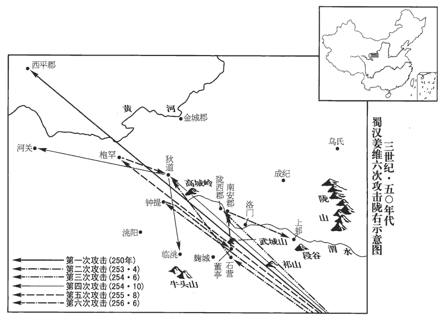
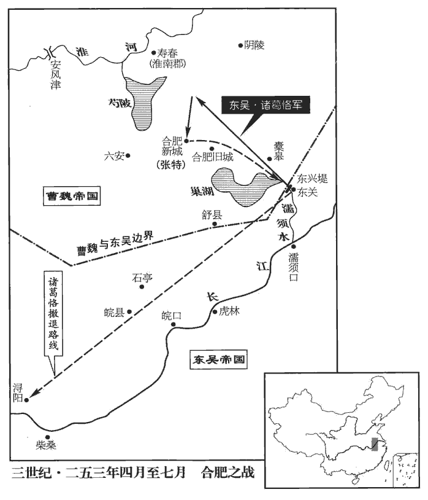
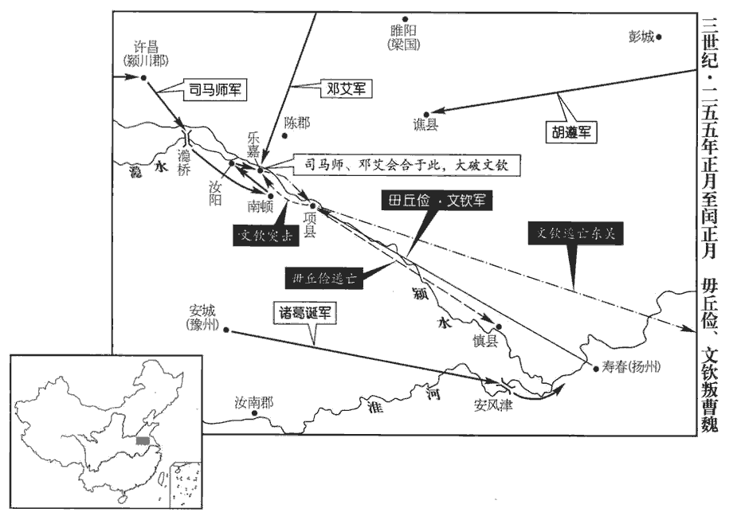

 魏紀八起昭陽作噩（癸酉），盡旃蒙大淵獻（乙亥），凡三年。

# 邵陵厲公下

## 嘉平五年（癸酉，二五三）

1春，正月，朔‹一›，蜀大將軍費禕yī與諸將大會於漢壽‹四川广元西南›，郭偱在坐；費，父沸翻。坐，徂臥翻。「偱」，當作「脩」；下同。蜀先主改葭萌為漢壽。禕歡飲沈醉，沈，持林翻。偱起刺禕，殺之。刺，七亦翻。禕資性汎愛，汎，孚梵翻；廣也，言無所不愛也。不疑於人。越巂‹四川西昌›太守張嶷巂，音髓。嶷，魚力翻。嘗以書戒之曰：「昔岑彭率師，來歙xī杖節，咸見害於刺客。岑彭、來歙事見四十二卷漢光武建武十一年。歙，許及翻。今明將軍位尊權重，待信新附太過，宜鑒前事，少以為警。」少，詩沼翻。禕不從，故及禍。

〖译文〗 [1]春季，正月朔（初一），蜀大将军费与诸位将领在汉寿大聚会，郭循也在座。费欢饮以致沉醉，这时郭循突起刺杀了费。费性情宽厚广施仁爱，从不怀疑别人。越太守张嶷曾写信告诫他说：“从前岑彭率领军队，来歙手持杖节为帅时，都被刺客所害。如今将军您地位尊贵权力重大，但您对待和信任新近归附的人太过分，应该以前代之事为鉴，稍微加强一些警戒。”但费不听，所以祸殃及身。

2‹曹芳，时年二十二›詔追封郭偱為長樂鄉侯，樂，音洛。使其子襲爵。

〖译文〗 [2]魏国下诏追封郭循为长乐乡侯，让他的儿子因袭继承爵位。

3王昶、毌丘儉聞東軍敗，時三道伐吳，東關最在東，故曰東軍。昶，丑兩翻。各燒屯走。朝議欲貶黜諸將，朝，直遙翻；下同。大將軍師曰：「我不聽公休，諸葛誕，字公休。以至於此。此我過也，諸將何罪！」悉宥之。師弟安東將軍昭時為監軍，唯削昭爵而已。監，工銜翻。以諸葛誕為鎮南將軍，都督豫州；毌丘儉為鎮東將軍，都督揚州。

〖译文〗 [3]王昶、丘俭听说东部魏军失败，各自烧毁营地后撤走。朝臣议论想要把诸将罢官降职，大将军司马师说：“我没有听诸葛诞的话，才造成这样的后果。这是我的错误，各位将军有什么罪？”于是全部宽宥了他们。司马师之弟安东将军司马昭当时为监军，所以只削去司马昭一人的爵位而已。任命诸葛诞为镇南将军，都督豫州；丘俭为镇东将军，都督扬州。

是歲，雍州刺史陳泰求敕并州并力討胡，雍，於用翻。師從之。未集，而新興‹山西忻xīn州›、鴈門‹山西代县›二郡胡以遠役遂驚反。雍州在并州西南，而鴈門、新興二郡，并州北鄙也，其道里相去遠。漢末，曹公集塞下荒地為新興郡。宋白曰：曹公立新興郡於樓煩郡，唐為嵐州，漢為汾陽縣地。師又謝朝士曰：「此我過也，非陳雍州之責！」是以人皆愧悅。司馬師承父懿之後，大臣未附，引咎責躬，所以愧服天下之心而固其權耳。盜亦有道，況盜國乎！

〖译文〗 这一年，雍州刺史陈泰请求下令让并州与他合力讨伐胡人，司马师同意了。队伍尚未集中起来，而新兴、雁门两个郡的胡人由于路途太远，惊疑不定而反叛。对此事，司马师又向朝廷大臣谢罪说：“这是我的错误，不是陈雍州的责任！”因此人们都行惭愧而对司马师心悦诚服。

習鑿齒論曰：司馬大將軍引二敗以為己過，二敗，謂東關師敗及并州胡反也。過消而業隆，可謂智矣。若乃諱敗推過，推，吐雷翻。歸咎萬物，常執其功而隱其喪，喪，息浪翻。上下離心，賢愚解體，謬之甚矣！嗚呼，此賈相國之所以敗也！君人者，苟統斯理以御國，行失而名揚，行，下孟翻。兵挫而戰勝，雖百敗可也，況於再乎！

〖译文〗 习凿齿论曰：司马大将军以两次失败引咎自责，错误消弥而事业却兴隆了，真可谓智者之举。如果讳言失败推卸责任，归咎于各种原因，经常自伐其功而隐匿失误，使上上下下离心离德，各种人才分散解体，那谬误就太大了。身为君主之人，如果能掌握这个道理来治国家，行动失误却名声远扬，兵力暂时受挫却能最终战胜敌人，那么即使失败一百次都无妨，何况只有两次呢！

4光祿大夫張緝言於師曰：「恪雖克捷，見誅不久。」師曰：「何故？」緝曰：「威震其主，功蓋一國，求不死，得乎！」緝料恪雖中，緝亦卒為師所殺。師方專政，忌才智而疾異己，況以緝而耀明於師乎！

〖译文〗 [4]光禄大夫张缉对司马师说：“诸葛恪虽然获得了胜利，但离被诛杀却不远了。”司马师问道：“这是什么缘故？”张缉说：“他的声威震慑其君主，功劳盖过全国，想要求得不死，还可能吗？”

5二月，吳軍還自東興‹安徽巢湖东南›。‹孙亮，时年十一›進封太傅恪陽都侯，加荊、揚州牧，督中外諸軍事。恪遂有輕敵之心，復欲出軍，復，扶又翻。諸大臣以為數出罷勞，數，所角翻。罷，讀曰疲。同辭諫恪；恪不聽。中散大夫蔣延固爭，漢制，大夫、議郎皆掌顧問應對，無常事。中散大夫秩六百石，在諫議大夫上。按中散大夫，王莽所置，後漢因之。散，悉亶dǎn翻。恪命扶出，因著論以諭眾曰：「凡敵國欲相吞，即仇讎欲相除也。有讎而長之，長，知兩翻。左傳：晉先軫曰：墮軍實而長寇讎。禍不在己，則在後人，不可不為遠慮也。昔秦但得關西耳，謂函谷關以西也。尚以并吞六國。今以魏比古之秦，土地數倍；以吳與蜀，比古六國，不能半也。然今所以能敵之者，但以操時兵眾，於今適盡，而後生者未及長大，正是賊衰少未盛之時。是時，魏興三十餘年，生聚教訓，精兵良將，分鎮方面。諸葛、蔣、費、陸遜、朱然相繼凋謝，吳、蜀蓋小懦矣。恪不能兢懼以保勝，恃一戰之捷，遽謂魏人為衰少未盛之時，其輕敵甚矣。長，知兩翻。少，詩沼翻。加司馬懿先誅王淩，續自隕斃，事見上卷嘉平三年。其子幼弱而專彼大任，雖有智計之士，未得施用，當今伐之，是其厄會，既以司馬師為幼弱，又謂其未能用人，兹可謂不善料敵者矣。聖人急於趨時，趨七喻翻。誠謂今日，若順衆人之情，懐偷安之計，以為長江之險，可以傳世，不論魏之終始，而以今日遂輕其後，此吾所以長歎息者也！恪自謂其才足以辦魏，不欲以賊遺後人；吾不知其自視與叔父亮果何如也！孔明累出師以攻魏，每言一州之地，不足以與賊支久，卒無成功，齎志以沒。恪無孔明之才而輕用其民，不唯不足以強吳，適足以滅其身，滅其家而已。今聞眾人或以百姓尚貧，欲務閒息，此不知慮其大危而愛其小勤者也。昔漢祖幸已自有三秦‹陕西›之地，何不閉關守險以自娛樂，空出攻楚，身被創痍，事見漢高帝紀。樂，音洛。被，皮義翻。創，初良翻。介冑生蟣蝨，蟣jǐ，居豈翻。將士厭困苦，豈甘鋒刃而忘安寧哉？慮於長久不得兩存者耳。每鑒荊邯說公孫述以進取之圖，事見四十二卷漢光武建武六年。邯，下甘翻。說，輸芮翻。近見家叔父表陳與賊爭競之計，家叔父，謂諸葛亮。亮表見七十一卷明帝太和二年。未嘗不喟然歎息也！夙夜反側，所慮如此，故聊疏愚言，以達一二【章：甲十一行本作「二三」；乙十一行本同；孔本同。】君子之末。若一朝隕沒，志畫不立，貴令來世知我所憂，可思於後耳。」眾人雖皆心以為不可，然莫敢復難。復，扶又翻；下同。難，乃旦翻。

〖译文〗 [5]二月，吴国军队自东兴返回。进封太傅诸葛恪为阳都侯，并兼任荆州、扬州牧，都督中外诸军事。诸葛恪于是产生了轻敌之心，想要再度出兵，各位大臣认为频繁出兵军队疲惫不堪，就异口同声地劝谏诸葛恪，但诸葛恪不听。中散大夫蒋延仍坚持争谏，但诸葛恪却命人把他架扶出去。诸葛恪因此事著文晓谕众人说：“凡是敌对国家想要互相吞并，也就是仇敌想要互相铲除。有仇敌而使之发展，祸患如果不在眼前，就是留给了后人，所以不能不深谋远虑。古时秦国只有关西之地，尚且能吞并六国。如今以魏国与古代的秦国相比，土地却不到六国的一半。然而今天我们之所以能与魏国对敌，只是因为曹操时期的士兵到今天已经老弱不能打仗，而后来出生的人还没有长大，这正是敌人兵力微弱而未及强盛之时，再加上司马懿先诛杀了王，接着自己死去，他的儿子幼弱却专擅那里的大权，虽然有聪明的谋士，却未能加以任用。如今去讨伐，正是他们的厄运到来之日。圣人急于顺随时势，指的实在就是今天的这种情况。如果顺从众人之情，心怀苟且偷安的想法，认为长江天险可以世代保持，不考虑魏国全面的情况而只看现在的形势就轻视其以后的发展，这就是我一直为之难过叹息的原因。如今我听说有些人认为百姓还很贫困，想要先从事休养生息之事，这是不知考虑其大的危害则只是怜惜其小的勤苦的想法。以前汉高祖幸运地占据了三秦之地，为什么他不闭关守住险要以自享娱乐，却偏要发动全部兵力去攻打西楚项羽，以致于身受创伤，甲胄里生满了虱子，将士们饱受艰难困苦，难道他甘心在刀剑里生活而忘记安宁了吗？这是因为考虑到天长日久他与项羽势不两存的缘故。每当我借鉴荆邯劝说公孙述锐意进取的图谋，以及近来见到家叔诸葛亮上表陈述与敌人争竞的计策，我都要喟然叹息！我朝夕辗转反侧，所想的就是这些，因此姑且陈述我的浅见，以送达各位君子明鉴。如果一旦我死去，志向计划不能实现，重要的是让来世之人了解我所忧虑的事情，在我死后深入地思考此事。”众人虽然心里都认为他说得不对，但没有人再敢提出异议了。

丹陽‹南京›太守聶友素與恪善，以書諫恪曰：「大行皇帝本有遏東關‹安徽含山西南›之計，吳主之喪未踰年，故稱之為大行皇帝。聶，尼輒翻。計未施行；【章：甲十一行本「行」下有「今公輔贊大業成先帝之志」十一字；乙十一行本同；張校同；退齋校同；孔本同，「成」字作「承」。】寇遠自送，謂魏兵遠來而自送死也。將士憑賴威德，出身用命，一旦有非常之功，豈非宗廟神靈社稷之福邪！聶友此言，所以抑恪之盛氣者，婉而當，有古朋友切偲之義焉。宜且按兵養銳，按，抑也。觀釁而動。今乘此勢欲復大出，復，扶又翻。天時未可而苟任盛意，私心以為不安。」恪題論後，為書答友曰：即前所著以喻眾之論也。「足下雖有自然之理，然未見大數，謂勝負存亡之大數也。熟省此論，可以開悟矣。恪之所以待舊友者，驕倨如此；吳主權嫌其剛狠自用，蓋已見之矣。省，悉景翻。

〖译文〗 丹阳太守聂友平素与诸葛恪很有交情，就写信劝谏他说：“先帝本来有遏止东关之敌的计策，但没有施行；敌人自远方前来送死，我军将士凭借先帝的威德，舍身拼命，一下子就取得了非常卓著的战功，这难道不是宗庙、神灵、社稷的福分吗？现在我们应当暂且按兵不动，养精蓄锐，伺察到敌国的内部裂痕再发动兵力。如今您乘此胜利之势想要再次大规模出兵，这是未得天时之利而随便按您个人的意旨行事，我内心深感不安。”诸葛恪在他的文章后面附了一封信回答聂友说：“您的话虽然符合自然之理，但却没有看到胜负存亡的大道理，您仔细阅读这篇文章，就可以明白了。”

滕胤謂恪曰：「君受伊、霍之託，入安本朝，朝，直遙翻。出摧強敵，名聲振於海內，天下莫不震動，萬姓之心，冀得蒙君而息。今猥以勞役之後，勞役，謂內有山陵營作，外有東關之師也。興師出征，民疲力屈，遠主有備。左傳：秦大夫蹇叔諫穆公曰：勞師以襲遠，師勞力屈，遠主備之，無乃不可乎！若攻城不克，野略無獲，是喪前勞而招後責也。喪，息浪翻。不如按甲息師，觀隙而動。且兵者大事，左傳曰：國之大事，在祀與戎。事以眾濟，眾苟不悅，君獨安之！」胤之言，可謂深切矣。恪曰：「諸云不可，皆不見計算，懷居苟安者也；而子復以為然，復，扶又翻；下同。吾何望乎！夫以曹芳闇劣，劣，弱也。而政在私門，私門，謂司馬氏。彼之民臣，固有離心。今吾因國家之資，藉戰勝之威，則何往而不克哉！」談何容易！三月，恪大發州郡二十萬眾復入寇，復，扶又翻。以滕胤為都下督，掌統留事。

〖译文〗 滕胤对诸葛恪说：“您接受象伊尹、霍光那样的辅佐君王重托，在内则安定我们的朝廷，出外则摧败强大的敌人，名声震摄海内，天下之人无不震动，万众之心，是希望蒙受您的恩德而休养生息。如今在繁重的劳役之后，又兴兵出征，人民疲惫精力不足，而且远方的敌人也有了防备。如果城池不能攻破，掠夺地盘也没有收获，就会使前功尽弃而招致后来的责备。因此不如先按兵不动休养军队，然后伺察敌人的漏洞再发兵行动。而且兴兵打仗是件大事，只有依靠众人才能成功，众人如果不愿打仗，您独自一人能安然处之吗？”诸葛恪说：“众人说不可出兵，都未见有什么具体的计划打算，只是心怀苟且偷安的思想；而你又认为他们是对的，我还有什么指望？因曹芳昏庸无能，而使政权落入私家，魏国的臣民本来已经产生离异之心。如今我凭借国家的资财，依仗上次战争胜利的威势，那么将无往而不胜。”三月，诸葛恪发州郡之兵二十万人再次进犯魏国，任命滕胤为都下督，总管留守事宜。

6夏，四月，大赦。

〖译文〗 [6]夏季，四月，实行大赦。

7漢姜維自以練西方風俗，姜維本天水冀人，故自以為練西方風俗。練，習也。兼負其才武，欲誘諸羌、胡以為羽翼，誘，音酉。謂自隴以西，可斷而有。斷，丁管翻。每欲興軍大舉，費禕常裁制不從，與其兵不過萬人，曰：「吾等不如丞相亦已遠矣；丞相，謂諸葛亮。丞相猶不能定中夏，況吾等乎！不如且保國治民，謹守社稷，治，直之翻。如其功業以俟能者，無為希冀徼倖，徼，堅堯翻。決成敗於一舉；若不如志，悔之無及。」及禕死，維得行其志，費禕死，蜀諸臣皆出維下，故不能裁制之。乃將數萬人出石營‹甘肃礼县西北›，圍狄道‹甘肃临洮›。石營在董亭西南，維蓋自武都出石營也。狄道縣屬隴西郡，為維以勞民亡蜀張本。

〖译文〗 [7]蜀将姜维自以为详熟西部风俗，再加上对自己的才华武略颇为自负，所以总想诱使各个羌、胡的部族成为自己的羽翼，他认为从陇地往西，都可以断为己有。每次他想要兴兵大举进攻，费就常常加以阻止，不听从他的主张，调给他的兵力也不足一万人。费说：“我们这些人比诸葛丞相差得远了。丞相尚且不能平定中原，更何况我们呢？所以我们不如先保国治民，谨守住自己的国土，至于建功立业扩大疆土，那就要等待有才能的人去干了。我们不要寄希望于侥幸，把成败系于一举，如果不能如愿以偿，后悔就来不及了。”等到费死后，姜维才得以实行他的计划，率兵将数万人越过石营，围攻狄道县。

 

8吳諸葛恪入寇淮南，驅略民人。諸將或謂恪曰：「今引軍深入，疆埸之民，必相率遠遁，恐兵勞而功少；埸，音亦。少，詩沼翻。不如止圍新城‹合肥西北›，合肥新城也。新城困，救必至，至而圖之，乃可大獲。」此即諸葛誕言於司馬師之計也。見上卷上年。恪從其計，五月，還軍圍新城。

〖译文〗 [8]吴国的诸葛恪进犯淮南，驱杀掠夺百姓。将领中有人对诸葛恪说：“如今率兵深入敌境，境内的百姓必然都一起远远地逃离了，恐怕我们的兵士费尽辛劳而功效甚少，不如仅围困新城，新城被困，必然会有救兵来，等救兵一到，再与他们交战，就可以大获全胜。”诸葛恪采纳了这个计策，五月，撤回军队围困新城。

詔太尉司馬孚督軍二十萬往赴之。大將軍師問於虞松曰：「今東西有事，二方皆急，謂吳攻淮南，蜀攻隴西也。而諸將意沮，若之何？」沮，在呂翻。松曰：「昔周亞夫堅壁昌邑‹山东金乡西北昌邑镇›而吳、楚自敗，事見十六卷漢景帝三年。事有似弱而強，不可不察也。今恪悉其銳眾，足以肆暴，而坐守新城，欲以致一戰耳。致者，猶古所謂致師也。若攻城不拔，請戰不可，師老眾疲，势將自走，諸將之不徑進，乃公之利也。姜維有重兵而縣軍應恪，縣，讀曰懸。投食我麥，謂維軍後無轉餉，投兵魏地，擬其麥以為食耳。非深根之寇也。且謂我并力於東，西方必虛，是以徑進。今若使關中諸軍倍道急赴，出其不意，殆將走矣。」師曰：「善！」乃使郭淮、陳泰悉關中之眾，解狄道‹甘肃临洮›之圍；敕毌丘儉按兵自守，以新城委吳。毌guàn，音無。陳泰進至洛門‹甘肃武山县东北洛门乡›，即天水冀縣落門聚。姜維糧盡，退還。果如虞松所料。

〖译文〗 诏命太尉司马孚率军二十万人奔赴战场。大将军司马师询问虞松说：“如今东西都有战事，两个地方都很紧急，但诸位将领却意志沮丧，应该怎么办？”虞松说：“从前西汉周亚夫坚守昌邑而吴、楚之军不战自败，有些事情看似弱而实际强，所以不能不详察。如今诸葛恪带来他全部的精锐部队，足以肆意逞强施暴，但他却坐等在新城，想要招来魏军与他一战。如果他不能攻破城池，请战也无人理睬，军队就会士气低落疲劳不堪，势必将自动撤退，诸位将领的不愿径直进击，对您反而是有利的。姜维握有重兵，但却是深入我境的孤军与诸葛恪遥相呼应，他们没有运粮部队，只以我们境内的麦子为食，不是能坚持长久作战的军队。而且他认为我们全力投入东方的战斗，西方必定空虚，所以径直深入我方境内。现在如果令关中各军日夜兼程快速奔赴前线，出其不意地攻打姜维，他大概就要撤走了。”司马师说：“好！”于是命令郭淮、陈泰率领关中全部军队，去解救狄道的围困；命令丘俭按兵不动坚守营地，而把新城交给吴国去围攻。陈泰行军至洛门，姜维粮尽，只好撤退。

揚州牙門將涿郡‹河北涿州›張特守新城‹合肥西北›，吳人攻之連月，城中兵合三千人，疾病戰死者過半，而恪起土山急攻，城將陷，不可護。特乃謂吳人曰：「今我無心復戰也。復，扶又翻。然魏法，被攻過百日而救不至者，雖降，家不坐；言雖身降而其家不坐罪也。被，皮義翻。降，戶江翻。自受敵以來，已九十餘日矣，此城中本有四千餘人，戰死者已過半，城雖陷，尚有半人不欲降，我當還為相語，條別善惡，為，于偽翻。語，牛倨翻。別，彼列翻。明日早送名，且以我印綬去為信。」乃投其印綬與之。吳人聽其辭而不取印綬。綬，音受。特乃投夜徹諸屋材柵，補其缺為二重，重，直龍翻。明日，謂吳人曰：「我但有鬬死耳！」吳人大怒，進攻之，不能拔。

〖译文〗 扬州牙门将涿郡人张特守卫新城，吴国人连月攻打，城中兵士共三千人，疾病战死者超过了一半，而诸葛恪又堆起了土山猛烈进攻，新城将要失陷，不能再守护了。于是张特对吴国人说：“现在我已经无心再战了。但魏国法律规定，被围攻超过百日而救兵仍然未至者，虽然投降，其家属也不治罪；我自受围攻以来，已经九十多天了，这城中本来有四千余人，战死者已超过一半，城虽然失陷，但还有一半人不愿投降，我要回去劝说他们，逐一辩别好坏，明天一早送名单过来，请先把我的印绶拿去当做信物。”随即把他的印绶扔给了吴人。吴人听信了他的话而没要他的印绶。于是张特连夜拆除城内房屋的木材，修补加固城墙缺口成为双重防护，第二天，对吴人说：“我只有战斗而死，决不投降！”吴人愤怒已极，加紧攻城，但却不能攻克。

會大暑，吳士疲勞，飲水，泄下、流腫，病者太半，死傷塗地。諸營吏日白病者多，恪以為詐，欲斬之，自是莫敢言。恪內惟失計，惟，思也。而恥城不下，忿形于色。將軍朱異以軍事迕恪，迕，五故翻。逆也。恪立奪其兵，斥還建業‹南京›。都尉蔡林數陳軍計，數，所角翻。恪不能用，策馬來奔。諸將伺知吳兵已疲，乃進救兵。伺，相吏翻。秋，七月，恪引軍去，士卒傷病，流曳yè道路，或頓仆坑壑，流者，放而不能自收也。曳者，羸困不能自扶，相牽引而行。顛仆，顛頓而僵仆也。壑hè，溝也。或見略獲，存亡哀痛，大小嗟呼。而恪晏然自若，出住江渚一月，渚，水中洲也。圖起田於潯陽‹湖北武穴东北›；漢尋陽故縣地也，在大江之北。尋陽记曰：尋陽，春秋為吳之西境，楚之東境，本在大江之北，今蘄qí州界古蘭城是也。詔召相銜言召命相繼也。舟行以舳艫不絕為相銜，陸行以馬首尾相接為相銜。徐乃旋師。由是眾庶失望，怨讟dú興矣。痛怨而謗曰讟。讟，徒木翻。

〖译文〗 当时天气十分炎热，吴国士兵疲劳不堪，饮用了不洁净的水，造成了腹泻、浮肿病流行，生病者过半，死伤之人满地都是。各兵营的官吏每天都报告生病者太多，诸葛恪认为他们谎报，要杀掉他们，从此没有人再敢说了。诸葛恪心中没有良策，又耻于攻城不下，所以忿恨之情常流露于外表。将军朱异在军事上与诸葛恪发生抵触，诸葛恪就立刻夺去他的兵权，驱逐他回建业。都尉蔡林多次提出军事计策，诸葛恪都不采纳，结果蔡林骑马逃走投降魏国。魏国将领伺察了解到吴国兵士已疲惫不堪，于是发出救兵。秋季，七月，诸葛恪率军退却，那些受伤生病的士卒流落在道路上，艰难地互相扶持着行走，有的人困顿地倒毙于沟中，有的人则被俘获，全军上下沉浸在哀痛悲叹之中。但诸葛恪却安然自若，外出在江中小洲上住了一月，还计划在浔阳地区开发田地，召他回去的诏书接连不断，他才慢慢地返回。从此他在群臣百姓中失去威望，人们对他的怨恨之言也越来越多。

 

汝南‹河南息县›太守鄧艾言於司馬師曰：「孫權已沒，大臣未附，吳名宗大族皆有部曲，阻兵仗勢，足以違命。諸葛恪新秉國政，而內無其主，不念撫恤上下以立根基，競於外事，虛【章：甲十一行本「虛」作「虐」，虐下空一格；乙十一行本均同。】用其民，悉國之眾，頓於堅城，死者萬數，載禍而歸，此恪獲罪之日也。昔子胥、吳起、商鞅、樂毅皆見任時君，主沒猶敗，伍子胥見任於吳王闔閭，闔閭死，夫差不能用其言而殺之。吳起事見一卷周安王二十一年。商鞅事見二卷顯王三十一年。樂毅事見四卷赧王三十六年。況恪才非四賢，而不慮大患，其亡可待也。」張緝、鄧艾皆料諸葛恪必誅，緝死而艾存者，緝附李豐而艾為師用也。然艾不死於師而死於昭者，功名之際難居，重以鍾會之搆間也。

〖译文〗 汝南太守邓艾对司马师说：“孙权已经死了，大臣们尚未顺从新朝廷，吴国的名宗大族都有自己的部曲，拥兵仗势，足可以违抗朝廷命令。诸葛恪新近才执掌国政，而朝内又没有明君，诸葛恪也不想着抚恤关怀上下臣民以树立治国的根基，却热衷于对外战争，肆虐役使人民，把全国的军队，困顿在坚固的城下，死掉的数以万计，结果遭受重创失败而归，这就是诸葛恪获罪之日。古时的伍子胥、吴起、商鞅、乐毅都受到了君主的信任，但君主死后他们仍然失败了，更何况诸葛恪的才能比不上这四个贤人，而且他也不顾虑大的忧患，所以诸葛恪的败亡指日可待。”

八月，吳軍還建業‹南京›，諸葛恪陳兵導從，從，才用翻。歸入府館，府館，即府舍也。即召中書令孫嘿，厲聲謂曰：「卿等何敢數妄作詔！」怒其數作詔召之也。數，所角翻。嘿惶懼辭出，因病還家。

〖译文〗 八月，吴国军队回到建业，诸葛恪让兵士排成队列，前有引导后有随从地步入府邸，刚到家就立刻召来中书令孙嘿，厉声申斥他说：“你们怎么敢屡次妄作诏书！”孙嘿十分恐惧地告辞出来，托病返回家中。

恪征行之後，曹所奏署令長職司，一更罷選，曹，選曹也。罷選者，罷而更選也。長，知兩翻。愈治威嚴，多所罪責，當進見者無不竦息。治，直之翻。又改易宿衛，用其親近；復敕兵嚴，欲向青、徐。凡此者，皆恪所以速死。復敕兵嚴者，戒兵士使嚴裝也。復，扶又翻。

〖译文〗 诸葛恪出征回来之后，选曹所奏请的各机构选任的官吏，一概不用，重新选拔。治事愈来愈威严，被治罪和受责备的人很多，该去进见诸葛恪的人没有不胆战心惊唉声叹气的。诸葛恪又更换宫中侍卫，全部选用他的亲近之人；又下令让军队加紧备战，想要出兵攻打青州、徐州。

孫峻因民之多怨，眾之所嫌，構恪於吳主，云欲為變。冬，十月，孫峻與吳主謀置酒請恪。恪將入之夜，精爽擾動，左傳：鄭子產曰：人生始化曰魄，既生魄，陽曰魂。用物精多，則魂魄強，是以有精爽至於神明。杜預曰：爽，明也。擾動，言不安也。通夕不寐；死期將至，故然。又，家數有妖怪，數，所角翻。恪疑之。旦日，駐車宮門，峻已伏兵於帷中，恐恪不時入，事泄，乃自出見恪曰：「使君若尊體不安，自可須後，須，待也。峻當具白主上。」欲以嘗知恪意，嘗，試也。恪曰：「當自力入。」言當自力疾而入見吳主也。散騎常侍張約、朱恩等密書與恪曰：「今日張設非常，張：竹亮翻。疑有他故。」恪以書示滕胤，胤勸恪還。恪曰：「兒輩何能為！正恐因酒食中人耳。」中，竹仲翻。考異曰：恪傳曰：「恪省張約等書而去，未出路門，逢太常滕胤。恪曰：『卒腹痛，不任入。』胤不知峻陰計，謂恪曰：『君自行旋未見上，今上置酒請君，君已至門，宜當力進。』恪躊躇而還。」孫盛以為不然。今從吳曆。恪入，劍履上殿，進謝還坐。設酒，恪疑未飲。孫峻曰：「使君病未善平，言病未良已也。有常服藥酒，可取之。」恪意乃安。別飲所齎酒，數行，吳主還內；峻起如廁，解長衣，著短服，著，陟略翻。出曰：「有詔收諸葛恪。」恪‹时年五十一›驚起，拔劍未得，而峻刀交下，張約從旁斫峻，裁傷左手，峻應手斫約斷右臂。，斷，丁管翻。武衛之士皆趨上殿，武衛之士，武衛將軍領之。峻曰：「所取者恪也，今已死！」悉令復刃，令內刃於鞘也。乃除地更飲。恪二子竦、建聞難，難，乃旦翻。載其母欲來奔，峻使人追殺之。以葦席裹恪尸，篾束腰，投之石子岡。恪傳曰：建業南有長陵，名石子岡，葬者依焉。按今高座寺後即石子岡，寺在建康城南門外。宋白曰：石子岡在臺城南四十里，蓋今建康城，非臺城也。又遣無難督施寬就將軍施績、孫壹軍，施績，時在江陵‹湖北江陵›；孫壹，時在夏口‹湖北武汉›。殺恪弟奮威將軍融於公安‹湖北公安›，及其三子。恪外甥都鄉侯張震、常侍朱恩，皆夷三族。

〖译文〗 孙峻因为臣民百姓大都怨恨嫌恶诸葛恪，就在吴王面前诬陷诸葛恪，说他想要发动变乱。冬季，十月，孙峻与吴王密谋在酒筵上杀死诸葛恪。诸葛恪将要赴宴的前一天晚上，精神燥动不安，整夜都不能入睡；另外，家里又发生了几次怪异之事，诸葛恪起了疑心。第二天，诸葛恪把车停在宫门，当时孙峻已经在帷帐之中设下伏兵，唯恐诸葛恪不按时进来使事情泄露，于是就亲自出来见诸葛恪说：“您如果贵体欠安，可以等以后再说，我会把情况禀告主上的。”他说这话实际是想探试诸葛恪的态度。诸葛恪说：“我要勉力进去见主上。”当时散骑常侍张约、朱恩等人写密信给诸葛恪说：“今日宫内的陈设不同一般，我们怀疑有其他变故。”诸葛恪把密信给滕胤看，滕胤劝诸葛恪回府。诸葛恪说：“这些小辈能干什么？恐怕他们是在酒食中下毒来害人而已。”诸葛恪进入宫内，带着剑不脱鞋上殿，上前谢过主上，回来坐在座位上。摆上酒宴，诸葛恪因有疑心就不饮酒。孙峻说：“您的病没有大好，如果有常服的药酒，就请派人取来。”诸葛恪这才安了心。诸葛恪喝着自己人送来的酒，喝了几杯之后，吴王回到内室；这时孙峻也起来上厕所，在那儿脱下长衣，换上短衣服，一出来就喊道：“主上有诏命立即拘捕诸葛恪！”诸葛恪慌忙站起，还没拔出剑而孙峻的刀已经砍了下来，张约从旁边刀劈孙峻，但只伤及左手，孙峻却回手砍断了张约的右臂。这时，宫内的卫兵都跑上殿来，孙峻说：“今天要捕取的只是诸葛恪，现在他已经死了。”然后命令卫兵全都把刀收起来，又把地上清除打扫一番重新开筵。诸葛恪的两个儿子诸葛竦和诸葛建听说父亲遭难，就用车拉起母亲想要投奔魏国，孙峻派人追赶并杀掉了他们。又命令用芦席裹住诸葛恪的尸体，中间用竹蔑一捆，扔到了石子冈。另外派遣无难督施宽到将军施绩、孙壹的军队中，在公安县杀了诸葛恪的弟弟奋威将军诸葛融和他的三个儿子。诸葛恪的外甥都乡侯张震、常侍朱恩也都被诛灭三族。

臨淮‹江苏泗洪南›臧均表乞收葬恪曰：「震雷電激，不崇一朝；鄭康成曰：崇，終也；言不終朝也。大風衝發，希有極日；然猶繼之以雲雨，因以潤物。是則天地之威，不可經日浹辰；浹jiā，即協翻。周也。辰，十二辰也。十二日辰一周，曰浹辰。帝王之怒，不宜訖情盡意。訖，亦盡也，音居乞翻。臣以狂愚，不知忌諱，敢冒破滅之罪謂破家滅身之罪。以邀風雨之會。伏念故太傅諸葛恪，罪積惡盈，自致夷滅，父子三首，梟市積日，梟，堅堯翻。觀者數萬，詈聲成風；國之大刑，無所不震，長老孩幼，無不畢見。長，知兩翻。人情之於品物，品，眾也，庶也。樂極則哀生，樂，音洛。見恪貴盛，世莫與貳，身處台輔，處，昌呂翻。中間歷年，今之誅夷，無異禽獸，觀訖情反，能不憯然！憯cǎn，七感翻。痛也。且已死之人，與土壤同域，鑿掘斫刺，無所復加。刺，七亦翻。復，扶又翻；下同。願聖朝稽則乾坤，稽，考也；法，則也。怒不極旬，使其鄉邑若故吏民收以士伍之服，秦、漢之制，奪官爵者為士伍。惠以三寸之棺。禮記曰：夫子制於中都，四寸之棺，五寸之椁guǒ。鄭康成註云：此庶人之制也。按禮，上大夫棺八寸，椁六寸，下大夫棺六寸，椁四寸，無三寸棺制也。孟子曰：中古棺七寸，椁稱之。墨子尚儉，桐棺三寸。左傳趙簡子曰：桐棺三寸，不設屬辟，下卿之罰也。昔項籍受殯葬之施，韓信獲收斂之恩，斯則漢高發神明之譽也。葬項籍事，見十一卷漢高帝五年。斂韓信事，今史無所考，史云：「帝聞信死，且喜且憐之」，是必收斂之也。施，式智翻。斂，力贍翻。惟陛下敦三皇之仁，上古送死，棄之中野，後世聖人易之以棺椁，此所謂三皇之仁也。垂哀矜之心，使國澤加於辜戮之骸，復受不已之恩，於以揚聲遐方，沮勸天下，豈不大哉！沮，在呂翻。昔欒布矯命彭越，事見十二卷漢高帝十一年。臣竊恨之，不先請主上而專名以肆情，其得不誅，實為幸耳。今臣不敢章宣愚情以露天恩，謹伏手書，冒昧陳聞，古之人臣進言於君，率曰冒死，曰昧死，謂人君之威難犯，冒昧其死罪而言也。乞聖明哀察。」於是吳主及孫峻聽恪故吏斂葬。斂，力贍翻。

〖译文〗 临淮人臧均上表请求收拾诸葛恪尸骨并加以安葬，他上书说：“电闪雷鸣，不会在整个早晨都连续不断，狂风怒吼，也很少终日不停，雷电狂风过后仍然还会有和风细雨，滋润万物。因此天地的威严不会整日整夜连绵不断地施展；帝王的怒气也不应毫无约束地尽情发散。我狂妄愚鲁，不避忌讳，胆敢冒着破家灭身之罪，象祈求上天降下和风细雨一样，求您暂息雷霆之怒。追想已故太傅诸葛恪，罪恶满盈，自己招致了诛灭三族的结果，他们父子三人的首级被砍下示众也有不少天了，观看者有数万人，咒骂他们的声音也如风四起；国家的大刑震慑了各个地方，就连老人孩童也全都见到了。人情对于万物，往往是乐极生哀，看到诸葛恪在尊贵全盛之时，世上没有人能与他相比，身居三公宰相的高位，经历多年，而如今被诛杀灭族，却无异于禽兽，察尽人情的反复，怎能不令人悲伤！而且他是已经死去之人，应埋葬于地下，没有必要再对他砍凿击刺。希望圣明的朝廷，效法天地，发怒不超过十日，让他的乡里之民和手下故吏用普通士卒的丧服为他收尸，再恩准他殓入三寸薄棺。从前项藉曾受到殡葬的礼遇，韩信也曾得到入殓安葬的恩惠，这都是汉高祖被誉为光大神明的举动。愿陛下施布三皇的仁慈，垂赐哀怜之心，使国家的恩泽施加于因罪被杀者的尸骸，再次让他得到不尽的恩惠，从此仁德的声名扬于远方，使天下劝善惩恶，这难道不正大吗？从前汉代的栾布故意违背成命，向彭越的首级禀奏并祭祀。我对栾布的做法极为不满。他不先请求主上的恩典，而擅自肆意发泄自己的情感，他能够不受诛杀，实在是万幸之事。如今我不敢明白地表达自己的情感来显露圣上的恩赐，只能恭敬地写信上书，冒昧地向您陈述我的意见，请求圣明天子爱怜而体察臣下之心。”于是吴王和孙峻下令听任诸葛恪过去的部下把他收敛安葬。

初，恪少有盛名，少，詩照翻。大帝深器重之，而恪父瑾常以為戚，曰：「非保家之主也。」戚，憂也。瑾，渠吝翻。父友奮威將軍張承亦以為恪必敗諸葛氏。敗，補邁翻。陸遜嘗謂恪曰：「在我前者吾必奉之同升，在我下者則扶接之；今觀君氣陵其上，意蔑乎下，蔑者，視之若無。非安德之基也。」漢侍中諸葛瞻，亮之子也。恪再攻淮南，越巂太守張嶷與瞻書曰：「東主初崩，吳在蜀東，故謂其君為東主。巂，音髓。嶷，魚力翻。帝實幼弱，帝謂吳主亮。太傅受寄託之重，諸葛恪為吳太傅，故稱之。亦何容易！易，以豉翻。親有周公之才，猶有管、蔡流言之變，謂周公之才，而有叔父之親，且不能免於管、蔡之流言。霍光受任，亦有燕、蓋、上官逆亂之謀，事見二十三卷漢昭帝元鳳元年。賴成、昭之明以免斯難耳。難，乃旦翻。昔每聞東主殺生賞罰，不任下人，又今以垂没之命，卒召太傅屬以後事，卒讀曰猝，屬，之欲翻。誠實可慮。加吳、楚剽急，乃昔所記，周亞夫曰：吳、楚剽輕。太史公曰：楚俗剽輕易發怒，自漢以來，皆有是言。剽，匹妙翻。而太傅離少主，離，力智翻。少，詩照翻。履敵庭，恐非良計長算也。雖云東家綱紀肅然，上下輯睦，東家，亦謂吳立國於東也。百有一失，非明者之慮也。取古則今，今則古也，則，子德翻。則，刌cǔn剫duó也，樣也，言取古事以刌剫今之事，今猶古也。自非郎君進忠言於太傅，自漢以來，門生故吏，率稱恩門子弟為郎君。誰復有盡言者邪！復，扶又翻。旋軍廣農，務行德惠，數年之中，東西并舉，實為不晚，願深採察！」恪果以此敗。

〖译文〗 当初，诸葛恪少年即名声大振，吴大帝孙权非常器重他，而他的父亲诸葛瑾常为此事忧虑，说诸葛恪不是能保护家族的主人。诸葛瑾的朋友张承也认为诸葛恪必将败坏诸葛氏家族。陆逊曾对诸葛恪说：“在我前面的人，我必然尊奉他，与他共同升迁；在我之下者，我就去扶持接引他。如今我看你气势凌驾于你前面的人之上，心意中又蔑视在你之下的人，这不是安定德业的根基。”蜀汉的侍中诸葛瞻，是诸葛亮之子。诸葛恪再次攻打淮南时，越太守张嶷给诸葛瞻写信说：“吴王刚刚驾崩，现在的皇帝实在太年幼怯弱，太傅诸葛恪承受辅政托孤的重担，又哪里是容易的事！以周公之才且有亲戚关系，来摄理朝政，仍然会有管叔、蔡叔散布流言发动叛乱；霍光受命摄理朝政，也有燕王刘旦、盖主和上官桀等人阴谋陷害霍光的活动，只是依赖周成王、汉昭帝的圣明才得以免遭危难。以前常听说吴王生杀赏罚的大权，从不交给下人，如今却在垂死之时，终于召来太傅，把后事托付给他，这实在令人忧虑。另外从以前的记载看，吴、楚地方的人性格轻飘急躁，但太傅却远离年幼的君主，深入敌国境内，这恐怕不是良好而长远的计策。虽然说吴国国家纲纪整肃，君臣上下和睦相处，但百事中即使有一次失误，也不是明智者的谋略。用古事来衡量今天的事情，则今事如同古事一样，如果您不向太傅进献忠言，还有谁能直言相告呢？希望您能劝他撤回军队扩展农业，致力于推行仁德恩惠，数年之中，我们东西两国再同时大举进攻魏国，也不算晚，希望您深刻地考虑和采纳我的建议！”后来诸葛恪果然如张嶷所言而失败。

吳群臣共議上奏，推孫峻為太尉，滕胤為司徒。上，時掌翻。有媚峻者言曰：「萬機宜在公族，若承嗣為亞公，滕胤字承嗣。司徒位亞太尉，故曰亞公。聲名素重，眾心所附，不可量也。」量，音良。乃表峻為丞相、大將軍，督中外諸軍事，又不置御史大夫；由是士人失望。漢承秦制，置御史大夫以副丞相理眾事；今峻為丞相而不置御史大夫，則專吳國之政，故國人失望。滕胤女為恪子竦妻，胤以此辭位。孫峻曰：「鯀、禹罪不相及，舜之罪也，殛鯀；其舉也，興禹。滕侯何為！」峻與胤雖內不沾洽，言其情不浹jiā洽也。而外相苞容，進胤爵高密侯，共事如前。

〖译文〗 吴国的群臣共同建议上奏，推举孙峻为太尉，滕胤为司徒。有个向孙峻献媚的人说：“政务的权柄应由皇族掌握，如果滕胤当了司徒，地位仅次于太尉，而且他声名卓著，众人之心都归附他，那么他日后的势力则不可估量。”于是又上表请任命孙峻为丞相、大将军，都督中外诸军事，却不设置协助丞相管理政务的御史大夫，因此士人都大失所望。滕胤的女儿是诸葛恪之子诸葛竦的妻子，滕胤以此为由想要辞职。孙峻对他说：“鲧之罪不会牵连到禹，你何必这样呢？”孙峻和滕胤虽然内心不甚融洽，但处理外部事务却能互相包容。于是进封滕胤的爵位为高密侯，二人像以前一样一起共事。

齊王奮聞諸葛恪誅，下住蕪湖‹安徽蕪湖›，欲至建業觀變。傅相謝慈等諫，奮殺之，坐廢為庶人，徙章安‹浙江台州西北章安镇›。章安，前漢冶縣也，故閩越地，光武更名章安，屬會稽郡。沈約宋志曰：臨海太守，本會稽東部都尉，前漢治鄞yín，後漢分會稽為吳郡，疑是都尉徙治章安也。晉太康記曰：章安本鄞縣南之回浦鄉。余謂太康志所云，即吳臨海郡之章安縣地，今台州黃巖縣章安鎮是也。奮徙章安，即臨海之章安也。

〖译文〗 齐王孙奋听说诸葛恪被诛杀，于是移居芜湖，想要到建业去观察事态变化。傅相谢慈等人劝谏他不要去，孙奋就把谢慈杀掉了。朝廷得知后，把孙奋废黜为庶民，徙居章安县。

南陽王和妃張氏，諸葛恪之甥也。先是恪有遷都之意，先，悉薦翻。使治武昌宮‹在湖北鄂州›，治，直之翻。民間或言恪欲迎和立之。及恪被誅，丞相峻因此奪和璽綬，南陽王璽綬也，璽，斯氏翻。綬，音受。徙新都，又遣使者追賜死。初，和妾何氏生子皓，諸姬子德、謙、俊。和將死，與張妃別，妃曰：「吉凶當相隨，終不獨生。」亦自殺。何姬曰：「若皆從死，誰當字孤！」從，才用翻。說文曰：字，乳也，愛也。遂撫育皓及其三弟，皆賴以獲全。為後吳人立皓張本。

〖译文〗 南阳王孙和的妃子张氏，是诸葛恪的外甥女。早先诸葛恪有迁都的打算，就让孙和去修建武昌宫，民间有谣传说诸葛恪想要迎立孙和为天子。诸葛恪被诛之后，丞相孙峻就因此事夺去了孙和的印玺，徙居到新都，又派使者随后追去赐孙和自杀。当初，孙和之妾何氏生了儿子孙，其他姬妾生的儿子有孙德、孙谦、孙俊。孙和将死时，与张妃决别，张妃说：“无论吉凶祸福，我当永远相随，决不独自活着。”然后也自杀而死。何姬说：“如果都相从而死，谁来抚养孤儿呢？”于是就抚育孙和他的三个弟弟，这些孩子都依靠她才得以生存下来。

# 高貴鄉公上諱髦máo，字彥士，文帝孫，東海定王霖子也。正始五年，封高貴鄉公。高貴鄉，屬郯tán縣。

## 正元元年（甲戌，二五四）是年，嘉平六年也，冬，十月，高貴鄉公方改元正元，通鑑以是年繫之高貴鄉公，因書正元元年。

1春，二月，殺中書令李豐。初，豐年十七、八，已有清名，海內翕然稱之。其父太僕恢不願其然，敕使閉門斷客。斷，讀曰短。曹爽專政，司馬懿稱疾不出，事見上卷邵陵厲公正始八年、九年。豐為尚書僕射，依違二公間，故不與爽同誅。豐子韜，以選尚齊長公主。帝之姊妹曰長公主；齊主蓋明帝女。長，知兩翻司馬師秉政，以豐為中書令。是時，太常夏侯玄有天下重名，以曹爽親，【章：甲十一行本「親」下有「故」字；乙十一行本同；孔本同；張校同。】不得在勢任，居常怏怏；邵陵厲公嘉平元年，玄自關右召詣京師。勢任，權勢之任也。怏，於兩翻。張緝以后父去郡家居，緝自東莞‹山东沂水东北›召，見上卷嘉平四年。亦不得意：豐皆與之親善。師雖擢用豐，豐私心常在玄。豐在中書二歲，帝‹曹芳，时年二十三›數召豐與語，數，所角翻。不知所說。師知其議己，請豐相見以詰豐，詰，去吉翻。豐不以實告；師怒，以刀鐶築殺之，鐶huán，戶關翻。刀把上有鐶；築zhú，擣也。送尸付廷尉，遂收豐子韜及夏侯玄、張緝等皆下廷尉，下，遐稼翻；下及下同。鍾毓按治，云：「豐與黃門監蘇鑠shuò、永寧署令樂敦，漢有黃門令，宦者為之。黃門監，蓋魏置也。永寧宮，魏太后宮名。永寧署令，太后宮官也，亦宦者為之。治，直之翻。宂rǒng從僕射劉賢等漢制，中宮宂從僕射，宦者為之，主黃門宂從，秩六百石。沈約志曰：漢東京有中黃門宂從僕射，魏世因其名而置宂從僕射。宂，而隴翻，散也。謀曰：『拜貴人日，諸營兵皆屯門，屯宮城門也。陛下臨軒，檐宇之末曰軒。促御坐前臨殿陛曰臨軒。因此同奉陛下，將群僚人兵，就誅大將軍；下將，即亮翻。陛下儻不從人，便當劫將去耳。』」又云：「謀以玄為大將軍，緝為車【章：甲十一行本「車」作「驃」；乙十一行本同；張校同；孔本作「票」。】騎將軍；玄、輯【章：甲十一行本「輯」作「緝」；乙十一行本同。】皆知其謀。」此上皆獄辭也。庚戌‹二十二›，誅韜、玄、緝、鑠、敦、賢，皆夷三族。

〖译文〗 [1]春季，二月，魏国杀中书令李丰。当初，李丰十七八岁时，已经颇有清雅之名，海内人士交口称誉。他的父亲太仆李恢不愿让他这样，所以就令他闭门谢客，不与人往来。曹爽独揽朝政时，司马懿称病不出，当时李丰任尚书仆射，就在曹爽、司马懿二人之中周旋反覆，因此没有与曹爽一起被诛杀。李丰的儿子李韬，被选中娶齐长公主为妻。司马师主持朝政时，任命李丰为中书令。当时，太常夏侯玄在天下极有威望，但因为与曹爽是亲戚，不能担任有权势的职位，平时常常怏怏不乐；张缉因为是皇后之父而免去郡守闲居在家，他也很不得意；李丰与夏侯玄和张缉关系十分亲密。司马师虽然提拔了李丰，但李丰心里更为看重夏侯玄。李丰担任中书令的两年中，皇帝多次召见李丰一起交谈，但不知说些什么。司马师知道他们是在议论自己，所以请李丰来相见，向他询问，但李丰却不以实言相告；司马师勃然大怒，就用刀把上的铁环捶死了李丰，把尸体送交廷尉，接送又逮捕了李丰之子李韬和夏侯玄、张缉等人，都送交廷尉收监。钟毓负责审讯治狱，他说：“李丰与黄门监苏铄、永宁宫署令乐敦，冗从仆射刘贤等人阴谋策划说：‘拜贵人的那天，各营的兵力都把守在宫门口，陛下临近前廊时，借此机会共同侍奉陛下，再率领众官兵士，近前去诛杀大将军；陛下如果不听从，就要挟持着他离开。’”又说：“他们阴谋商定以夏侯玄为大将军，张缉为骠骑将军；夏侯玄、张缉都知道这个阴谋。”庚戌（二十二日），诛杀李韬、夏侯玄、张缉、苏铄、乐敦、李贤等人，并诛灭三族。

夏侯霸之入蜀也，見上卷嘉平四年。邀玄欲與之俱，玄不從。及司馬懿薨，中領軍高陽‹河北高阳东›許允謂玄曰：「無復憂矣！」復，扶又翻。玄歎曰：「士宗，卿何不見事乎！許允字士宗。不見事，猶今人言不曉事也。此人猶能以通家年少遇我，少，詩照翻。子元、子上不吾容也。」司馬師，字子元。司馬昭，字子上。及下獄，玄不肯下辭，鍾毓自臨治之。治，直之翻。玄正色責毓曰：「吾當何罪！卿為令史責人也，自漢以來，公府有令史，廷尉則有獄史耳。玄蓋責毓以身為九卿，乃承公府指，自臨治我，是為公府令史而責人也。卿便為吾作！」為，于偽翻；下同。毓以玄名士，節高，不可屈，而獄當竟，竟，結竟也。夜為作辭，令與事相附，為作獄辭，使與所按之事相附合也。流涕以示玄；玄視，頷hàn之而已。及就東市，顏色不變，舉動自若‹夏侯玄年四十六›。

〖译文〗 夏侯霸投奔蜀国时，曾邀请夏侯玄和他一同去，但夏侯玄没有听从。等司马懿去世，中领军高阳人许允对夏侯玄说：“以后不用再忧虑了。”夏侯玄叹道：“士宗啊，你怎么不明事理呢？司马懿还是能把我作为世代交好的少年来对待我，而司马师、司马昭就不会容我了。”入狱之后，夏侯玄不肯招供，钟毓亲自去处理。夏侯玄表情严肃地斥责钟毓说：“我有什么罪！你身为公府令史亲自来责问我，那你就替我写！”钟毓认为夏侯玄是名士，志节清高，不可屈服，但案子要了结，于是连夜为他写了供状，使与所查察之事相符合，然后流着眼泪给夏侯玄看；夏侯玄看后，只是微微点了点头而已。等到推到东市斩首，他仍然脸不变色，举动自如。

李豐弟翼，為兗州‹府廪丘，山东郓城西北›刺史，司馬師遣使收之。翼妻荀氏謂翼曰：「中書事發，可及詔書未至赴吳，何為坐取死亡！左右可同赴水火者為誰？」赴水火者，入必焦沒，自非誓同生死，安肯相從，故以為言。翼思未答，妻曰：「君在大州，不知可與同死生者，雖去亦不免！」翼曰：「二兒小，吾不去，今但從坐身死耳，謂從兄坐罪止一身，若奔吳不達，禍及妻子也。二兒必免。」乃止，死。

〖译文〗 李丰的弟弟李翼是兖州刺史，司马师派人去逮捕他。李翼的妻子荀氏对他说：“中书令出了事，你可在诏书未到之前跑到吴国去，为什么要坐着等死！你的左右有谁能与你一起赴汤蹈火？”李翼想了想没有回答，他妻子说：“你身在大州，却不知有谁能与代同生共死，你虽然离去也不免一死！”李翼说：“两个儿子还小，我不能走，如今只是我一人受牵连而死，两个儿子必能获免。”终于没有逃走，被杀而死。

初，李恢與尚書僕射杜畿及東安‹山东沂水西南›太守郭智善，東安縣，前漢屬城陽國，後漢屬琅邪國，魏分為郡。沈約曰：晉惠帝分東莞為東安郡；蓋魏既分而又省併，既省併而晉又分屬東莞，又自東莞分為郡也。智子沖，有內實而無外觀，州里弗稱也。沖嘗與李豐俱見畿，既退，畿歎曰：「孝懿無子；非徒無子，殆將無家。君謀為不死也，其子足繼其業。」李恢，字孝懿。郭智，字君謀。時人皆以畿為誤，及豐死，沖為代郡‹河北蔚县›太守，卒繼父業。卒，子恤翻。

〖译文〗 当初，李恢与尚书仆射杜畿和东安太守郭智是好朋友。郭智的儿子郭冲，有内秀而外表不漂亮，州里没有人称赞他。郭冲曾与李丰一起去看望杜畿，走了之后，杜畿叹道：“李恢没有儿子了；不仅没有儿子，恐怕也将要没有家了。郭智却是死不了的，他的儿子足以继承父业。”当时人都认为杜畿说得不对，等李丰死时，郭冲则当了代郡太守，终于继承了父业。

正始中，夏侯玄、何晏、鄧颺俱有盛名，欲交尚書郎傅嘏gǔ，嘏不受。嘏友人荀粲怪而問之，嘏曰：「太初志大其量，能合虛聲而無實才。夏侯玄，字太初。何平叔言遠而情近，好辯而無誠，所謂利口覆邦國之人也。論語：孔子曰：惡利口之覆邦家者。何晏，字平叔。好，呼到翻。鄧玄茂有為而無終，外要名利，內無關鑰，貴同惡異，多言而妬前；多言多釁，妬前無親。鄧颺字玄茂。妬前者，忌前也。人忌勝己，則無親之者。要，一遙翻。惡，烏路翻。以吾觀此三人者，皆將敗家；遠之猶恐禍及，敗，補邁翻。遠，于願翻。況昵之乎！」昵，尼質翻，近也，比也。嘏又與李豐不善，謂同志曰：「豐飾偽而多疑，矜小智而昧於權利，若任機事，其死必矣！」

〖译文〗 正始年间，夏侯玄、何晏、邓都很有名气，他们想要结交尚书郎傅嘏，但傅嘏却不接受。傅嘏的朋友荀粲奇怪地问他何以如此，傅嘏说：“夏侯玄的志向超过了其能力，他能符合虚有的声名却没有实际的才干。何晏话说得很高远而情感却很浅近，喜好辩论却没有真诚，这就是所谓口齿伶俐却会颠覆邦国的人。邓有所作为但最终没有成就，他在外邀取名利，而内心却毫无节制，喜欢与自己相同而讨厌与自己不同的意见，多嘴多舌而且嫉妒超过自己的人；多嘴多舌就会造成很多矛盾，嫉妒超过自己的人就会失去亲近的朋友。以我看这三个人都将要家败族灭，我远远地避开他们还恐怕会招惹灾祸，更何况与他们亲近呢？”傅嘏又与李丰不和，曾对朋友说：“李丰善于掩饰其虚伪而且生性多疑，沾沾自喜于小聪明而又热衷于权利，如果让他掌管机密要事，那么他被杀是必定无疑的！”

2辛亥‹二十三›，大赦。

〖译文〗 [2]辛亥（二十三日），实行大赦。

3三月，廢皇后張氏；曹操殺漢后伏氏，而司馬師殺魏后張氏；此不惟天道，亦操之有以教之也。夏，四月，立皇后王氏，奉車都尉夔之之女也。

〖译文〗 [3]三月，魏国废掉皇后张氏；夏季，四月，立皇后王氏。王皇后是奉车都尉王夔之的女儿。

4狄道‹甘肃临洮›長李簡密書請降於漢。長，知兩翻。降，戶江翻。六月，姜維寇隴西‹甘肃陇西›。

〖译文〗 [4]狄道长李简写密信给蜀汉，请求投降。六月，姜维率军进犯陇西。

5中領軍許允素與李豐、夏侯玄善。秋，允為鎮北將軍、假節、都督河北諸軍事。晉有假節都督者，與四征鎮加大將軍不開府為都督者同。四征、鎮、安、平，加大將軍不開府持節都督者，品秩第二。帝以允當出，詔會群臣，帝特引允以自近；近，其靳翻。允當與帝別，涕泣歔欷。君臣不密，遂并蹈失臣、失身之禍。歔，音虛。欷，音希，又許既翻。允未發，有司奏允前放散官物，收付廷尉，徙樂浪‹朝鲜平壤›，樂浪，音洛琅。未至，道死。

〖译文〗 [5]中领军许允平时与李丰、夏侯玄交好。秋季，许允任镇北将军、假节、都督河北诸军事。魏帝认为许允应当离京外出，于是诏令群臣集会，魏帝特地把许允拉到自己身旁谈话；许允在与魏帝告别时，泪流满面哀叹着不忍离去。许允还没走，有司就奏告说许允以前曾随便散发官用物品，于是就把他逮捕交付廷尉处理，后又把他押送到乐浪，还没有到达就死在路上。

6吳孫峻驕矜淫暴，國人側目。司馬桓慮謀殺峻，立太子登之子吳侯英；不克，皆死。

〖译文〗 [6]吴国的孙峻骄横傲慢淫乱残暴，国人愤恨，侧目而视。任司马的桓虑谋划要杀掉孙峻，立太子孙登之子吴侯孙英为君；没有成功，参与者都被处死。

7帝以李豐之死，意殊不平。安東將軍司馬昭鎮許昌，詔召之使擊姜維。九月，昭領兵入見，帝幸平樂觀‹洛阳西›以臨軍過。見，賢遍翻。樂，音洛。觀，古玩翻。左右勸帝因昭辭，殺之，勒兵以退大將軍；已書詔於前，帝懼，不敢發。

〖译文〗 [7]魏帝对李丰之死，心中颇为愤愤不平。安东将军司马昭镇守武昌，诏令召入京然后去攻打姜维。九月，司马昭领兵来晋见魏帝，魏帝到平乐观检阅他的军队。左右亲信借司马昭进见辞行的机会杀掉他，然后再领兵击退大将军司马师；在此之前已经写好诏书，但魏帝害怕，不敢发。

昭引兵入城，大將軍師乃謀廢帝。平樂觀在洛陽城西，昭已過軍，復引入城，帝事去矣。甲戌‹十九›，師以皇太后令召群臣會議，矯太后令以召群臣。以帝荒淫無度，褻xiè近倡優，倡，齒良翻。倡優，女樂也。近，其靳翻。不可以承天緒；群臣皆莫敢違。乃奏收帝璽綬，歸藩于齊。璽，斯氏翻。綬，音受。使郭芝入白太后，太后方與帝對坐，芝謂帝曰：「大將軍欲廢陛下，立彭城王據！」彭城王據，文帝子。此何等語！芝，太后之從父也，故使之入脅太后。帝乃起去。太后不悅。芝曰：「太后有子不能教，今大將軍意已成，又勒兵于外以備非常，但當順旨，將復何言！」復，扶又翻。太后曰：「我欲見大將軍，口有所說。」芝曰：「何可見邪！但當速取璽綬！」王莽篡漢，遣王舜求璽於元后，其辭氣何至如此！太后意折，折，屈也；音之列翻。乃遣傍侍御取璽綬著坐側。太后侍御非止一人，傍侍御，謂當時侍御之在傍側者。著，直略翻。坐，徂臥翻。芝出報師，師甚喜。王莽、司馬師、蕭鸞，同是心也。國之姦賊，必有羽翼，有天下者其戒之哉！又遣使者授帝齊王印綬，出就西宮。帝與太后垂涕而別，人【章：甲十一行本「人」作「遂」；乙十一行本同；孔本同；熊校同。】乘王車，從太極殿南出，王車，諸王所乘青蓋車也。群臣送者數十人，司馬孚悲不自勝，勝，音升。餘多流涕。廢帝時年二十一。

〖译文〗 司马昭领兵入城，大将军司马师就阴谋废掉魏帝。甲戌（十九日），司马师假传皇太后的命令召集群臣开会议论，以魏帝荒淫无度宠幸亲近歌舞艺人为理由，认为他不能再承担帝王的重任了。群臣都不敢反对。于是上奏章要没收魏帝的御玺，贬为齐王。又让郭芝入宫告诉太后。太后正在与魏帝对坐闲谈，郭芝就对魏帝说：“大将军想要废掉陛下，立彭城王曹据为帝！”魏帝站起来就走了。太后很不高兴。郭芝说：“太后有儿子却不能教育，现在大将军主意已定，又领兵在外以防备非常事变，只能顺着他的旨意，还有什么可说的！”太后说：“我要见大将军，对他有话说。”郭芝说：“有什么可见的！”现在只应该快点取来御玺！”太后无奈，就让身边的侍从官取来御玺放在座位旁。郭芝出来报告司马师，司马师很高兴。又派使者把齐王之印绶给魏帝，让他出来住在西宫。魏帝与太后垂泪而别，然后乘坐亲王规格的车子，从太极殿出来往南而行，群臣出来送别的有数十人，司马孚悲痛欲绝，其他人也都挥泪相送。

師又使使者請璽綬於太后。太后曰：「彭城王，我之季叔也，今來立，我當何之！之，往也。且明皇帝當永絕嗣乎？高貴鄉公‹曹髦›，文【章：甲十一行本「文」下有「皇」字；乙十一行本同。】帝‹曹丕›之長孫，明皇帝‹曹叡›之弟‹东海王曹霖›子，太后謂明帝絕嗣，蓋謂以據為後，則兄死弟及；又禮兄弟不得相入廟也。文帝黃初三年，初制封王之庶子為鄉公，嗣王之庶子為侯，公、侯之庶子為亭伯。於禮，小宗有後大宗之義，其詳議之。」世嫡為大宗支子之子，各宗其父為小宗。禮，王后無嗣，擇建支子以繼大宗。丁丑‹二十二›，師更召群臣，以太后令示之，乃定迎高貴鄉公髦於元城‹河北大名东北›。定迎者，議始定而迎之也。元城縣，漢屬魏郡，魏屬陽平郡；時魏王公皆錄置鄴，故出髦而就元城迎之。髦者，東海定王霖之子也，時年十四，使太常王肅持節迎之。師又使請璽綬，太后曰：「我見高貴鄉公，小時識之，太后欲立高貴鄉公，必見其小時意氣異於諸王子，故欲立之，豈知祿去帝室，而終無益乎！我自欲以璽綬手授之。」冬，十月，癸【章：甲十一行本「癸」作「己」；乙十一行本同；張校同，云無註本作「癸」，誤。】丑‹四›，高貴鄉公至玄武館，酈道元曰：魏氏立玄武館於芒垂。蓋館在芒山之尾，其地直洛城北。群臣奏請舍前殿，玄武館之前殿也。公以先帝舊處，避止西廂；群臣又請以法駕迎，公不聽。庚寅‹五›，公入于洛陽，群臣迎拜西掖門南，公下輿答拜，儐者請曰：「儀不拜。」儐，必刃翻；贊導者也。儀不拜者，謂於儀不當答拜也。公曰：「吾人臣也。」遂答拜。至止車門下輿，左右曰：「舊乘輿入。」公曰：「吾被皇太后徵，未知所為。」言唯天子可乘輿入止車門，吾方被徵，未知何如，不可以天子自居也。以余觀高貴鄉公，蓋小慧而知書，故能為此。若以為習於禮，則余以為猶魯昭公也。被皮義翻。遂步至太極東堂，見太后。其日，即皇帝位於太極前殿，百僚陪位者，皆欣欣焉。謂公之足與有為也，而卒死於權臣之手。嗚呼！余觀漢文帝入立之後，夜拜宋昌為衛將軍，領南北軍，張武為郎中令，行殿中，周勃、陳平、朱虛、東牟雖有大功，其權去矣，夫然後能自固。魏朝百官皆欣欣者，果何所見邪！大赦，改元。自此，方是正元元年。為齊王築宮于河內‹河南武陟›。為，于偽翻。

〖译文〗 司马师又派使者向太后索要御玺，太后说：“彭城王是我的小叔，他立为天子，我该到哪儿去？再说明皇帝难道就永绝后嗣了吗？高贵乡公是文皇帝的长孙，明皇帝之弟的儿子，按照礼制，可以选择小宗的后代来继承大宗的统绪，你们再详细议论议论。”丁丑（二十二日），司马师再次召集群臣，把太后的命令给他们看，然后决定到元城迎接高贵乡公曹髦。曹髦是东海定王曹霖之子，当时年仅十四岁，所以让太常王肃持符节去迎接他。司马师又派人向太后要御玺，太后说：“我要见高贵乡公，他小的时候我就认识他了，我想亲手把御玺授给他。”冬季，十月，己丑（初四），高贵乡公到达玄武馆，群臣上奏请求让他住在前殿，高贵乡公认为那是先帝的旧居，就避开前殿而住到西厢；群臣又请求让朝内用皇帝的车驾平迎接，高贵乡公不同意。庚寅（初五），高贵乡公进入洛阳，群臣在西掖门南边跪拜迎接，高贵乡公也下车答拜，司仪对他说：“按照礼仪不必答拜。”高贵乡公说：“我也是天子之臣，怎能不拜？”于是就下车答拜。到了止车门高贵乡公下了车，左右之人说：“按旧仪您可乘车进入。”高贵乡公说：“我受到皇太后的征召，还不知干什么呢？”然后就步行到太极东堂，拜见太后。当天，高贵乡公在太极前殿即皇帝位，出席的文武百官都十分喜悦。然后实行大赦，改年号为正元。又在河北郡为齐王建造了宫室。

8漢姜維自狄道進拔河間‹河关，甘肃积石山县北›、臨洮‹甘肃岷县›。「河間」，當作「河關」。河關縣，前漢屬金城郡，後漢屬隴西郡。以地里考之，河關、臨洮在狄道西，姜維自狄道西拔河關、臨洮，意欲收魏之边縣以自廣耳。將軍徐質與戰，殺其盪寇將軍張嶷，沈約志：四十號將軍，盪寇第二十二。嶷，魚力翻。漢兵乃還。

〖译文〗 [8]蜀汉的姜维从狄道进军攻克河关和临洮。将军徐质与之交战，杀了蜀汉的荡寇将军张嶷，蜀汉军队随即撤回。

9初，揚州‹府寿春，安徽寿县›刺史文欽，驍果絕人，曹爽以其鄉里‹安徽亳州›故愛之。欽，爽邑人也。驍，堅堯翻。欽恃爽勢，多所陵傲。及爽誅，【章：甲十一行本「誅」下有「欽已內懼」四字；乙十一行本同；孔本同；張校同；退齋校同。】爽誅見上卷嘉平元年。又好增虜級以邀功賞，好，呼到翻。司馬師常抑之，由是怨望。鎮東將軍毌丘儉素與夏侯玄、李豐善，玄等死，儉亦不自安，乃以計厚待欽。儉子治書侍御史甸謂儉曰：「大人居方嶽重任，古者，天子巡狩四方，其方之諸侯，各會朝于方嶽之下。堯、舜有四岳之官。孔安國曰：堯命羲和四子分掌四方之諸侯，故曰四岳。魏、晉之時，征、鎮、安、平，總督諸軍，任專方面，時因謂之方嶽重任。國家傾覆而晏然自守，將受四海之責矣！」儉然之。

〖译文〗 [9]当初，扬州刺史文钦，骁勇果敢超过他人，曹爽因与他同乡，所以非常器重他。文钦依仗曹爽的权势，也常常盛气凌人。曹爽被杀后，文钦内心十分恐惧，又喜好虚报俘虏的人数以邀功求赏，司马师常常约束遏制他，因此他对司马师十分怨恨。镇东将军丘俭平素与夏侯玄、李丰交往甚密，夏侯玄等人被杀之后，丘俭内心也惴惴不安，于是就按照内心的计谋，拉拢文钦，给他丰厚的待遇。丘俭的儿子治书侍御史丘甸对他父亲说：“父亲大人担当国家一个方面的重大责任，如果国家覆没灭亡而您却安然无恙自守一方，那将受到天下人的责难。”丘俭认为他说得很对。

## 二年（乙亥，二五五）

1春，正月，儉、欽矯太后詔，起兵於壽春‹安徽寿县›，移檄州郡以討司馬師，乃表言：「相國懿，忠正，有大勲於社稷，宜宥及後世，請廢師，以侯就第，以弟昭代之。太尉孚，忠孝小心，護軍望，忠公親事，皆宜親寵，授以要任。」望，孚之子也。儉又遣使邀鎮南將軍諸葛誕，誕斬其使。時誕都督豫州。儉、欽將五六萬眾渡淮，西至項‹河南沈丘›；儉堅守，使欽在外為游兵。

〖译文〗 [1]春季，正月，丘俭、文钦假称受太后诏书，在寿春起兵，并向各州郡发檄文以共同讨伐司马师，又上表说：“相国司马懿，为人忠正，为国家立了伟大功勋，应该宽宥他的后世，请求只废掉司马师的官职，让他以侯爵的身分退居家中，让其弟司马昭代替他。太尉司马孚尽忠尽孝小心奉职，护军司马望也能忠心耿耿尽职尽责，他们都应得到亲近和信任，授予他们重要职务。”司马望是司马孚之子。丘俭又派使者邀请镇南将军诸葛诞共讨司马师，但诸葛诞杀掉了使者。丘俭、文钦率五六万大军渡过淮河，向西到达项县；丘俭坚守城池，让文钦在外率领游动兵力。

 

司馬師問計於河南尹王肅，肅曰：「昔關羽虜于禁於漢濱，有北向爭天下之志，後孫權襲取其將士家屬，羽士眾一旦瓦解。事見六十八卷漢獻帝建安二十四年。今淮南將士父母妻子皆在內州，魏制，諸將出征及鎮守方面，皆留質任。時淮南將士皆自內州出戍，故家屬皆留內。但急往禦衛，禦儉、欽之眾，使不得進；又衛其家屬。使不得前，必有關羽土崩之勢矣。」時師新割目瘤，創甚，瘤，音留，肬也。肉起疾腫曰：瘤。創，初良翻。或以為大將軍不宜自行，不如遣太尉孚拒之。唯王肅與尚書傅嘏gǔ、中書侍郎鍾會魏初中書既置監、令，又置通事郎，次黃門郎；黃門郎已署事過，通事郎乃署名；已署，奏以入，為帝省讀，書可。後改曰：中書侍郎。勸師自行，師疑未決。嘏曰：「淮、楚兵勁，壽春，故楚都，時為淮南重鎮以南備吳，勁兵聚焉。而儉等負力遠鬬，其鋒未易當也。易，以豉翻。若諸將戰有利鈍，大勢一失，則公事敗矣。」師蹶然起曰：「我請輿疾而東。」蹶然，急遽而起之貌。蹶，音厥，又音姑衛翻。戊午，師率中外諸軍以討儉、欽，中，謂中軍；外，謂城外諸營兵。以弟昭兼中領軍，留鎮洛陽，召三方兵會于陳‹河南淮阳›、許‹河南许昌东›。三方，東、西、北也。

〖译文〗 司马师向河南尹王肃询问计策，王肃说：“从前关羽在汉水之滨俘虏了于禁，有向北争夺天下的志向，后来孙权袭击攻取了其将士的家属，结果关羽的军队一下子就瓦解了。现在淮南众将士的父母妻子都留在内地州县，只要迅速派兵去保护其家属抵御丘俭、文钦的军队，不让他们进来，那他们必然会象关羽那样土崩瓦解。”当时司马师刚刚割掉眼部肿瘤，创口很大，很多人都认为此时大将军不应自己率兵前往，不如派太尉司马孚去抵抗叛军。只有王肃与尚书傅嘏、中书侍郎钟会等人劝司马师亲自去，但司马师犹豫不决。傅嘏说：“淮、楚地区的兵力强劲，而且丘俭等自负力量强大要远征拼斗，其锋锐之势不易抵挡。如果诸将的战斗出现不利，大势一去，那么您的事情就要失败。”司马师快速地站起来说：“我要抱病登车前去东边。”戊午（初五），司马师率领中外各军去讨伐丘俭和文钦，让其弟司马昭兼任中领军，留守洛阳，并召集三个方面的军队在陈县、许县会合。

師問計於光祿勳鄭袤，袤mào，莫候翻。袤曰：「毌guàn丘儉好謀而不達事情，好，呼到翻。文欽勇而無算。今大軍出其不意，江、淮之卒，銳而不能固，宜深溝高壘以挫其氣，此亞夫之長策也。」漢周亞夫堅壁以破吳、楚。師稱善。

〖译文〗 司马师向光禄勋郑袤询问御敌之策，郑袤说：“丘俭善于谋划但不能通达事情，文钦有勇而无谋。如今大军出其不意地进攻，而江、淮地区的士卒，锐气是不能持久的，您应该深挖沟高立垒以挫其锐气，这是汉代周亚夫用过的妙计。”司马师称赞这个计策好。

師以荊州刺史王基為行監軍，假節，統許昌軍。魏、晉之制，使持節都督諸軍為上，假節都督次之，假節監諸軍又次之，假節行監軍又次之。魏受漢禪，以許昌為別宮，屯重兵，以為東、南二方根本。監，古銜翻。基言於師曰：「淮南之逆，非吏民思亂也，儉等誑誘迫脅，畏目下之戮，是以尚屯聚耳。誑kuáng，居況翻。誘，音酉。若大兵一臨，必土崩瓦解，儉、欽之首不終朝而致於軍門矣。」師從之。以基為前軍，既而復敕基停駐。復，扶又翻。基以為：「儉等舉軍足以深入，而久不進者，是其詐偽已露，眾心疑沮也。沮，在呂翻。今不張示威形以副民望，而停軍高壘，有似畏懦，非用兵之勢也。若儉、欽虜略民人以自益，又州郡兵家為賊所得者，更懷離心，言州郡兵其家有為賊所得者，必懷反顧，而有離散之心也。儉等所迫脅者，自顧罪重，不敢復還，此為錯兵無用之地錯，仓故翻，置也。停軍不進，是置之於無用之地。而成姦宄之源，吳寇因之，則淮南非國家之有，譙‹安徽亳州›、沛‹江苏沛县›、汝‹河南息县›、豫‹河南许昌东›危而不安，豫，即潁川也，豫州時治潁川，故曰譙、沛、汝、豫四郡，皆屬豫州。此計之大失也。軍宜速進據南頓‹河南项城›，南頓縣，屬汝南郡，故頓子國。應劭曰：頓迫於陳，其後南徙，故號南頓。南頓有大邸閣，計足軍人四十日糧。保堅城，因積穀，先人有奪人之心，左傳，楚令尹孫叔敖之言也。杜預註曰：奪敵戰心。先，悉薦翻。此平賊之要也。基屢請，乃聽，進據㶏水‹石梁河›。水經註：汝水東南過定陵縣，又東南逕奇雒城，枝分別出，世謂之大㶏水。㶏水東流至南頓縣北，入于潁。師古曰：㶏，於謹翻，又音殷。

〖译文〗 司马师任命荆州刺史王基为行监军，借用符节，统率许昌军队。王基对司马师说：“淮南的叛逆，并不是吏卒和百姓想要作乱，而是丘俭等人诳骗引诱再加以胁迫，他们害怕眼前的被杀之祸，所以暂时还聚集在一起。如果大兵一到，他们必然会土崩瓦解，丘俭和文钦的首级用不了一早上就会送到军营的门前。”司马师采纳了他的计策。让王基为前军，但不久又下令让王基停止前进。王基认为：“丘俭等人发兵足以长驱直入，而现在所以久久不进，是因为其诈伪之心已经败露，众人心怀疑虑而停止不前。如今不大张旗鼓地显示军队的威风阵势以求符合百姓的意愿，而是停止不前高筑营垒以自守，就好象十分畏惧懦弱，这不是用兵的气势。如果丘俭、文钦掠夺人民以补充自己，另外州郡兵士中有些人的家属被叛贼所获，他们顾虑重重，会进一步产生叛离之心；那些被丘俭等所胁迫的人，因顾虑自己的罪行严重，也不敢再回来；这就是置兵于无用之地，又促成了叛乱犯罪之徒的出现。假如吴国乘机进犯，那么淮南地区就不属于我国所有了，谯、沛、汝、豫等地也会危险而不安定，这是战略的极大失误。我军应迅速推进占据南顿县，南顿县有大邸阁，估计有足够军队食用四十日的口粮，保卫坚固的城池，凭借积蓄的粮食，行动在敌人之先而有夺取敌人的决心，这是平定叛贼的关键。”王基多次请求，终于采纳了他的意见，于是进军占据水地区。

閏月，甲申‹一›，師次于㶏橋，儉將史招、李續相次來降。王基復言於師曰：復，扶又翻。「兵聞拙速，未覩為巧之久也。孫子之言。方今外有強寇，內有叛臣，若不時決，則事之深淺未可測也。言儉、欽之變若不以時定，恐吳寇乘之而來，則禍之深淺有未可測者。議者多言將軍持重。將軍持重，是也；停軍不進，非也。持重，非不行之謂也，進而不可犯耳。今保壁壘，以積實資虜而遠運軍糧，甚非計也。」師猶未許。基曰：「將在軍，君令有所不受。孫子及司馬穰苴jū皆有是言。彼得亦利，我得亦利，是謂爭地，孫子之言，所謂九地，爭地其一也。南頓是也。」遂輒進據南頓‹河南项城›，儉等從項‹河南沈丘›亦欲往爭，發十餘里，發兵而行十餘里。聞基先到，乃復還保項。

〖译文〗 闰月，甲申（初一），司马师驻军于桥，丘俭的将领史招、李续相继来投降。王基又对司马师说：“用兵只听说宁拙而能速胜，还未见过求巧而能持久。如今外部有强大的敌人，内部有叛乱的臣子，如果不及时作出决断，那么事态发展的深浅祸福则是难以预测的。议论的人都说将军持重稳健。您持重稳健是对的，但按兵不动则不对。持重，不是不往前行的意思，而是指前进而不可抵挡。如今我们坚守营垒，使其他各地积存的粮食资助了叛军而我们却从远方运输军粮，这实在不是好的计谋。”但司马师仍然不准进军。王基说：“将领在行军作战时，君主的命令也可以不接受。如果敌人得到对敌人有利，我方得到对我方有利，这就是所谓争地，这个地方就是南顿。”随即就进军占据了南顿，丘俭等人从项县出发也想去争夺南顿，发兵行进了十余里，听说王基已经抢先到达，于是又撤兵坚守项县。

2癸未‹三十›，征西將軍郭淮卒，以雍州刺史陳泰代之。雍，於用翻。

〖译文〗 [2]癸未（疑误），征西将军郭淮去世，任命雍州刺史陈泰接替其职。

3吳丞相峻率驃騎將軍呂據、左將軍會稽‹绍兴›留贊襲壽春‹安徽寿县›，驃，匹妙翻。會，工外翻。司馬師命諸軍皆深壁高壘，以待東軍之集。東軍，青、徐、兗之軍也。諸將請進軍攻項‹河南沈丘›，師曰：「諸軍【張：「軍」作「君」。】知其一，未知其二。「諸軍」，當作「諸君」。淮南將士本無反志，儉、欽說誘與之舉事，說，輸芮翻。謂遠近必應；而事起之日，淮北不從，淮北，謂豫、兗也。史招、李續前後瓦解，內乖外叛，自知必敗。困獸思鬬，左傳：吳夫槩王曰：困獸猶鬬。速戰更合其志，雖云必克，傷人亦多。且儉等欺誑將士，詭變萬端，小與持久，詐情自露，此不戰而克之術也。」乃遣諸葛誕督豫州諸軍，自安風‹安徽霍邱›向壽春‹安徽寿县›；安風縣，前漢屬六安國，後漢併屬廬江郡；魏分安風等五縣置安豐郡，屬豫州。征東將軍胡遵督青、徐諸軍出譙‹安徽亳州›、宋‹河南商丘›之間，宋，謂梁國之地，梁國都睢陽，故宋都也。絕其歸路；師屯汝陽‹河南商水›。汝陽縣，屬汝南郡，在汝水之北。毌丘儉、文欽進不得鬬，退恐壽春見襲，計窮不知所為；淮南將士家皆在北，眾心沮散，降者相屬，果如王肅之計。屬，之欲翻。惟淮南新附農民為之用。

〖译文〗 [3]吴国丞相孙峻率领骠骑将军吕据、左将军会稽人留赞袭击寿春，司马师命令各部队都加固加高营垒坚守不出，以等待东部军队的到来。各位将领请求进军攻打项县，司马师说：“诸位只知其一，不知其二。淮南的将士们本来没有反叛之心，丘俭、文钦说服劝诱他们共同反叛，说是无论远近必然群起响应；而他们起事之后，不仅淮北地区不响应，而且史据李续也都前后投降。内部离心，外部背叛，他们自知必败无疑。被困的野兽想着拼斗，如果速战就更符合他们的心意，虽然我们一定能胜，但伤亡也必然惨重。况且丘俭等人诳骗自己的将士，诡计多端，变化无常，我们只要稍微多与他们持久对峙一些时日，其诈伪之情自然会显露出来，这是不战而胜的战术。”于是派遣诸葛诞督领豫州各军从安风向寿春推进；派遣征东将军胡遵督领青州、徐州各军进驻谯郡、睢阳之间，以绝断叛军退路；司马师自己率军驻扎在汝阳。丘俭、文钦进不能战，退又恐怕寿春受到袭击，无计可施不知应该怎么办；淮南将士们的家都在北方，此时众心沮丧涣散，投降者接连不断，只有淮南地区新依附的农民能受他们驱使。

儉之初起，遣健步齎書至兗州，健步，能疾走者；今謂之急腳子，又謂之快行子。兗州刺史鄧艾斬之，將兵萬餘人，兼道前進，先趨樂嘉城‹河南周口东南›，水經註：潁水過汝陽縣北，又東南過南頓縣，㶏水注之，又南逕博陽故城東；城在南頓縣北四十里，漢宣帝封丙吉為侯國，王莽更名樂嘉。趨，七喻翻。作浮橋以待師。儉使文欽將兵襲之。師自汝陽潛兵就艾於樂嘉，欽猝見大軍，驚愕未知所為。欽子鴦年十八，勇力絕人，謂欽曰：「及其未定，擊之可破也。」於是分為二隊，夜夾攻軍，鴦帥壯士先至鼓譟，帥，讀曰率。軍中震擾。師驚駭，所病目突出，恐眾知之，囓被皆破。齧被以忍疼。齧niè，魚結翻。欽失期不應，會明，鴦見兵盛，乃引還。還，從宣翻，又如字。師與諸將曰：「賊走矣，可追之！」諸將曰：「欽父子驍猛，未有所屈，何苦而走？」師曰：「夫一鼓作氣，再而衰。左傳魯曹劌之言。鴦鼓譟失應，其勢已屈，不走何待！」欽將引而東，鴦曰：「不先折其勢，不得去也。」乃與驍騎十餘摧鋒陷陳，陳，讀曰陣。所向皆被靡，披，普彼翻。遂引去。師使左長史司馬班率驍騎八千翼而追之，魏公府及諸大將軍位從公者，各置長史一人，惟大將軍府及司徒府加置左右長史各一人。翼者，張左右翼而追之。鴦以匹馬入數千騎中，輒殺傷百餘人，乃出，如此者六七，追騎莫敢逼。

〖译文〗 丘俭起兵之初，曾派遣善于走路的人到兖州送信，兖州刺史邓艾把他杀了。然后领兵一万多人，兼程前进，抢先赶到乐嘉城，制作了浮桥以等待司马师的大军。丘俭让文钦领兵去袭击乐嘉城。但司马师从汝阳秘密进兵到了乐嘉城与邓艾会合，文钦突然看到大军，大吃一惊不知如何是好。文钦之子文鸯，十八岁，勇猛强健，体力超人，此时就对文钦说：“我们趁其尚未安定，猛然出击可以攻破他们。”于是兵分二路，当夜就开始夹攻进击，文鸯率领强壮的士兵首先赶到，大声鼓噪进攻，城内军队惊扰不安。司马师也十分惊恐，急得他那只病眼也向外空了出来，他恐怕众人知道，就咬住被子强忍疼痛，结果把被子都咬破了。但文钦误了约定的时间未来接应，等到天明，文鸯见到对方兵力强盛，就撤兵而回。司马师对诸将说：“叛贼跑了，现在可以去追击他们！”诸将说：“文钦父子骁勇异常，没有受到挫折，苦于什么而要逃跑呢？”司马师说：“打仗时第一次击鼓进攻士气大振，再次击鼓士气就衰弱了。文鸯鼓噪一夜又失去策应，其士气已然受挫，不逃走还等什么？”文钦将要领兵向东而退，文鸯说：“如果不先挫其威势，我们是走不了的。”于是就同十几个骁勇骑兵杀入敌兵冲锋陷阵，所向披靡，然后才领兵而去，司马师派左长史司马班率领骁勇骑兵八千人从两翼追击，文鸯单枪匹马闯入数千骑兵之中，一次就杀伤百余人，然后突出重围而走，象这样来回六七次，追赶的骑兵也不敢向前紧逼。

殿中人尹大目小為曹氏家奴，常在天子左右，大目時為殿中校尉。師將與俱行，將，讀如鳳將雛、雞冠距鳴將之將，音如字。大目知師一目已出，啟云：「文欽本是明公腹心，但為人所誤耳；又天子鄉里，文欽，譙人，故曰天子鄉里。素與大目相信，乞為公追解語之，謂追欽而為師自解釋言之也。為，于偽翻。語，牛倨翻。令還與公復好。」復，還也，反也。好，善也。謂還復相善也。好，讀如字。師許之。大目單身乘大馬，被鎧胄，被，皮義翻。追欽，遙相與語，大目心實欲為曹氏，為，于偽翻。謬言：「君侯何苦，不可復忍數日中也！」蓋謂文欽何不堅忍數日，與師相持，師病已篤，必當有變也。復，扶又翻。欲使欽解其旨。解，胡買翻；喻也，曉也。欽殊不悟，乃更厲聲罵大目曰：「汝先帝家人，不念報恩，反與司馬師作逆，不顧上天，天不祐汝！」張弓傅矢欲射大目，傅，讀曰附。射，而亦翻。大目涕泣曰：「世事敗矣，善自努力！」

〖译文〗 殿中官员尹大目从小就是曹氏家奴，经常在天子左右侍奉，司马师带着他一起出来，尹大目知道司马师的一只眼已经突了出来，病情严重，就启禀说：“文钦本是您的心腹之人，只是被人所蒙蔽而已；他又是天子的同乡，平时与我互相信任，我请求为您去追赶并劝解他，让他与您恢复旧交。”司马师同意了。尹大目单身骑一匹大马，披上铠甲，追赶文钦，远远地与他说话，尹大目内心实际上是为曹氏着想，但不便直言，只好旁敲侧击地说：“您苦于什么而不能再多忍受几天呢？”他想让文钦理解他的意思，但文钦却一点儿也不明白，就更加严厉地大骂尹大目说：“你是先帝的家人，却不想着报恩，反而与司马师一起作逆，你不顾忌上天，上天也不会保佑你！”说完就张弓搭箭想射尹大目，尹大目流着眼泪说：“当世之事败坏，您好自为之吧！”

是日，毌丘儉聞欽退，恐懼夜走，眾遂大潰。欽還至項，以孤軍無繼，不能自立，欲還壽春‹安徽寿县›，壽春已潰，遂奔吳。吳孫峻至東興‹安徽巢湖东南›，聞儉等败，壬寅‹十九›，進至橐tuó皋‹安徽巢湖西北›，春秋：會吳于橐皋。杜預曰：在九江逡遒縣東南，今其地在巢縣界，亦謂之柘皋。橐，音託，又讀為柘zhè。文欽父子詣軍降。降，戶江翻。毌丘儉走，北至慎縣‹安徽颖上北›，慎縣，漢屬汝南郡，魏分屬汝陰郡。賢曰：慎縣故城在今潁州潁上縣西北。余按儉自項走至慎，慎在項南，非北也；「北」乃「比」字之誤。比，必寐翻。左右人兵稍棄儉去，儉藏水邊草中。甲辰‹二十一›，安風津‹安徽颖上南黄河渡口›民張屬就殺儉，水經註：淮水東過安豐縣東北，又東為安豐津，水南有城，故安豐都尉治，後立霍丘戍。杜佑曰：安風津，在壽州霍丘城北。傳首京師，封屬為侯。諸葛誕至壽春‹安徽寿县›，壽春城中十餘萬口，懼誅，或流迸山澤，或散走入吳。迸，北孟翻。‹曹髦，时年十五›詔以誕為鎮東大將軍、儀同三司，都督揚州諸軍事。

〖译文〗 这天，丘俭听说文钦败退，十分恐惧，就连夜逃走，将士也随之四散溃逃。文钦退回到项县，因孤军无援，自己难以立足，想要回到寿春，而寿春已经溃败，于是就投奔了吴国。吴国孙峻到达东兴，听说丘俭等人失败，壬寅（十九日），进军到橐皋，文钦父子到军前来投降。丘俭逃走，向北到了慎县，左右的士兵逐渐都弃他而去，丘俭就藏身于水边的草丛中。甲辰（二十一日），安风津的百姓张属走过去杀掉了丘俭，丘俭的首级送到京师，于是加封张属为侯爵。诸葛诞到达寿春，寿春城中十余万人口害怕被杀，有的人流窜到山林川泽，有的人则分散地逃入吴国。诏令任命诸葛诞为镇东大将军、仪同三司，都督扬州诸军事。

夷毌丘儉三族。儉黨七百餘人繫獄，侍御史杜友治之，治，直之翻。惟誅首事者十餘人，餘皆奏免之。儉孫女適劉氏，當死，以孕繫廷尉。司隸主簿程咸議曰：魏、晉之制，列卿各置丞、功曹、主簿、五官等員。「女適人者，若已產育，則成他家之母，於防，不足以懲姦亂之源，防，謂禁防也。於情則傷孝子之恩。男不遇罪於他族，而女獨嬰戮於二門，嬰，當也。二門，謂父母之家及夫家也。非所以哀矜女弱，女，陰類，稟氣柔弱，在室從父母，既嫁從夫，故曰女弱。均法制之大分也，分，扶問翻。臣以為在室之女，可從父母之刑，既醮之婦，使從夫家之戮。」毛晃曰：醮jiào，冠娶祭名，酌而無酬酢zuò曰醮。禮記曰：醮於客位，冠禮也。父親醮子而命之，迎婚禮也。晉志曰：古者昏冠皆有醮。鄭氏醮文三首具存。醮，子肖翻。朝廷從之，仍著於律令。

〖译文〗 诛杀丘俭的三族。丘俭的同党七百余人皆被逮捕入狱，由侍御史杜友处理，只诛杀首犯十余人，其余皆奏明朝廷而赦免其罪。丘俭的孙女嫁给了刘氏，应当处死，但因有身孕便关在廷尉狱中。司隶主簿程咸议论说：“已经出嫁的女子，如果已经生育了孩子，那就成了别人家的母亲，将她定罪，对于防止犯罪来说不足惩诫奸乱之源，对于情理来说则伤害了孝子之情。男子不受其他家族罪行的牵连，而女子却偏偏要受到父母家和丈夫家两个家族罪行的牵连，这不是同情怜悯弱女子的政策。这些问题都是法制的重要内容，我认为未出嫁的女子可以随同父母的罪行而治罪，而已经出嫁的妇女就要随同丈夫家的罪行而治罪。”朝廷采纳了这个建议，并写入了法律条款。

4舞陽忠武侯司馬師疾篤，還許昌，留中郎將參軍事賈充監諸軍事。充，逵之子也。賈逵事武帝、文帝。監，古銜翻。衛將軍昭自洛陽往省師，魏制，衛將軍，班車騎將軍下，位從公。省悉景翻。師令昭總統諸軍。辛亥‹二十八›，師卒于許昌‹年四十八›。卒，子恤翻。中書侍郎鍾會從師典知密事，中詔敕尚書傅嘏gǔ，詔自中出，上意也。是時詔命皆以司馬氏之意行之，此詔出於禁中之意，故曰中詔。以東南新定，權留衛將軍昭屯許昌，為內外之援，令嘏率諸軍還。會與嘏謀，使嘏表上，上，時掌翻。輒與昭俱發，還到洛水南屯住。二月，丁巳‹五›，詔以司馬昭為大將軍、錄尚書事。會由是常有自矜之色，嘏戒之曰：「子志大其量，而勲業難為也，可不慎哉！」為後鍾會作亂張本。

〖译文〗 [4]舞阳忠武侯司马师病情严重，回到许昌，留下中郎将参军事贾充监管诸军之事。贾充是贾逵之子。卫将军司马昭从洛阳去许昌看望司马师，司马师让司马昭总管诸军。辛亥（二十八日），司马师在许昌去世。中书侍郎钟会跟随司马师掌管机密要事，天子下达诏令给尚书傅嘏，说东南刚刚安定下来，应暂且让卫将军司马昭留守许昌作为内外的援军，命令傅嘏率领各军返回。钟会与傅嘏商量，让傅嘏上表章说明情况，然后就同司马昭一同出发，回到洛水以南驻扎。二月，丁巳（初五），诏令任命司马昭为大将军、录尚书事。钟会因此事而常常流露出骄傲自得的表情，傅嘏告诫他说：“你的志向大于你的能力，而功勋事业是难于建立的，能不谨慎吗？”

5吳孫峻聞諸葛誕已據壽春‹安徽寿县›，乃引兵還。以文欽為都護、鎮北大將軍、幽州牧。漢置都護於西域，於西域稱都護將軍，然未嘗以為將軍號；至光武遂有都護將軍之官，三國位從公，晉制在撫軍下、鎮軍上。吳置左右都護，亦不以為將軍號；今以欽為都護，蓋又在左右都護之上矣。

〖译文〗 [5]吴国的孙峻听到诸葛诞已经占据了寿春，就领兵返回。任命文钦为都护、镇北大将军和幽州牧。

6三月，立皇后卞氏，大赦。后，武宣皇后弟秉之曾孫女也。

〖译文〗 [6]三月，立皇后卞氏，实行大赦。皇后是武宣皇后的弟弟卞秉的曾孙女。

7秋，七月，吳將軍孫儀、張怡、林恂謀殺孫峻，不克，死者數十人。全公主‹孙大虎›譖朱公主於峻，曰「與儀同謀」。峻遂殺朱公主‹孙小虎›。朱公主，吳主權之女，適朱據者也。

〖译文〗 [7]秋季，七月，吴国将军孙仪、张怡、林恂等人要谋杀孙峻，未能成功，被杀者有数十人。全公主在孙峻面前诽谤朱公主，说她与孙仪是同谋，于是孙峻又杀了朱公主。

峻使衛尉馮朝城廣陵‹江苏扬州›，魏之廣陵郡治淮陰，漢之廣陵故城廢棄不治。功費甚眾，舉朝莫敢言，唯滕胤諫止之，峻不從，功卒不成。卒，子恤翻。

〖译文〗 孙峻派卫尉冯朝修筑广陵城，耗资巨大，整个朝廷无人敢劝说，只有滕胤进谏劝止，但孙峻不听，工程终究未能完成。

8漢姜維復議出軍，復，扶又翻；下同。征西大將軍張翼廷爭，爭，讀曰諍。以為：「國小民勞，不宜黷武。」維不聽，率車騎將軍夏侯霸及翼同進。八月，維將數萬人至枹罕‹甘肃临夏›，枹罕縣，前漢屬金城郡，後漢屬隴西郡，魏時廢省。枹，音膚。趨狄道。趨，七喻翻。

〖译文〗 [8]蜀汉的姜维又讨论出兵之事，征西大将军张翼在朝廷上劝谏他，认为：“国家弱小人民劳苦，不宜滥用兵力。”但姜维不同意，还是率领车骑将军夏侯霸以及张翼共同进军。八月，姜维率领数万人到达罕县，并向狄道进军。

征西將軍陳泰敕雍州刺史王經進屯狄道‹甘肃临洮›，須泰軍到，東西合勢乃進。泰軍陳倉‹陕西宝鸡东陈仓›，經所統諸軍於故關與漢人戰不利，故關，謂漢時故邊關也，在洮水西。經輒渡洮水。泰以經不堅據狄道，必有他變，率諸軍以繼之。經已與維戰於洮西，大敗，洮，土刀翻。以萬餘人還保狄道城，餘皆奔散，死者萬計。張翼謂維曰：「可以止矣，不宜復進，或毀此大功，為蛇畫足。」戰國策曰：昭陽為楚伐魏，覆軍殺將，移師攻齊。陳軫為齊王使，見昭陽曰：楚有祠者賜其舍人酒一巵zhī，舍人相謂曰：「數人飲之不足，一人飲之有餘，請各畫地為蛇，先成者飲酒。」一人先成，引酒飲之，乃左手持巵，右手畫蛇曰：「吾能為之足。」為足未成，一人之蛇後成，奪其巵曰：「蛇固無足，子安能為之足！」遂飲酒。今君攻魏既勝，復移師攻齊，是為蛇足者也。昭陽悟，乃還軍。維大怒，遂進圍狄道。

〖译文〗 征西将军陈泰命令雍州刺史王经进驻狄道，等待陈泰军队到达，再把东西兵力合在一起进军。陈泰军队驻扎在陈仓，而王经所统领的各军在旧边关地区与蜀汉交战不利，于是王经渡过洮水。陈泰认为王经不坚守狄道，必然是有其他变故，就率领各军去接应他。此时王经已经与姜维在洮西交战，结果大败，又率领万余人返回保卫狄道城，其余的兵士全都四散奔逃，被杀者以万计。张翼请求姜维说：“我们可以停止了，不应再向前进，如果再向前进，也许就要毁掉这次大的胜利，而变成画蛇添足了。”姜维勃然大怒，不听张翼的意见，于是进军包围了狄道。

辛未‹二十二›，詔長水校尉鄧艾行安西將軍，與陳泰并力拒維，晉志曰：四安起於魏初。在四鎮之下。戊辰‹十九›，復以太尉孚為後繼。泰進軍隴西‹甘肃陇西›，諸將皆曰：「王經新敗，賊眾大盛，將軍以烏合之眾，繼敗軍之後，當乘勝之鋒，殆必不可。古人有言：『蝮蛇螫手，壯士解腕。』漢書田榮傳曰：蝮蠚hē手則斬手，蠚足則斬足。應劭曰：蝮，一名虺huǐ，螫人手足，則割去其肉；不然則死。師古曰：爾雅及說文皆以為蝮即虺也，博三寸，首大如擘bò，而郭璞云：各自一種蛇，其蝮蛇細頸大頭焦尾，色如綬文，文間有毛，如猪鬣，鼻上有針，大者長七八尺，一名反鼻，非虺之類也。今以俗名證之，郭說得矣。虺若土色，所在有之。蝮蛇唯出南方。蝮，芳六翻。螫，式亦翻。腕，烏貫翻。陸佃埤pí雅：蝮蛇怒時，毒在頭尾，螫手則手斷，螫足則足斷，蛇之尤毒烈者也。孫子曰：『兵有所不擊，地有所不守。』蓋小有所失而大有所全故也。不如據險自保，觀釁待敝，然後進救，此計之得者也。」泰曰：「姜維提輕兵深入，正欲與我爭鋒原野，求一戰之利。王經當高壁深壘，挫其銳氣，今乃與戰，使賊得計。經既破走，維若以戰克之威，進兵東向，據櫟陽‹略阳，甘肃秦安东北›積穀之實，櫟陽縣，前漢屬左馮翊，後漢、魏省。余謂櫟陽在長安東北，維兵方至狄道，安得便可東據櫟陽！泰蓋言略陽耳。櫟，音藥，藥、略聲相近，因語訛而致傳寫字訛耳。放兵收降，降，戶江翻。招納羌、胡，東爭關、隴，傳檄四郡，四郡，謂隴西‹甘肃陇西›、南安‹甘肃陇西东南›、天水‹甘肃甘谷›、略陽‹甘肃秦安东北›。略陽時為廣魏郡，及晉乃更名略陽。此我之所惡也。惡，烏路翻。而乃以乘勝之兵，挫峻城之下，銳氣之卒，屈力致命，攻守勢殊，客主不同。兵書曰：『脩櫓轒fén轀wēn，三月乃成，拒堙yīn三月而後已。』此孫子之言也。孫子之說，以攻城為不得已。魏武註曰：脩，治也；櫓，大楯shǔn也。轒轀者，轒牀也。轒牀其下四輪，從中推之至城下也。杜佑曰：攻城戰具，作四輪車，車上以繩為脊，生牛皮蒙之，下可藏十人，填隍推之，直抵城下，可以攻掘，金火木石所不能敗，謂之轒fén轀車。註又曰：距堙者，踊土稍高而前以附其城也。杜佑曰：土山，即孫子所謂距闉yīn也。應劭曰：轒轀，匈奴車，非也，蓋攻城之車耳。師古曰：轒，扶云翻。轀，於云翻。誠非輕軍遠入之利也。今維孤軍遠僑，僑，音喬，寄也，客也。糧穀不繼，是我速進破賊之時，所謂疾雷不及掩耳，文子之言，淮南子亦有是言。自然之勢也。洮水帶其表，維等在其內，今乘高據勢，臨其項領，不戰必走。寇不可縱，圍不可久，君等何言如是！」遂進軍度高城嶺‹甘肃渭源西›，水經註曰：隴西首陽縣有高城嶺，嶺上有城曰渭源城。潛行，夜至狄道‹甘肃临洮›東南高山上，多舉烽火，鳴鼓角。狄道城中將士見救至，皆憤踊。維不意救兵卒至，卒，讀曰猝。緣山急來攻之，泰與交戰，維退。泰引兵揚言欲向其還路，維懼，九月，甲辰‹二十五›，維遁走，城中將士乃得出。王經歎曰：「糧不至旬，向非救兵速至，舉城屠裂，覆喪一州矣！」隴西、略陽、天水、南安，秦州也。喪，息浪翻泰慰勞將士，前後遣還，更差軍守，差，擇也，遣還王經所統將士，更擇軍以守狄道。勞，力到翻。差，初佳翻。并治城壘，治，直之翻。還屯上邽guī‹甘肃天水›。

〖译文〗 辛未（二十二日），诏命长水校尉邓艾出任安西将军，与陈泰协力抵抗姜维，戊辰（疑误），又让太尉司马孚为后续部队。陈泰进军至陇西，诸将都对陈泰说：“王经新近才失败，敌兵气势正盛，而将军您率领临时杂凑起来的军队，又是继败军之后，去抵挡正乘胜前进的锋锐部队，恐怕必定不能取胜。古人有言：‘被蝮蛇螫了手，壮士就砍掉了手腕。’《孙子》说：‘兵有时不必出击，地有时不必坚守。’这是因为小的方面有所失而大的方面就能保全的缘故。您不如先占据险要之地以求自何，观察敌人的失误等待敌人出现漏洞，然后再进军救援，这个计策是最好的。”陈泰说：“姜维带领轻装军队深入我境，正是想与我们在原野上一争锋芒，希求一战而胜。王经应当高筑营垒坚守不出，挫败敌人的锐气，但现在竟与敌人交战，使敌人的计策得以实现。王经既已失败逃去，姜维如果凭借战胜的威势，向东进兵，占据栎阳这座有粮食储备的城池，然后放出兵力四处收罗降兵降将，招纳羌、胡部族，向东争夺关、陇地区，再向陇西、南安、天水、略阳四郡发布檄文，这是我们所担忧之事。但姜维却用士气强盛的兵力围攻狄道，使兵力受挫于坚固的城池之下，锐气耗尽仍竭力拼命攻城，攻与守的形势差别很大，主与客也有不同。兵书上说：‘制作大盾牌和攻城的战车，三个月才能完成；堆积土山攻城，也要三个月时间才能完成。’因此围攻城池对于轻装远来的军队是十分不利的。如今姜维孤军深入远离本土客居我方境内，粮草接济不上，这正是我军迅速前进消灭敌人的时机，所谓迅雷不及掩耳，这是自然形成的威势。洮水象带子一样围在敌军外面，姜维的兵力在洮水以内，如今我们登高占据险要地势，突然出现在敌人头上的高处，不用交战他们就必定要逃走。敌寇不可纵容，围城不可持久。你们怎能说这样的话！”于是进军爬过高城岭，秘密行军，夜里到达狄道东南的高山之上，突然举起众多火把，同时击鼓吹响号角。狄道城中的将士们见到救兵来到，都奋发振作欢呼跳跃起来。姜维没想到救兵突然到达，并借山势紧急向他进攻。陈泰与姜维交战，姜维退却。陈泰又领兵扬言要截断姜维退路，姜维十分惊恐。九月，甲辰（二十五日），姜维率兵逃走，狄道城中的将士才得以出来。王经感叹地说：“我们的粮食已不足十天所用，如果不是救兵迅速赶到，全城之人就要遭到屠杀，我们也要丧失一州之地了！”陈泰慰劳守城将士，先后让他们返回，另外选择军队把守狄道城，并修筑了城垒，然后率兵撤回，驻扎在上。

泰每以一方有事，輒以虛聲擾動天下，故希簡上事，上，時掌翻。驛書不過六百里。狄道東至洛陽二千二百餘里，而驛書不過六百里，蓋傳入近里郡縣，使如常郵筒以達洛陽也。大將軍昭曰：「陳征西沈勇能斷，沈，持林翻。荷方伯之重。荷，下可翻。救將陷之城，而不求益兵，又希簡上事，必能辦賊者也。都督大將不當爾邪！」

〖译文〗 陈泰常常认为，凡是发生情况，有关人员总要虚张声势扰动全国，因此他自己奏事既稀少又简略，传递书信不用每日超过六百里的加急文书。大将军司马昭说：“征西将军陈泰沉着勇敢能果断行事，承担了一个方面的重任。救援将要失陷的城池而不要求增加兵力，上书言事又稀少而简略，是个必能打败敌兵的人。都督大将难道不应象他那样么！”

姜維退駐鍾提‹甘肃临洮南›。鍾提當在羌中，蜀之涼州界也。

〖译文〗 姜维退兵，驻守在钟提。

9初，吳大帝不立太廟，以武烈嘗為長沙太守，立廟於臨湘‹湖南长沙›，吳大帝諡其父堅曰武烈皇帝，長沙郡治臨湘縣。使太守奉祠而已。冬，十【章：甲十一行本「十」下有「二」字；乙十一行本同；退齋校同；熊校同。】月，始作太廟於建業‹南京›，尊大帝為太祖。考異曰：吳曆：「太平元年正月，立太祖廟。」沈約宋書：「孫亮立，明年正月，立權廟。」今從吳志。

〖译文〗 [9]当初，吴大帝孙权不立太庙，因为武烈皇帝孙坚曾任长沙太守，所以在临湘县立了庙，让太守供奉祭祠而已。冬季，十二月，开始在建业建筑太庙，尊吴大帝孙权为太祖。

