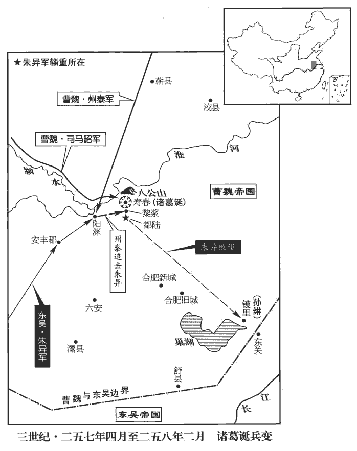
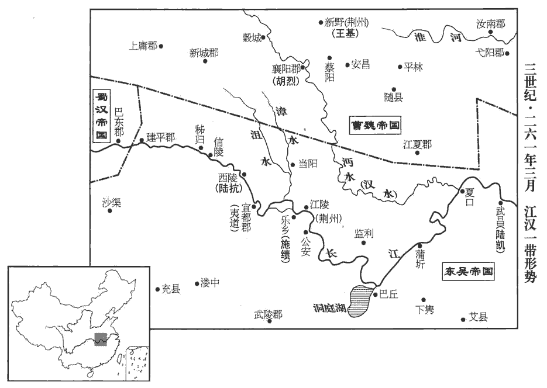
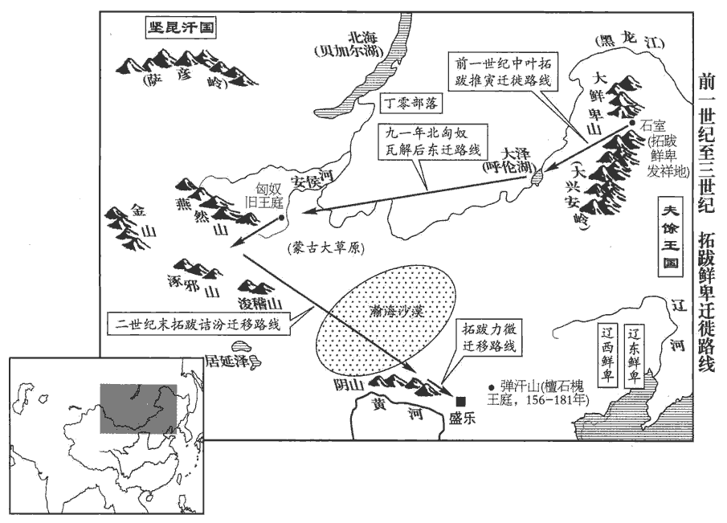

 魏紀九起柔兆困敦（丙子），盡重光大荒落（辛巳），凡六年。

# 高貴鄉公下

## 甘露元年（丙子，二五六）是年六月，改元。

1春，正月，漢姜維進位大將軍。

〖译文〗 [1]春季，正月，蜀汉姜维升任为大将军。

2二月，丙辰‹九›，帝‹曹髦，时年十六›宴群臣於太極東堂，與諸儒論夏少康、漢高祖優劣，以少康為優。帝謂少康生於滅亡之後，降為諸侯之隸，能布其德而兆其謀，卒滅過、戈，克復禹績，祀夏配天，不失舊物，非至德弘仁，豈濟斯勳！漢祖因土崩之勢，杖一時之權，專任智力以成功業，行事動靜多違聖檢。為人子則數危其親，為人君則囚繫賢相，為人父則不能衛子，身沒之後，社稷幾傾，若與少康易時而處，未必能復大禹之績。嗚呼！帝固有志於少康矣，然而不能殲澆、豷yì而身死人手者，不能布其德而兆其謀也，余觀帝之所以論二君優劣，書生之譚耳，未能如石勒辭氣之雄爽也。夏，戶雅翻。少，詩照翻。

〖译文〗 [2]二月，丙辰（初九），魏帝在太极东堂宴请群臣，与各位儒生讨论夏少康和汉高祖的优劣，魏帝认为少康优于汉高祖。

3夏，四月，【章：甲十一行本「月」下有「庚戌」二字；乙十一行本同；孔本同；張校同。】賜大將軍昭袞冕之服，赤舄xì副焉。九錫之漸也。

〖译文〗 [3]夏季，四月，庚戌（初四），赐给大将军司马昭绣龙的礼服和冠冕，另加一双帝王穿用的赤色木底靴。

4丙辰‹十›，帝幸太學，與諸儒論書、易及禮，諸儒莫能及。時帝與博士淳于俊論易，庾yǔ峻論書，馬照論禮記，考其難疑答問，不過擿tī抉經義及王、鄭之異同耳，非人君之學也。帝嘗與中護軍司馬望、侍中王沈、散騎常侍裴秀、黃門侍郎鍾會等講宴於東堂，并屬文論，沈，持林翻。散，悉亶翻。騎，奇寄翻。屬，之欲翻。特加禮異，謂秀為儒林丈人，沈為文籍先生。帝性急，請召欲速，以望職在外，特給追鋒車、虎賁五人，望為中護軍，其職在外。傅子曰：追鋒車，施通幰xiǎn，遽則乘之，令虎賁五人舁yú之也。晉志曰：追鋒車去小平蓋，加通幰，如軺yáo車，駕二馬。追鋒之名，取其迅速也。施於戎陳之間，是為傳乘。賁，音奔。每有集會，輒奔馳而至。秀，潛之子也。裴潛事武帝，守代郡著名。

〖译文〗 [4]丙辰（初十），魏帝到太学去，与各位儒生讨论《书》、《易》和《礼》，各位儒生都自愧不如。魏帝曾与中护军司马望、侍中王沈、散骑常侍裴秀、黄门侍郎钟会等人在东堂饮宴讲论学术，并作文论，对他们特别加以礼遇，并称裴秀是儒林丈人，王沈是文籍先生。魏帝性急，请人前来就希望快点到达，因为司马望在宫外任职，就特地赐给他一辆追锋车和勇士五人，每当有集会，就奔驰而至。裴秀是裴潜之子。

5六月，丙午‹一›，改元。蓋以甘露降而改元也。

〖译文〗 [5]六月，丙午（初一），改年号为甘露。

6姜維在鍾提‹甘肃临洮南›，議者多以為維力已竭，未能更出。安西將軍鄧艾曰：「洮西之敗，見上卷上年。非小失也，士卒凋殘，倉廩空虛，百姓流離。今以策言之，彼有乘勝之勢，我有虛弱之实，一也。彼上下相習，五兵犀利，管子曰：蚩尤受盧山之金而作五兵。孔穎達曰：步卒之五兵，謂弓矢一，殳shū二，矛三，戈四，戟五也；鄭司農所謂戈、矛、戟、酉矛、夷矛，車之五兵也。犀，堅也，古以犀兕sì為甲，故謂堅為犀。我將易兵新，器仗未復，二也。將易，艾自謂初代王經也。兵新，謂遣還洮西敗卒，更差軍守也。將，即亮翻。彼以船行，吾以陸軍，勞逸不同，三也。言蜀船自涪戍白水，可以上沮水，由沮水入武都下辨，自此而西北，水路漸峻陿，小舟猶可入也，魏軍度隴而西，皆陸行。狄道‹甘肃临洮›、隴西‹甘肃陇西›、南安‹甘肃陇西东南›、祁山‹甘肃礼县东北›各當有守，彼專為一，我分為四，四也。從南安、隴西因食羌穀，若趣祁山，趣，七喻翻；下同。熟麥千頃，為之外倉，【章：甲十一行本「倉」下有「五也」二字；乙十一行本同；孔本同；張校同；退齋校同。】賊有黠計，其來必矣。」黠xiá，下八翻，桀黠也。

〖译文〗 [6]姜维在钟提，人们议论多认为他兵力已经衰竭，不能再次出征。但安西将军邓艾说：“我们在洮西的失败，并不是小的损失，士卒伤残严重，十分衰弱，粮食仓库也已经空虚，百姓们流离失所。如今从谋略方面说，他们有乘胜进军的实力，而我们的现状却虚弱不堪，这是一。他们官兵上下相互熟习，兵器齐备而犀利，而我们更换了将领，更新了士兵，兵器也不完备，这是二。他们是坐船行进，而我们是陆地行军，劳逸不同，这是三。狄道、陇西、南安、祁山各地都应当有人守卫，他们是专门进攻一处，而我们却分守四方，这是四。他们从南安、陇西进军可以就地食用羌人的粮食，如果向祁山进军，那里成熟的麦子有千顷之多，足以成为他们的外部粮仓，这是五。敌人素来狡黠善于算计，他们来进攻是必然的。”

秋，七月，姜維復率眾出祁山，復，扶又翻。聞鄧艾已有備，乃回，從董亭‹甘肃武山县南›趣南安‹甘肃陇西东南›；水經註：董亭在南安郡西南，谷水歷其下，東北注于渭。艾據武城山‹甘肃武山县西南›以拒之。水經註：渭水過獂道南。獂huán道，南安郡治也。又東，逕武城縣西，武城川水入焉。蓋以山名縣也。酈道元，後魏人，武城縣必後魏所立，而魏收地形志無之，蓋廢省也。維與艾爭險不克，其夜，渡渭東行，緣山趣上邽‹甘肃天水›，艾與戰於段谷‹甘肃天水西南›，水經註：上邽之南有段溪水，水出西南馬門溪，東北流，合籍水。杜佑曰：秦州上邽縣有段谷水。趣，七喻翻。大破之。以艾為鎮西將軍、都督隴右諸軍事。維與其鎮西大將軍胡濟期會上邽，濟失期不至，故敗，士卒星散，死者甚眾，言士卒迸散如星，不能收拾成隊伍。蜀人由是怨維。維上書謝，求自貶黜，乃以衛將軍行大將軍事。

〖译文〗 秋季，七月，姜维再次率兵出祁山，听说邓艾已有防备，就撤兵返回，从董亭奔向南安；邓艾据守武城山来抵抗姜维。姜维与邓艾争夺险要之地未能成功，当天夜里，他渡过渭水向东而行，沿山奔向上，邓艾又与姜维在段谷交战，把姜维打得大败。魏国任命邓艾为镇西将军，都督陇右诸军事。姜维与蜀汉的镇西大将军胡济约定在上会合，胡济误期未能到达，因此姜维失败了，士兵们四散奔逃，伤亡惨重，蜀人因此而埋怨姜维。姜维上书谢罪，自求贬职，蜀汉就让他改卫将军代行大将军的职权。

7八月，庚午‹二十六›，詔司馬昭加號大都督，奏事不名，假黃鉞。癸酉‹二十九›，以太尉司馬孚為太傅。九月，以司徒高柔為太尉。

〖译文〗 [7]八月，庚午（二十六日），诏令司马昭加大都督封号，奏事可以不称名，出师持黄钺。癸酉（二十九日），任命太尉司马孚为太傅。九月，任命司徒高柔为太尉。

8文欽說吳人以伐魏之利，說，輸芮翻。孫峻使欽與驃騎將軍呂據驃，匹妙翻。及車騎將軍劉纂、鎮南將軍朱異、前將軍唐咨，自江都‹江苏邗hán江县西南瓜洲镇›入淮、泗，江都縣屬廣陵郡。此自邗溝入淮，自淮入泗也。以圖青、徐。魏青州統齊、濟南、樂安、城陽、東萊，徐州統下邳、彭城、東海、琅邪、東莞、東安、廣陵、臨淮。晉志曰：周禮曰：正東曰青州，蓋取土居少陽，其色為青。徐州取舒緩之義。或云，因徐丘以立名。峻餞之於石頭‹南京西北›，遇暴疾，以後事付從父弟偏將軍綝。從，才用翻。綝，丑林翻。丁亥‹十四›，峻卒‹年三十八›。吳人以綝為侍中、武衛將軍、都督中外諸軍事，召呂據等還。還，從宣翻，又如字。

〖译文〗 [8]文钦向吴人游说讨伐魏国之利，孙峻派文钦与骠骑将军吕据以及车骑将军刘纂、镇南将军朱异、前将军唐咨等人从江都进入淮水、泗水，以图攻取青州、徐州。孙峻在石头城为他们饯别，突然得了暴病，就把后事托付给叔父偏将军孙。丁亥（十四日），孙峻去世。吴人任命孙为侍中、武卫将军、都督中外诸军事，又召吕据等人返回。

9己丑‹十六›，吳大司馬呂岱卒，年九十六。始，岱親近吳郡‹苏州›徐原，慷慨有才志，岱知其可成，賜巾褠gōu，釋名：巾，謹也。二十成人，士冠、庶人巾，言當自謹脩於四教。褠，單衣，漢、魏以來，士庶以為禮服。褠，古侯翻。與共言論，後遂薦拔，官至侍御史。原性忠壯，好直言，好，呼到翻。岱時有得失，原輒諫爭，爭，讀曰諍。又公論之；公然於眾中論其得失。人或以告岱，岱歎曰：「是我所以貴德淵者也！」徐原，字德淵。及原死，岱哭之甚哀，曰：「徐德淵，呂岱之益友，論語：孔子曰：益者三友：友直，友諒，友多聞。今不幸，論語曰：不幸短命死矣。岱復於何聞過！」復，扶又翻。談者美之。

〖译文〗 [9]己丑（十六日），吴国大司马吕岱去世，终年九十六岁。起初，吕岱亲近吴郡人徐原，徐原慷慨大方而有才志，吕岱知道他能够取得成就，就赐与他巾帻、单衣等庶人穿戴的礼服，并与他一起交谈，后来就推荐提拔他，官至侍御史。徐原性情忠厚豪放，喜好直言，吕岱有时出现失误，徐原就直言进谏争辩，又公然在众人之中议论；有人告诉了吕岱，吕岱感叹地说：“这是我所以看重徐原的原因。”徐原死时，吕岱哭得十分哀痛，说：“徐原啊，我的好友，如今你不幸而去，我又从何处听人指出我的错误？”谈论的人十分赞美这件事。

10呂據聞孫綝代孫峻輔政，大怒，與諸督將連名共表薦滕胤為丞相；將，即亮翻。綝更以胤為大司馬，代呂岱駐武昌‹湖北鄂州›。據引兵還，使人報胤，欲共廢綝。冬，十月，綝【章：甲十一行本「綝」上有「丁未」二字；乙十一行本同；孔本同；退齋校同。】遣從兄憲將兵逆據於江都，使中使敕文欽、劉纂zuǎn、唐咨等共擊取據，又遣侍中左將軍華融、中書丞丁晏魏、晉之制，中書無丞，此吳所置。華，戶化翻。告喻胤宜速去意。言宜速往武昌，否則且有誅罰。胤自以禍及，因留融、晏勒兵自衛，召典軍楊崇、將軍孫咨楊崇，蓋胤帳下典軍。告以綝為亂，迫融等使有【章：乙十一行本「有」作「作」。】書難綝，有者，對無之稱，於此則文義不為通。通鑑既因三國志舊文，今亦不欲輕改。難，乃旦翻。綝不聽，表言胤反，許將軍劉丞以封爵，使率兵騎攻圍胤。胤又劫融等使詐為詔發兵，融等不從，皆殺之。或勸胤引兵至蒼龍門，蒼龍門，吳建業宮之東門也。將士見公出，必委綝就公。委，棄也。時夜已半，胤恃與據期，又難舉兵向宮，乃約令部曲，約，勒而號令之。說呂侯兵已在近道，故皆為胤盡死，無離散者。為，于偽翻。胤顏色不變，談笑如常。時大風，比曉，據不至，比，必寐翻。綝兵大會，遂殺胤及將士數十人，夷胤三族。己酉‹六›，大赦，改元太平。或勸呂據奔魏者，據曰：「吾恥為叛臣。」遂自殺。據父范，佐孫策以造吳，故恥為叛臣，自殺以明節。

〖译文〗 [10]吕据听说孙代替孙峻辅佐朝政，勃然大怒，就与诸位都督、将领连名共同上表推荐滕胤为丞相；孙改任滕胤为大司马，代替吕岱驻守武昌。吕据领兵返回，使人报告滕胤，想共同废掉孙。冬季，十月，丁未（初四），孙派遣堂兄孙宪率兵在江都迎住吕据，让中使下令文钦、刘纂、唐咨等人共同击杀吕据，又派遣侍中左将军华融、中书丞丁晏去告诉滕胤，让他迅速离开都城前往武昌。滕胤自认为灾祸已经来临，就拘留了华融、丁晏整兵自卫，招来典军杨崇、将军孙咨，告诉他们孙要作乱，并迫使华融等人写书信责难孙。孙不听，上表说滕胤要造反，又许愿给将军刘丞封爵，让他率兵马去围攻滕胤。滕胤又劫持华融等人让他假作诏书发兵起事，华融等人不从，滕胤把他们都杀了。有人劝滕胤领兵到苍龙门，认为将士们见他出来，必定弃孙而跟从他。当时已经过了半夜，滕胤仗着与吕据有约，又难以向宫中发兵，就勒令部曲不得散乱，并说吕据的军队已经在附近的路上，因此手下兵士都为滕胤尽死守护，没有一个离散的。滕胤脸不变色，谈笑如常。当时刮起了大风，到了拂晓，吕据仍没到来，而孙的兵大举进攻，结果杀了滕胤及他手下将士数十人，并诛灭滕胤三族。己酉（初六），实行大赦，改年号为太平。有人劝吕据投奔魏国，吕据说：“我耻为叛臣。”于是就自杀而死。

11以司空鄭沖為司徒，左僕射盧毓為司空。晉志曰：尚書僕射，漢本置一人，至漢獻帝建安四年，以執金吾榮郃為尚書左僕射，僕射分置左右蓋自此始。經魏至晉，迄于江左，省置無常，置二則為左右僕射，或不兩置，但曰尚書僕射，令闕則左為省主，若左右并闕，則置尚書僕射以主省事。毓，余六翻。毓固讓驃騎將軍王昶、光祿大夫王觀、司隸校尉琅邪‹山东临沂›王祥，詔不許。

〖译文〗 [11]任命司空郑冲为司徒，左仆射卢毓为司空。卢毓坚决辞让并推荐骠骑将军王昶、光禄大夫王观、司隶校尉琅邪人王祥，但诏令不准。

祥性至孝，繼母朱氏遇之無道，祥愈恭謹。朱氏子覽，年數歲，每見祥被楚撻tà，楚，荊也；撻，擊也。被，皮義翻。輒涕泣抱持母；母以非理使祥，覽輒與祥俱往。及長，娶妻，長，知兩翻。母虐使祥妻，覽妻亦趨而共之，母患之，為之少止。為，于偽翻。祥漸有時譽，母深疾之，密使酖祥。覽知之，徑起取酒，祥爭而不與，母遽奪反之。漢書齊悼惠王傳：奪反孝惠卮zhī。師古曰：反，音幡。自後，母賜祥饌，饌zhuàn，雛戀翻，又雛皖翻。覽輒先嘗，母懼覽致斃，遂止。漢末遭亂，祥隱居三十餘年，不應州郡之命，母終毀瘁，瘁cuì，秦醉翻，病勞也。杖而後起。徐州刺史呂虔檄為別駕，委以州事，州界清靜，政化大行，時人歌之曰：「海沂之康，實賴王祥；徐州之地，東際海，西北距泗、沂，故曰海沂。邦國不空，別駕之功！」

〖译文〗 王祥生性大孝，继母朱氏对他很不好，但王祥对她更加恭敬。朱氏的亲儿子王览，那年才几岁，见到王祥被鞭打，就哭泣着抱住母亲让她不要打；母亲让王祥干力不能及的苦差事，王览就与王祥一同去。长大后，都娶了妻子，母亲又暴虐地役使王祥之妻，王览之妻也赶快跑去一起干，母亲心有顾忌，惩罚就少了一些。王祥逐渐有了一些声誉，母亲深深地忌恨他，就暗地里在酒里下毒想要毒死王祥。王览知道了此事，就跑过去抢酒，王祥争执着不给他，母亲却突然夺过去倒掉了。从此后，母亲每次给王祥什么吃的东西，王览总要先尝一尝，母亲害怕王览死掉，于是就不再下毒了。东汉末年天下大乱，王祥就隐居了三十多年，不应州郡的征召，母亲去世，他哀痛得身心交瘁，拄着拐杖才能站起来。徐州刺史吕虔写信来召他担任别驾，委任他管理州中事务，结果州界境内平静安定，政事教化顺利推行，当时的人歌唱道：“海沂之康，实赖王祥；邦国不空，别驾之功。”

12十一月，吳孫綝遷大將軍。綝負貴倨傲，多行無禮。峻從弟憲嘗與誅諸葛恪，與，讀曰預。峻厚遇之，官至右將軍、無難督，平九官事。九官，即九卿也。魏明帝太和二年，吳主還建業，留尚書九官於武昌。綝遇憲薄於峻時，憲怒，與將軍王惇dūn謀殺綝，事泄，綝殺惇，憲服藥死。

〖译文〗 [12]十一月，吴国孙升任大将军。孙自负高贵倨傲不群，干了很多无礼之事。孙峻的堂弟孙宪曾参与诛杀诸葛恪之事，所以孙峻给他非常厚重的待遇，官至右将军、无难督，平九官事。孙对待孙宪不如孙峻对他那么优厚，孙宪十分恼怒，就与将军王密谋杀掉孙，事情败露，孙杀掉王，孙宪则服毒自杀。

## 二年（丁丑，二五七）

1春，三月，大梁成侯盧毓卒。

〖译文〗 [1]春季，三月，大梁成侯卢毓去世。

2夏，四月，吳主‹孙亮，时年十五›臨正殿，大赦，始親政事。孫綝表奏，多見難問，難，乃旦翻。又科兵子弟十八已下、十五以上三千餘人，科，程也；程其長短小大也。或曰：「科」，當作「料」，音聊，量度也。選大將子弟年少有勇力者，使將之，少，詩照翻。將，即亮翻。日於苑中教習，曰：「吾立此軍，欲與之俱長。」長，丁丈翻；今知兩翻。又數出中書視大帝時舊事，問左右侍臣曰：「先帝數有特制，特制，謂特出上意，以手詔宣行也。數，所角翻。今大將軍問事，問事，猶言奏事；不言奏者，自卑挹yì之意。但令我書可邪？」書可，畫可也。嘗食生梅，使黃門至中藏取蜜，中藏，中藏府也，掌幣帛金銀諸貨物。蜜，蜂餹也。藏，徂浪翻；下同。蜜中有鼠矢；召問藏吏，藏吏叩頭。吳主曰：「黃門從爾求蜜邪？」吏曰：「向求，謂向者嘗求蜜也。實不敢與。」黃門不服。吳主令破鼠矢，矢中燥，因大笑，謂左右曰：「若矢先在蜜中，中外當俱濕；今外濕里燥，此必黃門所為也。」詰之，果服；詰jié，去吉翻。左右莫不驚悚。

〖译文〗 [2]夏季，四月，吴王亲临正殿，实行大赦，开始亲自执政。孙的上表奏章，多次受到他的质问，又选兵士子弟十八岁以下、十五岁以上的三千多人，选大将子弟中勇武有力的，让他们领兵，每天都在苑囿中练兵习武，他说：“我建立这支军队，是想和他们一起成长。”他还多次拿出府藏书册阅览先帝时的旧事，问左右侍臣说：“先帝常常亲自书写诏书，而如今大将军奏事，为什么只让我签字认可呢？”他要生吃酸梅，让黄门到库里去取蜂蜜，蜜中有鼠屎；就召来守库官询问，守库官叩头谢罪。吴王说：“黄门从你那儿要过蜂蜜吗？”守库官说：“以前曾要过，我没敢给他。”黄门不服。吴王让人破开鼠屎，屎中是干燥的，于是他大笑着对左右说：“如果鼠屎事先就在蜜中，那么里外都应是湿的，现在外面湿而里面干燥，这必定是黄门放进去的。”诘问黄门，他果然服了罪。左右之人都很震惊恐惧。

3征東大將軍諸葛誕素與夏侯玄、鄧颺等友善，玄等死，玄死見上卷正元元年。颺死見七十五卷邵陵厲公嘉平元年。颺，余章翻，又余亮翻。王淩、毌丘儉相繼誅滅，王凌死見七十五卷嘉平三年。毌丘儉死見上卷正元二年。誕內不自安，乃傾帑藏振施，帑tǎng，他朗翻。施，式智翻。曲赦有罪以收眾心，畜養揚州輕俠數千人以為死士。畜，許六翻。因吳人欲向徐堨‹徐塘，巢湖东›，徐堨è，即徐塘，在東關之東。堨，烏葛翻。請十萬眾以守壽春‹安徽寿县›，又求臨淮築城以備吳寇。司馬昭初秉政，長史賈充請遣參佐慰勞四征，魏置征東將軍屯淮南，征南將軍屯襄、沔以備吳；征西將軍屯關、隴以備蜀；征北將軍屯幽、并以備鮮卑；皆授以重兵。司馬昭初當國，故充請慰勞以觀其志趣。勞，力到翻。且觀其志。昭遣充至淮南‹安徽寿县›，充見誕，論說時事，因曰：「洛中諸賢，皆願禪代，君以為如何？」誕厲聲曰：「卿非賈豫州子乎？充父逵，先為豫州而卒，故稱之。世受魏恩，豈可欲以社稷輸人乎！若洛中有難，難，乃旦翻。吾當死之。」充默然；還，言於昭曰：「諸葛誕再在揚州，誕先督揚州，東關之敗，改督豫州，毌丘儉既死，復督揚州。得士眾心。今召之，必不來，然反疾而禍小；不召，則反遲而禍大，不如召之。」昭從之。甲子‹二十四›，‹曹髦，时年十七›詔以誕為司空，召赴京師。誕得詔書，愈恐，疑揚州刺史樂綝間己，遂殺綝，征東將軍與揚州刺史同治壽春。魏四征之任，率以其州刺史為儲帥，故誕疑綝間己。間，古莧翻。斂淮南及淮北郡縣屯田口十餘萬官兵，魏郡縣皆置屯田，凡屯田口悉官兵也。揚州新附勝兵者四五萬人，勝，音升。聚穀足一年食，為閉門自守之計。遣長史吳綱將少子靚至吳，將，如字。少，詩照翻。靚jìng，疾郢翻，又疾正翻。稱臣請救，并請以牙門子弟為質。牙門，諸將之子弟也。質，音致。

〖译文〗 [3]征东大将军诸葛诞平时与夏侯玄、邓等人关系亲密，夏侯玄等人死了，王凌、丘俭等也相继被诛杀，诸葛诞内心很不安，于是就尽量拿出官府库中的财物广泛地赈济施舍，又屈法赦免那些有罪之人以收买众人之心，还蓄养了扬州的轻捷侠客数千人当做护卫自己的敢死队。因为吴国人想要攻打徐，诸葛诞就请求率十万兵众去守卫寿春，又要求滨临淮水建筑一座城以防备吴人进犯。司马昭刚刚执掌朝政，长史贾充建议派遣部下去慰劳征东、征南、征西、征北四将军，并观察他们的志趣、动向。司马昭派贾充到了淮南，贾充见到诸葛诞，一起谈论时事，贾充说道：“洛中的诸位贤达之人，都希望实行禅让，您认为如何？”诸葛诞严厉地说：“你不是贾豫州的儿子吗？你家世代受到魏国的恩惠，怎能想把国家转送他人？如果洛中发生危难，我愿为国家而死。”贾充默然无语。回来之后，贾充对司马昭说：“诸葛诞再次到扬州后，深得士众之心。如今召他来，他必然不来，还会反叛，但早反叛祸害不大；如果不召他来，那么晚反叛祸害就大了，因此不如召他来。”司马昭采纳了这个意见。甲子（二十四日），诏令任命诸葛诞为司空，并召他往赴京师。诸葛诞得到诏书，更加恐惧，怀疑是扬州刺史乐离间自己，于是就杀掉乐，聚集了在淮南及淮北郡县屯田的十余万官兵和扬州地区新招募的身强力壮的兵士四五万人，又聚集了足够食用一年的粮食，作了闭门自守的长期准备。又派遣长史吴纲带着他的小儿子诸葛靓到吴国，向吴王称臣请求救援，并请求再让部下将士的子弟当做人质。

 

4吳滕胤、呂據之妻，皆夏口‹湖北武汉›督孫壹之妹也。壹，孫奐庶子也。夏，戶雅翻。六月，孫綝使鎮南將軍朱異自虎林‹安徽贵池西›將兵襲壹。異至武昌‹湖北鄂州›，壹將部曲來奔。乙巳‹六›，詔拜壹車騎將軍、交州牧，封吳侯，開府辟召，儀同三司，袞冕赤舄xì，事從豐厚。崇異孫壹者，以招攜xié貳也。

〖译文〗 [4]吴国滕胤和吕据之妻，都是夏口督孙壹的妹妹。六月，孙派镇南将军朱异从虎林领兵去袭击孙壹。朱异到武昌时，孙壹率领部曲前来投奔。乙巳（初六），朝廷下诏任命孙壹为车骑将军、交州牧，封为吴侯，开建府署征召僚属，仪同三司，又赐给帝王服用的全套服饰，各种事情都给予丰厚待遇。

5司馬昭奉帝及太后討諸葛誕。昭若自行，恐後有挾xié兩宮為變者，故奉之以討誕。

〖译文〗 [5]司马昭侍奉魏帝和太后共同去讨伐诸葛诞。

吳綱至吳，吳人大喜，使將軍全懌yì、全端、唐咨、王祚將三萬眾，與文欽同救誕；以誕為左都護，假節、大司徒、驃騎將軍、青州牧，封壽春侯。懌，琮之子；端，其從子也。

〖译文〗 吴纲到了吴国，吴人大喜，派将军全怿、全端、唐咨、王祚等人领兵三万人，与文钦一起去救援诸葛诞；任命诸葛诞为左都护，持符节、大司徒、骠骑将军、青州牧，并封为寿春侯。全怿是全琮之子，全端是全琮之侄。

六月，甲子‹二十五›，車駕次項‹河南沈丘›，司馬昭督諸軍二十六萬進屯丘頭‹河南沈丘东南›，是役也，司馬昭改丘頭曰武丘，以旌武功。武丘，唐為沈丘縣。以鎮南將軍王基行鎮東將軍、都督揚•豫諸軍事，與安東將軍陳騫等圍壽春‹安徽寿县›。基始至，圍城未合，文欽、全懌等從城東北，因山乘險，得將其眾突入城。壽春城外他無山，唯城北有八公山耳。昭敕基斂軍堅壁。基累求進討，會吳朱異率三萬人進屯安豐‹安徽霍邱›，為文欽外勢，安豐縣，漢屬廬江郡，魏分屬安豐郡。今安豐縣在壽春南八十里。詔基引諸軍轉據北山。基謂諸將曰：「今圍壘轉固，兵馬向集，但當精脩守備以待越逸，而更移兵守險，使得放縱，雖有智者，不能善其後矣！」遂守便宜，上疏曰：「今與賊家對敵，當不動如山，若遷移依險，人心搖蕩，於勢大損。諸軍并據深溝高壘，眾心皆定，不可傾動，此御兵之要也。」書奏，報聽。報基聽行其策。時帝在軍，故諸軍節度皆稟詔指，而裁其可否者實司馬昭也。於是基等四面合圍，表里再重，重，直龍翻。塹壘甚峻。文欽等數出犯圍，數，所角翻。逆擊，走之。司馬昭又使奮武將軍監青州諸軍事石苞監，古銜翻。督兗州刺史州泰、徐州刺史胡質簡銳卒為游軍，以備外寇。泰擊破朱異於陽淵‹安徽寿县西南›，水經註：決水出廬江雩yú婁縣北，過安豐縣東，又北右會陽泉水。水西有陽泉縣故城，故陽泉鄉也，漢靈帝封黃琬為侯國。決水又北入于淮。異走，泰追之，殺傷二千人。

〖译文〗 六月，甲子（二十五日），魏帝车驾到达项县，司马昭率诸军二十六万人进驻丘头。让镇南将军王基为行镇东将军，都督扬、豫诸军事，并与安东将军陈骞等人围攻寿春。王基刚到寿春，包围圈还未形成时，文钦、全怿等人从城东北凭借险要的山势，才得以率领军队突入城中。司马昭命令王基聚拢军队坚守壁垒不与敌人交战。王基屡次要求进攻，恰好吴国的朱异率领三万人进驻安丰，成为文钦的外部接应势力，诏令王基率领诸军转移占据北山。王基对诸将说：“如今包围的营垒已经坚固了，兵马也近于集中，此时只应精心整治守备力量以等待敌人突围逃跑，但是却命令我们转移兵力把守险要之地，使城内敌人得以放纵，如果这样做，即使有聪明之人，也不能很好地处理以后的战事！”于是就坚持有利的做法继续包围寿春，同时又上疏说：“如今与敌人对峙，我们就像山那样岿然不动，如果转移部队依据险要，人心就会动荡不安，对于形势有很大损害。各军都已据守深沟高垒的营盘，众心都已稳定，不可再加以动摇，这是治军的要领。”上奏章之后，回报说同意王基的意见。于是王基等人四面合围，形成里外两层包围圈，深沟高垒的防御工事非常坚固。文钦等人多次出城企图突破包围，都受到迎面还击而逃回。司马昭又派奋武将军监青州诸军事石苞统领兖州刺史州泰、徐州刺史胡质的轻装精锐士卒作为游动军队，以防备外面的敌兵。州泰在阳渊击败了朱异，朱异逃走，州泰在后面追赶，杀伤了敌兵二千人。

秋，七月，吳大將軍綝大發兵出屯鑊huò里‹巢湖市西北›，後吳王責孫綝以留湖中不上岸一步，則鑊里當在巢縣界。復遣朱異帥將軍丁奉、黎斐等五人前解壽春之圍。復，扶又翻。帥，讀曰率。異留輜重於都陸‹安徽寿县南›，水經註：博鄉縣，王莽改曰楊陸，泄水出焉，北過芍陂，又西北入于淮。意者都陸即楊陸歟？又據晉紀，都陸在黎漿南。重，直用翻。進屯黎漿‹安徽寿县南›，水經註：芍陂瀆水東注黎漿水，水東逕黎漿亭南，又東注肥水，謂之黎漿水口也。石苞、州泰又擊破之。太山‹山东泰安东›太守胡烈以奇兵五千襲都陸，盡焚異資糧，異將餘兵食葛葉，走歸孫綝；綝使異更死戰，異以士卒乏食，不從綝命。綝怒，九月，己巳‹一›，綝斬異於鑊里。辛未‹三›，引兵還建業‹南京›。壽春之圍已固，雖使周瑜、呂蒙、陆遜復生，不能解也。若孫綝能舉荊、揚之眾，出襄陽以向宛、洛，壽春城下之兵必分歸以自救，諸葛誕、文欽等於此時決圍力戰，猶庶幾焉。綝既不能拔出諸葛誕，而喪敗士眾，喪，息浪翻。敗，補邁翻。自戮名將，由是吳人莫不怨之。為後吳誅孫綝張本。

〖译文〗 秋季，七月，吴国大将军孙出动众多兵力驻扎在镬里，又派朱异率将军丁奉、黎斐等五人前去解寿春之围。朱异把辎重粮草留在都陆，进驻黎浆，石苞、州泰又击败了他。太山太守胡烈率奇兵五千人偷袭了都陆，全部焚毁了朱异的物资粮草，朱异率领剩余兵力吃着葛叶，逃归孙处；孙让朱异再次拼死出战，朱异以士卒缺乏粮食为由，不服从孙的命令。孙大怒，九月，己巳（初一），孙在镬里杀了朱异。辛未（初三），领兵回到建业。孙既不能救出诸葛诞，而且又伤亡了大量士卒，还杀戮自己的名将，因此吴人没有不怨恨他的。

司馬昭曰：「異不得至壽春，而吳人殺之，非其罪也，【章：甲十一行本作「非其罪也，而吳人殺之」；乙十一行本同；退齋校同；張校同，云無註本亦同，下「非其罪也」四字衍。】欲以謝壽春而堅誕意，使其猶望救耳。今當坚圍，備其越逸，而多方以誤之。」乃縱反間，間，古莧翻。揚言「吳救方至，大軍乏食，分遣羸疾就穀淮北，勢不能久。」誕等益寬恣食，俄而城中乏糧，外救不至。將軍蔣班、焦彝，皆誕腹心謀主也，言於誕曰：「朱異等以大眾來而不能進，孫綝殺異而歸江東，外以發兵為名，內實坐須成敗。須，待也。今宜及眾心尚固，士卒思用，并力決死，攻其一面雖不能盡克，猶有可全者，空坐守死，無為也。」言不若決死而求生，無為坐守而待斃。文欽曰：「公今舉十餘萬之眾歸命於吳，而欽與全端等皆同居死地，父兄子弟盡在江表，就孫綝不欲來，主上及其親戚豈肯聽乎！且中國無歲無事，軍民并疲，今守我一年，內變將起，柰何舍此，舍，讀曰捨。欲乘危徼倖乎！」徼，堅堯翻。班、彝固勸之，欽怒。誕欲殺班、彝，二人懼，十一月，棄誕踰城來降。全懌兄子輝、儀在建業‹南京›，輝、儀，懌兄全緒之二子；「輝」，一作「禕yī」。與其家內爭訟，攜其母將部曲數十家來奔。於是懌與兄子靖及全端弟翩、緝皆將兵在壽春城中，司馬昭用黃門侍郎鍾會策，密為輝、儀作書，為，于偽翻。使輝、儀所親信齎入城告懌等，說「吳中怒懌等不能拔壽春，言不能拔壽春之眾於重圍也。欲盡誅諸將家，故逃來歸命。」十二月，懌等帥其眾數千人開門出降，帥，讀曰率。降，戶江翻。城中震懼，不知所為。詔拜懌平東將軍，封臨湘侯，端等封拜各有差。

〖译文〗 司马昭说：“朱异不能到达寿春，不是他的罪过，但吴人却杀了他，这是想以此来安抚寿春的将士而坚定诸葛诞守城的意志，让他仍然盼望着救兵。如今应加强包围，防备他们突围逃跑，而且要想方设法使他们判断失误。”于是到处放风行反间之计，扬言说：“吴国救兵就要到了，魏国的大军缺乏粮食，要分散派遣病弱的士卒到淮北去吃那里的粮食，看形势围攻不会太久了。”诸葛诞等人更加放宽心任意吃粮，没过多久城中粮食告乏，而外边的救兵仍然未到。将军蒋班、焦彝，都是诸葛诞的心腹主谋之人，此时对诸葛诞说：“朱异等人率众多兵力前来而不能进城，孙杀掉朱异而回到江东，表面上是以发救兵为名，内里实际上是要坐等成败。如今应趁众人之心还能稳定，士卒愿意效力，集中力量拼死命攻其一面，尽管不能获全胜，仍有可能保全部队实力，如果空坐这里死守，是没有出路的。”文钦说：“您如今率领十余万士卒来归附于吴国，而我与全端等人都与您共同居于死地，我们的父兄子弟都在江南，即使孙不想来，而主上及其亲戚又怎么肯听他的呢？而且魏国没有一年是没事的，军民都很疲惫，如今他们围守我们一年，内变就将兴起，为什么我们要舍弃这里而想冒着危险侥幸一战呢？蒋班、焦彝仍坚持劝他，文钦十分恼怒。诸葛诞要杀掉蒋班、焦彝，二人非常害怕，十一月，他们背弃诸葛诞越过城墙来投降。全怿哥哥的儿子全辉、全仪在建业，与家内之人发生争执，就带着母亲率领部曲数十家来投奔魏国。此时全怿与其兄之子全靖以及全端之弟全翩、全缉都领兵在寿春城中，司马昭采用黄门侍郎钟会的计策，秘密地替全辉、全仪写了书信，并让全辉、全仪的亲信之人送入城中告诉全怿等人，说：“吴国朝廷恼怒全怿等人不能击败包围寿春的敌兵，而想要杀尽诸将的家属，因此跑出来归顺魏国。”十二月，全怿等人率领手下兵将数千人开城门出来投降，城中的人十分震恐，不知怎么办好。诏令任命全怿为平东将军，封临湘侯，全端等人的拜官封职各有差等。

6漢姜維聞魏分關中兵以赴淮南，欲乘虛向秦川‹陕西中部›，秦地四塞以為固，渭水貫其中。渭川左右，沃壤千里，世謂之秦川。率數萬人出駱谷‹陕西周至西南›，至沈嶺‹陕西周至西南›。時長城積穀甚多，而守兵少，征西將軍都督雍、涼諸軍事司馬望雍，於用翻。及安西將軍鄧艾進兵據之，以拒維。維壁於芒水‹陕西周至南里水谷›，水經註：駱谷水出郿塢東南山駱谷，北流逕長城西，又北流注于渭，渭水又東，芒水從南來注之；水出南山芒谷，北逕盩厔縣竹圃中，又北流注于渭。余按駱谷在今洋州真符縣，屈回八十里，凡八十四盤。數挑戰，數，所角翻。挑徒了翻。望、艾不應。

〖译文〗 [6]蜀汉的姜维听说魏国分出关中的兵力去支援淮南，想乘虚攻向秦川，于是就率领数万人出骆谷，到达沈岭。当时长城一带积存的粮食很多，而守兵很少，征西将军都督雍州、凉州诸军事司马望和安西将军邓艾就进兵占据了那里，以抵挡姜维。姜维筑营垒于芒水一带，多次出来挑战，而司马望、邓艾不应战。

是時，維數出兵，蜀人愁苦，中散大夫譙周作仇國論以諷之續漢志曰：中散大夫，秩六百石；漢官曰：秩比二千石。胡廣曰：光祿大夫，本為中大夫，武帝元狩五年，置諫大夫為光祿大夫，世祖中興，以為諫議大夫。又有太中、中散大夫。此四等於古者為天子之下大夫，視列國之上卿。曰：「或問往古能以弱勝強者，其術如何？曰：吾聞之，處大無患者常多慢，處小有憂者常思善；處，昌呂翻。多慢則生亂，思善則生治，理之常也。故周文養民，以少取多，句踐卹眾，以弱斃強，此其術也。文王治岐，由方百里起，三分天下有其二，所謂以少取多也。句踐歸越，弔死問疾，十年生聚，十年教訓，以弱越斃強吳。或曰：曩者，項強漢弱，相與戰爭，項羽與漢約分鸿溝，各歸息民，張良以為民志已定，則難動也，率兵追羽，終斃項氏。事見十卷漢高帝四年。豈必由文王之事乎？曰：當商、周之際，王侯世尊，言世世居尊位也。君臣久固，民習所專；民習見君臣之分明，故專於戴上。深根者難拔，據固者難遷。當此之時，雖漢祖安能杖劍鞭馬而取天下乎！及秦罷侯置守之後，謂罷列國諸侯，分置三十六郡，郡置守也。民疲秦役，天下土崩，或歲易主，或月易公，鳥驚獸駭，莫知所從，於是豪強并爭，虎裂狼分，疾搏者獲多，遲後者見吞。今我與彼皆傳國易世矣，既非秦末鼎沸之時，實有六國并據之勢，故可為文王，難為漢祖。夫民之疲勞，則騷擾之兆生，上慢下暴，則瓦解之形起。諺曰：『射幸數跌，不如審發。』跌，差也，射數差而不中，不如審而後發也。書曰：若虞機張，往省括于度則釋。是故智者不為小利移目，不為意似改步，孔穎達曰：舉足謂之步。為，于偽翻。時可而後動，數合而後舉，故湯、武之師不再戰而克，湯伐桀，鳴條一戰，而革夏命；武王伐紂，一戎衣而天下大定。誠重民勞而度時審也。度，徒洛翻。如遂極武黷征，征伐不欲數，數則黷。土崩勢生，不幸遇難，難，乃旦翻。雖有智者將不能謀之矣。」姜維以數戰亡蜀，卒如譙周之言。

〖译文〗 当时，姜维屡次出兵征战，蜀人愁苦不堪，中散大夫谯周作《仇国论》以讽谏说：“有人问古代能以弱胜强者，他们的方法如何？曰：我听说，处于大国地位而无祸患者常常多有轻慢，处于小国地位而有忧虑者常常想着向善；怠轻之事多就会出现内乱，想着向善就能使国家安定，这是普遍的道理。因此周文王善于养民，就能以少取多；句践能够抚恤众人，就能以弱胜强，这是他们的方法。有人说：以前，项羽强而汉高祖弱，互相交战，后来项羽与汉高祖约定中分天下以鸿沟为界，各归本土生息养民，张良认为民心一旦安定，就难以再发动，于是率兵追击项羽，终于消灭了他。难道一定要像文王那样行事吗？回答说：在商、周之际，王侯世代尊贵，君臣之分久已稳固，人民已习惯于专心事其君上；深深扎根的东西难以拔除，依托稳固的东西难以迁移。在那个时代，即使是汉高祖又怎能靠持剑策马而夺取天下呢？到秦朝废弃分封侯国设置郡守之后，百姓被秦朝的苦役搞得疲惫不堪，天下已经土崩瓦解，或者每年换个君主，或者每月换个主公，如同鸟兽般惊恐不安，不知所从，于是豪强们并力争夺天下，如狼似虎地撕裂分割，迅速搏杀者所获就多，行动迟缓者就被吞并。如今我们与古代都是经历改朝换代而流传的国家，既不是秦朝末年天下鼎沸纷争的时代，实际上却有六国并立称雄的形势，因此可以行文王之事，难以有汉高祖的作为。百姓的疲劳就是产生骚动不安的前兆；在上位的骄慢而在下位残暴，就会出现土崩瓦解的形势。谚语说：‘射箭如果屡次不中，不如慎重瞄准之后再发射。’因此有智谋的人不为蝇头小利而动心，不为似是而非的情况改变常态，时机成熟以后再行动，形势适宜以后再举兵，所以商汤、周武的军队不用再次战斗就能取胜，实在是因为重视人民的劳苦状况而能审时度势。如果竟然竭尽武力滥用征伐，出现了土崩瓦解的形势，又不幸遭遇危难，那么即使有有智谋的人也将不会有挽回局势的谋略了。”

## 三年（戊寅，二五八）

1春，正月，文欽謂諸葛誕曰：「蔣班、焦彝謂我不能出而走，全端、全懌又率眾逆降，逆，迎也。降，戶江翻。此敵無備之時也，可以戰矣。」誕及唐咨等皆以為然，遂大為攻具，晝夜五六日攻南圍，欲決圍而出。圍上诸軍臨高發石車火箭，石車，即砲車也。車，昌遮翻。逆燒破其攻具，矢石雨下，死傷蔽地，血流盈塹，塹，七豔翻。復還城。城內食轉竭，出降者數萬口。欽欲盡出北方人省食，與吳人堅守，誕不聽，由是爭恨。欽素與誕有隙，徒以計合，事急愈相疑。言誕、欽初以詭計苟合，事急愈相猜疑。欽見誕計事，誕遂殺欽。欽子鴦、虎，將兵在小城中，鴦、虎，欽二子也；時壽春蓋別有小城。聞欽死，勒兵赴之，眾不為用，遂單走踰城出，自歸於司馬昭。軍吏請誅之，昭曰：「欽之罪不容誅，其子固應就戮；然鴦、虎以窮歸命，且城未拔，殺之是堅其心也。」乃赦鴦，虎，使將數百騎巡城，呼曰：呼，火故翻。「文欽之子猶不見殺，其餘何懼！」又表鴦、虎皆為將軍，賜爵關內侯。城內皆喜，且日益饑困。司馬昭身自臨圍，見城上持弓者不發，曰：「可攻矣！」知其眾無拒守之心也。乃四面進軍，同時鼓譟登城。二月，乙酉‹二十›，克之。誕窘急，單馬將其麾下突小城欲出，司馬胡奮部兵擊斬之，夷其三族。誕麾下數百人，皆拱手為列，不降，每斬一人，辄降之，降，戶江翻，下同。卒不變，以至於盡。史言諸葛誕得人心，人蒙其恩而為之死。卒，子恤翻。吳將于詮曰：詮，且緣翻。「大丈夫受命其主，以兵救人，既不能克，又束手於敵，吾弗取也。」乃免冑冒陳而死。陳，讀曰陣。唐咨、王祚等皆降。唐咨本魏人降吳，見七十卷文帝黃初六年。吳兵萬眾，器仗山積。

〖译文〗 [1]春季，正月，文钦对诸葛诞说：“蒋班、焦彝认为我们不能出城而走，全端、全怿又已率众投降，这正是敌人没有防备的时机，可以出城一战了。”诸葛诞和唐咨等人都认为很对，于是就大力准备进攻的器具，连续五六个昼夜进攻南面的包围，想要突破重围而出。包围圈上的魏国诸军站在高处发射石车火箭，迎面烧破敌方的进攻器具，箭石像雨一样泻下，死伤者遍地，流血充满堑沟，诸葛诞等又被迫返回城中。城内的粮食越来越少，出城投降者有数万人之多。文钦想让北方人都出城投降以节省粮食，留下他与吴国人一起坚守，但诸葛诞不同意，从此两人之间互相怨恨。文钦平时就与诸葛诞有矛盾，只是因为反对司马昭的想法相同而结合，事态紧急了就愈加互相猜疑。文钦进见诸葛诞商量事情，诸葛诞就杀掉了文钦。文钦之子文鸯、文虎领兵在小城中，听到文钦的死讯，就想带兵去为父报仇，但众人不为他们效命，二人随即独自越过城墙逃出来，投降了司马昭。军吏请求杀了他们，司马昭说：“文钦罪不容诛，他的儿子本来也应该杀掉；但文鸯、文虎因走投无路而归顺，而且城还没攻破，杀了他们就更坚定了城内敌兵的死守之心。”于是赦免了文鸯、文虎，让他们率数百骑兵巡城高呼：“文钦之子尚且不被杀，其余之人有什么可害怕！”又让文鸯、文虎都担任将军，并赐爵关内侯。城内之人闻讯都很高兴，而且人们也日益饥饿困乏。司马昭亲自来到包围圈，见城上持弓者不发箭，就说：“可以进攻了。”于是下令四面进军，同时鼓噪呐喊登上城墙，二月，乙酉（二十日），攻克寿春城。诸葛诞情急窘迫，单枪匹马率领麾下突击小城想要闯出城，司马胡奋手下的兵士把他杀死，又诛杀其三族。诸葛诞麾下的数百人，都拱手排成队列，却不投降，每杀一人，就问其余的人降不降，而他们的态度终究不变，以至于最后全部杀尽。吴将于诠说：“大丈夫受命于君主，带兵来救人，既不能取胜，又要被敌人俘虏，我决不如此。”于是就脱掉盔甲突入敌人兵阵而战死。唐咨、王祚等人都投降了。俘虏的吴国兵卒有一万多人，缴获的兵器堆得像山一样。

司馬昭初圍壽春‹安徽寿县›，王基、石苞等皆欲急攻之，昭以為「壽春城固而眾多，攻之必力屈；若有外寇，表里受敵，此危道也。今三叛相聚於孤城之中，三叛，謂諸葛誕、文欽、唐咨也。天其或者使同就戮，吾當以全策縻mí之。但堅守三面，若吳賊陸道而來，軍糧必少；吾以游兵輕騎絕其轉輸，可不戰而破也。吳賊破，欽等必成禽矣！」乃命諸軍按甲而守之，卒不煩攻而破。卒，子恤翻。議者又以為「淮南仍為叛逆，仍，相因也。吳兵室家在江南，不可縱，宜悉坑之。」昭曰：「古之用兵，全國為上，戮其元恶而已。言全其國之人民，止戮其君；所謂誅其君而弔其民也。吳兵就得亡還，適可以示中國之大度耳。」一無所殺，分布三河近郡以安處之。河南，都也；河東、河內皆近京師。處，昌呂翻。拜唐咨安远將軍，其餘裨將，咸假位號，眾皆悅服。其淮南將士吏民為誕所脅略者，皆赦之。聽文鴦兄弟收斂父喪，給其車牛，致葬舊墓。文欽，譙人也，舊墓在焉。斂，力贍翻。

〖译文〗 司马昭当初包围寿春之时，王基、石苞等人都想加紧攻城，司马昭认为：“寿春城墙坚固而兵力众多，攻城必然损失兵力，如果再有外部敌人来犯，就要表里受敌，这是危险的做法。现在三个叛将相聚在孤城之中，天意或许会让他们同时被杀，我当以完备的计策把他们围困在城中。我们只坚守三面，如果吴兵从陆地而来，军粮必少，我们就用游动的轻骑兵断绝他们的运粮道路，这样可以不战而打败敌人。吴兵失败，文钦等人必成笼中之鸟了。”于是命令诸军停止进攻坚守不动，终于不用频频进攻而破城取胜。议论者又认为：“淮南地区仍为叛逆之徒所占据，这些吴兵的家室都在江南，不可放他们回去，应该把他们全活埋。”司马昭说：“古人用兵，以保全对方的国家为上策，只杀其首恶而已。吴兵得以逃回去，正好可以显示我国的宽宏大度。”结果一个不杀，把俘虏分布在三河地区接近京师的地方加以安置。又授予唐咨安远将军之职，其余的副将，也都给了他们相应的地位和封号，众人都心悦诚服。那些淮南将士吏民被诸葛诞所胁迫掠虏而来的，也都赦免放回。听任文鸯兄弟收敛其父之尸，并给他们车与牛，拉到旧墓安葬。

昭遺王基書曰：遺，于季翻。「初議者云云，求移者甚眾，謂前詔諸軍轉據北山。時未臨履，亦謂宜然。臨履，謂親臨其地而履行營壘處所也。將軍深算利害，獨秉固志，上違詔命，下拒眾議，終至制敵禽賊，雖古人所述，不是過也。」昭欲遣諸軍輕兵深入，招迎唐咨等子弟，因釁有滅吳之勢。王基諫曰：「昔諸葛恪乘東關‹安徽含山西南›之勝，竭江表之兵以圍新城‹合肥西北›，城既不拔而众死者大半。事見上卷邵陵厲公嘉平五年。姜維因洮西之利，輕兵深入，糧餉不繼，軍覆上邽‹甘肃天水›。謂段谷之敗也。夫大捷之後，上下輕敵，輕敵則慮難不深。難，乃旦翻。今賊新敗於外，又內患未弭，謂孫綝君臣相猜。是其脩備設慮之時也。且兵出踰年，人有歸志，今俘馘guó十萬，罪人斯得，謂禽諸葛誕也。書曰：周公居東二年，則罪人斯得。自歷代征伐，未有全兵獨克如今之盛者也。武皇帝克袁紹於官渡，自以所獲已多，不復追奔，復，扶又翻。懼挫威也。」事見六十三卷漢獻帝建安五年。昭乃止。以基為征東將軍、都督揚州諸軍事，進封東武侯。

〖译文〗 司马昭给王基写信说：“当初议论众说纷纭，要求转移到北山的人很多，当时我没有亲临营垒实地勘察，也认为应该转移。将军深入地考虑利害得失，独自坚持固定的意志，上边违背朝廷诏命，下面拒绝众人之议，终于制服敌人擒获贼兵，即使是古人所说那些忠臣良将，也不能超过你。”司马昭想派遣诸军轻兵深入，招抚迎接唐咨等人的子弟，利用敌人的内部裂痕造成消灭吴国的形势。王基进谏说：“以前诸葛恪乘着东关获胜之机，竭尽江南的兵力以围攻新城，城既没有攻克，而兵士也死了大半。姜维凭借洮西的便利条件，轻兵深入，结果粮饷不继，军队在上遭到覆没。在取得大胜之后，上下之人就会轻敌，轻敌则考虑困难的一面就不深。如今敌人在外部刚刚失败，内部忧患又没有弭合，这正是他们加紧防备设计御敌的时候。而且我们的兵士外出已经一年多了，人人都有归家之心，如今我们歼灭敌兵十万，擒获罪人，自历代征伐以来，还没有既保全兵力又获得全面胜利的战役能象这次这样盛大的。武皇帝在官渡战胜袁绍，自认为所获已很多，就不再追杀，这是惧怕挫伤自己的威势。”于是司马昭就停止了这次行动。任命王基为征东将军，都督扬州诸军事，并晋封他为东武侯。

習鑿齒曰：君子謂司馬大將軍於是役也，可謂能以德攻矣。左傳：晉文公城濮之勝，君子謂晉於是役也能以德攻。夫建業者異道，各有所尚而不能兼并也。故窮武之雄，斃於不仁；如夫差、智伯是也。存義之國，喪於懦退。如宋襄公是也。喪，息浪翻。今一征而禽三叛，大虜吳眾，席卷淮浦，俘馘十萬，生虜為俘，截耳為馘。古者戰勝，馘所格之左耳而獻之。可謂壯矣。而未及安坐，賞王基之功；種惠吳人，結異類之情；書曰：皋陶邁種德。孔安國註曰：種，布也。夫種則有穫，種惠於吳人，使歸心中國，以成他日混一之功，如種藝之有秋也。寵鴦葬欽，忘疇昔之隙；不咎誕眾，使揚土懷愧。功高而人樂其成，業廣而敵懷其德。樂，音洛翻。武昭既敷，文算又洽，推是道也，天下其孰能當之哉！鑿齒，晉人，其辭蓋有溢美者。

〖译文〗 习凿齿曰：君子认为，司马大将军在这次战役中，可说是能以仁德进攻了。建功立业者采用的方法不同，各有所崇尚却不能同时兼顾。因此穷兵黩武的雄杰，就会死于不仁；心存礼义之国，就会丧于懦弱退让。如今一次征战而擒获三个叛逆，俘虏众多吴国兵士，全部占据了淮浦地区，歼敌十万，可以说是宏伟了。但还没等坐安稳，就奖赏王基的功劳；在吴人中播种恩惠，拢络异国之人的感情；恩宠文鸯，安葬文钦，不记往日的怨恨；不责怪诸葛诞手下的兵将，使扬州的人们心怀惭愧。功高盖世而人们乐于看到他的成功，业绩广大而敌人也怀念他的恩德。武功的光芒既已流布天下，文德的计划又非常广博，把这种道义推而广之，天下还有谁能够抵挡呢？

2司馬昭之克壽春‹安徽寿县›，鍾會謀畫居多；昭親待日隆，委以腹心之任，時人比之子房。比之張良也。

〖译文〗 [2]司马昭攻克寿春，钟会出谋划策很多；因此，司马昭对他日益亲近重视，委任他办理机密要事，当时人把他比之为汉代的张良。

3漢姜維聞諸葛誕死，復還成都，復拜大將軍。維以段谷之敗，貶行大將軍事。

〖译文〗 [3]蜀汉的姜维听到诸葛诞已死，又返回成都，重新担任大将军之职。

4夏，五月，‹曹髦，时年十八›詔以司馬昭為相國，漢書百官表曰：相國、丞相，皆秦官。又按蕭何傳，何自丞相拜相國；則相國尊於丞相。封晉公，食邑八郡，晉書帝紀曰：以并州‹山西中部›之太原‹山西太原›、上黨‹山西长治北›、西河‹山西离石›、樂平‹山西和顺西北›、新興‹山西忻州›、雁門‹山西代县›，司州之河東‹山西夏县›、平陽‹山西临汾›，凡八郡，封為晉公。加九錫；昭前後九讓，乃止。

〖译文〗 [4]夏季，五月，诏令任命司马昭为相国，封为晋公，食邑八个郡，加赐九锡；司马昭先后推辞了九次，才收回成命。

5秋，七月，吳主封故齊王奮為章安侯。奮徙章安，見上卷邵陵厲公嘉平五年。

〖译文〗 [5]秋季，七月，吴王封以前的齐王孙奋为章安侯。

6八月，以驃騎將軍王昶為司空。昶，丑兩翻。

〖译文〗 [6]八月，任命骠骑将军王昶为司空。

7詔以關內侯王祥為三老，鄭小同為五更，帝率群臣詣太學，行養老乞言之禮。記曰：凡養老，五帝憲，三王又乞言。五帝憲，養氣體而不乞言，有善則記之，以為惇史。三王亦憲，既養老而後乞言，亦微其禮，皆有惇史。鄭玄註曰：憲，法也；養之為法其德行，三王又從之求善言可施行也。惇史，惇厚者也。微其禮者，依違言之。更，工衡翻。小同，玄之孫也。鄭玄別傳曰：玄有子為孔融吏，舉孝廉，融之被圍，往赴，為賊所害；有遺腹子，以丁卯日生，而玄以丁卯歲生，故名曰小同。

〖译文〗 [7]诏令以关内侯王祥为三老，郑小同为五更，魏帝率领群臣到太学去，行养老乞求善言的礼仪。郑小同是郑玄之孙。

8吳孫綝以吳主親覽政事，多所難問，難，乃旦翻。甚懼；返自鑊里‹巢湖西北›，遂稱疾不朝，朝，直遙翻。使弟威遠將軍據入倉龍門宿衛，古倉、蒼字通用。武衛將軍恩、偏將軍幹、長水校尉闓闓kǎi，音開，又苦亥翻。分屯諸營，欲以自固。吳主惡之，惡，烏路翻。乃推朱公主‹孙小虎›死意，朱公主死見上卷正元二年。推，尋也，尋問公主所以見殺之意。全公主‹孙大虎›懼曰：「我實不知，皆朱據二子熊、損所白。」是時熊為虎林‹安徽贵池西›督，損為外部督，吳外部督建業外營兵。吳主皆殺之。損妻，即孫峻妹也。綝諫，不從，由是益懼。

〖译文〗 [8]吴国孙因吴王亲自管理政事，对他又多次质问，就非常害怕；从镬里返回之后，就称病不上朝，又让他的弟弟威远将军孙据进入苍龙门担任宿卫，武卫将军孙恩、偏将军孙、长水校尉孙，分别驻守各军营，想用以自保。吴王非常厌恶他，于是就追问朱公主被杀的情况，全公主害怕地说：“我实在不知情，都是朱据的两个儿子朱熊、朱损所说的。”当时朱熊担任虎林督，朱损担任外部督，吴王把他们都杀了。朱损之妻，就是孙峻的妹妹。孙劝谏，吴王不从，从此孙更加恐惧。

吳主陰與全公主及將軍劉丞謀誅綝。全后父尚為太常、衛將軍，吳主謂尚子黃門侍郎紀曰：「孫綝專勢，輕小於孤。謂輕視之以為幼小也。孤前敕之使速上岸，為唐咨等作援，而留湖中不上岸一步；上，時掌翻。又委罪於朱異，擅殺功臣，不先表聞；築第橋南，綝蓋築第於朱雀橋南。不復朝見。此為自在，無所復畏，自在，謂居處自如，不復知有君上。復，扶又翻。見，賢遍翻。不可久忍，今規取之。規，圖也。卿父作中軍都督，衛將軍督中軍。使密嚴整士馬，孤當自出臨橋，率宿衛虎騎、左右無難一時圍之，吳有左右無難督，督無難營兵。作版詔敕綝所領皆解散，不得舉手。正爾，自當得之；正爾，猶言正如此也。卿去，但當使密耳！卿宣詔卿父，勿令卿母知之；女人既不曉大事，且綝同堂姊，邂逅漏泄，誤孤非小也！」解，戶廨翻。逅，戶茂翻。紀承詔以告尚。尚無远慮，以語紀母，母使人密語綝。語，牛倨翻。

〖译文〗 吴王暗地里与全公主和将军刘丞谋划杀掉孙。全后的父亲全尚任太常、卫将军，吴王对全尚之子黄门侍郎全纪说：“孙专擅权势，轻视小看我。我以前命令他迅速上岸，为唐咨等人作后援，但他却留在湖中不上岸一步；他又把罪责推卸给朱异，擅自杀掉有功之臣，也不事先上表奏明；他还在朱雀桥南建筑府第，不再上朝进见。在家自由自在，无所忌惮，不知还有君上，这种情况不能长久忍耐，我如今要图谋取缔他。你的父亲担任中军都督，让他秘密地整顿兵马，我当亲自出宫登临桥上，率领宿卫虎骑、左右无难突然包围孙府第，再作版诏命令孙统领的兵士都解散，不得反抗。如果一切事情都按我所说的去做，必然能够成功；你出去，必须秘密行事！向你的父亲宣明诏令，千万不要让你母亲知道；女人既不明晓大事，而且她又是孙的姐姐，如果见到孙泄漏出去，就会误我大事！”全纪接受诏令告诉了全尚。但全尚没有认真考虑，就把此事告诉了全纪的母亲，她又派人秘密地告诉了孙。

九月，戊午‹二十六›，綝夜以兵襲尚，執之，遣弟恩殺劉承於蒼龍門外，劉承，即劉丞。比明，遂圍宮。比，必寐翻。吳主大怒，上馬帶鞬執弓欲出，鞬，居言翻。戢jí弓矢器。曰：「孤大皇帝適子，適，讀曰嫡。在位已五年，誰敢不從者！」侍中近臣及乳母共牽攀止之，不得出，嘆咤不食，咤zhà，陟駕翻。罵全后曰：「爾父憒憒，憒kuì，烏外翻。類篇曰：悶也。敗我大事！」敗，補邁翻。又遣呼紀，紀曰：「臣父奉詔不謹，負上，無面目復見。」復，扶又翻，下同。因自殺。綝使光祿勲孟宗告太廟，廢吳主為會稽王。吳主亮時年十六。會，丁外翻。召群臣議曰：「少帝荒病昏亂，不可以處大位，承宗廟，少，詩昭翻。處，昌呂翻，下同。已告先帝廢之。諸君若有不同者，下異議。」皆震怖，怖，普布翻。曰：「唯將軍令！」綝遣中書郎李崇奪吳主璽綬，璽，斯氏翻。綬，音受。以吳主罪班告遠近。尚書桓彝不肯署名，綝怒，殺之。典軍施正勸綝迎立琅邪王休，綝從之。吳制，中營置左右典軍。己未，綝使宗正楷與中書郎董朝，楷以吳同姓為宗正。中書郎，即晉中書侍郎之職。迎琅邪王於會稽‹绍兴›。吳建興元年，休徙丹陽，既又徙會稽。會，工外翻。遣將軍孫耽送會稽王亮之國，亮時年十六。徙全尚於零陵‹湖南永州›，尋追殺之；遷全公主於豫章‹江西南昌›。

〖译文〗 九月，戊午（二十六日），孙深夜派兵袭击全尚，把他扣押起来，又派其弟孙恩在苍龙门外杀掉刘承，等到天将明时，就包围了王宫。吴王勃然大怒，骑上马带了弓箭就要出宫，说道：“我是大皇帝的嫡子，在位已经五年，谁敢不服从我！”侍中近臣以及乳母等人一起连牵带扯地制止他，未能出宫。吴王叹气发怒不吃饭，又大骂全后说：“你的父亲昏愦无能，坏了我的大事！”又派人去叫全纪，全纪说：“我父亲奉行诏命不谨慎，辜负了皇上，我没有脸面再见皇上了。”然后就自杀而死。孙让光禄勋孟宗祭告太庙，把吴王废为会稽王。又召来群臣议论说：“少帝耽于享乐多病昏乱，不可以处于天子之位，继承宗庙统绪，已经祭告先帝把他废了，诸君若有不同意者，请提出异议。”众人都很震惊恐怖，说道：“愿服从将军的命令！”孙派中书郎李崇夺来吴王的玺绶，把吴王的罪状布告远近各地。尚书桓彝不肯签署名字，孙大怒，杀掉了他。典军施正劝孙把琅邪王孙休迎来立为天子，孙同意了。己未（二十七日），孙派宗正孙楷与中书郎董朝到会稽迎接琅邪王。派遣将军孙耽送会稽王孙亮到他的封国，孙亮这年十六岁。把全尚迁徙到零陵，随即又去追杀了他，把全公主迁到豫章。

冬，十月，戊午‹二十七›，琅邪王行至曲阿‹江苏丹阳›，杜佑曰：曲阿，今丹陽郡丹陽縣。有老公遮王叩頭曰：「事久變生，天下喁喁。」喁yóng，魚容翻。師古曰：喁喁，眾口向上也，又相應和聲。是日，進及布塞亭。孫綝以琅邪王未至，欲入居宮中，召百官會議，皆惶怖失色，徒唯唯而已。唯，以水翻，諾也。選曹郎虞汜曰：「明公為國伊、周，處將相之任，汜，音祀。處，昌呂翻。擅廢立之威，將上安宗廟，下惠百姓，大小踴躍，自以伊、霍復見。今迎王未至而欲入宮，如是，群下搖蕩，眾聽疑惑，非所以永終忠孝，揚名後世也。」綝不懌而止。汜，翻之子也。

〖译文〗 冬季，十月，戊午（疑误），琅邪王走到曲阿，有位老人拦住他叩头说：“事久生变，天下人都在仰望于陛下。”这一天，行进到布塞亭。孙因琅邪王没到，想要进入宫中居住，召集百官商议，众人都惊惶失色，只唯唯地应着而不置可否。选曹郎虞汜说：“您是国家的伊尹、周公，担当将相的重任，执掌废立的大权，必将上安定宗庙社稷，下施恩惠于百姓，上下大小之人一片欢呼跳跃，认为您是伊尹、霍光再现于世。现在琅邪王还未迎来而您却想入宫居住，如果这样，那么群臣百姓就会动荡不安，众人的心里就会产生疑惑，这不是永远发扬忠孝、扬名于后世的做法。”孙很不高兴地放弃入宫居住的作法。虞汜是虞翻之子。

綝命弟恩行丞相事，率百僚以乘輿法駕迎琅邪王於永昌亭。【章：甲十一行本「亭」下有「築宮，以武帳爲便殿，設御坐。己卯，王至便殿，止東廂」二十字；乙十一行本同；張校同；退齋校同。】孫恩奉上璽符，乘，繩證翻。上，時掌翻。王三讓，乃受。群臣以次奉引，引，讀曰靷yǐn。王就乘輿，百官陪位。綝以兵千人迎於半野，拜于道側；王‹孙休，时年二十五›下車答拜。即日，御正殿，大赦，改元永安。吳主休，字子烈，吳主權第六子。孫綝稱「草莽臣詣闕上書，上印綬、節鉞，求避賢路」。謂他有賢者進用，恐妨其路，求引身避之。吳主引見慰諭，見，賢遍翻。下詔以綝為丞相、荊州牧，增邑五縣；綝遷大將軍，封永寧侯，今休以援立之功，增其封邑。以恩為御史大夫、衛將軍、中軍督，封縣侯。孫據、幹、闓皆拜將軍，封侯。又以長水校尉張布為輔義將軍，封永康侯。初，休為王時，布為左右督，素見信愛，及即位，遂寵任之。為布擅吳立孫皓以亡國喪身張本。宋白曰：吳赤烏八年，分烏傷之上浦，立永康縣，屬東陽郡。

〖译文〗 孙让其弟孙恩执行丞相的职事，率领百官用皇帝乘坐的车到永昌亭去迎接琅邪王，修筑行宫，用军队的帐篷临时搭起便殿，设置了御座。己卯（十八日），琅邪王到达便殿，止于东厢。孙恩奉上御玺，琅邪王辞让三次才接受。群臣按照次序在前导引车驾，琅邪王上了乘舆，百官在旁陪伴。孙率兵千人到郊外迎接，拜于道旁；琅邪王下车答拜。当天，驾临正殿，实行大赦，改年号为永安。孙自称“草莽臣”，在殿前上书，交上印绶、节钺，请求避让进贤之路。吴王引见他并以好言慰解，又下诏任命孙为丞相、荆州牧，增加封邑五个县；任命孙恩为御史大夫、卫将军、中军督，封为县侯。孙据、孙、孙也都授予将军之职，进封侯爵。又任命长水校尉张布为辅义将军，封为永康侯。

先是，丹陽‹南京›太守李衡數以事侵琅邪王，休徙丹陽，見七十五卷邵陵厲公嘉平四年。先，悉薦翻。數，所角翻，下同。其妻習氏諫之，習，姓。按風俗通：漢有外黃令習一。衡不聽。琅邪王上書乞徙他郡，詔徙會稽‹绍兴›。及琅邪王即位，李衡憂懼，謂妻曰：「不用卿言，以至於此。吾欲奔魏，何如？」妻曰：「不可。君本庶民耳，先帝相拔過重，既數作無禮，而復逆自猜嫌，復，扶又翻。逃叛求活，以此北歸，何面目見中國人乎！」【章：甲十一行本「乎」下有「衡曰：『計何所出？』妻曰」八字；乙十一行本同；張校同；退齋校同。】「琅邪王素好善慕名，好，呼到翻。方欲自顯於天下，終不以私嫌殺君明矣。可自囚詣獄，表列前失，顯求受罪。如此，乃當逆見優饒，逆，迎也，言將優加其官以饒益之。非但直活而已。」衡從之。吳主詔曰：「丹陽太守李衡，以往事之嫌，自拘司敗。左傳：楚箴zhēn尹克黃，自拘於司敗。司敗，即司寇也。夫射鉤、斬袪qū，在君為君，齊桓公與公子糾爭國，管仲射桓公，中帶鉤。子糾死，桓公以管仲為相，遂霸諸侯。晉獻公使寺人披伐蒲，公子重耳踰垣而走，披斬其袪。及重耳反國，與披謀國事，發呂、郤xì之謀，薦趙衰守原。為，于偽翻。其遣衡還郡，勿令自疑。」又加威遠將軍，授以棨qǐ戟。果如習氏所料。

〖译文〗 早先，丹阳太守李衡多次因事侵扰琅邪王，他的妻子习氏劝止他，他也不听。后来琅邪王上书请求迁居其他郡，诏命让他迁到会稽。等到琅邪王即位为天子，李衡十分恐惧，就对他妻子说：“没听你的话，结果弄到这个地步。我想去投奔魏国，怎么样？”其妻说：“不行。你本是一个庶民百姓，先帝把你破格提拔，现在你既已多次对琅邪王无礼，而又在心里胡乱猜疑，还想逃亡背主乞求活命，以你这样的情况跑到北方，又有什么脸面去见中原之人呢？”李衡说：“那我应该怎么办？”其妻说：“琅邪王平时就好善而追求声名，现在他正想使自己显扬于天下，终究不会因私人怨恨而杀你，这是很明白的。你可以到牢狱把自己囚禁起来，上表陈述以前的过失，公开地要求接受处罚。这样，就会反而受到更优厚的待遇，岂只是仅仅保住性命而已。”李衡照她的话做了。吴王下诏说：“丹阳太守李衡，因往事的一些嫌隙，自我拘禁到刑狱之中。春秋时管仲箭射齐桓公带钩，寺人披砍断晋文公的衣袖，但齐桓、晋文当了君主就行君主之事而不计前嫌，我也会如此。送李衡回郡，让他不要自我生疑。”同时授李衡威远将军之职，又赠以显示官阶品级的戟。

己丑‹二十八›，吳主‹孙休，时年二十五›封故南陽王和子皓為烏程侯。和死、皓全，見上卷邵陵厲公嘉平五年。

〖译文〗 己丑（二十八日），吴王封已故南阳王孙和之子孙为乌程侯。

群臣奏立皇后、太子，吳主曰：「朕以寡德，奉承洪業，涖事日淺，恩澤未敷，后妃之號，嗣子之位，非所急也。」有司固請，吳主不許。

〖译文〗 群臣奏请立皇太后、太子，吴王说：“我以微薄之德继承了祖宗的大业，即位时间很短，也没有广施恩泽，所以后妃名号、太子地位的确立，不是当务之急。”有关部门仍坚持要求，但吴王不准。

孫綝奉牛酒詣吳主，吳主不受，齎詣左將軍張布；酒酣，出怨言曰：「初廢少主時，多勸吾自為之者；吾以陛下賢明，故迎之。帝非我不立，今上禮見拒，是與凡臣無異，當復改圖耳。」上，時掌翻。復，扶又翻。布以告吳主，綝以布為吳主所信倚，故詣之，酒酣失言，遂以賈禍。綝之凶愚，其赤族宜矣。吳主銜之，恐其有變，數加賞賜。數，所角翻。戊戌‹七›，吳主詔曰：「大將軍掌中外諸軍事，事統煩多，其加衛將軍、御史大夫恩侍中，與大將軍分省諸事。」分綝之權也。或有告綝懷怨侮上，欲圖反者，吳主執以付綝，綝殺之，由是益懼，因孟宗求出屯武昌‹湖北鄂城›，吳主許之。綝盡敕所督中營精兵萬餘人，皆令裝載；中營兵，即中軍也。吳人謂裝船為裝載。綝欲以此兵自隨，上武昌。載，才再翻。車船裝物皆曰載，詩云：載輸爾載。又取武庫兵器，吳主咸令給與。綝求中書兩郎典知荊州諸軍事，主者奏中書不應外出，吳主特聽之。其所請求，一無違者。

〖译文〗 孙带着牛和酒去拜见吴王，但吴王不收，只好送到左将军张布家里；酒意正浓的时候，孙口出怨言说：“当初废掉少主之时，很多人劝我自立为君；我认为陛下贤明，因此把他迎来。没有我他当不了皇帝，但我今天给他送礼却遭到拒绝，这是对我与一般大臣没有区别，我当再另立别人为君。”张布把这些话告诉了吴王，吴王怀恨在心，恐怕他发动变乱，所以多次加以赏赐。戊戌（疑误），吴王下诏说：“大将军掌管中外诸军事，事务繁多，今加卫将军、御史大夫孙恩侍中之职，与大将军一起分担各种事务。”有人报告孙心怀怨恨侮辱主上，想图谋造反，吴王就把那人抓起来交给孙，孙把那人杀了，但从此心里更加害怕，通过孟宗向吴王要求外出驻扎在武昌，吴王答应了。孙命令他所统领的中军精兵万余人，都让他们上船，又取走了武库中的兵器，吴王都下令给他。孙又要求让中书两郎一同去管理荆州诸军事，主管者奏明中书不应外出，但吴王也特许孙带走中书。孙所要求的事没有一件不同意的。

將軍魏邈說吳主曰：「綝居外，必有變。」說，輸芮翻。武衛士施朔又告綝謀反。武衛士，武衛之士也。吳主將討綝，密問輔義將軍張布，布曰：「左將軍丁奉，雖不能吏書，而計略過人，能斷大事。」斷，丁亂翻。吳主召奉告之，且問以計畫，奉曰：「丞相兄弟支黨甚盛，恐人心不同，不可卒制；卒，讀曰猝。可因臘會有陛兵以誅之。」陛兵，宿衛之兵夾殿陛者，所謂「陛戟之士」。吳主從之。

〖译文〗 将军魏邈对吴王说：“孙居住在外，必然会有变乱。”武卫士施朔也报告说孙要谋反。吴王将要讨伐孙，就秘密地向辅义将军张布询问计策，张布说：“左将军丁奉，虽不能撰写文书，但他计谋过人，能决断大事。”吴王召来了丁奉，讲了自己的想法，并向他询问计策，丁奉说：“丞相的兄弟党羽很多，恐怕人心不同，不能突然制服他，可以乘腊祭集会之机用宿卫之兵杀掉他。”吴王同意了。

十二月，丁卯‹七›，建業‹南京›中謠言明會有變，明會，明日臘會也。吳以土德王，用辰臘。綝聞之，不悅。夜，大風，發屋揚沙，綝益懼。戊辰‹八›，臘會，綝稱疾不至；吳主強起之，強，其兩翻。使者十餘輩，綝不得已，將入，眾止焉。綝曰：「國家屢有命，不可辭。可豫整兵，令府內起火，因是可得速還。」遂入，尋而火起，尋，繼時也。綝求出，吳主曰：「外兵自多，不足煩丞相也。」綝起離席，離，力智翻。奉、布目左右縛之。綝叩頭曰：「願徙交州。」吳主曰：「卿何不徙滕胤、呂據於交州乎！」綝復曰：復，扶又翻。「願沒為官奴。」吳主曰：「卿何不以胤、據為奴乎！」胤、據死，見上甘露元年。遂斬之‹年二十八›。以綝首令其眾曰：「諸與綝同謀者，皆赦之。」放仗者五千人。孫闓乘船欲降北，追殺之。，闓，音開，又可亥翻。綝之諸弟據、恩、幹蓋已就誅，獨闓走，欲投北。降，戶江翻。夷綝三族，發孫峻棺，取其印綬，斲其木而埋之。古者棺椁厚薄皆有度，斲而薄之以示貶。

〖译文〗 十二月，丁卯（初七），建业城中有谣言流传说明日腊祭要有事变，孙听到后，很不高兴。夜里，刮起了大风，吹掀了屋顶扬起漫天风沙，孙更加害怕。戊辰（初八），腊祭集会，孙称疾不去；吴王强令他来，派使者催促十余次，孙不得已，将要入宫，众人劝他别去。孙说：“国家多次下令，我不可推辞。你们可以预先整顿好兵力，在府内放一把火，以这个为借口我可以很快回来。”随即入宫，不久府内起了火，孙要求出去看看，吴王说：“外面兵力自然很多，不用麻烦丞相亲自去。”孙起身离席，丁奉、张布目示左右之人把他绑起来。孙叩头说：“我愿意迁徙到交州。”吴王说：“你为什么不把滕胤、吕据迁到交州？”孙又说：“我愿当个官家奴隶。”吴王说：“你为什么不让滕胤、吕据为奴呢？”随即就把他杀了。又拿着孙的首级对他手下的兵将说：“凡与孙同谋的人，一律赦免。”放下兵器投降者有五千人。孙乘船逃走想要投降魏国，吴王派人追杀了他。诛杀了孙的三族，又掘开孙峻的坟墓，取出他的印绶，消薄了他的棺木然后再埋上。

己巳‹九›，吳主以張布為中軍督。改葬諸葛恪、滕胤、呂據等，其罹恪等事遠徒【章：甲十一行本「徒」作「徙」；乙十一行本同；張校同。】者，一切召還。朝臣有乞為諸葛恪立碑者，為，于偽翻。吳主詔曰：「盛夏出軍，士卒傷損，無尺寸之功，不可謂能；受託孤之任，死於豎子之手，不可謂智。」遂寢。恪死見上卷嘉平五年。

〖译文〗 己巳（初九），吴王任命张布为中军督。又改葬了诸葛恪、滕胤、吕据等人，凡受诸葛恪等人之事连累而迁徙远方的人全部召回。朝廷大臣中有人请求为诸葛恪立碑，吴王下诏说：“他盛夏出军，士卒损伤严重，又没有取得任何成功，不能说是有才能；他接受托孤的重任，却死在一个小子手里，不能说是有智。”于是为他立碑的建议就作罢了。

9初，漢昭烈留魏延鎮漢中‹陕西汉中›，事見六十八卷漢獻帝建安二十四年。皆實兵諸圍以禦外敵，敵若來攻，使不得入。及興勢‹陕西洋县北›之役，王平捍拒曹爽，事見七十四卷邵陵厲公正始五年。皆承此制。及姜維用事，建議以為「錯守諸圍，錯，倉故翻。適可禦敵，不獲大利。不若使敵至，諸圍皆斂兵聚穀，退就漢、樂二城，諸葛亮築漢、樂二城，見七十一卷明帝太和三年。聽敵入平，謂縱敵使入平地也。重關頭鎮守以捍之，令游軍旁出以伺其虛。敵攻關不克，野無散穀，千里運糧，自然疲乏；引退之日，然後諸城并出，與游軍并力搏之，此殄敵之術也。」於是漢主‹刘禅，时年五十二›令督漢中胡濟卻住漢壽‹四川广元西南›，監軍王含守樂城‹陕西城固›，樂城，在沔陽東山上，周三十里，甚嶮固，諸葛亮所築。沔水逕其北，又北逕西樂城東，而北流注于漢。護軍蔣斌守漢城‹陕西勉县›。姜維自棄險要以開狡焉啟疆之心，書此為亡蜀張本。斌，音彬。

〖译文〗 [9]当初，蜀汉昭烈帝刘备留魏延镇守汉中，他在各个外围城中布满兵力以抵御入侵之敌，敌人如果来进攻，不让他们攻入。在兴势的战役中，王平勇猛地抗拒曹爽，也都承用了这种用兵之法。到姜维掌兵时，提出建议，认为“置兵驻守各个据点，只能抵御入侵之敌，不能获得大胜。不如让敌兵进入，各据点都收敛兵力积聚粮食，退守汉、乐二城，任凭敌人进入平原之地，我们镇守重要的关口以抵御敌人，再派游动军队在附近埋伏以伺察敌人的虚弱之处加以攻击。敌人攻关不能取胜，野外又没有分散的粮食，他们从千里之外运送粮食，自然会非常疲乏劳顿；乘敌人撤兵的时候，我们各城守军一起出击，与游动军队共同与敌人拼杀，这是消灭敌人的战术。”于是汉后主下令让督领汉中的胡济撤兵进驻汉寿，让监军王含镇守乐城，让护军蒋斌镇守汉城。

## 四年（己卯，二五九）

1春，正月，黃龍二見寧陵‹河南睢县›井中。見，賢遍翻，下同。先是，頓丘‹河南清丰西›、冠軍‹河南邓州西北冠军寨›、陽夏‹河南太康›井中屢有龍見，陳壽志曰：去年青龍仍見頓丘、冠軍、陽夏縣界井中。寧陵縣，前漢屬陳留郡，後漢、魏屬梁國。頓丘縣，漢屬東郡，魏屬魏郡。冠軍縣，屬南陽郡。陽夏縣，漢屬陳國，魏屬梁國。先，悉薦翻。夏，音賈。群臣以為吉祥，帝‹曹髦，时年十九›曰：「龍者，君德也。上不在天，下不在田，而數屈於井，數，所角翻。非嘉兆也。」作潛龍詩以自諷，司馬昭見而惡之。帝有誅昭之志，不務養晦，而憤鬱之氣見於辭而不能自揜yǎn，蓋亦淺矣，此其所以死於权臣之手乎！惡，烏路翻。

〖译文〗 [1]春季，正月，黄龙两次出现于宁陵的井中。在此之前，顿丘、冠军、阳夏地方的井中多次有龙出现，群臣认为这是吉祥的象征，魏帝说：“龙代表了君主之德。它上不在天，下不在田，而多次屈居圩井中，这不是好的兆头。”于是作《潜龙诗》以自我讽喻，司马昭看后十分不满。

2夏，六月，京陵穆侯王昶卒。

〖译文〗 [2]夏季，六月，京陵穆侯王昶去世。

3漢主‹刘禅，时年五十三›封其子諶為北地王，諶chén，時壬翻。询為新興王，虔為上黨王。尚書令陳祗以巧佞有寵於漢主，姜維雖位在祗上，而多率眾在外，希親朝政，權任不及祗。秋，八月，丙子‹二十›，祗卒；漢主以僕射義陽‹湖北枣阳南›董厥為尚書令，尚書諸葛瞻為僕射。

〖译文〗 [3]汉后主封其子刘谌为北地王，刘询为新兴王，刘虔为上党王。尚书令陈祗因善于花言巧语逢迎讨好，深得汉王宠幸，姜维的地位虽在孙祗之上，但大部分时间率兵在外，很少参与朝政，所以权力不如陈祗大。秋季，八月，丙子（二十日），陈祗去世；汉后主任命仆射、义阳人董厥为尚书令，尚书诸葛瞻为仆射。

4冬，十一月，車騎將軍孫壹為婢bì所殺。二年，孫壹來降。

〖译文〗 [4]冬季，十一月，车骑将军孙壹被奴婢所杀。

5是歲，以王基為征南將軍，都督荊州諸軍事。據晉書文帝紀，時分荊州為二都督，基鎮新野，州泰鎮襄陽。

〖译文〗 [5]这一年，任命王基为征南将军，都督荆州诸军事。

# 元皇帝上諱奐，字景明，武帝之孫，燕王宇之子也。甘露二年，封安次縣常道鄉公。諡法：行義說民曰元。帝本名璜，即位，改名奐。

## 景元元年（庚辰，二六零）是年六月，方改元。

1春，正月，朔‹一›，日有食之。

〖译文〗 [1]春季，正月朔（初一），发生日食。

2夏，四月，‹曹髦，时年二十›詔有司率遵前命，復進大將軍昭位相國，封晉公，加九錫。遵前年之命也。復，扶又翻。

〖译文〗 [2]夏季，四月，诏令有关官员一切遵照以前的命令，再次晋升大将军司马昭为相国，封为晋公，加赐九锡。

3帝見威權日去，不勝其忿。勝，音升。五月，己丑‹七›，召侍中王沈、沈，持林翻，下同。尚書王經、散騎常侍王業，謂曰：「司馬昭之心，路人所知也。言路人亦知其將篡。吾不能坐受廢辱，今日當與卿自出討之。」卿下當有等字。王經曰：「昔魯昭公不忍季氏，敗走失國，為天下笑。魯季氏世執魯國之政。至昭公時，伐之，不勝，公孫于齊，次于陽州，死于乾侯。事見左傳。今權在其門，為日久矣，朝廷四方皆為之致死，為，于偽翻。不顧逆順之理，非一日也。且宿衛空闕，兵甲寡弱，陛下何所資用；而一旦如此，無乃欲除疾而更深之邪！禍殆不測，宜見重詳。」重，直用翻。重，再也。詳，審也。帝乃出懷中黃素詔投地說文曰：素，白緻zhì繒也。此黃素詔者，蓋以白緻繒染為黃色以書詔。曰：「行之決矣！正使死何懼，況不必死邪！」於是入白太后。沈、業奔走告昭，呼經欲與俱，經不從。帝禮遇王沈，呼為文籍先生，而臨變乃爾，吁！考異曰：世語曰：經因沈、業申意。今從晉諸公贊。帝遂拔劍升輦，率殿中宿衛蒼頭官僮鼓譟而出。昭弟屯騎校尉伷zhòu遇帝於東止車門，左右呵之，伷眾奔走。伷，讀曰胄。中護軍賈充自外入，逆與帝戰於南闕下，帝自用劍。眾欲退，騎督成倅弟太子舍人濟問充曰：「事急矣，當云何？」充曰：「司馬公畜養汝等，畜，許六翻。騎督，督騎兵。晉志：太子舍人職比散騎、中書等侍郎。時未立太子，不應置東宮官屬；濟本昭之私人，授以是官耳。騎，奇寄翻。倅，七內翻。正為今日。為，于偽翻。今日之事，無所問也！」濟即抽戈前刺帝，殞于車下。時年二十。刺，七亦翻。昭聞之，大驚，自投於地。太傅孚奔往，枕帝股而哭甚哀，枕帝於股也。左傳：齊崔杼zhù弒其君光，晏子枕尸股而哭之，三踊而出。枕，職任翻。曰：「殺陛下者，臣之罪也！」

〖译文〗 [3]魏帝见自己的权力威势日渐削弱，感到不胜忿恨。五月，己丑（初七），召见侍中王沈、尚书王经、散骑常侍王业，对他们说：“司马昭的野心，连路上的行人都知道。我不能坐等被废黜的耻辱，今日我将亲自与你们一起出去讨伐他。”王经说：“古时鲁昭公因不能忍受季氏的专权，讨伐失败而出走，丢掉了国家，被天下人所耻笑。如今权柄掌握在司马昭之手已经很久了，朝廷内以及四方之臣都为他效命而不顾逆顺之理，也不是一天了。而且宫中宿卫空缺，兵力十分弱小，陛下凭借什么？而您一旦这样做，不是想要除去疾病却反而使病更厉害了吗？祸患恐怕难以预测，应该重新加以详细研究。”魏帝这时就从怀中拿出黄绢绍书扔在地上说：“这样做已经决定了！纵使死了又有什么可怕的，何况不一定会死呢！”说完就进内宫禀告太后。王沈、王业跑出去告诉司马昭，想叫王经与他们一起去，但王经不去。魏帝随即拔出剑登辇，率领殿中宿卫和奴仆们呼喊着出了宫。司马昭的弟弟屯骑校尉司马在东止车门遇到魏帝，魏帝左右之人怒声呵斥他们，司马的兵士被吓得逃走了。中护军贾充从外而入，迎面与魏帝战于南面宫阙之下，魏帝亲自用剑拼杀。众人想要退却，骑督成之弟太子舍人成济问贾充说：“事情紧急了，你说怎么办？”贾充说：“司马公养你们这些人，正是为了今日。今日之事，没什么可问的！”于是成济立即抽出长戈上前刺杀魏帝，把他杀死于车下。司马昭闻讯大惊，自己跪倒在地上。太傅司马孚奔跑过去，把魏帝的头枕在自己的腿上哭得十分悲哀，哭喊着说：“陛下被杀，是我的罪过啊！”

昭入殿中，召群臣會議。尚書左僕射陳泰不至，昭使其舅尚書荀顗yǐ召之，泰曰：「世之論者以泰方於舅，方，比也。今舅不如泰也。」言顗阿附司馬氏，而己忠於魏室。子弟內外咸共逼之，乃入，見昭，悲慟，昭亦對之泣曰：「玄伯，陳泰，字玄伯。卿何以處我？」處，昌呂翻。泰曰：「獨有斬賈充，少可以謝天下耳。」少，詩沼翻。考異曰：魏氏春秋曰：「帝之崩也，太傅司馬孚、尚書右僕射陳泰枕帝尸於股，號哭盡哀。大將軍入禁中，泰見之悲慟，大將軍亦對之泣，謂曰：『玄伯其如我何？』泰曰：『獨有斬賈充，少可以謝天下耳。』大將軍久之曰：『卿更思其他。』泰曰：「豈可使泰復發後言！』遂歐血薨。」裴松之以為違實。今從干寶晉紀。昭久之曰：「卿更思其次。」泰曰：「泰言惟有進於此，言當以弒君之罪罪昭。不知其次。」昭乃不復更言。復，扶又翻。顗yǐ，彧之子也。彧，於六翻。

〖译文〗 司马昭进入殿中，召集群臣议论。尚书左仆射陈泰不来，司马昭让陈泰之舅尚书荀去叫他，陈泰说：“人们议论说我陈泰可以和您相比，今天看来您不如我陈泰。”但子弟们里里外外都逼着陈泰去，这才不得已而入宫，见到司马昭，悲恸欲绝，司马昭也对着他流泪，说：“玄伯，你将怎样对待我呢？”陈泰说：“只有杀掉贾充，才能稍稍谢罪于天下。”司马昭考虑了很久才说：“你再想想其他办法。”陈泰说：“我说的只能是这些，不知其他。”司马昭就不再说话了。荀是荀之子。

太后下令，罪狀高貴鄉公，廢為庶人，葬以民禮。收王經及其家屬付廷尉。經謝其母，母顏色不變，笑而應曰：「人誰不死，正恐不得其所；以此并命，何恨之有！」非此母不生此子。及就誅，故吏向雄哭之，哀動一市。向，姓也，音式亮翻。王沈以功封安平侯。庚寅‹八›，太傅孚等上言，請以王禮葬高貴鄉公‹曹髦›，太后許之。

〖译文〗 太后下令，列举高贵乡公的罪状，把他废为庶人，以百姓的丧礼安葬。拘捕了王经及其家属交付廷尉处置。王经向他母亲谢罪，他母亲脸色不变，笑着回答说：“人谁能不死，只恐怕死的不得其所。为此事大家同死，还有什么遗恨！”到被诛杀的那天，故吏向雄为之痛哭，悲哀之情感动了整个街市之人。王沈因有功被封为安平侯。庚寅（初八），太傅司马孚等人向朝廷进言，请求以藩王的丧礼安葬高贵乡公，太后同意了。

使中護軍司馬炎迎燕王宇之子常道鄉公璜於鄴‹河北临漳西南邺镇›，水經註曰：白祀溝水出廣陽縣之婁城東，東南逕常道城西，故鄉亭也，西去良鄉城四十里，魏少帝璜所封也。廣陽，故燕國。以為明帝嗣。炎，昭之子也。

〖译文〗 派中护军司马炎到邺城去迎接燕王曹宇之子常道乡公曹璜，作为魏明帝的继承人。司马炎是司马昭之子。

4辛卯‹九›，群公奏太后自今令書皆稱詔制。群公，自上公、三公至諸從公也。

〖译文〗 [4]辛卯（初九），各位公侯向太后奏明，从今日起太后下达的命令文书都称为诏。

5癸卯‹二十一›，司馬昭固讓相國、晉公、九錫之命，太后詔許之。

〖译文〗 [5]癸卯（二十一日），司马昭坚决推辞封锡相国、晋公、九锡的命令，太后下诏同意。

6戊申‹二十六›，昭上言：「成濟兄弟大逆不道，夷其族。」

〖译文〗 [6]戊申（二十六日），司马昭进言说：“成济兄弟大逆不道，要诛灭其族。”

7六月，癸丑‹一›，太后詔常道鄉公更名奐。更，工衡翻。甲寅‹二›，常道鄉公入洛陽，是日，即皇帝位，年十五，大赦，改元。

〖译文〗 [7]六月，癸丑（初一），太后下诏让常道乡公改名为奂。甲寅（初二），常道乡公进入洛阳，当天，即皇帝位，时年十五岁。实行大赦，改年号为景元。

8丙辰‹四›，詔進司馬昭爵位九錫如前，昭固讓，乃止。

〖译文〗 [8]丙辰（初四），诏令晋升司马昭的爵位、九锡如前所命，司马昭坚决推辞，于是作罢。

9癸亥‹十一›，以尚書右僕射王觀為司空。

〖译文〗 [9]癸亥（十一日），任命尚书右仆射王观为司空。

10吳都尉嚴密建議作浦里塘‹在安徽当涂东›，據范書方術傳：浦里塘在丹陽郡宛陵縣界。陳志濮陽興傳亦云：嚴密建丹陽湖田，作浦里塘。群臣皆以為難；唯衛將軍陳留‹河南陳留›濮陽興以為可成，濮陽，以邑為姓。陳留風俗傳，漢有長沙太守濮陽逸。吳主休居會稽時，興為太守，深與相結，及即位，遂與張布并見信用。遂會諸軍民就作，功費不可勝數。勝，音升。士卒多死亡，民大愁怨。

〖译文〗 [10]吴国都尉严密建议建造浦里塘，群臣都认为很困难，只有卫将军、陈留人濮阳兴认为可以建成，于是集中各地军民去建造，工程耗资巨大，士卒也有很多人死亡，百姓十分愁苦怨恨。

11會稽郡‹绍兴›謠言王亮當還為天子，而亮宮人告亮使巫禱祠，有惡言，有司以聞。吳主‹孙休，时年二十七›黜亮為候官侯，遣之國；晉志曰：建安郡，故秦閩中郡，漢高祖以封閩越王。及武帝滅之，徙其人，名為東冶，後漢改為候官都尉。吳置建安郡，以候官為縣屬焉。宋白曰：漢武帝元鼎六年，立都尉，居候官以禦兩越，所謂南北一候也。亮自殺‹年十八›，衛送者皆伏罪。

〖译文〗 [11]会稽郡有谣言说会稽王孙亮会重返天子之位，而孙亮的宫人告发说孙亮让巫者祈祷，说了些不好的话，有关官吏把这些情况奏告朝廷。吴王贬孙亮为侯官侯，并遣送他去封国；孙亮自杀，护送之人也都被治罪。

12冬，十月，陽鄉肅侯王觀卒。諡法：剛德克就曰肅。

〖译文〗 [12]冬季，十月，阳乡肃侯王观去世。

13十一月，詔尊燕王，待以殊禮。

〖译文〗 [13]十一月，诏令尊崇燕王曹宇，并待以特殊的礼遇。

14十二月，甲午‹十六›，以司隸校尉王祥為司空。

〖译文〗 [14]十二月，甲午（十六日），任命司隶校尉王祥为司空。

15尚書王沈為豫州刺史。初到，下教敕屬城及士民曰：「若有能陳長吏可否，長，知兩翻。說百姓所患者，給穀五百斛。若說刺史得失，朝政寬猛者，給穀千斛。」主簿陳廞xīn、褚䂮廞，許今翻，䂮lüè，力灼翻。入白曰：「教旨思聞苦言，示以勸賞。竊恐拘介之士或憚賞而不言，貪昧之人将慕利而妄舉。苟不合宜，賞不虛行，則遠聽者未知當否之所在，當，丁浪翻。徒見言之不用，因謂設而不行。愚以為告下之事，可少須後。」須，待也。沈又教曰：「夫興益於上，受分於下，興益，謂進言有益於上也。受分，謂受賞也。斯乃君子之操，何不言之有！」褚䂮復白曰：復，扶又翻。下同。「堯、舜、周公所以能致忠諫者，以其款誠之心著也。冰炭不言而冷熱之質自明者，以其有實也。若好忠直，好呼到翻。如冰炭之自然，則諤è諤之言將不求而自至。若德不足以配唐、虞，配，合也。明不足以并周公，實不可以同冰炭，雖懸重賞，忠諫之言未可致也。」沈乃止。

〖译文〗 [15]尚书王沈担任豫州刺史。上任之初，下命令给所辖各城邑及士民百姓说：“如有能陈述官吏的好坏，诉说百姓忧虑的人，赐给粮食五百斛。如有能说出刺史得失，朝政宽严的人，赐给粮食一千斛。”主簿陈、褚入府禀告说：“教令的宗旨是想听一听百姓的苦衷之言，加以劝勉和赏赐。我们恐怕那些清正廉洁之士害怕受赏而不说，而那些贪婪昏昧之人将要求利而胡言乱语。如果说得不合适，赏赐不会白白地给他，但那些不了解内情的人不知正确错误之所在，只看到说的话不被采用，于是认为您设置赏格而不真正实行。我们认为告示百姓之事，可以稍等一等再说。”王沈又下令说：“进言有益于上，赏赐给予百姓，这是君子的德操，有什么理由不说？”褚又禀告说：“尧、舜、周公之所以能使人忠心进谏，是因为他们诚恳真挚的心十分显著。冰炭不会说话而其冷热的本质自然很明确，这是因为它们是真实的。如果喜好忠直之言，能象冰炭那样自然，那么忠直之言将不用求就会自然而至。如果德操不足以同唐尧、虞舜相配，贤明不足以同周公相比，真实不能象冰炭一样，那么尽管出具重赏，忠心直谏之言也不会听到。”于是王沈就停止了赏赐进言的作法。

## 二年（辛巳，二六一）

1春，三月，襄陽‹湖北襄樊›太守胡烈襄陽縣，漢屬南郡。沈約曰：魏武平荊州，分南郡編以北及南陽之山都立襄陽郡。表言：「吳將鄧由、李光等十八屯同謀歸化，遣使送質任，質，音致。欲令郡兵臨江迎拔。」詔王基部分諸軍，徑造沮jǔ水以迎之。造，七到翻。應劭曰：沮水出漢中房陵東入江。師古曰：沮，千余翻。南郡臨沮縣以臨沮水得名。水經註曰：自臨沮界東南過枝江縣，又東南入于江。「若由等如期到者，便當因此震蕩江表。」基馳驛遺司馬昭書，遺，于季翻，下同。說「由等可疑之狀，且當清澄，謂事之虛實未定，如水之混濁，莫測其淺深，且當清澄以俟之；蓋亦當時常語也。未宜便舉重兵深入應之。」又曰：「夷陵‹湖北宜昌›東西皆險陿，陿，與狹同。竹木叢蔚，卒有要害，弩馬不陳。蔚，音尉，又紆yū勿翻。卒，讀曰猝。謂猝然敵人於要害之地設伏邀擊，弩馬不得陳其力也。今者筋角濡弱，考工記：弓人為弓，冬析幹，春液角，夏治筋，秋合三材。春液角，夏治筋，以陽煦而筋角濡滑也。冬析幹，秋合三材，以陰凝而堅緻也。春夏之交，陽氣蒸潤，筋角濡弱，則弓弩之力不勁。水潦方降，廢盛農之務，要難必之利，此事之危者也。要，一遥翻。姜維之趣上邽‹甘肃天水›，趣，七喻翻。文欽之據壽春‹安徽寿县›，皆深入求利，以取覆沒，此近事之鑒戒也。嘉平已來，累有內難，謂曹爽兄弟既死，累有廢立之事，毌丘儉、諸葛誕相繼而舉兵也。難，乃旦翻。當今之宜，當務鎮安社稷，撫寧上下，力農務本，懷柔百姓，未宜動眾以求外利也。」昭累得基書，意狐疑，敕諸軍已上道者，且權停住所在，令各就其所至之地而住軍也。須候節度。須，待也。基復遺昭書曰：「昔漢祖納酈生之說，欲封六國，寤張良之謀而趣銷印。事見十卷漢高帝三年。復，扶又翻；下同。趣，讀曰促。基謀慮淺短，誠不及留侯，亦懼襄陽有食其之謬。」食其，音異基。昭於是罷兵，報基書曰：「凡處事者多曲相從順，鮮能確然共盡理實，處，昌呂翻。鮮，息淺翻。誠感忠愛，每見規示，輒依來旨，已罷軍嚴。」既而由等果不降。降，戶江翻。烈，奮之弟也。

〖译文〗 [1]春季，三月，襄阳太守胡烈上表说：“吴国将领邓由、李光等十八个营垒共同商定归顺我国，并派遣使者送来人质，想让我们的军队开到长江边去迎取。”诏令让王基布置军队直接到沮水去迎接。诏书说：“如果邓由等人能如期到达，就会因此而震荡江表。”王基派驿使快速送信给司马昭，陈述邓由等人的可疑情况，说：“此事还应当进一步澄清查证，不应立即发重兵深入敌境去接应。”又说：“夷陵东西两边都是险要狭隘之地，竹木丛密茂盛，如果敌人突然在要害之地出击，那么我们的兵马就不能施展力量。如今正值春夏之交，弓弩受潮而柔软无力，而且正当降雨之后，此时废弃繁忙的农事，邀取难以必得的利益，这是危险的事情。姜维趋进上，文钦占据寿春，都是因深入敌境求取利益而遭到全军覆没的结局，这是近来之事的戒鉴。嘉平年间以来，多次发生内部危难，当今我们应做的事宜，最重要的是力求安定国家社稷，抚慰上下臣民，努力从事农业生产。安抚百姓，不应兴师动众以求外部利益。”司马昭多次得到王基书信，犹豫不定，命令已经上路的诸军暂时停止前进就地驻扎，等候新的部署。王基又给司马昭写信说：“以前汉高祖采纳郦食其的意见，想要分封六国，明白张良的谋略后就迅速追回销毁了已刻之印。我的谋虑短浅实在不如留侯张良，但也害怕襄阳之事会出现听信郦食其之言的错误。”于是司马昭停止进兵，又给王基写回信说：“一般人处事大多曲己而顺从，很少能明确而详尽地向我陈述实在的道理。真诚地感谢你的忠爱，多次得到你的规劝晓喻。现在就依照你来信的意思，已经停止了发兵。”到了约定日期，邓由等人果然不来投降。胡烈是胡奋之弟。

 

2秋，八月，甲寅，‹曹奂，时年十六›復命司馬昭進爵位如前，不受。

〖译文〗 [2]秋季，八月，甲寅（疑误），再次命令司马昭晋升爵位像以前那样，他仍然不接受。

3冬，十月，漢主‹刘禅，时年五十五›以董厥為輔國大將軍，諸葛瞻為都護、衛將軍，共平尚書事，以侍中樊建為尚書令。時中常侍黃皓用事，厥、瞻皆不能矯正。揉曲使直曰矯。士大夫多附之，唯建不與皓往來。祕書令郤正久在內職，與皓比屋，比，毗至翻，近也，并也，聯也；又簿必翻，相次也。周旋三十餘年，澹然自守，以書自娛，既不為皓所愛，亦不為皓所憎，故官不過六百石，祕書令，秩六百石。而亦不罹其禍。漢主弟甘陵王永憎皓，皓譖之，使十年不得朝見。朝，直遙翻。見賢遍翻。

〖译文〗 [3]冬季，十月，汉后主任命董厥为辅国大将军，诸葛瞻为都护、卫将军，共同管理尚书事，又任命侍中樊建为尚书令。当时宦官中常侍黄皓当政，董厥、诸葛瞻都不能纠正他的错误行事，士大夫们也都依附于他，只有樊建不与黄皓往来。秘书令正多年在宫内任职，与黄皓的房屋相邻，周旋共处三十余年，淡然自守，每日以读书为乐，既不被黄皓所喜爱，也不被黄皓所憎恶，因此官职不过六百石，但也没遭受祸患。汉后主的弟弟甘陵王刘永憎恶黄皓，黄皓就在汉后主面前诋毁他，使他十年都不得朝见。

吳主‹孙休，时年二十八›使五官中郎將薛珝聘于漢，珝xǔ，況羽翻。及還，吳主問漢政得失，對曰：「主闇而不知其過，臣下容身以求免罪，入其朝不聞直言，經其野民皆菜色。臣聞燕雀處堂，子母相樂，以為至安也，突決棟焚，而燕雀怡然不知禍之將及，其是之謂乎！」魏相子順引先人之言也。嗚呼！蜀之亡形成矣，薛珝見而知之。濮陽興、張布用事，浦里塘之役，吳民愁怨，韋昭、盛沖以切直而不得居王所，珝亦知之否邪？知而不言，無亦容身而求免罪邪？處，昌呂翻。樂，音洛。珝，綜之子也。薛綜見七十二卷明帝青龍元年。

〖译文〗 吴王派五官中朗将薛到蜀汉去访问，回来后，吴王向他询问蜀汉朝政的得失，他回答说：“主上昏乱暗弱而不知自己的错误，臣下安身其间只求免罪不思进取，进入其朝廷听不到忠直之言，途经其田野看到百姓们都面有饥色。我听说燕雀处于堂屋之上，子母之间相互嘻乐，认为这是最安定的地方，烟囱破裂屋栋被焚，而燕雀仍怡然自得而不知祸之将至，这指的就是蜀汉目前的状况。”

4是歲，鮮卑索頭部大人拓跋力微始遣其子沙漠汗入貢，因留為質。索，昔各翻。汗，音寒。質，音致。力微之先，世居北荒，不交南夏。魏收曰，魏之先出自黃帝，黃帝子曰昌意，昌意少子受封北國，有大鮮卑山，因以為號。黃帝以土德王，北人謂土為「托」，謂后為「拔」，故以為氏。或曰：自謂托天而生，拔地而長，故為托拔氏。蕭子顯曰：匈奴女名托跋，妻李陵，胡俗以母為姓，故為李陵之後而甚諱之，有言其是陵後者，輒見殺。夏，戶雅翻。至可汗毛，始強大，可汗，北方之尊稱，猶漢時之單于也。宋白曰：虜俗呼天為可汗。可，讀如渴。汗，何干翻。統國三十六，大姓九十九；後五世至可汗推寅，魏書曰：漢桓帝時，鮮卑檀石槐分其地為東西三部，其大人曰置鞬落羅，曰律推演、宴荔游等，皆為大帥。推演，蓋即推寅也。按魏收魏書帝紀：毛死，貸立；貸死，觀立；觀死，樓立；樓死，越立；越死，推寅立。推寅，蓋俗云鑽研之義。南遷大澤；又七世至可汗鄰，推寅死，利立；利死，俟立；俟死，肆立；肆死，機立；機死蓋立；蓋死，儈立；儈死，鄰立。使其兄弟七人及族人乙旃zhān氏、車惃gǔn氏車，昌遮翻。惃，胡昆翻，又公渾翻，又古本翻。分統部眾為十族，按魏書官氏志：毛統國有九十九姓，至鄰，七分國人，使諸兄弟各攝領之。乃分其民，以兄為紇hé骨氏，後改為胡氏；次兄為普氏，後改為周氏；次兄為拔拔氏，後改為長孫氏。弟為達奚氏，後改為奚氏；次弟為伊婁氏，後改為伊氏；次弟為丘敦氏，後改為丘氏；次弟為侯氏，後改亥氏。七族之興，自此始也。又命叔父之胤曰乙旃氏，後改為叔孫氏。又命疏族為車惃氏，後改為車氏。凡与托拔氏為十姓，百世不通婚。鄰老，以位授其子詰汾，使南遷，遂居匈奴故地。詰汾卒，力微立，復徙居定襄‹山西右玉›之盛樂‹内蒙和林格尔›，漢定襄郡有成樂縣，後漢屬雲中郡。建安二十年，併雲中、定襄、五原、朔方為新興郡，郡止置一縣，以屬新興；而盛樂故縣棄之荒外，故力微得居之。後魏既盛，南都平城，置盛樂宮於其地，永熙中，又置盛樂郡。復，扶又翻。部眾浸盛，諸部皆畏服之。拓跋氏始見于此。鮮卑軻比能與魏為敵者也。軻比能死，北邊差安，而拓跋氏盛矣，為後魏張本。

〖译文〗 [4]这一年，鲜卑族索头部大人拓跋力微第一次派他的儿子沙漠汗入朝进贡，于是就留下他为人质。拓跋力微的祖先，世代居住在北部荒远之地，不与南方的华夏交往。到可汗拓跋毛时，开始强大起来，统治的小国有三十六个，大姓之族九十九个；经历五代到可汗拓跋推寅，向南迁至大泽；又经历了七世至可汗拓跋邻，让他的兄弟七人以及同族人乙旃氏、车氏，分开统领部族百姓成为十个部族，拓跋邻老了之后，传位给他的儿子拓跋诘汾，让他再往南迁，就定居在匈奴人的故地。拓跋诘汾死后，拓跋力微即位，又迁居到定襄郡的盛乐县，部族的兵民日益强盛，其他各部族都畏惧服从他。

