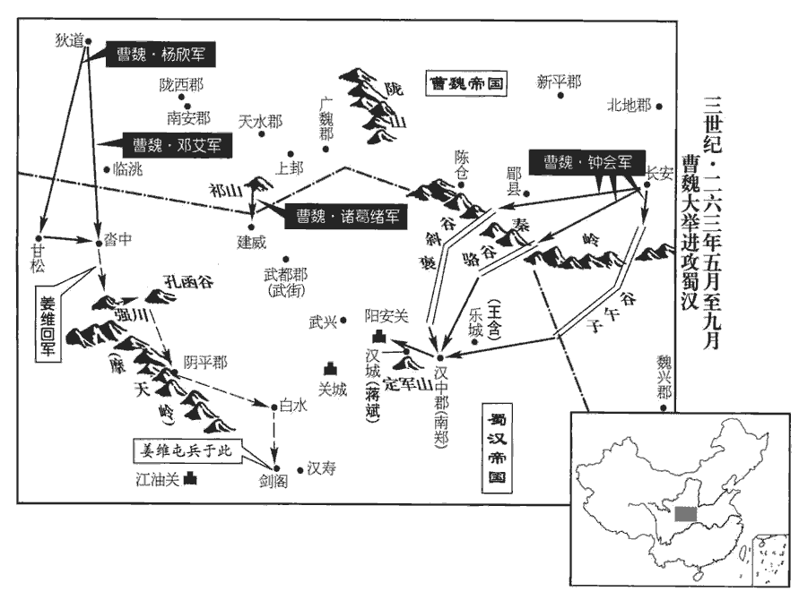
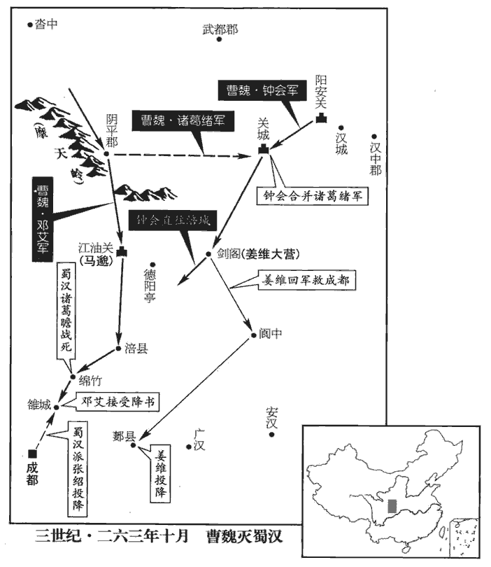

 魏紀十起玄黓敦牂（壬午），盡閼逢涒灘（甲申），凡三年。涒，音暾。

# 元皇帝下

## 景元三年（壬午，二六二、）

1秋，八月，乙酉‹十六›，吳主‹孙休，时年二十九›立皇后朱氏，朱公主‹孙小虎›之女也。戊子‹十九›，立子𩅦wān為太子。𩅦，烏關翻。據吳志，吳主休為四子作名字，𩅦，音湖水灣澳之灣，非先有此音也。

〖译文〗 [1]秋季，八月，乙酉（十六日），吴王立皇后朱氏，她是朱公主的女儿。戊子（十九日），立孙为太子。

2漢大將軍姜維將出軍，右車騎將軍廖化曰：「兵不戢，必自焚，伯約之謂也。左傳，魯眾仲曰：兵，猶火也，不戢，將自焚。姜維，字伯約。廖，力救翻。今力弔翻。智不出敵而力小於寇，用之無厭，將何以存！」謂較智則不出於敵人之上，而較力則又弱小也。厭，於鹽翻。冬，十月，維入寇洮陽‹甘肃临潭›，洮陽，洮水之陽也。洮水之陰，魏不置郡縣，維渡洮而攻之也。沙州記曰：嵹jiàng城東北三百里有曾城，臨洮水，曰洮陽城。杜佑曰：臨洮郡城本洮陽城，臨洮水。洮，土刀翻。鄧艾與戰於侯和‹甘肃卓尼东北›，破之，維退住沓中‹甘肃舟曲西北›。水經註：洮水逕洮陽城，又東逕共和山南，城在四山中，又東逕迷和城北。意侯和即此地也。沓中在諸羌中，即沙漒qiáng之地。晉張駿據河西，因前趙之亂，收河南地，至于狄道，置武街、石門、侯和、漒川、甘松五屯護軍，與後趙分境。乞伏熾盤攻漒川，師次沓中。則侯和之地在塞內，沓中之地在羌中明矣。初，維以羈旅依漢，維降漢見七十一卷明帝太和元年。身受重任，興兵累年，功績不立。黃皓用事於中，與右大將軍閻宇親善，陰欲廢維樹宇。維知之，言於漢主‹刘禅，时年五十六›曰：「皓姦巧專恣，將敗國家，請殺之！」敗，補邁翻。漢主曰：「皓趨走小臣耳，往董允每切齒，事見七十四卷邵陵厲公正始六年。吾常恨之，君何足介意！」維見皓枝附葉連，懼於失言，遜辭而出。漢主敕皓詣維陳謝。維由是自疑懼，此維未出洮陽以前事也。返自洮陽，因求種麥沓中，不敢歸成都。司馬昭因是決計絆維於沓中而伐蜀。

〖译文〗 [2]蜀汉大将军姜维将要出兵征战，右车骑将军廖化说：“兵不止，必自焚，说的就是姜维。智谋超不出敌人，力量也小于敌人，而用兵没有满足的时候，将何以自存？”冬季，十月，姜维入侵洮阳，邓艾与他在侯和交战，打败了他。姜维撤兵驻扎在沓中。当初，姜维因寄居在外而投奔蜀汉，身受重任，连年兴兵，但没有建立什么功绩。黄皓在朝内当政，与右大将军阎宇关系交好，暗地里想废掉姜维而树立阎宇。姜维知道后，就对汉后主说：“黄皓奸诈巧伪专权任意，将会败坏国家，请杀了他！”汉后主说：“黄皓不过是在前面往来奔走的小臣，以前董允也常对他切齿痛恨，我常常为此遗憾，你何必介意他！”姜维见黄皓的党羽象树木的枝叶那样相互依附勾结，害怕自己失言，说了几句谦恭的话就出来了。汉后主让黄皓到姜维那里解释、谢罪。姜维从此就更加疑虑恐惧，从洮阳返回后，就要求到沓中去种麦，不敢返回成都。

3吳主以濮陽興為丞相，廷尉丁密、光祿勲孟宗為左右御史大夫。漢成帝綏和元年，罷御史大夫，置大司空，世祖中興因之。獻帝建安十三年，罷司空，復置御史大夫，未嘗分左右也。蓋吳分之。初，興為會稽太守，會，工外翻。守，式又翻。吳主在會稽‹绍兴›，興遇之厚；左將軍張布嘗為會稽王左右督將，吳主休先封琅邪王，徙居會稽，自會稽入立，未嘗封會稽王也。「會稽」，當作「琅邪」。將，即亮翻。故吳主即位，二人皆貴寵用事；布典宮省，興關軍國，以佞巧更相表里，更，工衡翻。吳人失望。

〖译文〗 [3]吴王任命濮阳兴为丞相，廷尉丁密、光禄勋孟宗为左右御史大夫。当初，濮阳兴任会稽太守，吴王居住在会稽，濮阳兴对他很好，左将军张布曾任会稽王的左右督将，因此吴王即位之后，濮阳兴和张布二人受到尊崇而执掌朝政；张布主管朝内官署，濮阳兴主管军国之事，二人在里里外外阿谀欺蒙，吴国人很失望。

吳主喜讀書，喜，許記翻。欲與博士祭酒韋昭、博士盛沖講論，前漢五經博士有僕射一人，東漢轉為祭酒。胡廣曰：官名祭酒，皆一位之元長也。古禮賓客得主人饌，老者一人舉酒以祭於地，舊說以為示有先。沈約志曰：吳王濞bì為劉氏祭酒。夫祭祀以酒為本，長者主之，故以祭酒為稱。漢侍中、魏散騎常侍高功者并為祭酒。公府祭酒，漢末有之。張布以昭、沖切直恐其入侍，言己陰過，固諫止之。吳主曰：「孤之涉學群書略徧，但欲與昭等講習舊聞，亦何所損！君特當恐昭等道臣下姦慝，故不欲令入耳。如此之事，孤已自備之，不須昭等然後乃解也。」布皇恐陳謝，且言懼妨政事，吳主曰：「王務、學業，其流各異，不相妨也，王務，猶言王事也。此無所為非，而君以為不宜，是以孤有所及耳。不圖君今日在事，更行此於孤也，良甚不取！」布拜表叩頭。據陳壽志，自孤之涉學已下，皆詔答之語，布得詔惶恐，以表陳謝，重自序述，吳主又面答之。自王務學業以下，皆面答之語也。所謂今日在事更行此於孤，蓋比之孫綝，以綝擅權之時，不使吳主親近儒生也，於是布拜叩頭，未嘗再上表也，此「表」字衍。在事者，在官任事也。吳主曰：「聊相開悟耳，何至叩頭乎！如君之忠誠，遠近所知，吾今日之巍巍，皆君之功也。詩云：『靡不有初，鮮克有終。』詩大雅蕩之辭。鮮，息淺翻。終之實難，君其終之。」然吳主恐布疑懼，卒如布意，卒，子恤翻。廢其講業，不復使昭等入。復，扶又翻。

〖译文〗 吴王喜爱读书，想要与博士祭酒韦昭、博士盛冲一起讲论学术，张布因为韦昭、盛冲二人性情耿直，恐怕他们入侍之后，对吴王说自己暗地里做的错事，因此坚持劝谏，不让他们入宫。吴王说：“我涉猎学术，群书大致都读完了，现在只想与韦昭等人讲论学习以前所学的内容，这又有什么损害？你不过害怕韦昭等人谈论臣下的奸诈邪慝之行，所以不想让他们入宫。象这类事情，我自己已经有所了解，不须韦昭等人说了然后才知道。”张布十分惶恐地谢罪，又说这是恐怕妨碍政事，吴王说：“政事和学术，其源流各不相同，不会相互妨碍，让他们入宫没有什么不对的，而你却认为不宜让他们来，因此我才说起这些事。没想到你今日在官任事又对我做这种不让接近儒生的事，这实在让我不能同意！”张布跪下叩头。吴王说：“我不过是开导开导你，何必叩头谢罪呢！象你这样的忠诚，远近之人都很了解，我能有今日南面为君的尊严，全都是你的功劳。《诗》云：‘事皆有始，却少能终。’坚持到最后是很难的，希望你能坚持到最后。”但吴王恐怕张布会怀疑害怕，终究还是顺了张布之意，废止讲论学业，不再让韦昭等人入宫。

4譙郡‹安徽亳州›嵇康，晉書曰：康之先姓奚，會稽上虞人，以避怨徙譙郡銍縣，銍有嵇山，家於其側，因以命氏。文辭壯麗，好言老、莊而尚奇任俠，俠，戶頰翻。與陳留‹河南陳留›阮籍、籍兄子咸、姓譜：殷有阮國，在岐、渭之間。周詩有侵阮徂共之辭，子孫以國為姓。後漢有巳吾令阮敦。河內‹河南武陟›山濤、河南向秀、向，式亮翻。琅邪‹山东临沂›王戎、沛國‹江苏沛县›劉伶特相友善，號竹林七賢。皆崇尚虛無，輕蔑禮法，縱酒昏酣，遺落世事。

〖译文〗 [4]谯郡人嵇康，文章写得雄壮清丽，喜好谈论《老子》、《庄子》，高节奇行，行侠仗义。他与陈留人阮籍、阮籍的侄子阮咸、河内人山涛、河南人向秀、琅邪人王戎、沛国人刘伶是至交好友，号称竹林七贤。他们都崇尚虚无之论，轻蔑礼仪法度，每日以纵情饮酒为乐，不问世事。

阮籍為步兵校尉，其母卒，籍方與人圍碁，對者求止，籍留與決賭。與決勝負也。既而飲酒二斗，舉聲一號，吐血數升，毀瘠骨立。骨立者，言其瘠甚，身肉俱消，唯骨立也。號，戶刀翻。吐，土故翻。居喪，飲酒無異平日。司隸校尉何曾惡之，惡，烏路翻。面質籍於司馬昭座質，正也，面以正義責之也。曰：「卿，縱情、背禮、敗俗之人，今忠賢執政，綜核名實，若卿之曹，不可長也！」背，蒲妹翻。敗，補邁翻。長，知兩翻。因謂昭曰：「公方以孝治天下，治，直之翻。而聽阮籍以重哀飲酒食肉於公座，何以訓人！宜擯bìn之四裔，無令汙染華夏。」汙，烏故翻。昭愛籍才，常擁護之。昭之讓九錫也，籍為公卿為勸進牋，辭甚清壯，故昭愛其才。曾，夔之子也。何夔見六十三卷漢獻帝建安五年。

〖译文〗 阮籍任步兵校尉，他母亲去世时，他正在与别人下围棋，对方要求停止，但阮籍却要他留下一块胜负。下完棋喝了两斗酒，高声一喊，吐血数升，极度哀痛而消瘦得只剩皮包骨了。居丧期间，和平日一样饮酒无度。司隶校尉何曾很讨厌他，就在司马昭座位前当面指责阮籍说：“你是个纵情无度、违背礼仪、败坏风俗的人，如今忠贤之人执掌朝政，要综合考察人事的名与实，象你这类人，不可助长你的恶习！”于是就对司马昭说：“您正在以孝道治理天下，却听任阮籍居丧期间在您的座前饮酒吃肉，以后还怎么教训别人？应该把他流放到四方荒远之地，不让他污染我们华夏的风气。”司马昭喜爱阮籍之才，常常扶助保护他。何曾是何夔之子。

阮咸素幸姑婢；姑將婢去，咸方對客，遽借客馬追之，累騎而還。累，重也，兩人共馬，謂之累騎。還，音旋，又如字。

〖译文〗 阮咸喜欢姑姑的婢女，姑姑把婢女领走时，阮咸正在陪客，赶快借了客人的马去追，然后两人骑一匹马回来了。

劉伶嗜酒，常乘鹿車，賢曰：鹿車，言其小僅可容鹿也。攜一壺酒，使人荷鍤chā隨之，荷，下可翻。鍤，側洽翻，鍬也。曰：「死便埋我。」當時士大夫皆以為賢，爭慕效之，謂之放達。

〖译文〗 刘伶喜好饮酒，常常乘一辆小车，带着一壶酒出游，又让人扛着锹跟着，说：“死了就把我埋掉。”当时士大夫都认为他贤明，争相仿效他的做法，称作放达。

鍾會方有寵於司馬昭，聞嵇康名而造之，造，七到翻。康箕踞而鍛，康性巧而好鍛，鍛，都玩翻。小冶也。不為之禮。會將去，康曰：「何所聞而來，何所見而去？」會曰：「聞所聞而來，見所見而去！」遂深銜之。

〖译文〗 钟会正受到司马昭的宠爱，听到嵇康的名声就去拜访他，嵇康伸腿坐在那里毫不在乎地打铁，很不礼貌地对待钟会。钟会将要离去，嵇康问他说：“你听到了什么而来，见到了什么而去？”钟会说：“听我所听到的而来，见我所见到的而去！”从此他对嵇康怀恨在心。

山濤為吏部郎，魏尚書郎有二十三員，吏部其一也。舉康自代；康與濤書，自說不堪流俗，而非薄湯、武。昭聞而怒之。湯、武革命，而康非薄之，故昭聞而怒。康與東平‹山东東平西南›呂安親善，安兄巽誣安不孝，康為證其不然。為，于偽翻。會因譖「康嘗欲助毌丘儉，言毌丘儉反，而康欲助之。毌，音無。且安、康有盛名於世，而言論放蕩，害時亂教，宜因此除之。」昭遂殺安及康‹年四十›。康嘗詣隱者汲郡‹河南卫辉›孫登，晉泰始二年，始分河內為汲郡，史追書也。登曰：「子才多識寡，難乎免於今之世矣！」

〖译文〗 涛任吏部郎，推荐嵇康代替自己；嵇康给山涛写信，说自己不堪忍受流俗，又菲薄商汤、周武王。司马昭听到后十分生气。嵇康与东平的吕安是好朋友，吕安之兄吕巽诬陷吕安不孝，嵇康为他作证说并非不孝。钟会借此事诬告说：“嵇康曾经想帮助丘俭，而且吕安、嵇康在世上享有盛名，但他们的言论放荡不羁，为害时俗，扰乱政教，应该乘此机会把他们除掉。”于是司马昭就杀了吕安和嵇康。嵇康曾去拜访隐士汲郡人孙登，孙登说：“你才气多见识少，在当今之世难免被杀！”

5司馬昭患姜維數為寇，官騎路遺求為刺客入蜀，官騎，騶騎也。數，所角翻。騎，奇寄翻。從事中郎荀勗xù曰：「明公為天下宰，宜杖正義以伐違貳，違，離也，背也。貳，攜貳也，兩屬也。而以刺客除賊，非所以刑于四海也。」毛萇曰：刑，法也。韓嬰曰：刑，正也。昭善之。勗，爽之曾孫也。荀爽，淑之子也，漢末為公。

〖译文〗 [5]司马昭忧虑姜维屡次进犯，官骑路遗要求当刺客入蜀去杀姜维，从事中郎荀勖对司马昭说：“明公是天下的主宰，应该依仗正义去讨伐不归服者，而用刺客去除掉敌人，这不是被四海之人作为表率的做法。”司马昭很赞成他的话。荀勖是荀爽的曾孙。

昭欲大舉伐漢，朝臣多以為不可，獨司隸校尉鍾會勸之。昭諭眾曰：「自定壽春以來，息役六年，治兵繕甲以擬二虜。治，直之翻。今吳地廣大而下濕，攻之用功差難，不如先定巴蜀，三年之後，因順流之勢，水陸并進，此滅虢‹河南三门峡›取虞‹山西平陆›之勢也。春秋，晉獻公滅虢，因以滅虞，此言滅蜀乘勢可以滅吳也。計蜀戰士九萬，居守成都及備他境不下四萬，然則餘眾不過五萬。今絆姜維於沓中，絆，博漫翻。繫足曰絆。使不得東顧，直指駱谷‹陕西周至西南›，出其空虛之地以襲漢中‹陕西汉中›，以劉禪之闇，而边城外破，士女內震，其亡可知也。」乃以鍾會為鎮西將軍，都督關中。征西將軍鄧艾以為蜀未有釁，屢陳異議；善用兵者，觀釁而動，此艾所以陳異議也。昭使主簿師纂為艾司馬以諭之，姓譜：師，古者掌乐之官，因以為氏。艾乃奉命。

〖译文〗 司马昭想要大举讨伐蜀汉，朝臣们大都认为不可，只有司隶校尉钟会赞成。司马昭告谕众人说：“自从平定寿春以来，已经六年没有战事了，我们要整治军队去攻打两个敌国。如今吴国土地广大而地势低湿，攻打他旋展兵力较为困难，不如先平定巴蜀，三年之后，就顺流而下，水陆并进，这就是春秋时晋献公先灭虢国再乘势攻取虞国的那种形势。蜀国的战士共计有九万，居守成都以及防卫其他边境的不下四万人，这样剩余的战士不过五万人。如今把姜维牵制在沓中，让他不能向东出兵。我们发兵直向骆谷，通过他们的空虚地带去袭击汉中，以刘禅的暗弱无能，又加上边境城市在外面被攻破，蜀国的男女老少就会在内地震恐不安，这样敌人的灭亡就是意料之中的事。”于是任命钟会为镇西将军，都督关中。征西将军邓艾认为蜀国没有可乘之机，屡次陈述不同意见；司马昭让主簿师纂担任邓艾的司马去给他讲明道理，于是邓艾也就奉命行事了。

姜維表漢主：「聞鍾會治兵關中，欲規進取，宜并遣左右車騎張翼、廖化，時張翼為左車騎將軍。廖化為右車騎将軍。督諸軍分護陽安‹陕西勉县西›關口陽安關口，意即陽平關也。及陰平‹甘肃文县›之橋頭‹文县东南›，杜佑曰：陰平橋頭在文州界。以防未然。」黃皓信巫鬼，謂敵終不自致，致，至也，又詣也，送也。啟漢主寢其事，群臣莫知。

〖译文〗 姜维向汉后主上表说：“听说钟会在关中整治军队，想图谋进攻，应该派遣左右车骑将军张翼、廖化率领诸军分别守护阳安关口和阴平的桥头，以防患于未然。”黄皓相信鬼神巫术，认为敌人终究不会自己找上门来，于是就奏明汉后主让他不提这件事，因而群臣没人知道。

## 四年（癸未，二六三）

1春，正【章：甲十一行本「正」作「二」；乙十一行本同；孔本同；張校同；退齋校同。】月，復命司馬昭進爵位如前；如元年之詔也。復，扶又翻。又辭不受。

〖译文〗 [1]春季，二月，再次晋升司马昭的爵位如前所命，但司马昭又推辞不受。

2吳交趾太守孫諝貪暴，諝xū，私呂翻。為百姓所患；會吳主‹孙休，时年三十›遣察戰鄧荀至交趾‹越南河内东北北宁府›，裴松之曰：察戰，吳官號，今揚都有察戰巷。荀擅調孔爵三十頭送建業，調，徒弔翻。民憚遠役，因謀作亂。夏，五月，郡吏呂興等殺諝及荀，遣使來請太守及兵，九真‹越南清化›、日南‹越南美丽县›皆應之。

〖译文〗 [2]吴国交趾太守孙贪婪残暴，被百姓所厌恨；恰好此时吴王又派遣察战邓荀到交趾去，而邓荀又擅自调用三十个大爵送往建业，百姓害怕遥远的劳役，于是就图谋作乱。夏季，五月，郡吏吕兴等人杀掉了孙和邓荀，派使者来请求给他派太守和兵力，九真、日南二郡也都响应他。

3‹曹奂，时年十八›詔諸軍大舉伐漢，遣征西將軍鄧艾督三萬餘人，自狄道‹甘肃临洮›趣甘松‹甘肃迭部县›、沓中，甘松，本生羌之地，張駿置甘松護軍，乞伏國仁置甘松郡。後魏時，白水羌朝貢，置甘松縣，太和六年，改置扶州。隋改甘松為嘉誠縣，屬同昌郡。唐武德初，置松州，取甘松嶺為名，且其地產甘松也。杜佑曰：甘松嶺，江水發源之地，甘松山在今交川郡境，今臨洮和政郡之南及合川郡之地。新唐書曰：甘松山在洮水之西，吐谷渾居山之陽。以連綴姜維；雍州刺史諸葛緒督三萬餘人，自祁山‹甘肃礼县西北›趣武街‹甘肃成县›橋頭，絕維歸路。賢曰：下辨縣屬武都郡，今城州同谷縣，舊名武街城。水經註：濁水逕武街城南。又曰：白水出臨洮縣西傾山東南，逕陰平故城南，又東北逕橋頭。雍，於用翻。鍾會統十餘萬眾分從斜谷‹陕西太白西南褒河山谷›、駱谷‹陕西周至西南›、子午谷‹陕西宁陕›趣漢中‹陕西汉中›。斜，余遮翻。谷，音浴。趣，七喻翻。以廷尉衛瓘guàn持節監艾、會軍事，行鎮西軍司。鍾會時為鎮西將軍，瓘既監艾、會軍，又行會軍司。監，古銜翻。瓘，覬jì之子也。衛覬歷事武帝、文帝、明帝。覬，音冀。

〖译文〗 [3]诏令诸军大举进攻蜀汉，派征西将军邓艾率领三万人从狄道奔赴甘松、沓中，以牵制姜维；派雍州刺史诸葛绪率领三万多人从祁山奔赴武街、桥头，断绝姜维的退路。钟会统兵十万余人分别从斜谷、骆谷、子午谷奔赴汉中。让廷尉卫持符节监督邓艾、钟会的军事，兼镇西军司。卫是卫之子。

會過幽州刺史王雄之孫戎，王雄刺幽州，遣勇士刺殺軻比能。問：「計將安出？」戎曰：「道家有言，『為而不恃。』老子道經之言。非成功難，保之難也。」或以問參相國軍事平原‹山东平原›劉寔shí曰：「鍾、鄧其平蜀乎？」寔曰：「破蜀必矣，而皆不還。」客問其故，寔笑而不答。鍾、鄧之禍，識者固知之矣。

〖译文〗 钟会去拜访幽州刺史王雄之孙王戎，问他：“我将怎样去干？”王戎说：“道家有句话说‘为而不恃’，也就是说成功并不难，而保持它则很难。”有人问参相国军事、平原人刘说：“钟会、邓艾能平定蜀国吗？”刘说：“破蜀是必然的，但他们都回不来。”对方问是什么原因，刘笑而不答。

秋，八月，軍發洛陽，大賚將士，賚lài，來代翻，賜也。陳師誓眾。將軍鄧敦謂蜀未可討，司馬昭斬以徇。

〖译文〗 秋季，八月，从洛阳发兵，大赏全军将士，列队誓师。将军邓敦说不能去讨伐蜀国，司马昭就把他杀了示众。

漢人聞魏兵且至，乃遣廖化將兵詣沓中為姜維繼援，張翼、董厥等詣陽安關口‹陕西宁强西北阳平关›為諸圍外助。大赦，改元炎興。‹刘禅，时年五十七›敕諸圍皆不得戰，退保漢‹陕西勉县›、樂‹陕西城固›二城，用姜維之言也。城中各有兵五千人。翼、厥北至陰平‹甘肃文县›，聞諸葛緒將向建威‹甘肃西和›，留住月餘待之。鍾會率諸軍平行至漢中‹陕西汉中›。九月，鍾會使前將軍李輔統萬人圍王含於樂城‹陕西城固›，謢軍荀愷kǎi圍蔣斌於漢城‹陕西勉县›。斌，音彬。考異曰：晉書文紀作「部將易愷」，今從魏志。會徑過西趣陽安口，遣人祭諸葛亮墓‹陕西勉县西南定军山›。諸葛亮葬沔陽。

〖译文〗 蜀汉听到魏兵将至，就派遣廖化率兵到沓中作姜维的后援，派张翼、董厥等人到阳安关口帮助各个外围据点。实行大赦，改年号为炎兴。命令各外围据点不得与敌人交战，退守汉、乐二城，城中各有兵力五千人。张翼、董厥向北到达阴平，听到诸葛绪将向建威发兵，就留住一个多月等待敌兵。钟会率诸军齐头并进，到达汉中。九月，钟会让前将军李辅统兵万人把王含包围在乐城，让护军荀恺把蒋斌包围在汉城。钟会直接从西路奔向阳安口，派人祭奠了诸葛亮墓。

初，漢武興‹陕西略阳›督蔣舒在事無稱，宋白曰：武興，漢武都沮縣地。元和郡國志曰：興州城即古武興城也，蜀以處當衝要，置武興督以守之。無稱，言其庸庸無可稱者。漢朝令人代之，朝，直遙翻。使助將軍傅僉qiān守關口，舒由是恨。鍾會使護軍胡烈為前鋒，攻關口。舒詭謂僉曰：「今賊至不擊而閉城自守，非良圖也。」僉曰：「受命保城，惟全為功，今違命出戰，若䘮師負國，䘮，息浪翻。死無益矣。」舒曰：「子以保城獲全為功，我以出戰克敵為功，請各行其志。」遂率其眾出；僉謂其戰也，不設備。使舒果迎戰，亦未可保其必勝，僉何為不設備邪？關城失守，僉亦有罪焉。舒率其眾迎降胡烈，降，戶江翻。烈乘虛襲城，僉格鬬而死。僉qiān，肜róng之子也。傅肜死事見六十九卷文帝黃初三年。肜，余中翻。鍾會聞關口已下，長驅而前，大得庫藏積穀。藏，徂浪翻。

〖译文〗 当初，蜀汉的武兴督蒋舒在位庸碌无为，蜀汉朝廷让人代替了他，派助将军傅佥把守关口，蒋舒因此怀恨在心。钟会派护军胡烈为前锋，进攻关口。蒋舒诡诈地向傅佥说：“如今敌兵到了，不去进击而闭城自守，不是好的计策。”傅佥说：“你以保全此城为功劳，我以出战打败敌人为功劳，希望我们各行其志。”于是率领他的兵士出城；傅佥认为他是去交战，因此没有防备。蒋舒率领他的士兵迎接投降了胡烈，胡烈乘虚袭击城池，傅佥格斗拼杀而死。傅佥是傅肜之子。钟会听到关口已被攻克，就长驱直入，获得大量库藏的粮食。

鄧艾遣天水‹甘肃甘谷›太守王頎qí直攻姜維營，前漢天水郡，後漢改曰漢陽郡，魏復曰天水。頎qí，渠希翻。隴西‹甘肃陇西›太守牽弘邀其前，金城‹甘肃兰州东›太守楊欣趣甘松‹甘肃迭部›。維聞鍾會諸軍已入漢中，引兵還，欣等追躡niè於強川口‹甘肃舟曲西南›，大戰，強川口，在嵹jiàng臺山南。嵹臺山，即臨洮之西傾山。闞駰曰：強水出陰平西北強山，一曰強川。姜維之還也，鄧艾遣王頎追敗之於強口，即是地也。維敗走。聞諸葛緒已塞道屯橋頭‹甘肃文县东南›，塞，悉則翻。乃從孔函谷入北道，欲出緒後：緒聞之，卻還三十里。維入北道三十餘里，聞緒軍卻，尋還，從橋頭過，緒趣截維，較一日不及。言較遲一日遂不及維也。維遂還至陰平‹甘肃文县›，合集士眾，欲赴關城；【章：甲十一行本「城」下有「未到」二字；乙十一行本同；孔本同；張校同；退齋校同。】聞其已破，退趣白水‹四川青川东沙州乡›，遇廖化、張翼、董厥等，合兵守劍閣‹四川劍閣北剑门关›以拒會。水經註：小劍戍西去大劍山三十里，連山絕險，飛閣通衢，故謂之劍閣。華陽國志曰：廣漢郡德陽縣有劍閣道三十里，至險。祝穆曰：劍門，漢屬廣漢郡，為葭萌縣地，蜀先主以霍峻為梓潼太守，有劍閣縣。苻秦使徐成寇蜀，攻二劍，克之，始有二劍之號。

〖译文〗 邓艾派遣天水太守王颀直攻姜维营垒，陇西太守牵弘在前面阻截，金城太守杨欣奔赴甘松。姜维听说钟会诸军已经进入汉中，就领兵返回，杨欣等人在后面紧追至强川口，激烈交战，姜维败走。姜维又听到诸葛绪已经阻塞道路占据了桥头，于是就从孔函谷进入北部道路，想绕到诸葛绪的身后，诸葛绪知道后往回退却三十里。姜维进入北道三十多里后，听到诸葛绪退兵，赶紧往回走，从桥头过去，诸葛绪赶上去阻截姜维，但晚了一天没有赶上。姜维于是退至阴平，聚集军队，想要奔赴关城；还没到达，听说关城已破，于是退兵奔向白水，遇到了廖化、张翼、董厥等人，兵合一处据守剑阁以抵御钟会。

 

4安國元侯高柔卒‹年九十›。

〖译文〗 [4]安国元侯高柔去世。

5冬，十月，漢人告急於吳。甲申，吳主使大將軍丁奉督諸軍向壽春‹安徽寿县›；將軍留平就施績於南郡‹湖北江陵›，議兵所向；將軍丁封、孫異如沔中以救漢。沔中，時為魏境，吳兵未能至也，擬其所向耳。吳之巫、秭歸等縣，皆在江北，與魏之新城接境，自此行兵，亦可以發沔中，然亦猶激西江之水以救涸轍之魚耳。

〖译文〗 [5]冬季，十月，汉人向吴国告急求援。甲申（疑误），吴王派大将军丁奉率领诛军进兵寿春；让将军留平到南郡的施绩那里，商议向何处进兵之事；让将军丁封、孙异到沔中去救援蜀汉。

6詔以征蜀諸將獻捷交至，復命大將軍昭進位，爵賜一如前詔，復，扶又翻。昭乃受命。始受相國、晉公、九錫之命。

〖译文〗 [6]诏令因征蜀的各位将领捷报频传，再次命大将军司马昭晋位，所赐爵位一切都与前面的诏令相同，司马昭终于接受了任命。

昭辟任城‹山东济宁东南›魏舒為相國參軍。任，音壬。初，舒少時遲鈍，【章：甲十一行本「鈍」下有「質朴」二字；乙十一行本同；孔本同；張校同。】不為鄉親所重，鄉里、親戚也。少，詩照翻。從叔父吏部郎衡，有名當世，從，才用翻。亦不知之，使守水碓duì，為碓水側，置輪碓後，以橫木貫輪，橫木之兩頭，復以木長二尺許，交午貫之，正直碓尾。木激水灌輪，輪轉則交午木戛jiá擊碓尾木而自舂，不煩人力，謂之水碓。碓，都內翻。每歎曰：「舒堪數百戶長，謂小邑長也。長，知兩翻。我願畢矣！」舒亦不以介意，不為皎厲之事。皎者，求以暴白於世。厲危行也。唯太原王乂謂舒曰：「卿終當為台輔。」常振其匱乏，舒受而不辭。年四十餘，郡舉上計掾，上，時掌翻。掾，于絹翻。察孝廉。宗黨以舒無學業，勸令不就，可以為高。舒曰：「若試而不中，中，竹仲翻。其負在我，安可虛竊不就之高以為己榮乎！」於是自課，百日習一經，因而對策升第，累遷後將軍鍾毓長史。毓每與參佐射，參佐，參軍及諸佐吏也。毓，余六翻。舒常為畫籌而已；射之畫籌，猶投壺之釋算也。為，于偽翻；下徐為同。後遇朋人不足，以舒滿數，射以兩人為朋。射之有朋，猶古射儀之有耦也。周禮：王以六耦射三侯。諸侯以四耦射二侯，卿大夫以三耦射一侯，士以三耦射豻àn侯。左傳：魯襄公享范獻子，射者三耦，公臣不足，取於家臣。杜預註云：二人為耦。舒容范閒雅，發無不中；中，竹仲翻舉坐愕然，莫有敵者。坐，徂臥翻。毓歎而謝曰：「吾之不足以盡卿才，有如此射矣，豈一事哉！」及為相國參軍，府朝碎務，未嘗見是非；府朝，猶言府庭也。朝，直遙翻。見，賢遍翻。至於廢興大事，眾人莫能斷者，斷，丁亂翻。舒徐為籌之，多出眾議之表。昭深器重之。

〖译文〗 司马昭提升任城人魏舒为相国参军。最初，魏舒少年时反映迟钝，较为质朴，不受乡里亲戚的重视，他的堂叔吏部郎魏衡，在当时很有名望，也不了解魏舒，就让他去看守水碓，而且常常叹气说：“魏舒如果能担当数百户的官长，我也就心满意足了。”魏舒毫不介意，也不干那些能显示抬高自己的事。只有太原的王对魏舒说：“你终究会达到三公宰相的地位。”又常常拿出钱财周济魏舒，魏舒也毫不推辞地接受。四十余岁时郡里举拔上计掾、掌簿记孝廉。亲戚朋友认为魏舒没有什么学业，劝他不要去应考，还可以显示清高。魏舒说：“如果考试不中，是我本事不够，怎能虚假地盗窃清高的名声以为自己的荣耀呢？”于是刻苦自学，每百日学一部经书，因而对策得到提升，累次提升到担任后将军钟毓的长史。钟毓每次与参军、佐吏一起举行射箭比赛，魏舒只是常常为他们计算成绩而已；后来遇到比赛人数不足，就让魏舒来凑数，魏舒仪范闲雅，发无不中，所有的人都十分愕然，没有人能敌得过他。钟毓感叹地道歉说：“我不能够充分发挥你的才能，就象这次射箭一样，其实何止这一件事呢！”魏舒担任相国参军之后，处理相国府中琐碎的事务，未曾出现什么纠纷；至于该废该兴的大事，众人不能决断的，魏舒都能从容地为之筹划，而且大多比众人的议论高明。因此，司马昭非常器重魏舒。

7癸卯‹十一›，立皇后卞氏，昭烈將軍秉之孫也。

〖译文〗 [7]癸卯（十一日），魏国立皇后卞氏。卞氏是昭烈将军卞秉的孙女。

8鄧艾進至陰平‹甘肃文县›，簡選精銳，欲與諸葛緒自江油‹四川平武东南南坝›趣成都，水經註：涪水出廣漢屬國剛氐道徼外，东南流，逕緜竹縣北，又東南逕江油戍北。鄧艾自陰平、景谷步道懸兵束馬入蜀，逕江油、廣漢者也。宋白曰：龍州江油郡北踰山至文州三百三十里。文州，漢陰平地也。鄧艾自陰平行無人之地七百里至江油，即此。九域志：龍州北至文州四百三十里。元豐九域志：龍州治江油縣，南至綿州二百餘里。緒以本受節度邀姜維，西行非本詔，遂引軍向白水‹四川青川东沙州乡›，此白水關也。賢曰：在今梁州金牛縣西，東北至關城百八十里。與鍾會合。會欲專軍勢，密白緒畏懦不進，檻車徵還，軍悉屬會。

〖译文〗 [8]邓艾进兵到达阴平，挑选了精锐部队，想要与诸葛绪一起经江油直奔成都，诸葛绪因为本来接受的命令是阻截姜维，而向西行进不是给他的诏令，所以率军奔向白水，与钟会会合。钟会想要专擅军权，就秘密报告说诸葛绪畏惧敌兵不敢前进，于是用囚车把诸葛绪押送回京，而军权全部归钟会掌握了。

姜維列營守險，會攻之不能克，糧道險遠，軍食乏，欲引還。鄧艾上言：「賊已摧折，宜遂乘之，若從陰平由邪徑經漢德陽亭‹四川江油东北›按前漢無德陽縣。後漢志：廣漢郡始有德陽縣，蓋因漢故亭而置縣也。自蜀分廣漢置梓潼郡之後，劍閣縣屬梓潼，德陽縣屬廣漢。續漢志以為德陽縣有劍閣。今姜維守劍閣拒鍾會，而鄧艾欲從德陽亭趣涪，則此時分為兩縣明矣。然德陽亭亦非此時德陽縣治，蓋前漢德陽亭故處也。此道即所謂陰平、景谷道。趣涪‹四川绵阳›，趣，七喻翻。涪，音浮。出劍閣西百里，去成都三百餘里，奇兵衝其腹心，出其不意，劍閣之守必還赴涪，則會方軌而進，劍閣之軍不還，則應涪之兵寡矣。」趣，七喻翻。涪，音浮。遂自陰平行無人之地七百餘里，鑿山通道，造作橋閣。今隆慶府陰平縣北六十里有馬閣山，峻峭崚嶒，極為艱險。鄧艾軍行至此，路不得通，乃懸車束馬，造作棧閣，始通江油，因名馬閣。又自文州青塘嶺至龍州百五十里，自北而南者，右肩不得易所負，謂之左擔路，亦艾伐蜀路也。據鍾會傳，艾自漢德陽亭入江油左擔道，則德陽亭蓋當馬閣山之路。山谷高深，至為艱險，又糧運將匱，瀕於危殆，艾以氈自裹，推轉而下。推，吐雷翻。將士皆攀木緣崖，魚貫而進。山崖險陿，單行相繼而進，如貫魚然。先登至江油，江油，今龍州江油縣地，南至綿州二百餘里。綿州，古涪城也。蜀守將馬邈降。降，戶江翻；下同。諸葛瞻督諸軍拒艾，至涪‹四川绵阳›，停住不進。陳壽曰：涪去成都三百六十里。尚書郎黃崇，權之子也，黃權，劉璋所用，先主伐吳而敗，權隔在江北，遂降魏。屢勸瞻宜速行據險，無令敵得入平地，瞻猶豫未納；崇再三言之，至于流涕，瞻不能從。艾遂長驅而前，擊破瞻前鋒，瞻退住緜竹‹四川德阳北黄许镇›。緜竹縣，屬廣漢郡。今綿竹縣東北至綿州百餘里。艾以書誘瞻曰：「若降者，必表為琅邪王。諸葛氏，本琅邪‹山东临沂›人，故以此誘之。誘，音酉。瞻怒，斬艾使，列陳以待艾。使，疏吏翻。陳，讀曰陣；下同。艾遣子惠唐亭侯忠出其右，司馬師纂zuǎn等出其左，忠、纂戰不利，并引還，曰：「賊未可擊。」艾怒曰：「存亡之分，在此一舉，何不可之有！」叱忠、纂等，將斬之。忠、纂馳還更戰，大破斬瞻‹诸葛瞻年三十七›及黃崇。瞻子尚歎曰：「父子荷國重恩，荷，下可翻。不早斬黃皓，使敗國殄民，用生何為！」策馬冒陳而死。杜佑曰：漢州德陽縣，鄧艾破諸葛瞻於此，因為京觀。敗，補邁翻。

〖译文〗 姜维排列营垒据守险要之地，钟会进攻不能取胜，而且运粮道路既危险又遥远，想要领兵撤回。邓艾上书说：“敌兵已经受到摧折，应乘胜进军，如果从阴平出发由小路经过汉朝的德阳亭奔赴涪县，从剑阁之西一百里处进军，离成都三百余里，在这里出奇兵冲击其腹心之地，那么剑阁的守军必然往回奔赴涪县，而钟会就可以两车并行着向前推进。如果剑阁的守军不往回撤，那么接应涪县的兵力就会很少了。”于是从阴平出发走了七百余里的无人之地，凿山开路，架桥梁建阁道，山高谷深，非常艰险，运来的粮食也将吃尽，濒临危险的绝境，邓艾用毡毯裹住自己，翻转着滚下山去，将士们也都攀缘着树木崖壁，鱼贯而进。邓艾首先到达江油，蜀国守将马邈投降。诸葛瞻率诸军抵御邓艾，到达涪县后，停住不进。尚书郎黄崇是黄权之子，他屡次劝说诸葛瞻应迅速前进占据险要，不让敌人进入平地，诸葛瞻犹豫不决没有采纳；黄崇再三劝说，甚至流着眼泪说，但诸葛瞻仍然不听。于是邓艾长驱直入，击败诸葛瞻的前锋，诸葛瞻退兵驻扎在绵竹。邓艾写信劝诱诸葛瞻说：“如果投降，必定表奏你为琅邪王。”诸葛瞻大怒，杀掉邓艾的使者，排列阵势以等待邓艾进攻。邓艾派他儿子惠唐亭侯邓忠攻其右翼，派司马师纂等人攻其左翼。邓忠与师纂战斗不利，都撤兵而还，说：“敌兵还不能攻破！”邓艾大怒，说：“存亡之别就在此一举，有什么不能的。”怒叱邓忠、师纂等人，说再攻不破就要杀了他们。邓忠、师纂跑回来再战，大败敌兵，杀了诸葛瞻和黄崇。诸葛瞻之子诸葛尚叹息说：“我们父子蒙受国家重恩，没有早点杀了黄皓，致使国败民亡，活着还有什么用！”于是骑马冲入敌阵而死。

漢人不意魏兵卒至，不為城守調度；卒，讀曰猝。調，徒弔翻。聞艾已入平土，百姓擾擾，皆迸山澤，不可禁制。迸，比孟翻。漢主使群臣會議，或以蜀之與吳，本為與國，宜可奔吳；或以為南中七郡，南中七郡：越巂‹四川西昌›、朱提‹云南昭通›、牂柯‹贵州福泉›、云南‹云南姚安›、興古‹云南丘北›、建寧‹云南曲靖›、永昌‹云南保山›也。阻險斗絕，易以自守，易，以豉翻。宜可奔南。光祿大夫譙周以為：「自古以來，無寄他國為天子者，若入吳國，亦當臣服。且治政不殊，則大能吞小，此數之自然也。治，直吏翻。由此言之，則魏能并吳，吳不能并魏明矣。等為稱臣，為小孰與為大，為，于偽翻。再辱之恥何與一辱！謂今降魏，一辱而已。若奔吳稱臣，是一辱矣；與吳俱亡，又將臣服於魏，是為再辱。且若欲奔南，則當早為之計，然後可果；果，決也，克也。今大敵已近，禍敗將及，群小之心，無一可保，恐發足之日，其變不測，何至南之有乎！」謂眾心已離，既行之後，中道潰散，必不能至南中。或曰：「今艾已不遠，恐不受降，如之何？」降，戶江翻；下同。周曰：「方今東吳未賓，事勢不得不受，受之不得不禮。若陛下降魏，魏不裂土以封陛下者，周請身詣京都，京都謂洛陽，魏都。晉景王諱師，晉人避之，率謂京師為京都。蜀方議降，譙周已為晉人諱矣，吁！以古【張：「古」作「大」。】義爭之。」眾人皆從周議。漢主猶欲入南，狐疑未決。周上疏曰：「南方遠夷之地，平常無所供為，言其民既不出稅租以供上用，又不出力為上有所施為。猶數反叛，自丞相亮以兵威偪之，窮乃率從。事見七十卷文帝黃初六年，數，所角翻。今若至南，外當拒敵，內供服御，費用張廣，他無所取，耗損諸夷，其叛必矣！」漢主乃遣侍中張紹等奉璽綬以降於艾。璽，斯氏翻。綬，音受。北地王諶chén怒曰：「若理窮力屈，禍敗將及，便當父子君臣背城一戰，同死社稷，以見先帝可也，諶，時壬翻。背，蒲妹翻。柰何降乎！」漢主不聽。是日，諶哭於昭烈之廟，先殺妻子而後自殺。曾謂庸禪有子如此乎！

〖译文〗 蜀汉人没想到魏兵突然而至，没做守城的准备；听说邓艾已经进入平在，百姓们惊恐万状，都逃往山林大泽，不可禁止。汉后主召集群臣讨论，有人认为蜀与吴本来是友好邻邦，应该投奔到吴国；有人认为南中七郡，山势陡峭险峻，容易防守，应该奔向南面。光禄大夫谯周却认为：“自古以来，没有寄居别国仍为天子的，如果到吴国去，也当臣服于吴。而且治国之道从来就没有什么不同，大国吞并小国，这是形势发展的自然趋势。从这点上说，魏国能吞并吴国，而吴国不能吞并魏国，这是很明显的事。同样是称臣，对小国称臣就不如对大国称臣，与其忍受两次受辱之耻不如一次受辱！而且如果想要奔赴南方，就应当及早计划好，才能成功；如今大敌已经临近，灾祸失败也将要降临，而且众小人之心，没有一个可保其不变，恐怕我们出发的时候，其变化不可预料，怎么能到达南中呢？”有人说：“如今邓艾已经不远，恐怕他不接受我们投降，怎么办呢？”谯周说：“现在吴国还没有臣服于魏，事情的形势使他不得不接受，接受了也不得不待之以礼。如果陛下投降魏国，而魏国不划分土地封给陛下的话，我请求只身到洛阳，用古代的大义与他们争辩。”众人都听从了谯周的建议。汉后主仍然想入南中，犹豫不决。谯周上疏说：“南方偏远蛮夷之地，平常就不交纳供奉租税，还多次反叛，自丞相诸葛亮用武力威逼他们，走投无路才顺服。如今如果去南中，外要抗拒敌兵，内要供奉日常粮食物品，费用浩大，没有其他地方可以收取，只能耗损各个夷人部族，那他们必然会反叛。”于是汉后主就派侍中张绍等人奉着御玺向邓艾投降。北地王刘谌愤怒地说：“如果我们理穷力屈，灾祸败亡将至，就应当父子君臣一起背城一战，共同为社稷而死，这样才能见先帝于地下，为什么要投降？”汉后主不听。这一天，刘谌哭诉于昭烈帝刘备之庙，先杀了妻子儿女，然后自杀而死。

張紹等見鄧艾於雒‹四川廣漢›，雒縣屬廣漢郡，西南至成都八十餘里。艾大喜，報書褒納。漢主遣太僕蔣顯別敕姜維使降鍾會，又遣尚書郎李虎送士民簿於艾，戶二十八萬，口九十四萬，甲士十萬二千，吏四萬人。艾至成都城北，漢主率太子諸王及群臣六十餘人，面縛輿櫬chèn詣軍門。杜預曰：面縛，縛手於後，唯見其面也。櫬，棺也，示將受死。櫬，初覲翻。後主時年四十八。艾持節解縛焚櫬，延請相見；檢御將士，無得虜略，綏納降附，使復舊業；輒依鄧禹故事，承制拜漢王禪行驃騎將軍，太子奉車、諸王駙馬都尉，漢群司各隨高下拜為王官，或領艾官屬；依鄧禹承制授隗wěi囂故事也，後艾由此得罪。驃，匹妙翻。以師纂領益州‹四川云南›刺史，隴西‹甘肃陇西›太守牽弘等領蜀中諸郡。艾聞黃皓姦險；收閉，將殺之，皓賂艾左右，卒以得免。卒，子恤翻。

〖译文〗 张绍等人在雒县见到邓艾，邓艾大喜，写信褒扬接纳投降。汉后主又派遣太仆蒋显去命令姜维向钟会投降，又派尚书郎李虎把士民户口簿交给邓艾，共计有二十八万户，九十四万人，兵士十万二千人，官吏四万人。邓艾到达成都城北，汉后主率太子、诸王以及群臣六十余人，缚手于后，拉着棺木走到军营门前。邓艾持节解开缚绳，焚烧了棺木，请进军营相见；约束控制将士，不许掠夺百姓，安抚接纳投降依附之人，让他们恢复旧业；然后就依照东汉初年邓禹的旧事，秉承皇帝旨意授予汉后主刘禅行骠骑将军、太子为奉车都尉、诸王为驸马都尉之职，蜀汉的群官各随其职位的高低授予王官，或担任邓艾属下官吏；让师纂任益州刺史，陇西太守牵弘等人担任蜀中各郡的官职。邓艾听说黄皓为人奸诈阴险，把他收押起来，准备杀掉，后来黄皓贿赂邓艾的左右亲近之人，终于免于一死。

姜維等聞諸葛瞻敗，未知漢主所嚮，乃引軍東入于巴‹四川阆中›。巴，即巴中也。鍾會進軍至涪，遣胡烈等追維。維至郪qī‹四川中江县东南广福乡›，郪縣屬廣漢郡。劉昫xù曰：梓州飛烏縣，漢郪縣地，隋取飛烏山以名縣。師古曰：郪，音妻，又音千私翻。得漢主敕命，乃令兵悉放仗，送節傳於胡烈，傳，株戀翻。自從東道與廖化、張翼、董厥等同詣會降。將士咸怒，拔刀斫石。觀此，則蜀之將士豈肯下人哉，其主不能用之耳！於是諸郡縣圍守皆被漢主敕罷兵降。圍守，即魏延所置漢中諸圍之守兵也。鍾會厚待姜維等，皆權還其印綬節蓋。漢先主以獻帝建安十九年得蜀，魏文帝黃初二年即帝位，傳二世、四十三年而亡。

〖译文〗 姜维等人听说诸葛瞻失败，但不知汉后主的意向，于是率军向东进入巴中。钟会进军到涪县，派遣胡烈等人追击姜维。姜维到达县，得到汉后主的命令，于是命令士兵都放下武器，把符节传送交给胡烈，自己从东道与廖化、张翼、董厥等一起到钟会那里投降。将士们都十分震怒，气得挥刀砍石。至此各郡县和驻点的部队都接到汉后主的命令而罢兵投降。钟会给了姜维等人优厚的待遇，把印绶、符节、车盖等都暂时还给了他们。

 

9吳人聞蜀已亡，乃罷丁奉等兵。吳中書丞吳郡‹苏州›華覈hé魏有中書監、令，無中書丞，此官蓋吳置也。華，戶化翻。覈，戶革翻。詣宮門上表曰：「伏聞成都不守，臣主播越，社稷傾覆，失委附之土，棄貢獻之國。臣以草芥竊懷不寧，陛下聖仁，恩澤遠撫，卒聞如此，必垂哀悼。臣不勝忡悵之情，卒，讀曰猝。勝，音升。忡chōng，丑中翻，憂也。謹拜表以聞！」左傳：楚人滅江，秦伯為之降服，出次不舉過，數大夫諫，公曰：「同盟滅，敢不矜乎！吾自懼也！」蜀，吳之與國；蜀亡，岌岌乎為吳矣。吳之君臣不知懼，故華覈拜表以儆之。

〖译文〗 [9]吴国人听说蜀国已经灭亡，于是就停止了丁奉等人的军事行动。吴国中书丞吴郡的华走到宫门上表说：“我听说成都已经失守，君臣都已散亡，国家遭到覆灭，失去了委身依附的土地，抛弃了进献纳贡的小国。我这个草芥之人，心里暗自感到很不安宁，陛下圣明仁厚，恩泽抚慰远方，突然听到此事，必然会产生哀悼之情。我克制不住自己的忧虑惆怅之情，恭敬地上表讲给您听。”

魏之伐蜀也，吳人或謂襄陽‹湖北襄樊›張悌tì曰：「司馬氏得政以來，大難屢作，難，乃旦翻。謂王淩、毌丘儉、諸葛誕舉兵也。百姓未服，今又勞力遠征，敗於不暇，何以能克！」悌曰：「不然。曹操雖功蓋中夏，夏，戶雅翻。民畏其威而不懷其德也。丕pī、叡ruì承之，刑繁役重，東西驅馳，無有寧歲。司馬懿父子累有大功，除其煩苛而布其平惠，為之謀主而救其疾苦，民心歸之亦已久矣。故淮南三叛，而腹心不擾；邵陵厲公嘉平元年，王淩叛；高貴鄉公正元元年，毌丘儉叛；甘露二年，諸葛誕叛。曹髦之死，四方不動。任賢使能，各盡其心，其本根固矣，姦計立矣。今蜀閹宦專朝，朝，直遙翻。國無政令，而玩戎黷武，民勞卒敝，競於外利，不脩守備。彼強弱不同，智算亦勝，因危而伐，殆無不克。噫！彼之得志，我之憂也。」吳人笑其言，至是乃服。

〖译文〗 魏国伐蜀时，吴国有人对襄阳人张悌说：“司马氏得到朝政大权以来，国内的大乱屡次出现，百姓还没有归服，如今又费尽辛劳去远征，他会败于没有时间休整，怎能取胜？”张悌说：“不是这样。曹操虽然功盖中原，百姓们畏惧他的威严却不感念他的恩德。曹丕、曹睿继承他，刑罚苛繁劳役沉重，驱使人民东西往来奔走，没有一年安宁过。司马懿父子累世立有大功，废除对百姓烦琐苛刻而实行对百姓较为平和有利的政策，为百姓谋划着想而解救他们的疾苦，民心归顺他已经很久了。因此淮南出现三个叛逆，而腹心之地不受惊扰；曹髦被杀而死，四方也没有引起叛乱。而且能够任用贤能，使他们各尽其心，所以他的根基是很牢固的，奸计也得以实现了。而如今蜀国却是宦官专擅朝政，国家没有政策法令，而且穷兵黩武，人民劳顿兵士疲惫，竞争于外利，不加强防务。他们强弱不同，魏国人的智谋又胜过蜀国人，魏国乘其危难而攻伐，大概战无不胜。唉！魏国得志，是我们的忧患。”起初吴国人都取笑他的话，到魏国取胜后才信服。

10吳人以武陵‹湖南常德›五溪夷與蜀接界，蜀亡，懼其叛亂，乃以越騎校尉鍾離牧領武陵太守。魏已遣漢葭‹重庆彭水东北›縣長郭純試守武陵太守，率涪陵‹重庆彭水›民入遷陵界‹湖南保靖东›，沈約曰：漢獻帝建安六年，劉璋以涪陵縣分立丹興、漢葭二縣，立巴東屬國都尉，後為涪陵郡。遷陵縣，屬武陵郡，吳境也。長，知兩翻。屯于赤沙‹湖南保靖东北›，誘動諸夷進攻酉陽‹湖南古丈北›，赤沙，蓋在遷陵、酉陽之間。酉陽縣屬武陵郡，縣在酉溪之陽。劉昫xù曰：黔州彭水縣，漢酉陽縣地，吳分酉陽置黔陽郡，隋於郡置彭水縣，尋為黔州。九域志曰：漢武陵郡酉陽縣古城，在今辰州界。杜佑曰：思州治務川縣，亦漢酉陽地。郡中震懼。牧問朝吏曰：朝，郡朝也。朝，直遙翻。「西蜀傾覆，边境見侵，何以禦之？」皆對曰：「今二縣山險，諸夷阻兵，不可以軍驚擾，驚擾則諸夷盤結；宜以漸安，可遣恩信吏宣教慰勞。」勞，力到翻。牧曰：【章：甲十一行本「曰」下有「不然」二字；乙十一行本同；孔本同；張校同。】「外境內侵，誑誘人民，誑，居況翻。當及其根柢未深而撲取之，柢，典禮翻，又丁計翻。撲，普卜翻。此救火貴速之勢也。」敕外趣嚴。趣，讀曰促，嚴，裝也。撫夷將軍高尚謂牧曰：「昔潘太常督兵五萬，然後討五溪夷，事見七十二卷明帝太和五年。是時劉氏連和，諸夷率化，今既無往日之援，而郭純已據遷陵，而明府欲以三千兵深入，尚未見其利也。」牧曰：「非常之事，何得循舊！」即帥所領，晨夜進道，帥，讀曰率。緣山險行垂二千里，斬惡民懷異心者魁帥百餘人，帥，所類翻。及其支黨凡千餘級。純等散走，五谿皆平。

〖译文〗 [10]吴国人因武陵五溪夷人与蜀国接壤，蜀国灭亡后，害怕五溪夷人叛乱，于是就让越骑校尉钟离牧暂代武陵太守。魏国已经派遣汉葭县长郭纯暂代武陵太守，率领涪陵百姓进入迁陵界内，驻扎在赤沙，引诱各夷族部落进攻酉阳，郡中一片震恐。钟离牧问郡吏说：“西蜀灭亡，边境受到侵犯，我们如何抵御？”众人回答说：“这两个县山势险要，各夷族部落都拥兵自守，我们不能用军队去惊扰他们，一旦被惊扰，他们就会联合起来抵抗；应该慢慢地安抚他们，可以派恩信吏去宣教慰劳他们。”钟离牧说：“不能这样。境外之敌入侵，诳骗引诱人民闹事，我们应乘其根柢未深之时就迅速地扑灭他们，这是救火贵在快速的形势。”于是命令外边加紧准装待发。抚夷将军高尚对钟离牧说：“以前潘太常领兵五万人，然后才去讨伐五溪夷。当时还与刘氏联合，所以诸夷族部落都顺服。如今既没有往日的援助，而且郭纯已经占据了迁陵，而您却想用三千兵力深入作战，我看很难取得胜利。”钟离牧说：“非常之事，怎能依循旧例！”随即率领他的兵士夜间就上了路，沿着危险的山路行走了近二千里，杀了作恶之民中怀有异心的首领一百余人以及同党一千余人。郭纯等人四散逃走，终于平定了五等地。

11十二月，庚戌‹十九›，以司徒鄭沖為太保。

〖译文〗 [11]十二月，庚戌（十九日），任命司徒郑冲为太保。

12壬子‹二十一›，分益州‹四川及云南›為梁州‹府南郑，陕西汉中›。益州統蜀、犍為、汶山、漢嘉、江陽、朱提、越巂、牂柯。梁州統漢中‹陕西汉中›、梓潼‹四川梓潼›、廣漢‹四川射洪南柳树镇›、涪陵‹重庆彭水›、巴‹重庆›、巴西‹四川阆中›、巴東‹重庆奉节东›。梁，古州也。言西方金剛之氣強梁，故因名焉。

〖译文〗 [12]壬子（二十一日），从益州中分出部分土地设置梁州。

13癸丑‹二十二›，特赦益州士民，復除租稅之半五年。復，方目翻。

〖译文〗 [13]癸丑（二十二日），特赦益州士人百姓，又下令在五年之内免除一半租税。

14乙卯‹二十四›，以鄧艾為太尉，增邑二萬戶；鍾會為司徒，增邑萬戶。賞平蜀之功也。

〖译文〗 [14]乙卯（二十四日），任命邓艾为太尉，增加食邑两万户；任命钟会为司徒，增加食邑一万户。

15皇太后郭氏殂。

〖译文〗 [15]皇太后郭氏去世。

16鄧艾在成都，頗自矜伐，謂蜀士大夫曰：「諸君賴遭艾，故得有今日耳，如遇吳漢之徒，已殄滅矣。」吳漢屠成都事，見四十三卷漢光武建武十二年。艾以書言於晉公昭曰：「兵有先聲而後實者，漢初，李左車以是說韓信，艾祖其說以言於晉公。司馬昭既受封錫，遂書其爵。今因平蜀之勢以乘吳，吳人震恐，席卷之時也。然大舉之後，將士疲勞，不可便用，且徐緩之。留隴右‹陇山以西›兵二萬人、蜀兵二萬人，煮鹽興冶，為軍農要用。蜀有鹽井，朱提出銀，嚴道、邛都出銅，武陽、南安、臨邛、沔陽皆出鐵，漢置鹽官、鐵官，艾欲復其利。并作舟船，豫為順流之事。然後發使告以利害，吳必歸化，可不征而定也。使，疏吏翻。今宜厚劉禪以致孫休，封禪為扶風‹陕西兴平›王，錫其資財，供其左右。郡有董卓塢，董卓築塢於扶風郿縣。為之宮舍，爵其子為公侯，食郡內縣，以顯歸命之寵；開廣陵‹江苏淮阴›、城陽‹山东诸城›以待吳人，開廣陵、城陽為王國以待孫休也。廣陵屬徐州，城陽屬青州，蓋魏廣陵郡治淮陰故城，城陽郡治莒，二郡壤界實相接也。則畏威懷德，望風而從矣！」昭使監軍衛瓘guàn喻艾：「事當須報，不宜輒行。」艾重言曰：重，直用翻。「銜命征行，奉指授之策，元惡既服，至於承制拜假，以安初附，謂合權宜。今蜀舉眾歸命，地盡南海，南中之地，東南帶海接于交趾。東接吳、會，宜早鎮定。若待國命，往復道途，延引日月。春秋之義，『大夫出疆，有可以安社稷、利國家，專之可也。』春秋公羊傳之言。今吳未賓，勢與蜀連，不可拘常，以失事機。兵法：『進不求名，退不避罪。』孫子曰：將之至任，不可不察也，進不求名，退不避罪。唯人是保，而利於主，國之寶也。艾雖無古人之節，終不自嫌以損國家計也！」

〖译文〗 [16]邓艾在成都，颇为居功自傲，他对蜀国的士大夫们说：“诸君多亏是遇到了我，所以才能有今日，如果遇到东汉初年吴汉那样的人，恐怕已经灭亡了。”邓艾写信对晋公司马昭说：“用兵有先造声势然后发兵的情形，如今乘平定蜀国的威势去攻打吴国，吴人必将受到震恐，这是一举攻灭吴国的大好时机。但是我们在大规模用兵之后，将士们都十分疲劳，不能立即用兵，应暂缓一些时日。我想留下陇右兵二万人、蜀兵二万人，在这里煮盐炼铁，以备军事农事之用。同时制作舟船，预先为顺流攻吴作准备。然后派出使者告以利害，吴国必定归顺，可以不用征战就平定吴国。如今应厚待刘禅以招致孙休，封刘禅为扶风王，赐给他资财，供给他左右侍奉之人。扶风郡有董卓坞，可当做他的宫舍，赐给他儿子以公侯的爵位，以郡内的县为食邑，以此来显示归顺所受到的恩宠。再开放广陵、城阳二郡作为封国以等待吴人归顺，这样他们畏惧我们的威严，感念我们的恩德，就会望风而顺从了。”司马昭让监军卫去晓喻邓艾说：“做事当须上报，不宜立即按己意实行。”邓艾严厉地说：“我受命出征，奉行指示给我的计策，现在首恶已经归服，至于秉承旨意授予他们官爵，以安抚刚刚依附之人，我认为也是合乎权宜的计策。如今蜀举国上下都已归顺，国土南至南海，东接吴国，应该尽早使其镇定下来。如果等待朝廷命令，来往于道路，就会拖延时日。《春秋》之义说：‘大夫出国在外，如果有可以安社稷、利国家之事，自行决断是可以的。’如今吴国尚未归服，势必与蜀国联合，所以不可拘于常理，而失去事情的机会。《兵法》上说‘进不求名，退不避罪。’我虽然没有古人的节操，也终究不会自我疑惑而损害国家利益！”

鍾會內有異志，姜維知之，欲搆成擾亂，乃說會曰：「聞君自淮南‹安徽寿县›已來，算無遺策，謂平諸葛誕也。說，輸芮翻。晉道克昌，皆君之力。今復定蜀，復，扶又翻。威德振世，民高其功，主畏其謀，欲以此安歸乎！何不法陶朱公汎舟絕迹，全功保身邪！」越大夫范蠡既與越王句踐滅吳以雪會稽之恥，乃扁舟五湖，汎海而止於陶，欲絕其跡，乃號曰陶朱公。會曰：「君言遠矣，我不能行。且為今之道，或未盡於此也。」維曰：「其他則君智力之所能，無煩於老夫矣。」言為亂也。維之智固足以玩弄鍾會於掌股之上，迫於時，制於命，柰之何哉！由是情好歡甚，好，呼到翻。出則同轝yú，坐則同席。會因鄧艾承制專事，乃與衛瓘guàn密白艾有反狀。會善效人書，於劍閣要艾章表、白事，要，一遙翻。章表，上之魏朝；白事，白之晉公。皆易其言，令辭指悖傲，多自務伐；悖，蒲內翻，又蒲沒翻。又毀晉公昭報書，手作以疑之。既以怒昭，又以疑艾。

〖译文〗 钟会内心怀有叛离之志，姜维已有所察觉，就想促成他的作乱，于是就劝说钟会：“听说您自淮南之战以来，计策从未有过失误，司马氏能够昌盛，全依赖您的力量。如今又平定了蜀国，威德振世，百姓颂扬您的功劳，主上畏惧您的谋略，您还想因此安然而归吗？何不效法陶朱公范蠡泛舟湖上远避是非，以保全自己的功名性命呢！”钟会说：“您说的太远了，我不能离开。而且从现在的形势看，还没有到这种地步。”姜维说：“其他的事情凭您的智慧、力量就能做到，用不着我多说了。”从此他们俩感情融洽关系密切，出则同车，坐则同席。钟会因邓艾承旨专权行事，就与卫一起密报邓艾有谋反的表现。钟会善于摹仿别人的字体，就在剑阁拦截了邓艾的奏章和上报事情的书信，改写了其中的话，让言辞狂悖傲慢，有很多居功自夸之处，同时又毁掉晋公司马昭的回信，亲手重新再写以使邓艾生疑。

## 咸熙元年（甲申，二六四）是年五月，始改元咸熙，此猶是景元五年。

1春，正月，壬辰，‹曹奂，时年十九›詔以檻車徵鄧艾。晉公昭恐艾不從命，敕鍾會進軍成都，又遣賈充將兵入斜谷。斜，昌遮翻。谷，音浴，又古祿翻。昭自將大軍從帝幸長安‹西安›，將，即亮翻。以諸王公皆在鄴‹河北临漳西南邺镇›，乃以山濤為行軍司馬，鎮鄴。楚王彪之死，盡錄諸王公置鄴，事見七十五卷邵陵厲公嘉平三年。行軍司馬之號始此。

〖译文〗 [1]春季，正月，壬辰（疑误），诏令用囚车押回邓艾。晋公司马昭怕邓艾不从命，就命令钟会进军成都，又派遣贾充率兵入斜谷。司马昭则亲自率领大军跟着魏帝到达长安，因诸王公都在邺城，就任命山涛为行军司马镇守邺城。

初，鍾會以才能見任，昭夫人王氏言於昭曰：昭夫人王氏，肅之女也，生晉武帝、齊王攸，後諡文明皇后。「會見利忘義，好為事端，好，呼到翻。寵過必亂，不可大任。」及會將伐漢，西曹屬邵悌言於晉公曰：自漢以来，丞相有東、西曹掾屬。「今遣鍾會率十餘萬眾伐蜀，愚謂會單身無任，魏制，凡遣將帥，皆留其家以為質任。會單身無子弟，故曰單身無任。不若使餘人行也。」晉公笑曰：「我寧不知此邪！蜀數為邊寇，師老民疲，我今伐之，如指掌耳，指掌，言易也。數，所角翻。而眾言蜀不可伐。夫人心豫怯則智勇并竭，智勇并竭而強使之，強，其兩翻。適所以為敵禽耳。惟鍾會與人意同，今遣會伐蜀，蜀必可滅。滅蜀之後，就如卿慮，何憂其不能辦邪！言會若為亂，自能辦之也。夫蜀已破亡，遺民震恐，不足與共圖事；中國將士各自思歸，不肯與同也。會若作惡，作，為也。惡，不善也。作惡，作亂也，所為不善也。祇自滅族耳。卿不須憂此，慎勿使人聞也！」及晉公將之長安‹西安›，悌復曰：「鍾會所統兵，五六倍於鄧艾，但可敕會取艾，不須自行。」晉公曰：「卿忘前言邪，忘，巫放翻。而云不須行乎？雖然，所言不可宣也。我要自當以信意待人，但人不當負我耳，我豈可先人生心哉！先，悉薦翻。近日賈護軍問我『頗疑鍾會不？』賈護軍，賈充也，時為中護軍。不，讀曰否。我答言：『如今遣卿行，寧可復疑卿邪？』復，扶又翻。賈亦無以易我語也。我到長安，則自了矣。」了，辦也，決也。

〖译文〗 当初，钟会因有才能受到重用，司马昭的夫人王氏对司马昭说：“钟会见利忘义，好生事端，恩宠太过必然作乱，不可让他担当大任。”钟会将伐蜀汉时，西曹属邵悌对晋公说：“如今派钟会率领十几万人去伐蜀，我认为钟会单身一人没有家人做人质，不如派别人去。”晋公笑着说：“我怎能不知道此事呢？蜀国多次进犯，军队倦怠百姓疲劳，我们去讨伐，易如反掌，但众人都说蜀不可伐。如果人先心存畏惧，那么智勇都会衰竭，智勇衰竭而强使他出兵，就会被敌人所擒获。只有钟会与我意见相同，如今派钟会去伐蜀，蜀必定可以灭亡。灭蜀之后，即使如你所顾虑的那样，何愁不能处理他？蜀已灭亡，遗留的人受到震恐，不足与钟会共同谋乱，而中原的将士都想急于回家，也不肯与他在一起。钟会如果作乱，只会自我招致灭族之祸。你不必担忧此事，但要谨慎，不要让人知道。”等晋公将去长安时，邵悌又说：“钟会所统领的兵力是邓艾的五、六倍，只让钟会去攻取邓艾就行了，不必亲自去。”晋公说：“你忘记以前说的话了，怎能说不用去呢？尽管如此，我们所说的也不可宣扬出去。我自当会以信义待人，但别人不当辜负我，我岂可先于别人而生疑心呢？最近护军贾充问我：‘是否很怀疑钟会？’我回答说：‘如果现在派你去，难道可以再怀疑你吗？’贾充也不能不同意我的话。我到长安，就自会了断此事。”

鍾會遣衛瓘guàn先至成都收鄧艾，會以瓘兵少，欲令艾殺瓘，因以為艾罪。瓘知其意，然不可得距，瓘監艾、會軍，遣之收艾，是以職分使之，故不可得而距。乃夜至成都，檄艾所統諸將，稱：「奉詔收艾，其餘一無所問；若來赴官軍，爵賞如先；謂復加爵賞，如先平蜀時也。敢有不出，誅及三族！」比至雞鳴，比，必寐翻。悉來赴瓘，唯艾帳內在焉。平旦，开門，瓘乘使者車，續漢志，有大使車、小使車、諸使車。大使車，立乘，駕駟，赤帷，持節者重導，從賊曹車、斧車、督車、功曹車皆兩大車，伍伯，璅zǎo弩十二人，辟車四人，從車四乘，無節，單導，從者減半。小使車，不立乘，有騑，赤屏泥油，重絳帷，導無斧車。近小使車，蘭輿、赤轂gǔ，白蓋、赤帷，從騶騎四十人。此謂追捕考案，有所敕取者之所乘也。諸使車，皆朱班輪，四輻，赤衡軛è。徑入至艾所；艾尚臥未起，遂執艾父子，置艾於檻車。諸將圖欲劫艾，整仗趣瓘營；趣，七喻翻。瓘輕出迎之，偽作表草，將申明艾事，詭言將申明艾無反心。諸將信之而止。

〖译文〗 钟会派卫先到成都拘捕邓艾，钟会因卫兵力少，想让邓艾杀掉卫，再借此事定邓艾的罪。卫知道他的意图，但又不能抗拒命令，于是在深夜到达成都，传檄文给邓艾所统领的将领，声称：“我奉诏来拘捕邓艾，其余的人一概不予追究；你们投向官军这一边，则如先前平蜀时一样再加爵赏，如胆敢不出，则要诛及三族！”等到鸡鸣时分，诸将都跑到卫这里，只有邓艾帐内之人未来。到早晨，打开营门，卫乘坐使者车，直接进入邓艾帐内；邓艾还躺着未起，于是把邓艾父子抓起来，把邓艾置于囚车中。诸将想要劫持邓艾，就整兵奔向卫的营帐；卫不带卫兵只身出来迎接，又假装书写表章，说将要申明邓艾没有反心。诸将相信了他而未劫持。

丙子‹十五›，會至成都，送艾赴京師。會所憚惟艾，艾父子既禽，會獨統大眾，威震西土，遂決意謀反。會欲使姜維將五萬人出斜谷為前驅，會自將大眾隨其後。既至長安，令騎士從陸道、步兵從水道，順流浮渭入河，以為五日可到孟津‹河南孟津东黄河渡口›，與騎兵會洛陽，一旦天下可定也。談何容易！會得晉公書云：「恐鄧艾或不就徵，今遣中護軍賈充將步騎萬人徑入斜谷，屯樂城‹陕西城固›，諸葛亮所築成固之樂城也。吾自將十萬屯長安，相見在近。」會得書，驚，呼所親語之曰：「但取鄧艾，相國知我獨辦之；謂昭知會之足以辦取艾之事。語，牛倨翻。今來大重，大，讀曰太。必覺我異矣，異，變也。便當速發。事成，可得天下；不成，退保蜀、漢，不失作劉備也！」蜀、漢，謂漢蜀郡、漢中郡之地。丁丑‹十六›，會悉請護軍、郡守、牙門騎督以上此皆從會軍在成都者也。及蜀之故官，為太后發哀於蜀朝堂，明元郭太后去年殂。蜀都成都有朝堂。朝，直遙翻。矯太后遺詔，使會起兵廢司馬昭，皆班示坐上人，坐，徂臥翻。使下議訖，書版署置，更使所親信代領諸軍；所請群官，悉閉著益州諸曹屋中，著，直略翻。城門宮門皆閉，嚴兵圍守。衛瓘詐稱疾篤，出就外廨。廨，古隘翻，舍也。會信之，無所復憚。

〖译文〗 丙子（十五日），钟会到了成都，派人把邓艾押送京师。钟会所忌惮者只有邓艾，邓艾父子既已被擒，钟会则独自统领大众，威震西部地区，于是下定决心阴谋反叛。钟会想让姜维率五万人出斜谷为前锋，自己率领大众跟随其后。到长安之后，命令骑兵从陆路走，步兵从水路走，顺流从渭水进入黄河，认为五日即可到达孟津，再与骑兵会合于洛阳，一时之间就能平定天下。恰在此时，钟会收到了晋公的信，信中说：“恐怕邓艾不甘心接受惩处，现已派遣中护军贾充率领步骑兵一万人直接进斜谷，驻扎在乐城，我亲自率十万人驻扎在长安，近日即可相见。”钟会接到书信大惊失色，叫来亲信之人对他们说：“如果只取邓艾，相国知道我能独自办理；如今带来重兵，必定觉察到我有变异，我们应当迅速发难。事情成功了，就可得天下；不成功，就可以退保蜀汉，仍可作个刘备一样的人。”丁丑（十六日），钟会把护军、郡守、牙门骑督以上以及过去的蜀国官吏都请了来，在成都的朝堂为郭太后致哀，并假造了太后的遗诏，说让钟会起兵废掉司马昭，把遗诏向座上众人宣布，让大家议论之后，开始授官任职，又让所亲信之人代领诸军；把所请来的群官，都关在益州各官署的屋中，关闭了城门宫门，派重兵把守。卫诈称病重，出来住在外面的官舍。钟会相信他，对他也无所忌惮。

姜維欲使會盡殺北來諸將，己因殺會，盡坑魏兵，復立漢主，密書與劉禪曰：「願陛下忍數日之辱，臣欲使社稷危而復安，日月幽而復明。姜維之心，始終為漢，千載之下，炳炳如丹。陳壽、孫盛、干寶之譏貶皆非也。會欲從維言誅諸將，猶豫未決。

〖译文〗 姜维想让钟会杀尽从北方来的诸将，自己再借机杀掉钟会，全部坑杀魏国兵士，重立汉王。他给刘禅写密信说：“希望陛下再忍受数日之辱，我要让国家危而复安，日月幽而复明。”钟会想听从姜维的意见诛杀诸将，但仍犹豫不决。

會帳下督丘建風俗通：丘，魯左丘明之後。又云：齊太公封於營丘，支孫以地為氏。本屬胡烈，會愛信之。建愍烈獨坐，啟會，使聽內一親兵出取飲食，諸牙門隨例各內一人。烈紿dài語親兵及疏與子淵曰：「丘建密說消息，會已作大坑，白棓bàng數千，紿，徒亥翻。語，牛倨翻。棓，步項翻。欲悉呼外兵入，人賜白㡊qià，㡊，魏武帝所製，狀如弁biàn，缺四角。㡊qià，苦洽翻。拜散將，將，即亮翻。以次棓殺，內坑中。」諸牙門親兵亦咸說此語，一夜，轉相告，皆徧。己卯‹十八›，日中，胡淵率其父兵雷鼓出門，雷，盧對翻。諸軍不期皆鼓譟而出，曾無督促之者，而爭先赴城。時會方給姜維鎧杖，杖，與仗同，直亮翻。白外有匈匈聲，似失火者，匈，許容翻，又許勇翻。毛晃曰：匈匈，喧擾之聲。有頃，白兵走向城。會驚，謂維曰：「兵來似欲作惡，當云何？」維曰：「但當擊之耳！」會遣兵悉殺所閉諸牙門郡守，內人共舉机以柱門，內人，謂會所閉在屋內者。机，舉綺翻，机案也。兵斫門，不能破。斯須，城外倚梯登城，斯，此也；須，待也；言其間無多時，於此可待也。或燒城屋，蟻附亂進，矢下如雨，牙門郡守各緣屋出，與其軍士相得。姜維率會左右戰，手殺五六人，眾格斬維‹年五十三›，爭前殺會‹年四十›。考異曰：衛瓘傳曰：「會留瓘謀議，乃書版云：『欲殺胡烈等』，舉以示瓘，不許，因相疑貳。瓘如廁，見胡烈故給使，使宣語三軍，言會反。會逼瓘定議經宿不眠，各橫刀膝上。在外諸軍已潛欲攻會，瓘既不出，未敢先發。會使瓘慰勞諸軍，瓘便下殿。會悔遣之，使呼瓘；瓘辭眩疾動，詐仆地；比出閣，數十信追之。瓘至外廨，服鹽湯，大吐。會遣所親人及醫視之，皆言不起，會由是無所憚。及暮，門閉，瓘作檄，宣告諸軍并已唱義。陵旦，共攻會，殺之。」常璩qú華陽國志曰：「會命諸將發喪，因欲誅之；諸將半入，而南安太守胡烈等知其謀，燒成都東門以襲殺會及維。」今從魏志。又世語曰：「維死時見剖，膽如斗大。」如斗非身所能容，恐當作「升」。會將士死者數百人，殺漢太子璿xuán及姜維妻子，軍眾鈔略，死喪狼籍。璿xuán，從宣翻。鈔，楚交翻。衛瓘部分諸將，數日乃定。分，扶問翻。

〖译文〗 钟会的帐下督丘建，本属于胡烈手下，钟会喜爱并信任他。丘建怜悯胡烈一人独自被囚，就请求钟会，让他允许一名亲兵进出取饮食，各牙门将也都随此例让一人进来侍奉。胡烈欺骗亲兵并让他传递消息给儿子胡渊说：“丘建秘密地透露消息，说钟会已经挖了大坑，作了数千根白色大棒，想叫外面的兵士全部进来，每人赐一白帽，授散将之职，依次击杀诸将，埋入坑中。”诸牙门将的亲兵也都说同样的话，一夜之间，辗转相告，大家都知道了。己卯（十八日），中午时分，胡渊率领其父的兵士擂鼓而出，各军也都不约而同地呐喊着跑出来，竟然连督促之人都没有，就争先恐后地跑向城里。当时钟会正在给姜维铠甲兵器，报告说外面有汹汹嘈杂之声，好象是失火似的，一会儿，又报告说有兵跑往城里。钟会大惊，问姜维说：“兵来似乎是想作乱，应当怎么办？”姜维说：“只能攻击他们！”钟会派兵去杀那些被关起来的牙门将、郡守，而里面的人都拿起几案顶住门，兵士砍门却砍不破。过了一会儿，城外的人爬着梯子登上城墙，有的人焚烧城内的屋子，兵士们像蚂蚁那样乱哄哄地涌进来，箭如雨下，那些牙门将、郡守都从屋子上爬出来，与他们手下的军士汇合在一处。姜维带着钟会左右拼杀，亲手杀死五六人，众人格杀了姜维，又争相向前杀死了钟会。钟会的将士死了数百人，兵士们又杀了蜀汉太子刘和姜维的妻子儿女，并到处抢掠，死伤满地一片狼藉。卫部署诸将去平息，过了几天才平定下来。

鄧艾本營將士追出艾於檻車，迎還。衛瓘自以與會共陷艾，恐其為變，乃遣護軍田續等將兵襲艾，遇於緜竹‹四川德阳北黄许镇›西，斬艾父子。艾之入江油‹四川平武东南南坝›也，田續不進，艾欲斬續，既而拾之，及瓘遣續，謂曰：「可以報江油之辱矣。」鎮西長史杜預言於眾曰：「伯玉其不免乎！衛瓘行鎮西軍司，而杜預為鎮西長史，則為同僚，而軍事則瓘任之也。瓘，字伯玉。身為名士，位望已高，既無德音，又不御下以正，謂激田續使報鄧艾而行其私也。將何以堪其責乎！」瓘聞之，不候駕而謝預，預，恕之子也。杜恕見七十三卷明帝景初元年。鄧艾餘子在洛陽者悉伏誅，徙其妻及孫於西城‹陕西安康›。西城縣屬魏興郡。為晉武帝敘艾孫灼張本。

〖译文〗 邓艾本营的将士追上囚车把邓艾救出并迎接回来。卫认为自己与钟会共同陷害邓艾，恐怕他回来会有变乱，就派遣护军田续等人领兵去袭击邓艾，在绵竹西边遇上，于是杀了邓艾父子。当初邓艾进入江油时，田续不往前进，邓艾想杀了他，后来又放了他。卫派遣田续时，对他说：“你可以为江油受的耻辱报仇了。”镇西长史杜预对众人说：“卫是免不了一死了！他身为名士，地位声望很高，但是既没有足以表示美德的言语，又不能用正道驾御下属，他怎能承担自己的责任呢？”卫听到后，不等驾车就跑去感谢杜预。杜预是杜恕之子。邓艾其余的儿子在洛阳者被诛杀，又把他的妻子及孙子迁到西城县。

鍾會兄毓嘗密言於晉公曰：「會挾術難保，不可專任。」及會反，毓已卒，卒，子恤翻。晉公思鍾繇之勳與毓之賢，鍾繇有定關中之功。特原毓子峻、辿chān，官爵如故。裴松之曰：辿chān，敕連翻。會功曹向雄收葬會尸，晉公召而責之曰：「往者王經之死，卿哭於東市而我不問，事見上卷景元元年。鍾會躬為叛逆，又輒收葬，若復相容，當如王法何！」復，扶又翻。雄曰：「昔先王掩骼埋胔zì，仁流朽骨，記月令：孟春之月，掩骼埋胔。鄭玄註曰：骨枯曰骼，肉腐曰胔。陸德明曰：露骨曰骼，有肉曰胔。骼，江百翻，胔，才賜翻。周文王澤及朽骨。當時豈先卜其功罪而後收葬哉！今王誅既加，於法已備，雄感義收葬，教亦無闕。法立於上，教弘於下，以此訓物，不亦可乎，何必使雄背死違生，以立於世！背，蒲妹翻。明公讎對枯骨，言會已誅，晉公復以枯骨為讎對，不令收葬。捐之中野，豈仁賢之度哉！」晉公悅，與宴談而遣之。

〖译文〗 钟会之兄钟毓曾秘密地对晋公说：“钟会爱玩弄权术，不可过于信任。”及钟会反叛，钟毓已经去世，晋公思念钟毓的功勋与钟毓的仁贤，特别宽宥了钟毓之子钟峻、钟，官爵如故。钟会的功曹向雄收葬钟会之尸，晋公召他来责备说：“从前王经死时，你哭于东市而我没有责问。钟会身为叛逆，你又特地去收葬，如果再容忍你，还有没有王法？”向雄说：“以前先王掩埋枯骨腐尸，仁德施于朽骨，当时难道是先计算其功罪而后再收葬吗？现在王者的诛罚已经加于其身，从法度上说已经很完备，我有感于大义而收葬他，教化也就没有了缺憾。法度立于上，教化弘扬于下，以此来作为万物的法则不是很好吗？何必要让我背弃死者违背生者而立于当世？您以仇怨对待枯骨，把他弃之野外，这难道是仁贤之人的气度吗？”晋公很高兴，与他一起宴饮交谈之后才送他走。

2二月，丙辰‹二十六›，車駕還洛陽。

〖译文〗 [2]二月，丙辰（二十六日），魏帝车驾返回洛阳。

3庚申‹三十›，葬明元皇后。

〖译文〗 [3]庚申（三十日），安葬明元皇后。

4初，劉禪使巴東‹重庆奉节东›太守襄陽羅憲將兵二千人守永安‹重庆奉节白帝城›，姓譜：羅本顓頊末胤，受封於羅國，今房州也，為楚所滅，子孫以為氏。譙周巴記曰：漢獻帝初平六年，益州司馬趙韙建議分巴郡諸縣漢安以下為永寧郡。建安六年，劉璋改永寧為巴東郡，治魚復縣；蜀先主章武二年，改魚復曰永安。聞成都敗，吏民驚擾，憲斬稱成都亂者一人，百姓乃定。及得禪手敕，乃帥所統臨于都亭三日。帥，讀曰率。都亭，永安之都亭也。臨，力鴆翻。吳聞蜀敗，起兵西上，上時掌翻。外託救援，內欲襲憲。憲曰：「本朝傾覆，朝，直遙翻。吳為脣齒，不恤我難而背盟徼利，難，乃旦翻。徼，一遙翻。不義甚矣。且漢已亡，吳何得久，我寧能為吳降虜乎！」降，戶江翻。保城繕甲，告誓將士，厲以節義，莫不憤激。吳人聞鍾、鄧敗，百城無主，有兼蜀之志，而巴東‹重庆奉节东›固守，兵不得過，乃使撫軍步協率眾而西。協，步騭子，吳以為撫軍將軍。憲力弱不能禦，遣參軍楊宗突圍北出，告急於安東將軍陳騫，又送文武印綬、任子詣晉公。協攻永安‹重庆奉节白帝城›，憲與戰，大破之。吳主‹孙休，时年三十一›怒，復遣鎮軍陸抗等帥眾三萬人增憲之圍。時吳以陸抗為鎮軍將軍，都督西陵‹湖北宜昌›。帥，讀曰率。

〖译文〗 [4]当初，刘禅让巴东太守、襄阳人罗宪领兵二千人驻守永安，罗宪听到成都兵败，吏民一片惊恐，便杀了一个述说成都变乱的人，百姓们才安定下来。等到得到刘禅的手令，罗宪就率领他手下的兵士到永安的都亭哭吊了三天。吴国听说蜀国失败，就起兵西上，表面上扬言来救援，实际上是想袭击罗宪。罗宪说：“我国已经覆亡，吴国是我们的唇齿领邦，却不怜悯我们的危难而背弃盟约谋取利益，实在是太不讲信义。而且汉已灭亡，吴国怎能长久，我岂能成为吴国的降将俘虏！”于是坚守城池整治装备，告诫全军将士，用节义激励他们，全军上下莫不激愤。吴人听说钟会、邓艾失败，百城无主，于是有兼并蜀国之心，但巴东防守坚固，兵士不能通过，于是让抚军步协率兵向西挺进。罗宪实力薄弱不能抵抗，就派参军杨宗突围奔向北方，向安东将军陈骞告急，又给晋公送去文武官员的印绶和人质。步协攻打永安，罗宪与他交战，大败步协。吴王大怒，又派遣镇军陆抗等人率三万兵士增缓对罗宪的包围。

5三月，丁丑‹十七›，以司空王祥為太尉，征北將軍何曾為司徒，左僕射荀顗為司空。顗yǐ，魚豈翻。

〖译文〗 [5]三月，丁丑（十七日），任命司空王祥为太尉，征北将军何曾为司徒，左仆射荀为司空。

6己卯‹十九›，進晉公爵為王，增封十郡。高貴鄉公甘露三年，晉公始封八郡；帝景元之三年，加封司州之弘農，雍州之馮翊，凡十郡；今又增封十郡，凡二十郡。王祥、何曾、荀顗yǐ共詣晉王，顗，魚豈翻。顗謂祥曰：「相王尊重，何侯與一朝之臣何侯，謂何曾。一朝之臣，謂舉魏朝之臣也。朝，直遙翻；下同。皆已盡敬，今日便當相率而拜，無所疑也。」祥曰：「相國雖尊，要是魏之宰相，吾等魏之三公；王、公相去一階而已，安有天子三公可輒拜人者！損魏朝之望，虧晉王之德，君子愛人以禮，我不為也。」及入，顗遂拜，而祥獨長揖yī。王謂祥曰：「今日然後知君見顧之重也！」

〖译文〗 [6]己卯（十九日），进封晋公的爵位为王，增加封邑十个郡。王祥、何曾、荀共同去见晋王，荀对王祥说：“相王地位尊贵，何曾及满朝的文武大臣都对他极为恭敬，今日我们就应当相继跪拜，不要迟疑。”王祥说：“相国虽然地位尊重，但他还是魏国的宰相，而我们是魏国的三公；王、公相差只一级而已，哪有天子的三公可以随便拜人的？这不仅有损魏朝的威望，也有亏晋王之德，君子要以礼仪敬爱别人，我不能跪拜。”进去后，荀就跪拜于地，只有王祥长揖不拜。晋王对王祥说：“今日之后才知你对我的关心之情是多么深厚。”

7劉禪舉家東遷洛陽，時擾攘倉猝，禪之大臣無從行者，姜維既死，張翼、廖化、董厥必亦死於亂兵矣。惟祕書令郤xì正及殿中督汝南‹河南息县›張通捨妻子單身隨禪，禪賴正相導宜適，舉動無闕，宜，當也；適，亦當也。禪初入洛，見魏君臣，其禮各有所當。嗚呼！使正束帶立於朝，上而擯bìn贊漢主，下而與賓客言，事事合宜而無闕失，豈非人臣之至願哉！乃慨然歎息，恨知正之晚。

〖译文〗 [7]刘禅的全家迁居洛阳，临行时十分纷乱仓猝，刘禅的大臣没有随行的人，只有秘书令正和殿中督汝南人张通舍弃妻儿老小单身随刘禅而行，刘禅仰仗正的导引帮助，才使自己的言谈举止合乎礼仪而无所缺误，于是他慨然长叹，恨自己了解正之晚。

初，漢建寧‹云南曲靖›太守霍弋yì都督南中，建寧，漢益州郡也，蜀後主建興元年，改建寧郡，治味縣。聞魏兵至，欲赴成都，劉禪以備敵既定，不聽。成都不守，弋素服大臨三日。臨，力鴆翻。諸將咸勸弋宜速降，降，戶江翻；下同。弋曰：「今道路隔塞，塞，悉則翻。未詳主之安危，去就大故，不可苟也。若魏以禮遇主上，則保境而降不晚也。若萬一危辱，吾將以死拒之，何論遲速邪！」得禪東遷之問，始率六郡將守上表曰：南中七郡，而此言六郡者，蓋越巂已降魏也。將，即亮翻。守，式又翻。「臣聞人生在三，事之如一，惟難所在，則致其命。無父母烏生，無君烏以為生，所謂人生在三也。難，乃旦翻。今臣國敗主附，守死無所，是以委質，不敢有貳。」質，如字。晉王善之，拜南中都尉，委以本任。

〖译文〗 当初，蜀汉建宁太守霍弋都督南中，听说魏兵来攻，就想赴成都协助防御，刘禅认为抵抗敌人的准备已经完成就没让他来。成都失守后，霍弋穿着白色衣服哭吊三日。诸将都劝霍弋应快点投降，霍弋说：“如今道路隔绝阻塞，不知道主上的安危，降魏是件大事，不可随随便便。如果魏国以礼对待主上，那我们再全境而降也不晚。如果万一主上遭受危难侮辱，我将要以死抵抗，还论什么快慢！”得到刘禅东迁洛阳的消息后，才开始率六郡的将军郡守上表说：“我听说人生在世所赖者有三，即父、母、君上，要用同样的心意来事奉，发生危难，都要舍命相随。如今我们国家败亡，主上降附，想要坚持至死而不变也没有了处所，因此决定归顺，不敢有贰心。”晋王很称赞他，授予他南中都督之职，仍在原来的地方任职。

丁亥‹二十七›，封劉禪為安樂公，晉志：安樂，屬燕國。樂，音洛；下間樂同。子孫及群臣封侯者五十餘人。晉王與禪宴，為之作故蜀技，蜀技，蜀樂也，如巴渝舞之類也。為，于偽翻；下同。技，與伎同，渠綺翻。旁人皆為之感愴，而禪喜笑自若。王謂賈充曰：「人之無情，乃至於此；雖使諸葛亮在，不能輔之久全，況姜維邪！」他日，王問禪曰：「頗思蜀否？」禪曰：「此間樂，不思蜀也。」郤正聞之，謂禪曰：「若王後問，宜泣而答曰：『先人墳墓，遠在岷、蜀，乃心西悲，無日不思。』西悲，用詩東山語，此儒生之搜章摘句也。因閉其目。」會王復問，復，扶又翻。禪對如前，王曰：「何乃似郤正語邪！」禪驚視曰：「誠如尊命。」左右皆笑。

〖译文〗 丁亥（二十七日），封刘禅为安乐公，刘禅的子孙及群臣封侯者五十余人。晋王与刘禅一起宴饮，为他表演蜀国的歌舞，旁人都为之伤感不已，而刘禅却高高兴兴同平时一样。晋王对贾充说：“人之无情，竟然到这种程度；即使诸葛亮还在，也不能辅佐他长久平安，何况姜维呢！”过了几天，晋王问刘禅说：“你还思念蜀国吗？”刘禅说：“在这里很快乐，不思念蜀国。”正听到后，就对刘禅说：“如果晋王以后再问，你应当哭着回答说：‘祖先的坟墓，都远在岷、蜀，我心常常西望而悲，没一天不思念。’然后闭上眼睛。”后来晋王又问他，刘禅就象正说的那样回答，晋王说：“你说得怎么像正的话。”刘禅惊讶地睁开眼说：“确实像您所说的那样。”左右之人都哈哈大笑。

8夏，四月，新附督王稚浮海入吳句章‹浙江宁波西北慈城镇›新附督，蓋以吳人新附者別為一部，置督以領之。句章縣屬會稽郡。賢曰：句章故城在今鄮mào縣西。略其長吏及男女二百餘口而還。長，知兩翻。

〖译文〗 [8]夏季，四月，新附督王稚从海路进入吴国的句章，抢掠了那里的官吏及男女百姓二百余人而还。

9五月，庚申‹一›，晉王奏復五等爵，封騎督以上六百餘人。賞平蜀之功也。周制，列爵五等：公、侯地方百里；伯七十里，子、男五十里。秦廢五等爵。漢列侯以戶為差。獻帝建安二十年，魏王操置名號侯以賞軍功，虛封自此始矣。今雖復五等爵，亦虛封也。騎，奇寄翻。

〖译文〗 [9]五月，庚申（初一），晋王上奏恢复五等爵位，封了骑督以上六百余人的爵位。

甲戌‹十五›，改元。始改元咸熙。

〖译文〗 [10]甲戌（十五日），改年号为咸熙。

癸未‹二十四›，追命舞陽文宣侯懿為晉宣王，忠武侯師為景王。

〖译文〗 [11]癸未（二十四日），追封舞阳文宣侯司马懿为晋宣王，忠武侯司马师为景王。

羅憲被攻凡六月，被，皮義翻。救援不到，城中‹永安，重庆奉节东›疾病太半。或說憲棄城走，說，輸芮翻；下布說同。憲曰：「吾為城主，百姓所仰；危不能安，急而棄之，君子不為也，畢命於此矣！」陳騫言於晉王，遣荊州刺史胡烈將步騎二萬攻西陵以救憲，秋，七月，吳師退。晉王使憲因仍舊任，加陵江將軍，沈約志：魏置陵江將軍，為四十號之首，言欲陵駕江流，以蕩平吳、會也。封萬年亭侯。

〖译文〗 [12]罗宪被攻近六个月，救援仍然未到，城中之人病了大半。有人劝罗宪弃城而走，罗宪说：“我是此城之主，为百姓们所仰仗，他们有了危难而不能让他们安定，情况紧急就丢下他们逃跑，这不是君子所为，我要战死在这里！”陈骞把这些告诉了晋王，于是派遣荆州刺史胡烈率步骑兵二万人攻打西陵以救援罗宪，秋季，七月，吴国军队撤退。晋王让罗宪仍旧在原地任职，又加陵江将军之职，封为万年亭侯。

晉王奏使司空荀顗定禮儀，中護軍賈充正法律，尚書僕射裴秀議官制，太保鄭沖總而裁焉。

〖译文〗 [13]晋王上奏让司空荀制定礼仪，中护军贾充订正法律，尚书付射裴秀议论官制，太保郑冲总揽其事加以裁定。

吳分交州置廣州。漢武帝元鼎六年，開百越，置交趾州刺史，治龍編‹越南河内›。獻帝建安八年，改曰交州，治蒼梧廣信縣‹广西梧州›。十六年徙治南海番禺縣‹广州›。至是分為二州，廣州治番禺，交州還治龍編‹越南河内东北北宁府›。

〖译文〗 [14]吴国从交州中分出一部分设置广州。

吳主‹孙休›寢疾，口不能言，乃手書呼丞相濮陽興入，令子𩅦wān出拜之。𩅦，讀如彎。休把興臂，指𩅦以託之。癸未‹二十五›，吳主殂‹年三十一›，諡曰景帝。年三十。群臣尊朱皇后為皇太后。

〖译文〗 [15]吴王孙休卧病不起，口不能言，就用手书叫丞相濮阳兴入内，又让其子孙出来拜见濮阳兴。孙休拉着濮阳兴的手臂，手指着孙托付给他。癸未（二十五日），吴王孙休去世，谥为景帝。群臣尊朱皇后为皇太后。

吳人以蜀初亡，交趾攜叛，謂呂興反也。國內恐懼，欲得長君。長，知兩翻。左典軍萬彧嘗為烏程‹浙江湖州›令，與烏程侯皓相善，稱「皓之才識明斷，長沙桓王之儔也；孫策諡長沙桓王。斷，丁亂翻。又加之好學，奉遵法度。」好，呼到翻。屢言之於丞相興、左將軍布，興、布說朱太后，欲以皓為嗣。朱后曰：「我寡婦人，安知社稷之慮，苟吳國無隕，宗廟有賴，可矣。」賴，恃也，利也。於是遂迎立皓‹时年二十三›，改元元興，大赦。皓，字元宗，孫和之子。

〖译文〗 吴人因蜀国刚刚灭亡，交趾的吕兴又反叛，国内十分恐惧，想要有一位年长的君主统治。左典军万曾担任乌程令，与乌程侯孙相友善，就声称：“孙的才识和明断能力，可以和长沙桓王孙策相比拟；同时他又十分好学，遵奉法度。”他屡次对丞相濮阳兴和左将军张布说这些话，濮阳兴和张布又劝说朱太后，想要立孙为君。朱后说：“我是个寡妇，怎能考虑国家的大事，只要吴国不遭陨灭，宗庙有所依赖，就可以了。”于是就迎立孙，改年号为元兴，实行大赦。

八月，庚寅‹三›，命中撫軍司馬炎副貳相國事。依五官將故事也。

〖译文〗 [16]八月，庚寅（初三），任命中扶军司马炎辅佐相国事宜。

初，鍾會之伐漢也，辛憲英謂其夫之從子羊祜hù曰：「會在事縱恣，非持久處下之道，從，才用翻。處，昌呂翻。吾畏其有他志也。」會請其子郎中琇為參軍，琇，息救翻。憲英憂曰：「他日吾為國憂，今日難至吾家矣。」為，于偽翻。難，乃旦翻。琇固請於晉王，王不聽。憲英謂琇曰：「行矣，戒之，軍旅之間，可以濟者，其惟仁恕乎！」琇竟以全歸。詔【章：甲十一行本「詔」上有「癸巳」二字；乙十一行本同；孔本同；張校同；退齋校同。】以琇嘗諫會反，賜爵關內侯。琇，司馬師夫人之從父弟，故以諫會為功而得封。

〖译文〗 [17]当初，钟会伐汉之时，辛宪英对他丈夫的侄子羊祜说：“钟会做事恣意放纵，这不是长久地处于臣下地位的做法，我恐怕他有其他的想法。”钟会请求让她儿子郎中羊为参军，辛宪英忧虑地说：“以前我为国家担忧，今日大难降临我家了。”羊坚决向晋王请求不担任参军，但晋王不答应。辛宪英对羊说：“你去吧，但要警惕小心，在军队之中可以行得通的，只有仁恕二字。”结果羊竟然安全地返回。癸巳（初六），诏命因羊曾劝谏钟会不要反叛，而赐爵关内侯。

九月，戊午‹一›，以司馬炎為撫軍大將軍。晉志：撫軍大將軍位從公，班驃騎、車騎、衛、伏波等將軍下。

〖译文〗 [18]九月，戊午（初一），任命司马炎为抚军大将军。

辛未‹十四›，詔以呂興為安南將軍，都督交州諸軍事，以南中監軍霍弋遙領交州刺史，得以便宜選用長吏。弋表遣建寧爨cuàn谷為交趾太守，爨氏，建寧之大姓，世為耆帥，至隋、唐為東爨、西爨蠻。杜佑曰：昆明在越巂西南，諸爨所居。率牙門董元、毛炅、炅，古迥翻，又古惠翻。孟幹、孟通、爨能、李松、王素等將兵助興，未至，興為其功曹王【章：甲十一行本「王」作「李」；乙十一行本同；孔本同；張校同。】統所殺。

〖译文〗 [19]辛未（十四日），诏令任命吕兴为安南将军，都督交州诸军事，任命南中监军霍弋兼任交州刺史，可以按照便利条件选用官吏。霍弋上表推荐建宁人爨谷为交趾太守，派他率领牙门将董元、毛炅、孟干、孟通、爨能、李松、王素等人领兵去帮助吕兴，还未到达，吕兴就被他的功曹李统所杀。

吳主貶朱太后為景皇后，貶其號從夫，而自父其父，母其母。追諡父和曰文皇帝，尊母何氏為太后。

〖译文〗 [20]吴王贬朱太后为景皇后，追谥父亲孙和为文皇帝，又尊母亲何氏为皇太后。

冬，十月，丁亥‹一›，詔以壽春所獲吳相國參軍事徐紹為散騎常侍，水曹掾孫彧為給事黃門侍郎，水曹掾，吳相府所置，吳未嘗置相國，魏人以晉王為相國，因亦稱吳丞相參軍為相國參軍。掾，于絹翻。以使於吳，使，疏吏翻。其家人在此者悉聽自隨，不必使還，以開廣大信。言吳不必使還，以廣中國之信，攜吳人之心，晉王因致書吳主，諭以禍福。

〖译文〗 [21]冬季，十月，丁亥（初一），诏令任命寿春之战所俘获的吴国相国参军事徐绍为散骑常侍，水曹掾孙为给事黄门侍郎，让他们出使吴国，他们的家人在魏国的，完全可听任他们相随而去，也不必让他们回来，以此来扩大魏国讲求信义的影响。晋王还因此给吴王写信，晓谕祸福的道理。

初，晉王娶王肅之女，生炎及攸，以攸繼景王後。司馬師，諡景王。攸性孝友，多才藝，清和平允，名聞過於炎，聞，音問。晉王愛之，常曰：「天下者，景王之天下也，吾攝居相位，百年之後，大業宜歸攸。」炎立髮委地，手垂過厀，厀，與膝同。嘗從容問裴秀曰：「人有相否？」因以異相示之。從，千容翻。相，息亮翻。秀由是歸心。羊琇與炎善，為炎畫策，察時政所宜損益，為，于偽翻。皆令炎豫記之，以備晉王訪問。晉王欲以攸為世子，山濤曰：「廢長立少，違禮不祥。」長，知兩翻。少，詩照翻。賈充曰：「中撫軍有君人之德，不可易也。」何曾、裴秀曰：「中撫軍聰明神武，有超世之才，人望既茂，天表如此，固非人臣之相也。」相，息亮翻。晉王由是意定，丙午‹二十›，立炎為世子。為晉武帝不能容齊王攸張本。

〖译文〗 [22]当初，晋王娶王肃的女儿为妻，生了司马炎和司马攸，把司马攸过继给景王司马师为后。司马攸对父母孝顺，对兄弟友爱，多才多艺，清静平和，为人公正，名望超过司马炎，晋王很喜爱他，常常说：“天下本是景王的天下，我不过是代理宰相之位，我死之后，大业应该归于司马攸。”司马炎垂直了长发可以拖到地面，双手下垂超过膝盖，他曾经从容地问裴秀说：“人能不能看相？”于是就把自己奇异的相貌展示给裴秀。裴秀从此就归顺了他。羊与司马炎相友善，就为司马炎出谋划策，观察时政所应减损和补益之处，让司马炎都预先记住，以备晋王询问时回答。晋王想立司马攸为世子，山涛说：“废弃长子而立幼子，违背礼义不吉祥。”贾充说：“中抚军有君主的德行，不可让别人代替。”何曾、裴秀也说：“中抚军聪慧过人，神明而威武，有超越世人的奇才，已经享有极高的声望，帝王的仪容就是如此，这本不是人臣的相貌。”晋王因此拿定了主意，丙午（二十日），立司马炎为世子。

吳主封太子𩅦wān及其三弟皆為王，𩅦wān弟名𩃙gōng，𩃙音如兕觥之觥。次名壾mǎng，壾音如草莽之莽。次名𠅨。𠅨音如褒衣下寬大之褒。皆吳主休自作名字。立妃滕氏為皇后。

〖译文〗 [23]吴王封太子孙和他的三个弟弟为王，立妃子滕氏为皇后。

初，吳主之立，發優詔，恤士民，開倉廩，振貧乏，科出宮女以配無妻者，科，條也。禽獸養於苑中者皆放之。當時翕然稱為明主。及既得志，麤暴驕盈，多忌諱，好酒色，好，呼到翻。大小失望，濮陽興、張布竊悔之。或譖諸吳主，十一月，朔‹一›，興、布入朝，朝，直遙翻。吳主‹孙皓›執之，徙於廣州，道殺之，夷三族。以后父滕牧為衛將軍，錄尚書事。牧，胤之族人也。滕胤為孫綝所殺。

〖译文〗 [24]当初，吴王即位时，发优抚诏书，体恤士民百姓，打开仓库，赈济贫困之人，按条例放出宫女做那些无妻者的配偶，养在御苑中的禽兽也都放归山林。当时人们交口赞誉称之为明主。而他得志之后，开始变得粗暴骄横，既有很多忌讳，又沉湎于酒色，全国上下大失所望，濮阳兴、张布也暗自后悔不迭。有人向吴王诬陷濮阳兴和张布，十一月朔（初一），濮阳兴和张布入朝，吴王把他们抓起来，迁徙到广州，结果在半路上就把他们杀了，又诛灭了他们的三族。任命皇后的父亲滕牧为卫将军、录尚书事。滕物是滕胤家族的人。

是歲，罷屯田官。置屯田官，事見六十二卷漢獻帝建安元年。

〖译文〗 [25]这一年，废置了屯田官。

