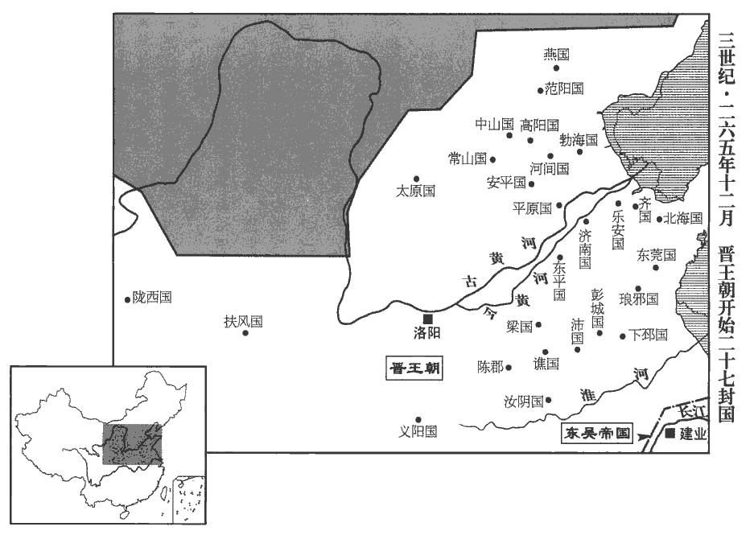
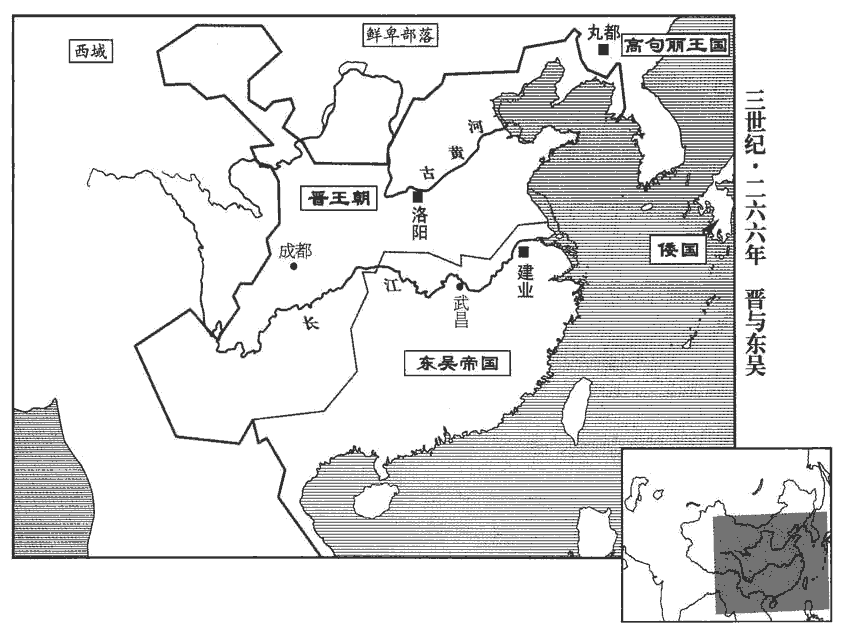
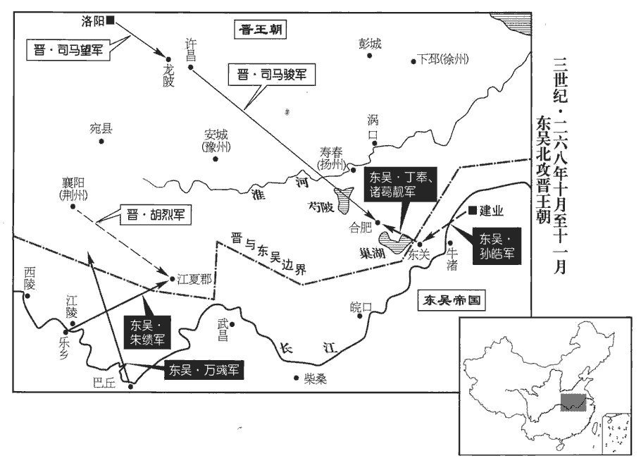
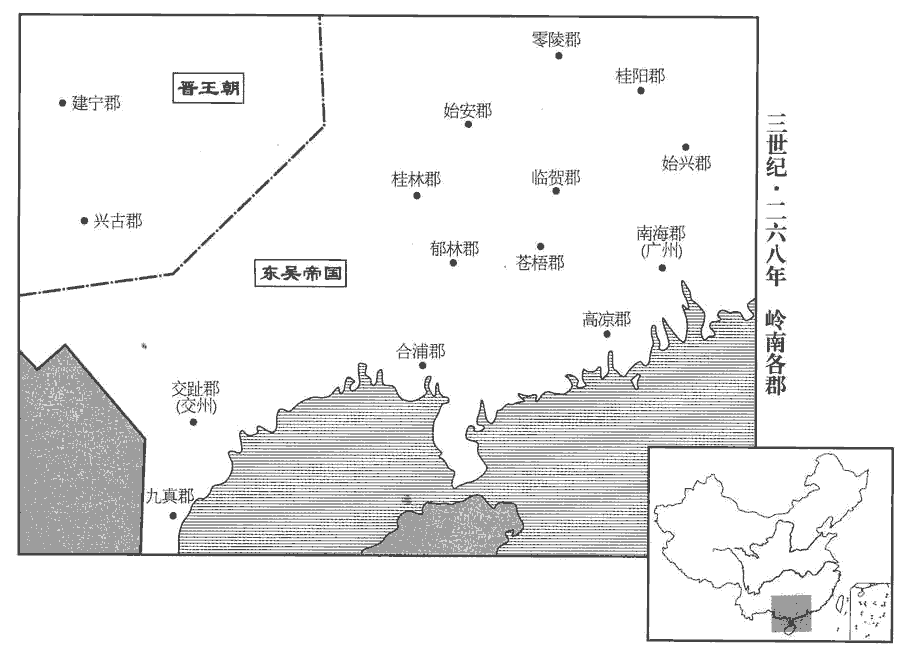
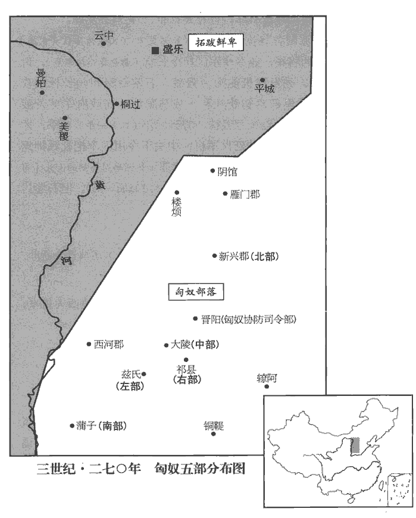
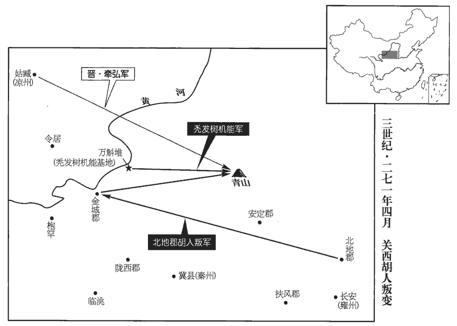
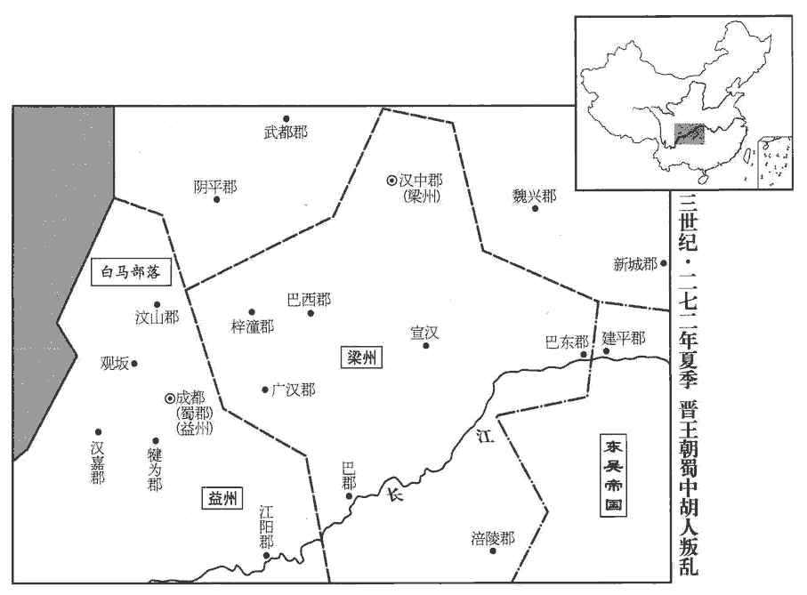
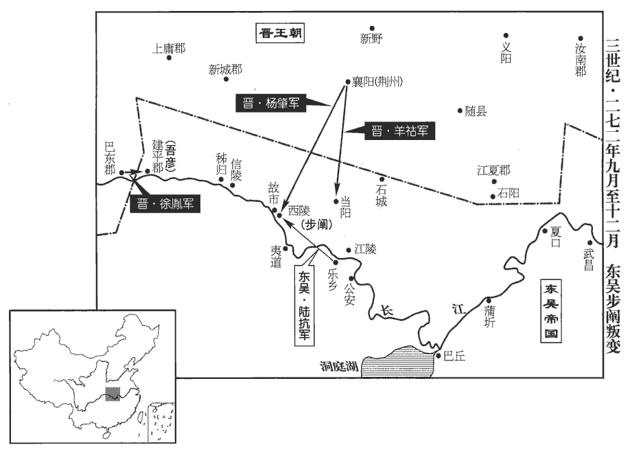

 晉紀一起旃蒙作噩（乙酉），盡玄黓執徐（壬辰），凡八年。
>  
> 司馬氏，河內溫縣人。宣王懿得魏政，傳景王師，至文王昭，始封晉公，以溫縣本晉地，故以為國號。

# 世祖武皇帝上之上諱炎，字安世，姓司馬氏，宣王懿之孫，文王昭之長子。文王廟號太祖，故帝廟號世祖。諡法：克定禍亂曰武。

## 泰始元年（乙酉，二六五）是年十二月，方受禪改元，此猶是魏咸熙二年。

1春，三月，吳主使光祿大夫紀陟、五官中郎將洪璆璆qiú，渠尤翻。與徐紹、孫彧偕來報聘。紹、彧聘吳見上卷上年。紹行至濡須‹安徽含山西南›，有言紹譽中國之美者，譽，音余。吳主‹孙皓，时年二十四›怒，追還，殺之。

〖译文〗 [1]春季，三月，吴主派遣光禄大夫纪陟、五官中郎将洪，与徐绍、孙一起去魏国回报聘问。徐绍走到濡须的时候，有人说徐绍曾称赞中原之国的美好，吴主动怒，追回徐绍，把他杀死。

2夏，四月，吳改元甘露。時因蔣陵言甘露降改元。

〖译文〗 [2]夏季，四月，吴国改年号为甘露。

3五月，魏帝‹曹奂，时年二十›加文王殊禮，謂旌旗、車馬、樂舞、冕服，皆如帝者之儀。進王妃曰后；世子曰太子。

〖译文〗 [3]五月，魏元帝施与晋文王特殊的礼遇，晋升王妃为王后，世子改称为太子。

4癸未‹三十›，大赦。

〖译文〗 [4]癸未（三十日），大赦天下。

5秋，七月，吳主逼殺景皇后，遷景帝四子於吳‹苏州›；尋又殺其長者二人。吳主貶景后，封四弟，事見上卷上年。長，知兩翻。

〖译文〗 [5]秋季，七月，吴主逼杀吴帝皇后，把景帝的四个儿子迁到吴，不久，又把四人中两个年龄大的杀了。

6八月，辛卯‹九›，文王‹司马昭年五十五›卒，太子‹司马炎›嗣為相國、晉王。

〖译文〗 [6]八月，辛卯（初九），晋文王司马昭去世，太子司马炎继位，做了相国、晋王。

7九月，乙未，大赦。

〖译文〗 [7]九月，乙未（疑误），大赦天下。

8戊子‹七›，以魏司徒何曾為晉丞相；癸亥‹十二›，以票騎將軍司馬望為司徒。票，匹妙翻。騎，奇寄翻。

〖译文〗 [8]戊子（初七），任命魏司马何曾为晋丞相。癸亥（十二日），任命票骑将军司马望为司徒.

9乙亥‹二十四›，葬文王于崇陽陵。考異曰：晉書文紀作「癸酉」，今從魏志陳留王紀。

〖译文〗 [9]乙亥（二十四日），在崇阳陵理葬晋文王。

10冬，吳西陵督步闡chǎn西陵‹湖北宜昌›，即夷陵。吳主權黃武元年改夷陵曰西陵，宜都郡治焉。表請吳主徙都武昌‹湖北鄂州›；吳主從之，使御史大夫丁固、右將軍諸葛靚守建業。靚，疾正翻。闡，騭之子也。吳主權時，騭為西陵督，騭，之日翻。

〖译文〗 [10]冬季，吴国西陵督步阐上表，请求吴主把国都迁到武昌，吴主听从了他的建议，委派御史大夫丁固、右将军诸葛靓镇守建业。步阐是步骘的儿子。

11十二【張：「十二」作「十一」。】月，壬戌‹十三›，魏帝‹曹奂›禪位于晉；魏元帝時年二十，困敦上章，魏文帝始受漢禪，傳五世，歷四十六年而亡。甲子‹十五›，出舍于金墉城。金墉城在洛陽城西北角。太傅司馬孚拜辭，執帝手，流涕歔欷不自勝，歔，音虛。欷，音希，又許既翻。勝，音升。曰：「臣死之日，固大魏之純臣也。」丙寅‹十七›，王‹司马炎，时年三十›即皇帝位，大赦，改元。至是方改元泰始。丁卯‹十八›，奉魏帝為陳留王，即宮于鄴‹河北临漳西南邺镇›。即，就也。優崇之禮，皆倣魏初故事。見六十九卷魏文帝黃初元年。魏氏諸王皆降為侯。追尊宣王為宣皇帝，景王為景皇帝，文王為文皇帝；尊王太后曰皇太后。封皇叔祖孚為安平王，叔父幹為平原王、亮為扶風王、伷zhòu為東莞王、駿為汝陰王、肜róng為梁王，倫為琅邪王，弟攸為齊王、鑒為樂安王、機為燕王；又封群從司徒望等十七人皆為王。望，孚之子也。帝封諸王，以郡為國。邑二萬戶為大國，置上、中、下三軍，兵五千人；萬戶為次國，置上軍、下軍，兵三千人；五千戶為小國，置一軍，兵五百人。王不之國，官於京師。伷，音胄。從，才用翻。莞，音官。肜róng，余中翻。燕於賢翻。以石苞為大司馬，鄭沖為太傅，王祥為太保，何曾為太尉，賈充為車騎將軍，王沈為驃騎將軍；騎，奇寄翻。沈，持林翻。驃，匹妙翻。其餘文武增位進爵有差。乙亥‹二十六›，以安平王孚為太宰，都督中外諸軍事。晉志曰：太宰、太傅、太保，周之三公官也。晉初以景帝諱故，又採周官官名，置太宰以代太師之任，秩增三司，與太傅、太保皆為上公。大司馬，古官也，漢制以冠大將軍、驃騎將軍之上，以代太尉之職，故恆與太尉迭置，不并列。及魏有太尉，而大司馬、大將軍各自為官，位在三司上。晉因其制，以太宰、太傅、太保、司徒、司空為文官公，左右光祿大夫、光祿大夫開府者，位從公，冠進賢、三梁，黑介幘zé。大司馬、大將軍、太尉為武官公，驃騎、車騎、衛將軍、伏波、撫軍、都護、鎮軍、中軍、四征、四鎮、龍驤、典軍、上軍、輔國等大將軍開府者，位從公，皆著武冠，平上黑幘。未幾，幾，居豈翻。又以車騎將軍陳騫為大將軍，與司徒義陽王望、司空荀顗yǐ，凡八公，同時并置。帝懲魏氏孤立之敝，故大封宗室，授以職任。又詔諸王皆得自選國中長吏；長，知兩翻。衛將軍齊王攸獨不敢，皆令上請。上，時掌翻。

〖译文〗 [11]十一月，壬戌（十二日），魏元帝把皇位禅让给晋王。甲子（十四日），魏元帝搬到金墉城居住。太傅司马孚与魏元帝辞别，拉着魏元帝的手，流泪叹息不能自制，说：“我到死的那一天，仍然是大魏真正的臣子。”丙寅（十六日），晋王司马炎登上皇帝位，大赦天下，改年号为泰始。丁卯（十七日），尊奉魏元帝为陈留王，宫室安排在邺城，优厚高贵的礼制待遇，都仿效魏国初期的制度。魏宗室诸王都降为侯。追尊晋宣王司马懿为宣皇帝，晋景王司马师为景皇帝，晋文王司马昭为文皇帝；尊王太后为皇太后。封皇帝的叔祖司马孚为安平王；叔父司马斡为平原王，司马亮为扶风王，司马为东莞王，司马骏为汝阴王，司马肜为梁王，司马伦为琅邪王，封皇帝之弟司马攸为齐王、司马鉴为乐安王、司马机为燕王。又把司徒司马望等诸子侄共十七人都封为王。任命石苞为大司马，郑冲为太傅，王祥为太保，何曾为太尉，贾充为车骑将军，王沈为骠骑将军；其余的文武官员，提级进爵各有差别。乙亥（二十五日），任命安平王司马孚为太宰，统领朝廷内外的军事事务。过了不久，又任命车骑将军陈骞为大将军，与司徒义阳王司马望、司空荀等，总共是八公，同时并列设置。晋武帝以魏氏孤立无援的弊害作为警戒，因而大封宗室，赋与他们职权。晋武帝又诏告诸王可以自己选择封国中的官吏，只有卫将军齐王司马攸不敢自选，全部官吏都请求晋武帝指派。

 

12詔除魏宗室禁錮，罷部曲將及長吏納質任。魏防禁宗室甚峻，又錮不得仕進，今除之。又諸將征戍及長吏仕州郡者，皆留質任於京師，今亦罷之。將，即亮翻。質，音致。

〖译文〗 [12]晋武帝下诏，免除魏宗室的禁锢令，废除部曲将领及州郡长吏纳人质于京师的制度。

13帝承魏氏刻薄奢侈之後，矯以仁儉。太常丞許奇，允之子也。晉太常、光祿勲、衛尉、太僕、廷尉、大鴻臚、宗正、大司農、少府、將作大匠、太后三卿、大長秋，皆為列卿，各置丞、功曹、主簿、五官等員。帝將有事於太廟，朝議以奇父受誅，奇父允誅，事見七十六卷高貴鄉公正元元年。朝，直遙翻。不宜接近左右，近，其靳翻。請出為外官，帝乃追述允之宿望，稱奇之才，擢為祠部郎。魏尚書曹有祠部郎，晉因之。有司言御牛青絲紖斷，紖zhèn，直忍翻，索也，牛系也，禮迎牲，君執紖。周禮封人，祭祀，飾其牛牲，置其絼zhèn。註曰：絼，著牛鼻繩，所以牽牛者，今人謂之雉。疏曰：自漢以前，皆謂之絼。按禮記少儀：牛則執紖。紖則絼之別名，今亦謂之為紖。陸德明曰：絼，與紖同，又以忍翻；又周禮釋音羊晉翻。詔以青麻代之。

〖译文〗 [13]晋武帝是继魏氏苛酷奢侈的政治之后登极的，他以仁厚节俭的作风纠正魏氏的弊端。太常丞许奇是许允的儿子。晋武帝将要在太庙行事，朝廷中议事的时候，大臣们认为，许奇的父亲因过被诛，许奇不宜在武帝身边供职，应当委派他担任朝廷外的官职。晋武帝于是追述许允的名望，称赞许奇的才能，提拔他担任祠部郎。有关部门称，宫中所用的青丝牵牛绳断了，晋武帝下诏，用青麻代替青丝。

14初置諫官，以散騎常侍傅玄、皇甫陶為之。秦、漢以來有諫大夫，鄭昌所謂「官以諫為名」者也。東漢有諫議大夫。魏不復置。晉以散騎常侍拾遺補闕，即諫官職也。玄，幹之子也。傅幹，漢傅燮之子。玄以魏末士風頹敝，上疏曰：「臣聞先王之御天下，教化隆於上，清議行於下。近者魏武好法術而天下貴刑名，好，呼到翻。魏文慕通達而天下賤守節，其後綱維不攝，攝，整也。放誕盈朝，謂何晏、阮籍輩也。朝，直遙翻。遂使天下無復清議。陛下龍興受禪，弘堯、舜之化，惟未舉清遠有禮之臣以敦風節，未退虛鄙之士以懲不恪，臣是以猶敢有言。」上嘉納其言，使玄草詔進之，然亦不能革也。

〖译文〗 [14]当初设置谏官的时候，任命散骑常侍傅玄、皇甫陶担任。傅玄是傅斡的儿子。傅玄看到魏末士风衰败，于是上疏说：“我听说先王治理天下，教化昌盛上，公正的评论通行于下。近世以来，魏武帝喜好法术而天下重视刑名；魏文帝思慕通达而天下轻贱操守名分，从这以后纲纪不整，浮夸虚无的风气充满朝廷，于是使天下不再有公正的评论。陛下接受禅让登极，弘扬尧、舜之风，唯独没有选拔清明广远有礼法之臣，以促进风化与操守；没有斥退虚浮鄙陋之人，以惩戒不恭敬不谨慎的人，因此我才冒昧地说这番话。”晋武帝赞许并采纳了他的意见，让傅玄起草诏书以便实行，但是也未能改变当时的风气。

15初，漢征西將軍司馬鈞鈞事見五十卷漢安帝元初二年。生豫章‹江西南昌›太守量，量生潁川‹河南禹州›太守雋jùn，雋生京兆尹防，防生宣帝。序司馬氏之世，為下立廟張本。

〖译文〗 [15]当初，汉征西将军司马钧生下豫章太守司马量，司马量生下颍川太守司马，司马生下京兆尹司马防，司马防生下晋宣帝司马懿。

## 二年（丙戌，二六六）

1春，正月，丁亥‹八›，即用魏廟祭征西府君以下，并景帝凡七室。沈約志曰：晉初祭征西將軍、豫章府君、潁川府君、京兆府君，與宣皇帝、景皇帝、文皇帝為三昭三穆。是時，宣皇未升，太祖虛位，所以祠六世，與景帝為七廟。其禮則據王肅說也。

〖译文〗 [1]春季，正月，丁亥（初八），就便利用魏庙，祭祀征西府君司马钧以下，连同景帝司马师共七个堂屋。

2‹司马炎，时年三十一›尊【章：甲十一行本「尊」上有「辛丑」二字；乙十一行本同；孔本同；張校同。】景帝夫人羊氏曰景皇后，居弘訓宮。

〖译文〗 [2]辛丑（二十二日），尊奉景帝夫人羊氏为景皇后，居住在弘训宫。

3丙午‹二十七›，立皇后弘農‹河南灵宝东北›楊氏；后，魏通事郎文宗之女也。魏黃初初，中書既置監、令，又置通事郎。

〖译文〗 [3]丙午（二十七日），立弘农人杨氏为皇后。皇后是魏通事郎杨文宗的女儿。

4群臣奏：「五帝即天帝也，王氣時異，故名號有五。自今明堂、南郊宜除五帝座。」從之。帝，王肅外孫也，故郊祀之禮，有司多從肅議。周禮曰：祀昊天上帝，則服大裘而冕；祀五帝亦如之。鄭玄以為昊天上帝者，天皇大帝，北辰耀魄寶也。五帝者，五行精氣之神也，曰青帝靈威仰，曰赤帝赤熛biāo怒，曰黃帝含樞紐，曰白帝白招矩，曰黑帝汁光紀。由是有六天之說。六天者，指其尊極清虛之體，其實是一；論其五時生育之功，其別有五，故為六天。據其在上之體，謂之天；天為體稱，故說文云，天，顛也。因其生育之功，謂之帝；帝為德稱，故毛詩傳云：審諦如帝。王肅駮bó之，以為五帝非天，唯用家語之文，謂太皞hào、炎帝、黃帝、少皞、顓頊五帝，為五人帝。晉群臣祖肅之說，以為五帝即天帝，王氣時異，故殊其號雖五，其實一神。明堂、南郊，宜除五帝之座，五郊改五精之號，同稱昊天上帝，從之。王，于況翻。

〖译文〗 [4]群臣上书说：“五帝就是天帝，王气时时不同，所以名号有五个。从现在起，明堂、南郊都应当除去五帝的位置。”晋武帝听从了这一建议。晋武帝是王肃的外孙，所以祭天地的礼仪，有关官吏大都遵从王肃的意见。

5二月，除漢宗室禁錮。魏既代漢，禁錮諸劉，今除之。

〖译文〗 [5]二月，解除魏对汉宗室的禁锢。

6三月，【章：甲十一行本「月」下有「戊戌」二字；乙十一行本同；孔本同；張校同；退齋校同。】吳遣大鴻臚張儼、五官中郎將丁忠來弔祭。以文王之喪也。臚，陵如翻。

〖译文〗 [6]三月，戊戌（二十日），吴国派遣大鸿胪张俨、五官中郎将丁忠到晋朝吊祭。

7吳散騎常侍王【章：甲十一行本「王」上有「廬江」二字；乙十一行本同；孔本同；退齋校同。】蕃，體氣高亮，不能承顏順指，吳主‹孙皓，时年二十五›不悅。散騎常侍萬彧、中書丞陳聲從而譖之。散，悉亶dǎn翻。騎，奇寄翻。丁忠使還，使，疏吏翻。還，從宣翻，又如字。吳主大會群臣，蕃沈醉頓伏。沈，持林翻；下王沈同吳主疑其詐，轝yú蕃出外。轝，羊茹翻。頃之，召還。蕃好治威儀，好，呼到翻。治，直之翻。行止自若。吳主大怒，呵左右於殿下斬之，出，登來山‹湖北鄂州西›，水經註：武昌城南有來山，即樊山也。吳孫皓登之，使親近擲王蕃首而虎爭之。使親近擲蕃首，作虎跳狼爭咋zé齧niè之，跳，他弔翻。咋，側革翻，啖也。齧，魚結翻，噬也。首皆碎壞。

〖译文〗 [7]吴国散骑常侍、庐江人王蕃，气质、风度高尚，不会看人脸色顺从其意行事，吴主对此不高兴。散骑常侍万、中书丞陈声便乘机诬陷他。丁忠出使回来。吴主大会群臣，王蕃喝醉了酒，趴伏在那里起不来。吴主疑心他是故意装出来的，就用车子把他送出去，过了一会儿，又召他回来。王蕃容貌举止庄严，行止自如，吴主勃然大怒，喝令左右在殿堂之下把他杀了，然后出去登来山，让左右亲随抛掷王蕃的首级，像虎狼那样争抢啃咬，使其首级啐裂。

丁忠說吳主曰：「北方無守戰之備，弋陽‹河南潢川›可襲而取。」弋陽縣，漢屬汝南郡，魏文帝分立弋陽郡。說，輸芮翻。吳主以問群臣，鎮西大將軍陸凱曰：「北方新并巴、蜀，遣使求和，非求援於我也，欲蓄力以俟時耳。敵勢方強，而欲徼幸求勝，未見其利也。」徼，工堯翻。吳主雖不出兵，然遂與晉絕。凱，遜之族子也。

〖译文〗 丁忠对吴主说：“北方的晋国没有做好战备，我们可以袭击并夺取弋阳。”吴主询问群臣，镇西大将军陆凯说；“北方新近吞并了巴、蜀，派使者来求和，这并不是向我们求援，只不过是想积蓄力量以等待时机。敌人的势力正当强大的时候，想要侥幸取胜，我看不出这样做有什么好处。”吴主虽然不出兵了，但是却与晋国断绝了关系。陆凯是陆逊同族兄弟的儿子。

8夏，五月，壬子，博陵元公王沈卒。沈，持林翻。

〖译文〗 [8]夏季，五月，壬子（疑误），博陵元公王沈去世。

9六月，丙午晦‹二十九›，日有食之。

〖译文〗 [9]六月，丙午晦（疑误），出现日食。

10文帝之喪，臣民皆從權制，三日除服。既葬，帝亦除之；然猶素冠疏食，食，祥吏翻。哀毀如居喪者。秋，八月，帝將謁崇陽陵，群臣奏言，秋暑未平，恐帝悲感摧傷。帝曰：「朕得奉瞻山陵，體氣自佳耳。」又詔曰：「漢文不使天下盡哀，亦帝王至謙之志。漢文帝遺詔見十五卷後七年。真德秀曰：文帝此詔，乃短喪之始也。然本文蓋為吏民設耳，景帝嗣君也，可緣此而短其喪乎！當見山陵，何心無服！其議以衰cuī絰dié從行。衰，七回翻。群臣自依舊制。」尚書令裴秀奏曰：「陛下既除而復服，義無所依；若君服而臣不服，亦未之敢安也。」詔曰：「患情不能跂及耳，衣服何在！言患哀慕之情不至耳，不在乎衣服也。跂，去智翻，舉踵也。諸君勤勤之至，豈苟相違。」遂止。

〖译文〗 [10]晋文帝的丧事，臣民都遵守临时制定的法令，服丧三日。葬礼结束，晋武帝也除去丧服，但仍然戴白冠，吃素食，哀伤如同丧期。秋季，八月，晋武帝将要拜谒崇阳陵，群臣上奏称，秋暑还没有平息，恐怕皇帝悲哀伤感会损害健康。晋武帝说：“朕能够瞻仰先人陵墓，身体、精神自然就会好。”又下诏说：“汉文帝不使天下的臣民都为他而悲哀，这也达到帝王谦逊的最高点了。要拜见先人陵墓，怎么忍心不穿丧服！应当决定穿丧服，群臣自然可依照旧制行事。”尚书令裴秀上奏说：“陛下已经除去了丧服而现在又穿上，这样做于礼仪没有依据，如果君王穿丧服而臣下却不穿，做臣子的心里也不安。”晋武帝下诏说：“朕担忧的是，哀慕之心不能充分地表达出来，不在乎丧服。诸位一片殷勤的好意，朕不忍再违背了。”于是同意不穿丧服。

中軍將軍羊祜hù謂傅玄曰：「三年之喪，雖貴遂服，禮也。三年之喪，自天子達于庶人，言雖以天子之貴，亦得以遂其孝思為三年之服。今【章：甲十一行本「今」上有「而漢文除之，毀傷禮義」九字；乙十一行本同；張校同；「義」下有「常以歎息」四字。】主上至孝，雖奪其服，實行喪禮。若因此復先王之法，不亦善乎！」玄曰：「以日易月，已數百年，以日易月，漢儒之謬說也；註見十五卷漢文帝後七年。一旦復古，難行也。」祜曰：「不能使天下如禮，且使主上遂服，不猶愈乎！」玄曰：「主上不除而天下除之，此為但有父子，無復君臣也。」乃止。

〖译文〗 中军将军羊祜对傅玄说：“三年之丧，即使尊贵为天子也要身穿孝服，这是礼制。但是汉帝却把它废除了，毁坏、损伤礼义，我常常因此叹息。如今皇帝至孝，虽然除去了丧服，仍实行丧礼。如果能借此机会恢复先王的法规，难道不是很好吗？”傅玄说：“把穿丧服的时间从以月计改为以日计，已经有几百年了，一旦要恢复古制，是很难行得通的。”羊祜说：“不能使天下人都遵从礼法，暂且使皇帝再穿孝服，不是还好些吗？”傅玄说：“皇帝不除丧服而天下除丧服，这就是只有父子，不再有君臣的行为。”羊祜于是不再提让天下恢复古制的话。

戊辰‹二十二›，群臣奏請易服復膳，詔曰：「每感念幽冥，而不得終苴jū絰dié之禮，左傳：齊晏桓子卒，晏嬰粗縗cuī苴絰帶。杜預註云：苴，麻之有子者，取其粗也。苴，七余翻。以為沈痛。沈，持林翻，深也。況當食稻衣錦乎！衣，於既翻。適足激切其心，非所以相解也。朕本諸生家，傳禮來久，何至一旦便易此情於所天！相從已多，可試省孔子答宰我之言，論語：宰我問：「三年之喪，朞已久矣。君子三年不為禮，禮必壞；三年不為樂，樂必崩。舊穀既沒，新穀既升，朞可已矣。」孔子曰：「食夫稻，衣夫錦，於女安乎？」曰：「安。」孔子曰：「女安，則為之。」宰我出，孔子曰：「予之不仁也！子生三年，然後免於父母之懷。夫三年之喪，天下之通喪也。」儀禮曰：父者，子之天。省，悉景翻。無事紛紜也！」遂以疏素終三年。

〖译文〗 戊辰（二十二日），群臣上奏请求晋武帝更换正常的服饰和膳食，晋武帝下诏说：“每当感念先灵，而朕不能完成穿丧服之礼，就为此沉痛，更不要说吃稻米、穿锦绣了。这样做只会激起朕的痛切之心，不能够缓解朕的沉痛。朕本生于儒者之家，礼法传习已久，何至于一时之间便对自己的父亲改了这种感情！听从你们的已经够多了，你们可以对照孔子回答宰我的话反省自己，不要再多说了。”于是以素食素服度过三年。

臣光曰：三年之喪，自天子達于庶人，此先王禮經，百世不易者也。漢文師心不學，變古壞禮，壞，音怪。絕父子之恩，虧君臣之義；後世帝王不能篤於哀戚之情，而群臣諂諛，莫肯釐正。釐，力之翻，理也。至於晉武獨以天性矯而行之，可謂不世之賢君；而裴、傅之徒，固陋庸臣，習常玩故，而不能將順其美，惜哉！孝經曰：君子之事上也，將順其美，匡救其惡。註云：將，奉也。

〖译文〗 臣司马光曰：上自天子，下至平民百姓，都要服丧三年，这是先王礼经所规定，百世不可改变。汉文帝以已意为师，不守成规，改变古制，败坏礼法，断绝父子之间的恩德，毁坏君臣之间的情义，使后世的帝王不能真诚专一于哀悼先人的感情，而群臣谄媚、阿谀，没有人肯加以改正。到了晋武帝，唯独以自己的天性加以纠正并实行，可称是非凡的贤君。而裴秀、傅玄之徒，是见识鄙陋的平庸之臣，习惯于常规，拘守行之已久的习俗，不能够承顺晋武帝的美意，可惜啊！

11吳改元寶鼎。以所在得大鼎改元。

〖译文〗 [11]吴国改年号为宝鼎。

12吳主以陸凱為左丞相，萬彧為右丞相。吳主惡人視己，群臣侍見，莫敢舉目。惡，烏路翻。見，賢遍翻。陸凱曰：「君臣無不相識之道，若猝有不虞，不知所赴。」吳主乃聽凱自視，而他人如故。唯凱得視之，他人仍舊不得視也。

〖译文〗 [12]吴主任命陆凯为左丞相，万为右丞相。吴主憎恶别人注视他，群臣朝见或在一旁侍候，没有人敢抬眼看他。陆凯说：“君臣之间没有不相识的道理，如果突然发生了意料不到的事情，就不知道该怎么办了。”吴主于是听凭陆凯注视他，而对别人却依然如故。

吳主居武昌‹湖北鄂州›，揚州之民泝流供給，甚苦之，吳武昌屬荊州，而丹陽、宣城、毗陵、吳、吳興、會稽、東陽、新都、臨海、建安、豫章、臨川、鄱陽、廬陵皆屬揚州，故苦於西上，泝流以供給。又奢侈無度，公私窮匱。凱上疏曰：「今四邊無事，當務養民豐財，而更窮奢極欲；無災而民命盡，無為而國財空，臣竊憂之。昔漢室既衰，三家鼎立；今曹、劉失道，皆為晉有，此目前之明驗也。臣愚但為陛下惜國家耳。武昌土地危險塉jí确，塉，秦昔翻，土薄也。确，克角翻，山多大石也。非王者之都；且童謠云：『寧飲建業水，不食武昌魚；寧還建業死，不止武昌居。』此苦於泝流供給而為是謠也。以此觀之，足明人心與天意矣。今國無一年之蓄，禮記王制：國無六年之蓄曰急，無三年之蓄曰國非其國也。況無一年之蓄乎！民有離散之怨，國有露根之漸，以木為喻也。木之所以能生殖者，以有根本也，根漸露，則其本將撥。而官吏務為苛急，莫之或恤。大帝時，後宮列女及諸織絡數不滿百，景帝以來，乃有千數，此耗財之甚也。又左右之臣，率非其人，群黨相扶，害忠隱賢，此皆蠹政病民者也。臣願陛下省息百役，罷去苛擾，料出宮女，去，羌呂翻。料，音聊。清選百官，則天悅民附，國家永安矣。」吳主雖不悅，以其宿望，特優容之。考異曰：陳壽曰：「予連從荊、揚來者，得凱所諫皓二十事，博問吳人，多云不聞凱有此表。又按其文殊甚切直，恐非皓之所能容忍也。或以為凱藏之篋qiè笥sì，未敢宣行，病困，皓遣董朝省問欲言，因以付之。虛實難明，故不著于篇；然愛其指擿tī皓事，足為後戒，故鈔列于凱傳左。」今不取。

〖译文〗 吴主居住在武昌，扬州的百姓逆流而上提供物资，异常劳苦。再加上吴主奢侈无度，使得国家和人民都穷困匮乏。陆凯上疏说：“如今四周边境都没有战事，应当致力于休养民力，积蓄财富，然而却愈发穷奢极欲；还没有发生灾难而百姓的精力已尽，还没有什么作为而国库的资财已经空虚，我私下为此感到忧虑。从前汉室衰微，三家鼎立，如今曹、刘失道，都被晋所占有，这是近在眼前的、十分明显的证据。我蠢笨无知，只是为陛下珍惜国家而已。武昌地势高险，土质薄，多山石，并非帝王建都的地方，况且童谣说：‘宁饮建业水，不食武昌鱼；宁还建业死，不在武昌居。’由此看来，是可以证明人心与天意了。现在国家仅有不足一年的积蓄，百姓有离散的怨言，国家这棵大树已经渐渐露出了根本，而官吏却致力于苛刻催逼百姓，没有人体恤他们。大帝的时候，后宫的女子以及各种织工，人数不足百人，景帝以来，人数已经上千，这就使资财的耗费非常严重了。另外，您身边的臣子，大多没有什么才能，他们结成帮派相互扶持，陷害忠良，埋没贤达，这都是些损政害民的人。我希望陛下减省、停止多种劳役，免去苛刻的骚扰，清理、减少宫女，严格选拔官吏，那么就会使天喜悦而民归附，国家长久安定了。”吴主虽然不高兴，但由于陆凯的名望大，就对他特别宽容。

13九月，詔：「自今雖詔有所欲，及已奏得可，而於事不便者，皆不可隱情。」既不可希指迎合，又不可以遂事而不諫也。

〖译文〗 [13]九月，晋武帝下诏书：“从现在开始，即使诏令有要求，以及已上奏并获得批准，但是在实际执行中有不便之处的，都不得隐瞒实情。”

14戊戌‹二十三›，有司奏：「大晉受禪於魏，宜一用前代正朔、服色，如虞遵唐故事。」從之。家語：季康子問於孔子曰：「唐、虞二帝其所尚何色？」孔子曰：「堯以火德王，色尚黃；舜以土德王，色尚青。」董仲舒策引孔子曰：「無為而治者，其舜乎！改正朔，易服色，以順天命而已，其餘盡循堯道，何更為哉！」如二說，則舜之承堯，固改正朔，易服色矣。然考之古文尚書：堯命羲和，曆象日月星辰，敬授人時。舜正月上日，受終于文祖。協時月正日而已，不言改正朔也。易大傳曰：黃帝、堯、舜垂衣裳而天下治。書益稷，帝曰：「予欲觀古人之象，以五采彰施于五色，」作服而已，不言易服色也。漢興六曆，有黃帝曆、顓頊曆、夏曆、殷曆、周曆、魯曆，無堯舜曆，豈堯、舜時用顓頊曆邪？孔穎達以為古之真曆，至戰國及秦而亡，漢初所存六曆，後人託而為之。此固無從考正也。

〖译文〗 [14]戊戌（二十三日），有关部门上奏称：“大晋受到魏的禅让，应当一概沿用前代历法与车马祭牲的颜色，如同虞舜遵循唐尧旧制一样。”晋武帝听从了这一意见。

15冬，十月，丙午朔‹一›，日有食之。考異曰：宋書志無此食。今從晉書。

〖译文〗 [15]冬季，十月丙午朔（初一），出现日食。

16永安‹浙江德清西›山賊施但，吳錄曰：永安，今武康縣也。沈約曰：吳分烏程、餘杭立永安縣，晉武帝太康元年，更名武康，屬吳興郡。宋白曰：永安縣，本漢烏程縣之餘不鄉。因民勞怨，聚眾數千人，劫吳主庶弟永安侯謙作亂，北至建業‹南京›眾萬餘人，未至三十里住，擇吉日入城。遣使以謙命召丁固、諸葛靚，固、靚斬其使，發兵逆戰於牛屯‹南京东南›。據吳曆，牛屯去建業城二十一里。靚，疾正翻。但兵皆無甲胄，即時敗散。謙獨坐車中，生獲之。固不敢殺，以狀白吳主，吳主并其母及弟俊皆殺之。初，望氣者云：荊州有王氣，當破揚州。王，于況翻。故吳主徙都武昌。及但反，自以為得計，遣數百人鼓譟入建業，殺但妻子，云「天子使荊州兵來破揚州賊。」

〖译文〗 [16]永安山贼施但，乘百姓劳苦有怨言，聚集了民众数千人，动持了吴主庶弟、永安侯孙谦作乱。他们向北到建业，徒众有一万余人，离建业不到三十里时驻扎下来，选择吉日进城。施但派使者以孙谦的名义召丁固、诸葛靓，丁固、诸葛靓杀了使者，发兵在牛屯迎战施但。施但的兵士都没有盔甲，立时就被打败而逃散了。孙谦独自坐在车子里，被活捉了。丁固不敢杀他，把情况禀告吴主，吴主连同孙谦的母亲及弟弟孙俊都杀了。当初，望云气的人说：荆州有帝王之气，应当能攻破扬州。因此吴主迁都到武昌。等到施但造反，吴主自以为预言应验了，就派遣数百人击鼓叫进入建业，杀了施但的妻子儿女，说：“天子派荆州兵来打败扬州贼。”

 

17十一月，初并圜丘、方丘之祀於南北郊。鄭氏註禮記：為高必因丘陵，謂冬至祭天於圜丘之上；為下必因川澤，謂夏至祭地於方澤之中。而四郊之祭，又在圜丘方澤之外。魏景初元年，始營洛陽南委粟山為圜丘，以冬至祭皇皇帝天於圜丘，夏至祭皇皇后地於方丘；而天郊所祭曰皇天之神，地郊所祭曰皇地之祇。今以二至之祀合於二郊，是後圜丘、方澤不別立。

〖译文〗 [17]十一月，晋开始把冬至一圜丘祭天、夏至在方泽祭地的仪式合并于南郊和北郊。

18罷山陽國‹河南焦作›督軍，除其禁制。魏奉漢獻帝為山陽公，國於河內山陽縣之濁鹿城，置督軍以防衛之。至晉時，帝孫康嗣立，人心去漢久矣，故罷其衛兵，除其禁制。

〖译文〗 [18]晋罢免了汉朝后裔居住的山阳国的监督卫队，解除了对山阳国的禁制。

19十二月，吳主還都建業‹南京›，考異曰：吳志陸凱傳：或曰：「寶鼎元年十二月，凱與丁奉、丁固謀因皓謁廟，欲廢皓，立孫休子。時左將軍留平領兵先驅，故密語平，平拒而不許，誓以不泄，是以不果。」按凱盡忠執義，必不為此事。況皓殘酷猜忌，留平庸人，若聞凱謀，必不能不泄，殆虛語耳。今不取。使后父衛將軍、錄尚書事滕牧留鎮武昌。朝士以牧尊戚，頗推令諫爭，爭，讀曰諍。滕后之寵由是漸衰，更遣牧居蒼梧‹广西梧州›，雖爵位不奪，其實遷也，在道以憂死。何太后常保佑滕后，太史又言中宮不可易，吳主信巫覡xí，在女曰巫，在男曰覡。覡，刑狄翻。故得不廢，常供養升平宮。皓尊其母何太后宮曰升平宮。供，居用翻。養，羊尚翻。不復進見；見，賢遍翻。諸姬佩皇后璽紱fú者甚眾，滕后受朝賀表疏而已。璽，斯氏翻。紱，音弗。朝，直遙翻。吳主使黃門徧行州郡，料取將吏家女，行，戶孟翻。料，音聊。其二千石大臣子女，歲歲言名，年十五、六一簡閱，簡閱不中，乃得出嫁。中，竹仲翻。後宮以千數，而採擇無已。

〖译文〗 [19]十二月，吴主又把国都迁回建业，派皇后的父亲、卫将军、录尚书事滕牧留下来镇守武昌。朝廷中的官吏因滕牧是显贵的皇亲，都推举他，让他向上谏争，滕皇后因此逐渐地失去了恩宠。吴主又让滕牧去苍梧居住，虽然没有削夺他的爵位，实际上是把他放逐了，他在半路上由于忧郁而死去。何太后时常护佑着滕后，又加上太史说皇后不可更换，吴主信巫术，所以滕后没有被废，日常供养在升平宫，不再进见吴主。宫中的姬妾很多人都佩带着皇后印玺绶带，滕后却只是接受大臣们的朝贺和上奏的表疏而已。吴主派遣宦官走遍了州郡，挑先将吏家中的女子；只要是二千石大臣家里的女儿，每年都要申报姓名年龄，到了十五六岁就要进行考察、检选，没有被选中的才可以出嫁。后宫女子已有上千人，吴主仍然不断地挑选新人入宫。

## 三年（丁亥，二六七）

1春，正月，丁卯，‹司马炎，时年三十二›立子衷為皇太子。為惠帝亡晉張本。詔以「近世每立太子必有赦。漢高帝為漢王，立太子，赦有罪。文、景、武立太子，賜民爵。至宣帝立太子，始大赦天下。元帝立太子復賜民爵，光武立太子彊，赦天下，其後立太子陽及明、章立太子，皆不赦。魏文、明率病篤然後立太子尋而踐阼有赦，故革之。今世運將平，當示之以好惡，好，呼到翻。惡，烏路翻。使百姓絕多幸之望。曲惠小人，【嚴：「人」改「仁」。】朕無取焉！」遂不赦。

〖译文〗 [1]春季，正月丁卯（疑误），晋武帝立其子司马衷为皇太子。诏令中说：“近代每当立太子，必定大赦天下。如今世事的盛衰变化将要走向清平，应当表示出喜好与憎恶，使百姓断绝绕幸的希望。曲意地赐以微小的仁爱，为朕所不取。”于是不赦天下。

2司隸校尉上黨‹山西黎城西南›李憙xǐ憙，許記翻，又讀曰熹。劾故立進令劉友、前尚書山濤、中山王睦、尚書僕射武陔gāi各占官稻田，劾，戶概翻，又戶得翻。陔，柯開翻。占，之贍翻。請免濤、睦等官，陔已亡，請貶其諡。詔曰：「友侵剝百姓，以繆惑朝士，其考竟以懲邪佞。濤等不貳其過，皆勿有所問。憙亢志在公，當官而行，憙，與喜同，又音熹。亢，與抗同，口浪翻。可謂邦之司直矣。詩鄭國風羔裘之辭。光武有云：『貴戚且斂手以避二鮑。』事見四十二卷建武十一年。其申敕群僚，各慎所司，寬宥之恩，不可數遇也！」數，所角翻。睦，宣帝之弟子也。

〖译文〗 [2]司隶校尉、上党人李，揭发从前的立进县令刘友、前尚书山涛、中山王司马睦、尚书仆射武陔等都有霸占官府稻田的行为，请求免去山涛、司马射睦等人的官职，武陔已经死亡，请求将他的谥号降级。晋武帝下诏说：“刘友欺凌掠夺百姓，迷惑朝廷官吏，应对其拷问处死以惩罚邪佞之人。如果山涛等人不再重犯已往的过错，对他们就免于追究。李一心为公，对官员行使职责，可称为邦国中之司直了。汉光武帝有言：‘贵戚尚且缩起手以躲避二鲍。’即指整肃百官群僚，使他们各自谨慎于自己的职责。而宽容的恩典是不应该经常使用的！”司马睦是晋宣帝弟弟的儿子。

臣光曰：政之大本，在於刑賞，刑賞不明，政何以成！晉武帝赦山濤而褒李憙，其於刑賞兩失之。使憙所言為是，則濤不可赦；所言為非，則憙不足褒。褒之使言，言而不用，怨結於下，威玩於上，將安用之！且四臣同罪，劉友伏誅而濤等不問，避貴施賤，可謂政乎！創業之初而政本不立，將以垂統後世，不亦難乎！

〖译文〗 臣司马光曰：政治的根本在于刑与赏，刑赏不分明，政治如何能成就！晋武帝赦免山涛而褒奖李，在刑与赏两方面都丧失了。如果李所言是正确的，那么山涛就不可以赦免；所言为非，李就不值得褒奖。褒奖李让他说话，他说了却又不采用，结果在下属中结下怨恨，在上则使权威被轻慢，这样又将如何使用李？况且四位大臣罪行相同，但刘友被处死而对山涛等人却不问罪，避开权贵而施法于轻贱，这能说是治政之道吗？正处于创业之初却不能树立治理国家的根本，要想把基业传给后世，不是很难的事吗？

3帝以李憙為太子太傅，徵犍為‹四川彭山›李密為太子洗馬。犍，居言翻。洗馬，自漢以來有之。晉職官志：太子洗馬，職為如謁者、祕書，掌圖書，釋奠講經則掌其事；出則直者前驅，導威儀。「洗」，漢書作「先」。如淳曰：先，前驅也，國語，越王句踐親為夫差先馬。先一作洗，音悉薦翻。密以祖母老固辭，許之。密所以辭者，以旁無兼侍，祖母與孫相依為命故也。密與人交，每公議其得失而切責之，常言：「吾獨立於世，顧影無儔；然而不懼者，以無彼此於人故也。」

〖译文〗 [3]晋武帝任命李为太子太傅，征召为人李密为太子洗马。李密因为祖母上了年纪，坚决辞让不受，晋武帝允许了。李密与人交往，往往公然议论其得失优劣而严厉地责备其人，他常常说：“我独自立于人世，自顾其影而没有伴侣，但我却心无恐惧，就是因为我对别人没有厚此薄彼的缘故。”

4吳大赦，以右丞相萬彧鎮巴丘‹湖南岳阳›。

〖译文〗 [4]吴国大赦天下，任命右丞相万镇守巴丘。

5夏，六月，吳主‹孙皓，时年二十六›作昭明宮，晉太康地記曰：昭明宮方五百丈。吳曆曰：昭明宮在太初宮之東。二千石以下，皆自入山督伐木。大開苑囿，起土山、樓觀，窮極伎巧，觀，古玩翻。伎，渠綺翻。功役之費以億萬計。陸凱諫，不聽。中書丞華覈hé上疏曰：華，戶化翻。覈，戶革翻。上，時掌翻。「漢文之世九州晏然，賈誼獨以為如抱火厝cuò於積薪之下而寢其上。事見十四卷漢文帝六年。今大敵據九州之地，有太半之眾，欲與國家為相吞之計，非徒漢之淮南、濟北而已也，濟，子禮翻。比於賈誼之世，孰為緩急！今倉庫空匱，編戶失業，而北方積穀養民，專心東向。自洛進師而造江濱，自蜀下兵而臨荊、楚，皆東向也。又，交趾淪沒，嶺表動搖，事見上卷魏元帝咸熙元年。胸背有嫌，首尾多難，乃國朝之厄會也。若舍此急務，盡力功作，卒有風塵不虞之變，難，乃旦翻。舍，讀曰捨。卒，讀曰猝。當委版築而應烽燧，驅怨民而赴白刃，此乃大敵所因以為資者也。」時吳俗奢侈，覈又上疏曰：「今事多而役繁，民貧而俗奢，百工作無用之器，婦人為綺靡之飾，轉相倣效，恥獨無有。兵民之家，猶復逐俗，言下至兵民之家，亦隨俗好而事奢侈也。復，扶又翻。內無甔dān石之儲應劭曰：齊人名小甕曰甔，受二斛。晉灼曰：石，斗石也。師古曰：甔，音都濫翻。而出有綾綺之服，上無尊卑等級之差，下有耗財費力之損，求其富給，庸可得乎！」吳主皆不聽。

〖译文〗 [5]夏季，六月，吴主兴建昭明宫，俸禄二千石以下的官吏，都亲自进山督促伐木。大规模地开辟苑囿，兴建土山、楼台，极尽才艺工巧，工程、劳役的花费以亿万计算。陆凯进谏劝阻，也没有用。中书丞华核上疏说：“汉文帝时，九州安逸，唯独贾谊认为，当时的局势就如同在燃烧着的柴堆上睡觉。现在，强大的敌人占有九州之地，拥有一多半民众，计谋着想要吞并我国，不仅仅是汉代时的淮南王、济北王而已。和贾谊的时代相比，哪一个局势更加紧迫？现在国库空虚匮乏，编入户籍的平民，失去谋生的常业，而北方的晋国，积蓄粮食，休养民力，一心一意地谋取东南。另外，交趾陷落，岭外一带不稳固，我们前后都有仇敌，首尾布满威胁，这正是本朝危难的时刻。如果舍弃当前紧迫的事务，尽全力于营造，一旦有意料不到的战乱发生，就要丢下营造之事而响应烽火告急，驱使积怨之民奔赴利刃相接的战场，这便是强大的敌人所乘机加以利用的机会。”当时吴国民风奢侈，华核又上疏说：“现在事情很多而劳役繁杂，百姓贫苦而民俗奢侈，各种工匠制做无用的器物，妇女的打扮华丽浮艳，互相仿效，以唯独没有自己为耻。兵士、平民之家，也在追逐流俗，家里没有一锅米、一石粮的储蓄，出门却穿着丝织的鲜丽服装；上没有尊卑等级的差别，下却有耗财费力的损耗，想得到富裕丰足，岂能够实现？”这些话吴主一概听不进去。

6秋，七月，王祥以睢陵公罷。睢，音雖。

〖译文〗 [6]秋季，七月，王祥以睢陵公的爵位被免职。

7九月，甲申‹十四›，詔增吏俸。俸，扶用翻。

〖译文〗 [7]九月，甲申（十四日），晋武帝下诏，增加官吏的薪俸。

8以何曾為太保，義陽王望為太尉，荀顗為司徒。顗yǐ，魚豈翻。

〖译文〗 [8]晋武帝任命何曾为太保，义阳王司马望为太尉，荀为司徒。

9禁星氣、讖緯之學。星，為星者。氣，望氣者。東漢以來有讖chèn緯之學。

〖译文〗 [9]禁止占星、望气以及谶纬之学。

10吳主以孟仁守丞相，奉法駕東迎其父文帝神於明陵‹浙江长兴›，明陵，在吳興烏程縣。沈約曰：孫皓改葬其父於烏程西山，曰明陵。中使相繼，奉問起居。巫覡xí言見文帝被服顏色如平生。覡，刑狄翻。被，皮義翻。吳主悲喜，迎拜於東門之外。建業城東門也。既入廟，比七日三祭，設諸倡伎，晝夜娛樂。比，毗寐翻。倡，音昌。樂，音洛。

〖译文〗 [10]吴主任命孟仁署理丞相事，侍奉吴主车驾向东迎其父文帝神灵到明陵。路上使者来往不绝，敬问神灵的日常起居。巫者声称见到了文帝，其服装、面色和活着的时候一样。吴主又悲又喜，在东门外迎拜。等到把文帝的神灵迎进祖庙，接连在七日之内拜祭子三次，安排了各类歌舞艺人，白天黑夜地娱乐。

11是歲，遣鮮卑拓跋沙漠汗歸其國‹王庭设盛乐，内蒙和林格尔›。沙漠汗入質，見七十七卷魏元帝景元二年。汗，音寒。

〖译文〗 [11]这一年，晋朝遣返鲜卑的拓跋沙漠汗回国。

## 四年（戊子，二六八）

1春，正月，丙戌‹十八›，賈充等上所刊脩律令。充等所刊脩，就漢律九章增十一篇，合二十篇，六百二十條。其不入律者，悉以為令施行。凡律令合二千九百二十六條。上，時掌翻。帝‹司马炎，时年三十三›親自臨講，使尚書郎裴楷執讀。考異曰：刑法志云：「泰始三年事畢，表上。」今從武紀。裴楷傳云：「文帝時，詔楷於御前執讀。」今從刑法志。楷，秀之從弟也。從，才用翻。侍中盧珽、珽tǐng，他鼎翻。中書侍郎范陽‹河北涿州›張華請抄新律死罪條目，抄，楚交翻，謄寫也。懸之亭傳以示民；從之。傳，株戀翻。

〖译文〗 [1]春季，正月，丙戌（十八日），贾充待人奉上他们所修改的律令，晋武帝来到讲解之处，让尚书郎裴楷在一帝诵读。裴楷是裴秀的堂弟。侍中卢、中书侍郎范阳人张华，请求抄写新律令有关死罪的条目，在驿站张贴，以告示民众，晋武帝听从了这一建议。

又詔河南尹杜預為黜陟之課，預奏：「古者黜陟，擬議於心，不泥於法；泥，乃計翻。末世不能紀遠，而專求密微，疑心而信耳目，疑耳目而信簡書，簡書愈繁，官方愈偽。方，術也；言為官之方術也。魏氏考課，即京房之遺意，劉劭考課法，其略見七十三卷魏明帝景初元年。其文可謂至密；然失於苛細以違本體，故歷代不能通也。豈若申唐堯之舊制，取大捨小，去密就簡，俾之易從也！易，以豉翻；下難易同。夫曲盡物理，神而明之，存乎其人；去人而任法，則以文傷理。莫若委任達官，各考所統，達官，顯官也。居一官之長，其事得專達於上。歲第其人，言其優劣。如此六載，載，子亥翻，年也。主者總集採按其言，六優者超擢，六劣者廢免，六優，謂六載俱優。六劣，謂六載俱劣。優多劣少者平敘，劣多優少者左遷。其間所對不鈞，品有難易，主者固當凖量輕重，微加降殺，量，音良。殺，所戒翻。不足曲以法盡也。其有優劣徇情，不叶公論者，當委監司隨而彈之。監，古銜翻。監司，御史、司隸，又諸州刺史也。彈，唐干翻，劾也，抨也。若令上下公相容過，此為清議大頹，雖有考課之法，亦無益也。」事竟不行。

〖译文〗 晋武帝又命令河南尹杜预对官吏的进退升降进行考核，杜预上奏说：“古时候进退人才，筹划于心，不拘泥于不法规；到了衰亡之世，不能考虑长久的通行而专求细密、周到，心存疑忌就相信所见所闻，对所见所产生怀疑又相信文书、信札，文书、术札越来越繁琐，为官之道越来越虚伪。魏氏考核官吏的方法，正是汉代京房遗留的法则，其文辞条令可称为极欺细密，然而不足的是苛求细枝末节而违背了主体，所以历代都不能通行无阻。还不如申明唐尧时期的旧制度，取其大而舍其小，去其细密而从其简明，使之易于遵循。要想说透事物的常理，彰明精神实质，全在于人本身；抛开人而依赖法令，就会以文辞、条令损害事理。不如委任显贵的官员，各自考核其所统领范畴内的官吏，每年都进行考查，议论其优劣，这样连续六年，主管人综合六年的情况，审查对其六年的评议，六年成绩都是优良的人，可以超格选拔；六年成绩都是劣的，就要废黜免职。优多劣少的人平级调任，劣多优少的人就要降职。在这当中如有对答不平衡，品评有难有易，主管人自然应当准确地衡量轻重，稍加损益，不必曲折以求尽合于法。有对优劣的品评徇私情，不符合公正的议论的，应当交付监察部门进行劾察。假如使上下公然地容忍过错，那么这就使公正的评论彻底地衰败，即使有对官吏考核的法令，也不会有益处。”这件事到底也没有实行。

2丁亥‹十九›，帝耕籍田於洛水之北。

〖译文〗 [2]丁亥（十九日），晋武帝在洛水之北耕种奉祀宗庙的籍田。

3戊子‹二十›，大赦。

〖译文〗 [3]戊子（二十日），晋武帝大赦天下。

4二月，吳主‹孙皓，时年二十七›以左御史大夫丁固為司徒，右御史大夫孟仁為司空。吳錄曰：孟仁本名宗，避皓字易焉。

〖译文〗 [4]二月，吴主任命左御史大夫丁固为司徒，右御史大夫孟仁为司空。

5三月，戊子‹二十一›，皇太后王氏‹王元姬，年五十二›殂。帝居喪之制，一遵古禮。

〖译文〗 [5]三月，戊子（二十一日），皇太后王氏去世。晋武帝居丧期的制度，一概遵循古时倏的礼节。

6夏，四月，戊戌‹二›，睢陵元公王祥卒‹年八十五›，門無雜弔之賓。其族孫戎歎曰：「太保當正始之世，不在能言之流；及閒與之言，理致清遠，豈非以德掩其言乎！」正始所謂能言者，何平叔數人也。魏轉而為晉，何益於世哉！王祥所以可尚者，孝於後母與不拜晉王耳，君子猶謂其任人柱石而傾人棟梁也。理致清遠，言乎，德乎？清談之禍，迄乎永嘉，流及江左，猶未已也。

〖译文〗 [6]夏季，四月戊戌（初二），睢陵元公王祥去世，家中去唁的宾客中没有缺乏德行之人。他的同族兄弟的孙子王戎叹道：“太保王祥在正始时期，没有被列于能言善谈的那一流里，有时候与他交谈，思想情趣清明广远，莫不是他的德掩盖了他言谈方面才能？”

7己亥‹三›，葬文明皇后‹王元姬›。有司又奏：「既虞，除衰服。」葬日虞遇柔日再虞，而三虞用剛日。三虞必反而行之。鄭氏曰：虞，安神之祭也。骨肉歸于土，魂氣則無所不之，孝子為其彷徨，故三祭以安之。詔曰：「受終身之爱而無數年之報，情所不忍也。」有司固請，詔曰：「患在不能篤孝，勿以毀傷為憂。前代禮典，質文不同，何必限以近制，使達喪闕然乎！」達喪，猶通喪也。群臣請不已，乃許之；然猶素冠疏食以終三年，如文帝之喪。

〖译文〗 [7]已亥（初三），安葬文明皇后。主管部门上奏说：“安魂的祭礼已经完毕，可以除去丧服，”晋武帝下诏说：“受到母亲一生的爱抚，却没有用几年的时间回报，从感情上不忍心。”主管部门坚持请晋武帝除去丧服，晋武帝下诏说：“我所担忧的是不能够一心一意地尽孝，你们不要为我过度悲伤而忧虑。前代的礼仪典制形式内容也有所不同，何必要用近代的制度加以限制，使通用的丧礼废缺呢？”群臣仍然请求不已，晋武帝便听从了，但是仍然戴白冠，吃素食，坚持了三年，如同为晋文帝守丧一样。

8秋，七月，眾星西流如雨而隕。

〖译文〗 [8]秋季，七月，众多流星落向西方如雨水倾泻而下。

9己卯‹十四›，帝謁崇陽陵。

〖译文〗 [9]已卯（十四日），晋武帝拜谒崇阳陵。

10九月，青‹山东北›、徐‹江苏北›、兗‹山东西›、豫‹河南东›四州大水。青州統齊國、濟南、樂安、城陽、東萊，徐州統彭城、下邳、東海、琅邪、廣陵、臨淮，兗州統陳留、濮陽、濟陰、高平、任城、東平、濟北、泰山，豫州統潁川、汝南、襄城、汝陰、梁國、沛、譙、魯、弋陽、安豐。晉志曰：青州取土居少陽其色青為名。徐州取舒緩之義。兗，端也，信也；又云：取兗水以名州。豫者，舒也。言禀中和之氣，性理安舒也。

〖译文〗 [10]九月，青、徐、兖、豫四州洪水泛滥。

11大司馬石苞久在淮南‹安徽寿县›，威惠甚著。魏高貴鄉公甘露三年，平諸葛誕，苞代鎮淮南，至是凡十一年。淮北監軍王琛chēn惡之，監，古銜翻。惡，烏路翻。密表苞與吳人交通。會吳人將入寇，苞築壘遏水以自固，帝疑之。羊祜深為帝言：「苞必不然。」為，于偽翻。帝不信，乃下詔以苞不料賊勢，築壘遏水，勞擾百姓，策免其官，考異曰：晉書武紀及苞傳皆無苞免官年月，蕭方等三十國春秋、杜延業晉春秋置在此，今從之。苞傳又云：「敕琅邪王伷自下邳會壽春。」按武紀：伷明年二月乃鎮下邳，恐傳誤。蕭方等，梁元帝子也。遣義陽王望帥大軍以徵之。帥，讀曰率。苞辟河內‹河南沁阳›孫鑠shuò為掾，掾，俞絹翻。鑠先與汝陰王駿善，駿時鎮許昌‹河南許昌东›，鑠過見之。駿知臺已遣軍襲苞，私告之曰：「無與於禍！」與，讀曰預。鑠既出，馳詣壽春‹安徽寿县›，勸苞放兵，步出都亭待罪；壽春都亭也。苞從之。帝聞之，意解，苞詣闕，以樂陵公還第。

〖译文〗 [11]大司马厂长包长期住在淮南，威望与恩惠在当地很有名。淮北监军王琛憎恨他，秘密地上报，说石苞与吴国相勾结。正巧吴国将要入侵晋，石苞构筑工事，阻断水流以使防卫更加坚固，晋武帝便对石苞产生了怀疑。羊祜深切地对晋武帝说：“石苞肯定不会如此。”晋武帝不相信，下命令以石苞没有料到敌方形势，构筑工事，阻断水流，使百姓劳累被惊扰为由，免去他的官职，派遣义阳王司马望率领大军征召石苞。当时，石苞征召河内孙铄为副官，孙铄从前就与汝阴王司马骏相友善。司马骏当时镇守许昌，孙铄路过那里去他，司马骏知道朝廷已经派出军队袭击石苞，就私下对孙铄说：“你不要卷入祸事里去。”孙铄从司马骏那里来，急驰到寿春，劝说石苞放下兵器、军队，步行走出驿站待罪，石苞听从了他的话。晋武帝听到这个消息，放下了心，石苞来到皇帝殿庭，以乐陵公的身份被遣回了他的住所。

 

 

12吳主出東關‹安徽含山西南›；冬，十月，使其將施績入江夏‹湖北云梦›，萬彧寇襄陽‹湖北襄樊›。夏，戶雅翻。彧，於六翻。考異曰：晉帝紀作「郁」，今從吳志。詔義陽王望統中軍步騎二萬屯龍陂‹河南郏县东›，龍陂bēi，即摩陂更名，見七十二卷魏明帝青龍元年。為二方聲援。會荊州‹府襄阳，湖北襄樊›刺史胡烈拒績，破之，望引兵還。

〖译文〗 [12]吴主出东关；冬季，十月，派他的将领施绩进入江夏，派万入侵襄阳。晋武帝命义阳王司马望统领中军步兵、骑兵二万人驻扎在龙陂，声援江夏与襄阳两方面。这时，荆州刺史胡烈抵御施绩的入侵并打败了施绩，司马望便领兵返回。

13吳交州刺史劉俊、大都督脩則、姓譜：元冥之佐有脩氏。漢有屯騎校尉脩炳。將軍顧容前後三攻交趾‹越南河内东北北宁府›，交趾太守楊稷皆拒破之；鬱林‹广西桂平›、九真‹越南清化›皆附於稷。稷遣將軍毛炅、董元攻合浦‹广西合浦东北›，戰於古城，古城，蓋合浦郡古城也。炅guì，古迥翻，又古惠翻。大破吳兵，殺劉俊、脩則，餘兵散還合浦。稷表炅為鬱林太守，元為九真太守。

〖译文〗 [13]吴国交州刺史刘俊、大都督则、将军顾容前后三次攻打趾，都因交趾太守杨稷的抵抗而失败了。郁林、九真两地都归附于杨稷。杨稷派将军毛炅、董元攻打合浦，在古城交战，大破吴兵，杀死刘俊、则，剩下的散兵逃回了合浦。杨稷表奏毛炅为郁林太守，董元为九真太守。

14十一月，吳丁奉、諸葛靚出芍陂‹安徽寿县西南安丰塘›，攻合肥；靚，疾正翻。芍，音鵲。安東將軍汝陰王駿‹时驻许昌，河南许昌东›拒却之。

〖译文〗 [14]十一月，吴国丁奉、诸葛靓从芍陂出兵，攻打合肥，遭到安东将军、汝阴王司马骏的抵抗，吴兵退却。

15以義陽王望為大司馬，荀顗為太尉，顗yǐ，魚豈翻。石苞為司徒。

〖译文〗 [15]晋武帝任命义阳王司马望为大司马，荀为太尉，石苞为司徒。

## 五年（己丑，二六九）

1春，正月，吳主‹孙皓，时年二十八›立子瑾為皇太子。

〖译文〗 [1]春季，正月，吴主立其子孙谨为皇太子。

2二月，分雍、涼、梁州置秦州。晉志曰：雍州以其四山之地，故以雍名焉；亦謂西北之位，陽所不及，陰陽氣雍閼也，統京兆、馮翊、扶風、安定、北地、新平、始平。涼州以其地處西方，當寒涼也；統金城、西平、武威、張掖，西郡、燉煌、酒泉、西海。梁州以西方金剛之氣強梁也；統漢中、梓潼、廣漢、新都、涪陵、巴西、巴東。秦州統隴西‹甘肃陇西›、南安‹甘肃陇西东南›、天水‹甘肃甘谷›、略陽‹甘肃天水东›、武都‹甘肃成县›、陰平‹甘肃文县›等郡。以胡烈為刺史。先是，鄧艾納鮮卑降者數萬，先，悉薦翻。降，戶江翻；下同。置於雍、涼之間，與民雜居，朝廷恐其久而為患，以烈素著名於西方，故使鎮撫之。此河西鮮卑也。

〖译文〗 [2]二月，晋分出雍州、凉州、梁州的一部分设置秦州，任命胡烈为秦州刺史。从前，邓艾曾经招纳投降的鲜卑人数成万，安置在雍州、凉州之间，与汉民族杂居，朝廷担心日久会生出祸患，因为胡烈西部素有声望，所以派他去镇守安抚。

3青、徐、兗三州大水。

〖译文〗 [3]青、徐、兖三州洪水泛滥。

4帝有滅吳之志。壬寅，以尚書左僕射羊祜都督荊州諸軍事，鎮襄陽‹湖北襄樊›；征東大將軍衛瓘都督青州諸軍事，鎮臨菑‹山东淄博东临淄镇›；鎮東大將軍東莞王伷都督徐州諸軍事，鎮下邳‹江苏睢宁北古邳镇›。

〖译文〗 [4]晋武帝有灭吴的志向。壬寅（十一日），任命尚书左仆射羊祜统领荆州诸项军事，镇守襄阳；任命征东大将军卫统领青州诸项军事，镇守襄阳；任命镇东大将军、东莞王司马统领徐各项军事，镇守下邳。

祜綏懷遠近，甚得江、漢之心，與吳人開布大信，降者欲去，皆聽之，降，戶江翻。減戍邏之卒，邏，郎佐翻。以墾田八百餘頃。其始至也，軍無百日之糧；及其季年，乃有十年之積。祜在軍，常輕裘緩帶，身不被甲，被，皮義翻。鈴閤之下，侍衛不過十數人。鈴下卒及閤下威儀也。鈴下者，有使令則掣chè鈴以呼之，因以為名。閤下威儀，掌出入贊導及納謁受事。

〖译文〗 羊祜对远近百姓都安抚关切，在江、汉地区深得人心。他与吴人开诚布公讲信用，投降的吴人想离开，都听从他们的心愿。羊祜裁减守边、巡逻的士兵，让他们开垦了八百多顷农田。他刚到那里的时候，军队的粮食不足以维持百日，等到了后期，已经有了够吃的十年的积粮。羊祜在军中，时常穿着轻暖的裘皮衣服，衣带宽松，不披挂铠甲。他居住的地方，侍卫也不过十几人。

5濟陰‹山东定陶›太守巴西‹四川阆中›文立濟，子禮翻。守，式又翻。上言：「故蜀之名臣子孫流徙中國者，宜量才敘用，量，音良。以慰巴、蜀之心，以傾吳人之望。」帝從之。考異曰：立傳載此表在遷太子中庶子後。按泰始七年，立舉郤xì詵shēn時，猶為濟陰太守，於今未為庶子也。若諸葛京署吏，不因立表，則京先已署吏，立不當更云宜量材敘用也。己未，詔曰：「諸葛亮在蜀，盡其心力，其子瞻臨難而死義，事見七十八卷魏元帝景元四年。難，乃旦翻。其孫京宜隨才署吏。」又詔曰：「蜀將傅僉qiān父子，死於其主。傅肜róng死見六十九卷魏文帝黃初三年。傅僉死與諸葛瞻同年。天下之善一也，豈由彼此以为異哉！僉息著、募沒入奚官，息，子也。著與募，二子之名也。少府有奚官令，凡男女沒入者屬焉。魏以來，鄴都又有奚官督。宜免為庶人。」

〖译文〗 [5]济阴太守、巴西人文立上书说：“过去流离转徙到中原地区的蜀地名臣的子孙，应当依据他们的才能分级进用，以慰籍巴、蜀之地的民心，以使吴人对我倾心。”晋武帝听从了他的话。已未（二十八日），晋武帝下诏说：“诸葛亮在蜀地竭尽心力，他的儿子诸葛瞻，面临危难守节而死，他的孙子诸葛京，应根据其才能安排官职。”又下诏说：“蜀将傅佥父子，为他们主人而死。天下美好的道德是统一的，怎么能够因为彼此对立就不同样看待呢？傅佥的儿子傅著、傅募，因为是罪犯家属被没入官署做杂役，应赦免他们，成为平民。”

6帝‹司马炎›以文立為散騎常侍。漢故尚書犍為‹四川彭山›程瓊，雅有德業，犍，居言翻。與立深交，帝聞其名，以問立，對曰：「臣至知其人，但年垂八十，稟性謙退，無復當時之望，言其意望不求聞達於當時也。故不以上聞耳。」瓊聞之，曰：「廣休可謂不黨矣，文立字廣休。論語曰：君子不黨。此吾所以善夫人也。」

〖译文〗 [6]晋武帝任命文立为散骑常侍。蜀汉从前的尚书、犍为人程琼、德行政业绩都很有名，与文立有很深的交情。恶武帝听到他的名望，就问文立，文立回答说：“我极其了解这个人，只是他年龄将近八十，禀性谦恭退让，再没有他当年的心愿，所以我没把他的情况告诉您。”程琼听说了文立的话以后，说：“文立可以称之为不结党了，这正是我之所以称赞他的原因。

7秋，九月，有星孛于紫宮。孛bèi，蒲內翻。

〖译文〗 [7]秋季，九月，有异星出现于紫宫星座。

8冬，十月，吳大赦，改元建衡。

〖译文〗 [8]冬季，十月，吴国实行大赦，改年号为建衡。

9封皇子景度為城陽王。

〖译文〗 [9]晋封皇子司马景度为城阳王。

10初，汝南‹河南息县›何定嘗為吳大帝給使，及吳主即位，自表先帝舊人，求還內侍。吳主以為樓下都尉，典知酤gū糴dí事，遂專為威福；吳主信任之委以眾事。左丞相陸凱面責定曰：「卿見前後事主不忠，傾亂國政，寧有得以壽終者邪！何以專為姦邪！塵穢天聽，宜自改厲。不然，方見卿有不測之禍。」定大恨之。凱竭心公家，忠懇內發，表疏皆指事不飾。皆指實事，不為文飾也。及疾病，吳主遣中書令董朝問所欲言，凱陳「何定不可信用，宜授以外任。奚熙小吏，建起浦里塘，【章：甲十一行本「塘」作「田」；乙十一行本同；孔本同；退齋校同。】亦不可聽。吳主休之時，嚴密嘗建此議，熙蓋祖其說。姚信、樓玄、賀卲、張悌、郭逴、逴chuō，敕角翻，又敕略翻。薛瑩、滕脩及族弟喜、抗，或清白忠勤，或資才卓茂，皆社稷之良輔，願陛下重留神思，思，相吏翻。訪以時務，使各盡其忠，拾遺萬一。」卲，齊之孫；賀齊為吳主權將。瑩，綜之子；玄，沛‹江苏沛县›人；脩，南陽‹河南南陽›人也。凱尋卒，吳主素銜其切直，有所恨怒，蓄而不發者為銜。且日聞何定之譖，久之，竟徙凱家於建安‹福建建瓯›。

〖译文〗 [10]当初，汝南何定国经担任吴大帝的内侍，等到吴主孙皓即位，何定就自己表白是先帝的旧人，请求还去做内侍。吴主让他当了楼下都尉，掌管买酒买粮等事，他便独断专行，做威做福，吴主信任他，很多事情都交给他去办。左丞相陆凯当面指责何定说：“你看看前后侍奉主人不忠诚、祸害扰乱国家政权的人，难道有得以寿终正寝的吗？你为什么专做邪恶事，污染圣上的视听，你应当改掉恶习，不然的话，正要看看你料想不到的祸事。”何定对陆凯恨之入骨。陆凯一心一意为国家，忠诚恳切发自内心，所上表疏全都摆出事实，不为文饰。等陆凯病倒了，吴主派中书令董朝去问陆凯有什么话要说，陆凯陈述道：“何定不可信用，应当授予他朝廷以外的官职。奚熙这个小官，建起浦里田，也不要听他的话。姚信、楼玄、贺邵、张悌、郭、薛莹、滕以及我的同族弟弟陆喜、陆抗，这些人有的清白、忠诚、勤恳；有的资质才能卓越、优秀，他们都是国家贤能的辅佐，希望陛下多留神费心，国家的事与他们商议，使他们各尽忠诚，能够纠正、补漏于万一。”贺邵是贺齐的孙子；薛莹是薛综的儿子；楼玄是沛人；滕是南阳人。陆凯不久就去世了，吴主平时就对陆凯的严厉耿直怀恨于心，况且耳朵里天天听到何定的谗言，日久天长，终于把陆凯的家属放逐到建安去了。

11吳主遣監軍虞汜、汜，音祀。威南將軍薛珝、珝xǔ，況羽翻。蒼梧‹广西梧州›太守丹陽‹府建业，南京›陶璜從荊州道，監軍李勗xù、督軍徐存從建安海道，從荊州道，踰嶺而入交、廣也。從建安海道，汎海而南也。沈約曰：建安本閩越，秦立為閩中郡，漢虛其地，後立為冶縣，屬會稽郡，後分冶地為會稽東南二部都尉；東部，臨海是也，南部，建安是也。吳主休永安三年，分南部立為建安郡。宋白曰：孫策於建安十二年，分東候官之地立建安縣，即以年號為名。皆會於合浦‹广西合浦东北›，以擊交趾。

〖译文〗 [11]吴主派遣监军虞汜，威南将军薛，苍梧太守、丹阳人陶璜，沿着荆州道；命令监军李勖、督军徐存从建安海路，在合浦会合，然后去攻打交趾。

12十二月，有司奏東宮施敬二傅，其儀不同。晉制：太子太傅中二千石，少傅二千石。太子先拜，諸傅然後答之。時未置詹zhān事，宮事大小，皆由二傅。帝曰：「夫崇敬師傅，所以尊道重教也，何言臣不臣乎！臣不臣，蓋有司所奏之言。其令太子申拜禮。」

〖译文〗 [12]十二月，主管部门上奏晋武帝，太子向两位者师施行恭敬之礼，礼仪应与凡人有所不同。晋武帝说：“崇敬师傅的目的，是为了尊道重教，怎么能说臣下不像臣下呢！应当让太子再行拜礼。”

## 六年（庚寅，二七零）

1春，正月，吳丁奉入渦口‹安徽怀远境›，水經：渦水首受河南陽武縣蒗蕩渠，東南至下邳淮陵縣入淮，謂之渦口。渦guō，音戈。考異曰：吳志丁奉傳：建衡元年，攻晉穀陽。晉帝紀不載，奉傳不言入渦口，疑是一事。揚州刺史牽弘擊走之。

〖译文〗 [1]春季，正月，吴国丁奉进入涡口，扬州刺史牵弘将他击退。

2吳萬彧自巴丘‹湖南岳阳›還建業‹南京›。

〖译文〗 [2]吴国万从巴丘返回建业。

3夏，四月，吳左大司馬施績卒。以鎮軍大將軍陸抗都督信陵‹湖北秭归东›、西陵‹湖北宜昌›、夷道‹湖北枝城›、樂鄉‹湖北松滋东北›、公安‹湖北公安›諸軍事，治樂鄉‹湖北松滋东北›。水經註：樂鄉城在南平郡之孱陵縣，江水逕其北，江水又東逕公安縣北。宋白曰：樂鄉者，春秋鄀ruò國之地，其城陸抗所築，在松滋縣界。晉地理志：信陵縣屬建平郡。沈約曰：疑是吳立。水經註曰：江水自夔城而東，逕信陵縣南，又東過夷陵縣南。夷陵，即西陵也。樂鄉城在今江陵府松滋縣東，樂鄉城北，江中有沙磧qì，對岸踏淺可渡，江津要害之地也。

〖译文〗 [3]夏季，四月，吴国左大司马施绩去世。任命镇军大将军陆抗统领信陵、西陵、夷道、乐乡、公安各地的军事，治所设在乐乡。

抗以吳主政事多闕，上疏曰：「臣聞德均則眾者勝寡，力侔móu則安者制危，此六國所以并於秦，西楚所以屈於漢也。今敵之所據，非特關右之地，鴻溝以西，而國家外無連衡之援，內非西楚之強，庶政陵遲，黎民未乂。議者所恃，徒以長江、峻山限帶封域，此乃守國之末事，非智者之所先也。臣每念及此，中夜撫枕，臨餐忘食。夫事君之義，犯而勿欺，謹陳時宜十七條以聞。」抗傳云：十七條失本不載。吳主‹孙皓，时年二十九›不納。

〖译文〗 陆抗因吴主处理政事多有过失，上疏说：“我听说在恩德均等的情况下，人多的一方可以战胜人少的一方；在力量相同的情况下，安定的的一方可以制服危难的一方，这正是六国之所以被秦吞并、西楚之所以屈服于汉的原因。现在敌人所凭据的，不只是关西地区，不只是鸿沟以西，而国家外没有六国时连衡之援助，内没有当时西楚那样强大，各种政务衰落，百姓没有得到治理。议论的人们所倚仗的，只不过以长江、高山这些天险为疆界，这是守卫国土中不足为凭的小事，并不是有才智的人首先要考虑的。我每当想到此，半夜里抚摸枕头睡不着，面对饭菜忘记了进食。侍奉君主的道理在于可以冒犯他却不可以欺骗他，我恭敬地陈述于时势合宜的十七条，使您能够听到。”吴主没有采纳他的意见。

李勗xù以建安道不利，殺導將馮斐，引軍還。將，即亮翻。初，何定嘗為子求婚於勗，勗不許，乃白勗枉殺馮斐，擅徹軍還，誅勗及徐存并其家屬，仍焚勗尸。定又使諸將各上御犬，上，時掌翻。一犬至直縑數十匹，纓紲直錢一萬，紲xiè，私列翻，係也。以捕兔供廚；吳人皆歸罪於定，而吳主以為忠勤，賜爵列侯。陸抗上疏曰：「小人不明理道，所見既淺，雖使竭情盡節，猶不足任，況其姦心素篤而憎愛移易哉！」吳主不從。

〖译文〗 李勖因为走建安那条路不顺利，杀了带路的将官冯斐，带领军队返回。当初，何定曾经为他的儿子向李勖求婚，李勖没有答应，于是何定就说李勖杀冯斐是冤枉了冯斐，李勖是擅自后撤返回的，便杀了李勖、徐存连同他们的家属，还把李勖的尸首焚烧了。何定又让各位将官进献御犬，一头犬的价值高达几十匹细绢，拴狗的缰绳价值一万钱，用这些犬捕捉兔子供应厨房。吴人都归罪于何定，而吴主却认为他忠诚殷勤，赐予他列侯的爵位。陆抗上疏说：“小人不明事理，见识浅薄，即使让他竭心尽力，也还是不能够胜任其职，更何况他一向专心于邪恶，爱与憎在他的心中都是颠倒的呢！”吴主不听从陆抗的话。

4六月，戊午‹四›，胡烈討鮮卑禿髮樹機能於萬斛堆‹甘肃靖远境›，樹機能祖壽闐tián之在孕也，其母相掖氏，因寢而產於被中，鮮卑謂被為禿髮，因而氏焉。至南涼禿髮烏孤，則樹機能之五世孫也。萬斛堆在溫圍水東北安定郡高平縣界。兵敗，被殺。都督雍、涼州諸軍事扶風王亮遣將軍劉旂qí救之，旂觀望不進。亮坐貶為平西將軍，旂當斬。亮上言：「節度之咎，由亮而出，乞丐其死。」丐，居太翻，貸其死命也。詔曰：「若罪不在旂，當有所在。」乃免亮官。

〖译文〗 [4]六月，戊午（初四），胡烈在万斛堆讨伐鲜卑人秃发树机能，兵败被杀。都督雍州。凉州诸军事的扶风王司马亮，派遗将军刘去救援胡烈，刘观望不前，司马亮获罪被贬为平西将军。刘应当被斩首，司马亮上书说：“部署调度的罪过，是由我而出的，请求宽免刘死罪。”晋武帝下诏说：“假如罪过不在刘，那就应当有承罪之人。”于是免去司马亮的官职。

遣尚書樂陵‹山东阳信东南›石鑒行安西將軍，都督秦州‹府冀县，甘肃甘谷›諸軍事，樂陵縣，漢屬平原郡，後分屬樂陵國。討樹機能。樹機能兵盛，鑒使秦州刺史杜預出兵擊之。預以虜乘勝馬肥，而官軍縣乏，縣，讀曰懸。宜并力大運芻糧，須春進討。鑒奏預稽乏軍興，檻車徵詣廷尉，以贖論。時預以尚主，在八議，以侯贖論。既而鑒討樹機能，卒不能克。卒，子恤翻。

〖译文〗 晋朝派尚书乐陵人石鉴代理安西将军，统领秦州各项军事，讨伐秃发树机能。秃发树机能兵力强盛，石鉴派秦州刺史杜预出兵攻打他。杜预认为，敌人乘胜士气正盛，马又肥壮，而官军匮乏，应当集中力量运输草料和粮食，等到春天再出兵进讨。石鉴上奏杜预延误了军用物资的征集调拨，用囚车把他押送到廷尉，以免去侯爵赎罪。后来石鉴征讨秃发树机能，最终也未能取胜。

5秋，七月，乙巳‹二十二›，城陽王景度卒。

〖译文〗 [5]秋季，七月，乙巳（二十二日），城阳王司马景度去世。

6丁未‹二十四›，以汝陰王駿為鎮西大將軍，都督雍、涼等州諸軍事，鎮關中。

〖译文〗 [6]丁未（二十四日），晋任命汝阴王司马骏为镇西大将军，统领雍、凉等州的各项军事行动，镇守关中。

7冬，十一月，立皇子東【章：甲十一行本「東」作「柬」；乙十一行本同；退齋校同。】為汝南王。

〖译文〗 [7]冬季，十一月，晋立皇子司马柬为汝南王。

8吳主從弟前將軍秀為夏口‹湖北武汉›督，吳主惡之，民間皆言秀當見圖。秀，吳主權弟匡之孫。從，才用翻。惡，烏路翻。會吳主遣何定將兵五千人獵夏口‹湖北武汉›，秀驚，夜將妻子親兵數百人來奔。十二月，拜秀票騎將軍、開府儀同三司，封會稽公。厚其封賞以攜吳人。票，匹妙翻。會，工外翻。

〖译文〗 [8]吴主的堂弟、前将军孙秀任夏口督将，吴主憎恨他。民间流传着孙秀早晚会被人算计的说法。正巧这时吴主让何定带着五千名士兵在夏口打猎，孙秀惊慌失措，夜里带着妻子儿女及亲兵几百人来投奔晋朝。十二月，晋朝授予孙秀票骑将军、开府仪同三司官职，封为会稽公。

9是歲，吳大赦。

〖译文〗 [9]这一年，吴国实行大赦。

10初，魏人居南匈奴五部於并州諸郡，與中國民雜居，南匈奴自東漢以來，分居并州諸郡，魏但分其眾為五部耳。事見六十七卷漢獻帝建安二十一年。時左部所統可萬餘落，居太原故茲氏縣‹山西汾阳›；右部可六千餘落，居祁縣‹山西祁县›；南部可三千餘落，居蒲子縣‹山西隰县›；北部可四千餘落，居新興縣‹山西忻xīn县›；中部可六千餘落，居大陵縣‹山西文水›。自謂其先漢氏外孫，因改姓劉氏。初，漢高帝以女妻單于，故自謂漢氏外孫，冒姓劉氏。

〖译文〗 [10]当初，魏人把南匈奴的五部安置在并州诸郡中居住，与中原地区汉族杂居。南匈奴人自称他们的祖先是汉朝的外孙，所以改姓为刘氏。

 

## 七年（辛卯，二七一）

1春，正月，匈奴右賢王劉猛叛出塞。

〖译文〗 [1]春季，正月，匈奴右贤王刘猛叛逃出边塞。

2豫州刺史石鑒坐擊吳軍虛張首級，‹司马炎，时年三十六›詔曰：「鑒備大臣，吾所取信；而乃下同為詐，義得爾乎！爾，猶言如此也。今遣歸田里，終身不得復用。」復，扶又翻。

〖译文〗 [2]豫州刺史石鉴在攻打吴军时虚报俘获首级的数量，因而获罪，晋武帝下诏说：“石鉴身为大臣，我很信任他，而他却恶劣到弄虚做假，从道理上来看，怎么能如此行事呢？现在遣返他回故乡，终身不得再起用。

3吳人刁玄詐增讖文曰：「黃旗紫蓋，見於東南，終有天下者，荊、揚之君。」姓譜：刁姓，齊大夫豎刁之後。余按：豎刁安得有後！漢書貨殖傳有刁間。江表傳曰：玄使蜀，得司馬徽論運命曆數事，因詐增其文以誑吳人。見，賢遍翻。吳主‹孙皓，时年三十›信之。是月晦‹三十›，大舉兵出華里，華里在建業西。載太后、皇后及後宮數千人，從牛渚‹安徽马鞍山西南采石矶›西上。水經註：牛渚在姑孰、烏江兩縣界中，今太平州當塗縣北三十里有牛渚山，山下有牛渚磯，與和州橫江渡相對。杜佑曰：牛渚圻qí即今當塗縣采石。東觀令華覈等固諫，不聽。東觀令，典校圖書及記述。觀，古玩翻。華，戶化翻。覈，戶革翻。行遇大雪，道塗陷壞，兵士被甲持仗，被，皮義翻。百人共引一車，寒凍殆死，皆曰：「若遇敌，便當倒戈。」紂發兵與周武王會戰于牧野，前徒倒戈攻其後，以北。吳主聞之，乃還。還，從宣翻，又如字。帝遣義陽王望統中軍二萬、騎三千屯壽春‹安徽寿县›以備之。聞吳師退，乃罷。

〖译文〗 [3]吴人刁玄伪造谶文说：“黄色的旗帜、紫色的车盖，出现于东南方，最终得天下者，是荆、扬之地的君主。”吴主信以为真，有的最后一天，从华里大规模地出兵，车上载着太后、皇后以及后宫几千人，从牛渚向西进发。东观令华核等人坚持谏阻，吴主不听。行进途中遇到大雪，道路塌陷损毁，兵士身披铠甲，手持兵器，一百个人拉着一辆车子，天气寒冷，几乎要把人冻死，兵士们都说：“如果遇到敌兵，我们就倒弋。”吴主听到这些话，就返回了。晋武帝派遣义阳王司马望统率中军二万人、骑兵三千人驻扎在寿春以防备敌军，听到吴军退却的消息，就停止了军事行动。

4三月，丙戌‹七›，鉅鹿元公裴秀卒‹年四十八›。

〖译文〗 [4]三月，丙戌（初七），钜鹿元公裴秀去世。

5夏，四月，吳交州‹越南北›刺史陶璜襲九真‹越南清化›太守董元，殺之；楊稷以其將王素代之。考異曰：璜傳云：「出其不意，徑至交趾。」按元乃九真太守，非交趾也。華陽國志云：「元病亡，楊稷更以王素代之。」按武帝紀，「四月，九真太守董元為吳將虞汜所攻，軍敗，死之。」則元非病亡，蓋稷雖以素代元，未至郡而元死也。

〖译文〗 [5]夏季，四月，吴国交州刺史陶璜袭击九真太守董元，将他杀死；杨稷用他的部将王素代替董元。

6北地‹陕西耀县›胡寇金城‹甘肃兰州东›，涼州‹府甘肃武威›刺史牽弘討之。眾胡皆內叛，與樹機能共圍弘於青山‹甘肃环县西南›，續漢志：青山在北地郡參䜌縣界。賢曰：青山在今慶州，有青山水。弘軍敗而死。考異曰：崔鴻十六國春秋禿髮烏孤傳云：「其先樹機能本河西鮮卑，泰始中，殺秦州刺史胡烈，斬涼州刺史牽弘。」晉帝紀：「叛虜殺胡烈，北地胡殺牽弘，」皆不言鮮卑。蓋言群虜內叛，則鮮卑亦在其中矣。或北地胡即樹機能也。

〖译文〗 [6]北地胡人进犯金城，凉州刺史牵弘去征讨。内地各族胡人都叛乱，众多的胡人和秃发树机能一同在青山包围了牵弘，牵弘兵败而死。

初，大司馬陳騫言於帝曰：「胡烈、牽弘皆勇而無謀，強於自用，非綏邊之材也，將為國恥。」時弘為揚州刺史，多不承順騫命，時騫以大司馬都督揚州諸軍，鎮壽春。帝以為騫與弘不協而毀之。於是徵弘，既至，尋復以為涼州刺史。騫竊歎息，以為必敗。二人果失羌戎之和，兵敗身沒，征討連年，僅而能定，帝乃悔之。

〖译文〗 当初，大司马陈骞对晋武帝说：“胡烈、牵弘都勇而无谋，固执，自以为是，并不是安抚边地的人材，他们终将造成国家耻辱。”当时牵弘任扬州刺史，时常不顺从陈骞的命令，晋武帝认为陈骞是与牵弘不和才对他进行诽谤。于是征召牵弘，牵弘来到，不久又任命为凉州刺史。陈骞暗自叹息，认为必然失败。胡、牵两人果然丧失了与羌戎和睦的关系，兵败身死。连年出兵征讨，仅能维持表面安定，晋武帝于是后悔没听陈骞的话。

 

7五月，立皇子憲為城陽王。

〖译文〗 [7]五月，立皇子司马宪为城阳王。

8辛丑‹二十三›，義陽成王望卒‹年六十七›。

〖译文〗 [8]辛丑（二十三日），义阳成王司马望去世。

9侍中、尚書令、車騎將軍賈充，自文帝時寵任用事，帝之為太子，充頗有力，事見七十七卷、七十八卷魏紀。故益有寵於帝。充為人巧諂，與太尉、行太子太傅荀顗、晉志曰：帝以儲副體尊，命諸公居二傅職，以本位尊，故或行或領。顗，魚豈翻。侍中中書監荀勗、越騎校尉安平‹河北冀县›馮紞dǎn安平縣，前漢屬涿郡，後漢屬安平國，晉屬博陵郡。紞，都感翻。相為黨友，朝野惡之。惡，烏路翻。帝問侍中裴楷以方今得失，對曰：「陛下受命，四海承風，所以未比德於堯、舜者，但以賈充之徒尚在朝耳。朝，直遙翻。宜引天下賢人，與弘政道，不宜示人以私。」侍中樂安‹山东邹平东北苑城乡›任愷、河南尹潁川‹河南许昌东›庾純皆與充不協，充欲解其近職，近職，謂侍中。任，音壬。乃薦愷忠貞，宜在東宮；帝以愷為太子少傅，而侍中如故。晉志曰：侍中任愷，帝所親敬，使領少傅，蓋一時之制也。觀此，則充欲以計踈愷。會樹機能寇亂秦、雍，雍，於用翻。帝以為憂，愷曰：「宜得威望重臣有智略者以鎮撫之。」帝曰：「誰可者？」愷因薦充，純亦稱之。秋，七月，癸酉‹二十六›，以充為都督秦、涼二州諸軍事，侍中、車騎將軍如故；考異曰：三十國春秋、晉春秋，充出并在八年二月。按武帝紀，充出在此月。蓋二春秋以太子納妃在八年二月，致此誤也。充患之。

〖译文〗 [9]侍中、尚书令、车骑将军贾充，自晋文帝时就受到宠信而当权，晋武帝能成为太子，贾充起了很大作用，所以他更加受到晋武帝宠爱。贾充为人虚伪谄媚，他与太尉、行太子太傅荀，侍中、中书监荀勖，越骑校尉、安平人冯相互结为党羽，朝野上下都憎恨他们。晋武帝询问侍中裴楷当今朝政的得失，裴楷回答说：“陛下受命于天，四海承受教化，之所以德惠还未能与尧、舜相比，只因为朝廷中还有贾充之徒而已。应当召引任用天下德才兼备的人一同弘扬为政之道，不应当让天下人看到您以个人偏爱用人。”侍中、乐安人任恺，河南尹、颍川人庾纯都与贾充不和，贾充想免除任恺担任的亲近君王的职务，就向晋武帝推荐任恺，说任恺忠诚可靠，应当在东宫任职，晋武帝便让任恺担任太子少傅，而他所担任的侍中职务不变。当时，秃发树机能侵犯、骚扰秦、雍之地，晋武帝为此而忧虑。任恺说：“应当派一位有威望、有智谋才略、身居要职的大臣去安抚。”晋武帝问：“谁可以担当此任？”任恺乘机推荐贾充，庾纯也推举他。秋季，七月癸酉（二十日），晋武帝命贾充统领秦、凉州各军事，他的侍中、车骑将军职务依旧。贾充对此很忧虑。

10吳大都督薛珝珝xǔ，況羽翻。與陶璜等兵十萬，共攻交趾，城中糧盡援絕，為吳所陷，虜楊稷、毛炅等。璜愛炅勇健，欲活之；炅謀殺璜，璜乃殺之。脩則之子允，生剖其腹，割其肝，曰：「復能作賊不？」不讀曰否。炅猶罵曰：「恨不殺汝孫皓，汝父何死狗也！」允父則為炅所殺，見上四年。考異曰：漢晉春秋曰：「初，霍弋遣楊稷、毛炅等戍交趾，與之誓曰：『若賊圍城未百日而降者，家屬誅；若過百日，救兵不至而城沒者，吾受其罪。』稷等守未百日，糧盡，乞降於璜，不許，而給糧使守。諸將并諫，璜曰：『霍弋已死，不能救稷等必矣，可須其日满，然後受降，使彼得無罪，而我取有義，內訓吾民，外懷鄰國，不亦可乎！』稷等期訖糧盡，救兵不至，乃納之。」華陽國志則云「稷等城破被囚，稷歐血死，炅罵賊死。」二者相戾，不可得合。而晉書陶璜傳兼載之。按孫皓猜暴，恐璜不敢以糧資敵。今從華陽國志。王素欲逃歸南中，吳人獲之，九真‹越南清化›、日南‹越南美丽›皆降於吳。降，戶江翻。吳大赦，以陶璜為交州牧。璜討降夷獠，獠，魯皓翻。州境皆平。

〖译文〗 [10]吴国大都督薛与陶璜等人，率十万大军一同攻打交趾，交趾城中粮尽援绝，被吴兵打破，杨稷、毛炅等人被俘。陶璜爱惜毛炅的勇健，想留他一条性命。毛炅却图谋杀陶璜，陶璜于是杀死毛炅。则的儿子允，破开毛炅的肚子，割下他的肝脏，说：“看你还能不能再做贼？”毛炅嘴里还在骂，说：“我恨不能杀了你们孙，你爹是一条死狗！”王素想逃回到南中，吴人捉住了他，九真、日南都了降了吴。吴国大赦罪人，任命陶璜为交州牧。陶璜讨伐征服了夷獠，交州疆界都予平定。

11八月，丙申‹十九›，城陽王憲卒。

〖译文〗 [11]八月丙申（十九日），城阳王司马宪去世。

12分益州、南中四郡置寧州。寧州以建寧郡名州，統建寧‹云南曲靖›、興古‹云南开远›、云南‹云南祥云›、永昌‹云南保山›四郡。

〖译文〗 [12]晋朝分出益州南部、中部的四个郡，设置宁州。

13九月，吳司空孟仁卒。

〖译文〗 [13]九月，吴国司孟仁去世。

14冬，十月，丁丑朔‹一›，日有食之。考異曰：宋書五行志有五月庚寅食，無十月丁丑食。晉書紀及天文志有十月丁丑食，無五月庚寅食。今從晉書。

〖译文〗 [14]冬季，十月，丁丑朔（初一），出现日食。

15十一月，劉猛寇并州，并州刺史劉欽擊破之。晉志：并州不以衛水為號，又不以恆為稱，而云并者，以其在兩谷之間也。統太原、上黨、西河、樂平、鴈門、新興。按晉志所云，以周禮并州鎮曰恆山。春秋元命包曰：營室流為并州，分為衛國也。

〖译文〗 [15]十一月，刘猛侵犯并州，被并州刺史刘钦击败。

16賈充將之鎮，公卿餞於夕陽亭‹洛阳西›。賢曰：夕陽亭在河南城西。充私問計於荀勗xù，勗曰：「公為宰相，乃為一夫所制，不亦鄙乎！然是行也，辭之實難，獨有結婚太子，可不辭而自留矣。」充曰：「然則孰可寄懷？」勗曰：「勗請言之。」因謂馮紞dǎn曰：「賈公遠出，吾等失勢；太子婚尚未定，何不勸帝纳賈公之女乎！」紞亦然之。初，帝將納衛瓘guàn女為太子妃，充妻郭槐賂楊后左右，使后說帝求納其女。帝曰：「衛公女有五可，賈公女有五不可：衛氏種賢而多子，美而長、白；五可：種賢，一也；多子，二也；美，三也；長，四也；白，五也。五不可，可以類推。說，輸芮翻。種，章勇翻；下同。賈氏種妬而少子，醜而短、黑。」后固以為請，荀顗yǐ、荀勗xù、馮紞dǎn皆稱充女絕美，且有才德，帝遂從之。留充復居舊任。為賈氏亂晉張本。

〖译文〗 [16]贾充将要赴镇守之任，公卿大臣们在夕阳亭为他饯行。贾充悄悄问荀勖有没有什么计谋，荀勖说：“您身为宰相，却被一人所控制，难道不让人小看吗？但是此次之行，推辞掉实在很困难，只有和太子结亲，才可以不用推辞外出之任而自然地留下来。”贾说：“那么谁可以去表达我的意愿呢？”荀勖说：“请让我去说吧。”因而就对冯说：“贾公要是出远门话，我们都会失去权势，太子的婚事还没有定下来，何不劝说武帝纳娶贾公的女儿？”冯也赞同这个主意。当初，晋武帝将要纳卫的女儿做太子之妃，贾充的妻子郭槐贿赂了杨皇后身边的人，让杨皇后劝说武帝请求纳娶贾充的女儿。晋武帝说：“卫公的女儿有五可，贾公的女儿有五不可：卫氏种族优秀而且儿子多，容貌美好而且身材修长，皮肤白洁。贾氏传统妒嫉而且少子女，容貌丑陋，身材矮小，皮肤黑。”但杨皇后坚持为贾氏请求武帝，荀、荀勖、冯都称赞贾充的女儿极其美丽，而且德才兼备，晋武帝于是听从了他们的意见留下贾充仍然担任旧职。

17十二月，以光祿大夫鄭袤mào為司空，袤固辭不受。袤，音茂。

〖译文〗 [17]十二月，晋任命光禄大夫郑袤为司空，郑袤坚决辞让不接受。

18是歳，安樂思公劉禪卒‹年六十五›。樂音洛，考異曰：晉春秋云：禪謚惠公。今從王隱蜀記。

〖译文〗 [18]这一年，安乐思公刘禅去世。

19吳以武昌‹湖北鄂州›都督廣陵‹江苏扬州›范慎為太尉。右將軍司馬丁奉卒。據丁奉傳，以救壽春之功拜左將軍；誅孫綝，拜大將軍，加左右都護；共迎吳主皓，遷右大司馬、左軍師。當書右大司馬、左軍師。

〖译文〗 [19]吴国任命武昌都督、广陵人范慎为太尉。右将军司马丁奉去世。

20吳改明年元曰鳳凰。以西苑言鳳凰集改元。

〖译文〗 [20]吴国改明年年号为凤凰。

## 八年（壬辰，二七二）

1春，正月，監軍何楨討劉猛，屢破之，潛以利誘其左部帥李恪kè，左部，五部之一也。帥，所類翻。恪殺猛以降。降，戶江翻。

〖译文〗 [1]春季，正月，晋监军何桢讨伐刘猛。多次打败刘猛，何桢暗中以利益引诱刘猛的左部帅李恪，李恪杀了刘猛投降了晋。

2二月，辛卯‹十七›，皇太子納賈妃‹贾南风›。妃年十五，長於太子‹司马衷›二歲，長，知兩翻。妬忌多權詐，太子嬖而畏之。嬖bì，卑義翻，又博計翻。

〖译文〗 [2]二月，辛卯（十七日），晋皇太子纳贾妃。贾妃年龄十五，比太子大两岁。她生性妒忌，机巧狡诈，太子宠爱她又怕她。

3壬辰‹十八›，安平獻王孚卒，年九十三。孚性忠慎，宣帝執政，孚常自退損。後逢廢立之際，未嘗預謀；景、文二帝以孚屬尊，亦不敢逼。孚於廢立之際，柔而能正。事見七十六卷正元元年、七十七卷景元元年。及帝即位，恩禮尤重。元會，詔孚乘輿上殿，帝於阼階迎拜。阼zuò階，東階，主階也。上，時掌翻；下同。既坐，親奉觴上壽，如家人禮。帝每拜，孚跪而止之。孚雖見尊寵，不以為榮，常有憂色。臨終，遺令曰：「有魏貞士河內‹河南沁阳›司馬孚字叔達，不伊不周，不夷不惠，立身行道，終始若一。當衣以時服，斂以素棺。」衣，於既翻。斂，力贍翻。詔賜東園溫明祕器，服虔曰：東園溫明，形如方漆桶，開一面，漆畫之，以鏡置其中，以懸尸上，大斂并蓋之。師古曰：東園，署名也，屬少府，其署主作此器。祕器，梓棺，以凶器，故祕之。諸所施行，皆依漢東平獻王故事；見四十六卷漢章帝建初八年。其家遵孚遺旨，所給器物，一不施用。

〖译文〗 [3]壬辰（十八日），安平献王司马孚去世，享年九十三岁。司马孚禀性忠诚谨慎，宣帝执政时，司马孚时常自我退让、谦抑。以后每逢帝王废立之际，司马孚都不曾参与谋划。景、文二帝因司马孚属于长辈，也不敢强迫他。到晋武帝即位，对司马孚礼遇格外格厚重、尊贵。元旦朝见群臣，晋武武帝让司马孚乘轿子上殿，晋武帝在阶迎接拜见。司马孚坐下后，晋武帝亲捧上酒杯，为司马孚祝寿，就像普通家中的礼节。晋武帝每次向司马孚行拜礼，司马孚就跪下制止他。司马孚虽然被尊重恩宠，却并不以此为荣耀，常常面有忧虑之色。临终，留下遗言说：“魏朝的忠贞不移的人士、河内人司马孚，字叔达，不像伊尹，不像周公，不像伯夷，不像柳下惠，但是立身行道，始终如一。应当穿上平时的衣服，用朴素的棺材装殓。”晋武帝下令，赐予司马孚专供王公贵族所用的棺木东园温明秘器。各项事宜的施行，全都按照汉代东平献王的先例。司马孚的家属仍遵照司马孚的遗意，凡是朝廷所供给的器具物品，一概不使用。

4帝‹司马炎，时年三十七›與右將軍皇甫陶論事，泰始五年，罷鎮軍將軍，復置左右將軍。姓譜：左傳宋有皇父充石，公族也。漢初有皇父鸞，自魯徙居茂陵，改「父」為「甫」。陶與帝爭言，散騎常侍鄭徽表請罪之。帝曰：「忠讜之言，讜，多曩翻，善言也。唯患不聞，徽越職妄奏，豈朕之意。」遂免徽官。

〖译文〗 [4]晋武帝和右将军皇甫陶在一起论事，皇甫陶与晋武帝争论起来。散骑常侍郑徽上表，请求给皇甫陶判罪。晋武帝说：“忠城正直的言论，唯恐听不到，郑徽逾越职位，胡乱禀奏，这岂是朕的意思？”于是免去郑徽的官职。

5夏，汶山‹四川茂县›白馬胡侵掠諸種，漢武帝誅冉駹máng，開汶山郡，宣帝地節三年，合於蜀郡；蜀漢劉氏又立汶山郡。白馬胡即白馬夷也。汶，讀與㟭同。種，章勇翻。益州刺史皇甫晏欲討之。益州，統蜀犍為、汶山、漢嘉、江陽、朱提、越巂、䍧柯。晉志曰：益之為言阨，言所在之地險阨也；亦曰，疆壤益大，故以名焉。典學從事蜀郡何旅等典學從事，典學校及部諸郡文學掾。漢諸州刺史有孝經師，主監試經；月令師，主時節祭祀；魏、晉合其職為典學從事。諫曰：「胡夷相殘，固其常性，未為大患。今盛夏出軍，水潦將降，必有疾疫，宜須秋、冬圖之。」晏不聽。胡康木子燒香言軍出必敗；康木子燒香，胡人之名。晏以為沮眾，斬之。軍至觀阪‹四川都江堰市›，水經註：觀阪，在都安縣。晉書地理志：都安縣屬汶山郡。沈約曰：都安縣，蜀立。宋白曰：永康軍導江縣，蜀都安縣地。沮，在呂翻。牙門張弘等以汶山道險，且畏胡眾，因夜作亂，殺晏，軍中驚擾，兵曹從事犍為‹四川彭山›楊倉勒兵力戰而死。自漢以來，諸州有軍事，則置兵曹從事。犍，居言翻。弘遂誣晏，云「率己共反」，故殺之，傳首京師‹洛阳›。晏主簿蜀郡何攀，州主簿，錄閤下事，省文書；郡主簿，所職略同。方居母喪，聞之，詣洛證晏不反。弘等縱兵抄掠。抄，楚交翻。廣漢‹四川射洪南柳树镇›主簿李毅言於太守弘農‹河南灵宝东北›王濬jùn曰：「皇甫侯起自諸生，何求而反！且廣漢與成都密邇，而統於梁州者，朝廷欲以制益州之衿領，漢廣漢郡治雒；泰始二年，分新都郡治雒，而廣漢郡治廣漢縣，與成都相近。衿，衣系。領，衣要襘guì著項頷hàn處也。正防今日之變也。今益州有亂，乃此郡之憂也。張弘小豎，眾所不與，宜即時赴討，不可失也。」濬欲先上請，上，時掌翻；下先上同。毅曰：「殺主之賊，為惡尤大，當不拘常制，何請之有！」濬乃發兵討弘。詔以濬為益州刺史。濬擊弘，斬之，夷三族。考異曰：華陽國志，弘殺晏在十年五月。武帝紀在今年六月。按王濬請伐吳表云：「臣作船七年，日有朽敗。」濬再為益州刺史，方受詔作船。咸寧五年，下詔伐吳，借使濬以其年上表，則再為益州亦在泰始九年之前矣。今從晉紀為定。封濬關內侯。

〖译文〗 [5]夏季，汶山白马胡欺凌、掠夺各民族，益州刺史皇甫晏要去征讨。典学从事、蜀郡人何旅等认谏阻说：“胡夷互相残杀，本来是他们平时的本性，并没有造成大的祸患。现在是盛夏时节，如果出兵，将遇到雨季，必然要发生疾病、瘟疫，应当等到秋、冬季节再谋划这件事。”皇甫晏不听。胡人名叫康木子烧香的人说，军队出去必打败仗。皇甫晏认为他给众人泄气，扰乱军心，就杀了他。军队行进到观孤时，牙门张弘等人因为汶山道路险要难行，又害怕胡人，就趁夜里叛乱，杀死皇甫晏。军中惊慌混乱，兵曹从事、犍为人杨仓统率军队拼力战斗而死。张弘于是诬陷皇甫晏，说：“皇甫晏领着我们共同谋反。”因而杀皇甫晏，首级传送到京成。皇甫晏的主簿蜀郡人何攀，因母亲去世正在守丧，听到这个消息，便到洛阳去证明皇甫晏没有造反。张弘等人放纵兵士抢劫掠夺财物。广汉主簿李毅对太守、弘农人王浚说：“皇甫侯是读书人出身，他有什么可图的而要造反？况且广汉与成都贴近，但却统属于梁州，这其中缘由就是朝廷要以梁州来制约益州的咽喉要害，正为了防范今日的突发事故。如今益州发生动乱，便是本郡的忧患。张弘小子，众人都不屑与其为伍，应当立刻去讨伐，不要失去机会。”王浚还要先向上请示，李毅说：“杀了主人的贼子，罪恶尤其大，应当不受常规限制，还有什么可请示的？”于是王浚便发兵讨伐张弘。晋武帝下诏，任命王浚为益州刺史。王浚攻打张弘，将他杀死，并灭三族。晋朝封王浚为关内侯。

 

初，濬jùn為羊祜hù參軍，晉制，諸位從公為持節都督，參軍六人。祜深知之。祜兄子暨白：「濬為人志大奢侈，不可專任，宜有以裁之。」祜曰：「濬有大才，將以濟其所欲，必可用也。」更轉為車騎從事中郎。祜為車騎將軍，其屬有從事中郎，秩比千石。濬在益州，明立威信，蠻夷多歸附之；俄遷大司農。時帝與羊祜陰謀伐吳，祜以為伐吳宜藉上流之勢，密表留濬復為益州刺史，使治水軍。治，直之翻。尋加龍驤將軍，監益、梁諸軍事。龍驤將軍之號始此。驤，思將翻。監，工銜翻。晉制，方面之任，資重者為都督諸軍事，資望輕者為監軍事。考異曰：羊祜傳曰：「表留濬監益州諸軍事，加龍驤將軍。」按濬傳，「祜密表留濬，重拜益州刺史。」又曰，「尋以謠言拜龍驤將軍，監梁、益諸軍事。」然則作刺史與監軍，自是二事也。華陽國志又云：「咸寧四年，濬遷大司農，五年，拜龍驤，監梁、益二州。」按是時羊祜已卒，尤不可據。

〖译文〗 当年，王浚曾是羊祜的参军，羊祜深知王浚为人。羊祜的侄子羊暨对羊祜说：“王浚为人志向大，好奢侈，不可让他专权，应当有控制他的办法。”羊祜说：“王浚很有才能，足以达到目的，完全可以用他。”王浚又升迁为车骑从事中郎。王浚在益州，明显地树立自己的威望和信用，蛮夷大都投奔依附他；不久，王浚又升迁为大司农。当时，晋武帝与羊祜秘密谋划讨伐吴国，羊祜认为功打吴国，应当凭借上游地势，就秘密上书晋武帝，请求留下王浚还让他担任益州刺史，派他去治理水军。不久又授予王浚龙骧将军职，掌管益州、梁州各项军事。

詔濬jùn罷屯田軍，大作舟艦。艦，戶黯翻。別駕何攀以為「屯田兵不過五六百人，作船不能猝辦，後者未成，前者已腐。宜召諸郡兵合萬餘人造之，歲終可成。」濬欲先上須報，上，時掌翻。攀曰：「朝廷猝聞召萬兵，必不聽；不如輒召，輒，專也。設當見卻，功夫已成，勢不得止。」濬從之，令攀典造舟艦器仗。於是作大艦，長百二十步，長，直亮翻。受二千餘人，以木為城，起樓櫓，開四出門，其上皆得馳馬往來。考異曰：華陽國志云：「咸寧二年三月，濬受詔作船。」按濬表云「作船七年」，則國志不可據也。

〖译文〗 晋武帝命令王浚解散屯田军，大量建造战船。别驾何攀认为，屯田只不过有五六百人，不能很快地把船造出来，后面的船还没有造成，前面造好的船也已经朽烂了。应当召集各郡士兵，凑足一万多人造船，年终就能完成任务。王浚想先向上报告请示，何攀说：“朝廷突然听到要召集一万名兵士的消息，肯定不会同意。不如先自做主张马上去办，假如被拒绝，工程人力已定局，其趋势已不能阻止了。”王浚听从了何攀的话，命令何攀掌管制造战船及所需用具、兵器。于是制做大战船，船身长度为一百二十步，能容纳二千余人，用木头造成楼，筑起望敌军的高台，四面开出可以进出的门，船上可以骑着马往来奔跑。

時作船木柹fèi，蔽江而下，柹，芳廢翻。說文曰：削木札樸也。字本作「杮」fèi，詳見辨誤。吳建平‹重庆巫山县›太守吳郡‹苏州›吾彥建平郡，漢南郡之巫縣，吳主權分置宜都郡，吳主休永安三年，分宜都立建平郡，領信陵、興山、秭歸、沙渠四縣。杜佑曰：建平今巴东郡，吳置建平郡於秭歸。姓譜：吾，本己姓，夏昆吾氏之後。取流柹fèi以白吳主曰：「晉必有攻吳之計，宜增建平兵以塞其衝要。」塞，悉則翻。吳主‹孙皓，时年三十一›不從。彥乃為鐵鎖橫斷江路。斷，丁管翻。為後王濬燒斷鐵鎮張本。

〖译文〗 当时造般砍削下的木片，遮盖了江面，顺江水而下，吴国建平太守、吴郡人吾彦，拿着顺江流而下的木片禀报吴主说：“晋国必然有攻吴的计划，应当增加建平的兵力，以堵住要害地区。”吴主不听，吾彦就用铁锁横拦江面，阻断江上通路。

王濬jùn雖受中制募兵，而無虎符；廣漢太守敦煌張斆xiào收濬從事列上。敦，徒門翻。斆，胡教翻。上，時掌翻。帝召斆還，責曰：「何不密啟而便收從事？」斆曰：「蜀、漢絕遠，劉備嘗用之矣。輒收，臣猶以為輕。」帝善之。

〖译文〗 王浚虽然接受了朝廷的命令招募兵员，但是他却没有虎符。广汉太守、郭煌人张学就拘捕了王浚的从事而上报。晋武帝召回张学，责备他说：“你为什么不秘密禀告却直接就收捕了他的从事？”张学回答说：“蜀汉之地极其僻远，当年刘备就曾以此地割据。立时收捕了他的，我还觉得这是轻的呢！”晋武帝称赞了他。

6壬辰‹二十›，大赦。

〖译文〗 [6]壬辰（十八日），晋朝大赦天下。

7秋，七月，以賈充為司空，侍中、尚書令、領兵如故。充自文帝時統城外諸軍。充與侍中任愷皆為帝所寵任，充欲專名勢而忌愷，於是朝士各有所附，朝，直遙翻。朋黨紛然。帝知之，召充、愷宴於式乾殿而謂之曰：「朝廷宜壹，大臣當和。」充、愷等各拜謝。既而充、愷以帝已知而不責，愈無所憚，外相崇重，內怨益深。充乃薦愷為吏部尚書，愷侍覲轉希；既不為侍中，則侍覲希矣。充因與荀勗、馮紞dǎn承間共譖之，間，古莧翻。愷由是得罪，廢於家。

〖译文〗 [7]秋季，七月，晋朝任命贾充为司空，其侍中、尚书令、领兵等职务依旧。贾充与侍中任恺都被晋武帝所宠爱、信任，贾想独占名淮、权势而嫉妒任恺，于是朝中官吏各自都有依附的靠山，各种宗派集团众多而庞杂。晋武帝知道了这些情况，召来贾充、任恺，在式乾殿宴请他们，说：“朝廷应当是一个统一的整体，大臣之间要和睦相处。”贾充、任恺各自拜谢了晋武帝。以后贾充、任恺认为晋武帝已经知道了他们之间不和却又没有责备他们，更加无所顾忌，表面上他们互相推崇、尊重，内心里的怨恨却越来越深。贾充于是荐举任恺任吏部尚书，任恺侍从会见皇帝的机会变少了，贾充便与荀勖、冯一起乘机诬陷任恺，任恺因此获罪，被罢免呆在家里。

8八月，吳主徵昭武將軍、西陵‹湖北宜昌›督步闡chǎn。闡世在西陵自吳主權用步騭督西陵，騭卒，子協繼之。闡，協弟也。猝被徵，自以失職，且懼有讒，九月，據城來降，遣兄子璣、璿xuán詣洛陽為任。璣、璿皆協子。降，戶江翻。璿xuán，如緣翻。詔以闡為都督西陵諸軍事，衛將軍、開府儀同三司、侍中，領交州牧，封宜都公。

〖译文〗 [8]八月，吴主征召昭武将军、西陵督步阐。步阐世代居住在西陵，突然被召，自以为是因公事失职，而且害怕有人进了谗言，九月，占据西陵城投降晋国，派侄子步、步到洛阳去当人质。晋朝诏令任命步阐为都督西陵诸事、卫将军、开府仪同三司、侍中，兼任交州牧，封步阐为宜都公。

9冬，十月，辛未朔‹一›，日有食之。

〖译文〗 [9]冬季，十月，辛未朔（初一），出现日食。

10敦煌太守尹璩qú卒。敦，徒門翻。璩，求於翻。涼州刺史楊欣表敦煌令梁澄領太守。功曹宋質輒廢澄，表議郎令狐豐為太守。考異曰：晉春秋「璩」作「據」，今從武紀。武紀云：「令狐豐廢澄，自領郡事。」今從晉春秋。楊欣遣兵擊之，為質所敗。敗，補邁翻。

〖译文〗 [10]晋朝敦煌太守尹璩去世。凉州刺只杨欣上表，请示让敦煌令澄兼任太守。功曹宋质擅自废黜了梁澄，上表请让议郎令狐丰任敦煌太守。杨欣派兵攻打宋质，结果被宋质打败。

11吳陸抗‹时驻乐乡，湖北松滋东北›聞步闡叛，亟遣將軍左奕、吾彥等討之。帝遣荊州刺史楊肇迎闡於西陵，車騎將軍羊祜帥步軍出江陵‹湖北江陵›，巴東‹重庆奉节东›監軍徐胤帥水軍擊建平以救闡。帥，讀曰率。陸抗敕西陵諸軍築嚴圍，自赤谿至于故市，水經註：江水出西陵峽，東南流，逕故城洲。洲北附岸洲頭曰郭洲，長二里，廣一里，上有步闡故城，方圓稱洲，周廻略满，故城洲上城周里，闡父騭所築也。又東逕陸抗故城。今峽州遠安縣在江北，有孤山，有陸抗故城，有舟山，時有赤氣，意赤溪當出於舟山，故市即步騭故城，所居成市，而闡別築城，故曰故市。內以圍闡，外以禦晉兵，晝夜催切，切，迫也。如敵已至，眾甚苦之。諸將諫曰：「今宜及三軍之銳，急攻闡，比晉救至，必可拔也，比，必寐翻。何事於圍，以敝士民之力！」抗曰：「此城處勢既固，處，昌呂翻。糧穀又足，且凡備禦之具，皆抗所宿規，抗先嘗督西陵。今反攻之，不可猝拔。北兵至而無備，表里受難，難，乃旦翻。何以禦之！」諸將皆欲攻闡，抗欲服眾心，聽令一攻，果無利。圍備始合，而羊祜兵五萬至江陵‹湖北江陵›。諸將咸以抗不宜上，自樂鄉而西赴西陵為上。上，時掌翻。抗曰：「江陵城固兵足，無可憂者。假令敵得江陵，必不能守，所損者小。若晉據西陵，則南山群夷皆當擾動，其患不可量也！」乃自帥眾赴西陵。南山，謂江南諸山，群夷所依阻。量，音良。帥，讀曰率。

〖译文〗 [11]吴陆抗听到步阐背叛的消息，马上派将军左奕、吾彦等去讨伐。晋武帝派荆州刺史杨肇到西陵迎接步阐，车骑将军羊祜统率步兵进攻江陵，巴东军徐胤率水军攻打建平救援步阐。陆抗命令西陵各军筑造高峻的围墙，从赤溪一直到故市，内可用来围困步阐，外可以此抵御晋兵。阱抗白天黑夜地催逼筑围，就好像敌人已经来到眼前，众人为此异常劳苦。诸位将官进谏说：“当前应乘三军的锐气，急速攻打步阐，等晋的救兵到来，必定已克西陵，何必去做筑围事，使士兵、百姓的气力都疲惫了。”陆抗说：“西陵城所处的地势已是很稳固了，粮谷又充足，况具所有守备防御的设施、器具，都是我早先西陵任职时所设置准备的，现在反过来攻打它，不可能很快取胜。晋兵到来而我们没有防备，内外受敌，靠什么来抵御？”诸将都想攻打步阐，陆抗想使众人心服，就听任他们去试一试，果然没有得到好处，于是开始齐心协力筑围防守。这时，羊祜的五万兵到了江陵。诸位将官都认为陆抗不适宜去西陵，陆抗说：“江陵城坚固，兵员足，没有什么可担忧的。假如敌人得到了江陵，必然守不住，我们的损失小。如果晋兵占据了西陵，那么南山的众多夷人都会骚乱动摇，这样的话，祸患就不可估量了！”于是，亲自率领部众奔赴西陵。

 

初，抗以江陵之北，道路平易，易，以豉翻。敕江陵督張咸作大堰遏水，漸漬zì平土以絕寇叛。堰，於扇翻。今江陵有三海八櫃，引諸湖及沮、漳之水注之，瀰漫數百里，即作堰之故智也。漸，將廉翻。羊祜欲因所遏水以船運糧，揚聲將破堰以通步軍。抗聞之，使咸亟破之。諸將皆惑，屢諫不聽。祜至當陽‹湖北當陽东›，聞堰敗，乃改船以車運糧，大費功力。

〖译文〗 当初，陆抗因江陵以北道路平坦开阔，命令江陵督张咸兴造大坝阻断水流，浸润平地以断绝敌人侵犯和内部叛乱。羊祜想借大坝阻住的水用船运送粮草，就故意扬言要破坝以通过步兵。陆抗听到这个消息，让张咸急速毁坏大坝，诸将都迷感不解，多次谏阻陆抗也不听。结果羊祜到了当阳，听说大坝已毁，只好改用车子运粮，耗费子许多人力和时间。

十一月，楊肇至西陵。陸抗令公安‹湖北公安›督孫遵循南岸拒羊祜，防托南岸，使祜軍不得渡而已。水軍督留慮拒徐胤，恐胤順流東下，故以水軍拒之。抗自將大軍憑圍對肇。憑長圍以對之，則彼為客，我為主。將軍朱喬營都督俞贊亡詣肇。姓譜：俞，古善醫俞跗fū之後。抗曰：「贊軍中舊吏，知吾虛實。吾常慮夷兵素不簡練，若敵攻圍，必先此處。」先，悉薦翻。即夜易夷兵，皆以精兵守之。明日，肇果攻故夷兵處，抗命擊之，矢石雨下，肇眾死【章：甲十一行本「死」上有「傷」字；乙十一行本同；孔本同。】者相屬。屬，之欲翻。十二月，肇計屈，夜遁。抗欲追之，而慮步闡畜力伺間，間，古莧翻。兵不足分，於是但鳴鼓戒眾，若將追者。肇眾兇懼，悉解甲挺走，兇，許拱翻，恐懼聲。挺，待鼎翻，拔也。挺走，拔身而走也。抗使輕兵躡之，肇兵大敗，躡，尼輒翻。祜等皆引軍還。抗遂拔西陵，誅闡及同謀將吏數十人，皆夷三族，自餘所請赦者數萬口。元非同謀而脅從者，請而赦之。東還樂鄉，貌無矜色，謙沖如常。吳主加抗都護。吳官有左右都護，今加都護，盡護諸將也。羊祜坐貶平南將軍，征、鎮、安、平，四平最下。車騎位次驃騎，自此而下，六等至四征。祜自車騎貶平南，凡降十四號楊肇免為庶人。

〖译文〗 十一月，晋朝杨肇到达西陵。陆抗命令公安督孙遵沿着南岸抵御羊祜，水军督留虑抵御徐胤，陆抗亲自率领大军凭藉长围与杨肇对峙。将军朱乔营中的都督俞赞逃到了杨肇那里。陆抗说：“俞赞是军队中的旧官吏，了解我军虚实。我常常担心夷兵平时的训练不够，敌人如果围攻，必定先打夷兵防守的地方。”于是当夜更换夷兵，全都用精兵把守。第二天，杨肇果然攻打原来夷兵防守的地方，陆抗下令反击，箭与石块像下雨一样袭来，杨肇的部众死伤不断。十二月，杨肇无计可施，夜里逃走了。陆抗想追杨肇，又担心步阐一直积蓄力量，窥伺时机，自己的兵力不足以分开对付两头，就只擂鼓警戒部众，作出要追赶的样子来。杨肇的部众恐惧骚动，全都丢弃铠甲脱身而逃。陆抗派轻兵紧随在后，杨肇兵大败，羊祜等人都领兵而还。陆抗于是攻克西陵，杀死步阐以及与他同谋的将吏共几十人，全都夷灭三族，请求对余下几万人赦免。陆抗返回东边的乐乡，脸上没有骄傲、自负之色，还像以往一样谦虚。吴主加封陆抗为都护。晋朝羊祜获罪，被贬为平南将军。杨肇被免去官职成为平民。

吳主既克西陵，自謂得天助，志益張大，使術士尚廣筮shì取天下，姓譜：尚姓，師尚父之後，後漢有高士尚子平。對曰：「吉。庚子歲，青蓋當入洛陽。」其後吳亡，皓入洛，歲在庚子。吳主喜，不修德政，專為兼并之計。

〖译文〗 吴主攻克西陵后，自认为是得到了上天的佑助，志向益发显扬。他让术士尚广为他占卜是否能得到天下，尚广回答说：“吉。庚子年，青色的车盖会进入洛阳。”吴主大喜，不整治政令，一心一意地谋划兼并天下的事情。

12賈充與朝士宴飲，朝，直遙翻。考異曰：三十國春秋在十一月，晉春秋在十月己巳，恐皆非實，故附于冬末。河南尹庾純醉，與充爭言。充曰：「父老，不歸供養，供，居用翻。養，羊尚翻。卿為無天地！」純曰：「高貴鄉公何在？」斥其弒君也。充慙怒，上表解職；純亦上表自劾。詔免純官，仍下五府正其臧否。當時除賈充之外，居公位者有五，故下五府。下，遐稼翻。否，音鄙。石苞以為純榮官忘親，當除名；齊王攸等以為純於禮律未有違；詔從攸議，復以純為國子祭酒。帝初立國子學，定置國子祭酒、博士各一人，助教十五人，以教生徒。

〖译文〗 [12]贾充与晋朝廷官员在一起宴饮，河南尹庾纯喝醉了酒，与贾充争论起来。贾充说：“你的父亲年老，不回家去奉养，你是无天无地之人！”庾纯反问：“你的先主高贵乡公在何处？”贾充又羞又怒，上表请求辞官；庾纯也上表弹劾自己。晋武帝下诏，免去庾纯官职，按制度让五公府评定他的善恶、得失。石苞认为，庾纯以做官为荣耀而忘记了父母，应当除去其名籍；齐王司马攸等人认为，庾纯并没有违反礼仪、律令。晋武帝听从了司马攸的建议，又任命庚纯为国子祭酒。

13吳主之游華里‹南京西›也，事見上七年。右丞相萬彧與右大司馬丁奉、左將軍留平密謀曰：「若至華里不歸，社稷事重，不得不自還。」吳主頗聞之，以彧等舊臣，隱忍不發。是歲，吳主因會以毒酒飲彧，傳酒人私減之。又飲留平，飲，於鴆翻。平覺之，服他藥以解，得不死。彧自殺；考異曰：吳志孫皓傳云：彧被譴憂死，今從江表傳。平憂懣，月餘亦死。懣，音悶，又音满。徙彧子弟於廬陵‹江西泰和›。

〖译文〗 [13]去年吴主去华里游玩时，右丞相万与右大司马丁奉、左将军留平密谋说：“如果皇上到华里不回来，国家的事情重大，我们就不得不自己返回了。”吴主听到了他们的话，因为万等人是旧臣，就克制忍耐着没有发做。这一年，吴主借着会见的机会，拿毒酒给万喝，递送酒杯的人暗中把毒酒减少了。吴主又拿着毒酒给留平喝，留平察觉，服别的药解了毒，得以不死。万自杀而死，留平忧愤郁闷，一个多月以后也死了。吴主把万的子侄都放逐到庐陵。

初，彧請選忠清之士以補近職，吳主以大司農樓玄為宮下鎮，主殿中事。吳舊事，禁中主者自用親近人。皓以彧言，用玄主殿中事。玄正身帥眾，帥，讀曰率。奉法而行，應對切直，吳主浸不悅。

〖译文〗 当初，万请求挑选忠诚、清正的人来补充君主左右的职位，吴主任命大司农楼玄为宫下镇，主管宫中事务。楼玄修身率众，遵奉法度行事，对答恳切耿直，吴主渐渐地心中不快。

中書令領太子太傅賀卲上疏諫曰：「自頃年以來，朝列紛錯，朝，直遙翻。真偽相貿，貿，音茂。忠良排墜，信臣被害。被，皮義翻。是以正士摧方摧方，言刓wán稜角而為圓也。而庸臣苟媚，先意承指，各希時趣。先，悉薦翻。人執反理之評，士吐詭道之論，詭，違也，異也。遂使清流變濁，忠臣結舌。陛下處九天之上，隱百里之室，管子曰：堂上遠於百里。處，昌呂翻。言出風靡，令行景從；親洽寵媚之臣，日聞順意之辭，將謂此輩實賢而天下已平也。臣聞興國之君樂聞其過，荒亂之主樂聞其譽；樂，音洛。譽，音余，或音如字。聞其過者過日消而福臻，聞其譽者譽日損而禍至。陛下嚴刑法以禁直辭，黜善士以逆諫口，杯酒造次，死生不保，造，七到翻。仕者以退為幸，居者以出為福，誠非所以保光洪緒，熙隆道化也。何定本僕隸小人，身無行能，行，下孟翻。而陛下愛其佞媚，假以威福。夫小人求入，必進姦利。定間者妄興事役，發江邊戍兵以驅麋鹿，老弱飢凍，大小怨歎。傳曰：『國之興也，視民如赤子；其亡也，以民為草芥。』左傳曰：陳逢滑曰：國之興也，視民如傷；其亡也，以民為土芥。今法禁轉苛，賦調益繁，調，徒釣翻。中官、近臣所在興事，而長吏畏罪，苦民求辦。是以人力不堪，家戶離散，呼嗟之聲，感伤和氣。今國無一年之儲，家無經月之蓄，而後宮之中坐食者萬有餘人。又，北敌注目，伺國盛衰，伺，相吏翻。長江之限，不可久恃，苟我不能守，一葦可杭也。詩云：誰謂河廣，一葦杭之。毛氏曰：杭，渡也。鄭玄曰：言一葦加之，則可以渡也。願陛下豐基強本，割情從道，則成、康之治興，聖祖之祚隆矣！」治，直吏翻。聖祖，謂孫權。吳主深恨之。

〖译文〗 中书令兼太子太傅贺邵上疏进谏说：“自近年以来，百官杂乱，真伪相混。忠良之人被排挤、贬斥，诚实的大臣遭受陷害。因此正真之士削去棱角，而平庸之臣苟且逢迎，揣摩旨意，奉承恭顺，各自都迎合时尚的趋向。人们坚持的是不合道理的评论，说出的是违背道义的言谈，于是使得清高之士变得混浊，忠诚之臣不敢说话。陛下处于九天之上，深居于百里之远的屋室，圣言一出，百姓顺风倾倒，命令传布，天下紧相追随，如影随形。陛下与受宠、巴结的臣子亲近和协，每天听到的是顺承心意的言辞，将会以为这些人确有德才而且天下也已经平定。我听说振兴国家的君王乐于听到自己的过失，荒废紊乱的君方愿意听到别人的称赞。愿意听自己过失的人，他的过失一天比一天减少而福佑也谅到了；喜欢听别人对自己赞誉的人，他的好名声一天一天地丧失而灾祸也就来临。陛下严厉刑法用以制止正直的言辞；摈弃品行高尚的人以拒绝直言规劝，哪怕是一杯酒的过失，死生就得不到保障，做官的人以退职为幸运，居住都城的人以离国为福气，这实在不是保住荣耀的伟业、使道德风习昌盛兴隆的作法。何定本来是地位卑贱的人，身无品行及才能，而陛下却喜爱他的奸巧谄媚，给予他权势。小人谋求进入，必然会进献包藏奸心的好处。何定近来妄地兴起劳役，发动江边防守的兵士去驱赶麋鹿，老人与体弱的人饥寒交迫；成人与孩童怨恨叹息。《左传》说：‘国家兴盛，视百姓如同幼儿；国家衰亡，把百姓当作一棵小草。’现在法律、禁令变得苛刻，赋税征调日益繁杂，宦官、近臣，到处兴起事端，而地方官长害怕获罪，劳苦百姓去满足他们的要求。因此人力担负不起沉重的负荷，家家户户离别四散，叹息之声，使和顺的风气受到了伤害。现在国家没有一年的储备，百姓之家没有度过一个月的积蓄，而后宫中不劳而食的人有一万多。另外，北方的敌人虎视眈眈，窥伺我国的盛衰。长江之险阻，不能长久地依赖，假如我们没有守备的能力，一束苇草当作船就能渡过来。希望陛下充实基础，强化根本，割断私人的情欲，遵循正道，那么周代成王、康王时代的治平之世就会兴起，圣祖孙权开创的基业就会昌盛。”结果吴主对贺邵恨之入骨。

於是左右共誣樓玄、賀卲相逢，駐共耳語大笑，駐，駐車也。謗訕政事，俱被詰責；訕shàn，山諫翻。詰，去吉翻。送玄付廣州，卲原復職；既而復徙玄於交趾，竟殺之。久之，何定姦穢發聞，亦伏誅。聞，音問。

〖译文〗 从这时起，吴主左右的人就一起诬陷楼玄与贺邵，说他们二人相逢，停下车子交头接耳，然后一起大笑，毁谤、讽刺政事，于是两人都遭到审讯、谴责，楼玄被送到广州，贺邵受到宽赦恢复了官职。不久，又把楼玄迁徙到交趾，最终杀了他。天长日久，何定邪恶丑陋的行为显露传播来，也被处以死刑。

羊祜歸自江陵‹湖北江陵›，務脩德信以懷吳人。每交兵，刻日方戰，不為掩襲之計。將帥有欲進譎計者，輒飲以醇酒，使不得言。譎，古穴翻。飲，於鴆翻。祜出軍行吳境，刈穀為糧，皆計所侵，送絹償之。每會眾江、沔遊獵，常止晉地，若禽獸先為吳人所傷而為晉兵所得者，皆送還之。於是吳边人皆悅服。成伐吳之計者，祜也，凡其所為，皆豢吳也。正以陸抗對境，無間可乘，故為是耳。若曰務脩德信，則吾不知也。祜與陸抗對境，使命常通：抗遺祜酒，祜饮之不疑；使，疏吏翻。遺，于季翻。抗疾，求藥於祜，祜以成藥與之，抗即服之。人多諫抗，抗曰：「豈有酖人羊叔子哉！」羊祜，字叔子。抗告其邊戍曰：「彼專為德，我專為暴，是不戰而自服也。各保分界而已，分，扶問翻。無求細利。」吳主聞二境交和，以詰抗，抗曰：「一邑一鄉不可以無信義，況大國乎！臣不如此，正是彰其德，於祜無傷也。」

〖译文〗 [14]羊祜从江陵回来以后，致力于整治道德信义以使吴人归顺。每次与吴国交战，都要约定日期才开战，不做乘其不备、突然袭击的打算。将帅当中有要献诡诈计谋的人，羊祜总是给他喝醇厚的美酒，使他酒醉不能说话。羊祜的军队外出在吴境内行走，割子谷子做口粮，全都记下所取的数量，然后送去绢偿还。每次与部众在长江、沔水一带打猎，经常只限于晋的领地，如果禽兽先被吴人所杀伤而后被晋兵所得，都要送还吴人。于是吴国边境的百姓对羊祜心悦诚服。羊祜与陆在边境相对，双方的使者常奉命相互来往，陆抗送给羊祜的酒，羊祜喝起来从不生疑；“陆抗病了，向羊祜求药，羊祜把成药送给他，陆抗也马上就服下。许多人谏阻陆抗，陆抗说：“怎么会有用毒酒杀人的羊祜？”陆抗对守边的士兵说：“别人专门行恩惠，我们专门做恶，这就等于不战而自己就屈服了。现在双方各自保住疆界就可以了，我们不要再想占小便宜。”吴主听说双方边境交往和谐，就以此事责难陆抗，陆抗说：“一邑一乡都不可以不讲信义，更何况大国呢！我如果不这样做，正是显扬了羊祜的恩惠，对羊祜毫无损伤。”

吳主用諸將之謀，數侵盜晉邊。數，所角翻。陸抗上疏曰：「昔有夏多罪而殷湯用師，紂作淫虐而周武授鉞，湯數夏之罪曰：有夏多罪，天命殛之。武王數紂之罪曰：淫酗肆虐，穢德彰聞，戎商必克。上，時掌翻。苟無其時雖復大聖，亦宜養威自保，不可輕動也。今不務力農富國，審官任能，明黜陟，任【章：甲十一行本「任」作「愼」；乙十一行本同；孔本同；張校同。】刑賞，訓諸司以德，諸司，謂百執事之人有司存者。撫百姓以仁，而聽諸將徇名，窮兵黷武，動費萬計，士卒彫diāo瘁，瘁，秦醉翻。寇不為衰而我已大病矣。今爭帝王之資而昧十百之利，此人臣之姦便，非國家之良策也！昔齊、魯三戰，魯人再克，而亡不旋踵。何則？大小之勢異也。祖張儀說齊湣王之言而略變其文。況今師所克獲，不補所喪乎！」吳主不從。喪，息浪翻。

〖译文〗 吴主采用诸将的策略，多次侵犯掠夺晋国边境。陆抗上疏说：“从前夏朝多行罪恶而商汤用兵，商纣王邪恶残暴而周武王举起讨伐大斧。假如不到时机，即使至圣之人，也应当积蓄威势而自保，不可以轻举妄动。现在不致力于兴农事以富国，不审查官吏任用贤能，不明确进退、升降的标准，不谨慎地使用刑罚奖赏，不以道德教诲各部门，不以仁爱安抚百姓，而却听任诸将追求功名，穷兵黩武，动不动就耗费数以万计的钱财，士卒凋伤憔悴，敌军还没有削弱而我们却已经很劳累了。现在以争夺天下帝王霸业的资本，去贪图几十几百的小便宜，这是臣下邪恶的便利，并不是国家的良策。从前齐、鲁打了三次仗，鲁人两次克敌制胜，但是，不及转足之间鲁国就灭亡，这是什么原因？势力的大小有差别，何况如今军队战胜所得到的，还不能够弥补它所丧失的呢！”吴主不听。

14羊祜不附結中朝權貴，朝，直遙翻。荀勗xù、馮紞dǎn之徒皆惡之。從甥王衍嘗詣祜陳事，紞，都感翻。惡，烏路翻。從，才用翻；下同。辭甚清辯；祜不然之，衍拂衣去。祜顧謂賓客曰：「王夷甫方當以盛名處大位，然敗俗傷化，必此人也。」史言羊祜知人之鑒，為懷帝時王衍誤國亡身張本。夷甫，衍字也。敗，補內翻。處，昌呂翻。及攻江陵，祜以軍法將斬王戎。衍，戎之從弟也，故二人皆憾之，言論多毀祜。時人為之語曰：「二王當國，羊公無德。」

〖译文〗 羊祜不攀附结交朝廷中的权贵，荀勖、冯之徒都憎恨他。羊祜堂外甥王衍曾经去羊祜那里陈述事情，言辞非常清晰明辨；羊祜对他并不赞赏，王衍拂衣而去。羊祜回过头对宾客们说：“王衍应当能以极大的名声达到高位，然而败坏风俗、损伤教化的必定是他。”等到攻打江陵时，羊祜曾依军法要斩王戎。王衍是王戎的堂弟，所以两人都怨恨羊祜，言谈之间经常诽谤羊祜。当时的人为此有句话说：“二王执掌朝政，羊公一无是处。”

