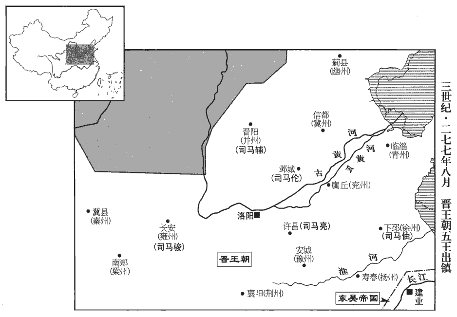

 晉紀二起昭陽大荒落（癸巳），盡屠維大淵獻（己亥），凡七年。

# 世祖武皇帝上之下

## 泰始九年（癸巳，二七三）

1春，正月，辛酉‹二十二›，密陵元侯鄭袤卒‹年八十五›。考異曰：按本傳：「袤為司空，固辭。久之，見許，以侯就第，拜儀同三司。」而帝紀云「司空鄭袤薨」，誤也。

〖译文〗 [1]春季，正月，辛酉（二十二日），密陵元侯郑袤去世。

2二月，癸巳‹二十五›，樂陵武公石苞卒。

〖译文〗 [2]二月，癸巳（二十五日），乐陵武公石苞去世。

3三月，立皇子祗為東海王。

〖译文〗 [3]三月，晋朝立皇子司马祗为东海王。

4吴以陸抗為大司馬、荊州牧。

〖译文〗 [4]吴国任命陆抗为大司马、荆州牧。

5夏，四月，戊辰朔‹一›，日有食之。

〖译文〗 [5]夏季，四月，戊辰朔（初一），出现日食。

6初，鄧艾之死，事見七十八卷魏元帝咸熙元年。人皆冤之，而朝廷無為之辨者。為，于偽翻。及帝即位，議郎敦煌段灼上疏曰：敦，徒門翻。「鄧艾心懷至忠而荷反逆之名，荷，下可翻。平定巴、蜀而受三族之誅；艾性剛急，矜功伐善，不能協同朋類，故莫肯理之。臣竊以為艾本屯田掌犢人，鄧艾本義陽棘陽‹河南南阳南›人，魏太祖破荊州，徙汝南‹河南平舆西北射桥乡›，為農民養犢。寵位已極，功名已成，七十老公，復何所求。復，扶又翻。正以劉禪初降，降，戶江翻。遠郡未附，矯令承制，權安社稷。鍾會有悖逆之心，悖，蒲內翻，又蒲沒翻。畏艾威名，因其疑似，搆成其事。艾被詔書，即遣強兵，束身就縛，不敢顧望，被，皮義翻。誠知奉見先帝，必無當死之理也。會受誅之後，艾官屬將吏，愚戇相聚，自共追艾，破壞檻車，解其囚執；戇，直降翻。壞，音怪。艾在困地，狼狽失據，狼前則跋其胡，退則疐zhì其尾。狽，狼屬也。生子或欠一足，二足相附而後能行，離則顛蹶。故猝遽謂之狼狽。狽，博蓋翻。未嘗與腹心之人有平素之謀，獨受腹背之誅，腹在前，背在後，謂前後皆不免於誅。豈不哀哉！陛下龍興，闡弘大度，謂可聽艾歸葬舊墓，還其田宅，以平蜀之功繼封其後，使艾闔hé棺定諡，死無所恨，諡，神至翻。則天下徇名之士，思立功之臣，必投湯火，樂為陛下死矣！」樂，音洛。為，于偽翻。帝善其言而未能從。會帝問給事中樊建以諸葛亮之治蜀，樊建故蜀臣。治，直之翻。曰：「吾獨不得如亮者而臣之乎？」建稽首曰：「陛下知鄧艾之冤而不能直，稽，音啟。雖得亮，得無如馮唐之言乎！」言不能用也。馮唐事見十四卷漢文帝十四年。帝‹司马炎，时年三十八›笑曰：「卿言起我意。」乃以艾孫朗為郎中。

〖译文〗 [6]当初，对于邓艾的死，人们都觉得他冤屈，但是朝廷之中却没有为他辩解的人。等晋武帝即位，议郎敦煌人段灼上疏说：“艾心中怀着极大的忠诚却背着反叛的罪名；平定了巴、蜀之地却受到夷灭三族的惩罚。邓艾性格刚强急躁，夸耀自己的功劳和长处，不能和朋友、同事和谐相处，所以没有人肯为他申辩。我私下认为邓艾本不屯田养牛人，对他来说，光宠荣耀的地位已经达到了极点，功名已经成就，一个七十岁的老人，还有什么可乞求的！当时正因为刘禅刚投降，远处的郡县还没有归附，邓艾假托秉承皇帝旨意，是为了暂且先使国家安定下来。钟会有悖乱忤逆之心，他害怕邓艾的威名，乘着是非难辩之际，构成了这件事。邓艾接受诏书时，立即遣散了手下强兵，投案受拘囚，不敢再有别的想法，因为他心里明白，如果见到先帝必然不会把他处死。钟会被杀之后，邓艾属下的将吏，愚昧不明事理，聚在一起，自发地去追赶邓艾，毁坏了囚车，为邓艾松了绑。当时邓艾处境困难，狼狈而又孤立无援，他与手下的心腹之人平时就没有预谋，因此独自绝无幸免地被杀戮，难道不可悲哀吗？陛下即天子之位，应显扬您的宽弘大度，如果您下令允许邓艾的尸骨归葬于旧墓，归还他的田地房宅，并以邓艾平定蜀国的功绩加封他的后代，使邓艾能够在盖棺之后确定封谥，死而无憾，那么天下那些舍身为名之士以及想要建立功勋的大臣，必然会赴汤蹈火，乐意为陛下献身效命了。”晋武帝很赞许他的话，但却没有照办。后来晋武帝向给事中樊建询问诸葛亮治理蜀国的事情，说：“难道我偏偏不能得到一个像诸葛亮那样的人作我的臣下吗？”樊建跪拜于地，说：“陛下了解邓艾的冤情，却不能为他平反，即使得到诸葛亮，会不会像汉文帝时冯所说的那样，得到了也不能任用呢？”晋武帝笑了，说：“你的话提醒了我。”于是任命邓艾的孙子邓朗为郎中。

7吳人多言祥瑞者，吳主‹孙皓，时年三十二›以問侍中韋昭，昭曰：「此家人筐篋qiè中物耳！」言祥瑞而謂之家人筐篋中物者，蓋稱引圖緯以言祥瑞之應，故謂其書為家人筐篋中物也。昭領左國史，吳有左、右國史，皆掌記述。吳主欲為其父作紀，為，于偽翻。昭曰：「文皇不登極位，當為傳，不當為紀。」吳主諡其父和曰文皇帝。傳，直戀翻。吳主不悅，漸見責怒。昭憂懼，自陳衰老，求去侍、史二官，侍、史，侍中及左國史也。不聽。時有疾病，醫藥監護，持之益急。監，工銜翻。吳主飲群臣酒，飲，於禁翻。不問能否，率以七升為限。至昭，獨以茶代之，後更見偪強。強，其兩翻。又酒後常使侍臣嘲弄公卿，發摘私短以為歡；摘，當作擿tī。時有愆失，輒見收縛，至於誅戮。昭以為外相毀傷，內長尤恨，長，丁丈翻，今知兩翻。使群臣不睦，不為佳事，故但難問經義而已。難，乃旦翻。吳主以為不奉詔命，意不忠盡，積前後嫌忿，遂收昭付獄。昭因獄【章：甲十一行本「獄」下有「吏」字；乙十一行本同；孔本同；張校同；退齋校同。】上辭，辭，獄辭也。上，時掌翻。獻所著書，冀以此求免。而吳主怪其書垢故，垢，塵也。故，舊也。更被詰責；被，皮義翻。詰，去吉翻。遂誅昭，徙其家於零陵‹湖南永州›。

〖译文〗 [7]吴国有许多谈论吉祥符瑞的人，吴主向侍中韦昭询问这件事，韦昭说：“这不过是人家箱笼里的寻常物罢了！”韦昭担任左国史之职，吴主想给自己的父亲作纪，韦昭说：“文皇帝没有登天子之位，应当作传，不应当作纪。”吴主心中不快，逐渐显露出对韦昭的谴责与怒气。韦昭忧郁恐惧，于是上书陈述自己年事已高，请求免去他侍中及左国史二项官职，但是吴主不允许。有时韦昭得了病吴主派医生、送医药监视护理，催促他快些上朝。吴主召集群臣饮酒，不管能不能喝，一律限定必须喝七升。至于韦昭，唯独用茶代替酒，但以后就越来越强逼他。另外，饮酒之后，吴主经常支使近臣嘲弄公卿大臣，揭露他们的隐私和短处拿来取乐；大臣们这时若有过失，就被拘进起来，甚至于杀头。韦昭认为，不顾脸面地诽谤、中伤，会使人的内心增长怨恨情绪，使群臣之间不和睦，这并不是好事，所以他只是在经义方面发难质问而已。吴主认为韦昭没有奉行他的命令，不忠心尽职，把前前后后对韦昭的愤恨、仇怨都积累起来。于是拘捕了韦昭，把他投进了监狱。韦昭通过狱吏上书陈词，献上了他写的书，希望以此求得赦免。但吴主却责备他的书脏又破旧，愈加责怪他，于是杀死韦昭，把他的家族放逐到零陵。

8五月，以何曾領司徒。

〖译文〗 [8]五月，晋任命何曾兼任司徒。

9六月，乙未‹二十九›，東海王祗卒。

〖译文〗 [9]六月，乙未（二十九日），东海王司马祗去世。

10秋，七月，丁酉朔‹一›，日有食之。考異曰：宋志無此食，今從晉書。

〖译文〗 [10]秋季，七月，丁酉朔（初一），出现日食。

11詔選公卿以下女備六宮，有蔽匿者以不敬論；以律不敬論罪也。采擇未畢，權禁天下嫁娶。帝使楊后擇之，后惟取潔白長大而捨其美者。帝愛卞氏女，欲留之。后曰：「卞氏三世后族，魏武帝卞后諡曰宣后，弟秉生蘭及琳，蘭孫女為高貴鄉公后，琳女又為陳留王后，凡三世。不可屈以卑位。」帝怒，乃自擇之，中選者以絳紗繫臂，中，竹仲翻。公卿之女為三夫人、孔穎達曰：夫，扶也。言扶侍於王也。九嬪pín，句斷。二千石、將校女補良人以下。漢制，後宮之號十有四等，良人視八百石，爵比庶長。師古曰：良，善也。將，即亮翻。校，戶教翻。

〖译文〗 [11]晋武帝下诏，挑选公卿以下人家的女子补充六宫，有隐蔽藏匿的以不敬论处；挑选未结束时，暂时禁止天下嫁娶。晋武帝让杨皇后去挑选美女，杨皇后只挑选肤洁白、身材修长的而舍弃了容貌美丽的女子。晋武帝喜爱卞氏之女，想把她留下。杨皇后说：“卞氏是三代为皇后的家族，不能屈尊以就后宫的卑微地位。”晋武帝动了怒，就自己挑选，凡是中选的女子，就用深红色的纱巾系在臂上。公卿之家的女子封为三夫人、九嫔；俸禄二千石的官员以及将校之女，补充良人以下的位置。

12九月，吳主悉封其子弟為十一王，王給三千兵，大赦。十一王，史逸其名。

〖译文〗 [12]九月，吴主把他的十一个子侄都封了王，每个王都配备三千士兵。大赦罪人。

13是歲，鄭沖以壽光公罷。

〖译文〗 [13]这一年，晋朝郑冲以奉光公的身分、地位免职。

14吳主愛姬遣人至市奪民物。司市中郎將陳聲素有寵於吳主，繩之以法。姬愬於吳主，愬，與訴同。吳主怒，假他事燒鋸斷聲頭，投其身於四望之下‹南京西北›。據晉書溫嶠傳：嶠討蘇峻於石頭，結壘於四望磯。又據南史，石頭有四望山，蓋山下有磯也。斷，丁管翻。

〖译文〗 [14]吴主的宠妾派人到集市上抢夺百姓的财物，司市中郎将陈声一向受到吴主的宠幸，他依法处理了这件事。吴主的宠妾向吴主诉说，吴主勃然大怒，借其他事情为由，烧红刀锯截断陈声的头颅，把他的身躯扔到四望山下。

## 十年（甲午，二七四）

1春，正月，乙未‹二›，日有食之。

〖译文〗 [1]春季，正月，乙未（初二），出现日食。

2閏月，癸酉‹十一›，夀光成公鄭沖卒。

〖译文〗 [2]闰月，癸酉（十一日），晋朝寿光成公郑冲去世。

3丁亥‹二十五›，‹司马炎，时年三十九›詔曰：「近世以來，多由內寵以登后妃，謂魏三祖立卞、郭、毛為后。亂尊卑之序；自今不得以妾媵為正嫡。」媵yìng，以證翻。

〖译文〗 [3]丁亥（二十五日），晋武帝下诏说：“近代以来，时常由姬妾登上后妃的位子，乱了尊卑的次序，从现在起，不得以侍妾的身份，任正宗的后妃。

4分幽州置平州。幽州，言北方太陰幽冥也。杜佑曰：因幽都山為名。山海經有幽都山。今列北荒，統范陽、燕、北平、上谷、代、遼西。漢末，公孫度自號平州牧，今分昌黎‹辽宁义县›、遼東‹辽宁辽阳›、樂浪‹朝鲜平壤›、玄菟‹辽宁沈阳›、帶方‹朝鲜沙里院城›五郡，置平州。

〖译文〗 [4]晋朝分出幽州的一部分，设置了平州。

5三月，癸亥‹二›，日有食之。

〖译文〗 [5]三月，癸亥（初二），出现日食。

6詔又取良家及小將吏女五千人入宮選之，母子號哭於宮中，聲聞於外。將，即亮翻。號，戶刀翻。聞，音問。

〖译文〗 [6]晋武帝又下诏，召取清白人家以及小将吏家的女子共五千人，入宫进行挑选。母女的号哭声响彻宫中，声音传到了宫外。

7夏，四月，己未‹二十八›，臨淮康公荀顗yǐ卒。諡法：溫柔好樂曰康。顗，魚豈翻。

〖译文〗 [7]夏季，四月，已未（二十八日），晋朝临淮康公荀去世。

8吳左夫人王氏卒。吳主‹孙皓，时年三十三›哀念，數月不出，葬送甚盛。時何氏以太后故宗族驕橫。橫，戶孟翻。吳主舅子何都貌類吳主，民間訛言：「吳主已死，立者何都也。」會稽‹绍兴›又訛言：「章安侯奮當為天子。」奮母仲姬墓在豫章‹江西南昌›，豫章太守張俊為之掃除。掃，糞掃也。除，芟shān除荊棘。會，古外翻。為，于偽翻。臨海‹浙江台州西北章安镇›太守奚熙吳主休永安三年，分會稽東部都尉為臨海郡。與會稽太守郭誕書，會，工外翻。非議國政；誕但白熙書，不白妖言。妖言，即前訛言。妖，於驕翻。吳主怒，收誕繫獄，誕懼，功曹邵疇曰：「疇在，明府何憂！」遂詣吏自列曰：自列，猶自陳也。「疇廁身本郡，位極朝右，郡功曹，位居郡朝之右。朝，直遙翻。以噂zūn𠴲tà之語，噂，祖本翻。𠴲，達合翻。噂𠴲，聚語也。本非事實，疾其醜聲，不忍聞見，欲含垢藏疾，左傳曰：川澤納汙，山藪sǒu藏疾，國君含垢。不彰之翰墨，鎮躁歸靜，使之自息。故誕屈其所是，默以見從。謂誕從疇之說，默而不白妖言也。此之為愆qiān，實由於疇，不敢逃死，歸罪有司。」因自殺。吳主乃免誕死，送付建安‹福建建瓯›作船。宋白曰：吳分候官之地立建安縣。又立曲郍nà都尉，主謫徙之人作舟船。遣其舅三郡督何植收奚熙。江表傳作「備海督」，蓋督臨海、建安、會稽三郡也。熙發兵自守，其部曲殺熙，送首建業。又車裂張俊，皆夷三族；并誅章安侯奮及其五子。考異曰：江表傳曰：「張布女有寵於皓而死，皓厚葬之。國人見葬太奢麗，皆謂皓已死，所葬者是也。皓舅子何都，顏狀似皓，故民間訛言都代立。臨海太守奚熙信訛言，舉兵欲還秣陵誅都。都叔父植時為備海督，擊殺熙，夷三族，訛言乃息。」又云：「奮本在章安，徙還吳城禁錮，使男女不得通婚，或年三十、四十、不得嫁娶。奮上表乞自比禽獸，使男女自相配偶。皓大怒，遣察戰齎藥賜奮父子，皆飲藥死。」裴松之按，「建衡二年至奮之死，孫皓即位尚未久，若奮未被疑之前，兒女年二十左右，至奮死時，不得年三十、四十也。若先已長大，自失時未婚娶，不由皓之禁錮矣。此雖欲增皓之惡，然非實理。」又吳志孫皓傳：「鳳凰三年，會稽妖言奮為天子，遂誅奚熙。」不言誅奮。孫奮傳：「建衡二年左夫人王氏卒，民間訛言。遂誅奮及五子。三十國、晉春秋：自皓納張布女至殺奮，皆在天冊元年。按奮若以建衡二年死，不容至鳯凰三年㑹稽方有訛言，不知奮死果在何年，今因奚熙之死終言之。

〖译文〗 [8]吴国左夫人王氏去世。吴主悲哀思念，几个月不出门，葬礼非常隆重。当时，由于何太后的缘故，何氏宗族骄傲专横。吴主舅舅的儿子何都，相貌与吴主相似，民间流传的谣言说：“吴主已经死了，现在在位的是何都。”会稽又流传谣言说：“章安侯孙奋，将要成为天子。”孙奋的母亲仲姬的坟墓在豫章，豫章太守张俊就为孙奋的母亲打扫坟墓。临海太守奚熙写信给会稽太守郭诞，非议国政，郭诞只是禀告了奚熙的书信，却没的提民间流传的谣言。吴主大怒，把郭诞抓进监狱，郭诞非常害怕，功曹邵畴说：“有我邵畴在，太守您不用发愁。”于是他到官吏那里陈述说：“我置身于本郡，地位达到了州郡长官的辅佐。我认为人们聚在一起议论纷纭，所说的本来并不是事实，我憎恨这种毁谤诬蔑的声音，不能够容忍这样的议论让天子看到，所以我想藏污纳垢，不写成文字使这种议论显露，以使议论平静下来，事情自然平息。所以郭诞放弃了他自己正确的主张，而默默地听从了我的意见。这次罪过，实在是因我而起，我不敢逃脱死罪，向主管部门认罪自首。”于是邵畴自杀了。吴主便赦免了郭诞的死罪，把他送那建安去造船。吴主派他的舅舅三郡督何植去拘捕奚熙。奚熙发兵防守，部下将他杀了，把首级送到建业。吴主又车裂了张俊，奚熙与张俊都被灭了三族；同时被杀的还有章安侯孙奋和他的五个儿子。

9秋，七月，丙寅‹六›，皇后楊氏‹杨艳›殂‹年三十七›。初，帝‹司马炎›以太子不慧，恐不堪為嗣，常密以訪后‹杨艳›；常，當作嘗。后曰：「立子以長不以賢，春秋公羊傳之言。長，知兩翻。豈可動也！」鎮軍大將軍胡奮女為貴嬪，晉制：貴人、夫人、貴嬪，是為三夫人，皆金章紫綬。嬪，毗賓翻。有寵於帝，后疾篤，恐帝立貴嬪為后，致太子不安，枕帝膝泣曰：枕，職任翻。「叔父駿女芷有德色，言有德有色也。願陛下以備六宮。」帝流涕許之。

〖译文〗 [9]秋季，七月，丙寅（初六），晋皇后杨氏去世。当初，晋武帝觉得太子不聪明，担心他不能挑起继承王位的重任，曾经秘密地和皇后商议。皇后说：“立太子是以长子而不以才德，怎么能改变？”镇军大将军胡奋的女儿是贵嫔，受到晋武帝的宠爱。杨皇后病重时，担忧晋武帝以后会立贵嫔为皇后，将会威胁太子的地位。她头枕着晋武帝的膝，流着眼泪说：“叔父杨骏的女儿杨芷，既有德，又有容貌，希望陛下选她入宫。”晋武帝流着眼泪答应了。

10以前太常山濤為吏部尚書。濤典選十餘年，帝受禪，濤自吏部郎遷尚書，居母喪，復奪情起典選。選，息絹翻。每一官缺，輒擇才資可為者，啟擬數人，才，謂其才足以任；資，謂其資序當為者。得詔旨有所向，然後顯奏之。帝之所用，或非舉首，眾情不察，以濤輕重作意，言之於帝。帝益親愛之。濤甄拔人物，各為題目而奏之，時稱「山公啟事」。甄，稽延翻，明也，察也，別也。

〖译文〗 [10]晋朝任命前太常山涛为吏部尚书。山涛掌管选拔官吏的职务十几年每当有一个官职空缺，他总是选择几名才能与资历都合适的人，告诉晋武帝，得到武帝诏令，对任用某人有倾向性的意见时，他才明确地为这名人选上奏。因此，晋武帝所任用的人，有的并不是选拔人中最好的。大家对这些情况并不了解，有人就说山涛凭自己举官吏，并禀告晋武帝，晋武帝对山涛却更加亲近宠爱。山涛甄别选拔人材，对每一个人都进行评量品题然后上奏，当时的人把这称为《山公启事》。

濤薦嵇紹於帝，請以為祕書郎；晉制，祕書監屬官有丞、有郎。帝發詔徵之。紹以父康得罪，事見七十八卷魏元帝景元三年。屏居私門，欲辭不就。屏，必郢翻。濤謂之曰：「為君思之久矣，天地四時，猶有消息，況於人乎！」為，于偽翻；下樹為、人為同，又密為同。紹乃應命，帝以為祕書丞。

〖译文〗 山涛向晋武帝荐举嵇绍，请求晋武帝任用嵇绍为秘书郎。晋武帝下诏征召嵇绍。嵇绍由于父亲嵇康获罪，所以隐居在家，他想拒绝征召，不去赴任。山涛对他说：“我为你想了很久了，天地、四季尚且有消有长，互为更替，更何况对于人呢！”于是，嵇绍答应了任命，晋武帝让他作了秘书丞。

初，東關‹安徽含山西南›之敗，事見七十五卷魏邵陵厲公嘉平四年。文帝問僚屬曰：「近日之事，誰任其咎？」任，音壬。安東司馬王儀，脩之子也，王脩見六十四卷漢獻帝建安八年。對曰：「責在元帥。」文帝時為安東將軍，監諸軍。文帝怒曰：「司馬欲委罪孤邪！」引出斬之。儀子裒póu痛父非命，隱居教授，三徵七辟，皆不就。徵，詔召也。辟，公府及州郡辟也。裒，薄侯翻。未嘗西向而坐，裒居城陽‹山东莒县›，晉朝在洛陽，故未嘗西向。廬於墓側，旦夕攀柏悲號，涕淚著樹，號，戶刀翻。著，直略翻。樹為之枯。讀詩至「哀哀父母，生我劬qú勞」，詩蓼lù莪é之辭。未嘗不三復流涕，門人為之廢蓼莪。以裒悲慘，故廢蓼莪之篇不敢講習。三，息暫翻。復，扶又翻。蓼，力竹翻。家貧，計口而田，度身而蠶；度，徒洛翻。人或饋之，不受，助之，不聽。諸生密為刈麥，裒póu輒棄之，遂不仕而終。

〖译文〗 当初，晋在东关一战失败，晋文帝问他的僚属说：“最近这件事，应由谁来承担罪责？”安东司马王仪是王的儿子，他回答说：“责任在元帅。”晋文帝勃然大怒，说：“司马是想把罪过推给我吗？”拉出去把他杀了。王仪的儿子王褒，为他的父亲死于非命而悲痛，他隐居起来传授学业，任凭朝廷三次征召，以及公府、州郡七次授职，他一概不去。晋都城洛阳，位于王褒居住地的西方，王褒从来不面向西就座。他在父亲坟墓的旁边修建茅庐居住，早晚攀着柏树悲哀号哭，眼泪落于树上，天长日久，树因此而干枯。他读《诗经》，每当读到“可怜父母心，生我多辛劳”时，总要再三流泪，他的弟子们因此就不敢讲习《诗经·蓼莪》篇了。王褒家境贫苦，他计算着人口食用耕种，度量着身材养蚕制衣。有人馈赠物品，他不接受；予以帮助，他不允许。学生们偷偷地帮他割麦，他就把麦子扔了。他一直到死都没有去作官。

臣光曰：昔舜誅鯀而禹事舜，不敢廢至公也。嵇康、王儀，死皆不以其罪，二子不仕晉室可也；嵇紹苟無蕩陰‹河南汤阴›之忠，蕩陰事見後八十五卷惠帝永興元年。余謂蕩陰之難，君子以嵇紹為忠於所事可也，然未足以塞天性之傷也。蕩，音湯。殆不免於君子之譏乎！

〖译文〗 臣司马光曰：从前舜诛杀了禹的父亲鲧，而禹却为舜而效力，这是因为禹不敢废弃国家大事。嵇康、王仪的死，都不是因为他们犯了罪，所以他们二人的儿子不作晋朝的官是可以的。嵇绍假如没有以后在荡阴所表现的忠城，大概就不免遭到君子的讥笑和非议了吧？

11吳大司馬陸抗疾病，疾有加而無瘳chōu，曰病。上疏曰：「西陵‹湖北宜昌›、建平‹重庆巫山县›，國之蕃表，蕃，籬也；表，外也。謂二郡為藩籬於外也。既處上流，受敵二境。謂二郡之境，西距巴、夔，北接魏興、上庸，二面皆受敵也。處，昌呂翻。若敵汎舟順流，星奔電邁，非可恃援他部以救倒縣也。縣，讀曰懸。此乃社稷安危之機，非徒封疆侵陵小害也。臣父遜，昔在西垂上言，『西陵國之西門，雖云易守，亦復易失。易，弋豉翻。若有不守，非但失一郡，荊州非吳有也。如其有虞，當傾國爭之。』臣前乞屯精兵三萬，而主者循常，未肯差赴。主者，謂居本兵之職者也。差，初皆翻。自步闡以後，步闡反見上卷八年。益更損耗。今臣所統千里，外禦強對，強對，猶言強敵也。內懷百蠻，而上下見兵，財有數萬，見，賢遍翻。財，與纔同。羸敝日久，難以待變。羸，倫為翻。臣愚以為諸王幼沖，無用兵馬以妨要務，謂十一王各給三千兵也。又，黃門宦官開立占募，兵民避役，逋bū逃入占。占，章豔翻。乞特詔簡閱，一切料出，料，音聊。以補疆埸受敵常處，使臣所部足满八萬，省息眾務，并力備禦，無幾無虞。幾，居希翻。若其不然，深可憂也！臣死之後，乞以西方為屬。」陸抗固知吳之將亡，特就職分上言之耳。屬，之欲翻；下屬文同。及卒‹年四十九›，吳主‹孙皓›使其子晏、景、玄、機、雲分將其兵。將，即亮翻。機、雲皆善屬文，名重於世。

〖译文〗 [11]吴国大司马陆抗病情加重。他上疏说：“西陵、建平，是国家的屏障，地势既处于上流，二郡边境的西面、北面又与敌人的边境接壤。如果敌人泛舟顺流而下，那么就如同星奔电驰一样迅速，到那时，就不能依赖别的地区援助来解救危难了。这可是关系到国家安危的关键，不只是国家疆界受到犯的小祸患。我的父亲陆逊，从前在西部边境时曾上书说：‘西陵是国家的西门，虽然说容易防守，但同时容易丧失。假如守不住的话，那就不只是失掉一个郡，就连荆州都会不属于吴所有了。如果西陵有忧患，就要竭尽国家的力量去争夺它。’我过去曾经请求在西陵驻守三万精兵，但是主管的官员遵循常规，不肯派兵赴西陵。自从步阐事件以后，我方兵力愈加损耗。现在我统率着千里方圆的地方，对外抵御着强大的敌人，对内里又安抚各蛮族，上上下下的现有军队，才有几万，久已疲惫，衰败，是很难应付突发的事变的。我认为，诸王年幼，不要给他们配备兵马，使要紧的事务受到损害。另外，对黄门宦官进行招募，使士兵百姓得以躲避兵役，而逃亡的罪人也都进入黄门。我请求特别下诏书对黄门宦官进行检查，凡是清理出来的，都把他们补充到边境地区经常与敌人冲突的地方，以使我所统领的军队，兵员满额为八万，节省、停止众多的事务，集中力量准备防御，也许可以避免忧患。如果不这样作，那就非常令人担忧了。我死了以后，请特别注意西方边境。”陆抗死后，吴主让陆抗的儿子陆晏、陆景、陆玄、陆机、陆云分别统领陆抗的士兵。陆机、陆云都善于写文章，名声为当世所推重。

初，周魴之子處，膂力絕人，不修細行，鄉里患之。魴fáng，符方翻。行，下孟翻。處嘗問父老曰：「今時和歲豐而人不樂，何邪？」父老歎曰：「三害不除，何樂之有！」樂，音洛。處曰：「何謂也？」父老曰：「南山白額虎，長橋蛟，南山，今湖、秀以南諸山也。長橋，在今常州宜興縣‹江苏宜兴›。并子為三矣。」子，謂周處。處曰：「若所患止此，吾能除之。」乃入山求虎，射殺之，因投水，搏殺蛟；遂從機、雲受學，篤志讀書，砥節礪行，比及朞年，州府交辟。射，而亦翻。行，下孟翻。比，必寐翻。

〖译文〗 当初，周鲂的儿子周处，体力超过常人，他不拘小节，乡里的百姓都认为他是祸患。周处曾经询问乡里的老人说：“如今四时谐调，又是丰收之年，而人们却不欢喜，这是为什么？”老人叹气说：“三害没有除掉，哪里会有快乐！”周处说：“三害是什么？”老人说：“南山的白额虎，长桥的蛟龙，再加上你就是三害了。”周处说：“如果所忧的只限于这三害，那我就能把它除了。”于是，周处进山搜寻老虎，将老虎射死；他跳到河里，与蚁龙搏斗，杀死咬龙；然后他跟随陆机、陆云，向他们求学，专心致志地读书，磨陈操守与德行。过了一年，州郡的官府争相征召他去作官。

12八月，戊申‹十九›，葬元皇后‹杨艳›于峻陽陵‹洛阳北›。帝及群臣除喪即吉，博士陳逵議，以為「今時所行，漢帝權制；太子無有國事，自宜終服。」尚書杜預以為「古者天子、諸侯三年之喪，始同齊、斬，謂齊衰、斬衰之服，其始自天子達於庶人，無以異也。齊，津夷翻。既葬除服，諒闇àn以居，心喪終制。故周公不言高宗服喪三年而云諒闇，此服心喪之文也；周公作無逸曰：其在高宗作其即位，乃或亮陰三年。杜預遂引此言以為不服喪之證。闇，與陰同。孔安國曰：諒，信也；陰，默也。叔向不譏景王除喪，而譏其宴樂已早，明既葬應除，而違諒闇之節也。左傳：晉荀躒luò如周葬穆后，既葬，除喪，以文伯宴。叔向曰：「王其不終乎！吾聞之，所樂必卒焉。今王樂憂，若卒以憂，不可謂終。王一歲而有三年之喪二焉，於是乎以喪賓宴，樂憂甚矣。三年之喪，雖貴遂服，禮也。王雖弗遂，宴樂以早，亦非禮也。」樂，音洛。子【章：甲十一行本「子」上有「君」字；乙十一行本同；孔本同；張校同。】之於禮，存諸內而已；禮非玉帛之謂，論語：孔子曰：「禮云，禮云，玉帛云乎哉！」喪豈衰麻之謂乎！衰，七回翻；下同。太子出則撫軍，守則監國，左傳：晉大夫里克之言。監，古銜翻。不為無事，宜卒哭除衰麻，卒，子恤翻。而以諒闇終三年。」帝從之。

〖译文〗 [12]八月，戊申（十九日），晋朝在峻阳埋葬了元皇后。晋武帝以及群臣除去丧服，博士陈逵提议，认为“现在所实行的，是汉代帝王暂时制定的丧礼规定，太子没有担负国家大事，自然应当穿丧服一直到守丧期满。”尚书杜预认为：“古时候天子、诸侯守丧三年，开始同样穿丧服齐衰和斩衰，等到葬礼结束，就除下丧服，守丧而居，在心中悼念，度过三年。所以周公不说高宗服丧三年而只说天子居丧，这就是在心里哀悼、服心丧的制度。叔向不讥讽景王除去丧服却讥讽他饮宴娱乐过早，很明显是说葬礼结束就应当除去丧服，但是景王过早地宴乐，就是违背了还应服心丧的仪节。君对于礼，保存在自己的心里而已，礼并非就是瑞玉缣帛，丧礼难道就是衰麻之类的丧服吗？太子外出则从君出征，守在国都之内是在君王外出时代行处理国政，不能说没有事情可作，所以太子应当哭别之后，除去丧服，居丧三年。”晋武帝同意了。

臣光曰：規矩主於方圓，然庸工無規矩則方圓不可得而制也；衰麻主於哀戚，然庸人無衰麻則哀戚不可得而勉也。素冠之詩，正為是矣。衰，倉回翻。詩素冠，刺不能三年也。為，于偽翻。杜預巧飾經、傳以附人情，辯則辯矣，傳，直戀翻。臣謂不若陳逵之言質略而敦實也。

〖译文〗 臣司马光曰：圆规和曲尺的作用是画出圆形和方形，然而平庸的工匠没有圆规和曲尺就不知如何作出方形和圆形来；丧服的作用是为了表达悲哀、伤悼的心情，然而平庸的人没有丧郛，就不能尽力表达悲哀伤悼的心情。《诗经·素冠》，正是为此而作。杜预巧妙地假托《经》、《传》以附会人情，倒是很有说服力，但是我却认为，不如陈逵的话质朴简要且厚重诚实。

13九月，癸亥‹四›，以大將軍陳騫為太尉。

〖译文〗 [13]九月，癸亥（初四），晋任命大将军陈骞为太尉。

14杜預以孟津渡險，請建河橋於富平津‹河南孟津东›。水經註：孟津又曰富平津。杜佑曰：富平津在河陽縣南。議者以為「殷、周所都，歷聖賢而不作者，必不可立故也。」殷都河內，周都洛，二代夾河建都，不立河橋，故以為言。預固請為之。及橋成，帝從百寮臨會，舉觴屬預曰：屬，之欲翻。「非君，此橋不立。」對曰：「非陛下之明，臣亦無所施其巧。」

〖译文〗 [14]杜预认为孟津渡口险要，请求在富平津渡口建造一座黄河桥。有人议论说：“殷、周时期的都城，都建在黄河边上，但是经历了圣人贤人的时代而没有造桥，必定是不宜于建桥的缘故。”但是杜预仍然坚持要造桥。等到桥建起来了，晋武帝和百官一起集会，他举韦酒杯敬杜预说：“如果不是你，这桥就建不起来。”杜预回答说：“如果不是陛下圣明，我也没有机会施展我的技巧。”

15是歲，邵陵厲公曹芳卒‹年四十三›。初，芳之廢遷金墉‹洛阳西北角›也，芳之廢也，築宮于河內重門。今言遷金墉，蓋始廢之時，自禁中遷于金墉，後乃居于河內也。太宰中郎陳留范粲素服拜送，晉既受禪，避景帝諱，採周官名置太宰以代太師。魏因漢制，上公惟有太傅。據粲傳，自太宰從事中郎遷太宰中郎。時未置太宰，「宰」，當作「傅」。哀動左右；遂稱疾不出，陽狂不言，陽發見於外，陰蔽伏於中。凡人之作事，外為是形而內無其實者，皆陽為之外；若無所營，而內潛經畫，皆陰為之。寢所乘車，足不履地。子孫有婚宦大事，輒密諮焉，合者則色無變，不合則眠寢不安，妻子以此知其旨。子喬等三人，并棄學業，絕人事，按晉書，喬年二歲，祖馨臨終撫其首曰：「恨不見汝成人！」因以所用硯與之。至五歲，祖母以告喬，喬便執硯涕泣。九歲請學，在同輩之中，言無媟xiè辭。李銓常論揚雄才學優於劉向，喬以為向定一代之書，正群籍之篇，使雄當之，故非所長，遂著劉揚優劣論。前後辟舉，皆不就。邑人臘日盜斫其樹，人有告者，喬陽不聞，邑人愧而歸之。喬曰：「卿節日取柴，欲與父母相歡娛耳，何以愧為！」嗚呼！觀喬之學行如此，則棄學業絕人事，殆庶幾乎夷、齊餓于首陽之下之意。侍疾家庭，足不出邑里。及帝即位，詔以二千石祿養病，加賜帛百匹，喬以父疾篤，辭不敢受。粲不言凡三十六年，年八十四，終於所寢之車。自邵陵厲公之廢，至是方二十一年，史因公卒而究言之。

〖译文〗 [15]这一年，邵陵厉公曹芳去世。当初，曹芳被废，迁到了金墉城，太宰中郎、陈留人范粲，穿白色的衣服为他送行，哀伤之情使身边的人都被感动了。这以后，范粲就称病不出门，装疯不说话。他睡在自己的乘车上，脚不踩地。子孙当中如果有婚姻、作官的大事，家人总是悄悄与他商议，他如果表示同意，脸色就没有变化，如果不同意，睡卧就不安稳，他的妻子和儿子因此知道他的想法。他的儿子范乔等三人，一起抛弃了学业，断绝人世间一切事情，在家里侍奉他的疾病，从来不走出他们居住的地区。到晋武帝即位，下诏给范粲二千石俸禄让他养病，又赐给他一百匹缣帛。范乔以父亲病重的缘故，推辞不敢接受。范粲总共三十六年没说话，在他八十四岁的时候，死在他睡卧的车子上。

16吳比三年大疫。比，毗至翻。

〖译文〗 [16]吴国接连三年闹起大瘟疫。

## 咸寧元年（乙未，二七五）

1春，正月，戊午朔‹一›，大赦，改元。

〖译文〗 [1]春季，正月，戊午朔（初一），晋大赦天下，改年号为咸宁。

2吳掘地得銀尺，上有刻文；吳志曰：銀長一尺，廣三分，刻上有年月字。吳主‹孙皓，时年三十四›大赦，改元天冊。

〖译文〗 [2]吴国挖地时得到了银尺，上面刻着文字，吴主便下令大赦，改年号为天册。

3吳中書令賀卲中風不能言，中，竹仲翻。去職數月。吳主疑其詐，收付酒藏，掠考千數，藏，徂浪翻。掠，音亮。卒無一言，乃燒鋸斷其頭‹年四十九›，卒，子恤翻。斷，丁管翻。徙其家屬於臨海‹浙江台州西北章安镇›。又誅樓玄子孫。殺樓玄見上卷泰始八年。

〖译文〗 [3]吴国中书令贺邵得了中风病不能说话，便离职几个月。吴主怀疑他装病，把他拘捕起来，押送到储藏酒的仓里拷打，打了他上千次，他最后也没有说一句话，吴主叫人烧红刀锯割断了他的头颅，把他的家属放逐到临海。吴主又诛杀了楼玄的儿子和孙子。

4夏，六月，鮮卑‹王庭设盛乐，内蒙和林格尔›拓跋力微復遣其子沙漠汗入貢，沙漠汗初入貢，見七十八卷元帝景元二年。汗，音寒。將還，幽州‹府蓟县，北京›刺史衛瓘表請留之，又密以金賂其諸部大人，離間之。為力微信譖殺沙漠汗張本。間，古莧翻。

〖译文〗 [4]夏季，六月，鲜卑人拓跋力微又派他的儿子拓跋沙漠汗到晋朝进献贡品。沙漠汗将要返回的时候，幽州刺史卫上表请求把他留下来，卫又暗地里用金子贿赂鲜卑各部落的着领，挑拔他们与沙漠汗之间的关系。

5秋，七月，甲申晦‹三十›，日有食之。

〖译文〗 [5]秋季，七月，甲申晦（三十日），出现日食。

6冬，十二月，丁亥‹五›，‹司马炎，时年四十›追尊宣帝廟曰高祖，景帝曰世宗，文帝曰太祖。

〖译文〗 [6]冬季，十二月，丁亥（初五），晋朝追尊晋宣帝司马懿庙号为高祖，晋景帝司马师庙号为世宗，晋文帝司马昭庙号为太祖。

7大疫，洛陽死者以萬數。

〖译文〗 [7]晋国流行大瘟疫，洛阳因瘟疫而死的人，数以万计。

## 二年（丙申，二七六）

1春，令狐豐卒，弟宏繼立，楊欣討斬之。豐自為敦煌太守，見上卷泰始八年。

〖译文〗 [1]春季，令狐丰去世，他的弟弟令狐宏继他之后任敦煌太守。杨欣前去征讨令狐宏，把他杀死。

2帝‹司马炎，时年四十一›得疾甚劇，及愈，群臣上壽。詔曰：「每念疫氣死亡者，為之愴然。豈以一身之休息，忘百姓之艱難邪！諸上禮者，皆絕之。」為，于偽翻。上，時掌翻。

〖译文〗 [2]晋武帝得病十份严重，等他痊愈了，大臣们都去为他祝寿。晋武帝下诏说：“每当我想到因瘟疫死去的人，就为他们而悲伤。我怎能因为我一个人平安了，就忘记百姓的艰难呢？”于是拒绝了祝贺送礼的人。

初，齊王攸有寵於文帝，每見攸，輒撫牀呼其小字曰：「此桃符座也！」幾為太子者數矣。事見七十八卷魏元帝咸熙元年。幾，居依翻。數，所角翻。臨終，為帝敘漢淮南王、魏陳思王事而泣，漢文帝誅淮南厲王長，魏文帝不能容陳思王植，引此二事以戒切帝也。執攸手以授帝。太后臨終，亦流涕謂帝曰：「桃符性急，而汝為兄不慈，我若不起，必恐汝不能相容，以是屬汝，勿忘我言！」及帝疾甚，朝野皆屬意於攸。屬，之欲翻。朝，直遙翻。攸妃，賈充之長女也。充先娶李氏，豐女也，生二女，長曰荃，為齊王攸妃。長，知兩翻。河南尹夏侯和謂充曰：「卿二婿，親疏等耳。二婿，謂攸及太子也。立人當立德。」充不答。攸素惡荀勗xù及左衛將軍馮紞dǎn傾諂，勗乃使紞說帝曰：惡烏路翻。紞，都感翻。說，輸芮翻。「陛下前日疾若不愈，齊王為公卿百姓所歸，太子雖欲高讓，其得免乎！宜遣還藩，以安社稷。」帝陰納之，乃徙和為光祿勳，奪充兵權，充自文帝時領兵。而位遇無替。

〖译文〗 当初，齐王司马攸受到晋文帝的宠爱，晋文帝每当见到司马攸，总是抚摸着床，叫着司马攸的小名说：“这是桃符座位！”司马攸几次都差一点被立为太子。晋文帝临死的时候，给晋武帝讲述了汉代淮南王１魏陈思王的遭遇。他流着眼泪，拉着司马攸的手，然后把司马攸的手放在晋武帝的手上。太后临死时，也流着眼泪对晋武帝说：“桃符情子急躁，而你这作哥哥的又不慈爱。我的病如果好不了，我很担心你容不下他，我因此嘱咐你，你不要忘记我的话。”后来晋武帝病得很重时，朝野上下都归心于司马攸。司马攸的妻子是贾充的长女。河南尹夏侯和对贾充说：“你的二位女婿，与皇帝的亲疏是相等的。树人应当树立有德之人。”贾充不回答，司马攸平素就憎恨荀勖以及左卫将军冯专事谄媚、逢迎，荀勖于是让冯对晋武帝说：“陛下前些天的病如果不能痊愈，公卿大臣及百姓们，都对齐王司马攸归心，太子虽然打算谦让，最后也免不了灾祸。应当打发齐王返回他的封国，以使国家安宁。”晋武帝不动声色地采纳了冯的意见，于是把河南尹夏侯和的官职迁为光禄勋，削夺贾充的权，但是地位和待遇不变。

3吳施但之亂，事見上卷泰始二年。或譖京下‹江苏镇江›督孫楷於吳主‹孙皓，时年三十五›曰：「楷不時赴討，懷兩端。」吳主數詰讓之，徵為宮下鎮驃騎將軍。京下督鎮京口。宮下鎮在建業。楷，孫韶之子。數所角翻。驃，匹妙翻。騎，奇寄翻。楷自疑懼，夏，六月，將妻子來奔，拜車騎將軍，封丹陽侯。

〖译文〗 [3]吴国发生了施但造反作乱的事，有人在吴主面前诬陷京下督孙楷说：“孙楷不准时去征讨施但，他是两头观望，脚踏两只船。”吴主多次指责孙楷，召他任宫下镇、骠骑将军。孙楷从此心中又疑忌又害怕，夏季的六月，他带着妻子儿女投奔了晋朝，晋朝任命他为车骑将军，封为丹阳侯。

秋，七月，吳人或言於吳主曰：「臨平湖‹杭州余杭›自漢末薉huì塞，臨平湖，今在臨安府仁和縣界，有臨平鎮，在臨安府城西北四十八里。薉huì，荒蕪也，音烏廢翻。塞，悉則翻；下同。長老言：『此湖塞，天下亂；此湖開，天下平。』近無故忽更開通，此天下當太平，青蓋入洛之祥也。」青蓋之占，見上卷泰始八年。吳主以問奉禁都尉歷陽‹安徽和县›陳訓，吳置奉禁都尉，蓋以侍奉宮禁為稱。對曰：「臣止能望氣，不能達湖之開塞。」退而告其友曰：「青蓋入洛者，將有銜璧之事，非吉祥也。」

〖译文〗 秋季，七月，吴国有人对吴主说：“监平湖自从汉末就荒阻塞了，老人们说：‘此湖塞，天下乱；此湖开，天下平。’近来元缘无故，临平湖忽然又开通了，这是天下将要太平，青色车盖进入洛阳的吉祥征兆。”吴主以此事去询问奉禁都尉、历阳人陈训，陈训对他说：“我只会望云气，不能通达湖水开通阻塞的奥秘。”陈训退下来就对他的朋友说：“青车盖入洛阳，这是说将要有战败面君主投降之事，这并不是吉祥的兆头。”

或獻小石刻「皇帝」字，云得於湖邊；吳主大赦，改元天璽。璽，斯氏翻。

〖译文〗 有人献上小石头，上面刻着“皇帝”的字样，献者说，他是在湖边上得到的。吴主因此大赦罪人，改年号为天玺。

湘東‹湖南衡阳湘水东岸›太守張詠不出算緡mín，吳主亮太平二年，分長沙東部都尉立湘東郡。吳主就在所斬之，徇首諸郡。會稽‹绍兴›太守車浚公清有政績，會，工外翻。車姓，出於田千秋。車，昌遮翻。值郡旱饑，表求振貸，吳主以為收私恩，遣使梟首。梟xiāo，堅堯翻。尚書熊睦微有所諫，黃帝有熊氏，姓譜：楚鬻yù熊之後。此以名為氏者也。吳主以刀鐶撞殺之，身無完肌。史詳言吳主之昏虐。撞，直江翻。

〖译文〗 湘东太守张咏不上交赋税，吴主就地杀了他，把他的首级在各郡示众。会稽太守浚公正清廉有政绩。当时，会稽郡大旱，老百姓没有粮食吃，车浚上表，请求借贷救济，吴主认为他是想以私人的恩惠收买民心，就派人杀了他，把头悬挂在柱子上示众。尚书熊睦稍微说了几句劝谏的话，吴主就用刀头上的环把他砸死，身上的皮肉没有一处是完好的。

4八月，己亥‹二十一›，以何曾為太傅，陳騫為大司馬，賈充為太尉，齊王攸為司空。

〖译文〗 [4]八月，已亥（二十一日），晋朝任命何曾为太傅，陈骞为大司马，贾充为太尉，齐王司马攸为司空。

5吳歷陽山有七穿駢pián羅，穿中黃赤，俗謂之石印，云：「石印封發，天下當太平」，歷陽長上言石印發，據吳志：鄱陽上言：歷陽山石文理成字。又江表傳曰：歷陽縣有石山，臨水高百丈，其三十丈所，有七穿駢羅。今考晉志，鄱陽郡無歷陽縣，有歷陵縣。「陽」，當作「陵」。今饒州圖經亦載鄱陽歷陵縣有石印山。長，知兩翻。吳主遣使者以太牢祠之。使，疏吏翻。使者作高梯登其上，以朱書石曰：「楚九州渚，吳九州都。揚州士，作天子，四世治，太平始。」還以聞。吳主大喜，封其山神為王，大赦，改明年元曰天紀。

〖译文〗 [5]吴因历阳山上有七个洞孔并排罗列，洞孔里面呈黄赤色，当时的习俗把这称之为石印，也就是指石头上的有色彩的纹理。民间流传说：“石印显露，天下太平。”历阳官上报石印显现，吴主派遣使者用羊猪牛祭祀。使者造了很高的梯子登上历阳山，用大红色在石头上书写道：“楚地是九州中的岛，吴国是九州之都。扬州之士作天子，四世得治，太平开始。”使者返回，禀告吴主，吴主大喜，封历阳山神为王。大赦罪人，把明年的年号改为天纪。

6冬，十月，以汝陰王駿為征西大將軍，羊祜為征南大將軍，皆開府辟召，儀同三司。此位從公也。

〖译文〗 [6]冬季，十月，晋任命汝阴王司骏为征西大将军，羊祜为征南大将军，二人都设立府署，征召属员，仪节与三司相同。

祜上疏請伐吳陸抗沒，羊祜始抗疏請伐吳。上，時掌翻。曰：「先帝西平巴、蜀，見七十八卷魏元帝景元四年。南和吳、會，見七十八卷魏元帝咸熙元年。庶幾海內得以休息；而吳復背信，事見上卷泰始元年。幾，居希翻。背，蒲妹翻。使邊事更興。夫期運雖天所授，而功業必因人而成，不一大舉掃滅，則兵役無時得息也。蜀平之時，天下皆謂吳當并亡，自是以來，十有三年矣。景元四年蜀亡，至是十三年。夫謀之雖多，決之欲獨。凡以險阻得全者，謂其勢均力敵耳。若輕重不齊，強弱異勢，雖有險阻，不可保也。蜀之為國，非不險也，皆云一夫荷戟，千人莫當。荷，下可翻。及進兵之日，曾無藩籬之限，乘勝席卷，徑至成都，漢中諸城，皆鳥栖而不敢出，謂漢、樂諸城也。非無戰心，誠力不足以相抗也。及劉禪請降，諸營堡索然俱散。索，昔各翻。今江、淮之險不如劍閣‹四川劍閣北剑门关›，孫皓之暴過於劉禪，吳人之困甚於巴、蜀，而大晉兵力盛於往時，不於此際平壹四海，而更阻兵相守，使天下困於征戍，經歷盛衰，不可長久也。謂兵將以盛壯之年出戍，經歷營陳，至於衰老也。今若引梁‹四川东北及陕西南›、益‹四川中部›之兵水陸俱下，王濬jùn、唐彬統梁、益兵。荊‹湖北北›、楚之眾進臨江陵‹湖北江陵›，荊、楚，祜所統也。平南、豫州‹河南东›直指夏口‹湖北武汉›，胡奮為平南將軍；王戎為豫州刺史。夏，戶雅翻。徐‹江苏北›、揚‹安徽中›、青‹山东北›、兗‹山东西›并會秣陵‹南京›；徐、揚，王渾所統；青、兗，琅邪王伷所統。以一隅之吳當天下之眾，勢分形散，所備皆急。巴、漢奇兵出其空虛，一處傾壞，則上下震蕩，雖有智者不能為吳謀矣。其後平吳皆如祜所規。吳緣江為國，東西數千里，所敵者大，無有寧息。孫皓恣情任意，與下多忌，將疑於朝，將，即亮翻。朝，直遙翻。士困於野，無有保世之計，一定之心；平常之日，猶懷去就，兵臨之際，必有應者，終不能齊力致死，已可知也。其俗急速不能持久，弓弩戟楯不如中國；唯有水戰是其所便，一入其境，則長江非復所保，還趣城池，趣，七喻翻。去長入短，非吾敵也。官軍縣進，縣，讀曰懸。人有致死之志，吳人內顧，各有離散之心，如此，軍不踰時，克可必矣。」帝深纳之。而朝議方以秦‹甘肃南›、涼‹甘肃西、中›為憂，謂樹機能未平也。朝，直遙翻。祜復表曰：復，扶又翻。「吳平則胡自定，但當速濟大功耳。」議者多有不同，賈充、荀勗、馮紞dǎn尤以伐吳為不可。祜歎曰：「天下不如意事，十常居七、八。天與不取，豈非更事者恨於後時哉！」言吳可取而不取，機會一失，經見其事者，豈不有後時之恨！更，工衡翻。唯度支尚書杜預、魏置度支尚書。度，徒洛翻。中書令張華與帝意合，贊成其計。

〖译文〗 羊祜上疏请求讨伐吴国，说：“先帝在西面平定了巴、蜀地区，在南面与东吴、会稽地区和平相处，海内几乎可以休息子。但是吴国却再次背信弃义，使边境又生事端。运数中说是由上天所授予，而功勋业绩却必须由人来成就。如果不用一次大规模折行动把敌人彻底消灭，那么兵役就没有停息的时候。平定蜀国的时候，天下人都认为吴国也应当一同灭亡，从那时到现在，已经十三年了。谋略虽然很多，却需要独自断。凡是凭借险阻得到保全的，是因为其势力不同，即使有险阻，也保不住。蜀作为一个国家，其地势并非不险，人们都说，一夫当关，万夫莫开。但是，到了我军进兵之日，却不曾有藩篱的阻碍，我军乘胜席卷而下，直接到子成都，汉中各城，都如栖息之鸟，不敢出动。并不是因为他们没有抵抗之心，实在是其力量不足以与我相抗衡。等到刘禅请求投降，各个营堡索然离散。现在长江，淮水的险峻不如蜀之剑阁，孙的残暴超过了刘禅，吴人的困苦胜于巴、蜀，而大晋的兵力比以往任何时候都强盛，不在此时平定统一四海，却还坚守要塞防守，使天下为远行守边而窘迫，将士们长年出征，经历盛年而至于衰老，这样下去是不会长久的。现在如果率领梁州和益州之兵沿水路、陆路齐下，荆、楚之兵进逼江陵，平南、豫州的军队直趋夏口，徐、扬、青、兖各路兵马在秣陵会合，这样的话，吴国依凭其一隅之地，抵挡天下之众，必然会分兵把守，所守之处，处处危急。然后，乘其空虚，从巴、汉出奇兵袭击，只要有一处被摧毁，就会引起上下震动，即使再有谋略之士也不能为吴国谋划了。吴国沿着长江建立了国家，其地从东到西有几千里，敌对的战线过于广大，所以没有安宁。孙放纵任性，为所欲为，常常猜忌臣下，结果使将官在朝中感到疑虑不安，兵士于原野困顿疲惫，没有保卫国家的计谋和长久的打算；平常的日子里，尚且考虑是否离去，到了战事临头之际，必然全有反应，终不能齐心协力以效死命，这一点，现在就已经很清楚了。吴人的习性是急而快但不能持久，他们运用弓弩戟盾等兵器不如中原地区的士兵熟练，只有水战是他们所适宜的，但是我军一入吴境，那么长江就不再是他们所要保住的，待他们回过头为奔救城池，正是丢弃了长处而拾起短处，就不是我们的对手了。我军深入敌境，人人有献身效命的决心；吴人牵挂后方，各自怀有离散之心，这样，我军过不了多久，克敌制胜就是必然的了。”晋武帝深为赞同，采纳了羊祜的意见。当时朝廷议事，正为秦州、凉州的胡人而忧虑，羊祜又上表说：“平定子吴国，胡人自然就安定了，现在只应当迅速去成就伟大的功业。”朝中不少人不同意羊祜的意见，贾充、荀勖、冯尤其认为不能伐吴。羊祜汉道：“天下不如意的事情，常占十之七八。上天赐与时机人却不去获取，这岂不是使经历其事的人以后扼腕长叹吗！”当时只有度支尚书杜预、中书令张华与晋武帝意见相合，赞成羊祜的计划。

7丁卯‹二十一›，立皇后楊氏，大赦。后，元皇后‹杨艳›之從妹也，從，才用翻。美而有婦德。帝初聘后，后叔父珧珧yáo，余招翻。上表曰：「自古一門二后，未有能全其宗者，乞藏此表於宗廟，異日如臣之言，得以免禍。」帝許之。珧雖有此表，終不能以免禍。

〖译文〗 [7]丁卯（二十一日），晋朝立杨氏为皇后，大赦天下。皇后是元皇后的堂妹，容貌美丽且具有妇女德行。晋武帝当初和皇后订婚的时候，皇后的叔父杨珧上表说：“自古以来，一个门里有两位皇后，还没有能够保全其宗族的。我请求把我所上之表收藏在宗庙里，哪一天如果我的话应验了，我也可因此而免于灾祸。”晋武帝答应了他。

十二月，以后父鎮軍將軍駿為車騎將軍，封臨晉侯。國號晉而封后父為臨晉侯，不祥之徵也。尚書褚䂮lüè、郭奕皆表駿小器，不可任社稷之重。䂮，離灼翻。任，音壬。帝不從。駿驕傲自得，胡奮謂駿曰：「卿恃女更益豪邪！歷觀前世，與天家婚，未有不滅門者，但早晚事耳。」駿曰：「卿女不在天家乎？」天子尊無二上，故曰天家，言其尊如天也。奮曰：「我女與卿女作婢bì耳，何能為損益乎！」

〖译文〗 十二月，晋朝任命皇后的父亲，镇军将军杨骏为车骑将军，封为临晋侯。尚书褚、郭奕都上表，说杨骏度量狭隘，不可委以国家重任，晋武帝不听。杨骏骄傲，自以为得意，胡奋对杨骏说：“你仗着女儿越来越强横了。历观前代历史，凡是和天子结亲的，没有不遭灭门之祸的，只不过早晚而已。”杨骏说：“您的女作不是也在天子家里吗？”胡奋说：“我的女儿只是给你的女儿当女仆而已，不可能造成伟么好处或害处！”

## 三年（丁酉，二七七）

1春，正月，丙子朔‹一›，日有食之。

〖译文〗 [1]春季，正月，丙子朔（初一），出现日食。

2立皇子裕為始平王；庚寅‹十五›，裕卒。

〖译文〗 [2]晋朝立皇子司马裕为始平王；庚寅（十五日），司马裕去世。

3三月，平虜護軍文鴦督涼、秦、雍州諸軍討樹機能，破之，諸胡二十萬口來降。雍，於用翻。降，戶江翻。

〖译文〗 [3]三月，平虏护军文鸯，统领凉州、秦州、雍州各军征讨发树机能，将其打败，胡人各部落共二十万人归降晋。

4夏，五月，吳將邵顗、顗yǐ，魚豈翻。考異曰：武紀作邵凱，今從羊祜傳。夏祥帥眾七千餘人來降。夏，戶雅翻。帥，讀曰率。降，戶江翻。

〖译文〗 [4]夏季，五月，吴将邵、夏祥郭领部众七千余人投降了晋。

5秋，七月，中山王睦坐招誘逋亡，貶為丹水縣侯。誘，音酉。

〖译文〗 [5]秋季，七月，中山王司马睦因为招募逃亡的罪犯而获罪，被贬为丹水县侯。

6有星孛于紫宮。孛bèi，蒲內翻。

〖译文〗 [6]异星出现于紫宫星座。

7衛將軍楊珧yáo等建議，以為「古者封建諸侯，所以藩衛王室；今諸王公皆在京師，非扞城之義。又，異姓諸將居邊，宜參以親戚。」考異曰：職官志以為珧與荀勗以齊王攸有時望，懼太子有後難，故建此議，使諸王之國。帝初未之察，於是下詔議其制。按勗傳有異議，又，時齊王不之國，疑此說非實。今不取。帝‹司马炎，时年四十二›乃詔諸王各以戶邑多少為三等，大國置三軍五千人，次國二軍三千人，小國一軍一千一百人；時以平原、汝南、琅邪、扶風、齊為大國，梁、趙、樂安、燕、安平、義陽為次國，餘國為小國。諸王為都督者，各徙其國使相近。八月，癸亥‹二十一›，徙扶風王亮為汝南王，出為鎮南大將軍，都督豫州諸軍事；琅邪王倫為趙王，督鄴城守事；勃海王輔為太原王，監并州諸軍事；以東莞王伷在徐州，徙封琅邪王；莞，音官。伷，音胄。汝陰王駿在關中，徙封扶風王；又徙太原王顒yóng為河間王；汝南王柬為南陽王。輔，孚之子；顒，孚之孫也。顒yóng，魚容翻。其無官者，皆遣就國。諸王公戀京師，皆涕泣而去。又封皇子瑋為始平王，允為濮陽王，該為新都王，遐為清河王。

〖译文〗 [7]卫将军杨珧等人建议，认为：“古时候分封诸侯，是为了藩屏护卫王室；现在诸位王公都在京都，这就失去了保卫的意义。另外，异姓诸将领居住在国家边境地区时，应当让皇室的亲戚参与其中。”晋武帝于是下诏书，诸会根据所食户邑的多少被分为三等，大国设置三军共五千人，次国设二军共三千人，小国设一军一千一百人。诸王中任都督的，各自迁往封国使他们靠近任所。八月，癸亥（二十一日），扶风王司马亮为汝南王，出任镇南大将军，总领豫州军事。迁琅邪王司马伦为赵王，督率邺城的防守事务，迁勃海王司马在徐州，被迁封为琅邪王；汝阴王司马骏在关中，被迁封为扶风王；又迁徒太原王司马为河间王；汝南王司马柬为南阳王。司马辅是司马孚的儿子，司马是司马孚的孙子。诸王中不担任官职的，都把他们遣返回各自的封国。各位王公留恋京都，一个一个都流着眼泪走子。晋朝又封皇子司马玮为始平王，封司马允为濮阳王，司马该为新都王，司马遐为清河王

其異姓之臣有大功者，皆封郡公、郡侯。封賈充為魯郡公。追封王沈為博陵郡公。沈，持林翻。

〖译文〗 异姓大臣中有立过大功的，都被封为郡公或郡侯。贾充被封为重郡公。王沈被追封为博陵郡公。

徙封鉅平侯羊祜為南城郡侯，時詔以泰山之南武陽、牟、南城、梁父、平陽五縣為南城郡。羊祜本泰山南城人也。帝制公侯邑萬戶以上為大國，五千戶以上為次國，不满五千戶為小國。祜固辭不受。祜每拜官爵，常多避讓，至心素著，故特見申於分列之外。見申，謂許之辭爵，其志獲申也。分列，謂分封列爵也。祜歷事二世，謂事文帝及帝也。職典樞要，凡謀議損益，皆焚其草，世莫得聞。所進達之人，皆不知所由。謂人由祜薦引而進達，不知其所由來也。常曰：「拜官公朝，謝恩私門，吾所不敢也。」朝，直遙翻。

〖译文〗 钜平侯羊祜被徙封为南城郡侯。羊祜坚持推辞不接受。羊祜每当被授予官职和爵位时，经常避让，他的至诚之心一贯有名，所以他被特别许可不接受分封他的官爵。羊祜经历了两代帝王，他一直掌管关键重要的部门。凡是他参与谋划商议的事情，不管是设置或简省，他都把草稿烧掉，使世人不能知道。由羊祜荐举而作了官的人，自己都不知道是谁推荐的。羊祜常常说：“在公众的朝廷里授予官职，但是却让别人向你个人谢恩，这样的事情是我所不敢作的。”

 

8兖、豫、青、徐、荆、益、梁七州大水。

〖译文〗 [8]兖、豫、徐、青、荆、益、梁七州洪水泛滥。

9冬，十二月，吳夏口‹湖北武汉›督孫慎入江夏‹湖北云梦›、汝南‹河南息县›，江夏郡屬荊州，汝南郡屬豫州，相去甚遠。沈約宋志：江夏太守治汝南縣，本沙羨土，晉末汝南郡民流寓夏口，因立為汝南，則此江夏郡未有汝南縣也，無亦史追書乎！夏，戶雅翻。略千餘家而去。詔遣侍臣詰羊祜不追討之意，詰，去吉翻。并欲移荊州。祜曰：「江夏去襄陽八百里，比知賊問，比，必寐翻。賊已去經日，步軍安能追之！勞師以免責，非臣志也。昔魏武帝置都督，類皆與州相近，如揚州刺史治壽春，都督揚州諸軍事亦治壽春之類。近，其靳翻。以兵勢好合惡離故也。好，呼到翻。惡，烏路翻。疆埸之間，一彼一此，慎守而已。左傳魯桓公曰：「疆埸之間，慎守其一，而備其不虞。」若輒徙州，賊出無常，亦未知州之所宜據也。」

〖译文〗 [9]冬季，十二月，吴国夏口督孙慎进犯江夏、汝南，抢动了一千多家然后离去。晋武帝下诏，派身边的大臣责问羊祜，不追击讨伐孙慎是什么意思；晋武帝还打算迁徙荆州。羊祜说：“江夏距离襄阳有八百里，等知道了贼人的消息，贼人已经离开几天了，步兵如何能追上他们？为了使自己免遭责备，就让部队受苦受累，这不是我的愿望。从前，魏武帝设置都督，大抵都州相接近，就是因为喜欢力集中而厌恶兵力分散的缘故。战场上的事情，一彼一此，只是要谨慎防守而已。如果总是迁州，贼人出没无常，也不知把州设在哪里才便于据守。”

10是歲，大司馬陳騫自揚州入朝，朝，直遙翻。以高平公罷。

〖译文〗 [10]这一年，大司马陈骞从杨州入朝廷，以高平公的身份免职。

11吳主‹孙皓，时年三十六›以會稽‹绍兴›張俶chù多所譖白，會，工外翻。俶chù，昌六翻。甚見寵任，累遷司直中郎將，封侯。其父為山陰‹绍兴›縣卒，山陰縣屬會稽郡。知俶不良，上表曰：「若用俶為司直，有罪乞不從坐。」吳主許之。俶表置彈曲二十人，專糾司不法，彈，徒干翻。於是吏民各以愛憎互相告訐jié，獄犴àn盈溢，訐，居謁翻。犴，音岸。犴，野犬也。野犬所以守，故為獄，又胡地謂犬為犴。上下囂然。俶大為姦利，驕奢暴橫，橫，戶孟翻。事發，父子皆車裂。

〖译文〗 [11]会稽人张经常在吴主面前搬弄口舌，诬陷别人，因而深受吴主宠爱信任，被多次升迁，任司直中郎将，还被封为侯。张的父亲在山阴县当差，知道张不是善良之辈，就上表说：“如果任用张为司直，我请求，他犯了罪不要牵连到我。”吴主答应了他。张上表，设置弹曲二十人，专门负责举报检查种种不法行为。于是官吏百姓各自凭自己的好恶互相告发检举，一时间监狱里人满为患，上上下下，人人惶恐不安。而张却借机为自己在谋私利，骄奢专横。后来张的罪恶暴露出来，父亲儿子都曹车袭的酷刑。

12衛瓘guàn遣拓跋沙漠汗歸國。前年瓘表留沙漠汗，讒間既行，乃遣歸。自沙漠汗入質，入質見七十七卷魏元帝景元二年。質，音致。力微可汗諸子在側者多有寵。及沙漠汗歸，諸部大人共譖而殺之。既而力微疾篤，烏桓王庫賢親近用事，受衛瓘賂，欲擾動諸部，乃礪斧於庭，謂諸大人曰：「可汗恨汝曹讒殺太子，此時鮮卑君長已有可汗之稱。可，今讀從刊入聲。汗，音寒。欲盡收汝曹長子殺之。」長，知兩翻。諸大人懼，皆散走。力微以憂卒，時年一百四。子悉祿立，「悉祿」魏收魏書作「悉鹿」。其國遂衰。

〖译文〗 [12]卫送拓跋沙漠汗回国。自从沙漠汗入中原作人质，拓跋力微可汗身边的儿子们大多受到力微可汗的宠爱。沙漠汗回国以后，各部落的首领一起诬陷并且杀了他。不久，拓跋力微可汗病倒了，病势沉重。乌桓王库贤由于与力微可汗亲近而当权，他受了卫的随赂，想把各部落搅乱。于是他在朝堂上磨斧子，对各部落首领说：“可汗恨你们进谗言杀了太子，要把你们的长子都抓起来杀了。”部落首领们害怕，都四散逃跑。力微可汗由于忧虑而去世，死时年龄一百零四岁。他的儿子拓跋悉禄继位。鲜卑国从此就衰落了。

初，幽、并二州皆與鮮卑接，東有務桓，西有力微，多為邊患。衛瓘密以計間之，間，古莧翻。務桓降而力微死。考異曰：魏收後魏書：「鐵弗劉虎，匈奴去卑之孫，昭成四年死，子務桓立。」按昭成四年，晉成帝咸康七年也，務桓不應與瓘同時，蓋二人皆名務桓耳。朝廷嘉瓘功，封其弟為亭侯。

〖译文〗 当初，幽州并州都和鲜卑接壤，东边有务桓，西边有力微，经常成为边境地区的祸患。后来，卫秘密地用计谋离间鲜卑各部，结果务桓投降晋国而力微死去。朝廷表彰卫的功勋，封卫的弟弟为亭侯。

## 四年（戊戌，二七八）

1春，正月，庚午朔‹一›，日有食之。

〖译文〗 [1]春季，正月，庚午（初一），出现日食。

2司馬督東平‹山东東平南›馬隆晉制：二衛，前驅、由基、強弩為三部司馬，各置督。沈約曰：殿中司馬督，晉武帝時殿內宿衛，號曰三部司馬，與殿中將軍分隸左右二衛上言：「涼州刺史楊欣失羌戎之和，必敗。」隆言欣必敗，猶漢皇甫規之言馬賢，蓋懷才欲用，故以此自顯耳。夏，六月，欣與樹機能之黨若羅拔能等戰于武威‹甘肃武威›，敗死。

〖译文〗 [2]司马督东平人马隆上书说：“凉州刺史杨欣丧失了与羌戎之间的和睦关系，他必然要失败。”夏季，六月，杨欣与秃发树机能的党羽若罗拔能等人在武威作战，兵败身死。

3弘訓皇后羊氏‹羊徽瑜›殂‹年六十五›。景皇后，居弘訓宮。

〖译文〗 [3]弘训皇后羊氏去世。

4羊祜以病求入朝，朝，直遙翻。既至，帝‹司马炎，时年四十三›命乘輦入殿，不拜而坐。祜面陳伐吳之計，帝善之。以祜病，不宜數入，數，所角翻。更遣張華就問籌策，祜曰：「孫皓暴虐已甚，於今可不戰而克。若皓不幸而沒，吳人更立令主，雖有百萬之眾，長江未可窺也，將為後患矣！」華深然之。祜曰：「成吾志者，子也。」帝欲使祜臥護諸將，祜曰：「取吳不必臣行，但既平之後，當勞聖慮耳。功名之際，臣不敢居；若事了，當有所付授，願審擇其人也。」以東南壤界闊遠，當得人以鎮撫之。

〖译文〗 [4]羊祜因病请求入朝见晋武帝。到了朝廷，晋武帝让他乘着车子上殿，不行拜礼坐下。羊祜向晋武帝当面陈述伐吴的计划，晋武帝非常赞赏。因为羊祜有病，不便一次一次地面见晋武帝，晋武帝便派张华去羊祜那里询问伐吴的谋划。羊祜说：“孙凶暴残酷已经到了极点，如果现在行动，可以不战而取胜。假如孙不幸而死去，吴人再立一个贤明的君主，那么我们虽然有百万之众，长江也不是我们可以窥伺的了，这样就将成为后患！”张华非常赞同他的话。羊祜说：“成就我的志向的人，就是你。”晋武帝想让羊祜卧病在车上总领各位将领，羊祜说：“夺取吴国我不一定要去，但是等平吴之后，就要劳累您圣明的思虑了。我不敢居于功绩与名声之间，但是如果事情结束，应当委派官员去东南地区镇抚时，希望您慎重地选择合适的人选。”

5秋，七月，己丑‹二十二›，葬景獻皇后‹羊徽瑜›于峻平陵。即弘訓后也。

〖译文〗 [5]秋季，七月，已丑（二十二日），晋朝在峻平陵埋葬了景献皇后。

6司、冀、兗、豫、荊、揚州大水，司州，即漢司隸校尉所部也。漢司隸部察郡縣與州刺史同，晉遂定名司州，統河南，滎陽、弘農、上洛、平陽、河東、汲郡、河內、廣平、陽平、魏郡、頓丘。冀州者，亂則冀安，弱則冀強，荒則冀豐，統趙國、鉅鹿、安平、平原、樂陵、勃海、河間、高陽、博陵、清河、中山、常山等郡國。螟傷稼。螟，食苗心之蟲。詔問主者：「何以佐百姓？」主者，謂左民及度支二曹也。度支尚書杜預上疏，度，徒洛翻。上，時掌翻。以為：「今者水災東南尤劇，宜敕兗、豫等諸州留漢氏舊陂bēi，繕以蓄水，餘皆決瀝，令飢者盡得魚菜螺蜯之饒，螺，盧戈翻。蜯bàng，步項翻。此目下日給之益也。水去之後，滇淤之田，淤，依據翻。畝收數鍾，此又明年之益也。典牧種牛有四萬五千餘頭，晉志：典牧令，屬太僕。種，章勇翻。不供耕駕，至有老不穿鼻者，可分以給民，使及春耕種，穀登之後，責其租稅，此又數年以後之益也。」帝從之，民賴其利。考異曰：食貨志云「咸寧三年」，杜預傳云「四年」。按五行志，三年大水，無蟲災，四年螟。今從預傳。預在尚書七年，泰始六年，預自秦州刺史得罪歸，拜度支尚書，至是七年矣。損益庶政，不可勝數，勝，音升。時人謂之「杜武庫」，言其無所不有也。

〖译文〗 [6]司、冀、兖、豫、扬各州洪水泛滥，螟虫毁坏了庄稼。晋武帝下诏书询问主管人说：“用什么来帮助老百姓呢？”度支尚书杜预上疏认为：“当前的水灾，以东南地区尤其严重。应当告诫兖、豫等各州，修理汉代遗留下来的池塘，用来蓄水，把多余的水引走。这样，饥饿的百姓就可以得到丰足的螺蚌鱼菜充饥，这是眼前就能得益的每日的供给。等到大水退了以后，淤泥的田地，每亩能收获几种粮食，这又是明年就能得到的好处。另外，朝廷的典牧官有四万五千多头种牛，这些牛不耕田，不驾车，甚至有的牛到老鼻也不穿绳。可以把这些牛分给百姓使用，让这些牛赶上春天的耕种，等到粮食丰收以后，再向老百姓索取租税，这又是几年以后可以得到的好处。”晋武帝采纳了杜预的意见，老百姓以此得到了利益。杜预任尚书七年，经他斟酌修正的种政务数不胜数，当时的人称他为“杜武库”，意思是说他富有才干，像一个储藏武器的仓库，无所不有。

7九月，以何曾為太宰；辛巳‹十五›，以侍中尚書令李胤為司徒。

〖译文〗 [7]九月，晋朝任命何曾为太审。辛巳（十五日），任命侍中、尚书令李胤为司徒。

8吳主‹孙皓，时年三十七›忌勝己者，侍中、中書令張尚，紘hóng之孫也，張紘事孫策、孫權，見漢獻帝紀。為人辯捷，談論每出其表，吳主積以致恨。後問：「孤飲酒可以方誰？」方，比也。尚曰：「陛下有百觚gū之量。」吳主曰：「尚知孔丘不王，而以孤方之。」孔叢子曰：趙平原君與孔子高飲，強子高酒，曰：「諺云，堯飲千鍾，孔子百觚，子路嗑嗑，尚飲十榼kē。古之聖賢，無不能飲，子何辭焉。」觚，飲器也，受二升。王，于況翻。因發怒，收尚。公卿已下百餘人，詣宮叩頭，請尚罪，得減死，送建安‹福建建瓯›作船，尋就殺之。考異曰：三十國春秋云：「岑昏等泥頭請代尚死，尚得免死，徙廣州。」今從尚傳，參取環氏吳紀。余觀尚之為人，蓋以辯給得親近於孫皓，而亦以辯給取怒，請其死者必岑昏之徒。三十國春秋所書，蓋得其實。

〖译文〗 [8]吴主嫉妒比他强的人。侍中、中书令张尚，是张绂的孙子。张尚能言善辩有口才，谈论起来往往出人意外，吴主天长日久积下了圣他的憎恨。后来有一次吴主问张尚：“我喝酒可以和谁相比？”张尚回答说：“陛下有能饮百觚的酒量。”吴主说：“张尚明明知道孔丘没有作君主，他还要拿我和孔丘相比。”因为古谚有：“尧饮千钟，孔子百觚”之说，于是勃然大怒，把张尚抓了起来。公卿取下的官吏一百多人，到宫里去叩头，替张尚请罪，张尚这才得以减罪免死，被送到建安去造船。但不久吴主就把他杀了。

9冬，十月，徵征北大將軍衛瓘guàn為尚書令。是時，朝野咸知太子昏愚，不堪為嗣，瓘每欲陳啟而未敢發；會侍宴陵雲臺，陵雲臺，魏文帝所築。瓘陽醉，跪帝牀前曰：「臣欲有所啟。」帝曰：「公所言何邪？」瓘欲言而止者三，因以手撫牀曰：「此座可惜！」帝意悟，因謬曰：「公真大醉邪？」瓘於此不復有言。帝悉召東宮官屬，為設宴會，復，扶又翻。為，于偽翻；下便為同。而密封尚書疑事，令太子決之。賈妃大懼，倩外人代對，倩，七正翻。假手於人也。多引古義。給使張泓曰：「太子不學，陛下所知。而答詔多引古義，必責作草主，言將責問作對草之主名也。更益譴負，不如直以意對。」妃大喜，謂泓曰：「便為我好答，富貴與汝共之。」給使，給東宮使令。張泓蓋庸中之佼佼者，後為趙王倫拒齊王冏於陽翟者，必是人也。泓即具草，令太子自寫，帝省之甚悅。省，悉景翻。先以示瓘，瓘大踧cù踖jí，踧，子六翻。踖，子昔翻。踧踖，不自安貌。眾人乃知瓘嘗有言也。賈充密遣人語妃云：「衛瓘老奴，幾破汝家！」為賈妃怨衛瓘張本。語，牛倨翻。考異曰：三十國春秋在泰始八年。按瓘傳，「泰始初，為青州刺史，徙幽州，八年不得在京師。」瓘傳在遷司空後。按帝紀：「太康三年，賈充卒，十二月，瓘為司空」，故移在入為尚書令下。

〖译文〗 [9]冬季十月，晋朝征召北大将军卫任尚书令。当时，朝廷上下都知道太子糊涂愚蠢，不能负起王位继承人的重任。卫每次想向晋武帝陈说这件事都没敢开口。后来，有一次陪晋武帝在陵云台宴饮，卫假装醉了酒，跪在晋武帝的床前说：“我有事情要向您启奏。”晋武帝说：“你要说什么？”卫欲言又止一共三次，趁势用手抚摸着床说：“这个座位可惜了。”晋武帝明白了他的意思，也顺着他说道：“你真是大醉了。”从这以后，卫对这件事不再提起。晋武帝把东宫的官吏都召集到一起，为他们设宴，他把尚书决定不下来的事情密封起来，让太子决断应如何处理。贾妃听到这个消息非常恐惧，就借助外人代替太子回答问题，引用了很多古义。给使张泓说：“太子不学，这是陛下所了解的，但是答题引用许多古义，这必然会引起陛下对起草人的责问，反而更增加了太子的过错与不足，倒不如直以意思来回答问题。”贾妃听了非常高兴，对张泓说：“你这就给我好好地答题，我和你共享富贵。”张泓立即动手准备草稿，让太子亲笔抄录下来，晋武帝了之后非常高兴。先拿给卫看，卫局促不安，众人于是知道了卫曾经说过太子的话。贾充秘密派人对贾妃说：“卫这个老奴才，差点破了你的家。

10吳人大佃皖城‹安徽潜山›，佃，亭年翻，治田也。皖，戶板翻。欲謀入寇。都督揚州諸軍事王渾，遣揚州刺史應綽攻破之，斬首五千級，焚其積穀百八十餘萬斛hú，踐稻田四千餘頃，毀船六百餘艘。艘，蘇刀翻。

〖译文〗 [10]吴人在皖城大规模地屯田，想图谋进犯。都督扬州诸军事王浑，派遣扬刺史应绰去攻打皖城，打败了吴军。斩首五千级，焚烧储备的粮食一百八十余万斛，践踏了稻田四千多顷，毁坏船只六百余艘。

11十一月，辛巳‹十六›，太醫司馬程據獻雉頭裘，晉志：太醫，屬宗正。雉頭毛采炫燿，集以為裘。帝焚之於殿前。甲申‹十九›，敕內外敢有獻奇技異服者，罪之。記王制：作淫聲異服奇技奇器以疑眾，殺。技，渠綺翻。

〖译文〗 [11]十一月，辛巳（十六日），太医司马程据，献上用雉适合鸡头上的羽毛制成的裘衣，晋武帝在殿前把这件羽毛衣焚烧了。甲申（十九日），晋武帝告诫朝廷内外，如果有敢于献上奇特的技艺或者怪异的服装的，就判他的罪。

12羊祜疾篤，舉杜預自代。辛卯‹二十六›，以預為鎮南大將軍、都督荊州諸軍事。祜卒‹年五十八›，卒，子恤翻；下同。帝哭之甚哀。是日，大寒，涕淚霑須鬢皆為冰。祜遺令不得以南城侯印入柩。柩，音舊。帝曰：「祜固讓歷年，身沒讓存，謂身沒而遺令讓侯印也。今聽復本封，以彰高美。」祜本封鉅平侯。南州民聞祜卒，為之罷市，巷哭聲相接。南州，謂荊州也。為，于偽翻；下同。吳守邊將士亦為之泣。祜好遊峴山‹岘首山，湖北襄樊南四公里›，好，呼到翻。峴xiàn，戶典翻。襄陽人建碑立廟於其地，歲時祭祀，望其碑者無不流涕，因謂之墮duò淚碑。

〖译文〗 [12]羊祜病重，荐举杜预代替他。辛卯（二十六日），任命杜预为镇南大将军、都督荆州诸军事。羊祜去世，晋武帝哭得特别哀伤。那天天气很冷，晋武帝流下的眼泪沾在胡须和鬓发上，立刻成了冰。羊祜留下遗言，不让把南城侯印放入棺木。晋武帝说：“羊祜坚持谦让已经有很多年了，现在人死了而谦让的美德还在。如今就按他的意思办，恢复他原来的封号，以彰明他高尚的美德。”荆州的百姓们听到羊祜去世的消息，为他罢市，在里巷里聚在一起哭泣，哭声接连不绝。就连吴国守卫边境的将士们也为羊祜的死而流泪。羊祜喜欢游岘山，襄阳的百姓们谅在岘山上建庙立碑，一年四季祭祀。望着这座碑的人没有不落泪的，所以人们称这座碑为堕泪碑。

杜預至鎮，簡精銳，襲吳西陵‹湖北宜昌›督張政，大破之。政，吳之名將也，恥以無備取敗，不以實告吳主。預欲間之，間，古莧翻。乃表還其所獲。吳主果召政還，遣武昌監留憲代之。吳之邊鎮有督、有監，督者，督諸軍事之職。監者，監諸軍事之職。

〖译文〗 杜预到任后，他挑选精兵，袭击吴国西陵督张政，使吴兵大败。张政是吴的名将，他因为没有防备而打了败仗，感到羞耻，所以没有把实情告诉吴主。杜预想使离间计，于是公开地把战斗中的缴获都学给了吴国。吴主果然召回了张政，派武昌监留宪代替张政。

13十二月，丁未‹十三›，朗陵公何曾卒。曾厚自奉養，過於人主。司隸校尉東萊‹山东莱州›劉毅數劾奏曾侈汰無度，數，所角翻。帝以其重臣，不問。及卒，博士新興‹山东忻州›秦秀議曰：秀，新興雲中人，朗之子也。「曾驕奢過度，名被九域。九域，九州之域。被，皮義翻。宰相大臣，人之表儀，若生極其情，死又無貶，王公貴人復何畏哉！謹按諡法，諡法始於周公，以行為諡。復，扶又翻。『名與實爽曰繆，怙hù亂肆行曰醜，』宜諡醜繆公。」帝策諡曰孝。策諡者，不用博士議，以詔策賜諡。

〖译文〗 [13]十二月丁未（十三日），晋朗陵公何曾去世。何曾自己生活豪华奢侈，超过了君主。司隶校尉、东莱人刘毅，多次揭发检举何曾奢侈无度，晋武帝因为何曾是身居要职的大臣，所以不去过问。何曾死后，博士、新兴人秦季议论说：“何曾骄奢过度，名声传遍了九州。宰相大臣是作人的表率，如果活着的时候随心所欲，死了以后又不受贬抑，那么王公贵人还怕什么呢？我恭敬地根据《谥法》所说‘名与实在差失叫作缪；乘乱取利、肆意妄为叫作丑’，觉得应当为何曾定谥号为缪公。”晋武帝没有采纳秦秀的建议，下令赐何曾谥号为孝。

14前司隸校尉傅玄卒‹年六十二›。考異曰：玄傳曰：「五年，遷太僕，轉司隸，景獻皇后崩，坐爭位罵尚書免，尋卒。」按景獻后崩在四年，玄傳誤也。玄性峻急，每有奏劾，或值日暮，捧白簡，整簪帶，文選：任昉彈曹景宗曰：謹奉白簡以聞。呂向註云：簡，略狀也。晉志曰：古者執笏，有事則書之，故常簪筆；今之白筆，是其遺意。三臺、五省二品文官簪之。帶，革帶也，古之鞶pán帶。劾，戶概翻，又戶得翻。竦踊不寐，坐而待旦；由是貴遊震懾，周官師氏，凡國之貴游子弟學焉。註云：貴游子弟，王公之子弟，游無官司者。懾，之涉翻。臺閣生風。玄與尚書左丞博陵‹河北安平›崔洪善，漢安帝分安平，置博陵國。洪亦清厲骨鯁，好面折人過，好，呼到翻。折，之舌翻。而退無後言，人以是重之。

〖译文〗 [14]前任司隶校尉傅玄去世。傅玄性格严厉急躁，常常向皇帝上奏揭发罪行的文状，有时完正当黄错时分，傅玄也手捧状子，整理好上朝用的簪笔和身上的衣带。由于心绪不宁而无法入睡，他就坐在那里等待天亮。因此王公贵族震动恐惧，而政府官署却增添了气势。傅玄与尚书左丞、博陵人崔洪友好。崔洪也是清廉严历正直的人，喜好当面斥责别人的过失，但在背后却不议论别人，人们因此而尊重他。

15鮮卑樹機能久為邊患，泰始六年樹機能為寇，至是九年矣。僕射李憙請發兵討之，朝議皆以為出兵重事，虜不足憂。朝，直遙翻；下同。

〖译文〗 [15]鲜卑人秃发树机能，长久以来一直是边境地区的祸患。仆射李请求发兵征讨树机能，朝廷议事时，大臣们都认为出兵是重大的事情，而树机能还不值得朝廷忧虑。

## 五年（己亥，二七九）

1春，正月，樹機能攻陷涼州。涼州治武威‹甘肃武威›。帝‹司马炎，时年四十四›甚悔之，臨朝而歎曰：「誰能為我討此虜者？」為，于偽翻。司馬督馬隆進曰：「陛下能任臣，臣能平之。」帝曰：「必能平賊，何為不任，顧方略何如耳！」隆曰：「臣願募勇士三千人，無問所從來，應募者，或出於農畝，或出於營伍，或出於逋bū逃，或出於奴隸，皆不問其所從來也。帥之以西，虜不足平也。」帥，讀曰率。帝許之。乙丑‹一›，以隆為討虜護軍、武威‹甘肃武威›太守。公卿皆曰：「見兵已多，不宜橫設賞募，見，賢遍翻。橫，戶孟翻。隆小將妄言，將，即亮翻。不足信也。」帝不聽。隆募能引弓四鈞、挽弩九石者取之，三十斤為鈞，四鈞為石，石百二十斤。立標簡試，標，表也。自旦至日中，得三千五百人。隆曰：「足矣。」又請自至武庫選仗，武庫令與隆忿爭，晉志：武庫令，屬衛尉。御史中丞劾奏隆。自東漢至魏、晉，以中丞為御史臺主。劾，戶概翻，又戶得翻。隆曰：「臣當畢命戰場，武庫令乃給以魏時朽仗，非陛下所以使臣之意也。」帝命惟隆所取，仍給三年軍資而遣之。

〖译文〗 [1]春季，正月，秃发树机能攻陷了凉州。晋武帝异常悔恨，在朝廷上叹道：“有谁能为我征讨此虏？”司马督马隆上前说道：“陛下如能任用我，我能平定树机能。”晋武帝说：“你如果一定能平定贼人，我为什么不用你，只是你的计谋策略怎么样？”马隆说：“我打算招募三千名勇士，不管他们是从哪儿来、从前是干什么的，率领他们向西去，一个树机能都不够我打的。”晋武帝同意了。乙丑（初一），任命马隆为讨虏护军、武威太守。官员们都说：“我们目前的兵员就已经很多了，不应当再任意地设立赏格与招募，马隆这个小将不过是胡说，不值得相信他。”晋武帝不听。马隆招募的标准是，只要能拉开一百二十斤力的弓，能拉开相当于九石力的弩，就录取。他立下标准考试挑选，从早晨到中午，招了三千五百人，马隆说：“足够了。”又请求亲自到武器库里去挑选兵器，武库令愤怒地和他吵了起来。御史中丞向皇帝告发马隆，马隆说：“我将要地战场上尽力效命，武库令却给我魏时的朽烂兵器，这可不是陛下委派我的用心。“晋武帝下令，武器库中的兵器任马隆挑选，仍然供给他三年的军用物资，然后就派他出发。

2初，南單于呼廚泉以兄於扶羅子豹為左賢王，及魏武帝分匈奴為五部，五部見上卷泰始六年。以豹為左部帥。帥，所類翻。豹子淵，幼而雋異，師事上黨‹山西黎城西南›崔游，博習經史。嘗謂同門生上黨朱紀、鴈門‹山西代县›范隆曰：「吾常恥隨、陸無武，絳、灌無文；隨、陸遇高帝而不能建封侯之業，絳、灌遇文帝而不能興庠xiáng序之教，豈不惜哉！」隨、陸，隨何、陸賈。絳、灌，絳侯周勃、灌將軍嬰。於是兼學武事。及長，長，知兩翻。猨yuán臂善射，膂力過人，姿貌魁偉。為任子在洛陽，王渾及子濟皆重之，屢薦於帝，帝召與語，悅之。濟曰：「淵有文武長才，陛下任以東南之事，吳不足平也。」孔恂、楊珧yáo曰：「非我族類，其心必異。左傳，魯季文子曰：史佚之志有之，非我族類，其心必異。」珧，余招翻。淵才器誠少比，然不可重任也。」少，詩沼翻。及涼州覆沒，帝問將於李憙，對曰：「陛下誠能發匈奴五部之眾，假劉淵一將軍之號，使將之而西，樹機能之首可指日而梟也。」使將，即亮翻。梟，堅堯翻。孔恂曰：「淵果梟樹機能，則涼州之患方更深耳。」帝乃止。

〖译文〗 [2]当初，南单于呼厨泉任命他哥哥於扶罗的儿子刘豹为左贤王。后来魏武帝把匈奴分为五部，任命刘豹为左部帅。刘豹的儿子刘渊，年幼却俊秀出众。他拜上党人崔游为师，广博地学习经与史。他曾经对与他同门的学生、上党人朱纪和雁门人范隆说：“我常常为随何、陆贾没有武功，绛侯、灌婴没有文才而感到羞愧。随何、陆贾遇到了汉高帝却不能建立封侯的业绩；绛侯、灌婴遇到了汉文帝动不能振兴文化教育，这难道不可惜吗？”于是他在习文的同时也兼学武功。等他长大了，长臂善于射箭，体力超过常人，身材高大魁梧。他因为是人质，所以留在洛阳。王浑与儿子王济都很器重刘渊，多次向晋武帝荐举。晋弄帝就召来刘渊与他交谈，结果非常喜欢他。王济说：“刘渊有文武英才，陛下把东南的事情委任于他，平定吴国都不够他施展的。”孔恂、杨珧说：“刘渊非我族类，必然与我们不是一条心。刘渊的才能器量确实很少有人能和他相比，但是却不能重用他。”后来凉州陷落，晋武帝问李，可以用谁为将去救凉州。李回答说：“陛下如果真能把匈奴五部的人都发动起来，给刘渊一个将军的名号，让他率领匈奴人向西进发，那么树机能的头颅示众就指日可待了。”孔恂说：“刘渊要是真杀了树机能的头示众，那么凉州的祸患就会更深子。”晋武帝于是没有任用刘渊。

東萊‹山东莱州›王彌家世二千石，世語曰：彌，魏玄菟‹辽宁沈阳›太守王頎qí之孫。彌有學術勇略，善騎射，青州人謂之「飛豹」。【章：甲十一行本「豹」下有「然喜任俠」四字；乙十一行本同；孔本同；張校同；退齋校同。】處士陳留‹河南开封东陳留›董養見而謂之曰：「君好亂樂禍，若天下有事，不作士大夫矣。」言將為賊也。處，昌呂翻。好，呼到翻。樂，音洛。淵與彌友善，謂彌曰：「王、李以鄉曲見知，王渾，太原人，李憙，上黨人，與淵同州里。每相稱薦，適足為吾患耳。」因歔欷流涕。歔，音虛。欷，音希，又吁既翻。齊王攸聞之，言於帝曰：「陛下不除劉淵，臣恐并州‹山西›不得久安。」王渾曰：「大晉方以信懷殊俗，奈何以無形之疑殺人侍子乎？何德度之不弘也！」帝曰：「渾言是也。」會豹卒，以淵代為左部帥。劉淵事始此。史言晉將有亂。帥，所類翻。

〖译文〗 东莱人王弥的家世袭二千石俸禄。王弥有学问，勇猛而有谋略。他善于骑射，青州人称他为“飞豹”。他喜欢打抱不平。隐士陈留人董养看到他就对他说：“你是一个喜好动乱和灾祸的人，如果天下有乱事，你就连士大夫都不想作了。”刘渊和王弥很友好，刘渊对王弥说：“王浑和李因为与我是同乡所以了解我，他们时常向晋武帝荐举我，这却正是我的忧虑。”说着就抽泣流泪了。齐王司马攸知道了这件事，他对晋武帝说：“陛下如不除掉刘渊，我恐怕并州不能够长久安宁了。”王浑说：“大晋正要以信义来安抚异族，为什么要为了无形的怀疑，就要杀了人家入侍皇帝的儿子呢？为什么恩惠的气度就不能宽宠大量呢？”晋武帝说：“王浑说得对。”这时刘豹去世了，刘渊继位作了左部帅。

3夏，四月，大赦。

〖译文〗 [3]夏季，四月，晋朝大赦天下。

4除部曲督以下質任。帝受禪之初，除部曲將質任，今又除部曲督質任。質，音致。

〖译文〗 [4]晋朝废除部曲督以下官员纳人质的规定。

5吳桂林‹广西柳州›太守脩允卒，桂林，漢縣，屬鬱林郡。吳主皓鳳凰三年，分立桂林郡。其部曲應分給諸將。督將郭馬、何典、王族等累世舊軍，不樂離別，會吳主‹孙皓，时年三十八›料實廣州戶口將，即亮翻。樂，音洛。料，音聊。馬等因民心不安，聚眾攻殺廣州督虞授，馬自號都督交、廣二州諸軍事，使典攻蒼梧，族攻始興‹广东韶关›。吳主皓甘露元年，分桂陽南部都尉立始興郡。秋，八月，吳以軍師張悌為丞相，牛渚‹安徽马鞍山西南采石矶›都督何植為司徒，執金吾滕脩為司空；未拜，更以脩為廣州牧，帥萬人從東道討郭馬。帥，讀曰率。馬殺南海太守劉略，逐廣州刺史徐旗。吳主又遣徐陵‹江苏镇江京口里›督陶濬jùn將七千人，徐陵與洞浦對岸。吳主權時，呂范洞浦之敗，魏臧霸渡江攻徐陵，全琮、徐盛擊卻之。又華覈hé封徐陵亭侯，則徐陵蓋亭名。吳以其臨江津，置督守之。南徐州記曰：京口先為徐陵，其地蓋丹徒縣之西鄉京口里也。從西道與交州牧陶璜共擊馬。

〖译文〗 [5]吴国桂林太守允去世。允的部曲应当分别归属于各个将领。督将郭马、何典、王族等人几代都在这支军队中，不愿意分离。这时，吴主正在调查、核实广州的户口，郭马等人就乘民心不安的时机，聚众起事，杀子广州督虞授，郭马自己封为都督交、广二州诸军事，派何典去攻打苍梧，派王族去进攻始兴。秋季，八月，吴国任命军师张悌为丞相，牛渚都督何植为司徒，执金吾滕为司空。还没来得及授官，又任命滕为广州牧，率领一万人从东路去讨伐郭马。郭马杀了南海太守刘略，赶走了广州刺史徐旗。吴主又派遣徐陵督陶率领七千人，从西路与交州牧陶璜一起攻打郭马。

6吳有鬼目菜，生工人黃耇gǒu家；有買菜，生工人吳平家。吳志曰：鬼自菜，依緣棗樹，長丈餘，莖廣四寸，厚三分。買菜，高四尺、厚二分，如枇杷形，莖廣尺八寸，下莖廣五寸，兩邊生葉，綠色。東觀案圖書，吳有東觀令。觀，古玩翻。名鬼目曰芝草，買菜曰平慮草。吳主以耇為侍芝郎，平為平慮郎，皆銀印青綬。以漢制言之，銀印青綬，中二千石服之。

〖译文〗 [6]吴国发现了鬼目菜，生长在工人黄家里；又发现了买菜，生长在工人吴平家。负责管理国家图书的官吏，查考书籍，给鬼目菜起名叫芝草；买菜起名叫平虑草。吴主任命黄为侍芝郎，吴平为平虑郎，授予他们银印和青色的绶带。

吳主每宴群臣，咸令沈醉。沈，持林翻。又置黃門郎十人為司過，宴罷之後，各奏其闕失，迕wǔ視謬言，罔有不舉，沈，持林翻。迕，五故翻，逆也。大者即加刑戮，小者記錄為罪，或剝人面，或鑿人眼。由是上下離心，莫為盡力。為，于偽翻。

〖译文〗 吴主每次宴会群臣都要把大臣们灌醉。他设置了黄门郎十人，专门负责搜集大臣们的过失。每次宴会结束以后，这十个人就向吴主汇报大臣们的过失，凡是大臣中有抵触的、说了错话的，都向吴主举报，严重的被判刑、处死，轻的也要当作罪状记录下来；有的被剥下脸上的皮，有的被挖去眼睛，因此朝廷上下人心相离，没有人肯为吴主尽力。

益州刺史王濬上疏曰：「孫皓荒淫凶逆，宜速征伐。若一旦皓死，更立賢主，則強敵也。更，工衡翻。臣作船七年，泰始八年，濬始作船，至是蓋七朞年矣。日有朽敗；臣年七十，死亡無日。三者一乖，則難圖也。誠願陛下無失事機。」帝於是決意伐吳。會安東將軍王渾表孫皓欲北上，上，時掌翻。邊戍皆戒嚴，朝廷乃更議明年出師。王濬參軍何攀奉使在洛，上疏稱：「皓必不敢出，宜因戒嚴，掩取甚易。」易，以豉翻。

〖译文〗 晋朝益州刺史王浚上疏说：“孙荒淫，凶暴反常，应当迅速地征讨他。如果一旦孙死了，吴国又立了一个贤明的君王，那么就成为我们的强敌了。我造船已经七年，每天都有船因腐烂而毁坏；我年已七十，离死亡没有几天了。这三点只要一有失误，那么伐吴的大事就难以实现。我真诚地希望陛下不要失去机会。”晋武帝于是下定决心伐吴。这时，安东针军王浑上表说，孙要北上，吴国边境地区已经戒备森严。朝廷于是又商议明年再出后。王浚的参军何攀奉命出使正在洛阳，他上疏说：“孙必然不敢出兵，应当乘着吴国防备严密而突然袭击，这样更容易取胜。”

杜預上表曰：「自閏月以來，是年閏七月。賊但敕嚴，下無兵上。吳自建業寇淮、襄，皆自下泝江而上。上，時掌翻。以理勢推之，賊之窮計，力不兩完，必保夏口‹湖北武汉›以東以延視息，凡人目不能視，氣不能息，則赫然死人矣。無緣多兵西上，空其國都。而陛下過聽，便用委棄大計，縱敵患生，誠可惜也。嚮使舉而有敗，勿舉可也。今事為之制，務從完牢，若或有成，則開太平之基，不成不過費損日月之間，何惜而不一試之！若當須後年，須，待也。天時人事，不得如常，臣恐其更難也。今有萬安之舉，無傾敗之慮，臣心實了，了，決也。不敢以曖昧之見自取後累，曖昧，不明也。累，力瑞翻。惟陛下察之。」旬月未報，預復上表曰：復，扶又翻。「羊祜不先博謀於朝臣，朝，直遙翻。而密與陛下共施此計，故益令朝臣多異同之議。凡事當以利害相校，今此舉之利十有八、九，而其害一、二，止於無功耳。必使朝臣言破敗之形，亦不可得，直是計不出己，功不在身，各恥其前言之失而固守之也。此言指出賈充、荀勗xù、馮紞dǎn等肺肝，自頃朝廷事無大小，異意鋒起，雖人心不同，亦由恃恩不慮後患，故輕相同異也。自秋已來，討賊之形頗露，今若中止，孫皓或怖而生計，怖，普布翻。徙都武昌‹湖北鄂州›，更完脩江南諸城，遠其居民，城不可攻，野無所掠，則明年之計或無所及矣！」帝方與張華圍碁，博物志曰：堯造圍碁，以教子丹朱。或曰：舜以子商均愚，故作圍碁以教之，其法非智莫能也。預表適至，華推枰斂手曰：推，吐雷翻。枰，音平，棋局也。「陛下聖武，國富兵強，吳主淫虐，誅殺賢能，當今討之，可不勞而定，願勿以為疑！」帝乃許之。以華為度支尚書，量計運漕。度，徒洛翻。量，音良。賈充、荀勗、馮紞固爭之，紞dǎn，吐感翻。帝大怒，充免冠謝罪。僕射山濤退而告人曰：「自非聖人，外寧必有內憂，左傳：晉大夫范文子之言。今釋吳為外懼，豈非算乎！」山濤身為大臣，不昌言於朝而退以告人，蓋求合於賈充者也。

〖译文〗 杜预上表说：“自从闰月以来，贼人只是防备得严，下游地区并不见吴兵沿江而上。依道理及形势推测，贼人已无计可施，其兵力不足以保全两边，必然要保住夏口以东地区以便苟延残喘，没有理由派很多兵士向西，而使国都空虚。但是陛下却由于误听，而丢开大计，放纵敌人而留下了后患，实在是可惜。过去假如举兵有可能失败，那么也可以不举兵。现在事情已经作了决定，务必要作得完美牢靠，假如能成功，那么就开创了太平的基础；如果不能成功，损失耗费也不过在数日几月之间，何必吝惜而不去试一试呢！如果还要等到以后，那么天时人事就不能和往常一样了，我担心到时会更难。当前的举动万分妥贴，绝没有覆灭失败的忧虑，我已下定了决心，决不敢以暧昧不明的态度以自取日后的麻烦，请陛下明察。”一个月过去了，杜预还没有得到晋武帝的答复，杜预于是又上表说：“羊祜事先没有广泛地和大臣们商议、谋划，却秘密地与陛下一起推行这个计划，所以就更使得朝廷大臣有很多不同的议论。任何事情都应当把利益与损害相互比较，现在这一行动的利益占十之八九，而弊害只占十之一二，最多只是没有工劳而已。如果一定要让大臣们说出计划的弊端，也是不可能的，他们之所以对计划有不同的看法，只是因为计划不是他们制定的，自己没有功劳，即使对自己以前说的话有过失感到羞愧，但还要坚持自己的意见，以保住面子而已。近来，朝廷中的事情无论大小，总是各种意见蜂起，虽说人心各有不同，但是也是由于倚仗着恩宠而不考虑后患，所以很轻易地表示自己相同或者不同的意见。自从入秋以来，讨贼的举动越来越显露出来，现在假如中止行动，孙或许会因恐怖而产生出新的计划，迁都武昌，更完备地修整长江以南各城，把居民迁到很远的地方去，使城不可以攻，原野之中找不到东西，那么明年的计划或许就用不上了。”当时，晋武帝正在和张华下围棋，杜预所上表正好送到了，张华推开棋盘抵手说：“陛下圣明英武，国富兵强；吴主邪恶凶残，诛杀贤良有才能的人。现在就去讨伐他，可以不受劳累而平定，希望您不要再犹豫了！”晋武帝接受了他的意见。任命张华为度支尚书，按计划从水路运粮。贾充、荀勖、冯等人不同意伐吴，坚持他们的意见，晋武帝大怒，贾充立即脱帽认罪。仆射山涛退朝回来和别人说：“古人云，‘只有圣人能做到内外无患，假如不是圣人，外部安宁了就必然有内部的忧患。’以晋目前的情况来看，放着吴作外部威胁，难道产是良计吗？”

冬，十一月，大舉伐吳，遣鎮軍將軍琅邪王伷出涂中‹安徽滁州东南滁河中游›，伷，音胄。吳主權作堂邑涂塘即其地。蓋從今滁州取真州路。涂，讀曰滁。安東將軍王渾出江西‹安徽和县一带›，今和州出橫江渡路。建威將軍王戎出武昌，平南將軍胡奮出夏口，鎮南大將軍杜預出江陵‹湖北江陵›，龍驤將軍王濬、巴東監軍魯國唐彬下巴、蜀，監，古銜翻。東西凡二十餘萬。命賈充為使持節、假黃鉞、大都督，魏文帝以曹真都督中外諸軍事，假黃鉞。明帝太和四年，司馬懿征蜀，加號大都督。此仍魏制也。武王伐紂，左杖黃鉞，黃鉞，天子之器，非人臣所得專用，故曰假。使，疏吏翻。以冠軍將軍楊濟副之；冠，古玩翻。充固陳伐吳不利，且自言衰老，不堪元帥之任，帥，讀從所類翻。詔曰：「君若不行，吾便自出。」充不得已，乃受節鉞，將中軍南屯襄陽‹湖北襄樊›，為諸軍節度。

〖译文〗 冬季，十一月，晋朝大举出兵讨伐吴，派遣镇军将军、琅邪王司马从涂中出兵，安将军王浑从江西出兵，建威将军王戎出武昌，平南将军胡奋出夏口，镇南大将军杜预出江陵，龙骧将军王浚和巴东监军鲁国人唐彬从巴、蜀进军，东西合计共有二十余万人。任命贾充为使持节、假黄、大都督，任命冠军将军杨济协助贾充，作贾充的副手。贾充坚持陈述伐吴不利，而且自称已经衰老，不能担当元师的重任。晋武帝下诏说：“你如果不去，那么我不亲自出征。”贾充不得已，于是接受了符节与斧，率领中军向南驻扎在襄阳，负责各部队的部署、调度与节制。

7馬隆西渡溫水，武威‹甘肃武威›之東有溫圍水。樹機能等以眾數萬據險拒之。隆以山路陿隘，乃作扁箱車，陿，與狹同。車箱扁，則可行狹路。扁，補典翻。為木屋，施於車上，木屋，所以蔽風雨，捍矢石。轉戰而前，行千餘里，殺伤甚眾。考異曰：隆傳曰：「或夾道累磁石，賊被鐵鎧，行不得前，隆卒悉被犀甲，無所留礙，賊以為神。」按此說太誕，恐不可信。余謂磁石脅鐵鎧，誠有此理。自隆之西，音問斷絕，朝廷憂之，或謂已沒。後隆使夜到，使，疏吏翻。帝撫掌歡笑，詰朝，召群臣謂曰：「若從諸卿言，無涼州矣。」詰，去吉翻。朝，如字。乃詔假隆節，拜宣威將軍。沈約志：魏置將軍四十號，宣威第二。隆至武威，鮮卑大人猝跋韓且萬能帥萬餘落來降。且，子閭翻。帥，讀曰率。降，戶江翻。十二月，隆與樹機能大戰，斬之；涼州遂平。

〖译文〗 [7]马隆向西渡过温水，发树机能等人带领几万名部众凭借险阻抵抗。因为山路狭隘，马隆就造了扁箱车，还造了木屋，置于车上，边作战边前进，走了一千多里，打得敌人死的死，伤的伤，损失惨重。自从马隆西去，音讯断绝，朝廷为他担忧，有的人说他们已经都死了。后来马隆的使者夜里到了，晋武帝拍着手高兴地笑了。清晨，召集群臣对他们说：“假如听从了渚位的意见，就没有凉州了。”于是下命令，赐给马隆符节，授官宣威将军。马隆到了武威，鲜卑部落首领猝跋韩且万能率领一万多部落来归降。十二月，马隆与树机能大战，杀了树机能，凉州于是平定。

8詔問朝臣以政之損益，司徒左長史傅咸上書，晉志：司徒加置左、右長史各一人。朝，直遙翻。以為：「公私不足，由設官太多。舊都督有四，今并監軍乃盈於十；魏初置都督諸軍，東南以備吳，西以備蜀，北以備胡，隨其資望輕重而加以征、鎮、安、平、之號，有四而已。其後增置，有都督鄴城守諸軍，都督秦、雍、涼諸軍，都督梁、益諸軍，都督荊州諸軍，都督揚州諸軍，都督徐州諸軍，都督淮北諸軍，都督豫州諸軍，都督幽州諸軍，都督并州諸軍，凡十。其資輕者，為監軍。禹分九州，今之刺史幾向一倍；時有司、豫、徐、兗、荊、揚、梁、益、寧、交、秦、雍、涼、冀、幽、并、青十八州刺史。幾，居希翻。戶口比漢十分之一，漢元始之初，民戶千三百二十三萬三千六百一十二，口五千九百一十九萬四千九百七十八。漢之極盛也，桓帝之初，戶二千六百七萬九百六，口五千六萬六千八百五十六。魏既并蜀，景元四年，與蜀通計，民戶九十四萬三千四百二十三，口五百三十七萬二千八百九十一。蓋口猶及漢十分之一，而戶則未幾及也。而置郡县更多；虛立軍府，動有百數，而無益宿衛；五等諸侯，坐置官屬；軍府，謂驃騎、車騎、衛、伏波、撫軍、都護、鎮軍、中軍、典軍、上軍、撫國、領軍、護軍、左•右衛、驍騎、游擊、左•右•前•後軍及雜號將軍也。五等諸侯官屬，王置傅、友、文學、郎中令、中尉、大農、左•右常侍、侍郎、典書•典祠•典衛•學官等令、典書丞、治書、中尉、司馬、世子、庶子、陵廟牧長、謁者、中大夫、舍人、典府。公侯以下置官屬隨國小大，無定制。諸所廩給，皆出百姓，此其所以困乏者也。當今之急，在於并官息役，上下務農而已。」咸，玄之子也。時又議省州、郡、縣半吏以赴農功，中書監荀勗以為「省吏不如省官，省官不如省事，省事不如清心。昔蕭、曹相漢，載其清靜，民以寧壹，事見十二卷漢惠帝二年。所謂清心也。抑浮說，簡文案，略細苛，宥小失，有好變常以徼利者，必行其誅，所謂省事也。好，呼到翻，徼，一遙翻。以九寺併尚書，蘭臺付三府，所謂省官也。九寺，謂九卿寺也。漢初九卿各有所掌，東都以後，尚書諸曹分掌眾事，九卿殆為具官，故欲併之尚書。蘭臺，御史臺也。三府，三公府也。漢丞相有長史、司直御史大夫有中丞、侍御史，掌察舉非法，故勗欲以蘭臺付之三府。若直作大例，凡天下之吏皆減其半，恐文武眾官，郡國職業，劇易不同，易，以豉翻。不可以一概施之。若有曠闕，皆須更復，或激而滋繁，亦不可不重也。」

〖译文〗 [8]晋武帝下诏，询问朝廷大何改进政务。司徒左长史傅咸上书认为：“公与私都不充实的原因，是由于设置的官吏太多了。从前都督是四个，而现在连同监军却多至十人。禹分华夏为九州，现在的刺史几乎是从前的一倍。现在的户口相当于汉代的十分之一，而所设置的郡县却比汉代多。虚设的将帅幕府，动不动就有上百个，但是却无益于值宿、警卫。五个等级的诸侯，坐在那里也要设置官属。所有这些官吏的粮食供应，全都从都老百姓身上出，这就是之所以穷困匮乏的原因。当前最紧迫的事情，在于合并官署，停止劳役，从上至下都致力于农事。”傅咸的是傅玄的儿子。当时，朝廷中又商议，减省州、郡、县一半的官吏，让他们去从事农业。中书监荀勖认为：“减吏不如减官，减官不如减事，减事不如清心，从前萧何、曹参辅佐汉王，承受其清静无为，百姓因此而安宁统一，这就是所说的清心。抑制虚无根据的空言，精简公文案卷，省略细碎繁琐的事务，原谅小的过失，如果有喜好改变常规而求利的人，一定要进行惩治，这就是所谓省事。把九卿寺并入尚书，把御史台交付予三公府，这就是所谓的省官。如果只做大的规定，那么普天下的官吏，都要裁减一半，恐怕众多的文武官员，郡国的各种职责，难易程度不同，不可以一概推行。假如出现公务废弛，全都需要再恢复，或者就会因激发而更加繁多，这也不能不加以重视。”

