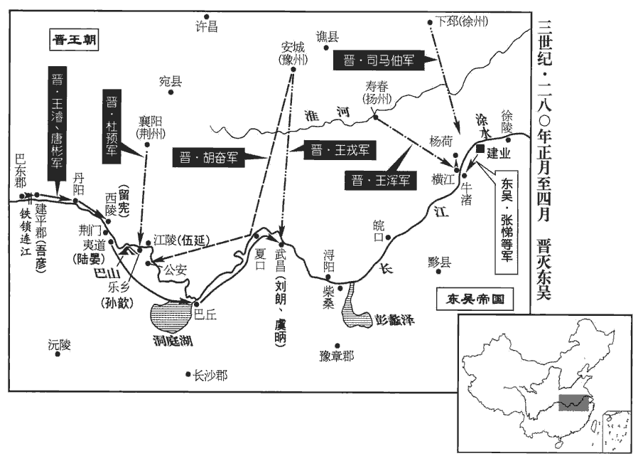
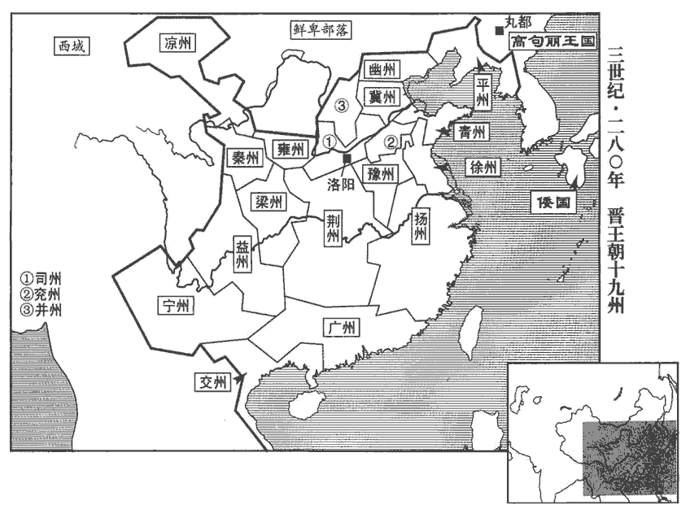
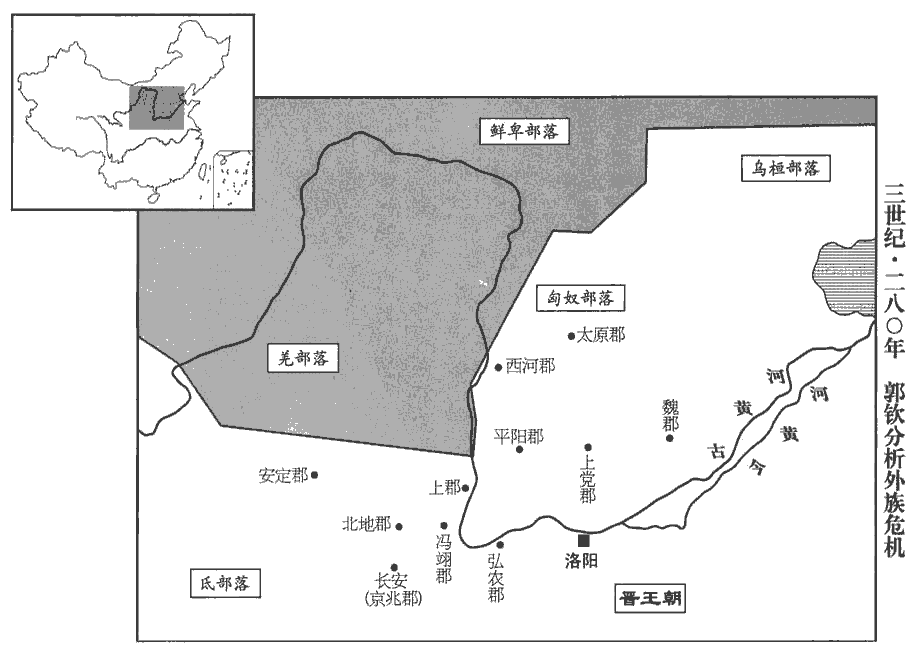

 晉紀三起上章困敦（庚子），盡著雍涒灘（戊申），凡九年。

# 世祖武皇帝中

## 太康元年（庚子，二八零）是年四月，改元。

1春，正月，吳大赦。

〖译文〗 [1]春季，正月，吴国实行大赦。

2杜預向江陵‹湖北江陵›，王渾出橫江‹安徽和县东南长江渡口›，攻吳鎮戍，所向皆克。二月，戊午‹一›，王濬、唐彬擊破丹陽‹湖北秭归东›監盛紀。丹陽城在秭歸縣東八里，昔周武王封熊繹於荊丹陽之地，即此，今謂之屈沱楚王城。吳人於江磧qì要害之處，蹟，七逆翻。水渚有沙石曰磧。并以鐵鎖橫截之；又作鐵錐，長丈餘，暗置江中，以逆拒舟艦。長，直亮翻。艦，戶黯翻。濬作大筏數十，方百餘步，縛草為人，被甲持仗，令善水者以筏先行，遇鐵錐，錐輒著筏而去。筏，音伐。被，皮義翻。著，陟略翻；後著手同。又作大炬，長十餘丈，長，直亮翻。大數十圍，灌以麻油，在船前，遇鎖，然炬燒之，須臾，融液斷絕，於是船無所礙。以人力設險，而不以人力守之，無益也。庚申‹三›，濬克西陵‹湖北宜昌›，殺吳都督留憲等。壬戌‹五›，克荊門‹湖北枝城西北长江西岸›、夷道‹湖北枝城›二城，荊門，在西陵之東，夷道之西。殺夷道監陸晏‹年三十一›。杜預遣牙門周旨等帥奇兵八百汎舟夜渡江，襲樂鄉‹湖北松滋东北›，帥。讀曰率。多張旗幟，起火巴山‹湖北松滋西北›。巴山在今江陵府松滋縣，有巴復村。幟，昌志翻。吳都督孫歆xīn懼，與江陵督伍延書曰：「北來諸軍，乃飛渡江也。」旨等伏兵樂鄉城外，歆遣軍出拒王濬，大敗而還。旨等發伏兵隨歆軍而入，歆不覺，直至帳下，虜歆而還。乙丑‹八›，王濬擊殺吳水軍都督陸景。考異曰：武紀：「壬戌，濬克夷道、樂鄉城，殺陸景。」陸抗傳：「壬戌，殺晏；癸亥，殺景。」王濬傳：「壬戌，克夷道獲晏；乙丑，克樂鄉，獲景。」今從濬傳。杜預進攻江陵，甲戌‹十七›，克之，斬伍延。於是沅‹沅江›、湘‹湘江›以南，接于交、廣州郡皆望風送印綬。水經：沅水出牂柯且蘭縣東北，過臨沅縣，又東至長沙下雋jùn縣西北入于江。湘水出零陵始安縣陽海山，東北過洮陽、泉陵、重安、酃líng、陰山、澧陵、臨湘、羅、下雋jùn等縣，又北至巴丘山，入于江。沅，音元。預杖節稱詔而綏撫之。凡所斬獲吳都督、監軍十四，牙門、郡守百二十餘人。胡奮克江安‹湖北公安›。江安，即公安，吳南郡治焉。杜預既定江南，改曰江安縣，為南平郡治所。

〖译文〗 [2]杜预向江陵进发，王浑从横江出兵，攻打吴的兵镇及边防营垒，攻无不克。二月，戊午（初一），王浚、唐彬打败了丹阳监盛纪。吴人把江边浅滩上的要害区域，用铁锁拦住，还打造了一丈多长的大铁锥，暗中放进江里，用以阻挡战船。王浚造了几十个大木筏，每一个木筏，长、宽都有一百余步。王浚让人扎了许多草人，草人披铠甲，拿兵器，放在大木筏上，让水性好的人与木筏走在前面，遇到铁锥，铁锥就扎到木筏上，被木筏带走了。王浚又造了许多大火把，火把长十几丈，有几十围粗，用麻油浇在火把上，把火把放在船的前面，遇到铁锁就点燃火把，一会儿功夫，铁锁就被火把烧得融化而断开，于是战船就无所阻挡。庚申（初三），王浚攻克了西陵，杀了吴都督留宪等人。壬戌（初五），又攻下了荆门、夷道两座城，杀了夷道监陆晏。杜预派遣牙门周旨等人率领八百名奇兵，在夜里泛舟渡过长江，袭击乐乡。周旨树起许多旗帜，又在巴山点起火。吴都督孙歆非常恐惧，写信给江陵督伍延说：“从北边过来的军队，是飞渡过江的。”周旨等人把军队埋伏在乐乡城外。孙歆派兵出城去打王浚，结果大败而回。周旨等人让伏兵尾随孙歆的军队进了城，孙歆没有觉察，周旨的兵一直到了孙歆的帐幕之下，活捉孙歆而回。乙丑（初八），王浚打败了吴水军都督陆景，把他杀了。杜预进攻江陵，甲戌（十七日），攻克了江陵，杀了伍延。这时候，沅、湘以南地区以及地界相接的交、广等州郡，都闻声把印绶送来。杜预手持符节按照皇帝的诏命安抚了这些州郡。到此时为止，总共俘获、斩杀吴都督、监军十四人，牙门、郡守一百二十多人。胡奋又攻克了江安。

 

乙亥‹十八›，‹司马炎，时年四十五›詔：「王濬、唐彬既定巴丘‹湖南岳阳›，與胡奮、王戎共平夏口、武昌‹湖北鄂州›，順流長騖wù，直造秣陵‹南京›。夏，戶雅翻。造，七到翻；下徑造同。杜預當鎮靜零‹湖南永州›、桂‹湖南郴州›，懷輯衡陽‹湖南湘潭西南古城乡›。零陵、桂陽，漢古郡。衡陽，吳主亮太平二年分長沙西部都尉立。大兵既過，荊州南境，固當傳檄而定。謂重鎮既破，其餘當望風而靡也。預等各分兵以益濬、彬，太尉充移屯項‹河南沈丘›。」以荊州已定，不復使賈充南屯襄陽，移屯項為諸軍節度。

〖译文〗 乙亥（十八日），晋武帝下诏书说：“王浚、唐彬已经平定了巴丘，再与胡奋、王戎一同平定夏口、武昌，顺长江长驱直入，直到秣陵。杜预则应当安定零陵、桂阳，安抚衡阳。大军过后，荆州以南的区域，传布檄文自然会平定。杜预等人各自分兵以增援王浚、唐彬，太尉贾充转移到项驻扎。”

王戎遣參軍襄陽‹湖北襄樊›羅尚、南陽‹河南南阳›劉喬將兵與王濬合攻武昌‹湖北鄂州›，吳江夏‹府武昌，湖北鄂州›太守劉朗、督武昌諸軍虞昺bǐng皆降。夏，戶雅翻。降，戶江翻。昺，翻之子也。

〖译文〗 王戎派遣参军、襄阳人罗尚，南阳人刘乔领兵与王浚一起攻打武昌。吴江夏太守刘朗、督武昌诸军虞投降了。虞是虞翻的儿子。

杜預與眾軍會議，或曰：「百年之寇，未可盡克，方春水生，難於久駐，考異曰：杜預傳曰：「今向暑，水潦方降，疾疫將起」。按時未暑，今依三十國春秋。宜俟來冬，更為大舉。」預曰：「昔樂毅藉濟西一戰以并強齊，事見四卷周赧王三十一年。今兵威已振，譬如破竹，數節之後，皆迎刃而解，無復著手處也。」復，扶又翻；下可復、所復同。著，陟略翻。遂指授群帥方略，徑造建業‹南京›。帥，所類翻。

〖译文〗 杜预与众将领议事，有人说：“百年的寇贼，不可能一下子彻底消灭，现在正是春季，有雨水，军队难以长时间驻扎，最好等到冬季来临，再大举发兵。”杜预说：“从前，乐毅凭藉济西一伏而一举吞并了强大的齐国。目前，我军兵威已振，这就好比破竹，破开数节之后，就都迎刃而解了，不会再有吃力的地方了。”于是，指点传授众将领计策谋略，部队一直到了建业。

吳主‹孙皓，时年三十九›聞王渾南下，使丞相張悌tì督丹陽‹府建业，南京›太守沈瑩、護軍孫震、副軍師諸葛靚帥眾三萬渡江逆戰。靚，疾正翻。帥，讀曰率；下同。至牛渚‹安徽马鞍山西南采石矶›，沈瑩曰：「晉治水軍於蜀久矣，治，直之翻。上流諸軍，素無戒備，名將皆死，幼少當任，謂陸晏、陸景、留憲、孫歆等。恐不能禦也。晉之水軍必至於此，宜畜眾力以待其來，與之一戰，若幸而勝之，江西自清。大江北流，自建業言之，歷陽、皖城皆為江西。今渡江與晉大軍戰，不幸而敗，則大事去矣！」悌曰：「吳之將亡，賢愚所知，非今日也。吾恐蜀兵至此，眾心駭懼，不可復整。復，扶又翻；下同。及今渡江，猶可決戰。若其敗喪，喪，息浪翻。同死社稷，無所復恨。若其克捷，北敵奔走，兵勢萬倍，便當乘勝南上，上，時掌翻。逆之中道，不憂不破也。若如子計，恐士眾散盡，坐待敵到，君臣俱降，無一人死難者，不亦辱乎！」如悌之言，吳人至此，為計窮矣。然悌之志節，亦可憐也。難，乃旦翻。

〖译文〗 吴主听说王浑领兵南下，就派丞相张悌，督率丹阳太守沈莹、护军孙震、副军师诸葛靓率领部众三万人渡过长江迎战。走时牛渚时，沈莹说：“晋在蜀地整治水军已经有很长时间了。我上流各部队，素来没有戎备，名将又都死了，只是些年少之人担当重任，恐怕抵挡不住。晋的水军必然要到这些地方，我们应当集中大家的力量等他们到来，与晋打一仗，假如有幸能够取胜，那么长江以北的地区自然就太平了。如果现在渡江与晋大军交战，不幸而打败了，那么大事就完了。”张悌说：“吴将要亡国，这是无论聪明还是愚笨的人都知道的事实，不是今日才有的事。我担心蜀地之兵到了这里，我军恐惧惊慌，就不可能再整肃起来了。趁着现在渡江，尚且还能与晋决一死战。如果败亡，就一同为国而死，再没有什么可遗憾的了；假如能够取胜，那么敌军奔逃，我军声势就将倍增，然后就乘胜向南进军，在半路上迎击敌人，那就不愁不能破敌。要是依了你的计谋，恐怕兵士都四散奔逃；坐等到敌军到来，君臣就一起投降，没有一个人死于国难，这难道不是耻辱吗？”

三月，悌等濟江，圍渾部將城陽‹山东莒县›都尉張喬於楊荷‹安徽和县北›；水經註：淮水自江夏平春縣北，東北流逕汝南城陽縣故城南。漢高帝十二年，封定侯奚竟為侯國，王莽之新利也；魏置城陽郡。按干寶晉紀，楊荷，橋名。今按水經註之城陽郡，乃元魏所置，張喬蓋以渾部將領青州之城陽都尉也。喬眾纔七千，閉柵請降。諸葛靚欲屠之，悌曰：「強敵在前，不宜先事其小；且殺降不祥。」靚曰：「此屬以救兵未至，力少不敵，故且偽降以緩我，非真伏也。降，戶江翻。伏，屈伏也。或曰：「伏」，當作「服」。若捨之而前，必為後患。」悌不從，撫之而進。悌與揚州刺史汝南‹河南息县›周浚，結陳相對，陳，讀曰陣。沈瑩帥丹陽銳卒、刀楯五千，三衝晉兵，不動。楯，食尹翻。瑩引退，其眾亂，將軍薛勝、蔣班因其亂而乘之，吳兵以次奔潰，將帥不能止，張喬自後擊之，大敗吳兵于版橋‹江苏江宁西长江东岸›。敗，補邁翻。諸葛靚帥數百人遁去，使過迎張悌，悌不肯去，靚自往牽之曰：「存亡自有大數，非卿一人所支，柰何故自取死！」悌垂涕曰：「仲思，諸葛靚，字仲思。今日是我死日也！且我為兒童時，便為卿家丞相所識拔，丞相，謂諸葛亮也。或曰：謂諸葛瑾。余謂張悌襄陽人，蓋亮在荊州，識之於童幼也。常恐不得其死，負名賢知顧。今以身徇社稷，復何道邪！」道，言也。復，扶又翻。靚再三牽之，不動，乃流淚放去，行百餘步，顧之，已為晉兵所殺，并斬孫震、沈瑩等七千八百級，吳人大震。

〖译文〗 三月，张悌等人渡过长江，在杨荷包围了王浑的部将、城阳都尉张乔。张乔手下只有七千人，他关闭了栅栏请求投降。诸葛靓想把他们都杀了，张悌说：“强敌还在前面，不宜先去做无关紧要的事情，况且杀了投降的人不吉利。”诸葛靓说：“这些人是因为救兵还没有到、力量弱小抵挡不住，所以才暂且假装投降以拖延时间，并不是真正的屈服了。如果放了他们，和我们一起往前走。张悌与扬州刺史、汝南人周浚，组成陈列相对。沈莹领兵退却，部众开始乱起来，这时，晋将军薛胜、蒋班乘吴兵混乱之机打过来，吴兵接二连三地奔逃溃散，将帅们也制止不住，张乔又从背后杀过来，结果在版桥，晋大破吴兵。诸葛靓带着几百人逃走，他派人去接张悌，张悌不肯离开，诸葛靓又亲自拉他走，说：存亡自有气数，并不是你一个人所能支撑的，为什么一定要自己求死呢？”张悌流泪说：“诸葛靓，今天是我死的日子。况且我还是幼儿的时候，就被你家丞相诸葛亮所赏识提拔。我常常怕我死得没有意义，辜负了名贤对我的了解与照顾。我今天以身殉国，还有什么可说的呢！”诸葛靓再三拉他走，还是拉不动他，于是就流着眼泪放开手，走了。走了一百多步远，回过头去看张悌，他已经被晋兵杀了。同时被斩首的，还有孙震、沈莹等七千八百人。吴人受到了极大的震动。

初，詔書使王濬下建平，受杜預節度，至建業‹南京›，受王渾節度。預至江陵‹湖北江陵›，謂諸將曰：「若濬得建平，則順流長驅，威名已著，不宜令受制於我；若不能克，則無緣得施節度。」濬至西陵‹湖北宜昌›，預與之書曰：「足下既摧其西藩，便當徑取建業，討累世之逋寇，釋吳人於塗炭，振旅還都，亦曠世一事也！」言歷世所曠見之事。濬大悅，表陳預書。及張悌敗死，揚州別駕何惲惲yùn，委粉翻。謂周浚曰：「張悌舉全吳精兵殄滅於此，吳之朝野莫不震懾。朝，直遙翻。懾，之涉翻。今王龍驤既破武昌‹湖北鄂州›，王濬為龍驤將軍。驤，思將翻。乘勝東下，所向輒克，土崩之勢見矣。見，賢遍翻。謂宜速引兵渡江，直指建業，大軍猝至，奪其膽氣，可不戰禽也！」浚善其謀，使白王渾。惲曰：「渾闇於事機，而欲慎己免咎，必不我從。」浚固使白之，渾果曰：「受詔但令屯江北以抗吳軍，不使輕進，貴州雖武，豈能獨平江東乎！今者違命，勝不【張：「不」作「固」。】足多，若其不勝，為罪已重。且詔令龍驤受我節度，但當具君舟檝jí，一時俱濟耳。」惲曰：「龍驤克萬里之寇，以既成之功來受節度，未之聞也。且明公為上將，將，即亮翻。見可而進，豈得一一須詔令乎！須，待也。今乘此渡江，十全必克，何疑何慮而淹留不進！此鄙州上下所以恨恨也。」此所謂恨恨，悵望不满之意。渾不聽。

〖译文〗 当初，晋武帝下诏书，命令王浚攻下建平，接受杜预的节制调度，到了建业，接受王浑的部署、调度。杜预到江陵，对各位将领说：“如果王浚攻克了建平，就会顺长江长驱直进，他的威名已经显著，就不适合再让他受我的节制。如果他不能取胜，那么我就没有缘份对他施行节制调度了。”王浚到了西陵，杜预写信对他说：“您已经摧毁了敌人的西部屏障，应立即直取建业，讨伐历代的逃寇，从水深火热之中解救吴人，整顿部队，返回都城，这也是前所未有的一件事。”王浚非常高兴，上表陈述杜预的信。张悌战败身死时，扬州别驾何恽对周浚说：“张悌发动的全吴的精兵就在这里灭亡了，这使吴朝野上下没有人不震动恐惧。现在，王浚已经攻下了武昌，正乘胜东下，所向无敌，敌人土崩瓦解之势已经显露出来了。我认为，应当立即领兵渡江，直指建业。大军突然到来，必然使敌人胆战心惊，失去勇气，我们就能不战而擒敌了。”周浚赞赏何恽的计谋，让他去报告王浑。何恽说：“王浑不懂得把握事情的时机，但他想行事谨慎，不使自己有过失，所以他肯定不会听从我的意见。”周浚坚持让他去向王浑禀告，王浑果然说：“我接受皇帝的命令，只让我驻扎在长江以北，以便抗击吴军，并没有让我轻易进兵。你们州的军队虽然勇武，又岂能独立地平定江东之地呢！现在如果违反诏命而出兵，打了胜仗固然值得称赞，如果没有取胜，那么犯下的罪过就已经很严重了。而且皇帝命令王浚接受我的部署调度，你们所应该作的，只是准备好船和桨，一齐渡江。”何恽说：“王浚攻克了万里之敌，他会以成就功勋的身份来接受您的部署调度，这样的事情我可没有听说过。况且明公您为上将，抓住适当的机会就可以行动，怎么可以事事都等待命令呢？现在如果乘机渡江，完全有把握取胜，您还犹豫、顾虑什么而停留不进，这正是使鄙州上上下下的人士抱恨不已的原因。”王恽不听。

王濬自武昌‹湖北鄂州›順流徑趣建業‹南京›；趣，七喻翻。吳主遣游擊將軍張象，帥舟師萬人禦之，象眾望旗而降。濬兵甲满江，旌旗燭天，威勢甚盛，吳人大懼。

〖译文〗 王浚从武昌顺着长江直接向建业进逼。吴主派遣游击将军张象率领舟师一万人抵抗。张象的部下望见王浚的旌旗就投降了。这时候，江中满满的全都是身披铠甲的王浚的士兵，旌旗映照着天空，威猛的气势极其盛大，吴人异常恐惧。

吳主之嬖bì臣岑昏，以傾險諛佞，致位九列，九列，九卿也。好興功役，好，呼到翻。為眾患苦。及晉兵將至，殿中親近數百人叩頭請於吳主曰：「北軍日近而兵不舉刃，陛下將如之何？」吳主曰：「何故？」對曰：「正坐岑昏耳。」吳主獨言：「若爾，當以奴謝百姓！」獨言，謂其言止此耳。眾因曰：「唯！」唯，于癸翻，諾也。遂并起收昏；吳主駱驛追止，駱驛，言相繼遣人不絕也。已屠之矣。

〖译文〗 吴主的宠臣岑昏，由于阴险狡诈、谄媚逢迎而爬上了九卿的地位。他喜好大兴工程劳役，使众人深受困苦与祸患。等晋兵就要到达的时候，宫中亲近的几百名随从官吏向吴主叩头请求说：“北方的敌军一天一天地逼近了，而我们的士兵却不拿起武器抵抗，陛下您打算怎么办呢？”吴主问：“是什么原因？”众人回答说：“正是由于岑昏的缘故。”吴主只说了一句：“要是这样，就拿这个奴才去向老百姓谢罪吧！”众人答应“是！”从地上爬起来就去抓岑昏，等到吴主后悔，不断地派人去追赶制止，岑昏已经被杀了。

陶濬將討郭馬，至武昌‹湖北鄂州›，聞晉兵大入，引兵東還。至建業，吳主引見，問水軍消息，見，賢遍翻。對曰：「蜀船皆小，陶濬蓋以尋常蜀船言之，諜候不明，亦可見矣。今得二萬兵，乘大船以戰，自足破之。」於是合眾，授濬節鉞。明日，當發，其夜，眾悉逃潰。

〖译文〗 陶浚要去征讨郭马，到了武昌，听说晋兵已大举进逼，就领兵返回东边。到了建业，吴主派人领他来见面，向他询问水军的情况。陶浚回答说：“蜀地的船都很小，现在给二万名士兵，乘大船作战，我有把握打败敌人。”于是吴召集兵员，授予陶浚符节斧钺。原定第二天了发，但当天夜里，陶浚召集的士兵全都跑光了。

時王渾、王濬及琅邪王伷皆臨近境，伷，音胄。吳司徒何植、建威將軍孫晏漢光武命耿弇yǎn為建威大將軍，建威之號自此始。悉送印節詣渾降。吳主用光祿勳薛瑩、中書令胡沖等計，分遣使者奉書於渾、濬、伷以請降。又遺其群臣書，遺，于季翻。深自咎責，且曰：「今大晉平治四海，是英俊展節之秋，勿以移朝改朔，用損厥志。」治，直之翻。朝，直遙翻。使者先送璽綬於琅邪王伷。壬寅‹十五›，王濬舟師過三山‹江苏江宁西南长江东岸›，三山，在今建康府上元縣西南四十五里，又西即江寧夾。陸游曰：三山磯在烈洲下。凡山臨江皆曰磯，三山，距金陵財五十餘里。王渾遣信要濬蹔zàn過論事，信，即信使。要，讀曰邀。蹔，與暫同。濬舉帆直指建業，報曰：「風利，不得泊也。」是日，濬戎卒八萬，方舟百里，詩云：就其深矣，方之舟之。註：方，泭fú也。舟，船也。爾雅：方木置水曰泭，音夫。鼓譟入于石頭，吳主皓面縛輿櫬chèn，詣軍門降。濬解縛焚櫬，延請相見。櫬chèn，初覲jìn翻。收其圖籍，克州四，郡四十三，戶五十二萬三千，兵二十三萬。吳有荊、揚、交、廣四州。漢獻帝興平二年，孫策始取江東，魏文帝黃初三年，吳王孫權始稱帝，傳四主，五十七年而亡。

〖译文〗 这时，王浑、王浚以及琅邪王司马都已逼近建业附近。吴司徒何植、建威将军孙晏都把印玺、符节送到王浑那里投降了。吴主采用光禄勋薛莹、中书令胡冲等人的计谋，分别派遣使者向王浑、王浚、司马奉上书信请求投降。吴主又给大臣们一封信，在信中深深地谴责了自己的罪过，还说：“当前，大晋平治四海，这正是杰出优秀的人材发挥、施展其气节操守的时期，不要因为改朝换代就因此丧失了志向。”吴主的使者先把印玺送到琅邪王司马那里。壬寅（十五日），王浚的舟师经过三山，王浑派信使邀请王浚暂时过来商议事情，王浚正扬帆直逼建业，回复王浑说：“船行正顺风，不便停下来。”这一天，王浚的八万士兵，乘着相连百里的战船，擂鼓呐喊进入石头城。吴主孙松了绑，焚烧了棺材，请他相见。晋接收了吴的地图、户籍，攻克了吴的四个州，四十三个郡，五十二万三千户，二十三万名士兵。

朝廷聞吳已平，群臣皆賀上壽，帝執爵流涕曰：「此羊太傅之功也。」異義：韓詩，一升曰爵，爵，盡也，足也。羊祜，贈太傅。票騎將軍孫秀不賀，孫秀來奔，見七十九卷泰始六年。票，匹妙翻。南向流涕曰：「昔討逆弱冠以一校尉創業，討逆，孫策也，起兵之初，袁術表為懷義校尉。冠，古玩翻。今後主舉江南而棄之，宗廟山陵，於此為墟，悠悠蒼天，此何人哉！」詩黍離之辭。

〖译文〗 晋朝廷听到吴已平定的消息，大臣们都去庆贺，为晋武帝祝寿。晋武帝手持酒杯流泪说：“这是太傅羊祜的功劳。”票骑将军孙秀没有和大家一起庆贺，他面朝南方流泪说：“从前，先主孙策刚满二十岁，以一个校尉的身份创下了基业，如今后主把整个江南之地都抛弃了，宗庙陵墓从此将成为废墟，悠悠青天啊，这究竟是谁造成的啊！”

吳之未下也，大臣皆以為未可輕進，獨張華堅執以為必克。賈充上表稱：「吳地未可悉定，方夏，江、淮下濕，疾疫必起，宜召諸軍還，以為後圖。雖腰斬張華不足以謝天下。」帝曰：「此是吾意，華但與吾同耳。」荀勗復奏，宜如充表。帝不從。復，扶又翻。杜預聞充奏乞罷兵，馳表固爭，使至轘huán轅‹河南偃师东南›而吳已降。使，疏吏翻。轘，音環。充慚懼，詣闕請罪，帝撫而不問。

〖译文〗 当初，还没有攻陷吴国的时候，大臣们都认为不可以轻易进军，只有张华非常坚定地坚持进军，认为一定能成功。贾充当时上表说：“吴地不能全都平定，现在正是夏季，长江、淮水下游地区潮湿，必然会发生疾病瘟疫，应当把各部队都召回来，以后再作打算。即使腰斩张华，也不足以向天下人谢罪。”晋武帝说：“这正是我的意思，张华只不过是与我意见相同而已。”荀勖又上奏，大致上与贾充的看法相同。晋武帝没有听他们的话。杜预听说贾充上奏请求停止进兵，急忙上表晋武帝，坚决地争论，派使者拿了给晋武帝的表文，飞驰而去。使者走到辕时吴已经投降了。贾充又惭愧又害怕，到宫里去请罪，晋武帝抚慰了他而没有追究。

夏，四月，甲申‹二十八›，詔賜孫皓爵歸命侯。

〖译文〗 夏季，四月，甲申（二十八日），晋武帝下诏，赐予孙爵位归命侯。

乙酉‹二十九›，大赦，改元。改元太康，自此以前，係咸寧六年事。大酺pú五日。酺，薄乎翻。遣使者分詣荊、揚撫慰，吳牧、守已下皆不更易；守，式又翻。更，工衡翻。除其苛政，悉從簡易。【章：甲十一行本「易」下有「吳人大悅」四字；乙十一行本同；孔本同；張校同；退齋校同。】易，以豉翻。

〖译文〗 乙酉（二十九日），大赦天下，改年号为太康。晋朝聚餐饮酒五天。派遣使者分别到荆州、扬州去抚慰，吴原来的牧、守以下的官吏全都不更换；废除了吴的繁琐的规章制度，一切都遵循简便易行的原则，吴人非常高兴。

滕脩討郭馬未克，去年吳主皓遣滕脩討郭馬。聞晉伐吳，帥眾赴難，帥，讀曰率。難，乃旦翻。至巴丘‹湖南岳阳›，聞吳亡，縞素流涕，還，與廣州刺史閭豐、閭，姓；豐，名。此與後魏閭大肥不同所自出，閭大肥出於柔然郁久閭氏；左傳，楚平王之子啟，字子閭，其後以為氏。蒼梧‹广西梧州›太守王毅各送印綬請降。孫皓遣陶璜之子融持手書諭璜，璜流涕數日，亦送印綬降。帝皆復其本職。綬，音受。

〖译文〗 腾讨伐郭马没有成功，听说晋征讨吴，就率领部下奔来救难。到巴丘，听到吴已亡国的消息，于是身穿白色的丧服流泪，然后就返回了。他与广州刺史闾丰、苍梧太守王毅各自向晋送去印玺绶带请求投降。孙派陶璜的儿子陶融，拿着他亲笔写的信指示陶璜降晋，陶璜哭了好几天，最后也送去了印玺绶带投降了。晋武帝全都恢复了他们原来的官职。

王濬之東下也，吳城戍皆望風款附，獨建平太守吾彥嬰城不下，聞吳亡，乃降。帝以彥為金城‹兰州东›太守。

〖译文〗 王浚向东挺进时，吴各城的守备都望风而降，只有建平太守吾彦环绕着城固守，没有攻下来。后来他听到吴亡国的消息就投降了。晋武帝任命吾彦为金城太守。

初，朝廷尊寵孫秀、孫楷，楷降見上卷咸寧二年。欲以招來吳人。及吳亡，降秀為伏波將軍，楷為度遼將軍。

〖译文〗 当初，朝廷对孙秀、孙楷尊重恩宠，是想利用他们招来吴人。等到吴灭亡了，孙秀就被降职为伏波将军，孙楷降为度辽将军。

琅邪王伷遣使送孫皓及其宗族詣洛陽。五月，丁亥朔‹一›，皓至，考異曰：吳志皓傳：「天紀四年，三月，丙寅，殺岑昏。戊辰，陶濬從武昌還。壬申，王濬到，受皓降。五月丁亥，集于京邑。四月甲申，封歸命侯。」晉武紀：「太康元年，二月，王濬等破武昌，王渾斬張悌。三月，壬申，濬下石頭，皓降。乙酉，大赦，改元。四月，遣朱震等慰撫。五月，辛亥，封歸命侯。丙寅，引皓升殿。庚午，詔士卒六十歸家。庚辰，以濬為輔國將軍。」王濬傳：「二月，庚申，克西陵，」又云：「壬寅，濬入石頭，」而無月。又上書曰：「臣十四日至牛渚，十五日至秣陵。」亦無月。又曰：「去二月武昌失守，皓左右皆得寶散走。」三十國春秋：「四月，甲子，王渾斬張悌。丙寅，殺岑昏，與何楨書。庚午，送降書。壬申，濬入石頭。甲申，封歸命侯。五月，丁亥，至洛陽。」晉春秋略與之同。按長曆，去年閏七月，今年二月戊午朔，三月戊子朔，四月丁巳朔，五月丁亥朔，六月丙辰朔。然則三月無戊辰、丙寅、壬申，五月無庚午、庚辰，與吳志、晉書不合。若依三十國春秋，月日雖合，然二月武昌失守，皓左右離散，不容四月十六日王濬乃至秣陵而皓降。又，皓以四月十六日降，舉家西上，至五月一日未能至洛。今事之先後并依吳志、晉書，但削去其日之不與曆合者。與其太子瑾等泥頭面縛，詣東陽門。晉志：洛陽城東有建春、東陽、清明三門。泥頭者，以泥塗其首也。瑾渠吝翻。詔遣謁者解其縛，賜衣服、車乘、田三十頃，歲給錢穀、綿絹甚厚。武王伐紂，斬其首，懸於太白之旗。如孫皓之凶暴，斬之以謝吳人可也。乘，繩證翻。拜瑾為中郎，諸子為王者皆為郎中。吳之舊望，隨才擢敘。孫氏將吏渡江者復十年，百姓復二十年。將，即亮翻。復，方目翻。

〖译文〗 琅邪王司马派使者送孙及他的宗族去洛阳。五月，丁亥朔（初一），孙到了洛阳。他和太子孙瑾等人用泥涂在头上，反绑了双手，来到洛阳的东阳门。晋武帝下诏，派谒者解开他们的绳索，赐以衣服、车子、三十顷田地，每年都供应他们非常充足的钱币、粮食和布匹。晋授予孙瑾中郎的官职，孙皓其他的儿子，凡是原先为王的，都被任命为郎中。吴从前的有名望的人士，都根据他们的才能提拔进用。孙皓的将领、官吏渡过长江的，免除十年的赋税、劳役；老百姓免除二十年的赋税、劳役。

庚寅‹四›，帝臨軒，大會文武有位及四方使者，國子學生皆預焉。引見歸命侯皓及吳降人。皓登殿稽顙。見，賢遍翻。稽顙，周之喪拜。顙，額也。稽顙，額觸地無容。稽，音啟。帝謂皓曰：「朕設此座以待卿久矣。」皓曰：「臣於南方，亦設此座以待陛下。」賈充謂皓曰：「聞君在南方鑿人目，剝人面皮，此何等刑也？」皓曰：「人臣有弒其君及姦回不忠者，則加此刑耳。」斥充世受魏恩而姦回附晉，弒高貴鄉公也。充默然甚愧，而皓顔色無怍zuò。怍，疾各翻，慙也。

〖译文〗 庚寅（初四），晋武帝来到堂前的长廊，会见文武官员中有爵位的以及四方来晋的使者，国子学生也都参加会见。晋武帝派人把归命侯孙以及投降的吴人带来相见。孙登上大殿向晋武帝叩头。晋武帝对孙说：“联设了这个座位以等待你已经有很久了。”孙说：“我在南方，也设了这个座位以等待陛下。”贾充对孙说：“听说你在南方，凿人的眼睛，剥人的脸皮，这是哪一等级的刑法？”孙说：“为人臣子的，杀了他的君王以及邪恶不忠的就处以这种刑法。”贾充沉默无语，非常羞愧，而孙却面无愧色。

帝從容問散騎常侍薛瑩，孫皓所以亡，對曰：「皓昵近小人，從，千容翻。近，其靳翻。刑罰放濫，大臣諸將，人不自保，此其所以亡也。」他日，又問吾彥，對曰：「吳主英俊，宰輔賢明。」帝笑曰：「若是，何故亡？」彥曰：「天祿永終，曆數有屬，故為陛下禽耳。」帝善之。有學而無識，此薛瑩所以不及吾彥也。屬，之欲翻。

〖译文〗 晋武帝从容地询问散骑常侍薛莹，孙为什么会亡国。薛莹回答说：“孙亲近小人，任意地施行刑罚，大臣和各位将领，人人都不能自保，这就是孙灭亡的原因。”又一天，晋武帝用同样的问题问吾彦，吾彦回答说：“吴君王才智出众，辅佐的大臣贤能聪明。”晋武帝笑着说：“要是这样，为什么会亡国？”吾彦说：“天赐的福禄永久断绝，天道却有归属，所以才被陛下所擒。”晋武帝赞赏他的话。

王濬之入建業也，其明日，王渾乃濟江，以濬不待己至，先受孫皓降，意甚愧忿，將攻濬。何攀勸濬送皓與渾，由是事得解。何惲以渾與濬爭功，與周浚牋曰：「書貴克讓，易大謙光。書曰：允恭克讓。易曰：謙尊而光。前破張悌，吳人失氣，龍驤因之，陷其區宇。論其前後，我實緩師，既失機會，不及於事，而今方競其功；競，爭也。彼既不吞聲，將虧雍穆之弘，興矜爭之鄙，雍穆，和也。書曰：汝惟不矜，天下莫與汝爭能。斯實愚情之所不取也。」浚得牋，即諫止渾。渾不納，表濬違詔不受節度，誣以罪狀。渾子濟，尚常山公主，公主，帝女也。宗黨強盛。有司奏請檻車徵濬，帝弗許，但以詔書責讓濬以不從渾命，違制昧利。濬上書自理曰：「前被詔書，令臣直造秣陵，被，皮義翻；下同。造，七到翻；下同。又令受太尉充節度。臣以十五日至三山，見渾軍在北岸，遣書邀臣；臣水軍風發，【章：甲十一行本「發」下有「乘勢」二字；乙十一行本同；孔本同；張校同；退齋校同。】徑造賊城，無緣迴船過渾。過，工禾翻。臣以日中至秣陵，暮乃被渾所下當受節度之符，被，皮義翻。下，遐稼翻。欲令臣明十六日悉將所領還圍石頭，十六日者，十五之明日，故曰明十六日。將，即亮翻。又索蜀兵及鎮南諸軍人名定見，鎮南諸軍，杜預所統，蓋分以隨濬東下者也。定見，謂軍人在行定數。索，山客縣。臣以為皓已來降，無緣空圍石頭；又，兵人定見，不可倉猝得就，皆非當今之急，不可承用，非敢忽棄明制也。皓眾叛親離，匹夫獨坐，雀鼠貪生，苟乞一活耳；而江北諸軍不知虛實，不早縛取，自為小誤。臣至便得，更見怨恚，恚huì，於避翻。并云守賊百日，而令他人得之。臣愚以為事君之道，苟利社稷，死生以之。若其顧嫌疑以避咎責，此是人臣不忠之利，實非明主社稷之福也！」渾又騰周浚書云：「濬軍得吳寶物。」騰其書，使上聞。又云：「濬牙門將李高放火燒皓偽宮。」濬復表曰：復，扶又翻。「臣孤根獨立，結恨強宗。夫犯上干主，其罪可救；乖忤貴臣，禍在不測。忤，五故翻。偽中郎將孔攄shū說：去二月武昌失守，水軍行至，二月已過，故云去二月。行至，猶言行將至也。攄，抽居翻。皓按行石頭還，行，下孟翻。左右人皆跳刀大呼楊正衡曰：跳，大么翻。呼，火故翻。云：『要當為陛下一死战決之，』為，于偽翻。皓意大喜，意必能然，便盡出金寶以賜與之。小人無狀，得便馳走，皓懼，乃圖降首。首，式救翻。降使適去，降，戶江翻。使，疏吏翻。左右劫奪財物，略取妻妾，放火燒宮。皓逃身竄首，恐不脫死。臣至，遣參軍主者救斷其火耳。斷，丁管翻。周浚先入皓宮，渾又先登皓舟，臣之入觀，皆在其後。皓宮之中，乃無席可坐，若有遺寶，則浚與渾先得之矣。浚等云臣屯聚蜀人，不時送皓，欲有反狀。又恐動吴人，言臣皆當誅殺，取其妻子，冀其作亂，得騁私忿。騁，丑郢翻。謀反大逆，尚以見加，其餘謗𠴲tà，𠴲tà，語相惡也，音達合翻。故其宜耳。今年平吳，誠為大慶；於臣之身，更受咎累。」累，力瑞翻。濬至京師，有司奏「濬違詔，大不敬，請付廷尉科罪。」詔不許。科，斷也。又奏濬赦後燒賊船百三十五艘，輒敕付廷尉禁推，此皆王渾親黨使為之。艘，蘇刀翻。詔勿推。

〖译文〗 王浚进入建业的第二天，王浑就渡过长江。王浑因为王浚不等他到，就先接受孙投降，心中又羞愧又怨恨，就想攻打王浚。何攀劝王浚把孙送给王浑，事情才得到缓解。何恽因为王浑与王浚争功，就写信给周浚说：“《尚书》重视能退让，《易经》赞赏谦逊的光荣。前些时候打败了张悌，使吴人丧失了胆量勇气，王浚乘这个机会，攻下了吴的疆土。如果要论谁先谁后，我们确实是慢了，已经失去了机会，没有及时赶上，而目前又在争功，他既然咽不下这口怨气，就会使谐和的风气受到损坏，而使自矜争功的鄙陋之习兴起，这实在是我从心里所不敢同意的。”周浚收到信，立即进谏劝止王浑，王浑不听，上表说王浚违反诏命，不服从调度，还捏造事实诬告王浚有罪。王浑的儿子王济和晋武帝的女儿常山公主结了亲，在朝廷宗族帮派中很有势力。于是，有关部门就上奏晋武帝，请求用囚车把王浚召回来，但是晋武帝没有同意，只是下诏书责备王浚不服从王浑的命令，违抗诏命，去求功利。王浚上书为自己申辩说：“我先接到诏命，让我直接到秣陵，又命令我接受太尉贾充调度。我于十五日到三山，看见王浑的军队在北岸，王浑写信邀请我去他那里，当时我的水军正顺风乘势直到贼城，没有理由再调转船头返回去见王浑。我在中午时到秣陵，黄昏时分才接到受王浑调度的命令，命令我于第二天十六日，率领全部属下，回过头去包围石头城。还索取我率领的蜀地兵士以及随我东下的镇南各军的确切人数。我认为孙已经来投降，没有理由徒劳地包围石头城。另外，士兵的确切人数，不可能在匆促之间就能很快得知，而且都不是眼前急迫的事情，不能顺从施行，并不是我胆敢忽略、弃置圣明的诏令。孙众叛亲离，匹夫独坐，像麻雀、老鼠那样贪生，苟且乞求一条活命而已。但是江北的各部队不了解虚实，不早些来捉拿孙皓，自己造成了失误。我一到便得手，就更遭到怨恨与不满，还说什么守贼守了一百天，却让别人得到了。我认为，侍奉君王的原则是：假如有利于国家，无论生与死都要追求。如果顾虑别人猜忌怀疑因而逃避过错责任，这是作臣子的以不忠诚得到的私利，实在不是圣明的君主与国家的福气。”王浑又递上周浚的书信，信上说：“王浚军队得到了吴的珍贵物品。”还说：“王浚的牙门将李高，放火烧了孙的宫殿。”王浚又上表说：“我孤根独立，与强大的宗派结下了仇怨。如果是冒犯了君王的罪过还可能得救，但要是得罪了权贵之臣，灾祸就难以预料了。吴中郎将孔摅说：二月武昌失守，晋水军马上就要到了。孙巡行石头城回来，他手下的人都挥舞着刀大呼，说：‘正要为了陛下去决一死战，’孙非常高兴，觉得必然能如此，就把他的金器宝物全都拿出来赐给这些人。然而小人无礼，这些人得了值钱的东西就飞快地逃走了。孙非常恐惧，于是打算投降伏罪。孙派出的使者刚离开，他手下的人就开始抢夺财物，掠夺孙的妻妾，放火烧了宫殿。孙抱头鼠窜，唯恐不能活命。我到那里时，派参军主者才把火扑灭。周浚先进入孙的宫殿，王浑又先登上孙的船，我进去和我所见到的，全都在他们之后。孙的宫里，连可以坐的席子都没有，假如有遗留下来的珍贵之物，也是周浚与王浑先得到了。周浚等人说我聚集蜀人，不准时把孙送去，是想谋反。他们还吓唬吴人，说我要把他们都杀了，把他们的妻子儿女都抓走，希望吴人作乱，以发泄他们的私恨。像谋反这种大逆不道的罪名，他们尚且用来加到我的头上，其他的诽谤与诬陷也就是必然的了。今年平定了吴，的确是大庆，但是对于我个人来说，却遭到了灾祸与忧患。”王浚到了京都，有关部门上奏皇帝，说王浚违抗诏命，极不恭敬，请求把他交付廷尉依法判罪。晋武帝下诏书不同意。于是他们又上奏，说王浚在赦免了吴人之后还放火烧了吴人的一百三十五艘船，应立即下令把他交付延尉，关进监狱里追究审问。晋武帝下诏书，不同意追究他。

渾、濬爭功不已，帝命守廷尉廣陵劉頌校其事，以渾為上功，濬為中功。帝以頌折法失理，折法，猶折獄之折。折，斷也。左遷京兆太守。魏文帝受禪，改京兆尹為太守，夷於列郡。

〖译文〗 王浑与王浚，为了功劳而争执不休，晋武帝命令守廷尉、广陵人刘颂来审定、处理这件事。刘颂认为王浑立了上功，王浚是中功。晋武帝认为刘颂断法不合理，就把他降职为京兆太守。

庚辰，增賈充邑八千戶；以王濬為輔國大將軍，封襄陽縣侯；杜預為當陽縣侯；王戎為安豐縣侯；封琅邪王伷二子為亭侯；增京陵侯王渾邑八千戶，進爵為公；尚書關內侯張華進封廣武縣侯，增邑萬戶；王渾除京陵舊食邑之外，增八千戶，張華則增廣武侯邑為萬戶。荀勗以專典詔命功，封一子為亭侯；勗為中書監，專典詔命。其餘諸將及公卿以下，賞賜各有差。帝以平吳功，策告羊祜廟，乃封其夫人夏侯氏為萬歲鄉君，食邑五千戶。夏，戶雅翻。

〖译文〗 庚辰（疑误），增加贾充封邑八千户。任命王浚为辅国大将军，封为襄阳县侯。杜预被封为当阳县侯。王戎被封为安丰县侯。琅邪王司马的两个儿子被封为亭侯。增加京陵侯王浑食邑八千户，提升爵位为公。尚书关内侯张华，被进爵封为广武县侯，增加食邑至万户。荀勖因为专门掌管诏命的功劳，一个儿子被封为亭侯。其余各位将领以及公卿大臣以下的官吏。受到的赏赐各不相同。晋武帝以平吴的功绩，到羊祜庙里用简书靠慰他，封羊祜的夫人夏侯氏为万岁乡君，食邑五千户。

王濬自以功大，而為渾父子及黨與所挫抑，每進見，見，賢遍翻。陳其攻伐之勞及見枉之狀，或不勝忿憤，徑出不辭；帝每容恕之。晉武之量，弘於隋文。勝，音升。益州護軍范通謂濬曰：「卿功則美矣，然恨所以居美者未盡善也。卿旋旆pèi之日，角巾私第，晉志曰：巾以葛為之，形如幍tāo而橫著之，古者尊卑共服之。余謂幅巾以橫幅為之，角巾則巾之有角者。郭林宗遇雨，巾一角墊，則角巾也。口不言平吳之事；若有問者，則曰：『聖人【張：「人」作「主」。】之德，群帥之力，老夫何力之有！』此藺生所以屈廉頗也，事見四卷周赧王三十六年。帥，所類翻。王渾能無愧乎！」濬曰：「吾始懲鄧艾之事，鄧艾之死，以鍾會所蔽，艾情不得上通也。懼禍及身，不得無言；其終不能遣諸胸中，是吾褊biǎn也。」自知數陳其功及為渾所枉為褊。褊，補辨翻。時人咸以濬功重報輕，為之憤邑；為，于偽翻。博士秦秀等并上表訟濬之屈，帝乃遷濬顉軍大將軍。考異曰：濬傳云：「領步兵校尉，舊校唯五，置此營自濬始也。」按職官志：「屯騎、步兵、長水、越騎、射聲校尉，是為五校，并漢官也。」然則步兵之名，非自濬始。武帝紀：「是年六月，丁丑，初置翊軍校尉官，」疑濬所領者翊軍也。王渾嘗詣濬，濬嚴設備衛，然後見之。周勃就國，絳及河東吏至，常令家人被甲持兵以見之，亦猶王濬之嚴設備衛以見王渾也。此二人者，力足以定天下之難，智足以取一國，而其所以包周身之防乃爾，可笑也哉！

〖译文〗 王浚自以为功劳大，却遭到了王浑父子及其党羽的打击和冤枉，所以每次进见晋武帝，总要陈述他讨伐攻战的辛劳以及被冤屈的情况，有时候忍不住愤恨与不满，竟不辞而别，晋武帝总是宽容、原谅他。益州护军通对王浚说：“你的功劳确实值得赞美，但遗憾的是，你以别人的赞美自居，这就不完全值得赞赏了。你应当凯旋之后就隐居在自己家里，嘴里不谈平吴的事情，如果有人问到平吴之事，你就说：‘这是圣明的君主的德行，是各位将帅的力量，我这个老头子又有什么功劳！’蔺相如就是用这个办法把廉颇降住了，王浑他能不惭愧吗？”王浚说：“我开始那样作是吸取了邓艾的教训，害怕把灾祸惹上身，我不能不说，但是我最终也不能放开这件事，还是因为我心地狭窄。”当时，人们都觉得王浚的功劳大，但是对他的报偿轻了，都对此愤恨不平。博士秦秀等人一起上表，替王浚叫屈，晋武帝于是授予王浚镇军大将军官职。王浑曾经到王浚那里去，王浚设置了森严的戒备、护卫，然后会见王浑。

杜預還襄陽‹湖北襄樊›，以為天下雖安，忘戰必危，乃勤於講武，申嚴戍守。又引滍zhì‹沙河，东流至河南叶县东北入汝水›、淯‹白河，南流至湖北襄樊入汉水›水以浸田萬餘頃，水經註：滍水出南陽魯山縣西堯山，東逕犨chōu縣，又東南逕昆陽縣，又東北逕潁川定陵縣，東入于汝。淯水出弘農盧氏縣攻離山，東南逕南陽西鄂縣、宛縣而屈，南過淯陽縣，又南過新野縣，西過鄧縣，南入于沔。滍zhì，音丈几翻。淯，音育。開揚口‹湖北江陵长江南岸›通零‹湖南永州›、桂‹湖南郴州›之漕，水經註：揚水上承江陵縣赤湖，東北流逕郢城南，又東北與三湖水會。三湖者，合為一水，東通荒谷，東岸有冶父城。春秋傳曰：「莫敖縊yì于荒谷，群帥囚於冶父」，謂此處也。春夏水盛，則南通大江，否則南迄江隄。揚水又東入華容縣，又東；北與柞zhà溪水合；又北逕竟陵縣，又北注于沔，謂之揚口。預傳曰：舊水道惟沔、漢達江陵千數百里，北無通路，預乃開揚口，起夏水，達巴陵千餘里，內瀉長江之險，外通零、桂之漕。杜佑曰：夏水、揚口，在今江陵郡江陵縣界。公私賴之。預身不跨馬，射不穿札，札，甲札也。左傳：潘尫wāng之黨與養由基蹲甲而射之，徹七札焉。而用兵制勝，諸將莫及。預在鎮，數餉遺洛中貴要，數，所角翻。遺，于季翻。或問其故，預曰：「吾但恐為害，不求益也。」

〖译文〗 杜预回到襄阳以后，觉得天下虽然安定了，但是如果忘记了战事就必然会导致危难，于是他勤于讲习武事，命令部下要严于防守。他还引来水和水浇灌田地一万多顷，开凿扬口，与零、桂之水相通，以利水上运输，公与私都赖此而得到方便。杜预身不跨战马，射箭不能透甲，但是他以善于用兵战胜对方，各位将领都比不上他。杜预人在镇守，却多次向京都的权贵要人馈赠，有人问他为什么要这样作，杜预回答说：“我只怕他们会加害于我，并不指望他们能给我什么好处。”

王渾遷征東大將軍，復鎮壽陽。

〖译文〗 王浑升迁为征东大将军，又去镇守寿阳。

諸葛靚逃竄不出。靚入吳見七十七卷魏高貴鄉公甘露二年。帝與靚有舊，靚姊為琅邪王妃，琅邪王伷。帝知靚在姊間，因就見焉。靚逃于廁，帝又逼見之，謂曰：「不謂今日復得相見！」靚流涕曰：「臣不能漆身皮面，自謂不能如豫讓、聶政也。復覩聖顏，誠為慙恨！」詔以為侍中；固辭不拜，歸于鄉里‹阳都，山东沂南南›，終身不向朝廷而坐。諸葛氏之子皆有志節。

〖译文〗 诸葛靓逃走以后，就隐藏起来不露面。晋武帝与诸葛靓有旧交，诸葛靓的姐姐是琅邪王司马的妻子。晋武帝知道诸葛靓躲在他姐姐那里，因此就去那里见他。诸葛靓逃进厕所躲着不见，晋武帝又强行见他，对他说：“没想到今天又见面了！”诸葛靓流泪说：“我没能作到往身上涂漆，把脸上的皮刮下来，又见到了圣上您的面容，我实在是又愧又恨。”晋武帝下诏书任命诸葛靓为侍中，诸葛靓坚决推辞不接受。后来诸葛靓回到了家乡，一生也没有面朝着晋朝廷的方向就座。

3六月，復封丹水侯睦為高陽王。睦貶爵見上卷咸寧三年。

〖译文〗 [3]六月，重新封丹水侯司马睦为交阳王。

4秋，八月，己未‹五›，封皇弟延祚為樂平王，尋薨。

〖译文〗 [4]秋季，八月，己未（初五），封武帝弟司马延祚为乐平王，不久他就去世了。

5九月，庚寅‹六›，賈充等以天下一統，屢請封禪；帝不許。

〖译文〗 [5]九月，庚寅（初六），贾充等人认为天下已经统一了，多次请到泰山上举行祭天地的典礼，晋武帝不同意。

6冬，十月，前將軍青州刺史淮南‹安徽寿县›胡威卒。帝以左、右、前、後四將軍為四軍。威為尚書，嘗諫時政之寬。帝曰：「尚書郎以下，吾無所假借。」威曰：「臣之所陳，豈在丞、郎、令史，正謂如臣等輩，始可以肅化明法耳！」威，質之子也。

〖译文〗 [6]冬季，十月，前将军、青州刺史、淮南人胡威去世。胡威任尚书，曾经进谏，认为当时的政治措施宽松。晋武帝说：“尚书郎以下的官吏，我没有对他们宽容。”胡威说：“我所陈述的，难道是丞、郎、令史这一类官吏吗？我正是说像我同辈的官员，才可以严肃教化，彰明法度。”

7是歲，以司隸所統郡置司州，凡州十九，考異曰：宋書州郡志云：「太康元年，天下一統，凡十六州，後又分雍、梁為秦，分荊、揚為江，分益為寧，分幽為平，而為二十矣。」按杜佑通典：「平吳，分十九州：司‹府设洛阳›、兗‹府设廪丘·山东省郓城县西北›、豫‹府初设安城·河南省正阳县东北，后迁陈县·河南省淮阳县›、冀‹府设信都·河北省冀县›、并‹府设晋阳·山西省太原市›、青‹府设临淄·山东省淄博市东临淄镇›、徐‹府设彭城·江苏省徐州市›、荊‹府初设襄阳·湖北省襄樊市，后迁江陵·湖北省江陵县›、揚‹府初设寿春·安徽省寿县，后迁建业·江苏省南京市›、涼‹府设姑臧·甘肃省武威市›、雍‹府设长安·陕西省西安市›、秦‹府设冀县·甘肃省甘谷县›、益‹府设成都·四川省成都市›、梁‹府设南郑·陕西省汉中市›、寧‹府设滇池·云南省晋宁县东晋城镇›、幽‹府设涿县·河北省涿州市›、平‹府设襄平·辽宁省辽阳市›、交‹府设龙编·越南河内市东北北宁府›、廣‹府设番禺·广东省广州市›。」今從之。杜佑曰：司州治洛陽。兗治廩丘，今濮陽郡雷澤縣。豫治項，今淮陽郡項城縣。冀治房子，今趙郡縣。并治晉陽。青治臨菑。徐治彭城。荊初治襄陽，後治江陵。揚治壽春，後治建業。涼治武威。分三輔為雍，治京兆。分隴山之西為秦，治上邽guī。益治成都。分巴、漢之地為梁，治南鄭。分云南為寧，治云南。幽治涿。分遼東為平，治昌黎。交治龍編。分合浦之北為廣，治番禺。郡國一百七十三，戶二百四十五萬九千八百四十。

〖译文〗 [7]这一年，以司隶所统领的郡设置司州。一共有十九个州，一百七十三个郡国，二百四十五万九千八百四十户。

 

8詔曰：「昔自漢末，四海分崩，刺史內親民事，外領兵馬。今天下為一，當韜戢干戈，刺史分職，皆如漢氏故事；察舉郡縣長吏而已。悉去州郡兵，大郡置武吏百人，小郡五十人。」交州牧陶璜上言：「交、廣東西數千里，交州統合浦、交趾、新昌、武平、九真、九德、日南。廣州統南海、臨賀、始安、始興、蒼梧、鬱林、桂林、高涼、高興、寧浦郡。去，羌呂翻；下宜去同。不賓屬者六萬餘戶，至於服從官役，纔五千餘家。二州脣齒，唯兵是鎮。又，寧州‹云南›諸夷，接據上流，水陸并通，僕水、葉榆水、勞水、橋水皆出寧州界，入交、廣界。又霍弋自寧州遣楊稷等經略交、廣，是水陸并通也。州兵未宜約損，以示單虛。」僕射山濤亦言「不宜去州郡武備」；考異曰：濤傳云「與盧欽論之」。按欽，咸寧四年三月已卒。帝不聽。及永寧以後，盜賊群起，州郡無備，不能禽制，天下遂大亂，如濤所言。然其後刺史復兼兵民之政，州鎮愈重矣。

〖译文〗 [8]晋武帝下诏书说：“从前自汉末开始，四海之内分崩离析，刺史对内亲自处理民事，对外统领兵马。如今天下一统，应当收藏起兵器，把刺史的职权区分开，全都依照汉时的制度行事。把州郡的兵都去掉，大郡设置武官一百人，小郡设置五十人。”交州牧陶璜上书说：“交州、广州，从东到西有几千里，不归顺的有六万多户，至于服从官府劳役的，只有五千多家。两个州唇齿相依，只有靠军队才能镇守住。另外，宁州各蛮夷，与上流地区接壤，他们据守在那里，水路陆路都通。所以，不应该减损州兵，以显出官府的力量单薄虚弱。”仆射山涛也说：“不应当去掉州郡的军事守备。”晋武帝却不听。到了永宁以后，盗贼群起，州郡由于没有军队和武器，没有办法捉拿制止，于是天下大乱，正像山涛所说的那样。然而从这以后，刺史又兼管兵民的政务，地方的军事力量更加强大了。

9漢、魏以來，羌、胡、鮮卑降者，降，戶江翻。多處之塞內諸郡。其後數因忿恨，殺害長吏，漸為民患。侍御史西河‹山西离石›郭欽上疏曰：「戎狄強獷，處，昌呂翻。數，所角翻。獷，古猛翻，粗惡貌。歷古為患。魏初民少，少，詩沼翻。西北諸郡，皆為戎居，內及京兆‹西安›、魏郡‹河北临漳西南邺镇›、弘農‹河南灵宝东北›，往往有之。今雖服從，若百年之後有風塵之警，胡騎自平陽‹山西临汾›、上黨‹山西黎城西南›不三日而至孟津‹河南孟津东黄河渡口›，北地‹陕西耀县›、西河、太原‹山西太原›、馮翊‹陕西大荔›、安定‹甘肃镇原东南曙光乡›、上郡‹陕西韩城›盡為狄庭矣。宜及平吳之威，謀臣猛將之略，漸徙內郡雜胡於邊地，峻四夷出入之防，明先王荒服之制，禹貢：五服相距方五千里，荒服內距甸服二千里。此萬世之長策也。」帝不聽。為後諸胡亂華張本。

〖译文〗 [9]汉、魏以来，羌、胡、鲜卑等投降的部落，大乡居住在关塞之内的各个郡里。以后多次因为不满和怨恨，杀害了郡县的长官，逐渐成为百姓的祸患。侍御史、西河人郭钦上疏说：“戎狄强暴蛮横，自古以来就是祸患。魏初期，百姓人数少，西北各郡，都被戎人居住，内地一直到京兆、魏郡、弘农，也往往有戎人居住。现在虽然服从我们，但如果百后之后，发生了战乱的危机，胡人的骑兵从平阳、上党地区，用不了三天就能到孟津，那么北地、西河、太原、冯翊、安定、上郡这些地区，就都成为狄人的占地了。应当趁平吴的威势，谋臣猛将的谋略，逐渐迁徒内地各郡居住的胡人到边境地区去，加强夷狄经常出入地区的防卫，以彰明先王所制定的使戎狄远离都城的制度，这是千年万代的长远的策略。”晋武帝不听。

 

## 二年（辛丑，二八一）

1春，三月，詔選孫皓宮人五千人入宮。帝‹司马炎，时年四十六›既平吳，頗事遊宴，怠於政事，掖庭殆將萬人。常乘羊車，晉志曰：羊車，一名輦車，上如軺yáo，伏兔箱，漆畫輪軛è。恣其所之，至便宴寢；宮人競以竹葉插戶，鹽汁灑地，以引帝車。羊嗜竹葉而喜咸，故以二者引帝車。而后父楊駿及弟珧yáo、濟始用事，珧，余招翻。交通請謁，勢傾內外，時人謂之三楊，舊臣多被疏退。山濤數有規諷，數，所角翻；下同。帝雖知而不能改。

〖译文〗 [1]春季，三月，晋武帝下诏书，挑选孙的宫女五千人进宫。晋武帝已经平定了吴，他开始把很多时间花费在游乐、宴饮上，对政事的处理懈怠了，宫中妃嫔的人数几乎接近一万人。晋武帝经常乘坐着羊拉的车子，听凭羊走到哪里，就在哪里宴饮、入寝，宫女们都争先恐后地用竹叶插在门上，用盐水洒地，诱使羊把车子拉到自己门前。皇后的父亲杨骏及杨骏的弟弟杨珧、杨济开始当权，他们互相勾结，互相利用，权势倾动朝廷内外，当时的人称他们为三杨，朝廷里的旧臣，许多都被疏远、贬退了。山涛多次对晋武帝规劝、谏阻，晋武帝心里也明白，但就是改不了。

2初，鮮卑莫護跋始自塞外入居遼西棘城‹辽宁义县西›之北，棘城在昌黎縣界，是後慕容氏置棘城縣。拓跋魏太武真君八年，併棘城入昌黎郡龍城縣。載記曰：莫護跋從宣帝伐公孫氏有功，拜率義王，始建國于棘城之北。號曰慕容部。魏書曰：漢桓帝時，鮮卑檀石槐分其地為東、中、西三部，中部大人曰柯最、闕居、慕容等，為大帥，是則慕容部之始也。載記曰：莫護跋國于棘城之北，時燕、代多冠步搖冠，莫護跋見而好之，乃斂髮襲冠，諸部因呼之為「步搖」，其後音訛，遂為慕容。或云：慕二儀之德，繼三光之容，遂以慕容為氏。余謂步搖之說誕；或云之說，慕容氏既得中國，其臣子從而為之辭。莫護跋生木延，木延生涉歸，遷於遼東‹辽宁辽阳›之北，世附中國，數從征討有功，拜大單于。單，音蟬。冬十月，涉歸始寇昌黎‹辽宁义县›。昌黎，漢之交黎縣，屬遼西郡，東漢屬遼東屬國都尉。魏正始五年，鮮卑內附，復置遼東屬國，立昌黎縣以居之，後立昌黎郡。慕容氏始此。考異曰：帝紀云「慕容廆wěi」按范亨燕書武宣紀：「廆，泰始五年生，年十五，父單于涉歸卒，」太康四年也。此年入寇，當是涉歸。

〖译文〗 [2]当初，鲜卑人莫护跋开始从塞外入关，居住在辽西的棘城的北边，其称号是慕容部。莫护跋生下了木延，木延生下涉归，迁移到辽东以北地区，世代归附中国，曾经多次随从官府的军队去征讨，立了功，被封为大单于。冬季十月，涉归开始入侵昌黎。

3十一月，壬寅‹二十五›，高平武公陳騫薨‹年八十一›。考異曰：帝紀云「大司馬」。按騫以咸寧三年辭位，以高平公還第。

〖译文〗 [3]十一月，壬寅（二十五日），高平武公陈骞去世。

4是歲，揚州‹府寿春，安徽寿县›刺史周浚移鎮秣陵‹南京›。魏揚州治壽春，晉平吳，乃移治秣陵。揚者，江南之氣躁勁，厥性輕揚。亦曰：州界多水，水波揚也。統丹楊、宣城、淮南、廬陵、廬江、毗陵、吳、吳興、會稽、東陽、新安、臨海、建安、晉安、豫章、臨川、鄱陽、南康，凡十八郡。吳民之未服者，屢為寇亂，浚皆討平之；賓禮故老，搜求俊乂，威惠并行，吳人悅服。

〖译文〗 [4]这一年，扬州刺史周浚把治所迁移到秣陵。吴百姓中还没有归顺的，经常搔扰抢掠，都被周浚讨伐平定了。周浚以宾客之礼对待元老旧臣，访求有才德的人，威势与恩惠并用，吴人心悦诚服。

## 三年（壬寅，二八二）

1春，正月，丁丑朔‹一›，帝‹司马炎，时年四十七›親祀南郊。禮畢，喟然問司隸校尉劉毅曰：「朕可方漢之何帝？」對曰：「桓、靈。」帝曰：「何至於此？」對曰：「桓、靈賣官錢入官庫，陛下賣官錢入私門，以此言之，殆不如也。」帝大笑曰：「桓、靈之世，不聞此言，今朕有直臣，固為勝之。」考異曰：地理志：「太康元年，省司隸，置司州」。毅傳：「毅為司隸校尉，帝嘗南郊，禮畢，問毅，」而無年月。晉春秋問毅在此月，而不言毅官。按毅傳，「六年，自司隸遷左僕射，」或者此年尚未改為司州也，今從毅傳。

〖译文〗 [1]春季，正月，丁丑朔（初一），晋武帝亲自到南郊祭祀。典礼结束后，晋武帝感叹地询问司隶校尉刘毅说：“我可以和汉代的哪一个帝王相比？”刘毅回答说：“可与桓帝、灵帝相比。”晋武帝说：“何至于到这个地步？”刘毅说：“桓帝、灵帝出卖官职的钱都进了官府的仓库，陛下出卖官职的钱都进了个人的家门，凭这一点来说，大概还不如桓帝、灵帝了。”晋武帝大笑道：“桓帝、灵帝的时代，听不到这样的话，现在朕有正直的臣下，已经胜过桓帝、灵帝了。”

毅為司隸，糾繩豪貴，無所顧忌。繩，彈正也。糾，督也。皇太子鼓吹入東掖門，臣子至宮掖門，屏儀導，下車而入。太子鼓吹入掖門為不敬。吹，昌瑞翻。毅劾奏之。劾，戶概翻，又戶得翻。中護軍、散騎常侍羊琇xiù，與帝有舊恩，事見七十八卷魏元帝咸熙元年。琇，音秀。典禁兵，豫機密十餘年，恃寵驕侈，數犯法。數，所角翻。毅劾奏琇罪當死；帝遣齊王攸私請琇於毅，毅許之。都官從事廣平‹河北曲周东北›程衛徑馳入護軍營，收琇屬吏，屬，之欲翻。考問陰私，先奏琇所犯狼籍，然後言於毅。帝不得已，免琇官。未幾，復使以白衣領職。幾，居豈翻。

〖译文〗 刘毅任司隶，举发惩处豪门权贵，无所顾忌。皇太子吹打着乐器进入宫中的东掖门，违反了宫中的规定，刘毅就上奏皇帝检举他。中护军、散骑常侍羊，过去曾有恩于晋武帝。他掌管皇帝的亲兵，十几年来一直参与朝廷机密要事，倚仗着皇帝的恩宠，骄横奢侈，多次犯法。刘毅上奏皇帝，检举羊的罪行，认为他所犯下的罪应当处以死刑，晋武帝派齐王司马攸私下去找刘毅，为羊求情，刘毅同意了。这时，都官从事、广平人程卫，直接进入护军营，拘捕了羊的手下官吏，拷打审问他暗中所作的隐秘之事。他先把羊所犯下的不检点的事上奏皇帝，然后告诉了刘毅。晋武帝不得已，免了羊的官，但是没过多久，又让他以平民的身份兼任职务。

琇，景獻皇后之從父弟也；後將軍王愷kǎi，文明皇后之弟也；景帝羊后諡景獻。文帝王后諡文明。從，才用翻。散騎常侍石【章：甲十一行本「石」上有「侍中」二字；乙十一行本同；孔本同；張校同。】崇，苞之子也。三年皆富於財，競以奢侈相高：愷以𥹋yí澳釜，𥹋，盈之翻，餳xíng也；說文曰：米糵niè煎也；一曰：濡弱者為𥹋。澳，於到翻；今台、明謂以水沃釜為澳鑊huò；又乙六翻。崇以蠟代薪；蠟，蜜滓zǐ也。愷作紫絲步障四十里，崇作錦步障五十里；步障，夾道設之以障蔽，若今之罣guà罘fú罳sī。崇塗屋以椒，椒性溫而芬馥。愷用赤石脂。本草圖經曰：赤石脂出濟南射陽及太山之陰。蘇恭云：濟南、太山不聞出者；惟虢州盧氏縣、澤州陵川縣、慈州呂鄉縣并有，及宜州諸山亦出，今出潞州，以色理鮮膩者為勝。帝每助愷，嘗以珊瑚樹賜之，本草：珊瑚，生海底，柯枝明潤如紅玉。高二尺許。愷以示石崇，崇便以鐵如意碎之；鐵如意，手撾zhuā也，以鐵為之，若今之骨朵子。愷怒，以為疾己之寶。崇曰：「不足多恨，今還卿！」乃命左右悉取其家珊瑚樹，高三、四尺者六、七株，如愷比者甚眾，愷怳huǎng然自失。怳huǎng，虎晃翻。自失，不得意貌。

〖译文〗 羊是景献皇后的叔伯堂弟；后将军王恺，是文明皇后的弟弟；散骑常侍、侍中石崇，是石苞的儿子。这三个人都有丰富的财物，他们互相攀比，谁最奢侈谁就最受尊重。王恺用糖膏刷锅，石崇就用密蜡当柴烧。王恺用紫色的蚕丝作路两旁的屏幕，长达四十里，石崇就用锦作屏幕，长五十里。石崇用花椒粉和泥涂房屋，王恺就用赤石腊涂墙。晋武帝时常帮助王恺，曾经赐给珊瑚树，有二尺多高。王恺把珊瑚树拿给石崇看，石崇就用铁如意把王恺的珊瑚树击碎了。王恺动了怒，认为石崇是嫉妒他的珍贵之物。石崇说：“你不值得生那么大的气；我现在就还给你。”于是命令手下人把家中的珊瑚树全都拿了出来，其中高三、四尺的有六、七棵，和王恺的珊瑚树相同的有很多，王恺惘然失意，不知所措。

車騎司馬傅咸上書曰：晉志曰：驃騎以下及諸大將軍不開府、非持節都督者，置長史、司馬各一人。「先王之治天下，治，直之翻。食肉衣帛，皆有其制，古者黎民五十而後食肉，六十而後衣帛。衣，於既翻。竊謂奢侈之費，甚於天災。古者人稠地狹，而有儲蓄，由於節也。今者土廣人稀，而患不足，由於奢也。欲人崇儉，當詰其奢，奢不見詰，轉相高尚，無有窮極矣！」詰jié，去吉翻。

〖译文〗 车骑司马傅咸上书说：“先王治理天下，对吃肉、穿丝织的衣服，都有规定。我私下认为，由于奢侈而造的浪费，比天灾还要严重。古时候人多地少，然而有积蓄，这就是因为节俭的缘故。现在土地辽阔，人丁稀少，但是却为物品不充足而忧虑，这是由于奢侈的缘故。要想让人们都崇尚节俭，那就应当整治奢侈的习气，奢侈而不被整治，反而互相攀比，那就没有止境了！”

2尚書張華，以文學才識，名重一時，論者皆謂華宜為三公；中書監荀勗、侍中馮紞dǎn以伐吳之謀深疾之。紞dǎn，都感翻。會帝問華：「誰可託後事者？」華對以「明德至親，莫如齊王。」由是忤旨，忤，五故翻。勗因而譖之。甲午‹十八›。以華都督幽州諸軍事。華至鎮，撫循夷夏，夏，戶雅翻。譽望益振，帝復欲徵之。馮紞侍帝，從容語及鍾會，從，千容翻。紞曰：「會之反，頗由太祖。」會反見七十八卷魏元帝咸熙元年。文帝，廟號太祖。帝變色曰：「卿是何言邪！」紞免冠謝曰：「臣聞善御者必知六轡pèi緩急之宜，故孔子以仲由兼人而退之，冉求退弱而進之。事見論語。漢高祖尊寵五王而夷滅，事并見漢高帝紀。五王，兩韓信、彭越、英布、盧綰wǎn。光武抑損諸將而克終。光武不使功臣預政事，故皆保其福祿，無誅譴者。非上有仁暴之殊，下有愚智之異也，蓋抑揚與奪，使之然耳。鍾會才智有限，而太祖誇奬無極，居以重勢，委以大兵，使會自謂算無遺策，功在不賞，遂搆凶逆耳。向令太祖錄其小能，節以大禮，抑之以威權，納之以軌則，則亂心無由生矣。」帝曰：「然。」紞稽首曰：「陛下既然臣之言，宜思堅冰之漸，稽，音啟。易坤之初六曰：履霜堅冰至。象曰：履霜堅冰，陰始凝也。馴致其道，至堅冰也。勿使如會之徒復致傾覆。」復，扶又翻。帝曰：「當今豈復有如會者邪？」紞因屏左右而言曰：屏，必郢翻。「陛下謀畫之臣，著大功於天下，據方鎮，總戎馬者，皆在陛下聖慮矣。」帝默然，由是止不徵華。

〖译文〗 [2]尚书张华由于他的文章、博学，才能与见识，在当时有名气，被人尊重。人们议论说，张华应当作三公。中书监荀勖、侍中冯，由于伐吴的谋略，深深地嫉恨张华。这时晋武帝问张华：“谁是我可以向他托付后事的人呢？”张华回答说：“聪明有德行，又是您的至亲之人，没有人比齐王更合适了。”这一句话就触犯晋武帝的心思，荀勖就乘机诽谤张华。甲午（十八日），任命张华统领幽州诸军事。张华到了镇守，安抚汉族及夷的平民百姓，声望更高了。这时，晋武帝又想把他召回来。冯正在晋武帝身旁侍候，他不慌不忙地和晋武帝谈到了钟会。冯说：“钟会之所以谋反，很大部分原因在于太祖。”晋武帝变了脸色，说：“你这是什么话！”冯脱帽谢罪说：“我听说善于驾奴车马的人必然懂得六根缰绳的掌握要缓急适度，所以孔子因为仲由胜过别人而贬退他，因为冉求退缩、软弱而推举他。汉高祖尊重、宠爱的五位王最终都被除掉；光武帝抑制、贬损各位将领，他们因而能善终。这并不是因为圣贤、帝王有仁爱、残暴的区别，臣下有愚昧、聪明的不同，这是由于褒贬和与夺才使得他们这样。钟会的才能、谋略有限，但是太祖对他的赞赏没有止境，让他担任重要的职权，把大军托付给他，使钟会自认为谋划周密，没有遗漏，有功劳却得不到赏赐，于是就构成了谋反。假使太祖任用他的小才能，用大的礼法主谥狡他，用威势和权力抑制他，使他纳入法则制度，那么他作乱之心就没有产生的机会了。”晋武帝说：“是这样。”冯跪拜，说：“陛下既然同意了我的话，就应当想一想坚冰之所以形成，非一日之寒，不要让像钟会那样的人再导致颠覆。”晋武帝说：“当今难道还有像钟会那样的人吗？”冯于是屏退身边的人，然后说：“为陛下谋划的大臣，在天下有显著的大功，据守一方，统领兵马的人，都在陛下您圣明的思虑之中了。”晋武帝沉默不语，从此就不征召张华了。

3三月，安北將軍嚴詢敗慕容涉歸於昌黎，斬獲萬計。敗，補邁翻。

〖译文〗 [3]三月，安北将军严询在昌黎打败了慕容涉归，斩首、俘获敌人以万计。

4魯公賈充老病，上遣皇太子省視起居，省，悉景翻。充自憂諡傳，充自知姦回弒逆，後當加惡諡，且不能逃良史之筆誅。傳，柱戀翻。從子模曰：「是非久自見，不可掩也！」從，才用翻。見，賢遍翻。夏，四月，庚午‹二十五›，充薨‹年六十六›，世子黎民早卒，無嗣，妻郭槐欲以充外孫韓謐為世孫，韓謐mì，充婿韓壽之子。世孫，謂嫡孫承祖父之世者。郎中令韓咸、中尉曹軫諫曰：晉制，諸王及諸郡公國有郎中令、中尉、大農為三卿。「禮無異姓為後之文，今而行之，是使先公受譏於後世，而懷愧於地下也。」槐不聽。咸等上書，求改立嗣，事寢不報。槐遂表陳之，云充遺意。帝許之，仍詔「自非功如太宰，始封、無後者，皆不得以為比。」及太常議諡，博士秦秀曰：「充悖禮溺情，以亂大倫。悖，蒲內翻。昔鄫zēng‹山东苍山县西北›養外孫莒‹山东莒县›公子為後，春秋書『莒人滅鄫』。春秋：襄六年，莒人滅鄫。公羊傳曰：取後於莒也。莒女有為鄫夫人者，立其出也。穀梁傳曰：莒人滅鄫，非滅也，立異姓以涖祭祀，滅亡之道也。絕父祖之血食，開朝廷之亂原。按諡法：『昏亂紀度曰荒』，請諡荒公。」帝不從，更諡曰武。

〖译文〗 [4]鲁公贾充上了年纪又有病，晋武帝派皇太子去问候探望他的日常生活。贾充很忧虑他死后的谥号以及修史者对他的记载。他的侄子贾模说：“是与非天长日久自然就显现出来，不是能掩盖得住的。”夏季，四月，庚午（二十五日），贾充去世，他的长子贾黎民死得早，没有后嗣，贾充的妻子郭槐，想以贾充的外孙韩谧作嫡长孙。郎中令韩咸、中尉曹轸谏阻说：“礼法中没有让异姓作后代的条文，现在如果这样做了，这是让先公在后世受到讥笑而在地下心怀羞愧。”郭槐不听。韩咸等人又上书，请求更改立嗣，但是事情就搁置下来，没有答复。郭槐又上表陈述，说这是贾充的遗愿，晋武帝同意了，还下诏说：“如果功劳不如太宰的，初次封号、没有后代的，都不可以和贾充相比。”等到太常开始议论给贾充定谥号的事，博士秦秀说：“贾充违反礼法，沉迷于私情，因而败坏了伦常大道。从前，国养育外孙、莒公的儿子为后代，《春秋》中写道‘莒人灭’。断绝了父系祖先的祭祀，开了朝廷败坏变乱的根源。按照《谥法》的规定：‘混淆毁坏纲纪法度叫作荒’，请求给贾充封谥为荒公。”晋武帝没有听从秦秀的话，更改贾充谥号为武。

5閏月，丙子‹一›，廣陸成侯李胤薨。

〖译文〗 [5]闰月，丙子（初一），广陆成侯李胤去世。

6齊王攸德望日隆，荀勗、馮紞dǎn、楊珧yáo皆惡之。惡，烏路翻。紞言於帝曰：「陛下詔諸侯之國，宜從親者始。親者莫如齊王，今獨留京師，可乎？」勗曰：「百僚內外皆歸心齊王，陛下萬歲後，太子不得立矣。陛下試詔齊王之國，必舉朝以為不可，則臣言驗矣。」帝以為然。冬，十二月，甲申‹十三›，詔曰：「古者九命作伯，或入毗朝政，或出御方嶽，朝，直遙翻。周禮九命作伯。鄭玄曰：上公有功德者，加命為二伯，得征五侯、九伯者也。鄭司農云：長諸侯為方伯。其揆一也。侍中、司空齊王攸，佐命立勳，劬qú勞王室，其以為大司馬、都督青州諸軍事，侍中如故，仍加崇典禮，主者詳按舊制施行。」以汝南王亮為太尉、錄尚書事、領太子太傅，光祿大夫山濤為司徒，尚書令衛瓘guàn為司空。

〖译文〗 [6]齐王司马攸的德行与名望一天比一天受人尊崇，荀勖、冯、杨珧都憎恨他。冯对晋武帝说：“陛下命令诸侯回到自己的封国去，应当从亲属开始执行。与您最亲的没有人能比得上齐王了，如今却只有他还留在京城，这可以吗？”荀勖说：“朝廷内外的百官，都从心里归附齐王，陛下万年之后，太子就不可能即天子之位了。陛下可以试着命令齐王回封国，必定是朝廷上下都认为不可以，那么我说的话就应验了。”晋武帝同意了。冬季，十二月，甲申（十三日），晋武帝下诏书说：“古时候九级官爵可以作方伯，或者是在朝廷里辅佐帝王处理朝政，或者外出统治一方，无论在内在外，都遵循着一个准则。侍中、司空、齐王司马攸，辅佐天子，建立了功勋，为了国家而辛勤劳苦，任命他为大司马、统领青州诸军事，侍中之职依旧，仍然增加、提高典制礼仪，令主管人详细地按照旧制施行。”任命汝南王司马亮为太尉、录尚书事、兼领太子太傅，光禄大夫山涛任司徒，尚书令卫任司空。

征東大將軍王渾上書，以為：「攸至親盛德，侔於周公，宜贊皇朝，與聞政事。與，讀曰預。今出攸之國，假以都督虛號，而無典戎幹方之實，典戎，典兵也。詩韓奕曰：榦gàn不庭方。言為楨榦也。虧友于款篤之義，懼非陛下追述先帝、文明太后待攸之宿意也。待攸事見上卷咸寧二年。若以同姓，寵之太厚，則有吳、楚逆亂之謀，漢之呂、霍、王氏，皆何人也！渾之意，蓋謂齊王不當疑，三楊不當信也。歷觀古今，苟事之輕重所在，無不為害，唯當任正道而求忠良耳。若以智計猜物，雖親見疑，至於疏者，庸可保乎！愚以為太子太保缺，宜留攸居之，與汝南王亮、楊珧共幹朝事。三人齊位，足相持正，既無偏重相傾之勢，又不失親親仁覆之恩，計之盡善者也。」覆，敷又翻。於是扶風王駿、光祿大夫李憙、中護軍羊琇、侍中王濟、甄德皆切諫；憙，許記翻，又音熹。甄，之人翻。帝并不從。濟使其妻常山公主及德妻長廣公主俱入，稽顙涕泣，請帝留攸。稽，音啟。帝怒，謂侍中王戎曰：「兄弟至親，今出齊王，自是朕家事，而甄德、王濟連遣婦來生哭人邪！」乃出濟為國子祭酒，德為大鴻臚。自侍中出為外朝官。羊琇與北軍中候成粲謀見楊珧，手刃殺之；北軍中候，漢官，掌北軍五營；魏省。泰始四年，罷中軍將軍，置北軍中候；七年，又罷中領軍併焉。珧知之，辭疾不出，諷有司奏琇，左遷太僕，琇憤怨，發病卒。李憙亦以年老遜位，卒於家。憙在朝，朝，直遙翻；下同。姻親故人，與之分衣共食，而未嘗私以王官，人以此稱之。

〖译文〗 征东大将军王浑上书，他说：“司马攸是皇帝至亲又很有德行，可以与周公相比，应当让他辅佐皇朝，参与、过问政事。如今派遣司马攸离开朝廷去封国，给他一个都督的虚号，却没有领兵治理一方的实权，毁坏忠诚恳挚的兄弟友爱之情。我感到恐惧的是，这并不是陛下追随、遵循先帝与文明太后，以对待司马攸的平素心意。如果是害怕对同姓王的恩宠太深重，会发生吴、楚叛变作乱的阴谋，那么就不看一看汉代的吕后、霍光、王莽都是什么人吗？历观古今，假如事情的轻重所在没有不为害的，那么就只有任用正直而求忠诚善良的人。如果凭着智巧计谋猜疑事物，即使是亲属也被怀疑，那么对于关系疏远的人，难道就能保证吗？我认为太子太保是个空缺，应当留下司马攸来担任，与汝南王司马亮、杨珧一起办理朝廷的事务。三个人地位相等，足可以互相保持中正，既没有偏倚、互相排挤的形势，又不失去与亲近者相亲、以仁受庇荫的恩德，这是尽善尽美的计谋。”这时，扶风王司马骏，光禄大夫李，中护军羊，侍中王济、甄德都直言极谏，晋武帝一概不听。王济让他的妻子常山公主以及甄德的妻子长广公主一起去见晋武帝，她们跪下磕头，哭着请求晋武帝留下司马攸。晋武帝动了怒，对侍中王戎说：“兄弟是至亲，如今派齐王离开京城，自然是朕的家事，但是甄德、王济却接连打发妇人到这里来哭死哭活的！”于是派王济出去担任国子祭酒，甄德任大鸿胪。羊和北军中候成粲密谋，去见杨珧，然后持刀杀了他。杨珧知道他们的意图，推辞有病不出来相见。杨珧让有关部门上奏羊，把他降职为太仆。羊又怒又恨，结果生病死了。李也因上了年纪而退了职，后来死在家里。李在朝廷任职时，他的亲戚、旧友分穿他的衣服，和他一起吃饭，但是他却不曾以私人关系为他们谋个官作，人们因此而赞赏他。

7是歲，散騎常侍薛瑩卒。或謂吳郡‹苏州›陸喜曰：「瑩於吳士當為第一乎？」喜曰：「瑩在四五之間，安得為第一！夫以孫皓無道，吳國之士，沈默其體，潛而勿用者，第一也；沈，持林翻。避尊居卑，祿以代耕者，第二也；侃然體國，執正不懼者，第三也；斟酌時宜，時獻微益者，第四也；溫恭脩慎，不為諂首者，第五也；過此以往，不足復數。復，扶又翻。故彼上士多淪沒而遠悔吝，中士有聲位而近禍殃。觀瑩之處身本末，又安得為第一乎！」遠，于願翻。近，其靳翻。處，昌呂翻。

〖译文〗 [7]这一年，散骑常侍薛莹去世。有人对吴郡人陆喜说：“薛莹在吴士人中应当排在第一吗？”陆喜说：“薛莹排在第四和第五之间，怎么能排在第一呢？由于孙无道，吴国的士人，自己采取沉默态度、隐藏起来不显露才能的，这是第一等。避开尊贵的地位而居于卑下的官职，以俸禄代替耕种，这是第二等。直抒已见、体恤国情，坚持正道而不畏惧，这是第三等。斟酌时势所宜，时常作一些微小的补益工作，这是第四等。温和谦恭，遵循谨慎的原则，不带头奉承献媚，这是第五等。过了这五等再往下，就不值得数了。所以那些属于上等的士人大多都湮没无闻而远离悔恨，中等士人有名声地位却靠近灾祸。观察薛莹的处世为人的原委，他又怎能算是第一呢？”

## 四年（癸卯，二八三）

1春，正月，甲申，以尚書右僕射魏舒為左僕射，下邳王晃為右僕射。晃，孚之子也。

〖译文〗 [1]春季，正月甲申（疑误），任命尚书右仆射魏舒为左仆射，下邳王司马晃为右仆射。司马晃是司马孚的儿子。

2戊午‹十八›，新沓康伯山濤薨‹年七十九›。魏明帝景初三年，以遼東東沓縣吏民過海居齊郡界者，立為新沓縣。

〖译文〗 [2]戊午（十八日），新沓康伯山涛去世。

3帝‹司马炎，时年四十八›命太常議崇錫齊王之物。博士庾旉fū、太叔廣、劉暾、旉，讀曰敷。太叔，複姓。鄭莊公之弟段封於京，謂之京城太叔，其後以為氏。又衛有太叔儀。暾，他昆翻。繆蔚、郭頤、秦秀、傅珍上表曰：繆，靡幼翻，又莫六翻，姓也。蔚，紆勿翻。「昔周選建明德以左右王室，周公、康叔、聃dān季，皆入為三公，左傳：衛太祝子魚曰：武王之母弟八人，周公為太宰，康叔為司寇，聃季為司空。左右，讀如佐佑。聃乃甘翻。明股肱之任重，守地之位輕也。漢諸侯王，位在丞相、三公上，其入讚朝政者，乃有兼官，其出之國，亦不復假台司虛名為隆寵也。漢諸侯王讚朝政者，惟東平王蒼耳。今使齊王賢邪，則不宜以母弟之親尊居魯、衛之常職；不賢邪，不宜大啟土宇，表建東海也。古禮，三公無職，坐而論道，不聞以方任嬰之。嬰，縈也。惟宣王救急朝夕，然後命召穆公征淮夷，故其詩曰：『徐方‹淮河平原›不回，王曰旋歸。」見詩江漢、常武篇。宰相不得久在外也。今天下已定，六合為家，將數延三事，與論太平之基，數，色角翻。而更出之，去王城二千里，違舊章矣。」司馬彪郡國志：齊國在洛陽東千八百里。旉，純之子；暾，毅之子也。旉既具草，先以呈純，純不禁。

〖译文〗 [3]晋武帝命令太常商议敬赐齐王之物。博士庾、太叔广、刘暾、缪蔚、郭颐、秦秀、傅珍上表说：“从前，周选择树立有完美德行的人辅佐协助朝廷，周公、康叔、聃秀都被选入朝廷任三公之职，这就显示出辅佐君王的责任重大，掌管地方的地位轻一些。汉代的诸侯王，地位在丞相、三公之上，但如果进入朝廷佐助朝政，就要有兼职，如果离开朝廷去封国，也不再给予高级职务的虚名作为尊贵的恩宠。现在假如齐王贤德的话，那么就不应当以同母之弟的尊贵与亲近去担任鲁、卫之地的寻常职务；如果他不贤德，就不应当开拓疆域，在东海边建国。古时候的礼法是，三公没有职守，陪侍帝王议论政事，没听说过以一方的重任去烦扰他。只有周宣王为了解救危急于一时，命令召穆公征讨淮夷，所以那《诗经》说：‘徐地不违逆，宣王令班师。’宰相不应当长久在外。现在天下已经平定，天地四方都成了自己的家，应马上遵循古时候的作法，让齐王参与议论太平的基业。现在反而派他出去，离开都城二千里，这样作就违反了过去的规章了。”庾是庾纯的儿子。刘暾是刘毅的儿子。庾已经拟好了草稿，他先呈送给庾纯过目，庾纯没有禁止他。

事過太常鄭默、博士祭酒曹志，續漢志：博士祭酒一人；本僕射，中興轉為祭酒。胡廣曰：官名祭酒，皆一位之元長也。志愴然歎曰：「安有如此之才，如此之親，不得樹本助化，而遠出海隅！晉室之隆，其殆矣乎！」乃奏議曰：「古之夾輔王室，同姓則周公，異姓則太公，皆身居朝廷，五世反葬。禮記檀弓曰：太公封於營丘‹山东淄博东临淄镇›，比及五世，皆反葬於周。古人曰：「狐死正丘首，仁也。」及其衰也，雖有五霸代興，豈與周、召之治同日而論哉！言五霸代興以尊周室，不可與周、召夾輔之治同日而論也。治，直吏翻。自羲皇以來，豈一姓所能獨有！當推至公之心，與天下共其利害，乃能享國久長。是以秦、魏欲獨擅其權而纔得沒身，周、漢能分其利而親疏為用，此前事之明驗也。志以為當如博士等議。」帝覽之，大怒曰：「曹志尚不明吾心，況四海乎！」謂曹志本魏陳思王植之子，植於魏文帝，兄弟也。文帝之禁制植者為何如，今尚不能明吾之心乎！且謂：「博士不答所問而答所不問，所問者，崇錫齊王禮物而已不問齊王當出與不當出也。橫造異論。」下有司策免鄭默。橫，下孟翻。下，戶嫁翻。於是尚書朱整、褚䂮奏：「志等侵官離局，䂮，離灼翻。離，力智翻。迷罔朝廷，崇飾惡言，假託無諱，請收志等付廷尉科罪。」詔免志官，以公還第；志在魏嗣爵陳王，晉受禪，降為鄄juàn城縣公。其餘皆付廷尉科罪。

〖译文〗 这件事经过太常郑默、博士祭酒曹志时，曹志悲伤地叹道：“哪里有如此才能，如此亲近的关系，不但不用他建立基业、辅佐教化，反而打发他去天涯海角，晋朝宗室的兴旺，大概危险了吧？”于是他上奏晋武帝说：“古时候在左右辅佐王室的人，同姓的是周公，异姓的是太公，他们都身居朝廷，到了第五代，都归葬于周地。后来世道衰微，即使有五霸代之而兴起，又怎能与周公、召公辅佐王室的政治清明同日而语呢？自从伏羲以来，天下岂是一姓所能独自占有的？应当以至公之心待人，与天下共有利与害，这样才能长久地拥有天下。因此秦、魏想独揽国政所以才灭亡，周、汉能够把利益分能别人所以无论关系是亲是疏都被其所用，这是前代所发生的明显的证明。我认为应当按照博士们的意见去作。”晋武帝看了曹志的上奏，非常生气，说：“曹志尚且不明白我的心，更何况四海之内的人！”于是就说：“博士们不回答我所问的，却回答我所不问的，肆意制造不同的议论。”晋武帝命令有关部门免去郑默的职务。这时尚书朱整、褚上奏说：“曹志等人越犯职权，脱离职责，蒙蔽朝廷，尊崇、粉饰邪恶的言论，却假托直言无忌，请拘捕曹志等人，把他们交付廷尉、依法判罪。”晋武帝就下诏书免除了曹志的官职，让他以鄄城县公的身份回到家里。其他的人都被交付廷尉依法判罪。

庾純詣廷尉自首：「旉fū以議草見示，愚淺聽之。」詔免純罪。首，式又翻。廷尉劉頌奏旉等大不敬，當棄市。尚書奏請報聽廷尉行刑。尚書夏侯駿曰：「官立八座，正為此時。」六曹尚書并令、僕為八座。為，于偽翻。乃獨為駮議。駮bó，北角翻。左僕射下邳王晃亦從駿議。奏留中七日，乃詔曰：「旉是議主，應為戮首；但旉家人自首，宜并廣等七人皆丐其死命，丐，貸也。并除名。」

〖译文〗 庾纯到廷尉去自首，说：“庾上表的草稿我看到了，但是我却肤浅无知没有阻止他。”晋武帝下诏免庾纯的罪。廷尉刘颂上奏，认为庾等人极其不恭敬，应当处以死刑，陈尸街头示众。尚书上奏，请求报与廷尉，让廷尉决定执行刑罚。尚书夏侯骏说：“朝廷设立了八座官员，正是为了在这种时候能派上用场。”于是他独自上书，提出了不同的意见。左仆射、下邳王司马晃也同意夏侯骏的意见。大臣们的表奏在皇帝那里搁置了七天，晋武帝才下诏说：“庾是提出议论的主要人物，按理应杀头，但是他的家人已经自首了，所以庾应当与太叔广等共七人一起都免去他们的死罪，但要把他们都除去名位。”

二月，詔以濟南郡‹山东章丘›益齊國‹山东淄博东临淄镇›。濟，子禮翻。己丑‹十九›，立齊王攸子長樂亭侯寔為北海王，樂，音洛。命攸備物典策，設軒縣之樂，樂，天子宮縣，諸侯軒縣。軒縣者，缺其一面。縣，讀曰懸。六佾yì之舞，黃鉞朝車，乘輿之副從焉。朝，直遙翻。乘繩證翻。

〖译文〗 二月，晋武帝下诏书，把济南郡归并到齐国。己丑（十九日），立齐王司马攸的儿子长乐亭侯司马为北海王。下命令规定了司马攸所用物品及行使权力的规格。他陈列乐器，应三面悬挂；所用乐舞，舞者分成六列。其他如黄钺朝车、车马的标准等都遵从以上的水准。

4三月，辛丑朔‹一›，日有食之。

〖译文〗 [4]三月，辛丑朔（初二），出现日食。

5齊獻王攸憤怨發病，乞守先后陵。先后，謂文明皇后也。帝不許，遣御醫診視，診，止忍翻，候脈也。諸醫希旨，皆言無疾。河南尹向雄諫曰：「陛下子弟雖多，然有德望者少；齊王臥居京邑，所益實深，不可不思也。」帝不納，雄憤恚而卒。恚huì，於避翻。攸疾轉篤，帝猶催上道。上，時掌翻。攸自強入辭，素持容儀，疾雖困，尚自整厲，舉止如常，帝益疑其無疾；辭出數日，歐血而薨‹司马攸，年三十六›。帝往臨喪，攸子冏號踊，號，戶刀翻訴父病為醫所誣。詔即誅醫，以冏為嗣。冏，俱永翻。

〖译文〗 [5]齐献王司马攸由于愤怒、怨恨而生了病，他请求去守文明皇后的陵暮，晋武帝不答应，派了御医给他看病。各位御医为了迎合晋武帝，都说司马攸没有病。河南尹向雄进谏说：“陛下子侄弟兄虽然多，但是有德行名望的却很少。让齐王卧病居住在京都，所带来的好处实际上是很深远的，不可以不考虑。”晋武帝不采纳他的意见，向雄由于愤怒怨恨而死去了。这时，司马攸的病开始加重，晋武帝仍然催促他上路。司马攸勉力撑持着去向晋武帝辞行，他平日里一贯保持容貌与仪表，虽然病得很厉害，他还是整齐振作，举止和往常一样，晋武帝越发怀疑他没有病。司马攸辞别上路，没有几天，他就吐血而死。晋武帝去司马攸那里亲临丧事，司马攸的儿子司马顿足号哭，诉说他父亲的病是被医生给耽误了，受了医生的欺骗。晋武帝立即下令杀了医生，司马接替了司马攸的地位。

初，帝愛攸甚篤，為荀勗xù、馮紞dǎn等所構，欲為身後之慮，故出之。及薨，帝哀慟不已。馮紞侍側，曰：「齊王名過其實，天下歸之，今自薨殞，社稷之福也，陛下何哀之過！」帝收淚而止。詔攸喪禮依安平獻王故事。事見七十九卷泰始八年。

〖译文〗 当初，晋武帝对司马攸的疼爱之情是很深厚的。但是，由于苟勖、冯等人的挑拨，晋武帝要为自己死后的事作打算，所以就让司马攸离开京都。等司马攸死了，晋武帝悲哀伤痛不止。这时，冯正在身旁侍候，就说：“齐王的名声超过了他的实际，天下的人都归附他。现在他自己死了，这是国家的福气，陛下为什么要过份悲哀呢！”晋武帝于是止住了眼泪，命令司马攸的丧礼要仪照安平献王司马孚的规格去办。

攸舉動以禮，鮮有過事，雖帝亦敬憚之。每引之同處，必擇言而後發。鮮，息善翻。處，昌呂翻。

〖译文〗 司马攸的行为举止都合于礼法，很少有过错，即使是晋武帝也对他又敬又畏，每次拉着他在一起相处时，总是斟酌词语然后才说话。

6夏，五月，己亥‹一›，琅邪武王伷薨‹年五十七›。

〖译文〗 [6]夏季，五月，己亥（初一），琅邪武王司马去世。

7冬，十一月，以尚書左僕射魏舒為司徒。

〖译文〗 [7]冬季，十一月，任命尚书左仆射魏舒为司徒。

8河南及荊、揚等六州大水。荊，強也，言其氣躁強；亦曰警也，言南蠻數為寇逆，其人有道後服，無道先強，常警備也；又云，取荊山以名州。統江夏、南郡、襄陽、南陽、順陽、義陽、新城、魏興、上庸、建平、宜都、南平、武陵、天門、長沙、衡陽、湘東、零陵、邵陵、桂陽、武昌、安成。

〖译文〗 [8]河南以及荆、扬等六州洪水泛滥。

9歸命侯孫晧卒‹年四十二›。

〖译文〗 [9]归命侯孙去世。

10是歲，鮮卑慕容涉歸卒。弟刪篡立，考異曰：載記「刪」作「耐」。今從燕書。將殺涉歸子廆wěi，廆亡匿於遼東‹辽宁辽阳›徐郁家。廆，戶賄翻，又五罪翻。載記曰：廆，字弈洛瓌guī。杜佑曰：本名若洛廆。

〖译文〗 [10]这一年，鲜卑慕容涉归去世。他的弟弟慕容删篡位代立，想杀掉慕容涉归的儿子慕容，慕容逃跑了，隐藏在辽东人的徐郁的家里。

## 五年（甲辰，二八四）

1春，正月，己亥‹四›，有青龍二，見武庫井中。見，賢遍翻。考異曰：五行志作「癸卯」。今從帝紀。帝‹司马炎，时年四十九›觀之，有喜色。百官將賀，尚書左僕射劉毅表曰：「昔龍降夏庭，卒為周禍。國語曰：夏之衰也，褒‹陕西汉中西北褒河镇›人之神化為二龍以同于夏庭。夏后卜殺之與去之與止之，莫吉；卜請其漦chí而藏之，吉。乃布幣而策告之。龍亡而漦在，櫝而藏之，及殷、周，莫之發也。及厲王之末，發而觀之，漦流於庭，不可除也。王使婦人不幃而譟之，化為玄蚖yuán以入于王府。府之童妾未既齓chèn而遭之，既笄jī而孕，當宣王而生。不夫而育，故懼而棄之，鬻yù弧服者取之，以逃于褒。褒人有獄，以入于幽王，王遂嬖bì之，使為后，生伯服。欲殺太子，以成伯服，太子奔申。申侯與犬戎伐王，殺之驪山下。夏，戶雅翻。卒，子恤翻。易稱『潛龍勿用，陽在下也。』易乾之初九爻辭。尋案舊典，無賀龍之禮。」帝從之。

〖译文〗 [1]春季，正月，己亥（初四），武器库的井里出现了两条青龙。晋武帝去观看，脸上现出欢喜的神色来。百官们要去道贺，尚书左仆射刘毅上表说：“从前，龙降临在夏代的厅堂里，最后酿成了周代的祸殃。《易经》里说，‘龙潜代不作施展，是因为阳气低沉。’我寻查了旧典籍，前人没有恭贺龙的礼节。”晋武帝听从了刘毅的话。

2初，陳群以吏部不能審覈天下之士，故令郡國各置中正，州置大中正，皆取本土之人任朝廷官、德充才盛者為之，使銓次等級以為九品，事見六十九卷魏文帝黃初元年。有言行脩著則升之，行，下孟翻。道義虧缺則降之，吏部憑之以補授百官。行之浸久，中正或非其人，姦敝日滋。劉毅上疏曰：「今立中正，定九品，高下任意，榮辱在手，操人主之威福，奪天朝之權勢，操，千高翻。朝，直遙翻。公無考校之負，私無告訐jié之忌，謂銓次高下或有不當，而在公不以考校失實為罪負，發人隱慝，無所不至，而在私不以告訐為避忌。用心百態，營求萬端，廉讓之風滅，爭訟之俗成，臣竊為聖朝恥之！為，于偽翻。蓋中正之設，於損政之道有八：高下逐強弱，是非隨興衰，一人之身，旬日異狀，上品無寒門，下品無勢族，一也。置州都者，州都，謂中正。本取州里清議咸所歸服，將以鎮異同，一言議也。今重其任而輕其人，使駁違之論橫於州里，駁，北角翻。橫，戶孟翻。嫌讎chóu之隙結於大臣，二也。本立格之體，為九品者，謂才德有優劣，倫輩有首尾也。今乃使優劣易地，首尾倒錯，三也。錯，千故翻。陛下賞善罰惡，無不裁之以法，獨置中正，委以一國之重，曾無賞罰之防，又禁人不得訴訟，使之縱橫任意，縱，子容翻。無所顧憚，諸受枉者，抱怨積直，不獲上聞，四也。一國之士，多者千數，或流徙異邦，或取給殊方，謂衣食有不給者，客於殊方以取給也。面猶不識，況盡其才！而中正知與不知，皆當品狀，采譽於臺府，譽，音余。納毀於流言，任己則有不識之蔽，聽受則有彼此之偏，五也。凡求人才，欲以治民也，治，直之翻。今當官著効者或附卑品，在官無績者更獲高敘，是為抑功實而隆空名，長浮華而廢考績，六也。長，知兩翻。凡官不同人，事不同能。今不狀其才之所宜而但第為九品，以品取人，或非才能之所長，以狀取人，則為本品之所限，徒結白論白，素也。釋素餐者以為空餐，白論，猶空言也。而品狀相妨，七也。九品所下不彰其罪，所上不列其善，各任愛憎，以植其私，天下之人焉得不懈德行而銳人事，八也。焉，於虔翻。懈，古隘翻。由此論之，職名中正，實為姦府；事名九品，而有八損；古今之失，莫大於此！愚臣以為宜罷中正，除九品，棄魏氏之敝法，更立一代之美制。」太尉、汝南王亮、司空衛瓘亦上疏曰：「魏氏承喪亂之後，喪，息浪翻。人士流移，考詳無地，故立九品之制，粗且為一時選用之本耳。粗，坐五翻。今九域同規，大化方始，臣等以為宜皆蕩除末法，咸用土斷，以土著為斷也。斷，丁亂翻。自公卿以下，以所居為正，無復縣客，縣，讀曰懸。遠屬異土，盡除中正九品之制，使舉善進才，各由鄉論，則華競自息，各求於己矣。」始平王文學江夏‹湖北云梦›李重上疏：自魏以来，王國置師友、文學各一人。夏，戶雅翻。上，時掌翻。以為：「九品既除，宜先開移徙，聽相并就，則土斷之實行矣。」帝雖善其言而終不能改也。

〖译文〗 [2]当初，陈群由于吏部不能够审查核实天下的士人，所以就命令郡国各自设置中正，州设置大中正，都选取本地区的人担任朝廷的官职，只有富于德才的人才能够当选。按照士人的才能、政绩、资历分为不同的九品等级。如果言行卓越显著就可以被提升，道义缺损的就被降级，吏部就凭借这个来补充朝廷的百官。这个制度实行的日子越来越长久，有的中正并不是合格的人选，于是邪恶敝败的风气一天一天地滋长。刘毅针对这种状况上书说：“如今设立了中正来决定官职的九品等级，品级的高与低，中正可以随自己的心愿来决定，别人的荣与辱都攥在他们的手里。他们掌握着人君才能有的威与福，夺取了朝廷的权势。他们对公，不因为自己的考查失实而觉得有所亏负；对私，也不为揭人隐私而有所避忌。这种制度使人们以各种各样的用心从各个方面去钻营，廉洁谦让的风气消失了，争斗的习俗形成了，我私下为圣朝感到羞耻。中正制度的设立，对于政治的损害有八点：品级的高下，随着势力的强弱为转移，是与非的标准，以人的兴盛衰败来决定，同一个人，十天之内，处境就发生了变化。上品的官员没有出身于贫贱之家的，下品的官员，没有出身于有权势的大族的，这是第一。设置中正的目的，是要使州里公正的评论都能够归服顺从，将要以此来安定异同，使言论归于统一。现在却重视中正的职权而轻视担任中正的人选，使得违悖的言论在州中放任，在大臣之间结下了憎恶的仇怨，这是第二。本着设置这项制度的规则，之所以要把士人分为九个等级，就是因为人的才与德有优劣的不同，资历、辈份也有前有后。现在的作法却使得优与劣掉换了位置，前与后颠倒，这是第三。陛下奖赏善良，惩罚邪恶，从来都是依法来裁决，唯独设置中正，把一国的重任托付给他，却没有能控制他的奖赏与惩罚的办法。还禁止人们控告中正，这就使中正为所欲为，肆无忌惮，各位受了冤枉的人，有一肚子的怨言和真心话，却不能使陛下听到，这是第四。一个国家里的士人，多得可以以千计数，他们或者流徙于异邦，或者是到别的地方谋求衣食。对这些人的相貌都不曾见过，更何况要发挥他们的才能！作为中正，对这些人无论是了解还是不了解，都应当评论、衡量他们的表现，不管是官府对他们赞誉之词，还是败坏他们名声的流言蜚语，都应当全面地听取。但对这些意见如果只相信自己的判断，就会被不了解所蒙蔽，只听别人告诉你的话，就会因为彼此的局限而陷于片面与狭隘，这是第五。凡是寻求人材的目的，就是为了用他们的来治理民众。现在担任官职有显著的成绩的人，有的却处于很低的等级，担任官职没有政绩的人，反而获得很高的级别，这就是压抑了确实有功劳的人而崇尚空虚的名声，助长了浮华的风气，使得对官员政绩的考核被废除。这是第六。所有的官职都是由不同的人担任的，各种各样的事情也需要不同才能的人来处理。现在是不问其才能是否合适，只管让他登上九品。以品级来选取人，有的人的才能与品级并不相符；若要根据具体人的情况来选取人，又被品级所局限，不过是空话，官职的品级与人的才德不相吻合，这是第七。九品中恶劣的人，也不彰明他的罪过，对所推举的人也不陈述他们的好处，各自放任自己的爱憎，培植自己的亲信，那么天下的人又如何不懈怠于德行而却专心于人情世故呢？这是第八。由此看来，职务名为中正，实际上是邪恶的处所；事务名称为九品，却有八点损害，古今的过失，没有比这更大的了。我愚昧地认为，应当罢免中正，废除九品，抛弃魏氏的这一敝陋之法，再重新建立一代美好的制度。”太尉、汝南王司马亮、司空卫也上疏说：“魏氏在丧乱之后当权，人士四处流徙迁移，要想详细地加以考察是办不到的，所以建立了九品官职的制度，以作为一时选拔人才的大致上的标准和依据。如今九州有了统一的制度，伟大的教化正要开始推行，我们认为，应当扫除浅陋的措施，改用以所在地区为主的土断之法，从公卿以下，以自己的居住地为准，不要再像客居当地似的，隶属于远处的其他地区。全部废除九品中正制度，使得荐举选拔优秀的人材，各自由乡里讨论决定，那么争相追求浮华的习气自然就会止息，人们也就会尽心于自己的努力了。”在始平王那里任文学之职的江夏人李重上疏，他认为：“九品制度废除后，应当先开始流动迁徙，听任人们相互合并附就，那么真正的土断之法就开始实行了。”晋武帝虽然对这些建议很赞赏，但是最终也没能实行改革。

3冬，十二月，庚午‹十›，大赦。

〖译文〗 [3]冬季，十二月，庚午（初十），实行大赦。

4閏月，當陽成侯杜預卒‹年六十三›。

〖译文〗 [4]闰月，当阳成侯杜预去世。

5是歲，塞外匈奴胡太阿厚帥部落二萬九千三百人來降；帥，讀曰率。降，戶江翻。帝處之塞內西河‹山西离石›。處，昌呂翻。

〖译文〗 [5]这一年，塞外的匈奴人太阿厚，率领他的部落二万九千三百人归降晋，晋武帝让他们在塞内西河居住。

6罷寧州入益州，置南夷校尉以護之。置寧州‹云南›，見七十九卷泰始七年。考異曰：地理志：「太康三年，廢寧州，置南夷校尉。」今從華陽國志。

〖译文〗 [6]废除了宁州，归并入益州，设置南夷校尉监理益州。

## 六年（乙巳，二八五）

1春，正月，尚書左僕射劉毅致仕，尋卒。考異曰：晉春秋在七年十月，今從本傳。

〖译文〗 [1]春季，正月，尚书左仆射刘毅辞官回家，不久就去世了。

2戊辰‹九›，以王渾為尚書左僕射，渾子濟為侍中。渾主者處事不當，尚書主者也。處，昌呂翻。當，丁浪翻。濟明法繩之。侍中管門下諸事，故得繩以法。濟從兄佑，素與濟不協，從，才用翻。因毀濟不能容其父，帝‹司马炎，时年五十›由是疏濟，後坐事免官。濟性豪侈，帝謂侍中和嶠曰：「我將罵濟而後官之，如何？」嶠曰：「濟俊爽，恐不可屈。」帝召濟，切讓之，既而曰：「頗知愧不？」不，讀曰否。濟曰：「尺布、斗粟之謠，常為陛下愧之。謂帝不能容齊王攸也。為，于偽翻。他人能令親者疏，臣不能令親者親，謂諫而不聽也。以此愧陛下耳。」帝默然。嶠，洽之孫也。和洽見六十六卷漢獻帝建安十四年。

〖译文〗 [2]戊辰（初九），任命王浑为尚书左仆射，任命王浑的儿子王济为侍中。王浑手下的主管人处理事务不当，王济严明法纪处置了他。王济的堂兄王佑平素就与王济不和，这时就抓住这件事情诽谤王济，说他容不下他的父亲，晋武帝从此就疏远了王济。后来王济由于获罪被免去了官职。王济性情豪放豁达，晋武帝对侍中和峤说：“我要骂王济，然后给他封官，他会怎么样呢？”和峤说：“王济性格豪爽，怕是不能屈服。”晋武帝召来王济，严厉地责备他，然后问他：“你是不是心里有点儿知道惭愧了？”王济回答说：“像《尺布》、《斗粟》这些歌谣所说的，我常常因此而为陛下感到羞愧。别人能够使亲近的人疏远，我却不能让亲近的人更亲，因为这一点，我有愧于陛下。”晋武帝听了他的话沉默不语。和峤是和洽的孙子。

3青、梁、幽、冀州旱。

〖译文〗 [3]青、梁、幽、冀州闹旱灾。

4秋，八月，丙戌朔‹一›，日有食之。

〖译文〗 [4]秋季，八月，丙戌朔（初一），出现日食。

5冬，十二月，庚子‹十七›，襄陽武侯王濬卒‹年八十›。

〖译文〗 [5]冬季，十二月，庚子（十七日），襄阳武侯王浚去世。

6是歲，慕容刪為其下所殺，部眾復迎涉歸子廆wěi而立之。涉歸與宇文部‹内蒙老哈河上游›素有隙，宇文部亦鮮卑種，其先有大人曰普回，因狩得玉璽三紐，文曰「皇帝璽」。普回以為天授，其俗謂天子曰「宇文」，故國號宇文，併以為氏。何氏姓苑曰：「宇文氏出自炎帝，其後以嘗草之功，鮮卑呼草為俟汾，遂號為俟汾氏，後世通稱俟汾，蓋音訛也。代為鮮卑單于。廆請討之，朝廷弗許。廆怒，入寇遼西‹辽宁卢龙›，殺略甚眾。帝遣幽州军討廆，戰于肥如‹河北迁安西北›，肥如縣屬遼西郡。應劭shào曰：肥子奔燕、燕封於此，賢曰：肥如，今平州。廆眾大敗。自是每歲犯邊，又東擊扶餘‹大兴安岭东东北平原›，扶餘王依慮自殺，慮，音閭。子弟走保沃沮‹朝鲜半岛东北›。沮jǔ，千余翻。廆夷其國城‹吉林榆树市›，驅萬餘人而歸。

〖译文〗 [6]这一年，慕容删被他的手下人杀了，他的部众又去迎接慕容涉归的儿子慕容继了位。慕容涉归和鲜卑的宇文部素来有仇怨，慕容请求去讨伐宇文部，而朝廷不允许。慕容于是发怒，入侵辽西，杀人抢掠，造成了很大的损害。晋武帝就派遣幽州的军队讨伐慕容，双方在肥如打了起来，慕容的部众被打得大败。从这时开始，慕容每年都要侵犯边境地区。他还向东去打扶余，扶余王依虑自杀了，依虑的儿子弟兄们都逃到沃沮防守。慕容就把扶余国的城削平，驱赶着一万多人返回部落。

## 七年（丙午，二八六）

1春，正月，甲寅朔‹一›，日有食之。魏舒稱疾，固請遜位，以劇陽子罷。舒所為，必先行而後言，遜位之際，莫有知者。考異曰：舒遜位，紀、傳皆無年月。本傳曰：「以災異遜位，帝不聽；後因正旦朝罷還第，表送章綬。按本傳又曰：「遜位之際，人莫知者。」若今年正旦日食遜位，至他年正旦乃送章綬，不得云「人無知者」。蓋止因今者正旦朝罷，遂以災異遜位，不復起耳。衛瓘與舒書曰：「每與足下共論此事，日日未果，瓘言亦欲遜位，與共論此事，日復一日，未果如言。可謂『瞻之在前，忽焉在後』矣。」用論語顏淵之言。

〖译文〗 [1]春季，正月，甲寅朔（初一），出现日食。魏舒声称有病，坚决请求退位，他以剧阳子的身份免职。魏舒作事，总是先有了行动然后才说出来，所以他退位的时候没有人知道。卫写信给魏舒说：“常常和您在一起议论退位的事情，可是一天一天过去了，却没有能够实现，真可说是‘瞻望于前，忽然就落在后头’了。”

2夏，慕容廆寇遼東‹辽宁辽阳›，故扶餘王依慮子依羅求帥見人還復舊國，請援於東夷校尉何龕kān，帥，讀曰率；下同。見，賢遍翻。見人，謂見存之人也。龕，口含翻。晉志曰：武帝置南蠻校尉於襄陽，西戎校尉於長安，南夷校尉於寧州；東夷校尉，蓋亦帝所置，治遼東。龕遣督護賈沈將兵送之。魏、晉之間，方鎮各置督護，領兵之官也。沈，持林翻。廆遣其將孫丁帥騎邀之於路，騎，奇寄翻。沈力戰，斬丁，遂復扶餘‹大兴安岭东东北平原›。

〖译文〗 [2]夏季，慕容侵犯辽东。从前的扶馀王依虑的儿子依罗，请求率领他还留存的部下，返回他的国家去恢复它，他向东夷校尉何龛请求援助。何龛派遣督护贾沈带领兵士送依罗去扶馀国。慕容派遣他的部将孙丁，率领骑兵在半路上拦截依罗。贾沈奋力作战，杀了孙丁，于是恢复了扶馀国。

3秋，匈奴胡都大博及萎莎胡各帥種落十萬餘口詣雍州降。楊正衡曰：「莎suō，素和翻。帥，讀曰率。據晉書，萎莎胡，北狄種，蓋亦匈奴類也。杜佑曰：晉史云：北狄各以部落為類，其入居塞內者，有屠各、萎莎、羌渠、賀賴等種。種，章勇翻。雍，於用翻。

〖译文〗 [3]秋季，匈奴人都大博以及萎莎人，各自率领种族部落十万多人到雍州投降。

4九月，戊寅‹二十九›，扶風武王駿薨。

〖译文〗 [4]九月，戊寅（二十九日），扶风武王司马骏去世。

5冬，十一月，壬子‹四›，以隴西王泰都督關中諸軍事。泰，宣帝弟馗之子也。馗，渠龜翻。

〖译文〗 [5]冬季，十一月壬子（初四），任命陇西王司马泰统领关中诸军事。司马泰是晋宣帝的弟弟司马馗的儿子。

6是歲，鮮卑拓拔悉鹿卒，「鹿」，一作「祿」。弟綽立。自泰始以來，鮮卑慕容、拓拔二部日以強盛，故史著其世。

〖译文〗 [6]这一年，鲜卑人拓跋悉鹿去世，他的弟弟拓跋绰继位。

## 八年（丁未，二八七）

1春，正月，戊申朔‹一›，日有食之。

〖译文〗 [1]春季，正月，戊申朔（初一），出现日食。

2太廟殿陷，九【章：甲本十一行本「九」上有「秋」字；乙十一行本同；孔本同。】月，改營太廟，作者六萬人。

〖译文〗 [2]太庙的殿堂陷落了。秋季，九月，改建太庙，有六万人参加营建。

3是歲，匈奴都督大豆得一育鞠等復帥種落萬一千五百口來降。魏既分塞內匈奴為五部矣，自去年來，匈奴帥種落來降者十有餘萬口，史不言所以處之之地，此必自塞外來，北匈奴之種落也。復，扶又翻。

〖译文〗 [3]这一年，匈奴都督大豆得一育鞠等人又率领其种族部落一万一千五百人投降了晋。

## 九年（戊申，二八八）

1春，正月，壬申朔‹一›，日有食之。比三年正旦日食，帝尋晏駕，晉以大亂；天之示戒，蓋昭昭矣。

〖译文〗 [1]春季，正月，壬申朔（初八），出现日食。

2夏，六月，庚子朔‹一›，日有食之。

〖译文〗 [2]夏季，六月，庚子朔（初一），出现日食。

3郡國三十三大旱。

〖译文〗 [3]有三十三个郡国大旱。

4秋，八月，壬子‹十四›，星隕如雨。

〖译文〗 [4]秋季，八月，壬子（十四日），星星像下雨似的坠落下来。

5地震。

〖译文〗 [5]发生了地震。

