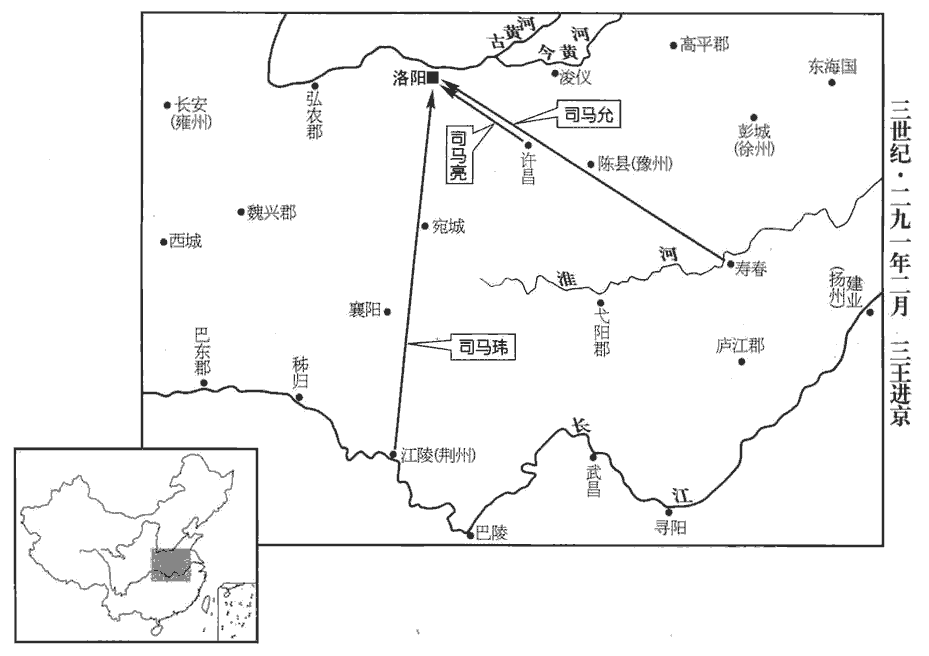
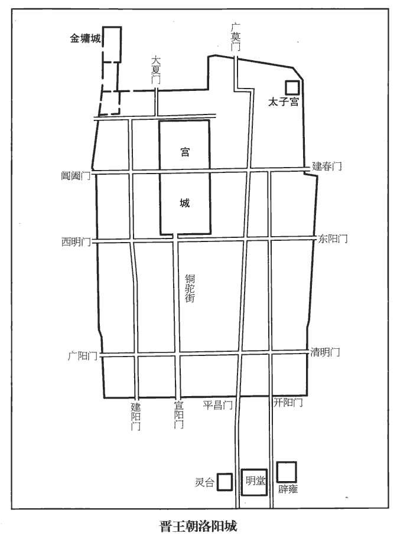
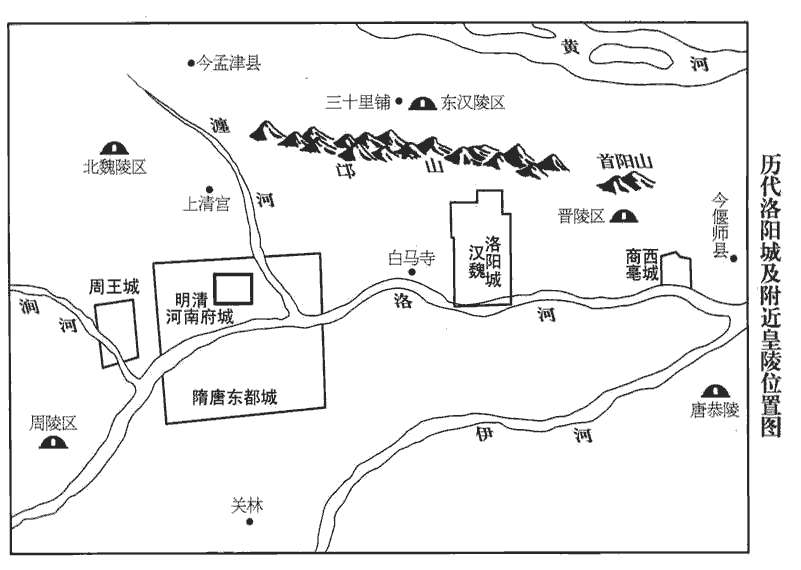
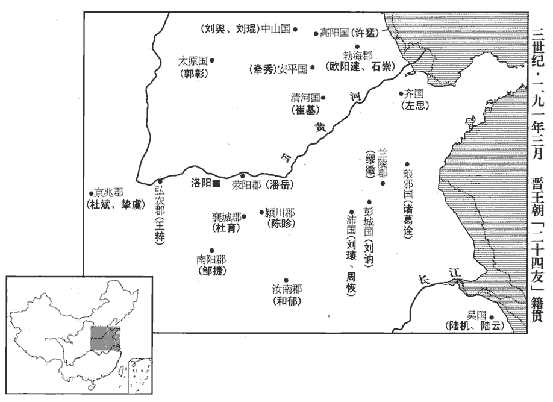
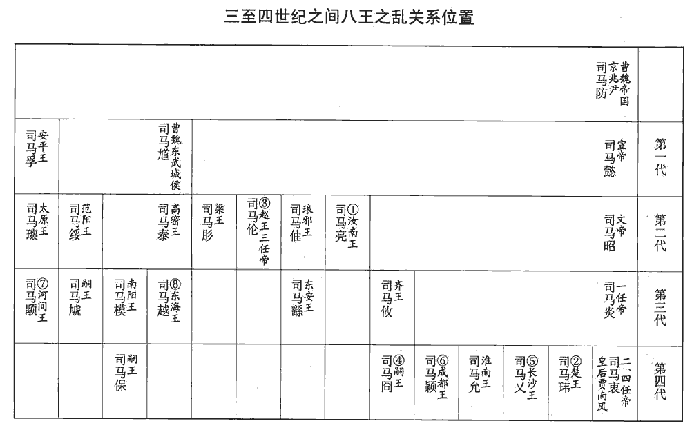
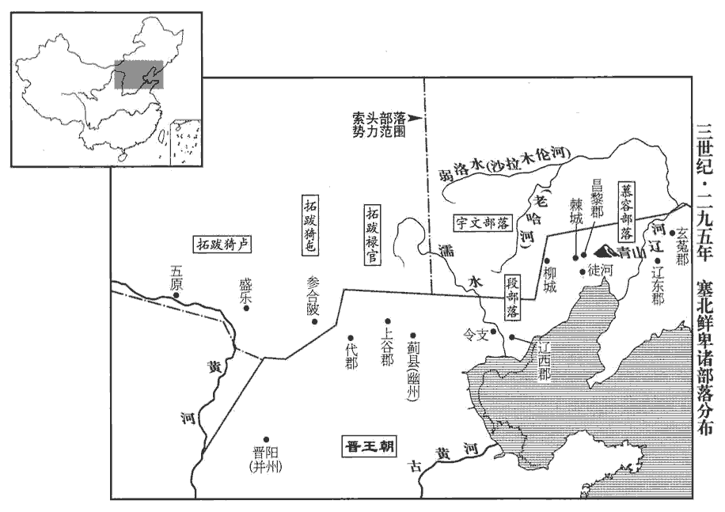
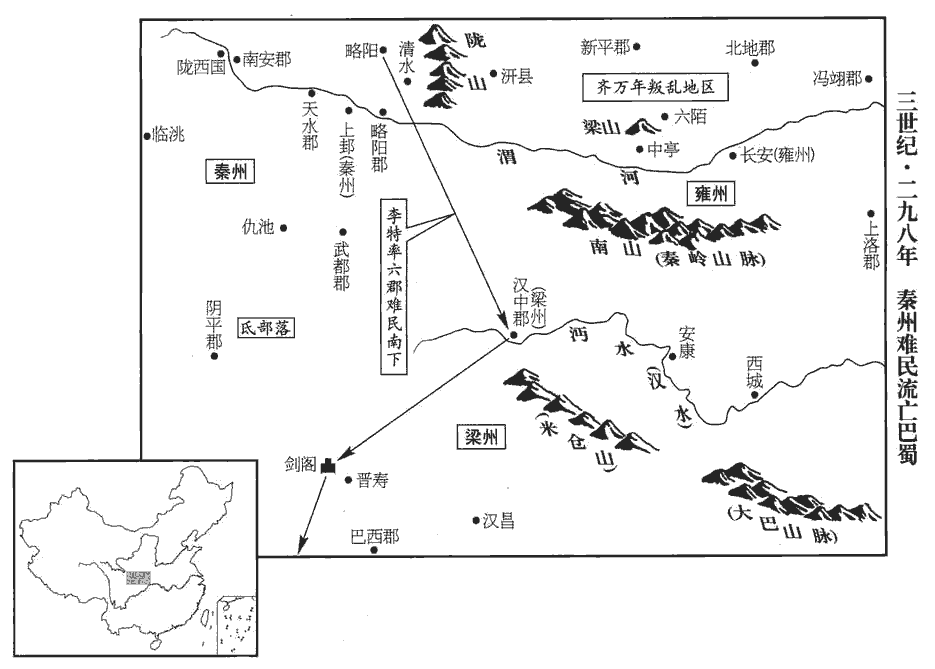

 晉紀四起屠維作噩（己酉），盡著雍敦牂（戊午），凡十年。

# 世祖武皇帝下

## 太康十年（己酉，二八九）

1夏，四月，太廟成；乙巳‹十一›，祫祭；祫xiá，大合祭也。公羊傳曰：大祫者何？合祭也。其合祭奈何？毀廟之主陳于太祖，未毀廟之主皆升，合食於太祖。祫，胡夾翻。大赦。

〖译文〗 [1]夏季，四月，太庙建成。乙巳（十一日），集中远近祖先进行合祭。大赦天下罪人。

2慕容廆wěi遣使請降；降，戶江翻。五月，‹司马炎，时年五十四›詔拜廆鮮卑都督。廆謁見何龕，以士大夫禮，巾衣到門；魏、晉間，士大夫謁見尊貴，以巾褠為禮，褠gōu，單衣也。龕，口含翻。龕嚴兵以見之，廆乃改服戎衣而入。人問其故，廆曰：「主人不以禮待客，客何為哉！」龕聞之，甚慙，深敬異之。受降如受敵，居邊之帥，嚴兵以見四夷之客，未為過也，何必以為慙乎！時鮮卑宇文氏‹内蒙老哈河上游›、段氏‹河北东北部›方強，段氏，東部鮮卑也。杜佑曰：宇文莫槐出於遼東塞外，代為鮮卑東部大人。徒河‹辽宁锦州›段疾陸眷出遼西，因亂，被賣為漁陽烏桓大人厙shè傉nù家奴。厙傉以其健，使將人眾，詣遼西逐食，遂招誘亡叛，以至強盛。余按晉書王浚傳：段疾陸眷，務勿塵之世子。段氏自務勿塵以來，強盛久矣，疾陸眷因亂被掠，容或有之；務勿塵既能為部落之帥，恐不待其子招誘而後能強盛也。數侵掠廆，廆卑辭厚幣以事之。段國單于階以女妻廆，生皝huàng、仁、昭。慕容、段氏遂為婚姻之國。數，所角翻。單，音蟬。妻，七細翻。廆以遼東‹辽宁辽阳›僻遠，徙居徒河‹辽宁锦州›之青山‹辽宁义县东›。徒河縣，前漢屬遼西，後漢屬遼東屬國，魏、晉省，併入昌黎郡界。後慕容氏復置徒河縣，拓跋魏太平真君八年，併徒河入昌黎郡廣興縣。杜佑曰：徒河青山，在營州郡城東百九十里。

〖译文〗 [2]慕容派使者来晋朝请求投降。五月，晋武帝下诏拜慕容为鲜卑都督。慕容晋见何龛，持士大夫的礼节，以幅巾裹发，身着单衣。他到了门口，何龛却整肃部队会见他，慕容于是又改换军服进了门。有人问他为什么要这样做，慕容说：“主人不以礼节来接待宾客，客人又能怎么样呢？”何龛听到了他的话，心中非常惭愧，同时又深深地敬重他，认为他不同寻常。这时，鲜卑的宇文氏、段氏正处于强盛时期，多次侵犯掠夺慕容，慕容只好以恭敬谦卑的言辞和丰厚的钱财侍奉他们。段国单于段阶，把女儿嫁给慕容，生下了慕容、慕容仁、慕容昭。慕容因辽东位于偏僻遥远之地，于是迁居到徒河的青山。

3冬，十月，復明堂及南郊五帝位。明堂、南郊除五帝座，見七十九卷泰始二年。

〖译文〗 [3]冬季，十月，恢复了明堂以及南郊五帝的牌位。

4十一月，丙辰，尚書令濟北成侯荀勗卒。濟，子禮翻。勗有才思，思，相吏翻。善伺人主意，伺，相吏翻。以是能固其寵。久在中書，專管機事。及遷尚書，甚罔悵。罔，與惘同。惘𢠵chǎng失志之貌。悵，亦恨望失志之貌。人有賀之者，勗曰：「奪我鳳皇池，諸君何賀邪！」

〖译文〗 [4]十一月，丙辰（疑误），尚书令、济北成侯荀勖去世。荀勖才思敏捷，善于观察人君的心思，因此能巩固皇帝对他的宠受。他长期在中书省供职，专门掌管机密要事。后来他升迁为尚书令，心中非常惆怅。有人向他贺喜，他说：“夺去我的凤皇池，诸君有什么可祝贺的呢！”中书省设在禁苑，禁苑中有凤皇池，因此中书省又称凤皇池。

5帝極意聲色，遂至成疾。楊駿忌汝南王亮，排出之。甲申‹二十三›，以亮為侍中、大司馬、假黃鉞、大都督、督豫州諸軍事，治【章：甲十一行本「治」作「鎭」；乙十一行本同；孔本同；張校同。】許昌；徙南陽王柬為秦王，都督關中諸軍事；始平王瑋為楚王，都督荊州諸軍事；濮陽王允為淮南王，都督揚、江二州諸軍事；按惠帝元康元年，有司奏荊、揚二州，疆土曠遠，統理尤難，於是割揚州之豫章、鄱陽、廬陵、臨川、南康、建安、晉安，荊州之桂陽、安成、武昌，合十郡，置江州。則此時未有江州也。疑「江二」二字衍，更俟博考。濮，博木翻。并假節之國。晉制：都督諸軍事有使持節，有持節，有假節；使持節得殺二千石以下，持節殺無官位人，若軍事與使持節同；假節惟軍事得殺犯軍令者。立皇子乂為長沙王，穎為成都王，晏為吳王，熾為豫章王，演為代王；皇孫遹yù為廣陵王。熾，昌志翻。遹yù，以律翻。又封淮南王子迪為漢王，楚王子儀為毗陵王，徙扶風王暢為順陽王，暢弟歆為新野公。暢，駿之子也。暢嗣駿爵，而不居關中之任，故徙封。琅邪王覲弟澹為東武公，繇為東安公。覲，伷之子也。晉制：宗室封郡公者，制度如小國王。澹，徒覽翻，又徒濫翻。伷，音胄。

〖译文〗 [5]晋武帝沉湎于音乐和女色，以至于得了病。杨骏嫉妒汝南王司马亮，把他排挤得离开了朝廷。甲申（二十三日），任命司马亮为侍中、大司马、假黄钺、大都督、督豫州诸军事，镇守许昌。迁南阳王司马柬为秦王，都督关中诸军事。任命始平王司马玮为楚王，都督荆州诸军事。任命濮阳王司马允为淮南王，都督扬、江二州诸军事。以上诸王，都持节去他们各自的封国。立皇子司马为长沙王，司马颖为成都王，司马晏为吴王，司马炽为豫章王，司马演为代王；皇孙司马为广陵王。又封淮南王的儿子司马迪为汉王，楚王的儿子司马仪为毗陵王。迁扶风王司马畅为顺阳王，司马畅的弟弟司马歆为新野公。司马畅是司马骏的儿子。封琅邪王司马觐的弟弟司马澹为东武公，司马繇为东安公。司马觐是司马的儿子。

初，帝以才人謝玖賜太子，才人，位次美人。李延壽曰：晉武帝采漢、魏之制，三夫人、九嬪pín之下，有美人、才人、中才人，爵視千石以下。玖，舉有翻。生皇孫遹yù。宮中嘗夜失火，帝登樓望之，遹年五歲，牽帝裾入闇中曰：「暮夜倉猝，宜備非常，不可令照見人主。」帝由是奇之。嘗對群臣稱遹似宣帝，故天下咸歸仰之。帝知太子不才，然恃遹明慧，故無廢立之心。復用王佑之謀，佑，王濟從兄也，與羊祜等并事文帝，帝寵信之。復，扶又翻；下復以同。以太子母弟柬、瑋、允分鎮要害。要害，謂雍、荊、揚之地。又恐楊氏之偪，復以佑為北軍中候，典禁兵。帝為皇孫遹高選僚佐，為，于偽翻。以散騎常侍劉寔志行清素，命為廣陵王傅。自魏以來，王國置師、友，晉避景帝諱，改師為傅。行，下孟翻。

〖译文〗 当初，晋武帝把才人谢玫赐给太子，生下了皇孙司马。有一天夜里，皇宫中失火了，晋武帝登上楼观望。司马当时只有五岁，他牵着晋武帝的衣襟走进昏暗的地方，说：“夜里突然出事，应当防备突如其来的变故，不可以站在亮处，让别人看到人君。”晋武帝从此认为司马很不一般。晋武帝曾经当着群臣称赞司马像晋宣帝，所以天下的人都归心敬慕司马。晋武帝知道太子没有才能，但是凭藉司马的聪明才智，晋武帝才没有废黜太子的想法。晋武帝又用王佑的计谋，把太子的同母弟弟司马柬、司马玮、司马允都派出去镇守要害地区。晋武帝担心会受到杨氏的逼迫，又任王佑为北军中候，党管皇帝的亲兵。晋武帝为了皇孙司马，以很高的标准挑选他身边的僚属与辅佐。散骑常侍刘志向与操守高洁清廉，因此被任命为广陵王司马的老师。

寔以時俗喜進趣，喜，許記翻。趣，讀曰趨。少廉讓，少，詩沼翻。欲【章：甲十一行本「欲」上有「嘗著《崇讓論》」五字；乙十一行本同；孔本同，退齋校同。】令初除官通謝章者，必推賢讓能，乃得通之。一官缺則擇為人所讓最多者用之。以為：「人情爭則欲毀己所不如，讓則競推於勝己。故世爭則優劣難分，時讓則賢智顯出。當此時也，能退身脩己，則讓之者多矣；雖欲守貧賤，不可得也。馳騖進趨而欲人見讓，猶卻行而求前也。」

〖译文〗 刘看到当时的风气是喜好趋附，缺少廉洁与谦让，曾经写了《崇让论》，建议初次被授予官职、递交谢表的人，必须是能够推举、谦让贤能的人，才能够让他通过。如果有空缺的官职，那么就要挑选平时为人谦让最多的人来担任。他认为：“人的本性是：如果争斗起来的话，就要毁谤自己所比不上的人，如果谦让，就会争着推举胜过自己的人。所以如果争斗，世上就优劣难以区分，如果有了谦让的风气，那么贤能才智之人就会显现出来了。在现在这种时候，能够退身自我修养，谦让的人就会多起来，谦让的人多了，即使想守着贫贱不做官，也不可能了。如果奔走趋附想让别人对自己谦让，这就如同想向前走却向后倒退一样。”

淮南‹安徽寿县›相劉頌王國置相，漢制也；晉後改為內史。上疏曰：「陛下以法禁寬縱，積之有素，未可一旦以直繩御下，此誠時宜也。然至於矯世救弊，自宜漸就清肅；譬猶行舟，雖不橫截迅流，然當漸靡而往，稍向所趨，然後得濟也。此引濟川為譬也。濟大川者，雖曰橫絕大川，亂流而渡，然必因水勢漸靡，而行舟向其所趨，以登陸之路，然後汔濟，否則為水勢所使，不能制舟以向所趨，不得登岸矣。

〖译文〗 淮南相刘颂上疏说：“陛下由于刑法禁令宽松放任，想改变这种状况，但是这种局面是平时日积月累形成的，不可能一下子就能用公正的标准治理下民，这确实要等到时势所宜的机会。然而至于矫正世风，救治时弊，自然应当逐渐走向清廉整肃。这就好比行船，虽然不能径直渡过急流，然而应当渐渐随着水势往前走，一点一点地朝着自己要去的方向，然后就能渡过河去。

自泰始以來將三十年，帝受禪，改元泰始，至是二十五年。凡諸事業，不茂既往。言立事造業，不加茂於往時也。以陛下明聖，猶未反叔世之敝，以成始初之隆，傳之後世，不無慮乎！使夫異時大業，或有不安，其憂責猶在陛下也。

〖译文〗 “自从泰始以来，已将近三十年了，各项事业却并没有比以往更加兴旺。凭着陛下的明圣，还没有纠正衰乱时代的弊病，以成就最初的隆盛，传之于后世，这难道不值得忧虑吗？假使以后大业或许不安稳，那么忧虑与责任也还是在陛下。

臣聞為社稷計，莫若封建親賢。然宜審量事勢，量，音良。使諸侯率義而動者，其力足以維帶京邑；若包藏禍心，其勢不足獨以有為。其齊此甚難，陛下宜與達古今之士，深共籌之。帝之使諸王分鎮而內不足以齊之，此劉頌所為深慮也。周之諸侯，有罪誅放其身，而國祚不泯；如周烹齊哀公而立其弟靜，宣王誅魯侯伯御而立孝公之類。漢之諸侯，有罪或無子者，國隨以亡。見前，後漢紀。今宜反漢之敝，循周之舊，則下固而上安矣。余謂晉之所以待藩王者，其宜不在此也。

〖译文〗 “我听说为国家打算，不如分封亲属与贤能之人。然而应当审度、衡量事情发展的趋势。假使诸侯服从正义而行动，其力量足以护卫京城，如果他们包藏祸心，那么他们的势力也不足以独立地有所作为。这件事情要整治好是很困难的，陛下应当与通达古今的人士在一起，共同深入地筹划这件事情。周代的诸侯，如果犯了罪就要遭到惩罚放逐，但其爵位不断绝。汉代的诸侯如果犯了罪或者没有儿子，那么他的封国也就随之失去了。如今应当改变汉代的弊端，遵循周代的旧制度，那么下面巩固上面也就安定了。

天下至大，萬事至眾，人君至少，少，始绍翻。同於天日，是以聖王之化，執要於己，委務於下，非惡勞而好逸，好，呼到翻。誠以政體宜然也。夫居事始以別能否，甚難察也；別，彼列翻。因成敗以分功罪，甚易識也。易，以豉翻；下居易同。今陛下每精於造始而略於考終，此政功所以未善也。人主誠能居易執要，考功罪於成敗之後，則群下無所逃其誅賞矣。

〖译文〗 “天下极其大，万种事物极其多，而君王却极少，就像天空和太阳。因此圣明的君王实行教化，要自己掌握住根本，把事务委托给手下去办理，这并不是好逸恶劳，实在是由于国家的体制适宜于如此。处理事情在一开始的时候就去区分事情办得好还是不好，是很难观察出来的，等到事情的发展显示出了成功与失败，这时候再去区分功劳与罪过就很容易识别了。如今陛下常常是精心于初始的构建却忽略对结局的考察，这正是治理的功效所以不完美的原因。人君如果确实能够处于平易而抓住根本，于成功失败的结局之后考察功劳与罪过，那么手下的官员们就没有地方逃避奖赏与惩治的处理了。

古者六卿分職，冢宰為師；周禮：天官冢宰，地官司徒，春官宗伯，夏官司馬，秋官司寇，冬官司空，是為六卿，而冢宰總之。秦、漢已來，九列執事，丞相都總。此西都以前制也。今尚書制斷，諸卿奉成，自漢光武以來，以吏事責尚書，事歸臺閣，諸卿奉成而已。斷，丁亂翻。於古制為太重。可出眾事付外寺，外寺，謂諸卿寺。使得專之；尚書統領大綱，若丞相之為，歲終課功，校簿賞罰而已，斯亦可矣。今動皆受成於上，上之所失，不得復以罪下，復，扶又翻。歲終事功不建，不知所責也。

〖译文〗 “古时候六卿分工，各司其职，冢宰是统领。秦、汉以来，九卿的职掌，由丞相总管。现在事情都由尚书裁断，各官署奉行成规，与古时候的制度相比，尚书的事务太重。可以把众多的事务交付各官署办理，使各官署有专门负责的权力。尚书统领根本大纲，如同丞相所做的，年终考查功效，校阅簿籍，实行赏罚而已，这也就可以了。现在动不动就接受上面的现成的决定，上面如果有失误、过错，就不能怪罪于下属，等到年终，没有功绩上的建树，也不知该由谁来承担责任。

夫細過謬妄，人情之所必有，而悉糾以法，則朝野無立人矣。近世以来為監司者，類大綱不振而微過必舉，御史臺官及諸州刺史，皆監司也。朝，直遙翻。監，工銜翻。蓋由畏避豪強而又懼職事之曠，則謹密網以羅微罪，使奏劾相接，狀似盡公，而撓法在其中矣。劾，戶概翻，又戶得翻。撓，奴教翻。是以聖王不善碎密之案，必責凶猾之奏，則害政之姦，自然禽矣。夫創業之勳，在於立教定制，使遺風繫人心，餘烈匡幼弱，後世憑之，雖昏猶明，雖愚若智，乃足尚也。言法制脩明，雖後嗣昏愚，有所據依，則其治猶若明智之為也。此言蓋指太子不能克隆堂構，而帝又無典則以貽yí子孫也。然苟非其人，道不虛行，以劉禪之庸而輔之以諸葛亮，則昭烈雖死，猶不死也。孔明死，則孔明治蜀之法制雖存，禪不能守之矣。

〖译文〗 “细微的过失，荒谬的言行，这是人的本性所难免的，但是全都要用刑法来矫正，那么朝野上下就没有人能够立身了。近世以来，担任监察的官员，大都不抓根本大事，却对微小的过失抓住不放，这大概是因为畏惧、躲避豪强却又担心荒废了职责，因此就谨慎地使法律周密，以搜罗微小的过错，使得上奏的揭发罪行的文状接连不断，表面看来是在为公事尽职，实际上却扰乱了法规。因此圣明的君王对那些琐碎细密的公事不感兴趣，而对于那些揭发了凶恶、奸诈大事的奏章则一定要过问，那么损害国家政事的邪恶的人或事，自然就被抓住了。创立基业的功勋，在于设立政令，制定规章，使得遗留下来的风尚能够使后人的心有所寄托；遗留下来的功业，能够辅助、纠正年小而又软弱的后人。后代能够凭借前代制定的法规，即使是昏庸的人，仍然能作出明智的事情，即使是蠢笨无知的人，也如同有才智的人，使得后人足以得到帮助。

至夫脩飾官署，凡諸作役，恆傷太過，恆，戶登翻。不患不舉，此將來所不須於陛下而自能者也。今勤所不須以傷所憑，竊以為過矣。」帝皆不能用。

〖译文〗 “至于那修饰官署的事情，各种劳作，通常是过份得成了一种妨害，这种事情不用担心发动不起来，这是即使到了将来，没有陛下的命令也自然能办成的事情。现在的问题在于，对于不急的事情抓得紧，办得勤恳，但却损伤了所赖以依仗的根本，我私下认为有些过分了。”对他的意见晋武帝都没有采纳。

6詔以劉淵為匈奴北部都尉。時改匈奴五部帥為五部都尉。淵輕財好施，好，呼到翻。施，式智翻。傾心接物，五部豪桀，幽、冀名儒，多往歸之。為劉淵得眾以移晉祚張本。

〖译文〗 [6]晋武帝下诏，任命刘渊为匈奴北部都尉。刘渊轻视钱财，喜好施舍，倾心与人交际，匈奴五部的豪杰之士以及幽州、冀州的名儒，都去投奔、归附他。

7奚軻男女十萬口來降。奚軻，亦夷種也。

〖译文〗 [7]奚轲人男女共十万人投降了晋。

# 孝惠皇帝上之上諱衷，字正度，武帝第二子也。諡法：柔質慈民曰惠。

## 永熙元年（庚戌，二九零）

1春，正月，辛酉朔‹一›，改元太熙。太熙，武帝所改。至四月己酉，太子即位，改元永熙。未踰年改元，猶為非禮，安有先帝初棄群臣，太子即位，而遽以是日改元乎！

〖译文〗 [1]春季，正月，辛酉朔（初一），改年号为太熙。

2己巳‹九›，以王渾為司徒。

〖译文〗 [2]己巳（初九），任命王浑为司徒。

3司空、侍中、尚書令衛瓘guàn子宣，尚繁昌公主。宣嗜酒，多過失，楊駿惡瓘，欲逐之，惡，烏路翻。乃與黃門謀共毀宣，勸武帝奪公主。瓘慙懼，告老遜位。‹司马炎，时年五十五›詔進瓘位太保，以公就第。瓘封菑陽公。

〖译文〗 [3]司空、侍中、尚书令卫的儿子卫宣，尚娶繁昌公主。卫宣嗜酒贪杯，时常因喝酒而误事。杨骏憎恨卫，就想把他驱逐出去。于是，他就和宦官黄门密谋一起诽谤卫宣，劝晋武帝不要把公主嫁给卫宣。卫知道了这件事以后，又惭愧又恐惧，就以上了年纪为由，请求退职。晋武帝下诏，晋升卫为太保，以阳公的身份回到家里。

4劇陽康子魏舒薨‹年八十二›。

〖译文〗 [4]剧阳康子魏舒去世。

5三月，甲子‹五›，以右光祿大夫石鑒為司空。晉志：左、右光祿大夫假金章紫綬及光祿大夫加金章紫綬者，品秩第二。

〖译文〗 [5]三月，甲子（初五），任命右光禄大夫石鉴为司空。

6帝疾篤，未有顧命。勲舊之臣多已物故，侍中車騎將軍楊駿獨侍疾禁中。大臣皆不得在左右，駿因輒以私意改易要近，樹其心腹。會帝小間，間，如字。間者，病小差也。見其新所用者，正色謂駿曰：「何得便爾！」時汝南王亮尚未發，去年，遣亮出督豫州。乃令中書作詔，以亮與駿同輔政，又欲擇朝士有聞望者數人佐之朝，直遙翻。聞，音問。駿從中書借詔觀之，得便藏去，中書監華廙yì恐懼，華，戶化翻。廙yì，逸職翻，又羊至翻。自往索之，終不與。會帝復迷亂，索，山客翻。復，扶又翻。皇后奏以駿輔政，帝頷之。夏，四月，辛丑‹十二›，皇后召華廙及中書令何劭，口宣帝旨作詔，以駿為太尉、太子太傅、都督中外諸軍事、侍中、錄尚書事。詔成，后對廙、劭以呈帝，帝視而無言。廙，歆之孫；劭，曾之子也。華歆仕漢、魏之間，何曾仕魏、晉之間，位皆至公，二人身名相似也。遂趣汝南王亮赴鎮。趣，讀曰促。帝尋小間，問：「汝南王‹司马亮›來未？」左右言未至，帝遂困篤。己酉‹二十›，崩于含章殿。年五十五。坤之六三曰：含章可貞。坤以含弘為德，后道也。含章殿必在皇后宮中。春秋書「公薨于小寢」，即安也。帝宇量弘厚，明達好謀，好，呼到翻。容納直言，未嘗失色於人。

〖译文〗 [6]晋武帝病势沉重，没有遗诏。有功绩的旧臣们大多已经死亡，侍中、车骑将军杨骏独自在宫中侍候晋武帝的病。杨骏不让大臣们守候在晋武帝身边，他趁着这个机会，擅自作主把晋武帝身边重要亲近的职位都换了人，培植他自己的心腹。这时，晋武帝的病情稍微有了好转，他看到身边的人都被更换了，就严肃地对杨骏说：“你怎么能这么作呢？”这时汝南王司马亮还没有离开京都，晋武帝就命令中书作诏书，命令司马亮与杨骏一同辅佐政事，还打算选择中央的官吏中有名望的几个人协助司马亮和杨骏，杨骏从中书借来诏书观看，拿到手里就收藏起来走了。中书监华非常害怕，就到杨骏那里去索要诏书，杨骏最终也没有把诏书还给他。这时晋武帝又进入昏迷装态，皇后上奏任命杨骏辅政，晋武帝点头答应了她。夏季，四月，辛丑（十二日），皇后召来华以及中书令何劭，口头宣布晋武帝的旨意作为诏书，任命杨骏为太尉、太子太傅、都督中外诸军事、侍中、录尚书事。诏书写成之后，皇后当着华、何劭的面呈送给晋武帝，晋武帝看了诏书后什么也没有说。华是华歆的孙子。何劭是何曾的儿子。随后，催促汝南王司马亮奔赴镇所。过了不久，晋武帝的病又有了好转，他就问：“汝南王来了没有？”身边的人说还没有到。这时，晋武帝病重垂危。己酉（二十日），晋武帝在含章殿去世。晋武帝器宇度量开阔宽厚，聪明通达，喜好谋划。能容纳直率的言辞，从来没有在别人面前有不庄重的仪表。

太子‹司马衷，时年三十二›即皇帝位，大赦，改元，改太熙為永熙。尊皇后‹杨芷›曰皇太后，立妃賈氏‹贾南风›為皇后。

〖译文〗 太子登极作了皇帝。大赦天下，改年号为永熙。尊杨皇后为皇太后，立太子妃贾氏为皇后。

楊駿入居太極殿，前殿也。梓宫將殯，六宫出辭，而駿不下殿，時梓宫蓋自含章殿徙殯太極殿也。以虎賁百人自衛，賁音奔。

〖译文〗 杨骏进入太极殿居住，这时晋武帝的棺材将要移到太极殿停柩，六宫妃嫔都出来与晋武帝的灵柩辞别，杨骏却不下殿，用一百名勇士保卫他。

詔石鑒與中護軍張劭監作山陵。監，工銜翻。

〖译文〗 晋惠帝命令石鉴与中护军张劭监督建造陵墓。

汝南王亮畏駿，不敢臨喪，哭於大司馬門外。亮自大司馬出鎮，未行，尚居府中，不敢入宮臨喪，而哭於大司馬府門外。君父之喪，哭於門外，非禮也。出營城外，表求過葬而行。或告亮欲舉兵討駿者，駿大懼，白太后‹杨芷›，令帝為手詔與石鑒、張劭，使帥陵兵討亮。劭，駿甥也，即帥所領趣鑒速發；帥，讀曰率。趣，讀曰促。鑒以為不然，保持之。保亮不舉兵，而持討亮之兵不發也。亮問計於廷尉何勗，勗曰：「今朝野皆歸心於公，朝，直遙翻；下同。公不討人而畏人討邪！」亮不敢發，夜，馳赴許昌，乃得免。駿弟濟及甥河南尹李斌皆勸駿留亮，駿不從。濟謂尚書左丞傅咸曰：「家兄若徵大司馬，退身避之，門戶庶幾可全。」幾，居希翻。咸曰：「宗室外戚，相恃為安。但召大司馬還，共崇至公以輔政，無為避也。」濟又使侍中石崇見駿言之，駿不從。

〖译文〗 汝南王司马亮害怕杨骏，不敢去赴晋武帝的丧事，在大司马府门外哭晋武帝。司马亮到城外居住，上表请求过了晋武帝的葬礼再出发去镇守之地。有人告发说司马亮要兴兵讨伐杨骏，杨骏异学恐惧，告诉了太后，让晋惠帝手写诏书给石鉴和张劭，让他们二人率修建陵墓的士兵去征讨司马亮。张劭是杨骏的外甥，他立即率领部下催促石鉴马上出发。石鉴却认为事情并不是这样，他保证司马亮不会举兵，掌握住手下的士兵不动。司马亮向廷尉何勖询问计策，何勖说：“现在朝野上下都从心里归附于您，您不去讨伐别人，却害怕别人来讨伐您吗？”司马亮不敢发兵，夜里，快马加鞭地奔赴许昌，才免去了一场灾难。杨骏的弟弟杨济以及外甥河南尹李斌都劝杨骏留下司马亮，杨骏不听。杨济对尚书左丞傅咸说：“家兄如果征召大司马司马亮，退身躲避他，那么门户也许可以保全。”傅咸说：“皇族与外戚，相互依赖才能安定。只把大司马召回来，共同本着公正无私的原则辅佐朝政，用不着躲避司马亮。”杨济又让侍中石崇去见杨骏，对他说了这些话，杨骏不听。

五月，辛未‹十三›，葬武帝‹司马炎›于峻陽陵。

〖译文〗 五月，辛未（十三日），在峻阳陵安葬了晋武帝。

楊駿自知素無美望，欲依魏明帝即位故事，普進封爵以求媚於眾。左軍將軍傅祗晉志曰：按魏明帝時有左軍，則左軍魏官也。與駿書曰：「未有帝王始崩，臣下論功者也。」駿不從。祗，嘏gǔ之子也。傅嘏仕魏，顯於嘉平、正元之間。丙子‹十八›，詔中外群臣皆增位一等，預喪事者增二等，二千石已上皆封關中侯，漢獻帝建安二十年，魏武王置關中侯。據晉書帝紀，關中侯又在關內侯之下。復租調一年。復，方目翻。調，徒弔翻。散騎常侍石崇、前書「侍中石崇」，此作「散騎常侍」，必有一誤，蓋因舊史成文也。散騎侍郎何攀共上奏，上，時掌翻。以為：「帝正位東宮二十餘年，今承大業，而班賞行爵，優於泰始革命之初及諸將平吳之功，輕重不稱。稱，尺證翻。且大晉卜世無窮，今之開制，當垂于後，若有爵必進，則數世之後，莫非公侯矣。」不從。

〖译文〗 杨骏心里明白他平时就没有好名声，他想效法魏明帝即位的先例，普遍给大臣们进封爵位，以便讨好众人，收买人心。左军将军傅祗写信对杨骏说：“还没有听说帝王刚死，就给臣下论功行赏的事。”杨骏不听。傅祗是傅嘏的儿子。丙子（十八日），下诏书，朝廷内外群臣一律晋升一级，参预晋武帝丧事的晋升二级，二千石以上的官员一律封为关中侯，免除一年的赋税。散骑常侍石崇、散骑侍郎何攀一起上奏，认为：“皇帝被正式立为太子有二十多年，现在继承了大业，但是遍施奖赏，赐予爵位，比泰始革命之初以及各位将领平吴的功绩得到的奖励还要丰厚，这就使轻重不相称了。况且占卜得知，大晋传国世代无穷，现在开创的制度，是要传之于后世的，如果有爵位就必得进升，那么几代以后，就没有人不是公侯了。”他们的意见不被采纳。

詔以太尉駿為太傅、大都督、假黃鉞，錄朝政，百官總己以聽。傅咸謂駿曰：「諒闇不行久矣。自漢文短喪之詔，嗣君即吉聽政，諒闇三年之制，不行久矣。闇，音陰。今聖上謙沖，委政於公，而天下不以為善，懼明公未易當也。易，以豉翻；下同。周公大聖，猶致流言，周成王幼沖，周公攝政而四國流言。況聖上春秋非成王之年乎！武帝泰始二年，帝為皇太子，時年九歲，至是三十二歲矣。竊謂山陵既畢，明公當審思進退之宜，苟有以察其忠款，言豈在多！」駿不從。咸數諫，駿漸不平，欲出咸為郡守。李斌曰：「斥逐正人，將失人望。」乃止。楊濟遺咸書曰：數，所角翻。遺，于季翻。「諺云：『生子癡，了官事。』官事未易了也。想慮破頭，故具有白。」慮咸以直言致禍也。咸復書曰：「衛公有言：『酒色殺人，甚於作直。』坐酒色死，人不為悔，而逆畏以直致禍，此由心不能正，欲以苟且為明哲耳。詩曰：既明且哲，以保其身。此言世人不能直言，特以苟且為保身之計耳。自古以直致禍者，當由矯枉過正，或不忠篤，欲以亢厲為聲，亢，口浪翻。故致忿耳，安有悾悾忠益而返見怨疾乎！」悾kōng，苦紅翻。悾悾，信也；包咸曰：慤què也。

〖译文〗 晋惠帝下诏书，任命太尉杨骏为太傅、大都督、假黄钺，总领朝政，百官各自掌管自己的职责，听命于杨骏。傅咸对杨骏说：“居丧三年的制度，已经有很久不实行了。如今皇帝谦虚，把政事委托给您，但是天下的人们并不认为这样作好，恐怕您还不容易抵挡。周公是大圣之人，尚且招来了流言蜚语，何况皇帝的年龄并不是当年成王的年龄呢！我私下认为，武帝葬事既已办完，您应当慎重考虑进退的事情了，如果可以证明您的真诚，岂在于言辞的多少呢？”杨骏不听傅咸的话，傅咸又多次劝谏，杨骏逐渐坐不住了，想把傅咸赶出朝廷让他去做郡守。李斌劝杨骏说：“斥逐了正直的人，就要失去人们对你的敬仰。”杨骏才没有赶走傅咸。杨济给傅咸的信上说：“俗语说：‘生一个傻儿子，官场上的事儿他太明白。’对官场上的事情是不宜搞得太清楚的。我为你思考忧虑脑袋都要破了，所以写信提醒你。”傅咸回信说：“卫公有言：‘酒色杀人，比直言杀人还要厉害。’因酒色获罪而死，人们不觉得后悔，但是却害怕由于正直而招来的祸殃，这是由于心不能正，想把苟且偷生当作明智的处世方法以保全自己。自古以来由于正直而招来了灾祸的人，是由于矫正邪恶过了头，或者是因为不是真心实意，想以严酷来博取名声，所以会招来怨恨。哪里会有忠诚恳切做好事，却反而被人憎恨的道理呢？”

楊駿以賈后險悍，多權略，忌之，悍，下罕翻，又侯旰翻。故以其甥段廣為散騎常侍，管機密；張劭為中護軍，典禁兵。凡有詔命，帝省訖，省，悉景翻。入呈太后，然後行之。

〖译文〗 杨骏因为贾后阴险蛮横又富于权术谋略，而忌恨她。所以他任命自己的外甥段广为散骑常侍掌管机密要事；张劭为中护军，统领皇帝的亲兵。凡是有诏命，皇帝看过之后，吴送给太后，然后实行。

駿為政，嚴碎專愎，愎，弼力翻，很也。中外多惡之。惡，烏路翻。馮翊‹陕西大荔›太守孫楚謂駿曰：「公以外戚居伊、霍之任，當以至公、誠信、謙順處之。守，式又翻。處，昌呂翻。今宗室強盛，而公不與共參萬機，內懷猜忌，外樹私昵，禍至無日矣！」昵，尼質翻。駿不從。楚，資之孫也。孫資事魏三祖，掌機密。

〖译文〗 杨骏当政，严厉琐碎而又专断固执，朝廷内外的人都恨他。冯翊太守孙楚对杨骏说：“您以外戚身份担当着伊尹、霍光的重任，应当以公正无私、诚实不欺、谦虚和顺为人处事。当前皇族强盛，而您却不与他们一起参与日常政务，心里怀着猜疑妒忌，在外培植亲近宠爱的人，这样下去，灾祸临头的日子就没有几天了！”杨骏也不听。孙楚是孙资的孙子。

弘訓少府蒯欽，駿之姑子也，數以直言犯駿，他人皆為之懼，景皇后居弘訓宮，置少府。數，所角翻。為，于偽翻。欽曰：「楊文長雖闇，猶知人之無罪不可妄殺，楊駿，字文長。不過疏我，我得疏，乃可以免；不然，與之俱族矣。」

〖译文〗 弘训少府蒯钦，是杨骏姑姑的儿子，多次以直言冒犯杨骏，别人都为他担惊受怕，蒯钦说：“杨骏虽然昏庸，仍然知道对没有罪过的人不可以乱杀，他只不过会疏远我，我被他疏远，就可以免去灾祸，要是不这么做，我就会和他一起被灭族了。”

駿辟匈奴東部‹山西汾阳›人王彰為司馬，匈奴東部即匈奴左部也，居太原茲氏縣。彰逃避不受。其友新興‹山西忻州›張宣子怪而問之，漢獻帝建安二十年，省雲中、定襄、五原、朔方郡，郡置一縣，領其民，合為新興郡，屬并州。彰曰：「自古一姓二后，未有不敗。況楊太傅昵近小人，疏遠君子，近，其靳翻。遠，于願翻。專權自恣，敗無日矣。吾踰海出塞以避之，猶懼及禍，奈何應其辟乎！且武帝不惟社稷大計，惟，思也。嗣子既不克負荷，荷，下可翻。受遺者復非其人，天下之亂，可立待也。楊駿之敗，人皆知之，獨駿不知耳。凶人吉其凶，其謂是乎！復，扶又翻。

〖译文〗 杨骏征召匈奴东部人王彰为司马，王彰逃避不接受。王彰的朋友新兴人张宣子责怪他，问他为什么这样做，王彰说：“自古以来，一姓却有两位皇后，就没有不败亡的。何况太傅杨骏亲近小人，疏远君子，专权放纵，败亡没有几天了。我跨海出关地躲避他，尚且害怕祸事殃及到我身上，为什么还要响应他的征召呢？而且武帝不考虑国家的大计，继位的儿子已经不能挑起重担，接受遗诏辅佐的人又不是合适的人选，天下的动乱很快就会到来。”

7秋，八月，壬午‹二十六›，立廣陵王遹為皇太子。以中書監何劭為太子太師，衛尉裴楷為少師，吏部尚書王戎為太傅，前太常張華為少傅，衛將軍楊濟為太保，尚書和嶠為少保。晉東宮六傅，惟此時具官。拜太子母謝氏‹谢玖›為淑媛。媛，于眷翻。晉志：淑妃、淑媛、淑儀、脩華、脩容、脩儀、婕妤、容華、充華，是為九嬪，銀印，青綬。賈后常置謝氏於別室，不聽與太子相見。初，和嶠嘗從容言於武帝曰：從，千容翻。「皇太子有淳古之風，而末世多偽，恐不了陛下家事。」武帝默然。後與荀勗等同侍武帝，武帝曰：「太子近入朝差長進，朝，直遙翻。長，丁丈翻，今知兩翻。卿可俱詣之，粗及世事。」粗，坐五翻，略也。既還，勗等并稱太子明識雅度，誠如明詔。嶠曰：「聖質如初。」武帝不悅而起。及帝即位，嶠從太子遹入朝，賈后使帝問曰：「卿昔謂我不了家事，今日定如何？」嶠曰：「臣昔事先帝，曾有斯言；言之不效，國之福也。」

〖译文〗 [7]秋季，八月，壬午（二十六日），立广陵王司马为皇太子。任命中书监何劭为太子太师，卫尉裴楷为少师，吏部尚书王戎为太傅，前太常张华为少傅，卫将军杨济为太保，尚书和峤为少保。拜太子的母亲谢氏为淑媛。贾后常常把谢氏安排在另外的房间居住，不让她和太子相见。当初，和峤曾经从容地对晋武帝说：“皇太子朴质而在古风，但是将要衰乱的时代多伪诈，恐怕他不能办好陛下的家事。”晋武帝沉默不语。后来，和峤与荀勖等人一起在晋武帝身边伺候，晋武帝说：“太子近来进入朝廷稍微有了长进，你们可以一起去他那里，粗略地问他一些当世的事情。”于是他们就去了太子那里，回来以后，荀勖等人都称赞太子聪明有见识，气度不凡，确实如武帝说的那样。和峤却说：“太子的资质和原来一样。”晋武帝不高兴地站起身来。等到太子继位作了皇帝。和峤跟随太子司马入朝，贾后让晋惠帝问和峤：“你以前说我不明了家事，今天究竟怎么样呢？”和峤说：“我从前奉事先帝，曾经说过这话，我说的话没有得到证实，这是国家的幸运。”

8冬，十月，辛酉‹六›，以石鑒為太尉，隴西王泰為司空。

〖译文〗 [8]冬季，十月，辛酉（初六），任命石鉴为太尉，陇西王司马泰为司空。

9以劉淵為建威將軍、匈奴五部大都督。淵為五部大都督，則左國城大單于之權輿也。

〖译文〗 [9]任命刘渊为建威将军、匈奴五部大都督。

## 元康元年（辛亥，二九一）

1春，正月，乙酉朔‹一›，改元永平。永平，楊駿執政所改元也。駿誅，改元元康。

〖译文〗 [1]春季，正月，乙酉朔（初一），改年号为永平。

2初，賈后之為太子妃也，嘗以妬，手殺數人，又以戟擲孕妾，子隨刃墮；孕，以證翻。武帝大怒，脩金墉城‹洛阳西北角离宫›，將廢之。荀勗xù、馮紞dǎn、楊珧yáo紞，丁感翻。珧，余招翻。及充華趙粲共營救之，曰：「賈妃年少；妬者婦人常情，長自當差。」少，詩詔翻。長，知兩翻。差，楚懈翻。楊后曰：「賈公閭有大勳於社稷，賈充，字公閭。晉之代魏，充力居多。妃親其女，正復妬忌，豈可遽忘其先德邪！」復，扶目翻。妃由是得不廢。

〖译文〗 [2]当初，贾皇后还是太子妻子时，曾经由于嫉妒，亲手杀了几个人，她还用戟投掷怀有身孕的姬妾，使孕妇肚子里的胎儿随着刀锋而落地。晋武帝动怒，修了金墉城要把她废黜。荀勖、冯、杨珧以及嫔纪赵粲都想办法援救她，对晋武帝说：“贾妃年轻，嫉妒本是妇人的本性，长大了自然就会变好的。”杨皇后说：“贾充对国家有大功，贾妃是他的女儿，即使嫉妒，怎么可以这么快就忘记她先人的功德呢？”贾妃因此而没有被废。

后數誡厲妃，數，所角翻。妃不知后之助己，返以后為搆己於武帝，更恨之。及帝即位，賈后不肯以婦道事太后，又欲干預政事，而為太傅駿所抑。殿中中郎渤海‹河北南皮›孟觀、李肇，皆駿所不禮也，晉制：二衛置殿中將軍中郎、校尉司馬。觀，如字。陰構駿，云將危社稷。黃門董猛，素給事東宮，為寺人監，寺人監，主東宮諸閹。陸德明曰：寺，如字，又音侍。賈后密使猛與觀、肇謀誅駿，廢太后。又使肇報汝南王亮，使舉兵討駿，亮不可。肇報都督荊州諸軍事楚王瑋，瑋欣然許之，乃求入朝。駿素憚瑋勇銳，欲召之而未敢，因其求朝，遂聽之。二月，癸酉‹二十›，瑋及都督揚州諸軍事、淮南王允來朝。朝，直遙翻。

〖译文〗 杨皇后多次训斥贾妃，贾妃不知皇后这样做是为了帮助她，反而认为皇后在武帝面前陷害她，因而仇恨杨皇后。后来晋惠帝即位，贾皇后不肯以儿媳的身份侍奉皇太后，还想要干预政事，但却被太傅杨骏所遏制。殿中中郎渤海人孟观、李肇，都是杨骏不以礼相待的人，暗地里图谋杨骏，说他将危害国家。宦官黄门董猛，平时在东宫供职，主管宦官。贾皇后秘密指使董猛与孟观、李肇谋划除掉杨骏，废黜太后。又派李肇告知汝南王司马亮，让他发兵讨伐杨骏，司马亮没有答应。李肇告诉了都督荆州诸军事楚王司马玮，司马玮欣然同意，就请求入朝。杨骏平时就畏惧司马玮的勇猛强悍，想召他来又不敢，这次司马玮请求入朝，杨骏就同意了。二月，癸酉（二十日），司马玮和都督扬州诸军事、淮南王司马允入朝求见。

 

三月，辛卯‹八›，孟觀、李肇啟帝‹司马衷，时年三十三›，夜作詔，誣駿謀反，中外戒嚴，遣使奉詔廢駿，以侯就第。駿封臨晉侯。命東安公繇yáo帥殿中四百人討駿，帥，讀曰率。楚王瑋屯司馬門，以淮南相劉頌為三公尚書，漢成帝置三公尚書，主斷獄；光武以三公曹主歲盡考課諸州郡事。屯衛殿中。段廣跪言於帝曰：「楊駿孤公無子，豈有反理，願陛下審之！」廣，駿甥也，使為近侍，以防左右間己；然終無益也。帝不答。

〖译文〗 三月，辛卯（初八），孟观、李肇禀告晋惠帝，夜里撰写诏书，诬陷杨骏谋反，朝廷内外戒严，派遣使者遵诏命废除杨骏，以侯爵的身份回家。命令东安公司马繇率领殿中四百人讨伐杨骏，楚王司马玮驻守在司马门，任命淮南相刘颂为三公尚书，驻兵守卫毅中。段广跪着对晋惠帝说：“杨骏孤单没有儿子，岂有谋反的道理，希望陛下慎重考虑。”晋惠帝不回答。

 

時駿居曹爽故府，在武庫南，聞內有變，召眾官議之。太傅主簿朱振說駿曰：「今內有變，其趣可知，必是閹豎為賈后設謀，不利於公，宜燒雲龍門以脅之，索造事者首，開萬春門，雲龍門，洛陽宮城正南門；萬春門，東門也。說，輸芮翻。為，于偽翻。索，山客翻。引東宮及外營兵擁皇太子入宮，取姦人，殿內震懼，必斬送之。不然，無以免難。」難，乃旦翻。駿素怯懦，不決，乃曰：「雲龍門，魏明帝所造，功費甚大，柰何燒之！」侍中傅祗白駿，請與尚書武茂入宮觀察事勢，因謂群僚曰：「宮中不宜空。」遂揖而下階。眾皆走，茂猶坐。祗顧曰：「君非天子臣邪？今內外隔絕，不知國家所在，國家，謂天子也。自東漢以來，皆然。何得安坐！」茂乃驚起。駿黨左軍將軍劉豫陳兵在門，遇右軍將軍裴頠wěi，魏有左軍，武帝又置前軍、右軍，泰始八年，又置後軍，是為四軍。頠，魚毀翻。問太傅所在，頠紿之曰：紿dài，徒亥翻。「向於西掖門遇公乘素車，從二人西出矣。」豫曰：「吾何之？」頠曰：「宜至廷尉。」豫從頠言，遂委而去。委兵而去也。尋詔頠代豫領左軍將軍，屯萬春門。頠，秀之子也。裴秀見七十八卷魏元帝咸熙元年。皇太后題帛為書，射之城外射，而亦翻；下同。曰：「救太傅者有賞。」賈后因宣言太后同反。尋而殿中兵出，燒駿府，又令弩手於閣上臨駿府而射之，駿兵皆不得出。駿逃于馬廄，就殺之。孟觀等遂收駿弟珧、濟，張劭、李斌、段廣、劉豫、武茂及散騎常侍楊邈、中書令蔣俊、東夷校尉文鴦，皆夷三族，死者數千人。

〖译文〗 当时杨骏住在曹爽从前的宅第，位置在武器库南边，他听到皇宫内有变动，就召集各位官员商议。太傅主簿朱振劝说杨骏道：“现在宫中发生了事变，它的趋向可以知道，一定是那些宦官给贾皇后出的主意，对您很不利。应当烧了云龙门逼迫他们，索要起事者的人头，打开万春门，带领东宫以及外营兵围护着皇太子进宫，捉拿恶人，宫殿之内震动恐惧，必定会斩肇事者送来，不这样的话，没有办法免于灾难。”杨骏素来怯懦，下不了决心，说道：“云龙门是魏明帝所造，劳力、耗费非常大，为什么要把它烧了？”侍中傅祗禀告杨骏，请求和尚书武茂进宫观察事态的发展，他对官员们说：“宫中不宜空虚。”然后拱手行礼下了台阶。官员们都跑了，武茂还坐在那里。傅祗回过头对他说：“你难道不是天子的臣下吗？如今内外隔绝，不知道天子在哪里，你怎么还能坐得住呢？”武茂于是惊觉而起。杨骏的党羽、左军将军刘豫，领兵列阵守候在门外，遇到右军将军裴，他问裴杨骏在哪里，裴欺骗他说：“我刚才在西掖门遇到杨骏，他乘着白色的车子，有两个人跟着他向西去了。”刘豫说：“我应该去哪里？”裴说：“应该去廷尉。”刘豫听从裴的话，就把士兵托付给裴，他就走了。不久，命令裴代替刘豫兼任左军将军，驻守万春门。裴是裴秀的儿子。皇太后把信写在绢帛上，用箭射出城外，上面写着“救太傅者有赏”。贾后就利用这件事宣称，太后与杨骏一起谋反。不久，宫中的士兵们出去了，放火烧杨骏的府第，弓弩手在楼阁上对着杨骏的府第放箭，杨骏的士兵们没有办法出来。杨骏逃到马房里，被人杀死在那里。孟观等人于是拘捕了杨骏的弟弟杨珧、杨济，张劭、李斌、段广、刘豫、武茂以及散骑常侍杨邈、中书令蒋俊、东夷校尉文鸯，这些人都被夷灭三族，被处死的人有几千。

 

珧臨刑，告東安公繇曰：「表在石函，珧表見八十卷武帝咸寧三年，作石函藏之宗廟。摯虞云：廟主藏於戶之外，西墉之中，有石函，名曰宗祏shí，函中笥以盛主。可問張華。」眾謂宜依鍾毓yù例為之申理。鍾毓例見七十八卷魏元帝咸熙元年。為，于偽翻。繇不聽，而賈氏族黨趣使行刑，趣讀曰促。珧號呌不已，號，户刀翻。刑者以刀破其頭。繇，諸葛誕之外孫也，故忌文鴦，以為駿黨而誅之。諸葛誕、文鴦事見七十七卷魏高貴鄉公甘露三年。是夜，誅賞皆自繇出，威振內外。王戎謂繇曰：「大事之後，宜深遠權勢。」繇不從。遠，于願翻。

〖译文〗 杨珧临刑的时候，请求东安公司马繇说：“我以前给晋武帝的表奏就放在石头匣子里，你可以问张华。”众人认为应当按照钟毓的先例为杨珧申述昭雪，司马繇不答应，而贾氏家族的同党又催促赶快执行死刑。杨珧不停地呼号叫喊，执行死刑的人用刀劈开了他的头。司马繇是诸葛诞的外孙，以前就忌恨文鸯，这次就把文鸯当作杨骏的党羽一起杀了。这一夜，要杀谁，要赏谁，都由司马繇说了算，他的威势震动了朝廷内外。王戎对司马繇说：“大事处理完之后，应当深藏远离权势。”司马繇不听。

壬辰‹九›，赦天下，改元。改元元康。

〖译文〗 壬辰（初九），赦天下，改年号为元康。

賈后矯詔，使後軍將軍荀悝kuī送太后於永寧宮，魏建永寧宮，太后居之。悝，苦回翻。特全太后母高都君龐氏之命，聽就太后居。龐，皮江翻。尋復諷群公有司奏曰：「皇太后陰漸姦謀，履霜者，堅冰之漸，言陰始凝而至於堅冰也。此誣楊太后以為與駿為姦謀，非一日之積也。復，扶又翻；下可復、司復同。漸，如字。圖危社稷，飛箭繫書，要募將士，要，讀曰邀。將，即亮翻。同惡相濟，自絕于天。魯侯絕文姜，春秋所許。文姜，魯桓公之夫人也。齊襄公殺桓公，文姜與焉。魯莊公既立，夫人孫于齊。穀梁傳曰：不言氏姓，貶之也。人之於天也，以道受命；於人也，以言受命。不若於道者，天絕之也；不若於人者，人絕之也。蓋奉祖宗，任至公於天下，陛下雖懷無已之情，臣下不敢奉詔。」詔曰：「此大事，更詳之。」有司又奏：「宜廢太后曰峻陽庶人。」武帝陵曰峻陽。中書監張華議：「太后非得罪於先帝，今黨其所親，為不母於聖世，宜依漢廢趙太后為孝成后故事，事見三十五卷漢哀帝元壽元年。貶皇太后之號，還稱武皇后，居異宮，以全始終之恩。」左僕射荀愷與太子少師下邳王晃等議曰：「皇太后謀危社稷，不可復配先帝，宜貶尊號，廢詣金墉城。」於是有司奏從晃等議，廢太后為庶人；詔可。又奏：「楊駿造亂，家屬應誅，詔原其妻龐命，以尉太后之心。今太后廢為庶人，請以龐付廷尉行刑。」詔不許；有司復固請，乃從之。龐臨刑，太后‹杨芷›抱持號叫，截髮稽顙，上表詣賈后稱妾，請全母命；不見省。號，戶刀翻。稽，音啟。省，悉景翻。董養遊太學，董養，浚儀‹河南开封›隱者也。升堂歎曰：「朝廷建斯堂，將以何為乎！言庠xiáng序所以申孝弟之義，今滅母子之大倫，則建學果何為也。每覽國家赦書，謀反大逆皆赦，至於殺祖父母、父母不赦者，以為王法所不容故也。柰何公卿處議，文飾禮典，乃至此乎！處，昌呂翻。天人之理既滅，大亂將作矣。」養後與妻荷擔入蜀，不知所終。

〖译文〗 贾皇后诈称皇帝诏书，派后军将军荀悝送太后去永宁宫居住，特别保全了太后母亲高都君庞氏的性命，同意她去太后那里居住。不久，贾皇后又劝说各位大臣通过有关部门上奏说：“皇太后早就在暗中进行邪恶的谋划，企图危害国家，用飞箭捎带书信，招募将士，与邪恶之人狼狈为奸，自动与天相绝。鲁侯与文姜断绝关系，这是《春秋》所赞许的。至于侍奉祖宗，在天下担当起公正无私的责任，陛下虽然是怀着不得已的感情，臣下也不敢奉命而行。”晋惠帝下诏书说：“这是大事，要再慎重一些。”有关部门又上奏说：“应当废太后为峻阳庶人。”中书监张华提议：“太后并没有获罪于先帝，如今偏私她所亲近的人，为人之母，在圣世没有作出榜样，应当按照汉代废赵太后为孝成后的旧例，贬皇太后的尊号，还称她为武皇后，让她在别的宫里居住，以保全从始到终的德惠。”左仆射荀恺与太子少师、下邳王司马晃等人提议说：“皇太后图谋危害国家，不能再与先帝相配，应当贬去她的尊号，废了她，让她去金墉城。”这时，有关部门上奏，遵从司马晃等人的提议，把太后废为平民。皇帝下诏书同意这一决定。又有有关部门上奏说：“杨骏造反作乱，他的家属应当被处死，诏命怒免了他的妻子庞氏的性命，以安尉太后之心。现在太后被废为平民，请求把庞氏交付廷尉执行死刑。”皇帝诏命不赞同，有关部门又坚持请求，皇帝就听从了这个意见。庞氏监刑的时候，太后抱住她号哭叫喊，割断头发，跪下来以额触地。太后上表要去贾后那里当奴仆，请求保全母亲性命，却不被理睬。董养出游到了太学，登上殿堂感叹地说：“朝廷建立了此堂，将要用它来作什么呢？每当观看国家大赦的文书，像谋反这样极大的罪恶都能赦免，但是对于杀了祖父、祖母，杀了父亲、母亲之罪却不赦免，原因就在于这样的罪恶是帝王制定的法律所不能宽容的。但是为什么公卿处理意见，修饰礼仪制度，竟到了如此地步呢？天道人事的法则已经灭绝，大的动乱就要兴起了。”

有司收駿官屬，欲誅之。侍中傅祗啟曰：「昔魯芝為曹爽司馬，斬關赴爽，事見七十五卷魏邵陵厲公嘉平元年。宣帝用為青州刺史。駿之僚佐，不可悉加罪。」詔赦之。

〖译文〗 有半机构拘捕了杨骏的下属官吏，想杀了他们。侍中傅祗陈述说：“从前鲁芝任曹爽的司马，冲破关隘去奔赴曹爽，晋宣帝还任用他作青州刺史。杨骏的僚属，不能都给他们加上罪名。”于是皇帝下诏书赦免了他们。

壬寅‹十九›，徵汝南王亮為太宰，與太保衛瓘皆錄尚書事，輔政。以秦王柬為大將軍，東平王楙máo為撫軍大將軍，楚王瑋為衛將軍、領北軍中候，下邳王晃為尚書令，東安公繇為尚書左僕射，進爵為王。楙，望之子也。封董猛為武安侯，三兄皆為亭侯。

〖译文〗 壬寅（十九日），征召汝南王司马亮任太宰，与太保卫都任录尚书事，辅佐朝政。任命秦王司马柬为大将军，东平五司马为抚军大将军，楚王司马玮为卫将军、兼北军中候，下邳王司马晃为尚书令，东安公司马繇为尚书左仆射，晋升爵位为王。司马是司马望的儿子。封董猛为武安侯，他的三个哥哥都被封为亭侯。

亮欲取悅眾心，論誅楊駿之功，督將侯者千八十一人。將，即亮翻。御史中丞傅咸遺亮書曰：「今封賞熏赫，震動天地，自古以來，未之有也。無功而獲賞，則人莫不樂國之有禍，是禍原無窮也。濫賞所以開覬幸之心，其禍誠如此。遺，于季翻。樂，音洛。凡作此者，由東安公。人謂殿下既至，當有以正之，正之以道，眾亦何怒！眾之所怒者，在於不平耳；而今皆更倍論，言亮論功行賞，又倍於東安公之時也。莫不失望。」亮頗專權勢，咸復諫曰：「楊駿有震主之威，委任親戚，此天下所以諠譁。今之處重，宜反此失，靜默頤神，有大得失，乃維持之，自非大事，一皆抑遣。比過尊門，冠蓋車馬，填塞街衢，此之翕習，既宜弭息。翕，眾也，合也。習，重也，因也，仍也。言眾人翕合，相因而至也。復，扶又翻。處，昌呂翻。比，毗至翻。塞，悉則翻，又夏侯長容無功而暴擢為少府，論者謂長容，公之姻家，夏侯駿，字長容。婿家女之所因，故曰姻。鄭玄曰：婿父曰姻。夏，戶雅翻。故至於此，流聞四方，非所以為益也。」亮皆不從。

〖译文〗 司马亮想取得众人对他的喜爱之心，论次评定铲除杨骏的功劳，督将中有一千零八十一人分别被封了侯的爵位。御史中丞傅咸写信给司马亮说：“如今赏赐显赫盛大，震动了天地，是自古以来所不曾有过的。没有功劳却可以得到奖赏，那么人人都希望国家有祸事，这就使灾祸的根源没有穷尽了。开了这个头的人是东安公司马繇。人们以为殿下您来到后，应当有所匡正、整饬，以法规来匡正政务，众人又有什么可发怒的理由呢？众人之所以动怒，原因在于不公正，而现在加倍论功行赏更甚于东安公，大家都很失望。”司马亮对于权势独断专行，傅咸又进谏说：“杨骏有震动君王的权势，任用他的亲戚，这正是天下喧闹的原因。您现在处于重要的地位，应当纠正杨骏的错误，沉静缄默，保养精神，有了大的事情就去维系、保持，如果不是什么大事，就不要去管。我多次经过府上，看到官吏的车马把道路都堵塞了，这种众人争相趋附的状况应当停止。另外，夏侯骏没有功劳却突然被越级提拔为少府，人们议论说，夏侯骏就因为是和您有婚姻关系的亲戚，所以才能有今天的地位，传闻远播四方，这并不是有益的事情。”司马亮一概听不进去。

賈后族兄車騎司馬模、從舅右衛將軍郭彰、晉文帝置中衛及衛將軍，武帝受命，分為左右衛將軍。從，才用翻。女弟之子賈謐mì賈后女弟賈午適韓壽，生謐。賈充無後，以謐為後。與楚王瑋、東安王繇，并預國政。賈后暴戾日甚，繇密謀廢后，賈氏憚之。繇兄東武公澹，素惡繇，惡，烏路翻。屢譖之於太宰亮曰：「繇專行誅賞，欲擅朝政。」庚戌‹二十七›，詔免繇官；又坐有悖言，廢徙帶方‹朝鲜半岛沙里院城›，帶方縣，漢屬樂浪郡，公孫度置帶方郡。杜佑曰：建安中，公孫康分屯有、有鹽縣以南荒地，置帶方郡。

〖译文〗 贾皇后同族哥哥、车骑司马贾模，贾皇后母亲的堂兄弟、可卫将军郭彰，贾皇后妹妹的儿子贾谧，与楚王司马玮、东安王司马繇一起参与国政。贾皇后的凶恶乖张一天比一天厉害。司马繇秘密谋划要废掉贾皇后，贾氏很害怕。司马繇的哥哥、东武公司马澹，平时就憎恨司马繇，多次在太宰司马亮面前诬陷司马繇说：“司马繇擅自决定惩罚与赏赐，他这是要独揽朝政。”庚戌（二十七日），皇帝下诏书免去司马繇的官职，又因为有忤逆言论而获罪，被废黜迁徒到带方县。

於是賈謐、郭彰權勢愈盛，賓客盈門。謐雖驕奢而好學，喜延士大夫，好，呼到翻。，喜，許記翻。郭彰、石崇、陸機、機弟雲、和郁及滎陽‹河南滎陽›潘岳、武帝泰始二年，分河南置滎陽郡。清河‹山东临清›崔基、齊大夫崔氏之後。勃海‹河北南皮›歐陽建、姓譜：越王句踐之後封於烏程歐陽，子孫因以為氏。蘭陵‹山东苍山西南兰陵镇›繆徵、是年，分東海置蘭陵郡。京兆‹西安›杜斌、摯虞、按毛詩傳，摯國出於任姓，子孫以國為氏。琅邪‹山东临沂›諸葛詮、詮，且緣翻。弘農‹河南灵宝东北›王粹、襄城‹河南襄城›杜育、武帝泰始二年，分汝南置襄城郡。南陽‹河南南阳›鄒捷、齊國‹山东淄博东临淄镇›左思、沛國‹安徽淮北›劉瓌guī、周恢、安平‹河北冀县›牽秀、潁川‹河南许昌东›陳眕zhěn、高陽‹河北博野东南›許猛、泰始元年，分河間涿郡置高陽國。瓌guī，姑回翻。眕zhěn，止忍翻。彭城‹江苏徐州›劉訥nè、中山‹河北定州›劉輿、輿弟琨皆附於謐，號曰二十四友。郁，嶠之弟也。崇與岳尤諂事謐，每候謐及廣城君郭槐出，皆降車路左，望塵而拜。

〖译文〗 从这时开始，贾谧、郭彰的权势日益兴盛起来，宾客挤破了门。贾谧虽然骄横奢侈，但却爱好学问，喜欢接纳士大夫。郭彰、石崇、陆机、陆机的弟弟陆云、和郁以及荥阳人潘岳、清河人崔基、勃海人欧阳建、兰陵人缪征、京兆人杜斌、挚虞，琅邪人诸葛诠、弘农人王粹、襄城人杜育、南阳人邹捷、齐国人左思、沛国人刘、周恢、安平人牵秀、颖川人陈、高阳人许猛、彭城人刘讷、中山人刘舆、刘舆的弟弟刘琨，都归附于贾谧的门下，号答二十四友。和郁是和峤的弟弟。石崇和潘岳，格外谄媚地侍奉贾谧，每当等候到贾谧以及广城君郭槐出来了，就赶紧从车子上下来，站在道路的左边，望着贾谧、郭槐车后扬起的尘土行跪拜礼。

 

3太宰亮、太保瓘以楚王瑋剛愎好殺，惡之，愎，蒲逼翻。好，呼到翻。惡，烏路翻；下同。欲奪其兵權，以臨海侯裴楷代瑋為北軍中候，瑋怒；楷聞之，不敢拜。不敢拜受中候之職。亮復與瓘謀，復，扶又翻；下復矯同。遣瑋與諸王之國，瑋益忿怨。瑋長史公孫宏、舍人岐盛，姓譜：古有岐伯為黃帝師。又周太王居岐山，文王遷豐，其支庶留岐者，為岐氏。皆有寵於瑋、勸瑋自昵於賈后；昵，尼質翻。后留瑋領太子少傅。盛素善於楊駿，衛瓘惡其反覆，將收之。盛乃與宏謀，因積弩將軍李肇武帝泰始四年，罷振威、揚威護軍，置左、右積弩將軍。一說：晉太康中，置積射、積弩營，營二千五百人，并以將軍領之。矯稱瑋命，譖亮、瓘於賈后，云將謀廢立。后素怨瓘，以瓘撫牀事也，見八十卷武帝咸康四年。且患二公執政，己不得專恣，夏，六月，后使帝作手詔賜瑋曰：「太宰、太保欲為伊、霍之事，王宜宣詔，令淮南、長沙、成都王屯諸宮門，免亮及瓘官。」夜，使黃門齎以授瑋。瑋欲覆奏，黃門曰：「事恐漏泄，非密詔本意也。」瑋亦欲因此復私怨，遂勒本軍，本軍，瑋所掌北軍也。復矯詔召三十六軍，晉洛城內外三十六軍。告以「二公潛圖不軌，吾今受詔都督中外諸軍，諸在直衛者，皆嚴加警備；其在外營，便相帥徑詣行府，助順討逆。」帥，讀曰率。又矯詔「亮、瓘官屬，一無所問，皆罷遣之；若不奉詔，便軍法從事。」遣公孫宏、李肇以兵圍亮府，侍中清河王遐收瓘。

〖译文〗 [3]太宰司马亮、太保卫，由于楚王司马玮傲慢固执又喜好杀人，因而憎恨他，想夺了他的兵权，让临海侯裴楷代替司马玮担任北军中候的职务。司马玮大怒，裴楷听说以后，不敢接受北军中候的官职。司马亮又和卫在一起密谋，派司马玮和各诸侯王去自己的封国，司马玮越发愤恨不满。司马玮的长史公孙宏、舍人岐盛，都受到司马玮的宠爱，他们劝说司马玮主动去亲近贾皇后，贾皇后就留下司马玮兼任太子少傅。岐盛从前与杨骏友好，卫厌恶他变化无常，将要拘捕他。岐盛就和公孙宏谋划，依靠积弩将军李肇，诈称是司马玮的命令，在贾皇后面前诬陷司马亮和卫，说他们将要谋划废立君王的事情。贾皇后平时就怨恨卫，而且担心司马亮与卫执掌朝政，她就不能专断放纵了。夏季，六月，贾皇后指使晋惠帝亲笔撰写诏书赐予司马纬，诏书说：“太宰、太保想作伊尹、霍光作过的事情，你应当宣布诏命，命令淮南王、长沙王、成都王驻守各宫门，免去司马亮及卫的官职。”夜里，派宦官黄门送诏书授予司马玮。司马玮想重新上奏，黄门说：“事情害怕泄露出去，这可不是密诏的本意。”司马玮也想借这个机会报复私人的怨恨，于是统率自己的部队，又诈称皇帝的诏命召集三十六军，向他们宣告说：“司马亮与卫，暗中图谋不轨之事，我今天接受了皇帝的命令统领朝廷内外各军，各位正在值勤、担任卫护、防守之职的人，都要严加警备。在外的部队，就互相跟从直接去朝廷委派的机构，协助天道，讨伐叛逆。”还伪称皇帝命令说：“司马亮、卫的下属官吏，一概不问，全部罢免遣散。如果有不服从命令的，按照军法处置。”司马玮派遣公孙宏、李肇领兵包围了司马亮的住宏，让侍中、清河王司马遐去逮捕卫。

亮帳下督李龍，白「外有變，請拒之」；晉制：諸公及諸大將軍皆置帳下督及門下督。亮不聽。俄而兵登牆大呼，呼，火故翻。亮驚曰：「吾無貳心，何故至此！詔書其可見乎？」宏等不許，趣兵攻之。趣，讀曰促。長史劉準謂亮曰：「觀此必是姦謀。府中俊乂如林，猶可力戰。」又不聽，遂為肇所執，歎曰：「我之赤心，可破示天下也。」與世子矩俱死。

〖译文〗 司马亮的帐下督李龙，禀告司马亮说：“外面发生了变乱，请求抵抗。”司马亮没有同意。过了一会儿，士兵爬上墙头大声喊叫，司马亮吃惊地说：“我没有二心，为什么到了如此地步！我可以看一看诏书吗？”公孙宏等人不答应，催促士兵加紧进攻。长史刘准告诉司马亮说：“我观察这肯定是邪恶的阴谋。府里有才能的人很多，还可以尽力作战。”司马亮还是不同意，于是被李肇抓住，他感叹说：“我的真诚的心，可以剖开让天下的人看一看。”司马亮和他的长子司矩一起被处死。

衛瓘左右亦疑遐矯詔，請拒之，須自表得報，就戮未晚；瓘不聽。初，瓘為司空，武帝太康三年，瓘為司空，永熙元年免。帳下督榮晦有罪，姓譜：榮姓，周榮公之後。莊子有榮啟期。斥遣之。至是，晦從遐收瓘，輒殺瓘‹卫瓘，年七十二›及子孫共九人，遐不能禁。

〖译文〗 卫的手下人也怀疑司马遐是假冒皇帝诏命，请求卫抵抗，等候上表有了答复，再听任惩罚也不迟，但是卫不听从劝告。当初，卫任司空的时候，帐下督荣晦犯了罪，卫斥责并且赶走了他。到了此时，荣晦跟随司马遐拘捕了卫，自作主张杀了卫及其子孙一共九人，司马遐都制止不住。

 

岐盛說瑋：說，輸芮翻；下同。「宜因兵勢，遂誅賈、郭以正王室，安天下。」瑋猶豫未決。會天明，太子少傅張華使董猛說賈后曰：「楚王既誅二公，則天下威權盡歸之矣，人主何以自安！宜以瑋專殺之罪誅之。」賈后亦欲因此除瑋，深然之。是時內外擾亂，朝廷恟懼，不知所出。恟，許勇翻。張華白帝，遣殿中將軍王宮齎騶虞幡出麾眾曰：「楚王矯詔，勿聽也！」晉制，有白虎幡、騶虞幡。白虎威猛主殺，故以督戰；騶虞仁獸，故以解兵。眾皆釋仗而走。瑋左右無復一人，窘迫不知所為，遂執之，下廷尉；下，遐稼翻。乙丑‹十三›，斬之‹司马玮，年二十一›。瑋出懷中青紙詔，流涕以示監刑尚書劉頌監，工銜翻。曰：「幸託體先帝，而受枉乃如此乎！」公孫宏、岐盛并夷三族。

〖译文〗 岐盛劝说司马玮：“应当借着军队的气势，顺便除掉贾、郭，以扶正王室，安定天下。”司马玮犹豫不决。这时天亮了，太子少傅张华派董猛劝说贾后道：“楚王已经杀了司马亮和卫，天子的威势权力全都归属于他了，君王还能依赖什么得到安稳呢？应当凭着司马玮专擅杀人的罪行惩处他。”贾皇后也想乘此机会除掉司马玮，所以深深地赞同这一主张。这时内外混乱，朝廷纷乱恐惧，不知如何是好。张华禀告晋惠帝，派遣殿中将军王宫拿着标有义兽驺虞的旗帜指挥众人说：“楚王诈称皇帝命令，不要听他的话。”众人都放下兵器逃走了，司马玮的身边一个人也没有了，他窘迫地不知所措，于是就逮捕了他，押到廷尉，乙丑（疑误），杀了他。司马玮监死以前掏出藏在怀里的青纸诏书，流着泪拿给监刑尚书刘颂看，说：“我幸运地托先帝之体而出生，但是却蒙受了如此的冤屈啊！”公孙宏、岐盛都被夷灭三族。

瑋之起兵也，隴西王泰嚴兵將助瑋，泰，宣帝弟子。祭酒丁綏諫曰：「公為宰相，泰時為司空。晉公府有西東閣祭酒。不可輕動。且夜中倉猝，宜遣人參審定問。」問，音問也。定問，猶言實音問也。泰乃止。

〖译文〗 司马玮起兵的时候，陇西王司马泰整肃部队准备协助司马玮。祭酒丁绥进谏说：“您身为宰相，不可以轻举妄动。而且夜里很仓促，应当派人去验证核实确切的消息。”司马泰于是没有行动。

衛瓘女與國臣書曰：「先公名諡未顯，每怪一國蔑然無言，春秋之失，其咎安在？」春秋公羊傳曰：春秋，君弒，賊不討，以為無臣子也。子沈子曰：君弒，臣不討賊，非臣也；子不復讎，非子也。諡，神至翻。於是太保主簿劉繇等執黃幡，撾zhuā登聞鼓，古者，設諫鼓、立謗木，所以通下情也。周禮，太僕建路鼓於大寢之門外，以待達窮者。鄭司農註云：窮，謂窮冤失職者，來擊此鼓，以達於王，若今時上變事擊鼓矣。此則登聞鼓之始也。登聞鼓之名，蓋始於魏、晉之間。撾，陟加翻，擊也。上言曰：「初，矯詔者至，公即奉送章綬，單車從命。綬，音受。如矯詔之文唯免公官，而故給使榮晦，輒收公父子及孫，一時斬戮。乞驗盡情偽，加以明刑。」乃詔族誅榮晦，追復亮爵位，諡曰文成。封瓘為蘭陵郡公，諡曰成。

〖译文〗 卫的女儿写信给国中的大臣说：“我死去的父亲没有显扬的谥号，我常常奇怪，一国之内都轻视这件事情而没有人说话，这种作法不合于《春秋》，其罪过在何处呢？”于是，太保主簿刘繇等人手执黄旗，敲响了登闻鼓，向惠帝陈诉说：“当初，诈称皇帝命令的人到了，卫立即奉送了印音绶带、单人独车地听命于人。依照假造诏书的条文，只是免去卫的官职，但是，从前的随从荣晦，擅自拘捕了卫父子及孙子，一起都给杀了。请求考察全部事情的真伪，给荣晦施以公开示众的刑罚。”于是皇帝下诏书，诛灭荣晦的家族，恢复、追认司马亮的爵位，谥号为文成。封卫为兰陵群公，定谥号为成。

於是賈后專朝，朝，直遙翻；下同。委任親黨，以賈模為散騎常侍，加侍中。賈謐與后謀，以張華庶姓，無逼上之嫌，據杜預左傳註，庶姓，非同姓。而儒雅有籌略，為眾望所依，欲委以朝政。疑未決，以問裴頠wěi，頠贊成之。廣城君郭槐，頠從母也，故賈氏親信頠。乃以華為侍中、中書監，頠為侍中，又以安南將軍裴楷為中書令，加侍中，與右僕射王戎并管機要。華盡忠帝室，彌縫遺闕，賈后雖凶險，猶知敬重華；賈模與華、頠同心輔政，故數年之間，雖闇主在上而朝野安靜，華等之功也。

〖译文〗 从此以后，贾皇后独揽朝政，信任亲族，任命贾模为散骑常侍，兼领侍中。贾谧和贾皇后谋划，认为张华不是同姓，没有胁迫皇帝的嫌疑，而且张华儒雅有谋略，又是众望所归之人，就想把朝政托付给张华，但是还犹豫不定，就去询问裴的意见，裴赞成这个决定。于是就任命张华为侍中、中书监，裴任侍中。又任命安南将军裴楷为中书令，兼领侍中，和右仆射王戎一起掌管机密要事。张华对皇帝的家族竭尽了忠诚，弥祉缝合朝政中的过失、遗漏，贾皇后虽然凶暴阴险，却还知道敬重张华。贾模与张华、裴同心合力辅佐国政，所以几年之内，虽然是昏庸的君王居于皇帝之位，但是朝野上下安稳平静，这全都是张华等人的功劳。

4秋，七月，分荊、揚十郡為江州。是時，方因江水之名，置江州。

〖译文〗 [4]秋季，七月，分出荆州、扬州的十个郡设置了江州。

5八月，辛未‹二十›，立隴西王泰世子越為東海王。

〖译文〗 [5]八月，辛未（二十日），立陇西王司马泰的长子司马越为东海王。

6九月，甲午‹十四›，秦獻王柬薨。

〖译文〗 [6]九月，甲午（十四日），秦献王司马柬去世。

7辛丑‹二十一›，徵征西大將軍梁王肜róng為衛將軍、錄尚書事。肜，余中翻。

〖译文〗 [7]辛丑（二十一日），征召征西大将军、梁王司马肜为卫将军、录尚书事。

## 二年（壬子，二九二）

1春，二月，己酉‹一›，故楊太后‹杨芷›卒于金墉城‹年三十四›。是時，太后尚有侍御十餘人，賈后悉奪之，絕膳八日而卒。卒，子恤翻。賈后恐太后有靈，或訴冤於先帝，乃覆而殯之，仍施諸厭劾符書、藥物等。厭，益涉翻，伏也。劾，胡得翻。治鬼曰劾。

〖译文〗 [1]春季，二月，己酉（初一），从前的杨太后在金墉去世。当时，太后还有十几名侍从，贾皇后把他们全都弄走，太后八天不进饮食而死。贾皇后恐怕太后有灵魂，或许会向晋武帝诉说冤情，就把太后翻过身来埋葬，还在上面压上了镇邪驱鬼的文书、药物等。

2秋，八月，壬子‹七›，赦天下。

〖译文〗 [2]秋季，八月，壬子（初七），大赦天下。

## 三年（癸丑，二九三）

1夏，六月，弘農‹河南灵宝东北›雨雹，深三尺。雨，于具翻。度深曰深，音式禁翻。

〖译文〗 [1]夏季，六月，弘农下雹子，三尺深。

2鮮卑‹内蒙老哈河上游›宇文莫槐為其下所殺，弟普撥立。

〖译文〗 [2]鲜卑人宇文莫槐被他的部下所杀，他的弟弟宇文普拨即位。

3‹王庭设盛乐，内蒙和林格尔›拓拔【退︰「拔」作「跋」。】綽卒，子【章︰甲十一行本「子」上有「弟」字；乙十一行本同；孔本同；退齋校同。】弗立。

〖译文〗 [3]拓跋绰去世，他的弟弟的儿子拓跋弗即位。

## 四年（甲寅，二九四）

1春，正月，丁酉‹一›，安昌元公石鑒薨，考異曰，本傳，「鑒封昌安縣侯」，今從帝紀。

〖译文〗 [1]春季，正月，丁酉（初一），安昌元公石鉴去世。

2夏，五月。匈奴郝散反，攻上黨‹山西黎城西南›，殺長吏。秋，八月，郝散帥眾降，馮翊‹陕西大荔›都尉殺之。郝，呼各翻。郝散若自上黨帥眾向洛陽歸降，當入河內界。今為馮翊都尉所殺，蓋自穀遠歷河東界，渡河至馮翊界而被殺也。帥，讀曰率。降，戶江翻。

〖译文〗 [2]夏季，五月，匈奴郝散叛乱，攻打上党，杀了长官。秋季，八月，郝散率领部众投降，冯翊都尉把他杀了。

3是歲，大饑。

〖译文〗 [3]这一年，严重饥荒。

4司隸校尉傅咸卒‹年五十六›。考異曰：三十國、晉春秋：「元康四年七月，傅咸為司隸，五年五月，始親職，十月卒。」二書附年月多差舛chuǎn，故以本傳為定。咸性剛簡，風格峻整，初為司隸校尉，上言：「貨賂流行，所宜深絕。」時朝政寬弛，權豪放恣，咸奏免河南尹澹等官，澹，河南尹之名，音徒濫翻，又徒覽翻。京師肅然。

〖译文〗 [4]司隶校尉傅咸去世。傅咸性情坚强朴直，风格严正庄重。他刚担任司隶校尉时，上言说：“现在盛行用财货来贿赂人，这是应当严厉断绝的。”当时朝政松弛，豪门权贵恣意放任，没有约束，傅咸上奏罢免了河南尹司马澹等人的官职，京都的人都对他十分恭敬。

5慕容廆wěi徙居大棘城‹辽宁义县西›。廆自徒河之青山‹辽宁义县东›徙大棘城。杜佑曰：棘城，即帝顓頊之墟，在營州郡城東南一百七十里。

〖译文〗 [5]慕容迁移到大棘城居住。

6‹王庭设盛乐，内蒙和林格尔›拓跋弗卒，叔父禄官立。

〖译文〗 [6]拓跋弗去世，他的叔父拓跋禄官即位。

## 五年（乙卯，二九五）

1夏，六月，東海‹山东郯城›雨雹，深五寸。雨，于具翻。深，式浸翻。

〖译文〗 [1]夏季，六月，东海下雹子，深五寸。

2荆、揚、兖、豫、青、徐六州大水。

〖译文〗 [2]荆、扬、兖、豫、青、徐六州洪水泛滥。

3冬，十月，武庫火，考異曰：三十國、晉春秋云「閏月」；宋、晉五行志云「閏月庚寅」，今從晉書帝紀。焚累代之寶華傳曰：趙王倫、孫秀與華有隙，疾華如讎。武庫火，華懼因此變作，列兵固守，然後救之，故累代之寶及漢高祖斬白蛇劍、王莽頭、孔子屐jī等盡焚焉。據通鑑，則倫、秀之隙，開於明年。蓋數誅大臣，禍皆從中起，故華懼有變而列兵固守也。及二百萬人器械。十二月，丙戌‹一›，新作武庫，大調兵器。調，徒釣翻。

〖译文〗 [3]冬季，十月，武器库发生了火灾。焚毁了历代的珍贵之物以及供二百万人使用的器具、兵器等。十二月，丙戌（初一），建造新的武器库，大量地调运兵器。

4拓跋祿官分其國為三部：一居上谷‹河北怀来›之北，濡源‹河北沽源›之西，自統之；水經註：濡水‹滦河›出禦夷鎮東南；鎮，拓跋魏太武時所置也。師古曰：濡，音乃官翻。一居代郡‹河北蔚县›參合陂‹山西阳高东北›之北，參合陂，在代郡參合縣。後漢、晉省參合縣，拓跋魏復置縣，屬梁城郡。使兄沙漠汗之子猗yī㐌yí統之；一居定襄之盛樂故城‹内蒙和林格尔›，定襄之盛樂，二漢志曰「成樂」；後漢志屬雲中郡，魏、晉省，拓跋魏後置盛樂郡。汗，音寒。㐌，徒河翻。使猗㐌弟猗盧統之。猗盧善用兵，西擊匈奴、烏桓諸部，皆破之。代人衛操與從子雄及同郡箕jī澹dàn姓譜：箕商，箕子之後。又晉有大夫箕鄭父。從，才用翻。往依拓跋氏，說猗㐌、猗盧招納晉人。猗㐌悅之，任以國事，晉人附者稍眾。史言拓跋氏益強。當是時，晉朝大臣、宗室雖已自相屠，而四方未為變也，衛操、箕澹輩何為去華就夷如是其早計也！中國之人可為凜凜矣。漢嚴邊關之禁，懼有罪者亡命出塞耳。若無威刑之迫乎其後，一旦去桑梓而逐水草，是必有見也。邊關不之詰，朝廷不之虞，晉之無政，亦可知矣。說，輸芮翻；下之說同。

〖译文〗 [4]拓跋禄官把他的国家分成三部分：一部分在上谷以北，濡源以西，他亲自统领。一部分位于代郡参合陂的北面，派他的哥哥沙漠汗的儿子拓跋猗统领。还有一部分在定襄的盛乐故城，派猗的弟弟拓跋猗卢统领。拓跋猗卢善于用兵，向西攻打匈奴、乌桓各部落，都打败了对方。代人卫操和他的侄子卫雄以及同郡人箕澹去投奔拓跋氏，劝说猗、猗卢招纳晋人。猗很喜欢他们，把国家大事托付他们，晋人来归附的逐渐多起来了。

 

## 六年（丙辰，二九六）

1春正月，赦天下。

〖译文〗 [1]春季，正月，大赦天下。

2下邳獻王晃薨。以中書監張華為司空。太尉隴西王泰行尚書令，徙封高密王。

〖译文〗 [2]下邳献王司马晃去世。任命中书临张华为司空。太尉、陇西王司马泰掌管尚书令职务，被迁封为高密王。

3夏，郝散弟度元與馮翊‹陕西大荔›、北地‹陕西耀县›馬蘭羌、盧水胡俱反，北地有馬蘭山，羌居其中，因為種落之名。又按，馬蘭山，唐時屬同州界，時蓋屬馮翊yì、北地二郡界也。盧水胡居安定界。殺北地太守張損，敗馮翊太守歐陽建。敗，補邁翻。

〖译文〗 [3]夏季，郝散的弟弟郝度元与冯翊、北地的马兰羌人、卢水胡人一起造反，杀了北地太守张损，打败了冯翊太守欧阳建。

征西大將軍趙王倫，信用嬖bì人琅邪‹山东临沂›孫秀，與雍州刺史濟南‹山东章丘›解系爭軍事，更相表奏，嬖，卑義翻，又博計翻。濟，子禮翻。解，戶買翻，姓也。春秋晉有大夫解揚。更，工衡翻。歐陽建亦表倫罪惡。朝廷以倫撓náo亂關右，撓，火高翻，攪也，擾也；又音擾，又女巧翻，又尼交翻，又女教翻。徵倫為車騎將軍，以梁王肜róng為征西大將軍、都督雍、涼二州諸軍事。系與其弟御史中丞結，皆表請誅秀以謝氐、羌；張華以告梁王肜，使誅之，肜許諾。秀友人辛冉為之說肜曰：為，于偽翻。「氐、羌自反，非秀之罪。」秀由是得免。倫至洛陽，用秀計，深交賈、郭，賈后大愛信之，張華使梁王肜殺秀而不遂，既至洛陽，獨不能明正其罪而誅之邪！倫因求錄尚書事，又求尚書令；張華、裴頠wěi固執以為不可，倫、秀由是怨之。為倫、秀殺華、頠、系張本。

〖译文〗 征西大将军、赵王司马伦信任使用他所宠爱的琅邪人孙秀。司马伦和雍州刺史、济南人解系为军事方面的事情争斗起来，他们争相上表禀奏，欧阳建也上表陈述司马伦的罪恶。朝廷因为司马伦扰乱关右地区，征召司马伦任车骑将军，任命梁王司马肜为征西大将军、都督雍、凉二州诸军事。解系他的弟弟、御史中丞解结，都上表请求杀孙秀以向氐、羌人谢罪，张华把这件事告诉了梁王司马肜，让司马肜杀孙秀，司马肜应允了。孙秀的朋友辛冉替孙秀向司马肜说情道：“氐、羌自己起来造反，并不是孙秀的罪过。”孙秀因此免去一死。司马伦到了洛阳，采用孙秀的计谋，下功夫去结交贾、郭，贾皇后对他十分宠爱信任，司马伦趁机索求录尚书事的职务，还请求担任尚书令，张华、裴很坚决地不同意，司马伦、孙秀从此就憎恨张华和裴了。

秋，八月，解系為郝度元所敗，敗，補邁翻。秦、雍氐、羌悉反，立氐帥齊萬年為帝，圍涇陽‹甘肃平凉西北›。涇陽縣，前漢屬安定郡，後漢、晉省。賢曰：涇陽故城，在今原州平涼縣南。帥，所類翻。御史中丞周處；彈劾不避權戚，梁王肜róng嘗違法，處按劾之。劾，戶概翻，又戶得翻。冬，十【章：甲十一行本「十」下有「一」字；乙十一行本同；孔本同；張校同；退齋校同。】月，詔以處為建威將軍，與振威將軍盧播沈約志：振威將軍，始於東漢之時，宋登為之。俱隸安西將軍夏侯駿，以討齊萬年。中書令陳準言於朝曰：「駿及梁王皆貴戚，非將帥之才，景懷皇后，夏侯氏也，故駿為外戚。夏，戶雅翻。朝，直遙翻。進不求名，退不畏罪。周處吳人，忠直勇果，有仇無援。宜詔積弩將軍孟觀，以精兵萬人為處前鋒，必能殄寇；不然，梁王當使處先驅，以不救而陷之，其敗必也。」朝廷不從。齊萬年聞處來，曰：「周府君嘗為新平‹陕西彬县›太守，袁山松曰：漢獻帝興平元年，分安定之鶉chún觚gū、右扶風之漆置新平郡，唐為邠bīn州。有文武才，若專斷而來，斷，丁亂翻。不可當也；或受制於人，此成禽耳！」

〖译文〗 秋季，八月，解系被郝度元打败了，秦、雍地区的氐、羌全都叛变了，立氐统帅齐万年为帝，包围了泾阳。御史中丞周处，检举官吏的过失、罪状，不回避有权势的皇亲国戚。梁王司马肜曾经违犯法律，周处审查揭发了他。冬季，十一月，皇帝下诏任命周处为建威将军，与振威将军卢播都隶属于安西将军夏侯骏，让他们去讨伐齐万年。中书令陈准向朝廷进言说：“夏侯骏和梁王都是皇帝的亲族，并不是将帅之才，他们进也不求名誉，退又不怕犯罪。周处是吴人，忠诚正直，勇敢果断，有仇人却没有援助他的人。应当命令积弩将军孟观，率领一万精兵担任周处的前锋，一定能够消灭敌人。不然的话，梁王就会让周处担任前锋，不去救援他而陷害他，那么失败就是必然的了。”朝廷不按他的意见办。齐万年听说周处来了，说：“周府君曾经任职新平太守，能文能武。他如果是独自决断而来，就会不可抵挡，如果他被别人所控制，那么我这次就能捉住他。”

4關中饑、疫。

〖译文〗 [4]关中发生饥荒和瘟疫。

5初，略陽‹甘肃天水东›、清水‹甘肃清水›氐楊駒略陽縣，漢屬天水郡；後漢改天水郡為漢陽郡，獻帝初平四年，分漢陽、上郡置永陽郡，魏改為廣魏郡；武帝泰始中，更名略陽郡。清水縣，前漢屬天水郡；後漢志省，晉志復見。始居仇池‹甘肃西和南›。仇池方百頃，其旁平地二十餘里，四面斗絕而高，為羊腸蟠pán道三十六回而上。仇池，漢書地理志所謂天池大澤，在武都郡武都縣西，水經註所謂瞿塘者也。賢曰：仇池山，在今成州上祿縣南。三秦記曰：仇池山，在倉、洛二谷之間，常為水所衝激，故下石而上土，形似覆壺。仇池記曰：仇池百頃，周回九千四十步。天形四方，壁立千仞，自然樓櫓卻敵，分置調均，竦起數丈，有踰人力。東西二門。盤道下至上凡有七里。上則岡阜低昂，泉流交灌，煮土成鹽。至其孫千萬附魏，封為百頃王。千萬孫飛龍浸強盛，徙居略陽‹甘肃天水东›。飛龍以其甥令狐茂搜為子，茂搜避齊萬年之亂，十二月，自略陽帥部落四千家還保仇池‹甘肃西和南›，自號輔國將軍、右賢王。關中人士避亂者多依之，茂搜迎接撫納；欲去者，衛護資送之。是後楊氏遂世據仇池。帥，讀曰率。

〖译文〗 [5]当初，略阳清水氐族人杨驹最早在仇池居住。仇池方圆有上百顷土地，它的旁边有二十多里平地，四面是陡峭险峻的高山，有羊肠小道盘曲环绕三十六次而上。后来，杨驹的孙子杨千万归附了魏，被封为百顷王。杨千万的孙子杨飞龙逐渐强盛起来，迁居到略阳。杨飞龙把他的外甥令狐茂搜当作儿子，令狐茂搜躲避齐万年的扰乱，十二月，从略阳率领部落四千家回去保卫仇池，自己封号为辅国将军、右贤王。关中地区躲避战乱的人，很多都去依附令狐茂搜，令狐茂搜对他们接纳安抚；想要离去的人，也保护他们，送给他们财物。

6是歲，以揚烈將軍巴西‹四川阆中›趙廞xīn為益州‹府成都›刺史，發梁‹四川东北陕西南›、益‹四川中部及云南›兵糧助雍州‹陕西中部›討氐、羌。廞，許今翻；為趙廞亂蜀殺耿滕、陳總以啟巴氐張本。

〖译文〗 [6]这一年，任命扬烈将军、巴西人赵为益州刺史，征调梁州、益州的军队和粮食援助雍州讨伐氐、羌人。

## 七年（丁巳，二九七）

1春，正月，齊萬年屯梁山‹陕西乾县西北›，有眾七萬：前漢志：扶風好畤zhì縣有梁山。梁王肜róng、夏侯駿使周處以五千兵擊之。處曰：「軍無後繼，必敗，不徒亡身，為國取恥。」肜、駿不聽，逼遣之。癸丑‹四›，處與盧播、解系攻萬年於六陌‹陕西乾县东›。六陌，在馬嵬wéi山西。處軍士未食，肜促令速進，自旦戰至暮，斬獲甚眾，弦絕矢盡，救兵不至。左右勸處退，處按劍曰：「是吾効節致命之日也！」遂力戰而死。朝廷雖以尤肜，而亦不能罪也。尤，過也。

〖译文〗 [1]春季，正月，齐万年驻守梁山，有部众七万人。梁王司马肜、夏侯骏派周处率领五千士兵攻打齐万年。周处说：“军队没有后面的接续，必然要失败，这不只是个人丧命，还会给国家带来耻辱。”司马肜、夏侯骏不听他的劝告，逼着他出发。癸丑（初四），周处与卢播、解系在六陌攻打齐万年。周处军队的士兵们还没有吃饭，司马肜就催促命令他们马上进攻，从早上一直战斗到晚上，斩杀俘获了大批敌军。周处的军队弓弦断了，箭矢用尽了，救兵就是不来。周处身边的人劝他撤退，他抚摸长剑说道：“这正是我效忠舍命的日子。”于是拼力作战，直到战死。朝廷虽然因此而责怪司马肜，但是也不能治他的罪。

2秋，七月，雍、秦二州大旱，疾疫，米斛萬錢。

〖译文〗 [2]秋季，七月，雍州、秦州大旱，瘟疫流行，一斛米价值一万钱。

3丁丑，京陵元公王渾薨‹年七十五›。九月，以尚書右僕射王戎為司徒，太子太師何劭為尚書左僕射。

〖译文〗 [3]丁丑（疑误），京陵元公王浑去世。九月，任命尚书右仆射王戎为司徒，太子太师何劭为尚书左仆射。

4戎為三公，與時浮沈，無所匡救，委事僚寀cǎi，寀，此宰翻。說文曰：同官為僚，同地為寀。爾雅曰：寀，僚官。輕出遊放。性復貪吝，園田徧天下，每自執牙籌，晝夜會計，常若不足。復，扶又翻。會，古外翻。家有好李，賣之恐人得種，種，章勇翻。常鑽其核。凡所賞拔，專事虛名。阮咸之子瞻嘗見戎，戎問曰：「聖人貴名教，老、莊明自然，其旨同異？」瞻曰：「將無同！」程大昌曰：不直云「同」而云「將無同」者，晉人語度自爾也。庾亮辟孟嘉為從事，正旦大會，褚裒póu問嘉何在。亮曰：「但自覓之。」裒歷觀，指嘉曰：「將無是乎？」將無者，猶言殆是此人也，意以為是而未敢自主也。阮瞻指孔、老為同，亦此意。戎咨嗟良久，遂辟之。時人謂之「三語掾」。掾，于絹翻。

〖译文〗 王戎担任三公，随着当时的趋向升降、沉浮，对于国家的政事没有匡正与救助。他把事情委托给下属，轻身外出游玩。他生性贪婪、吝啬、园林、田地遍天下，时常独自手持筹码，昼夜计算，常常好象不满足的样子。他自己家里种的李子非常好，卖出去恐怕别人得到种子，就在李子核上钻了洞。他所赏识提拔的人也都只看虚名。阮咸的儿子阮瞻曾经与王戎会面。王戎问他说：“圣人看重名分，老、庄明了自然，他们的宗旨是相同还是不同？”阮瞻说：“莫非同？”王戎赞叹不已，于是征召阮瞻，当时的人们称之为“三语掾”。

是時，王衍為尚書令，南陽樂廣為河南尹，皆善清談，宅心事外，宅，居也。名重當世，朝野之人，爭慕效之。衍與弟澄，好題品人物，舉世以為儀準。朝，直遙翻。好，呼到翻。衍神情明秀，少時，山濤見之，嗟歎良久，曰：「何物老嫗yù，生寧馨兒！少，詩照翻。楊正衡晉書音義：嫗，紆遇翻。馨，呼刑翻。嫗，老婦之稱。今人傳讀「寧」如甯武子之「甯」。洪邁隨筆曰：今吳中人語，尚多用「寧馨」字為言，猶言若何也。劉夢得詩，「為問中華學道者，幾人雄猛得寧馨？」蓋得其義。以寧字作平聲讀。然誤天下蒼生者，未必非此人也！」樂廣性沖約，【章：甲十一行本「約」下有「清遠」二字；乙十一行本同；孔本同；張校同。】與物無競。每談論，以約言析理，厭人之心，而其所不知，默如也。凡論人，必先稱其所長，則所短不言自見。厭，於叶翻，伏也。見，賢遍翻。王澄及阮咸、咸從子脩、泰山‹山东泰安东›胡毋輔之、毋，音無。姓譜：齊宣王封母弟於毋鄉，其鄉本胡國，因曰胡毋氏。漢有太史胡毋恭。陳國‹河南淮阳›謝鯤、城陽‹山东莒县›王𡰥rén、「𡰥」晉書作「尼」按𡰥，古仁字，又音夷。王𡰥，字孝孫，或者當讀為仁字乎？然永嘉三年，書河內王尼，即此王𡰥也。晉書曰：尼，城陽人，或云河內人。若作尼，則當音女夷翻。新蔡‹河南新蔡›畢卓，皆以任放為達，帝分汝陰置新蔡郡。任者，任物之自然；放者，縱其心而不制。至於醉狂裸體，不以為非。胡毋輔之嘗酣飲，其子謙之闚而厲聲呼其父字曰：「彥國！年老，不得為爾！」輔之歡笑，呼入共飲。畢卓嘗為吏部郎，比舍郎釀熟，比，毗寐翻，近也。卓因醉，夜至甕間盜飲之，為掌酒者所縛，明旦視之，乃畢吏部也。樂廣聞而笑之曰：「名教內自有樂地，樂，音洛。何必乃爾！」

〖译文〗 当时，王衍担任尚书令，南阳人乐广任河南尹，他们都喜好清谈，存心于事务之外，在当时很有名望，朝野上下倾慕他们并争相仿效。王衍和他的弟弟王澄，喜好评论人物并定其高下，当世之人都把他们的评价作为标准。王衍精神意态聪明秀美。他小的时候，山涛见到了他，赞叹了很久，说：“什么样的老妇人，生下了这样的孩子！但是妨害天下百姓的人，未必就不是这个人。”乐广性情淡泊谦和，简约，清明广远，与世无争。他谈论起来，总是以简略的语言辨析事理，使人感到心服、满足，对于他所不知道的事情，他就保持沉默。他谈论人，必定先称赞这个人的长处，那么这人的短处不用他说自然也就显现出来了。王澄以及阮咸、阮咸的侄子阮、泰山人胡毋辅之、陈国人谢鲲、城阳人王、新蔡人毕卓，都以放纵任性为通达，甚至喝醉了酒发狂，裸体，也不觉得有什么不好。胡毋辅之曾经畅饮，他的儿子胡毋谦之见到了，厉声叫着他的字说：“彦国，你是上了年纪的人了，不应当这样作！”胡毋辅之欢喜地笑起来，叫他过来一起喝酒。毕卓曾经任职吏部郎，邻室的主人酿造的酒熟了，毕卓喝醉了酒。夜里，溜到放置酒瓮的房间里去偷酒喝，被看管酒的人捆绑起来，第二天早晨一看，原来是毕吏部。乐广听说以后笑他说：“名分礼教之内自有欢乐之处，何必如此！”

初，何晏等祖述老、莊，立論以為：「天地萬物，皆以無為本。無也者，開物成務，易繫辭曰：夫易開物成務。韓康伯註曰：言易通萬物之志，成天下之務。張氏曰：物，凡物也；務，事也，開，明之也；成，處之也。事無大小，不能明則何由處矣。楊萬里曰：開達物理，成就世務。余謂何晏之旨，以為事事物物，自無而有。無者，物之未生，事之未形見者也。故曰無者開物成務，與諸儒說易之旨不同。無往而不存者也。陰陽恃以化生，賢者恃以成德。故無之為用，無爵而貴矣！」王衍之徒皆愛重之。由是朝廷士大夫皆以浮誕為美，弛廢職業。裴頠著崇有論以釋其蔽曰：「夫利欲可損而未可絕有也，事務可節而未可全無也。蓋有飾為高談之具者，深列有形之累，盛陳空無之美。形器之累有徵，累，力瑞翻。空無之義難檢；辯巧之文可悅，似象之言足惑；眾聽眩焉，溺其成說。雖頗有異此心者，辭不獲濟，屈於所習，濟，通也。謂虛無習以成俗，崇有者辭不能通其意，遂為所屈也。因謂虛無之理誠不可蓋。蓋，掩也。一唱百和，和，戶臥翻。往而不反，遂薄綜世之務，賤功利【嚴：「利」改「烈」。】之用，高浮游之業，卑經實之賢。經實，謂有經世之實用者。人情所徇，名利從之，於是文者衍其辭，訥者贊其旨。立言藉於虛無，謂之玄妙；處官不親所職，謂之雅遠；處，昌呂翻。奉身散其廉操，謂之曠達；故砥礪之風，彌以陵遲。砥礪，謂砥節礪行也。放者因斯，或悖吉凶之禮，悖，蒲內翻。忽容止之表，瀆長幼之序，混貴賤之級，甚者至於裸裎chéng褻xiè慢，無所不至，裸裎，露體也。裸，郎果翻。裎，馳成翻。士行又虧矣。行，下孟翻。

〖译文〗 当初，何晏等人师法、陈述老子、庄子，他们所树立的观点认为：“天地万物，都以无作根本。所谓无，就是明了事物的真象，以成就天下的事务，这是无论走到哪里都存在的道理。阴阳赖此而发育滋长，贤能的人赖此而成就德行。所以无的功用，虽然没有爵位却很重要。”王衍之徒都很喜爱和尊重何晏。从此，朝廷的士大夫都把虚浮放诞作当美好的行为，对自己的职务松懈荒废。裴撰写《崇有论》解说这种风气的弊端说：“利益和欲望可以减损却不可以断绝它的存在；事物可以节制却不可完全没有。有装扮成为具有发表议论的才能的人，深刻地列举了有形的过失，盛赞空无的美好。有形的器物虽然有妨碍但却可以证验，空无的义理却难以考察。美妙善辩的文字能使人欢喜，似乎是那么一回事的言谈足以使人迷惑。众人听了这些言论为之迷乱，沉迷于已有说法，虽然有一些不赞同这些说法的人，但由于言辞不能通，就屈从于所形成的习俗，因此认为虚无的道理的确不可以掩盖。一人唱而百人应和，去而不返，于是看不治理天下的事务，轻贱功劳业绩的作用，崇尚游手好闲的事务，蔑视有经世之实的贤能之人。人情这样趋向，名与利随之而来，于是，能文之士扩大其辞，言语迟钝的人赞美其宗旨。创立学说凭藉于虚无的意旨，就被称为玄妙；居于官位而不亲临自己的职务，就被称为风雅深远。侍奉自身、疏略廉洁的操守，被称之为心胸开阔，没有拘束。所以磨炼节操与德行的风气，更加衰落。放纵的人借着这种风习，有的违背祭祀、丧葬的礼仪，忽视形貌举止的仪表，轻慢长幼的次序，混淆贵贱的等级，更有甚者，到了赤身露体不庄重的地步，真是无所不至，士大夫的操行又被毁坏。

夫萬物之有形者，雖生於無，然生以有為已分，物之未生，則有無未分，既生而有，則與無為已分矣。則無是有之所遺者也。遺，棄也。故養既化之有，非無用之所能全也。治既有之衆，非無為之所能脩也。治，直之翻。心非事也，而制事必由於心，然不可謂心為無也；匠非器也，而制器必須於匠，然不可謂匠非有也。是以欲收重淵之鱗，非偃息之所能獲也；重，直龍翻。隕高墉之禽，非靜拱之所能捷也。由此而觀，濟有者皆有也，虛無奚益於已有之群生哉！」然習俗已成，頠論亦不能救也。

〖译文〗 “有形的万物，虽然是由无滋生出来的，然而既已生出来，有与无就已经有了区别，那么无就是被有所遗弃的了。所以繁殖已经在生长的有，并不是无的作用所能够达到的；治理已经存在的百姓，并不是无为就能掌管的。心并不就是事务，但是控制事务必须要通过心，然而却不能说心是无。工匠并不是器具，但是制作器具必须要由工匠才行，然而却不能说工匠是不存在的。因此要想捕捞深水中的鱼虾，并不是安卧就能得到的；要想让高墙上的鸟儿落下来，并不是安静地拱手就可以成功的。由此看来，增益有形的事物是有用的。虚无对于已有的百姓又有什么好处呢？”然而习俗已经形成，裴的议论也不能有所救助。

5‹王庭设盛乐内蒙古和林格尔县›拓跋猗㐌yí度漠北巡，因西略諸國。既度漠北，遂西行略取諸國。積五嵗，降附者三十餘國。降，户江翻。

〖译文〗 [4]拓跋猗越过沙漠以北去巡视，借此向西攻打各国。经过了五年，投降归附他的有三十多个国家。

## 八年（戊午，二九八）

1春，三月，壬戌‹十九›，赦天下。

〖译文〗 [1]春季，三月，壬戌（十九日），大赦天下。

2秋，九月，荊、豫、徐、揚、冀五州大水。

〖译文〗 [2]秋季，九月，荆、豫、徐、扬、冀五州闹大水灾。

3初，張魯在漢中，賨cóng人李氏自巴西‹四川省阆中市›宕渠‹四川渠县东北三汇镇›往依之。宕渠縣，漢屬巴郡；蜀先主分置宕渠郡；晉屬巴西郡；唐為渠州。今渠州流江縣東北七十里有古賨國城。李氏之先，廩君之苗裔也，世居巴中。秦并天下，以為黔中郡，薄賦斂之，口歲出錢四十。巴人呼賦為賨，因謂之賨人焉。又按晉志：劉璋分巴郡墊江置巴西郡。劉備割巴郡之宕渠、宣漢、漢昌三縣，置宕渠郡，尋省，以縣并屬巴西郡。則宕渠之屬巴西，蓋晉時也。賨，徂宗翻。宕，徒浪翻。魏武帝克漢中‹陕西省汉中市›，事見六十八卷漢獻帝建安二十年。李氏將五百餘家歸之，拜為將軍，遷于略陽北土‹甘肃静宁等县›，號曰巴氐。魏分臨渭、平襄、略陽、清水四縣，置廣魏郡；晉泰始中，更名略陽郡。其孫特、庠xiáng、流，皆有材武，善騎射，性任俠，州黨多附之。俠，戶頰翻。

〖译文〗 [3]当初，张鲁在汉中，人李氏从巴西宕渠去依附张鲁。魏武帝攻克了汉中，李氏带领五百多家归附魏武帝，被授予将军职，迁移到略阳以北地区，称号为巴氐。李氏的孙子李特、李庠、李流，都有材力而又勇武，善于骑马射箭，性格仗义抱不平，州中与之志同道合的人都去归附他们。

及齊萬年反，關中荐饑，荐，才甸翻。爾雅：仍饑為荐。略陽‹甘肃静宁›、天水‹甘肃天水›六郡民流移就穀入漢川‹陕西南部›者數萬家，道路有疾病窮乏者，特兄弟常營護振救之，由是得眾心。流民至漢中‹陕西南郑›，上書求寄食巴、蜀，朝議不許，遣侍御史李苾bì持節慰勞，朝，直遙翻。苾，蒲必翻，又蒲蔑翻。勞，力到翻。且監察之，監，古銜翻。不令入劍閣‹四川剑阁北剑门关›。苾至漢中，受流民賂，表言：「流民十萬餘口，非漢中一郡所能振贍；蜀有倉儲，人復豐稔，復，扶又翻。宜令就食。」朝廷從之。由是散在梁、益，不可禁止。李特至劍閣，太息曰：「劉禪有如此地，面縛於人，豈非庸才邪！」聞者異之。李特事始此。考異曰：帝紀：「元康七年，關中饑；八年，雍州有年。」而華陽國志、三十國、晉春秋，皆云「八年，特就穀入蜀。」今從之。

〖译文〗 到了齐万年造反的时候，关中连年庄稼不熟，略阳、天水六个郡的老百姓流亡、迁移，寻找粮谷进入汉川的有几万家。路上处处见到有了病和穷苦的人，李特兄弟经常救助赈济、保护这些人，从此得到了众人之心。流亡的百姓到了汉中，上书请求在巴、蜀寄食，朝廷议政时不允许，派遗侍御史李持符节慰劳，同时监督他们，不让他们进入剑阁。李到了汉中，接受了流民的贿赂，上表说：“流民有十万多人，不是汉中一个郡所能够救济的，蜀地有粮食储备，人又丰足富裕，可以让流民去那里解决吃饭问题。”朝廷听从了李的意见。从此，流民散布于梁州、益州，不能禁止。李特到了剑阁，不由得长叹说：“刘禅拥有这样的地方，竟然投降了别人，难道不是才能平庸、低下的人吗？”听到他的话的人，都觉得他不一般。

 

4張華、陳準以趙王、梁王，相繼在關中，皆雍容驕貴，師老無功，雍容，和緩自得之貌。驕貴，以貴而自驕也。師久不決，坐自困敝為老。言二王不任軍事。乃薦孟觀沈毅有文武才用，沈，持林翻。使討齊萬年。觀身當矢石，大戰十數，皆破之。

〖译文〗 [4]赵王和梁王相继在关中，他们都悠闲自得，傲慢尊贵，不理军事，部队长久无事，没有机会建立功劳。张华和陈准基于这个原因，就推荐孟观，说他深沉刚毅，文武双全，派他去讨伐齐万年。孟观亲临战阵，以身体迎着敌人的石头箭矢，大战十几次，每一次都打败了敌人。

