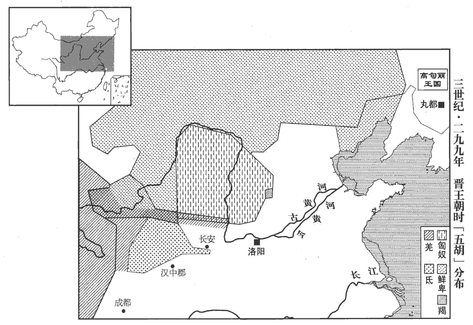
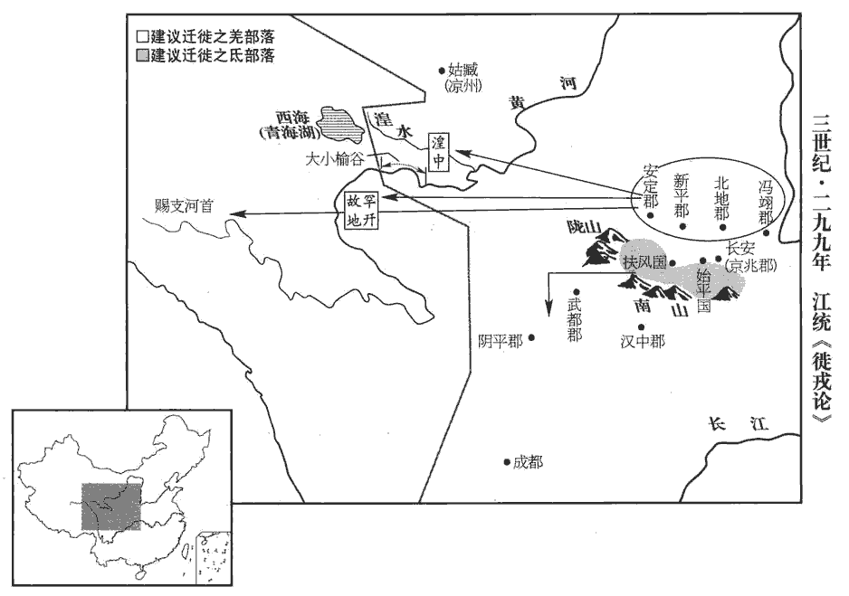

 晉紀五起屠維協洽（己未），盡上章涒灘（庚申），凡二年。

# 孝惠皇帝上之下

## 元康九年（己未，二九九）

1春，正月，孟觀大破氐眾於中亭‹陕西武功西›，水經註：扶風美陽縣有中亭水，亦謂之中亭川，在美陽縣西。獲齊萬年。

〖译文〗 [1]春季，正月，孟观在中亭击溃氐人，抓获齐万年。

2太子洗馬陳留江統洗，悉薦翻。以為戎、狄亂華，宜早絕其原，乃作徙戎論以警朝廷曰：「夫夷、蠻、戎、狄，地在要荒，周禮：九州之外，謂之蕃國，謂東夷、南蠻、西戎、北狄也。國語曰：蠻、夷要服，戎、狄荒服。韋昭註曰：要者，要結好信而服從之。荒者，言荒忽無常也。要，一遙翻。禹平九土而西戎即敘。孔安國曰：言荒服之外，流沙之內，皆就次敘，班固曰：即敘者，言就而敘之。其性氣貪婪，婪，盧含翻。凶悍不仁。悍，侯罕翻，又下罕翻。四夷之中，戎、狄為甚，弱則畏服，強則侵叛。當其強也，以漢高祖困於白登‹山西大同›、孝文軍於霸上‹西安东›。及其弱也，以元、成之微而單于入朝。此其已然之效也。單，音禪。朝，直遙翻。是以有道之君牧夷、狄也，惟以待之有備，禦之有常，雖稽顙執贄周禮：蕃國世一見各以其所貴寶為贄。稽，音啟。而邊城不弛固守，漢元帝時，匈奴單于請罷邊塞守備，侯應以為不可。所謂不弛固守也。強暴為寇而兵甲不加遠征，周宣王薄伐獫Xiǎn狁yǔn，至于太原，盡境而返，比於蟁wén蝱méng，驅之而已，所謂不加遠征也。期令境內獲安，疆埸不侵而已。

〖译文〗 [2]太子洗马陈留人江统，认为戎人、狄人祸患中华，应当尽早断绝为祸的根源，于是作《徙戎论》以提醒朝廷，说：“东夷、南蛮、西戎、北狄，处于极边远的地区。禹平定九州而西戎服从了安排。西戎禀性贪婪、凶暴强悍，无仁爱之心。四夷之中，戎、狄最为突出，势力衰弱则敬畏服从，势力强大就侵扰叛乱。当他们强盛时，像汉高祖那样的实力也被困于白登，像孝文帝那样的实力也曾驻军霸上。等到他们衰弱时，像汉元帝、成帝时那样的微弱国力，单于还得来朝见。这些都是已经发生过的实证。因此有道的君王处理夷、狄事务，就是防御夷狄常备不懈，虽然他们叩头进贡宝物珍奇，边城并不放松守备，当他们起来作乱时，军队也不加以远征，就是希望境内安宁，疆域不受侵扰而已。

及至周室失統，諸侯專征，封疆不固，利害異心，戎、狄乘間，得入中國，如戎伐魯濟西，山戎病燕，狄伐衛、邢，長狄入三國之類。間，古莧翻。或招誘安撫以為己用，如申、繒以西戎攻殺周幽王，晉遷陸渾之戎於伊川，與之掎角，以敗秦師于殽，楚以蠻軍與晉戰于鄢陵。誘，音酉。自是四夷交侵，與中國錯居。如徐夷在齊、晉、魯、宋之間，鮮虞介燕、晉之境，赤狄居上黨之地，陸渾戎居伊、洛之間，義渠、大荔居秦、晉之域，戎蠻子居梁、霍之地。及秦始皇并天下，兵威旁達，攘胡，走越，當是時，中國無復四夷也。事見秦紀。

〖译文〗 “等到周王朝失去纲纪，诸侯恣意征伐，因此，彼此的疆域不稳定，诸侯因为利害关系而各存异心，西戎、北狄得以乘隙进入中原，有的诸侯招抚利诱他们为自己所用，从此四方各族交相杂入，与中原人错综而居。到秦始皇统一天下，兵威震邻，打击胡人，驱逐越人，到这时，中原地区不再有各种夷族了。

漢建武中，馬援領隴西‹甘肃临洮›太守，討叛羌，徙其餘種於關中，種，章勇翻。居馮翊‹陕西大荔›、河東‹山西夏县›空地。數歲之後，族類蕃息，蕃，扶元翻。既恃其肥強，且苦漢人侵之；永初之元，群羌叛亂，覆沒將守，屠破城邑，鄧騭敗北，侵及河內‹河南武陟›，十年之中，夷、夏俱敝，任尚、馬賢，僅乃克之。事并見漢紀。按漢光武建武十一年，馬援討羌，降之。安帝永初元年，羌反。自建武十一年至永初元年，凡七十三年。「數歲之後」，當作「數十歲之後」。將，即亮翻。守，式又翻。騭，之日翻。夏，戶雅翻。任，音壬。自此之後，餘燼不盡，小有際會，輒復侵叛，復，扶又翻。中世之寇，惟此為大。魏興之初，與蜀分隔，疆埸之戎，一彼一此。武帝徙武都氐於秦川，事見六十八卷漢獻帝建安廿三年。欲以弱寇強國，扞禦蜀虜，此蓋權宜之計，非萬世之利也；今者當之，已受其敝矣。

〖译文〗 3“东汉建武年间，马援担任陇西太守，征讨叛乱的羌人，迁徙羌人残余到关中，让他们居住在冯翊、河东的空荒之地。数年后，他们人口繁衍生息，既倚仗自己的富强，又苦于汉人的骚扰，东汉永初元年，羌人叛乱，消灭了当地守军，屠城破邑，邓骘也被击败。羌人侵入河内郡。十年之中，羌汉都衰败了，任尚、马贤仅仅是压制住他们而已。从此以后，残余火种不灭，稍有机会，他们就不断骚扰叛乱。中世时的寇患，以这支羌人最严重。魏兴盛之初，与蜀国分隔，疆场上的戎人，也分属两国，魏武帝迁徙武都的氐人到秦川，想以此而削弱乱寇增强国力，抵御蜀国。这实际是权宜之际，而不是从万世的利益上考虑的。今天我们所承受的这个现实，就已经遭受到那权宜之计的弊病的影响了。

 

夫關中土沃物豐，帝王所居，周都豐、鎬，秦都咸陽，漢都長安，皆關中之地。未聞戎、狄宜在此土也。非我族類，其心必異。而因其衰敝，遷之畿服，畿服，謂邦畿千里之內。士庶翫習，侮其輕弱，使其怨恨之氣毒於骨髓；至於蕃育眾盛，蕃，扶袁翻。則坐生其心。以貪悍之性，挾憤怒之情，候隙乘便，輒為横逆；橫，戶孟翻。而居封域之內，無障塞之隔，掩不備之人，收散野之積，積，子賜翻，聚也。故能為禍滋蔓，暴害不測，此必然之勢，已驗之事也。當今之宜，宜及兵威方盛，眾事未罷，徙馮翊‹陕西大荔›、北地‹陕西耀县›、新平‹陕西彬县›、安定‹甘肃镇原东南曙光乡，东晋移治泾川县›界內諸羌，著先零‹大小榆谷一带，今青海省贵德县至尖扎县一段黄河河谷›、罕幵jiān、析支之地‹黄河上游，直至赐支河首一带，今青海省玛多县›，徙扶風‹陕西泾阳西北，曹魏时治所在兴平›、始平‹咸阳›、京兆‹西安›之氐，出還隴右，著陰平‹甘肃文县›、武都‹甘肃成县›之界，先零、罕幵、析支之地，自湟中西至賜支河首。陰平、武都，舊白馬氐地也。著，直略翻。零，音憐。幵，苦堅翻。廩其道路之糧，令足自致，「廩」當作「稟」，給也；下廩糧同。各附本種，種，章勇翻。反其舊土，使屬國、撫夷就安集之。屬國都尉及撫夷護軍也。戎、晉不雜，并得其所，縱有猾夏之心，孔安國曰：猾，亂也；夏，華夏也。夏，戶雅翻。風塵之警，則絕遠中國，隔閡山河，遠，于願翻。閡，與礙同。雖有寇暴，所害不廣矣。

〖译文〗 “关中土地服沃，物产丰富，是帝王居住的地方，没有听说西戎、北狄应当在这块土地上居住。不属于我们的族类，他们的想法必定不同。但因为他们衰弱，把他们迁到离京城不远的地方，士人百姓习以为常，玩忽对待，欺侮他们的软弱，使他们的怨恨刻骨铭心，一旦人口繁育强盛，便产生反叛之心。以他们贪婪强悍的本性，带着愤怒的心情，等候机会合适，就伺机叛乱。他们居住在封疆之内，没有障碍工事阻隔，抢掠没有防备的人，收掠散野的财物，所以能够成为祸患而迅速蔓延，危害不可测度，这种必然的趋势，是已经验证的事实。当今最好的办法是，趁军队威势正旺盛，战时的一切都未取消，迁徒冯翊、北地、新平、安定界内的各部落羌人，安置在先零、罕、析支等地；迁徒扶风、始平、京兆的氐人，让他们出去还归陇右，安置在阴平、武都地区，发给路上所需的口粮，足以使他们自己到达。各自归附本族，返回故乡，让属国都尉、抚夷护军等官员依所辖地区集中安置他们。这样，西戎人与晋国人不相杂居，各得其所。即使他们有为乱华夏之心，兴起战乱的预兆，也与中原相隔极远，隔山阻河，虽然有敌寇作乱，所危害的地区也不会太广泛。

 

難者曰：氐寇新平，關中饑疫，百姓愁苦，咸望寧息；而欲使疲悴之眾，徙自猜之寇，恐勢盡力屈，緒業不卒，難，乃旦翻。悴，秦醉翻。卒，子恤翻，終也。前害未及弭而後變復橫出矣。復，扶又翻。答曰：子以今者群氐為尚挾餘資，悔惡反善，懷我德惠而來柔附乎？將勢窮道盡，智力俱困，懼我兵誅，以至於此乎？曰：無有餘力，勢窮道盡故也。然則我能制其短長之命，而令其進退由己矣。夫樂其業者不易事，樂，音洛。安其居者無遷志。方其自疑危懼，畏怖促遽，怖，普布翻。故可制以兵威，使之左右無違也。迨其死亡流散，離逷tì未鳩，逷，他歷翻。爾雅曰：逷，遠也。鳩，集也。與關中之人，戶皆為讎，謂氐、羌之反，暴掠平民，關中之人怨毒之，戶皆為讎敵。故可遐遷遠處，令其心不懷土也。夫聖賢之謀事也，為之於未有，治之於未亂，治，直之翻。道不著而平，德不顯而成。其次則能轉禍為福，因敗為功，值困必濟，遇否能通。否，皮鄙翻。今子遭敝事之終而不圖更制之始，更，工衡翻。愛易轍之勤而遵覆車之軌，何哉！車覆於前，不可遵其轍，當易路而行；若遵覆車之迹，則後車又將覆矣。且關中‹陕西›之人百餘萬口，率其少多，率，列恤翻，約數也。少，詩沼翻。戎、狄居半，處之與遷，必須口實。口實，謂糧食也。處，昌呂翻。若有窮乏，糝sǎn粒不繼者，糝，桑頷翻。以米和羹也。故當傾關中之穀以全其生生之計，必無擠於溝壑而不為侵掠之害也。氐、羌窮乏，勢必聚而侵掠，晉朝欲弭其害，故當傾穀以給之。擠，子西翻，又子細翻。今我遷之，傳食而至，謂所過郡縣遞給其食也。傳，直戀翻。附其種族，自使相贍，而秦地之人得其半穀，言關中居人，戎、狄居半，今遷使歸其舊地，則秦中百姓將食其所積之穀，以約率之，正得常居之半穀也。種，章勇翻；下餘種同。此為濟行者以廩糧，遺居者以積倉，遺，于季翻。寬關中之逼，去盜賊之原，去，羌呂翻。除旦夕之損，建終年之益。若憚蹔舉之小勞蹔zàn，與暫同。而忘永逸之弘策，惜日月之煩苦而遺累世之寇敵，非所謂能創業垂統，謀及子孫者也。

〖译文〗 “驳难的人说：氐人叛乱刚刚平定，关中饥馑，流行时疫，百姓愁苦，都盼望着安定休息；而要让疲惫病弱的人去迁移心存疑忌的敌人，恐怕会士气耗尽而力量不足，完成不了这一事业，这样，先前的灾害还没来得及消除，新的变故又会突然出来。回答说：您认为现在氐人是还依靠剩余的资财，悔恨自己的过错而归于正道，感念我们的好意恩惠而来顺从归附呢，还是走投无路，心智与兵力都已困乏，害怕我们武力剿除才到这一地步呢？我说：是没有余力，走投无路的缘故。这样我们就能掌握他们的命运而使他们的进退都听从我们的调遣了。喜欢自己职业的人不会调换工作，满意自己住所的人没有迁居的想法。这时，他们正疑心有危险而惧怕，恐怖而紧张急迫，所以能够用武力的威慑来制服，使他们一点都不敢违抗。趁着他们死亡逃离，流散各处，远离而没有聚集，加之他们与关中人，户户都是仇敌，所以能够把他们迁到僻远处，让他们不怀念这个地方。圣贤之人谋事，在事情未发生时就进行处置，在尚未动乱时就去治理，至道未显现天下就已平定，恩德未炫露事情就已成功。其次则能够转祸为福，转败势为成功，陷于困境能够渡过，遭遇阻塞而得疏通。现在您承受着旧措施所带来的结果而不谋求开始改变这一措施，偏爱不断变换路线而又沿着翻车的轨道，这是为什么呢？再说关中的人口一百多万，约略计算人口比例，戎人、狄人占了一半，让他们继续居住或是迁移，都必须有口粮，如果出现欠缺，粥饭供应不能接继，就得拿出关中的全部粮食来保全他们的生计，绝没有把他们弃置沟壑而不侵扰掠夺的道理。现在我们将他们迁徒，沿途供给粮食而使他们到达，让他们归往自己族类所在地，使他们自己养活自己，而秦地的人口就能得到另一半粮食。这就是供给迁徒者以途中口粮，给留居者装满的粮仓，缓解关中的紧张，消除盗贼的根源，花费一朝一夕的开销，成就长年获益的基础。如果害怕短暂行动的小工程，而忘却一劳永逸的弘大方略，吝啬日月之间的麻烦劳苦，而给后世留下寇敌之患，这不是所说的能够创业并流传后世，为子孙后代着想的人。

并州‹山西›之胡，本實匈奴桀惡之寇也，建安中，使右賢王去卑誘質呼廚泉，聽其部落散居六郡。謂并州所統六郡也。晉書匈奴傳曰：匈奴與晉人雜居，平陽‹山西临汾›、西河‹山西离石›、太原‹山西太原›、新興‹山西忻州›、上黨‹山西省黎城县西南›、樂平‹山西和顺西北›，莫不有焉。質呼廚泉事見六十七卷漢獻帝建安二十一年。質，音致。咸熙之際，以一部太強，分為三率，率，讀曰帥，音所類翻。泰始之初，又增為四；於是劉猛內叛，連結外虜，事見七十九卷武帝泰始七年、八年。近者郝散之變，發於穀遠‹山西沁源›。穀遠縣，漢屬上黨郡，晉省，蓋其地猶存舊縣名也。劉昫xù曰：穀遠，今沁源縣。宋白曰：漢穀遠故縣，在沁源縣南百五十步，孤遠故城是也。晉地記云：穀遠，今名孤遠，後代語訛耳。郝散事見上卷四年。今五部之眾，戶至數萬，人口之盛，過於西戎；其天性驍勇，弓馬便利，倍於氐、羌。驍，堅堯翻。若有不虞風塵之慮，則并州之域可為寒心。劉淵之禍，江統固逆知之矣。

〖译文〗 “并州的胡人，原本就是凶恶的匈奴强盗，东汉建安年间，派右贤王去卑诱骗呼厨泉作为人质，听任他们的部落散居在并州六个郡。魏咸熙年间，因为一支部落太强，分为三个部落。晋泰始初年，又增为四部落，这时刘猛从内部叛乱，勾结外族敌人；近年郝散之变，也发端于谷远这个地方。现在匈奴有五个部落，几万户之多，人口的兴盛，超过西戎。他们天性骁勇，擅长射箭骑马，超过氐、羌一倍，如果发生没有想到的战事的话，那么并州一带就值得忧惧。

正始中，毌guàn丘儉討句驪，事見七十五卷魏邵陵厲公正始七年。句，如字，又音駒，驪，力知翻。徙其餘種於滎陽‹河南省荥阳县›。種，章勇翻。始徙之時，户落百數，子孫孳息，孶，津之翻，生也。今以千計，數世之後，必至殷熾，熾，昌志翻。今百姓失職，民不得安於耕鑿，是失職也。猶或亡叛，犬馬肥充，則有噬齧niè，況於夷、狄，能不為變！但顧其微弱，勢力不逮耳。顧，內顧也。

〖译文〗 “魏正始年间，毋丘俭征讨句骊，将他们的残余迁到荥阳。刚迁徒时，只有百户；子孙繁衍，现在人数已达几千，几代之后，一定会达到繁盛。现在百姓失业，还有人流亡叛乱，犬马肥壮而众多，就会互相啃咬，何况像夷、狄那样，哪能不发生变故！他们只是感到自己微弱，势力还不能达到罢了。

夫為邦者，憂不在寡而在不安，論語：孔子曰：丘聞有國有家者，不患寡而患不均，不患貧而患不安。以四海之廣，士民之富，豈須夷虜在內然後取足哉！此等皆可申諭發遣，還其本域，慰彼羈旅懷土之思，釋我華夏纖介之憂，夏，戶雅翻。『惠此中國，以綏四方，』詩大雅民勞之辭。德施永世，於計為長也！」朝廷不能用。

〖译文〗 “治理国家的人，忧虑不在人少而在于国家不安定，以四海的辽阔，百姓的富裕，哪里一定要异族人在其中然后才能得到满足呢！这些异族人都可以发布告示遣送，使他们还归本来的地方，慰藉他们客居怀乡的思绪，解除我们中华心中的芥蒂。《诗经》说：‘施给中原德惠，安定四方部族。’恩德施于永世，这个计策是长远的！”结果朝廷没有能够采用这个计策。

3散騎常侍賈謐侍講東宮，對太子倨傲，成都王穎見而叱之；謐怒，言於賈后，出穎為平北將軍，鎮鄴‹河北省临漳县西南邺镇›。考異曰：帝紀云：「以穎為鎮北大將軍。」今從本傳。徵梁王肜róng為大將軍、錄尚書事；以河間王顒yóng為鎮西將軍，鎮關中。肜，余中翻。顒，魚容翻。初，武帝作石函之制，非至親不得鎮關中，顒輕財愛士，朝廷以為賢，故用之。顒，安平獻王孚之孫，太原烈王瓌guī之子也，初襲父爵，咸寧三年，改封河間。為穎、顒各據方鎮以阻兵張本。

〖译文〗 [3]散骑常侍贾谧在东宫为太子讲学，对太子态度傲慢，成都王司马颖发现后斥责他。贾谧大怒，告到贾皇后，随即发落司马颖为平北将军，镇守邺城。惠帝征召梁王司马肜任大将军、录尚书事。任命河间王司马为镇西将军，镇守关中。起初，晋武帝曾规定了一个制度，藏于宗庙的石匣之中，规定不是直系亲属不能镇守关中。司马看轻财物而爱惜士人，朝廷认为他德才兼备，可以重用他。

4夏，六月，【章：甲十一行本「月」下有「戊戌」二字；乙十一行本同；孔本同。】高密文獻王泰薨。考異曰：帝紀云「隴西王」，本傳云：「泰為尚書令，改封高密。」紀誤。

〖译文〗 [4]夏季，六月，高密文献王司马泰去世。

5賈后淫虐日甚，私於太醫令程據等；晉志：太醫令，屬宗正。又以簏lù箱載道上年少入宮，簏，盧谷翻。說文：竹高篋qiè也。少，詩照翻。復恐其漏泄，往往殺之。復，扶又翻。賈模恐禍及己，甚憂之。裴頠wěi與模及張華議廢后，更立謝淑妃。謝淑妃，太子之母也。頠，魚毀翻。更，工衡翻。考異曰：賈后傳曰：「模與裴頠、王衍謀廢之，衍後悔而止。」今從頠傳。模、華皆曰：「主上自無廢黜之意，而吾等專行之，儻上心不以為然，將若之何！且諸王方強，朋黨各異，恐一旦禍起，身死國危，無益社稷。頠曰：「誠如公言。然宮中逞其昏虐，亂可立待也。」華曰：「卿二人於中宮皆親戚，言或見信，宜數為陳禍福之戒，庶無大悖，則天下尚未至於亂，吾曹得以優游卒歲而已。」張華處昏亂之朝，位冠群后，而持心如此，天殆假手於趙王倫而誅之也。數，所角翻。為，于偽翻。卒，子恤翻。悖，蒲內翻。頠旦夕說其從母廣城君，說，輸芮翻。從，才用翻。令戒諭賈后以親厚太子，賈模亦數為后言禍福；后不能用，反以模為毀己而疏之；模不得志，憂憤而卒。

〖译文〗 [5]皇后贾氏淫乱暴虐日甚一日，与太医令程据等人私通。还让人把路上的少年装进竹箱偷带入宫，但又怕这些少年把事泄漏出去，往往杀掉他们。贾模怕这些事牵连自己，非常忧虑。裴与贾模以及张华商议废黜贾皇后，改立谢淑妃为皇后。贾模、张华都说：“皇帝自己没有废黜皇后的想法，我们擅自进行这事，假如皇帝并不同意，那该怎么办？再说各诸侯王正当强盛时，都有各自的势力和亲近的人。恐怕一旦事情不成，招来祸患，性命丢掉而国家危殆，对国家社稷不利。”裴说：“确实如你们所说。但是皇后在宫中昏乱暴虐而肆意放任，她的麻烦很快就会来临。”张华说：“你二人都是皇后的亲戚，你们的意见她可能相信，应该多向她陈述戒惧祸福，希望她不要过分，那样天下还不至于出现祸乱，我们也就能够悠闲自在地度日了。”裴从早到晚地劝说他姨母广城君，让她告诫皇后贾氏能够亲近厚待太子。贾模也多次对皇后讲述祸福的道理，皇后听不进去，反而认为贾模这样是诋毁自己，因而疏远他。贾模善良的愿望不能达到，忧郁激愤而死去。

秋，八月，以裴頠為尚書僕射。頠雖賈后親屬，然雅望素隆，四海惟恐其不居權位。尋詔頠專任門下事，晉制：侍中與給事黃門侍郎同管門下事。頠為侍中，專任門下事，賈后之意也。頠上表固辭，以「賈模適亡，復以臣代之，復，扶又翻。崇外戚之望，彰偏私之舉，為聖朝累。」累，力瑞翻。不聽。或謂頠曰：「君可以言，當盡言於中宮；言而不從，當遠引而去。儻二者不立，雖有十表，難以免矣。」頠慨然久之，竟不能從。史言華、頠顧戀祿位以殞首亡家。

〖译文〗 秋季，八月，任命裴为尚书仆射。裴虽然是皇后贾氏的亲属，但是美好的声名一直广为人知，各地都惟恐他不能担当重要的职务。不久，惠帝下诏书让裴独掌门下事要职。裴上书惠帝坚持推辞，说：“贾模刚刚去世，又让我来取代他的职位，这样提高外戚的声望，显露出偏向和私情的安排，会给神圣的朝廷带来麻烦。”惠帝不同意。有人对裴说：“您有说话的机会，还应该对皇后详细地说。说了仍然不同意，那就应远远地离去。假如这两条路都不走，即使上书十次，也难以逃脱灾祸。”裴感慨了好久，但终究也没有听从。

帝‹司马衷，本年四十一岁›為人戇騃，戇zhuàng，陟降翻，愚也。騃ái，語駭翻，癡也。嘗在華林園聞蝦蟆，蝦há，何加翻。蟆má，謨加翻。謂左右曰：「此鳴者，為官乎，為私乎？」為，于偽翻。時天下荒饉，百姓餓死，帝聞之曰：「何不食肉糜！」糜，忙皮翻，粥也。由是權在群下，政出多門，勢位之家，更相薦託，有如互市。更，工衡翻。賈、郭恣橫，橫，戶孟翻。貨賂公行。南陽‹河南省南阳市›魯褒作錢神論以譏之曰：「錢之為體，有乾、坤之象，親之如兄，字曰孔方。錢圜函方，天圜而地方，故曰有乾、坤之象。孔方，亦以錢體言。無德而尊，無勢而熱，排金門，入紫闥tà，危可使安，死可使活，貴可使賤，生可使殺。是故忿爭非錢不勝，幽滯非錢不拔，怨讎非錢不解，令聞非錢不發。聞，音問。洛中朱衣、當塗之士，晉制：諸王朱衣、絳紗襮bó。當塗之士，謂當路柄用者。愛我家兄，皆無已已，執我之手，抱我終始。凡今之人，惟錢而已！」

〖译文〗 惠帝为人愚鲁痴呆，一次在华林园听到蛤蟆的叫声。就问左右随从说：“这叫的东西，是为公事叫呢！还是为私事叫呢？”当时天下灾荒饥馑，有的百姓都饿死了，惠帝听到后说：“他们为什么不吃肉粥呢？”因此权力都由手下的小人掌握，政令出自许多部门而不能统一发布，有权势地位的人家互相推举，如同市场交易。贾氏、郭氏肆意妄为，官场上贿赂公然进行。南阳人鲁褒作了一篇《钱神论》讥讽这种现象说：“钱的形象，像天地一样有圆有方，人们亲它爱它如同兄弟，尊称它叫孔方。没有美德而倍受尊崇，没有权势而灸手可热，出入宫廷高门，可以转危为安，起死复生，变尊贵为卑贱，置活人于死地。所以愤怒争执时没有钱就不能取胜，冤屈困厄时没有钱就不能得救，冤家仇敌没有钱就不能解怨释仇，美好的声誉没有钱就不能传播。当今都城的王公贵族，权势要人，个个爱我们孔方兄而没有休止，拿钱的手，紧抱着钱始终不放松。当今的人心中只有钱罢了。”

又，朝臣務以苛察相高，每有疑議，群下各立私意，刑法不壹，獄訟繁滋。裴頠上表曰：「先王刑賞相稱，稱，尺證翻。輕重無二，故下聽有常，群吏安業。去元康四年大風，廟闕屋瓦有數枚傾落，免太常荀㝢；事輕責重，有違常典。五年二月有大風，蘭臺主者懲懼前事，求索阿棟之間，得瓦小邪十五處，蘭臺主者，御史臺主者也，即令史之類。阿，屋之隈wēi曲。棟，屋檼yǐn也。索，山客翻。遂禁止太常，復興刑獄。復，扶又翻；下頌復、史復同。今年八月，陵上荊一枝，圍七寸二分者被斫；司徒、太常奔走道路，說文：荊，楚木也。司徒，漢丞相之職。漢制：丞相與太常掌圍陵。被，皮義翻。雖知事小，而按劾難測，劾，戶概翻，又戶得翻。搔擾驅馳，各競免負，負，罪負也。于今太常禁止未解。夫刑書之文有限而舛違之故無方，故有臨時議處之制，言法有一定之文，而罪有故、誤，情有輕、重，故制令臨時隨事情議處其罪。處，昌呂翻。誠不能皆得循常也。至於此等，皆為過當，當，丁浪翻。恐姦吏因緣，得為淺深也。」既而曲議猶不止，曲議，謂曲法而議，自為淺深。三公尚書劉頌復上疏曰：晉志：漢成帝置三公尚書，主斷獄；光武以三公曹主歲盡考課州郡事。「自近世以來，法漸多門，令甚不一，吏不知所守，下不知所避，姦偽者因以售其情，居上者難以檢其下，檢校，檢束也。事同議異，獄犴àn不平。犴，魚旰gàn翻。野獄曰犴。夫君臣之分，各有所司。法欲必奉，故令主者守文；理有窮塞，故使大臣釋滯；事有時宜，故人主權斷。塞，悉則翻。斷，丁亂翻；下弘斷同。主者守文，若釋之執犯蹕bì之平也；事見十四卷漢文帝三年。大臣釋滯，若公孫弘斷郭解之獄也；事見十八卷漢武帝元朔二年。人主權斷，若漢祖戮丁公之為也。事見十一卷漢高祖五年。天下萬事，自非此類，不得出意妄議，皆以律令從事。然後法信於下，人聽不惑，吏不容姦，可以言政矣。」考異曰：刑法志敘頌奏，續頠表之下，而云「侍中太宰汝南王亮」。按頠表引元康八年事，時亮死已久，蓋志誤也。乃下詔，「郎、令史復出法駁案者，隨事以聞，」然亦不能革也。郎、令史，尚書郎及尚書、蘭臺令史也。出法駁案者，謂出於法之外而為駁議也。駁，北角翻。

〖译文〗 还有，朝廷官员都追求苛峻明察来比较高下，每当遇到有疑义的问题，群臣都拿出自己的解释，这样，惩罚罪犯的法律不相统一，以致案件与官司层出不穷。裴上奏表说：“先王刑罚奖赏都恰当合适，轻重的尺度统一，所以下面遵从执行起来有一定的法度，官吏们也安心自己的职业。过去元康四年刮大风，祖庙宫殿的屋瓦被风刮落了几片，就罢免了太常荀，事情轻而处罚重，违背了正常的规定。元康五年二月又刮大风，兰台主事的官员以前面的事为教训，非常害怕，在房梁屋角之间仔细寻找，找到瓦片略有歪斜的地方有十五处，于是将太常囚禁，又兴起了狱案。今年八月，陵园里有一枝粗七寸二分的荆条被砍断，司徒、太常等官员急得往来奔走，虽说知道事情不大，但如何处罚却难以预料，四处疏通，各自竞相洗刷自己，到现在对太常的囚禁还没有解除。刑法的条文有限而违反法律的缘故却多得漫无边际，所以虽有处罚时依事讨论议定处置的制度，确实不能都得以按照惯例处置。至于上述这类例证，都属于超过限度，这样恐怕奸邪的官吏就会因袭而随意判定罪的轻重。”过后，曲解法律条文随意议处的事仍然没有停止。三公尚书刘颂又上书朝廷，说：“自近代以来，法律逐渐出自许多部门，法令非常不统一，官吏不知道应该遵守什么，下面也不知道哪些是违法而应该避免的，奸诈的人因此而得售其奸，身居高位的人难以核察下属，事体相同而评论不同，结果判决不公平。国君与臣下，各有所执掌的职司。要使法令人人必须遵奉，所以要求有关负责人遵守条文；章理有不通之处，所以让大臣来解释；情况特殊，可以由国君根据情况随机相应断处。有关负责官员遵守条文，如西汉张释之公允地依法处理违反皇帝出行时清道法律的人。大臣解释不通的地方，如西汉公孙弘判处郭解案。国君根据情况随机相应断处，如汉高祖杀死丁公的行动。天下的很多事情，凡不属于这类事的，不能随意妄加议处，都应该依照法规、律令来处理。这样才能使法律取信于百姓，人们所听到的没有疑惑，官吏们没有做坏事的机会，这样就能谈论治理国家的事了。”于是朝廷下诏书说：“郎、令史等官员再遇到法律规定之外而需要讨论议处的事情，要随案件本身上报处理意见。”但是还是不能革除随意议处的弊端。

頌遷吏部尚書，建九班之制，欲令百官居職希遷，考課能否，明其賞罰。賈、郭用權，仕者欲速，事竟不行。

〖译文〗 刘颂升任吏部尚书，建立了将官员分九个等级考核的制度，计划使朝廷大小官员在职位上都企求升迁，考核官员胜任与否，明确对官员的奖惩制度。但是贾氏、郭氏专擅朝廷大权，想当官的人都想迅速升迁，这样刘颂的计划没有能够实行。

裴頠wěi薦平陽‹山西临汾›韋忠於張華，魏邵陵厲公正始八年，分河東郡之汾北為平陽郡。華辟之，忠辭疾不起。人問其故，忠曰：「張茂先華而不實，裴逸民慾而無厭，張華字茂先；裴頠，字逸民。厭，於鹽翻。棄典禮而附賊后，此豈大丈夫之所為哉！逸民每有心託我，我常恐其溺於深淵而餘波及我，況可褰qiān裳而就之哉！」溺，奴狄翻。

〖译文〗 裴向张华推荐平阳人韦忠。张华起用韦忠，韦忠称病推辞。有人问他原因，韦忠说：“张华华而不实，裴贪得无厌，他们抛弃朝廷的制度礼仪而依附于作乱的皇后，这难道是大丈夫所作的事吗！裴几次都有心推举我，但我常常担心他沉溺于深渊，余波会牵连我，难道能撩起衣服而跟随他吗？”

關內侯敦煌索靖，知天下將亂，敦，徒門翻。索，蘇各翻。指洛陽宮門銅駝歎曰：「會見汝在荊棘中耳！」銅駝，魏明帝景初元年自長安徙之洛陽。

〖译文〗 关内侯敦煌人索靖，预知天下将要大乱，指着洛阳皇宫门前的铜塑骆驼感叹说：“大概以后会在荆棘中看到你吧！”

6冬，十一月，甲子朔‹一›，日有食之。

〖译文〗 [6]冬季，十一月，甲子朔（初一），发生日食。

7初，廣城君郭槐，以賈后無子，常勸后使慈愛太子。賈謐驕縱，數無禮於太子，數，所角翻。廣城君恆切責之。恆，戶登翻。廣城君欲以韓壽女為太子妃，太子亦欲婚韓氏以自固，壽妻賈午及后皆不聽，而為太子聘王衍少女。太子聞衍長女美，而后為賈謐聘之，為，于偽翻。少，詩照翻。長，知兩翻。心不能平，頗以為言。及廣城君病，臨終，執后手，令盡心於太子，言甚切至。又曰：「趙粲、賈午，必亂汝家事；我死後，勿復聽入。深記吾言！」郭槐妬狠，而垂沒之時，所以告戒其女者如此，蓋多權數，故其智慮能及此耳。復，扶又翻；下同。后不從，更與粲、午謀害太子。

〖译文〗 [7]当初，广城君郭槐，因为皇后贾氏没有孩子，经常劝皇后，让她慈爱太子。贾谧骄横放肆，多次对太子无礼，广城君经常严厉地叱责他。广城君打算让韩寿的女儿去作太子妃，太子也想与韩氏联姻以稳固自己的地位。韩寿的妻子贾午及皇后都不同意，却为太子聘定王衍的小女儿。太子听说王衍的大女儿长得漂亮，而皇后却为贾谧聘定了她，太子心里愤愤不平，有一些不满的话。等到广城君病危，临终时拉住贾皇后的手，叫她对太子尽心，言辞非常恳切中肯。又说：“赵粲、贾午，一定会把你家的事搅乱，我死后，不要再听任他们随便进宫，请用心记住我的话！”皇后没有听从广城君的告诫，又与赵粲、贾午图谋陷害太子。

太子‹司马遹›幼有令名，事見上卷武帝太康十年。及長，不好學，長，知兩翻。好，呼報翻；下同。惟與左右嬉戲，賈后復使黃門輩誘之為奢靡威虐。誘，音酉。由是名譽浸減，驕慢益彰，或廢朝侍而縱遊逸，朝，直遙翻。於宮中為市，使人屠酤gū，手揣斤兩，揣，初委翻。輕重不差。其母，本屠家女也，故太子好之。古者擇女必求之名門，取其幽閒令淑者，良有以也。好，呼到翻。東宮月俸錢五十萬，俸，扶用翻。太子常探取二月，用之猶不足。探，吐南翻，又他紺翻。探取，預取也。又令西園賣葵菜、藍子、雞、麫等物而收其利。葵，亦菜也。魯相公儀休拔園葵，漆室氏女曰「晉客馬踐吾葵，使吾終歲不食葵」是也。藍，盧甘翻，草可以染青者也。本草圖經曰：藍實，人家蔬圃中作畦qí種蒔，三月、四月生，苗高三四尺許，葉似水蓼liǎo，花紅白色，實亦若蓼子而大，黑色。五月、六月採實。麫，屑麥為之。又好陰陽小數，多所拘忌。班固曰：陰陽家蓋出於羲和之官，敬順昊天曆象日月星辰，敬授人時，此其所長也。及拘者為之，則牽於禁忌，泥於小數，捨人事而任鬼神。洗馬江統上書陳五事：「一曰雖有微苦，宜力疾朝侍。苦，亦疾也。朝，直遙翻。二曰宜勤見保傅，咨詢善道。三曰畫室之功，可宜【章：甲十一行本「宜」作「且」；乙十一行本同；孔本同。】減省，畫室，以五采繪畫。室，屋也。畫，與𦘕同。後園刻鏤雜作，一皆罷遣。鏤，郎豆翻。四曰西園賣葵、藍之屬，虧敗國體，貶損令聞。敗，補邁翻。聞，音問。五曰繕牆正瓦，不必拘攣小忌。」攣，閭緣翻。太子皆不從。中舍人杜錫，晉志：太子中舍人四人，咸寧四年置，以舍人才學美者為之，與中庶子共掌文翰，職如黃門侍郎，在中庶子下，洗馬上。恐太子不得安其位，每盡忠諫，勸太子修德業，保令名，言辭懇切。太子患之，置針著錫常所坐氈zhān中，著，陟略翻。刺之流血。刺，七亦翻。錫，預之子也。杜預，武帝時建平吳之功。

〖译文〗 太子年幼时有好的名声，长大后却不喜欢学习，只知道与周围的人嬉笑玩耍，贾皇后又让宦官之类人引诱他，使他变得奢侈挥霍又骄横暴虐。因此太子的声誉与日俱下，而骄横傲慢却日益突出，有时沉溺于游乐之中，竟不顾每日清晨问候侍奉皇帝的规定。还在宫中作买卖让手下人买卖酒肉，太子亲手拈量分量，斤两竟不差分毫。太子的母亲，原来就是屠夫家的女儿，所以太子也爱好卖肉。太子每月有五十万钱的俸禄，却经常预支两个月，还不够花销。又让西园出售蔬菜，蓝草籽、鸡、面粉等物品，以此赚钱。太子还爱好阴阳家的小把戏，平常有很多禁戒忌讳。任太子洗马职的江统给他上书，陈述五件事：“一、即使稍微有些小病痛，也应勉力支撑遵守每日清晨问侯、侍奉皇帝的规定。二、应当经常面见师傅，向他们请教为善的道理。三、雕画宫室的事，应当减少或免去，在后园雕刻之类的劳作，也同时都取消。四、西园卖菜之类的行为，损害国家的形象，也贬低自己的声誉。五、对修缮墙壁房屋之类，没有必要拘泥于琐细的忌讳。”太子都没有接受。中舍人杜锡，担心太子的地位不稳定，经常尽心尽意地劝谏，规劝太子修习有关德行品性的功业，维护好的名声，言辞恳切。太子反倒怨恨杜锡，把针放在杜锡经常坐的毡子中，杜锡被针扎得流血。杜锡是杜预的儿子。

太子‹司马遹›性剛，知賈謐恃中宮驕貴，不能假借之。謐時為侍中，至東宮，或捨之，於後庭遊戲。詹事裴權諫曰：詹事，秦官，掌太子家。晉初未置詹事，宮事無大小皆由二傅。咸寧元年，置詹事，掌宮事，二傅不復領官屬。「謐，后所親昵，昵，尼質翻。一旦交構，則事危矣。」不從。謐譖太子於后曰：「太子多畜私財以結小人者，為賈氏故也。為，于偽翻。若宮車晏駕，彼居大位，依楊氏故事，誅臣等，廢后於金墉‹洛阳城西北角离宫›，如反手耳。賈后殺楊駿，廢太后，天地之所不容也。觀其姑姪之間所言若此，則其心固不能一息安也。不如早圖之，更立慈順者，可以自安。」更，工衡翻。后納其言，乃宣揚太子之短，布於遠近。又詐為有娠，娠，升人翻，孕也。內藁gǎo物、産具，取妹夫韓壽子慰祖養之，欲以代太子。

〖译文〗 太子性格刚愎，知道贾谧倚仗皇后的势力而傲慢高贵，不能容忍和敷衍贾谧。贾谧当时担任侍中，到太子住处时，太子有时就把他撇在一边，自己到后边庭园游玩。太子的官员詹事裴权劝谏太子说：“贾谧是皇后所亲近溺爱的人，一旦他进谗言，那情况就危险了。”太子不接受。果然贾谧向皇后进谗言陷害太子说：“太子储备很多私财用来结交小人，就是因为图谋您的缘故。如果皇帝驾崩，他登上皇位，一定会按照您过去对杨骏、太后的做法来对待您，对他来说，诛杀我们，把您废黜并囚禁在金墉城，易如反掌。还不如早作打算，重新立一个心慈而顺从的人为太子，这样您就能够安全了。”皇后采纳了贾谧的计策，就宣杨太子的短处，并广为传播。还假称自己已怀孕，在宫内准备了禾草之类的物品等接生的工具，接来妹夫韩寿的儿子韩祖慰来抚养，计划让韩祖慰来取代太子。

于時，朝野咸知賈后有害太子之意，中護軍趙俊請太子廢后，太子不聽。左衛率東平‹山东省东平县西北›劉卞，以賈后之謀問張華，帝在東宮置衛率，初曰中衛率，泰始五年，分為左右，各領一軍，愍懷在東宮，又加前後二率，謂之四率。率，所律翻。華曰：「不聞。」卞曰：「卞自須昌‹东平国首府›小吏，受公成拔以至今日。須昌縣，屬東平國。卞自縣小吏從令入洛，歷官至左衛率。士感知己，是以盡言；而公更有疑於卞邪！」華曰：「假令有此，君欲如何？」卞曰：「東宮俊乂如林，時江統、潘滔、王敦等皆為東宮官屬。馬融曰：才過千人曰俊，百人曰乂。四率精兵萬人；公居阿衡之任，若得公命，皇太子因朝入錄尚書事，朝，直遙翻；下同。廢賈后於金墉城，兩黃門力耳。」華曰：「今天子當陽，太子，人子也，吾又不受阿衡之命，華自言事任不可以伊尹自居。忽相與行此，是無君父而以不孝示天下也。【章：甲十一行本「也」下有「雖能有成，猶不免罪」八字；乙十一行本同；孔本同；張校同；退齋校同。】況權戚满朝，威柄不一，成可必乎！」賈后常使親黨微服聽察於外，頗聞卞言，乃遷卞為雍州‹陕西省中部›刺史。雍，於用翻。卞知言泄，飲藥而死。賈后剛悍，使聞卞言而張華不以告，則華必死於賈后之手，意卞言實華泄之也。

〖译文〗 这时朝廷内外都知道贾皇后有谋害太子的想法，中护军赵俊请太子废掉皇后，太子没有听从。左卫率东平人刘卞，向张华询问贾皇后的图谋，张华说：“不知道。”刘卞说：“我本来是须昌的小官吏，受您的成全提拔才有今天。为士的感念知遇之恩，所以言无不尽；可您却对我有重重疑虑！”张华说：“如果贾皇后有这种图谋，您打算怎么办？”刘卞说：“太子身边聚集着很多有才能的俊杰，护卫太子的左卫率、右卫率、前卫率、后卫率统辖着一万精兵。您身居辅导国君、主持国政的要职。如果能够得到您的命令，皇太子便入朝总领录尚书事，这样把贾皇后废黜在金墉城，只需两个小宦官的力量而已。”张华说：“现在天子治理国家，太子是他的儿子，我又没有接受主持国政的使命，匆匆与太子干这样的事，这是无视君主、无视父亲而把自己的不孝向天下展示的举动。何况有权势的外戚充满朝廷，威权不出于一处，能有一定成功的把握吗？”当时，贾皇后常常派亲近党羽隐蔽身分在朝廷外探听察看，听到了一些有关刘卞要协助太子废黜皇后的言论，于是就将刘卞调任为雍州刺史。刘卞知道自己的话已泄露出去，就服毒自杀。

十二月，太子‹司马遹›長子虨bīn病，長，知兩翻。虨，甫斤翻，又方閑翻。太子為虨求王爵，不許。虨疾篤，太子為之禱祀求福。為，于偽翻。賈后‹贾南风›聞之，乃詐稱帝不豫，召太子入朝。既至，后不見，置于別室，遣婢陳舞以帝命賜太子酒三升，使盡飲之。太子辭以不能飲三升，舞逼之曰：「不孝邪！天賜汝酒而不飲，臣子以君父為天，故以君父之賜為天賜。酒中有惡物邪！」太子不得已，強飲至盡，強，其兩翻。遂大醉。后使黃門侍郎潘岳作書草，潘岳此事自當赤族，其後天假手於孫秀耳。令小婢承福，以紙筆及草，因太子醉，稱詔使書之，文曰：「陛下宜自了，不自了，吾當入了之。中宮又宜速自了，不自了，吾當手了之。并與謝妃‹母亲谢玖›共要，刻期兩發，勿疑猶豫，以致後患。茹毛飲血於三辰之下，皇天許當掃除患害，立道文‹司马虨乳名›為王，蔣氏‹蒋俊›為内主。願成，當以三牲祠北君。」太子醉迷不覺，遂依而寫之。謝妃，太子母也。要，約也，言并以書與謝妃約，刻期內外俱發也。茹毛飲血，謂盟誓也。虨字道文。蔣氏，虨母蔣保林也。內主，言將立為后也。三牲，牛、羊、豕也。北君，北帝也。按此書不惟無徵左，使常人觀之，亦知其偽為而不可信。晉朝王、公、卿、尚書、黃、散視而不敢言。張華之諫，實亦不敢發賈氏之姦，姑引古義，依違而言之耳。裴頠請檢校傳書者，賈氏之姦無所逃矣，而亦不敢竟其說。上下相蒙，宜其大亂也。其字半不成，后補成之，以呈帝‹司马衷›。

〖译文〗 十二月，太子的大儿子司马生病，太子为他谋求亲王爵位，没有批准。司马病重，太子为他祈祷祭神求平安。贾皇后听说后，就假称惠帝身体不适，宣召太子入朝。太子进宫后，皇后不见他，把他安排在另外的房间，派婢女陈舞假称惠帝的命令赐给太子三升酒，让他全部喝掉。太子推辞说喝不了三升，陈舞胁迫说：“不孝呀！天子赐酒而你不喝，难道酒中有脏物吗？”太子迫不得已，勉强喝完，于是大醉。贾皇后让黄门侍郎潘岳书写了一封信的草稿，又让小婢女承福，拿着纸、笔和草稿，趁太子喝醉，诈称惠帝下诏命令他抄写，文中说：“陛下应当自己了断，不自己了断，我就要进宫替您了断。皇后也应该尽快自己了断，如不自己了断，我当亲手来了断，同时与谢妃约定，到时皇宫内外一起举事，请不要迟疑犹豫，以遭致后患。我在日、月、星三辰之下设盟饮血，皇天允许我担当扫除祸患，立道文为王，立蒋氏为王后。愿望实现，我将用猪、牛、羊三牲供奉北君星斗。”太子醉得昏昏沉沉，于是就照着写了。字有一半看不清，皇后描补成字，便以此呈交惠帝。

壬戌‹三十›，帝幸式乾殿，召公卿入，使黃門令董猛以太子書及青紙詔示之曰：「遹yù書如此，今賜死。」徧示諸公王，莫有言者。諸公王，宗室諸王之為公者。張華曰：「此國之大禍，自古以來，常因廢黜正嫡以致喪亂。喪，息浪翻。且國家有天下日淺，願陛下詳之！」裴頠以為宜先檢校傳書者；又請比校太子手書，不然，恐有詐妄。賈后乃出太子啟事十餘紙，眾人比視，亦無敢言非者。賈后使董猛矯以長廣公主‹武帝司马炎的女儿，嫁给甄德›辭白帝曰：長廣公主，武帝女，下嫁甄德。「事宜速決，而群臣各不同，其不從詔者，宜以軍法從事。」欲以此言脅群臣也。議至日西，不決。后見華等意堅，懼事變，乃表免太子為庶人，詔許之。於是使尚書和郁等持節詣東宮，廢太子為庶人。太子改服出，拜受詔，步出承華門，承華門，東宮門也。陸機詩所謂「振纓承華」是也。乘粗犢車，東武公澹以兵仗送太子及妃王氏、三子虨、臧、尚同幽于金墉城‹洛阳城西北角离宫›。王衍自表離婚，許之，妃慟哭而歸。清談之禍，起於何晏。何晏猶與曹爽同禍福，若王衍者，又不逮何晏矣。殺太子母謝淑媛‹谢玖›及虨母保林蔣俊。保林、良娣，漢六宮十四等之數，魏、晉以下為東宮女官品秩。師古曰：保林，言其可安眾如林也。

〖译文〗 壬戌（三十日），惠帝到式乾殿，召公、卿入宫，让黄门令董猛出示太子的信以及青纸写的诏书，惠帝说：“司马的信这样大逆不道，现在赐死。”把太子信及青纸诏书给王公大臣们传看，大家都不作声。张华说：“这是国家的大祸患，自古以来，常常因为废黜原定的太子而导致丧亡祸乱。再说我朝拥有天下的时间尚短，希望陛下仔细考虑！”裴认为应当先检验检查传递这信的人，再比较核对一下太子平日的手书笔迹，不然，恐怕其中有虚假失实的地方。贾皇后就拿出太子写的十几张启事，众官员对照着看，也没有敢说不一样的。贾皇后又让董猛假托长广公主的言辞对惠帝说：“这件事应当尽快决断，而大臣们意见还不相同，对那些不同意这个诏令的，应当按照军法处理。”大臣们商议到太阳偏西，还没有议定。皇后见张华等大臣态度坚决，害怕事情发生变化，就建议把太子贬黜为平民，惠帝批准了这个建议。于是派遣尚书和郁等拿着符节到东宫，废黜太子为平民。太子更换了衣服出去，拜接了诏书，走出承华门，乘坐粗陋的牛车，东武公司马澹带领一队兵士押送太子及妃子王氏，还有司马、司马臧、司马尚三个儿子到金墉城关押起来。王衍上表请求让女儿与太子离婚，得到同意，妃子王氏恸哭着回到娘家。惠帝处死了太子的母亲谢淑媛以及具有保林身分的司马之母蒋俊。

## 永康元年（庚申，三零零）

1春，正月，癸亥朔‹一›，考異曰：帝紀、天文志皆有「己卯日食」，宋志無之。按長曆，己卯，十七日，安得日食。赦天下，改元。

〖译文〗 [1]春季，正月，癸亥朔（初一），大赦天下，改年号为永康。

2西戎校尉司馬閻纘武帝置南蠻校尉於襄陽，西戎校尉於長安，南夷校尉於寧州，各有長史、司馬。輿棺詣闕上書，以為：「漢戾太子稱兵拒命，言者猶曰罪當笞耳。事見二十二卷漢武帝征和二年、三年。今遹受罪之日，不敢失道，猶為輕於戾太子。宜重選師傅，重，再也。重，直龍翻。先加嚴誨，若不悛改，棄之未晚也。」悛quān，丑緣翻。書奏，不省。省，悉景翻。纘，圃之孫也。閻圃見六十七卷漢獻帝建安二十年。

〖译文〗 [2]西戎校尉司马阎缵带着棺材到皇宫前上书，认为：“汉朝戾太子拥兵抗拒武帝的命令，大家都不过说太子的罪过应当受笞刑而已。现在司马接受惩罚时，仍不敢违背道统，他的罪过比起戾太子还要轻得多，应该重新为太子选择师傅，先加以严厉的教诲，如果还不悔改，再抛弃他也不晚。”书奏呈递上后，惠帝没有看。阎缵是阎圃的孙子。

賈后使黃門自首首，式救翻；下同。欲與太子為逆。詔以黃門首辭班示公卿，遣東武公澹以千兵防衛太子，幽于許昌宮‹河南许昌东›，令持【張：「持」作「治」。】書御史劉振持節守之，持書御史，即治書侍御史。詔宮臣不得辭送。洗馬江統、潘滔、舍人王敦、杜蕤ruí、魯瑤等冒禁至伊水，拜辭涕泣。晉志：太子舍人十六人，職比散騎、中書等侍郎。水經註：伊水過伊闕中，東北至洛陽縣南，北入于洛。司隸校尉满奮收縛統等送獄。其繫河南獄者，樂廣悉解遣之；樂廣時為河南尹。繫洛陽縣獄者，猶未釋。付郡者，河南尹得解遣之；繫洛陽獄者，尹不得與，故未釋。都官從事孫琰yǎn說賈謐曰：「所以廢徙太子，以其為惡故耳。今宮臣冒罪拜辭，而加以重辟；流聞四方，乃更彰太子之德也，說，輸芮翻。辟，毗亦翻。聞，音問。不如釋之。」謐乃語洛湯令曹攄shū使釋之；攄，抽居翻。語，牛倨翻。廣亦不坐。敦，覽之孫；王覽見七十七卷魏高貴鄉公甘露元年。攄，肇之孫也。曹肇見七十四卷魏明帝景初二年。太子至許‹河南许昌›，遺王妃書，遺，于季翻。自陳誣枉，妃父衍不敢以聞。

〖译文〗 贾皇后又安排了一个宦官自首，谎说是打算参与太子的叛乱。惠帝下诏令，让把这份自首文字在公卿大臣间公布，并派遣东武公司马澹率一千兵卒看押太子，将他幽禁于许昌宫，命令持书御史张振携带符节看守。还下诏令说，太子周围的臣僚不能与太子辞别送行。洗马江统、潘滔，舍人王敦、杜蕤、鲁瑶等人冒犯禁令到伊水，流着眼泪向太子辞别。司隶校尉满奋将江统等人逮捕送到牢狱。其中被押送到河南牢狱的人。河南尹乐广把他们全部释放送走。被押送到洛阳县牢狱的人，都还没有释放。都官从事孙琰对贾谧说：“所以把太子废黜遣送，是因为他作恶多端。现在太子东宫的臣僚冒着犯罪的危险与太子告别，而对他们严厉处罚，这事广为流传，反而宣扬了太子的美德，不如释放他们。”于是贾谧就告诉洛阳县令曹摅把他们释放。乐广也没有因擅自放人而受处罚。王敦是王览的孙子，曹摅是曹肇的孙子。太子到了许昌，给妃子王氏去信，陈述自己被诬陷冤枉的经过，而妃子的父亲王衍不敢把信上报惠帝。

3丙子‹十四›，皇孫虨bīn卒。非疾也。考異曰：帝紀「虨」作「霖」。按虨，字道文，不當作「霖」，今從傳。

〖译文〗 [3]丙子（十四），皇孙司马死去。

4三月，尉氏‹河南尉氏›雨血，尉氏縣，自漢以來屬陳留郡。應劭曰：古獄官曰尉氏，鄭之別獄也。臣瓚曰：鄭大夫尉氏之邑，故以為邑名。師古曰：鄭大夫尉氏亦以掌獄之官故為族耳，應說是也。雨，于具翻。妖星見南方，星見妖而不知其名，故但曰妖星。妖，於驕翻。見，賢遍翻；下同。太白晝見，晉天文志曰：太白晝見，與日爭明，強國弱，小國強，女主昌。中台星拆。史記天官書曰：魁下六星，兩兩而比者曰三台。三台色齊，君臣和；不齊，君臣乖戾。漢天文志曰：三台曰泰階：上階，上星為天子，下星為女主；中階；上星為諸侯、三公，下星為卿、大夫；下階，上星為士，下星為庶人。拆者，兩星不相比也。張華少子韙勸華遜位，少，詩照翻。韙，羽委翻。華不從，曰：「天道幽遠，不如靜以待之。」華所謂靜以待之者，欲何所待也！

〖译文〗 [4]三月，尉氏县降下血雨，不知名的妖星出现在南方，太白星在白天出现，中台的两颗星分开。张华的小儿子张韪劝张华辞去职位避祸，张华不接受，说：“上天之道幽深远长而不可测度，不如静观其变。”

5太子‹司马遹›既廢，眾情憤怒。右衛督司馬雅、常從督許超，皆嘗給事東宮，與殿中中郎士猗等右衛督、常從督、殿中中郎，皆屬二衛。武帝甚重兵官，殿中軍校，多選朝廷清望之士居之。司馬雅，宗室之疏屬也。從，才用翻。謀廢賈后，復太子。以張華、裴頠安常保位，難與行權，右軍將軍趙王倫執兵柄，性貪冒，冒，密北翻。可假以濟事。乃說孫秀曰：說，輸芮翻。「中宮凶妬無道，與賈謐等共誣廢太子。今國無嫡嗣，社稷將危，大臣將起大事，而公名奉事中宮，與賈、郭親善，太子之廢，皆云豫知，言倫、秀豫知廢太子之謀。一朝事起，禍必相及，何不先謀之乎！」秀許諾，言於倫，倫納焉，遂告通事令史張林通事令史，中書令史也。中書侍郎本通事郎，官名雖改，令史猶以通事冠之。陸機惠帝起居注曰：張林者，黑山賊張燕之曾孫。及省事張衡等，省事，亦吏職也。賈充為尚書令，以目疾表置省事吏四員，省事蓋自此始。省，悉景翻。使為內應。

〖译文〗 [5]太子被废黜后，群情激愤。右卫督司马雅、常从督许超，都曾经在太子东宫任过职，与殿中中郎士猗等图谋废黜贾皇后，恢复太子的地位。因为张华、裴只图安稳保住自己的地位，难以与他们合作，而右军将军赵王司马伦掌握兵权，性情贪楚冒失，能够借用他的力量完成此事。于是劝孙秀说：“皇后凶暴嫉妒为非作歹，与贾谧等人勾结诬陷并废黜太子。现在国家没有正宗的继承人，社稷面临着危险，大臣将要发起大的行动，而您名分上是在皇后的中宫任职，与贾氏、郭氏亲密要好，太子的废黜，都说您事先就知道了，一旦行动开始，祸患一定会牵连到您，为什么不先考虑废黜皇后呢？”孙秀表示答应这样做，又告诉了司马伦，司马伦也接受了这个建议，于是告诉了通事令史张林和省事张衡等人，让他们在宫内接应。

事將起，孫秀言於倫曰：「太子聰明剛猛，若還東宮，必不受制於人。明公素黨於賈后，道路皆知之，今雖建大功於太子，太子謂公特逼於百姓之望，翻覆以免罪耳，言百姓望太子復，倫等畏逼，故背賈氏復太子以求自免罪。雖含忍宿忿，必不能深德明公，若有瑕釁，猶不免誅。不若遷延緩期，遲其事而遷延未發也。賈后必害太子，然後廢賈后，為太子報讎，為，于偽翻。非徒免禍而已，乃更可以得志。」倫然之。

〖译文〗 将要行事时，孙秀对司马伦说：“太子聪明而刚愎凶猛，如果让他回到东宫，一定不肯受别人的约束。您一直是贾皇后的人，路人皆知，今天即使为太子立下大功，太子也会说您只是迫于百姓的愿望，才反过来协助太子以求免受惩罚罢了，您即使忍气吞声不念旧怨，太子也一定不能真正感激您，如果出现一点小事，您还是不免被杀，不如拖延时间，这期间贾皇后一定会加害太子，那时您再出来废黜皇后，为太子报仇，不只免除了祸患，而且还可以进一步满足您的愿望。”司马伦认为很对。

秀因使人行反間，間，古莧翻。言殿中人欲廢皇后‹贾南风›，立太子，司馬雅、許超、士猗皆殿中人也。賈后數遣宮婢微服於民間聽察，數，所角翻。聞之甚懼。倫、秀因勸謐等早除太子以絕眾望。癸未‹二十二›，賈后使太醫令程據和毒藥，和，戶臥翻。矯詔使黃門孫慮至許昌毒太子。太子自廢黜，恐被毒，常自煮食於前；，被，皮義翻。慮以告劉振，振乃徙太子於小坊中，絕其食，宮人猶竊於牆上過食與之。慮逼太子以藥，太子不肯服，慮以藥杵椎殺之‹司马遹年二十三岁›。椎，傳追翻。有司請以庶人禮葬，賈后表請以廣陵王禮葬之。

〖译文〗 孙秀就派人挑拨离间，散布说殿中的人图谋废黜贾皇后，重立太子。贾皇后多次派宫女换上平民的衣服到民间探听察看。听到这些流言后非常害怕。司马伦、孙秀就劝说贾谧等人尽快除掉太子，断绝人们的希望。癸未（二十二日），贾皇后让太医令程据配制毒药，假称惠帝的诏令让黄门孙虑到许昌毒杀太子。太子被废黜后，就担心被毒死，经常让当自己的面煮饭。孙虑把事情告诉看守太子的刘振，于是刘振把太子搬迁到别的小房中，断绝了他的食品，宫人还偷偷从墙上传递食物给太子。孙虑拿药逼迫太子服食，太子不肯吃，孙虑就用捣药的木杵把太子打死。有关部门请示以平民的礼仪埋葬太子，贾皇后奏请用广陵王的礼仪埋葬太子。

6夏，四月，辛卯朔‹一›，日有食之。

〖译文〗 [6]夏季，四月辛卯朔（初一），发生日食。

7趙王倫、孫秀將討賈后，告右衛佽cì飛督閭和，晉制：右衛有佽飛、虎賁二督。佽飛，荊人，赴江斬蛟，古勇士也；自漢以來以為衛士之號。佽，日四翻。和從之，期以癸巳‹三›丙夜一籌，以鼓聲為應。丙夜，夜三鼓；丙夜一籌，三更一點也。癸巳‹三›，秀使司馬雅告張華曰：「趙王欲與公共匡社稷，為天下除害，為，于偽翻。使雅以告。」華拒之。雅怒曰：「刃將在頸，猶為是言邪！」不顧而出。華素有籌略，雅辭氣之悖如此而無以處之，蓋亦知眾怒不可遏，而己為賈后用心，不敢背之，搏手無策，待死而已。

〖译文〗 [7]赵王司马伦和孙秀打算征讨贾皇后，告诉了右卫飞督闾和，闾和同意，约定癸巳（初三）三更一点的时候，以鼓声为号。癸巳（初三），孙秀派司马雅告诉张华说：“赵王司马伦打算与您一起共同扶助朝廷。为天下除害，派我来通知您。”张华拒绝。司马雅生气地说：“刀都要架在脖子上了，还说这样的话吗！”头也不回，就走了。

及期，倫矯詔敕三部司馬曰：晉二衛有前驅、由基、強弩三部司馬。「中宮與賈謐等殺吾太子，今使車騎入廢中宮，時趙王倫以車騎將軍領右軍將軍。汝等皆當從命，事畢，賜爵關中侯，不從者誅三族。」眾皆從之。又矯詔開門，夜入，陳兵道南，御道之南也。遣翊軍校尉齊王冏武帝太康元年，置翊軍校尉。冏，居永翻。將百人排閤gé而入，華林令駱休為內應，華林令，華林園令也。魏起芳林園，後避齊王芳諱，改曰華林園。有天淵池，池中有魏文帝九花叢殿。晉志：華林令屬大鴻臚。姓譜；齊太公之後，有公子駱，子孫以為氏。又秦之先有大駱。迎帝幸東堂，以詔召賈謐於殿前，將誅之。謐走入西鍾下，呼曰：「阿后救我！」呼，火故翻。阿，今相傳從安入聲。就斬之。賈后‹贾南风›見齊王冏，驚曰：「卿何為來？」冏曰：「有詔收后。」后曰：「詔當從我出，何詔也！」后至上閤，遙呼帝曰：「陛下有婦，使人廢之，亦行自廢矣。」是時，梁王肜róng亦預其謀，后問冏曰：「起事者誰？」冏曰：「梁、趙。」后曰：「繫狗當繫頸，反繫其尾，何得不然！」恨不先誅梁、趙也。遂廢后為庶人，幽之於建始殿。收趙粲、賈午等付暴室考竟。晉志：暴室令，屬光祿勳。詔尚書收捕賈氏親黨，召中書監、侍中、黃門侍郎八座皆夜入殿。尚書始疑詔有詐，郎師景露版奏請手詔，郎，尚書郎也。師，姓；景，名。倫等斬之以徇。

〖译文〗 到了约定的时候，司马伦假称惠帝诏令，命令皇宫禁卫军三部司马说：“皇后与贾谧等人杀害朕的太子。现在派车骑将军进宫废黜皇后，你们都应该服从，事情结束，赐于关中侯的爵位。不服从的人，诛杀三族。”大家都听从了司马伦。又假称惠帝诏令骗开宫门，趁夜晚进去，把兵卒安排在路的南侧。派翊军校尉齐王司马带领一百兵士推开小门进去，华林园令骆休为内应，接惠帝到东堂，用诏令宣召贾谧到殿前，将要诛杀他，贾谧跑到西钟下面，大呼：“皇后救救我！”随即被斩首。贾皇后看到齐王司马，吃惊地问：“你为什么来这儿？”司马说：“有诏令要逮捕您。”皇后说：“诏书应该从我这儿发出，哪来的什么诏书！”皇后到门口，远远地向惠帝呼喊：“陛下有妻子，却让人废黜，也就等于自己将要被废黜。”这时，梁王司马肜也事先知道这个计划，贾皇后问司马说：“图谋起事的是谁？”司马说：“梁王和赵王。”皇后说：“系狗应该系狗的脖颈，却反倒系在狗的尾巴上，怎么能不有这样的结果呢？”于是皇后被废黜为平民，囚禁在建始殿。又逮捕赵粲、贾午等人送往暴室狱考问罪行，下诏命令尚书逮捕贾氏亲信党羽，宣召中书监、侍中、黄门侍郎等八部门的高级官员连夜入殿。尚书起初怀疑诏书是假的，尚书郎师景用公文奏请惠帝的亲笔诏书，司马伦等人就将他杀了昭示大臣。

倫陰與秀謀篡位，欲先除朝望，朝，直遙翻。且報宿怨，乃執張華、裴頠、解系、解結等於殿前。倫、秀怨華、頠、系，事見上卷元康六年。結，系弟也。秀亂關中，結議秀罪應誅，故亦怨之。華謂張林曰：「卿欲害忠臣邪？」林稱詔詰之曰：詰，去吉翻。「卿為宰相，太子之廢，不能死節，何也？」華曰：「式乾之議，臣諫事具存，可覆按也。」林曰：「諫而不從，何不去位？」華無以對。遂皆斬之‹张华年六十九岁，裴頠年三十四岁›，仍夷三族。解結女適裴氏，明日當嫁而禍起，裴氏欲認活之，女曰：「家既如此，我何以活為！」亦坐死。朝廷由是議革舊制，女不從死。不從父母家坐死也。甲午‹四›，倫坐端門，宮門正南門曰端門。遣尚書和郁持節送賈庶人于金墉；楊太后、太子遹之廢，史皆不書為庶人，此獨書賈庶人者，正其罪也。誅劉振、董猛、孫慮、程據等；司徒王戎及內外官坐張、裴親黨黜免者甚眾。閻纘撫張華尸慟哭曰：「早語君遜位而不肯，今果不免，命也！」語，牛倨翻。

〖译文〗 司马伦暗地与孙秀图谋篡夺皇位，打算先除掉朝廷中有名望的大臣，并且借机报复过去曾结怨的人，就把张华、裴、解系、解结等人押到宫殿前。张华对张林说：“你想谋害忠臣吗？”张林声称惠帝在诏书中质问张华说：“你身为宰相，太子被废黜，却不能为气节而死，这是为什么呢？”张华说：“式乾殿前的争议，我劝谏皇帝的过程全部都记录留存下来，可以复查。”张林说：“劝谏而不被采纳，为什么不辞职？”张华无言以对。于是把他们全部杀了，并诛杀三族。解结的女儿已许配裴氏，第二天就要出嫁，但祸事来临，裴家打算认亲使她活下来，解结女儿说：“家既然已经这样，我还活着干什么！”于是也被牵连处死。朝廷因此商议革除旧的制度，女儿不跟随父母家处死。甲午（初四），司马伦坐于端门旁，派遣尚书和郁持符节把贬为平民的贾氏押送到金墉城，诛杀了刘振、董猛、孙虑、程据等人。司徒王戎及在皇宫内外供职的官员，因是张华、裴等人的亲戚党羽而被牵连罢官免职的有很多人。阎缵抚摸着张华的尸体痛哭流涕地说：“早就劝告您辞职而不肯，今天果然不免一死，这是命呀！”

於是趙王倫稱詔赦天下，自為使持節、都督中外諸軍事、相國、侍中，一依宣、文輔魏故事，晉志曰：丞相、相國，秦官也，晉受魏禪，并不置。自惠帝之後，省置無恆，為之者趙王倫、梁王肜、成都王穎、南陽王保、王敦、王導之徒，非復人臣之職也。今按宣王懿以丞相輔魏，文王昭以相國輔魏，皆非人臣之職。置府兵萬人，以其世子散騎常侍荂fū領冗從僕射，荂，枯花翻；楊正衡音孚。晉志：冗從僕射，屬光祿勲。從，才用翻。子馥為前將軍，封濟陽王；濟，子禮翻。虔為黃門郎，封汝陰王；詡為散騎侍郎，封霸城侯。黃門郎，即黃門侍郎。散騎侍郎，魏初與散騎常侍同置。自魏至晉，散騎常侍、侍郎與侍中、黃門侍郎共平尚書奏事，皆要官也。孫秀等皆封大郡，并據兵權，文武官封侯者數千人，百官總己以聽於倫。朱氏曰：總己，謂總攝己職。倫素庸愚，復受制於孫秀。復，扶又翻。秀為中書令，威權振朝廷，天下皆事秀而無求於倫。

〖译文〗 于是赵王司马伦假称圣旨，赦免天下罪犯，自己担任持节都督、都督中外诸军事，相国、侍中等显要官职，完全模仿当年宣帝、文帝辅佐曹魏王朝时所为。设置一万府兵，让他的长子散骑常侍司马任冗从仆射。儿子司马馥为前将军，封为济阳王；司马虔为黄门郎，封为汝阴王；司马诩为散骑侍郎，封为霸城侯。对孙秀等人都封给大郡，并让他们掌握兵权，文武官员有几千人封侯，百官都维持自己的职务以听命于司马伦。司马伦品性平庸而愚蠢，不久又受制于孙秀。孙秀任中书令，权力威势震慑朝廷，全国都侍从孙秀而用不着请示司马伦。

詔追復故太子遹位號，使尚書和郁帥東宮官屬迎太子喪於許昌，帥，讀曰率。追封遹子虨為南陽王，封虨弟臧為臨淮王，尚為襄陽王。

〖译文〗 诏令恢复已故太子司马的爵位封号，派尚书和郁带领东宫的官员僚属到许昌迎接太子的遗体。追封司马的儿子司马为南阳王，封司马的弟弟司马臧为临淮王，封司马尚为襄阳王。

有司奏：「尚書令王衍備位大臣，太子被誣，志在苟免，謂太子遺王妃書，自陳誣枉，衍不敢以聞也。請禁錮終身。」從之。

〖译文〗 有关部门奏报：“尚书令王衍空占着大臣的位置，太子被陷害后，想苟全自己逃避责任，请求对他终身禁止做官。”奏请得到批准。

相國倫欲收人望，選用海內名德之士，以前平陽‹山西临汾›太守李重、滎陽‹河南荥阳›太守荀組為左、右長史，東平‹山东東平西北›王堪、沛國‹安徽省淮北市›劉謨mó為左、右司馬，尚書郎陽平‹河北大名东北›束晳為記室，魏文帝黃初二年，分魏郡置陽平郡。記室，主文翰。束晳，漢太子太傅踈廣之後。廣曾孫避難，因去踈字之「足」，改姓為束。續漢志曰：記室，主上章表報書記。淮南王文學荀崧、殿中郎陸機為參軍。殿中郎，尚書郎也，主殿中曹。組，勗xù之子，勗為晉初佐命之臣。崧，彧之玄孫也。荀彧為魏初佐命之官。李重知倫有異志，辭疾不就，倫逼之不已，憂憤成疾，扶曳yè受拜，數日而卒。

〖译文〗 相国司马伦想要笼络人心，选择任用海内德高望重的人。让前平阳太守李重、荥阳太守荀组担任左、右长史，东平人王堪、沛国人刘谟担任左、右司马，尚书郎阳平人束皙担任记室，曾任淮南王文学职的荀崧、殿中郎陆机担任参军。荀组是荀勖的儿子，荀崧是荀的五世孙。李重知道司马伦怀有篡国的异心，托病不去就职，司马伦不断逼迫，不得已勉强任职，几天后就死了。

8丁酉‹七›，以梁王肜為太宰，左光祿大夫何劭為司徒，右光祿大夫劉寔為司空。晉志：左、右光祿大夫，假金章紫綬，品秩第二，祿賜、班位、冠幘zé、車服、佩玉，置吏卒羽林。後之金紫光祿大夫，蓋魏、晉之左、右光祿大夫也。但魏、晉之大夫皆為專官，後世則為寄祿官耳。杜佑曰：魏、晉以來，左右光祿三大夫皆銀印青綬，其重者，詔加金章紫綬者，則謂之金紫光祿大夫。重者既有金紫之號，故謂本光祿為銀青光祿大夫。

〖译文〗 [8]丁酉（初七），任命梁王司马肜为太宰，左光禄大夫何劭为司徒，右光禄大夫刘为司空。

9太子遹yù之廢也，將立淮南王允為太弟，議者不合。言有持異議者也。會趙王倫廢賈后，乃以允為驃騎將軍、開府儀同三司，領中護軍。

〖译文〗 [9]废黜太子司马时，曾打算立淮南王司马允为太弟，但意见不统一。遇到赵王司马伦废黜贾皇后，就让司马允担任骠骑将军、开府仪同三司，统领中护军。

10己亥‹九›，相國倫矯詔遣尚書劉弘齎金屑酒賜賈后死于金墉城‹年四十四岁›。

〖译文〗 [10]己亥（初九），相国司马伦假借诏令派遣尚书刘弘送金屑酒赐给贾皇后，贾皇后饮后死于金墉城。

11五月，己巳‹九›，詔立臨海【章：甲十一行本「海」作「淮」；乙十一行本同；孔本同。】王臧為皇太孫，還妃王氏以母之；太子之廢也，歸王妃于父母家。太子官屬即轉為太孫官屬，相國倫行太孫太傅。

〖译文〗 [11]五月，已巳（初九），惠帝诏令临海王司马臧为皇太孙，让太子司马妃王氏回宫作太孙的母亲。太子所属的官员臣僚转为太孙的官属，相国司马伦兼任太孙太傅的职责。

12己卯‹十九›，諡故太子‹司马遹›曰愍懷；六月，壬寅‹十三›，葬于顯平陵。

〖译文〗 [12]己卯（十九日），给已故太子定谧号，称愍怀。六月，壬寅（十三日），将太子在显平陵安葬。

13清河康王遐薨。

〖译文〗 [13]清河康王司马遐去世。

14中護軍淮南王允，性沈毅，沈，持林翻。宿衛將士皆畏服之。允知相國倫及孫秀有異志，陰養死士，謀討之。倫、秀深憚之。秋，八月，轉允為太尉，外示優崇，實奪其兵權。中護軍掌兵，轉太尉則兵權去矣。允稱疾不拜。秀遣御史劉機逼允，收其官屬以下，劾以拒詔，大逆不敬。劾，戶概翻，又戶得翻。允視詔，乃秀手書也。大怒，收御史，將斬之，御史走免，斬其令史二人。此蘭臺令史也。厲色謂左右曰：「趙王欲破我家！」遂帥國兵及帳下七百人直出，國兵，淮南國兵也。帳下，中護軍帳下也。帥，讀曰率。大呼曰：呼，火故翻。「趙王反，我將討之，從我者左袒。」於是歸之者甚眾。允將赴宮，尚書左丞王輿閉掖門，宮門端門之左曰左掖門，右曰右掖門。允不得入，遂圍相府。時倫以東宮為相府。允所將兵皆精銳，將，即亮翻。倫與戰屢敗，死者千餘人。太子左率陳徽勒東宮兵鼓譟於內以應允。左率，即左衛率。允結陳於承華門前，弓弩齊發，射倫，飛矢雨下。陳，讀曰陣。射，而亦翻。主書司馬眭suī祕以身蔽倫，續漢志：尚書三十六曹郎，曹有三主書。此主書司馬，蓋相國府官屬，倫所自署置。眭suī，息隨翻，姓也。箭中其背而死。中，竹仲翻；下同。倫官屬皆隱樹而立，每樹輒中數百箭，自辰至未。中書令陳淮，前有中書令陳準，「淮」，蓋「準」字之誤也。徽之兄也，欲應允，言於帝曰：「宜遣白虎幡以解鬬。」白虎幡以麾軍進戰，非以解鬬也。陳準蓋以帝庸愚，故請以白虎幡麾軍，欲倫兵見之，以為允之攻倫，出於帝命，將自潰也。否則何以應允。乃使司馬督護伏胤將騎四百，持幡從宮中出，司馬督護，亦殿中將校，屬二衛。侍中汝陰王虔在門下省，陰與胤誓曰：「富貴當與卿共之。」胤乃懷空版出，空版，不書詔之版，本無詔書，而別取空版懷之以出也。詐言有詔助淮南王。允不之覺，開陣內之，下車受詔，胤因殺之‹司马允，年二十九岁›，并殺允子秦王郁、漢王迪，坐允夷滅者數千人。曲赦洛陽。不普赦天下，而獨赦洛陽，故曰曲赦。

〖译文〗 [14]中护军淮南王司马允，性格沉着坚毅，皇宫禁卫官兵都敬畏服从他。司马允知道相国司马伦和孙秀有篡国的意图，就暗中培养敢死之士，图谋征讨他们。司马伦、孙秀非常害怕他。秋季，八月，转调司马允为太尉，表面上显示出优待推重司马允，而实际上是剥夺他的兵权。司马允托病不接受任命。孙秀派御史刘机逼迫司马允，拘捕司马允的部下，弹劾司马允抗拒诏令，大逆不道。司马允审视诏书，发现是孙秀的笔迹，勃然大怒，拘捕御史准备杀掉，结果御史逃脱，就杀了御史刘机的二个令史。司马允面色严峻对部下们说：“赵王司马伦想毁了我的家！”于是率领亲兵和军帐下的兵卒七百人冲出去，大声呼喊：赵王司马伦造反，我将征讨他！跟随我的人请袒露左臂。”于是跟从他的人很多。司马允快到皇宫时，尚书左丞王舆紧闭宫门，司马允无法进去，于是包围了司马允的相府。司马伦所带领的都是强悍而武器精良的兵，司马伦与他交战屡战屡败，死了一千多人。太子左率陈徽带领太子东宫的兵士在东宫里击鼓叫嚷响应司马允。司马允在承华门前摆开兵阵。弓、弩齐发，射向司马伦，箭如雨下。主书司马眭秘用身体掩护司马伦，脊背中箭而死。司马伦的部下都在树后躲避，结果每棵树都被射了几百箭，从辰时直到未时。中书令陈淮是陈徽的哥哥，想接应司马允，告诉惠帝说：“应该派人举起白虎幡以解除争斗。”于是惠帝让司马督护伏胤带领四百骑士持白虎幡从宫中出去，但是侍中汝阴王司马虔在门下省，暗地与伏胤发誓说：“富贵将与你共同享用。”伏胤就怀揣空白诏令出去，假称惠帝有诏令帮助淮南王司马允。司马允没有察觉，打开兵阵把伏胤放了进去，自己下战车接受诏令，伏胤趁机杀了司马允。事后又杀了司马允的儿子秦王司马郁、汉王司马迪，受司马允牵连被灭族杀死的有几千人。又宣布赦免洛阳城中的罪犯。

初，孫秀嘗為小吏，事黃門郎潘岳，岳屢撻tà之。孫秀，琅邪‹山东省临沂市›人。潘岳為琅邪內史，秀為小吏，給岳，狡黠自喜。岳惡其為人，數撻辱之。衛尉石崇之甥歐陽建素與相國倫有隙，建表倫罪惡，見上卷元康六年。崇有愛妾曰綠珠，綠珠善吹笛。太平廣記曰：今白州‹广西博白›雙角山下有綠珠井。昔梁氏之女有容貌，石崇使交州，以真珠三斛買之。梁氏之居，舊井存焉，汲飲者必誕美女。里閭以美女無益，遂以石填之。孫秀使求之，崇不與。及淮南王允敗，秀因稱石崇、潘岳、歐陽建奉允為亂，收之。考異曰：崇傳曰：「崇、建潛知其計，陰勸淮南王允、齊王冏圖趙王倫。」若崇果與允同謀，允敗，崇應惶懼，不應被收時，方宴於樓上。蓋倫、秀以舊怨誣殺之耳。今按石崇傳：「孫秀索綠珠，崇不許，秀怒，乃勸倫誅崇。崇正宴於樓上，介士到門，崇謂綠珠曰：『我今為爾得罪。』綠珠泣曰：『當效死於君前。』因自投於樓下而死。」崇歎曰：「奴輩利吾財爾！」收者曰：「知財為禍，何不早散之！」崇不能答。初，潘岳母常誚qiào責岳曰：「汝當知足，而乾沒不已乎！」蓋戒岳乘時射利，不知止也。服虔曰：乾沒，射成敗也。如淳曰：得利為乾，失利為沒。乾，音干。一說：以水為喻也，言其視利而趨，雖乾而在陸，沒而滅頂，皆所不顧也。及敗，岳謝母曰：「負阿母。」阿，從安入聲。遂與崇‹年五十二岁›、建皆族誅，籍沒崇家。相國倫收淮南王母弟吳王晏，欲殺之。光祿大夫傅祗爭之於朝堂，朝，直遙翻。眾皆諫止，倫乃貶晏為賓徒縣王。賓徒縣，前漢屬遼西郡，後漢屬遼東屬國都尉，晉屬昌黎郡。

〖译文〗 当初，孙秀当小官吏时，服侍黄门郎潘岳，潘岳曾几次抽打侮辱他。卫尉石崇的外甥欧阳建一直与相国司马伦有怨恨，此外，石崇有一个爱妾叫绿珠，孙秀曾派人求石崇转让，石崇不给。到淮南王司马允失败，孙秀就趁机声称石崇、潘岳、欧阳建都追随司马允叛乱，而拘捕了他们。石崇感叹说：“奴才之辈贪图我的财富呀！”来拘捕他的人说：“知道财能带来灾祸，为什么不早散发？”石崇无言以对。当初，潘岳的母亲曾经责备潘岳说：“你应该知道满足，怎么能沉溺于计较利益得失则没有止境呢？”这次失败后，潘岳惭愧地对母亲说：“辜负了母亲。”这样，潘岳与石崇、欧阳建都被灭族杀头，石崇的家产也被没收。相国司马伦还逮住了淮南王司马允的胞弟吴王司马晏，也想杀掉他，光禄大夫傅祗在朝廷上为他争辩，大家也都劝说不要杀，司马伦才把司马晏贬为宾徒县王。

齊王冏以功遷游擊將軍，晉志：驍騎將軍、游擊將軍，并漢雜號將軍也，魏置為中軍。及晉，以領、護、左右衛、驍騎、游擊為六軍。冏意不满，有恨色，孫秀覺之，且憚其在內，乃出為平東將軍，鎮許昌。為冏自許昌起兵討倫張本。

〖译文〗 齐王司马因功升任游击将军，司马内心不满，有怨恨的表情，孙秀察觉到这种情况，又对司马在都城内感到惧怕，就让司马出任平东将军，镇守许昌。

15以光祿大夫陳準為太尉，錄尚書事；未幾，薨。

〖译文〗 [15]任命光禄大夫陈淮为太尉，总领尚书事务。没过多久陈淮就死了。

16孫秀議加相國倫九錫，百官莫敢異議。吏部尚書劉頌曰：「昔漢之錫魏，魏之錫晉，皆一時之用，非可通行。謂禪代然後有九錫，非常典也。周勃、霍光，其功至大，皆不聞有九錫之命也。」謂周勃、霍光定策以安漢室，且不聞有九錫之命，所以折倫、秀之姦謀也。張林積忿不已，以頌為張華之黨，將殺之。孫秀曰：「殺張、裴已傷時望，不可復殺頌。」林乃止。復，扶又翻；下同。以頌為光祿大夫。晉志：光祿大夫與卿同，秩中二千石，著進賢兩梁冠，黑介幘，五時朝服，佩水蒼玉。考異曰：三十國春秋云：「倫黨大怒，謀害頌，頌懼，自殺。」頌傳云：「頌為光祿，尋病卒。」今從傳。遂下詔加倫九錫，復加其子荂fū撫軍將軍，撫軍將軍，文帝以授武帝，遂以代魏。倫以加其世子，意趣為何？虔中軍將軍，武帝受禪，置中軍將軍，統宿衛七軍，尋罷，已而復置。詡為侍中。又加孫秀侍中、輔國將軍、相國司馬，右率如故。右率，右衛率也。不解此官者，欲握東宮兵。張林等并居顯要。增相府兵為二萬人，與宿衛同，并所隱匿之兵，數踰三萬。

〖译文〗 [16]孙秀在朝廷中商议为相国司马伦加赐九锡，文武百官没有谁敢提出不同意见。只有吏部尚书刘颂说：“过去东汉封曹魏九锡，曹魏封晋九锡，都是当时的特殊运用，不能认为是通例。周勃、霍光，他们的功勋卓著，都没有听说给他们加赐九锡。”张林听后特别愤怒，把刘颂当作张华的党羽，要杀掉刘颂。孙秀说：“杀张华、裴已经造成不良影响，不能再杀刘颂。”张林才没有动手。司马伦等让刘颂担任光禄大夫。于是下诏加赐司马伦九锡，又升任司马伦的儿子司马为抚军将军，司马虔为中军将军，司马翊为侍中。又升孙秀为侍中、辅国将军，相国司马、右卫率等职仍由他兼任。张林等人都高居显要官职。把相府兵增加为两万人，与皇宫禁卫的人数相同，加上司马伦所隐藏未让朝廷知道的兵，总数超过三万。

九月，改司徒為丞相，以梁王肜為之，肜固辭不受。

〖译文〗 九月，改司徒之职为丞相，让梁王司马肜担任，司马肜坚持推辞而不接受。

倫及諸子皆頑鄙無識，秀狡黠貪淫，黠，下八翻。所與共事者，皆邪佞之士，惟競榮利，無遠謀深略，志趣乖異，互相憎嫉。秀子會為射聲校尉，形貌短陋，如奴僕之下者，秀使尚帝女河東公主。史言倫、秀兵已在頸，乃圖非望。

〖译文〗 司马伦和他的几个儿子都顽劣粗鄙没有见识，孙秀则狡黠贪婪过人，与他在一起共事的，都是奸邪投机的人，只知竞相追名逐利，没有深谋远虑，志向趣味也各不相同，并且互相厌恶嫉妒。孙秀的儿子孙会担任射声校尉，形体短小相貌丑陋，就像下层作奴仆杂役的人。孙秀却让他娶了惠帝的女儿河东公主。

17冬，十一月，甲子‹七›，立皇后羊氏‹羊献容›，赦天下。后，尚書郎泰山‹山东泰安东›羊玄之之女也。外祖平南將軍樂安‹山东省邹平县东北苑城乡›孫旂，與孫秀善，故秀立之。拜玄之光祿大夫、特進、散騎常侍，封興晉侯。晉志：光祿大夫，假銀章青綬者，品秩第三；加特進，則品秩與左右光祿大夫同矣。晉置興晉郡，在唐河州界。

〖译文〗 [17]冬季，十一月，甲子（初七），将羊氏册立为皇后，大赦天下。皇后是尚书郎泰山人羊玄之的女儿。她外祖父平南将军乐安人孙，与孙秀要好，所以孙秀拥立她。任命羊玄之为光禄大夫，加特进级、散骑常侍，并封为兴晋侯。

18詔徵益州‹四川省中南部及云南省›刺史趙廞為大長秋，廞xīn，許今翻。以成都內史中山‹河北省定州›市耿滕為益州刺史。晉諸王國置內史，猶漢王國相也。武帝太康九年，改諸王國相為內史。考異曰：帝紀作「耿勝」，載記、華陽國志作「滕」。今從之。廞，賈后之姻親也。聞徵，甚懼，懼以賈后親黨連坐。且以晉室衰亂，陰有據蜀之志，乃傾倉廩，賑流民，以收眾心。以李特兄弟材武，其黨類皆巴西‹四川阆中›人，與廞同郡，李特黨類本巴氐，趙廞亦巴西人也。厚遇之以為爪牙。特等憑恃廞勢，專聚眾為盜，蜀人患之。特等入蜀事，始上卷元康八年。滕數密表：「流民剛剽，蜀人愞nuò弱，數，所角翻。剽，匹妙翻。愞，奴亂翻。主不能制客，必為亂階，宜使還本居‹略阳郡甘肃省天水县东›、天水郡【甘肃省甘谷县】等六郡。若留之險地，蜀地阻險。恐秦、雍之禍更移於梁、益矣。」流民本居秦、雍。雍，於用翻。廞聞而惡之。惡，烏路翻。

〖译文〗 [18]诏令征召益州刺史赵为大长秋，让成都内史中山人耿滕任益州刺史。赵是贾皇后的姻亲，听到这个征召任命，非常害怕，加上他因为晋朝的衰微败乱，心里已存有占据蜀地的愿望，就拿出仓库中的粮食，赈济流民，来收买民心。因为李特兄弟材力勇武，手下都是巴西郡人，与赵同郡，赵对待他们非常优厚，作为自己的爪牙。李特等人凭仗着赵的权势，专门聚众作强盗，蜀人十分忌恨他们，耿滕曾多次秘密奏报：“流民剽悍骁勇，而蜀人怯懦软弱，主人对付不了客人，一定会造成祸乱，应该让流民还归本土。如果让他们留在地势险要的蜀地，恐怕秦州、雍州地区的灾祸就要转移到梁、益地区了。”赵听说后非常憎恨耿滕。

州被詔書，遣文武千餘人迎滕。是時，成都治少城，益州治太城‹二城相连，都在成都城中，东是太城，西是少城。太城是成都子城，少城今已成少城公园›，二城皆秦張儀所築。儀既築太城，後一年又築少城。太城今成都府子城也，少城唯西南北三壁，東即太城之西墉也。少，詩照翻。廞猶在太城，未去。滕欲入州，功曹陳恂諫曰：「今州、郡搆怨日深，州，謂益州；郡，謂成都。此言廞、滕搆怨也。入城必有大禍，不如留少城以觀其變，檄諸縣合村保以備秦氐，李特等本巴氐，蜀人以其徙居秦州界，因謂之秦氐。陳西夷行至，陳西夷，謂西夷校尉陳總也。行至，言總來領西夷校尉之職，行且至成都也。晉置西夷校尉於汶山‹四川省茂县›，平越中郎將於廣州，南蠻校尉於襄陽，南夷校尉於寧州。且當待之。不然，退保犍為‹四川彭山›，西渡江源‹四川省崇州市东南›，以防非常。」江源縣，漢屬蜀郡，後李雄分立江源郡，晉改為多融縣，又改為晉原縣。唐蜀州之晉原、青城、唐安三縣，皆漢江源縣地。犍，居言翻。滕不從。是日，帥眾入州，帥，讀曰率；下同。廞遣兵逆之，戰于西門，滕敗死，考異曰：華陽國志曰：「戰於廣漢宣化亭，殺傳詔。」按州郡俱治成都，不容戰於廣漢。又趙廞若已與滕戰，不應欲直入州。今從載記。郡吏皆竄走，惟陳恂面縛詣廞，請滕死；【章：甲十一行本「死」作「喪」；乙十一行本同；孔本同。】請其尸而葬之。死，讀曰尸。廞義而許之。

〖译文〗 益州接到诏书，派文武官员一千多人迎接耿滕。这时，成都郡治所在少城，益州治所在太城，赵仍留在太城，没有离开。耿滕打算进太城，功曹陈恂劝谏说：“现在益州与成都郡结怨一天比一天深，你进城一定有大灾祸，不如留在少城观察太城的变化，向各县发布檄令让各村保联合做好抵御秦氐人的准备，西夷校尉陈总就要到成都，暂且先等他来。不这样的话，就退到犍为防守，西渡到江源，以防不测。”耿滕没有接受这个劝说。这天，耿滕率众进州城，赵派兵阻挡他，在西门发生战斗，耿滕失败而死，他手下僚属都逃窜了，只有陈恂两手反绑去面见赵，请求索要耿滕的遗体。赵赞赏他的义气而同意了他。

廞xīn又遣兵逆西夷校尉陳總。總至江陽‹四川泸州›，江陽縣，漢屬犍為郡，劉璋分江陽郡；唐瀘州瀘川、綿水二縣，漢江陽之地也。聞廞有異志，主簿蜀郡趙模曰：「今州郡不協，必生大變，當速行赴之。府是兵要，助順討逆，言西夷府總蜀兵之要，順，謂耿滕，逆，謂趙廞，使總助滕討廞也。誰敢動者！」總更緣道停留，比至南安‹四川夹江›魚涪津‹青衣江渡口›，南安縣，屬犍為郡，有魚涪津、唐眉州青神縣，漢南安縣地。宋白曰：榮州應靈縣、資官縣、嘉州龍游，皆漢南安縣。比，必寐翻。涪，音浮。已遇廞軍，模白總：「散財募士以拒戰，若克州軍，則州可得；言破廞軍則益州可取，罪人斯得矣。不克，順流而退，必無害也。」言順流而退，廞軍勢不能追，必無所害。總曰：「趙益州忿耿侯，故殺之；與吾無嫌，何為如此！」兵臨其前，猶發是言，陳總特庸人耳。模曰：「今州起事，必當殺君以立威，雖不戰，無益也。」言至垂涕，總不聽，眾遂自潰。總逃草中，模著總服格戰；著，陟略翻。廞兵殺模，見其非是，更搜求得總，殺之。搜，尋也。考異曰：帝紀：「廞又殺犍為‹四川彭山›太守李密、汶山‹四川茂县›太守霍固。」按華陽國志，犍為太守李苾bì、汶山太守楊邠bīn，非密、固也。載記亦作「李苾」，蓋紀誤。

〖译文〗 赵又派兵阻拦西夷校尉陈总。陈总到江阳，听到赵怀有谋反的心思，主簿蜀郡人赵模说：“现在州、郡关系恶劣，一定会出现大的变乱，应该迅速赶到那里，西夷校尉府的职责是掌握蜀地兵权，帮助顺从朝廷的人征讨谋反者，有谁敢乱动！”陈总却沿途走走停停，等到了南安县鱼涪津渡口，已经碰到了赵的兵马，赵模向陈总建议说：“分发财物召募兵士来作战，如果打败赵的州军，就可以得到益州，如果不能战胜，还可顺流而退，一定没有坏处。”陈总说：“益州刺史赵痛恨耿滕，所以才杀他，赵与我又没有仇怨，为什么这样呢？”赵模说：“现在益州挑起事端，一定会杀掉您来树立军威，您即使不与他发生战斗，也没有好处。”说得声泪俱下，但陈总还是没有听取，果然，一交手兵众都溃散了。陈总躲到草中、赵模穿上陈总的衣服与赵的州兵格杀交战，赵的兵杀死赵模，发现不是陈总，于是四下搜求找到陈总，也将他杀死。

廞自稱大都督、大將軍、益州牧，考異曰：晉春秋云「建號太平元年」，他書無之，今不取。署置僚屬，改易守令，王官被召，無敢不往。王官，謂晉朝所命者。被，皮義翻。李庠xiáng帥妹婿李含、天水‹甘肃天水›任回、上官晶、扶風‹陕西兴平›李攀、始平‹治所在兴平县东南。辖境包括今咸阳市›費他、帥，讀曰率。楊正衡曰：晶，音精。武帝泰始二年，分扶風置始平郡。費，扶沸翻。他，徒河翻。氐苻成、隗伯等四千騎歸廞。廞以庠為威寇將軍，沈約志：威寇將軍，四十號之第七。封陽泉亭侯，委以心膂，使招合六郡壯勇至萬餘人，以斷北道。六郡，即天水、略陽等六郡。壯勇，流民之壯勇者。北道，自關中入蜀之道。斷，丁管翻。

〖译文〗 赵自封为大都督、大将军、益州牧，安排设置僚属，改换所属的郡守县令，晋朝廷所任命的官员，没有敢不听从赵的。李庠带领妹夫李含和天水人任回、上官晶、扶风人李攀，始平人费他，氐人符成、隗伯等人以及所属四千骑士归服赵。赵任命李庠为威寇将军，封为阳泉亭侯，把他看作亲信心腹，让他募集六郡的强壮勇武的人，发展到一万余人，以截断北来的道路。

