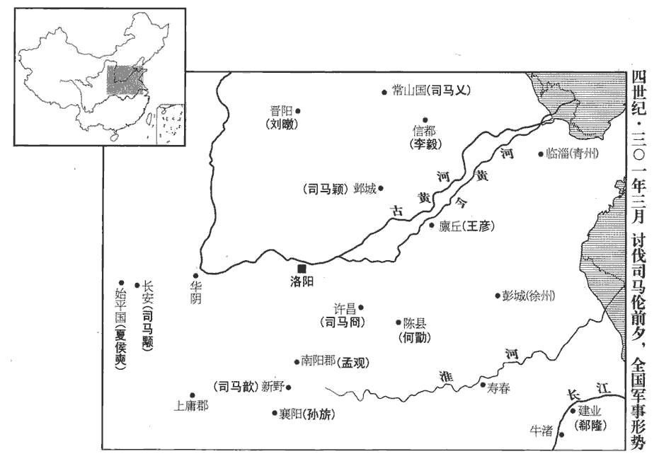
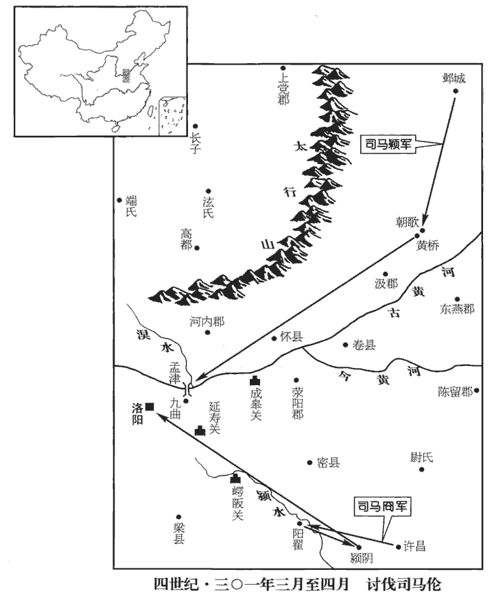
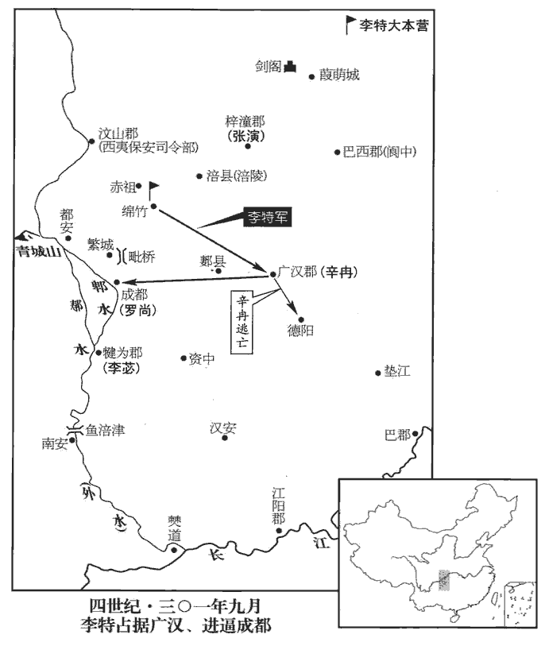

 晉紀六起重光作噩（辛酉），盡玄黓閹茂（壬戍），凡二年。

# 孝惠皇帝中之上

## 永寧元年（辛酉，三零一）此猶是永康二年；正月乙丑，趙王倫改元建始；四月，帝反正，始改元永寧。

1春，正月，以散騎常侍安定‹甘肃镇原东南曙光乡›張軌為涼州‹甘肃中西部›刺史。散，悉亶dǎn翻。騎，奇寄翻。軌以時方多難，陰有保據河西之志，故求為涼州‹州政府设姑臧甘肃省武威›市。時州境盜賊縱橫，難，乃旦翻。縱，子容翻。鮮卑為寇；軌至，以宋配、氾瑗為謀主，楊正衡曰：氾，音凡，姓也。瑗，于眷翻。悉討破之，威著西土‹甘肃›。張氏保據涼土始此。嗚呼！世亂則人思自全，然求全而不能自全者亦多矣。竇融、張軌之求出河西，此求全而得全者也。謝晦、袁顗yǐ之求鎮荊、襄，此求全而不能自全者也。蓋竇融、張軌，始終一心以奉漢、晉，此固宜永終福祿、詒yí及子孫者也。謝晦、袁顗，志在據地險以全身，其用心非矣，天所不與也。然劉焉求牧益州，袁紹志圖冀部，石敬瑭心欲河東，皆以之潛規非望；至其成敗久速，則有非智慮所及者。

〖译文〗 [1]春季，正月，任命散骑常侍安定人张轨为凉州刺史。张轨因为时势多灾多难，心里有保守占据河西地区的想法，所以要求任职凉州。当时凉州境内盗贼横行，又有鲜卑人劫掠。张轨到凉州后，以宋配、汜瑗为主要谋士，把这些盗贼全部讨平，在河西地区威名昭著。

2相國倫與孫秀使牙門趙奉詐傳宣帝神語云：「倫宜早入西宮。」司馬懿，追諡宣皇帝。時倫以東宮為相國府，謂禁中為西宮。散騎常侍義陽王威，望之孫也，素諂事倫，倫以威兼侍中，使威逼奪帝璽綬，作禪詔，又使尚書令滿奮持節、奉璽綬璽，斯氏翻。綬，音受。禪位於倫。左衛將軍王輿、前軍將軍司馬雅等帥甲士入殿，帥，讀曰率。曉諭三部司馬，示以威賞，無敢違者。張林等屯守諸門。屯守宮城諸門也。乙丑‹九›，倫備法駕入宮，即帝位。考異曰：三十國春秋云：「倫將篡位，義陽王威執詔示嵇紹曰：『聖上法堯、舜之舉，卿其然乎？』紹厲聲曰：『有死而已，終不有二！』威怒，拔劍而出。及惠帝遷于金墉城，唯紹固志不從，直于金墉，絕不通倫，時人皆為之懼。」晉書忠義傳云：「倫篡位，紹為侍中，惠帝復祚，遂居其職。」二說不同，今皆不取。「復祚」之「祚」，當作「阼」。赦天下，改元建始。帝自華林西門出居金墉城，華林西門，華林園西門也。倫使張衡將兵守之。將，即亮翻。

〖译文〗 [2]相国司马伦和孙秀让牙门赵奉假称宣帝有神语，散布说：“司马伦应当尽快入西宫即帝位。”散骑常侍义阳王司马威，是司马望的孙子，一直对司马伦谄谀奉承，司马伦就让司马威兼任侍中，派他逼迫惠帝交出皇帝玺印与缓带，作禅让帝位的诏书，又派尚书令满奋持符节取来玺印与缓带，奉交给司马伦，表示惠帝已禅位给司马伦。左卫将军王舆、前军将军司马雅带领全副武装的兵士进入宫殿，通告三部司马，向他们宣示威势与封赏，没有谁胆敢违抗。张林等人在各宫门前驻扎防守。乙丑（初九），司马伦乘皇帝的专车进入皇宫，即帝位。大郝天下，改年号为建始，惠帝从华林园西门出宫到金墉城居住，司马伦派张衡带兵看守惠帝。

丙寅‹十›，尊帝為太上皇，改金墉曰永昌宮，廢皇太孫為濮陽王。濮，博木翻。立世子荂fū為皇太子，荂，枯花翻；楊正衡音孚。封子馥為京兆王，虔為廣平王，詡xǔ為霸城王，皆侍中將兵。以梁王肜為宰衡，肜róng，余中翻。何劭為太宰，孫秀為侍中、中書監、票騎將軍、儀同三司，票，匹妙翻。義陽王威為中書令，張林為衛將軍，其餘黨與，皆為卿、將，卿、將，列卿及諸中郎將也。將，即亮翻。超階越次，不可勝紀；勝，音升。下至奴卒，亦加爵位。每朝會，貂蟬盈座，武冠，一曰武弁biàn，諸武官冠之。侍中、中常侍加黃金璫，附蟬為文，貂尾為飾，謂之「趙惠文冠」。胡廣說曰：趙武靈王效胡服，以金璫飾首，前插貂尾，為貴職；秦滅趙，以其冠賜近臣。應劭漢官曰：說者以金取堅剛，百鍊不耗，蟬居高飲潔，口在腋下；貂內勁捍而外溫潤，此因物生義也。徐廣曰：趙武靈王胡服有此，秦、漢即而用之。說者蟬取其清高飲露而不食，貂紫蔚采潤而毛采不彰，故於義亦取。胡廣又曰：意謂北方寒涼，本以貂皮暖額，附施於冠，因遂變成首飾。沈約曰：貂蟬之說，因物生義，非其實也。其實趙武靈王變胡服，秦滅趙，以其君冠賜侍臣，故秦、漢以來，侍臣有貂蟬也。朝，直遙翻。時人為之諺曰：「貂不足，狗尾續。」史記曰：狐裘雖敝，不可補以黃狗之皮，亦此意。是歲，天下所舉賢良、秀才、孝廉皆不試；舊制，賢良、秀、孝皆策試而後補官。郡國計吏及太學生年十六以上皆署吏；守令赦日在職者皆封侯；守，式又翻。郡綱紀并為孝廉，縣綱紀并為廉吏。郡綱紀，功曹之屬；縣綱紀，主簿、錄事史之屬。廉吏，亦選舉之一科。史言倫、秀欲以濫恩收眾心。府庫之儲，不足以供賜與。應侯者多，鑄印不給，或以白板封之。

〖译文〗 丙寅（初十），将惠帝尊为太上皇，把金墉城改名为永昌宫，把皇太孙废黜为濮阳王。立司马伦长子司马为皇太子，儿子司马馥封为京兆王，司马虔封为广平王，司马翊为霸城王，都为侍中并带兵。任命梁王司马肜为宰衡，何劭为太宰，孙秀任侍中，中书监、票骑将军、仪同三司。义阳王司马威为中书令，张林为卫将军，其余党羽都任用为列卿以及各种名目的将军，任意越级提拔的人，多的不可胜数。下到奴仆士卒，也都封官加爵，每当朝会时，戴插貂尾、蝉羽等高官饰物的人充斥席位。不时人对这种滥封官爵的情况编谣谚说：“貂不足，狗尾续。”这一年，全国所荐举的贤良、秀才，孝廉等各名目的侯选官员都没有经过考试，各郡和封国掌管簿计的官员与十六岁以上的太学生都成为朝廷正式署官，全国大赦这一天在职的郡守县令都封了侯，郡属小官吏全都荐举为孝廉，县属小官吏全都荐举为廉吏。国家府、库的储备，都不够用来分发赏赐。封侯的人众多，来不及铸印，有时就用无字光板代替。

初，平南將軍孫旂qí‹时驻襄阳湖北省襄樊市›之子弼、弟子髦、輔、琰yǎn皆附會孫秀，與之合族，旬月間致位通顯。及倫稱帝，四子皆為將軍，封郡侯，以旂為車騎將軍、開府。旂以弼等受倫官爵過差，必為家禍，遣幼子回責之，弼等不從，旂不能制，慟哭而已。據晉書，孫旂四子，并以吏才稱於當世。附麗非人，至於滅族，擇木之難也。然孫旂先與孫秀親善，故諸子從而附會之。擇交之不審，何以詔其子哉！雖慟哭，無益也。孫族之赤，旂實為之。

〖译文〗 当初，平南将军孙的儿子孙弼、弟弟的儿子孙髦、孙辅、孙琰等人都依附奉承孙秀，与孙秀合为一族，一个月的工夫就都升任显要的高位。等到司马伦称帝，这四人都升任将军，封为郡侯。任用孙为车骑将军，并开设府署。孙认为儿子孙弼等人接受司马伦的官职爵位超过等级，一定会带来家祸、派小儿子孙回去责备他们，孙弼等人不听从，孙没有办法，只能痛哭而已。

3癸酉‹十七›，殺濮陽哀王臧。

〖译文〗 [3]癸酉（十七日），杀濮阳哀王司马臧。

孫秀專執朝政，倫所出詔令，秀輒改更與奪，朝，直遙翻。更，工衡翻。自書青紙為詔，或朝行夕改，百官轉易如流。張林素與秀不相能，且怨不得開府，潛與太子荂fū牋，言：「秀專權不合眾心，而功臣皆小人，撓亂朝廷，撓náo，火高翻，又奴巧翻。可悉誅之。」荂以書白倫，倫以示秀。秀勸倫收林，殺之，夷其三族。秀以齊王冏、成都王穎、河間王顒yóng，各擁強兵，據方面，惡之，冏鎮許昌，穎鎮鄴，顒鎮關中。惡，烏路翻。顒，魚容翻。乃盡用其親黨為三王參佐，加冏鎮東大將軍、穎征北大將軍，皆開府儀同三司，以寵安之。

〖译文〗 孙秀专擅把持朝政，司马伦所下的诏令，孙秀随意改动增删，甚至自己写在青纸上作诏书。有时朝令夕改，百官像流水一样换来换去，张林一直与孙秀不和，加之怨恨没有得到开建府署的资格。暗地里给太子司马一封密信，说：“孙秀专权不能服众，而功臣都是小人，扰乱了朝廷，应当把他们全部诛杀。”司马将这封信告诉了司马伦，司马伦又把信交给孙秀看。孙秀就劝说司马伦拘捕了张林，把他杀了，并夷灭三族。孙秀因为齐王司马、成都王司马颖，河间王司马，各自拥有强大的军队，独据一方，而认为他们很危险，便把这三个亲王的僚属全部任用自己的亲信党羽充当，又加封司马为镇东大将军，司马颖为征北大将军、开府仪同三司，来优宠安抚他们。

4李庠xiáng驍勇得眾心，趙廞浸忌之而未言。驍xiāo，堅堯翻。廞，許今翻。長史蜀郡杜淑、張粲說廞曰：「將軍起兵始爾，而據遣李庠握強兵於外。謂廞使庠招合壯勇，以斷北道也。說，輸芮翻。非我族類，其心必異，此倒戈授人也，宜早圖之。」會庠勸廞稱尊號，淑、粲因白廞以庠大逆不道，引斬之，并其子姪十餘人。考異曰：載記曰：「及其子姪宗族三十餘人。」今從華陽國志。又國志，庠死在去年冬，晉春秋在今年春。今從之。時李特、李流皆將兵在外，廞遣人慰撫之曰：「庠非所宜言，罪應死。兄弟罪不相及。」復以特、流為督將。將，即亮翻。特、流怨廞，引兵歸緜竹‹四川德阳市北黄许镇›。

〖译文〗 [4]李庠骁勇又很得人心，赵逐渐忌恨他，但又没有说。长史蜀郡人杜淑、张粲劝说赵道：“将军刚刚起兵、就仓促派李庠在外掌握重兵。他不是我们的族类，一定不会和我们一条心，这是倒转长矛交给别人让他向我们攻击，应当尽快设法对付他。”正碰上李庠劝说赵称帝，杜淑、张粲告诉赵这是李庠大逆不道，便把李庠与他的儿子侄子十余人一齐杀了。当时李特、李流都在外带兵，赵派人去安抚告慰他们说：“李庠说了不应该说的话，应判死罪。与你们兄弟不相干。”又任命李特、李流为督将。李特、李流怨恨赵，便带领兵马回归绵竹。

廞xīn牙門將涪陵‹贵州省沿河县西北›許弇yǎn求為巴東‹重庆奉节›監軍，涪陵縣，漢屬巴郡，蜀分為涪陵郡。涪，音浮。監，音工銜翻。杜淑、張粲固執不許，弇怒，手殺淑、粲於廞閤下，淑、粲左右復殺弇。復，扶又翻。三人，皆廞之腹心也，廞由是遂衰。腹心既死，廞無所倚，故其勢衰。

〖译文〗 赵的牙门将涪陵人许请求担任巴东监军，杜淑、张粲坚持不答应，许大怒，亲手在赵门前杀了杜淑、张粲，杜淑、张粲的左右随从又杀了许。这三人都是赵的心腹亲信，赵因此而衰败。

廞遣長史犍為‹四川彭山›費遠、犍，居言翻。費，扶沸翻。蜀郡太守李苾、督護常俊督萬餘人斷北道，屯緜竹‹四川省德阳县›之石亭‹四川省什邡县东雒江渡口›。苾，毗必翻。緜竹縣，漢屬廣漢郡，晉屬新都郡，唐屬漢州。斷，丁管翻。李特密收兵得七千餘人，夜襲遠等軍，燒之，死者十八九，遂進攻成都。費遠、李苾及軍【張：「軍」下脫「諮」字。】祭酒張微，夜斬關走，文武盡散。廞xīn獨與妻【章：甲十一行本「妻」下有「子」字；乙十一行本同；孔本同；張校同。】乘小船走，至廣都‹四川省双流县›，為從者所殺。從，才用翻。特入成都，縱兵大掠，遣使詣洛陽，陳廞罪狀。

〖译文〗 赵派长史犍为人费远，蜀郡太守李，督护常俊率领一万余人截断北来的道路，驻扎在绵竹的石亭。李特秘密聚集了七千多兵卒，夜袭费远等人所率的军队，用火烧他们，被烧死的十有八九，于是进攻成都。费远、李以及军祭酒张微，趁夜夺路而逃，文武官员全部跑散。赵一个人与妻子乘小船逃走，到广都时，被随从杀死。李特进入成都，纵兵大肆抢掠，派遣使者到洛阳，陈述赵的罪状。

初，梁州‹州政府设南郑陕西省汉中市›刺史羅尚，聞趙廞反，表：「廞非雄才，蜀人不附，敗亡可計日而待。」詔拜尚平西將軍、益州刺史，督牙門將王敦、此別一王敦。蜀郡太守徐儉、廣漢‹四川廣漢›太守辛冉等七千餘人入蜀。特等聞尚來，甚懼，使其弟驤於道奉迎，并獻珍玩，尚悅，以驤為騎督。驤，斯將翻。騎奇寄翻，騎督，督騎兵。特、流復以牛酒勞尚於緜竹‹四川省绵阳市›。王敦、辛冉說尚曰：復扶又翻，勞力到翻，說，輸芮翻。「特等專為盜賊，宜因會斬之；不然，必為後患。」尚不從。冉與特有舊，謂特曰：「故人相逢，不吉當凶矣。」特深自猜懼。

〖译文〗 当初，梁州刺史罗尚，听说赵谋反，曾上表说：“赵不是雄才大略的人，蜀地人们不会归附他，他的失败灭亡指日可待。”朝廷任命罗尚为平西将军，益州刺史，督牙门将王敦、蜀郡太守徐俭、广汉太守辛冉等率七千余人进入蜀地。李特等人听说罗尚到来，非常惧怕，派弟弟李骧在路上迎接，并献上珍宝古玩。罗尚非常高兴、任用李骧为骑督。李特、李流又在绵竹用牛、酒犒劳罗尚。王敦、辛冉劝罗尚说：“李特等人专会作盗贼，应当趁机杀了，否则一定是后患。”罗尚没有听从。辛冉与李特以前虽有过交往，辛冉对李特说：“故人相逢，不是吉祥便是凶险。”李特深深猜疑害怕。

三月，尚至成都。汶山‹四川理县›羌反，尚遣王敦討之，為羌所殺。汶，音岷。考異曰：帝紀在八月，疑是洛陽始知。今從華陽國志。

〖译文〗 三月，罗尚到成都。汶山羌人造反，罗尚派王敦征讨他们，被羌人杀死。

5齊王冏謀討趙王倫，未發，會離狐‹河北东明›王盛、離狐縣，前漢屬東郡，後漢、晉屬濟陰郡，唐天寶元年，改為南華縣，屬鄆yùn州。潁川‹河南禹县›處穆《晉書》作「王處穆」。【章：孔本「處」上正有「王」字；張校同。】聚眾於濁澤‹河南临颍›，濁澤在潁川長社縣。百姓從之，日以萬數。倫以其將管襲為齊王軍司，討盛、穆，斬之。冏因收襲，殺之，考異曰：齊王冏傳曰：「冏潛與盛、穆謀起兵誅倫，未發，恐事泄，乃與襲殺穆，送首於倫，以安其意。」今從三十國春秋。與豫州刺史何勗、龍驤將軍董艾等起兵，遣使告成都王穎、河間王顒、常山王乂及南中郎將新野公歆，晉志曰：四中郎將，并後漢置；武帝以來，四中郎將或領刺史，或持節為之。歆xīn，扶風王駿之子也。移檄征、鎮、州、郡、縣、國，征、鎮，四征、四鎮，居方面者。稱：「逆臣孫秀，迷誤趙王，當共誅討。有不從命者，誅及三族。」

〖译文〗 [5]齐王司马商议征讨赵王司马伦，还没有动兵，碰上离孤县人王盛、颍川人王处穆在浊泽聚众，百姓响应跟随他们，一天就有万人。司马伦派他的属将管袭任齐王的军司，征讨王盛、处穆，杀死他们。司马则趁机拘捕并杀死了管袭，与豫州刺史何勖、龙骧将军董艾等人起兵，派遣使者通告成都王司马颖、河间王司马、常山王司马以及南中郎将新野公司马歆，向征、镇、州、郡、县、国等各地行政部门传布檄文，说：“叛逆之臣孙秀，迷惑妨害赵王，应该共同讨伐。有不听从命令的，诛灭三族。”

 

使者至鄴，成都王穎召鄴令盧志謀之。志曰：「趙王篡逆，人神共憤，殿下收英俊以從人望，杖大順以討之，百姓必不召自至，攘臂爭進，蔑不克矣。」蔑，無也。穎從之，以志為諮議參軍，諮議參軍，晉公府皆置之，蓋取諮詢謀議軍事也，其位在諸參軍之上。仍補左長史。志，毓之孫也。盧毓見七十三卷魏明帝景初元年。穎以兗州刺史王彥、冀州刺史李毅、督護趙驤、石超等為前鋒，遠近響應；至朝歌‹河南淇县›，朝歌縣，前漢屬河內郡，晉分屬汲郡；隋大業二年，改朝歌縣為衛縣，屬衛州；有紂所都朝歌城，在縣西。眾二十餘萬。超，苞之孫也。石苞事文帝、武帝，功參佐命。

〖译文〗 使者到邺县，成都王司马颖召集邺县令卢志商议计划，卢志说：“赵王篡权叛逆，神怒人怨，殿下召集英雄俊杰以顺从民意、扶持正义征讨他，百姓一定会不召而自至，举起胳臂争相前来，没有下成功的道理。“司马颖采纳了卢志的话，以卢志为咨议参军，仍补任左长史。卢志是卢毓的孙子。司马颖以兖州刺史王彦、冀州刺史李毅，督护赵骧、石超等人为前锋。远方近处纷纷响应。到达朝歌，人数已达二十多万人。石超是石苞的孙子。

常山王乂在其國‹河北省正定县›，與太原‹山西省太原市›內史劉暾各帥眾為穎後繼。暾，他昆翻。帥，讀曰率。

〖译文〗 常山王司马在他的封国，与太原内史刘暾各率人马作为司马颖的后续军队。

新野公歆得冏檄，未知所從。嬖人王綏曰：「趙親而強，齊疏而弱，歆父扶風王駿，與趙王倫皆宣帝子，歆於倫為叔姪，其屬親；冏於歆為從子，其屬視倫為疏。嬖，卑義翻，又博計翻。公宜從趙。」參軍孫詢大言於眾曰：「趙王凶逆，天下當共誅之，何親疏強弱之有！」歆乃從冏。

〖译文〗 新野公司马歆接到司马的檄文，不知听从谁合适。他的宠信王绥说：“赵王亲近而又强大，齐王疏远而又微弱，您应该跟随赵王。”参军孙询高声对众人说：“赵王凶暴叛逆，天下应当共同讨伐他，还讲什么亲疏强弱？”于是，司马歆就跟随了司马。

前安西參軍夏侯奭shì在始平‹陕西省兴平市、辖今咸阳市›，合眾數千人以應冏，遣使邀河間‹河北献县›王顒。顒用長史李【章：甲十一行本「李」上有「隴西」二字；乙十一行本同；孔本同。】含謀，遣振武將軍河間張方討擒奭及其黨，腰斬之。沈約志：振武將軍，始於西漢之末，王莽以命王況。冏檄至，顒執冏使送於倫，使，疏吏翻。遣張方將兵助倫。方至華陰‹陕西華陰›，華，戶化翻。顒聞二王兵盛，復召方還，更附二王。二王，謂齊王冏，成都王穎。

〖译文〗 前安西参军夏侯在始平，聚集几千人响应司马，派使者邀请河间王司马。司马采用长史李含的计谋，派遣振武将军河间人张方征伐擒获并腰斩夏侯及其党羽。司马的檄文传到，司马抓住司马的使者送给司马伦，派遣张方率兵帮助司马伦。张方到达华阴，司马又听说司马、司马颖二王兵势强大，又召张方回来，改为附随司马、司马颖二王。

 

冏檄至揚州，州人皆欲應冏。刺史郗隆，慮之玄孫也，郗，丑之翻，郗慮，漢獻帝時為御史大夫。以兄子鑒及諸子悉在洛陽，疑未決，悉召僚吏謀之。主簿淮南‹安徽寿县›趙誘、前秀才虞潭皆曰：「趙王篡逆，海內所疾；今義兵四起，其敗必矣。為明使君計，莫若自將精兵，徑赴許昌，上策也；齊王冏時鎮許昌。遣將將兵會之，中策也；量遣小軍，隨形助勝，下策也。」將，息亮翻。量，音良。隆退，密與別駕顧彥謀之，彥曰：「誘等下策，乃上計也。」治中留寶、主簿張褒、西曹留承聞之，請見，曰：「不審明使君今當何施？」隆曰：「我俱受二帝恩，二帝，謂宣帝、武帝。或曰：二帝，謂惠帝及趙王倫，非也。無所偏助，欲守州而已。」承曰：「天下，世祖之天下也；文帝廟號世祖。文帝平諸葛誕，滅蜀，始弘晉業。太上承代已久，太上，謂惠帝，時號太上皇。今上取之，不平，今上，謂趙王倫。齊王順時舉事，成敗可見。言齊王冏舉事必成，趙王倫必敗也。使君不早發兵應之，狐疑遷延，變難將生，難，乃旦翻。此州豈可保也！」隆不應。潭，翻之孫也。虞翻事吳主權，以直聞。隆停檄六日不下，停冏檄不下曹。下，遐嫁翻。將士憤怨。參軍王邃鎮石頭，將士爭往歸之，隆遣從事於牛渚‹安徽当涂采石矶›禁之，不能止。平吳之後，揚州移鎮秣陵。今於牛渚禁將士往石頭，疑此時揚州又還治淮南也。將士遂奉邃攻隆，隆父子及顧彥皆死，傳首於冏。

〖译文〗 司马的檄文到扬州，扬州人都打算响应他。刺史郗隆是郗虑的五世孙，因为哥哥的儿子郗鉴和几个儿子都在洛阳，而迟疑不定，就召集全体僚属谋划此事。主簿淮南人赵诱、前秀才虞潭都说：“赵王篡权叛逆，海内都憎恨他，现在四处都兴起举义兵马，赵王必败无疑。为您考虑，不如亲率精兵，直赴许昌，这是上策。派遣将领率兵响应，是中策。酌量派遣小支兵马，看形势而动，是下策。”郗隆退下，又与别驾顾彦密谋此事，顾彦说：“赵诱等人所说的下策，是上策。”治中留宝、主簿张褒、西曹留承听说后，请求进见，说：“不明白您现在打算怎么办？”郗隆说：“我受宣帝、武帝之恩，没有倾向偏助哪一方，只打算守住我所管辖的扬州而已。”留承说：“天下是文帝打下的天下，太上皇继承帝位已很长时间，赵王取代他，不公平，齐王顺应时势举事，成败能够想见。您不早些发兵响应他，而狐疑拖延，变故灾难就要发生，扬州怎么能保住呢？”郗隆没有回答。虞潭是虞翻的孙子。郗隆压住檄文六天没有下达，将士官兵激愤怨恨，参军王邃镇守石头城，将士们争相前去归附，郗隆派遣从事到牛渚制止他们，没有效果。将士们就都跟随王邃攻打郗隆，郗隆父子和顾彦都被杀死，首级传献给司马。

安南將軍、監沔北諸軍事孟觀‹时驻宛县河南省南阳市›，以為紫宮帝座無他變，晉志：北極五星，鉤陳六星，皆在紫宮中。鉤陳中一星曰天皇大帝，大帝上九星曰華蓋，所以覆蔽大帝之座也。觀徒占天象而不察諸人事，此其所以死也。監，古銜翻。沔，迷兗翻。倫必不敗，乃為之固守。為，于偽翻。

〖译文〗 安南将军、监沔北诸军事孟观，夜观星象认为紫宫帝座没有其他变化，那么司马伦一定不会失败，于是就为司马伦顽强防守。

倫、秀聞三王兵起，大懼，三王，謂齊王冏、成都王穎、河間王顒也。詐為冏表曰：「不知何賊猝見攻圍，臣懦弱不能自固，乞中軍見救，魏、晉以禁兵為中軍。庶得歸死。」以其表宣示內外；遣上軍將軍孫輔、折衝將軍李嚴上軍將軍，蓋當時所置。沈約志：折衝將軍，始於建安中，曹公以樂進為之。帥兵七千自延壽關‹河南偃师东南›出，晉志，河南緱氏縣有延壽城。帥，讀曰率；下同。征虜將軍張泓、左軍將軍蔡璜、前軍將軍閭和帥兵九千自崿è阪關出‹河南登封东南›，晉志，河南陽城縣有崿阪關。杜佑曰：崿嶺在河南登封縣，登封，故嵩陽也。崿，五各翻。阪，音反。鎮軍將軍司馬雅、揚威將軍莫原沈約志：揚威將軍，魏置。姓譜：莫姓，楚莫敖之後。帥兵八千自成皋關‹河南省荥阳县西北汜水镇›出，晉志，河南成臯縣有成皋關。以拒冏。三路出兵以拒冏。遣孫秀子會督將軍士猗、許超帥宿衛兵三萬以拒穎。召東平王楙為衛將軍，都督諸軍；又遣京兆王馥、廣平王虔帥兵八千為三軍繼援。孫會、士猗、許超三人所將之軍為三軍。倫、秀日夜禱祈、厭勝以求福；厭，益葉翻。使巫覡選戰日；覡xí，刑狄翻。又使人於嵩山著羽衣，詐稱仙人王喬，作書述倫祚長久，欲以惑眾。嵩山，中嶽，在潁川陽城縣；漢武帝分置崈chóng高縣，以奉中嶽，東漢省，併入陽城縣。晉陽城縣，屬河南郡。著，陟略翻。劉向列仙傳曰：王子喬，周靈王太子晉也，好吹笙，作鳳鳴。遊伊、洛間，道士浮丘公接上嵩山，三十餘年。後來於山上告桓良曰：「告我家，七月七日，待我於緱氏山頭‹河南省偃师县东南›。」果乘白鶴駐山巔，望之不得到，舉手謝時人而去。故倫、秀詐以惑眾。著，陟略翻。

〖译文〗 司马伦、孙秀听说司马等三亲王兴兵，非常恐惧，伪造司马给朝廷的奏表，说：“不知是什么强盗突然包围了我，我懦弱无能无法自保，乞求朝廷派禁军救援，使我能够回到朝廷领罪。”司马伦等把这份伪造的奏表在朝廷内外传扬展示，又派遣上军将军孙辅、折冲将军李严带领七千兵卒出延寿关，派征虏将军张泓、左军将军蔡璜、前军将军闾和带领九千兵卒出阪关，派镇军将军司马雅、扬威将军莫原带领八千兵卒出皋关，用以抵御司马。派遣孙秀的儿子孙会督率将军士猗、许超带领三万宿卫兵来抵御司马颖。宣召东平王司马为卫将军，监督各支兵马，又派遣京兆王司马馥、广平王司马虔带领八千兵卒作为三支兵马的预备后援。司马伦、孙秀日夜祈祷，用诅咒制胜的法术祈求鬼神降福保佑。让男巫选择确定作战的日期，又派人穿上羽衣到嵩山，乔装打扮自称仙人王乔，写信说司马伦的帝位定会长久，想以此迷惑众人。

6閏月，丙戌朔‹一›，日有食之。自正月至于是月，五星互經天，縱橫無常。志曰：傳曰：日陽，君道也；星陰，臣道也。日出則星亡，臣不得專也。晝而星見午上為經天，其占為不臣，為更王。今五星悉經天，天變所未有也。縱，子容翻。

〖译文〗 [6]闰月，丙戌朔（初一），出现日食。从正月到这个月，五个星在白昼出现，位置错乱失去规律。

7張泓等進據陽翟dí‹河南禹州›，陽翟縣，漢屬潁川郡，晉屬河南郡。與齊王冏戰，屢破之。冏軍潁陰‹河南省禹县南二十公里›，潁陰縣，在潁川郡，潁陰去陽翟四十里。夏，四月，泓乘勝逼之，冏遣兵逆戰。諸軍不動，而孫輔、徐建軍夜亂，徑歸洛自首曰：首，式救翻。「齊王兵盛，不可當，泓等已沒矣！」趙王倫大恐，祕之，而召其子虔及許超還。欲召河北之軍還以自衛。會泓破冏露布至，倫乃復遣之。復，扶又翻。泓等悉帥諸軍濟潁攻冏營，潁水出潁川陽城縣少室，東南流，過陽翟縣之北。帥，讀曰率；下同。冏出兵擊其別將孫髦、司馬譚等，破之，泓等乃退。孫秀詐稱已破冏營，擒得冏，令百官皆賀。

〖译文〗 [7]张泓等人攻占阳翟，与齐王司马交战，多次打败司马。司马驻扎在颖阴。夏季，四月，张泓乘胜进逼司马，司马派兵迎战。司马伦的各支军马都没有变化，而孙辅、徐建所率军队夜间出现变乱，就直接逃回洛阳请罪说：“齐王兵势强大，势不可当，张泓等人已全军覆没了！”赵王司马伦大为恐慌，对孙辅等所说的秘而不宣，急忙召他儿子司马虔及许超回来。这时张泓打败司马的战报到了，赵王伦才又派司马虔与许超带兵回去。张泓等人率各支兵马渡颖水攻打司马的兵营，司马出兵打败了配合张泓主力行动的孙髦、司马谭等人的军队，张泓等人也就退却了。孙秀等人却造谣宣称已经击破司马的兵营，活捉了司马，还让文武百官都来祝贺。

成都王穎前鋒至黃橋‹河南淇县西南›，朝歌西有黃澤，澤水右入蕩水，謂之黃雀溝。橋當在溝上。為孫會、士猗yī、許超所敗，敗，補邁翻。殺傷萬餘人，士眾震駭。穎欲退保朝歌‹河南淇县›，盧志、王彥曰：「今我軍失利，敵新得志，有輕我之心。我若退縮，士氣沮衂nǜ，不可復用。沮，在呂翻。衂，女六翻。復，扶又翻。且戰何能無勝負！不若更選精兵，星行倍道，出敵不意，此用兵之奇也。」星行者，夜行戴星而行也。穎從之。倫賞黃橋之功，士猗、許超與孫會皆持節。由是各不相從，軍政不一，且恃勝輕穎而不設備。穎帥諸軍擊之，大戰于湨jú水‹源出河南省济源市，流经孟县，注入黄河›，湨水出河內軹縣東南，至溫入河。湨，古闃qù翻。考異曰：趙王倫傳作「激水」。今從帝紀。會等大敗，棄軍南走。穎乘勝長驅濟河。

〖译文〗 成都王司马颖所部前锋到达黄桥，被孙会、士猗、许超的军队打败，死伤一万多人，士卒们都感到震惊恐惧。司马颖打算撤退到朝歌防守，卢志、王彦说：“现在我军失利，敌人刚刚得志，心里轻视我们。我们如果退缩，士气势必沮丧受挫，而不能再用。再说打仗怎么能没有胜负？还不如另选精兵，星夜赶路，出敌不意，这就是用兵要出人意外。”司马颖采纳了这个建议。司马伦奖赏黄桥之战的有功之人，士猗、许超与孙会都具有了掌握符节发号施令的权力。因此他们互相都不听从对方，军队政令不统一，又倚仗着初战告捷而轻视司马颖，没有设防备战。司马颖带领所属各支兵马袭击他们，与他们在水展开激烈战斗。孙会等人惨败，临阵丢下军队向南仓皇逃窜。司马颖乘胜长驱直入渡过黄河。

自冏等起兵，百官將士皆欲誅倫、秀，秀懼，不敢出中書省；及聞河北軍敗，憂懣不知所為。懣，母本翻。又莫困翻。孫會、許超、士猗等至，與秀謀，或欲收餘卒出戰；或欲焚宮室，誅不附己者，挾xié倫南就孫旂‹时驻襄阳湖北省襄樊市›、孟觀‹时驻宛县河南省南阳市›；孫旂在荊州，孟觀在宛。或欲乘船東走入海；計未決。辛酉‹七›，左衛將軍王輿與尚書廣陵公漼漼cuǐ，取猥翻。帥營兵七百餘人自南掖門入宮，三部司馬為應於內，攻孫秀、許超、士猗於中書省，皆斬之，遂殺孫奇、孫弼及前將軍謝惔等。惔tán，徒甘翻。漼，伷之子也。伷，音冑。王輿屯雲龍門，召八坐皆入殿中，坐，徂臥翻。使倫為詔曰：「吾為孫秀所誤，以怒三王；今已誅秀。其迎太上皇‹司马衷›復位，吾歸老于農畝。」傳詔以騶虞幡敕將士解兵。傳詔者，使之宣傳詔命，因以為官名。黃門將倫自華林東門出，及太子荂fū皆還汶陽里第，將，如字，引也。荂，枯花翻；楊士衡音孚。洛陽城中有汶陽里，倫私第在焉。楊正衡曰：汶，音問。遣甲士數千迎帝于金墉城。百姓咸稱萬歲。帝自端門入，升殿；群臣頓首謝罪。詔送倫、荂等赴金墉城。廣平王虔自河北還，至九曲‹河南巩县西南千斤坝›，水經註：九曲瀆，在河南鞏縣西。聞變，棄軍，將數十人歸里第。

〖译文〗 自从司马等人起兵，朝廷文武百官以及禁军将士都想诛杀司马伦和孙秀，孙秀非常胆怯，不敢离开中书省。等到听说河北的军队战败，忧郁烦懑不知所措。孙会，许超、士猗等人逃回来后，与孙秀商议，有的提出聚集剩余的兵力去交战。有的提出焚毁皇宫殿堂，诛杀不听从自己的人，挟制司马伦南逃，投奔孙、孟观。有的还提出乘船东行入海。但没有高议出结果。辛酉（初七），左卫将军王舆和尚书广陵公司马，带领七百多兵士从南掖门进入皇宫，三部司马在里面为内应，在中书省向孙秀、许超、士猗发起攻击，把他们全杀了。于是又杀了孙奇、孙弼及前将军谢等人。司马是司马的儿子。王舆在云龙门驻守，召集朝廷八个部门的高级官吏都进入宫殿，让司马伦下诏书说：“我被孙秀等人所害，因此激怒三亲王。现在已诛杀孙秀。要迎接太上皇恢复皇位，我则归田养老。”传诏官用驺虞幡命令将士解除武装。宦官把司马伦从华林园东门带出，和太子司马一起都送回到汶阳里府第，派遣几个武装兵士到金墉城迎接惠帝。百姓都呼喊万岁。惠帝从端门进宫，登上宫殿，大臣们都跪拜叩头请罪。诏令把司马伦、司马等人送到金墉城。广平王司马虔从河北回来，到达九曲，听说朝廷的变故，就离弃军队，带几十人回归自己的府第。

癸亥‹九›，赦天下，改元，改元永寧。大酺五日。酺pú，薄乎翻。分遣使者慰勞三王。勞，力到翻。梁王肜等表：「趙王倫父子凶逆，宜伏誅。」丁卯‹十三›，遣尚書袁敞持節賜倫死，收其子荂、馥、虔、詡，皆誅之。凡百官為倫所用者皆斥免，臺、省、府、衛，僅有存者。尚書、御史、謁者，臺；門下、中書、祕書，省；府，諸公府也；衛，二衛及六軍也。是日，成都王穎至。己巳‹十五›，河間王顒至。穎使趙驤、石超助齊王冏討張泓等於陽翟，泓等皆降。降，戶江翻。自兵興六十餘日，戰鬬死者近十萬人。近，其靳翻。斬張衡、閭和、孫髦于東市，蔡璜自殺。五月，誅義陽王威。襄陽‹湖北襄陽›太守宗岱承冏檄斬孫旂，沈約曰：魏武帝分南郡編縣以北及南陽之山都立襄陽郡。魚豢huàn曰：魏文帝立。永饒‹河南省南阳市南›冶令空桐機斬孟觀，永饒冶當在南陽宛縣。空桐，姓；機，名。姓譜曰：漢覆姓有空桐、空相二氏。世本云：空同，子姓，蓋因崆峒山也。皆傳首洛陽，夷三族。

〖译文〗 癸亥（初九），宣布赦色天下，改年号为永宁。诏赐臣民聚饮五天。分别派遣使者去慰劳司马等三个亲王。梁王司马肜表奏：“赵王司马伦父子凶暴叛逆，应当处死。”丁卯（十三日），派遣尚书袁敞持符节赐司马伦死，拘捕他的儿子司马、司马馥、司马虔、司马翊，全部处死。文武百官中凡为司马伦任用过的全部贬斥罢免，台、省、府、卫各部门留任的官员所剩无几。当天，成都王司马颖到达。己巳（十五日），河间王司马到达。司马颖派赵骧、石超到阳翟去帮助齐王司马讨伐张泓等人，张泓等人全部投降。自从战事爆发，六十多天。有近十万人在战争中丧命。接着在东市杀张衡、闾和、孙髦，蔡璜自杀。五月，诛杀义阳王司马威。襄阳太守宗岱遵照司马的檄文杀孙，永饶冶令空桐机杀死孟观，都将首级送到洛阳，并夷杀孙，孟观三族。

8立襄陽王尚‹故太子司马遹子›為皇太孫。

〖译文〗 [8]立襄阳王司马尚为皇太孙。

9六月，乙卯‹二›，齊王冏帥眾入洛陽，帥，讀曰率。頓軍通章署，甲士數十萬，威震京都。晉避景帝諱，謂京師曰京都。

〖译文〗 [9]六月，乙卯（初二），齐王司马带领部众进入洛阳。军队在通章署停留，全副武装的兵士几十万人，威震京都洛阳。

戊辰‹十五›，赦天下。

〖译文〗 [10]戊辰（十五日），大赦天下。

復封賓徒王晏為吳王。晏貶見上卷永康元年。考異曰：晏傳：「自賓徒徙封代王。倫誅，復本封。」今從帝紀。

〖译文〗 [11]重新封宾徒王司马晏为吴王。

甲戌‹二十一›，詔以齊王冏為大司馬，加九錫，備物典策，如宣、景、文、武輔魏故事；成都王穎為大將軍，都督中外諸軍事，假黃鉞，錄尚書事，加九錫，入朝不趨，劍履上殿；考異曰：穎傳曰：「至鄴，詔王粹加九錫，進位大將軍，都督中外；穎拜受徽號，讓殊禮。」按穎在洛，盧志已謂穎曰：「今當與齊王共輔朝政，」明已有錄尚書之命，但穎不受，歸鄴，故朝廷使粹追命之耳。且穎功大於冏，不應獨賞冏而穎未賞也。今從帝紀。河間王顒為侍中、太尉，加三賜之禮；記王制：諸侯，賜弓矢然後征，賜鈇鉞然後殺，賜圭瓚然後為鬯chàng。常山王乂為撫軍大將軍，領左軍；左軍，即左軍將軍所統。進廣陵公漼爵為王，領尚書，加侍中；進新野公歆爵為王，都督荊州諸軍事，加鎮南大將軍。歆自南中郎將加鎮南。齊、成都、河間三府，各置掾屬四十人，武號森列，自東漢以來，公府皆有掾、有屬，但不帶武號耳。掾，以絹翻。文官備員而已，識者知兵之未戢jí也。己卯‹二十六›，以梁王肜為太宰，領司徒。肜以太師領丞相之職。

〖译文〗 [12]甲戌（二十日），下诏任命齐王司马为大司马，赐加九赐，为他准备的物品典制策书，像过去宣帝、景帝、文帝、武帝辅佐曹魏时那样。成都王司马颖担任大将军、都督中外诸军事、录尚书事，并给与天子使用的黄金钺，赐加九锡，特许入朝时可穿鞋并携带佩剑，不必趋行。河间王司马担任侍中、太尉，加赐弓矢、钺、圭瓒三锡。常山王司马担任抚军大将军、统领左军。封广陵公司马为王，并兼任尚书、加授侍中。封新野公司马歆为王，都督荆州诸军事，加授镇南大将军。齐王、成都王、河间王三个王府，分别设置僚属四十人，有武号的属官森然排列，文官仅配充数而已。因此头脑清醒的人都认识到兵祸并没有止息。己卯（二十六日），任梁王司马肜为太宰，兼任司徒。

光祿大夫劉蕃女為趙世子荂fū妻，故蕃及二子散騎侍郎輿、冠軍將軍琨皆為趙王倫所委任。冠，古玩翻。大司馬冏以琨父子有才望，特宥之，以輿為中書郎，中書郎，即中書侍郎。琨為尚書左丞。又以前司徒王戎為尚書令，劉暾為御史中丞，暾，他昆翻。王衍為河南尹。

〖译文〗 光禄大夫刘蕃的女儿是赵王长子司马的妻子，所以刘蕃和两个儿子散骑侍郎刘舆、冠军将军刘琨都是赵王司马伦委任的。大司马司马因为刘琨父子有才能及声望，特地宽宥了他们，任刘舆为中书郎，刘琨为尚书左丞。又让前司徒王戎任尚书令，任刘暾为御史中丞，王衍为河南尹。

新野王歆將之鎮，將出鎮荊州也。與冏同乘謁陵，乘，繩正翻。因說冏曰：「成都王至親，帝弟之親，故曰至親。說，輸芮翻。同建大勳，今宜留之與輔政；若不能爾，當奪其兵權。」常山王乂與成都王穎俱拜陵，乂謂穎曰：「天下者，先帝之業，王宜維正之。」聞其言者莫不憂懼。憂懼者，以冏與乂、穎必阻兵相圖，將罹其禍也。盧志謂穎曰：「齊王眾號百萬，與張泓等相持不能決；大王逕前濟河，功無與貳。今齊王欲與大王共輔朝政。志聞兩雄不俱立，宜因太妃微疾，求還定省，穎母程才人冊為成都太妃。記曲禮：凡為人子者，冬溫而夏凊qìng，昏定而晨省。省，悉景翻。委重齊王，以收四海之心，委朝政之重於齊王，則四海之人謂穎功大不居，將歸心於穎。此計之上也。」穎從之。帝見穎于東堂，慰勞之。勞，力到翻。穎拜謝曰：「此大司馬冏之勳，臣無豫焉。」因表稱冏功德，宜委以萬機，自陳母疾，請歸藩。即辭出，不復還營，便謁太廟，出自東陽城門，洛陽城東面北頭第二門曰東陽門。遂歸鄴‹河北临漳›。遣信與冏別，冏大驚，馳出送穎，至七里澗，及之。水經註：鴻臺陂在洛陽東北二十里，其水東流，左合七里澗。武帝泰始十年，立城東七里澗石橋。穎住車言別，流涕滂沱，滂沱，淚下如雨也。惟以太妃疾苦為憂，不及時事。由是士民之譽皆歸穎。

〖译文〗 新野王司马歆将要赴镇南大将军之任时，与司马同车去拜谒陵墓，借机对司马说：“成都王与惠帝关系最为亲近，又同您一起建立大功勋，现在应当把他留下来与您一起辅佐朝政。如果不能这样，应该剥夺他的兵权。”常山王司马和成都王司马颖也一起去拜谒陵墓，司马对司马颖说：“今天的天下，是先帝的功业，你应当考虑主持朝政。”听到这话的人无不感到忧虑恐惧。卢志对司马颖说：“齐王军队虽然号称百万，但和张泓等人作战时却相持而不能决胜，您则一直前进渡过黄河，功劳无人能够与您相提并论。现在齐王却要同您共同辅佐朝政。我听说两雄不能并存，应当趁太妃有小病，请求回封国侍奉太妃，把大权让给齐王，这样来使天下人心都归附您，这是上策。”司马颖采纳了这个意见。惠帝在东堂会见司马颖，慰问犒劳他。司马颖拜谢说；“这是大司马司马的功劳，我并没有参与什么。”于是就上奏表称赞司马的功劳与美德，应当委以处理天下大事的重任，又陈说母亲有病，请求回归封地。随即告辞出宫，不再回住地，立刻拜谒太庙，从东阳城门出去，就回封地邺城了。派信使去同司马辞别，司马非常惊讶，急驰出城送司马颖，到七里涧，追上了他。司马颖停下车话别，泪如雨下，只是忧虑太妃的病，而没有说到时政。因此士人与百姓的赞誉都归向司马颖。

冏辟新興‹山西省忻州市›劉殷為軍諮祭酒，洛陽令曹攄shū為記室督，漢建安三年，曹公置軍謀祭酒。晉制：文武官公及諸方面征鎮府，皆置軍諮祭酒。漢三公及大將軍府，皆有記室令史，主上章表奏報書記。曹公輔漢，以陳琳、阮瑀yǔ管記室。晉諸公府皆有記室督。攄shū，抽居翻。尚書郎江統、陽平‹河北省大名县东北›太守河內‹河南沁阳›苟晞xī參軍事，晉諸公、諸從公為持節都督，增參軍為六員。吳國‹苏州›張翰為東曹掾，孫惠為戶曹掾，前廷尉正顧榮及順陽‹河南淅川东南›王豹為主簿。晉制：東曹在倉曹之上，戶曹在倉曹之下。廷尉屬官有正、監、平。魏分南陽立南鄉郡，武帝太康中，更名順陽郡。掾，俞絹翻。豹，補教翻。惠，賁之曾孫；孫賁，吳主權從兄。榮，雍之孫也。顧雍，吳相也。殷幼孤貧，養曾祖母以孝聞，養，羊亮翻。人以穀帛遺之，遺，于季翻。殷受而不謝，直云：「待後貴當相酧chóu耳。」及長，博通經史，性倜儻有大志，長，知兩翻。倜，他歷翻。倜儻，卓異也。劉殷後事劉聰貴顯，女充聰後宮，何足尚也！儉而不陋，清而不介，望之頹然而不可侵也。冏以何勗xù為中領軍，董艾典樞機，又封其將佐有功者葛旟yú、路秀、衛毅、劉真、韓泰皆為縣公，委以心膂，號曰「五公」。葛旟，牟平公。路秀，小黃公。衛毅，陰平公。劉真，安鄉公。韓泰，封丘公。旟，音輿。考異曰：「路秀」，帝紀作「路季」，今從齊王冏傳。

〖译文〗 司马征召新兴人刘殷担任军咨祭酒，洛阳令曹摅任记室督，尚书郎江统、阳平太守河内入苟任参军，吴国人张翰任东曹椽，孙惠为户曹掾，前廷尉正顾荣和顺阳人王豹任主簿。孙惠是孙贲的曾孙，顾荣是顾雍的孙子。刘殷年幼时失去父母，家境贫寒，赡养曾祖母而以孝著称，有人送给他粮食布帛，刘殷接受而不道谢，直说：“等我富贵了一定酬谢。”长大后，学识渊博，精通经史典籍，性情卓越胸怀大志，节俭而不粗陋，清高而不孤僻，使人看到他不由得感到恭顺而不能侵犯。司马任用何勖为中领军。让董艾掌握枢密机要，又把有功的军事长官葛、路秀、卫毅、刘真、韩秦都封为县公，作为心腹臂膊依靠，号称“五公”。

成都王穎至鄴‹河北临漳›，詔遣使者就申前命；穎受大將軍，讓九錫殊禮。表論興義功臣，皆封公侯。穎亦表封盧志、和演、董洪、王彥、趙驤等。又表稱：「大司馬前在陽翟‹河南禹县›，與賊相持既久，百姓困敝，乞運河北邸閣米十五萬斛，以賑陽翟饑民。」造棺八千餘枚，以成都國秩為衣服，斂祭黃橋戰士，斂，力贍翻。旌顯其家，加常戰亡二等。又命溫縣‹河南溫縣西›瘞yì趙王倫戰士萬四千餘人。此湨jú水之戰也。溫縣屬河內郡；周司寇蘇忿生之國也。瘞，於計翻。皆盧志之謀也。穎貌美而神昏，不知書，然氣性敦厚，委事於志，故得成其美焉。詔復遣使諭穎入輔，并使受九錫。復，扶又翻。穎嬖人孟玖不欲還洛，嬖bì，卑義翻，又博計翻。又，程太妃‹司马颖的母亲›愛戀鄴都，故穎終辭不拜。

〖译文〗 成都王司马颖到达邺城，朝廷诏令使者到邺城重申以前的任命，司马颖接受了大将军的职位，而辞让九赐这种特殊的礼仪。司马颖上奏表评价讨伐赵王过程中的功臣，都被封为公、侯。又上奏表称：“大司马在阳崔时，曾与贼兵相持了很久，百姓因此困顿疾惫，请求准许运送所辖的黄河以北地区的邸阁米十五万斛，去赈济阳翟的灾民。”又打造了八千多副棺木，用自己的俸禄缝制衣服，装敛祭祀黄桥之战的死亡兵士，表彰他们的家属，使他们感到荣耀，抚恤也比平常战亡提高二级，又命令温县地区掩埋赵王司马伦的死亡兵士一万四千多人。这些都是卢志的计谋。司马颖相貌漂亮而神智糊涂，不通文书，但是性格敦厚，将事务都委托给卢志，所以能够成就美名。朝廷又下诏派使者通告司马颖入朝辅政，并让他接受九锡礼仪。司马颖的宠信孟玖不想回洛阳，又加上程太妃眷恋喜欢邺都，所以司马颖始终推辞而不去接受任命。

初，大司馬冏疑中書郎陸機為趙王倫撰禪詔，收，欲殺之；大將軍穎為之辯理，得免死，為，于偽翻。因表為平原‹山东平原›內史，以其弟雲為清河‹河北清河›內史。機友人顧榮及廣陵‹江苏扬州›戴淵，以中國多難，難，乃旦翻。勸機還吳；機以受穎全濟之恩，且謂穎有時望，可與立功，遂留不去。為陸機、陸雲為穎所殺張本。

〖译文〗 当初，大司马司马怀疑中书郎陆机为赵王司马伦撰写惠帝禅让帝位的诏书而拘捕了他，打算处死。大将军司马颖为陆机辩护说理，陆机得以免除死罪，司马颖又表奏陆机为平原内史，陆机的弟弟陆云为清河内史。陆机的朋友顾荣和广陵大戴渊，因为中原多灾多难，就劝陆机回到吴地。陆机因为受了司马颖保全济助的恩德，再说司马颖当时深孚众望，以为可以为他作事立功，于是就留下没有离去。

秋，七月，復封常山王乂為長沙王，武帝太康十年，封乂為長沙王；楚王瑋之誅，乂以同母貶為常山王；今復舊封。遷開府、驃騎將軍。

〖译文〗 [13]秋季，七月，朝廷又封常山王司马为长沙王，升为有开置府署资格的骠骑将军。

東萊王蕤ruí，凶暴使酒，數陵侮大司馬冏，數，所角翻。又從冏求開府不得而怨之，密表冏專權，與左衛將軍王輿謀廢冏。事覺，八月，詔廢蕤為庶人，誅輿三族，徙蕤於上庸‹湖北竹山县西南田家坝›，上庸內史陳鍾承冏旨潛殺之。考異曰：帝紀：「六月庚午，蕤與王輿謀廢冏，事覺得罪。甲戌，冏為大司馬。」按誅輿詔已稱冏為大司馬，則輿事覺不應在冏為大司馬前。今從三十國春秋在八月。

〖译文〗 [14]东莱王司马蕤，凶暴酗酒，多次欺陵侮辱大司马司马。又向司马请求开府没有如愿而怨恨他，秘密表奏司马专擅权力，与左卫将军王舆密谋废黜司马。事情被发现。八月，诏令把司马蕤废黜为平民，诛杀王舆三族，发配司马蕤到上庸，上庸内史陈钟秉承司马的旨意把司马蕤秘密处死。

赦天下。

〖译文〗 [15]大赦天下。

東武公澹坐不孝徙遼東‹辽宁辽阳›。九月，徵其弟東安王繇復舊爵，繇廢徙，見八十二卷元康元年。拜尚書左僕射。繇舉東平王楙為【章：甲十一行本「爲」下有「平東將軍」四字；乙十一行本同；孔本同；張校同；退齋校同。】都督徐州諸軍事，鎮下邳‹江苏省邳县›。考異曰：帝紀：「八月，楙為平東，督徐州；九月，繇復爵。」按楙傳，「繇為僕射，舉楙為平東」，故移在繇還後。

〖译文〗 [16]东武公司马澹因为不孝之罪被发配辽东。九月，征召他的弟弟东安王司马繇，恢复旧的爵位，任命为尚书左仆射。司马繇举荐东平王司马为都督徐州诸军事，镇守下邳。

初，朝廷符下秦、雍州，使召還流民入蜀者，下，遐嫁翻。雍，於用翻。又遣御史馮該、張昌督之。李特兄輔自略陽‹甘肃省天水县东›至蜀，言中國方亂，不足復還。特然之，累遣天水‹甘肃天水›閻式詣羅尚求權停，至秋，又納賂於尚及馮該；尚、該許之。朝廷論討趙廞功，拜特宣威將軍，弟流奮武將軍，皆封侯。璽書下益州，條列六郡流民與特同討廞者，將加封賞。廣漢‹四川廣漢›太守辛冉欲以滅廞為己功，寢朝命，寢封拜特、流之命也。下，遐嫁翻。朝，直遙翻。不以實上；所條列者，不以實上。上，時掌翻；下同。眾咸怨之。六郡之眾也。

〖译文〗 [17]当初，朝廷下令秦州、雍州，让召回流入蜀地的流民，又派遣御史冯该、张昌监督执行。李特的哥哥李辅从略阳到蜀，说中原刚发生过变乱，不必回去。李特同意这个主张，多次让天水人阎式拜访益州刺史罗尚，请求通融暂且停留到秋天，又贿赂罗尚和冯该，罗尚、冯该同意了李特的请求。朝廷讨论讨伐赵的功劳，任命保李特为宣威将军，弟李流为奋武将军，都封为侯。朝廷文书下达益州，让开列同李特一起讨伐赵的六郡流民名单，准备赐以奖赏。广汉太守辛冉想把消灭赵贪为己功，不执行朝廷旨意，不如实上报，大家都怨恨他。

羅尚遣從事督遣流民，限七月上道。上，時掌翻。時流民布在梁、益，為人傭力，聞州郡逼遣，人人愁怨，不知所為；且水潦方盛，年穀未登，無以為行資。特復遣閻式詣尚，求停至冬；復，扶又翻；下日復、復值同。辛冉及犍為‹四川彭山›太守李苾以為不可。犍，居言翻。苾，毗必翻。尚舉別駕杜【章：甲十一行本「杜」上有「蜀都」二字；乙十一行本同；孔本同；張校同。】弢tāo秀才，式為弢說逼移利害，弢亦欲寬流民一年；弢，他刀翻。為，于偽翻；下數為同。尚用冉、苾之謀，不從；弢乃致秀才板，出還家。送至為致。冉性貪暴，欲殺流民首領，取其資貨，乃與苾白尚，言：「流民前因趙廞之亂，多所剽掠，宜因移設關以奪取之。」剽，匹妙翻。移，即移書也。流民安於蜀土，雖以朝命驅使還本，猶恐其不去，況欲設關以奪取其資財，是速之為亂也。尚移書梓潼‹四川梓潼›太守張演，於諸要施關，搜索寶貨。蜀劉氏分廣漢立梓潼郡。諸要者，凡路所通，其地當往來之津要者。施關者，先未嘗立關，今特設之。

〖译文〗 罗尚派从事去监督遣送流民，限令七月上路，当时流民分布在梁州、益州地区，为人当佣工，听说州郡逼迫遣返，人人忧愁怨恨，不知所措，加上雨水很多，当年的粮谷还没有收打、没有东西用作路费。李特又派阎式拜访罗尚，请求暂缓到冬天。辛冉和犍为太守李认为不能延缓。罗尚荐举别驾杜为秀才，阎式为杜陈说逼迫迁移的利害关系，杜也想对流民宽限一年。而罗尚却采用了辛冉、李的建议，没有听从。杜就送还秀才板，回家了。辛冉性情贪婪凶暴，打算杀掉流民的首领，掠取流民的财产，就和李告诉罗尚说：“流民以前趁赵叛乱，剽窃抢惊了很多财物，应当下发公文设置关卡收取这些财物。”罗尚下文给梓潼太守张演，在各路口要地设置关卡，搜索财宝。

特數為流民請留，數，所角翻。流民皆感而恃之，多相帥歸特。特乃結大營於綿竹以處流民，帥，讀曰率。處，昌呂翻。移辛冉求自寬。冉大怒，遣人分牓通衢，購募特兄弟，許以重賞。特見之，悉取以歸，與弟驤改其購云：「能送六郡酋【章：甲十一行本「酋」作「之」；乙十一行本同；孔本同。】豪李、任、閻、趙、上【章：甲十一行本「上」上有「楊」字；乙十一行本同；孔本同；張校同。】官及氐、叟侯王一首，賞百匹。」蜀叟自是一種。酋，慈由翻。任，音壬。於是流民大懼，歸特者愈眾，旬月間過二萬人。流亦聚眾數千人。

〖译文〗 李特多次请求留下流民，流民们都感激而倚仗他，许多人互相携带归附李特，李特就在绵竹设棚帐来安置流民。给辛冉去文求他宽限。辛冉勃然大怒，派人在各条大路张贴告示，悬赏捉拿李特兄弟，许下很重的赏格。李特看见后，全部取下带回，与弟弟李骧将悬赏的内容改为：“能送六郡首领李、任、阎、赵、上官各姓及氐、叟的侯王之中的任何一个人首级的，赏百匹布。”这样流民大为恐惧，归附李特的人越来越多，一月之间超过两万人。李流也聚集了几千人。

特又遣閻式詣羅尚求申期，申，重也；求重為期限，使流民得自寬也。式見營柵衝要，謀揜yǎn流民，歎曰：「民心方危，今而速之，亂將作矣。」又知辛冉、李苾意不可回，乃辭尚還緜竹。尚謂式曰：「子且以吾意告諸流民，今聽寬矣。」式曰：「明公惑於姦說，恐無寬理。弱而不可輕者民也，今趣之不以理，趣，讀曰促。眾怒難犯，左傳鄭子產之言。恐為禍不淺。」尚曰：「然。吾不欺子，子其行矣！」式至緜竹，言於特曰：「尚雖云爾，然未可信也。何者？尚威刑不立，冉等各擁強兵，一旦為變，亦非尚所能制，深宜為備。」特從之。閻式已覘知冉等之情。冬，十月，特分為二營，特居北營，流居東營，繕甲厲兵，戒嚴以待之。

〖译文〗 李特又派阎式去见罗尚，请求重新确定期限，阎式看到要冲在营建栅栏，图谋捕取流民，感叹说：“民心正不安定，现在却又急于遣送，变乱就要发生了。”又得知辛冉、李态度不会改变，就告辞罗尚返回绵竹。罗尚对阎式说：“你就权且告诉流民说，我的意见是听任放宽期限了。”阎式说：“您受奸说蒙蔽，恐怕没有宽期的道理，百姓是卑弱而不能轻视的，现在不讲道理一味催促他们，众怒难犯，恐怕为祸不浅。”罗尚说：“是的，我不欺骗你，你走吧！”阎式到绵竹，对李特说：“罗尚虽然这样说了，但是也不可相信。为什么呢？罗尚的威势和刑法都没有确立，辛冉等人都各把持着强大的兵力，一旦他们变乱，也不是罗尚所能制服的，应当作好充分准备。”李特采纳了这个意见。冬季，十月，李特把部下分作两个军营驻扎，李特在北营，李流在东营，修整铠甲磨砺兵器，严阵以待。

冉、苾相與謀曰：「羅侯貪而無斷，斷，丁亂翻。日復一日，令流民得展姦計。李特兄弟并有雄才，吾屬將為所虜矣！宜為決計，欲一戰以決之也。羅侯不足復問也。」復，扶又翻。乃遣廣漢都尉曾元、牙門張顯、劉并等潛帥步騎三萬襲特營；帥，讀曰率。羅尚聞之，亦遣督護田佐助元。元等至，特安臥不動，待其眾半入，發伏擊之，死者甚眾。殺田佐、曾元、張顯，傳首以示尚、冉。尚謂將佐曰：「此虜成去矣，謂特雖求申行期，而去計已成也。而廣漢不用吾言以張賊勢，辛冉為廣漢太守，故稱之。尚言冉輕用兵，為特所敗，使其勢愈張也。張，知亮翻。今若之何！」

〖译文〗 辛冉、李互相商议说：“罗尚贪婪而无决断能力，日复一日，使流民奸诈的计谋能够得以施展。李特兄弟都具有雄武的才能，我们势必会被李特俘虏，应当为此作出决策，罗尚不值得再去请示。”就派广汉都尉曾元、牙门张显、刘并等暗地带领三万步兵、骑兵袭击李特的营帐。罗尚听说后，也派督护田佐援助曾元。曾元等人到了，李特按兵不动，等到曾元的人马进来了一半，埋伏的兵士突然向他们猛击，打死很多人。这一伏击杀了田佐、曾元、张显，李特将三人的首级都送到罗尚、辛冉那里给他们看。罗尚对属下军官说：“李特这个贼虏终于势成而离去，而广汉太守辛冉不听我的话，使李特的气势更为嚣张，现在怎么办？”

 

於是六郡流民【章：甲十一行本「民」下有「李含等」三字；乙十一行本同；孔本同；張校同；退齋校同。】共推特行鎮北大將軍，承制封拜；以其弟流行鎮東大將軍，號東督護，以相鎮統；又以兄輔為驃騎將軍，弟驤為驍騎將軍，驃，匹妙翻。驍，堅堯翻。進兵攻冉於廣漢‹四川廣漢›。廣漢郡治廣漢縣，後宋置遂寧郡，齊、梁加「東」字。後魏改廣漢縣為方義縣；後周改東遂寧為遂州，方義為遂州治所。尚遣李苾、費遠帥眾救冉，費，扶沸翻。畏特，不敢進。冉出戰屢敗，潰圍奔德陽‹四川省遂宁市东南›。德陽縣，後漢置，屬廣漢郡；至唐，屬劍州。特入據廣漢，以李超為太守，進兵攻尚於成都。尚以書諭閻式，式復書曰：「辛冉傾巧，曾元小豎，李叔平非將帥之才。李苾，字叔平。將，即亮翻。帥，所類翻。式前為節下及杜景文論留、徙之宜。晉人稱方面專征之將率曰節下。杜弢，字景文。為，于偽翻。人懷桑梓，桑梓，祖父之所樹以遺子孫者；故謂懷故鄉者為懷桑梓。孰不願之！但往日初至，隨穀庸賃，謂往日流民初至蜀之時，無以自給，隨所往逐糧，出力為人傭作。賃，女禁翻，亦傭也。一室五分，復值秋潦，潦，魯皓翻，雨水大貌。復，扶又翻。乞須冬熟，而終不見聽。繩之太過，窮鹿抵虎，流民不肯延頸受刀，以致為變。即聽式言，寬使治嚴，即，就也。治嚴，猶云治裝也。治，直之翻。不過去九月盡集，日月已過者為去。十月進道，令達鄉里，何有如此也！」

〖译文〗 这样，六郡的流民一致推举李特为镇北大将军，按照正式程序拜官受爵，封任他的弟弟李流为镇东大将军，号称东督护，镇守统领一方。又任命哥哥李辅为骠骑将军，弟弟李骧为骁骑将军，进军广汉攻打辛冉。罗尚派李、费远率兵救助辛冉，但这些人害怕李特，而不敢向前。辛冉出兵迎战，屡次败北，最后突围逃奔德阳。李特进入并占据广汉，让李超担任太守。又进军成都攻打罗尚。罗尚给阎式去信通告，阎式回信说：“辛冉狡诈刁猾，曾元是小人，李不是带兵的将帅之才，我以前给您和杜论说有关对于流民留下还是迁徒的适当办法。人人都怀念故乡，谁不愿意返回故乡呢？只是流民以前初来乍到，为口粮而给人雇佣卖力。一家四处分离，却又碰上秋雨绵绵，只能乞求冬作成熟。可是我的话始终没有被你接受。对流民的措施过于严厉，无路可走的鹿也会拼死与虎相斗，流民不会答应伸着脖颈等着宰割，所以导致变乱。假如接受我的意见，放宽期限使流民能够从容整理行装，也不过九月过完就能全部聚集，十月就可以上路，使他们回到故乡。那样怎么能达到这个地步！”

特以兄輔、弟驤、子始、蕩、雄及李含、含子國、離、任回、李攀、攀弟恭、上官晶、任臧、楊褒、上官惇dūn等為將帥，閻式、李遠等為僚佐。羅尚素貪殘，為百姓患。特與蜀民約法三章，施捨賑貸，杜預曰：施恩惠，捨勞役。禮賢拔滯，軍政肅然，蜀民大悅。尚頻為特所敗，敗，補邁翻。乃阻長圍，緣郫pí水作營，連延七百里，水經註：綿水西出綿竹縣，又與湔jiān水合，亦謂之郫江。載記曰：尚緣水作營，自都安‹四川省都江堰市›至犍為‹四川彭山›七百里。師古曰：郫，音疲。與特相拒，求救於梁州‹南郑陕西省汉中市›及南夷校尉‹味县云南省曲靖市›。南夷校尉統南中諸郡。

〖译文〗 李特让兄李辅，弟李骧，儿子李始、李荡、李雄以及李含，李含的儿子李国、李离、任回、李攀、李攀弟李恭、上官晶、任臧、杨褒、上官等人担任将帅，让阎式、李远等人为僚属。罗尚平素贪婪、残忍，是百姓的祸害。李特则与蜀地百姓约法三章，遍施恩惠，取消劳役，赈济帮助百姓，以礼尊待贤人，提拔怀才不遇之士，军队政务严肃井然。蜀地百姓非常高兴。罗尚多次被李特击败，就设置大量工事，沿着郫水安营扎寨，战线长达七百里，与李特对峙，并向梁州和南夷校尉请求救援。

十二月，潁昌康公何邵薨。

〖译文〗 [18]十二月，颖昌康公何邵去世。

封大司馬冏子冰為樂安王，英為濟陽王，超為淮南王。

〖译文〗 [19]封大司马司马的儿子司马冰为安乐王，封司马英为济阳王，司马超为淮南王。

## 太安元年（壬戌，三零二）是年十二月，齊王冏死，方改元太安；此猶是永寧二年。

1春，三月，沖太孫尚薨。沖，諡也。

〖译文〗 [1]春季，三月，皇太孙司马尚去世。

2夏，五月，己【章：甲十一行本「己」作「乙」；乙十一行本同；孔本同。】酉‹七›，梁孝王肜róng薨。

〖译文〗 [2]夏季，五月，乙酉（初七），梁孝王司马肜去世。

3以右光祿大夫劉寔為太傅，尋以老病罷。

〖译文〗 [3]任命右光禄大夫刘为太傅，不久又因为他年迈生病而罢免。

4河間王顒‹时驻长安陕西省西安市›遣督護衙博討李特，姓譜：秦穆公子食采於衙，因氏焉。衙縣，漢屬馮翊。軍于梓潼‹四川梓潼›；梓潼縣，漢屬廣漢郡；劉蜀分廣漢置梓潼郡。唐劍州之梓潼、普安、黃安、永歸、武連、臨津、劍門皆漢梓潼縣地。潼，音同。朝廷復以張微為廣漢‹四川省射洪县南柳树镇›太守，軍于德陽‹四川省遂宁市东南›；復，扶又翻；下同。羅尚遣督護張龜軍于繁城‹四川省新都县西北新繁镇›。繁縣，屬蜀郡。劉昫xù曰：唐彭州九隴縣，漢繁縣地。宋白曰：益州新繁縣，本漢繁縣。特使其子鎮軍將軍蕩等襲博；而自將擊龜，破之。蕩敗博兵於陽沔‹四川省梓潼县北›，敗，補邁翻；下所敗同。梓潼太守張演委城走，巴西‹四川阆中›丞毛植以郡降。蕩進攻博於葭萌‹四川广元西南›，巴西郡，唐為閬、果二州之地。劉蜀改漢葭萌縣為漢壽縣，晉又改為晉壽。此本之漢舊縣名而書之。唐為利州之緜谷、葭萌二縣地。博走，其眾盡降。降，戶江翻。河間王顒更以許雄為梁州刺史。特自稱大將軍、益州牧、都督梁•益二州諸軍事。

〖译文〗 [4]河间王司马派督护衙博征讨李特，在梓潼驻军。朝廷又让张微担任广汉太守在德阳驻军。罗尚派督护张龟在繁城驻军。李特派他儿子镇军将军李荡袭击衙博，自己带兵攻击张龟，击溃了张龟。李荡在阳沔击败衙博的军队，梓潼太守张演弃城而逃，巴西丞毛植献郡投降。李荡在葭萌进攻衙博，衙博逃跑，他的兵卒全部投降。河间王司马换许雄担任梁州刺史。李特自封为大将军、益州牧、都督梁益二州诸军事。

5大司馬冏欲久專大政，以帝‹司马衷，本年四十四岁›子孫俱盡，太子遹yù死，帝無子矣；虨bīn、臧、尚死，帝無孫矣。大將軍穎有次立之勢；穎於帝諸弟之次當及。清河王覃tán，遐之子也，方八歲，乃上表請立之。癸卯‹二十五›，立覃為皇太子，以冏為太子太師，東海王越為司空，領中書監。

〖译文〗 [5]大司马司马想长久地独自控制朝政，但因为惠帝的子孙都死了，而大将军司马颖有按皇位继承次序递补的可能。清河王司马覃是司马遐的儿子，刚八岁，司马就上表奏请册立司马覃。癸卯（二十五日），立司马覃为皇太子，让司马担任太子太师。让东海王司马越担任司空，兼中书监。

6秋，八月，李特攻張微，微擊破之，遂進攻特營。李蕩引兵救之，山道險陿，陿，與狹同。蕩力戰而前，遂破微兵。特欲還涪‹四川绵阳›，蕩及司馬王幸諫曰：「微軍已敗，智勇俱竭，宜乘銳氣遂禽之。」特復進攻微，殺之，生禽微子存，以微喪還之。

〖译文〗 [6]秋季，八月，李特攻打张微，张微打败了李特，于是乘胜进攻李特军营。李荡率军救援李特，山路险峻狭窄，李荡奋力战斗向前推进，击溃张微的兵马。李特想返回涪陵，李荡和司马王幸劝谏说：“张微的军队已经失败，智谋与勇气都枯竭了，应当乘胜利的锐气趁机擒获他。”李特就又进攻张微，杀死张微，俘获张微的儿子张存，把张微的尸体还给让张存。

特以其將寋碩守德陽‹四川省遂宁市东南›。寋jiàn，九件翻，姓也。李驤軍毗橋‹四川省新都县南毗河河桥›，今懷安軍西北有中江，源從漢州彌牟、雒水、毗橋水三水會為一江。懷安軍，漢廣漢新都縣之地。羅尚遣軍擊之，屢為驤所敗。驤遂進攻成都，燒其門。李流軍成都之北。尚遣精勇萬人攻驤，驤與流合擊，大破之，還者什一二。許雄數遣軍攻特，不勝，數，所角翻。特勢益盛。

〖译文〗 李特用他的将领硕驻守德阳。李骧驻军毗桥。罗留派兵攻打他，多次被李骧打败。李骧趁势进攻成都，火烧了成都城门。这时李流驻军成都城北，罗尚派一万精兵进攻李骧，李骧与李流联合夹击，重创罗尚的军队，使罗尚生还的兵马仅仅十分之一二。许雄多次派兵攻打权特，没有取胜，李特的威势更加强大。

建寧‹云南曲靖›大姓李叡ruì、毛詵shēn逐太守許【章：甲十一行本「許」作「杜」；乙十一行本同；孔本同；退齋校同。】俊，建寧，古滇王國之地，漢開置益州郡，劉蜀更名建寧郡，唐為昆州之地。朱提‹云南省昭通市›大姓李猛逐太守雍約以應特，朱提縣，前漢屬犍為郡，後漢屬犍為屬國都尉，劉蜀分置朱提郡，唐為曲州之地。朱提，蘇林音銖時。雍，於用翻。眾各數萬。南夷校尉李毅討破之，斬詵shēn；李猛奉牋降，而辭意不遜，毅誘而殺之。冬，十一月，丙戌‹十一›，復置寧州‹府滇池云南省晋宁县东晋城镇›，罷寧州見八十一卷武帝太康五年。以毅為刺史。

〖译文〗 建宁的世家大族李睿、毛诜驱逐了建宁太守许俊，朱提的世家大族李猛驱逐了朱提太守雍约来响应李特，各自拥有几万人。南夷校尉李毅讨伐并打败他们，杀死毛诜。李猛送上书信表示投降，但措辞和文意不够恭顺，李毅就把他引诱来杀掉。冬季，十一月，丙戌（十一日），朝廷重新设置宁州，以李毅任刺史。

7齊武閔王冏既得志，頗驕奢擅權，大起府第，壞公私廬舍以百數，壞，音怪。制與西宮等，中外失望。侍中嵇紹上疏曰：「存不忘亡，易之善戒也。易大傳：子曰：危者有其安者也，亡者保其存者也，亂者有其治者也。君子安而不忘危，存而不忘亡，治而不忘亂，然後身安而國家可保也。易曰：其亡其亡，繫于苞桑。臣願陛下無忘金墉，大司馬無忘潁上‹河南省禹州市一带›，大將軍無忘黃橋‹河南淇县西南›，則禍亂之萌無由而兆矣。」齊桓公與鮑叔牙、管夷吾、寧戚飲酒酣，叔牙為壽曰：「願君無忘在莒時，願管子無忘束縛於魯時，寧子無忘飯牛車下時。」嵇紹之言祖其意。又與冏書，以為：「唐、虞茅茨，夏禹卑宮。唐、虞采椽chuán不斲，茅茨不翦。禹卑宮室。今大興第舍及為三王立宅，為，于偽翻。豈今日之急邪！」冏遜辭謝之，然不能從。

〖译文〗 [7]齐王司马如愿以偿，颇有些骄纵奢侈而独揽大权，大规模地建造府第，拆毁公私房屋上百处，格局规模与西宫相当，在朝廷内外失去声望。侍中嵇绍给惠帝上奏章说：“存在而不忘失去，是《易经》很好的警戒。我希望陛下不要忘了在金墉城之困，大司马不要忘却颍上之败，大将军不要忘了黄桥之败。那么祸乱的发端就无从开始了。”嵇绍又给司马写信，认为：“尧、舜茅屋不修剪，夏禹住低矮的宫室。现在大兴土木建造房舍和给三个亲王建造宅第，难道是今天所急于做的事吗？”司马用谦逊客气的话来认错，但并不采纳。

冏耽於宴樂，不入朝見；樂，音洛。朝，直遙翻。見，賢遍翻。坐拜百官，坐受百官之拜也。一說天子用三公、九卿、諸將軍，猶引而拜之；今冏安坐府第，拜授百官也。符敕三臺；選用不均，以私意選用，符敕三臺使奉行，不均之大者也。嬖寵用事。凡史書其人將敗，必先敘其致敗之由，此左氏傳例。殿中御史桓豹奏事，不先經冏府，即加考竟。魏制：蘭臺遣二御史居殿中，伺察非法；及晉，置四人。史言冏但欲專權，考竟殿中御史，不知無君之迹愈著。南陽處士鄭方處，昌呂翻。上書諫冏曰：「今大王安不慮危，宴樂過度，一失也。樂，音洛。宗室骨肉，當無纖介，今則不然，二失也。蠻夷不靜，大王謂功業已隆，不以為念，三失也。蠻夷不靜，謂李特等寇亂梁、益也。兵革之後，百姓窮困，不聞賑救，四失也。此一失蓋指成都王穎運米以收河南人心，而不敢察察言之耳。大王與義兵盟約，事定之後，賞不踰時，而今猶有【章：甲十一行本「有」上重「有」字；乙十一行本同；張校同。】功未論者，五失也。」兵法曰：賞不踰時，欲民速得為善之利也。此言潁上之功猶有未敘者。冏謝曰：「非子，孤不聞過。」

〖译文〗 司马沉湎于宴饮嬉乐中，不上朝，而在自己府第里坐受百官的叩拜，用符节向各官署发号施令。任用官吏不讲原则，使亲宠小人掌握权力。殿中御史桓豹奏报情况，没有先经过司马的府署，司马就加以考问追究。南阳隐士郑方，上书劝谏司马说：“现在您居安不思危，宴饮玩乐超过限度，是失误之一。皇族骨肉之间本不应当存有细小的芥蒂，现在则不是这样，是失误之二。四方蛮族、夷族并不宁静，您却说功业已经十分盛大，不把蛮夷事务放在心上，是失误之三。战乱之后，百姓贫穷疲困，却没有听说曾经赈济救援，是失败之四。您曾与讨伐司马伦的各路举义之师在神前盟誓约定：战争成功后，及时奖赏，但现在还有未曾被论功受赏的人，是失误之五。”司马感谢说：“不是您，我就无法听到过失。”

孫惠上書曰：「天下有五難、四不可，而明公皆居之：冒犯鋒刃，一難也；冒，莫北翻。聚致英豪，二難也；與將士均勞苦，三難也；將，即亮翻。以弱勝強，四難也；興復皇業，五難也。大名不可久荷，荷，下可翻。大功不可久任，大權不可久執，大威不可久居。大王行其難而不以為難，謂在潁上時也。處其不可而謂之可，惠之此言，婉而切。處，昌呂翻。惠竊所不安也。明公宜思功成身退之道，老子曰：功成、名遂、身退、天之道。崇親推近，委重長沙、成都二王，長揖歸藩，則太伯、子臧不專美於前矣。吳太伯以天下讓，曹子臧以國讓。今乃忘高亢之可危，亢，口浪翻；高極為亢。貪權勢以受疑，雖遨遊高臺之上，逍遙重墉之內，重，直龍翻。愚竊謂危亡之憂，過於在潁、翟之時也。」潁、翟，謂潁川、陽翟也。冏不能用，惠辭疾去。冏謂曹攄shū曰：「或勸吾委權還國，何如？」攄曰：「物禁太盛，大王誠能居高慮危，褰qiān裳去之，斯善之善者也。」冏不聽。

〖译文〗 孙惠上书说：“天下有五难、四不可，而您却全部具备：不避艰险锋芒迎头而上，是一难；聚集英雄豪杰，是二难，与将士官兵分担劳苦，是三难；以弱胜强，是四难；振兴恢复帝业，是五难。四不可：不可长久地享受大名，不可长久地夸耀大功，不可长久地把持大权，不可长久地保持大威。您做那些难事而不以为是难，处在不可的境况却还说这样可以，这是我内心感到不安的地方。您应该考虑功成身退之道，尊崇推举亲近的人，把重任交给长沙王与成都王，谦逊有礼地返回封地，那么辞让天下的吴太伯、辞让国家的曹子臧就不会在历史上独占美名了。现在您忘却高高至极的危险，贪婪权势则受疑忌，即使在官位的高台上面遨游，在宫城重地自由来往，我认为这危险覆亡的忧虑，超过了兵败颍川、阳翟的时候。”司马没有听取，孙惠称病辞离而去。司马对曹摅说：“有人劝说我放下权力返回封国，怎么样？”曹摅说：“事物都禁忌太盛，您如果确实能身居高位而考虑到危亡，撩起衣服离开这里，这是善策之中的善策。”司马也没有听。

張翰、顧榮皆慮及禍，翰因秋風起，思菰gū菜、蓴chún羹、鱸魚鱠kuài，菰，一名蔣。本草曰：菰，又謂之茭，歲久，中心生白臺，謂之菰米，其臺中有黑者，謂之茭，至後結實，乃雕胡黑米也。蓴生水中，葉似鳧茨，春夏細長肥滑，三月至八月為絲蓴，九月至十一月為猪蓴。鱸魚出吳松江者佳，吳人以為鱠，甚美。蓴chún，殊倫翻。歎曰：「人生貴適志耳，富貴何為！」即引去。榮故酣飲，不省府事，省，悉景翻。長史葛旟yú以其廢職，白冏，徙榮為中書侍郎。潁川處士庾袞gǔn姓譜：庾姓，堯時為掌庾大夫，因氏焉。處，昌呂翻；下處要同。聞冏朞年不朝，歎曰：「晉室卑矣，禍亂將興！」帥妻子逃於林慮山中‹河南林县西›。帥，讀曰率。慮，音廬。

〖译文〗 张翰、顾荣都忧虑灾祸即将来临，张翰因为秋风吹来，怀念起故乡的菰菜、菜汤、鲈鱼片，感叹道：“人生在世最难得的是舒服自在，富有和显贵有什么用？”随即引退离去。顾荣则故意开怀畅饮，不去过问府中事务，长史葛因为他荒废职守，向司马汇报，把顾荣贬为中书侍郎。颖川隐士庾衮，听说司马整年没有上朝，慨叹道：“晋朝衰微了，祸乱即将兴起！”带领妻儿逃到林虑山中避难。

王豹致牋於冏曰：「伏思元康以來，宰相在位，未有一人獲終者，元康元年，楊駿誅，繼而汝南王亮死。永康元年，張華、裴頠wěi死。乃事勢使然，非皆為不善也。今公克平禍亂，安國定家，乃復尋覆車之軌，復，扶又翻。欲冀長存，不亦難乎！今河間樹根於關右，成都盤桓於舊魏，曹魏以鄴都基王業，故謂之舊魏。新野大封於江、漢，三王方以方剛強盛之年，并典戎馬，處要害之地，而明公以難賞之功，挾震主之威，獨據京都，專執大權，進則亢龍有悔，易乾上九爻辭。象曰：亢龍有悔，盈不可久也。退則據于蒺藜，易困六三爻辭。陶弘景曰：蒺藜多生道上，而葉布地，子有刺，狀若菱而小，有三角。長安最饒，人以故多著木屐。今軍家乃鑄鐵作之，以布敵路，亦呼為蒺藜。易云：據于蒺藜，言其凶傷也。爾雅翼：茨cí，蒺藜。詩曰：牆有茨。蒺，昨失翻。藜，力脂翻，又力兮翻。冀此求安，未見其福也。」因請悉遣王侯之國，豹因此語掇duō長沙王乂之怒，以殺其身。依周、召之法，召，讀曰邵。以成都王為北州伯，治鄴‹河北临漳›；冏自為南州伯，治宛‹河南南阳›；分河為界，各統王侯，以夾輔天子。周之時，周、召分陝而治，為二伯，以夾輔王室，故王豹欲依以為法。宛yuān，於元翻。冏優令答之。長沙王乂見豹牋，謂冏曰：「小子離間骨肉，何不銅駞下打殺！」冏乃奏豹讒內間外，間，古莧翻。坐生猜嫌，不忠不義，鞭殺之。豹將死，曰：「縣吾頭大司馬門，見兵之攻齊也！」縣，讀曰懸。昔伍子胥為吳王夫差所殺，將死，曰：「縣吾目於吳東門，見越之入吳也。」豹倣此語。

〖译文〗 王豹给司马去信说：“我考虑从元康年间以来，在位的宰相，没有一个人在职任上获得善终，这是事态情势所造成的，不是他们都做了不好的事。现在您平息了祸乱，使国家安宁平定，却又沿着翻车的轨道走，想希望长期在位，不也是很难的吗？现在河间王在关右培植自己的根系，成都王固守在当年曹魏属地而不肯离开，新野王在江、汉地区得到大片封地，这三个亲王正当年富力强的时候，都掌管着军队，把持在要害的地方，而您靠难以再赏赐的大功，凭震慑君主的威势，独自控制京都，总揽朝政大权，再进一步则物极必反，而退下来就将处于荆棘之中。在这种情况下期望求得安稳，看不出有什么好结果。”因此请求将王侯的封国进行调换，按照周朝时周公、召公分治的办法，让成都王为北州伯，统治邺都地区；司马自己为南州伯，统治宛都地区。以黄河为界，各自分别管理北方南方的王侯。来共同辅佐天子。对王豹的信，司马态度温和地作了答覆。而长沙王司马看了王豹的信，对司马说：“这小子挑拨离间我们骨肉之间的关系，为什么不把他在铜驼下打死！”司马就启奏王豹离间朝外内官员，凭空制造猜疑、怨恨，不忠不义，应该用鞭子抽死。王豹临死前，说：“把我的头悬挂在大司马府的门前，我要亲眼看着兵士攻打齐王！”

冏以河間王顒yóng本附趙王倫，心常恨之。梁州刺史安定‹甘肃省镇原县东南曙光乡›皇甫商，與顒長史李含不平。含被徵為翊yì軍校尉，時商參冏軍事，夏侯奭shì兄亦在冏府。含心不自安，顒附趙王倫，奭為顒所殺，事并見上永寧元年。又與冏右司馬趙驤有隙，遂單馬奔顒，詐稱受密詔，使顒誅冏，因說顒曰：說，輸芮翻。「成都王至親，有大功，推讓還藩，甚得眾心。推，吐雷翻。齊王越親而專政，朝廷側目。今檄長沙王使討齊，齊王必誅長沙，吾因以為齊罪而討之，必可禽也。去齊立成都，去，羌呂翻。除逼建親，以安社稷，大勳也。」顒從之。是時，武帝族弟范陽王虓xiāo都督豫州諸軍事。虓，宣帝弟，東武城侯馗之少子。虓xiāo，虛交翻。顒上表陳冏罪狀，且言：「勒兵十萬，欲與成都王穎、新野王歆、范陽王虓共會洛陽，請長沙王乂廢冏還第，以穎代冏輔政。」顒遂舉兵，以李含為都督，帥張方等趨洛陽；復遣使邀穎，帥，讀曰率。趨，七喻翻。復，扶又翻。穎將應之，盧志諫，不聽。

〖译文〗 司马因为河间王司马原来依附赵王司马伦，心里常常忌恨他。梁州刺史安定人皇甫商，对司马的长史李含不满。李含被征召担任翊军校尉，这时皇甫商任司马的参军事，夏侯的哥哥也在司马府做事。李含心里很不自在安稳，又和司马的右司马赵骧不和，于是一个人骑马逃奔回司马那里，假称按受了秘密诏令，让司马诛伐司马，于是告诉司马说：“成都王是皇上的近亲，又有大功，但推辞谦让返回封地，很得人心。而齐王越过比他更近的皇亲而独揽朝政，朝廷对他都带着嫉恨的目光。现在给长沙王发出檄文让他征讨齐王，齐王一定会诛杀长沙王，我们就把这当作齐王的罪行而征讨他，一定能够把他擒获。去掉齐王而拥立成都王，除去逼宫的人而立近亲，使国家社稷安定，是一项大功勋。”司马采纳了这个意见。这时，晋武帝的族弟范阳王司马任都督豫州诸军事。司马上奏表陈说司马的罪状，并且说：“带领十万军队，要同成都王司马颖、新野王司马歆、范阳王司马共同在洛阳会师，请长沙王司马废黜司马让他回到封地府第去，让司马颖取代司马辅佐朝政。”司马就发兵点将，让李含任都督，带领张方等急赴洛阳。又派使者邀集司马颖，司马颖打算答应邀请。卢志劝谏，司马颖不听。

十二月，丁卯‹二十二›，顒表至；冏大懼，會百官議之，曰：「孤首唱義兵，臣子之節，信著神明。今二王信讒作難，將若之何？」二王，謂河間王顒、成都王穎。難，乃旦翻。尚書令王戎曰：「公勳業誠大；然賞不及勞，故人懷貳心。今二王兵盛，不可當也。若以王就第，委權崇讓，庶可求安。」冏從事中郎葛旟怒曰：「三臺納言，不恤王事。謂尚書也。賞報稽緩，賞以報功，故曰賞報。稽，留也；緩，遲也。責不在府。自謂過不在齊府也。讒言逆亂，當共誅討，柰何虛承偽書，遽令公就第乎！漢、魏以來，王侯就第，寧有得保妻子者邪！議者可斬！」百官震悚失色，戎偽藥發墮廁，得免。

〖译文〗 十二月，丁卯（二十二日），司马的奏表到洛阳。司马非常惧怕，召集文武百官商议对策，说：“我首先发起义兵，尽臣子的气节，信义显现于神明。现在两亲王听信谗言而发难，怎么对待呢？”尚书令王戎说：“您的功勋业绩的确很大。但是赏赐没有都到达有功劳的人那里，所以使人怀有二心。现在两亲王兵力强盛，势不可当。如果让您隐退回家，而崇敬谦虚地把权交出，大概可以求得平安。”司马的从事中郎葛生气地说：“尚书所说，根本不顾惜齐王的事业。报功赏赐的停顿迟缓，责任不在齐王府。听信谗言发起叛乱，应当共同征讨，更何况凭空根据伪造书信，就让齐王您回家呢？汉、魏以来，王侯隐退回家的，难道有能够保全妻儿的呢？提这个建议的人可以杀掉！”文武百官震骇惶恐脸色大变，王戎假装药力发作掉到厕坑，得以逃脱。

李含屯陰盤‹陕西临潼›，魏收地形志：陰盤縣，漢屬安定郡；晉屬京兆郡；鴻門、戲水皆在縣界。余按漢京兆與馮翊以渭水為界。安定在馮翊之北，晉安得割安定之陰盤以屬京兆邪！此魏收之誤也。水經註：泠líng水逕陰盤、新豐兩原之間，北流注于渭。漢靈帝建寧三年，改新豐為都鄉，封段熲jiǒng為侯國。後立陰槃城，其水際城北出，謂是水為陰槃水。又北絕漕槃溝，注于渭，是則李含所屯之陰盤也。五代史志：隋廢後魏平涼郡，入陰盤縣。地形志，涇州有平涼郡，治陰盤縣。一志之間，兩陰盤并載而不覺其誤，以是見史學之難精也。劉昫xù曰：唐涇州良原縣，隋陰盤縣，是即漢安定之陰盤縣。宋白曰：京兆昭應縣東十三里，有漢新豐縣故城，亦謂之陰盤城。後漢靈帝末，移安定陰盤縣寄理於此，是即京兆之陰盤也。張方帥兵二萬軍新安‹河南渑池›，新安縣，漢屬弘農郡，晉屬河南郡。帥，讀曰率。檄長沙王乂使討冏。冏遣董艾襲乂，乂將左右百餘人馳入宮，閉諸門，奉天子攻大司馬府，董艾陳兵宮西，縱火燒千秋神武門。千秋神武門，宮西門也。東漢曰神虎，晉及南、北諸史，皆唐群臣所定，唐太祖諱虎，避之，改為「武」。冏使人執騶虞幡唱云：「長沙王乂【章：甲十一行本無「乂」字；乙十一行本同；孔本同。】矯詔。」乂又稱「大司馬謀反」。是夕，城內大戰，飛矢雨集，火光屬天。屬，之欲翻。帝幸上東門，此上東門非洛城之上東門，宮城之上東門也。矢集御前，群臣死者相枕。枕，職鴆翻。連戰三日，冏眾大敗，大司馬長史趙淵殺何勗xù，因執冏以降。何勗與冏同起兵，時為中領軍。降，戶江翻。冏至殿前，帝惻然，欲活之。乂叱左右趣牽出，趣，讀曰促。斬於閶闔門外，水經註曰：按禮，王有五門，謂皋門、庫門、雉門、應門、路門。魏明帝上法太極，於洛陽南宮起太極殿于漢崇德殿之故處，改雉門曰閶闔門。余按天門曰閶闔，法以名門。又按晉志，洛陽城西有廣陽、西明、閶闔三門，未知孰是。此時怱怱，奚暇牽冏出都城西門乎！此必宮城之閶闔門也。徇首六軍，同黨皆夷三族，死者二千餘人。囚冏子超、冰、英於金墉城，廢冏弟北海王寔。赦天下，改元。改元太安。李含等聞冏死，引兵還長安‹西安›。

〖译文〗 李含在阴盘屯兵，张方率二万军队在新安驻扎，给长沙王司马发檄文让他征讨司马。司马派董艾袭击司马，司马带领身边一百多人急驰进入皇宫，关闭所有宫门，尊奉天子攻打大司马府，董艾在皇宫西侧摆开兵阵，纵火烧千秋神武门。司马派人举着驺虞幡呼喊说：“长沙王司马假称诏令。”司马又宣称：“大司马谋反。”这一夜，洛阳城内展开激战，箭飞如雨，火光映天。惠帝来到上东门，箭射到惠帝面前，群臣尸横遍地。一连打了三天，司马的兵众惨败，在司马长史赵渊杀了何勖，就抓住司马投降。司马被押到宫殿前，惠帝面容忧伤，想救司马活下来。司马喝令左右随从把司马赶快牵出去，在阊阖门外杀掉，拿他的头到各军展示。司马的同党都被夷灭三族，死了二千多人。把司马的儿子司马超、司马冰、司马英囚禁在金墉城，废黜司马的弟弟北海王司马。大赦天下，改年号为太安。李含等人听说司马死了，带兵回长安。

長沙王乂雖在朝廷，事無巨細，皆就鄴諮大將軍穎。穎以孫惠為參軍，陸雲為右司馬。

〖译文〗 长沙王司马虽然在朝廷，但事无巨细，都到邺都去请示大将军司马颖。司马颖让孙惠担任参军，陆云担任右司马。

8是歲，陳留王‹曹奂›薨‹年五十八岁›，諡曰魏元皇帝。晉受魏禪，奉魏帝為陳留王。

〖译文〗 [8]这一年，陈留王曹奂去世，定谥号为魏元皇帝。

9鮮卑‹内蒙古老哈河上游›宇文單于莫圭部眾強盛，遣其弟屈雲攻慕容廆wěi，廆擊其別帥素怒延，破之。單，音禪。帥，所類翻。素怒延恥之，復發兵十萬，圍廆於棘城‹辽宁义县西›。復，扶又翻。廆眾皆懼，廆曰：「素怒延兵雖多而無法制，已在吾算中矣，諸君但為力戰，為，于偽翻。無所憂也！」遂出擊，大破之，追奔百里，俘斬萬計。考異曰：載記作「素延」，下云「素延怒，率眾圍棘城」。按燕書紀傳皆謂之「素怒延」，然則怒延是其名也。遼東‹辽宁辽阳›孟暉，先沒於宇文部，帥其眾數千家降於廆，帥，讀曰率。降，戶江翻。廆以為建威將軍。廆以其臣慕輿句勤恪廉靖，使掌府庫；句心計默識，識，音志，記也。不按簿書，始終無漏。以慕輿河明敏精審，使典獄訟，覆訊清允。慕輿蓋亦鮮卑之種，別為一姓。史言慕容廆善用人。

〖译文〗 [9]鲜卑人宇文单于莫圭部众人马强盛，派自己的弟弟屈云攻打慕容，而慕容则去打莫圭的偏师素怒延，并击溃素怒延。素怒延以此为羞耻，又派十万军队，在棘城包围了慕容。慕容的部众都恐惧不安，慕容说：“素怒延兵虽然多但没有法制纪律，他已落在我的谋算之中了，你们只要奋力战斗，没什么可忧虑的！”于是出击，击溃了素怒延，追击一百里，俘虏和杀掉敌兵数以万计。辽东孟晖，先前陷身于鲜卑宇文氏，他带领几千户投靠慕容，慕容让他担任建威将军。慕容因为他的大臣慕舆句勤俭恭敬清廉，让他掌管仓库，慕舆句心算默记，不用帐簿，始终没有出现差错纰漏。慕容因为慕舆河头脑清楚敏捷，精明缜密，就让他掌管判案，他复察审讯处理得清廉公正。

