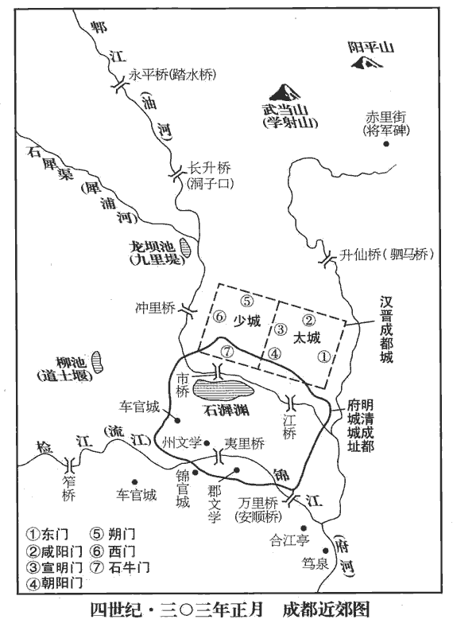
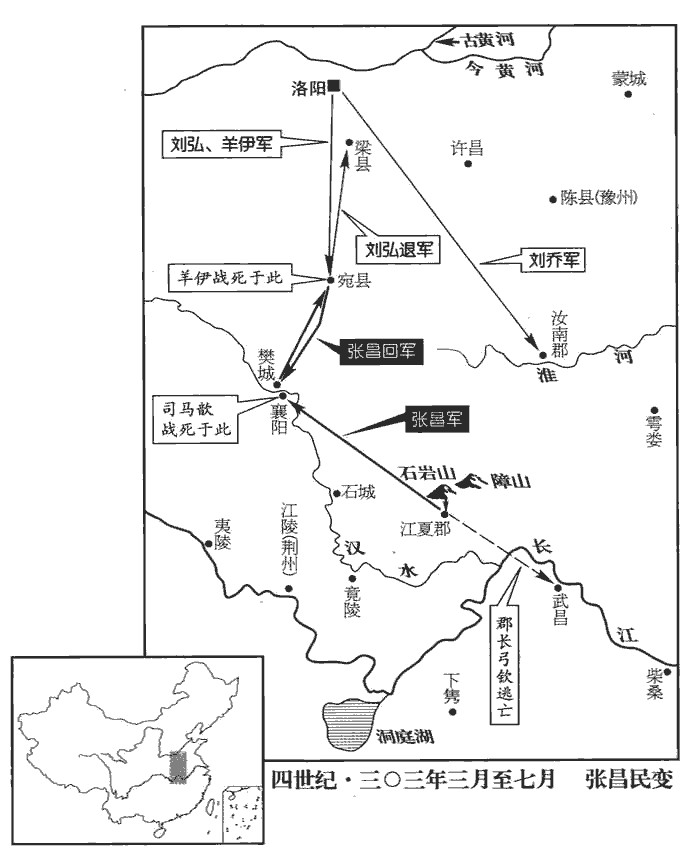
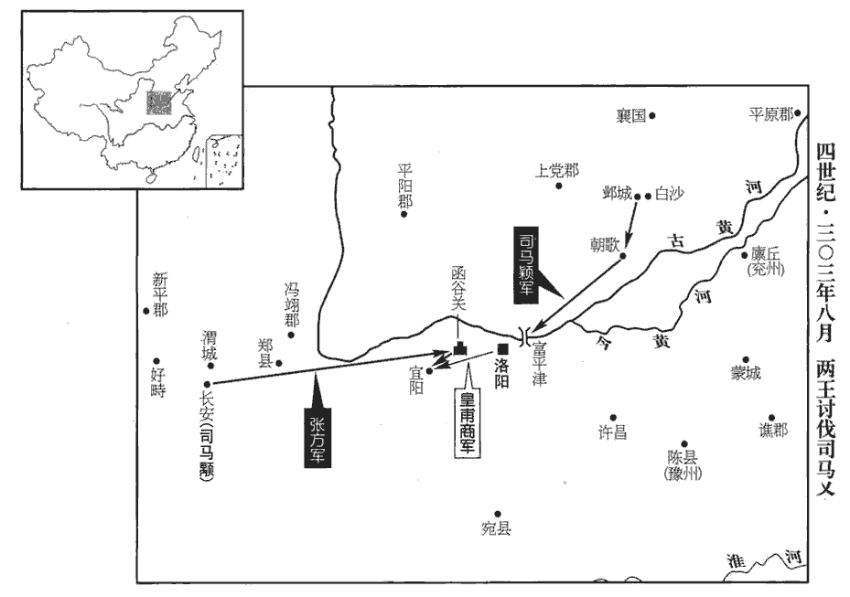
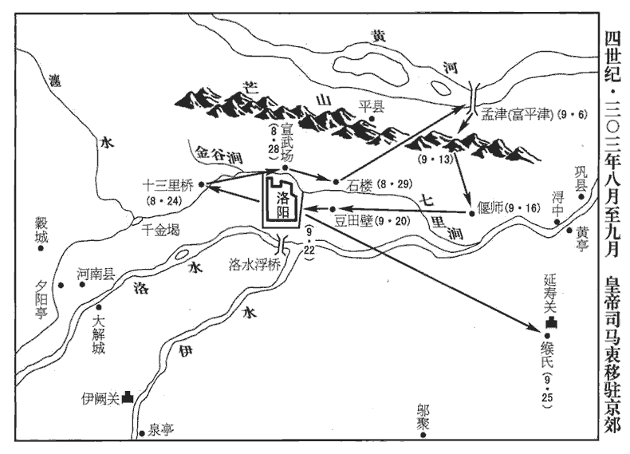
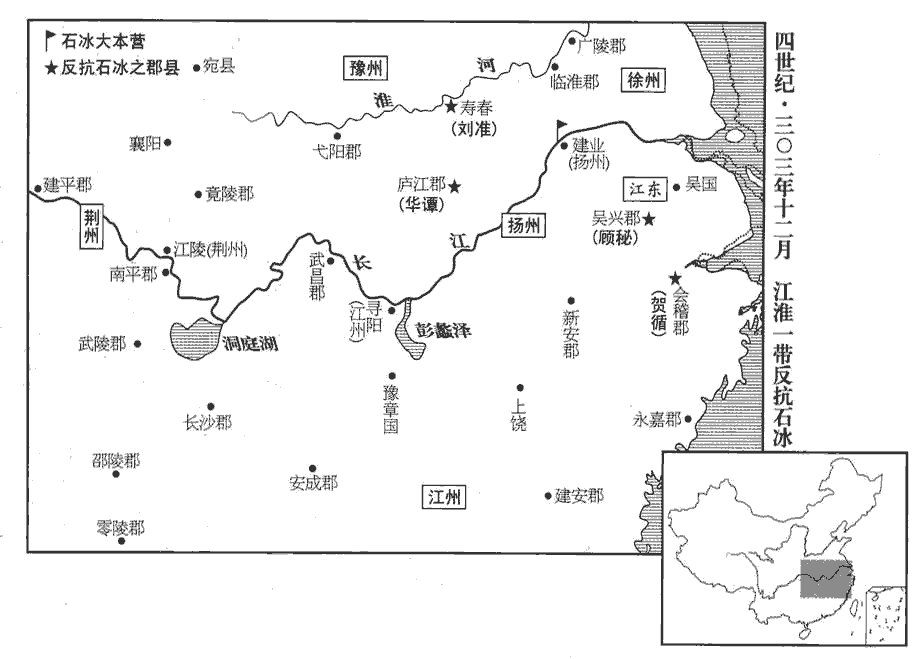
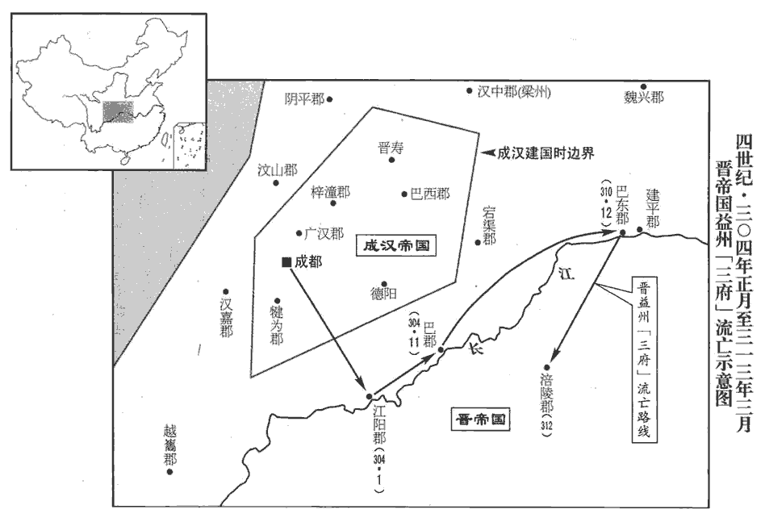
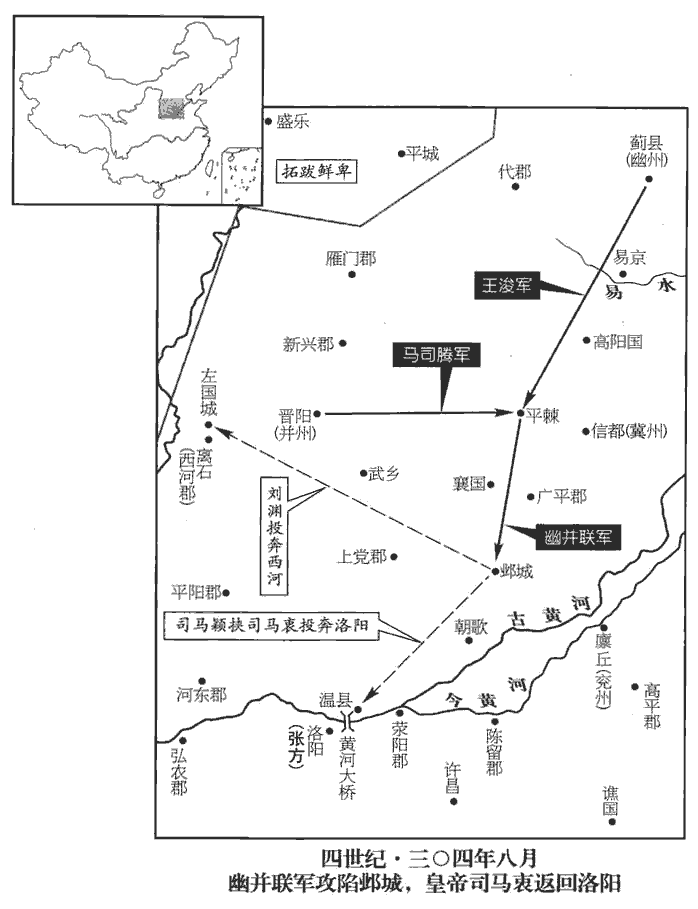
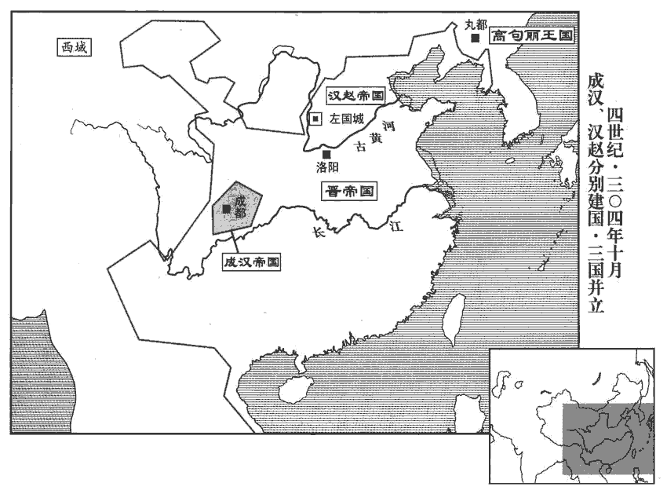
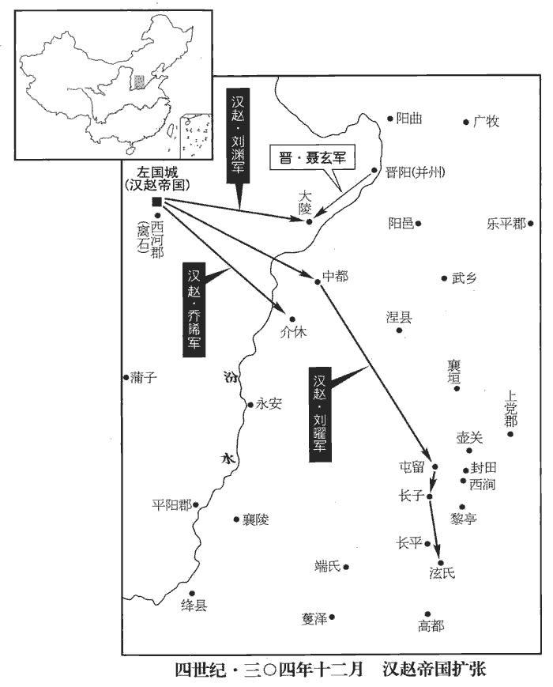

 晉紀七起昭陽大淵獻（癸亥），盡閼逢困敦（甲子），凡二年。

# 孝惠皇帝中之下

## 大安二年【章：甲十一行本「大」作「太」；乙十一行本同；熊校同。】（癸亥，三零三）

1春，正月，李特潛渡江擊羅尚，水上軍皆散走。郫pí水上軍也。蜀郡太守徐儉以少城降‹成都境›，少，詩照翻。降，戶江翻；下同。特入據之，惟取馬以供軍，餘無侵掠；赦其境內，改元建初。考異曰：帝紀：「太安元年五月，特自號大將軍。」載記：「太安元年，特稱大將軍，改元。」後魏書李雄傳云：「昭帝七年，特稱大將軍，號年建初。」昭帝七年，太安元年也。祖孝徵修文殿御覽云：「太安二年，特大赦，改年建初元年。特見殺。」三十國、晉春秋云：「太安二年正月，特僭位改年。」今從御覽等書。羅尚保太城，遣使求和於特。蜀民相聚為塢者，皆送款於特，特遣使就撫之；使，疏吏翻。以軍中糧少，少，詩沼翻。乃分六郡流民於諸塢就食。李流言於特曰：「諸塢新附，人心未固，宜質其大姓子弟，質，音致。聚兵自守，以備不虞。」又與特司馬上官惇書曰：「納降如受敵，不可易也。」恐其詐降，當嚴為之備，如待敵然。易，以豉翻。前將軍雄亦以為言。特怒曰：「大事已定，但當安民，何為更逆加疑忌，使之離叛乎！」

〖译文〗 1春季，正月，李特偷渡过江攻打罗尚，水上驻防的军队都溃散而逃。蜀郡太守徐俭献出少城投降，李特进城据守，只索取马匹以供军需，并不掠取其他财物。在境内赦免罪犯，改年号为建初。罗尚在太城据守，派使者向李特求和。修筑土堡以自保的各蜀民聚居点都向李特表示归顺，李特派使者抚慰他们，又因为军队中粮食不够，就把六郡流民分到各个土堡吃饭。李流对李特说：“各土堡都是刚刚归附，人心还不稳，应当把其中的大户子弟作为人质，集中一些兵力自卫防守，以准备应付不曾意料的事变。”李流又给李特的司马上官去信说：“接受前来投降的人就像面对敌人一样，戒备不能改变。”前将军李雄也持同样的说法。李特生气说：“大事已经成功，只该使人民安定，为什么反而这样对他们怀疑猜忌，是让他们离开我们去叛乱吗？”

 

朝廷遣荊州刺史宗岱、建平‹重庆市巫山县›太守孫阜帥水軍三萬以救羅尚。朝，直遙翻。守，式又翻。帥，讀曰率；下同。岱以阜為前鋒，進逼德陽‹四川省遂宁市东南›；特遣李蕩及蜀郡太守李璜就德陽太守任臧共拒之。李特蓋又分廣漢立德陽郡。任，音壬；下同。岱、阜軍勢甚盛，諸塢皆有貳志。益州兵曹從事蜀郡任叡言於尚曰：「李特散眾就食，驕怠無備，此天亡之時也。宜密約諸塢，刻期同發，內外擊之，破之必矣！」尚使叡夜縋出城，任，音壬。縋zhuì，馳偽翻。宣旨於諸塢，期以二月十日同擊特。叡因詣特詐降，特問城中虛實，叡曰：「糧儲將盡，但餘貨帛耳。」叡求出省家，特許之，遂還報尚。考異曰：載記作「任明」。羅尚傳作「任銳」。今從華陽國志。省，悉景翻。二月，尚遣兵掩襲特營，諸塢皆應之，特兵大敗，斬特及李輔、李遠，皆焚尸，傳首洛陽，流民大懼。李【章：甲十一行本「李」上有「李流」二字；乙十一行本同；退齋校同；張校同，云無註本亦無。】蕩、李雄收餘眾還保赤祖‹四川绵竹东›。赤祖，地名，當在緜竹東。祖，子邪翻。流自稱大將軍、大都督、益州牧，保東營，蕩、雄保北營。孫阜破德陽‹四川省遂宁市东南›，獲寋碩，寋jiàn，姓也；與蹇同。任臧退屯涪陵‹涪城·四川省绵阳市›。此涪陵，乃漢廣漢郡之涪縣，晉梓潼郡之涪城縣，非涪陵郡之涪陵。廣漢梓潼之涪，今緜州，今人猶謂緜州為涪陵，涪陵郡之涪陵，則今涪州涪陵縣也。

〖译文〗 朝廷派荆州刺史宗岱、建平太守孙阜带领三万水军去救罗尚。宗岱让孙阜为前锋，迫近德阳。李特派李荡和蜀郡太守李璜一起与德阳太守任臧共同抗拒宗岱、孙阜。宗岱、孙阜军队势力强大，各个土堡都有了二心。益州兵曹从事、蜀郡人任睿对罗尚说：“李特让部众分散去吃饭，骄傲懈怠没有防备，这是上天让他灭亡的时候。应当与各土堡秘密约定，到时候同时发动，内外夹攻，一定能够击溃他。”罗尚让任睿在夜里从绳子上溜下城，到各土堡宣布旨意，约定在二月十日共同攻击李特。任睿就到李特那里假装投降。李特向他问城里的情况，任睿说：“粮食储备快要用完了，只剩下一些钱和布匹而已。”任睿请求出营看望家人，李特允许了。于是任睿回城向罗尚报告。二月，罗尚派兵袭击李特的兵营，各土堡全都响应，李特的军队惨败，罗尚斩杀李特和李辅、李远，焚烧了他们的尸体，将首级传报洛阳，流民非常惊惧。李荡、李雄收容残余部众退保赤祖。李流自称大将军、大都督、益州牧，守护东营；李荡、李雄守护北营。孙阜攻破德阳，抓获硕、任臧撤退到涪陵驻扎。

三月，羅尚遣督護何沖、常深攻李流，涪陵民藥紳亦起兵攻流。流與李驤拒【章：甲十一行本「拒」下有「深使李蕩李雄拒」七字；乙十一行本同；退齋校同；張校同，云無註本亦脫此八字。按「八」當爲「七」字之誤。】紳，何沖乘虛攻北營，氐苻成、隗wěi伯在營中，叛應之。蕩母羅氏擐甲拒戰，擐huàn，音宦。伯手刃傷其目，羅氏氣益壯；【章：甲十一行本「壯」下有「營垂破」三字；乙十一行本同；張校同；退齋校同。】會流等破深、紳，引兵還，與沖戰，大破之。成、伯率其黨突出詣尚。流等乘勝進抵成都，尚復閉城自守。復，扶又翻。蕩馳馬逐北，中矛而死。中，竹仲翻。

〖译文〗 三月，罗尚派督护何冲、常深进攻李流，涪陵人药绅也组织兵士攻打李流。李流与李骧抵御药绅，何冲乘虚攻打北营，氐人符成、隗伯在北营里叛变而响应何冲。李荡的母亲罗氏穿上甲袍参与战斗，隗伯的兵刃刺伤了罗氏的眼睛，而罗氏斗志更加旺盛。这时李流等人打败了常深、药绅，率兵回来，也加入到与何冲的战斗中，何冲惨败。符成、隗伯带领自己的人马突围投奔罗尚。李流等人乘胜进攻抵达成都，罗尚又关闭城门防守，李荡跃马扬鞭追击败逃之敌，中矛而死。

朝廷遣侍中劉【章：甲十一行本「劉」上有「燕國」二字；乙十一行本同；張校同；退齋校同。】沈假節統羅尚、許雄等軍，羅尚帥益州兵，許雄帥梁州兵。沈，持林翻。討李流。行至長安，河間王顒留沈為軍師，遣席薳代之。薳wěi，羽委翻。

〖译文〗 朝廷派侍中刘沈用符节统一指挥罗尚、许雄等人的军队，讨伐李流。走到长安，河间王司马把刘沈留下来作军师，派席代替他。

李流以李特、李蕩繼死，宗岱、孫阜將至，甚懼。李含勸流降，流從之；李驤、李雄迭諫，不納。夏，五月，流遣其子世及含子胡為質於阜軍；質，音致。胡兄離為梓潼‹四川梓潼›太守，聞之，自郡馳還，欲諫不及。退，與雄謀襲阜軍，雄曰：「為今計，當如是；而二翁不從，柰何？」二翁，謂李流、李含也。離曰：「當劫之耳！」雄大喜，乃共說流民曰：說，輸芮翻。「吾屬前已殘暴蜀民，今一旦束手，便為魚肉，惟有同心襲阜以取富貴耳！」眾皆從之。雄遂與離襲擊阜軍，大破之。會宗岱卒於墊江‹重庆市垫江县›，墊，音疊。墊江縣自漢來屬巴郡，唐為合州之地。荊州軍遂退。流甚慙，由是奇雄才，軍事悉以任之。

〖译文〗 李流因为李特、李荡相继死去，而宗岱、孙阜即将攻来，非常恐惧。李含劝李流投降，李流采纳了这个建议。李骧、李雄接连劝谏，李流没有听取。夏季，五月，李流派他儿子李世和李含的儿子李胡到孙阜的军中作人质。李胡的哥哥李离为梓潼太守，听到这消息，急忙骑马从郡中赶回来，想劝阻却没有赶上。退回来，与李雄商议袭击孙阜的军队，李雄说：“为眼前考虑，应当这样，但李流、李含二翁不听从，怎么办？”李离说：“应该用武力强制住他们！”李雄非常高兴，于是一起到流民中说：“我们过去残暴对待过蜀民，现在一旦束手投降，就成为任其宰割的鱼、肉，只有同心协力袭击孙阜，来夺取富贵！”大家都听从了他们。李雄于是与李离袭击孙阜的军队，把孙阜打得惨败。这时宗岱在垫江死去，荆州的军队于是退走了。李流非常羞惭，从此认为李雄的才能奇异，军中事务全部都交给李雄处理。

2新野莊王歆，為政嚴急，失蠻夷心，義陽‹河南省信阳市›蠻張昌聚黨數千人，欲為亂。劉昫xù曰：義陽本漢平氏縣之義陽鄉。魏文帝黃初中，分立義陽縣，蓋治石城；後分南陽郡立義陽郡，治安昌城，領安昌、平林、平氏、義陽、平春五縣，唐為﹝申州義陽縣﹞。荊州以壬午詔書發武勇赴益州討李流，號「壬午兵」。民憚遠征，皆不欲行。詔書督遣嚴急，所經之界停留五日者，二千石免官。由是郡縣官長皆親出驅逐；長，知兩翻。展轉不遠，輒復屯聚為群盜。復，扶又翻；下同。時江夏‹湖北省云梦县›大稔rěn，民就食者數千口。張昌因之誑惑百姓，夏，戶雅翻。誑，居況翻。更姓名曰李辰，更，工衡翻。募眾於安陸石巖山‹湖北省安陆市南›，晉書張昌傳云：石巖山去安陸郡八十里。水經註：溳yún水過江夏安陸縣西，又南逕石巖山北。今德安府南十里有石巖山。諸流民及避戍役者多從之。太守弓欽遣兵討之，不勝。姓譜：弓姓，魯大夫叔弓之後。余按孔子弟子有仲弓，又有馯hán臂子弓，而獨以魯叔弓後，殊為未通。昌遂攻郡‹安陆·湖北省云梦县›，欽兵敗，與部將朱伺奔武昌‹湖北鄂州›。伺，相吏翻。歆遣騎督靳滿討之，滿復敗走。騎，奇寄翻。靳，居焮xìn翻。

〖译文〗 [2]新野庄王司马歆，处理政事严厉急躁，失去蛮、夷的信任，义阳蛮人张昌聚集了几千人，想叛乱。荆州根据壬午诏书，征发武士乡勇到益州讨伐李流，号称“壬午兵”。这些百姓害怕远征，都不想出行。但诏书的督促严厉急迫，在经过的一个地方耽搁五天，该地的二千石官员就要罢免官职，因此郡县负责官员都亲自出去驱逐催促，这些被征发的人辗转行军没有多远，便聚合又成为新的强盗群体。当时江夏粮食大丰收，百姓到此求生的有几千人。张昌因此欺骗迷惑百姓，自己改换姓名叫李辰，在安陆石岩山招募百姓，各方流民和逃避戍守劳役的人大多都投靠了他。太守弓钦派兵讨伐张昌，没有成功。张昌于是攻打郡城，弓钦的军队失败，弓钦就与部下将领朱伺逃奔武昌，司马歆派骑督靳满征讨张昌，结果靳满又失败逃走。

 

昌遂據江夏‹湖北云梦›，杜佑曰：漢江夏郡故城，在安州雲夢縣東南。造妖言云：「當有聖人出為民主。」得山都縣吏丘沈，山都縣‹湖北省穀城县东南›，漢屬南陽郡，晉屬襄陽郡，其地屬唐襄州穀城縣界。杜佑曰：山都縣故城，在襄州義清縣東南。沈，持林翻。更其姓名曰劉尼，詐云漢後，奉以為天子，曰：「此聖人也。」昌自為相國，詐作鳳皇、玉璽之瑞，璽，斯氏翻。建元神鳳；郊祀、服色，悉依漢故事。有不應募者，族誅之，士民莫敢不從。又流言：「江、淮已南皆反，官軍大起，當悉誅之。」互相扇動，人情惶懼，江、沔‹汉水›間所在起兵以應昌，沔，彌兗翻。旬月間眾至三萬，皆著絳帽，著，陟略翻。以馬尾作髯。‹司马衷，本年四十五岁›詔遣監軍華宏討之，敗于障山‹湖北省孝昌县西›。今安陸縣東四十里有章山。監，工銜翻。華，戶化翻。

〖译文〗 张昌于是占据江夏，制造煽动人心的妖言说：“该有圣人出现为百姓作主。”招得山都县小官吏丘沈，并把他的姓名改为刘尼，假托说是汉朝皇室的后代，尊奉为天子，说：“这就是圣人。”张昌自封为相国，伪造凤凰、玉玺等祥瑞吉兆，立年号为神凤。郊祀礼仪、服装颜色装饰，全都按照汉代过去的程式。有不接受招募的人，就对他处以灭族的惩罚，士绅百姓没有谁敢不服从。又散布流言说：“长江、淮水以南地区都造反了，官军都出动了，将要把他们全部诛杀。”百姓们互相煽动，人们的心情都很惶惑惊恐。长江、沔水地区都起兵响应张昌，一月之间聚众达三万，士卒都戴深红色的帽子，用马尾当作须髯。朝廷下诏书派监军华宏讨伐张昌，结果在障山被打败。

歆上言：「妖賊犬羊萬計，絳頭毛面，挑刀走戟，其鋒不可當。挑，徒了翻。挑刀，舞刀也。今鄉落悍民，兩手運雙刀，坐作進退，為擊刺之勢，擲刀空中，高一二丈，以手接之。又善舞戟，左奔右赴，為刺敵之勢；又環身盤戟，回轉如縈，又以戟矜qín柱地，跳過矜上，特為儇xuān捷，此所謂走戟也。妖，於嬌翻。請臺敕諸軍三道救助。」朝廷以屯騎校尉劉喬為豫州刺史，寧朔將軍沛國‹安徽省淮北市›劉弘為荊州‹湖北湖南›刺史。寧朔將軍始見於此。又詔河間王顒遣雍州刺史劉沈將州兵萬人，并征西府五千人，出藍田關‹陕西省蓝田县东南二十五千米›以討昌。藍田關在京兆藍田縣，即秦之嶢yáo關也。雍，於用翻。沈，持林翻。顒yóng不奉詔；沈自領州兵至藍田，顒又逼奪其眾。於是劉喬屯汝南‹河南省息县›、劉弘及前將軍趙驤、平南將軍羊伊屯宛‹河南南阳›。宛，於元翻。昌遣其將黃林帥二萬人向豫州，劉喬擊卻之。帥，讀曰率。

〖译文〗 司马歆给朝廷上言说：“妖孽盗贼聚众数以万计，深红的头长毛脸，挥刀舞戟，锐不可当，请求朝廷命令各军分三路救援。”朝廷让屯骑校尉刘乔任豫州刺史，宁朔将军沛国人刘弘任荆州刺史。又诏令河间王司马派雍州刺史刘沈带领一万州兵，加上在西府征发的五千人从蓝田关出兵讨伐张昌。司马不听从诏令，刘沈带领州兵到蓝田，司马又强行剥夺了他的部众。这样刘乔在汝南屯兵，刘弘和前将军赵骧、平南将军羊伊在宛地屯兵。张昌派他的部将黄林率领两万人进发豫州，被刘乔派兵打败。

初，歆與齊王冏善，事見上卷永寧元年。冏敗，歆懼，自結於大將軍穎。及張昌作亂，歆表請討之。時長沙王乂已與穎有隙，疑歆與穎連謀，不聽歆出兵，昌眾日盛。從事中郎孫洵謂歆曰：「公為岳牧，古有四岳、十二牧，各統其方諸侯之國，故後人謂專方面者為岳牧。受閫kǔn外之託，拜表輒行，有何不可；而使姦凶滋蔓，禍釁xìn不測，豈藩翰王室、鎮靜方夏之義乎！」毛萇曰：藩，樊也，籬也。翰，榦gàn也。夏，戶雅翻。歆將出兵，王綏曰：「昌等小賊，偏裨自足制之，何必違詔命，親矢石也！」昌至樊城‹湖北省襄樊市汉水北岸›，歆乃出拒之，眾潰，為昌所殺。詔以劉弘代歆為鎮南將軍，都督荊州諸軍事。六月，弘以南蠻長史陶【章：甲十一行本「陶」上有「廬江」二字；乙十一行本同。】侃為大都護，南蠻校尉有長史、司馬。參軍蒯恆為義軍督護，義軍，蓋民兵也。督護之官，蓋創置於此時。蒯，苦怪翻。牙門將皮初為都戰帥，進據襄陽‹湖北襄陽›。杜佑曰：襄陽，漢中廬縣也。張昌并軍圍宛‹河南南阳›，敗趙驤軍，殺羊伊。劉弘退屯梁‹河南省汝州市›。梁縣屬汝南郡，唐為汝州治所。敗，補邁翻。昌進攻襄陽，不克。

〖译文〗 当初，司马歆与齐王司马要好，司马失败了，司马歆害怕，便主动与大将军司马颖结交。等到张昌作乱，司马歆上表请求讨伐。这时长沙王司马已经和司马颖产生了怨隙，怀疑司马歆与司马颖共同密谋，因此不接受司马歆出兵的要求，这样张昌的部众势力日益扩大。从事中郎孙洵对司马歆说：“您是一方之主，接受统兵在外的使命，您上表以后就行动，有什么不可以的。而现在使得奸凶强盗滋长蔓延，灾祸不可测度，这难道是保卫王室，使国家安定的道理吗？”司马歆将要出兵，王绥说：“张昌等小小贼寇，属将自然足以制服他们，为什么一定要违抗诏命，亲自去经受箭矢与飞石呢？”张昌到达樊城，司马歆就出去阻击，部众溃散，司马歆也被张昌杀死。朝廷诏令刘弘代替司马歆为镇南将军、都督荆州诸军事。六月，刘弘让南蛮长史陶侃任大都护，参军蒯恒任义军督护，牙门将皮初任都战帅，进军据守襄阳。张昌用全部兵力包围宛城，打败赵骧的军队，杀死羊伊。刘弘撤退，屯兵梁县。张昌进攻襄阳，没有成功。

3李雄攻殺汶山‹四川省茂县›太守陳圖，汶，音民。考異曰：華陽國志作「陳旹shí」，今從載記。遂取郫城‹四川郫县›。郫縣屬蜀郡。李膺益州記：郫縣故城在今縣北。劉昫xù曰：唐益州溫江縣，漢郫縣地。郫，音疲。

〖译文〗 [3]李雄进攻并杀死汶山太守陈图，于是占取郫城。

秋，七月，李流徙屯郫。蜀民皆保險結塢，或南入寧州‹云南›，或東下荊州，城邑皆空，野無煙火，流虜掠無所得，士眾飢乏。唯涪陵‹涪城·四川省绵阳市›千餘家，依青城山‹岷山山脉经四川省都江堰市西南›處士范長生；青城山，在汶山郡都安縣，今在永康軍青城縣北三十二里。杜光庭作青城山記曰：岷山連峰接岫xiù，千里不絕，青城乃第一峰也。范長生，涪陵人，率眾保之。處，昌呂翻。考異曰：華陽國志作「范賢」。今從載記。平西參軍涪陵‹贵州省沿河县西北›徐轝yú說羅尚，求為汶山太守，邀結長生，與共討流。尚為平西將軍，以徐轝為參軍。考異曰：華陽國志作「徐輿」。今從載記。尚不許，轝怒，出降於流，降，戶江翻。流以轝為安西將軍。轝說長生，使資給流軍糧，說，輸芮翻；下含說同。長生從之；流軍由是復振。

〖译文〗 秋季，七月，李流迁到郫城驻扎，蜀地百姓都修筑土堡据险自守，有的向南进入宁州，有的东去进入荆州。城镇乡邑都走空了，没有人烟。李流的军队没有掳掠到一点儿东西，兵士部众饥饿疲惫。只有涪陵的一千多户人家，依附于青城山隐士范长生。平西参军涪陵人徐对罗尚说：“我请求担任汶山太守，邀请联合范长生，相与共同讨伐李流。罗尚不允许。徐一生气，出去投降了李流，李流让徐担任安西将军。徐劝说范长生，让他给李流资助粮食，范长生接受了他的劝说，李流的军队因此而重新振作起来。

4初，李含以長沙王乂微弱，必為齊王冏所殺，因欲以為冏罪而討之，遂廢帝立大將軍穎，以河間王顒為宰相，己得用事。既而冏為乂所殺，事見上卷上年。穎、顒猶守藩，不如所謀。穎恃功驕奢，百度弛廢，甚於冏時；猶嫌乂在內，不得逞其欲，欲去之。去，羌呂翻。時皇甫商復為乂參軍，商兄重為秦州刺史。含說顒曰：「商為乂所任，重終不為人用，宜早除之。商、含不平事見上卷元年。可表遷重為內職，因其過長安執之。」重知之，露檄上尚書，上，時掌翻。發隴上兵以討含。自隴以西六郡統於秦州。乂以兵方少息，遣使詔重罷兵，徵含為河南尹。考異曰：含傳云：「河間王顒表含為河南尹。」今從皇甫重傳。含就徵而重不奉詔，顒遣金城‹兰州东›太守游楷、隴西‹甘肃陇西›太守韓稚等合四郡兵攻之。秦州刺史鎮冀城‹甘肃省甘谷县›。顒密使含與侍中馮蓀sūn、中書令卞粹謀殺乂；皇甫商以告乂，收含、蓀、粹，殺之。蓀，音孫。驃騎從事琅邪‹山东省临沂市›諸葛玫、前司徒長史武邑‹河北武邑›牽秀皆出奔鄴‹河北临漳›。驃，匹妙翻。從事，從事中郎也。玫，莫杯翻。武邑縣，前漢屬信都郡，後漢、晉屬安平國，武帝分立武邑郡，唐為縣，屬冀州。

〖译文〗 [4]当初，李含以为长沙王司马力量微弱，一定会被齐王司马杀掉，所以想借讨伐司马罪行为名，废黜惠帝，拥立大将军司马颖，让河间王司马任宰相，这样自己便得以执掌大权。但不久司马却被司马杀掉，司马颖、司马仍然镇守藩地，不像自己所谋划的那样。此后，司马颖居功自傲，朝政各方面荒废松弛，比司马时还要严重，司马颖尤其不能忍受司马在禁城之内，使自己不能随心所欲，打算除掉司马。当时皇甫商又重新任司马的参军，皇甫商的哥哥皇甫重担任秦州刺史。李含对司马说：“皇甫商被司马任用，皇甫重终究不会被别人所用，应该尽快除掉。可以表奏建议把皇甫重提升到朝廷中任职，趁他经过长安时把他抓住。”皇甫重知道了李含的阴谋，向尚书公布檄文，纠集陇上军队讨伐李含。司马因军队刚刚稍事休息，就派使者带诏书命令皇甫重取消这次军事行动，并征调李含去担任河南尹。李含接受征调而皇甫重却不服从诏令，司马派金城太守游楷、陇西太守韩稚等人联合四个郡的军队去攻打皇甫重。司马又秘密派遣李含与侍中冯荪、中书令卞粹谋杀司马，皇甫商得知后告诉司马，拘捕并杀掉了李含、冯荪、卞粹。骠骑从事琅邪人诸葛玫，前司徒长史武邑人牵秀都出城投奔邺城。

5張昌黨石冰寇揚州，敗刺史陳徽，敗，補邁翻。諸郡盡沒；又攻破江州‹江西九江›，別將陳貞攻武陵‹湖南常德›、零陵‹湖南永州›、豫章‹江西南昌›、武昌‹湖北省鄂州市›、長沙‹湖南长沙›，皆陷之，臨淮‹江苏盱眙›人封雲起兵寇徐州以應冰。江州時治豫章。漢置臨淮郡，章帝以合下邳國，晉太康元年，復置臨淮郡。姓譜：封姓，夏封父之後。將，即亮翻。於是荊、江、徐、揚、豫五州之境，多為昌所據。昌更置牧守，更，工衡翻。守，式又翻。皆桀盜小人，專以劫掠為務。

〖译文〗 [5]张昌党羽石冰进犯扬州，打败刺史陈徽，扬州各属郡全部陷落。石冰又攻陷江州，属将陈贞攻打武陵、零陵、豫章、武昌、长沙，全部攻陷，临淮人封云也起兵进犯徐州来响应石冰。这样，荆、江、徐、扬、豫等五个州的辖境，大多被张昌占据。张昌重新派设州牧郡守等地方长官，这些人都是行凶盗窃之类的小人，专门以抢劫掠夺为职业。

劉弘遣陶侃等攻昌於竟陵‹湖北省钟祥市›，竟陵縣屬江夏郡。孫宗鑑曰：自蔡州南至信陽軍，始有山路，迤邐至安陸；又兩驛至復州，皆平地，南至大江，并無丘陵之阻。渡江至石首，始有淺山。謂之竟陵者，陵至此而竟；謂之石首，石至此而首也。古竟陵，今復州。劉喬遣其將李楊等向江夏‹湖北云梦›。侃等屢與昌戰，大破之，前後斬首數萬級，昌逃于下儁jùn山‹湖北省通城县境›，其眾悉降。長沙下儁縣之山也。師古曰：儁，字兗翻，又辭兗翻。考異曰：帝紀：「八月庚申，劉弘及張昌戰于清水，斬之。」昌傳云：「昌敗，竄于下儁山。明年秋，禽斬之。」按弘斬張奕表云：「張昌姦黨初平，昌未梟首。」故從昌本傳。

〖译文〗 刘弘派遣陶侃等人在竟陵攻打张昌，刘乔派遣部将李扬等向江夏进发。陶侃等人屡次与张昌发生战斗，大败张昌，前后斩杀几万人，张昌逃窜到下山，部众全部投降。

初，陶侃少孤貧，少，詩照翻。為郡督郵，長沙太守萬嗣過廬江‹安徽省舒城县›，見而異之，命其子結友而去。後察孝廉，至洛陽，豫章國郎中令楊晫zhuó薦之於顧榮，帝弟熾，封豫章王。晫，丁角翻。侃由是知名。既克張昌，劉弘謂侃曰：「吾昔為羊公參軍，羊公，謂羊祜也。謂吾後當居身處。晉人多自謂為身。今觀卿，必繼老夫矣。」

〖译文〗 当初，陶侃年轻时丧父，家境贫寒，担任郡督邮。长沙太守万嗣经过庐江，见到陶侃后，对他的德行和才能感到惊异，就让自己的儿子与陶侃结为朋友才离开。后来察举孝廉，陶侃到洛阳，豫章国郎中令杨把陶侃推荐给顾荣，陶侃因此而有了名望。等到打败了张昌，刘弘对陶侃说：“我过去担任羊公的参军，说我日后一定能有到他地位，今天看到你，一定能够继承老夫我。”

弘之退屯於梁也，征南將軍范陽王虓xiāo‹时驻许昌›遣前長水校尉張奕領荊州。范陽王虓鎮豫州。弘至，奕不受代，舉兵拒弘；弘討奕，斬之。時荊部守宰多缺，守，式又翻；下同。弘請補選，詔許之。弘敘功銓德，銓，量也，選也。隨才授任，人皆服其公當。當，丁浪翻。弘表皮初補襄陽太守，姓譜：皮姓，樊仲皮之後。朝廷以初雖有功而望淺，更以弘婿前東平‹山东东平西北›太守夏侯陟為襄陽太守。弘下教曰：「夫治一國者，宜以一國為心，必若親姻然後可用，則荊州十郡，按晉志，荊州統二十二郡，時已分桂陽、武昌、安成三郡屬江州，尚統十九郡。又分新城、魏興、上庸三郡屬梁州，尚統十六郡。至懷帝，分長沙、衡陽、湘東、零陵、邵陵、桂陽六郡屬湘州，此時荊州猶統十一郡。此蓋言當時缺守者十郡也。治，直之翻。安得十女婿然後為政哉！」乃表：「陟姻親，舊制不得相監；監，古銜翻。皮初之勳，宜見酬報。」詔聽之。弘於是勸課農桑，寬刑省賦，公私給足，百姓愛悅。

〖译文〗 刘弘当时退兵驻扎到梁县，征南将军范阳王司马派前长水校尉张奕统领荆州。刘弘到了以后，张奕不同意接替，率军队抗拒刘弘，刘弘讨伐并杀掉了张奕。当时荆州所辖各地的长官的位置大多空缺，刘弘请求补选。朝廷诏书批准。刘弘论评功劳，铨量德行进行选拔，按照才能安排职务，大家都佩服他处事公正得当。刘弘表奏皮初补任襄阳太守，朝廷因为皮初虽然有功但是名望太浅，换刘弘的女婿前东平太守夏侯陟为襄阳太守。刘弘向下发布告示说：“治理一个国家的人，应当从整个国家来考虑，如果一定要亲戚或姻亲然后才能使用，那么荆州十郡，哪里来十个女婿，然后才能处理州的政务呢？”就又上奏表说：“夏侯陟是姻亲，按过去的制度是不能互相监领的。皮初的功勋应当给以酬劳和待遇。”朝廷下诏书同意了他的奏表。刘弘于是在任上勉力督促农桑之业，放宽刑罚减免赋税。官府与百姓都经济充裕，他赢得百姓的爱戴和喜悦。

6河間王顒‹时驻长安›聞李含等死，即起兵討長沙王乂。大將軍穎‹时驻邺城›上表請討張昌，許之；聞昌已平，因欲與顒共攻乂。盧志諫曰：「公前有大功而委權辭寵，時望美矣。事見上卷永寧元年。今若【章：甲十一行本「若」作「宜」；乙十行本同。】頓軍關外，關外，謂郊關之外。文服入朝，此霸主之事也。」朝，直遙翻。參軍魏郡‹河北临漳西南邺镇›邵續曰：「人之有兄弟，如左右手。明公欲當天下之敵而先去其一手，可乎！」去，羌呂翻。穎皆不從。八月，顒、穎共表：「乂論功不平，與右僕射羊玄之、左將軍皇甫商專擅朝政，殺害忠良，謂殺李含等。朝，直遙翻。請誅玄之、商，遣乂還國‹长沙国·湖南省长沙市›。」詔曰：「顒敢舉大兵，內向京輦，吾當親率六軍以誅姦逆。其以乂為太尉、都督中外諸軍事以禦之。」考異曰：帝紀：「太安元年十二月，乂誅齊王冏，即以乂為太尉、都督中外。」晉春秋：「二年七月，顒、穎起兵，乃以乂為太尉、都督以討之。」按齊王死後，穎懸執朝政，乂未應都督中外。又顒見為太尉，乂不應更為太尉。今從晉春秋。

〖译文〗 [6]河间王司马听说李含等人已被杀死，当即起兵征讨长沙王司马。大将军司马颖上奏表请求讨伐张昌，得到允许。司马颖又听说张昌叛乱已经平定，因而想与司马共同攻打司马。卢志劝谏说：“您以前立了大功勋却交出权力辞谢天子的恩宠，当时声望很好。现在如果把军队安顿在城关之外，身着文官服饰进京朝见，这是成为霸主的基础。”参军魏郡人邵续说：“人有兄弟，如同左右手，您想抵挡天下的敌人而先砍掉一只手，能这样吗？”司马颖全都不听。八月，司马、司马颖共同上奏表：“司马论评功劳不公平，与右仆射羊玄之、左将军皇甫商独揽朝政大权，杀害忠良之人。请诛杀羊玄之、皇甫商，遣送司马回他的封国。”惠帝下诏说：“司马如果敢于兴兵，矛头指向京都帝辇，我将亲自率领六军诛讨为奸叛乱的人。任用司马为太尉、都督中外诸军事以抵御他们。”

 

顒以張方為都督，將精兵七萬，自函谷‹河南新安境›東趨洛陽。將，即亮翻。趨，七喻翻。穎引兵屯朝歌‹河南淇县›，以平原‹山东平原›內史陸機為前將軍、前鋒都督，督北中郎將王粹、冠軍將軍牽秀、沈約曰：楚懷王以宋義為卿子冠軍，冠軍之號自此始。魏以文欽為冠軍將軍。冠，古玩翻。中護軍石超等軍二十餘萬，南向洛陽。機以羇旅事穎，一旦頓居諸將之右，王粹等心皆不服。白沙督孫惠白沙，在鄴城東南。與機親厚，勸機讓都督於粹。機曰：「彼將謂吾首鼠兩端，首鼠兩端，漢田蚡fén語。服虔曰：首鼠，一前一卻也。陸佃埤pí雅曰：舊說，鼠性疑，出穴多不果，故持兩端，謂之首鼠。適所以速禍也。」遂行。穎列軍自朝歌至河橋‹即孟津·河南省孟津县东黄河渡口›，鼓聲聞數百里。河橋，即富平津河橋。聞，音問。

〖译文〗 司马让张方任都督，带领七万精锐军队，从函谷关向东，直指洛阳。司马颖带领军队在朝歌驻扎，让平原内史陆机为前将军、前锋都督，统领中郎将王粹、冠军将军牵秀、中护军石超等军队二十多万人，向南逼临洛阳。陆机在司马颖门下寄居充任幕僚，位置一下突然居于各将领之首，王粹等人心里都不服气。白沙督孙惠与陆机一向亲近，交情深厚，劝说陆机将都督的职位让给王粹。陆机说：“这样他们将说我迟疑不决，正好加速招致灾祸。”于是出行。司马颖排列的军队从朝歌直到河桥，战鼓声几百里外都能听见。

乙丑‹二十四›，帝如十三里橋。橋在洛城‹洛阳›西，去城十三里，因以為名。太尉乂使皇甫商將萬餘人拒張方於宜陽‹河南宜陽西›。己巳‹二十八›，帝還軍宣武場‹洛阳城北›。水經註：大夏門東宣武觀，憑城結構，南望天淵池，北矚宣武場；場西故賈充宅。庚午‹二十九›，舍于石樓‹宣武场东›。九月，丁丑‹六›，屯于河橋。壬子‹十一›，【嚴：「子」改「午」。】張方襲皇甫商，敗之。敗，補邁翻；下敗牽同。甲申‹十三›，帝軍于芒山‹洛阳与黄河间小山›。丁亥‹十六›，帝幸偃師‹河南偃師›；偃師縣，漢屬河南郡，晉省，隋復置，在洛城東北。辛卯‹二十›，舍于豆田。據晉書五行志，洛陽城東有豆田壁。大將軍穎進屯河‹黄河›南，阻清水‹河南孟津东›為壘。此河南，謂黃河之南，非河南縣也。清水，蓋清濟之水。癸巳‹二十二›，羊玄之憂懼而卒，帝旋軍城東；丙申‹二十五›，幸緱gōu氏‹河南偃师东南›，擊牽秀，走之。緱gōu，工侯翻。大赦。張方入京城，大掠，死者萬計。

〖译文〗 乙丑（疑误），惠帝到十三里桥。太尉司马派皇甫商带领一万多人在宜阳阻击张方。己巳（二十八日），惠帝把军队撤到宣武场。庚午（二十九日），在石楼住宿。九月，丁丑（初六），惠帝将兵驻扎在河桥。壬子（疑误），张方袭击皇甫商，并将皇甫商打败。甲申（十三日），惠帝在芒山驻军。丁亥（十六日）惠帝到偃师。辛卯（二十日），在豆田住宿。大将军司马颖进军于黄河以南驻扎，阻隔清水作为壁垒。癸巳（二十二日），羊玄之忧郁恐惧而死，惠帝回师城东。丙申（二十五日），惠帝到缑氏，攻击牵秀，并把他打跑，宣布大敕。张方进入京城，大肆抢掠，死者数以万计。

 

7李流疾篤，謂諸將曰：「驍騎仁明，固足以濟大事；然前軍英武，殆天所相，可共受事於前軍。」李特以弟驤為驍騎將軍，少子雄為前將軍。相，息亮翻。驍，堅堯翻。流卒，眾推李雄為大都督、大將軍、益州牧，治郫城‹四川郫县›。郫，音皮。雄使武都‹甘肃省成县›朴泰紿dài羅尚，朴，姓也，板楯七姓蠻之一也。孫盛曰：朴，音浮。使襲郫城，云己為內應。尚使隗伯將兵攻郫，泰約舉火為應，李驤伏兵於道，泰出長梯於外。隗伯兵見火起，爭緣梯上，隗，五罪翻。上，時掌翻。驤縱兵擊，大破之。追奔夜至城下，詐稱萬歲，曰：「已得郫城矣！」入少城，尚乃覺之，退保太城。隗伯創甚，雄生獲之，赦不殺。隗伯本亦流民之豪帥，叛歸羅尚。創，初良翻。李驤攻犍為‹四川彭山›，斷尚運道。犍，居言翻。斷，丁管翻。獲太守龔恢，殺之。

〖译文〗 [7]李流病危，对众部将说：“骁骑将军李骧仁德精明，本来足以成就大事。但是前将军李雄英俊勇武，大概是上天的选择，可以一起接受前将军的命令。”李流去世，大家推举李雄为大都督、大将军、益州牧，治所设在郫城。李雄派武都人朴泰欺骗罗尚，让他袭击郫城，声称自己可当内应。罗尚派隗伯带兵攻打郫城，朴泰约定以举火为信号，李骧在路旁埋伏了军队，朴泰把长梯送出城外。隗伯的军队看到火起，争相攀缘长梯登城。李骧指挥军队出击，大败隗伯。追击奔驰，连夜到达成都城下，假装呼喊万岁，说：“已经取得郫城！”于是进入了少城，罗尚发觉中计，连忙退到太城守卫。隗伯身负重伤，被李雄活捉，赦免而没有杀。李骧攻打犍为，截断罗尚运送物资的道路，抓住并杀死太守龚恢。

8石超進逼緱氏‹河南偃师南›。緱gōu，工侯翻。冬，十月，壬寅‹二›，帝還宮。丁未‹七›，敗牽秀於東陽門外。水經註曰：東陽門，漢洛陽城之中東門也。敗，補邁翻。大將軍穎遣將軍馬咸助陸機。戊申‹八›，太尉乂奉帝與機戰于建春門。水經註：建春門，漢雒城之上東門也。穀水逕其前，水上有石橋。考異曰：陸機傳云「戰于鹿苑」，今從帝紀。乂司馬王瑚使數千騎繫戟於馬，以突咸陳，騎，奇寄翻。陳，讀曰陣。咸軍亂，執而斬之。機軍大敗，赴七里澗，死者如積，水為之不流。為，于偽翻。斬其大將賈崇等十六人，石超遁去。

〖译文〗 [8]石超进军逼临缑氏。冬季，十月，壬寅（初三），惠帝回到皇宫。丁未（初八），在东阳门外击败牵秀。大将军司马颖派将军马咸协助陆机。戊申（初九），太尉司马尊奉帝命与陆机在建春门战斗。司马的司马王瑚派几千骑兵把戟系在马上，冲击马咸的兵阵，马咸军队混乱，捉住马咸杀掉了。陆机军队惨败，退到七里涧，死尸堆积，把水流都堵塞住了。王瑚杀死陆机的大将贾崇等十六人，石超逃遁离去。

初，宦人孟玖有寵於大將軍穎，玖欲用其父為邯鄲令，邯鄲縣‹河北邯郸›，漢屬趙國，魏、晉屬廣平郡，隋、唐屬磁州。邯鄲，音寒丹。左長史盧志等皆不敢違，右司馬陸雲固執不許，曰：「此縣，公府掾資，言歷此縣者，其資級可得公府掾。掾，以絹翻。豈有黃門父居之邪！」玖深怨之。玖弟超，領萬人為小督，機為都督，與黃門之弟共事，可以辭去矣。未戰，縱兵大掠，陸機錄其主者；錄，收也。超將鐵騎百餘人直入機麾下，奪之，顧謂機曰：「貉hé奴，能作督不！」楊正衡曰：貉，音鶴，獸名，善睡，似狐。余謂超蓋詈lì機為貉奴。不，讀曰否。機司馬吳郡‹苏州›孫拯勸機殺之，機不能用。使機能用孫拯之言斬孟超，是穰苴之戮莊賈也，由此為穎所殺，豈不光明俊偉哉！超宣言於眾曰：「陸機將反。」又還書與玖，言機持兩端，故軍不速決。及戰，超不受機節度，輕兵獨進，敗沒。玖疑機殺之，譖之於穎曰：「機有二心於長沙。」牽秀素諂事玖，將軍王闡、郝昌、帳下督陽平公師藩諸王公領兵及任方面者，皆有帳下督，統帳下兵。魏文帝黃初二年，分魏郡置陽平郡‹河北大名东北›。公師，複姓也。皆玖所引用，相與共證之。穎大怒，使秀將兵收機，參軍事王彰諫曰：「今日之舉，強弱異勢，庸人猶知必克，況機之明達乎！但機吳人，殿下用之太過，北土舊將皆疾之耳。」穎不從。機聞秀至，釋戎服，著白帢qià，著，陟略翻。帢，苦洽翻，帽也。弁biàn缺四隅謂之帢。晉志曰：魏武以天下凶荒，資財乏匱，擬古皮弁，裁縑帛以為帢，以色辨其貴賤。本施軍飾，非為國容。徐爰曰：俗說帢本未有岐，荀文若巾之行，觸樹枝成岐，謂之為善。今通為慶弔服。與秀相見，為牋辭穎，既而歎曰：「華亭‹上海市松江县西›鶴唳，可復聞乎！」機發此言，有咸陽市上歎黃犬之意。華亭時屬吳郡。嘉興縣界有華亭谷、華亭水，至唐始分嘉興縣為華亭縣。今縣東七十里，其地出鶴，土人謂之曰鶴窠kē。復，扶又翻。秀遂殺之‹陆机，年四十三岁›。穎又收機弟清河‹山东省临清市›內史雲、平東祭酒耽及孫拯，皆下獄。按晉書陸雲傳：雲自清河內史轉大將軍右司馬。此當書右司馬雲。下，戶嫁翻。考異曰：「孫拯」，晉春秋作「孫承」。今從晉書傳。

〖译文〗 当初，宦官孟玖受到大将军司马颖的宠信，孟玖想让他父亲担任邯郸县令，左长史卢志等人都不敢违背，只有右司马陆云坚持不同意，说：“这个县，历来是有公府掾的资格的人担任，岂有让宦官父亲担任的道理？”孟玖深深地怨恨陆云。孟玖弟孟超，是率领万人的小督，还没有战斗，就纵兵抢掠。陆机将主犯拘捕，孟超带着全副武装的一百多骑兵冲到陆机的指挥将旗之下，夺走犯人，在马上回头对陆机说：“貉奴，会当都督吗？”陆机的司马吴郡人孙拯劝说陆机把他杀掉，陆机没有采纳。孟超向大家宣告说：“陆机打算叛变。”又给孟玖去信，说陆机怀有二心，所以军队不能快些取胜。等到战斗开始，孟超不听陆机指挥调动，轻率地带兵孤军深入，以致全军覆没。孟玖怀疑是陆机把孟超杀了，对司马颖进谗言说：“陆机怀有二心勾结长沙王。”牵秀对孟玖一直阿谀谄媚，将军王阐、郝昌，帐下督阳平人公师藩等人又都是由孟玖引荐而得到任用的，这些人在一起共同证实孟玖的谗言。司马颖勃然大怒，派牵秀带兵拘捕陆机。参军事王彰劝谏说：“今天的举动，强弱力量对比悬殊，最平庸的人都知道谁一定能取胜。何况陆机那样明白通达的人呢？只因陆机是吴地人，殿下对他过于重用，才引起北方地区的旧将对他的嫉妒怨恨罢了。”司马颖没有接受。陆机听说牵秀来了，于是脱下军服，戴着低贱的便帽，与牵秀相见，又写信辞别司马颖，一会儿慨叹说：“故乡华亭的鹤声，还能再听到吗？”牵秀随即将他杀了。司马颖又拘捕了陆机弟清河内史陆云、平东祭酒陆耽以及孙拯，都投入牢狱。

記室江統、陳留‹河南省开封市东›蔡克、潁川‹河南许昌市东›棗嵩等上疏，以為：「陸機淺謀致敗，殺之可也。至於反逆，則眾共知其不然。宜先檢校機反狀，若有徵驗，誅雲等未晚也。」統等懇請不已，穎遲迴者三日。蔡克入，至穎前，叩頭流血曰：「雲為孟玖所怨，遠近莫不聞；今果見殺，竊為明公惜之！」竊為，于偽翻；下為陳同。僚屬隨克入者數十人，流涕固請，穎惻然，有宥雲色。孟玖扶穎入，催令殺雲‹陆云，年四十二岁›、耽，夷機三族。獄吏考掠孫拯數百，兩踝huái骨見，掠，音亮。踝，戶瓦翻。腿兩旁曰內外踝。見，賢遍翻。終言機冤。吏知拯義烈，謂拯曰：「二陸之枉，誰不知之！君可不愛身乎？」拯仰天歎曰：「陸君兄弟，世之奇士，吾蒙知愛。今既不能救其死，忍復從而誣之乎！」復，扶又翻。玖等知拯不可屈，乃令獄吏詐為拯辭。穎既殺機，意常悔之，及見拯辭，大喜，謂玖等曰：「非卿之忠，不能窮此姦。」遂夷拯三族。拯門人費慈、宰意二人詣獄明拯冤，費，扶沸翻。宰，以官為氏，春秋周有宰咺xuān，孔子弟子有宰予。拯譬遣之譬，喻也。曰：「吾義不負二陸，死自吾分；分，扶問翻。卿何為爾邪！」曰：「君既不負二陸，僕又安可負君！」固言拯冤，玖又殺之。

〖译文〗 记室江统、陈留人蔡克、颍川人枣高等上奏章，认为：“陆机考虑不周而导致失败，处死是可以的。至于说他反叛，则大家都知道这不是事实。应当首先检查审核陆机谋反的情况，如果能够证实，那么再杀陆云等人也不晚。”江统等人不断地恳切请求，司马颖拖延三天也不答复。蔡克进入王府，来到司马颖面前，叩头叩得流血，说：“陆云被孟玖怨恨，远近没有不知道的，现在如果陆云果然被杀，我为您惋惜！”随蔡克进去的僚属有几十人，都流泪苦苦请求，司马颖听后也感到忧伤，面露宽宥原谅陆云的容色。孟玖扶着司马颖进屋，催促司马颖下令杀掉陆云、陆耽，夷灭陆机三族。狱吏拷打孙拯几百下，打得露出了踝骨，但孙拯始终说陆机冤枉，狱吏知道孙拯正义而刚烈，对孙拯说：“二陆的冤枉，谁不知道！您难道不珍惜自己的身体吗？”孙拯仰天长叹，说：“陆机兄弟，是天下不同寻常的人士，我承蒙他们的知遇和厚爱，现在既然不能把他从死亡中解救出来，怎么能忍心再诋毁他呢？”孟玖等人知道不能使孙拯屈服，就命令狱吏伪造孙拯的供词。司马颖杀了陆机后，心里常常感到后悔，等看见孙拯供词后，非常高兴，对孟玖等人说：“要不是你的忠诚，就不能够查清楚这反叛的情况。”于是夷灭孙拯三族。孙拯的学生费慈、宰意两个人到狱中申明孙拯冤枉，孙拯开导并让他们离开，说：“我从道义上不能辜负二陆，死是我现在所应该作的，你们为什么呢？”他们回答说：“您既然不辜负二陆，我等又怎么能辜负您呢？”坚持说孙拯冤枉，孟玖又把他们杀了。

太尉乂奉帝攻張方，方兵望見乘輿，皆退走，乘，繩證翻。方遂大敗，死者五千餘人。方退屯十三里橋，考異曰：河間王顒傳云「駃水橋」。今從帝紀。眾懼，欲夜遁，方曰：「勝負兵家之常，善用兵者能因敗為成。今我更前作壘，出其不意，此奇策也。」乃夜潛逼洛城七里，築壘數重，重，直龍翻。外引廩lǐn穀以足軍食。乂既戰勝，以為方不足憂。聞方壘成，十一月，引兵攻之，不利。朝議以為乂、穎兄弟，可辭說而釋，朝，直遙翻。乃使中書令王衍等往說穎，令與乂分陝而居，周公、召公分陝為二伯。陝在弘農。此言分陝，引周、召事，欲令穎、乂為二伯耳，非分陝地而居也。往說，輸芮翻。陝，式冉翻。穎不從。乂因致書於穎，為陳利害，欲與之和解。穎復書，「請斬皇甫商等首，則引兵還鄴‹河北省临漳县西南邺镇›。」乂不可。

〖译文〗 太尉司马侍奉惠帝攻打张方，张方的兵远远地看到惠帝的御车，都败退而逃，张方于是惨败，死了五千多人。张方撤退到十三里桥驻扎，大家惶恐不安，想趁夜逃走，张方说：“胜负是兵家常事，善于用兵的人能够转败为胜，现在我反而再到前面修筑堡垒，出其不意，这是奇妙的计策。”于是趁夜色悄悄逼近距洛阳城七里处，修筑了几层堡垒，从外面运进仓库中的粮谷作为军粮。司马取胜后，认为张方不足以忧虑。听说张方建成了堡垒，十一月，率领军队去进攻，一无所获。朝廷讨论认为司马、司马颖是兄弟，可以用言辞来排解这一纠纷，于是派中书令王衍等人到司马颖那里劝说，让司马颖与司马平分秋色、共同辅助皇室。司马颖不答应。司马又给司马颖去信，为他陈说利害关系，想与司马颖和解。司马颖回信说：“请斩掉皇甫商等人的首级，那么我就率兵回归邺城。”司马不同意。

穎進兵逼京師，張方決千金堨è‹洛阳城西›，水經註：河南縣城東十五里有千金堨。洛陽記曰：千金堨舊堰穀水，魏時更修此堰，謂之千金堨。堨，阿葛翻。水碓皆涸。碓duì，都內翻。乃發王公奴婢手舂給兵，一品已下不從征者，男子十三以上皆從役，又發奴助兵；公私窮踧，踧cù，與蹙同，子六翻。米石萬錢。詔命所行，一城而已。京師危蹙如此，乂雖戰勝，安得久邪！驃騎主簿范陽‹河北涿州›祖逖乂為驃騎將軍，以逖為主簿。驃，匹妙翻。言於乂曰：「劉沈忠義果毅，雍州兵力足制河間，雍，於用翻。宜啟上為詔與沈，使發兵襲顒。顒窘急，必召張方以自救，此良策也。」窘，渠隕翻。乂從之。沈奉詔馳檄四境，諸郡多起兵應之。沈合七郡之眾凡萬餘人，趣長安。雍州統七郡，治安定；或曰：時治新平。沈，持林翻。趣，七喻翻。

〖译文〗 司马颖率兵进逼京城，张方把千里水坝中的水放掉，舂米的水碓全部无水可用。朝廷于是征发王、公大臣的奴婢用手舂米来供给军粮。一品以下不去应征的官员，家中十三岁以上的男子全部服劳役，又征发奴隶帮助军队。公室私家都穷困窘迫，一石米价值万钱。皇帝的诏书命令所能指挥的，仅仅是京都一城罢了。骠骑主簿范阳人祖逖，对司马说：“刘沈忠诚正义果断坚毅，雍州的兵力足以对付河间王司马，应当启奏皇上给刘沈下诏书，派他出兵袭击司马。司马一旦窘迫紧急，一定要召回张方去救援自己，这是很好的计策。”司马采纳了。刘沈接到诏书，用快马向辖境内各郡发布檄文，各郡大多起兵响应。刘沈组织七郡一共一万多人，进发长安。

乂又使皇甫商間行，齎帝手詔，命游楷等罷兵，敕皇甫重進軍討顒。商間行至新平‹陕西彬县›，遇其從甥；從甥素憎商，以告顒，間，古莧翻。從，才用翻。顒，魚容翻。顒捕商，殺之。

〖译文〗 司马又派皇甫商秘密出行，拿着惠帝亲笔诏书，命令游楷等人放弃军事行动，命令皇甫重出兵讨伐司马。皇甫商秘密走到新平，遇到他的堂外甥，堂外甥一直憎恶皇甫商，就向司马告发，司马逮捕了皇甫商，并把他杀了。

9十二月，議郎周玘qǐ、前南平‹湖北公安›內史長沙王矩吳置南郡於江南，晉平吳，改曰南平，以別江北之南郡。玘，口紀翻。起兵江東以討石冰，推前吳興‹浙江湖州›太守吳郡‹苏州›顧祕都督揚州九郡諸軍事，揚州統郡十八；帝割豫章、鄱陽、廬陵、臨川、建安、南康、晉安屬江州，揚州統十一郡。今止推祕督丹陽、宣城、毗陵、吳、吳興、會稽、東陽、新安、臨海九郡；淮南、廬江在江北，不與也。傳檄州郡，殺冰所署將吏。將，即亮翻。於是前侍御史賀循起兵於會稽‹绍兴›，會，工外翻。廬江‹安徽省舒城县›內史廣陵‹江苏省淮阴市›華譚及丹陽葛洪、甘卓皆起兵以應祕。華，戶化翻。玘，處之子；循，卲之子；卓，寧之曾孫也。周處見八十二卷元康六年、七年。賀卲事吳主皓，為皓所殺。甘寧事吳主權，為將以勇聞。三家皆吳之強宗也。

〖译文〗 [9]十二月，议郎周、前南平内史长沙人王矩，在江东起兵讨伐石冰，推举前吴兴太守吴郡人顾秘任都督扬州九郡诸军事，向各州郡传布檄文，杀掉石冰所署的部将官吏。于是前侍御史贺循在会稽起兵，庐江内史广陵人华谭和丹阳人葛洪、甘卓都起兵响应顾秘。周是周处的儿子。贺循是贺的儿子。甘卓是甘宁的曾孙。

冰遣其將羌毒姓譜：羌，姓也。帥兵數萬拒玘，玘擊斬之。冰自臨淮‹江苏盱眙›趨壽春‹安徽寿县›。帥，讀曰率。趨，七喻翻。征東將軍劉準聞冰至，惶懼不知所為。廣陵‹江苏省淮阴市›度支廬江‹安徽省舒城县›陳敏統眾在壽春‹安徽寿县›，陳敏自尚書令史出為合肥度支，漕運南方米穀以濟中州，遷廣陵度支。度，徒洛翻。謂準曰：「此等本不樂遠戍，逼迫成賊，烏合之眾，其勢易離，敏請督運兵為公破之。」樂，音洛。易，以豉翻。為，于偽翻；下為叡同。準乃益敏兵，使擊之。

〖译文〗 石冰派部将羌毒，率领几万军队抵抗周，周猛攻并杀了羌毒。石冰从临淮赶到寿春。征东将军刘准听说石冰到了，惶恐惧怕不知所措。广陵度支庐江人陈敏在寿春统率了一些人马，对刘准说：“石冰这些人本来是因为不愿远离故土去当兵，受到逼迫才成为盗贼的，这种乌合之众，是很容易瓦解的，请让我督率运粮兵为您打败他们。”刘准于是给陈敏增派军队，让陈敏攻击石冰。

 

10閏月，李雄急攻羅尚‹四川成都›。尚軍無食，留牙門張羅守城，考異曰：載記作「羅特」，今從華陽國志。夜，由牛鞞bēi水‹郫水›東走，水經曰：牛鞞水在犍為牛鞞縣。劉昫曰：洛水，一名牛鞞水。杜佑曰：簡州陽安縣，漢牛鞞縣地。孟康曰：鞞，音髀bì。師古曰：音必爾翻。羅開門降。降，戶江翻。雄入成都，軍士飢甚，乃帥眾就穀於郪qī‹四川省中江县东南广福乡›，帥，讀曰率。郪縣，漢屬廣漢郡，晉省立。五代史志：郪縣舊曰伍城，隋大業改曰郪縣，唐為梓州治所。宋白曰：漢舊郪縣城在今縣南九十里，臨江，郪王城基址見在，以郪江為縣名。郪，音妻，又千私翻。掘野芋而食之。芋，羊遇翻。所謂㟭山之下有蹲鴟chī也。許雄坐討賊不進，徵即罪。許雄刺梁州，見上卷太安元年。即，就也。

〖译文〗 [10]闰月，李雄对罗尚发起猛攻。罗尚的军队没有粮食，就留下牙门张罗守城，自己夜里从牛水向东逃跑，张罗打开城门投降。李雄进入成都，军队兵士非常饥饿，就率部众到县寻求给养，挖掘野山芋当粮吃。李雄被判定犯了讨伐盗贼时裹足不前的罪过，朝廷召他去接受判罚。

11安北將軍、都督幽州諸軍事王浚，以天下方亂，欲結援夷狄，乃以一女妻鮮卑段務勿塵，一女妻素怒延，妻，七細翻。宇文國有別帥曰素怒延。又表以遼西郡封務勿塵為遼西公‹府令支河北省迁安县›。為王浚用段氏以攻成都王穎及石勒張本。浚，沈之子也。王沈比晉以弒魏高貴鄉公。

〖译文〗 [11]安北将军、都督幽州诸军事王浚，因为天下将要发生变乱，打算结交攀援夷狄，就把一个女儿嫁给鲜卑人段务勿尘，一个女儿嫁给素怒延。又上奏表把辽西郡划给段务勿尘，并封为辽西公。王浚是王沈的儿子。

12毛詵shēn之死也，事見上卷太安元年。李叡奔五苓夷帥于陵丞，于陵丞詣李毅為叡請命，五苓夷，寧州‹府滇池云南省晋宁县东晋城镇›附塞部落之名。帥，所類翻。為，于偽翻。毅許之。叡至，毅殺之。于陵丞怒，帥諸夷反攻毅。

〖译文〗 [12]毛诜死后，李睿投奔了五苓夷的统帅于陵丞，于陵丞到李毅那里替李睿说情请命，李毅同意了。李睿到后，李毅把他杀了。于陵丞动怒，带领各夷人部落造反攻打李毅。

13尚書令樂廣女為成都王妃，或譖諸太尉乂；乂以問廣，廣神色不動，徐曰：「廣豈以五男易一女哉！」謂附穎則五男被誅。乂猶疑之。

〖译文〗 [13]尚书令乐广的女儿是成都王司马颖的王妃，有人把这事密报太尉司马。司马问乐广，乐广神色不动，慢条斯理地说：“乐广我难道用五个男子去换一个女儿吗？”司马对他仍然心存疑忌。

## 永興元年（甲子，三零四）長沙王乂之死，改元永安；西遷長安，方改元永興。

1春，正月，丙午‹八›，樂廣以憂卒。

〖译文〗 [1]春季，正月，丙午（初八），乐广忧郁而死。

2長沙厲王乂屢與大將軍穎戰，破之，長沙王乂不得其死，穎、顒之黨加以惡諡耳。前後斬獲六、七萬人。而乂未嘗虧奉上之禮；城中糧食日窘，而士卒無離心。窘，渠隕翻。張方以為洛陽未可克，欲還長安。而東海王越慮事不濟，癸亥‹二十五›，潛與殿中諸將夜收乂送別省。考異曰：越傳云：「殿中諸將及三部司馬，疲於戰守，密與左衛將軍朱默夜收乂別省，逼越為主。」今從乂傳。甲子‹二十六›，越啟帝‹司马衷，本年四十六岁›，下詔免乂官，置金墉城。大赦，改元。改元永安。考異曰：帝紀：「太安二年十二月甲子，大赦。」「永興元年正月，大赦改元。」疑是一事。城既開，殿中將士見外兵不盛，悔之，更謀劫出乂以拒穎。越懼，欲殺乂以絕眾心。黃門侍郎潘滔曰：「不可，將自有靜之者。」乃遣人密告張方。丙寅‹二十八›，方取乂於金墉城，至營，炙而殺之‹司马乂，年二十八岁›，方軍士亦為之流涕。為，于偽翻。考異曰：帝紀、三十國、晉春秋云：「太安二年十二月，殺乂。」乂傳曰：「初，乂執權之始，洛下謠曰：『草木萌芽，殺長沙。』乂以正月二十五日廢，二十七日死，如謠言焉。」樂廣傳云：「成都王穎，廣之婿也，及與長沙王乂遘難，而廣既處朝望，群小讒謗之，廣以憂卒。」惠帝紀：「永興元年，正月，丙午，樂廣卒。」若廣卒時乂未死，即乂傳正月二十五日廢為是，合移在永興元年正月。而晉春秋：「太安二年，八月，樂廣自裁。」按帝紀，今年正月，以穎為丞相，遣兵屯城門代宿衛者，疑此皆乂初死時事。又今年正月末，亦有甲子、丙寅。今從乂傳。

〖译文〗 [2]长沙厉王司马多次与大将军司马颖开战，打败司马颖，前后杀死或俘虏六七万人。战事紧张而司马对侍奉皇上的礼节却从不曾耽搁减少。城中粮食日益困窘，但士卒们却没有背离的想法。张方认为洛阳不能攻克，想返回长安。这时东海王司马越在朝中考虑事情不能成功，癸亥（二十五日），暗地与殿中各位将领趁夜把司马拘捕送到另外的官署。甲子（二十六日），司马越启奏惠帝，下诏书罢免司马的官职，把他关在金墉城。赦免罪犯，改年号为永安。城门打开后，殿中的官兵看到城外的军队并不强，因而感到后悔，又谋划劫出司马来抗拒司马颖。司马越惶惶不安，想杀掉司马使大家断绝这个想法。黄门侍郎潘滔说：“不能这样，将自然有使大家静心的人。”就派人秘密告诉张方。丙寅（二十八日），张方在金墉城带走司马，到军营后，把司马用火烧烤后杀了，连张方军中的兵士也为司马流泪。

公卿皆詣鄴‹河北省临漳县西南邺镇›謝罪；大將軍穎入京師，復還鎮于鄴。詔以穎為丞相；加東海王越守尚書令。穎遣奮武將軍石超等率兵五萬屯十二城門，洛陽城東有建春、東陽、清明三門，南有開陽、津陽、平昌、宣陽四門，西有廣陽、西明、閶闔三門，北有大夏、廣莫二門，凡十二門。帥，讀曰率。殿中宿所忌者，穎皆殺之；悉代去宿衛兵。去，羌呂翻。表盧志為中書監，留鄴，參署丞相府事。

〖译文〗 朝廷公卿大臣都到邺城向司马颖认错道歉。大将军司马颖进入京城，后又回到邺城镇守。惠帝诏令任司马颖为丞相；给东海王司马越加尚书令职。司马颖派奋武将军石超等人率军队五万人驻扎在洛阳的十二个城门，朝廷中有宿怨的官员，司马颖把他们全部杀了。皇宫禁卫军也全部用自己的军队代替。表奏卢志任中书监，留驻邺城，管理丞相府事务。

河間王顒頓軍於鄭‹陕西华县›，鄭縣，屬京兆郡，周宣王弟鄭桓公封邑；唐屬華州。為東軍聲援，聞劉沈兵起，還鎮渭城‹咸阳›，渭城縣，故秦咸陽也；前漢屬扶風，後漢省，而地名猶在；石勒置石安縣；唐復為咸陽縣，屬京兆。遣督護虞夔逆戰於好畤zhì‹陕西乾县›。好畤縣，前漢屬扶風，後漢、晉省；唐武德二年，復分醴泉置好畤縣，屬京兆。夔兵敗，顒懼，退入長安，急召張方。方掠洛中官私奴婢萬餘人而西。軍中乏食，殺人雜牛馬肉食之。

〖译文〗 河间王司马在郑县停兵驻扎，作为东军的声援，听说刘沈的军队进攻，就回到渭城镇守，派督护虞夔在好县迎战刘沈。虞夔的军队失败，司马恐惧不安，退入长安，急忙召张方回来，张方在洛阳抢掠了官府私家的奴婢一万多人匆忙西归，军中缺乏粮食，把人杀了混在牛马肉中吃。

劉沈渡渭而軍，與顒戰，顒屢敗。沈使安定‹甘肃镇原东南曙光乡›太守衙【張：「衙」作「衛」。】博、功曹皇甫澹以精甲五千襲長安，入其門，力戰至顒帳下。沈兵來遲，馮翊‹陕西大荔›太守張輔見其無繼，引兵橫擊之，殺博及澹，澹，徒覽翻，又徒濫翻。兵【章：甲十一行本「兵」上有「沈」字；乙十一行本同；孔本同；張校同；退齋校同。】遂敗，收餘卒而退。張方遣其將敦偉夜擊之，敦，徒渾翻，姓也。沈軍驚潰，沈與麾下南走，追獲之。沈謂顒曰：「知己之惠輕，顒留沈為軍師，遂為雍州刺史。君臣之義重，沈不可以違天子之詔，量強弱以苟全。量，音良。投袂mèi之日，期之必死，左傳：宋殺楚使，楚子聞之，投袂而起。葅zū醢hǎi之戮，其甘如薺。」詩云：誰謂荼苦，其甘如薺。薺，在禮翻。顒怒，鞭之而後腰斬。新平‹陕西彬县›太守江夏‹湖北云梦›張光數為沈畫計，夏，戶雅翻。數，所角翻。為，于偽翻。顒執而詰之，光曰：「劉雍州不用鄙計，故令大王得有今日！」顒壯之，引與歡宴，表為右衛司馬。

〖译文〗 刘沈渡过渭水驻军，与司马交战，司马连连失败。刘沈派安定太守衙博、功曹皇甫澹带五千精兵袭击长安，攻入长安城门，奋力战斗，直至司马的军帐前。刘沈自己带的兵来晚了，冯翊太守张辅发现衙博的兵后继无援，带兵对这支精兵拦腰截击，杀了衙博和皇甫澹，这支精兵也就失败了，收拢残余而退去。张方派他的部将敦伟趁夜攻打刘沈，刘沈的军队惊慌而溃散，刘沈与部下向南逃跑，被敦伟的兵追上而抓获。刘沈对司马说：“朋友知己之间的恩惠微小，君臣之间的恩义重大，我不能违反天子的诏令，衡量势力的强弱来苟全性命。我在挥袖行动的时候，就预料到性命一定保不住，因此剁成肉酱的酷刑，对我来说如同品尝荠菜一样甘甜。”听后司马发怒，鞭笞刘沈后又将他腰斩。新平太守江夏人张光多次为刘沈出谋划策，司马抓住他而诘问，张光说：“雍州太守刘沈没有采纳我的计策，所以使得大王您得以有今天！”司马认为他壮烈，带他一起参加盛宴，表奏他为右司马。

3羅尚逃至江陽‹四川泸州›，華陽國志曰：瀘州瀘川縣，本漢江陽縣。又江安縣，亦漢江陽縣也。遣使表狀；詔尚權統巴東‹重庆市奉节县东›、巴郡‹四川重庆›、涪陵‹贵州省沿河县西北›以供軍賦。三郡，本屬梁州，尚權統之。涪，音浮。尚遣別駕李興詣鎮南將軍劉弘求糧，弘綱紀以運道阻遠，綱紀，謂弘參佐操持一府之綱紀者。且荊州自空乏，欲以零陵‹湖南省永州市›米五千斛與尚。弘曰：「天下一家，彼此無異，吾今給之，則無西顧之憂矣。」謂尚在巴、涪，則為荊州屏蔽，無西顧之憂。遂以三萬斛給之，尚賴以自存。李興願留為弘參軍，弘奪其手版而遣之。手版，即古笏也。參佐施敬府公，故持手版。今奪興手版遣之，不許其去尚而事己也。又遣治中何松領兵屯巴東為尚後繼。于時流民在荊州者十餘萬戶，羈旅貧乏，多為盜賊，弘大給其田及種糧，種，章勇翻。擢其賢才，隨資敘用，流民遂安。

〖译文〗 [3]罗尚逃到江阳，派使者向朝廷奏报情况，朝廷诏令罗尚暂且统领巴东、巴郡、涪陵，来供应军事给养。罗尚派遣别驾李兴向镇南将军刘弘求助粮食，刘弘的参佐考虑到运粮道路遥远，加之荆州本地也粮食紧张，就想从零陵拨出五千斛米给罗尚。刘弘说：“天下是一家，互相不分彼此，我现在供给他，就没有照顾担心西边的忧虑了。”于是给罗尚三万斛米，罗尚靠这些米得以生存。李兴想留下来作刘弘的参军，刘弘将他来参见用的手版夺走而赶他回去。刘弘还派治中何松带兵驻扎在巴东作为罗尚的后援。当时在荆州的流民有十多万户，寄居他乡十分贫困，大多成为盗贼，刘弘分给他们大批田地和种籽，提拔其中贤德的人才，按照资质任用，流民于是安定下来。

 

4三【章：甲十一行本「三」作「二」；乙十一行本同；孔本同；張校同。】月，乙酉‹十七›，丞相穎表廢皇后羊氏‹羊献容›，幽于金墉城；廢皇太子覃tán為清河王。羊后立見八十三卷永康元年。覃立見上卷太安元年。

〖译文〗 [4]三月，乙酉（疑误），丞相司马颖表奏废黜皇后羊氏，幽禁在金墉城，废黜皇太子司马覃为清河王。

5陳敏‹时驻寿春安徽省寿县›與石冰戰數十合，冰眾十倍於敏，敏擊之，所向皆捷，遂與周玘合攻冰於建康。三月，冰北走，投封雲，封雲，徐州賊應冰者。雲司馬張統斬冰及雲以降，揚、徐二州平。周玘、賀循皆散眾還家，不言功賞。朝廷以陳敏為廣陵相。

〖译文〗 [5]陈敏与石冰交战几十次，石冰的人数是陈敏的十倍，但陈敏攻打石冰，每次都获得胜利，于是与周在建康联合进攻石冰。三月，石冰失败逃窜，投奔封云，封云的司马张统杀掉石冰和封云后投降，扬、徐二州于是平定。周、贺循都遣散部众回家，不提功劳封赏。朝廷让陈敏担任广陵相。

6河間王顒表請立丞相穎為太弟。戊申‹十一›，詔以穎為皇太弟，都督中外諸軍事，丞相如故。大赦。乘輿服御皆遷于鄴，天子在洛而建儲于鄴，則既非矣；乘輿服御亦遷而就之，何居！乘，繩正翻。制度一如魏武帝故事。以顒為太宰、大都督、雍州牧；雍，於用翻。前太傅劉寔為太尉。寔以老‹本年八十五岁›，固讓不拜。

〖译文〗 [6]河间大司马表奏请朝廷立丞相司马颖为皇太弟。戊申（十一日），惠帝下诏立司马颖为皇太弟，兼任都督中外诸军事，并保留丞相职。宣布大赦。皇太弟的车马及服饰用品都迁到邺城，制度就像魏武帝曹操那时一样。让司马担任太宰、大都督、雍州牧；前太傅刘担任太尉，刘声称年纪已老，坚决辞让不去就职。

7太弟穎僭侈日甚，嬖倖用事，大失眾望。時人望穎以匡輔帝室，今乃若此，故大失眾望。嬖，卑義翻，又博計翻。司空東海王越，與右衛將軍陳眕楊正衡曰：眕zhěn，止忍翻，又音真。及長沙故將上官巳等謀討之。秋，七月，丙申朔‹一›，陳眕勒兵入雲龍門，以詔召三公百僚及殿中，殿中者，三部諸將也。戒嚴討穎。石超奔鄴。戊戌‹三›，大赦，復皇后羊氏及太子覃。己亥‹四›，越奉帝北征。以越為大都督。徵前侍中嵇紹詣行在。長沙王乂當國，以紹為侍中；乂死，紹黜免為庶人。今討穎，故復徵詣行在。侍中秦準謂紹曰：「今往，安危難測，卿有佳馬乎？」紹正色曰：「臣子扈衛乘輿，死生以之，佳馬何為！」

〖译文〗 [7]皇太弟司马颖超越本分奢侈一天比一天严重，所宠幸溺爱的小人执掌权力，令大家十分失望。司空东海王司马越与右卫将军陈以及长沙王司马过去的部将上官巳等谋划讨伐司马颖。秋季，七月，丙申朔（初一），陈率兵攻入云龙门，用皇帝诏书召集三公及群臣与三部众将领，戒严征讨司马颖。石超奔向邺城。戊戌（初三），宣布大赦，恢复皇后羊氏和皇太子司马覃的地位。己亥（初四），司马越侍奉惠帝向北征伐，司马越担任大都督。征调前侍中嵇绍到惠帝身边任职。侍中秦准对嵇绍说：“现在随行，安危难以预料，你有好马吗？“嵇绍神色严肃地说：“臣子护卫皇帝御车，死与生都要忠于职守，要好马干什么？”

越檄召四方兵，赴者雲集，比至安陽‹河南省安阳市›，晉志：安陽縣，屬魏郡。魏土地記曰：鄴城南四十里有安陽城。乘，繩證翻。比，必寐翻。眾十餘萬，鄴中震恐。穎會群僚問計，東安王繇曰：「天子親征，宜釋甲縞素出迎請罪。」穎不從，遣石超帥眾五萬拒戰。帥，讀曰率。折衝將軍喬智明勸穎奉迎乘輿，穎怒曰：「卿名曉事，投身事孤；今主上為群小所逼，卿柰何欲使孤束手就刑邪！」

〖译文〗 司马越发布檄文召集各地军队，奉诏赶来的队伍云集，行军到安阳，人数有十多万，邺城震惊惶恐。司马颖召集幕僚参佐的询问计策，东安王司马繇说：“天子亲自征伐，应当放下武器身穿白色衣服出去迎接，并向天子请罪。”司马颖不同意，派石超率五万人抵御作战。折冲将军乔智明劝说司马颖尊奉迎接惠帝御驾，司马颖发怒说：“你空有知晓事理的名声，投身到我身边做事。现在皇上被小人们逼迫，你为什么想让我捆绑住自己的手脚去接受刑罚呢？”

陳眕二弟匡、規自鄴赴行在，云鄴中皆已離散，由是不甚設備。己未‹二十四›，石超軍奄至，乘輿敗績於蕩陰‹河南汤阴›，蕩陰縣，漢屬河內郡，晉屬魏郡，唐為相州蕩陰縣。按水經註：湯陰縣因湯水為名。宋白曰：古湯陰縣在湯水南，漢初廢安陽縣入湯陰，隋又廢湯陰入安陽，則安陽、湯陰二縣接境也。師古曰：蕩，音湯。帝傷頰，中三矢，中，竹仲翻。百官侍御皆散。嵇紹朝服，下馬登輦，以身衛帝，兵人引紹於轅中斫之‹年五十二岁›。轅，輈zhōu也。方言曰：楚、衛謂之輈。朝，直遙翻。帝曰：「忠臣也，勿殺！」對曰：「奉太弟令，惟不犯陛下一人耳。」遂殺紹，血濺帝衣。濺，子賤翻。帝墮於草中，亡六璽。石超奉帝幸其營，帝餒甚，超進水，左右奉秋桃。桃以夏熟者，進御秋桃，非所以奉至尊，而奉之，恤所無也。穎遣盧志迎帝；庚申‹二十五›，入鄴。大赦，改元曰建武。左右欲浣帝衣，浣，戶管翻，濯也。帝曰：「嵇侍中血，勿浣也！」孰謂帝為戇zhuàng愚哉！

〖译文〗 陈的两个弟弟陈匡、陈规从邺城赶到惠帝身边，说邺城里已经分崩离析，因此大家都不怎么安排防备。己未（二十四日），石超的军队忽然杀到，惠帝的兵马在荡阴失败，惠帝面颊负伤，中了三箭，百官和侍卫全部溃逃。嵇绍身穿上朝的礼服，下马登上御车，用身体护卫着惠帝，兵士把嵇绍拉到车辕上就砍。惠帝说：“这是忠臣，不要杀！”兵士回答说：“奉皇太弟的命令，只是不侵犯陛下一人而已。”于是杀了嵇绍，鲜血溅到惠帝的衣服上。惠帝从车上掉到草丛中，丢失了六枚御玺。石超侍奉惠帝到自己兵营中，惠帝非常饥饿，石超送上水，左右随从奉上秋桃。司马颖派卢志迎接惠帝。庚申（二十五日），惠帝进入邺城，宣布大赦，改年号为建武。随从想为惠帝洗衣服，惠帝说：“有侍中嵇绍的血，不要洗了！”

陳眕、上官巳等奉太子覃守洛陽。司空越奔下邳‹江苏省睢宁县北古邳镇›，徐州都督東平王楙不納，越徑還東海‹山东省郯城县›。太弟穎以越兄弟宗室之望，越、騰、略、模，皆有聲稱於諸宗室中。下令招之，越不應命。前奮威將軍孫惠上書勸越要結藩方，要，一遙翻。同獎王室，越以惠為記室參軍，與參謀議。北軍中候苟晞xī奔范陽王虓xiāo，虓承制以晞行兗州刺史。范陽王虓時鎮許昌。虓，許交翻。

〖译文〗 [7]陈、上官巳等人侍奉太子司马覃留守洛阳。司空司马越逃奔下邳，徐州都督东平王司马不接纳，司马越就直接回到东海。皇太弟司马颖因为司马越兄弟在宗室中享有声望，下令招他来，司马越没有接受命令应召。前奋威将军孙惠给司马越去信劝说司马越团结藩王，共同辅助王室，司马越让孙惠担任记室参军，让他参与计策的谋划商讨。北军中候苟投奔范阳王司马，司马按照朝廷旨意让苟担任兖州刺史。

8初，三王之起兵討趙王倫也，事見上卷永寧元年。王浚擁眾挾兩端，禁所部士民不得赴三王召募。太弟穎欲討之而未能，使穎兄弟不自內相圖，聲浚之罪而討之，固有餘力矣，何未能邪！浚心亦欲圖穎。穎以右司馬和演為幽州刺史，和演與穎謀起兵討趙王倫，穎之腹心也。密使殺浚。演與烏桓單于審登謀與浚游薊城南清泉‹清泉河，流经蓟县城南›，因而圖之。單，音蟬。會天暴雨，兵器霑濕，不果而還。還，從宣翻，又如字；下同。審登以為浚得天助，乃以演謀告浚。浚與審登密嚴兵，約并州刺史東嬴公騰共圍演，殺之，自領幽州營兵。幽州刺史營兵也。騰，越之弟也。太弟穎稱詔徵浚，浚與鮮卑‹府令支河北省迁安县›段務勿塵、烏桓羯朱及東嬴公騰同起兵討穎，羯，居謁翻。穎遣北中郎將王斌及石超擊之。斌，音彬。

〖译文〗 [8]当初，三个亲王发兵讨伐赵王司马伦，王浚辖所部脚踩两只船，禁止所属的官员百姓去应三亲王的召募。皇太弟司马颖想去讨伐王浚而没有能成行，王浚内心也想搞掉司马颖。司马颖让右司马和演任幽州刺史，派他秘密杀掉王浚。和演与乌桓单于审登谋划，在与王浚一起到蓟城南部清泉游玩时，伺机杀他。那天赶上天降暴雨，兵器被雨水打湿，徒劳而返。审登认为这是王浚得到上天佑助，就把和演的阴谋告诉了王浚。王浚与审登秘密训练军队，约并州刺史东嬴公司马腾一起围攻和演，把他杀掉了。王浚自己接管了幽州所辖的军队。司马腾是司马越的弟弟。皇太弟假称诏令征召王浚，王浚与鲜卑人段务勿尘，乌桓人羯朱以及东嬴公司马腾共同起兵讨伐司马颖，司马颖派北中郎将王斌以及石超迎击他们。

9太弟穎怨東安王繇前議，怨其使己縞素迎天子請罪也。八月，戊辰‹三›，收繇，殺之。初，繇兄琅邪恭王覲薨，子睿嗣。睿沈敏有度量，沈，持林翻。為左將軍，與東海參軍王導善。導參東海王越軍事。導，敦之從父弟也；從，才用翻；下從者之從同。識量清遠，以朝廷多故，每勸睿之國。及繇死，睿從帝在鄴，恐及禍，將逃歸。穎先敕關津，無得出貴人，關立於經塗要會處，以譏出入。津者，濟渡江河所必由之處。睿至河陽‹河南孟县›，為津吏所止。從者宋典自後來，以鞭拂睿而笑曰：「舍長，舍長，守舍之長也。長，丁丈翻。今知兩翻。官禁貴人，汝亦被拘邪？」被，皮義翻。吏乃聽過。至洛陽，迎太妃夏侯氏俱歸國。元帝中興事始此。夏，戶雅翻。

〖译文〗 [9]皇太弟司马颖对东安王司马繇前次让他向惠帝投降的议论十分怨恨。八月，戊辰（初三），拘捕司马繇，把他杀了。当初，司民繇的哥哥琅邪恭王司马觐去世，儿子司马睿继承爵位。司马睿沉毅机敏而又胸怀宽广，任左将军，与东海参军王导要好。王导是王敦的叔伯弟弟，见识胸怀清明广远，因为朝廷多变故，经常劝说司马睿返回封国。等到司马繇被杀，司马睿在邺城侍从惠帝，恐怕遭到灾祸，打算逃回去。司马颖事先命令各关卡渡口，不得放贵族出去。司马睿到河阳，被渡口的官吏拦住。司马睿的随从宋典从后面赶来，用鞭子扫拂司马睿，笑着说：“舍长，朝廷禁止贵族出去，怎么你也被拘在这儿呀？”官吏就让他们过去了。到洛阳，接上太妃夏侯氏一起返回封国。

10丞相從事中郎王澄發孟玖姦利事，勸太弟穎誅之，穎從之。

〖译文〗 [10]丞相从事中郎王澄揭发孟玖用邪恶的手段谋取私利，劝说太弟司马颖把他杀掉，司马颖批准。

11上官巳在洛陽，殘暴縱橫。橫，戶孟翻。守河南尹周馥，浚之從父弟也，周浚從王渾伐吳有戰功。與司隸滿奮等謀誅之，事洩，奮等死，馥走，得免。司空越之討太弟穎也，太宰顒遣右將軍、馮翊‹陕西省大荔县›太守張方將兵二萬救之，聞帝已入鄴，因命方鎮洛陽。巳與別將苗願拒之，大敗而還。太子覃夜襲巳、願，巳、願出走；方入洛陽。覃於廣陽門迎方而拜，洛城西面南頭第一門曰廣陽門。方下車扶止之，復廢覃及羊后‹羊献容›。

〖译文〗 [11]上官巳在洛阳，残暴横行。任河南尹的周馥，是周浚的堂弟，与司隶满奋等人谋划杀掉上官巳，走露了风声，满奋等人被杀，周馥逃走，得以免死。司空司马越征讨皇太弟司马颖，太宰司马派右将军、冯翊太守张方率两万人的军队前去救援，听说惠帝已进入邺城，就命令张方去镇守洛阳。上官巳与另一支军队的将军苗愿抗拒张方，惨败，回到城里。太子司马覃夜袭上官巳、苗愿，上官巳、苗愿出城逃走，张方进入洛阳。司马覃在广阳门迎着张方叩拜，张方下车把他扶住不让他叩拜，再一次废黜了司马覃和羊皇后。

12初，太弟穎表匈奴左賢王劉淵為冠軍將軍，監五部軍事，楊駿輔政，以劉淵為五部大都督；元康末，坐部人叛出塞，免官；穎鎮鄴，表監五部軍事。冠，古玩翻。監，工銜翻。使將兵在鄴。淵子聰，驍勇絕人，博涉經史，善屬文，驍，堅堯翻。屬，之欲翻。彎弓三百斤；弱冠游京師，記曲禮曰：人生十年曰幼學，二十曰弱冠。冠，古玩翻。名士莫不與交。穎以聰為積弩將軍。

〖译文〗 [12]当初，皇太弟表奏匈奴左贤王刘渊任冠军将军，监理五部匈奴的军政事务，让他在邺城统领军队。刘渊的儿子刘聪，骁勇超人，博览经史典籍，善于写文章，能用三百斤张力的大弓，年轻时到京都游玩，京都名士没有不与他结交的。司马颖让他任积弩将军。

淵從祖右賢王宣謂其族人曰：「自漢亡以來，我單于徒有虛號，無復尺土；事見六十七卷漢獻帝建安二十一年。從，才用翻。單，音蟬。自餘王侯，降同編戶。編，相聯次也。民謂之編民，亦謂之編戶者，言比屋聯次而居，編於民籍，無高下之差。今吾眾雖衰，猶不減二萬，柰何斂首就【章：甲十一行本作「手受」二字；乙十一行本同；孔本同。】役，奄過百年！奄，忽也，遽也。左賢王英武超世，天苟不欲興匈奴，必不虛生此人也。今司馬氏骨肉相殘，四海鼎沸，復呼韓邪之業，此其時矣！」漢宣帝時，稽侯狦shān來朝，稱呼韓邪單于；光武時日逐王比內附，亦稱呼韓邪單于。乃相與謀，推淵為大單于，使其黨呼延攸詣鄴告之。師古曰：漢書匈奴中貴種有呼衍氏，即今之呼延氏。

〖译文〗 刘渊堂祖父右贤王刘宣对他的族人说：“自从汉朝灭亡以来，我们的单于都是徒有虚名，不再有一寸土地。其余的王侯，地位却降到百姓一样。现在我们大家虽然衰落，但也在两万人以上，怎么能伏首贴耳地充当役夫，这样匆匆地过了一百年！左贤王英俊威武超凡绝伦，上天如果不想使匈奴兴盛，也就一定不会白白生出这个人。现在司马氏骨肉亲人互相残杀，四海动乱如同鼎中沸腾的开水，光复呼韩邪的事业，这正是时候！”于是互相谋划，推举刘渊为大单于，并派他的党羽呼延攸到邺城去告知他。

淵白穎，請歸會葬，穎弗許。淵令攸先歸，告宣等使招集五部及雜胡，聲言助穎，實欲叛之。及王浚、東嬴公騰起兵，淵說穎曰：「今二鎮跋扈，眾十餘萬，二鎮，謂幽、并。說，輸芮翻；下同。恐非宿衛及近郡士眾所能禦也，請為殿下還說五部以赴國難。」為，于偽翻。說，輸芮翻。難，乃旦翻。穎曰：「五部之眾，果可發否？就能發之，鮮卑、烏桓，未易當也。易，以豉翻。吾欲奉乘輿還洛陽以避其鋒，乘，繩證翻。徐傳檄天下，以逆順制之，言見力不足以制二鎮，欲檄徵天下兵，杖順制逆。君意何如？」淵曰：「殿下武皇帝之子，有大勳於王室，威恩遠著，四海之內，孰不願為殿下盡死力者！為，于偽翻；下請為同。何難發之有！王浚豎子，東嬴疏屬，東嬴公騰、宣帝弟東武侯馗之孫，故云疏屬。豈能與殿下爭衡邪！殿下一發鄴宮，示弱於人，洛陽不可得而至；雖至洛陽，威權不復在殿下也。穎奔敗而失權，卒如淵之言。願殿下撫勉士眾，靖以鎮之，淵請為殿下以二部摧東嬴，三部梟王浚，梟xiāo，堅堯翻。二豎之首，可指日而懸也。」穎悅，拜淵為北單于、參丞相軍事。

〖译文〗 刘渊告诉司马颖，请求回乡参与葬礼，司马颖不允许。刘渊让呼延攸先回去，通知刘宣等人让他们召集五部匈奴以及各小民族，声称援助司马颖，实际打算背叛他。等到王浚、东嬴公司马腾起兵，刘渊对司马颖说：“现在幽、并二州的镇将猖獗，率众十多万人，恐怕不是禁卫军和附近郡县的军队可能抵御的，我请求为殿下回去召集五部匈奴人马赴救国难。”司马颖说：“五部匈奴的人马，真能够发动吗？即使能发动他们，鲜卑、乌桓，也不是轻易能阻挡的。我想侍奉皇帝还归洛阳，避开他们的锋芒，再慢慢向天下发布檄文，用正义制服邪恶的道理说服他们。您认为怎么样？”刘渊说：“殿下是武帝的儿子，又对王室建立了大功勋，威严恩德远近闻名，四海之内，有谁不愿意为殿下拼死尽力呢？有什么难以发动的！王浚是小人，东赢公是关系疏远的皇亲，怎能与殿下争比高低呢！殿下如果离开邺城宫殿，那就是向人示弱，洛阳也不能进去了，即使到了洛阳，殿下也不会再有威势权力了。希望殿下抚慰勉励部众，使他们安定镇静，我请求为殿下用两部匈奴摧毁东赢公，三部匈奴去杀王浚，高悬二个小人的头颅，指日可待。”司马颖非常高兴，任命刘渊担任北单于、参丞相军事等职。

淵至左國城‹山西省离石县北›，左國城，蓋匈奴左部所居城也。據晉書載記，光武建武之初，南單于入居西河之美稷，今離石左國城，單于所徙庭也。水經註曰：左國城在汾州之右，介休縣西南。杜佑曰：左國城在石州離石縣。宋白曰：離石縣東北有離石水，因以為名。劉宣等上大單于之號，上，時掌翻。二旬之間，有眾五萬，都於離石‹西河郡府，山西离石›，離石縣自漢以來屬西河郡。以聰為鹿蠡王。師古曰：蠡lǐ，音盧奚翻。鹿蠡王，即仍漢時谷蠡王號也。谷、鹿字雖不同，而音則同耳。遣左於陸王宏帥精騎五千，帥，讀曰率。騎，奇寄翻；下同。會穎將王粹拒東嬴公騰。粹已為騰所敗，敗，補邁翻；下敗石同。宏無及而歸。

〖译文〗 刘渊到左国城，刘宣等人给他封上大单于的称号，二十天之间，有了五万人，建都离石县，封刘聪为鹿蠡王。派左於陆王刘宏，带领五千精锐骑兵，会同司马颖的部将王粹阻击东嬴公司马腾。王粹已被司马腾打败，刘宏无功而返。

王浚、東嬴公騰合兵擊王斌，大破之。浚以主簿祁弘為前鋒，姓譜：祁姓，黃帝二十五子之一也；又晉獻侯四世孫奚食邑於祁，曰祁奚。敗石超于平棘‹河北赵县›，平棘縣，漢屬常山郡，晉屬趙國。劉昫xù曰：漢平棘縣在今趙州平棘縣南。乘勝進軍。候騎至鄴，鄴中大震，百僚奔走，士卒分散。盧志勸穎奉帝還洛陽。時甲士尚有萬五千人。志夜部分，分，扶問翻。至曉將發，而程太妃戀鄴不欲去，穎狐疑未決。俄而眾潰，穎遂將帳下數十騎與志奉帝御犢車晉制：皁zào輪犢車，諸公乘之。南奔洛陽。倉猝上下無齎jí，中黃門被囊中齎私錢三千，詔貸之，貸，惕德翻，又敵德翻，又他代翻，假借也。於道中買飯，夜則御中黃門布被，食以瓦盆。至溫‹河南温县西›，將謁陵，帝之先，河內溫縣孝敬里人，自京兆尹防以上，皆葬于溫。帝喪履，納從者之履，喪，息浪翻。從，才用翻。下拜流涕。及濟河，張方自洛陽遣其子羆pí帥騎三千，以所乘車奉迎帝。至芒山下，方自帥萬餘騎迎帝。帥，讀曰率。方將拜謁，帝下車自止之。甚於夷王下堂而見諸侯矣。帝還宮，奔散者稍還，百官粗備。粗，坐五翻。辛巳‹十六›，大赦。

〖译文〗 王浚、东嬴公司马腾联合军队去攻打王斌，把王斌打得惨败。王浚让主簿祁弘担任前锋，在平棘县打败石超，祁弘乘胜进军。侦察骑兵到了邺城，邺城城里非常震惊，文武百官四处奔逃，士卒离散。卢志规劝司马颖侍奉惠帝返回洛阳。当时还有一万五千武装士卒。卢志连夜部署分派，到早晨将要出发，但程太妃留恋邺城不愿离开，司马颖也犹豫不决。一会儿大家溃散，司马颖于是连忙带领军帐下的几十个骑兵与卢志侍奉着惠帝登上犊车，向南逃往洛阳。仓猝得君臣上下都没有带钱，中黄门行李中藏着三千私人的钱，诏令借他的这些钱，在路上买饭，夜里惠帝就用中黄门的布被，吃饭时使用瓦盆。到达温县，将要拜谒祖宗陵墓，惠帝把鞋走丢子，就把侍从的鞋要来穿上，到陵墓前流着泪下拜。过黄河时，张方派他儿子张罴带领三千骑兵，用自己的车乘侍奉迎接惠帝。行到芒山下，张方自己率领一万多骑兵迎接惠帝。张方将要叩拜谒见，惠帝下车止住了他。惠帝回到皇宫，四处奔散的官员有少数也回来，文武百官大致齐备。辛巳（八月十六日），宣布大赦。

 

王浚入鄴，士眾暴掠，死者甚眾。使烏桓羯jié朱追太弟穎，至朝歌‹河南淇县›，不及。浚還薊，以鮮卑多掠人婦女，命：「敢有挾藏者斬！」於是沈於易水者八千人。王浚進不成勤王，而縱鮮卑、烏桓猾夏亂華，其死於石勒之手，晚矣。沈，持林翻。

〖译文〗 王浚进入邺城，士卒们狂暴抢掠，邺城中死了很多人。派乌桓人羯朱追击皇太弟司马颖，追至朝歌，没有追上。王浚回到蓟城，因为鲜卑大多抢劫人家妇女，就下令：“胆敢有挟藏妇女的人，斩！”结果因此被沉入易水的妇女有八千人。

13東嬴公騰乞師於拓跋猗㐌yí‹王庭设盛乐内蒙古和林格尔县›以擊劉淵，猗㐌與弟猗盧合兵擊淵於西河‹山西离石›，破之，與騰盟于汾東而還。自此拓跋氏屢以兵助并州。㐌，徒河翻。還，從宣翻，又如字。

〖译文〗 [13]东赢公向拓跋猗求兵攻打刘渊，拓跋猗与弟拓跋猗卢联合在西河进攻刘渊，把刘渊打败，与司马腾在汾东结盟后回师。

劉淵聞太弟穎去鄴，歎曰：「不用吾言，逆自奔潰，真奴才也！然吾與之有言矣，不可以不救。」將發兵擊鮮卑、烏桓，劉宣等諫曰：「晉人奴隸御我，今其骨肉相殘，是天棄彼而使我復呼韓邪之業也。鮮卑、烏桓，我之氣類，鮮卑、烏桓，東胡之種，與匈奴同稟北方剛強之氣，又同類也。可以為援，柰何擊之！」淵曰：「善！大丈夫當為漢高、魏武，呼韓邪何足效哉！」宣等稽首曰：「非所及也！」稽，音啟。

〖译文〗 刘渊听说皇太弟司马颖离开邺城，感叹说：“不采纳我的话，反倒自行奔逃溃散，真是奴才！但我与他有言在先，不能不救他。”打算发兵攻打鲜卑、乌桓，刘宣等人劝谏说：“晋朝人像奴隶一样使用我们，现在他们骨肉亲人之间互相残杀，是上天抛弃他们而让我们光复呼韩邪的事业。鲜卑、乌桓，是我们的同类，可以作为后援，怎么能攻打他们呢？”刘渊说：“好！大丈夫应当作汉高祖、魏武帝，呼韩邪哪里值得效仿呢？”刘宣等人叩头行礼说：“我们是想不到啊。”

14荊州兵擒斬張昌，同黨皆夷三族。去年昌逃于下儁山，至是方禽滅。

〖译文〗 [14]荆州的军队擒获并杀掉张昌，他的同党都被诛灭三族。

15李雄以范長生有名德，為蜀人所重，欲迎以為君而臣之，長生不可。諸將固請雄即尊位，冬，十月，雄‹本年三十一岁›即成都‹四川省成都市›王位，大赦，改元建興。除晉法，約法七章。以其叔父驤為太傅，兄始為太保，李離為太尉，李雲為司徒，李璜為司空，李國為太宰，閻式為尚書令，楊褒為僕射。尊母羅氏為王太后，追尊父特為成都景王。雄以李國、李離有智謀，凡事必咨而後行，然國、離事雄彌謹。史言諸李守君臣之分以相保固，所謂盜亦有道也。

〖译文〗 [15]李雄认为范长生有名气威德，被蜀地百姓所看重，想自己作为臣下迎奉他为国君，范长生不同意。各位部将坚持请求李雄登上王位。冬季，十月，李雄即位为成都王，宣布大赦，改年号为建兴。废除晋朝法律，自建法律七章。让他叔叔李骧担任太傅，兄李始担任太保，李离任太尉，李云任司徒，李璜任司空，李国任太宰，阎式任尚书令，杨褒任仆射。尊奉母亲罗氏为王太后，追尊父亲李特为成都景王。李雄因为李国、李离有智慧谋略，任何事情都必定找他们咨询后才行动，然而李国、李离也愈发谨慎。

 

16劉淵遷都左國城‹山西离石北›。考異曰：下云「離石大饑，遷于黎亭」，則是淵猶在離石也。按杜佑通典：離石有南單于庭左國城。然則淵雖遷左國，猶在離石縣境內也。胡、晉歸之者愈眾。淵謂群臣曰：「昔漢有天下久長，恩結於民。吾，漢氏之甥，約為兄弟；兄亡弟紹，不亦可乎！」乃建國號曰漢。劉宣等請上尊號，上，時掌翻。淵曰：「今四方未定，且可依高祖稱漢王。」於是即漢王位，劉淵，字元海。考異曰：帝紀，李雄、劉淵稱王，皆在十一月惠帝入長安後。華陽國志，李雄十月稱王，一本作十二月。三十國、晉春秋、十六國鈔皆在十月。今從之。大赦，改元曰元熙。追尊安樂公禪為孝懷皇帝，樂，音洛。作漢三祖、五宗神主而祭之。淵以漢高祖、世祖、昭烈為三祖，太宗、世宗、中宗、顯宗、肅宗為五宗。立其妻呼延氏為王后。以右賢王宣為丞相，崔游為御史大夫，左於陸王宏為太尉，范隆為大鴻臚，臚，陵如翻。朱紀為太常，上黨‹山西省黎城县西南›崔懿之、後部‹新兴郡·山西省忻州市›人陳元達皆為黃門郎，劉淵皆用漢官制。後部，即匈奴北部也，居新興。族子曜為建武將軍；游固辭不就。崔游，淵之師也；范隆、朱紀，同門生。崔游既能以師道不為淵屈，且又得不變於夷之義。沈約志，魏置建武將軍。

〖译文〗 [16]刘渊将都城迁到左国城。胡人、晋朝人归附他的更加多了。刘渊对臣下们说：“过去汉能长久地拥有天下，是因为用恩德维系百姓。我作为汉朝刘氏的外甥，相约为兄弟，哥哥亡故而弟弟继承，不也可以吗？”于是建立国号称汉。刘宣等人请求给刘渊上一个尊号，刘渊说：“现在四方各地都没有平定，暂且按照汉高祖那样称汉王。”于是登上汉王王位，宣布大赦，改年号为元熙。追尊安乐公刘禅为孝怀皇帝，制作汉高祖、世祖，昭烈皇帝三祖和汉太宗、世宗、中宗、显宗、肃宗五宗的神主来祭祀他们。立他的妻子呼延氏为王后。让右贤王刘宣担任丞相，崔游任御史大夫，左於陆王刘宏担任太尉，范隆担任大鸿胪，朱纪任太常，上党人崔懿之、匈奴后部人陈元达都担任黄门郎，同族侄子刘曜担任建武将军。崔游坚决辞让不去就任。

元達少有志操，少，詩照翻。淵嘗招之，元達不答。及淵為漢王，或謂元達曰：「君其懼乎？」元達笑曰：「吾知其人久矣，彼亦亮吾之心；但恐不過三、二日，驛書必至。」其暮，淵果徵元達。元達事淵，屢進忠言，退而削草，雖子弟莫得知也。草，奏藁gǎo也。

〖译文〗 陈元达年轻时就有志气节操，刘渊曾经招用他，陈元达没有答复，等到刘渊成为汉王，有人对陈元达说：“您害怕吗？”陈元达笑着说：“我了解这个人已很久了，他也明白我的心思，只恐怕过不了三两天，驿站必定送信来了。”到傍晚，刘渊果然征用陈元达。陈元达为刘渊作事，多次进谏忠言，退朝后就删削奏稿，即使是家人、子弟也没有谁能够知道内容。

曜生而眉白，目有赤光，幼聰慧，有膽量，早孤，養於淵。及長，儀觀魁偉，性拓落高亮，拓，恢拓也。落，磊落也。長，知兩翻。觀，古玩翻。與眾不群，好讀書，善屬文，好，呼報翻。屬，之欲翻。鐵厚一寸，射而洞之。厚，胡茂翻。射，而亦翻。洞，貫也。常自比樂毅及蕭、曹，時人莫之許也；惟劉聰重之，曰：「永明，漢世祖‹刘秀›、魏武‹曹操›之流，數公何足道哉！」劉曜，字永明。數公，謂樂毅、蕭、曹。

〖译文〗 刘曜长着白眉毛，眼睛中有赤光，年幼时很聪明，有胆量，很早就失去父母，被刘渊抚养。等长大后，仪表魁梧伟岸，性格磊落高尚，孤傲不与大家往来，喜爱读书，善于写文章，一寸厚的铁板，他能用箭射穿。常常把自己比作乐毅和萧何、曹参，当时的人没有赞许他的，只有刘聪看重他，说：“刘曜属于汉世祖、魏武帝一类，乐毅等人有什么可称道的！”

17帝‹司马衷›既還洛陽，張方擁兵專制朝政，朝，直遙翻；下同。太弟穎不得復豫事。復，扶又翻。豫州都督范陽王虓xiāo‹时驻许昌›、徐州都督東平王楙‹时驻下邳›等上言：「穎弗克負荷，宜降封一邑，特全其命。荷，下可翻，又如字。考異曰：虓傳云：「與鎮東將軍周馥同上言。」按馥傳：「帝自長安還，馥出為平東將軍，都督揚州，代劉準為鎮東。」據此表，張方猶存，蓋自鄴還洛陽時也。太宰宜委以關右之任，河間王顒時為太宰，故稱之。自州郡以下，選舉授任，一皆仰成；朝之大事，廢興損益，每輒疇咨。言關右州郡，聽顒選舉，朝政亦咨而後行。仰，牛向翻。孔安國曰：疇，誰也。顏師古曰：疇，誰也。咨，謀也。言謀於眾人，誰可為事也。余按此所謂疇咨，恐非孔、顏註義。蓋疇，類也。咨，問也。言朝之大事，類以問顒。朝，直遙翻。張方為國效節，而不達變通，未即西還，宜遣還郡，方本為馮翊太守。為，于偽翻。所加方官，請悉如舊。司徒戎、司空越，并忠國小心，宜幹機事，委以朝政。幹，讀曰管，又如字。王浚有定社稷之勳，謂舉兵討穎也。宜特崇重，遂撫幽朔，長為北藩。臣等竭力扞城，藩屏皇家，屏，必郢翻。則陛下垂拱，四海自正矣。」

〖译文〗 [17]惠帝回到洛阳后，张方倚仗着兵权而独揽控制朝政，皇太弟司马颖不再能参与政事。豫州都督范阳王司马、徐州都督东平王司马等人给惠帝上言：“司马颖不能担负重任，应当把封地降为一个城邑，特许保全他的性命。应当交给太宰司马统领关右的职任，从州郡以下，选举人才授官任职，都让他去办理，朝廷的大事，废除兴办减损增益等事宜，都和他商量咨询。张方为国家报效气节，但不晓事理变通，没有及时回到西边，应当发遣他回到郡中，给张方的官职，请全部按照过去的任命。司徒王戎、司空司马越都忠于国家，小心谨慎，应当参与机要事务，把朝廷政事交给他们。王浚有稳定社稷的功勋，应当特别加以恩崇重用，让他管理幽州、朔方地区，成为北方藩篱屏障的首领，我们尽心竭力捍卫都城，保护皇室，那么陛下就可以垂衣拱手、高枕无忧，四海自然匡正。”

張方在洛既久，兵士剽掠殆竭，眾情喧喧，無復留意，剽，匹妙翻。眾情，謂方之軍情也。議欲奉帝遷都長安；恐帝及公卿不從，欲須帝出而劫之。須，待也。乃請帝謁廟，帝不許。十一月，乙未‹一›，方引兵入殿，以所乘車迎帝，帝馳避後園竹中。軍人引帝出，逼使上車，上，時掌翻。帝垂泣從之。方於馬上稽首曰：「今寇賊縱橫，宿衛單少，稽，音啟。縱，子容翻。少，詩沼翻。願陛下幸臣壘，臣盡死力以備不虞。」時群臣皆逃匿，唯中書監盧志侍側，曰：「陛下今日之事，當一從右將軍。」張方時為右將軍。帝遂幸方壘，令方具車載宮人、寶物。軍人因妻略後宮，分爭府藏，藏，徂浪翻。割流蘇、武帳為馬帴jiān，毛晃曰：流蘇，盤線繪繡之毬，五采錯為之，同心而下垂者是也。蘇，猶鬚也；又散貌，以其橤ruǐ下垂，故曰蘇。今人謂絛頭橤為蘇。孟康曰：今御武帳置兵，闌五兵於帳中。帴，將先翻，馬藉也。魏、晉以來蓄積，掃地無遺。方將焚宗廟、宮室以絕人返顧之心，盧志曰：「董卓無道，焚燒洛陽，事見五十九卷漢獻帝初平元年。怨毒之聲，百年猶存，何為襲之！」乃止。

〖译文〗 张方在洛阳时间已长，洛阳城几乎被兵士剽窃抢掠一空，士兵们喧闹吵嚷，没有再留下来的心思，商议着想侍奉着惠帝把都城迁往长安，恐怕惠帝和公卿大臣不同意，想等待惠帝出行时将他劫持。就请惠帝去拜谒宗庙，惠帝不答应。十一月，乙未（初一），张方带兵进入宫殿，用自己的车乘去接惠帝，惠帝连忙到后园竹林中躲避。兵士将惠帝带出，逼迫着让他上车，惠帝流着泪勉强答应了。张方在马上行礼说：“现在强盗窃贼横行无忌，守护皇宫的禁卫势单力簿，希望陛下到我的营垒中去，我将拼死尽力来防备意外发生。”当时大臣们都四处逃避躲藏，只有中书监卢志在惠帝身边侍奉，说：“陛下今天的事情，应该全听右将军张方安排。”惠帝于是来到张方营垒，并让张方准备车去装载宫女、宝物。兵士们趁机到后宫抢劫污辱宫女，争夺瓜分宫中所藏的物品，割下丝织垂穗、皇宫兵器帷帐当作马鞍垫，宫中魏、晋以来蓄积的宝藏，一扫而空。张方将要焚烧宗庙、宫室，想断绝人们回返的心思，卢志说：“董卓暴虐不讲道义，在洛阳放火，怨怒愤恨的声音，一百年后还能听得见，为什么要去学他呢？”张方这才罢手。

帝停方壘三日，方擁帝及太弟穎、豫章王熾等趨長安，趨，七喻翻。王戎出奔郟‹河南郏县›。郟縣，前漢屬潁川郡，後漢省，晉屬襄城郡，隋、唐為汝州郟城縣。郟，音夾。太宰顒帥官屬步騎三萬迎于霸上‹陕西省西安市东灞河畔›，帥，讀曰率。顒前拜謁，帝下車止之。帝入長安，以征西府為宮。征西府，征西將軍府，顒所居也。唯尚書僕射荀藩、司隸劉暾tūn、河南尹周馥在洛陽為留臺，承制行事，號東、西臺。洛陽為東臺，長安為西臺。暾，他昆翻。藩，勗xù之子也。荀勗朋比賈充，貴顯於晉初。丙午‹七›，留臺大赦，改元復為永安。辛丑‹十二›，復皇后羊氏‹羊献容›。

〖译文〗 惠帝在张方营垒中停留了三天，张方带着惠帝和皇太弟司马颖、豫章王司马炽等向长安进发，王戎逃奔郏县。太宰司马率领官员僚属和步兵、骑兵共三万人在霸上迎接，司马上前叩拜谒见，惠帝下车止住他。惠帝进入长安，以司马的征西将军府作为皇宫，只有尚书仆射荀藩、司隶刘暾、河南尹周馥在洛阳留守朝廷台署，根据皇帝的旨意处理事务，与长安新建台署分别号称东台、西台。荀藩是荀勖的儿子。丙午（疑误），洛阳留守台署宣布大赦，把年号又重新改为永安。辛丑（初七）恢复皇后羊氏的地位。

18羅尚移屯巴郡‹重庆›，遣兵掠蜀中，獲李驤妻昝zǎn氏及子壽。昝，子感翻，姓也。

〖译文〗 [18]罗尚迁移到巴郡驻扎，派兵抢掠蜀中，抓获李骧的妻子昝氏和儿子李寿。

19十二月，丁亥‹二十四›，詔太弟穎以成都王還第；更立豫章王熾為皇太弟。更，工衡翻。帝兄弟二十五人，時存者惟穎、熾及吳王晏。晏材資庸下，熾沖素好學，好，呼報翻。故太宰顒立之。詔以司空越為太傅，與顒夾輔帝室，王戎參錄朝政。朝，直遙翻。又以光祿大夫王衍為尚書左僕射。高密王略為鎮南將軍，領司隸校尉，權鎮洛陽。考異曰：惠紀作「高密王簡」。按宗室傳，高密孝王略，字元簡，時都督青州，後遷都督荊州，未嘗鎮洛陽。蓋簡即略也，時雖有朝命而略不至，或嘗鎮洛陽而本傳遺脫耳。以余觀之，時朝廷命令不行於方鎮，略蓋未嘗赴洛也。東中郎將模為寧北將軍，都督冀州諸軍事，鎮鄴。晉書帝紀作「東中郎將」，模傳作「北中郎將」。又按晉制，方面之任，有四征、四鎮、四安、四平，無四寧也。「寧」，恐當作「安」。百官各還本職。令州郡蠲juān除苛政，愛民務本，清通之後，當還東京。謂阻兵者解兵，道路清通之後也。帝時在長安，故謂洛陽為東京。大赦，改元。改元永興。略、模，皆越之弟也。王浚既去鄴，越使模鎮之。顒以四方乖離，禍難不已，故下此詔和解之，冀獲少安。顒欲和解兄弟，當在乂、穎搆隙之時，及事不可為，而顒亦不免矣。難，乃旦翻。越辭太傅不受。又詔以太宰顒都督中外諸軍事。張方為中領軍、錄尚書事，領京兆太守。時帝在長安，京兆太守實掌輦轂gǔ下。張方握兵，顒所親倚，故使領京兆。

〖译文〗 [19]十二月，丁亥（二十四日），诏令皇太弟以成都王的身分返回府第，改立豫章王司马炽为皇太弟。惠帝兄弟共二十五人，当时在世的只有司马颖、司马炽和吴王司马晏。司马晏才能平庸资质低下，司马炽自幼平和质朴好学，所以太宰司马拥立他。诏令司空司马越任太傅，与司马共同辅佐皇室，王戎参与管理朝政。又让光禄大夫王衍任尚书左仆射。让高密王司马略任镇南将军，兼任司隶校尉，暂且镇守洛阳。东中郎将司马模担任宁北将军，都督冀州诸军事，镇守邺城。让各部门大臣官员各自回到本来的职任上。命令州、郡取消苛刻的政令，爱护人民，让他们从事本业，等到形势清平通畅后，就返回东京洛阳。宣布大赦，改年号为永兴。司马略和司马模，都是司马越的弟弟。王浚离开邺城后，司马越派司马模在邺城镇守。司马因为各地抵触分袭，祸患灾难不断出现，所以下这个诏令使各地方和解，企望能够获得稍微安定的局面。司马越推辞不接受太傅的职务。又下诏让太宰司马任都督中外诸军事。让张方担任中领军、录尚书事，兼任京兆太守。

 

20東嬴公騰遣將軍聶玄擊漢王淵，戰於大陵‹山西文水›，大陵縣，自漢以來屬太原郡。魏收地形志：太原郡統內受陽縣有大陵城，其地蓋在唐遼、并二州界。杜佑曰：文水縣，漢大陵縣。聶，尼輒翻。玄兵大敗。

〖译文〗 [20]东嬴公司马腾派将军聂玄攻打汉王刘渊，在大陵县交战，聂玄的军队惨败。

淵遣劉曜寇太原‹山西太原›，取泫氏‹山西高平›、屯留‹山西屯留›、長子‹山西長子›、中都‹山西平遥›。泫氏、屯留、長子屬上黨郡；中都屬太原郡。賢曰：泫氏，今澤州高平縣。劉昫曰：澤州陵川縣，漢泫氏縣。高平，漢泫氏縣地。屯留、長子，唐皆屬潞州。師古曰：泫，音工玄翻。屯，音純。長，讀如長短之長，陸德明讀如長幼之長。又遣冠軍將軍喬晞寇西河‹山西离石›，取介休‹山西介休›。介休令賈渾不降，晞xī殺之；介休縣，漢屬太原郡，晉屬西河郡，唐屬汾州。冠，古玩翻。降，戶江翻。將納其妻宗氏，宗氏罵晞而哭，晞又殺之。淵聞之，大怒曰：「使天道有知，喬晞望有種乎！」種，章勇翻。追還，降秩四等，收渾尸，葬之。

〖译文〗 刘渊派刘曜进犯太原，攻克泫氏、屯留、长子、中都等地。又派冠军将军乔进犯西河，攻克介休。介休县令贾浑不投降，乔就把他杀了，打算娶贾浑妻宗氏，宗氏痛哭怒骂乔，乔又把她杀了。刘渊听说这事，非常生气，说：“假如上天知道了，乔还能希望有后代吗？”将乔追回，降了四级官秩，收敛贾浑的尸体安葬了。

