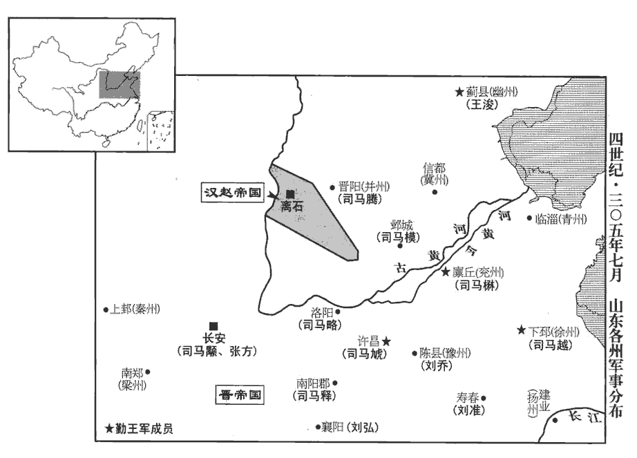
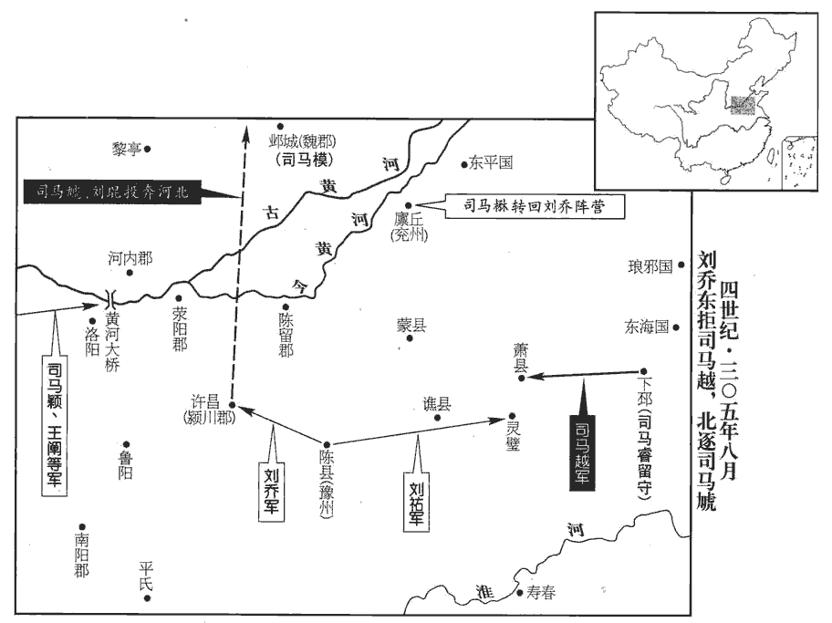
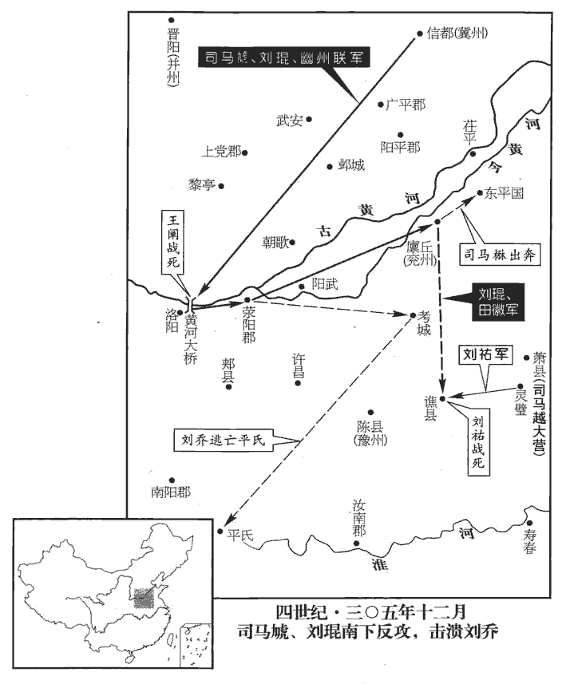
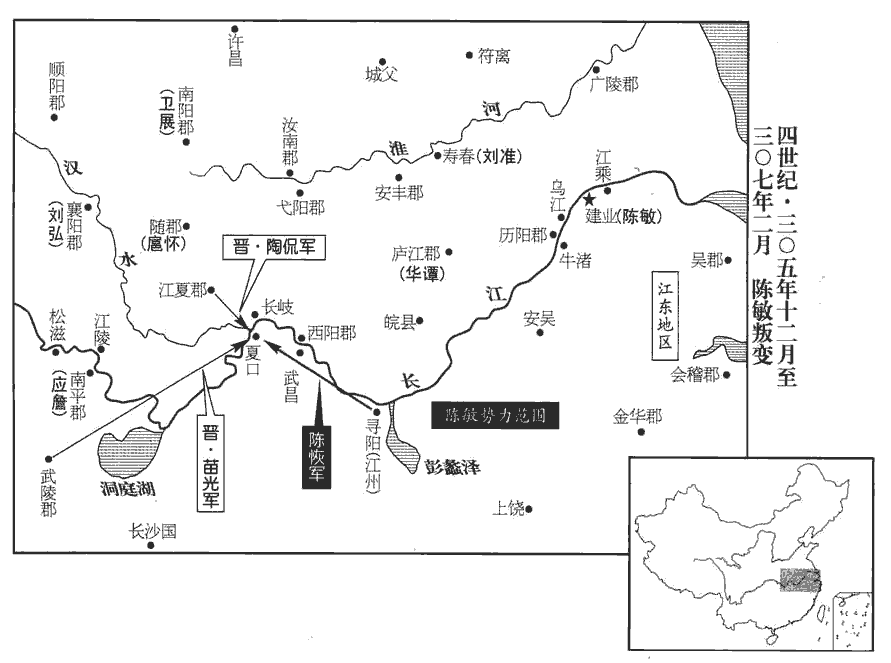
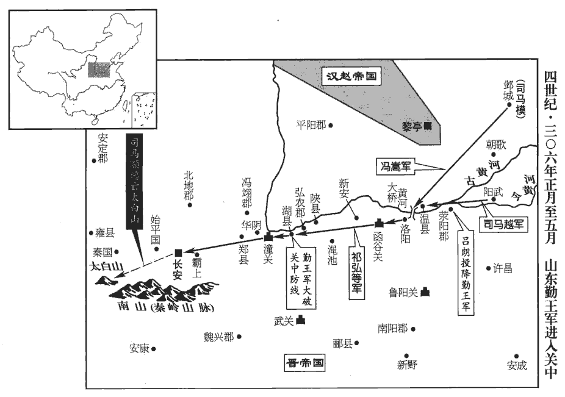
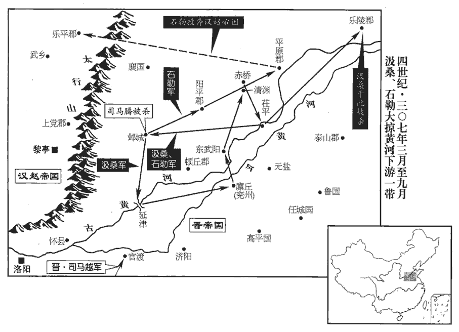
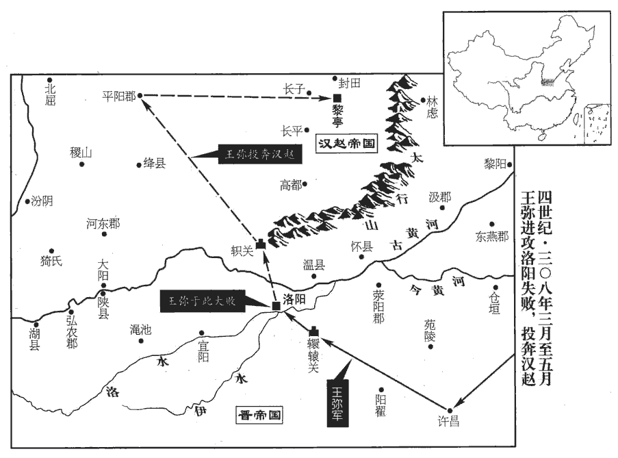
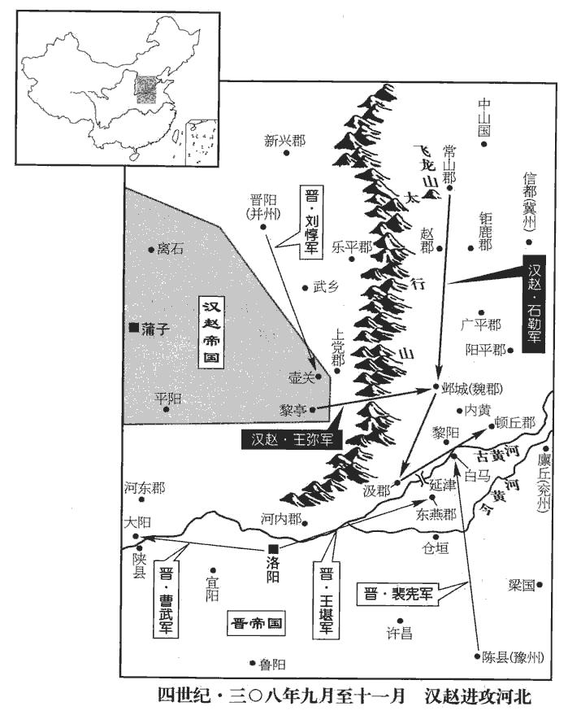

 晉紀八起旃蒙赤奮若（乙丑），盡著雍執徐（戊辰），凡四年。

# 孝惠皇帝下

## 永興二年（乙丑，三零五）

1夏，四月，張方廢羊后‹羊献容›。

〖译文〗 [1]夏季，四月，张方废黜羊皇后。

2游楷等攻皇甫重，累年不能克，游楷等自太安二年攻皇甫重，至是，首尾三年。重遣其養子昌求救於外。昌詣司空越，越以太宰顒新與山東連和，事見上卷上年。不肯出兵。昌乃與故殿中人楊篇故殿中人，舊屬二衛部曲者。詐稱越命，迎羊后於金墉城。入宮，以后令發兵討張方，奉迎大駕‹司马衷，本年四十七岁›。是年四月，張方廢羊后。其時方已奉帝入關，蓋以威令遙脅留臺百官，使廢羊后耳。今皇甫昌迎后入宮，欲發兵討方，特以是起兵，非因方在洛而討之也。事起倉猝，百官初皆從之；俄知其詐，相與誅昌。顒請遣御史宣詔喻重令降。降，戶江翻；下同。重不奉詔。先是城中不知長沙厲王及皇甫商已死，長沙厲王死，見上卷上年。皇甫商死，見上卷太安二年。先，悉薦翻。重獲御史騶人，因御史來宣詔，獲其騶人。騶，側鳩翻，廐御也。晉制，諸公給騶八人，下至御史，各有差。齊王融曰：「車前無八騶，何得稱丈夫！」則騶蓋辟車之卒。問曰：「我弟將兵來，欲至未？」騶人曰：「已為河間王所害。」重失色，立殺騶人。於是城中知無外救，共殺重以降。顒以馮翊‹陕西大荔›太守張輔為秦州刺史。顒以破劉沈之功用張輔。

〖译文〗 [2]游楷等人攻打皇甫重，几年都没有攻克，皇甫重派他的养子皇甫昌到外边录求救援。皇甫昌拜见司空司马越，司马越因为太宰司马新近与崤山以东地区联系和解，不肯出兵。皇甫昌就与以前为殿中人的杨篇一起，伪称奉司马越的旨意，从金墉城迎出羊皇后。进入皇宫后，用皇后的命令发兵讨伐张方，尊奉迎接皇帝大驾。事情来得仓猝，朝廷各部门官员开始都跟随皇甫昌，不久知道是伪令，就一起杀了皇甫昌。司马请求派御史向皇甫重宣布诏令，命令他投降。皇甫重不遵行诏令。开始时城里不知道长沙厉王司马和皇甫商已被杀死。皇甫重抓住来宣布诏令的御史马夫，询问说：“我弟弟带兵过来，快到了吗？”马夫说：“他已被河间王司马害死了。”皇甫重大惊失色，当即杀掉马夫。这样城里知道没有外援，就一起杀了皇甫重投降。司马命冯翊太守张辅担任秦州刺史。

3六月，甲子‹四›，安豐元侯王戎‹年七十二岁›薨于郟‹河南郏县›。王戎奔郟，見上卷上年。郟，音夾。

〖译文〗 [3]六月，甲子（初四），安丰元侯王戎在郏县去世。

4張輔至秦州‹府冀县甘肃省甘谷县›，殺天水太守封尚，欲以立威；又召隴西‹甘肃隴西›太守韓稚，守，式又翻。稚子朴勒兵擊輔，輔軍敗，死。涼州司馬楊胤言於張軌曰：「韓稚擅殺刺史，明公杖鉞一方，不可不討。」軌從之，遣中督護氾瑗帥眾二萬討稚，稚詣軌降。中督護，中軍督護也。氾，音凡。瑗，于眷翻。帥，讀曰率；下同。未幾，幾，居豈翻。鮮卑若羅拔能寇涼州，軌遣司馬宋配擊之，斬拔能，俘十餘萬口，威名大振。史言張軌能尊主攘夷，以致強盛。

〖译文〗 [4]张辅到秦州，杀了天水太守封尚，想以此建立权威。又要召陇西太守韩稚，韩稚的儿子韩朴带兵攻打张辅，张辅的军队失败，张辅被杀死。凉州司马杨胤对张轨说：“韩稚擅自杀死刺史，您掌握一个地区的军事，不能不去征讨。”张轨听从了他的意见，派中军督护瑗率领二万人征讨韩稚，韩稚到张轨那里投降。没有多久，鲜卑人若罗拔能进犯凉州，张轨派司马宋配阻击鲜卑人，杀了若罗拔能，俘虏十多万人，声威大振。

5漢‹都左国城山西省离石县北›王淵攻東嬴公騰‹时在晋阳山西省太原市›，騰復乞師於拓跋猗㐌yí‹王庭设盛乐内蒙古和林格尔县›，復，扶又翻。㐌，徒河翻。衛操勸猗㐌助之。猗㐌帥輕騎數千救騰，斬漢將綦qí毋豚。毋，音無。綦毋，複姓。北狄傳：匈奴國人有綦毋氏、勒氏，皆勇健，好反叛。考異曰：後魏書桓帝紀及劉淵傳，皆云「淵南走蒲子」。按晉載記，淵無走蒲子事，下云「自離石遷黎亭」，蓋後魏書夸誕妄言耳。詔假猗㐌大單于，單，音蟬。加操右將軍。甲申‹二十四›，猗㐌卒，子普根代立。

〖译文〗 [5]汉王刘渊攻打东赢公司马腾，司马腾又向拓跋猗求援助，卫操劝拓跋猗帮助司马腾。拓跋猗率领几千轻装的骑兵去救援司马腾，杀了汉将綦毋豚。诏令把拓跋猗封为大单于，加封卫操右将军。甲申（二十四日），拓跋猗去世，儿子拓跋普根代他立为大单于。

6東海‹山东郯城›中尉劉洽以張方劫遷車駕，晉諸王國有郎中令、中尉、大農為三卿。張方劫遷車駕事見上卷上年。勸司空越起兵討之。秋，七月，越傳檄山東征、鎮、州、郡云：「欲糾帥義旅，奉迎天子，還復舊都。」舊都，謂洛陽。東平王楙‹时驻下邳江苏省睢宁县北古邳镇›聞之，懼；長史王脩說楙曰：「東海，宗室重望；今興義兵，公宜舉徐州以授之，則免於難，說，輸芮翻。難，乃旦翻。且有克讓之美矣。」楙從之。越乃以司空領徐州都督，楙自為兗州刺史；詔即遣使者劉虔授之。楙督徐州，始八十四卷永寧元年。去年，范陽王虓xiāo以苟晞行兗州，晞留許昌，未及至州，而楙自領之。是時，越兄弟并據方任，越弟略都督青州，模都督冀州。於是范陽王虓‹时驻许昌河南省许昌市东›虓xiāo，虛交翻。及王浚‹时驻蓟县北京市›等共推越為盟主，越輒選置刺史以下，輒，專也。朝士多赴之。朝士赴越者，不從帝在長安者也。朝，直遙翻。

〖译文〗 [6]东海中尉刘洽因为张方劫持并强行迁移皇帝车驾，劝司空司马越发兵征讨张方。秋季，七月，司马越在崤山以东的各征、镇、州、郡传布檄文说：“将集结带领正义之师，奉迎天子返回原来的都城。”东平王司马听到后，惶恐不安。长史王对司马说：“东海王是宗室中声望最高的，现在兴起正义的军队，您应当把徐州交给他，那就可避免灾难，还享有克己谦让的美德。”司马同意了。司马越就以司空兼任徐州都督，司马自任兖州刺史，朝廷诏令立即派使者刘虔正式任命。这时，司马越兄弟都各占据一方重任，于是范阳王司马和王浚等人共同推举司马越作盟主，司马越则选择人才安排刺史以下的职务，朝廷的士人大多都投奔到司马越那里。

 

7成都王穎既廢，穎廢見上卷上年。河北人多憐之。穎鎮鄴，初有時譽；後雖以驕侈致禍，河北之人厭亂而思舊，故多憐之。穎故將公師藩等自稱將軍，起兵於趙、魏，眾至數萬。初，上黨‹山西省黎城县西南›武鄉‹山西榆社›羯人石勒，有膽力，善騎射。武鄉縣，晉置，屬上黨郡；後石勒分置武鄉郡。劉昫曰：唐潞州武鄉縣，漢河東之垣縣也。唐遼州榆社縣，分晉武鄉縣置。載記曰：勒，匈奴別部羌渠之冑。又匈奴傳曰：北狄人居塞內者，有十九種，羯其一也。羯，居謁翻。并州大饑，建威將軍閻粹說東嬴公騰說，輸芮翻。執諸胡於山東，賣充軍實。勒亦被掠，賣為茌chí平‹山东省东阿县西北›人師懽奴，茌平縣，前漢屬東郡，後漢屬濟北國，晉屬平原國。應劭曰：在茌山之平地者也。意其地當在唐齊州、博州界。劉昫曰：茌平縣併入唐博州聊城縣。被，皮義翻。師古曰：茌chí，音仕疑翻。懽奇其狀貌而免之。懽家鄰於馬牧，勒乃與牧帥汲桑結壯士為群盜。帥，所類翻。及公師藩起，桑與勒帥數百騎赴之。帥，讀曰率。桑始命勒以石為姓，勒為名。石勒始此。藩攻陷郡縣，殺二千石、長吏，長，知兩翻。轉前，攻鄴。平昌公模甚懼；范陽王虓遣其將苟晞救鄴，與廣平‹河北省曲周县东北›太守譙國‹安徽亳州›丁紹共擊藩，走之。漢武帝置平干國，宣帝改為廣平國；後漢光武省屬鉅鹿郡；魏文帝黃初二年復置廣平郡；唐為洺州之地。

〖译文〗 [7]成都王司马颖被废黜后，河北人大多很怜悯他。司马颖过去的部将公师藩等人自称将军，在赵、魏地区起兵，人数达到几万。当初，上党武乡县羯人石勒，有胆识力量，善于骑马射箭。并州严重饥荒，建威将军阎粹向东赢公司马腾献计，把各族胡人抓到崤山以东地区，卖了以后补充军粮。石勒也被抓住，卖给仕平人师欢作奴隶，师欢认为他的相貌奇特而放了他。师欢与放马场为邻，石勒就与放牧的首领汲桑聚集壮士成为强盗团伙。等公师藩起兵后，汲桑和石勒率领几百骑士投奔到公师藩那里，汲桑让石勒以石作为姓，用勒作为名。公师藩攻克了一些郡县，杀了二千石俸禄的郡守、长吏，转而向前，攻打邺城，平昌公司马模非常恐惧。范阳王司马派他的部将苟去救邺城，与广平太守谯国人丁绍共同攻打并赶跑了公师藩。

8八月，辛丑，大赦。

〖译文〗 [8]八月，辛丑（疑误），宣布大赦。

9司空越以琅邪王睿為平東將軍，監徐州諸軍事，留守下邳。監，工銜翻。睿請王導為司馬，委以軍事。考異曰：導傳曰：「元帝鎮下邳，請導為安東司馬。」按元帝時為平東，及徙揚州，乃為安東耳。或者「平」字誤為「安」，或後為安東司馬，故但云司馬。越帥甲士三萬，西屯蕭縣‹安徽蕭縣›；蕭縣，自漢以來屬沛郡，唐屬徐州。范陽王虓自許屯于滎陽‹河南滎陽›。許，即許昌。越承制以豫州刺史劉喬為冀州刺史，以范陽王虓領豫州刺史；喬以虓非天子命，發兵拒之。虓以劉琨為司馬，越以劉蕃為淮北護軍，劉輿為潁川‹河南省许昌市东›太守。輿、琨，蕃之子也。喬上尚書，列輿兄弟罪惡，因引兵攻許，豫州刺史時治項。上，時掌翻。遣長子祐將兵拒越於蕭縣之靈壁‹安徽省濉溪县西›，長，知兩翻。越兵不能進。東平王楙在兗州，徵求不已，郡縣不堪命。范陽王虓遣苟晞還兗州，虓用苟晞為兗州刺史，見上卷上年。徙楙都督青州。楙不受命，背山東‹崤山之东›諸侯，與劉喬合。背，蒲妹翻。

〖译文〗 [9]司空司马越以琅邪王司马睿任平东将军。监徐州诸军事的职务，在下邳留守。司马睿请王导担任司马，将军队事务交给王导处理。司马越率领三万兵士，驻扎在西边的萧县。范阳王司马从许昌到荥阳驻扎。司马越奉制书让豫州刺史刘乔任冀州刺史，让范阳王司马兼任豫州刺史。刘乔认为司马来不是天子的旨意，就发兵阻止司马。司马以刘琨为司马，司马越以刘藩任淮北护军。刘舆任颍川太守。刘乔给朝廷上书，罗列刘舆兄弟的罪恶，就带兵攻打许昌，并派长子刘带兵在萧县的灵壁阻击司马越，司马越的军队不能前进。东平王司马在兖州，不停地征收赋税，征发劳役，所属郡县不能忍受。范阳王司马派苟返回兖州，调司马都督青州，司马不接受任命，背叛崤山以东的诸侯，与刘乔汇合。

10太宰顒聞山東兵起，甚懼。以公師藩為成都王穎起兵，壬午‹二十三›，表穎為鎮軍大將軍、都督河北諸軍事，給兵千人；以盧志為魏郡太守，隨穎鎮鄴，欲以撫安之。又遣建武將軍呂朗屯洛陽。

〖译文〗 [10]太宰司马听说崤山以东战事又起，非常恐惧。因为公师藩是为成都王司马颖而起兵，壬午（二十三日），司马表奏任司马颖为镇东大将军，都督河北诸军事，配给一千兵士；任卢志为魏郡太守，随从司马颖镇守邺城，想以此抚尉并安定公师藩。又派建武将军吕朗到洛阳驻扎。

顒發詔，令東海王越等各就國，越等不從。會得劉喬上事，上事者，言東海王越等起兵及喬攻許拒越之事。上，時掌翻。冬，十月，丙子‹十八›，下詔稱：「劉輿迫脅范陽王虓，造搆凶逆。其令鎮南大將軍劉弘、劉弘都督荊州。平南將軍彭城王釋、彭城王釋蓋代羊伊屯宛‹河南省南阳市›。征東大將軍劉準，劉準都督揚州。各勒所統，與劉喬并力；以張方為大都督，統精卒十萬，與呂朗共會許昌，誅輿兄弟。」釋，宣帝弟子穆王權之孫也。權，宣帝弟東武城侯馗之子。考異曰：劉喬傳「釋」作「繹」。帝紀、宗室傳皆作「釋」，蓋喬傳誤。帝紀：「八月，車騎大將軍劉弘逐平南將軍彭城王釋于宛。」弘、釋傳及眾書皆無之。弘傳但云彭城前東奔有不善之言。按弘，晉室純臣，劉喬與范陽搆難，弘猶以書和解之，以安天下，尊王室。釋受王命鎮宛，而弘肯更自逐之乎！據此詔，令弘、釋共討劉輿，疑無弘逐釋事。帝紀必誤。丁丑‹十九›，顒使成都王穎領將軍劉【章：甲十一行本「劉」作「樓」；乙十一行本同；孔本同；退齋校同。】褒等，前車騎將軍石超領北中郎將王闡等據河穚，為劉喬繼援；進喬鎮東將軍，假節。

〖译文〗 司马发布诏令，命令东海王司马越等人各自回到自己的封国，司马越等人不服从。碰巧接到刘乔的上书。冬季，十月，丙子（十八日），司马颁布诏书，声称：“刘舆逼迫威胁范阳王司马，制造事端。命令镇南大将军刘弘、平南将军彭城王司马释、征东大将军刘准，各自带领所辖军队，与刘乔并肩出力，任张方为大都督，率领十万精兵，与吕朗在许昌会合，诛讨刘舆兄弟。”司马释是宣帝司马懿侄子穆王司马权的孙子。丁丑（十九日），司马让成都王司马颖带领将军楼褒等人，前车骑将军石超带领北中郎将王阐等人据守河桥，作为刘乔的后续援军。提升刘乔为镇东将军，发给符节。

 

劉弘‹时驻襄阳›遺喬及司空越書，遺，于季翻。欲使之解怨釋兵，同獎王室，皆不聽。弘又上表曰：「自頃兵戈紛亂，猜禍鋒生，疑隙搆於群王，災難延于宗子。難，乃旦翻。今日為忠，明日為逆，翩其反而，言是非反覆之易，冏、乂、穎、顒之事誠如此。互為戎首。言迭為興戎之首也。載籍以來，骨肉之禍未有如今者也，臣竊悲之！今邊陲無備豫之儲，中華有杼zhù軸之困，詩曰：小東大東，杼軸其空。杼，持緯器。「軸」，亦作「柚」；皆織具也。而股肱之臣，不惟國體，職競尋常，惟，思也。職，主也。競，爭也。八尺曰尋，倍尋曰常。言所爭者尋丈之間，不足為長短也。左傳曰：爭尋常以盡其民。自相楚剝。楚，痛也。萬一四夷乘虛為變，此亦猛虎交鬬,自效於卞莊者矣。劉、石之禍，劉弘蓋知之矣。臣以為宜速發明詔，詔越等，令兩釋猜嫌，各保分局。分，扶問翻。自今以後，其有不被詔書，擅興兵馬者，天下共伐之。」被，皮義翻；下同。時太宰顒方拒關東，倚喬為助，不納其言。

〖译文〗 刘弘给刘乔及司空司马越去信，想使他们之间消解怨恨停止军事行动，共同辅佐王室，但双方都不理会。刘弘又上奏表说：“自从近年战乱迭起，猜疑灾祸一起出现，疑忌仇隙在亲王们之间出现，灾难祸患延续于宗室后代身上，今天是忠于王室的，明天就成了反叛王室，是非反复变化无常，轮流成为兴起战事的首领。有历史记载以来，骨肉相残的灾祸没有像现在这样的，我对此感到十分悲伤！现在边疆没有预防发生变动的储备，中原却有相当的困厄，辅助王室的重要大臣，不考虑国家的命运，却以竞争长短为能事，自相残杀。万一四边夷人乘虚而制造变乱，这也正是两个猛虎相争斗而自然成为卞庄的猎物。我认为应该赶快发布公开诏书，命令司马越等人，解除猜忌仇怨，各自保持自己所分管的职位和封地。从今以后，如果有不接受诏令，擅自动用军队挑起事端的人，全国共同来讨伐他。”当时太宰司马刚开始进抵关东地区，要倚靠刘乔作为帮助，因而不采纳刘弘的进言。

喬乘虛襲許，破之。劉琨將兵救許，不及，遂與兄輿及范陽王虓俱奔河北；琨父母為喬所執。劉弘以張方殘暴，知顒必敗，乃遣參軍劉盤為都護，盡護行營諸將為都護，督護則止督一軍耳。帥諸軍受司空越節度。帥，讀曰率。

〖译文〗 刘乔乘虚袭击许昌，一举攻克。刘琨带兵救援许昌，已经来不及，于是和兄刘舆以及范阳王司马一起逃奔河北。刘琨的父母被刘乔抓住。刘弘根据张方的残暴，知道司马一定要失败，便派参军刘盘为都护，带领所辖各军队接受司马越的指挥。

時天下大亂，弘專督江、漢，威行南服。南服，南方也；謂之服者，責以服事天子為職。謀事有成者，則曰「某人之功」，如有負敗，則曰「老子之罪」。每有興發，興發，謂興師動眾，調發財賦。手書守相，守，手又翻。相，息亮翻。丁寧款密。所以人皆感悅，爭赴之，咸曰：「得劉公一紙書，賢於十部從事。」州有部從事，部管內諸郡。前廣漢‹四川省射洪县南柳树镇›太守辛冉說弘以從橫之事，弘怒，斬之。益州之破，辛冉去羅尚從劉弘，冉以事尚者事弘，猶將不免於誅，況以從橫說之邪！史言劉弘忠純。說，輸芮翻。從，子容翻。

〖译文〗 这时天下大乱，刘弘专门督管江、汉地区，威势及于南方边远地区。谋划事情成功了，就说是某人的功劳。如果遇到失败，则称是自己的责任。每当兴师动众，亲笔写信给负责官员，详细叮咛嘱咐。所以大家都很感动和舒畅，争相到他那儿。大家都说：“能够得到刘公一纸亲笔信，胜过做十个部从事。”前广汉太守辛冉向刘弘游说割据称霸的事，刘弘发怒，把他杀了。

11有星孛于北斗。孛bèi，蒲內翻。

〖译文〗 [11]有异星出现在北斗星旁。

12平昌公模遣將軍宋冑趣河橋。模自鄴遣冑進兵。趣，七喻翻。

〖译文〗 [12]平昌公司马模派将军宋胄向河桥进兵。

13十一月，立節將軍周權，詐被檄，詐言被司空越檄也。自稱平西將軍，復立羊后‹羊献容›。洛陽令何喬攻權，殺之，復廢羊后。復，扶又翻。太宰顒矯詔，以羊后屢為姦人所立，遣尚書田淑敕留臺賜后死。時荀藩、劉暾、周馥居留臺。詔書屢至，司隸校尉劉暾等上奏，暾，他昆翻。上，時掌翻。固執以為：「羊庶人門戶殘破，廢放空宮，門禁峻密，無緣得與姦人搆亂；眾無愚智，皆謂其冤。今殺一枯窮之人，而令天下傷慘，何益於治！」治，直吏翻。顒怒，遣呂朗收暾；考異曰：暾傳云：「顒遣陳顏、呂朗帥騎五千收暾。」按暾匹夫，安用五千騎！蓋朗時在洛，顒敕使收暾耳。說者欲大其事，故云爾。暾奔青州，依高密王略‹山东省高密县西南›。然羊后亦以是得免。

〖译文〗 [13]十一月，立节将军周权，假称收到檄文，自称为平西将军，又重新立羊皇后。洛阳令何乔攻打周权，把他杀了，又废黜羊皇后。太宰司马假称诏令，根据羊皇后多次被坏人拥立，派尚书田淑命令留守台署赐羊皇后死。诏书几次传到，司隶校尉刘暾等人上奏，坚持认为：“羊庶人门庭早已破败，废黜放逐空宫，宫门禁卫戒备森严，没有条件能够与坏人勾结而制造变乱，大家无论愚蠢还是聪明，都说她很冤枉。现在杀这样一个潦倒穷愁的人，而使天下悲伤，对社会安定有什么好处？”司马发怒，派吕朗拘捕刘暾，刘暾投奔青州，依靠高密王司马略。但羊皇后也因此而得以免于一死。

14十二月，呂朗等東屯滎陽，成都王穎進據洛陽。

〖译文〗 [14]十二月，吕朗等向东在荥阳驻扎，成都王司马颖进兵据守洛阳。

15劉琨說冀州刺史太原溫羨，使讓位於范陽王虓xiāo。魏收曰：袁紹、曹操為冀州，治鄴；魏、晉治信都。杜佑曰：治房子。說輸芮翻。虓領冀州，遣琨詣幽州乞師於王浚；浚以突騎資之，突騎，天下精兵。燕人致梟騎，助漢高祖以破項羽。光武得漁陽、上谷突騎以平河北。考異曰：琨傳曰：「得突騎八百人。」按劉喬傳云：「琨率突騎五千濟河攻喬。」疑八百太少，或因下文迎東海王之數，致有此誤。今闕疑。擊王闡於河上，殺之。琨遂與虓引兵濟河，斬石超於滎陽。劉喬自考城‹河南省民权县东›引退。考城縣屬陳留郡，前漢梁國之菑縣也，章帝更名；晉省。後魏置考陽縣及北梁郡；北齊郡縣并廢，為城安縣；隋改曰考城縣，屬梁郡；至唐，屬曹州。虓遣琨及督護田徽東擊東平王楙於廩丘‹山东郓城西北›，廩丘縣，前漢屬東郡，後漢屬濟陰，晉屬濮陽郡，為兗州刺史治所。賢曰：廩丘故城在今濮州雷澤縣北。楙走還國。琨、徽引兵東迎越‹时驻萧县安徽省萧县›，擊劉祐於譙‹安徽亳州›；祐敗死，喬眾遂潰，喬奔平氏‹河南省桐柏县西北›。考異曰：帝紀云：「喬奔南陽。」按地理志：南陽無平氏縣。武帝分南陽置義陽郡，有西平氏縣。或者南陽有東平氏而非縣與！今按前漢書地理志：平氏縣屬南陽郡。晉書地理志，平氏縣屬義陽郡。平氏之上有厥西縣。沈約宋書地理志：南義陽太守領厥西、平氏二縣。且曰：厥西令，二漢無；晉太康地志屬義陽。以此證之，蓋後人傳寫晉書者，誤以厥西之「西」字聯平氏而書之。其實晉義陽之平氏，即漢南陽之平氏也。帝紀所謂「喬奔南陽」，以漢古郡大界書之也。劉昫曰：唐申州義陽縣，漢南陽郡平氏縣之義陽鄉與唐州之桐柏、平氏二縣，皆漢南陽平氏縣地。司空越進屯陽武‹河南省原阳县›，陽武縣，漢屬河南郡，晉屬滎陽郡，唐屬鄭州。王浚遣其將祁弘帥突騎鮮卑、烏桓為越先驅。帥，讀曰率；下同。

〖译文〗 [15]刘琨向冀州刺史太原人温羡游说，让他把职位让给范阳王司马。司马兼领冀州后，派刘琨到幽州向王浚求兵。王浚派精锐骑兵帮助司马，在黄河上袭击王阐，把王阐杀了。刘琨于是和司马率兵渡黄河，在荥阳杀了石超。刘乔从考城率兵撤退。司马派刘琨和都护田徽向东在廪丘攻打东平王司马，司马逃归封国。刘琨、田徽带兵向东迎接司马越，在谯地攻打刘，刘兵败阵亡，刘乔的军队于是溃散，刘乔逃奔平氏县。司空司马越进军到阳武驻扎，王浚派他的部将祁弘带领鲜卑、乌桓精锐骑兵作为司马越的前锋。

 

16初，陳敏既克石冰，事見上卷太安二年。自謂勇略無敵，有割據江東之志。其父怒曰：「滅我門者，必此兒也！」遂以憂卒。敏以喪去職。司空越起敏為右將軍、前鋒都督。越為劉祐所敗，敗，補邁翻。敏請東歸收兵，遂據歷陽‹安徽和县›叛。歷陽縣，漢屬九江郡，魏改九江曰淮南，晉因之。今和州，即歷陽縣之地。宋白曰：縣南有歷水，故曰歷陽。吳王常侍甘卓，棄官東歸，晉諸王國，大國置左、右常侍各一人。考異曰：卓傳云：「州舉秀才，為吳王常侍。討石冰，以功賜爵都亭侯。東海王越引為參軍，出補離狐令。棄官東歸，遇陳敏。」敏傳云：「吳王常侍甘卓自洛至。」按卓為常侍，不應討石冰；為離狐令，不應自洛至。今從敏傳。至歷陽‹安徽和县›，敏為子景娶卓女，為，于偽翻。使卓假稱皇太弟令，拜敏揚州刺史。敏使弟恢及別將錢端等南略江州，弟斌東略諸郡，斌，音彬。揚【章：甲十一行本「揚」上有「江州刺史應邈」六字；乙十一行本同；孔本同；張校同；退齋校同。】州刺史劉機、丹楊太守王曠皆棄城走。時揚州刺史蓋與丹楊太守同治秣陵‹即建业·江苏省南京市›。

〖译文〗 [16]当初，陈敏战胜石冰后，自以为勇猛谋略没有对手，产生在江东割据的想法。他父亲生气地说：“使我们家族灭绝的，一定是这个儿子！”于是忧郁而死。陈敏因为丧事而离职。司空司马越起用陈敏为右将军、前锋都督。司马越被刘打败，陈敏请求收兵东归，于是占据历阳反叛。吴王常侍甘卓，抛弃官职东归，到历阳，陈敏为自己的儿子陈景娶甘卓的女儿，并让甘卓伪称皇太弟的命令，任命陈敏为扬州刺史。陈敏派弟弟陈恢以及部将钱端等人向南攻打江州，弟弟陈斌向东攻打各郡，扬州刺史刘机，丹阳太守王旷都弃城逃跑。

 

敏遂據有江東，以顧榮為右將軍，賀循為丹楊內史，周玘qǐ為安豐‹安徽省寿县西南›太守，安豐縣，後漢屬廬江郡。魏分廬江為安豐郡，其地為唐之壽州安豐、霍丘縣。玘，墟里翻。凡江東豪傑、名士，咸加收禮，為將軍、郡守者四十餘人；或有老疾，就加秩命。循詐為狂疾，得免；乃以榮領丹楊內史。玘亦稱疾，不之郡。敏疑諸名士終不為己用，欲盡誅之。榮說敏曰：「中國喪亂，胡夷內侮，觀今日之勢，不能復振，百姓將無遺種。說，輸芮翻。喪，息浪翻。種，章勇翻。江南雖經石冰之亂，人物尚全，榮常憂無孫、劉之主孫、劉，謂孫權、劉備。有以存之。今將軍神武不世，勳效已著，帶甲數萬，舳zhú艫山積，漢武帝紀：舳艫千里。註云：舳、船後持柂duò處。艫，船前刺櫂zhào處。又漢律名船方長為舳艫。此言山積，蓋取漢律之義。若能委信君子，使各盡懷，散蔕dì芥之嫌，張晏曰：蔕芥，刺鯁也。師古曰：蔕，音丑介翻。塞讒諂之口，則上方數州，可傳檄而定；上方數州，謂揚州以西，荊、江、豫、梁、益等州也。塞，悉則翻。不然，終不濟也。」【章；甲十一行本「也」下有「敏乃止」三字；乙十一行本同；孔本同；張校同；退齋校同。】敏命僚佐推己為都督江東諸軍事、大司馬、楚公，加九錫，列上尚書，上，時掌翻。稱被中詔，被，皮義翻。自江入沔、漢，奉迎鑾駕。

〖译文〗 陈敏于是占据了江东地区，任命顾荣为右将军、贺循为丹阳内史、周为安丰太守，凡是江东地区的豪族英杰、名士，都加以收揽以礼相待，其中担任将军、郡守的有四十多人。如果有年老、有病的，也封给一定的给别。贺循假装疯病，得以逃脱，就让顾荣兼任丹阳内史。周也称病而不到郡。陈敏怀疑各位名士最终不能为自己服务，想把他们全部杀掉。顾荣对陈敏说：“中原丧乱动荡，胡人、夷人欺辱内地，看今天的趋势，国家不会再重新振兴，百姓将难以生存下去。江南地区虽然经过石冰的叛乱，但百姓与财物都还健全，我常常对没有孙权、刘备那样的领袖来使江南保存感到忧虑。现在您超凡威武举世无双，功绩已经显赫，有数万武士，高大的战舰排列如群山。如果能在君子中获得信任，让他们心情舒畅，解开他们心中小小的疑忌，堵塞住谗言陷害或阿庚奉承之人的嘴，那么长江上游的几个州，都能用传布檄文的方式稳定，不然，终究不能成功。”陈敏让下属推举自己为都督江东诸军事、大司马，封为楚公、加九锡重礼，列上尚书，声称直接接到皇帝的诏令，从长江进入沔水，汉水流域，迎接皇帝大驾。

太宰顒以張光為順陽‹河南淅川东南›太守，順陽縣，前漢曰博山，後漢明帝更名順陽，屬南陽郡；至建安中，割南陽右壤為南鄉郡；晉太康中，立順陽郡，以南鄉為縣；唐鄧州之臨湍、菊潭縣，皆順陽郡地。帥步騎五千詣荊州討敏。劉弘遣江夏‹湖北云梦›太守陶侃、武陵‹湖南常德›太守苗光屯夏口‹湖北武汉›，夏，戶雅翻。又遣南平‹湖北公安›太守汝南‹河南息县›應詹督水軍以繼之。

〖译文〗 太宰司马以张光任顺阳太守，率领步兵骑兵五千人到荆州讨伐陈敏。刘弘派江夏太守陶侃、武陵太守苗光在夏口驻扎，又派南平太守汝南人应詹督领水军来支援陶侃等人。

侃與敏同郡，侃與敏皆廬江‹安徽舒城›人。又同歲舉吏。同歲舉赴京師。隨郡‹湖北随州›內史扈懷隨縣，漢屬南陽郡，春秋之隨國也。晉武帝分南陽立義陽國，後又分義陽立隨郡，隋為漢東郡，唐為隋州。言於弘曰：「侃居大郡，統強兵，脫有異志，則荊州無東門矣！」弘曰：「侃之忠能，吾得之已久，必無是也。」侃聞之，遣子洪及兄子臻詣弘以自固，弘引為參軍，資而遣之。既引為參軍，又以貨物資送而遣其歸。曰：「賢叔征行，君祖母年高，便可歸也。匹夫之交，尚不負心，況大丈夫乎！」

〖译文〗 陶侃与陈敏是同郡人，又同年被荐举为官吏。随郡内史扈怀对刘弘说：“陶侃在大郡任太守，统领强兵，倘若有异心，荆州就失去东大门了！”刘弘说：“陶侃的忠心和才能，我了解他已很久了，一定不会这样。”陶侃听说后，派儿子陶洪和侄子陶臻到刘弘那儿，以使自己的地位稳固，刘弘作用陶洪等二人为参军，发给钱物让他们回去，说：“你们贤德的叔叔要征战出行，而祖母年事已高，你们应该回去。村野匹夫互相交往，尚且不负心，何况大丈夫呢！”

敏以陳恢為荊州刺史，寇武昌‹湖北鄂城›，弘加侃前鋒督護以禦之。侃以運船為戰艦，艦，戶黯翻。或以為不可。侃曰：「用官船擊官賊，何為不可！」侃與恢戰，屢破之；又與皮初、張光、苗光共破錢端於長岐‹湖北黄陂西南長岐›戍。據張光傳，長岐之戰，光設伏於步路，苗光為水軍，藏舟船於沔水，則長岐當在江夏郡界。

〖译文〗 陈敏让陈恢任荆州刺史，进犯武昌，刘弘让陶侃兼任前锋都护去抵御。陶侃以一般运输船作为战舰，有人认为不行。陶侃说：“用官船来打官贼，有什么不行？”陶侃与陈恢交战，多次把陈恢打败。又和皮初、张光、苗光在长岐共同打败钱端。

南陽‹河南南阳›太守衛展說弘曰：「張光，太宰腹心，公既與東海，宜斬光以明向背。」背，蒲妹翻。弘曰：「宰輔得失，豈張光之罪！危人自安，君子弗為也。」乃表光殊勳，乞加遷擢。

〖译文〗 南阳太守卫展对刘弘说：“张光是太宰司马的心腹，您既然倾向于东海王司马越，应该杀张光来表明您的立场。”刘弘说：“太宰的得失，怎么是张光的罪过，危害别人使自己安全，君子是不作这种事的。”于是表奏张光的功勋，请求朝廷提拔。

17是歲，離石‹左国城·山西省离石县北›大饑，漢王淵徙屯黎亭‹山西壺關西南›，續漢志：上黨郡壺關縣有黎亭，書西伯戡kān黎即此。就邸閣穀；留太尉宏守離石，使大司農卜豫運糧以給之。

〖译文〗 [17]这一年，离石地区灾荒严重。汉王刘渊迁到黎亭驻扎，使用邸阁粮谷，让太尉刘宏留守离石，派大司农卜豫运粮供给他。

## 光熙元年（丙寅，三零六）六月，帝還洛陽，始改元；此猶是永興三年。

1春，正月，戊子朔‹一›，日有食之。

〖译文〗 [1]春季，正月，戊子朔（初一），出现日食。

2初，太弟中庶子蘭陵‹山东省苍山县西南兰陵镇›繆播繆，靡幼翻，又莫六翻，姓也。有寵於司空越；播從弟右衛率胤，太宰顒前妃之弟也。越之起兵，遣播、胤詣長安說顒，令奉帝‹司马衷，本年四十八岁›還洛‹河南省洛阳市东白马寺东›，說，輸芮翻；下因說、復說、迎說同。約與顒分陝‹河南省三门峡市›為伯。陝，失冉翻。顒素信重播兄弟，即欲從之。張方自以罪重，恐為誅首，以剽掠洛都，劫天子西遷也。謂顒曰：「今據形勝之地，國富兵強，奉天子以號令，誰敢不從，柰何拱手受制於人！」顒乃止。及劉喬敗，顒懼，欲罷兵，與山東和解，恐張方不從，猶豫未決。

〖译文〗 [2]当初，太弟中庶子兰陵人缪播受到司马越的宠信。缪播堂弟右卫率缪胤，是太宰司马的前妃的弟弟。司马越起兵，派缪播、缪胤到长安劝说司马，让他侍奉惠帝返归洛阳。并相约与司马分地而治，共同辅佐王室。司马一直信任看重缪播兄弟，当时就想听从他们的劝说。张方认为自己罪行很重，担心成为被诛杀的首犯，就对司马说：“现在我们占据形势险要的地方，国富兵强，挟天子发布号令，谁敢不服从，怎么能拱手被别人控制？”司马听后打消了与司马越联合的念头。等到刘乔兵败，司马畏惧，想停止军事行动，与崤山以东地区和解，但又耽心张方不听从，而犹豫不决。

方素與長安富人郅輔親善，以為帳下督。方傳云：初，方從山東來，甚微賤，郅輔厚相供給；及貴，甚親昵之。顒參軍河間‹河北献县›畢垣，嘗為方所侮，因說顒曰：「張方久屯霸上‹陕西省西安市东灞河畔›，聞山東兵盛，盤桓不進，顒遣方與呂朗會劉喬攻許，方屯霸上未進而劉喬敗。馬融曰：盤桓，旋也。宜防其未萌。其親信郅輔具知其謀。」繆播、繆胤復說顒：「宜急斬方以謝，山東可不勞而定。」復，扶又翻。顒使人召輔，垣迎說輔曰：「張方欲反，人謂卿知之。王若問卿，何辭以對？」輔驚曰：「實不聞方反，為之柰何？」垣曰：「王若問卿，但言爾爾；爾爾，猶言如此如此也。不然，必不免禍。」輔入，顒問之曰：「張方反，卿知之乎？」輔曰：「爾。」顒曰：「遣卿取之，可乎？」又曰：「爾。」顒於是使輔送書於方，因殺之。輔既昵於方，昵，尼質翻。持刀而入，守閣者不疑。方火下發函，輔斬其頭。還報，顒以輔為安定‹甘肃省镇原县东南曙光乡›太守。送方頭於【章：甲十一行本「於」下有「司空」二字；乙十一行本同；孔本同；張校同；退齋校同。】越以請和；越不許。

〖译文〗 张方平素和长安豪富郅辅亲近要好，让他担任帐下督。司马的参军河间人毕垣，曾经受到张方的侮辱，于是劝司马说：“张方在霸上驻兵很久了，听说崤山以东地区军队强盛，所以徘徊不前，应该在他萌生反心之前做好防备。张方的亲信郅辅对他的谋划全部了解。”缪播、缪胤又对司马进行劝说：“应当迅速杀了张方向天下谢罪，崤山以东地区不用兴兵就可以平定。”司马派人召郅辅，毕垣迎上前对郅辅说：“张方想谋反，大家都说你知道这事，亲王如果问你，你将如何回答？”郅辅吃惊地说：“的确没有听说张方谋反，这怎么办？”毕垣说：“亲王如果问你，你只能这样说，不然的话，一定免不了灾祸。”郅辅入府，司马问他说：“张方谋反，你知道吗？”郅辅说：“是的。”司马说：“派你去抓他，行吗？”郅辅又说：“行。”司马于是派郅辅给张方送信，然后趁机杀掉张方，郅辅与张方关系亲密，拿刀进去时，守门的兵士也不怀疑，张方在灯旁揭启信封，郅辅抽刀砍掉了他的头。回去报告，司马让郅辅任安定太守。把张方的头送给司马越请求和解。但司马越不答应。

宋冑襲河橋，樓褒西走。平昌公模遣前鋒督護馮嵩會宋冑逼洛陽。成都王穎西奔長安，至華陰‹陕西華陰›，華陰縣，前漢屬京兆，後漢、晉屬弘農郡，唐屬華州。華，戶化翻。聞顒已與山東和親，留不敢進。呂朗屯滎陽，劉琨以張方首示之，遂降。降，戶江翻。司【章；甲十一行本「司」上有「甲子」二字；乙十一行本同；孔本同；張校同。】空越遣祁弘、宋冑、司馬纂帥鮮卑西迎車駕，帥，讀曰率。以周馥為司隸校尉、假節，都督諸軍，屯澠池。澠，彌兗翻。

〖译文〗 宋胄袭击河桥，楼褒向西逃窜。平昌公司马模派前锋督护冯嵩会同宋胄进逼洛阳。成都王司马颖向西逃奔长安，到达华阴，听说司马已经和崤山以东和解，便停下不敢前进。吕朗在荥阳驻扎，刘琨拿张方的头给他看，于是吕朗就投降了。司空司马越派祁宏、宋胄、司马纂带领鲜卑人向西迎接皇帝大驾，任周馥为司隶校尉，掌持符节，都督诸军，在渑池驻扎。

3三月，惤jiān令劉伯【章：甲十一行本「伯」作「柏」；乙十一行本同；孔本同；張校同。】根反，惤縣‹山东省龙口市东南›，自漢以來屬東萊郡，拓跋魏省。魏收地形志：東牟郡黃縣有惤城。師古曰：惤，音堅。眾以萬數，自稱惤公。王彌帥家僮從之，帥，讀曰率。柏根以彌為長史，彌從父弟桑為東中郎將。從，才用翻。柏根寇臨淄，青州都督治所。青州都督高密王略使劉暾將兵拒之；暾兵敗，奔洛陽，暾，他昆翻。略走保聊城‹山东聊城›。聊城縣，漢屬東郡，晉屬平原郡，唐為博州治所。王浚遣將討柏根，斬之。將，即亮翻。王彌亡入長廣山‹山东省莱阳市东›為群盜。長廣縣，前漢屬琅邪郡，後漢屬東萊郡。晉武帝咸寧三年，置長廣郡，長廣縣屬焉。隋廢長廣郡及縣，更名膠水縣；唐屬萊州。

〖译文〗 [3]县令刘柏根反叛，有一万多人，自称公。王弥带领家奴僮仆跟随他，刘柏根任王弥为长史，王弥的堂弟王桑担任东中郎将。刘柏根进犯临淄，青州都督高密王司马略派刘暾带兵阻击他。刘暾兵败，逃奔洛阳，司马略退保聊城。王浚派部将讨伐刘柏根，把他杀了。王弥逃进长广山做了强盗。

4寧州‹云南›頻歲饑疫，死者以十萬計。五苓夷強盛，州兵屢敗。五苓夷反，事始上卷太安二年。苓，力丁翻。吏民流入交州‹两广及越南北›者甚眾，夷遂圍州城‹滇池县·云南省晋宁县东晋城镇›。李毅疾病，救援路絕，乃上疏上，時掌翻。言：「不能式遏寇虐，坐待殄斃。若不垂矜恤，乞降大使，及臣尚存，加臣重辟；使，疏吏翻。辟，毗亦翻。若臣已死，陳尸為戮。」朝廷不報。積數年，子釗自洛往省之，省，悉景翻。未至，毅卒。毅女秀，明達有父風，眾推秀領寧州事。秀獎厲戰士，嬰城固守。城中糧盡，炙鼠拔草而食之。伺夷稍怠，輒出兵掩擊，破之。伺，相吏翻。考異曰：懷帝紀：「永嘉元年五月，建寧郡夷攻陷寧州，死者三千餘人。」李雄載記曰：「南夷李毅固守不降，雄誘建寧夷使討之。毅病卒，城陷，殺壯士三千餘人，送婦女千口於成都。」王遜傳云：「李毅卒，城中奉毅女固守經年。」華陽國志有毅卒年月及女秀守城事，今從之。

〖译文〗 [4]宁州几年连续灾荒流行传染病。死了十万人。五苓夷人强盛，宁州军队屡次失败。官吏百姓很多都流亡到交州，夷人趁机包围了州城。李毅身患疾病，救援的道路已断绝，于是给朝廷上奏疏，说：“不能制止强盗作恶，只好坐等一死。如果朝廷不体谅救济，那么请求派来大使，我还活着，就对我施以重刑，如果我已死，就对我戮尸惩罚。”朝廷没有答复。过了几年，李毅的儿子李钊从洛阳去探视他，还没有到，李毅就去世了。李毅的女儿李秀，精明通达具有父亲的风范，于是大家推举李秀来管理宁州事务。李秀奖励战士，环城固守。城里粮食吃完了，就烧鼠拔草作为食物。等夷人稍微有些懈怠时，就发兵突然袭击，攻破了夷人的包围。

5范長生詣成都，自青城山詣成都也。成都王雄‹李雄，本年三十三岁›門迎，執版，拜為丞相，尊之曰范賢。

〖译文〗 [5]范长生到成都，成都王李雄到城门口迎接，拿着表示礼节的手板，任范长生为丞相，尊称他为范贤。

6夏，四月，己巳‹十三›，司空越引兵屯溫‹河南温县›。初，太宰顒以為張方死，東方兵必可解。既而東方兵聞方死，爭入關，顒悔之，乃斬郅輔，遣弘農‹河南灵宝东北›太守彭隨、北地‹陕西耀县›太守刁默將兵拒祁弘等於湖‹河南灵宝西›。五月，壬辰‹七›，弘等擊隨、默，大破之，遂西入關，又敗顒將馬瞻、郭偉於霸水‹灞河，流经陕西省西安市东›，敗，補邁翻。顒單馬逃入太白山‹秦岭山脉主峰·陕西省眉县南›。三秦記：太白山，在武功縣南，去長安三百里。俗云「武功太白，去天三百。」新唐書地理志：太白山在鳳翔府郿縣。弘等入長安，所部鮮卑大掠，殺二萬餘人，百官奔散，入山中，拾橡實食之。橡，似兩翻，栩實也。爾雅曰：柞zuò實謂之橡。賢曰：橡，櫟lì實也。己亥‹十四›，弘等奉帝乘牛車東還。晉志曰：古之貴者不乘牛車。漢武帝推恩之後，諸侯寡弱，至乘牛車，其後稍見貴重，自靈帝以來，天子至士，遂以為常乘。夫天子出入有大駕、法駕、鹵簿，帝自鄴奔洛，則乘犢車，自長安還洛，則乘牛車，無復出警入蹕之制矣。以太弟太保梁柳為鎮西將軍，守關中。六月，丙辰朔‹一›，帝至洛陽，復羊后。考異曰：后傳曰：「張方首至洛陽，即日復后位。」按方傳首已久，不至今日。今從帝紀。辛未‹十六›，大赦，改元。改元光熙。

〖译文〗 [6]夏季，四月，乙巳（十三日），司空司马越率兵到温县驻扎。起初，太宰司马以为张方一死，东方的战事一定能够停止。不久，东方的军队听说张方死了，争相进入关中，司马感到后悔，就杀了郅辅，派弘农太守彭随、北地太守刁默带兵在关东湖县阻击祁弘等人。五月，壬辰（初七），祁弘等人把彭随、刀默打得惨败，于是西进入关，又在霸水打败司马的部将马瞻、郭伟，司马单枪匹马逃入太白山。祁弘等人进入长安城，所部鲜卑人大肆抢掠，杀了二万多人，大臣官员们跑散，逃入山中，捡拾栎树子当饭吃。己亥（十四日）祁弘等人侍奉惠帝乘坐牛车东返。任太弟太保梁柳为镇西将军，据守关中。六月，丙辰朔（初一），惠帝到洛阳，恢复了羊皇后的地位。辛未（十六日），宣布大赦，改年号为光熙。

7馬瞻等入長安，殺梁柳，與始平‹陕西省兴平市›太守梁邁共迎太宰顒於南山。武帝泰始二年，分扶風，置始平郡，領槐里、始平、武功、鄠hù、蒯城等縣。南山即太白山。中南、太白，本一山也。弘農‹河南灵宝东北›太守裴廙、廙yì，羊至翻，又逸職翻。秦國‹即扶风郡·陕西省眉县›內史賈龕、安定‹甘肃镇原东南曙光乡›太守賈疋yǎ等起兵擊顒，斬馬瞻、梁邁。疋，詡之曾孫也。帝即位，改扶風為秦國，以封秦王柬。龕，苦含翻。疋，音雅。賈詡生於漢末，始從李傕、郭汜，中從張繡，後歸魏。司空越遣督護麋晃將兵擊顒，考異曰：牽秀傳云：「顒密遣使詣東海王越求迎，越遣將麋晃等迎顒。」今從顒傳。至鄭‹陕西华县›，顒使平北將軍牽秀屯馮翊‹陕西大荔›。顒長史楊騰，詐稱顒命，使秀罷兵，騰遂殺秀，關中皆服於越，顒保城而已。顒僅保長安城。

〖译文〗 [7]马瞻等人又回到长安，杀了梁柳，与始平太守梁迈共同在南山迎接太宰司马。弘农太守裴、秦国内史贾龛、安定太守贾疋等人起兵攻打司马，杀了马瞻、梁迈。贾疋是贾诩的曾孙。司空司马越派督护麋晃带兵攻打司马，到了郑县。司马派平北将军牵秀在冯翊驻扎。司马的长史杨腾，假称司马的命令，让牵秀停止军事行动，杨腾于是杀了牵秀，关中地区都归服司马越，司马仅仅保住长安城而已。

 

8成都王雄即皇帝位，雄，字仲雋，特第三子。大赦，改元曰晏平，國號大成。考異曰：晉帝紀、三十國、晉春秋，皆云：「永興二年六月，雄即帝位。」華陽國志：「光熙元年，雄即帝位。」後魏書序紀及李雄傳，皆云「昭帝十二年，雄稱帝，」即光熙元年也。十六國春秋鈔：「晏平元年六月，雄即帝位。」十六國春秋目錄，雄年號，建興二，晏平五，與華陽國志同，今從之。諸書，雄改元晏平，無大武年號；惟晉載記改元大武，無晏平年號。按雄國號大成。魏書雄傳云：「雄稱帝，號大成，改元晏平。」故三十國春秋誤云「改元大成」，載記轉寫，誤為「大武」。今從諸書去「大武」之號。追尊父特曰景皇帝，廟號始祖；尊王太后曰皇太后。雄母羅氏，尊為王太后，見上卷永興元年。以范長生為天地太師；太師乃有天地之號，侯景未足多怪也。群盜私立名字以相署置，可勝言哉！考異曰：華陽國志：「尊長生曰四時八節天地太師。」今從晉載記。復其部曲，皆不豫征稅。復，方目翻。諸將恃恩，互爭班位，將，即亮翻。尚書令閻式上疏，請考漢、晉故事，立百官制度；從之。

〖译文〗 [8]成都王李雄即皇帝位，宣布大赦，改年号为晏平，国号称为大成。追尊父亲李特为景皇帝，定庙号为始祖，把王太后尊奉为皇太后。以范长生为天地太师，让他部下的人免交赋税。各位将领都倚仗李雄的恩德，互相争抢职位。尚书令阎式上奏疏，请求按照汉朝、晋朝的旧制，建立百官制度。李雄采纳了。

9秋，七月，乙酉朔‹一›，日有食之。

〖译文〗 [9]秋季，七月，乙酉朔（初一），出现日食。

10八月，以司空越為太傅，錄尚書事；范陽王虓為司空，鎮鄴‹河北临漳西南邺镇›；考異曰：虓傳「為司徒」，今從帝紀。平昌公模為鎮東大將軍，鎮許昌；王浚為驃騎大將軍、都督東夷、河北諸軍事，領幽州刺史。浚恃鮮卑、烏桓以為羽翼，故使并督東夷諸軍。驃，匹妙翻。越以吏部郎庾【章：甲十一行本「庾」上有「潁川」二字；乙十一行本同；孔本同；張校同；退齋校同。】敳ái為軍諮祭酒，敳，魚開翻。漢、魏之間，兵興，始置軍諮祭酒。前太弟中庶子胡母輔之為從事中郎，黃門侍郎郭【章：甲十一行本「郭」上有「河南」二字；乙十一行本同；孔本同；張校同；退齋校同。】象為主簿，鴻臚丞阮脩為行參軍，臚，陵如翻。晉列卿各置丞。行參軍，在參軍事之下。沈約志：晉太傅司馬越府有行參軍、兼行參軍，後加「長兼」字。除拜則為參軍事，府版則為行參軍。行參軍始於蜀丞相諸葛亮府。謝鯤為掾。掾，以絹翻。輔之薦樂安‹山东省邹平县东北苑城乡›光逸於越，姓譜：光姓，燕人田光之後，秦末，子孫避地，因以為氏。越亦辟之。敳等皆尚虛玄，不以世務嬰心，縱酒放誕；敳殖貨無厭，厭，於鹽翻。象薄行，好招權；越皆以其名重於世，故辟之。史言越所辟置，采虛名而無實用。行，下孟翻。好，呼到翻。

〖译文〗 [10]八月，朝廷任司空司马越为太傅，录尚书事；任范阳王司马为司空，镇守邺城；任平昌公司马模为镇东大将军，镇守许昌；任王浚为骠骑大将军、都督东夷、河北诸军事，兼任幽州刺史。司马越任吏部郎庚为军咨祭酒，任前太弟中庶子胡母辅之为从事中郎，任黄门侍郎郭象为主簿，任鸿胪丞阮修为行参军，任谢鲲为掾。胡母辅之向司马越推荐乐安人光逸，司马越也加以任用。庚等人都崇尚虚玄空淡，不把政务放在心上，纵酒放诞，庚聚敛财物贪得无厌，郭象品行轻薄，喜好贪图权位，司马越都因为他们名重于世，所以任用他们。

11祁弘之入關也，成都王穎自武關‹陕西省商南县西南›奔新野‹河南省新野县›。新野縣，漢屬南陽郡，晉屬義陽郡。會新城元公劉弘卒，司馬郭勱mài作亂，欲迎穎為主；郭【章：甲十一行本「郭」上有「治中順陽」四字；乙十一行同；孔本同；張校同；退齋校同。】舒奉弘子璠以討勱，斬之。璠fán，孚袁翻。勱，莫敗翻。詔南中郎將劉陶收穎。穎北渡河，奔朝歌‹河南省淇县›，收故將士，得數百人，欲赴公師藩，頓【章：甲十一行本「頓」上有「九月」二字；乙十一行本同；孔本同；張校同。】丘‹河南省清丰县›太守馮嵩執之，送鄴；頓丘縣，漢屬東郡；武帝泰始元年，分置郡。范陽王虓不忍殺而幽之。公師藩自白馬‹河南省浚县东古黄河渡口›南渡河，白馬縣，漢屬東郡，晉屬濮陽國，唐為滑州治所。兗州‹府廪丘山东省郓城县西北›刺史苟晞討斬之。

〖译文〗 [11]祁弘进入关中，成都王司马从武关逃奔新野。正遇到新城元公刘弘去世，司马郭劢搞叛乱，想把司马颖迎接来作首领。郭舒拥戴刘弘的儿子刘讨伐郭劢，把他杀了。朝廷诏令南中郎将刘陶拘捕司马颖。司马颖北渡黄河，逃奔朝歌，收拢旧部将士，聚集了几百人，想去找公师藩，顿丘太守冯嵩将司马颖抓住，押送到邺城，范阳王司马不忍心杀司马颖，把他幽禁起来。公师藩从白马南渡黄河，兖州刺史苟讨伐并杀掉了公师藩。

12進東嬴公騰爵為東燕王，燕，於賢翻。平昌公模為南陽王。

〖译文〗 [12]把东嬴公司马腾的爵位提升为东燕王，平昌公司马模的爵位提升为南阳王。

13冬，十月，范陽王虓薨‹年三十七岁›。長史劉輿以【章：甲十一行本「以」下有「成都王」三字；乙十一行本同；孔本同；張校同；退齋校同。】穎素為鄴人所附，祕不發喪，偽令人為臺使稱詔，夜，賜穎死‹年二十八岁›，使，疏吏翻。并殺其二子。穎官屬先皆逃散，惟盧志隨從，至死不怠，收而殯之。從，才用翻。太傅越召志為軍諮祭酒。

〖译文〗 [13]冬季，十月，范阳王司马去世。长史刘舆因为过去邺城人一直归附司马颖，所以秘不发丧，派人假装成朝廷使者传宣假诏书，夜里赐司马颖死，并且杀了他的两个儿子。司马颖的部属起先已全部逃散，只有卢志一直跟随，直到他死了也不懈怠，为司马颖收尸并安葬了他。太傅司马越宣召卢志为军咨祭酒。

越將召劉輿，或曰：「輿猶膩也，近則污人。」膩，女利翻。皮膚之垢，其肥滑者為膩。污，烏故翻。及至，越疏之。輿密視天下兵簿及倉庫、牛馬、器械、水陸之形，皆默識之。識，音志，記也。時軍國多事，每會議，自長史潘滔以下，莫知所對，輿應機辨畫，辨者，辨析事宜；畫者，為之區畫也。越傾膝酬接，即以為左長史，軍國之務，悉以委之。輿說越遣其弟琨鎮并州，以為北面之重；說，輸芮翻。越表琨為并州‹府晋阳山西省太原市›刺史，以東燕王騰為車騎將軍、都督鄴城諸軍事，鎮鄴‹河北临漳›。

〖译文〗 司马越打算召用刘舆，有人说：“刘舆这个人好比污垢，谁接近他就会沾上这污垢。”等到刘舆来了，司马越就疏远他。刘舆暗地查阅国家的军事簿籍资料以及仓库、牛马、器械、地理的情况，都默默记下来。当时军务国政事情繁多，每次讨论，从长史潘滔以下，谁也不知怎么办，而刘舆便按照情况分析策划，司马越虚心接受采纳，就让刘舆担任左长史，军务国政的事务，全部都交给刘舆。刘舆劝说司马越派他弟弟刘琨镇守并州，以增强北方的防务，司马越就表奏刘琨为并州刺史，以东燕王司马腾任车骑将军，都督邺城诸军事，镇守邺城。

14十一月，己巳‹十七›，夜，帝食䴵中毒，䴵，必郢翻。麫餈也。釋名：䴵，并也，溲麫使合并也。蒸䴵、湯䴵之屬，隨形而名。食䴵中毒，或云越鴆之也。中，竹仲翻。庚午‹十八›，崩于顯陽殿。年四十八。羊后‹羊献容›自以於太弟熾為嫂，恐不得為太后，將立清河王覃。侍中華混諫曰：「太弟在東宮已久，熾立為皇太弟，見上卷永興元年。華，戶化翻。民望素定，今日寧可易乎！」即露版馳召太傅越，召太弟入宮。后已召覃至尚書閤，疑變，託疾而返。癸酉‹二十一›，太弟‹司马炽，本年二十三岁›即皇帝位，大赦，尊皇后曰惠皇后，居弘訓宮；追尊母王才人曰皇太后；立妃梁氏為皇后。

〖译文〗 [14]十一月，己巳（十七日），夜间，惠帝吃麦饼中毒，庚午（十八日），在显阳殿驾崩。羊皇后自以为是太弟司马炽的嫂子，担心当不成太后，打算拥立清河王司马覃。侍中华混劝谏说：“太弟在东宫已经很久了，在百姓中的声望一直是确定的，今天难道还能改变吗？”随即用不封口的公文迅速宣召太傅司马越，宣召皇太弟入宫。皇后也已宣召司马覃到尚书阁，司马覃怀疑会有变故，就称病回去了。癸酉（二十一日），太弟司马炽即皇帝位，宣布大赦，尊奉皇后为惠皇后，安排在弘训宫。追尊母亲王才人为皇太后。册立妃梁氏为皇后。

懷帝始遵舊制，於東堂聽政，東堂，太極殿東堂也。每至宴會，輒與群官論眾務，考經籍。黃門侍郎傅宣歎曰：「今日復見武帝‹司马炎›之世矣！」復，扶又翻。

〖译文〗 怀帝司马炽开始遵奉旧制，在东堂听政。每到朝廷会集群臣宴会时，就与大臣官员们商讨各种政务，探讨经典的内容。黄门侍郎傅宣感叹道：“今天又看到了武帝的时代了。”

15十二月，壬午朔‹一›，日有食之。

〖译文〗 [15]十二月，壬午朔（初一），出现日食。

16太傅越以詔書徵河間王顒為司徒，顒乃就徵。南陽王模遣其將梁臣邀之於新安‹河南省渑池县›車上，扼殺之，并殺其三子。模，越之弟也。意謂殺顒父子則兄弟身安而無患矣，而不知石勒、趙染之禍已伏於冥冥之中矣。新安縣，漢屬弘農郡，晉屬河南郡。考異曰：三十國、晉春秋云「東海王越殺顒」，今從顒傳。

〖译文〗 [16]太傅司马越用诏书征召河间王司马为司徒，司马就前去接受征召。南阳王司马模派部将梁臣，在新安拦住司马，在车上把他掐死，并杀了他的三个儿子。

17辛丑‹二十›，以中書監溫羨為左光祿大夫，領司徒；尚書左僕射王衍為司空。

〖译文〗 [17]辛丑（二十日），任中书监温羡为左光禄大夫，兼任司徒。任尚书左仆射衍为司空。

18乙酉‹二十八›，葬惠帝于太陽陵‹河南省洛阳市北邙山南麓›。

〖译文〗 [18]己酉（二十八日），把惠帝安葬在太阳陵。

19劉琨至上黨‹山西省黎城县西南›，東燕王騰即自井陘東下。時并州饑饉，數為胡寇所掠，胡寇，謂劉淵之黨也。數，所角翻。郡縣莫能自保。州將田甄、甄弟蘭、任祉、祁濟、李惲、薄盛等州將，謂并州諸將也。將，即亮翻。甄，稽延翻。任，音壬。惲，於粉翻。及吏民萬餘人，悉隨騰就穀冀州，號為「乞活」，所餘之戶不满二萬；寇賊縱橫，道路斷塞。縱，于容翻。塞，悉則翻。琨募兵上黨‹山西省黎城县西南›，得五百人，轉鬬而前。至晉陽‹山西太原›，府寺焚毀，府寺，府舍也。邑野蕭條，聚居城市為邑。散居在外為野。琨撫循勞徠，流民稍集。勞，力到翻。徠，力代翻。

〖译文〗 [19]刘琨到上党，东燕王司马腾就从井陉东下。当时并州饥荒，多次遭到外族强盗的抢掠，各郡县没有能够保卫自己的。州属部将田甄、田甄弟田兰、任祉、祁济、李恽、薄盛等人以及官吏百姓一万多人，都随司马腾到冀州找饭吃，称为“乞活”，剩下的不足两万户。强盗窃贼到处横行，道路交通阻断。刘琨在上党召募兵卒，聚集了五百人，转战向前，到达晋阳。官府房舍焚毁，城乡一片萧条，刘琨安抚慰劳，稍微聚集了一些流民。

# 孝懷皇帝上諱熾，字豐度。武帝第二十五子也。謚法：慈仁短折曰懷。

## 永嘉元年（丁卯，三零七）

1春，正月，癸丑‹二›，大赦，改元。

〖译文〗 [1]春季，正月，癸丑（初二），宣布大赦，改年号为永嘉。

2吏部郎周穆，太傅越之姑子也，與其妹夫御史中丞諸葛玫玫，謨杯翻。說越曰：「主上之為太弟，張方意也。成都王穎之廢，河間王顒立帝為皇太弟，故以為張方之意。清河王本太子，清河王，齊王冏立為太子，經廢者數矣。公宜立之。」越不許。重言之，重，直用翻。越怒，斬之。

〖译文〗 [2]吏部郎周穆是太傅司马越姑母的儿子，他与妹夫御史中丞诸葛玫劝司马越说：“皇上当时成为太弟，是张方的意图。清河王本来是太子，您应当拥立他。”司马越不同意。他们又向司马越说，司马越发怒，把他们杀了。

3二月，【張：「月」下脫「東萊」‹山东省莱州市›二字。】王彌寇青、徐二州，自稱征東大將軍，攻殺二千石。太傅越以公車令東萊鞠羨為本郡太守，晉志，公車令，屬衛尉。以討彌，彌擊殺之。

〖译文〗 [3]二月，王弥在青、徐二州作乱，自称征东大将军，攻杀郡守。太傅司马越让公车令东莱人鞠羡担任本郡太守，以讨伐王弥，王弥把他打死了。

4陳敏刑政無章，不為英俊所附；子弟凶暴，所在為患；顧榮、周玘等憂之。廬江‹安徽省舒城县›內史華譚遺榮等書曰：「陳敏盜據吳、會，命危朝露。言若朝露之棲草上，見日即晞，不得久也。華，戶化翻。遺，于季翻。諸君或剖符名郡，或列為近臣，而更辱身姦人之朝，朝，直遙翻；下同。降節叛逆之黨，不亦羞乎！吳武烈父子皆以英傑之才，繼承大業。吳諡孫堅曰武烈皇帝。今以陳敏凶狡，七弟頑宂，欲躡桓王之高蹤，蹈大皇之絕軌，孫策追諡長沙桓王，孫權諡大皇帝。宂，而隴翻。躡，尼輒翻。遠度諸賢，猶當未許也。度，徒洛翻。皇輿東返，謂自長安還洛陽也。俊彥盈朝，才過千人曰俊。彥，美士也。將舉六師以清建業，諸賢何顏復見中州之士邪！」復，扶又翻。榮等素有圖敏之心，及得書，甚慚，密遣使報征東大將軍劉準‹时驻寿春安徽省寿县›，使，疏吏翻。使發兵臨江，己為內應，剪髮為信。準遣揚州刺史劉機等出歷陽‹安徽和县›討敏。

〖译文〗 [4]陈敏处理刑罚政事都无章法，英杰们都不附从他。他的子弟凶恶残暴，当地把他们看作祸患。顾荣、周等人对此感到忧虑。庐江内史华谭给顾荣等人去信说：“陈敏窃据吴郡、会稽地区，性命像早晨的露水一样危险。你们或者拿着朝廷的符节在外统领名郡，或者曾为朝廷的近侍之臣，却玷污自己转而投身于奸邪的伪朝，变节投降于叛逆的败类，不耻辱吗？吴武烈皇帝孙坚父子都是以英俊杰出的才能，继承大业。现在以陈敏的凶恶狡猾，七个弟弟的刁顽庸劣，想追随桓王孙策的高绝的足迹，踩着大皇帝孙权的非凡的轨道。认真思量一下各地群贤，都不会答应。现在皇帝车驾已东返洛阳，俊杰英才充满朝廷，将要动用六师来清理建业，你们还有什么脸重新见中州的人士呢？”顾荣等人一直有除掉陈敏的想法，等见到这封信后，非常羞惭，秘密派使者向征东大将军刘准报告，让他发兵到江边，自己作为内应，剪掉头发作为记号。刘准派遣扬州刺史刘机等人从历阳出发讨伐陈敏。

敏使其弟廣武將軍昶將兵數萬屯烏江‹安徽省和县东北乌江镇›，沈約志：廣武將軍，晉江左置。蓋始於此時。晉置烏江縣，屬淮南郡，即烏江亭長檥yǐ船待項羽之地以名縣。宋白曰：烏江縣，漢東城縣地，晉太康六年，始於東城界置烏江縣。昶，丑兩翻。歷陽太守宏屯牛渚‹安徽省马鞍山市西南采石矶›。敏弟處知顧榮等有貳心，勸敏殺之，敏不從。考異曰：敏傳云：「弟昶勸殺榮。」按晉春秋：「敏臨死謂處曰：『我負卿！』」時昶已先死。今從晉春秋。

〖译文〗 陈敏派他弟弟广武将军陈昶带领数万兵马在乌江县驻扎，历阳太守陈宏在牛渚驻扎。陈敏弟陈处得知顾荣等人有二心，劝陈敏杀掉他们，陈敏不同意。

昶司馬錢廣，周玘同郡‹吴兴郡·浙江›省湖州市人也，玘密使廣殺昶，宣言州下已殺敏，揚州刺史治建業，故謂建業為州下。敢動者誅三族。廣勒兵朱雀橋南；朱雀橋在建業宮城之南，跨秦淮水。世傳晉孝武建朱雀門，上有兩銅雀，故橋亦以此得名。余謂朱雀橋自吳以來有之，蓋取前朱雀之義，非晉孝武之時始有此名也。朱雀橋，亦曰大桁háng。敏遣甘卓討廣，堅甲精兵悉委之。顧榮慮敏之疑，故往就敏。敏曰：「卿當四出鎮衛，謂鎮安人心，乃所以衛敏也。豈得就我邪！」榮乃出，與周玘共說甘卓曰：說，輸芮翻。「若江東之事可濟，當共成之。然卿觀茲事勢，當有濟理不？不，讀曰否。敏既常才，政令反覆，計無所定，其子弟各已驕矜，其敗必矣。而吾等安然坐受其官祿，事敗之日，使江西諸軍函首送洛，江西諸軍謂劉準所遣臨江者也。題曰『逆賊顧榮、甘卓之首』，此萬世之辱也！」卓遂詐稱疾，迎女，斷橋，收船南岸，橋，即朱雀橋也。建業城在秦淮水北，故卓收船傍南岸。斷，丁管翻。與玘、榮及前松滋‹安徽省霍丘县东›侯相丹陽‹南京›紀瞻共攻敏。松滋縣，屬廬江郡，後漢省；晉屬安豐郡。劉昫曰：唐壽州霍山縣，漢松滋縣地。今江陵府松滋縣，乃是吳樂鄉之地，晉氏南渡後，以松滋流民僑立松滋縣，非古松滋也。

〖译文〗 陈昶的司马钱广是周的同郡人，周秘密地让钱广杀了陈昶，并宣称州城已杀掉陈敏，有敢乱动者诛杀三族。钱广带兵停在朱雀桥南，陈敏派甘卓征讨伐钱广，把坚固的铠甲和精兵全都给了甘卓。顾荣考虑到陈敏的怀疑，所以就到陈敏那里。陈敏说：“你应该四处走走镇定人心来保卫我。怎么能到我这儿来呢？”顾荣于是就出去，与周一起劝说甘卓道：“如果江东地区的事情能够成功，我们就应该共同努力将事办成。但是你分析一下事情的趋势，能够成功吗？陈敏才能平平，政令反覆无常，计略不确定，他的儿子兄弟个个骄纵自负，他一定要失败。而我们却安心地接受担任他的官职俸禄，等事情失败的时候，假如让长江以西地区各支军队把我们的首级装在盒子里送到洛阳，上边写着‘叛逆贼寇顾荣、甘卓的首级’，这真是万世的耻辱啊！”甘卓于是假装称病，接回女儿，截断桥的交通，把船收回到南岸，与周、顾荣以及前松滋侯相丹扬人纪瞻一起攻打陈敏。

敏自帥萬餘人討卓，軍人隔水語敏眾曰：「本所以戮力陳公者，正以顧丹楊、周安豐耳；敏以顧榮為丹楊太守，周玘為安豐太守，故以稱之。帥，讀曰率。語，牛倨翻。今皆異矣，汝等何為！」敏眾狐疑未決，榮以白羽扇揮之，白羽扇，編白羽為之。眾皆潰去。敏單騎北走，騎，奇寄翻。追獲之於江乘‹南京市东北›，歎曰：「諸人誤我，以至今日！」謂弟處曰：「我負卿，卿不負我！」謂不用處言殺顧榮等也。遂斬敏於建業，夷三族。於是會稽‹绍兴›等郡盡殺敏諸弟。會，工外翻。

〖译文〗 陈敏亲自带领一万多人征讨甘卓，甘卓手下的壮士隔水对陈敏的兵卒说：“原来所以为陈公效力，正是因为丹阳太守顾荣、安丰太守周而已，现在他们都改变了立场，你们这样是为什么？”陈敏的部众犹疑不定，顾荣挥动白羽扇，陈敏的部众都溃散离去。陈敏一个人骑马向北逃跑，在江乘被追上抓住，感叹道：“这些人耽误了我，才到了今天这个地步！”又对弟弟陈处说：“我辜负了你，你却没有辜负我！”陈敏在建业被杀，夷灭三族。这样会稽等郡把陈敏的几个弟弟也都杀了。

時平東將軍周馥代劉準鎮壽春‹安徽寿县›。三月，己未朔‹九›，馥傳敏首至京師。‹司马炽，本年二十四岁›詔徵顧榮為侍中，紀瞻為尚書郎。太傅越辟周玘為參軍，陸玩為掾。玩，機之從弟也。掾，以絹翻。從，才用翻。榮等至徐州，聞北方愈亂，疑不進，越與徐州刺史裴盾書曰：「若榮等顧望，以軍禮發遣！」榮等懼，逃歸‹吴县·江苏省苏州市›。盾，楷之兄子，越妃兄也。楊正衡曰：盾，徒損翻。

〖译文〗 当时平东将军周馥代刘准镇守寿春。三月，己未朔（疑误），周馥把陈敏的首级送往京城。朝廷诏令征召顾荣为侍中，纪瞻为尚书郎。太傅司马越任命周为参军，陆玩为掾。陆玩是陆机的堂弟。顾荣等人到徐州，听说北方更加乱了，迟疑不前，司马越给徐州刺史裴盾去信说：“如果顾荣等人左顾右盼，就按军法遣送他们！”顾荣等人听说后非常恐惧，就逃回去了。裴盾是裴楷的儿子，司马越妃子的哥哥。

5西陽‹湖北省黄州市›夷寇江夏‹湖北云梦›，西陽縣，春秋弦子之國，漢為縣，屬江夏郡，晉屬弋陽郡。漢和帝永元末，巫蠻反，討降之，徙置江夏，西陽諸蠻是也。沈约曰：晉惠帝分弋陽為西陽國。劉昫曰：吳分江夏，置蘄qí春郡，晉改為西陽郡，唐蘄州即其地。宋白曰：光州光山縣，本漢西陽縣。夏，戶雅翻。太守楊珉mín請督將議之。諸將爭獻方略，騎督朱伺獨不言。將，即亮翻。騎，奇寄翻。伺，相吏翻。珉曰：「朱將軍何以不言？」伺曰：「諸人以舌擊賊，伺惟以力耳。」珉又問：「將軍前後擊賊，何以常勝？」伺曰：「兩敵共對，惟當忍之；彼不能忍，我能忍，是以勝耳。」珉善之。凡戰非有智巧以出奇取勝，而以力角力者，莫過於朱伺之說矣。

〖译文〗 [5]西阳夷人进犯江夏，太守杨珉请军事官员商讨对策，官员们争相提出计策，只有骑督朱伺一个人默不作声。杨珉说：“朱将军为什么不说话？”朱伺说：“大家都是用口舌攻打贼寇，我只靠力量罢了。”杨珉说：“将军前后几次攻打贼寇，为什么能够常胜不败？”朱伺说：“两军对垒，只应当忍耐，对方不能够忍耐，而我能忍耐，所以能够战胜他们。”杨珉认为很对。

6詔追復楊太后‹杨芷›尊號；丁卯‹十七›，改葬之，諡曰武悼。楊后遇禍，見八十二卷惠帝元康元年。

〖译文〗 [6]诏令追复杨太后的尊号，丁卯（十七日），将太后改葬，定谥号为武悼。

7庚午‹二十›，立清河王覃弟豫章王詮為皇太子。詮，且緣翻。辛未‹二十一›，大赦。

〖译文〗 [7]庚午（二十日），立清河王司马覃的弟弟豫章王司马铨为皇太子。辛未（二十一日），宣布大赦。

8帝觀【章：甲十一行本「觀」作「親」；乙十一行本同；張校同。】覽大政，留心庶事；太傅越不悅，固求出藩。庚辰‹三十›，越出鎮許昌。為越殺繆播等張本。

〖译文〗 [8]怀帝司马炽亲自审察大政，对朝廷事务也很留心。太傅司马越对此不高兴，坚决要求出去作藩镇。

9以高密王略‹时驻聊城山东省聊城市›為征南大將軍，都督荊州諸軍事，鎮襄陽；南陽王模‹时驻许昌河南省许昌市东›為征西大將軍，都督秦、雍、梁、益諸【章：甲十一行本「諸」上有「四州」二字；乙十一行本同；孔本同；張校同。】軍事，鎮長安；東燕王騰為新蔡王，都督司、冀二州諸軍事，仍鎮鄴。去年騰自并州徙鎮鄴。

〖译文〗 [9]任高密王司马略为征南大将军，都督荆州诸军事，镇守襄阳；任南阳王司马模为征西大将军，都督秦、雍、梁、益诸军事，镇守长安；封东燕王司马腾为新蔡王，都督司、冀二州诸军事，仍然镇守邺城。

10公師藩既死，汲桑逃還苑中，茌chí平‹山东省东阿县西北›牧苑也，桑於此起兵赴公師藩，藩死，逃還。更聚眾劫掠郡縣，自稱大將軍，聲言為成都王報仇；為，于偽翻；下燕為同。以石勒為前驅，所向輒克，署勒討【章：甲十一行本「討」作「掃」；乙十一行本同；孔本同；張校同。】虜將軍，遂進攻鄴。時鄴中府庫空竭，而新蔡武哀王騰資用甚饒。騰性吝嗇，無所振惠，臨急，乃賜將士米各數升，帛各丈尺，以是人不為用。夏，五月，桑大破魏郡太守馮嵩，長驅入鄴，騰輕騎出奔，為桑將李豐所殺。桑出成都王穎棺，穎之死也，盧志收殯之，今桑出而載之。載之車中，每事啟而後行。遂燒鄴宮，火旬日不滅；袁紹據鄴，始營宮室，魏武帝又增而廣之，至是悉為灰燼矣。殺士民萬餘人，大掠而去。濟自延津‹河南省卫辉市东古黄河渡口›，南擊兗州。太傅越大懼，使苟晞及將軍王讚討之。

〖译文〗 [10]公师藩死后，汲桑逃回到苑中，转而聚众到各郡县去抢劫掠夺，自称大将军，声称要为成都王司马颖报仇，以石勒为先锋，所向披靡，又任石勒为代讨虏将军，接着进攻邺城。当时邺城里仓库已空，而新蔡武哀王司马腾用度却很奢侈。司马腾品性吝啬，部下得不到什么好处，临到军情紧急时，就赐给将士每人几升米，一丈左右的布帛，所以部下都不为他所用。夏季，五月，汲桑重创魏郡太守冯嵩，长驱直入，攻进邺城，司马腾轻装骑马出逃。被汲桑部将李丰杀死。汲桑起出成都王司马颖的棺材，装到车上，每件事都要向司马颖棺材祷告后才去办。接着焚烧了邺城王宫，大火十天都不灭。又杀掉一万多土人百姓，大肆抢掠后才离去。在延津渡过黄河，向南攻打兖州。太傅司马越非常惧怕，派苟和将军王赞去讨伐汲桑。

 

11秦州流民鄧定、訇hōng氐等據成固‹陕西城固›，楊正衡曰：訇，呼宏翻；余謂訇姓，氐名。寇掠漢中‹陕西汉中›，梁州刺史張殷遣巴西‹四川阆中›太守張燕討之。鄧定等飢窘，詐降於燕，且賂之，燕為之緩師。窘，渠隕翻。降，戶江翻。為，于偽翻。定密遣訇氐求救於成，成主雄‹李雄，本年三十四岁›遣太尉離、司徒雲、司空璜將兵二萬救定，與燕戰，大破之，張殷及漢中太守杜孟治棄城走。積十餘日，離等引還，盡徙漢中民於蜀。漢中人句方、白落帥吏民還守南鄭。句，古侯翻，姓也。梁州刺史、漢中太守俱治南鄭。杜佑曰：漢漢中郡故城，在唐梁州南鄭縣東北。

〖译文〗 [11]秦州流民邓定、訇氐等人占据成固，进犯抢掠汉中，梁州刺史张殷派遣巴西太守张燕讨伐他们。邓定等人饥饿困窘，假装向张燕投降，又贿赂张燕，张燕就为他们缓兵。邓定秘密派遣訇氐成汉求救，成汉君主李雄派太尉李离、司徒李云、司空李璜率领二万军队去救援邓定，与张燕交战，把张燕打得惨败，张殷和汉中太守杜孟治弃城而逃。十几天后，李离等人带兵回师，把汉中百姓全部迁徙到蜀地。汉中人句方、白落带领部分官吏百姓回到南郑据守。

12石勒與苟晞等相持於平原‹山东平原›、陽平‹河北大名东北›間數月，大小三十餘戰，互有勝負。秋，七月，己酉朔‹一›，太傅越屯官渡‹河南中牟东北›，為晞聲援。

〖译文〗 [12]石勒与苟在平原、阳平之间相持对垒几个月，大小三十余城，双方互有胜负。秋季，七月，己酉朔（初一），太傅司马越在官渡屯兵驻扎，声援苟。

13己未‹十一›，以琅邪王睿為安東將軍、都督揚州•江南諸軍事、假節，鎮建業。時周馥鎮壽春，督揚州之江北，故睿督揚州之江南。考異曰：元帝紀曰：「東海王越之收兵下邳，以帝都督揚州；越西迎大駕，留帝居守。永嘉初，用王導計，始鎮建業。」按既都督揚州，不當猶鎮下邳。又懷帝紀，明言「七月己未」，睿都督揚州，鎮建業」，今從之

〖译文〗 [13]己未（十一日），朝廷任命琅邪王司马睿为安东将军、都督扬州江南诸军事，持符节，镇守建业。

14八月，己卯朔‹一›，苟晞擊汲桑於東武陽‹山东省莘县南›，東武陽縣，漢屬東郡，魏、晉屬陽平郡，後魏去「東」字為武陽縣。唐貞觀初，廢武陽入魏州莘縣，開元七年，復置，改為朝城縣。杜佑曰：魏郡莘縣南有東武陽城。大破之。桑退保清淵‹山东臨清›。清淵縣，漢屬魏郡。應劭曰：清河在縣西北。晉屬陽平郡，後魏分置臨清縣；後齊廢臨清縣入清淵。唐避高祖諱，改清淵為臨清，屬貝州。

〖译文〗 [14]八月，己卯朔（初一），苟在东武阳攻打汲桑，大败汲桑。汲桑撤退到清渊防守。

15分荊州、江州八郡為湘州‹府临湘湖南省长沙市›。晉志：帝分荊州之衡陽、長沙、湘東、零陵、邵陽、桂陽及廣州之始安、始興、臨賀九郡，置湘州。帝紀曰：分荊、江八郡為湘州。紀、志自相抵牾。此從紀。沈約亦曰：分荊州之長沙、衡陽、湘東、邵陵、零陵、營陽、建昌，江州之桂陽八郡，立湘州。

〖译文〗 [15]从荆州、江州分出八个郡，建立湘州。

16九月，戊申‹一›，琅邪王睿至建業。睿以安東司馬王導為謀主，推心親信，每事咨焉。睿名論素輕，吳人不附，居久之，士大夫莫有至者，導患之。會睿出觀禊xì，導使睿乘肩輿，具威儀，禊xì，胡計翻，祓fú除不祥也。漢儀：季春上巳，官及百姓皆禊於東流水上。應劭風俗通曰：按周禮，女巫掌歲時以祓除疾病。禊者，潔也，於水上盥guàn潔之也。肩輿，平肩輿也，人以肩舉之而行。導與諸名勝皆騎從，騎，奇寄翻。從，才用翻。紀瞻、顧榮等見之驚異，相帥拜於道左。帥，讀曰率。導因說睿曰：「顧榮、賀循，此土之望，宜引之以結人心；二子既至，則無不來矣。」睿乃使導躬造循、榮，二人皆應命而至。說，輸芮翻。造，七到翻。考異曰：導傳曰：「元帝鎮建業，居月餘，士庶莫有至者。會從兄敦來朝，導謂之曰：『琅邪王仁德雖厚，而名論猶輕；兄威風已振，宜有以匡濟者。』會三月上巳，帝觀禊，敦、導皆騎從。」王敦傳：「東海王越誅繆播後，乃以敦為揚州刺史，其後徵拜尚書，不就。」周玘傳：「錢璯kuài聞劉聰逼洛陽，不敢進，乃謀反。時王敦遷尚書，與璯俱西，欲殺敦，敦奔告元帝。」懷帝紀：「永嘉元年七月，琅邪王睿鎮建業。三年三月，殺繆播。四年二月，錢璯反。」是時睿在建業已三年矣，安得言月餘！又睿名論雖輕，安有為都督數年而士庶莫有至者！陳敏得江東，猶首用周、顧以收人望；導為睿佐，豈得待數年然後薦之乎！然則導傳所云，難以盡信，今刪去導語及敦名而已。以循為吳國‹苏州›內史；榮為軍司，軍司，軍司馬也。加散騎常侍，職為軍司，此加官也。凡軍府政事，皆與之謀議。又以紀瞻為軍【張：「軍」下脫「諮」字。】祭酒，卞壼kǔn為從事中郎，壼，苦本翻。周玘qǐ為倉曹屬，琅邪‹山东省临沂市›劉超為舍人，晉諸王國有謁者四人，中大夫六人，舍人十人。張闓kǎi及魯國孔衍為參軍。闓，可亥翻，又音開。，壼，粹之子；卞粹見上卷惠帝太安二年。闓，昭之曾孫也。張昭輔吴為元臣。王導說睿：「謙以接士，儉以足用，以清靜為政，撫綏新舊；」新，謂自中原來者；舊，謂江東人。說，輸芮翻。故江東歸心焉。睿初至，頗以酒廢事；導以為言。睿命酌，引觴覆之，於此遂絕。史言元帝能用王導，所以興於江左。

〖译文〗 [16]九月，戊申（初一），琅邪王司马睿到达建业。司马睿让安东司马王导作为主要谋士，对他推心置腹，非常信任，每件事都找王导咨询。司马睿名望声誉一直很轻，吴地人们都不附从，在建业居住了很久，士大夫没有来拜访的，王导感到忧虑。正赶上司马睿出去观看禊祭，王导让司马睿乘上抬轿，安排了威严的仪仗。王导和名士们都骑马侍从，纪瞻、顾荣等人见了后感到惊异，一个跟着一个地在道路左边行拜礼。王导就劝说司马睿道：“顾荣、贺循，都是这个地区最具名望的人了，应当结交他们来收服人心，他们两人来了，就没有不来的人。”司马睿就派王导亲自拜访贺循、顾荣，两个人都接受邀请而来到司马睿处，司马睿让贺循担任吴国内史，顾荣担任军司马，加授散骑常侍。军政事务，都与他们商议。又让纪瞻担任军咨祭酒，卞担任从事中郎，周任仓曹属，琅邪人刘超任舍人，张和鲁国的孔衍任参军。卞是卞粹的儿子，张是张昭的曾孙。王导对司马睿说：“以谦逊的态度对待士人，通过节俭的办法保证用度的充足，以清静无为的原则处理政务，安抚以前的故旧部下与新结交的士人。”所以得到了江东地区人们的信任。司马睿刚来时，常常因为喝酒耽误事情，王导对此进行劝说，司马睿就命令人斟上酒，他接过酒杯后把酒倒掉，从此便戒了酒。

17苟晞追擊汲桑，破其八壘，死者萬餘人。桑與石勒收餘眾，將奔漢‹都黎亭山西省壶关县西南›，冀州刺史譙國‹安徽亳州›丁紹邀之於赤橋‹在山东临清›，又破之。桑奔馬牧，茌平馬牧也。勒奔樂平‹山西昔阳›。晉志，陽平郡有樂平縣，前漢東郡之清縣也，後漢章帝改曰樂平。但石勒欲奔漢，則非此樂平也。又并州有樂平郡，武帝泰始中置，唐之遼州也；勒奔于此。太傅越還許昌，加苟晞撫軍將軍、都督青、兗諸軍事，丁紹寧北將軍、監冀州諸軍事，皆假節。

〖译文〗 [17]苟追击汲桑，攻破汲桑的八个营垒，打死一万多人。汲桑与石勒收拾残余部众，打算投奔刘汉，冀州刺史谯国人丁绍又在赤桥拦截，结果丁绍打败了他们。汲桑逃奔马牧，石勒逃奔乐平。太傅司马越返回许昌，给苟加官为抚军将军，都督青、兖诸军事，给丁绍加官为宁北将军、监冀州诸军事，都授给符节。

晞屢破強寇，威名甚盛，善治繁劇，治，直之翻。用法嚴峻。其從母依之，晞奉養甚厚。從母子求為將，晞不許，曰：「吾不以王法貸人，從，才用翻。將，子亮翻。貸，他代翻。將無後悔邪！」固求之，晞乃以為督護；後犯法，晞杖節斬之，從母叩頭救之，不聽。既而素服哭之曰：「殺卿者，兗州刺史，哭弟者，苟道將也。」苟晞，字道將。

〖译文〗 苟多次打败强大的敌寇，威名远扬，他善于治理繁重复杂的事务，运用刑法严峻。他的姨母投靠他。苟非常周到地侍奉赡养。姨母为她的儿子求职想做部将，苟不同意，说：“我不拿王法去宽贷别人，你可不要后悔呀！”姨母坚持为儿子求官，苟不得已让他担任督护。后来他犯了法，苟手持符节把他杀了，姨母叩头求救，苟不听。后来苟又换上素净的衣服去哭他说：“杀你的，是兖州刺史，来哭弟弟的，是苟道将。”道将是苟的字。

18胡部大張㔨bèi督、馮莫突等，胡人一部之長，呼為部大。楊正衡曰：㔨，音背。擁眾數千，壁于上黨‹山西省黎城县西南›，石勒往從之，因說㔨督等曰：「劉單于舉兵擊晉，劉單于，謂劉淵也。說，輸芮翻。單，音蟬。部大拒而不從，自度終能獨立乎？」度，徒洛翻。曰：「不能。」勒曰：「然則安可不早有所屬！今部落皆已受單于賞募，往往聚議，欲叛部大而歸單于矣。」㔨督等以為然。冬，十月，㔨督等隨勒單騎歸漢，騎，奇寄翻。漢王淵署㔨督為親漢王，莫突為都督部大，以勒為輔漢將軍、平晉王，以統之。

〖译文〗 [18]胡人首领部大张督、冯莫突等人，有部众几千人，在上党设置军垒，石勒去投奔他们。石勒对张督等人说：“单于刘渊举兵攻打晋朝，您抗拒而不随从，自己考虑一下能够最终独立吗？”张督等人回答说：“不能。”石勒说：“那怎么能不早点找一靠山！现在部落都已经接受了单于的赏赐招募，常常在一起商议，想背叛部下而投归单于了。”张督等人认为说得对。冬季，十月，张督等人随石勒骑马投归汉，汉王刘渊封张督为亲汉王，冯莫突为都督部大，任石勒为辅汉将军，并封平晋王，以统率他们。

烏桓張伏利度有眾二千，壁于樂平‹山西昔阳›，淵屢招，不能致。勒偽獲罪於淵，往奔伏利度，伏利度喜，結為兄弟，使勒帥諸胡寇掠，帥，讀曰率；下同。所向無前，諸胡畏服。勒知眾心之附己，乃因會執伏利度，謂諸胡曰：「今起大事，我與伏利度誰堪為主？」諸胡咸推勒。勒於是釋伏利度，帥其眾歸漢。淵加勒督山東征討諸軍事，以伏利度之眾配之。史言石勒之眾浸盛。

〖译文〗 乌桓人张伏利度有二千部众，在乐平设置军垒，刘渊每次去招募，都没有成功。石勒假装在刘渊那里犯了罪，去投奔张伏利度，张伏利度很高兴，与石勒结拜成兄弟，派石勒带领各部胡人去抢劫，所向无敌，各部胡人都敬畏佩服。石勒知道大家的心都已归向自己，于是趁聚会时抓住张伏利度，对各部胡人说：“今天要干大事，我与张伏利度谁能够成为首领？”各部胡人都推举石勒。石勒于是放了张伏利度，率部众投归汉。刘渊给石勒加职为督山东征讨诸军事，把张伏利度的部众交给石勒指挥。

19十一月，戊申朔‹二›，日有食之。

〖译文〗 [19]十一月，戊申朔（疑误），出现日食。

20甲寅‹八›，以尚書右僕射和郁為征北將軍，鎮鄴。

〖译文〗 [20]甲寅（初八），朝廷任尚书右仆射和郁为征北将军，镇守邺城。

21乙亥‹二十九›，以王衍為司徒。衍說太傅越曰：說，輸芮翻；下同。「朝廷危亂，當賴方伯，宜得文武兼資以任之。」乃以弟澄為荊州都督，族弟敦為青州刺史，考異曰：晉春秋：「王衍言於太傅越，以王澄為荊州，敦為揚州，據吳、楚以為形援，越從之。於是澄、敦同發，越餞之。」敦傳，自青州入為中書監，東海王越誅繆播後，始出為揚州。播死在永嘉三年三月，此年越在許昌，不在洛，故以晉書為定。語之曰：「荊州有江、漢之固，青州有負海之險，卿二人在外而吾居中，足以為三窟矣。」戰國策：馮煖nuǎn謂孟嘗君曰：「狡兔有三窟，僅得免其死耳。」其後敦、澄自相魚肉，衍亦死於石勒，三窟安在哉！是以忠臣國爾忘家，蓋國安則家亦安也。陸佃埤pí雅曰：俗云兔營窟，必背丘相通，所謂狡兔三窟。語，牛倨翻。澄至鎮，以郭舒為別駕，委以府事。澄日夜縱酒，不親庶務，雖寇戎交急，不以為懷。舒常切諫，以為宜愛民養兵，保全州境，澄不從。為王澄不能保荊州張本。

〖译文〗 [21]乙亥（二十九日），任王衍为司徒。王衍对太傅司马越说：“朝廷出现危险变乱，应当依靠地方最高长官，找得文武兼备的人加以任用。”于是让弟弟王澄任荆州都督，族弟王敦为青州刺史，王衍告诉他们说：“荆州有江、汉的坚固，青州有靠海的险要，你二人在外面而我在朝中，足以成为狡兔的三窟了。”王澄到任所，让郭舒担任别驾，将都督府的事务都交给了他。王澄则日夜纵情喝酒，不亲理事务，虽然盗贼军情紧急，也不放在心上。郭舒常常苦苦劝谏，认为应当爱护人民保养军队，这样来使州境稻两保全，王澄不采纳。

22十二月，戊寅‹二›，乞活田甄、田蘭、薄盛等，起兵為新蔡王騰報讎，斬汲桑于樂陵‹山东省阳信县东南›。樂陵縣，漢屬平原郡，晉分為樂陵國，唐為縣。宋白曰：棣州陽信縣，魏屬樂陵國，晉斬汲桑於此，屬滄州。為，于偽翻。棄成都王穎棺於故井中，穎故臣收葬之。

〖译文〗 [22]十二月，戊寅（初二），随司马腾“乞活”的州将田甄、田兰、薄盛等人起兵，为新蔡王司马腾报仇，在乐陵杀了汲桑。把成都王司马颖的棺材丢弃到故井里，司马颖的故臣又收拾好棺材安葬了。

23甲午‹十八›，以前太傅劉寔為太尉，寔以老固辭；不許。庚子‹二十四›，以光祿大夫高光為尚書令。

〖译文〗 [23]甲午（十八日），朝廷任前太傅刘为太尉，刘以年事高坚决推辞，但不批准。庚子（二十四日），任光禄大夫高光为尚书令。

24前北軍中候呂雍、度支校尉陳顏等度支校尉，蓋當時所置，以督漕運者也。度，徒洛翻。謀立清河王覃為太子；事覺，太傅越矯詔囚覃於金墉城。

〖译文〗 [24]前北军中侯吕雍、度支校尉陈颜等人密谋立清河王司马覃为太子，事情暴露，太傅司马越假称诏令把司马覃囚禁在金墉城。

25初太傅越與苟晞親善，引升堂，結為兄弟。司馬潘滔說越曰：「兗州衝要，魏武以之創業。事見六十卷、六十一卷。苟晞有大志，非純臣也，久令處之，則患生心腹矣。處，昌呂翻。若遷于青州，厚其名號，晞必悅。公自牧兗州，經緯諸夏，藩衛本朝，此所謂為之於未亂者也。」老子曰：其安易持，其未兆易謀，其脆易破，其微易散；為之於未有，治之於未亂。緯，于貴翻。夏，戶雅翻。朝，直遙翻。越以為然。癸卯‹二十七›，越自為丞相，領兗州牧，都督兗、豫、司、冀、幽、并諸軍事。杜佑曰：晉司徒與丞相通職，更置迭廢，未嘗并立，至永嘉元年始兩置焉，王衍為司徒，東海王越為丞相。以晞為征東大將軍、開府儀同三司，加侍中、假節、都督青州諸軍事，領青州刺史，封東平郡公。越、晞由是有隙。為後晞馳檄罪狀越張本。

〖译文〗 [25]起初太傅司马越与苟关系很亲近，带他进入后堂，结拜为兄弟。司马藩滔对司马越说：“兖州地处险要，魏武帝从这儿创业。苟有大志向，不是纯粹的臣下，让他在这里呆久了，就会成为心腹祸患。如果把他调迁到青州，提高他的名号，苟一定高兴。您亲自管理兖州，规划治理全国，藩卫朝廷，这就是所谓防患于未然。”司马越认为说得正确。癸卯（二十七日），司马越自任丞相，兼充州牧，都督兖、豫、司、冀、幽、并诸军事。让苟任征东大将军、开府仪同三司、加任侍中，授予符节，都督青州诸军事、兼青州刺史，封东平郡公。司马越、苟之间因此产生怨恨。

晞至青州，以嚴刻立威，日行斬戮，州人謂之「屠伯」。鄧展曰：言殺人若屠兒之殺六畜。伯，長也。頓丘‹河南省清丰县›太守魏植為流民所逼，眾五六萬，大掠兗州，晞出屯無鹽‹山东东平东›以討之。無鹽縣，屬東平國，唐屬濟州界。以弟純領青州，刑殺更甚於晞。晞討植，破之。

〖译文〗 苟到青州，以严刑酷法建立威严，每天都有杀戮，青州人称他为“屠伯”。顿丘太守魏植迫于流民，聚众五六万人，到兖州大肆抢掠，苟出兵在无盐驻扎，来讨伐魏植。让弟弟苟纯兼任青州刺史，苟纯刑罚杀戮比苟还要厉害。苟讨伐魏植，打败了他。

初，陽平‹河北大名东北›劉靈，少貧賤，少，詩照翻。力制奔牛，走及奔馬，時人雖異之，莫能舉也。靈撫膺歎曰：膺，胸也。「天乎，何當亂也！」及公師藩起，靈自稱將軍，寇掠趙、魏。會王彌為苟純所敗，靈亦為王讚所敗，遂俱遣使降漢。敗，補邁翻。考異曰：彌傳曰：「彌逼洛陽，敗於七里澗，乃與其黨劉靈謀歸漢。」按十六國春秋：靈為王讚所逐，彌為苟純所敗，乃謀降漢。今年春，靈已在淵所，五月，彌乃如平陽。然則二人先降漢已久矣，彌傳誤也。漢拜彌鎮東大將軍、青•徐二州牧、都督緣海諸軍事，封東萊公；以靈為平北將軍。

〖译文〗 当初，阳平人刘灵，年轻时贫穷低贱，力气大得能制服奔跑着的牛，跑起来能与奔马相比，当时的人们虽然认为他不同寻常，但却无人推举他。刘灵抚胸感叹说：“天啊，为什么赶上乱世呢？”等到公师藩起兵，刘灵自称将军，进犯抢掠赵、魏地区。王弥被苟纯打败时，刘为也被王赞打败，于是他们都派使者向汉投降。汉王刘渊任命王弥为镇东大将军，青徐二州牧，都督缘海诸军事，封东莱公。任命刘灵为平北将军。

26李釗至寧州‹府滇池县云南省晋宁县东晋城镇›，光熙元年，李毅卒，釗今乃至寧州。釗，音昭。州人奉釗領州事。治中毛孟詣京師，求刺史，屢上奏，不見省。上，時掌翻。省，悉景翻。孟曰：「君亡親喪，幽閉窮城，謂李毅已死，寧州受圍不解也。喪，息浪翻。萬里訴哀，精誠無感，生不如死！」欲自刎，刎，扶粉翻。朝廷憐之，以魏興‹湖北省郧西县西北›太守王遜為寧州刺史，考異曰：華陽國志以廣漢太守王遜為寧州。按時廣漢已為李雄所陷。今從遜傳。仍詔交州‹府龙编越南河内市东北北宁府›出兵救李釗。交州刺史吾彥遣其子咨將兵救之。將，即亮翻。

〖译文〗 [26]李钊到宁州，州里的人们尊奉李钊兼理州刺史事务。治中毛孟到京城，请求朝廷委派刺史，多次上奏，没有被审理。毛孟说：“州君已死，州城被围困，不远万里到朝廷倾诉悲哀，心意精诚而朝廷无动于衷，生不如死！”就想自刎，朝廷怜惜他，让魏兴太守王逊任宁州刺史，同时诏令交州出兵救援李钊。交州刺史吾彦派他儿子吾咨带兵去救援李钊。

27‹王庭设棘城辽宁省义县西›慕容廆自稱鮮卑大單于。廆wěi，乎罪翻。

〖译文〗 [27]慕容自称鲜卑大单于。

28‹王庭设盛乐内蒙古和林格尔县›拓跋祿官卒，弟猗盧總攝三部，與廆通好。祿官分國為三部，事見上八十二卷惠帝元康五年。好，呼到翻。

〖译文〗 [28]拓跋禄官去世，弟拓跋猗卢总管三部，与慕容结交友好。

## 二年（戊辰，三零八）

1春，正月，丙午朔‹一›，日有食之。考異曰：帝紀、天文志云「丙子朔」。誤。今從長曆。

〖译文〗 [1]春季，正月，丙午朔（初一），出现日食。

2丁未‹二›，大赦。

〖译文〗 [2]丁未（初二），宣布大赦。

3漢王淵遣撫軍將軍聰等十將南據太行，行，戶剛翻。輔漢將軍石勒等十將東下趙、魏。考異曰：石勒載記曰：「元海使劉聰攻壺關，命勒帥所統七千為前鋒都督。劉琨遣護軍黃秀等救壺關，勒敗秀於白田，殺之，遂陷壺關。」事在明年。今從十六國春秋。

〖译文〗 [3]汉王刘渊派遣抚军将军刘聪等十名将军向南占据太行，派辅汉将军石勒等十名将军向东到赵、魏地区。

4二月，辛卯‹十六›，太傅越殺清河王覃‹司马覃，年十四岁›。

〖译文〗 [4]二月，辛卯（十六日），太傅司马越杀死清河王司马覃。

5庚子‹二十五›，石勒寇常山‹河北正定南›，王浚擊破之。

〖译文〗 [5]庚子（二十五日），石勒进犯常山，王浚击败了石勒。

6涼州刺史張軌病風，口不能言，使其子茂攝州事。隴西‹甘肃陇西›內史晉昌‹甘肃安西›張越，涼州大族，惠帝分敦煌、酒泉置晉昌郡。杜佑曰：晉昌，漢冥安縣地。欲逐軌而代之，與其兄酒泉‹甘肃酒泉›太守鎮及西平‹青海西宁›太守曹袪qū袪，丘於翻。考異曰：晉春秋作「曹祗」。今從張軌傳。謀遣使詣長安使，疏吏翻。告南陽王模，稱軌廢疾，請以秦州刺史賈龕代之。龕將受之，其兄讓龕曰：「張涼州一時名士，威著西州，汝何德以代之！」龕乃止。龕，口含翻。鎮、袪上疏，更請刺史，未報，遂移檄廢軌，以軍司杜耽攝州事，使耽表越為刺史。

〖译文〗 [6]凉州刺史张轨患风疾，不能说话，让他儿子张茂代理州政。陇西内史晋昌人张越，是凉州名门望族，想驱逐张轨后自己取代他的联位，与他哥哥酒泉太守张镇和西平太守曹商量，派使者到长安向南阳王司马模报告，说张轨因病残废，请求让秦州刺史贾龛取代他。贾龛将要接受新职，他哥哥责备贾龛说：“凉州张轨是当代名士，威名传播于西州地区，你有什么德望来代替张轨呢？”贾龛于是没有去接受这个取务。张镇、曹向朝廷上奏章，请求另行任命刺史，没有回音。于是发布檄文废除张轨的职务，让军司杜耽代理州政，又让杜耽表奏任命张越为刺史。

軌下教，欲避位，歸老宜陽‹河南宜陽西›。軌少隱於宜陽女几山，故下教欲歸老於宜陽。長史王融、參軍孟暢蹋折鎮檄，蹋，徒臘翻。折，而設翻。排閤入言曰：「晉室多故，明公撫寧西夏，此西夏，謂河西之地。夏，戶雅翻。張鎮兄弟敢肆凶逆，當鳴皷誅之。」遂出，戒嚴。會軌長子寔自京師還，乃以寔為中督護，將兵討鎮。遣鎮甥太府主簿令狐亞按張軌傳，有太府司馬、主簿，又有少府主簿。蓋以都督府為太府，涼州府為少府也。先往說鎮，為陳利害，說，輸芮翻。為，于偽翻。鎮流涕曰：「人誤我！」乃詣寔歸罪。寔南擊曹袪，走之。

〖译文〗 张轨下发告谕，想辞去职位，告老回故乡宜阳。长史王融、参军孟畅用脚碎踏张镇的檄文，推开门进去说：“晋朝多变故，您安抚平定西夏地区，张镇兄弟胆敢肆意逞凶叛逆，应当鸣鼓诛讨他们。”说完出去，在城中戒严。正赶上张轨的大儿子张从京城回来，于是就让张任中都护，带兵讨伐张镇。并派张镇的外甥都督府主簿令狐亚先去说服张镇，向他陈说利害关系，张镇流着眼泪说：“有人坑害我！”于是到张那里认罪受罚。张向南攻打曹，曹败走。

朝廷得鎮、袪疏，以侍中袁瑜為涼州刺史。治中楊澹馳詣長安，考異曰：晉春秋作「張澹」，今從張軌傳，澹，徒覽翻，又徒濫翻。割耳盤上，訴軌之被誣。被，皮義翻。南陽王模表請停瑜，武威‹甘肃武威›太守張琠tiǎn亦上表留軌；字林：琠，他殄翻。‹司马炽，本年二十五岁›詔依模所表，且命誅曹袪。軌於是命寔帥步騎三萬討袪，斬之。帥，讀曰率；下同。張越奔鄴，涼州乃定。

〖译文〗 朝廷接到张镇、曹的那份奏章，就任命侍中袁瑜为凉州刺史。州治中杨澹跃马奔向长安，割掉耳朵放在盘上，诉说张轨被诬陷的情况。南阳王司马模表奏停止任命袁瑜，武威太守张亦上奏表挽留张轨，朝廷诏令按照司马模所奏的办，并且诏令诛杀曹。张轨于是命令张率领三万步兵和骑兵讨伐曹，把曹斩首。张越逃奔到邺城，凉州于是安定。

7三月，太傅越自許昌徙鎮鄄城‹山东鄄城›。鄄，音絹。

〖译文〗 [7]三月，太傅司马越从许昌迁徙到鄄城镇守。

8王彌收集亡散，兵復大振。復，扶又翻。分遣諸將攻掠青、徐、兗、豫四州，所過攻陷郡縣，多殺守令，有眾數萬；苟晞與之連戰，不能克。夏，四月，丁亥‹十三›，彌入許昌。

〖译文〗 [8]王弥收拢聚集流亡逃散的残兵，军队重新大为振作。王弥又派遣部将们分别攻打抢掠青州、徐州、兖州、豫州等地，攻陷郡和县，把郡守、县令大多杀掉，聚集了几万部众。苟与王弥的军队接连交战，没有能够取胜。夏季，四月，丁亥（十三日），王弥攻入许昌。

太傅越遣司馬王斌帥甲士五千人入衛京師，張軌亦遣督護北宮純將兵衛京師。五月，彌入自轘huán轅‹河南偃师南›，轘，音環。敗官軍于伊北，伊水之北也。敗，必邁翻；下同。京師大震，宮城門晝閉。壬戌‹十九›，彌至洛陽，屯于津陽門。津陽門，洛陽城南面東頭第二門。詔以王衍都督征討諸軍事。北【章：甲十一行本「北」上有「甲子，衍與王斌等出戰」九字；乙十一行本同；孔本同；張校同；退齋校同。】宮純募勇士百餘人突陳，陳，讀曰陣。彌兵大敗。乙丑‹二十二›，彌燒建春門而東，衍遣左衛將軍王秉追之，戰于七里澗‹洛阳城东›，又敗之。

〖译文〗 太傅司马越派遣担任司马的王斌带领五千兵卒进京城防卫，张轨也派遣督护北宫纯带兵保卫京城。五月，王弥从辕出发，在伊水以北打败官军，京城大为震动，宫城门白天也关闭。壬戌（十九日），王弥到达洛阳，在津阳门驻扎。诏令以王衍指挥征讨王弥的各项军事行动。北宫纯招募一百多勇士突袭王弥兵阵，王弥的军队大败。乙丑（二十二日），王弥放火烧建春门后向东逃窜，王衍派左卫将军王秉追击他，在七里涧交战，又打败了王弥。

彌走渡河，與王桑自軹關‹河南济源西›如平陽‹山西临汾›。軹關在河內軹縣。軹zhǐ，音只。漢王淵遣侍中兼御史大夫郊迎，令曰：「孤親行將軍之館，行，下孟翻。拂席洗爵，敬待將軍。」及至，拜司隸校尉，加侍中、特進；以桑為散騎侍郎。

〖译文〗 王弥逃跑渡过黄河，与王桑从轵关到平阳。汉王刘渊派侍中兼御史大夫到郊外迎接，命令说：“我将亲自去将军的府第，擦拭座席清洗酒爵，诚心诚意对待将军。”王弥到后，任他为司隶校尉、兼侍中，并授以特进职位。任王桑为散骑侍郎。

北宮純等與漢劉聰戰於河東‹山西夏县›，敗之。

〖译文〗 北宫纯与汉刘聪的军队在河东交战，打败了刘聪。

 

9詔封張軌西平郡公，軌辭不受。時州郡之使，莫有至者，軌獨遣使貢獻，歲時不絕。使，疏吏翻。

〖译文〗 [9]诏令封张轨为西平郡公，张轨推辞而不接受。当时各州郡都没有到京城的使者，只有张轨独自派遣使者进贡，每年都不中断。

10秋，七月，甲辰‹二›，漢王淵寇平陽‹山西临汾›，太守宋抽棄郡走，河東‹山西夏县›太守路述戰死；淵徙都蒲子‹山西隰县›。蒲子縣，即晉公子重耳所居蒲城也；漢屬河東郡，晉屬平陽郡。劉昫曰：唐隰xí州治隰川縣，漢蒲子縣地。杜佑曰：隰州隰川、蒲縣，漢蒲子縣地。考異曰：劉琨答太傅府書曰：「潛遣使驛離間其部落，淵遂怖懼，南奔蒲子，雜虜歸降，萬有餘落。」琨傳亦然。按時淵強琨弱，豈因畏琨而徙都！蓋琨為自大之辭，史因承以為實耳。上郡‹陕西省韩城市›鮮卑陸逐延、氐酋單徵并降於漢。酋，慈由翻。單，上演翻。降，戶江翻。考異曰：載記作「氐酋大單于徵」。按當時戎狄酋長，皆謂之「大」。徵，即光文單后之父。「于」衍字也。

〖译文〗 [10]秋季，七月，甲辰（初二），汉王刘渊进犯平阳，太守宋抽丢下郡城逃跑，河东太守路述战死。刘渊迁都到蒲子县。上郡鲜卑人陆逐延、氐人酋长单征都向汉投降。

11八月，丁亥‹十五›，太傅越自鄄城‹山东鄄城›徙屯濮陽‹河南濮陽›；濮陽，衛墟，漢屬東郡，晉初分置濮陽國，唐鄄城、濮陽二縣，皆屬濮州。鄄，音絹。濮，音卜。未幾，又徙屯滎陽‹河南滎陽›。幾，居豈翻。

〖译文〗 [11]八月，丁亥（十五日），太傅司马越从鄄城迁徙到濮阳驻扎，没有多久，又迁徙到荥阳驻扎。

12九月，漢王彌、石勒寇鄴，和郁棄城走。詔豫州刺史裴憲屯白馬‹河南滑县东›以拒彌，車騎將軍王堪屯東燕‹河南延津东北›以拒勒，漢東郡燕縣，古南燕國，晉省，而故城猶在，曰東燕城；後魏立東燕縣，屬陳留郡。劉昫曰：唐滑州胙zuò城縣，漢南燕縣。燕，於賢翻。平北將軍曹武屯大陽‹山西平陆›以備蒲子。大陽縣，屬河東郡。地理志曰：北虢也。應劭曰：在大河之陽，唐併入陝州河北縣界。憲，楷之子也。裴楷仕武帝、惠帝時。

〖译文〗 [12]九月，汉国王弥、石勒进犯邺城，守将和郁弃城而逃。诏令豫州刺史裴宪在白马驻扎以抵御王弥；车骑将军王堪在东燕驻扎以抵御石勒；平北将军曹武驻扎在大阳以护备蒲子。裴宪是裴楷的儿子。

13冬，十月，甲戌‹三›，漢王淵即皇帝位，大赦，改元永鳳。十一月，以其子和為大將軍，聰為車騎大將軍，族子曜為龍驤大將軍。驤，思將翻。

〖译文〗 [13]冬季，十月，甲戌（初三），汉王刘渊即皇帝位，宣布大赦，改年号为永凤。十一月，任命他儿子刘和为大将军，刘聪为车骑大将军，同族侄子刘曜为龙骧大将军。

14壬寅‹一›，并州刺史劉琨使上黨‹山西省黎城县西南›太守劉惇帥鮮卑攻壺關‹山西长治北›，杜佑曰：唐潞州治上黨。漢壺關縣，後魏移壺關縣當羊腸阪羊頭之阨。帥，讀曰率；下同。漢鎮東將軍綦毋達戰敗亡歸。

〖译文〗 [14]壬寅（初一），并州刺史刘琨让上党太守刘带领鲜卑人攻打关，汉的镇东将军綦毋达战败而逃回。

15丙午‹五›，漢都督中外諸軍事、【章：甲十一行本「事」下有「大司馬」三字；乙十一行本同；孔本同；退齋校同。】領丞相、右賢王宣卒。

〖译文〗 [15]丙午（初五），汉国都督中外诸军事、兼丞相、右贤王刘宣去世。

16石勒、劉靈帥眾三萬寇魏郡、汲郡‹河南省卫辉市›、頓丘‹河南省清丰县›，汲縣，漢屬河內郡，武帝泰始二年，分置汲郡；唐之衛州即其地。百姓望風降附者五十餘壘；降，戶江翻。皆假壘主將軍、都尉印綬，綬，音受。簡其強壯五萬為軍士，老弱安堵如故。己酉‹八›，勒執魏郡太守王粹于三臺‹河北临漳西北›，殺之。三臺註見後八十八卷永嘉六年。

〖译文〗 [16]石勒、刘灵率领三万人进犯魏郡、汲郡、顿丘等地，五十多个村垒的百姓望风投降，石勒对全部村垒头目都授给将军、都尉的印章和绶带，并从百姓中挑选了五万强壮者作为兵士，对老弱病残的百姓仍让他们在原地安居。己酉（初八），石勒在三台抓住并杀了魏郡太守王粹。

 

17十二月，辛未朔‹一›，大赦。

〖译文〗 [17]十二月，辛未朔（初一），宣布大赦。

18乙亥‹五›，漢主淵以大將軍和為大司馬，封梁王；尚書令歡樂為大司徒，封陳留王；樂，音洛。后父御史大夫呼延翼為大司空，封鴈門郡公；宗室以親疏悉封郡縣王，異姓以功伐悉封郡縣公侯。

〖译文〗 [18]乙亥（初五），汉主刘渊任大将军刘和为大司马，封为梁王。任尚书令欢乐为大司徒，封为陈留王。任皇后的父亲御史大夫呼延翼为大司空，封雁门郡公。宗室当中根据亲疏都封给郡县王，异姓长官根据战功都封予郡县公侯。

19成尚書令楊褒卒。考異曰：載記云「丞相楊褒」。今從晉春秋。褒好直言，好，呼到翻。成主雄初得蜀，用度不足，諸將有以獻金銀得官者，褒諫曰：「陛下設官爵，當網羅天下英豪，何有以官買金邪！」雄謝之。雄嘗醉，推中書令杖太官令，褒進曰：「天子穆穆，諸侯皇皇。禮記曲禮言。安有天子而為酗也！」陸德明曰：酗，況具翻。以酒為凶曰酗。雄慚而止。

〖译文〗 [19]成汉尚书令杨褒去世。杨褒喜欢直言，成汉主李雄刚刚占据蜀地时，费用不够，部将当中有因为捐献金银财物而得到职任的人，杨褒劝谏说：“陛下设置官职爵位，应该网罗天下的英雄豪杰，哪里有用官职换取金钱的道理？”李雄向他谢罪。李雄曾经喝醉了酒，让中书令杖打太官令，杨褒进言说：“天子威仪庄严，诸侯仪态端正。哪里有天子酗酒的道理！”李雄感到惭愧而停止了酗酒。

20成平寇將軍李鳳屯晉壽‹四川广元西南›，葭萌縣，漢屬廣漢郡，蜀改為漢壽縣，屬梓潼郡；晉又改漢壽曰晉壽。屢寇漢中‹陕西省汉中市›，漢中民東走荊沔。沔水自梁州入荊州界為荊沔。詔以張光為梁州‹府南郑陕西省汉中市›刺史。荊州寇盜不禁，詔起劉璠fán為順陽‹河南淅川东南›內史，江、漢間翕然歸之。璠父弘之喪未終，起之於苫shān塊；荊州之民懷其父，故翕然歸其子。璠，扶元翻。

〖译文〗 [20]成汉的平寇将军李凤在晋寿驻扎，多次进犯汉中，汉中百姓向东逃难到荆州、沔阳一带，朝廷诏令任张光为梁州刺史。荆州的强盗窃贼不能禁绝，朝廷诏令起用刘为顺阳内史，于是，江、汉地区的百姓纷纷聚集归附刘。

