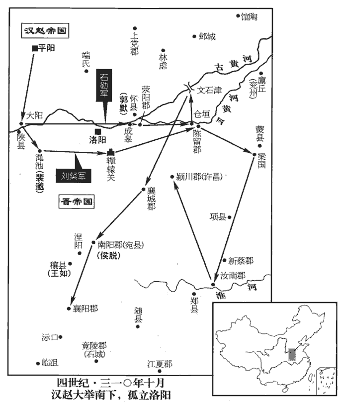
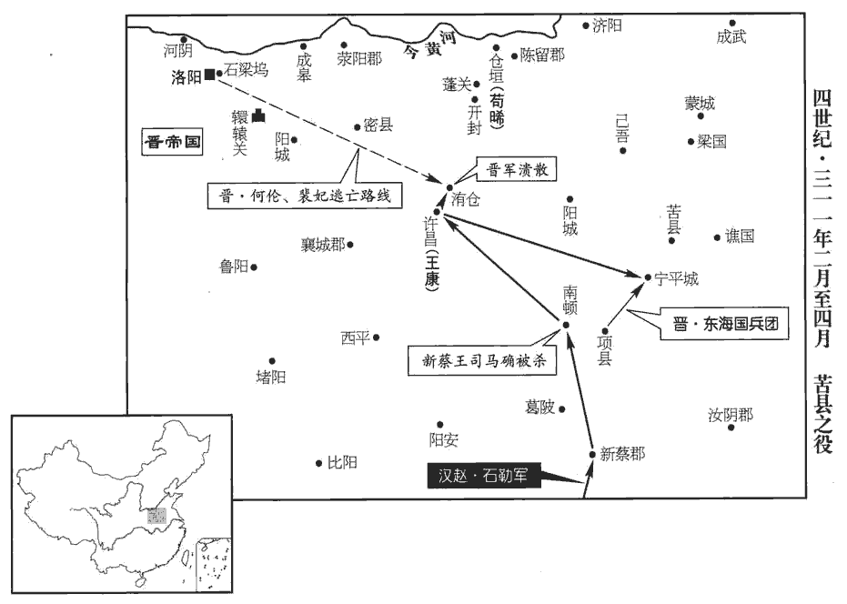
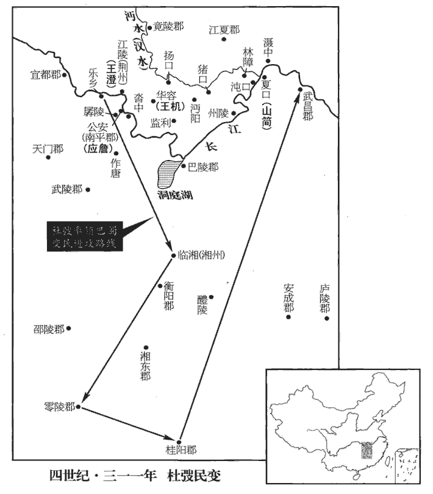
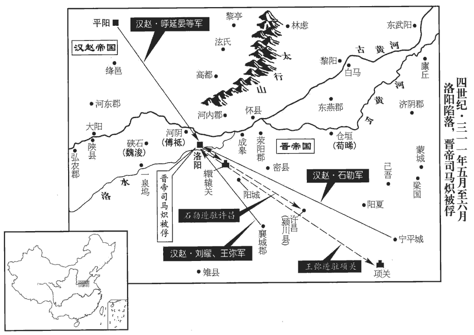
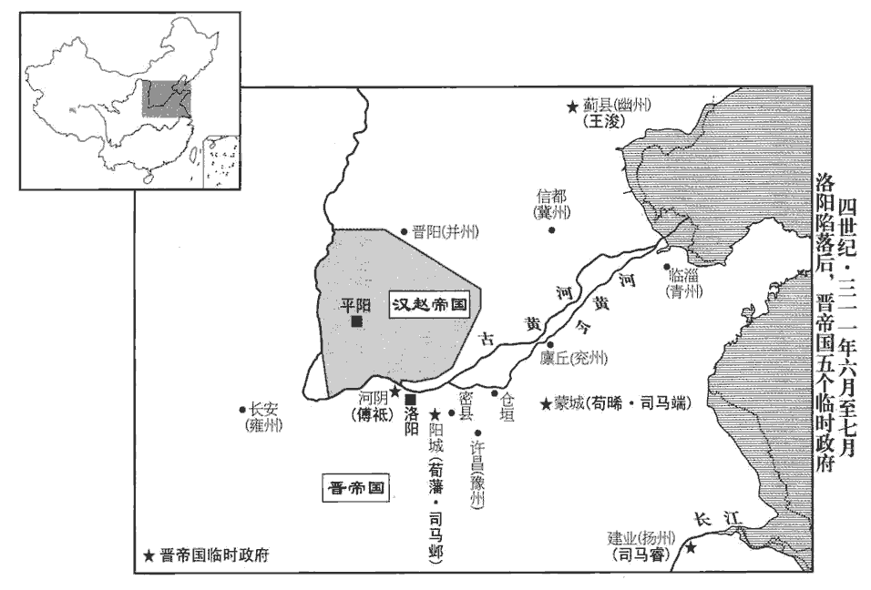
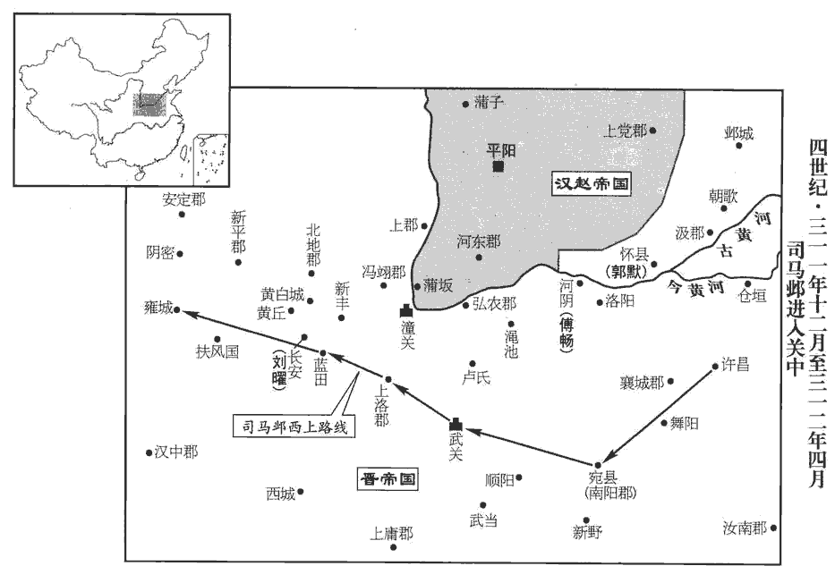

 晉紀九起屠維大荒落（己巳），盡重光協洽（辛未），凡三年。

# 孝懷皇帝中

## 永嘉三年（己巳，三零九）

1春，正月，辛丑朔‹一›，熒惑犯紫微。紫微，即紫宮也。漢‹都蒲子山西省隰县›太史令宣于脩之，考異曰：晉春秋作「鮮于脩之」。今從載記、十六國春秋。余按姓氏諸書，有鮮于而無宣于。言於漢主淵曰：「不出三年，必克洛陽。蒲子‹山西隰县›崎嶇，難以久安；崎，丘奇翻。嶇，丘于翻。平陽‹山西临汾›氣象方昌，請徙都之。」淵從之。大赦，改元河瑞。時汾水得玉璽，淵因改元河瑞。

〖译文〗 [1]春季，正月，辛丑朔（初一），火星犯紫微星座。汉太史令鲜于修之对汉主刘渊说：“不出三年，一定能攻克洛阳，蒲子地形崎岖，难以在这儿长久安居，平阳的天象正好昌盛，请把都城迁到那里。”刘渊采纳了这个建议。宣布大赦，改年号为河瑞。

2三月，戊申‹九›，高密孝王略薨。以尚書左僕射山簡為征南將軍、都督荊、湘、交、廣四州諸軍事，鎮襄陽‹湖北襄樊›。代略也。簡，濤之子也，嗜酒，不恤政事；表「順陽‹河南省淅川县东南›內史劉璠得眾心，恐百姓劫璠為主」。詔徵璠為越騎校尉。璠，扶元翻。南州由是遂亂，父老莫不追思劉弘。史言劉弘父子得江、漢間民心。

〖译文〗 [2]三月，戊申（初九），高密孝王司马略去世。任尚书左仆射山简为征南将军，都督荆州、湘州、交州、广州诸军事，镇守襄阳。山简是山涛的儿子，嗜好喝酒，不把军政事务放地心上。上奏表说：“顺阳内史刘很得人心，恐怕百姓要劫持刘作首领。”于是朝廷诏令任命刘为越骑校尉。南州地区因此而大乱，当地父老乡亲没有不追念刘的父亲刘弘的。

3丁巳‹十八›，太傅越自滎陽‹河南滎陽›入京師。越自去年徙屯滎陽。中書監王敦謂所親曰：「太傅專執威權，而選用表請，尚書猶以舊制裁之，今日之來，必有所誅。」

〖译文〗 [3]丁巳（十八日），太傅司马越从荥阳进入京城。中书监王敦对他所亲近的人说：“太傅独揽威势权力，但选拔任用官员仍上表请示，而尚书仍然按照过去的制度来裁定，因此太傅现在到京城，一定会杀掉一些官员。”

帝‹司马炽，本年二十六岁›之為太弟也，與中庶子繆播親善，及即位，以播為中書監，繆胤為太僕卿，太僕，九卿也；但晉官未有「卿」字，「卿」字衍。委以心膂；帝舅散騎常侍王延、尚書何綏、太史令高堂沖，并參機密。越疑朝臣貳於己，散，悉亶翻。騎奇寄翻。朝，直遙翻。劉輿、潘滔勸越悉誅播等。越乃誣播等欲為亂，乙丑‹二十六›，遣平東將軍王秉，帥甲士三千入宮，執播等十餘人於帝側，付廷尉，殺之。越因繆播兄弟以克河間，今又殺之，權勢之爭可畏哉！帥，讀曰率。帝歎息流涕而已。

〖译文〗 怀帝当太弟时，与中庶子缪播关系亲密要好，即皇帝位后，任缪播为中书监，任缪胤为太仆卿，把他们当作心腹。怀帝舅父散骑常侍王延和尚书何绥、太史令高堂冲一起参与朝廷的机密事务。司马越怀疑朝廷大臣对自己有异心，刘舆、潘滔也劝说司马越把缪播等人全杀了。司马越于是诬陷缪播等人图谋叛乱。乙丑（二十六日），派平东将军王秉，率领三千兵士进入皇宫，在怀帝身边逮捕缪播等十余人，交付廷尉，把他们杀了。怀帝只能叹息流泪而已。

綏，曾之孫也。初，何曾侍武帝宴，退，謂諸子曰：「主上開創大業，吾每宴見，見，賢遍翻。未嘗聞經國遠圖，惟說平生常事，非貽yí厥孫謀之道也；及身而已，後嗣其殆乎！嗣，祥吏翻。汝輩猶可以免；」指諸孫曰：「此屬必及於難。」難，乃旦翻。及綏死，兄嵩哭之曰：「我祖其殆聖乎！」曾日食萬錢，猶云無下箸處。著，遲據翻，梜jiā也。子劭，日食二萬。綏及弟機、羨，汰侈尤甚；與人書疏，詞禮簡傲。河內‹河南省沁阳市›王尼見綏書，謂人曰：「伯蔚居亂世而矜豪乃爾，其能免乎！」人曰：「伯蔚聞卿言，必相危害。」尼曰：「伯蔚比聞我言，自已死矣！」何綏，字伯蔚。比，必寐翻，及也。蔚，紆勿翻。及永嘉之末，何氏無遺種。種，章勇翻。

〖译文〗 何绥是何曾的孙子。当初，何曾曾在武帝司马炎的宴会上侍奉，离开宴会后，对儿子们说：“皇上开创伟大的基业，我每次在宴会上见他，从没有听到治理国家的长远打算，只是听他说平生的一些日常事情，这不是替子孙后代考虑的作法。他只考虑自己，他的后代继承人危险呀！你们还能够免祸。”指着孙子们又说：“他们一定会遭到国难。”何绥死后，哥哥何嵩哭着说：“我们的祖父几乎是圣人啊！”何曾生活奢侈，吃饭一天要耗费万钱，还说没有下筷子的地方。儿子何劭，一天吃掉二万钱。何绥和弟弟何机、何羡，更加奢侈，给人写信，用词非常傲慢。河内人王尼看到何绥写的信，对人说：“伯蔚身居乱世还这样自负傲慢，难道能免祸吗？”听的人说：“伯蔚听到你的话，一定会害你。”王尼说：“等伯蔚听到我的这些话时，他自己已经死了。”何绥字伯蔚。等到永嘉末年，何氏一家已经没有子孙留存在世了。

臣光曰：何曾議【章︰甲十行本「議」作「護」；乙十一行本同；孔本同。】武帝偷惰，取過目前，不為遠慮；知天下將亂，子孫必與其憂；與，讀曰預。何其明也！然身為僭侈，使子孫承流，卒以驕奢亡族，卒，子恤翻。其明安在哉！且身為宰相，知其君之過，不以告而私語於家，非忠臣也。

〖译文〗 臣司马光曰：何曾议论晋武帝苟且懒惰，只顾眼前利益，不为长远考虑，而预知天下将要发生变乱，子孙一定会卷入这忧虑当中，多么英明！但是自己超越本分奢侈无度，使子孙效仿继承这坏毛病，最后因为骄傲奢侈而亡族，这英明又在哪里呢？再说身为宰相，知道自己君主的过错，不忠告君主却在家私下议论，不是忠臣。

4太傅越以王敦為揚州刺史。為敦亂東晉張本。

〖译文〗 [4]太傅司马越任王敦为扬州刺史。

5劉寔連年請老，朝廷不許。尚書左丞劉坦上言：「古之養老，以不事為優，不事，謂不使任事也。不以吏之為重，謂宜聽寔所守。」丁卯‹二十八›，詔寔以侯就第。以王衍為太尉。

〖译文〗 [5]刘连年请求告老还乡，朝廷不同意。尚书左丞刘坦给朝廷上言：“古代养老，以不使任职为好，并不把任职视为看重他，所以说应当尊重刘自己的安排。”丁卯（二十八日），诏令刘以侯爵的身分回归府第。任王衍为太尉。

太傅越解兗州牧，領司徒，越以頃來興事，多由殿省，謂誅楊駿，廢賈后，誅趙王倫、齊王冏及討成都王穎，及羊后、太子覃屢廢屢立，皆殿中人為之。乃奏宿衛有侯爵者皆罷之。時殿中武官并封侯，由是出者略盡，皆泣涕而去。更使右衛將軍何倫、左衛將軍王秉領東海國兵數百人宿衛。自是帝左右皆越私人。

〖译文〗 太傅司马越辞去兖州牧的职务，而兼任司徒。司马越根据近年来朝廷发生变故、根由大多出在宫殿官署这一情况，于是上奏请将有侯爵身分的宫廷侍卫全都罢免。当时宫殿中的武官都封了侯，因此宫殿武官差不多都被解职。他们都流着泪离开了官殿。然后改为让右卫将军何伦、左卫将军王秉带领几百名属于司马越的东海国兵士担任皇宫禁卫。

6左積弩將軍朱誕奔漢，武帝泰始四年，罷振威、揚威護軍，置左右積弩將軍。具陳洛陽孤弱，勸漢主淵攻之。淵以誕為前鋒都督，以滅晉大將軍劉景為大都督，將兵攻黎陽‹河南浚县›，克之；又敗王堪於延津‹河南省卫辉市东古黄河渡口›，沈男女三萬餘人於河。敗，補邁翻。沈，持林翻。淵聞之，怒曰：「景何面復見朕！復，扶又翻。且天道豈能容之！吾所欲除者，司馬氏耳，細民何罪！」黜景為平虜將軍。劉淵之識略，非聰、曜所能及也。

〖译文〗 [6]左积弩将军朱诞奔汉，具体陈说洛阳城中势单力薄的情况，劝汉主刘渊趁机攻打洛阳。刘渊让朱诞任前锋都督，让灭晋大将军刘景任大都督，带兵攻克了黎阳。又在延津打败王堪，把三万多男女百姓沉入黄河。刘渊听说后，生气地说：“刘景有什么脸面再来见朕！再说上天之道难道能容忍这种残忍的行动？我所想要消灭的，只是司马氏家族罢了，普通百姓有什么罪？”把刘景降职为平虏将军。

7夏，大旱，江、漢、河、洛皆竭，可涉。川竭，亡國之徵。

〖译文〗 [7]夏季，大旱，长江、汉水、黄河、洛阳都枯竭了，可以徒步渡过去。

8漢安東大將軍石勒寇鉅鹿‹河北省宁晋县西南›、常山‹河北正定›，眾至十餘萬，集衣冠人物，別為君子營。石勒起於胡羯餓隸而能如此，此其所以能跨有中原也。以趙郡‹河北高邑›張賓為謀主，刁膺為股肱，夔安、孔萇、支雄、桃豹、逯lù明為爪牙。姓譜：夔子之後，以國為姓。後趙支雄傳云，其先，月支胡人也。桃，春秋魯邑，以邑為姓；一曰古高士左伯桃之後。逯，盧谷翻。并州‹山西中部›諸胡羯多從之。羯，居謁翻。

〖译文〗 [8]汉安东大将军石勒进犯钜鹿、常山，有十多万人。聚集了一些有身分的人士，另外编成君子营。以赵郡人张宾作主要谋士，刁膺作为辅佐，以夔安、孔苌、支雄、桃豹、逯明作为助手。并州的胡人、羯人大多都跟随石勒。

初，張賓好讀書，好，呼到翻。闊達有大志，常自比張子房。及石勒徇山東，賓謂所親曰：「吾歷觀諸將，無如此胡將軍者，勒，本胡也，故謂之胡將軍。可與共成大業！」乃提劍詣軍門，大呼請見，勒亦未之奇也。賓數以策干勒，呼，火故翻。數，所角翻。已而皆如所言；勒由是奇之，署為軍功曹，動靜咨之。

〖译文〗 当初，张宾喜欢读书，豁达而胸怀大志，常常把自己比作西汉张良。等到石勒攻取崤山以东地区，张宾对所亲近的人说：“我一一观察那些战将，没有比得上这位胡人将军的，可以和他一起成就大业！”于是提起剑到军营门前，大声呼喊请求接见，但石勒并没有认为他有超群之处。张宾多次向石勒献上计策，事情结束后全都与张宾预料的一样。石勒因此才感到他不同寻常，安排他为军功曹，一举一动都要去问他。

9漢主淵以王彌為侍中、都督青•徐•兗•豫•荊•揚六州諸軍事、征東大將軍、青州牧，與楚王聰共攻壺關‹山西长治北›，以石勒為前鋒都督。劉琨遣護軍黃肅、韓述救之，聰敗述於西澗‹山西长治西›，勒敗肅於封田‹山西长治北›，皆殺之。西澗、封田，皆當在壺關東南。敗，補邁翻。考異曰：石勒載記「肅」作「秀」，「封」作「白」。今從十六國春秋及劉琨集。

〖译文〗 [9]汉主刘渊以王弥担任侍中，都督青、徐、兖、豫、荆、扬六州诸军事，征东大将军，青州牧，与楚王刘聪一起进攻壶关，以石勒任前锋都督。刘琨派遣护军黄肃、韩述救援壶关，刘聪在西涧打败韩述，石勒在封田打败黄肃，把他们都杀了。

太傅越遣淮南‹安徽寿县›內史王曠、考異曰：十六國春秋作「王廣」，今從帝紀。將軍施融、曹超將兵拒聰等。曠濟河，欲長驅而前，融曰：「彼乘險間出，間，古莧翻。我雖有數萬之眾，猶是一軍獨受敵也。且當阻水為固以量形勢，量，音良。然後圖之。」曠怒曰：「君欲沮眾邪！」沮，在呂翻。融退曰：「彼善用兵，曠闇於事勢，吾屬今必死矣！」曠等於【章︰甲十一行本「於」作「踰」；乙十一行本同；孔本同；張校同；退齋校同。】太行行，戶剛翻。與聰遇，戰於長平‹山西高平›之間，曠兵大敗，融、超皆死。

〖译文〗 太傅司马越派遣淮南内史王旷、将军施融、曹超带兵抵御刘聪等人。王旷渡过黄河，相长驱直入，施融说：“他们凭借天险抄小路出击，我们即使有几万人马，仍然还是孤军单独受敌。应该暂且借河水当作屏障来观察形势变化，然后再图谋他们。”王旷发怒说：“您要败坏士气啊！”施融退出去说：“人家善于用兵，而王旷却不明白战事情势，我们这些人今天一定要死了！”王旷等人在太行与刘聪遭遇，在长平地区交战，王旷的军队惨败，施融、曹超都战死。

聰遂破屯留‹山西屯留›、長子‹山西长子›，屯，音純。凡斬獲萬九千級。上黨‹山西省黎城县西南›太守龐淳以壺關降漢。降，戶江翻。考異曰：十六國春秋作「劉惇」，劉琨傳作「襲醇」。今從帝紀。劉琨以都尉張倚領上黨太守，據襄垣‹山西襄垣›。襄垣縣，屬上黨郡。宋白曰：襄垣，趙襄子所築，因以為名。

〖译文〗 刘聪于是攻陷屯留、长子，一共斩获一万九千首级。上党太守庞淳交出壶关向汉投降。刘琨派都尉张倚兼任上党太守，占据襄垣。

初，匈奴劉猛死，見七十九卷武帝泰始八年。右賢王去卑之子誥升爰代領其眾。誥升爰卒，子虎立，居新興‹山西忻县›，號鐵弗氏，鐵弗氏之後為赫連勃勃。與白部鮮卑皆附於漢。考異曰：劉琨集作「百部」，今從後魏書、晉書。劉琨自將擊虎，將，即亮翻。考異曰：帝紀：「七月，劉聰及王彌圍壺關，琨使兵救之，為聰所敗。王廣等及聰戰，又敗。龐淳以郡降賊。」十六國春秋：「淵五月，遣聰攻壺關，敗韓述、黃肅。六月，晉遣王廣等來討。七月，戰於長平，晉師敗，劉惇以壺關降。」按劉琨集載六月癸巳，琨答太傅府書曰：「聰、彌入上黨、龐淳不能禦。」又曰：「安居失利，韓述授首，封田之敗，黃肅不還，浹辰之間，名將仍殄。」又曰：「即重遣江陶都尉張倚領上黨太守，疾據襄垣；續遣鷹揚將軍趙擬、梁余都尉李茂與倚併力，輕行夜襲。賊捐棄輜車，宵遁而退，追尋討截，獲三分之二。當聰、彌之未走，烏丸、劉虎構為變逆，西招白部，遣使致任，稱臣於淵，殘州困弱，內外受敵，輒背聰而討虎，自四月八日攻圍。」然則琨討虎以上事，皆在四月以前也。蓋晉、漢二史，皆據奏報，事畢而言之；今依琨集為定。劉聰遣兵襲晉陽‹山西太原›，不克。

〖译文〗 当初，匈奴人刘猛死去，右贤王去卑的儿子诰升爰代替他率领部众。诰升爰去世，他的儿子刘虎立为首领，居住新兴，号称铁弗氏，与白部鲜卑都归附于汉。刘琨自己带兵攻打刘虎，刘聪派兵袭击晋阳，没有攻克。

10五月，漢主淵封子裕為齊王，隆為魯王。

〖译文〗 [10]五月，汉主刘渊把儿子刘裕封为齐王，刘隆封为鲁王。

11秋，八月，漢主淵命楚王聰等進攻洛陽；詔平北將軍曹武等拒之，皆為聰所敗。敗，補邁翻。聰長驅至宜陽‹河南省宜阳县西›，自恃驟勝，怠不設備。九月，弘農‹河南灵宝东北›太守垣延詐降，垣，姓；延，名。降，戶江翻。夜襲聰軍，聰大敗而還。

〖译文〗 [11]秋季，八月，汉主刘渊命令楚王刘聪等人进兵攻打洛阳。朝廷诏令平北将军曹武等人抵御刘聪，都被刘聪打败。刘聪长驱直入到达宜阳，自己倚仗着已经多次取胜，懈怠而不进行防备。九月，弘农太守垣延假装投降，夜间突袭刘聪的军队，刘聪大败而归。

王浚遣祁弘與鮮卑段務勿塵擊石勒于飛龍山‹河北元氏西北›，隋地理志，恆山郡石邑縣有飛龍山。括地志：封龍山，一名飛龍山，在恆山鹿泉縣南四十五里。大破之，勒退屯黎陽‹河南浚县›。

〖译文〗 王浚派遣祁弘与鲜卑人段务勿尘在飞龙山攻打石勒，石勒大败，撤退到黎阳驻扎。

12冬，十月，漢主淵復遣楚王聰、王彌、始安王曜、汝陰王景帥精騎五萬寇洛陽，復，扶又翻。帥，讀曰率。騎，奇寄翻。大司空鴈門‹山西代县›剛穆公呼延翼帥步卒繼之。北狄傳，匈奴四姓，有呼延氏、卜氏、蘭氏、喬氏，而呼延氏最貴。丙辰‹二十一›，聰等至宜陽‹河南宜阳›。朝廷以漢兵新敗，不意其復至，大懼。辛酉‹二十六›，聰屯西明門。西明門，洛城西面南頭第二門也。北宮純等夜帥勇士千餘人出攻漢壁，斬其征虜將軍呼延顥。壬戌‹二十七›，聰南屯洛水。洛水，過洛城南。乙丑‹一›，呼延翼為其下所殺，其眾自大陽‹山西平陆›潰歸。淵敕聰等還師；聰表稱晉兵微弱，不可以翼、顥死故還師，固請留攻洛陽，淵許之。太傅越嬰城自守。戊寅‹十四›，聰親祈嵩山，嵩山，在河南陽城縣。留平晉將軍安陽哀王厲、冠軍將軍呼延朗督攝留軍；冠，古玩翻。太傅參軍孫詢說越乘虛出擊朗，斬之，說，輸芮翻。厲赴水死。王彌謂聰曰：「今軍既失利，洛陽守備猶固，運車在陝‹河南三门峡市›，糧食不支數日。聰自宜陽而東，又南進，屯于洛水，既為晉所敗，運車在陝，糧道隔絕。陝，失冉翻。殿下不如與龍驤還平陽，淵以族子曜為龍驤大將軍。驤，思將翻。裹糧發卒，更為後舉；下官亦收兵穀，待命於兗、豫，不亦可乎！」聰自以請留，未敢還。宣于脩之言於淵曰：「歲在辛未，乃得洛陽。今晉氣猶盛，大軍不歸，必敗。」淵乃召聰等還。

〖译文〗 [12]冬季，十月，汉主刘渊再次派遣楚王刘聪、王弥、始安王刘曜、汝阴王刘景率领五万精锐骑兵进犯洛阳，大司空雁门刚穆公呼延翼带领步兵作为后续军队。丙辰（二十一日），刘聪等人到达宜阳。朝廷因为汉军刚刚失败，没有料到他们这么快又来了，大为恐慌。辛酉（二十六日），刘聪屯兵西明门。北宫纯等人带领一千多勇士趁黑夜突袭汉军营垒，杀了他们的征虏将军呼延颢。壬戌（二十七日），刘聪向南到洛水驻扎。乙丑（疑误），呼延翼被自己的部下杀死，部众从大阳溃散逃回。刘渊下令让刘聪等人撤兵回来。刘聪上奏表说，晋朝军队微弱，不能因为呼延翼、呼延颢死了而撤兵，坚持要留下来进攻洛阳，刘渊同意了。太傅司马越加强环城防守。戊寅（疑误），刘聪自己到嵩山祈祷，留下平晋将军安阳哀王刘厉、冠军将军呼延朗代理指挥留守的军队。太傅参军孙询劝司马越乘虚出兵袭击呼延朗，杀死了呼延朗。刘厉跳入洛水而死。王弥对刘聪说：“现在军队既然失利，洛阳的防守还很坚固，而我们的运粮车还在陕地，粮食支持不了几天，殿下不如与龙骧大将军刘曜退还平阳，筹备粮食发给兵士，再进行下一步行动。我也收兵筹谷，在兖、豫地区待命，不也是可以的吗？”刘聪因为是自己请求留下，没有敢撤兵。宣于之对刘渊说：“到了辛未年，才能得到洛阳，现在晋朝气运还旺盛，大军不撤回来，一定失败。”刘渊于是召刘聪等人回来。

13天水‹甘肃甘谷›人訇琦等訇hōng，呼宏翻。殺成太尉李離、尚書令閻式，以梓潼‹四川梓潼›降羅尚；降，戶江翻。成主雄‹李雄，本年三十六岁›遣太傅驤、司徒雲、司空璜攻之，不克，雲、璜戰死。

〖译文〗 [13]天水人訇琦等人杀了成汉的太尉李离和尚书令阎式，献出梓潼向罗尚投降，成汉主李雄派太傅李骧、司徒李云、司空李璜攻打梓潼，没有成功，李云、李璜战死。

初，譙周有子居巴西‹四川阆中›，成巴西太守馬脫殺之，其子登詣劉弘請兵以復讎。弘表登為梓潼內史，使自募巴、蜀流民，得二千人；西上，上，時掌翻。至巴郡‹重庆›，從羅尚求益兵，不得。登進攻宕渠‹四川省渠县东北三汇镇›，宕渠縣，漢屬巴郡，自蜀以來，屬巴西郡。賢曰：宕渠故城，在今渠州流江縣東北。宕，徒浪翻。斬馬脫，食其肝。會梓潼降，登進據涪城‹四川绵阳›；涪，音浮。雄自攻之，為登所敗。敗，補邁翻。

〖译文〗 当初，谯周有个儿子在巴西地区居住，成汉的巴西太守马脱把他杀了，他的儿子谯登到刘弘那儿请求军队报仇。刘弘表奏谯登为梓潼内史，让他自己招募巴、蜀地区的流民，招到二千人。向西到巴郡，向罗尚请求增加些兵力，但没有得到。谯登进攻宕渠，杀了马脱，吃掉马脱的肝。正遇到梓潼投降，谯登占据涪城，李雄亲自攻打谯登，结果被谯登打败。

14十一月，甲申‹二十›，漢楚王聰、始安王曜歸于平陽‹山西临汾›。王彌南出轘轅‹河南偃师东南›，轘，音環。流民之在潁川‹河南省许昌市东›、襄城‹河南襄城›、汝南‹河南省息县›、南陽‹河南南陽›、河南‹洛阳›者數萬家，襄陽縣，漢屬潁川郡，武帝泰始二年分立襄城郡。素為居民所苦，皆燒城邑，殺二千石、長吏以應彌。長，知兩翻。

〖译文〗 [14]十一月，甲申（二十日），汉楚王刘聪、始安王刘曜回到平阳。王弥向南出兵辕，在颍川、襄城、汝南、南阳、河南的流民有几万家，一直被当地居民欺负，所以放火烧城焚邑，杀掉郡守、长史等官员，响应王弥。

15石勒寇信都‹河北冀县›，信都縣，漢屬信都國，後漢屬安平國，晉同。殺冀州刺史王斌。斌，音彬。王浚自領冀州。詔車騎將軍王堪、北中郎將裴憲將兵討勒，勒引兵還，拒之；魏郡太守劉矩以郡降勒。降，戶江翻。勒至黎陽‹河南浚县›，裴憲棄軍奔淮南‹安徽省寿县›，王堪退保倉垣‹河南开封东北›。倉垣城，在陳留浚儀縣。水經：汴水出浚儀縣北，東逕倉垣城南，即大梁縣之倉垣亭也，城臨汴水。

〖译文〗 [15]石勒进犯信都，杀了冀州刺史王斌。王浚自己兼任冀州刺史。朝廷诏令车骑将军王堪、北中郎将裴宪率兵讨伐石勒，石勒带兵回来，抵御王堪等人。魏郡太守刘矩献出本郡投降石勒。石勒到达黎阳，裴宪丢下军队自己逃奔淮南，王堪退守仓垣。

16十二月，漢主淵以陳留王歡樂為太傅，樂，音洛。楚王聰為大司徒，江都王延年為大司空。遣都護大將軍曲陽王賢與征北大將軍劉靈、安北將軍趙固、平北將軍王桑，東屯內黃‹河南内黄›。內黃縣，屬魏郡。應劭曰：陳留有外黃，故加「內」云。王彌表左長史曹嶷yí行安東將軍，東徇青州，且迎其家；淵許之。嶷，魚力翻。為曹嶷據青州張本。王彌家在東萊。

〖译文〗 [16]十二月，汉主刘渊以陈留王刘欢乐任太傅，楚王刘聪任大司徒，江都王刘延年任大司空。派遣都护大将军曲阳王刘贤与征北大将军刘灵、安北将军赵固、平北将军王桑，在东边的内黄县驻扎。王弥表奏左长史曹嶷任安东将军，向东攻略青州，顺便接他的家眷，刘渊同意了这个安排。

17初，東夷校尉勃海‹河北南皮›李臻，與王浚約共輔晉室，浚內有異志，臻恨之。和演之死也，見八十五卷惠帝永興元年。別駕昌黎‹辽宁义县›王誕亡歸李臻，說臻舉兵討浚。臻遣其子成將兵擊浚。考異曰：燕書王誕傳，「成」作「咸」，今從李洪傳。說，輸芮翻。遼東‹辽宁辽阳›太守龐本，素與臻有隙，乘虛襲殺臻，遣人殺成於無慮‹辽宁北宁›。無慮縣，前漢屬遼東，後漢屬遼東屬國，晉省。應劭曰：慮，音閭，周禮所謂「其山醫巫閭」是也。誕亡歸慕容廆。詔以勃海‹河北南皮›封釋代臻為東夷校尉，龐本復謀殺之；廆，乎罪翻。復，扶又翻。釋子悛quān勸釋伏兵請本，收斬之，悉誅其家。悛，七倫翻，又且緣翻。

〖译文〗 [17]当初，东夷校尉勃海人李臻，与王浚相约共同辅佐晋皇室，王浚有另外的想法，李臻于是怨恨王浚。和演死后，别驾昌黎人王诞逃亡归附李臻，劝说李臻出兵讨伐王浚。李臻就派他儿子李成带兵攻打王浚。辽东太守庞本，一直与李臻有怨恨，乘虚袭击杀了李臻，又派人在无虑杀了李成。王诞又逃跑投奔慕容。朝廷诏令以勃海人封释代替李臻任东夷校尉，庞本又图谋杀他，封释的儿子封悛劝封释设伏兵邀请庞本，把庞本抓住并杀了，之后又杀了他的全家。

## 四年（庚午，三一零）

1春，正月，乙丑朔‹一›，大赦。

〖译文〗 [1]春季，正月，乙丑朔（初一），宣布大赦。

2漢‹都平阳山西省临汾市›主淵立單徵女為皇后，單徵，氐酋也，歸漢見上卷二年。單，音善。梁王和為皇太子，大赦；封子义為北海王；以長樂王洋為大司馬。樂，音洛。

〖译文〗 [2]汉主刘渊立单徵的女儿为皇后，梁王刘和为太子，宣布大赦。封儿子刘义为北海王，以长乐王刘洋任大司马。

3漢鎮東大將軍石勒濟河，拔白馬‹河南滑县东›，王彌以三萬眾會之，共寇徐、豫、兗州。二月，勒襲鄄城‹山东鄄城北›，鄄，音絹。殺兗州刺史袁孚，遂拔倉垣‹河南开封东北›，殺王堪。復北濟河，攻冀州諸郡，復，扶又翻。民從之者九萬餘口。

〖译文〗 [3]汉镇东大将军石勒渡过黄河，攻克白马，王弥带领三万人与石勒会师一同进犯徐州、豫州、兖州。二月，石勒袭击鄄城，杀兖州刺史袁孚，又攻克仓垣，杀王堪。又北渡黄河，攻打冀州各郡，九万多百姓附从石勒。

4成‹都成都四川省成都市›太尉李國鎮巴西‹四川阆中›，帳下文石殺國，以巴西降羅尚。降，戶江翻。

〖译文〗 [4]成汉太尉李国镇守巴西，部下文石杀死李国，献出巴西投降罗尚。

5太傅越徵建威將軍吳興‹浙江湖州›錢璯kuài吳分吳郡、丹陽置吳興郡，以自烏程興故也。璯，黃外翻。及揚州刺史王敦。璯謀殺敦以反，敦奔建業，告琅邪王睿。璯遂反，進寇陽羨‹江苏宜兴›，陽羨縣，前漢屬會稽郡，後漢屬吳郡，自吳以來，分屬吳興郡。賢曰：陽羨故城，在今常州義興縣南。睿遣將軍郭逸等討之；周玘糾合鄉里，與逸等共討璯，斬之。玘三定江南，惠帝永興元年討石冰，永嘉元年討陳敏，今又誅璯，是三定江南。睿以玘為吳興‹浙江湖州›太守，於其鄉里置義興郡‹府设阳羡，江苏宜兴›，以旌之。時分吳興之陽羨及長城縣之西鄉、丹陽之永世為義興郡。

〖译文〗 [5]太傅司马越征召建威将军吴兴人钱和扬州刺史王敦。钱图谋杀死王敦后叛乱，王敦逃往建业，报告琅邪王司马睿。钱叛乱，进犯阳羡，司马睿派遣将军郭逸等人讨伐他。周组织联合乡里百姓，与郭逸等人一起讨伐钱，把他杀了。周三次平定江南，司马睿以周任吴兴太守，并在他家乡设置义兴郡以表彰周。

6曹嶷自大梁‹河南开封›引兵而東，所至皆下，遂克東平‹山东东平西北›，進攻琅邪‹山东临沂市›。

〖译文〗 [6]曹嶷从大梁带兵向东进攻，所向披靡，于是攻克东平，进兵攻打琅邪。

7夏，四月，王浚將祁弘敗漢冀州刺史劉靈於廣宗‹河北威县东›，殺之。將，即亮翻，下同。廣宗縣，漢屬鉅鹿郡，晉屬安平國。敗，補邁翻。

〖译文〗 [7]夏季，四月，王浚部将祁弘在广宗打败汉冀州刺史刘灵，杀死刘灵。

8成主雄‹李雄，本年三十七岁›謂其將張寶曰：「汝能得梓潼‹四川梓潼›，吾以李離之官賞汝。」寶乃先殺人而亡奔梓潼，訇琦等信之，委以心腹。會羅尚遣使至梓潼，使，疏吏翻。琦等出送【嚴︰「送」改「迎」。】之；寶從後閉門，琦等奔巴西‹四川阆中›。雄以寶為太尉。

〖译文〗 [8]成汉主李雄告诉他的部将张宝说：“你能攻下梓潼，我把李离的官职赏给你。”张宝于是杀人后逃亡投奔梓潼，訇琦等人都信任他，把他当作心腹。正遇到罗尚派使者到梓潼，訇琦等人出城送使者，张宝则在后边关团了城门，訇琦等人只好投奔巴西。李雄让张宝担任太尉。

9幽、并、司、冀、秦、雍六州大蝗，食草木、牛馬毛皆盡。雍，於用翻。

〖译文〗 [9]幽、并、司、冀、秦、雍等六州遭到严重蝗灾，蝗虫把草木、牛马的毛都啃食光了。

10秋，七月，漢楚王聰、始安王曜、石勒及安北大將軍趙國【嚴︰「國」改「固」。】圍河內‹河南省沁阳市›太守裴整于懷‹河南武陟›，詔征虜將軍宋抽救懷。勒與平北大將軍王桑逆擊抽，殺之；河內人執整以降，降，戶江翻。漢主淵以整為尚書左丞。河內督將郭默收整餘眾，自為塢主，城之小者曰塢。天下兵爭，聚眾築塢以自守；未有朝命，故自為塢主。將，即亮翻。劉琨以默為河內太守。

〖译文〗 [10]秋季，七月，汉楚王刘聪、始安王刘曜、石勒和安北大将军赵国，在怀县围攻河内太守裴整，朝廷诏令征虏将军宋抽救援怀县。石勒与平北大将军王桑阻击并杀死宋抽。河内人抓住裴整投降，汉主刘渊让裴整担任尚书左丞。河内郡督将郭默收拾裴整的残余部众，自己担任小城堡主，刘琨任郭默为河内太守。

11羅尚卒於巴郡‹重庆›，‹司马炽，本年三十七岁›詔以長沙太守下邳‹江苏睢宁北古邳镇›皮素代之。姓譜：皮姓，樊仲皮之後。

〖译文〗 [11]罗尚在巴郡去世，朝廷诏令以长沙太守下邳人皮素代替他的职务。

12庚午‹九›，漢主淵寢疾；辛未‹十›，以陳留王歡樂為太宰，長樂王洋為太傅，樂，音洛。江都王延年為太保，楚王聰為大司馬、大單于，并錄尚書事。置單于臺於平陽‹山西临汾›西。單，音蟬。以齊王裕為大司徒，魯王隆為尚書令，北海王义為撫軍大將軍、領司隸校尉，始安王曜為征討大都督、領單于左輔，廷尉喬智明為冠軍大將軍、領單于右輔，光祿大夫劉殷為左僕射，王育為右僕射，任顗yǐ為吏部尚書，任，音壬。顗，魚豈翻。朱紀為中書監，護軍馬景領左衛將軍，永安王安國領右衛將軍，安昌王盛、安邑王欽、西陽王璿xuán皆領武衛將軍，分典禁兵。璿，旬緣翻。初，盛少時，不好讀書，少，詩照翻。好，呼到翻。唯讀孝經、論語，曰：「誦此能行，足矣，安用多誦而不行乎！」李熹見之，歎曰：「望之如可易，易，弋豉翻，慢易也。及至，肅如嚴君，可謂君子矣！」淵以其忠篤，故臨終委以要任。丁丑‹十六›，淵召太宰歡樂等入禁中，受遺詔輔政。己卯‹十八›，淵卒；考異曰：十六國春秋：「八月丁丑，淵召太宰歡樂等受遺詔，己卯卒，辛未葬。」按長曆，七月壬戌朔，十六日丁丑，十八日己卯，八月辛卯朔，無丁丑己卯及辛未。辛未乃九月十一日。蓋淵以七月卒，九月葬。十六國春秋誤也。太子和即位。和，字玄泰，淵之嫡子。

〖译文〗 [12]庚午（初九），汉主刘渊卧病不起，辛未（初十），以陈留王刘欢乐任太宰，长乐王刘洋为太傅，江都王刘延年为太保，楚王刘聪为大司马、大单于，都兼任录尚书事。在平阳西侧设置单于台。以齐王刘裕任大司徒，鲁王刘隆为尚书令，北海王刘为抚军大将军兼司隶校尉，始安王刘曜为征讨大都督兼单于左辅，廷尉乔智明为冠军大将军兼单于右辅，光禄大夫刘殷为左仆射，王育为右仆射，任为吏部尚书，朱纪为中书监，护军马景兼左卫将军。永安王刘安国兼右卫将军，安昌王刘盛、安邑王刘钦、西阳王刘都兼任武卫将军，分别统领禁兵。当初，刘盛年幼时，不喜欢读书，只读《孝经》、《论语》，说：“读这两本书能够照着去作，就足够了，哪里还用多读而不去作呢？”李熹见到他，感叹说：“远远望他好像可以轻慢他，等到了跟前，严肃如同威严的君主，可以称得上是君子了。”刘渊因为他忠诚执著，所以临终时交给他重要的职务。丁丑（十六日），刘渊宣召太宰刘欢乐等人到皇宫里，接受遗诏辅佐朝政。己卯（十八日），刘渊去世。太子刘和继承皇位。

和性猜忌無恩。宗正呼延攸，翼之子也，淵以其無才行，終身不遷官；侍中劉乘，素惡楚王聰，衛尉西昌王銳，恥不預顧命；乃相與謀，說和曰：「先帝不惟輕重之勢，使三王總強兵於內，惟，思也。三王，謂安昌王盛，安邑王欽，西陽王璿也；或曰：三王，謂齊王裕，魯王隆，北海王义。行，下孟翻。惡，烏路翻。說，輸芮翻。大司馬擁十萬眾屯於近郊，謂聰屯平陽西也。陛下便為寄坐耳。言大權非己出，託位於臣民之上，勢同寄寓也。坐，徂臥翻。宜早為之計。」和，攸之甥也，深信之。辛巳‹二十›夜，召安昌王盛、安邑王欽等告之。盛曰：「先帝梓宮在殯，四王未有逆節，聰，淵之第四子，故曰四王。或曰：謂聰、裕、隆、义也。一旦自相魚肉，天下謂陛下何！且大業甫爾，陛下勿信讒夫之言以疑兄弟；兄弟尚不可信，他人誰足信哉！」攸、銳怒之曰：「今日之議，理無有二，領軍是何言乎！」命左右刃之。盛既死，欽懼曰：「惟陛下命。」壬午‹二十一›，銳帥馬景攻楚王聰於單于臺‹山西临汾西›，單，音蟬。攸帥永安王安國攻齊王裕于司徒府，乘帥安邑王欽攻魯王隆，使尚書田密、武衛將軍劉璿xuán攻北海王义。密、璿挾义斬關歸于聰，聰命貫甲以待之。貫甲，擐huàn甲也。帥，讀曰率。銳知聰有備，馳還，與攸、乘共攻隆、裕。攸、乘疑安國、欽有異志，殺之；是日，斬裕，癸未‹二十二›，斬隆。甲申‹二十三›，聰攻西明門，克之；劉淵都平陽‹山西临汾›，諸城門皆用洛陽諸城門名。銳等走入南宮，前鋒隨之。乙酉‹二十四›，殺和於光極西室，劉淵起光極殿於平陽。收銳、攸、乘，梟首通衢。梟，堅堯翻。

〖译文〗 刘和性格多疑没有恩德。宗正呼延攸是呼延翼的儿子，刘渊因为他没有才能和德行，终身没有给他升官。侍中刘乘，一直怨恨楚王刘聪。卫尉西昌王刘锐，对没有受到刘渊临终任命也感到羞耻。这几个人于是一起密谋，对刘和说：“先帝不考虑轻重的情势，使三王在皇城里统领强兵，大司马刘聪拥兵十万在近郊驻扎，这样陛下不过是在他人那里寄寓的皇帝罢了。应当尽早考虑对付这种情势。”刘和是呼延攸的外甥，所以对他深信不疑。辛巳（二十日）夜，宣召安昌王刘盛，安邑王刘钦通告他们。刘盛说：“先帝的棺椁还没有安葬，四王刘聪也没有变节，一旦自相残杀，天下会怎么说陛下？再说大业还没有成功，陛下不要听信挑拨离间的小人的谗言来疑忌兄弟，兄弟尚且都不能相信，那别人谁还值得相信呢？”呼延攸、刘锐对他发怒道：“今天商议，没有别的道理可讲，领军你这是什么话！”便命令左右随从把刘盛杀了。刘盛死后，刘钦害怕地说：“只听从陛下的旨意。”壬午（二十一日），刘锐带领马景在单于台攻打楚王刘聪，呼延攸带领永安王刘安国到司徒府攻打齐王刘裕，刘乘带领安邑王刘钦攻打鲁王刘隆，派尚书田密、武卫将军刘攻打北海王刘。田密、刘带着刘冲过关卡归附刘聪，刘聪命令穿上铠甲等待刘锐。刘锐得知刘聪已有防备，迅速回师，与呼延攸、刘乘一起攻打刘隆、刘裕，呼延攸、刘乘怀疑刘安国、刘钦有异心，就杀了他们。当天，杀了刘裕，癸未（二十二日），杀了刘隆。甲申（二十三日），刘聪攻克西明门。刘锐等逃进南宫，前锋跟随着他。乙酉（二十四日），刘聪在光极殿西室杀了刘和，抓住刘锐、呼延攸、刘乘，在交通要道上斩首并悬挂起来。

群臣請聰即帝位；聰以北海王义，單后之子也，以位讓之。考異曰：載記作「乂」。按十六國春秋作「义」，今從之。义涕泣固請，聰久而許之，曰：「义及群公正以禍難尚殷，貪孤年長故耳。難，乃旦翻。長，知兩翻。此家國之事，孤何敢辭！俟义年長，當以大業歸之。」遂即位。聰，字玄明，淵第四子。大赦，改元光興。尊單氏曰皇太后，其母張氏曰帝太后。以义為皇太弟、領大單于、大司徒。立其妻呼延氏為皇后。呼延氏，淵后之從父妹也。從，才用翻。封其子粲為河內王，易為河間王，翼為彭城王，悝為高平王；悝kuī，苦回翻。仍以粲為撫軍大將軍、都督中外諸軍事。以石勒為并州刺史，封汲郡公。

〖译文〗 大臣们请刘聪登上皇位，刘聪因为北海王刘是单太后的太子，就把皇位让给刘。刘流着泪坚持请刘聪即位，刘聪好久后才同意了，说：“刘和诸公正是因为祸乱困扰还多，看重我年纪大几岁罢了。这是国家的事业。我怎么敢推辞！等刘长大，我将把大业交还于他。”于是即位。宣布大赦，改年号为光兴。尊奉单氏为皇太后，尊奉刘聪的母亲张氏为帝太后。以刘为皇太弟，兼大单于、大司徒。立自己的妻子呼延氏为皇后。呼延氏是刘渊皇后的堂妹。封儿子刘粲为河内王，刘易为河间王，刘翼为彭城王，刘悝为高平王。仍以粲任抚军大将军、都督中外诸军事。以石勒任并州刺史，封汲郡公。

13略陽‹甘肃省天水县东›臨渭‹略阳郡政府›氐酋蒲洪，驍勇多權略，群氐畏服之。晉志，略陽郡有臨渭縣，蓋魏所置也。載記曰：氐之先，蓋有扈氏之苗裔，世為西戎酋長。洪家池中生蒲，長五丈五，節如竹形，時咸謂之「蒲家」，因以為氏。其後，洪以讖文有「草付應王」，又其孫堅背文有「艸付」字，遂改姓苻氏。漢主聰遣使拜洪平遠將軍，洪不受，自稱護氐校尉、秦州刺史、略陽公。蒲洪事始此。

〖译文〗 [13]略阳郡临渭县氐人酋长蒲洪，骁勇而善于权变谋略，氐人都敬畏而服从他。汉主刘聪派使者任命蒲洪为平远将军，蒲洪不接受，而自称护氐校尉、秦州刺史、略阳公。

14九月，辛未‹十一›，葬漢主淵于永光陵‹山西省洪洞县东南›，諡曰光文皇帝，廟號高祖。

〖译文〗 [14]九月，辛未（十一日），在永光陵安葬汉主刘渊，谥号为光文皇帝，庙号为高祖。

15雍州流民多在南陽‹河南南陽›，詔書遣還鄉里。流民以關中荒殘，皆不願歸；征南將軍山簡、南中郎將杜蕤各遣兵送之，促期令發。京兆‹西安›王如遂潛結壯士，夜襲二軍，破之。二軍，山簡及杜蕤所遣之軍也。於是馮翊‹陕西大荔›嚴嶷、嶷，魚力翻。京兆侯脫各聚眾攻城鎮，殺令長以應之，長，知兩翻。未幾，眾至四五萬，幾，居豈翻。自號大將軍、領司•雍二州牧，雍，於用翻。稱藩于漢。

〖译文〗 [15]雍州流民大多在南阳谋生，朝廷下诏书要把流民遣返回故乡。流民们因为关中地区荒芜残败，都不愿意回乡。征南将军山简、南中郎将杜蕤分别派兵遣送，催促他们限期出发。京兆人王如于是暗地联系精壮勇士，趁夜袭击山简、杜蕤二军，打败了他们。于是冯翊人严嶷、京兆人侯脱分别聚众攻打城镇，杀死县令等官员来响应王如，没有多久，聚众达四五万人，王如自己号称大将军，兼司、雍二州牧，自称藩属于汉。

16冬，十月，漢河內王粲、始安王曜及王彌帥眾四萬寇洛陽，石勒帥騎二萬會粲于大陽‹山西平陆›，敗監軍裴邈于澠池‹河南省洛宁县西北›，帥，讀曰率。敗，補邁翻；下同。澠，彌兗翻。遂長驅入洛川‹洛水流域，河南黄河以南›。粲出轘轅‹河南偃师东南›，掠梁‹河南商丘›、陳‹河南开封东›、汝‹河南息县›、潁‹河南许昌市东›間。轘，音還。勒出成皋關‹河南省荥阳县西北汜水镇›，晉志，河南成皋縣有關。壬寅‹十三›，圍陳留太守王讚於倉垣‹河南开封东北›，為讚所敗，退屯文石津‹河南省滑县西南古黄河渡口›。據帝紀，文石津在河北，又據永嘉六年，勒自葛陂北行，至東燕，使孔萇自文石津潛渡枋頭，取向水船，則文石津在東燕之東北，枋頭之東南。

〖译文〗 [16]冬季，十月，汉河内王刘粲、始安王刘曜以及王弥率领四万人进犯洛阳，石勒率领二万骑兵在大阳与刘粲会合，在渑池打败监军裴邈，于是长驱直入进入洛川。刘粲从辕出兵，在梁、陈、汝、颍等地区攻掠。石勒从成皋关出兵，壬寅（十三日），在仓垣包围陈留太守王赞，被王赞打败，退到文石津驻扎。

 

17劉琨自將討劉虎及白部，白部，鮮卑也。琨以劉虎及白部皆附漢，故討之。遣使卑辭厚禮說鮮卑拓拔猗盧‹王庭设盛乐内蒙古和林格尔县›以請兵。說，輸芮翻。猗盧使其弟弗之子鬱律帥騎二萬助之，遂破劉虎、白部，屠其營。琨與猗盧結為兄弟，表猗盧為大單于，以代郡封之為代公。時代郡‹河北蔚县›屬幽州，王浚不許，遣兵擊猗盧，猗盧拒破之。浚由是與琨有隙。

〖译文〗 [17]刘琨亲自率兵讨伐刘虎及白部鲜卑，派使者携带丰厚的礼物用谦卑的言辞劝说鲜卑拓跋猗卢派兵。拓跋猗卢派他弟弟拓跋弗的儿子拓跋郁律率领二万骑兵援助刘琨，于是攻破刘虎、白部鲜卑的营垒，在营垒中大肆屠杀。刘琨与拓跋猗卢结拜为兄弟，表奏拓跋猗卢为大单于，把代郡封给他并封为代公。当时代郡属于幽州，王浚不同意，派兵打拓跋猗卢，拓跋猗卢抵御并打败王浚的军队，王浚因此对刘琨产生怨恨。

猗盧以封邑去國懸遠，民不相接，乃帥部落萬餘家自雲中‹内蒙托克托›入鴈門‹山西代县›，從琨求陘北‹句注山陉岭›以北之地。陘北，石陘關之北也。陘，音刑。琨不能制，且欲倚之為援，乃徙樓煩‹山西宁武›、馬邑‹山西朔州›、陰館‹山西朔州东南›、繁畤‹山西浑源西南›、崞guō‹山西浑源›五縣民於陘南，樓煩，匈奴之所居，其地在北河之南；今嵐州樓煩郡，非古樓煩也。漢馬邑縣，唐之大同軍是其地。漢陰館縣在句注西北。繁畤縣，在武州川。崞guō縣，為北齊北顯州平寇縣。今五縣雖存，皆非古縣地矣。陘，謂陘嶺。陘，音刑。以其地與猗盧；考異曰：懷帝紀：「永嘉五年，十一月，猗盧寇太原，劉琨徙五縣居之。六年，八月，辛亥，劉琨乞師于猗盧，表盧為代公。」宋書索虜傳在永嘉三年。晉春秋在永嘉四年，且云：「猗盧率萬餘家避難，自雲中入鴈門。」後魏序紀在穆帝三年，即永嘉四年也。琨集，永嘉四年，六月，癸巳，上太傅府牋，云「盧感封代之恩」，故知在四年六月之前。又琨與丞相牋曰：「昔車騎感猗㐌救州之勳，表以代郡封㐌為代公，見聽。時大駕在長安，會值戎事，道路不通，竟未施行。盧以封事見託，琨實為表上，追述車騎前意，即蒙聽許，遣兼謁者僕射拜盧，賜印及符冊，浚以此見責。戎狄封華郡，誠為失禮；然蓋以救弊耳，亦猶浚先以遼西封務勿塵。此禮之失，浚實啟之。浚遂與盧爭代郡，舉兵擊盧，為所破，紛錯之由，始結於此。鴈門郡有五縣在陘北，盧新并塵官，國甚彊盛，從琨求陘北地，以并遣三萬餘家散在五縣間，既非所制，又於琨殘弱之計，得相聚集，未為失宜，即徙陘北五縣著陘南。盧因移，頗侵逼浚西陲，圍塞諸軍營，浚不復見恕危弱而見罪責。」以此觀之，盧非避難而來也。由是猗盧益盛。

〖译文〗 拓跋猗卢因为封邑代郡距离自己的国家遥远，百姓连接不在一起，于是率领部落一万多家从云中进入雁门，向刘琨索求陉岭以北地区。刘琨不能控制他，况且也想依靠他作为自己的后援，就把楼烦、马邑、阴馆、繁、崞县等五个县的百姓迁徙到陉岭以南，把这些地方给予拓跋猗卢。拓跋猗卢从此更加强盛。

琨遣使言於太傅越，請出兵共討劉聰、石勒；越忌苟晞及豫州刺史馮嵩，越、晞有隙，事見上卷二年。嵩蓋亦不心附越者。恐為後患，不許。琨乃謝猗盧之兵，遣歸國。考異曰：後魏序紀曰：「劉琨乞師救洛，穆帝遣步騎二萬助之，東海王越以洛陽饑荒，不許。」按琨與丞相牋曰：「琨傾身竭辭，北和猗盧，遂引大眾，躬啟戎行。即具白太傅，切陳愚見，取賊之計，聰宜時討，勒不可縱。而宰相意異，所慮不同；更憂苟晞、馮嵩之徒而稽二寇之誅，遣使節抑，挫臣銳氣。臣即解甲，遣盧眾歸國。」若猗盧果遣眾赴洛，琨牋安得不言也！

〖译文〗 刘琨派使者去告诉太傅司马越，请求出兵一起讨伐刘聪、石勒。司马越因为疑忌苟以及豫州刺史冯嵩，担心他们会成为后患，没有同意。刘琨就辞谢拓跋猗卢的军队，让他们回国。

劉虎收餘眾，西渡河，居朔方肆盧川‹山西省忻州市一带›，肆盧川，在朔方塞內，後拓跋氏於其地置肆盧郡，真君七年，併入秀容郡。魏收地形志，秀容郡秀容縣有肆盧城。漢主聰以虎宗室，封樓煩公。

〖译文〗 刘虎收拾起残余部众，西渡黄河，居住在朔方的肆卢川，汉主刘聪把刘虎当作宗室，封他为楼烦公。

18壬子‹二十三›，以劉琨為平北大將軍，王浚為司空，進鮮卑‹首府令支河北省迁安县›段務勿塵為大單于。單，音蟬。

〖译文〗 [18]壬子（二十三日），以刘琨任平北大将军，王浚任司空，把鲜卑段务勿尘封为大单于。

19京師饑困日甚，太傅越遣使以羽檄徵天下兵，使入援京師。帝謂使者曰：「為我語諸征、鎮，今日尚可救，後則無及矣！」既而卒無至者。為，于偽翻。語，牛倨翻。卒，子恤翻。征南將軍山簡遣督護王萬將兵入援，軍于涅niè陽‹河南省镇平县南›，涅陽縣，屬南陽郡。應劭曰：在涅水之陽。師古曰；涅，音乃結翻。為王如所敗。敗，補邁翻。如遂大掠沔、漢，進逼襄陽，簡嬰城自守。荊州刺史王澄澄時治江陵。自將，欲援京師，至沶yí口‹湖北省南漳县东南›，水經註：零水上通梁州沔陽縣，東逕新城郡之沶鄉縣，謂之沶yí水；又東歷宜城西山，謂之沶溪；東流合於夷水，謂之沶口。楊正衡曰：沶yí，音怡。聞簡敗，眾散而還。還，從宣翻，又如字。朝議多欲遷都以避難，朝，直遙翻。難，乃旦翻。王衍以為不可，賣車牛以安眾心。山簡為嚴嶷所逼，自襄陽徙屯夏口‹湖北省武汉市›。夏，戶雅翻。

〖译文〗 [19]京城洛阳饥饿困顿日益严重，太傅司马越派遣使者带着插羽毛的檄文征召全国军队，让他们来救援京城。怀帝对使者说：“替我告诉各征、镇，今天还可以援救，迟了就来不及了！”但后来终究没有军队到达。征南将军山简派遣督护王万带兵前去救援，在涅阳驻军，结果被王如打败。王如于是在沔水、汉水地区大肆抢掠，进逼襄阳，山简只能围绕城墙进行防守。荆州刺史王澄亲自带兵。想去救援京城，到达口，听到山简的军队失败的消息，部众溃散，也只好回师，朝廷商议，多数人想迁都逃难，王衍认为不行，应该卖掉车、牛来安定人心。山简被严嶷逼迫，从襄阳迁徙到夏口驻扎。

20石勒引兵濟河，將趣南陽，趣，七喻翻。王如、侯脫、嚴嶷等聞之，遣眾一萬屯襄城‹河南襄城›以拒勒。勒擊之，盡俘其眾，進屯宛‹河南南阳›北。是時，侯脫據宛，宛，於元翻。王如據穰‹河南邓州›。穰縣，漢屬南陽郡，晉屬義陽郡。如素與脫不協，遣使重賂勒，結為兄弟，說勒使攻脫。說，輸芮翻。勒攻宛‹河南南阳›，克之；嚴嶷引兵救宛，不及而降。降，戶江翻。勒斬脫；囚嶷，送于平陽‹山西临汾›，盡并其眾。遂南寇襄陽‹湖北襄樊›，攻拔江西壘壁三十餘所。勒既南寇襄陽，循漢而下，攻掠江西。還，趣襄城‹河南襄城›，王如遣弟璃襲勒；勒迎擊，滅之，復屯江西。復，扶又翻。江西，大江之西也。趣，七喻翻。

〖译文〗 [20]石勒举兵渡过黄河，将要去南阳，王如、侯脱、严嶷等听说后，调遣一万人驻扎襄城来抵御石勒。石勒攻击他们，全部俘虏了他们，进入宛城之北驻扎。这时，侯脱据守宛城，王如据守穰城，王如与侯脱一直关系不和，派使者用重金贿赂石勒，结为兄弟，让他攻打侯脱。石勒攻克了宛城。严嶷率兵救援宛城，来不及救援便投降了。石勒杀了侯脱，囚禁了严嶷，送到平阳，把他们的部众全部兼并到自己的军队里。于是向南进犯襄阳，攻克拔除长江以西的营垒三十多处。回师，开赴襄城，王如派弟弟王璃袭击石勒。石勒迎头攻击，消灭了王璃的军队，又到长江以西的地区驻扎。

21太傅越既殺王延等，見上永嘉三年。大失眾望；又以胡寇益盛，內不自安，乃戎服入見，見，賢遍翻。請討石勒，且鎮集兗、豫。帝曰：「今胡虜侵逼郊畿，人無固志，朝廷社稷，倚賴於公，豈可遠出以孤根本！」對曰：「臣出，幸而破賊，則國威可振，猶愈於坐待困窮也。」十一月，甲戌‹十五›，越帥甲士四萬向許昌‹河南许昌东›，留妃裴氏、世子毗及龍驤將軍李惲、右衛將軍何倫守衛京師，帥，讀曰率。惲yùn，於粉翻。防察宮省；以潘滔為河南尹，總留事。越表以行臺自隨，用太尉衍為軍司，朝賢素望，悉為佐吏，名將勁卒，咸入其府。朝，直遙翻。將，即亮翻。於是宮省無復守衛，荒饉日甚，殿內死人交橫；盜賊公行，府寺營署，并掘塹自守。塹，七豔翻。越東屯項‹河南省沈丘县›，以馮嵩為左司馬，自領豫州牧。

〖译文〗 [21]太傅司马越杀了王延等人后，大大地失去了大家的信任。又因为胡人敌寇日益强盛，内心也不安定，于是穿上戎装进宫拜见，请求讨伐石勒，并且屯兵镇守在兖州、豫州。怀帝说：“现在胡人强盗侵入，逼临京城郊外，人都没有了坚守的心思，朝廷社稷依赖于你，怎么能远征而使根本孤立呢？”司马越回答说：“我出战，如果能侥幸打败贼寇，就可以振奋国威，这比坐以待毙要强。”十一月，甲戌（十五日），司马越率领四万兵士向许昌进发，留下妃子裴氏、长子司马毗以及龙骧将军李恽、右卫将军何伦守卫京城，防卫察看宫廷，以潘滔任河南尹，总管留守事务。司马越上奏表让朝廷以行尚书台跟随自己，任用太尉王衍为军司，朝廷中享有声望的贤臣，都用作佐吏，名将勇士，全部纳入自己官署。这样，宫廷中实际再没有什么守卫，饥饿日益严重，宫殿中死人交相杂横，盗贼公然抢劫，各府、寺、营、署，都挖掘壕堑自卫。司马越向东驻扎在项县，以冯嵩为左司马，自己任兼任豫州牧。

竟陵王楙白帝遣兵襲何倫，不克；帝委罪於楙，楙逃竄，得免。楙，即東平王楙；帝踐阼，改封竟陵王。

〖译文〗 竟陵王司马通告怀帝后派兵袭击何伦，没有成功。怀帝归罪于司马，司马逃窜，得以逃避惩罚。

22揚州都督周馥以洛陽孤危，上書請遷都壽春‹安徽寿县›。太傅越以馥不先白己而直上書，大怒，召馥及淮南太守裴碩。馥不肯行，令碩帥兵先進。帥，讀曰率。碩詐稱受越密旨，襲馥，為馥所敗，敗，補邁翻。退保東城‹安徽定远东南›。東城縣，漢屬九江郡，後漢屬下邳國，晉屬淮南郡。宋白曰：濠州定遠縣，漢東城縣地

〖译文〗 [22]扬州都督周馥因为洛阳孤单危险，上书请求迁都寿春。太傅司马越因为周馥不先通过自己而直接上书皇帝，勃然大怒，宣召周馥与淮南太守裴硕。周馥不肯去，让裴硕率兵先去。裴硕假称得到司马越的密令，袭击周馥。结果被周馥打败，裴硕退到东城县防守。

23詔加張軌鎮西將軍、都督隴右諸軍事。考異曰：帝紀云「安西」。按惠帝永興二年，已加軌安西將軍。今從本傳。光祿大夫傅祗、太常摯虞遺軌書，遺，于季翻。告以京師飢匱。軌遣參軍杜勳獻馬五百匹，㲜布三萬匹。毯布，織毳為布也。㲜，吐敢翻。

〖译文〗 [23]朝廷诏令让张轨担任镇西将军、都督陇右诸军事。光禄大夫傅祗、太常挚虞给张轨去信，告诉他京城饥饿食品匮乏。张轨派遣参军杜勋去献了五百匹马、三万匹毯布。

24成太傅驤攻譙登於涪城‹四川绵阳›。羅尚子宇及參佐素惡登，不給其糧。涪，音浮。惡，烏路翻。益州刺史皮素怒，欲治其罪；治，直之翻。十二月，素至巴郡，羅宇使人夜殺素，建平‹重庆巫山›都尉暴重殺宇，巴郡亂。驤知登食盡援絕，攻涪‹四川绵阳›愈急。士民皆熏鼠食之，餓死甚眾，無一人離叛者。驤子壽先在登所，登乃歸之。永興元年，羅尚掠得驤妻及其子壽，因在登所。三府官屬表巴東‹重庆奉节›監軍南陽韓松為益州刺史，三府，平西將軍府、益州刺史府、西戎校尉府，皆羅尚兼領者也。監，古銜翻。治巴東‹重庆奉节›。

〖译文〗 [24]成汉太傅李骧到涪城攻打谯登。罗尚的儿子罗宇及其幕僚一直讨厌谯登，就不给谯登提供军粮。益州刺史皮素发怒，想拿罗宇问罪。十二月，皮素到巴郡，罗宇派人在夜里杀死皮素，建平都尉暴重杀了罗宇，巴郡大乱。李骧得知谯登粮尽而后援断绝，就更加猛烈地攻击涪城。城中士人百姓都挖老鼠当作食物，饿死了很多人，但没有一人叛变离去。李骧的儿子李寿先前被关在谯登处，谯登把他释放回去。平西将军府、益州刺史府、西戎校尉府的官员上奏表让巴东监军南阳人韩松担任益州刺史，治所设在巴东。

25初，帝以王彌、石勒侵逼京畿，詔苟晞督帥州郡討之。帥，讀曰率。會曹嶷破琅邪‹山东临沂北›，嶷，魚力翻。北收齊地，兵勢甚盛，苟純閉城自守。晞還救青州，與嶷連戰，破之。永嘉元年，苟晞討魏植，留弟純守青州。

〖译文〗 [25]当初，怀帝因为王弥、石勒进犯逼临京城地区，就下诏令让苟统领州郡的军队去讨伐他们。正遇上曹嶷攻陷琅邪，向北攻占齐郡地区，兵势非常强盛，苟纯只能关闭城门防守。苟也只好回师救援青州，与曹嶷接连交战，打败曹嶷。

26是歲，寧州‹府滇池云南省晋宁县东晋城镇›刺史王遜到官，表李釗為朱提‹云南昭通›太守。朱提，音銖時。時寧州外逼於成，內有夷寇，城邑丘墟。遜惡衣菜食，招集離散，勞來不倦，勞，力到翻。來，力代翻。數年之間，州境復安。誅豪右不奉法者十餘家；以五苓夷昔為亂首，見八十五卷惠帝太安二年。苓，力丁翻。擊滅之，內外震服。

〖译文〗 [26]这一年，宁州刺史王逊就任官职，表奏李钊任朱提太守。当时宁州外受成汉逼迫，内有夷人强盗，城邑都成了荒丘废墟。王逊节衣缩食，召集逃离流散的百姓，安抚而不知疲倦，几年之间，宁州辖境重新安定。又诛杀不遵守法律的十多家豪族大户。因为王苓夷人过去曾是作乱的祸首，就攻打消灭了他们，这样宁州内外都受到震慑而归服。

27漢主聰自以越次而立，忌其嫡兄恭；因恭寢，穴其壁間，刺而殺之。刺，七亦翻。

〖译文〗 [27]汉主刘聪因为自己是超越次序而当的皇帝，便猜忌他的嫡兄刘恭。趁刘恭睡觉，挖穿房间墙壁，把刘恭刺杀。

28漢太后單氏卒；單，音善。漢主聰尊母張氏為皇太后。單氏年少美色，聰烝焉。下淫上曰烝zhēng，上淫下曰報。少，詩照翻。太弟义屢以為言，單氏慙恚而死。恚，於避翻。义寵由是漸衰，然以單氏故，尚未之廢也。呼延后言於聰曰：「父死子繼，古今常道。陛下承高祖之業，劉淵，廟號高祖。太弟何為者哉！陛下百年後，粲兄弟必無種矣。」種，章勇翻。聰曰：「然，吾當徐思之。」呼延氏曰：「事留變生。太弟見粲兄弟浸長，長，知兩翻，下齒長同。必有不安之志；萬一有小人交構其間，未必不禍發于今日也。」言义將殺聰。聰心然之。為元帝建武元年聰殺义張本。义舅光祿大夫單沖泣謂义曰：「疏不間親。主上有意於河內王矣，殿下何不避之！」义曰：「河瑞之末，主上自惟嫡庶之分，間，古莧翻。分，扶問翻。惟，思也。以大位讓义。义以主上齒長，故相推奉。天下者，高祖之天下，兄終弟及，何為不可！粲兄弟既壯，猶今日也。且子弟之間，親疏詎jù幾，主上寧可有此意乎！」聰讓义事見上。义此言必不發於是年，通鑑因呼延氏之言，遂連書之。幾，居豈翻。

〖译文〗 [28]汉太后单氏去世，汉主刘聪尊奉母亲张氏为皇太后。单氏年轻貌美，刘聪与她私通。单氏的儿子太弟刘多次对此进行劝说，单氏惭愧忧愤而死。刘聪对刘的宠信因此逐渐减弱，但因为单氏的缘故，还没有废黜他。皇后呼延氏对刘聪说：“父亲死后由儿子继承。是古今通常的道理。陛下继承高祖刘渊的事业，太弟算干什么的？陛下百年之后，刘粲兄弟一定不会有后代存世了。”刘聪说：“是这样，我将要慢慢考虑这个问题。”呼延氏说：“事情放着不处理，就会发生变故。太弟看到刘粲兄弟逐步长大，内心一定会感到不安，万一有小人在其中挑拨离间，祸患说不定就会在今天发生。”刘聪心里认为说得对。刘的舅父光禄大夫单冲哭着对刘说：“关系疏远的人不替代关系亲近的。皇上有让河内王刘粲当太子的心思，殿下为什么不躲避呢？”刘说：“河瑞末年，主上自己考虑到嫡、庶的区别，以大位辞让给我，我因为皇上年长，所以推奉他即位。天下是高祖的天下，哥哥死了弟弟来继承，有什么不可以的？等刘粲兄弟长大，还应该像今天这样，再说父子和兄弟之间，难道还有什么亲疏？皇上难道有这个意思吗？”

## 五年（辛未，三一一）

1春，正月，壬申‹十四›，苟晞為曹嶷所敗，敗，補邁翻。棄城奔高平‹山东省金乡县西北昌邑镇›。高平縣，舊屬梁國，晉為高平國。泗水逕其西，有高平山。山東西十里，南北五里，高四里。其山最高，頂上方平，故謂之高平山，縣亦取名焉。

〖译文〗 [1]春季，正月，壬申（十四日），苟被曹嶷打败，丢弃守城逃奔高平。

2石勒謀保據江、漢，參軍都尉張賓以為不可。會軍中飢疫，死者太半，乃渡沔，寇江夏‹湖北云梦›，夏，戶雅翻。癸酉‹十五›，拔之。

〖译文〗 [2]石勒图谋占据江、汉地区，参军都尉张宾认为不行。正遇上军中饥乏又流行疾疫，有一大半都死了，于是渡过沔水，进犯江夏，癸酉（十五日），攻克江夏。

3乙亥‹十七›，成太傅驤拔涪城‹四川绵阳›，涪，音浮。獲譙登；太保始拔巴西‹四川阆中›，殺文石。於是成主雄‹李雄，本年三十八岁›大赦，改元玉衡。譙登至成都，雄欲宥之；登詞氣不屈，雄殺之。

〖译文〗 [3]乙亥（十七日），成汉太傅李骧攻克涪城，抓获了谯登。太保李始攻克巴西，杀死文石。于是成汉君主李雄宣布大赦，改年号为玉衡。谯登被押送到成都，李雄想要宽恕他，但谯登言辞志气都不屈服，李雄就杀了他。

4巴蜀流民布在荊、湘間，數為土民所侵苦，數，所角翻。蜀人李驤聚眾據樂鄉‹湖北松滋东北›反，此又一李驤也，非成太傅之李驤。南平‹湖北公安›太守應詹與醴陵‹湖南醴陵›令杜弢共擊破之。醴陵縣，屬長沙郡。弢，土刀翻。王澄使成都‹湖北省潜江市西南›內史王機討驤，惠帝時蜀亂，割南郡之華容‹湖北省潜江市西南›、州陵‹湖北省洪湖市东北›、監利‹湖北省监利县›三縣，別立豐都一縣，置成都郡，為成都王穎國。驤請降，降，戶江翻。澄偽許而襲殺之，以其妻子為賞，沈八千餘人於江；流民益怨忿。沈，持林翻。

〖译文〗 [4]巴蜀地区的流民在荆州、湘州地区。多次被土著百姓侵扰，蜀人李骧聚众占据乐乡反叛，南平太守应詹与醴陵县令杜一起打败了李骧。王澄派成都内史王机讨伐李骧，李骧请求投降，王澄假装同意而突袭李骧，把他杀了，用李骧的妻儿作为奖赏，把八千多人都沉入江中。流民更加怨恨愤怒。

蜀人杜疇等復反，復，扶又翻。湘州‹府设临湘湖南省长沙市›參軍馮素與蜀人汝班有隙，汝，姓也。商有汝鳩、汝方，晉有汝寬、汝齊。言於刺史荀眺曰：「巴、蜀流民皆欲反。」眺信之，眺，他弔翻。欲盡誅流民。流民大懼，四五萬家一時俱反，以杜弢州里重望，弢，蜀郡人，以才學著稱於西州。弢，他刀翻。共推為主。弢自稱梁•益二州牧、領湘州刺史。

〖译文〗 蜀人杜畴等人再次叛乱。湘州参军冯素与蜀人汝班之间有怨恨，就对刺史荀眺说：“巴蜀地区的流民都想叛乱。”荀眺信以为真，想把流民全部杀了。流民非常恐惧，四五万家同时反叛，因为杜在当地有很高的名望，就一致推举杜作为首领。杜自称梁、益二州牧、兼湘州刺史。

5裴碩求救於琅邪王睿，睿使揚威將軍甘卓等攻周馥於壽春‹安徽寿县›。馥眾潰，奔項‹河南沈丘›，考異曰：帝紀：「戊寅，睿使卓攻馥於壽春，馥眾潰。」未知其為命卓之日與攻日、潰日，故闕之。豫州都督、新蔡王確執之，馥憂憤而卒。確，騰之子也。

〖译文〗 [5]裴硕向琅邪王司马睿求救，司马睿派扬威将军甘卓到寿春攻打周馥。周馥的军队溃败，逃奔项县，豫州都督、新蔡王司马确抓住周馥，周馥忧愤而死。司马确是司马腾的儿子。

6揚州刺史劉陶卒。琅邪王睿復以安東軍諮祭酒王敦為揚州刺史，尋加都督征討諸軍事。去年敦奔建業。

〖译文〗 [6]扬州刺史刘陶去世。琅邪王司马睿又以安东军咨祭酒王敦任扬州刺史，不久又加职都督征讨诸军事。

7庚辰‹二十二›，平原王幹薨‹司马懿的儿子，年八十岁›。

〖译文〗 [7]庚辰（二十二日），平原王司马去世。

8二月，石勒攻新蔡，殺新蔡莊王確於南頓‹河南项城›；進拔許昌，殺平東將軍王康。

〖译文〗 [8]二月，石勒攻打新蔡，在南顿杀新蔡王司马确，又进兵攻克许昌，杀了平东将军王康。

9氐苻成、隗文復叛，苻成等歸羅尚，見八十五卷惠帝太安二年。復，扶又翻。自宜都‹湖北省枝城市›趣巴東‹重庆奉节东›；趣，七喻翻。建平‹重庆市巫山县›都尉暴重討之。重因殺韓松，自領三府事。

〖译文〗 [9]氐人苻成、隗文又叛乱，从宜都赶赴巴东。建平都尉暴重征讨他们，暴重顺势杀死韩松，自己兼任三府的职务。

10東海孝獻王越既與苟晞有隙，事始上卷永嘉二年。河南尹潘滔、尚書劉望等復從而譖之。復，扶又翻。晞怒，表求滔等首，揚言：「司馬元超為宰相不平，東海王越，字元超。使天下淆亂，苟道將豈可以不義使之！」乃移檄諸州，自稱功伐，陳越罪狀。帝‹司马炽，本年三十八岁›亦惡越專權，多違詔命；所留將士何倫等，抄掠公卿，逼辱公主；抄，楚交翻。密賜晞手詔，使討之。晞數與帝文書往來，惡，烏路翻。數，所角翻。越疑之，使遊騎於成皋‹河南省荥阳县西北汜水镇›間伺之，騎，奇寄翻；下同。伺，相吏翻。果獲晞使及詔書。使，疏吏翻。乃下檄罪狀晞，以從事中郎楊瑁為兗州刺史，瑁mào，莫報翻。使與徐州刺史裴盾共討晞。盾，徒損翻。晞遣騎收潘滔，滔夜遁，得免；執尚書劉曾、侍中程延，斬之。越憂憤成疾，以後事付王衍；三月，丙子‹十九›，薨于項‹河南省沈丘县›，考異曰：帝紀：「五年正月，帝密詔苟晞討越。乙未，越遣楊瑁、裴盾共擊晞。三月，戊午，詔下越罪狀，告方鎮討之，以晞為大將軍。丙子，越薨。」晞傳：「晞移告諸州，陳越罪狀。帝惡越專權，乃詔晞施檄六州，協同大舉。晞移諸征鎮，帝又密詔晞討越。晞復上表稱李初至，奉被手詔，卷甲長驅，次于倉垣。五年，帝復詔晞，陳越罪惡，詔至之日，宣告天下，率齊大舉。晞表稱，輒遣王讚將兵詣項。越使騎於成皋間獲晞使，遂大搆嫌隙。」晉春秋：「五年，正月，上遣李初詔晞討越。」按：越若已得晞使，則帝亦不能自安，潘滔、何倫等不容晏然在洛。且滔等未去，則帝亦不敢明言使晞討越。年月事迹，既前後參差如此，今并置於越薨之時，庶為不失。祕不發喪。眾共推衍為元帥，帥，所類翻。衍不敢當；以讓襄陽王范，范亦不受。范，瑋之子也。於是衍等相與奉越喪還葬東海‹山东省郯城县›。何倫、李惲等聞越薨，奉裴妃及世子毗自洛陽東走，城中士民爭隨之。帝追貶越為縣王，以苟晞‹时驻仓垣河南省开封市东北›為大將軍、大都督，督青、徐、兗、豫、荊、揚六州諸軍事。

〖译文〗 [10]东海孝献王司马越与苟产生怨恨后，河南尹潘滔、尚书刘望等人又附和他并挑拨他与苟的关系。苟发怒，表奏索求潘滔等人的头颅，扬言道：“司马元超身为宰相而不公正，造成天下混乱，我难道能够不坚持正义而听任他？”司马越字元超。于是苟向各州传布檄文，称颂自己的功绩，列举司马越的罪状。怀帝对司马越专权，多次违抗诏书旨意，也感到厌恶，司马越留下来的部将兵士何伦等人，抢掠公卿大臣，逼迫污辱公主。怀帝秘密赐给苟亲笔诏书，让苟征讨司马越。苟多次与怀帝有文书往来，司马越对此也起疑心，派游动的骑兵在成皋地区监视，果然查获苟的使者以及诏书。于是司马越也下达檄文公布苟的罪状，以从事中郎杨瑁担任兖州刺史，让他与徐州刺史裴盾一同征讨苟。苟派骑兵拘捕潘滔，潘滔连夜逃跑，得以逃脱。苟抓住尚书刘曾、侍中程延，把他们都杀了。司马越忧愤成疾，把后事托付给王衍。三月，丙子（十九日），司马越在项县去世，但秘不发丧。大家共同推举王衍为元帅，王衍不敢接受，辞让给襄阳王司马范，司马范也不接受。司马范是司马玮的儿子。于是王衍等人一起侍奉司马越的灵柩送往东海郡安葬。何伦、李恽等人听说司马越去世，就侍奉着司马越的裴妃以及长子司马毗从洛阳向东行进。城中士人百姓争相跟随他们。怀帝追贬司马越为县王，以苟担任大将军、大都督及督青、徐、兖、豫、荆、扬六州诸军事。

11益州將吏共殺暴重，表巴郡‹重庆›太守張羅行三府事。羅與隗wěi文等戰死，文等驅掠吏民，西降於成。降，戶江翻。三府文武共表平西司馬蜀郡‹成都›王異行三府事，益州殘兵自不足以進取，未及朞年而五易帥，適為秦氐兼并之資耳。領巴郡太守。

〖译文〗 [11]益州的武将和官吏一起杀了暴重，表奏巴郡太守张罗担任三府的职务。张罗与隗文等人交战而死，隗文等人驱赶抢掠官吏和百姓，向西边的成汉投降。三府的文武官员共同表奏平西司马蜀郡人王异担任三府的职务，兼任巴郡太守。

12初，梁州刺史張光會諸郡守於魏興‹陕西安康›，共謀進取。張燕唱言：「漢中荒敗，迫近大賊，近，其靳翻。克復之事，當俟英雄。」光以燕受鄧定賂，致失漢中‹陕西汉中›，事見上卷永嘉元年。今復沮眾，復，扶又翻。沮，在呂翻。呵出，斬之。治兵進戰，呵，虎何翻。治，直之翻。累年乃得至漢中，綏撫荒殘，百姓悅服。光為梁州刺史，見上卷二年。

〖译文〗 [12]当初，梁州刺史张光在魏兴与所辖各郡的郡守会集，共同谋划进取之道。张燕首先说：“汉中地区已荒芜颓败，又靠近大盗贼，收复失地的事，还得等待英雄出现。”张光因为张燕接受了邓定的贿赂，导致失去汉中，现在又败坏大家的士气，就喝令把张燕拉出去杀了。张光整顿军队进取战斗，几年后终于取得汉中。他又安抚百姓开荒，百姓都高兴地服从他。

13夏，四月，石勒率輕騎追太傅越之喪，及於苦縣‹河南鹿邑›寧平城‹河南省郸城县东宁平乡›，苦縣，屬陳郡。水經註：寧平城在沙水北，本前漢淮陽國之寧平縣也；後漢改淮陽為陳國。晉省寧平縣，而故城猶在。賢曰：寧平故城，在今亳州谷陽縣西南。騎，奇寄翻；下同。大敗晉兵，縱騎圍而射之，敗，補邁翻。射，而亦翻。將士十餘萬人相踐如山，無一人得免者。執太尉衍、襄陽王范、任城王濟、武陵莊王澹、任，音壬。澹，徒覽翻，又徒濫翻。西河王喜、梁懷王禧、齊王超、西河王喜，宣帝弟西河繆王斌之後。超，齊王冏之子。吏部尚書劉望、廷尉諸葛銓、豫州刺史劉喬、太傅長史庾敳ái等，敳，魚開翻。坐之幕下，問以晉故。衍具陳禍敗之由，云計不在己；且自言少無宦情，不豫世事；因勸勒稱尊號，冀以自免。勒曰：「君少壯登朝，名蓋四海，身居重任，何得言無宦情邪！破壞天下，非君而誰！」少，詩照翻。壞，音怪。命左右扶出。眾人畏死，多自陳述。獨襄陽王范神色儼然，顧呵之曰：「今日之事，何復紛紜！」復，扶又翻。勒謂孔萇曰：「吾行天下多矣，未嘗見此輩人，當可存乎？」勒欲存之，以諸人儀觀之清楚耳。萇曰：「彼皆晉之王公，終不為吾用。」勒曰：「雖然，要不可加以鋒刃。」夜，使人排牆殺之‹王衍年五十六岁，刘乔年六十九岁，庾敳年五十岁›。濟，宣帝弟子景王陵之子；禧，澹之子也。剖越柩，焚其尸，曰：「亂天下者此人也，吾為天下報之，故焚其骨以告天地。」

〖译文〗 [13]夏季，四月，石勒率轻装骑兵追击太傅司马越的灵车，在苦县宁平城追上，把晋朝军队打得大败，又放开骑兵包围并用弓箭射击，十多万晋朝官兵互相践踏堆积如山，无一人幸免。抓住太尉王衍、襄阳王司马范、任城王司马济、武陵庄王司马澹、西河王司马喜、梁怀王司马禧、齐王司马超、吏部尚书刘望、廷尉诸葛铨、豫州刺史刘乔、太傅长史庾等人，让他们在帐幕中坐下，询问晋朝乱亡的原因。王衍具体陈说了祸患衰败的原因。声称计策不是自己所定，并且自称从小就没有当官从政的愿望，不参预朝廷事务，并由此劝石勒称帝，希望能够解脱自己。石勒说：“您年轻力壮时就登上朝廷高职，名扬四海，身居重任，怎么说没有当官从政的欲望呢？把天下的事情搞坏搞糟，不是您那又是谁呢？”命令随从将王衍架扶出去。大家都怕死，大多都自己陈述情况。只有襄阳王司马范表情严峻，环顾大家喝道：“今天的事情，为什么还要再说个不停？”石勒对孔苌说：“我在天下行走的地方多了，从未见过这类人，应当让他们留在世上吗？”孔苌说：“他们都是晋朝的王公大臣，终究不能为我们所用。”石勒说：“虽然这样，但也不要用刀杀了他们。”当夜，派人推倒墙把这些人压死了。司马济是宣帝司马懿弟弟的儿子景王司马陵的儿子。司马禧是司马澹的儿子。石勒又剖开司马越的灵柩，焚烧了司马越的尸体，说：“搞乱天下的就是这个人，我为天下报仇，所以焚烧他的遗骨来通告天地。”

 

何倫等至洧wěi倉‹河南省鄢陵县›，水經，洧水，東南過潁川長社縣，分一枝東流過許昌縣，又東入汶倉城內。俗以是水為汶水，故有汶倉之名，蓋洧水之邸閣耳。遇勒，戰敗，東海世子及宗室四十八王皆沒於勒，考異曰：東海王越傳云「三十六王」。今從帝紀。何倫奔下邳‹江苏省睢宁县北古邳镇›，李惲奔廣宗‹河北威县东›。惲，於粉翻。裴妃為人所掠賣，久之，渡江。初，琅邪王睿之鎮建業，裴妃意也，故睿德之，厚加存撫，以其子沖繼越後。

〖译文〗 何伦等人到达洧仓，与石勒遭遇，交战失败，这样东海王司马越的长子以及宗室四十八个亲王又被石勒所俘。何伦逃奔下邳，李恽逃奔广宗。裴妃被人抢走卖掉，很久以后，渡过长江。当初，琅邪王司马睿镇守建业，就是裴妃的主意，所以司马睿感念她，优厚地加以关照，并把自己的儿子司马冲过继为司马越的后代。

14漢趙固、王桑攻裴盾，殺之。盾時在彭城‹江苏徐州›。盾，徒損翻。

〖译文〗 [14]汉国赵固、王桑攻打裴盾，把他杀了。

15杜弢攻長沙‹湖南长沙›。五月，荀眺棄城奔廣州‹广东广州›，弢追擒之。於是弢南破零‹湖南永州›、桂‹湖南郴州›，東掠武昌‹湖北鄂州›，殺二千石、長吏甚眾。弢，土刀翻。

〖译文〗 [15]杜攻打长沙。五月，荀眺放弃守城，逃奔广州，杜追赶上把他抓获。于是杜向南攻克零陵、桂阳地区，向东攻掠武昌，杀死了很多郡守以及官吏。

 

16以太子太傅傅祗為司徒，尚書令荀藩為司空，加王浚大司馬、侍中、大都督，督幽、冀諸軍事，南陽王模為太尉、大都督，張軌為車騎大將軍，琅邪王睿為鎮東大將軍，兼督揚、江、湘、交、廣五州諸軍事。

〖译文〗 [16]朝廷以太子太傅傅祗任司徒，尚书令荀藩为司空，任用王浚为大司马、侍中、大都督及督幽州、冀州诸军事，南阳王司马模任太尉、大都督，张轨任车骑大将军，琅邪王司马睿为镇东大将军，兼督扬、江、湘、交、广五州诸军事。

初，太傅越以南陽王模不能綏撫關中，時關中饑荒疾癘，盜賊公行，模不能制。表徵為司空。將軍淳于定說模使不就徵，說，輸芮翻。模從之；表遣世子保為平西中郎將，鎮上邽guī‹甘肃天水›，秦州刺史裴苞拒之。模使帳下都尉陳安攻苞，苞奔安定‹甘肃省镇原县东南曙光乡›，太守賈疋yǎ納之。疋，音雅。

〖译文〗 当初，太傅司马越因为南阳王司马模不能平定安抚关中地区，就表奏征召他为司空。将军淳于定劝说司马模不去接受征召，司马模采纳了；上奏表派长子司马保任平西中郎将；镇守上，秦州刺史裴苞抗拒司马保的到来。司马模派帐下都尉陈安攻打裴苞，裴苞投奔安定郡，郡太守贾疋接纳了他。

17苟晞表請遷都倉垣‹河南开封北›，使從事中郎劉會將船數十艘、艘，蘇刀翻。宿衛五百人、穀千斛迎帝。帝將從之，公卿猶豫，左右戀資財，遂不果行。既而洛陽饑困，人相食，百官流亡者什八九。帝召公卿議，將行而衛從不備。從，才用翻，下導從同。帝撫手歎曰：「如何曾無車輿！」乃使傅祗出詣河陰‹河南省孟津县东北›，治舟楫，河陰，本漢平陰縣，魏文帝改曰河陰，在洛陽東北，屬河南郡。治，直之翻。朝士數十人導從。從，才用翻。帝步出西掖門，至銅駝街，水經註：洛陽城中太尉、司徒兩坊間，謂之銅駝街，魏明帝置銅駝於閶闔南街，即此。陸機洛陽記曰：洛陽有銅駝街，漢鑄銅駝二枚，在宮南四會道相對。俗語曰：「金馬門外集眾賢，銅駝陌上集少年。」為盜所掠，不得進而還。藉使帝得至倉垣，亦遭石勒禽矣。度支校尉東郡‹河南濮阳西南›魏浚率流民數百家保河陰之峽石‹河南省新安县东›，水經註：河南新安縣東有千秋亭，亭東有雍谷溪，回岫xiù縈紆，石路阻峽，故亦有峽石之稱。時劫掠得穀麥，獻之，帝以為揚威將軍、平陽‹山西省临汾市›太守，度支如故。度，徒洛翻。

〖译文〗 [17]苟上奏表请求迁都仓垣，派从事中郎刘会带领几十艘船、五百禁卫兵、一千斛谷子去接怀帝。怀帝打算听从这个安排，而公卿大臣们犹豫不决，左右随从贪恋家资财产，于是没有成行。不久后洛阳城中饥饿困乏，甚至出现人吃人的现象，文武百官十有八九都流亡了。怀帝召集公卿大臣商议，打算出行，但禁卫随从却不完备。怀帝抚手慨叹说：“为什么竟没有车子乘舆呢？”于是派傅祗出城到河阴县，整理置办船只，朝廷官员几十人充当前导和随从。怀帝步行出西掖门，到铜驼街，遭到强盗掠扰，不能前进，只好回宫。度支校尉东郡人魏浚率领几百家流民在河阴的峡石防卫，当时曾抢劫掠夺了一些谷麦，就献给怀帝，怀帝任用魏浚为扬威将军、平阳太守，仍兼度支校尉。

 

18漢主聰使前軍大將軍呼延晏將兵二萬七千寇洛陽，比及河南，河南縣，屬河南尹，周東都王城郟鄏也。比，必寐翻。晉兵前後十二敗，死者三萬餘人。始安王曜、王彌、石勒皆引兵會之，未至，晏留輜重於張方故壘，張方故壘在洛陽西七里。重，直用翻。癸未‹二十七›，先至洛陽，甲申‹二十八›，攻平昌門，平昌門，洛城南面東頭第一門。丙戌‹三十›，克之，遂焚東陽門及諸府寺。六月，丁亥朔‹一›，晏以外繼不至，俘掠而去。帝具舟於洛水，將東走，晏盡焚之。庚寅‹四›，荀藩及弟光祿大夫組奔轘轅‹河南偃师东南›。轘，音環。辛卯‹五›，王彌至宣陽門；宣陽門，洛城南面東來第四門，亦謂之謻yí門。壬辰‹六›，始安王曜至西明門；丁酉‹十一›，王彌、呼延晏克宣陽門，入南宮，升太極前殿，縱兵大掠，悉收宮人、珍寶。帝出華林園門，欲奔長安，漢兵追執之，幽於端門。曜自西明門入屯武庫。戊戌‹十二›，曜殺太子詮、吳孝王晏、竟陵王楙、右僕射曹馥、尚書閭丘沖、河南尹劉默等，士民死者三萬餘人。遂發掘諸陵，焚宮廟、官府皆盡。曜納惠帝羊皇后，遷帝及六璽於平陽‹山西临汾›。璽，斯氏翻。石勒引兵出轘轅，屯許昌。光祿大夫劉蕃、尚書盧志奔并州。從劉琨也。蕃，琨之父也。

〖译文〗 [18]汉主刘聪派前军大将军呼延晏率领二万七千兵士进犯洛阳，到达河南时，晋朝军队先后十二次失败，死了三万多人。始安王刘曜、王弥、石勒都带兵与呼延晏会合，还没有到，呼延晏把辎重留在张方遗留下来的旧营垒中，癸未（二十七日），呼延晏先行到达洛阳。甲申（二十八日），攻打平昌门，丙戌（三十日），攻克平昌门，于是焚烧东阳门以及各府寺等房屋建筑。六月，丁亥朔（初一），呼延晏因为外面援兵还没有到，俘掠了一些人和财物而离去。怀帝在洛水安排准备了一些船只，准备向东逃难，呼延晏都给焚烧了。庚寅（初四），荀藩以及弟弟光禄大夫荀组逃奔辕。辛卯（初五），王弥到达宣阳门。壬辰（初六），始安王刘曜到达西明门。丁酉（十一日），王弥、呼延晏攻克宣阳门，进入南宫，登上太极前殿，放纵士兵大肆抢掠，把宫人、珍宝收罗干净。怀帝出华林园门，想逃奔长安，汉兵追上把他抓住，囚禁在端门。刘曜从西明门进城到武库驻扎。戊戌（十二日），刘曜杀死晋太子司马诠、吴孝王司马晏、竟陵王司马、右仆射曹馥、尚书闾丘冲、河南尹刘默等人，士人百姓死了三万多人。于是又挖掘各个陵墓，把宫庙、官府都焚烧光了。刘曜纳娶惠帝羊皇后，把怀帝以及皇帝专用的六方玉玺都送往平阳。石勒带兵从辕出击，到许昌驻扎。晋光禄大夫刘蕃、尚书卢志逃奔并州。

丁未‹二十一›，漢主聰大赦，改元嘉平。以帝為特進左光祿大夫，封平阿公，考異曰：帝紀：「聰以帝為會稽公」。載記、三十國春秋云「平阿公」。晉春秋云「平河公」。「河」字蓋誤。十六國、三十國、晉春秋：「明年二月，乃封帝會稽公。」蓋先封平阿，後進會稽。帝紀闕略，今從諸書。以侍中庾珉、王儁jùn為光祿大夫。珉，敳ái之兄也。敳，魚開翻。

〖译文〗 丁未（二十一日），汉主刘聪宣布大赦，改年号为嘉平。安排晋怀帝为特进左光禄大夫，封为平阿公。以晋朝侍中庾珉、王为光禄大夫。庾珉是庾的哥哥。

初，始安王曜以王彌不待己至，先入洛陽，怨之。彌說曜曰：說，輸芮翻，下暾說同。「洛陽天下之中，山河四塞，城池、宮室不假修營，宜白主上自平陽‹山西临汾›徙都之。」曜以天下未定，洛陽四面受敵，不可守，不用彌策而焚之。彌罵曰：「屠各子，豈有帝王之意邪！」晉書曰：北狄以部落為類，其入居塞內者，有屠各等十九種，皆有部落，不相雜錯。屠各最豪貴，故得為單于，統理諸種。屠，直於翻。杜佑曰：頭曼、冒頓，即屠各種也。遂與曜有隙，引兵東屯項關‹河南省项城县西南顿镇›。陳郡項縣有項關。前司隸校尉劉暾說彌曰：暾，他昆翻。「今九州糜沸，群雄競逐，將軍於漢建不世之功，又與始安王相失，將何以自容！不如東據本州，彌，青州東萊人。徐觀天下之勢，上可以混壹四海，下不失鼎峙之業，策之上者也。」彌心然之。

〖译文〗 当初，始安王刘曜因为王弥不等到自己到达就抢先进入洛阳，对王弥产生了怨恨。王弥对刘曜说：“洛阳处于全国中心，山河四面的要塞、城池，宫室都用不着修葺营建，应当上告君主从平阳迁都到这里。”刘曜因为天下还未平定，洛阳四面受敌，不能守御，因此不听王弥的计策而放火焚烧了洛阳。王弥骂道：“这个屠各人！难道有作帝王的心思吗？”于是与刘曜产生怨恨，就带兵向东到项关驻扎。前司隶校尉刘暾对王弥说：“现在九州像沸腾的粥锅一样动乱纷扰，各路英豪逐鹿中原，将军您为汉建立了无与伦比的功劳，却又和始安王刘曜失和，那将把自己放到什么地方？不如在东边占据自己的青州，慢慢地观察天下的趋势，上计能够以此统一全国，下计也不失去占据一方与人鼎立抗衡的资本，这是上策。”王弥心里认为这很对。

19司徒傅祗建行臺於河陰，司空荀藩在陽城‹河南省登封县›，陽城縣，漢屬潁川郡，晉屬河南郡。河南尹華薈在成皋，汝陰‹安徽阜阳›太守平陽‹河北省大名县东北›李矩為之立屋，輸穀以給之。薈，歆之曾孫也。華，戶化翻。汝陰縣，漢屬汝南郡，魏分置汝陰郡，後廢，武帝泰始二年復為郡。薈，烏外翻。為于偽翻。

〖译文〗 [19]司徒傅祗在河阴建立代表朝廷的行政机构&\#0;&\#0;行台，司空荀藩在阳城，河南尹华荟在成皋，汝阴太守平阳人李矩为傅祗建立房屋，并运送谷物来供给他。华荟是华歆的曾孙。

藩與弟組、族子中護軍崧，薈與弟中領軍恆建行臺於密‹河南密县›，密縣，漢屬河南郡，晉屬滎陽郡。傳檄四方，推琅邪王睿為盟主。藩承制以崧為襄城‹河南襄城›太守，矩為滎陽‹河南滎陽›太守，前冠軍將軍河南‹洛阳›褚翜shà為梁國‹河南商丘›內史。冠，古玩翻。翜shà，山立翻，又所甲翻。揚威將軍魏浚屯洛北石梁塢‹洛阳城东›，劉琨承制假浚河南尹。浚詣荀藩諮謀軍事，藩邀李矩同會，矩夜赴之。矩官屬皆曰：「浚不可信，不宜夜往。」矩曰：「忠臣同心，何所疑乎！」遂往，相與結歡而去。浚族子該，聚眾據一泉塢‹河南宜阳西›，水經註：洛水過盧丘縣南，又東逕一合塢南。城在川北原上，高二十丈，南北東三箱，天險峭絕，惟築西面，即為全固，一合之名，起於是矣。劉曜之攻河南也，晉將軍魏該奔於此。該傳曰，一泉塢在宜陽。藩以為武威將軍。沈約志，魏置將軍四十號，威武第十，無武威。

〖译文〗 荀藩与弟弟荀组，同族侄子中护军荀崧，华荟与弟弟中领军华恒在密县又建立了一个行台，向各地传布檄文，推举琅邪王司马睿为盟主。荀藩按照朝廷旨意以荀崧任襄城太守，以李矩任荥阳太守，以前冠军将军河南入褚任梁国内史。扬威将军魏浚驻扎在洛水以北的石梁坞，刘琨按照朝廷旨意让魏浚任河南尹。魏浚到荀藩那里去咨询商议军队事务，荀藩邀请李矩参与这次聚会，李矩连夜赶去，李矩的属下官员都说：“不可相信魏浚，不应当连夜去。”李矩说：“忠臣都有相同的想法，有什么值得怀疑呢？”于是前往，他们在一起畅谈高兴地离去，魏浚的同族侄子魏该，聚集了一些人占据一泉坞，荀藩让他担任武威将军。

豫章王端，太子詮之弟也，詮，且緣翻。東奔倉垣，苟晞率群官奉以為皇太子，置行臺。端承制以晞領太子太傅、都督中外諸軍、錄尚書事，自倉垣徙屯蒙城‹河南商丘›。蒙縣，屬梁國。

〖译文〗 豫章王司马端是太子司马诠的弟弟，向东投奔仓垣，苟带领官员们尊奉他为皇太子，也设置了一个行台。司马端按照朝廷旨意让苟担任太子太傅、都督中外诸军事、录尚书事。从仓垣迁徙到蒙城驻扎。

撫軍將軍秦王業，吳孝王之子，荀藩之甥也，年十二，南奔密，考異曰：晉書，愍帝諱鄴，又改建鄴為建康。按三十國、晉春秋，愍帝，名子業，或作「鄴」。又吳志，孫權改秣陵為建業，取興建基業為名，皆不為「鄴」字。今從之。藩等奉之南趣許昌。趣，七喻翻。前豫州刺史天水‹甘肃天水›閻鼎，聚西州流民數千人於密，欲還鄉里。荀藩以鼎有才而擁眾，用鼎為豫州刺史，以中書令李絙、絙gēng，居登翻。考異曰：閻鼎傳作「李恆。」今從王浚傳。司徒左長史彭城劉疇、鎮軍長史周顗yǐ、東海王越子毗，為鎮軍將軍，以顗為長史。顗yǐ，魚豈翻。司馬李述等為之參佐。顗，浚之子也。

〖译文〗 抚军将军秦王司马业是吴孝王的儿子，荀藩的外甥，十二岁，南奔密县，荀藩等人侍奉他，向南奔赴许昌。前豫州刺史天水人阎鼎，在密县聚集了几千西州流民，打算返归故乡。荀藩因为阎鼎有才又聚集了一些人，就任用阎鼎为豫州刺史，让中书令李、司徒左长史彭城人刘畴、镇军长史周、司马李述等人作为阎鼎的参佐。周是周浚的儿子。

 

時海內大亂，獨江東差安，中國士民避亂者多南渡江。鎮東司馬王導說琅邪王睿，收其賢俊，與之共事。睿從之，辟掾屬百餘人，自漢以來，公府有掾，有屬。職官分紀曰：掾屬常敦明信義，肅清風俗，非禮不言，非法不行，以訓群吏。說，輸芮翻。掾，以絹翻；下同。時人謂之百六掾。以前潁川‹河南省许昌市东›太守勃海‹河北南皮›刁協為軍諮祭酒，前東海‹山东郯城›太守王承、廣陵‹江苏淮阴›相卞壼為從事中郎，江寧‹江苏省江宁县西南江宁乡›令諸葛恢、壼kǔn，苦本翻。吳孫權改秣陵為建業，晉平吳，復曰秣陵。武帝太康二年，分秣陵立江寧縣。歷陽‹安徽和县›參軍陳國‹河南陈留›陳頵jūn為行參軍，頵，居筠翻。前太傅掾庾亮為西曹掾。承，渾之弟子；恢，靚之子；靚，疾正翻。亮，兗【章︰甲十一行本「兗」作「袞」；乙十一行本同；張校同。】之弟子也。

〖译文〗 当时全国一片混乱，只有江东稍微安定，中原的士人百姓大多南渡长江去避乱。镇东司马王导劝说琅邪王司马睿，召收贤能英俊的人才，与他们一同成就事业。司马睿采纳了王导的意见，任用了一百多人作为掾属，当时的人称之为百六掾。让前颍川太守勃海人刁协任军咨祭酒，以前东海太守王承、广陵相卞任从事中郎，以江宁令诸葛恢、历阳参军陈国人陈任行参军，以前太傅掾庾亮任西曹掾。王承是王浑的弟弟的儿子。诸荀恢是诸葛靓的儿子。庾亮是庾衮的弟弟的儿子。

20江州‹江西及福建›刺史華軼，華，戶化翻。軼，音逸。歆之曾孫也，自以受朝廷之命軼，永嘉中除江州。而為琅邪王睿所督，多不受其教令。郡縣多諫之，軼曰：「吾欲見詔書耳。」及睿承荀藩檄，承制署置官司，改易長吏，長，知兩翻。軼與豫州刺史裴憲皆不從命。睿遣揚州刺史王敦、歷陽內史甘卓與揚烈將軍廬江‹安徽舒城›周訪合兵擊軼。軼兵敗，奔安成‹江西安福›，吳孫皓寶鼎二年，分豫章、廬陵、長沙立安成郡。宋白曰；吉州安福縣，本漢安成縣，今縣西六十里有安成故城。訪追斬之，及其五子。裴憲奔幽州。睿以甘卓為湘州刺史，周訪為尋陽‹江西九江›太守，又以揚武將軍陶侃為武昌太守。吳孫權改鄂曰武昌；晉武帝太康元年，復立鄂縣，而武昌如故；改吳之江夏曰武昌郡。漢尋陽縣，屬廬江郡，其地在江北。惠帝永興元年，分廬江武昌立尋陽郡，治豫章之柴桑，尋陽遂在江南。

〖译文〗 [20]江州刺史华轶，是华歆的曾孙，认为自己是接受皇帝的旨意，却被琅邪王司马睿所领导，所以经常不接受司马睿的命令。所属郡县长官大多都劝谏他，华轶说：“我只是想看到朝廷的诏书罢了。”司马睿接到荀藩的檄文后，按照朝廷旨意设置官职机构，更改掉换长吏等官员，华轶与豫州刺史裴宪都不服从。司马睿就派扬州刺史王敦、历阳内史甘卓与扬烈将军庐江人周访联合兵力攻打华轶。华轶的军队失败，自己逃奔安成，周访追上并杀了他，还杀了他的五个儿子。裴宪逃奔幽州。司马睿任用甘卓为湘州刺史，任周访为寻阳太守，又任扬武将军陶侃为武昌太守。

21秋，七月，王浚設壇告類，告類，祭也，以事類告天及五帝也。立皇太子，考異曰：晉書初無其名，劉琨與丞相牋曰：「浚設壇場，有所建立，稱皇太子，」不知為誰。布告天下，稱受中詔承制封拜，備置百官，列署征、鎮，以荀藩為太尉，琅邪王睿為大將軍。浚自領尚書令，以裴憲及其婿棗嵩為尚書，以田徽為兗州刺史，李惲為青州刺史。惲，於粉翻。

〖译文〗 [21]秋季，七月，王浚设置祭坛祭天，立皇太子，向天下通告，声称受朝廷诏令按照皇帝旨意举行封拜，设置文武百官，安排征、镇官员，任荀藩为太尉，琅邪王司马睿为大将军。王浚自己担任尚书令。任裴宪及其女婿枣嵩为尚书，任田徽为兖州刺史，李恽为青州刺史。

22南陽王模使牙門趙染戍蒲坂‹山西永济›，劉聰在平陽，欲窺關中；蒲坂，兵衝也。坂，音反。染求馮翊‹陕西大荔›太守不得而怒，帥眾降漢，帥，讀曰率。降，戶江翻。漢主聰以染為平西將軍。八月，聰遣染與安西將軍劉雅帥騎二萬攻模于長安，河內王粲、始安王曜帥大眾繼之。染敗模兵於潼關‹陕西潼关›，長驅至下邽‹陕西渭南›。敗，補邁翻。下邽縣，前漢屬京兆；後漢省，併入鄭縣；桓帝復置；晉屬馮翊郡。應劭曰；有上邽，故稱下，秦武公伐邽戎置。宋白曰：四夷縣道記：下邽縣東南二十五里有下邽故城，在渭水北。師古曰：邽音圭。涼州將北宮純自長安帥其眾降漢。將，即亮翻。漢兵圍長安，模遣淳于定出戰而敗。模倉庫虛竭，士卒離散，遂降於漢。趙染送模於河內王粲；九月，粲殺模。考異曰：帝紀：「八月，模遇害。」按：劉琨上丞相牋曰：「平昌以九月遇禍，世子時鎮隴右，故得無恙。」今以為據。關西饑饉，白骨蔽野，士民存者百無一二。聰以始安王曜為車騎大將軍、雍州牧，更封中山王，鎮長安。雍，於用翻。以王彌為大將軍，封齊公。

〖译文〗 [22]南阳王司马模派牙门越染戍守蒲坂，赵染求任冯翊太守之职没有得到后大怒，率领部众向汉投降，汉主刘聪任用赵染为平西将军。八月，刘聪派遣赵染与安西将军刘雅带领二万骑兵到长安攻打司马模，河内王刘粲、始安王刘曜率领大队人马作为后续援兵。赵染在潼关打败司马模的军队，长驱直入到达下。凉州武将北宫纯在长安带领自己的部众向汉投降。汉的军队围攻长安，司马模派淳于定出战也被打败。司马模的仓库已消耗一空，士卒们都逃散了，于是向汉投降。赵染把司马模送到河内王刘粲处，九月，刘粲把司马模杀了。关西地区饥饿灾荒，白骨遍野，士人百姓存活在世的不到百分之一二。刘聪任始安王刘曜为车骑大将军，雍州牧，改封中山王，镇守长安。任王弥为大将军，封为齐公。

23苟晞‹时驻蒙城河南省商丘市›驕奢苛暴，前遼西‹河北省卢龙县›太守閻亨，纘之子也，數諫晞，晞殺之。數，所角翻。從事中郎明預有疾，姓譜：明，秦大夫孟明之後，為平原望姓。自轝yú入諫。晞怒曰：「我殺閻亨，何關人事，而轝病罵我！」轝，羊茹翻。預曰：「明公以禮待預，故預以禮自盡。今明公怒預，其如遠近怒明公何！桀為天子，猶以驕暴而亡，況人臣乎！願明公且置是怒，思預之言。」晞不從。由是眾心離怨，加以疾疫、饑饉。石勒攻王讚於陽夏‹河南太康›，擒之；陽夏縣，屬陳郡，夏，音賈。遂襲蒙城‹河南商丘›，執晞及豫章王端，鎖晞頸，以為左司馬。漢主聰拜勒幽州牧。

〖译文〗 [23]苟骄纵奢侈苛刻暴虐，前辽西太守阎亨是阎缵的儿子，多次劝谏苟，结果苟把他杀了。从事中郎明预有病，自己乘车进去劝谏。苟生气地说：“我杀阎亨，关别人什么事，你还病着乘车来骂我！”明预说：“您以礼对待我，所以我也以礼尽言。现在您对我生气，那么周围远近的人生您的气您又怎么样呢？桀尊贵为天子，尚且因为骄纵暴躁而亡国，何况作臣下的呢？希望您暂且放下这个怒气，考虑考虑我的话！”苟听不进去。因此部众人心离散怨恨，又有瘟疫和饥荒。石勒在阳夏攻打王赞，抓获了王赞。于是又袭击蒙城，抓住苟和豫章王司马端，锁住苟的脖颈，让他作左司马。汉君主刘聪任命石勒为幽州牧。

王彌與勒，外相親而內相忌，劉暾說彌使召曹嶷之兵以圖勒。說，輸芮翻。彌為書，使暾召嶷‹曹嶷时在青州山东省北部›，且邀勒共向青州。暾至東阿‹山东省阳谷县东北阿城镇›，東阿縣，漢屬東郡，晉屬濟北國。勒游騎獲之，勒潛殺暾而彌不知。會彌將徐邈、高梁輒引所部兵去，彌兵漸衰。將，即亮翻。彌聞勒擒苟晞，心惡之，惡，烏路翻。以書賀勒曰：「公獲苟晞而用之，何其神也！使晞為公左，彌為公右，天下不足定也。」勒謂張賓曰：「王公位重而言卑，其圖我必矣。」賓因勸勒乘彌小衰，誘而取之。誘，音酉。時勒方與乞活陳午相攻於蓬關，蓬關，在陳留浚儀縣。班志曰：蓬澤在河南開封縣東北。臣瓚曰：今浚儀有蓬陂是也。彌亦與劉瑞相持甚急。彌請救於勒，勒未之許。張賓曰：「公常恐不得王公之便，今天以王公授我矣。陳午小豎，不足憂；王公人傑，當早除之。」勒乃引兵擊瑞，斬之。彌大喜，謂勒實親己，不復疑也。冬，十月，勒請彌燕于己吾‹河南宁陵西南›。己吾縣，後漢屬陳留郡，魏、晉省。陳留風俗傳曰：縣，故宋地，雜以陳、楚之地，故梁國寧陵縣之徙種龍鄉也。以成、哀之世，戶至八九千，冠帶之士求置縣。永元十一年，陳王削地，以大棘鄉、直陽鄉自𨻳yàn隸之，命以嘉名曰己吾，猶有陳、楚之俗焉。彌將往，長史張嵩諫，不聽。酒酣，勒手斬彌而并其眾，表漢主聰，稱彌叛逆。聰大怒，遣使讓勒「專害公輔，有無君之心」；然猶加勒鎮東大將軍、督并•幽二州諸軍事、領并州刺史，以慰其心。苟晞、王讚潛謀叛勒，勒殺之，并晞弟純。

〖译文〗 王弥与石勒，表面上亲近而内心里互相猜忌，刘暾劝王弥征召曹嶷的军队来谋取石勒。王弥就写信，让刘暾去召集曹嶷，并且邀请石勒一起到青州。刘暾到东阿时，被石勒流动巡视的骑兵抓获，石勒秘密杀掉刘暾，王弥还蒙在鼓里。又正遇到王弥部将徐邈、高梁都带领所属军队离去，王弥的军队逐渐衰弱。王弥听说石勒擒获了苟，心里很厌恶，但又写信祝贺石勒，说：“您擒获苟并任用了他，多么神奇呀！让苟在您左边辅佐，我在您右边辅佐，天下就不难平定了。”石勒对张宾说：“王弥公位高职重却语言谦卑，他一定要图谋我了。”张宾因而劝石勒乘王弥出现暂时衰弱，引诱他来把他抓住。当时石勒正与“乞活”陈午在蓬关交战，王弥也与刘瑞紧张对峙。王弥向石勒请求救援，石勒没有答应。张宾说：“您平常恐怕得不到引诱王公的便利条件，现在上天把王公交给我们了。陈午这小子，不值得忧虑；王公却是人中豪杰，应当尽早除掉。”石勒就带兵袭击刘瑞，把他杀了。王弥非常高兴，认为石勒确实和自己亲近，不再怀疑了。冬季，十月，石勒在己吾县宴请王弥。王弥正打算前往，长史张嵩劝谏，王弥不听而赴宴。喝酒喝得正高兴时，石勒亲手杀了王弥，兼并了他的军队又表奏汉主刘聪，称说王弥反叛。刘聪勃然大怒，派使者责备石勒“擅自害死朝廷重要辅佐官员，心中没有君主”。但还是给石勒加上了镇东大将军，督并、幽二州诸军事，兼并州刺史等职，来安慰石勒的心。苟、王赞密谋叛离石勒，石勒把他们杀了，还杀了苟的弟弟苟纯。

勒引兵掠豫州諸郡，臨江而還，還，從宣翻，又如字。屯于葛陂‹河南省平舆县东›。續漢書郡國志，汝南郡鮦tóng陽縣有葛陂。賢曰：葛陂，在今豫州新蔡縣西北。

〖译文〗 石勒带兵攻掠豫州各郡，到江边后回师，驻扎在葛陂。

初，勒之為人所掠賣也，事見上卷惠帝永興二年。與其母王氏相失。劉琨得之，【章︰甲十一行本「之」下有「遣使」二字；乙十一行本同；孔本同；張校同。】并其從子虎送於勒，因遺勒書曰：從，才用翻。遺，于季翻；下同。「將軍用兵如神，所向無敵，所以周流天下而無容足之地，百戰百勝而無尺寸之功者，蓋得主則為義兵，附逆則為賊眾故也。成敗之數，有似呼吸，吹之則寒，噓之則溫。今相授侍中、車騎大將軍、領護匈奴中郎將、襄城郡公，將軍其受之！」勒報書曰：「事功殊途，非腐儒所知。君當逞節本朝，吾自夷難為效。」勒書意度雄爽，此必張賓為之。難，乃旦翻。遺琨名馬、珍寶，厚禮其使，謝而絕之。

〖译文〗 当初，石勒被人抢走卖掉的时候，和他母亲王氏失去联系。刘琨找到了他母亲，就把他母亲和侄子石虎送到石勒那里，趁机给石勒一封信，说：“将军用兵如神，所向无敌，之所以在天下周游不定而没有立足之地，百战百胜却没有一点儿功劳，完全是因为报效于正统的主人就是正义之师，而依附于叛逆者就成为贼寇之众的缘故。一个人成败的道理，如同呼吸，急促地吹气就感到寒冷，徐缓地嘘气则感到温暖。现在授予你侍中、车骑大将军，兼护匈奴中郎将等职务，封为襄城郡公，希望将军接受！”石勒回信说：“从事建功立业的大事，道路不同，不是迂腐的儒生可能了解的。您应当为自己的朝廷保持发扬气节，我是夷人难以为你效劳。”并送给刘琨名马、珍宝等物，用厚礼招待刘琨的使者，谢绝了刘琨。

時虎年十七，殘忍無度，為軍中患。勒白母曰：「此兒凶暴無賴，應劭曰：賴者，恃也。晉灼曰：許慎曰，賴，利也，無利入於家也。或曰：江、淮之間，謂小兒多詐狡獪為無賴。師古曰：晉說是也。使軍人殺之，聲名可惜，不若自除之。」母曰：「快牛為犢，多能破車，汝小忍之！」及長，便弓馬，勇冠當時。勒以為征虜將軍，每屠城邑，鮮有遺類。長，知兩翻。冠，古玩翻。鮮，息淺翻。然御眾嚴而不煩，莫敢犯者，指授攻討，所向無前，勒遂寵任之。石虎始此。為虎誅夷勒諸子張本。勒攻滎陽‹河南荥阳›太守李矩，矩擊卻之。

〖译文〗 当时石虎十七岁，残忍得没有限度，军中都以他为祸患，石勒告诉母亲说：“这个小子凶暴无赖，假如军队的人把他杀了，有损声名，还不如自己来除掉他。”母亲说：“快捷的牛在牛犊时，大多都会把车弄坏。你稍微忍耐一下！”石虎长大后，擅长射弓骑马，骁勇为当时第一。石勒任他为征虏将军，每当屠杀一座城邑，很少有遗留下来的人。但是驾驭部下却严厉而不繁琐，没有谁敢违反，指派他去攻战征讨，所向无敌，石勒于是宠信任用他。石勒攻打荥阳太守李矩，李矩出击打退了石勒。

24初，南陽王模以從事中郎索綝為馮翊太守。綝，靖之子也。模死，綝與安夷護軍金城‹甘肃兰州东›麴允、頻陽‹陕西富平东北›令梁肅，俱奔安定‹甘肃省镇原县东南曙光乡›。索，昔各翻，姓也。綝，丑林翻。頻陽縣，屬馮翊郡，秦厲公置。應劭曰，在頻水之陽。杜佑曰，京兆同官縣，漢祋duì祤yǔ縣，晉為頻陽縣。時綝等自京兆南山奔安定。安夷護軍蓋亦置司於長安。時安定太守賈疋yǎ與諸氐、羌皆送任子於漢，綝等遇之於陰密‹甘肃灵台西南›，擁還臨涇‹安定郡郡政府所在，甘肃镇原东南曙光乡›，陰密縣，屬安定郡，商之密國，詩所謂「密人不恭，敢距大邦」者也。臨涇縣時為安定郡治所。與疋謀興復晉室，疋從之。乃共推疋為平西將軍，率眾五萬向長安。雍州刺史麴qū特、新平‹陕西彬县›太守竺恢皆不降於漢，特與恢同守新平。雍，於用翻。聞疋起兵，與扶風‹陕西省眉县›太守梁綜帥眾十萬會之。帥，讀曰率。綜，肅之兄也。漢河內王粲在新豐‹陕西临潼东北›，使其將劉雅、趙染攻新平‹陕西彬县›，不克。索綝救新平，大小百戰，雅等敗退。中山王曜與疋等戰於黃丘‹陕西省泾阳县西北›，黃丘，在馮翊雲陽縣黃嶔山下。曜眾大敗。疋遂襲漢梁州刺史彭蕩仲，殺之。蕩仲，安定盧水胡也，據後蕩仲子天護，漢以為涼州刺史，此「梁」當作「涼」。麴特等擊破粲於新豐‹陕西临潼东北›，粲還平陽。於是疋等兵勢大振，關西胡、晉翕然響應。

〖译文〗 [24]当初，南阳王司马模任从事中郎索为冯翊太守。索是索靖的儿子。司马模死后，索与安夷护军金城人允、频阳县令梁肃，一起逃奔到安定。当时安定太守贾疋与氐人、羌人都给汉送去了人质，索等人在阴密县遇到贾疋，簇拥着还归临泾，与贾疋商谋复兴晋朝，贾疋同意了。于是大家一起推举贾疋为平西将军，率领五万军队向长安进发。雍州刺史特、新平太守竺恢都不向汉投降，听说贾疋起兵，就与扶风太守梁综一起率领十万军队与贾疋会合。梁综是梁肃的哥哥。汉河内王刘粲在新丰，派他的部将刘雅、赵染进攻新平，没有成功。索去救援新平，与汉军大小百余战，刘雅等人败退。中山王刘曜与贾疋在黄丘交战，刘曜的军队惨败。贾疋于是袭击汉梁州刺史彭荡仲，把他杀了。特等人在新丰打败刘粲，刘粲还归平阳。这样，贾疋等人军威气势大振，关西地区的胡人以及晋人都纷纷响应。

閻鼎欲奉秦王業入關，據長安以號令四方；河陰‹河南省孟津县东北›令傅暢，祗之子也，亦以書勸之，鼎遂行。荀藩、劉疇、周顗、李述等，皆山東人，不欲西行，中塗逃散，鼎遣兵追之，不及，殺李絙等。絙gēng，居登翻。鼎與業自宛‹河南南阳›趣武關‹陕西商南县西南›，遇盜於上洛‹陕西商州›，上洛縣，漢屬弘農郡，漢元鼎四年置，居洛水上，因以為名；晉初，改為京兆南部；武帝泰始二年，分京兆南部置上洛郡。杜佑曰：上洛，漢長利縣。宛，於元翻。趣，七喻翻。士卒敗散，收其餘眾，進至藍田‹陕西蓝田›，使人告賈疋yǎ，疋遣兵迎之；十二月，入于雍城‹陕西凤翔›，雍，於用翻。使梁綜將兵衛之。

〖译文〗 阎鼎打算侍奉秦王司马业到关中，占据长安来向四方发号施令。河阴县令傅畅是傅祗的儿子，也写信劝勉，阎鼎于是就出发了。荀藩、刘畴、周、李述等人都是崤山以东地区的人，不想西行，中途都逃散了，阎鼎派兵追他们，没有追上，就杀了李等人。阎鼎与司马业从宛城开赴武关，在上洛县遇到强盗，兵士被打败后逃散了，只好收拾起剩下的人马，前进到蓝田，派人通知贾疋，贾疋派人迎接他们。十二月，进入雍城，派梁综带兵保卫他们。

 

周顗奔琅邪王睿，睿以顗為軍諮祭酒。前騎都尉譙國‹安徽亳州›桓彝亦避亂過江，見睿微弱，謂顗曰：「我以中州多故，來此求全，而單弱如此，將何以濟！」既而見王導，共論世事，退，謂顗曰：「向見管夷吾，無復憂矣！」以王導比管仲也。

〖译文〗 周投奔琅邪王司马睿，司马睿任用周为军咨祭酒。前骑都尉谯国人桓彝也避乱渡过长江，见司马睿势力微弱，对周说：“我因为中州地区多变故，来到这儿求安，结果这里如此势单力薄，将靠什么来成就大业？”不久又见到王导，与王导一起议论天下大事，退出去后，又对周说：“刚才如同见到了管仲，不再有忧虑了。”

諸名士相與登新亭‹南京南›遊宴，金陵覽古曰：新亭，在江寧縣十里，近臨江渚。按：新亭蓋近勞勞亭。周顗中坐歎曰：「風景不殊，舉目有江河之異！」言洛都遊宴，多在河濱，而新亭臨江渚也。坐，徂臥翻。因相視流涕。王導愀然變色曰：愀qiǎo，七小翻。「當共戮力王室，克復神州，戰國時，騶衍以為中國者，於天下乃八十一分居其一分耳。中國名曰赤縣神州。赤縣神州內自有九州，禹之所序九州是也。孔穎達曰：按地統書括地象云：地中央曰崑崙。又云：其東南方五千里曰神州。以此言之，崑崙在西北，別統四方九州，其神州者，是崑崙東南一州耳，於一州中更分九州，則禹貢之九州是也。又，隋祭北郊，有神州、迎州、冀州、戎州、拾州，柱州、宮州、咸州、揚州從祀，其崑崙所統之四方九州歟。何至作楚囚對泣邪！」眾皆收淚謝之。

〖译文〗 名士们一起登上新亭游玩宴乐，周坐在中间感叹说：“风景没有大差别，只是举目望去有长江黄河的区别。”大家听了相对流泪。王导脸色立刻变了，说：“应当齐心协力报效朝廷，收复神州沦陷的土地，怎么能像只知悲痛而不思进取的楚囚那样相对流泪呢？”于是大家都擦泪向王导道歉。

陳頵遺王導書曰：頵，紆倫翻，又居筠翻。「中華所以傾弊者，正以取才失所，先白望而後實事，白望，猶虛名也。浮競驅馳，互相貢薦，言重者先顯，言輕者後敘，遂相波扇以水為譬也。波者，水之動也，風起則波生，相扇而動。乃至陵遲。加有莊、老之俗，傾惑朝廷，養望者為弘雅，政事者為俗人，王職不卹，法物墜喪。喪，息浪翻。夫欲制遠，先由近始。今宜改張，漢董仲舒論政曰：譬猶琴瑟，必改而更張之，乃可鼓也。明賞信罰，拔卓茂於密縣，事見四十卷漢光武建武元年。顯朱邑於桐鄉‹安徽桐城›，朱邑為舒桐鄉啬夫，廉平不苛，以愛利為行，漢宣帝舉而用之，官至大司農。然後大業可舉，中興可冀耳。」導不能從。

〖译文〗 陈给王导去信说：“中华之所以被颠覆破坏，正是因为选择人才失当，徒有虚名的优先而作实事的却靠后，竞相追逐浮华，互相荐举，言过其实者先显达，说得少一点儿的后录用，于是互相推波助澜，导致国家衰落。加上崇尚庄子、老子学说的风气，扰乱蛊惑朝廷，无所事事地修养名望的人被看作大雅士，勤勉于政事的人被认为是平庸俗气的人，不顾惜朝廷职务，朝廷的制度被丢弃。因而想要考虑远大的事业，得先从近处开始，现在就应该改弦更张，明确赏罚的标准切实实行，像光武帝在密县提拔卓茂，像汉宣帝在桐乡使朱邑显达，这样以后就能够完成大业，中兴也可以期待了。”王导没有同意。

25劉琨‹时驻晋阳山西省太原市›長於招懷而短於撫御，一日之中，雖歸者數千，而去者亦相繼。琨遣子遵請兵於代公‹首府盛乐内蒙古和林格尔县›猗盧，又遣族人高陽‹河北省博野县东南›內史希合眾於中山‹河北定州›，幽州所統代郡‹河北蔚县›、上谷‹河北怀来›、廣寧‹河北省涿鹿县›之民多歸之，廣寧縣，漢屬上谷郡，晉武帝太康中，分立廣寧郡；唐屬媯guī州界。眾至三萬。王浚怒，遣燕相胡矩督諸軍，燕，於賢翻。相，息亮翻。與遼西公‹首府令支河北省迁安县›段疾陸眷共攻希，殺之，驅略三郡士女而去。疾陸眷，務勿塵之子也。猗盧遣其子六脩將兵助琨戍新興‹山西忻县›。考異曰：晉春秋作「利孫」。按利孫即六脩也，胡語訛轉耳。余按孔穎達曰：聲相近者，聲轉字異。

〖译文〗 [25]刘琨擅长于招揽安抚远方的人，却不擅长抚慰驾驭近处的人，一天之中，虽然归附的人有几千，但离开的人数也差不多。刘琨一面派儿子刘遵去向代公拓跋猗卢请求军队援助，一面又派同家族的高阳内史刘希在中山聚合部众，幽州所统辖的代郡、上谷、广宁等地的百姓大多归附刘希，部众达到三万人。王浚发怒，派燕相胡矩带领各军，与辽西公段疾陆眷一同攻打刘希，把他杀了，并且驱赶掠夺三个郡的男女后离去。段疾陆眷是段务勿尘的儿子。拓跋猗卢派他儿子拓跋六带兵驻扎到新兴援助刘琨。

琨牙門將邢延以碧石獻琨，琨以與六脩，六脩復就延求之，復，扶又翻。不得，執延妻子。延怒，以所部兵襲六脩，六脩走，延遂以新興附漢，請兵以攻并州。

〖译文〗 刘琨牙门将邢延把一块碧石献给刘琨，刘琨又送给拓跋六，拓跋六又去邢延那里索求碧石，没有得到，就抓走邢延的妻子儿女。邢延发怒，带领所辖的军队袭击拓跋六，拓跋六撤走，邢延于是献出新兴向汉投降，并请求军队来攻打并州。

26李【張︰「李」上脫「初，東夷校尉」五字。】臻之死也，事見上永嘉三年。遼東‹辽宁辽阳›附塞鮮卑素喜連、木丸津託為臻報仇，素喜連、木丸津二部也。為，于偽翻。攻陷諸縣，殺掠士民，屢敗郡兵，敗，補邁翻。連年為寇。東夷校尉封釋‹时驻襄平辽宁省辽阳市›不能討，請與連和，連、津不從。民失業，歸慕容廆wěi‹王庭设棘城辽宁省义县西›者甚眾，廆稟給遣還，願留者即撫存之。

〖译文〗 [26]当初，李臻死后，辽东靠近边境的鲜卑人素喜连、木丸津假称为李臻报仇，攻陷了辽东所属各县，杀死掠夺士人百姓，多次打败郡属军队，连年进犯抢劫。东夷校封释无力征讨，向素喜连求和。素喜连、木丸津不接受。百姓失去家业，投奔慕容的非常多，慕容发给他们食物遣返，愿意留下的就安抚他们。

廆少子鷹揚將軍翰廆，戶罪翻。據載記，翰於皝huàng為庶兄；皝，廆第三子，則翰非少子也。少，詩照翻。言於廆曰：「自古有為之君，莫不尊天子以從民望，成大業。今連、津外以龐本為名，內實幸災為亂。封使君已誅本請和，誅龐本見上永嘉三年。龐，皮江翻。而寇暴不已。中原離亂，州師不振，州師，謂平州之兵、東夷校尉所統者是也。遼東荒散，莫之救恤，單于不若數其罪而討之。廆自稱鮮卑大單于。上則興復遼東，下則并吞二部，二部，謂素喜連及木丸津也。忠義彰於本朝，朝，直遙翻。私利歸於我國，此霸王之基也。」廆笑曰：「孺子乃能及此乎！」遂帥眾東擊連、津，帥，讀曰率。以翰為前鋒，破斬之，盡併二部之眾。得所掠民三千餘家，及前歸廆者，悉以付郡，遼東賴以復存。復，扶又翻。

〖译文〗 慕容小儿子鹰扬将军慕容翰，对慕容说：“自古以来有作为的鲜卑君主，没有谁不尊奉天子顺应百姓的希望，来成就大业。现在素喜连、木丸津表面上是以杀庞本为李臻报仇为名，内心实际上幸灾乐祸趁机叛乱。封释长官已经杀掉庞本请求讲和，仍然劫掠作恶不停。现在中原分离变乱，平州的军队没有力量，辽东地区田原荒芜人口离散，没有谁予以救济抚恤，您不如列举素喜连、木丸津的罪状而征讨他们。上则可以复兴辽东，下则可以吞并素喜连、木丸津二人的部众，这样忠义的形象可以在晋朝彰明，我国也可以得到私利。这是作霸主的基础。”慕容笑着说：“小孩子竟然能想到这些！”于是率领军队向东攻打素喜连、木丸津，任慕容翰为前锋，打败并杀了素喜连、木丸津，把二人所属部众全部并归于自己。得到被素喜连等二人抢掠的百姓三千多家，慕容把他们和以前归附来的百姓全部交给原所在郡，这样辽东依靠慕容又得以保存。

封釋疾病，屬其孫奕於廆。屬，之欲翻。釋卒，廆召奕與語，說之，曰：「奇士也！」補小都督。釋子冀州主簿悛quān、幽州參軍抽來奔喪。說，與悅同。悛，丑緣翻，又七倫翻。廆見之曰：「此家抎抎千斤犍也。」抎yǔn，羽敏翻；說文：從高而下也。犍，居言翻，犗jiè牛也。言千斤之犍，人間不可多得，若從天而下也。以道不通，喪不得還‹封释是勃海郡河北省南皮县›人，皆留仕廆，廆以抽為長史，悛為參軍。史言封氏諸子遂為慕容佐命之臣。

〖译文〗 封释得了重病，把孙子封奕托付给慕容，封释去世后，慕容召来封奕交谈，很喜欢他，说：“真是非凡的人物。”委任封奕为小都督。封释的儿子冀州主簿封悛、幽州参军封抽前来给父亲奔丧。慕容见到他们后，说：“这一家都是上天降下来的有千斤力的神牛啊！”因为道路不通，封悛、封抽无法回去，都留下来在慕容处任职，慕容任封抽为长史，任封悛为参军。

王浚以妻舅崔毖bì為東夷校尉。毖，琰yǎn之曾孫也。為毖與慕容氏構怨張本。崔琰，事曹公。毖，音祕。

〖译文〗 王浚任用妻舅崔毖为东夷校尉。崔毖是崔琰的曾孙。

