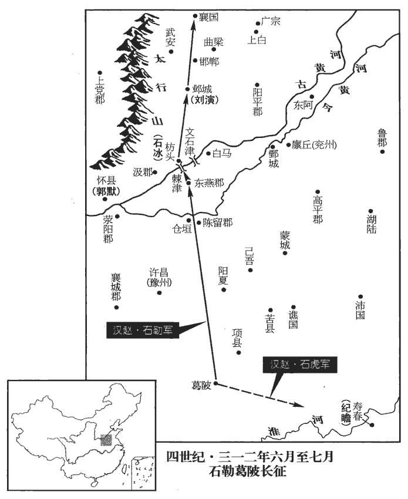
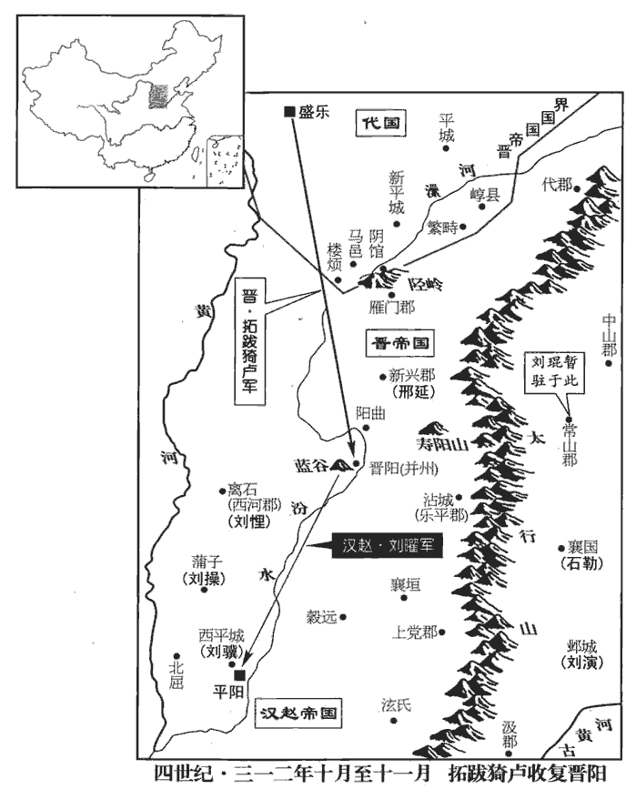
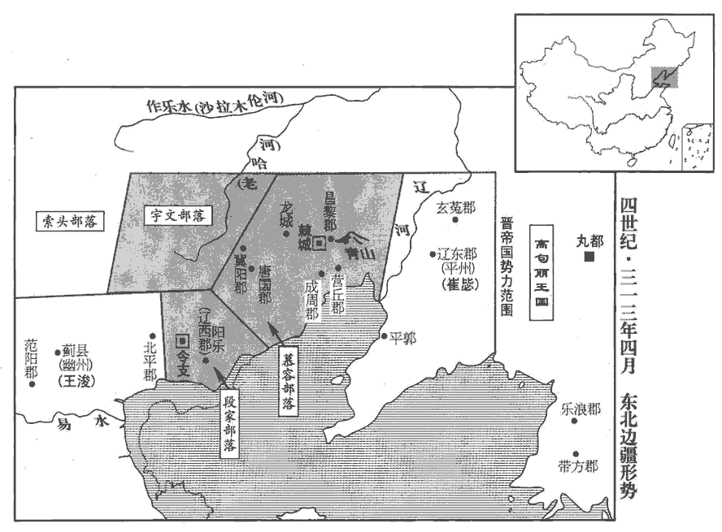
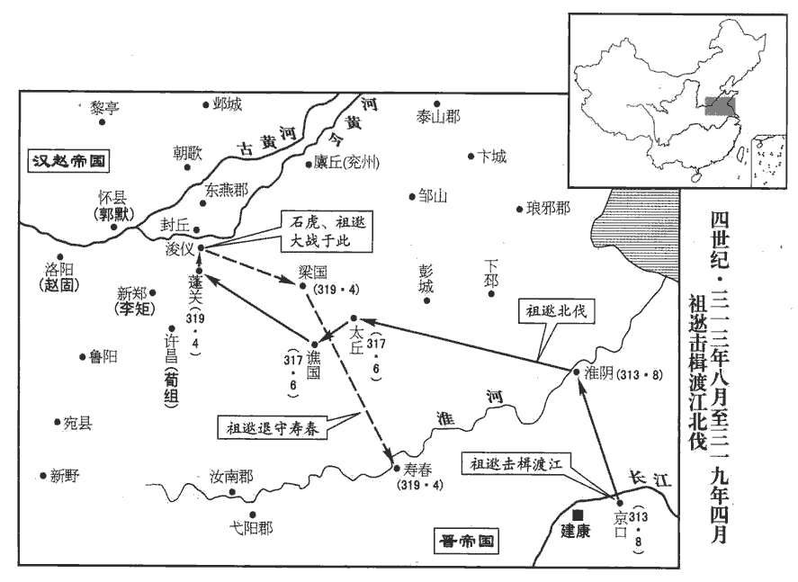

 晉紀十起玄黓涒灘（壬申），盡昭陽作噩（癸酉），凡二年。

# 孝懷皇帝下

## 永嘉六年（壬申，三一二）

1春，正月，漢呼延后卒，諡曰武元。

〖译文〗 [1]春季，正月，汉呼延皇后去世，谥号为武元。

2漢鎮北將軍靳沖、平北將軍卜珝xǔ寇并州‹府山西太原›；靳，居焮xìn翻，姓也。珝，況羽翻。辛未‹十九›，圍晉陽‹山西太原›。

〖译文〗 [2]汉镇北将军勒冲、平北将军卜进犯并州。辛未（十九日），包围晋阳。

3甲戌‹二十二›，漢主聰以司空王育、尚書令任顗女為左、右昭儀，任，音壬。顗，魚豈翻。中軍大將軍王彰、中書監范隆、左僕射馬景女皆為夫人，右僕射朱紀女為貴妃，皆金印紫綬。綬，音受。聰將納太保劉殷女，太弟义固諫。聰以問太宰延年、太傅景，皆曰：「太保自云劉康公之後與陛下殊源，劉康公，周之卿士，食采於劉‹河南省偃师县南›，其後因以為氏，劉聰，匈奴之後，以漢之甥冒姓劉氏，故云殊源。納之何害！」聰悅，拜殷二女英、娥為左右貴嬪，位在昭儀上嬪pín，毗賓翻。又納殷女孫四人皆為貴人，位次貴妃。於是六劉之寵傾後宮，聰希復出外，復，扶又翻。事皆中黃門奏決。

〖译文〗 [3]甲戌（二十二日），汉主刘聪封司空王育和尚书令任的女儿为左、右昭仪，中军大将军王彰、中书监范隆、左仆射马景三人的女儿都为夫人，右仆射朱纪的女儿为贵妃，都授予金印章和紫色绶带。刘聪打算纳娶太保刘殷的女儿，太弟刘苦苦劝谏。刘聪就此事询问太宰刘延年、太傅刘景，他们都说：“太保刘殷自称是周代刘康公的后代，与陛下不是一个族源，娶她有什么妨害？”刘聪很高兴，封刘殷的两个女儿刘英、刘娥为左、右贵嫔，地位在昭仪之上。又纳娶刘殷的四个孙女都当作贵人，地位低于贵妃。这样六刘所受的宠爱占满后宫，刘聪很少再出门到外面，政事都由宦宫中黄门传达。

4故新野王歆、牙門將胡亢聚眾於竟陵‹湖北钟祥›，亢，音剛。自號楚公，寇掠荊土，以歆南蠻司馬新野‹河南新野›杜曾為竟陵太守。曾勇冠三軍，能被甲游於水中，為曾亂荊州張本。冠，古玩翻被，皮義翻。

〖译文〗 [4]已故新野王司马歆的牙门将胡亢在竟陵聚众，自称楚公，在荆州的土地上抢掠，任司马歆的南蛮司马新野人杜曾为竟陵太守。杜曾骁勇为三军第一，能身穿铠甲在水中游泳。

5二月，壬子朔‹一›，日有食之。

〖译文〗 [5]二月，壬子朔（初一），出现日食。

6石勒築壘於葛陂‹河南省平舆县东›，皇覽曰：汝南郡鮦陽縣有葛陂。賢曰：葛陂，在今豫州新蔡縣西北。課農造舟，將攻建業。琅邪王睿大集江南之眾於壽春‹安徽寿县›，以鎮東長史紀瞻為揚威將軍，都督諸軍以討之。睿為鎮東大將軍，署瞻長史。

〖译文〗 [6]石勒在葛陂修筑营垒，向农民征税修造舟船，打算进攻建业。琅邪王司马睿大规模调集江南的部队到寿春，任镇东长史纪瞻为扬威将军，统领各军队来征讨石勒。

會大雨，三月不止，勒軍中飢疫，死者太半，聞晉軍將至，集將佐議之。右長史刁膺請先送款於睿，求掃平河朔以自贖，俟其軍退，徐更圖之，勒愀然長嘯。愀qiǎo，子小翻。中堅將軍夔安請就高避水，中堅將軍，蓋石勒所置。姓譜：夔姓，春秋夔子之後。勒曰：「將軍何怯邪！」孔萇等三十餘將請各將兵分道夜攻壽春，斬吳將頭，據其城，食其粟，要以今年破丹陽‹南京›，定江南。勒笑曰：「是勇將之計也！」言其不逆計勝敗，但勇於赴敵耳。將，即亮翻。各賜鎧馬一疋pǐ。鎧，可亥翻。疋，僻吉翻。顧謂張賓曰：「於君意何如？」賓曰：「將軍攻陷京師，囚執天子，殺害王公，妻略妃主，擢將軍之髮，不足以數將軍之罪，擢，拔也；拔其髮以數其罪，猶不足言其罪多也。數，所具翻。柰何復相臣奉乎！復，扶又翻。去年既殺王彌，不當來此；今天降霖雨於數百里中，示將軍不應留此也。鄴‹河北省临漳县西南邺镇›有三臺之固，水經註：鄴城西北有三臺，皆因城為之基，漢建安十五年魏武所起。中曰銅臺，高十丈，其後石虎更增二丈；南則金雀臺，高八丈；北則冰井臺，亦高八丈。西接平陽，謂近漢都，可以壯聲援。山河四塞，宜北徙據之，以經營河北，河北既定，天下無處將軍之右者矣。處，昌呂翻。晉之保壽春，畏將軍往攻之耳；彼聞吾去，喜於自全，何暇追襲吾後，為吾不利邪！自古國於東南，率多為自保之計，亦自量其力之不足以進也，賓料之審矣。將軍宜使輜重從北道先發，將軍引大兵向壽春‹安徽寿县›。輜重既遠，重，直用翻。大兵徐還，何憂進退無地乎！」勒攘袂鼓髯曰：「張君計是也！」責刁膺曰：「君既相輔佐，當共成大功，柰何遽勸孤降！降，戶江翻。此策應斬！然素知君怯，特相宥耳。」於是黜膺為將軍，擢賓為右長史，號曰「右侯」。

〖译文〗 遇到大雨，三个月不停，石勒军队饥乏并流行疾病，死的人超过大半，又听到晋朝军队将要开来，就召集武将及参佐商议。右长史刁膺请石勒先向司马睿求和，请求扫平河朔来赎自己的罪，等到司马睿的军队退还江南，再慢慢谋取他。石勒听后忧伤地大声发出长叹。中坚将军夔安请石勒到地势高的地方避水，石勒说：“将军你为什么胆怯呢？”孔苌等三十多个武将请求各自带兵分路夜袭寿春，斩掉吴地武将的头颅，占据他们的城邑，吃他们的粮食，想就在今年攻下丹阳、平定江南。石勒笑着说：“这真是勇将的计策啊！”各赐他们铠甲一副、马一匹。石勒对张宾说：“依您看怎么办呢？”张宾说：“将军您攻陷京城，囚禁了晋朝天子，杀害亲王公卿大臣，侵占凌辱晋朝的嫔妃公主，拔下您的头发，也不够来数将军您的罪过。怎么能再以臣下的身分尊奉晋朝呢？去年杀了王弥，就不应该到这里来。现在，几百里内上天不断地降雨，这是告诉将军您不应该在这里逗留了。邺城有三个高台防守坚固，西临汉都城平阳，隔山阻河四面都有要塞，应当向北迁徙占据那里，经营黄河以北地区。河北地区稳定后，全国就没有处在将军您上面的人。晋朝保卫寿春，只是害怕您去攻打寿春罢了。他们听说我们离去了，对能够自己保全而感到高兴满足，还有什么功夫追击我军的后部，施行不利于我军的行动呢？您应当派辎重队伍从北面的道路先行出发，您带领大部军队开往寿春。辎重队伍走远后，大部军队再缓慢回撤，还忧虑什么进退无路的呢？”石勒捋起衣袖抚动髯须说：“张君的计策好啊！”又责备刁膺说：“您既然作我的辅佐，就应当共同成就大功业，怎么能催促劝说我投降呢？出这个计策的应当杀头！但我平素了解您胆怯怕事，特地原谅您罢了。”于是把刁膺贬黜为将军，提拔张宾为右长史。号称“右侯”。

勒引兵發葛陂‹河南省平舆县东›，遣石虎帥騎二千向壽春‹安徽寿县›，帥，讀曰率。騎奇寄翻。遇晉運船，虎將士爭取之，為紀瞻所敗。敗，補邁翻。瞻追奔百里，前及勒軍，勒結陳待之；陳，讀曰陣。瞻不敢擊，退還壽春。

〖译文〗 石勒带兵从葛陂出发，派石虎带领二千骑兵开往寿春，遇到晋朝的运输船，石虎的部将兵士争先攻取，结果被纪瞻打败。纪瞻追击了一百多里，追上石勒的军队，石勒排好兵阵等待，而纪瞻不敢攻打，退还到寿春。

7漢主聰封帝為會稽郡公，會，工外翻。加儀同三司。聰從容謂帝曰：「卿昔為豫章王，朕與王武子造卿，武子稱朕於卿，從，千容翻。王濟，字武子。造，七到翻。卿言聞其名久矣，贈朕柘zhè弓銀研；研，與硯同。卿頗記否？」帝曰：「臣安敢忘之！但恨爾日不早識龍顏！」聰曰：「卿家骨肉何相殘如此？」帝曰：「大漢將應天受命，故為陛下自相驅除，為，于偽翻。此殆天意，非人事也！且臣家若能奉武皇帝之業，九族敦睦，陛下何由得之！」聰喜，以小劉貴人妻帝，妻，七細翻。曰：「此名公之孫也，卿善遇之。」

〖译文〗 [7]汉主刘聪封晋怀帝为会稽郡公，开府仪同三司。刘聪和颜悦色地对怀帝说：“你过去当豫章王，我与王武子拜访你，王武子向你称赞我，你说久闻大名，送给我柘木良弓和银砚台，你还记得吗？”怀帝说：“臣下我怎么敢忘掉呢？只遗憾当时没有及早地认识龙颜！”刘聪说：“你家的亲骨肉为什么这样互相残杀？”怀帝说：“大汉将要承接天意，所以自相驱赶杀戮替陛下扫清道路，这是天意，不是人所能决定的！再说我家如果能尊奉武皇帝的大业，九族和睦相处，陛下从哪里得到天下呢？”刘聪听得高兴，把小刘贵人给了怀帝作妻子，说：“这是名公爵的孙女，你好好对待她。”

8代公‹首府盛乐内蒙古和林格尔县›猗盧遣兵救晉陽‹山西太原›，三月，乙未‹十四›，漢兵敗走。卜珝之卒先奔，靳沖擅收珝，斬之；聰大怒，遣使持節斬沖。使，疏吏翻。

〖译文〗 [8]代公拓跋猗卢派兵救援晋阳，三月，乙未（十四日），汉军队败退而逃。卜带领部众先逃跑，勒冲擅自拘捕了卜，把他杀了。刘聪勃然大怒，派使者拿着符节杀了勒冲。

9聰納其舅子輔漢將軍張寔二女徽光、麗光為貴人，此別一張寔，非河西張軌之子。太后張氏之意也。張氏，淵之側室，生聰，尊為太后。

〖译文〗 [9]刘聪纳娶他舅舅的儿子辅汉将军张的两个女儿张徽光、张丽光为贵人，这是太后张氏的主意。

10涼州‹甘肃中西部›主簿馬魴說張軌：魴，符方翻。說，輸芮翻。「宜命將出師，翼戴帝室。」軌從之，馳檄關中，共尊輔秦王；且言「今遣前鋒督護宋配、帥步騎二萬，徑趨長安；帥，讀曰率。趨，七喻翻。西中郎將寔帥中軍三萬，武威太守張琠帥胡騎二萬，絡繹繼發。」琠，他典翻。絡繹，相繼不絕之意。

〖译文〗 [10]凉州主簿马鲂对张轨说：“应当让武将出征，以辅助拥戴朝廷。”张轨接受了这个建议，急速将檄文传布关中地区，号召共同尊奉辅佐秦王司马业。并且说：“现在派遣前锋督护宋配率领二万步兵和骑兵，直接奔赴长安，西中郎将张带领中军三万军队，武威太守张率领二万胡人骑兵，陆续出发。”

11夏，四月，丙寅‹十六›，征南將軍山簡卒‹年六十岁›。

〖译文〗 [11]夏季，四月，丙寅（十六日），征南将军山简去世。

12漢主聰封其子敷為渤海王，驥為濟南王，鸞為燕王，鴻為楚王，勱mài為齊王，勱，音邁。權為秦王，操為魏王，持為趙王。

〖译文〗 [12]汉主刘聪封他的儿子刘敷为渤海王，刘骥为济南王，刘鸾为燕王，刘鸿为楚王，刘劢为齐王，刘权为秦王，刘操为魏王，刘持为赵王。

13聰以魚蟹不供，斬左都水使者襄陵王攄shū；襄陵縣，漢屬河東郡，晉屬平陽郡。觀後所謂亟斬王公，則攄亦劉氏也。攄，抽居翻。作溫明、徽光二殿未成，斬將作大匠望都公靳陵。觀漁於汾水，昏夜不歸。中軍大將軍王彰諫曰：「比觀陛下所為，臣實痛心疾首。比，毗至翻。今愚民歸漢之志未專，思晉之心猶盛，劉琨咫尺，刺客縱橫；謂平陽去晉陽不遠也。縱，子容翻。帝王輕出，一夫敵耳。願陛下改往修來，則億兆幸甚！」聰大怒，命斬之；王夫人叩頭乞哀，乃囚之。王夫人，彰女也。太后張氏以聰刑罰過差，三日不食；太弟义、單于粲輿櫬chèn切諫。聰怒曰：「吾豈桀、紂，而汝輩生來哭人！」太宰延年、太保殷等公卿、列侯百餘人，皆免冠涕泣曰：「陛下功高德厚，曠世少比，少，詩沼翻。往也唐、虞，今則陛下。而頃來以小小不供，亟斬王公；直言忤旨，遽囚大將。王公，謂劉攄、靳陵；大將，謂王彰。亟，欺冀翻。忤，五故翻。此臣等竊所未解，解，戶買翻，曉也。故相與憂之，忘寢與食。」聰慨然曰：「朕昨大醉，非其本心，微公等言之，朕不聞過。」各賜帛百匹，使侍中持節赦彰曰：「先帝賴君如左右手，君著勳再世，朕敢忘之！此段之過，希君蕩然。君能盡懷憂國，朕所望也。今進君驃騎將軍、定襄郡公，驃，匹妙翻。後有不逮，幸數匡之！」數，所角翻。

〖译文〗 [13]刘聪因为鱼蟹供应不上，杀死左都水使者襄陵王刘摅。温明、徽光二座宫殿没有建成，杀死将作大匠望都公靳陵。他到汾水观看捕鱼，黄昏黑夜都不返回。中军大将军王彰劝谏说：“近来看到陛下的行动，我实在是痛心疾首。现在愚民们归附汉的心意并不确定，而思念晋朝的心情还非常浓厚，刘琨虎视眈眈近在咫尺，刺客到处都有。帝王轻率地出行，一个人就能把您刺杀。希望陛下改变过去的作法养成新的习惯，那么百性感到非常幸运！”刘聪勃然大怒，命令杀他，王彰的女儿王夫人在一旁叩头乞求宽恕，于是把王彰囚禁起来。太后张氏因为刘聪的刑罚过于严苛，三天不吃饭。太弟刘义，单于刘粲带着棺材冒死恳切地劝谏。刘聪怒冲冲地说：“我难道是暴君桀、纣吗？你们却来哭活人！”太宰刘延年、太保刘殷等公卿大臣列侯一百多人，都摘去头冠哭着说：“陛下功高德厚，从古到今很少有人能与您相比，古代有唐尧、虞舜，今天则是陛下。但近来因为物资稍微供应不上。就杀王公，直言冒犯您的旨意，就马上囚禁大将。这是我们心里所不理解的，所以大家都对此感到忧虑，乃至废寝忘食。”刘聪慨叹说：”朕昨天大醉，这些事不是我的本意，不是你们说起，朕就听不到自己的过失了。”每人赐百匹布帛，派侍中拿着符节赦免王彰说：“先帝刘渊依靠您如同左右手一样，您立下的再世之功，朕怎敢记掉？这次的过失，希望您不要放在心上。您能够尽心忧国，正是朕所希望的。现在提升您为骠骑将军，封定襄郡公。朕将来再有做得不尽如人意的地方，还希望您多多指正。”

14王彌既死，事見上卷上年。漢安北將軍趙固、平北將軍王桑恐為石勒所并，欲引兵歸平陽‹山西临汾›，軍中乏糧，士卒相食，乃自䂭磽津‹河南延津西北古黄河渡口›西渡。䂭qiāo，丘交翻。磽qiāo，牛交翻。劉【章：甲十一行本「劉」上有「攻掠河北郡縣」六字；乙十一行本同；孔本同；張校同；退齋校同。】琨以兄子演為魏郡‹河北省临漳县西南邺镇›太守，鎮鄴，【章：甲十一行本「鄴」下有「固」字；乙十一行本同；孔本同；張校同；退齋校同。】桑恐演邀之，遣長史臨深為質於琨。姓譜；臨姓，大臨之後。質，音致。琨以固為雍州刺史，雍，於用翻；下同。桑為豫州刺史。

〖译文〗 [14]王弥死后，汉安北将军赵固、平北将军王桑担心自己的军队被石勒吞并，想带兵返回平阳。军中缺少粮食，士卒竟互相宰食。于是从硗津西渡黄河，进攻抢掠黄河以北的郡县。刘琨任哥哥的儿子刘演为魏郡太守，镇守邺城，王桑害怕刘演阻击，就派长史临深到刘琨处作为人质。刘琨就任赵固为雍州刺史，王桑为豫州刺史。

15賈疋yǎ等圍長安數月，漢中山王曜連戰皆敗，驅掠士女八萬餘口，奔于平陽‹山西临汾›。秦王業自雍‹陕西凤翔›入于長安。雍，於用翻。五月，漢主聰貶曜為龍驤大將軍，行大司馬。驤，思將翻。聰使河內‹河南沁阳›王粲攻傅祗於三渚‹河南孟津西北›，據祗傳，祗屯盟津小城。盟津河平侯祠有二渚，又有淘渚，故亦曰三渚。右將軍劉參攻郭默於懷‹河南武陟›，會祗病薨‹年六十九岁›，城陷，粲遷祗子孫并其士民二萬餘戶于平陽‹山西临汾›。

〖译文〗 [15]贾疋等人包围长安几个月，汉中山王刘曜接连出战都失败了，强行驱赶八万多成年男女逃奔平阳。秦王司马业从雍州进入长安。五月，汉主刘聪把刘曜贬为龙骧大将军，行大司马。刘聪派河内王刘粲在三渚攻打傅祗，派右将军刘参到怀县攻打郭默。正遇上傅祗因病去世，三渚城陷落，刘粲把傅祗的子孙以及士人百姓二万余户都迁往平阳。

16六月，漢主聰欲立貴嬪劉英為皇后；張太后欲立貴人張徽光，聰不得已，許之。英尋卒。

〖译文〗 [16]六月，汉主刘聪打算立贵嫔刘英为皇后，而张太后要立贵人张徽光，刘聪没办法，只好同意。刘英不久就去世了。

17漢大昌文獻公劉殷卒。宋白曰：隰州隰川縣，漢蒲子縣；劉淵僭亂，置大昌郡。殷為相，不犯顏忤旨，忤，五故翻。然因事進規，補益甚多。漢主聰每與群臣議政事，殷無所是非；群臣出，殷獨留，為聰敷暢條理，商榷事宜，商，度也；榷者，舉其略也。為，于偽翻。榷，古岳翻。聰未嘗不從之。殷常戒子孫曰：「事君當務幾諫。凡人尚不可面斥其過，況萬乘乎！夫幾諫之功，無異犯顏，但不彰君之過，所以為優耳。幾諫者，見微而諫也。侯希聖曰：事君，有顯諫者，有幾諫者。然而溫柔忠厚者，其說多行，訐jié直強勁者，其說多忤，夫是以貴幾諫也。幾，居希翻。乘，繩證翻。官至侍中、太保、錄尚書，賜劍履上殿、入朝不趨、乘輿入殿。然殷在公卿間，常恂恂有卑讓之色，故能處驕暴之國，保其富貴，不失令名，以壽考自終。處，昌呂翻。

〖译文〗 [17]汉大昌文献公刘殷去世。刘殷当丞相，从不冒犯皇帝违反圣旨，但经常就具体的事情进宫规劝，对刘聪补益很多。汉主刘聪每次与大臣们商议政事，刘殷都不表示什么态度，等大臣们离开，刘殷单独留下，为刘聪对所议铺陈发挥再理出头绪，商讨事宜，刘聪从没有不采纳他的建议的。刘殷常常告诫子孙说：“为君主作事应当务求对君主委婉地劝谏。凡人尚且不能当面斥责他的过错，更何况皇帝呢？委婉劝谏的功效，其实与冒犯君主没有什么区别，只是不明说君主的过失，所以是比较好的方法。”刘殷历任侍中、太保、录尚书等职，并被赐予可以佩剑穿鞋上宫殿、朝见天子不用快步行走、乘车进入宫殿等特权。但是刘殷在公卿大臣中，常常恭顺地带有卑谦礼让的神色，所以处在骄纵横暴的国家，能够保全自己的富贵，不损伤自己的美好声名，以长寿善终。

18漢主聰以河間王易為車騎將軍，彭城王翼為衛將軍，并典兵宿衛。高平王悝kuī為征南將軍，鎮離石‹山西離石›；悝，苦回翻。濟南王驥jì為征西將軍，築西平城以居之；西平城‹山西临汾西北十千米›，當築於平陽西。濟，子禮翻。魏王操為征東將軍，鎮蒲子‹山西隰县›。

〖译文〗 [18]汉主刘聪任河间王刘易为车骑将军，彭城王刘翼为卫将军，共同统领皇宫禁卫军。任高平王刘悝为征南将军，镇守离石；济南王刘骥为征西将军，建筑西平城居住；魏王刘操为征东将军，镇守蒲子。

19趙固、王桑自懷求迎於漢，漢主聰遣鎮遠將軍梁伏疵cī將兵迎之。未至，長史臨深、將軍牟穆帥眾一萬叛歸劉演。固隨疵而西，疵，疾移翻。帥，讀曰率；下同。桑引其眾東奔青州，固遣兵追殺之於曲梁‹河北永年东南旧永年镇›，曲梁縣，屬廣平郡；曹魏置廣平郡，治曲梁城。劉昫曰：唐洺州永年縣，漢曲梁縣地也。桑將張鳳帥其餘眾歸演。聰以固為荊州刺史、領河南太守，鎮洛陽‹河南省洛阳市东白马寺东›。

〖译文〗 [19]赵固、王桑从怀县向汉请求接应，汉主刘聪派镇远将军梁伏疵带兵迎接他们。迎接的军队还没有到达时，长史临深、将军牟穆带领一万军队反叛投归刘演。赵固随梁伏疵向西边进发，王桑却又带领所属军队向东奔赴青州，赵固就派兵追击，在曲梁杀了王桑。王桑的部将张凤带领残余部众投归刘演。刘聪让赵固担任荆州刺史，兼河南太守，镇守洛阳。

 

20石勒自葛陂北行，所過皆堅壁清野，虜掠無所獲，軍中飢甚，士卒相食。至東燕‹河南延津东北›，據水經：東燕城在酸棗縣東。河水自酸棗東北過延津，又逕東燕縣故城北。余考兩漢志，東郡有燕縣，無東燕縣，其即是歟？魏收地形志，東燕縣，晉屬濮陽國。賢曰：東燕故城，今滑州胙城縣。燕，於賢翻。聞汲郡‹河南省卫辉市›向冰聚眾數千壁枋頭‹河南浚县东南淇门渡›，水經：淇水至黎陽入河，在遮害亭西十八里。漢建安九年，魏武於水口下大枋木以成堰，遏淇水東入白溝，以通漕運，故時人號其處曰枋頭。杜佑曰：枋頭在今汲郡衛縣界。宋白曰：枋頭城，在今衛縣南，去河八里。向，式亮翻，姓也。枋，音方。勒將濟河，恐冰邀之。張賓曰：「聞冰船盡在瀆中未上，未上者，未上岸。船不用，則推之登陸，使遠水而燥，他日輕，便於駕用。上，時掌翻。宜遣輕兵間道襲取，以濟大軍，間，古莧翻。大軍既濟，冰必可擒也。」秋，七月，勒使支雄、孔萇自文石津‹河南省滑县东南古黄河渡口›縛筏潛渡，取其船，勒引兵自棘津‹河南省卫辉市东古黄河渡口›濟河，水經：河水逕東燕縣故城北，河水於是有棘津之名。擊冰，大破之，盡得其資儲，軍勢復振，遂長驅至鄴。劉演保三臺以自固，臨深、牟穆等復帥其眾降於勒。復，扶又翻；帥，讀曰率；并下同。降，戶江翻；下同。

〖译文〗 [20]石勒从葛陂向北行进。所经过的地方百姓都坚壁清野，因而没有抢掠到什么东西，军中非常饥饿，出现士卒吃士卒充饥的现象。到达东燕，听说汲郡人向冰聚集了几千人在枋头修筑了营垒，石勒将要渡黄河，又担心遭到向冰的阻击。张宾说：“听说向冰的船只全都放在水中没有抬上岸，应当派遣轻装兵士抄小道去偷袭夺取这些船，用来渡大部军队过黄河，大部军队渡河后，一定能擒获向冰。”秋季，七月，石勒派遣支雄、孔苌从文石津绑扎木筏偷渡，夺取了向冰的船只。石勒率兵从棘津渡黄河，攻打向冰，把向冰打得惨败，得到了向冰的全部物资储备，军队士气重新振作起来，于是长驱直入到达邺城。刘演防守三台以求自己稳固，临深、牟穆等人又率领自己的部众向石勒投降。

諸將欲攻三臺，張賓曰：「演雖弱，眾猶數千，三臺險固，攻之未易猝拔，易，以豉翻。捨而去之，彼將自潰。方今王彭祖、劉越石，公之大敵也，王浚，字彭祖；劉琨，字越石。宜先取之，演不足顧也。且天下饑亂，明公雖擁大兵，遊行羈旅，人無定志，非所以保萬全，制四方也。不若擇便地而據之，廣聚糧儲，西稟平陽‹山西临汾›以圖幽、并，幽，王浚；并，劉琨。此霸王之業也。邯鄲、襄國‹河北邢台›，形勝之地，邯鄲縣，漢屬趙國，晉屬廣平。襄國縣，秦為信都，項羽改曰襄國，漢屬趙國，晉屬廣平。而信都別為縣，前漢屬信都國，後漢屬安平國。邯鄲，音寒丹。宋白曰：隋改襄國為龍岡縣，唐為邢州所治也。請擇一而都之。」勒曰：「右侯之計是也！」遂進據襄國‹河北邢台›。

〖译文〗 部将们想攻打三台，张宾对石勒说：“刘演虽然兵力微弱，但还有几千军队，三台险峻坚固，攻打不容易很快把它拿下，放弃它而离开，那里将会自己崩溃。现在王浚、刘琨是您的主要敌人，应当先打他们，刘演不值得注意。再说天下饥饿动乱，您虽然拥有强大的军队，但来回行军长期在旅途中，人心不定，这不是控制四方的万全之计。不如选择一个便利的地方占据它，多多聚集储备粮食，尊奉平阳以谋取幽州、并州，这是霸王的功业。邯郸、襄国，都是好地方，请选一个作为都城。”石勒说：“您的计策是对的！”于是进发占据了襄国。

賓復言於勒曰：「今吾居此，彭祖、越石所深忌也，恐城塹未固，資儲未廣，二寇交至。塹，七豔翻。宜亟收野穀，且遣使至平陽‹山西临汾›，具陳鎮此之意。」使，疏吏翻；下同。勒從之，分命諸將攻冀州，郡縣壁壘多降，運其穀以輸襄國‹河北邢台›；且表於漢主聰，聰以勒為都督冀、幽、并、營四州諸軍事、營州不在晉太康地志十九州之數。晉地理志：咸寧二年，分昌黎、遼東、玄菟、帶方、樂浪等郡國五，置平州；至慕容熙據和龍，始於宿軍置營州，以刺史鎮之；拓跋魏置營州於和龍。勒時未有營州也。郡國志：營州地當營室分，故曰營州。冀州牧，進封上黨公。

〖译文〗 张宾又对石勒说：“现在我们驻扎在这里，是王浚、刘琨深深忌惮的。我担心城墙堑壕还不坚固，物资储备还不充分时，他们二人交相率兵来了。应当迅速收取野外的粮食，并且派使者到平阳，一一说明我们镇守此地的意图。”石勒听取了这个建议，分别命令诸将攻打冀州，那里的郡、县、营垒大多投降，就把这些地方的粮谷运往襄国。并且表奏汉主刘聪，刘聪让石勒担任都督冀、幽、并、营四州诸军事，冀州牧，进封为上党公。

21劉琨移檄州郡，期以十月會平陽‹山西临汾›，擊漢。琨素奢豪，喜聲色。喜，許記翻。河南徐潤以音律得幸於琨，琨以為晉陽‹山西太原›令。潤驕恣，干預政事；護軍令狐盛數以為言，令狐之令，力丁翻。數，所角翻。且勸琨殺之，琨不從。潤譖盛於琨，琨收盛，殺之。琨母曰：「汝不能駕御豪傑以恢遠略，而專除勝己，禍必及我。」

〖译文〗 [21]刘琨向各州郡发布檄文，约定十月在平阳会合，攻打汉。刘琨平素奢侈豪华，喜欢音乐女色。河南人徐润因为擅长音律而受到刘琨的宠信，刘琨让他担任晋阳令。徐润骄纵放肆，经常干预政事。护军令狐盛多次对此向刘琨发表看法，并且劝刘琨把他杀了。刘琨不听。结果徐润向刘琨说令狐盛的坏话，刘琨就拘捕了令狐盛，把他杀了。刘琨的母亲说：“你不能组织驾驭英雄豪杰来完成宏大的谋略，而只知一心清除超过自己的人，这带来的灾祸一定会殃及我。”

盛子泥奔漢，具言虛實。漢主聰大喜，遣河內王粲、中山王曜將兵寇并州，以令狐泥為鄉導。鄉，讀曰嚮。琨聞之，東出，收兵於常山‹河北正定›及中山‹河北定州›，使其將郝詵shēn、張喬將兵拒粲，郝，呼各翻。且遣使求救於代公‹首府盛乐内蒙古和林格尔县›猗盧。詵、喬俱敗死。粲、曜乘虛襲晉陽‹山西太原›，太原太守高喬、并州別駕郝聿yù以晉陽降漢。考異曰：劉琨傳曰：「屬龐醇降于聰，鴈門烏丸復反，琨親出禦之，粲乘虛襲取晉陽。」按：琨上太子牋曰：「聰以七月十六日復決計送死，臣即自東下，率中山、常山之卒，并合樂平、上黨諸軍，未旋之間，而晉陽傾潰。十六國春秋亦云「琨收兵常山」。本傳誤也。八月，庚戌‹一›，琨還救晉陽‹山西太原›，不及，帥左右數十騎奔常山‹河北正定›。辛亥‹二›，粲、曜入晉陽‹山西太原›。壬子‹三›，令狐泥殺琨父母。

〖译文〗 令狐盛的儿子令狐泥投奔到汉，全部陈说刘琨的虚实情况。汉主刘聪大喜过望，派遣河内王刘粲、中山王刘曜率兵进犯并州，让令狐泥担任向导。刘琨听说后，向东在常山及中山聚集军队，派部将郝诜、张乔带兵阻击刘粲，并且派使者向代公拓跋猗卢请求救援。郝诜、张乔都兵败而死。刘粲、刘曜乘虚袭击晋阳，太原太守高乔、并州别驾郝聿献出晋阳向汉投降。八月，庚戌（初一），刘琨返回来救晋阳，没来得及，只好带领左右随从几十人骑马逃奔常山。辛亥（初二），刘粲、刘曜进入晋阳。壬子（初三），令狐泥把刘琨的父母都杀了。

粲、曜送尚書盧志、侍中許遐、太子右衛率崔瑋于平陽‹山西临汾›。聰復以曜為車騎大將軍，以前將軍劉豐為并州刺史，鎮晉陽‹山西太原›。九月，聰以盧志為太弟太師，崔瑋為太傅，許遐為太保，高喬、令狐泥皆為武衛將軍。

〖译文〗 刘粲、刘曜把晋朝尚书卢志、侍中许遐、太子右卫率崔玮送到平阳。刘聪又以刘曜担任车骑大将军，以前将军刘丰任并州刺史，镇守晋阳。九月，刘聪任卢志为太弟太师，任崔玮为太傅，许遐为太保，高乔、令狐泥都担任武卫将军。

22己卯‹一›，漢衛尉梁芬奔長安。

〖译文〗 [22]己卯（疑误），汉的卫尉梁芬逃奔长安。

23辛巳‹三›，賈疋yǎ等奉秦王業為皇太子，考異曰：懷帝紀云：「賈疋討劉粲於三輔，走之，關中小定，奉秦王為太子。」按：賈疋等以永嘉五年攻劉粲于新豐，粲敗，還平陽；奉秦王入雍城。六年三月，劉曜棄長安走，秦王入長安，漢兵皆已退矣。秦王為太子時，劉粲方在晉陽。懷紀誤。建行臺於長安，登壇告類，告類，或攝，或即位，祭天之禮。舜之攝也，肆類于上帝。孔安國註曰：類，謂攝位事類，遂以攝告天及五帝，湯黜夏命，昭告于上天神后，皆其事也。建宗廟、社稷，大赦。以閻鼎為太子詹zhān事，總攝百揆；太子詹事統攝宮僚。時太子建行臺，故以詹事總百揆，特位號未正，其實丞相之職也。加賈疋征西大將軍，以秦州刺史、南陽王保為大司馬。命司空荀藩督攝遠近，光祿大夫荀組領司隸校尉、行豫州刺史，與藩共保開封。開封縣，漢屬河南郡，晉屬滎陽郡。

〖译文〗 [23]辛巳（初三），贾疋等尊奉秦王司马业为皇太子，在长安建立行台，登祭坛祭天。设置宗庙、社稷，实行大赦。任阎鼎为太子詹事，代理统领文武百官。任命贾疋为征西大将军，秦州刺史、南阳王司马保为大司马。让司空荀藩督领远近的事务，光禄大夫荀组兼任司隶校尉、豫州刺史，与荀藩共同守卫开封。

24秦州刺史裴苞據險以拒涼州兵，張寔、宋配等擊破之，苞奔柔【嚴：「柔」改「桑」。】凶塢‹甘肃天水西南›。

〖译文〗 [24]秦州刺史裴苞占据险要之地来抵御凉州的军队。张、宋配等人打败了他，裴苞逃奔柔凶坞。

25冬，十月，漢主聰封其子恆為代王，恆，戶登翻。逞為吳王，朗為潁川王，皋為零陵王，旭為丹陽王，京為蜀王，坦為九江王，晃為臨川王；以王育為太保，王彰為太尉，任顗yǐ為司徒，顗，魚豈翻。馬景為司空，朱紀為尚書令，范隆為左僕射，呼延晏為右僕射。

〖译文〗 [25]冬季，十月，汉主刘聪封自己的儿子刘恒为代王，刘逞为吴王，刘朗为颍川王，刘皋为零陵王，刘旭为丹阳王，刘京为蜀王，刘坦为九江王，刘晃为临川王。任王育为太保、王彰为太尉，任为司徒，马景为司空，朱纪为尚书令，范隆为左仆射，呼延晏为右仆射。

26代公猗盧遣其子六脩及兄子普根、將軍衛雄、范班、箕澹帥眾數萬為前鋒以攻晉陽‹山西太原›，澹，徒覽翻，又徒濫翻。考異曰：十六國春秋云「遣其子利孫、宥六須」，載記云「賓六須」。劉琨集云「左、右賢王」，又云「右賢王撲速根」。今從後魏書。考異又曰：「箕澹」，十六國春秋、後魏書作「姬澹」。今從劉琨傳。猗盧自帥眾二十萬繼之，劉琨收散卒數千為之鄉導。鄉，讀曰嚮。六脩與漢中山王曜戰於汾東，曜兵敗，墜馬，中七創。中，竹仲翻。創，初良翻；下同。討虜將軍傅虎以馬授曜，曜不受，曰：「卿當乘以自免，吾創已重，自分死此。」分，扶問翻。虎泣曰：「虎蒙大王識拔至此，常思效命，今其時矣。且漢室初基，天下可無虎，不可無大王也！」乃扶曜上馬，驅令渡汾，自還戰死。曜入晉陽‹山西太原›，夜與大將軍粲、鎮北大將軍豐掠晉陽之民，踰蒙山‹太原西北五公里›而歸。五代志，太原郡石艾縣有蒙山。魏收曰：石艾縣，即漢、晉之上艾縣也。晉志，上艾縣，屬樂平郡。又據五代志，晉陽縣有蒙山。此蓋蒙山跨晉陽、石艾二縣界也。十一月，猗盧追之，戰於藍谷，藍谷，在蒙山西南。漢兵大敗，擒劉豐，斬邢延等三千餘級，邢延叛琨見上卷五年。伏尸數百里。猗盧因大獵壽陽山‹山西寿阳北›，壽陽山，在樂平壽陽縣，魏收地形志作「受陽縣」，此縣蓋晉置也。宋白曰：壽陽縣，本漢榆次縣地，晉置壽陽縣。陳閱皮肉，山為之赤。劉琨自營門步入拜謝，固請進軍。猗盧曰：「吾不早來，致卿父母見害，誠以相愧。今卿已復州境，吾遠來，士馬疲弊，且待後舉，劉聰未可滅也。」遺琨馬、牛、羊各千餘疋，車百乘而還，遺，于季翻。乘，繩證翻。留其將箕澹、段繁等戍晉陽‹山西太原›。

〖译文〗 [26]代公拓跋猗卢派他的儿子拓跋六修以及哥哥的儿子拓跋普根、将军卫雄、范班、箕澹带领几万军队作为前锋攻打晋阳，拓跋猗卢自己带领二十万军队跟在后面，刘琨召集了几千逃散的兵士作为拓跋六的向导。拓跋六与汉中山王刘曜在汾东交战，刘曜的军队失败，他自己也负伤七处，掉下马。讨虏将军傅虎把自己的马交给刘曜，刘曜不接受，说：“你应该骑上它突围，我伤得已很重，命该丧此。”傅虎哭着说：“我蒙受您的赏识而被提拔到现在的地位，常常想着以自己的生命报效您，现在正是这样的时候了。再说汉的朝廷刚刚建立，天下可以没有傅虎，而不能没有您啊！”于是把刘曜扶上马，赶着马渡过汾水，自己又回去冲杀最后战死。刘曜进入晋阳，夜里与大将军刘粲、镇北大将军刘丰抢劫晋阳的百姓，然后翻过蒙山而撤回。十一月，拓跋猗卢追击他们的军队，在蓝谷交战，又大败汉军，擒获刘丰，杀了邢延等三千多人，尸横几百里。拓跋猗卢因胜利而到寿阳山大规模打猎，将猎物的皮，肉摆放在山上观看，山因此而变为红色。刘琨从军营门走进去拜谢拓跋猗卢，坚持请求拓跋猗卢继续进军。拓跋猗卢说：“我没能早来，致使你父母被杀害，心里确实感到惭愧，现在你已收复了并州的辖境。而我远道来此，兵士马匹都已疲惫，暂且等待以后再举事，刘聪不是一下子就能消灭的。”送给刘琨一千多匹马，牛羊各一千多头和一百辆车后回师，把部将箕澹、段繁等留下来戍守晋阳。

琨徙居陽曲‹山西陽曲›，陽曲縣，屬太原郡，在晉陽北。招集亡散。盧諶chén為劉粲參軍，亡歸琨，諶，時壬翻。漢人殺其父志考異曰：劉聰載記，「志勸太弟义作亂，被誅。」按志勸成都王穎起義兵，諫穎攻長沙王乂，忠義敦篤，始終不虧，非勸人作亂者也。今從盧諶傳。及弟謐mì、詵shēn；贈傅虎幽州刺史。

〖译文〗 刘琨迁徙到阳曲居住，召集流散的人员。卢谌是刘粲的参军，逃跑投奔了刘琨。汉杀了他的父亲卢志以及弟弟卢谧、卢诜。追赠傅虎为幽州刺史。

 

27十二月，漢主聰立皇后張氏，以其父寔為左光祿大夫。

〖译文〗 [27]十二月，汉君主刘聪把张氏立为皇后，任她父亲张为左光禄大夫。

28彭蕩仲之子天護帥群胡攻賈疋yǎ，天護陽不勝而走，疋追之，夜墜澗中，天護執而殺之。疋，音雅。疋殺彭蕩仲事見上卷五年。考異曰：帝紀曰：「疋討賊張連，遇害。」疋傳：「天護攻之，疋敗走，墜澗死。」今從十六國春秋。漢以天護為涼【嚴：「涼」改「梁」。】州刺史。眾推始平‹陕西省兴平市›太守麴允領雍州刺史。閻鼎與京兆太守梁綜爭權，鼎遂殺綜。麴允與撫夷護軍索綝、馮翊‹陕西大荔›太守梁肅合兵攻鼎，鼎出奔雍‹陕西凤翔›，為氐竇首所殺。胡、羯方強，賈、閻、麴、索降心相從，協力以輔晉室，猶懼不能全，況自相屠乎！長安之敗徵，见於此矣。雍，於用翻。

〖译文〗 [28]彭仲荡的儿子彭天护带领胡人们攻打贾疋，彭天护表面上假装失败而退走，贾疋追击，夜里掉到山涧中，彭天护把他抓住杀了。汉让彭天护任凉州刺史。大家推举始平太守麴允兼雍州刺史。阎鼎与京兆太守梁综争夺权力，阎鼎于是杀了梁综。麴允与扶夷护军索，冯太守梁肃联合兵力攻打阎鼎，阎鼎出奔雍州，被氐人窦首杀死。

29廣平‹河北省曲周县东北›游綸、張豺擁眾數萬，據苑鄉‹河北任县东北›，姓譜：游，廣平望姓；鄭公子偃，字子游，其後以為氏。魏收志，廣平郡任縣有苑鄉城。宋白曰：任縣，後漢南䜌luán縣地，後趙石氏於此置苑鄉縣，唐為任縣，屬邢州。受王浚假署；假署者，承制權宜而補署，假以職名。石勒遣夔安、支雄等七將攻之，破其外壘。浚遣督護王昌帥諸軍及遼西公‹首府令支河北省迁安县›段疾陸眷、考異曰：石勒載記及後魏書作「就陸眷」。今從王浚傳。疾陸眷弟匹磾dī、文鴦、從弟末柸bēi磾，丁奚翻。從，才用翻。考異曰：後魏書作「末破」。今從王浚傳。部眾五萬，攻勒於襄國。

〖译文〗 [29]广平人游纶、张豺拥有几万人，占据苑乡，王浚让他们在那儿暂时代理原官行使职权，石勒派遣夔安、支雄等七个将领攻打他们，攻破了外围的营垒。王浚派遣都护王昌率领各军，以及辽西公段疾陆眷，段疾陆眷的弟弟段匹、段文鸯、堂弟段末等人的部众五万人到襄国攻打石勒。

疾陸眷屯于渚陽‹河北省邢台市东北五千米›，班固地理志，禹貢絳水在信都入海。水經註：絳瀆北逕信都城東，散入澤渚，西至信都城東，連于廣川縣張甲故瀆，同歸于海。疾陸眷蓋屯是渚之陽也。勒遣諸將出戰，皆為疾陸眷所敗。敗，補邁翻。疾陸眷大造攻具，將攻城，勒眾甚懼。勒召將佐謀之曰：「今城塹未固，糧儲不多，彼眾我寡，外無救援，吾欲悉眾與之決戰，何如？」諸將皆曰：「不如堅守以疲敵，待其退而擊之。」張賓、孔萇曰：「鮮卑之種，種，章勇翻。段氏最為勇悍，悍，下罕翻，又侯旱翻。而末柸尤甚，其銳卒皆在末柸所。今聞疾陸眷刻日攻北城，其大眾遠來，戰鬬連日，謂我孤弱，不敢出戰，意必懈惰，懈，古隘翻。宜且勿出，示之以怯，鑿北城為突門二十餘道，墨子備突篇曰：城，百步一突門。突門，用車兩輪，以木束之，塗其上，維置突門內。度門廣狹之，令人入門四尺中，置窐wā突。門旁為橐tuó，充竈zào狀，又置艾。寇即入，下輪而塞之，鼓橐薰之也。杜佑曰：突門，鑿城內為闇門，多少臨事，令五六寸勿穿。或於中夜，於敵初來，營列未定，精騎從突門躍出，擊其無備，襲其不意。俟其来至，列守未定，出其不意，直衝末柸帳，彼必震駭，不暇為計，破之必矣。末柸敗，則其餘不攻而潰矣。」勒從之，密為突門。既而疾陸眷攻北城，勒登城望之，見其將士或釋仗而寢，乃命孔萇督銳卒自突門出擊之，見其釋仗而寢，知其懈也，乃命萇出戰，所謂見兵勢者也。城上鼓譟以助其勢。萇攻末柸帳，不能克而退。末柸逐之，入其壘門，為勒眾所獲，疾陸眷等軍皆退走。萇乘勝追擊，枕尸三十餘里，枕，職任翻。獲鎧馬五千匹。鎧，可亥翻。疾陸眷收其餘眾，還屯渚陽‹河北省邢台市东北五千米›。

〖译文〗 段疾陆眷在渚阳驻扎，石勒派多名将领去攻打，都被段疾陆眷打败。段疾陆眷大量制造攻城的器具，打算攻城，石勒的部众都非常惧怕。石勒召集部将参佐等官员商议说：“现在城墙堑壕还不坚固，粮食储备也不多，敌众我寡，外面没有救援，因此我想用全力与他决战，怎么样？”武将们都说：“还不如坚守使敌人疲惫，等待他们退还时再打击他们。”张宾、孔苌说：“鲜卑部落当中，段氏最为骁勇骠悍，而段末更加突出，他们的精锐部队都在段末那里。今天听说段疾陆眷几天之内就要攻打北城，他的军队从远方来，又连日战斗，认为我们孤独无援兵力微弱，不敢出去交战，斗志一定松懈懒惰。我们最好暂且不出去，让他们觉得我们胆怯，在北城墙凿出二十几条暗道，等待他们来到时，兵阵还没有排列稳定，出其不意，直冲段末的军帐，他们一定震惊惧怕而来不及安排对策，打败他们是必定无疑的。段末失败了，其他军队就不攻自溃了。”石勒听从了这个计策，秘密设置暗道暗门。不久段疾陆眷攻打北城，石勒登上城墙观望他们的情况，发现他们的武将士卒有的甚至放下兵器躺着，就命令孔苌带领精锐兵士从暗门中突袭，城上擂鼓呐喊助威，孔苌进攻段末的军帐，不能攻破便撤退，段末追击，进入孔苌的军垒门，被石勒的军队所擒获。段疾陆眷等人的军队都退走。这时孔苌乘胜追击，杀得尸横三十多里，缴获铠甲马匹五千多。段疾陆眷召集剩余部众，退到渚阳驻扎。

勒質末柸，質，音致；下同。遣使求和於疾陸眷，使，疏吏翻。疾陸眷許之。文鴦諫曰：「今以末柸一人之故而縱垂亡之虜，得無為王彭祖所怨，招後患乎！」疾陸眷不從，復以鎧馬金銀賂勒，復，扶又翻；下同。且以末柸三弟為質而請末柸。諸將皆勸勒殺末柸，勒曰：「遼西鮮卑健國也，與我素無仇讎，為王浚所使耳。今殺一人而結一國之怨，非計也。歸之，必深德我，不復為浚用矣。」乃厚以金帛報之，遣石虎與疾陸眷盟于渚陽，結為兄弟。疾陸眷引歸，王昌不能獨留，亦引兵還薊‹北京›。勒召末柸，與之燕飲，誓為父子，遣還遼西。末柸在塗，日南嚮而拜者三。由是段氏專心附勒，王浚之勢遂衰。孫武所謂「親而離之」，此其近之矣。然段氏專心附勒者，末柸也，若匹磾、文鴦，則終身與勒抗。

〖译文〗 石勒以段末为人质，派使者去向段疾陆眷求和，段疾陆眷同意了。段文鸯劝谏说：“现在因为段末一人的缘故而把面临灭亡的敌人放跑，该不会被王浚所怨恨，而招来后患吧？”段疾陆眷不听，又用铠甲马匹金银去贿赂石勒，并且用段末的三弟作人质而请求换回段末。各将领都劝石勒杀了段末，石勒说：“辽西鲜卑是强健的国家，与我们向来没有仇，这次是受王浚的指使罢了。现在杀一个人而去与一个国家结怨仇，不是办法。放他回去，他们一定会深深地感念我，不再被王浚所用。”于是用丰厚的金子、布、帛回报他，派石虎去与段疾陆眷在渚阳结盟、拜为兄弟。段疾陆眷带兵回归辽西，王昌没有力量单独留下，也率兵还归蓟州。石勒召来段末，与他宴饮，并宣誓结为父子，便让他回辽西。段末在路上。每天都朝南三拜。从此段氏一心附从石勒，王浚的势力于是衰败。

游綸、張豺請降於勒。降，戶江翻。勒攻信都‹河北冀县›，殺冀州刺史王象。浚復以邵舉行冀州刺史，保信都。

〖译文〗 游纶、张豺向石勒请求投降。石勒攻打信都，杀冀州刺史王象。王浚又让邵举任冀州刺史，防守信都。

30是歲大疫。

〖译文〗 [30]这一年，全国大肆流行传染病。

31王澄少與兄衍名冠海內，少，詩照翻。冠，古玩翻。劉琨謂澄曰：「卿形雖散朗，而內實動俠，言其心輕易動，又豪俠自喜也。以此處世，處，昌呂翻。難得其死。」及在荊州，悅成都‹侨国·湖北省潜江市西南›內史王機，謂為己亞，使之內綜心膂，綜，機縷也，所以持經而施緯，使不失其條理者也，故謂能統理眾事者為綜理。外為爪牙。澄屢為杜弢所敗，弢，土刀翻。敗，補邁翻。望實俱損，猶傲然自得，無憂懼之意，但與機日夜縱酒博弈，由是上下離心；南平‹湖北公安›太守應詹屢諫，不聽。

〖译文〗 [31]王澄年轻时，名声就与哥哥王衍一起名扬海内，刘琨对王澄说：“你外表虽然洒脱清朗，而内心实际易动而侠义，这样来处世，难得好死。”等王澄到荆州，喜欢成都内史王机，认为他仅次于自己，让他对内成为综理事务的心腹臂膀，对外成为得力帮手。王澄多次被杜打败，声望与实际都有所减损，但仍是傲然自得，心里没有一点忧虑惧怯，只是与王机日夜纵情喝酒对弈，因此上下都与他不一条心，南平太守应詹多次劝谏，而王澄不听。

澄自出軍擊杜弢，軍于作塘‹湖南安乡北›。作唐縣，後漢屬武陵郡，晉屬南平郡，五代志：澧陽郡孱chán陵縣，舊曰作塘。故山簡參軍王沖擁眾迎應詹為刺史，詹以沖無賴，棄之，還南平，南平郡，治江安。沖乃自稱刺史。澄懼，使其將杜蕤守江陵‹湖北江陵›，徙治孱陵‹湖北公安西›，孱陵縣，漢屬武陵郡，晉屬南平郡。應劭曰：孱，音踐。師古音士連翻。劉昫曰：澧州安鄉縣，漢孱陵地。尋又奔沓中‹湖北公安东›。此沓中，非姜維種麥之沓中，蓋在孱陵之東。別駕郭舒諫曰：「使君臨州雖無異政，然一州人心所繫，今西收華容‹成都国首府·湖北省潜江市西南›之兵，足以擒此小醜，華容縣，屬南郡。柰何自棄，遽為奔亡乎！」澄不從，欲將舒東下。舒曰：「舒為萬里紀綱，舒為州別駕，故自謂萬里紀綱。不能匡正，令使君奔亡，誠不忍渡江。」乃留屯沌口‹湖北省武汉市西南·沌水注入黄河处›。水經註：沌水南通沔陽縣之太白湖，湖水東南通江，謂之沌口。沌dùn，持兗翻。琅邪王睿聞之，召澄為軍諮祭酒，以軍諮祭酒周顗代之，澄乃赴召。

〖译文〗 王澄自己出兵攻打杜，在作塘驻扎。以前在山简处任参军的王冲聚集部众迎接应詹当刺史，应詹因为王冲不可靠，离开他返回南平，王冲于是自称刺史。王澄惧怯，派自己的部将杜蕤防守江陵，自己把治所迁徙到孱陵，不久又逃奔沓中。别驾郭舒劝谏王澄说：“您到荆州虽然没有特殊的政绩，但仍是一州的人心所寄托的，现在您把华容县的军队从西边调回，完全能够擒获这个小丑，怎么能够自己放弃，仓惶地逃走呢？”王澄不接受，想带着郭舒往东走。郭舒说：“我担任着处理一州纪纲法度的职务，不能够扶正州务，现在您外出逃亡，实在不忍心渡江。”于是就留守在沌口。琅邪王司马睿听说后，就征召王澄担任军咨祭酒，以军咨酒祭周代替他原来的职务，王澄于是应召而来。

顗始至州，顗yǐ，魚豈翻。建平‹重庆市巫山县›流民傅密等叛迎杜弢，弢別將王真襲沔陽‹湖北省仙桃市西南›，沔陽，梁武帝時方置郡。據沈約志，陶侃為荊州刺史，初治沔陽；則是時已有沔陽城矣，當屬竟陵郡界，宋白曰：復州沔陽縣，漢縣也。郡國志曰：沔陽縣，即楚王城。顗狼狽失據。征討都督王敦遣武昌‹湖北省鄂州市›太守陶侃、尋陽‹江西九江›太守周訪、歷陽‹安徽和县›內史甘卓懷帝永嘉五年，睿加敦都督征討諸軍事。惠帝永興元年，分淮南之烏江、歷陽二縣，置歷陽郡。共擊弢，敦進屯豫章‹江西南昌›，為諸軍繼援。考異曰：王澄傳曰：「時王敦為江州，鎮豫章。」按：敦時為揚州刺史，都督征討諸軍，非為江州也。

〖译文〗 周刚到荆州时，建平的流民傅密等人叛离，去迎接杜，杜的别将王真袭击沔阳，周于是狼狈地失去所守。征讨都督王敦派武昌太守陶侃、寻阳太守周访、历阳内史甘卓一起攻打杜，王敦进军到豫章驻扎，作为各支军队的后援。

王澄過詣敦，自以名聲素出敦右，猶以舊意侮敦。敦怒，誣其與杜弢通信，遣壯士搤è殺之‹王澄，年四十四岁›。搤，乙革翻。王機聞澄死，懼禍，以其父毅、兄矩皆嘗為廣州刺史，就敦求廣州，敦不許。會廣州將溫卲等叛刺史郭訥nè，迎機為刺史，機遂將奴客門生千餘人入廣州。考異曰：王澄死，周顗敗，王敦鎮豫章，機入廣州，紀、傳皆無年月。按衛玠jiè傳，玠依敦於豫章，以永嘉六年卒，故附於此。訥遣兵拒之，將士皆機父兄時部曲，王機父毅為廣州刺史，甚得南越之情。不戰迎降；降，戶江翻；下同。訥乃避位，以州授之。

〖译文〗 王澄前去拜访王敦，自认为名声一直在王敦之上，还想按照以往的想法轻侮王敦。这次王敦大怒，诬陷他与杜有信使来往，派壮士把王澄掐死。王机听说王澄死了，害怕受牵连，因为自己的父亲王毅、哥哥王矩都曾经当过广州刺史，就到王敦那里请求到广州任职，王敦不允许。正遇到广州的武将温邵等人叛离刺史郭讷，迎接王机去当刺史，王机于是带着家奴、门客一千多人到了广州。郭讷派兵阻击王机，但部将兵士都是王机父亲、哥哥任职时的人马，因而不战却迎上去投降，郭讷于是辞职，把职务交给王机。

32王如軍中飢乏，官軍討之，其黨多降；如計窮，遂降於王敦。考異曰：如降亦無年月，明年有如餘黨入漢中，故附此。

〖译文〗 [32]王如的军中饥饿困乏，官军征讨他们，王如的属下大多投降。王如没有办法，于是向王敦投降。

33鎮東軍司顧榮、前太子洗馬衛玠皆卒‹卫玠年二十七岁›。洗，悉薦翻。玠，瓘guàn之孫也，美風神善清談；常以為人有不及，可以情恕，非意相干，可以理遣，故終身不見喜慍yùn之色。見，賢遍翻。

〖译文〗 [33]镇东军司顾荣、前太子洗马卫都去世了。卫是卫的孙子，风韵神气很优美，善于清谈。常常认为别人没有做到的，能够在情理上宽恕，遭人意外的冒犯，也能够用道理来排遣，所以终身都没有表露出高兴或生气的神色。

34江陽‹四川泸州›太守張啟江陽縣，漢屬犍為郡，劉蜀分置江陽郡，隋併入陵州隆山縣，唐為眉州彭山縣。殺【章：甲十一行本「殺」下有「行」字；乙十一行本同；孔本同；張校同。】益州刺史王異而代之。異行三府事見上卷五年。啟，翼之孫也，尋病卒。三府文武共表涪陵太守向沈行西夷校尉，南保涪陵‹四川省彭水县›。沈，持林翻。涪，音浮。

〖译文〗 [34]江阳太守张启杀了益州刺史王异，自己取代了王异的职务。张启是张翼的孙子。但不久就病死了。益州三个官府的官员一起表奏涪陵太守向沈担任西夷校尉，到南面守卫涪陵。

35南安赤亭‹甘肃陇西东南›羌姚弋仲東徙榆眉‹陕西省千阳县›，水經註：漢靈帝分獂道為南安郡。赤亭水出郡之東山赤谷，西流逕城北，南入渭水，謂之赤亭川。榆眉，即漢扶風之隃麋縣，晉省。宋白曰：隴州汧源縣東有隃麋澤，有古城。吳山縣，亦漢榆麋縣地。戎、夏襁負隨之者數萬，自稱護羌校尉、雍州刺史、扶風公。夏，戶雅翻。雍，於用翻。

〖译文〗 [35]南安赤亭羌人姚弋仲向东迁徙到榆眉，戎人、汉人携带妻儿老小跟随他的人有几万，姚弋仲自称护羌护尉、雍州刺史、扶风公。

# 孝愍皇帝上諱鄴，字彥旗；武帝孫，吳孝王晏之子也，出繼伯父秦王柬，後襲封秦王。諡法：禍亂方作曰愍；在國遭憂曰愍。

## 建興元年（癸酉，三一三）是年夏四月，方改元建興。

1春，正月，丁丑朔‹一›，漢主聰宴群臣於光極殿，使懷帝著青衣行酒。著，陟略翻。庾珉、王雋等不勝悲憤，因號哭；聰惡之。勝，音升。號，戶刀翻。惡，烏路翻。有告珉等謀以平陽應劉琨者，二月，丁未‹一›，聰殺珉、雋等故晉臣十餘人，永嘉三年，珉、雋與帝俱沒于虜。懷帝‹司马炽›亦遇害。年三十。大赦，復以會稽劉夫人‹刘娥›為貴人。永嘉六年，聰以夫人妻帝，聰封帝為會稽公，故曰會稽劉夫人。會，工外翻。

〖译文〗 [1]春季，正月，丁丑朔（初一），汉主刘聪在光极殿宴请群臣，派晋怀帝身穿青衣巡行酌酒劝饮。庾珉、王隽等人不胜悲愤，因此而放声大哭。刘聪讨厌他们。正好有人告发庾珉等人商谋在平阳接应刘琨。二月，丁未（初一），刘聪杀庾珉、王隽等原晋朝的大臣十多人，晋怀帝也遇害。刘聪宣布大赦，重新让会稽刘夫人当贵人。

荀崧曰：懷帝天姿清劭，劭，高也。少著英猷，少，詩照翻。若遇承平，足為守文佳主。而繼惠帝擾亂之後，東海專政，故無幽、厲之釁而有流亡之禍矣！

〖译文〗 荀崧曰：怀帝天资清高，年轻时就以英俊志向远大而著名，如果遇到天下太平，完全能够成为保持礼乐制度的很好的君主。但继惠帝时局势纷乱之后，东海王司马越独揽朝政，所以没有周幽王、周厉王的罪孽而却有流亡的灾祸。

2乙亥‹二十九›，漢太后張氏卒，諡曰光獻。張后‹张徽光›不勝哀，丁丑，亦卒，諡曰武孝。張后，張太后之姪女。勝，音升。

〖译文〗 [2]乙亥（二十九日），汉太后张氏去世，谥号为光献。张皇后非常悲哀，丁丑（疑误），也去世了，谥号为武孝。

3己卯，漢定襄忠穆公王彰卒。

〖译文〗 [3]己卯（疑误），汉定襄忠穆公王彰去世。

4三月，漢主聰立貴嬪劉娥為皇后，為之起䳨儀殿。雄曰鳳，雌曰䳨，書曰：鳳凰來儀。為，于偽翻；下更為、下為同。廷尉陳元達切諫，以為「天生民而樹之君，使司牧之，非以兆民之命窮一人之欲也。晉氏失德，大漢受之，蒼生引領，庶幾息肩。是以光文皇帝劉淵，謚光文。幾，居希翻。身衣大布，居無重茵，衣，於既翻；下同。重，直龍翻。后妃不衣錦綺，乘輿馬不食粟，愛民故也。乘，繩證翻。陛下踐阼以來，已作殿觀四十餘所，加之軍旅數興，觀，古玩翻。數，所角翻。餽運不息，饑饉、疾疫，死亡相繼，而益思營繕，豈為民父母之意乎！今有晉遺類，西據關中，南擅江表‹长江以南›；李雄奄有巴、蜀；王浚、劉琨窺窬肘腋；石勒、曹嶷貢稟漸疏；嶷，魚力翻。貢，謂貢獻；稟，謂稟承詔命。陛下釋此不憂，乃更為中宮作殿，豈目前之所急乎！為，于偽翻。昔太宗居治安之世，粟帛流衍，猶愛百金之費，息露臺之役。事見十五卷漢文帝後七年。治，直吏翻。陛下承荒亂之餘，所有之地不過太宗之二郡，時聰所有之地，漢河東、西河二郡耳。戰守之備，非特匈奴、南越而已。漢文帝時，惟備匈奴、南越。而宮室之侈乃至於此，臣所以不敢不冒死而言也。」聰大怒曰：「朕為天子，營一殿，何問汝鼠子乎，乃敢妄言沮眾！沮，在呂翻。不殺此鼠子，朕殿不成！」命左右：「曳出斬之！并其妻子同梟首東市，梟，堅堯翻。使群鼠共穴！」時聰在逍遙園李中堂，元達先鎖腰而入，即以鎖鎖堂下樹，呼曰：「臣所言者，社稷之計，而陛下殺臣。朱雲有言：『臣得與龍逢、比干遊，足矣！』」朱雲事見三十二卷漢成帝元延元年。呼，火故翻。逢，蒲江翻。左右曳之不能動。

〖译文〗 [4]三月，汉主刘聪把贵嫔刘娥立为皇后，为她建造仪殿。廷尉陈元达恳切地劝谏，认为：“天生百姓而为他们树立君主，是让君主管理他们，并不是用千万百姓的生命满足一个人穷奢极欲。晋朝廷无道，大汉受命于天，百姓翘首以待，差不多可以稍加养息。所以光文皇帝刘渊身穿粗布，居住的地方也没有双层的坐垫，皇后妃嫔也不穿绫罗绸缎，拉车的马匹不喂粟谷，这是爱惜百姓的缘故。陛下即位以来，已经建造了四十多处宫殿，加上一再兴兵作战，军粮运输不停，饥馑、疾病流行，造成人们死的死、逃的逃，但您还想大兴土木，这难道是作百姓的父母的想法吗？现在晋朝的残余还在西边占据着关中地区，南边把持着江东地区；李雄占据着巴蜀地区；王浚、刘琨窥伺着我们的肘腋之处；石勒、曹嶷贡奉与禀告越来越少，陛下不为这一切担忧，却又在宫廷中建造殿堂，这难道是目前所急需的吗？过去汉文帝处于安定的社会，稻谷布帛十分丰盛，仍然珍惜百金的费用，停止修建露台的劳役。陛下接受的是兵荒马乱的时代，所占有的地方，不过汉文帝时的两个郡，需要征战和防御的，也并不仅仅是匈奴、南越。而皇宫的奢侈却到了这个地步，所以我不敢不冒死来说这几句话。”刘聪勃然大怒说：“朕身为天子，建造一个殿堂，为什么要问你这样的鼠辈呢？你竟敢胡说八道扰乱大家的情绪，不杀掉这个鼠辈，朕的殿堂就建不成！”向左右随从发出命令：“拖出去杀了！连他的妻、子一起在东市悬首示众，让这群老鼠进到一个墓穴里去！”当时刘聪在逍遥园的李中堂里，陈元达事先拿锁锁住腰进去，进去后便用锁把自己锁在堂下的树下，大声呼喊：“我所说的，是为社稷大业考虑，而陛下却要杀掉我。汉朝朱云说：‘我能够与龙逢、比干同游，这就满足了！’”随从们拉不动他。

大司徒任顗、任，音壬。顗，魚豈翻。光祿大夫朱紀、范隆、驃騎大將軍河間王易等叩頭出血曰：「元達為先帝所知，受命之初，即引置門下，見八十五卷惠帝永興元年。盡忠竭慮，知無不言。臣等竊祿偷安，每見之未嘗不發愧，今所言雖狂直，願陛下容之。因諫諍而斬列卿，其如後世何！」聰默然。

〖译文〗 大司徒任，光禄大夫朱纪、范隆，骠骑大将军河间王刘易等人一起叩头叩得出血，说：“陈元达为先帝刘渊所赏识器重，受命立汉之初，就把他安排在门下，他也一直尽忠竭虑，知无不言。我们这些人都是在职位上苟且偷安，每次见到他时没有不感到惭愧的。今天他所说的话虽然有些狂妄直率，但希望陛下能够宽容他。因为直言劝谏而杀列卿，这让后世怎么办？”刘聪沉默不语。

劉后聞之，密敕左右停刑，手疏上言：「今宮室已備，無煩更營，四海未壹，宜愛民力，廷尉之言，社稷之福也，陛下宜加封賞；而更誅之，四海謂陛下何如哉！夫忠臣進諫者固不顧其身也，而人主拒諫者亦不顧其身也。陛下為妾營殿而殺諫臣，使忠良結舌者由妾，遠近怨怒者由妾，公私困弊者由妾，社稷阽diàn危者由妾，為，于偽翻。阽，服虔音反坫之坫diàn；孟康音屋檐之檐。如淳曰：阽近邊，知墮意。天下之罪皆萃於妾，妾何以當之！妾觀自古敗國喪家，敗，補邁翻。喪，息浪翻。未始不由婦人，心常疾之，不意今日身自為之，使後世視妾由妾之視昔人也！由，與猶通。洪氏隸釋曰：古字多以由通為猶字，樊毅脩華嶽碑，「由復夕惕。」余謂：樊碑之由，其義尚也；此由，如也。妾誠無面目復奉巾櫛，櫛zhì，側瑟翻；梳枇總名。復，扶又翻；下同。願賜死此堂，以塞陛下之過！」塞，悉則翻。聰覽之變色。

〖译文〗 刘皇后听说后，暗中命令随从们停止对陈元达的刑罚，亲笔写了奏疏给刘聪，说：“现在宫室已经齐备，用不着再营建新的，四海还没有统一，应当珍惜百姓的财力。廷尉陈元达的直言是社稷的福气，陛下应该加以赏赐。现在反而要杀他，天下要怎么来评说陛下呢？直言进谏的忠臣固然不顾自己的性命，而拒绝进谏的君主也是不考虑自身的性命。陛下为了给我营建宫殿而杀劝谏的大臣，这样，使忠良之臣缄口不言是因为我，远近都产生怨恨愤怒是因为我，公私两方面的困窘弊害也是因为我，使国家社稷面临危险还是因为我，天下的大罪都集中到我的身上，我怎么能承担得起呢？我观察发现，自古以来造成国破家亡的，没有不从妇人开始。我心里常常为之痛心，想不到今天自己也会这样，使得后世的人看我，就像我看古人一样！我实在没有脸面再伺侯您，希望您允许我就死在这个殿堂里，来弥补陛下的过错！”刘聪看完后脸色都变了。

任顗等叩頭流涕不已。聰徐曰：「朕比年已來，微得風疾，比，毗至翻。喜怒過差，不復自制。元達，忠臣也；朕未之察。諸公乃能破首明之，誠得輔弼之義也。朕愧戢于心戢jí，側立翻，藏也。何敢忘之！」命顗等冠履就坐，坐，徂臥翻。引元達上，上，時掌翻，升堂也。以劉氏表示之，曰：「外輔如公，內輔如后，朕復何憂！」賜顗等穀帛各有差，更命逍遙園曰納賢園，李中堂曰愧賢堂。更，工衡翻。聰謂元達曰：「卿當畏朕，而反使朕畏卿邪！」

〖译文〗 任等人仍然流着泪不停地叩头。刘聪才慢慢地说溃岛“朕近年以来，因为中了点风，喜怒超过限度，不能自己控制。陈元达是忠臣，朕却没有看出来。各位能够磕破头让我了解他，确实是深明辅佐之臣的职责。我的惭愧藏在心中，怎么敢忘掉呢？”说着让任等人整理好冠带鞋履坐下，又叫陈元达上来，把刘皇后的奏疏给他看，说：“在外有像您这样的人辅佐，在内有像皇后这样人辅佐，我还有什么可忧虑的呢？”赏赐给任等人不同数量的稻谷与布帛，把逍遥园改称为纳贤园，李中堂改称为愧贤堂。刘聪对陈元达说：“你本该怕朕，现在反倒使朕怕你了！”

5西夷校尉向沈卒‹时驻涪陵郡·重庆市彭水县›，眾推汶山‹四川茂县›太守蘭維為西夷校尉。向，式亮翻，姓也。沈，持林翻。汶，音㟭。姓譜，鄭穆公名蘭，支庶以為氏；漢有武陵太守蘭廣。又匈奴傳亦有蘭氏，非此蘭也。維率吏民北出，欲向巴東‹重庆市奉节县东›；欲歸晉也。成將李恭、費黑邀擊，獲之。將，即亮翻。費，扶沸翻。

〖译文〗 [5]西夷校尉向沈去世。大家推举汶山太守兰维为西夷校尉。兰维带领官吏百姓向北进发，想到巴东去。成汉部将李恭、费黑共同攻打，擒获兰维。

6夏，四月，丙午‹一›，懷帝凶問至長安，皇太子‹司马邺时年十四岁›舉哀，因加元服；鄭樵通志略曰：魏氏，天子冠一加，其說曰：古之士禮，冠必三加彌尊，所以喻其志。至於天子、諸侯無加數之文者，將以踐阼臨人，尊極德成，不復與士以加喻勉為義。禮，冠於廟；自魏不復在廟矣。冠，太子再加，是時蓋仍魏禮。壬申‹二十七›，即皇帝位，大赦，改元。始改元建興。以衛將軍梁芬為司徒，雍州刺史麴允為尚書左僕射、錄尚書事，雍，於用翻。京兆太守索綝為尚書右僕射、領吏部、京兆尹。索，昔各翻。綝，丑林翻。是時長安城中，戶不盈百，蒿棘成林；公私有車四乘，乘，繩證翻。百官無章服、印綬，唯桑版署號而已。尋以索綝為衛將軍、領太尉，軍國之事，悉以委之。

〖译文〗 [6]夏季，四月，丙午（初一），晋怀帝被害的凶信传到长安，皇太子举行哀悼，加戴冠冕。壬申（二十七日），即皇帝位，宣布大赦，改年号为建兴。任卫将军梁芬为司徒，雍州刺史麴允为尚书左仆射、录尚书事，京兆太守索为尚书右仆射，兼领吏部、京兆尹。当时长安城中，户不满百家，蒿草荆棘丛生，公室私家的车乘只有四辆，文武百官没有官服、印章绶带，只有授官桑木板和官署名号而已。不久任索为卫将军、兼太尉，军政大事，全部委交给索。

7漢中山王曜、司隸校尉喬智明寇長安，平西將軍趙染帥眾赴之，帥，讀曰率；下同。詔麴允屯黃白城‹陕西三原›以拒之。

〖译文〗 [7]汉中山王刘曜、司隶校尉乔智明进犯长安，平西将军赵染带领军队也赶去参战，晋朝诏令麴允到黄白城去抵御。

8石勒使石虎攻鄴‹河北临漳西南邺镇›，鄴潰，劉演奔廩丘‹兖州州政府所在县·山东省郓城县西北›，廩丘縣，前漢屬東郡，後漢屬濟陰郡，晉屬濮陽國。賢曰：廩丘故城，在今濮州雷澤縣北。三臺‹河北临漳西南邺镇›流民皆降於勒。降，戶江翻。勒以桃豹為魏郡太守以撫之；久之，以石虎代豹鎮鄴。

〖译文〗 [8]石勒派石虎攻打邺城，邺城溃败，刘演逃奔廪丘，三台的流民全部向石勒投降。石勒让桃豹担任魏郡太守进行管理。过了一段时间，又让石虎代替桃豹镇守邺城。

初，劉琨用陳留太守焦求為兗州刺史，荀藩又用李述為兗州刺史；述欲攻求，琨召求還。及鄴城失守，琨復以劉演為兗州刺史，鎮廩丘。前中書侍郎郗鑒，少以清節著名，帥高平‹山东省金乡县西北昌邑镇›千餘家避亂保嶧yì山‹山东邹县东南›，水經註：嶧山在鄒縣北，繹邑之所依以為名也。山東西二十里，高秀獨出，積石相臨，殆無土壤。石間多孔穴，洞達相通，往往有如數間屋處，其俗謂之「嶧孔」。遭亂，輒將家入嶧，外寇雖眾，無所施害。晉永嘉中，郗鑒保此山。今山南有大嶧，名曰鄒公嶧，詩所謂「保有鳧繹。」復，扶又翻。少，詩照翻。帥，讀曰率。嶧，音亦。琅邪王睿就用鑒為兗州刺史，鎮鄒山‹嶧山›。鄒山，在魯郡鄒縣。考異曰：劉琨集，建興二年十一月，壬寅朔，與丞相牋曰：「焦求雖出寒鄉，有文武膽幹。苟晞用為陳留太守，獨在河南距當石勒，撫綏有方。琨以求行領兗州刺史。後聞荀公以李述為兗州，以素論門望，不可與求同日而論；至於膽幹可以處危，權一時之用，李述亦不能及求。而王玄年少，便欲共討求。琨以求已與玄構隙，便召還。而州界民物，甚不安服述；二千石及文武大姓，連遣信使求刺史，是以遣兄子演代求領兗州事。往年春正月，遣詣鄴，至是斬王桑、走趙固」云云。「今勒據襄國，逼近鄴城，故令演轉南。演今治在廩丘，而李述、郗鑒并欲爭兗州，或云為荀公所用，或云為明公所用。大寇未殄而自共尋干戈，此亦大潰也。輒敕演謹自守而已。」按：王桑、趙固之敗，及石勒攻鄴，皆在永嘉六年。琨牋又云：「傳長安消息，主上是秦王。」又建興二年十一月丙申朔，元年十一月壬申朔，十二月壬寅朔，然則琨發牋之日，建興元年十二月壬寅朔也，傳寫误耳。三人各屯一郡，兗州吏民莫知所從。

〖译文〗 当初，刘琨任用陈留太守焦求为兖州刺史，荀藩又任用李述为兖州刺史。李述想攻打焦求，刘琨就把焦求召回来。邺城失守后，刘琨又让刘演任兖州刺史，镇守廪丘。前中书侍郎郗鉴，年轻时就以清高的节操著名，带领高平的一千多户人家到峄山避乱防卫。琅邪王司马睿任用郗鉴为兖州刺史，镇守邹山。这样，李述、刘演、郗鉴三人在一郡之内各守一处，兖州的官吏百姓不知听从谁好。

9琅邪王睿以前廬江‹安徽舒城›內史華譚為軍諮祭酒。華，戶化翻。譚嘗在壽春依周馥。睿謂譚曰：「周祖宣何故反？」周馥，字祖宣。譚曰：「周馥雖死，天下尚有直言之士。馥見冦賊滋蔓，欲移都以紓國難，難，乃旦翻。執政不悅，興兵討之，馥死未踰時而洛都淪沒。若謂之反，不亦誣乎！」事見上卷永嘉四年、五年。睿曰：「馥位為征鎮，握強兵，召之不入，危而不持，亦天下之罪人也。」譚曰：「然，危而不持，當與天下共受其責，非但馥也。」

〖译文〗 [9]琅邪王司马睿任用前庐江内史华谭为军咨祭酒。华谭曾经在寿春依附于周馥。司马睿对华谭说：“周馥为什么反叛？”华谭说：“周馥虽然死了，天下仍还有直言之士。周馥看到强盗窃贼越来越多，想迁都来解除困难，当局不高兴，派兵征讨他，结果周馥死了还没有一个时辰，都城洛阳就沦陷了。如果说周馥反叛，不是冤枉吗？”司马睿说：“周馥身居征镇戍守地方的军事要职，掌握强大的兵力，朝廷召他而他不入朝，朝廷危险的时候而不能扶助，也算是天下的罪人。”华谭说：“是这样，朝廷危险而不能扶助，他应该与全国的将领一起受到责难，不仅仅是周馥一个人。”

睿參佐多避事自逸，錄事參軍陳頵jūn錄事參軍，掌總錄眾曹，管其文案，自上佐以下，違失者彈正以法，掌凡諸司察之事。白氏六帖曰：州主簿、郡督郵，并今錄事參軍之職。余據睿以頵為錄事參軍，自別有主簿，詳見辨误。言於睿曰：「洛中承平之時，朝士以小心恭恪為凡俗，以偃蹇倨肆為優雅，流風相染，以至敗國。朝，直遙翻。敗，補邁翻。今僚屬皆承西臺餘弊，江東謂洛都為西臺。養望自高，是前車已覆而後車又將尋之也。請自今，臨使稱疾者，皆免官。」睿不從。三王之誅趙王倫也，見八十四卷惠帝永寧元年。制己亥格以賞功，自是循而用之，頵上言：「昔趙王篡逆，惠皇失位，三王起兵討之，故厚賞以懷嚮義之心。今功無大小，皆以格斷，斷，丁亂翻，決也；言功之輕重、差次，皆以己亥格決之。乃至金紫佩士卒之身，符策委僕隸之門，非所以重名器，正紀綱也，請一切停之！」頵出於寒微，數為正論，府中多惡之，數，所角翻。惡，烏路翻。出頵為譙郡‹安徽亳州›太守。

〖译文〗 司马睿的参佐幕僚大多逃避事务求得自己安逸，录事参军陈对司马睿说：“洛阳太平安定的时候，朝臣们认为小心谨慎属守职责的是平庸，认为傲慢放纵是优雅，这种风气流行感染，以致国家败亡。现在您的幕僚属下也都效法继承了洛阳时的弊病，修养名望自以为高，这是前面的车子已经翻了而后面的车子又将重蹈覆辙。请求从今以后，接受职任却又称病不行使职责的，全部免去他们的官职。”司马睿不听。齐王司马、成都王司马颖、河间王司马三王诛杀赵王司马伦时，制定《己亥格》来奖赏功勋，从此沿习使用。陈上书说：“过去赵王司马伦篡权叛逆、惠皇帝失去地位，三王举兵征讨他，因此用丰厚的奖赏来感念响应举义的人心。现在功劳不论大小，都按照《己亥格》来确定奖赏，结果造成本来是丞相等高级官员佩带的金印紫绶挂到了一般士卒的身上，用来调兵遣将的凭信符节，命官授爵的策书送给了仆从隶卒的家门之中，这不是重视国家礼仪制度、匡正法律纲纪的作法，请求把这一切都停下来！”陈出身贫寒低贱，多次进行这样义正辞严的议论，王府中大多都厌恶他，于是派陈去担任谯郡太守。

10吳興‹浙江湖州›太守周玘，宗族強盛，玘qǐ，墟里翻。琅邪王睿頗疑憚之。睿左右用事者，多中州亡官失守之士，駕御吳人，吳人頗怨。玘自以失職，又為刁協所輕，恥恚愈甚，恚，於避翻。乃陰與其黨謀誅執政，以諸南士代之。事泄，玘憂憤而卒‹年五十六岁›，將死，謂其子勰xié曰：「殺我者，諸傖子也；勰，音協。傖cāng，助庚翻；吳人謂中州人為傖。能復之，乃吾子也。」

〖译文〗 [10]吴兴太守周，宗族很强盛，琅邪王司马睿对他很猜疑忌惮。而司马睿身边任职的，大多是中州地区丢弃官职逃离职守的士人，他们来管理吴地的人，吴人都很怨愤。周自己因为失去职位，又被刁协所轻蔑，羞耻愤怒更加强烈，于是就和他的属下密谋杀掉执政的大臣，而以南方人士取代他们。事情泄露，周忧愤交加而死。临死时，对他儿子周勰说：“杀死我的是那些中州侉子，能够实现我的设想的，就是我的儿子。”

11石勒攻李惲於上白‹河北威县东南›，斬之。惲，於粉翻。王浚復以薄盛為青州刺史。上白城，在安平廣宗縣。李惲、薄盛皆乞活帥。復，扶又翻。

〖译文〗 [11]石勒在上白攻打李恽，把他杀了。王浚又任命薄盛为青州刺史。

12王浚使棗嵩督諸軍屯易水，召段疾陸眷，欲與之共擊石勒，疾陸眷不至。以釋其弟末柸德石勒，故不肯會浚兵。浚怒，以重幣賂拓跋猗盧，并檄慕容廆等共討疾陸眷。廆wěi，戶罪翻。猗盧遣右賢王六脩將兵會之，爲疾陸眷所敗。敗，補邁翻。廆遣慕容翰攻段氏，取徒河‹辽宁锦州›、新城，至陽樂‹辽西郡郡政府所在县·河北省卢龙县›陽樂縣，屬遼西郡。賢曰：陽樂，在今平州東。聞六脩敗而還，翰因留鎮徒河‹辽宁锦州›，壁青山‹辽宁省义县东›。

〖译文〗 [12]王浚派枣嵩督领各军在易水驻扎，召段疾陆眷，想与他一起攻打石勒，段疾陆眷不来。王浚发怒，用重金贿赂拓跋猗卢，并向慕容等人传发檄文，要共同讨伐段疾陆眷。拓跋猗卢派右贤王拓跋六带领军队去与王浚会合，结果被段疾陆眷打败。慕容派慕容翰去攻打段氏，攻取了徒河、新城，到达阳乐，听说拓跋六失败，慕容翰因此留在徒河镇守，在青山建立营垒。

初，中國士民避亂者，多北依王浚，浚不能存撫，又政法不立，士民往往復去之。復，扶又翻。段氏兄弟專尚武勇，不禮士大夫。唯慕容廆政事脩明，愛重人物，故士民多歸之。廆舉其英俊，隨才授任，以河東‹山西夏县›裴嶷、嶷，魚力翻。北平‹河北省遵化市›陽躭dān、廬江‹安徽舒城›黃泓、代郡‹河北蔚县›魯昌為謀主，廣平‹河北省曲周县东北›游邃、北海‹山东昌乐东南›逄羨、逄páng，皮江翻。北平‹河北省遵化市›西方虔、何氏姓苑：少昊金天氏，位主西方，子孫以為氏。西河‹山西省离石县›宋奭及封抽、裴開為股肱，平原‹山东平原›宋該、安定‹甘肃镇原东南曙光乡›皇甫岌、岌弟真、蘭陵‹山东省苍山县西南兰陵镇›繆愷、繆，靡幼翻。昌黎‹辽宁义县›劉斌及封奕、封裕典機要。裕，抽之子也。

〖译文〗 当初，躲避战乱的中原士人百姓，大多向北依附王浚，王浚却不能体恤安抚，又加上行政法律都没有建立，所以士人、百姓又都离开了他。而段氏兄弟只知武夫之勇，不能用礼仪对待士大夫。只有慕容政事整饬清明，爱惜重视人物，所以士人、百姓都大多投奔他。慕容选拔其中的英俊人才，按照他们的才能安排职任，让河东人裴嶷、北平人阳、庐江人黄泓、代郡人鲁昌担任主要谋臣，让广平人游邃、北海人逄羡、北平人西方虔，西河人宋以及封抽、裴开作为重要臣僚，让平原人宋该、安定人皇甫岌、皇甫岌的弟弟皇甫真、兰陵人缪恺、昌黎人刘斌以及封奕、封裕等人掌管机要枢密事务。封裕是封抽的儿子。

裴嶷清方有幹略，為昌黎太守，兄武為玄菟‹辽宁沈阳›太守。武卒，嶷與武子開以其喪歸，過廆，自玄菟西歸，道過棘城‹辽宁锦州西›。菟，同都翻。廆敬禮之，及去，厚加資送。行及遼西，道不通，嶷欲還就廆。開曰：「鄉里在南，柰何北行！且等為流寓，段氏強，慕容氏弱，何必去此而就彼也！」嶷曰：「中國喪亂，喪，息浪翻。今往就之，是相帥而入虎口也。帥，讀曰率。且道遠，何由可達！言昌黎去河東既遠，又路梗，無由得達。若俟其清通，又非歲月可冀。言天下方亂，道路未有清通之時。今欲求託足之地，豈可不慎擇其人。汝觀諸段，豈有遠略，且能待國士乎！慕容公修行仁義，有霸王之志，加以國豐民安，今往從之，高可以立功名，下可以庇宗族，汝何疑焉！」開乃從之。既至，廆大喜。陽躭清直沈敏，為遼西太守，沈，持林翻。慕容翰破段氏於陽樂‹河北省卢龙›，獲之，廆禮而用之。游邃、逄羨、宋奭，皆嘗為昌黎‹辽宁义县›太守，逄，皮江翻。與黃泓俱避地於薊，後歸廆。王浚屢以手書召邃兄暢，暢欲赴之，邃曰：「彭祖刑政不修，華、戎離叛，以邃度之，必不能久，兄且磐桓以俟之。」易屯卦初九爻辭曰：磐桓，利居貞。王弼曰：不可以進，故磐桓也。馬曰：磐桓，旋也。度，徒洛翻。暢曰：「彭祖忍而多疑，頃者流民北來，命所在追殺之。今手書殷勤，我稽留不往，將累及卿。累，力瑞翻。且亂世宗族宜分，以冀遺種。」邃從之，卒與浚俱沒。種，章勇翻。卒，子恤翻。宋該與平原杜群、劉翔先依王浚，又依段氏，皆以為不足託，帥諸流寓同歸於廆。東夷校尉崔毖‹时驻襄平辽宁省辽阳市›請皇甫岌為長史，卑辭說諭，終莫能致；廆招之，岌與弟真即時俱至。古語有之：鳥則擇木，木豈能擇鳥！帥，讀曰率。說，輸芮翻。遼東張統據樂浪‹朝鲜平壤›、帶方‹朝鲜沙里院城›二郡，與高句麗‹首都丸都吉林省集安市›王乙弗利相攻，連年不解。樂浪王遵說統帥其民千餘家歸廆，廆為之置樂浪郡‹侨郡·辽宁省义县西北›，為，于偽翻。樂浪，音洛琅。句，如字，又音駒。麗，力知翻。以統為太守，遵參軍事。

〖译文〗 裴嶷清廉公正，有办事的才能和谋略，曾任晋昌黎太守，兄裴武任玄菟太守。裴武去世，裴嶷与裴武的儿子裴开送丧回故乡，在经过慕容那里时，慕容恭敬而待之以礼，离开时，送给他们丰厚的资财。走到辽西，道路不通，裴嶷想回去投奔慕容。裴开说：“故乡在南方，怎么能向北走呢？再说同样是流离失所寄人篱下，段氏强大，慕容氏微弱，何必离开这里而到慕容那里去呢？”裴嶷说：“中原处于死丧战乱中，现在去中原，是一起投入虎口。再说道路遥远，怎么才能到达呢？如果等待中原清明畅通，又不是可以按年月期待的。现在想找一个寄托立足的地方，怎么能不谨慎地选择这样的人。你看段氏几兄弟，难道有远大的谋略吗，能够很好地对待士人吗？慕容公修养德行，有仁义，有实现霸王之业的志向，加上他国富民安，现在去跟随他，向高处可以建立功名，对下可以庇护宗族，你还有什么可怀疑的吗？”裴开于是听从了叔父裴嶷的安排。到了以后，慕容非常高兴。阳清廉耿直沉毅机敏，任辽西太守，慕容翰在阳乐打败段氏时，抓获阳，慕容待之以礼而任用他。游邃、逄羡、宋，都曾经担任昌黎太守，与黄泓一起都在蓟地避乱，后来才投奔慕容。王浚多次用亲笔信征召游邃的哥哥游畅，游畅想应召前往，游邃说：“王浚不整饬刑法政务，华人、戎人都叛离了他，依我推测，他一定不能长久，哥哥你暂且逗留一段时间等等看。”裴畅说：“王浚残忍而多疑，近来流民往北而来，他命令部下追杀他们。现在亲笔写信态度殷勤，我停留在这儿不去，将要牵累你。再说乱世当中，宗族应当分开，以期望留下宗族的后代。”裴邃这才同意了，但不久裴畅与王浚一起都死了。宋该与平原人杜群、刘翔都是先依靠王浚，转而又依靠段氏，认为他们都不值得寄托，而带领各流亡的家族一起归附了慕容。东夷校尉崔毖请皇甫岌担任长史，用谦恭的态度劝说，终究没有能把皇甫岌召来。而慕容招呼他们，皇甫岌与弟弟皇甫真当时就一起到了。辽东张统占据乐浪、带方二郡，与高句丽王乙弗利交战，连年不断。乐浪人王遵劝说张统带领所辖百姓一千多家投奔慕容，慕容为他设置乐浪郡，让张统任太守，王遵任参军。

 

13王如餘黨涪陵李運、巴西‹四川阆中›王建等自襄陽將三千餘家入漢中‹陕西汉中›，涪，音浮。梁州刺史張光遣參軍晉邈將兵拒之。邈受運、建賂，勸光納其降，降，戶江翻；下同。光從之，使居成固‹陕西城固›。既而邈見運、建及其徒多珍寶，欲盡取之，復說光曰：復，扶又翻。說，輸芮翻。「運、建之徒，不修農事，專治器仗，其意難測，不如悉掩殺之，不然，必為亂。」光又從之。將貪於下，帥闇於上，梁州之禍，復自此始。治，直之翻。五月，邈將兵攻運、建，殺之。建婿楊虎收餘眾擊光，屯于厄水；光遣其子孟萇討之，不能克。

〖译文〗 [13]王如的残余部众涪陵人李运、巴西人王建等人从襄阳带领三千多户人家进入汉中地区，梁州刺史张光派参军晋邈带兵阻止。晋邈接受了李运、王建的贿赂，劝张光接纳他们的投降。张光同意了，让他们居住在成固。不久晋邈发现李运、王建及其部众有很多珍宝，想全部拿过来，就又对张光说：“李运、王建的部众们，不进行农业生产，而专门制造兵器，他们的意图很难预料，不如乘其不备把他们全部杀了，不然，他们一定会作乱。”张光又听从了他。五月，晋邈带兵攻打李运、王建，把他们杀了。王建的女婿杨虎收拾起剩余的部众攻打张光，驻扎在厄水，张光派他儿子张孟苌讨伐他们。但不能取胜。

14壬辰‹十八›，以琅邪王睿為左丞相、大都督，督陝東諸軍事；南陽王保為右丞相、大都督，督陝西諸軍事。所謂「分陝」也。陝，失冉翻。詔曰：「今當掃除鯨鯢，鯨鯢，大魚，鈎網所不能制，以比敵人之魁桀者。鯨，巨京翻。鯢，五兮翻。奉迎梓宮。謂懷帝遇害於平陽，梓宮未返也。令幽、并兩州勒卒三十萬直造平陽‹山西临汾›，造，七到翻；下同。右丞相宜帥秦、涼、梁、雍之師三十萬徑詣長安，左丞相帥所領精兵二十萬徑造洛陽，帥，讀曰率。雍，於用翻。同赴大期，克成元勳。」

〖译文〗 [14]壬辰（十八日），朝廷以琅邪王司马睿担任左丞相、大都督，都督陕东诸军事；以南阳王司马保任右丞相、大都督，都督陕西诸军事。诏书说：“现在应当扫除像刘聪那样的大鱼，奉迎怀帝的灵柩。命令幽、并两州带领三十万兵率直接进兵平阳，右丞相应当率领秦州、凉州、梁州、雍州的军队三十万人直接到长安，左丞相率领所属的二十万精锐兵士直接到洛阳，共同奔赴约定的大业，完成伟大的功勋。”

15漢中山王曜屯蒲坂‹山西永济›。

〖译文〗 [15]汉中山王刘曜在蒲坂屯兵。

16石勒使孔萇擊定陵‹河北威县西北›，殺田徽；定陵縣，漢屬潁川郡，晉屬襄城郡。田徽，王浚用為兗州刺史。薄盛率所部降勒，山東郡縣，相繼為勒所取。漢主聰以勒為侍中、征東大將軍。烏桓亦叛王浚，潛附於勒。史言王浚之勢浸以孤弱。

〖译文〗 [16]石勒派孔苌攻打定陵，杀了田徽。薄盛带领所属军队向石勒投降，崤山以东的各个郡县，相继被石勒占取。汉主刘聪任石勒为侍中、征东大将军。乌桓人也叛离了王浚，暗中归附于石勒。

17六月，劉琨與代公猗盧會于陘北‹句注山，山西代县西北›，謀擊漢。陘，音刑。秋，七月，琨進據藍谷‹山西太原西南›，猗盧遣拓跋普根屯于北屈‹山西吉县›。北屈縣，漢屬河東郡，晉屬平陽郡，春秋晉公子夷吾所居邑也。宋白曰：慈州夾城縣，本漢北屈縣地。師古曰：屈音居勿翻。琨遣監軍韓據自西河‹山西离石›而南，將攻西平‹山西临汾西›。西平城，在平陽西，漢主聰築以居其子濟南王驥。漢主聰遣大將軍粲等拒琨，驃騎將軍易等拒普根，蕩晉將軍蘭陽等助守西平。琨等聞之，引兵還。還，從宣翻，又如字。聰使諸軍仍屯所在，為進取之計。

〖译文〗 [17]六月，刘琨与代公拓跋猗卢在泾北会合，商议攻汉。秋季，七月，刘琨进发占据蓝谷，拓跋猗卢派遣拓跋普根驻扎在北屈。刘琨派遣监军韩据从西河往南，打算攻打西平。汉主刘聪派遗大将军刘粲等人阻击刘琨，骠骑将军刘易等人阻击拓跋普根，荡晋将军兰阳等人协助守卫西平。刘琨等人听说后，带兵回师。刘聪让各支军队仍驻扎在原地，作为进取的安排。

18帝遣殿中都尉劉蜀詔左丞相睿以時進軍，殿中都尉，屬二衛。與乘輿會於中原。乘，繩證翻。八月，癸亥‹二十›，蜀至建康，睿辭以方平定江東，未暇北伐。以鎮東長史刁協為丞相左長史，從事中郎彭城‹江苏徐州›劉隗為司直，隗，五罪翻。邵陵‹湖南邵阳›內史廣陵‹江苏省淮阴市›戴邈為軍諮祭酒，吳孫皓寶鼎元年，分零陵北部都尉立邵陵郡。宋白曰：邵陵，漢之昭陵縣，吳立邵陵郡，唐為邵州。參軍丹陽‹南京›張闓kǎi為從事中郎，闓，音開，又可亥翻。尚書郎潁川‹河南省许昌市东›鍾雅為記室參軍，譙國‹安徽亳州›桓宣為舍人，豫章‹江西南昌›熊遠為主簿，會稽‹浙江绍兴›孔愉為掾。會，工外翻。掾，以絹翻。劉隗雅習文史，善伺候睿意，故睿特親愛之為刁、劉間王敦兄弟張本。伺，相吏翻。

〖译文〗 [18]愍帝派遣殿中都尉刘蜀诏令左丞相司马睿按时进军，与皇帝的乘舆在中原相会。八月，癸亥（二十日），刘蜀到达建康，司马睿推辞说，刚刚平定江东地区，没有余暇北伐。司马睿让镇东长史刁协任丞相左长史，从事中郎彭城人刘隗任司直，邵陵内史广陵人戴邈任军咨祭酒，参军丹阳人张任从事中郎，尚书郎颍川人钟雅任记室参军，谯国人桓宣任舍人，豫章人熊远任主簿，会稽人孔愉任掾。刘隗平素熟习文史，善于体察司马睿的心意，所以司马睿特别亲近宠爱他。

熊遠上書，以為：「軍興以來，處事不用律令，處，昌呂翻。競作新意，臨事立制，朝作夕改，至於主者不敢任法，每輒關諮，關，白也。非為政之體也。愚謂凡為駁議者，皆當引律令、經傳，駁，北角翻。傳，直戀翻。不得直以情言，無所依準，以虧舊典。若開塞隨宜，塞，悉則翻。權道制物，此是人君之所得行，非臣子所宜專用也。」睿以時方多事，不能從。

〖译文〗 熊远上书，认为：“兴兵以来，处理事务不依照法令，各官署都竞相自作主张，遇事临时建立制度，但朝令夕改，又导致主事的人不敢承担责任，每当决断时都要报告请示，这不是执政的法度。我认为凡是对决策提出异议的，都应该引用法令和经传典籍，不得简单地用情理来论说，没有一定的标准作依据从而损害原有的典制。如果放任让大家都按照自认为合适的措施行事，都用权宜变通的方法处理事务，这是君主所能够作的，而不是臣下所应当独自使用的。”司马睿因为当时事情很多，没有能够同意。

初，范陽‹河北涿州›祖逖，少有大志，漢涿郡，魏文帝更名曰范陽郡。少，詩照翻。與劉琨俱為司州主簿，同寢，中夜聞雞鳴，蹴琨覺曰：蹴cù，子六翻，蹋也。覺，居效翻，寤也。「此非惡聲也！」因起舞。及渡江，左丞相睿以為軍諮祭酒。逖居京口‹江苏镇江›，吳孫權自吳徙丹徒，謂之京城，有京峴xiàn山在其東，其城因山為壘，俯臨江津，故曰京口。糾合驍健，繩三合為糾；糾，言合三為一也。驍，堅堯翻；下同。言於睿曰：「晉室之亂，非上無道而下怨叛也，由宗室爭權，自相魚肉，遂使戎狄乘隙，毒流中土。今遺民既遭殘賊，人思自奮，大王誠能命將出師，使如逖者統之以復中原，郡國豪傑，必有望風響應者矣！」睿素無北伐之志，以逖為奮威將軍、豫州刺史，給千人廩，布三千疋，給千人糧廩及布三千疋而已。不給鎧仗，使自召募。逖將其部曲百餘家渡江，中流，擊楫而誓曰：「祖逖不能清中原而復濟者，有如大江！」復，扶又翻遂屯淮陰‹江苏淮陰›，淮陰縣，前漢屬臨淮郡，後漢屬下邳國，晉屬廣陵郡。起冶鑄兵，募得二千餘人而後進。

〖译文〗 当初，范阳人祖逖，年轻时就有大志向，曾与刘琨一起担任司州的主簿，与刘琨同寝，夜半时听到鸡鸣，他踢醒刘琨，说：“这不是令人厌恶的声音。”就起床舞剑。渡江以后，左丞相司马睿让他担任军咨祭酒。祖逖住在京口，聚集起骁勇强健的壮士，对司马睿说：“晋朝的变乱，不是因为君主无道而使臣下怨恨叛乱，而是皇亲宗室之间争夺权力，自相残杀，这样就使戎狄之人钻了空子，祸害遍及中原。现在晋朝的遗民遭到摧残伤害后，大家都想着自强奋发，大王您确实能够派遣将领率兵出师，使像我一样的人统领军队来光复中原，各地的英雄豪杰，一定会有闻风响应的人！”司马睿一直没有北伐的志向，他听了祖逖的话以后，就任命祖逖为奋威将军、豫州刺史，仅仅拨给他千人的口粮，三千匹布，不供给兵器，让祖逖自己想办法募集。祖逖带领自己私家的军队共一百多户人家渡过长江，在江中敲打着船桨说：“祖逖如果不能使中原清明而光复成功，就像大江一样有去无回！”于是到淮阴驻扎，建造熔炉冶炼浇铸兵器，又招募了二千多人然后继续前进。

 

19胡亢性猜忌，殺其驍將數人。杜曾懼，潛引王沖之兵使攻亢。王沖，荊州賊也。亢悉精兵出拒之，城中‹湖北省钟祥市›空虛，曾因殺亢而并其眾。

〖译文〗 [19]胡亢性格猜忌多疑，因此杀了自己的骁勇部将多人。杜曾感到恐惧，暗自勾结王冲的军队让他们攻打胡亢。胡亢出动全部精锐部队阻击王冲，而城中空虚，杜曾趁机杀了胡亢，接管了他的部众。

20周顗屯潯水城‹湖北省武穴市东北›，廬山記曰：尋陽縣，在大江之北，尋水之陽。潯水城，無乃古之尋陽城乎！為杜弢所困；陶侃使明威將軍朱伺救之，弢退保泠口。沈約志：魏置將軍四十號，明威第三。弢，吐刀翻。水經註：泠水南出九疑山，北流逕泠道縣西南，又北流注于都溪水，又西北入于營水，所謂泠口也。楊正衡曰：泠，郎丁翻。余考此泠口去武昌甚遠，又水經註，江水自蘄春故城南，又東得銅零口，此無乃是乎！侃曰：「弢必步向武昌‹湖北省鄂州市›。」乃自徑道還郡以待之，徑道，捷出之路。弢果來攻。侃使朱伺逆擊，大破之，弢遁歸長沙。周顗出潯水投王敦於豫章，敦留之。陶侃使參軍王貢告捷於敦，敦曰：「若無陶侯，便失荊州矣！」乃表侃為荊州刺史，屯沔江‹湖北省仙桃市西南›。水經註：沌水上承沔陽之白湖，東南流，逕沔陽縣南注于江，謂之沌口。陸游曰：江陵之建寧鎮，蓋沌口也。王敦以陶侃為荊州，鎮此，明年徙林鄣。侃傳云：初鎮沌口，移入沔江。水經註，林障故城，在沔南。沔江，謂林障也。左丞相睿召周顗，復以為軍諮祭酒。

〖译文〗 [20]周屯兵浔水城，被杜围困，陶侃派明威将军朱伺前去救援，杜就退到泠口防卫。陶侃说：“杜一定会移兵武昌。”就从近路回到郡中等待杜，杜果然来进攻了。陶侃派朱伺迎头痛击，大败杜，杜自己逃回长沙。周离开浔水到豫章投奔王敦，王敦留下了他。陶侃派参军王贡向王敦报捷，王敦说：“如果没有陶候，就要失去荆州了！”于是表奏陶侃任荆州刺史，驻扎在沔江。左丞相司马睿征召周，又让他担任军咨祭酒。

21初，氐王楊茂搜之子難敵，遣養子販易於梁州，私賣良人子一人，張光鞭殺之。難敵怨曰：「使君初來，大荒之後，兵民之命仰我氐活，氐有小罪，不能貰也。」貰shì，始制翻；貸也，恕也；又神夜翻。及光與楊虎相攻，各求救於茂搜，茂搜遣難敵救光。難敵求貨於光，光不與。楊虎厚賂難敵，且曰：「流民珍貨，悉在光所，謂晉邈所殺奪者。今伐我，不如伐光。」難敵大喜。光與虎戰，使張孟萇居前，難敵繼後。難敵與虎夾擊孟萇，大破之，孟萇及其弟援皆死。光嬰城自守。九月，光憤激成疾，僚屬勸光退據魏興‹陕西安康›。光按劍曰：「吾受國重任，不能討賊，今得死如登仙，何謂退也！」聲絕而卒。張光雖以信用晉邈致寇，其氣烈亦可尚也。州人推其少子邁領州事，少，詩照翻。又與氐戰沒，眾推始平‹陕西省兴平市›太守胡子序領梁州‹府设南郑陕西省汉中市›。

〖译文〗 [21]当初，氐人的大王杨茂搜的儿子杨难敌，派养子到梁州贩卖交易，私自买了良人的一个孩子，张光用鞭刑把这养子杀了。杨难敌怨恨地说：“您刚刚来此，经过大荒年以后，军队百姓的性命都需要仰仗氐人才能生存，氐人有小罪过，难道不能宽恕吗？”等到张光与杨虎交战时，双方都向杨茂搜求救，杨茂搜派杨难敌去救张光，杨难敌向张光索求货物，但张光不给。而杨虎却丰厚地贿赂杨难敌，并且说：“流民的的珍贵货物，都在张光处，现在征伐我，不如征伐张光。”杨难敌非常高兴。张光与杨虎交战，派张孟苌打前阵，杨难敌作后援。结果杨难敌与杨虎夹攻张孟苌，大败张孟苌，张孟苌与弟弟张援都死了。张光只好环城防守。九月，张光因愤怒激动而得病，僚属劝张光退到魏兴据守，张光按着剑说：“我接受了国家的重任，不能讨伐贼寇，今天死了如同登仙，为什么说撤退呢？”说完就死了。州里的人们推举他的小儿子张迈代行州刺史的职务，结果又与氐人交战而死。大家又推举始平太守胡子序兼行梁州刺史的职务。

22荀藩‹年六十九岁›薨于開封‹河南开封南›。荀藩、傅祗相繼而沒，陝東二行臺，惟荀組在耳。考異曰：帝紀曰「薨於滎陽。」今從藩傳。

〖译文〗 [22]荀藩在开封去世。

23漢中山王曜、趙染攻麴允于黃白城‹陕西三原›，允累戰皆敗；詔以索綝為征東大將軍，將兵助允。

〖译文〗 [23]汉中山王刘曜、赵染在黄白城攻打允，允多次出战都失败了。朝廷诏令任索为征东大将军，带兵去援助允。

24王貢自王敦所還，至竟陵‹湖北钟祥›，矯陶侃之命，以杜曾為前鋒大都督，擊王沖，斬之，悉降其眾。降，戶江翻。侃召曾，曾不至。貢恐以矯命獲罪，遂與曾反擊侃。冬，十月，侃兵大敗，僅以身免。敦表侃以白衣領職。侃復帥周訪等進擊杜弢，大破之，復，扶又翻。敦乃奏復侃官。

〖译文〗 [24]王贡从王敦处回来，到竟陵，假称陶侃的命令，任杜曾为前锋大都督，攻打王冲，把王冲杀了。使王冲的部众全部归降。陶侃征召杜曾，杜曾不来。王贡害怕因为假称陶侃的命令而获罪，就与杜曾反叛攻打陶侃。冬季，十月，陶侃的军队大败，陶侃仅仅逃脱了性命。王敦表奏陶侃以布衣百姓的身分兼任现在职务，将功赎罪。陶侃又带领周访等人进攻杜，杜大败。王敦于是表奏恢复陶侃的职务。

25漢趙染謂中山王曜曰：「麴允率大眾在外，長安空虛，可襲也。」曜使染帥精騎五千襲長安，帥，讀曰率；下同。庚寅‹十九›夜，入外城。帝奔射鴈樓。染焚龍尾及諸營，龍尾者，依城築道，陂pō陁tuó而漸高，登陴pī所由之路也。又水經曰：秦時有黑龍，從南山出，飲渭水，其行道因山成跡，長六十餘里，頭臨渭水，尾達樊川。漢蕭何起未央宮，斬龍首山而營之，頭高二十丈，尾漸下，高五六丈。所謂龍尾者，此山之尾也。殺掠千餘人；辛卯‹二十›旦，退屯逍遙園。水經註：沈水，上承皇子陂於樊川，北逕長安城西，與昆明池水合。沈水又東北流，逕鄧艾祠南，又東分為二水，一水東入逍遙園。壬辰‹二十一›，將軍麴鑒自阿城‹长安城西南·秦阿房宫故地›帥眾五千救長安。阿城，即秦阿房宮城也。癸巳‹二十二›，染引還，鑒追之，與曜遇於零武‹陕西省咸阳市境›，鑒兵大敗。前漢北地郡有靈武縣，後漢、晉省；至後魏置咸陽郡，池陽、靈武二縣并屬焉。黃白城在池陽。則此零武為前漢北地郡、魏咸陽郡之靈武，明矣。

〖译文〗 [25]汉赵染对中山王刘曜说：“麴允率领大军在外面，长安空虚，可以袭击。”刘曜让赵染率领五千精锐骑兵袭击长安，庚寅（疑误）夜，攻入外城。愍帝奔往射雁楼，赵染焚烧了龙尾以及各营帐，杀死抢掠一千多人。辛卯（二十日）早晨，赵染退到逍遥园驻扎。壬辰（二十一日），将军麴鉴从阿城率领五千人救长安，癸巳（二十二日），赵染带兵回师，麴鉴追击赵染，与刘曜在零武相遇，麴鉴的军队大败。

26楊虎、楊難敵急攻梁州，胡子序棄城‹南郑·陕西省汉中市›走，難敵自稱刺史。

〖译文〗 [26]杨虎、杨难敌紧急攻打梁州，胡子序弃城逃走，杨难敌自称刺史。

27漢中山王曜恃勝而不設備，十一月，麴允引兵襲之，漢兵大敗，殺其冠軍將軍喬智明；冠，古玩翻。曜引歸平陽‹山西临汾›。

〖译文〗 [27]汉中山王刘曜倚仗胜利而不设防备，十一月，麴允带兵袭击刘曜，汉兵大败，麴允杀了汉冠军将军乔智明。刘曜带兵返回平阳。

28王浚以其父字處道，自謂應「當塗高」之讖，謀稱尊號。王浚，又一袁術也。前勃海‹河北南皮›太守劉亮、北海‹山东昌乐东南›太守王摶、摶tuán，徒官翻。司空掾高柔切諫，掾，于絹翻。此又一高柔，非魏之高柔。浚皆殺之。燕國霍原，志節清高，屢辭徵辟。浚以尊號事問之，原不答。浚誣原與群盜通，殺而梟其首。梟，堅堯翻。於是士民駭怨，而浚矜豪日甚，不親政事，所任皆苛刻小人，棗嵩、朱碩，貪横尤甚。橫，戶孟翻。北州謠曰：「府中赫赫，朱丘伯；十囊、五囊，入棗郎。」朱丘伯，朱碩字也。嵩，浚之婿，故曰棗郎。調發殷煩，下不堪命，多叛入鮮卑。調，徒弔翻。從事韓咸監護柳城‹辽宁朝阳西南›，柳城縣，前漢屬遼西郡，後漢、晉省。監，工銜翻。盛稱慕容廆能接納士民，欲以諷浚；浚怒，殺之。

〖译文〗 [28]王浚根据他父亲的字处道，自认为应验了“当途高”的谶语，图谋称帝。前勃海太守刘亮、北海太守王抟，司空掾高柔恳切地劝谏，王浚把他们都杀了。燕国人霍原，志气节操清明高洁，多次辞去王浚的任命。王浚又以称帝的事问他，霍原不回答。王浚就诬陷霍原与强盗们勾结，杀了霍原并悬首示众。这样士人、百姓都很震骇怨恨，而王浚骄纵狂妄越来越厉害，不闻政事，所任用的人都是苛刻的小人、枣嵩、朱硕贪婪骄横更为突出。北州有民谣说：“府中赫赫，是朱丘伯；十囊五囊，尽入枣郎。”朱硕字丘伯。调遣征发非常频繁，下面不堪忍受，大多叛离投奔鲜卑。从事韩咸守护柳城，盛赞慕容能够接纳士人、百姓，想来讽喻王浚，王浚发怒，把他杀了。

浚始者唯恃鮮卑、烏桓以為強，既而皆叛之。加以蝗旱連年，兵勢益弱。石勒欲襲之，未知虛實，將遣使覘之，使，疏吏翻。覘chān，癡廉翻，又丑豔翻。參佐請用羊祜、陸抗故事，致書於浚。欲用敵國交鄰之禮。勒以問張賓，賓曰：「浚名為晉臣，實欲廢晉自立，但患四海英雄莫之從耳；其欲得將軍，猶項羽之欲得韓信也。將軍威振天下，今卑辭厚禮，折節事之，猶懼不信，況為羊、陸之亢敵乎！折，而設翻。亢，口浪翻。夫謀人而使人覺其情，難以得志矣。」勒曰：「善！」十二月，勒遣舍人王子春、董肇多齎珍寶，奉表於浚曰：「勒本小胡，遭世饑亂，流離屯厄，屯，殊倫翻，難也。竄命冀州，竊相保聚以救性命。今晉祚淪夷，中原無主；殿下州鄉貴望，勒，上黨武鄉人，而浚太原人，故云州鄉。四海所宗，為帝王者，非公復誰！復，扶又翻。勒所以捐軀起兵，誅討暴亂者，正為殿下驅除爾。伏願殿下應天順人，為，于偽翻。早登皇祚。勒奉戴殿下如天地父母，殿下察勒微心，亦當視之如子也。」又遺棗嵩書，厚賂之。遺，于季翻。

〖译文〗 王浚开始只是因为倚仗着鲜卑人、乌桓人而强大，但不久鲜卑、乌桓都叛离了他。加上连年蝗灾、旱灾，军队势力更加衰弱。石勒想袭击王浚，但不知他的虚实，打算派使者去侦察，参佐请石勒效法羊祜、陆抗以交邻之礼对待敌方的前例给王浚去信。石勒因此问张宾，张宾说：“王浚名义上是晋朝的大臣，实际上想废掉晋朝自立为帝，只是怕四海的英雄无人相从罢了，他想得到将军您，就像项羽想得到韩信一样。将军威震天下，现在用谦恭的言辞丰厚的礼物，降低身分去对待他，还怕他不信，何况是羊、陆那样势均力敌呢？图谋他人却又使其能够察觉真情，就难以达到目的。”石勒说：“好！”十二月，石勒派遣舍人王子春、董肇带上很多珍宝，给王浚奉表说：“我本来是小小的胡人，遭到饥饿变乱的时局，四处流浪屯守在困厄之地，流窜到冀州，想互相聚集保卫来挽救自己的性命。现在晋朝皇室沦灭，中原无主，殿下是州乡尊贵的名门望族，四海都尊崇，作帝王的人，不是您还有谁？石勒所以冒死起兵，诛讨凶暴作乱的人，正是为殿下驱除这些强寇妄贼罢了。希望殿下能够应天顺从民意，尽快登上皇位。石勒我尊奉拥戴殿下就像尊奉天地父母一样，殿下体察我的心意，也应该把我当作儿子一样看待呀！”又给枣嵩去信，并用厚重的礼物贿赂他。

浚以段疾陸眷新叛，士民多棄己去，聞勒欲附之，甚喜，謂子春曰：「石公一時豪傑，據有趙、魏，乃欲稱藩於孤，其可信乎？」子春曰：「石將軍才力強盛，誠如聖旨。但以殿下中州貴望，威行夷、夏，夏，戶雅翻。自古胡人為輔佐名臣則有矣，未有為帝王者也。石將軍非惡帝王不為而讓於殿下，惡，烏路翻。顧以帝王自有曆數，非智力之所取，雖強取之，強，其兩翻。必不為天人之所與故也。項羽雖強，終為漢有。石將軍之比殿下，猶陰精之與太陽，是以遠鑒前事，歸身殿下，此乃石將軍之明識，所以遠過於人也，殿下又何怪乎！」浚大悅，封子春、肇皆為列侯，遣使報聘，以厚幣酬之。

〖译文〗 王浚因为段疾陆眷刚刚叛离，士人、百姓又大多离开了自己，听到石勒想来归附自己，大喜过望，对王子春说：“石公是当世豪杰，占据有赵、魏地区，却想做我的藩属，这能是真的吗？”王子春说：“石将军才能力量都很强盛，确实如您所说。只是因为殿下是中州的尊贵的名门望族，威势达于夷人、华人地区，自古以来有胡人作为辅佐君主的名臣的情况，而没有作帝王的人。石将军不是厌恶帝王的地位而辞让给殿下，只是顾虑因为帝王自有天道气数，不是仅靠才智力量所能取得的，即使强行取得帝位，也一定不被上天与人们所承认的缘故。项羽虽然强大，但天下终究为汉朝所有。石将军与殿下相比，就像月亮之于太阳，所以鉴于历史情况，才投身于殿下，这是石将军远见卓识所以远远超过他人的地方，殿下有什么可奇怪的呢？”王浚听后非常高兴，把王子春、董肇都封为侯，派使者报告这个聘任，并且重金酬谢他们。

游綸兄統，為浚司馬，鎮范陽‹河北涿州›，遣使私附於勒；游綸保據苑鄉，偽降於勒，勒已襲禽之。勒斬其使以送浚。浚雖不罪統，益信勒為忠誠，無復疑矣。

〖译文〗 游纶的哥哥游统，担任王浚的司马，镇守范阳，派使者暗自依附于石勒，石勒杀了他的使者并送给王浚。王浚虽然没有以罪罚游统，却更加相信石勒的忠诚，不再怀疑。

29是歲，左丞相睿遣世子紹鎮廣陵‹江苏省淮阴市›，以丞相掾蔡謨為參軍。謨，克之子也。

〖译文〗 [29]这一年，左丞相司马睿派长子司马绍镇守广陵，让丞相掾蔡谟担任参军。蔡谟是蔡克的儿子。

30漢中山王曜圍河南尹魏浚於石梁‹洛阳东›，石梁塢，在洛水北。兗州刺史劉演、河內‹河南沁阳›太守郭默遣兵救之，曜分兵逆戰於河北，敗之；河北，大河之北，即富平津之北也。敗，補邁翻。浚夜走，獲而殺之。

〖译文〗 [30]汉中山王刘曜在石梁包围了河南尹魏浚，兖州刺史刘演、河内太守郭默派兵救援魏浚，刘曜分兵在河北迎战，打败了他们。魏浚连夜逃走，刘曜抓获后把他杀了。

31代公猗盧城盛樂‹内蒙和林格尔›以為北都，治故平城‹山西大同›為南都；又作新平城‹山西省山阴县北›於灅lěi水‹桑干河上游›之陽，使右賢王六脩鎮之，統領南部。盛樂縣，前漢屬定襄郡，後漢屬雲中郡。平城，漢屬鴈門郡。括地志曰：朔州定襄縣，本漢平城縣。拓拔魏之盛也，置朔州於盛樂，置恆州於平城；平城，謂之代都。自高祖遷洛，其後破六韓拔陵作亂，故都為墟，恆州寄治肆州秀容郡城，雲州寄治并州界。魏收地形志，自陘嶺以北，所記略矣。隋之盛也，北逐突厥，復漢故塞，省併後魏所置郡縣，盛樂蓋在定襄郡大利縣界，平城在馬邑郡雲內縣界。唐破突厥，北盡魏、隋之略：朔州善陽縣，則漢定襄、魏桑乾之地；單于都護府金河縣，則後魏道武所都也；雲州雲中縣，則後魏所都平城也。然自單于都護府東北至朔州三百五十七里，則盛樂距平城，其道里可知矣。杜佑曰：雲中，今馬邑郡北；平城，即今郡，隋雲內縣恆安鎮。魏書帝紀：猗盧脩故平城以為南都，更南百里，於灅水之陽黃瓜堆築新平城，晉人謂之小平城。杜佑又曰：朔州馬邑郡，魏都平城，於郡北置懷朔鎮；及遷洛後，置朔州。後魏初，雲中在今郡北三百餘里定襄故城北；北齊置朔州，在故都西南新城，一名平城也；後移於馬邑，即今郡城也。郡治善陽縣，亦漢定襄縣地，有秦馬邑城、武周塞，紫河發源於此。宋白曰：唐振武軍，舊單于都護府，即漢定襄郡之盛樂縣也，在陰山之陽，黃河之北，後魏所都盛樂是也。唐平突厥，於此置雲中都督府，後改單于府。班固地理志：右北平俊靡縣，灅水南至無終，東入庚。師古曰：灅，力水翻；又音郎賄翻。酈道元水經註：庚水與鮑丘水合，俊靡在東，與平城相去甚遠，新平城不在此灅水之陽也。據魏書，道武帝西如馬邑，觀灅源；則灅水蓋出於馬邑，而東北流逕平城之南也。酈道元，魏人也，其註水經，敘代都之事宜詳，初不言平城有灅水，但言濕水逕平城南耳。註曰：濕水，出鴈門陰館縣濕頭山，一曰治水，東北流，出山，逕陰館縣故城西，故樓煩鄉也。又有馬邑川水，會桑乾水而注于濕水。濕水東流過平城南，又東流逕廣寧下洛縣南，東至漁陽，入笥sì溝。又考班固地理志，鴈門陰館縣樓煩鄉累頭山，治水所出，東至泉州入海。師古曰：累，音力追翻；治，音弋之翻。竊謂水出累頭山，疑當時亦有累水之名。師古音從平聲，音相近也。意道元所謂濕水，即灅水也。又考丁度集韻，「漯lěi」‹古水名。又名治水。上游为今桑干河、中段为永定河、下游为海河之河流。发源于山西省神池县东，向东流经河北省至天津入海›「灅lěi」「㶟lěi」三字，同註云「水出鴈門」，則亦有見於此矣。灅，類篇音魯水翻。

〖译文〗 [31]代公拓跋猗卢在盛乐县筑城作为北都，把旧平城作为南都，又在水的北面建新平城，派右贤王拓跋六镇守，总管南部地区事务。

