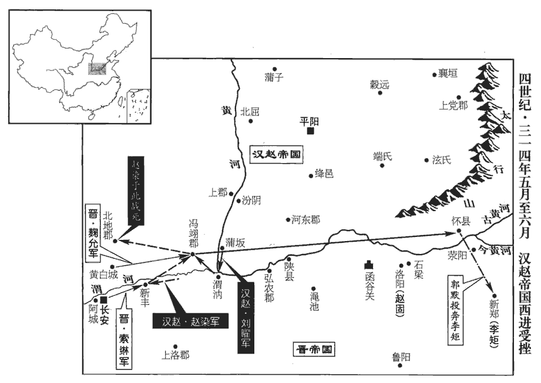
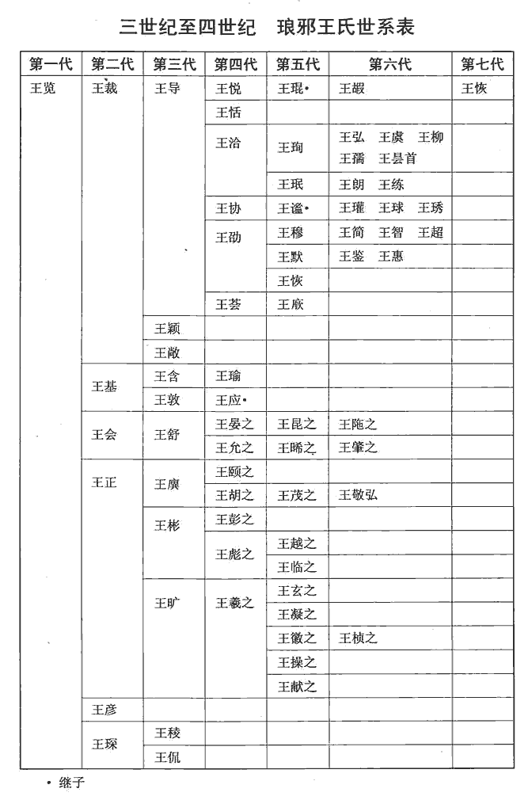
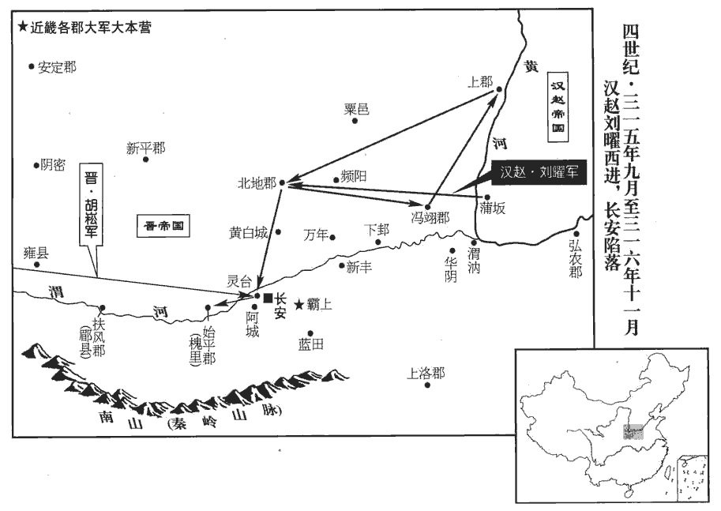

 晉紀十一起閼逢閹茂（甲戌），盡柔兆困敦（丙子），凡三年。

# 孝愍皇帝下

## 建興二年（甲戌，三一四）

1春，正月，辛未‹一›，有如日隕于地；又有三日相承，出西方而東行。天文占曰：三、四、五、六日，俱出并爭，天下兵作；又曰：三日并出，不過三旬，諸侯爭為帝。

〖译文〗 [1]春季，正月，辛未（初一），有个像太阳似的东西殒落到地下，又接连出现三个太阳，从西方朝东行。

2丁丑‹七›，大赦。

〖译文〗 [2]丁丑（初七），宣布大赦。

3有流星出牽牛，入紫微，晉天文志，牽牛六星，在河鼓南。光燭地，墜于平陽‹山西临汾›北，化為肉，長三十步，廣二十七步。長，直亮翻；廣，古曠翻；後放此。漢主聰惡之，惡，烏路翻。以問公卿。陳元達以為「女寵太盛，亡國之徵。」考異曰：載記，「元達等曰：『臣恐後庭有三后之事。』」按立三后，在明年，於時未也。聰曰：「此陰陽之理，何關人事！」聰后劉氏‹刘娥›賢明，聰所為不道，劉氏每規正之。己丑‹十九›，劉氏卒，諡曰武宣。自是嬖寵競進，後宮無序矣。嬖bì，卑義翻，又博計翻。

〖译文〗 [3]有流星从牵牛星处出来，进入紫徽星座，星光照亮了地面，后坠落在平阳以北，变成肉，长三十步，宽二十七步。汉主刘聪对此感到厌恶，就询问公卿大臣。陈元达认为是“后宫女宠太多，亡国的征兆”。刘聪说：“这是天象日月运转的道理，与人事有什么相关？”刘聪的皇后刘氏很贤慧明达，刘聪做得不符合道理，刘氏每次都规劝让他改正。己丑（十九日），刘氏去世，谥号为武宣。从此刘聪的宠女爱姬竞相争先，后宫中失去了秩序。

4聰置丞相等七公；七公見下，自晉王粲至中山王曜是也。又置輔漢等十六大將軍，輔漢、都護、中軍、上軍、撫軍、鎮、衛、京、前•後•左•右•上•下軍、輔國、冠軍、龍驤、虎牙等大將軍。各配兵二千，以諸子為之；又置左右司隸，各領戶二十餘萬，萬戶置一內史；單于左右輔，各主六夷十萬落，六夷，蓋胡、羯、鮮卑、氐、羌、巴蠻；或曰烏丸，非巴蠻也。單，音蟬。萬落置一都尉；左、右選曹尚書，并典選舉。自司隸以下六官，皆位亞僕射。以其子粲為丞相、領大將軍、錄尚書事，進封晉王。江都王延年錄尚書六條事，錄尚書六條事始見於此。沈約志曰：晉康帝世，何充讓錄表云：「咸康中，分置三錄，王導錄其一，荀崧、陸曄各錄六條事。」然則似有二十四條；若止有十二條，則荀、陸各錄六條，導又何所司乎？若導總錄，荀、陸分掌，則不得復云導錄其一也。其後每置二錄，輒云各錄六條事，又似止有十二條；十二條者，不知悉何條也。江右張華，江左庾亮，并經關尚書七條，則亦不知皆何事也。余按：宋元嘉以後，江夏王義恭、始興王濬、南譙王義宣皆錄尚書六條事。沈氏世仕江左，歷位通顯，且不知為何事，後之人何所取徵！杜佑曰：何充讓錄表曰：「咸康中，分置三錄，王導錄其一，荀崧、陸曄各錄二條事。」晉氏渡江，有吏部、祠部、左民、五兵、度支五尚書，是五條也。晉初有吏部、三公、客曹、駕部、屯田、度支六曹，太康有吏部、殿中、五兵、田曹、度支、左民六曹，蓋六條也。如杜佑之言，則六條蓋六曹也。沈約以何充表「各錄二條」為「各錄六條」，致有此誤。汝陰王景為太師，王育為太傅，任顗為太保，馬景為大司徒，朱紀為大司空，中山王曜為大司馬。

〖译文〗 [4]刘聪设置了丞相等七公；又设置辅汉等十六大将军，各配备二千兵士，让他的儿子们来担任；又设置左、右司隶，各辖领二十多万户，每万户设一个内史；又设置单于左右辅，各统领胡、羯、鲜卑、氐、羌、乌丸等六类共十万帐落，每一万帐落设一个都尉；设置左、右选曹尚书，共同负责选举事务。从司隶以下的六个官职，地位都仅次于仆射。让自己的儿子刘粲担任丞相、兼大将军、录尚书事，进封为晋王。以江都王刘延年担任录尚书六条事，让汝阴王刘景任太师，王育任太傅，任任太保，马景任大司徒，朱纪任大司空，中山王刘曜任大司马。

5壬辰‹二十二›，王子春等及王浚使者至襄國‹河北邢台›，石勒匿其勁卒、精甲，羸師虛府以示之，羸，倫為翻。北面拜使者而受書。浚遺勒麈尾，遺，于季翻。麈zhǔ，腫庾翻，麋屬，尾能生風，辟蠅蜹ruì，晉王公貴人多執麈尾，以玉為柄。勒陽不敢執，懸之於壁，朝夕拜之，曰：「我不得見王公，見其所賜，如見公也。」復遣董肇奉表于浚，期以三月中旬親詣幽州奉上尊號；復，扶又翻。上，時掌翻。亦脩牋于棗嵩，求并州牧、廣平公。

〖译文〗 [5]壬辰（二十二日），王子春和王浚的使者到达襄国，石勒把他强壮的兵士、精锐的兵器都藏起来，用老弱残兵空虚的府帐给使者看，郑重地向北拜会使者接受王浚的信。王浚送给石勒标志风雅的麈尾，石勒假装不敢拿在手上，而把麈尾悬挂在墙壁上，早晨晚上都恭敬地向它叩拜，说：“我不能见到王公，见他所赐的物品，就像见到他一样。”又派遣董肇向王浚奉交奏表，约定三月中旬亲自到幽州尊奉王浚为帝。又给枣嵩去信，请求担任并州牧、广平公。

勒問浚之政事於王子春，子春曰：「幽州去歲大水，人不粒食，五穀不登，故不粒食。浚積粟百萬，不能賑贍，刑政苛酷，賦役殷煩，忠賢內離，夷狄外叛。人皆知其將亡，而浚意氣自若，曾無懼心，方更置立臺閣，布列百官，自謂漢高、魏武不足比也。」勒撫几笑曰：「王彭祖真可擒也。」浚使者還薊‹北京›，薊，音計。具言「石勒形勢寡弱，款誠無二。」浚大悅，益驕怠，不復設備。

〖译文〗 石勒向王子春询问王浚的政事情况，王子春说：“幽州去年发大水，百姓无粮可吃，而王浚囤积了一百多万粟谷，却不赈济灾民，刑罚政令苛刻残酷，赋税劳役征发频繁，忠臣贤士从他身边离开，夷人、狄人也在外面叛离。人人都知道他将要灭亡，而王浚毫无察觉，若无其事，一点没有惧祸之意，刚刚又重新设置官署，安排文武百官，自以为汉高祖、魏武帝都无法与自己相比。”石勒按着几案笑着说：“王浚确实能够抓到了。”王浚派的使者返回蓟地，都说：“石勒目前兵力阵势孤独衰弱，忠诚而无二心。”王浚非常高兴，更加骄纵懈怠，不再安排防务。

6楊虎掠漢中吏民以奔成，梁州人張咸等起兵逐楊難敵。楊虎、楊難敵攻漢中，事始上卷上年。難敵去，咸以其地歸成，於是漢嘉‹四川省名山县北›、涪陵‹重庆市彭水县›、漢中‹陕西汉中›之地漢嘉，本前漢青衣縣，屬蜀郡，後漢順帝陽嘉二年改曰漢嘉，蜀分立漢嘉郡。皆為成有。成主雄‹李雄，本年四十一岁›以李鳳為梁州‹府设南郑陕西省汉中市›刺史，任回為寧州‹府设滇池云南省晋宁县东晋城镇›刺史，李恭為荊州‹府设江州重庆市›刺史。

〖译文〗 [6]杨虎掳掠汉中的官吏、百姓投奔成汉，梁州人张咸等起兵赶走了杨难敌。杨难敌离开，张咸把这块地盘送给成汉，这样汉嘉、涪陵、汉中等地，都被成汉所占有。成汉主李雄任李凤为梁州刺史，任回为宁州刺史，李恭为荆州刺史。

雄虛己好賢，隨才授任，好，呼到翻。命太傅驤養民於內，李鳳等招懷於外，刑政寬簡，獄無滯囚。興學校，置史官。校，戶教翻。其賦，民男丁歲穀三斛，女丁半之，疾病又半之；戶調絹不過數丈，綿數兩。調，徒釣翻，賦也。事少役希，少，詩沼翻。民多富實，新附者皆給復除。復，方目翻。是時天下大亂，而蜀獨無事，年穀屢熟，乃至閭門不閉，路不拾遺。漢嘉‹四川省名山县北›夷王沖歸、朱提‹云南昭通›審炤zhào、建寧‹云南曲靖›爨cuàn畺jiāng皆歸之。朱提，音銖時。炤，與照同。爨，取亂翻，夷人姓也。畺，與疆同，居良翻。巴郡嘗告急，云有晉兵。雄曰：「吾常憂琅邪微弱，遂為石勒所滅，以為耿耿，耿，古幸翻；耿耿，憂也。不圖乃能舉兵，使人欣然。」然雄朝無儀品，爵位濫溢；朝，直遙翻。吏無祿秩，取給於民；軍無部伍，號令不肅；此其所短也。

〖译文〗 李雄虚心而喜欢贤能，按照人的才能安排他们职任，让太傅李骧在内管理教化百姓，李凤在外招抚怀柔，刑法政令宽大简明，监狱中没有长期不定罪的囚犯。兴办学校，设置史官。成汉的赋税、百姓中成年男子每年每人交纳三斛谷，成年女子减半，病人再减半。每户的赋仅仅几丈绢，几两绵。事情少劳役很少征发，百姓大多很富裕，新归附的人都免除徭役。当时天下大乱，而只有蜀地无事，一年谷物几熟，以至于门户不闭、路不拾遗。汉嘉的夷人首领冲归，朱提的审、建宁的爨都去投靠成汉。巴郡曾经告急，说出现晋朝军队。李雄说：“我常常忧虑晋琅邪王势力微弱，很快会被石勒消灭，对此深感忧虑，没有想到他们还能进行军事行动，这使人感到高兴。”但是，李雄朝廷中没有礼仪和品秩，爵位过于冗滥，官吏也没有俸禄的等级，向百姓索取给养。军队也没有队伍建制，号令不够严肃，这些是成汉所欠缺的。

7二月，壬寅‹二›，以張軌為太尉、涼州牧，封西平郡公；王浚為大司馬、都督幽•冀諸軍事；荀組為司空、領尚書左僕射兼司隸校尉，行留臺‹在浚仪河南省开封市›事；劉琨為大將軍、都督并州諸軍事。朝廷以張軌老病，拜其子寔為副刺史。副刺史，前此未有也。

〖译文〗 [7]二月，壬寅（初二），晋朝任张轨为太尉、凉州牧，封为平西郡公；任王浚为大司马，都督幽、冀二州诸军事；任荀组为司空。尚书左仆射兼司隶校尉、行留台事；任刘琨为大将军、都督并州诸军事。朝廷因为张轨年老有病，任命他儿子张担任副刺史。

8石勒纂嚴，將襲王浚，而猶豫未發。張賓曰：「夫襲人者，當出其不意。今軍嚴經日而不行，豈非畏劉琨及鮮卑、烏桓為吾後患乎？」勒曰：「然。為之柰何？」賓曰：「彼三方智勇無及將軍者，將軍雖遠出，彼必不敢動，且彼未謂將軍便能懸軍千里取幽州也。輕軍往返，不出二旬，藉使彼雖有心，比其謀議出師，比，必寐翻。吾已還矣。且劉琨、王浚，雖同名晉臣，實為仇敵。若脩牋于琨，送質請和，質，音致；下同。琨必喜我之服而快浚之亡，終不救浚而襲我也。用兵貴神速，勿後時也。」勒曰：「吾所未了，右侯已了之，了，決也。吾復何疑！」復，扶又翻；下敢復同。

〖译文〗 [8]石勒戒严，将要袭击王浚，但犹豫不决没有发兵。张宾说：袭击敌人，应该出其不意，现在军队戒严一整天还不出发，莫非是害怕刘琨以及鲜卑人、乌桓人成为我们的后患吗？”石勒说：“是的，怎么呢？”张宾说：“他们三个方面才智和胆略没有比得上将军您的，将军即使远征，他们也一定不敢妄动，再说他们未必知道将军能够孤军深入一千里而夺取幽州。轻装的军队往返，超不过二十天，假如他们真的有这个想法，等他们商议后出师，我们已回来了。再说刘琨、王浚，虽然他们名义上同属晋朝的大臣，实际上却是仇敌。如果我们给刘琨去信，送去人质请求停战，刘琨一定为我们的顺服而高兴，对王浚的灭亡而称快，最终不会为救王浚而袭击我们。用兵贵在神速，不要拖延时间。”石勒说：“我所没有了却的，右侯已决断，我还有什么可迟疑的呢？”

遂以火宵行，至柏人‹河北隆尧›，柏人縣，屬趙國，唐為邢州堯山縣。殺主簿游綸，以其兄統在范陽‹河北涿州›恐泄軍謀故也。遣使奉牋送質于劉琨，自陳罪惡，請討浚以自效。琨大喜，移檄州郡，稱「己與猗盧方議討勒，勒走伏無地，求拔幽都以贖罪。今便當遣六脩南襲平陽‹山西临汾›，除僭偽之逆類，降知死之逋bū羯，逆類，謂劉聰；逋羯，謂石勒。降，戶江翻。羯，居謁翻。順天副民，翼奉皇家，斯乃曩年積誠靈祐之所致也！」浚，琨為勒所玩弄而不自覺，宜其相繼而覆亡也。考異曰：琨集，檄首云，「三月庚午朔，五日甲戌。」按石勒以壬申克幽州，蓋時晉陽尚未知也。欲敘琨事畢，然後敘勒事，故置此。

〖译文〗 于是举火把连夜行军，到达柏人县，杀主簿游纶，这是因为他哥哥游统在范阳，害怕他泄露军情的缘故。又派遣使者拿着信笺给刘琨送去人质，自己述列罪恶，请求以讨伐王浚来报效刘琨。刘琨大喜过望，向州郡传布檄文，声称：“我与拓跋猗卢正商议讨伐石勒，石勒走投无路，请求用攻克幽都来赎罪。现在应乘便派拓跋六向南袭击平阳，清除伪逆皇帝刘聪，降服知死的逃亡羯人石勒，顺应天意使百姓安定，辅助尊奉皇室，这是多年一直积累的诚心请神灵庇佑的结果。”

三月，勒軍達易水，王浚督護孫緯馳遣白浚，緯，于貴翻。將勒兵拒之,游統禁之,浚將佐皆曰：「胡貪而無信，必有詭計，請擊之」浚怒曰：「石公來，正欲奉戴我耳；敢言擊者斬！」眾不敢復言。浚設饗以待之。壬申‹三›，勒晨至薊‹北京›，薊，音計。考異曰：三十國春秋，先言「癸酉，勒取幽州」，後言「壬午，勒晨至薊」。按劉琨表曰：「勒以三月三日徑掩薊城」，然則當言壬申是也。叱門者開門；猶疑有伏兵，先驅牛羊数千頭，聲言上禮，言欲以牛羊上浚以為禮。上，時掌翻。實欲塞諸街巷。塞，悉則翻。浚始懼，或坐或起。勒既入城，縱兵大掠，浚左右請禦之，浚猶不許。勒升其聽事，中庭曰聽事，言受事察訟於是。漢、晉皆作「聽事」，六朝以來乃始加「广」作「廳」；并他經翻。浚乃走出堂皇，堂無四壁曰皇。勒眾執之。勒召浚妻，與之并坐，執浚立於前。浚罵曰：「胡奴調乃公，調，田聊翻，戲也。何凶逆如此！」勒曰：「公位冠元台，冠，古玩翻。手握強兵，坐觀本朝傾覆，朝，直遙翻；下同。曾不救援，乃欲自尊為天子，非凶逆乎！又委任姦貪，殘虐百姓，賊害忠良，毒徧燕土，燕，於賢翻。此誰之罪也！」使其將王洛生以五百騎送浚于襄國‹河北邢台›。浚自投于水，束而出之，斬于襄國市‹年六十三岁›。

〖译文〗 三月，石勒的军队到达易水，王浚的督护孙纬急速派人告诉王浚，将要指挥军队阻击石勒，游统制止这个行动。王浚的将领参佐都说：“胡人贪婪不讲信用，一定有诡计，请攻打石勒。”王浚发怒说：“石公来，正是要尊奉拥戴我，有敢说攻打的人，杀！”大家都不敢再说。王浚安排宴会准备接待石勒。壬申（初三），石勒早晨到蓟城，喝叱守门卫士开门。开门后石勒怀疑有埋伏的军队，就先驱赶几千头牛羊进城，声称是给王浚奉上礼物，实际上想用牛羊堵塞住街巷。王浚这才有些恐惧，坐立不安。石勒进入城里后，纵兵抢掠，王浚身边的官员请示防御石勒，王浚还不允许。石勒登上中庭，王浚于是走出殿堂，石勒的部众抓住了他。石勒召来王浚的妻子，与她并排坐着，押着王浚站在前面。王浚骂道：“胡奴调戏你老子，为什么这样凶恶叛逆！”石勒说：“您地位高于所有大臣，掌握着强大的军队，却坐视朝廷倾覆，竟不去救援，还想尊自己为天子，难道不是凶恶叛逆吗？又任用奸诈贪婪的小人，残酷虐待百姓，杀死迫害忠良，祸害遍及整个燕土，这是谁的罪呀！”石勒派他的将领王洛生用五百骑兵把王浚押送到襄国，王浚自己投水，兵士们把他捆绑住拉出，在襄国的街市上把他杀了。

勒殺浚麾下精兵萬人。浚將佐争詣軍門謝罪，饋賂交錯；前尚書裴憲、從事中郎荀綽獨不至，勒召而讓之曰：「王浚暴虐，孤討而誅之，諸人皆來慶謝，二君獨與之同惡，將何以逃其戮乎！」對曰：「憲等世仕晉朝，荷其榮祿，荷，下可翻。浚雖凶粗，猶是晉之藩臣，故憲等從之，裴憲奔幽州，見八十七卷懷帝永嘉五年。不敢有貳。明公苟不脩德義，專事威刑，則憲等死自其分，分，扶問翻。又何逃乎！請就死。」不拜而出。勒召而謝之，待以客禮。綽，勗xù之孫也。勒數朱碩、棗嵩等以納賄亂政，為幽州患，事見上卷上年。數，所具翻。責游統以不忠所事，皆斬之。以統欲以范陽私附之也。籍浚將佐親戚家貲，皆至巨萬，惟裴憲、荀綽止有書百餘袠zhì，鹽米各十餘斛而已。袠，與帙同，直質翻；書卷編次成帙。勒曰：「吾不喜得幽州，喜得二子。」以憲為從事中郎，綽為參軍。分遣流民，各還鄉里。勒停薊二日，焚浚宮殿，以故尚書燕國劉翰行幽州刺史，戍薊‹北京›，置守宰而還。還，從宣翻，又如字。孫緯遮擊之，勒僅而得免。

〖译文〗 石勒杀了王浚指挥下的一万精锐兵士。王浚的部将参佐争相到军门请罪，馈赠贿赂交相送来。只有前尚书裴宪、从事中郎荀绰没有到。石勒把他们召来斥责说：“王浚残暴凶虐，我讨伐而诛杀他，大家都来庆贺谢罪，二君偏偏要与他一同作恶，将怎么逃脱杀戮呢？”他们回答说：“我们几代为晋朝做官，承受着晋朝给予的光荣与俸禄，王浚虽然凶暴粗俗，但仍然是晋朝的藩镇大臣，所以我们跟随他，不敢有二心。您如果不讲究德义，专靠威势刑罚，那么我们死也是自己的本分，又为什么要逃脱呢？请让我们赴死。”说完不拜辞而昂然出去。石勒又召他们进来表示道歉，用待客之礼对待他们。荀绰是荀勖的孙子。石勒历数朱硕、枣嵩等人收受贿赂搞乱政事，是幽州的祸患；斥责游统任职不忠，把他们都杀了。查抄没收王浚的部将参佐、亲戚的巨额家产，唯独裴宪、荀绰仅有百余套书，盐、米各有十几斛而已。石勒说：“我并不因为取得幽州而高兴，而是为得到你们二人感到高兴。”任裴宪为从事中郎、荀绰为参军。分别遣送流民，让他们各自回到故乡。石勒在蓟城停留了二天，焚烧了王浚的宫殿，以前尚书燕国人刘翰担任幽州刺史，戍守蓟城，安排了郡县长官后回师。孙纬出兵阻击，石勒仅得以逃脱。

勒至襄國‹河北邢台›，遣使奉王浚首獻捷于漢；漢以勒為大都督、督陝東諸軍事、此陝東，亦取分陝之義而授之耳。驃騎大將軍、東單于，驃，匹妙翻。單音蟬。增封十二郡；勒固辭，受二郡而已。

〖译文〗 石勒回到襄国，派遣使者带着王浚首级向汉报捷。汉任石勒为大都督、都督陕东诸军事、骠骑大将军、东单于，增封十二个郡，石勒坚持推辞，仅仅接受了两个郡罢了。

劉琨請兵於拓跋猗盧以擊漢，會猗盧所部雜胡萬餘家謀應石勒，猗盧悉誅之，不果赴琨約。琨知石勒無降意，乃大懼，降，戶江翻。上表曰：「東北八州，勒滅其七；勒入鄴，殺都督東燕王騰；寇信都，殺冀州刺史王斌；襲鄄城，殺兗州刺史袁孚；攻新蔡，殺豫州刺史新蔡王確；襲蒙城，擒青州都督苟晞；克上白，斬青州刺史李惲；攻信都，殺冀州刺史王象；攻定陵，殺兗州刺史田徽；襲幽州，擒王浚；除李惲、田徽，王浚承制所授，是滅其七也。先朝所授，存者惟臣。朝，直遙翻。勒據襄國‹河北邢台›，與臣隔山，山，自太行、恆山至于幽、碣jié，連延不斷，襄國在山東，晉陽在山西。朝發夕至，城塢駭懼，雖懷忠憤，力不從願耳！」

〖译文〗 刘琨向拓跋猗卢请求军队来攻打汉，正遇到拓跋猗卢所辖的一万多家成分复杂的胡人密谋接应石勒，拓跋猗卢把他们全部杀了，没有赶赴与刘琨所约的行动。刘琨得知石勒没有投降的意思，非常害怕，上奏表说：“东北地区八个州，石勒消灭了其中七个，以前晋朝所安排的州牧，只有我留存下来。石勒占据襄国，与我仅隔一座山，早晨出兵晚上就能到达，各个城堡都震骇惊恐，虽然心怀忠诚与仇恨，但是也力不从心呀！”

劉翰不欲從石勒，乃歸段匹磾，匹磾遂據薊城‹北京›。磾，丁奚翻。王浚從事中郎陽裕，躭之兄子也，逃奔令支‹河北迁安›，令支縣，漢屬遼西，故孤竹君之國，晉省，段氏據之為國都，應劭曰：令，音鈴。裴松之曰：支，其兒翻。師古曰：令，又音郎定翻。杜佑曰：令支，今北平郡盧龍縣即其地。依段疾陸眷。會稽‹浙江绍兴›朱左車、魯國‹山东省曲阜市›孔纂、泰山‹山东泰安东›胡母翼，自薊逃奔昌黎‹辽宁义县›，依慕容廆。會，工外翻。廆，戶罪翻。是時中國流民歸廆者數萬家，廆以冀州人為冀陽郡‹辽宁省朝阳市西›，據魏收地形志，冀陽郡當置於漢北平平剛縣界。豫州人為成周郡‹辽宁省锦州市境›，成周屬豫州之地，故以為郡名。青州人為營丘郡‹辽宁省凌海市›，前漢志：遼西臨渝縣，有渝水，首受白狼水，南流逕營丘城西，廆所置郡也。并州人為唐國郡‹辽宁省喀喇沁左翼县境›。并州，古唐國也，廆因以名郡。成周、唐國二郡，所置地闕。

〖译文〗 刘翰不想附从石勒，于是投靠段匹，段匹于是便占据了蓟城。王浚的从事中郎阳裕是阳哥哥的儿子，逃奔到令支县，依附于段疾陆眷。会稽人朱左车、鲁国人孔纂，泰山人胡母翼等从蓟城逃奔昌黎，依附于慕容。当时中原投奔慕容的流民有几万家，慕容为冀州人设置冀阳郡，豫州人设置成周郡，青州人设置营丘郡，并州人设置唐国郡。

9初，王浚以邵續為樂陵太守，屯厭次‹山东省阳信县东南›。厭次，本前漢平原郡之富平縣，後漢明帝更名厭次，晉分屬樂陵，為治所。丁度集韻：厭，於琰翻。九域志曰：相傳秦始皇東遊，厭氣碣石，次舍於此，因以為名。魏收曰：樂陵郡厭次縣有富城，邵續居之。浚敗，續附於石勒，勒以續子乂為督護。浚所署勃海‹河北南皮›太守東莱‹山东省莱州市›劉胤棄郡依續，謂續曰：「凡立大功，必杖大義。君，晉之忠臣，柰何從賊以自汙乎！」汙，烏故翻。會段匹磾以書邀續同歸左丞相睿，續從之。其人皆曰：「今棄勒歸匹磾，其如乂何？」續泣曰：「我豈得顧子而為叛臣哉！」殺異議者數人。勒聞之，殺乂。續遣劉胤使江東，使，疏吏翻。睿以胤為參軍，以續為平原‹山东平原›太守。石勒遣兵圍續，匹磾使其弟文鴦救之，勒引去。

〖译文〗 [9]当初，王浚以邵续任乐陵太守，驻扎在厌次县。王浚失败，邵续依附于石勒，石勒以邵续的儿子邵任督护。王浚所管辖的勃海太守东莱人刘胤弃职投奔邵续，对邵续说：“凡是建立大功，一定要依仗大义。您是晋朝的忠臣，为什么顺从贼寇玷污自己呢？”正好段匹来信邀请邵续一同投靠左丞相司马睿，邵续同意了这个邀请。他手下的人都说：“现在离弃石勒而投靠段匹，那邵怎么办？”邵续哭着说：“我难道能为顾惜儿子而作叛臣吗？”杀了几个持异议的人。石勒听说后，杀了邵。邵续派遣刘胤作为使者到江东，司马睿让刘胤担任参军，任邵续为平原太守。石勒派兵包围邵续，段匹派他弟弟段文鸯救援邵续，石勒带兵离去。

10襄國‹河北邢台›大饑，穀二升直銀一斤，肉一斤直銀一兩。

〖译文〗 [10]襄国饥荒严重，二升谷子价值一斤银子，一斤肉价值一两银子。

11杜弢將王真襲陶侃於林障‹湖北省武汉市西›，水經註：林障在江夏沌陽縣，沔水逕沌陽縣北，又東逕林障故城北。宋白曰：晉江夏郡治林障，義熙元年方徙夏口。侃奔灄shè中‹湖北黄陂南›。周訪救侃，擊弢兵，破之。灄，書涉翻。丁度曰：灄，水名，在西陽。水經註：溳水過江夏安陸縣而東南流，分為二水，東通灄水，西入于沔。

〖译文〗 [11]杜带领王真到林障袭击陶侃，陶侃逃奔滠中。周访救援陶侃，打败了杜的军队。

12夏，五月，西平武穆公張軌寝疾，遺令：「文武將佐，務安百姓，上思報國，下以寧家。」己丑‹二十›，軌薨‹年六十岁›；考異曰：帝紀作「壬辰」。今從前涼錄鈔。前涼錄鈔又曰「葬建陵」，蓋張祚僭號後，追尊其墓耳。長史張璽等表世子寔攝父位。璽，斯氏翻。

〖译文〗 [12]夏季，五月，西平武穆公张轨病危，下达遗令：“文武官员，一定要使百姓安定，一方面报国，一方面宁家。”己丑（二十日），张轨去世。长史张玺等人表奏张轨的长子张代理他父亲的职务。

13漢中山王曜、趙染寇長安，六月，曜屯渭汭ruì‹渭水注入黄河处›，春秋左氏傳曰：虢公敗戎于渭汭。杜預曰：水之隈曲曰汭；王肅曰：汭，入也。呂忱chén曰：汭者，水相入也。即渭水入河處。汭，儒稅翻。染屯新豐‹陕西临潼东北›，索綝將兵出拒之。索，昔各翻。綝，丑林翻。染有輕綝之色，長史魯徽曰：「晉之君臣，自知強弱不敵，將致死於我，不可輕也。」染曰：「以司馬模之強，吾取之如拉朽；事見八十七卷懷帝永嘉五年。拉，落合翻。索綝小豎，豈能汙吾馬蹄、刀刃邪！」晨，帥輕騎數百逆之，汙，烏故翻。帥，讀曰率；下同。曰：「要當獲綝而後食。」綝與戰于城西，新豐‹陕西临潼东北›城西也。染兵敗而歸。悔曰：「吾不用魯徽之言以至此，何面目見之！」先命斬徽，徽曰：「將軍愚愎以取敗，乃復忌前害勝，復，扶又翻；下同。愎，弼力翻。忌前，忌人在前；害勝，害勝己者。誅忠良以逞忿，猶有天地，將軍其得死於枕席乎！」‹司马邺，本年十五岁›詔加索綝驃騎大將軍、尚書左僕射、錄尚書，承制行事。驃，匹妙翻。

〖译文〗 [13]汉中山王刘曜、赵染进犯长安。六月，刘曜在渭驻扎，赵染在新丰驻扎。索带兵出去阻击。赵染有轻视索的表现，长史鲁徽说：“晋朝的君主大臣，自己知道力量悬殊不是对手，将与我们拼命，不能够轻视。”赵染说：“司马模那么强大，我打败他如同摧枯拉朽。索这小子，难道还能弄脏我的马蹄、刀刃吗？”早晨，率领几百轻骑兵迎着索的军队而去，说：“抓到索以后再吃饭。”索与赵染在新丰城西交战，赵染兵败而归。懊悔说：“我不听鲁徽的话以致失败，有什么脸面见他！”先命令杀掉鲁徽，鲁徽说：“将军您愚鲁刚愎所以失败，却又忌恨残害在你前面胜过你的人，诛杀忠良以发泄愤恨，天地报应尚在，您难道能有善终吗？”朝廷诏令任命索为骠骑大将军、尚书左仆射、录尚书事，奉制书行事。

 

曜、染復與將軍殷凱帥眾數萬向長安，考異曰：晉春秋作「段凱」。今從麴允傳。麴允逆戰於馮翊‹陕西大荔›，允敗，收兵；夜，襲凱營，凱敗死。曜乃還攻河內太守郭默于懷‹河南武陟›，列三屯圍之。默食盡，送妻子為質，請糴dí於曜，糴畢，復嬰城固守。曜怒，沈默妻子于河而攻之。質，音致。沈，持林翻。默欲投李矩於新鄭‹河南新郑›，新鄭縣，漢屬河南郡，晉省，其地當在滎陽郡界。周宣王弟鄭桓公本封京兆之鄭縣；其子武公邑于虢、鄶kuài之間，遂為鄭國。左傳鄭莊公曰：「吾先君新邑于此」，後遂為新鄭縣，以別京兆之鄭。矩使其甥郭誦迎之，兵少，不敢進。少，詩照翻。會劉琨遣參軍張肇帥鮮卑五百餘騎詣長安，道阻不通，還，過矩營，矩說肇，使擊漢兵。說，輸芮翻。漢兵望見鮮卑，不戰而走，默遂率眾歸矩。漢主聰召曜還屯蒲坂‹山西永济›。

〖译文〗 刘曜、赵染又与将军殷凯率领几万军队进发长安，允在冯翊迎战，结果允失败，收兵。夜里，袭击殷凯军营，殷凯失败而死。刘曜于是回师到怀县攻打河内太守郭默，屯列三处包围他。郭默粮食吃完了，就把妻儿送到刘曜那里当人质，请求在刘曜处买粮，买完粮食，郭默又关闭四周城门固守。刘曜发怒，把郭默的妻儿沉到河中而攻打郭默。郭默想到新郑投奔李矩，李矩派自己的外甥郭诵去迎接郭默，结果兵少而不敢向前。这时刘琨派遣参军张肇带领五百多鲜卑骑兵到长安，因道路不通，正往回走，路过李矩的军营，李矩劝说张肇，让他攻打汉军。结果，汉军远远看到鲜卑骑兵，不战而走，这样郭默便率众归了李矩。汉主刘聪召刘曜回到蒲坂驻扎。

14秋，趙染攻北地‹陕西耀县›，麴允拒之，染中弩而死。中，竹仲翻。

〖译文〗 [14]秋季，赵染攻打北地，遭到允阻击，赵染身中弩箭而死。

15石勒始命州郡閱實戶口，戶出帛二匹，穀二斛。

〖译文〗 [15]石勒开始命令所据各州郡核实户口，每户征收二匹帛、二斛谷。

16冬，十月，以張寔為都督涼州諸軍事、涼州刺史、西平公。

〖译文〗 [16]冬季，十月，朝廷任张为都督凉州诸军事、凉州刺史、西平公。

17十一月，漢主聰以晉王粲為相國、大單于，摠百揆。粲少有俊才，自為宰相，驕奢專恣，遠賢親佞，嚴刻愎諫，國人始惡之。為後粲為靳準所弒張本。少，詩照翻。遠，于願翻。惡，烏路翻。

〖译文〗 [17]十一月，汉主刘聪任晋王刘粲为相国、大单于，总领文武百官。刘粲年轻时有杰出的才能，但自从当了宰相后，骄纵奢侈独断专行，疏远贤能亲近奸诈机巧的人，严厉苛刻，一意孤行不听规劝，开始遭到国人的憎恶。

18周勰以其父遺言，見上卷建興元年。勰，音協。因吳人之怨，謀作亂；使吳興‹浙江湖州›功曹徐馥矯稱叔父丞相從事中郎札zhá之命，收合徒眾，以討王導、刁協，豪傑翕然附之，孫皓族人弼亦起兵於廣德‹安徽廣德›以應之。沈約曰：廣德縣，疑是吳所立，屬宣城郡。按今廣德軍即其地。宋白曰：廣德縣，本秦障郡地，漢以為故障縣。

〖译文〗 [18]周勰根据他父亲的遗言，利用吴地士人的怨恨，密谋叛乱。他派吴兴功曹徐馥假称叔父丞相从事中郎周札的命令，收揽聚合部众，来讨伐王导、刁协，江南豪杰纷纷前来归附他，孙皓的族人孙弼也在广德起兵响应他。

## 三年（乙亥，三一五）

1春，正月，徐馥殺吳興‹浙江湖州›太守袁琇，琇，音秀，又音酉。有眾數千，欲奉周札為主。札聞之，大驚，以告義興‹江苏宜兴›太守孔侃。勰知札意不同，不敢發。馥黨懼，攻馥，殺之；孫弼亦死。札子續亦聚眾應馥，左丞相睿議發兵討之。王導曰：「今少發兵則不足以平寇，少，詩照翻。多發兵則根本空虛。續族弟黃門侍郎莚，莚yán，夷然翻。忠果有謀，請獨使莚往，足以誅續。」睿從之。莚晝夜兼行，至郡，將入，遇續於門，謂續曰：「當與君共詣孔府君，有所論。」續不肯入，莚牽逼與俱。坐定，莚謂孔侃曰：「府君何以置賊在坐？」坐，徂臥翻。續衣中常置刀，即操刀逼莚，操，千高翻。莚叱郡傳教吳曾格殺之。傳教，郡吏也；宣傳教令者也。莚因欲誅勰，札不聽，委罪於從兄卲而誅之。莚不歸家省母，從，才用翻。省，悉景翻。遂長驅而去，母狼狽追之。睿以札為吳興‹浙江湖州›太守，莚為太子右衛率。以周氏吳之豪望，故不窮治，撫勰如舊。率，如字。治，直之翻。

〖译文〗 [1]春季，正月，徐馥杀吴兴太守袁，拥有几千人，想尊奉周札为首领。周札听说后，非常惊恐，把这事告诉了义兴太守孔侃。周勰知道周札的想法不同，不敢冒然举事。徐馥的部众害怕，就攻打徐馥，把他杀了，孙弼也被杀死。周札的儿子周续也聚集部众响应徐馥，左丞相司马睿商议发兵讨伐他。王导说：“现在派兵少了不足以平定敌寇，派兵多了会使得我们根基空虚。周续的族弟黄门侍郎周，忠诚果敢有谋略，请派周独自带兵前往，完全能够诛杀周续。”司马睿采纳了这个建议。周日夜兼程，到了郡城，正要进去，在城门遇到周续，就对周续说：“正要与您一起去拜会府君孔侃，有话要说。”周续不肯进去，周拉着逼迫他一起去。进去坐定后，周对孔侃说：“您为什么安排乱贼坐下？”周续的衣服里常常藏着刀，随即拿起刀逼临周，周喝令郡传教吴曾杀了周续。周便想去诛杀周勰，周札不同意，就将罪名加到堂兄周邵身上，把他杀了。周不回家看望母亲，就直接离开了，他的母亲跌跌撞撞地追他。司马睿让周札任吴兴太守，周任太子右卫率。因为周氏是吴地的豪门望族，所以并不深究，并像以前一样抚慰周勰。

2‹司马邺，本年十六岁›詔平東將軍宋哲屯華陰‹陕西省华阴市›。華陰縣，前漢屬京兆，後漢、晉屬弘農郡。華，戶化翻。

〖译文〗 [2]朝廷诏令平东将军宋哲驻扎在华阴。

3成主雄‹李雄，本年四十二岁›立后任氏。

〖译文〗 [3]成汉主李雄把任氏立为皇后。

4二月，丙子‹二十二›，以琅邪王睿‹时驻建康›為丞相、大都督、督中外諸軍事，南陽王保‹时驻上邽甘肃省天水市›為相國，荀組‹时驻浚仪河南省开封市›為太尉、領豫州牧，劉琨‹时驻阳曲山西省阳曲县›為司空、都督并、冀、幽三州諸軍事。琨辭司空，不受。

〖译文〗 [4]二月，丙子（十二日），朝廷任琅邪王司马睿为丞相、大都督、都督中外诸军事，任南阳王司马保为相国，荀组为太尉、兼豫州牧，任刘琨为司空、都督并、幽、冀三州诸军事。刘琨推辞司空的职务，不接受。

5南陽王模之敗也，見八十七卷懷帝永嘉五年。都尉陳安往歸世子保於秦州‹甘肃天水›，保命安將千餘人討叛羌，寵待甚厚。保將張春疾之，譖安，云有異志，請除之，保不許；春輒伏刺客以刺安。安被創，馳還隴城‹甘肃省张家川县›，隴縣城也；前漢屬天水；後漢改天水為漢陽；晉省。以刺，七亦翻。被，皮義翻。創，初良翻。遣使詣保，貢獻不絕。使，疏吏翻。

〖译文〗 [5]南阳王司马模失败后，都尉陈安前往秦州把司马模的长子司马保送回，司马保命令陈安率领一千多兵士讨伐叛乱的羌人，对陈安的宠信待遇很深重。司马保的部将张春嫉妒陈安，就诬陷陈安，说陈安有异心，请司马保除掉他，司马保不同意。张春就埋伏了刺客刺杀陈安。陈安被刺伤，纵马驰骋回陇城，派使者到司马保那里，并不断地给司马保进贡献礼。

6詔進拓跋猗盧爵為代王‹首府盛乐内蒙古和林格尔县›，置官屬，食代‹河北蔚县›、常山‹河北正定›二郡。常山已為石勒所有。拓跋氏建國曰代，始此。猗盧請并州從事鴈門‹山西代县›莫含於劉琨，姓譜：莫姓，楚莫敖之後。琨遣之。含不欲行，琨曰：「以并州單弱，吾之不材而能自存於胡、羯之間者，代王之力也。吾傾身竭貲，以長子為質而奉之者，庶幾為朝廷雪大恥也。琨以長子遵質於猗盧。長，知兩翻。幾，居希翻。卿欲為忠臣，柰何惜共事之小誠而忘徇國之大節乎！往事代王，為之腹心，乃一州之所賴也。」含遂行。猗盧甚重之，常與參大計。

〖译文〗 [6]朝廷诏令进封拓跋猗卢的爵位为代王，设置安排属官，以代郡、常山郡作为封邑。拓跋猗卢向刘琨要并州从事雁门人莫含，刘琨派遣莫含前往。莫含不想走，刘琨说：“以并州的势单力薄，我无能而仍能够在胡人、羯人之间生存，完全是靠代王的力量。我之所以一心竭尽财产，并拿长子作为人质而对待代王，就是希望也许能够为朝廷洗雪大耻。你想当忠臣。为什么顾惜能够在一起共事的小小忠诚而忘记为国献身的大节呢？”去为代王做事，成为他的心腹，这是全州所依赖的呀。”莫含于是走了。拓跋猗卢非常重用莫含，常常让他参与制定大计。

猗盧用法嚴，國人犯法者，或舉部就誅，老幼相攜而行；人問：「何之？」曰：「往就死。」無一人敢逃匿者。

〖译文〗 拓跋猗卢用法严峻，国人中有犯法的，有时整个部落被处死，这个部落就老幼互相搀扶着前往。有人问：“去哪儿？”回答说：“去接受死刑。”没有一人敢逃跑躲藏。

7王敦遣陶侃、甘卓等討杜弢，前後數十戰，弢將士多死，乃請降於丞相睿，弢，土刀翻。將，即亮翻。降，戶江翻。睿不許。弢遺南平‹湖北公安›太守應詹書，遺，于季翻。自陳昔與詹「共討樂鄉‹湖北省松滋县东北›，本同休戚。後在湘中，懼死求生，遂相結聚。見八十七卷懷帝永嘉五年。儻以舊交之情，為明枉直，為，于偽翻；下同。使得輸誠盟府，時琅邪王睿為東南方鎮盟主，故曰盟府。廁列義徒，或北清中原，或西取李雄，以贖前愆qiān，雖死之日，猶生之年也！」詹為啟呈其書，且言「弢，益州秀才，羅尚刺益州，舉弢秀才。為，于偽翻。素有清望，為鄉人所逼。今悔惡歸善，宜命使撫納，以息江、湘之民！」使，疏吏翻。睿乃使前南海‹广州›太守王運受弢降，赦其反逆之罪，以弢為巴東‹重庆市奉节县东›監軍。監，工衡翻。弢既受命，諸將猶攻之不已。弢不勝憤怒，遂殺運復反，勝，音升。復，扶又翻。遣其將杜弘、張彥殺臨川‹江西臨川›內史謝摛chī，吳孫亮太平二年，分豫章東部都尉，立臨川郡。摛chī，丑之翻。遂陷豫章‹江西南昌›。三月，周訪擊彥，斬之，弘奔臨賀‹广西贺县›。臨賀縣，漢屬蒼梧郡，吳分立臨賀郡。

〖译文〗 [7]王敦派遣陶侃、甘卓等人讨伐杜，前后几十次战斗，杜的官兵大多战死，就向丞相司马睿请求投降。司马睿不同意。杜给南平太守应詹去信，自述过去与应詹“共同讨伐乐乡，本来同喜同愁。后来在湘中，畏死求生，这才聚众。假如能够以过去交往的情分，为我说明真情，使我能尽效忠诚，参加列入举义的人们当中，或者北伐清理中原，或者西征攻取李雄，来赎我以前犯的罪过，即使是死的日子，也像是再生之年！”应詹替他呈交了这封信，并且说：“杜是益州的秀才，一直享有很好的名望，被乡里人所逼迫才聚众叛乱。现在悔恶从善，应当派使者去安抚接受他投降，以使江、湘地区的百姓安定。”司马睿就派前南海太守王运去接受杜投降，赦免了杜的叛逆罪行，并任杜为巴东监军。杜接受任命后，各将领却仍然不停地攻打他。杜非常愤怒，于是杀了王运重新反叛，派他的部将杜弘、张彦杀了临川内史谢，攻陷了豫章。三月，周访攻打张彦，把他杀了，杜弘逃往临贺。

8漢大赦，改元建元。考異曰：十六國春秋，建元元年在晉建興二年。同編脩劉恕言，今晉州臨汾縣嘉泉村，有漢太宰劉雄碑，云「嘉平五年，歲在乙亥，二月六日立。」然則改建元在乙亥二月後也。

〖译文〗 [8]汉实行大赦，改年号为建元。

9雨血於漢‹都平阳，山西省临汾市›東宮延明殿，太弟义惡之，以問太傅崔瑋、太保許遐。瑋、遐說义曰：雨，于具翻。惡，烏路翻。說，輸芮翻。「主上往日以殿下為太弟者，欲以安眾心耳；其志在晉王久矣，聰子粲，封晉王。王公已下莫不希旨附之。今復以晉王為相國，羽儀威重，踰於東宮，萬機之事，無不由之，諸王皆置營兵以為羽翼，事見上年。事勢已去；殿下非徒不得立也，朝夕且有不測之危，不如早為之計。今四衛精兵不減五千，謂東宮、左、右、前、後四衛，率所統兵也。相國輕佻，正煩一刺客耳。佻，他彫翻。大將軍無日不出，其營可襲而取；粲弟勃海王敷，時為大將軍。餘王并幼，固易奪也。易，以豉翻。苟殿下有意，二萬精兵指顧可得，鼓行入雲龍門，宿衛之士，孰不倒戈以迎殿下者！大司馬不慮其為異也。」大司馬，謂中山王曜。义弗從。東宮舍人荀裕告瑋、遐勸义謀反，東宮舍人，太子舍人之職。义以太弟居東宮。漢主聰收瑋、遐於詔獄，假以他事殺之。使冠威將軍卜抽將兵監守東宮，冠，古玩翻。監，工銜翻。禁义不聽朝會。朝，直遙翻。义憂懼不知所為，上表乞為庶人，并除諸子之封，褒美晉王，請以為嗣；抽抑而弗通。

〖译文〗 [9]汉东宫延明殿降了血雨，太弟刘对此很厌恶，询问太傅崔玮、太保许遐。崔玮、许遐对刘说：“皇上过去让殿下担任太弟是想安定人心罢了。他要让晋王刘粲当皇位继承人的想法已经产生很久了。王公以下的官员没有谁不迎合他的旨意附和他。现在又让晋王担任相国，仪仗威严庄重，超过了殿下的东宫。国务军政大事，没有不由他决定的，另外亲王们也都安置营兵作为羽翼，殿下继承皇位的趋势已经没有了。殿下非但不能够继承皇位，而且早晚还有不测的危险，不如尽快安排对策。现在皇宫的禁卫有五千人以上的精锐兵士，相国刘粲轻佻，正可以烦劳一个刺客解决。大将军刘敷没有一天不出去，他的军营可以袭击夺取。剩下的亲王都年纪幼小容易解决。如果殿下有心，那么两万精锐兵士举手之劳便可完成，擂鼓走入云龙门，禁卫的兵士，谁能不倒戈来欢迎殿下！不必忧虑大司马刘曜会有异常举动。”刘不同意。东宫舍人荀裕告发崔玮、许遐劝说刘谋反，汉主刘聪把崔玮、许遐拘捕关入专设的监狱，并安上其他罪名杀了。派冠威将军卜抽带兵监视守卫东宫，软禁刘不许他参加朝会。刘忧愤恐惧不知所措，上表请求贬为庶人，并把儿子们的封爵也全部免去，褒扬赞美晋王刘粲，请求以刘粲为继承人。但卜抽压住没有上报。

10漢青州刺史曹嶷盡得齊、魯間郡縣，嶷，魚力翻。自鎮臨菑，有眾十餘萬，臨河置戍。石勒表稱：「嶷有專據東方之志，請討之。」漢主聰恐勒滅嶷，不可復制，復，扶又翻；下同。弗許。

〖译文〗 [10]汉青州刺史曹嶷夺取了齐、鲁地区的全部郡县，自己镇守临，有十多万军队，沿黄河安排戍守。石勒上奏表说：“曹嶷有独据东方的想法，请去征讨他。”汉主刘聪担心石勒消灭了曹嶷，不能再控制石勒，因此不同意。

聰納中護軍靳準二女月光、月華，靳jìn，居惞xīn翻。立月光為上皇后，劉貴妃為左皇后，月華為右皇后。左司隸陳元達極諫，聰置左右司隸。以為「并立三后，非禮也。」聰不悅，以元達為右光祿大夫，外示優崇，實奪其權。於是太尉范隆等皆請以位讓元達，聰乃復以元達為御史大夫，儀同三司。月光有穢行，行，下孟翻。元達奏之，聰不得已廢之，月光慙恚自殺，恚huì，於避翻。聰恨元達。

〖译文〗 刘聪娶中护军靳准的两个女儿靳月光、靳月华，把靳月光立为上皇后，把刘贵妃立为左皇后，把靳月华立为右皇后。左司隶陈元达极力劝谏，认为“并立三个皇后，不符合礼”。刘聪很不高兴，让陈元达任右光禄大夫，表面上表示优待提高陈元达的地位，实际上是剥夺他的权力。这样，太尉范隆等人都请求以自己的职位让给陈元达，刘聪才又以陈元达任御史大夫，仪同三司。靳月光行为不端，陈元达奏报了这个情况，刘聪不得已废黜了她，靳月光羞惭愤恨而自杀，刘聪对陈元达也怀恨在心。

11夏，四月，大赦。

〖译文〗 [11]夏季，四月，晋朝宣布大赦。

12六月，盜發漢霸、杜二陵及薄太后陵，漢薄太后葬南陵，在霸陵之南。得金帛甚多，詔【章：甲十一行本「詔」上有「朝廷以用度不足」七字；乙十一行本同；孔本同；張校同；退齋校同。】收其餘以實內府。

〖译文〗 [12]六月，有盗贼掘开汉霸陵、杜陵以及薄太后陵，得到很多金帛。诏令把剩下的金帛拿回来充实皇宫仓库。

13辛巳‹十九›，大赦。

〖译文〗 [13]辛巳（十九日），宣布大赦。

14漢大司馬曜攻上黨‹山西省黎城县西南›，八月，癸亥‹二›，敗劉琨之眾於襄垣‹山西襄垣›。曜欲進攻陽曲‹山西陽曲›，襄垣縣，屬上黨郡。陽曲，琨所居也。敗，補邁翻。漢主聰遣使謂之曰：使，疏吏翻。「長安未平，宜以為先。」曜乃還屯蒲坂‹山西永济›。

〖译文〗 [14]汉大司马刘曜攻打上党，八月，癸亥（初二），在襄垣打败刘琨的军队。刘曜想进攻阳曲，汉主刘聪派使者对他说：“长安还没有平定，应当把攻长安放在前面。”刘曜就回到蒲坂驻扎。

15陶侃與杜弢相攻，弢使王貢出挑戰，挑，徒了翻。侃遙謂之曰：「杜弢為益州小吏，盜用庫錢，父死不奔喪。卿本佳人何為隨之！天下寧有白頭賊邪？」言為賊者，不得至老。貢初橫腳馬上，聞侃言，斂容下腳。侃知可動，復遣使諭之，截髮為信，貢遂降於侃。貢叛侃見上卷元年。降，戶江翻；下同。弢眾潰，遁走，道死。考異曰：弢傳云：「弢逃遁，不知所在。」晉春秋云：「城潰，弢投水死。」今從帝紀。侃與南平太守應詹進克長沙‹湖南長沙›，長沙，杜弢之巢穴也。湘州‹湖南›悉平。丞相睿承制，赦其所部，進王敦鎮東大將軍，加都督江•揚•荊•湘•交•廣六州諸軍事、江州‹江西、福建›刺史。敦始自選置刺史以下，寖益驕橫。橫，戶孟翻。

〖译文〗 [15]陶侃与杜互相攻打，杜派王贡出去挑战，陶侃远远地对王贡说：“杜是益州的小官吏，盗用州库中的钱，他父亲死了也不去奔丧。你本来是好人，为什么要跟随他？天下难道有能够白头到老的贼寇吗？”王贡当初把脚横在马上，听了陶侃的话，面容变严肃，把脚放下来，陶侃知道可以使他动心，就又派遣使者告谕他，并割下头发做为信物，王贡于是向陶侃投降。杜的军队溃散逃走，他自己也死在路上。陶侃与南平太守应詹进军攻克长沙，湘州全部平定。丞相司马睿按照皇帝的旨意宽赦他的部下，提升王敦为镇东大将军，加授都督江、扬、荆、湘、交、广六州诸军事，江州刺史。王敦开始自己选择安排刺史以下的官职，逐渐地更加骄纵蛮横。

初，王如之降也，見上卷懷帝永嘉六年。敦從弟稜愛如驍勇，從，才用翻。驍，堅堯翻。請敦配己麾下。敦曰：「此輩險悍難畜，悍，下罕翻，又侯旰翻。畜，許六翻。汝性狷急，狷，吉掾翻。不能容養，更成禍端。」稜固請，乃與之。稜置左右，甚加寵遇。如數與敦諸將角射爭鬬，數，所角翻。稜杖之，如深以為恥。及敦潛畜異志，稜每諫之。敦怒其異己，密使人激如,令殺稜。如因閒宴，請劍舞為歡，稜許之。如舞劍漸前，稜惡而呵之，惡，烏路翻。如直前殺稜。敦聞之，陽驚，亦捕如，誅之。

〖译文〗 当初，王如投降后，王敦的堂弟王棱珍惜王如的骁勇，请王敦把他安排在自己的指挥下，王敦说：“这类人奸险蛮悍难以教养，你的性情急躁，不能宽容地对待他，反而成了祸患的根子。”王棱坚持请求，也就安排给了他。王棱把王如安排在自己身边，特别加以宠信。王如多次与王敦的部将们比试射箭及臂力，而王棱就用棍杖打他，王如深以为耻。等到王敦暗自产生对晋朝的异心，王棱经常劝谏他。王敦对王棱与自己有不一致的想法感到愤怒，就秘密派人去激王如让他杀掉王棱。王如趁着宴会空闲，请求舞剑助兴，王棱同意了。王如舞剑逐渐靠到王棱面前，王棱发怒而呵斥他，王如径直向前刺杀了王棱。王敦听说后,表面震惊，还是逮捕王如并把他杀了。

 

16初，朝廷聞張光死，光死，見上卷元年。以侍中第五猗為安南將軍，考異曰：周訪傳云「征南大將軍」，今從杜曾傳。監荊•梁•益•寧四州諸軍事、荊州刺史，監，工銜翻。自武關‹陕西省商南县西南›出。杜曾迎猗於襄陽，為兄子娶猗女，為，于偽翻。遂聚兵萬人，與猗分據漢、沔。

〖译文〗 [16]当初，朝廷听说张光死了，就命侍中第五猗担任安南将军，监荆、梁、益、宁四州诸军事，荆州刺史，从武关出行。杜曾到襄阳迎接第五猗，并为哥哥的儿子娶了第五猗的女儿，于是聚集了军队一万人，与第五猗分别占据汉水、沔水地区。

陶侃既破杜弢，乘勝進擊曾，有輕曾之志。司馬魯恬諫曰：「凡戰，當先料其將。今使君諸將，無及曾者，未易可逼也。」易，以豉翻。侃不從，進圍曾於石城‹湖北钟祥›。水經註：沔水南逕石城西；城因山為固，晉羊祜鎮荊州，立。晉惠帝元康九年，分江夏西部都尉置竟陵郡，治石城。今郢州長壽縣即其地。曾軍多騎兵，騎，奇寄翻。密開門突侃陳，陳，讀曰陣。出其後，反擊之，侃兵死者數百人。曾將趨順陽‹河南省淅川县东南›，趨，七喻翻。下馬拜侃，告辭而去。

〖译文〗 陶侃打败杜后，乘胜进军攻打杜曾，有轻视杜曾的想法。司马鲁恬劝谏说：“凡是战斗，应当先了解双方的将领。现在您的部将，没有比得上杜曾的，不能轻视认为可以逼迫他。”陶侃不接受劝谏，进兵把杜曾包围在石城中。杜曾的军队骑兵多，偷偷打开城门用骑兵突破陶侃的兵阵，又从陶侃军队的背后，反攻陶侃，陶侃的军队死了几百人。杜曾将要到顺阳去，于是下马拜陶侃，告辞而离去。

時荀崧都督荊州、江北諸軍事，屯宛‹河南南阳›，「江」，當作「沔」。宛，於元翻。曾引兵圍之。崧兵少食盡，少，詩照翻。欲求救於故吏襄城‹河南襄城›太守石覽。崧小女灌，年十三，帥勇士數十人，帥，讀曰率，下同。踰城突圍夜出，且戰且前，遂達覽所；又為崧書，求救於南中郎將周訪。訪遣子撫帥兵三千，與覽共救崧，曾乃遁去。

〖译文〗 当时荀崧任都督荆州江北诸军事，驻守宛城，杜曾带领军队包围了他，荀崧兵少粮尽，想向以前的部下襄城太守石览求救。荀崧的小女儿荀灌，十三岁，带领几十个勇士，夜里越过城墙突围出去，边战边向前，终于到达石览处。又替荀崧写信，向南中郎将周访求救。周访派儿子周抚带领三千兵士，与石览一起救援荀崧，杜曾这才逃走。

曾復致牋於崧，求討丹水‹河南省淅川县西南›賊以自效，丹水縣，前漢屬弘農郡，後漢屬南陽郡，晉屬順陽郡。賢曰：丹水故城，在今鄧州內鄉縣，西南臨丹水。復，扶又翻；下同。崧許之。陶侃遺崧書曰：「杜曾凶狡，所謂『鴟chī梟xiāo食母之物。』梟，堅堯翻；一曰流離，爾雅作「鶹𪇺」，陸璣草木疏曰：梟也，關西人謂之流離，大則食其母。爾雅有茅鴟，今鴟鳩也。似鷹而白；怪鴟，即鴟鵂也；梟鴟，土梟也。孔穎達曰：鴞xiāo，惡聲之鳥，一名鵩fú，與梟一名鴟。詩瞻卬云「為鴟為梟」，是也，俗說以為土梟，非也。陸璣疏云：鴞大如班鳩，綠色，惡聲之鳥也，入人家凶，賈誼所謂服鳥是也。其肉甚美，可為羹𦞦hè，又可為炙。漢供御物，各隨其時，唯鴞冬夏常施之，以其美故也。遺，于季翻。此人不死，州土未寧，足下當識吾言！」識，職吏翻，記也。崧以宛中兵少，藉曾為外援，不從。曾復帥流亡二千餘人圍襄陽‹湖北襄樊›，數日，不克而還。

〖译文〗 杜曾又给荀崧去信，请求讨伐丹水县的贼寇来报效，荀崧同意了他。陶侃给荀崧去信说：“杜曾凶恶狡猾，人们说‘鸱枭是吃自己母亲的动物’，这个人就是这样，他不死，荆州的土地就不会安宁，您应该记住我的话！”荀崧因为宛城军中兵少，想借杜曾的力量作为外援，没有采纳。杜曾又带领流亡的二千余人包围襄阳，连续几天，没有攻下来就回师了。

17王敦嬖人吳興‹浙江湖州›錢鳳，疾陶侃之功，屢毀之。嬖bì，卑義翻，又博計翻。侃將還江陵‹湖北江陵›，欲詣敦自陳。朱伺及安定‹甘肃镇原东南曙光乡›皇甫方回諫曰：「公入必不出。」侃不從。既至，敦留侃不遣，左轉廣州刺史，以其從弟丞相軍諮祭酒廙yì為荊州刺史。從，才用翻。廙yì，逸職翻，又羊至翻。荊州將吏鄭攀、馬雋juàn等詣敦，上書留侃，敦怒，不許。攀等以侃始滅大賊，而更被黜，謂滅杜弢也。眾情憤惋；惋，烏貫翻。又以廙忌戾難事，遂帥其徒三千人屯溳yún口‹湖北省汉川县东北，涢水注入汉水处›，水經註：溳水出蔡陽縣東南，過隨縣，又南過江夏安陸縣，又東南分為二水，西入于沔者謂之溳口。溳，音云。西迎杜曾。廙為攀等所襲，奔于江安‹即公安，湖北公安›。江安縣，屬南平郡，武帝太康元年分孱陵置。杜曾與攀等北迎第五猗以拒廙。廙督諸軍討曾，復為曾所敗。敦意攀承侃風旨，被甲持矛將殺侃，出而復還者數四。敗，補邁翻。被，皮義翻。復，扶又翻。侃正色曰：「使君雄斷，當裁天下，斷，丁亂翻。何此不決乎！」因起如廁。諮議參軍梅陶、長史陳頒言於敦曰：「周訪與侃親姻，如左右手，訪與侃結友，以女妻侃子瞻。安有斷人左手而右手不應者乎！」斷，丁管翻。敦意解，乃設盛饌以餞之，饌zhuàn，雛戀翻，又雛晥翻。侃便夜發，敦引其子瞻為參軍。

〖译文〗 [17]王敦所宠信的吴兴人钱凤，嫉妒陶侃的功劳，多次诋毁陶侃。陶侃将要回江陵，想到王敦那儿去陈说解释。朱伺和安定人皇甫方回劝谏说：“您进去以后就会出不来了。”陶侃不听。到了以后，王敦果然扣留住陶侃不放，后来王敦让他降职担任广州刺史，而派自己的堂弟丞相军谘祭酒王任荆州刺史。荆州的武将官吏郑攀、马隽等拜访王敦，给王敦上书，挽留陶侃，王敦发怒，不同意。郑攀等人因为陶侃刚刚消灭了大贼寇，却反而被贬黜，大家群情激愤；又因为王猜忌暴戾难以共事，郑攀于是率领部众三千人到口驻扎，向西迎接杜曾。王遭到郑攀等人的袭击，投奔到江安县。杜曾与郑攀等人又向北迎接第五猗来抵御王。王督率各支军队讨伐杜曾，又被杜曾打败。王敦猜测郑攀是接受了陶侃暗中劝告的旨意，就身披铠甲手持长矛将要杀陶侃，把陶侃押出来又带进去，来回四次。陶侃表情严肃地说：“您雄才大略善于决断，应该能够决断天下的大事，为什么这样犹豫不决呢？”说完就站起来向厕所走去。咨议参军梅陶、长史陈颁对王敦说：“周访与陶侃是姻亲，就像左右手，哪里有截断人的左手而他的右手没有反应的呢？”王敦于是放弃了猜测，就安排丰盛的宴席为陶侃饯行，陶侃便连夜出发，王敦提拔他的儿子陶瞻担任参军。

初，交州‹府设龙编越南河内市东北北宁府›刺史顧祕卒，州人以祕子壽領州事。帳下督梁碩起兵攻壽，殺之，碩遂專制交州。王機自以盜據廣州，見上卷懷帝永嘉六年。恐王敦討之，更求交州。會杜弘詣機降，杜弘，杜弢將也，弢敗，弘走降機。降，戶江翻；下同。敦欲因機以討碩，乃以降杜弘為機功，轉交州刺史。機至鬱林‹广西桂平›，鬱林，秦桂林郡地，漢武帝平南越，更置鬱林郡；唐潯州桂平縣，古鬱林郡所治布山縣地也。碩迎前刺史脩則子湛zhàn行州事以拒之。機不得進，乃更與杜弘及廣州將溫卲、交州秀才劉沈謀復還據廣州。陶侃至始興‹广东韶关›，吳孫皓甘露元年，分桂陽南部都尉立始興郡，治漢曲江縣，唐為韶州。沈，持林翻。州人皆言宜觀察形勢，不可輕進；侃不聽，直至廣州，廣州，治南海郡番禺縣。諸郡縣皆已迎機矣。杜弘遣使偽降，侃知其謀，進擊弘，破之，遂執劉沈於小桂‹广东连州›。秦置桂林郡，漢武帝改曰鬱林郡，治布山，桂林為縣，屬焉。吳孫皓鳳凰三年，分立桂林郡，因謂桂林為小桂。陶弘景曰：始興桂陽縣，即是小桂。遣督護許高討王機，走之。機病死于道，高掘其尸，斬之。諸將皆請乘勝擊溫卲，侃笑曰：「吾威名已著，何事遣兵！但一函紙自定耳。」乃下書諭之。卲懼而走，追獲於始興‹广东韶关›。杜弘詣王敦降，廣州遂平。

〖译文〗 当初，交州刺史顾秘去世，州里的人们让顾秘的儿子顾寿代理州政事务。帐下督梁硕起兵攻打顾寿，把他杀了，梁硕于是独自控制了交州。王机认为自己是窃据广州，担心王敦讨伐，就向王敦请求改到交州任职。正遇到杜弘到王机这里投降。王敦想用王机的力量来讨伐梁硕，就把收降杜弘当作王机的功劳，让他转任交州刺史。王机到郁林，梁硕迎来前刺史则的儿子湛担任交州刺史，以抗拒王机。王机不能进去，就又与杜弘以及广州武将温邵、交州秀才刘沈谋划再回去占据广州。陶侃到达始兴，州里的人都说应当观察形势，不能轻率前进。陶侃不听，直接到达广州，但广州所辖的各郡县都已经迎奉了王机。杜弘派使者假装投降，陶侃知道了他的阴谋，上前攻打杜弘，把他打败了，在小桂抓获刘沈，又派遣督护许高讨伐王机，赶跑了王机。王机在路上病死，许高挖出他的尸体砍下首级。部将们都请求乘胜攻打温邵，陶侃笑着说：“我已经显示了威名，还用得着派兵吗？只需一纸信函自然就平定了。”就给温邵去信告谕。温邵因恐惧而逃跑，陶侃的军队在始兴追上并抓获了温邵。杜弘也向王敦投降，广州于是平定。

侃在廣州無事，輒朝運百甓pì於齋外，甓，蒲歷翻，瓴líng甋dì也。暮運於齋內。人問其故，答曰：「吾方致力中原，過爾優逸，恐不堪事，故自勞耳。」

〖译文〗 陶侃在广州没有什么事情可做，就每天早晨把一百块砖搬到屋外，黄昏时又搬回到屋斋里。有人问他其中的缘故，陶侃回答说：“我正致力于收复中原，现在的生活过于优闲安逸，我担心那时不能够承担工作，所以自己活动活动罢了。”

王敦以杜弘為將，寵任之。

〖译文〗 王敦让杜弘作部将，十分信任地用他。

18九月，漢主聰使大鴻臚賜石勒弓矢，策命勒為陝東伯，陝，失冉翻。得專征伐，拜刺史、將軍、守宰，封列侯，歲盡集上。上，時掌翻。集其所授官爵及其人之姓名而上之。

〖译文〗 [18]九月，汉主刘聪派遣大鸿胪给石勒赏赐弓箭，用策书封石勒为陕东伯，可以独立自行征战讨伐，任命刺史、将军、郡守县令、分封列侯，到年底时再集中上报。

19漢大司馬曜寇北地‹陕西耀县›，詔以麴允為大都督驃騎將軍以禦之。驃，匹妙翻。騎，奇寄翻。冬，十月，以索綝為尚書僕射、都督宮城諸軍事。曜進拔馮翊‹陕西大荔›，太守梁肅奔萬年‹陕西临潼西北›。秦櫟陽縣，漢高祖改曰萬年，屬馮翊，晉屬京兆。曜轉寇上郡‹陕西省韩城市›。麴允去黃白城‹陕西三原›，軍于靈武‹陕西咸阳东›，漢北地郡之靈武縣也。以兵弱，不敢進。

〖译文〗 [19]汉大司马刘曜进犯北地郡，晋朝诏令命允担任大都督、骠骑将军，抵御刘曜。冬季，十月，晋朝以索担任尚书左仆射、都督宫城诸军事。刘曜进军攻取了冯翊，太守梁肃逃奔到万年县。刘曜转而进犯上郡。允离开黄白城，到灵武驻军，因为兵力微弱，不敢冒然前进。

帝屢徵兵於丞相保，保左右皆曰：「蝮虵螫shì手，壯士斷腕。漢書，齊王曰：「蝮蠚hē手則斬手。」蓋以為不如此，則流毒於一身，至於死也。螫，音釋。斷，丁管翻；下同。腕，烏貫翻。今胡寇方盛，且宜斷隴道以觀其變。」從事中郎裴詵shēn曰：「今虵已螫頭，頭可斷乎！」保乃以鎮軍將軍胡崧行前鋒都督，須諸軍集乃發。麴允欲奉帝往就保，索綝曰：「保得天子，必逞其私志。」乃止。於是自長安以西，不復貢奉朝廷，復，扶又翻。百官饑乏，採稆以自存。稆lǚ，音呂；禾自生曰稆。

〖译文〗 愍帝多次向丞相司马保征召军队，司马保身边的官员都说：“被蝮蛇咬了手，壮士便截断手腕防止蛇毒蔓延。现在胡人贼寇士气正盛，应当暂时截断陇地的道路来观察事态的变化。”从事中郎裴诜说：“现在蛇已经咬头，头难道也能截断吗？”司马保这才以镇军将军胡崧为前锋都督，等各军集中后始进发。允想护送愍帝到司马保那里，索说：“司马保得到了天子，一定会放纵他自己的私心。”于是就没有动。这样长安以西的地区，不再进贡尊奉朝廷，朝廷中的文武百官都饥饿困乏，靠采集野生的谷子来生存。

 

20涼州‹甘肃中西部›軍士張冰得璽，文曰「皇帝行璽」，獻於張寔shí，僚屬皆賀。寔曰：「是非人臣所得留。」遣使歸于長安。晉諸征、鎮能知君臣之分者，張氏父子而已。璽，斯氏翻。

〖译文〗 [20]凉州军士张冰拾得一方印玺，印文是“皇帝行玺”，献给了张，僚属们都来祝贺。张说：“这不是作臣下的所能留存的。”派使者送到长安。

## 四年（丙子，三一六）

1春，正月，司徒梁芬議追尊吳王晏，右僕射索綝等引魏明帝詔以為不可；魏明帝詔見七十一卷太和三年。乃贈太保，諡曰孝。考異曰：本傳，「晏諡敬王。」今從愍帝紀。

〖译文〗 [1]春季，正月，司徒梁芬提议追封吴王司马晏尊号，右仆射索等人引用魏明帝的诏书为例，认为不能这样，于是追赠为太保，谥号为孝。

2漢‹都平阳山西省临汾市›中常侍王沈、宣懷、中宮僕射郭猗等，沈，持林翻。皆寵幸用事。漢主聰游宴後宮，或三日不醒，或百日不出；自去冬不視朝，政事一委相國粲，唯殺生、除拜乃使沈等入白之，沈等多不白，而自以其私意決之，故勳舊或不敘，而姦佞小人有數日至二千石者。軍旅歲起，將士無錢帛之賞，而後宮之家，賜及僮僕，動至數千萬。沈等車服第舍踰於諸王，子弟中表為守令者三十餘人，皆貪殘為民害。謂他姓與沈等子弟有中表親者。沈，持林翻。守式又翻。靳準闔宗諂事之。

〖译文〗 [2]汉宫宦官中常侍王沈、宣怀，中宫仆射郭猗等人，都受到恩宠信任而掌权。汉主刘聪到后宫游玩宴乐，有时三天不醒，有时一百天都不出后宫。从去年冬天开始不察视朝政，政事全部委交给相国刘粲，只有需判定大臣的生死或升降时才让王沈等人进宫报告。而王沈等人多数情况都不报告，而是以自己的想法去决断，所以使得有些建立过功勋的旧臣不被任用，而有些奸诈、谄谀的小人却几天之内就提升到二千石俸禄的高官。连年兴兵征战，武将兵士没有一点钱、帛之类的奖赏；而后宫国威，给仆人侍僮的赏赐，一赏便是几千几万。王沈等人的车乘服饰、府第的规格都超过了亲王们，王沈等人的子弟以及表亲担任郡守县令的有三十多人，而且都贪婪残忍成为百姓的祸害。靳准则以全宗族来阿谀奉承地对待王沈等人。

郭猗與準皆有怨於太弟义，猗謂相國粲曰：「殿下光文帝之世孫，主上之嫡子，四海莫不屬心，屬，之欲翻。柰何欲以天下與太弟乎！且臣聞太弟與大將軍謀，因三月上巳‹三›大宴作亂，事成，許以主上為太上皇，大將軍為皇太子，又許衛軍為大單于。聰以子驥為大將軍，子勱mài為衛大將軍，皆粲弟也。又按時以子敷為大將軍，敷卒後，乃以驥為之。三王處不疑之地，處，昌呂翻。并握重兵，以此舉事，無不成者，然二王貪一時之利，不顧父兄，事成之後，主上豈有全理！殿下兄弟，固不待言；東宮、相國、單于當在武陵兄弟，何肯與人也！武陵兄弟，當是义之諸子。相，息亮翻。單，音蟬。今禍期甚迫，宜早圖之。臣屢言於主上，主上篤於友愛，以臣刀鋸之餘，終不之信，願殿下勿泄，密表其狀。殿下儻不信臣，可召大將軍從事中郎王皮、衛軍司馬劉惇，假之恩意，許其歸首首，式救翻。以問之，必可知也。」粲許之。猗密謂皮、惇曰：「二王逆狀，主上及相國具知之矣，卿同之乎？」二人驚曰：「無之。」猗曰：「茲事已決，吾憐卿親舊并見族耳！」因歔欷流涕，歔音虚，欷，許既翻，又音希。二人大懼，叩頭求哀。猗曰：「吾為卿計，卿能用之乎？相國問卿，卿但云『有之』；若責卿不先啟，卿即云『臣誠負死罪。然仰惟主上寬仁，殿下敦睦，苟言不見信，則陷於誣譖不測之誅，故不敢言也。』皮、惇許諾。粲召問之，二人至不同時而其辭若一，粲以為信然。

〖译文〗 郭猗与靳准都和太弟刘有仇怨，郭猗对相国刘粲说：“殿下是光文帝刘渊的长孙，皇上的嫡子，四海没有谁不把心寄托在您身上，为什么却想把天下传给太弟呢？况且我听说太弟刘与大将军刘骥密谋趁三月上旬的巳日宴会之机发动叛乱，事情成功，应允以皇上为太上皇，大将军刘骥为皇太子，又应允卫将军刘劢为大单于。三王都处于不被猜疑的地位，并且掌握着重兵，靠这条件来成就大事，没有不成功的。但是二王贪图一时的小利，不顾忌父亲、哥哥，他们一旦得逞，皇上怎么有能够保全的道理？殿下兄弟，自然更不用说了。这样，东宫、相国、单于这些地位，将属于刘的儿子刘武陵兄弟，怎么肯让给别人呢？现在离出现灾祸的日子已经非常紧迫，应当尽快谋划这件事。我多次对皇上说起这件事，可皇上真诚地爱重亲情，因为我是刑余的宦官，终究不能让他相信，希望殿下不要泄露今天的谈话，秘密地表奏刘谋反的情况。殿下如果不相信我，可以召来大将军从事中郎王皮、卫军司马刘，给他们以恩德，允许他们自首，再向他们询问，就一定会了解了。”刘粲同意了。郭猗暗自对王皮、刘说：“二王谋反的情况，皇上与相国刘粲都知道了，你们参与了吗？”二人惊骇地说：“没有。”郭猗说：“这件事已决定了处理办法，我只是怜悯你们的亲戚朋友都要被灭族罢了！”说完抽泣着流泪。二人大为恐惧，连忙磕头哀求。郭猗说：“我替你们考虑，你们能采用吗？相国如果问你们，你们只说‘有此事’，如果相国斥责你们不事先启奏，你们就说：‘我们的确身负死罪，但是我们只考虑皇上宽厚仁爱、殿下也敦厚温和，如果我们说了而不被相信，就会遭到诬陷挑拨的罪名而被处死，所以不敢说了。’”王皮、刘答应了。刘粲召他们询问，两人来的时间不同，但所说的话相同，刘粲就认为刘谋反是真的了。

靳jìn準復說粲曰：「殿下宜自居東宮時义居東宮。復，扶又翻。以領相國，使天下早有所繫，今道路之言，皆云大將軍、衛將軍欲奉太弟為變，期以季春；若使太弟得天下，殿下無容足之地矣。」粲曰：「為之柰何？」準曰：「人告太弟為變，主上必不信。宜緩東宮之禁，使賓客得往來；太弟雅好待士，好，呼到翻。必不以此為嫌，輕薄小人不能無迎合太弟之意為之謀者。然後下官為殿下露表其罪，為，于偽翻。殿下收其賓客與太弟交通者考問之，獄辭既具，則主上無不信之理也。」粲乃令卜抽引兵去東宮。去年聰令卜抽將兵監守東宮。

〖译文〗 靳准又对刘粲说：“殿下应当自己到东宫做皇位继承人，兼任相国，使天下早一点有所寄托。现在街谈巷议，都说大将军、卫将军想尊奉太弟进行变乱，时间约定为春季三月。如果让太弟得到了天下，那么殿下将没有立足之地了。”刘粲说：“怎么办呢？”靳准说：“有人报告太弟要变乱，皇上一定不会相信。应当放开对东宫的监视禁戒，使宾客能够往来出入，太弟高雅喜欢接待士人，一定不怀疑解禁有什么问题。轻薄的小人中不可能没有迎合太弟的心意而为他谋划的人。这样以后我替殿下表奏太弟的罪行，殿下把太弟的宾客和与太弟有来往的人拘捕审问，有了狱案的供词以后，那皇上就没有不相信的道理。”刘粲于是命令负责监视禁戒东宫的卜抽带兵离开东宫。

少府陳休、左衛將軍卜崇，為人清直，素惡沈等，惡，烏路翻；下同。雖在公座，未嘗與語，沈等深疾之。侍中卜幹謂休、崇曰：「王沈等勢力足以回天地，卿輩自料親賢孰與竇武、陳蕃？」言陳蕃之賢，竇武之親，且為宦官所困，況休、崇等乎。休、崇曰：「吾輩年踰五十，職位已崇，唯欠一死耳！死於忠義，乃為得所；安能俛fǔ首仾dī眉以事閹豎乎！仾，與低同，音都黎翻。去矣卜公，勿復有言！」復，扶又翻；下同。

〖译文〗 少府陈休、左卫将军卜崇，为人清高正直，平素就憎恶王沈等人，即使在公事场合，也未曾说过话。王沈等人深深地忌恨他们。侍中卜对陈休、卜崇说：“王沈等人的势力完全可以翻天覆地，你们自己料想一下谁有东汉窦武那样与皇帝的亲近关系，谁有东汉陈蕃那样的贤能？”陈休、卜崇说：“我们已年过五十，职任地位已经很高了，只缺一死罢了！为忠义而死，死得其所。怎么能俯首低眉为阉宦做事呢？走吧卜公，不要再说了？”

二月，漢主聰出臨上秋閤，殿之西閤也。命收陳休、卜崇及特進綦qí毋達、太中大夫公師彧、尚書王琰、田歆、大司農朱諧，【嚴：「諧」改「誕」。】并誅之，皆宦官所惡也。卜幹泣諫曰：「陛下方側席求賢，而一旦戮卿大夫七人，皆國之忠良，無乃不可乎！藉使休等有罪，陛下不下之有司，下，戶嫁翻。暴明其狀，天下何從知之！詔尚在臣所，未敢宣露，卜幹為侍中，詔經門下，因留之而諫。願陛下熟思之！」因叩頭流血。王沈叱幹曰：「卜侍中欲拒詔乎！」聰拂衣而入，免幹為庶人。

〖译文〗 二月，汉主刘聪从后宫来到上秋阁，命令拘捕陈休、卜崇和特进綦毋达、太中大夫公师、尚书王琰、田歆、大司农朱诞，一起杀了，这些人都是宦官所忌恨的。卜哭着劝谏刘聪说：“陛下正恭敬地召求贤能之士，却一个早晨杀戮七个卿大夫，他们都是国家的忠良，岂不是不可以吗？即使陈休等人有罪。陛下不把他们下送到有关部门，让他们的罪状暴露清楚，天下从哪儿了解呢？诏令还在我那里，没有敢宣布让大家知道，希望陛下能够仔细想一想。”说完磕头磕得流了血。王沈喝叱卜说：“卜侍中想抗拒诏令吗？”刘聪甩着衣袖走进去，罢免卜的官职贬为庶人。

太宰河間王易、考異曰：晉春秋「易」作「士通」。今從載記。大將軍勃海王敷、御史大夫陳元達、金紫光祿大夫西河‹山西离石›王延等皆詣闕表諫曰：「王沈等矯弄詔旨，欺誣日月，內諂陛下，外佞相國，威權之重，侔於人主，多樹姦黨，毒流海內。知休等忠臣，為國盡節，為，于偽翻。恐發其姦狀，故巧為誣陷。陛下不察，遽加極刑，痛徹天地，徹，敕列翻，通也。賢愚傷懼。今遺晉未殄，巴、蜀不賓，石勒謀據趙、魏，曹嶷欲王全齊，嶷，魚力翻。王，于況翻。陛下心腹四支，何處無患！乃復以沈等助亂，誅巫咸，戮扁鵲，臣恐遂成膏肓之疾，馬融曰：巫咸，殷巫也。扁鵲，古良醫也。秦醫緩視晉侯曰：「疾不可為也，居膏之上，肓之下，攻之不可，達之不及，藥不至焉。」杜預曰：心下為膏；肓，鬲gé也。徐曰：肓，音荒；說文曰：心下鬲上也。扁，補典翻。後雖救之，不可及已。請免沈等官，付有司治罪。」治，直之翻。聰以表示沈等，笑曰：「群兒為元達所引，遂成痴也。」沈等頓首泣曰：「臣等小人，過蒙陛下識拔，得灑掃閨閤；而王公、朝士疾臣等如讎，又深恨陛下。願以臣等膏鼎鑊huò，膏，居號翻，潤也。則朝廷自然雍穆矣。」聰曰：「此等狂言常然，卿何足恨乎！」聰問沈等於相國粲，粲盛稱沈等忠清；聰悅，封沈等為列侯。

〖译文〗 太宰河间王刘易、大将军勃海王刘敷、御史大夫陈元达、金紫光禄大夫西河人王延等人都到皇宫上奏表劝谏说：“王沈等人假做圣旨，欺天瞒日，在宫内诌媚陛下，在宫外讨好相国，威势之盛权力之大可以与君主相比。还培养了很多奸佞党羽，危害遍及海内。他们知道陈休等人是忠臣，始终不渝地为国家尽心尽力，因此害怕陈休等忠臣们揭露他们的奸恶罪行，所以才巧妙地对陈休等进行诬蔑陷害。而陛下不仅没有察觉，还仓促地对忠臣处以极刑，天地也要为之痛心，社会上下都为之悲痛心惊。现在残留的晋朝还没有消灭，巴、蜀也不来朝见，石勒图谋占据赵、魏地区，曹嶷想在齐地称王，陛下的心腹四肢，哪一处没有危险呢？却还宠信王沈等人再来增加麻烦，诛杀神巫巫咸、杀戮神医扁鹊，我们耽心这样会病入膏肓，成为不治之症，以后即使想抢救，也来不及了。请求免除王沈等人的官职，交付有关部门治罪。”刘聪把这份奏表给王沈等人看，并笑道：“这群小子被陈元达带着，也都成了痴呆的人了。”王沈等人磕头哭着说：“我们都是小人，承蒙陛下错爱提拔，能够为陛下扫洒闺阁，而王公、朝臣嫉恨我们如同仇敌，又对陛下深感遗憾。愿陛下把我们放到鼎沸的油锅中，那么朝廷自然平和静穆了。”刘聪说：“这样的狂言乱语是很平常的，你们哪里值得痛恨呢？”刘聪向相国刘粲问王沈等人怎么样，刘粲非常称赞王沈等人忠心清廉。刘聪高兴了，把王沈等人封为列侯。

太宰易又詣闕上疏極諫，聰大怒，手壞其疏。壞，音怪。三月，易忿恚而卒。易素忠直，陳元達倚之為援，得盡諫諍。及卒，元達哭之慟，曰：「『人之云亡，邦國殄悴。』詩大雅瞻卬之辭。悴，秦醉翻。吾既不復能言，安用默默苟生乎！」歸而自殺。

〖译文〗 太宰刘易又到皇宫上奏疏极力劝谏，刘聪大为愤怒，撕碎了这份奏疏。三月，刘易愤怒而死。刘易一向忠心率直，陈元达依靠他为后援，才得以尽心劝谏。刘易去世后，陈元达哭得非常悲痛，说：“《诗经》云：‘贤人死亡，国家必将窘困。’我既然不能再尽言了，还用得着沉默不语苟且偷生吗？”回去后便自杀了。

3初，代王‹首府盛乐内蒙古和林格尔县›猗盧愛其少子比延，欲以為嗣，使長子六脩出居新平城‹山西省山阴县南›，而黜其母。建興元年，猗盧築新平城。新平城，唐謂之新城，在朔州界。少，詩照翻。長，知兩翻。六脩有駿馬，日行五百里，猗盧奪之，以與比延。六脩來朝，朝，直遙翻。猗盧使拜比延，六脩不從。猗盧乃坐比延於其步輦，步輦，不駕馬，使人輓wǎn之。使人導從從，才用翻。出遊。六脩望見，以為猗盧，伏謁路左；至，乃比延，六脩慙怒而去。猗盧召之不至，大怒，帥眾討之，為六脩所敗。帥，讀曰率。敗，補邁翻。猗盧微服逃民間，有賤婦人識之，遂為六脩所弒。拓跋普根先守外境，聞難來赴，攻六脩，滅之。難，乃旦翻。

〖译文〗 [3]当初，代王拓跋猗卢偏爱小儿子拓跋比延，想让他作为继承人，便让长子拓跋六出去居住在新平城，并废黜了他的母亲。拓跋六有骏马，能日行五百里，拓跋猗卢便把马要过来送给拓跋比延。拓跋六来朝见，拓跋猗卢让他给拓跋比延行礼，拓跋六不答应。拓跋猗卢于是让拓跋比延乘坐自己辇乘，派人当先导和随从，出去巡游。拓跋六远远看见，还以为是拓跋猗卢，便在路左边伏首拜谒，来了一看，原来是拓跋比延，拓跋六羞惭愤怒地扬长而去。拓跋猗卢宣召他而不来，勃然大怒，率领军队讨伐拓跋六，结果被拓跋六打败。拓跋猗卢穿上百姓的衣服逃到百姓中，有一个贫贱的妇人认出了他，于是被拓跋六杀了。拓跋普根原先在外面镇守，听说后便来赴难，攻打拓跋六，把他消灭了。

普根代立，國中大亂，新舊猜嫌，迭相誅滅。左將軍衛雄、信義將軍箕澹，澹，徒覽翻，又徒濫翻。久佐猗盧，為眾所附，謀歸劉琨，乃言於眾曰：「聞舊人忌新人悍戰，舊人，索頭部人也，新人，晉人及烏桓人也。悍，侯旰翻，又下罕翻。欲盡殺之，將柰何？」晉人及烏桓皆驚懼，曰：「死生隨二將軍！」乃與琨質子遵帥晉人及烏桓三萬家、馬牛羊十萬頭歸于琨。質，音致。帥，讀曰率；下同。琨大喜，親詣平城‹新平城·山西省山阴县北›撫納之，琨兵由是復振。

〖译文〗 拓跋普根代立为首领，国中大乱，部落中新人与旧人互相猜忌，不断互相残杀。左将军卫雄、信义将军箕澹，很久以来一直辅佐拓跋猗卢，因此被大家依附，就谋划投奔刘琨，于是对大家说：“听说旧人忌恨新人强悍善战，想把新人全部杀掉，怎么办好呢？”晋人与乌桓人都震惊惧怕，说：“生死都跟随着二位将军！”于是与刘琨派在这儿当作人质的儿子刘遵率领晋人以及乌桓人三万家、十万头马牛羊去归附刘琨。刘琨非常高兴，亲自到平城抚慰接纳他们，刘琨的军队从此又振作起来。

夏，四月，普根卒。其子始生，普根母惟氏立之。惟氏，猗㐌yí之妻。

〖译文〗 夏季，四月，拓跋普根去世，他的儿子刚刚出世。拓跋普根的母亲惟氏把拓跋普根的儿子立为首领。

4張寔下令：「所部吏民有能舉其過者，賞以布帛羊米。」賊曹佐高昌‹新疆吐鲁番市东›隗瑾曰：自漢以來，公府、方州、郡國諸曹，有掾，有屬，有佐史。前漢書西域傳，車師國有高昌壁。唐書曰：高昌國，漢車師前王庭也，後破高昌，置西州。觀此，則河西張氏固嘗於高昌之地置郡縣，至後魏時，始為高昌國也。隗wěi，五罪翻。「今明公為政，事無巨細，皆自決之，或興師發令，府朝不知；府朝，謂僚佐所集之處。朝，直遙翻。萬一違失，謗無所分。群下畏威，受成而已。如此，雖賞之千金，終不敢言也。謂宜少損聰明，少，詩照翻。凡百政事，皆延訪群下，使各盡所懷，然後采而行之，則嘉言自至，何必賞也！」寔悅，從之；增瑾位三等。

〖译文〗 [4]张下达命令：所属的官吏、百姓有能指出自己过错的，奖赏给布帛羊米。贼曹佐高昌人隗瑾说：“现在您处理政事，事无巨细，都是自己来决断，有时兴师发布命令，州府的其他官员都不知道，万一有什么失误，无人代其受责。下级官吏们畏惧您的权威，都服从您的成命罢了。像这样，即使赏赐千金，终究也还是不敢说。我认为应当稍微减少一点儿您的聪明，凡是各种政事，都拿到下级官员们中去访求意见，使他们把心里所想的都说出来，然后选择采用，有益的建议自然会来，何必赏赐呢？”张高兴，采纳了这个建议。给隗瑾提升了三级。

寔遣將軍王該帥步騎五千入援長安，且送諸郡貢計。貢，土物也；計，計帳也。詔拜寔都督陝西諸軍事，陝，失冉翻。以寔弟茂為秦州‹府设上邽甘肃省天水市›刺史。

〖译文〗 张派遣将军王该率领五千步兵、骑兵支援长安，并且送去郡县贡品清单。朝廷诏令任命张为都督陕西诸军事，命张的弟弟张茂任秦州刺史。

5石勒使石虎攻劉演于廩丘‹山东省郓城县西北›，幽州刺史段匹磾使其弟文鴦救之；磾，丁奚翻。虎拔廩丘，演奔文鴦軍，虎獲演弟啟以歸。

〖译文〗 [5]石勒派石虎到廪丘攻打刘演，幽州刺史段匹派他弟弟段文鸯救援刘演。石虎攻克了廪丘，刘演逃奔到段文鸯的军中，石虎抓获了刘演的弟弟刘启后就回去了。

6寧州‹府设滇池云南省晋宁县东晋城镇›刺史王遜，嚴猛喜誅殺。喜，許記翻。五月，平夷‹贵州省毕节市›太守雷炤zhào、懷帝永嘉五年，遜表分牂柯、朱提、建寧，立平夷郡，即漢平夷、鄨bì‹贵州遵义西›二縣之地。鄨，孟康音鱉。平樂太守董霸平樂郡，證以隋志，蓋置於越巂郡之邛部川，然不知誰所置也。樂，音洛。帥三千餘家叛，降於成。帥，讀曰率。降，戶江翻。

〖译文〗 [6]宁州刺史王逊，严厉凶猛喜好杀人。五月，平夷太守雷、平乐太守董霸，带领三千多人家叛离，向成汉投降。

7六月，丁巳朔‹一›，日有食之。

〖译文〗 [7]六月，丁巳朔（初一），出现日食。

8秋，七月，漢大司馬曜圍北地‹陕西耀县›太守麴昌，晉北地郡，領泥陽、富平二縣耳。大都督麴允將步騎三萬救之，曜遶城縱火，煙起蔽天，使反間紿dài允曰：「郡城已陷，往無及也！」眾懼而潰。曜追敗允於磻石谷‹陕西省铜川市东北›，間，古莧翻。敗，補邁翻。磻pán，蒲官翻。魏收地形志，北地郡銅官縣有石槃pán山。允奔還靈武‹陕西咸阳境›，曜遂取北地‹陕西耀县›。

〖译文〗 [8]秋季，七月，汉大司马刘曜围攻北地太守昌，大都督允率领三万步兵骑兵去救援。刘曜环绕着城墙纵火，浓烟滚滚遮蔽天日，派奸细造谣欺骗允说：“郡城已陷落，赶去也来不及了。”部众们听了后惊惧不已，四处溃散。刘曜追击，在石谷打败允，允逃回灵武，刘曜于是占取了北地。

允性仁厚，無威斷，斷，丁亂翻。喜以爵位悅人。喜，許記翻。新平‹陕西彬县›太守竺恢、始平‹陕西省兴平市›太守楊像、扶風‹陕西省眉县›太守竺爽、安定‹甘肃镇原东南曙光乡›太守焦嵩，皆領征、鎮，杖，節，加侍中、常侍；村塢主帥，小者猶假銀青將軍之號；征、鎮，四征、四鎮將軍號也。銀青將軍，加將軍號而假以銀印、青綬。帥，音所類翻。然恩不及下，故諸將驕恣而士卒離怨。關中‹陕西中部›危亂，允告急於焦嵩，嵩素侮允，曰：「須允困，當救之。」

〖译文〗 允性情仁慈宽厚，没有威严也不果断，喜欢拿爵位去取悦于人。新平太守竺恢，始平太守杨像、扶风太守竺爽、安定太守焦嵩，都兼任征、镇将军，具有掌握符节的资格，并担任侍中、常侍。村堡的首领，小的也都让他们借用银印、青绶，加将军的名号。但是恩惠却不施及下层兵士，所以造成将领们骄横放纵而士卒离心怨恨。关中危险变乱，允向焦嵩告急，焦嵩平常对允很轻慢，说：“必须允困窘，才去救他。”

曜進至涇陽，渭北諸城悉潰。涇陽縣，前漢屬安定郡。班志曰：幵頭山在縣西，禹貢涇水所出，東北至陽陵入渭，過郡三，行千六十里。此言曜至涇陽，渭北諸城悉潰，則其兵已在池陽、陽陵二縣間，言在涇水之陽，非安定之涇陽縣也。曜獲建威將軍魯充、散騎常侍梁緯、少府皇甫陽。曜素聞充賢，募生致之，既見，賜之酒曰：「吾得子，天下不足定也！」充曰：「身為晉將，國家喪敗，不敢求生。緯，于貴翻。將，子亮翻。喪，息浪翻。若蒙公恩，速死為幸。」曜曰：「義士也。」賜之劍，令自殺。梁緯妻辛氏，美色，曜召見，將妻之，妻，如字。辛氏大哭曰：「妾夫已死，義不獨生，且一婦人而事二夫，明公又安用之！」曜曰：「貞女也。」亦聽自殺，皆以禮葬之。

〖译文〗 刘曜进发泾水以北地区，渭水以北各城全部溃败。刘曜抓获建威将军鲁充、散骑常侍梁纬、少府皇甫阳。刘曜平常听说鲁充贤能，就让把他活着带来，见面时，赐给他酒说：“我得到了您，安定天下就不成问题了！鲁充说：“我身为晋朝将军，国家沦丧失败不敢求生。如果能蒙受您的恩德，就请让我快点死为幸。”刘曜说：“真是义士。”赐给他剑，让他自杀。梁纬的妻子辛氏，容貌美丽，刘曜召见她，打算娶她为妻，辛氏大哭说：“我的丈夫已死，从道义讲我不能自己活下去，再说一个妇人而侍奉两个丈夫，您难道需要这样做吗？”刘曜说：“真是贞女。”也听任她自杀，把鲁充与辛氏都按照礼制安葬了。

9漢主聰立故張后侍婢樊氏為上皇后，三后之外，佩皇后璽綬者復有七人。璽，斯氏翻。綬，音受。復，扶又翻；下同。據載記，三后，二靳氏及劉氏、樊氏為四。考異曰：劉聰載記曰：「四后之外」。按時靳上皇后已死，唯三后耳。云四，誤也。嬖寵用事，刑賞紊亂。嬖，卑義翻，又博計翻。紊，音問。大將軍敷數涕泣切諫，數，所角翻。聰怒曰：「汝欲乃公速死邪，何以朝夕生來哭人！」敷憂憤，發病卒。

〖译文〗 [9]汉主刘聪把已故张皇后的侍从婢女樊氏立为上皇后，三个皇后之外，佩戴皇后玺印绶带的还有七个人。朝廷中宠信的小人掌权，刑罚奖赏混乱不堪。大将军刘敷多次哭着恳切的劝谏，刘聪说：“你想让父亲我尽快死呀？为什么早晚活生生地哭人！”刘敷忧虑激愤，得病去世。

河東‹山西夏县›、平陽‹山西临汾›大蝗，民流殍piǎo者什五六。石勒遣其將石越帥騎二萬屯并州，招納流民，殍piǎo，被表翻。餓死於中野者曰殍，散而之他方者曰流。時勒蓋遣越屯上黨，招納并州統內也。帥，讀曰率。騎，奇寄翻。民歸之者二十萬戶。聰遣使讓勒，勒不受命，潛與曹嶷相結。嶷，魚力翻。

〖译文〗 河东平阳遭受严重蝗灾，百姓流亡或饿死的有十之五六。石勒派他的部将石越率领二万骑兵到并州驻扎，招纳流民，投奔他的百姓有二十万户。刘聪派遣使者责备石勒，而石勒不服从，暗自与曹嶷相勾结。

10八月，漢大司馬曜逼長安‹西安›。

〖译文〗 [10]八月，汉大司马刘曜进逼长安。

11九月，漢主宴群臣於光極殿，引見太弟义。見，賢遍翻。义容貌憔悴，鬢髮蒼然，涕泣陳謝，聰亦為之慟哭；悴，秦醉翻。為，于偽翻。乃縱酒極歡，待之如初。

〖译文〗 [11]九月，汉主在光极殿宴请群臣，召太弟刘义来相见。刘义容貌憔悴，鬓须头发都白了，哭着道谢，刘聪也因此痛哭。于是开怀饮酒极尽欢畅，对待刘义就像最初时一样。

12焦嵩、竺恢、宋哲皆引兵救長安，散騎常侍華輯監京兆、馮翊‹陕西大荔›、弘農‹河南灵宝东北›、上洛‹陕西商州›四郡兵，屯霸上‹陕西省西安市东灞河畔›，華，戶化翻。監，古銜翻。皆畏漢兵強，不敢進。相國保遣胡崧將兵入援，擊漢大司馬曜於靈臺，破之。三輔黃圖：周文王靈臺，在長安西四十里，高二丈，周回百二十步。崧恐國威復振，則麴、索勢盛，麴允，索綝也。索，昔各翻。乃帥城西諸郡兵屯渭北不進，遂還槐里‹始平郡郡政府所在县·陕西省兴平市›。槐里縣，漢屬扶風，晉屬始平郡。

〖译文〗 [12]焦嵩、竺恢、宋哲都带兵救援长安，散骑常侍华辑监督京兆、冯翊、弘农、上洛四个郡的军队，驻扎在霸上，但都畏惧汉兵的强大不敢前进。相国司马保派遣胡崧带兵去援救，在灵台攻打汉大司马刘曜，打败了他。胡崧担心国威重新振作，使得麴允、索的势力变强，就带领城西各郡军队驻扎在渭水以北地区不前进，随后回师槐里。

曜攻陷長安外城，麴允、索綝退保小城以自固。內外斷絕，城中飢甚，米斗直金二兩，人相食，死者太半，亡逃不可制，唯涼州義眾千人，守死不移。涼州義眾，張軌父子所遣兵也。太倉有麴數十䴵，䴵，必郢翻。麴允屑之為粥以供帝，既而亦盡。冬，十一月，帝泣謂允曰：「今窮厄如此，外無救援，當忍恥出降，以活士民。」降，戶江翻；下同。因歎曰：「誤我事者，麴、索二公也！」使侍中宗敞送降牋於曜。考異曰：帝紀作「宋敞」，今從晉春秋。索綝潛留敞，使其子說曜曰：「今城中食猶足支一年，未易克也，說，輸芮翻。易，以豉翻。若許綝以【章：甲十一行本「以」下有「車騎」二字；乙十一行本同；張校同，云無註本亦無。】儀同、萬戶郡公者，請以城降。」曜斬而送之，曰：「帝王之師，以義行也。孤將兵十五年，未嘗以詭計敗人，敗，補邁翻。必窮兵極勢，然後取之。今索綝所言如此，天下之惡一也，輒相為戮之。為，于偽翻。若兵食審未盡者，便可勉強固守；強，其兩翻。如其糧竭兵微，亦宜早寤天命。」

〖译文〗 刘曜攻陷长安的外城，允、索退到小城自守。内外断绝了联系，城中非常饥饿，一斗米值二两金子，人吃人，城里人死了一大半，兵士逃亡不能控制禁止，只有凉州义兵几千人，誓死不动。京城粮食仓库有几十个麦饼，允把饼弄碎做成粥来供愍帝食用，不久也吃光了。冬季，十一月，愍帝哭着对麴允说：“现在这样穷困，外无救援，应该忍受耻辱出去投降，使士人、百姓能够生存下来。”说完又感叹说：“耽误我的事业的，是允、索二公！”派侍中宗敞给刘曜送交投降书。索暗自留住宗敞，又派他的儿子去对刘曜说：“现在城中的粮食还足够维持一年，是不容易攻克的，如果应允封索为仪同、万户郡公，那就请求献城投降。”刘曜把他杀了送回尸首，说：“帝王之师，按照道义行事。我带兵十五年，从来没有靠诡计去打败敌人，一定是竭尽全部兵力打到底，然后占取该地。现在按索所说的这样，天下的恶人都一样，总是互相攻杀。如果军队、粮食确实没有用完，就可以尽力坚守；但如果军粮用尽兵势微弱，你们也就应该早点明白上天的旨意。”

甲午‹十›，宗敞至曜營；乙未‹十一›，帝‹司马邺，年十七岁›乘羊車，肉袒、銜璧、輿櫬chèn出東門降。櫬，初覲翻。群臣號泣，攀車執帝手，帝亦悲不自勝。號，戶刀翻。勝，音升。御史中丞馮翊吉朗歎曰：「吾智不能謀，勇不能死，何忍君臣相隨，北面事賊虜乎！」乃自殺。曜焚櫬受璧，使宗敞奉帝還宮。丁酉‹十三›，遷帝及公卿以下於其營；辛丑‹十七›，送至平陽‹山西临汾›。壬寅‹十八›，漢主聰臨光極殿，帝稽首於前。稽，音啟。麴允伏地慟哭，扶不能起，聰怒，囚之，允自殺。聰以帝為光祿大夫，封懷安侯。以大司馬曜為假黃鉞、大都督、督陝西諸軍事、太宰，封秦王。大赦，改元麟嘉。以麴允忠烈，贈車騎將軍，諡節愍侯。允則忠矣，然猶在吉朗之後乎！以索綝不忠，斬于都市。平陽都市也。尚書梁允、侍中梁濬jùn等及諸郡守皆為曜所殺，華輯奔南山‹秦岭›。

〖译文〗 甲午（初十），宗敞到刘曜的兵营。乙未（十一日），愍帝谦恭地乘着羊车、袒露着臂膀、口含玉璧，用车拉着棺材从东门出去投降，群臣放声大哭，登车去拉愍帝的手，愍帝也悲痛万分不能自已。御史中丞冯翊人吉朗感叹说：“我的才智不能为国家出谋划策，勇力也不能为国战死，怎么能忍心君臣相随，向贼寇低头称臣呢？”说完就自杀了。刘曜焚烧了愍帝所带的棺材，接受了他口含的玉璧，派宗敞侍奉着愍帝回宫。丁酉（十三日），刘曜把愍帝以及公卿大臣们迁到自己的兵营中。辛丑（十七日），把他们送到平阳，壬寅（十八日），汉君主刘聪来到光极殿，愍帝向前行稽首礼。允趴伏在地下痛哭，扶不起来，刘聪发怒，把他囚禁起来，允自杀。刘聪让愍帝任光禄大夫，封为怀安侯。以大司马刘曜担任假黄钺、大都督、都督陕西诸军事、太宰，封为秦王。宣布大赦，改年号为麟嘉。根据允的忠心刚烈，追赠为车骑将军，谥号为节愍侯。又根据索的不忠，在都市把他杀了。尚书梁允、侍中梁浚等人以及各郡太守都被刘曜所杀，华辑逃奔南山。

干寶論曰：昔高祖宣皇帝，以雄才碩量，應時而起，性深阻有若城府，而能寬綽以容納；行數術以御物，而知人善采拔。言胸中有城府者多不能寬容，任數用術者多不能用人，而宣帝能之也。於是百姓與能，謂天下皆推其能，莫與爭也。大象始構。劉良曰：象，法也；言晉之興成，大法從此始立也。世宗承基，太祖繼業，咸黜異圖，用融前烈。謂內誅李豐，夏侯玄，外平毌guàn丘儉、文欽、諸葛誕。至于世祖，遂享皇極，呂延濟曰：享，當也；皇極，天子位也。仁以厚下，儉以足用，和而不弛，寬而能斷，斷，丁亂翻。掩唐、虞之舊域，班正朔於八荒，八荒，謂八方之外，戎荒之地。于時有「天下無窮人」之諺，呂向曰：言百姓盡富。雖太平未洽，亦足以明民樂其生矣。樂，音洛。

〖译文〗 干宝论曰：过去高祖宣皇帝司马懿，靠着他的雄才大略，顺应时势而崛起，性格深沉内向如同城府一样，但能用博大的胸怀宽容他人，使用算计权术驾驭人才，知人善任。于是百姓一致相信他的才能，晋朝的法度规模开始构建。世宗司马师承续了司马懿开创的基础，太祖司马昭继承了先辈事业，他们都粉碎了来自内部的阴谋，使前人的建立的事业更加辉煌灿烂。到世祖司马炎，便登上了皇帝的宝座，他仁爱宽厚地对待百姓，节俭而保证用度，雍和而不放任，宽容而能够决断，统治遍及唐尧虞舜当年的疆域，所颁布的新历法延及遥远的边陲地区。当时出现了“天下无穷人”的民谣，即使还没有完全太平，也完全能够表明百姓安居乐业了。

武皇既崩，山陵未乾而變難繼起。宗子無維城之助，乾，音干。宗子，謂八王搆難。詩曰：宗子維城。師尹無具瞻之貴，詩曰：赫赫師尹，民具爾瞻。朝為伊、周，夕成桀、跖zhí；謂楊駿、衛瓘、張華等。國政迭移於亂人，禁兵外散於四方，方岳無鈞石之鎮，關門無結草之固。三十斤為鈞，四鈞為石。左傳：秦伐晉，晉魏顆敗秦師，獲杜回。顆夢老人結草以亢杜回，杜回躓而顛，故獲之。戎、羯稱制，二帝失尊，何哉？樹立失權，託付非才，四維不張而苟且之政多也。賈誼策曰：禮義廉恥，是謂四維，四維不張，國乃滅亡。

〖译文〗 武皇司马炎去世后，陵墓的泥土还没有干而变乱灾难连续发生。宗室的子弟没有帮助辅佐皇城，职位最高的大臣没有让百姓瞻仰的高贵形象，早晨是商朝的伊尹、周朝的周公，晚上就成了凶暴的桀和盗跖。国家政务屡次落入为乱之人的手中，禁卫军队分散在四面八方，地方上没有坚如磐石的镇守一方的人才，关隘城门还没有茅屋坚固。戎人、羯人称帝，怀帝、愍帝失去尊严，为什么呢？大权旁落，国政交给了没有才能的庸人，礼义廉耻四维没有确立而苟且维持的政务太多。

夫基廣則難傾，根深則難拔，理節則不亂，膠結則不遷。李周翰曰：理節，謂政教有條理、節度也。膠，固也。言君布仁惠之根基深廣，又不失理節，則人心固結而不可遷也。昔之有天下者所以能長久，用此道也。周自后稷愛民，十六王而武始君之，后稷子不窋zhú，不窋子鞠，鞠子公劉，公劉子慶節，慶節子皇僕，皇僕子差弗，差弗子毀隃，毀隃子公非，公非子高圉yǔ，高圉子亞圉，亞圉子公叔祖類，公叔祖類子古公亶dǎn父，古公亶父子季歷，季歷子文王，文王子武王，凡十六王。其積基樹本，如此其固。今晉之興也，其創基立本，固異於先代矣。加以朝寡純德之人，鄉乏不貳之老，周官有鄉老；不貳，謂不貳過者。朝，直遙翻。風俗淫僻，恥尚失所。言所恥者非所恥，所尚者非所尚也。學者以莊、老為宗而黜六經，談者以虛蕩為辨而賤名檢，行身者以放濁為通而狹節信，進仕者以苟得為貴而鄙居正，當官者以望空為高而笑勤恪。呂延濟曰：望空，謂不識是非，但望空署名而已。是以劉頌屢言治道，傅咸每糾邪正，頌、咸事并見武紀、惠紀。治，直吏翻。皆謂之俗吏；其倚杖虛曠，依阿無心者，皆名重海內。若夫文王日昃不暇食，仲山甫夙夜匪懈者，蓋共嗤黜以為灰塵矣！文王自朝至于日中昃，不遑暇食，用咸和萬民。仲山甫夙夜匪懈以事一人。由是毀譽亂於善惡之實，情慝奔於貨欲之塗，選者為人擇官，官者為身擇利，呂延濟曰：言選者不復為官擇賢，為官者但擇所利而趨。譽，音余。為，于偽翻。世族貴戚之子弟，陵邁超越，不拘資次。悠悠風塵，皆奔競之士；列官千百，無讓賢之舉。子真著崇讓而莫之省，劉寔，字子真；崇讓論見八十二卷武帝太康十年。省，悉景翻。子雅制九班而不得用。劉頌，字子雅。九班之制見同上。其婦女不知女工，任情而動，有逆干舅姑，有殺戮妾媵，二事皆賈后為之倡。父兄弗之罪也，天下莫之非也。禮法刑政，於此大壞，「國之將亡，本必先顛，」其此之謂乎！左傳曰：國將亡，本必先顛，而後枝葉從之。

〖译文〗 基础广大就难以倾倒，根基很深就难以拔出，政务有条不紊就不会混乱，人心牢固地结连在一起就不可动摇。过去拥有天下的人所以能够长治久安，就是这个道理。周朝从后稷开始爱护百姓，经过十六代后的周武王才成为君主，他们积累的基础，树立的根本，是这样的坚固。今天晋朝兴起，开创基业树立根本，已经与古代不同。加上朝廷中缺少纯正有德的人，乡野也缺乏不重犯同样错误的乡老，风俗靡淫怪僻，什么是羞耻，什么应当崇尚，都失去了标准。学习的人以庄子、老子的学说为宗旨而废黜《诗》、《书》、《礼》、《乐》、《易》、《春秋》六经，谈论的人以虚无放纵为明理而轻蔑礼教和谦逊，修身的人以放纵随意为通达而瞧不起节操信用，求官的人以能够用不正当的手段得到官职为高贵而鄙视遵循正道，当官的以不分是非不问政务为崇高而耻笑于政事恪守职责。所以刘颂屡次论说治世的道理，傅咸常常上书矫正错误，都被称为庸俗的官吏。但那些倚仗虚无旷废职守，依靠迎合放达恣意妄为的人，却都声名显赫于海内。像那周文王理政从早晨忙到下午都顾不上吃饭，周朝仲山甫做事昼夜不懈怠，都被嗤笑贬低认为是灰尘一样！从此在毁誉方面混淆了善恶的事实，感情和邪恶都投入到追逐财物私欲的路上。选官的人因人而不是因才来选择官员，当官的人为自己谋取利益，世家豪族皇亲贵戚的子弟破格超越，不管资历和次序。悠悠人世，全都是追逐名利的士人，朝廷百官，没有举贤让能的行为。刘著《崇让论》提倡举贤让能却无人省悟，刘颂制定考核官员的九班之制却不能得到采用。妇女不懂得纺织、刺绣等女工，随心所欲，有的忤逆公婆，有的杀戮姬妾婢女，而其父兄却不以为罪，天下也无人非议。礼制法度刑罚政令，因此受到严重破坏，“国家将要灭亡，根本一定会先颠倒”，说的大概就是这种情况吧？

故觀阮籍之行而覺禮教崩弛之所由，事見七十八卷魏元帝景元三年。行，下孟翻。察庾純、賈充之爭而見師尹之多僻，事見七十九卷武帝泰始七年、八年。考平吳之功而知將帥之不讓，思郭欽之謀而寤戎狄之有釁，平吳爭功及郭欽疏，并見八十一卷武帝太康元年。覽傅玄、劉毅之言而得百官之邪，傅玄、劉毅，武帝時為司隸，前後糾核，不避貴游，因其所言而得百官之邪也。核傅咸之奏、錢神之論而覩寵賂之彰。傅咸奏見八十二卷惠帝元康四年；錢神論見八十三卷元康九年。民風國勢，既已如此，雖以中庸之才、守文之主治之，劉良曰：中庸，謂非賢非愚之才；守文，謂守常平治世之主也。治，直之翻。猶懼致亂，況我惠帝以放蕩之德臨之哉！懷帝承亂即位，羈以強臣；愍帝奔播之後，徒守虛名。天下之勢既去，非命世之雄材，不能復取之矣！

〖译文〗 所以观察阮籍的行为而能发现礼制名教崩溃松弛的原因，察视庚纯和贾充之间的纷争而可以发现担任百官之长的大臣大多行为不端。考察平定东吴时互相争功而知道将帅的不谦让，思考郭钦的计谋而能感到戎人狄人要挑起事端，观览傅玄、刘毅的言论而能了解百官中的奸邪之事，核察傅咸的奏议以及《钱神论》而能看到宠幸贿赂公然进行的情形。百姓的风气、国家的趋势，既然已是这样，即使是中等平常的才能、只知守成的君主来治理，也还怕导致祸乱，更何况我朝惠帝用放任纵情的行为方式来君临天下呢？怀帝在变乱的时局下登上帝位，受到势力强大的权臣的控制。愍帝即位于朝廷奔波流亡之后，徒具虚名。晋朝的天下大势已去，如果没有一代称雄的治世雄才，就不能再取得天下了！

13石勒圍樂平‹山西省和顺县西北›太守韓據于坫diàn城‹乐平郡郡政府所在城›，楊正衡曰：坫，丁念翻。余按武帝泰始中，分上黨、太原置樂平郡，治沾縣。沾縣，漢屬上黨郡。魏收地形志，樂平縣有沾城。師古曰：沾，音他兼翻。載記誤作「坫」，當讀從顏音。據請救於劉琨。琨新得拓跋猗盧之眾，欲因其銳氣以討勒。箕澹、衛雄諫曰：澹dàn，徒覽翻，又徒濫翻。「此雖晉民，久淪異域，未習明公之恩信，恐其難用。不若且內收鮮卑之餘穀，拓跋，鮮卑也。外抄胡賊之牛羊，胡，謂劉、石也。抄，禁交翻。閉關守險，務農息兵，待其服化感義，然後用之，則功無不濟矣。」琨不從，悉發其眾，命澹帥步騎二萬為前驅，琨屯廣牧‹山西寿阳西北›，為之聲援。廣牧縣，漢屬朔方郡；漢末省朔方，置廣牧縣於陘南，屬新興郡，非廣牧縣故地也。帥，讀曰率。

〖译文〗 [13]石勒在坫城围攻乐平太守韩据，韩据向刘琨请求救援。刘琨刚刚得到拓跋猗卢的军队，想靠着这支军队的锐气来讨伐石勒。箕澹、卫雄劝谏说：“这些人虽然是晋朝的百姓，但长时间沦落在异族地区，不了解您的恩德信义，恐怕他们难以使用。不如暂且在内收取鲜卑人的剩余谷物，在外抢夺胡人贼寇的牛羊，关闭关卡守住险要之地，开展农业生产，停止军事行动，等待拓跋猗卢的军队受到信义的教化感召，然后使用他们，那么功业没有不完成的。”刘琨不接受，把这些人全部调遣出去，命令箕澹率领二万步兵、骑兵作为前锋，刘琨驻扎在广牧，为他们声援。

石勒聞澹至，將逆擊之。或曰：「澹士馬精強，其鋒不可當，不若且引兵避之，深溝高壘以挫其銳，必獲萬全。」勒曰：「澹兵雖眾，遠來疲弊，號令不齊，何精強之有！今寇敵垂至，何可捨去！大軍一動，豈易中還！易，以豉翻。若澹乘我之退而逼之，顧逃潰不暇，焉得深溝高壘乎！焉，於虔翻。此自亡之道也。」立斬言者。以孔萇為前鋒都督，令三軍：「後出者斬！」勒據險要，設疑兵於山上，前設二伏，出輕騎與澹戰，陽為不勝而走。澹縱兵追之，入伏中。勒前後夾擊澹軍，大破之，獲鎧馬萬計。澹、雄帥騎千餘奔代郡‹河北蔚县›，帥，讀曰率；下同。韓據棄城走，并土震駭。

〖译文〗 石勒听说箕澹到了，将要阻击箕澹。有人说：“箕澹兵士战马精悍强壮，势不可当，不如暂且带兵避其锋芒，修筑深沟高墙来使他们的锐气受挫，这样一定能够获得全面胜利。”石勒说：“箕澹的军队人数虽然很多，但从远方开来，兵士疲惫，号令还不能统一，有什么精悍强壮？现在敌人来临，怎么能舍弃离开？大军一动，难道容易中途回师？如果箕澹乘我撤退之机而攻逼，溃逃都顾不上，哪儿能挖深沟垒高墙呢？这是消灭自己的方法。”当即斩杀了说话的人。以孔苌任前锋都督，命令三军：“滞后出击者，斩！”石勒占据险要之地，在山上设置诱敌的兵马，前面安排两支军队埋伏，派出轻骑兵与箕谵交战，假装不能取胜而退逃。箕澹放开军队追击，进入埋伏中。石勒前后夹击箕澹的军队，大败箕澹，缴获铠甲、战马数以万计。箕澹、卫雄率领一千多骑兵逃奔代郡，韩据弃城逃跑，并州土地为之震惊恐惧。

14十二月，乙卯朔‹一›，日有食之。考異曰：帝紀、天文志，皆誤作「甲申朔」。宋志「乙卯朔」，與長曆合。今從之。

〖译文〗 [14]十二月，乙卯朔（初一），发生日食。

15司空長史李弘以并州降石勒。劉琨為司空，以弘為長史。并州，時治陽曲‹山西阳曲›。劉琨進退失據，不知所為，段匹磾遣信邀之，己未‹五›，琨帥眾從飛狐‹河北省蔚县东南›奔薊‹北京›。恆山在常山上曲陽縣西北，有阪，號飛狐口‹河北蔚县东南›。磾丁奚翻。薊，音計。匹磾見琨，甚相親重，與之結婚，約為兄弟。勒分徙陽曲‹山西阳曲›、樂平民于襄國，置守宰而還。

〖译文〗 [15]司空长史李弘率并州向石勒投降。这样刘琨失去据点进退两难，不知所措，段匹派使者邀请他，己未（初五），刘琨率领部众从飞狐奔往蓟城。段匹见了刘琨，非常亲近敬重，与他联姻，并结拜为兄弟。石勒分别迁徙阳曲、乐平的百姓到襄国，安排了郡守县令等地方长官而回师。

孔萇攻箕澹于代郡，殺之。據載記，萇攻澹於桑乾，則此代郡乃後魏之代郡，非漢、晉之代郡也。

〖译文〗 孔苌到代郡攻打箕澹，杀了他。

萇等攻賊帥馬嚴、馮䐗dǔ，帥，所類翻。䐗dǔ，張如翻。嚴、䐗蓋為盜於幽、冀之間。久而不克。司、冀、并、兗流民數萬戶在遼西‹河北省卢龙县›，迭相招引，民不安業。勒問計於濮陽侯張賓，賓曰：「嚴、䐗本非公之深仇，流民皆有戀本之志，今班師振旅，選良牧守使招懷之，則幽、冀之寇可不日而清，遼西流民將相帥而至矣。」勒乃召萇等歸，以武遂‹河北武强西北›令李回為易北督護，兼高陽‹河北省博野县东南›太守。武遂縣，前漢屬河間國，後漢、晉屬安平國。易北，易水以北也。高陽縣，前漢屬涿郡，後漢屬河間國，武帝泰始元年分置高陽國。應劭曰：在高河之陽。馬嚴士卒素服回威德，多叛嚴歸之，嚴懼而出走，赴水死。馮䐗帥其眾降。帥，讀曰率。回徙居易京‹河北雄县›，易京，公孫瓚所築。流民歸之者相繼於道。勒喜，封回為弋陽子，增張賓邑千戶，進位前將軍；賓固辭不受。

〖译文〗 孔苌等人又攻打强盗首领马严、冯，很久攻不下来。司、冀、并、兖四州的数万户流民在辽西，多次互相招引，百姓不能安居乐业。石勒向濮阳侯张宾询问计策，张宾说：“马严、冯本来与您没有深仇，流民们都有思恋故乡的想法。现在调动军队回师，选择安排优秀的地方长官让他们招抚安慰他们，那么幽州、冀州的强盗用不了几天就能够肃清，辽西流民将会互相携带着而来了。”石勒于是宣召孔苌等人回来，以武遂县令李回担任易北督护，兼高阳太守。马严的兵率一直佩服李回的威严恩德，大多叛离马严而投奔李回，马严恐惧而出逃，投水而死。冯率领他的部众投降。李回迁徙到易京居住，跟随他的流民不绝于道。石勒高兴，封李回为弋阳子，给张宾增加一千户的封邑，并升为前将军。张宾坚持推辞而不接受。

16丞相睿聞長安不守，出師露次，露次者，出宿于野，上無屋宇。躬擐甲冑，擐huàn，音宦。移檄四方，刻日北征。以漕運稽期，【章：甲十一行本「期」下有「丙寅」二字；乙十一行本同；退齋校同。】斬督運令史淳于伯。刑者以刀拭柱，血逆流上，至柱末二丈餘而下，上，時掌翻；下同。觀者咸以為冤。丞相司直劉隗上言：「伯罪不至死，請免從事中郎周莚yán等官。」於是右將軍王導等上疏引咎，請解職。睿曰：「政刑失中，皆吾闇塞所致。」塞，悉則翻。一無所問。

〖译文〗 [16]丞相司马睿听说长安失守，带军队出去露宿野外，亲自穿上铠甲，向各地发布檄文，限定日期北伐。因为水道运粮耽误了日期，杀督运史淳于伯。行刑的人用刀擦柱子，血逆流而上，一直到二丈多的柱子末端才流下。观看的人都认为淳于伯冤枉。丞相司直刘隗上言道：“淳于伯罪不至死，请免除从事中郎周等人的官职。”于是右将军王导等人上奏疏承认错误，请求免除职务。司马睿说：“政令刑罚失当，都是我糊涂昏昧造成的。”他没有把一个人问罪。

隗性剛訐jié，當時名士多被彈劾，訐，居謁翻。被，皮義翻。彈，徒丹翻。劾，戶概翻，又戶得翻。睿率皆容貸，由是眾怨皆歸之。南中郎將王含，敦之兄也，以族強位顯，驕傲自恣，一請參佐及守長至二十許人，多非其才，守，式又翻。長，知兩翻。隗劾奏含，文致甚苦，深文以致其罪。事雖被寢，而王氏深忌疾之。為王敦請誅劉隗張本。

〖译文〗 刘隗性格刚烈不徇私情，当时的名士多被他弹劾，但司马睿总是加以宽容，因此大家都把怨恨集中到刘隗身上。南中郎将王含是王敦的哥哥，因为家族势强而地位显赫，骄傲放纵，一次请求安排参佐以及郡守县令等官职就达二十人左右，而且大多不称职。刘隗弹劾王含，罗织罪名，事情虽然被压了下来，而王氏家族对他深怀忌恨。

17丞相睿以邵續‹时驻厌次山东省阳信县东南›為冀州刺史。續女婿廣平‹河北省曲周县东北›劉遐聚眾河、濟之間，濟，子禮翻。睿以遐為平原內史。

〖译文〗 [17]丞相司马睿以邵续担任冀州刺史。邵续的女婿广平人刘遐在河、济地区聚集了一些人马，司马睿就让刘遐担任平原内史。

18托跋普根之子又卒，托，與拓通，魏收魏書本作「托跋」。國人立其從父鬱律。從，才用翻。

〖译文〗 [18]拓跋普根的儿子又去世了，国人又把他的叔父拓跋郁律立为首领。

