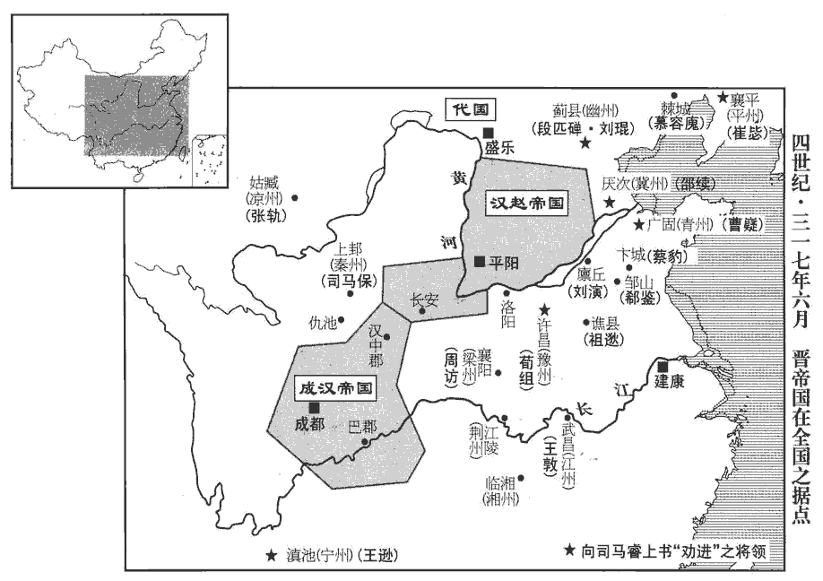
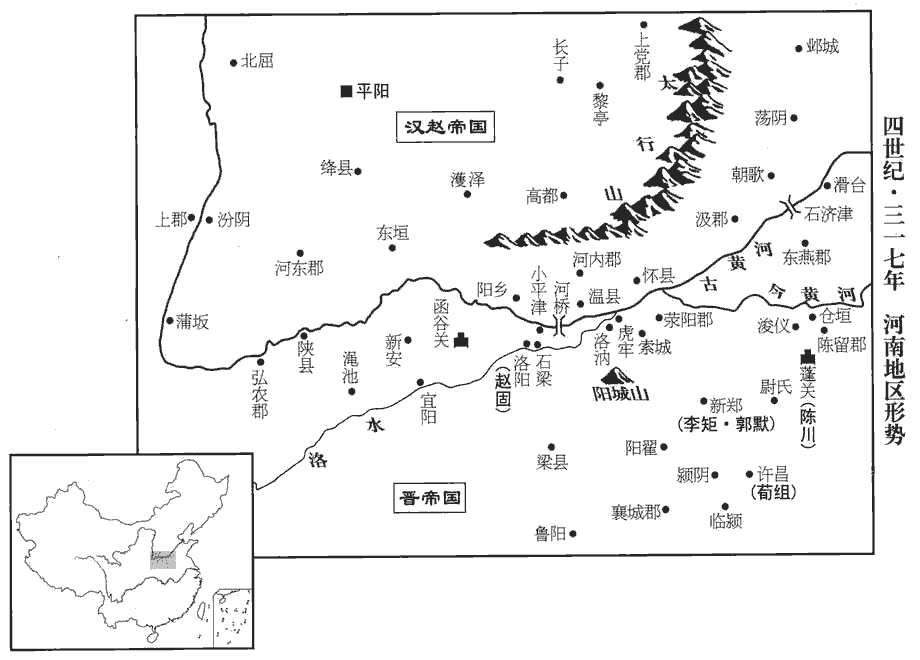
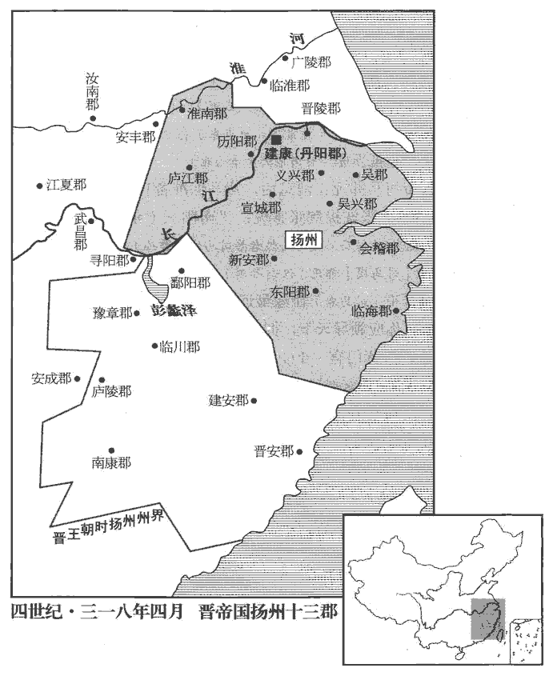
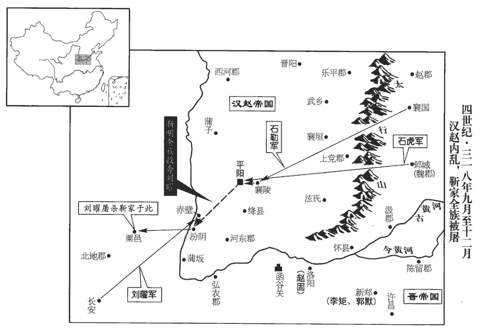

 晉紀十二起強圉赤奮若（丁丑），盡著雍攝提格（戊寅），凡二年。

# 中宗元皇帝上諱睿，字景文，宣帝曾孫，琅邪武王伷zhòu之孫，恭王覲之子。諡法：始建國都曰元。

## 建武元年（丁丑，三一七）是年三月，方改元。

1春，正月，漢兵東略弘農‹河南灵宝东北›，太守宋哲奔江東。哲屯華陰，漢兵自長安東略，故棄城來奔。守，式又翻。

〖译文〗 [1]春季，正月，汉军向东进攻弘农郡，太守宋哲逃奔江东。

2黃門郎史淑、侍御史王沖自長安奔涼州‹府设姑臧甘肃省武威市›，稱愍帝出降前一日，降，戶江翻。使淑等齎jí詔賜張寔，拜寔大都督、涼州牧、侍中、司空，承制行事；且曰：「朕已詔琅邪王時攝大位；君其協贊琅邪，共濟多難。」淑等至姑臧‹甘肃武威›，寔大臨三日，難，乃旦翻。臨，力鴆翻。辭官不受。

〖译文〗 [2]黄门郎史淑、侍御史王冲从长安逃奔凉州，称说西晋愍帝出降前一天，派他们携带诏书赐封张，拜张为大都督、凉州牧、侍中、司空，禀承制书处理事宜。诏书还说：“朕已下诏琅邪王及时代摄帝位，希望你们协助琅邪王，共渡多难之秋。”史淑等到达姑臧，张隆重哭奠愍帝三天，辞谢不接受封职。

初，寔叔父肅為西海‹内蒙额济纳旗›太守，王莽置西海郡，光武中興，棄之。至獻帝興平二年，武威太守張雅請置西海郡，分張掖之居延一縣以屬之，雖郡名同，而非王莽西海郡之地。聞長安危逼，請為先鋒入援；寔以其老，弗許。及聞長安不守，肅悲憤而卒。卒，子恤翻。

〖译文〗 当初，张的叔父张肃任西海太守，听说晋都长安危亡在即，自请任先锋赴援。张以他年老为由不同意。等到听说长安失守，张肃悲愤而死。

寔遣太府司馬韓璞、時張氏保據河西，有太府司馬、太府，少府主簿等官；蓋以都督府為太府，涼州府為少府也。璞，匹角翻。撫戎將軍張閬等帥步騎一萬東擊漢；撫戎將軍，蓋張氏創置。帥，讀曰率。騎，奇寄翻。命討虜將軍陳安、沈約志，魏置將軍四十號，討虜第十九。安故‹甘肃省临洮县南›太守賈騫、晉志曰：張茂分武興、金城、西平、安故四郡為定州。蓋張氏分金城、西平二郡地置安故郡也。按安故縣，二漢屬隴西郡。水經註：洮táo水自臨洮縣東流，又屈而北流，逕安故縣故城西，又北逕狄道縣故城西。狄道，時已置武始郡；安故郡，蓋即漢之一縣置郡。隴西‹甘肃临洮›太守吳紹各統郡兵為前驅。又遺相國保書曰：「王室有事，不忘投軀。前遣賈騫瞻公舉動，中被符命，敕騫還軍。符命，蓋保符下寔也。遺，于季翻。被，皮義翻。俄聞寇逼長安，胡崧不進，麴允持金五百，請救於崧，遂決遣騫等進軍度嶺‹沃于岭·甘肃省兰州市南›。自涼州濟河度沃于嶺，至狄道。會聞朝廷傾覆，為忠不遂，憤痛之深，死有餘責。今更遣璞等，唯公命是從。」璞等卒不能進而還。

〖译文〗 张派遣太府司马韩璞、抚戎将军张阆等率领步兵和骑兵共一万人向东攻击汉军，命令讨虏将军陈安、安故太守贾骞、陇西太守吴绍各自统领本郡兵马为前驱。又送信给相国司马保说：“晋王室遇有灾祸，我没忘投身报效。以前曾派遣贾骞视先生举动行事，后来接受符命，敕令贾骞回军。不久听说敌寇进逼长安，胡崧屯兵不前，允带着五百金向他求救，于是我决定派遣贾骞等翻山越岭进军赴援，刚好听说朝廷已经倾覆，未能实现尽忠的愿望，我悲痛心情之深重，虽死也有余责。现在重新派遣韩璞等率军前往，一切听从您的命令。”韩璞等人的军队始终不能东进，只好退军。

至南安‹甘肃省陇西县东南›，南安郡，治䝠huán道縣。卒，子恤翻。還，從宣翻，又如字。諸羌斷路，斷，丁管翻。相持百餘日，糧竭矢盡。璞殺車中牛以饗士，泣謂之曰：「汝曹念父母乎？」曰：「念。」「念妻子乎？」曰：「念。」「欲生還乎？」曰：「欲。」「從我令乎？」曰：「諾。」乃鼓譟進戰，會張閬帥金城‹兰州东›兵繼至，夾擊，大破之，斬首數千級。帥，讀曰率；下同。

〖译文〗 军队行至南安，被多支羌人部族截断退路，双方相持一百多天，韩璞等人的军队箭尽粮绝。韩璞把拉车之牛杀掉犒饷士卒，流着眼泪对他们说：“你们思念父母吗？”士卒回答：“思念。”“思念妻子儿女吗？”回答说：“思念。”“想活着回家吗？”回答说：“想。”韩璞又问：“愿意听从我的号令吗？”士卒回答说：“愿意。”于是擂鼓呐喊，进击博战。适逢张阆率金城士兵随后赶到，夹击羌人，大破敌军，斩首数千。

先是，長安謠曰：「秦川中，血沒腕，唯有涼州倚柱觀。」腕，烏貫翻。及漢兵覆關中，氐、羌掠隴右，雍、秦之民，死者什八九，雍，於用翻。獨涼州安全。

〖译文〗 长安失陷以前，曾有民谣说：“秦川之中，血流没腕，唯有凉州倚柱旁观。”等到汉军攻陷关中，氐族、羌族攻掠陇右，雍州、秦州的人民十有八九死亡，唯独凉州安然无恙。

3二月，漢主聰使從弟暢從，才用翻。帥步騎三萬攻滎陽‹河南荥阳›太守李矩‹时驻新郑河南省新郑县›，屯韓王故壘‹河南省新郑县境›，相去七里，李矩屯新鄭，則韓王故壘亦在新鄭也。戰國時，韓滅鄭，徙都之，故有故壘在焉。遣使招矩。使，疏吏翻。時暢兵猝至，矩未及為備，乃遣使詐降於暢。暢不復設備，大饗，渠帥皆醉。降，戶江翻。復，扶又翻。帥，所類翻。矩欲夜襲之，士卒皆恇懼，恇kuāng，去王翻。矩乃遣其將郭誦禱於子產祠，子產相鄭，鄭人懷其惠，為之立祠。使巫揚言曰：「子產有教，當遣神兵相功。」眾皆踊躍爭進。矩選勇敢千人，使誦將之，將，即亮翻。掩擊暢營，斬首數千級，暢僅以身免。

〖译文〗 [3]二月，汉主刘聪派堂弟刘畅率领步兵、骑兵三万进攻荥阳，荥阳太守李矩屯兵韩王故旧壁垒，双方相距七里，刘畅派遣使者招降李矩。当时刘畅的军队突然到达，李矩来不及设备防御，于是派遣使者见刘畅，诈称愿降。刘畅不再防备，大肆犒劳士卒，主要将领都喝醉了。李矩打算乘夜偷袭，但手下士卒都心存畏惧，李矩便派部将郭诵到子产祠祝祷，让巫祝扬言说：“子产神灵告知，到时会派遣神兵相助”。众人都踊跃争先。李矩挑选勇士千人，令郭诵率领他们，突然袭击刘畅军营，斩首数千。刘畅只身逃出，仅免于死。

4辛巳‹二十八›，宋哲至建康‹南京›，沈約曰：建康，本秣陵縣，漢獻帝建安十六年置；孫權改秣陵為建業，武帝平吳，還為秣陵；太康三年，分秣陵之水北為建業；愍帝即位，避帝諱，改為建康。稱受愍帝詔，令丞相琅邪王睿統攝萬機。三月，琅邪王素服出次，杜預曰：出次，避正寢。舉哀三日，於是西陽王羕yàng及官屬等，共上尊號。西陽王羕，汝南王亮之子。羕，余亮翻。上，時掌翻。王不許。羕等固請不已，王慨然流涕曰：「孤，罪人也。諸賢見逼不已，當歸琅邪耳！」呼私奴，命駕將歸國。私奴，謂私所畜養而給使令之奴，非以罪沒官者。羕等乃請依魏、晉故事，稱晉王；許之。辛卯‹九›，即晉王位，大赦，改元；始備百官立宗廟，建社稷。

〖译文〗 [4]辛巳（二十八日），宋哲到达建康，称说奉晋愍帝诏书，令丞相、琅邪王司马睿总摄国家所有事宜。三月，琅邪王换上素色服装，避居于别室，举哀三天。此时西阳王司马和官员、部属等共同进上皇帝尊号，琅邪王不肯即位。司马等坚持请求，不肯罢休。琅邪王感慨地流着眼泪说：“孤是有罪之人。诸位贤良如果逼我不止，我将返归琅邪封国。”并传呼私人奴仆，让他们驾车准备返回封国。司马等于是请求琅邪王依照魏、晋旧有成例，称晋王。琅邪王同意了。辛卯（初九），琅邪王即晋王位，大赦天下，改年号为建武，开始设置百官，建立宗庙和社稷。

有司請立太子，王愛次子宣城公裒póu，欲立之，裒póu，蒲侯翻。謂王導曰：「立子當以德。」導曰：「世子、宣城，俱有朗雋之美，而世子年長。」長，知兩翻。王從之。丙辰，立世子紹為王太子；封裒為琅邪王，奉恭王後;帝後大宗，故以裒奉琅邪國祀。仍以裒都督青、徐、兗三州諸軍事，鎮廣陵‹江苏淮阴›。以西陽王羕為太保，封譙剛王遜之子承為譙王。一本作「譙王承氶」，音拯。遜，宣帝之弟子也。又以征南大將軍王敦為大將軍、江州牧，揚州刺史王導為驃騎將軍、都督中外諸軍事、領中書監、錄尚書事，驃，匹妙翻。丞相左長史刁協為尚書左僕射，右長史周顗為吏部尚書，顗yǐ，魚豈翻。軍諮祭酒賀循為中書令，右司馬戴淵、王邃為尚書，司直劉隗為御史中丞，行參軍劉超為中書舍人，晉志曰：中書，晉初置舍人、通事各一人，江左合舍人、通事，謂之通事舍人，掌呈奏案。參軍事孔愉長兼中書郎；長兼，蓋始於此。自餘參軍悉拜奉車都尉，掾屬拜駙馬都尉，行參軍舍人拜騎都尉。三都尉，皆漢武帝置。奉車都尉，掌御乘輿車；駙馬都尉，掌駙馬；騎都尉，掌監羽林騎。師古曰：駙，副馬也；非正駕車，皆為副馬。一曰：駙，近也，疾也。晉武帝以宗室、外戚為三都尉；江左後罷奉車、騎二都尉，唯留駙馬都尉，奉朝請，諸尚公主者為之。掾，俞絹翻。王敦辭州牧，王導以敦統六州，辭中外都督，賀循以老病辭中書令，王皆許之；以循為太常。是時承喪亂之後，江東草創，廣雅曰：草，造也；創，始也。喪，息浪翻。刁協久宦中朝，諳練舊事，諳ān，烏含翻，悉也，記也。朝，直遙翻。賀循為世儒宗，明習禮學，凡有疑議，皆取決焉。

〖译文〗 主掌官员请求立太子，晋王喜爱次子宣城公司马裒，想立他为太子，对王导说：“立太子应当视其德行。”王导说：“世子与宣城公，都有清朗隽秀的美德，但世子年长。”晋王听从了王导的意见。丙辰（疑误），晋王立世子司马绍为王太子，封司马裒为琅邪王，继承恭王的祭祀；仍任司马裒为都督青、徐、兖三州诸军事，镇守广陵。任西阳王司马为太保，封谯刚王司马逊的儿子司马承为谯王。司马逊是晋宣帝弟弟的儿子。又任征南大将军王敦为大将军、江州牧；扬州刺史王导为骠骑将军、都督内外诸军事、领中书监和录尚书事。丞相左长史刁协被任为尚书左仆射，右长史周被任为吏部尚书，军谘祭酒贺循任中书令，右司马戴渊、王邃为尚书，司直刘隗任御史中丞，行参军刘超为中书舍人，参军事孔愉长兼中书郎，其余参军全部封官奉车都尉，部属封驸马都尉，行参军舍人官拜骑都尉。王敦辞谢江州牧的官职，王导因为王敦已统领六州，辞谢都督内外诸军事的职务，贺循因年老多病辞去中书令，都获得晋王的同意。任命贺循为太常。此时承续西晋的丧乱之后不久，江南东晋政权刚刚草创，因刁协久在西晋时为官，熟悉旧制；贺循为当世儒学泰斗，精通礼学，所以凡遇疑碍难决的问题，都由他们定夺。

5劉琨、段匹磾相與歃血同盟，磾，丁奚翻。歃shà，色洽翻，歠chuò也。期以翼戴晉室。辛丑‹十九›，琨檄告華、夷，遣兼左長史、右司馬溫嶠，匹磾遣左長史榮卲，奉表及盟文詣建康勸進。漢之禪于魏也，文帝三讓，魏朝群臣累表請順天人之望，此則勸進之造端也。晉受魏禪，何曾等亦然。是時愍帝蒙塵，四海無君，琨等勸進，為得其正。嶠，羨之弟子也，溫羨見八十六卷惠帝永興二年。嶠之從母為琨妻。母之姊妹為從母。從，才用翻。琨謂嶠曰：「晉祚雖衰，天命未改，吾當立功河朔，使卿延譽江南。行矣，勉之！」

〖译文〗 [5]刘琨和段匹歃血盟誓，相约共同拥戴和辅佐晋王室。辛丑（疑误），刘琨发布檄文遍告汉族和其他民族，自己派遣兼左长史、右司马温峤，段匹派遣左长史荣邵，共同奉呈上表和盟约誓文前往建康进劝晋王即帝位。温峤是温羡兄弟的儿子，其姨母是刘琨的妻子，刘琨对温峤说：“晋朝国运虽然中衰，但天命尚未变易，我将建立功名于河朔，让你的声誉流播江南。去吧，努力为之！”

王以鮮卑‹王庭设棘城辽宁省义县西›大都督慕容廆為都督遼左雜夷流民諸軍事、龍驤將軍、大單于、昌黎公；廆不受。遼左，即遼東。流民，謂中州之民流移入遼東者。廆，戶罪翻。驤，思將翻。征虜將軍魯昌說廆曰：「今兩京覆沒，天子蒙塵，左傳，叔帶之難，襄王出居于鄭，使告難于魯。臧文仲對曰：「天子蒙塵于外，敢不奔問官守。」說輸芮翻。琅邪王承制江東，為四海所係屬。屬，之欲翻。明公雖雄據一方，而諸部猶阻兵未服者，蓋以官非王命故也。謂宜通使琅邪，使，疏吏翻；下同。勸承大統，然後奉詔令以伐有罪，誰敢不從！」處士遼東‹辽宁辽阳›高詡曰：處，昌呂翻。「霸王之資，非義不濟。今晉室雖微，人心猶附之，宜遣使江東，示有所尊，然後仗大義以征諸部，不患無辭矣。」晉室雖衰，慕容、苻、姚之興，其初皆借王命以自重。廆從之，遣長史王濟浮海詣建康勸進。

〖译文〗 晋王任命鲜卑大都督慕容为都督辽左杂夷、流民诸军事、龙骧将军、大单于、昌黎公，慕容辞谢不受。征虏将军鲁昌劝说慕容道：“现在洛阳、长安两座京城沦陷，天子流亡失位，琅邪王接爱制诰于江东，四海归心。贤君虽然雄据一方，但仍有许多部族拥兵不听从号令，这是因为您的官职不是晋王正式任命的缘故。我认为应当派遣使者见琅邪王，劝他承续晋国帝位，然后遵奉皇上诏令攻伐有罪之人，谁敢不听从号令！”处士辽东人高诩说：“霸王之业，不义不能成功。现在晋王室虽然衰微，仍然是民心所向，应当派遣使者至江东，以示所有尊崇，然后倚仗君臣大义征伐各部族，不愁没有正当的理由。”慕容听从他们的意见，派遣长史王济由海路前往建康劝晋王即帝位。

6漢相國粲使其黨王平謂太弟义曰：「適奉中詔，云京師將有變，宜衷甲以備非常。」义信之，命宮臣皆衷甲以居。粲固忌刻，而义亦愚甚矣。甲在衣中為衷甲。粲馳遣告靳準、王沈。靳，居惞翻。沈，持林翻。準以白漢主聰曰：「太弟將為亂，已衷甲矣！」聰大驚曰：「寧有是邪！」王沈等皆曰：「臣等聞之久矣，屢言之，而陛下不之信也。」聰使粲以兵圍東宮。粲使準、沈收氐、羌酋長十餘人，窮問之，义為大單于，氐、羌酋長屬焉，故皆服事東宮。酋，慈由翻。長，知兩翻。皆懸首高格，格，以木為之。周禮牛人：祭祀，共其牛牲之互。鄭玄曰：互若今屠家之懸肉格。左思吳都賦曰：峭格周施。呂向曰：格，懸網木也。燒鐵灼目，酋長自誣與义謀反。聰謂沈等曰：「吾今而後知卿等之忠也！當念知無不言，勿恨往日言而不用也！」於是誅東宮官屬及义素所親厚，準、沈等素所憎怨者大臣數十人，阬士卒萬五千餘人。所阬者，東宮四衛之兵也。夏，四月，廢义為北部王，北部，即匈奴後部，居新興。粲尋使準賊殺之。义形神秀爽，寬仁有器度，故士心多附之。聰聞其死，哭之慟，曰：「吾兄弟止餘二人而不相容，漢主淵諸子，此時惟聰、义二人在耳。安得使天下知吾心邪！」氐、羌叛者甚眾，以靳準行車騎大將軍。討平之。

〖译文〗 [6]汉丞相刘粲让党羽王平对太弟刘说：“刚刚奉受国主密诏，说京师将有变乱发生，应当内穿甲衣以备不测。”太弟刘信从，令东宫臣属都在外衣内穿上甲衣。刘粲派人驰告靳准、王沈，靳准禀报汉主刘聪说：“太弟刘准备作乱，手下已内着甲衣了。”刘聪大惊，说：“怎么会有这种事情！”王沈等人都说：“我们早已听说太弟刘有犯上作乱之心，多次上言，但陛下不信我们的话。”刘聪令刘粲率军包围东宫。刘粲让靳准、王沈拘捕了听命于东宫的氐、羌酋长十多人，严刑拷问，把他们的头颅都枷锢于高木格之上，烧红铁器炙灼双目，酋长们便诬陷自己和刘共同谋反。刘聪对王沈等人说：“我现在才知道你们的忠心！你们应当追念知无不言的训诫，不要怨恨过去上言而不被信用！”于是诛杀东宫属官，又诛杀平素与刘亲近、交厚而被靳准、王沈等人憎恶怨恨的大臣数十人，坑杀士卒一万五千多人。夏季，四月，废黜刘太弟身份，改封北部王，不久刘粲让靳准谋杀了他。刘形神秀爽，为人宽仁而雅量，所以士人大多心存景仰。刘聪听说刘列讯，悲恸痛哭说：“我们兄弟仅剩二人却不能相容，怎么才能使天下人知晓我内心的情感呢！”氐族、羌族反叛的很多，刘聪让靳准代行车骑大将军职务，征讨平定了叛乱。

7五月，壬午‹一›，日有食之。考異曰：帝紀、天文志皆云「五月丙子，日食。」按：長曆是月壬午朔，無丙子，今以曆為據。

〖译文〗 [7]五月，壬午（初一），发生日食。

8六月，丙寅‹十五›，溫嶠等至建康‹南京›，王導、周顗、庾亮等皆愛嶠才，爭與之交。是時，太尉豫州牧荀組、冀州刺史邵續、青州刺史曹嶷、寧州刺史王遜、東夷校尉崔毖等皆上表勸進，顗，魚豈翻。嶷，魚力翻。毖，音祕。王不許。

〖译文〗 [8]六月，丙寅（十五日），温峤等人到达建康。王导、周、庚亮等都喜爱温峤有才，争相和他交结。此时，太尉、豫州刺史荀组和冀州刺史邵续、青州刺史曹嶷、宁州刺史王逊、东夷校尉崔毖等人都上表劝晋王即帝位，晋王不同意。

 

9初，流民張平、樊雅各聚眾數千人在譙‹安徽亳州›，為塢主。王之為丞相也，遣行參軍譙國桓宣往說平、雅，平、雅皆請降。說，輸芮翻。降，戶江翻。下同。及豫州刺史祖逖出屯蘆洲‹安徽亳州东涡水北岸›，遣參軍殷乂詣平、雅。乂意輕平，視其屋，曰：「可作馬廄；」見大鑊huò，曰：「可鑄鐵器。」平曰：「此乃帝王鑊，天下清平方用之，柰何毀之！」乂曰：「卿未能保其頭，而愛鑊邪！」鑊，胡郭翻。鼎而無足曰鑊。說文云：鑊，江、淮人謂之鍋，浙人謂之鑊。平大怒，於坐斬乂，坐，徂臥翻。勒兵固守。逖攻之，歲餘不下，乃誘其部將謝浮，使殺之；誘，音酉。將即亮翻。逖進據太丘‹河南永城西北›。太丘縣，後漢屬沛郡，晉省。賢曰：太丘故城，在今亳州永城縣西北。樊雅猶據譙城，與逖相拒。逖攻之不克，請兵於南中郎將王含。桓宣時為含參軍，含遣宣將兵五百助逖。逖謂宣曰：「卿信義已著於彼，今復為我說雅。」復，扶又翻。為，于偽翻。宣乃單馬從兩人詣雅，曰：「祖豫州方欲平蕩劉、石，倚卿為援；前殷乂輕薄，非豫州意也。」雅即詣逖降。降，戶江翻。逖既入譙城‹安徽亳州›，石勒遣石虎圍譙，王含復遣桓宣救之，虎解去。逖表宣為譙國內史。

〖译文〗 [9]当初，流民张平和樊雅在谯地各自聚集数千人，自任坞主。晋王司马睿任愍帝丞相时，曾派遣行参军、谯国人桓宣前往劝说张平、樊雅，二人自请归降。等到豫州刺史祖逖出兵屯居芦洲，派遣参军殷拜会张平和樊雅。殷瞧不起张平，观视张平的屋宇，说：“可以当马厩。”看见大镬，又说：“可以熔铸铁器。”张平说：“这是帝王的镬，天下清平时才能使用，怎么能轻易毁坏！”殷则说：“你不能保有自己的头颅，却吝惜什么铁锅！”张平大怒，在座位上斩杀了殷，率军固守。祖逖领兵攻击他们，一年多未能攻克。祖逖便诱使张平部将谢浮，让他杀掉了张平，祖逖进军占据太丘。当时樊雅还占据着谯城，与祖逖对抗。祖逖久攻不下，向南中郎将王含请求援兵。桓宣当时任王含的参军，王含派遣桓宣率兵五百人援助祖逖。祖逖对桓宣说：“你的信义已为对方所了解，这次再为我劝说樊雅。”桓宣于是一人独骑，只带二人随从于后，进见樊雅说：“祖逖正准备荡平刘聪、石勒，仰仗你为后援。前次殷轻薄无礼，并非祖逖本意。”樊雅立即拜会祖逖，请求归降。祖逖进入谯城以后，石勒派遣石虎围困谯城，王含又派桓宣率军救援，石虎解围而去。祖逖上表请任桓宣为谯国内史。

己巳‹十八›，晉王傳檄天下，稱「石虎敢帥犬羊，渡河縱毒，今遣琅邪王裒等九軍，帥，讀曰率。裒póu，蒲侯翻。銳卒三萬，水陸四道，徑造賊場，造，七到翻。受祖逖節度。」尋復召裒還建康‹南京›。復，扶又翻。

〖译文〗 己巳（十八日），晋王传布檄文于天下，内称：“石虎胆敢率领犬羊乌合之众，渡过黄河荼毒民众，现派遣琅邪王司马裒等九军、精锐士卒三万，由水、陆四路直赴贼寇所在地，受祖逖指挥。”不久又召司马裒返回建康。

10秋，七月，大旱；司、冀、并、青、雍州大蝗；河、汾溢，漂千餘家。皆漢境也。雍，於用翻。

〖译文〗 [10]秋季，七月，旱情严重。司州、冀州、并州、青州、雍州发生严重蝗灾。黄河、汾水发生洪灾，淹没一千多户。

11漢主聰立晉王粲為皇太子，領相國、大單于，總攝朝政如故。朝，直遙翻。大赦。

〖译文〗 [11]汉主刘聪立晋王刘粲为皇太子，领相国职务、大单于称号，总摄朝政一如往昔。实行大赦。

12段匹磾推劉琨為大都督，磾，丁奚翻。檄其兄遼西公‹首府令支河北省迁安县›疾陸眷及叔父涉復辰、弟末柸等會于固安‹河北易县›，固安縣，漢屬涿郡；魏、晉改涿郡曰范陽，固安曰故安。劉昫曰：唐易州易縣，古故安縣地。共討石勒。末柸說疾陸眷、涉復辰曰：說，輸芮翻。「以父兄而從子弟，恥也；且幸而有功，匹磾獨收之，吾屬何有哉！」各引兵還。琨、匹磾不能獨留，亦還薊‹北京›。薊，音計。

〖译文〗 [12]段匹推举刘琨为大都督，用檄书邀请其兄长辽西公疾陆眷、叔父涉复辰、弟段末等在固安聚会，共同征讨石勒。段末游说疾陆眷、涉复辰说：“以父辈、兄长的身份追从子侄、兄弟，是一种耻辱；况且侥幸立功，段匹独收其利，我们能得到什么！”于是疾陆眷、涉复辰、段末各自领军退还。刘琨、段匹不能单独留守固安，也回师蓟州。

13以荀組為司徒。

〖译文〗 [13]晋王任荀组为司徒。

14八月，漢趙固襲衛將軍華薈於臨潁‹河南臨潁›，殺之。臨潁縣，屬潁川郡。華，戶化翻。薈huì，烏外翻。

〖译文〗 [14]八月，汉将赵固在临颍击杀卫将军华荟。

初，趙固與長史周振有隙，振密譖固於漢主聰。李矩之破劉暢也，於帳中得聰詔，令暢既克矩，還過洛陽，收固斬之，以振代固。矩送以示固，固斬振父子，帥騎一千來降；帥，讀曰率。騎，奇寄翻。降，戶江翻。矩復令固守洛陽。

〖译文〗 当初，赵固与长史周振不和，周振私下在汉主刘聪面前诋毁赵固。在李矩攻破刘畅的战役中，李矩曾于军帐中发现刘聪的诏令，诏令让刘畅攻克李矩之后，回军经过洛阳，收捕赵固并杀掉，用周振取代赵固。李矩将此诏送给赵固看，赵固斩杀了周振父子，率骑兵千人投降东晋。李矩仍然命令赵固戍守洛阳。

 

15鄭攀等相與拒王廙，廙yì，羊至翻，又逸職翻。眾心不壹，散還橫桑口‹湖北汉川西南›，水經：沔水東南逕江夏雲杜縣，又東逕左桑，周昭王溺死處也。村老云：百姓佐昭王喪事於此，故曰佐桑；左桑，字失體耳。又東，謂之橫桑，言得昭王喪處也。欲入杜曾。王敦遣武昌‹湖北鄂城›太守趙誘、襄陽‹湖北襄樊›太守朱軌擊之，攀等懼，請降。杜曾亦請擊第五猗於襄陽以自贖。

〖译文〗 [15]郑攀等人共同抗拒王，因众心不齐，退散至横桑，打算投靠杜曾。王敦派遣武昌太守赵诱、襄阳太守朱轨率军攻击，郑攀等人畏惧，请求归降。杜曾也自请袭击襄阳第五猗的军队，以赎其罪。

廙yì將赴荊州，留長史劉浚鎮揚口壘‹湖北潜江境›。水經註：龍陂水逕郢城，東北流，謂之揚水；水北逕竟陵縣西，又北注于沔，曰揚口，中夏口也。竟陵‹湖北钟祥›內史朱伺謂廙曰：伺，相吏翻。「曾，猾賊也，外示屈服，欲誘官軍使西，然後兼道襲揚口耳。宜大部分，言當大為部分，以備曾掩襲。分，扶問翻。未可便西。廙性矜厲自用，以伺為老怯，遂西行。曾等果還趨揚口；趨，七喻翻。廙乃遣伺歸，裁至壘，即為曾所圍。劉浚自守北門，使伺守南門。馬雋從曾來攻壘，雋妻子先在壘中，馬雋本與鄭攀同距王廙。或欲皮其面以示之。皮面者，剝其面皮。伺曰：「殺其妻子，未能解圍，但益其怒耳。」乃止。曾攻陷北門，伺被傷，被，皮義翻。退入船，開船底以出，沈行五十步，乃得免。沈，持林翻；潛行水底曰沈行。曾遣人說伺曰：說，輸芮翻。「馬雋德卿全其妻子，今盡以卿家內外百口付雋，雋已盡心收視，卿可來也。」伺報曰：「吾年六十餘，不能復與卿作賊，復，扶又翻。吾死亦當南歸，妻子付汝裁之。」乃就王廙於甑zèng山‹湖北汉川东南›，病創而卒。甑山，在竟陵界。隋置甑山縣，屬沔陽郡。創，初良翻。

〖译文〗 王将前往荆州，留下长史刘浚镇守扬口壁垒。竟陵内史朱伺对王说：“杜曾是狡猾之徒，公开表示屈服，是想诱使官军往西，然后迅速突袭扬口。应当增强军力部署，不能立即西进。”王性格矜持严厉、自以为是，认为朱伺是年老怯懦，于是率军西进。杜曾等果然回军直奔扬口。王这才派遣朱伺回军，刚至壁垒之中，很快被杜曾军队包围。刘浚自已守御北门，让朱伺守御南门。马隽跟随杜曾前来攻垒，而他的妻子儿女原先留在垒中，有人想剥其妻子儿女的脸皮向马隽示戒，朱伺说：“杀了他们并不能解围，只能加剧马隽的恨怒罢了。”这才罢休。杜曾攻陷北门，朱伺受伤，退走上船，打开船底入水，在水底潜行了五十步，才得以幸免。杜曾派人游说朱伺说；“马隽感激您保全了他妻子儿女的性命，我现在已把您全军老小百十口人交托给马隽，马隽尽心照看，您可回来。”朱伺回答说：“我年龄已超过六十岁，不能再与你同作叛贼，即便死了也要回到南方，妻子儿女等就交由你处置。”于是前往甑山投奔王，伤重而死。

戊寅，趙誘、朱軌及陵江將軍黄峻，與曾戰於女觀湖‹湖北江陵东北，今已湮没›，水經註：柞zhà溪水出江陵縣北，東注船官湖，湖水又東北入女觀湖，湖水又東入于揚水。誘等皆敗死，曾乗勝逕造沔口‹武汉，汉水注入长江处›，造，七到翻。威震江、沔。

〖译文〗 戊寅（二十八日），赵诱、朱轨及陵江将军黄峻与杜曾交战于女观湖，赵诱等人都兵败战死。杜曾乘胜直抵沔口，威震长江、沔水一带。

王使豫章‹江西南昌›太守周訪擊之。訪有眾八千，進至沌陽‹湖北省武汉市西南沌水北岸›。沈約曰：沌陽縣，江左立，屬江夏郡。水經：沔水逕沌陽縣北，又東逕林障故城北。沌陽者，沌水之陽也。沈，持林翻。曾銳氣甚盛，訪使將軍李恆督左甄，許朝督右甄，訪自領中軍。曾先攻左、右甄，楊正衡曰：甄，音堅。戰陳有左拒、右拒；拒，方陳也。有左甄、右甄；甄，左、右翼也。左、右拒見於周、鄭繻rú葛之戰；左、右甄之義見於楚穆王孟諸之田。孟諸之田，宋公為右盂，鄭伯為左盂。杜預註曰：將獵，張兩甄。蓋晉人以左、右翼為左、右甄，杜預取當時之言以釋左、右盂也。訪於陣後射雉以安眾心。射，而亦翻。令其眾曰：「一甄敗，鳴三鼓；兩甄敗，鳴六鼓。」趙誘子胤，將父餘兵屬左甄，將即亮翻。力戰，敗而復合，馳馬告訪。訪怒，叱令更進；胤號哭還戰。號，戶刀翻。自旦至申，兩甄皆敗。訪選精銳八百人，自行酒飲之，飲，於鴆翻。敕不得妄動，聞鼓音乃進。曾兵未至三十步，訪親鳴鼓，將士皆騰躍奔赴，曾遂大潰，殺千餘人。訪夜追之，諸將請待明日，訪曰：「曾驍勇能戰，驍，堅堯翻。向者彼勞我逸，故克之；宜及其衰乘之，可滅也。」乃鼓行而進，遂定漢、沔。曾走保武當‹湖北省丹江口市西北›。武當縣，漢屬南陽郡，晉屬順陽郡，縣以武當山得名；唐為均州武當郡。杜佑曰：郡城，延岑所築。王廙始得至荊州。訪以功遷梁州刺史，屯襄陽‹湖北襄樊›。胡子序之敗，梁州陷沒，故令訪領梁州而屯襄陽。

〖译文〗 晋王派豫章太守周访进攻杜曾的军队，周访拥有八千兵众，进至沌阳。杜曾的军队锐气很盛，周访让将军李恒督守军阵左翼，许朝督守右翼，自己坐镇中军。杜曾先攻左、右两翼，周访在阵后发箭以安军心，命令士卒说：“一翼兵败，呜鼓三声；两翼都败，鸣鼓六声。”赵诱的儿子越胤统领父亲部下剩存士兵从属左翼，奋勇作战，失败以后又聚集起来，骑马禀告周访。周访发怒，叱斥让他继续进击，赵胤大哭，返身作战。从早上激战至下午申时，周访军阵两翼都战败，周访挑选精锐士兵八百人，亲自斟酒劝饮，令他们不得妄动，听到鼓声再进攻。杜曾军队前行不到三十步，周访亲自击鼓，将士们都腾跃赴敌，杜曾军队因此大败，被杀一千多人。周访连夜追击，众将请求等待明日，周访说：“杜曾骁勇善战，以往我们以逸待劳，所以胜敌。现在应当乘其衰败之时追袭，才能歼灭他。”于是鸣鼓进军，平定了汉水、沔水流域。杜曾逃跑保守武当。王这才得以到达荆州。周访因军功升迁任梁州刺史，屯军襄阳。

16冬，十月，丁未‹二十九›，琅邪王裒póu薨。

〖译文〗 [16]冬季，十月，丁未（二十九日），琅邪王司马裒去世。

17十一月，己酉朔‹一›，日有食之。考異曰：帝紀、天文志皆云「十一月丙子日食。」按長曆，十月、十二月皆己卯朔，是月己酉朔，二十八日丙子。晉書元帝紀，十一月有甲子、丁卯。若丙子朔，則甲子、丁卯乃在十月。又劉琨集，是年三月癸未朔，八月庚辰朔，皆與長曆合，今以為據。

〖译文〗 [17]十一月，己酉朔（初一），出现日食。

18丁卯‹十九›，以劉琨為侍中、太尉。

〖译文〗 [18]丁卯（十九日），晋王任命刘琨为侍中、太尉。

19征南軍司戴邈上疏，以為：「喪亂以來，喪，息浪翻；下久喪同。庠xiáng序隳廢。議者或謂平世尚文，遭亂尚武，此言似之，而實不然。夫儒道深奧，不可倉猝而成；比天下平泰，然後脩之，則廢墜已久矣。比，必寐翻。又，貴遊之子，未必有斬將搴qiān旗之才，將，即亮翻。搴，拔取也。從軍征戍之役，不及盛年使之講肄yì道義，良可惜也。肄，羊至翻，習也。世道久喪，禮俗日弊，猶火之消膏，莫之覺也。今王業肇建，萬物權輿，爾雅曰：權輿，始也。謂宜篤道崇儒，以勵風化。」王從之，始立太學。

〖译文〗 [19]征南军司戴邈上疏，认为：“自王室丧乱以来，学校废毁。议政者有的以为清平之世尚文，遭逢世乱尚武，此言似是而非。儒家道义渊深玄奥，不可能仓猝学成，等到天下安宁然后修习，那就废毁已久了。再者，富贵人家的游闲子弟，未必有斩将拔旗的英才，却从军征伐戍守，不乘壮年让他们研讨道义，实在可惜。世道衰微日久，礼俗日渐凋弊，如同燃火消熔油脂一样，不知不觉。现在王业初建，万事方兴，我认为应当笃守道义、尊崇儒家，以勉励世风好转。”晋王听从了他的意见，开始设立太学。

20漢主聰出畋tián，以愍帝行車騎將軍，戎服執戟前導。見者指之曰：「此故長安天子也。」聚而觀之，故老有泣者。太子粲言於聰曰：「昔周武王豈樂殺紂乎？樂，音洛。正恐同惡相求，為患故也。今興兵聚眾者，皆以子業為名，不如早除之！」聰曰：「吾前殺庾珉輩，殺庾珉事見八十八卷建興元年。而民心猶如是，吾未忍復殺也，復，扶又翻。且小觀之。」十二月，聰饗群臣于光極殿，使愍帝行酒洗爵；已而更衣，又使之執蓋。晉臣多涕泣，有失聲者。尚書郎隴西‹甘肃省陇西县›辛賓起，抱帝大哭，聰命引出，斬之。使之執戟前導，使之行酒洗爵，使之執蓋，所以屈辱之，至此極矣！戎狄狡計，正以此觀晉舊臣及遺黎之心也。更，工衡翻。

〖译文〗 [20]汉主刘聪出猎，让已经投降的西晋愍帝权充车骑将军，穿上军服手持画戟作为先导。看见的人指着他说：“这就是过去在长安的皇帝。”众人聚集观望，西晋遗老有的潸然泪下。太子刘粲对刘聪说：“古时周武王怎会以杀商纣为乐事呢？只是惟恐恶人聚集其身边，酿成祸患。现在聚众起兵之人，莫不以降帝司马邺之名相号召，不如早些除掉他。”刘聪说：“当年我虽杀了庾珉、王隽及晋怀帝等人，但民心仍然如此，我不忍再杀司马邺，暂且观察一段时间。”十二月，刘聪在光极殿大宴群臣，让愍帝斟酒洗杯，又让他拿盖。晋旧臣见了，不少人潸然泪下，有的甚至哭出了声。尚书郎陇西人辛宾起身，抱着愍帝大哭，刘聪令人将他带出斩首。

趙固與河內‹河南沁阳›太守郭默侵漢河東‹山西夏县›，至絳‹山西曲沃›，絳縣，故晉都也，漢屬河東郡，晉屬平陽郡。劉昫xù曰：唐絳州曲沃縣，漢絳縣地。右司隸部民奔之者三萬餘人。聰分司隸為左右。騎兵將軍劉勲追擊之，騎，奇寄翻。殺萬餘人，固、默引歸。太子粲帥將軍劉雅生等步騎十萬屯小平津‹河南省孟津县东黄河渡口›，帥，讀曰率。固揚言曰：「要當生縛劉粲以贖天子。」粲表於聰曰：「子業若死，民無所望，則不為李矩、趙固之用，不攻而自滅矣。」戊戌‹二十›，愍帝‹司马邺，年十八岁›遇害於平陽‹山西临汾›。年十八。粲遣雅生攻洛陽，固奔陽城山‹河南登封东北车岭›。河南陽城縣，有陽城山。

〖译文〗 赵固和河内太守郭默进犯汉国河东，到达绛县，右司隶部的人民投奔而去的有三万多人。骑兵将军刘勋追袭他们，杀一万多人，赵固、郭默领军退回。汉太子刘粲率将军刘雅生等步骑兵十万屯居小平津，赵固扬言说：“誓当活捉刘粲赎回愍帝。”刘粲上表给刘聪说：“如果司马邺死了，民众无所期望，就不会再被李矩、赵固驱用，将不攻自灭。”戊戌（二十日），愍帝司马邺在平阳遇害。刘粲派遣刘雅生进攻洛阳，赵固逃奔阳城山。

21是歲，王命課督農功，二千石、長吏以入穀多少為殿最，長，知兩翻。少，詩沼翻。殿，丁練翻。諸軍各自佃作，即以為稟。佃，音田；稟，給也。

〖译文〗 [21]这年，晋王下令考核、督促农业生产，俸禄二千石的官员、长官依据交纳谷物的数量多少考评政绩高下，各地驻军各自耕作，所获充当军队给养。

22氐王‹府仇池甘肃省西和县南›楊茂搜卒，長子難敵立，與少子堅頭分領部曲；少，詩照翻。難敵號左賢王，屯下辨‹甘肃成县›，堅頭號右賢王，屯河池‹甘肃徽县›。下辨、河池二縣，皆屬武都郡。師古曰：辨，皮莧翻。劉昫曰：辨，步莧翻。下辨，唐為成州同谷縣。河池，唐為武州盤隄dī縣。

〖译文〗 [22]氐族酋长杨茂搜死去，长子杨难敌继位，和小儿子杨坚头分别统领部曲。杨难敌号称左贤王，屯驻下辨，杨坚头号称右贤王，屯驻河池。

23河南王吐谷渾卒‹慕容吐谷浑，年七十二岁›。吐谷渾，史家傳讀，吐，從暾入聲；谷，音欲。吐谷渾者，慕容廆之庶兄也，父涉歸，分戶一千七百以隸之。及廆嗣位，二部馬鬬，廆遣使讓吐谷渾曰：「先公分建有別，廆，戶罪翻。別，彼列翻。奈何不相遠異，遠異者，言遠去以相別異。而令馬有鬬傷！」吐谷渾怒曰：「馬是六畜，六畜：馬、牛、羊、犬、豕、雞。畜，許又翻。鬬乃其常，何至怒及於人！欲遠別甚易，恐後會為難耳！今當去汝萬里之外。」遂帥其眾西徙。易，以豉翻。帥，讀曰率。廆悔之，遣其長史乙郍nà婁馮追謝之。郍，與那同。乙郍婁，虜三字姓。吐谷渾曰：「先公嘗稱卜筮之言云，『吾二子皆當強盛，祚流後世。』我，孽子也；孽niè，魚列翻；庶出為孽。理無并大。今因馬而別，殆天意乎！」遂不復還，西傅陰山而居。復，扶又翻。傅，讀曰附。屬永嘉之亂，屬，之欲翻，會也。因度隴而西，據洮水之西，極于白蘭‹青海省中部›，地方數千里。沙州記曰：洮水出嵹jiàng臺山‹即”西倾山”，在青海、甘肃、四川交界处›，東北流，逕吐谷渾中，又東北流入塞。此洮西，塞外洮水之西也，即沙漒qiáng沓中之地。白蘭，山名，羌所居也；至唐時，丁零羌居之，左屬党項，右與多彌接。杜佑曰：白蘭，羌之別種，東北接吐谷渾，西至叱利模徒，南界郡鄂，風俗物產與宕昌同。鮮卑謂兄為阿干，廆追思之，為之作阿干之歌。吐谷渾有子六十人，長子吐延嗣。為，于偽翻。長，知兩翻。吐延長大有勇力，羌、胡皆畏之。吐谷渾事始此。

〖译文〗 [23]河南王吐谷浑死去。吐谷浑是慕容的异母兄长，父亲涉归曾划给他一千七百户为部曲。等到慕容继承鲜卑酋长位，吐谷浑和慕容双方的马群争斗。慕容派使者斥责吐谷浑说：“先父划分的部族本来不同，你为什么不离得远点儿，而让马群争斗致伤！”吐谷浑生气地说：“马是六畜之一，争斗本是常事，哪至于迁怒于人！要想远远分开很容易，只怕将来相会就难了！我现在要离开你到万里之外。”于是带领部众向西迁徙。慕容后悔此事，派长史乙娄冯追上道歉，吐谷浑说：“先公曾经传述卜筮之语说：‘我的两个儿子都会强盛的，统治权力将延续到后世。’我非正妻之子，按理不能与嫡子并重。现在因为马群之事分开，大概是天意吧！”于是不再回去，向西傍依阴山居住。当永嘉之乱时，吐谷浑借机越过陇右向西发展，占据洮水以西地区，至于白兰，方圆数千里。鲜卑语把哥哥叫作“阿干”，慕容遥思兄长，因此作《阿干之歌》。吐谷浑有六十多个儿子，长子吐延继承王位。吐延高大勇武，羌人、胡人都怕他。

## 大興元年（戊寅，三一八）是年三月，方改元。

1春，正月，遼西公‹首府令支河北省迁安县›疾陸眷卒，其子幼，叔父涉復辰自立。段匹磾自薊往奔喪；段末柸宣言：「匹磾之來，欲為篡也。」匹磾至右北平‹河北省遵化市›，劉昫曰：唐薊州漁陽縣，古右北平郡治所。磾，丁奚翻。涉復辰發兵拒之。末柸乘虛襲涉復辰，殺之，并其子弟黨與，自稱單于。迎擊匹磾，敗之；單，音蟬。敗，補邁翻。匹磾走還薊‹北京›。薊，音計。

〖译文〗 [1]春季，正月，辽西公疾陆眷死，儿子幼小，叔父涉复辰自立为王。段匹由蓟州出发去奔丧，段末扬言说：“段匹此来，是想篡位。”段匹到达右北平，涉复辰发兵阻拦，段末乘虚击杀涉复辰，兼并其子弟、党羽，自称单于。段末迎战段匹并战胜了他，段匹逃回蓟州。

2三月，癸丑‹七›，愍帝凶問至建康‹南京›，王斬縗居廬。縗cuī，倉回翻。儀禮：斬衰、倚廬。孟康曰：倚廬，倚牆至地為之，無楣柱。喪服大記：父母之喪，居倚廬，不塗。君為廬，宮之；大夫、士，襢tǎn之。既葬，柱楣，塗廬，不於顯者，君、大夫、士皆宮之。正義曰：居倚廬者，謂於中門之外東牆下倚木為廬。不塗者，但以草夾障，不塗之也。宮之者，謂廬外以帷障之如宮牆。襢之言袒也，其廬袒露，不帷障也。既葬柱楣者，既葬情殺，故柱楣稍舉以納日光；又以泥塗，辟風寒。不於顯者，塗廬不塗廬外顯處。君、大夫、士皆宮之者，既葬，故得皆宮之。百官請上尊號，上，時掌翻。王不許。紀瞻曰：「晉氏統絕，於今二年，陛下當承大業；顧望宗室，誰復與讓！若光踐大位，則神、民有所憑依；苟為逆天時，違人事，大勢一去，不可復還。復，扶又翻。今兩都燔fán蕩，宗廟無主，劉聰竊號於西北，而陛下方高讓於東南，此所謂揖讓而救火也。」王猶不許，使殿中將軍韓績徹去御坐。殿中將軍，屬二衛，晉初置，朝會宴饗，則戎服直侍左右，夜開諸城門，則執白虎幡監之。坐，徂臥翻；下帝坐同。瞻叱績曰：「帝坐上應列星，天文志，帝坐在紫宮中。敢動者斬！」王為之改容。為，于偽翻。

〖译文〗 [2]三月，癸丑（初七），愍帝死讯传至建康，晋王服斩衰丧服，别居倚庐。百官奏请晋王使用皇帝尊号，晋王不同意。纪瞻说：“晋政权灭亡，至今已经两年，陛下应当继承大业。遍观皇室子弟，又有谁值得推让！陛下如果荣登皇位，那么祖先神灵和国民都能有所依凭；如果拂逆天命，违背人心，大势一旦失去，就无法挽回了。现在洛阳、长安两座京城被毁，国家无主，刘聪在西北自立国号，而陛下却在东南清高地推谢帝位，这就如同急于救火却恭礼谦让。”晋王还是不同意，让殿中将军韩绩撤去摆好的皇帝宝座。纪瞻喝斥韩绩说：“皇帝之座与天上列星相应，敢搬动的斩首！”晋王脸色为之一变。

奉朝請周嵩上疏曰：王為丞相，以嵩為參軍，及為晉王，拜奉朝請。晉志曰：奉朝請者，奉朝會請召而已。「古之王者，義全而後取，讓成而後得，是以享世長久，重光萬載也。重，直龍翻。載，子亥翻。今梓宮未返，舊京未清，義夫泣血，士女遑遑。宜開延嘉謀，訓卒厲兵，先雪社稷大恥，副四海之心，則神器將安適哉！」由是忤旨，出為新安‹浙江淳安›太守，孫權分丹陽立新都郡，武帝太康元年改名新安郡。劉昫曰：新安郡，唐之歙州。忤，五故翻。又坐怨望抵罪。嵩，顗之弟也。顗yǐ，魚豈翻。

〖译文〗 奉朝请周嵩上疏说：“古代帝王，道义周全而后撷取，谦让顺成而后据有，所以能长久地统治国家，恩泽被服万世。现在愍帝的梓宫尚未返国，故都耻辱尚未涤清，胸怀节义者痛心泣血，士子民女惶惶失措。应当广开言路征求良好的建议，训练士卒、整备兵器，先洗雪国家覆亡的大耻，实现天下人民的共同愿望，那么君临天下的大权还能给谁呢！”周嵩的上疏违背了晋王的旨意，被贬黜出京，任新安太守。又因心怀怨谤被夺职。周嵩是周的兄弟。

丙辰‹十›，王‹司马睿，本年四十三岁›即皇帝位，百官皆陪列。帝命王導升御床共坐，導固辭曰：「若太陽下同萬物，蒼生何由仰照！」帝乃止。大赦，改元，文武增位二等。帝欲賜諸吏投刺勸進者加位一等，民投刺者皆除吏，凡二十餘萬人。毛晃曰：書姓名於奏白曰刺。散騎常侍熊遠曰：「陛下應天繼統，率土歸戴，豈獨近者情重，遠者情輕！不若依漢法徧賜天下爵，於恩為普，漢自惠帝嗣位，賜民爵一級，有官秩者以歲數為差；其後諸帝初即位，率賜民爵一級。且可以息檢覈hé之煩，塞巧偽之端也。」塞，悉則翻。帝不從。

〖译文〗 丙辰（初十），晋王即帝位，文武百官陪列于两侧。元帝令王导登御床同坐，王导坚决拒绝，说：“如果太阳与天下万物等同，怎么能俯照苍生！”元帝便不再坚持。大赦天下，改年号为太兴，文武官员都晋升二级爵位。元帝打算对所有曾经投贴建议自己接受皇位的人格外优宠，凡官吏都增加爵位一等，平民都提升为官吏，总计有二十多万人。散骑常待熊远说：“陛下顺应天命，继承皇位，普天之下莫不拥戴，岂止左近之人情深，偏远之人情浅！不如依照汉朝的做法，普遍赐封臣民官爵，这样皇恩浩荡，而且可以省去考察核实的烦劳，堵塞弄虚作假的渠道。”元帝不听。

庚午‹二十四›，立王太子紹為皇太子。太子仁孝，喜文辭，善武藝，好賢禮士，喜，許記翻。好，呼到翻。容受規諫，與庾亮、溫嶠等為布衣之交。亮風格峻整，善談老、莊，帝器重之，聘亮妹為太子妃。帝以賀循行太子太傅，周顗為少傅，庾亮以中書郎侍講東宮。帝好刑名家，以韓非書賜太子。庾亮諫曰：「申、韓刻薄傷化，不足留聖心。」太子納之。

〖译文〗 庚午（二十四日），立王太子司马绍为皇太子。太子仁义而有孝道，喜欢文学，爱好武艺，礼贤下士，从谏如流，与庾亮、温峤等结为平民之交。庾亮为人端庄肃正，擅长谈论老子、庄子之学，元帝很器重他，礼聘其妹为皇太子妃。元帝任命贺循行使太子太傅职权，周为少傅，庾亮以中书郎身份侍讲东宫。元帝喜好刑名之学，曾把《韩非子》一书赠送给太子。庾亮规谏太子说：“申不害、韩非行事刻薄有伤圣教，不值得圣上留心。”太子听从了。

3帝復遣使授慕容廆‹时驻棘城辽宁省义县西›龍驤將軍、大單于、昌黎公，廆辭公爵不受。廆辭公爵不受，外為謙讓，其志不肯鬱鬱於昌黎‹辽宁义县›也。復，扶又翻。使，疏吏翻。驤，思將翻。廆以游邃為龍驤長史，劉翔為主薄，命邃創定府朝儀法。朝，直遙翻。裴嶷言於廆曰：「晉室衰微，介居江表，介，獨也。嶷，魚力翻。威德不能及遠，中原之亂，非明公不能拯也。拯，救也。今諸部雖各擁兵，然皆頑愚相聚，宜以漸并取，以為西討之資。」西討，謂自遼東進兵，西入中州也。廆曰：「君言大，非孤所及也。然君中朝名德，不以孤僻陋而教誨之，是天以君賜孤而祐其國也。」乃以嶷為長史，委以軍國之謀，諸部弱小者，稍稍擊取之。

〖译文〗 [3]元帝再次派遣使者任命慕容为龙骧将军、大单于、昌黎公，慕容推辞昌黎公的爵位不肯接受。慕容任命游邃为龙骧长史，刘翔为主簿，让游邃创定军府礼仪。裴嶷对慕容说：“晋王室衰微，孤独地处于江南，国威和恩德都不能覆及远方，中原的战乱局面，除了贤君您无人能够拯救。现在各部族虽然各自拥有军队，但都是由顽钝愚昧的族人聚合而成，应当逐个兼并，充实征讨中原的实力。”慕容说：“您所说的宏图远大，不是孤现在所能做的。不过您是朝中名贤，不因为孤的僻陋而加以教诲，这是上天把您赐给孤而护国家。”于是任裴嶷为长史，委托他策划军国之事，对势力弱小的部族，逐步以武力兼并。

4李矩‹时在新郑河南省新郑县›使郭默、郭誦救趙固，屯于洛汭ruì‹河南巩县东北›。水經：洛水東北過鞏縣東，又北入于河。夏五子傒太康于洛汭，即其地。誦潛遣其將耿稚等夜濟河襲漢營，據李矩傳，時粲營于孟津北岸。漢具丘王翼光覘知之，覘，丑廉翻，又丑豔翻。以告太子粲，請為之備。粲曰：「彼聞趙固之敗，自保不暇，安敢來此邪！毋為驚動將士！」俄而稚等奄至，十道進攻，粲眾驚潰，死傷太半，粲走保陽鄉‹河南济源南›。陽鄉，蓋春秋陽樊之地，在汲郡脩武縣界。稚等據其營，獲器械、軍資，不可勝數。勝，音升。及旦，粲見稚等兵少，更與劉雅生收餘眾攻之，漢主聰使太尉范隆帥騎助之，少，詩照翻。帥，讀曰率。騎，奇寄翻。與稚等相持，苦戰二十餘日，不能下。李矩進兵救之，漢兵臨河拒守，矩兵不得濟。稚等殺其所獲牛馬，焚其軍資，突圍奔虎牢‹河南省荥阳县西北汜水镇›。河南成皋縣，鄭之虎牢也。穆天子傳曰：七萃之士，生捕虎，即獻天子，天子畜之東虢，號曰虎牢。其後劉裕復中原，置河南四鎮，虎牢其一也。詔以矩都督河南三郡諸軍事。三郡，河南、滎陽、弘農也。

〖译文〗 [4]李矩派郭默、郭诵救援赵固，屯兵洛水、水一带。郭诵悄悄派遣部将耿稚等人夜间渡过黄河偷袭汉军军营，汉国具丘王翼光得到消息，传告太子刘粲，请求做好防备。刘粲说：“他们听说赵固兵败，自顾不暇，哪儿还敢到这儿来，不要因此惊动将士！”不久，耿稚等人率军扑来，分十路围攻，刘粲所部惊慌溃逃，死伤过半。刘粲奔逃保守阳乡。耿稚等占据其军营，缴获的兵器和军事物资不计其数。到了天亮，刘粲看见耿稚等人兵力不多，又和刘雅生收拾残余部队反攻，汉主刘聪派太尉范隆率骑兵助战，与耿稚等相持，苦战二十多天，不能攻克。李矩进军救援耿稚，汉军凭借黄河拒守，李矩的军队无法渡河。耿稚等人杀掉缴获的牛马，烧掉军事物资，突围奔向虎牢。元帝下诏让李矩总领河南三郡军务。

5漢螽斯則百堂災，螽斯則百堂，取螽斯子孫眾多，思齊則百斯男之義。燒殺漢主聰之子會稽王康等二十一人。會，工外翻。

〖译文〗 [5]汉国螽斯则百堂发生火灾，烧死汉主刘聪的儿子会稽王刘康等二十一人。

6聰以其子濟南王驥為大將軍、都督中外諸軍事、錄尚書，齊王勱mài為大司徒。濟，子禮翻。勱，音邁。

〖译文〗 [6]刘聪任命其子济南王刘骥为大将军、都督中外诸军事、录尚书，任命齐王刘劢为大司徒。

7焦嵩、陳安舉兵逼上邽‹甘肃天水›，相國保遣使告急於張寔，寔遣金城太守竇濤督步騎二萬赴之。軍至新陽‹甘肃省天水市西北›，晉志，新陽縣屬天水郡。何承天曰：魏立。水經註：渭水過冀縣，又東出岑峽，入新陽川。新陽縣蓋置于此。聞愍帝崩，保謀稱尊號。破羌都尉張詵shēn言於寔曰：「南陽王，國之疏屬，忘其大恥而亟欲自尊，君父皆死於賊手，保之大恥也。必不能成功。晉王近親，且有名德，當帥天下以奉之。」保，宣帝之從曾孫，故曰疏屬，帝，宣帝之曾孫，故曰近親。帥，讀曰率。寔從之，遣牙門蔡忠奉表詣建康‹南京›，比至，帝已即位。比，必寐翻。寔不用江東年號，猶稱建興。河西張氏用建興年號，歷九世四十九年，至孝宗升平五年，張天錫乃奉升平年號。

〖译文〗 [7]焦嵩、陈安起兵进逼上，相国司马保派人向张告急，张派金城太守窦涛督率步、骑兵二万人赴援。军队行至新阳，听说愍帝死，司马保策划自立为帝。破羌都尉张诜对张说：“南阳王司马保是晋皇室中血统疏远的宗族，把巨大的耻辱忘于脑后，急于想自己称帝，一定不会成功。晋王司马睿是皇室近亲，而且有贤名，应当率天下之人共同奉他为主。”张听从，派遣牙门蔡忠奉呈劝进表书去建康。等到了建康，晋王已即帝位。张不用江南新改的年号，仍用愍帝建兴的年号。

8夏，四月，丁丑朔‹一›，日有食之。

〖译文〗 [8]夏季，四月，丁丑朔（初一），出现日食。

9加王敦江州牧，王導驃騎大將軍、開府儀同三司。

〖译文〗 [9]元帝加任王敦为江州牧，王导为骠骑大将军、开府仪同三司。

導遣八部從事行揚州郡國，揚州時統丹陽‹首都建康›、會稽‹浙江省绍兴市›、吳‹江苏省苏州市›、吳興‹浙江省湖州市›、宣城‹安徽省宣州市›、東陽‹浙江省金华市›、臨海‹浙江省台州市西北章安镇›、新安‹浙江省淳安县›八郡，故分遣部從事八人。行，下孟翻。還，同時俱見。諸從事各言二千石官長得失，長，知兩翻。獨顧和無言。導問之，和曰：「明公作輔，寧使網漏吞舟，漢書刑法志曰：漢興之初，雖有約法三章，網漏吞舟之魚。師古曰：言疏闊；吞舟，謂大魚也。何緣採聽風聞，以察察為政邪！」導咨嗟稱善。和，榮之族子也。

〖译文〗 王导分遣八部从事八人行察扬州所属八郡，回来后同时召见。各位从事纷纷禀告二千石官长的为政得失，唯独顾和默默无言。王导询问他，顾和说：“贤君您辅佐国政，宁可使法网宽松以至可以漏过大鱼，为什么又要搜集、听信道听途说，以斤斤计较来治理政事呢！”王导感叹称赞。顾和是顾荣的同族子侄。

 

10成丞相范長生卒；成主雄‹李雄，本年四十五岁›以長生子侍中賁為丞相。長生博學，多藝能，年近百歲，蜀人奉之如神。近，其靳翻。

〖译文〗 [10]成汉丞相范长生故去，成汉主李雄任命其子侍中范贲为丞相。范长生博学多能，享年近百岁，蜀地人民尊奉他有如神灵。

11漢中常侍王沈養女有美色，沈，持林翻。漢主聰立以為左皇后。尚書令王鑒、中書監崔懿之、中書令曹恂諫曰：「臣聞王者立后，比德乾坤，乾，父道也，君比德焉；坤，母道也，后比德焉。生承宗廟，沒配后土，必擇世德名宗，幽閑令淑，詩關雎：窈窕淑女。毛註云：窈窕，幽閑也，淑，善也。令，亦善也。乃副四海之望，稱神祇之心。稱，尺證翻。孝成帝以趙飛燕為后，使繼嗣絕滅，社稷為墟，此前鑑也。事見三十二卷漢哀帝建平元年。自麟嘉以來，愍帝建興之四年，漢麟嘉之元年。中宮之位，不以德舉。借使沈之弟女，刑餘小醜，猶不可以塵汙椒房，汙，烏路翻。況其家婢邪！六宮妃嬪，皆公子公孫，柰何一旦以婢主之！臣恐非國家之福也。」聰大怒，使中常侍宣懷謂太子粲曰：「鑒等小子，狂言侮慢，無復君臣上下之禮，其速考實！」於是收鑒等送市，皆斬之。金紫光祿大夫王延馳將入諫，門者弗通。

〖译文〗 [11]汉国中常侍王沈的养女容颜美丽，汉主刘聪立她为左皇后。尚书令王鉴、中书监崔懿之、中书令曹恂进谏说：“臣听说帝王册立王后，效法乾坤相配之理，在世时承嗣宗庙祭祀，去世后配祀土神，必须选择道德传家、名门显族的女子，本人也应幽闲贤淑，才能与四海之民的期望相称，使神祗满意。汉成帝立赵飞燕为皇后，结果使子嗣灭绝，社稷毁为废墟，这是前代的教训。本期从麟嘉年间开始，选立皇后不以道德为准绳。即便是王沈的妹妹或亲女儿，也不过如同阉宦丑类，尚且不能让她们沾污后妃之位，更何况王沈的婢女呢！君王六宫的嫔妃，都是王公贵胄的子孙，怎能轻率地让婢女做她们的主人！臣恐怕这不是国家的福兆。”刘聪大为生气，让中常侍宣怀对太子刘粲说：“王鉴这帮小子，口出狂言，侮慢尊上，不再有君臣上下的礼节，望从速定罪！”于是收捕王鉴等人送往刑场斩首。金紫光禄大夫王延骑马赶来，要进宫规谏，守门者不给通报。

鑒等臨刑，王沈以杖叩之曰：「庸奴，復能為惡乎？乃公何與汝事！」與，讀曰豫。鑒瞋目叱之曰：「豎子！滅大漢者，正坐汝鼠輩與靳準耳！瞋，七人翻。靳，居惞翻。要當訴汝於先帝，取汝於地下治之。」治，直之翻。準謂鑒曰：「吾受詔收君，有何不善，君言漢滅由吾也？」鑒曰：「汝殺皇太弟，使主上獲不友之名。國家畜養汝輩，何得不滅！」畜，許六翻。懿之謂準曰：「汝心如梟鏡，梟，食母；破鏡，食父。破鏡，如貙chū而虎身。「身」，一作「眼」。必為國患，汝既食人，人亦當食汝。」

〖译文〗 王鉴等人临刑前，王沈用手杖叩击他们说：“无用奴才，还能再作恶吗？老公关你们什么事！”王鉴目叱骂说：“小子！覆灭大汉的人，正是你这样的鼠辈和靳准之流！我一定要向先帝控告你，把你拘到地下治罪。”靳准对王鉴说：“我接受诏命拘捕你，有什么不对，你却说汉国覆灭是因为我？”王鉴说：“你杀死皇太弟，使主上蒙受不友爱的恶名。国家畜养你这样的人，怎能不灭亡！”崔懿之对靳准说：“你的心像枭和破镜这种畜类一样残忍，必定是国家的祸害。你既然要吃人，别人也会吃掉你。”

聰又立宣懷養女為中皇后。

〖译文〗 刘聪又立宣怀的养女为中皇后。

12司徒荀組在許昌‹河南許昌东›，逼於石勒，帥其屬數百人渡江；帥，讀曰率。詔組與太保西陽王羕并錄尚書事。

〖译文〗 [12]司徒荀组在许昌，被石勒所逼，率领部属数百人渡过长江。元帝下诏让荀组和太保、西阳王司马同录尚书事。

13段匹磾之奔疾陸眷喪也，劉琨使其世子群送之。匹磾敗，群為段末柸所得。末柸厚禮之，許以琨為幽州刺史，欲與之襲匹磾，密遣使齎群書，請琨為內應，為匹磾邏騎所得。磾，丁奚翻。邏，郎佐翻。時琨別屯征北小城，不知也，征北小城，蓋征北將軍所治。來見匹磾。匹磾以群書示琨曰：「意亦不疑公，是以白公耳。」琨曰：「與公同盟，庶雪國家之恥，若兒書密達，亦終不以一子之故負公而忘義也。」匹磾雅重琨，雅，素也。初無害琨意，將聽還屯。其弟叔軍謂匹磾曰：「我，胡夷耳；所以能服晉人者，畏吾眾也。今我骨肉乖離，謂與末柸相攻也。是其良圖之日；若有奉琨以起，吾族盡矣。」匹磾遂留琨。琨之庶長子遵懼誅，與琨左長史楊橋等閉門自守，長，知兩翻。匹磾攻拔之。代郡‹河北蔚县›太守辟閭嵩、姓譜：衛文公支孫居楚丘，營辟閭里，因為辟閭氏。後將軍韓據復潛謀襲匹磾，事泄，匹磾執嵩、據及其徒黨，悉誅之。五月，癸丑‹八›，匹磾稱詔收琨‹年四十八岁›，縊殺之，并殺其子姪四人。縊，於賜翻，又於計翻。琨從事中郎盧諶、崔悅等帥琨餘眾奔遼西‹河北省卢龙县›，諶chén，氏壬翻。帥，讀曰率；下同。依段末柸，奉劉群為主；將佐多奔石勒。悅，林之曾孫也。崔林仕魏，位至司空。朝廷以匹磾尚強，冀其能平河朔，乃不為琨舉哀。為，于偽翻；下同。溫嶠表「琨盡忠帝室，家破身亡，宜在褒恤；」盧諶、崔悅因末柸使者，亦上表為琨訟冤。後數歲，乃贈琨太尉、侍中，諡曰愍。於是夷、晉以琨死，皆不附匹磾。

〖译文〗 [13]段匹为疾陆眷奔丧时，刘琨让自己的嫡长子刘群陪送。段匹兵败，刘群被段末俘获。段末对他非常有礼，并答应让刘琨当幽州刺史，想和刘琨共同攻击段匹。段末秘密派遣使者携带刘群写的信，请刘琨当内应，结果被段匹的巡逻骑兵抓获。当时刘琨单独屯兵于征北小城，不知内情，来见段匹。段匹把刘群的信给他看，并说：“我心中也没有怀疑您，所以告诉您。”刘琨说：“我和您共同结盟，但愿能洗雪国家的耻辱，即便儿子的信秘密地送到我手中，我最终也不会因为一个儿子的缘故辜负您而忘大义。”段匹素来看重刘琨，本来也没有加害刘琨的意思，准备听任他返回驻屯地。但段匹的弟弟段叔军对他说：“我们是胡夷族，之所以能够让晋国人服从我们，是因为畏惧我们人数众多。现在我们骨肉不和，正是晋人图谋我们的良机，如果有人推奉刘琨为首而起兵，我们这一族就完了。”段匹于是羁留了刘琨，不让他返回。刘琨的庶长子刘遵惧怕因此被杀，和刘琨的左长史杨桥等人闭门自守，被段匹攻破。代郡太守辟闾嵩、后将军韩据又密谋偷袭段匹，事情泄露，段匹抓获辟闾嵩、韩据及其党徒，一并处决。五月，癸丑（初八），段匹假称奉诏拘捕刘琨，把他勒死，并杀掉他子、侄四人。刘琨的从事中郎卢谌、崔悦等率领刘琨余部逃奔辽西，依附段末，尊奉刘群为主，将佐们大多投奔石勒。崔悦是崔林的曾孙。朝廷因为段匹势力尚强，希望他能平定河朔，于是不为刘琨发丧。温峤上表称颂：“刘琨尽忠于晋室，家破身亡，应当褒扬优恤。”卢谌、崔悦通过段末的使节，也上表为刘琨诉冤。过了几年，才追赠刘琨太尉、侍中，谥号为“愍”。此时夷人、晋人因为刘琨之死，都不再附从段匹。

末柸遣其弟攻匹磾，匹磾帥其眾數千將奔邵續，勒將石越邀之於鹽山‹河北鹽山›，鹽山，在勃海高城縣；隋改高城曰鹽山縣，宋白曰：鹽山在縣東南八十里。匹磾與琨結盟，同獎晉室；既殺琨，而匹磾之勢亦衰，終為石勒禽矣。大敗之，敗，補邁翻。匹磾復還保薊。末柸自稱幽州刺史。

〖译文〗 段末派他兄弟进攻段匹，段匹率其部众数千人准备投奔邵续，石勒部将石越在盐山截击段匹，重创其军。段匹又回头保守蓟州。段末自称幽州刺史。

初，溫嶠為劉琨奉表詣建康，其母崔氏固止之，嶠絕裾而去。既至，屢求返命，朝廷不許。會琨死，除散騎侍郎。嶠聞母亡，阻亂不得奔喪、臨葬，固讓不拜，苦請北歸。詔曰：「凡行禮者，當使理可經通。經，常也。今桀逆未梟，梟，堅堯翻。諸軍奉迎梓宮猶未得進，嶠以一身，於何濟其私難難，乃旦翻。而不從王命邪！」嶠不得已受拜。

〖译文〗 当初，温峤受刘琨之命奉呈上表到建康，母亲崔氏坚持阻拦，温峤断袖而去。到达建康以后，温峤多次请求返回复命，朝廷不同意。适逢刘琨死，元帝提升温峤任散骑侍郎。温峤听说母亲亡故，因战乱阻隔不能前去奔丧并安葬，所以坚持辞谢封职，苦苦请求北归家乡。元帝下诏说：“凡是遵循礼节的人，行为应当常常符合大道理。现在逆贼未能翦除，奉迎愍帝梓宫的军队尚且无法北进，温峤怎能让自己只顾个人私难，不听从王命呢！”漫峤不得已，只好接受封职。

14初，曹嶷既據青州，乃叛漢來降。謂遣使詣建康奉表勸進也。嶷，魚力翻。又以建康懸遠，勢援不接，復與石勒相結，勒授嶷東州大將軍、青州牧，封琅邪公。曹嶷反側二國之間，終為人禽而已矣。復，扶又翻。

〖译文〗 [14]当初，曹嶷已经占据青州，于是背叛汉国来投降东晋。又因为建康遥远，威势、军援均不能及远，又与石勒勾结。石勒委授崔嶷为东州大将军、青州牧，封琅邪公。

15六月，甲申‹九›，以刁協為尚書令，荀崧為左僕射。協性剛悍，與物多忤，悍，侯旰翻，又下罕翻。忤，五故翻。與侍中劉隗俱為帝所寵任；隗，五罪翻。欲矯時弊，每崇上抑下，排沮豪強，沮，在呂翻。故為王氏所疾，諸刻碎之政，皆云隗、協所建。協又使酒放肆，侵毀公卿，見者皆側目憚之。為刁協見殺張本。

〖译文〗 [15]六月，甲申（初九），元帝任刁协为尚书令，荀崧为左仆射。刁协性情刚烈，对事常有不同意见，和侍中刘隗都是元帝所宠爱、信任的人。他们想纠正时弊，总是抑制臣下的势力以崇奉君主的权威，排挤豪强，所以被王氏所恨，许多严酷、劳民的政策，都说是刘隗、刁协的主意。刁协本人又酗酒任性，放浪无羁，攻讦公卿大臣，见到他的人都畏惧而不敢正视。

16戊戌‹二十三›，封皇子晞xī為武陵王。

〖译文〗 [16]戊戌（二十三日），元帝封皇子司马为武陵王。

17劉虎自朔方侵拓跋鬱律西部，虎徙朔方，見八十七卷懷帝永嘉四年。秋，七月，鬱律擊虎，大破之。虎走出塞，從弟路孤帥其部落降于鬱律。帥，讀曰率。降，戶江翻。於是鬱律西取烏孫故地‹伊犁河流域›，東兼勿吉‹黑龙江下游一带›以西，唐書北狄列傳曰，黑水靺mò鞨hé，居肅慎地，亦曰挹婁，元魏謂之勿吉。通鑑蓋因魏收魏書書之。鬱律所取者，勿吉以西之地，未能兼勿吉也；徒河慕容、令支段氏及宇文部、高句麗，亦非鬱律所能制伏。士馬精強，雄於北方。

〖译文〗 [17]刘虎从朔方侵犯拓跋郁律的西部。秋季，七月，拓跋郁律攻击刘虎，大胜。刘虎逃到塞外，堂弟刘路孤率部落民众投降拓跋郁律。于是拓跋郁律向西攻取乌孙故地，向东兼并了勿吉以西地区，兵强马壮，称雄于北方。

18漢主聰寢疾，徵大司馬曜為丞相，石勒為大將軍，皆錄尚書事，受遺詔輔政。曜、勒固辭。乃以曜為丞相、領雍州牧，雍，於用翻。勒為大將軍、領幽•冀二州牧，勒辭不受。以上洛‹陕西省商州市›王景為太宰，濟南王驥為大司馬，濟，子禮翻。昌國公顗為太師，顗，魚豈翻。朱紀為太傅，呼延晏為太保，并錄尚書事；范隆守尚書令、儀同三司，靳準為大司空、領司隸校尉，皆迭決尚書奏事。癸亥‹十九›，聰卒。甲子‹二十›，太子粲即位。粲，字士光。尊皇后靳氏‹靳月华›為皇太后，樊氏號弘道皇后，武氏號弘德皇后，王氏號弘孝皇后；立其妻靳氏為皇后，子元公為太子。大赦，改元漢昌。葬聰於宣光陵‹山西省临汾市西南›，諡曰昭武皇帝，廟號烈宗。靳太后等皆年未盈二十，粲多行無禮，無復哀戚。

〖译文〗 [18]汉主刘聪病重，征召大司马刘曜任命为丞相，石勒任大将军，都领尚书事，禀受遗诏辅佐国政。刘曜、石勒固执地推辞，于是任刘曜为丞相，兼雍州牧，石勒为大将军，兼领幽州、冀州牧，石勒推辞不接受。任上洛王刘景为太宰，济南王刘骥为大司马，昌国公刘为太帅，朱纪为太傅，呼延晏为太保，同领尚书事；范隆仍为尚书令、仪同三司，靳准任大司空、领司隶校尉，轮流决断尚书所奏事宜。癸亥（十九日），刘聪故去。甲子（二十日），太子刘粲即位，尊皇后靳氏为皇太后，樊氏号称弘道皇后，武氏号称弘德皇后，王氏号称弘孝皇后；立妻子靳氏为皇后，儿子刘元公为太子。大赦天下，改年号为汉昌。刘聪葬于宣光陵，谥号是昭武皇帝，庙号烈宗。靳太后等人年龄都不到二十岁，刘粲多行非礼之举，并无悲哀神色。

靳準陰有異志，私謂粲曰：「如聞諸公欲行伊、霍之事，先誅太保及臣，以大司馬統萬機，陛下宜早圖之！」粲不從。準懼，復使二靳氏言之，二靳氏，聰后與粲后。靳，居惞翻。復，扶又翻。粲乃從之。收其太宰景、大司馬驥、驥母弟車騎大將軍吳王逞、太師顗、大司徒齊王勱mài，皆殺之。顗，魚豈翻。勱，音邁。朱紀、范隆奔長安。奔劉曜也。八月，粲治兵於上林，謀討石勒。蓋起上林苑於平陽。治，直之翻。以丞相曜為相國、都督中外諸軍事，仍鎮長安。靳準為大將軍、錄尚書事。粲常遊宴後宮，軍國之事，一決於準。準矯詔以從弟明為車騎將軍，康為衛將軍。從，才用翻。

〖译文〗 靳准私下怀有异志，悄悄对刘粲说：“好像听说诸位公卿准备像商代伊尹、汉代霍光那样代摄朝政，杀掉太保呼延晏和我，让大司马刘骥统领万机，陛下应当早作准备。”刘粲不听。靳准恐惧，又让皇太后靳氏和皇后靳氏二人劝说，刘粲于是听从。收捕太宰刘景、大司马刘骥、刘骥的同母弟车骑大将军吴王刘逞、太帅刘和大司徒齐王刘劢，全部处死。朱纪和范隆逃奔长安。八月，刘粲在上林练兵，准备征讨石勒。任丞相刘曜为相国，总督内外军事事宜，仍然镇守长安。任靳准为大将军，领尚书事。刘粲经常在后宫游乐，军国大事，全由靳准决断。靳准假称诏令，让堂弟靳明任车骑将军，靳康为卫将军。

準將作亂，謀於王延。延弗從，馳，將告之；將以準謀告粲。遇靳康，劫延以歸。準遂勒兵升光極殿，使甲士執粲，數而殺之，數，所具翻。諡曰隱帝。劉氏男女，無少長皆斬東市。少，詩照翻。長，知兩翻。發永光、宣光二陵，淵墓號永光陵。斬聰尸，焚其宗廟。準自號大將軍、漢天王，稱制，置百官。謂安定‹甘肃省镇原县东南曙光乡›胡嵩曰：「自古無胡人為天子者，今以傳國璽付汝，還如晉家。」洛陽之陷，傳國璽遷于平陽。如，往也。璽，斯氏翻。嵩不敢受，準怒，殺之。遣使告司州刺史李矩曰：「劉淵，屠各小醜，屠，直於翻。因晉之亂，矯稱天命，使二帝幽沒。輒率眾扶侍梓宮，請以上聞。」矩馳表于帝，帝遣太常韓胤等奉迎梓宮。漢尚書北宮純等招集晉人，堡於東宮，靳康攻滅之。北宮純降漢，見八十七卷懷帝永嘉五年。準欲以王延為左光祿大夫，延罵曰：「屠各逆奴，何不速殺我，以吾左目置西陽門，觀相國之入也；以劉曜將自西進兵也。右目置建春門，觀大將軍之入也！」以石勒將自東進兵也。準殺之。

〖译文〗 靳准将要作乱，与王延商议。王延不肯依从，驰马准备告发，路上遇见靳康，被劫持回来。靳准便领兵登上光极殿，派甲士抓住刘粲，数落他的罪名并杀了他，谥号隐帝。刘氏的男男女女，不分老幼都斩杀于东市。又挖掘永光、宣光两座陵墓，斩断刘聪尸身，焚毁刘氏宗庙。靳准自称大将军、汉天王，行使皇帝权力，设置百官。靳准对安定人胡嵩说：“自古以来没有胡人当天子的，现在把传国玉玺交给你，还给晋王室。”胡嵩不敢接受，靳准发怒，杀胡嵩。靳准派使者告诉司州刺史李矩说：“刘渊是匈奴屠各部的小丑，乘晋内乱，矫称天命为天子，使得晋怀帝、晋愍帝被俘身死。我立即率众扶侍二帝梓宫送往南方，请报知皇帝。”李矩急速上表元帝，元帝派太常韩胤等人奉迎梓宫。汉国尚书北宫纯等招集晋国民众，在东宫建堡固守，被靳康攻灭。靳准想让王延任光禄大夫，王延骂道：“屠各族的逆奴，为什么不快把我杀了，把我的左眼放在西阳门，好看相国刘曜攻进来；把右眼放在建春门，好看大将军石勒攻进来！”靳准杀了王延。

相國曜聞亂，自長安‹西安›赴之。石勒帥精銳五萬以討準，據襄陵‹山西省临汾市东南›北原。帥，讀曰率。襄陵縣，漢屬河東郡，晉屬平陽郡。師古曰：晉襄公之陵，因以名縣。據水經註，襄陵在平陽東南。準數挑戰，數，所角翻。挑，徒了翻。勒堅壁以挫之。

〖译文〗 相国刘曜听说国中有乱，由长安前来救难。石勒率五万精兵讨伐靳准，占据襄陵以北平原。靳准多次挑战，石勒坚壁不出，耗去敌人锐气。

冬，十月，曜至赤壁‹山西省河津县西北›。水經註：河東皮氏縣西北，有赤石川。太保呼延晏等自平陽‹山西临汾›歸之，與太傅朱紀等共上尊號。上，時掌翻。曜即皇帝位，曜，字永明，淵之族子。大赦，惟靳準一門不在赦例。改元光初。以朱紀領司徒，呼延晏領司空，太尉范隆以下悉復本位。以石勒為大司馬、大將軍，加九錫，增封十郡，進爵為趙公。

〖译文〗 冬季，十月，刘曜到达赤壁。太保呼延晏等从平阳来归附，与太傅朱纪等共同拟上皇帝尊号。刘曜便即帝位，大赦天下，只有靳准一族不在赦免之列。改年号为光初。以朱纪领司徒，呼延晏领司空，太尉范隆以下诸人都官复原职。任石勒为大司马、大将军，加九锡，增封十郡为私邑，进爵为赵公。

勒進攻準於平陽‹山西临汾›，巴及羌、羯降者十餘萬落，巴，巴氐也。魏武平漢中，遷巴氐于關中，其後種類滋蔓，河東、平陽皆有之。羯，居謁翻。勒皆徙之於所部郡縣。

〖译文〗 石勒在平阳进攻靳准，巴人、羌人和羯族人投降的有十多万人，石勒把他们全部迁徙到自己统治的郡县内。

漢主曜使征北將軍劉雅、鎮北將軍劉策屯汾陰‹山西省万荣县西南荣河镇›，汾陰縣，漢屬河東郡，晉省。與勒共討準。

〖译文〗 汉主刘曜派征北将军刘雅、镇北将军刘策屯兵汾阴，与石勒共同讨伐靳准。

 

19十一月，乙卯‹十三›，日夜出，高三丈。高，居奧翻。

〖译文〗 [19]十一月，乙卯（十三日），夜间出现太阳，高三丈。

20詔以王敦為荊州‹府设江陵湖北省江陵县›牧，加陶侃都督交州‹越南北部›諸軍事；敦固辭州牧，乃聽為刺史。

〖译文〗 [20]元帝下诏任命王敦为荆州牧，授予陶侃都督交州军事。王敦坚持辞谢，于是听任他为刺史。

21庚申‹十八›，詔群公卿士各陳得失。御史中丞熊遠上疏，以為：「胡賊猾夏，孔安國曰：猾，亂也。夏，華夏。夏，戶雅翻。梓宮未返，而不能遣軍進討，一失也。群官不以讎賊未報為恥，務在調戲、酒食而已，二失也。諧謔以相調戲。選官用人，不料實德，惟在白望，不求才幹，惟事請託；當官者以治事為俗吏，治，直之翻。奉法為苛刻，盡禮為諂諛，從容為高妙，從，千容翻。放蕩為達士，驕蹇為簡雅，三失也。世之所惡者，陸沈泥滓zǐ；惡，烏路翻。司馬彪曰：陸沈，謂無水而沈之。沈，持林翻。時之所善者，翱翔雲霄；是以萬機未整，風俗偽薄。朝廷群司，以從順為善，相違見貶，安得朝有辨爭之臣，士無祿仕之志乎！朝，直遙翻。古之取士，敷奏以言；舜典曰：敷奏以言。孔安國註曰：敷，陳；奏，進也；各使陳進治體之言。今光祿不試，甚違古義。此即謂秀、孝不試而署吏。又舉賢不出世族，用法不及權貴，是以才不濟務，姦無所懲。若此道不改，求以救亂，難矣！」

〖译文〗 [21]庚申（十八日），元帝下诏让群臣公卿各陈国政得失。御史中丞熊远上疏认为：“胡族寇贼作乱华夏，二帝梓宫未还，却不能派军征讨，这是第一个过失；官员们不以仇敌未报为耻，只顾饮宴调侃，这是第二个过失；选官用人，不考察实际的德行，只看虚名，不求有才干，只重关系，当官的人把治理政事看作是俗吏所为，把遵奉法律看作是苛刻，把尽守礼仪看作谄谀，把无所事事看作高妙，把放荡不羁之人看作通达之士，把骄傲怠慢看作简雅，这是第三个过失。时俗所憎恶的人，沉沦于尘埃，时俗所褒扬的人，得以翱翔云霄，所以万事未备，而风俗却虚伪、刻薄。朝廷众官，以顺从为善，意见不合便遭贬责，这怎能使朝廷有抗辩谏诤的大臣，怎能使士人没有为俸禄做官之心呢！古代选拔人才，根据他们陈述的言论，现在光禄大夫不举行考试，大大违背古制。再加上推举贤良不超出豪强世族，刑律实施不到权贵们头上，所以有才能的人不能成功立业，奸佞之人无从惩治。如果这种做法不改变，希望拯救乱政是太困难了！”

先是，帝以離亂之際，欲慰悅人心，州郡秀、孝，至者不試，普皆署吏。秀、孝，謂州郡所舉秀才及孝廉。先，悉薦翻。；尚書陳頵jūn亦上言：「宜漸循舊制，試以經策。」晉初秀、孝以經策中第者，若華譚之類是也。頵，於倫翻，又居筠翻。帝從之，仍詔：「不中科者，刺史、太守免官。」欲罪舉主也。中，竹仲翻。於是秀、孝皆不敢行，其有到者，亦皆託疾，比三年無就試者。比，毗寐翻。帝欲特除孝廉已到者官，尚書郎孔坦奏議，以為：「近郡懼累君父，皆不敢行；累，力瑞翻。君父，謂刺史、太守。遠郡冀於不試，冒昧來赴。今若偏加除署，是為謹身奉法者失分，僥倖投射者得官，分，扶問翻。投射，謂投機而射利也。頹風傷教，恐從此始。不若一切罷歸，而為之延期，為，于偽翻。延，遠也。使得就學，則法均而令信矣。」帝從之，聽孝廉申至七年乃試。申，寬展也。坦，愉之從子也。從，才用翻。

〖译文〗 以前，元帝因为正当战乱离散之世，想抚慰、取悦人心，州郡荐举的秀才、孝廉进京不必考试，普遍署任为官吏。尚书陈也上言说：“应当逐渐恢复过去的制度，考试经策。”元帝听从，于是下诏说：“凡荐举的秀才、孝廉考试不合格的，所在地的刺史、太守免职。”这样被荐举出来的秀才、孝廉都不敢来参加考试，即使有来的，也都以生病为由推托，连续三年没有应试者。元帝想将已到京的孝廉按特例处理授予他们官职，尚书孔坦上奏发表意见，认为：“附近州郡的孝廉怕牵累长官、家人，都不敢来，而远处州郡的孝廉寄希望于免予考试，冒昧前来。现在如果一律只授予他们官职，那么持身严谨、奉尊法令的人便失去了机会，而心存侥幸、冒险一试的人却得到了官职，风气败坏、教化不行，恐怕从此开始。不如所有的人都不授职，推延策试日期，让他们再去学习，这样法令便公正而诚信。”元帝听从，任凭策试孝廉推迟七年才举行。孔坦是孔愉的侄子。

22靳準使侍中卜泰送乘輿、服御，請和於石勒；乘，繩證翻。勒囚泰，送於漢主曜。曜謂泰曰：「先帝末年，實亂大倫。先帝，謂粲也；亂倫，謂烝其諸母。司空行伊、霍之權，使朕及此，其功大矣。若早迎大駕者，當悉以政事相委，況免死乎！卿為朕入城，具宣此意。」為，于偽翻。泰還平陽‹山西临汾›，準自以殺曜母兄，沈吟未從。曜母胡氏，為準所殺，兄則史失其名。沈吟，冘yóu豫不決之意。沈，持林翻。十二月，左、右車騎將軍喬泰、王騰、衛將軍靳康等，相與殺準，推尚書令靳明為主，遣卜泰奉傳國六璽降漢。降，戶江翻。石勒大怒，進軍攻明，明出戰，大敗，乃嬰城固守。

〖译文〗 [22]靳准派侍中卜泰赠送车驾、服御给石勒，向他请和。石勒囚禁卜泰，押送到汉主刘曜那里。刘曜对卜泰说：“先帝刘粲末年，行为实在是违背人伦。大司空靳准行使伊尹、霍光那样的权利，使得朕能登上君位，功劳很大。如果能早日迎奉大驾，我会把政事全部委托他管辖，何况免除一死呢！你为我进城去向靳准原原本本地传达我的意思。”卜泰回到平阳转告靳准，靳准自己觉得杀害了刘曜的母亲、兄弟，犹豫不决。十二月，左、右车骑将军乔泰、王腾、卫将军靳康等，合谋杀了靳准，推举尚书令靳明为主，派遣卜泰奉送传国的六颗印信投降汉国。石勒大为恼怒，进军攻击靳明，靳明出兵迎战，大败，于是环城固守。

23丁丑‹五›，封皇子煥為琅邪王。煥，鄭夫人之子，生二年矣，帝愛之，以其疾篤，故王之。己卯‹七›，薨。帝以成人之禮葬之，備吉凶儀服，營起園陵，功費甚廣。琅邪國右常侍會稽‹浙江绍兴›孫霄晉志：王國置左右常侍各一人。上疏諫曰：「古者凶荒殺禮；殺，所戒翻，降也，減也。況今海內喪亂，喪，息浪翻。憲章舊制，猶宜節省，而禮典所無，顧崇飾如是乎！葬無服之殤以成人之禮，古典所無也。竭已罷之民，營無益之事，罷，讀曰疲。殫已困之財，脩無用之費，此臣之所不安也。」帝不從。

〖译文〗 [23]丁丑（初五），晋元帝封皇子司马焕为琅邪王。司马焕是郑夫人所生，已经两岁了，元帝宠爱他。因为他生病很重，所以封他为王。己卯（初七），司马焕死。元帝依照成人的礼仪安葬他，准备吉凶仪服，营造园陵，花费的人力、财力很多。琅邪国右常侍、会稽人孙霄上书规谏说：“古时候凶年、荒年都要简化繁文缛节，何况当今宇内正处于丧乱之中，即便是宪章旧制，尚且应当简化，而礼典本无之事，难道应当这样大肆铺张吗！穷尽已经疲惫的民众，去干无益的事情，耗干已经困乏的财力，用以修建无用的东西，这使我深感不安。”元帝不听。

24彭城‹江苏徐州›內史周撫殺沛國‹安徽淮北›內史周默，以其眾降石勒。詔下邳‹江苏省睢宁县北古邳镇›內史劉遐領彭城‹江苏徐州›內史，與徐州刺史蔡豹‹时驻卞城山东省泗水县东卞桥乡›、泰山‹山东泰安›太守徐龕共討之。豹，質之玄孫也。蔡質，漢人，蔡邕之叔父。龕，口含翻。

〖译文〗 [24]彭城内史周抚杀沛国内史周默，率其部众投降石勒。晋元帝下诏令下邳内史刘遐兼任彭城内史职，和徐州刺史蔡豹、泰山太守徐龛共同讨伐他。蔡豹是蔡质的玄孙。

25石虎帥幽、冀之兵會石勒攻平陽‹山西临汾›，靳明屢敗，遣使求救於漢。漢主曜使劉雅、劉策迎之，明帥平陽士女萬五千人奔漢。帥，讀曰率。曜西屯粟邑‹陕西白水›，粟邑縣，屬馮翊郡。收靳氏男女，無少長皆斬之。少，詩照翻。長，知兩翻。曜迎其母胡氏之喪於平陽，葬于粟邑，號曰陽陵，諡曰宣明皇太后。石勒焚平陽宮室，使裴憲、石會脩永光‹刘渊陵·山西省洪洞县东南›、宣光‹刘聪陵·山西省临汾市西南›二陵，收漢主粲已下百餘口葬之，置戍而歸。

〖译文〗 [25]石虎率领幽州、冀州的军队与石勒会合，进攻平阳。靳明多次战败，派遣使者向汉主求救。汉主刘曜派刘雅、刘策相迎，靳明率平阳士民一万五千人逃奔汉国。刘曜驻屯西部的粟邑，拘捕靳氏家人，不分老幼全都杀掉。刘曜从平阳迎回母亲胡氏的灵柩，安葬于粟邑，号称阳陵，上谥号为宣明皇太后。石勒焚毁平阳的宫室，让裴宪、石会修复永光、宣光二座陵墓，收敛汉主刘粲以下一百多人尸体入土埋葬，安排好戍守的军队，然后返回。

26成梁州刺史李鳳數有功，數，所角翻。成主雄兄子稚在晉壽‹四川省广元市西南›，疾之。晉壽縣屬梓潼郡。何承天曰：晉惠帝立晉壽縣。沈約曰：按晉起居注，武帝太康元年，改梓潼之漢壽曰晉壽。漢壽之名，疑是蜀立；云惠帝立，非也。鳳以巴西‹四川阆中›叛。雄自至涪‹四川省绵阳市›，使太傅驤討鳳，斬之；以李壽為前將軍，督巴西軍事。涪，音浮。

〖译文〗 [26]成汉的梁州刺史李凤多次立功，成汉国主李雄兄长的儿子李稚在晋寿县，嫉恨李凤。李凤占据巴西背叛成汉。李雄亲自到涪县，派太傅李骧征讨李凤，将李凤斩杀。任李寿为前将军，督察巴西军事事宜。

