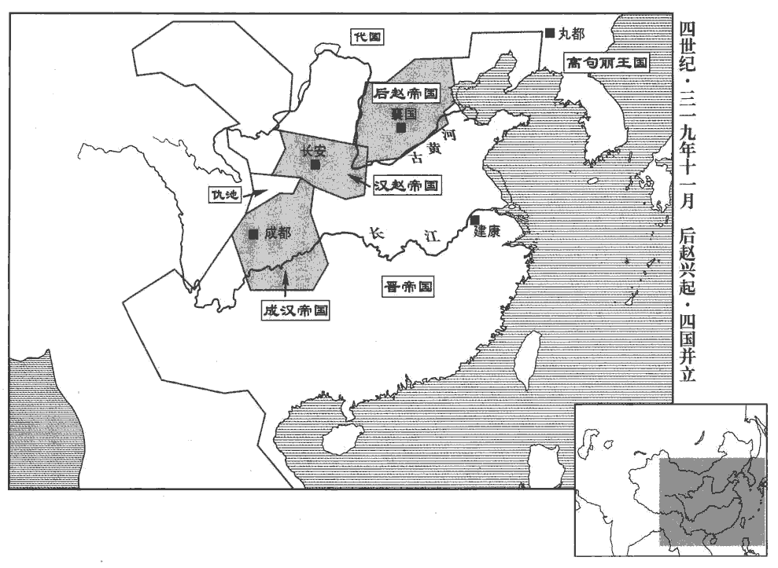
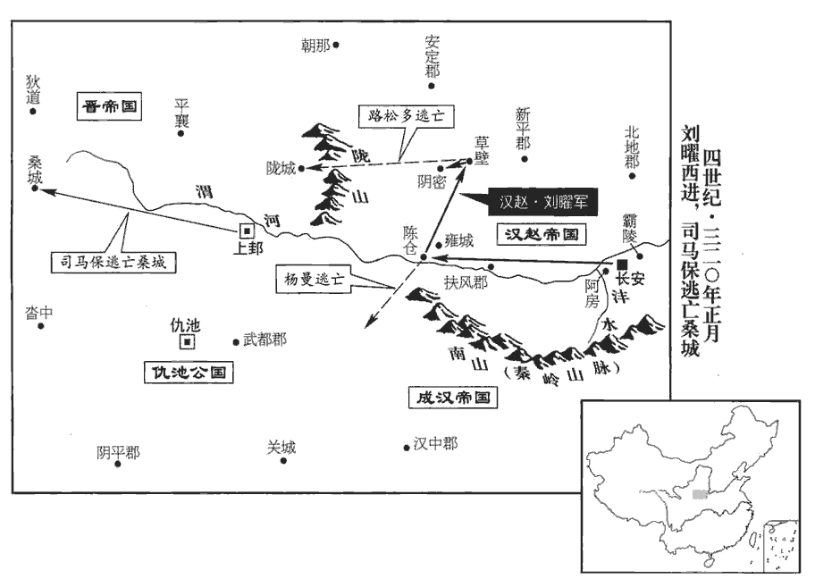
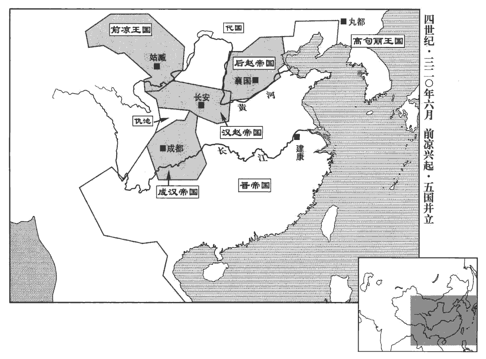
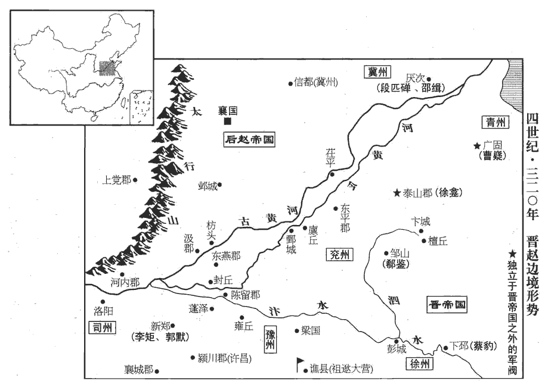

 晉紀十三起屠維單閼（己卯），盡重光大荒落（辛巳），凡三年。

# 中宗元皇帝中

## 大興二年（己卯，三一九）

1春，二月，劉遐、徐龕擊周撫於寒山‹江苏徐州东南›，破斬之。魏收地形志，彭城郡彭城縣有寒山。龕，苦含翻。初，掖‹东莱郡郡政府所在县·山东省莱州市›人蘇峻帥鄉里數千家結壘以自保，遠近多附之。掖縣，屬東萊郡。蘇峻傳云，長廣掖人。據志，長廣郡有挺縣，無掖縣。帥，讀曰率。曹嶷惡其強，將攻之，峻率眾浮海來奔。嶷，魚力翻。惡，烏路翻。帝‹司马睿，本年四十四岁›以峻為鷹揚將軍，沈約志：鷹揚將軍，建安中，曹公以命曹洪。助劉遐討周撫有功；詔以遐為臨淮‹江苏盱眙›太守，峻為淮陵‹安徽省明光市东北›內史。惠帝元康七年，分臨淮置淮陵郡，其地當在唐沂州臨沂縣界。宋白曰：泗洲招信縣，本漢淮陵縣。

〖译文〗 [1]春季，二月，刘遐、徐龛在寒山攻击周抚，攻破并杀死周抚。当初，掖县人苏峻率领乡里数千家民众营造壁垒自保，远近民众大多附从。曹嶷恨苏峻势力强大，准备攻击他，苏峻率部众渡海投奔东晋。元帝任苏峻为鹰扬将军，因为帮助刘遐讨伐周抚有功，下诏任刘遐为临淮太守，苏浚为淮陵内史。

2石勒遣左長史王脩獻捷於漢，漢主曜遣兼司徒郭汜授勒太宰、領大將軍，進爵趙王，加殊禮，出警入蹕，如曹公輔漢故事。汜音祀。拜王脩及其副劉茂皆為將軍，封列侯。脩舍人曹平樂從脩至粟邑‹陕西白水›，樂，音洛。因留仕漢，言於曜曰：「大司馬遣脩等來，曜初即位，以勒為大司馬，故稱之。外表至誠，內覘大駕強弱，俟其復命，將襲乘輿。」覘，丑廉翻。乘，繩證翻。時漢兵實疲弊，曜信之。乃追汜還，斬脩於市。三月，勒還至襄國‹河北邢台›。劉茂逃歸，言脩死狀。勒大怒曰：「孤事劉氏，於人臣之職有加矣。彼之基業，皆孤所為，今既得志，還欲相圖。趙王、趙帝，孤自為之，何待於彼邪！」乃誅曹平樂三族。為劉、石相攻張本。

〖译文〗 [\[2]石勒派左长史王向汉主献俘告捷，汉主刘曜派兼司徒郭汜授石勒为太宰、领大将军，晋升爵位为赵王，给予特殊礼遇，出入宫禁，如同曹操辅佐汉室的旧制。拜王和他的副将刘茂为将军，封为列侯。王的舍人曹平乐随从王到粟邑，顺势留在汉国做官，他对刘曜说：“大司马石勒派王等人前来，外表至为忠诚，实则是窥察您的强弱，等他回去报告后，将要袭击您。”当时汉军的确疲敝，刘曜相信了曹平乐所言，于是命人追回郭汜，在街市上杀了王。三月，石勒回到襄国。刘茂逃回，告知王死的情况，石勒大怒，说：“孤侍奉刘氏，已经超过了臣下该尽的本职。刘氏的基业，都是我所创下的。现在他志得意满，却反过来想算计我。赵王、赵帝，孤自己就能做，哪里还要等他呢！”于是诛杀曹平乐三族。

3帝令群臣議郊祀，尚書令刁協等以為宜須還洛乃脩之。司徒荀組等曰：「漢獻帝都許‹河南许昌东›，即行郊祀，范書，漢獻帝建安元年，郊祀上帝於安邑；是年七月，至洛陽，復郊祀上帝；八月，遷許，無郊祀之事，或別見他書也。晉書禮志載組議云：獻帝遷許，即便立郊。蓋郊祀不在遷許之年也。何必洛邑！」帝從之，立郊丘於建康城之巳地。辛卯，帝親祀南郊。以未有北郊，按：成帝咸和八年，始於覆舟山南立北郊。并地祇合祭之。詔：「琅邪恭王宜稱皇考，」賀循曰：「禮，子不敢以己爵加於父，」此前漢師丹引禮以為言，事見三十三卷漢哀帝建平元年。乃止。

〖译文〗 [3]元帝令群臣商议郊祀之事，尚书令刁协等人认为应该等还都洛阳之后再举行。司徒荀组等人说：“汉献帝迁都许昌，马上便举行郊祀，又何必等回到洛邑时！”元帝听从了荀组等人意见，在建康城的巳地建立郊祀园丘。辛卯（二十日），元帝亲自到南郊祭天，因为还没有北郊，所以连同地祗合并祭祀。元帝下诏说：“琅邪恭王应当称作皇考。”贺循说：“根据《礼》，儿子不敢把自己的爵位加在父亲身上。”于是停止执行。

4初，蓬陂塢主陳川蓬陂‹河南开封南›，即左傳之蓬澤，在浚儀縣。自稱陳留‹河南省开封市东›太守。守，式又翻。祖逖之攻樊雅也，川遣其將李頭助之。頭力戰有功，逖厚遇之。頭每嘆曰：「得此人為主，吾死無恨。」川聞而殺之。頭黨馮寵帥其眾降逖，川益怒，大掠豫州諸郡，逖遣兵擊破之。夏，四月，川以浚儀‹河南省开封市›叛，降石勒。浚儀縣，屬陳留郡，故大梁也。帥，讀曰率。降，戶江翻；下同。

〖译文〗 [4]当初，蓬陂坞主陈川自称陈留太守，祖逖攻打樊雅之时，陈川派部将李头助战。李头力战建功，祖逖对他另眼相看。李头常常感叹说：“能得到祖逖做自己的主公，我死无遗憾。”陈川听说，杀了李头。李头的党徒冯宠率领部众投降祖逖，陈川更加恼怒，大肆攻掠豫州诸郡，祖逖派兵打败了他。夏季，四月，陈川占据浚仪背叛，投降石勒。

5周撫之敗走也，徐龕部將于藥追斬之；及朝廷論功，而劉遐先之。先，悉薦翻。龕怒，以泰山叛，降石勒，自稱兗州刺史。

〖译文〗 [5]周抚败逃时，是徐龛的部将于药追上并杀了周抚，等到朝廷论功时，却是刘遐占先。徐龛生气，占据泰山背叛，投降石勒，自称兖州刺史。

6漢主曜還，都長安，自粟邑‹陕西白水›還長安，遂定都也。立妃羊氏為皇后，即惠帝羊皇后。曜納羊后，見八十七卷懷帝永嘉五年。子熙為皇太子；封子襲為長樂王，樂，音洛。闡為太原王，沖為淮南王，敞為齊王，高為魯王，徽為楚王；諸宗室皆進封郡王。羊氏，即故惠帝后也。曜嘗問之曰：「吾何如司馬家兒？」羊氏曰：「陛下，開基之聖主；彼，亡國之暗夫；何可并言！彼貴為帝王，有一婦、一子及身三耳，曾不能庇。妾於爾時，實不欲生，意謂世間男子皆然。自奉巾櫛zhì已來，始知天下自有丈夫耳。」曜甚寵之，頗干預國事。

〖译文〗 [6]汉主刘曜回到长安，定都于此，立后妃羊氏为皇后，儿子刘熙为太子。封儿子刘袭为长乐王，刘阐为太原王，刘冲为淮南王，刘敞为齐王，刘高为鲁王，刘徽为楚王，各宗室子弟都进封郡王。羊氏就是过去晋惠帝的皇后。刘曜曾经问她说：“我比起司马家的孩子怎么样？”羊氏说：“陛下是开基的圣主，他是亡国的昏君，怎么能相提并论！他贵为帝王时，只有一个夫人、一个孩子和他自己三个人，竟然都不能庇护。我在那时实在是不想活了，以为世上的男人都是这样。自从做了您的妻子，才知道天下自有大丈夫。”刘曜非常宠爱她，羊氏常干预国事。

7南陽王保自稱晉王，改元建康，置百官，以張寔為征西大將軍。開府儀同三司。陳安自稱秦州刺史，降于漢，又降于成。上邽‹甘肃天水›大饑，士眾困迫，張春奉保之南安‹甘肃省陇西县东南›祁山‹甘肃省礼县东北›。之，往也。寔遣韓璞帥步騎五千救之；陳安退保緜諸‹甘肃天水东›，緜諸道，前漢屬天水郡，後漢、晉省。水經註：緜諸水，歷緜諸故道北，東南入清水，清水東南注渭。保歸上邽。未幾，保復為安所逼，幾，居豈翻。復，扶又翻。寔遣其將宋毅救之，安乃退。

〖译文〗 [7]南阳王司马保自称晋王，改年号为建康，设置百官，任张为征西大将军，开府仪同三司。陈安自称秦州刺史，投降汉，后又投降成汉。上发生严重饥荒，士民困迫，张春侍奉司马保去南安的祁山。张派遣韩璞率领步、骑兵五千救援司马保，陈安退守绵诸，司马保回到上。不久，司马保又被陈安进逼，张派部将宋毅救援，陈安才退军。

8江東大饑，詔百官各上封事。益州‹府设巴东郡重庆市奉节县东›刺史應詹上疏曰：詹自益州刺史還建康。「元康以來，賤經尚道，以玄虛宏放為夷達，夷，曠也。以儒術清儉為鄙俗，宜崇獎儒官，以新俗化。」

〖译文〗 [8]江南发生严重饥荒，元帝下诏让百官各自上书奏事。益州刺史应詹上疏说：“自元康年间以来，轻视经典，崇尚道学，把玄虚弘放视作平达，把儒术、清俭看作鄙俗，应当尊崇和奖掖儒官，来革新风俗教化。”

9祖逖攻陳川于蓬關‹即蓬陂·河南省开封市南›，石勒遣石虎將兵五萬救之，戰于浚儀‹河南省开封市›，逖兵敗，退屯梁國‹河南商丘›。勒又遣桃豹將兵至蓬關，逖退屯淮南‹安徽寿县›。此淮南郡，治壽春。虎徙川部眾五千戶于襄國，留豹守川故城。

〖译文〗 [9]祖逖在蓬关进攻陈川，石勒派石虎率兵五万救援，两军在浚仪交战，祖逖兵败，退军驻屯梁国。石勒又派桃豹率兵到达蓬关，祖逖退守淮南。石虎将陈川部众五千户迁徙到襄国，留下石豹守卫陈川故城。

10石勒遣石虎擊鮮卑日六延於朔方，大破之，斬首二萬級，俘虜三萬餘人。孔萇攻幽州諸郡，悉取之。段匹磾士眾飢散、欲移保上谷‹河北怀来›，晉志：上谷郡，治沮陽縣；秦置郡，在谷之上頭，故名焉。代王鬱律勒兵將擊之，匹磾棄妻子奔樂陵‹山东省阳信县东南›，依邵續。樂陵郡，治厭次，續保之以奉晉。

〖译文〗 [10]石勒派遣石虎在朔方重创鲜卑族日六延，斩首二万，俘虏三万多人。孔苌攻取了幽州诸郡。段匹的士众因饥饿离散，段匹想移军保守上谷，代王郁律领兵准备攻击他，段匹丢弃妻子儿女逃奔乐陵，依附邵续。

11曹嶷遣使賂石勒，請以河為境，勒許之。嶷已緣河置戍矣，今賂勒請以河為境者，懼勒之侵軼也。

〖译文〗 [11]曹嶷派使者给石勒送去财物，请求以黄河作为分界，石勒答应了。

12梁州刺史周訪擊杜曾，大破之。馬雋等執曾以降，訪斬之；并獲荊州刺史第五猗，送於武昌‹湖北省鄂州市›。訪以猗本中朝所署，朝，直遙翻。加有時望，白王敦不宜殺，敦不聽而斬之。猗從杜曾事，始八十九卷愍帝建興四年。初，敦患杜曾難制，謂訪曰：「若擒曾，當相論為荊州。」及曾死而敦不用。王廙在荊州，廙，羊至翻，又逸職翻。多殺陶侃將佐；將，即亮翻。以皇甫方回為侃所敬，責其不詣己，收斬之。士民怨怒，上下不安。帝聞之，徵廙為散騎常侍，以周訪代廙為荊州刺史。王敦忌訪威名，意難之。從事中郎郭舒說敦曰：「鄙州雖荒弊，乃用武之國，不可以假人，宜自領之，郭舒，先在荊州，歷事劉弘、王澄。說，輸芮翻。訪為梁州足矣。」敦從之。六月，丙子‹七›，詔加訪安南將軍，餘如故。訪大怒，敦手書譬解，并遺玉環、玉椀以申厚意。遺，于季翻。訪抵之於地，曰：「吾豈賈豎，可以寶悅邪！」賈，音古。訪在襄陽，務農訓兵，陰有圖敦之志，守宰有缺輒補，然後言上；上，時掌翻。敦患之而不能制。

〖译文〗 [12]梁州刺史周访进攻杜曾，大胜。马隽等人抓住杜曾投降，周访斩杀杜曾。并抓获荆州刺史第五猗，送往武昌。周访因为第五猗本是朝廷任命，而且有一定声望，告诉王敦最好不要杀他，王敦不听，杀了第五猗。当初，王敦忧虑杜曾难以控制，对周访说：“如果能擒获杜曾，我将论功让你治理荆州。”等到杜曾死后，王敦不用周访。王在荆州，杀了许多陶侃的将佐，因为皇甫方回是陶侃所敬重的人，王责怪他不拜诣自己，把他拘捕杀害。士人民众因此怨怒，上下关系紧张。元帝听说这件事，征召王任散骑常侍，让周访代替王任荆州刺史。王敦嫉妒周访有威名，有意为难。从事中郎郭舒劝王敦说：“本州虽然荒凉凋敝，却是用武之地，不可以让人占有，应当自己管辖。周访治理梁州就够了。”王敦听从了他的话。六月，丙子（初七），元帝下诏授予周访安南将军，其余职务不变。周访大为恼怒。王敦亲自写信劝解，并赠玉环、玉碗表示看重之意。周访扔在地上，说：“我难道是商人和小孩吗？怎么可以用宝物来让我高兴呢！”周访在襄阳发展农业、训练士卒，暗藏谋算王敦的心志。官吏有缺员就自行补录，然后才上报。王敦对他深以为患但又不能控制他。

魏該為胡寇所逼，自宜陽‹河南宜陽西›率眾南遷新野，魏該自懷帝末屯宜陽界一泉塢。宜陽縣，屬弘農郡。新野縣，漢屬南陽郡，晉屬義陽郡。助周訪討杜曾有功，拜順陽‹河南淅川东南›太守。

〖译文〗 魏该被胡族敌寇所逼迫，从宜阳率领部众向南迁徙到新野，因帮助周访讨伐杜曾有功，被拜为顺阳太守。

趙固死，郭誦留屯陽翟dí‹河南禹州›，陽翟縣，漢屬潁川郡，晉屬河南郡。石生屢攻之，不能克。

〖译文〗 赵固死，郭诵屯军阳翟，石生多次进攻，不能取胜。

13漢主曜立宗廟、社稷、南北郊於長安，詔曰：「吾之先，興於北方。光文立漢宗廟以從民望。見八十五卷惠帝永興元年。今宜改國號，以單于為祖。亟議以聞！」群臣奏：「光文始封盧奴伯，晉成都王穎封劉淵為盧奴伯。陛下又王中山；中山，趙分也，王，于況翻。分，扶問翻。請改國號為趙。」從之。以冒頓配天，冒，莫北翻。光文配上帝。

〖译文〗 [13]汉主刘曜在长安建立宗庙、社稷和南郊、北郊，下诏说：“我的祖先从北方开始兴盛，光文建立汉国宗庙是为了顺从民众愿望。现在应当改国号，奉单于为祖。尽快论议上报！”群臣上奏说：“光文最早受封卢奴伯，陛下又曾在中山称王。中山本是赵国领土，请求改国号为赵。”刘曜听从，将冒顿配祀上天，光文配祀上帝。

14徐龕寇掠濟、岱，岱，泰山也。龕寇掠濟、岱之間。濟，子禮翻。破東莞‹山东省莒县›。沈約志：武帝太康元年，分琅邪立東莞郡。晉志：東莞，故魯鄆yùn邑。劉昫曰：唐沂州沂水縣，漢東莞縣地。宋白曰：春秋莒、魯爭鄆。杜預註云：城陽姑幕縣南，有員亭，即鄆也，俗變其字耳。十三州志云：有東、西二鄆，魯昭公所居者為西鄆，兗州東平郡是也；莒、魯所爭者為東鄆，漢東莞縣是也。莞，音官。帝問將帥可以討龕者於王導，將，即亮翻。帥，所類翻。導以為太子左衛率泰山羊鑒，龕之州里冠族，冠，古玩翻。必能制之。鑒深辭，才非將帥；郗鑒‹时驻邹山山东省邹县东南›亦表鑒非才，不可使；導不從。秋，八月，以羊鑒為征虜將軍、征討都督，督徐州刺史蔡豹‹时驻卞城山东省泗水县东卞桥乡›、臨淮太守劉遐、鮮卑段文鴦等討之。段文鴦時從其兄匹磾在厭次‹山东省阳信县东南›。

〖译文〗 [14]徐龛寇掠济水、泰山之间，攻破东莞。元帝向王导询问将帅中有谁能够征讨徐龛，王导认为太子左卫率泰山人羊鉴，是徐龛州里的显贵豪族，必能制服徐龛。羊鉴恳切地推辞，认为自己不是将帅之才；郗鉴也上表认为羊鉴不是合适的人选，不能委派，王导不听。秋季，八月，任羊鉴为征虏将军、征讨都督，总领徐州刺史蔡豹、临淮太守刘遐、鲜卑部段文鸯等讨伐徐龛。

 

15冬，石勒左、右長史張敬、張賓，左、右司馬張屈六、程遐等勸勒稱尊號，勒不許。十一月，將佐等復請勒稱大將軍、大單于、領冀州牧、趙王，復，扶又翻。單，音蟬。依漢昭烈在蜀、魏武在鄴故事，以河內等二十四郡為趙國，太守皆為內史，準禹貢，復冀州之境，時以河內、魏、汲、頓丘、平原、清河、鉅鹿、常山、中山、長樂、樂平、趙國、廣平、陽平、章武、勃海、河間、上黨、定襄、范陽、漁陽、武邑、燕國、樂陵二十四郡為趙國。準禹貢，魏武復冀州之境，南至孟津，西達龍門，東至于河，北至塞垣。以大單于鎮撫百蠻，罷并、朔、司三州，晉未嘗置朔州；此罷朔州，未知誰所置也。通置部司以監之；勒許之。戊寅，即趙王位‹石勒，本年四十六岁›，石勒，字世龍。大赦；依春秋時列國稱元年。

〖译文〗 [15]冬季，石勒的左、右长史张敬、张宾，左、右司马张屈六、程遐等劝石勒称皇帝尊号，石勒不同意。十一月，将佐们又请求石勒称大将军、大单于、领冀州牧、赵王，依照蜀汉昭烈帝刘备在蜀、魏武帝曹操在邺的旧例，以河内等二十四郡为赵国，太守都改为内史，根据《尚书·禹贡》，恢复冀州的行政区划，以大单于的身份镇抚众蛮族；撤销并州、朔州、司州的建置，合置部司监管，石勒同意了。戊寅（疑误），石勒即后赵王位，大赦天下，依照春秋时列国旧例称元年。

初，勒以世亂，律令煩多，命法曹令史貫志，貫，姓也；志，其名。采集其要，作辛亥制五千文；施行十餘年，乃用律令。以理曹參軍上黨‹山西省黎城县西南›續咸為律學祭酒；姓譜：帝舜七友有續牙。曰晉大夫狐鞫jū居食采於續，號續簡伯，後以為氏。咸用法詳平，國人稱之。以中壘將軍支雄、中壘將軍，後趙創置。游擊將軍王陽領門臣祭酒，勒置經學祭酒、律學祭酒、史學祭酒、門臣祭酒。專主胡人辭訟，重禁胡人，不得陵侮衣冠華族，華族，中華之族也。勒，胡人也，能禁其醜類，不使陵暴華人及衣冠之士，晉文公初欲俘陽樊之民，殆有愧焉。號胡為國人。遣使循行州郡，勸課農桑。朝會，始用天子禮樂，衣冠、儀物，從容可觀矣。朝，直遙翻。從，千容翻。加張賓大執法，專總朝政；朝，直遙翻；下同。以石虎為單于、元輔、都督禁衛諸軍事，尋加驃騎將軍、侍中、開府，賜爵中山公；驃，匹妙翻。自餘群臣，授位進爵各有差。

〖译文〗 当初，石勒因为世事紊乱，律令烦多，命法曹令史贯志采撷纲要，作《辛亥制》五千字，施行十多年，才用律令。任理曹参军上党人续咸为律学祭酒，续咸运用法律细致、公平，受到国人的称赞。任用中垒将军支雄、游击将军王阳兼门臣祭酒，专管胡人的诉讼，严厉禁止胡人，不许他们欺陵污辱具有较高文化的汉人，把胡人称作国人。派遣使者巡行州郡，鼓励、督促农业生产。朝会时开始用天子的礼乐，衣冠、仪物都充足可观。升张宾为大执法，专门总理朝政，任石虎为单于元辅、都督禁卫各种军务，不久又担任骠骑将军、侍中、开府，赐爵为中山公。其余群臣，授官进爵各有等次。

張賓任遇優顯，群臣莫及；而謙虛敬慎，開懷下士，屏絕阿私，屏，必郢翻。以身帥物，帥，讀曰率。入則盡規，出則歸美。勒甚重之，每朝，常為之正容貌，簡辭令，呼曰右侯而不敢名。史言張賓有大臣之節，所以膺石勒之體貌。為，于偽翻。

〖译文〗 张宾得到的职位高、待遇优厚，群臣没有可比拟的；但他本人却谦虚、恭敬、小心，真诚地折节下士，杜绝私情，以身作则，入朝时直言规谏，出外却将美誉归功于主上，石勒非常看重他。每次上朝，经常因为张宾的缘故端正容貌，修饰辞令，以右侯称呼张宾，不叫他的名字。

16十二月，乙亥‹九›，大赦。

〖译文〗 [16]十二月，乙亥（初九），东晋大赦天下。

17平州‹辽宁›刺史崔毖，自以中州人望，鎮遼東‹辽宁辽阳›，毖，崔琰之曾孫。琰在魏時，為冀州人士之首，子孫遂為冀州冠族。毖，音祕。而士民多歸慕容廆‹王庭设棘城辽宁省义县西›，廆，戶罪翻。心不平。數遣使招之，皆不至，數，所角翻。意廆拘留之，乃陰說高句麗‹都丸都吉林省集安市›、段氏‹府令支河北省迁安县›、宇文氏‹内蒙古老哈河上游›，使共攻之，說，輸芮翻。句，音如字，又音駒。麗，力知翻。約滅廆，分其地。毖所親勃海‹河北南皮›高瞻力諫，毖不從。

〖译文〗 [17]平州刺史崔毖自以为在中州享有声望，现在镇守辽东，而士民却大多归附慕容，心中不服。多次派遣使者招纳士民，但他们全都不来。崔毖怀疑是慕容羁留他们，于是暗地游说高句丽、段氏和宇文氏，让他们共同攻伐慕容，约定翦灭慕容后，共同瓜分他的辖地。崔毖的亲信、勃海人高瞻极力劝谏，崔毖不听。

三國合兵伐廆，諸將請擊之，廆曰：「彼為崔毖所誘，欲邀一切之利。軍勢初合，其鋒甚銳，不可與戰，當固守以挫之。彼烏合而來，飛烏見食，群集而聚啄之，人或驚之，則四散飛去；故兵以利合無所統一者謂之烏合。既無統壹，莫相歸服，久必攜貳，一則疑吾與毖詐而覆之，二則三國自相猜忌。待其人情離貳，然後擊之，破之必矣。」

〖译文〗 高句丽、段氏、宇文氏三国合兵攻伐慕容，慕容部下众将请战，慕容说：“他们被崔毖诱惑，想乘机谋利。军势刚刚会合，锋头正锐，现在不能和他们交战，应当固守以挫其锐气。他们乌合前来，既没有统一的号令，互相之间又不服气，时间久了必然产生二心，一来怀疑我和崔毖共使欺诈，想消灭他们；二来三国之间也互相猜忌。等到他们人心离散，然后进攻，一定能打败他们。”

三國進攻棘城，廆閉門自守，遣使獨以牛酒犒宇文氏；使，疏吏翻。犒，苦告翻。二國疑宇文氏與廆有謀，各引兵歸。兵法所謂合則能離之，慕容廆有焉。宇文大人悉獨官曰：「二國雖歸，吾當獨取之。」

〖译文〗 三国军队进攻棘城，慕容闭门固守，派遣使者单独用牛和酒犒劳宇文氏。高句丽和段氏怀疑宇文氏与慕容勾结，各自领军退还。宇文氏首领悉独官说：“高句丽和段氏虽然回去，我要独自攻取慕容。”

宇文氏士卒數十萬，連營四十里。廆使召其子翰於徒河‹辽宁锦州›。翰自愍帝建興元年鎮徒河。翰遣使白廆曰：「悉獨官舉國為寇，彼眾我寡，易以計破，難以力勝。今城中之眾，足以禦寇，翰請為奇兵於外，伺其間而擊之，間，古莧翻；下同。內外俱奮，使彼震駭不知所備，破之必矣。今并兵為一，彼得專意攻城，無復它虞，虞，防也，備也。復，扶又翻；下同。非策之得者也；且示眾以怯，恐士氣不戰先沮矣。」沮，在莒翻。廆猶疑之。遼東韓壽言於廆曰：「悉獨官有憑陵之志，將驕卒惰，軍不堅密，若奇兵卒起，卒，讀曰猝。掎jǐ其無備，必破之策也。掎，舉綺翻。偏引曰掎，又從後牽曰掎。廆乃聽翰留徒河‹辽宁锦州›。

〖译文〗 宇文氏士卒有数十万，营寨相连有四十里。慕容派人从徒河征召儿子慕容翰。慕容翰派遣使者告诉慕容说：“悉独官倾国来犯，敌众我寡，易于智取，难以力敌。现在城中的军队，已足以防御，我请求作为外面的奇兵，伺机攻击，内外同时发兵，使他们惊骇而不知道如何防备，这样一定能打败他们。如果现在把兵力集中在一处，他们便能专心攻城，没有其他顾虑，这不是合适的对策。而且这是向民众表示内心的怯惧，恐怕还没作战士气就要先丧失了。”慕容犹疑不决。辽东人韩寿对慕容说：“悉独官有侵凌进逼的志向，将领骄纵，士卒惫惰，军队组织松散，如果使用奇兵突然发难，在他们没有防备时实施攻击，这是必定取胜的策略。”慕容这才同意慕容翰留在徒河。

悉獨官聞之曰：「翰素名驍果，驍，堅堯翻。今不入城，或能為患，當先取之，城不足憂。」乃分遣數千騎襲翰。翰知之，詐為段氏使者，逆於道曰：「慕容翰久為吾患，聞當擊之，吾已嚴兵相待，宜速進也。」使者既去，翰即出城，設伏以待之。宇文氏之騎見使者，大喜馳行，不復設備，進入伏中。翰奮擊，盡獲之，乘勝徑進，遣間使語廆出兵大戰。投間隙而行，故謂之間使。間，古莧翻。廆使其子皝huàng與長史裴嶷將精銳為前鋒，皝，呼廣翻。自將大兵繼之。悉獨官初不設備，聞廆至，驚，悉眾出戰。前鋒始交，翰將千騎從旁直入其營，縱火焚之，將，即亮翻。眾皆惶擾，不知所為，遂大敗，悉獨官僅以身免。廆盡俘其眾，獲皇帝玉璽三紐。皇帝璽，即宇文大人普回出獵所得者。璽，斯氏翻。

〖译文〗 悉独官听说慕容翰留在徒河，说：“慕容翰素来以骁勇果敢闻名，现在不进城，或许会成为祸患，应当先攻取他，城里不足为患。”于是分出数千骑兵攻击慕容翰。慕容翰得知此事，派人假扮成段氏的使者，在路上迎住悉独官的骑兵，对他们说：“慕容翰长久以来就是我心头之患，听说你们将要进攻他，我们已严阵以待，你们可以快速前进。”使者离开以后，慕容翰立即出城，设下埋伏等待宇文氏的军队。宇文氏的骑兵见到使者，大为高兴，骑马驰行，不再防备，进入了伏击圈中。慕容翰突然攻击，全部俘获了他们。又乘胜进军，同时派遣密使告诉慕容，让他出兵大战。慕容令其子慕容和长史裴嶷率领精锐士卒为前锋，自己统领大军随后。悉独官原先没有设防，听说慕容来了，大惊，倾巢出战。两军前锋刚刚交战，慕容翰率领千余骑兵从旁侧直冲入悉独官军营，纵火焚烧。悉独官的士卒都惶恐不安，不知所措，结果大败，悉独官只身逃脱。慕容尽数俘获他的士众，缴获到皇帝玉玺三纽。

崔毖聞之，懼，使其兄子燾詣棘城偽賀。會三國使者亦至，請和，曰：「非我本意，崔平州教我耳。」廆以示燾，臨之以兵，燾懼，首服。首，式救翻。廆乃遣燾歸謂毖曰：「降者上策，走者下策也。」引兵隨之。毖與數十騎棄家奔高句麗，其眾悉降於廆。降，戶江翻。廆以其子仁為征虜將軍，鎮遼東，為仁以遼東與皝爭國張本。官府、市里，案堵如故。

〖译文〗 崔毖听说此事，心中恐惧，让他兄长之子崔焘到棘城假装祝贺。正巧高句丽、宇文氏、段氏三国使者也来请和，都说：“我们本来并不想与你为敌，是崔毖让我们这么做的。”慕容让崔焘见三国使者，执刀相对，崔焘害怕，低头臣服。慕容便让崔焘回去对崔毖说：“投降是上策，逃跑是下策，”并带兵随后而行。崔毖带着数十骑弃家逃奔高句丽，部众全部投降慕容。慕容任儿子慕容仁为征虏将军，镇守辽东，官府、市里，一仍其旧。

高句麗將如奴子據于河城，廆遣將軍張統掩擊，擒之，俘其眾千餘家；以崔燾、高瞻、韓恆、石琮歸于棘城，待以客禮。恆，安平‹河北省冀县›人；琮，鑒之孫也。石鑒事武帝、惠帝，位通顯。廆以高瞻為將軍，瞻稱疾不就，廆數臨候之，數，所角翻。撫其心曰：「君之疾在此，不在它也。今晉室喪亂，孤欲與諸君共清世難，喪，息浪翻。難，乃旦翻。翼戴帝室。君中州望族，宜同斯願，柰何以華、夷之異，介然疏之哉！介然，堅正不移之貌。夫立功立事，惟問志略何如耳，華、夷何足問乎！」以瞻薄廆起於東夷，不肯委身事之，故有是言。瞻猶不起，廆頗不平。龍驤主簿宋該，與瞻有隙，廆進號龍驤將軍，以該為府主簿。驤，思將翻。勸廆除之，廆不從。瞻以憂卒。

〖译文〗 高句丽将领如奴子占据于河城，慕容派将军张统突然袭击，擒获如奴子，俘虏部众一千多家。因为崔焘、高瞻、韩恒、石琮归附棘城，慕容以客人的礼节对待他们。韩恒是安平人，石琮是石鉴的孙子。慕容任高瞻为将军，高瞻以有病为由不干。慕容多次亲临问侯，抚摸他的心口说：“您的病在这儿，不在别处。现在晋王室丧乱，孤想和诸君共同廓清世上的灾难，辅翼、拥戴帝室。您是中州的名门望族，应当与我同有此愿，为何因为华夏、夷族的区别，便耿耿于怀，故意疏远呢！至于立功成事，只问志向、谋略怎样便可以了，何须再问是华夏还是夷族呢！”高瞻还是不肯出来做官，慕容心中颇为忿忿不平。龙骧主簿宋该与高瞻有矛盾，劝慕容除去高瞻，慕容没有听从。高瞻因忧虑而死。

初，鞠羨既死，鞠羨死見八十六卷懷帝永嘉元年。苟晞復以羨子彭為東萊‹山东省莱州市›太守。復，扶又翻。會曹嶷徇青州，事見八十七卷永嘉三年。嶷，魚力翻。與彭相攻；嶷兵雖強，郡人皆為彭死戰，為，于偽翻。嶷不能克。久之，彭歎曰：「今天下大亂，強者為雄。曹亦鄉里，彭與嶷皆齊人。為天所相，相，悉亮翻。苟可依憑，即為民主，何必與之力爭，使百姓肝腦塗地！吾去此，則禍自息矣。」郡人以為不可，爭獻拒嶷之策，彭一無所用，與鄉里千餘家浮海歸崔毖。北海‹山东昌乐东南›鄭林客於東萊‹山东省莱州市›，彭、嶷之相攻，林情無彼此。嶷賢之，不敢侵掠，彭與之俱去。比至遼東，比，必寐翻。毖已敗，乃歸慕容廆。廆以彭參龍驤軍事。遺鄭林車牛粟帛；遺，于季翻。皆不受，躬耕於野。

〖译文〗 当初，鞠羡已死，苟又让鞠羡的儿子鞠彭任东莱太守。适逢曹嶷到青州巡行，和鞠彭相互攻击。曹嶷的军队虽强，但郡民都为鞠彭拼命死战，曹嶷不能取胜。相持日久，鞠彭叹息说：“现在天下大乱，强大者是英雄。曹嶷也是同乡之人，有天相助。只要可以依靠，便可为民众主宰，何必和他力争，使老百姓肝脑涂地呢！我离开这里，战祸就会自然停止。”郡里人民都认为这样不行，争相进献抵抗曹嶷的计谋，鞠彭一个不用，随同乡里数千家民众渡海归附崔毖。北海人郑林旅居东莱，对于鞠彭、曹嶷之间的争斗，无所偏向。曹嶷认为他有贤德、不敢侵犯、劫掠。鞠彭和他一同离开。到了辽东，崔毖已经失败，鞠彭等于是归附慕容。慕容让鞠彭参与龙骧军事。赠送郑林车乘、服牛、粟谷、布帛，郑林都不接受，亲自在田野里耕种。

宋該勸廆獻捷江東，廆使該為表，裴嶷奉之，并所得三璽詣建康‹南京›獻之。

〖译文〗 宋该劝慕容向江南晋王室献俘、告捷。慕容派宋该撰写上表，让裴嶷奉持，连同得到的三个玉玺，一起送到建康进献。

高句麗數寇遼東，句，如字，又音駒。麗，力知翻。數，所角翻。廆遣慕容翰、慕容仁伐之；高句麗王乙弗利逆來求盟，翰、仁乃還。還，從宣翻。又如字。

〖译文〗 高句丽多次侵扰辽东，慕容让慕容翰、慕容仁领军攻伐。高句丽国王乙弗利迎上请求缔结盟约，慕容翰、慕容仁这才回师。

18是歲，蒲洪降趙，考異曰：三十國、晉春秋，洪降劉曜在大興元年。按元年曜未都長安。晉書洪載記無年，但云「曜僭號長安，洪歸曜」，故置是年。趙主曜以洪為率義侯。

〖译文〗 [18]这年，蒲洪投降前赵，前赵主刘曜封蒲洪为率义侯。

19屠各路松多起兵於新平‹陕西彬县›、扶風‹陕西眉县›以附晉王保，屠，直於翻。保使其將楊曼、王連據陳倉‹陕西宝鸡东陈仓镇›，張顗、周庸據陰密‹甘肃灵台西南›，松多據草壁‹甘肃灵台东›，水經註：隴山西南，降隴城北，有松多川，蓋松多據此，因以為地名。草壁，在陰密之東。顗，魚豈翻。秦、隴氐、羌多應之。趙主曜遣諸將攻之，不克；曜自將擊之。將，即亮翻。

〖译文〗 [19]屠各部落的路松多起兵于新平、扶风，归附晋王司马保。司马保派部将杨曼、王连占据陈仓，张、周庸占据阴密，路松多占据草壁，秦州、陇州的氐人和羌人大多响应他们。前赵主刘曜派遣多员将领攻伐，不能取胜，刘曜准备自己亲征。

## 三年（庚辰，三二零）

1春，正月，曜攻陳倉‹陕西宝鸡东陈仓镇›，王連戰死，楊曼奔南氐‹仇池，甘肃西和西南›。氐種之居陳倉南者，即仇池楊氏也。曜進拔草壁‹甘肃灵台东›，路松多奔隴城‹甘肃张家川›；又拔陰密‹甘肃灵台西南›。晉王保懼，遷于桑城‹甘肃临洮南›。水經註。洮水自臨洮縣東北流，過索西城，又北出門峽，又東北逕桑城東，又北逕安故縣。保欲自桑城奔河西也。曜還長安，以劉雅為大司徒。

〖译文〗 [1]春季，正月，刘曜进攻陈仓，王连战死，杨曼逃奔南氐。刘曜进而攻取草壁，路松多逃往陇城。刘曜又攻取阴密，晋王司马保恐惧，迂都于桑城。刘曜回到长安，任刘雅为大司徒。

張春謀奉晉王保奔涼州，張寔遣其將陰監將兵迎之，聲言翼衛，其實拒之。

〖译文〗 张春筹划侍奉晋王司马保逃奔凉州，张派遣部将阴监带兵来迎，说是护卫，其实是阻拦。

 

2段末柸攻段匹磾，破之。磾，丁奚翻。匹磾謂邵續曰：「吾本夷狄，以慕義破家。君不忘久要，要，一遙翻；久要，舊約也。請相與共擊末柸。」續許之，遂相與追擊末柸，大破之。匹磾與弟文鴦攻薊。匹磾奔邵續，薊為石氏所取。薊，音計。後趙王勒‹石勒，本年四十七岁›知續勢孤，是時劉、石國號皆曰趙，史以石趙為後趙以別之。遣中山公虎將兵圍厭次‹山东省阳信县东南›，厭，於琰翻。孔萇攻續別營十一，皆下之。二月，續自出擊虎，虎伏騎斷其後，斷，丁管翻。遂執續，使降其城。欲使續降厭次城也。降，戶江翻；下同。續呼兄子竺等謂曰：「吾志欲報國，不幸至此。汝等努力奉匹磾為主，勿有貳心。」匹磾自薊還，未至厭次，聞續已沒，眾懼而散，復為虎所遮；復，扶又翻；下同。文鴦以親兵數百力戰，始得入城，與續子緝、兄子存、竺等嬰城固守。虎送續於襄國‹河北邢台›，勒以為忠，釋而禮之，以為從事中郎。因下令：「自今克敵，獲士人，毋得擅殺，必生致之。」勒禮續而終於殺續，所以令生致士人者，不過欲使之從己耳。

〖译文〗 [2]段末进攻段匹，打败了段匹的军队。段匹对邵续说：“我本来是夷族，因为仰慕君臣大义，招致兵败家破。您如果不忘我们的旧约，便请和我共同抗击段末。”邵续答应了。于是和段匹共同追击段末，使段末的军队受到重创。段匹和兄弟段文鸯进攻蓟州，后赵王石勒知道邵续势单力薄，派遣中山公石虎率军围攻厌次，又让孔苌进攻邵续，攻下十一座别营。二月，邵续亲自率军出击石虎，石虎埋伏骑兵截断其退路，结果抓住了邵续，并让他向城中军民劝降。邵续呼唤兄长的儿子邵竺等人，对他们说：“我的志向是想报效国家，不幸落到了这步田地，你们努力尊奉段匹为主帅，不要有异心。”段匹从蓟州归来，还没到厌次，听说邵续已被俘，部众惊恐逃散，又被石虎乘势攻击，段文鸯依仗数百亲兵的奋力死战，才得以进入厌次城中，和邵续的儿子邵缉、邵续兄长之子邵存、邵竺等人环城固守。石虎把邵续解送到襄国，石勒认为邵续是忠贞之士，释放了他，以礼相待，任为从事中郎。继而下令说：“从今以后克敌致胜，俘获士人不许擅自杀害，一定要活着送来。”

吏部郎劉胤聞續被攻，被，皮義翻。言於帝曰：「北方藩鎮盡矣，惟餘邵續而已；如使復為石虎所滅，孤義士之心，阻歸本之路，愚謂宜發兵救之。」胤，續所遣也，事見八十九卷愍帝建興二年。帝‹司马睿，本年四十五岁›不能從。聞續已沒，乃下詔以續位任授其子緝。

〖译文〗 吏部郎刘胤听说邵续受到攻击，向元帝上言说：“北方的藩镇已经尽失，只剩下邵续一处了。如果让他再被石虎攻灭，会使贞义士心感孤寂，并阻塞回归祖国的道路。我认为应当发兵救助。”元帝没有听从。后来听说邵续已受陷被擒，于是下诏把邵续的职位授予其子邵缉。

3趙將尹安、宋始、宋恕、趙慎四軍屯洛陽，叛，降後趙。漢主曜改國號曰趙，石勒稱趙王，同在上年，而勒併曜始得中原，故以後趙別之。後趙將石生引兵赴之；安等復叛，降司州刺史李矩。復，扶又翻。矩使潁川‹河南省许昌市东›太守郭默將兵入洛。石生虜宋始一軍，北渡河。於是河南之民皆相帥歸矩，帥，讀曰率。洛陽遂空。

〖译文〗 [3]前赵将军尹安、宋始、宋恕、赵慎的四支军队驻屯洛阳，叛国投降后赵。后赵将领石生率军前往洛阳，尹安等人又背叛后赵，向晋的司州刺史李矩投降。李矩让颍川太守郭默带兵进入洛阳。石生俘获宋始这支军队，向北渡过黄河。于是黄河以南的民众都相互牵引归附李矩，洛阳城为之一空。

4三月，裴嶷至建康，嶷yí，魚力翻。盛稱慕容廆之威德，賢雋皆為之用；朝廷始重之。朝廷始以裔夷待慕容，今以嶷言始重之。帝謂嶷曰：「卿中朝名臣，朝，直遙翻。當留江東，朕別詔龍驤送卿家屬。」嶷曰：「臣少蒙國恩，出入省闥，嶷仕西朝，歷中書侍郎、給事黃門郎，故云然。少，詩照翻。若得復奉輦轂，臣之至榮。但以舊京淪沒，山陵穿毀，雖名臣宿將，莫能雪恥，復，扶又翻。將，即亮翻。獨慕容龍驤竭忠王室，志除凶逆，故使臣萬里歸誠。今臣來而不返，必謂朝廷以其僻陋而棄之，孤其嚮義之心，使懈體於討賊，體，當依載記作「怠」。懈，居隘翻。此臣之所甚惜，是以不敢徇私而忘公也。」謂留江東乃是徇一身之私計，歸棘城則可輔廆以討賊，乃天下之公義也。嶷之心，蓋以廆可與共功名，鄙晉之君臣宴安江沱，為不足與共事而已。帝曰：「卿言是也。」乃遣使隨嶷拜廆安北將軍、平州‹府辽宁辽阳›刺史。使，疏吏翻。

〖译文〗 [4]三月，裴嶷到达建康，盛赞慕容有威德，贤隽之士都乐意为他效力，朝廷这才开始重视慕容。元帝对裴嶷说：“您本是朝中名臣，应当留在江东，朕另外下诏让龙骧将军慕容把您的家属送来。”裴嶷说：“我自小蒙受晋室的恩宠，出入宫禁，如果能重新侍奉皇上，是我无上的荣耀。只是因为旧日京都沦陷，山陵毁败，即使是名臣宿将，也没有能够报仇雪耻。只有龙骧将军慕容尽忠于王室，立志赶除凶逆，所以派我不远万里前来表示忠诚。现在如果我来而不返，他一定认为朝廷因为他偏远落后而抛弃他，辜负他崇尚大义之心，惰怠讨伐逆贼之事，而这正是我所珍视的，所以我不敢因为个人私利而忘却公义。”元帝说：“您说的对。”于是派遣使者随同裴嶷前往，赐封慕容为安北将军、平州刺史。

5閏月，以周顗為尚書左僕射。顗，魚豈翻。

〖译文〗 [5]闰月，晋任周为尚书左仆射。

6晉王保將張春、楊次與別將楊韜tāo不協，勸保誅之，且請擊陳安；保皆不從。夏，五月，春、次幽保‹年二十七岁›，殺之。保體肥大，重八百斤；喜睡，好讀書，喜，許記翻。好，呼到翻。而暗弱無斷，故及於難。斷，丁亂翻。難，乃旦翻。保無子，張春立宗室子瞻為世子，稱大將軍。保眾散，奔涼州‹甘肃中西部›者萬餘人。陳安表於趙主曜，請討瞻等。曜以安為大將軍，擊瞻，殺之；張春奔枹罕‹甘肃临夏›。枹罕縣，前漢屬金城，後漢屬隴西郡，張軌分屬晉興郡，唐為河州。枹，音膚。安執楊次，於保柩前斬之，因以祭保。安以天子禮葬保於上邽‹甘肃天水›，諡曰元王。

〖译文〗 [6]晋王司马保部将张春、杨次和别将杨韬不和，劝司马保杀杨韬，并且请求击陈安，司马保都没听从。夏季，五月，张春、杨次软禁司马保，并杀了他。司马保身高体胖，重八百斤，嗜睡，喜欢读书，但糊涂懦弱，缺少决断，所以遇难。司马保没有儿子，张春立宗室子弟司马瞻为王世子，自称大将军。司马保的部众离散，逃奔到凉州的有一万多人。陈安上表给前赵主刘曜，请求征讨司马瞻等人。刘曜任陈安为大将军，进攻司马瞻并杀了他。张春逃奔到罕。陈安抓住扬次，在司马保灵柩前将他斩首，用来祭奠司马保。陈安用对待天子的礼节把司马保葬于上，谥号元王。

7羊鑒討徐龕，頓兵下邳‹江苏省睢宁县北古邳镇›，不敢前。蔡豹敗龕於檀丘‹山东省平邑›，檀丘，在魯國卞縣東南。敗，補邁翻。龕求救於後趙。後趙王勒遣其將王伏都救之，又使張敬將兵為之後繼。勒多所邀求，而伏都淫暴，龕患之。張敬至東平‹山东東平›，龕疑其襲己，乃斬伏都等三百餘人，復來請降。復，扶又翻。降，戶江翻；下同。勒大怒，命張敬據險以守之。據險守龕，欲持久以弊之也。帝亦惡龕反覆，不受其降，惡，烏路翻。敕鑒、豹以時進討。鑒猶疑憚不進，尚書令刁協劾奏鑒，免死除名，以蔡豹代領其兵。王導以所舉失人，乞自貶，帝不許。

〖译文〗 [7]羊鉴征讨徐龛，在下邳停兵，不敢前进。蔡豹在檀丘击败徐龛，徐龛向后赵求救。后赵王石勒派部将王伏都救援，又让张敬率军作为后援。石勒向徐龛多有索求，而王伏都又淫荡残暴，徐龛为之忧患。张敬部到达东平，徐龛怀疑他是来袭击自己，于是将王伏都等三百多人斩首，又向东晋请降。石勒勃然大怒，命令张敬占据险要地形固守。元帝也憎恶徐龛反覆无常，不接受他的请降，敕令羊鉴、蔡豹按原计划进发征讨。羊鉴仍然疑虑、忌惮，停止不前，尚书令刁协上疏弹劾羊鉴，敕令免除职务，饶其不死，让蔡豹代为指挥军队。王导因为自己荐举的人选不当，自请贬职，元帝不同意。

8六月，後趙孔萇攻段匹磾，磾，丁奚翻。恃勝而不設備，段文鴦襲擊，大破之。

〖译文〗 [8]六月，后赵孔苌进攻段匹，恃仗取得的胜利便不再防备，段文鸯趁势攻击，孔苌大败。

9京兆‹西安›人劉弘客居涼州天梯山‹甘肃省武威市西南五十千米冷龙岭›，武威姑藏城南，有天梯山。以妖術惑眾，從受道者千餘人，妖，於驕翻。西平元公張寔左右皆事之。帳下閻涉，牙門趙卬，皆弘鄉人，弘謂之曰：「天與我神璽，應王涼州。」璽，斯氏翻。王，于況翻。涉、卬信之，密與寔左右十餘人謀殺寔，奉弘為主。寔弟茂知其謀，請誅弘。寔令牙門將史初收之，未至，涉等懷刃而入，殺寔於外寢‹张寔，年五十岁›。考異曰：晉書作「閻沙、趙仰」；又云：「寔知其謀，收劉弘殺之。」。據晉春秋，作「閻涉、趙卬」；又弘死在寔被殺後。今從之。弘見史初至，謂曰：「使君已死，殺我何為！」初怒，截其舌而囚之，轘於姑臧市‹甘肃武威›，轘huàn，胡悍翻，車裂也。涼州及武威郡皆治姑藏縣。誅其黨與數百人。左司馬陰元等以寔子駿尚幼‹本年十四岁›，推張茂‹本年四十四岁›為涼州刺史、西平公，赦其境內，以駿為撫軍將軍。

〖译文〗 [9]京兆人刘弘客居凉州的天梯山，用妖术迷惑民众，随他受道的人有一千多，西平元公张身边的人也都崇奉他。张的帐下阎涉、牙门赵，都是刘弘的同乡。刘弘对他们说：“上天送给我神玺，应当统治凉州。”阎涉、赵深信不疑，私下与张身边的十多人密谋杀害张，侍奉刘弘为主君。张的弟弟张茂得知他们的计划，请求诛杀刘弘。张命令牙门将史初拘捕刘弘。史初还未到刘弘处，阎涉等人怀藏凶器入内。把张杀死在外寝。刘弘见史初到来，对他说：“张使君已经死了，为什么还要杀我！”史初发怒，把他割掉舌头后关了起来，在姑臧城的街市上处以车裂的酷刑，并诛杀刘弘党徒数百人。左司马阴元等人认为张的儿子张骏的年龄幼小，推举张茂为凉州刺史、西平公，在境内赦免罪犯，任张骏为抚军将军。

10丙辰‹二十三›，趙將解虎及長水校尉尹車謀反，與巴‹四川省阆中市›酋句徐、厙shè彭等相結；解，戶買翻。酋，慈由翻；下同。句，古侯翻；厙，音舍；皆姓也。事覺，虎、車皆伏誅。趙主曜囚徐、彭等五十餘人于阿房，將殺之；阿房，即秦阿房宮舊基，亦謂之阿城。光祿大夫游子遠諫曰：「聖王用刑，惟誅元惡而已，不宜多殺。」爭之，叩頭流血。曜怒，以為助逆而囚之；盡殺徐、彭等，尸諸市十日，乃投於水。於是巴眾盡反，推巴酋句渠知為主，自稱大秦，改元曰平趙。四山氐、羌、巴、羯應之者三十餘萬，關中大亂，城門晝閉。子遠又從獄中上表諫爭，爭，讀曰諍。曜手毀其表曰：「大荔奴，大荔，戎種落之名；子遠蓋戎出也。不憂命在須臾，猶敢如此，嫌死晚邪！」叱左右速殺之。中山王雅、郭汜、朱紀、呼延晏等諫曰：「子遠幽囚，禍在不測，猶不忘諫爭，汜，音祀。爭，謂曰諍。忠之至也。陛下縱不能用，柰何殺之！若子遠朝誅，臣等亦當夕死，以彰陛下之過。天下將皆捨陛下而去，陛下誰與居乎！」曜意解，乃赦之。

〖译文〗 [10]丙辰（二十三日），前赵将领解虎和长水校尉尹车谋反，与巴族酋长句徐、厍彭等人相勾结，事发后，解虎、尹车都被处决。前赵主刘曜将句徐、厍彭等五十多人囚禁在阿房，准备统统杀掉。光禄大夫游子远进谏说：“圣贤的君主施用刑罚，只不过诛杀元凶而已，不宜滥杀。”为此直言诤谏，以至叩头流血。刘曜发怒，认为这是帮助叛逆因而把游子远囚禁起来，尽杀句徐、厍彭等五十多人，暴尸于街市达十天，然后将尸首投弃水中。于是巴族民众都起来造反，推举巴族酋长句渠知为首，自称大秦，改年号为平赵。四山的氐族、羌族、巴族、羯族人有三十多万群起响应，关中因此大乱，城门白天也关闭。游子远又从狱中上表诤谏，刘曜撕毁表文说：“这个大荔的奴仆，不担忧自己命在须臾，还敢如此，是嫌死得晚吗？”叱令手下人立即杀掉他。中山王刘雅、郭汜、朱纪、呼延晏等人规谏说：“游子远遭幽禁，朝不保夕，依然不忘诤谏，这是最大的忠贞。陛下即使不能听用其言，又怎么能杀他呢！如果游子远早上被杀死，我们也当在晚上死去，以此显示陛下的过错，这样天下人都将舍弃陛下而离去，陛下与谁为伍呢？”刘曜怒意缓和，于是赦免了游子远。

 

曜敕內外戒嚴，將自討渠知。子遠又諫曰：「陛下誠能用臣策，一月可定，大駕不必親征也。」曜曰：「卿試言之。」子遠曰：「彼非有大志欲圖非望也，謂帝王之事，非常人所望。直畏陛下威刑，欲逃死耳。陛下莫若廓然大赦，與之更始；更，工衡翻。應前日坐虎、車等事，其家老弱沒入奚官者，皆縱遣之，使之自相招引，聽其復業。彼既得生路，何為不降！降，戶江翻；下同。若其中自知罪重，屯結不散者，願假臣弱兵五千，必為陛下梟之。梟，不孝鳥。說文，日至捕梟，磔zhé之，以頭掛木上。故今謂掛首為梟首。為，于偽翻。梟，堅堯翻。不然，今反者彌山被谷，彌，滿也。被，皮義翻。雖以天威臨之，恐非歲月可除也。」曜大悅，即日大赦，以子遠為車騎大將軍、開府儀同三司、都督雍•秦征討諸軍事。子遠屯于雍城‹陕西凤翔›，雍，于用翻。降者十餘萬；移軍安定‹甘肃省镇原县东南曙光乡›，反者皆降。惟句氏宗黨五千餘家保于陰密，進攻，滅之，遂引兵巡隴右。先是氐、羌十餘萬落，據險不服，先，悉薦翻。其酋虛除權渠自號秦王。子遠進造其壁，造，七到翻。權渠出兵拒之，五戰皆敗。權渠欲降，其子伊餘大言於眾曰：「往者劉曜自來，猶無若我何，況此偏師，何謂降也！」帥勁卒五萬，晨壓子遠壘門。帥，讀曰率。諸將欲擊之，子遠曰：「伊餘勇悍，當今無敵，所將之兵，復精於我，復，扶又翻。又其父新敗，怒氣方盛，其鋒不可當也，不如緩之，使氣竭而後擊之。」乃堅壁不戰。伊餘有驕色，子遠伺其無備，伺，相吏翻。夜，勒兵蓐食，旦，值大風塵昏，子遠悉眾出掩之，生擒伊餘，盡俘其眾。權渠大懼，被髮、剺lí面請降。被，皮義翻。剺，力之翻，以刀劃面也。子遠啟曜，以權渠為征西將軍、西戎公，啟，開也；開陳其事以白於上謂之啟。分徙伊餘兄弟及其部落二十餘萬口于長安。曜以子遠為大司徒、錄尚書事。

〖译文〗 刘曜敕令都城内外严加戒备，自己将亲征句渠知。游子远又进谏说：“陛下如果确实能用我的计谋，一个月可以平定叛乱，大驾也不必亲征。”刘曜说：“你说说看。”游子远说：“他们造反并非因为有什么远大志向，想要图谋帝王之业，只不过是畏惧陛下威严的刑罚，想逃免一死罢了。陛下不如普遍地实行赦免，让他们重新做人。前些时日受解虎、尹车之事牵连坐罪，其家人中被籍没为奴的老弱者，全都释放遣返，让他们自己互相招引，允许他们重操旧业。他们既然得到生路，怎么会不降服呢！假如其中有人自知罪孽深重，因而聚集不散，希望调给我弱兵五千，我一定为陛下翦除他们。不这样的话，现在造反的人漫山遍野，即使凭借天威去征讨，恐怕也不是短期内可以翦除的。”刘曜大为高兴，即日大赦天下，任游子远为车骑大将军、开府仪同三司、总领雍州、秦州征讨等军事事务。游子远屯军雍城，投降的人有十多万。移军至安定，反叛者都归降。只有句氏宗族五千多家在阴密固守，游子远率军进攻，将其歼灭，于是率军巡行陇右。此前氐族、羌族的十多万村落凭仗险要地势不肯降服，其酋长虚除权渠自号秦王。游子远率军进逼其壁垒，虚除权渠率兵出战，五战都失败了。虚除权渠想投降，他的儿子伊余向部众高声煽动说：“以前刘曜自己来，尚且没把我们怎么样，何况这仅是偏师，为什么要投降？“自己率领五万精锐士卒，于清晨进逼至游子远壁垒门前。游子远手下诸将想反击，游子远说：“伊余十分悍勇，当今天下无敌，他统领的军队也比我方精锐。况且又正当他父亲刚刚战败之时，伊余怒气正盛，锐不可挡。不如暂缓出战，等他们士气衰竭然后攻击他们。”于是坚壁不战。伊余有骄傲的神色，游子远乘他不加防备，夜间率领军队在寝席上进食，第二天凌晨，正逢大风刮起尘土弥漫，游子远率军全数突袭，活捉伊余，部众都当了俘虏。虚除权渠大为恐慌，披散着头发、用刀割破脸皮，请求归降。游子远禀报刘曜，任虚除权渠为征西将军、西戎公，分别把伊余兄弟及其部落二十多万人迁徙至长安。刘曜任游子远为大司徒、录尚书事。

曜立太學，選民之神志可教者千五百人，擇儒臣以教之。作酆明觀觀，古玩翻；下同。及西宮，起陵霄臺於滈hào池，司馬彪曰：鎬在上林苑中。孟康曰：長安西南有鎬池。古史考曰：武王遷鎬，長安豐亭鎬池也。滈，與鎬同，下老翻。又於霸陵‹西安东›西南營壽陵。侍中喬豫、和苞上疏諫，以為：「衛文公承亂亡之後，節用愛民，營建宮室，得其時制，故能興康叔之業，延九百之祚。衛‹府沫城·河南省淇县›為狄人所滅，文公徙居楚丘‹河南省滑县东›，大布之衣，大帛之冠，務材訓農，通商惠工，始建城市而營宮室得其時制，百姓悅之，國家殷富，衛以復興。自康叔始封於衛，至秦始滅，延祚九百餘年。前奉詔書營酆明觀，市道細民咸譏其奢曰：『以一觀之功，足以平涼州矣！』言以起一觀之功力，足以平河西張氏。今又欲擬阿房而建西宮，法瓊臺而起陵霄，其為勞費，億萬酆明；若以資軍旅，乃可兼吳、蜀而壹齊、魏矣！吳，謂晉；蜀，謂李特；齊，謂曹嶷；魏，謂石勒。又聞營建壽陵，周圍四里，深三十五丈，深，式禁翻。以銅為椁guǒ，飾以黃金；功费若此，殆非國內所能辦也。秦始皇下錮三泉，土未乾而發毀。詳見三十一卷漢成帝永始元年劉向封事。乾，音干。自古無不亡之國，不掘之墓，故聖王之儉葬，乃深遠之慮也。陛下柰何於中興之日，曜平靳氏之難而自立，故其臣謂之中興。而踵亡國之事乎！」曜下詔曰：「二侍中懇懇有古人之風，可謂社稷之臣矣；其悉罷宮室諸役；壽陵制度，一遵霸陵之法。封豫安昌子，苞平輿子，輿，音豫。并領諫議大夫；仍布告天下，使知區區之朝，欲聞其過也。」朝，直遙翻。又省酆水囿yòu以與貧民。豐水出京兆南山，東北流注于渭。曜立囿於豐水左右。

〖译文〗 刘曜建立太学，遴选精神、志向可堪教诲的士民一千五百人，选择儒臣来教授他们。建造丰明观和西宫，在池边建起陵霄台，又在霸陵西南修筑寿陵。侍中乔豫、和苞上疏规谏，认为：“卫文公在乱亡之后，节俭费用、爱恤士民，营造的宫室，符合当时建制，所以能振兴卫康叔的基业，延续九百年的国运。先前奉承诏书营建丰明观，市井小民都讥讽其奢侈，说：‘用修建一座观的人力，足以平定凉州了！’现在又要比拟阿房宫而建造西宫，效法琼台而造陵霄台，这需要的人力、费用，远超营建丰明观的亿万倍，如果用以资助军旅，便可以兼并晋、蜀，统一齐、魏了！又听说营建寿陵，周长有四里，深三十五丈，用铜做棺椁，以黄金为饰，耗费如此的人力、费用，恐怕不是国内所能承担的。秦始皇陵掘穿三重泉水，以金属浇铸，但墓土未干便被发掘毁坏，自古以来没有不灭亡的国家，也没有不被盗掘的陵墓，所以圣贤的君王葬事从俭，这是有深远考虑的。陛下怎么能在国家中兴之时，去重蹈亡国的覆辙呢”刘曜下诏说：“二位侍中恳恳忠诚有古人的风范，可以说是国家的股肱之臣。还是停止所有宫室的建造，寿陵的建制，完全依照霸陵的成例。赐封乔豫为安昌子，和苞为平舆子，同时兼谏议大夫职。就此布告天下，使大家知道我的朝廷希望能听到对过失的指责。”此外还省并丰水囿苑，交给贫民使用。

11祖逖將韓潛與後趙將桃豹分據陳川故城，豹居西臺，潛居東臺，豹由南門，潛由東門，出入相守四旬。逖以布囊盛土如米狀，盛，時征翻。使千餘人運上臺，上，時掌翻。又使數人擔米，息於道。豹兵逐之，擔，他甘翻。棄擔而走。擔，都濫翻。豹兵久飢，得米，以為逖士眾豐飽，益懼。先以囊盛土運之，潛所以疑之也；又使人擔米以餌豹兵，示之以實也。後趙將劉夜堂以驢千頭運糧饋豹，逖使韓潛及別將馮鐵邀擊於汴水，水經註：蒗𦿆渠水，自中牟東流，至浚儀縣，分為二水，南流者曰沙水，東注者曰汴水；汴水東流入梁郡。盡獲之。豹宵遁，屯東燕城‹河南延津东北›，即漢東郡燕縣也，後魏置東燕縣，屬陳留郡，隋改為胙zuò城縣，屬東郡，唐屬滑州。豹兵已有懼心，糧又為逖所獲，故宵遁也。逖使潛進屯封丘‹河南封丘›以逼之。馮鐵據二臺，逖鎮雍丘‹河南杞县›，封丘、雍丘二縣，皆屬陳留郡。春秋傳，敗狄于長丘，在封丘界。雍丘，故杞國也。數遣兵邀擊後趙兵，數，所角翻。後趙鎮戍歸逖者甚多，境土漸蹙。

〖译文〗 [11]祖逖的部将韩潜和后赵的将军桃豹分别割据陈川老城，桃豹占据西台，出入经由南门，韩潜占据东台，出入经由东门，双方相持坚守达四十天。祖逖用许多布袋盛土，好象盛满粮米的样子，派一千多人输运到台上。又让一些人担挑真米，在路边休息。桃豹的士兵追来，祖逖的部下丢下担子逃走。桃豹的士卒挨饿已有很长时间，得到粮米，便以为祖逖的部众生活丰饱，心中更为恐惧。后赵将领刘夜堂用一千头驴子为桃豹运来军粮，祖逖派遣韩潜和别将冯铁在汴水截击，全数劫获。桃豹因此连夜遁逃，驻屯于东燕城。祖逖让韩潜进军驻扎在封丘，威逼桃豹。冯铁占据了陈川老城的东、西二台，祖逖则镇守雍丘，经常派遣士兵截击后赵军队，后赵国镇戍的士卒归降祖逖的很多，国土也日渐缩小。

 

先是，趙固、上官巳、李矩、郭默，互相攻擊，逖馳使和解之，先，悉薦翻。使，疏吏翻；下同。示以禍福，遂皆受逖節度。秋，七月，詔加逖鎮西將軍。逖在軍，與將士同甘苦，約己務施，施，式豉翻。勸課農桑，撫納新附，雖疏賤者皆結以恩禮。河上諸塢，先有任子在後趙者，皆聽兩屬，居兩界之上者，聽其兩屬，因以為間。時遣游軍偽抄之，抄，楚交翻。明其未附。塢主皆感恩，後趙有異謀，輒密以告，由是多所克獲，自河以南，多叛後趙歸于晉。

〖译文〗 以前，赵固、上官已、李矩、郭默等人互相攻战，祖逖派遣使者前往调解，剖析利害，这些人便都接受祖逖的调度。秋季，七月，元帝下诏授予祖逖镇西将军。祖逖在军中，与将士们同甘共苦，严于律己，宽于待人，鼓励、督促农业生产，抚慰安置新近归附的兵民，即使是关系疏远、地位低贱的人也施恩礼遇去结交他们。黄河流域的许多坞堡，只要是此前有人质被扣留在后赵的，都听任他们同时听命后赵和晋，并且不时派遣流动作战的军队佯装抄掠，以表明他们并未归附自己。坞主们都感恩戴德，只要后赵有什么特殊举动，便秘密传告祖逖，因此战事常胜，俘获良多。黄河以南士民大多背叛后赵而归附东晋。

逖練兵積穀，為取河北之計。後趙王勒患之，乃下幽州，為逖脩祖、父墓，置守冢二家，逖，范陽人，其祖父墓在焉。下，遐嫁翻。因與逖書，求通使及互市。逖不報書，而聽其互市，收利十倍。逖牙門童建殺新蔡‹河南新蔡›內史周密，降于後趙，姓譜：顓頊子老童之後，以為氏。勒斬之，送首於逖曰：「叛臣逃吏，吾之深仇，將軍之惡，猶吾惡也。」惡，烏路翻。逖深德之，自是後趙人叛歸逖者，逖皆不納，禁諸將不使侵暴後趙之民，邊境之間，稍得休息。逖聽河上諸塢兩屬，此用間之智也。然石勒為逖脩祖、父墓，斬童建而送其首，亦所以懈逖推鋒越河之心。

〖译文〗 祖逖训练士兵，积蓄粮食，为收复黄河以北的失地做准备。后赵王石勒为此忧患，于是下令让幽州守吏为祖逖修葺祖父和父亲的陵墓，并安置两户人家看守坟冢。然后写信给祖逖，要求互通使节和开放贸易。祖逖不回复他的信，但是听任双方来往贸易，因而获取了十倍的利润。祖逖的牙门童建杀死新蔡内史周密，投降后赵。石勒将童建斩首，把首级送给祖逖说：“叛臣逃吏，是我深以为恨的。将军憎恶的人，也是我所憎恶的。”祖逖深为感动，从此凡后赵叛降归附的人，祖逖都不接纳，禁止众将侵犯、攻掠后赵民众，两国边境之间，逐渐得以休养生息。

12八月，辛未，梁州刺史周訪卒‹年六十一岁›。訪善於撫【章：甲十一行本「撫」下有「納」字；乙十一行本同；孔本同；張校同。】士，衆皆為致死。為，于偽翻。知王敦有不臣之心，私常切齒，切齒，上下齒相磨切也。敦由是終訪之世，未敢為逆。敦遣從事中郎郭舒監襄陽軍，監，工銜翻。帝以湘州‹府湖南长沙›刺史甘卓為梁州刺史，督沔北諸軍事，鎮襄陽。王敦憚周訪而不敢為逆，至其舉兵也，不以甘卓為虞，亦可謂姦雄矣！舒既還，帝徵為右丞；敦留不遣。

〖译文〗 [12]八月，辛未（疑误），梁州刺史周访去世。周访善于抚慰军士，大家都愿为他效命。周访知道王敦有不甘为臣的心志，私下经常切齿为恨，王敦因此在周访活着的时候，一直不敢反叛。王敦派遣从事中郎郭舒到襄阳监察军队，元帝让湘州刺史甘卓为梁州刺史，总领沔水以北地区所有军事事务，镇守襄阳。郭舒回去后，元帝征召他任右丞，王敦却留住不放行。

13後趙王勒遣中山公虎帥步騎四萬擊徐龕，帥，讀曰率；下同。龕送妻子為質，乞降，勒許之。勒許龕降，力未能取龕耳；觀其後殺龕，足以知其心。質，音致。蔡豹屯卞城，卞縣，屬魯國。劉昫曰：隋於卞縣古城置泗水縣，唐屬兗州。石虎將擊之，豹退守下邳，為徐龕所敗。敗，補邁翻。虎引兵城封丘而旋，徙士族三百家寘zhì襄國崇仁里，崇仁里，勒所命名，以處衣冠之族。置公族大夫以領之。

〖译文〗 [13]后赵王石勒派遣中山公石虎率步兵、骑兵四万攻击徐龛，徐龛把妻子、儿子送到后赵为人质，乞求投降，石勒答应了。蔡豹屯军于卞城，石虎准备攻击他，蔡豹退守到下邳，被徐龛击败。石虎率领军队在封丘修建城堡，然后回军，迁徙三百家士族安置在襄国的崇仁里，设置了公族大夫来统领他们。

14後趙王勒用法甚嚴，諱「胡」尤峻，勒本胡人，故以為諱。宮殿既成，初有門戶之禁。有醉胡乘馬，突入止車門。勒大怒，責宮門小執法馮翥zhù。執法，御史之官也。紫宮南蕃中二星曰左、右執法。晉之故臣為勒定官制，取此置宮門執法，即以張賓為大執法，總朝政，故宮門置小執法。翥，章庶翻。翥惶懼忘諱，對曰：「向有醉胡，乘馬馳入，甚呵禦之，而不可與語。」勒笑曰：「胡人正自難與言。」恕而不罪。

〖译文〗 [14]后赵王石勒施用刑法非常峻刻，特别忌讳“胡”这个字眼。当时后赵的宫殿已经建成，开始有出入门户的限制。有一个胡人喝醉了酒，骑马闯入止车门。石勒大发雷霆，叱责宫门小执法冯翥。冯翥惊惶恐惧，忘了忌讳，对石勒说：“刚才有个醉酒胡人骑马冲进来，我虽极力呵斥禁止他，但简直没法和他交谈。”石勒笑着说：“胡人本来就难以和他们言谈。”饶恕了冯翥，不再追究。

勒使張賓領選，初定五品，後更定九品。命公卿及州郡歲舉秀才、至孝、廉清、賢良、直言、武勇之士各一人。選，須絹翻。石勒立國，粗有綱紀，石虎繼之，無復有是。

〖译文〗 石勒让张宾总领铨选官员事宜，起初将官衔定为五品，后来改定为九品。令公卿和州郡长官按年度推举秀才、至孝、廉清、贤良、直言、武勇者各一人。

15西平公張茂立兄子駿為世子。

〖译文〗 [15]西平公张茂立兄长张的儿子张骏为世子。

16蔡豹既敗，將詣建康歸罪，北中郎將王舒止之。帝聞豹退，遣使收之。使，疏吏翻。舒夜以兵圍豹，豹以為它寇，帥麾下擊之，聞有詔，乃止。舒執豹送建康，冬，十月，丙辰‹二十五›，斬之‹蔡豹，年五十二岁›。

〖译文〗 [16]蔡豹战败之后，准备到建康领受罪责，被北中郎将王舒制止。元帝听说蔡豹退还不来，派使者前去拘捕他。王舒夜间派兵包围蔡豹，蔡豹以为是别的敌寇，率领麾下士兵攻击，听说有元帝诏书，这才停止。王舒抓住蔡豹送到建康，冬季，十月，丙辰（二十五日），蔡豹被斩首。

17王敦殺武陵‹湖南常德›內史向碩。史書王敦專殺，以著其無君之罪。

〖译文〗 [17]王敦杀死武陵内史向硕。

帝之始鎮江東也，敦與從弟導同心翼戴，帝亦推心任之，敦總征討，懷帝永嘉五年，帝以敦刺揚州，加都督征討諸軍事，其討華軼、杜弢、王機、杜曾，皆其功也。從，才用翻。導專機政，尚書，萬機之本，導錄尚書事，是專機政也。群從子弟布列顯要，從，才用翻。時人為之語曰：「王與馬，共天下。」後敦自恃有功，且宗族強盛，稍益驕恣，帝畏而惡之，惡，烏路翻。乃引劉隗、刁協等以為腹心，稍抑損王氏之權，導亦漸見疏外。中書郎孔愉陳導忠賢，有佐命之勳，宜加委任；帝出愉為司徒左長史。導能任真推分，澹如也，分，扶問翻。澹，杜覽翻。有識皆稱其善處興廢。而敦益懷不平，史言導所以福祚流子孫，敦所以隕身喪元，禍及王含父子。處，昌呂翻。遂構嫌隙。

〖译文〗 元帝开始统治江东的时候，王敦和堂弟王导同心同德，共同拥戴和辅佐，元帝也推心置腹，重用他们。王敦总领征讨军事，王导把持机要政务，门生子弟各自占据显要的职位，当时人因此有这样的说法：“王与马，共天下。”后来王敦自恃有功，而且宗族势力强盛，越来越骄恣拔扈，元帝因畏惧而憎恶，于是提拔刘隗、刁协等人作为自己的心腹，逐渐抑制和削弱王氏的职权，王导也逐渐被疏远。中书郎孔愉向元帝陈述王导的忠贤，认为有辅佐王室的功勋，应当加以任用，也被元帝贬黜为司徒左长史。王导能够听任自然，安守本分，性情澹泊，了解其为人的都称赞他能妥善对待职位的升降。但王敦却更加心怀不满，于是与元帝之间产生了裂痕和矛盾。

初，敦辟吳興‹浙江湖州›沈充為參軍，充薦同郡錢鳳於敦，敦以為鎧曹參軍。二人皆巧諂凶狡，知敦有異志，陰贊成之，為之畫策；敦寵信之，勢傾內外。敦上疏為導訟屈，辭語怨望。導封以還敦，導錄尚書，先見敦疏，故封還之。為，于偽翻；下隗為同。敦復遣奏之。復，扶又翻。左將軍譙王氶，氶zhěng，音拯。以此觀之則前作「承」，誤也。忠厚有志行，行，下孟翻。帝親信之。夜，召氶，以敦疏示之，曰：「王敦以頃年之功，位任足矣；而所求不已，言至於此，將若之何？」氶曰：「陛下不早裁之，以至今日，敦必為患。」

〖译文〗 当初，王敦征召吴兴人沈充为参军，沈充把同郡人钱风推荐给王敦，王敦任用他为铠曹参军。这二人都是奸巧谄谀、凶恶狡诈之徒，知道王敦心怀异志，暗地促成，为王敦出谋划策。王敦宠信他们，二人权势倾重内外。王敦给元帝上疏，为王导鸣冤叫屈，言辞之间颇多怨恨。王导把疏文加封，退还给王敦，王敦又遣使奏上。左将军、谯王司马，为人忠厚而有节操，元帝亲近并信任他。元帝夜间召见司马，把王敦的上疏拿给他看，说：“以王敦近年来的功劳，现在的职位已够大了，但他的索求却没有止境，以至说出这样的话，现在怎么办呢？”司马说：“陛下不早点处置他，以至到今天的地步，王敦必定会成为国家的祸患。”

劉隗為帝謀，出心腹以鎮方面。會敦表以宣城‹安徽宣州›內史沈充代甘卓為湘州‹湖南›刺史，帝謂氶曰：「王敦姦逆已著，朕為惠皇，其勢不遠。言當如惠帝受制於強臣也。湘州據上流之勢，控三州之會，三州，謂荊、交、廣。欲以叔父居之，何如？」古者同姓諸侯，天子謂之伯父、叔父。氶，宣帝之從孫；而帝，宣帝之曾孫，於屬亦叔父也。氶曰：「臣奉承詔命，惟力是視，何敢有辭！然湘州經蜀寇之餘，蜀寇，謂杜弢之亂也。民物凋弊，若得之部，比及三年，乃可即戎；用論語冉有對孔子之言。即，從也。朱熹曰：即，就也。戎，兵也。比，必寐翻。苟未及此，雖復灰身，亦無益也。」復，扶又翻。十二月，詔曰：「晉室開基，方鎮之任，親賢并用，其以譙王氶為湘州刺史。」長沙鄧騫聞之，歎曰：「湘州之禍，其在斯乎！」氶行至武昌，敦與之宴，謂氶曰：「大王雅素佳士，雅素，猶言平常也。恐非將帥才也。」將，即亮翻。帥，所類翻。氶曰；「公未見知耳，鉛刀豈無一割之用！」後漢班超之言。敦謂錢鳳曰：「彼不知懼而學壯語，足知其不武，無能為也。」乃聽之鎮。氶雖忠有餘而才不足，敦窺見而知其無能為。時湘土荒殘，公私困弊，氶躬自儉約，傾心綏撫，甚有能名。

〖译文〗 刘隗为元帝出主意，派自己的心腹去镇守各地。适逢王敦上表，要让宣城内史沈充代替甘卓任湘州刺史。元帝对司马说：“王敦叛逆的行为已经昭著，照这样的情势下去不会很久，朕就要遭受惠帝那样的命运了。”湘州占据长江上游的地势，控制着荆州、交州、广州的交会处，我想让叔父您镇守那里，不知如何？”司马说：“我既奉承诏令，必定尽力而为，哪敢再说什么！不过湘州经历蜀人杜的寇乱之后，人民稀少，物产凋敝，如果我去治理，得等到三年之后，才有能力参加战事。如果不到三年，即使粉身碎骨，也不能有太大的帮助。”十二月，元帝下诏说：“自从晋王室建立基业以来，任命方镇大员，都是宗亲和贤良并用，现任命谯王司马为湘州刺史。”长沙人邓骞听说此事，叹息说：“湘州的祸乱，恐怕由此而生了！”司马行至武昌，王敦设宴招待他，对司马说：“大王平素是德才兼备的读书人，恐怕不是将帅之才。”司马说：“您不知道就是了，即使是铅刀又怎能连一割之用都没有呢！”王敦对钱凤说：“他不知畏惧却要学豪言壮语，足以知晓他不通军事，不会有什么作为。”于是听任司马到任。当时湘州土地荒芜，官府和私人均财用短缺，司马带头节俭，尽心安绥和抚恤民众，很有能干的名声。

18高句麗‹都丸都，吉林省集安市›寇遼東‹辽宁辽阳›，句，如字，又音駒。麗，力知翻。慕容仁與戰，大破之，自是不敢犯仁境。

〖译文〗 [18]高句丽进犯辽东，慕容仁与他们作战，大败来犯之敌，高句丽从此不敢侵犯慕容仁的边境。

## 四年（辛巳，三二一）

1春，二月，徐龕復請降。復，扶又翻；下同。

〖译文〗 [1]春季，二月，徐龛再次向东晋请降。

2張茂‹张茂，本年四十五岁›築靈鈞臺，基高九仞。高，居傲翻。武陵閻曾夜叩府門「武陵」，疑當作「武威」。呼曰：「武公遣我來，張軌，諡武公。呼，火故翻。言『何故勞民築臺！』」有司以為妖，請殺之。茂曰：「吾信勞民。曾稱先君之命以規我，何謂妖乎！」乃為之罷役。妖，於驕翻。為，于偽翻；下同。

〖译文〗 [2]张茂修筑灵均台，台基高九仞。武陵人闫曾夜间叩击张茂府门，大声呼叫说：“武公张轨派我来说：‘为什么扰劳百姓修筑此台！’”主管官员认为这是妖人，请求把闫曾处死。张茂说：“我的确使百姓辛劳，闫曾假称先君的意思来规劝我，怎能说是妖孽呢！”于是为此停止工役。

3三月，癸亥‹四›，日中有黑子。日中有黑子，陰侵陽而磨蕩之也。時王敦驕悖浸甚，故象見于天。著作佐郎河東‹山西夏县›郭璞以帝‹司马睿，本年四十六岁›用刑過差，上疏，以為：「陰陽錯繆，皆繁刑所致。赦不欲數，數，所角翻。然子產知鑄刑書非政之善，不得不作者，須以救弊故也。左傳，鄭鑄刑書，叔向詒dài子產書曰：「國將亡，必多制。」復書曰：「吾以救世也。」須，待也。今之宜赦，理亦如之。」

〖译文〗 [3]三月，癸亥（初四），太阳中出现黑子。著作佐郎、河东人郭璞认为是元帝滥用刑罚所致，上疏说：“阴阳发生错乱，都是因刑罚苛繁所致。赦免罪人不应当频繁，然而春秋郑国的子产也知道铸刑书并非治国的好办法，不得不这样做的原因，是想以挽救时弊。现在应当赦免罪人，道理也是一样的。”

4後趙中山公虎攻幽州刺史段匹磾於厭次‹山东省阳信县东南›，磾，丁奚翻。厭，於琰翻。孔萇攻其統內諸城，悉拔之。段文鴦言於匹磾曰：「我以勇聞，故為民所倚望；今視民被掠而不救，是怯也。被，皮義翻；下同。民失所望，誰復為我致死！」遂帥壯士數十騎出戰，復，扶又翻。為，于偽翻。帥，讀曰率。殺後趙兵甚眾。馬乏，伏不能起。虎呼之曰：「兄與我俱夷狄，久欲與兄同為一家。今天不違願，於此得相見，何為復戰！請釋仗。」文鴦罵曰：「汝為寇賊，當死日久，吾兄不用吾策，事見七十八卷懷帝永嘉六年。故令汝得至此。我寧鬬死，不為汝屈！」遂下馬苦戰，槊折，執刀戰不已，槊，色角翻，矛長丈八者曰槊。折，而設翻。自辰至申。後趙兵四面解馬羅披自鄣，馬羅披，意即障泥也。前執文鴦；文鴦力竭被執，城內奪氣。

〖译文〗 [4]后赵的中山公石虎，进攻驻守厌次城的东晋幽州刺史段匹，孔苌攻克了幽州辖属的多座城池。段文鸯对段匹说：“我以勇悍闻名，所以受民众倚重，寄予期望。现在眼看百姓被劫掠而不去救助，这是怯弱的表现。民众失去期望，谁还有再为我效命呢？”于是率领壮士数十人驰马出战，杀掉的后赵士兵为数众多。段文鸯的坐骑疲乏过度，伏地无法站起，石虎对段文鸯大声呼叫说：“兄长和我同是夷狄之人，我很久以来就想和兄长像一家人一样相处。如今上天成全了我的愿望，和兄长在这里相见，为什么还要打呢！请放下武器。”段文鸯骂道：“你是寇贼，早就该死了，只因我的兄长不用我的计谋，才让你活到今天。我宁愿战死，决不向你屈服！”于是下马苦战。长矛折断后，又持刀苦斗不止，从辰时一直打到申时。后赵士兵四面包围，解下战马的罗披护住身体，向前抓住段文鸯。段文鸯力竭被俘，城内兵民因此斗志消沉。

匹磾欲單騎歸朝，騎，奇寄翻。朝，直遙翻。邵續之弟樂安‹山东省邹平县东北苑城乡›內史洎jì勒兵不聽；洎復欲執臺使王英送於虎。臺使，晉朝所遣者也。使，疏吏翻。匹磾正色責之曰：「卿不能遵兄之志，逼吾不得歸朝，亦已甚矣，復欲執天子使者；我雖夷狄，所未聞也！」洎與兄子緝、竺等輿櫬出降。櫬，初覲翻。降，戶江翻。匹磾見虎曰：「我受晉恩，志在滅汝，不幸至此，不能為汝敬也。」後趙王勒‹石勒，本年四十八岁›及虎素與匹磾結為兄弟，虎即起拜之。勒以匹磾為冠軍將軍，冠，古玩翻。文鴦為左中郎將，散諸流民三萬餘戶，復其本業，置守宰以撫之。於是幽、冀、并三州皆入於後趙。匹磾不為勒禮，常著朝服，持晉節。著，陟略翻。久之，與文鴦、邵續皆為後趙所殺。厭次既破，無復後患，匹磾兄弟與邵續皆被害，石勒志趣，從可知矣。

〖译文〗 段匹打算单骑逃归朝廷，邵续的弟弟、乐安内史邵洎带领军队不听段匹的号令。邵洎又想抓住朝廷使者王英送给石虎，段匹正色斥责他说：“你不能遵从你兄长遗志，逼得我不能回归朝廷，这已经很过分了，又想抓获天子的使者！虽然我是夷狄之人，这种事也是前所未闻！”邵洎和邵续之子邵缉、邵竺等人载着棺材出城投降。段匹见到石虎说：“我承受晋朝恩泽，立志灭除你们，现在不幸弄到这种地步，我不能对你表示敬意。”后赵王石勒以及石虎，旧时曾与段匹结为兄弟，石虎马上站起向段匹行拜礼。石勒任段匹为冠军将军、段文鸯为左中郎将，分散流亡民众三万多户，让他们重操旧业，设置地方官员抚慰他们。于是幽州、冀州、并州都被并入后赵版图。段匹不行后赵的礼节，经常穿着东晋的朝服，手持晋朝的符节。久而久之，段匹和段文鸯、邵续等同被后赵所杀。

5五月，庚申‹二›，詔免中州良民遭難為揚州諸郡僮客者，以備征役。難，乃旦翻。尚書令刁協之謀也，由是眾益怨之。

〖译文〗 [5]五月，庚申（初二），中州的良民因为战乱，有不少沦为扬州诸郡豪强士族的家僮、佃客，元帝下诏免除他们的奴仆身份，准备战争时征召服役。这是尚书令刁协的主意，因此豪门士族都更怨恨他。

6終南山崩。終南山，長安南山也。時劉曜據關中，亡國之徵。晉書書於曜載記。

〖译文〗 [6]终南山出现山崩。

7秋，七月，甲戌‹十七›，以尚書僕射戴淵為征西將軍、都督司•兗•豫•并•雍•冀六州諸軍事、司州刺史，鎮合肥；合肥縣，屬淮南郡。雍，於用翻。丹楊尹劉隗為鎮北將軍、都督青•徐•幽•平四州諸軍事、青州刺史，鎮淮陰‹江苏淮阴›；淮陰縣，前漢屬臨淮郡，後漢屬下邳郡，晉屬廣陵郡。皆假節領兵，名為討胡，實備王敦也。

〖译文〗 [7]秋季，七月，甲戌（十七日），东晋任命尚书仆射戴渊为征西将军，都督司、兖、豫、并、雍、冀六州诸军事，司州刺史，镇守合肥；任丹杨尹刘隗为镇北将军，都督青、徐、幽、平四州军务及青州刺史，镇守淮阴。此二人均持朝廷符节统领军队，名义上是征讨胡人，其实是防备王敦。

隗雖在外，而朝廷機事，進退士大夫，帝皆與之密謀。敦遺隗書曰：遺，于季翻。「頃承聖上顧眄miǎn足下，今大賊未滅，中原鼎沸，欲與足下及周生之徒周生，謂周顗。敦素憚顗，見輒扇面不休，故舉以為言。戮力王室，共靜海內。若其泰也，則帝祚於是乎隆；若其否也，否，皮鄙翻。則天下永無望矣。」隗答曰：「『魚相忘於江湖，人相忘於道術。』引莊子大宗師之言。『竭股肱之力，效之以忠貞，』晉大夫荀息之言。吾之志也。」敦得書，甚怒。

〖译文〗 刘隗虽在外地，但朝廷的机密事宜、任免士大夫等，元帝都和他秘密商议。王敦送信给刘隗说：“近来承蒙圣上垂青您，现在国家的大敌未能翦灭，中原鼎沸，我想和您以及周等人同心合力辅佐王室，共同平定海内。此事如能行得通，那么国运由此昌隆。否则国家便永远没有希望了。”刘隗回答说：“‘鱼得处于江湖就会彼此相忘，人为追求道义也会彼此相忘’，‘竭尽自身的力量，以效忠贞’，这是我的志向。”王敦得到这封信，勃然大怒。

壬午‹二十五›，以驃騎將軍王導為侍中、司空、假節、錄尚書、領中書監。驃，匹妙翻。帝以敦故，并疏忌導。御史中丞周嵩上疏，以為：「導忠素竭誠，輔成大業，不宜聽孤臣之言，惑疑似之說，放逐舊德，以佞伍賢，用兵列陳，五人為伍。伍，同列也。以佞伍賢，言賢佞同列也。虧既往之恩，招將來之患。」向者親倚導而今疏忌之，是虧既往之恩也；導或自疑，外而與敦同，是招將來之患也。招，之遙翻。帝頗感寤，導由是得全。史言周顗兄弟保護王導。

〖译文〗 壬午（二十五日），东晋任骠骑将军王导为侍中、司空、假节、录尚书、领中书监。元帝本因王敦缘故，连同王导也疏远、猜忌。御史中丞周嵩上疏认为：“王导忠诚无私、尽心竭力，帮助建立大业，不应当听信个别臣僚之言，被似是而非的说法迷惑，放逐旧日的功臣，使其与奸佞同伍。这样会使往日的恩德荡然无存，为今后招来祸患。”元帝颇有感悟，王导的职位因此得以保全。

8八月，常山崩。常山‹即恒山·河北省曲阳县北›，在常山郡上曲陽縣西北，其地時屬石勒。

〖译文〗 [8]八月，常山山崩。

9豫州刺史祖逖，以戴淵吳士，淵，廣陵人；廣陵‹江苏省淮阴市›，故吳王濞bì都也。雖有才望，無弘致遠識；且已翦荊棘、收河南地，而淵雍容，一旦來統之，意甚怏怏；怏，於兩翻。又聞王敦與劉、刁構隙，將有內難，難，乃旦翻。知大功不遂，感激發病；九月，壬寅，卒‹年五十六岁›於雍丘‹河南杞县›。豫州士女若喪父母，譙‹安徽亳州›、梁‹河南商丘›間皆為立祠。喪，息浪翻。為，于偽翻。王敦久懷異志，聞逖卒，益無所憚。王敦之所忌，周訪、祖逖，訪卒而逖繼之，宜其益無所憚也。然溫嶠、郗鑒諸人已在晉朝，卒藉之以清大憝duì。以此知上天生材以應世，世變無窮而人才亦與之無窮，固非姦雄所能逆睹也。

〖译文〗 [9]豫州刺史祖逖认为戴渊是吴地人，虽具有才能和名望，但没有远大的抱负和远见卓识；而且自己披荆斩棘，收复河南失地，而戴渊却从从容容，突然前来坐享其成，心中怏怏不乐。又听说王敦与刘隗、刁协之间相互结怨，国家将有内乱，知道统一北方的大业难以成功，受到很大刺激，引发了重病。九月，壬寅（疑误），死于雍丘。豫州的男女百姓都像失去了自己的亲生父母，谯国、粱国之间都为祖逖建立祠堂。王敦长久以来就心怀不轨，听说祖逖去世，更加肆无忌惮。

冬，十月，壬午，以逖弟約為平西將軍、豫州刺史，領逖之眾。約無綏御之才，不為士卒所附。

〖译文〗 冬季，十月，壬午（疑误），东晋朝廷让祖逖的兄弟祖约任平西将军和豫州刺史，统领祖逖的部众。祖约缺乏抚慰和驾驭士众的才能，所以不受士卒们的拥戴。

初，范陽‹河北涿州›李產避亂依逖，見約志趣異常，謂所親曰：「吾以北方鼎沸，故遠來就此，冀全宗族。今觀約所為，有不可測之志。吾託名姻親，當早自為計，無事復陷身於不義也，爾曹不可以目前之利而忘長久之策。」乃帥子弟十餘人間行歸鄉里。李產父子後事慕容儁。復，扶又翻。帥，讀曰率。間，古莧翻。

〖译文〗 当初，范阳人李产为避战乱依附祖逖，见祖约志趣不同寻常，便对自己亲近的人说：“我因为北方局势动荡，所以远远地来到这里，希望能保全宗族家人。现在我看祖约的所作所为，心怀叵测。我要以联结姻亲的名义，及早为自己安排脱身之计，不再侍奉再次使我陷身于不义境地的人了。你们这些人不可因为眼前的利益而忘却长久之计。”于是率领子弟十多人抄小路回归乡里。

10十一月，皇孫衍生。

〖译文〗 [10]十一月，皇孙司马衍出生。

11後趙王勒悉召武鄉‹山西榆社›耆舊詣襄國‹河北邢台›，與之共坐歡飲。初，勒微時，與李陽鄰居，數爭漚麻池相毆，數，所角翻。漚òu，於侯翻，久漬zì也。詩云：東門之池，可以漚麻。毛氏曰：漚，柔也。考工記，㡛máng氏以涗shuì水漚其絲。註云：漚，漸也。楚人曰漚，齊人曰涹。涹wō，烏禾翻。然則漚是漸漬之名，云漚柔者，謂漸漬使之柔靭也。魏收地形志，武鄉郡三臺嶺上有李陽墓，有麻池，石勒與李陽爭漚麻處也。毆，於口翻，擊也。陽由是獨不敢來。勒曰：「陽，壯士也；漚麻，布衣之恨；孤方兼容天下，豈讎匹夫乎！」遽召與飲，引陽臂曰：「孤往日厭卿老拳，卿亦飽孤毒手。」因拜參軍都尉。以武鄉比豐‹江苏省丰县›、沛‹江苏省沛县›，復之三世。勒欲并驅漢光武，光武復南頓，不敢遠期十歲，而勒復武鄉三世，多見其不知量也。復，方目翻。

〖译文〗 [11]后赵王石勒把武乡全部的耆旧故老们召到襄国，和他们坐在一起欢乐宴饮。当初，石勒身份卑微低贱时，和李阳是邻居，多次因争夺沤麻的池子相互殴斗，所以只有李阳因此不敢来。石勒说：“李阳是勇士。当初因沤麻结恨，是平民时的恩怨，孤正准备兼并天下，怎会怀恨一介平民呢？”于是急速征召李阳前来参加宴饮。石勒挽着李阳的胳臂说：“孤过去饱受您的老拳，您也饱尝我的毒手。”于是封李阳为参军都尉。石勒把自己的故里武乡，比作汉皇室的故里丰县和沛县，免除武乡三代人的赋税和徭役。

勒以民始復業，資儲未豐，於是重制禁釀，郊祀宗廟，皆用醴酒，酒一宿而熟者曰醴。行之數年，無復釀者。

〖译文〗 石勒因为百姓刚刚恢复旧业，财物储备不丰饶，因此严厉禁止酿酒。郊祀宗庙，都用一夜而成的醴酒。如此推行数年，不再有酿酒的人。

12十二月，以慕容廆為都督幽•平二州•東夷諸軍事、車騎將軍、平州牧，考異曰：燕書云「車騎大將軍、平州刺史。」按晉書載記，先拜平州刺史，尋加車騎、州牧。今從之。封遼東公，單于如故，遣謁者即授印綬，聽承制置官司守宰。廆於是備置僚屬，以裴嶷、游邃為長史，嶷，魚力翻。裴開為司馬，韓壽為別駕，陽耽為軍諮祭酒，崔燾為主簿，黃泓、鄭林參軍事。鄭林不受廆車牛粟帛而躬耕於野，廆蓋以是取之。廆立子皝為世子。作東橫，橫，與黌hóng同，學舍也，載記作「東庠xiáng」。皝huàng，呼廣翻。以平原‹山东平原›劉讚為祭酒，使皝與諸生同受業，廆得暇，亦親臨聽之。得暇者，言廆惟於國事無暇，財得一息之暇，亦親臨東橫，聽其講說。史言廆之能崇儒。皝雄毅多權略，喜經術，國人稱之。喜，許記翻。廆徙慕容翰鎮遼東‹辽宁辽阳›，慕容仁鎮平郭‹辽宁盖州›。平郭縣，漢屬遼東郡，晉省。唐新書曰：高麗建安城，古平郭縣也。翰撫安民夷，甚有威惠；仁亦次之。

〖译文〗 [12]十二月，元帝任命慕容为都督幽州、平州、东夷诸军事及车骑将军、平州牧，封为辽东公，仍旧保留单于的称号，派遣谒者当即授予印绶，允许他秉承皇帝旨意设置官府机构、委任官员。慕容于是配置了完备的僚属，任用裴嶷、游邃为长史，裴开为司马，韩寿为别驾，阳耽为军谘祭酒，崔焘为主簿，黄泓、郑林参与军事。慕容又立儿子慕容为世子，并建造学舍，让平原人刘出任祭酒，让慕容和学子们一块从师学习。慕容闲暇时，自己也前来听讲。慕容性格勇敢坚定，处事颇多权略，爱好研习经义，受到国人的称赞。慕容调慕容翰镇守辽东，让慕容仁镇守平郭。慕容翰安顿、抚慰百姓和胡夷，恩威并重；慕容仁也追随效仿他。

13拓跋猗㐌yí妻惟氏，忌代‹府盛乐内蒙古和林格尔县›王鬱律之強，恐不利於其子，乃殺鬱律而立其子賀傉nù，鬱律立見八十九卷愍帝建興四年。傉nù，奴沃翻。大人死者數十人。鬱律之子什翼犍，犍，居言翻。幼在襁褓，其母王氏匿於袴kù中，祝之曰：「天苟存汝，則勿啼。」久之，不啼，乃得免。惟氏專制國政，遣使聘後趙，後趙人謂之「女國使」。以惟氏專政，故謂之女國。史言拓跋所以中衰。使，疏吏翻。

〖译文〗 [13]拓跋猗的妻子惟氏疑忌代王拓跋郁律势力强盛，怕对自己所生的儿子不利，于是杀害了拓跋郁律，立自己所生的拓跋贺为世子，部落首领被杀的有数十人。拓跋郁律的儿子拓跋什翼犍此时年龄幼小，尚在襁褓之中，母亲王氏把他藏匿在自己的裤中，对天祷祝说：“天命如果想让你活下去，你就别啼哭，”结果很久不哭，因此幸免。惟氏把持了国政，派遣使者与后赵修好，后赵人称使者为“女国使”。

