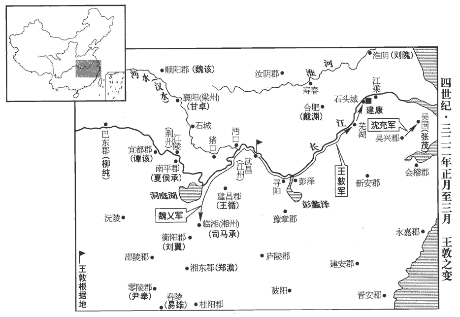
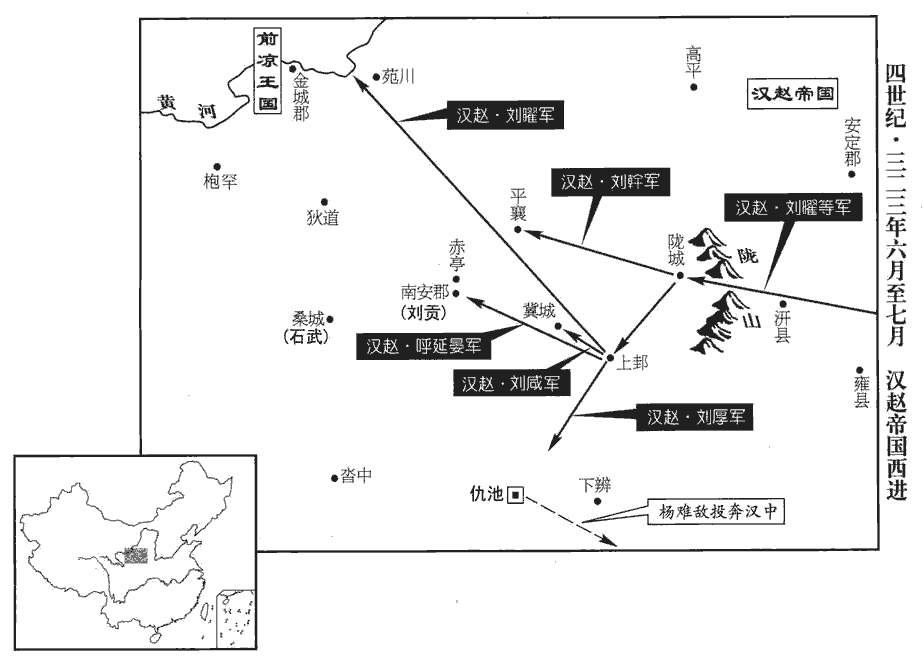

 晉紀十四起玄黓敦牂（壬午），盡昭陽協洽（癸未），凡二年。

# 中宗元皇帝下

## 永昌元年（壬午，三二二）

1春，正月，郭璞復上疏，請因皇孫生，下赦令，璞去年已疏請肆赦，皇孫去年十一月生。復，扶又翻。帝‹司马睿，本年四十七岁›從之。乙卯‹一›，大赦，改元。

〖译文〗 [1]春季，正月，郭璞再次上疏，请求以元帝皇孙司马衍出世为契机，颁布赦免令，元帝允准。乙卯（初一），大赦天下罪犯，改年号为永昌。

王敦以璞為記室參軍。璞善卜筮，知敦必為亂，己預其禍，甚憂之。大將軍掾潁川‹河南禹州›陳述卒，掾，于絹翻。璞哭之極哀，曰：「嗣祖，焉知非福也！」陳述，字嗣祖，亦敦府僚也。焉，於虔翻。

〖译文〗 王敦任用郭璞为记室参军，郭璞擅长卜筮之术，知道王敦必定会作乱，自己将被牵连进灾祸中，为此深深忧虑。王敦大将军府的僚属、颍川人陈述去世，郭璞痛哭欲绝，说：“陈述，你的辞世焉知非福呢！”

敦既與朝廷乖離，乃羈錄朝士有時望者置己幕府。朝，直遙翻。以羊曼及陳國謝鯤為長史。曼，祜之兄孫也。曼、鯤終日酣醉，故敦不委以事。敦收時望，不過用西都諸王之故智耳。酣，戶甘翻。敦將作亂，謂鯤曰：「劉隗wěi姦邪，將危社稷，吾欲除君側之惡，何如？」鯤曰：「隗誠始禍，然城狐社鼠。」後漢虞延曰：城狐社鼠，不畏熏燒。謂有所憑託也。又，中山王勝曰：社鼷不灌，屋鼠不熏，所託者然也。爾雅翼曰：管仲稱社束木而塗之，鼠因往託焉，燻之則恐燒其木，灌之則恐敗其塗，此鼠之所以不可得而殺者，以社故也。以喻君之左右。敦怒曰：「君庸才，豈達大體！」出為豫章‹江西南昌›太守，守，式又翻。又留不遣。

〖译文〗 王敦已经与朝廷离心离德，于是羁留、录用当朝有名望的士人，安置在自己的幕府。任用羊曼以及陈国人谢鲲为长史。羊曼是羊祜兄长的孙子。羊曼、谢鲲终日饮酒酣醉，所以王敦并不委派他们从事具体事务。王敦准备作乱，对谢鲲说：“刘隗奸佞邪恶，将会危害国家，我打算除去君王身边的这个恶人，怎么样？”谢鲲说：“刘隗的确是祸乱之源，但他是藏于城中之狐、匿于社木之鼠，有皇帝的庇护。”王敦发怒说：“你是庸碌之才，哪里懂得事关大局的道理！”便派谢鲲出任豫章太守，后又羁留谢鲲，不让他到任。

戊辰‹十四›，敦舉兵於武昌‹湖北省鄂州市›，上疏罪狀劉隗，稱：「隗佞邪讒賊，威福自由，隗，五罪翻。妄興事役，勞擾士民，賦役煩重，怨聲盈路。臣備位宰輔，不可坐視成敗，輒進軍致討，隗首朝懸，諸軍夕退。昔太甲顛覆厥度，幸納伊尹之忠，殷道復昌。湯崩，太甲顛覆湯之典刑，伊尹放之於桐‹山西省万荣县›。三年，太甲悔過，自怨自艾於桐，伊尹以冕服奉太甲復歸于亳。賴伊尹之訓，以圖厥終。古固有是事，然非人臣所當為也。願陛下深垂三思，三，息暫翻，又如字。則四海乂安，社稷永固矣。」沈充亦起兵於吳興‹浙江省湖州市›以應敦，敦以充為大都督、督護東吳諸軍事。敦至蕪湖‹安徽省芜湖市›，又上表罪狀刁協。帝大怒，乙亥‹二十一›，詔曰：「王敦憑恃寵靈，敢肆狂逆，方朕太甲，欲見幽囚。是可忍也，孰不可忍！今親帥六軍以誅大逆，帥，讀曰率。有殺敦者，封五千戶侯。」敦兄光祿勳含乘輕舟逃歸于敦。

〖译文〗 戊辰（十四日），王敦在武昌举兵，给元帝上疏罗列刘隗的罪状，内称：“刘隗奸佞邪恶，谗言惑众，残害忠良，作威作福。随意发起事端，动用百姓服劳役，士民疲惫扰苦，赋税和劳役负担繁重，怨声载道。我担任宰辅的职位，不能对此无动于衷，于是进军声讨。倘若刘隗早上授首，众军傍晚即退。往昔商朝天子太甲败坏国家制度，幸好接纳了伊尹忠诚无私的处置，才使商朝国运重新昌盛。我希望陛下再三深思，那么将会四海安宁，国家长存。”沈充也在吴兴起兵与王敦相呼应，王敦任沈充为大都督、督护东吴地区军事事务。王敦到达芜湖，又上表罗列刁协的罪状。元帝勃然大怒，乙亥（二十一日），下诏说：“王敦凭仗国家对他的恩宠，竞敢肆行狂妄、叛逆之事，把朕比作太甲，想把我幽禁起来。是可忍，孰不可忍！我现在亲自统帅六军前去诛戮这个大叛贼，有谁能杀掉王敦，封为五千户侯。”王敦的兄长、光禄勋王含乘坐轻便小舟逃回到王敦身边。

 

太子中庶子溫嶠謂僕射周顗曰：「大將軍此舉似有所在，當無濫邪？」顗曰：「不然，顗，魚豈翻。人主自非堯、舜，何能無失，人臣安可舉兵以脅之！舉動如此，豈得云非亂乎！處仲狼抗無上，其意寧有限邪！」王敦，字處仲。狼似犬，銳頭白頰，高前廣後，貪而敢抗人，故以為喻。處，昌呂翻。

〖译文〗 太子中庶子温峤对仆射周说：“大将军王敦这么做似乎有一定原因，应当不算过分吧？”周说：“不对。人主本来就不是尧、舜那样的圣人，怎么能没有过失呢？作为人臣，怎么可以举兵来胁迫君王！如此举动，哪能说不是叛乱呢！王敦傲慢暴戾，目无主上，他的欲望难道会有止境吗！”

敦初起兵，遣使告梁州刺史甘卓，約與之俱下，卓許之。及敦升舟，而卓不赴，使參軍孫雙詣武昌諫止敦。敦驚曰：「甘侯前與吾語云何，而更有異，正當慮吾危朝廷耳！吾今但除姦凶，若事濟，當以甘侯作公。」許卓作公，啗dàn之以利，欲使同逆。雙還報，卓意狐疑。或說卓：「且偽許敦，待敦至都而討之。」說，輸芮翻。卓曰：「昔陳敏之亂，吾先從而後圖之，事見八十六卷惠帝永興二年、懷帝永嘉元年。論者謂吾懼逼而思變，心常愧之；今若復爾，何以自明！」復，扶又翻；下同。

〖译文〗 王敦开始起兵时，派使者告诉梁州刺史甘卓，与他相约共同顺长江向下游进发，甘卓同意了。等到王敦登船，甘卓却不来，派参军孙双到武昌劝阻王敦。王敦惊诧地说：“甘卓过去是和我怎么说的，怎么又改变主意了？他是顾忌我危害朝廷吧！我现在只想除去奸凶，如果事成，我将让甘卓当公爵。”孙双回去报知甘卓，甘卓心里犹豫不决。有人劝甘卓说：“暂且佯装答应王敦，等王敦到了京都再征讨他。”甘卓说：“往昔陈敏作乱，我先是随从，后来图谋反击，论说此事的人都说我是害怕逼迫，因而改变立场，我心中常感愧赧。这回如果再这样做，怎样才能自我表白呢！”

卓使人以敦旨告順陽‹河南省淅川县东南›太守魏該，守，式又翻。該曰：「我所以起兵拒胡賊者，正欲忠於王室耳。今王公舉兵向天子，非吾所宜與也。」遂絕之。史言甘卓不如魏該之忠果。

〖译文〗 甘卓派人把王敦的意图告诉顺阳太守魏该，魏该说：“我之所以起兵抗击胡人寇贼，正因想效忠王室而已。现在王敦发兵针对天子，不是我所应当参与的。”于是加以拒绝。

敦遣參軍桓羆pí說譙王氶，請氶為軍司。說，輸芮翻。氶，音拯。氶歎曰：「吾其死矣！地荒民寡，勢孤援絕，將何以濟！然得死忠義，夫復何求！」夫，音扶。復，扶又翻。氶檄長沙虞悝為長史，會悝遭母喪，悝kuī，苦回翻。氶往弔之，曰：「吾欲討王敦，而兵少糧乏；少，詩沼翻。且新到，恩信未洽。卿兄弟，湘中之豪俊，王室方危，金革之事，古人所不辭，禮記：子夏問曰：「三年之喪，卒哭，金革之事無避也者，禮歟？初有司歟？」孔子曰：「吾聞諸老聃，昔者魯公伯禽有為為之也。今以三年之喪，從其利者，吾弗知也。」春秋公羊傳曰：古者臣有大喪，則君三年不呼其門；已練，可以弁冕，服金革之事，君使之，非也；臣行之，禮也。閔子要絰dié而服事，孔子蓋善之也。將何以教之？」悝曰：「大王不以悝兄弟猥劣，親屈臨之，敢不致死！然鄙州荒弊，難以進討；宜且收眾固守，傳檄四方，敦勢必分，分而圖之，庶幾可捷也。」幾，居希翻。氶乃囚桓羆，以悝為長史，以其弟望為司馬，督護諸軍，與零陵‹湖南永州›太守尹奉、建昌‹湖北省通城县›太守長沙王循、衡陽‹湖南省湘潭市西南古城乡›太守淮陵‹安徽省明光市东北›劉翼、沈約曰：晉惠帝元康九年，分長沙東北下雋諸縣立建昌郡，至宋，為巴陵郡。吳孫亮太平二年，分長沙西部都尉立衡陽郡。淮陵縣，屬臨淮郡，時亦分為郡。舂陵‹湖南宁远›令長沙易雄，舂陵縣，本前漢之舂陵侯國，後徙國南陽，省；吳復立舂陵縣，屬零陵郡。姓譜：易姓，齊有大夫易牙。同舉兵討敦。雄移檄遠近，列敦罪惡，於是一州之內皆應氶。惟湘東‹湖南省衡阳市湘水东岸›太守鄭澹不從，吳孫亮太平二年，分長沙東部都尉立湘東郡。澹，徒覽翻。氶使虞望討斬之，以徇四境。澹，敦姊夫也。

〖译文〗 王敦派遣参军桓向谯王司马游说，请司马出任军司。司马叹息说：“我怕是要死了。此地土地荒芜，人民稀少，势力孤单，后援断绝，怎能捱得过去呢！不过能为忠义而死，还能再有什么希求呢！”司马以文书征召长沙人虞悝为长史，适逢虞悝母亲去世，司马前往吊唁，说：“我想讨伐王敦，但军力不够，粮食匮乏，而且我是新近到任的，恩德和信用还未能润民心。您家兄弟是湘州地区的豪俊之士，现在王室正遭受危难，古人在服丧期间，投身战事也在所不辞，您对我有什么教诲？”虞悝说：“大王您不因为我们兄弟身份卑贱而见弃，亲自降节光临，我们岂敢不效命！不过鄙州荒凉凋弊，难于出兵讨伐。应当暂时聚众固守，把讨伐王敦的檄书传布四方，这样王敦必得分兵应付。待其兵力分散后再图谋攻击，大概可以取胜。”司马于是囚禁桓，任虞悝为长史，任命他的兄弟虞望为司马，总领、监护诸军，和零陵太守尹奉、建昌太守、长沙人王循、衡阳太守、淮陵人刘翼、舂陵令、长沙人易雄，共同举兵征讨王敦。易雄四处传布檄书，罗列王敦罪状，于是一州之内的郡县，全都响应司马。只有湘东太守郑澹不从命，司马让虞望讨伐并把他处斩，用以晓示各地。郑澹是王敦的姐夫。

氶遣主簿鄧騫至襄陽，晉梁州刺史鎮襄陽，自周訪始。宋白曰：襄陽，漢中廬縣地。說甘卓曰：「劉大連雖驕蹇失眾心，劉隗，字大連。說，輸芮翻；下同。非有害於天下。大將軍以其私憾，稱兵向闕，此忠臣義士竭節之時也。公受任方伯，奉辭伐罪，乃桓、文之功也。」卓曰：「桓、文則非吾所能；然志在徇國，當共詳思之。」參軍李梁說卓曰：「昔隗囂跋扈，竇融保河西以奉光武，卒受其福。事見四十一卷漢光武建武五年至四十三卷十二年。卒，子恤翻。今將軍有重望於天下，但當按兵坐以待之，使大將軍事捷，當委將軍以方面，不捷，朝廷必以將軍代之，何憂不富貴；而釋此廟勝，孫子曰：未戰而廟勝，得算多也；未戰而廟不勝，得算少也。決存亡於一戰邪？」騫謂梁曰：「光武當創業之初，故隗、竇可以文服從容顧望。文服，謂非心服，特以虛文示相臣服而已。從，千容翻。今將軍之於本朝，非竇融之比也；朝，直遙翻。襄陽之於太府，襄陽以王敦府為太府。非河西之固也。使大將軍克劉隗，還武昌，增石城‹竟陵郡郡政府所在城·湖北省钟祥市›之戍，賢曰：石城故城，在復州沔陽縣東南。絕荊、湘之粟，將軍將安歸乎！勢在人手，而曰我處廟勝，未之聞也。且為人臣，國家有難，處，昌呂翻。難，乃旦翻。坐視不救，於義安乎！」卓尚疑之。騫曰：「今既不為義舉，又不承大將軍檄，此必至之禍，愚智所見也。且議者之所難，以彼強而我弱也。今大將軍兵不過萬餘，其留者不能五千；而將軍見眾既倍之矣。見，賢遍翻。以將軍之威名，帥此府之精銳，杖節鳴鼓，以順討逆，豈王含所能禦哉！帥，讀曰率。遡流之眾，勢不自救，謂敦兵以東下，若欲遡流西上以自救，勢不相及也。將軍之舉武昌，若摧枯拉朽，尚何顧慮邪！拉，盧合翻。武昌既定，據其軍實，鎮撫二州，二州，謂荊、江也。以恩意招懷士卒，使還者如歸，此呂蒙所以克關羽也。事見六十八卷漢獻帝建安二十四年。今釋必勝之策，安坐以待危亡，不可以言智矣。」

〖译文〗 司马派遣主簿邓骞到襄阳游说甘卓，说；“刘隗虽然傲慢不驯，有失众望，但并非为害国家。大将军王敦因个人私仇便对朝廷用兵，这正是忠臣义士尽忠的时候。您受命为一方的统帅，如果禀承君命讨伐他的罪行，这就如同齐桓公和晋文公的功绩。”甘卓说：“齐桓公和晋文公不是我所能仿效的，不过为国尽职，这是我的心愿，我们应当共同仔细斟酌这件事。”参军李梁劝说甘卓道：“当年隗嚣飞扬跋扈，窦融自保河西之地而拥戴汉光武帝，终于得到福禄。现在将军您在天下人心中有重望，只应按兵不动，坐待事态发展。假如大将军王敦的事情成功，当会委任您统领一方；不成功，朝廷必定会让您取代王敦，何愁不会富贵。何必放弃这不战而胜的谋略，依靠一场战斗来定生死存亡呢？”邓骞对李梁说：“汉光武帝当时正处创业初期，所以隗嚣、窦融可以表面臣服，从容观望。现在将军您对于朝廷来说，不是窦融可以类比的；襄阳对于王敦的太府来说，也没有河西那样的险固。如果王敦攻克刘隗，回师武昌，增强石城戍守的兵力，切断荆州、湘州的粮道，将军您将何去何从呢！大势掌握在别人手中，却说自己处于不战而胜的地位，这是从未听说过的事。况且作为人臣，国家遇到危难，坐视不救，这在道义上说得过去吗？”甘卓还是犹豫不决。邓骞说：“现在您既不能为道义而动，又不奉承大将军王敦的檄令，人所共见，一定会招致灾祸。况且议论此事的人之所以诘难，是因为彼强我弱。现在大将军王敦的兵力不过一万有余，留驻的不到五千，而将军您现有的部众已经超过其一倍，凭仗您的威名，统帅府下的精锐士兵，举着朝廷符节，鸣起军鼓，以顺臣身份征讨叛逆，岂是王含所能抵御的！王敦军队如要救援，必须逆江而上，势必救助不及。将军攻下武昌，如同摧枯拉朽，还有什么可顾虑的呢？武昌一旦平定，拥有其军事物资，镇抚荆州和江州，以恩德招纳、关怀士卒，使得回来的人如同回到了家，这正是吕蒙战胜关羽的方法。现在放弃必胜的策略，安然坐待危亡的降临，这不能说是明智的。”

敦恐卓於後為變，又遣參軍丹楊樂道融往邀之，必欲與之俱東。道融雖事敦，而忿其悖逆，悖，蒲內翻，又蒲沒翻。乃說卓曰：「主上親臨萬機，自用譙王為湘州，非專任劉隗也。而王氏擅權日久，卒見分政，卒，讀曰猝；謂分任譙王氶等，政不專歸於王氏也。便謂失職，背恩肆逆，背，蒲妹翻。舉兵向闕。國家遇君至厚，今與之同，豈不違負大義，生為逆臣，死為愚鬼，永為宗黨之恥，不亦惜乎！為君之計，莫若偽許應命，而馳襲武昌，大將軍士眾聞之，必不戰自潰，大勳可就矣。」卓雅不欲從敦，聞道融之言，遂決曰：「吾本意也。」乃與巴東‹重庆市奉节县东›監軍柳純、南平‹湖北省公安县›太守夏侯承、監，工銜翻。夏，戶雅翻。宜都‹湖北枝城›太守譚該等姓譜：齊滅譚，子孫以國為氏；漢有河南尹譚閎hóng。又巴南大姓有譚氏，盤瓠hù之後。露檄數敦逆狀，帥所統致討；數，所具翻。遣參軍司馬讚、孫雙奉表詣臺。羅英至廣州，約陶侃同進。戴淵在江西，戴淵出鎮合肥，於建康為江西。先得卓書，表上之，上，時掌翻。臺內皆稱萬歲。陶侃得卓信，即遣參軍高寶帥兵北下。帥，讀曰率。武昌城中傳卓軍至，人皆奔散。

〖译文〗 王敦怕甘卓在后方有变，又派参军、丹杨人乐道融去邀请他，一定要和他一块东进。乐道融虽然侍奉王敦，但恨王敦悖逆作乱，于是劝甘卓说：“主上亲自处理国家所有事务，自己任用谯王司马治理湘州，并非由刘隗专权。而王氏专权已经很久，一旦权势被分夺，便说是失去职位，于是背叛皇恩，肆行叛逆，对朝廷用兵。国家对您的待遇非常优厚，您如果与王敦同行，岂不是违背和辜负了君臣大义，生为叛逆之臣，死为愚昧之鬼，永远是宗族、党朋的耻辱，不是很可惜吗！为您打算，不如佯装听从其令，却急速突袭武昌，大将军王敦的士众听说此事，必定不战自溃，大功便可告成了。”甘卓原本就不想追从王敦，听了乐道融所言，于是决断说：“这正是我的本意。”于是与巴东监军柳纯、南平太守夏侯承、宜都太守谭该等人，发布檄书数落王敦叛逆的行状，率领麾下军队开始征讨。派遣参军司马、孙双持奉上表送到朝廷，派罗英到广州，约陶侃共同进讨。戴渊镇守在长江西部，先得到甘卓的信，用表文的形式奏上，朝廷内都欢呼万岁。陶侃见到甘卓的来信，随即派参军高宝领兵北上。武昌城内传言甘卓大军来了，众人都逃奔离散。

敦遣從母弟南蠻校尉魏乂、敦從母魏氏，乂其弟也。從，才用翻。將軍李恆恆，戶登翻。帥甲卒二萬攻長沙。長沙城池不完，資儲又闕，人情震恐。或說譙王氶，南投陶侃或退據零、桂‹湖南省郴州市›。氶曰：「吾之起兵，志欲死於忠義，豈可貪生苟免，為奔敗之將乎！將，即翻亮。事之不濟，令百姓知吾心耳。」乃嬰城固守。未幾，幾，魚豈翻。虞望戰死，甘卓欲留鄧騫為參軍，騫不可，乃遣參軍虞沖與騫偕至長沙，遺譙王氶書，勸之固守，當以兵出沔口‹湖北省武汉市·沔水汉水›注入长江处，斷敦歸路，遺，于季翻。斷，丁管翻。則湘圍自解。氶復書稱：「江左中興，草創始爾，豈圖惡逆萌自寵臣。吾以宗室受任，志在隕命；而至止尚淺，凡百茫然。足下能卷甲電赴，猶有所及；卷，讀曰捲。若其狐疑，則求我於枯魚之肆矣。」莊子見車轍鮒，鮒曰：「豈無斗升之水以活我乎？」莊子曰：「待我決西江之水而迎汝。」鮒曰：「如君言，不如早索我於枯魚之肆。」卓不能從。

〖译文〗 王敦派遣姨母的兄弟、南蛮校尉魏和将军李恒，率领甲士二万人进攻长沙。长沙的城墙、护城河不完善，物资储备也不充足，人心惊恐。有人劝说谯王司马向南投靠陶侃，或者退守零陵、桂林。司马说：“我之所以起兵，是心存为忠义献身的志向，怎能贪生怕死、苟且活命，当一个败逃的将领呢！即使守卫长沙失败，也让百姓们知道我的心意。”于是环城固守。不久，虞望战死，甘卓想让邓骞留下任参军，邓骞不同意，甘卓便派参军虞冲和邓骞同赴长沙，并致信谯王司马，劝他固守长沙，自己将遣军自沔口出击，截断王敦的退路，这样湘州之围便会不救自解。司马信说：“江东国朝中兴，一切刚刚草创，谁想到由得宠的大臣萌生叛乱。我以王朝宗室的身份禀受重任，志在以身殉职。不过到任时日尚短，一切尚未理出头绪，足下如果能轻装电赴来救，或许还来得及；如果犹豫迟滞，那么就只有求我于枯鱼之肆了。”甘卓未能听从。

2二月，甲午‹十›，封皇子昱為琅邪王。

〖译文〗 [2]二月，甲午（初十），元帝封皇子司马昱为琅邪王。

3後趙王勒‹石勒，本年四十九岁›立子弘為世子。遣中山公虎將精卒四萬擊徐龕；將，即亮翻。龕，苦含翻。龕堅守‹山东省泰安市东›不戰，虎築長圍守之。

〖译文〗 [3]后赵王石勒立儿子石弘为世子。派遣中山公石虎统帅精兵四万人攻击徐龛。徐龛坚守不出战，石虎筑起长长的围墙与之相持。

4趙主曜自將擊楊難敵，難敵逆戰不勝，退保仇池‹甘肃西和南›。仇池諸氐、羌及故晉王保將楊韜、隴西‹甘肃隴西›太守梁勛皆降於曜。降，戶江翻。曜遷隴西萬餘戶於長安，進攻仇池。會軍中大疫，曜亦得疾，將引兵還；恐難敵躡其後，乃遣光國中郎將王獷說難敵，光國中郎將，趙所置也。獷guǎng，古猛翻。說，輸芮翻。諭以禍福，難敵遣使稱藩。曜以難敵為假黃鉞、都督益•寧•南秦•涼•梁•巴六州•隴上•西域諸軍事、上大將軍、益•寧•南秦三州牧、武都王。吳孫氏始置上大將軍。南秦州及巴州，曜創其名。其後北國率授楊氏南秦州刺史，據有陰平、武都二郡之地。

〖译文〗 [4]前赵国主刘曜自为统帅，攻击杨难敌。杨难敌迎战，不能取胜，退走保守仇池。仇池氐族、羌族的许多部族，以及原来晋王司马保的部将杨韬、陇西太守梁勋都投降刘曜。刘曜从陇西迁徙一万多户到长安，然后进攻仇池。适逢军中疫病流行，连刘曜也染上疾病，刘曜准备领兵退还，又怕杨难敌追袭于后，便派光国中郎将王犷游说杨难敌，向他剖明利害，杨难敌于是派使者前来，表示愿为藩属。刘曜任杨难敌为假黄钺、都督益、宁、南秦、凉、梁、巴六州及陇上、西域诸军事、上大将军、益、宁、南秦三州州牧、武都王。

秦州‹府设上邽甘肃省天水市›刺史陳安求朝於曜，曜辭以疾。安怒，以為曜已卒，朝，直遙翻。卒，子恤翻。大掠而歸。曜疾甚，乘馬輿而還。使其將呼延寔監輜重於後，監，工銜翻。重，直用翻。安邀擊，獲之，謂寔曰：「劉曜已死，子尚誰佐！吾當與子共定大業。」寔叱之曰：「汝受人寵祿而叛之，自視智能何如主上？吾見汝不日梟首於上邽市‹甘肃天水›，梟，堅堯翻。何謂大業！宜速殺我！」安怒，殺之，以寔長史魯憑為參軍。安遣其弟集帥騎三萬追曜，帥，讀曰率。騎，奇寄翻。衛將軍呼延瑜逆擊，斬之。安乃還上邽，遣將襲汧城‹陕西陇县›，拔之。汧縣，屬扶風郡。汧qiān，苦堅翻。隴上氐、羌皆附於安，有眾十餘萬，自稱大都督、假黃鉞、大將軍、雍•涼•秦•梁四州牧、涼王，雍，於用翻。以趙募為相國。魯憑對安大哭曰：「吾不忍見陳安之死也！」安怒，命斬之。憑曰：「死自吾分，分，扶問翻。懸吾頭於上邽市，觀趙之斬陳安也！」遂殺之。曜聞之，慟哭曰：「賢人，民之望也。陳安於求賢之秋而多殺賢者，吾知其無所為也。」

〖译文〗 秦州刺史陈安请求朝见刘曜，刘曜因病推辞不见。陈安发怒，以为刘曜已死，纵兵大肆劫掠后返回。刘曜病情沉重，只能乘坐马车返回，派部将呼延随后监护辎重。陈安在半路截击，抓获了呼延，对他说：“刘曜已经死了，你还辅佐谁呢！我将和你共创大业。”呼延叱骂说：“你接受别人的宠爱、俸禄却又背叛他，自己瞧瞧你的智能哪点比得上主上？我看你的首级不久将会悬挂在上街市示众，还谈什么大业！你应该快快杀了我？”陈安发怒，杀死呼延，让呼延的长史鲁凭当参军。陈安派兄弟陈集率领三万骑兵追袭刘曜，遭到卫将军呼延瑜的反击，陈集被杀。陈安于是回到上，派部将攻克了城。陇上的氐族、羌族部落都归附了陈安，陈安拥有兵众十多万，自称大都督、假黄钺、大将军，雍、凉、秦、梁四州州牧和凉王，任命赵募为相国。鲁凭对着陈安大哭说；“我不忍心看陈安的死啊！”陈安发怒，命令将他斩首。鲁凭说：“死亡本是我份内之事。把我的头悬挂在上街市，我要观看赵国斩杀陈安！”于是被杀。刘曜听说此事，悲恸地大哭，说：“贤人是民众的寄望所在。陈安在应当求贤而用的时候却多杀贤人，我由此得知他不会有什么作为。”

休屠王石武以桑城‹甘肃临洮南›降趙，石武，蓋亦匈奴種。屠，直於翻。趙以武為秦州刺史，封酒泉王。

〖译文〗 休屠王石武献桑城投降了前赵，赵国让石武出任秦州刺史，赐封酒泉王。

5帝徵戴淵‹时驻合肥›、劉隗‹时驻淮阴›入衛建康‹南京›。隗至，百官迎于道，隗岸幘zé大言，岸幘者，幘微脫額也。意氣自若。及入見，見，賢遍翻。與刁協勸帝盡誅王氏；帝不許，隗始有懼色。

〖译文〗 [5]元帝征召戴渊、刘隗来建康参与防卫。刘隗到达之时，百官们在道路上迎接，刘隗把头帻掀起露出前额，高谈阔论，意气昂扬。等到入见元帝，和刁协一起劝元帝将王氏宗族尽数诛杀，元帝不同意，刘隗才显露出畏惧的神色。

司空導帥其從弟中領軍邃、左衛將軍廙、侍中侃、彬及諸宗族二十餘人，每旦詣臺待罪。帥，讀曰率。從，才用翻。廙，羊至翻，又逸職翻。周顗將入，導呼之曰：「伯仁，以百口累卿！」累，力瑞翻。周顗，字伯仁，欲使顗保護導，以全其家也。顗直入不顧。既見帝，言導忠誠，申救甚至；帝納其言。顗喜飲酒，喜，許記翻。至醉而出，導猶在門，又呼之。顗不與言，顧左右曰：「今年殺諸賊奴，取金印如斗大，繫肘後。」既出，又上表明導無罪，言甚切至。導不之知，甚恨之。

〖译文〗 司空王导率领堂弟中领军王邃、左卫将军王、侍中王侃、王彬以及各宗族子弟二十多人，每天清晨到朝廷等候定罪。周将要入朝，王导呼唤他说：“周，我把王氏宗族一百多人的性命托付给您！”周连头也不回，直入朝廷。等到见了元帝，周阐说王导忠诚不二，极力为他辩白，元帝听从了他的意见。周心中欢喜，以至喝醉了酒。周走出宫门，王导还在门外等候，又呼唤周，周不与他交谈，环顾左右说：“今年杀掉一干乱臣贼子后，能得到斗大的金印，系挂在臂肘之后。”出来以后，又奏上表章，辨明王导无罪，言辞十分妥帖和有力。王导不知道这些事，对周深为怨恨。

帝命還導朝服，召見之。導稽首曰：朝，直遙翻。稽，音啟。「逆臣賊子，何代無之，不意今者近出臣族！」帝跣而執其手曰：「茂弘，方寄卿以百里之命，王導，字茂弘。孔氏曰：寄百里之命謂攝君之政令。是何言邪！」

〖译文〗 元帝令人把朝服送还王导，召王导进见。王导跪拜叩首至地，说：“叛臣贼子，哪一个朝代没有，想不到现在我出在臣下宗族之中！”元帝来不及穿鞋，赤脚拉着他的手说：“王茂弘，我正要把朝廷政务交给你，你这是说的什么话！”

三月，以導為前鋒大都督，加戴淵驃騎將軍。驃，匹妙翻。詔曰：「導以大義滅親，衛石碏què之子厚，與公子州吁弒衛桓公，又與州吁如陳，碏使告于陳而殺之。君子曰：石碏，純臣也，惡州吁而厚與焉。大義滅親，其是之謂乎！可以吾為安東時節假之。」帝之初鎮揚州也，領安東將車。以周顗為尚書左僕射，王邃為右僕射。帝遣王廙往諭止敦；敦不從而留之，廙更為敦用。征虜將軍周札，素矜險好利，好，呼到翻。帝以為右將軍、都督石頭‹南京西北›諸軍事。敦將至，帝使劉隗軍金城‹江苏江宁北›，金城，在丹楊江乘蒲洲上。札守石頭，帝親被甲徇師於郊外。被，皮義翻。以甘卓為鎮南大將軍、侍中、都督荊•梁二州諸軍事，陶侃領江州刺史；使各帥所統以躡niè敦後。帥，讀曰率；下同。

〖译文〗 三月，任命王导为前锋大都督，授予戴渊骠骑将军。元帝下诏说：“王导为大义灭亲，可以把我任安东将军时的符节交给他。”又任命周为尚书左仆射，王邃为尚书右仆射。元帝派王去告诉王敦，让他停止叛乱。王敦拒不从命，扣留了王，王又为王敦效力。征虏将军周札，素来为人阴险，贪图私利。元帝任他为右将军、都督石头地区军务。王敦军队日益临近，元帝让刘隗驻军金城，令周札驻守石头，自己亲自披上甲衣，巡视郊外的军队。又任命甘卓为镇南大将军、侍中、都督荆州、梁州军务，任命陶侃兼领江州刺史职，让他们各自率领所部跟随在王敦军队之后。

敦至石頭，欲攻劉隗。杜弘言於敦曰：「劉隗死士眾多，未易可克；易，以豉翻。不如攻石頭，周札少恩，少，詩沼翻。兵不為用，攻之必敗，札敗則隗自走矣。」敦從之，以弘為前鋒，攻石頭，札果開門納弘。敦據石頭，歎曰：「吾不復得為盛德事矣！」敦無君之心，形於言也。復，扶又翻。謝鯤曰：「何為其然也！但使自今以往，日忘日去耳。」言日復一日，浸忘前事，則君臣猜嫌之迹亦日去耳。

〖译文〗 王敦到达石头，想攻击刘隗。杜弘向王敦建议说：“刘隗手下不怕死的士兵众多，不容易战胜，不如进攻石头。周札对人缺少恩泽，士兵都不愿为他效力，一旦遭攻击必然败走，周札兵败则刘隗自己就会逃走。”王敦采纳了杜弘的意见，任命他为前锋，进攻石头。周札果然打开城门让杜弘入城。王敦占据石头后，感叹地说：“我既为叛臣，再也不会做功德盛大的事情了。”谢鲲说：“为什么这样呢！只要从今以后，这些事一天天淡忘，也就会一天天从心中消失了。”

帝命刁協、劉隗、戴淵帥眾攻石頭‹南京西北›，王導、周顗、郭逸、虞潭等三道出戰，協等兵皆大敗。太子紹聞之，欲自帥將士決戰；升車將出，中庶子溫嶠執鞚諫曰：鞚kòng，苦貢翻。「殿下國之儲副，柰何以身輕天下！」抽劍斬鞅yāng，乃止。

〖译文〗 元帝令刁协、刘隗、戴渊率领兵众进攻石头，王导和周、郭逸、虞潭等分三路出击，刁协等人的军队都大败。太子司马绍听说以后，打算自己率领将士与敌人决战，坐上军车正要出发，中庶子温峤抓住马勒头劝谏说：“殿下是国家君位的继承人，怎么能逞一己之快，轻弃天下而不顾！”抽出剑斩断马的鞅带，司马绍这才罢休。

敦擁兵不朝，朝，直遙翻：下同。放士卒劫掠，宮省奔散，惟安東將軍劉超按兵直衛，及侍中二人侍帝側。帝脫戎衣，著朝服，著，陟略翻。顧而言曰：「欲得我處，當早言！何至害民如此！」又遣使謂敦曰：使，疏吏翻。「公若不忘本朝，於此息兵，則天下尚可共安；如其不然，朕當歸琅邪以避賢路。」

〖译文〗 王敦聚集军队，不朝见元帝，放纵士卒劫掠财物，皇宫、朝廷里的人奔逃离散，只有安东将军刘超屯兵不动，当值护卫，以及侍中二人在元帝身边侍奉。元帝脱下军衣，穿上朝服，环顾四周说：“王敦想得到我这个地方，应当早说！何至于如此残害百姓！”又派遣使者告诉王敦说：“你如果还没有将朝廷置于脑后，那么就此罢兵，天下还可以安然相处。如果不是这样，那么朕将回到琅邪，为贤人让路。”

刁協、劉隗既敗，俱入宮，見帝於太極東除。除，殿陛也。帝執協、隗手，流涕嗚咽，勸令避禍。協曰：「臣當守死，不敢有貳。」帝曰：「今事逼矣，安可不行！」乃令給協、隗人馬，使自為計。協老，不堪騎乘，素無恩紀，募從者，皆委之，行至江乘‹江苏省南京市东北›，為人所殺，送首於敦。隗奔後趙，官至太子太傅而卒。成帝咸和八年，劉隗從石虎戰死於潼關，豈即此劉隗邪！

〖译文〗 刁协、刘隗战败以后，都进入宫中，在太极殿东侧阶与元帝相见。元帝拉着刁协、刘隗的手，流泪哭泣，呜咽有声，劝说并命令二人出逃以避灾祸。刁协说：“我将守卫到死，不敢有二心。”元帝说：“现在事情紧迫了，怎么能不走呢！”于是下令为刁协、刘隗准备随行的人马，让他们自谋生路。刁协年老，难耐骑乘之苦，平素又缺少恩惠，招募随从人员时，大家都推委不去。刁协出行至江乘，被人所杀，把首级送给王敦。刘隗投奔后赵，在任太子太傅时死去。

帝令公卿百官詣石頭見敦，敦謂戴淵曰：「前日之戰，有餘力乎？」淵曰：「豈敢有餘，但力不足耳！」敦曰：「吾今此舉，天下以為何如？」淵曰：「見形者謂之逆，體誠者謂之忠。」敦笑曰：「卿可謂能言。」又謂周顗曰：「伯仁，卿負我！」愍帝建興元年，顗為杜弢所困，投敦於豫章，故敦以為德。顗曰：「公戎車犯順，下官親帥六軍，帥，讀曰率。不能其事，使王旅奔敗，以此負公！」

〖译文〗 元帝命令百官公卿到石头拜见王敦。王敦对戴渊说：“前日的交战，还有剩余的力量吗？”戴渊说：“岂敢留有余力，只是力量不足罢了！”王敦说：“我现在这样的举动，天下人会怎么看？”戴渊说：“只看到表象的人说是叛逆，体会诚心的人说是忠贞。”王敦笑着说：“您可以称得上会说话了。”王敦又对周说：“周伯仁，您辜负了我！”周说：“您依仗武力违背顺上的道德，我亲自统率六军，不能胜任，致使君王的军队战败奔逃，这就是我辜负您的地方。”

辛未‹十八›，大赦；以敦為丞相。都督中外諸軍、錄尚書事、江州牧，封武昌郡公，并讓不受。

〖译文〗 辛未（十八日），元帝实行大赦，任命王敦为丞相、都督中外各军、录尚书事、江州牧，赐封武昌郡公，王敦都推辞不受。

初，西都覆沒，四方皆勸進於帝。見九十卷建武元年。敦欲專國政，忌帝年長難制，長，知兩翻。欲更議所立，王導不從。及敦克建康，謂導曰：「不用吾言，幾至覆族。」幾，居希翻。

〖译文〗 当初，西晋都城覆没，四方人士都劝琅琊王即帝位。王敦想把握国政，怕元帝年龄较大，难以控制，想另行商议立君的人选，王导不同意。等到王敦攻克建康，对王导说：“不遵从我的意见，几乎全族覆灭。”

敦以太子有勇略，為朝野所嚮，朝，直遙翻。欲誣以不孝而廢之，大會百官，問溫嶠曰：「皇太子以何德稱？」聲色俱厲。嶠曰：「鉤深致遠，蓋非淺局所量；量，音良。以禮觀之，可謂孝矣。」言太子既有鉤深致遠之才，而又盡事親之禮，所以解敦不孝之誣也。眾皆以為信然，敦謀遂沮。沮，在呂翻。

〖译文〗 王敦因为太子司马绍有勇有谋，被朝野人士所拥戴，想以不孝的罪名诬陷太子，废除他的太子之位，因此大会百官，问温峤说：“皇太子以什么样的德行著称？”问话时声色俱厉。温峤说：“钩深致远，似乎不是我浅显的度量所能知晓的，依照礼义看来，可以说是做到了孝。”众人都认为的确如此，王敦的阴谋遭到挫败。

帝召周顗於廣室，廣室，殿名。謂之曰：「近日大事，二宮無恙，諸人平安，大將軍固副所望邪？」恙，余亮翻。顗曰：「二宮自如明詔，臣等尚未可知。」護軍長史郝嘏gǔ等勸顗避敦，顗代戴淵為護軍將軍，以郝嘏為長史。顗曰：「吾備位大臣，朝廷喪敗，寧可復草間求活，外投胡、越邪！」喪，息浪翻。復，扶又翻。敦參軍呂猗，嘗為臺郎，晉謂尚書郎為臺郎。性姦諂，戴淵為尚書，惡之。惡，烏路翻。猗說敦曰：「周顗、戴淵，皆有高名，足以惑眾，近者之言，曾無怍色，謂二人答敦之言。怍zuò，才各翻。公不除之，恐必有再舉之憂。」敦素忌二人之才，心頗然之，從容問王導曰：「周、戴，南北之望，周顗，汝南‹河南省息县›人；戴淵，廣陵‹江苏省淮阴市›人。晉氏南渡，二人名冠當時。從，千容翻。當登三司無疑也。」導不答。又曰：「若不三司，止應令僕邪？」三司，太尉、司徒、司空也；令僕，尚書令及左右僕射也。又不答。敦曰：「若不爾，正當誅爾！」又不答。丙子‹二十三›，敦遣部將陳郡‹河南淮阳›鄧岳收顗及淵。將，即亮翻。先是，敦謂謝鯤曰：先，悉薦翻。「吾當以周伯仁為尚書令，戴若思為僕射。」戴淵，字若思。是日，又問鯤：「近來人情何如？」鯤曰：「明公之舉，雖欲大存社稷，然悠悠之言實未達高義。言眾人議敦舉兵向闕，非義舉也。若果能舉用周、戴，則群情帖然矣！」敦怒曰：「君粗疏邪！二子不相當，吾已收之矣！」鯤愕然自失。參軍王嶠曰：「『濟濟多士，文王以寧。』詩大雅文王之詩。濟，子禮翻。柰何戮諸名士！」敦大怒，欲斬嶠，眾莫敢言。鯤曰：「明公舉大事，不戮一人。嶠以獻替忤旨，便以釁xìn鼓，君所謂可而有否焉，臣獻其否以成其可；君所謂否而有可焉，臣獻其可以替其否。釁鼓，殺人以血塗鼓也。忤，五故翻。不亦過乎！」敦乃釋之，黜為領軍長史。大將軍府參軍黜為領軍長史，足知敦府重於諸府矣。嶠，渾之族孫也。

〖译文〗 元帝在广室召见周，对他说：“近来发生的大事，二宫未受伤害，大家平安，这是否表明大将军王敦本来就符合众望呢？”周说：“二宫的情况，固然与陛下所说的相符，至于我们这些人的遭遇怎样，现在还未可知。”护军长史郝嘏等人劝周避让王敦，周说：“我既然备充大臣的职位，眼见朝廷衰败，难道还能再蛰伏草野中求活命，出外投奔胡、越吗？”王敦的参军吕猗，曾经做过尚书郎，为人奸猾谄谀，戴渊当时任尚书，憎恶他的为人。吕猗劝说王敦道：“周、戴渊都有很高的名望，足以盅惑士众，近来的言谈又豪无惭愧的意思，您不除去他们，恐怕将来必定会有重新举兵讨伐的忧患。”王敦素来忌妒他们二人的才能，心中颇以为然，不动声色地询问王导说：“周、戴渊，分别著称于北方和南方，应当升任三公之位是无疑的了。”王导不置可否。王敦又说：“如果不用为三公，只让他们担任令或仆射的职位如何？”王导又不回答。王敦说：“如果不这样，正该诛戮他们！”王导还是不回答。丙子（二十三日），王敦派遣部将陈郡人邓岳拘捕周和戴渊。此前，王敦对谢鲲说：我将任用周为尚书令，任戴渊为仆射。”这天，王敦又问谢鲲说：“近来民情如何？”谢鲲说：“明公的举动，虽然是想保全国家社稷，但民间的议论却认为不合大义。如果真能举用周和戴渊，那么民众的心情就熨帖平静了。”王敦发怒，说：“你这是粗疏不察，这二人名实不相称，已被我收捕了。”谢鲲愕然自失。参军王峤说：‘济济一堂人才多，文王安宁国富强’，怎么能诛戮诸位名士呢！”王敦勃然大怒，要将王峤斩首，众人中没有谁敢出言相救。谢鲲说：“明公图谋大业，不屠戮一个人。现在王峤因陈献可否违背意旨，便要杀戮，不也太过分了吗？”王敦这才放了王峤，贬职为领军长史。王峤是王浑的族孙。

顗‹周顗年五十四岁›被收，路經太廟，大言曰：「賊臣王敦傾覆社稷，枉殺忠臣；神祇有靈，當速殺之！」被，皮義翻。祇，翹移翻。收人以戟傷其口，血流至踵，容止自若，觀者皆為流涕。為，于偽翻；下同。并戴淵殺之於石頭南門之外。

〖译文〗 周被捕，路经太庙，高声说：“贼臣王敦，颠覆国家社稷，胡乱杀害忠臣，神祗如呆显灵，应当快快杀掉他！”捕卒用戟刺伤周的嘴，鲜血下流直至脚后跟，但他容颜举止泰然自若，观望的人都因此而落泪。周和戴渊都在石头城南门外被杀。

帝使侍中王彬勞敦，勞，力到翻。彬素與顗善，先往哭顗，然後見敦。敦怪其容慘，問之。彬曰：「向哭伯仁，情不能已。」敦怒曰：「伯仁自致刑戮；且凡人遇汝，以王彬之為人，顗以凡人遇之，亦可以見其風裁矣。汝何哀而哭之？」彬曰：「伯仁長者，兄之親友；在朝雖無謇jiǎn愕è，「愕」，當作「諤è」。朝，直遙翻。亦非阿黨，而赦後加之極刑，所以傷惋也。」惋，烏貫翻。據元帝紀、四月，敦入石頭，辛未，大赦。因勃然數敦曰：數，所具翻。「兄抗旌犯順，殺戮忠良，圖為不軌，禍及門戶矣！」辭氣慷慨，聲淚俱下。敦大怒，厲聲曰：「爾狂悖乃至此，以吾為不能殺汝邪！」時王導在坐，為之懼，悖，蒲內翻，又蒲沒翻。坐，徂臥翻。為，于偽翻。勸彬起謝。彬曰：「腳痛不能拜；且此復何謝！」復，扶又翻；下同。敦曰：「腳痛孰若頸痛？」彬殊無懼容，竟不肯拜。

〖译文〗 元帝派侍中王彬犒劳王敦，王彬素来与周交好，先去哭吊周，然后去见王敦。王敦见他容颜凄惨，心中奇怪，便加询问。王彬说：“我刚才去哭吊周伯仁，情不自禁。”王敦发怒说：“周伯仁自找刑戮，再说他把你当作一般人看待，你为什么悲哀并去哭吊他？”王彬说：“周伯仁是长者，也是兄长你的亲友。他在朝时虽算不上正直，也并不结党营私，却在大赦天下后遭受极刑，我因此伤痛惋惜。”尔后勃然发怒，数落王敦说：“兄长违抗君命，有违顺德，杀戮忠良，图谋不轨，灾祸将要降临到门户了！”言辞情感激扬慷慨，声泪俱下。王敦大怒，厉声说：“你狂妄悖乱以至于此！以为我不能杀你吗！”当时王导在坐，为了王彬担心，劝王彬起来谢罪。王彬说：“我脚痛不能跪拜，再说这又有什么可谢罪的！”王敦说：“脚痛与颈痛比起来怎样？”王彬毫无惧色，最终不肯下拜。

王導後料檢中書故事，料，音聊。乃見顗救己之表，執之流涕曰：「吾雖不殺伯仁，伯仁由我而死，自愧於敦三問不答之時也。幽冥之中，負此良友！」

〖译文〗 王导后来清理中书省的旧有档案，才见到周救护自己的上表，拿着流下了眼泪，说：“我虽没杀周伯仁，伯仁是因我而死，我有负于冥间这样的好友！”

沈充拔吳國‹苏州›，殺內史張茂。

〖译文〗 沈充攻取了吴国，杀了内史张茂。

初，王敦聞甘卓起兵，大懼。卓兄子卬為敦參軍，敦使卬歸，說卓曰：說，輸芮翻；下同。「君此自是臣節，不相責也。吾家計急，不得不爾。想便旋軍襄陽‹湖北襄樊›，當更結好。」好，呼到翻。卓雖慕忠義，性多疑少決，少，詩沼翻。軍于豬口‹湖北省仙桃市›，水經：沔水東南逕江夏雲杜縣東，夏水從西來注之。註云：即䐗dǔ口也。䐗，與豬同。欲待諸方同出軍，稽留，累旬不前。敦既得建康‹南京›，乃遣臺使以騶虞幡駐卓軍。諸方，謂待諸方鎮同出軍也。騶虞，仁獸；故以騶虞幡駐軍。使，疏吏翻。卓聞周顗、戴淵死，流涕謂卬曰：「吾之所憂，正為今日。為，于偽翻；下同。且使聖上元吉，太子無恙，恙，余亮翻。吾臨敦上流，亦未敢遽危社稷。適吾徑據武昌，敦勢逼，必劫天子以絕四海之望，不如還襄陽，更思後圖。」即命旋軍。都尉秦康與樂道融說卓曰：「今分兵斷彭澤‹江西湖口西›，彭澤縣，屬豫章郡，彭蠡湖自此入于大江。分兵斷彭澤湖口，可使敦上下不得相通。斷，丁管翻。使敦上下不得相赴，其眾自然離散，可一戰擒也。將軍起義兵而中止，竊為將軍不取。且將軍之下，士卒各求其利，欲求西還，亦恐不可得也。」卓不從。道融晝夜泣諫，卓不聽；道融憂憤而卒。卓性本寬和，忽更強塞，此強，謂強暴也。塞，謂窒塞而不疏通。塞，悉則翻。徑還襄陽，意氣騷擾，舉動失常，識者知其將死矣。

〖译文〗 当初，王敦听说甘卓起兵，大为恐惧。甘卓兄长之子甘是王敦的参军，王敦派甘回去游说甘卓说：“你这自然是臣子的节义，我不责怪你。但我们王家没有更好的办法，不得不这样做。希望你这就回军至襄阳，我将与你重新交好。”甘卓虽然仰慕忠义之事，但性格多疑，缺少决断。驻军于猪口，想等待各方共同出兵，稽留数十天，停足不前。王敦得占建康以后，便派遣朝廷使者传送饰有驺虞这种传说中的仁兽图案的旗帜给甘卓，让他的军队不要前进。甘卓听说周、戴渊的死讯，流着眼泪对甘说：“我所忧患的，正是今天这样的情况。倘若圣上大吉无凶，太子不受伤害，我虽然占据着王敦的上游地区，也不敢仓促发兵而使社稷遭到危难。恰好我直接进攻武昌，王敦为情势所逼，必定会劫持天子，用以断绝天下人的期望，不如回到襄阳，再图谋后策。”立即下令回军。都尉秦康和乐道融劝阻甘卓说：“如果现在分出一部分兵力截断彭泽县的通路，使王敦的军队上下不能救援，他的部众自然会离散，那么便可以一战而将他擒获。将军您发动正义的军队却半途而止，我私下认为将军不该如此。再说将军手下的士卒，各自谋求自己的利益，即便想向西退还，恐怕也不一定能够做到。”甘卓不听。乐道融日日夜夜哭泣苦谏，甘卓仍不听从，乐道融忧愤而死。甘卓性格本来宽和，现在忽然变得强硬不可通融，直接退还到襄阳，神情惶惑不宁，举动失常，有见识的人知道他距死不远了。

王敦以西陽王羕為太宰，羕yàng，余亮翻。加王導尚書令，王廙為荊州刺史；改易百官及諸軍鎮，轉徙黜免者以百數；或朝行暮改，惟意所欲。敦將還武昌，謝鯤言於敦曰：「公至都以來，稱疾不朝，是以雖建勲而人心實有未達。今若朝天子，朝，直遙翻；下同。使君臣釋然，則物情皆悅服矣。」敦曰：「君能保無變乎？」對曰：「鯤近日入覲，主上側席，遲得見公，王者側席待賢，鯤用此語也。遲，直二翻，待也。宮省穆然，必無虞也。穆然，和敬之意。公若入朝，鯤請侍從。」從，才用翻。敦勃然曰：「正復殺君等數百人，亦復何損於時！」復，扶又翻。竟不朝而去。夏，四月，敦還武昌。

〖译文〗 王敦让西阳王司马为太宰，授予王导尚书令，王为荆州刺史，改换朝廷官员和各军镇守将，被降职、免官和迁徙的人数以百计。有时朝令夕改，随心所欲。王敦将要返回武昌，谢鲲对他说：“明公自到京都以来，一直以有病为由不朝见皇上，所以虽然建有功勋，民心其实并未平服。现在如果朝见天子，使得君上和臣民都心情舒畅，那么民心都会心悦诚服的。”王敦说：“你能保证不发生变故吗？”谢鲲回答说：“我近些天入宫觐见皇上，皇上侧席而坐，等待得见主公，宫省之内穆然整肃，必定不会有什么可担忧的。主公如果入朝，我请求充当您的侍从。”王敦发怒变色说：“我正要再杀掉你这样的数百人，对时局也不会有什么损害！”最终也没有朝见天子便离去。夏季，四月，王敦回到武昌。

初，宜都‹湖北枝城›內史天門‹湖南省石门县›周級吳孫皓永安六年，分武陵立天門郡。充縣有松梁山，山有石，石開處數十丈，其高，以弩仰射，不至其上，名天門，因此名郡。宋白曰：澧州石門縣，吳立天門郡，隋罷郡為石門縣。聞譙王氶起兵，使其兄子該潛詣長沙，申款於氶。申，明也；款，誠也。魏乂等攻湘州急，氶遣該及從事邵陵‹湖南省邵阳市›周崎間出求救，此非潁川之邵陵。吳孫皓寶鼎元年，分零陵北部都尉立邵陵郡。崎qí，丘奇翻。間，古莧翻。皆為邏者所得。乂使崎語城中，稱大將軍已克建康，甘卓還襄陽，外援理絕。言以事理觀之，外援已絕也。邏，郎佐翻。語，牛倨翻。崎偽許之，既至城下，大呼曰：「援兵尋至，努力堅守！」乂殺之。乂考該至死，竟不言其故，周級由是獲免。

〖译文〗 当初，宜都内史、天门郡人周级听说谯王司马起兵，让自己兄长的儿子周该潜入长沙，向司马效忠。魏等人急攻湘州，司马派周该和从事邵陵人周崎悄悄地外出寻求救兵，都被巡逻部队抓获。魏让周崎向城中喊话，说大将军王敦已经攻克建康，甘卓已回军襄阳，外缓已经断绝。周崎假装同意，等到了城下，大声呼喊说：“援兵不久就到，努力坚守！”魏杀了他。魏拷问周该，周该至死不说事情的原委，周该因此免遭祸殃。

乂等攻戰日逼，敦又送所得臺中人書疏，令乂射以示氶。呼，火故翻。射，而亦翻。城中‹衡阳郡，湖南省湘潭市西南古城乡›知朝廷不守，莫不悵惋。惋，烏貫翻。相持且百日，劉翼戰死，士卒死傷相枕。枕，職任翻。癸巳‹十›，乂拔長沙，氶等皆被執。乂將殺虞悝kuī，子弟對之號泣。悝曰：「人生會當有死，今闔門為忠義之鬼，亦復何恨！」悝，苦回翻。號，戶刀翻。復，扶又翻。

〖译文〗 魏等人攻战日紧，王敦又送来他所得到的朝廷中人的上书和奏疏，令魏用箭射入城中晓示司马。城中军民知道朝廷失守，莫不惆怅惋惜。相持将近百日，刘翼战死，士卒死伤众多，纵横枕藉。癸巳（初十），魏拔取长沙城，司马等人都被俘获。魏将要杀死虞悝，虞悝的子弟面对他号陶大哭，虞悝说：“人生该当有一死，现在我满门都是忠义之鬼，又有什么遗憾！”

乂以檻車載氶及易雄送武昌，佐吏皆奔散，惟主簿桓雄、西曹書佐韓階、府諸曹各有書佐。從事武延，毀服為僮從氶，不離左右。毀服者，毀其常服，為僮奴之服。離，力智翻。乂見桓雄姿貌舉止非凡人，憚而殺之。韓階、武延執志愈固。荊州刺史王廙承敦旨，殺氶於道中‹司马氶，年五十九岁›，廙，羊至翻，又逸職翻。階、延送氶喪至都，葬之而去。易雄至武昌，意氣忼慨，曾無懼容。忼kāng，口黨翻。敦遣人以檄示雄而數之，雄曰：「此實有之，惜雄位微力弱，不能救國難耳。難，乃旦翻。今日之死，固所願也。」敦憚其辭正，釋之，遣就舍。眾人皆賀之，雄笑曰：「吾安得生！」既而敦遣人潛殺之。

〖译文〗 魏用槛车载着司马和易雄押送去武昌，司马手下的佐吏大多逃奔离散，只有主簿桓雄、西曹书佐韩阶、从事武延三人，毁去官服，充当僮仆追随司马，不离左右。魏见桓雄姿态容貌、言行举止都与众不同，心内忌惮，因而将他杀害。韩阶、武延持守心志更加坚定。荆州刺史王接到王敦的旨意，在半道杀掉了司马，韩阶、武延为司马送丧至京都，安葬了他以后才离去。易雄到达武昌，意气慷慨，毫无惧色。王敦派人拿着易雄当初起草的讨罪檄书给他看，数落易雄的罪状，易雄说：“确有此事，可惜我职位低微，力量不足，不能挽救国难。今天赴死，本来就是我的心愿。”王敦忌惮他义正辞严，将他释放回家。众人都来称贺，易雄笑着说：“王敦怎能容我活下去！”不久王敦派人将易雄暗杀。

魏乂求鄧騫甚急，鄉人皆為之懼，為，于偽翻。騫笑曰：「此欲用我耳，彼新得州，多殺忠良，故求我以厭人望也。」厭，益涉翻。乃往詣乂，乂喜曰：「君，古之解揚也。」左傳：楚子圍宋；晉使解揚如宋，使無降楚；鄭人囚而獻諸楚。楚子厚賂之，使反其言，不許；三，而許之。登諸樓車，使呼宋人而告之；遂致其君命。楚子將殺之，使與之言曰：「爾既許不穀而反之，何故？速即爾刑！」對曰：「受命而出，有死無霣yǔn，又可賂乎！臣之許君，以成命也；死而成命，臣之祿也。」楚子舍之以歸。解，戶買翻。以為別駕。

〖译文〗 魏寻找邓骞十分急迫，乡人们都为邓骞担心，邓骞笑着说：“这是想任用我而已。魏刚刚统治本州，杀害了不少忠良之士，所以要找我来安定民心。”于是前往拜见魏。魏欢喜地说：“您是古代的解扬。”任他为别驾。

詔以陶侃領湘州刺史；王敦上侃復還廣州，加散騎常侍。上，時掌翻。

〖译文〗 元帝下诏让陶侃兼领湘州刺史职，王敦上书，又让陶侃返回广州，授予散骑常侍。

6甲午‹十一›，前趙羊后‹羊献容›卒，諡曰獻文。

〖译文〗 [6]甲午（十一日），前赵的羊后去世，谥号献文。

7甘卓家人皆勸卓備王敦，卓不從，悉散兵佃作，佃，停年翻。聞諫輒怒。襄陽太守周慮密承敦意，詐言湖中多魚，勸卓遣左右悉出捕魚。五月，乙亥‹二十三›，慮引兵襲卓於寢室，殺之，傳首於敦，并殺其諸子。敦以從事中郎周撫督沔北‹汉水以北›諸軍事，代卓鎮沔中。自南鄭至襄陽，沔水所由也，故謂之沔中。撫，訪之子也。

〖译文〗 [7]甘卓的家人都劝甘卓防备王敦，甘卓不听，把兵众悉数遣散从事佃作，一听到有人谏诤就发怒。襄阳太守周虑秘密接受王敦的旨意，诈称湖中有许多鱼，劝甘卓派身边的侍从人众都下湖捕鱼。五月，乙亥（二十三日），周虑带兵偷袭，把甘卓杀死于寝室，将首级传送给王敦，同时杀掉甘卓诸子。王敦让从事中郎周抚督察沔北地区军务，代替甘卓镇守沔中。周抚是周访之子。

敦既得志，暴慢滋甚，四方貢獻多入其府，將相岳牧皆出其門。舜有四岳、十二牧，故後之居方面者，謂之岳牧。以沈充、錢鳳為謀主，唯二人之言是從，所譖無不死者。以諸葛瑤、鄧岳、周撫、李恆、謝雍為爪牙。恆，戶登翻。充等并凶險驕恣，大起營府，侵人田宅，剽掠市道，剽，匹妙翻。識者咸知其將敗焉。

〖译文〗 王敦得志以后，越发暴虐傲慢，四方贡献的物品大多送入他的府第，将相及地方的文武大员，全都出自他的门下。王敦任用沈充、钱凤为谋主，只对他们二人言听计从，凡被他们谮言诋毁之人无不遇害。又任用诸葛瑶、邓岳、周抚、李恒、谢雍等人为武臣。沈充等人都是凶恶阴险骄恣之徒，大肆建造军营府第，侵占他人田宅，公然拦路抢劫。有识之士都知道他们行将败亡。

8秋，七月，後趙中山公虎拔泰山‹山东泰安东›，執徐龕送襄國；龕，苦含翻。後趙王勒盛之以囊，於百尺樓上撲殺之，盛，時征翻。楊正衡曰：撲，弼角翻。命王伏都等妻子刳kū而食之，龕殺王伏都，見上卷大興三年。阬其降卒三千人。降，戶江翻。

〖译文〗 [8]秋季，七月，后赵的中山公石虎攻取泰山，擒获徐龛送往襄国。后越王石勒把徐龛塞进袋中，从百尺高楼上扔下摔死，又命令王伏都等人的妻子儿女割下徐龛身体上的肉吃掉，坑杀降卒三千人。

9兗州刺史郗鑒在鄒山‹山东邹县东南›三年，有眾數萬。愍帝建興元年，帝以鑒鎮鄒山，今既數年矣，所謂三年有眾數萬者，言鑒既鎮鄒山之後，三年之間，民歸之者有此數也。郗，丑之翻。戰爭不息，百姓饑饉，掘野鼠、蟄燕而食之，燕，經秋而蟄。為後趙所逼，退屯合肥。尚書右僕射紀瞻，以鑒雅望清德，宜從容臺閣，從，千容翻。上疏請徵之；乃徵拜尚書。徐、兗間諸塢多降於後趙，降，戶江翻。後趙置守宰以撫之。

〖译文〗 [9]兖州刺史郗鉴留住邹山三年，拥有士众数万。因为当时争战不息，百姓饥馑难忍，以至挖掘田鼠和藏伏避寒的燕子作为食物，后赵乘机进逼，郗鉴退守合肥，尚书右仆射纪瞻认为郗鉴名望不错，道德高尚，应当在朝中施展才能，于是上疏请求征用他。元帝便征召郗鉴任尚书。徐州、兖州地区的坞堡大多投降后赵，后赵在当地设置官员加以抚慰。

10王敦自領寧、益二州都督。非君命，故史以自領書之。

〖译文〗 [10]王敦自任宁州、益州都督。

冬十月己丑‹九›，荆州‹府设江陵湖北省江陵县›刺史武陵康侯王廙卒。

〖译文〗 冬季，十月，己丑（初九），荆州刺史、武陵康侯王死。

王敦以下邳‹江苏睢宁北古邳镇›內史王邃都督青、徐、幽、平四州諸軍事，鎮淮陰‹江苏淮陰›；衛將軍王含都督沔南諸軍事，領荆州刺史；武昌太守丹楊王諒為交州刺史。考異曰：諒傳：「永興三年，敦以諒為交州。」按：永興三年，即惠帝光熙元年也，諒傳誤。使諒收交州刺史脩湛、新昌‹越南河内市西北安朗县›太守梁碩，殺之。吳孫皓建衡三年，分交趾立新興郡，武帝太康三年，更名新昌郡。諒誘湛，斬之。誘，音酉。碩舉兵圍諒於龍編‹越南河内市东北北宁府›。龍編縣，屬交趾郡，州、郡皆治焉。

〖译文〗 王敦让下邳内史王邃都督青、徐、幽、平四州军务，镇守淮阴；让卫将军王含都督沔南军务，兼任荆州刺史；让武昌太守、丹杨人王谅出任交州刺史。又让王谅拘捕原交州刺史湛、新昌太守梁硕并处死。王谅诱捕湛，将他斩首。梁硕发兵在龙编包围了王谅。

11祖逖既卒，後趙屢寇河南，拔襄城、城父‹安徽省亳州市东南城父乡›，城父縣，前漢屬沛郡，後漢屬汝南郡，魏、晉屬譙國。此河南，概言黃河之南，非專指河南郡也。父，音甫。圍譙。豫州刺史祖約不能禦，退屯壽春‹豫州州政府所在县·安徽省寿县›。後趙遂取陳留‹河南省开封市东›，梁‹河南商丘›、鄭‹河南省新郑县›之間復騷然矣。復，扶又翻。

〖译文〗 [11]祖逖死后，后赵屡屡侵犯黄河以南，拔取襄城、城父，又围攻谯。豫州刺史祖约抵挡不住，退守寿春。后赵于是攻取了陈留，梁州、郑州地区的形势又变得动荡不安。

12十一月，以臨潁元公荀組‹年六十五岁›為太尉；辛酉‹十二›，薨。

〖译文〗 [12]十一月，东晋任命临颍元公荀组为太尉。辛酉（十二日），荀组故去。

13罷司徒，并丞相府。王敦以司徒官屬為留府。敦還武昌，遙制朝政，故有留府在建康‹南京›。

〖译文〗 [13]东晋取消司徒这种官衔，将其执掌的事务并入丞相府管辖。王敦把原司徒官属成员组成留守府。

14帝‹司马睿›憂憤成疾，閏月，己丑‹十›，崩；年四十七。司空王導受遺詔輔政。帝恭儉有餘而明斷不足，斷，丁亂翻。故大業未復而禍亂內興。庚寅‹十一›，太子‹司马绍，本年二十四岁›即皇帝位，大赦，尊所生母荀氏為建安君。

〖译文〗 [14]元帝因忧愤染病，闰月，己丑（初十），元帝驾崩。司空王导接受元帝遗诏辅佐朝政。元帝恭俭有余而明断不足，所以未能恢复大业却在内部发生祸乱。庚寅（十一日），太子司马绍继承帝位，大赦天下，尊奉生母荀氏为建安君。

15十二月，趙主曜葬其父母於粟邑‹陕西白水›，大赦。陵下周二里，上高百尺，高，居傲翻。計用六萬夫，作之百日乃成。役者夜作，繼以脂燭，民甚苦之。游子遠諫，不聽。

〖译文〗 [15]十二月，前赵主刘曜将其父母安葬在粟邑，大赦天下。陵墓基长周圆二里，上高百尺，共计动用六万人，建造了一百天才成。从事劳役的人挑灯夜作，不分昼夜，百姓深感劳苦。游子远谏诤，刘曜不听。

16後趙濮陽景侯張賓卒，濮，博木翻。後趙王勒哭之慟，曰：「天不欲成吾事邪，何奪吾右侯之早也！」程遐代為右長史。遐，世子弘之舅也，勒每與遐議，有所不合，輒歎曰：「右侯捨我去，乃令我與此輩共事，豈非酷乎！」酷，慘也，虐也，言天奪張賓之年，何其虐我之慘也。因流涕彌日。

〖译文〗 [16]后赵濮阳景侯张宾故去，后赵王石勒哭吊时十分悲恸，说：“是上天不愿让我成就事业吗？为何这么早便夺去了我的右侯！”程遐代替张宾为右长史。程遐是世子石弘的娘舅，石勒每逢与程遐议事，意见有所不合，总要叹息说：“右侯舍我而去，却让我和这种人共事，难道不是太残酷了吗！”为此终日流泪。

17張茂‹本年四十六岁›使將軍韓璞帥眾取隴西‹甘肃隴西›、南安‹甘肃隴西东南›之地，置秦州。南陽王保既死，陳安不能有，茂遂取之。帥，讀曰率。

〖译文〗 [17]张茂让将军韩璞率领部众攻取陇西、南安地区，设置秦州。

18‹府棘城辽宁省义县西›慕容廆遣其世子皝襲段末柸，入令支‹河北迁安›，皝，戶廣翻。令支縣，漢屬遼西郡，晉省，段氏據其地。應劭曰：令，音鈴。師古音郎定翻。支，裴松之音其兒翻。掠其居民千餘家而還。

〖译文〗 [18]慕容派世子慕容袭击段末，攻入令支，劫掠一千多家居民后返回。

# 肅宗明皇帝上諱紹，字道畿。元帝長子也，諡法：思慮果逺曰明。

## 太寧元年（癸未，三二三）

1春，正月，成李驤、任回寇臺登‹四川冕宁南泸沽镇›，臺登縣，屬越嶲郡。九州要記曰：臺登縣有奴諾川，鸚鵡山、黑水之間，若水出其下；黃帝子昌意降居若水，即此。將軍司馬玖戰死，越巂‹四川西昌东南›太守李釗、漢嘉‹四川雅安›太守王載漢嘉本前漢青衣縣，屬蜀郡；後漢順帝陽嘉二年，更名漢嘉；蜀分為漢嘉郡。釗，音昭。皆以郡降于成。降，戶江翻。

〖译文〗 [1]春季，正月，成汉李骧、任回侵犯台登，将军司马玖战死，赵太守李钊、汉嘉太守王载都献纳本郡投降成汉。

2二月，庚戌‹二›，葬元帝于建平陵‹南京市北鸡笼山›。

〖译文〗 [2]二月，庚戌，（初二），元帝入葬建平陵。

3三月，戊寅朔‹一›，改元。

〖译文〗 [3]三月，戊寅朔（初一），改年号为太宁。

4饒安‹河北盐山西南旧县镇›、東光‹河北东光›、安陵‹河北吴桥北安陵镇›三縣災，三縣皆屬渤海郡，惟東光，漢舊縣；饒安縣，前漢之千童縣也，後漢靈帝改曰饒安；安陵縣，晉置。時皆為後趙之地。燒七千餘家，死者萬五千人。

〖译文〗 [4]饶安、东光、安陵三县发生火灾，烧毁七千多家住房，死者达一万五千人。

5後趙寇彭城‹江苏徐州›、下邳‹江苏睢宁北古邳镇›，徐州刺史卞敦與征北將軍王邃退保盱眙‹江苏盱眙›。盱眙，音吁怡。敦，壼之從父兄也。壼kǔn，苦本翻。從，才用翻。

〖译文〗 [5]后赵侵犯彭城、下邳，徐州刺史卞敦和征北将军王邃退守盱眙。卞敦是卞壶的堂兄。

6王敦謀篡位，諷朝廷徵己；帝‹司马绍，本年二十五岁›手詔徵之。夏，四月，加敦黃鉞、班劍，劉良文選註曰：班劍，謂執劍而從行者也。呂向曰：班，列也，言使勇士行列持劍以為儀仗也。李周翰曰：班劍，木劍無刃，假作劍形，畫之以文，故曰班也。晉志，文武官公，給虎賁二十人，持班劍。奏事不名，入朝不趨，劍履上殿。朝，直遙翻。上，時掌翻。敦移鎮姑孰‹安徽当涂›，屯于湖‹当涂南›，姑孰，前漢丹楊春穀縣地，今太平州當塗縣，即姑孰之地。縣南三里，有姑孰溪，西入大江。于湖縣，本吳督農校尉治，武帝太康二年，分丹楊縣立于湖縣。杜佑曰：宣州當塗縣城，即晉姑孰城。于湖故城在縣南。張舜民曰：今太平州跨姑孰溪。陸游曰：姑孰城在當塗北，今州城正據姑孰溪；溪東南數峰如黛，蓋青山也。自姑孰溪行夾中，三十里至大信口，出口，泝江過大、小褐hè山磯，又過蟂xiāo磯。蕪湖，即于湖，并大江有王敦城，氣象宏敞。并，步浪翻。考異曰：晉春秋及後魏書僭晉傳云「屯蕪湖」；晉書明帝紀云「敦下屯于湖」，今從之。以司空導為司徒，敦自領揚州牧、敦欲為逆，王彬諫之甚苦。敦變色，目左右，將收之。彬正色曰：「君昔歲殺兄，今又殺弟邪！」晉書王彬傳，以為彬從兄稜為敦所害，故云然。余據殺稜者王如，雖出於敦之意，猶假手於如也；且稜於敦為從弟。此言殺兄，蓋以敦殺王澄也，事見八十卷懷帝永嘉六年。敦乃止，以彬為豫章‹江西南昌›太守。

〖译文〗 [6]王敦阴谋篡夺皇位，暗示朝廷征召自己，明帝亲手书写诏书征召他。夏季，四月，授予王敦黄和班剑，允许他奏事不必通名，入朝不必趋行，佩剑着履上殿。王敦迁移驻镇姑孰，屯兵于湖。让司空王导任司徒，王敦自任扬州牧。王敦想叛逆篡位，王彬极力苦谏。王敦发怒变脸，用目光示意右右侍从，将要逮捕王彬。王彬容颜凛然地说：“您过去杀害兄长，现在又要杀害兄弟吗！”王敦这才罢手，让王彬出任豫章太守。

7後趙王勒‹石勒，本年五十岁›遣使結好於慕容廆，廆執送建康‹南京›。好，呼到翻。

〖译文〗 [7]后赵王石勒派遣使者与慕容通好，慕容将来使拘捕，送至建康。

8成李驤等進攻寧州‹府设滇池云南省晋宁县东晋城镇›，刺史褒中壯公王遜使將軍姚嶽等拒之，戰於螗蜋‹云南会泽›，據水經註：螗蜋，即堂狼縣也，前漢屬犍為郡，後漢省。郡國志：犍為屬國朱提縣有堂狼山，山多毒草，盛夏之月，飛鳥過之不能得去。蜀置朱提郡，堂狼縣屬焉。成兵大敗。嶽追至瀘水‹金沙江›，成兵爭濟，溺死者千餘人。嶽以道遠，不敢濟而還。溺，奴狄翻。還，從宣翻，又如字。遜以嶽不窮追，大怒，鞭之；怒甚，冠裂而卒。遜在州十四年，懷帝永嘉四年，遜至寧州，至是適十四年。威行殊俗。州人立其子堅行州府事，州，寧州；府，南夷校尉府也。詔除堅寧州刺史。

〖译文〗 [8]成汉的李骧等人进攻宁州，宁州刺史、褒中壮公王逊派将军姚岳等人拒敌，双方在螗交战，成汉的军队大败。姚岳追袭到沪水，成汉士兵争相渡河，溺水而死的有一千多人。姚岳因为路远，不敢再渡河追击，于是退军。王逊认为姚岳没有穷追敌军，勃然大怒，鞭打姚岳。王逊因为气恼过度，以至冠帽爆裂而死。王逊治理宁州十四年，威仪举动不同寻常。宁州人推举其子王坚代掌州府事务，明帝下诏授王坚为宁州刺史。

9廣州刺史陶侃遣兵救交州；未至，梁碩拔龍編‹越南河内市东北北宁府›，奪刺史王諒節，諒不與，碩斷其右臂。諒曰：「死且不避，斷臂何為！」【嚴：「爲」改「有」。】斷，丁管翻。踰旬而卒。

〖译文〗 [9]广州刺史陶侃派兵救援交州，还未到达目的地，梁硕已攻取了龙编。梁硕抢夺刺史王谅的符节，王谅不给，梁硕砍断他的右臂。王谅说：“我连死都不怕，砍断手臂又有什么用？”过了十来天后去世。

10六月，壬子‹六›，立妃庾氏‹庾文君›為皇后；以后兄中領軍亮為中書監。

〖译文〗 [10]六月，壬子（初六），明帝立妃子庾氏为皇后，让皇后的兄长中领军庾亮任中书监。

11梁碩據交州，凶暴失眾心。陶侃遣參軍高寶攻碩，斬之。詔以侃領交州刺史，進號征南大將軍、開府儀同三司。未幾，吏部郎阮放求為交州刺史，許之。幾，居豈翻。放行至寧浦‹广西横县›，廣州記曰：漢獻帝建安二十三年，吳分鬱林郡立寧浦郡。晉太康地志曰：武帝太康七年，改合浦屬國都尉立寧浦郡。唐為橫州寧浦縣。浦，滂五翻。遇高寶，為寶設饌，為，于偽翻。饌，雛睆翻，又雛戀翻。伏兵殺之。寶兵擊放，放走，得免，至州少時，病卒。少，詩沼翻。考異曰：放傳云：「成帝幼沖，庾氏執政，放求為交州，」下乃云「逢高寶平梁碩還，」非成帝時也，放傳誤。放，咸之族子也。阮咸有名於魏、晉之間。

〖译文〗 [11]梁硕占据交州后，因为凶残暴虐失去民心。陶侃派遣参军高宝领军进攻梁硕，将他斩首。明帝下诏让陶侃兼任交州刺史，进封号为征南大将军，开府仪同三司。不久，吏部郎阮放请求出任交州刺史，获得同意。阮放行至宁浦，路遇高宝，为高宝设宴，暗伏甲士把高宝杀害。高宝手下士兵攻击阮放，阮放逃走，幸免于难。到达任所不久，因病而死。阮放是阮咸的同族子孙。

12陳安圍趙征西將軍劉貢于南安‹甘肃陇西东南›，休屠王石武自桑城‹甘肃省卓尼县东北›引兵趣上邽‹甘肃天水›以救之，屠，直於翻。趣，七喻翻。與貢合擊安，大破之。安收餘騎八千，走保隴城‹甘肃张家川›。騎，奇寄翻。秋，七月，趙主曜自將圍隴城‹甘肃张家川›，別遣兵圍上邽。安頻出戰，輒敗、右軍將軍劉幹攻平襄‹甘肃通渭›，克之，平襄縣，漢屬天水郡，晉屬略陽郡。隴上‹甘肃省南部›諸縣悉降。降，戶江翻；下同。安留其將楊伯支、姜沖兒守隴城，自帥精騎突圍，出奔陝中。陝中，在隴城南。陝，與陿xiá同，戶夾翻。曜遣將軍平先等追之。安左揮七尺大刀，右運丈八蛇矛，近則刀矛俱發，輒殪五六人，殪yì，壹計翻。遠則左右馳射而走。先亦勇捷如飛，與安搏戰，三交，遂奪其蛇矛。三交，戰三合也。會日暮雨甚，安棄馬與左右匿於山中；趙兵索之，不知所在。索，山客翻。明日，安遣其將石容覘趙兵，將，即亮翻。覘，丑廉翻，又丑豔翻。趙輔威將軍呼延青人獲之，拷問安所在，拷，苦皓翻；掠也，擊也。容卒不肯言，卒，子恤翻。青人殺之。雨霽，青人尋其迹，獲安於澗曲，斬之。安善撫將士，與同甘苦，及死，隴上人思之，為作壯士之歌。歌曰：「隴上壯士有陳安，軀幹雖小腹中寬，愛養將士同心肝，䯀niè驄cōng交馬鐵瑕鞍。七尺大刀奮如湍，丈八蛇矛左右盤，十盪十決無當前。戰始三交失蛇予，棄我䯀驄竄巖幽，為我外援而懸頭；西流之水東流河，一去不還柰子何！」為，于偽翻。楊伯支斬姜沖兒，以隴城降；別將宋亭斬趙募，以上邽降。曜徙秦州大姓楊、姜諸族二千餘戶于長安。氐、羌皆送任請降；任，質任也。以赤亭‹甘肃陇西东›羌酋姚弋仲為平西將軍，封平襄公。酋，慈由翻。

〖译文〗 [12]陈安在南安围困前赵的征西将军刘贡，休屠王石武从桑城率领军队通由上赶来救援，和刘贡合击陈安，给予重创。陈安收拢残余骑兵八千人，败逃退守陇城。秋季，七月，前赵主刘曜亲任主将围攻陇城，另遣军队围困上。陈安频频出战，屡遭败绩。前赵右军将军刘攻克了平襄，陇上许多县份投降。陈安留下部将杨伯支、姜冲儿坚守陇城，自己率精锐骑兵突围，逃奔陕中。刘曜派将军平先等人追击。陈安左手挥舞七尺大刀，右手运起丈八蛇矛，一旦敌人接近就刀、矛同时挥动，每次都能杀死五、六人。追敌稍远，便左右驰骋一边发箭，一边退走。平先也是勇武敏捷如飞，和陈安搏战，三次交手，才夺下陈安的蛇矛。适逢天色近暮，大雨滂沱，陈安便丢弃马匹，和左右侍从藏匿于山中。前赵士兵四处搜索，不知其所在。第二天，陈安派部将石容窥察赵兵动向，被前赵辅威将军呼延青人抓获。呼延青人拷打石容，询问陈安的藏身之处，石容始终不肯说，被呼延青人杀死。雨停以后，呼延青人发现踪迹，在山涧的弯曲处抓住陈安，当即斩首。陈安善于抚慰军中将士，和他们同甘共苦。他死后，陇上人想念他，为他作《壮士之歌》。杨伯支斩杀姜冲儿，献纳陇城投降。陈安的别将宋亭杀死赵募，献纳上出降。刘曜把秦州的豪门大姓杨氏、姜氏名部族二千多人迁徙到长安。氐族、羌族也都送来人质请求投降，刘曜任命赤亭羌酋长姚弋仲为平西将军，封为平襄公。

 

13帝畏王敦之逼，欲以郗鑒為外援，郗，丑之翻。拜鑒兗州刺史，都督揚州江西諸軍事，鎮合肥。王敦忌之，表鑒為尚書令。八月，詔徵鑒還，道經姑孰‹安徽当涂›，敦與之論西朝人士，曰：「樂彥輔，短才耳，考其實，豈勝滿武秋邪！」時江東謂洛都為西朝。樂廣，字彥輔。滿奮，字武秋。朝，直遙翻。鑒曰：「彥輔道韻平淡，愍懷之廢，柔而能正；武秋失節之士，安得擬之！」事見八十三卷惠帝永康元年，滿奮既收東宮官屬之辭太子者，趙王倫之篡，奮又奉璽綬，故謂之失節。敦曰：「當是時，危機交急。」鑒曰：「丈夫當死生以之。」敦惡其言，不復相見，惡，烏路翻。復，扶又翻。久留不遣。敦黨皆勸敦殺之，敦不從。鑒還臺，遂與帝謀討敦。

〖译文〗 [13]明帝畏惧王敦的逼迫，想引郗鉴为外援，拜授郗鉴为兖州刺史，都督杨州及长江以西的军务，镇守合肥。王敦忌惮郗鉴，上表要求让郗鉴任尚书令。八月，明帝下诏征召郗鉴回京，中途经过姑孰，王敦与郗鉴议论西晋人物，王敦说：“乐广才能有限，考较他的实际作为，哪能胜过满奋呢！”郗鉴说：“乐广为人行事的风格是平淡，就连愍帝、怀帝的废弛之政，他都能慢慢纠正。满奋则是节操有损的人，怎能与乐广相比！”王敦说：“在满奋那个时候，潜伏的祸端十分急迫。”郗鉴说：“大丈夫应当将生死置之度外。”王敦厌恶郗鉴的言论，不再与他相见，并把他长期扣留，不让离开。王敦的党羽都劝王敦杀死郗鉴，王敦没有同意。郗鉴回到朝廷后，便和明帝共同商议讨伐王敦的办法。

14後趙中山公虎帥步騎四萬擊安東將軍曹嶷，帥，讀曰率。嶷，魚力翻。青州郡縣多降之，遂圍廣固‹山东省青州市西五千米›。水經註：廣固城，在漢齊郡廣縣西北四里，四周絕澗，阻水深隍，曹嶷所築也。九域志：廣固城，古樂安城。今按青州益都縣西四十里有廣固城，杜佑曰：有大澗甚廣，因曰廣固。降，戶江翻。嶷出降，送襄國殺之，阬其眾三萬。虎欲盡殺嶷眾，青州刺史劉徵曰：「今留徵，使牧民也；無民焉牧，焉，於虔翻。徵將歸耳！」虎乃留男女七百口配徵，使鎮廣固。

〖译文〗 [14]后赵中山公石虎率领步兵、骑兵共四万人攻击安东将军曹嶷，青州的郡县有不少投降了他，石虎于是进围广固城。曹嶷出城投降，被送到襄国处死。石虎坑杀投降的士众三万人。石虎原想把曹嶷的部众尽数杀死，青州刺史刘征说：“现今让我留下，为的是统治百姓。没有人怎么统治？我准备回去了！”石虎于是留下男女人等七百多口，配属给刘征，让他镇守广固城。

15趙主曜自隴上西擊涼州，遣其將劉咸攻韓璞於冀城‹甘肃甘谷›，呼延晏攻寧羌護軍陰鑒於桑壁‹甘肃陇西南›，桑壁，當在南安界。曜自將戎卒二十八萬軍于河上，將，即亮翻。列營百餘里，金鼓之聲動地，河水為沸，張茂‹本年四十七岁›臨河諸戍，皆望風奔潰。曜揚聲欲百道俱濟，直抵姑臧‹甘肃武威›，涼州大震。參軍馬岌勸茂親出拒戰，長史氾禕怒，請斬之。岌曰：「氾公糟粕書生，刺舉小才，莊子曰：桓公讀書於堂上，輪扁斲zhuó輪於堂下，問桓公曰：「敢問公所讀者何言也？」公曰：「聖人之書也。」曰：「聖人在乎？」曰：「已死矣。」曰：「然則君之所讀者，古人之糟粕已矣，古之人與其不可傳者死矣。」陸德明曰：糟，音曹。李云：酒滓zǐ也。粕，普各翻；糟爛為粕。刺者，以直傷人；舉者，招人之過。氾，音凡。不思家國大計。明公父子欲為朝廷誅劉曜有年矣，為，于偽翻；下為明同。今曜自至，遠近之情，共觀明公此舉，當立信勇之驗以副秦、隴之望，力雖不敵，勢不可以不出。」茂曰：「善！」乃出屯石頭‹甘肃武威东›。石頭，在姑臧城東。茂謂參軍陳珍曰：「劉曜舉三秦之眾，乘勝席卷而來，言新破陳安，乘勝而來也。卷，讀曰捲。將若之何？」珍曰：「曜兵雖多，精卒至少，少，詩沼翻。大抵皆氐、羌烏合之眾，恩信未洽，且有山東之虞，謂方與石勒相圖也。安能捨其腹心之疾，曠日持久，與我爭河西之地邪！若二旬不退，珍請得弊卒數千，為明公擒之。」為，于偽翻。茂喜，使珍將兵救韓璞。趙諸將爭欲濟河，趙主曜曰：「吾軍勢雖盛，然畏威而來者三分有二，中軍疲困，其實難用。果如陳珍所料。今但按甲勿動，以吾威聲震之，若出中旬張茂之表不至者，吾為負卿矣。」茂尋遣使稱藩，獻馬、牛、羊、珍寶不可勝紀。使，疏吏翻。勝，音升。曜拜茂侍中、都督涼•南•北秦•梁•益•巴•漢•隴右•西域雜夷•匈奴諸軍事、太師、涼州牧，封涼王，加九錫。

〖译文〗 [15]前赵主刘曜由陇上出发向西进攻凉州，派遣部将刘咸进攻驻守冀城的韩璞，又派呼延晏进攻驻守桑壁的宁羌护军阴鉴，自己率领戍卒二十八万人屯军于黄河边，营寨连绵一百多里。金鼓之声震天动地，连黄河的流水都为之激荡。张茂部下沿黄河戍守的士兵，都望风溃逃。刘曜扬言将多路渡河，直捣姑臧城，凉州军民为此大为惊恐。参军马岌劝张茂亲自出城拒敌，长史发怒，请求将马岌斩首。马岌说：“只是个无用的书生，有点梗直不讳的小才，却全然不考虑国家大计。明公父子两代多年来就想为朝廷翦除刘曜，如今刘曜自己送上门，远近之人都存心想观察明公的举动。当此之时，应当建立诚信、勇敢的实绩以满足秦州、陇上人民的心愿，力量虽然不足，但在情理上不能不出城迎敌。”张茂说：“好！”于是出城屯军于石头。张茂对参军陈珍说：“刘曜调集三秦的兵众，乘着攻破陈安的胜势席卷而来，我们将怎么对付？”陈珍说：“刘曜士兵虽多，但精兵极少，大多都是来自氐族和羌族的乌合之众，恩德和威信未曾周遍，况且又对东方的石勒心存顾忌，他怎么能不顾心腹之患，与我方旷日持久的争夺河西之地呢！如果刘曜二十天以后还不退兵，我请求分派给我数千战斗力不强的士兵，为您把他给抓来。”张茂心中欢喜，便派陈珍领兵救援韩璞。前赵的众将领都争先恐后地想渡过黄河，前赵主刘曜说：“我方军队的声势虽然盛大，但其中迫于威势，不得不来的占有三分之二，中军又疲惫困顿，实际上很难用于作战。如今只能按兵不动，用我方的声势威摄对方，如果超出十天张茂的降表还不送到的话，就算我辜负了你们。”不久，张茂果然派遣使者投降称藩臣，献上的马、牛、羊和珍宝不计其数。刘曜授予张茂侍中并都督凉州、南秦州、北秦州、梁州、益州、巴州、汉中、陇右、西域杂夷及匈奴各地的军务，任太师、凉州牧，封为凉王，赐给九锡的礼仪。

16楊難敵聞陳安死，大懼，與弟堅頭南奔漢中，趙鎮西將軍劉厚追擊之，大獲而還。趙主曜以大鴻臚田崧為鎮南大將軍、益州刺史，鎮仇池‹甘肃西和南›。難敵送任請降於成，降，戶江翻。成安北將軍李稚受難敵賂，不送難敵於成都。趙兵退，即遣歸武都‹甘肃成县›，難敵遂據險不服。稚自悔失計，亟請討之。亟，欺冀翻。亟請，數以為請也。雄遣稚兄侍中、中領軍琀與稚出白水‹四川省青川县东沙州乡›，征東將軍李壽及琀弟玝wǔ出陰平‹甘肃文县›，以擊難敵；楊正衡曰：琀，胡紺翻。玝，音午。群臣諫，不聽。難敵遣兵拒之，壽、玝不得進，而琀、稚長驅至下辨‹甘肃省成县›。辨，步莧翻。難敵遣兵斷其歸路，四面攻之。斷，丁管翻。琀、稚深入無繼，皆為難敵所殺，死者數千人。琀，蕩之長子，長，知兩翻；下同。有才望，雄欲以為嗣，聞其死，不食者數日。

〖译文〗 [16]杨难敌听说陈安被杀，十分恐惧，和兄弟杨坚头向南逃往汉中，前赵镇西将军刘厚在后追袭，多所缴获，随后退军。前赵主刘曜任命大鸿胪田崧为镇南大将军、益州刺史，镇守仇池。杨难敌呈送人质向成汉清求投降，成汉的安北将军李稚因为接受了杨难敌的贿赂，于是没有把杨难敌遣送到成都。前赵军队退走后，李稚便让杨难敌回到武都，杨难敌于是凭仗地势险固，不再服从成汉。李稚对自己的失策深为追悔，多次请求出兵征讨杨难敌。李雄便派遣李稚的兄长、侍中、中领军李和李稚由白水出兵、征东将军李寿以及李的兄弟李由阴平出兵，攻击杨难敌。成汉许多大臣进谏，李雄不听。杨难敌发兵拒敌，李寿、李所部无法前进，而李、李稚率领的军队则长驱直入，进抵下辨。杨难敌派军队截断其退路，然后四面包围进攻。李、李稚因过于深入，后援断绝，都被杨难敌所杀，死者数千。李即李荡的长子，颇有才学和名望，李雄本想让他作为自己的继承人，听说他死了，好几天吃不下饭。

17初，趙主曜長子儉，次子胤。胤年十歲，長七尺五寸，長子之長，知兩翻；下同。長七之長，直亮翻。漢主聰奇之，謂曜曰：「此兒神氣，非義真之比也，儉，字義真。當以為嗣。」曜曰：「藩國之嗣，能守祭祀足矣，不敢亂長幼之序。」聰曰：「卿之勳德，當世受專征之任，言當世為方伯，得專征伐也。非他臣之比也，吾當更以一國封義真。」乃封儉為臨海王，立胤為世子。既長，多力善射，驍捷如風。驍堅堯翻。靳準之亂，事見九十卷大興元年。沒於黑匿郁鞠部。黑匿郁鞠既歸胤，曜嘉其忠款，封為左賢王，則亦匈奴之種也。陳安既敗，胤自言於郁鞠，郁鞠大驚，禮而歸之。曜悲喜，謂群臣曰：「義光雖已為太子，然沖幼儒謹，恐不堪今之多難。義孫，故世子也，曜太子熙字義光；胤字義孫。難，乃旦翻。材器過人，且涉歷艱難。吾欲法周文王、漢光武，以固社稷而安義光，何如？」周文王‹姬昌›舍伯邑考而立武王，漢光武‹刘秀›舍長子彊而立明帝。太傅呼延晏等皆曰：「陛下為國家無窮之計，豈惟臣等賴之，實宗廟四海之慶。」左光祿大夫卜泰、太子太保韓廣進曰：「陛下以廢立為是，不應更問群臣；若以為疑，固樂聞異同之言。樂，音洛。臣竊以為廢太子，非也。昔文王定嗣於未立之前，則可也；光武以母失恩而廢其子，豈足為聖朝之法！朝，直遙翻。曏以東海為嗣，未必不如明帝也。胤文武才略，誠高絕於世；然太子孝友仁慈，亦足為承平賢主。況東宮者，民、神所繫，豈可輕動！陛下誠欲如是，臣等有死而已，不敢奉詔。」曜默然。胤進曰：「父之於子，當愛之如一，今黜熙而立臣，臣何敢自安！陛下苟以臣為頗堪驅策，豈不能輔熙以承聖業乎！必若以臣代熙，臣請效死於此，不敢聞命。」因歔欷流涕。歔，音虛。欷，許既翻，又音希。曜亦以熙羊后所生，不忍廢也，乃追諡前妃卜氏為元悼皇后。泰，即胤之舅也，曜嘉其公忠，以為上光祿大夫、儀同三司、領太子太傅；封胤為永安王，拜侍中、衛大將軍、都督二宮禁衛諸軍事、開府儀同三司、錄尚書事。二宮，曜宮及熙宮也。命熙於胤盡家人之禮。不以儲嗣使熙廢兄弟之庸敬。

〖译文〗 [17]当初，前赵主刘曜有长子刘俭，次子刘胤。刘胤年方十岁，身高七尺五寸，汉主刘聪因此惊奇，对刘曜说：“你这个儿子的神气，不是刘俭所能比拟的，应当让他当继承人。”刘曜说：“藩国臣民的继承人，能保守住祖先的祭祀就够了，我不敢破坏长幼的秩序。”刘聪说：“以你的功勋和德行，当会世世代代担任征伐的重任，不是别的臣子所可比拟的，我当会另外封给刘俭一个诸侯国封号。”于是封刘俭为临海王，立刘胤为世子。刘胤长大以后，力气很大，精于箭术，勇猛、迅捷如风。靳准作乱的时侯，刘胤隐匿身世，藏身在匈奴族的黑匿郁鞠部。陈安败亡后，刘胤把自己的身世告诉郁鞠，郁鞠大吃一惊，按照相应的礼仪对待，并送他归国。刘曜悲喜交加，对群臣们说：“刘熙虽然成为太子，但年龄幼小，拘谨柔顺，恐怕难以承受现今诸多的艰难。刘胤本来是我的世子，才能气度出众，而且涉历过许多艰难，我想效法周文王立武王和汉光武帝立明帝的作法，为巩固国家政权另外安排刘熙的地位，怎么样？”太傅呼延晏等人都说：“陛下为国家的长远命运考虑，岂只是我们这些臣子有所依仗，实在也是祖先和国民的幸运。”左光禄大夫卜泰、太子太保韩广则进谏说：“陛下如果认为自己在太子废立问题上的看法正确，就不应当再向臣下询问；如果觉得没有把握，当然乐于听到不同的意见。我们私下认为废除当今太子是不对的。往昔周文王选定继承人，是在未立太子之前，所以是可以的；汉光武帝因为太子的生母失去恩宠因而废除太子，哪里值得圣贤的朝廷效法！以往陛下立东海王刘熙为太子，这未必便不如汉光武帝立明帝为太子。刘胤的文才武略的确当世高绝，但太子的孝友仁慈，也足以成为承袭国家太平的贤惠君主。何况太子与百姓和神灵相关联，怎可轻易变动！陛下如果真的想改立太子，我们宁死也不敢遵奉诏令。”刘曜默默无语。刘胤进言说：“父亲对儿子的爱，应当无所偏颇，现在如果废黜刘熙改立我，我怎能心安！陛下只要认为我还可以为国效力，我难道还不能帮助刘熙继承圣业吗？如果一定要让我替代刘熙，我请求立即死在这里，不敢听命。”随之抽泣流泪，哀叹出声。刘曜也因为刘熙是羊皇后所生，不忍心废黜，于是追谥刘胤的生母、前妃卜氏为元悼皇后。卜泰即刘胤的娘舅，刘曜为嘉奖他的公正和忠贞，任为上光禄大夫、仪同三司、领太子太傅。又封刘胤为永安王，授职为侍中、卫大将军、都督二宫禁卫诸军事、开府仪同三司、录尚书事。命令刘熙用对自家人的礼仪对待刘胤。

18張茂大城姑臧‹甘肃武威›，修靈鈞臺。元帝大興四年，茂築靈鈞臺，以閻曾諫而止，今復修之。別駕吳紹諫曰：「明公所以修城築臺者，蓋懲既往之患耳。謂懲劉曜來攻也。愚以為苟恩未洽於人心，雖處層臺，處，昌呂翻。亦無所益，適足以疑群下忠信之志，失士民繫託之望，示怯弱之形，啟鄰敵之謀，將何以佐天子，霸諸侯乎！願亟罷茲役，以息勞費。」茂曰：「亡兄一旦失身於物，茂兄寔為其下所殺，事見上卷大興三年。豈無忠臣義士欲盡節者哉！顧禍生不意，雖有智勇無所施耳。王公設險，勇夫重閉，古之道也。易曰：王公設險以守其國。左傳曰：勇夫重閉，而況國乎！重，直龍翻。今國家未靖，不可以太平之理責人於屯邅zhān之世也。」屯，株倫翻，難也。邅，張連翻，行不進貌。卒為之。卒，子恤翻。

〖译文〗 [18]张茂在姑臧大兴土木，维修城墙，修筑灵钧台。别驾吴绍谏止说：“明公之所以修城墙、筑高台，大概因为有鉴于以往遭到攻击的忧患。我以为只要臣民未曾普遍感受到君上的恩泽，即使身处多层高台上也没有什么好处。只能够使臣下对自己的忠信志向产生疑虑，失去士民们寄托的期望，显示出怯弱的情形，挑动起相邻的敌方来犯的欲念，这怎么能辅佐天子，称霸诸侯呢！希望能急速废止这项工程，停止人力和钱财的巨大耗费。”张茂说：“亡兄张忽然死于非命，难道没有忠臣义士想为他效死尽忠吗！只不过祸乱在意想不到的情况下突发，虽然智勇兼具也无所施展罢了。王公设置险阻保守国家，勇夫多设关隘保守其地，这是古人之道。现今国家不太平，不能在这举步维艰的时代用太平盛世的道理去要求人。”始终没有停止修建工程。

19王敦從子允之，方總角，毛萇曰：總角，聚兩髦也。從，才用翻。敦愛其聰警，常以自隨。敦嘗夜飲，允之辭醉先臥。敦與錢鳳謀為逆，允之悉聞其言；即於臥處大吐，吐，土故翻；下同。衣面并污。污，烏故翻。鳳出，敦果照視，見允之臥於吐中，不復疑之。會其父舒拜廷尉，允之求歸省父，復，扶又翻。省，悉景翻。悉以敦、鳳之謀白舒。舒與王導俱啟帝，陰為之備。

〖译文〗 [19]王敦的侄子王允之，正当童年，王敦因他聪明机警，异常宠爱，经常让他跟随自己。王敦有次在夜晚饮酒，王允之以醉酒为由告辞先睡，王敦便和钱凤一起商讨叛乱之事，被王允之原原本本听到。王允之随即在睡卧的地方大吐，衣物、脸面都沾上了污秽。钱凤走后，王敦果然持灯前来察看，见王允之睡卧在呕吐的污物中，便不再有疑心。不久，适逢王允之的父亲王舒升任廷尉，王允之请求归省父亲，便将王敦、钱凤密谋的内容全部告诉了王舒。王舒与王导一块儿禀报皇帝，私下为应付突变做准备。

敦欲強其宗族，陵弱帝室，冬，十一月，徙王含為征東將軍、都督揚州江西諸軍事，王舒為荊州刺史、監荊州沔南諸軍事，監，工銜翻。王彬為江州刺史。

〖译文〗 王敦想增加自己的宗族势力，削弱、欺凌皇室力量，冬季，十一月，调任王含为征东将军、都督扬州、长江西部军务，王舒任荆州刺史、监察荆州、沔水以南军务，王彬任江州刺史。

20後趙王勒以參軍樊坦為章武‹河北省大城县›內史，章武縣，漢屬勃海郡；武帝泰始元年，分置章武國；隋廢章武并入河間郡；唐為瀛州。勒見其衣冠弊壞，問之。坦率然對曰：「頃為羯賊所掠，資財蕩盡。」勒笑曰：「羯賊乃爾無道邪！羯，居謁翻。今當相償。」坦大懼，叩頭泣謝。勒賜車馬、衣服、裝錢三百萬而遣之。

〖译文〗 [20]后赵王石勒让参军樊坦任章武内史，石勒见他衣帽破旧，询问原因。樊坦未加思索，回答说：“不久前遭到羯族贼寇的抢劫，财物荡然无存。”石勒笑着说：“羯族贼寇竞然这样蛮横无道吗！现在我会偿还给你。”樊坦大为恐惧，流着眼泪叩头陪罪。石勒赐给他车马、衣服及办装费三百万，派遣他上任。

21是歲，越巂斯叟攻成將任回，前漢西南夷傳云：自巂以東北，君長以十數，徙、筰zuó都最大。師古曰：徙及筰都，二國也。巂，音髓。徙，音斯。此斯，即漢之斯種也；蜀謂之叟。將，即亮翻。任，音壬。成主雄遣征南將軍費黑討之。費，扶沸翻。

〖译文〗 [21]这年，赵人斯叟进攻成汉的将领任回，成汉国主李雄派遣征南将军费黑征讨斯叟。

22會稽‹绍兴›內史周札，一門五侯，札封東遷縣侯；兄靖子懋，清流亭侯，懋弟贊，武康縣侯；贊弟縉，都鄉侯；兄玘子勰，烏程縣侯；凡五侯。會，工外翻。宗族強盛，吳士莫與為比；王敦忌之。敦有疾，錢鳳勸敦早除周氏，敦然之。周嵩以兄顗之死，事見元帝永昌元年。顗，魚豈翻。心常憤憤。敦無子，養王含子應為嗣，嵩嘗於眾中言應不宜統兵，敦惡之。惡，烏路翻。嵩與札兄子莚皆為敦從事中郎。會道士李脫以妖術惑眾，士民頗信事之。妖，於驕翻。

〖译文〗 [22]会稽内史周札，一族之中有五人封侯，宗族势力强盛，吴地人士中无人可以比拟，王敦为此忌惮。王敦生病，钱凤劝王敦早日除灭周氏，得到王敦赞同。周嵩因为兄长周被王敦所杀，心中经常愤愤不平。王敦没有儿子，收养王含之子王应为子嗣，周嵩曾当众说王应不适合统领军队，王敦为此憎恶周嵩。周嵩和周札兄长的儿子周都任王敦的从事中郎。适逢道士李脱利用妖术盅惑民众，不少士民都相信追随他。

