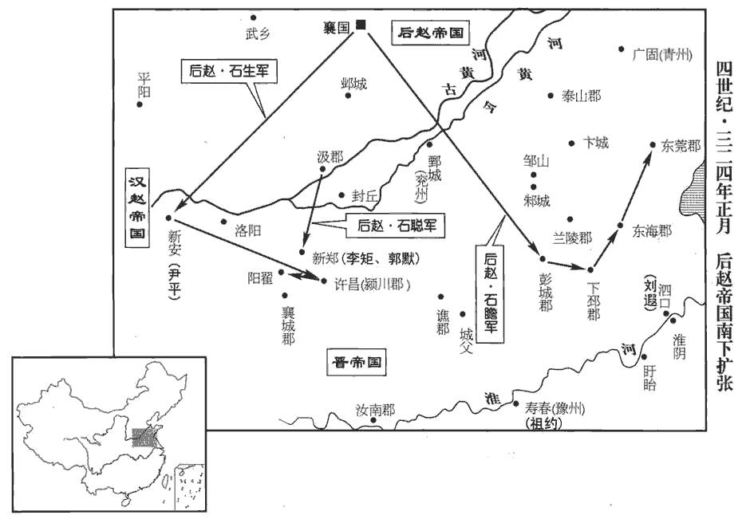
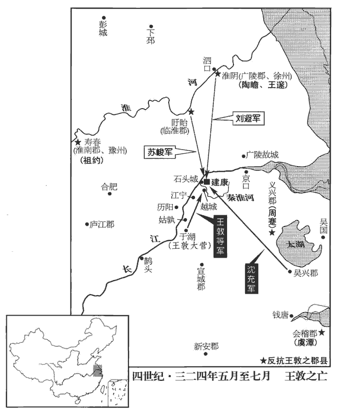
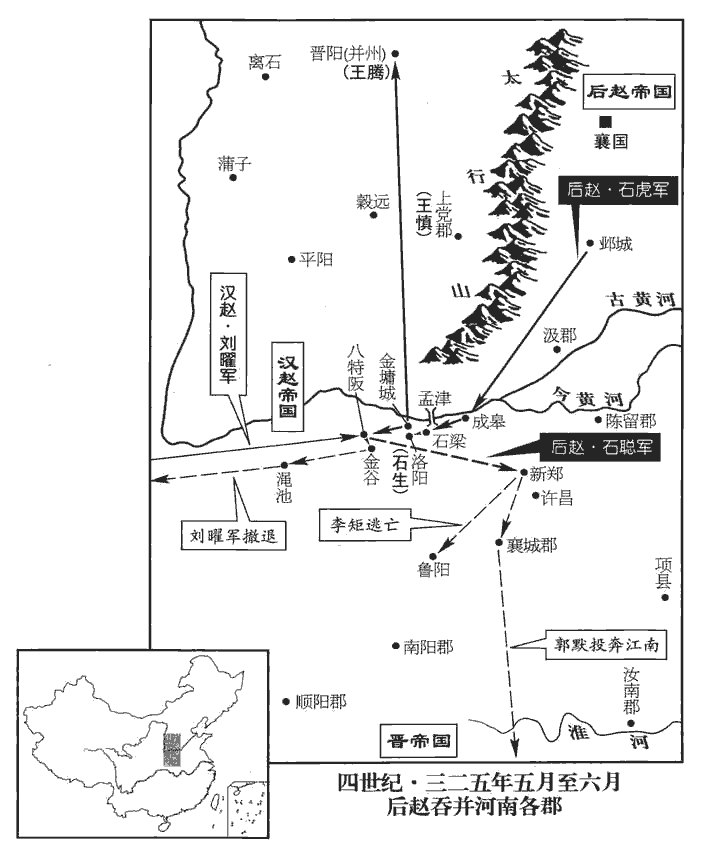
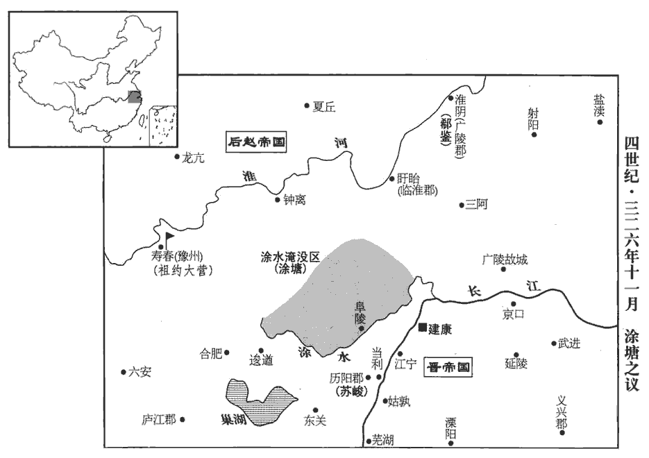
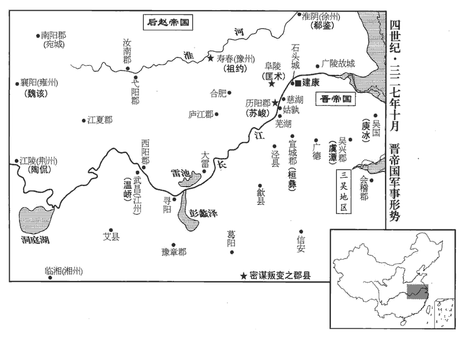

 晉紀十五起閼逢涒灘（甲申），盡強圉大淵獻（丁亥），凡四年。

# 肅宗明皇帝下

## 太寧二年（甲申，三二四）

1春，正月，王敦誣周嵩、周莚與李脫謀為不軌，收嵩、莚，於軍中殺之；遣參軍賀鸞就沈充於吳‹苏州›，盡殺周札諸兄子；進兵襲會稽‹绍兴›，會，工外翻。札拒戰而死。

〖译文〗 [1]春季，正月，王敦诬陷周嵩、周与李脱勾结，密谋不轨，因而收捕二人，杀害于军中。又派参军贺鸾到吴地找沈充，把周札所有兄长的儿子尽数杀死，随即进兵攻袭会稽，周札抵抗战死。

2後趙將兵都尉石瞻寇下邳‹江苏睢宁北古邳镇›、彭城‹江苏徐州›，取東莞‹山东莒县›、東海‹山东郯城›，東莞縣，漢屬琅邪郡；莞，音官。武帝泰始元年，分琅邪立東莞郡。將，即亮翻。劉遐退保泗口‹江苏省淮阴市›。水經註：泗水自淮陽城東流逕角城北，而東南流注于淮，謂之泗口。杜佑曰：泗口，在今臨淮郡宿遷縣界。

〖译文〗 [2]后赵的将兵都尉石瞻侵犯下邳、彭城，攻取东莞、东海，刘遐退保泗口。

司州刺史石生擊趙河南太守尹平於新安‹河南省渑池县›，斬之，新安縣，漢屬弘農郡，晉屬河南郡。守，式又翻；下同。掠五千餘戶而歸。自是二趙構隙，日相攻掠，河東、弘農之間，民不聊生矣。河東，弘農，二趙之界上也。

〖译文〗 后赵司州刺史石生攻击在新安的前赵河南太守尹平，将他斩首，劫掠民众五千多户返回。自此以后，前赵与后赵结怨成仇，经常互相攻伐劫掠，河东、弘农之间，民不聊生。

石生寇許、潁，許昌、潁川，同是一郡地。俘獲萬計。攻郭誦于陽翟‹河南禹州›，誦與戰，大破之，生退守康城‹河南禹州西北›。魏收地形志，陽翟dí縣有康城。後趙汲郡‹河南卫辉›內史石聰聞生敗，馳救之，進攻司州刺史李矩、潁川太守郭默‹时二人同驻新郑河南省新郑县›，皆破之。

〖译文〗 石生侵犯许昌、颍川、俘获人众上万。又进攻在阳翟的郭诵。郭诵与石生交战，重创石生所部，石生退走保守康城。后赵汲郡内史石聪听说石生战败，奔驰救援，进攻司州刺史李矩和颍川太守郭默，均获胜。

 

3成主雄‹李雄，本年五十一岁›，后任氏無子，任，音壬。有妾子十餘人，雄立其兄蕩之子班為太子，使任后母之。群臣請立諸子，雄曰：「吾兄，先帝之嫡統，有奇材大功，事垂克而早世，朕常悼之。蕩死見八十五卷惠帝太安二年。且班仁孝好學，必能負荷先烈。」太傅驤、司徒王達諫曰：「先王立嗣必子者，所以明定分而防篡奪也。好，呼到翻。荷，下可翻，又如字。驤，思將翻。分，扶問翻。宋宣公、吳餘祭，足以觀矣！」漢書曰：立嗣必子，所從來遠矣。公羊傳曰：宋宣公謂繆公曰：「以吾愛與夷則不若愛汝；以為社稷宗廟主，則與夷不若汝，盍終為君矣。」宣公死，繆公立，逐其二子莊公馮與左師勃，而致國乎與夷。故君子大居正，宋之禍，宣公為之也。吳子謁、餘祭、夷昩與季子同母，季子弱而才，兄弟皆愛之，同欲立之以為君。謁曰：今若迮zé而與季子國，季子猶不受也，請無與子而與弟，弟兄迭為君而致國乎季子。夷昩死，則國宜之季子，季子使而亡焉。僚者，長庶也，即之，季子使反而君之。闔閭曰：「先君所以不與子國而與弟者，凡為季子故也。將從先君之命歟，則國宜之季子；如不從先君之命，則我宜立者也，僚惡得為君乎！」於是使專諸刺僚。張守節曰：祭，側界翻。昩，莫葛翻。雄不聽。驤退而流涕曰：「亂自此始矣！」為下雄諸子殺班張本。班為人謙恭下士，下，遐稼翻。動遵禮法，雄每有大議，輒令豫之。

〖译文〗 [3]成汉主李雄的皇后任氏无子，妾妃所生的儿子有十多人。李雄册立自己兄长李荡的儿子李班为太子，让任后作他的养母。群臣请求在妾妃所生的子嗣中选立太子，李雄说：“我的兄长是先帝的嫡亲后裔，具有奇才和大功，当帝业即将成功时英年早逝，朕时常悼念他。况且李班仁孝好学，一定会继承祖先的功业。”太傅李骧、司徒王达劝谏说：“先王们之所以必定从自己的儿子中选立继承人，为的是彰明固定不变的分位，防止篡权夺位。看宋宣公和吴国余祭的先例，就足以今人知晓。”李雄不听。李骧退下后流着眼泪说：“祸乱由此发端了。”李班为人谦恭下士，行动遵循礼法，李雄只要有重大决策，总是让他参与。

4夏，五月，甲申‹十四›，‹前凉首都姑臧（甘肃省武威市）›凉王張茂疾病，執世子駿手泣曰：「吾家世以孝友忠順著稱，今雖天下大亂，汝奉承之，不可失也。」且下令曰：「吾官非王命，苟以集事，豈敢榮之！死之日，當以白帢qià入棺，勿以朝服斂。」是日，薨‹年四十八岁›。帢，苦洽翻。朝，直遙翻。斂，力贍翻。愍帝使者史淑在姑臧‹甘肃武威›，長安覆沒，淑無所歸，故留姑臧。使，疏吏翻。左長史氾禕yī、右長史馬謨等氾fàn，音凡。禕，吁韋翻。使淑拜駿大將軍、涼州牧、西平公，赦其境內。前趙主曜遣使贈茂太宰，諡曰成烈王；拜駿‹张骏，本年十八岁›上大將軍、涼州牧、涼王。

〖译文〗 [4]夏季，五月，甲申（十四日），张茂病重，拉着王世子张骏的手哭泣说：“我家世代以孝友忠顺著称于世，如今虽然天下大乱，但你必须继承家族遗风，不可或失。”并且下令说：“我的官职本非朝廷任命，为顺应事变而苟且自任，怎能以此为荣！我死的时候，应当戴着白色便帽入棺，不要用朝服殡殓。”这天，张茂故去。愍帝时的使者史淑留居在姑臧，左长史、右长史马谟等让史淑授予张骏大将军、凉州牧、西平公，赦免境内罪犯。前赵主刘曜派遣使者赠给张茂太宰的名号，谥号为成烈王；授张骏为上大将军、凉州牧、凉王。

5王敦‹时驻于湖安徽省当涂县南›疾甚，矯詔拜王應為武衛將軍以自副，以王含為驃騎大將軍、開府儀同三司。驃，匹妙翻。錢鳳謂敦曰：「脫有不諱，便當以後事付應邪？」敦曰：「非常之事，非常人所能為。司馬相如難蜀父老曰：蓋世必有非常之人，然後有非常之事。且應年少，少，詩沼翻。豈堪大事！我死之後，莫若釋兵散眾，歸身朝廷，保全門戶，上計也；退還武昌‹湖北省鄂州市›，收兵自守，貢獻不廢，中計也；及吾尚存，悉眾而下，萬一僥倖，下計也。」鳳謂其黨曰：「公之下計，乃上策也。」遂與沈充定謀，俟敦死，即作亂。以王敦之很戾，而濟之以沈充、錢鳳，所謂「凶德參會」。又以宿衛尚多，奏令三番休二。

〖译文〗 [5]王敦病情加剧，矫称诏令任命王应为武卫将军，做自己的副职，任命王含为骠骑大将军、开府仪同三司。钱凤对王敦说：“倘若您有不幸，是否将把身后之事托付王应？”王敦说：“非常之事，不是平常的人所能够胜任的。何况王应年轻，哪能承担大事！我死以后，不如放下武器、遣散兵众，归顺朝廷，以保全宗族门户，这是上策；退回到武昌，集中军队谨慎自守，给朝廷贡献的物品无所缺废，这是中策；乘我还活着的时候，发遣所有的兵力攻打京城，寄希望于侥幸取胜，这是下策。”钱凤对其党羽说：“王公所谓下策，其实正是上策。”于是与沈充谋议商定，等王敦一死便作乱。又认为宿卫士卒太多，奏令停值三分之二。

初，帝‹司马绍，本年二十六岁›親任中書令溫嶠，敦惡之，惡，烏路翻。請嶠為左司馬。嶠乃繆為勤敬，繆，靡幼翻，詐也。綜其府事，時進密謀以附其欲。深結錢鳳，為之聲譽，每曰；「錢世儀精神滿腹。」嶠素有藻鑑之名，錢鳳，字世儀。藻鑑，謂善於人倫藻鑑也。人有美質而加之褒飾，謂之黼藻，如衣裳之加藻火，黼fǔ黻fú也。鑑，所以別妍醜。故明於知人而能褒獎後進者，有藻鑑之名。鳳甚悅，深與嶠結好。好，呼到翻。會丹楊尹缺，晉都建康，以丹楊太守為尹，宋、齊、梁皆因之。洪适曰：西漢丹陽郡，則治宛陵，丹陽縣，則今之建康也。東漢史皆作「丹陽」。西晉移郡於建業，元帝改太守為丹楊尹。地理志曰：山多赤柳，故名。他書載漢、晉此郡，少有從「木」者。至唐天寶年，始以京口為丹陽郡，改曲阿為丹陽縣，皆非漢舊壤也。嶠言於敦曰；「京尹咽喉之地，咽，音煙。公宜自選其才，恐朝廷用人，或不盡理。」敦然之，問嶠：「誰可者？」嶠曰：「愚謂無如錢鳳。」鳳亦推嶠，嶠偽辭之；敦不聽，六月，表嶠為丹楊尹且使覘伺朝廷。覘，丑廉翻，又丑豔翻。嶠恐既去而錢鳳於後間止之，間，古莧翻。因敦餞別，嶠起行酒，至鳳，鳳未及飲；嶠偽醉，以手版擊鳳幘墜，作色曰：「錢鳳何人，溫太真行酒而敢不飲！」溫嶠，字太真。敦以為醉，兩釋之。嶠臨去，與敦別，涕泗橫流，出閣復入者再三。復，扶又翻。行後，鳳謂敦曰：「嶠於朝廷甚密，而與庾亮深交，未可信也。」敦曰：「太真昨醉，小加聲色，何得便爾相讒！」嶠至建康，盡以敦逆謀告帝，請先為之備，又與庾亮共畫討敦之謀。敦聞之，大怒曰：「吾乃為小物所欺！」與司徒導書曰：「太真別來幾日，作如此事！當募人生致之，自拔其舌。」王敦遙制朝權，其所甚害者如郗鑒、溫嶠，終不得以肆其毒，以此知建康綱紀尚能自立也。

〖译文〗 当初，明帝亲近信任中书令温峤，王敦不满，请准温峤出任左司马。温峤便假装勤勉恭敬，治理王敦府事，时常私下出些主意来附合王敦的欲望。又与钱凤结为深交，为钱凤扬名，常常说：“钱凤满身活力。”温峤素来有善于知人、褒奖后进的美名，钱凤甚为喜悦，尽力与温峤结好。恰逢丹杨尹的职位空缺，温峤对王敦说：“丹杨尹守备京城，这种咽喉要职您应当自己遴选人才充任。恐怕朝廷任用的人有的不会尽心治理。”王敦颇以为然，问温峤说：“谁能够胜任？”温峤说：“我认为没有谁能比得上钱凤。”钱凤也推举温峤，温峤佯装推辞。王敦不听。六月，王敦上表奏请温峤任丹杨尹，并且让他窥察朝廷动向。温峤惟恐自己走后钱凤再离间挑拔加以制止，便借王敦设宴饯别之机，起身祝酒，来到钱凤面前，钱凤还没来得及饮酒，温峤佯装酒醉，用手版击落钱凤的头巾，脸色一变说：“钱凤你是什么样的人，我温太真祝酒你胆敢不喝？”王敦以为温峤醉了，把双方劝解开。温峤临行时，向王敦道别，眼泪、鼻涕横流，先后三次出门以后又回来。温峤走后，钱凤对王敦说：“温峤与朝廷关系极为密切，并且与庾亮有深交，此人不能信任。”王敦说：“温峤昨天酒醉，对你稍有失敬，你怎么能马上就这样诋毁他呢！”温峤到达建康后，把王敦作乱的图谋原原本本告诉了明帝，请求事先有所防备。又和庾亮共同筹划讨伐王敦的谋略。王敦听说后，勃然大怒，说：“我竟然被这个小东西欺骗！”便写信给司徒王导说：“温峤离开几天，竟然做出这种事！我要找人把他活捉来，亲自拔除他的舌头。”

帝將討敦，以問光祿勳應詹，詹勸成之，帝意遂決。丁卯‹二十七›，加司徒導大都督、領揚州刺史，以溫嶠都督東安北部‹秦淮河之北›諸軍事，以下文應詹都督橋南諸軍觀之，則東安北部謂秦淮水北諸軍也。與右將軍卞敦守石頭‹南京西北›，考異曰：敦傳云：「王敦表為征虜將軍、都督石頭軍事；明帝討敦，以為鎮南將軍、假節。」今從明帝紀。應詹為護軍將軍、都督前鋒及朱雀橋南‹秦淮河南›諸軍事，郗鑒行衛將軍、都督從駕諸軍事，郗，丑之翻。從，才用翻。庾亮領左衛將軍，以吏部尚書卞壼行中軍將軍。壼，苦本翻。郗鑒以為軍號無益事實，固辭不受；請召臨淮‹江苏省盱眙县›太守蘇峻、兗州刺史劉遐同討敦。夫理順者難恃，勢弱則不支。以敦、鳳同惡相濟，率大眾以犯闕，雖諸公忠赤，若只以臺中見兵拒之，是復周、戴石頭之事，微郗鑒建請而召劉遐、蘇峻，殆矣！詔徵峻、遐及徐州刺史王邃、豫州刺史祖約、廣陵‹江苏省淮阴市›太守陶瞻等入衛京師。帝屯于中堂。按蕭子顯齊書高帝紀：桂陽王休范之反，諸貴會議，帝曰：「中堂舊是置兵地，領軍宜屯宣陽門，為諸軍節度，」則中堂當在宣陽門外。

〖译文〗 明帝将要征讨王敦，就此事征询光禄勋应詹的意见，应詹表示赞同，明帝于是坚定了决心。丁卯（二十七日），授予司徒王导大都督、兼领扬州刺史，任命温峤都督东安北部诸军事，和右将军卞敦同守石头；任应詹为护军将军、都督前锋及朱雀桥南诸军事；任郗鉴行卫将军都督扈从御驾诸军事。又让庾亮领左卫将军职，让吏部尚书卞任行中军将军职。郗鉴认为有军制上的名号于实际情况无益，坚持辞谢不受，请求征召临淮太守苏峻、兖州刺史刘遐共同讨伐王敦。明帝于是下诏征召苏峻、刘遐以及徐州刺史王邃、豫州刺史祖约、广陵太守陶瞻等入京师护卫。明帝屯军于中堂之地。

司徒導聞敦疾篤，帥子弟為敦發哀，帥，讀曰率。為，于偽翻。眾以為敦信死，咸有奮志。於是尚書騰詔下敦府，下，遐嫁翻。列敦罪惡曰：「敦輒立兄息以自承代，未有宰相繼體而不由王命者也。息，子也；謂以兄含子應為嗣也。頑凶相獎，無所顧忌；志騁凶醜，以窺神器。天不長姦，騁，丑郢翻。長，丁丈翻。敦以隕斃；鳳承凶宄guǐ，彌復煽逆。復，扶又翻。今遣司徒導等虎旅三萬，十道并進；平西將軍邃等精銳三萬，水陸齊勢；朕親統諸軍，討鳳之罪。有能殺鳳送首，封五千戶侯。考異曰：晉春秋此詔在王導為敦發喪前，故云「有能斬送敦首，封萬戶侯，賞布萬匹。」按此詔云「敦以隕斃」，是稱敦已死也，不應復購敦首。今從敦傳。諸文武為敦所授用者，一無所問，無或猜嫌，以取誅滅。敦之將士，從敦彌年，違離家室，將，即亮翻；下自將、親將同。離，力智翻。朕甚愍之。其單丁在軍，皆遣歸家，終身不調；單丁，謂家止有男丁一人，無兼次者。調，徒釣翻。其餘皆與假三年；假，居訝翻。休訖還臺，當與宿衛同例三番。」謂三番休二也。

〖译文〗 司徒王导听说王敦重病不治，便带领王氏子弟为王敦发丧，大家以为王敦确实死了，都有奋战的士气。于是尚书传送诏令到王敦的幕府，罗列王敦的罪恶说：“王敦专断地扶立兄长的儿子继承自己，从来没有宰相的继承人却不由君王任命的。这真是凶顽之徒相互奖掖，无所顾忌；志向凶残丑恶，窥视国家政权。幸好上天不让奸恶之人长寿，王敦因而毙命；钱凤既已奉承奸凶之人，又再煽动作乱，现在派遣司徒王导等率领猛虎般的军队三万人，诸路并进；平西将军王邃等率精兵三万，水陆齐发；朕亲自统领各路大军，讨伐钱凤的罪恶。有谁能够杀死钱凤将首级送来，封为五千户候。各文武官员即使是由王敦任用的，朕也一概不加过问，你们不要心存猜忌和隔阂，以至于自取诛灭。王敦的将士们跟随王敦多年，远离家室，朕非常怜悯。凡是独生子从军的，都遣返回家，终身不再征用。其余的人都给假三年。休假期满回到朝廷后，都将与宿卫的士卒一样，按三分之二的比例轮休。”

敦見詔，甚怒；而病轉篤，不能自將。將舉兵伐京師，使記室郭璞筮之，璞曰「無成。」敦素疑璞助溫嶠、庾亮，及聞卦凶，乃問璞曰：「卿更筮吾壽幾何？」璞曰：「思向卦，明公起事，必禍不久；若住武昌，壽不可測。」敦大怒曰：「卿壽幾何？」曰：「命盡今日日中。」敦乃收璞，斬之。

〖译文〗 王郭见到诏书，十分震怒，但因病情愈加沉重，自己不能任将出战。将要发兵攻打京师以前，让记室郭璞占卦，郭璞说：“事情不会成功。”王敦历来怀疑郭璞在帮助温峤、庾亮，等到听说卦呈凶兆，便问郭璞说：“你再算算我的寿命还有多长？”郭璞说：“由刚才的卦象推算，明公如果起兵，灾祸必定不久将至；如果仍旧住在武昌，享年长不可测。”王敦大怒，说：“你的命多长？”敦璞回答说“今天正午毕命。”王敦于是拘捕郭璞，将他斩首。

 

敦使錢鳳及冠軍將軍鄧岳、前將軍周撫等帥眾向京師。冠，古玩翻。帥，讀曰率。王含謂敦曰：「此乃家事，吾當自行。」於是以含為元帥。帥，所類翻。鳳等問曰：「事克之日，天子云何？」敦曰：「尚未南郊，何得稱天子！便盡卿兵勢，保護東海王及裴妃而已。」元帝以第三子沖奉東海王越後。裴妃，越妃也。乃上疏以誅姦臣溫嶠等為名。秋，七月，壬申朔‹二›，王含等水陸五萬奄至江寧‹江苏江寧西南江宁乡›南岸，武帝太康二年，分秣陵立臨江縣，二年，更名江寧。南岸，即秦淮南岸也。考異曰：敦傳及晉春秋皆云「三萬」，今從明帝紀。人情恟懼。溫嶠移屯水北，燒朱雀桁héng以挫其鋒，恟，許拱翻。桁，與航同。含等不得渡。帝欲親將兵擊之，聞橋已絕，大怒。嶠曰：「今宿衛寡弱，徵兵未至，若賊豕突，危及社稷，宗廟且恐不保，何愛一橋乎！」

〖译文〗 王郭让钱凤和冠军将军邓岳、前将军周抚等率领士众向京师进发。王含对王敦说：“这本是我们王家的事，我应当亲自去。”王敦便任命王含为全军的主帅。钱凤等人问道：“事成之日，把天子怎么办？”王敦说：“还没南郊祭天，哪能够称天子！只管出动你们所有的兵力，保护东海王和裴妃而已。”于是以诛杀奸臣温峤等人为由，给明帝上疏。秋季，七月，壬申朔（初一），王含等水军、步卒共五万人涌至江宁秦淮河南岸，京城人心惶惶。温峤移兵驻屯河北岸，烧毁了朱雀桁用以暂挫敌方锋头。王含等人无法渡河。明帝想亲自领兵攻击，听说渡桥已断，勃然大怒。温峤说：“现在宿卫的士卒人数少、体力弱，征召的援军没到，如果让敌寇窜入，将会危及朝廷，那时连祖先的宗庙恐怕都难保，何必吝啬一座桥呢！”

司徒導遺含書曰：「近承大將軍困篤，參問起居，謂之參承；詗xiòng候安否，謂之詗承。遺，于季翻。或云已有不諱。尋知錢鳳大嚴，欲肆姦逆；謂兄當抑制不逞，言當抑制鳳等，使不得逞其凶逆也。還藩武昌，今乃與犬羊俱下。兄之此舉，謂可得如大將軍昔年之事乎？」謂如元帝永昌元年，敦克石頭時也。昔者佞臣亂朝，謂刁協、劉隗也。朝，直遙翻。人懷不寧，如導之徒，心思外濟。言思投外以自濟也。今則不然。大將軍來屯于湖，漸失人心，君子危怖，怖，普布翻。百姓勞弊、臨終之日，委重安期；安期斷乳幾日？又於時望，便可襲宰相之迹邪？王應，字安期。斷，讀曰短。自開闢以來，頗有宰相以孺子為之者乎？諸有耳者，皆知將為禪代，非人臣之事也。謂此事深駭眾聽，皆知敦、應謀篡。先帝中興，遺愛在民；聖主聰明，德洽朝野。兄乃欲妄萌逆節，凡在人臣，誰不憤歎！導門小大受國厚恩，今日之事，明目張膽，為六軍之首，寧為忠臣而死，不為無賴而生矣！」含不答。

〖译文〗 司徒王导送信给王含说：“近来听说大将军王敦病重垂危，有人说已遇不幸。不久知道钱凤大加戒严，想肆行奸逆不道之事。我认为兄长应当抑制他们，不使其得逞，所以应回军藩守武昌，现在却与愚昧无知之人一同前来。兄长这种举动，是以为能做成如同大将军当年所做的事吗？当初佞臣败坏朝政，人心不平，像我这样的人，也心存外念，现在则不同。大将军自从前来屯军于湖，便逐渐失去民心，正直的君子感到危险和恐惧，百姓劳累疲敝。临终之时，将重任委托给王应，王应断奶才有几天？再说凭他当时名望，就能承袭宰相的职位吗？自从天地开辟以来，可有宰相的职位让孺子小儿担任的？凡是有耳听说此事的人，都知道将要进行的这种禅代，不是为人臣子者所当做的。先帝中兴国家，遗留惠爱在民间；当今圣主耳聪目明，恩德遍于朝野。兄长却想轻妄的启衅作乱，凡据有人臣之位的，谁不为此愤慨！王导一门老小蒙受国家的厚恩大德，今天此事，我明目张胆地出任六军统帅，宁肯身为忠臣战死，也不愿当一个无赖苟活！”王含不答复。

或以為「王含、錢鳳眾力百倍，苑城小而不固，苑城，蓋孫氏都秣陵所築。晉置建康於秣陵水北，南渡建都，依苑城以為守。宜及軍勢未成，大駕自出拒戰。」郗鑒曰：「群逆縱逸，勢不可當；可以謀屈，難以力競。且含等號令不一，抄盜相尋，抄，楚交翻。吏民懲往年暴掠，皆人自為守。乘逆順之勢，何憂不克！且賊無經略遠圖，惟恃豕突一戰；曠日持久，必啟義士之心，令智力得展。今以此弱力敵彼強寇，決勝負於一朝，定成敗於呼吸，萬一蹉跌，蹉cuō，七何翻。跌，徒結翻。雖有申胥之徒，義存投袂，左傳，吳人入郢，楚大夫申包胥赴秦求救，卒以存楚。投袂，言匆遽也；傳曰：楚子聞之，投袂而起。何補於既往哉！」帝乃止。

〖译文〗 有人认为：“王含、钱凤的军队人数和战斗力都要强出百倍。苑城既小又不坚固，应当乘敌军强势未成之时，皇帝大驾亲自出城抗敌。”郗鉴说：“乱党来势恣纵，势不可当；只能靠计谋取胜，难以力敌。况且王含等人军令不齐，劫掠不断，官吏民众有鉴于往年被凶暴地掠夺资财，人人都自行守备。只要利用顺逆的情势，何愁不能克敌！再说敌寇毫无谋略和长远设想，只靠盲目奔突一战；旷日持久，必定会启导义士的心神，使他们的智慧和力量得以施展。现在如果以这样弱小的力量与强敌抗衡，期望一朝决定胜负，瞬间判别成败，万一有所闪失，即使有申包胥这样的人愿意赴难救援，于既成事实又有什么补益呢！”明帝这才罢休。

帝帥諸軍出屯南皇堂。癸酉夜‹三›，募壯士，遣將軍段秀、中軍司馬曹渾等帥甲卒千人渡水，掩其未備。平旦，戰於越城，越城，在秦淮南。帥，讀曰率；下同。大破之，斬其前鋒將何康。秀，匹磾之弟也。磾，丁奚翻。

〖译文〗 明帝统领各军出城屯驻南皇堂。癸酉（初三）夜间，招募勇士，派将军段秀、中军司马曹浑等率领甲士千人渡秦淮河，攻其不备。清晨，在越城与敌交战，大胜，斩杀其前锋将领何康。段秀即段匹的兄弟。

敦聞含敗，大怒曰：「我兄，老婢耳；門戶衰，世事去矣！」顧謂參軍呂寶曰：「我當力行。」因作勢而起，困乏，復臥。氣不能充體為困，力不能舉身為乏。乃謂其舅少府羊鑒及王應曰：少，詩沼翻。「我死，應便即位，先立朝廷百官，然後營葬事。」敦尋卒‹年五十九岁›，應祕不發喪，裹尸以席，蠟塗其外，埋於廳事中，與諸葛瑤等日夜縱酒淫樂。樂，音洛。

〖译文〗 王郭听说王含战败，勃然大怒说：“我这个兄长只是个老奴婢，门户衰落，大事完了！”回头对参军吕宝说：“我要尽力起行，”随即用力起来，因气力困乏，只好又躺下。于是对自己的舅父、少府羊鉴和王应说：“我死后王应立即即帝位，先设立朝廷百官，然后再安排葬事。”王敦不久即死，王应隐瞒不公布死讯，用席子包裹尸身，外面涂蜡，埋在议事厅中，和诸葛瑶等人日夜纵酒淫乐。

帝使吳興‹浙江湖州›沈楨說沈充，說，輸芮翻。許以為司空。充曰：「三司具瞻之重，豈吾所任！任，音壬。幣厚言甘，古人所畏也。詩節南山曰：赫赫師尹，民具爾瞻。左傳，晉郤xì芮曰：「幣重而言甘，诱我也。」且丈夫共事，終始當同，豈可中道改易，人誰容我乎！」遂舉兵趣建康。趣，七喻翻。宗正卿虞潭以疾歸會稽‹浙江绍兴›，按漢、晉以來，宗正列於九卿，然未以「卿」字繫官；梁置十一寺，始繫「卿」字。此「卿」字衍。會，工外翻。聞之，起兵餘姚以討充。餘姚縣，屬會稽郡。帝以潭領會稽內史。前安東將軍劉超、宣城‹安徽宣州›內史鍾雅皆起兵以討充。義興‹江苏宜兴›人周蹇殺王敦所署太守劉芳，晉惠帝永興元年，分吳興之陽羨、丹楊之永世立義興郡。平西將軍祖約逐敦所署淮南‹安徽寿县›太守任台。約屯壽春，故得逐台。任，音壬。

〖译文〗 明帝让吴兴人沈桢劝说沈充倒戈，许诺让他出任司空。沈充说：“三司是众人共同敬仰的要职，岂是我所能胜任的！礼重言甜，正是古人所畏惧的。况且大丈夫与人共事，便应始终同心，怎能中途改弦易辙，他人谁还能容我！”随即发兵奔赴建康。宗正卿虞潭因病回家乡会稽，听说此事，从馀姚起兵讨伐沈充。明帝任命虞潭兼领会稽内史。前安东将军刘超、容城内史钟雅也都起兵征讨沈充。义兴人周蹇杀死王敦任命的太守刘芳，平西将军祖约赶走了王敦任命的淮南太守任台。

沈充帥眾萬餘人與王含軍合，司馬顧颺yáng說充曰：「今舉大事而天子已扼其咽喉，咽，音烟。鋒摧氣沮，相持日久，必致禍敗。沮，在呂翻。今若決破柵塘，因湖水以灌京邑，此即玄武湖水也，在建康城北，今在上元縣北十里。乘水勢，縱舟師以攻之，此上策也；藉初至之銳，并東、西軍之力，東軍，謂沈充軍；西軍，謂王含、錢鳳等軍也。十道俱進，眾寡過倍，理必摧陷，中策也；轉禍為福，召錢鳳計事，因斬之以降，降，戶江翻。下策也。」充皆不能用，颺逃歸于吳‹江苏省苏州市›。

〖译文〗 沈充率士卒一万多人与王含的军队会合，司马顾向沈充献策说：“现在开始起事，但天子已扼守住咽喉要地，锐气受挫，士气沮落，相持日久，必然招致失败。如果现在破栅栏、开决河塘，借湖水淹灌京城，乘着水势动用水军进攻，这是上策；倘若凭借大军刚刚到达的锐气，集中东、西两路军队的力量，诸路同时并进，我众敌寡，悬殊一倍以上，按情理必会摧毁敌军，这是中策；以召请钱凤议事为名，乘机将他斩首，归降朝廷，可以转祸为福，这是下策。”但沈充均不采用，顾便逃回吴郡。

丁亥‹十七›，劉遐、蘇峻等帥精卒萬人至，帝夜見，勞之，勞，力到翻。賜將士各有差。沈充、錢鳳欲因北軍初到疲困，擊之，乙未夜‹二十五›，充、鳳從竹格渚渡淮。秦淮在今建康上元縣南三里。秦始皇時，望氣者言金陵有天子氣，使鑿山為瀆以斷地脈，故曰秦淮。或云：淮水發源屈曲，不類人工。護軍將軍應詹、建威將軍趙胤等拒戰不利，充、鳳至宣陽門，晉都建康，外城環之以籬，諸門皆用洛城門名；宣陽門在城南面。拔柵，將戰，劉遐、蘇峻自南塘‹秦淮河之南›橫擊，大破之，晉都建康，自江口沿淮築堤；南塘，秦淮之南塘岸也。赴水死者三千人。遐又破沈充于青溪‹流经南京东›。青溪水發源於鍾山，接於秦淮，吳孫權鑿城北塹以洩xiè玄武湖水。尋陽‹江西九江›太守周光聞敦舉兵，帥千餘人來赴。沈約曰：尋陽，本縣名，因水名縣，水南注江，漢屬廬江郡；惠帝永興元年，分廬江、武昌立尋陽郡，治柴桑縣。既至，求見敦。王應辭以疾。光退曰：「今我遠來而不得見，公其死乎！」遽見其兄撫曰：「王公已死，兄何為與錢鳳作賊！」眾皆愕然。

〖译文〗 丁亥（十七日），刘遐、苏峻等率领精兵万人到达建康，明帝夜间召见并犒劳他们，将士们各按等秩均有赏赐。沈充、钱凤想乘着北方军队刚到疲困之机进行攻击，乙未（二十五日）夜，沈充、钱凤从竹格渚渡过秦淮河，护军将军应詹、建威将军赵胤等人抵抗失利，沈充和钱凤攻至宣阳门，拔除防御栅栏，正要攻战，刘遐、苏峻从南塘侧面攻击，重创沈充、钱凤军队，渡河溺死的达三千多人。刘遐后来又在青溪战败沈充。寻阳太守周光听说王敦起兵，率一千多人赶来，到达后求见王敦，被王应以病重为名拒绝。周光退下后说：“现在我远道而来却见不到王敦，他大概已经死了吧！”急忙会见其兄长周抚，说：“王公已经死了，你何必和钱凤同作叛贼！”众人都很惊愕。

丙申‹二十六›，王含等燒營夜遁。丁酉‹二十七›，帝還宮，大赦，惟敦黨不原。命庾亮督蘇峻等追沈充於吳興‹浙江湖州›，溫嶠督劉遐等追王含、錢鳳於江寧，分命諸將追其黨與。劉遐軍人頗縱虜掠，嶠責之曰：「天道助順，故王含勦絕，勦jiǎo，子小翻。豈可因亂為亂也！」遐惶恐拜謝。

〖译文〗 丙申（二十六日），王含等人烧毁营帐，连夜遁逃。丁酉（二十七日），明帝回到皇宫，大赦天下罪犯，惟有王敦的党羽不在赦宥之列。命令庾亮督察苏峻等人追袭逃到吴兴的沈充，令温峤督察刘遐等人追击逃往江宁的王含、钱凤，又分别令各位将领追捕王敦死党。刘遐部下军人不少大肆虏掠，温峤斥责他说：“天理是赞助顺应天道的人，所以王含被剿灭，怎么能乘机作乱呢！”刘遐惊惶恐惧，下拜谢罪。

王含欲奔荊州‹府湖北江陵›，王應曰：「不如江州‹府设武昌，湖北鄂州›。」荊州，王舒；江州，王彬。含曰：「大將軍平素與江州云何而欲歸之？」應曰：「此乃所以宜歸也。江州當人強盛時，能立同異，此非常人所及；今覩困厄，必有愍惻之心。荊州守文，豈能意外行事邪！」王應之見，猶能出乎尋常，此敦所以以之為後歟！能立同異謂哭周顗、數敦罪、及諫敦為逆也。含不從，遂奔荊州。王舒遣軍迎之，沈含父子於江。沈，持林翻。王彬聞應當來，密具舟以待之；不至，深以為恨。錢鳳走至闔廬洲，闔廬洲，在江中。賀循曰：江中劇地，惟有闔廬一處，地勢險奧，亡逃所聚。周光斬之，詣闕自贖。考異曰：晉春秋云「戴淵弟良斬鳳」，今從敦傳。沈充走失道，誤入故將吳儒家。儒誘充內重壁中，重壁，複壁也。重，直龍翻。因笑謂充曰：「三千戶侯矣！」時臺格募斬錢鳳者封五千戶侯，斬沈充者封三千戶侯。充曰：「爾以義存我，我家必厚報汝；若以利殺我，我死，汝族滅矣。」儒遂殺之，傳首建康。敦黨悉平。充子勁當坐誅，鄉人錢舉匿之，得免。其後，勁竟滅吳氏。

〖译文〗 王含想逃奔荆州，王应说：“不如去江州。”王含说：“大将军王敦以往与江州王彬的关系怎样，你想到那儿去？”王应说：“这是因为到那里合适。江州的王彬在他人强盛的时候，敢于坚持不同立场，这不是一般人能比得上的；现在看到他人遭受困厄，也必定会有恻隐之心。荆州的王舒循规蹈距，哪能超出常规行事呢！”王含不听，于是逃奔荆州。王舒派军队相迎，将王含、王应父子沉入江中溺死。王彬听说王应要来，秘密准备小船等候。王应没来，王彬为此深感遗憾。钱凤逃到阖庐州，周光将他斩首，自己赴朝廷请求赎罪。沈充逃跑时迷路，错误地来到自己旧部将吴儒家，吴儒诱使沈充进入墙中夹层，于是笑着对沈充说：“我可以被封为三千户侯了！”沈充说：“你如果顾及往日情义保全我，我家必定会从厚报答你。你如果为了私利杀我，我死以后，你的家族也将灭绝。”吴儒于是杀死沈充，把首级传送到建康。王敦的党徒至此全部平定。沈充的儿子沈劲应当连坐受诛，同乡钱举把他藏匿起来，因此幸免。后来，沈劲终于灭绝了吴氏全族。

有司發王敦瘞，瘞yì，於計翻。出尸，焚其衣冠，跽而斬之，跽jì，巨几翻，跪也。與沈充首同懸於南桁。南桁，即朱雀桁。郗鑒言於帝曰：「前朝誅楊駿等，朝，直遙翻。皆先極官刑，後聽私殯。臣以為王誅加於上，私義行於下，宜聽敦家收葬，於義為弘。」帝許之。司徒導等皆以討敦功受封賞。

〖译文〗 朝廷官吏挖开王敦瘗埋地，拉出尸体，焚毁身上所穿衣寇，摆成跪姿斩首，和沈充的首级一同悬挂在南桁。郗鉴对明帝说：“以往朝廷诛戮杨骏等人，都是先施加官方的刑罚，然后听任私人殡葬。我认为王法诛戮表现公理，私人情义则体现私交，应该听任王敦的家属收葬，在道义上更为弘大。”明帝同意。司徒王导等人都因征讨王敦有功，各自受到封赏。

周撫與鄧岳俱亡，周光欲資給其兄而取岳。撫怒曰：「我與伯山同亡，鄧岳，字伯山。何不先斬我！」會岳至，撫出門遙謂之曰：「何不速去！今骨肉尚欲相危，況他人乎！」岳迴舟而走，與撫共入西陽‹湖北省黄州市›蠻中。明年，詔原敦黨，撫、岳出首，首，式救翻。得免死禁錮。

〖译文〗 周抚和邓岳一同逃亡，周光想资助自己的兄长，只将邓岳抓获。周抚发怒说：“我和邓伯山一同逃亡，你为什么不先杀我！”恰巧邓岳到来，周抚出门远远地对他说：“你还不赶快离开！现在连亲骨肉都将加害，何况他人呢！”邓岳掉转船头而逃，与周抚共同隐匿于西阳蛮中。第二年，明帝下诏赦免王敦的门党，周抚、邓岳出来自首，得以免去一死，但被禁锢。

故吳內史張茂妻陸氏，傾家產，帥茂部曲為先登以討沈充，報其夫仇。沈充殺張茂見上卷元帝永昌元年。帥，讀曰率。充敗，陸氏詣闕上書，為茂謝不克之責；詔贈茂太僕。克，能也；謝茂守郡不能式遏寇虐，為充所殺也。為，于偽翻。

〖译文〗 原吴内史张茂的妻子陆氏，倾其家财，率领张茂的部曲充当先锋，讨伐沈充，以报夫仇。沈充失败后，陆氏到朝廷上书，为张茂剖辩临敌不胜的罪责，明帝下诏赠给张茂太仆的官衔。

有司奏：「王彬等敦之親族，皆當除名。」詔曰：「司徒導以大義滅親，猶將百世宥之，況彬等皆公之近親乎！」悉無所問。

〖译文〗 有关部门奏报说：“王敦的亲族王彬等人，都应当去职除名。”明帝下诏说：“司徒王导大义灭亲，尚且将世代宽宥他与王敦的兄弟身份，何况王彬等都是王导的近亲呢！”于是全部不加查问。

有詔：「王敦綱紀除名，參佐禁錮。」綱紀，綜理府事者也；參佐，諸僚屬也。溫嶠上疏曰：「王敦剛愎不仁，忍行殺戮，朝廷所不能制，骨肉所不能諫；處其朝者，恆懼危亡，朝，府朝也。愎，蒲逼翻。朝，直遙翻。處，昌呂翻；下晏處同。恆，戶登翻。故人士結舌，道路以目，但以目相視，不敢發言。誠賢人君子道窮數盡，遵養時晦之辰也；周頌酌之詩曰：遵養時晦。毛氏註云：遵，率；養，取；晦，昧也。鄭氏箋云：養是闇昧之君以老其惡。原其私心，豈遑晏處！晏處，猶言安處。如陸玩、劉胤、郭璞之徒常與臣言，備知之矣。必其贊導凶悖，悖，蒲內翻，又蒲沒翻。自當正以典刑；如其枉陷姦黨，謂宜施之寬貸。臣以玩等之誠，聞於聖聽，當受同賊之責；苟默而不言，實負其心。惟陛下仁聖裁之！」郗鑒以為先王立君臣之教，貴於伏節死義。王敦佐吏，雖多逼迫，然進不能止其逆謀，退不能脫身遠遁，準之前訓，宜加義責。謂以大義責之。帝卒從嶠議。卒，子恤翻。

〖译文〗 明帝下诏说：“王敦的重要党羽革职除名，其余僚属禁锢不用。”温峤上疏说：“王敦刚愎自负，不讲仁义，残暴杀戮，朝廷无法制约，亲朋不能谏止。在他幕府中的人，长期畏惧危亡，所以人人闭口不言，行路侧目，实在是贤人君子道义终结、时运乖背，只能静待其恶贯满盈的时候，推究他们的内心，怎么可能安然处之！诸如陆玩、刘胤、郭璞等人经常和我交谈，所以我所知甚详。确实是助纣为虐或诱导作乱的人，自然应当依据典刑严惩不贷；如果是迫不得已，沦为奸党的人，我认为应该加以宽宥。我将陆玩等人的真实情况，禀报圣上听闻，或许应当承受与贼党同流合污的罪责，但如果默默不言，实在有负于他们的用心。希望陛下依据仁义之道裁决！”郗鉴认为先王设置有关君臣关系的教义，可贵的是严守节操，为义献身。王敦的佐吏虽然许多是受到逼迫，然而既不能制止王敦叛逆的阴谋，又不能脱身远远离开，依照以往的典则，应该按君臣大义加以责罚。明帝最终听从了温峤的意见。

6冬，十月，以司徒導為太保、領司徒，加殊禮，西陽‹湖北省黄州市›王羕領太尉，羕，余亮翻。應詹為江州‹江西、福建›刺史，劉遐為徐州刺史，代王邃鎮淮陰‹江苏淮陰›，蘇峻為歷陽‹安徽和县›內史，為蘇峻以歷陽稱兵張本。加庾亮護軍將軍，溫嶠前將軍。導固辭不受。應詹至江州，吏民未安，詹撫而懷之，莫不悅服。

〖译文〗 [6]冬季，十月，任司徒王导为太保，兼领司徒职，以特殊礼仪相待。令西阳王司马兼领太尉职，任应詹为江州刺史，任刘遐为徐州刺史，代替王邃镇守淮阴，任苏峻为历阳内史，授予庾亮护军将军，温峤前将军。王导坚辞不受封职。应詹到江州后，官吏百姓不安定，应詹抚慰怀柔，众人莫不悦服。

7十二月，涼州將辛晏據枹罕‹甘肃临夏›，不服，將，即亮翻。枹罕縣，前漢屬金城郡，後漢屬隴西郡；晉自張軌鎮河西，表分西平界置晉興郡，枹罕縣屬焉。枹，音膚。張駿將討之。從事劉慶諫曰：「霸王之師，必須天時、人事相得，然後乃起。辛晏凶狂安忍，其亡可必，殺人而心不矜惻、顏不顰蹙者為忍，忍而安之，則其亡必矣。柰何以饑年大舉，盛寒攻城乎！」駿乃止。

〖译文〗 [7]十二月，凉州将领辛晏占据罕县，不听从张骏号令，张骏准备讨伐他。从事刘庆劝谏说：“霸王的军队，必须占有天时、人事，然后才能出动。辛晏凶狂残忍，必定败亡，何必在饥荒的年份大举兴兵，在严寒的时节攻城呢！”张骏这才作罢。

駿遣參軍王騭聘於趙，騭，之日翻。趙主曜謂之曰：「貴州款誠和好，卿能保之乎？」騭曰：「不能。」侍中徐邈曰：「君來結好，而云不能保，何也？」好，呼到翻。騭曰：「齊桓貫澤‹山东省曹县›之盟，憂心兢兢，諸侯不召自至；葵丘‹河南省民权县东北›之會，振而矜之，叛者九國。公羊傳：僖三年，齊侯、宋公、江人、黃人盟于貫澤。江人、黃人者何？遠國之辭也。遠國至矣，則中國曷為獨言齊、宋至爾？大國言齊、宋，小國言江、黃則其餘為莫敢不至也。九年，九月，戊辰，諸侯盟于葵丘。桓之盟不日，此何以日？危之也。何危爾？貫澤之會，桓公有憂中國之心，不召而至者，江人、黃人也；葵丘之會，桓公震而矜之，叛者九國。震之者何？猶曰振振然。矜之者何？猶曰莫若我也。趙國之化，常如今日可也。若政教陵遲，尚未能察邇者之變，況鄙州乎？」曜曰：「此涼州之君子也，擇使可謂得人矣。」使疏吏翻。厚禮而遣之。

〖译文〗 张骏派参军王骘交聘前赵，前赵主刘曜对王骘说：“贵州竭诚与我和好，你能保证这一点吗？”王骘说：“不能。”侍中徐邈说：“你来与我国结好，却又说不能保证，为什么？”王骘说：“齐桓公在贯泽与别国盟会，忧心忡忡，诸侯不等召请自己前来。等到葵丘盟会时，自恃功高，盛气凌人，结果有九国叛盟。赵国的教化，如果长久与今日相似，我可以担保，如果政教衰微，连身边的变化都不能觉察，又何况鄙州呢！”刘曜说：“这是凉州的贤人君子，凉州择选使者可以说适得其人。”于是厚礼相待，送王骘返回。

8是歲，代王‹府盛乐内蒙古和林格尔县›賀傉nù始親國政，元帝大興四年，賀傉立，至是始能親政。傉，奴沃翻。以諸部多未服，乃築城於東木根山‹内蒙兴和北›，河西有木根山，在五原郡東北。此木根山在河東，故曰東木根山。徙居之。

〖译文〗 [8]这年，代王贺开始亲政，因为下属各部大多不服号令，便在东木根山修筑城堡，移居那里。

## 三年（乙酉，三二五）

1春，二月，張駿‹本年十九岁›承元帝凶問，大臨三日。臨，力鳩翻。會黃龍見嘉泉‹甘肃省武威市东南›，據駿傳，嘉泉在武威揖次縣。「揖yī次」，前漢作「揟xū次」。孟康曰：揟，子如翻。次，音咨。氾禕yī等請改年以章休祥；駿不許。氾，音凡。禕，吁韋翻。辛晏以枹罕‹甘肃临夏›降，駿復收河南之地。涼州諸郡，獨金城在河南。

〖译文〗 [1]春季，二月，张骏禀受元帝死讯，隆重哀吊三天。正逢嘉泉出现黄龙，等人请求改年号以彰显吉祥，张骏不同意。辛晏献交罕请降，张骏又收复了黄河以南失地。

2贈故譙王承、甘卓、戴淵、周顗、虞望、郭璞、王澄等官。「承」，當作「氶」。王敦之難，諸人死之，故贈以官。周札故吏為札訟冤，為，于偽翻。尚書卞壼議以為：「札守石頭，開門延寇，事見上卷元帝永昌元年。壼，苦本翻。不當贈諡。」司徒導以為：「往年之事，敦姦逆未彰，自臣等有識以上，皆所未悟，與札無異；既悟其姦，札便以身許國，尋取梟夷。事見上太寧二年。梟，堅堯翻。臣謂宜與周、戴同例。」郗鑒以為：「周、戴死節，周札延寇，事異賞均，何以勸沮！沮，在呂翻。如司徒議，謂往年有識以上皆與札無異，則譙王、周、戴皆應受責，何贈諡之有！今三臣既褒，則札宜受貶明矣。」導曰：「札與譙王、周、戴，雖所見有異同，皆人臣之節也。」鑒曰：「敦之逆謀，履霜日久，易曰：履霜堅冰至。緣札開門，令王師不振。若敦前者之舉，義同桓、文，則先帝可為幽、厲邪！」然卒用導議，卒，子恤翻。贈札衛尉。

〖译文〗 [2]明帝追赠已故的谯王司马、甘卓、戴渊、周、虞望、郭璞、王澄等人官衔。周札的旧僚属为周札申辨冤屈，尚书卞壶评议认为：“周札守备石头，开门接纳敌寇，不应当追赠谥号。”司徒王导认为：“往年之事，王敦的奸逆行为尚不显明，从我们这些有识之士开始，都未能察觉，与周札没有什么不同。觉察王敦的奸逆之后，周札便为国献身，不久导致被杀。我认为应当与周、戴渊同样对待。”郗鉴则认为：“周、戴渊因守节而死，周札延引敌寇，如果行事不同而赏赐均等，怎么能劝善沮恶！按司徒的评论，说往年从有识之士开始都与周札没有区别，那么谯王、周、戴渊都应当承受罪责，有什么理由追赠谥号！现在既然褒扬三位，那么周札应当受贬责就很明显了。”王导说：“周札和谯王、周、戴渊，虽然表现形式不尽相同，但都是尽人臣的节操。”郗鉴说：“王敦的叛逆阴谋，历时长久，由于周札的开门延引，致使朝廷军队一蹶不振。如果王敦过去的作为，道义上与齐桓公、晋文公相似，那么先帝不就成了周幽王、周厉王了吗！”虽然如此，明帝最终还是采用了王导的意见，追赠周札卫尉官衔。

3後趙‹都襄国河北省邢台市›王勒‹本年五十二岁›加宇文乞得歸‹内蒙古老哈河上游›官爵，使之擊慕容廆‹府棘城辽宁省义县西›。以元年廆執其使送建康也。廆，戶罪翻。廆遣世子皝、索頭、段國共擊之，皝，呼廣翻。索頭，即拓跋氏。索，昔各翻。以遼東‹辽宁省辽阳市›相裴嶷為右翼，慕容仁為左翼。乞得歸據澆水‹西辽河上游›以拒皝，澆水，即澆洛水也。嶷，魚力翻。澆，古堯翻。遣兄子悉拔雄拒仁。考異曰：燕書征虜仁傳作「悉拔堆」，後魏書宇文莫槐傳作「乞得龜、悉拔堆」，載記亦作「龜」，燕書武宣紀作「乞得歸、悉拔雄」，今從之。仁擊悉拔雄，斬之；乘勝與皝攻乞得歸，大破之。乞得歸棄軍走，皝、仁進入其國城‹柳城辽宁省朝阳市西南›，使輕兵追乞得歸，過其國三百餘里而還，盡獲其國重器，畜產以百萬計，民之降附者數萬。降，戶江翻。

〖译文〗 [3]后赵王石勒授予宇文乞得归官爵，让他攻击慕容。慕容派遣世子慕容和索头、段国共同抗击，以辽东相裴嶷为右翼，慕容仁为左翼。宇文乞得归占据浇水拒抗慕容，派兄长子之子宇文悉拔雄抵御慕容仁。慕容仁攻击宇文悉拔雄，将他斩杀，乘胜和慕容合力攻击宇文乞得归，大败敌军。宇文乞得归丢下军队逃跑，慕容、慕容仁进入他的都城，派轻兵追袭宇文乞得归，越过国界三百多里才返回，尽数获得其国家的重宝，数以百万的畜产，归降的人民有数万。

4三月，‹府令支河北省迁安县›段末柸卒，弟牙立。

〖译文〗 [4]三月，段末故去，弟段牙继立。

5戊辰‹二›，立皇子衍‹本年五岁›為太子，大赦。

〖译文〗 [5]戊辰（初二），明帝立皇子司马衍为皇太子，大赦天下。

6趙主曜立皇后劉氏。

〖译文〗 [6]前赵主刘曜册立皇后刘氏。

7北羌王盆句除附於趙，句，古侯翻，又權俱翻，又音駒。後趙將石佗自鴈門‹山西代县›出上郡‹陕西省韩城市›襲之，將，即亮翻。俘三千餘落，獲牛、馬、羊百餘萬而歸。趙主曜遣中山王岳追之，曜屯于富平‹陕西富平›，為岳聲援，岳與石佗戰於河濱，斬之，富平縣，屬北地郡。河濱，大河之濱也。水經：河水過富平縣西。佗，徒河翻。唐勝州河濱縣，隋榆林縣地。杜佑曰：富平，本漢舊縣，後漢移富平縣於今彭原郡界，富平故城是也。按：靈州乃漢富平縣地，今京兆富平縣西南有漢懷德故城，此富平蓋漢懷德縣地。後趙兵死者六千餘人，岳悉收所虜而歸。

〖译文〗 [7]北羌王盆句除归附前赵，后赵将领石佗从雁门经上郡攻击他，俘虏三千多部落，劫获牛、马、羊一百多万头返回。前赵主刘曜派中山王刘岳追袭，刘曜屯军富平作为声援，刘岳与石佗在黄河沿岸交战，石佗被杀，后赵兵士死亡六千多人，刘岳全数夺回被石佗俘获的人员畜产返回。

8楊難敵襲仇池‹甘肃西和南›，克之；執田崧，立之於前，左右令崧拜；崧瞋目叱之曰：「氐狗！安有天子牧伯而向賊拜乎！」難敵字謂之曰：「子岱，田崧，字子岱。趙使崧鎮仇池見上卷太寧元年。瞋，七人翻。吾當與子共定大業，子忠於劉氏，豈不能忠於我乎！」崧厲色大言曰：「賊氐，汝本奴才，何謂大業！我寧為趙鬼，不為汝臣！」顧排一人，奪其劍，前刺難敵，不中。刺，七亦翻。中，竹仲翻。難敵殺之。

〖译文〗 [8]杨难敌攻取仇池，抓获田崧，带到面前。左右侍从命令田崧跪拜，田崧瞪着眼睛斥骂说：“你们这些氐族狗！哪有身为天子大员却向叛贼跪拜的！”杨难敌对他说：“田子岱，我将和你共同建立国家大业，你能忠于刘氏，怎么不能忠于我呢！”田崧厉色高声说：“氐族贼子，你本为奴才，谈什么大业！我宁愿作赵国的死鬼，不作你的臣下。”回身推开一人，夺下他的剑，向前刺击杨难敌，没有刺中，被杨难敌所杀。

9都尉魯潛以許昌‹河南許昌东›叛，降于後趙。降，戶江翻；下同。

〖译文〗 [9]晋都尉鲁潜占据许昌反叛，投降后赵。

10夏，四月，後趙將石瞻攻兗州刺史檀斌于鄒山‹山东邹县东南›，晉本紀，「斌」作「贇」，載記作「斌」。將，即亮翻。斌，音彬。考異曰：帝紀作「石良」，今從石勒載記。殺之。

〖译文〗 [10]夏季，四月，后赵将领石瞻攻袭在邹山的兖州刺史檀斌，檀斌被杀。

11後趙西夷中郎將王騰襲殺并州刺史崔琨、上黨‹山西省黎城县西南›內史王眘shèn，據并州降趙。劉琨鎮并州，愍帝建興四年為石勒所破，置并州刺史治上黨。王眘，章武人，初起兵，擾勒渤海、河間諸郡，後歸于勒，使守上黨。眘，古慎字。

〖译文〗 [11]后赵的西夷中郎将王腾杀死并州刺史崔琨、上党内史王，占据并州，投降前赵。

12五月，以陶侃為征西大將軍、都督荊•湘•雍•梁四州諸軍事、荊州刺史，雍，於用翻。荊州士女相慶。侃性聰敏恭勤，終日斂膝危坐，軍府眾事，檢攝無遺，攝，錄也，整也。未嘗少閒。少，詩沼翻。常語人曰：「大禹聖人，乃惜寸陰，禹不貴尺璧而重寸陰。語，牛倨翻。至於眾人，當惜分陰。豈可但逸遊荒醉，生無益於時，死無聞於後，是自棄也！」諸參佐或以談戲廢事者，命取其酒器、蒱pú博之具，悉投之於江，將吏則加鞭扑，曰：「樗chū蒱者，牧豬奴戲耳！晉人多好樗蒱，以五木擲之，其采有黑犢，有雉，有盧；得盧者勝。扑，蒱卜翻。老、莊浮華，非先王之法言，不益實用。君子當正其威儀，何有蓬頭、跣足，自謂宏達邪！」有奉饋者，必問其所由，若力作所致，雖微必喜，慰賜參倍；參，猶三也。若非理得之，則切厲訶辱，切，峻切；厲，嚴厲也。還其所饋。嘗出遊，見人持一把未熟稻！侃問：「用此何為？」人云：「行道所見，聊取之耳。」侃大怒曰：「汝既不佃，而戲賊人稻！」佃，停年翻，治田也。執而鞭之。是以百姓勤於農作，家給人足。嘗造船，其木屑竹頭，侃皆令籍而掌之，皆令籍記而典掌之。人咸不解所以。解，胡買翻，曉也。以，猶用也。後正會，積雪始晴，聽事前餘雪猶濕，聽，他經翻。乃以木屑布地。及桓溫伐蜀，又以侃所貯竹頭作丁裝船。貯zhù，丁呂翻。其綜理微密，皆此類也。

〖译文〗 [12]五月，朝廷任命陶侃为征西大将军，都督荆、湘、雍、梁四州军事，荆州刺史，荆州的男女百姓交相庆贺。陶侃性情聪明敏锐、恭敬勤奋，整日盘膝正襟危坐，对军府中众多事务检视督察，无所遗漏，没有一刻闲暇。他常常对人说：“大禹这样的圣人，尚且珍惜每寸光阴，至于一般人，应当珍惜每分光阴。怎能只求逸游沉醉，活着对时世毫无贡献，死后默默无闻，这是自暴自弃！”众多参佐幕僚中有的因谈笑博戏荒废正务，陶侃命人收取他们的酒具和博用器，全都投弃江中，将吏们则加以鞭责，说：“樗这种游戏不过是放猪的奴仆们玩的！老子、庄子崇尚浮华，并非先王可以作典则的言论，不利于实用。君子应当威仪整肃，怎能蓬头、光足，却自以为宏达呢！”有人奉献馈赠，陶侃一定要询问来路，如果是靠自己的劳作所得，即使价值微薄也一定喜欢，慰勉还赐的物品超出三倍。如果不是正道所得，则严辞厉色呵斥羞辱，拒绝不受。有一次陶侃出游，看见有人手持一把未成熟的稻子，陶侃问：“你拿来干什么？”那人说：“走路时看到的，随便摘下来而已。”陶侃大怒，说：“你既然不亲自劳作，却随便毁坏他人的稻子拿来玩！”随即抓住此人鞭打。因此百姓辛勤耕作，家资不缺，人人丰足。陶侃曾经造船，剩下的木屑和竹头，都令人登录并且掌管，大家都不明白有何用。后来元旦群臣朝会，正逢积雪后开始放晴，厅堂前面残留的积雪仍然潮湿，于是用木屑铺洒在地上。等到桓温攻伐蜀地时，又用陶侃所贮存的竹头作隼钉装配船只。陶侃治理事务的仔细和缜密，一向如此。

13後趙將石生屯洛陽，寇掠河南，司州刺史李矩、潁川‹河南省许昌市东›太守郭默軍數敗，又乏食，乃遣使附於趙。趙主曜使中山王岳將兵萬五千人趣孟津‹河南孟津东黄河渡口›，數，所角翻。趣，七喻翻。鎮東將軍呼延謨帥荊、司之眾自崤‹河南省洛宁县北›、澠‹河南省洛宁县西北›而東，時荊州仍屬晉，司州之地多入後趙，劉曜得其民處之關中者，使謨帥而東耳。或曰：劉聰以洛陽為荊州，此所謂荊、司，皆晉司州之眾也。帥，讀曰率；下同。欲會矩、默共攻石生。岳克孟津、石梁‹洛阳东›二戍，此孟津戍，蓋置於河陰；石梁戍在洛北。斬獲五千餘級，進圍石生於金墉‹洛阳西北角›。後趙中山公虎帥步騎四萬，入自成皋關‹河南省荥阳县西北汜水镇›，與岳戰于洛西。岳兵敗，中流矢，中，竹仲翻。退保石梁。虎作塹柵環之，環，音宦。遏絕內外。岳眾飢甚，殺馬食之。虎又擊呼延謨，斬之。曜自將兵救岳，虎帥騎三萬逆戰。趙前軍將軍劉黑擊虎將石聰於八特阪‹河南省新安县东›，水經註：澗水出河南新安縣東南，東北流，逕函谷東阪東，謂之八特阪。大破之。曜屯于金谷‹洛阳西北›，水經註：金谷水出太白原，東南流，歷金谷，又東南流，逕晉石崇故居，在河南界。夜，軍中無故大驚，士卒奔潰，乃退屯澠池；澠，彌兗翻。夜，又驚潰，遂歸長安。六月，虎拔石梁‹洛阳北›，禽岳及其將佐八十餘人，氐、羌三千餘人，皆送襄國，阬其士卒九千人。遂攻王騰於并州‹府晋阳，山西太原›，執騰，殺之，阬其士卒七千餘人。曜還長安，素服郊次，哭，七日乃入城，因憤恚成疾。恚huì，於避翻。郭默復為石聰所敗，棄妻子南奔建康。李矩將士陰謀叛降後趙，矩不能討，亦帥眾南歸，復，扶又翻。敗，補邁翻。帥，讀曰率。眾皆道亡，惟郭誦等百餘人隨之，卒於魯陽‹河南鲁山›。魯陽縣，屬南陽郡。矩長史崔宣帥其餘眾二千降于後趙。於是司、豫、徐、兗之地，率皆入於後趙，以淮為境矣。

〖译文〗 [13]后赵将领石生屯兵洛阳，侵犯并劫掠黄河以南地区，司州刺史李矩、颍川太守郭默的军队多次战败，又缺乏军粮，于是派使者请求依附前赵。前赵主刘曜派中山王刘岳率领士兵一万五千人赶赴孟津，派镇东将军呼延谟率领荆州、司州的士众从崤山、渑水向东进发，想会合李矩、郭默共同进攻石生。刘岳攻克孟津戍、石梁戍，斩获首级五千多，又进军把石生围困在金墉。后赵的中山公石虎率领步、骑兵四万人从成皋关入内，与刘岳在洛水以西交战，刘岳战败，被流箭射中，于是后退保守石梁。石虎设置沟壕和栅栏把石梁四面围住，使内外隔绝。刘岳的士众饿极，杀掉战马充食。石虎又进攻呼延谟并杀了他。刘曜亲自领军救援刘岳，石虎率骑兵三万迎击。前赵的前军将军刘黑攻击驻守八特阪的石虎部将石聪，大败石聪的军队。刘曜屯兵于金谷，夜间军中突然无故大惊乱，士卒奔逃溃散，于是退军驻屯渑池。到了夜间军中再次惊乱溃散，刘曜便回归长安。六月，石虎攻取石梁，擒获刘岳及其将佐八十多人及氐族、羌族士众三千多人，都押送到襄国，并坑杀刘岳士兵九千人。石虎随即又进攻驻守并州的王腾，擒获并杀了他，坑杀其士兵七千多人。刘曜回到长安，穿上素服停驻郊外哭吊，七天后才进城，由于愤懑染病。郭默又被石聪战败，丢下妻子儿女向南逃回建康。李矩的将士私下密谋背叛投降后赵，李矩无力镇压，也率众人南归。手下士众在途中纷纷逃亡，只有郭诵等一百多人跟随他，结果死在鲁阳。李矩的长史崔宣率领其余士卒二千人投降后赵。这样司州、豫州、徐州、兖州地区全部归入后赵，与东晋以淮水为界。

 

14趙主曜以永安王胤為大司馬、大單于，徙封南陽王，置單于臺于渭城‹咸阳›，單，音蟬。其左、右賢王以下，皆以胡、羯、鮮卑、氐、羌豪桀為之。羯，居謁翻。

〖译文〗 [14]前赵主刘曜任命永安王刘胤为大司马、大单于，改封南阳王，在渭城设置单于台，左、右贤王以下，都由匈奴、羯族、鲜卑族、氐族和羌族的豪杰之士充任。

15秋，七月，辛未‹七›，以尚書令郗鑒為車騎將軍、都督徐•兗•青三州諸軍事、兗州刺史，鎮廣陵‹淮阴·江苏省淮阴市›。

〖译文〗 [15]秋季，七月，辛未（初七），朝廷任命尚书令郗鉴为车骑将军，都督徐、兖、青三州军事，兖州刺史，镇守广陵。

16閏月，以尚書左僕射荀松【章：甲十一行本「松」作「崧」；乙十一行本同；孔本同。】為光祿大夫、錄尚書事，尚書鄧攸為左僕射。

〖译文〗 [16]闰月，任尚书左仆射荀松为光禄大夫、录尚书事，尚书邓攸为左仆射。

17右衛將軍虞胤，元敬皇后之弟也，元帝為琅邪王，虞為妃，即位，追諡曰敬皇后，祔廟，從元帝諡曰元敬。與左衛將軍南頓王宗宗，汝南王亮之子也。俱為帝所親任，典禁兵，直殿內，多聚勇士以為羽翼；王導、庾亮皆忌之，頗以為言，帝待之愈厚，宮門管鑰，皆以委之。管，鍵也；鑰，關牡也，今謂之鎖匙。帝寢疾，亮夜有所表，從宗求鑰；宗不與，叱亮使曰：「此汝家門戶邪！」亮益忿之。為下亮殺宗張本。使，疏吏翻。及帝疾篤，不欲見人，群臣無得進者。亮疑宗、胤及宗兄西陽王羕有異謀，排闥入，升御床，見帝流涕，言羕與宗等謀廢大臣，自求輔政，請黜之；帝不納。羕，余亮翻。壬午‹十九›，帝引太宰羕、司徒導、尚書令卞壼、車騎將軍郗鑒、護軍將軍庾亮、領軍將軍陸曄、按晉制，領軍將軍在護軍將軍之上；今先書庾亮而後陸曄，亮以外戚受遺專權故也。丹楊尹溫嶠，并受遺詔輔太子，更入殿將兵直宿；更，工衡翻，迭也。復拜壼右將軍，亮中書令，曄錄尚書事。復，扶又翻。丁亥‹二十四›，降遺詔；戊子‹二十五›，帝‹司马绍›崩。年二十七。帝明敏有機斷，斷，丁亂翻。故能以弱制強，誅翦逆臣，克復大業。

〖译文〗 [17]右卫将军虞胤，是元帝元敬皇后的兄弟，与左卫将军、南顿王司马宗都是明帝宠信的人，执掌禁兵，在宫殿内当值，招纳许多勇士为自己的羽翼。王导、庾亮都忌惮他们，经常为此向明帝进言，明帝对他们却更加厚待，宫门的锁钥，都交给他们掌管。明帝病重卧床，庾亮夜间有上表呈送，到司马宗那里要钥匙，司马宗不给，叱骂庾亮派来的人说：“这里是你家的门户吗？”庾亮更加怨怒。等到明帝病重，不想见人，大臣们无人能进见。庾亮怀疑司马宗、虞胤以及司马宗兄长西阳王司马另有图谋，推门进宫登上御床，见到明帝时流着眼泪，述说司马和司马宗等人谋议废黜大臣，自己请求辅佐朝廷，要求废黜他们，明帝未采纳。壬午（十九日），明帝延请太宰司马、司徒王导、尚书令、车骑将军郗鉴、护军将军庾亮、领军将军陆晔、丹杨尹温峤，共同奉受遗诏辅佐太子，轮番入殿领兵当值宿卫。又授予卞为右将军，庾亮为中书令，陆晔录尚书事。丁亥（二十四日），颁布遗诏，戊子（二十五日），明帝驾崩。明帝明智敏捷，遇事有决断，所以能以弱制强，诛灭逆臣，光复国家大业。

己丑‹二十六›，太子即皇帝位，生五年矣。群臣進璽，進璽於嗣君也。璽，斯氏翻。司徒導以疾不至，卞壼正色於朝曰：朝，直遙翻；下同。「王公豈社稷之臣邪！大行在殯，嗣皇未立，寧是人臣辭疾之時也！」導聞之，輿疾而至。大赦，增文武位二等，尊庾后為皇太后。

〖译文〗 己丑（二十六日），皇太子即帝位，时年五岁。群臣进献国玺，司徒王导因病未到。卞壶在朝上表情端庄严肃地说：“王公难道是关系国家安危的大臣吗！先帝停柩未葬，继位的皇帝未立，这难道是臣子以有病为由辞谢不到的时候吗！”王导听说后，抱病登车赶到。大赦天下，提升文武官员二级职位，尊庾皇后为皇太后。

群臣以帝幼沖，奏請太后依漢和熹皇后故事；言臨朝稱制也。太后辭讓數四，乃從之。秋，九月，癸卯‹十一›，太后臨朝稱制。以司徒導錄尚書事，與中書令庾亮、尚書令卞壼參輔朝政，然事之大要皆決於亮。加郗鑒車騎大將軍，陸曄左光祿大夫，皆開府儀同三司。以南頓王宗為驃騎將軍，驃，匹妙翻。虞胤為大宗正。

〖译文〗 大臣们因成帝年幼，奏请太后按汉代和熹皇后旧例临朝听政，太后先后四次辞让，随后同意了。秋季，九月，癸卯（十一日），太后临朝听政。任司徒王导录尚书事，和中书令庾亮、尚书令卞壶辅佐朝政，然而政事的要旨都由庾亮裁决。又授予郗鉴车骑大将军、陆晔为左光禄大夫，都是开府仪同三司。任南顿王司马宗为骠骑将军，虞胤为大宗正。

尚書召樂廣之子謨為郡中正，樂廣，南陽人。蓋召謨為本郡中正。庾珉族人怡為廷尉評，漢置廷尉平，晉曰廷尉評。謨、怡各稱父命不就。卞壼奏曰：「人非無父而生，職非無事而立；有父必有命，居職必有悔。易繫辭曰：「悔吝者，憂虞之象也。」有家各私其子，則為王者無民，君臣之道廢矣。樂廣、庾珉受寵聖世，身非己有，況及後嗣而可專哉！所居之職，若順夫群心，則戰戍者之父母皆當命子以不處也。」言人莫不惡死，若各順其心，則有戰戍之事，為父母者皆不欲使其子就死地也。處，昌呂翻。謨、怡不得已，各就職。

〖译文〗 尚书召任乐广之子乐谟为郡中王，召庾珉的同族人庾怡为廷尉评，乐谟和庾怡各以父命为由不接受。卞壶奏上说：“人没有无父而出生的，职位也没有无事而设立的；有父亲就必然会有父亲的指令，任职就必然要忧愁操心。如果每一个家庭都把孩子视作私产，那么作君王的就没有了臣民，君臣之间的道义也就没有了。乐广、庾珉曾经在圣世受到宠信，身体已经不是个人私有的了，何况到了他们的后嗣身上，怎么可以私人专占呢！所任命的职务，如果顺从每个人的私心，那么参与战争、戍守的人的父母，都会命令自己的孩子不赴职的。”乐谟和庾怡不得已，各自赴职。

18辛丑‹九›，葬明帝于武平陵‹江苏省南京市北鸡笼山›。

〖译文〗 [18]辛丑（初九），明帝入葬武平陵。

19冬，十一月，癸巳朔‹一›，日有食之。

〖译文〗 [19]冬季，十一月，癸巳朔（初一），出现日食。

20慕容廆與段氏方睦，為段牙謀，使之徙都；牙從之，即去令支‹河北迁安›，國人不樂。為，于偽翻。樂，音洛。令，音鈴，師古郎定翻。支，音祗。段疾陸眷之孫遼欲奪其位，以徙都為牙罪，十二月，帥國人攻牙，殺之，帥，讀曰率。自立。句斷。段氏自務勿塵以來，日益強盛，其地西接漁陽‹北京密云›，東界遼水‹辽河›，所統胡、晉三萬餘戶，控弦四五萬騎。

〖译文〗 [20]慕容与段氏和睦，为段牙谋划，让他迁都。段牙听从了，便离开令支，国内人都不乐意。段疾陆眷的孙子段辽想篡夺段牙之位，便以迁都作为段牙的罪名，十二月，率领国人攻击段牙。段牙被杀，段辽自立为王。段氏自从务勿尘以来，日益强盛，占地西接渔阳，东面以辽水为界，所统领的胡人、晋人有三万多户，能拉弓射箭的骑兵有四五万人。

21荊州‹府江陵，湖北江陵›刺史陶侃以寧州‹府设滇池云南省晋宁县东晋城镇›刺史王堅不能禦寇，是歲，表零陵‹湖南永州›太守南陽尹奉為寧州刺史以代之。先是，王遜在寧州，先，悉薦翻。蠻酋梁水‹云南开远›太守爨量、益州‹云南省晋宁县东晋城镇›太守李逷tì，沈約曰：梁水太守，晉成帝分興古郡立，蓋先以授蠻酋，殺爨量之後，始用王官也。益州郡，後漢置，蜀更名建寧郡。惠帝太安二年，分建寧以西七縣別立益州郡，懷帝永嘉二年更名晉寧郡。此復有益州太守，蓋亦以為位號，授蠻酋也。逷，他歷翻。皆叛附於成，遜討之不能克。奉至州，重募徼外夷刺爨量，殺之，諭降李逷，徼jiào，吉弔翻。刺，七亦翻。降，戶江翻。州境遂安。

〖译文〗 [21]荆州刺史陶侃因为宁州刺史王坚不能抵御敌寇，这年，上表荐举零陵太守，南阳人尹奉为宁州刺史，以取代王坚。早先，王逊任职宁州时，蛮夷首领、梁水太守爨量、益州太守李逖都背叛朝廷，归附成汉，王逊进讨，不能取胜。尹奉到宁州后，重金聘募境外夷人刺杀爨量成功，又劝谕李逖归降，于是州内安定。

22代王‹府东木根山内蒙古兴和县北›賀傉卒，傉，奴沃翻。弟紇那立。

〖译文〗 [22]代王拓跋贺死，弟拓跋纥那继立。

# 顯宗成皇帝上之上諱衍，字世根，明帝長子也。諡法：安民立政曰成。

## 咸和元年（丙戌，三二六）

1春，二月，大赦，改元。

〖译文〗 [1]春季，二月，大赦天下，改年号为咸和。

2趙‹都长安陕西省西安市›以汝南王咸為太尉、錄尚書事，光祿大夫劉綏為大司徒，卜泰為大司空。劉后疾病，趙主曜問所欲言，劉氏泣曰：「妾幼鞠於叔父昶，鞠，養也。昶，丑兩翻。願陛下貴之；叔父皚之女芳有德色，皚ái，魚開翻。願以備後宮。」言終而卒。曜以昶為侍中、大司徒、錄尚書事，立芳為皇后；尋又以昶為太保。

〖译文〗 [2]前赵任汝南王刘咸为太尉、录尚书事，任光禄大夫刘绥为大司徒，卜泰为大司空。刘后病重，前赵主刘曜问她还有什么话想说，刘后哭泣着说：“我自幼由叔父刘昶养大，希望陛下能重用他。叔父刘皑的女儿刘芳品德和容颜都很出色，希望让她充备后宫。”言终即死。刘曜任刘昶为侍中、大司徒、录尚书事，册立刘芳为皇后。不久又任刘昶为太保。

3三月，後趙主勒‹本年五十三岁›夜微行，檢察諸營衛，齎金帛以賂門者，求出。永昌門候王假欲收捕之，從者至，乃止。從，才用翻。旦，召假，以為振忠都尉，爵關內侯。振忠都尉，後趙所置也。勒召記室參軍徐光，光醉不至，黜為牙門。光侍直，有慍色，慍yùn，於問翻。慍色者，含怒而見於色也。勒怒，并其妻子囚之。

〖译文〗 [3]三月，后赵王石勒夜间微服出行，检视察看各营帐守卫，他拿着金帛去送给守门人，请求出门。永昌门守令王假要拘捕他，因随从人员到来才停手。清晨，石勒召见王假，任命他为振忠都尉，赐给关内侯的爵位。石勒召见记室参军徐光，徐光因酒醉未到，被贬职为牙门。徐光当值侍卫时，面带怨怒的容色，石勒发怒，将他连同妻子儿女一起囚禁起来。

4夏，四月，後趙將石生寇汝南‹河南省息县›，執內史祖濟。

〖译文〗 [4]夏季，四月，后赵将领石生侵犯汝南，执获汝南内史祖济。

5六月，癸亥‹五›，泉陵公劉遐卒‹时驻淮阴，江苏省淮阴市›。泉陵縣，屬零陵郡。癸酉‹十五›，以車騎大將軍郗鑒領徐州刺史；征虜將軍郭默為北中郎將、監淮北諸軍事，領遐部曲。遐子肇尚幼，遐妹夫田防及故將史迭等不樂他屬，樂，音洛。共以肇襲遐故位而叛。臨淮‹江苏盱眙›太守劉矯掩襲遐營，劉遐屯泗口，在臨淮、下邳之間，故矯得以掩襲其營。斬防等。遐妻，邵續女也，驍果有父風。驍，古堯翻。遐嘗為後趙所圍，妻單將數騎，拔遐出於萬眾之中。及田防等欲作亂，遐妻止之，不從，乃密起火，燒甲仗都盡，故防等卒敗。卒，子恤翻。‹司马衍，本年六岁›詔以肇襲遐爵。襲爵泉陵公。

〖译文〗 [5]六月，癸亥（初五），泉陵公刘遐死。癸酉（十五日），任命车骑大将军郗鉴兼领徐州刺史，任征虏将军郭默为北中郎将、监察淮北军务，统领刘遐的部曲。刘遐之子刘肇年龄还小，刘遐的妹夫田防及刘遐的旧将史迭等人不愿归属他人，共同让刘肇承袭刘遐的旧位，而后反叛。临淮太守刘矫偷袭刘遐的军营，杀死田防等人。刘遐的妻子是邵续的女儿，骁勇果敢，颇有父亲遗风。刘遐曾经被后赵围困，刘遐妻子一人带领数骑，从万众之中把刘遐救出。等到田防等人打算作乱，刘遐妻子制止他们，他们不听，于是刘遐妻子暗地里点火，把铠甲兵仗全都烧光，所以田防等人很快失败。成帝下诏让刘肇承袭刘遐的爵位。

司徒導稱疾不朝，朝，直遙翻；下同。而私送郗鑒。卞壼奏「導虧法從私，無大臣之節，請免官。」雖事寢不行，舉朝憚之。壼儉素廉絜，裁斷切直，當官幹實，性不弘裕，不肯苟同時好，斷，丁亂翻。好，呼到翻。故為諸名士所少。重之曰多，輕之曰之。少，始紹翻。阮孚謂之曰：「卿常無閑泰，如含瓦石，不亦勞乎！」壼曰：「諸君子以道德恢弘，風流相尚，執鄙吝者，非壼而誰！」時貴游子弟多慕王澄、謝鯤為放達，壼厲色於朝曰：「悖禮傷教，罪莫大焉；中朝傾覆，實由於此。」欲奏推之，中朝，謂西晉。奏推，奏之於上，推按其罪也。王導、庾亮不聽，乃止。

〖译文〗 司徒王导称病不上朝，却私下送别郗鉴。卞壶上奏说：“王导破坏朝法以遂私欲，丧失了大臣的操守，请免除他的官职。”虽然此事中止未实行，但满朝大臣都为此畏惧卞壶。卞壶俭朴廉洁，对事物的裁断贴切、直率，任官实干，性格不宽容，不肯随随便便趋同时尚，所以受到各位名士的贬责。阮孚对他说：“您常常没有闲暇舒泰的时候，好像嘴含瓦石，不是也很劳累吗？”卞壶说：“名位君子以道德恢弘博大、风流倜傥互相崇尚，那么表现庸俗、贪鄙的人，不是我还能是谁！”当时游闲贵族子弟大多仰慕王澄、谢鲲的为人，学为放达不经，卞壶在朝中严辞厉色地说：“违背礼义、有伤教化，没有比这更大的罪过了，本朝中途倾覆，实在是由此而起。”他想奏请据情治他们的罪，王导、庾亮不听，于是作罢。

6成‹都成都四川省成都市›人討越巂‹四川省西昌市›斯叟，破之。討斯叟事始上卷明帝大興元年。巂，音髓。

〖译文〗 [6]成汉人征讨越隽人斯臾，战败了他。

7秋，七月，癸丑‹二十五›，觀陽烈侯應詹卒‹年五十三岁›。觀陽縣，屬零陵郡，吳立。

〖译文〗 [7]秋季，七月，癸丑（二十五日），观阳烈侯应詹故去。

8初，王導輔政，以寬和得眾。及庾亮用事，任法裁物，頗失人心。豫州‹府设寿春安徽省寿县›刺史祖約，自以名輩不後郗、卞，名為一時所稱，輩以年齒為等。而不豫顧命，又望開府復不得，晉制：四征、四鎮大將軍乃得開府。約平西將軍耳，烏得望開府邪！復，扶又翻。及諸表請多不見許，遂懷怨望。及遺詔褒進大臣，又不及約與陶侃，二人皆疑庾亮刪之。刪，削除也。歷陽‹安徽和县›內史蘇峻，有功於國，謂破沈充、錢鳳也。威望漸著，有銳卒萬人，器械甚精，朝廷以江外寄之；而峻頗懷驕溢，有輕朝廷之志，招納亡命，眾力日多，皆仰食縣官，運漕相屬，仰，牛向翻。屬，之欲翻。稍不如意，輒肆忿言。亮既疑峻、約，又畏侃之得眾，八月，以丹楊尹溫嶠為都督江州諸軍事、江州刺史，鎮武昌；尚書僕射王舒為會稽‹绍兴›內史，會，工外翻。以廣聲援；又修石頭以備之。亮修石頭，適以資蘇峻拒義師耳。

〖译文〗 [8]当初，王导辅佐朝政，因宽和赢得人心。等到庾亮主持政事，依法断事，颇失人心。豫州刺史祖约，自认为名望和年辈都不比郗鉴、卞壶差，却未能参与明帝遗命，又希望能得开府之号，也未能实现，再加上许多上表辞请大多不获允准，于是心怀怨恨。等到明帝遗诏褒扬和提拔大臣，又没有祖约和陶侃，二人都怀疑是庚亮删除己名。历阳内史苏峻，对国家有功，威望日渐显赫，拥有精兵万人，军械很精良，朝廷把长江以外地区交付给他治理。但苏峻颇有骄纵之心，轻视朝廷，招纳亡命徒，人数日渐增多，都靠国家供给生活物资，陆运、水运络绎不绝，稍不如意，就肆无忌惮地斥骂。庾亮既怀疑苏峻、祖约的忠诚，又惧怕陶侃的深得人心，八月，任命丹杨尹温峤为都督江州诸军事、江州刺史，镇守武昌。任尚书仆射王舒为会稽内史，用以扩大声援。又修石头城防备他们。

丹楊尹阮孚以太后臨朝，政出舅族，謂所親曰：「今江東創業尚淺，主幼，時艱，庾亮年少‹本年三十八岁›，少，詩照翻。德信未孚，以吾觀之，亂將作矣。」遂求出為廣州刺史。孚，咸之子也。

〖译文〗 丹杨尹阮孚因为太后临朝听政，政事由皇帝的母舅一族把持，对自己亲信的人说：“如今江东朝廷创业的时间不长，君主年幼，时世艰难，庾亮年轻，德行和信誉却未能使人信服，在我看来，祸乱将要发生了。”于是自请出任广州刺史。阮孚即阮咸的儿子。

9冬，十月，立帝母弟岳為吳王。

〖译文〗 [9]冬季，十月，立成帝母后的弟弟庾岳为吴王。

10南頓王宗自以失職怨望，宗解兵衛，故自以為失職。又素與蘇峻善；庾亮欲誅之，宗亦欲廢執政，御史中丞鍾雅劾宗謀反，劾，戶概翻，又戶得翻。亮使右衛將軍趙胤收之。宗以兵拒戰，為胤所殺，貶其族為馬氏，三子綽、超、演皆廢為庶人。免太宰西陽王羕，降封弋陽縣王，大宗正虞胤左遷桂陽‹湖南郴州›太守。宗，宗室近屬；羕，先帝保傅，羕、宗，兄弟也；宗言近屬，羕言保傅，宗敘族，羕敘官也。亮一旦翦黜，由是愈失遠近之心。宗黨卞闡亡奔蘇峻，亮符峻送闡，峻保匿不與。宗之死也，帝‹司马衍，本年六岁›不之知，久之，帝問亮曰：「常日白頭公何在？」亮對以謀反伏誅。帝泣曰：「舅言人作賊，便殺之；人言舅作賊，當如何？」亮懼，變色。

〖译文〗 [10]南顿王司马宗自认为不该丢失官职，心怀怨恨，平素又与苏峻交好，庾亮想杀他，司马宗也想废黜庾亮，自己执政。御史中丞钟雅弹劾司马宗谋反，庾亮派右卫将军赵胤拘捕司马宗。司马宗领兵抵抗，被赵胤所杀，家族被贬黜改姓马氏，三个儿子司马绰、司马超和司马演，都被贬为庶人。又免除西阳王司马太宰职务，降低封爵为弋阳县王，大宗正虞胤被降职为桂阳太守。司马宗是皇室近亲，司马则是先帝的太保、太傅，庾亮轻易地杀戮和废黜他们，由此更加失去众人之心。司马宗党羽卞阐逃奔苏峻，庾亮发下朝廷符令让苏峻把卞阐送来，苏峻藏匿保护，不交给朝廷。司马宗之死，成帝不知道，过了许久，成帝问庾亮说：“往常的那个白头公在什么地方？”庾亮回答说因谋反已经伏诛。成帝哭泣着说：“舅父说他人是叛贼，就轻易地杀了他。如果别人说舅父是叛贼，该怎么办？”庾亮恐惧变色。

11趙將黃秀等寇酇‹湖北省老河口市西北›，酇縣，漢屬南陽郡，及晉，分為順陽郡治所。酇，音贊。順陽‹河南省淅川县东南›太守魏該帥眾奔襄陽‹湖北襄樊›。帥讀曰率。

〖译文〗 [11]前赵将领黄秀等侵犯县，顺阳太守魏该帅士众逃奔襄阳。

12後趙王勒用程遐之謀，營鄴宮，使世子弘鎮鄴‹河北临漳西南邺镇›，配禁兵萬人，車騎所統五十四營悉配之，以驍騎將軍領門臣祭酒王陽專統六夷以輔之。驍，堅堯翻。中山公虎自以功多，無去鄴之意，及修三臺，遷其家室，虎由是怨程遐。為後虎殺遐及弘張本。

〖译文〗 [12]后赵王石勒用程遐的计谋，营建邺地宫室，让王世子石弘镇守邺，配备禁兵万人，车骑将军所统领的五十四营全部配署在那里，并让骠绮将军兼门臣祭酒王阳专门统领六夷辅佐石弘。中山公石虎自认为功劳多，没有离开邺地的意思，等到修筑三台，让石虎家迁移，石虎因此怨恨程遐。

13十一月，後趙石聰攻壽春‹安徽寿县›，祖約屢表請救，朝廷不為出兵。為，于偽翻。聰遂寇逡遒‹安徽省肥东县东›、阜陵‹安徽全椒东南›，二縣皆屬淮南郡。師古曰：逡，音峻；遒，音才由翻。春秋：公會吳于槖皋；杜預云：淮南逡遒縣。劉昫曰：唐廬州慎縣，漢逡遒縣地。殺掠五千餘人。建康大震，詔加司徒導大司馬、假黃鉞、都督中外諸軍事以禦之，軍于江寧‹江苏省江宁县西南江宁乡›。蘇峻遣其將韓晃擊石聰，走之；導解大司馬。朝議又欲作涂塘‹切断滁河›以遏胡寇，祖約曰：「是棄我也！」益懷憤恚。作涂塘，則壽春在涂塘之外。朝，直遙翻。涂，讀曰滁。恚，於避翻。

〖译文〗 [13]十一月，后赵石聪进攻寿春，祖约屡次上表请求救援，朝廷不出兵。石聪便侵犯逡遒、阜陵，杀死、掠夺五千多人。建康为此大为震惊，朝廷下诏授司徒王导大司马、假黄、都督中外诸军事来抵御石聪，驻军在江宁。苏峻派部将韩晃进击石聪，将他赶走，王导解除大司马职务。朝廷议论又想兴修涂塘，用以阻遏胡夷寇掠，祖约说：“这是弃我不顾！”更加心怀愤恚。

 

14十二月，濟岷‹江苏宿迁北›太守劉闓kǎi等晉志曰：或云：魏平蜀，徙其豪將家於濟河北，為濟岷郡。太康地志無此郡，未詳。濟，子禮翻。殺下邳‹江苏睢宁北古邳镇›內史夏侯嘉，以下邳叛，降于後趙。夏，戶雅翻。降，戶江翻。石瞻攻河南太守王瞻【嚴：「瞻」改「羨」。】于邾‹山东邹县›，拔之。劉薈鄒山記曰：邾城，在魯國鄒縣鄒山之南，去山二里。左傳文十三年，邾遷于繹，即此城也。彭城‹江苏徐州›內史劉續復據蘭陵‹山东省苍山县西南兰陵镇›石城‹苍山县西南石城崮›，魏收地形志，蘭陵縣有石城山。復，扶又翻。石瞻攻拔之。

〖译文〗 [14]十二月，济岷太守刘等人杀死下邳内史夏侯嘉，占据下邳反叛，投降后赵。石瞻进攻在邾地的河南太守王瞻，攻了下来。彭城内史刘续再次占据兰陵的石城，石瞻又攻取了石城。

15後趙王勒以牙門將王波為記室參軍，典定九流，始立秀、孝試經之制。秀、孝試經，晉制也，後趙至此始行之。

〖译文〗 [15]后赵王石勒任命牙门将王波为记室参军，典掌评定九流高下，开始设立秀才、孝廉考试经策的制度。

16張駿‹本年二十岁›畏趙人之逼，是歲，徙隴西‹甘肃隴西›、南安‹甘肃隴西东南›民二千餘家于姑臧‹甘肃武威›，又遣使脩好於成，以書勸成主雄‹李雄，本年五十三岁›去尊號，稱藩於晉。使，疏吏翻；下同。好，呼到翻。去，羌呂翻；下乃去同。雄復書曰：「吾過為士大夫所推，然本無心於帝王，思為晉室元功之臣，掃除氛埃；而晉室陵遲，德聲不振，引領東望，有年月矣。會獲來貺kuàng，情在闇至，言引領望晉，此情常在，而駿書適至，闇與之合也。有何已已。」自是聘使相繼。

〖译文〗 [16]张骏畏惧赵人的逼迫，这年，由陇西、南安迁徙民众二千多家到姑臧，又派使者和成汉修好，写信劝成汉主李雄除去皇帝尊号，成为东晋的藩臣。李雄复信说：“我过分地被士大夫们推举，但我自己本来无心当帝王，想成为晋皇帝的首功大臣，扫除世间的妖气和尘埃；但晋王室国运衰微，恩泽和声望不振，我翘首东望晋王室，已经有些年月了。正巧接获您的赐札，情理与我心中所想暗合，还有什么可疑虑的呢。”从此相互使者交聘不断。

## 二年（丁亥，三二七）

1春，正月，朱提‹云南昭通›太守楊術與成將羅恆戰于臺登‹四川冕宁南泸沽镇›，兵敗，術死。朱提，音銖時。

〖译文〗 [1]春季，正月，朱提太守杨术和成汉将领罗恒在台登交战，杨术兵败身死。

2夏，五月，甲申朔‹一›，日有食之。

〖译文〗 [2]夏季，五月，甲申朔（初一），出现日食。

3趙武衛將軍劉朗帥騎三萬襲楊難敵於仇池‹甘肃西和南›，弗克，帥，讀曰率；下同。掠三千餘戶而歸。

〖译文〗 [3]前赵的武卫将军刘朗率领骑兵三万人攻袭在仇池的杨难敌，不能取胜，劫掠民众三千多户返回。

4‹前凉，都姑臧甘肃省武威市›張駿‹本年二十一岁›聞趙兵為後趙‹都襄国河北省邢台市›所敗，敗，補邁翻；下同。乃去趙官爵，去，羌呂翻。復稱晉大將軍、涼州牧，遣武威太守竇濤、金城‹甘肃兰州›太守張閬、武興‹甘肃武威西北›太守辛巖、惠帝永寧中，張軌表請合秦、雍流移人，於姑臧西北置武興郡。閬làng，音浪。揚烈將軍宋輯等帥眾數萬，會韓璞攻掠趙秦州‹甘肃南›諸郡。韓璞時在冀。帥，讀曰率。趙南陽王胤將兵擊之，將，即亮翻。屯狄道‹甘肃临洮›。枹罕‹甘肃临夏›護軍辛晏告急，枹，音膚。秋，駿使韓璞、辛巖救之。璞進度沃干嶺‹甘肃省兰州市南›。沃干嶺，在晉興郡大夏縣東南，洮水西北。巖欲速戰，璞曰：「夏末以來，日星數有變，數，所角翻。不可輕動。且曜與石勒相攻，胤必不能久與我相守也。」與胤夾洮相持七十餘日。水經註：洮水過狄道城西。洮，土刀翻。冬，十月，璞遣辛巖督運於金城‹兰州›，胤聞之，曰：「韓璞之眾，十倍於吾。吾糧不多，難以持久。今虜分兵運糧，天授我也。若敗辛巖，璞等自潰。」乃帥騎三千襲巖于沃干嶺，敗之；敗，補邁翻。遂前逼璞營，璞眾大潰。胤乘勝追奔，濟河，攻拔令居‹甘肃永登西北›，令居縣，漢屬金城郡；張寔置廣武郡，令居分屬焉。斬首二萬級，進據振武‹甘肃省天祝县境›。振武，在姑臧東南，廣武西北。河西大駭。張閬、辛晏帥其眾數萬降趙，駿遂失河南之地。

〖译文〗 [4]张骏听说前赵军队被后赵击败，于是自废前赵官爵，恢复称用晋朝大将军、凉州牧的名号，派武威太守窦涛、金城太守张阆、武兴太守辛岩、扬烈将军宋辑等人率兵众数万人，会同韩璞攻掠前赵的秦州诸郡。前赵南阳王刘胤率兵攻击，屯军狄道，罕护军辛晏告急。秋季，张骏派韩璞、辛岩救援辛晏，韩璞越过沃干岭，辛岩想速战速决，韩璞说：“夏末以来，太阳、星辰之象多次变化，不能轻举妄动。况且刘曜正在和石勒互相攻击，刘胤必定不能长久地和我们在此相持。”与刘胤隔着洮水相持七十多天。冬季，十月，韩璞派辛岩从金城督运军粮，刘胤听说此事，说：“韩璞的兵众超过我方十倍，我们军粮不多，难以持久。现在敌虏分兵运粮，这是天赐良机。如果击败辛岩，韩璞等人不战自溃。”于是率领骑兵三千突袭到达沃干岭的辛岩，辛岩战败，刘胤随即前逼韩璞军营，韩璞兵众大多溃逃，刘胤乘胜追袭败逃的兵众，渡过黄河，攻取了令居，斩首二万级，进而占据振武。河西为之大为惊骇。张阆、辛晏率士众数万人投降前赵，张骏于是失去黄河以南的地域。

5庾亮以蘇峻在歷陽‹安徽和县›，終為禍亂，欲下詔徵之；訪於司徒導，導曰：「峻猜險，必不奉詔，不若且苞容之。」亮言於朝曰：「峻狼子野心，終必為亂。左傳，楚令尹子文曰：諺曰「狼子野心」，是乃狼也，其可畜乎！朝，直遙翻。今日徵之，縱不順命，為禍猶淺；若復經年，不可復制，猶七國之於漢也。」漢鼂cháo錯議削吳、楚曰：「今削之亦反，不削亦反，削之，反疾禍小，不削，反遲禍大。」亮以為比。復，扶又翻。朝臣無敢難者，獨光祿大夫卞壼爭之曰：「峻擁強兵，逼近京邑，路不終朝，歷陽之與建康，一江之隔耳。難，乃旦翻。近，其靳翻。一旦有變，易為蹉跌，易，以豉翻。蹉，七何翻。跌，徒結翻。宜深思之！」亮不從。壼知必敗，與溫嶠書曰：「元規召峻意定，庾亮，字元規。此國之大事。峻已出狂意，而召之，是更速其禍也，必縱毒蠚hē以向朝廷。朝廷威力雖盛，不知果可擒不；蠚，呼各翻，螫也。不，讀曰否。王公亦同此情。吾與之爭甚懇切，不能如之何。本出足下以為外援，謂以嶠鎮尋陽也。而今更恨足下在外，不得相與共諫止之，或當相從耳。」嶠亦累書止亮。舉朝以為不可，朝，直遙翻。亮皆不聽。

〖译文〗 [5]庾亮认为苏峻在历阳，终将造成祸乱，想下诏征召他进京，为此征徇王导的意见。王导说：“苏峻猜疑阴险，必定不会奉诏前来，不如暂且容忍他。”庾亮在朝中说：“苏峻狼子野心，最终必会作乱。今天征召他，纵然他不听从上命，造成的祸乱也还不大。如果再过些年，就无法再制服他，这就如同汉时的七国对朝廷一样。”朝臣无人敢诘难，只有光禄大夫卞壶争辩说：“苏峻拥有强大的军力，又靠近京城，路途用不了一个早上便可到达，一旦发生变乱，容易出差错，应当深思熟虑。”庾亮不听。卞壶知道庾亮必会失败，写信给温峤说：“庾亮征召苏峻的主意已定，这是国家的大事。苏峻已表现出骄狂的样子，如果征召他，这是加速祸乱的到来，他必定会挺起毒刺面对朝廷。朝廷的威力虽然强盛，但不知道果真能擒获他否，王导也同有此意。我与庾亮争辩十分恳切，但不能拿他怎么样。我本来想让足下在外任官作为外援，现在反而恨足下在外，不能与你一同谏止他，我或许会追从你的。”温峤也多次写信劝阻庾亮。满朝大臣都认为此事不可，庾亮全然不听。

峻聞之，遣司馬何仍詣亮曰：「討賊外任，遠近惟命，至於內輔，實非所堪。」亮不許，召北中郎將郭默為後將軍、領屯騎校尉，郭默時監淮北軍。騎，奇寄翻。司徒右長史庾冰為吳國‹苏州›內史，皆將兵以備峻。冰，亮之弟也。於是下優詔，徵峻為大司農，加散騎常侍，位特進，以弟逸代領部曲。峻上表曰：「昔明皇帝親執臣手，使臣北討胡寇。今中原未靖，臣何敢即安！乞補青州界一荒郡，以展鷹犬之用。」復不許。復，扶又翻。峻嚴裝將赴召，猶豫未決。參軍任讓謂峻曰：「將軍求處荒郡而不見許，任，音壬。處，昌呂翻。事勢如此，恐無生路，不如勒兵自守。」阜陵‹安徽全椒东南›令匡術亦勸峻反，阜陵縣，屬淮南郡。晉志曰：阜陵，漢明帝時淪為麻湖。麻湖在今和州歷陽縣西三十里。峻遂不應命。

〖译文〗 苏峻听说此事，派司马何仍见庾亮，说：“征讨贼寇，在外任职，无论远近我都唯命是从。至于在朝内辅政，实在不是我能胜任的。”庾亮不允许，征召北中郎将郭默为后将军、兼领屯骑校尉，任司徒右长史庾冰为吴国内史，都统领军队防备苏峻。庾冰即庾亮的兄弟。于是颁下礼遇优厚的诏书，征召苏峻为大司农、授予散骑常侍，赐位特进。让苏峻兄弟苏逸代领属下部曲。苏峻上表说：“昔日明皇帝拉着下臣之手，让我北伐胡寇。如今中原尚未平定，我怎敢贪图安逸！乞求给我青州界内的一个荒远州郡，让我得以施展朝廷鹰犬的作用。”又不获同意。苏峻整装准备赴召，但又犹豫不决。参军任让对苏峻说：“将军您请求处居荒郡都不获允许，事情已发展到这样，恐怕已无生路，不如领兵自守。”阜陵令匡术也劝苏峻造反，苏峻便不应从诏令。

‹江州府设武昌湖北省鄂州市›溫嶠聞之，即欲帥眾下衛建康，帥，讀曰率。三吳亦欲起義兵；亮并不聽，而報嶠書曰：「吾憂西陲，過於歷陽‹安徽和县›，西陲，謂陶侃也。足下無過雷池‹安徽省宿松县东南大官湖›一步也。」雷池，即在大雷之東，今池州界。水經註：青林水西南歷尋陽，分為二水，一水東流，通大雷。原缺十八字朝廷遣使諭峻，使，疏吏翻。峻曰：「臺下云我欲反，豈得活邪！我寧山頭望廷尉，不能廷尉望山頭。往者國家危如累卵，非我不濟；狡兔既死獵犬宜烹。越范蠡遺大夫種曰：狡兔死，走狗烹。但當死報造謀者耳！」言欲報庾亮也。

〖译文〗 温峤听说此事，立即想率士众下赴建康防卫，三吴之地也想出动义兵，庾亮都不同意。却写信告诉温峤说：“我对西陲安危的忧虑，要超过对历阳苏峻的忧虑，足下不要越过雷池一步。”朝廷派使者面谕苏峻，苏峻说：“朝廷大臣说我要造反，我哪有活命呢！我宁肯由山头观望廷尉，不能由朝廷回望山头。以住国家危如累卵，无我不行。现在狡兔已死，猎犬就该烹食了。我就是死也要向出谋者报仇！”

峻知祖約怨朝廷，乃遣參軍徐會推崇約，請共討庾亮。約大喜，其從子智、衍并勸成之。從，才用翻。譙國內史桓宣謂智曰：「本以強胡未滅，將戮力討之。使君若欲為雄霸，何不助國討峻，則威名自舉。今乃與峻俱反，此安得久乎！」智不從。宣詣約請見，約知其欲諫，拒而不內。內，讀曰納。宣遂絕約，不與之同。約於是赴歷陽，宣將其眾營於馬頭山。十一月，約遣兄子沛內史渙、女婿淮南太守許柳以兵會峻。逖妻，柳之姊也，固諫不從。詔復以卞壼為尚書令、領右衛將軍，以鄶稽內史王舒行揚州刺史事，鄶稽，即會稽，音古外翻。王舒傳曰：時徵蘇峻，王導欲出舒為外援，授會稽內史。舒以父名會，辭。朝議以字同音異，於禮無嫌。舒復陳音雖異而字同，求改他郡，於是改「會」字為「鄶」。吳興‹浙江湖州›太守虞潭督三吳等諸郡軍事。

〖译文〗 苏峻知道祖约怨恨朝廷，于是派参军徐会拥戴祖约，请求共同讨伐庾亮。祖约大为高兴，侄子祖智、祖衍也一同劝说促成。谯国内史桓宣对祖智说：“本来因为强大的胡寇未灭，准备同心合力征讨。使君如果想成就雄霸的功业，为何不帮助国家讨伐苏峻，这样威名自然确立。现在却和苏峻一同谋反，这哪能长久呢！”祖智不听。桓宣到祖约处求见，祖约知道他想劝谏，拒而不见。桓宣于是与祖约断绝关系，不和他同流合污。十一月，祖约派兄长之子、沛内史祖涣，女婿、淮南太守许柳带兵与苏峻会合。祖逖的妻子是许柳的姐姐，一再劝谏，祖约不听。朝廷下诏重新任命卞壶为尚书令、兼领右卫将军，让会稽内史王舒代行扬州刺史职务，吴兴太守虞潭督察三吴等郡的军事。

 

尚書左丞孔坦、司徒司馬丹楊陶回言於王導，請「及峻未至，急斷阜陵，守江西‹巢湖流域›當利‹安徽省和县东金河口›諸口，阜陵有麻湖之阻，守當利諸口，則峻兵不得渡江。彼少我眾，一戰決矣。少，詩沼翻。若峻未來，可往逼其城。今不先往，峻必先至，峻至則人心危駭，難與戰矣。此時不可失也。」導然之，庾亮不從。十二月，辛亥‹一›，蘇峻使其將韓晃、張健等襲陷姑孰‹安徽当涂›，取鹽米，姑孰臨江渚，舟船所湊，晉積鹽米於此。亮方悔之。

〖译文〗 尚书左丞孔坦、司徒司马丹杨人陶回向王导进言，请求“乘苏峻未到之时，急速截断阜陵的通路，把守长江以西当利等路口，敌寡我众，一战即可决胜。如果苏峻还未到，可以进军威逼其城。如果现在不先行前往，苏峻必会先行到达，苏峻一旦到达，那么人心危惧惊骇，就难以与他交战了。这种时机不能失去。”王导认为很对，庾亮却不听从。十二月，辛亥（初一），苏峻派部将韩晃、张健等人攻陷姑孰，夺取食盐粮米，庾亮这才后悔。

壬子‹二›，彭城王雄、章武王休叛奔峻。雄，釋之子也。彭城王釋，宣帝弟穆王權之子；章武王休，義陽王望之孫。

〖译文〗 壬子（初二），彭城王司马雄、章武王司马休背叛朝廷，投奔苏峻。司马雄是司马释的儿子。

庚申‹十›，京師戒嚴，假庾亮節，都督征討諸軍事；以左衛將軍趙胤為歷陽‹安徽和县›太守，使左將軍司馬流將兵據慈湖‹安徽省马鞍山市北慈湖峡›以拒峻；慈湖，在姑孰，今在太平州當塗縣北六十五里。泝江而上，過三山十餘里，至溧lì洲，自溧洲過白土磯，入慈湖夾。以前射聲校尉劉超為左衛將軍，侍中褚翜shà典征討軍事。翜shà，色洽翻。亮使弟翼以白衣領數百人備石頭。

〖译文〗 庚申（初十），京城戒严，授庾亮符节，都督征讨军事事务，任左卫将军赵胤为历阳太守，让左将军司马流领兵据守慈湖抵御苏峻。又任前射声校尉刘超为左卫将军，侍中褚执掌征讨军事。庾亮让兄弟庾翼以平民身份统领数百人守备石头。

6丙寅‹十六›，徙琅邪王昱為會稽王，吳王岳為琅邪王。

〖译文〗 [6]丙寅（十六日），成帝改封琅邪王司马昱为会稽王，改封吴王司马岳为琅邪王。

7宣城‹安徽宣州›內史桓彝欲起兵以赴朝廷，其長史裨惠姓譜：裨姓，鄭裨諶chén之後。以郡兵寡弱，山民易擾，宣城之西南，山越居之，自吳以來屢為寇亂，易，以豉翻。謂宜且按甲以待之。彝厲色曰：「『見無禮於其君者，若鷹鸇zhān之逐鳥雀。』左傳魯大夫臧文仲之言。今社稷危逼，義無宴安。」辛未‹二十一›，彝進屯蕪湖‹安徽蕪湖›。韓晃擊破之，因進攻宣城‹安徽宣州›，宣城郡治宛陵縣，宣城別為縣。賢曰：宣城故城，在今宣州南陵縣東。彝退保廣德‹安徽廣德›，何承天曰：廣德，漢舊縣。沈約曰：二漢志并無，疑是吳所立，屬宣城郡。桐川志：後漢置廣德縣，晉并入宣城，今廣德軍是也。晃大掠諸縣而還。還，從宣翻，又如字。徐州刺史郗鑒‹时驻淮阴江苏省淮阴市›欲帥所領赴難，帥，讀曰率。難乃旦翻。詔以北寇，不許。

〖译文〗 [7]宣城内史桓彝想起兵赴朝廷之难，他的长史裨惠认为郡内兵员既少且弱，山地居民经常骚扰，应当暂且按兵不动等待时机。桓彝脸色严厉地说：“‘见到对君王无礼的人，要像鹰追逐鸟雀一样对待他。’现在国家危急紧迫，按道义不能安处。”辛未（二十一日），桓彝进兵屯驻芜湖。韩晃击败桓彝，乘势进攻宣城。桓彝退走保守广德，韩晃大肆劫掠各县，然后还军。徐州刺史郗鉴想率领所部赴国难，朝廷下诏以北边寇贼不宁为由，不同意。

8是歲，後趙中山公虎擊代王‹府东木根山内蒙古兴和县北›紇那，戰于句注陘xíng北；張守節曰：句注山‹山西省代县西北陉岭›在代州鴈門縣西北三十里。據唐志，鴈門縣有東陘關、西陘關，即其地也。句，音鉤。紇那兵敗，徙都大寧‹河北省张家口市›以避之。據水經註，大寧即廣寧也。廣寧，前漢曰廣寧，屬上谷郡；後漢曰廣寧；晉武帝太康中分置廣寧郡。

〖译文〗 [8]这年，后赵中山公石虎攻击代王拓跋纥那，双方战于句注山陉北，拓跋纥那战败，迁都至大宁以避敌祸。

9代王鬱律之子翳yì槐居於其舅賀蘭部‹内蒙古阴山北麓›，紇那遣使求之，賀蘭大人藹ǎi頭擁護不遣。紇那與宇文部‹内蒙古老哈河上游›共擊藹頭，不克。

〖译文〗 [9]代王拓跋郁律之子拓跋翳槐居住在舅父的贺兰部，拓跋纥那派使者要他，贺兰大人蔼头卫护着不让走。拓跋纥那和宇文部共同攻击蔼头，不能取胜。

