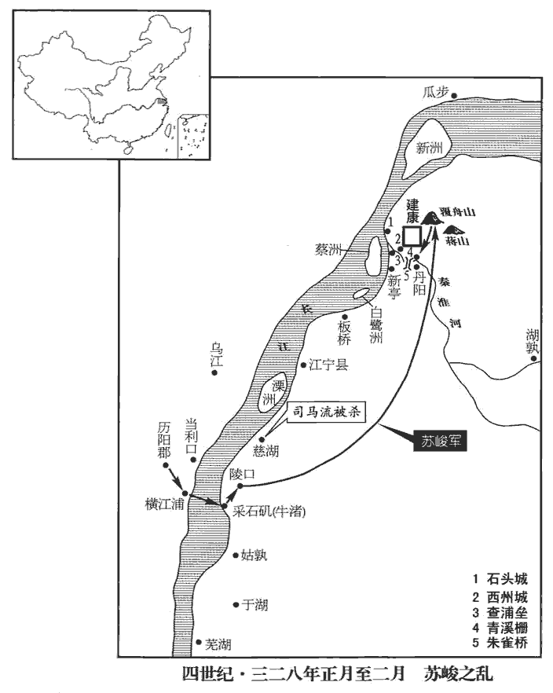
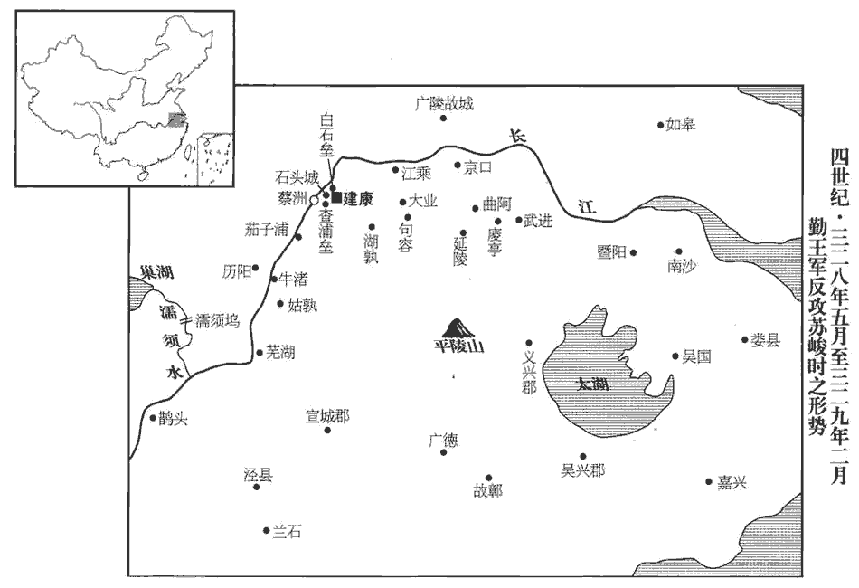
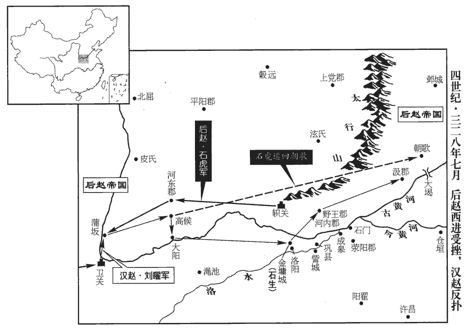
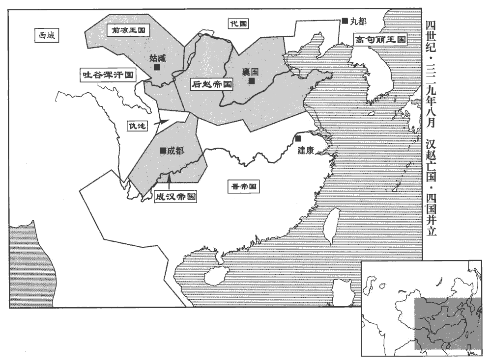

 晉紀十六起著雍困敦（戊子），盡重光單閼（辛卯），凡四年。

# 顯宗成皇帝上之下

## 咸和三年（戊子，三二八）

1春，正月，溫嶠入救建康，軍于尋陽‹江西九江›。自武昌東下，軍于尋陽。

〖译文〗 [1]春季，正月，温峤来救援建康，屯军寻阳。

韓晃襲司馬流於慈湖‹安徽马鞍山北慈湖峡›；流素懦怯，將戰，食炙不知口處，兵敗而死。炙，之夜翻，燔肉也。

〖译文〗 韩晃偷袭在慈湖的司马流，司马流素来怯懦，临战时吓得吃烤肉不知道往嘴里放，结果兵败身死。

丁未‹二十八›，蘇峻帥祖渙、許柳等眾二萬人，濟自橫江‹安徽省和县东南长江渡口›，登牛渚‹安徽省马鞍山市西南采石矶›，軍于陵口‹采石矶东北›。牛渚山，在今太平州當塗縣北三十里，山下有磯，津渡之處，與和州橫江渡相對。陵口，當在牛渚山東北，即東陵口也。帥，讀曰率。臺兵禦之，屢敗。二月，庚戌‹一›，峻至蔣陵覆舟山‹钟山西端支脉›。陵，阜也；蔣陵‹钟山南麓，孙权坟›，蔣山之阜也。覆舟山，形如覆舟，故名。陶回謂庾亮曰：「峻知石頭有重戍，不敢直下，必向小丹楊‹南京南›，南道步來；漢丹陽郡治宛陵縣；武帝太康二年，分丹陽置宣城郡，治宛陵，而丹陽移治建業。建業，本漢之秣陵也，吳改曰建業，晉復曰秣陵；至太康三年，分秣陵之水北為建業，後避愍帝諱，改曰建康。元帝南渡，建康置丹陽尹，治於臺城西，而丹楊太守舊治秣陵縣，俗謂之小丹楊。其路即今太平州取建康之路也。宜伏兵邀之，可一戰擒也。」亮不從。峻果自小丹楊來，迷失道，夜行，無復部分。分，扶問翻。亮聞，乃悔之。

〖译文〗 丁未（二十八日），苏峻带领祖涣、许柳等士众二万人，渡过横江，登上牛渚，屯军于陵口。朝廷军队抵抗屡败。二月，庚戌（初一），苏峻到达蒋陵的覆丹山。陶回对庾亮说：“苏峻知道石头有重兵戍守，不敢直接前来，必定从小丹杨南道徒步前来，应当埋伏兵众截击，可以一战擒获。”庾亮不听。苏峻果然从小丹杨前来，因迷路，夜间赶行，军队各部混乱。庾亮听说后才感后悔。

朝士以京邑危逼，朝，直遙翻。多遣家人入東避難，建康以吳、會稽為東。難，乃旦翻。左衛將軍劉超獨遷妻孥入居宮內。孥，音奴，子也。

〖译文〗 朝廷士人因京城危急紧迫，大多遣走家人向东避难，只有左卫将军刘超却把妻子儿女迁居宫内。

‹司马衍，本年八岁›詔以卞壼都督大桁東諸軍事，壼kǔn，苦本翻。桁，讀與航同。與侍中鍾雅帥郭默、趙胤等軍及峻戰于西陵‹蒋陵之西›。據壼傳，峻至東陵口，壼與戰於陵西，成帝紀作「西陵」。壼等大敗，死傷以千數。丙辰‹七›，峻攻青溪柵‹南京东南›；卞壼率諸軍拒擊，不能禁。峻因風縱火，燒臺省及諸營寺署，一時蕩盡。杜佑曰：宋、齊有三臺、五省之號。三臺，蓋兩漢舊名；五省，謂尚書、中書、門下、祕書、集書省也。壼背癰新愈，創猶未合，創，初良翻。力疾帥左右苦戰而死‹年四十八岁›；二子眕zhěn、盱xū隨父後，亦赴敌而死。其母撫尸哭曰：「父為忠臣，子為孝子，夫何恨乎！」眕，之忍翻。盱，凶于翻。夫，音扶。

〖译文〗 朝廷下诏让卞壶都督大桁以东军事事务，与侍中钟雅率领郭默、赵胤等人的军队与苏峻在西陵交战。卞壶等人大败，死伤数以千计。丙辰（初七），苏峻进攻青溪栅，卞壶率领各路部队拒敌，无法阻止其攻势。苏峻乘风势纵火，烧毁朝廷的台省及诸营寺官署，一时间荡然无存。卞壶背部的痈肿刚好，伤口尚未愈合，支撑着身体率领左右侍卫苦战至死，两个儿子卞和卞盱跟随在父亲身后，也赴敌战死。他们的母亲抚摸着尸体痛哭说：“父亲是忠臣，儿子是孝子，还有什么遗憾呢！”

丹楊尹羊曼勒兵守雲龍門，與黃門侍郎周導、廬江‹安徽省舒城县›太守陶瞻皆戰死‹羊曼年五十五岁›。庾亮帥眾將陳于宣陽門內，帥，讀曰率。陳，讀曰陣。未及成列，士眾皆棄甲走，亮與弟懌yì、條、翼及郭默、趙胤俱奔尋陽‹江西九江›。依溫嶠也。將行，顧謂鍾雅曰：「後事深以相委。」雅曰：「棟折榱cuī崩，誰之咎也！」折，而設翻。榱，所追翻。秦曰屋椽，齊魯曰桷jué，周曰榱。亮曰：「今日之事，不容復言。」復，扶又翻。亮乘小船，亂兵相剥掠；亮左右射賊，誤中柂duò工，應弦而倒。柂duò，待可翻。柂以正船，柂工，一船之司命也。射，而亦翻。中，竹仲翻。船上咸失色欲散，亮不動，徐曰：「此手何可使著賊！」言射不能殺賊而反射殺柂工，自恨之辭也。著，直略翻。眾乃安。

〖译文〗 丹杨尹羊曼领兵戍守云龙门，和黄门侍郎周导、庐江太守陶瞻都战死。庾亮帅士众准备在宣阳门内结阵，还没来得及排成队列，士众都弃甲逃跑，庾亮和兄弟庾怿、庾条、庾翼及敦默、赵胤都逃奔寻阳。临走时回头对钟雅说：“以后的事情深深拜托了。”钟雅说：“户梁折断，屋椽崩毁，这是谁的过失呢！”庾亮说：“今天此事，不容再说。”庾亮乘坐小船，乱兵竞相掠夺抢劫，庾亮的左右侍从用箭射敌，结果误中船上舵手，应声倒仆。船上人都大惊失色，准备逃散。庾亮安坐不动，缓缓地说：“这种手法怎么能让他射中寇贼呢！”大家这才安定。

 

峻兵入臺城，司徒導謂侍中褚翜shà曰：「至尊當御正殿，君可啟令速出。」翜即入上閤，躬自抱帝登太極前殿；翜，所甲翻。導及光祿大夫陸曄、荀崧、尚書張闓kǎi共登御床，擁衛帝。闓，苦亥翻，又音開。以劉超為右衛將軍，晉志：文帝初置中衛及衛將軍，武帝受命，分為左、右衛，以羊琇為左，趙序為右。使與鍾雅、褚翜侍立左右，太常孔愉朝服守宗廟。朝，直遙翻。時百官奔散，殿省蕭然。峻兵既入，叱褚翜令下。翜正立不動，呵之曰：「蘇冠軍來覲至尊，峻先以討沈充功進冠軍將軍，故稱之。冠，古玩翻。軍人豈得侵逼！」由是峻兵不敢上殿，上，時掌翻。突入後宮，宮人及太后左右侍人皆見掠奪。峻兵驅役百官，光祿勲王彬等皆被捶撻tà，捶，止橤翻。令負擔登蔣山。擔，都藍翻，又徒濫翻。蔣山，即鍾山，在今上元縣東北十八里。輿地志曰：古曰金陵山，縣名因此；又名蔣山，漢末，秣陵尉蔣子文討賊，戰死于此，吳太帝為立廟，子文祖諱鍾，因改曰蔣山。余謂孫權祖亦諱鍾，當因是改也。裸剝士女，裸，魯果翻。皆以壞席苫草自鄣，無草者坐地以土自覆；哀號之聲，震動內外。苫shān，詩廉翻。覆，敷救翻；下同。號，戶刀翻。

〖译文〗 苏峻的军队进入台城，司徒王导对侍中褚说：“皇上应当在正殿，你可发令让他急速出来。”褚立即进入内室，亲自抱着成帝登上太极前殿。王导及光禄大夫陆晔、荀崧、尚书张一同登上御床，护卫成帝。任刘超为右卫将军，让他和钟雅、褚侍立在左右，太常孔愉则穿着朝服守护宗庙。当时百官逃奔离散，宫殿、朝省悄然无声。苏峻的兵众进来后，叱令褚让他退开。褚正立不动，呵斥他们说：“苏峻来觐见皇上，军人岂能侵犯逼近！”因此苏峻的士兵不敢上殿，冲进后宫，宫女及太后的左右侍人都被掠夺。苏峻的士兵驱赶百官服劳役，光禄勋王彬等都被棍捶鞭挞，命令他们担着担子登蒋山。又剥光成年男女的衣物，这些人都用破席或苫草自相遮掩，没有草席的人就坐在地上用土把自己身体盖住，哀哭号叫的声音，震荡于京城内外。

初，姑孰‹安徽当涂›既陷，尚書左丞孔坦謂人曰：「觀峻之勢，必破臺城，自非戰士，不須戎服。」及臺城陷，戎服者多死，白衣者無他。

〖译文〗 当初，姑孰被攻陷之后，尚书左丞孔坦对人说：“看苏峻的势头，必定会攻破台城，我从来不是士兵，不需要军服。”等到台城被攻陷，穿军服的人大多死亡，不着军服者倒没什么。

時官有布二十萬匹，金銀五千斤，錢億萬，絹數萬匹，他物稱是，言他物與布金銀錢絹相稱也。稱，尺證翻。峻盡費之；太官惟有燒餘米數石以供御膳。

〖译文〗 当时官府拥有布匹二十万匹，金银五千斤，钱亿万，绢数万匹，其他物品价值与此相当，苏峻尽数耗费光，掌管皇帝饮食的太官只有用大火烧剩下的数石粮米，以供成帝御膳。

或謂鍾雅曰：「君性亮直，必不容於寇讎，盍早為之計！」雅曰：「國亂不能匡，君危不能濟，各遁逃以求免，何以為臣！」

〖译文〗 有人对钟雅说：“你禀性诚信坦直，必定不被寇仇所容，何不早作打算。”钟雅说：“国家的祸乱不能匡正，君王的危殆不能挽救，各自遁逃以求免祸，这还怎么当人臣呢！”

丁巳‹八›，峻稱詔大赦，惟庾亮兄弟不在原例。不在見赦之例。以王導有德望，猶使以本官居己之右。祖約為侍中、太尉、尚書令，峻自為驃騎將軍、錄尚書事，驃，匹妙翻。許柳為丹楊尹，馬雄為左衛將軍，祖渙為驍騎將軍。驍，堅堯翻。弋陽王羕詣峻，稱述峻功，峻復以羕為西陽王、太宰、錄尚書事。羕降爵見上卷咸和元年。羕，余亮翻。

〖译文〗 丁巳（初八），苏峻矫称诏令大赦天下，惟有庾亮兄弟不在赦免之列。认为王导素有德行和名望，还让他保持原职，位居自己之上。祖约任侍中、太尉、尚书令，苏峻自任骠骑将军、录尚书事，许柳任丹杨尹，马雄任左卫将军，祖涣任骁骑将军。弋阳王司马拜见苏峻，称述苏峻的功德，苏峻又让司马当西阳王、太宰、录尚书事。

峻遣兵攻吳國‹苏州›內史庾冰，冰不能禦，棄郡奔會稽‹绍兴›，時以吳郡為吳國，太守為內史。會，工外翻。至浙江，峻購之甚急。吳鈴下卒引冰入船，以蘧qú蒢chú覆之，吟嘯鼓枻yì，泝流而去。蘧，求於翻。蒢，陳如翻。說文曰：蘧篨，竹席也。余謂從「艸」者，今蘆䕠fèi也。枻，以制翻。楫謂之枻，泝，蘇故翻。逆流曰泝。每逢邏所，邏所，謂津要置邏卒之所。邏，郎佐翻。輒以杖叩船曰：「何處覓庾冰，庾冰正在此。」人以為醉，不疑之，冰僅免。峻以侍中蔡謨為吳國內史。

〖译文〗 苏峻派兵进攻吴国内史庾冰，庾冰抵挡不住，放弃郡国逃奔会稽。到浙江时，苏峻重赏搜捕他，十分急迫。吴国的侍从、门卒带领庾冰进船，把他用芦席覆盖起来，呤啸着摇动船浆，逆流而上。每逢遇到巡查哨所，就用杖叩击船身说：“何处寻觅庾冰？庾冰就在这里。”众人认为他喝醉了，毫不怀疑，庾冰因此幸免。苏峻让侍中蔡谟出任吴国内史。

溫嶠聞建康不守，號慟；號，戶刀翻。人有候之者，悲哭相對。庾亮至尋陽‹江西九江›，宣太后詔，以嶠為驃騎將軍、開府儀同三司，又加徐州刺史郗鑒‹时驻淮阴江苏省淮阴市›司空。郗，丑之翻。嶠曰：「今日當以滅賊為急，未有功而先拜官，將何以示天下！」遂不受。嶠素重亮，亮雖奔敗，嶠愈推奉之，分兵給亮。

〖译文〗 温峤听说建康失守，号啕痛哭。有人前往探问，也是相对悲泣。庾亮到寻阳后宣谕太后诏令，任温峤为骠骑将军、开府仪同三司，又授予徐州刺史郗鉴为司空。温峤说：“今天应当首先翦灭叛贼，尚未建功却先授官，还怎么示范天下！”于是推辞不接受，温峤素来看重庾亮，庾亮虽然战败奔逃，温峤却更加推重奉承他，分出部分兵力交给庾亮。

2後趙‹都襄国河北省邢台市›大赦，改元太和。考異曰：晉春秋云：勒即帝位，改元太和。按：勒建平元年始即帝位，今從勒載記。

〖译文〗 [2]后赵实行大赦，改年号为太和。

3三月，丙子，庾太后‹庾文君›以憂崩‹年三十二岁›。

〖译文〗 [3]三月，丙子（疑误），庾太后因忧愁驾崩。

4蘇峻南屯于湖‹安徽当涂南›。

〖译文〗 [4]苏峻向南屯兵于湖。

5夏，四月，後趙將石堪攻宛‹河南南阳›，南陽太守王國降之；宛，於元翻。降，戶江翻。遂進攻祖約軍于淮上。約將陳光起兵攻約，約左右閻禿，貌類約，禿，吐谷翻。光謂為約而擒之，約踰垣獲免。光奔後趙。

〖译文〗 [5]夏季，四月，后赵将领石堪攻宛，南阳太守王国投降；石堪随即进攻驻于淮水岸边的祖约。祖约部将陈光发兵攻击祖约，祖约的侍从闫秃，相貌与祖约相像，陈光以为是祖约，把他擒获，祖约越墙逃脱。陈光逃奔后赵。

6壬申‹二十四›,葬明穆皇后‹庾文君›于武平陵。

〖译文〗 [6]壬申（二十四日），明穆皇后入葬武平陵。

7庾亮、溫嶠將起兵討蘇峻，而道路斷絕，不知建康聲聞。聞，音問。會南陽范汪至尋陽‹江西九江›，言「峻政令不壹，貪暴縱橫，橫，戶孟翻。滅亡已兆，雖強易弱，易，以豉翻。朝廷有倒懸之急，宜時進討。」嶠深納之。亮辟汪參護軍事。

〖译文〗 [7]庾亮、温峤准备起兵讨伐苏峻，但道路阻断，不知道建康的消息。适逢南阳人范汪到寻阳，说：“苏峻政令混乱不一，贪婪强暴，肆无忌惮，已显现出灭亡的征兆，虽然暂时强大，但很容易转化为弱小，朝廷到了千钧一发的危急时刻，应当及时进攻讨伐。”温峤深以为然。庾亮征召范汪为参护军事。

亮、嶠互相推為盟主；嶠從弟充曰：從，才用翻。考異曰：晉春秋作「從兄」，今從晉書嶠傳。「陶征西位重兵強，侃時為征西大將軍、都督荊、湘、雍、梁，專制上流。宜共推之。」嶠乃遣督護王愆期詣荊州，邀陶侃與之同赴國難。難，乃旦翻；下同。侃猶以不豫顧命為恨，事見上卷咸和元年。答曰：「吾疆埸外將，不敢越局。」謂內輔外禦，各有局分，不敢踰越也。將，即亮翻。嶠屢說，不能回；說，輸芮翻。乃順侃意，遣使謂之曰：「仁公且守，漢、魏以來，率呼宰輔、岳牧為明公；今嶠呼侃為仁公，蓋取天下歸仁之義，言晉之征鎮皆歸重於侃也。使，疏吏翻；下同。僕當先下。」使者去已二日，平南參軍滎陽‹河南滎陽›毛寶嶠為平南將軍，以寶為參軍。別使還，聞之，還，從宣翻，又如字。說嶠曰：「凡舉大事，當與天下共之。師克在和，不宜異同。左傳：楚鬬廉曰：師克在和，不在眾也。假令可疑，猶當外示不覺，況自為攜貳邪！宜急追信改書，信，即使也。言必應俱進；若不及前信，當更遣使。」嶠意悟，即追使者改書；侃果許之，遣督護龔登帥兵詣嶠。帥，讀曰率。嶠有眾七千，於是列上尚書，以侃為盟主，與亮、嶠列名上之尚書也。上，時掌翻。陳祖約、蘇峻罪狀，移告征鎮，灑泣登舟。

〖译文〗 庾亮、温峤相互推举对方为盟主，温峤的堂弟温充说：“陶侃职位重要，兵力强盛，应当共同推举他为盟主。”温峤便派遣督护王愆期到荆州，邀请陶侃和自己同赴国难。陶侃仍然因为未能参与接受遗诏怀恨在心，回答说：“我是守戍边疆的将领，不敢逾越职分。”温峤多次劝说，不能使他回心转意。温峤于是顺应陶侃的心意，派使者对他说：“仁公暂且按兵不动，我当先行进讨。”使者出发已有两天，平南参军荥阳人毛宝出使别处归来，听说此事，劝说温峤说：“凡是干大事，应当和天下人共同参与。军队取胜在于和同，不应当有所别异。即使有可疑之处，尚且应当对外表现出无所察觉，何况是自己显露离心呢！应当急速追回信使改写书信，说明一定要相互应从，共同进发。如果赶不上先前的信使，应当重新派遣使者。”温峤心中醒悟，当即追回使者改写书信，陶侃果然应许，派督护龚登率军见温峤。温峤有士众七千人，于是列名上呈尚书，陈述祖约、苏峻的罪状，传告各地方长官，洒泪登上战船。

陶侃復追龔登還。嶠遺侃書曰：「夫軍有進而無退，可增而不可減。近已移檄遠近，言於盟府，盟府，謂侃府也；侃為盟主，故稱為盟府。復，扶又翻。遺，于季翻。刻後月半大舉，諸郡軍并在路次，惟須仁公軍至，便齊進耳。仁公今召軍還，疑惑遠近，成敗之由，將在於此。僕才輕任重，實憑仁公篤愛，遠稟成規；至於首啟戎行，行，戶剛翻。詩；元戎十乘，以先啟行。不敢有辭，僕與仁公，如首尾相衛，脣齒相依也。恐或者不達高旨，將謂仁公緩於討賊，此聲難追。僕與仁公并受方嶽之任，安危休戚，理既同之。且自頃之顧，綢繆往來，情深義重，綢，除留翻；繆，莫彪翻；纏綿也。一旦有急，亦望仁公悉眾見救，況社稷之難乎！今日之憂，豈惟僕一州，文武莫不翹企，言翹首企足以望侃兵之來。難，乃旦翻。假令此州不守，約、峻樹置官長於此，此，謂江州也。長，知兩翻。荊、楚西逼強胡，東接逆賊，因之以饑饉，將來之危，乃當甚於此州之今日也。仁公進當為大晉之忠臣，參桓、文之功；退當以慈父之情，雪愛子之痛。謂侃子瞻為峻所殺。今約、峻凶逆無道，痛感天地，人心齊壹，咸皆切齒。今之進討，若以石投卵耳；苟復召兵還，是為敗於幾成也。復，扶又翻。幾，居希翻。願深察所陳！」王愆期謂侃曰：「蘇峻，豺狼也，如得遂志，四海雖廣，公寧有容足之地乎！」侃深感悟，即戎服登舟。瞻喪至不臨，臨，力鴆翻。晝夜兼道而進。

〖译文〗 陶侃又召龚登回来。温峤给陶侃写信说：“军队能进不能退，能增多而不能减少。近来已经将檄文传播于远近，呈告您的盟府，约定下一次半月时分大举兴兵，各郡军队都已上路，只等您的军队到达，便一同进发了。您现在把军队召回，使远近之人感到疑惑，成败的根由便将决定于此。我才能浅薄却责任重大，实在需要凭仗您的厚爱，遥遵您的成规。至于说到率先启行充当先锋，我不敢有二话，我与您如同首尾相卫、唇齿相依。惟恐有人不理解您高深的意旨，将会认为您不急于讨伐叛贼，这种舆论一旦形成则难以弥补。我和您都担负着地方统帅的职责，安危休戚，按理应当共同承受。况且自从最近交往以来，来往频繁，情深义重，一旦有急难，也希望您率兵相救，何况是国家的危难呢！今天的忧患，岂只是我这一州，文武百官谁不对您企足翘首期待？假使此州保不住，祖约、苏峻在此设置官长，荆楚西部临近强大的胡寇，东部与叛贼相临，再加上连年饥馑，将来的危殆，就会远远超过此州的今天。您进，当会成为大晋的忠臣，与齐桓公、晋文公的功绩相匹；退，则应当以慈父的情爱，去雪爱子被杀的痛楚。如今祖约、苏峻凶逆无道，造成的罪孽震动天地，人心一致，都切齿痛恨。现在的进攻讨伐，犹如以石投卵罢了。倘若再召回军队，这是在几乎成功之时自己制造失败。期望能深切体察我所说的这一切。”王愆期对陶侃说：“苏峻是豺狼，如果让他得志，天下虽大，您难道能有立足之地吗！”陶侃深深感悟，当即穿上作战服装登船。儿子陶瞻的丧礼也不参加，日夜兼行赶来。

郗鑒在廣陵‹淮阴·江苏省淮阴市›，城孤糧少，逼近胡寇，近，其靳翻。人無固志。得詔書，即流涕誓眾，入赴國難，將士争奮。難，乃旦翻。將，即亮翻。遣將軍夏侯長等間行謂溫嶠曰：「或聞賊欲挾天子東入會稽‹绍兴›，當先立營壘，屯據要害，既防其越逸，又斷賊糧運，間，古莧翻。斷，丁管翻。然後清野堅壁以待賊。賊攻城不拔，野無所掠，東道既斷，糧運自絕，必自潰矣。」嶠深以為然。晉都建康，糧運皆仰三吳，故欲先斷東道。王敦、蘇峻之亂，匡復之謀，郗鑒為多。

〖译文〗 郗鉴在广陵，孤城缺粮，挨近胡寇，人心不稳。得到诏书后，当即流着眼泪誓师，来赴国难，将士们人人奋勇争先。郗鉴派将军夏侯长等微行前来对温峤说：“有人听说叛贼准备挟迫天子向东到会稽，应当事先设立营帐壁垒，占据要害之地，即可防止他逃逸，又能切断叛贼的粮食运输，然后再坚壁清野，坐待叛贼。叛贼攻城不能取胜，旷野又无所劫掠，东边的道路既然阻断，粮米输运自然断绝，必定不战自溃。”温峤认为很对。

五月，陶侃率眾至尋陽‹江西九江›。議者咸謂侃欲誅庾亮以謝天下；亮甚懼，用溫嶠計，詣侃拜謝。侃驚，止之曰：「庾元規乃拜陶士行邪！」陶侃，字士行。亮引咎自責，風止可觀，侃不覺釋然，曰：「君侯脩石頭以擬老子，見上卷咸和元年。今日反見求邪！」即與之談宴終日，遂與亮、嶠同趣建康。趣，七喻翻。戎卒四萬，旌旗七百餘里，鉦鼓之聲，震於遠近。

〖译文〗 五月，陶侃率领士众到达寻阳。论者都说陶侃准备诛杀庾亮向天下人谢罪，庾亮甚为恐惧，便采用温峤的计谋，去见陶侃叩拜谢罪。陶侃大吃一惊，制止他说：“庾元规竟然来叩拜我吗！”庾亮援引过错，自我责备，风度举止很不错，陶侃不知不觉放心开怀，说：“您当年缮修石头城来对付老夫，今天倒反来见我有所求吗！”随即和他谈笑宴饮一整天，便与庾亮、温峤一同赶赴建康。共有士卒四万人，旌旗延绵七百多里，钲鼓之声震动遐迩。

蘇峻聞西方兵起，用參軍賈寧計，自姑孰‹安徽当涂›還據石頭，分兵以拒侃等。

〖译文〗 苏峻听说西方起兵，采纳参军贾宁的计谋，从姑孰返回占据石头，分兵抗拒陶侃等人。

乙未‹十八›，峻逼遷帝於石頭，司徒導固爭，不從。帝哀泣升車，宮中慟哭。時天大雨，道路泥濘，濘，乃定翻，淖nào也。劉超、鍾雅步侍左右，峻給馬，不肯乘，而悲哀慷慨。峻聞而惡之，然未敢殺也。惡，烏路翻。以其親信許方等補司馬督、殿中監，外託宿衛，內實防禦超等。峻以倉屋為帝宮，日來帝前肆醜言。劉超、鍾雅與右光祿大夫荀崧、金紫光祿大夫華恆、左、右光祿大夫，金章紫綬；光祿大夫，銀章青綬；加金章紫綬者，謂之金紫光祿大夫。華，戶化翻。恆，戶登翻。尚書荀邃、侍中丁潭侍從，不離帝側。從，才用翻。離，力智翻。時饑饉米貴，峻問遺，超一無所受。繾qiǎn綣quǎn朝夕，遺，于季翻。繾，詰戰翻，又去演翻；綣，區願翻。繾綣，反覆不相離也。孔穎達曰：繾綣，牢固相著之意。左傳曰：繾綣從公，毋通內外。臣節愈恭；雖居幽厄之中，超猶啟帝，授孝經、論語。

〖译文〗 乙未（十八日），苏峻逼迫成帝迁居石头，司徒王导极力争辩，苏峻不听。成帝哀哭着登上车舆，宫中一片恸哭。当时天下大雨，道路泥泞，刘超、钟雅徒步侍从于左右，苏峻给他们马匹也不肯乘坐，悲哀慷慨。苏峻听说后憎恶于心，但没敢杀害。苏峻让亲信许方等人补任司马督、殿中监等职，对外说是宿卫，对内其实是防备刘超等人。苏峻用库房作为成帝宫室，每天在成帝面前大放厥词。刘超、钟雅和右光禄大夫荀崧、金紫光禄大夫华恒、尚书荀邃、侍中丁潭侍卫随从，不离成帝左右。当时因饥馑米价昂贵，苏峻赠送问慰，刘超纤毫不受。朝夕不离成帝身边，行臣子礼节愈加恭谨。虽然处于困厄之中，刘超仍然为成帝启蒙，讲授《孝经》和《论语》。

峻使左光祿大夫陸曄守留臺，逼迫居民，盡聚之後苑；使匡術守苑城。

〖译文〗 苏峻让左光禄大夫陆晔守卫禁城，逼迫居民全部聚居在后苑，让匡术据守苑城。

尚書左丞孔坦奔陶侃，侃以為長史。

〖译文〗 尚书左丞孔坦投奔陶侃，陶侃任他为长史。

初，蘇峻遣尚書張闓權督東軍，司徒導密令以太后詔諭三吳吏士，漢置吳郡；吳分吳郡置吳興郡；晉又分吳興、丹楊置義興郡，是為三吳。酈道元曰：世謂吳郡、吳興、會稽為三吳。杜佑曰：晉、宋之間，以吳郡、吳興、丹楊為三吳。使起義兵救天子。會稽‹绍兴›內史王舒以庾冰行奮武將軍，使將兵一萬，西渡浙江‹钱塘江›；將，即亮翻；下同。於是吳興太守虞潭、吳國‹苏州›內史蔡謨、前義興‹江苏宜兴›太守顧眾等皆舉兵應之。潭母孫氏謂潭曰：「汝當捨生取義，勿以吾老為累！」累，力瑞翻。盡遣其家僮從軍，鬻yù其環珮以為軍資。謨以庾冰當還舊任，即去郡以讓冰。

〖译文〗 当初，苏峻派尚书张暂时督察东部军事，司徒王导密令他用太后诏书谕示三吴的官吏士民，让他们发动义兵救天子。会稽内史王舒让庾冰任行奋武将军职，领兵一万人，向西渡过浙江，于是吴兴太守虞潭、吴国内史蔡谟、原义兴太守顾众等人都发兵响应。虞潭母亲孙氏对虞潭说：“你应当舍生取义，不要因我年老受拖累。”尽数遣送自己的家僮从军，典卖自己的耳环佩玉作为军资。蔡谟认为庾冰应当恢复吴国内史的旧职，便离开吴国，把职位让给庾冰。

蘇峻聞東方兵起，遣其將管商、張健、弘徽等拒之；虞潭等與戰，互有勝負，未能得前。

〖译文〗 苏峻听说东方起兵，派部将管商、张健、弘徽等拒敌。虞潭等人和他们交战，互有胜负，不能前进。

陶侃、溫嶠軍于茄子浦‹江苏江宁西南›；嶠以南兵習水，蘇峻兵便步，南兵，謂侃、嶠之兵。便步，謂便於步戰。令：「將士有上岸者死！」上，時掌翻。會峻送米萬斛饋祖約，約遣司馬桓撫等迎之。毛寶帥千人為嶠前鋒，帥，讀曰率；下同。告其眾曰：「兵法，『軍令有所不從』，豈可視賊可擊，不上岸擊之邪！」乃擅往襲撫，悉獲其米，斬獲萬計，約由是飢乏。嶠表寶為廬江‹安徽省舒城县›太守。

〖译文〗 陶侃、温峤屯军于茄子浦。温峤因南方士兵熟悉水战，而苏峻的士卒则以步战见长，便下令：“将士有上岸的处死！”适逢苏峻赠送粮米一万斛给祖约，祖约派司马桓抚等人相迎。毛宝率领一千人当温峤的先锋，告谕士兵说：“兵法说：‘军令有所不从’，怎能眼见可以攻击叛贼，却不上岸攻击呢！”于是擅自前往偷袭桓抚，尽数劫获粮米，斩首万人左右，祖约军队因此饥饿缺粮。温峤上表推荐毛宝任庐江太守。

陶侃表王舒監浙東軍事，虞潭監浙西軍事，監，工銜翻。郗鑒都督揚州八郡諸軍事；令舒、潭皆受鑒節度。鑒帥衆渡江，與侃等會于茄子浦‹江苏江宁西南›，類篇：茄，求加翻；菜名，子可食。茄葉似蒿hāo蓼liǎo葉而青，子熟於夏秋之間，大如秤錘，有紫色者，有白色者，及其熟也，色正黃。蓋其地宜茄子，人多於此樹藝，因以名浦。雍州刺史魏該亦以兵會之。雍，於用翻。

〖译文〗 陶侃表荐王舒监察浙东军事，虞潭监察浙西军事，郗鉴都督扬州八郡诸军事，令王舒、虞潭都听从郗鉴的调度。郗鉴率士兵渡过长江，与陶侃等在茄子浦会合。雍州刺史魏该也领兵相会。

丙辰‹二十九›，侃等舟師直指石頭，至于蔡洲‹石头城西南长江中小岛›；侃屯查浦‹秦淮河入长江处›，蔡洲，在石頭西岸；查浦，在大江南岸，直秦淮口。嶠屯沙門浦。峻登烽火樓，望見士眾之盛，有懼色，謂左右曰：「吾本知溫嶠能得眾也。

〖译文〗 丙辰（疑误），陶侃等人的水军直指石头，到达蔡州。陶侃屯军查浦，温峤屯军沙门浦。苏峻登上烽火楼，望见敌方士众之多，面有惧色，对左右侍从说：“我本来就知道温峤能得众心。”

庾亮遣督護王彰擊峻黨張曜，反為所敗。亮送節傳以謝侃。敗，補邁翻。傳，株戀翻。侃答曰：「古人三敗，謂魯將曹沬也。君侯始二；當今事急，不宜數爾。」言不宜數數如此。數，所角翻。亮司馬陳郡殷融詣侃謝曰：「將軍為此，非融等所裁。」王彰至曰：「彰自為之，將軍不知也。」侃曰：「昔殷融為君子，王彰為小人；今王彰為君子，殷融為小人。」

〖译文〗 庾亮派督护王彰突袭苏峻的门党张曜，反而被张曜击败。庾亮送去符节向陶侃谢罪，陶侃回答说：“古人曾三次遭败，您才有二次。不过当今形势急迫，不能次次这样。”庾亮的司马、陈郡人殷融去见陶侃谢罪说：“这是庾将军造成的，不是我们出的主意。”王彰来后则说：这是我自己造成的，庾将军不知道。”陶侃说：“过去殷融是君子，王彰是小人；现在王彰是君子，殷融则是小人了。”

 

宣城‹安徽省宣州市›內史桓彝，聞京城不守，慷慨流涕，進屯涇縣‹安徽涇縣›。彝自廣德‹安徽廣德›進屯涇縣。時州郡多遣使降蘇峻，使，疏吏翻。降，戶江翻。裨惠復勸彝宜且與通使，以紓交至之禍。紓，緩也。交至之禍，言州郡多降，峻兵將四合而交至也。復，扶又翻。彝曰：「吾受國厚恩，義在致死，焉能忍恥與逆臣通問！焉，於虔翻。如其不濟，此則命也。」彝遣將軍俞縱守蘭石，蘭石，在涇縣東北。峻遣其將韓晃攻之。縱將敗，左右勸縱退軍。縱曰：「吾受桓侯厚恩，當以死報。吾之不可負桓侯，猶桓侯之不負國也。」遂力戰而死。晃進軍攻彝，六月，城陷，執彝，殺之‹桓彝年五十三岁›。

〖译文〗 宣城内史桓彝听说京城失守，慷慨流泪，进军屯驻泾县。当时州郡大多派使者向苏峻投降，裨惠又劝桓彝，应当暂且与苏峻通使，以舒缓将会交至而来的灾祸。桓彝说：“我蒙受国家的重恩，按道义应当效死。怎能忍受耻辱和逆臣通使问慰！如果事情不能成功，这就是命了。”桓彝派将军俞纵驻守兰石，苏峻派部将韩晃攻击，俞纵将要战败，左右侍从劝俞纵退军。俞纵说：“我蒙受桓公厚恩，应当以死报答。我不能辜负桓公，犹如桓公不辜负国家。”于是力战而死。韩晃进军攻打桓彝，六月，城被攻破，桓彝被擒获，遇害。

諸軍初至石頭，即欲決戰，陶侃曰：「賊眾方盛，難與爭鋒，當以歲月，智計破之。」既而屢戰無功，監軍部將李根請築白石壘，是時同盟諸將無監軍事者，竊意李根蓋郗鑒軍部將也。前史既逸「郗」字，後人遂改「鑒」為「監」。白石壘，在石頭東北，峻極險固。杜佑曰：白石里，在臺城西，宋武帝大明四年為蠶所，置大殿於此。侃從之，夜，築壘，至曉而成。聞峻軍嚴聲，聞峻軍擊鼓嚴隊之聲。諸將咸懼其來攻。孔坦曰：「不然。若峻攻壘，必須東北風急，令我水軍不得往救；今天清靜，賊必不來。所以嚴者，必遣軍出江乘‹南京市东北›，掠京口‹江苏镇江›以東矣。」已而果然。侃使庾亮以二千人守白石，峻帥步騎萬餘四面攻之，不克。帥，讀曰率。

〖译文〗 各路军队刚到石头，就想和苏峻决战。陶侃说：“叛贼气势正盛，难以与之争锋。应当待以时日，用智谋战败他。”此后，多次交战无所建树，监军部将李根请求修筑白石垒，获陶侃同意后，连夜筑垒，至天明即成。传来苏峻军队击鼓整队的声音，众将都惧怕他们前来攻击。孔坦说：“不会。如果苏峻进攻白石垒，必须等待东北风大，使我方水军无法来救。今天天晴无风，贼寇必定不来。他们之所以整队，一定是派军队由江乘出击，攻掠京口以东地区。”结果果真如此。陶侃派庾亮率二千人据守白石，苏峻率步兵、骑兵一万多人四面围攻，未能攻克。

王舒、虞潭等數與峻兵戰，不利。數，所角翻。孔坦曰：「本不須召郗公，遂使東門無限，今宜遣還，雖晚，猶勝不也。」言雖遣還之晚，猶勝不遣還也。侃乃令鑒與後將軍郭默還據京口‹江苏镇江›，立大業‹江苏句容北›、曲阿‹江苏丹阳›、庱chěng亭‹江苏常州市西北›三壘以分峻之兵勢，曲阿，秦雲陽縣也，前漢屬會稽郡，後漢屬吳郡，晉屬毗陵郡。大業，里名，在曲阿北。丁度曰：庱亭，在吳興。庱chěng，丑升翻。裴松之曰：庱，攄陵翻。使郭默守大業‹江苏句容北›。

〖译文〗 王舒、虞潭等多次与苏峻军队接战失利，孔坦说：“本来不必要召来郗鉴，结果使东门失去防卫。现在应当派遣他回军，虽然晚点，还是胜过不去。”陶侃便令郗鉴和后将军郭默回军占据京口，建立大业、曲阿、亭三座壁垒，使苏峻兵力分散。让敦默据守大业。

壬辰‹十五›，魏該卒。

〖译文〗 壬辰（十五日），魏该去世。

祖約遣祖渙、桓撫襲湓pén口‹江西九江西›；湓口，在尋陽，今江州德化縣西一里有湓浦。陶侃聞之，將自擊之。毛寶曰：「義軍恃公，公不可動，寶請討之。」侃從之。渙、撫過皖‹安徽潜山›，因攻譙國內史桓宣。宣時屯皖縣馬頭山。皖，戶版翻。寶往救之，為渙、撫所敗。敗，補邁翻。箭貫寶髀bì，徹鞍，徹，敕列翻。寶使人蹋鞍拔箭，血流滿鞾。鞾xuē，許戈翻。還擊煥、撫，破走之，宣乃得出，歸于溫嶠。寶進攻祖約軍于東關‹濡须坞，安徽含山西南›，拔合肥戍；會嶠召之，復歸石頭。

〖译文〗 祖约派祖涣、桓抚偷袭湓口，陶侃听说后，准备亲自领军回击。毛宝说：“义军恃仗您领导，您不能出动，我请求去征讨。”陶侃同意了。祖涣、桓抚经过皖，顺势攻击谯国内史桓宣。毛宝前往救援，被祖涣、桓抚打败。敌箭射穿毛宝髀骨，插在马鞍上，毛宝让人用脚踏住马鞍拔箭，血流满靴。毛宝回头攻击祖涣、桓抚，把他们打败逃跑，桓宣这才得以脱困，归依温峤。毛宝攻击在东关的祖约军队，攻取合肥戍。适逢温峤召请他，又回归石头。

祖約諸將陰與後趙通謀，許為內應。後趙將石聰、石堪引兵濟淮，攻壽春。秋，七月，約眾潰，奔歷陽‹安徽和县›，聰等虜壽春二萬餘戶而歸。

〖译文〗 祖约手下诸位将领私下与后赵勾结，许诺充当内应。后赵将领石聪、石堪领兵渡过淮水，进攻寿春。秋季，七月，祖约的士众溃逃，投奔历阳。石聪等掳掠寿春民众二万多户返回。

8後趙中山公虎、帥眾四萬自軹zhǐ關‹河南济源西›西入，擊趙河東‹山西夏县›，軹關，在河內軹縣。帥，讀曰率。應之者五十餘縣，遂進攻蒲阪‹山西永济›。趙主曜遣河間王述發氐、羌之眾屯秦州‹府设上邽，甘肃天水›以備張駿、楊難敵，自將中外精銳水陸諸軍以救蒲阪，自衛關‹陕西潼关›北濟；晉書地理志，汲郡汲縣有衛關。虎懼，引退。曜追之，八月，及於高候‹山西省闻喜县北›；杜佑曰：今絳州聞喜縣北有高候原。與虎戰，大破之，斬石瞻，枕尸二百餘里，枕，職鴆翻。收其資仗億計。虎奔朝歌‹河南淇县›。杜佑曰：衛州衛縣，漢朝歌縣。紂都朝歌，在今縣西。曜濟自大陽‹山西平陆›，大陽屬河東郡。應劭曰：在大河之陽，故曰大陽。唐志，陝州陝縣有大陽故關，春秋之茅津也。攻石生于金墉，決千金堨‹洛阳城西›以灌之。堨è，烏葛翻。分遣諸將攻汲郡、河內‹河南沁阳›，後趙滎陽太守尹矩、野王‹河南沁阳›太守張進等皆降之。野王縣自漢以來屬河內郡，後趙始置郡也。降，戶江翻。襄國‹河北邢台›大震。

〖译文〗 [8]后赵中山公石虎率士众四万人从轵关西进，攻击前赵的河东，有五十多个县应从，石虎于是进攻蒲阪。前赵主刘曜派河间王刘述调遣氐族、羌族士众屯驻在秦州，防备张骏和杨难敌，自己率领中外精锐的水、陆各军救援蒲阪，从卫关北渡黄河。石虎畏惧，率军退走，刘曜追击。八月，在高候追上石虎，与石虎交战，石虎大败，石瞻被杀，尸体枕籍达二百多里，刘曜缴获的军资上亿。石虎逃奔朝歌。刘曜从大阳渡过黄河，攻击驻守金墉的石生，开决千金的蓄水淹灌他们，又分别派遣诸将进攻汲郡、河内，后赵的荥阳太守尹矩、野王太守张进等都归降刘曜。襄国大为震惊。

9張駿‹本年二十二岁›治兵，欲乘虛襲長安。理曹郎中索詢諫曰：理曹郎中，張氏所置，以掌刑獄。索，昔各翻。「劉曜雖東征，其子胤守長安，未易輕也。易，以豉翻；下同。借使小有所獲，彼若釋東方之圖，還與我校；禍難之期未可量也。」難，乃旦翻。量，音良。駿乃止。

〖译文〗 [9]张骏整备军队，想乘虚偷袭长安。理曹郎中索询劝谏说：“刘曜虽然东征，他儿子刘胤防守长安，不能轻视。即使小有所获，但如果刘曜放弃对东方的图谋，回军与我方较量，祸难临头的时候就难以预测了。”张骏这才罢休。

10蘇峻腹心路永、匡術、賈寧聞祖約敗，恐事不濟，勸峻盡誅司徒導等諸大臣，更樹腹心；更，工衡翻。峻雅敬導，不許。永等更貳於峻，貳者，其心攜而兩向。導使參軍袁耽潛誘永使歸順，誘，音酉。九月，戊申‹三›，導攜二子與永皆奔白石。耽，渙之曾孫也。袁渙事曹操。

〖译文〗 [10]苏峻的心腹路永、匡术、贾宁听说祖约败绩，惟恐事情不能成功，劝苏峻尽数杀死司徒王导等各位大臣，另外安置自己的心腹。但苏峻素来敬重王导，不同意杀害他，路永等人便对苏峻怀有二心。王导让参军袁耽私下引诱路永，让他归顺朝廷。九月，戊申（初三），王导携同两个儿子和路永一同逃奔白石垒。袁耽即袁涣的曾孙。

陶侃、溫嶠等與蘇峻久相持不決，峻分遣諸將東西攻掠，所嚮多捷，人情恟懼。恟，許拱翻。朝士之奔西軍者皆曰：「峻狡黠xiá有膽決，其徒驍勇，所向無敵。朝，直遙翻。黠，下八翻。驍，堅堯翻。若天討有罪，則峻終滅亡；止以人事言之，未易除也。」溫嶠怒曰：「諸君怯懦，乃更譽賊！」譽，羊諸翻，稱揚之也。及累戰不勝，嶠亦憚之。

〖译文〗 陶侃、温峤等人与苏峻长久相持不下，苏峻分别派遣多员将领向东、向西攻伐劫掠，多所获胜，一时人心恐惧不宁。朝廷士人逃到西军的都说：“苏峻狡黠而有胆识，士卒骁勇，所向无敌。倘若上天能讨伐有罪之人，那么他终将灭亡。如果只从人事方面来说，则不易翦除。”温峤发怒说：“这是你们自己怯懦，却去称颂叛贼！”等到多次交战不胜，温峤也心有忌惮。

 

嶠軍食盡，貸於陶侃。貸，他代翻，借也。侃怒曰：「使君前云不憂無良將及兵食，惟欲得老僕為主耳。今數戰皆北，良將安在！荊州接胡、蜀二虜，當備不虞；若復無食，復，扶又翻。僕便欲西歸，更思良算，徐來殄賊，不為晚也。」嶠曰：「凡師克在和，古之善教也。光武之濟昆陽，見三十九卷漢淮陽王更始元年。曹公之拔官渡，見六十三卷漢獻帝建安五年。以寡敵眾，杖義故也。峻、約小豎，凶逆滔天，何憂不滅！峻驟勝而驕，自謂無前，今挑之戰，挑，徒了翻。可一鼓而擒也。柰何捨垂立之功，設進退之計乎！且天子幽逼，社稷危殆，乃四海臣子肝腦塗地之日。嶠等與公并受國恩，事若克濟，則臣主同祚；如其不捷，當灰身以謝先帝耳。今之事勢，義無旋踵，譬如騎虎，安可中下哉！公若違眾獨返，人心必沮；沮眾敗事，義旗將迴指於公矣。」溫嶠辭嚴義正，所以能留陶侃，共成大功。沮，在呂翻。敗，補邁翻。毛寶言於嶠曰：「下官能留陶公。」乃往說侃曰：說，輸芮翻。「公本應鎮蕪湖，為南北勢援，前既已下，勢不可還。且軍政有進無退，非直整齊三軍，示眾必死而已，亦謂退無所據，終至滅亡。往者杜弢非不強盛，公竟滅之，見八十九卷愍帝建興三年。弢，土刀翻。何至於峻，獨不可破邪！賊亦畏死，非皆勇健，公可試與寶兵，使上岸斷賊資糧；上，時掌翻。斷，丁管翻。若寶不立效，然後公去，人心不恨矣。」侃然之，加寶督護而遣之。竟陵‹湖北钟祥›太守李陽說侃曰：惠帝元康九年，分江夏西界立竟陵郡。「今大事若不濟，公雖有粟，安得而食諸！」侃乃分米五萬石以餉嶠軍。毛寶燒峻句容‹江苏句容›、湖孰‹江苏江宁东南湖孰镇›積聚，句容、湖孰二縣，屬丹楊郡。峻軍乏食，侃遂留不去。

〖译文〗 温峤的军队粮尽，向陶侃借粮。陶侃发怒说：“你过去说不愁没有良将和军粮，只是想让我出任盟主罢了。如今数战皆败，良将在哪里！荆州与胡夷、蜀汉二敌接壤，应当对突发之事有所防备，如果再无军粮，我就想西归，重新考虑更好的办法，慢慢再来除灭叛贼，也不算晚。”温峤说：“凡是军队取胜，贵在协同，这是古人的成功经验。汉光武帝横渡昆阳，曹操官渡取胜，以寡敌众，是因为凭仗道义的力量。苏峻、祖约这种小子，凶逆的罪行滔天，何愁不灭！苏峻因屡次取胜而骄傲，自认为所向无敌，现今向他挑战，便可一鼓作气将他擒获，怎么能放弃马上便可获得的成功，作退却的打算呢！况且天子遭到幽禁、逼迫，国家危殆，这正是天下的臣子们肝脑涂地以图报效的时候。我们和您都蒙受国家的恩惠，事情如果能成功，便可君臣同享国家的福运；如不能获胜，则应当粉身碎骨以报答先帝。当今之事，已经义无反顾，犹如骑虎，怎能中途跳下呢！您如果违背众人心愿独自返回，人心必定沮丧，人心沮丧必败，那时义军的大旗将回过头来指向您了。”毛宝对温峤说：“我能让陶公留下”，于是去劝陶侃说：“您本应镇守芜湖，作为南北军队的后援，先前既然已经来此，按情势就不能回头。何况军事规则有进无退，不只是说整肃三军，向士众显示必死的信念，也是说后退无所仰仗，终将至于灭亡。过去杜并非不强盛，您最终将他翦灭，怎么到了苏峻头上，偏偏不能战胜他呢！叛贼也是怕死的，并非个个勇健，您可以试着交给我一些士兵，让我上岸去断绝叛贼的军资口粮，如果我不能建立战功，然后您再离开，众人心中便不会遗憾了。”陶侃答应了他，授予毛宝督护，派他前去。竟陵太守李阳劝说陶侃道：“现在如果大事不成功，您虽有粮米，怎能吃得上呢！”陶侃便发出五万石粮米赠送给温峤军队。毛宝烧毁苏峻在句容、湖孰的军备积蓄，苏峻军队缺粮，陶侃便留下未离开。

張健、韓晃等急攻大業‹江苏句容北›；壘中乏水，人飲糞汁。郭默懼，潛突圍出外，留兵守之；郗鑒在京口‹江苏镇江›，軍士聞之皆失色。參軍曹納曰：「大業，京口之扞蔽也，一旦不守，則賊兵徑至，不可當也。請還廣陵‹淮阴·江苏省淮阴市›，以俟後舉。」鑒大會僚佐，責納曰：「吾受先帝顧託之重，正復捐軀九泉，不足報塞。復，扶又翻。塞，悉則翻。今強寇在近，眾心危逼，君腹心之佐，而生長異端，長，丁丈翻，今，知兩翻。當何以帥先義眾，鎮壹三軍邪！」帥，讀曰率；下同。將斬之，久乃得釋。

〖译文〗 张健、韩晃等猛攻大业，壁垒中缺水，众人饮用粪水。郭默恐惧，悄悄突围而出，留下士兵据守。郗鉴在京口，军士们听说后都吃惊失色。参军曹纳说：“大业是京口的屏障，一旦失守，那么贼兵便可直接到此，无法阻挡。请求退回广陵，以待后举。”郗鉴大会僚属佐吏，斥责曹纳说：“我禀受先帝顾命托孤的重任，正思即使捐躯于九泉之下，也不足为报。如今强寇在旁，众心危惧紧张，你是我的心腹佐吏，却滋生异端，我还怎么统帅，引导义士，镇摄号令三军呢！”郗鉴准备将曹纳斩首，许久才释免。

陶侃將救大業‹江苏句容北›，長史殷羨曰：「吾兵不習步戰，救大業而不捷，則大事去矣。不如急攻石頭，則大業自解。」謂急攻蘇峻，健、晃必還救之，大業之兵自解。侃從之。羨，融之兄也。庚午‹二十五›，侃督水軍向石頭。庾亮、溫嶠、趙胤帥步兵萬人從白石南上，欲挑戰。峻將八千人逆戰，上，時掌翻。挑，徒了翻。將，即亮翻；下同。遣其子碩及其將匡孝分兵先薄趙胤軍，敗之。薄，迫也。敗，補邁翻。峻方勞其將士，勞，力到翻。乘醉望見胤走，曰：「孝能破賊，我更不如邪！」因舍其眾，舍，讀曰捨。與數騎北下突陳，不得入，陳，讀曰陣。將回趨白木陂‹石头山麓›；馬躓，躓，陟利翻，跲jié也。白木陂，在東陵東。趨，七喻翻；下兵趨同。侃部將彭世、李千等投之以矛，峻墜馬，斬首臠割之，焚其骨，三軍皆稱萬歲。餘眾大潰。一鼓禽峻，果如溫嶠之言。峻司馬任讓等共立峻弟逸為主，閉城自守。任，音壬。溫嶠乃立行臺，布告遠近，凡故吏二千石以下，皆令赴臺；於是至者雲集。韓晃聞峻死，引兵趣石頭。管商、弘徽攻庱chěng亭壘‹江苏省常州市西北›，督護李閎、輕車長史滕含擊破之。輕車長史，輕車將軍長史也。含，脩之孫也。商走詣庾亮降，降，戶江翻。餘眾皆歸張健。

〖译文〗 陶侃准备救援大业，长史殷羡说：“我方士兵不熟悉陆战，如果救援大业不能取胜，那么大事便完了。不如猛攻石头，那么大业之围自然会解除。”陶听从了他的建议。殷羡即殷融的兄长。庚午（二十六日），陶侃督领水军开赴石头。庾亮、温峤、赵胤率领步兵万人从白石垒向南，准备挑战。苏峻统帅八千人迎战，派儿子苏硕和部将匡孝分军先行逼近赵胤军队，将其打败。苏峻当时正在犒劳将士，乘着醉意远远望见赵胤败逃，说：“匡孝能败敌，我反倒不如他吗！”于是撇下士众，和数名骑兵向北突击敌阵，但无法突破，准备回身奔向白木陂时，坐骑失足颠踬，陶侃的部将彭世、李千等用矛投射，苏峻坠落马下，被斩首，剐割肢体，骨骸被焚烧，三军将士都高呼万岁。苏峻余部大败。苏峻的司马任让等人共同推立苏峻兄弟苏逸为主公，关闭城门自守。温峤便没立行台，宣告晓谕远近，凡是朝廷原任官吏爵禄在二千石以下的，都传令他们赶赴行台报到，于是到达的人有如云集。韩晃听说苏峻已死，领兵奔赴石头。管商、弘徽攻打亭壁垒，被督护李闳、轻车长史滕含击败。滕含即滕的孙子。管商逃奔到庾亮处投降，其余士众都归从张健。

11冬，十一月，後趙王勒‹本年五十五岁›欲自將救洛陽，將，即亮翻。僚佐程遐等固諫曰：「劉曜懸軍千里，勢不支久。大王不宜親動，動無萬全。」勒大怒，按劍叱遐等出。乃赦徐光，光被囚見上卷咸和元年。召而謂之曰：「劉曜乘一戰之勝，圍守洛陽，庸人之情皆謂其鋒不可當。曜帶甲十萬，攻一城而百日不克，師老卒怠，以我初銳擊之，可一戰而擒也。若洛陽不守，曜必送死冀州，後趙都襄國‹河北邢台›，冀州之地。自河已北席卷而來，卷，讀曰捲；下同。吾事去矣。程遐等不欲吾行，卿以為何如？」對曰：「劉曜乘高候‹山西省闻喜县北›之勢，不能進臨襄國，更守金墉，此其無能為可知也。以大王威略臨之，彼必望旗奔敗。平定天下，在今一舉，不可失也。」勒笑曰：「光言是也。」乃使內外戒嚴，有諫者斬。命石堪、石聰及豫州刺史桃豹等各統見眾會滎陽‹河南滎陽›；見，賢遍翻。中山公虎進據石門‹河南滎陽北›，水經註：漢靈帝於敖城西北，壘石為門，以遏浚儀渠口，謂之石門，而滎瀆受河水，亦有石門。勒自統步騎四萬趣金墉，濟自大堨è‹灵昌津·河南省卫辉市东古黄河渡口›。水經註：石勒襲劉曜，塗出延津，以河冰泮pàn為神靈之助，號是處為靈昌津。騎，奇寄翻。趣，七喻翻。堨，烏葛翻。

〖译文〗 [11]冬季，十一月，后赵王石勒想自己率兵救援洛阳，僚佐程遐等极力劝谏说：“刘曜孤军深入千里之外，势必不能持久。大王不应当亲自出动，一旦出动难保万全。”石勒大怒，手按佩剑呵叱程遐等人出去。于是赦免徐光的罪过，把他召来对他说：“刘曜凭借一仗的胜利，围攻并占据洛阳，庸人的想法都说他的锋芒不可抵挡。刘曜带领十万甲士，攻打一座城池却一百天不能取胜，军队疲惫、士卒懈怠，用我方精锐的生力军攻击，一战便可擒获他。如果洛阳失守，刘曜必定会进攻冀州，由黄河北边席卷而来，我们就完了。程遐等人不想让我去，您以为怎么样？”徐光回答说：“刘曜乘着在高候战胜石虎的势头，不能进军逼迫襄国，反而据守金墉，由此可知他不会有什么作为。凭着大王您的威风胆略进逼他，他必定是望风败逃。平定天下，就在今天这一战，时机不能错过。”石勒笑着说：“你说的对。”于是让宫室内外戒严，有敢于劝谏的斩首。命令石堪、石聪和豫州刺史桃豹等各自统领现有士众会聚荥阳，又令中山公石虎进军占据石门，石勒自己率步、骑兵四万人赶赴金墉，从大渡过黄河。

勒謂徐光曰：「曜盛兵成皋關，上策也；阻洛水，其次也；坐守洛陽，此成擒耳。」十二月，乙亥‹一›，後趙諸軍集于成皋‹河南省荥阳县西北汜水镇›，步卒六萬，騎二萬七千。勒見趙無守兵，大喜，舉手指天復加額曰：「天也！」復，扶又翻。卷甲銜枚，詭道兼行，出于鞏‹河南巩县›、訾zī‹河南巩县西南›之間。鞏縣，屬河南郡，有東訾城。左傳，單子取訾。杜預曰，在鞏縣西南。晉地道記曰，在縣之東。訾，子斯翻。

〖译文〗 石勒对徐光说：“刘曜如果屯军于成皋关，这是上策，其次当在洛水设阻。坐守洛阳，等于束手就擒。”十二月，乙亥（初一），后赵各军会集成皋，有步兵六万人，骑兵二万七千人。石勒见前赵无兵把守，大为喜悦，用手指天随后又拍着额头说：“这是天意！”便命令士卒脱下重甲，马匹衔枚噤声，从隐秘的小道日夜兼行，由巩县和訾县之间穿出。

趙主曜專與嬖臣飲博，不撫士卒；左右或諫，曜怒，以為妖言，斬之。嬖bì，卑義翻，又必計翻。妖，於驕翻。聞勒已濟河，始議增滎陽戍，杜黃馬關‹虎牢关西›。據水經，黃馬坂在成皋縣，河水逕其北，謂之黃馬關。俄而洛水候者與後趙前鋒交戰，擒羯送之。曜問：「大胡自來邪？其眾幾何？」羯曰：「王自來，軍勢甚盛。」羯，居謁翻。曜色變，使攝金墉之圍，攝，收也。陳于洛西，陳，讀曰陣；下揮陳同。眾十餘萬，南北十餘里。勒望見，益喜。謂左右曰：「可以賀我矣！」勒帥步騎四萬入洛陽城。帥，讀曰率。

〖译文〗 前赵主刘曜只顾与宠爱的嬖臣饮酒博戏，不体恤士兵。身边人有的加以劝谏，刘曜发怒，认为是妖言，将谏者斩首。直到听说石勒已经渡河，这才商议增强荥阳戍守的力量，关闭黄马关。不久在洛水巡逻的士兵与后赵的前锋交战，捉住羯族俘虏送来，刘曜问他：“石勒自己来了吗？有多少士众？”回答说：“大王亲自前来，军势极甚。”刘曜色变，让军队解除对金墉的围守，在洛水西面布阵，有士众十多万，南北延绵十多里。石勒远远望见，更加高兴，对侍从左右的人说：“可以祝贺我了。”石勒率领步、骑兵四万人进入洛阳城。

己卯‹五›，中山公虎引步卒三萬自城北而西，攻趙中軍，石堪、石聰等各以精騎八千自城西而北，擊趙前鋒，大戰于西陽門。西陽門，即洛城宣陽門也，城西面南頭第一門；或曰：西陽門，即第二門西明門也。勒躬貫甲冑，出自閶闔門，夾擊之。閶闔門，洛城西面北頭門。曜少而嗜酒，少，詩照翻。末年尤甚；將戰，飲酒數斗。常乘赤馬無故跼頓，跼jú，足踡曲不能伸也；頓，首低下不能舉也。跼，音局。乃乘小馬。比出，復飲酒斗餘。比，必寐翻。復，扶又翻；下同。至西陽門，揮陳就平。石堪因而乘之，趙兵大潰。曜昏醉退走，馬陷石渠，墜于冰上，被瘡十餘，通中者三，中，竹仲翻。為堪所執。勒遂大破趙兵，斬首五萬餘級。下令曰：「所欲擒者一人耳，今已獲之。其敕將士抑鋒止銳，縱其歸命之路。」

〖译文〗 己卯（初五），中山公石虎带领步兵三万人从城北向西，进攻前赵中军，石堪、石聪等各带精锐骑兵八千人从城西向北，进攻前赵的前锋，在西阳门展开激烈的战斗。石勒身穿甲胄，从阊阖门出城，夹击敌军。刘曜自少年便爱喝酒，年老后尤为嗜酒，临战前，饮酒数斗。平常乘坐的红马无缘无故地低首蜷足，于是改乘小马。等到出发时，又饮酒一斗多。到了西阳门，指挥军阵向平坦处移动，石堪乘势攻击，前赵士兵大部溃逃。刘曜酒醉昏昏，往后退逃，战马在石渠失足，把刘曜摔在冰上，受伤十多处，有三处伤及内腑，被石堪执获。石勒于是大败前赵军队，斩首五万多级。下令说：“我想抓获的只有一个人，此人现已被擒，特敕令将士停止攻击，给他们留下归顺投降的道路。”

曜見勒曰：「石王，頗憶重門‹河南辉县西北石门›之盟否？」據水經註，重門城，在河內共縣故城西北二十里。此盟當在懷帝永嘉四年同圍河內之時。重，直龍翻。勒使徐光謂之曰：「今日之事，天使其然，復云何邪！」復，扶又翻。乙酉‹十一›，勒班師。使征東將軍石邃將兵衛送曜。邃，虎之子也。曜瘡甚，載以馬輿，使醫李永與同載。己亥‹二十五›，至襄國‹河北邢台›，舍曜於永豐小城，給其妓妾，嚴兵圍守。妓，渠綺翻。遣劉岳、劉震等從男女盛服以見之，岳被禽見上卷明帝太寧三年。曜曰：「吾謂卿等久為灰土，石王仁厚，乃全宥至今邪！我殺石佗，見上卷太寧三年。愧之多矣。今日之禍，自其分耳。」分，扶問翻。留宴終日而去。勒使曜與其太子熙書，諭令速降；降，戶江翻。曜但敕熙與諸大臣「匡維社稷勿以吾易意也。」勒見而惡之，惡，烏路翻。久之，乃殺曜。

〖译文〗 刘曜见到石勒，说：“石王，还能想起我们在重门的结盟吗？”石勒让徐光对刘曜说：“今天的事情出于天意，还有什么可说的！”乙酉（十一日），石勒班师回京。让征东将军石邃带兵护送刘曜。石邃即石虎的儿子。刘曜伤势严重，坐着马车，让医师李永和他同车。己亥（二十五日），回到襄国，让刘曜居住在永丰小城，供给他妓妾，严兵围守。又派刘岳、刘震等族内男女人等穿上盛服见刘曜。刘曜说：“我以为你们早就化为灰土了，石王仁厚，竟然一直保全宥护你们到今天！我杀死石佗，长期以来心中有愧，今日的灾祸，是对我的报应。”留他们宴饮终日，才让他们离开。石勒让刘曜给太子刘熙写信，谕令他急速归降。刘曜却只要求刘熙和各位大臣“匡扶维护国家，不要因我改变心意”，石勒见信后憎恶刘曜，过了许久，便杀死刘曜。

12是歲，成漢獻王驤卒，成封李驤為漢王。驤xiāng，思將翻。其子征東將軍壽以喪還成都‹四川成都›。成主雄‹本年五十五岁›以李玝wǔ為征北將軍、梁州刺史，代壽屯晉壽‹四川广元西南›。玝，阮古翻。

〖译文〗 [12]这年，成汉的汉献王李骧死，他的儿子、征东将军李寿因父丧返回成都。成汉主李雄任李为征北将军、梁州刺史，代替李寿驻屯晋寿。

## 四年（己丑，三二九）

1春，正月，光祿大夫陸曄及弟尚書左僕射玩說匡術，以苑城附于西軍；說，輸芮翻。百官皆赴之，推曄督宮城軍事。陶侃命毛寶守南城，鄧岳守西城。苑城之南城、西城也。

〖译文〗 [1]春季，正月，光禄大夫陆晔和兄弟、尚书左仆射陆玩劝说匡术，献出苑城归附西军，百官都赶来，推举陆晔督察宫城军事。陶侃令毛宝戍守苑城的南城，邓岳戍守西城。

右衛將軍劉超、侍中鍾雅與建康令管斾等謀奉帝出赴西軍；事泄，蘇逸使其將平原任讓將兵入宮收超、雅。將，即亮翻。任，音壬。帝‹司马衍，本年九岁›抱持悲泣曰：「還我侍中、右衛！」讓奪而殺之。初，讓少無行，太常華恆為本州大中正，華恆，平原高唐人。少，詩照翻。行，下孟翻。華，戶化翻。恆，戶登翻。黜其品。及讓為蘇峻將，乘勢多所誅殺，見恆輒恭敬，不敢縱暴。及鍾、劉之死，蘇逸欲并殺恆，讓盡心救衛，恆乃得免。

〖译文〗 右卫将军刘超、侍中钟雅和建康令管等筹划侍奉成帝逃出石头投奔西军，事情泄露后，苏逸让部将平原人任让带兵入宫拘捕刘超、钟雅。成帝抱着他们悲声哭泣说：“还我侍中和右卫！”任让夺过他们杀之。当初，任让年少时没有德行，太常华恒任州中的大中正，贬黜他的品流。等到任让任苏峻部将，仗势多所诛杀，但见到华恒就很恭敬，不敢放任暴行。等钟雅、刘超死时，苏逸想连同华恒一同处死，任让尽心救护，华恒才得以幸免。

2冠軍將軍趙胤遣部將甘苗擊祖約于歷陽‹安徽和县›，戊辰‹二十五›，約夜帥左右數百人奔後趙，為後石勒殺祖約張本。冠，古玩翻。帥，讀曰率；下同。其將牽騰率眾出降。降，戶江翻；下同。

〖译文〗 [2]冠军将军赵胤派部将甘苗在历阳攻击祖约，戊辰（二十五日），祖约乘夜率左右侍从几百人投奔后赵，部将牵腾率众出城投降。

3蘇逸、蘇碩、韓晃并力攻臺城，焚太極東堂及祕閣，毛寶登城，射殺數十人。射，而亦翻。晃謂寶曰：「君名勇果，何不出鬬？」寶曰：「君名健將，將，即亮翻。何不入鬬？」晃笑而退。

〖译文〗 [3]苏逸、苏硕、韩晃合力进攻台城，焚毁了太极东堂和秘阁，毛宝登上城墙，射死几十人。韩晃对毛宝说：“你以勇猛果敢闻名，为何不出来斗斗？”毛宝说：“你号称是英勇善战的将领，为何不进来斗斗？”韩晃含笑退还。

4趙‹都长安陕西省西安市›太子熙聞趙主曜被擒，大懼，被，皮義翻。與南陽王胤謀西保秦州。尚書胡勲曰：「今雖喪君，境土尚完，將士不叛，且當并力拒之；力不能拒，走未晚也。」胤怒，以為沮眾，斬之，遂帥百官奔上邽‹甘肃天水›，以劉胤之才武，不能守長安以抗石勒，劉曜既禽，胤膽破矣。喪，息浪翻。沮，在呂翻。諸征鎮亦皆棄所守從之，關中大亂。將軍蔣英、辛恕擁眾數十萬據長安，遣使降于後趙，後趙遣石生帥洛陽之眾赴之。

〖译文〗 [4]前赵太子刘熙听说前赵主刘曜被擒，大为恐惧，和南阳王刘胤商议，准备向西保守秦州。尚书胡勋说：“如今虽然丧失君王，但国土仍然完整，将士也未叛离，暂且应当集中力量抵御敌军。力有不支时再逃也不晚。”刘胤发怒，认为这是扰乱人心，将他斩首，随后率领文武百官逃奔上。各地方官员也都放弃自己镇守的地方跟从，关中大乱。将军蒋英、辛恕拥有士众数十万人据守长安，派使者向后赵请降，后赵派石生率领在洛阳的士众前往长安。

5二月，丙戌‹十三›，諸軍攻石頭。建威長史滕含擊蘇逸，大破之。滕含自輕車長史進建威將軍長史。蘇碩帥驍勇數百，渡淮而戰，淮，秦淮也。驍，堅堯翻。溫嶠擊斬之。韓晃等懼，以其眾就張健於曲阿‹江苏丹阳›，門隘不得出，更相蹈藉，更，工衡翻。藉，慈夜翻。死者萬數。西軍獲蘇逸，斬之。滕含部將曹據抱帝奔溫嶠船，群臣見帝，頓首號泣請罪。殺西陽王羕，并其二子播、充、孫崧及彭城王雄。羕附蘇峻見上咸和三年，雄奔峻見上卷二年。陶侃與任讓有舊，為請其死。為，于偽翻。帝曰：「是殺吾侍中、右衛者，不可赦也。」乃殺之。司徒導入石頭，令取故節，導自討王敦時假節；其自石頭出奔也，棄之。陶侃笑曰：「蘇武節似不如是。」導有慙色。導為侃所譏，自愧其失節。丁亥‹十四›，大赦。

〖译文〗 [5]二月，丙戌（十三日），各路军队进攻石头。建威长史滕含重创苏逸，苏硕率领骁勇士卒数百人渡过秦淮河作战，被温峤击败斩杀。韩晃等人恐惧，带着部众前往曲阿依附张健，门道狭窄不便进出，士卒互相踩踏，死者上万。西军擒获苏逸，将他斩首。滕含部将曹据抱着成帝逃到温峤船上，群臣见到皇帝，叩头至地号泣请罪。随即杀死西阳王司马、其子司马播、司马充、其孙司马崧以及彭城王司马雄。陶侃和任让有旧交，为他求情免死。成帝说：“此人杀害了我的侍中钟雅和右卫将军刘超，罪不可赦。”于是杀死任让。司徒王导进入石头，让人取出他的旧有符节，侃笑着说：“苏武的符节好像不如你这个。”王导面有愧色。丁亥（十四日），大赦天下。

張健疑弘、徽等貳於己，皆殺之；帥舟師自延陵‹江苏丹阳西南延陵镇›將入吳興，毗陵縣，前漢屬會稽郡，後漢分屬吳郡，晉分屬毗陵郡。師古曰：毗陵，舊延陵，漢改之。晉分毗陵、延陵為兩縣，毗陵則今常州晉陵縣之地，延陵則今潤州丹徒、金壇之地。宋白曰：延陵縣，本漢曲阿縣地，晉太康二年，分曲阿之延陵鄉置。帥，讀曰率。乙未‹二十二›，揚烈將軍王允之與戰，大破之，獲男女萬餘口。健復與韓晃、馬雄等西趨故鄣‹浙江安吉北›，故鄣縣，漢屬丹陽郡；吳分吳郡丹楊置吳興郡，故鄣屬焉。其地本秦鄣郡所治，故曰故鄣。今湖州安吉縣，故鄣之南鄉也；今廣德軍，漢故鄣縣之地。杜佑曰：湖州長城縣西八十里鄣郡故城，即秦鄣郡縣城也。復，扶又翻。趨，七喻翻。郗鑒遣參軍李閎追之，及於平陵山‹江苏溧陽南›，皆斬之。蘇峻傳作「巖山」。據帝紀平陵山當在溧陽界。沈約曰：吳分溧陽為永平縣，晉武帝更名永世。董覽吳地志云：晉分永世為平陵縣，宋文帝元嘉九年，併入永世、溧陽二縣。

〖译文〗 张健怀疑弘徽等人背叛自己，将他们全部杀死，率领水军从延陵准备进入吴兴。乙未（二十二日），扬烈将军王允之与张健交战，重创张健的军队，俘虏男女一万多人。张健又和韩晃、马雄等人西奔故鄣，郗鉴派参军李闳追击，在平陵山追上他们，张健等人全部被杀。

是時宮闕灰燼，以建平園為宮。溫嶠欲遷都豫章，三吳之豪請都會稽‹浙江绍兴›，會，工外翻。二論紛紜未決。司徒導曰：「孫仲謀、劉玄德俱言『建康王者之宅』。見六十六卷漢獻帝建安十七年。古之帝王，不必以豐儉移都；苟務本節用，何憂彫弊！若農事不修，則樂土為墟矣。樂，音洛。且北寇游魂，伺我之隙，伺，相吏翻。一旦示弱，竄於蠻越，求之望實，懼非良計。望者，見於外者也；實者，有諸中者也。今特宜鎮之以靜，群情自安。」由是不復徙都。以褚翜為丹楊尹。復，扶又翻。翜shà，所甲翻。時兵火之後，民物彫殘，翜收集散亡，京邑遂安。

〖译文〗 此时建康的宫阙化为灰烬，用建平园权充宫室。温峤想迁都至豫章，三吴的豪杰们请求迁都会稽，纷纷纭纭未有决断。司徒王导说：“孙权、刘备都说‘建康是帝王的宅府’，古代的帝王，不一定因为物品的丰俭迁都。只要务本节用，还愁什么暂时的凋弊！如果不认真从事农作，那么乐土也会变成荒墟。况且北方的寇贼游魂，在窥测我们的可乘之机，一旦表现出虚弱，奔窜至蛮越之地，无论从声名和实际考虑，都不是好办法。现在只该保持宁静，人心自然安宁。”因此不再迁都。朝廷让褚出任丹杨尹，当时正是遭兵火之后，人口物品凋残，褚收扰召集散失的人口，京城这才安定。

6壬寅‹二十九›，以湘州并荊州。分湘州見八十六卷懷帝永嘉元年。

〖译文〗 [6]壬寅（二十九日），晋将湘州并入荆州。

7三月，壬子‹十›，論平蘇峻功，以陶侃為侍中、太尉，封長沙郡公，加都督交、廣、寧州諸軍事；侃先督荊、襄、雍、梁四州，今加都督三州。郗鑒為侍中、司空、南昌縣公；溫嶠為驃騎將軍、開府儀同三司，加散騎常侍、始安郡公；晉制，驃騎將軍位從公。驃，匹妙翻。陸曄進爵江陵公；自餘賜爵侯、伯、子、男者甚眾。卞壼及二子眕、盱、桓彝、劉超、鍾雅、羊曼、陶瞻，皆加贈諡。路永、匡術、賈寧，皆蘇峻之黨也；峻未敗，永等去峻歸朝廷；王導欲賞以官爵。溫嶠曰：「永等皆峻之腹心，首為亂階，罪莫大焉。晚雖改悟，未足以贖前罪；得全首領，為幸多矣，豈可復褒寵之哉！」復，扶又翻；下同。導乃止。

〖译文〗 [7]三月，壬子（初十），评议平定苏峻的功绩，任陶侃为侍中、太尉，封长沙郡公，加授都督交州、广州、宁州诸军事；郗鉴为侍中、司空、南昌县公；温峤为骠骑将军、开府仪同三司，加授散骑常侍、始安郡公；陆晔进爵为江陵公；其余赐封爵位为侯、伯、子、男的很多。卞壶及二子卞、卞盱、桓彝、刘超、钟雅、羊曼、陶瞻，都追赐谥号。路永、匡术、贾宁，都是苏峻旧党，苏峻没有败亡时，路永等人叛离苏峻归附朝廷。王导想赏给他们官爵，温峤说：“路永等人都是苏峻的心腹，首先参与并导致祸乱的，没有比这更大的罪过了。后来虽然觉悟改正，但不足以全赎以往的罪孽，能够保全首级，已经是很大的侥幸了，怎能再褒扬宠爱他们呢！”王导这才停止。

陶侃以江陵‹湖北江陵›偏遠，移鎮巴陵‹湖南岳阳›。江陵偏在江北，又遠建康。武帝太康元年，立巴陵縣，屬長沙郡，後置建昌郡。水經註曰：湘水北至巴丘山，入于江，右岸有巴陵故城，本吳之巴丘邸閣也。巴丘山，一名天岳山，一名幕阜；前有培塿lǒu，曰巴蛇冢。

〖译文〗 陶侃因为江陵偏远，移居镇守巴陵。

朝議欲留溫嶠輔政，朝，直遙翻；下同。嶠以王導先帝所任，固辭還藩；又以京邑荒殘，資用不給，乃留資蓄、具器用，而後旋于武昌‹湖北省鄂州市›。

〖译文〗 朝廷中商议想留温峤辅佐国政，温峤认为王导是先帝任命的人选，坚决辞绝，归还藩所。他又因京城荒凉残破，缺乏资用，于是留下物资储蓄，供给器物用品，然后回到武昌。

帝之出石頭也，庾亮見帝，稽顙哽咽，稽，音啓。哽，古杏翻。詔亮與大臣俱升御座。明日，亮復泥首謝罪，復，扶又翻；下同。乞骸骨，欲闔門投竄山海。帝遣尚書、侍中手詔慰喻曰：「此社稷之難，難，乃旦翻。非舅之責也。」亮上疏自陳：「祖約、蘇峻縱肆凶逆，罪由臣發，事見上卷元年。寸斬屠戮，不足以謝七廟之靈，塞四海之責。塞，悉則翻。朝廷復何理齒臣於人次，臣亦何顏自次於人理！願陛下雖垂寬宥，全其首領；猶宜棄之，任其自存自沒，則天下粗知勸戒之綱矣。」粗，坐五翻。優詔不許。亮又欲遁逃山海，自暨陽‹江苏江阴东南›東出，武帝太康二年，分毗陵、無錫立暨陽縣，屬毗陵郡，其地在今平江府常熟縣界。杜佑曰：江陰，晉曰暨陽。按：暨陽，今江陰軍地，秦、漢為暨陽鄉，晉置暨陽縣城；更有暨陽湖。詔有司錄奪舟船。錄，拘也，收也。亮乃求外鎮自效，出為都督豫州•揚州之江西•宣城諸軍事、豫州、揚州之江西，淮南、廬江、弋陽、安豐、歷陽等郡也。宣城郡，屬揚州。豫州刺史，領宣城‹安徽宣州›內史，鎮蕪湖‹安徽蕪湖›。

〖译文〗 成帝由石头脱困时，庾亮见到成帝，叩首哽咽。成帝下诏让庾亮和大臣们都登上御座。第二天，庾亮再次叩头至地请罪，乞求免去自己职位，想全家投身于山海之中隐居。成帝派尚书、侍中拿手写诏书安慰劝谕他说：“这是国家的灾难，不是娘舅的责任。”庾亮上书自己陈述说：“祖约、苏峻肆行凶逆之事，罪过由我引发，即便寸寸斩割屠戮，也不足以向七庙的神灵谢罪，不足以平息天下人的责难。朝廷又有什么道理再将我与他人相提并论，我又有什么脸面跻身于人伦呢！希望陛下即便是赐降宽宥，保全我的头颅也就行了，对我还是应当抛弃不顾，让我自生自灭，那么天下人便能粗知劝善罚恶的纲要了。”成帝下诏劝慰，不同意。庾亮又想遁逃于山水之间，从暨阳出发向东，成帝下诏让负责官员扣夺舟船。庾亮便请求外出镇守效力，出任都督豫州、扬州地段长江以西、宣城诸军事、豫州刺史，兼领宣城内史，镇守芜湖。

陶侃、溫嶠之討蘇峻也，移檄征、鎮，使各引兵入援。湘州刺史益陽侯卞敦擁兵不赴，又不給軍糧，遣督護將數百人隨大軍而已，朝野莫不怪歎。不料其如此而乃如此，故怪之；又念其平昔為何如人而今乃為此，故歎之。及峻平，陶侃奏敦沮軍，顧望不赴國難，請檻車收付廷尉。勤王之師，侃為盟主；湘州又侃所督也，故侃奏收敦。沮，在呂翻。難，乃旦翻。王導以喪亂之後，宜加寬宥，轉敦安南將軍、廣州刺史；病不赴，徵為光祿大夫、領少府。敦憂愧而卒，少，詩照翻。卒，子恤翻。追贈本官，加散騎常侍，諡曰敬。諡法：夙夜警戒曰敬；合善典法曰敬。卞敦何足以當之！

〖译文〗 陶侃、温峤征讨苏峻时，传布檄文给各地方官员，让他们各自领兵前来援助。湘州刺史、益阳侯卞敦拥兵不前，又不供给军粮，只是派督护带领几百人跟随大军而已，朝野人士莫不奇怪、惊叹。等到苏峻被平定，陶侃奏议卞敦阻碍军务，持观望态度不赴国难，请求用槛车拘捕送交廷尉治罪。王导认为在丧乱之后，应该表现宽宥，转任卞敦为安南将军、广州刺史。卞敦因病不能赴任，征召为光禄大夫、兼领少府职。卞敦忧愁愧疚而死，追赠原先官职，授予散骑常侍，谥号“敬”。

臣光曰：庾亮以外戚輔政，首發禍機，國破君危，竄身苟免；卞敦位列方鎮，兵糧俱足，朝廷顛覆，坐觀勝負；人臣之罪，孰大於此！既不能明正典刑，又以寵祿報之，晉室無政，亦可知矣。任是責者，豈非王導乎！

〖译文〗 臣司马光曰：庾亮以外戚的身份辅佐朝政，首先引发祸端，国家毁坏、君主危殆，自己却逃窜以求苟免；卞敦位列方镇大员，兵员和粮食都很充足，朝廷倾覆之时，却坐观胜负；人臣的罪过，哪有比这更大的！但朝廷对他们既不能运用典刑彰明罪过，还用宠信爵禄回报，晋成帝无国政可言，由此也可知晓了。应当承担这种责任的人，难道不是王导吗！

8徙高密王紘為彭城王。紘，雄之弟也。

〖译文〗 [8]成帝改封高密王司马为彭城王。司马即司马雄的兄弟。

9夏，四月，乙未‹二十三›，始安忠武公溫嶠卒‹年四十二岁›，葬於豫章‹江西南昌›。朝廷欲為之造大墓於元、明二帝陵之北，為，于偽翻。太尉侃上表曰：「嶠忠誠著於聖世，勳義感於人神，使亡而有知，豈樂今日勞費之事！樂，音洛。願陛下慈恩，停其移葬。」詔從之。

〖译文〗 [9]夏季，四月，乙未（二十三日），始安忠武公温峤故去，葬在豫章。朝廷想在元帝、明帝的陵墓北边为他建造大墓，太尉陶侃上表说：“温峤的忠诚著称于圣世，功勋节义让人神感动，假如人死有知，难道会为今天这种劳民伤财的事情高兴吗！希望陛下慈爱有恩，停止移葬之事。”成帝下诏听从了他的意见。

以平南軍司劉胤為江州刺史。胤本為溫嶠軍司。陶侃、郗鑒皆言胤非方伯才，司徒導不從。或謂導子悅曰：「今大難之後，難，乃旦翻。紀綱弛頓，自江陵至于建康三千餘里，流民萬計，布在江州。江州，國之南藩，要害之地，而胤以忲侈之性，臥而對之，忲，奢也；忲，音太，又音大。不有外變，必有內患矣。」悅曰：「此溫平南之意也。」溫嶠為平南將軍。

〖译文〗 朝廷任命平南军司刘胤为江州刺史。陶侃、郗鉴都说刘胤不具有方面大员的才能，司徒王导不听。有人对王导的儿子王悦说：“如今是大难之后，国家的纲纪弛懈不振，从江陵到建康的三千多里间，流民数以万计，散布在江州。江州是国家的南部屏障，要害之地，而刘胤以自己喜好奢侈的性格，横卧室内懒散地对待政事，即使没有外部的事变，也必有内患。”王悦说：“这是温峤的意思。”

10秋，八月，趙南陽王胤帥眾數萬自上邽‹甘肃天水›趣長安‹西安›，帥，讀曰率。趣，七喻翻。隴東‹甘肃省平凉市西北›、武都‹甘肃成县›、安定‹甘肃省镇原县东南曙光乡›、新平‹陕西彬县›、北地‹陕西耀县›、扶風‹陕西省眉县›、始平‹陕西兴平›諸郡戎、夏皆起兵應之。魏收地形志有隴東郡，領涇陽、祖厲、撫夷三縣，蓋後趙分安定置也。應劭曰：祖，音罝jū。師古曰：厲，音賴。夏，戶雅翻。胤軍于仲橋‹陕西礼泉›；鄭國渠逕仲山，渠上有橋，謂之仲橋，在九嵕zōng山之東。宋白曰：雍州醴泉縣城，即仲橋城。石生嬰城自守，後趙中山公虎帥騎二萬救之。九月，虎大破趙兵於義渠‹甘肃省西峰市›，義渠，戰國時義渠戎之地，前漢為義渠縣，後漢、晉省。胤奔還上邽‹甘肃天水›。虎乘勝追擊，枕尸千里。枕，職鴆翻。上邽潰，虎執趙太子熙、南陽王胤及其將王公卿校以下三千餘人，皆殺之，載記曰：自劉淵至曜，三世二十七年而滅。將，即亮翻。校，戶教翻。徙其臺省文武、關東流民、秦、雍大族九千餘人于襄國；雍，於用翻。又阬五郡屠各五千餘人于洛陽。進攻集木且羌于河西，克之，屠各，匈奴種，前趙之族類也；五郡屠各，即匈奴五部之眾。集木且，羌種落之名。屠，直於翻。且，子於翻。俘獲數萬，秦、隴悉平。氐王蒲洪、羌酋姚弋仲俱降于虎、虎表洪監六夷軍事，酋，慈由翻。降，戶江翻。監，工銜翻。弋仲為六夷左都督。徙氐、羌十五萬落于司、冀州。

〖译文〗 [10]秋季，八月，前赵南阳王刘胤率数万士众由上奔赴长安，陇东、武都、安定、新平、北地、扶风、始平各郡的戎狄及华夏族都起兵应从。刘胤屯军于仲桥，石生环城自守，后赵令中山公石虎率骑兵二万人救援。九月，石虎在义渠大败前赵军队，刘胤逃归上。石虎乘胜追击，尸体枕籍千里。上被攻破，石虎擒获前赵太子刘熙、南阳王刘胤及其将军、郡王、公卿、校尉以下三千多人，全数杀害。把前赵朝廷的文武官员、关东流民、秦州和雍州的大族九千多人迁徙到襄国，又在洛阳坑杀五郡的屠各部人众五千多。石虎进攻河西羌族的集木且部，获胜后俘虏数万人，秦州、陇西全部平定。氐族王蒲洪、羌族首领姚弋仲都归降石虎。石虎上表荐举蒲洪监察六夷军事，姚弋仲任六夷左都督。把氐族和羌族的十五万村落居民迁徙到司州和冀州。

 

11初，隴西‹甘肃隴西›鮮卑乞伏述延居于苑川‹甘肃省榆中县东北›，乞伏，鮮卑部落之名，後以為姓。苑川水，出天水勇士縣之子城南山，東流歷子城川，又北逕牧師苑，故漢牧苑之地也，有東、西苑城，相去七里，西城即乞伏所都也。杜佑曰：苑川，在蘭州五泉縣界。侵并鄰部，士馬強盛。及趙亡，述延懼，遷于麥田‹宁夏中宁县西南›。述延卒，子傉nù大寒立；傉大寒卒，子司繁立。水經註：麥田山，在安定北界；山之東北，有麥田城，又北有麥田泉。傉，奴沃翻。乞伏始見于此。

〖译文〗 [11]当初，陇西的鲜卑族乞伏述延部居住在苑川，侵犯吞并邻近部落，人马强盛。等到前赵灭亡，乞伏述延畏惧，迁至麦田。乞伏述延死后，儿子乞伏大寒继立；乞伏大寒死后，儿子乞伏司繁继立。

12江州刺史劉胤矜豪日甚，專務商販，殖財百萬，縱酒耽樂，不恤政事。冬，十二月，詔徵後將軍郭默為右軍將軍。默樂為邊將，不願宿衛，以情愬於胤。默蓋自平蘇峻，還至尋陽而被徵也。晉志云，按魏明帝時有左軍，則左軍，魏官也；武帝時，又置前軍、右軍，泰始八年，又置後軍，是為四軍，皆宿衛兵也。樂，音洛。邊將，即亮翻；下同。胤曰：「此非小人之所及也。」晉以後，文武之士率稱小人，今西北之人猶然。默將赴召，求資於胤，胤不與，默由是怨胤。胤長史張滿等素輕默，或倮露見之，倮，郎果翻。默常切齒。臘日，胤餉默豚酒，默對信投之水中。信，使也。會有司奏：「今朝廷空竭，百官無祿，惟資江州運漕；而胤商旅繼路，以私廢公，請免胤官。」書下，下，遐稼翻。胤不即歸罪，方自申理。僑人蓋肫zhūn掠人女為妻，寄寓者為僑人。蓋，古盍翻。肫，徒昆翻。張滿使還其家，肫不從，而謂郭默曰：「劉江州不受免，謂胤不受免官之命也。密有異圖，與張滿等日夜計議，惟忌郭侯一人，欲先除之。」默以為然，帥其徒候旦門開襲胤。帥，讀曰率。胤將吏欲拒默，默呵之曰：「我被詔有所討，被，皮義翻。動者誅三族！」遂入至內寢，牽胤下，斬之‹刘胤，年四十九岁›；出取胤僚佐張滿等，誣以大逆，悉斬之。傳胤首于京師，詐作詔書，宣示內外。掠胤女及諸妾孔穎達曰：妾之言接也；聞彼有禮，走而往以得接見于君子也。并金寶還船，初云下都，既而停胤故府。招引譙國‹安徽亳州›內史桓宣，宣固守不從。桓宣自去年歸溫嶠，屯于武昌。

〖译文〗 [12]江州刺史刘胤崇尚豪奢的作风日益严重，专门从事商业贩运，聚敛家财百万，纵情于饮酒作乐，不问政事。冬季，十二月，成帝下诏征召后将军郭默为右军将军。敦默乐于出任戍边将领，不愿意在京宿卫，把自己的心意告诉了刘胤。刘胤说：“这不是我所能干预的。”郭默将要赴召进京，向刘胤请求资助，刘胤不给，郭默由此怨恨刘胤。刘胤的长史张满等人素来轻视郭默，有时赤裸着身体见郭默，郭默经常恨之切齿。腊日（初八），刘胤赠送郭默小猪和酒，郭默当着使者的面把物品扔到水中。适逢主管官员奏称：“如今朝廷府库空竭，百官没有俸禄，只是借助于江州的漕运。而刘胤的商旅不绝于路，因私利废弃公事；请求免除刘胤官职。”奏事下发朝廷评议，刘胤没有惭愧认罪，他自己还在申辩冤屈。有寄寓他地的侨人盖肫，强抢民女为妻，张满让盖肫送女回家，盖肫不听，却对郭默说：“刘胤不服从免官的命令，秘密地有所图谋，和张满等人日夜策划，只是忌惮您一人，准备先除掉您。”郭默信以为然，率领自己的门党等到早上门开时袭击刘胤。刘胤手下的将吏准备抵抗，郭默呵叱他们说：“我禀受诏书讨伐有罪之人，敢妄动者诛灭三族！”随即进入到寝室，把刘胤拉下床后斩首。出屋后又抓获刘胤的僚佐张满等人，诬陷他们谋反，全部斩首。郭默将刘胤的首级传送到京师，诈写诏书宣示内外。又掠取刘胤的女儿和各位侍妾，连同金银珠宝一起带回船上。起初说要回返京城，不久停留在刘胤旧府。郭默招引谯国内史桓宣，桓宣坚守驻地，不从命。

13是歲，賀蘭部‹内蒙古阴山山脉北›及諸大人共立拓拔翳yì槐為代王‹府大宁河北省张家口市›，賀蘭部擁護翳槐，見上卷咸和二年。代王紇那奔宇文部‹内蒙古老哈河上游›。後周書言宇文之先出自炎帝，炎帝為黃帝所滅，其子孫遁居朔野。後有大人普回，因狩得玉璽，文曰：「皇帝璽」，普回以為天授。其俗謂天子曰「宇文」，故國號宇文，因以為氏。余謂此蓋宇文氏既興於關西，其臣子為之緣飾耳。李延壽曰：宇文部出遼東塞外，其先南單于之遠屬也，世為東部大人。此言為得其實。翳槐遣其弟什翼犍質於趙以請和。犍，居言翻。質，音致。

〖译文〗 [13]这年，贺兰部及诸位大人头领共同推立拓拔翳槐为代王，代王拓拔纥那逃奔宇文部。拓拔翳槐派兄弟拓拔什翼犍到后赵作人质，请求和好。

14河南王‹青海省›吐延，雄勇多猜忌，羌酋姜聰刺之；酋，慈由翻。刺，七亦翻。吐延不抽劍，召其將紇扢埿ní，紇hé，胡骨翻，又恨竭翻。扢gē，古齕hé翻，又胡骨翻。埿，與泥同。使輔其子葉延，保于白蘭‹青海省中部›，白蘭，在吐谷渾西南，其地險遠，羌之別種居之；西北接利摸徒，南界郍nà鄂；風俗物產與宕昌略同。抽劍而死。葉延孝而好學‹慕容叶延十一岁›，好，呼到翻。以為禮，「公孫之子得以王父字為氏」，乃自號其國曰吐谷渾。左傳，魯眾仲曰：「天子建德，因生以賜姓，胙之土而命之氏：諸侯以字。」杜預註曰：諸侯之子稱公子，公子之子稱公孫，公孫之子以王父字為氏。

〖译文〗 [14]河南王吐延，雄壮勇敢但多有猜忌，羌族首领姜聪刺杀他，剑入体内。吐延不拔剑，召部将纥，让他辅佐自己的儿子叶延，保守白兰，然后拔剑而死。叶延孝顺好学，认为按照礼义：“公孙的儿子可以用王父的字为姓氏”，于是自取国号叫吐谷浑。

## 五年（庚寅，三三零）

1春，正月，劉胤首至建康。司徒導以郭默驍勇難制，己亥‹一›，大赦，梟胤首於大航，驍、梟，并音堅堯翻。以默為江州刺史。太尉侃‹时驻巴陵湖南省岳阳市›聞之，投袂起曰：「此必詐也。」即將兵討之。默遣使送妓妾及絹，并寫中詔呈侃。妓，渠綺翻。參佐多諫曰：「默不被詔，豈敢為此！被，皮義翻。若欲進軍，宜待詔報。」侃厲色曰：「國家年幼，詔令不出胸懷。劉胤為朝廷所禮，雖方任非才，何緣猥加極刑！郭默恃勇，所在貪暴；以大難新除，謂蘇峻新平也。難，乃旦翻。禁網寬簡，欲因際會騁其從橫耳！」騁，丑郢翻。從，子容翻。發使上表言狀，使，疏吏翻。上，時掌翻。且與導書曰：「郭默殺方州，即用為方州，害宰相，便為宰相乎？」導乃收胤首，答侃書曰：「默據上流之勢，加有船艦成資，艦，戶黯翻。故苞含隱忍，使有其地，朝廷得以潛嚴；潛，密也；潛嚴，密敕諸軍嚴裝也。俟足下軍到，風發相赴，風發，言其速也。豈非遵養時晦以定大事者邪！」侃笑曰：「是乃遵養時賊也！」

〖译文〗 [1]春季，正月，刘胤的首级送到建康。司徒王导因为郭默骁勇，难以控制，己亥（初一），大赦天下，把刘胤首级悬挂在大航示众，任郭默为江州刺史。太尉陶侃听说此事，袖子一甩站起来说：“这必定有诈。”随即要率兵征讨郭默。郭默派使者送交妓妾和绢物，并写密诏呈送给陶侃。陶侃的僚佐大多劝谏说：“郭默不禀受诏令，怎敢干这样事！如想进军，应该等待诏书。”陶侃神色严厉地说：“国家的君主年幼，诏令并非出于己意。刘胤被朝廷所重用，虽然所任非才，但为何胡乱遭到极刑处罚！郭默恃仗骁勇，任职行事贪婪横暴，因国家大难刚刚平定，朝廷法令纲纪宽松简略，想乘机肆行无忌罢了！”便派使者上表陈述郭默罪状，并且给王导写信说：“郭默杀死地方长官就任用他为地方长官，如果害死宰相是不是就要任用他为宰相呢？”王导这才收起刘胤的首级，给陶侃复信说：“郭默占据长江上游的有利地势，再加上有舰船为其所用，所以包涵忍耐，让他占据那地方，朝廷因此得以秘密戒备。等足下大军到达，风驰赴敌，这难道不是暂且顺从，等待时机再定大事的策略吗！”陶侃笑着说：“这的确是对此贼屈从的策略。”

豫州‹府设芜湖安徽省芜湖市›刺史庾亮亦請討默。詔加亮征討都督，帥步騎二萬往與侃會。帥，讀曰率。

〖译文〗 豫州刺史庾亮也请求征讨郭默。成帝下诏授予庾亮征讨都督，率领步、骑兵二万人去与陶侃会合。

西陽‹湖北省黄州市›太守鄧岳、武昌‹湖北省鄂州市›太守劉詡皆疑桓宣與默同。豫州西曹王隨曰：「宣尚不附祖約，事見上卷咸和二年。豈肯同郭默邪！」岳、詡遣隨詣宣觀之，隨說宣曰：「明府心雖不爾，不爾，猶言不如此也。說，輸芮翻。無以自明，惟有以賢子付隨耳！」宣乃遣其子戎與隨俱迎陶侃。侃辟戎為掾，掾，于眷翻。上宣為武昌太守。上，時掌翻；上言於天臺也。

〖译文〗 西阳太守邓岳、武昌太守刘翊都怀疑桓宣与郭默同谋。豫州西曹王随说：“桓宣连祖约尚且不肯附从，怎肯与郭默同谋呢！”邓岳、刘翊派王随到桓宣处观察他的动向，王随劝说桓宣道：“您心中虽然不是这样想，但却无从证明自己，只有把您的儿子交给我。”桓宣便派儿子桓戎和王随一块儿迎接陶侃。陶侃征任桓戎为自己的僚属，上表举荐桓宣任武昌太守。

2二月，後趙‹都襄国河北省邢台市›群臣請後趙王勒‹石勒，本年五十七岁›即皇帝位；勒乃稱大趙天王，行皇帝事。勒，字世龍，初名㔨bèi，上黨武鄉羯人也。其先匈奴別部羌渠之冑，祖耶奕千，父周曷朱，一名乞翼加，并為部落小帥。立妃劉氏為王后，世子弘為太子。以其子宏為驃騎大將軍、都督中外諸軍事、大單于，封秦王；驃，匹妙翻。單，音蟬。斌為左衛將軍，封太原王；斌，音彬。恢為輔國將軍，封南陽王。以中山公虎為太尉、尚書令，進爵為王；虎子邃為冀州刺史，封齊王；宣為左將軍；挺為侍中、封梁王。又封石生為河東王，石堪為彭城王。以左長史郭敖為尚書左僕射，右長史程遐為右僕射、領吏部尚書，左司馬夔安、右司馬郭殷、從事中郎李鳳、前郎中令裴憲，皆為尚書，參軍事徐光為中書令、領祕書監。自餘文武，封拜各有差。

〖译文〗 [2]二月，后赵的群臣请求后赵王石勒即帝位，石勒便号称大赵天王，行施皇帝的事务。又立妃子刘氏为王后，世子石弘为太子。任儿子石宏为骠骑大将军、都督中外军事、大单于，封为秦王；石斌为左卫将军，封为太原王；石恢为辅国将军，封为南阳王。任中山公石虎为太尉、尚书令，进升爵位为王；任石虎的儿子石邃为冀州刺史，封为齐王；石宣为左将军；石挺为侍中，封为梁王。又封石生为河东王，封石堪为彭城王。让左长史郭敖任尚书左仆射，右长史程遐任右仆射、兼领吏部尚书。左司马夔安、右司马郭殷、从事中郎李凤、前郎中令裴宪，都任为尚书；参军事徐光为中书令、领秘书监。其余的文武官员，拜官封爵各有差等。

中山王虎怒，私謂齊王邃曰：「主上自都襄國‹河北邢台›以來，懷帝永嘉六年，勒據襄國。端拱仰成，仰，牛向翻。以吾身當矢石，二十餘年，南擒劉岳，見上卷明帝大寧三年。北走索頭，見上卷咸和二年。索，昔各翻。東平齊、魯，西定秦、雍，平齊、魯，謂滅徐龕、曹嶷也，見九十二卷元帝永昌元年、明帝大寧元年。定秦、雍，謂滅劉氏，降苻、姚也。克十有三州。成大趙之業者，我也；大單于當以授我，今乃以與黃吻婢兒，吻，武粉翻。口邊曰吻。鳥雛始出巢者，口黃未褪，目之曰黃吻，言少艾也。念之令人氣塞，不能寢食！待主上晏駕之後，不足復留種也。」塞，悉則翻。復，扶又翻。種，章勇翻。

〖译文〗 中山公石虎发怒，私下对齐王石邃说：“主上自从建都襄国以来，端身拱手，坐享其成，靠着我身当箭石，冲锋陷阵。二十多年来，在南方擒获刘岳，在北方赶跑索头，向东平定齐、鲁之地，向西平定秦州、雍州，攻克十三座州郡。成就大赵功业的是我，大单于的称号应当授予我，现在却给了奴婢所生的黄吻小儿，想起来令人气愤，寝食难安！等到主上驾崩之后，我不会再让他活命。”

程遐言於勒曰：「天下粗定，粗，坐五翻。當顯明逆順，故漢高祖赦季布，斬丁公。事見十一卷高祖五年。大王自起兵以來，見忠於其君者輒褒之，背叛不臣者輒誅之，背，蒲妹翻。此天下所以歸盛德也。今祖約猶存，臣竊惑之。」安西將軍姚弋仲亦以為言。勒乃收約，并其親屬中外百餘人悉誅之，妻妾、兒女分賜諸胡。

〖译文〗 程遐对石勒说：“天下大体平定，应当彰明善恶顺逆，所以汉高祖赦免季布，斩杀丁公。大王自从起兵以来，见到忠于自己君主的人就褒扬他，见到背叛主上不尽臣节的人就诛杀他，这正是天下人之所以归从盛德的原因。现在祖约还活着，我私下为此迷惑不解。”安西将军姚弋仲也这样说。石勒便拘捕祖约，连同他的亲属门人等一百多人全部诛杀，妻妾和儿女则分赐给诸胡人。

初，祖逖有胡奴曰王安，逖甚愛之。在雍丘‹河南杞县›，謂安曰：「石勒是汝種類，種，章勇翻。吾亦無在爾一人。」厚資送而遣之。安以勇幹，仕趙為左衛將軍。及約之誅，安歎曰：「豈可使祖士稚無後乎？」祖逖，字士稚。乃往就市觀刑。逖庶子道重，始十歲，安竊取以歸，匿之，變服為沙門。及石氏亡，道重復歸江南。

〖译文〗 当初，祖逖有胡族奴仆，叫做王安，祖逖十分宠爱他。在雍丘时对王安说：“石勒与你是同一种族，我也不在乎你一个人。”送给他丰厚的资财遣送他回去。王安因为勇敢能干，在后赵做官，任左卫将军。等到祖约伏诛时，王安叹息说：“我怎能让祖逖绝后呢！”于是前往街市观看行刑。祖逖姬妾所生的儿子祖道重，年方十岁，王安悄悄救出他带回家，把他藏匿起来，为他改换服装装作出家人。到石氏灭亡后，祖道重重新回归江南。

3郭默欲南據豫章‹江西南昌›，欲自尋陽‹江西九江›而南據也。會太尉侃兵至，默出戰不利，入城固守，聚米為壘，以示有餘。侃築土山臨之。三月，庾亮兵至湓pén口‹江西九江东›，湓口，湓浦口也。湓，蒲奔翻。諸軍大集。夏，五月，乙卯‹十九›，默將宋侯縛默父子出降。將，即亮翻。降，戶江翻。侃斬默于軍門，傳首建康，同黨死者四十人。詔以侃都督江州，領刺史；至是侃都督八州。以鄧岳督交、廣諸軍事，領廣州刺史。侃還巴陵，因移鎮武昌。庾亮還蕪湖‹安徽蕪湖›，辭爵賞不受。

〖译文〗 [3]郭默想向南占据豫章，适逢太尉陶侃的军队到达，郭默出战不利，进城固守，用米堆成垒堡，显示自己粮食有余。陶侃修筑土山对着他。三月，庾亮的军队到达湓口，各路军队会齐。夏季，五月，乙卯（十九日），郭默部将宋侯捆绑着郭默父子出城投降。陶侃在军门将郭默斩首，把首级传送到建康，同党被处死的有四十人。朝廷下诏让陶侃都督江州，兼领刺史，让邓岳督察交州、广州诸军事，兼领广州刺史。陶侃回到巴陵，接着迁移镇守武昌。庾亮回到芜湖，拒绝接受爵禄赏赐。

4趙將劉徵帥眾數千，浮海抄東南諸縣，殺南沙‹江苏省张家港市东南›都尉許儒。沈約志，晉陵太守有南沙令，本吳縣司鹽都尉署；吳時名沙中，吳平後，立暨陽，割屬之；晉成帝咸康七年，罷鹽署，立以為南沙縣。今平江府常熟縣地。帥，讀曰率。抄，楚交翻。

〖译文〗 [4]后赵的将领刘徵率领数千士众，渡海抢掠东南各县，杀死南沙都尉许儒。

5張駿‹本年二十四岁›因前趙之亡，復收河南地‹甘肃兰州南›，至于狄道‹甘肃临洮›，置五屯護軍，與趙分境。駿失河南地見上卷咸和二年。五屯護軍，武街、石門、侯和、漒川，甘松也。六月，趙遣鴻臚孟毅拜駿征西大將軍、涼州牧，加九錫。臚，陵如翻。駿恥為之臣，不受，留毅不遣。

〖译文〗 [5]张骏乘着前赵的灭亡，又收复黄河以南的失地，直至狄道，设置五屯护军，与后赵接壤。六月，后赵派鸿胪孟毅授予张骏征西大将军、凉州牧、赐给九锡的礼遇。张骏把做后赵的臣子看作耻辱，不接受封职，扣留孟毅不遣返。

6初，丁零翟zhái斌，世居康居‹中亚东部锡尔河流域›，後徙中國，至是入朝於趙；趙以斌為句町王‹丁零部落原是匈奴汗国的一个支部，世居西伯利亚贝加尔湖畔。九一年，北匈奴汗国瓦解，丁零部落一部分人民向西迁移至康居境内。之后再向东迁移，经新疆北部，进入中国境内。其中一支翟氏丁零内迁后，活动于今河北省中部太行山东麓一带，所以又称西山丁零、北山丁零›。朝，直遙翻。句，音昫xù。町，音挺。考異曰：晉書春秋作「翟真」。按：秦亡後，慕容垂誅翟斌，斌兄子真北走，故知此乃斌也。

〖译文〗 [6]当初，丁零人翟斌世代居住在康居，后来迁入中原，至此时前来后赵朝见，后赵让翟斌当句町王。

7趙群臣固請正尊號，秋，九月，趙王勒即皇帝位。考異曰：載記云：「自襄國都臨漳，即鄴也。」按建平二年四月，勒如鄴，議營新宮；三年，勒如鄴，臨石虎第；勒疾，虎詐召石宏還襄國，至虎建武元年九月，始遷鄴。是勒未嘗都鄴也。大赦，改元建平。文武封進各有差。立其妻劉氏為皇后，太子弘為皇太子。

〖译文〗 [7]后赵群臣坚持请求石勒扶正皇帝尊号，秋季，九月，后赵王石勒即帝位。大赦天下，改年号为建平。文武官员封职擢升，各有等秩。册立妻子刘氏为皇后，太子石弘为皇太子。

弘好屬文，好，呼到翻。屬，之欲翻。親敬儒素，勒謂徐光曰：「大雅愔yīn愔，弘字大雅，愔愔，安和貌。音揖淫翻。殊不似將家子。」將即亮翻。光曰：「漢祖以馬上取天下，孝文以玄默守之。聖人之後，必有勝殘去殺者，天之道也。」論語：孔子曰：善人為邦百年，亦可以勝殘去殺矣。王氏註曰：勝殘，能使殘暴之人不為惡也；去殺，去刑殺也。勝，音升。去，羌呂翻。勒甚悅。光因說曰：說，輸芮翻。「皇太子仁孝溫恭，中山王雄暴多詐，陛下一旦不諱，臣恐社稷非太子所有也。宜漸奪中山王權，使太子早參朝政。」朝，直遙翻。勒心然之，而未能從。

〖译文〗 石弘喜好写文章，为人亲近敬礼儒雅之士。石勒对徐光说：“石弘和悦安闲，全然不像将军世家的儿子。”徐光说：“汉高祖靠马上的功绩夺取天下，汉文帝凭仗沉静无为巩固天下，圣人的后代，必定有使凶暴之徒化为善，因而可以废除刑戮的人，这是上天的规律。”石勒十分高兴。徐光趁势劝说他：“皇太子仁孝温恭，而中山公却雄暴多诈，陛下一旦辞世，我怕国家就不是太子所能据有的了。应该逐渐减少中山公的权势，让太子早些参与国政。”石勒心中同意，但未能照办。

8趙荊州監軍郭敬寇襄陽‹湖北襄樊›。南中郎將周撫監沔北軍事，屯襄陽。監，工銜翻。趙主勒以驛書敕敬退屯樊城‹襄阳樊城是双子城，襄阳在汉水南，樊城在汉水北，二十世纪五零年代，合称襄樊市›，使之偃藏旗幟，寂若無人。幟，尺志翻。曰：「彼若使人觀察，則告之曰：『汝宜自愛堅守，後七八日，大騎將至，騎，奇寄翻。相策，相策，謂相策應也，杜佑通典作「相禁」。一曰：「相策」屬下句；策，計也，猶言計汝不復得而走也。不復得走矣。』」復，扶又翻；下同。敬使人浴馬于津，周而復始，晝夜不絕。偵者還以告周撫，偵，丑鄭翻。撫以為趙兵大至，懼，奔武昌。敬入襄陽，中州‹华北平原›流民悉降于趙；魏該弟遐帥其部眾自石城‹湖北钟祥›降敬。帥，讀曰率。降，戶江翻。敬毀襄陽城，遷其民于沔北，城樊城以戍之。趙以敬為荊州刺史。周撫坐免官。

〖译文〗 [8]后赵荆州监军郭敬侵犯襄阳。晋的南中郎将周抚监察沔北军事，屯军襄阳。后赵国主石勒以邮驿传书的形式敕告郭敬后退屯军樊城，让他将旗帜收卷藏起，寂静如同无人。石勒说：“他们如果派人观察，便告诉他说：‘你应当自我珍爱坚固防守，再过七八天，骑兵大军就将到达，和我们相互策应，你们再也逃不掉了。’”郭敬让人到渡口洗马，周而复始，昼夜不断。密探回去告诉周抚，周抚以为后赵大军到达，心中恐惧，逃奔武昌。郭敬进入襄阳，中州的流民全部归降后赵。魏该的兄弟魏遐率领部众从石城投降郭敬。郭敬毁坏襄阳城，把居民迁到沔水以北，在樊城修筑城堡戍守。后赵让郭敬任荆州刺史。周抚坐罪被免官。

9休屠王羌叛趙，休屠王羌，石武之部落也。屠，直於翻。趙河東王生擊破之，羌奔涼州。西平公駿懼，遣孟毅還，使其長史馬詵shēn稱臣入貢於趙。

〖译文〗 [9]休屠王石羌背叛后赵，河东王石生攻破他，石羌逃奔凉州。西平公张骏恐惧，遣返孟毅，让自己的长史马诜向后赵称臣进贡。

10更造新宮。蘇峻之亂，宮闕焚毀，故更造之。更，工衡翻。

〖译文〗 [10]建康重新建造新的皇宫。

11甲辰‹十›，徙樂成王欽為河間王，河間王顒yóng之死也，詔以彭城王植子融為顒嗣，改封樂成縣王，薨，無子，元帝又以彭城王釋子欽為融嗣；今復其河間舊封。封彭城王紘hóng子俊為高密王。初，元帝以紘繼高密王據後，及彭城王雄以附蘇峻誅，紘還繼本宗，以俊奉高密王後。考異曰：宗室傳作「浚」。今從帝紀。

〖译文〗 [11]甲辰（初十），晋改封乐成王司马钦为河间王，封彭城王司马的儿子司马俊为高密王。

12冬，十月，成大將軍壽督征南將軍費黑等攻巴東‹重庆市奉节县东›、建平‹重庆市巫山县›，拔之。巴東太守楊謙、監軍毌guàn丘奧退保宜都‹湖北枝城›。費，扶沸翻。監，工銜翻。考異曰：帝紀作「陽謙」，今從李雄載記。

〖译文〗 [12]冬季，十月，成汉的大将军李寿督察征南将军费黑等人攻取巴东的建平。巴东太守扬谦、监军丘奥退走保守宜都。

## 六年（辛卯，三三一）

1春，正月，趙‹都襄国河北省邢台市›劉徵復寇婁縣‹江苏昆山›，掠武進‹江苏省常州市西北›，婁縣，前漢屬會稽郡，後漢、晉屬吳郡。吳孫權嘉禾三年，改丹徒曰武進；晉武帝太康三年，復曰丹徒，仍分丹徒、曲阿立武進縣，屬毗陵郡；晉改毗陵曰晉陵。劉昫曰：唐蘇州崑山縣，漢婁縣地。復，扶又翻；下同。郗鑒擊却之。

〖译文〗 [1]春季，正月，后赵刘徵又侵犯娄县，劫掠武进县，郗鉴将其击退。

2三月，壬戌朔‹一›，日有食之。

〖译文〗 [2]三月，壬戌朔（初一），出现日食。

3夏，趙主勒‹本年五十八岁›如鄴‹河北临漳西南邺镇›，將營新宮；廷尉上黨‹山西省黎城县西南›續咸苦諫，勒怒，欲斬之。中書令徐光曰：「咸言不可用，亦當容之，柰何一旦以直言斬列卿乎！」勒嘆曰：「為人君，不得自專如是乎！匹夫家貲滿百匹，猶欲市宅，況富有四海乎！此宮終當營之，且敕停作，以成吾直臣之氣。」因賜咸絹百匹，稻百斛。又詔公卿以下歲舉賢良方正，仍令舉人得更相薦引，以廣求賢之路。起明堂、辟雍、靈臺于襄國城西。史言石勒能矯其獷悍之習而脩文。

〖译文〗 [3]夏季，后赵国主石勒到邺，准备营建新的宫室。廷尉、上党人续咸苦苦劝谏，石勒发怒，要将他斩首。中书令徐光说：“即便续咸的话不能听从，也应当宽容他，怎么能因为一时直言便斩杀列卿呢！”石勒叹息说：“作为君主，如此不能自己决断吗！寻常百姓家资达到一百匹，还想买住宅，何况我富有四海呢？这宫殿终究是要营建的，我暂且下令停止建造，用以成全我的耿直大臣的正气。”于是赐给续咸绢一百匹，稻米一百斛。又下诏让公卿以下官吏荐举贤良方正之士，并且命令被荐举的人交相推荐援引，用以开拓求贤的途径。在襄国城西建起明堂、辟雍、灵台。

4秋，七月，成‹都成都四川省成都市›大將軍壽攻陰平‹甘肃文县›、武都‹甘肃成县›，楊難敵降之。降，戶江翻。

〖译文〗 [4]秋季，七月，成汉的大将军李寿进攻阴平、武都，杨难敌投降。

5九月，趙主勒復營鄴宮；以洛陽為南都，置行臺。

〖译文〗 [5]九月，后赵国主石勒又营建邺城宫室。把洛阳作为南都，设置行台。

6冬，蒸祭太廟，‹司马衍，本年十一岁›詔歸胙於司徒導，禮記，冬祭曰「烝」，史、漢亦作「蒸祭」。餘肉曰胙，今謂之祭福肉。且命無下拜；晉以周之禮齊桓公者禮王導。導辭疾不敢當。初，帝即位沖幼，每見導必拜；與導手詔則云「惶恐言」，中書作詔則曰「敬問」。有司議：「元會日，帝應敬導不？」不，讀曰否。博士郭熙、杜援議，以為：「禮無拜臣之文，謂宜除敬。」侍中馮懷議，以為：「天子臨辟雍，拜三老，況先帝師傅；謂宜盡敬。」侍中荀奕議，以為：「三朝之首，元旦為三朝，謂歲之朝、月之朝、日之朝。朝，如字。宜明君臣之體，則不應敬；若他日小會，自可盡禮。」以君拜臣，謂之盡禮，可乎？詔從之。奕，組之子也。

〖译文〗 [6]冬季，冬祭太庙，成帝下诏把祭祀剩下的胙肉送给王导，并且令他不用下拜谢恩，王导以有病为由推辞不敢承受。当初，成帝即位时年纪幼小，每次见到王导必下拜，给王导的手诏则说：“惶恐而言”，中书写的诏书则说：“敬问”。负责官员议论说：“元旦大会群臣时，圣上应当礼敬王导吗？”博士郭熙、杜援评议，认为：“礼书没有君王拜大臣的记载，我们认为应当免除礼敬。”侍中冯怀评议，认为：“天子驾临辟雍，拜见三老，何况是先帝的太师太傅？我以为应当备加礼敬。”侍中荀奕评议，认为：“元旦是一年中朝会中的第一次，应当显明君臣各自的身份，因此不应当礼敬，如果是另外日子的小朝会，自然可以备加礼敬。”成帝下诏顺从他的意见。荀奕即荀组的儿子。

7‹府棘城辽宁省义县西›慕容廆遣使與太尉陶侃‹时驻武昌湖北省鄂州市›牋，勸以興兵北伐，共清中原。僚屬宋該等共議，以「廆立功一隅，位卑任重，等差無別，不足以鎮華、夷，宜表請進廆官爵。」參軍韓恆駁曰：廆，戶罪翻。使，疏吏翻。恆，戶登翻。駁，北角翻。「夫立功者患信義不著，不患名位不高。桓、文有匡復之功，不先求禮命以令諸侯。宜繕甲兵，除群凶，功成之後，九錫自至。比於邀君以求寵，不亦榮乎！」廆不悅，出恆為新昌‹辽宁海城东北›令。新昌縣，屬遼東郡。於是東夷校尉封抽等疏上侃府，上，時掌翻。請封廆為燕王，行大將軍事。侃復書曰：「夫功成進爵，古之成制也。車騎雖未能為官摧勒，廆加車騎將軍，故侃稱之。官，謂天子；勒，謂石勒也。騎，奇寄翻。然忠義竭誠；今騰牋上聽，騰牋以達上聽。可不遲速，當在天臺也。」陶侃復書殊得體。天臺，尊晉室也。不，讀曰否。

〖译文〗 [7]慕容派使者送信给太尉陶侃，劝他起兵北伐，共同廓清中原。慕容的僚属宋该等人共同评议，认为“慕容在边陲一隅建立功业，职位卑微，责任重大，等秩未加区别，不足以镇摄华夏和胡夷，应当上表请求提升慕容的官爵。”参军韩恒批驳说：“建立功绩的人忧虑的是诚信、道义不彰明，不忧虑名位不高。齐桓公、晋文公有匡扶天下的功绩，也没有事先要求天子按礼制加以任命来号令诸侯。应当修缮甲胄、兵器，除灭群凶，功成之后，九锡的礼遇自会得到。这比起求君主要宠爱，不也光荣些吗！”慕容不高兴，让韩恒出任新昌令。于是东夷校尉封抽等人写疏文上奏陶侃幕府，请求封慕容为燕王，摄行大将军事。陶侃回信说：“功业成就加官进爵，这是古人的固有制度。车骑将军慕容虽未能为朝廷摧毁石勒，但忠诚仁义，尽心尽力。现在我把疏文禀报给圣上，同不同意，授官早晚，应当由朝廷决定。”

