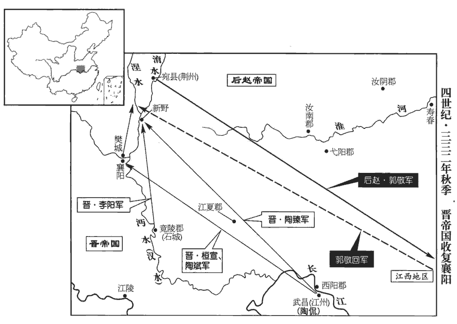
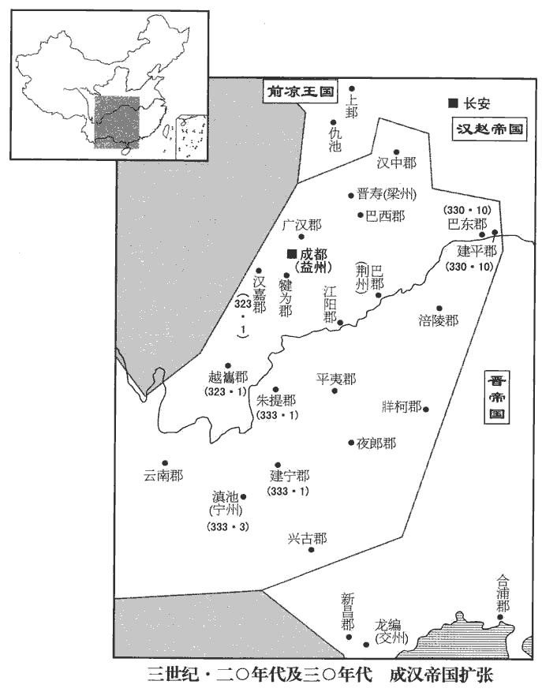
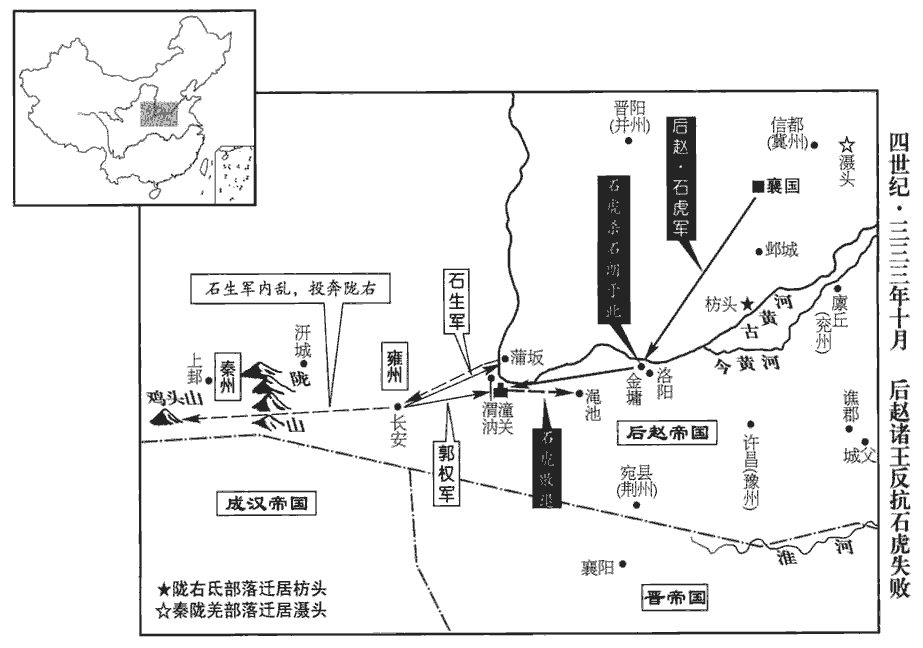
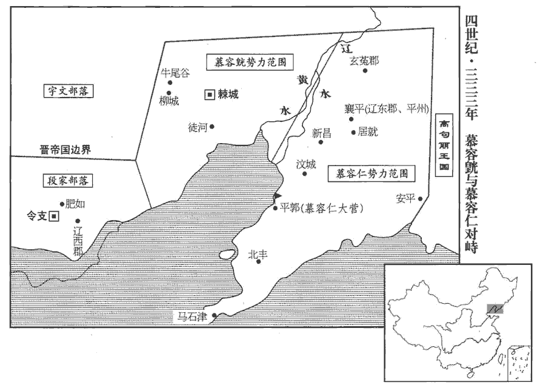
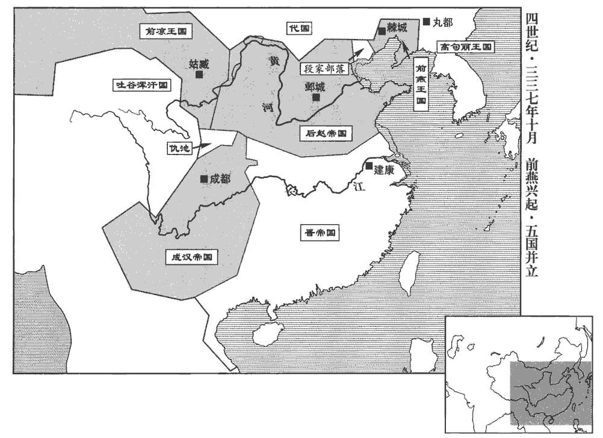

 晉紀十七起玄黓執徐（壬辰），盡強圉作噩（丁酉），凡六年。

# 顯宗成皇帝中之上

## 咸和七年（壬辰，三三二）

1春，正月，辛未‹十五›，大赦。

〖译文〗 [1]春季，正月，辛未（十五日），东晋大赦天下。

2趙主勒‹本年五十九岁›大饗群臣，考異曰：晉春秋云：「陶侃遣使聘後趙，趙王勒饗之。」按侃與勒必無通使之理，今不取。載記云：「勒因饗高句麗、宇文屋孤使。」今但云饗群臣。謂徐光曰：「朕可方自古何等主？」方，比也。對曰：「陛下神武謀略過於漢高，後世無可比者。」勒笑曰：「人豈不自知！卿言太過。朕若遇漢高祖，當北面事之，與韓、彭比肩；戴溪曰：勒豈真知高帝者，特自視不如韓、彭故耳。若遇光武，當并驅中原，未知鹿死誰手。大丈夫行事，宜礌礌落落，如日月皎然，礌lěi，落猥翻。終不效曹孟德、司馬仲達欺人孤兒、寡婦，狐媚以取天下也。」狐，妖獸也，能蠱媚人。石勒以此論曹、馬，使死者有知，孟德、仲達，其抱愧於地下矣！群臣皆頓首稱萬歲。

〖译文〗 [2]后赵国主石勒盛大地犒赏群臣，对徐光说：“朕可以和古代哪一等君主相比？”徐光回答说：“陛下的神武谋略超过汉高祖，后代人没有可以相比的。”石勒笑着说：“人哪有不知道自己的！您的话太过了。朕如果遇到汉高祖，应当向他北面称臣，与韩信、彭越同列比肩。如果遇上汉光武帝，将会与他共同逐鹿中原，不知鹿死谁手。大丈夫行事，应当光明磊落，如同日月之光明亮洁白，终究不该仿效曹操和司马懿，欺凌他人的孤儿寡妇，靠不正当的手段夺取天下。”群臣都叩头顿首，称呼万岁。

勒雖不學，好使諸生讀書而聽之，好，呼到翻。時以其意論古今得失，聞者莫不悦服。嘗使人讀漢書，聞酈食其勸立六國後，事見十卷漢高帝三年。驚曰：「此法當失，何以遂得天下？」及聞留侯諫，乃曰：「賴有此耳。」

〖译文〗 石勒虽然未上学，却喜欢让众儒生读书给自己听，经常凭自己的心意议论古今得失，听到的人没有不心悦诚服的。他曾经让人读《汉书》，听到郦食其劝汉高祖册立战国时六国诸侯的后裔，吃惊地说：“这种做法应当是失策，为什么能最终夺得天下？”等到听说留侯张良劝谏，这才说：“幸亏有这么回事。”

3郭敬之退戍樊城也，事見上卷五年。晉人復取襄陽，夏，四月，敬復攻拔之，敬復，扶又翻。留戍而歸。

〖译文〗 [3]郭敬后退戍守樊城后，晋人又收复了襄阳。夏季，四月，郭敬又攻取襄阳，留下戍守兵员后返回。

4趙右僕射程遐言於趙主勒曰：「中山王勇悍權略，群臣莫及；觀其志，自陛下之外，視之蔑如；蔑，無也，言視之若無也。加以殘賊安忍，孟子曰：賊人者謂之賊，賊義者謂之殘。左傳，眾仲曰：安忍無親。久為將帥，威振內外，其諸子年長，皆典兵權；虎子邃、宣，勒皆使之典兵。將，即亮翻。帥，所類翻。長，知兩翻。陛下在，自當無它，恐非少主之臣也。少，詩照翻。宜早除之，以便大計。」勒曰：「今天下未安，大雅沖幼，宜得強輔。中山王骨肉至親，有佐命之功，方當委以伊、霍之任，何至如卿所言！卿正恐不得擅帝舅之權耳；吾亦當參卿顧命，勿過憂也。」遐泣曰：「臣所慮者公家，陛下乃以私計拒之，忠言何自而入乎！中山王雖為皇太后所養，非陛下天屬，載記曰：虎，勒之從子也，祖曰㔨bèi邪，父曰寇覓。勒父朱幼而子虎，故或稱勒弟焉。雖有微功，陛下酬其父子恩榮亦足矣，而其志願無極，謂虎有窺覦yú天位之志。豈將來有益者乎！若不除之，臣見宗廟不血食矣。」勒不聽。

〖译文〗 [4]后赵右仆射程遐向国主石勒进言说：“中山王石虎勇悍而有权谋武略，群臣中无人比得上，观察他的志向，除陛下以外，对他人都视而不见。再加上性格凶暴残忍，长期出任将帅，威震内外，他的各位儿子年龄都不小，都握有兵权，陛下在世，自然应当没什么事，但恐怕他不甘心作少主的臣子。应当尽早除去他，以利国家大计。”石勒说：“如今天下没有安定，石弘年少，应当得到强大的辅佐。中山王是我的骨肉至亲，有辅佐王命的功绩，正应委付他伊尹、霍光那样的重任，何至于像你说的那样！你只是唯恐不能专帝舅的权力罢了。我也会让你参与辅政，不必过分忧虑。”程遐哭泣着说：“我所顾虑的是国家，陛下却认为是为自己打算而加以拒绝，忠言从何处能入耳呢！中山王虽然是皇太后收养的，但并非陛下的亲骨肉，虽然有些小功劳，陛下酬答他们父子的恩惠荣耀也足够了，但他的心意、欲望却没有止境，难道会是有益于将来的人吗！如果不除去他，我看宗庙将为绝祀了。”石勒不听。

遐退，告徐光，光曰：「中山王常切齒於吾二人，恐非但危國，亦將為家禍也。」它日，光承間言於勒曰：間，古莧翻。「今國家無事，而陛下神色若有不怡，何也？」怡，悅也。勒曰：「吳、蜀未平，吾恐後世不以吾為受命之王也。」光曰：「魏承漢運，劉備雖興於蜀，漢豈得為不亡乎！以喻晉也。孫權在吳，猶今之李氏也。陛下苞括二都，平蕩八州，二都，長安、洛陽；八州，冀、幽、并、青、兗、豫、司、雍也。帝王之統不在陛下，當復在誰！復，扶又翻；下同。且陛下不憂腹心之疾，而更憂四支乎！中山王藉陛下威略，所向輒克，而天下皆言其英武亞於陛下。且其資性不仁，見利忘義，父子并據權位，勢傾王室；而耿耿常有不滿之心；近於東宮侍宴，有輕皇太子之色。臣恐陛下萬年之後，不可復制也。」復，扶又翻。勒默然，始命太子省可尚書奏事，省，悉景翻。且以中常侍嚴震參綜可否，惟征伐斷斬大事乃呈之。斷，丁亂翻。於是嚴震之權過於主相，相，息亮翻。中山王虎之門可設雀羅矣。漢書曰：翟公為廷尉，賓客填門；及廢，門外可設雀羅。師古註云：言其寂靜無人行也。虎愈怏怏不悅。為後虎殺徐光、程遐張本。怏，於兩翻。

〖译文〗 程遐退下后，将此事告诉徐光，徐光说：“中山王经常切齿痛恨我们俩人，恐怕不仅会危害国家，也将是你我家庭的祸殃。”后来，徐光寻机对石勒说：“如今国家平定无事，陛下神色却好像有所不乐，为什么？”石勒说：“东吴、西蜀没有平定，我恐怕后人不把我当作承受天命的君王看待。”徐光说：“魏国继承汉朝国运，刘备虽然在蜀地兴起，汉朝又怎能不亡国呢！孙权在东吴，犹如现在的李雄，陛下囊括长安、洛阳二都，平荡八州，帝王的正统不在陛下，又会在谁呢！况且陛下不忧虑心腹之患，却反倒忧虑四肢之患吗！中山王凭仗陛下的威略，所向无敌，但天下人都说他的英俊威武仅次于陛下。而且他禀性不仁，见利忘义，父子都占据权位，势力可倾覆王室；自己又耿耿于怀，常有不满之心。近来在东宫侍奉宴饮，有轻视皇太子的神色。我恐怕陛下辞世之后，就不能再控制他了。”石勒默默不语，开始命令太子省查、决断尚书的奏事，又让中常侍严震参预判治可否，只有征伐断斩方面的大事才呈报石勒。此时严震的权力超过君主和丞相，中山王石虎的门庭冷清，可以罗雀了。石虎更加怏怏不乐。

 

5秋，趙郭敬南掠江西，江西，謂邾城以東至歷陽也。太尉侃遣其子平西參軍斌斌，音彬。及南中郎將桓宣乘虛攻樊城，悉俘其眾。敬旋救樊，宣與戰于涅水‹河南省镇平县南›，破之，水經註：涅水出涅陽縣西北岐棘山，東南逕涅陽縣，又東南逕安眾縣，又東南至新野縣，東入于淯。涅，奴結翻。皆得其所掠。侃兄子臻及竟陵‹湖北省钟祥市›太守李陽攻新野‹河南新野›，拔之。敬懼，遁去；宣【章：十二行本「宣」下有「陽」字；乙十一行本同；退齋校同。】遂拔襄陽。

〖译文〗 [5]秋季，后赵郭敬向南攻掠长江以西，太尉陶侃派儿子、平西参军陶斌及南中郎将桓宣乘虚进攻樊城，全数俘虏留守士众。郭敬回军救援樊城，桓宣和他在涅水接战，郭敬战败，桓宣夺回被郭敬劫掠的全部人员、物品。陶侃的兄长之子陶臻和竟陵太守李阳攻克新野。郭敬恐惧遁逃，桓宣随即夺取了襄阳。

侃使宣鎮襄陽。宣招懷初附，簡刑罰，略威儀，勸課農桑，或載鉏chú耒lěi於軺yáo軒，鉏，立薅hāo所用農器也。耒，盧對翻，手耕曲木也。孔穎達曰：耒以曲木為之，長六尺六寸，底長尺有一寸，中央直者三尺有三寸，句者二尺有二寸。底，謂耒下向前曲接耜sì者頭而著耜。耜，金鐵為之。鄭玄曰：耜sì者，耒之金也，廣五寸，田器，鎡zī錤jī之屬。軺，音遙，使者小車駕馬者也。軒，曲輈zhōu也。闌板曰軒。親帥民芸穫。帥，讀曰率。在襄陽十餘年，趙人再攻之，宣以寡弱拒守，趙人不能勝；時人以為亞於祖逖、周訪。史終言宣守襄陽之功。

〖译文〗 陶侃让桓宣镇守襄阳。桓宣招抚刚刚归降的民众，刑罚从简，威仪从略，鼓励、督促从事农桑生产，有时用轻便车装载耒等农具，亲自率领民众耕耘收获。桓宣在襄阳十多年，后赵人多次进攻，桓宣依靠既少且弱的士众抵抗防守，后赵人不能取胜。当时人认为他仅次于祖逖和周访。

6成‹都成都四川省成都市›大將軍壽寇寧州‹云南›，以其征東將軍費黑為前鋒，出廣漢‹四川省射洪县南柳树镇›，鎮南將軍任回出越巂‹四川省西昌市›，以分寧州之兵。費，扶沸翻。任，音壬。巂，音隨。

〖译文〗 [6]成汉的大将军李寿侵犯宁州，让其征东将军费黑为前锋，由广汉出击，又让镇南将军任回由越隽出击，使宁州兵力分散。

7冬，十月，壽、黑至朱提‹云南昭通›，朱提太守董炳城守，朱提，音銖時。寧州‹府设滇池云南省晋宁县东晋城镇›刺史尹奉遣建寧‹云南曲靖›太守霍彪引兵助之。壽欲逆拒彪，黑曰：「城中食少，少，詩沼翻。宜縱彪入城，共消其穀，何為拒之！」壽從之。城久不下，壽欲急攻之。黑曰：「南中險阻難服，當以日月制之，待其智勇俱困，然後取之，溷牢之物，何足汲汲也。」溷hùn，與圂hùn同，胡困翻。圂，廁也，豕所居也。牢，亦犬豕所居也。言城已受圍，如犬豕在圂牢中，不患其逸出也。鄭氏曰：牢，閑也。必有閑者，防禽獸觸齧niè。疏曰：養馬者謂之閑，養牛羊者謂之牢。言閑，見其閑衛；言牢，見其牢固；所從言之異，其實一物也。壽不從，攻果不利，乃悉以軍事任黑。

〖译文〗 [7]冬季，十月，李寿、费黑到达朱提，朱提太守董炳据城固守，宁州刺史尹奉派建宁太守霍彪领兵相助。李寿准备迎击霍彪，费黑说：“城中粮食短缺，应该放任霍彪入城，让他们共同消耗谷物，为什么要阻挡他！”李寿听从他的意见。朱提城久攻不下，李寿想大举猛攻。费黑说：“南中地势险阻，难以制服，应当待以时日，等他们智慧和勇气都消磨殆尽后再攻取。他们如同圈栏中的牲畜，何必那么着急呢？”李寿不听，进攻果然失利，于是把军事事务全部委托给费黑。

8十一月，壬子朔‹一›，進太尉侃為大將軍，劍履上殿，入朝不趨，贊拜不名。上，時掌翻。朝，直遙翻。侃固辭不受。

〖译文〗 [8]十一月，壬子朔（初一），提升太尉陶侃为大将军，允许佩剑着履上殿，朝见天子不必趋行小跑，唱礼通名时不直接称呼名字。陶侃坚持辞谢，不接受。

9十二月，庚戌‹二十九›，帝‹司马衍，本年十二岁›遷于新宮。五年作新宮，至是而成，乃遷居之。

〖译文〗 [9]十二月，庚戌（二十九日），成帝迁入新建的宫室。

10是歲，涼州僚屬勸張駿‹本年二十六岁›稱涼王，領秦、涼二州牧，置公卿百官如魏武、晉文故事。魏武事見六十七卷漢獻帝建安二十一年，晉文事見七十九卷魏元帝咸熙元年。駿曰：「此非人臣所宜言也。敢言此者罪不赦！」然境內皆稱之為王。駿立次子重華‹张重华，本年六岁›為世子。重，直龍翻。

〖译文〗 [10]这年，凉州的僚属们劝张骏自称凉王，兼领秦州、凉州二州牧。仿效魏武帝、晋文帝的旧例设置公卿百官。张骏说：“这不是为人臣子所该说的话。敢说这事的，罪在不赦！”然而凉州境内都称呼他为王。张骏立次子张重华为世子。

## 八年（癸巳，三三三）

1春，正月，成‹都成都四川省成都市›大將軍李壽拔朱提‹云南昭通›，董炳、霍彪皆降，降，戶江翻；下同。壽威震南中‹云南›。

〖译文〗 [1]春季，正月，成汉的大将军李寿攻下朱提，董炳、霍彪都投降，李寿威震南中。

2丙子‹二十六›，趙‹都襄国河北省邢台市›主勒‹本年六十岁›遣使來脩好，使，疏吏翻。好，呼到翻。詔焚其幣。晉雖未能復君父之讎，而焚幣一事，猶足舒忠臣義士之氣。

〖译文〗 [2]丙子（二十六日），后赵国主石勒派使者来与晋重归修好，成帝下诏令焚烧他带来的礼物。

3三月，寧州‹云南›刺史尹奉降于成，成盡有南中‹云南›之地；大赦，以大將軍壽領寧州。

〖译文〗 [3]三月，宁州刺史尹奉归降成汉，成汉全部占有南中地区。实行大赦，让大将军李寿兼管宁州。

 

4夏，五月，甲寅‹六›，遼東‹辽宁辽阳›武宣公慕容廆卒‹年六十五岁›。六月，世子皝以平北將軍行平州刺史，督攝部內；皝，字元真，廆第三子。廆，戶罪翻。皝，呼廣翻。赦繫囚。以長史裴開為軍諮祭酒，郎中令高詡為玄菟‹辽宁省沈阳市›太守。皝以帶方‹侨郡·辽宁省义县西北›太守王誕為左長史，誕以遼東‹辽宁省辽阳市›太守陽騖wù為才而讓之；皝從之，以誕為右長史。國之興也，其臣推賢讓能；國之衰也，其臣矜己忌前。騖，音務。

〖译文〗 [4]夏季，五月，甲寅（初六），辽东武宣公慕容死。六月，世子慕容以平北将军的身份摄行平州刺史职务，督察、统领境内士众，赦免囚犯。任命长史裴开为军咨祭酒，郎中令高翊为玄菟太守。慕容让带方太守王诞任左长史，王诞认为辽东太守阳骛有才能因而推让给他，慕容同意了，任命王诞为右长史。

5趙主勒寢疾，中山王虎入侍禁中，矯詔，群臣親戚皆不得入；疾之增損，外無知者。又矯詔召秦王宏、彭城王堪還襄國。勒以宏都督中外諸軍事，蓋使之鎮鄴。堪蓋在河南。勒疾小瘳chōu，見宏，驚曰：「吾使王處藩鎮，處，昌呂翻。正備今日，有召王者邪，將自來邪？有召者，當按誅之！」虎懼曰：「秦王思慕，暫還耳，今遣之。」仍留不遣。數日，復問之，復，扶又翻。虎曰：「受詔即遣，今已半道矣。」廣阿‹河北省隆尧县东›有蝗，廣阿縣，前漢屬鉅鹿郡，後漢、晉省；後魏復置廣阿縣，屬南趙郡；隋改為大陸縣；唐武德間，改為象城縣，天寶初改為昭慶縣，屬趙州。虎密使其子冀州刺史邃帥騎三千遊於蝗所。恐勒死有變，使邃遊于蝗所，若捕蝗者，以為外應。帥，讀曰率。騎，奇寄翻。

〖译文〗 [5]后赵国主石勒病重卧床，中山王石虎进入禁中侍卫，矫称诏令，群臣、亲戚都不得入内，石勒病情的好坏，宫外无人得知。又假传诏令征召秦王石宏、彭城王石堪回襄国。石勒病情稍好，见到石宏，吃惊地说：“我让你镇守藩镇，正是为了防备今日。你回来有人征召你呢，还是自己前来的？如果有召请你的人，应当依法处决！”石虎恐惧，说：“秦王因思慕您，暂时回来罢了，现在遣返他回去。”但仍然留住不遣返。几天后，石勒又问到石宏，石虎说：“接受诏令后当即就已遣返，现在已在半路上了。”广阿发生蝗灾，石虎秘密地派儿子、冀州刺史石邃率领三千骑兵在蝗灾区游戈。

秋，七月，勒疾篤，遺命曰：「大雅兄弟，宜善相保，司馬氏，汝曹之前車也。前車之覆，後車之戒；戒其兄弟自相殘也。中山王宜深思周、霍，勿為將來口實。」謂當如周公、霍光之輔幼孤也。勒謂此言可以縶zhí虎之手足邪！此數語亦徐光、程遐為之耳。戊辰‹二十一›，勒卒。年六十。中山王虎劫太子弘使臨軒，收右光祿大夫程遐、中書令徐光，下廷尉，下，遐稼翻。召邃使將兵入宿衛，將，即亮翻。文武皆奔散。弘大懼，自陳劣弱，讓位於虎。虎曰：「君終，太子立，禮之常也。」弘涕泣固讓，虎怒曰：「若不堪重任，天下自有大義，何足豫論！」弘乃即位‹石弘本年二十一岁›。弘，字大雅，勒第二子。大赦。殺程遐、徐光。光、遐固知禍之及己，然亦不料如是之速。夜，以勒喪潛瘞yì山谷，莫知其處。己卯，備儀衛，虛葬于高平陵‹河北省邢台市西南八千米›，勒卒十二日而葬，未有如是之速者也。虎既潛葬勒，其所以為身後之計者，亦不過如此，卒為女子所告，果何益哉！瘞，於計翻。諡曰明帝，廟號高祖。

〖译文〗 秋季，七月，石勒病重，颁布遗命说：“石弘兄弟，应当好好相互扶持，司马氏就是你们的前车之鉴。中山王石虎应当深深追思周公、霍光，不要为后世留下口实。”戊辰（二十一日），石勒死。中山王石虎劫持太子石弘让他到殿前，收捕右光禄大夫程遐、中书令徐光，交付廷尉治罪，又征召石邃，让他带兵入宫宿卫，文武官员纷纷逃散。石弘大为恐惧，自言软弱，要让位给石虎。石虎说：“君王去世，太子即位，这是礼仪常规。”石弘流着泪坚决辞让，石虎发怒说：“如果你不能承担重任，天下人自会按大道理行事，哪里能事先就谈论！”石弘于是即位，大赦天下。杀死程遐、徐光。夜间，把石勒尸体秘密瘗埋在山谷，没有人知道地点。己卯（疑误），仪仗护卫齐备，假装将石勒葬在高平陵，谥号明帝，庙号高祖。

趙將石聰及譙郡‹安徽亳州›太守彭彪，各遣使來降。聰時鎮譙城。守，式又翻。降，戶江翻。聰本晉人，冒姓石氏。朝廷遣督護喬球將兵救之，未至，聰等為虎所誅。

〖译文〗 后赵将领石聪和谯郡太守彭彪，各自派遣使者前来晋请降。石聪本来是汉族人，因被收养而改姓石。朝廷派遣督护乔球带兵救援他，还未到达，石聪等人已被石虎诛灭。

6慕容皝遣長史勃海‹河北南皮›王濟等來告喪。皝，呼廣翻。

〖译文〗 [6]慕容派遣长史、勃海人王济等前来晋报丧。

7八月，趙主弘以中山王虎為丞相、魏王、大單于，加九錫，單，音蟬。以魏郡等十三郡為國，總攝百揆。虎赦其境內立妻鄭氏為魏王后；子邃為魏太子，加使持節、侍中、都督中外諸軍事、大將軍、錄尚書事；次子宣為使持節、車騎大將軍、冀州刺史，封河間王；使，疏吏翻。韜為前鋒將軍、司隸校尉，封樂安王；遵封齊王，鑒封代王，苞封樂平王；徙平原【嚴：「平原」改「太原」。】王斌為章武王。斌，音彬。勒文武舊臣，皆補散任；虎之府寮親屬，悉署臺省要職。虎居鄴，子邃都督中外諸軍，宣據信都，府寮親屬分領臺省；弘處尊位，特寄坐耳。散，悉亶dǎn翻。以鎮軍將軍夔安領左僕射，尚書郭殷為右僕射。更命太子宮曰崇訓宮，更，工衡翻。太后劉氏以下皆徙居之。選勒宮人及車馬、服玩之美者，皆入丞相府。

〖译文〗 [7]八月，后赵国主石弘任中山王石虎为丞相、魏王、大单于，赐加九锡，划分魏郡等十三郡作为石虎的封国，总领朝廷大小政事。石虎赦免封国境内的囚犯，立妻子郑氏为魏王后，儿子石邃为魏太子，授予使持节、侍中、都督中外诸军事、大将军、录尚书事；次子石宣任使持节、车骑大将军、冀州刺史，封河间王；石韬为前锋将军、司隶校尉，封乐安王；石遵封齐王，石鉴封代王，石苞封乐平王。改封平原王石斌为章武王。石勒原先的文武官员，都委派闲散的官职，而石虎的僚佐亲属，全部充任朝廷要职。石虎任命镇军将军夔安兼领左仆射，任命尚书郭殷为右仆射。把太子的宫室改名为崇训宫，太后刘氏以下的人员，全部移居此处。又挑选石勒原有宫女、车马和服玩中美丽、精良和珍贵的，全部送入丞相府。

8宇文‹内蒙古老哈河上游›乞得歸為其東部大人逸豆歸所逐，走死于外。慕容皝引兵討之，軍于廣安‹辽宁朝阳南›；廣安，在棘城之北。逸豆歸懼而請和，遂築榆陰、安晉二城而還。榆陰城，蓋在大榆河之陰；安晉城，在威德城東南。

〖译文〗 [8]宇文乞得归被手下的东部大人逸豆归赶逐，逃跑死在外边。慕容领兵讨伐逸豆归，屯军广安。逸豆归畏惧，请求和好。慕容便修建榆阴、安晋两座城堡，然后回军。

9成建寧‹云南曲靖›、牂柯‹贵州省福泉县›二郡來降，李壽復擊取之。牂柯，音臧哥。降，戶江翻。復，扶又翻；下同。

〖译文〗 [9]成汉的建宁、柯二郡向东晋投降。又被李寿攻占。

10趙劉太后謂彭城王堪曰：「先帝甫晏駕，丞相遽相陵藉如此。陵，駕也，轢lì也。藉，蹈也。藉，慈夜翻。帝祚之亡，殆不復久，王將若之何？」堪曰：「先帝舊臣，皆被疏斥，軍旅不復由人，謂虎諸子皆握兵權也。被，皮義翻。宮省之內，無可為者，謂宿衛及臺省要職，皆虎之府寮、親屬，無與共謀匡正者。臣請奔兗州，挾南陽王恢為盟主，恢，勒少子也，時鎮廩丘。據廩丘‹兖州州政府所在县·山东省郓城县西北›，宣太后詔於牧、守、征、鎮，使各舉兵以誅暴逆，庶幾猶有濟也。」幾，居希翻。劉氏曰：「事急矣！當速為之。」九月，堪微服、輕騎襲兗州，不克，南奔譙城‹安徽亳州›。騎，奇寄翻。丞相虎遣其將郭太追之，獲堪于城父‹安徽省亳州市东南城父乡›，父，音甫。送襄國‹河北邢台›，炙而殺之。徵南陽王恢還襄國。劉氏謀泄，虎廢而殺之，尊弘母程氏為皇太后。堪本田氏子，數有功，數，所角翻。趙主勒養以為子。劉氏有膽略，勒每與之參決軍事，佐勒建功業，有呂后之風，而不妬忌，更過之。呂后能誅韓信、彭越，劉氏不能制虎，殆不及也。

〖译文〗 [10]后赵刘太后对彭城王石堪说：“先帝刚刚驾崩，丞相便如此欺压践踏我们，帝统的绝灭，大概不会多久，您对此将怎么办？”石堪说：“先帝原先的大臣，都遭疏远和排斥，军事大权不再由我们掌握，朝廷中也没有有所作为的人，我请求出奔兖州，挟持南阳王石恢当盟主，占据廪丘，向各地的地方长官颁布太后诏书，让他们各自起兵诛灭暴逆之人，或许还可挽救。”刘氏说：“事情很急迫了，你应当迅速行动。”九月，石堪换上平民服装，轻骑奔袭兖州，不能获胜，向南逃奔谯城。丞相石虎派部将郭太追击他，在城父执获石堪，送回襄国，用火烧灼后杀死了他。又征召南阳王石恢回襄国。刘氏的图谋泄露，石虎将她废黜并杀死，尊奉石弘的母亲程氏为皇太后。石堪本来是田氏子孙，多次建立功绩，后赵国主石勒收养他作为自己的儿子。刘氏有胆略，石勒经常和她共同决断军事，辅佐石勒建立功业，有西汉吕后的遗风，在不妒忌这方面要胜过吕后。

趙河東王生鎮關中，石朗鎮洛陽。劉胤之西奔也，石生自洛陽鎮長安，朗代生鎮洛陽。冬，十月，生、朗皆舉兵以討丞相虎；生自稱秦州刺史，遣使來降。降，戶江翻。氐帥蒲洪自稱雍州刺史，西附張駿。咸和四年，洪降于虎，今以趙亂而叛。帥，所類翻。

〖译文〗 后赵河东王石生镇守关中，石朗镇守洛阳。冬季，十月，石生、石朗都起兵讨伐丞相石虎。石生自称秦州刺史，派使者向晋请降。氐族统帅蒲洪自称雍州刺史，向西依附张骏。

虎留太子邃守襄國‹河北邢台›，將步騎七萬攻朗于金墉‹洛阳西北角›；金墉潰，獲朗，刖而斬之；將，即亮翻。騎，奇寄翻。刖，音月。進向長安，以梁王挺為前鋒大都督。挺，虎之子也。生遣將軍郭權帥鮮卑涉璝眾二萬為前鋒以拒之，帥，讀曰率。璝，公回翻。生將大軍繼發，軍于蒲阪‹山西永济›。權與挺戰於潼關，大破之，挺及丞相左長史劉隗皆死，此劉隗，意即自晉奔趙者。虎還奔澠池‹河南省洛宁县西北›，澠，彌兗翻。枕尸三百餘里。枕，職任翻。鮮卑潛與虎通謀，反擊生。生不知挺已死，懼，單騎奔長安‹西安›。權收餘眾，退屯渭汭ruì‹渭水入黄河处›。孔安國曰，水北曰汭。杜預曰，水之隈曲曰汭，音如銳翻。生遂棄長安，匿於雞頭山‹甘肃成县西南›。張守節曰：括地志云：雞頭山在成州上祿縣東北二十里，在長安西南九百六十里。酈道元云：蓋大隴山異名也。後漢書，隗囂使王孟塞雞頭道，即此也。按原州平高縣西百里亦有笄頭山，在長安西北八百里。將軍蔣英據長安拒守，虎進兵擊英，斬之。生麾下斬生以降；權奔隴右。

〖译文〗 石虎让太子石邃留守襄国，自己带领步、骑兵七万人进攻在金墉的石朗。金墉被攻破，执获石朗，将他砍掉脚后斩首。随后向长安进发，让梁王石挺为前锋大都督。石生派将军郭权率领鲜卑涉部士众二万人为前锋拒敌，石生统领大军随后出发，屯军于蒲阪。郭权和石挺在潼关接战，石挺大败，石挺和丞相左长史刘隗都阵亡，石虎回军逃往渑池，尸体枕藉达三百多里。鲜卑族私下与石虎勾结，反戈攻击石生。石生不知道石挺已死，心中畏惧，单骑逃奔长安。郭权收聚剩余士众，退却屯军于渭水拐弯处。石生于是放弃长安，藏匿于鸡头山。将军蒋英占据长安抵抗防守，石虎进兵攻击蒋英，蒋英被杀。石生的部下杀死石生投降，郭权逃奔陇右。

 

虎分命諸將屯汧、隴，汧qiān，苦堅翻。遣將軍麻秋討蒲洪。風俗通，麻，齊大夫麻嬰之後。洪帥戶二萬降於虎，帥，讀曰率。降，戶江翻。虎迎拜洪光烈將軍、前此未有光烈將軍號，石虎創置也。護氐校尉。漢有護羌校尉，虎以此官授洪，使之監護群氐。洪至長安，說虎徙關中豪傑及氐、羌以實東方，說，輸芮翻。曰：「諸氐皆洪家部曲，洪帥以從，誰敢違者！」虎從之，徙秦、雍民及氐、羌十餘萬戶于關東。雍，於用翻。以洪為龍驤將軍、流民都督，使居枋頭‹河南浚县东南淇门渡›。為苻洪子健自枋頭入闗中張本。驤，思將翻。枋音方。以羌帥姚弋仲為奮武將軍、西羌大都督，使帥其眾數萬，徙居清河之灄shè頭‹河北枣强东北›。羌帥，所類翻。灄，日涉翻。水經註：清河過廣川縣東，水側有羌壘，姚氏之故居也。為姚弋仲父子自灄頭起兵張本。

〖译文〗 石虎分别命令众将屯军于水、陇上，派将军麻秋讨伐蒲洪。蒲洪率二万户投降石虎，石虎拜授他为光烈将军、护氐校尉。蒲洪到达长安，劝说石虎迁徙关中的豪强和氐、羌等部落充实东方，他说：“众氐族部落都是我家的部曲，我率领他们归顺，谁敢违抗！”石虎听从他的建议，迁徙秦州、雍州的士民以及氐族、羌族十多万户到关东。任命蒲洪为龙骧将军、流民都督，让他居住在枋头，任命羌族首领姚弋仲为奋武将军、西羌大都督，让他们率领部众数万人迁居到清河的滠头。

虎還襄國‹河北邢台›，大赦。趙主弘命虎建魏臺，一如魏武王輔漢故事。

〖译文〗 石虎返回襄国，实行大赦。后赵国主石弘令石虎建造魏台，完全仿效魏武帝辅佐汉朝的旧例。

11慕容皝初嗣位，用法嚴峻，國人多不自安，主簿皇甫真切諫，不聽。

〖译文〗 [11]慕容刚刚继位，使用刑法过于严厉，国内人大多不知所措，主簿皇甫真恳切劝谏，慕容不听。

皝huàng庶兄建威將軍翰、母弟征虜將軍仁，有勇略，屢立戰功，得士心；季弟昭，有才藝；皆有寵於廆。皝忌之，翰歎曰：「吾受事於先公，不敢不盡力，幸賴先公之靈，所向有功，此乃天贊吾國，非人力也。而人謂吾之所辦，以為雄才難制，吾豈可坐而待禍邪！」乃與其子出奔段氏‹府令支河北省迁安县›。段遼素聞其才，冀收其用，甚愛重之。

〖译文〗 慕容的庶母兄长、建威将军慕容翰和同母兄弟、征虏将军慕容仁，都勇悍而有谋略，多次建立战功，深得人心；小弟弟慕容昭，多才多艺，都受到慕容的宠爱。慕容妒忌他们，慕容翰叹息说：“我从先父那里接受任职，不敢不尽力，幸好仰仗先父的在天之灵，所向披靡，这是上天助我国，并非人力所为。但别人却说这是我的力量，以为我具有杰出的才能，难以制服，我怎能坐以待祸呢！”于是和儿子出奔段氏。段辽平素早就听说他的才能，希望收为己用，所以非常宠爱、看重他。

 

仁自平郭‹辽宁盖州›來奔喪，漢志，平郭縣屬遼東郡；晉省。晉東夷校尉治襄平，崔毖之敗，慕容廆以仁鎮遼東，治平郭。謂昭曰：「吾等素驕，多無禮於嗣君，嗣君剛嚴，無罪猶可畏，況有罪乎！」昭曰：「吾輩皆體正嫡，於國有分。昭自謂與仁皆正室之子，分可以得國也。分，扶問翻。兄素得士心，我在內未為所疑，伺其間隙，除之不難。兄趣舉兵以來，伺，相吏翻。間，古莧翻。趣，讀曰促。我為內應，事成之日，與我遼東。男子舉事，不克則死，不能效建威偷生異域也。」仁曰：「善！」遂還平郭‹辽宁盖州›。閏月，仁舉兵而西。

〖译文〗 慕容仁从平郭前来奔丧，对慕容昭说：“我们平素骄纵，经常对现在继位的君主无礼，他为人刚毅严厉，自身无罪尚且令人畏惧，何况有罪呢！”慕容昭说：“我们都身为嫡子，国家应当有我们一份。兄长您素来得人心，我在宫内也没什么令人怀疑的地方，寻找机会除灭他并不难。兄长赶紧兴兵前来，我当内应，事成以后，把辽东分给我。男子汉行事，不成功则死，不能仿效慕容翰到其他地方偷生苟活。”慕容仁说：“好！”于是回返平郭。闰月，慕容仁兴兵向西进发。

或以仁、昭之謀告皝，皝未之信，遣使按驗。仁兵已至黃水‹饶阳河·流经辽宁省盘锦市北›，黃水，即潢水，在棘城東北，距唐營州四百里。據載記，黃水當在漢遼東郡險瀆縣。知事露，殺使者，還據平郭。皝賜昭死。遣軍祭酒封奕慰撫遼東。以高詡為廣武將軍，將兵五千與庶弟建武將軍幼、稚、廣威將軍軍、寧遠將軍汗、司馬遼東‹辽宁辽阳›佟壽共討仁。與仁戰於汶城‹辽宁省大石桥市东南›北，佟，徒冬翻，姓也。汶，漢古縣，屬遼東郡；前書作「文」。皝兵大敗，幼、稚、軍、皆為仁所獲；壽嘗為仁司馬，遂降於仁。降，戶江翻；下同。前大農孫機等舉遼東城以應仁。孫機，蓋王官之避地遼東者。遼東城，即襄平城。封奕不得入，與汗俱還。東夷校尉封抽、護軍平原‹山东平原›乙逸、乙，姓也；逸，名也。姓譜：商湯字天乙，支孫以為氏。遼東相太原‹山西太原›韓矯皆棄城走，於是仁盡有遼東之地；段遼及鮮卑諸部皆與仁遙相應援。皝追思皇甫真之言，以真為平州別駕。皝領平州刺史，以真為別駕。

〖译文〗 有人把慕容仁、慕容昭的密谋告诉慕容，慕容不相信，派使者查验。慕容仁的军队已到黄水，知道事情败露，杀死使者，回军占据平郭。慕容赐令慕容昭自尽，派军祭酒封奕慰抚辽东。任命高诩为广武将军，领兵五千与异母弟、建武将军慕容幼、慕容稚、广威将军慕容军、宁远将军慕容汗、司马、辽东人佟寿共同讨伐慕容仁，和慕容仁在汶城以北交战，慕容的军队大败，慕容幼、慕容稚、慕容军都被掳获。佟寿曾是慕容仁的司马，于是归降慕容仁。前任大农孙机等占据辽东城响应慕容仁。封奕不能入城，和慕容汗一块儿返回。东夷校尉封抽、护军平原人乙逸、辽东相太原人韩矫都弃城逃跑，于是慕容仁尽数占有辽东地区。段辽和鲜卑各部都与慕容仁遥相呼应和声援。慕容追忆起皇甫真原先说过的话，任命他为平州别驾。

12十二月，郭權據上邽‹甘肃天水›，遣使來降；京兆‹西安›、新平‹陕西彬县›、扶風‹陕西眉县›、馮翊‹陕西大荔›、北地‹陕西耀县›皆應之。

〖译文〗 [12]十二月，郭权占据上，派使者向晋请降，京兆、新平、扶风、冯翊、北地都响应他。

13初，張駿‹本年二十七岁›欲假道於成以通表建康，成主雄‹李雄，本年六十岁›不許。駿乃遣治中從事張淳稱藩於成以假道；雄偽許之，將使盜覆諸東峽。三峽在成都之東，故云東峽。蜀人橋贊密以告淳。淳謂雄曰：「寡君使小臣行無迹之地，蜀不許涼人假道，則蜀地前此無涼人之迹。萬里通誠於建康者，以陛下嘉尚忠義，能成人之美故也。若欲殺臣者，當斬之都市，宣示眾目曰：『涼州不忘舊德，通使琅邪，江左自琅邪中興，故以稱之。使，疏吏翻。主聖臣明，發覺殺之。』如此，則義聲遠播，天下畏威。今使盜殺之江中，威刑不顯，何足以示天下乎！」雄大驚曰：「安有此邪！」

〖译文〗 [13]当初，张骏想向成汉借路去建康呈送上表，成汉主李雄不同意。张骏便派遣治中从事张淳向成汉称臣以便借道。李雄佯装同意，却准备派盗贼将他沉于东峡。蜀人桥赞将此事秘密告诉张淳，张淳对李雄说：“我的君主让我来到这未曾通行的地方，不远万里向建康表达诚意，是因为陛下嘉许和崇尚忠义，能够成人之美的缘故。如果想杀我，应当在都市处斩，向众人宣谕晓示说：‘凉州不忘国家旧恩，与晋互通使节，因为君主圣贤、臣下明察，发觉此事因而杀了他。’这样，道义的声誉就会远远传播，天下人都懔畏风威。现在如果让盗贼把我杀害在江中，声威和刑罚都不彰显，怎么能示范天下呢！”李雄大吃一惊，说：“哪有这种事呢！”

司隸校尉景騫蜀置司隸校尉於成都。言於雄曰：「張淳壯士，請留之。」雄曰：「壯士安肯留！且試以卿意觀之。」騫謂淳曰：「卿體豐大，天熱，可且遣下吏，小住須涼。」須，待也。淳曰：「寡君以皇輿播越，梓宮未返，謂懷、愍蒙塵，卒之見害，梓宮未返也。生民塗炭，莫之振救，振，舉也。故遣淳通誠上都。上都，謂建康也。所論事重，非下吏所能傳；使下吏可了，則淳亦不來矣。雖火山湯海，猶將赴之，豈寒暑之足憚哉！」雄謂淳曰：「貴主英名蓋世，土險兵強，何不亦稱帝自娛一方？」淳曰：「寡君祖考以來，世篤忠貞，以讎恥未雪，枕戈待旦，枕，職任翻。何自娛之有！」雄甚慙，曰：「我之祖考本亦晉臣，遭天下大亂，與六郡之民避難此州，事見八十二卷惠帝元康八年。難，乃旦翻。為眾所推，遂有今日。琅邪若能中興大晉於中國者，亦當帥眾輔之。」帥，讀曰率。厚為淳禮而遣之。淳卒致命於建康。卒，子恤翻。致命，致其君命也。

〖译文〗 司隶校尉景骞对李雄说：“张淳是勇士，请把他留下。”李雄说：“既然是勇士，怎能肯留下呢！你暂且试着用自己的意愿试探他。”景骞对张淳说：“你身强体胖，现在天气炎热，何不暂时派遣手下小吏，您在此小住，等待天气转凉？”张淳说：“我的君主因为皇室远徙江南，先帝的梓宫未能送返，生民涂炭，无人拯救，所以派我向皇都表达诚意。所商议的事情重大，不是小吏可以传达的；如果小吏可以任胜，那么我也就不来了。即使有火山汤海，我也将前往，天气的寒暑又怎能让人畏惧呢！”李雄对张淳说：“贵君主英名盖世，境内地势险峻，军力强大，为什么不自己称帝，占据一方享乐呢！”张淳说：“我的君主从祖父、父亲开始，世代坚守忠贞，因国耻未能昭雪，枕戈待旦，哪能自己享乐呢！”李雄十分惭愧，说：“我的祖先本来也是晋国大臣，因遇到天下大乱，和六个州郡的民众到此州避难，被民众推拥，才有今天。琅邪王如果真能在中原中兴大晋的基业，我也会率领士众相助。”于是为张淳准备厚礼，送他上路。张淳终于到达建康转达了张骏的心意。

長安之失守也，事見八十九卷愍帝建興四年。敦煌計吏耿訪自漢中入江東，耿訪，敦煌所遣上計吏，留長安未還，而長安陷，且河、隴路絕，因南入漢中，自漢東下至建康。敦，徒門翻。屢上書請遣大使慰撫涼州。使，疏吏翻；下同。朝廷以訪守侍【章：十二行本「侍」作「持」；乙十一行本同；熊校同。嚴：「侍」改「治」。】書御史，拜張駿鎮西大將軍，選隴西賈陵等十二人配之。配，侑也。訪至梁州，道不通，以詔書付賈陵，詐為賈客以達之。賈，音古。是歲，陵始至涼州，駿遣部曲督王豐等報謝。

〖译文〗 长安失守时，敦煌郡掌管计簿的官吏耿访从汉中进入江东，多次上书请求派遣职高位重的使节慰抚凉州臣民。朝廷让耿访暂任侍书御史，拜授张骏为镇西大将军，挑选陇西人贾陵等十二人配备给他。耿访到达梁州后，道路不通，便把诏书交给贾陵，假扮为商贩通过。这年，贾陵刚到凉州，张骏派部曲督王丰等人前来答谢。

## 九年（甲午，三三四）

1春，正月，趙‹都襄国河北省邢台市›改元延熙。

〖译文〗 [1]春季，正月，后赵改年号为延熙。

2‹司马衍，本年十四岁›詔以郭權為鎮西將軍、雍州刺史。雍，於用翻。

〖译文〗 [2]晋朝廷下诏任命郭权为镇西将军、雍州刺史。

3仇池‹甘肃西和南›王楊難敵卒，子毅立，自稱龍驤將軍、左賢王、下辨公；以叔父堅頭之子盤為冠軍將軍、右賢王、河池公，驤，思將翻。辨，步莧翻。冠，古玩翻。遣使來稱藩。

〖译文〗 [3]仇池王杨难敌故去，儿子杨毅继立，自称龙骧将军、左贤王、下辨公；任命叔父杨坚头之子杨盘为冠军将军、右贤王、河池公，派使者来晋称臣。

4二月，丁卯‹二十三›，詔遣耿訪、王豐齎印綬授張駿‹本年二十八岁›大將軍、都督陝西•雍•秦•涼州諸軍事。陝，式冉翻。自是每歲使者不絕。仇池稱藩，梁、涼之路通也。

〖译文〗 [4]二月，丁卯（二十三日），朝廷下诏派耿访、王丰携带印绶拜授张骏为大将军，都督陕西、雍州、秦州、凉州诸军事。从此以后每年来往使者不断。

5慕容仁‹时驻平郭辽宁省盖州市›以司馬翟楷領東夷校尉，前平州別駕龐鑒領遼東‹辽宁省辽阳市›相。龐，皮江翻。

〖译文〗 [5]慕容仁让司马翟楷兼领东夷校尉，让原先任平州别驾的庞鉴兼领辽东相。

6段遼遣兵襲徒河‹辽宁锦州›，不克；復遣其弟蘭與慕容翰共攻柳城‹辽宁朝阳西南›，柳城縣，漢屬遼西郡，晉省；唐為營州治所。復，扶又翻。柳城都尉石琮cóng、城大慕輿埿并力拒守，城大，猶城主也；一城之長，故曰城大。埿，與泥同。蘭等不克而退。遼怒，切責蘭等，必令拔之。休息二旬，復益兵來攻。復，扶又翻。士皆重袍蒙楯，重，直龍翻。楯，食尹翻。作飛梯，飛梯，即雲梯。四面俱進，晝夜不息。琮、埿拒守彌固，殺傷千餘人，卒不能拔。卒，子恤翻。慕容皝遣慕容汗及司馬封奕等共救之。皝戒汗曰：「賊氣銳，勿與爭鋒。」汗性驍果，以千餘騎為前鋒，驍，堅堯翻。騎，奇寄翻。直進。封奕止之，汗不從。與蘭遇於牛尾谷‹辽宁朝阳北›，牛尾谷，在柳城北。汗兵大敗，死者太半；奕整陳力戰，陳，讀曰陣。故得不沒。

〖译文〗 [6]段辽派军队袭击徒河，不能获胜，又派兄弟段兰和慕容翰共同进攻柳城。柳城都尉石琮、城主慕舆合力拒守，段兰等不能取胜，只好退军。段辽发怒，痛切地斥责段兰等人，严令他们攻取柳城。段兰等人休息二十天后，又增添兵力来进攻。士卒都穿上重重战袍，用盾牌保护，架上云梯，四面同时进攻，昼夜不停。石琮、慕舆的防守也更加坚固。杀段兰的士卒一千多人，段兰等人始终无法取胜。慕容派慕容汗和司马封奕等人共同援救，慕容告诫慕容汗说：“敌人士气正盛，不要和他们争斗以决胜负。”慕容汗性格骁勇果敢，让一千多骑兵为前锋，直赴柳城。封奕劝阻他，慕容汗不听。结果和段兰在牛尾谷遭遇，慕容汗的军队大败，死亡过半。封奕整顿阵列尽力苦战，所以才免遭全军覆没。

蘭欲乘勝窮追，慕容翰恐遂滅其國，止之曰：「夫為將當務慎重，審己量敵，量，音良。非萬全不可動。今雖挫其偏師，未能屈其大勢。皝多權詐，好為潛伏，好，呼到翻。若悉國中之眾自將以拒我，將，即亮翻。我縣軍深入，縣，讀曰懸。眾寡不敵，此危道也。且受命之日，正求此捷；若違命貪進，萬一取敗，功名俱喪，喪，息浪翻。何以返面！」蘭曰：「此已成擒，無有餘理，謂以事理策之，皝必成擒，無復遺餘也。卿正慮遂滅卿國耳！今千年在東，若進而得志，吾將迎之以為國嗣，終不負卿，使宗廟不祀也。」千年者，慕容仁小字也。翰曰：「吾投身相依，無復還理；復，扶又翻。國之存亡，於我何有！但欲為大國之計，且相為惜功名耳。」為，于偽翻。乃命所部欲獨還，蘭不得已而從之。史言翰雖身在外，乃心宗國。

〖译文〗 段兰想乘胜穷追，慕容翰害怕就此灭亡自己的国家，劝阻他说：“作为将领，应当慎重，知己知彼，不到万全的时候不能妄动。现在敌方的偏师虽被挫败，但主力还未败。慕容狡诈多谋，喜欢深藏不露，如果他亲自统帅举国士众抵御我们，而我们孤军深入，寡不敌众，这是危险的作法。况且接受君命的时候，正是想得到今天的胜利，如果违背君命冒进，万一失败，功劳和名望全部丧失，有什么脸面回去面对君主！”段兰说：“这些人被擒已成定局，没有别的道理，你只是忧虑趁势灭亡你的国家罢了！现在慕容千年在东边，如果进军真能实现愿望，我将迎接他充当国家的继承人，终究不会有负于你，让宗庙绝祀的。”所谓千年，即慕容仁的小名。慕容翰说：“我既然投身依附，就没有再返回的道理。故国的存亡，和我有什么相干！只是想为贵国出谋划策，并且珍惜你我的功名罢了。”于是命令自己所部，准备独自返回，段兰不得已，随从他共同返回。

7三月，成主雄‹本年六十一岁›分寧州‹云南›置交州‹云南东南›，成分寧州之興古、永昌、牂柯、越巂、夜郎等郡為交州。以霍彪為寧州‹府设滇池云南省晋宁县东晋城镇›刺史，爨深為交州‹府设律高云南省开远市东北›刺史。

〖译文〗 [7]三月，成汉主李雄由宁州分置出交州，让霍彪任宁州刺史，爨深任交州刺史。

8趙丞相虎遣其將郭敖及章武王斌帥步騎四萬西擊郭權，軍于華陰‹陕西華陰›；夏，四月，上邽‹甘肃天水›豪族殺權以降。斌，音彬。帥，讀曰率。騎，奇寄翻。華，戶化翻。降，戶江翻。虎徙秦州‹甘肃南部›三萬餘戶于青‹山东北›、并‹山西中›二州。長安人陳良夫奔黑羌，羌之別種，有青羌、黑羌。與北羌王薄句大等侵擾北地‹陕西耀县›、馮翊‹陕西大荔›。句，音鉤。章武王斌、樂安王韜合擊，破之，句大奔馬蘭山‹陕西省白水县西北三十千米。居住此地的羌部落，称马兰羌›。郭敖乘勝逐北，為羌所敗，敗，補邁翻。死者什七八。斌等收軍還三城‹陕西省延安市›。魏收地形志：後魏太和初，分鴈門之廣武、朔方之沃野置偏城郡，治廣武縣，縣有三城、偏城。虎遣使誅郭敖。秦王宏有怨言，以其父疾而虎矯詔召之，至於失職也。虎幽之。

〖译文〗 [8]后赵丞相石虎派部将郭敖和章武王石斌率步、骑兵四万人向西进攻郭权，屯军华阴。夏季，四月，上豪族杀死郭权投降。石虎将秦州三万多户民众迁徙到青州和并州。长安人陈良夫逃奔黑羌，和北羌王薄句大等人侵扰北地、冯翊。章武王石斌、乐安王石韬合力攻击，打败他们，薄句大逃奔马兰山。郭敖乘胜追击败兵，反被羌人战败，死亡人数占十之七八。石斌等人收兵回到三城。石虎派使者处死郭敖。秦王石宏有怨言，石虎将他幽禁。

9慕容仁自稱平州刺史、遼東公。

〖译文〗 [9]慕容仁自称平州刺史，辽东公。

10長沙桓公陶侃‹时驻武昌湖北省鄂州市›，晚年深以滿盈自懼，不預朝權，朝，直遙翻。屢欲告老歸國，欲歸長沙國也。佐吏等苦留之。六月，侃疾篤，上表遜位。遣左長史殷羨奉送所假節、麾、幢chuáng、曲蓋、麾，大將旌旗，臨敵之際，三軍視以為進退者也。幢，幡幢，方言曰：幢，翳也，楚曰翿dào，關東、西皆曰幢。文選註：幢，以羽葆為之。釋名曰：幢，童也，其狀童童然。幢，傳江翻。曲蓋者，蓋為曲柄。世說：謝靈運好戴曲柄笠，孔隱士曰：「何不能遺曲蓋之貌！」晉制：諸公任方面者，皆給節、麾、緹tí幢、曲蓋。侍中貂蟬、太尉章、章：印章也。荊、江、雍、梁、交、廣、益、寧八州刺史印傳、棨qǐ戟；自此以上，皆朝廷所授，故奉送之。雍，於用翻。傳，株戀翻。棨，音啟。軍資、器仗、牛馬、舟船，皆有定簿，封印倉庫，侃自加管鑰。以後事付右司馬王愆期，加督護統領文武。史言陶侃綜理精密，雖病不亂。甲寅‹十二›，輿車出，臨津就船，將歸長沙，顧謂愆期曰：「老子婆娑，正坐諸君！」娑，桑何翻；婆娑，肢體緩縱不收之貌。侃言不得早退，至於困乏如此，正坐參佐苦留之也。乙卯‹十三›，薨於樊谿‹陶侃年七十六岁›。樊谿，在武昌西三里，北注大江。觀陶侃在西藩顛末，豈有非望之圖哉！晉史所記決指之事，折翼之夢，蓋庾亮之黨傅致之耳。侃在軍四十一年，惠帝太安二年，侃擊張昌，至是年凡四十一年。明毅善斷，斷，丁亂翻。識察纖密，人不能欺；自南陵‹安徽省贵池市›迄于白帝‹重庆市奉节县东›，南陵，在宣城郡界，梁置南陵郡。陳置北江州於其地，蓋臨江渚。江州東界盡於南陵，今宣州南陵縣，非古之南陵戍也。自南陵迄于白帝，總言侃所統大界。宋白曰：南陵，本漢舂穀縣地，後併于湖縣，尋又屬繁昌。梁武帝始置南陵縣屬南陵郡，臨江有城基見存，去今縣一百三十里。數千里中，路不拾遺。及薨，尚書梅陶與親人曹識書曰：親人，其所親者也。「陶公機神明鑒似魏武，忠順勤勞似孔明，陸抗諸人不能及也。」謝安每言：「陶公雖用法而恆得法外意。」史言陶侃為名流所推重如此。恆，戶登翻。安，鯤之從子也。謝鯤見九十二卷元帝永昌元年。從，才用翻。

〖译文〗 [10]长沙桓公陶侃，到晚年深深畏惧物极必反的道理，因此不参预朝政，多次想告老还乡，佐吏们苦苦相留。六月，陶侃病重，上表请求退位。派左长史殷羡归还持有的朝廷符节、麾、憧、曲盖、侍中貂蝉、太尉印章，以及荆、江、雍、梁、交、广、益、宁八州的刺史印传和戟。至于军资、器仗、牛马、舟船等，都有簿录统计，封存仓库，由陶侃亲自上锁。陶侃将后事托付给右司马王愆期，授予督护官职，统领文武官吏。甲寅（十二日），陶侃乘车离开武昌，到渡口乘船，准备回长沙，回头对王愆期说：“老夫现在蹒跚难行，正因你们阻拦。”乙卯（十三日），在樊去世。陶侃领军四十一年，明智、坚毅，善于决断；见识纤密，别人难以欺蒙。自南陵到白帝，几千里的辖域内路不拾遗。陶侃去世后，尚书梅陶给亲友曹识的信说：“陶公的神机明鉴如同魏武帝，忠顺勤军好比孔明，陆抗等人比不上他。”谢安经常说：“陶公虽然运用刑法，但常常能领会刑法之外的含意。”谢安即谢鲲的侄子。

11成主雄生瘍於頭。瘍yáng，余章翻，頭瘡曰瘍。身素多金創。矢刃所傷為金創。創，初良翻。及病，舊痕皆膿潰，諸子皆惡而遠之；惡，烏路翻。遠，于願翻。獨太子班晝夜侍側，不脫衣冠，親為吮膿。為，于偽翻。吮，徂兗翻。雄召大將軍建寧王壽受遺詔輔政。丁卯‹二十五›，雄卒，年六十一，載記雄卒在去年。太子班‹本年四十七岁›即位。班，字世文，雄兄蕩之子也。以建寧王壽錄尚書事，政事皆委於壽及司徒何點、尚書【章：十二行本「書」下有「令」字；乙十一行同；孔本同；張校同。】王瓌，瓌guī，古回翻。班居中行喪禮，一無所預。李班豈可不謂之仁孝哉！然不能包周身之防，死於李越之手。末俗澆漓，固不可拘拘於古禮以啟姦非，至於殞身亂國也。

〖译文〗 [11]成汉主李雄头部生疮，身体原有很多创伤，等到病发时，旧伤痕全部化脓溃烂，儿子们都因厌恶而远远躲开，只有太子李班昼夜在身边侍候，不脱衣帽，亲自为他吮吸脓肿。李雄征召大将军、建宁王李寿接受遗诏辅佐朝政。丁卯（二十五日），李雄故去，太子李班即位。任命建宁王李寿录尚书事，政事都委决于李寿和司徒何点，尚书王。李班居住在宫中服丧，毫不干预。

12辛未‹二十九›，加平西將軍庾亮征西將軍、假節、都督江•荊•豫•益•梁•雍六州諸軍事、領江•豫•荊三州刺史，鎮武昌。陶侃既沒，庾亮始專制上流。雍，於用翻。亮辟殷浩為記室參軍。浩，羨之子也，與豫章‹江西南昌›太守褚裒、裒póu，蒲侯翻。丹陽丞杜乂，皆以識度清遠，善談老、易，老、易，老子及易也。擅名江東，而浩尤為風流所宗。裒，䂮之孫；褚䂮見七十七卷魏元帝景元元年。䂮，離灼翻。乂，錫之子也。杜錫見八十三卷惠帝元康九年。桓彝嘗謂裒曰：「季野有皮里春秋。」褚裒，字季野。言其外無臧否否，音鄙。而內有褒貶也。謝安曰：「裒雖不言，而四時之氣亦備矣。」

〖译文〗 [12]辛未（二十九日），朝廷授予平西将军庾亮征西将军，假节，都督江、荆、豫、益、梁、雍六州诸军事，兼领江、豫、荆三州刺史，镇守武昌。庾亮召用殷浩为记室参军。殷浩即殷羡的儿子，和豫章太守褚裒、丹阳丞杜都因见识清晰、气度弘远，善于进谈《老子》、《周易》，在江东负有盛名，而殷浩尤其被风流雅士所推重。褚裒即褚的孙子，杜即杜锡的儿子。桓彝曾经评论褚裒说：“褚季野有皮里《春秋》。”是说他表面不作评论，但内心却有所褒贬。谢安说：“褚裒虽然不说话，但气度弘远。”

13秋，八月，王濟還遼東，詔遣侍御史王齊祭遼東公廆，又遣謁者徐孟策拜慕容皝鎮軍大將軍、平州刺史、大單于、遼東公，持節【章：十二行本「節」下有「都督」二字；乙十一行本同；孔本同；張校同。】承制封拜，一如廆故事，船下馬石津‹辽宁旅顺›，自建康出大江至于海，轉料角至登州大洋；東北行，過大謝島、龜歆島、淤島、烏湖島三百里，北渡烏湖海，至馬石山東之都里鎮；馬石津，即此地也。皆為慕容仁所留。

〖译文〗 [13]秋季，八月，王济返回辽东，成帝下诏派侍御史王齐祭奠辽东公慕容，又派谒者徐孟册封慕容为镇军大将军、平州刺史、大单于、辽东公，持朝廷符节、秉承皇帝旨意封官拜爵，与慕容旧例完全相同。舟船行至马石津，都被慕容仁扣留。

14九月，戊寅‹八›，衛將軍江陵穆公陸曄卒‹年七十四岁›。

〖译文〗 [14]九月，戊寅（初八），卫将军、江陵穆公陆晔去世。

15成主雄之子車騎將軍越屯江陽‹四川泸州›，奔喪至成都。以太子班非雄所生，意不服，與其弟安東將軍期謀作亂。班弟玝wǔ勸班遣越還江陽，以期為梁州刺史，鎮葭萌‹即晋寿·四川省广元市西南›。葭萌，即晉壽之地。玝wǔ，阮古翻。班以未葬，不忍遣，推心待之，無所疑間，間，古莧翻。遣玝出屯於涪‹四川绵阳›。涪，音浮。冬，十月，癸亥朔‹二十三›，越因班‹年四十七岁›夜哭，弒之於殯宮，卒如李驤之言。菆zōu塗曰殯；將遷葬，以賓遇之也。并殺班兄領軍將軍都；矯太后任氏令，罪狀班而廢之。任，音壬。

〖译文〗 [15]成汉主李雄的儿子、车骑将军李越驻屯江阳，回到成都奔父丧。他认为太子李班不是李雄亲生，心中不服，和兄弟、安东将军李期阴谋作乱。李班的兄弟李劝李班遣送李越回江阳，让李期出任梁州刺史，镇守葭萌。但李班因为父亲未安葬，不忍心遣返，推心置腹地对待他们，没有任何猜忌和疏远，让李离开成都，驻屯于涪。冬季，十月，癸亥朔（疑误），李越乘李班夜间哭吊，将他杀死在殡宫，同时杀死李班的兄长、领军将军李都。矫称太后任氏的诏令，罗列李班的罪状，因而废黜其位。

初，期母冉氏賤，任氏母養之。期多才藝，有令名；及班死，眾欲立越，越奉期而立之。甲子‹二十四›，期‹本年二十二岁›即皇帝位。期，字世運，雄第四子也。諡班曰戾太子。以越為相國，封建寧王；加大將軍壽大都督，徙封漢王；皆錄尚書事。以兄霸為中領軍、鎮南大將軍；弟保為鎮西大將軍、汶山‹四川省茂县›太守；汶，讀曰岷。從兄始為征東大將軍，代越鎮江陽。據載記：始，特之長子，於期為伯父，於壽為從兄。從，才用翻。丙寅‹二十六›，葬雄於安都陵，諡曰武皇帝，廟號太宗。

〖译文〗 当初，李期的生母冉氏身份低贱，认任氏为养母，由任氏抚养。李期多才多艺，有好名声。李班死后，众人打算立李越为国主，李越推奉李期，立他为国主。甲子（二十四日），李期即帝位。为李班赐谥号为戾太子。李期任命李越为相国，封建宁王，授予大将军李寿大都督，改封汉王，都录尚书事。又任兄长李霸为中领军、镇南大将军；兄弟李保任镇西大将军、汶山太守；堂兄李始任征东大将军，代替李越镇守江阳。丙寅（二十六日），将李雄安葬在安都陵，谥号武皇帝，庙号太宗。

始欲與壽共攻期，壽不敢發。始怒，反譖壽於期，請殺之。期欲藉壽以討李玝，故不許，遣壽將兵向涪。壽先遣使告玝以去就利害，開其去路，玝遂來奔。詔以玝為巴郡太守。期以壽為梁州刺史，屯涪。為李壽自涪舉兵廢李期張本。

〖译文〗 李始想和李寿共同攻击李期，李寿不敢发难，李始发怒，反而向李期诋谗李寿，请求杀掉他。李期想依靠李寿征讨李，所以不同意，派李寿率军向涪进发。李寿事先派遣使者向李剖析逃亡与归降之间的利害关系，并让开他离去的道路，李便投奔东晋，朝廷下诏任命他为巴郡太守。李期任李寿为梁州刺史，屯驻在涪。

16趙主弘自齎璽綬詣魏宮，石虎為魏王，其所居稱魏宮。璽，斯氏翻。綬，音受。請禪位於丞相虎。虎曰：「帝王大業，天下自當有議，何為自論此邪！」弘流涕還宮，謂太后程氏曰：「先帝種真無復遺矣！」種，章勇翻。復，扶又翻。於是尚書奏：「魏臺請依唐、虞禪讓故事。」此趙朝尚書奏也。虎曰：「弘愚暗，居喪無禮，【章：十二行本「禮」下有「不可以君萬國」六字；乙十一行本同；孔本同；退齋校同。】便當廢之，何禪讓也！」十一月，虎遣郭殷入【章：十二行本「入」上有「持節」二字；乙十一行本同；孔本同；退齋校同。】宮，廢弘為海陽王。弘安步就車，容色自若，謂群臣曰：「庸昧不堪纂承大統，夫復何言！」復，扶又翻。群臣莫不流涕，宮人慟哭。群臣詣魏臺勸進，虎曰：「皇帝者盛德之號，非所敢當，且可稱居攝趙天王。」考異曰：三十國、晉春秋：「虎即位，改元永熙」；陳鴻大統曆云：「石虎即位，改建平五年為延興，明年改建武」。按，三十國、晉春秋不記弘改元延熙，虎之立，實延熙元年也，故誤云永熙，弘既號延熙，虎安肯稱永熙！陳鴻云：「虎改建平五年為延興，即是弘踰年不改元也。」恐鴻說誤。幽弘及太后程氏、秦王宏、南陽王恢于崇訓宮，尋皆殺之。虎更太子宮曰崇訓宮。弘時年二十一。

〖译文〗 [16]后赵国主石弘自己携带印玺到魏宫，请求将君位禅让给丞相石虎。石虎说：“帝王的大业，天下人自会有公议，为什么自己选择这样做呢！”石弘流着眼泪回宫，对太后程氏说：“先帝的骨肉真的不会再遗存了！”此时尚书奏议说：“魏王请您依照唐尧、虞舜的禅让旧例行事。”石虎说：“石弘愚昧昏暗，服丧无礼，应当将他废黜，谈什么禅让！”十一月，石虎派郭殷进宫，废黜石弘为海阳王。石弘缓步就车，神色从容，对群臣们说：“我庸碌愚昧不堪继承皇帝大统，还有什么可说的。”群臣人人流泪，宫女恸哭。群臣到魏宫进劝石虎即位。石虎说：“皇帝是美盛品德的称号，不是我敢承受的，暂且可以称作居摄赵天王。”石虎将石弘和太后程氏、秦王石宏、南阳王石恢幽禁在崇训宫，不久全数杀害。

西羌大都督姚弋仲‹时驻滠头河北省枣强县东北›稱疾不賀，虎累召之，乃至。正色謂虎曰：「弋仲常謂大王命世英雄，柰何把臂受託而返奪之邪？」虎曰：「吾豈樂此哉！樂，音洛。顧海陽年少，少，詩照翻。恐不能了家事，故代之耳。」心雖不平，然察其誠實，亦不之罪。

〖译文〗 西羌大都督姚弋仲称病不来朝贺，石虎屡次相召，这才前来。姚弋仲表情端庄严肃地对石虎说：“我经常说大王是闻名于世的英雄，怎么握着手臂受托辅佐遗孤，反而夺人君位呢？”石虎说：“我哪里喜欢这样做！不过海阳王年少，恐怕不能治理家事，所以代替他罢了。”石虎心中虽然怨怒不平，但看姚弋仲为人诚恳实在，也不加罪于他。

虎以夔安為侍中、太尉、守尚書令，郭殷為司空，韓晞為尚書左僕射，魏郡申鐘為侍中，郎闓為光禄大夫，闓，苦亥翻，又音開。王波為中書令。文武封拜各有差。虎行如信都‹河北冀县›，復還襄國。載記曰：虎以讖文「天子當從東北來」，於是備法駕，行自信都而還，以應之。「天子當從東北來，」蓋謂慕容氏將從遼、碣jié入中國也。秦始皇東游以厭天子氣，初不能遏止漢高之興。

〖译文〗 石虎任夔安为侍中、太尉、执掌尚书令，任郭殷为司空，韩为尚书左仆射，魏郡人申钟任侍中，郎为光禄大夫，王波任中书令。其余文武官员封爵拜官各有差等。石虎出行到信都，又返回襄国。

17慕容皝討遼東，甲申‹十五›，至襄平‹辽宁辽阳›。遼東人王岌密信請降。師進，入城，翟楷、龐鑒單騎走，居就‹辽宁辽阳西南›、新昌‹辽宁海城东北›等縣皆降。居就、新昌，皆屬遼東郡。降，戶江翻；下同。皝欲悉阬遼東民，高詡諫曰：「遼東之叛，實非本圖，直畏仁凶威，不得不從。今元惡猶存，元惡，謂仁也。始克此城，遽加夷滅，則未下之城，無歸善之路矣。」皝乃止。分徙遼東大姓於棘城。以杜群為遼東相，安輯遺民。

〖译文〗 [17]慕容讨伐辽东，甲申（十五日），到达襄平。辽东人王岌秘密派使者请降。军队进发，进入辽东城，翟楷、庞鉴单骑逃跑，居就、新昌等县全都归降。慕容想尽数坑杀辽东居民，高诩劝谏说：“辽东的背叛，其实不是他们的本意，只不过畏惧慕容仁的凶戾横威，不得不听从。如今首恶还活着，刚刚攻克此城，便急于诛灭民众，那么未被攻克的城池，就没有归顺从良的道路了。”慕容这才罢休。于是分批迁徙辽东的豪门大姓到棘城，任命杜群为辽东相，安抚余留的民众。

18十二月，趙徐州從事蘭陵‹山东省苍山县西南兰陵镇›朱縱斬刺史郭祥，以彭城‹江苏徐州›來降，趙將王朗攻之，縱奔淮南‹安徽省寿县›。

〖译文〗 [18]十二月，后赵徐州从事兰陵人朱纵杀刺史郭祥，献彭城降晋。后赵将领王朗进攻朱纵，朱纵逃奔淮南。

19慕容仁遣兵襲新昌‹辽宁海城东北›，督護新興‹山西省忻州市›王㝢擊走之，遂徙新昌入襄平‹辽宁辽阳›。遼東治襄平。徙新昌吏民入襄平，所以杜仁闚𨵦掩襲之心。㝢yǔ，王矩翻。

〖译文〗 [19]慕容仁派兵攻击新昌，督护、新兴人王将他击退，于是将新昌的士民迁徙到襄平。

## 咸康元年（乙未，三三五）

1春，正月，庚午朔‹一›，帝‹司马衍，本年十五岁›加元服。沈約禮志曰：古者無天子冠禮，故筮日、筮賓、冠於阼，以著代醮於客位，三加彌尊，皆士禮耳。漢順帝冠，兼用曹褒新禮。褒新禮今不存。禮儀志又云：乘輿初加緇布進賢，次爵弁biàn、武弁，次通天；皆於高廟。江左諸帝將冠，金石宿設，百僚陪位，又豫於殿上鋪大床，御府令奉冕幘zé、簪導、袞服以授侍中、常侍，太尉加幘，太保加冕。將加冕，太尉跪讀祝文曰：「令月吉日，始加元服。皇帝穆穆，思弘袞職。欽若昊天，六合是式。率遵祖考，永永無極。眉壽無期，介茲景福。」加冕訖，侍中繫玄紞dǎn，侍中脫絳紗服，加袞服。冠事畢，太保率群臣奉觴上壽，王以下三稱萬嵗乃退。鄭樵曰：用魏儀一加，既加元服，拜于太廟。大赦，改元。

〖译文〗 [1]春季，正月，庚午朔（初一），成帝加冠，大赦天下，改年号咸康。

2成‹都成都四川省成都市›、趙‹都襄国河北省邢台市›皆大赦，成改元玉恆，恆，戶登翻。趙改元建武。

〖译文〗 [2]成汉、后赵都在境内实行大赦，成汉改年号为玉恒，后赵改年号为建武。

3成主期‹李期，本年二十三岁›立皇后閻氏，以衛將軍尹奉為右丞相，驃騎將軍、尚書令王瓌guī為司徒。驃，匹妙翻。瓌，古回翻。

〖译文〗 [3]成汉国主李期册立皇后阎氏，任卫将军尹奉为右丞相，任命骠骑将军、尚书令王为司徒。

4趙王虎‹石虎，本年四十一岁›命太子邃省可尚書奏事，省，悉景翻。惟祀郊廟、選牧守、征伐、刑殺乃親之。虎好治宮室，鸛雀臺崩，鸛雀臺，在鄴，即魏武所起銅雀臺。好，呼到翻。殺典匠少府任汪；典匠少府，即漢將作大匠之職也。少，詩照翻。任，音壬。復使脩之，倍於其舊。邃保母劉芝封宜城君，關預朝權，受納賄賂，求仕進者多出其門。朝，直遙翻。

〖译文〗 [4]后赵王石虎令太子石邃省视、决断尚书奏事，只有祭祀郊庙、选任地方官员、征伐、刑杀方面的奏事才亲自审议。石虎爱营建宫室，鹳雀台崩圮，便杀死典匠少府任汪，又让人重修，规模比原先扩大一倍。封石邃的保姆刘芝为宜城君，干预朝政，接受贿赂，谋求任官，晋升的人大多出入其门。

5慕容皝置左、右司馬，以司馬韓矯、軍祭酒封奕為之。

〖译文〗 [5]慕容设置左、右司马，分别让司马韩矫、军祭酒封奕出任。

6司徒導以羸疾，不堪朝會，羸，倫為翻。朝，直遙翻。三月，乙酉‹十七›，帝幸其府，與群臣宴于內室，拜導并拜其妻曹氏。侍中孔坦密表切諫，以為帝初加元服，動宜顧禮，帝從之。坦又以帝委政於導，從容言曰：「陛下春秋已長，聖敬日躋，從，千容翻。長，知兩翻。日躋，猶日進也。宜博納朝臣，諮諏zōu善道。」諏，遵須翻。導聞而惡之，惡，烏路翻。出坦為廷尉。坦不得意，以疾去職。

〖译文〗 [6]司徒王导因为身患手足麻木之病，不能参与朝会。三月，乙酉（十七日），成帝驾临他的宅府，和群臣在内府宴饮，向王导及妻子曹氏行拜礼。侍中孔坦私下写表文恳切劝谏，认为元帝刚刚加冠，举动应当遵从礼仪，成帝应从。孔坦又因为成帝将朝政委付王导，缓缓进言说：“陛下年龄渐大，聪明、端肃每日俱进，应当广泛听取群臣的意见，征询正确美好的办法。”王导听说后憎恶孔坦，调出孔坦任廷尉。孔坦不得志，称病辞职。

丹陽尹桓景，為人諂巧，導親愛之。會熒惑守南斗經旬，晉天文志：南斗六星，天廟也，丞相、太宰之位。導謂領軍將軍陶回曰：「斗，揚州之分，天文志：斗、牛、女，揚州；九江入斗一度，丹陽入斗十六度。分，扶問翻。吾當遜位以厭天譴。」厭，一葉翻。回曰：「公以明德作輔，而與桓景造膝，造，七到翻。使熒惑何以退舍！」導深愧之。

〖译文〗 丹阳尹桓景，为人谄谀巧佞，王导亲近宠爱他。适逢火星在南斗六星位滞留十余天，王导对领军将军陶回说：“南斗是扬州的分野，我将退位来安定上天的谴责。”陶回说：“您凭仗显明的道德出任辅佐，却与桓景抵膝亲近，怎么能使火星退归正位！”王导对此深感惭愧。

導辟太原王濛為掾，濛，莫紅翻。掾，于絹翻。王述為中兵屬。晉公府諸曹，有參軍，有掾，有屬。述，昶之曾孫也。王昶，仕魏鎮荊州，以功名自見。昶，丑兩翻。濛不脩小廉，而以清約見稱。與沛國‹安徽省淮北市›劉惔齊名，友善。惔tán，徒甘翻。惔常稱濛性至通而自然有節。濛曰：「劉君知我，勝我自知。」當時稱風流者，以惔、濛為首。述性沈靜，每坐客辯論蠭起，而述處之恬如也。沈，持林翻。坐，徂臥翻。處，昌呂翻。年三十，尚未知名，人謂之癡。導以門地辟之。昶之子湛，湛之子承，世有高名。述，承子也。既見，唯問在東米價，述蓋自東吳至建康。述張目不答。導曰：「王掾不癡，人何言癡也！」嘗見導每發言，一坐莫不贊美，坐，徂臥翻。述正色曰：「人非堯、舜，何得每事盡善！」導改容謝之。

〖译文〗 王导征召太原人王为僚属，王述为中兵属。王述即王昶的曾孙。王不修小节，而以清静简约著称。与沛国刘齐名，关系友善。刘经常说王性情至为通达，自然而有节操。王说：“刘君对我的了解，胜过我对自己的认识。”当时被称为风流雅士的，以刘、王为首。王述性格沉称安静，每当坐客们争相辩驳论理，王述却安然处之。王述三十岁，尚未出名，大家说他痴呆。王导因为他的门第而征召他。见面以后，王导只问他在东方时米价，王述睁大眼睛不回答。王导说：“王述并不痴呆，人们为何说他痴呆！”王述曾经见到只要王导一说话，满座人无不赞美，于是表情严肃地说：“人不是尧、舜，哪能每件事都是对的！”王导改以严肃的脸色向他道谢。

7趙王虎南遊，臨江而還。還，從宣翻，又如字。有遊騎十餘至歷陽‹安徽和县›，歷陽太守袁耽表上之，上，時掌翻。不言騎多少。朝廷震懼，司徒導請出討之。夏四月，加導大司馬、假黃鉞、都督征討諸軍事。癸丑‹十六›，帝觀兵廣莫門，廣莫門，建康城北門也。分命諸將救歷陽‹安徽和县›及戍慈湖‹安徽省马鞍山市北慈湖峡›、牛渚‹安徽省马鞍山市西南采石矶›、蕪湖‹安徽蕪湖›；司空郗鑒使廣陵‹江苏淮阴›相陳光將兵入衛京師。俄聞趙騎至少，又已去，少，詩沼翻。戊午‹二十一›，解嚴，王導解大司馬。袁耽坐輕妄免官。

〖译文〗 [7]后赵王石虎去南方游巡，到达长江才返回。手下的游动骑兵十多人到达历阳，历阳太守袁耽上表奏上，没说骑兵的数量。朝廷震动恐惧，司徒王导请求出兵征讨。夏季，四月，授予王导大司马、假黄钺、都督征讨诸军事。癸丑（十六日），成帝到广莫门检阅军队，分别命令众将领救援历阳，以及戍守慈湖、牛渚、芜湖。司空郗鉴让广陵相陈光领兵进入京城护卫。不久听说赵国骑兵数量极少，又已经离去，戊午（二十一日），解除军队的戒备状态，王导卸除大司马职，袁耽坐罪轻妄不察被免官。

8趙征虜將軍石遇攻桓宣於襄陽，不克。

〖译文〗 [8]后赵征虏将军石遇进攻驻守襄阳的桓宣，不能取胜。

9大旱，會稽‹浙江绍兴›、餘姚‹浙江余姚›米斗五百。會，工外翻。

〖译文〗 [9]晋发生严重旱灾，会稽郡的余姚每斗米价格五百钱。

10秋，七月，慕容皝立子儁jùn為世子。

〖译文〗 [10]秋季，七月，慕容立儿子慕容为世子。

11九月，趙王虎遷都于鄴，趙王勒定都襄國，虎遷于鄴。大赦。

〖译文〗 [11]九月，赵王石虎迁都于邺，实行大赦。

12初，趙主勒以天竺僧佛圖澄豫言成敗，數有驗，敬事之。及虎即位，奉之尤謹，衣以綾錦，乘以彫輦。彫輦，彫鏤以為飾。數，所角翻。衣，於既翻。朝會之日，太子、諸公扶翼上殿，朝，直遙翻。上，時掌翻。主者唱「大和尚」，主者，謂掌朝儀者也。眾坐皆起。使司空李農旦夕問起居，太子、諸公五日一朝。諸公，虎諸子也；虎稱天王，降諸子封王者爵為公。國人化之，率多事佛，澄之所在，無敢向其方面涕唾者。爭造寺廟，削髮出家。虎以其真偽雜糅，糅，汝救翻。或避賦役為姦宄，宄，音軌。乃下詔問中書曰：「佛，國家所奉，里閭小人無爵秩者，應事佛不？」不，讀曰否。著作郎王度等晉職官志曰：著作郎，周左史之任也。漢東京，圖籍在東觀，有其名，尚未有官。魏明帝太和中，詔置著作郎，於此始有其官，隸中書省。及晉受命，制曰：「著作舊屬中書，而祕書既典文籍，今改中書省著作為祕書著作。」於是改隸祕書省；自後別置省，而猶隸祕書。議曰：「王者祭祀，典禮具存。佛，外國之神，非天子諸華所應祠奉。漢氏初傳其道，事見四十五卷漢明帝永平八年。唯聽西域人立寺都邑以奉之，漢人初謂官府為寺。後漢自西域白馬駞經來，初止於鴻臚寺，遂取寺名，創置白馬寺。漢人皆不得出家；魏世亦然。今宜禁公卿以下毋得詣寺燒香、禮拜；其趙人為沙門者，皆返初服。」謂使還服華人之服。虎詔曰：「朕生自邊鄙，忝君諸夏，夏，戶雅翻。至於饗祀，應從本俗。其夷、趙百姓樂事佛者，特聽之。」樂，音洛。

〖译文〗 [12]当初，后赵国主石勒因为天竺僧人佛图澄预先陈言事情的成败，多次得到验证，恭敬地侍奉他。石虎即位后，侍奉他更为恭谨，让他穿绫锦，乘雕辇。到朝会的日子，太子、各位公卿扶持上殿，掌管朝仪的人唱名说：“大和尚”，满座都起身。石虎让司空李农早晚问候佛图澄的起居，太子、公卿每五天朝见他一次。国内人受此影响，大多崇尚佛教，佛图澄所在之处，无人敢朝着那个方面吐口水。大家争着建造寺庙，削发出家。石虎因为拜佛出家的人真伪杂混，有的借此躲避赋税和徭役，干不法的勾当，于是下诏书问中书说：“佛教是国家所尊奉的，里闾平民百姓没有官爵的人，是否应当事佛？”著作郎王度等人评议说：“君王的祭祀，有典制礼仪可供遵循。佛是外国的神灵，不是天子和各华夏民族所应祠奉的。汉朝佛教开始传入，当时只是允许西域人在都邑建立寺庙来祠奉，汉人都不让出家，魏朝也是这样。现在应当禁止公卿以下的人等，不让他们到寺庙烧香、拜佛；凡赵国人当和尚的，都恢复原先的服饰。”石虎下诏说：“朕出生在边鄙之地，愧为华夏民族的君上，至于祭祀，应当遵从本来的习俗。凡夷族、赵国百姓乐意尊崇佛教的，特别听任其便。”

13趙章武王斌帥精騎二萬并秦、雍二州兵以討薄句大，平之。去年斌等為薄句大所敗。斌，音彬。帥，讀曰率。騎，奇寄翻。雍，於用翻。句，音鉤。

〖译文〗 [13]后赵章武王石斌率精锐骑兵二万人，连同秦州、雍州的士兵讨伐薄句大，平定了他们。

14成太子班之舅羅演，與漢王相天水‹甘肃天水›上官澹李壽封漢王。相，息亮翻。澹，徒覽翻。謀殺成主期，立班子。事覺，期殺演、澹及班母羅氏。

〖译文〗 [14]成汉太子李班的舅父罗演和汉王相、天水人上官澹图谋杀死成汉国主李期，立李班的儿子为王。事情败露，李期杀死罗演、上官澹及李班生母罗氏。

期自以得志，輕諸舊臣，信任尚書令景騫、尚書姚華、田褒、中常侍許涪等，涪，音浮。刑賞大政，皆決於數人，希復關公卿。復，扶又翻。褒無他才，嘗勸成主雄立期為太子，故有寵。由是紀綱隳紊，紊，音問。雄業始衰。

〖译文〗 李期自以为志得意满，轻视各位旧臣，听信重用尚书书令景骞、尚书姚华、田褒、中常侍许涪等人，刑罚赏赐之类的重大政事，都由这几个人决断，很少再向公卿咨询。田褒没有别的才能，曾经劝说成汉主李雄册立李期为太子，所以得宠。由此朝廷的法度毁圮紊乱，李雄创下的基业开始衰败。

15冬，十月，乙未朔‹一›，日有食之。

〖译文〗 [15]冬季，十月，乙未朔（初一），出现日食。

16慕容仁遣王齊等南還。去年齊等為慕容仁所留。齊等自海道趣棘城‹辽东国首府·辽宁省义县西›，趣，七喻翻齊遇風不至。十二月，徐孟等至棘城，慕容皝始受朝命。朝，直遙翻。

〖译文〗 [16]慕容仁遣送王齐等人归返南方。王齐等人从海路开赴棘城，王齐乘坐的船遇上海风，未能到达。十二月，徐孟等人到达棘城，慕容开始接受朝廷的任命。

段氏‹府令支河北省迁安县›、宇文氏‹内蒙古老哈河上游›各遣使詣慕容仁，館于平郭‹辽宁省盖州市›城外。皝帳下督張英將百餘騎間道潛行掩擊之，間，古莧翻。斬宇文氏使十餘人，生擒段氏使以歸。

〖译文〗 段氏、宇文氏各自派遣使者拜见慕容仁，下榻于平郭城外。慕容的帐下督张英领着一百多骑兵由小道偷偷前往突然袭击他们，斩杀宇文氏的使节十多人，活捉段氏使者返回。

17是歲，明帝母建安君荀氏卒。荀氏在禁中，尊重同於太后；詔贈豫章郡君。荀氏，元帝宮人也，生明帝。自以位卑，每懷怨望，為帝所譴，漸見疏薄。及明帝即位，封建安君，別立第宅。太寧元年，迎還臺內，供奉隆厚。及帝立，尊重同於太后。

〖译文〗 [17]这年，明帝母亲建安君荀氏死。荀氏在宫禁中，受到的尊重如同太后；成帝下诏赐赠名号为豫章郡君。

18代‹府大宁河北省张家口市›王翳槐以賀蘭藹頭不恭，藹頭，翳槐舅，有擁護之功，事見九十三卷咸和二年。至四年，逐紇那，立翳槐。又賀蘭部也，挾親恃功，所以不恭。將召而戮之，諸部皆叛。代王紇那自宇文部入，諸部復奉之。紇那出奔見上卷咸和四年。復，扶又翻。翳槐奔鄴，趙人厚遇之。

〖译文〗 [18]代王拓跋翳槐因为贺兰蔼头对己不恭，准备召他前来，加以杀害，各部落全都反叛。代王拓跋纥那由宇文部入境，各部落又重新尊奉他为王。拓跋翳槐逃奔到邺，后赵人隆礼相待。

19初，張軌及二子寔、茂，雖保據河右，而軍旅之事無歲無之。及張駿嗣位，境內漸平。駿‹张骏，本年二十九岁›勤脩庶政，總御文武，咸得其用，民富兵強，遠近稱之以為賢君。駿遣將楊宣伐龜茲‹新疆库车›、鄯善‹新疆若羌县›，於是西域諸國焉耆‹新疆焉耆›、于窴‹新疆和田›之屬，皆詣姑臧朝貢。龜茲，音丘慈。鄯，上扇翻。窴，徒賢翻，又徒見翻。駿於姑臧南作五殿，駿起謙光殿，四面各起一殿：東曰宜陽青殿，以春三月居之；南曰朱陽赤殿，夏三月居之；西曰政刑白殿，秋三月居之；北曰玄武黑殿，冬三月居之。章服器物，皆依方色。官屬皆稱臣。

〖译文〗 [19]当初，张轨及两个儿子张、张茂虽然据守河右，但每年都有战事。至张骏继位，境内渐渐平定。张骏辛勤治理各种政事，总领文武官员，让他们各得其用，民富兵强，远近之人都称他为贤君。张骏派部将杨宣攻伐龟兹、鄯善，于是西域各国如焉耆，于之类，都赴姑臧朝贡。张骏在姑臧城南建造五座宫殿，官属都自称为臣。

駿有兼秦、雍之志，雍，於用翻。遣參軍麴護上疏，以為：「勒、雄既死，虎、期繼逆，兆庶離主，離，力智翻。漸冉經世；先老消落，後生不識，慕戀之心，日遠日忘。乞敕司空鑒、征西亮等汎舟江、沔，首尾齊舉。」郗鑒時鎮京口，庾亮時鎮武昌。沔，彌兗翻。

〖译文〗 张骏有兼并秦州、雍州的志向，派参军麴护向东晋上疏，认为：“石勒、李雄死后，石虎、李期继承叛逆，万民离开了君主，逐渐经过了一代人。先生老辈衰老死亡，后生小辈不知旧事，仰慕思恋之心，一天天疏远、一天天淡忘。乞请敕令司空郗鉴、征西将军庾亮等泛舟于长江、沔水，与我互相呼应，同时发动。”

## 二年【「二」原誤作「三」。章：十二行本「三」作「二」；乙十一行本同；退齋校同。】（丙申，三三六）

1春，正月，辛巳‹十八›，彗星見于奎、婁。西方奎十六星，天之武庫也，主以兵禁暴，又主溝瀆。婁三星，為天獄，主苑牧犧牲，供給郊祀。奎、婁、冑，魯、徐州分。彗，祥歲翻，又旋芮翻，又徐醉翻。見，賢遍翻。

〖译文〗 [1]春季，正月，辛巳（十八日），奎宿、娄宿一带出现慧星。

2慕容皝將討慕容仁，司馬高詡曰：「仁叛棄君親，民神共怒；前此海未嘗凍，自仁反以來，連年凍者三矣。且仁專備陸道，天其或者欲使吾乘海冰以襲之也。」皝從之。群僚皆言涉冰危事，不若從陸道。皝曰：「吾計已決，敢沮者斬！」沮，在呂翻。

〖译文〗 [2]慕容准备讨伐慕容仁，司马高诩说：“慕容仁背叛和抛弃君主亲人，神灵和士民共同恨怒，此前海水从未冻冰，自从慕容仁反叛以来，连续结冻已经三年了。况且慕容仁专门防备陆路，上天大概是想让我们乘海结冰时去袭击他吧。”慕容听从了他的意见。众僚佐都说由冰上过海是危险的事，不如改走陆路。慕容说：“我计议已定，敢阻拦的人斩首！”

壬午‹十九›，皝帥其弟軍師將軍評等自昌黎‹辽宁义县›東，踐冰而進，皝，呼廣翻。帥，讀曰率；下同。凡三百餘里。至歷林口‹辽宁营口东›，歷林口，海浦之口。捨輜重，輕兵趣平郭‹辽宁盖州›。重，直用翻。趣，七喻翻；下同。去城七里，候騎以告仁，騎，奇寄翻。仁狼狽出戰。張英之俘二使也，事見上年。使，疏吏翻。仁恨不窮追；及皝至，仁以為皝復遣偏師輕出寇抄，復，扶又翻。抄，楚交翻。不知皝自來，謂左右曰：「今茲當不使其匹馬得返矣！」乙未，仁悉眾陳於城之西北。慕容軍帥所部降於皝，咸和八年，軍為仁所執。陳，讀曰陣。降，戶江翻。仁眾沮動；沮，在呂翻。皝從而縱擊，大破之。仁走，其帳下皆叛，遂擒之。皝先為斬其帳下之叛者，為，于偽翻。然後賜仁死。丁衡、游毅、孫機等，皆仁所信用也，皝執而斬之；王冰自殺。慕容幼、慕容稚、佟壽、郭充、翟楷、龐鑒，皆東走，幼中道而還；皝兵追及楷、鑒，斬之；壽、充奔高麗‹都丸都吉林省集安市›。麗，力知翻。自餘吏民為仁所詿誤者，詿guà，古賣翻。皝皆赦之。封高詡為汝陽侯。

〖译文〗 壬年（十九日），慕容率领其弟、军师将军慕容评等从昌黎东行踏冰前进，共三百多里。到历林口，舍弃辎重，轻兵赶赴平郭。离城七里，侦察骑兵告知慕容仁，慕容仁勉强迎战。张英掳获段氏、宇文氏使者的时候，慕容仁怨恨自己没有穷追不舍；等到慕容前来时，慕容仁以为慕容又派遣一小部分军队轻装出发侵扰劫掠，不知道慕容亲自前来，对左右侍从说：“这回应当让他们连一匹马都回不去！”乙未（疑误），慕容仁倾其士众在城西北结阵，慕容军率其所部归降慕容，慕容仁的兵众气馁骚动，慕容乘机纵兵攻袭，重创敌军。慕容仁逃跑，其军中吏众全部反叛，于是被擒获，慕容先为他斩杀了军中反叛的人，然后赐慕容仁死。丁衡、游毅、孙机等人，都是慕容仁所信任重用的，被慕容执获斩首，王冰自杀。慕容幼、慕容稚、佟寿、郭充、翟楷、庞鉴等人都向东逃亡，慕容幼中途返回。慕容的军队追上翟楷、庞鉴，将其斩首。佟寿、郭充逃奔高丽。其余被慕容仁贻误连累的吏民，慕容都予以赦免。封高诩为汝阳侯。

3二月，尚書僕射王彬卒‹年五十九岁›。

〖译文〗 [3]二月，尚书仆射王彬去世。

4辛亥‹十九›，帝‹司马衍，本年十六岁›臨軒，遣使備六禮，逆故當陽侯杜乂女陵陽為皇后，婚有六禮：一曰納采者，將為婚，必先媒通其言，乃後使人納其采擇之禮，用鴈為贄，取其陰陽往來之義也；二曰問名者，問名以卜其吉凶也；三曰納吉者，卜於廟得吉兆，復使往告婚姻之事也；四曰納徵，用玄纁xūn，不用鴈；五曰請期，由夫家卜得吉日，使人往告之；六曰親迎，婿往女家，御輪三周，御者代之，婿自乘其車而先，以導婦歸。大赦；群臣畢賀。

〖译文〗 [4]辛亥（十九日），成帝驾临殿前，派使者按六礼的仪式迎接原当阳侯杜之女杜陵阳为皇后，大赦天下，群臣都来致贺。

5夏，六月，段遼遣中軍將軍李詠襲慕容皝。詠趣武興‹河北迁安东›，武興城，在令支東。都尉張萌擊擒之。遼別遣段蘭將步騎數萬屯柳城‹辽宁朝阳西南›西回水，「回水」，載記作「曲水」。水經註：陽樂水出上谷且居縣，東北流，逕女祁縣，世謂之橫水，又謂之陽曲水。又濡河從塞外來，西北逕禦夷鎮城，又東北逕孤山南，又東南，水流回曲，謂之曲河鎮。又據載記，曲水當在好城西北。將，即亮翻。騎，奇寄翻。宇文逸豆歸，攻安晉以為蘭聲援。皝帥步騎五萬向柳城，蘭不戰而遁。皝引兵北趣安晉，咸安八年，皝築安晉城。趣，七喻翻。逸豆歸棄輜重走；重，直用翻。皝遣司馬封奕帥輕騎追擊，大破之。皝謂諸將曰：「二虜恥無功，必將復至，復，扶又翻。宜於柳城左右設伏以待之。」乃遣封奕帥騎數千伏於馬兜山‹辽宁朝阳附近›。三月，【張：「三月」作「七月」。】段遼果將數千騎來寇抄。抄，楚交翻。奕縱擊，大破之，斬其將榮伯保。

〖译文〗 [5]夏季，六月，段辽派将军李咏攻袭慕容。李咏赴武兴，被都尉张萌击败擒获。段辽另外派遣段兰率步、骑兵数万人驻屯在柳城以西的回水，宇文逸豆归进攻安晋，以此与段兰互为援助。慕容率步、骑兵五万人向柳城进发，段兰不战而逃。慕容领兵向北赶赴安晋，宇文逸豆归丢弃辎重逃跑。慕容派司马封奕率轻骑追袭，重创宇文逸豆归所部。慕容对众将领说：“这两个敌虏耻于战而无功，必定还会再来，应当在柳城附近设下埋伏等待他们。”于是派封奕率骑兵千人埋伏在马兜山。三月，段辽果然带领几千骑兵前来侵扰劫掠，封奕出动骑兵攻击，大败敌军，段辽部将荣伯保被杀。

6前廷尉孔坦卒‹年五十一岁›。坦先以疾解廷尉，故曰前。坦疾篤，庾冰省之，流涕。省，悉景翻。坦慨然曰：「大丈夫將終，不問以濟國安民之術，乃為兒女子相泣邪！」冰深謝之。

〖译文〗 [6]前廷尉孔坦死。孔坦病重时，庾冰前往探视，为之流泪。孔坦慷慨地说：“大丈夫将死，不向他询问治国安民的办法，却像小儿女一样哭泣吗！”庾冰向他深深致歉。

7九月，慕容皝遣長史劉斌、兼郎中令遼東‹辽宁辽阳›陽景送徐孟等還建康。晉制，王國乃有郎中令。皝未為王而僭置是官。斌，音彬。

〖译文〗 [7]九月，慕容派长史刘斌、兼郎中令辽东人阳景护送徐孟等人返回建康。

8冬，十月，廣州刺史鄧岳遣督護王隨等擊夜郎‹贵州关岭›、興古‹云南省开远市东北›，皆克之。懷帝永嘉五年，王遜分牂柯、朱提、建寧立夜郎郡。太康地志曰：蜀劉氏分建寧、牂柯立興古郡。加岳督寧州。

〖译文〗 [8]冬季，十月，广州刺史邓岳派督护王随等人进攻夜郎、兴古，都获胜。授予邓岳督察宁州。

9成主期‹本年二十四岁›以從子尚書僕射武陵公載有雋才，忌之，從，才用翻。誣以謀反，殺之。

〖译文〗 [9]成汉国主李期因侄子尚书仆射武陵公李载才能俊逸出众，心中妒忌，便诬陷他谋反，将他杀害。

10十一月，詔建威將軍司馬勳‹时驻武当湖北省丹江口市西北›將兵安集漢中‹陕西汉中›；成漢王壽擊敗之。敗，補邁翻。壽遂置漢中守宰，戍南鄭而還。

〖译文〗 [10]十一月，朝廷诏令建威将军司马勋领兵安抚汉史，被成汉的汉王李寿击败。李寿随即设置汉中的守吏，在南郡安排好戍守力量，然后返回。

11索頭郁鞠帥眾三萬降於趙，索頭，鮮卑種。言索頭，以別於黑匿郁鞠；以其辮髮故謂之索頭。索，昔各翻。帥，讀曰率。降，戶江翻。趙拜郁鞠等十三人為親趙王，散其部眾於冀、青等六州。

〖译文〗 [11]索头部郁鞠率士众三万人归降后赵，后赵拜授郁鞠等十三人为亲赵王，遣散其部众到冀州、青州等六州之中。

12趙王虎‹石虎，本年四十二岁›作太武殿於襄國，作東、西宮於鄴，東宮，以居太子邃；西宮，虎自居之。十二月，皆成。太武殿基高二丈八尺，縱六十五步，廣七十五步，甃zhòu以文石。高，居號翻。縱，子容翻。廣，古曠翻。甃，側救翻。下穿伏室，伏室，即窟室也。置衛士五百人。以漆灌瓦，金璫，銀楹，司馬相如羽獵賦：華榱cuī璧璫。註云：璧璫，以玉為椽頭，當即所謂璇題者也。三輔黃圖註云：以璧飾瓦之當也。又琅璫，鐸也，杜甫詩「風動金琅璫。」此金璫，蓋以金飾瓦之當也。楹，柱也。璫，音當。珠簾，玉壁，窮極工巧。殿上施白玉床、流蘇帳，為金蓮華以冠帳頂。華，讀曰花。冠，古玩翻。又作九殿于顯陽殿後，選士民之女以實之，服珠玉、被綺縠hú者萬餘人。被，皮義翻。教宮人占星氣、馬步射。置女太史，雜伎工巧，皆與外同。與外同者，教宮人使執作如男子也。伎，渠綺翻。以女騎千人為鹵簿，車駕法從次第曰鹵簿。騎，奇寄翻。皆著紫綸巾，著，陟略翻。陸德明曰：綸，繩也，蓋合絲為綸，其狀如繩，染紫以織巾也。今鎮江、金壇人能織線番羅，亦合絲為線以織之。熟錦袴，金银鏤帶，鏤，即豆翻。五文織成鞾xuē，五文，五色成文也。廣雅曰：天竺國出細織成。魏略曰：大秦國用水羊毛、木皮、野繭絲作織成，皆好。此以五采織成為鞾也。鞾xuē，許戈翻。執羽儀，羽儀，氅毦ěr之屬。鳴鼓吹，鼓吹，軍樂也。吹，尺瑞翻。遊宴以自隨。於是趙大旱，金一斤直粟二斗，百姓嗷然；而虎用兵不息，百役并興。使牙門張彌徙洛陽鍾虡jù、九龍、翁仲、銅駞、飛廉於鄴，鍾虡、九龍、翁仲、銅駞、飛廉，皆魏明帝所鑄。虡，音巨。載以四輪纏𨊾wǎng車，轍廣四尺，深二尺。考之字書，無「𨊾」字，當作「輞」，音罔，車輮róu也。轍，車輪所碾跡也。廣，古曠翻。深，式禁翻。一鍾沒於河，募浮沒三百人浮沒，在水中能浮能沒者。入河，繫以竹絙，絙gēng，居登翻，又居鄧翻，大索也。用牛百頭，鹿櫨lú引之，乃出，鹿櫨，形如汲水木，立兩柱，橫木貫柱，令圓滑可轉，繫絙於橫木，絞而引之。櫨，音盧。造萬斛之舟以濟之。既至鄴，虎大悅，為之赦二歲刑，為，于偽翻。賚lài百官穀帛，賜民爵一級。又用尚方令解飛之言，解，姓也；飛，名也。解，戶買翻。於鄴南投石於河，以作飛橋，功費數千萬億，橋竟不成，役夫飢甚，乃止。使令長帥民入山澤，采橡及魚以佐食，復為權豪所奪，令，力定翻。長，知兩翻。帥，讀曰率。復，扶又翻。民無所得。

〖译文〗 [12]后赵王石虎在襄国建造太武殿，又在邺营建东、西二宫，十二月，全部峻工。太武殿台基高二丈八尺，长六十五步，宽七十五步，用有纹理的石块砌成。殿基下挖掘地下宫室，安置卫士五百人。用漆涂饰屋瓦，用金子装饰瓦当，用银装饰楹柱，珠帘玉壁，巧夺天工。宫殿内安放白玉床，挂着流苏帐，造金莲花覆盖在帐顶。又在显阳殿后面建造九座宫殿，挑选士民的女儿安置在殿内，佩戴珠玉、身穿绫罗绸缎的有一万多人，教她们占星气，马上及马下的射术。又设置女太史，各种杂术、技巧，都与外边男子相同。石虎又让女骑兵一千人充当车驾的侍从，都戴着紫纶头巾，穿熟锦制作的裤子，用金银镂带，用五彩织成靴子，手执羽仪，鸣奏军乐，跟随自己游巡宴饮。此时后赵发生严重旱灾，金子一斤只能买粟二斗，百姓嗷嗷待哺，但石虎却用兵不止，各种徭役繁重。石虎让牙门张弥把洛阳的钟、九龙、翁仲、铜驼、飞廉搬运到邺，用四轮缠辋车运载，车辙间距四尺，深二尺。运载中有一口钟沉于黄河，为此招募三百名谙熟水性的人潜入黄河，用竹质的大绳捆扎，然后用一百头牛牵引起重滑车，这才把钟拉出水面，又建造可以载重万斛的大船运送。东西运到邺，石虎大为喜悦，为此赦免两年的刑罚，赐给百官谷物丝帛，民众赐爵位一级。石虎又采用尚方令解飞的意见，在邺的南面将石块抛入黄河，用以建造凌空架设的高桥，工程耗费几千万亿，桥最终没有建成，从事劳役的人饥饿难忍，这才停工。又让官吏带领民众上山入水，采橡实、捕鱼作为辅助食物，但又被权豪抢夺，民众毫无所得。

13初，日南‹越南美丽县›夷帥范稚，有奴曰范文，帥，所類翻。常隨商賈往來中國；賈，音古。後至林邑‹越南中部›，教林邑王范逸作城郭、宮室、器械，逸愛信之，林邑國，本漢象林縣‹越南维川县›，馬援鑄銅柱之處也。漢末，縣功曹子區連，殺令，自立為王，子孫相承，其後無嗣，外孫范熊繼立。逸，熊子也。使為將。將，即亮翻。文遂譖逸諸子，或徙或逃。是歲，逸卒，文詐迎逸子於他國，置毒於椰酒而殺之，椰木出交趾，高數十丈，葉背面相似。瓊臺志曰：椰子無時而生，樹似檳榔，葉如鳳尾，實大如瓜，剖之，其中有酒，其皮可為飲器。交州記曰：椰子生南海，狀如海㯶zōng；子大如椀，外有粗皮，如大腹子、豆寇之類，中有漿似酒，飲之得醉。爾雅翼：椰木似檳榔，無枝條，高十餘尋；葉在其末，如束蒲。實大如瓠hù，繫在樹頭。實外有皮，如胡桃。核里有膚，白如雪，厚半寸，如豬膏，味美如胡桃。膚里有汁升餘，清如水，美如蜜，飲之可以愈渴。核作飲器。椰，以嗟翻。文自立為王。於是出兵攻大岐界、小岐界、式僕、徐狼、屈都、乾魯、扶單等國，皆滅之，有眾四五萬，遣使奉表入貢。使，疏吏翻。

〖译文〗 [13]当初，日南夷首领范稚，有个奴仆叫范文，经常跟随商贾来往中原，后来到了林邑，教林邑王范逸建造城郭、宫室、器械，范逸宠爱并信任他，任用他为将领。范文于是谮毁范逸的几个儿子，逼得他们有的迁徙，有的逃亡。这年，范逸死，范文诈称从别的国家迎接范逸的儿子们回来，在椰酒中下毒，把他们全都害死，范文自立为王。于是出兵进攻大岐界、小岐界、式仆、徐狼、屈都、乾鲁、扶单等国，将他们全数翦灭。范文拥有士众四五万，派遣使者奉上表到建康朝贡。

14趙左校令成公段作庭燎於杠末，姓譜：衛成公之後，為成公氏。余按春秋之時，魯、晉皆有成公，豈獨衛成公之後得專以為氏哉！杠，古雙翻。高十餘丈，上盤置燎，古之人君，昧旦視朝，故設庭燎。鄭氏云：在地曰燎，執之曰燭。又云：樹之門外曰大燭，於內曰庭燎，皆是照眾為明。今成公段懸盤於杠以置燎，創意為之，非有古法也。燎，力照翻；徐又力燒翻。高，居傲翻。下盤置人，趙王虎試而悅之。

〖译文〗 [14]后赵左校令成公段在杠竿末稍安装庭燎照明，高十多丈，上盘放置烛燎，下盘安置人，后赵王石虎试用后很喜欢。

## 三年（丁酉，三三七）

1春，正月，庚辰，趙太保夔安等文武五百餘人入上尊號，上，時掌翻。庭燎油灌下盤，死者二十餘人；考異曰：載記云「七人」，今從三十國春秋。趙王虎‹石虎，本年四十三岁›惡之，惡，烏路翻。腰斬成公段。辛巳‹二十五›，虎依殷、周之制，稱大趙天王。即位於南郊，大赦。立其后鄭氏‹郑樱桃›為天王皇后，古者稱王，后稱王后；稱皇帝，后稱皇后；未有天王皇后之稱也。太子邃為天王皇太子，古之王者，其嫡長曰世子；秦、漢稱皇帝，立皇太子；未有天王皇太子之稱也。諸子為王者皆降為郡公，宗室為王者降為縣侯。百官封署各有差。

〖译文〗 [1]春季，正月，庚辰（疑误），后赵太保夔安等文武官员五百多人进上皇帝尊号，上盘庭燎用油浇到下盘，死亡二十多人。后赵王石虎为此厌恶，腰斩成公段。辛巳（疑误），石虎依照商、周的制度，称大赵天王。在南郊即位，实行大赦。册立王后郑氏为天王皇后，立太子石邃为天王皇太子，儿子中本来称王的都降为郡公，宗室子弟中称王的降为县侯。百官封爵各有差等。

2國子祭酒袁瓌、瓌guī，公回翻。太常馮懷，以江左寖安，請興學校，校，戶教翻。帝‹司马衍，本年十七岁›從之。辛卯‹四›，立太學，徵集生徒。而士大夫習尚老、莊，儒術終不振。瓌，渙之曾孫也。漢末，劉備舉袁渙茂才，後仕魏，行御史大夫事。

〖译文〗 [2]国子祭酒袁、太常冯怀因为江东逐渐安宁，请求兴建学校，成帝听从。辛卯（初四），建立太学，征招学生门徒。但士大夫习惯于崇尚老子、庄子，儒学始终不景气。袁即袁涣曾孙。

3三月，慕容皝於乙連城‹辽宁省喀喇沁左翼蒙古族自治县境›東築好城以逼乙連，乙連城，段國之東境也，在曲水之西。留折衝將軍蘭勃守之。夏，四月，段遼以車數千兩輸乙連粟，兩，力讓翻，乘也。蘭勃擊而取之。六月，遼又遣其從弟揚威將軍屈雲將精騎夜襲皝子遵於興國城，興國城，蓋慕容氏所築。從，才用翻。將，即亮翻。騎，奇寄翻。遵擊破之。

〖译文〗 [3]三月，慕容在乙连成以东修筑好城，威逼乙连城，留下折冲将军兰勃驻守。夏季，四月，段辽使用数千辆车向乙连城运粮，遭兰勃袭击，粮食被夺。六月，段辽又派遣堂弟、扬威将军段屈云率领精锐骑兵乘夜间偷袭在兴国城的慕容之子慕容遵，被慕容遵击败。

初，北平‹河北遵化›陽裕事段疾陸眷及遼五世，疾陸眷、涉復辰、末柸、牙、遼，凡五世。皆見尊禮。遼數與皝相攻，數，所角翻。裕諫曰：「『親仁善鄰，國之寶也。』左傳陳五父之言。況慕容氏與我世婚，迭為甥舅，廆、皝皆娶于段氏，蓋前此慕容氏亦女于段也。皝有才德，而我與之搆怨；戰無虛月，百姓彫弊，利不補害，臣恐社稷之憂將由此始。願兩追前失，通好如初，好，呼到翻；下好妝同。以安國息民。」遼不從，出裕為北平相。相，息亮翻。

〖译文〗 当初，北平人阳裕侍奉由段疾陆眷至段辽共五代君主，都受到尊重和礼遇。段辽多次与慕容互相攻击，阳裕规谏说：“‘亲近仁厚，与邻友善，是国家之宝’。何况慕容氏与我们世代通婚，交相具有甥舅关系。慕容有才又有德，我们却与他结怨，战事每个月都有，百姓凋弊，所得的利益弥补不了遭到的伤害，我怕国家的忧虑将由此开始了。希望双方能追悔以往的过失，和好如初，以便使国家安定，百姓休养生息。”段辽不听，贬黜阳裕，出任北平相。

4趙太子邃素驍勇，驍，堅堯翻。趙王虎愛之。常謂群臣曰：「司馬氏父子兄弟自相殘滅，故使朕得至此；如朕有殺阿鐵理否？」阿鐵，邃小字也。阿，讀從安入聲。既而邃驕淫殘忍，好妝飾美姬，斬其首，洗血置盤上，與賓客傳觀之，又烹其肉共食之。好，呼到翻。河間公宣、樂安公韜皆有寵於虎，邃疾之如讎。虎荒耽酒色，喜怒無常。使邃省可尚書事，省，悉景翻。每有所關白，虎恚曰：「此小事，何足白也！」時或不聞，又恚曰：「何以不白！」恚，於避翻，恨怒也。誚責笞棰，誚qiào，才笑翻。棰，止橤翻。月至再三。邃私謂中庶子李顏等曰：「官家難稱，稱天子為官家，始見於此。西漢謂天子為縣官，東漢謂天子為國家，故兼而稱之。或曰：「五帝官天下，三王家天下，故兼稱之。難稱，尺證翻。吾欲行冒頓之事，事見十一卷漢高帝六年。冒，莫北翻。卿從我乎？」顏等伏不敢對。秋，七月，邃稱疾不視事，潛帥宮臣文武五百餘騎飲於李顏別舍，帥，讀曰率。騎，奇寄翻。因謂顏等曰：「我欲至冀州冀州治信都‹河北冀县›。殺河間公，有不從者斬！」行數里，騎皆逃散。顏叩頭固諫，邃亦昏醉而歸。其母鄭氏‹郑樱桃›聞之，私遣中人誚讓邃；邃怒，殺之。誚qiào，才笑翻。佛圖澄謂虎曰：「陛下不宜數往東宮。」數，所角翻。虎將視邃疾，思澄言而還；既而瞋目大言曰：瞋，七人翻。「我為天下主，父子不相信乎！」乃命所親信女尚書往察之。邃呼前與語，因抽劍擊之。虎怒，收李顏等詰問，顏具言其狀，殺顏等三十餘人。幽邃于東宮，既而赦之，引見太武東堂；水經註曰：魏武居鄴為北宮，宮有文昌殿；石氏於故殿處起東、西太武二殿。見，賢遍翻。邃朝而不謝，俄頃即出。虎使謂之曰：「太子應朝中宮‹郑櫻桃›，豈可遽去！」朝，直遙翻。邃徑出，不顧。虎大怒，廢邃為庶人。其夜，殺邃考異曰：燕書文明紀云：「咸康四年四月，石虎至燕城下，會鄴使至，太子邃在後恣酒，入宮殺害，石主大恐，狼狽引還。」又云：「初，帳下吳冑使鄴還，說四月浴佛日，行像詣宮，石太子邃騎出迎像，往來馳騁，無有儲君體。王曰：『古者觀威儀以定禍福，此子虎之副貳，而輕佻無禮，將不得其死然。』及石主東歸，留邃監國，荒敗內亂，以致誅戮。」按十六國、晉春秋，殺邃皆在咸康三年，燕書恐誤。今從十六國、晉春秋。及其妃張氏，并男女二十六人同埋於一棺；誅其宮臣支黨二百餘人；廢鄭后為東海太妃。立其子宣為天王皇太子，宣母杜昭儀‹杜珠›為天王皇后。

〖译文〗 [4]后赵太子石邃素来骁勇，后赵王石虎宠爱他。石虎经常对大臣们说：“司马氏父子兄弟自相残杀，所以朕得以有今天。而朕岂有杀石邃的道理呢！”后来，石邃骄淫残忍，喜欢将美丽的姬妾装饰打扮起来，然后斩下首级，洗去血污，盛放在盘子里，与宾客们互相传览，再烹煮姬妾身体上的肉共同品尝。河间公石宣、乐安公石韬都得到石虎的宠爱，石邃恨之如仇敌。石虎沉溺于酒色，喜怒无常。他让石邃省视决断尚书奏事，常常当石邃有事禀报时，石虎便不满地说：“这种小事，怎么值得禀报！”有时听不到石邃的禀报，又不满地说：“为什么不禀报！”于是对石邃谴责斥骂、鞭打杖击，一月之中多次发生。石邃私下对中庶子李颜等人说：“天子的心志难以满足，我想干汉冒顿那样的事情，你们跟我干吗？”李颜等人伏地不敢回答。秋季，七月，石邃称病不理政事，秘密带领宫内大臣、文武官员五百多人骑马到李颜的别宅饮酒，乘机对李颜等人说：“我想到冀州杀死河间公石宣，有胆敢不跟从的斩首！”出行数里后，众人都逃散。李颜跪地叩头，极力谏止，石邃也就昏昏欲醉地返回。石邃的母亲郑氏听说此事，私下派遣身边的人责问石邃。石邃发怒，杀死来人。佛图澄对石虎说：“陛下不宜经常去东宫。”石虎本来准备探视石邃的病情，想到佛图澄的话，便返回宫中。接着瞪大眼睛高声说：“我是天下人的君主，父子都不能互相信任吗！”于是让自己所亲近信任的女尚书前往察看。石邃喊她近前谈话，乘势拔剑刺击。石虎发怒，拘捕李颜等人诘问，李颜原原本本述说了原委，石虎便杀死李颜等三十多人，把石邃幽禁在东宫，不久又赦免其罪，在太武东堂召见他。石邃朝见时不谢罪，顷刻便离去。石虎让人对他说：“太子应召朝见皇后，怎么可以急遽离开！”石邃头也不回，径直出宫。石虎勃然大怒，废黜石邃为庶人。当夜，杀死石邃和妃子张氏，连同男女共二十六人合葬在一口棺材内，并诛杀石邃宫臣中的门党二百多人，废黜郑皇后为东海太妃。石虎立儿子石宣为天王皇太子，石宣的母亲杜昭仪被封为天王皇后。

5安定‹甘肃省镇原县东南曙光乡›侯子光，自稱佛太子，云從大秦國‹罗马帝国›來，當王小秦國‹中国›，聚眾數千人於杜南山‹终南山›，京兆杜陵縣之南山也。自稱大黃帝，改元龍興。石廣討斬之。

〖译文〗 [5]安定人侯子光自称佛太子，说是从大秦国来，应当在小秦国称王，在杜南山中聚集了数千名士众，自称大黄帝，改年号龙兴。石广征讨并斩杀了他。

6九月，鎮軍左長史封奕等帝拜皝鎮軍大將軍，皝以奕為左長史。勸慕容皝稱燕王；皝從之。於是備置群司，以封奕為國相，相，息亮翻。韓壽為司馬，裴開為奉常，陽騖為司隸，王㝢為太僕，李洪為大理，杜群為納言令，宋該、劉睦、石琮為常伯，皇甫真、陽協為冗騎常侍，納言令，晉之尚書令；常伯，晉之侍中；冗騎常侍，晉之散騎常侍。冗rǒng，而隴翻。騎，奇寄翻。宋晃、平熙、張泓為將軍，封裕為記室監。洪，臻之孫；李臻見八十七卷懷帝永嘉三年。晃，奭之子也。宋奭見八十八卷愍帝建興元年。冬，十月，丁卯‹十四›，皝‹慕容皝本年四十一岁›即燕王位，大赦。十一月，甲寅，追尊武宣公為武宣王，廆，諡武宣公。夫人段氏曰武宣后；立夫人段氏為王后，世子儁為王太子，如魏武、晉文輔政故事。

〖译文〗 [6]九月，镇军左长史封奕等劝慕容称燕王，慕容听从了。于是设置各个官署，让封奕出任国相，韩寿任司马，裴开任奉常，阳骛任司隶，王任太仆，李洪任大理，杜群任纳言令，宋亥、刘睦、石琮任常伯，皇甫真、阳协任冗骑常侍，宋晃、平熙、张泓为将军，封裕任记室监。李洪即李臻的孙子；宋晃即宋的儿子。冬季，十月，丁卯（十四日），慕容前即前燕王位，实行大赦。十一月，甲寅（疑误），追尊武宣公慕容为武宣王，夫人段氏称为武宣后。又立自己的夫人段氏为王后，册立世子慕容俊为王太子，效仿魏武帝、晋文帝辅佐朝政之例。

 

7段遼數侵趙邊，數，所角翻。燕王皝遣揚烈將軍宋回稱藩於趙，乞師以討遼，自請盡帥國中之眾以會之，帥，讀曰率。并以其弟寧遠將軍汗為質。沈約志：寧遠將軍，晉江左置。蓋始於此時。質，音致；下同。趙王虎大悅，厚加慰答，辭其質，遣還；密期以明年。為趙、燕攻段遼張本。

〖译文〗 [7]段辽多次侵扰后赵边境，前燕王慕容派扬烈将军宋回向后赵称臣，乞请军队来讨伐段辽，自言将率领国内所有士众会同讨伐，并让自己的兄弟、宁远将军慕容汗到后赵当人质。后赵王石虎大为喜悦，盛情抚尉、酬答，谢绝慕容汗为人质，遣送他返回，与前燕王秘密约定明年会合。

8是歲，趙將李穆納拓跋翳槐於大寧‹河北省张家口市›，其故部落多歸之。元年翳槐奔趙。代王紇那奔燕，國人復奉翳槐，【章：十二行本「槐」下有「爲代王翳槐」五字；乙十一行本同；孔本同；張校同；退齋校同。】城盛樂‹内蒙和林格尔›而居之。復，扶又翻。樂音洛。

〖译文〗 [8]这年，后赵将领李穆安置拓跋翳槐回到大宁，拓跋翳槐原先领有的部落大多归从了他。代王拓跋纥那逃奔前燕国，国内人又尊奉拓跋翳槐为代王，在盛乐筑城居住。

9仇池‹甘肃省西和县南›氐王楊毅族兄初，襲殺毅，并有其眾，自立為仇池公，稱臣於趙。

〖译文〗 [9]仇池氐王杨毅的同族之兄杨初，击杀杨毅，兼并杨毅部众，自立为仇池公，向后赵称臣。

