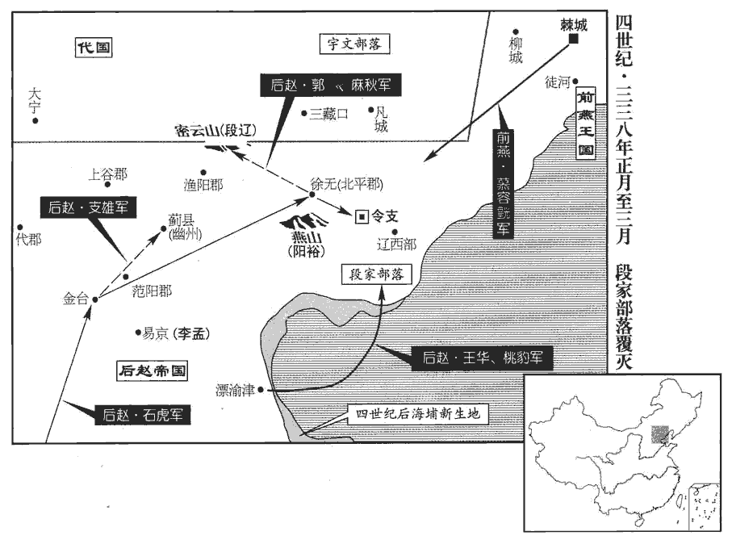
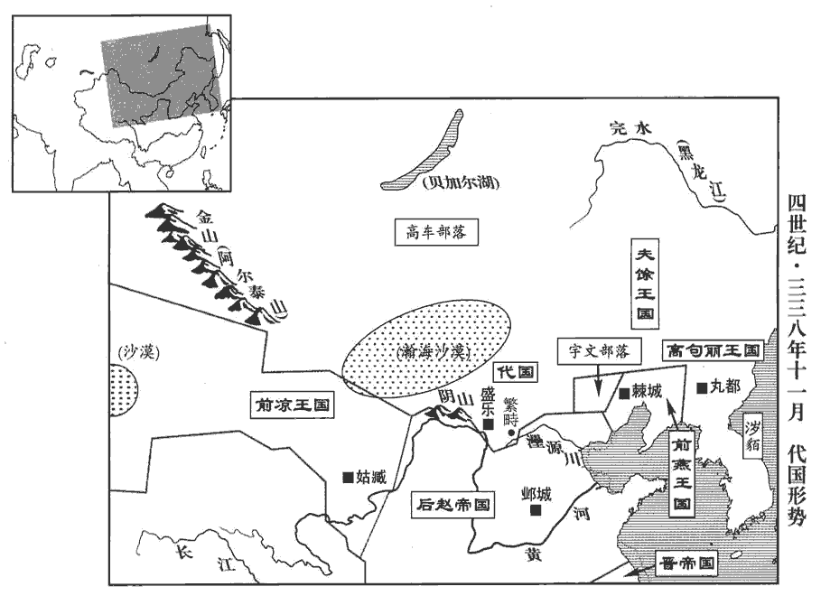
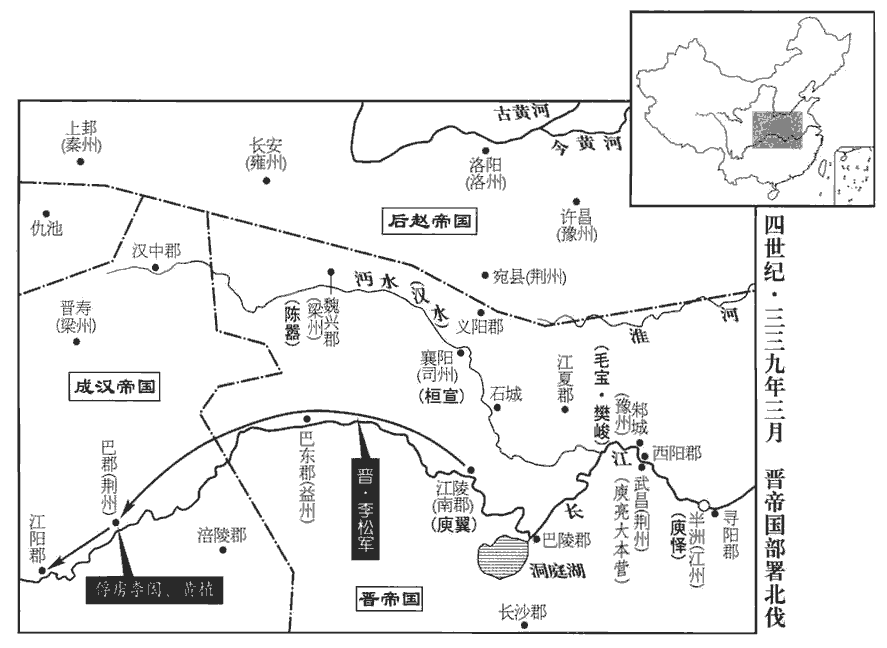
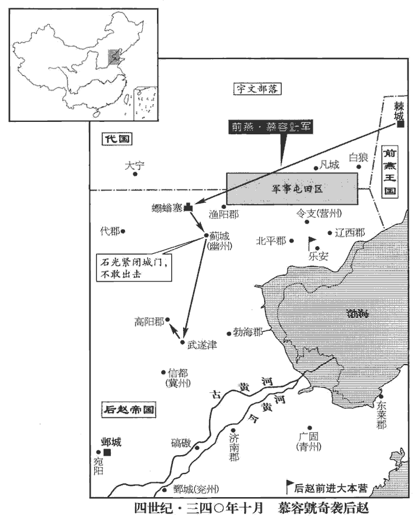

 晉紀十八起著雍閹茂（戊戌），盡重光赤奮若（辛丑），凡四年。

# 顯宗成皇帝中之下

## 咸康四年（戊戌，三三八）

1春，正月，燕‹都棘城辽宁省义县西›王皝‹本年四十二岁›遣都尉趙槃如趙，聽師期。皝，呼廣翻。趙‹都邺城河北省临漳县西南邺镇›王虎‹本年四十四岁›將擊段遼‹府令支河北省迁安县›，募驍勇者三萬人，驍，堅堯翻。悉拜龍騰中郎。據載記，咸康二年，虎改直盪為龍騰，冠以絳幘。會遼遣段屈雲襲趙幽州，幽州刺史李孟退保易京‹河北省雄县西北›。虎乃以桃豹為橫海將軍，橫海將軍蓋石氏創置。王華為渡遼將軍，帥舟師十萬出漂渝津‹河北省黄骅市境›；水經曰：清河東北過漂榆邑入于海。註云：漂榆故城，俗謂之角飛城。趙記云：石勒使王述煮鹽于角飛。魏土地記曰：勃海郡高城縣東北一百里，北盡漂榆，東臨巨海，民咸煮鹽為業。帥，讀曰率。支雄為龍驤大將軍，姚弋仲為冠軍將軍，驤，思將翻。帥步騎七萬為前鋒以伐遼。冠，古玩翻。帥，讀曰率。騎，奇寄翻。

〖译文〗 [1]春季，正月，前燕王慕容派都尉赵前往后赵国，打听军队出征的日期。后赵王石虎准备攻击段辽，招募骁勇善战的士兵三万人，全部拜授为龙腾中郎。适逢段辽派段屈云进攻赵的幽州，幽州刺史李孟后退保守易京。石虎便任命桃豹为横海将军，王华为渡辽将军，率领十万水军由漂渝津出发；又任支雄为龙骧大将军，姚弋仲为冠军将军，率领步兵、骑兵七万人为前锋，前往讨伐段辽。

三月，趙槃還至棘城‹辽宁义县西›。燕王皝引兵攻掠令支‹河北迁安›以北諸城。令，音鈴；師古郎定翻。支，音祁。段遼將追之，慕容翰曰：「今趙兵在南，當并力禦之；而更與燕鬬。燕王自將而來，將，即亮翻；下悉將同。其士卒精銳，若萬一失利，將何以禦南敵乎！」段蘭怒曰：「吾前為卿所誤，事見上卷咸和八年。以成今日之患；吾不復墮卿計中矣！」乃悉將見眾追之。復，扶又翻；下同。見，賢遍翻。皝設伏以待之，大破蘭兵，斬首數千級，掠五千戶及畜產萬計以歸。

〖译文〗 三月，赵回到棘城。前燕王慕容领兵攻掠令支以北的许多城镇。段辽准备追袭他，慕容翰说：“如今赵的军队在南边，应当集中力量抵御，却又要和燕王相斗！燕王亲自为帅前来，士卒精锐，假如万一失利，又怎么能抵御南边的强敌呢！”段兰发怒说：“我前次被你所误，以至于成为今日的祸患，我不再上你的当了！”于是率领手下现有的全部士众追击。慕容设下埋伏等候他，大败段兰的军队，斩首数千级，掳掠民众五千户、畜产数以万计返回。

趙王虎進屯金臺‹河北省易县东南›。按水經註：金臺在涿郡故安縣，有金臺陂，臺在陂北十餘步，即燕昭王築以事郭隗之臺。支雄長驅入薊‹北京›，薊，音計。段遼所署漁陽‹北京密云›、上谷‹河北怀来›、代郡‹河北蔚县›守相皆降，取四十餘城。北平‹河北遵化›相陽裕帥其民數千家登燕山‹河北省玉田县北›以自固。五代志，北平無終縣有燕山。守，手又翻。相，息亮翻。燕，於賢翻。諸將恐其為後患，欲攻之。虎曰：「裕儒生，矜惜名節，恥於迎降耳，降，戶江翻；下同。無能為也。」遂過之，至徐無。徐無縣，屬北平郡，其地在唐薊州玉田縣界。段遼以其弟蘭既敗，不敢復戰，帥妻子、宗族、豪大千餘家，豪大，猶言豪帥也。是時東北夷率謂主帥為大，部帥曰部大，城主曰城大是也。棄令支，奔密雲山‹北京密雲南横山›。水經註：密雲戍在禦夷鎮東南九十里，鮑丘水逕其西。唐檀州治密雲縣，西南去范陽二百里。又據晉紀云，遼奔于平崗。蓋密雲山在漢平岡縣界。宋白曰：檀州密雲縣，本漢虒sī奚縣，西南至幽州百九十里，西至媯guī川二百五十里，東北至長城障塞百一十里，東南至薊州百九十里。將行，執慕容翰手泣曰：「不用卿言，自取敗亡；我固甘心，令卿失所，深以為愧。」翰北奔宇文氏‹内蒙古老哈河上游›。

〖译文〗 后赵王石虎进军驻屯于金台。支雄长驱直入，到达蓟，段辽所任命的渔阳、上谷、代郡地方长官全都归降，攻取四十多个城镇。北平相阳裕率领民众数千家登上燕山自相拒守，众将领惟恐他成为后患，想要攻击他。石虎说：“阳裕是儒生，珍惜自己的名声气节，这样做不过是耻于投降，不会有什么作为。”于是经过燕山，到达徐无。段辽因为兄弟段兰已经战败，不敢再迎战，带领妻子、宗族和当地豪强一千多家，放弃令支，逃奔密云山。临行时拉着慕容翰的手哭泣着说：“没采纳您的建议，自取败亡。我固然是咎由自取，让您丧失安身之处，我为此深感惭愧。”慕容翰向北投奔宇文氏。

遼左右長史劉群、盧諶chén、崔悅等封府庫請降。群、諶、悅奔令支，見九十卷元帝大興元年。虎遣將軍郭太、麻秋帥輕騎二萬追遼，至密雲山，獲其母妻，斬首三千級。遼單騎走險，赴險以自保。走，音奏。遣其子乞特真奉表及獻名馬於趙，虎受之。

〖译文〗 段辽的左右长史刘群、卢谌、崔悦等人封存府库向石虎请降。石虎派将军郭太、麻秋率领二万轻骑兵追袭段辽，在密云山抓获段辽的母亲、妻子，斩首三千级。段辽单骑逃往险要之地，派儿子段乞特真向后赵国奉呈上表，并献上名马，石虎接受了。

虎入令支宮，段氏都令支，以其所居為宮。論功封賞各有差。徙段國民二萬餘戶於司、雍、兗、豫四州；雍，於用翻。士大夫之有才行，皆擢敘之。行，下孟翻。陽裕詣軍門降。虎讓之曰：「卿昔為奴虜走，今為士人來，豈識知天命，將逃匿無地邪？」對曰：「臣昔事王公，不能匡濟；王公，謂王浚也。裕奔令支見八十九卷愍帝建興二年。逃于段氏，復不能全。今陛下天網高張，籠絡四海，幽、冀豪傑莫不風從，如臣比肩，無所獨愧。生死之命，惟陛下制之！」虎悅，即拜北平‹河北省遵化市›太守。

〖译文〗 石虎进入令支宫室，对将士们论功封赏各有差等。把段国的二万多户民众迁徙到司州、雍州、兖州、豫州。士大夫中有才能、德行的，都予以提拔。阳裕到军门前请求归降，石虎责问他说：“你过去身为奴虏逃走，今天身为士人前来，难道是知晓了天命，想逃匿而无地藏身吗？”阳裕回答说：“我当初侍奉王浚，不能有所匡助，投奔段氏，又不能保全。如今陛下天网高张，控制四海，幽州、冀州的豪杰无不望风归从，像我这样的人比肩接踵，因此我并不特别惭愧。我的生死，惟听陛下裁决！”石虎喜悦，当即拜授阳裕为北平太守。

 

2夏，四月，癸丑‹三›。以慕容皝為征北大將軍、幽州牧，領平州刺史。

〖译文〗 [2]夏季，四月，癸丑（初三）晋朝廷任命慕容为征北大将军、幽州牧，兼领平州刺史。

3成主期‹李期，本年二十六岁›驕虐日甚，多所誅殺，而籍沒其資財、婦女，由是大臣多不自安。漢王壽素貴重，有威名，期及建寧王越等皆忌之。壽懼不免，每當入朝，常詐為邊書，辭以警急。壽時鎮涪城。朝，直遙翻。

〖译文〗 [3]成汉国主李期日益骄纵暴虐，多所诛杀，收被杀者的资财和妻女入宫，因此大臣们大多惶恐不安。汉王李寿素来职高位重，享有盛名，李期和建宁王李越等都忌惮他。李寿害怕自己不能免祸，每逢入宫朝见，常伪作边境告急文书，以警讯紧急为由推辞不来。

初，巴西‹四川阆中›處士龔壯，父、叔皆為李特所殺。父及叔父也。處，昌呂翻。壯欲報仇，積年不除喪。壽數以禮辟之，數，所角翻；下同。壯不應；而往見壽，壽密問壯以自安之策。壯曰：「巴、蜀之民本皆晉臣，節下若能發兵西取成都，稱藩於晉，誰不爭為節下奮臂前驅者！魏、晉以來，持節、假節出當方面者，人皆稱之為節下。為，于偽翻。如此則福流子孫，名垂不朽，豈徒脫今日之禍而已！」壽然之。陰與長史略陽‹甘肃天水东›羅恆、巴西解思明謀攻成都。

〖译文〗 当初，巴西处士龚壮的父亲、叔父都被李特所杀，龚壮意欲报仇，多年不除丧服。李寿多次按照礼仪征召他为官，龚壮不应召。此时龚壮前往拜见李寿，李寿悄悄地向龚壮询问自我保全的方法。龚壮说：“巴蜀的民众本来都是晋王室的臣民，您如果能够发兵西取成都，向晋朝称臣，谁不争着做您奋臂而起的前驱呢！这样福泽便可延续到子孙，名垂不朽，哪里只是摆脱今日的祸患而已呢！”李寿颇以为然，与长史、略阳人罗恒，巴西人解思明秘密商议进攻成都。

期頗聞之，數遣許涪至壽所，伺其動靜；涪，音浮。伺，相吏翻。又鴆殺壽養弟安北將軍攸。壽乃詐為妹夫任調書，云期當取壽；詐言期欲取壽，以怒其眾。任，音壬；下同。其眾信之，遂帥步騎萬餘人自涪襲成都，帥，讀曰率。涪，音浮。許賞以城中財物；以其將李奕為前鋒。將，即亮翻。期不意其至，初不設備。壽世子勢為翊yì軍校尉，開門納之，遂克成都，屯兵宮門。期遣侍中勞壽。勞，力到翻。壽奏建寧王越、景騫、田褒、姚華、許涪及征西將軍李遐、將軍李西等懷姦亂政，皆收殺之。縱兵大掠，數日乃定。壽矯以太后任氏令廢期為邛都縣公，幽之別宮。邛都縣，屬越巂郡。邛，渠容翻。追諡戾太子曰哀皇帝。咸和九年，期、越弒其主班，諡曰戾太子。

〖译文〗 李期对此颇有耳闻，多次派许涪到李寿住地观察动静，又毒死李寿的养弟、安北将军李攸。李寿于是伪造妹夫任调来信。说李期将要攻取李寿，李寿的部众信以为真。李寿于是率领步、骑兵一万多人由涪地出发，偷袭成都，并许愿用城中财物作为对部众的奖赏。让部将李奕充任前锋。李期没料想李寿突然到达，完全没有防备。李寿的世子李势任翊军校尉，打开城门迎接李寿，于是攻克成都，屯兵于宫室门前。李期派侍中犒劳李寿。李寿奏称建宁王李越、景骞、田褒、姚华、许涪以及征西将军李遐、将军李西等人心怀不轨，扰乱朝政，将他们全部拘捕处决。然后放纵士兵大肆劫掠，数日后才平定。李寿又矫称奉太后任氏令，废黜李期为邛都县公，幽禁在别宫中，追谥戾太子为哀皇帝。

羅恆、解思明、李奕等勸壽稱鎮西將軍、益州牧、成都王，稱藩于晉，解，戶買翻。送邛都公於建康；任調及司馬蔡興、侍中李豔等勸壽自稱帝。壽命筮之，龜為卜，蓍shī為筮shì。占者曰：「可數年天子。」調喜曰：「一日尚足，況數年乎！」思明曰：「數年天子，孰與百世諸侯？」壽曰：「朝聞道，夕死可矣。」引論語孔子之言。遂即皇帝位。壽，字武考，驤之子也。改國號曰漢，大赦，改元漢興。以安車束帛徵龔壯為太師；壯誓不仕，壽所贈遺，一無所受。遺，于季翻。

〖译文〗 罗恒、解思明、李奕等劝李寿自称镇西将军、益州牧、成都王，向晋王室称藩，把邛都公李期送到建康，而任调和司马蔡兴、侍中李艳等劝李寿自己称帝。李寿令人为此占筮，占者说：“可以当几年天子。”任调高兴地说：“能当一天便可满足，何况几年呢！”解思明说：“几年天子，怎么比得上百世诸侯？”李寿说：“早上听到道义，晚上死了也行。”于是即帝位，改国号为汉，实行大赦，改年号为汉兴。李寿用安车、束帛征召龚壮任太师，龚壮誓死不肯出仕，对李寿所馈赠的礼物，一概不接受。

壽‹李寿，本年三十九岁›改立宗廟，追尊父驤曰獻皇帝。驤，思將翻。母昝zǎn氏曰皇太后，昝，子感翻，姓也。立妃閻氏為皇后，世子勢為皇太子。更以舊廟為大成廟，舊廟，祀李特、李雄者也；雄建國號曰成。壽改曰漢，故以特、雄廟曰大成廟。凡諸制度，多所更易。更，工衡翻。以董皎為相國，羅恆為尚書令，解思明為廣漢‹四川廣漢›太守，任調為鎮北將軍、梁州刺史，李奕為西夷校尉，從子權為寧州刺史。從，才用翻。公、卿、州、郡，悉用其僚佐代之；成氏舊臣、近親及六郡士人，皆見疏斥。六郡士人，與李特兄弟同入蜀者。

〖译文〗 李寿改立宗庙，追尊父亲李骧为献皇帝，母亲昝氏为皇太后。立妃子阎氏为皇后，世子李势为皇太子。又改旧宗庙为大成庙，各种制度，多有更改。任命董皎为相国。罗恒为尚书令，解思明为广汉太守，任调为镇北将军、梁州刺史，李奕为西夷校尉，侄子李权为宁州刺史。凡是公卿大臣、州郡长官，都由自己的僚佐接替，成汉的旧臣、近亲以及六郡士人，都遭疏远和贬黜。

邛都公期歎曰：「天下主乃為小縣公，不如死！」五月，縊而卒‹年二十六岁›。載記，期死於三年，年二十五。縊，於賜翻，又於計翻。壽諡曰幽公，葬以王禮。

〖译文〗 邛都公李期叹息说：“天下的人主却成为小小的县公，不如死去！”五月，自缢而死。李寿追赠他谥号为幽公，按诸侯王的礼节入葬。

4趙王虎以燕王皝不會趙兵攻段遼而自專其利，以皝掠段氏人民、畜產，不待趙師至而北歸也。欲伐之。太史令趙攬諫曰：「歲星守燕分，師必無功。」天文志，歲星贏縮，以其舍命國；其所居久，其國有德厚，五穀豐昌，不可伐也。分，扶問翻。虎怒，鞭之。

〖译文〗 [4]后赵王石虎因为前燕王慕容没有会合后赵的军队攻击段辽，却独自占有掳获的民众和畜产，因而打算讨伐他。太史令赵揽劝谏说：“岁星正当燕国的分野，出师必然无功。”石虎发怒，鞭击他。

皝聞之，嚴兵設備；罷六卿、納言、常伯、冗騎常侍官。去年皝置六卿等官。冗rǒng，而隴翻。趙戎卒數十萬，燕人震恐。皝謂內史高詡曰：「將若之何？」內史，燕國內史也。對曰：「趙兵雖強，然不足憂，但堅守以拒之，無能為也。」

〖译文〗 慕容听说此事，调集军队严加设防。废除了六卿、纳言、常伯、冗骑常侍官职。后赵的军队有数十万人，前燕国民众大为恐慌。慕容对内史高诩说：“我们将怎么办？”高诩回答说：“赵军虽然强大，但不值得忧虑，只要坚固防守来抵御，他们便无所作为。”

虎遣使四出，招誘民夷，誘，音酉。燕成周‹辽宁省锦州市境›內史崔燾、居就‹辽宁省辽阳市东南›令游泓、武原‹成周郡郡政府›令常霸、東夷校尉封抽、護軍宋晃等皆應之，凡得三十六城。泓，邃之兄子也。冀陽‹辽宁省朝阳市西›流寓之士共殺太守宋燭以降於趙。燭，晃之從兄也。營丘‹辽宁省凌海市›內史鮮于屈亦遣使降趙；武寧‹营丘郡郡政府›令廣平‹河北省曲周县东北›孫興曉諭吏民共收屈，數其罪而殺之，閉城拒守。成周、冀陽、營丘郡，皆慕容廆所置，見八十九卷愍帝建興二年。居就縣，漢、晉屬遼東郡。武原，蓋亦慕容氏所置縣也。武寧縣，亦慕容氏所置，帶營丘郡。游邃見八十八卷愍帝建興元年。朝鮮令昌黎‹辽宁义县›孫泳帥眾拒趙。帥，讀曰率。大姓王清等密謀應趙，泳收斬之；同謀數百人惶怖請罪，怖，普布翻。泳皆釋之，與同拒守。樂浪‹侨郡·辽宁省义县境›太守鞠jū彭以境內皆叛，選鄉里壯士二百餘人共還棘城。樂浪，非漢古郡地也，慕容廆所置，見八十八卷愍帝建興元年。以五代志考之，樂浪、冀陽、營丘郡、朝鮮、武寧等縣，當盡在隋遼西郡柳城縣界。鞠彭率鄉人歸燕，見九十一卷元帝太興二年。樂浪，音洛琅。

〖译文〗 石虎派遣使者四处出动，招纳、诱降各族民众，前燕国的成周内史崔焘，居就县令游弘、武原县令常霸、东夷校尉封抽、护军宋晃等都应从他，共获得三十六城。游弘即游邃兄长之子。冀阳的侨居士人共同杀死太守宋烛，投降后赵。宋烛即宋晃的堂兄。营丘内史鲜于屈也派使者投降后赵，武宁县令、广平人孙兴晓谕官吏和民众，共同执获鲜于屈，历数他的罪状后处死，然后关上城门防守御敌。朝鲜令、昌黎人孙泳率士众抵抗后赵军，豪强王清等人密谋应从后赵，被孙泳拘捕斩首。同谋的几百人惊惶恐惧，向孙泳请罪，孙泳都不予追究，和他们一块儿防守御敌。乐浪太守鞠彭因境内士民大多背叛投降，选择同乡勇士二百多人共同回返棘城。

戊子‹九›，趙兵進逼棘城。燕王皝欲出亡，帳下將慕輿根諫曰：將，即亮翻。「趙強我弱，大王一舉足則趙之氣勢遂成，使趙人收略國民，國民，謂燕國之民也。兵強穀足，不可復敵。復，扶又翻，竊意趙人正欲大王如此耳，柰何入其計中乎！今固守堅城，其勢百倍，縱其急攻，猶足枝持，觀形察變，間出求利；謂伺間出擊趙以求利也。間，古莧翻。如事之不濟，不失於走，柰何望風委去，為必亡之理乎！」皝乃止，然猶懼形於色。玄菟‹辽宁省沈阳市›太守河間‹河北省献县›劉佩曰：「今強寇在外，眾心恟懼，菟，同都翻。守，式又翻。恟，許拱翻。事之安危，繫於一人。大王此際無所推委，推，吐雷翻。言難推此責以委人也。當自強以厲將士，不宜示弱。事急矣，臣請出擊之，縱無大捷，足以安眾。」乃將敢死數百騎出衝趙兵，所向披靡，披，普彼翻，開也，分也，散也。靡，偃也。斬獲而還，還，從宣翻，又如字。於是士氣自倍。皝問計於封奕，對曰：「石虎凶虐已甚，民神共疾，禍敗之至，其何日之有！杜預曰：言今至。今空國遠來，攻守勢異，戎馬雖強，無能為患；頓兵積日，釁隙自生，但堅守以俟之耳。」皝意乃安。或說皝降，皝曰：「孤方取天下，何謂降也！」說，輸芮翻。降，戶江翻。

〖译文〗 戊子（初九），后赵军进逼棘城。前燕王慕容打算离城逃亡，军中将领慕舆根劝谏说：“现在正当敌强我弱，大王一抬脚那么赵军的气势便养成了。如果让赵人拥有并安定了国民，兵强粮足，就无法再与之抗衡了。我私下认为赵人正希望大王这么做，为何中他们的计呢！如今牢牢守住坚固的城堡，气势便增强百倍，纵然赵军猛烈进攻，也还足以支持。再观察形势的变化，伺机出击求取利益。如果事情难以成功，也还可以逃走，为何要望风而逃自己造就必定亡国的局势呢！”慕容这才中止逃亡的计划，但犹豫、恐惧仍然形于颜色。玄菟太守、河间人刘佩说：“现在强寇在外，人心恐惧难安，事情的安危，都系于您一人之身。大王在此时无可推委，应当自我勉励以鼓舞将士，不应当显示出怯弱。现在事情很危急了，我请求出击敌军，即使不能大胜，也足以安定人心。”于是带领几百名不怕死的骑兵出城冲击后赵军，所向披靡，各有斩获，然后返回，前燕军士气因此大盛。慕容向封奕询问对策，封奕回答说：“石虎的凶残暴虐早已过头，人神共愤，灾祸、败亡的降临，指日可待！现在倾国远来，但进攻和防守的情势并不一样，攻难守易，敌军兵马虽强，但并不能成为祸患。他们在此滞留多日后，矛盾和隔阂就自然产生，我们只需坚守等待而已。”慕容这才心安。有人劝说慕容投降，慕容说：“孤正要夺取天下，说什么投降！”

趙兵四面蟻附緣城，言肉薄附城而上，若群蟻然。慕輿根等晝夜力戰；凡十餘日，趙兵不能克，壬辰‹十三›，引退。皝遣其子恪帥二千騎追擊之，帥，讀曰率。趙兵大敗，斬獲三萬餘級。趙諸軍皆棄甲逃潰，惟游擊將軍石閔一軍獨全。閔父瞻，內黃‹河南內黃西›人，內黃縣，屬魏郡；以陳留有外黃，故加「內」。本姓冉，趙主勒破陳午，獲之，命虎養以為子。閔驍勇善戰，多策略，虎愛之，比於諸孫。冉閔始此。石勒養石虎以自滅其種，石虎養冉閔，併其種類而夷之，蓋天道也。驍，堅堯翻。

〖译文〗 后赵军从四面如同蚂蚁一样攀登城墙，慕舆根等昼夜力战十几天，后赵军不能取胜。任辰（十三日），后赵军退却。慕容派儿子慕容恪率领二千骑兵追袭，后赵军大败，斩获首级三万多。后赵各路军队都弃甲溃逃，只有游击将军石闵带领的一支军队未遭创伤。石闵的父亲名瞻，是内黄人，本来姓冉。当年后赵国主石勒攻破陈午，掳获石闵，令石虎把他当作自己的儿子收养。石闵骁勇善战，多计谋，石虎宠爱他，如同对自己的孙子们一样。

虎還鄴，以劉群為中書令，盧諶為中書侍郎。諶chén，是壬翻。蒲洪以功拜使持節、都督六夷諸軍事、冠軍大將軍，封西平郡公。使，疏吏翻。冠，古玩翻。石閔言於虎曰：「蒲洪雄儁，得將士死力，諸子皆有非常之才，且握強兵五萬，屯據近畿，近畿，謂洪屯枋頭‹河南省淇县东南淇门渡›，距鄴為近。宜密除之，以安社稷。」虎曰：「吾方倚其父子以取吳、蜀，柰何殺之！」待之愈厚。石虎之不能殺蒲洪，猶苻堅之不能殺慕容垂、姚萇也。

〖译文〗 石虎回到邺，任命刘群为中书令、卢谌为中书侍郎。蒲洪因功拜授使持节、都督六夷诸军事、冠军大将军，封为西平郡公。石闵对石虎说：“蒲洪雄武隽迈，得到将士的拼死效力，儿子们又都有非凡的才能，而且拥有强兵五万人，驻屯在都城近处，应当秘密地除掉他们，以安定国家。”石虎说：“我正倚仗他们父子攻取东吴和巴蜀，为何要杀死他们！”给他的待遇愈加优厚。

燕王皝分兵討諸叛城，皆下之。拓境至凡城‹河北平泉南›，水經註：自盧龍東越青陘至凡城二百許里，自凡城東北出趣平剛故城可百八十里，向黃龍城則五百里。崔燾、常霸奔鄴，封抽、宋晃、游泓奔高句麗‹都丸都吉林省集安市›。皝賞鞠彭、慕輿根等而治諸叛者，誅滅甚眾；治，直之翻。功曹劉翔為之申理，多所全活。為，于偽翻。

〖译文〗 前燕王慕容分别派军征讨各个背叛的城镇，都获得了胜利，把疆域拓展至凡城。崔焘、常霸逃奔邺，封抽、宋晃、游泓逃奔高句丽。慕容奖赏鞠彭、慕舆根等人，对背叛者则依法治罪，诛灭了许多人。由于功曹刘翔从中为他们申辩请求，许多人得以保全性命。

趙之攻棘城也，燕右司馬李洪之弟普以為棘城必敗，勸洪出避禍。洪曰：「天道幽遠，人事難知，且當委任，勿輕動取悔！」普固請不已。洪曰：「卿意見明審者，當自行之，吾受慕容氏大恩，義無去就，當效死於此耳！」與普流涕而訣。訣，別也。普遂降趙，降，戶江翻。從趙軍南歸，死於喪亂。喪，息浪翻。洪由是以忠篤著名。

〖译文〗 后赵进攻棘城时，前燕国右司马李洪的兄弟李普认为棘城必定失败，劝李洪出逃避祸。李洪说：“天道幽冥遥远，人事难以预知。况且身负委派的责任，不要轻举妄动，自找悔恨！”但李普却坚持请求，不肯罢休。李洪说：“你认为自己的看法正确、精明，就应当自己去做。我蒙受慕容氏的大恩，按道义无从取舍，应当在这里以死效忠。”便与李普洒泪诀别。李普随即投降后赵，随从后赵军队南归，后死于丧乱之中。李洪因此以忠诚笃信著名于世。

趙王虎遣渡遼將軍曹伏將青州之眾戍海島，據載記，虎遣伏渡海戍蹋頓城，無水而還，因戍于海島。運穀三百萬斛以給之；又以船三百艘運穀三十萬斛詣高句麗，句，如字，又音駒。麗，力知翻。使典農中郎將王典帥眾萬餘屯田海濱，又令青州‹广固山东省青州市›造船千艘，以謀擊燕。石虎忿棘城之敗，再謀擊燕而卒不能也。艘，蘇遭翻。

〖译文〗 后赵王石虎派渡辽将军曹伏带领青州的士众戍守海岛，运送谷物三百万斛供给食用，又用三百艘船运送三十万斛谷物到高句丽，让典农中郎将王典率领一万多部众在海滨垦荒屯田，又下令让青州建造战船一千艘，以备进攻前燕国。

5趙太子宣帥步騎二萬擊朔方‹河套地区›鮮卑斛摩頭，破之，斬首四萬餘級。帥，讀曰率。騎，奇寄翻。

〖译文〗 [5]后赵太子石宣率领步、骑兵二万人攻击朔方的鲜卑部斛摩头，打败了他，斩首四万多级。

6冀州八郡大蝗，趙司隸請坐守宰。趙都鄴，以冀州為司部。趙王虎曰：「此朕失政所致，而欲委咎守宰，豈罪己之意邪！司隸不進讜言，佐朕不逮，而欲妄陷無辜，可白衣領職！」黜其品秩，同於民庶，而仍領司隸之職。讜，音黨。

〖译文〗 [6]冀州八郡发生严重蝗灾，后赵司隶请求将州郡长官治罪。后赵王石虎说：“这是朕朝政有过失所致，却想归罪地方长官，这哪里符合自己知罪的心意呢！司隶不进陈正直的言论，以便辅助我纠正过失，却想随意陷害无辜之人，应当革除爵位品秩，让他以庶民的身份执行司隶的职务。”

虎使襄城公涉歸、上庸公日歸帥眾戍長安。二歸，亦石氏之族。二歸告鎮西將軍石廣私樹恩澤，潛謀不軌；虎追廣至鄴，殺之。

〖译文〗 石虎让襄城公石涉归、上庸公石日归率领士众戍守长安。二人告发镇西将军石广私自树立恩泽，秘密图谋不轨，石虎把石广召回邺城，杀死石广。

7乙未‹十六›，以司徒導為太傅，都督中外諸軍事，郗鑒為太尉，郗，丑之翻。庾亮為司空。六月，以導為丞相，罷司徒官以并丞相府。東漢司徒，即丞相之職也。沈約曰：丞，奉也；相，助也。時以王導為丞相，罷司徒府并丞相府。導薨，罷丞相復為司徒府。宋世祖初以南郡王義宣為丞相，而司徒府如故。

〖译文〗 [7]乙未（十六日），东晋朝廷任命司徒王导为太傅、都督中外诸军事，任郗鉴为太尉，庚亮为司空。六月，任王导为丞相，取消司徒的官职，并入丞相府。

導性寬厚，委任諸將趙胤、賈寧等，多不奉法，大臣患之。庾亮與郗鑒牋曰：「主上自八九歲以及成人，入則在宮人之手，出則唯武官、小人，讀書無從受音句，顧問未嘗遇君子。秦政欲愚其黔首，秦始皇名政，命民曰黔首，焚詩書以愚黔首。天下猶知不可，況欲愚其主哉！人主春秋既盛，宜復子明辟。不稽首歸政，稽，音啟。甫居師傅之尊，甫，方也，始也。多養無賴之士；公與下官并荷託付之重，言受遺先帝，付以幼孤而託之也。荷，下可翻。大姦不掃，何以見先帝於地下乎！」欲共起兵廢導，鑒不聽。南蠻校尉陶稱，南蠻校尉，武帝初置於襄陽，後治江陵。侃之子也。以亮謀語導。語，牛倨翻。或勸導密為之備，導曰：「吾與元規休戚是同，悠悠之談，宜絕智者之口。言智者之口，不宜亦傳道悠悠之談。則如君言，元規若來，吾便角巾還第，復何懼哉！」復，扶又翻。又與稱書，以為「庾公帝之元舅，宜善事之！」此導之識量所以為弘遠也。征西參軍孫盛密諫亮曰：「王公常有世外之懷，言導心常欲謝事，優游於人世之外。豈肯為凡人事邪！此必佞邪之徒欲間內外耳。」亮乃止。庾亮之謀，微郗鑒拒之於外，孫盛諫止於內，必再亂天下矣。間，古莧翻。盛，楚之孫也。孫楚，晉初名士。是時，亮雖居外鎮，而遙執朝廷之權，既據上流，擁強兵，趣勢者多歸之。趣，七喻翻。導內不能平，常遇西風塵起，常，當作嘗。舉扇自蔽，徐曰：「元規塵污人！」污，烏故翻。史言導不平之心不能自禁於言語之間者，惟此而已。

〖译文〗 王导性情宽容仁厚，所委任的许多将领，如赵胤、贾宁等，大多不守法令，大臣们为此忧虑。庾亮给郗鉴写信说：“皇上从八九岁以至长大成人，入内则由宫女守护，外出则只有武官、小人们侍从，读书无从学音句，顾视询问则未曾遇见君子。秦始皇想使百姓愚昧，天下人尚且知道不对，更何况有人想使君主愚昧呢！君主既然正当茂盛的年华，应当还政于贤明的主上。王导不恭敬地归还政权，却开始自居太师太傅的尊位，豢养许多没有才能的士人，您和我都身负先帝托付佐政的重任，这样的大奸之人不清除，又有什么脸面到地下去见先帝呢！”因而想一起发兵废黜王导，但郗鉴不同意。南蛮校尉陶称是陶侃的儿子，把庾亮的谋议告知王导，有人劝王导秘密地加以防备，王导说：“我和庾亮休戚与共，像这种庸俗的传说，不应当由智慧之人的口中传播。即使如同你所说，庾亮假使到这儿来，我就头带方巾，归隐还乡，又有什么可惧怕的！”王导又给陶称写信，认为：“庾公是皇上的大舅，你应当好好侍奉他。”征西参军孙盛悄悄地劝谏庾亮说：“王公经常有辞绝政事、优游于尘世之外的愿望，怎么会干俗人所干的事情呢！这一定是奸佞邪恶之徒想离间内廷与百官的关系而已。”庾亮这才作罢。孙盛即孙楚的孙子。此时庾亮虽然驻守于外镇，却遥遥控制朝廷大权，权势显赫，又拥有强大的军队，趋炎附势的人大多归附于门下。王导心中不平，每当遇到西风扬起尘埃，便举起扇子遮蔽自己，缓缓地说：“庾亮的尘土沾污人！”

導以江夏‹湖北云梦›李充為丞相掾。夏，戶雅翻。掾，以絹翻。充以時俗崇尚浮虛，乃著學箴。以為老子云，「絕仁棄義，民復孝慈，」豈仁義之道絕，然後孝慈乃生哉？蓋患乎情仁義者寡而利仁義者眾，將寄責於聖人而遣累乎陳迹也。累，力瑞翻。凡人見形者眾，及道者鮮，鮮，息淺翻。逐迹逾篤，離本逾遠。離，力智翻。故作學箴以祛其蔽祛qū，丘於翻，攘卻也。曰：「名之攸彰，道之攸廢；乃損所隆，乃崇所替。非仁無以長物，長，丁丈翻，今知兩翻。非義無以齊恥，仁義固不可遠，去其害仁義者而已。」遠，于願翻。去，羌呂翻。

〖译文〗 王导让江夏人李充任丞相佐吏。李充因为当时风俗崇尚浮华空虚，于是撰著《学箴》。他认为老子所说的“弃绝仁义，百姓返归孝敬慈爱”，哪里是指崇尚仁义的的道路被断绝，然后才能产生孝敬慈爱呢？大概是忧虑真心崇尚仁义的少，假借仁义谋私利的多，因而想将责任归罪于圣人的提倡，把问题归咎以往的事情。平庸之人只看到外表的多，真正达到大道的少，追求圣人的业迹越是虔诚，离开圣人的本质也就越远，所以他作《学箴》，用以祛除流弊。文中说：“声名所彰显，道德之所以废毁，只有减损显赫的虚名，才能提高被弃废的道德。没有仁无法使万物生长，没有义无法统一羞耻观念，仁义原本不可以丢弃，只是要除去违害仁义的东西而已。”

8漢李奕從兄廣漢‹四川廣漢›太守乾告大臣謀廢立。從，才用翻。秋，七月，漢主壽‹李寿，本年三十九岁›使其子廣與大臣盟于前殿，徙乾為漢嘉‹四川省名山县北›太守；以李閎為荊州刺史，鎮巴郡‹重庆›。閎、恭之子也。恭，李攀之弟，見八十四卷惠帝永寧元年。

〖译文〗 [8]成汉国李奕的堂兄、广汉太守李乾告发大臣图谋废黜旧君，更立新主。秋季，七月，成汉国主李寿让儿子李广和大臣们在前殿盟誓，改任李乾为汉嘉太守，让李闳出任荆州刺史，镇守巴郡。李闳即李恭的儿子。

八月，蜀中久雨，百姓饑疫。壽命群臣極言得失。龔壯上封事稱：「陛下起兵之初，上指星辰，昭告天地，歃血盟眾，舉國稱藩，謂將稱藩于晉也。歃，色洽翻。天應人悅，大功克集；而論者未諭，權宜稱制。謂壽即皇帝位也。今淫雨百日，饑疫并臻，天其或者將以監示陛下故也。監，古陷翻。愚謂宜遵前盟，推奉建康，彼必不愛高爵重位以報大功；雖降階一等，王降皇帝一等。而子孫無窮，永保福祚，不亦休哉！論者或言二州附晉則榮，二州，謂梁、益也。六郡人事之不便。昔公孫述在蜀，羈客用事，荊邯、王元、田戎、延岑，皆羈客也。劉備在蜀，楚士多貴。龐統、黃忠、董和、劉巴、馬良兄弟、呂乂、廖立、李嚴、楊儀、魏延、蔣琬、費禕yī、董允等，皆楚士也。及吳、鄧西伐，吳、鄧，吳漢、鄧艾也。舉國屠滅，寧分客主！論者不達安固之基，苟惜名位，以為劉氏守令方仕州郡；曾不知彼乃國亡主易，豈同今日義舉，主榮臣顯哉！舉國奉晉為義舉，晉加以寵秩，則主榮臣顯。論者又謂臣當為法正。法正啟劉備以取成都，壯亦教壽取李期，故論者以比之。臣蒙陛下大恩，恣臣所安；至於榮祿，無問漢、晉，臣皆不處，復何為效法正乎！」壽省書內慙，處，昌呂翻。復，扶又翻。省，悉景翻。祕而不宣。

〖译文〗 八月，蜀地阴雨连绵，百姓饥荒，疫病流行。李寿下令让群臣尽情陈述朝政的得失。龚壮呈上的密封章奏说：“陛下当初起兵时，上指星辰，明白地求告天地，歃血与士众盟誓，将举国向晋室称臣，上天感应，人民喜悦，这才大功告成。但议论者不明其理，以至陛下随从事势即位称制。现在淫雨连绵百日，饥荒和疫病同时降临，这大概是上天想以此向陛下示戒的缘故。我认为应当遵守原先的盟誓，推重和尊奉在建康的晋王室，他们必定不会吝惜高厚的爵位、重要的职务来报答您的大功。虽然地位降低一等，但子子孙孙可以永久地保住福祚，不也很好吗！论议者中有人说梁州、益州归附晋室可以得到荣宠，其余六郡在人事安排上多有不便。当初公孙述在蜀地，以羁留客居的身份任职；刘备在蜀地，楚国的士人大多显贵。等到吴汉、邓艾向西征伐，蜀汉全国被屠灭，又怎能分别出客与主？论议者不明白安定稳固的根本，吝惜已有的名位，认为刘备的守令均任职于州郡，竟然不知道他们是国家灭亡，君主改易，哪里比得上今天的义举，能使君主荣耀，臣下显赫呢！论议者又认为我应当效法法正。我蒙受陛下的大恩，听任、放纵我安居世外，至于荣耀俸禄，无论是在汉还是在晋，我都不想得到，又为什么要效法法正呢？”李寿看完奏章后内心惭愧，秘密扣下不予宣示。

9九月，漢僕射任顏謀反，誅。顏，任太后之弟也。漢主壽因盡誅成主雄諸子。任后，雄之正室也。壽以任顏之反，必以立諸甥為主，故盡誅雄諸子以絕人望。任，音壬。

〖译文〗 [9]九月，成汉仆射任颜谋反，被杀。任颜即任太后的兄弟。成汉国主李寿因此全数诛杀成汉旧主李雄的所有子嗣。

10冬，十月，光祿勲顏含以老遜位。引年致事也。論者以「王導帝之師傅，名位隆重，百僚宜為降禮。」降禮，謂拜之。為，于偽翻；下同。太常馮懷以問含。含曰：「王公雖貴重，理無偏敬。臣子惟拜君父，施之於導則為偏敬。偏，不正也。降禮之言，或是諸君事宜；鄙人老矣，不識時務。」既而告人曰：「吾聞伐國不問仁人，董仲舒曰：昔者魯君問柳下惠：「吾欲伐齊，何如？」柳下惠曰：「不可。」歸而有憂色，曰：「吾聞伐國不問仁人，此言何為至於我哉！」向馮祖思問佞於我，馮懷，字祖思。我豈有邪德乎！」郭璞嘗遇含，欲為之筮。因含請老，併及辭郭璞事，以見其有識有守。含曰：「年在天，位在人。脩己而天不與者，命也；守道而人不知者，性也；自有性命，無勞蓍龜。」蓍shī，升脂翻。致仕二十餘年，年九十三而卒。

〖译文〗 [10]冬季，十月，光禄勋颜含因年老退位。朝廷论议者认为，“王导是皇帝的师傅，名位高重，百官应当对他行拜礼。”太常冯怀就此询问颜含。颜含说：“王公的名位虽然贵重，但按理不应当特别示敬。行拜礼的说法，或许是你们的事。鄙人已老了，不识时务。”不久，颜含告诉别人说：“我听说攻伐他国不要询问仁人，方才冯怀拿谄佞之事来问我，我怎能有奸邪的德行呢！”郭璞曾经遇见颜含，想为他占筮。颜含说：“寿命在天，职位在人。自我修炼而上天不助，这是命；谨守道德而他人不知，这是性。人自有性命，不需有劳占筮卜龟。”颜含辞职二十多年，至九十三岁时去世。

11代‹府盛乐内蒙古和林格尔县›王翳槐之弟什翼犍質於趙，為質見九十四卷咸和四年。犍，居言翻。質，音致。翳槐疾病，命諸大人立之。翳槐卒，諸大人梁蓋等以新有大故，有大喪謂之大故。滕文公曰；今也不幸，至於大故。什翼犍在遠，來未可必；比其至，恐有變亂，謀更立君。比，必寐翻。更，古衡翻。而翳槐次弟屈，剛猛多詐，不如屈弟孤仁厚，乃相與殺屈而立孤。孤不可，自詣鄴迎什翼犍，請身留為質；質，音致。趙王虎義而俱遣之。十一月，什翼犍即代王位於繁畤‹山西省浑源县西南›北，繁畤縣，屬鴈門郡。畤zhì，音止。改元曰建國；分國之半以與孤。

〖译文〗 [11]代王拓跋翳槐的兄弟拓跋什翼犍到后赵做人质，拓跋翳槐病重，命令诸大人立拓跋什翼犍为王。拓跋翳槐死后，诸大人梁盖等人认为国家新有重大丧事，拓跋什翼犍离得远，来不来不可确定，等到他归来，恐怕会有变乱，因此谋议重新立君。而拓跋翳槐的二弟拓跋屈，刚猛多诈，不如拓跋屈的弟弟拓跋孤仁厚，于是共同杀死拓跋屈，立拓跋孤为君。拓跋孤不同意，自己到邺去迎接拓跋什翼犍，请求自己留在后赵为人质。后赵王石虎认为他有道义，把他和拓跋翼犍一同遣返。十一月，拓跋什翼犍在繁以北即代王位，改年号为建国。又分出国土的一半给拓跋孤。

 

初，代王猗盧既卒，國多內難，部落離散，事見八十九卷愍帝建興四年。難，乃旦翻。拓跋氏寖衰。及什翼犍立‹本年十九岁›，雄勇有智略，能脩祖業，國人附之；始置百官，分掌眾務。以代‹河北省蔚县›人燕鳳為長史，許謙為郎中令。始制反逆、殺人、姦盜之法，號令明白，政事清簡，無繫訊連逮之煩，百姓安之。於是東自濊貊‹朝鲜半岛东北部›，濊huì，音穢。貊mò，莫白翻。西及破落那‹即大宛，首都贵山城中亚纳曼干市西北卡散赛城›，新唐書西域傳曰：寧遠者，本拔汗那，或曰潑汗，元魏時謂之破落那，去長安八千里，居西鞬城，在真珠河之北。南距陰山，北盡沙漠，率皆歸服，有眾數十萬人。史言代復強。

〖译文〗 当初，代王拓跋猗卢死后，国家内乱频仍，部落离散，拓跋氏逐渐衰微。等到拓跋什翼犍即位，雄健勇悍而有智谋，能够发展祖先遗业，国人都归附他。此时开始设置百官，分别掌管政务，任命代人燕凤为长史，许谦为郎中令。开始制定惩治反逆、杀人、奸盗的法律，法令明了，政事清简，没有囚禁株连的烦扰，百姓安居乐业。于是东边起自貊，西边远及破落那，南方到达阴山，北方直至沙漠，众人全都归服，拥有士众数十万人。

12十二月，段遼自密雲山遣使求迎於趙；使，疏吏翻；下同。既而中悔，復遣使求迎於燕。復，扶又翻。

〖译文〗 [12]十二月，段辽从密云山派使者向赵请求允许自己归降；不久又后悔，重新派使者到前燕请求允许自己投降。

趙王虎遣征東將軍麻秋帥眾三萬迎之，帥，讀曰率；下同。敕秋曰：「受降如受敵，不可輕也！」降，戶江翻。以尚書左丞陽裕，遼之故臣，使為秋司馬。

〖译文〗 后赵王石虎派征东将军麻秋率领三万士众迎接段辽投降，敕令麻秋说：“受降如同迎敌，不能轻视！”因为尚书左丞阳裕是段辽的旧臣，便让他担任麻秋的司马。

燕王皝自帥諸軍迎遼，帥，讀曰率。遼密與燕謀覆趙軍。皝遣慕容恪伏精騎七千於密雲山，大敗麻秋於三藏口‹河北省承德市境›，水經註：安州東有武列水，其水三川派合。西源曰西藏水，西南流，而東藏水注之。水出東溪，西南流出谷，與中藏水合；水導中溪，南流出谷，南注東藏水。東藏水又南，右入西藏水。故目其川曰三藏川。魏收地形志曰：皇興二年置安州，統密雲等郡。隋廢郡為密雲縣，唐為檀州治所。敗，補邁翻。死者什六七。秋步走得免，陽裕為燕所執。

〖译文〗 前燕王慕容亲自率领各将领迎接段辽，段辽秘密和前燕国谋议颠覆后赵军。慕容派慕容恪在密云山埋伏七千精锐骑兵，在三藏口大败麻秋的军队，死亡人数达十分之六七。麻秋徒步逃脱，阳裕被前燕人擒获。

趙將軍范陽‹河北涿州›鮮于亮失馬，步緣山不能進，因止，端坐；燕兵環之，環，音宦。叱令起。亮曰「身是貴人，義不為小人所屈；汝曹能殺亟殺，不能則去！」亮儀觀豐偉，觀，古玩翻。聲氣雄厲，燕兵憚之，不敢殺，以白皝。皝以馬迎之，與語，大悅，用為左常侍，晉制：諸王國，大國置左、右常侍。以崔毖之女妻之。妻，七細翻。

〖译文〗 后赵将军范阳人鲜于亮的坐骑丢失，步行登山，难以攀援，随即止步，端正而坐。前燕兵四面包围，叱令他起身。鲜于亮说：“我是贵人之身，按道义决不被小人所屈服。你们能杀就赶紧杀我，不能杀我就离开这里！”鲜于亮仪表堂堂，身材高大魁伟，声气雄壮凌厉，前燕兵畏惧，不敢进前博杀，便禀报慕容。慕容带上马匹相迎，与鲜于亮交谈之后，大为喜悦，任用他为左常侍，并把崔毖的女儿许配给他为妻。

皝盡得段遼之眾。待遼以上賓之禮，以陽裕為郎中令。

〖译文〗 慕容尽数获得段辽的士众，用上宾的礼节对待段辽，任用阳裕为郎中令。

趙王虎聞麻秋敗，怒，削其官爵。

〖译文〗 后赵王石虎听说麻秋战败，发怒，革除了麻秋的官职和爵位。

## 五年（己亥，三三九）

1春，正月，辛丑‹二十五›，大赦。

〖译文〗 [1]春季，正月，辛丑（二十五日），大赦天下。

2三月，乙丑，廣州刺史鄧岳將兵擊漢寧州，漢建寧‹云南曲靖›太守孟彥執其刺史霍彪以降。咸和八年，成取寧州，今復之。成以霍彪刺寧州，見上卷咸和九年。降，戶江翻。

〖译文〗 [2]三月，乙丑（疑误），广州刺史邓岳率军进攻成汉国宁州，成汉建宁太守孟彦执获同州刺史霍彪投降。

3征西將軍庾亮欲開復中原，表桓宣為都督沔北前鋒諸軍事、司州刺史，鎮襄陽‹湖北襄樊›；沔，彌兗翻。又表其弟臨川‹江西臨川›太守懌yì為監梁•雍二州諸軍事、梁州刺史，鎮魏興‹陕西安康›；自李矩以司州刺史退屯卒于魯陽，司州已寄治荊州界；今始以司州治襄陽。周訪領梁州，治襄陽；今司州既治襄陽，故梁州治魏興。監，工銜翻；下同。西陽‹湖北省黄州市›太守翼為南蠻校尉，領南郡太守，鎮江陵‹湖北江陵›；皆假節。又請解豫州，以授征虜將軍毛寶。‹司马衍，本年十九岁›詔以寶監揚州之江西諸軍事、豫州刺史，與西陽太守樊峻帥精兵萬人戍邾城‹湖北省黄州市›。邾城在江北，漢江夏郡邾縣之故城也。楚宣王滅邾，徙其君於此，因以為名，今黃州城是也。杜佑曰：黃州東南百二十里，臨江與武昌相對，有邾城，此言唐黃州治所也。西陽縣，漢屬江夏郡，魏分屬弋陽郡，晉惠帝分弋陽為西陽國，江左廢國為郡。帥，讀曰率；下同。以建威將軍陶稱為南中郎將、江夏相，入沔中。稱將二百人下見亮，亮鎮武昌，稱自上流下見之。相，息亮翻。將，即亮翻。亮素惡稱輕狡，數稱前後罪惡，收而斬之。亮素怨陶侃，而稱又間亮於王導，蓋以私忿殺之。素惡，烏路翻。數，所具翻。後以魏興‹陕西安康›險遠，命庾懌徙屯半洲‹江西九江西北二十千米长江中小岛›；半洲在江州界，康帝時，褚裒póu為江州刺史，鎮半洲。更以武昌太守陳囂為梁州刺史，趣漢中‹陕西漢中›。趣，七喻翻。遣參軍李松攻漢巴郡‹重庆›、江陽‹四川泸州›。夏，四月，執漢荊州刺史李閎、巴郡太守黃植送建康。漢置荊州於巴郡。漢主壽‹本年四十岁›以李奕為鎮東將軍，代閎守巴郡‹重庆›。

〖译文〗 [3]征西将军庾亮想收复中原失地，上表奏请任命桓宣为都督沔北前锋诸军事、司州刺史，镇守襄阳。又上表奏请任命其弟临川太守庾怿为监察梁州、雍州诸军事，梁州刺史，镇守魏兴；任西阳太守庾翼为南蛮校尉，兼领南郡太守，镇守江陵，都假节。又请求分出豫州，用来授予征虏将军毛宝。朝廷下诏任毛宝为监察扬州地段长江以西诸军事、豫州刺史，与西阳太守樊峻率领精兵万人戍守邾城。又任用建威将军陶称为南中郎将、江夏相，进入沔中。陶称率二百人沿江而下，拜见庾亮，庾亮素来厌恶陶称轻浮狡狯，数落陶称前前后后的罪恶，将他拘捕斩首。后来因为魏兴地处边远，地势险恶，命令庾怿移屯于半洲，改任武昌太守陈嚣为梁州刺史，赶赴汉中。派参军李松攻打成汉国的巴郡、江阳。夏季，四月，执获成汉国的荆州刺史李闳、巴郡太守黄植，押送至建康。成汉国主李寿让李奕任镇东将军，替代李闳镇守巴郡。

庾亮上疏，言「蜀甚弱而胡尚強，欲帥大眾十萬移鎮石城‹湖北钟祥›，遣諸軍羅布江、沔為伐趙之規。」帝下其議。下，遐稼翻。丞相導請許之。太尉鑒議，以為「資用未備，不可大舉。」

〖译文〗 庾亮上疏说：“蜀地的汉国很弱，而北方胡虏仍然强大，我想率十万大军移徙镇守石头，派遣各军罗列分布在长江、沔水一带，作为北伐赵的准备。”成帝把疏章下交朝廷评论，丞相王导请求允准，太尉郗鉴评议认为：“物资财用不足，不能大举行动。”

 

太常蔡謨議，以為「時有否泰，否，部鄙翻。道有屈伸，苟不計強弱而輕動，則亡不終日，何功之有！為今之計，莫若養威以俟時。時之可否繫胡之強弱，胡之強弱繫石虎之能否。自石勒舉事，虎常為爪牙，百戰百勝，遂定中原，所據之地，同於魏世。勒死之後，虎挾嗣君，誅將相；謂殺石堪、程遐、徐光諸將相也。內難既平，難，乃旦翻。翦削外寇，一舉而拔金墉，再戰而禽石生，誅石聰如拾遺，取郭權如振槁gǎo，咸和八年，虎殺石聰，又拔金墉，進殺石生，九年，取郭權，事并見上卷。四境之內不失尺土。以是觀之，虎為能乎，將不能也？論者以胡前攻襄陽不能拔，事見上卷咸康元年。謂之無能為。夫百戰百勝之強而以不拔一城為劣，譬如射者百發百中而一失，可以謂之拙乎？中，竹仲翻。

〖译文〗 太常蔡谟议论，认为：“时机有利与不利，道有伸有屈，如果不考虑强弱的形势轻举妄动，那么会迅速败亡，有什么功业！当今之计，不如自蓄威势，等待时机。时机的可否在于胡虏的强弱，而胡虏的强弱又在于石虎的能力。自从石勒起兵，石虎便经常充当武将，百战百胜，于是平定中原，所占据的地域，与当年的魏国相当。石勒死后，石虎挟持继位的君主，诛戮将相。平定内乱之后，又翦灭和削弱外寇，一举攻取金墉，再战便擒获石生，诛杀石聪如同路拾遗物，战胜郭权如同振毁槁木，四周国境之内，不失尺土。由此看来，石虎是有才能呢，还是没有才能呢？论议者因为过去胡虏进攻襄阳不能取胜，便认为他无能为力。然而百战百胜的强敌却因没有攻取一城就以为低劣，好比射箭的人百发百中，只有一次失误，能够说他拙劣吗？

且石遇，偏師也，桓平北，邊將也，桓宣為平北將軍。將，即亮翻；下同。所爭者疆埸之士，【章：乙十一行本「士」作「土」；孔本同。】士，讀曰事。利則進，否則退，非所急也。今征西以重鎮名賢，自將大軍欲席卷河南，虎必自帥一國之眾來決勝負，卷，讀曰捲。帥，讀曰率。豈得以襄陽為比哉！今征西欲與之戰，何如石生？若欲城守，何如金墉？欲阻沔水，何如大江？欲拒石虎，何如蘇峻？凡此數者，宜詳校之。

〖译文〗 “况且，石遇的军队只是赵的偏师，桓宣是位戌边的将领，他们争夺的是疆土的伸缩，有利就进，不利则退，不是紧迫的问题。现在征西将军庾亮，以重镇名贤的地位和身份亲自率领大军试图席卷黄河以南，石虎必定亲自率领全国之众前来一决胜负，哪能与襄阳之战相比呢！现在征西将军想与石虎交战，比起石生如何？如果想据城固守，比起金墉城如何？如果想依仗沔水的天险，比起大江又如何？如果想抗拒石虎，比起抗拒苏峻又如何？凡此种种，应当仔细考校。

石生猛將，關中精兵，征西之戰殆不能勝也！【章：十二行本「也」下有「金墉險固，劉曜十萬衆不能拔，征西之守殆不能勝也」二十一字；乙十一行本同；退齋校同；張校同，云無註本亦脫。】又當是時，洛陽、關中‹陕西中部›皆舉兵擊虎，今此三鎮反為其用；洛陽、關中而曰三鎮，併郭權據上邽為三也。方之於前，倍半之勢也；石生不能敵其半，而征西欲當其倍，愚所疑也，蘇峻之強不及石虎、沔水‹汉水›之險不及大江；大江不能禦蘇峻而欲以沔水禦石虎，又所疑也。昔祖士稚在譙‹安徽亳州›，佃於城北界，佃，亭年翻。胡【張：「胡」上脫「慮」字。】來攻，豫置軍屯以禦其外。穀將熟，胡果至，丁夫戰於外，老弱穫於內，穫，戶郭翻。多持炬火，急則燒穀而走。如此數年，竟不得其利。當是時，胡唯據河北，方之於今，四分之一耳；言祖逖與石勒對境時，勒僅有河北之地，比之今來石虎據有之地，止四分之一也。士稚不能捍其一而征西欲以禦其四，又所疑也。

〖译文〗 “石生是猛将，拥有关中的精锐士兵，庾亮若要攻击恐怕难以取胜。再说那时洛阳、关中都起兵攻击石虎，现在这三镇反而被石虎所用。比起从前，石虎现在实力有超出一倍的势头。石生不能抵挡相当现在一半的实力，而征西将军却想抵挡超出当年一倍的力量，这是我所疑惑的。苏峻的强大比不上石虎，沔水的天险比不上大江，大江都不能阻挡苏峻，却想依靠沔水抵挡石虎，这又是令人怀疑的。当初祖逖驻守谯，在城北边垦茺种田，担心胡虏来攻，预先设置军屯在外围阻挡。谷物快要成熟时，胡虏果真前来，壮丁在外围争战，老弱在内收获，许多人手持火炬，战况紧急时来不及收获，就焚毁庄稼逃走。如此多年，最终也没有得到屯田的利益。在那个时候，胡虏只占据了河北，比起现在，只是四分之一而已。祖逖不能抵御当初的一，而征西将军却想抵御现在的四，又是令人疑惑的。

然此但論征西既至之後耳，謂既至中原之後也。尚未論道路之慮也。自沔以西，水急岸高，魚貫泝sù流，首尾百里。言水狹而急，舟不得駢為一列而進也。若胡無宋襄之義，左傳：宋襄公及楚人戰于泓。宋人既成列，楚人未既濟，司馬子魚請擊之，公曰：「不可」。既濟而未成列，又以告，公曰：「未可。」既陳而後擊之，宋師敗績。國人皆咎公。公曰：「古之為軍也，不以阻隘也；寡人雖亡國之餘，不鼓不成列。」及我未陣而擊之，將若之何？今王土與胡，水陸異勢，便習不同；南便於用舟，北便於用馬。胡若送死，則敵之有餘，若棄江遠進，以我所短擊彼所長，懼非廟勝之算。」蔡謨之議，量彼量己，深切著明；後郗鑒薦之自代，蓋有見乎此也。

〖译文〗 “然而，这还只是讨论征西将军到达中原以后的情况，还没讨论路途方面的忧虑。沔水以西，水急岸高，舟船只能溯流鱼贯而上，往往首尾相衔百里。如果胡虏没有宋襄公不攻击半渡之人的仁义之举，乘我方军队尚未列阵时攻击，后果将会怎样？现在我们与胡虏，水陆地势不同，熟悉的技能也不同，胡虏如果前来送死，那么我们战胜他们有余力；如果要放弃长江向远方进发，用我们的短处攻击敌人的长处，恐怕这不是胜于庙堂之中的成算。”

朝議多與謨同。朝，直遙翻。乃詔亮不聽移鎮。

〖译文〗 朝廷的评论大多与蔡谟相同，于是成帝下诏不让庾亮转移镇守地。

4燕‹都棘城辽宁省义县西›前軍師慕容評、廣威將軍慕容軍、沈約志：廣威將軍，曹魏置。折衝將軍慕輿根、蕩寇將軍慕輿埿襲趙遼西，俘獲千餘家而去。趙鎮遠將軍石成。鎮遠將軍，蓋石氏所置。積弩將軍呼延晃、建威將軍張支等追之，評等與戰，斬晃、支首。

〖译文〗 [4]前燕国前军师慕容评、广威将军慕容军、折冲将军慕舆根、荡寇将军慕舆攻袭赵的辽西，俘获民众一千多家后离去。后赵镇远将军石成、积弩将军呼延晃、建威将军张支等人追击，慕容评等同他们交战，斩杀呼延晃和张支。

5段遼謀反於燕，燕人殺遼及其黨與數十人，送遼首於趙。

〖译文〗 [5]段辽图谋反叛前燕国，前燕人杀死段辽及其门党几十人，把段辽首级送给后赵。

6五月，代‹府盛乐内蒙古和林格尔县›王什翼犍會諸大人於參合陂‹内蒙凉城西南›，參合縣，前漢屬代郡，後漢、晉省。東魏天平二年置梁城郡，參合縣屬焉。水經註：參合陘在縣西北，俗謂之倉鶴陘。犍，居言翻。議都灅源川‹桑干河›。其母王氏曰：「吾自先世以來，以遷徙為業；謂逐水草為行國，草盡水竭則徙而之他也。灅lěi，力水翻；又作「㶟」。今國家多難，若城郭而居，一旦寇來，無所避之。」乃止。是後鍮tōu勿崙之諫禿髮利鹿孤，其說不過如此。難，乃旦翻。

〖译文〗 [6]五月，代王拓跋什翼犍在参合陂会见诸部大人，商议定都于源川。母亲王氏说：“我们从祖先开始，就以迁徙为业，现今国家多难，如果修筑城郭定居，一旦敌寇进犯，就没有躲避之处了。”定都之事便告中止。

代人謂它國之民來附者皆為烏桓，什翼犍分之為二部，各置大人以監之。弟孤監其北，子寔君監其南。監，工銜翻。

〖译文〗 代国人把别国民众前来归附的都称为乌桓，拓跋什翼犍把他们分成两个部落，各自设置大人监察。兄弟拓跋孤监察北部，儿子拓跋君监察南部。

什翼犍求昏於燕，燕王皝‹慕容皝，本年四十三岁›以其妹妻之。妻，七細翻。

〖译文〗 拓跋什翼犍向前燕求婚，前燕王慕容把自己的妹妹嫁给他。

7秋，七月，趙王虎‹石虎，本年四十五岁›以太子宣為大單于，建天子旌旗。單，音蟬。

〖译文〗 [7]秋季，七月，后赵王石虎任太子石宣为大单于，树立天子旌旗。

8庚申‹十八›，始興文獻公王導薨‹年六十五岁›，喪葬之禮視漢博陸侯及安平獻王故事，霍光事見二十五卷漢宣帝地節二年。安平王孚事見七十九卷武帝泰始八年。參用天子之禮。

〖译文〗 [8]庚申（十八日），始兴文献公王导去世，丧葬的礼仪比照汉代博陆侯霍光和安平献王刘孚的旧例，参用天子的礼节。

導簡素寡欲，善因事就功，雖無日用之益而歲計有餘。輔相三世，莊子曰：日計之不足，歲計之有餘。向秀註云：日計之不足，無旦夕小利也；歲計之有餘，順時而大穰也。三世，元、明、成。相，息亮翻。倉無儲穀，衣不重帛。重，直龍翻。

〖译文〗 王导清简寡欲，善于顺因事势获取成功，治理国家虽然每日用度没什么宽裕，但每年的费用却有节余。他辅佐元帝、明帝、成帝三代君王，担任相职，但自己却仓库无储粮，穿衣不加帛。

初，導與庾亮共薦丹楊尹何充於帝，請以為己副，且曰：「臣死之日，願引充內侍，則社稷無虞矣。」由是加吏部尚書。及導薨，徵庾亮為丞相、揚州刺史、錄尚書事；亮固辭。辛酉‹十九›，以充為護軍將軍；亮弟會稽‹绍兴›內史冰為中書監、揚州刺史，參錄尚書事。會，工外翻。

〖译文〗 当初，王导和庾亮共同向成帝举荐丹杨尹何充，请求作为自己的副职，并且说：“我死的时候，希望提拔何充到内廷供职，那么国家就无可忧虑了。”因此授予何充吏部尚书。王导去世后，成帝征召庾亮担任丞相、扬州刺史、录尚书事，庾亮固辞不受。辛酉（十九日），任用何充为护军将军，庾亮的兄弟、会稽内史庾冰任中书监、扬州刺史、参录尚书事。

冰既當重任，經綸時務，不捨晝夜，賓禮朝賢，升擢後進，由是朝野翕然稱之，以為賢相。朝，直遙翻。相，息亮翻；下同。初，王導輔政，每從寬恕；冰頗任威刑，丹楊尹殷融諫之。冰曰：「前相之賢，猶不堪其弘，堪，任也；言過於寬弘而不任也。況如吾者哉！」范汪謂冰曰：「頃天文錯度，七曜失行為錯度。足下宜盡消禦之道。」冰曰：「玄象豈吾所測，正當勤盡人事耳。」又隱實戶口，料出無名萬餘人，以充軍實。隱，度也。料，音聊。冰好為糾察，近於繁細，後益矯違，謂矯前之繁細而流於寬縱，愈違於正道也。好，呼到翻。復存寬縱，復，扶又翻；下同。疏密自由，律令無用矣。

〖译文〗 庾冰担当重任后，治理政务不分昼夜，对朝廷贤臣彬彬有礼，提拔后进，因此朝野人士都同声称赞，认为他是贤相。当初，王导辅佐朝政，每每采取宽恕态度。庾冰则时常依靠威严刑令，丹杨尹殷融劝谏他，庾冰说：“凭以前丞相那样的贤良，尚且不能胜任宽弘，何况像我这样人呢！”范汪对庾冰说：“不久前天象错乱失度，足下应当采取消除、防御的对策。”庾冰说：“玄奥的天象岂是我所能测知的，这正应当勤奋地兢尽人事。”庾冰又审度核实户口，清理出没有姓名的人一万多名，用以充实军队。庾冰喜好举发检察，近于繁细，后来矫枉过正，又宽松纵容，更加远离正道。宽松或是严密，均出自己意，因此律令便没有用了。

9八月，壬午‹十›，復改丞相為司徒。去年省司徒，并丞相府。復，扶又翻。

〖译文〗 [9]八月，壬午（初十），晋又改丞相官职为司徒。

10南昌文成公郗鑒疾篤‹时驻京口江苏省镇江市›，以府事付長史劉遐，此又一劉遐也。上疏乞骸骨，且曰：「臣所統錯雜，率多北人，或逼遷徙，謂中原之人有戀土不肯南渡者，以兵威逼遷之也。或是新附，百姓懷土，皆有歸本之心；臣宣國恩，示以好惡，處與田宅，漸得少安。好，呼到翻。惡，烏路翻。處，昌呂翻。少，詩沼翻。聞臣疾篤，眾情駭動，若當北渡，必啟寇心。蓋時議欲徙京口之鎮，渡江而北，故鑒云然。太常臣謨，平簡貞正，素望所歸，謂可以為都督、徐州刺史。」詔以蔡謨為太尉軍司，加侍中。辛酉，鑒薨‹年七十一岁›，即以謨為征北將軍、都督徐•兗•青三州諸軍事、徐【章：十二行本「徐」上有「領」字；乙十一行本同；孔本同。】州刺史，假節。

〖译文〗 [10]南昌文成公郗鉴病重，将幕府事务交给长史刘遐，自己上疏乞求卸职，而且说：“我所统领的人员错综杂乱，一般来说北方人居多，有的是受威逼迁来的，有的是新近归附的，百姓心恋故土，都有归本的心愿。我宣扬国家的恩德，晓谕好恶之别，分给他们田地住宅，这才逐渐换得稍稍的平定。听说我病重，众人心情惊骇骚动，如果真的向北渡江，必然引动敌人侵犯的心思。太常蔡谟平简贞正，为时望所归，我认为可以出任都督及徐州刺史。”成帝下诏任蔡谟为太尉军司，授予侍中。辛酉（疑误），郗鉴去世，当即任命蔡谟为征北将军，都督徐州、兖州、青州诸军事，徐州刺史，假节。

時左衛將軍陳光請伐趙，詔遣光攻壽陽‹即寿春安徽省寿县›，壽陽，即壽春，晉避簡文鄭太后諱，改曰壽陽；自祖約之敗，為趙所據。謨上疏曰：「壽陽城小而固。自壽陽至琅邪‹山东省临沂市›，城壁相望，此琅邪，謂古琅邪郡。趙既取譙郡、彭城、下邳，又得壽春，故自壽春至琅邪，城壁相望。南琅邪在江乘之蒲洲上，渡江而西，歷歷陽。合肥至壽春，皆晉境，趙未能置城壁也。一城見攻，眾城必救。又，王師在路五十餘日，前驅未至，聲息久聞，聞，音問。賊之郵驛，一日千里，河北之騎，足以來赴。郵，音尤。騎，奇寄翻；下同。夫以白起、韓信、項籍之勇，猶發梁焚舟，背水而陣。戰國策：白起曰：楚王恃其國大，城池不脩，又無守備，故起得以引兵深入，多倍城邑，發梁焚舟以專民。當是之時，秦中士卒以軍中為家，將為父母，不約而親，不謀而信，一心同功，死不旋踵。楚人自戰其地，咸顧其家，各有散心，莫有鬬志。是以能有功也。項羽焚舟，即湛zhàn船以救鉅鹿‹河北省平乡县›事也，見八卷秦二世三年。韓信背水事見九卷漢高帝三年。背，蒲昧翻。今欲停船水渚，引兵造城，造，七到翻。前對堅敵，顧臨歸路，此兵法之所誡。若進攻未拔，胡騎卒至，卒，讀曰猝。懼桓子不知所為而舟中之指可掬也。左傳：晉中行桓子帥師與楚戰于邲‹河南省郑州市›，楚人車馳卒奔，乘晉師。桓子不知所為，鼓於軍中曰：「先濟者有賞。」中軍與下軍爭舟，舟中之指可掬也。今光所將皆殿中精兵，將，即亮翻。宜令所向有征無戰。而頓之堅城之下，以國之爪士詩曰：祈父，予王之爪士。毛萇註曰：士，事也。今謨直謂殿中兵為爪牙之士。擊寇之下邑，得之則利薄而不足損敵，失之則害重而足以益寇，懼非策之長者也。」乃止。

〖译文〗 当时左卫将军陈光请求伐后赵，成帝下诏派陈光进攻寿阳，蔡谟上疏说：“寿阳城小但坚固，从寿阳至琅邪，城墙互相可以望见，一城受攻，各城必然来救援。再者，君王的军队在路途上需要五十多天，先驱者还没到达，消息已经传播很久了，敌贼的邮驿，以一日千里的速度传递消息，那么黄河以北的骑兵，就完全可以赶来救援。以白起、韩信、项籍那样的勇将，还要挖断桥梁，焚毁舟船，背水而战。现在想把舟船停泊在水渚中备用，领兵前往敌城，前方面对强敌，回头顾望归路，这正是兵法所戒的大忌。如果进攻不能取胜，胡虏的骑兵突然到达，恐怕中行桓子不知所措、士兵争船渡河，以致被砍断的手指双手可捧的局面又将重演。现在陈光统领的都是宫中精兵，应该让他们到哪里都是只有出征但不交战。现在却屯兵于坚城之下，用国家的宫中精锐攻击敌人的下等城邑，取胜则得利微小不足以给敌人造成多大伤害，失败则损失惨重足以有利于敌寇，这恐怕不是周全的计策。”伐后赵之事这才中止。

11初，陶侃在武昌‹湖北省鄂州市›，議者以江北有邾城，宜分兵戍之；侃每不答，而言者不已。侃乃渡水獵，引將佐語之曰：「我所以設險而禦寇者，正以長江耳。邾城隔在江北，內無所倚，外接群夷。接西陽諸蠻也。將，即亮翻。語，牛倨翻。夷中利深；晉人貪利，夷不堪命，必引虜入寇。此乃致禍之由，非以禦寇也。且吳時戍此城用三萬兵，吳都武昌，故屯重兵於邾城。今縱有兵守，亦無益於江南；若羯虜有可乘之會，此又非所資也。」羯，居謁翻。

〖译文〗 [11]当初，陶侃镇守武昌，有人论议，认为长江北岸有邾城，应当分兵戍守。陶侃常常不作答复，但总有人提及此事。陶侃于是渡江围猎，召来将佐们告诉他们说：“我之所以设置险阻防御敌寇，正因为有长江而已。邾城隔在长江北岸，自身没有可以依仗的天险，外部与各夷族接壤，对夷人来说利害关系更大。如果我们贪图小利，夷人不能忍受，必定领兵前来侵犯，这正是导致祸乱的根由，不是用以抵御敌寇的好方法。况且吴国当初戍守此城，动用了三万兵众，现在纵然派兵戍守，对江南来说也没什么太大的好处；如果羯族敌虏有可乘之机，占据邾城又没有什么太大的帮助。”

及庾亮鎮武昌，卒使毛寶、樊峻戍邾城。趙王虎惡之，卒，子恤翻。惡，烏路翻。以夔安為大都督，帥石鑒、石閔、李農、張貉、李菟等五將軍、帥，讀曰率。貉hé，音鶴。菟，同都翻。兵五萬人寇荊、揚北鄙，二萬騎攻邾城。毛寶求救於庾亮，亮以城固，不時遣兵。

〖译文〗 等到庾亮镇守武昌，最终还是派毛宝、樊峻戍守邾城。后赵王石虎憎恶，任用夔安为大都督，率同石鉴、石闵、李农、张貉、李菟五位将军，兵众共五万人侵犯荆州和扬州的北部边境，另派二万骑兵进攻邾城。毛宝向庾亮求救，庾亮认为邾城城池坚固，没有及时派兵。

九月，石閔敗晉兵於沔陰，水南為陰，即沔南也。敗，補邁翻；下同。殺將軍蔡懷；夔安、李農陷沔南‹湖北省随州市西南五十千米›；晉人蓋置戍於沔南以備津要。朱保敗晉兵於白石‹安徽含山西南›，殺鄭豹等五將軍；水經註：柵水導源巢湖，東逕南譙僑郡城南，又東左會清溪水，又東左會白石山水，水發源白石山西。張貉陷邾城，死者六千人，毛寶、樊峻突圍出走，赴江溺死。溺，奴狄翻。夔安進據胡亭‹湖北安陆西北›，續漢志：汝南汝陰縣西北有胡城，春秋胡子之國也。寇江夏‹湖北省云梦县›；義陽‹河南省新野县›將軍黃沖、義陽太守鄭進皆降於趙。夏，戶雅翻。降，戶江翻。安進圍石城，賢曰：石城故城在今復州沔陽縣東南。水經註：沔水逕石城西，城因山為固，晉惠帝元康九年，分江夏西部置竟陵郡，治此。竟陵太守李陽拒戰，破之，斬首五千餘級，安乃退。遂掠漢東，擁七千餘戶遷于幽、冀。

〖译文〗 九月，石闵在沔南打败晋兵，杀死将军蔡怀。夔安、李农攻陷沔南，朱保在白石打败晋兵，杀死郑豹等五位将军。张貉攻下邾城，邾城战死者有六千人。毛宝、樊峻突围出逃，渡江时溺水而死。夔安进据胡亭，侵犯江夏，义阳将军黄冲，义阳太守郑进都投降赵军。夔安前进包围石城，竟陵太守李阳发兵抵抗，战败夔安，斩首五千多级，夔安这才退走，乘势劫掠汉水以东，挟持民众七千多户迁徙到幽州、冀州。

是時庾亮猶上疏欲遷鎮石城，聞邾城陷，乃止。上表陳謝，自貶三等，行安西將軍；晉方伯帶將軍，有征、鎮、安、平。亮本征西將軍，乞自貶三等，行安西將軍。上，時掌翻。有詔復位。以輔國將軍庾懌為豫州刺史，監宣城、廬江、歷陽、安豐四郡諸軍事、假節，鎮蕪湖。監，工銜翻；下同。

〖译文〗 此时庾亮还在上疏想将镇守地移至石城，听说邾城失陷，这才作罢。给成帝上表谢罪，自行乞求贬职三等，行安西将军职位。成帝下诏让他恢复原位，任命辅国将军庾怿为豫州刺史，监宣城、庐江、历阳、安丰四郡诸军事，假节，镇守芜湖。

12趙王虎患貴戚豪恣，乃擢殿中御史李巨為御史中丞，曹魏之制，蘭臺遣二御史居殿中伺察非法，此殿中御史之始也。特加親任，中外肅然。虎曰：「朕聞良臣如猛虎，高步曠野而豺狼避路，信哉！」

〖译文〗 [12]后赵王石虎忧虑贵戚们狂放恣肆，于是提升殿中御史李巨为御史中丞，特别加以宠爱和信任，朝廷内外为此肃然。石虎说：“我听说良臣如同猛虎，信步行走于旷野，豺狼因此避开行路，的确如此！”

虎以撫軍將軍李農為使持節、監遼西‹河北省卢龙县›•北平‹河北省遵化市›諸軍事、征東將軍、營州牧，鎮令支‹河北迁安›。趙置營州，統遼西、北平二郡。使，疏吏翻。令，音鈴，又郎定翻。支，音祁。農帥眾三萬與征北大將軍張舉攻燕凡城‹河北平泉南›。帥，讀曰率。燕王皝以榼kē盧‹山海关附近›城大悅綰wǎn為禦難將軍，榼kē，苦盍翻。水經註曰：渝水南流東屈與一水會，世名之曰榼倫水。姓譜：悅性，傅說之後。難，乃旦翻。授兵一千，使守凡城。及趙兵至，將吏皆恐，欲棄城走。綰曰：「受命禦寇，死生以之。且憑城堅守，一可敵百，敢有妄言惑眾者斬！」眾然後定。綰身先士卒，先，息薦翻。親冒矢石；舉等攻之經旬，不能克，乃退。虎以遼西迫近燕境，數遭攻襲，近，其靳翻。數，所角翻。乃悉徙其民於冀州之南。

〖译文〗 石虎任命抚军将军李农为使持节，监辽西、北平诸军事，征东将军，营州牧，镇守令支。李农率领士众三万人，会同征北大将军张举进攻燕国的凡城。前燕王慕容任用卢城主悦绾为御难将军，调拨士兵一千人，让他守卫凡城。等到后赵军队到达凡城，将吏们都十分恐慌，想弃城而逃。悦绾说：“我们受命抵御敌寇，应将生死置之度外，况且据城坚守，一人可以抵挡百人，胆敢妄言惑众的人斩首！”大家这才安定，悦绾身先士卒，亲身承受流矢飞石。张举等人进攻十多天，不能取胜，于是退军。石虎因为辽西迫近燕国边境，多次遭到攻袭，于是把民众全部迁徙到冀州以南。

13漢主壽疾病，羅恆、解思明復議奉晉；壽不從。李演復上書言之；恆，戶登翻。解，戶買翻。復，扶又翻。壽怒，殺演。

〖译文〗 [13]成汉国主李寿病重，罗恒、解思明又论议推奉李晋为储君，李寿不同意。李演又上书谈及这件事，李寿发怒，杀死李演。

壽常慕漢武、魏明之為人，恥聞父兄時事，上書者不得言先世政教，自以為勝之也。書無逸曰：相小人，厥父母勤勞稼jià穡sè，厥子乃不知稼穡之艱難，乃逸乃諺，既誕；否則侮厥父母曰：「昔之人無聞知。」其李壽之謂乎！舍人杜襲作詩十篇，託言應璩qú以諷諫。應璩，魏人，有文名。璩，求於翻。壽報曰：「省詩知意。省，悉景翻，視也。若今人所作，乃賢哲之話言；話言，善言也。若古人所作，則死鬼之常辭耳。」

〖译文〗 李寿时常仰慕汉武帝、魏明帝的为人，以听到父兄当时的事迹为耻辱，上书的人都不得提及先世的政教业绩，自认为胜过他们。舍人杜袭写诗十篇，假托是应琚所作，用婉言隐语来劝谏李寿。李寿回复说：“我审读诗篇，已知其意。如果是今人所作，确实是贤哲的善言；如果是古人所作，那么不过是死鬼常说的话。”

14燕‹都棘城辽宁省义县西›王皝自以稱王未受晉命，冬，遣長史劉翔、參軍鞠運來獻捷論功，且言權假之意，獻捷，獻趙捷也。權假，謂自稱王也。皝，呼廣翻。并請刻期大舉，共平中原。

〖译文〗 [14]前燕王慕容自认为称王没有受晋王室的任命，冬季，派长史刘翔、参军鞠运前来进献俘虏和战利品、报告功绩，并且说明假摄称王的意愿。又请求约定日期，大举起兵，共同平定中原。

皝擊高句麗‹都丸都吉林省集安市›，兵及新城‹辽宁省海城市东北›，新城，高句麗之西鄙，西南傍山，東北接南蘇、木底等城。句，如字，又音駒。麗，力知翻。髙句麗王釗乞盟，乃還。又使其子恪、霸擊宇文别部‹内蒙古老哈河上游›，霸年十三，勇冠三軍。冠，古玩翻。

〖译文〗 慕容攻击高句丽，军队到达新城，高句丽王钊乞求结盟和好，于是前燕军退还。慕容又派儿子慕容恪、慕容霸攻击宇文氏的别部。慕容霸年方十三，勇冠三军。

15張駿‹本年三十三岁›立辟雍、明堂以行禮。十一月，以世子重華‹本年十三岁›行涼州事。重，直龍翻。

〖译文〗 [15]张骏设立辟雍、明堂以进行宣教礼仪活动。十一月，让世子张重华兼管凉州事务。

16十二月，丁丑‹七›，趙太保桃豹卒。

〖译文〗 [16]十二月，丁丑（初七），后赵太保桃豹故去。

17丙戌‹十六›，以驃騎將軍琅邪王岳‹本年十八岁›為侍中、司徒。驃，匹妙翻。

〖译文〗 [17]丙戌（十六日），东晋朝廷任命骠骑将军、琅邪王司马岳为侍中、司徒。

18漢李奕寇巴東‹重庆奉节东›，守將勞楊敗死。將，即亮翻。勞，姓；楊，名。

〖译文〗 [18]成汉国李奕侵犯巴东，守将劳杨战败身死。

## 六年（庚子，三四零）

1春，正月，庚子朔‹一›，都亭文康侯庾亮薨‹年五十二岁›。以護軍將軍、錄尚書何充為中書令。錄尚書，即錄尚書事。庚戌‹十一›，以南郡‹湖北江陵›太守庾翼為都督江•荊•司•雍•梁•益六州諸軍事、安西將軍、荊州刺史、假節，代亮镇武昌‹湖北省鄂州市›。雍，於用翻。時人疑翼年少‹本年，庾翼三十六岁›，不能繼其兄。少，詩照翻。翼悉心為治，戎政嚴明，數年之間，公私充實，人皆稱其才。治，直吏翻。

〖译文〗 [1]春季，正月，庚子朔（初一），都亭文康侯庾亮去世。成帝任用护军将军、录尚书何充为中书令。庾戌（十一日），任命南郡太守庾翼为都督江州、荆州、司州、雍州、梁州、益州诸军事及安西将军荆州刺史、假节，代替庾亮镇守武昌。当时人怀疑庾翼年轻，不能继承他兄长庾亮的业绩。庾翼尽心治理，军务和政务都很严明，数年之间，官府和私人资用充实，众人都称赞他的才能。

2辛亥‹十二›，以左光祿大夫陸玩為侍中、司空。

〖译文〗 [2]辛亥（十二日），东晋朝廷任用左光禄大夫陆玩为侍中、司空。

3‹内蒙古老哈河上游›宇文逸豆歸忌慕容翰才名；翰乃陽狂酣飲，或臥自便利，便，毘連翻，溲也。利，下泄也。或被髮歌呼，拜跪乞食。被，皮義翻。宇文舉國賤之，不復省錄，省，察也，視也。錄，采也，收也，記也。省，悉景翻。以故得行來自遂，山川形便，皆默記之。行來，猶言往來也。燕王皝‹慕容皝，本年四十四岁›以翰初非叛亂，以猜嫌出奔，事見上卷咸和八年。雖在它國，常潛為燕計；如牛尾谷之戰是也。乃遣商人王車通市於宇文部以窺翰。翰見車，無言，撫膺頷之而已。撫，擊也。膺，胸也。皝曰：「翰欲來也。」復使車迎之。復，扶又翻；下同。翰彎弓三石餘，矢尤長大，皝為之造可手弓矢，可手，便手也；言惟翰手可用耳。為，于偽翻。使車埋於道旁而密告之。二月，翰竊逸豆歸名馬，攜其二子過取弓矢，逃歸。逸豆歸使驍騎百餘追之。驍，堅堯翻。騎，奇寄翻。翰曰：「吾久客思歸，既得上馬，無復還理。吾曏日陽愚以誑汝，上，時掌翻。誑，居況翻。吾之故藝猶在，無為相逼，自取死也！」追騎輕之，直突而前。翰曰：「吾居汝國久悢悢liàng，【章：十二行本作「恨恨」；乙十一行本同；孔本同；熊校同。】李陵贈蘇武詩：悢悢不能辭。呂向註曰：悢悢，相戀之情。不欲殺汝；汝去我百步立汝刀，吾射之，一發中者汝可還，不中者可來前。」追騎解刀立之，一發，正中其環；孔穎達曰：禮，進劍者左首。首，劍拊鐶也。少儀曰：澤劍首。鄭云：澤，弄也。推尋劍刃利，不容可弄，正是劍鐶也。又云：刀卻刃授穎。鄭云：穎，鐶也。鐶，與環同。射，而亦翻。中，竹仲翻。追騎散走。皝聞翰至，大喜，恩遇甚厚。

〖译文〗 [3]宇文逸豆归妒忌慕容翰的才能、名望，慕容翰便佯装癫狂，终日酣饮，有时躺着就大、小便，有时又披散头发，大声歌呼，跪拜乞食。宇文部全国都看不起他，对他不再检视省察。慕容翰因此可以来往自由，把宇文部的山川形势，都默记在心。前燕王慕容因为慕容翰当初并非叛乱，是因为心有猜忌才出逃，虽然居住别国，但经常悄悄地为前燕国打算，于是派商人王车到宇文部经商，借此观测慕容翰的心意。慕容翰见到王车，不说话，只是捶击胸部颔首而已。慕容说：“慕容翰想回来了。”又让王车去迎接他归来。慕容翰拉弓的力量达三石多，箭身尤为长大，慕容为他制造了可手的弓箭，让王车埋在道路旁边，悄悄告诉慕容翰。二月，慕容翰偷出宇文逸豆归的名马，携同两个儿子到路边取出弓箭，上马逃归。宇文逸豆归派骁勇骑兵一百多人追赶，慕容翰说：“我长久客居他国，现在想回乡，既然已经上马，就再没有回去的道理。我过去每天佯装痴呆欺蒙你们，其实我以往的技艺并未丢失，你们不要逼迫我，那是自寻死路。”追来的骑兵小看慕容翰，径直奔驰而来。慕容翰说：“我长久居住在你们国家，心存依恋之情，不想杀死你们，你们离开我一百步把刀树立起来，让我用箭射击，如果一发便射中，你们便可以返回；如果射不中，你们便可以前来抓我。”追来的骑兵解下佩刀插在地上，慕容翰射出一枝箭，正中刀环，追来的骑兵四散逃走。慕容听说慕容翰到来，大为喜悦，对他的礼遇很优厚。

4庚辰‹十一›，有星孛bèi于太微。晉書天文志曰：太微，天子庭也，五帝坐也，十二諸侯府也。孛，蒲內翻。

〖译文〗 [4]庚辰（十一日），有异星出现在太微星旁。

5三月，丁卯‹二十九›，大赦。

〖译文〗 [5]三月，丁卯（二十九日），东晋大赦天下。

6漢人攻拔丹川‹云南曲靖境›，守將孟彥、劉齊、李秋皆死。五年，孟彥以建寧降，丹川當在建寧‹云南曲靖›界。

〖译文〗 [6]成汉人攻占丹川，丹川守将孟彦、刘齐、李秋全都战死。

7代王什翼犍始都雲中之盛樂宮‹内蒙和林格尔›。水經註：白渠水出雲中塞外，西北逕成樂固城北。魏土地記曰：雲中城東八十里有成樂城，今雲中郡治，一名石盧城。白渠水又西逕魏雲中宮南。魏土地記曰：雲中宮在雲中故城東四十里，魏之盛樂，即漢成樂縣也。魏書曰：猗盧城盛樂以為北都。杜佑曰：雲州雲中郡治雲中縣，後魏道武自雲中徙都平城，即此。今馬邑郡北平城，即今郡，隋為雲內郡恆安鎮。縣界有白登山、白登臺、高柳城、參合陂；後魏盛樂縣亦在今郡界；單于臺在今縣西北百餘里。

〖译文〗 [7]代王拓跋什翼犍开始建都于云中的盛乐宫。

8趙王虎‹石虎，本年四十六岁›遺漢主壽‹李寿，本年四十一岁›書，遺，于季翻。欲與之連兵入寇，約中分江南。壽大喜，遣散騎常侍王嘏gǔ、中常侍王廣使于趙。散，悉亶dǎn翻。騎，奇寄翻。使，疏吏翻。龔壯諫，不聽。壽大脩舟艦，繕兵聚糧。艦，戶黯翻。秋，九月，以尚書令馬當為六軍都督，徵集士卒七萬餘人為舟師，大閱於成都，鼓譟盈江；秦時，蜀守李冰穿二江成都中，皆可行舟。壽登城觀之，有吞噬江南之志。解思明諫曰：「我國小兵弱，吳、會險遠，圖之未易。」易，以豉翻。壽乃命群臣大議利害。龔壯曰：「陛下與胡通，孰若與晉通？胡，豺狼也，既滅晉，不得不北面事之；若與之爭天下，則強弱不敵，危亡之勢也，虞、虢之事，已然之戒，左傳，晉‹山西省新绛县›獻公‹姬诡诸›假道於虞‹山西省平陆县东北›以伐虢‹河南省三门峡市东南›，既滅虢，遂滅虞。願陛下熟慮之！」群臣皆以壯言為然，【章：十二行本「然」下有「叩頭泣諫」四字；乙十一行本同；孔本同；張校同；退齋校同。】壽乃止。士卒咸稱萬歲。士無樂戰之心，驅之而赴死地，未有不敗者。使李壽不用龔壯之言，固不待李勢而蜀亡也。

〖译文〗 [8]后赵王石虎写信给成汉国主李寿，想和他联军南犯，约定平分江南之地。李寿大为高兴，派散骑常侍王嘏、中常侍王广出使赵。龚壮规谏，李寿不听。李寿多造舰船，整修兵器，积蓄军粮。秋季，九月，任命尚书令马当为六军都督，征集士卒七万多人为水军，在成都举行盛大的阅兵式，鼓噪之声充溢江面。李寿登上城楼检阅，大有吞噬江南的志向。解思明劝谏说：“我们国家小，军力弱，东吴、会稽相距遥远，地势险恶，想图谋并不容易。”李寿于是命令群臣们广泛论评其中的利害。龚壮说：“陛下与胡虏结盟，又怎么比得上与晋王室结盟？胡虏是豺狼之辈，灭晋之后，我们非得北面称臣侍奉他，如果和他们争夺天下，那么强弱不相称，处于危亡的境地。春秋时虞国、虢国的往事，就是以往的教训，希望陛下仔细考虑这件事。”群臣们都认为龚壮的话有理，李寿于是停止攻伐江南的举动，士卒们都山呼万岁。

龔壯以為人之行莫大於忠孝；既報父、叔之仇，謂假手於壽以夷李特之子孫也。行，下孟翻。又欲使壽事晉，壽不從。乃詐稱耳聾，手不制物，手不制物，若病風緩然也。辭歸‹巴西郡四川省阆中市›，以文籍自娛，終身不復至成都。復，扶又翻。

〖译文〗 龚壮认为人的品行最重要的是忠孝，已经为父亲、叔父报仇之后，又想让李寿侍奉晋室，李寿不听。龚壮便诈称耳聋，手不能拿东西，辞职归乡，以读书写作自娱，终身不再去成都。

9趙尚書令夔安卒。

〖译文〗 [9]后赵尚书令夔安去世。

10趙王虎命司、冀、青、徐、幽、并、雍七州之民五丁取三，四丁取二，雍，於用翻。合鄴城舊兵，满五十萬，具船萬艘，艘，蘇遭翻。自河通海，運穀千一百萬斛于樂安城‹河北乐亭›。水經註：濡水東南過遼西海陽縣，又逕牧城南，分為二水；北水謂之小濡水，東逕樂安亭北，東南入海。濡水東南流逕樂安亭南，東與新河故瀆合，魏太祖征蹋頓所導也。濡，乃官翻。徙遼西‹河北省卢龙县›、北平‹河北遵化›、漁陽‹北京密雲›萬餘戶於兗、豫、雍、洛四州之地。石虎置司州於鄴，以晉之司州為洛州。雍，於用翻。自幽州以東至白狼‹辽宁喀kā喇沁左翼自治县西南›，白狼縣，漢屬北平郡，晉省。水經註：白狼水出白狼縣東南，北逕白狼山，又東北逕昌黎縣故城西，又北逕黃龍城東，又東北出，東流為二水，右水即渝水。地理志曰：渝水自塞南入海。一水東北出塞，為白狼水，又東南流至房縣，注于遼。大興屯田。悉括取民馬，有敢私匿者腰斬，凡得四萬餘匹。大閱於宛陽‹河北临漳西南邺镇西宛陽观›，水經註：漳水自西門豹祠北逕趙閱馬臺西。臺高五丈，列觀其上；石虎講武於其下，列觀以望之。欲以擊燕。

〖译文〗 [10]后赵王石虎下令让司、冀、青、徐、幽、并、雍七州的民众五个男丁中选取三个，四个中选取两个，连同邺城旧有军队，足足五十万人，准备舟船一万艘，由黄河通往大海，运送谷物一千一百万斛到乐安城。把辽西、北平、渔阳的一万多户民众迁徙到兖州、豫州、雍州、洛州。从幽州以东到白狼，大举屯田。把百姓的马匹全部收缴上来，敢于私自藏匿马匹不交出的人处以腰斩之刑，共得马匹四万多匹。在宛阳举行盛大阅兵式，准备用来进攻前燕国。

燕王皝謂諸將曰：「石虎自以樂安城防守重復，重，直龍翻。薊城南北必不設備，今若诡路出其不意，可盡破也。」冬，十月，【章：十二行本無「十月」二字；乙十一行本同。】皝帥諸軍入自蠮yē螉wēng塞‹居庸关›帥，讀曰率。自龍城取西道入蠮螉塞。蠮，一結翻。螉，烏公翻。襲趙，戍將當道者皆禽之，直抵薊城。將，即亮翻。薊，音計。趙幽州刺史石光擁兵數萬，閉城不敢出。燕兵進破武遂津‹河北省武强县东北›，武遂縣，前漢屬河間國，後漢、晉屬安平國，時屬武邑郡。易水過其南，曰武遂津。入高陽‹河北省博野县东南›，所至焚燒積聚，積，子賜翻。聚，才喻翻。略三萬餘家而去。考異曰：燕書云：「略燕、范陽二郡男女數千口而還。」今從後趙、燕載記。石光坐懦弱徵還。懦，乃亂翻。

〖译文〗 前燕王慕容对众将领说：“石虎自以为乐安城的防守力量强大，在蓟城南北必然不加防备，如果现在抄小路出其不意，就可以彻底击败他们。”冬季，十月，慕容率领各路军队从塞攻入，袭击后赵军。后赵军戍守的将领有敢于当道阻挡的全部被擒获，前燕军一直进抵蓟城之下。后赵幽州刺史石光虽然拥有数万兵众，却关闭城门不敢出战，前燕军进而攻破武遂津，进入高阳，所到之处把后赵军积蓄的军资焚毁一空，劫掠民众三万多家离去。石光因临敌懦弱被征召返回。

 

11趙王虎以秦公韜為太尉，與太子宣迭日省可尚書奏事，迭日，更日也。省，悉景翻。專決賞刑，不復啟白。復，扶又翻。司徒申鍾諫曰：「賞刑者，人君之大柄，不可以假人，所以防微杜漸，消逆亂於未然也。太子職在視膳，不當豫政；庶人邃以豫政致敗，事見上卷咸康三年。覆車未遠也。且二政分權，鮮不階禍。左傳：辛伯諗shěn周桓公曰：「并后匹嫡，兩政耦國，亂之本也。」兩政，即二政，此指宣、韜迭日決事。鮮，息淺翻。愛之不以道，適所以害之也。」虎不聽。為宣殺韜張本。

〖译文〗 [11]后赵王石虎任用秦公石韬为太尉，石韬和太子石宣两人按日轮换省视、裁决尚书的奏事，可以独自决定赏赐或刑罚，不再向石虎禀报。司徒申钟劝谏石虎说：“赏赐或刑罚，是人君掌握的大权，不能交给别人，这是用以防微杜渐，将逆乱消灭于未然的办法。太子的职责在于侍养父母，不应当参与朝政。庶人石邃因为参与朝政而招致失败，前车之鉴距今不远。而且由二人掌握朝政，权力分散，很少有不发生祸患的。爱他们却不知怎么爱，这正是害了他们的根由。”石虎不听。

中謁者令申扁中謁者令，宦官也。楊正衡曰：扁，芳蓮翻。以慧悟辯給有寵於虎；宣亦昵之，昵，尼質翻。使典機密。虎既不省事，而宣、韜皆好酣飲、畋tián獵；好，呼到翻；下同。由是除拜、生殺皆決於扁，自九卿已下率皆望塵而拜。

〖译文〗 中谒者令申扁因为聪明慧悟，能言善辩而被石虎宠爱，石宣也与他关系亲昵，让他典掌机密。石虎既然不过问政事，而石宣，石韬又都喜好酣饮和打猎，因此官员的升免、人员的生杀都由申扁决断，从九卿以下对他都望风而拜。

太子詹事孫珍病目，求方於侍中崔約，約戲之曰：「溺中則愈。」戲言溺目中則病愈。溺niào，乃弔翻。珍曰：「目何可溺？」約曰：「卿目睕wān睕，正耐溺中。」楊正衡曰：睕睕，目深也，音一丸翻。耐，乃代翻。珍恨之，以白宣。宣於兄弟中最胡狀目深，聞之怒，誅約父子。於是公卿以下畏珍側目。

〖译文〗 太子詹事孙珍患眼病，向侍中崔约讨求治病的药方。崔约开玩笑说：“向眼中溺尿便可痊愈。”孙珍说：“眼中怎能溺尿？”崔约说：“你眼窝深陷，正适合溺尿。”孙珍为此怀恨崔约，将此事告知石宣。石宣的面貌在兄弟中最具有胡人的特征，眼窝深陷，听说此事勃然大怒，诛杀崔约父子。于是公卿以下畏惧孙珍，人人侧目。

燕公斌督邊州，斌與張賀度共事，蓋督北邊州也。斌，音彬。亦好畋獵，常懸管而入。管者，城門之管鑰也；欲便於出，故常懸管。征北將軍張賀度每裁諫之，斌怒，辱賀度。虎聞之，使主書禮儀持節監之。自東漢以來，尚書諸曹各有主書，蓋吏職也；至齊、梁之間，其權任甚重。禮，姓也；儀，名也。春秋時，衛有大夫禮至。監，古銜翻。斌殺儀，又欲殺賀度，賀度嚴衛馳白之。虎遣尚書張離帥騎追斌，帥，讀曰率。鞭之三百，免官歸第，誅其親信十餘人。史言虎無令子。

〖译文〗 燕公石斌督察北边州郡，也喜欢打猎，经常佩挂城门的钥匙出入。征北将军张贺度经常规谏他，石斌发怒，羞辱张贺度。石虎听说后，让主书礼仪持符节监察石斌。石斌杀死礼仪，又想杀张贺度，张贺度调集护卫人员驰马禀报石虎。石虎派尚书张离率骑兵追赶石斌，打了他三百鞭，解除官职归家，并诛杀他的亲信十多人。

12‹前凉，都姑臧甘肃省武威市›張駿‹本年三十四岁›遣別駕馬詵shēn入貢于趙，表辭蹇傲；虎【章：十二行本「虎」上有「趙王」二字；乙十一本同；孔本同；退齋校同。】怒，欲斬詵。侍中石璞諫曰：「今國家所當先除者，遺晉也；河西僻陋，不足為意。今斬馬詵，必征張駿，則兵力分而為二，建康復延數年之命矣。」復，扶又翻。乃止。璞，苞之曾孫也。石苞事晉文帝、武帝，功參佐命。

〖译文〗 [12]张骏派别驾马诜到赵呈献贡物，上表中言辞冷漠孤傲，石虎发怒，要把马诜斩首。侍中石璞劝谏说：“如今国家应当最先除灭的，是晋。河西地处僻陋，不足介意。现在斩杀马诜，就必定要征伐张骏，那么兵力一分为二，建康就又能延长若干年的寿命了。”石虎于是不杀马诜。石璞即石苞的曾孙。

13初，漢將李閎為晉所獲，事見上年。逃奔于趙，漢主壽致書於趙王虎以請之，署曰「趙王石君。」虎不悅，付外議之。中書監王波曰：「令李閎以死自誓曰：『苟得歸骨於蜀，當糾帥宗族，混同王化。』帥，讀曰率。若其信也，則不煩一旅，古者行軍，五百人為一旅。坐定梁‹陕西南、四川东北›、益‹四川中部›；若有前、卻，一前一卻，猶今人言心懷進退也。不過失一亡命之人，於趙何損！李壽既僭大號，今以制詔與之，彼必酬返，酬，答也。返，還也。不若復為書與之。會挹婁國‹乌苏里江流域›獻楛hù矢石砮nǔ於趙，挹婁，古肅慎氏之國也。楛矢長尺有咫。其國東北有山出石，其利入鐵，取以為砮。杜佑曰：挹婁國在不咸山北，夫餘東北千餘里，濱大海，南與北沃沮接，不知其北所極，廣袤數千里。人眾雖少而多勇力，處山險，善射。弓長四尺，力如弩；矢用楛，長尺八寸；青石為鏃，所謂石砮也。其取石也，必先祈神。楛hù，侯古翻，木名，似蓍。砮，音奴，矢鏃也。波因請以遺漢，遺，于季翻。曰：「使其知我能服遠方也。」虎從之，遣李閎歸，厚為之禮。閎至成都，壽下詔曰：「羯使來庭，貢其楛矢。」羯，居謁翻。使，疏吏翻。虎聞之，怒，黜王波，以白衣領職。

〖译文〗 [13]当初，成汉国将领李闳被晋军擒获，又出逃到后赵国，成汉国主李寿写信给赵王石虎，请求放他归来，信中题署称：“赵王石君”，石虎不高兴，交付外廷评议。中书监王波说：“让李闳用性命发誓说：‘如果能返回蜀地，将统率宗族，接受大王的教化’，将来如果他果真这样做，那么我们没用烦劳一支军队，便可安坐平定梁州和益州；如果他心存犹豫，不实践诺言，我们也不过失去一个亡命之人而已，对赵国有什么损伤！李寿既然僭称皇帝之号，如果我们现在用皇帝诏书的形式给他回复，他必定以同样的形式回报我们，不如再以信件的方式答复他。”适逢挹娄国向后赵国进献矢石弩，王波乘势请求转送成汉国，说：“让他们知道我们能够使远方的国家降服。”石虎听从他的建议，遣送李闳归国，并且用隆重的礼仪对待他。李闳到达成都，李寿颁布诏书说：“羯虏的使者来朝拜，进贡矢。”石虎听说后，发怒，废黜王波的爵位，让他以平民身份任职。

## 七年（辛丑，三四一）

1春，正月，燕‹都棘城辽宁省义县西›王皝‹本年四十五岁›使唐國‹辽宁省喀喇沁左翼蒙古族自治县境›內史陽裕等慕容廆置唐國郡。築城於柳城‹辽宁朝阳西南›之北，龍山之西，立宗廟、宮闕，命曰龍城。由此改柳城為龍城縣。

〖译文〗 [1]春季，正月，前燕王慕容让唐国内史阳裕等人在柳城以北、龙山的西面修建城郭，设立宗庙和宫阙，命名为龙城。

2二月，甲子朔‹一›，日有食之。

〖译文〗 [2]二月，甲子朔（初一），出现日食。

3劉翔至建康，帝‹司马衍，本年二十一岁›引見，見，賢遍翻。問慕容鎮軍平安。對曰：「臣受遣之日，朝服拜章。」言朝服南向拜發章表於庭。朝，直遙翻；下同。

〖译文〗 [3]刘翔到达建康，成帝召见，询问慕容平安与否。刘翔回答说：“我接受派遣时，他身穿朝服，向南方拜授章表。”

翔為燕王皝求大將軍、燕王章璽。璽，斯氏翻。朝議以為：「故事：大將軍不處邊；處，昌呂翻。自漢、魏以來，不封異姓為王；所求不可許。」翔曰：「自劉、石構亂，長江以北，翦為戎藪，藪sǒu，蘇口翻。周禮註曰：澤無水曰藪。爾雅曰：翦，齊也。未聞中華公卿之冑有一人能攘臂揮戈，摧破凶逆者也。獨慕容鎮軍父子竭力，心存本朝，以寡擊眾，屢殄彊敵，使石虎畏懼，悉徙邊陲之民，散居三魏，謂徙遼西之民也。魏郡‹河北省临漳县西南邺镇›、陽平‹河北省馆陶县›、廣平‹河北省曲周县东北›為三魏。蹙國千里，以薊城為北境。功烈如此，而惜海北之地，不以為封邑，何哉？昔漢高祖不愛王爵於韓、彭，故能成其帝業；項羽刓wán印不忍授，卒用危亡。事見漢高祖紀。卒，子恤翻。吾之至心，非苟欲尊其所事，竊惜聖朝疏忠義之國，使四海無所勸慕耳。」

〖译文〗 刘翔为前燕王慕容请求大将军及燕王的章玺。朝廷论议认为：“按旧例，大将军不委派到边关。从汉、魏以来，不封异姓为王，所请求的事情不能许可。”刘翔说：“自从刘氏、石氏作乱，长江以北之地，完全成为战乱渊薮，从未听说华夏公卿的后裔中有一人能够捋袖伸臂，挥动兵戈，摧毁凶逆之徒。只有慕容氏父子竭尽心力，心怀本朝，以少击多，多次殄灭强敌，使得石虎畏惧，把边陲的民众全部迁徙，让他们散居在魏郡、阳平、广平一带，国土因而缩小千里，以至蓟城成为他们北方的边境。慕容功绩如此显赫，朝廷却吝惜渤海以北的土地不让给他作封邑，这是为什么？当初汉高祖不吝啬王位，授予韩信、彭越，所以能够成就帝业；项羽把官印藏到棱角都磨损了也不舍得授人，终于导致危亡。我的内心，不只是希望能尊奉所奉事的人，私下还为朝廷疏远忠义的边国、使得四海之人无从劝勉和仰慕深感惋惜。”

尚書諸葛恢，翔之姊夫也，獨主異議，以為：「夷狄相攻，中國之利；惟器與名，不可輕許。」乃謂翔曰：「借使慕容鎮軍能除石虎，乃是復得一石虎也。復，扶又翻。朝廷何賴焉！」翔曰：「嫠lí婦猶知恤宗周之隕。左傳：鄭子太叔見范獻子曰：「嫠不恤緯而憂宗周之隕，王室之不寧，晉之恥也。」嫠lí，陵之翻。今晉室阽危，阽diàn，余廉翻。君位侔元、凱，曾無憂國之心邪？嚮使靡、鬲gé‹山东省商河县›之功不立，則少康何以祀夏！桓、文之戰不捷，則周人皆為左袵矣。左傳：夏之方衰也，后羿因夏民以代夏政；其臣寒浞zhuó殺羿而滅夏后相。后緡逃歸有仍‹山东省济宁市›，生少康焉。靡奔有鬲氏，自有鬲收眾以滅浞而立少康，祀夏配天，不失舊物。齊桓公北伐山戎，南伐楚，晉文公勝楚於城濮，皆率諸侯以尊周室。孔子曰：微管仲，吾其被髮左袵矣。慕容鎮軍枕戈待旦，志殄凶逆，而君更唱邪惑之言，忌間忠臣。間，古莧翻。四海所以未壹，良由君輩耳！」翔留建康歲餘，眾議終不決。

〖译文〗 尚书诸葛恢，即刘翔的姐夫，独自持有不同看法，认为：“夷族、狄族互相攻击，这对中原之国有利；只有礼器和名号，不能轻易相许。”于是对刘翔说：“假使慕容能够翦除石虎，这是又出现一个石虎，朝廷又能够仰仗谁呢？”刘翔说：“寡妇尚且知道怜悯宗周的陨灭。现在晋室危殆，你职位和高辛氏的八个才子与高阳氏的八个才子相当，难道就没有忧虑国事之心吗？往昔如果靡和有鬲氏的功业不能建立，那儿少康怎能中兴夏朝！齐桓公、晋文公指挥的战争不能取胜的话，那么周朝人都将披发左，沦为异族了。慕容枕戈待旦，立志翦除凶逆，你却又宣扬偏颇和令人迷惑的言论，妒忌、离间忠臣。天下之所以未能统一，实在是因为有你这样的人！”刘翔留住建康一年多，众人论议始终没有结果。

翔乃說中常侍彧弘曰：「彧」，通作「郁」，郁，姓也。姓譜有魯相郁貢。說，輸芮翻。「石虎苞八州之地，帶甲百萬，志吞江、漢，自索頭‹代国›、宇文‹内蒙古老哈河上游›、暨諸小國，無不臣服；索，昔各翻。惟慕容鎮軍翼戴天子，精貫白日，而更不獲殊禮之命，竊恐天下移心解體，無復南向者矣。復，扶又翻。公孫淵無尺寸之益於吳，吳主封為燕王，加以九錫。事見七十二卷魏明帝青龍元年。今慕容鎮軍屢摧賊鋒，威震秦、隴，虎比遣重使，比，毘寐翻。甘言厚幣，欲授以曜威大將軍、遼西王；劉翔诡為是言耳，然當時將軍必有曜威之號。慕容鎮軍惡其非正，卻而不受。惡，烏路翻。今朝廷乃矜惜虛名，沮抑忠順，豈社稷之長計乎！沮，在呂翻。後雖悔之，恐無及已。」弘為之入言於帝，為，于偽翻；下同。帝意亦欲許之。會皝上表，稱「庾氏兄弟擅權召亂，以庾亮召蘇峻、祖約之變，復據上流；庾亮死，弟翼握兵於外，弟冰專政於內也。上，時掌翻。宜加斥退，以安社稷；」又與庾冰書，責其當國秉權，不能為國雪恥。冰甚懼，以其絕遠，非所能制，乃與何充奏從其請。乙卯‹十六›，以慕容皝為使持節、大將軍、都督河北諸軍事、幽州牧、大單于、燕王，單，音蟬。備物、典策，皆從殊禮。師古曰：既有備物而加之策書也。杜預云：典策，春秋之制也。余謂車輅lù、旂章、弓矢、斧鉞，皆可以言備物。周成王分魯公以大路、大旂、封父之繁弱、夏后氏之璜，備物典策。典者，典法也；策者，策書也。又以其世子儁jùn為假節、安北將軍、東夷校尉、左賢王；賜軍資器械以千萬計。又封諸功臣百餘人，以劉翔為代郡‹河北蔚县›太守，封臨泉鄉侯，加員外散騎常侍；晉志曰：員外散騎常侍，魏末置。翔固辭不受。

〖译文〗 刘翔便游说中常侍弘说：“石虎包揽八州的地城，有甲兵百万人，立志吞噬长江、汉水，从索头、宇文氏以至各个小国，无不臣服。只有慕容氏辅翼和拥戴晋室天子，精诚上通日月，却不能获得异于常礼的任命，我私下恐怕天下人因而改变心意、分崩离析，不再向南方称臣了。公孙渊对东吴没有一点点功绩，吴主封他为燕王，加以九锡的礼遇。现在慕容多次挫败敌军精锐，威震秦州、陇上，石虎连续派遣职高位重的使者，言辞动听，币帛厚重，想拜授慕容为曜威大将军、辽西王。慕容厌恶他不是皇室正统，拒绝不受。现在朝廷却吝惜虚名，排斥和压抑忠顺的臣民，这哪里是国家的长远之计呢！将来即使后悔，恐怕也来不及了。”弘为他入宫向成帝陈述，成帝心中已准备同意。适逢慕容上表，内称：“庾氏兄弟专权，导致祸乱，应当斥退，用以安定国家。”又写信给庾冰，斥责他占据国家要职，专断权柄，不能够为国家雪耻。庾冰十分恐惧，因为慕容在边远之地，无力钳制，于是和何充上奏同意刘翔的请求。乙卯（疑误），朝廷任命慕容为使持节、大将军、都督黄河以北诸军事、幽州牧、大单于、燕王，所用的备物、典策，都以特殊礼节对待。又任命慕容的世子慕容俊为假节、安北将军、东夷校尉、左贤王。赐给军资器械数千万。又给各有功之臣一百多人加封爵位，任刘翔为代郡太守，封为临泉乡侯，授予员外散骑常侍。刘翔坚持推辞不受。

翔疾江南士大夫以驕奢酣縱相尚，嘗因朝貴宴集，酣，戶甘翻。朝，直遙翻。謂何充等曰：「四海板蕩，奄踰三紀，板、蕩，刺周厲王之詩也。板板，反也；言厲王為政，反先王與天之道，天下之民盡病也。蕩蕩，法度廢壞之貌；言天下蕩蕩無綱紀文章也。惠帝永興元年，劉淵肇亂，至是三十六年矣。宗社為墟，黎民塗炭，斯乃廟堂焦慮之時，忠臣畢命之秋也。而諸君宴安江沱，沱，徒河翻。江水別為沱。肆情縱欲，以奢靡為榮，以傲誕為賢；謇jiǎn諤è之言不聞，征伐之功不立，將何以尊主濟民乎！」充等甚慚。

〖译文〗 刘翔痛恨江南士大夫以骄奢、酣饮、放纵互相推崇，曾经趁着朝廷显贵们宴饮集会之机，对何充等人说：“天下反叛、动荡，已超过三十六年，宗庙社稷化为废墟，万民生灵涂炭，这正是朝廷焦虑的时候，忠臣效命的年代。各位君子却在江沱安乐游玩，尽情纵欲，以奢侈靡乱为荣，以桀傲怪诞为贤，忠正耿直的言论不闻于耳，征伐的功绩无从建立，准备靠什么来尊奉主上、救助百姓呢！”何充等人十分惭愧。

詔遣兼大鴻臚郭悕持節詣棘城冊命燕王，臚，陵如翻。悕，香衣翻。與翔等偕北。公卿餞于江上，翔謂諸公曰：「昔少康資一旅以滅有窮，左傳：少康邑於綸，有田一成，有眾一旅，能布其德而兆其謀，以收夏眾，遂滅有窮。少，詩照翻。句踐憑會稽‹浙江绍兴›以報強吳；越王句踐棲于會稽，臥薪嘗膽，卒以滅吳。句，音鉤。蔓草猶宜早除，左傳鄭祭仲曰：「無使滋蔓，蔓難圖也，蔓草猶不可除。」蔓，音萬。況寇讎乎！今石虎、李壽，志相吞噬，王師縱未能澄清北方，且當從事巴、蜀。一旦石虎先人舉事，先，悉薦翻。併壽而有之，據形便之地以臨東南，雖有智者，不能善其後矣。」中護軍謝廣曰；「是吾心也！」

〖译文〗 成帝下诏派兼大鸿胪郭持符节到棘城去册封燕王，和刘翔等人偕同北上。公卿大夫们在江边为他们饯别，刘翔对他们说：“往昔少康凭借一支军队除灭有穷氏，勾践靠会稽向强大的吴国报仇。滋蔓的野草尚且应当尽早除去，何况对敌仇呢！现在石虎、李寿，都想互相吞并，王室的军队纵然不能平定北方，斩且应当经营巴、蜀。一旦石虎抢先起事，兼并李寿并占据其地，依仗地形的便利兵临东南，即使有智慧的人出现，也不能妥善处理了。”中护军谢广说：“这正是我的心愿。”

4三月，戊戌‹五›，皇后杜氏‹杜陵阳›崩‹年二十一岁›。夏，四月，丁卯‹五›，葬恭皇后‹杜陵阳›于興平陵‹江苏省南京市北鸡笼山›。

〖译文〗 [4]三月，戊戌（初五），皇后杜氏驾崩。夏季，四月，丁卯（初五），恭皇后入葬兴平陵。

5詔實王公以下至庶人皆正土斷、白籍。時王公庶人多自北來，僑寓江左；今皆以土著為斷，著之白藉也。白藉者，戶口版藉也。宋、齊以下有黃籍。斷，丁亂翻。

〖译文〗 [5]成帝下诏，王公以下至于平民，都确定现居的籍贯，著录于户口版籍。

6秋，七月，郭悕、劉翔等至燕，燕王皝以翔為東夷護軍、領大將軍長史，以唐國內史陽裕為左司馬，典書令李洪為右司馬，晉制：王國置典書、典祠、典衛、學官令各一人。典書令，天朝吏部尚書之職。中朝制：典書令在常侍、侍郎上，及渡江則侍郎次常侍，而典書令居三軍下。中尉鄭林為軍諮祭酒。

〖译文〗 [6]秋季，七月，郭、刘翔等人到达前燕国，前燕王慕容任命刘翔为东夷护军、兼领大将军长史，任唐国内史阳裕为左司马，典书令李洪为右司马，中尉郑林为军咨祭酒。

7八月，辛酉‹一›，東海哀王沖薨‹司马冲，年三十一岁›。沖後東海王越，事見八十七卷懷帝永嘉五年。

〖译文〗 [7]八月，辛酉（初一），东海哀王司马冲去世。

8九月，代王什翼犍築盛樂城‹内蒙和林格尔›於故城南八里。犍，居言翻。樂，音洛。

〖译文〗 [8]九月，代王拓跋什翼犍在旧城南面八里外修筑盛乐城。

9代王妃慕容氏卒。

〖译文〗 [9]代王妃慕容氏去世。

10冬，十月，匈奴劉虎‹盘踞黄河河套地区›寇代西部，代王什翼犍遣軍逆擊，大破之。虎卒，子務桓立，遣使求和於代，什翼犍以女妻之。妻，七細翻。務桓又朝貢於趙，朝，直遙翻。趙以務桓為平北將軍、左賢王。

〖译文〗 [10]冬季，十月，匈奴族刘虎侵犯代国西部，代王拓跋什翼犍发军迎击，大破敌军。刘虎去世，儿子刘务桓继立，派使者向代王求和，拓跋什翼犍把女儿许配给他为妻。刘务桓又向后赵国朝贡，后赵国任命他为平北将军、左贤王。

11趙橫海將軍王華帥舟師自海道襲燕安平‹辽宁省丹东市›，破之。此遼東郡之西安平也。四年，華以青州之眾戍海島，故得襲破之。帥，讀曰率。

〖译文〗 [11]后赵国横海将军王华帅水军由海路进攻前燕国安平，获胜。

12燕王皝以慕容恪為渡遼將軍，鎮平郭‹辽宁省盖州市›。自慕容翰、慕容仁之後，諸將無能繼者。及恪至平郭，撫舊懷新，屢破高句麗兵，高句麗‹都丸都吉林省集安市›畏之，不敢入境。

〖译文〗 [12]前燕王慕容任用慕容恪为渡辽将军，镇守平郭。自从慕容翰、慕容仁之后，众将领中没有人能够接替他们，等慕容恪到达平郭，抚慰旧属，怀柔新附民，多次击败高句丽的军队。高句丽畏惧幕容恪，不敢再来犯境。

13十二月，興平康伯陸玩薨‹年六十四岁›。

〖译文〗 [13]十二月，兴平康伯陆玩去世。

14漢‹都成都四川省成都市›主壽‹本年四十二岁›以其太子勢領大將軍、錄尚書事。初，成主雄以儉約寬惠得蜀人心。及李閎，王嘏gǔ還自鄴‹后赵首都·河北省临漳县西南邺镇›，王嘏去年聘趙、與李閎俱歸。盛稱鄴中繁庶，宮殿壯麗；且言趙王虎以刑殺御下，故能控制境內。壽慕之，徙旁郡民三丁以上者以實成都，大脩宮室，治器玩；人有小過，輒殺以立威。治，直之翻。左僕射蔡興、右僕射李嶷皆坐直諫死。嶷yí，魚力翻。民疲於賦役，吁嗟滿道，思亂者眾矣。史言漢將亡。

〖译文〗 [14]成汉国主李寿让太子李势兼领大将军职、录尚书事。当初，成汉国主李雄因俭约宽厚仁惠得蜀民之心，等到李闳、王嘏从邺城归来，盛赞邺中富庶，宫殿壮观华丽，并且说后赵王石虎靠刑罚杀戮驾驭臣下，所以能控制境内。李寿为此倾慕，便将邻近州郡的百姓中，凡每家超出三个以上的壮年男丁，都迁徙来充实成都，大修宫室，制造器玩。人有小过失，就处决以建立威仪。左仆射蔡兴、右仆射李嶷都因直言规谏被杀。百姓因赋税和劳役疲惫不堪，吁嗟叹息声充溢于道路，许多人图谋作乱。

