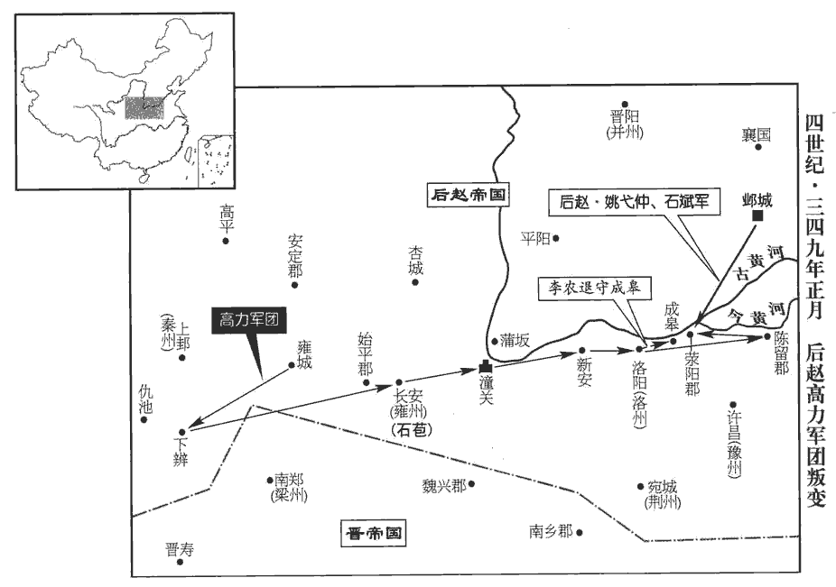
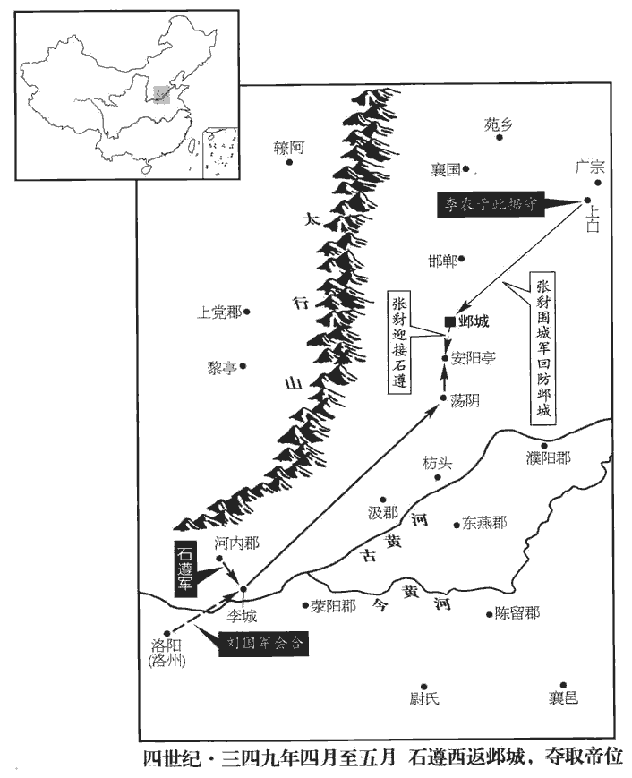
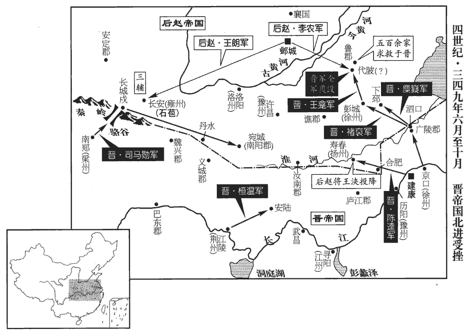
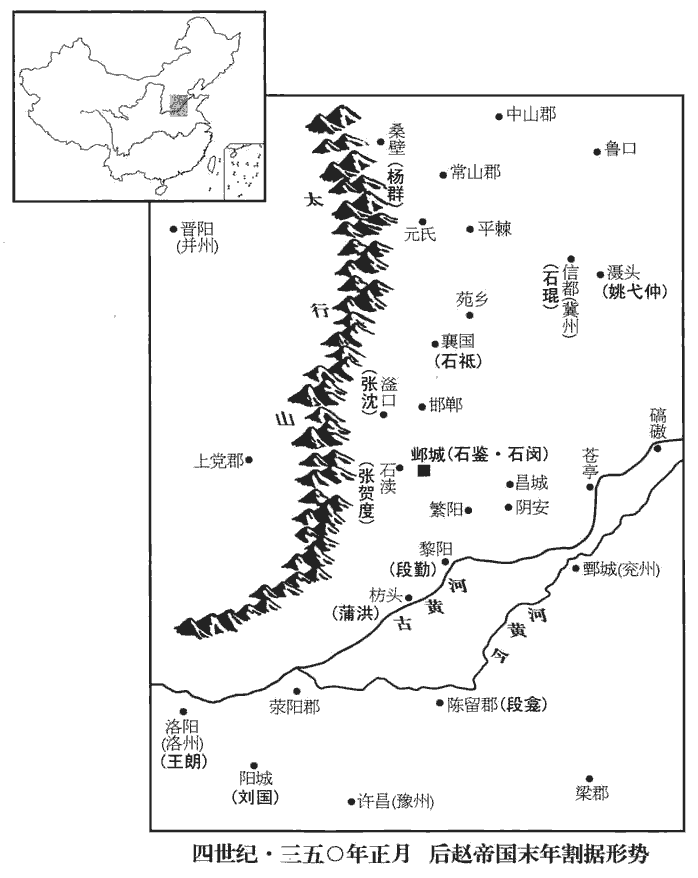
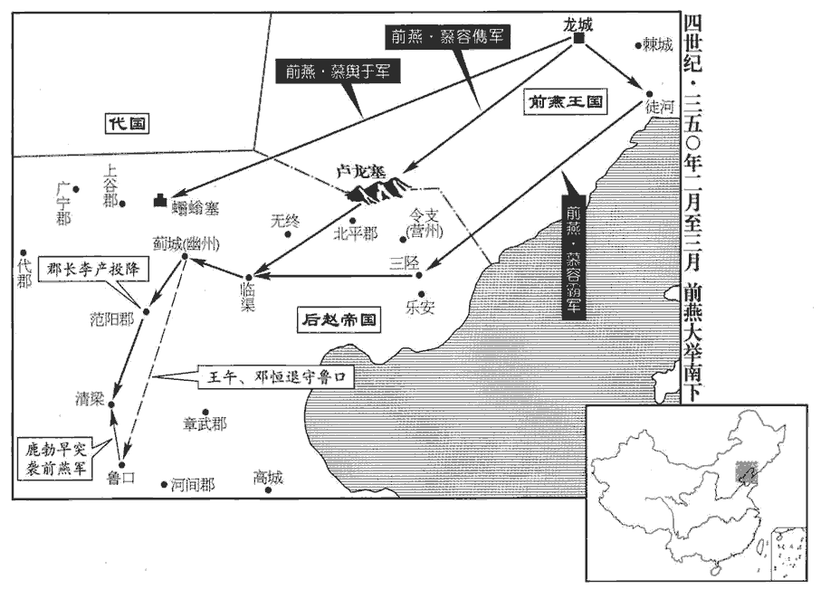
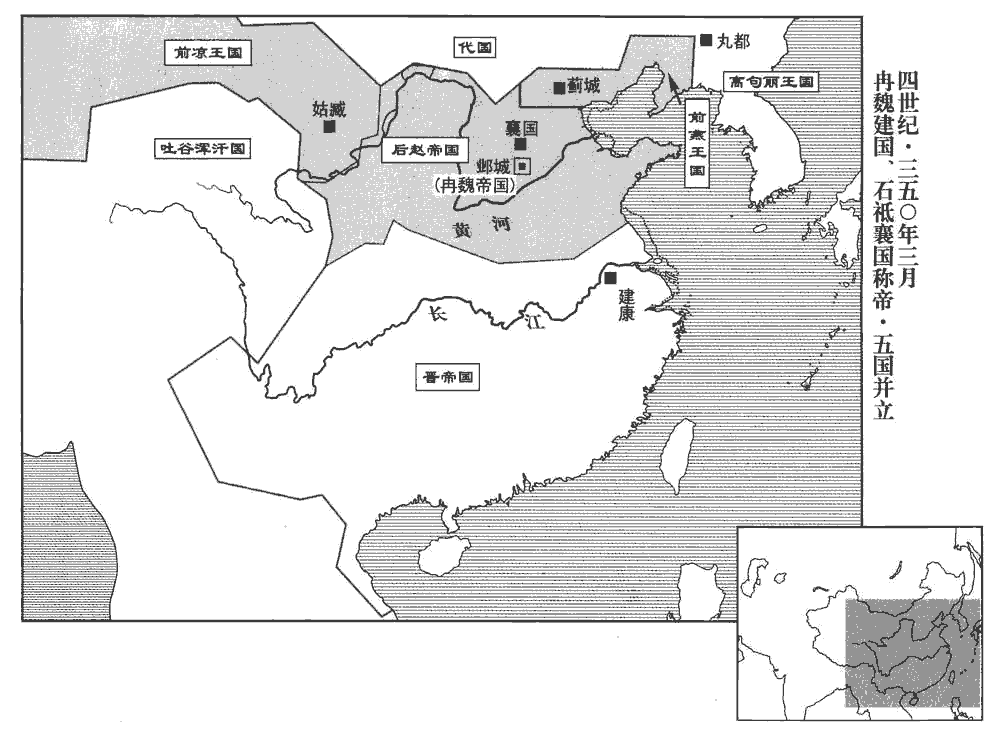
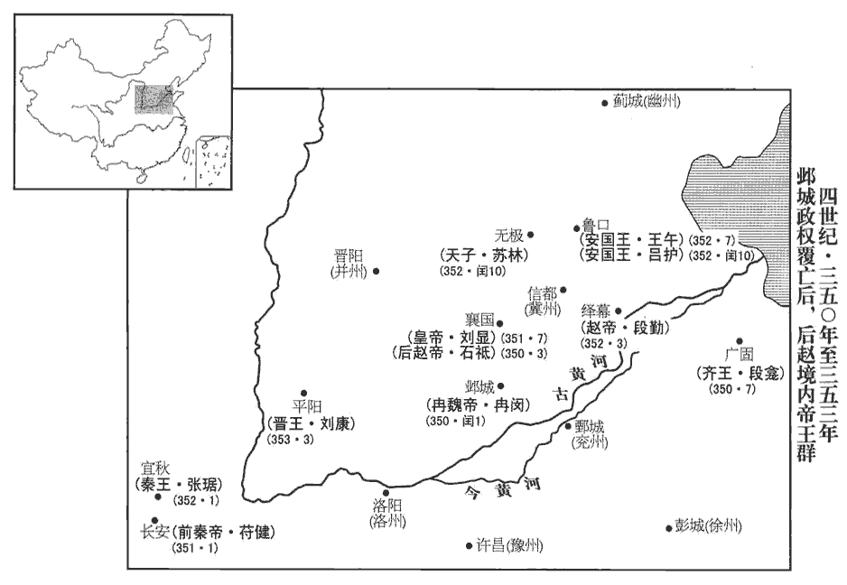
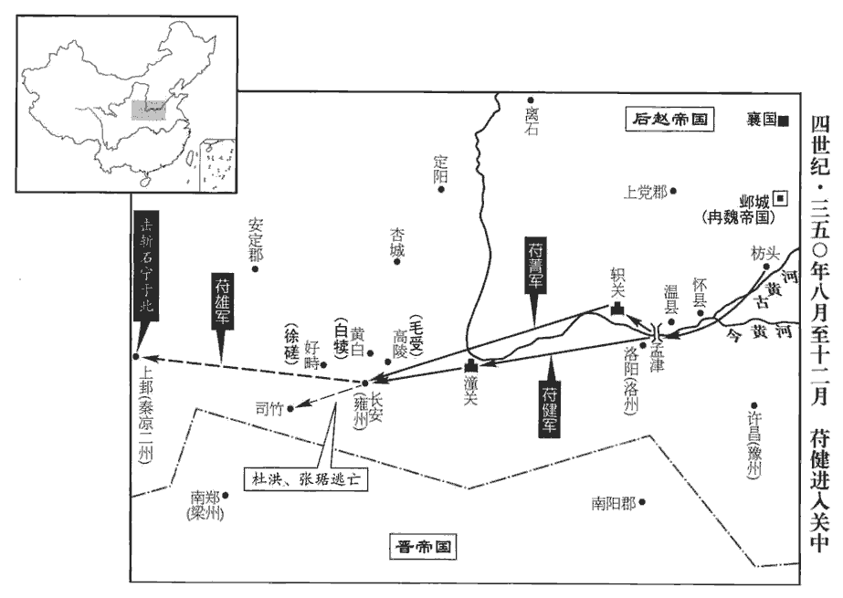

 晉紀二十起著雍涒灘（戊申），盡上章閹茂（庚戌），凡三年。

# 孝宗穆皇帝上之下

## 永和四年（戊申，三四八）

1夏，四月，林邑‹越南中部›寇九真‹越南清化›，既再破日南，故進寇九真。九真郡，唐愛州。殺士民什八九。

〖译文〗 [1]夏季，四月，林邑国的军队进犯九真郡，当地的士兵百姓十之八九被杀。

2趙‹都邺城河北省临漳县西南邺镇›秦公韜有寵於趙王虎‹本年五十四岁›，欲立之，以太子宣長，長，知兩翻。猶豫未決。宣嘗忤旨，忤，五故翻。虎怒曰：「悔不立韜也！」韜由是益驕，造堂於太尉府，號曰宣光殿，梁長九丈。長，直亮翻。宣見之，大怒，斬匠，截梁而去；以犯其名也。韜怒，增之至十丈。宣聞之，謂所幸楊杯、【章：十二行本「杯」作「柸」；下同；乙十一行本同；孔本同。】牟成、趙生曰：「凶豎傲愎乃敢爾！愎，弼力翻。汝能殺之，吾入西宮，虎居西宮。當盡以韜之國邑分封汝等。韜死，主上必臨喪，吾因行大事，蔑不濟矣。」左傳：潘崇謂楚商臣曰：「能行大事乎？」杜預註曰：大事，謂弒君。杯等許諾。

〖译文〗 [2]后赵秦公石韬受到后赵王石虎宠爱，石虎想立他为太子，可是因为已立太子石宣为长，犹豫不决。石宣曾违背后赵王的指令，石虎气愤地说：“真后悔当初没立石韬为太子！”石韬因此而更加傲慢无忌。他在太尉府建造了一座殿堂，命名为宣光殿，横梁长达九丈。石宣看到后认为冒犯了他的姓名，勃然大怒，便杀掉了工匠，截断了横梁，拂袖而去。石韬对此也怒不可遏，又把横梁加长到十丈。石宣听说后，对他的亲信杨杯、牟成、赵生说：“这小子竟敢如此傲慢刚愎！你们如果能把他杀掉，我即位入主西宫后，一定把他现在占据的封国郡邑全都分封给你们。石韬死后，主上一定会亲临哀悼，到时我趁机把他也杀掉，没有不能成功的。”杨杯等人同意了。

秋，八月，韜夜與僚屬宴於東明觀，水經註：石氏立東明觀於鄴東城上。因宿於佛精舍。佛精舍，佛寺也。僧徒專精修行之地，故謂之精舍。事物紀原曰：漢明帝於東都門外立精舍，以處攝摩騰、竺法蘭。宣使楊杯等緣獼猴梯而入，梯小而長，人如獼猴攀緣而上，故曰獼猴梯。殺韜，置其刀箭而去。旦日，宣奏之，虎哀驚氣絕，久之方蘇。將出臨其喪，司空李農諫曰：「害秦公者未知何人，賊在京師，鑾輿不宜輕出。」虎乃止，嚴兵發哀於太武殿。宣往臨韜喪，不哭，直言「呵呵」，呵，虎何翻。呵呵，笑聲。使舉衾觀尸，大笑而去。大被曰衾。收大將軍記室參軍鄭靖、尹武等，將委之以罪。

〖译文〗 秋季，八月，石韬因为和他手下的同僚在东明观夜宴，就宿于佛精舍。石宣乘机派杨杯等人爬着梯子溜进佛精舍，杀死了石韬，扔下杀人刀箭潜逃而去。第二天，石宣禀报了石韬被杀的消息，石虎闻讯后悲惊交加，顿时昏厥过去，许久才苏醒过来。当他正要前往参加丧事活动时，司空李农劝他说：“杀害秦公石韬的人现在还不知道是谁，凶手尚在京师，国王的车乘不宜轻率出动。”石虎于是取消了亲临丧事的计划，命令士兵严加戒备，只在太武殿进行哀悼。石宣前往参加石韬的丧事活动，不仅不哭，还“呵呵”窃笑，又让人揭开覆盖尸体的被子观看尸体，然后大笑离去。他又把大将军记室参军郑清、尹武等人抓了起来，准备委罪于他们。

虎疑宣殺韜，欲召之，恐其不入，乃詐言其母杜后‹杜珠›哀過危惙；惙chuò，陟劣翻；類篇丑例翻，困劣也；言其氣息惙然，僅相屬也。宣不謂見疑，入朝中宮，因留之。朝，直遙翻。建興‹河北省威县东›人史科知其謀，告之；魏土地記曰：建興郡治陽阿縣；陽阿縣，漢屬上黨郡。魏收志曰：慕容永分上黨置建興郡。則其地非石趙所置建興郡也。水經註曰：田融言趙立建興郡於廣宗城內，斯其是矣。虎使收楊杯、牟成，皆亡去；獲趙生，詰之，具服。詰jié，去吉翻。虎悲怒彌甚，囚宣於席庫，席庫，藏席之所。以鐵環穿其頷而鏁suǒ之，取殺韜刀箭舐其血，哀號震動宮殿。鏁，蘇果翻。舐shì，直氏翻。號，戶高翻。佛圖澄曰：「宣、韜皆陛下之子，今為韜殺宣，是重禍也。為，于偽翻。陛下若加慈恕，福祚猶長；若必誅之，宣當為彗星下掃鄴宮。」彗，祥歲翻，又旋芮翻，又徐醉翻。虎不從。積柴於鄴北，樹標其上，標末置鹿盧，穿之以繩，鹿盧即轆轤。倚梯柴積，送宣其下，使韜所幸宦者郝稚、劉霸拔其髮，抽其舌，牽之登梯；郝稚以繩貫其頷，鹿盧絞上。上，時掌翻。劉霸斷其手足，斷，丁管翻。斫眼潰腸，如韜之傷。四面縱火，煙炎際天。炎，讀曰燄。虎從昭儀已下數千人登中臺以觀之。中臺者，三臺之中臺，即銅爵臺也。火滅，取灰分置諸門交道中。交道，午道也；一縱一橫為午道。殺其妻子九人。宣少子纔數歲，少，詩照翻。虎素愛之，抱之而泣，欲赦之，其大臣不聽，就抱中取而殺之；儿挽虎衣大叫，至於絕帶，虎因此發病。又廢其后杜氏‹杜珠›為庶人。誅其四率已下三百人，宦者五十人，皆車裂節解，棄之漳水。東宮有左、右、前、後四率。率，所律翻。支解者，解其四支；節解者，凡骨節，節節解之也。洿其東宮以養豬牛。洿wū，汪乎翻。東宮衛士十餘萬人皆謫戍涼州。趙未得涼州，置涼州於金城，謫使戍涼州之邊也。為下高力叛張本。先是，【章：十二行本「是」下有「散騎常侍」四字；乙十一行本同；退齋校同；張校同，云無註本亦脫。】趙攬言於虎曰：「宮中將有變，宜備之。」及宣殺韜，虎疑其知而不告，亦誅之。史言趙攬談天於猜暴之朝以自禍。先，悉薦翻。

〖译文〗 石虎怀疑石宣杀害了石韬，想召见他，又怕他不来，于是便谎称他母亲杜后因悲哀过度而病危。石宣没有察觉已怀疑到了自己头上，入朝来到中宫，便被扣留了起来。建兴人史科知道石宣策划杀害石韬的计谋，告发了他们，石虎便派人去抓杨杯、牟成，但他们都逃跑了，只抓到了赵生。经过追问，他全部招供。石虎听完后更加悲痛愤怒，于是便把石宣囚禁在贮藏坐具的仓库中，用铁环穿透他的下巴颏并上了锁，拿来杀害石韬的刀箭让他舔上面的血，石宣的哀鸣嚎叫声震动宫殿。佛图澄对石虎说：“石宣、石韬都是陛下的儿子，今天如果为了石韬被杀而再杀了石宣，这便是祸上加祸了。陛下如果能对他施以仁慈宽恕，福祚的气运尚可延长；如果一定要杀了他，石宣当化为彗星而横扫邺宫。”石虎没有听从劝说。他命令在邺城之北堆上柴草，上面架设横杆，横杆的末端安置辘轳，绕上绳子，把梯子倚靠在柴堆上，将石宣押解到下边，又让石韬所宠爱的宦官郝稚、刘霸揪着石宣的头发，拽着石宣的舌头，拉他登上梯子；郝稚把绳索套在他的脖子上，用辘轳绞上去。刘霸砍断他的手脚，挖出他的眼睛，刺穿他的肠子，使他被伤害的程度和石韬一样。然后又在柴堆四周点火，浓烟烈焰冲天而起。石虎则跟随昭仪官以下数千人登上中台观看。火灭以后，又取来灰烬分别放在通向各个城门的十字大路当中。还杀掉了石宣的妻儿九人。石宣的小儿子刚刚几岁，石虎平素非常喜爱他，因此临杀前抱着他哭泣，意欲赦免，但手下的大臣们却不同意，从怀抱中要过来就给杀掉了。当时小孩拽着石虎的衣服大叫大闹，以至于连腰带都拽断了，石虎也因此得了大病。石虎还黜废了石宣的母后杜氏，贬其为庶人。又杀掉了石宣周围的三百人，宦官五十人，全都是车裂肢解以后，抛尸于漳水河中。石宣居住的太子东宫被改作饲养猪牛的地方。东宫卫士十多万人全都被贬谪戍卫凉州。谋杀石韬事发之前，赵揽曾对石虎说：“宫中将有变故，宜加防备。”等到石宣谋杀石韬以后，石虎怀疑他早知此事而不禀告，把他也杀了。

3朝廷論平蜀之功，欲以豫章郡封桓溫。尚書左丞荀蕤曰：「溫若復平河、洛，復，扶又翻。將何以賞之？」乃加溫征西大將軍、開府儀同三司，封臨賀郡公；加譙王無忌前將軍；袁喬龍驤將軍，封湘西伯。驤，思將翻。蕤ruí，崧之子也。荀崧，荀藩之弟，永嘉之禍，相與建行臺於密；建興之初，又嘗鎮宛。

〖译文〗 [3]东晋朝廷讨论平定蜀汉的功劳，想把豫章郡赐封给桓温。尚书左丞荀蕤说：“桓温如果再平定了黄河、洛水一带，那将用什么赏赐他呢？”于是朝廷让桓温担任征西大将军、开府仪同三司，封为临贺郡公，让谯王司马无忌担任前将军，让袁乔出任龙骧将军，并封为湘西伯。荀蕤是荀菘的儿子。

溫既滅蜀，威名大振，朝廷憚之。會稽王昱以揚州刺史殷浩有盛名，朝野推服，引為心膂，與參綜朝權，欲以抗溫；由是與溫寖相疑貳。為溫廢浩、脅制朝廷張本。朝，直遙翻。會，工外翻。

〖译文〗 桓温平定了蜀地以后，权威日盛，名声大振，连朝廷对他也惧怕三分。会稽王司马昱认为扬州刺史殷浩素有盛名，朝野对他都很推崇佩服，便以他作为心腹骨干，让他参与总揽朝廷权力，想以此来和桓温抗衡。从此殷浩和桓温便逐渐开始互相猜忌，进而彼此产生了异心。

浩以征北長史荀羨、前江州刺史王羲之，夙有令名，擢羨為吳國‹苏州›內史，江左郡國，以吳為甲。羲之為護軍將軍，以為羽翼。羨，蕤之弟；羲之，導之從子也。從，才用翻。羲之以為內外協和，然後國家可安，勸浩【章：十二行本「浩」下有「及羨」二字；乙十一行本同；張校同，云無註本亦脫。】不宜與溫搆隙；浩不從。

〖译文〗 殷浩认为征北长史荀羡和前任江州刺史王羲之历来名声不错，便提升荀羡为吴国内史，提升王羲之为护军将军，作为自己的辅佐。荀羡是荀蕤的弟弟，王羲之是王导的侄子。王羲之认为只有朝廷内外融洽团结、和谐相处，然后国家才能安定，于是就劝说殷浩不要和桓温制造隔阂，但殷浩却没有听从。

4燕‹都龙城辽宁省朝阳市›王皝有疾，召世子儁屬之曰：屬，之欲翻。「今中原未平，方資賢傑以經世務。恪智勇兼濟，才堪任重，汝其委之，以成吾志！」又曰：「陽士秋士行高潔，忠幹貞固，陽騖，字士秋。行，下孟翻。可託大事，汝善待之！」九月，丙申‹十七›，薨。年五十二。

〖译文〗 [4]前燕王慕容身患疾病，他召来太子慕容俊嘱咐说：“如今中原尚未平定，正是需要依靠贤良杰出人士掌管朝政的时候。慕容恪智勇双全，才能出众，你应当委他以重任，以实现我入主中原的远大志向！”又说：阳鹜具有高尚的士大夫品行，忠诚不二，坚贞不屈，可以委托他掌管大事，一定要很好地对待他！”九月，丙申（十七日），前燕王慕容去世。

5趙王虎議立太子；太尉張舉曰：「燕公斌有武略，斌，音彬。彭城公遵有文德，惟陛下所擇。」虎曰：「卿言正起吾意。」戎昭將軍張犲chái曰：載記曰：虎置左右戎昭、曜武將軍，位在左右衛上。「燕公母賤，又嘗有過；謂欲殺張賀度也，事見九十六卷成帝咸康六年。彭城公母前以太子事廢，遵與邃同母。鄭氏廢見九十五卷成帝咸康三年。今立之，臣恐不能無微恨，陛下宜審思之。初，虎之㧞上邽‹甘肃天水›也，見九十四卷成帝咸和四年。張犲獲前趙主曜幼女安定公主，有殊色，納於虎，虎嬖之，嬖bì，卑義翻，又博計翻。生齊公世。犲以虎老病，欲立世為嗣，冀劉氏為太后，己得輔政，乃說虎曰：「陛下再立太子，其母皆出於倡賤，說，輸芮翻。倡，音昌。故禍亂相尋；今宜擇母貴子孝者立之。」虎曰：「卿勿言，吾知太子處矣。」虎再與群臣議於東堂，虎曰：「吾欲以純灰三斛自滌其腸，何為專生惡子，年踰二十輒欲殺父！今世方十歲，比其二十，吾已老疾。」比，必寐翻。乃與張舉、李農定議，令公卿上書請立世為太子。大司農曹莫不肯署名，虎使張犲問其故，莫頓首曰：「天下重器，不宜立少，少，詩照翻。故不敢署。」虎曰：「莫，忠臣也，然未達朕意；張舉、李農知朕意矣，可令諭之。」遂立世為太子，以劉昭儀為后。虎父子相殘，廢長立少，天將假手於冉閔以夷其種類也。

〖译文〗 [5]后赵王石虎与群臣商议立太子。太尉张举说：“燕公石斌长于军事统治，彭城公石遵长于礼乐教化，只看陛下选择。”石虎说：“你的意见正合我意。”戎昭将军张豺则说：“燕公石斌，其母亲出身低贱，本人又曾经有过过错；彭城公石遵，其母亲以前因为太子石邃的事情被黜废，如今再立石遵为太子，我担心他对您不可能没有丝毫的忌恨，愿陛下慎重考虑！”当初，石虎攻克上的时候，张豺虏获了前赵主刘曜的小女儿安定公主，因姿色出众，被石虎纳为妾，并深得宠爱，生下了齐公石世。眼下张豺考虑到石虎年老有病，想立石世为继承人，希望刘氏为太后，这样自己便能得以辅佐朝政。基于这种考虑，张豺劝石虎说：“陛下以前两次立太子，他们的母亲全都出身低贱，所以才导致了朝廷祸乱不断。如今应该选择母贵子孝者立为太子了。”石虎回答：“你不必说了，我知道太子该是谁了。”此后，石虎又一次和群臣在东堂商议。石虎说：“我要用三斛纯净的灰洗涮我内脏的秽恶，否则为什么我专生凶恶无赖的儿子，年龄一过二十就要杀害他的父亲！如今石世年方十岁，等到他二十岁时，我已经老了！”于是便与张举、李农作出决定，命令公卿大臣们上书，请求立石世为太子。大司农曹莫不肯在上书上签名，石虎派张豺去询问原因，曹莫叩头拜首回答道：“治理天下这样的重任，不应该选择年少者，所以我不敢签名。”石虎说：“曹莫确实是忠臣，然而却没有领会朕的用意；张举、李农深知朕意，可以让他们去说明一下。”于是便确立石世为太子，以刘昭仪为后。

6冬，十一月，甲辰‹二十六›，葬燕文明王；皝諡曰文明。世子儁‹本年三十岁›即位，儁，字宣英，皝之第二子。赦境內；遣使詣建康告喪。使，疏吏翻。以弟交為左賢王，左長史陽騖為郎中令。

〖译文〗 [6]冬季，十一月，甲辰（二十六日），安葬前燕王慕容。太子慕容俊即位，境内实行大赦。慕容俊派遣使臣到建康向东晋朝廷报告了丧事。他还任命弟弟慕容交为左贤王，任命左长史阳鹜为郎中令。

7十二月，以左光祿大夫、領司徒、錄尚書事蔡謨為侍中、司徒。謨上疏固讓，謂所親曰：「我若為司徒，將為後代所哂，哂shěn，式忍翻。義不敢拜也。」

〖译文〗 [7]十二月，东晋朝廷任命左光禄大夫、领司徒、录尚书事蔡谟为侍中、司徒。蔡谟上疏，执意推辞。他对周围比较亲近的人说：“如果我当了司徒，必将为后人所耻笑，所以按照道义我不敢接受任命。”

## 五年（己酉，三四九）

1春，正月，辛未朔‹四›，大赦。

〖译文〗 [1]春季，正月，辛未朔（疑误）。晋穆帝实行大赦。

2趙‹都邺城河北省临漳县西南邺镇›王虎‹本年五十五岁›即皇帝位，虎以成帝咸康三年即天王位，今即皇帝位。大赦，改元太寧；諸子皆進爵為王。

〖译文〗 [2]后赵王石虎即皇帝位，实行大赦，改年号为太宁，并将儿子们的爵位全都晋升为王。

故東宮高力等萬餘人謫戍涼州，石宣簡多力之士以衛東宮，號曰高力，署督將以領之。行達雍城‹陕西凤翔›，扶風雍縣城也。雍，於用翻；下同。既不在赦例，又敕雍州刺史張茂送之，茂皆奪其馬，使之步推鹿車，致糧戍所。推，吐雷翻。風俗通曰：鹿車窄小，裁容一鹿。高力督定陽‹陕西省延安市东南›梁犢定陽縣，漢屬上郡，晉省。後魏太安中置定陽郡；唐為延州臨真縣。因眾心之怨，謀作亂東歸，眾聞之，皆踊抃biàn大呼。踊，跳躍也。抃，拊手也。呼，火故翻。犢乃自稱晉征東大將軍，帥眾攻拔下辨‹甘肃成县›；辨，步莧翻。安西將軍劉寧自安定‹甘肃省镇原县东南曙光乡›擊之，為犢所敗。敗，補邁翻。高力皆多力善射，一當十餘人，雖無兵甲，掠民斧，施一丈柯，攻戰若神，柯，斧柄也。所向崩潰；戍卒皆隨之，攻陷郡縣，殺長吏、二千石，長，知兩翻。長驅而東，比至長安‹西安›，比，必寐翻。眾已十萬。樂平王苞盡銳拒之，一戰而敗。犢遂東出潼關‹陕西潼關›，進趣洛陽。趣，七喻翻。趙主虎以李農為大都督、行大將軍事，統衛軍將軍張賀度等步騎十萬討之，戰于新安‹河南省渑池县›，新安縣，漢屬弘農郡，自晉以後屬河南郡。騎，奇寄翻；下同。農等大敗；戰于洛陽，又敗，退壁成皋‹河南荥阳西北汜水镇›。

〖译文〗 原来守卫石宣东宫号称“高力”的一万多人被贬戍凉州，此时已行至雍城，因为他们不在赦免的范围内，石虎又命令雍州刺史张茂继续遣送他们。张茂却乘机扣留了他们所有的马匹，让他们推着运粮的小车徒步前往凉州。高力督定阳人梁犊利用众人内心的怨恨，策划造反作乱，返回家园。众人听说后，全都跳跃欢呼。于是梁犊便自称晋朝征东大将军，率领众卫士攻克了下辨。安西将军刘宁率兵从安定出发攻打梁犊，却被梁犊打败。这些号称“高力”的卫士们全都身强力壮，善于射箭，一人足以抵挡十余人。他们虽然没有武器盔甲，但抢来老百姓的斧头，再安上一丈来长的斧柄，交战时用起来出神入化，所向披靡。卫士们跟随着梁犊，攻克郡县，杀掉郡守、县令等官吏，长驱直入，向东而来。等到抵达长安时，参加的人已达十万。乐平王石苞率领全部精锐士兵阻挡他们，但一交战就被打败。梁犊于是东出潼关，向洛阳进发。后赵国主石虎任命李农为大都督、行大将军事，统领卫军将军张贺度等人的步兵、骑兵十万人前来讨伐，在新安交战，李农等大败；在洛阳交战，又被打败，只好退至成皋，坚壁防守。

 

犢遂東掠滎陽、陳留諸郡，武帝泰始二年，分河南置滎陽郡。虎大懼，以燕王斌為大都督，督中外諸軍事，統冠軍大將軍姚弋仲‹时驻滠头河北省枣强县东北›、車騎將軍蒲洪‹时驻枋头河南省淇县东南淇门渡›等討之。斌，音彬。冠，古玩翻。弋仲將其眾八千餘人至鄴，自灄shè頭‹河北枣强东北›至鄴。將，即亮翻。求見虎。虎病，未之見，引入領軍省，領軍省，領軍將軍視事之所。賜以己所御食。弋仲怒，不食，曰：「主上召我來擊賊，當面見授方略，我豈為食來邪！為，于偽翻；下羌為同。且主上不見我，我何以知其存亡邪？」虎力疾見之，弋仲讓虎曰：「兒死，愁邪，何為而病？兒幼時不擇善人教之，使至於為逆；既為逆而誅之，又何愁焉！且汝久病，所立兒幼，謂太子世也。汝若不愈，天下必亂，當先憂此，勿憂賊也！犢等窮困思歸，相聚為盜，所過殘暴，何所能至！老羌為汝一舉了之！」了，決也。弋仲性狷juàn直，人無貴賤皆汝之，虎亦不之責。狷，吉掾翻。以石虎之猜暴而能容姚弋仲之狷直者，以其當理而切於事情也；苟徒狷直而不切當，殆難以免矣。於坐授使持節、征【章：十二行本「征」上有「侍中」二字；乙十一行本同；退齋校同。】西大將軍，賜以鎧馬。坐，徂臥翻。使，疏吏翻。鎧，可亥翻。弋仲曰：「汝看老羌堪破賊否？」乃被鎧跨馬于庭中，被，皮義翻。因策馬南馳，不辭而出。遂與斌等擊犢於滎陽，大破之，斬犢首而還，討其餘黨，盡滅之。虎命弋仲劍履上殿，入朝不趨，上，時掌翻。進封西平郡公。蒲洪為車【章：十二行本「車」上有「侍中」二字；乙十一行本同；退齋校同。】騎大將軍、開府儀同三司、都督雍•秦州諸軍事、雍州刺史，雍，於用翻。進封略陽郡公。

〖译文〗 梁犊于是继续东进，攻取荥阳、陈留等郡。石虎十分害怕，任命燕王石斌为大都督，掌管内外各种军事事务，统领冠军大将军姚弋仲、车骑将军蒲洪等人的部队前来讨伐。姚弋仲率领他的士兵八千多人来到了邺城，求见石虎。石虎正在患病，没有见他，而是派人把他带到领军省，用专供自己所吃的御食赏赐他。姚弋仲勃然大怒，不仅不吃，还说：“主上召唤我前来讨伐乱贼，理当向我面授计谋，难道我是为了吃一顿饭才来的吗！再说如果主上不见我，我怎么知道他现在是死是活呢？”石虎勉强支撑着病体会见了他。姚弋仲责怪石虎说：“儿子死了，很忧愁吧，要不然为什么病了呢？儿子小的时候你不选择好人教育他，这才使他长大后干出了叛逆之事；既然是因为干了叛逆之事才杀了他，又有什么可忧愁的呢？再说你已经病了很久，立为太子的儿子年龄幼小，如果你病情不见好转，天下必将大乱，这才是首先应该忧虑的，不必忧虑那些乱贼！梁犊等人因为穷困无路，思家心切才相聚成为强盗，他们在所经过的地方烧杀抢掠，能成什么事！老夫为你一举消灭他们！”姚弋仲性情耿直暴躁，对人不论贵贱高下都直呼为“你”，因此石虎也不责怪他，当即坐在座位上任命他为使持节、征西大将军，并赏赐给他铠甲、战马。姚弋仲说：“你看老夫能打败乱贼吗？”说着在庭院里就披挂盔甲，跨上战马，然后扬鞭策马，连告辞的话也没说便南驰而去。于是，姚弋仲和石斌等率部在荥阳攻打梁犊，大获全胜，斩掉梁犊的头颅返回。接着又讨伐其残余士卒，把他们也干净彻底地消灭了。石虎因此给予姚弋仲可以佩剑穿鞋上殿、允许他大步入朝晋见国君的特殊礼遇，并晋封他为西平郡公。任命蒲洪为车骑大将军、开府仪同三司、都督雍、秦州诸军事、雍州刺史，并晋封为略阳郡公。

3始平‹陕西省兴平市›人馬勗xù聚兵，自稱將軍，杜佑曰：漢平陵，晉改為始平，有馬嵬wéi故城。趙樂平王苞討滅之，誅三千餘家。

〖译文〗 [3]始平人马勖纠集兵卒，自称将军。后赵乐平王石苞率兵讨伐消灭了他们，杀掉三千多家。

4夏，四月，益州刺史周撫、龍驤將軍朱燾擊范賁，斬之，益州平。范賁亂始上卷三年。驤，始將翻。

〖译文〗 [4]夏季，四月，益州刺史周抚、龙骧将军朱焘率兵攻打范贲，将其斩杀，益州得以平定。

5詔遣謁者陳沈如燕‹都龙城辽宁省朝阳市›，沈，持林翻。拜慕容儁為使持節、侍中、大都督、督河北諸軍事、幽•平二州牧、使，疏吏翻。考異曰：儁載記云，「幽、冀、并、平四州牧。」今從帝紀。大將軍、大單于、燕王。單，音蟬。

〖译文〗 [5]东晋穆帝下诏书派遣使者陈沈前往前燕，授予慕容俊使持节、侍中、大都督、督河北诸军事以及，幽、平二州牧、大将军、大单于、燕王等官职。

6桓溫遣督護滕畯jùn帥交、廣之兵擊林邑王文於盧容‹越南顺化市›，畯，祖峻翻。盧容縣，自漢以來屬日南郡，有盧容浦，去郡二百里。帥，讀曰率。為文所敗，敗，補邁翻。退屯九真‹越南清化›。

〖译文〗 [6]桓温派督护滕率领交、广二州的士兵在卢容攻击林邑王范文，反被范文打败，只好撤退驻扎在九真郡。

7乙卯‹九›，趙王虎病甚，以彭城王遵為大將軍，鎮關右；燕王斌為丞相，錄尚書事；張犲為鎮衛大將軍、領軍將軍、吏部尚書；劉聰置十六大將軍，鎮衛其一也。石虎置鎮衛將軍，在車騎將軍上；今以張犲為鎮衛大將軍，崇其號也。領軍將軍則掌兵柄，吏部尚書則典選事，是文武二柄悉以付犲矣。并受遺詔輔政。

〖译文〗 [7]乙卯（初九），后赵国主石虎病情恶化，任命彭城王石遵为大将军，镇守关右；任命燕王石斌为丞相，总领尚书职事；任命张豺为镇卫大将军、领军将军、吏部尚书。他们还接受遗诏，辅佐朝政。

劉后惡斌輔政，恐不利於太子，與張犲謀去之。惡，烏路翻。去，羌呂翻。斌時在襄國‹河北省邢台市›，遣使詐謂斌曰：「主上疾已漸愈、王須獵者，可少停也。」斌素好獵、嗜酒，少，詩沼翻。好，呼到翻。遂留獵，且縱酒。劉氏與犲因矯詔稱斌無忠孝之心，免官歸第，使犲弟雄帥龍騰五百人守之。此石虎幽石宏之故智也，張犲踵而用之，非虎教之邪！石斌亦庸人耳，君父疾篤，徵之受遺輔政，就使虎疾少愈，亦當夜衣而行；乃酣酒縱獵，其無智識如此！就使得權，諸弟亦將紾zhěn其臂而奪之。張舉謂有武略，妄矣！

〖译文〗 刘皇后讨厌石斌辅佐朝政，怕这样对太子不利，因此和张豺一起谋划想除掉他。当时石斌在襄国，她派遣使者前往欺骗石斌说：“主上的病情已逐渐好转，您可以稍迟些再前来。”石斌历来喜好打猎喝酒，听到这消息后，便又开始打猎纵酒。刘氏和张豺于是就假传诏令，称石斌毫无忠孝之心，将他免官归家，派张豺的弟弟张雄率宫中的龙腾卫士五百人看守他。

乙丑‹十九›，遵自幽州至鄴，敕朝堂受拜，朝，直遙翻。配禁兵三萬遣之，遵涕泣而去。是日，虎疾小瘳chōu，問：「遵至未？」左右對曰：「去已久矣。」虎曰：「恨不見之！」

〖译文〗 乙丑（十九日），石遵从幽州来到邺城，传诏让他在朝堂接受任命，给他配备了三万宫中的亲兵，便让他回去，石遵流着眼泪走了。这天，石虎的病情稍有好转，问道：“石遵来了没有？”左右的人回答说：“已经离开很久了。”石虎说：“真痛心没有见到他！”

虎臨西閤，太武殿之西閤也。龍騰中郎二百餘人列拜於前，虎問：「何求？」皆曰：「聖體不安，宜令燕王入宿衛，典兵馬，」或言：「乞以為皇太子。」虎曰：「燕王不在內邪？召以來！」左右言：「王酒病，不能入。」虎曰：「促持輦迎之，當付璽綬。」亦竟無行者。左右皆為劉后母子，故竟無行者。璽，斯氏翻。綬，音受。尋惛眩而入。惛，迷忘也。眩，目視亂也。張犲使張雄矯詔殺斌。殺斌欲以一眾心，豈知已有從臾石遵入立者。

〖译文〗 石虎来到太武殿的西阁，担任宫中护卫任务的龙腾中郎二百多人上前列队拜见。石虎问：“你们有什么请求？”众卫士回答说：“主上圣体欠安，应该让燕王石斌入宫主管警卫，典掌兵马。”有的人还说：“请求以他为皇太子。”石虎说：“燕王不在宫内吗？把他召来！”左右的人回答：“燕王因纵酒而病，不能入宫了。”石虎说：“赶快用我乘坐的车子把他接来，应当把玺印交给他。”但左右竟然始终无人行动。不一会儿，石虎因头昏目眩，只好回去了。张豺派张雄假传诏令杀掉了石斌。

 

戊辰‹二十二›，劉氏復矯詔以犲為太保、都督中外諸軍，錄尚書事，如霍光故事。復，扶又翻。侍中徐統歎曰：「亂將作矣，吾無為預之。」仰藥而死。

〖译文〗 戊辰（二十二日），刘氏再次假传诏令，任命张豺为太保、都督中外诸军，总管尚书职事，就像西汉霍光辅政专权一样。侍中徐统叹息道：“祸乱将要来临了，我不必参与它。”随即服毒自杀身亡。

己巳‹二十三›，虎卒‹年五十五岁›，太子世‹本年十一岁›即位，尊劉氏為皇太后。劉氏臨朝稱制，朝，直遙翻。以張犲為丞相；犲辭不受，請以彭城王遵、義陽王鑒為左右丞相，以慰其心，劉氏從之。

〖译文〗 己巳（二十三日），石虎去世，太子石世即位，尊奉刘氏为皇太后。刘氏当朝行使皇帝的权力，任命张豺为丞相。张豺辞让不肯接受，请求任命彭城王石遵、义阳王石鉴为左右丞相，以此来安抚他们，刘氏听从了。

犲與太尉張舉謀誅司空李農，舉素與農善，密告之；農奔廣宗‹河北威县东›，帥乞活數萬家保上白‹河北威县南›，乞活，李惲、田徽之餘眾也，自永嘉以來，屯聚於上白。帥，讀曰率；下同。劉氏使張舉統宿衛諸軍圍之。犲以張離為鎮軍大將軍，監中外諸軍事，以為己副。監，工銜翻。

〖译文〗 张豺找太尉张举谋划诛杀司空李农，然而张举和李农历来关系密切，就把此事悄悄地告诉了李农。李农闻讯后逃到广宗，率领乞活等残余部众数万家固守上白，刘氏派张举统领多路朝廷禁卫军队包围了他们。张豺任命张离为镇军大将军，监督朝廷内外的各项军务，以作为自己的副手。

彭城王遵至河內‹河南省沁阳市›，聞喪；姚弋仲、蒲洪、劉寧及征虜將軍石閔、武衛將軍王鸞等討梁犢還，遇遵於李城‹河南温县›，續漢志，河內平睪縣有李城。史記，邯鄲李同卻秦兵，趙封其父李侯，即此城。共說遵曰：「殿下長且賢，先帝亦有意以殿下為嗣；謂虎欲從張舉之言也。說，輸芮翻。長，知兩翻。正以末年惛惑，為張犲所誤。今女主臨朝，姦臣用事，上白相持未下，京師宿衛空虛，殿下若聲張犲之罪，鼓行而討之，其誰不開門倒戈而迎殿下者！」遵從之。

〖译文〗 彭城王石遵行至河内时，听到了父亲病故的丧讯。姚弋仲、蒲洪、刘宁以及征虏将军石闵、武卫将军王鸾等人在讨伐梁犊后的归途中，和石遵在李城相遇。他们一起劝石遵说：“殿下年长而且德才兼备，先帝也曾有意让殿下当继承人。正是因为他晚年昏然迷惑，才被张豺所欺误。如今女主当朝，奸臣独揽朝政，上白那里双方相持不下，京师的守卫力量空虚，殿下如果声讨张豺的罪行，击鼓进军对他进行讨伐，有谁不打开城门、掉转武器而迎接殿下呢！”石遵听从了劝说。

遵【章：十二行本「遵」上有「五月」二字；乙十一行本同；退齋校同；張校同，云無註本亦脫。】自李城‹河南温县›舉兵，還趣鄴，趣，七喻翻。洛州刺史劉國帥洛陽之眾往會之。檄至鄴，張犲大懼，馳召上白之軍。丙戌‹十一›，遵軍于蕩陰‹河南汤阴›，蕩，音湯。戎卒九萬，石閔為前鋒。【章：十二行本「鋒」下有「犲將出拒之」五字；乙十一行本同；張校同；退齋校同。】耆舊、羯士皆曰：「彭城王來奔喪，吾當出迎之，不能為張犲守城也！」方言曰：耆，長也；說文曰：老也；左傳註曰：強也；禮記音義曰：至也，言至老境也。羯士，石氏之種類也。為，于偽翻。踰城而出，犲斬之，不能止。張離亦帥龍騰二千，斬關迎遵。劉氏懼，召張犲入，對之悲哭曰：「先帝梓宮未殯，而禍難至此！難，乃旦翻。今嗣子沖幼，託之將軍；將軍將若之何？欲加遵重位，能弭之乎？」犲惶佈不知所出，怖，普布翻。但云「唯唯」。唯，于癸翻。乃下詔，以遵為丞相，領大司馬、大都督、督中外諸軍，錄尚書事，加黃鉞、九錫。己丑‹十四›，遵至安陽亭‹河南省安阳境›，安陽縣，屬魏郡。此蓋安陽縣都亭也。張犲懼而出迎，遵命執之。庚寅‹十五›，遵擐甲曜兵，入自鳳陽門，升太武前殿，擗踊盡哀，擐，音宦。擗pǐ，毗亦翻，拊心也。踊，跳也。退如東閤。太武殿之東閤也。斬張犲于平樂市，鄴都有平樂市。樂，音洛。夷其三族。假劉氏令曰：「嗣子幼沖，先帝私恩所授，皇業至重，非所克堪；其以遵嗣位。」於是遵即位，大赦，罷上白之圍。辛卯‹十六›，封世為譙王，載記曰：世凡立三十三日。廢劉氏為太妃；考異曰：晉春秋及十六國春秋鈔，皆云廢太后為昭儀。今從載記。十六國春秋及載記，又云世立三十三日。按四月己巳至五月庚寅，凡二十二日。尋皆殺之。

〖译文〗 石遵自李城发兵，掉头直奔邺城。洛州刺史刘国率领洛阳的部众前来与他会合。讨伐檄文到邺城后，张豺十分害怕，急忙命令包围上白的军队返回。丙戌（十一日），石遵的部队驻扎在荡阴，士兵达九万人，石闵为前锋。张豺打算出去拦截，但邺城的德高望重的老人和羯族士兵都说：“彭城王前来奔丧，我们应当出城迎接他，再也不能为张豺守城了！”于是纷纷翻越城墙跑了出来，张豺虽然以杀头来制止，但也不能奏效。就连张离也率领龙腾卫士二千人，冲破关卡，准备迎接石遵。刘氏十分恐惧，召张豺来到宫中，裴痛地对他边哭边说：“先帝的棺材还没有入土，而祸乱就到了这种地步！如今太子年幼，只能依靠将军您了。将军您打算怎么办呢？我想给石遵加封显赫的官位，这样能安抚住他吗？”张豺这时也十分惊慌害怕，不知道该怎样回答，只是说：“是的是的。”于是刘氏便发下诏令，任命石遵为丞相，兼领大司马、大都督、督中外诸军，总管尚书职事，并给予他以持黄钺、加九锡等特殊权力和礼遇。己丑（十四日），石遵抵达安阳亭，张豺十分害怕，出来迎接，石遵命令拘捕了他。庚寅（十五日），石遵身穿铠甲，炫耀武力，从凤阳门进入邺城，登上太武前殿，捶胸顿足，宣泄悲哀，然后退至东阁。在平乐市杀了张豺，还灭了他的三族。石遵借刘氏之令说：“太子年幼，之所以立他为太子，那是先帝个人的情义所致。然而国家大业至关重要，不是他所能承担的。应当以石遵为继位人。”于是石遵便即皇帝位，实行大赦，并解除了对上白的包围。辛卯（十六日），封石世为谯王，废黜刘氏为太妃。过了不久，便把他们全都杀了。

李農來歸罪，使復其位。尊母鄭氏為皇太后，鄭氏即邃母。鄭后被廢見九十五卷成帝咸康三年。立妃張氏為皇后，故燕王斌子衍為皇太子。以義陽王鑒為侍中、太傅，沛王沖為太保，樂平公【章：十二行本「公」作「王」；乙十一行本同；張校同，云無註本亦作「公」。】苞為大司馬，汝陰王琨為大將軍，武興公閔為都督中外諸軍事、輔國大將軍。為石閔得兵柄以夷胡羯張本。

〖译文〗 李农前来归附谢罪，石遵让他官复原位。尊奉石遵的母亲郑氏为皇太后，立妃张氏为皇后，原来燕王石斌的儿子石衍被立为皇太子。任命义阳王石鉴为侍中、太傅；沛王石冲为太保；乐平王石苞为大司马；汝阴王石琨为大将军；任武兴公石闵为都督中外诸军事、辅国大将军。

甲午‹十九›，鄴中暴風拔樹，震電，雨雹大如盂升。如盂及升也。雨，于具翻。太武暉華殿災，及諸門觀閤蕩然無餘，乘輿服御，燒者太半，觀，古玩翻。乘，繩證翻。金石皆盡，火月餘乃滅。

〖译文〗 甲午（十九日），邺城内狂风拔树，雷电交加，下的冰雹像盂钵和粮升一样大。太武殿、晖华殿发生火灾，波及到许多门观亭阁，烧得荡然无存，皇宫的车乘服饰，也被烧了大半，金银玉石之类，全都损失殆尽。大火一直烧了一个多月才灭。

時沛王沖鎮薊，沖蓋代遵鎮薊。薊，音計。聞遵殺世自立，謂其僚佐曰：「世受先帝之命，遵輒廢而殺之，罪莫大焉！其敕內外戒嚴，孤將親討之。」於是留寧北將軍沭堅戍幽州，沭shù，食律翻，姓也。帥眾五萬自薊南下，傳檄燕、趙，所在雲集；比至常山‹河北省正定县›，帥，讀曰率。比，必寐翻。眾十餘萬，軍于苑鄉‹河北任县东北›；遇遵赦書，沖曰：「皆吾弟也；死者不可復追，何為復相殘乎！復，扶又翻；下同。吾將歸矣。」欲歸薊也。其將陳暹xiān曰：「彭城篡弒自尊，為罪大矣！王雖北旆，臣將南轅，俟平京師，擒彭城，然後奉迎大駕。」沖乃復進。遵馳遣王擢以書喻沖，沖弗聽。遵使武興公閔及李農帥精卒十萬討之，戰于平棘‹河北赵县›，平棘縣，漢屬常山郡，晉屬趙國，唐為趙州治所。沖兵大敗；獲沖于元氏‹河北元氏›，元氏縣，漢屬常山郡，晉屬趙國。闞駰曰：趙公子元之封邑，故曰元氏。唐元氏縣屬趙州。劉昫曰：元氏，漢常山郡所治，故城在今趙州元氏縣南。賜死；阬其士卒三萬餘人。

〖译文〗 当时沛王石冲正在镇守蓟城，当听说石遵杀掉了石世自立以后，就对辅佐他的同僚们说：“石世是秉承先帝的旨意继位的，石遵专横地把他废黜并杀掉，再也没有比这更大的罪过了！命令内外严加戒备，我要亲自出征去讨伐他！”于是石冲留下宁北将军沭坚守卫幽州，自己率领五万士兵自蓟城南下，并将讨伐檄文传递到燕、赵之地。他每到一地，人们都云集而来，等到抵达常山，兵众已有十多万。驻扎在苑乡时，石冲见到了石遵实行大赦的诏书，他说：“石世、石遵都是我的弟弟，死去的已无法复生，为什么还要再互相残杀呢！我要返回去了。”石冲手下的将领陈暹却说：“彭城王石遵杀君夺位，自立为帝，罪大恶极！虽然君主您要挥旗北返，但我还将继续南进，等到平定了京师，擒获了彭城王，然后再来恭迎您的大驾。”听到这话，石冲又改变了主意，于是继续前进。石遵急速派王擢送信劝说石冲，但石冲没有听从。石遵便派武兴公石闵及李农率领精锐士卒十万人讨伐石冲。双方在平棘交战，石冲的军队大败。他本人在元氏县被擒。石遵赐他自杀，并活埋了石冲手下的士卒三万多人。

武興公閔言於遵曰：「蒲洪，人傑也；今以洪鎮關中，臣恐秦、雍之地非國家之有。雍，於用翻。此雖先帝臨終之命，然陛下踐阼，自宜改圖。」遵從之，罷洪都督，餘如前制。洪怒，歸枋頭‹河南省淇县东南淇门渡›，遣使來降。洪屯枋頭，見九十五卷成帝咸和八年。降，戶江翻。

〖译文〗 武兴公石闵对石遵进言说：“蒲洪是杰出的人才，如今让他镇守关中，我恐怕秦州、雍州之地就不再会归赵国所有了。让蒲洪镇守关中虽然是先帝临终前的指令，然而如今陛下登位，自然应当改变谋略。”石遵听从了进言，罢免了蒲洪的都督官职，其他的官职待遇则一如从前。蒲洪对此感到愤怒，回到枋头后，便派使者前来向东晋投降。

燕‹都龙城辽宁省朝阳市›平狄將軍慕容霸上書於燕王儁‹本年三十一岁›曰：「石虎窮凶極暴，天之所棄，餘燼僅存，自相魚肉。今中國倒懸，企望仁恤，若大軍一振，勢必投戈。」北平‹河北遵化›太守孫興亦表言：「石氏大亂，宜以時進取中原。」儁以新遭大喪，弗許。以去年皝薨也。霸馳詣龍城，言於儁曰：「難得而易失者，時也。萬一石氏衰而復興，易，以豉翻。復，扶又翻；下同。或有英雄據其成資，謂中原或有英雄乘亂而取趙，據有其已成之資也。豈惟失此大利，亦恐更為後患。」儁曰：「鄴中雖亂，鄧恆據安樂‹河北省乐亭县›，以前參考，「安樂」當作「樂安」。兵強糧足，今若伐趙，東道不可由也，當由盧龍；盧龍山徑險狹，水經註：濡水東南逕盧龍塞‹河北省迁西县北›。塞道自無終縣東出，渡濡水向林蘭陘，東至清陘。盧龍之險，峻阪縈折，故有九崢之名。虜乘高斷要，斷，丁管翻。首尾為患，將若之何？」霸曰：「恆雖欲為石氏拒守，其將士顧家，人懷歸志，若大軍臨之，自然瓦解。臣請為殿下前驅，東出徒河‹辽宁锦州›，潛趣令支‹河北迁安›，出其不意，為，于偽翻。趣，七喻翻。令，音鈴，又郎定翻。支，音祁。彼聞之，勢必震駭，上不過閉門自守，下不免棄城逃潰，何暇禦我哉！然則殿下可以安步而前，無復留難矣。」儁猶豫未決，以問五材將軍封奕，燕置五材將軍，蓋取宋子罕所謂「天生五材誰能去兵」之義。對曰：「用兵之道，敵強則用智，敵弱則用勢。是故以大吞小，猶狼之食豚也；以治易亂，猶日之消雪也。大王自上世以來，積德累仁，兵強士練。石虎極其殘暴，死未瞑目，瞑，莫定翻。子孫爭國，上下乖亂。中國之民，墜於塗炭，延頸企踵以待振拔。大王若揚兵南邁，先取薊城‹北京›，次指鄴都，宣燿威德，懷撫遺民，彼孰不扶老提幼以迎大王；凶黨將望旗冰碎，安能為害乎！」從事中郎黃泓曰：泓，烏宏翻。今太白經天，歲集畢北，陰【章：十二行本「陰」上有「天下易主」四字；乙十一行本同；孔本同；張校同；退齋校同。】國受命，此必然之驗也，漢書天文志：太白經天，天下革民更王。孟康註曰：謂出東入西，出西入東也。太白，陰星，出東當伏東，出西當伏西，過午為經天。晉灼曰：日，陽也；日出則星亡。晝見午上為經天。歲星所在，國不可伐，可以伐人。昴mǎo、畢間為天街，其陰陰國。歲集畢北，明陰國當受命而王。宜速出師，以承天意。」折衝將軍慕輿根曰：「中國之民困於石氏之亂，咸思易主以救湯火之急，此千載一時，不可失也。載，子亥翻。自武宣王以來，慕容廆諡武宣王。招賢養民，務農訓兵，正俟今日。今時至不取，更復顧慮，復，扶又翻。豈天意未欲使海內平定邪，將大王不欲取天下也？」儁笑而從之。以慕容恪為輔國將軍，慕容評為輔弼將軍，左長史陽騖為輔義將軍，謂之「三輔」。輔弼、輔義二將軍號，亦一時創置。慕容霸為前鋒都督、建鋒將軍，建鋒將軍。亦創置也。選精兵二十餘萬，講武戒嚴，為進取之計。考異曰：燕景昭紀，集兵在四月。時石虎方死，諸子未爭；十六國春秋在五月，故從之。而燕書載封奕、慕輿根言，俱指冉閔。按是時閔未篡趙，蓋撰史者附會耳，故削去。

〖译文〗 前燕平狄将军慕容霸给前燕王慕容俊上书说：“石虎穷凶极恶，残暴无比，已被上天所抛弃。其仅存的一点残余，还自相鱼肉残食。如今中原之国危难至极，人们急切盼望以仁爱安恤，如果您统率大军奋起，石氏的士兵势必会放下武器。”北平太守孙兴也上表说：“眼下石氏内部大乱，应当不失时机地进取中原。”慕容俊考虑到先帝大丧刚刚过去，没有答应。慕容霸急忙来到龙城，对慕容俊进言说：“难以得到而容易失去的东西，是时机。万一石氏由衰败转而复兴，抑或出现英雄之辈占据了他们已有的积聚，这岂止是痛失大利，更恐怕是给我们留下了后患。”慕容俊说：“邺城中虽已大乱，但邓桓占据着安乐，兵力强大粮草充足，如今若要讨伐赵国，东面的道路无法通过，只能经由卢龙。然而卢龙的山路险峻狭隘，敌人如果居高山之势把我们的部队拦腰截断，则首尾受敌，那将怎么办呢？”慕容霸说：“邓桓虽然想为石氏抵抗坚守，但其将士念家，人怀归心，如果我们的大军一到，他们自然就会土崩瓦解。我请求率部作为殿下的前锋，东出徒河，暗赴令支，出其不意。等到他们闻讯后，势必感到震惊，这时，其上策不过是闭门固守而已，下策就不免要弃城溃逃了，哪有功夫抵抗我呢！然而殿下却可以慢慢前进，这样就不会出现被截留围困的灾难了。”慕容俊仍然犹豫不决，以此去询问五材将军封奕，封奕对他说：“用兵之道，在于碰到强大的敌人就用智取，碰到软弱的敌人就用势夺。所以以大吞小，就像狼吃小猪一样；拨乱反正，就像太阳融化积雪一样。大王自先帝在世以来，积累道德仁义，士兵强悍武器精良。石虎则因残暴至极，死未瞑目，其子孙便争夺天下，上下一片混乱。中原地区的百姓，落入水深火热的深渊，翘首盼望起兵拯救。大王如果率兵南进，先攻取蓟城，再直指邺城，炫耀威力，弘扬道德，关怀安抚亡国之民，有谁能不扶老携幼迎接大王呢？石氏那些凶残的党羽必将是一望见大王的旗帜就像冰块破碎一样倾刻崩溃，怎么还能继续为害呢？”从事中郎黄泓说：“如今太白星中天可见，木星停留在毕宿之北，这正是北方之国必然接受天命的应验。大王应尽快出师，以禀承天意。”折冲将军慕舆根说：“中原地区的百姓久困于石氏的祸乱，全都想改换君主以摆脱水深火热的危急苦难，这是一个千载难逢的时机，不能丧失。我国自武宣王慕容以来，广招贤士，养育百姓，致力农耕，训练士兵，等待的正是今天。如今时机已到，如果弃而不用，顾虑再三，难道是天意不想使海内安定，还是大王不想夺取天下呢？”慕容俊笑着听从了他们的劝告。任命慕容恪为辅国将军，慕容评为辅弼将军，左长史阳鹜为辅义将军，称之为“三辅”。任命慕容霸为前锋都督、建锋将军，选择精兵二十多万，讲习武艺，进入临战状态，为进攻石氏做准备。

8六月，葬趙王虎於顯原陵，廟【章：十二行本「廟」上有「諡曰武帝」四字；乙十一行本同；孔本同；張校同；退齋校同。】號太祖。

〖译文〗 [8]六月，后赵国主石虎被安葬在显原陵，上庙号为太祖。

9桓溫聞趙亂，出屯安陸‹湖北云梦›，安陸縣自漢以來屬江夏郡，唐為安州治所。溫自江陵出屯安陸。遣諸將經營北方。將，即亮翻。趙揚州刺史王浹舉壽春降；浹jiā，即協翻。降，戶江翻；下同。西中郎將陳逵進據壽春。征北大將軍褚裒上表請伐趙，褚裒時鎮京口。裒，蒲侯翻。即日戒嚴，直指泗口‹泗水注入淮河处·江苏省淮阴市›。朝議以裒事任貴重，宜【章：十二行本「宜」上有「不宜深入」四字；乙十一行本同；孔本同；張校同；退齋校同。】先遣偏師。裒，太后之父，又當方面，故云事任貴重。裒奏言：「前已遣【章：十二行本「遣」下有「前鋒」二字；乙十一行本同；孔本同；張校同；退齋校同。】督護王頤之等徑造彭城‹江苏徐州›，造，七到翻。後遣督護麋嶷進據下邳‹江苏睢宁北古邳镇›，嶷，魚力翻。今宜速發，以成聲勢。」秋，七月，加裒征討大都督，督徐、兗、青、揚、豫五州諸軍事。裒帥眾三萬，徑赴彭城‹江苏徐州›，帥，讀曰率。北方士民降附者日以千計。

〖译文〗 [9]桓温听说后赵国大乱，便出兵驻扎安陆，派遣手下几员大将去开创北方。后赵的扬州刺史王浃拱手让出寿春投降。桓温手下的西中郎将陈逵占据了寿春。征北大将军褚裒向晋朝廷上表，请求讨伐后赵，并从当天开始进入临战的戒备状态，目标直指泗口。朝廷商议考虑到褚裒肩负着镇守京口的重大责任，不应过于深入，而应当先派遣其他部分的军队出征。褚裒上书奏言：“前已派前锋督护王颐之等人直接前往彭城，后又派督护麋嶷进据下邳，如今应该迅速发兵，以造成强大的声势。”秋季，七月，朝廷授予褚裒征讨大都督，监督徐、兖、青、扬、豫五州的各种军务。褚裒率领三万兵众，直接开赴彭城，北方地区投降归附的士人百姓日以千计。

朝野皆以為中原指期可復，光祿大夫蔡謨mó獨謂所親曰：「胡滅誠為大慶，然恐更貽朝廷之憂。」其人曰：「何謂也？」謨曰：「夫能順天乘時，濟群生於艱難者，非上聖與英雄不能為也，自餘則莫若度德量力。度，徒洛翻。量，音良。觀今日之事，殆非時賢所及，必將經營分表，疲民以逞；言必不能長驅以定中原，勢須隨所得之地分列屯戍，畫境而守，疲民以逞其志也。一說，分，音扶問翻，言人之才具各有分量，收復中原非當時人才所能辦也。經之營之過於其分量之外，則不能成功；丁壯苦征戰，老弱困轉輸，疲民以逞而不能濟也。既而才略疏短，不能副心，財殫力竭，智勇俱困，安得不憂及朝廷乎！」其後殷浩之敗，卒如蔡謨所料。

〖译文〗 东晋朝野上下都认为光复中原指日可待，只有光禄大夫蔡谟对和他亲近的人说：“胡人被消灭确实是非常值得庆贺的事情，然而恐怕这更给朝廷带来了忧患。”听的人问：“您说的是什么意思呢？”蔡谟答道：“能够顺应天意、掌握时机把百姓从艰难困苦中拯救出来的事业，如果不是最杰出的圣人和英雄是不能承担的。不如老老实实地衡量一下自己的德行与力量。反观如今讨伐赵国之事，恐怕不是当今的贤达之辈就能办成的。结果只能步步为营，分兵攻守，这是以劳民伤财为代价，来炫耀个人的志向。最后会因为才能和见识粗陋平庸，难以遂心，财力耗尽，智慧和勇气全都变得窘困，怎么能不给朝廷带来忧患呢！”

魯郡‹山东曲阜›民五百餘家相與起兵附晉，求援於褚裒，裒遣部將王龕、李邁將銳卒三千迎之。龕，苦含翻。將，即亮翻。趙南討大都督李農帥騎二萬與龕等戰于代陂，騎，奇寄翻。龕等大敗，皆沒於趙。八月，裒退屯廣陵‹江苏省淮阴市›。陳逵聞之，焚壽春積聚，毀城遁還。積，子賜翻。聚，慈諭翻。裒上疏乞自貶，‹司马聃，本年七岁›詔不許；命裒還鎮京口，解征討都督。時河北大亂，遺民二十餘萬口渡河欲來歸附，會裒已還，威勢不接，皆不能自拔，死亡略盡。考異曰：裒傳云：「為慕容皝及苻健所掠，死亡咸盡。」按是時慕容皝卒已踰年矣。永和六年，慕容儁始率眾南征；石鑒即位後，蒲洪始有眾十萬。永和六年洪死，健始嗣位。皆與裒不相接，今不取。

〖译文〗 鲁郡的五百多家百姓相聚起兵，归附东晋，他们向褚裒求援，褚裒派部将王龛、李迈率领精锐士兵三千人去迎接他们。后赵的南讨大都督李农率领二万骑兵和王龛等在代陂交战，王龛等大败，都被后赵俘获。八月，褚裒后退驻扎在广陵。陈逵听说后，把寿春城里贮存的粮草武器付之一炬，破坏了城池，然后逃了回去。褚裒主动上疏请求贬职处分，穆帝下诏不予同意，命令褚裒回去继续镇守京口，解除了他征讨都督的职务。这时黄河以北大乱，二十多万晋朝遗民渡过黄河，要来归附东晋。但褚裒正好在这时已回到了京口，声威气势已去，不能接应，结果遗民们陷于孤立无援的境地而不能自救，几乎全部死亡。

 

10趙樂平王苞謀帥關右之眾攻鄴，帥，讀曰率，下同。左長史石光、司馬曹曜等固諫，苞怒，殺光等百餘人。苞性貪而無謀，雍州豪傑知其無成，并遣使告晉，梁州刺史司馬勳帥眾赴之。勳，宣帝弟子濟南王遂之曾孫。雍，於用翻。使，疏吏翻。

〖译文〗 [10]后赵乐平王石苞谋划率领关右的兵众攻打邺城，左长史石光、司马曹曜等人竭力劝谏，石苞大怒，杀掉了石光等一百多人。石苞生性贪婪但无谋略，雍州的豪杰之士都知道他一事无成，于是就一起派人把他想攻打邺城的事情报告了东晋朝廷，梁州刺史司马勋便率领兵众开赴雍州。

11楊初襲趙西城‹陕西安康›；破之。楊初，武都‹甘肃成县西›氐王也。此西城蓋即漢隗囂奔處。

〖译文〗 [11]杨初袭击并攻破了后赵国的西城。

12九月，涼州官屬共上張重華‹本年二十三岁›為丞相、涼王、雍•秦•涼三州牧。上，時掌翻。重華屢以錢帛賜左右寵臣；又喜博弈，博，樗chū蒲；弈，弈棋。喜，許記翻。頗廢政事。徵事索振諫曰：「先王夙夜勤儉以實府庫，正以讎恥未雪，志平海內故也。殿下嗣位之初，強寇侵逼，徵事，涼所置官。謂趙來攻也，事見上卷二年、三年。索，昔各翻。賴重餌之故，得戰士死力，謂以錢帛厚賞戰士，得其出力致死。僅保社稷。今蓄積已虛而寇讎尚在，豈可輕有耗散，以與無功之人乎！昔漢光武躬親萬機，章奏詣闕，報不終日，故能隆中興之業。今章奏停滯，動經時月，三月為一時，三旬為一月。下情不得上通，沈冤困於囹圄，沈，持林翻。囹、盧經翻，獄也。圄yǔ，偶許翻，守也。殆非明主之事也。」重華謝之。

〖译文〗 [12]九月，凉州的官吏们共同拥戴张重华为丞相、凉王及雍、秦、凉三州的州牧。张重华经常用钱帛赏赐周围所宠信的大臣们，又喜欢玩六博和围棋，很耽误政事。征事索振劝他说：“先王昼夜勤于政务，生活简朴，以使国家府库充实，正是由于仇恨未报，耻辱未雪，立志要平定海内的缘故。殿下刚刚即位的时候，强敌前来进犯，依赖重赏，才得到战士们的拼死效力，勉强保住江山。如今积蓄已经空虚，而敌人与仇恨依然存在，怎么能轻易地耗费，把它送给无功之辈呢？过去汉光武帝日理万机，奏章文书送到朝廷后，复诏不出当天就发下，所以他才能使中兴大业兴隆昌盛。如今奏章文书滞留积压，往返传递动辄数月，下情不能上达，沉冤困在牢狱，这大概不是英明的君主所干的事情。”张重华对索振表示谢罪。

13司馬勳出駱谷‹陕西周至西南›，破趙長城戍，長城戍即魏司馬望、鄧艾據之以拒姜維之地。壁于懸鉤，去長安二百里，使治中劉煥攻長安，斬京兆太守劉秀離，劉秀離蓋迎戰而敗死，煥未能至長安城下也。又拔賀城；三輔豪傑多殺守令以應勳，凡三十餘壁，眾五萬人。趙樂平王苞乃輟攻鄴之謀，使其將麻秋、姚國等將兵拒勳。趙主遵遣車騎將軍王朗帥精騎二萬，以討勳為名，因劫苞送鄴。勳兵少，畏朗不敢進；使桓溫於是時攻關中，關中可取也。少，詩沼翻。冬，十月，釋懸鉤，拔宛城‹河南南阳›，殺趙南陽太守袁景，復還梁州。宛，於元翻。復，扶又翻。

〖译文〗 [13]司马勋率兵出骆谷，攻克了后赵的长城戍，在悬钩设置营垒，离长安二百里。他派治中刘焕攻打长安，杀掉了京兆太守刘秀离。又攻克了贺城。三辅地区的豪杰之士大多都杀掉郡守县令等官吏，以响应司马勋。此时，司马勋共有三十多座营垒，五万兵众。后赵乐平王石苞于是也就放弃了攻打邺城的图谋，派他的部将麻秋、姚国等统领士兵抵抗司马勋。后赵国主石遵派车骑将军王朗率领二万精锐骑兵，以讨伐司马勋为名，顺势劫持了石苞送到邺城。司马勋这时手下兵力不足，由于害怕王朗的精锐骑兵，不敢继续前进。冬季，十月，司马勋放弃了悬钩，攻克宛城，杀掉了后赵南阳太守袁景，又回到了梁州。

14初，趙主遵之發李城也；謂武興公閔曰：「努力！事成，以爾為太子。」既而立太子衍。閔恃功，欲專朝政，朝，直遙翻。遵不聽。閔素驍勇，屢立戰功，夷、夏宿將皆憚之。驍，堅堯翻。既為都督，總內外兵權，乃撫循殿中將士，皆奏為殿中員外將軍，爵關外侯，殿中將軍，晉初置；殿中員外將軍，又後來所置也。關外侯，漢獻帝建安二十年魏武王置，所謂名號侯也。余按秦、漢列侯則有國邑；關內侯無國邑，列位於朝，無官位者，居京師，故謂之關內侯，列侯就國者，多出關外。後曹操置關外侯於關內侯之下，非秦、漢列爵意也。遵弗之疑，而更題名善惡以挫抑之，眾咸怨怒。中書令孟準、左衛將軍王鸞勸遵稍奪閔兵權，閔益恨望，恨望，猶怨望也。準等咸勸誅之。

〖译文〗 [14]当初，后赵国主石遵在李城起兵时，曾经对武兴公石闵说：“努力干吧！事成以后，让你当太子。”但后来却立石衍为太子。石闵自恃有功，想要专擅朝政，但石遵不听他的。石闵历来英勇善战，屡立战功，四夷和中原久经沙场的老将都害怕他。眼下他既然做了都督，总揽内外兵权，便安抚手下的将士，奏请让他们全都出任殿中员外将军，封爵关外侯。石遵对于石闵的所做所为不加怀疑，反而对这些人题记姓名，品评善恶，加以贬抑，于是众将士都怨恨愤怒。中书令孟准、左卫将军王鸾劝石遵应该逐渐剥夺石闵的兵权，石闵越发心怀不满。孟准等人全都劝说石遵把石闵杀掉。

十一月，遵召義陽王鑒、樂平王苞、汝陰王琨、淮南王昭等入議於鄭太后前，曰：「閔不臣之迹漸著，今欲誅之，如何？」鑒等皆曰：「宜然！」鄭氏曰：「李城還兵，無棘奴，豈有今日；冉閔，小字棘奴。小驕縱之，謂閔恃功頗驕，宜寬縱之。何可遽殺！」鑒出，遣宦者楊環馳以告閔。閔遂劫李農及右衛將軍王基密謀廢遵，使將軍蘇彥、周成帥甲士三千人執遵於南臺。三臺之南臺也。水經註：銅雀臺之南則金雀臺，高八丈，有屋百九十間。帥，讀曰率。遵方與婦人彈碁，藝經曰：彈碁，兩人對局，白黑碁各六枚。先列碁相當，更先彈也。其局以石為之，局形四隤而中高。魏文帝善彈碁，能用手巾角。時一書生又能低頭以所冠葛巾撇碁。劉貢父詩云：「漢皇初厭蹴鞠勞，侍臣始作彈碁戲。」彈碁蓋始於漢也。世說曰：彈碁始自魏，內宮粧奩之戲。此說誤也。按西京雜記，漢成帝好蹴鞠，言事者以為勞體，非至尊所宜。帝命擇似而不勞者，家君作彈碁奏之，帝大悅。問成曰：「反者誰也？」成曰：「義陽王鑒當立。」遵曰：「我尚如是，鑒能幾時！」遂殺之於琨華殿，載記曰：遵在位凡一百八十三日。并殺鄭太后、張后、太子衍、孟準、王鸞及上光祿張斐。載記曰：石虎置上、中光祿大夫，位在左、右光祿大夫上。

〖译文〗 十一月，石遵召义阳王石鉴、乐平王石苞、汝阴王石琨、淮南王石昭等人入宫，来到郑太后面前进行商议。石遵说：“石闵不忠于君主的迹象已逐渐明显，如今我想把他杀掉，怎么样？”石鉴等人都说：“应当如此！”郑氏说：“当初在李城起兵时，如果没有石闵，岂能有今天？石闵有点居功自傲，应当对他有所宽纵，怎么能急急忙忙把他杀掉呢？”这时石鉴借故外出，派宦官杨环迅速去把这一消息告诉石闵。石闵闻讯后就胁迫了李农及右卫将军王基密谋废黜石遵，派将军苏彦、周成率领披甲士兵三千人在南台把石遵捉拿起来。士兵们来到石遵的住处时，他正和妇人玩弹。他问周成说：“造反的是谁？”周成说：“义阳王石鉴应当立为继承人。”石遵说：“我尚且如此，石鉴又能支撑多长时间！”于是，在琨华殿把石遵杀掉了，同时杀了郑太后、张后、太子石衍、孟准、王鸾以及上光禄张斐。

鑒即位，大赦。以武興公閔為大將軍，封武德王；司空李農為大司馬；并錄尚書事。郎闓為司空，闓kǎi，苦亥翻，又音開。秦州刺史劉群為尚書左僕射，侍中盧諶為中書監。諶chén，是壬翻。

〖译文〗 石鉴即位，实行大赦。任命武兴公石闵为大将军，封为武德王。任命司空李农为大司马，同时统管尚书职事。任命郎为司空，秦州刺史刘群为尚书左仆射，侍中卢谌为中书监。

15秦、雍流民相帥西歸，成帝咸和四年，石虎破殺劉胤，徙氐、羌十五萬落于司、冀州；八年，破石生，徙秦、雍民及氐、羌十餘萬戶于關東；今因趙亂，故相帥西歸。雍，於用翻。帥，讀曰率。路由枋頭‹河南省淇县东南淇门渡›，共推蒲洪為主，眾至十餘萬。蒲洪勸石虎徙秦、雍民夷以實關東，而身委質於趙，及趙之亂，得因以為資；姦雄伺時而動也。洪子健在鄴，斬關出奔枋頭。鑒懼洪之逼，欲以計遣之，乃以洪為都督關中諸軍事、征西大將軍、雍州牧、領秦州刺史。洪會官屬，議應受與不；不，讀曰否。主簿程朴請且與趙連和，如列國分境而治。洪怒曰：「吾不堪為天子邪，而云列國乎！」引朴斬之。姚弋仲猶知盡忠於石氏，蒲洪則直欲奪取之而後已。

〖译文〗 [15]秦州、雍州的流民结伴西归，路经枋头时，共同推举蒲洪为首领，部众多达十余万。蒲洪的儿子蒲健在邺城，这时也冲破关卡投奔枋头。石鉴害怕蒲洪过于靠近自己，想用计谋把他调开，于是就任命蒲洪为都督关中诸军事、征西大将军、雍州牧、领秦州刺史。蒲洪召集手下的官吏，商量是否接受任命。主簿程朴请求暂且和赵讲和，就像诸侯列国一样分地而治。蒲洪大怒，说道：“我不配做天子吗？要不为什么说列国分地而治的话呢！”因此把程朴拉出去杀了。

16都鄉元【章：十二行本「元」下有「穆」字；乙十一行本同；退齋校同。】侯褚裒漢志，常山郡有都鄉侯國，晉志不見。此特以漢舊侯國名封褚裒耳，非必有實土也。還至京口‹江苏镇江›，聞哭聲甚多，以問左右，對曰：「皆代陂死者之家也。」裒慚憤發疾；十二月，己酉‹七›，卒‹年四十七岁›。以吳國‹苏州›內史荀羨為使持節、監徐、兗二州•揚州之晉陵諸軍事、徐州刺史，時年二十八，中興方伯未有如羨之少者。少，詩照翻。

〖译文〗 [16]都乡元侯褚裒回到京口，听见到处是哭声，他问周围的人，人们对他说：“全是代陂之战中阵亡者的家属。”褚裒既惭愧又愤恨，因此就病倒了。十二月，己酉（初七），去世。东晋朝廷任命吴国内使荀羡为使持节、监徐兖二州及扬州之晋陵诸军事、徐州刺史。荀羡时年二十八岁，晋朝中兴以来的地方长官中，没有一个像他这样年轻的。

17趙主鑒使樂平王苞、中書令李松、殿中將軍張才夜攻石閔、李農於琨華殿，不克，禁中擾亂。鑒懼，偽若不知者，夜斬松、才於西中華門，并殺苞。

〖译文〗 [17]后赵国主石鉴派乐平王石苞、中书令李松、殿中将军张才夜里去琨华殿攻打石闵、李农，没有成功，引起了宫中的混乱。石鉴很害怕，装作不知其事的样子，当夜就在西中华门杀掉了李松、张才，并杀了石苞。

新興王祗，虎之子也，時鎮襄國‹河北邢台›，與姚弋仲、蒲洪等連兵，祗北連姚弋仲，南連蒲洪，以討閔、農。移檄中外，欲共誅閔、農；閔、農以汝陰王琨為大都督，與張舉及侍中呼延盛帥步騎七萬分討祗等。帥，讀曰率。騎，奇寄翻。

〖译文〗 新兴王石祗，是石虎的儿子，这时镇守襄国。他与姚弋仲、蒲洪等人联合兵力，四处传递檄文，想一起杀掉石闵、李农。石闵、李农闻讯后，任命汝阴王石琨为大都督，和张举以及侍中呼延盛率领七万步兵、骑兵，分路出发讨伐石祗等人。

中領軍石成、侍中石啟、前河東‹山西省夏县›太守石暉謀誅閔、農；閔、農皆殺之。龍驤將軍孫伏都、劉銖等帥羯士三千伏於胡天，胡天，蓋石氏禁中署舍之名。驤，思將翻。亦欲誅閔、農。鑒在中臺，伏都帥三十餘人將升臺挾鑒以攻之。鑒見伏都毀閣道，臨問其故。伏都曰：「李農等反，已在東掖門，臣欲帥衛士討之，謹先啟知。」鑒曰：「卿是功臣，好為官陳力，魏、晉以下率謂天子為官，天子亦時自言之。陳，展也。為，于偽翻。朕從臺上觀，卿勿慮無報也。」言若能誅閔、農，將厚賞以報之。於是伏都、銖帥眾攻閔、農，不克，屯於鳳陽門。閔、農帥眾數千毀金明門而入。鑒懼閔之殺己，馳招閔、農，開門內之，謂曰：「孫伏都反，卿宜速討之。」閔、農攻斬伏都等，自鳳陽至琨華，橫尸相枕，枕，職任翻。流血成渠。宣令內外六夷，敢稱兵仗者斬，稱，舉也。胡人或斬關、或踰城而出者，不可勝數。閔既誅孫伏都等，又禁胡人稱兵仗，胡人知禍之將及，故去。勝，音升。

〖译文〗 中领军石成、侍中石启、以前的河东太守石晖谋划诛杀石闵、李农。石闵、李农把他们都杀掉。龙骧将军孙伏都、刘铢等率领羯族士兵三千人埋伏在宫中叫做胡天的地方，也想诛杀石闵、李农。当时石鉴正在中台，孙伏都率领三十多人想进入中台挟持石鉴一起攻打石闵、李农。石鉴看见孙伏都捣毁了楼阁通道，便上前询问原因。孙伏都说：“李农等人造反，眼下已在东掖门，我想率领卫士讨伐他，特地先来禀告您。”石鉴说：“你是朝廷的功臣，好好为朕出力讨伐。朕在中台上观看，你不必顾虑事成之后没有丰厚的赏赐。”于是孙伏都、刘铢率领兵众攻打石闵、李农，但没有成功，只好屯兵于凤阳门。石闵、李农率领数千兵众捣毁金明门，进入中台。石鉴害怕石闵杀掉自己，急忙招来石闵、李农，开门接纳，对他们说：“孙伏都造反，你们应该迅速去讨伐他。”于是石闵、李农前去攻打，斩杀了孙伏都等一大批人，以至于从凤阳门至琨华殿，横尸遍地，血流成渠。石闵还向内外宣布命令：六夷如果有胆敢拿起武器的，一律斩首！胡人中有的冲破关卡，有的翻越城墙，逃出来的不计其数。

閔使尚書王簡，少府王鬱帥眾數千守鑒於御龍觀，觀，古玩翻。懸食以給之。下令城中曰：「近日孫、劉搆逆，支黨伏誅，良善一無預也。今日已後，與官同心者留，不同者各任所之。敕城門不復相禁。」復，扶又翻。於是趙人百里內悉入城，趙人，謂中國人也。胡、羯去者填門。閔知胡之不為己用，班令內外：「趙人斬一胡首送鳳陽門者，文官進位三等，武官悉拜牙門。」一日之中，斬首數萬。閔親帥趙人以誅胡、羯，無貴賤、男女、少長皆斬之，少，詩照翻。長，知兩翻。死者二十餘萬，尸諸城外，悉為野犬豺狼所食。其屯戍四方者，閔皆以書命趙人為將帥者誅之，或高鼻多須，濫死者半。高鼻多鬚，其狀似羯、胡，故亦見殺。將，即亮翻。帥，所類翻。

〖译文〗 石闵派尚书王简、少府王郁率领数千兵众把石鉴看押在御龙观，用绳子把食品悬吊进去让石鉴吃。石闵还在邺城中颁布命令说：“近日孙伏都、刘铢制造叛逆，他们的亲信党羽已经全都被杀掉，好人没有一个参与其事。从今天以后，凡是和我同心一致的人留下，不同心的人想去哪里悉尊其便。我命令城门不再关闭。”于是方圆百里之内的汉族人全都蜂拥进城，而胡人、羯人则争相离去，以致挤满了城门。石闵知道胡人不会为自己所用，便又在宫廷内外颁布命令：“凡是斩掉一个胡人的脑袋并送到凤阳门的汉人，文官晋升官位三等，武官全都升为牙门将。”命令发布后，一天之中，被斩首的胡人多达数万。石闵亲自率领汉人诛杀胡人、羯人，不论贵贱、男女、老幼，全都斩首，被杀掉的人有二十多万，尸体堆在城外，全让野狗豺狼吃掉了。对于屯戍边疆的胡人、羯人，石闵以书信下达命令，让军队中汉人当将帅的把属下胡人、羯人统统杀掉。以至于长得鼻子高一点、胡须多一点的人，大半都被滥杀而死。

18燕王儁遣使至涼州，使，疏吏翻。約張重華共擊趙。

〖译文〗 [18]前燕王慕容俊派遣使者到凉州，与张重华相约共同攻打后赵。

19高句麗‹都丸都，吉林集安›王釗送前東夷護軍宋晃于燕，燕王儁赦之，更名曰活，更，工衡翻；下同。拜為中尉。晃奔高麗，見九十六卷成帝咸康四年。

〖译文〗 [19]高句丽王钊遣送以前的东夷护军宋晃到达前燕国，前燕王慕容俊赦免了他，将其名改为宋活，授官中尉。

## 六年（庚戌，三五零）

1春，正月，趙‹都邺城河北省临漳县西南邺镇›大將軍閔欲滅去石氏之迹，去，羌呂翻。託以讖文有「繼趙李」，更國號曰衛，易姓李氏，大赦，改元青龍。太宰趙庶、太尉張舉，中軍將軍張春、光祿大夫石岳、撫軍石寧、「撫軍」之下當有「將軍」字。武衛將軍張季及公侯、卿、校、龍騰等萬餘人，出奔襄國‹河北邢台›，從石祗也。校，戶教翻。汝陰王琨奔冀州。趙之冀州治信都。撫軍將軍張沈據滏fǔ口‹河北省武安市南›，滏口，滏水之口也。唐代宗永泰元年，薛嵩奏於滏口之右故臨水縣城置昭義縣，以屬磁州。沈，持林翻。滏，音釜。張賀度據石瀆‹河北临漳西南故邺县西二十千米›，魏收地形志，鄴縣有石竇堰。建義將軍段勤據黎陽‹河南浚县›，建義將軍，蓋亦後趙所置。寧南將軍楊群據桑壁‹河北平山东南›，後趙蓋於征、鎮、安、平之外又置四寧。括地志：易州遂城縣界有桑丘城。又水經註：常山蒲吾縣東南有桑中縣故城，俗謂之石勒城。劉國據陽城‹河南登封东南›，續漢志，中山蒲陰縣有陽城。據後劉國自繁陽引兵會石琨擊冉閔，則此陽城乃繁陽城也。段龕據陳留‹河南陳留›，姚弋仲據灄頭‹河北枣强东北›，龕，苦含翻。灄，書涉翻。蒲洪據枋頭‹河南省淇县东南淇门渡›，眾各數萬，皆不附於閔。勤，末柸之子；龕，蘭之子也。段末柸先據令支。段蘭自宇文入趙。

〖译文〗 [1]春季，正月，后赵大将军石闵想消除石氏的痕迹，以谶文中有“继赵李”的字样为托辞，便更改国号叫卫，改姓李氏，实行大赦，改年号为青龙。太宰赵庶、太尉张举、中军将军张春、光禄大夫石岳、抚军石宁、武卫将军张季，以及公侯、卿、校、龙腾卫士等一万多人，全都投奔襄国。汝阴王石琨投奔冀州。抚军将军张沈占据着滏口，张贺度占据着石渎，建义将军段勤占据着黎阳，宁南将军杨群占据着桑壁，刘国占据着阳城，段龛占据着陈留，姚弋仲占据着滠头，蒲洪占据着枋头，各有兵众数万，全都不归附石闵。段勤是段末的儿子；段龛是段兰的儿子。

王朗、麻秋自長安赴洛陽。秋承閔書，誅朗部胡千餘人。朗所部有胡兵千餘人，閔命秋誅之。朗奔襄國‹河北邢台›。秋帥眾歸鄴，帥，讀曰率；下同。蒲洪使其子龍驤將軍雄迎擊，獲之，驤，思將翻。以為軍師將軍。

〖译文〗 王朗、麻秋从长安奔赴洛阳。麻秋按照石闵书信中的命令，杀掉了王朗部队中的数千名胡人。王朗投奔襄国。麻秋率领兵众要返回邺城，蒲洪派他的儿子龙骧将军蒲雄迎头攻击，俘获了麻秋，任命他为军师将军。

汝陰王琨及張舉、王朗帥眾七萬伐鄴，大將軍閔帥騎千餘與戰於城北；閔操兩刃矛，馳騎擊之，兩刃矛者，鋏jiá之兩旁皆利其刃。騎，奇寄翻。操，千高翻。所向摧陷，斬首三千級，琨等大敗而去。閔與李農帥騎三萬討張賀度于石瀆‹河北临漳西南邺镇城东部›。

〖译文〗 汝阴王石琨以及张举、王朗率领七万兵众攻打邺城，大将军石闵率领千余骑兵和他们在城北交战。石闵手持双刃矛，策马攻击，所向披靡，斩首三千级，石琨等大败而逃。石闵与李农率领三万骑兵在石渎讨伐张贺度。

閏月，考異曰：帝紀後云閏月；三十國、晉春秋皆云閏正月。按長曆，閏二月。帝紀，閏月有丁丑、己丑。按是歲正月癸酉朔，若閏正月，即無丁丑、己丑。今以長曆為據。衛主鑒密遣宦者齎書召張沈等，使乘虛襲鄴。宦者以告閔、農，閔、農馳還，廢鑒，殺之，載記曰：鑒立一百三日。并殺趙主虎二十八孫，盡滅石氏。載記曰：始勒以成帝咸和三年僭立，二主四子，凡二十三年。姚弋仲子曜武將軍益、曜武、曜威，蓋皆石氏所置。武衛將軍若帥禁兵數千斬關奔灄頭‹河北枣强东北›。弋仲帥眾討閔軍于混橋‹河北临漳西南邺镇东北›。

〖译文〗 闰二月，卫国主石鉴秘密派遣宦官给张沈等人送去书信，让他们乘石闵率兵外出后方空虚前来袭击邺城。送信的宦官却把消息告诉了石闵、李农。石闵、李农急忙返回，废黜石鉴，并把他杀掉，一起被杀的还有后赵国主石虎的二十八个孙子，石氏家族的人全被消灭。姚弋仲的儿子曜武将军姚益、武卫将军姚若率领宫廷卫兵数千人冲破关卡，投奔滠头。姚弋仲率领兵众讨伐石闵，驻扎在混桥。

司徒申鍾等上尊號於閔，閔以讓李農，農固辭。閔曰：「吾屬故晉人也，今晉室猶存，請與諸君分割州郡，各稱牧、守、公、侯，守，式又翻。奉表迎晉天子還都洛陽。」【章：十二行本「陽」下有「何如」二字；乙十一行本同；孔本同；張校同；退齋校同。】尚書胡睦進曰：「陛下聖德應天，宜登大位，晉氏衰微，遠竄江表，豈能總馭英雄，混壹四海乎！」閔曰：「胡尚書之言，可謂識機知命矣。」乃即皇帝位，冉閔，字永曾，小字棘奴，石虎之養孫也。父瞻，本姓冉，名良，魏郡內黃人。勒破陳午，獲瞻，時年十二，命虎子之。大赦，改元永興，國號大魏。

〖译文〗 司徒申钟等人向石闵进献尊号，石闵要谦让给李农，李农执意推辞，不肯接受。石闵说：“我们原是晋朝的人士，如今晋皇室尚在，我希望和诸君一起分割州郡而治，各自称为牧、守、公、侯，然后上表迎接晋朝天子返回故都洛阳。”尚书胡睦进言说：“陛下的圣德顺应天意，理应登上天子之位。如今晋氏衰败，远逃江南，怎么能驾驭各路英雄，统一四海江山呢！”石闵说：“胡尚书之言，真可谓识时务知天命啊。”于是石闵便即皇帝位，实行大赦，改年号为永兴，立国号为大魏。

 

2朝廷聞中原大亂，復謀進取。復，扶又翻。己丑‹十八›，以揚州刺史殷浩為中軍將軍、假節、都督揚、豫、徐、兗、青五州諸軍事；為殷浩喪師張本。以蒲洪為氐王、使持節、征北大將軍、都督河北諸軍事、冀州刺史、廣川郡公；蒲健為假節、右將軍、監河北征討前鋒諸軍事、襄國公。去年蒲洪遣使來降，今經略中原，故授任以懷來之。使，疏吏翻。監，工銜翻。

〖译文〗 [2]东晋朝廷听到中原大乱的消息，再次谋划进取收复。己丑（十八日），任命扬州刺史殷浩为中军将军、假节和都督扬、豫、徐、兖、青五州诸军事。任命蒲洪为氐王、使持节、征北大将军、都督黄河以北诸军事、冀州刺史、广川郡公。任命蒲健为假节、右将军、监黄河以北征讨前锋诸军事、襄国公。

3姚弋仲、蒲洪各有據關右之志。弋仲遣其子襄帥眾五萬擊洪，洪迎擊，破之，斬獲三萬餘級。洪自稱大都督、大將軍、大單于、三秦王，改姓苻氏。洪以讖文「草付應王」，又其孫堅背有「艸付」字，遂改姓苻氏。符，上從「竹」者非。單，音蟬。以南安‹甘肃陇西东南›雷弱兒為輔國將軍；安定‹甘肃省镇原县东南曙光乡›梁楞為前將軍，領左長史；楞，盧登翻。馮翊‹陕西大荔›魚遵為右【章：十二行本「右」作「後」；乙十一行本同；孔本同。】將軍，領右長史；風俗通，宋公子魚之後，以王父字為氏。京兆‹西安›段陵為左將軍，領左司馬；【章：十二行本「馬」下有「王墮爲右將軍，領右司馬」十字；乙十一行本同；孔本同；張校同；退齋校同。】天水‹甘肃天水›趙俱、隴西‹甘肃陇西›牛夷、北地‹陕西耀县›辛牢皆為從事中郎，𢆰hù酋毛貴為單于輔相。「𢆰」，即「氐」字。

〖译文〗 [3]姚弋仲、蒲洪都怀有占据关右的志向。姚弋仲派他的儿子姚襄率领五万兵众攻击蒲洪，蒲洪迎头反击，打败了姚襄，斩杀三万多人。蒲洪自称为大都督、大将军、大单于、三秦王，改姓为苻。任命南安人雷弱儿为辅国将军，安定人梁楞为前将军，并兼任左长史。任命冯翊人鱼遵为后将军，并兼任右长史。任命京兆人段陵为左将军，并兼任左司马，王堕为右将军，兼任右司马。天水人赵俱、陇西人牛夷、北地人辛牢全都被任命为从事中郎，氐族酋长毛贵则被任命为单于辅相。

4二月，燕‹都龙城辽宁省朝阳市›王儁‹本年三十二岁›使慕容霸將兵二萬自東道出徒河‹辽宁锦州›，慕輿于自西道出蠮yē螉塞‹居庸关›，儁自中道出盧龍塞‹河北省迁西县北›以伐趙。杜佑曰：盧龍塞在今平州城西北二百里。以慕容恪、鮮于亮為前驅，命慕輿埿槎山通道。槎chá，仕下翻。邪斫木曰槎。留世子曄yè守龍城‹辽宁朝阳›，以內史劉斌為大司農，斌，音彬。與典書令皇甫真留統後事。

〖译文〗 [4]二月，前燕王慕容俊派慕容霸统率兵卒二万人由东路出徒河，慕舆于由西路出塞，慕容俊自己则由中路出卢龙塞，前去讨伐赵。他以慕容恪、鲜于亮为前锋，命令慕舆开通山路。留下世子慕容晔镇守龙城，任命内史刘斌为大司农，和典书令皇甫真一起留下统管后方事务。

霸軍至三陘xíng‹河北滦县境›，樂安城在遼西遼陽縣東。魏收地形志：海陽縣有橫山，蓋即三陘之地。陘，音形。趙征東將軍鄧恆惶怖，焚倉庫，棄安樂‹河北省乐亭县›遁去，「安樂」，當作「樂安」。果如慕容霸所料。怖，普布翻。與幽州刺史王午共保薊。薊，音計。徒河南部都尉孫泳急入安樂，撲滅餘火，籍其穀帛。霸收安樂、北平‹河北遵化›兵糧，「安樂」，并當作「樂安」。與儁會臨渠‹河北三河东›。臨渠城臨泃jū渠。泃水出右北平無終縣西山，東南至雍奴縣，入鮑丘水；魏武征蹋頓，從泃口鑿渠，逕雍奴、泉州以通河海者也。泃，古侯翻。

〖译文〗 慕容霸的军队抵达三陉，后赵国征东将军邓恒惊慌恐怖，焚烧了储备粮饷武器的仓库后，弃安乐城逃走，去和幽州刺史王午一起保卫蓟城。徒河南部都尉孙泳迅速开进安乐城，扑灭余火，没收了粮食、布匹。慕容霸收取了安乐、北平的武器粮饷后，与慕容俊会师于临渠。

三月，燕兵至無終‹天津蓟县›，王午留其將王佗以數千人守薊，佗，徒河翻。與鄧恆走保魯口‹河北饶阳›。魏收地形志：博陵郡饒陽縣有魯口城。博陵郡，唐為定州。乙巳‹五›，儁拔薊，執王佗，斬之。儁欲悉阬其士卒千餘人，慕容霸諫曰：「趙為暴虐，王興師伐之，將以拯民於塗炭而撫有中州也；今始得薊而阬其士卒，恐不可以為王師之先聲也。」【章：十二行本「也」下有「乃釋之」三字；乙十一行本同；退齋校同。】儁入都于薊，中州士女降者相繼。降，戶江翻。

〖译文〗 三月，前燕国的军队抵达无终，王午留下部将王佗带领数千人守卫蓟城，自己与邓恒一起前去保卫鲁口。乙巳（初五），慕容俊攻下了蓟城，抓到王佗把他杀掉。慕容俊还想把王佗手下的一千多士兵全部活埋，慕容霸劝道：“赵国施行暴虐，大王您才兴师讨伐，目的是想把百姓从水深火热之中拯救出来，进而安抚占据整个中原地区。如今刚刚攻下蓟城，就要坑杀赵国的士兵，恐怕不能以此作为国王军队的先声。”慕容俊于是释放了这些兵士，把都城定在蓟城，中原地区的士人百姓相继来归降。

燕兵至范陽‹河北涿州›，范陽太守李產欲為石氏拒燕，為，于偽翻。眾莫為用，乃帥八城令長出降；范陽郡統涿‹河北涿州›、良鄉‹北京市西南良乡镇›、方城‹河北省固安县›、長鄉‹河北省涿州市东北›、遒qiú‹河北省涞水县›、故安‹河北省定兴县西›、范陽‹河北省定兴县西南固城镇›、容城‹河北省容城县›八縣。帥，讀曰率。儁復以產為太守。

〖译文〗 前燕国的军队抵达范阳，范阳太守李产想替石氏抵抗后燕军，但手下的兵众却拒不听命上阵，李产只好率领所辖八县的县令出来投降。慕容俊又任命李产为太守。

產子績為幽州別駕，棄其家從王午在魯口‹河北饶阳›。鄧恆謂午曰：「績鄉里在北，績，范陽人。范陽在魯口之北。父已降燕，今雖在此，恐終難相保，徒為人累，不如去之。」累，力瑞翻。去，羌呂翻，謂殺之也。午曰：「此何言也！夫以當今喪亂，喪，息浪翻。而績乃能立義捐家，情節之重，雖古烈士無以過；乃欲以猜嫌害之，燕、趙之士聞之，謂我直相聚為賊，了無意識。眾情一散，不可復集，復，扶又翻。此為坐自屠潰也。」恆乃止。午猶慮諸將不與己同心，或致非意，謂諸將殺之，非午之意。乃遣績歸。績始辭午往見燕王儁，儁讓之曰：「卿不識天命，棄父邀名，今日乃始來邪！」對曰：「臣眷戀舊主，志存微節，官身所在，何事非君。績謂其身為官身，言委質事君，身非我有也。殿下方以義取天下，臣未謂得見之晚也。」儁悅，善待之。

〖译文〗 李产的儿子李绩任幽州别驾，他远离家乡跟随王午守卫鲁口。邓恒对王午说：“李绩的家乡在鲁口之北，他的父亲已经投降了前燕国，眼下他虽然身在此地，但恐怕最终也难与我们相互保全，徒然成为我们的忧患。不如趁早把他灭掉。”王午说：“这叫什么话呢？面对当今这样的丧乱局势，李绩仍然能够坚持大义，置家园于不顾，这种高尚的情操，即使是古代的刚烈之士也难以超越，而你却想以毫无根据的猜忌谋害他。如果让燕、赵的将士们知道后，只能说我们不过是一帮乌合之众，毫无见识。大家的心情一离散，就再也难以凝聚了，这是坐以自毙。”邓恒放弃了杀害李绩的念头。王午仍然担心手下的将领们持有异见，或许会违背自己的意愿而擅自杀害李绩，于是就打发李绩返回家乡。李绩辞别了王午就去拜见前燕王慕容俊，慕容俊责备他说：“你不识天命，背弃了父亲而去沽名钓誉，直到今天才迷途知返呀！”李绩回答说：“我一直眷恋旧主，心存小小的气节，但我的身子是官家的，什么事不由君主做主呢！如今正是殿下以道义夺取天下的时候，我不认为投奔您为时已晚。”慕容俊听后很高兴，便很好地对待他。

儁以弟宜為代郡‹河北蔚县›城郎，此秦、漢以來之代郡，非後魏之代都。此代郡治代；後魏代都，乃秦、漢之平城也。城郎、城大，皆鮮卑所置，付以城郭之任。郎，主也。孫泳為廣寧‹河北涿鹿›太守，悉置幽州郡縣守宰。

〖译文〗 慕容俊任命弟弟慕容宜为代郡城郎，孙泳为广宁太守，并且全部安置了幽州郡县的地方官。

甲子‹二十四›，儁使中部俟釐慕輿句督薊中留事，俟釐，蓋亦鮮卑部帥之稱。俟，渠之翻。自將擊鄧恆於魯口‹河北饶阳›。軍至清梁‹河北清苑南›，魏收地形志：高陽蠡吾縣有清涼城。水經註：中山蒲陰縣東南有清梁亭。恆將鹿勃早將數千人夜襲燕營，鹿，姓也。風俗通，後漢有巴郡太守鹿旗。半已得入，先犯前鋒都督慕容霸，突入幕下，霸起奮擊，手殺十餘人，早不能進，由是燕軍得嚴。謂得以嚴備也。儁謂慕輿根曰：「賊鋒甚銳，宜且避之。」根正色曰：「我眾彼寡，力不相敵，故乘夜來戰，冀萬一獲利。今求賊得賊，正當擊之，復何所疑！復，扶又翻。王但安臥，臣等自為王破之！」為，于偽翻。儁不能自安，內史李洪從儁出營外，屯高冢上。根帥左右精勇數百人從中牙直前擊早，中牙，儁所居也。李洪徐整騎隊還助之，騎，奇寄翻。早乃退走。眾軍追擊四十餘里，早僅以身免，所從士卒死亡略盡。儁引兵還薊。儁之還薊，亦鹿勃早有以挫其銳，否則進攻魯口矣。

〖译文〗 甲子（二十四日），慕容俊派中部俟厘慕舆句监督蓟城中的留守事务，自己将率兵前往鲁口攻打邓恒。部队行进到清梁时，邓恒的将领鹿勃早统领数千人乘夜偷袭前燕军的营地，当半数士兵潜入营地后，先去捉拿前锋都督慕容霸。士兵们突然冲进慕容霸的军帐中，慕容霸起而反击，亲手杀死了十多人。鹿勃早无法继续进击，前燕军因此得以严加戒备。慕容俊对慕舆根说：“敌人的先锋部队很精锐，应该暂且躲避一下。”慕舆根严肃地说：“我众敌寡，力量悬殊，所以他们才乘夜偷袭，寄希望于万一取胜。如今正想消灭他们，他们却送上门来，理当给以打击，还有什么可迟疑的！大王您只管安睡，我等自己去为您消灭他们！”慕容俊当然无法自己安睡，内史李洪跟随他走出营外，在一个高土堆上停了下来。慕舆根率领左右精悍勇敢的士兵数百人从中牙军帐出发，一往直前，攻打鹿勃早，稍后，李洪也返回去整理好骑兵队伍前往助战，鹿勃早败退逃走。众士兵穷追猛打四十多里，鹿勃早仅仅得以逃生，其他随从士卒死亡殆尽。慕容俊带领士兵返回蓟城。

 

5魏主閔復姓冉氏，尊母王氏為皇太后，立妻董氏為皇后，子智為皇太子，胤、明、裕皆為王。胤、明、裕，閔之三子。以李農為太宰、領太尉、錄尚書事，封齊王，其子皆封縣公。遣使者持節赦諸軍屯；皆不從。諸軍屯，張沈及蒲洪等也。

〖译文〗 [5]魏国主石闵恢复冉姓，尊奉母亲王氏为皇太后，立妻子董氏为皇后，立儿子冉智为皇太子，冉胤、冉明、冉裕三个儿子全都被封为王。任命李农为太宰、兼太尉、录尚书事，并封为齐王，李农的儿子们全都被封为县公。冉闵派遣使者带着作为凭证的符节向驻扎在各地的将领通报任命，他们都不服从。

6麻秋說苻洪曰：說，輸芮翻。「冉閔、石祗方相持，中原之亂未可平也。不如先取關中，基業已固，然後東爭天下，誰敢敵之。」洪深然之。既而秋因宴鴆洪，欲并其眾；世子健收秋斬之。洪謂健曰：「吾所以未入關者，以為中州可定；今不幸為豎子所困。中州非汝兄弟所能辦，我死，汝急入關！」言終而卒‹年六十六岁›。健代統其眾，乃去大都督、大將軍、三秦王之號，去，羌呂翻。稱晉官爵，遣其叔父安來告喪，且請朝命。朝，直遙翻。

〖译文〗 [6]麻秋劝苻洪说：“冉闵、石祗正在相持对峙，中原之乱难以平定。您不如先攻取关中，等到大业的根基稳固以后，再东进争夺天下，到那时谁敢与您为敌。”苻洪深以为然。此后不久，麻秋利用宴请的机会让苻洪喝下了有毒药的酒，想要吞并苻洪的兵众。太子苻健捉拿了麻秋，并把他杀掉。苻洪对苻健说：“我以前之所以没有入关的原因，是以为中州可以安定。如今我不幸被麻秋这小子困在这里。平定中州不是你们兄弟所能办到的事情，我死了，你要迅速入关！”说完这话，苻洪便死了。苻健代替父亲统领兵众，因此也就除去了大都督、大将军、三秦王的称号，改称晋朝的官职爵位。派他的叔父苻安前往东晋朝廷报告丧讯，并且请求朝廷的旨意。

7趙新興王祗即皇帝位于襄國，考異曰：晉帝紀，祗即位在閏月；三十國、晉春秋皆在三月。按十六國春秋，祗稱帝，拜姚弋仲、苻健官，而不言苻洪。洪三月死，故疑祗以三月即位。改元永寧。以汝陰王琨為相國，六夷據州郡【章：十二行本「郡」下有「擁兵」二字；乙十一行本同；退齋校同。】者皆應之。六夷，胡、羯、氐、羌、段氏及巴蠻也。祗以姚弋仲為右丞相、親趙王，待以殊禮。弋仲子襄，雄勇多才略，士民多愛之，請弋仲以為嗣，弋仲以襄非長子，不許；襄，弋仲之第五子。長，知兩翻。請者日以千數，弋仲乃使之將兵。將，即亮翻。祗以襄為驃騎將軍、豫州刺史、新昌公。又以苻健為都督河南諸軍事、鎮南大將軍、開府儀同三司、兗州牧、略陽郡公。

〖译文〗 [7]后赵国新兴王石祗在襄国即皇帝位，改年号为永宁。任命汝阴王石琨为相国，占据州郡的六夷将领们全都响应他。石祗任命姚弋仲为右丞相、亲赵王，以特殊的礼遇对待他。姚弋仲的儿子姚襄，英勇过人，多才多谋，士人百姓大都喜爱他，就请求姚戈仲以他作为继承人。姚弋仲以姚襄不是长子为由，没有同意，但继续前来请求的人日以千计，姚弋仲于是就让他统领军队。石祗任命姚襄为骠骑将军、豫州刺史、新昌公。又任命苻健为都督河南诸军事、镇南大将军、开府仪同三司、兖州牧、略阳郡公。

8夏，四月，趙主祗遣汝陰王琨將兵十萬伐魏。

〖译文〗 [8]夏季，四月，后赵国主石祗派汝阴王石琨统领，十万士兵讨伐魏国。

 

9魏主閔殺李農及其三子，并尚書令王謨、侍中王衍、中常侍嚴震、趙昇。閔遣使臨江告晉曰：使，疏吏翻。「逆胡亂中原，今已誅之；能共討者，可遣軍來也。」朝廷不應。

〖译文〗 [9]魏国主冉闵杀掉了李农及他的三个儿子，一起被杀的还有尚书令王谟、侍中王衍、中常侍严震、赵。冉闵派遣使者前往长江畔向东晋朝廷报告说：“叛逆胡人使中原大乱，如今已经诛杀了他们。如果能共同讨伐乱军的话，可以派遣部队来。”东晋朝廷不作回应。

10五月，廬江‹安徽省舒城县›太守袁真攻魏合肥，克之，虜其居民而還。還，從宣翻，又如字。

〖译文〗 [10]五月，庐江太守袁真攻克魏国的合肥，掳劫那里的民众返回。

11六月，趙汝陰王琨進據邯鄲，邯鄲，音寒丹。鎮南將軍劉國自繁陽‹河南内黄›會之。繁陽縣，漢屬魏郡，晉屬頓丘郡；隋廢繁陽入相州內黃縣。魏衛將軍王泰擊琨，大破之，死者萬餘人。劉國還繁陽。

〖译文〗 [11]六月，后赵国汝阴王石琨进攻占据邯郸，镇南将军刘国从繁阳来与他会师。魏国卫将军王泰攻击石琨，把石琨打得大败，死亡的将士达一万多人。刘国只好返回了繁阳。

12初，段蘭卒於令支‹河北迁安›，段蘭屯令支，見上卷康帝建元元年。令，音鈴，又郎定翻。支，音祁。段龕代領其眾，因石氏之亂，擁部落南徙。秋，七月，龕引兵東據廣固‹青州州政府所在城·山东省青州市›，龕自陳留而東據廣固。自稱齊王。

〖译文〗 [12]当初，段兰死于令支，段龛代替他率领兵众，乘着石氏大乱的机会，率领着部落南迁。秋季，七月，段龛带领士兵东进，占据了广固，自称齐王。

13八月，代郡‹河北蔚县›人趙榼kē帥三百餘家叛燕歸趙并州刺史張平。榼，苦合翻。帥，讀曰率。燕王儁徙廣寧‹河北涿鹿›、上谷‹河北怀来›二郡民於徐無‹北平郡郡政府所在县·河北省遵化市›，徐無縣，漢、晉屬右北平郡，後周廢，入無終縣，唐改無終為玉田縣，屬薊州。代郡民於凡城‹河北平泉南›。恐其復叛歸趙，故徙之。

〖译文〗 [13]八月，代郡人赵率领三百多家的兵众背叛前燕国而归附后赵国的并州刺史张平。前燕王慕容俊将广宁、上谷二郡的百姓迁徙到徐无，将代郡的百姓迁徙到凡城。

 

14王朗之去長安也，朗司馬杜【章：十二行本「杜」上有「京兆」二字；乙十一行本同；退齋校同；張校同，云無註本亦脫。】洪據長安，自稱晉征北將軍、雍州刺史，以馮翊‹陕西大荔›張琚為司馬；關西夷、夏皆應之。雍，於用翻。夏，戶雅翻。苻健欲取之，恐洪知之，乃受趙官爵。趙主祗所授者也。以趙俱為河內‹河南省沁阳市›太守，戍溫‹河南温县西›；牛夷為安集將軍，戍懷‹河南武陟›；安集將軍，苻氏置，以安集民夷為號。溫縣、懷縣并屬河內郡。溫縣，唐屬孟州。懷縣故城在懷州武陟縣西。治宮室於枋頭‹河南省淇县东南淇门渡›，治，直之翻。課民種麥，示無西意，有知而不種者，健殺之以徇。既而自稱晉征西大將軍、都督關中諸軍事、雍州刺史；以武威‹甘肃武威›賈玄碩為左長史，洛【章：十二行本「洛」作「略」；乙十一行本同；熊校同。】陽‹略阳，甘肃省天水县东›梁安為右長史，段純為左司馬，辛牢為右司馬，京兆‹西安›王魚、安定‹甘肃镇原县东南曙光乡›程肱、胡文等為軍諮祭酒，悉眾而西。以魚遵為前鋒，行至盟津，盟，讀曰孟。為浮梁以濟。遣弟輔國將軍雄帥眾五千自潼關‹陕西潼關›入，兄子揚武將軍菁帥眾七千自軹zhǐ關‹河南济源西›入。從河南入潼關至華陰，從河北入軹關，自蒲津西渡河至渭北，合兵以攻長安。帥，讀曰率；下同。臨別，執菁手曰：「若事不捷，汝死河北，我死河南，不復相見。」復，扶又翻。既濟，焚橋，自帥大眾隨雄而進。

〖译文〗 [14]王朗离开长安的时候，他的司马杜洪占据了这里，自称为晋朝的征北将军、雍州刺史，任命冯翊人张琚为司马，关西的夷人、汉人全都响应他。苻健想要夺取长安，又怕杜洪知道，就接受了后赵国授予的官职爵位。他任命赵俱为河内太守，戍卫温县；任命牛夷为安集将军。戍卫怀县；在枋头修建了宫室，督促百姓种上麦子，以表示没有西进的意图。如果有知道底细而不愿种麦的人，苻健便将其斩杀示众。此后苻健自称晋朝的征西大将军、都督关中诸军事、雍州刺史，任命武威人贾玄硕为左长史，洛阳人梁安为右长史，段纯为左司马，辛牢为右司马，京兆人王鱼、安定人程肱、胡文等为军谘祭酒，命令他们向西进发。他以鱼遵为前锋，当行进到盟津时，架设浮桥渡过了黄河。派遣弟弟辅国将军苻雄率领五千兵众从潼关进入，派遣哥哥的儿子杨武将军苻菁率领七千兵众从轵关进入。临别的时候，苻健拉着苻菁的手说：“如果事情不能成功，你死在黄河之北，我死在黄河以南，就不再见面了。”渡过黄河以后，烧毁了浮桥，苻健亲自率领大批兵众跟随着苻雄前进。

杜洪聞之，與健書，侮嫚之。以張琚弟先為征虜將軍，帥眾萬三千逆戰于潼關之北。先兵大敗，走還長安。洪悉召關中之眾以拒健。洪弟郁勸洪迎健，洪不從；郁帥所部降於健。降，戶江翻；下同。

〖译文〗 杜洪听到消息以后，给苻健写了一封信，对他表示轻蔑。杜洪任命张琚的弟弟张先为征虏将军，率领兵众一万三千人在潼关以北迎战苻健。结果张先的兵众大败，逃回到长安。杜洪征召了关中的全部兵众以抵抗苻健。他的弟弟杜郁劝说他去迎接苻健，他没有听从。杜郁便率领他的部队投降苻健。

健遣苻雄徇渭北。氐酋毛受屯高陵‹陕西高陵西南›，高陵縣，漢屬馮翊；晉改曰高陸，屬京兆。徐磋屯好畤zhì‹陕西乾县›，磋cuō，倉何翻。好畤縣，前漢屬右扶風，後漢、晉省。畤zhì，音止。羌酋白犢屯黃白‹陕西三原东北›，即黃白城。酋，慈由翻。眾各數萬皆斬洪使，使，疏吏翻。遣子降於健。苻菁、魚遵所過城邑，無不降附。洪懼，固守長安。

〖译文〗 苻健派苻雄带兵巡行渭水以北地区。当时，氐人首领毛受驻扎在高陵，徐磋驻扎地在，羌人首领白犊驻扎在黄白，各有兵众数万。他们全都杀死杜洪的使者，派儿子为代表去向苻健投降。苻菁、鱼遵所经过的城乡，也无不投降归附。杜洪十分害怕，固守长安。

 

15張賀度、段勤、劉國、靳豚會于昌城‹河南省南乐县境›，魏收地形志：魏郡昌樂縣有昌城。昌樂縣，後魏太和二十一年分魏縣置。靳，居焮xìn翻。將攻鄴。魏主閔自將擊之，戰于蒼亭‹山东省阳谷县北古黄河渡口›，蒼亭在河上，西南至東阿六十里。自將，即亮翻。賀度等大敗，死者二萬八千人，追斬靳豚於陰安‹河南清丰北›，陰安縣，漢屬魏郡，晉屬頓丘郡。劉昫曰：陰安城在澶chán州頓丘縣北。盡俘其眾而歸。閔戎卒三十餘萬，旌旗、鉦鼓綿亘百餘里，雖石氏之盛，無以過也。

〖译文〗 [15]张驾度、段勤、刘国、靳豚会师于昌城，准备进攻邺城。魏国主冉闵亲自统领军队反击，在苍亭交战，张贺度等大败，死亡二万八千人。冉闵追到阴安，杀了靳豚，将其兵众全部俘虏后返回。冉闵的士兵达三十多万，旌旗、战鼓绵延一百多里，就是石氏最兴盛的时候，也无法与之相比。

故晉散騎常侍隴西‹甘肃陇西›辛謐，有高名，散，悉亶dǎn翻。騎，奇寄翻。歷劉、石之世，徵辟皆不就；閔備禮徵為太常。謐遺閔書，遺，于季翻。以為「物極則反，致至則危。戰國策曰：物至而反，冬夏是也。致至則危，累碁是也。高誘註曰：冬至生，夏至殺，故曰反。致，極也。君王功已成矣，宜因茲大捷，歸身晉朝，朝，直遙翻。必有由、夷之廉，享松、喬之壽矣。」由、夷，許由、伯夷也。松、喬，赤松子、王子喬也。因不食而卒。

〖译文〗 过去晋朝的散骑常侍、陇西人辛谧，名声高尚，虽然经历了刘氏、石氏时代，征召授官全都不接受。冉闵以完备的礼遇征召他出任太常。辛谧致信冉闵，认为“物极必反，到了极点就危险了。如今君王大功已成，应该就此辉煌战果，归身于晋朝，必定会有许由、伯夷那样的正直名声，享受赤松子、王子乔那样的天年高寿。”接着他便绝食而死。

16九月，燕王儁南徇冀州，取章武‹河北大城›、河間‹河北省献县›。晉武帝泰始元年，分勃海置章武國。五代志：後魏以河間置瀛州，統內有平舒縣，舊置章武郡。初，勃海‹河北南皮›賈堅，少尚氣節，少，詩照翻；下同。仕趙為殿中督。趙亡，堅棄魏主閔還鄉里，擁部曲數千家。燕慕容評徇勃海，遣使招之，堅終不降；使，疏吏翻。降，戶江翻。評與戰，擒之。儁以評為章武太守，封裕為河間太守。儁與慕容恪皆愛賈堅之材，堅時年六十餘，恪聞其善射，置牛百步上以試之。堅曰：「少之時能令不中，今老矣，往往中之。」乃射再發，少，詩照翻。中，竹仲翻。射，而亦翻。一矢拂脊，一矢磨腹，皆附膚落毛，上下如一，觀者咸服其妙。儁以堅為樂陵太守，治高城‹河北盐山›。高城縣，自漢以來屬勃海郡。賢曰：高城故城，在今滄州鹽山縣南。

〖译文〗 [16]九月，前燕王慕容俊带兵南巡冀州，攻取了章武、河间。当初，勃海人贾坚从小崇尚气节，效力于赵国，任殿中督。赵灭亡后，贾坚抛弃了魏国主冉闵回到家乡，拥有家兵数千家。前燕国慕容评带兵巡行勃海，派遣使者去招纳他，但他始终不投降。慕容评与他交战，擒获了他。慕容俊任命慕容评为章武太守，任命封裕为河间太守。慕容俊和慕容恪全都欣赏贾坚的才能。贾坚时年六十多岁，慕容恪听说他善长射箭，便把一头牛放在百步以远的地方以试验他的箭法。贾坚说：“年轻时能让箭不射中牛，如今老了，往往要射中牛了。”于是就射了两箭，一箭擦着牛的脊梁而过，一箭擦着牛的肚皮而过，上下两箭都是紧擦牛皮，射落牛毛，上、下全一样，围观的人地不佩服他箭法的神妙。慕容俊任命贾坚为乐陵太守，治所为高城。

17苻菁與張先戰于渭北，擒之，三輔郡縣堡壁皆降。冬，十月，苻健長驅至長安，杜洪、張琚奔司竹‹陕西周至东南司竹园›。扶風盩厔縣有司竹園。宋白曰：竹在鄠hù、盩厔‹陕西周至›之間。漢官有竹丞，魏置司守之官，後魏有司竹都尉。

〖译文〗 [17]苻菁与张先在渭水以北交战。擒获了张先，周围的三个郡、县以及营垒、营寨全都投降。冬季，十月，苻健长驱直入到达长安，杜洪、张琚逃奔到司竹。

18燕王儁還薊，留諸將守之；儁還至龍城，謁陵廟。

〖译文〗 [18]前燕王慕容俊回到蓟城，留下了一些将领镇守该地。他自己又回到龙城，拜谒陵庙。

19十一月，魏主閔帥步騎十萬攻襄國。帥，讀曰率。騎，奇寄翻；下同。署其子太原王胤為大單于、驃騎大將軍，以降胡一千配之為麾下。單，音蟬。驃，匹妙翻。降，戶江翻。光祿大夫韋謏xiǎo諫曰：「胡、羯皆我之仇敵，謏xiǎo，蘇鳥翻。閔先誅胡、羯，故謏云然。今來歸附，苟存性命耳；萬一為變，悔之何及。請誅屏降胡，去單于之號，屏，必郢翻。去，羌呂翻。以防微杜漸。」閔方欲撫納群胡，大怒，誅謏及其子伯陽。為下降胡執胤降趙張本。

〖译文〗 [19]十一月，魏国主冉闵率领步兵、骑兵十万人攻打襄国。委任他的儿子太原王冉胤为大单于、骠骑大将军，并给他手下配备了一千名投降的胡族士兵。光禄大夫韦劝谏冉闵说：“胡族、羯族都是我们的仇敌，如今他们归附投降，只是为了苟全性命罢了，万一他们哗变，后悔怎么来得及？请求您斩尽杀绝那些投降的胡兵！去掉单于的称号，以防微杜渐。”冉闵正想要安抚招纳群胡，听了此话，勃然大怒，杀掉了韦以及他的儿子韦伯阳。

20甲午，苻健入長安，以民心思晉，乃遣參軍杜山伯詣建康獻捷，并修好於桓溫。於是秦、雍夷夏皆附之，夷夏皆附健，以其歸晉也。好，呼到翻。雍，於用翻。夏，戶雅翻。趙涼州刺史石寧獨據上邽guī‹甘肃天水›不下，十二月，苻雄擊斬之。

〖译文〗 [20]甲午（疑误），苻健进入长安，考虑到民心都思念晋朝，就派参军杜山伯到建康去进献俘虏和战利品，并要与桓温重归于好。因此秦州、雍州的夷人、汉人全都归附了他。后赵国凉州刺史石宁独自占据着上，暂时没有被攻下。十二月，苻雄率兵攻击，斩杀了石宁。

21蔡謨除司徒，三年不就職；四年，謨除司徒。詔書屢下，太后遣使諭意，使，疏吏翻。謨終不受。於是帝‹司马聃，本年八岁›臨軒，遣侍中紀據、黃門郎丁纂徵謨；謨陳疾篤，使主簿謝攸陳讓。自旦至申，使者十餘返，而謨不至。時帝方八歲，甚倦，問左右曰：「所召人何以至今不來？臨軒何時當竟？」太后以君臣俱疲，乃詔：「必不來者，宜罷朝。」朝，直遙翻；下同。中軍將軍殷浩奏免吏部尚書江虨官。虨bīn，逋閑翻。會稽王昱令曹曰：下令於尚書曹也。昱時錄尚書六條事。會，工外翻。「蔡公傲違上命，無人臣之禮。若人主卑屈於上，大義不行於下，亦不知所以為政矣。」公卿乃奏「謨悖慢傲上，罪同不臣，悖，蒲內翻。請送廷尉以正刑書。」謨懼，帥子弟詣【章：十二行本「詣」上有「素服」二字；乙十一行本同；孔本同；張校同。】闕稽顙，自到廷尉待罪。帥，讀曰率。稽，音啟。殷浩欲加謨大辟；辟，毗亦翻。會徐州‹州政府设京口江苏省镇江市›刺史荀羨入朝，羨自京口朝建康。浩以問羨，羨曰：「蔡公今日事危，謂謨死也。明日必有桓、文之舉。」言將舉兵以問其罪。浩乃止。下詔免謨為庶人。

〖译文〗 [21]蔡谟被东晋朝廷任命为司徒后，三年没去就职。诏令多次下达，太后也派人去说明意图，蔡谟最终还是不接受任命。于是穆帝亲自临朝，派侍中纪据、黄门郎丁纂去征召蔡谟。蔡谟向他们陈说自己身患重病，并派主簿谢攸陈述自己愿意辞让的意见。从早到晚，朝廷派来征召蔡谟的使者往返十多次，然而蔡谟就是不去任职。当时穆帝年仅八岁，临朝一天，非常疲倦。他问周围的人说：“所征召的人为什么到现在还不来？临朝什么时候才能结束？”太后考虑到穆帝和臣下们都很疲劳，就下诏说：“一定不来的话，就结束临朝吧。”中军将军殷浩奏请免除吏部尚书江的官职。会稽王司马昱给尚书曹下令说：“蔡谟傲慢地违抗皇上的命令，这是没有臣下之礼的行为。如果皇上在上卑躬屈膝，臣子在下又不履行君臣大义，那么也就不知道靠什么来处理朝政了。”于是公卿们便进上奏书说：“蔡谟狂妄傲慢地对待皇上的命令，罪同叛逆，请求将他送交廷尉依法论处。”蔡谟十分害怕，率领他的子弟们到朝廷去叩头谢罪，并自己到廷尉处等待治罪。殷浩想处以蔡谟死刑，恰巧这时徐州刺史荀羡来到朝廷，殷浩就此询问荀羡，荀羡回答说：“如果蔡公今天被处死，明天就一定会出现齐桓公、晋文公那样举兵问罪的行动。”于是殷浩放弃了处死蔡谟的打算，下达诏书将其免官并贬为庶人。

