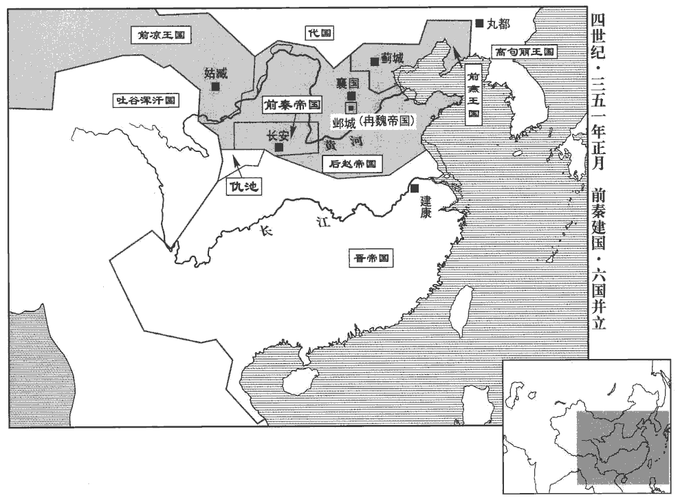
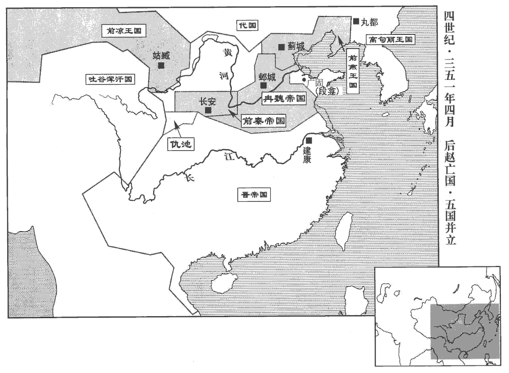
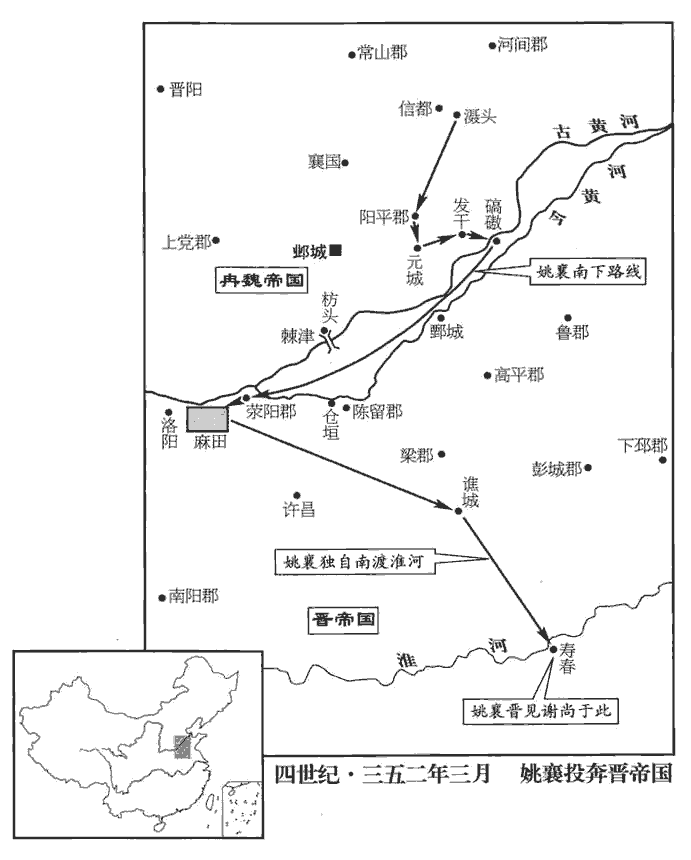
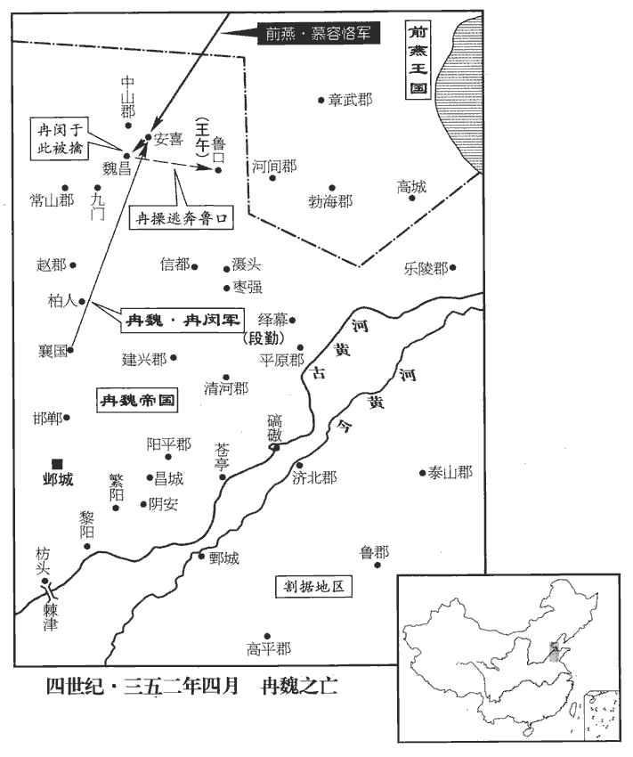
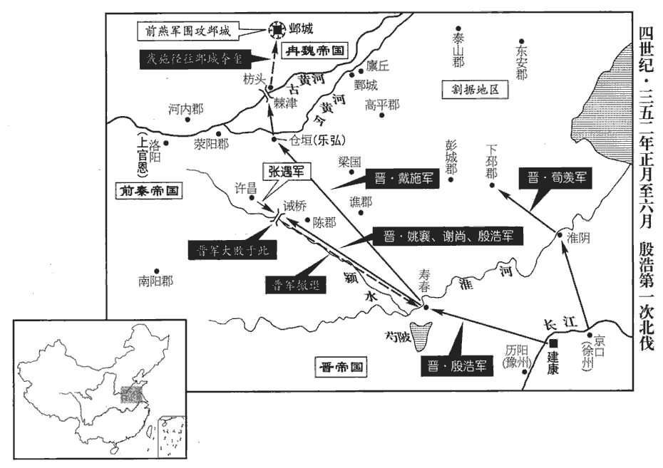
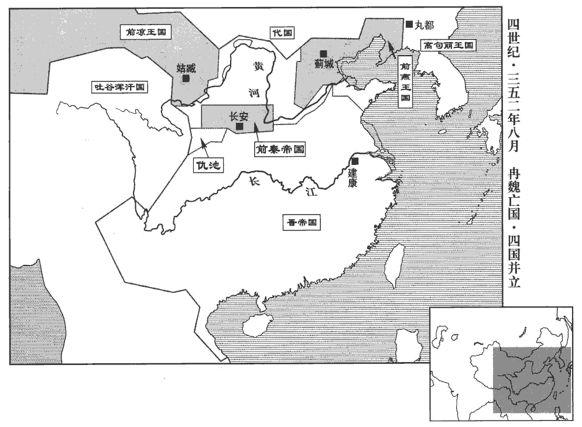
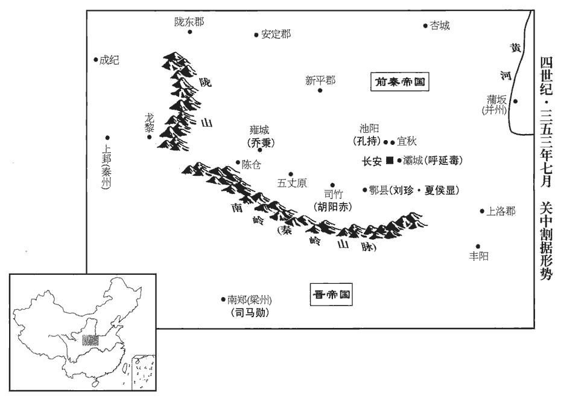
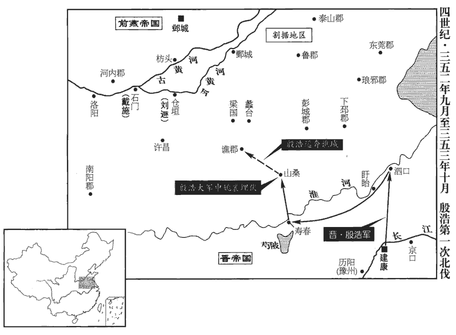
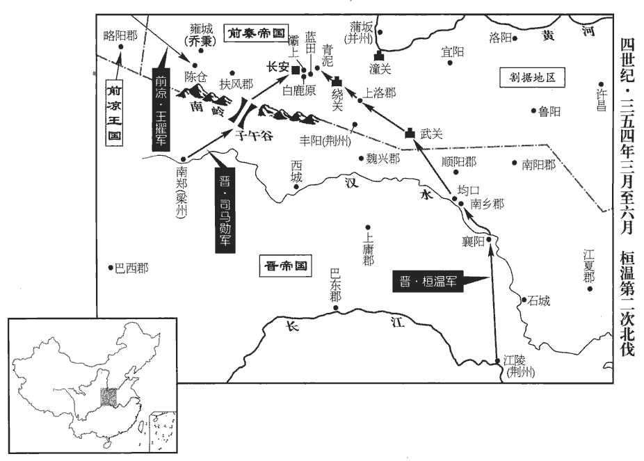

 晉紀二十一起重光大淵獻（辛亥），盡閼逢攝提格（甲寅），凡四年。

# 孝宗穆皇帝中之上

## 永和七年（辛亥，三五一）

1春，正月，丁酉‹一›，日有食之。

〖译文〗 [1]春季，正月，丁酉（初一），出现日食。

2苻健左長史賈玄碩等請依劉備稱漢中王故事，事見六十八卷漢獻帝建安二十四年。表健為都督關中諸軍事、大將軍、大單于、秦王。玄碩欲表言之於晉朝。單，音蟬。健怒曰：「吾豈堪為秦王邪！且晉使未返，使，疏吏翻。我之官爵，非汝曹所知也。」既而密使梁安諷玄碩等上尊號，上，時掌翻。健辭讓再三，然後許之。丙辰‹二十›，健‹本年三十五岁›即天王、大單于位，苻健，字建業，洪第三子。國號大秦，大赦，改元皇始。追尊父洪為武惠皇帝，廟號太祖；立妻強氏為天王后，強，其兩翻，氐姓也。子萇為太子，靚為平原公，萇，仲良翻。靚，疾正翻。生為淮南公，覿dí為長樂公，樂，音洛。方為高陽公，碩為北平公，騰為淮陽公，柳為晉公，桐為汝南公，廋為魏公，廋sōu，所鳩翻。武為燕公，幼為趙公。以苻雄為都督中外諸軍事、丞相、領車騎大將軍、雍州牧、東海公；雍，於用翻。苻菁為衛大將軍、平昌公，宿衛二宮；二宮，健所居及子萇所居也。雷弱兒為太尉，毛貴為司空，略陽‹甘肃省天水县东›姜伯周為尚書令，梁楞為左僕射，楞，盧登翻。王墮為右僕射，魚遵為太子太師，強平為太傅，段純為太保，呂婆樓為散騎常侍。散，悉亶dǎn翻。騎，奇寄翻。伯周，健之舅；平，王后之弟；婆樓，本略陽氐酋也。酋，慈由翻。

〖译文〗 [2]苻健的左长史贾玄硕等人想要向东晋朝廷上表，请求依据刘备号称汉中王的做法，任命苻健为都督关中诸军事、大将军、大单于、秦王。苻健愤怒地说：“我怎么能胜任秦王呢！况且晋朝的使臣尚未返回，我的官职爵位，不是你们所知道的。”然而紧接着他却悄悄地让梁安暗示贾玄硕等人向他进献尊号，经过表面上的再三推辞，然后就接受了。丙辰（二十日），苻健即天王位、大单于位，立国号为大秦，实行大赦，改年号为皇始。追尊父亲苻洪为武惠皇帝，庙号为太祖。立妻子强氏为天王后，儿子苻苌为太子。封儿子苻靓为平原公，苻生为淮南公，苻觌为长乐公，苻方为高阳公，苻硕为北平公，苻腾为淮阳公，苻柳为晋公，苻桐为汝南公，苻为魏公，苻武为燕公，苻幼为赵公。任命苻雄为都督中外诸军事、丞相、兼任车骑大将军、雍州牧、东海公。任命苻菁为卫大将军、平昌公，负责警卫苻健及苻苌所居住的两座宫殿。任命雷弱儿为太尉，毛贵为司空，略阳人姜伯周为尚书令，梁楞为左仆射，王堕为右仆射，鱼遵为太子太师，强平为太傅，段纯为太保，吕婆楼为散骑常侍。姜伯周是苻健的舅舅；强平是王后的弟弟；吕婆楼本来是略阳氐族的酋长。

 

3段龕請以青州內附；二月，戊寅‹十三›，以龕為鎮北將軍，封齊公。段龕據廣固‹山东省青州市›，始上卷上年。龕，苦含翻。

〖译文〗 [3]段龛请求以所据的青州归附东晋。二月，戊寅（十三日），东晋朝廷任命段龛为镇北将军，封为齐公。

4魏‹都邺城河北省临漳县西南邺镇›主閔攻圍襄國‹河北邢台›百餘日。去年十一月，閔攻襄國。趙主祗危急，乃去皇帝之號，稱趙王，去，羌呂翻。遣太尉張舉乞師於燕‹都蓟城北京市›，許送傳國璽；璽，斯氏翻。中軍將軍張春乞師於姚弋仲。弋仲‹本年七十一岁›遣其子襄帥騎二萬八千救趙，帥，讀曰率。誡之曰：「冉閔棄仁背義，屠滅石氏。事見上卷五年、六年。背，蒲妹翻。我受人厚遇，謂石虎遇之厚也。當為復讎，老病不能自行；汝才十倍於閔，若不梟擒以來，不必復見我也！」為，于偽翻。梟，堅堯翻。復，扶又翻。弋仲亦遣使告於燕；使，疏吏翻；下同。燕主儁‹慕容儁，本年三十三岁›遣禦難將軍悅綰wǎn禦難將軍，蓋慕容氏創置。難，乃旦翻。將兵三萬往會之。

〖译文〗 [4]魏国主冉闵攻打包围襄国一百多天。后赵主石祗境况危急，便去掉了皇帝的称号，改称为赵王，派遣太尉张举到前燕国请求援军，并承诺送去传国印玺。派遣中军将军张春向姚弋仲请求援军。姚弋仲派他的儿子姚襄率领骑兵二万八千人援救后赵。他告诫姚襄说：“冉闵抛弃仁爱，背离道义，屠杀消灭了石氏。我受到过石虎宽厚的待遇，应当为他复仇，但因为既老且病，不能亲自出征。你的才能高出冉闵十倍，如果不能把他的头颅带回来，就不必再来见我了！”姚弋仲也派使者到前燕报告。前燕王慕容俊派御难将军悦绾统领三万士兵前去与姚襄会师。

冉閔聞儁欲救趙，遣大司馬從事中郎廣寧‹河北涿鹿›常煒使於燕。儁使封裕詰之曰：「冉閔，石氏養息，息，子也。詰，去吉翻。負恩作逆，何敢輒稱大號？」煒曰：「湯放桀，武王伐紂，以興商、周之業；曹孟德養於宦官，莫知所出，卒立魏氏之基；曹操事見六十八卷漢靈帝中平元年。操，字孟德。卒，子恤翻。苟非天命，安能成功！推此而言，何必致問！」裕曰：「人言冉閔初立，鑄金為己像以卜成敗，而像不成，信乎？」煒曰：「不聞。」裕曰：「南來者皆云如是，何故隱之？」煒曰：「姦偽之人欲矯天命以惑人者，乃假符瑞、託蓍龜以自重。蓍shī，升脂翻。魏主握符璽，據中州，受命何疑；而更反真為偽，取決於金像乎！」裕曰：「傳國璽果安在？」煒曰：「在鄴。」裕曰：「張舉言在襄國。」煒曰：「殺胡之日，在鄴者殆無孑遺；孑，吉列翻，孤也，單也；言無孤單得遺者。時有迸漏者，皆潛伏溝瀆中耳，爾雅：水注谷曰溝，水注澮kuài曰瀆。迸，比諍翻。彼安知璽之所在乎！彼求救者，為妄誕之辭，無所不可，況一璽乎！」

〖译文〗 冉闵听说慕容俊想要救援后赵，便派大司马从事中郎广宁人常炜出使前燕国。慕容俊派封裕责问常炜说：“冉闵是石氏的养子，他背弃养育之恩而为叛逆之举，怎么胆敢狂妄地自称国王大号呢？”常炜说：“商汤放逐夏桀，周武王讨伐商纣，以此而振兴了商、周的大业；曹操被宦官养育，没有谁知道他的出身，最终奠定了魏氏的基础。如果不是顺应了上天之命，他们怎么能够成功！由此推理，何必还要来责问我呢！”封裕说：“听人说冉闵初立的时候，曾经用金子铸造自己的形像来占卜成败，然而像却没有铸成，这是真事吗？”常炜说：“没有听说过。”封裕说：“从南方来的人都说确实是这样，你为什么要隐瞒呢？”常炜说：“奸伪之人凡是想假传天命以迷惑人心的，就要假借祥瑞的征兆，伪托占卜的结果，用来显示自己所说的份量。魏国主握有传国印玺，占据中州，受之于天命，这还有什么疑问？难道还要改变事实，变真为伪，取决于金像吗！”封裕说：“传国印玺在哪里呢？”常炜说：“在邺城。”封裕说：“张举说在襄国。”常炜说：“诛杀胡人的时候，在邺城的人几乎一网打尽，当时有逃脱漏网的，也全都是潜伏在水渠水沟中的，他们怎么知道传国印玺在什么地方！他们那些求救的人，说起荒诞谎言来，没有什么不可以编织进去的，何况一个传国印玺呢！”

儁猶以張舉之言為信，乃積柴其旁，使裕以其私誘之，曰：「君更熟思，無為徒取灰滅！」誘，音酉。煒正色曰：「石氏貪暴，親帥大兵攻燕國都；雖不克而返，事見九十六卷成帝咸康四年。帥，讀曰率。然志在必取。故運資糧、聚器械於東北者，非以相資，乃欲相滅也。事見九十六卷咸康四年、六年。魏主誅翦石氏，雖不為燕；臣子之心，聞仇讎之滅，義當如何？而更為彼責我，不亦異乎！異，猶言可怪也。為，于偽翻。吾聞死者骨肉下于土，下，戶嫁翻。精魂升于天。蒙君之惠，速益薪縱火，使僕得上訴於帝足矣！」左右請殺之。儁曰：「彼不憚殺身以徇其主，忠臣也。且冉閔有罪，使臣何預焉！」使，疏吏翻。使出就館。夜，使其鄉人趙瞻往勞之，勞，力到翻。且曰：「君何不以實言？王怒，欲處君於遼、碣之表，遼海‹渤海湾›及碣石‹河北省昌黎县北›為遼、碣。杜佑曰：盧龍，漢肥如縣，有碣石山，碣然而立在海旁。秦築長城所起自碣石，在今高麗舊界，非此碣石也。趙瞻所謂遼、碣，蓋即杜佑所言者也。處，昌呂翻。柰何？」煒曰：「吾結髮以來，尚不欺布衣，況人主乎！曲意苟合，性所不能；直情盡言，雖沈東海，不敢避也！」沈，持林翻。遂臥向壁，不復與瞻言。復，扶又翻。瞻具以白儁，儁乃囚煒於龍城‹辽宁朝阳›。

〖译文〗 慕容俊依然认为张举所说的是真话，于是就在常炜身边堆上木柴，派封裕用关系他个人生命的话劝诱道：“请您再仔细考虑一下，没必要白白地化为灰烬！”常炜厉言正色地说：“石氏贪婪残暴，曾经亲自率领大军进攻燕国的国都，虽然没有攻克而返回，但其志在必取。所以他们此后往东北地区运送钱财粮饷，聚集武器装备的目的，并不是要拿这些东西帮助你们，而是想消灭你们。魏国主讨伐镇压石氏，虽然不是为了燕国，但作为臣子之心，听到仇敌被消灭的消息，从道义上说又该如何呢？如今你反而替石氏来责问我，岂不是怪事！我听说死去的人虽然骨肉埋在土下，而灵魂却升到天上。蒙您惠赐，请赶快加柴点火，使我能到上帝那里去诉说冤屈就满足了！”周围的人都请求焚杀常炜。幕容俊说：“他不怕牺牲生命来为他的君主殉葬，确实是忠臣。况且冉闵有罪，与他的使臣有什么关系呢！”于是就让常炜离开此地，住进了馆舍。入夜，幕容俊派常炜的同乡赵瞻去慰劳常炜，并且对他说：“您为什么不以真话相告呢！如果大王发怒，要把您流放到辽海、碣石山以外，您有什么办法呢？”常炜说：“我自从结发成年以来，连布衣百姓都不曾欺骗，何况是君主呢！违心地苟且迎合，这是我本性所不能做的事；尽情直言，就是被沉于东海，也不敢逃避！”说完就面朝墙一躺，不再和赵瞻搭括了，赵瞻把这些情况全都告诉了慕容俊，慕容俊便把常炜囚禁在龙城。

5趙并州刺史張平遣使降秦，使，疏吏翻。降，戶江翻。秦王以平為大將軍、冀州牧。

〖译文〗 [5]后赵国并州刺史张平派使者去向前秦投降，前秦王任命张平为大将军、冀州牧。

6燕王儁還薊。自龍城還薊。薊，音計。

〖译文〗 [6]前燕王慕容俊回到蓟城。

7三月，姚襄‹时驻滠头›及趙汝陰王琨‹时驻信都冀州州政府所在县·河北省冀县›各引兵救襄國‹河北邢台›。琨自信都進兵救襄國。冉閔遣車騎將軍胡睦拒襄於長蘆‹河北省新河县境，今已湮没›，水經註：漳水過堂陽縣西，分為二水，其右水東北注出石門，謂之長蘆水。長蘆水西逕堂陽縣故城南，又東逕九門陂，又東逕扶都縣。五代志：隋置長蘆縣，屬河間郡。劉昫曰：長蘆，漢參戶縣地。將軍孫威拒琨於黃丘‹河北省辛集市境›，魏收地形志：鉅鹿郡郻縣有黃丘。郻qiāo，苦ㄠ翻。皆敗還，士卒略盡。

〖译文〗 [7]三月，姚襄及后赵汝阴王石琨分别率兵救援襄国。冉闵派车骑将军胡睦在长芦阻击姚襄，派将军孙威在黄丘阻击石琨，但全都失败而返，士兵死亡殆尽。

閔欲自出擊之，衛將軍王泰諫曰：「今襄國未下，外救雲集，若我出戰，必覆背受敵，「覆」，當作「腹」。【章：孔本正作「腹」；十二行本、乙十一行本仍作「覆」。】此危道也。不若固壘以挫其銳，徐觀其釁而擊之。釁，隙也。且陛下親臨行陳，行，戶剛翻。陳，讀曰陣。如失萬全，則大事去矣。」閔將止，道士法饒進曰：「陛下圍襄國經年，無尺寸之功；今賊至，又避不擊，將何以使將士乎！將，即亮翻。且太白入昴mǎo，當殺胡王，晉天文志：昴七星，為旄頭，胡星也。百戰百克，不可失也！」閔攘袂大言曰：「吾戰決矣，敢沮眾者斬！」攘，如羊翻。沮，在呂翻。乃悉眾出，與襄、琨戰。悅綰適以燕兵至，去魏兵數里，䟽布騎卒，曳柴揚塵，䟽，讀與踈同。騎，奇寄翻；下同。魏人望之恟懼，自棘城之敗，趙人固畏燕兵，見其至而勢盛，故恟懼。恟，許拱翻。襄、琨、綰三面擊之，趙王祗自後衝之，魏兵大敗，果如王泰之言，腹背受敵而敗。閔與十餘騎走還鄴。降胡栗特康等執大單于胤及左僕射劉琦以降趙，趙王祗殺之。果如韋謏xiǎo之言。史言冉閔不能用群策以取敗。降，戶江翻。單，音蟬。胡睦及司空石璞、尚書令徐機、中書監盧諶等并將士死者凡十餘萬人。劉隗、盧諶不能為晉死而卒死於兵。人誰不死，貴得其死所耳！諶，是壬翻。閔潛還，人無知者。鄴中震恐，訛言閔已沒。射聲校尉張艾請閔親郊以安眾心，親郊，親出郊祀也。閔從之，訛言乃息。閔支解法饒父子，解剝其支體而殺之。贈韋謏大司徒。謏死，見上卷上年。謏xiǎo，蘇鳥翻。姚襄還灄頭，灄，書涉翻。姚弋仲怒其不擒閔，杖之一百。

〖译文〗 冉闵想要亲自出马攻打姚襄及石琨，卫将军王泰劝谏说：“如今襄国城尚未攻下，外边援救的部队云集而至，如果我们再外出征战，一定会腹背受敌，这是极其危险的做法。不如坚固堡垒以挫伤他们的锐气，慢慢地看着他们之间出现裂痕后再去攻击。况且陛下亲自上阵，如果一旦出危险，宏图大业就全完了。”冉闵听了劝谏后正想不再出征，而道士法饶却进言说：“陛下包围襄国已有一年之久，然而没有取得丝毫的胜利。如今敌人来了，却避而不攻，今后将怎样调动将士呢！况且启明星进入昂宿，正是诛杀胡王的征兆，一定会百战百胜，绝不可错失良机！”听了这话，冉闵挽起袖子大声说：“我决定要出发征战了。胆敢出言使兵众士气沮丧者杀头！”于是就率领全部兵众出发，与姚襄、石琨决战。这时悦绾恰好率领燕兵来到，离魏兵约有几里地的距离，他将骑兵稀疏地布开，拖着树枝扬起漫天尘土，魏国兵众一看见这阵势便骚动不安、惊恐万状。姚襄、石琨、悦绾三面夹击，后赵王石祗则从后面发起冲锋，魏兵大败，冉闵和十多个骑兵逃回邺城。以前投降冉闵的胡人栗特康等人挟持着大单于石冉及左仆射刘琦投降了后赵，后赵王石祗把石冉、刘琦杀掉了。冉闵的众将士再加上胡睦及司空石璞、尚书令徐机、中书监卢谌等，死亡的人总共达十多万。冉闵偷偷地回到邺城，无人知晓。邺城里的人都感到震惊害怕，讹传冉闵已死。射声校尉张艾请求冉闵露面去参加一次郊祀祭天活动，以安定民心，冉闵听从了，讹传才平息下来。冉闵肢解了法饶父子，追封韦为大司徒。姚襄回到滠头，姚弋仲对他没能擒获冉闵十分气愤，打了他一百杖。

初，閔之為趙相也，相，息亮翻。悉散倉庫以樹私恩，與羌、胡相攻，無月不戰。趙所徙青、雍、幽、荊四州之民石虎破曹嶷，徙青州之民；破劉胤、石生，再徙雍州之民；破段匹磾及為燕所敗，徙幽州之民；石勒南掠江、漢，徙荊州之民。雍，於用翻。及氐、羌、胡、蠻數百萬口，以趙法禁不行，各還本土；道路交錯，互相殺掠，其能達者什有二、三。中原大亂，因以饑疫，人相食，無復耕者。復，扶又翻。

〖译文〗 当初，冉闵任后赵国丞相的时候，把国家仓库里的粮食财物全都散发给人们，以此树立个人的恩誉，和羌族、胡族没有一个月不进行战争。后赵国所迁徙来的青、雍、幽、荆四州的百姓，以及氐、羌、胡、蛮的数百万人，都因为后赵国不能执行法令，分别返归本土。但这些人归途交错，又互相掠夺残杀，最终能回到目的地的仅十之二、三。中原地区大乱，因此导致了饥荒遍野，瘟疫流行，人相残食，再也没有人耕田种地了。

趙王祗使其將劉顯帥眾七萬攻鄴‹河北临漳西南邺镇›，帥，讀曰率。軍于明光宮，此明光宮，石氏所建也。去鄴二十三里。魏主閔恐，召王泰，欲與之謀；泰恚前言之不從，辭以瘡甚。戰敗被傷，故因以瘡甚辭。恚huì，於避翻。閔親臨問之，泰固稱疾篤。閔怒，還宮，謂左右曰：「巴奴，乃公豈假汝為命邪！王泰蓋巴蠻也。乃公，冉閔自謂也；自漢高祖已有是語。要將先滅群胡，卻斬王泰。」乃悉眾出戰，大破顯軍，追奔至陽平‹河北馆陶›，陽平縣，漢屬東郡，魏、晉分屬陽平郡，而陽平郡治在魏郡東北。宋白曰：魏州莘縣，漢為陽平縣，後趙移陽平理館陶縣。斬首三萬餘級。顯懼，密使請降，使，疏吏翻。降，戶江翻。求殺祗以自效，閔乃引歸。有告王泰欲叛入秦者，閔殺之，夷其三族。

〖译文〗 后赵王石祗派他的将领刘显率领七万兵众攻打邺城，驻扎在明光宫，距离邺城二十三里远。魏国主冉闵十分恐惧，征召王泰来和他商量对策。王泰对冉闵以前不听从他的劝告十分气愤，便以伤势严重为由加以拒绝。冉闵亲自前往询问，王泰仍然坚持说伤势严重。冉闵十分愤怒，返回王宫，对周围的人说：“巴蛮奴才，我难道还要靠你活命吗！我要先消灭掉群胡，然后杀王泰。”于是就率领全部兵众出战，重创刘显的军队，一直追击到阳平，斩杀三万多人。刘显十分害怕，秘密地派人去向冉闵请求投降，并请求杀掉石祗以表示自己的效忠，冉闵这才带领兵众撤回。有人报告说王泰想背叛归附前秦，冉闵便杀掉王泰，还灭掉了他的三族。

8秦王健分遣使者問民疾苦，搜羅雋異，寬重斂之稅，弛離宮之禁，趙修長安宮殿，亦有離宮之禁。斂，力贍翻。罷無用之器，去侈靡之服，去，羌呂翻。凡趙之苛政不便於民者，皆除之。史言苻健所以能據有關中。

〖译文〗 [8]前秦王苻健分别派遣使者访问百姓的疾苦，搜罗杰出人才，放宽了横征暴敛的赋税，开放了为修建离宫划定的禁区，撤掉了没有用处的事务和器具，更换了华丽奢侈的服装，凡是后赵国制定的不利于百姓的繁琐苛刻的政令，全都予以废除。

9杜洪、張琚遣使召梁州刺史司馬勳；夏，四月，勳帥步騎三萬赴之，帥，讀曰率。騎，奇寄翻。秦王健禦之於五丈原‹陕西眉县西北›。勳屢戰皆敗，退歸南鄭。健以中書令賈玄碩始者不上尊號，銜之，上，時掌翻。使人告玄碩與司馬勳通，并其諸子皆殺之。

〖译文〗 [9]杜洪、张琚派遣使者征召梁州刺史司马勋。夏季，四月，司马勋率领步、骑兵三万人前往，在五丈原遇上了前秦王苻健的阻击。司马勋多次战斗都失败了，只好退回南郑。苻健因为中书令贾玄硕在当初没有主动进上尊号，对他耿耿于怀，便指使人诬告他与司马勋相勾结，借此把他和他的几个儿子一起杀掉了。

10渤海‹河北省南皮县›人逄約逄páng，皮江翻。因趙亂，擁眾數千家，附於魏，魏以約為渤海太守。故太守【嚴：「守」改「尉」。】劉準，隗之兄子也；土豪封放，奕之從弟也；從，才用翻。別聚眾自守。閔以準為幽州刺史，與約中分渤海。燕王儁使封奕討約，使昌黎‹辽宁义县›太守高開討準、放。開，瞻之子也。高瞻，見九十一卷元帝太興二年。

〖译文〗 [10]渤海人逄约乘后赵国大乱之机，带领数千家民众，归附魏国。魏国任命逄约为勃海太守。原来的太守刘准，是刘隗哥哥的儿子；地方豪强封放，是封奕的族弟。他们则另外聚集部众自守。冉闵任命刘准为幽州刺史，把渤海一分为二，让逄约和刘准分地而治。前燕王慕容俊派封奕讨伐逄约，派昌黎太守高开讨伐刘准、封放。高开是高瞻的儿子。

奕引兵直抵約壘，遣人謂約曰：「相與鄉里，隔絕日久，封奕本渤海人，懷帝永嘉五年，託於慕容廆，見八十七卷。會遇甚難。時事利害，人皆有心，非所論也。願單出一相見，以寫佇結之情。」久立而待之曰佇；企望之情鬱積而不散曰結。約素信重奕，即出，見奕於門外；各屏騎卒，屏，必郢翻。騎，奇寄翻。單馬交語。奕與論敘平生畢，因說之曰：「與君累世同鄉，情相愛重，誠欲君享祚無窮；今既獲展奉，展，省視也。奉，承也，事也。說，輸芮翻。不可不盡所懷。冉閔乘石氏之亂，奄有成資，是宜天下服其強矣，而禍亂方始，固知天命不可力爭也。燕王奕世載德，「奕世載德」，班彪王命論之言。師古曰：載，乘也，言相因不絕。奉義討亂，所征無敵。今已都薊‹北京›，南臨趙、魏，遠近之民，襁負歸之。民厭荼毒，孔安國曰：荼毒，苦也。襁，居兩翻。咸思有道。冉閔之亡，匪朝伊夕，成敗之形，昭然易見。易，以豉翻。且燕王肇開王業，虛心賢雋；君能翻然改圖，則功參絳、灌，慶流苗裔，孰與為亡國將，守孤城以待必至之禍哉！」將，即亮翻。約聞之，悵然不言。奕給使張安，有勇力；給使，在左右給使令者也。奕豫戒之，俟約氣下，安突前持其馬鞚，鞚kòng，空貢翻。因挾之而馳。至營，奕與坐，謂曰：「君計不能自決，故相為決之，為，于偽翻。非欲取君以邀功，乃欲全君以安民也。」

〖译文〗 封奕率兵直接抵达逄约的营垒，派人告诉逄约说：“你我本是乡里乡亲，离别日久，很难见面。眼下事情的利害得失，人人心里都有数，不必多说。希望你自己单独出来见见面，以倾诉聚集于心头的思念之情。”逄约历来信任敬重封奕，随即出来，在营垒门外与封奕见面。他们各自都没带骑兵卫士，只是单独骑着马交谈。封奕和他叙说完各自经历后，接着劝他说：“我和你几代同乡，情义深重，确实希望你永远享受魏国的国土。如今既然得以见面承教，我就不能不尽吐肺腑之言了。冉闵乘石氏大乱之机，囊括了其已有的成果，是应该让天下人佩服其强大的力量，然而战祸动乱也从此开始，这就知道天命本来不是靠力量强大争夺来的。燕王几代人都具有德行，崇奉道义，讨伐祸乱，所向无敌。如今已经定都蓟城，南视赵、魏，远近的百姓，纷纷拖儿带女，前来归附。百姓厌恶茶毒之苦，都思念有道德的人。冉闵的灭亡，非早即晚，成败的形势，显而易见。况且燕王刚刚开创帝王大业，虚心对待俊贤之士，如果您能翻然悔悟，改变图谋，则功劳可与周勃、灌婴相比，福祉可流传子孙后代，何必做亡国之将，困守孤城，等待必然要到来的灾祸呢！”逄约听了这番话，心情悲怅，默不作声。封奕左右的使者张安，勇气与力量俱佳，封奕事先对他作了布置，等到逄约气势低落时，张安突然冲上前去，抓住他的马缰，顺势挟持着他急驰而返。回到营地，封奕与他坐在一起，对他说：“您不能自己决定大计，所以我帮您一起决定，不是想要拿您去邀功请赏，而是想保全您以安抚百姓。”

高開至渤海‹河北南皮›，準、放迎降。降，戶江翻。儁以放為渤海太守，準為左司馬，約參軍事。以約誘於人而遇獲，誘，音酉。更其名曰釣。更，工衡翻。

〖译文〗 高开抵达渤海，刘准、封放出来迎接并投降。慕容俊任命封放为渤海太守，刘准为左司马，逄约为参军事，因为逄约是受人劝诱才归附投降的，所以慕容俊把他的名字改为逄钓。

11劉顯弒趙王祗及其丞相樂安王炳、太宰趙庶等十餘人，傳首于鄴‹河北临漳西南邺镇›。驃騎將軍石寧奔柏人‹河北隆尧西›。柏人縣，自漢以來屬趙國。劉昫曰：唐邢州堯山縣，古之柏人城。驃，匹妙翻。騎，奇寄翻。魏主閔焚祗首于通衢，拜顯上大將軍、大單于、冀州牧。單，音蟬。

〖译文〗 [11]刘显杀掉了后赵王石祗及其丞相乐安王石炳、太宰赵庶等十多人，并将首级传送到邺城。骠骑将军石宁逃奔到柏人县。魏国主冉闵在邺城的通衢大道上焚烧了石祗的首级，授予刘显上大将军、大单于、冀州牧的官职。

 

12五月，趙兗州刺史劉啟自鄄城‹山东鄄城北›來奔。鄄城縣，漢屬濟陰郡，晉屬濮陽國，唐為濮州治所。鄄juàn，吉縣翻。

〖译文〗 [12]五月，后赵国兖州刺史刘启从鄄城来投奔东晋。

13秋，七月，劉顯復引兵攻鄴，復，扶又翻。魏主閔擊敗之。敗，蒲邁翻。顯還，稱帝於襄國‹河北邢台›。

〖译文〗 [13]秋季，七月，刘显再次率兵攻打邺城，被魏国主冉闵击败。刘显返回，在襄国称帝。

14八月，魏徐州‹府设廪丘山东省郓城县西北›刺史周成、兗州‹府设鄄城›刺史魏統、荊州‹府设宛县河南省南阳市›刺史樂弘、豫州‹府设许昌河南省许昌市东›牧張遇以廩丘‹山东郓城西北›、許昌‹河南许昌东›等諸城來降；時周成據廩丘，張遇據許昌。降，戶江翻；下同。平南將軍高崇、征虜將軍呂護執洛州刺史鄭系，以其地來降。時崇、護以三河之地來降。

〖译文〗 [14]八月，魏国徐州刺史周成、兖州刺史魏统、荆州刺史乐弘、豫州刺史张遇前来向东晋投降，献出了他们所占据的廪丘、许昌等城邑。平南将军高崇、征虏将军吕护挟持着洛州刺史郑系也前来向东晋投降，献出了他们所占据的地方。

15燕王儁遣慕容恪攻中山‹河北定州›，慕容評攻王午于魯口‹河北饶阳›，魏中山太守上谷‹河北怀来›侯龕閉城拒守。龕，苦含翻。恪南徇常山‹河北正定›，軍于九門‹河北藁城西北›，九門縣，自漢以來屬常山郡。魏趙郡‹河北省高邑县›太守遼西‹河北卢龙›李邽舉郡降，恪厚撫之，將邽還圍中山‹河北定州›，侯龕乃降。恪入中山，遷其將帥、土豪數十家詣薊，將，即亮翻。帥，所類翻。薊，音計。餘皆安堵，軍令嚴明，秋豪不犯。慕容評至南安，王午遣其將鄭生拒戰，評擊斬之。

〖译文〗 [15]前燕王慕容俊派慕容恪攻打中山，派慕容评在鲁口攻打王午，魏国中山太守上谷人侯龛紧闭城门，抵抗固守。慕容恪率兵南巡常山，驻扎在九门，魏国赵郡太守辽西人李带领全郡投降，慕容恪给他以丰厚的抚慰，统领李的军队返回去包围中山，于是侯龛投降。慕容烙进入中山，将侯龛手下的数十家将帅、地方豪强迁徙到蓟城，其余的则让他们全都就地安居。部队纪律严明，秋毫无犯。慕容评抵达南安，王午派他的部将郑生抵抗，慕容评发起攻击，斩杀了郑生。

悅綰wǎn還自襄國‹河北邢台›，儁乃知張舉之妄而殺之。常煒有四男二女在中山‹河北定州›，儁釋煒之囚，使諸子就見之。煒上疏謝恩，儁手令答曰：「卿本不為生計，孤以州里相存耳。儁居昌黎，煒居廣寧，二郡皆屬幽州。今大亂之中，諸子盡至，豈非天所念邪！天且念卿，況於孤乎！」賜妾一人，穀三百斛，使居凡城‹河北平泉南›。以北平‹河北遵化›太守孫興為中山‹河北定州›太守；興善於綏撫，中山遂安。

〖译文〗 悦绾从襄国返回，慕容俊才知道张举所说的送传国印玺是荒诞之辞，于是就杀了他。常炜有四男二女在中山，慕容俊解除了对他的囚禁，让他的儿子们前来见他。常炜上疏谢恩，慕容俊亲手复信回答说：“你的行动本来不是为了活命谋生考虑，但我与你是大同乡，所以加以保全。在当今大乱的形势下，你的儿子们全都来到了这里，这难道不是上天对你的关怀吗？上天都关怀你，何况我呢！”慕容俊赐给常炜妾一人，粮食三百斛，让他居住在凡城。任命北平太守孙兴为中山太守。孙兴长于安抚之道，于是中山就安定下来了。

16庫傉nù官偉帥部眾自上黨‹山西省黎城县西南›降燕。傉nù，奴沃翻。庫傉官，漁陽烏桓大人庫傉之餘種。按溫公與劉道原書，以為「庫」當作「厙」。詳見前例。厙shè，音舍。

〖译文〗 [16]库官伟率领他的部众从上党来投降前燕。

17姚弋仲遣使來請降。趙亡，弋仲乃降。晉史言其盡忠於石氏。使，疏吏翻；下同。冬，十【章：十二行本「十」下有「一」字；乙十一行本同；孔本同。】月，以弋仲為使持節、六夷大都督、督江【嚴：「江」改「淮」。】北諸軍事、「江北」，恐當作「河北」。車騎大將軍、開府儀同三司、大單于、高陵郡公；騎，奇寄翻。單，音蟬。又以其子襄為持節、平北將軍、都督并州諸軍事、并州刺史、平鄉縣公。

〖译文〗 [17]姚弋仲派遣使者前来向东晋请求投降。冬季，十一月，东晋朝廷任命姚弋仲为使持节、六夷大都督、督淮北诸军事、车骑大将军、天府仪同三司、大单于、高陵郡公。又任命他的儿子姚襄为持节、平北将军、都督并州诸军事、并州刺史、平乡县公。

18逄páng釣亡歸渤海，招集舊眾以叛燕。樂陵‹河北盐山›太守賈堅考異曰：燕書賈堅傳：「烈祖問堅年，對以受新命始及三載。」烈祖悅其言，拜樂陵太守。按堅以去年九月獲於燕，至明年始三年。若未為樂陵太守，豈能安集諸縣，告諭逄釣！故知堅先已為樂陵太守，非因問年而授。使人告諭鄉人，示以成敗，釣部眾稍散，遂來奔。

〖译文〗 [18]逄钓逃亡回渤海，召集起过去的旧部兵众背叛了前燕。乐陵太守贾坚派人劝谕百姓，给他们分析成败大势，逄钓的旧部逐渐离散，于是逄钓来投奔东晋。

19吐谷渾‹青海省›葉延卒，子碎奚立。晉書作「辟奚」。按一百三卷簡文帝咸安元年鍾惡地殺三弟事，亦當作「辟奚」。

〖译文〗 [19]吐谷浑的首领叶延去世，儿子碎奚继位。

20初，桓溫聞石氏亂，上疏請出師經略中原；溫蓋上疏於五年出屯安陸之時。事久不報。溫知朝廷杖殷浩以抗己，甚忿之；然素知浩之為人，亦不之憚也。以國無他釁，遂得相持彌年，【章：十二行本「年」下有「雖有君臣之跡」六字；乙十一行本同；孔本同；張校同；退齋校同。】羈縻而已，八州士眾資調殆不為國家用。永和元年，溫都督荊、司、雍、益、梁、寧六州；五年，遣滕畯帥交、廣之兵伐林邑，蓋是時已加督交、廣二州矣。資，財也。調，賦也。調，徒釣翻。屢求北伐，‹司马聃，本年九岁›詔書不聽。十二月，辛未‹十一›，溫拜表輒行，帥眾四五萬順流而下，軍於武昌‹湖北省鄂州市›。帥，讀曰率。朝廷大懼。

〖译文〗 [20]当初，桓温听说石氏大乱，便向朝廷上疏，请求出兵整治中原地区，但过了许久也没有回音。桓温知道朝廷倚仗殷浩来对抗自己，对此十分愤怒。然而他也一向知道殷浩的为人，所以对此也不惧怕。因为国家没有什么其他灾祸变故，也就得以相持共处了一年多，但不过是一般性的联系、应付而已。桓温管辖的八州之内民众的资财赋税，几乎不给朝廷使用。桓温多次请求北伐，朝廷下达诏书不予同意。十二月，辛未（十一日），桓温上奏章后就立即行动，率领四五万人顺江而下，驻扎在武昌。朝廷十分恐惧。

殷浩欲去位以避溫，又欲以騶虞幡駐溫軍。吏部尚書王彪之言於會稽王昱曰：「此屬皆自為計，非能保社稷，為殿下計也。會，工外翻。若殷浩去職，人情離駭，天子獨坐，當此之際，必有任其責者，非殿下而誰乎！」又謂浩曰：「彼若抗表問罪，卿為之首。事任如此，謂浩當朝政也。猜釁已成，謂浩與溫有隙也。欲作匹夫，豈有全地邪！且當靜以待之。令相王與手書，相，息亮翻。示以款誠，為陳成敗，彼必旋師；若不從，則遣中詔；又不從，乃當以正義相裁。謂正溫舉兵向闕之罪。柰何無故忩忩，先自猖獗乎！」忩cōng，倉紅翻。浩曰：「決大事正自難，頃日來欲使人悶。聞卿此謀，意始得了。」了，決也。彪之，彬之子也。王敦之亂，彬能守正，彪之可謂克紹矣。

〖译文〗 殷浩想用辞职来躲避桓温，又想用出示标有驺虞的旗帜的办法，使桓温的部队不再继续前进。吏部尚书王彪之对会稽王司马昱进言说：“这些举动全都是为自己考虑，并不能保全江山，不是替殿下考虑。如果殷浩辞职，必将导致人心分离混乱，天子独坐天下，在这种时候，一定要有人出来承担责任，这人不是殿下还能是谁呢！”王彪之又对殷浩说：“如果桓温上表直言，兴师问罪，首当其冲的是您。您在朝廷任此职务，猜忌隔阂已经形成，这时想成为一般百姓，难道还能保全自己吗！应该暂且静观不动地等待桓温。可以先让宰相给他写一封亲笔信，向他表示恳切的诚意，为他分析成败趋势，他就一定会率兵返回了；如果不听，那就由皇上亲自下达手诏；再不听，就应当用正义之师去制裁他。为什么您要平白无故地匆匆行事，先自我倾覆呢！”殷浩说：“面临大事的我正难以决策，近日一直使我感到烦闷，听到你这个计谋，主意才得以决定了。”王彪之是王彬的儿子。

撫軍司馬高崧昱為撫軍大將軍，以崧為司馬。言於昱曰：「王宜致書，諭以禍福，自當返旆。如其不爾，便六軍整駕，逆順於茲判矣！」言溫若不還，則當整六師奉順討逆也。乃於坐為昱草書曰：「寇難宜平，時會宜接。謂是時中原豪傑相繼來降，有恢復之會，宜應接之也。難，乃旦翻。坐，徂臥翻。為，于偽翻；下同。此實為國遠圖，經略大算，能弘斯會，非足下而誰！但以比興師動眾，要當以資實為本；比，毗寐翻。運轉之艱，古人所難，不可易之於始而不熟慮。易，以豉翻。頃所以深用為疑，惟在此耳。然異常之舉，眾之所駭，遊聲噂zūn𠴲tà，噂，祖本翻。𠴲，徒合翻。噂𠴲，聚語也。想足下亦少聞之。少，詩沼翻。苟患失之，無所不至，論語孔子之言。或能望風振擾，一時崩散。如此則望實并喪，喪，息浪翻。社稷之事去矣。皆由吾闇弱，德信不著，不能鎮靜群庶，保固維城，詩曰：宗子維城。所以內愧於心，外慚良友。吾與足下，雖職有內外，安社稷，保國家，其致一也。致，極也，言事理詣極之地則一也。天下安危，繫之明德；當先思寧國而後圖其外，使王基克隆，大義弘著。所望於足下，區區誠懷，豈可復顧嫌而不盡哉！」復，扶又翻。溫即上疏惶恐致謝，回軍還鎮‹湖北省江陵县›。

〖译文〗 抚军司马高崧对司马昱说：“您应该致信桓温，向他说明利害得失，他自己就应当率兵返回了。如果他不这样做，就整理六军人马出征，正义叛逆从此判明！”于是他就坐下来替司马昱起草书信说：“寇贼发难，应该平定，时运到来，应该应接。这确实是为国家着想的长谋远虑、夺取天下的宏图大略，能够弘扬光大这种时运的人，除了足下还能有谁！但兴师动众，重要的是应该以雄厚的财力物力为基础，辗转运输的艰难，正是古人最头疼的事，不能从一开始就认为它容易而不加以认真地考虑。近来我之所以对你的举动深以为疑，原因就在这里。对于出乎寻常的举动，人们都感到惊骇，所以近来各种议论说法，纷至沓来，想足下也稍有耳闻。假若生怕得到的东西再失去，就会无所不用其极，也许有些人就会震恐惊忧，甚至会顷刻崩溃逃散。如此则宏大的愿望和已有的成果全都会丧失，国家的大业也就完了。全都是由于我昏庸懦弱，没有表现出崇高的道德和信誉，才没能使众百姓沉着安定，凭借险势连城固守，以保卫国家。这就是我于内问心有愧，于外对不起好友的原因。我与足下，虽然任职有内外之分，但安定国家，保卫皇帝，这个目标是一致的。天下的安危，与完美的德行相联系，应当先考虑使国家安宁，然后再图谋向外扩展，以使帝王的基业兴隆昌盛，道义弘扬彰著，这就是我对阁下的期望。区区一点心意，难道还能再顾虑疑忌而不坦诚尽言吗！”桓温见信后立即上书，诚惶诚恐地表示谢罪，率军返回了原来镇守的地方。

21朝廷將行郊祀。會稽王昱問於王彪之曰：「郊祀應有赦否？」彪之曰：「自中興以來，郊祀往往有赦，愚意常謂非宜；凶愚之人，以為郊必有赦，將生心於徼幸矣！」徼，堅堯翻。昱從之。

〖译文〗 [21]东晋朝廷将要在郊外举行祭祀天地的仪式。会稽王司马昱问王彪之说：“举行郊祀是否应该有大赦？”王彪之回答：“自从朝廷中兴以来，举行郊祀时往往实行大赦。我的意见是，如果经常这样做，是不合适的。凶残愚顽之人，以为一举行郊祀必定会实行大赦，那他们必将产生侥幸心理！”司马昱听从了他的意见。

22燕王儁如龍城。

〖译文〗 [22]前燕王慕容俊到了龙城。

23丁零翟鼠帥所部降燕，封為歸義王。丁零居中山‹河北定州›，其後翟斌等皆其種類也。帥，讀曰率。

〖译文〗 [23]丁零人翟鼠率领兵众投降了前燕，被封为归义王。

## 八年（壬子，三五二）

1春，正月，辛卯‹一›，日有食之。

〖译文〗 [1]春季，正月，辛卯（初一），出现日食。

2秦‹都长安陕西省西安市›丞相雄等請秦王健‹苻健，本年三十六岁›正尊號，依漢、晉之舊，不必效石氏之初。謂石虎兄弟皆先稱天王，後即皇帝位。健從之，即皇帝位，大赦。諸公皆進爵為王。且言單于所以統壹百蠻，非天子所宜領，此亦雄等之言也。單，音蟬。以授太子萇。

〖译文〗 [2]前秦丞相苻雄等人请求秦王苻健正式称皇帝的尊号，依从汉朝、晋朝的旧制，而不必效法石氏最初先称天王的做法。苻健听从了这一请求，即皇帝位，实行大赦。诸公全都晋升爵位为王。苻雄等人还说，单于用来统治百蛮的种种措施、办法，不宜由天子亲自掌管。所以苻健把这方面的权力授予太子苻苌。

3司馬勳既還漢中‹陕西漢中›，杜洪、張琚屯宜秋‹陕西泾阳西北›。水經註：鄭渠自中山西瓠口東流，逕宜秋城北，又東逕中山南，又東逕池陽縣故城北。洪自以右族輕琚，琚遂殺洪，自立為秦王，改元建昌。

〖译文〗 [3]司马勋已经回到汉中，杜洪、张琚驻扎在宜秋。杜洪自以为出身名门望族而轻视张琚，张琚于是就杀掉了杜洪，自立为秦王，改年号为建昌。

4劉顯‹时在襄国河北省邢台市›攻常山‹河北正定›，魏主閔留大將軍蔣幹使輔太子智守鄴‹河北临漳西南邺鎮›，自將八千騎救之。顯大司馬清河王寧以棗強‹河北棗強›降魏。棗強縣，前漢屬清河郡，後漢、晉省，尋復置，屬信都郡。閔擊顯，敗之，敗，補邁翻。追奔至襄國‹河北邢台›。顯大將軍曹伏駒開門納閔，閔殺顯及其公卿已下百餘人，考異曰：閔殺顯，晉帝紀在正月，十六國春秋鈔在二月，燕書在三月己酉，未知孰是。今從帝紀。焚襄國宮室，遷其民於鄴。趙汝陰王琨以其妻妾來奔，斬於建康市，石氏遂絕。自古無不亡之國，宗族誅夷，固亦有之，未有至於絕姓者。石氏窮凶極暴，而子孫無遺種，足以見天道之不爽矣。

〖译文〗 [4]刘显进攻常山，魏国主冉闵留下大将军蒋辅佐太子冉智守卫邺城，自己统率八千骑兵前去救援。刘显的大司马清河人王宁投降了魏国，将枣强县拱手交出。冉闵攻击刘显，打败了他，追击到襄国。刘显的大将军曹伏驹打开城门让石闵进入，石闵杀掉了刘显及其公卿以下的官吏一百多人，焚烧了襄国的宫室，将襄国的百姓迁徙到邺城。后赵汝阴王石琨带着他的妻妾前来东晋投降，被斩杀在建康街头，于是石氏被彻底根绝了。

5尚書左丞孔嚴言於殷浩曰：「比來眾情，良可寒心，比，毗至翻。不知使君當何以鎮之。愚謂宜明受任之方，韓、彭專征伐，蕭、曹守管籥yuè，事見漢高帝紀。曹參當高帝時，從韓信用兵，其後相齊，未嘗守管籥。嚴以蕭、曹相繼為相而言之。內外之任，各有攸司；深思廉、藺屈身之義，事見四卷周赧王三十六年。平、勃交歡之謀，事見十三卷漢高后七年。令穆然無間，穆然，和而靜之貌。間，古莧翻。然後可以保大定功也。嚴欲浩與桓溫兩釋猜嫌，降心相從，以圖國事也。「保大定功」，左傳楚莊王所謂武有七德，此其二也。觀近日降附之徒，皆人面獸心，貪而無親，恐難以義感也。」段龕、張遇、姚襄之徒，孔嚴固見其肺肝矣。降，戶江翻。浩不從。嚴，愉之從子也。從，才用翻。

〖译文〗 [5]尚书左丞孔严向殷浩进言说：“近来人们的情绪，真令人心寒，不知您将用什么办法使其安定。我认为应该明确官吏的职责，韩信、彭越专事征伐，萧何、曹参留守理财，对内对外的职责，各有所司；还应该深思廉颇、蔺相如为国家利益而捐弃前嫌的道理，陈平、周勃为制止吕氏专权而结为至交的谋略，让人们和睦无间，然后就可以保有天下，成就功业了。看看近来投降归附的那些人，全都是人面兽心，贪婪之极而且六亲不认，恐怕难以用道义感化他们。”殷浩没有听从孔严的意见。孔严是孔愉的侄子。

浩上疏請北出許‹河南省许昌市东›、洛‹河南省洛阳市东白马寺东›，‹司马聃，本年十岁›詔許之，以安西將軍謝尚、北中郎將荀羨為督統，晉志曰：四中郎將并後漢置，歷魏及晉并有其職，江左彌重。時謝尚鎮壽春，荀羨鎮京口，浩欲兩道俱進，故使二人并為督統，各統其方之兵。進屯壽春‹安徽寿县›。謝尚不能撫尉張遇，尉，與慰同。遇怒，據許昌‹河南许昌东›叛，使其將上官恩據洛陽，樂弘攻督護戴施於倉垣‹河南开封东北›，浩軍不能進。三月，命荀羨鎮淮陰‹江苏淮陰›，尋加監青州諸軍事，監，工銜翻。又領兗州刺史，鎮下邳‹江苏睢宁北古邳镇›。

〖译文〗 殷浩上疏请求北上许昌、洛阳，穆帝复诏同意，于是任命安西将军谢尚、北中郎将荀羡为督统，进军驻扎于寿春。谢尚没能抚慰张遇，张遇非常愤怒，便占据许昌反叛，并派他的将领上官恩占据洛阳，乐弘在仓垣攻打督护戴施，殷浩的军队无法前进。三月，命令荀羡镇守淮阴，不久加任监青州诸军事，又兼任兖州刺史，镇守下邳。

6乙巳‹十六›，燕王儁‹本年三十四岁›還薊，稍徙軍中文武兵民家屬於薊。自北徙其家屬而南，又恐其懷居而無樂遷之心，故稍徙之。

〖译文〗 [6]乙巳（十六日），前燕王慕容俊回到蓟城，并将少量的军队文武官员、士兵的家属迁徙到蓟城。

7姚弋仲‹时驻滠头河北省枣强县东北›有子四十二人，及病，謂諸子曰：「石氏待吾厚，吾本欲為之盡力。為，于偽翻。今石氏已滅，中原無主；我死，汝亟自歸於晉，當固執臣節，無為不義也！」弋仲卒‹年七十三岁›，子襄祕不發喪，帥戶六萬南攻陽平‹山东馆陶›、元城‹河北大名东北›、發干‹山东冠县东›，破之，屯于碻qiāo磝áo津‹山东茌chí平西南黄河渡口›；帥，讀曰率；下同。襄自灄shè頭而南也。元城縣，漢屬魏郡，晉屬陽平郡。發干縣，漢屬東郡，晉屬陽平郡。劉昫曰：唐魏州莘縣，漢陽平縣地。碻磝城，即漢東郡茌平縣故城，其西南即河津，謂之碻磝津。後魏置濟州於碻磝城。杜佑曰：碻磝，即今濟陽郡城。碻qiāo，口交翻；磝，音敖。楊正衡曰：碻，五勞翻；磝，口勞翻。毛晃曰：碻，丘交翻；磝，牛交翻。或曰：碻，音確；磝，音爻。以太原‹山西太原›王亮為長史，天水‹甘肃天水›尹赤為司馬，太原薛瓚、略陽‹甘肃省天水县东›權翼為參軍。姓譜：權本顓頊之後。楚武王使鬬緡mín尹權，因以為氏。韓愈權德輿墓碑曰：殷武丁之子降封於權；權，江、漢間國也，周衰，入楚，為權氏。瓚zàn，藏旱翻。

〖译文〗 [7]姚弋仲有儿子四十二人，等到他病重时，对儿子们说：“石氏对待我很优厚，我本想为他们尽力。如今石氏已被消灭，中原混战无主，我死了以后，你们赶快自己归附晋朝，应当固守作为臣下的气节，不要干不义的事情！”姚弋仲去世，其子姚襄隐瞒消息，不告诉别人，率领六万家的兵众南进，攻打阳平、元城、发干，全部攻克，兵众驻扎在津。任命太原人王亮为长史，天水人尹赤为司马，太原人薛瓒、略阳人权翼为参军。

襄與秦兵戰，敗，亡三萬餘戶，南至滎陽‹河南滎陽›，始發喪。又與秦將高昌、李歷戰于麻田‹洛阳至荥阳一带›，高昌、李歷，本趙將也，時附於秦，故稱秦將。滎、洛之間，地名有豆田、麻田，各因人所種藝而名之。馬中流矢而斃。中，竹仲翻。弟萇以馬授襄，萇，仲良翻。襄曰：「汝何以自免？」萇曰：「但令兄濟，豎子必不敢害萇！」會救至，俱免。尹赤奔秦，秦以赤為并州刺史，鎮蒲阪‹山西永济›。

〖译文〗 姚襄与前秦的军队交战，被打败，死亡、溃散了三万多家的兵众。南进抵达荥阳，才公开了父亲死亡的消息。又与前秦将领高昌、李历在麻田交战，他的战马因中了流箭而死。姚襄的弟弟姚苌给了他一匹马，姚襄说：“你自己如何脱身？”姚苌说：“只要哥哥平安，那帮小子就不敢伤害我！”恰好这时援兵到达，他们全都幸免于难。尹赤投奔前秦，前秦任命尹赤为并州刺史，镇守蒲阪。

襄遂帥眾歸晉，送其五弟為質。質，音致。詔襄屯譙城‹安徽亳州›。襄單騎渡淮，見謝尚于壽春‹安徽寿县›。尚聞其名，命去仗衛，幅巾待之，騎，奇寄翻。去，丘呂翻。歡若平生。襄博學，善談論，江東人士皆重之。

〖译文〗 姚襄于是率领兵众归附东晋，并把他的五个弟弟送去作为人质。东晋朝廷诏令姚襄屯戍谯城。姚襄单人匹马渡过淮河，在寿春见到了谢尚。谢尚久闻其名，命令撤掉仪仗侍卫，自己摘掉帽子，只以绢丝束发，热情地招待他，就像见故友一样。姚襄很博学，善于言谈，江东的人士都很推重他。

 

8魏主閔既克襄國，因遊食常山‹河北正定›、中山‹河北定州›諸郡。趙立義將軍段勤聚胡、羯萬餘人保據繹幕‹山东平原西北›，繹幕縣，自漢以來屬清河郡。自稱趙帝。夏，四月，甲子‹五›，燕王儁遣慕容恪等擊魏，慕容霸等擊勤。

〖译文〗 [8]魏国主冉闵既已攻克襄国，因此就在常山、中山等地周游吃喝。后赵国立义将军段勤聚集了胡族、羯族一万多人保卫据守绎幕，自称为赵帝。夏季，四月，甲子（初五），前燕王慕容俊派慕容恪等人率兵攻击魏国，派慕容霸等人率兵攻击段勤。

魏主閔將與燕戰，大將軍董閏、車騎將軍張溫諫曰：騎，奇寄翻；下同。「鮮卑乘勝鋒銳，且彼眾我寡，宜且避之；俟其驕惰，然後益兵以擊之。」閔怒曰：「吾欲以此眾平幽州，斬慕容儁；今遇恪而避之，人謂我何！」司徒劉茂、特進郎闓相謂曰：「吾君此行，必不還矣，吾等何為坐待戮辱！」皆自殺。闓，苦亥翻，又音開。

〖译文〗 魏国主冉闵准备与前燕交战，大将军董闰、车骑将军张温劝谏他说：“鲜卑人乘胜利之势，锋芒锐利，而且敌众我寡，应该暂且躲避。等他们骄傲懈怠以后，再增加兵力，加以攻击。”冉闵愤怒地说：“我要用这些兵众平定幽州，斩杀慕容俊。如今遇上了慕容恪而躲避他，人们该说我什么呢！”司徒刘茂、特进郎互相说：“我们的国君此次出征，一定是有去无回，我们为什么要坐等被杀戮的耻辱！”于是他们俩都自杀了。

閔軍于安喜‹河北省定州市东十五千米›，安喜縣，前漢曰安險，屬中山郡，後漢章帝更名；唐復為安險縣，屬定州。而定州所治之安喜縣，漢盧奴縣也。慕容恪引兵從之。閔趣常山‹河北正定›，趣，七喻翻；下同。恪追之，及【章：十二行本「及」上有「丙子」二字；乙十一行本同；孔本同；張校同。】于魏昌‹河北省无极县东北›之廉臺。魏昌縣，屬中山郡，本苦陘，漢章帝改為漢昌，魏文帝改為魏昌，唐為定州唐昌縣。魏收地形志：中山毋極縣有廉臺。蓋晉省無極縣，廉臺遂在魏昌界。閔與燕兵十戰，燕兵皆不勝。閔素有勇名，所將兵精銳，將，即亮翻。燕人憚之。慕容恪巡陳，陳，讀曰陣。謂將士曰：「冉閔勇而無謀，一夫敵耳！其士卒飢疲，甲兵雖精，其實難用，不足破也！」閔以所將多步卒，將，即亮翻。而燕皆騎兵，引兵將趣林中。恪參軍高開曰：「吾騎兵利平地，若閔得入林，不可復制。復，扶又翻。宜亟遣輕騎邀之，既合而陽走，誘致平地，然後可擊也。」誘，音酉。恪從之。魏兵還就平地，恪分軍為三部，謂諸將曰：「閔性輕銳，又自以眾少，必致死於我。我厚集中軍之陳以待之，少，詩沼翻。陳，讀曰陣；下同。俟其合戰，卿等從旁擊之，無不克矣。」乃擇鮮卑善射者五千人，以鐵鎖連其馬，為方陳而前。閔所乘駿馬曰朱龍，日行千里。閔左操兩刃矛，右執鉤戟，以擊燕兵，斬首三百餘級。望見大幢，知其為中軍，直衝之；燕兩軍從旁夾擊，大破之。恪以鐵鎖連馬，則閔兵雖致死而陳不可破，兩軍從旁夾擊，則閔兵三面受敵，不敗何待！操，千刀翻。幢，直江翻。圍閔數重，重，直龍翻。閔潰圍東走二十餘里，朱龍忽斃，為燕兵所執。燕人殺魏僕射劉群，執董閔、張溫及閔，皆送於薊。「董閔」當作「董閏」。【章：孔本正作「閏」。】冉閔自立事始上卷六年，至是而滅。閔子操奔魯口‹河北饶阳›。高開被創而卒。創，初良翻。慕容恪進屯常山‹河北正定›，儁命恪鎮中山‹河北定州›。

〖译文〗 冉闵驻军于安喜，慕容恪率兵跟随。冉闵向常山开进，慕容恪紧追不舍，一直追到魏昌县的廉台。冉闵与前燕兵交战十次，前燕兵全都没有获胜。冉闵历来有勇猛的名声，所统领的士兵精良，前燕人很惧怕他。慕容恪巡视兵阵，对他的将士们说：“冉闵有勇无谋，只能以一当一而已！他的士兵饥饿疲惫，武器装备虽然精良，但实际上难以为用，不难打败他们！”冉闵认为自己所统领的多是步兵，而前燕全是骑兵，于是就率领兵众向丛林开进。慕容恪的参军高开说：“我们骑兵在平坦地域作战有利，如果冉闵得以进入丛森，就无法再控制他了。应该火速派轻装的骑兵去拦截他，等到交战以后再假装逃跑，诱使他来到平坦地域，然后便能进行攻击了。”慕容恪听从了这一意见。魏兵回师追到平坦的地域，慕容恪把军队分为三部分，对将领们说：“冉闵生性轻敌，锐气十足，又自认为兵众较少，一定会拼死与我们作战。我要在中军的阵地上集中优势兵力等着他，等到交战以后，你们从两翼发起攻击，攻无不克。”于是他就选择五千名善于射箭的鲜卑人，用铁链把他们的马匹联结起来，形成方阵，布置在前面。冉闵所骑的骏马名叫朱龙，日行千里。只见他左手持有两刃矛，右手拿着钩戟，用来攻击前燕兵，杀掉了三百多人。当他望见宽大的仪仗旗帜后，知道这便是中军，就径直发起冲击。这时，前燕军的其他两部分从两翼夹击，彻底攻破了冉闵的部队。他们把冉闵团团围住，冉闵突破重围向东逃窜了二十多里，不巧骏马朱龙突然死亡，冉闵被前燕兵俘获。前燕兵杀掉了魏国仆射刘群，抓到了董闵、张温及冉闵，把他们全都送往蓟城。冉闵的儿子冉操逃到鲁口。高开负伤而死。慕容恪进军驻扎于常山，慕容俊命令他镇守中山。

己卯‹二十›，冉閔至薊。儁大赦。立閔而責之曰：「汝奴僕下才，何得妄稱帝？」閔曰：「天下大亂，爾曹夷狄禽獸之類猶稱帝，況我中土英雄，何得不【章：十二行本「何得不」作「何爲不得」四字；乙十二行本同；孔本同；張校同。】稱帝邪！」儁怒，鞭之三百，送於龍城‹辽宁朝阳›。

〖译文〗 己卯（二十日），冉闵被押送到蓟城。慕容俊实行大赦。慕容俊让冉闵站在那里斥责他说：“你不过是才能低下的奴仆，怎么能妄自称帝？”冉闵说：“天下大乱，你们夷狄禽兽之类尚可称帝，何况我中原英雄，为什么不能称帝呢！”慕容俊大怒，打了他三百鞭，把他送到龙城。

慕容霸軍至繹幕‹山东平原西北›，段勤與弟思聰舉城降。降，戶江翻；下同。

〖译文〗 慕容霸的军队抵达绎幕，段勤和他的弟弟段思聪投降，举城投降。

甲申‹二十五›，儁遣慕容評及中尉侯龕帥精騎萬人攻鄴‹河北临漳西南邺镇›。龕，苦含翻。癸巳，至鄴，魏蔣幹及太子智閉城拒守，城外皆降於燕，劉寧及弟崇帥胡騎三千奔晉陽‹山西太原›。劉寧，劉顯將也，以棗強降閔。帥，讀曰率。

〖译文〗 甲申（二十五日），慕容俊派慕容评及中尉侯龛率领精锐骑兵一万人进攻邺城。癸已（疑误），抵达邺城，魏国的蒋及太子冉智紧闭城门抵抗固守，城外的兵众全都投降了前燕军。刘宁及他的弟弟刘崇率领三千胡人骑兵逃奔晋阳。

 

9秦以張遇‹时驻许昌›為征東大將軍、豫州牧。

〖译文〗 [9]前秦任命张遇为征东大将军、豫州牧。

10五月，秦主健攻張琚於宜秋‹陕西泾阳西北›，斬之。

〖译文〗 [10]五月，前秦国主苻健在宜秋攻打张琚，将其斩杀。

11鄴中大饑，人相食，故趙時宮人被食略盡。被，皮義翻。蔣幹使侍中繆嵩、詹事劉猗奉表請降，且求救於謝尚。繆，靡幼翻。庚寅‹二›，燕王儁遣廣威將軍慕容軍、殿中將軍慕輿根、右司馬皇甫真等帥步騎二萬助慕容評攻鄴‹河北临漳西南邺镇›。

〖译文〗 [11]邺中地区发生严重饥荒，人们互相残食，过去后赵的宫人被残食殆尽。蒋派侍中缪嵩、詹事刘猗向东晋朝廷进奉降表，请求投降，并且向谢尚求救。庚寅（初二），前燕王慕容俊派广威将军慕容军、殿中将军慕舆根、右司马皇甫真等人率领步、骑兵二万人协助慕容评攻打邺城。

12辛卯‹三›，燕人斬冉閔於龍城。會大旱、蝗，燕王儁謂閔為祟，祟，雖遂翻。神禍曰祟。遣使祀之，諡曰悼武天王。

〖译文〗 [12]辛卯（初三），前燕人在龙城斩杀了冉闵。恰好这时发生了严重的旱灾、蝗灾，前燕王慕容俊说这是冉闵在作祟，便派使臣去祭祀他，给他追封谥号为悼武天王。

13初，謝尚使戴施據枋頭‹河南淇县东南淇门渡›，遣施之時，指令據枋頭。施聞蔣幹求救，乃自倉垣‹河南开封东北›徙屯棘津‹河南省卫辉市东古黄河渡口›，棘津，即石濟南津，有棘津亭。止幹使者求傳國璽。璽，斯氏翻。劉猗使繆嵩還鄴白幹，幹疑尚不能救，沈吟未決。沈，持林翻。六月，施帥壯士百餘人入鄴‹河北临漳西南邺镇›，助守三臺，紿dài之曰：「今燕寇在外，道路不通，璽未敢送也。卿且出以付我，我當馳白天子。天子聞璽在吾所，信卿至誠，必多發兵糧以相救餉。」幹以為然，出璽付之。施宣言使督護何融迎糧，陰令懷璽送于枋頭。江南之未得璽也，中原謂之「白版天子」。傳國璽至此歸晉。藺相如全璧歸趙，趙王擢之，自繆賢舍人為上大夫。戴施能復致累代傳國之寶，未聞晉朝以顯賞甄之也，何居！甲子‹六›，蔣幹帥銳卒五千及晉兵出戰，慕容評大破之，斬首四千級，幹脫走入城。

〖译文〗 [13]当初，谢尚派戴施据守枋头，戴施听说蒋派人前来求救，就从仓垣移师到棘津驻扎，阻拦了蒋派出的使者，索要传国印玺。刘猗让缪嵩返回邺城禀报蒋。蒋怀疑谢尚不能前来援救。犹豫不决。六月，戴施率领一百多名勇士进入邺城，帮助守卫三台，并哄骗蒋说：“如今燕寇陈兵城外，道路不通，传国印玺还不敢送走。你姑且把它拿出来交给我，我将策马迅速禀报天子。天子听到传国印玺在我们这里，会真诚地相信你，一定会多多地下发兵粮以救助你的困难。”蒋认为他说得有道理，就拿出传国印玺交给了他。戴施公开宣称派督护何融去迎接兵粮，暗地里却怀揣传国印玺送到了枋头。甲子（初六），蒋率领精锐部卒五千人及东晋的士兵出城战斗，被慕容评彻底打败，四千多人被斩首，蒋逃回邺城。

14甲申‹二十六›，秦主健還長安。自宜秋‹陕西泾阳西北›還長安也。

〖译文〗 [14]甲申（二十六日），前秦国主苻健返回长安。

15謝尚、姚襄共攻張遇于許昌。秦主健遣丞相東海王雄、衛大將軍平昌王菁略地關東，帥步騎二萬救之。丁亥‹二十九›，戰于潁水之誡橋‹河南许昌西北›，據晉紀，誡橋，在許昌。尚等大敗，死者萬五千人。尚奔還淮南‹安徽寿县›，襄棄輜重，送尚于芍què陂bēi‹安徽寿县西南安丰塘›；重，直用翻。尚悉以後事付襄。謝尚既敗，姚襄知晉之不足恃，固有去晉之心，矧shěn殷浩又從而速之乎！殷浩聞尚敗，退屯壽春。秋，七月，秦丞相雄徙張遇及陳‹河南省淮阳县›、潁‹河南省许昌市东›、許‹颍川郡郡政府所在县›、洛之民五萬餘戶於關中，張遇據有許、潁，豈肯斂手受羈制於人乎！苻雄乘勝以兵威徙之，自此遇之死命制於苻氏矣！以右衛將軍楊群為豫州刺史，鎮許昌。謝尚降號建威將軍。

〖译文〗 [15]谢尚、姚襄一起在许昌攻打张遇。前秦国主苻健派丞相东海王苻雄、卫大将军平昌王苻菁攻占关东地区，率领二万步、骑兵去援救张遇。丁亥（二十九日），双方在颍水的诫桥交战，谢尚等大败，死亡一万五千人。谢尚逃回淮南，姚襄扔掉了军用物资，护送谢尚到了芍陂。谢尚把自己的后事全托付给了姚襄。殷浩听到谢尚失败的消息，退到寿春驻扎。秋季，七月，前秦丞相苻雄把张遇及陈郡、颍川、许昌、洛阳的百姓五万多户迁徙到关中，任命右卫将军杨群为豫州刺史，镇守许昌。谢尚贬降名号为建威将军。

 

16趙故西中郎將王擢遣使請降，拜擢秦州刺史。王擢自石虎時當秦、隴之任。降，戶江翻；下同。

〖译文〗 [16]后赵国过去的西中郎将王擢派遣使者向东晋请求投降，朝廷授予王擢秦州刺史职务。

17丁酉‹十›，以武陵王晞為太宰。

〖译文〗 [17]丁酉（初十），东晋朝廷任命武陵王司马为太宰。

18丙辰‹二十九›，燕王儁如中山‹河北定州›。

〖译文〗 [18]丙辰（二十九日），前燕王慕容俊到中山。

19王午聞魏敗，時鄧恆已死，恆，戶登翻。午自稱安國王。八月，戊辰‹十一›，燕王儁遣慕容恪、封奕、陽騖攻之，午閉城自守，送冉操詣燕軍，燕人掠其禾稼而還。慕容恪善用兵，知魯口之未可取，徒久攻以斃士卒，故掠其禾稼，全師而退。金城湯池，非粟不守，孤城之外，春取其麥而秋取其禾，彼將焉仰哉！還，從宣翻，又如字。

〖译文〗 [19]王午听说了魏国失败的消息，当时邓恒已经死去，王午自称安国王。八月，戊辰（十一日），前燕王慕容俊派慕容恪、封奕、阳鹜攻打他，王午紧闭城门自守，把冉操送给燕军，燕人把他们的庄稼砍掠一空后返回去了。

20庚午‹十三›，魏長水校尉馬願等開鄴城納燕兵，戴施、蔣幹懸縋而下，縋，直偽翻。奔于倉垣。慕容評送魏后董氏、太子智、太尉申鍾、司空條枚【嚴：「枚」改「攸」。】等條，姓也。周亞夫封條侯，其後以為氏。及乘輿服御于薊。乘，繩證翻。尚書令王簡、左僕射張乾、右僕射郎肅皆自殺。燕王儁詐云董氏得傳國璽獻之，賜號奉璽君，賜冉智爵海賓侯。以申鍾為大將軍右長史；命慕容評鎮鄴‹河北临漳西南邺镇›。

〖译文〗 [20]庚午（十三日），魏国长水校尉马愿等人打开邺城城门，让前燕军队进入，戴施、蒋系着绳子从城墙上滑下来，逃奔到仓垣。慕容评把魏后董氏、太子冉智、太尉申钟、司空条攸以及王宫车乘服饰送至蓟城。尚书令王简、左仆射张乾、右仆射郎萧全都自杀。前燕王慕容俊谎称董氏得到了传国印玺，并献给了他，因此赐董后号为奉玺君，赐封冉智以海宾侯爵位。任命申钟为大将军右长史。命令慕容评镇守邺城。

 

21桓溫使司馬勳助周撫討蕭敬文於涪城‹四川绵阳›，斬之。蕭敬文據涪城，始九十七卷永和三年。涪，音浮。

〖译文〗 [21]桓温派司马勋帮助周抚在涪城讨伐萧敬文，杀掉了他。

22謝尚自枋頭迎傳國璽至建康，百僚畢賀。

〖译文〗 [22]谢尚从枋头迎接传国印玺抵达建康，朝廷百官，一同庆贺。

23秦以雷弱兒為大司馬，毛貴為太尉，張遇為司空。

〖译文〗 [23]前秦任命雷弱儿为大司马，毛贵为太尉，张遇为司空。

24殷浩之北伐也，中軍將軍王羲之以書止之，不聽。既而無功，復謀再舉。復，扶又翻；下所復、故復同。羲之遺浩書曰：「今以區區江左，天下寒心，固已久矣，寒心者，恐不能自保。遺，于季翻。力爭武功，非所當作。作，為也。自頃處內外之任者，處，昌呂翻；下而處同。未有深謀遠慮，而疲竭根本，各從所志，竟無一功可論，遂令天下將有土崩之勢；任其事者，豈得辭四海之責哉！言殷浩不得辭其責也。今軍破於外，資竭於內，保淮之志，非所復及，莫若還保長江，督將各復舊鎮；將，即亮翻。自長江以外，羈縻而已。引咎責躬，更為善治，治，直吏翻。省其賦役，與民更始，庶可以救倒懸之急也！保江之說，此王導佐元帝之規摹mó。世之議者，譏其忘讎忍恥，置中原於度外。若以量時度力、保固本根言之，此策未為非也。至於引咎責躬，省民賦役，所謂善敗不亡；諸葛孔明街亭喪師之後，正亦如是而已。使君起於布衣，任天下之重，當董統之任，而敗喪至此，喪，息浪翻。恐闔朝群賢未有與人分其謗者。朝，直遙翻。若猶以前事為未工，故復求之分外，分，扶問翻。宇宙雖廣，自容何所！此愚智所不解也。」解，胡買翻，曉也。其後殷浩廢黜，卒如羲之之言。

〖译文〗 [24]殷浩北伐的时候，中军将军王羲之写信劝他不要去，他没有听从。此后无功而返，他便图谋再一次出征。王羲之给殷浩写信说：“如今我们占据着区区江左之地，天下人为之心寒，本来已经很久了。力争战功，不是现在该干的事情。近来在朝廷内外任职的官员们，没有深谋远虑，却任意挥霍摧残国家的根基，每个人都追求实现自己的志向，最终却没有一桩战功可言，于是使天下大有土崩瓦解的趋势。干这种事情的人，岂能让他推卸掉天下人的责怪！如今在外边军队被攻破，在国内资财被耗尽，保全淮南的志向，已经不再是力所能及的了，不如回来确保长江，督将们再各自镇守旧地，长江以远的地区，保持着联系就可以了。官员们引咎自责，重新实施良好的治理方法，减免赋税徭役，与百姓一起从头奋斗，或许还可以解救千钧一发的危急局势。您出身于布衣百姓，承担着天下的重任，掌管着督察统管之责，然而却失败落魄到如此地步，恐怕满朝廷的那些贤士没有一个会愿意为别人分担责任。如果您还觉得以前的事情考虑得不周到、细致，所以应该再去追求分外之功，那么虽说宇宙广大，恐怕也容不下您！这就是我愚钝的头脑所不能理解的。”

又與會稽王昱牋曰：「為人臣誰不願尊其主，比隆前世；況遇難得之運哉！顧力有所不及，豈可不權輕重而處之也！處，昌呂翻。今雖有可喜之會，內求諸己，而所憂乃重於所喜。功未可期，遺黎殲盡，勞役無時，徵求日重，以區區吳、越經緯天下十分之九，不亡何待！而不度德量力，度，徒洛翻。量，音良。不弊不已，此封內所痛心歎悼而莫敢吐誠者也。『往者不可諫，來者猶可追。』論語載楚狂接輿之言。願殿下更垂三思，先為不可勝之基，須根立勢舉，謀之未晚。兵法曰：先為不可勝以待敵之可勝。若不行，此處文意短蹙，恐有脫文。恐麋鹿之游，將不止林藪sǒu而已！吳伍子胥曰：「臣恐麋鹿游於姑蘇。」此祖其意而微其言。澤無水曰藪。願殿下蹔zàn廢虛遠之懷，羲之此言，蓋譏昱好談清虛玄遠也。蹔，與暫同。以救倒懸之急，可謂以亡為存，轉禍為福也。」不從。

〖译文〗 王羲之又给会稽王司马昱去信说：“作为臣下，谁不愿意尊奉自己的君主，希望他的事业和前代一样兴隆昌盛呢？况且是在遇到了难得的时运的时候。只不过在力量有所不及的情况下，难道能不权衡轻重而随意行事吗！如今虽然有令人可喜的机会，但看看自身的情况，令人担忧的事情仍然多于令人可喜的事情。成功未可预期，遗民损失殆尽，劳役毫无时限，征敛日益繁重，以区区吴、越之地去征服统治天下十分之九的广阔地区，不灭亡又会怎样呢！不权衡自己的德行与力量，不彻底失败就不善罢某休，这就是国内人士所痛心疾首而又不敢直说的话。‘过去的已经无法挽回，但未来的还可以补救。’希望殿下再度三思，先奠定不可战胜的根基，等到根基牢固、势力强大时再作图谋，那也为时不晚。如果不这样做，恐怕危险就会降临到我们江南！希望殿下能暂时放弃虚华高远的想法，以挽救眼前千钧一发的危急局势，这才可以说是以亡图存，转祸为福。”司马昱没有听从王羲之的劝告。

九月，浩屯泗口‹泗水注入淮河处·江苏省淮阴市›，遣河南太守戴施據石門‹河南荥阳北›，滎陽太守劉遯據倉垣。浩以軍興，罷遣太學生徒，學校由此遂廢。元帝建武元年，始立太學，今復以軍興廢。校，戶教翻。

〖译文〗 九月，殷浩驻扎在泗口，派河南太守戴施占据石门，荥阳太守刘遁占据仓垣。殷浩以征集财物供军用为由，停止了太学学生的学习，并将他们遣散回去，学校从此也就关闭了。

冬，十月，謝尚遣冠軍將軍王俠攻許昌，克之。冠，古玩翻。俠，戶頰翻。秦豫州刺史楊群退屯弘農‹河南灵宝东北›。徵尚為給事中，戍石頭‹南京西北›。

〖译文〗 冬季，十月，谢尚派冠军将军王侠攻克了许昌。前秦的豫州刺史杨群撤退驻扎在弘农。东晋朝廷征召谢尚为给事中，戍卫石头。

25丁卯‹十一›，燕王儁還蓟。

〖译文〗 [25]丁卯（十一日），前燕王慕容俊回到蓟城。

26故趙將擁兵據州郡者，各遣使降燕；將，即亮翻。使，疏吏翻。降，戶江翻。燕王儁以王擢為益州刺史，夔逸為秦州刺史，張平為并州刺史，李歷為兗州刺史，高昌為安西將軍，劉寧為車騎將軍。

〖译文〗 [26]过去后赵国的将领中带领士兵占据州郡的人，各自都派使者向前燕投降，前燕王慕容俊任命王擢为益州刺史，夔逸为秦州刺史，张平为并州刺史，李历为兖州刺史，高昌为安西将军，刘宁为车骑将军。

27慕容恪屯安平‹河北安平›，安平縣，前漢屬涿郡，後漢屬安平國，晉屬博陵郡，唐屬深州。積糧，治攻具，將討王午。治，直之翻。丙戌‹一›，中山蘇林起兵於無極‹河北無極›，無極縣，漢屬中山國，晉省。「無」，本作「毋」。唐武后萬歲通天二年，始改「毋」字為「無」；此當作「毋」。自稱天子；恪自魯口‹河北饶阳›還討林。閏月，戊子‹三›，燕王儁遣廣威將軍慕輿根助恪攻林，斬之。王午為其將秦興所殺。呂護殺興，復自稱安國王。復，扶又翻。

〖译文〗 [27]慕容恪驻扎在安平，储备粮食，准备进攻的武器装备，将要讨伐王午。丙戌（疑误），中山人苏林在无极起兵，自称天子。慕容恪从鲁口返回讨伐苏林。闰十月，戊子（初三），前燕王慕容俊派广威将军慕舆根帮助慕容恪攻打苏林，把他杀掉了。王午被他的将领秦兴杀掉，吕护杀了秦兴，又自称安国王。

燕群僚共上尊號於燕王儁，儁許之。上，時掌翻。十一月，丁卯‹十二›，始置百官，以國相封奕為太尉，左長史陽騖為尚書令，右司馬皇甫真為尚書左僕射，典書令張悕為右僕射；悕xī，香衣翻。其餘文武，拜授有差。戊辰‹十三›，儁即皇帝位，大赦；自謂獲傳國璽，改元元璽。追尊武宣王為高祖武宣皇帝，文明王為太祖文明皇帝。廆諡武宣王，皝諡文明王。時晉使適至燕，使，疏吏翻。儁謂曰：「汝還白汝天子，我承人乏，為中國所推，已為帝矣！」謂中國無主，己為士民所推，遂承人乏而即尊位也。改司州為中州；建留臺於龍都。趙置司州於鄴。燕初都龍城，時遷于薊，故建留臺於龍城，謂之龍都。以玄菟‹辽宁沈阳›太守乙逸為尚書，專委留務。菟，同都翻。

〖译文〗 前燕国的官员们共同给前燕王慕容俊进上皇帝尊号，慕容俊同意了。十一月，丁卯（十二日），开始设置百官，任命国相封奕为太尉，左长史阳鹜为尚书令，右司马皇甫真为尚书左仆射,典书令张为右仆射。其余的文武官员，授予的官职各有等差。戊辰（十三日），慕容俊即皇帝位，实行大赦。自称获得了传国印玺，改年号为元玺。追尊武宣王慕容为高祖武宣皇帝，文明王慕容为太祖文明皇帝。这时东晋的使者恰好抵达前燕，慕容俊对他说：“你回去禀报你的天子，我趁着天下无人才的时机，被中原地区推举，已经成为皇帝了！”慕容俊将司州改为中州，在当初的国都龙城建立了留台。任命玄菟太守乙逸为尚书，专门委任他掌管留台事务。

28秦丞相雄攻王擢于隴西‹甘肃隴西›，擢奔涼州，雄還屯隴東‹甘肃省平凉市西北›。隴東，漢汧qiān縣地。張重華‹本年二十六岁›以擢為征虜將軍、秦州刺史，特寵待之。重華寵待王擢以圖秦、隴，豈知擢非苻雄之敵也。

〖译文〗 [28]前秦丞相苻雄在陇西攻打王擢，王擢逃奔到凉州，苻雄返回，驻扎在陇东。张重华任命王擢为征虏将军、秦州刺史，特别宠待他。

## 九年（癸丑，三五三）

1春，正月，乙卯朔‹一›，大赦。

〖译文〗 [1]春季，正月，乙卯朔（初一），东晋实行大赦。

2二月，庚子‹十七›，燕主儁‹慕容儁，本年三十五岁›立其妃可足渾氏為皇后，為可足渾后亂燕張本。可足渾，北方三字姓。世子曄yè為皇太子，皆自龍城‹辽宁省朝阳市›遷于薊宮。

〖译文〗 [2]二月，庚子（十七日），前燕国主慕容俊立他的后妃可足浑氏为皇后，立长子慕容晔为皇太子，他们全都从龙城迁至蓟城王宫。

3‹前凉，首都姑臧甘肃省武威市›張重華‹本年二十七岁›遣將軍張弘、宋修、會王擢帥步騎萬五千伐秦；帥，讀曰率。騎，奇寄翻。秦丞相雄、衛將軍菁拒之，大敗涼兵於龍黎‹陕西省千阳县南›，新唐書地理志：隴州吳山縣有龍盤府、龍盤城。吳山，後魏之南由縣地。疑龍黎即龍盤也。敗，補邁翻；下所敗同。斬首萬二千級，虜張弘、宋修；王擢棄秦州‹府设上邽甘肃省天水市›，奔姑臧‹甘肃武威›。秦主健‹苻健，本年三十七岁›以領軍將軍苻願為秦州刺史，鎮上邽‹甘肃天水›。

〖译文〗 [3]张重华派将军张弘、宋修会合王擢率领步、骑兵一万五千人讨伐前秦，前秦丞相苻雄、卫将军苻菁率兵抵抗，凉兵在龙黎被彻底打败，一万二千人被斩首，张弘、宋修被俘。王擢放弃了秦州，逃到姑臧。前秦国主苻健任命领军将军苻愿为秦州刺史，镇守上。

4三月，交州‹府设龙编越南河内市东北北宁府›刺史阮敷討林邑‹越南中部›，破五十餘壘。

〖译文〗 [4]三月，东晋交州刺史阮敷讨伐林邑国，攻破了五十多座营垒。

5趙故衛尉常山‹河北正定›李犢聚衆數千人叛燕。

〖译文〗 [5]后赵国原来的卫尉常山人李犊聚集兵众数千人背叛了前燕。

6西域胡劉康詐稱劉曜子，聚眾於平陽‹山西临汾›，自稱晉王；夏，四月，秦左衛將軍苻飛討擒之。

〖译文〗 [6]西域胡人刘康谎称自己是刘曜的儿子，在平阳聚集兵众，自称晋王。夏季，四月，前秦左卫将军苻飞讨伐并擒获了他。

7以安西將軍謝尚為尚書僕射。

〖译文〗 [7]东晋朝廷任命安西将军谢尚为尚书仆射。

8五月，張重華復使王擢帥眾二萬伐上邽‹甘肃天水›，復，扶又翻。秦州郡縣多應之；苻願戰敗，奔長安。重華因上疏請伐秦，‹司马聃，本年十一岁›詔進重華涼州牧。

〖译文〗 [8]五月，张重华再次派王擢率领兵众二万人讨伐上，秦州的郡县大多都响应他们。苻愿被打败，逃至长安。张重华于是就向东晋朝廷上疏，请求讨伐前秦。朝廷下诏，晋升张重华为凉州牧。

9燕主儁遣衛將軍恪討李犢，犢降，降，戶江翻；下同。遂東擊呂護於魯口‹河北饶阳›。

〖译文〗 [9]前燕国主慕容俊派卫将军慕容恪讨伐李犊，李犊投降。于是慕容恪东进，到鲁口攻打吕护。

10六月，秦苻飛攻氐王楊初於仇池‹甘肃省西和县南›，為初所敗。楊初據險以拒秦，秦兵雖強，故為初所敗。敗，補邁翻。丞相雄、平昌王菁帥步騎四萬屯于隴東‹甘肃省平凉市西北›。

〖译文〗 [10]六月，前秦苻飞在仇池攻打氐王杨初，但被杨初打败。丞相苻雄、平昌王苻菁率领四万步、骑兵驻扎在陇东。

秦主健納張遇繼母韓氏為昭儀，數於眾中謂遇曰：數，所角翻。「卿，吾假子也。」遇恥之，因雄等精兵在外，陰結關中豪傑，欲滅苻氏，以其地來降。秋，七月，遇與黃門劉晃謀夜襲健，晃約開門以待之。會健使晃出外，晃固辭，不得已而行。遇不知，引兵至門，門不開；事覺，伏誅。於是孔持【嚴：「持」改「特」。】起池陽‹陕西泾阳›，劉珍、夏侯顯起鄠hù‹陕西户县›，喬秉起雍‹陕西凤翔›，胡陽赤起司竹‹陕西周至东南司竹园›，呼延毒起灞城‹陕西西安东北›，池陽縣，漢屬馮翊，晉屬扶風，唐為雲陽縣，屬京兆。鄠縣，漢屬扶風，晉屬始平郡，唐屬京兆。雍縣，漢屬扶風，唐改為天興縣，為鳳翔府治所。霸陵縣，漢屬京兆，晉改曰霸城。「喬秉」，載記作「喬景」，避唐諱也。「孔持」，作「孔特」。鄠，音戶。雍，於用翻。眾數萬人，各遣使來請兵。使，疏吏翻；下同。

〖译文〗 前秦国主苻健纳娶张遇的继母韩氏为昭仪，他多次在人们当中对张遇说：“你是我的养子！”张遇对此感到耻辱，便趁着苻雄等精兵在外征战的机会，暗中联络关中的豪杰，想灭掉苻氏，把他所占据的地方降附东晋。秋季，七月，张遇和黄门刘晃密谋夜袭苻健，刘晃约定到时开门等待。恰巧苻健派刘晃外出，他再三推辞，不得已只好去了。而张遇不知道此事，当他带领士兵来到门前时，门没有打开。事情败露，张遇被杀。这时，孔持在池阳起事，刘珍、夏侯显在县起事，乔秉在雍县起事，胡阳赤在司竹起事，呼延毒在灞城起事，参加者达数万人，他们各自都派遣使者来向东晋请求援兵。

 

11秦以左僕射魚遵為司空。

〖译文〗 [11]前秦任命左仆射鱼遵为司空。

12九月，秦丞相雄帥眾二萬還長安，帥，讀曰率；下同。遣平昌王菁略定上洛‹陕西省商州市›，置荊州于豐陽川‹陕西山阳›，上洛縣，漢西都屬弘農郡，東漢屬京兆，武帝泰始二年，分置上洛郡，豐陽川在郡界。續漢志，南陽郡析縣有豐陽城，後魏太安二年，置豐陽縣，左傳所謂「司馬起豐析」，即其地。劉昫曰：唐商州豐陽縣，漢商縣地，晉分商縣置豐陽縣，因豐陽川為名。以步兵校尉金城‹甘肃兰州›郭敬為刺史。雄與清河王法、苻飛分討孔持等。

〖译文〗 [12]九月，前秦丞相苻雄率领兵众二万人回到长安，派平昌王苻菁平定治理上洛，在丰阳川设置荆州，任命步兵校尉金城人郭敬为刺史。苻雄与清河王苻法、苻飞分别讨伐孔持等人。

13姚襄屯歷陽‹安徽和县›，以燕、秦方強，未有北伐之志，乃夾淮廣興屯田，訓厲將士。將，即亮翻。殷浩在壽春，惡其強盛，惡，烏路翻；下同。囚襄諸弟，屢遣刺客刺之，刺之，七亦翻。刺客皆以情告襄。安北將軍魏統卒，魏統來降，見上七年。弟憬代領部曲。浩潛遣憬帥眾五千襲之，襄斬憬，并其眾。憬jǐng，古迥翻。浩愈惡之，使龍驤將軍劉啟守譙‹安徽亳州›，驤，思將翻。遷襄于梁國‹河南省商丘县›蠡臺‹河南省虞城县›，司馬彪郡國志，睢陽縣有廬門亭，城內有高臺，甚秀廣，巍然介立，超焉獨上，謂之蠡臺。杜預曰：盧門，宋城南門也。續述征記曰：廻道似蠡，故謂之蠡臺。蠡lǐ，如字；若如述征記之說，音盧戈翻。表授梁國內史。

〖译文〗 [13]姚襄驻扎在历阳，考虑到前燕、前秦势力正强，所以没有北伐的念头，就沿淮河两岸广泛开垦屯田，训练勉励将士。殷浩在寿春，讨厌姚襄的日益强盛，于是就囚禁了他的弟弟们，并多次派遣刺客刺杀他。然而刺客们却全都把实情告诉了姚襄。安北将军魏统去世，弟弟魏憬代替他统领部曲家兵。殷浩偷偷地派魏憬率领五千兵众袭击姚襄，但姚襄杀掉了魏憬，其兵众也被兼并。殷浩因此越发讨厌姚襄，派龙骧将军刘启守卫谯郡，把姚襄调到梁国的蠡台，上表请求授予姚襄梁国内史职务。

魏憬子弟數往來壽春，數，所角翻。襄益疑懼，遣參軍權翼使於浩，浩曰：「身與姚平北共為王臣，休戚同之；平北每舉動自專，甚失輔車之理，豈所望也！」左傳曰：輔車相依。杜預註曰：輔，頰；輔車，牙車。車，尺奢翻。翼曰：「平北英姿絕世，擁兵數萬，遠歸晉室者，以朝廷有道，宰輔明哲故也。今將軍輕信讒慝tè之言，與平北有隙；愚謂猜嫌之端，在此不在彼也。」浩曰：「平北姿性豪邁，生殺自由，又縱小人掠奪吾馬；王臣之體，固若是乎？」翼曰：「平北歸命聖朝，朝，直遙翻。豈肯妄殺無辜！姦宄guǐ之人，亦王法所不容也，殺之何害！」浩曰：「然則掠馬何也？」翼曰「將軍謂平北雄武難制，終將討之，故取馬欲以自衛耳。」浩笑曰：「何至是也！」權翼之言，得浩之情，故笑。史言浩不能綏御新附。

〖译文〗 魏憬的子弟们多次往来寿春，姚襄越发怀疑、担心，就派参军权翼出使殷浩处。殷浩对他说：“我本人与姚襄同是君主的臣下，休戚与共。然而姚襄经常独断专行，有失辅车相依的道理，这难道是我所希望的事情吗！”权翼说：“姚襄英俊的风姿堪称绝世，他之所以带领数万兵将不辞遥远归附晋朝王室，是因为朝廷具有道义，大臣们贤明智慧的缘故。如今将军轻信谗言匿语，与姚襄有了隔阂，我认为产生猜忌的根源，在您这里而不在姚襄那里。”殷浩说：“姚襄生性豪放不羁，随意生杀，又纵容小人抢夺我的马匹，君王臣下的行为，原本是这样的吗！”权翼说：“姚襄归附听命于圣哲王朝，怎么肯滥杀无辜！邪恶作乱之徒，就是帝王的法律也不能容忍，杀了他们有什么害处！”殷浩说：“那么，为什么抢夺我的马匹呢？”权翼说：“将军您认为姚襄雄勇刚健，难以控制，最终也要讨伐他，所以他才夺取您的马匹想用来自卫呵。”殷浩笑着说：“哪里到这种地步呢！”

初，浩陰遣人誘梁安、雷弱兒，使殺秦主健，許以關右之任；弱兒偽許之，且請兵應接。浩聞張遇作亂，健兄子輔國將軍黃眉自洛陽西奔，以為安等事已成。冬，十月，浩自壽春帥眾七萬北伐，帥，讀曰率。欲進據洛陽，修復園陵。吏部尚書王彪之上會稽王昱牋，上，時掌翻。以為：「弱兒等容有詐偽，浩未應輕進。」不從。藉使梁、雷果受浩間而殺健，浩亦未能越關、陝以取長安；其欲乘苻黃眉之去而據洛陽，不過欲以修復園陵為功耳。昱遂以為真可立功，而不聽王彪之之言，宜桓溫得因以廢浩而制昱也。

〖译文〗 当初，殷浩暗地里派人劝诱梁安、雷弱儿，让他们去刺杀前秦国主苻健，许诺把关右地区的官职封给他们。雷弱儿表面上答应了，而且请求派兵接应。殷浩听说张遇夜袭苻健，苻健哥哥的儿子辅国将军苻黄眉从洛阳向西逃奔，以为梁安等人的事情已经大功告成。冬季，十月，殷浩从寿春出发，率领兵众七万人北伐，想进攻占据洛阳，以修复帝王的陵墓。吏部尚书王彪之给会稽王司马昱上书认为：“雷弱儿等人会有诈伪，殷浩不应该轻举妄动。”司马昱对此未加理会。

浩以姚襄為前驅。襄引兵北行，度浩將至，度，徒洛翻。詐令部眾夜遁，陰伏甲以邀之。浩聞而追襄至山桑‹安徽蒙城北›；山桑縣，前漢屬沛郡，後漢屬汝南郡，晉屬譙郡。按山桑，六朝兵爭，為渦陽之地，唐為亳州蒙城縣地。襄縱兵擊之，浩大敗，棄輜重，走保譙城‹安徽亳州›。重，直龍翻。襄俘斬萬餘，悉收其資仗，使兄益守山桑‹安徽蒙城北›，襄復如淮南。復，扶又翻。會稽王昱謂王彪之曰：「君言無不中，中，竹仲翻。張、陳無以過也！」張、陳，謂張良、陳平。

〖译文〗 殷浩以姚襄作为北伐的前驱。姚襄率兵北进，当预计殷浩将要抵达时，假装让士兵趁夜逃散，实际上却悄悄地埋伏起来等候阻击殷浩。殷浩听说姚襄的士兵逃散，追赶姚襄来到山桑。这时，姚襄突然发兵攻击，殷浩大败，丢弃了轻重装备，逃回去固守谯城。姚襄俘虏斩杀了一万多人，全部收缴了他们的资财武器，派他的哥哥姚益镇守山桑，姚襄又回到了淮南。会稽王司马昱对王彪之说：“你言无不中，张良、陈平也无法超过你呵！”

 

14西平敬烈公張重華有疾，子曜靈纔十歲，立為世子，赦其境內。重華庶兄長寧侯祚，有勇力、吏幹，水經註：金城西平西北四十里有長寧亭。晉室西平郡有長寧縣。而傾巧善事內外，與重華嬖臣趙長、尉緝等結異姓兄弟。尉，姓也。左傳有鄭大夫尉止。嬖bì，卑義翻，又博計翻。都尉常據請出之，重華曰：「吾方以祚為周公，使輔幼子，君是何言也！」託孤之難尚矣，況張重華乎！

〖译文〗 [14]西平敬烈公张重华患病，儿子张曜灵才十岁，被立为太子，在境内实行大赦。张重华的庶兄长宁侯张祚，力气很大，具有果敢勇猛的禀性和当官的才干，然而为人狡诈，善于看风行事，左右逢源，和张重华的宠臣赵长、尉缉等人结拜为异姓兄弟。都尉常据请求把他调离，张重华说：“我正要把张祚当作周公，让他辅佐幼子，你这是说的什么话呢！”

謝艾以枹罕‹甘肃省临夏市›之功事見九十七卷永和三年。枹，音膚。有寵於重華，左右疾之，譖艾，出為酒泉‹甘肃酒泉›太守。艾上疏言：「權倖用事，公室將危，乞聽臣入侍。」且言「長寧侯祚及趙長等將為亂，宜盡逐之。」十一月，己未‹十›，重華疾甚，手令徵艾為衛將軍，監中外諸軍事，輔政；監，工銜翻。祚、長等匿而不宣。

〖译文〗 谢艾因为罕之战的功劳，在张重华面前很受宠，周围的人对此很妒忌，就说坏话诬陷他。张重华因此把他调离出去，任酒泉太守。谢艾上疏说：“有权势而得宠的人当政，君王的政权将有危险，请求您接受我入宫侍奉。”而且还说：“长宁侯张祚及赵长等人将要作乱，应该把他们全都赶走。”十一月，己未（初十），张重华病重，亲手写下命令征召谢艾任卫将军，监察中外诸军事，辅佐朝政。张祚、赵长等人将手令隐藏起来而不加以公布。

丁卯‹十八›，重華卒‹年二十七岁›，世子曜靈立，稱大司馬、涼州刺史、西平公。趙長等矯重華遺令，以長寧侯祚為都督中外諸軍事、撫軍大將軍，輔政。史言張氏之亂。

〖译文〗 丁卯（十八日），张重华去世，太子张曜灵即位，称为大司马、凉州刺史、西平公。赵长等人假传张重华的遗令，让长宁侯张祚出任都督中外诸军事、抚军大将军，辅佐朝政。

15殷浩使部將劉啟、王彬之攻姚益于山桑‹安徽蒙城北›，姚襄自淮南擊之，啟、彬之皆敗死。啟，劉輿之孫也。襄進據芍què陂‹安徽寿县西南安丰塘›。

〖译文〗 [15]殷浩派部将刘启、王彬之在山桑攻打姚益，姚襄从淮南出兵反击，刘启、王彬之全都战败死亡。姚襄继续前进，占据了芍陂。

16趙末，樂陵‹山东省阳信县东南›朱禿、平原‹山东平原›杜能、清河‹山东省临清市›丁嬈、嬈，乃了翻，又如紹翻。陽平‹河北馆陶›孫元各擁兵分據城邑，至是皆請降於燕；降，戶江翻。燕主儁以禿為青州刺史，能為平原太守，嬈為立節將軍，元為兗州刺史，各留撫其營。

〖译文〗 [16]后赵末年，乐陵人朱秃、平原人杜能、清河人丁娆、阳平人孙元各自拥兵，分别占据了所在的城邑，到这时，他们全都向前燕国请求投降。前燕国主慕容俊任命朱秃为青州刺史，杜能为平原太守，丁娆为立节将军，孙元为兖州刺史，各自都留下来镇抚他们的营地。

17秦丞相雄克池陽‹陕西泾阳›，斬孔持。十二月，清河王法、苻飛克鄠hù‹陕西户县›，斬劉珍、夏侯顯。

〖译文〗 [17]前秦苻雄攻克池阳，斩杀了孔持。十二月，清河王苻法、苻飞攻克县，斩杀了刘珍、夏侯显。

18姚襄濟淮，屯盱眙‹江苏盱眙›，盱眙，音吁怡。招掠流民，眾至七萬，分置守宰，勸課農桑；姚襄所為僅如此，而晉人已為之震懼，蓋姦雄所竊笑也。遣使詣建康罪狀殷浩，并自陳謝。使，疏吏翻。詔以謝尚都督江西‹巢湖流域›•淮南‹淮河以南›諸軍事、豫州刺史，鎮歷陽‹安徽和县›。以尚得襄之歡心，既以招撫之，又以備之。

〖译文〗 [18]姚襄渡过淮河，驻所在盱眙，招募掳掠流民，人数多达七万，分别设置地方长官，勉励督促他们从事农耕蚕桑。姚襄还派遣使者到建康报告殷浩的罪行，并且陈述自己的谢意。东晋朝廷下诏，任命谢尚为都督江西、淮南诸军事、豫州刺史、镇守历阳。

19涼右長史趙長等建議，以為「時難未夷，宜立長君，難，乃旦翻。長，知兩翻。曜靈沖幼，請立長寧侯祚。」張祚先得幸於重華之母馬氏，馬氏許之，乃廢張曜靈為涼寧侯，立祚為大都督、大將軍、涼州牧、涼公。祚既得志，恣為淫虐，殺重華妃裴氏及謝艾。淫者，烝其君母；虐者，殺裴妃、謝艾。即此二端，他所淫虐又其餘毒也。

〖译文〗 [19]前凉右长史赵长等人提出建议，认为“目前的灾难尚未平定，应该立年长者为君王。张曜灵年龄幼小，请求立长宁侯张祚。”张祚原先很得张重华的母亲马氏的宠幸，马氏同意了，于是就将张曜灵废黜为凉宁侯，立张祚为大都督、大将军、凉州牧、凉公。张祚达到目的以后，肆无忌惮地施展淫威暴虐，杀掉了张重华的妃裴氏及谢艾。

20燕衛將軍恪、撫軍將軍軍、左將軍彪【嚴：「彪」改「彭」。】等屢薦給事黃門侍郎霸有命世之才，宜總大任。是歲，燕主儁以霸為使持節、安東將軍、北冀州刺史，鎮常山‹河北正定›。冀州刺史鎮信都，今置北冀州於常山。

〖译文〗 [20]前燕卫将军慕容恪、抚军将军慕容军、左将军慕容彪等人曾经屡次荐举给事黄门侍郎慕容霸，说他有显赫于世的才能，应该总揽重任。这一年，前燕国主慕容俊任命慕容霸为使持节、安东将军、北冀州刺史、镇守常山。

## 十年（甲寅，三五四）

1春，正月，張祚自稱涼‹都姑臧甘肃省武威市›王，改建興四十二年為和平元年；河西張氏，乃心晉室，奉建興年號至四十餘年，張祚凶淫，改元僭擬，祖父之所不相也。立妻辛氏為王后，子太和為太子；封弟天錫為長寧侯，子庭堅為建康侯，建康郡，蓋張氏所置，張茂分屬涼州。曜靈弟玄靚為涼武侯；靚，疾正翻。置百官，郊祀天地，用天子禮樂。尚書馬岌切諫，坐免官。岌，魚及翻。郎中丁琪復諫曰：「我自武公以來，張軌諡武公。復，扶又翻。世守臣節，抱忠履謙五十餘年，履謙，謂未嘗建國自王也。惠帝永寧元年，張軌鎮涼土，至是五十四年。故能以一州之眾，抗舉世之虜，師徒歲起，民不告疲。殿下勳德未高於先公，而亟謀革命，臣未見其可也。彼士民所以用命，四遠所以歸嚮者，以吾能奉晉室故也。今而自尊，則中外離心，安能以一隅之地拒天下之強敵乎！」祚大怒，斬之於闕下。自古戮諫臣，未有不亡者也。

〖译文〗 [1]春季，正月，张祚自称凉王，改建兴四十二年为和平元年。立妻子辛氏为王后，儿子张太和为太子。封弟弟张天锡为长宁侯，儿子张庭坚为建康侯，张曜灵的弟弟张玄靓为凉武侯。设置了百官，在郊外祭祀天地，使用天子的礼节器乐。尚书马岌恳切地加以劝谏，被加罪免官。郎中丁琪又劝谏他说：“我们自从武公张轨以来，历代谨守臣下的节义，胸怀忠诚，行事谦恭五十多年，所以才能用区区一州的兵众抵抗整个天下的敌人，虽然士兵连年征战，但百姓并不诉说困倦。殿下的功勋与德行并没有高出先公，然而却迫不及待地谋求改变命运，臣下没见过这样做能行得通的。那些士兵百姓之所以能够听命，远方的部族之所以能归附向往，就是因为我们能尊奉晋皇室的缘故。如今您自尊为帝，则会内外离心，还怎么能够靠一隅之地抗拒天下的强敌呢！”张祚勃然大怒，在宫殿前把丁琪杀掉了。

2故魏降將周成反，周成降見上七年。降，戶江翻。將，即亮翻。自宛‹河南南阳›襲洛陽。宛，於兄翻。辛酉‹十三›，河南太守戴施奔鮪wěi渚‹河南省巩县西南›。水經註：河水過河南鞏縣，北有山臨河，謂之崟yín原丘；其下有穴，謂之鞏穴，言潛通浦北，達于河；直穴有渚，謂之鮪渚。鮪wěi，于軌翻。

〖译文〗 [2]过去魏国投降过来的将领周成造反，从宛县出发袭击洛阳。辛酉（十三日），河南太守戴施逃奔到鲔渚。

3秦丞相雄克司竹‹陕西周至东南司竹园›；胡陽赤奔霸城‹西安东北›，依呼延毒。

〖译文〗 [3]前秦丞相苻雄攻克司竹。胡阳赤逃奔到霸城，依附了呼延毒。

4中軍將軍、揚州刺史殷浩連年北伐，師徒屢敗，糧械都盡；征西將軍桓溫因朝野之怨，上疏數浩之罪，請廢之。數，所具翻。朝廷不得已，免浩為庶人，徙東陽‹浙江金华›之信安‹浙江衢州›。東陽郡本會稽西部都尉，吳孫皓寶鼎元年立郡。信安縣，漢獻帝初平三年，分太末立新安縣，武帝太康元年，更名信安。東陽郡，唐為婺州。信安縣，唐為衢州治所。自此內外大權一歸於溫矣。史言晉氏失權，由用殷浩違其才。

〖译文〗 [4]中军将军、扬州刺史殷浩连年北伐，士兵屡屡被打败，粮饷武器全都消耗殆尽。征西将军桓温借朝野上下对殷浩的怨愤，上书列举殷浩的罪行，请求将他黜免。朝廷不得已，将殷浩免官，贬为庶人，流放到东阳郡的信安县。从此，朝廷内外的大权统统集中在桓温手里了。

浩少與溫齊名，少，詩照翻。而心競不相下，溫常輕之，浩既廢黜，雖愁怨不形辭色，常書空作「咄咄怪事」字。咄，當沒翻。咄咄，嗟咨語也。久之，溫謂掾郗超曰：掾，于絹翻。郗，丑之翻。「浩有德有言，嚮為令僕，足以儀刑百揆，朝廷用違其才耳。」將以浩為尚書令，以書告之。浩欣然許焉，將答書，慮有謬誤，開閉者十數，竟達空函。溫大怒，由是遂絕，卒於徙所。以前會稽‹绍兴›內史王述為揚州刺史。卒，子恤翻。會，工外翻。

〖译文〗 殷浩年轻时就和桓温齐名，双方暗自争胜，不相上下，但桓温经常轻视他。殷浩被废黜以后，虽然忧愁怨愤之情不形于色，但常常用手在空中书写“咄咄怪事”四个字。过了很久，桓温对手下的属官郗超说：“殷浩有德行，善言辞，假如以前让他出任尚书令或仆射，足以成为百官的楷模，朝廷对他的任用，配不上他本身的才能。”桓温准备任命殷浩为尚书令，写信告诉了他。殷浩对此欣然应允，在准备送出复信时，担心信中还有不妥之处，便拆开封检查了十多次，最后忙中出错，送达桓温手里的竟然只是一个空信封。桓温勃然大怒，从此断绝了启用殷浩的想法，殷浩死于流放之地。任命以前的会稽内史王述为扬州刺史。

5二月，乙丑‹十一›，桓溫統步騎四萬發江陵‹湖北江陵›；水軍自襄陽‹湖北襄樊›入均口‹湖北省丹江口市·均水注入汉水处›，至南鄉‹即顺阳郡·河南淅川南›；水經註：順陽郡筑陽縣有涉都城，沔水逕東北；均水於縣入沔，謂之均口。筑陽與南鄉縣，漢皆屬南陽郡；漢建安中，分南陽右壤立南鄉郡，二縣屬焉；武帝更名順陽郡，成帝咸康四年，復曰南鄉郡。步兵自淅川‹河南淅川›趣武關‹陕西商南西南›；析縣，前漢屬弘農郡，後漢屬南陽郡，春秋之白羽也。武關在其西。文穎曰：武關去析縣百七十里。賢曰：析，即今鄧州內鄉縣。後魏置淅川縣，有淅水；後周併入內鄉縣。命司馬勳出子午道‹陕西省宁陕县›以伐秦。命勳從梁州出師。

〖译文〗 [5]二月，乙丑（疑误），桓温统领步兵和骑兵四万人从江陵出发。水军从襄阳进入均口，抵达南乡；步兵从淅川直奔武关。命令司马勋出子午道去讨伐前秦。

 

6燕衛將軍恪圍魯口‹河北饶阳›，三月，拔之。呂護奔野王‹河南沁阳›，遣弟奉表謝罪於燕，燕以護為河內‹府设野王›太守。

〖译文〗 [6]前燕国卫将军慕容恪包围了鲁口。三月，攻下了该地。吕护逃奔到野王，派弟弟上表向前燕谢罪，前燕任命吕护为河内太守。

7姚襄‹时驻盱眙江苏省盱眙县›遣使降燕。使，疏吏翻。降，戶江翻。

〖译文〗 [7]姚襄派遣使者向前燕投降。

8燕王儁‹本年三十六岁›以慕容評為鎮南將軍，都督秦、雍、益、梁、江、揚、荊、徐、兗、豫十州諸軍事，權鎮洛水；雍，於用翻。以慕容強為前鋒都督，督荊、徐二州、緣淮諸軍事，進據河南。此河南，謂大河之南。

〖译文〗 [8]前燕国主慕容俊任命慕容评为镇南将军，都督秦、雍、益、梁、江、扬、荆、徐、兖、豫十州诸军事，权且镇守洛水。任命慕容强为前锋都督，督察荆、徐二州，缘淮诸军事，他率兵前进，占据了黄河以南。

9桓溫別將攻上洛‹陕西商州›，獲秦荊州刺史郭敬；進擊青泥‹陕西蓝田›，破之。青泥城在藍田縣南。司馬勳掠秦西鄙，涼秦州刺史王擢攻陳倉以應溫。趙亡，王擢歸張氏，故以涼繫之。秦主健‹苻健，本年三十八岁›遣太子萇、萇，仲良翻。丞相雄、淮南王生、平昌王菁、北平王碩帥眾五萬軍于嶢yáo柳‹陕西蓝田南›以拒溫。土地記曰：藍田縣南有嶢關，地名嶢柳，道通荊州。晉地道記曰：關當上洛縣西北。帥，讀曰率；下同。嶢，五聊翻。夏，四月，己亥‹二十二›，溫與秦兵戰于藍田‹陕西蓝田›。秦淮南王生單騎突陳，騎，奇寄翻；下同。陳，讀曰陣。出入以十數，殺傷晉將士甚眾。溫督眾力戰，秦兵大敗；將軍桓沖又敗秦丞相雄于白鹿原‹陕西蓝田西›。水經註：霸川之西有白鹿原。三秦記曰：麗山西有白鹿原。魏收地形志，京兆藍田縣有白鹿原。又敗，補邁翻。沖，溫之弟也。溫轉戰而前，壬寅‹二十五›，進至灞上‹陕西省西安市东灞河畔›。秦太子萇等退屯城南，秦主健與老弱六千固守長安小城，悉發精兵三萬，遣大司馬雷弱兒等與萇合兵以拒溫。三輔郡縣皆來降。降，戶江翻。溫撫諭居民，使安堵復業。民爭持牛酒迎勞，勞，力到翻。男女夾路觀之，耆老有垂泣者，曰：「不圖今日復覩官軍！」復，扶又翻。

〖译文〗 [9]桓温的另一位将领攻打上洛，俘获了前秦荆州刺史郭敬，继续前进，又攻破了青泥。司马勋夺取了前秦的西部边陲地带，前凉秦州刺史王擢攻打陈仓以接应桓温。前秦国主苻健派太子苻苌、丞相苻雄、淮南王苻生、平昌王苻菁、北平王苻硕率领五万兵众驻扎在柳，以阻击桓温。夏季，四月，己亥（二十二日），桓温与前秦军队在蓝田交战。前秦淮南王苻生单枪匹马冲入敌阵，往返十多次，杀死杀伤了众多的东晋将士。桓温督促兵众奋力拼搏，前秦军队终于被打得大败。将军桓冲又在白鹿原打败了前秦丞相苻雄。桓冲是桓温的弟弟。桓温转战前进，壬寅（二十五日），到达灞上。前秦太子苻苌等退守驻扎在城南，前秦国主苻健与六千老弱民众固守长安小城，把三万精锐兵士全部派出，让大司马雷弱儿等人与苻苌会合兵力，以抵抗桓温。三辅地区的郡县全都投降。桓温安抚告谕当地居民，让他们安居复业，当地的百姓争先恐后地带着酒肉迎接慰劳桓温的部队，男男女女夹道围观，有些老年人还激动地流下了眼泪，说：“没想到今天又见到了朝廷的军队！”

秦丞相雄帥騎七千襲司馬勳於子午谷‹陕西省宁陕县›，破之，勳退屯女媧堡。

〖译文〗 前秦丞相苻雄率领骑兵七千人在子午谷袭击司马勋，司马勋的部队被攻破，退守女娲堡。

10戊申，燕主儁封撫軍將軍軍為襄陽王，左將軍彭為武昌王；以衛將軍恪為大司馬、侍中、大都督、錄尚書事，封太原王；鎮南將軍評為司徒、驃騎將軍，封上庸王；驃，匹妙翻。封安東將軍霸為吳王；左賢王友為范陽王，散騎常侍厲為下邳王，散騎常侍宜為廬江王，散，悉亶翻。寧北將軍度為樂浪王；樂浪，音洛琅。又封弟桓為宜都王，逮為臨賀王，徽為河間王，龍為歷陽王，納為北海王，秀為蘭陵王，嶽為安豐王，德為梁公，默為始安公，僂為南康公；僂lóu，隴主翻。子咸【嚴：「咸」改「臧」。】參考後卷，「咸」，當作「臧」。為樂安王，亮為勃海王，溫為帶方王，涉為漁陽王，暐為中山王；以尚書令陽騖為司空，仍守尚書令。

〖译文〗 [10]戊申（疑误），前燕国主慕容俊封抚军将军慕容军为襄阳王，左将军慕容彭为武昌王。任命卫将军慕容恪为大司马、侍中、大都督、录尚书事，并封为太原王。任命镇南将军慕容评为司徒、骠骑将军，并封为上庸王。封安东将军慕容霸为吴王，左贤王慕容友为范阳王，散骑常侍慕容厉为下邳王，散骑常侍慕容宜为庐江王，宁北将军慕容度为乐浪王。还对他的弟弟们进行了赐封：慕容桓为宜都王，慕容逮为临贺王，慕容徽为河间王，慕容龙为历阳王，慕容纳为北海王，慕容秀为兰陵王，慕容岳为安丰王，慕容德为梁公，慕容默为始安公，慕容偻为南康公。封儿子慕容臧为乐安王，慕容亮为勃海王，慕容温为带方王，慕容涉为渔阳王，慕容为中山王。任命尚书令阳鹜为司空，仍旧职守尚书令。

命冀州刺史吳王霸徙治信都‹河北省冀县›。去年霸治常山‹河北正定›。初，燕王皝奇霸之才，故名之曰霸，將以為世子；群臣諫而止，然寵遇猶踰於世子。由是儁惡之，惡，烏路翻；下同。以其嘗墜馬折齒，更名曰𡙇；更，工衡翻；下同。𡙇quē，傾雪翻。尋以其應讖文，更名曰垂；遷侍中，錄留臺事，徙鎮龍城‹辽宁朝阳›。垂大得東北之和，儁愈惡之，復召還。儁雖忌垂，卒之復燕祚者垂也。天之所置，其可廢乎！

〖译文〗 慕容俊命令冀州刺史、吴王慕容霸把治所迁到信都。当初，前燕王慕容认为慕容霸才能卓越，所以给他起名叫“霸”，准备以他作为太子。因为群臣的劝谏，最终没这样做，然而对他的宠爱程度仍然超过了太子。因此慕容俊很嫉妒，便以慕容霸曾经从马背上摔下来摔坏了牙齿为由，把他的名字改为“”。不久又以他应验了谶文中的谶语为由，改其名为“垂”。慕容垂升迁为侍中，总领留台事务，被调动去镇守龙城。慕容垂深得东北民众的拥戴，慕容俊对他越发嫉妒，又召他返回。

11五月，江西‹巢湖流域›流民郭敞等【章：十二行本「等」下有「千餘人」三字；乙十一行本同；孔本同。】執陳留內史劉仕，降于姚襄。晉南渡後，陳留郡寄治譙郡長垣縣界。按載記，劉仕時在堂邑。建康震駭，以吏部尚書周閔為中軍將軍，屯中堂‹江苏江宁›，豫州刺史謝尚自歷陽‹安徽和县›還衛京師，固江備守。

〖译文〗 [11]五月，江西的流民郭敞等一千多人挟持着陈留内史刘仕投降了姚襄。东晋朝廷十分震惊，任命吏部尚书周闵为中军将军，驻扎宫中，豫州刺史谢尚从历阳返回，戍卫京师，加固长江防线，严密守备。

12王擢拔陳倉，殺秦扶風‹陕西省眉县›內史毛難。

〖译文〗 [12]王擢攻克陈仓，杀掉了前秦的扶风内史毛难。

13北海‹山东昌乐东南›王猛，少好學，少，詩照翻。好，呼到翻。倜儻有大志，不屑細務，人皆輕之。猛悠然自得，隱居華陰。王猛傳：猛，北海劇人，家于魏郡，徐統召而不應，遂隱于華陰山。華陰縣，前漢屬京兆，後漢、晉屬弘農郡。倜，他狄翻。華，戶化翻。聞桓溫入關，披褐hè詣之，捫蝨而談當世之務，褐，毛布。蝨shī，色櫛zhì翻。旁若無人。溫異之，問曰：「吾奉天子之命，將銳兵十萬為百姓除殘賊，將，即亮翻。為，于偽翻。而三秦豪傑未有至者，何也？」猛曰：「公不遠數千里，深入敵境，今長安咫尺而不渡灞水，百姓未知公心，所以不至。」溫嘿然無以應，徐曰：「江東無卿比也！」猛蓋指出溫之心事，以為溫之伐秦，但欲以功名鎮服江東，非真有心於伐罪弔民，恢復境土；不然，何以不渡灞水，徑攻長安？此溫所以無以應也。然余觀桓溫用兵，伐秦至灞上，伐燕至枋頭，皆乘勝進兵，逼其國都，乃持重觀望，卒以取敗。蓋溫，姦雄也，乘勝進兵，逼其國都，冀其望風畏威，有內潰之變也。逼其國都而敵無內變，故持重以待之；情見勢屈，敵因而乘之，故至於敗。蘇子由所謂以智遇智，則其智不足恃者此也。乃署猛軍謀祭酒。

〖译文〗 [13]北海人王猛，从小好学，才能卓越，胸怀大志，不屑于琐碎事务，人们都轻视他。王猛却悠然自得，隐居于华阴。当他听说桓温入关后，便披着粗布衣服去拜访他，边摸着虱子边谈论当时的大事，旁若无人。桓温觉得他与众不同，便问道：“我奉天子之命，统帅十万精兵为百姓消灭残存的寇贼，然而三秦的豪杰之士至今没有人前来归附，这是为什么呢？”王猛说：“您不远数千里，深入敌土，如今长安近在咫尺而您却不横渡灞水，百姓们不知道您的意图，所以不来。”桓温沉默不语，无以应答，过了一会儿说：“长江以南没有人能和你相比！”于是就安排王猛暂任军谋祭酒。

溫與秦丞相雄等戰于白鹿原‹陕西蓝田西›，溫兵不利，死者萬餘人。初，溫指秦麥以為糧，既而秦人悉芟shān麥，清野以待之，溫軍乏食。六月，丁丑‹一›，徙關中三千餘戶而歸。以王猛為高官督護，職為督護，而加之以高官也。魏、晉之間，凡居節鎮者，其部將有督護，其後又置高官督護。王敦鎮武昌，有高官督護繆坦。欲與俱還，猛辭不就。猛不肯從溫，溫豈不欲殺之邪！蓋溫軍已敗，怱怱退師，不暇殺之也。

〖译文〗 桓温与前秦丞相苻雄等在白鹿原交战，桓温的军队失利，死亡一万多人。当初，桓温指望以前秦地区的麦子来作军粮，后来前秦人把麦子全都收割了，等待桓温的只有经过清理的空旷农田，所以桓温的军队军粮匮乏，六月，丁丑（初一），桓温裹挟关中的三千多户人家开始撤返。任命王猛为高官督护，想让他和自己一同返回，王猛坚决推辞，不予接受。

呼延毒帥眾一萬從溫還。帥，讀曰率。秦太子萇等隨溫擊之，比至潼關‹陕西潼关›，比，必寐翻。溫軍屢敗，失亡以萬數。

〖译文〗 呼延毒率领兵众一万人跟随桓温撤返。前秦太子苻苌等人则紧紧追击桓温，一路上桓温的军队屡战屡败，等到抵达潼关时，兵士损失死亡已数以万计。

溫之屯灞上也，順陽‹河南淅川南›太守薛珍勸溫徑進逼長安；成帝改順陽曰南鄉郡，既而復舊。溫弗從。珍以偏師獨濟，頗有所獲。及溫退，乃還，顯言於眾，自矜其勇而咎溫之持重；溫殺之。

〖译文〗 桓温驻扎在灞上的时候，顺阳太守薛珍劝说桓温直接进逼长安，桓温没有听从。薛珍就带领一部分军队独自渡过灞水，很有收获。等到桓温撤退时，他返了回来，向兵众大肆炫耀，自夸他的勇敢果断而责怪桓温的谨小慎微。桓温把他杀掉了。

14秦丞相雄擊司馬勳、王擢於陳倉，勳自女媧堡會擢攻陳倉。勳奔漢中‹陕西漢中›，擢奔略陽‹甘肃省天水县东›。

〖译文〗 [14]前秦丞相苻雄在陈仓攻击司马勋、王擢，司马勋逃奔汉中，王擢逃奔略阳。

15秦以光祿大夫趙俱為洛陽【章：十二行本「陽」作「州」；乙十一行本同；孔本同；張校同。】刺史，鎮宜陽‹河南宜陽西›。

〖译文〗 [15]前秦任命光禄大夫赵俱为洛州刺史，镇守宜阳。

16秦東海敬武王雄攻喬秉于雍‹陕西凤翔›；雍，於用翻。丙申‹二十›，卒。秦主健哭之嘔血，曰：「天不欲吾平四海邪！何奪吾元才之速也？」苻雄，字元才。贈魏王，葬禮依晉安平獻王故事。雄以佐命元勳，【章：十二行本「勳」下有「位兼將相」四字；乙十一行本同；退齋校同。】權侔人主，而謙恭汎愛，遵奉法度，故健重之，常曰：「元才，吾之周公也。」

〖译文〗 [16]前秦东海敬武王苻雄在雍县攻打乔秉。丙申（二十日），苻雄去世。前秦国主苻健哭他哭得吐了血，说：“上天不想让我平定四海呀！要不为什么这么快就夺去了我的苻雄呢？”追赠苻雄为魏王，葬礼依据过去晋朝安平献王的遗规。苻雄虽然具有辅国元勋的身份，权力近于君主，然而却态度谦恭，泛爱民众，遵奉法度，所以苻健非常看重他，经常说：“苻雄是我的周公。”

子堅襲爵。堅襲爵東海王。堅性至孝，幼有志度，博學多能，交結英豪，呂婆樓、強汪及略陽梁平老皆與之善。苻堅事始此。

〖译文〗 苻雄的儿子苻坚继承了爵位。苻坚生性极其孝顺，从小就有远大的志向和不凡的气度，博学多能，结交英豪，吕婆楼、强汪及略阳人梁平老全都和他关系很好。

17燕樂陵‹山东省阳信县东南›太守慕容鉤，翰之子也，慕容翰有破高句麗滅宇文之功。與青州刺史朱禿共治厭次‹乐陵郡郡政府所在县·山东阳信东南›。厭，於琰翻。鉤自恃宗室，每陵侮禿。禿不勝忿，勝，音升。秋，七月，襲鉤，殺之，南奔段龕‹时驻广固山东省青州市›。為後燕主誅禿張本。

〖译文〗 [17]前燕乐陵太守慕容钩，是慕容翰的儿子，和青州刺史朱秃共同治理厌次。慕容钩自恃是宗室嫡传，经常欺负侮辱朱秃。朱秃按捺不住愤怒，秋季，七月，袭击慕容钩，并杀掉了他，然后南逃，投奔段龛。

18秦太子萇攻喬秉于雍‹陕西凤翔›，八月，斬之，關中悉平。秦主健賞拒桓溫之功，以雷弱兒為丞相，毛貴為太傅，魚遵為太尉，淮南王生為中軍大將軍，平昌王菁為司空。健勤於政事，數延公卿數，所角翻。咨講治道；治，直吏翻。承趙人苛虐奢侈之後，易以寬簡、節儉，崇禮儒士，由是秦人悅之。

〖译文〗 [18]前秦太子苻苌在雍县攻打乔秉，八月，将他斩杀，关中全部平定。前秦国主苻健封赏抵御桓温的功臣，任命雷弱儿为丞相，毛贵为太傅，鱼遵为太尉，淮南王苻生为中军大将军，平昌王苻菁为司空。苻健勤于政事，经常邀请手下大臣，询问讨论治国之道。继后赵人的苛刻残暴、奢侈浪费之后，他改行宽容简略、节约勤俭、尊重懦士的政策，因此前秦人非常喜欢他。

19燕大調兵眾，調，徒釣翻，發也。因發詔之日，號曰「丙戌‹十一›舉」。

〖译文〗 [19]前燕大规模地征调兵众，根据发布诏令的日期，这次征调称为“丙戌举”。

20九月，桓溫還自伐秦，帝‹司马聃，本年十二岁›遣侍中、黃門勞溫于襄陽。侍中、黃門侍郎，自魏以來為要近之職。勞，力到翻。

〖译文〗 [20]九月，桓温从伐秦前线返回，东晋穆帝派侍中、黄门侍郎在襄阳慰劳桓温。

21或告燕黃門侍郎宋斌等謀奉冉智為主而反，皆伏誅。斌，燭之子也。宋燭見九十六卷成帝咸康四年。斌，音彬。

〖译文〗 [21]有人向东晋朝廷报告，说前燕的黄门侍郎宋斌等人谋划尊奉冉智为主造反。他们全都被杀。宋斌是宋烛的儿子。

22秦太子萇之拒桓溫也，為流矢所中，中，竹仲翻。冬，十月，卒，諡曰獻哀。

〖译文〗 [22]前秦太子苻苌抵御桓温进攻的时候，被流箭射中，冬季，十月，去世，追封谥号为献哀。

23燕王儁如龍城‹辽宁朝阳›。

〖译文〗 [23]前燕国主慕容俊到龙城。

24桓溫之入關也，王擢遣使告涼王祚，使，疏吏翻。言溫善用兵，其志難測。祚懼，且畏擢之叛己，遣人刺之。刺，七亦翻。事泄，祚益懼，大發兵，聲言東伐，實欲西保敦煌，敦，徒門翻。會溫還而止。既而遣秦州刺史牛霸等帥兵三千擊擢，破之。十一月，擢帥眾降秦，帥，讀曰率。降，戶江翻。秦以擢為尚書，以上將軍啖鐵為秦州刺史。啖dàn，氐姓也。毛晃曰：音徒覽翻。

〖译文〗 [24]桓温入关的时候，王擢派遣使者向前凉王张祚报告，说桓温善于用兵，他的志向难以猜测。张祚十分害怕，而且担心王擢背叛自己，于是就派人去刺杀王擢。事情败露，张祚更加害怕，于是大举出兵，声称要去东伐，实则想西退保全敦煌，恰好这时桓温撤兵返回，他才停止了行动。接着又派秦州刺史牛霸等人率领三千士兵攻打王擢，王擢被打败。十一月，王擢率领兵众投降了前秦，前秦任命他为尚书，任命上将军啖铁为秦州刺史。

25秦王健叔父武都王安自晉還，健遣安來請朝命，見上卷六年。為姚襄所虜，以為洛州刺史。十二月，安亡歸秦，健以安為大司馬、驃騎大將軍、并州刺史，鎮蒲阪‹山西永济›。驃，匹妙翻。

〖译文〗 [25]前秦国主苻健的叔父武都王苻安从东晋返回时，被姚襄俘虏，任命他为洛州刺史。十二月，苻安逃回到了前秦，苻健任命他为大司马、骠骑大将军、并州刺史，镇守蒲阪。

26是歲，秦大饑，米一升直布一匹。

〖译文〗 [26]这一年，前秦发生严重饥荒，一升米价值一匹布。

