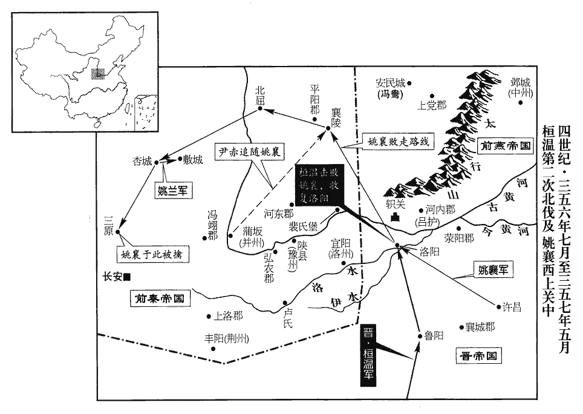
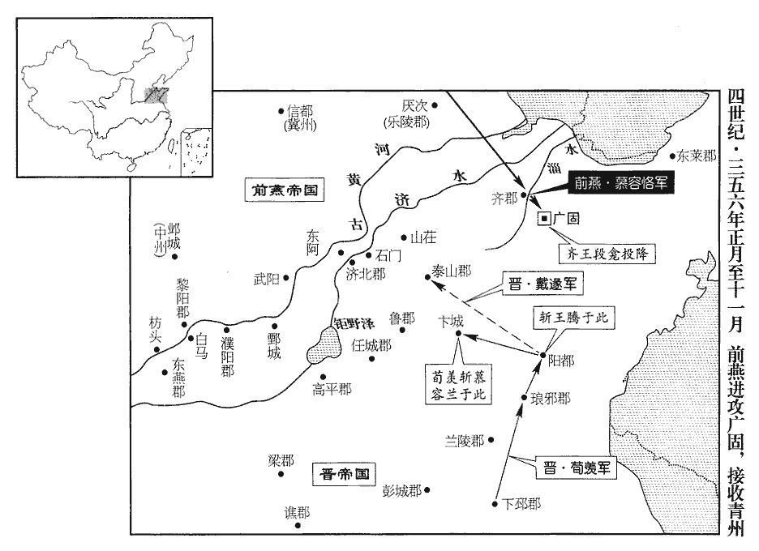
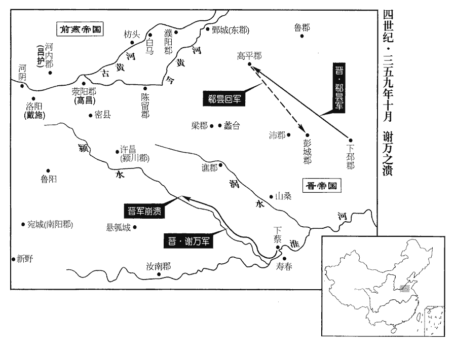

 晉紀二十二起旃蒙單閼（乙卯），盡屠維協洽（己未），凡五年。

# 孝宗穆皇帝中之下

## 永和十一年（乙卯、三五五）

1春，正月，故仇池公楊毅弟宋奴使其姑子梁式王刺殺楊初；初子國誅式王及宋奴，自立為仇池公‹甘肃西河南›。桓溫表國為鎮北將軍、秦州刺史。

〖译文〗 [1]春季，正月，从前仇池公杨毅的弟弟杨宋奴派他姑姑的儿子梁式王刺杀杨初。杨初的儿子杨国杀掉了梁式王的杨宋奴，自立为仇池公。桓温上表请求任命杨国为镇北将军、秦州刺史。

2二月，秦‹都长安陕西省西安市›大蝗，百草無遺，牛馬相噉毛。無草可食，故相噉毛。噉dàn，徒濫翻，又徒覽翻。

〖译文〗 [2]二月，前秦发生严重蝗灾，百草无遗，牛马互相啃食身上的毛。

3夏，四月，燕‹都薊，北京›主儁‹慕容儁，本年三十七岁›自和龍‹辽宁朝阳›還薊‹北京›。燕主如龍城，見上卷上年。薊，音計。先是，幽‹河北北部›、冀‹河北中部›之人以儁為東遷，和龍直薊之東。先，悉薦翻。互相驚擾，所在屯結。群臣請討之，儁曰：「群小以朕東巡，故相惑為亂耳；今朕既至，尋當自定，不足討也。」

〖译文〗 [3]夏季，四月，前燕主慕容俊从和龙返回蓟城。在此之前，幽州、冀州的百姓以为慕容俊已经东迁和龙，因此互相侵扰，据地结集。慕容俊返回后，群臣请求讨伐他们，慕容俊说：“这帮小人因为朕去东部地区巡视，所以才互相猜忌作乱。如今朕已返回，用不了多久他们自己就会安定，不值得去讨伐。”

4蘭陵‹山东省苍山县西南兰陵镇›太守孫黑、濟北‹山东省东阿县东›太守高柱、守，式又翻。濟，子禮翻。建興‹河北省成县东›太守高瓫瓫pén，蒲奔翻。及秦河內‹河南沁阳›太守王㑹、黎陽‹河南浚县›太守韓高皆以郡降燕。史言燕強，諸反側子皆附之。降，戶江翻。

〖译文〗 [4]兰陵太守孙黑、济北太守高柱、建兴太守高，以及前秦河内太守王会、黎阳太守韩高全都投降了前燕，将所据之郡拱手相让。

5秦淮南王生幼無一目，性麤暴。其祖父洪嘗戲之曰：「吾聞瞎兒一淚，信乎?」瞎，許轄翻，一目盲也。生怒，引佩刀自刺出血，曰：「此亦一淚也。」洪大驚，鞭之。生曰：「性耐刀槊，不堪鞭棰！」槊，色角翻。棰，止橤翻。洪謂其父健曰：「此兒狂悖，悖，蒲內翻，又蒲沒翻。宜早除之；不然，必破人家。」健將殺之，健弟雄止之曰：「兒長自應改，何可遽爾！」及長，力舉千鈞，手格猛獸，格，擊也。長，知兩翻。走及奔馬，擊刺騎射，冠絕一時。騎，奇寄翻。冠，古玩翻；下同。獻哀太子卒，秦太子萇，諡曰獻哀。強后欲立少子晉王柳；強，其兩翻。少，詩照翻。秦主健‹本年三十九岁›以讖文有「三羊五眼」，乃立生為太子。為苻生以凶暴不克紹張本。以司空、平昌王菁為太尉，尚書令王墮為司空，司隸校尉梁楞為尚書令。楞，盧登翻。

〖译文〗 [5]前秦淮南王苻生小时丧失了一只眼睛，性情暴烈。他的祖父苻洪曾经和他开玩笑说：“我听说瞎儿只有一只眼流泪，真的吗？”苻生听后发怒了，拔出佩刀就刺向自己的瞎眼，鲜血直流，说：“这也是一只眼的眼泪！”苻洪见状十分震惊，用鞭子打他。苻生说：“我生性能够忍耐刀矛，但不堪忍受鞭打！”苻洪对苻生父亲苻健说：“这个儿子狂暴悖逆，应该尽早除掉他，不然，一定会导致家破人亡。”苻健正准备杀掉苻生，苻健的弟弟苻雄劝阻说：“儿子长大以后自然就会改变，怎么能这样急不可耐呢！”等到苻生长大以后，能够力举千钧，徒手与猛兽搏斗，跑起来赶得上奔驰的骏马，击刺骑射各种武艺，全都冠绝一时。太子苻苌死后，强太后想立小儿子晋王苻柳，前秦国主苻健认为谶文中有“三羊五眼”的字样，于是就立苻生为太子。任命司空、平昌王苻菁为太尉，尚书令王堕为司空，司隶校尉梁楞为尚书令。

6姚襄‹时驻盱眙江苏省盱眙县›所部多勸襄北還，襄從之。五月，襄攻冠軍將軍高季於外黃‹河南杞县东北›，外黃縣，自漢以來屬陳留郡。賢曰：外黃故城在今汴州雍丘縣東。冠，古玩翻。會季卒，襄進據許昌‹河南许昌东›。

〖译文〗 [6]姚襄的部下大多都劝他北返，姚襄听从了。五月，姚襄在外黄攻打晋朝冠军将军高季，恰好这时高季去世了，姚襄便进军占据了许昌。

7六月，丙子‹六›，秦主健寢疾。庚辰‹十›，平昌公【章：十二行本「公」作「王」；乙十一行本同；孔本同。】菁勒兵入東宮，將殺太子生而自立。時生侍疾西宮，秦主所居為西宮。菁以為健已卒，卒，子恤翻。攻東掖門。健聞變，登端門，陳兵自衛。眾見健惶懼，皆捨仗逃散。健執菁，數而殺之，數，所具翻。餘無所問。

〖译文〗 [7]六月，丙子（初六），前秦国主苻健患病，卧床不起。庚辰（初十），平昌王苻菁率兵进入东宫，准备杀掉太子苻生而自立。这时苻生正在西宫服侍患病的苻健，苻菁以为苻健已经死了，便攻打东掖门。苻健听到变故的消息后，登上端门，布署兵力自卫。苻菁的兵众看见苻健后十分惶恐害怕，全都丢下武器四处逃散。苻健抓到了苻菁，数说了他的罪行后把他杀死，其余的人不加以追究。

壬午‹十二›，以大司馬、武都王安都督中外諸軍事。苻雄死，健以菁都督中外諸軍；菁以逆誅，以安代之。甲申‹十四›，健引太師魚遵、丞相雷弱兒、太傅毛貴、司空王墮、尚書令梁楞、左僕射梁安、右僕射段純、吏部尚書辛牢等受遺詔輔政。健謂太子生曰：「六夷酋帥及大臣執權者，若不從汝命，宜漸除之。」為苻生虐殺大臣張本。酋，慈由翻。帥，所類翻。

〖译文〗 壬午（十二日），前秦任命大司马、武都王苻安为都督中外诸军事。甲申（十四日），苻健召唤太师鱼遵、丞相雷弱儿、太傅毛贵、司空王堕、尚书令梁楞、左仆射梁安、右仆射段纯、吏部尚书辛牢等人前来接受遗诏辅佐朝政。苻健对太子苻生说：“六夷酋长将帅以及大臣中握有权力的人，如果不听从你的命令，就应该逐渐把他除掉。”

臣光曰：顧命大臣，所以輔導嗣子，為之羽翼也。為之羽翼而教使翦之，能無斃乎！知其不忠，則勿任而已矣；任以大柄，又從而猜之，鮮有不召亂者也。鮮，息淺翻。

〖译文〗 臣司马光曰：天子临终前之所以要嘱托大臣辅政，是要靠他们来辅佐教导太子，以作为太子的羽翼。既然是羽翼却又告诉太子翦杀他们，能不自取灭亡吗！如果知道他不忠诚，不加以任用就可以了；既然委之以重任，而又横加猜忌，没有不招来祸乱的。

8乙酉‹十五›，健卒；年三十九。諡曰景明皇帝，廟號高祖。丙戌‹十六›，太子生‹本年二十一岁›即位，苻生，字長生，健第三子也。大赦，改元壽光。群臣奏曰：「未踰年而改元，非禮也。」古禮，君薨，世子即位，既踰年而後稱元年。生怒，窮推議主，得右僕射段純，殺之。

〖译文〗 [8]乙酉（十五日），苻健去世。谥号为景明皇帝，庙号为高祖。丙戌（十六日），太子苻生即位，实行大赦，改年号为寿光。群臣上奏说：“即位不满一年就改年号，不合乎古礼。”苻生很愤怒，于是就深入追查提议的主谋，查到了右仆射段纯，杀掉了他。

9秋，七月，以吏部尚書周閔為左僕射。

〖译文〗 [9]秋季，七月，东晋朝廷任命吏部尚书周闵为左仆射。

10或告會稽王昱曰：會，工外翻。「武陵王第中大脩器仗，將謀非常。」武陵王晞也。昱以告太常王彪之，彪之曰：「武陵王之志，盡於馳騁畋獵而已耳，騁，丑郢翻。深願靜之，以安異同之論，勿復以為言！」昱善之。為武陵終以此得禍、彪之所不能救張本。復，扶又翻。

〖译文〗 [10]有人向会稽王司马昱报告说：“武陵王司马的宫中大量准备武器，看来将要图谋政变。”司马昱把这一消息告诉了太常王彪之，王彪之说：“武陵王的志向，全都在驰骋狩猎方面而已，愿您安静下来，以平息各种议论，不要再提这事了！”司马昱觉得此话有理。

秦主生尊母強氏曰皇太后，立妃梁氏為皇后。梁氏，安之女也。以其嬖臣太子門大夫南安‹甘肃省陇西县东南›趙韶為右僕射，續漢志：太子門大夫二人，職比郎將。嬖，卑義翻，又博計翻。太子舍人趙誨為中護軍，著作郎董榮為尚書。

〖译文〗 [11]前秦国主苻生尊奉母亲强氏为皇太后，立妃子梁氏为皇后。梁氏是梁安的女儿。任命他的宠臣太子门大夫、南安人赵韶为右仆射，太子舍人赵诲为中护军，著作郎董荣为尚书。

涼‹都姑臧甘肃省武威市›王祚淫虐無道，上下怨憤。祚惡河州‹府设枹罕甘肃省临夏市东北›刺史張瓘guàn之強，張駿置河州，治枹罕。惡，烏路翻。遣張掖‹甘肃張掖西北›太守索孚代瓘守枹罕‹甘肃临夏东北›，索，昔各翻。枹，音膚。使瓘討叛胡，又遣其將易揣、張玲帥步騎萬三千以襲瓘。將，即亮翻。易，讀如字，姓也。揣，初委翻。玲，盧經翻。帥，讀曰率。騎，奇寄翻。張掖人王鸞知術數，言於祚曰：「此軍出，必不還，涼國將危。」并陳祚三不道。祚大怒，以鸞為訞言，訞yāo，於驕翻。斬以徇。鸞臨刑曰：「我死，軍敗於外，王死於內，必矣！」祚族滅之。瓘聞之，斬孚，起兵擊祚，傳檄州郡，廢祚，以侯還第，復立涼寧侯曜靈。曜靈廢見上卷上年。易揣、張玲軍始濟河，瓘擊破之。揣等單騎奔還，瓘軍躡之，姑臧‹甘肃武威›振恐。驍騎將軍敦煌‹甘肃敦煌›宋混兄脩，與祚有隙，懼禍。驍，堅堯翻。敦，徒門翻。八月，混與弟澄西走，合眾萬餘人以應瓘，還向姑臧。祚遣楊秋胡將曜靈‹年十二›於東苑，拉其腰而殺之，將，如字。拉，盧合翻。埋於沙阬，諡曰哀公。

〖译文〗 [12]前凉王张祚淫虐无道，上上下下对他都非常怨恨愤怒。张祚憎恨河州刺史张的强大，便派张掖太守索孚代替张镇守罕，派张去讨伐反叛的胡人，又叛手下的将领易揣、张玲率领步兵骑兵一万三千人去袭击张。张掖人王鸾懂得阴阳占卜之术，对张祚说：“这支部队一定是有出无还，凉国将要危险了。”同时还历数了张祚三方面的不义之举。张祚听后勃然大怒。便以王鸾宣扬妖言为罪名，将他斩首示众。王鸾临刑前说：“我死了以后，军队败于外，国王死于内，必定如此！”张祚把他整个家族的人全都杀死。张听说这一消息后，杀掉了索孚，起兵攻打张祚。他将讨伐檄文传递到各州郡，宣称废除张祚，让他以侯爵的身份回家，重新立凉宁侯张曜灵为王。易揣、张玲的军队刚刚渡过黄河，张就击败了他们。易揣等人单身匹马往回逃奔，张的军队紧追不舍，姑臧城里的人都感到震惊害怕。骁骑将军、敦煌人宋混的哥哥宋和张祚有矛盾，宋混害怕张祚加祸于己。八月，宋混和他的弟弟宋澄向西逃走，聚集了数万人以后又掉头开向姑臧，以策应张。张祚派杨秋胡把张曜灵带到东苑，扳断他的腰肢后把他斩杀了，尸体埋在沙坑当中，定谥号为哀公。

秦主生封衛大將軍黃眉為廣平王，前將軍飛為新興王，皆素所善也。徵大司馬武都王安領太尉。健臨沒，以安督中外諸軍，然尚在蒲阪，今生乃召之。以晉王柳為征東大將軍、并州‹山西中部›牧，鎮蒲阪‹山西永济›；阪，音反。魏王廋為鎮東大將軍、豫州牧，鎮陝城‹河南省三门峡市›。廋sōu，疏鳩翻。陝，失冉翻。

〖译文〗 [13]前秦国主苻生封卫大将军苻黄眉为广平王，封前将军苻飞为新兴王，这两人都是他平常所喜欢的。征召大司马武都王苻安兼太尉。任命晋王苻柳为征东大将军、并州牧，镇守蒲阪，任命魏王苻为镇东大将军、豫州牧，镇守陕城。

中書監胡文、中書令王魚言於生曰：「比有星孛于大角，熒惑入東井。大角，帝坐；東井，秦分；天文志：大角在攝提間。大角者，天王坐也。東井，八星。東井、輿鬼，秦、雍州分。比，毗至翻。孛，蒲內翻。坐，徂臥翻。分，扶問翻。於占不出三年，國有大喪，大臣戮死；願陛下脩德以禳之！」生曰：「皇后與朕對臨天下，可以應大喪矣。毛太傅、梁車騎、梁僕射受遺輔政，可以應大臣矣。」九月，生殺梁后及毛貴、梁楞、梁安。貴，后之舅也。

〖译文〗 中书监胡文、中书令王鱼对苻生进言说：“近来异星划过大角星座，火星进入井宿。大角，是帝王的星座；井宿，则是前秦国分野。经过占卜，不出三年国家就会出现帝王、皇后死亡，大臣被杀的事情。愿陛下修行德性以避免丧乱的出现！”苻生说：“皇后和朕一起统治天下，可以应验大丧的出现。太傅毛贵、车骑将军梁楞、左仆射梁安接受遗诏辅佐朝政，可以应验大臣的结局。”九月，苻生便杀掉了皇后梁氏以及毛贵、梁楞、梁安。毛贵是皇后的舅舅。

右僕射趙韶、中護軍趙誨，皆洛州‹府设宜阳河南省宜阳县西›刺史俱之從弟也，趙俱鎮宜陽，事見上卷上年。從，才用翻。有寵於生，乃以俱為尚書令。俱固辭以疾，謂韶、誨曰：「汝等不復顧祖宗，復，扶又翻。欲為滅門之事！毛、梁何罪，而誅之?吾何功，而代之?汝等可自為，吾其死矣！」遂以憂卒。卒，子恤翻。

〖译文〗 右仆射赵韶、中护军赵诲，都是洛州刺史赵俱的堂弟，得宠于苻生，于是苻生便任命赵俱为尚书令。赵俱以患病为由坚决推辞，并对赵韶、赵诲说：“你们不顾及祖宗了，想要干灭门之事啊！毛、梁等人何罪之有，而杀了他们？我何功之有，而取代他们？你们可以自以为是，我大概快要死了！”于是赵俱忧郁而死。

涼宋混軍于武始大澤，張駿分狄道縣，立武始郡。宋混西走，起兵必不東向狄道。水經：都野澤在武威縣東北。註云：在姑臧城北三百里。都野即禹貢之豬野，其水上承姑臧武始澤，澤在姑臧西。為曜靈發哀。為，于偽翻。閏月，混軍至姑臧‹甘肃武威›，涼王祚收張瓘弟琚及子嵩，將殺之。琚、嵩聞之，募市人數百，揚言：「張祚無道，我兄大軍已至城東，敢舉手者誅三族！」遂開西門納混兵。領軍將軍趙長等懼罪，趙長，請立祚者也，故懼罪。入閣呼張重華母馬氏出殿，立涼武侯玄靚為主。靚，疾郢翻，又疾正翻。易揣等引兵入殿，收長等，殺之。祚按劍殿上，大呼，叱左右力戰。呼，火故翻。祚素失眾心，莫肯為之鬬者，為，于偽翻。遂為兵人所殺。混等梟其首，梟，堅堯翻。宣示中外，暴尸道左，城內咸稱萬歲。以庶人禮葬之，并殺其二子。混、琚上玄靚為大將軍、涼州牧、西平公，上，時掌翻。赦境內，復稱建興四十三年。張祚改建興年號，見上卷上年。時玄靚始七歲。

〖译文〗 [14]前凉宋混的部队驻扎在武始的大湖边，哀悼张曜录。闰六月，宋混的部队抵达姑臧，前凉王张祚拘捕了张的弟弟张琚及儿子张嵩，准备要杀掉他们。张琚、张嵩听说后，招募了城里的数百人，公开宣称：“张祚无道，我哥哥的大军已抵达城东，敢动手杀我们的人诛灭三族！”于是打开西城门让宋混的军队进城。领军将军赵长等人因有请立张祚的罪行，十分害怕，他们入宫请张重华的母亲马氏登堂升殿，立凉武侯张玄靓为国主。易揣等人率兵进入殿堂，拘捕了赵长等人，杀掉了他们。张祚在殿堂上扶剑大喊，命令左右的人奋力战斗。张祚平时失掉了民心，这时没有人肯为他去战斗，于是被士兵杀掉。宋混等人砍下了他的首级示众，公告宫廷内外，张祚暴尸于路旁，城里的人们都高呼万岁。宋混等人把张祚以普通百姓的规格埋葬，并且杀了他的两个儿子。宋混、张琚上书东晋朝廷请立张玄靓为大将军、凉州牧、西平公，在境内实行大赦，纪年恢复为建兴四十三年。这时张玄靓刚七岁。

張瓘至姑臧‹甘肃武威›，推玄靚為涼王，自為使持節、都督中外諸軍事、尚書令、涼州牧、張掖郡公，使，疏吏翻。以宋混為尚書僕射。隴西‹甘肃隴西›人李儼據郡，不受瓘命，用江東年號，用永和年號也。眾多歸之。為李儼歸秦張本。瓘遣其將牛霸討之，將，即亮翻。未至，西平‹青海西宁›人衛綝亦據郡叛，綝，丑林翻。霸兵潰，奔還。瓘遣弟琚擊綝，敗之。敗，補邁翻。酒泉‹甘肃酒泉›太守馬基起兵以應綝，瓘遣司馬張姚、王國擊斬之。

〖译文〗 张抵达姑臧，推戴张玄靓为前凉王，自己则为使持节、都督中外诸军事、尚书令、凉州牧、张掖郡公，任命宋混为尚书仆射。陇西人李俨据守自己所在的郡，不授受张的命令，仍然用东晋的年号，归附他的民众很多。张派他的将领牛霸讨伐李俨，还没有到达，西平人卫也占据自己的郡反叛，牛霸的兵众溃散，掉头逃奔。张派弟弟张琚攻击卫，打败了他。酒泉太守马基起兵响应卫，张派司马张姚、王国前去攻打，杀掉了马基。

冬，十月，以豫州刺史謝尚督并、冀、幽三州，時江左僑立青、冀、并、幽四州於江北。鎮壽春‹安徽寿县›。南渡初，祖逖以豫州刺史治譙城‹安徽省毫州市›。永昌元年，祖約退屯壽春‹安徽省寿县›。成帝咸和四年，庾亮以豫州刺史治蕪湖‹安徽省芜湖市›。咸康四年，毛寶以豫州刺史治邾城‹湖北省黄州市›。六年，庾翼以豫州刺史治蕪湖。永和元年，趙胤以豫州刺史治牛渚‹安徽省马鞍山市西南采石矶›。二年，尚以豫州刺史治蕪湖，今進壽春，皆建康西藩也。進取則屯壽春，守江則多在歷陽‹安徽省和县›、蕪湖二處。

〖译文〗 [15]冬季，十月，东晋朝廷任命豫州刺史谢尚总督并、冀、幽三州，镇守寿春。

鎮北將軍段龕‹时驻广固山东省青州市›與燕主儁書，抗中表之儀，儁，段氏出也，故龕與之抗中表之儀。龕，苦含翻；下同。非其稱帝。儁怒，十一月，以太原王恪為大都督、撫軍將軍，陽騖副之，以擊龕。騖，音務。

〖译文〗 [16]镇北将军段龛给前燕国主慕容俊写信，使用中表亲戚的仪礼，对他称帝加以非难。慕容俊见信后大怒。十一月，任命太原王慕容恪为大都督、抚军将军，以阳鹜作为他的副手，去攻打段龛。

秦以辛牢守尚書令，趙韶為左僕射，尚書董榮為右僕射，中護軍趙誨為司隸校尉。

〖译文〗 [17]前秦任命辛牢代理尚书令，任命赵韶为左仆射，尚书董荣为右仆射，中护军赵诲为司隶校尉。

十二月，高句麗‹都丸都，吉林集安，四二七年迁平壤›王釗遣使詣燕納質脩貢，以請其母。句，如字，又音駒。麗，力知翻。燕囚釗母，見九十七卷成帝咸康八年。質，音致。燕主儁許之，遣殿中將軍刁龕送釗母周氏歸其國；以釗為征東大將軍、營州刺史，封樂浪公，樂浪，音洛琅。王如故。使為高句麗王如故。

〖译文〗 [18]十二月，高句丽国王钊派遣使者来到前燕进献贡奉，以此请求准许他的母亲返回。前燕国主慕容同意了，派殿中将军刁龛送钊的母亲周氏回国。任命钊为征东大将军、营州刺史，并封为乐浪公，高句丽王的称号则仍旧保留。

上黨‹山西省黎城县西南›人馮鴦逐燕太守段剛，據安民城‹山西襄垣北›，魏收地形志：燕上黨太守治安民城。安民城在襄垣縣，蓋永嘉中，劉琨遣張倚所築，以安上黨之民，因以為名。自稱太守，遣使來降。使，疏吏翻。降，戶江翻。

〖译文〗 [19]上党人冯鸯赶走了前燕太守段刚，占据了安民城，自称太守，派遣使者来向东晋投降。

秦丞相雷弱兒性剛直，以趙韶、董榮亂政，每公言於朝，朝，直遙翻。見之常切齒。韶、榮譖之於秦主生，生殺弱兒及其九子、二十七孫。於是諸羌皆有離心。雷弱兒，南安‹甘肃陇西东北›羌酋也，以非罪而死，故諸羌皆有離心。

〖译文〗 [20]前秦丞相雷弱儿性格刚烈耿直，因为赵韶、董荣败坏朝政，他经常在朝廷公开议论，看见这两人就咬牙切齿。赵韶、董荣便向前秦国主苻生进谗言诬陷雷弱儿。苻生于是杀掉了雷弱儿及其九个儿子、二十七个孙子。各羌族部落因此对前秦产生了离心。

生雖諒陰，遊飲自若，彎弓露刃，以見朝臣，錘鉗鋸鑿，錘，傳追翻。鉗，其廉翻。鋸，居御翻。可以害人之具，備置左右。即位未幾，幾，居豈翻。后妃、公卿已下至于僕隸，凡殺五百餘人，截脛、拉脅、鋸項、刳kū胎者，比比有之。脛，形定翻，膝下骨直而長者。拉，盧合翻。比，簿計翻。

〖译文〗 苻生虽然在为苻健居表，但游玩酣饮如常，在朝接见大臣们时，总是佩刀带箭，锤、钳、锯、凿等可以残害人的刑具，全都放在周围。即位没多久，后妃、公卿以下至于奴仆，被杀掉的总共有五百多人；被截下小腿、折断胸肋、锯断脖子、剖开孕腹的人，比比皆是。

燕主儁以段龕‹时驻广固山东省青州市›方強，謂太原王恪曰：「若龕遣軍拒河，不得渡者，可直取呂護而還。」呂護時據野王‹河南沁阳›。恪分遣輕軍先至河上，具舟楫以觀龕志趣。龕弟羆，驍勇有智謀，驍，堅堯翻。言於龕曰：「慕容恪善用兵，加之眾盛，若聽其濟河，進至城下，恐雖乞降，不可得也。降，戶江翻；下同。請兄固守，羆帥精銳拒之於河，幸而戰捷，兄帥大眾繼之，帥，讀曰率；下同。必有大功。若其不捷，不若早降，猶不失為千戶侯也。」龕不從。羆固請不已，龕怒，殺之。

〖译文〗 [21]前燕国主慕容俊考虑到段龛势力正强，对太原王慕容恪说：“如果段龛派军队在黄河抵御，你们无法渡河的话，可以直接去捉拿吕护后返回。”慕容恪分别派遣轻装部队先到达黄河岸边，准备渡河舟船，用以观察段龛的动向，段龛的弟弟段罴，勇猛善战而且多智多谋，他对段龛进言说：“慕容恪善于用兵，再加上他兵力众多，如果听任他渡过黄河，进军城下，恐怕我们想请求投降，也不能被允许了。请哥哥你固守城池，让段罴我率领精锐部队在黄河抵御，如果战斗有幸获胜，哥哥再率领大部队跟进，一定会大举成功。如果战斗没有获胜，不如及早投降，大约还可以保住千户侯的地位。”段龛没有听从。段罴依然坚持请求，激怒了段龛，把段罴杀掉了。

## 十二年（丙辰、三五六）

1春，正月，燕‹都蓟城北京市›太原王恪引兵濟河，未至廣固‹山东省青州市›百餘里，段龕帥眾三萬逆戰。丙申‹三十›，恪大破龕於淄水，據載記，恪破龕於濟水之南。今言未至廣固百餘里，蓋至淄水而會戰也。水經，濁水逕廣固城西，東流至廣饒，入巨淀，又北合于淄水。執其弟欽，斬右長史袁範等。齊王友辟閭蔚被創，段龕自稱齊王，故置王友之官。蔚，紆勿翻。創，初良翻。恪聞其賢，遣人求之，蔚已死，士卒降者數千人。龕脫走，還城固守，恪進軍圍之。

〖译文〗 [1]春季，正月，前燕太原王慕容恪率兵渡过了黄河，离广固只有一百多里，段龛率领兵众三万人迎战。丙申（三十日），慕容恪在淄水大破段龛的部队，抓获段龛的弟弟段钦，杀死右长史袁范等人。齐国的王友辟闾蔚负伤，慕容恪听说过他的贤明，便派人去寻找他，但辟闾蔚已经死了，段龛士卒中投降的有数千人。段龛逃脱，返回广固城中固守，慕容恪进军将他包围。

2秦‹都长安陕西省西安市›司空王墮性剛峻，右僕射董榮、侍中強國皆以佞幸進，墮疾之如讎，每朝，見榮未嘗與之言。每朝句絕。朝，直遙翻。見，如字。或謂墮曰：「董君貴幸無比，公宜小降意接之。」墮曰：「董龍是何雞狗，龍，董榮小字。而令國士與之言乎！」會有天變，榮與強國言於秦主生‹苻生，本年二十二岁›曰：強，其兩翻，姓也。「今天譴甚重，宜以貴臣應之。」生曰：「貴臣惟有大司馬及司空耳。」榮【章：十二行本「榮」下有「國」字；乙十一行本同；孔本同。】曰：「大司馬國之懿親，不可殺也。」大司馬謂武都王安，生叔父也。乃殺王墮。將刑，榮謂之曰：「今日復敢比董龍於雞狗乎?」復，扶又翻。墮瞋目叱之。瞋，七人翻。洛州‹府设宜阳河南省宜阳县西›刺史杜郁，墮之甥也，左僕射趙韶惡之，惡，烏路翻。譖於生，以為貳於晉‹都建康江苏省南京市›而殺之。

〖译文〗 [2]前秦司空王堕性格刚峻，右仆射董荣、侍中强国都是靠着谄媚得宠而得到提升重用，王堕恨之如仇，每次上朝，见到董荣都不和他搭话。有人对王堕说：“董君显贵宠幸，无与伦比，您应该稍微抑制一点心意，和他接触。”王堕说：“董荣是什么样的鸡狗之徒，而让国中的贤杰人士和他搭话呢！”恰巧这时天象有变故，董荣与强国便向前秦国主苻生进言说：“如今上天的谴责非常严重，应该以显贵的大臣去应接谴责。”苻生说：“显贵的大臣只有大司马和司空而已。”董荣说：“大司马苻安是王室的至亲，不能杀。”于是就杀了王堕。在将要行刑的时候，董荣对王堕说：“今天还敢把董荣我比作鸡狗吗？”王堕怒目痛斥董荣。洛州刺史杜郁，是王堕的外甥，左仆射赵韶厌恶他，就向苻生进谗言，说他和东晋来往，有二心，把他杀死。

壬戌，生宴群臣於太極殿，以尚書令辛牢為酒監，酒酣，生怒曰：「何不強人酒而猶有坐者！」監，古暫翻。強，其兩翻。引弓射牢，殺之。射，而亦翻。群臣懼，莫敢不醉，偃仆失冠，生乃悅。

〖译文〗 壬戌（疑误），苻生在太极殿宴请群臣，让尚书令辛牢做掌酒官，正喝到尽兴时，苻生愤怒地说：“为什么不让人们尽力去喝而还有坐着的！”说着就拉开弓箭射死了辛牢。群臣十分害怕，再也没有人敢不喝醉，全都横躺竖卧，衣冠不整，苻生这才高兴了。

3匈奴大人劉務桓卒，弟閼頭立，將貳於代‹府盛乐内蒙古和林格尔县›。二月，代王什翼犍引兵西巡臨河，閼頭懼，請降。犍，居言翻。閼，於葛翻。降，戶江翻；下同。

〖译文〗 [3]匈奴首领刘务桓去世，他的弟弟刘阏头即位，准备要背叛代国。二月，代王拓跋什翼犍率兵西巡到达黄河岸边，刘阏头害怕，便请求投降。

4燕太原王恪招撫段龕諸城。恪圍廣固未下，故先招撫其統內諸城。己丑，龕所署徐州刺史陽都公王騰舉眾降，恪命騰以故職還屯陽都‹山东沂南南›。段龕置徐州於琅邪陽都縣。杜佑曰：漢陽都縣故城在沂州沂水縣南。

〖译文〗 [4]前燕太原王慕容恪招纳安抚段龛辖境内的各座城邑。己丑（疑误），段龛所设置的徐州刺史、阳都公王腾率领民众投降，慕容恪让王腾以旧有官职的身份回去屯守阳都。

5秦征東大將軍晉王柳‹时驻蒲坂山西省永济县›遣參軍閻負、梁殊使於涼‹都姑臧甘肃省武威市›，以書說涼王玄靚‹张玄靓，本年八岁›。使，疏吏翻；下同。說，輸芮翻。負、殊至姑臧‹甘肃武威›，張瓘見之曰：「我，晉臣也；臣無境外之交，二君何以來辱?」負、殊曰：「晉王與君鄰藩，雖山河阻絕，風通道會，秦使苻柳鎮蒲阪‹山西永济›，非與涼州鄰也，故以風通道會為言。故來脩好，好，呼到翻；下同。君何怪焉！」瓘曰：「吾盡忠事晉，於今六世矣。軌、寔、茂、駿、重華、曜靈、祚為七世，今言六世，斥祚不以為世數。若與苻征東通使，是上違先君之志，下隳士民之節，其可乎！」負、殊曰：「晉室衰微，墜失天命，固已久矣；是以涼之二王北面二趙，唯知機也。張茂稱藩於前趙，張駿稱藩於後趙。今大秦威德方盛，涼王若欲自帝河右，則非秦之敵；欲以小事大，則曷若捨晉事秦，長保福祿乎！」瓘曰：「中州好食言，好，呼到翻。嚮者石氏使車適返，而戎騎已至，使，疏吏翻。永和二年，張重華嗣位，遣使奉章於石虎，虎繼遣王擢來寇。騎，奇寄翻。吾不敢信也。」負、殊曰：「自古帝王居中州者，政化各殊，趙為姦詐，秦敦信義，豈得一槩待之乎！槩所以平斗斛，一槩待之，言無所高下也。張先、楊初皆阻兵不服，先帝討而擒之，擒張先見九十八卷六年，未嘗擒楊初也，負、殊姑為是言耳。赦其罪戾，寵以爵秩，固非石氏之比也。」瓘曰：「必如君言，秦之威德無敵，何不先取江南，則天下盡為秦有，征東何辱命焉！」負、殊曰：「江南文身之俗，古者荊蠻之俗，斷髮文身以避蛟龍之害。負、殊以此斥言之耳。是時衣冠文物，皆在江南，且正朔所在也。負、殊吠堯刺由，知各為其主而已！道污先叛，化隆後服。鄭玄曰：污，猶殺也。易曰：高宗伐鬼方，三年克之。世之說者以為荊、楚輕悍，道污先叛，化隆後服，故負、殊亦以此斥言江南。主上以為江南必須兵服，河右可以義懷，故遣行人先申大好。好，呼到翻。若君不達天命，則江南得延數年之命，而河右恐非君之土也。」瓘曰：「我跨據三州，三州謂涼、河、沙，張茂及張駿所分置者也。帶甲十萬，西苞蔥嶺‹帕米尔高原›，東距大河，伐人有餘，況於自守，何畏於秦！」負、殊曰：「貴州山河之固，孰若殽、函?民物之饒，孰若秦‹甘肃南部›、雍‹陕西中部›?雍，於用翻。杜洪、張琚，因趙氏成資，兵強財富，有囊括關中‹陕西中部›、席卷四海之志，先帝戎旗西指，冰消雲散，旬月之間，不覺易主。事見九十八卷六年。主上若以貴州不服，赫然奮怒，控弦百萬，鼓行而西，未知貴州將何以待之?」瓘笑曰：「茲事當決之於王，非身所了。」了，決也。負、殊曰：「涼王雖英睿夙成，然年在幼沖；君居伊、霍之任，國家安危，繫君一舉耳。」瓘懼，乃以玄靚之命遣使稱藩於秦，秦因玄靚所稱官爵而授之。

〖译文〗 [5]前秦征东大将军、晋王苻柳派参军阎负、梁殊出使前凉，带去书信游说前凉王张玄靓。阎负、梁殊抵达姑臧，张见到他们说：“我是晋王朝的臣下。臣下不能有国外的交情，二位何以前来辱见？”阎负、梁殊说：“晋王苻柳和您是邻国，虽然山河阻隔，但风俗相通，道路交接，所以前来和您修好，对此您有什么可奇怪的呢！”张说：“我竭尽忠诚事奉晋王朝，至今已有六代人了。如果与苻柳互通使节，这就是上违先辈的志向，下毁士人百姓的气节，怎么可以呢！”阎负、梁殊说：“晋王室衰微，丧失天命，已经很久了。所以凉国的两位先王向赵国称臣，这是识时务的。如今大秦正值威力德性强盛之时，凉王如果想在黄河以西自称为帝，那不是秦国的对手；如果想以小事大，那何不抛弃晋王室而事奉秦国，以求福禄长存呢！”张说：“中原人爱自食其言。过去赵国石氏使臣的车辆刚刚返回，而进攻的骑兵已经到达，我不敢相信你们。”阎负、梁殊说：“自古以来身居中原的帝王，政事与教化各不相同，赵国施行奸诈，秦国则奉行信义，怎么能一概而论呢！张先、杨初全都是因为顽抗抵御，拒不降服，所以秦国的先帝才讨伐并擒获了他们，然而又赦免了他们的罪行，用官爵俸禄宠待他们，这本来就不是石氏可比的。”张说：“如果一定像你们所说的那样，秦国的威力德行所向无敌，为什么不先去夺取长江以南，那样天下就全归秦国所有了，征东将军为什么要辱赐恩命于我们呢！”阎负、梁殊说：“长江以南现在还是断发文身之俗盛行，朝廷道义衰落，就首先叛乱，教化隆盛，也最后才归服。主上认为长江以南必须靠武力征服，而黄河以西可以靠道义安抚，所以派我们来先申明大义。如果您不洞察天命，那么长江以南尚有残喘数年的命运，而黄河以西恐怕就不是您的领土了。”张说：“我有跨越三州的领土，全副武装的十万军队，西有葱岭作依托，东有黄河作屏障，攻击别人尚且有余，何况是自我守卫，为什么要惧怕秦国呢！”阎负、梁殊说：“阁下领土内山河的险固程度，哪一个能比得上崤山和函谷关？百姓赖以生存的物产的富饶程度，哪一样能比得上秦州和雍州？杜洪、张琚虽然占据了赵国的基业，兵强财丰，大有囊括关中、席卷四海的志向，然而先帝战旗西指，顷刻间便冰消云散，一月之内，不知不觉就改换了君主。主上如果认为您不顺服，赫然发怒，出兵百万，击鼓西行，不知道您怎样对付。””张笑着说：“此事应当由凉王决定，不是我所能做主的。”阎负、梁殊说：“凉王虽然从小就有英明智慧的风采，然而年龄幼小。阁下身负伊尹、霍光那样的重任，国家的安危，全都维系在您的决断上了。”张害怕了，于是就以张玄靓的名义派遣使者，去向前秦称臣，前秦也就将张玄靓自称的官爵正式授予了他。

6將軍劉度攻秦青州刺史王朗於盧氏‹河南盧氏›；盧氏縣，漢屬弘農郡，晉屬上洛郡，唐屬虢州。燕將軍慕輿長卿入軹關‹河南济源西›，攻秦幽州刺史強哲于裴氏堡‹山西省垣曲县东南›。永嘉之亂，裴氏舉宗據險築堡以自守，後人因而置屯戍，故堡猶有裴氏之名，蓋在河東界。長，知兩翻。秦主生遣前將軍新興王飛拒度，建節將軍鄧羌拒長卿。飛未至而度退。羌與長卿戰，大破之，獲長卿及甲首二千餘級。

〖译文〗 [6]东晋将军刘度在卢氏攻打前秦青州刺史王朗。前燕将军慕舆长卿进入轵关，在裴氏堡攻打前秦幽州刺史强哲。前秦国主苻生派前将军新兴王苻飞抵抗刘度，派建节将军邓羌抵抗慕舆长卿。苻飞还未到达，刘度就已撤退。邓羌与慕舆长卿交战，打败了他，擒获慕舆长卿，并将二千多披甲士兵斩首。

7桓溫請移都洛陽，脩復園陵，章十餘上；上，時掌翻。不許。拜溫征討大都督，督司、冀二州諸軍事，以討姚襄‹时驻许昌河南省许昌市东›。

〖译文〗 [7]桓温请求东晋朝廷将国都迁移到洛阳，修复帝王的陵墓，奏章递上去十多次，都未获许可。只授予桓温征讨大都督的官职，督察司、冀二州各种军务，用以讨伐姚襄。

8三月，秦主生發三輔民治渭橋，治，直之翻。金紫光祿大夫程肱諫，以為妨農；生殺之。

〖译文〗 [8]三月，前秦国主苻生调集三辅的百姓去修建渭水桥，金紫光禄大夫程肱对此加以劝谏，认为这样做妨碍农耕，苻生把他杀死。

9夏，四月，長安‹西安›大風，發屋拔木。風捲屋瓦，掀簷yán桷jué為發屋。秦宮中驚擾，或稱賊至，宮門晝閉，五日乃止。秦主生推告賊者，刳kū出其心。左光祿大夫強平諫曰：「天降災異，陛下當愛民事神，緩刑崇德以應之，乃可弭也。」弭，止也。生怒，鑿其頂而殺之。衛將軍廣平王黃眉、前將軍新興王飛、建節將軍鄧羌，以平，太后之弟，叩頭固諫；生弗聽，出黃眉為左馮翊‹陕西大荔›、飛為右扶風‹陕西省眉县›、羌行咸陽太守，前漢扶風渭城縣，秦之咸陽也，後漢、晉省。魏收地形志：咸陽郡治石安縣，即漢渭城也，石勒更名。是郡蓋永嘉之後群胡所置也。猶惜其驍勇，故皆弗殺。驍，堅堯翻。五月，太后強氏以憂恨卒，諡曰明德。

〖译文〗 [9]夏季，四月，长安刮起一场大风，掀掉屋瓦，拔起树木。前秦王宫中一片惊恐混乱，有人说寇贼来了，因此宫门在大白天也紧紧关闭，一直持续了五天。前秦国主苻生追查谎称寇贼来了的人，要挖出他的心。左光禄大夫强平劝谏说：“天降灾祸，陛下应该关怀民众，奉事神灵，缓施刑罚，崇尚德性，以此来应接天意，才能消除灾祸。”苻生听后大怒，凿开他的头顶后把他杀死。卫将军广平王苻黄眉、前将军新兴王苻飞、建节将军邓羌都因为强平是强太后弟弟，叩头恳切地劝谏。但苻生没有听从，并且将苻黄眉贬任到左冯翊，将苻飞贬任到右扶风，贬邓羌代理咸阳太守。只是念及他们作战勇猛，所以没有把他们全杀掉。五月，太后强氏终因忧愤而死，谥号为明德。

10姚襄自許昌攻周成于洛陽。周成襲據洛陽，見上卷十年。

〖译文〗 [10]姚襄自许昌进发到洛阳，攻打周成。

六月，秦主生下詔曰：「朕受皇天之命，君臨萬邦；嗣統以來，有何不善，而謗讟dú之音，扇滿天下！杜預曰：讟，誹也。讟，徒木翻。殺不過千，而謂之殘虐！行者比肩，未足為希。希，少也。方當峻刑極罰，復如朕何！」復，扶又翻。

〖译文〗 [11]六月，前秦国主苻生下达诏书说：“朕禀承上天之命，统治万邦，继承先统以来，有什么不好的地方，诽谤之言竟横行天下！杀人还没过千，就说这是残酷暴虐！现在行人还比肩摩踵，不能说稀少，正应当严明重刑，施以极罚，谁又能把朕如何！”

自去春以來，潼關‹陕西潼關›之西，至于長安‹西安›，虎狼為暴，晝則繼道，言虎狼相繼於路也。「繼」，蜀本作「斷」。夜則發屋，不食六畜，畜，許又翻。專務食人，凡殺七百餘人。民廢耕桑，相聚邑居，而為害不息。秋，七月，秦群臣奏請禳災，禳ráng，如羊翻，除殃祭也。生曰：「野獸飢則食人，飽當自止，何禳之有！且天豈不愛民哉，正以犯罪者多，故助朕殺之耳！」史言苻生之虐甚於桀、紂。

〖译文〗 自从春天过去以后，从潼关以西一直到长安一带，虎狼肆行无忌。大白天相继出现在道路上，到了夜晚则毁屋入室，不食六畜，专门吃人，被吃掉的人总共已达七百多。百姓们荒废了农耕桑蚕，只能聚集到一块居住，但虎狼仍然不停地为害。秋季，七月，前秦群臣上奏请求设祭禳除虎狼之害，苻生说：“野兽饿了就要吃人，吃饱了自己就会停止，有什么值得设祭禳除的呢！况且上天难道能不爱护民众吗？正是因为犯罪的人太多，所以上天才帮助朕消灭他们！”

丙子‹十二›，燕獻懷太子曄卒。

〖译文〗 [12]丙子（十二日），前燕国献怀太子慕容晔去世。

 

姚襄攻洛陽，踰月不克。長史王亮諫曰：「明公英名蓋世，兵強民附。今頓兵堅城之下，力屈威挫，或為他寇所乘，此危亡之道也！」襄不從。

〖译文〗 [13]姚襄攻打洛阳，一个多月也没有攻克。长史王亮劝谏姚襄说：“您英名盖世，兵力强盛，民众都来归附。如今屯兵于坚固的城池之下，力量受阻，威势受挫，其他敌人或许会利用这个机会，这是走向危险灭亡的道路！”姚襄没有听从。

桓溫自江陵‹湖北江陵›北伐，遣督護高武據魯陽‹河南鲁山›，輔國將軍戴施屯河上，自帥大兵繼進。帥，讀曰率；下同。與寮屬登平乘樓平乘樓，大船之樓。望中原，歎曰：「遂使神州陸沈，百年丘墟，王夷甫諸人不得不任其責！」以王衍等尚清談而不恤王事，以致夷狄亂華也。記室陳郡‹河南省淮阳县›袁宏曰：晉諸公、諸從公府皆有記室，掌表疏、牋記、書檄。「運有興廢，豈必諸人之過！」溫作色曰：「昔劉景升有千斤大牛，噉dàn芻豆十倍於常牛，負重致遠，曾不若一羸牸zì，溫意以牛況宏，徒能糜俸祿而無經世之用。劉表字景升。噉，徒濫翻，又徒覽翻。羸，倫為翻。牸，疾置翻，牝pìn牛也。魏武入荊州，漢獻帝建安十三年，曹操入荊州。殺以享軍。」

〖译文〗 东晋桓温自江陵出发北伐，派督护高武占据鲁阳，派辅国将军戴施驻扎在大河岸边，自己则率领大军随后进发。他与同僚们登上大船的高楼，遥望中原，深有感慨地说：“使神州大地沉沦，百年基业变为废墟，王衍等人不能不承担责任！”记室、陈郡人袁宏说：“时运有兴有废，难道一定是这几个人的过错！”桓温脸色一变说：“过去刘表有一头千斤重的大牛，吃进去的草料豆饼比一般的牛多十倍，然而拉车赶路时，竟不如一头瘦弱有病的母牛。魏武帝曹操进入荆州后，就把它杀掉让士兵吃了。”

八月，己亥‹六›，溫至伊水，伊水在洛陽城南。姚襄撤圍拒之，匿精銳於水北林中，遣使謂溫曰：「承親帥王師以來，襄今奉身歸命，願敕三軍小卻，當拜伏道左。」溫曰：「我自開復中原，展敬山陵，無豫君事。欲來者便前，相見在近，無煩使人。」使，疏吏翻。襄拒水而戰，溫結陳而前，陳，讀曰陣。親被甲督戰，被，皮義翻。襄眾大敗，死者數千人。襄帥麾下數千騎奔于洛陽北山，洛陽北山，北芒山也。騎，奇寄翻。其夜，民棄妻子隨襄者五千餘人。襄勇而愛人，雖戰屢敗，民知襄所在，輒扶老攜幼，奔馳而赴之。溫軍中傳言襄病創已死，創，初良翻。許、洛士女為溫所得者，無不北望而泣。史言姚襄得人心。襄西走，溫追之不及。弘農‹河南灵宝东北›楊亮自襄所來奔，溫問襄之為人，亮曰：「襄神明器宇，孫策之儔，而雄武過之。」儔，等也，類也。

〖译文〗 八月，己亥（初六），桓温抵达伊水，姚襄把包围洛阳的部队撤下来抵抗桓温。他将精锐部队隐藏在伊水以北的树林中，派使者去对桓温说：“承蒙您亲自率领帝王的军队前来，姚襄如今以身归附天命，愿您敕令三军稍微退后，我们当夹道拜迎。”桓温说：“我来开辟光复中原，察看拜谒皇陵，和你们无关。想来见面的随便前来，近在咫尺，无须麻烦使者。”姚襄凭借伊水和桓温交战，桓温将部队列阵前进，亲自披甲督战，姚襄的兵众被打败，死亡数千人。姚襄率领手下数千骑兵逃奔到洛阳北山。当晚，百姓抛弃妻子儿女追随姚襄的有五千多人。姚襄勇猛而又爱护百姓，虽然他屡战屡败，但百姓一得知姚襄在哪里，就扶老携幼，急忙追赶投奔他。桓温的军队中传说姚襄因受伤已死，被桓温抓获的许昌、洛阳的男女民众，无不面向北方哭泣。姚襄向西逃走，桓温没有追上。弘农人杨亮从姚襄那里来投奔桓温，桓温问他姚襄的为人，杨亮说：“姚襄英明如神，胸怀宽广，如同孙策一样，而雄才武略却超过了孙策。”

周成帥眾出降，降，戶江翻；下同。溫屯故太極殿前，既而徙屯金墉城。己丑，謁諸陵，有毀壞者修復之，各置陵令。漢起陵邑，邑各置令，後遂因之，諸陵各置陵令，屬太常。表鎮西將軍謝尚都督司州諸軍事，鎮洛陽。以尚未至，留潁川太守毛穆之、督護陳午、河南太守戴施以二千人戍洛陽，衛山陵，徙降民三千餘家於江、漢之間，執周成以歸。

〖译文〗 周成率领兵众出来投降，桓温把部队屯驻在过去的太极殿前，紧接着又转移到金墉城。己丑（疑误），桓温拜谒各个陵墓，有被毁坏的就加以修复，并分别设置了看守陵园的陵令。上表请求任命镇西将军谢尚为都督司州诸军事，镇守洛阳。因为谢尚还未到达，就留下颍川太守毛穆之、督护陈午、河南太守戴施以二千人的兵力戍守洛阳，保卫皇陵。桓温把三千多家投降的百姓迁徙到长江、汉水之间，押解着周成返回。

姚襄奔平陽‹山西临汾›，秦并州‹府设蒲坂山西省永济县›刺史尹赤復以眾降襄，尹赤叛襄見上卷八年。襄遂據襄陵‹山西省襄汾县›。襄陵縣，漢屬河東郡，晉屬平陽郡；後魏改襄陵為禽昌縣，隋、唐復曰襄陵。秦大將軍張平擊之，永和七年，張平降秦，已而貳於燕。通鑑以秦所授官繫之。襄為平所敗，敗，補邁翻。乃與平約為兄弟，各罷兵。

〖译文〗 姚襄逃奔到平阳，前秦并州刺史尹赤又率众投降了姚襄，姚襄于是占据襄陵。前秦大将军张平攻击姚襄。姚襄被张平打败，于是与他结为兄弟，各自罢兵休战。

段龕‹时驻广固山东省青州市›遣其屬段薀【嚴：「薀」改「蘊」。】來求救，薀yùn，紆粉翻。‹司马聃，本年十四岁›詔徐州刺史荀羨‹时驻下邳江苏省睢宁县北古邳镇›將兵隨薀救之。羨至琅邪‹山东省临沂市›，此古琅邪也。憚燕兵之強不敢進。王騰寇鄄城‹山东鄄城北›，鄄城縣，漢屬東郡，晉屬濮陽。此非古鄄城縣，蓋僑縣也。羨進攻陽都‹山东省沂南县南›，會霖雨，城壞，獲騰，斬之。段龕署王騰為徐州刺史，屯陽都，時降于燕，為燕來寇。

〖译文〗 [14]段龛派他的属下段来东晋求救，朝廷诏令徐州刺史荀羡统领军队跟随段前去救援。荀羡到达琅邪后，由于害怕前燕兵力的强大而不敢继续前进。王腾进犯鄄城，荀羡便进攻阳都，这时恰巧碰上连绵大雨，城墙被淋坏，荀羡擒获了王腾，把他杀掉了。

冬，十月，癸巳朔‹一›，日有食之。

〖译文〗 [15]冬季，十月，癸巳朔（初一），出现日食。

秦主生夜食棗多，旦而有疾，召太醫令程延，使診之，診，止尹翻，候脈也。延曰：「陛下無他疾，食棗多耳。」生怒曰：「汝非聖人，安知吾食棗！」遂斬之。

〖译文〗 [16]前秦国主苻生晚上吃枣过多，第二天早晨不舒服，就召来太医令程延，让他号脉诊断。程延说：“陛下没有别的病，就是枣吃多了。”苻生大怒，说：“你不是圣人，怎么知道我吃枣了！”随后就把程延杀了。

燕大司馬恪圍段龕於廣固‹山东省青州›，諸將請急攻之，恪曰：「用兵之勢，有宜緩者，有宜急者，不可不察。若彼我勢敵，外有強援，恐有腹背之患，則攻之不可不急。若我強彼弱，無援於外，力足制之者，當羈縻守之，以待其斃；兵法十圍五攻，正謂此也。孫子曰：用兵之法，十則圍之，五則攻之。龕兵尚眾，未有離心；濟南之戰，即淄水之戰。曰濟南者，以濟水南北大界言之。非不銳也，但龕用之無術，以取敗耳。今憑阻堅城，上下戮力，我盡銳攻之，計數日【章：十二行本「日」作「旬」；乙十一行本同；孔本同。】可拔，然殺吾士卒必多矣。自有事中原，兵不蹔息，蹔，與暫同。吾每念之，夜而忘寐，柰何輕用其死乎！要在取之，不必求功之速也！」諸將皆曰：「非所及也。」軍中聞之，人人感悅。於是為高牆深塹以守之。塹，七豔翻。齊人爭運糧以饋燕軍。

〖译文〗 [17]前燕大司马慕容恪在广固包围了段龛，众将领请求马上攻打，慕容恪说：“用兵的方法，有应该缓慢的时候，也有应该急速的时候，不能不仔细审度。如果敌我力量相当，而敌人又在外边有强大的援军，这时恐怕有腹背受敌的危险，则攻打不能不急。如果我强敌弱，敌人在外边又无援军，我们的力量足以制服他的时候，就应该包围并守住他，等待着敌人坐以自毙。兵法中的十围五攻，说的正是这个道理。眼下段龛的兵力尚多，还没有出现离心倾向。济南之战时，段龛的军队不是不精锐，只是因为他用兵无术，所以才自取失败。如今他凭借险阻坚守城池，上上下下，齐心合力，我动用全部精锐部队去攻打他，大约有几天也可以攻下来，然而我们士兵的伤亡也一定很多。自从中原发生战争以来，士卒们连短暂的休整也没有，每念及此，我便夜不能寐，怎么能轻易地使用让士卒们献身的战术呢！重要的在于把城池攻下来，不必要求迅速成功！”众将领都说：“这些不是我们所能想到的。”军中士兵听说后，人人感动喜悦，于是他们就筑高墙，挖深壕，用来坚守包围圈。齐地的人争先恐后地运来粮食送给前燕的军队。

 

龕嬰城自守，樵采路絕，城中人相食。龕悉眾出戰，恪破之於圍里，時外築長圍，故戰於圍里。先分騎屯諸門，屯廣固城諸門也。騎，奇寄翻。龕身自衝盪，盪，徒朗翻，又他浪翻。僅而得入，餘兵皆沒。於是城中氣沮，莫有固志。沮，在呂翻。十一月，丙子‹十四›，龕面縛出降，并執朱禿送薊‹北京›。降，戶江翻。薊，音計。恪撫安新民，悉定齊地，徙鮮卑、胡、羯三千餘戶于薊。燕王儁‹慕容儁，本年三十八岁›具朱禿五刑，朱禿殺慕容鉤而奔龕，見上卷十年。以段龕為伏順將軍。恪留慕容塵鎮廣固，以尚書左丞鞠殷為東萊‹山东省莱州市›太守，章武‹河北大城›太守鮮于亮為齊郡‹山东省淄博市东临淄镇›太守，乃還。

〖译文〗 段龛环城自守，连砍柴的小路也被切断，城里人相残食。段龛调动全部兵力出城战斗，被慕容恪在包围圈里打败。慕容恪事先就分派骑兵控制了各个城门，段龛经过只身拼搏，仅得以逃回城内，其余的士兵全部覆没。从此城里的兵众情绪沮丧，没人再有固守的斗志了。十一月，丙子（十四日），段龛将两手反绑于身后出城投降，他和朱秃一起被押解送往蓟城。慕容恪抚慰安定新近归附的民众，全部平定齐地，将三千多户鲜卑族、胡族、羯族人迁徙到蓟城。前燕国主慕容俊用墨、劓、、宫、大辟五刑处死朱秃，任命段龛为伏顺将军。慕容恪留下慕容尘镇守广固，任命尚书左丞鞠殷为东莱太守，任命章武太守鲜于亮为齐郡太守，然后返回。

殷，彭之子也。彭時為燕大長秋，以書戒殷曰：「王彌、曹嶷，必有子孫，嶷，魚力翻。汝善招撫，勿尋舊怨以長亂源！」長，知兩翻。殷推求，得彌從子立、嶷孫巖於山中，請與相見，深結意分，從，才用翻；下同。分，扶問翻。彭復遣使遺以車馬衣服，復，扶又翻。遺，于季翻。郡民由是大和。鞠彭自東萊歸燕，見九十一卷元帝大興二年。

〖译文〗 鞠殷是鞠彭的儿子。鞠彭当时任前燕的大长秋官职，他写信告诫鞠殷说：“王弥、曹嶷，肯定有子孙后代，你一定要很好地招纳抚慰他们，不要计较过去的怨恨，以防扩大祸乱的根源。”鞠殷经过推问访察，在山中找到了王弥的侄子王立、曹嶷的孙子曹岩，便邀请他们前来相见，结下了深厚的情谊。鞠彭又派使者给他们送去车马衣服，东莱郡的百姓从此太平了。

荀羨聞龕已敗，退還下邳，留將軍諸葛攸、高平‹山东省金乡县西北昌邑镇›太守劉莊將三千人守琅邪‹山东省临沂市›，參軍譙國‹安徽亳州›戴𨔵dùn等二千人守泰山‹山东泰安东›。楊正衡曰：𨔵，音遁。燕將慕容蘭屯汴城‹山东省泗水县东卞桥乡›，汴城，即浚儀城。余謂「汴」當「卞」。魯國卞縣城也。劉昫曰：兗州泗水縣，卞縣古城也。羨擊斬之。

〖译文〗 荀羡听说段龛已经失败，便退回到下邳，留下将军诸葛攸、高平太守刘庄统率三千兵众守卫琅邪，参军谯国人戴等统率二千兵众守卫泰山。前燕将领慕容兰驻扎在汴城，荀羡攻打并杀掉他。

詔遣兼司空、散騎常侍車灌等持節如洛陽，脩五陵。宣帝陵在河陰首陽山；景帝陵曰峻平，文帝陵曰崇陽，武帝陵曰峻陽，惠帝陵曰太陽。散，悉亶翻。騎，奇寄翻。車，尺奢翻。十二月，庚戌‹十九›，帝及群臣皆服緦sī，臨於太極殿三日。緦，十五升布，抽去其半。臨，力鴆翻。

〖译文〗 [18]东晋穆帝下诏，派兼司空、散骑常侍车灌等人带着符节前往洛阳，修整先帝的五座陵墓。十二月，庚戍（十九日），穆帝和群臣全都身穿细麻布衣服，到太极殿哭泣谒拜三天。

司州都督謝尚以疾不行，以丹陽尹王胡之代之。【章：十二行本「之」下有「未行而卒」四字；乙十一行本同；孔本同；張校同；退齋校同。】胡之，廙yì之子也。王廙，王敦之從弟，見八十九卷愍帝建興三年。廙，羊至翻，又逸職翻。

〖译文〗 [19]司州都督谢尚因为有病无法料理政事，东晋朝廷以丹阳尹王胡之代替他。王胡之是王的儿子。

是歲，仇池‹甘肃西和西南›公楊國從父俊殺國自立；以俊為仇池公。國子安奔秦。其後秦用楊安以取仇池，豈即國之子邪?

〖译文〗 [20]这一年，仇池公杨国的叔父杨俊杀掉杨国而自立。东晋朝廷任命杨俊为仇池公。杨国的儿子杨安投奔前秦。

## 升平元年（丁巳、三五七）

1春，正月，壬戌朔‹一›，帝‹司马聃，本年十五岁›加元服；太后‹褚蒜子›詔歸政，大赦，改元，太后徙居崇德宮。

〖译文〗 [1]春季，正月，壬戌朔（初一），东晋穆帝行加冠礼，太后下诏，让他开始主持朝政，实行大赦，改年号，太后迁居崇德宫。

2燕‹都蓟城北京市›主儁‹慕容儁，本年三十九岁›徵幽州‹府设龙城辽宁省朝阳市›刺史乙逸為左光祿大夫。逸夫婦共載鹿車；子璋從數十騎，服飾甚麗，奉迎於道。逸大怒，閉車不與言，到城，深責之，到城，謂到薊城也。永和八年，燕王都薊，於龍城置留臺，以乙逸領留務，蓋以幽州刺史鎮龍城也。騎，奇寄翻。璋猶不悛。悛quān，丑緣翻；下同。逸常憂其敗，而璋更被擢任，歷中書令、御史中丞。被，皮義翻。逸乃歎曰：「吾少自脩立，少，詩照翻。克己守道，僅能免罪。璋不治節檢，專為奢縱，治，直之翻。而更居清顯，此豈惟璋之忝幸，實時世之陵夷也。」

〖译文〗 [2]前燕国主慕容俊征召幽州刺史乙逸为左光禄大夫。乙逸夫妇共坐一辆小车前往就任，而他的儿子乙璋却带着随从数十骑，衣着华丽，在路上迎候。乙逸十分愤怒，紧闭车门，不和他说话，到了蓟城后，乙逸深深地责备他，乙璋还不认错。乙逸常常忧虑他要衰败下去，而乙璋却屡被提升，历任中书令、御史中丞。乙逸于是便叹息道：“我从小修身养性，克己守礼，到头来也只能是得以免罪。乙璋不检点品行，专干放纵奢侈的事情，反而屡任政事清简地位显赫的官职，这难道仅仅是乙璋有愧于宠幸吗？实在是世道的衰落。”

3二月，癸丑‹二十三›，燕主儁立其子中山王暐‹本年八岁›為太子，大赦，改元光壽。

〖译文〗 [3]二月，癸丑（二十三日），前燕国主慕容俊立他的儿子中山王慕容为太子，实行大赦，改年号为光寿。

4太白入東井。秦有司奏：「太白罰星，東井秦分，分，扶問翻。必有暴兵起京師。」秦主生‹苻生，本年二十三岁›曰：「太白入井，自為渴耳，為，于偽翻。何所怪乎！」

〖译文〗 [4]金星进入井宿。前秦的有关官署上奏章说：“金星是主惩罚之星，井宿则是原秦国分野，京师一定要出现暴动了。”前秦国主苻生说：“金星入井宿，是它自己渴了，有什么大惊小怪的呢！”

5姚襄將圖關中‹前秦›，夏，四月，自北屈‹山西吉县›進屯杏城‹陕西黄陵›，北屈縣，漢屬河東郡，晉屬平陽郡。師古曰：屈，居勿翻。晉公子夷吾所居。班志，禹貢壺口山在北屈縣東南。水經註：北屈西距河十里，孟門山在河上。襄蓋自北屈渡河而屯杏城。五代志：汾州昌寧縣有壺口山。宋白曰：慈州吉鄉縣，漢北屈縣；今縣北二十一里古城，即漢理。魏收地形志，澄城縣有杏城。師古曰：澄城，漢馮翊之徵縣也。徵，音懲。據載記，杏城在馬蘭山北。杜佑曰：姚萇置杏城鎮，在今坊州西七里。遣輔國將軍姚蘭略地敷城‹陕西洛川东南鄜fū城›，敷城，唐坊州鄜城縣是也；後魏置敷城縣，隋改曰鄜城。曜武將軍姚益生、曜武將軍，蓋趙石氏所署置。左將軍王欽盧各將兵招納諸羌、胡。蘭，襄之從兄；從，才用翻。益生，襄之兄也。羌、胡及秦民歸之者五萬餘戶。秦將苻飛龍擊蘭，擒之。襄引兵進據黃落‹陕西铜川西南黄堡镇›；秦主生遣衛大將軍廣平王黃眉、平北將軍苻道、龍驤將軍東海王堅、驤，思將翻。建節將軍鄧羌漢、魏之間置建節中郎將，後以為將軍號。將步騎萬五千以禦之。襄堅壁不戰。羌謂黃眉曰：「襄為桓溫、張平所敗，銳氣喪矣。敗，補邁翻。喪，息浪翻。然其為人強狠，狠，戶墾翻。若鼓譟揚旗，直壓其壘，彼必忿恚而出，恚huì，於避翻。可一戰擒也。」五月，羌帥騎三千壓其壘門而陳，帥，讀曰率。騎，奇寄翻。陳，讀曰陣。襄怒，悉眾出戰。羌陽不勝而走，襄追之至于三原‹陕西三原›，三原在漢馮翊池陽縣界。宋白曰：苻堅於嶻jié嶭niè‹亦作巀嶭。山名。一名嵯峩山，又名慈峩é山。在今陕西省泾阳﹑三原﹑淳化三县交界处。传说黄帝曾铸鼎于此›北置三原護軍，後周置三原縣。羌迴騎擊之，黃眉等以大眾繼至，襄兵大敗。襄‹年二十七岁›所乘駿馬曰黧眉騧guā，黧，音黎，又音良脂翻。黑而黃色曰黧。騧，古瓜翻。黃馬黑喙曰騧。馬倒，秦兵擒而斬之，弟萇帥其眾降。萇，仲良翻。降，戶江翻。襄載其父弋仲之柩在軍中，柩，巨救翻。在牀曰尸，在棺曰柩。秦主生以王禮葬弋仲於孤磐‹甘肃省甘谷县境›，孤磐，在天水冀縣界。亦以公禮葬襄。【章：十二行本「襄」下有「廣平王」三字；乙十一行本同；孔本同。】黃眉等還長安，生不之賞，數眾辱黃眉。數，所角翻。黃眉怒，謀弒生；發覺，伏誅；事連王公親戚，死者甚眾。

〖译文〗 [5]姚襄准备图谋关中，夏季，四月，从北屈出发进据杏城，派辅国将军姚兰攻占敷城，曜武将军姚益生、左将军王钦卢分别统率士兵去招纳羌、胡各部族。姚兰是姚襄的堂兄；姚益生是姚襄的哥哥。羌、胡部族及汉族的民众归附他们的有五万多户。前秦将领苻飞龙攻击姚兰，擒获了他。姚襄率兵进据黄落，前秦国主苻生派卫大将军、广平王苻黄眉，北平将军苻道，龙骧将军东海王苻坚，建节将军邓羌统率步、骑兵一万五千人前去抵御。姚襄坚壁固守不交战。邓羌对苻黄眉说：“姚襄被桓温、张平打败，锐气已丧。然而他为人争强好胜，如果我们敲响战鼓，挥舞战旗，大兵直接压向他的营垒，他一定会愤而出战，这样就可以一战擒获他。”五月，邓羌率领三千骑兵压到姚襄的营垒门前，摆开了战阵，姚襄大怒，调动全部兵力出来迎战。邓羌表面上装作不能取胜而逃跑，姚襄追到了三原，这时邓羌掉转骑兵攻击姚襄，苻黄眉等人则率领大部队随后赶到，姚襄的部队被彻底打败。姚襄所骑的骏马叫黧眉，失蹄摔倒，前秦的士兵擒获了姚襄，然后把他杀死。姚襄的弟弟姚苌率领部众投降。姚襄把他父亲姚弋仲的棺材停放在军营中，前秦国主苻生以诸侯王的礼仪把姚鞍弋仲埋葬在孤磐，也以公爵的礼仪埋葬了姚襄。苻黄眉等人返回长安，苻生没有奖赏他们，反而还多次当众侮辱苻黄眉。苻黄眉非常愤怒，谋划要杀掉苻生，但被苻生发现，苻黄眉反而被杀。事情牵连到王公亲戚，被杀死的人很多。

6戊寅‹十九›，燕主儁遣撫軍將軍垂、中軍將軍虔、護軍將軍平熙帥步騎八萬攻敕勒‹蒙古国北部›於塞北，新唐書曰：敕勒，其先匈奴也，元魏時號高車部，其後訛為「鐵勒」，唐之鐵勒十五種是也。載記作「丁零勑勤勒」。大破之，俘斬十餘萬，獲馬十三萬匹，牛羊億萬頭。

〖译文〗 [6]戊寅（十九日），前燕国主慕容俊派抚军将军慕容垂、中军将军慕容虔、护军将军慕容平熙率领八万步、骑兵在边境以北攻打敕勒部族，彻底攻破了他们，俘获斩首十多万人，缴获马十三万匹，牛羊亿万头。

7匈奴單于賀賴頭帥部落三萬五千口降燕，自東漢以來，匈奴入居塞內者凡十九種，賀賴其一也。單，音蟬。燕人處之代郡‹河北省蔚县›平舒城‹山西省广灵县›。漢代郡有平舒縣，勃海有東平舒縣。東平舒，後漢屬河間國，晉屬章武國。代郡之平舒，未嘗改屬；書代郡以別章武之平舒。代郡之平舒，當在唐蔚之北界。處，昌呂翻。

〖译文〗 [7]匈奴单于贺赖头率领本部落的三万五千人投降了前燕，前燕人把他们安置在代郡的平舒城。

8秦主生夢大魚食蒲，苻氏，本蒲家也，故以夢魚食蒲為異。又長安謠曰：「東海大魚化為龍，男皆為王女為公。」生乃誅太師、錄尚書事、廣寧公魚遵并其七子、十孫。金紫光祿大夫牛夷懼禍，求為荊州‹府设丰阳陕西省山阳县›；秦荊州治豐陽川‹陕西山阳›。生不許，以為中軍將軍，引見，調之曰：調，徒彫翻。調，戲也。「牛性遲重，善持轅軛；轅，輈也。轅前曰軛，加之牛項。軛，音厄。雖無驥足，動負百石。」夷曰：「雖服大車，未經峻壁；願試重載，乃知勳績。」載，才再翻。生笑曰：「何其快也！公嫌所載輕乎?朕將以魚公爵位處公。」處，昌呂翻。夷懼，歸而自殺。

〖译文〗 [8]前秦国主苻生梦见大鱼吃蒲草，另外长安城里也有谣谚说：“东海大鱼化为龙，男皆为王女为公。”苻生于是就杀掉了太师、录尚书事、广宁公鱼遵以及他的七个儿子、十个孙子。金紫光禄大夫牛夷害怕祸及自己，请求到荆州任职，苻生不答应，任命他为中军将军，召见时戏弄说：“老牛生性迟缓稳重，善驾车辕，虽然没长骏马的蹄子，但走起路来能负重百石。”牛夷说：“虽然驾着大车，但没有走过险峻的道路。愿意试拉重车，便可知道我的功用了。”苻生笑着说：“多么痛快啊！你嫌所负载的轻吗？朕将用鱼遵的爵位安置你。”牛夷十分害怕，回去后就自杀了。

生飲酒無晝夜，或連月不出，奏事不省，往往寢落，省，悉景翻。「落」，當作「格」，音閣。留止不下曰格。或醉中決事；左右因以為姦，賞罰無準。或至申酉乃出視朝，朝，直遙翻。乘醉多所殺戮。自以眇miǎo目，諱言「殘、缺、偏、隻、少、無、不具」之類，誤犯而死者，不可勝數。勝，音升。數，所具翻。好生剝牛、羊、驢、馬，燖雞、豚、鵝、鴨，好，呼到翻。燖xún，徐廉翻。湯瀹yuè去其毛曰燖。縱之殿前，數十為群。或剝人面皮，使之歌舞，臨觀以為樂。樂，音洛。嘗問左右曰：「自吾臨天下，汝外間何所聞！」或對曰：「聖明宰世，賞罰明當，當，丁浪翻。天下唯歌太平。」怒曰：「汝媚我也！」引而斬之。他日又問，或對曰：「陛下刑罰微過。」又怒曰：「汝謗我也！」亦斬之。勳舊親戚，誅之殆盡，群臣得保一日，如度十年。

〖译文〗 苻生喝酒不分昼夜，有时一连数月不临朝处理政事。进上的奏章不审阅，常常搁置不理，有时在醉酒后处理政事。周围的人因此就常干奸诈之事，赏罚失去标准。有时到申时酉时才出来临朝视政，乘着醉意杀了许多人。他自己由于少了一只眼睛，就忌讳说：“残、缺、偏、只、少、无、不全”一类词，因误说了这些字眼而被杀死的人，不计其数。他喜欢活着剥掉牛、羊、驴、马的皮，用热水退活鸡、活猪、活鹅、活鸭的毛，把它们放到大殿前面，几十个为一群。有时则剥掉人的脸皮，让他们唱歌跳舞，他来观看，以此作乐。他曾经问周围的人说：“自从我统治天下以来，你们在外边听到些什么？”有人对他说：“圣明君主主宰天下，赏赐得当，刑罚严明，天下人只有歌颂太平盛世了。”苻生愤怒地说：“你向我献媚！”于是就把他拉出去杀了。改天他又问这个问题，有人对他说：“陛下的刑罚稍微过分了一点。”苻生又愤怒地说：“你诽谤我！”这人也被杀了。有功的旧臣和亲戚，被诛杀殆尽，群臣们能保全一天，如同度过十年。

東海王堅，素有時譽，時譽者，為時人所稱美也。與故姚襄參軍薛讚、權翼善。讚、翼密說堅曰：說，輸芮翻。「主上猜忍暴虐，中外離心，方今宜主秦祀者，非殿下而誰！願早為計，勿使他姓得之！」堅以問尚書呂婆樓，婆樓曰：「僕，刀鐶上人耳，魏、晉之間，率以刀鐶築殺人；言將為生所殺也。或曰：刀以鋒刃為用，刀鐶以上無所用之；婆樓以自喻。鐶，戶關翻。不足以辦大事。僕里舍有王猛，其人謀略不世出，不世出者，言世間不常生此人。殿下宜請而咨之。」堅因婆樓以招猛，一見如舊友；語及時事，堅大悅，自謂如劉玄德之遇諸葛孔明也。見六十五卷漢獻帝建安十二年。

〖译文〗 东海王苻坚，一直被时人称誉，和过去姚襄的参军薛、权翼关系很好。薛、权翼秘密地劝苻坚说：“主上猜忌残忍，行为暴虐，宫廷内外对他已经离心，如今适宜于主持秦国祭祀的人，不是殿下是谁！愿您及早谋划，不要让大权落入他姓人手中！”苻坚去问尚书吕婆楼，吕婆楼说：“我，已经是屠刀下的人了，不足以办成大事。我的私宅里有一位叫王猛的人，他的谋略世间少见，殿下应该请他出来，并向他请教。”苻坚根据吕婆楼的意见召来王猛，二人一见如故。谈论到国家当前的大事，苻坚十分高兴，自认为如同刘备遇到了诸葛亮。

六月，太史令康權言於秦主生曰：姓譜曰：康，衛康叔之後，亦西胡姓。「昨夜三月並出，孛星入太微，連東井，孛bèi，蒲內翻。自去月上旬，沈陰不雨，以至于今，將有下人謀上之禍」。此亦據洪範五行傳言之也。沈，持林翻。生怒，以為妖言，撲殺之。妖，於驕翻。撲，弼角翻。

〖译文〗 六月，太史令康权对前秦国主苻生进言说：“昨天晚上同时出现了三个月亮，彗星进入太微星座，又连着井宿。自从五月上旬以来，天气沉阴密布，又不下雨，一直到今天。将要出现臣下图谋主上的灾祸了。”苻生十分愤怒，认为这是妖言，把他摔死。

特進、領御史中丞梁平老等謂堅曰：「主上失德，上下嗷嗷，嗷嗷，眾口愁聲。人懷異志，燕、晉二方，伺隙而動，伺，相吏翻。恐禍發之日，家國俱亡。此殿下之事也，宜早圖之！」堅心然之，畏生趫勇，未敢發。趫qiáo，丘妖翻，捷也。

〖译文〗 特进兼御史中丞梁平老等人对苻坚说：“主上丧失道德，上下怨声载道，人心各异，燕、晋二朝，伺机而动，恐怕灾祸出现之日，宗族、国家都要灭亡。这是殿下的大事。应该及早图谋！”苻坚内心同意，但又畏惧苻生的勇捷凶猛，没敢作声。

生夜對侍婢言曰：「阿法兄弟亦不可信，阿，傳讀從安入聲。明當除之。」明，謂明旦，猶言明日也。婢以告堅及堅兄清河王法。法與梁平老及特進光祿大夫強汪帥壯士數百潛入雲龍門，魏明帝起洛陽宮，宮城正南門曰雲龍門。苻氏據長安，亦以宮城正南門為雲龍門。帥，讀曰率；下同。堅與呂婆樓帥麾下三百人鼓譟繼進，宿衛將士皆舍仗歸堅。舍，讀曰捨。生猶醉寐，堅兵至，生驚問左右曰：「此輩何人?」左右曰：「賊也！」生曰：「何不拜之！」堅兵皆笑。生又大言：「何不速拜，不拜者斬之！」堅兵引生置別室，廢為越王，尋殺之，諡曰厲王。年二十三。

〖译文〗 苻生夜里对服侍他的婢女说：“苻坚、苻法兄弟也不可信赖，明天就应当把他们除掉。”婢女把这一消息告诉了苻坚以及他的哥哥清河王苻法。苻法和梁平老以及特进光禄大夫强汪率领勇士数百人潜入云龙门，苻坚和吕婆楼率领手下三百人击鼓跟进，守卫王宫的将士们全都丢掉武器归顺了苻坚。苻生这时还醉倒大睡，苻坚的士兵来到后，苻生惊慌地问周围人说：“这是些什么人？”周围的人回答：“强盗！”苻生说：“为什么不叩拜！”苻坚的士兵全都笑了。苻生又大声说：“为什么不赶快叩拜，不拜者杀头！”苻坚的士兵把苻生带到别的房间，黜废他为越王，不久就把他杀了，定谥号为厉王。

堅‹苻坚，本年二十岁›以位讓法，法曰：「汝嫡嗣，且賢，宜立。」堅母苟氏，雄之元妃，故謂堅為嫡嗣。堅曰：「兄年長，宜立。」長，知兩翻。堅母苟氏泣謂群臣曰：「社稷事重，小兒自知不能，他日有悔，失在諸君。」群臣皆頓首請立堅。堅乃去皇帝之號，去，羌呂翻。稱大秦天王，即位於太極殿；苻堅，字永固，雄之子也。誅生倖臣中書監董榮、左僕射趙韶等二十餘人。大赦，改元永興。追尊父雄為文桓皇帝，母苟氏為皇太后，妃苟氏為皇后，世子宏為皇太子，以清河王法為都督中外諸軍事、丞相、錄尚書事、東海公，諸王皆降爵為公，以從祖右光祿大夫永安公侯為太尉，晉公柳為車騎大將軍、尚書令。從，才用翻。騎，奇寄翻。封弟融為陽平公，雙為河南公，子丕為長樂公，樂，音洛。暉為平原公，熙為廣平公，叡為鉅鹿公。以漢陽‹甘肃省礼县›李威為左僕射，李威於堅母有辟陽之寵，故擢用之。梁平老為右僕射，強汪為領軍將軍，呂婆樓為司隸校尉，王猛為中書侍郎。

〖译文〗 坚苻把王位让给苻法，苻法说：“你是嫡传嗣子，而且贤明，应该立为王。”苻坚说：“哥哥年长，应该立为王。”苻坚的母亲苟氏哭泣着对群臣说：“朝政事关重大，我儿子自知不能胜任。以后大家如有悔恨，过失在诸君身上。”群臣全都叩头请求立苻坚为王。苻坚于是就去掉了皇帝的称号，称为大秦天王，在太极殿即位。杀掉了苻生的宠臣中书监董荣、左仆射赵韶等二十多人。实行大赦，改年号为永兴。追尊父亲苻雄为文桓皇帝，尊母亲苟氏为皇太后，立妃苟氏为皇后，立长子苻宏为太子，任命清河王苻法为都督中外诸军事、丞相、录尚书事、东海公，诸王全都降为公。任命从祖右光禄大夫、永安公苻侯为太尉，晋公苻柳为车骑大将军、尚书令。封弟弟苻融为阳平公，苻双为河南公，儿子苻丕为长乐公，苻晖为平原公，苻熙为广平公，苻睿为钜鹿公。任命汉阳人李威为左仆射，梁平老为右仆射，强汪为领军将军，吕婆楼为司隶校尉，王猛为中书侍郎。

融好文學，好，呼到翻。明辨過人，耳聞則誦，過目不忘；力敵百夫，善騎射擊刺，少有令譽；少，詩照翻。堅愛重之，常與共議國事。融經綜內外，刑政修明，薦才揚滯，補益弘多。弘，大也。丕亦有文武才幹，治民斷獄，皆亞於融。史言堅有弟有子如此而無救於敗亡，明天之所棄，非人之所能支也。治，直之翻。斷，丁亂翻。

〖译文〗 苻融爱好文献经典，分辨能力过人，耳闻成诵，过目不忘。力量之大，能敌百人，善于骑马射箭刺击，从小就有美好的声誉。苻坚非常喜欢并看重他，经常和他共商国家大事。苻融谋划治理天下，刑罚政令，规范清明，荐举贤才，拔擢沉沦之士，对苻坚有很大帮助。苻丕也有文才武略，但治理民众、决断刑狱，全都逊于苻融。

威，苟太后之姑子也，素與魏王雄友善，生屢欲殺堅，賴威營救得免。威得幸於苟太后，堅事之如父。威知王猛之賢，常勸堅以國事任之；堅謂猛曰：「李公知君，猶鮑叔牙之知管仲也。」管仲少與鮑叔牙遊，鮑叔知其賢，善遇之。管仲曰：「吾始困時，與鮑叔賈，分財多自與，鮑叔不以我為貪，知我貧也。吾嘗為鮑叔謀事，而更窮困，鮑叔不以我為愚，知時有利不利也。吾嘗三仕三見逐，鮑叔不以我為不肖，知我不遭時也。吾嘗三戰三北，鮑叔不以我為怯，知我有老母也。公子糾敗，召忽死之，吾幽囚受辱，鮑叔不以我為無恥，知我不羞小節而恥功名不顯於天下也。生我者父母，知我者鮑子也。」猛以兄事之。

〖译文〗 李威是苟太后姑姑的儿子，和魏王苻雄一直关系很好，苻生多次想杀掉苻坚，全靠李威设法救助才得以幸免。李威很得苟太后的宠爱，苻坚对待像父亲一样。李威深知王猛的贤明，经常劝苻坚把国家重任交给他。苻坚对王猛说：“李公了解你，就像鲍叔牙了解管仲一样。”王猛像对待哥哥一样对待李威。

9燕主儁殺段龕，阬其徒三千餘人。龕，苦含翻。

〖译文〗 [9]前燕国主慕容俊杀掉了段龛，把他的兵众三千多人活埋。

10秋，七月，秦大將軍冀州牧張平遣使請降，降，戶江翻。拜并州‹山西中部›刺史。

〖译文〗 [10]秋季，七月，前秦大将军冀州牧张平派遣使者到东晋请求投降，朝廷授予他并州刺史官职。

八月，丁未‹十九›，‹司马聃，本年十四岁›立皇后何氏‹何法倪›。后，故散騎侍郎廬江‹安徽省舒城县›何準之女也。散，悉亶翻。騎，奇寄翻。禮如咸康而不賀。成帝咸康二年，立杜后。

〖译文〗 [11]八月，丁未（十九日），东晋穆帝立何氏为皇后。何氏皇后，是过去散骑常侍郎庐江人何准的女儿。立后礼仪像威康二年那次一样，不加以庆贺。

秦王堅以權翼為給事黃門侍郎，權翼仕秦，久當事任，而卒歸姚氏。料其受苻堅信用，雖不為莊舄xì之越吟，固隱之於心也。薛讚為中書侍郎，與王猛並掌機密。九月，追復太師魚遵等官，以禮改葬，子孫存者皆隨才擢敘。

〖译文〗 [12]前秦王苻坚任命权翼为给事黄门侍郎，薛为中书侍郎，和王猛一起掌管机要事务。九月，追认恢复了太师鱼遵等人的官位，按照礼仪对他们重新加以安葬，对他们在世的子孙，全都根据才能加以提拔任用。

張平據新興‹山西省忻州市›、鴈門‹山西代县›、西河‹山西离石›、太原‹山西太原›、上黨‹山西省黎城县西南›、上郡‹故都·陕西省榆林市南鱼河堡›之地，壁壘三百餘，夷、夏十餘萬戶，壁壘，蓋時遭亂離，豪望自相保聚所築者。石氏用張平為并州，故得有其地，有其民。夏，戶雅翻。拜置征鎮，欲與燕、秦為敵國。石氏之敗，平兩附燕、秦，今恃其強，欲與燕、秦為敵國。冬，十月，平寇略秦境，平蓋間秦之有內難也，安知由是而敗亡乎！秦王堅以晉公柳都督并、冀州諸軍事，加并州牧，鎮蒲阪‹山西永济›以禦之。

〖译文〗 [13]张平占据了新兴、雁门、西河、太原、上党、上郡等地，修筑了三百多座坚营垒，有夷、汉的十万多户人家，设置了征镇官吏，要与前燕、前秦相对抗。冬季，十月，张平进犯秦地，前秦王苻坚让晋公苻柳总领并、冀二州各种军务，授予并州牧，镇守蒲阪，以抵御张平。

十一月，癸酉‹十七›，燕主儁自薊‹北京›徙都鄴‹河北临漳西南邺镇›。薊，音計。

〖译文〗 [14]十一月，癸酉（十七日），前燕国主慕容俊将都城由蓟城迁往邺城。

秦太后苟氏遊宣明臺，見東海公法之第門車馬輻湊，恐終不利於秦王堅，乃與李威謀賜法死。堅與法訣於東堂，慟哭歐血；諡曰獻哀公，封其子陽為東海公，敷為清河公。為後陽謀復讎張本。

〖译文〗 [15]前秦太后苟氏游览宣明台，看见东海公苻法的宅门前车水马龙，她恐怕这最终会对前秦王苻坚不利，于是就与李威商量，赐苻法死。苻坚和苻法在东堂诀别，二人失声痛哭，以致口吐鲜血。苻法死后，谥号定为献哀公，其儿子苻阳被封为东海公，苻敷被封为清河公。

十二月，乙巳‹十九›，燕主儁入鄴宮，大赦。復作銅雀臺。魏武建國於鄴，作銅雀臺，石氏增修之，兵亂圮pǐ毀，慕容都鄴，復作，使如舊。

〖译文〗 [16]十二月，乙巳（十九日），前燕国主慕容俊进入邺城宫殿，实行大赦。修复了铜雀台。

以太常王彪之為左僕射。

〖译文〗 [17]东晋任命太常王彪立为左仆射。

秦王堅行至尚書，以文案不治，治，直之翻。免左丞程卓官，以王猛代之。堅舉異材，脩廢職，課農桑，恤困窮，禮百神，立學校，旌節義，繼絕世；秦民大悅。史言苻堅能用王猛以治秦。校，戶教翻。

〖译文〗 [18]前秦王苻坚巡视到了尚书省，看见文牍案卷凌乱，便罢免了尚书左丞程卓的官职，任命王猛取代他。苻坚任用贤才，整治废弛的政事，劝勉农桑，抚恤贫困，礼敬百神，设立学校，表彰节义，恢复已经断绝的世祀，前秦的百姓十分高兴。

## 二年（戊午、三五八）

1春，正月，司徒昱稽首歸政；稽，音啟。帝‹司马聃，本年十六岁›不許。

〖译文〗 [1]春季，正月，司徒司马昱叩头请求归还朝政，晋穆帝不同意。

2初，馮鴦既以上黨‹山西省黎城县西南›來降，見上永和十一年。又附於張平‹时驻晋阳山西省大原市›，又自歸於燕‹都邺城河北省临漳县西南邺镇›，既而復叛燕。復，扶又翻。二月，燕司徒上庸王評討之，不克。

〖译文〗 [2]当初，冯鸯已将上党献给东晋，但又归附张平，不久又归附前燕，紧接着又背叛了前燕。二月，前燕司徒上庸王慕容评前往讨伐冯鸯，但没有攻克。

3秦‹都长安陕西省西安市›王堅‹本年二十一岁›自將討張平，將，即亮翻。以鄧羌為前鋒督護，帥騎五千，軍于汾上；汾水之上也。帥，讀曰率。騎，奇寄翻。平使養子蚝禦之。蚝háo，七吏翻。蚝多力趫捷，趫，丘妖翻。能曳牛卻走；城無高下，皆可超越。與羌相持旬餘，莫能相勝。三月，堅至銅壁‹山西太原西南›，河、汾之間有銅川，其民遇亂，築銅壁以自守，因曰銅壁。平盡眾出戰，蚝單馬大呼，出入秦陳者四、五。呼，火故翻。陳，讀曰陣。堅募人生致之，鷹揚將軍呂光刺蚝，中之，刺，七亦翻。中，竹仲翻。鄧羌擒蚝以獻，平眾大潰。平懼，請降。降，戶江翻；下同。堅拜平右將軍，以蚝為虎賁中郎將。賁，音奔。將，即亮翻；下同。蚝，本姓弓，姓譜：弓姓，魯叔弓之後。上黨人也；堅寵待甚厚，常置左右。秦人稱鄧羌、張蚝皆萬人敵。光，婆樓之子也。堅徙張平部民三千餘戶于長安。

〖译文〗 [3]前秦王苻坚准备亲自出征，讨伐张平。他任命邓羌为前锋督护，率领五千骑兵，驻扎于汾水岸边。张平派养子张蚝抵御。张蚝身强力壮又很矫捷，能够拽着牛倒退行走，城墙不论高低，都可以翻越而过。他和邓羌相持了十多天，互不能胜。三月，苻坚抵达铜壁，张平用全部兵力出来迎战，张蚝只身匹马，大声呼喊，出入冲杀前秦的兵阵有四、五次。苻坚悬赏兵将活捉张蚝，鹰扬将军吕光刺击张蚝，击中了他，邓羌将他擒获，献给了苻坚，张平的兵众彻底溃散。张平十分害怕，便请求投降。苻坚授他为右将军，任命张蚝为虎贲中郎将。张蚝本姓弓，上党人。苻坚对待他非常宠厚，经常让他跟随在左右。前秦人称邓羌、张蚝都可力敌万人。吕光是吕婆楼的儿子。苻坚将张平的部众三千多户迁徙到了长安。

4甲戌‹二十›，燕主儁‹慕容儁，本年四十岁›遣領軍將軍慕輿根將兵助司徒評攻馮鴦。根欲急攻之，評曰：「鴦壁堅，不如緩之。」根曰：「不然。公至城下經月，未嘗交鋒。賊謂國家力止於此，遂相固結，冀幸萬一。言鴦心僥倖於萬一可以保城也。今根兵初至，形勢方振，賊眾恐懼，皆有離心，計慮未定，從而攻之，無不克者。」遂急攻之。鴦與其黨果相猜忌，鴦奔野王‹河南沁阳›依呂護，其眾盡降。

〖译文〗 [4]甲戌（二十日），前燕国主慕容俊派领军将军慕舆根带领军队协助司徒慕容评攻打冯鸯。慕舆根想展开急攻，慕容评说：“冯鸯营垒坚固，不如缓攻。”慕舆根说：“不对。您抵达城下已经一个多月了，还未曾交锋。寇贼认为燕国的力量不过如此而已，于是就互相聚集固守，寄希望于万一侥幸取胜。眼下我慕舆根的军队刚刚抵达，形势正好，众寇贼惶恐害怕，都产生了离心，应对之策还未确定，如果乘势而攻，没有不成功的道理。”于是就对冯鸯展开了急攻。冯鸯和他的同党们果然互相猜忌，冯鸯逃奔到野王依附了吕护，他的部众则全部投降。

5夏，四月，秦王堅如雍‹陕西凤翔›，祠五畤zhì；六月，如河東‹山西夏县›，祠后土。用漢禮也。雍，於用翻。畤，音止。

〖译文〗 [5]夏季，四月，前秦王苻坚到了雍州，祭祀五。六月，到河东，祭祀了土地神。

6秋，八月，豫州‹府设寿春安徽省寿县›刺史謝奕卒。奕，安之兄也。司徒昱以建武將軍桓雲代之。雲，溫之弟也。訪於僕射王彪之，彪之曰：「雲非不才，然溫居上流，已割天下之半，其弟復處西藩；東晉豫州鎮江西，建康在江東，故以豫州為西藩。復，扶又翻。處，昌呂翻；下同。兵權萃於一門，非深根固蔕dì之宜。人才非可豫量，量，音良。但當令不與殿下作異者耳。」昱頷之曰：「君言是也。」壬申‹二十一›，以吳興‹浙江湖州›太守謝萬為西中郎將，監司•豫•冀•并四州諸軍事、豫州刺史。司、豫、冀、并所統，皆僑郡也。監，工銜翻。

〖译文〗 [6]秋季，八月，东晋豫州刺史谢奕去世。谢奕是谢安的哥哥。司徒司马昱任命建武将军桓云替代他的职位。桓云是桓温的弟弟。司马昱就此去向王彪之询问意见，王彪之说：“桓云不是无能的人，然而桓温已经居守长江上游，管辖着天下的一半，他的弟弟再要掌握朝廷西部藩屏的重要军职，兵权集于一家之手，这不宜于使国家根基牢固。人才不是可以预料的，只应当让他不与殿下怀有二心而已。”司马昱点头说道：“你说得对。”壬申（二十一日），任命吴兴太守谢万为西中郎将，监司、豫、冀、并四州诸军事及豫州刺史。

王羲之與桓溫牋曰：「謝萬才流經通，言其才具可以經世，於時人流輩中為通達也。使之處廊廟，固是後來之秀；今以之俯順荒餘，近是違才易務矣。」言邊郡兵民皆兵荒之餘，彫瘵zhài未蘇而獷悍難調，當俯就而柔順之；今萬非其才而用之，則為違才。務，事也；以萬之才可以處廊廟，而使之處邊鄙，則為易事。處，昌呂翻。近，其靳翻。又遺萬書曰：遺，于季翻。「以君邁往不屑之韻，而俯同群碎，誠難為意也。言其矜高，不屑軍中之細務也。然所謂通識，正當隨事行藏耳。願君每與士卒之下者同甘苦，則盡善矣。」萬不能用。

〖译文〗 王羲之给桓温写信说：“谢万的才能足以经世治国，在时人中堪称通达，如果让他身居朝廷，肯定是后起之秀；如今让他屈身去治理兵荒马乱之后的边境，这就有些违背他的才能而任用了。”又给谢万写信说：“以阁下超越前贤、不屑于琐碎事务的风韵，而去屈身治理群民，主持军中琐细杂务，确实是难以称心。然而所谓通达的见识，正是应当适应环境的变化而决定如何行动。希望您经常与下层士兵同甘共苦，这就是完美的品行了。”但谢万却没能照此去办。

徐、兗二州刺史荀羨‹时驻下邳江苏省睢宁县北古邳镇›有疾，以御史中丞郗曇為軍【章：十二行本「軍」上有「羨」字；乙十一行本同；孔本「羨軍」二字並刊一格；張校同。】司。曇，徒含翻。為萬、曇皆不勝其任張本。考異曰：帝紀：「謝萬為豫州，」下云：「郗曇為北中郎將，督五州軍事、徐•兗二州刺史。」曇傳云：「荀羨有疾，以曇為軍司。頃之，羨徵還，除曇北中郎將、都督、刺史。」按帝紀，「十二月，北中郎將荀羨及慕容儁戰于山茌chí，王師敗績。」燕書：「十二月，荀羨寇泰山，殺太守賈堅。」載記：「荀羨殺賈堅，」下云：「敗羨，復陷山茌。」故知八月曇未為徐、兗二州，恐始為軍司耳。曇，鑒之子也。

〖译文〗 徐、兖二州刺史荀羡患病，任命御史中丞郗昙为军司。郗昙是郗鉴的儿子。

7九月，庚辰，秦王堅還長安，以太尉侯守尚書令。永安公苻侯。於是秦大旱；堅減膳徹樂，命后妃以下悉去羅紈；師古曰：紈素，今之絹也。去，羌呂翻。開山澤之利，公私共之，息兵養民；旱不為災。

〖译文〗 [7]九月，庚辰（疑误），前秦王苻坚返回长安，任命太尉苻侯暂任尚书令。这时前秦发生大旱。苻坚减少了膳食，取消了歌乐，命令后妃以下的人全都换掉绢丝服装。开发山林湖泽，国家与百姓共同享用，停止战争，休养生息。所以虽遇大旱，但并没有引起灾荒。

王猛日親幸用事，宗親勳舊多疾之，特進、姑臧侯樊世，本氐豪，佐秦主健定關中‹陕西中部›，謂猛曰：「吾輩耕之，君食之邪?」猛曰：「非徒使君耕之，又將使君炊之！」世大怒曰：「要當懸汝頭於長安城門；不然，吾不處世！」處，昌呂翻。猛以白堅，堅曰：「必殺此老氐，然後百寮可肅。」會世入言事，與猛爭論於堅前，世欲起擊猛；堅怒，斬之。於是群臣見猛皆屏息。屏氣，不敢息也。氣一出入為息。屏，必郢翻。

〖译文〗 王猛日益受到任用，王室亲属以及有功的旧臣对他都十分厌恶。特进、姑臧侯樊世，本是氏族的豪强，辅佐前秦国主苻健平定关中，他对王猛说：“我们耕种，你坐享其成吗？”王猛说：“不仅让你耕种，还要让你做成熟食！”樊世勃然大怒，说：“一定要把你的脑袋悬挂在长安城门上，不这样，我就不活在人世！”王猛把这些告诉了苻坚，苻坚说：“一定得杀掉这个氐族老夫，然后群臣百官才能恭敬从命。”恰好这时樊世进宫商讨事情，和王猛在苻坚面前争论起来，樊世想起身打王猛，苻坚大怒，把樊世杀了。从此，群臣百官见到王猛都连大气也不敢出。

8趙之亡也，其將張平、李歷、高昌皆遣使降燕，已而降晉，又降秦，各受爵位，欲中立以自固。李歷、高昌初降晉，張平降秦，永和七年也。八年，歷、昌降秦，是年又與張平俱降燕。苻生死後，張平又降晉，各受爵位。將，即亮翻。使，疏吏翻。降，戶江翻。燕主儁使司徒評討張平於并州，司空陽騖討高昌於東燕‹河南延津东北›，樂安王臧討李歷於濮‹河南省濮阳市西南›。陽騖攻昌別將於黎陽‹河南浚县›，不拔。歷奔滎陽‹河南滎陽›，其眾皆降。并州壁壘百餘降於燕，儁以右僕射悅綰為并州刺史以撫之。平所署征西將軍諸葛驤等帥壁壘百三十八降於燕，驤，思將翻。帥，讀曰率；下同。儁皆復其官爵。平帥眾三千奔平陽‹山西临汾›，復請降於燕。復，扶又翻。

〖译文〗 [8]后赵灭亡的时候，其将领张平、李历、高昌都派遣使者投降了前燕，后来又投降了东晋，不久又投降了前秦，从各国分别接受了爵位，想以中立的方式自我保全。前燕国主慕容俊派司徒慕容评在并州讨伐张平，派司空阳鹜在东燕讨伐高昌，派乐安王慕容臧在濮城讨伐李历。阳鹜在黎阳攻打高昌另一部将的军队，没有攻破。李历逃奔荥阳，其兵众全部投降。并州一百多座营垒都投降了前燕，慕容俊任命右仆射悦绾为并州刺史安抚他们。张平统辖的征西将军诸葛骧等人率领一百三十八座营垒投降了前燕，慕容俊都恢复了他们的官职爵位。张平率领三千兵众逃奔到平阳，又一次向前燕请求投降。

9冬，十月，泰山‹山东泰安东›太守諸葛攸攻燕東郡‹山东省鄄城县北›，入武陽‹山东莘县南›，後漢東郡治東武陽。武帝咸康二年，封子允，以「東」不可為國名，而東郡有濮陽縣，改曰濮陽國。允改封淮南，還曰東郡。趙王倫篡位，廢太孫臧為濮陽王，東郡遂名濮陽，此，蓋燕復名東郡。晉志：武陽縣分屬陽平郡。劉昫曰：魏州朝城縣，隋武陽縣地，天寶七年更名。燕主儁遣大司馬恪統陽騖及樂安王臧之兵以擊之。攸敗走，還泰山，恪遂渡河，略地河南‹黄河之南›，分置守宰。

〖译文〗 [9]冬季，十月，泰山太守诸葛攸攻打前燕的东郡，进入武阳后，前燕国主慕容俊派大司马慕容恪统领阳鹜及乐安王慕容臧的部队迎击。诸葛攸被打败逃跑，回到了泰山。慕容恪渡过黄河，占据河南，分别设置了地方官史。

10燕主儁欲經營秦、晉，十二月，令州郡校實見丁，校實，檢校其實數也。見，賢遍翻。戶留一丁，餘悉發為兵，欲使步卒滿一百五十萬，期來春大集洛陽。武邑‹河北武邑›劉貴上書，極陳「百姓彫弊，發兵非法，法未有戶留一丁而悉發為兵者。必致土崩之變。」儁善之，乃更令三五發兵，寬其期日，以來冬集鄴。

〖译文〗 [10]前燕国主慕容俊想要图谋前秦、东晋。十二月，他命令各州郡核实现有的成年男子，每户留下一名，其余的全部征召充军，想使兵员达到一百五十万，以期明年春天汇集洛阳。武邑人刘贵上书，有力陈述“民力衰败，征兵的办法违反古法，必定会导致军队士崩瓦解。”慕容俊认为此话有理，便更改了命令，改为三丁抽二，五丁抽三的办法，而且放宽征调的期限，把汇集邺城的时间改为明年冬天。

時燕調發繁數，調，徒弔翻。數，所角翻。官司各遣使者，道路旁午，郡縣苦之。太尉、領中書監封奕請「自今非軍期嚴急，不得遣使，使，疏吏翻。自餘賦發皆責成州郡，其群司所遣彈督在外者，一切攝還。」攝，收也，追也。儁從之。

〖译文〗 当时前燕征赋调兵频繁，各官府派遣使者，穿梭往返，郡县苦不堪言。太尉、兼中书监封奕请求：“从今开始，如果不是军令期限紧迫，不得再派使者。其余征赋调兵事宜全都由州郡督促完成，州郡以下的部门派出在外催促监督的人，一律返回。”慕容俊听从了这一请求。

燕泰山太守賈堅屯山茌chí‹山东长清东南›，山茌，即前漢之茌縣，屬泰山郡，後漢改曰山茌。茌chí，仕疑翻。荀羨‹时驻下邳›引兵擊之；堅所將纔七百餘人，將，即亮翻。羨兵十倍於堅。堅將出戰，諸將皆曰：「眾少，不如固守。」少，詩沼翻。堅曰：「固守亦不能免，不如戰也。」遂出戰，身先士卒，先，悉薦翻。殺羨兵千餘人，復還入城。復，扶又翻；下同。羨進攻之，堅歎曰：「吾自結髮，志立功名，而每值窮阨，豈非命乎！堅欲折其鋒，使羨懼而退耳。羨進攻之，堅計窮矣。與其屈辱而生，不若守節而死。」乃謂將士曰：「今危困，計無所設，卿等可去，吾將止死。」將士皆泣曰：「府君不出，眾亦俱死耳。」乃扶堅上馬，堅曰：「我如欲逃，必不相遣。今當為卿曹決鬬，為，于偽翻。若勢不能支，卿等可趣去，趣，讀曰促。勿復顧我也！」乃開門直出。羨兵四集，堅立馬橋上，左右射之，射，而亦翻。皆應弦而倒。羨兵眾多，從塹下斫橋，堅人馬俱陷，生擒之，遂拔山茌chí。塹，七豔翻。羨謂堅曰：「君父、祖世為晉臣，柰何背本不降?」背，蒲妹翻。降，戶江翻；下同。堅曰：「晉自棄中華，非吾叛也。堅發此言，江東將相其愧多矣。民既無主，強則託命。既已事人，安可改節！吾束脩自立，謂從師就學，便有志於自立。朱子曰：修，脯也。十脡tǐng為束。古者從師必以束脩為禮。涉趙歷燕，未嘗易志，堅不降燕，見九十八卷永和七年。君何怱怱相謂降乎！」羨復責之，復，扶又翻。堅怒曰：「豎子，兒女御乃公！」自稱為乃公，慢羨而孩視之也。曰御者，言若駕御兒女然。羨怒，執置雨中；數日，堅憤惋而卒。惋，烏貫翻。

〖译文〗 [11]前燕秦山太守贾坚驻扎在山茌，东晋荀羡带领兵众攻击他。贾坚统领的兵士才七百多人，荀羡的兵力十倍于贾坚。贾坚准备出城迎战，众将领都说：“士兵数量少，不如固守。”贾坚说：“固守也不能幸免，不如迎战。”于是出城迎战。贾坚身先士卒，率兵斩杀了荀羡的士兵一千多人，又返回了城中。荀羡向他发起进攻，贾坚叹息说道：“我自结发成年以来，立志要建立功名，然而每每陷于穷途险境，这岂不是命中注定吗！与其遭受屈辱而苟且偷生，不如保持气节而慨然赴死。”于是对将士们说：“如今处于危险的困境，无计可施，你们可以离去，我将只有一死。”将士们都哭泣着说：“府君您不出城，大家也一起死。”于是他们就扶持贾坚上马，贾坚说：“我如果想要逃走，一定不会丢开你们。现在应当为你们去决死一战，如果力量不支，你们可以赶快离去，不要再顾及我了！”说完便打开城门，径直出去。荀羡的兵众四面云集，贾坚把马停在护城河的桥上，左右开弓，荀羡的士兵应声倒下。然而荀羡的兵力众多，一部分士兵从河下砍断桥梁，贾坚连人带马陷落下去，被活捉。山茌于是被攻克。荀羡对贾坚说：“你的父亲、祖父世代都是晋朝的臣子，你为什么要背叛先祖而不肯投降？”贾坚说：“是晋王朝自己抛弃了中华大地，不是我背叛了它。百姓既然已经没有了君主，只有把命运托付给力量强大的人。我既然已经事奉了别人，怎么可以改变气节！我从师就学自立于世以来，历经赵、燕，未曾改变志向，你怎么能一下子就劝我投降呢！”荀羡又一次责备贾坚，贾坚愤怒地说：“小子！做儿女的竟想管教父亲！”荀羡大怒，把他押到院子里淋雨。过了几天，贾坚满怀悲愤遗憾而死。

燕青州刺史慕容塵遣司馬悅明救泰山，羨兵大敗，燕復取山茌chí‹山东长清东南›。燕主儁以賈堅子活為任城‹山东省济宁市东南›太守。任，音壬。

〖译文〗 前燕青州刺史慕容尘派司马悦明去救援秦山，荀羡的军队被打败，前燕又夺取了山茌。前燕国主慕容俊任命贾坚的儿子贾活为任城太守。

荀羨疾篤，徵還，以郗曇tán為北中郎將、都督徐•兗•青•冀•幽五州諸軍事、五州，惟徐州有實土。郗，丑之翻。曇，徒含翻。徐•兗二州刺史，鎮下邳‹江苏睢宁北古邳镇›。

〖译文〗 荀羡病重，被东晋朝廷召回。任命郗昙为北中郎将，都督徐、兖、青、冀、幽五州诸军事，徐、兖二州刺史，镇守下邳。

燕吳王垂娶段末柸女，生子令、寶。段氏才高性烈，自以貴姓，段與慕容本抗衡之國，故自以為貴姓。不尊事可足渾后，可足渾氏銜之。燕主儁素不快於垂，事見上卷永和十年。中常侍涅皓涅niè，乃結翻，姓也。因希旨，告段氏及吳國典書令遼東‹辽宁辽阳›高弼為巫蠱，欲以連汙垂，晉制：王國置典書、典祠、學官令。慕容氏因之。典書令，天朝吏部尚書之職。齊王攸傳，「國相上長吏缺典書令，請求差選」是也。西晉，典書令在常侍、侍郎上；及渡江，則侍郎次常侍，而典書令居三卿下。汙，烏姑翻。儁收段氏及弼下大長秋、廷尉考驗，下，遐稼翻。段氏及弼志氣確然，終無撓辭。掠治日急，撓，奴教翻。掠，音亮。治，直之翻。垂愍之，私使人謂段氏曰：「人生會當一死，何堪楚毒如此！不若引服。」引服，自引而誣服也。段氏歎曰：「吾豈愛死者耶！若自誣以惡逆，上辱祖宗，下累於王，累，力瑞翻。固不為也！」辯答益明；故垂得免禍，而段氏竟死於獄中。出垂為平州‹辽宁›刺史，鎮遼東‹辽宁辽阳›。垂以段氏女弟為繼室；可足渾氏黜之，以其妹長安君妻垂；垂不悅，由是益惡之。為慕容垂出奔張本。妻，七細翻。惡，烏路翻。

〖译文〗 [12]前燕吴王慕容垂娶了段末的女儿，生下儿子慕容令、慕容宝。段氏才能颇高但性格刚烈，自以为出身于名门贵姓，不恭敬侍奉可足浑王后，可足浑氏对她怀恨在心。前燕国主慕容俊历来不喜欢慕容垂，中常侍涅浩便迎合他的心意，诬告段氏及吴国典书令辽东人高弼使用巫蛊邪术加祸于人，想以此株连慕容垂。慕容俊拘捕了段氏和高弼，分别送交大长秋、廷尉审问。段氏及高弼意志坚定，始终没有屈招。严刑拷打日甚一日，慕容垂怜悯他们，就私下派人告诉段氏说：“人生固有一死，何必忍受如此荼毒！不如屈招服罪。”段氏叹息道：“我难道是喜欢死的人吗！如果诬蔑自己而去迎合邪恶，上辱没祖宗，下连累大王，坚决不能干！”此后她辩驳答对越发明确。慕容垂因此得以免遭祸害，而段氏最终死于狱中。慕容俊将慕容垂调出，任平州刺史，镇守辽东。慕容垂娶段氏的妹妹作为继室。然而可足浑氏却废黜了她，把自己的妹妹长安君嫁给慕容垂。慕容垂很不高兴，从此慕容俊更加讨厌他。

匈奴‹黄河河套地区›劉閼yān頭部落多叛，懼而東走，乘冰渡河，半渡而冰解，後眾悉歸劉悉勿祈，閼頭奔代‹府盛乐内蒙古和林格尔县›。代在北河之東。閼，於焉翻，又於葛翻。悉勿祈，務桓之子也。務桓卒，見上卷永和十二年。

〖译文〗 [13]匈奴人刘阏头的部落大多都反叛，他由于害怕而东逃。到达黄河后，他踩着冰过河，走到一半，冰面破裂。落在后面的兵众全都归附了刘悉勿祈，刘阏头逃奔到代国。刘悉勿祈是刘务桓的儿子。

## 三年（己未、三五九）

1春，二月，燕主儁‹慕容儁，本年四十一岁›立子泓為濟北王，濟，子禮翻。沖為中山王。

〖译文〗 [1]春季，二月，前燕国主慕容俊立儿子慕容泓为济北王，慕容冲为中山王。

2燕人殺段勤，勤弟思來奔。段勤降燕，見上卷永和八年。

〖译文〗 [2]前燕人杀了段勤，段勤的弟弟段思来投奔东晋。

3燕主儁宴群臣于蒲池，蒲池在鄴。語及周太子晉，周靈王之太子曰晉，慧而早卒。國語，諫壅穀、洛者，即晉也。晉既卒，弟貴立，是為景王。景王崩，而子朝、子丐爭立，周遂以亂。潸然流涕曰：潸shān，所姦翻。「才子難得。自景先之亡，燕太子曄，字景先。吾鬢髮中白。毛晃曰：中，直眾翻，半也。卿等謂景先何如?」司徒左長史李績對曰：「獻懷太子之在東宮，曄諡曰獻懷。臣為中庶子，晉志曰：太子中庶子職如侍中。太子志業，敢不知之！太子大德有八：至孝，一也；聰敏，二也；沈毅，三也；疾諛喜直，四也；沈，持林翻。喜，許記翻。好學，五也；多藝，六也；謙恭，七也；好施，八也。」好，呼到翻。施，式豉翻。儁曰：「卿譽之雖過，譽，音余。然此兒在，吾死無憂矣。景茂何如?」燕太子暐，字景茂。時太子暐侍側，績曰：「皇太子天資岐嶷，嶷，魚力翻。毛萇曰：岐，智意也；嶷，識也。雖八德已聞，而二闕未補，好遊畋而樂絲竹，樂，五教翻。此其所以損也。」儁顧謂暐曰：「伯陽之言，藥石之惠也，李績，字伯陽。汝宜誡之！」暐‹本年十岁›甚不平。為李績以憂卒張本。

〖译文〗 [3]前燕国主慕容俊在蒲池宴请群臣，谈到周朝太子姬晋的时候，他潸然泪下，说：“有才华的儿子难得。自从慕容晔死去以后，我鬓发已经半白。你们说慕容晔怎样？”司徒左长史李绩回答说：“献怀太子慕容晔在东宫的时候，我为中庶子，太子的志向业绩，我怎敢说不清楚呢！太子的大德表现在八个方面：其一，至孝；其二，聪明敏锐；其三，沉着坚毅；其四，痛恨阿谀喜欢刚直；其五，好学；其六，多才多艺；其七，谦恭；其八，喜欢施惠于人。”慕容俊说：“你的赞誉虽说有点过分，但如果此儿健在，我便死而无忧了。慕容怎么样？”当时慕容正陪从在旁边，李绩说：“皇太子天资聪慧，虽然已有具备八德的声誉，但尚有两方面的缺憾未能弥补，喜欢游玩打猎和丝竹器乐，这就是导致他有所不如的原因。”慕容俊看着慕容说：“李绩的话，是苦口良药，你应该引以为诫。”慕容却忿忿不平。

儁夢趙王虎齧其臂，齧niè，魚結翻。乃發虎墓，求尸不獲，購以百金；鄴女子李菟知而告之，菟tù，同都翻。得尸於東明觀下，水經註：洹huán水東北流逕鄴城南，又東分為二水，北逕東明觀下。觀，古玩翻。僵而不腐。儁蹋而罵之曰：僵，居良翻。蹋，與踏同。「死胡，何敢怖生天子！」數其殘暴之罪而鞭之，投於漳水，尸倚橋柱不流。水經註：漳水逕紫陌西。趙建武十一年，造紫陌浮橋，慕容儁投石虎尸處也。怖，普布翻。數，所具翻。及秦滅燕，王猛為之誅李菟，收而葬之。史終言之。為，于為翻。

〖译文〗 慕容俊梦见后赵王石虎咬他的臂膀，便掘开石虎的坟墓，寻找他的尸体，但没有找到，于是悬赏百金搜求。邺城的女子李菟知道下落，告诉了慕容俊，在东明观下找到尸体。尸体僵而不腐。慕容俊踩着尸体骂道：“死胡人，竟敢吓唬活天子！”接着历数石虎的残暴罪行，又用鞭子抽打尸体，最后投进漳水之中，但尸体却倚靠在桥柱边而不漂走。等到前秦灭掉了前燕，王猛为此杀掉李菟，将石虎的遗骸收拾起来安葬了。

4秦平羌護軍高離據略陽‹甘肃省天水县东›叛，永安威公侯討之，未克而卒。夏，四月，驍騎將軍鄧羌、驍，堅堯翻。秦州刺史啖鐵討平之。啖，徒覽翻，氐姓也。

〖译文〗 [4]前秦平羌护军高离据守略阳反叛，永安威公苻侯前往讨伐，没有攻克苻侯就死了。夏季，四月，骁骑将军邓羌、秦州刺史啖铁讨伐并平定了反叛。

5匈奴劉悉勿祈卒，弟衛辰殺其子而代之。

〖译文〗 [5]匈奴刘悉勿祈去世，弟弟刘卫辰杀掉了他的儿子，取而代之。

6五月，秦王堅‹本年二十二岁›如河東‹山西夏县›；六月，大赦，改元甘露。

〖译文〗 [6]五月，前秦王苻坚到河东。六月，实行大赦，改年号为甘露。

7涼州牧張瓘，猜忌苛虐，專以愛憎為賞罰。郎中殷郇諫之，郇xún，須倫翻。瓘曰：「虎生三日，自能食肉，不須人教也。」由是人情不附。輔國將軍宋混，性忠鯁，瓘憚之，欲殺混及弟澄，因廢涼王玄靚‹张玄靓，本年十一岁›而代之；靚，疾正翻，又疾郢翻。徵兵數萬，集姑臧‹甘肃武威›。混知之，與澄帥壯士楊和等四十餘騎奄入南城，王隱晉書曰：涼州城有龍形，故曰臥龍城，南北七里，東西二里，本匈奴所築。後張氏世居之，又增築四城，箱各千步，并舊城為五。又據張駿傳：駿於姑臧城南築作五殿，四面各依方色，四時遞居之。則南城張氏所居也。帥，讀曰率。騎，奇寄翻。宣告諸營曰：「張瓘謀逆，被太后令誅之。」被，皮義翻。俄而眾至二千，瓘帥眾出戰，混擊破之。瓘麾下玄臚lú刺混，不能穿甲，玄，姓也。風俗通：古諸侯有玄都國。臚，陵如翻。刺，七亦翻；下同。混擒之，瓘眾悉降。降，戶江翻。瓘與弟琚皆自殺，混夷其宗族。玄靚以混為使持節、都督中外諸軍事、驃騎大將軍、酒泉郡侯，代瓘輔政。驃，匹妙翻。混乃請玄靚去涼王之號，張祚始稱涼王，見九十九卷永和十年。張瓘推玄靚為涼王，見上十一年。去，羌呂翻。復稱涼州牧。混謂玄臚曰：「卿刺我，幸而不傷，今我輔政，卿其懼乎?」臚曰：「臚受瓘恩，唯恨刺節下不深耳，竊無所懼！」混義之，任為心膂。

〖译文〗 [7]凉州牧张，猜忌成性，苛刻暴虐，专断地以自己的爱憎进行赏罚。郎中殷郇劝他，张说：“老虎生下来三天，自己就会吃肉，不需要别人教导。”因此人心都和他疏远。辅国将军宋混，生性忠诚耿直，张害怕他，想杀掉宋混以及他的弟弟宋澄，乘势将凉王张玄靓废黜，取而代之。张征兵数万人，集结于姑臧，宋混知道后，和宋澄一起率领杨和等四十多名勇士骑着马潜入城南，向各个军营宣布：“张阴谋叛逆，奉太后令来杀他。”不一会儿，聚集起来的兵众就达二千。张率领兵众出来迎战，被宋混击败。张手下的玄胪刺击宋混，未能刺透盔甲，宋混擒获了他，张的兵众全部投降。张和他的弟弟张琚自杀，宋混将其宗族灭绝。张玄靓任命宋混为使持节、都督中外诸军事、骠骑大将军、酒泉郡侯，取代张辅佐政事。宋混于是就请求张玄靓去掉凉王的称号，恢复凉州牧的称呼。宋混对玄胪说：“你刺我，我幸运而未伤，如今我辅佐朝政，你大概害怕吧？”玄胪说：“我承受了张的恩慧，只恨刺你刺得不够深，内心无所畏惧！”宋混认为他具有大义，把他当作心腹。

8高昌不能拒燕，秋，七月，自白馬‹河南滑县›奔滎陽‹河南荥阳›。

〖译文〗 [8]高昌抵抗不住前燕的攻击，秋季，七月，从白马逃奔到荥阳。

9秦王堅自河東‹山西夏县›還，以驍騎將軍鄧羌為御史中丞。驍，堅堯翻。八月，以咸陽內史王猛為侍中、中書令，領京兆尹。特進、光祿大夫強德，太后之弟也，強太后，秦主健之后也。酗酒，豪橫，酗，于句翻。孔安國曰：以酒為凶曰酗。賈公彥曰：據字，酒旁為凶，是因酒為凶者也。橫，戶孟翻。掠人財貨、子女，為百姓患。猛下車收德，奏未及報，已陳尸於市；堅馳使赦之，不及。與鄧羌同志，疾惡糾案，無所顧忌，數旬之間，權豪、貴戚，殺戮、刑免者二十餘人，朝廷震栗，姦猾屏氣，屏，必郢翻。路不拾遺。堅歎曰：「吾始今知天下之有法也！」

〖译文〗 [9]前秦王苻坚从河东返回，任命骁骑将军邓羌为御史中丞。八月，任命咸阳内史王猛为侍中、中书令，兼领京兆尹。特进、光禄大夫强德是强太后的弟弟，他借酒逞凶，骄纵蛮横，抢人财物子女，是百姓的祸害。王猛一上任就拘捕了他，进上奏章请求处理，没等回复，强德就已经陈尸街市。苻坚见到奏章后迅速派使者来要将强德赦免，但为时已晚。王猛与邓羌志同道合，斩除邪恶，纪正冤案，无所顾忌，几十天时间，被处死和依法黜免的权贵、豪强、王公贵戚有二十多人，震动了朝廷上下，奸猾之辈屏声敛气，境内路不拾遗。苻坚感叹地说：“我到如今才知道天下有法律了！”

10泰山太守諸葛攸將水陸二萬擊燕，將，即亮翻；下同。入自石門‹山东省阴平县北古济水南岸›，屯于河渚。燕上庸王評、長樂‹河北冀县›太守傅顏帥步騎五萬與攸戰于東阿‹山东阳谷东北阿城镇›，攸兵大敗。樂，音洛。帥，讀曰率。騎，奇寄翻。

〖译文〗 [10]东晋泰山太守诸葛攸统率二万水兵、步兵攻击前燕，从石门进入，驻扎在黄河的小岛上。前燕上庸王慕容评、长乐太守傅颜率领五万步兵、骑兵和诸葛攸在东阿交战，诸葛攸的军队大败。

冬，十月，‹司马聃，本年十七岁›詔謝萬軍下蔡‹安徽凤台›、郗曇軍高平‹山东省金乡县西北昌邑镇›以擊燕。萬矜豪傲物，但以嘯詠自高，未嘗撫眾。兄安深憂之，謂萬曰：「汝為元帥，帥，所類翻；下同。宜數接對諸將以悅其心，數，所角翻。豈有傲誕如此而能濟事也！」萬乃召集諸將，一無所言，直以如意指四坐云：「諸將皆勁卒。」諸將益恨之。如意，鐵如意也。坐，徂臥翻。凡奮身行伍者，以兵與卒為諱；既為將矣，而稱之為卒，所以益恨也。安慮萬不免，乃自隊帥以下，無不親造，厚相親託。造，七到翻。晉史言安性遲緩，而為其弟慮乃周密如此，宜其能為晉室內消桓溫之變，外破苻秦之師也。既而萬帥眾入渦、潁以援洛陽。渦水至山桑入淮，潁水至下蔡入淮。謝尚之兵，自下蔡而入渦、潁之間。郗曇以病退屯彭城‹江苏徐州›。萬以為燕兵大盛，故曇退，即引兵還，眾遂驚潰。進師易，退師難。是以善將者欲退師，必廣為方略而後引退，不唯防敵人之追截，亦慮己眾之驚潰也。萬狼狽單歸，軍士欲因其敗而圖之，以安故而止。既至，詔廢萬為庶人，降曇號建武將軍。於是許昌‹河南许昌东›、潁川‹郡政府设许昌›、譙‹安徽亳州›、沛‹安徽省淮北市›諸城相次皆沒於燕。

〖译文〗 冬季，十月，东晋诏令谢万率军驻扎下蔡，郗昙率军驻扎高平，以攻打前燕。谢万豪放自负，对人傲慢，整天只是以啸吟自命清高，不曾抚慰兵众。他的哥哥谢安对此深感忧虑，对谢万说：“你作为统兵主将，应该经常接触众将领以使他们内心高兴愉快，岂有如此傲慢而能成大事的！”于是谢万就召集众将领，二话没说，直接用如意指着坐在四周的将领们说：“众将领都是精壮的兵卒。”将领们听后越发痛恨他。谢安担心谢万难免遭受不测，就亲自深入到各队主将以下的人中，一一亲访，用深厚的情谊拜托他们。此后谢万率兵进入涡水、颍水之间去支援洛阳。郗昙因病后退，驻扎在彭城。谢万以为郗昙后退是因为前燕的兵势强盛，随即也率兵撤还，于是兵众惊慌溃散。谢万自己狼狈地逃回，军中将士想乘着他的失败谋算他，考虑到谢安的缘故，才没这样干。逃回建康以后，穆帝下诏黜废谢万为庶人，把郗昙的封号降为建武将军。从此许昌、颍川、谯、沛等城邑都相继覆没于前燕。

 

秦王堅以王猛為吏部尚書，尋遷太子詹事，十一月，為左僕射，餘官如故。

〖译文〗 [11]前秦王苻坚任命王猛为吏部尚书，不久又升迁为太子詹事，十一月，任左仆射，其他官职依旧如前。

十二月，封武陵王晞子㻱為梁王。㻱，與璡jīn同，音津。

〖译文〗 [12]十二月，东晋穆帝封武陵王司马的儿子司马为梁王。

大旱。

〖译文〗 [13]发生严重旱灾。

辛酉‹十七›，燕主儁寢疾，謂大司馬太原王恪曰：「吾病必不濟。今二方未平，二方謂晉、秦也。景茂‹太子慕容暐›沖幼，國家多難，吾欲效宋宣公，以社稷屬汝，難，乃旦翻。宋宣公舍其子與夷而立其弟穆公。屬，之欲翻。何如?」恪曰：「太子雖幼，勝殘致治之主也。勝，音升。治，直之翻。臣實何人，敢干正統！」儁怒曰：「兄弟之間，豈虛飾邪！」恪曰：「陛下若以臣能荷天下之任者，豈不能輔少主乎！」荷，下可翻。少，詩照翻。儁喜曰：「汝能為周公，吾復何憂！復，扶又翻。李績清方忠亮，汝善遇之。」召吳王垂‹时驻辽东辽宁省辽阳市›還鄴。自遼東召還也。

〖译文〗 [14]辛酉（十七日），前燕国主慕容俊患病，卧床不起，他对大司马、太原王慕容恪说：“我的病肯定难以好转了。如今晋、秦二国尚未平定，慕容年幼，国家多有磨难，我想效仿宋宣公，把天下嘱托给你，如何？”慕容恪说：“太子虽然年幼，但却是能遏制顽凶实现大治的君主。我其实是什么人，怎么敢当正统的君主呢！”慕容俊愤怒地说：“兄弟之间，岂能虚伪掩饰！”慕容恪说：“陛下如果认为我是能够承担天下重任的人，我怎么就不能辅佐少主呢！”慕容俊高兴地说：“你能做周公，我还有什么可忧虑的！李绩行为清廉，忠诚闻名，你要很好地对待他。”慕容俊召吴王慕容垂返回邺城。

秦王堅以王猛為輔國將軍、司隸校尉，居中宿衛，僕射、詹事、侍中、中書令、領選如故。選，須絹翻。猛上疏辭讓，因薦散騎常侍陽平公融、光祿•散騎西河‹山西省离石县›任群、光祿、散騎，以光祿大夫為散騎常侍也。散，悉亶翻。騎，奇寄翻。任，音壬。處士京兆朱彤自代。處，昌呂翻。堅不許，而以融為侍中、中書監、左僕射，任群為光祿大夫、領太子家令，晉志曰：太子家令，主刑獄、穀貨、飲食，職比司農、少府。朱彤為尚書侍郎、領太子庶子。漢制：尚書有侍郎三十六人。尚書郎初從三署詣臺，試守尚書郎中，歲滿稱尚書郎，三年稱侍郎。晉志曰：庶子職比散騎常侍、中書監令。「朱彤」，當作「朱肜róng」。猛時年三十六，歲中五遷，猛自尚書左丞遷咸陽內史；又遷侍中、中書令，領京兆尹；又遷吏部尚書；尋遷太子詹事，為左僕射；及今凡五遷。權傾內外；人有毀之者，堅輒罪之，於是群臣莫敢復言。復，扶又翻。以左僕射李威領護軍；右僕射梁平老為使持節、都督北垂諸軍事、鎮北大將軍，戍朔方‹黄河河套地区›之西；使，疏吏翻。丞相司馬賈雍為雲中護軍，戍雲中‹内蒙托克托›之南。

〖译文〗 [15]前秦国王苻坚任命王猛为辅国将军、司录校尉，在宫中值宿警卫，仆射、詹事、侍中、中书令以及兼任的其他职务一如从前。王猛上疏请求辞让，并荐举散骑常侍阳平公苻融，光禄、散骑西河人任群，处士京兆人朱彤来分别替代自己的这些兼职，苻坚没有同意，而是任命苻融为侍中、中书监、左仆射，任命任群为光禄大夫，兼领太子家令，任命朱彤为尚书侍郎，兼领太子庶子。王猛时年三十六岁，一年中五次升迁，权势显赫压倒朝廷内外。有诋毁他的人，苻坚就以罪处置，于是群臣没有谁再敢说三道四。苻坚任命左仆射李威兼任护军，右仆射梁平老为使持节、都督北垂诸军事、镇北大将军，戍守朔方以西地区，丞相司马贾雍为云中护军，戍守云中以南地区。

燕所徵郡國兵悉集鄴城‹河北临漳西南邺镇›。去年所徵，今乃悉集。

〖译文〗 [16]前燕从各郡国征调的士兵全部汇集于邺城。

