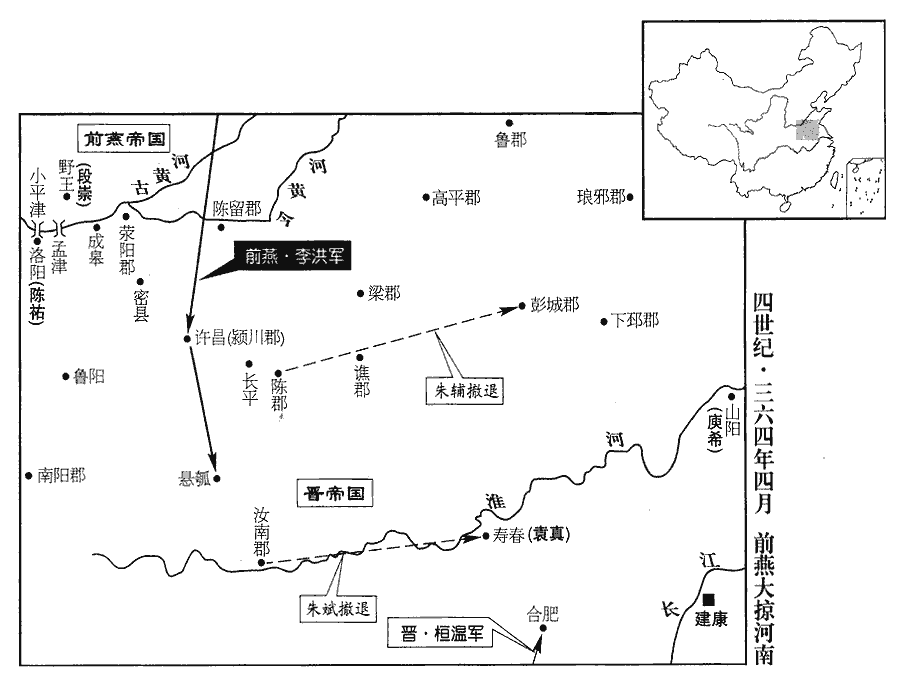
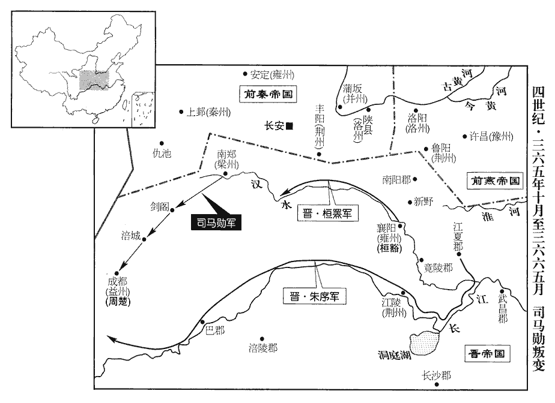
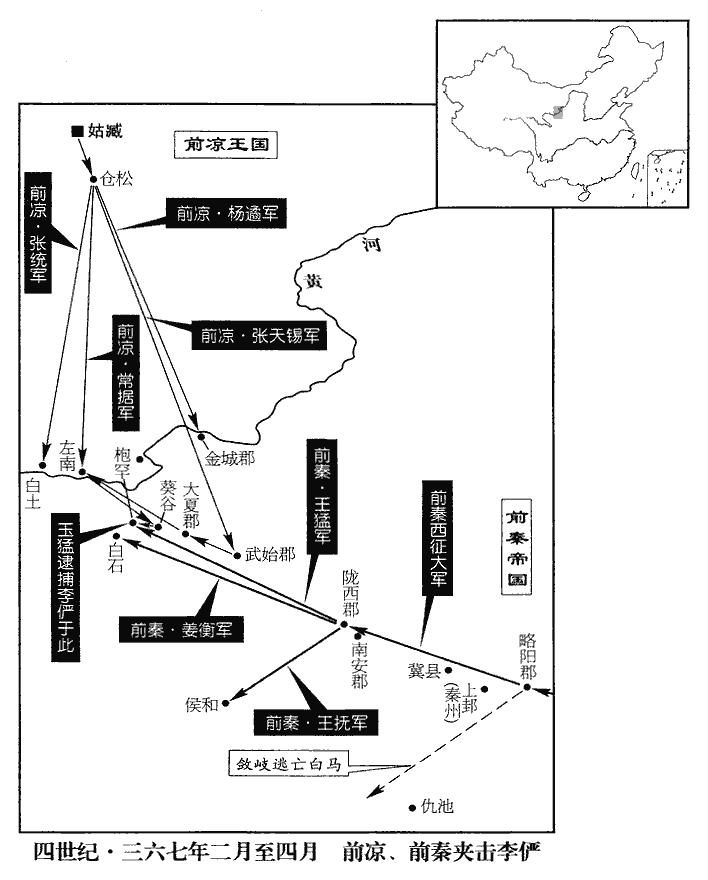
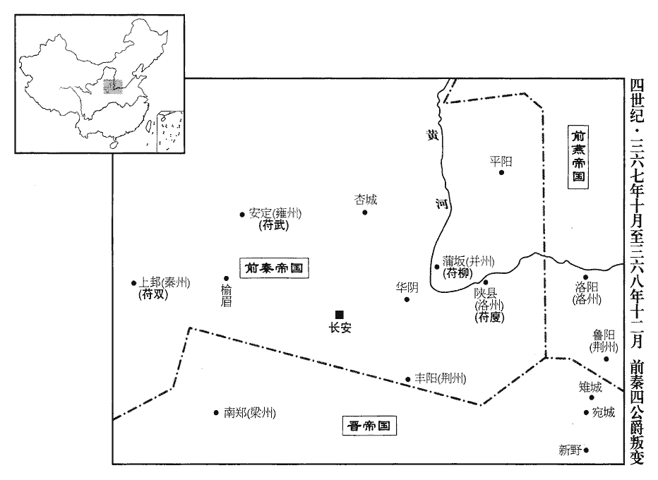

 晉紀二十三起上章涒灘（庚申），盡著雍執徐（戊辰），凡九年。

# 孝宗穆皇帝下

## 升平四年（庚申、三六零）

1春，正月，癸巳‹二十›，燕主儁‹本年四十二岁›大閱于鄴‹河北临漳西南邺镇›，欲使大司馬恪、司空陽騖將之入寇；騖，音務。將，即亮翻。會疾篤，乃召恪、騖及司徒評、領軍將軍慕輿根等受遺詔輔政。甲午‹二十一›，卒。年四十二。戊子‹二十五›，太子暐即皇帝位。暐，字景茂，儁第三子。按長曆，是年正月，甲戌朔。今儁以甲午卒，則戊子在甲午前，即位恐是戊戌。年十一；大赦，改元建熙。

〖译文〗 [1]春季，正月，癸巳（二十日），前燕国主慕容俊在邺城对军队进行大检阅，想让大司马慕容恪、司空阳鹜统领军队进犯东晋。恰好这时病情加重，于是就召来慕容恪、阳鹜以及司徒慕容评、领军将军慕舆根等人，接受遗诏辅佐朝政。甲午（二十一日），慕容俊去世。戊子（疑误），太子慕容即皇帝位，时年十一岁。实行大赦，改年号为建熙。

2秦王堅‹苻坚，本年二十三岁›分司、隸置雍州，雍，於用翻。以河南公雙為都督雍•河•涼三州諸軍事、征西大將軍、雍州刺史，改封趙公，鎮安定‹甘肃省镇原县东南曙光乡›。河、涼三州非秦土也。雙所督實土，惟安定五郡耳。為雙以安定叛張本。封弟忠為河南公。

〖译文〗 [2]前秦王苻坚分司隶之地设置雍州，任命河南公苻双为都督雍、河、凉三州诸军事，征西大将军，雍州刺史，并将他改封为赵公，镇守安定。封弟弟苻忠为河南公。

3仇池‹甘肃西和西南›公楊俊卒，子世立。

〖译文〗 [3]仇池公杨俊去世，儿子杨世继位。

4二月，燕人尊可足渾后為皇太后。以太原王恪為太宰，專錄朝政；錄，總也。朝，直遙翻。上庸王評為太傅，陽騖為太保，慕輿根為太師，參輔朝政。朝，直遙翻；下同。

〖译文〗 [4]二月，前燕人尊可足浑后为皇太后。任命太原王慕容恪为太宰，总揽朝政；任命上庸王慕容评为太傅，阳鹜为太保，慕舆根为太师，参与辅佐朝政。

根性木強，師古曰：木謂質直。強，音其兩翻。自恃先朝勳舊，自皝以來，根屢有戰功。心不服恪，舉動倨傲。時太后可足渾氏頗預外事，根欲為亂，乃言於恪曰：「今主上幼沖，母后干政，殿下宜防意外之變，思有以自全。且定天下者，殿下之功也。兄亡弟及，古今成法，此殷法也，非周法也。俟畢山陵，宜廢主上為王，殿下自踐尊位，以為大燕無窮之福。」恪曰：「公醉邪？何言之悖也！悖，蒲內翻，又蒲沒翻。吾與公受先帝遺詔，云何而遽有此議？」根愧謝而退。恪以告吳王垂，垂勸恪誅之。恪曰：「今新遭大喪，二鄰觀釁，二鄰，謂晉、秦也。而宰輔自相誅夷，恐乖遠近之望，且可忍之。」祕書監皇甫真言於恪曰：「根本庸豎，過蒙先帝厚恩，引參顧命。而小人無識，自國哀已來，驕很日甚，將成禍亂。很，戶墾翻。明公今日居周公之地，當為社稷深謀，早為之所。」恪不聽。

〖译文〗 慕舆根性格质朴倔强，自恃是先朝的有功旧臣，心里不服慕容恪，因此行为举止傲慢。当时太后可足浑氏经常干预朝政，慕舆根想要作乱，就对慕容恪进言说：“如今主上年幼，母后干预政事，殿下应该防范意外的变故，考虑用来自我保全的方法。况且平定天下，是殿下的功劳。兄亡弟及，这是古今的既成之规，等到先帝的陵墓峻工后，就应该将主上黜废为王，殿下自己登上尊位，从而为大燕带来无穷之福。”慕容恪说：“你喝醉了吗？怎么说这样的悖逆之言！我和你接受先帝的遗诏，你为什么突然提出这样的建议？”慕舆根面有愧色地谢罪退下去了。慕容恪把此事告诉了吴王慕容垂，慕容垂劝慕容恪杀掉他。慕容恪说：“如今刚刚遭受先帝大丧，晋、秦两个邻国都在坐观灾祸，而我们辅政大臣如果自相残杀，恐怕有悖于远近民众的期望，暂且可以容忍他。”秘书监皇甫真向慕容恪进言说：“慕舆根本来就是庸人竖子，过去蒙受先帝厚重的恩宠，被引用参与辅佐朝政。然而小人没有见识，自从先帝驾崩以来，骄横日益严重，最终将要制造祸乱。您今天处于周公的地位，应当为国家深谋远，及早将他处置。”慕容恪没有听从。

根又言於可足渾氏及燕主暐曰：「太宰、太傅將謀不軌，臣請帥禁兵以誅之。」帥，讀曰率。可足渾氏將從之，暐曰：「二公，國之親賢，先帝選之，託以孤嫠，嫠lí，陵之翻。無夫曰嫠。必不肯爾；安知非太師欲為亂也！」乃止。根又思戀東土，龍城‹辽宁朝阳›在鄴城‹河北临漳西南邺镇›東北，故曰東土。言於可足渾氏及暐曰：「今天下蕭條，外寇非一，國大憂深，不如還東。」恪聞之，乃與太傅評謀，密奏根罪狀；使右衛將軍傅顏就內省誅根，并其妻子、黨與。大赦。既誅根及其妻子黨與，恐眾心反側，故肆赦以安之。是時新遭大喪，誅夷狼籍，內外恟懼，恟，許拱翻。太宰恪舉止如常，人不見其有憂色，每出入，一人步從。從，才用翻。或說以宜自嚴備，說，輸芮翻。恪曰：「人情方懼，當安重以鎮之，柰何復自驚擾，眾將何仰！」復，扶又翻。由是人心稍定。

〖译文〗 慕舆根又向可足浑氏及前燕国主慕容进言说：“太宰慕容恪、太傅慕容评将要图谋不轨，我请求率领宫中卫兵去消灭他们。”可足浑氏正要同意他的请求，慕容说：“太宰、太傅二公，是国家亲近而又贤明的人，先帝选择了他们，将孤儿寡母相托，他们一定不会干那样的事情。怎么知道不是太师你想作乱呢！”于是就没有同意慕舆根的请求。慕舆根又思念东土龙城，向可足浑氏及慕容进言就：“如今天下衰败凋零，外敌不止一家，国家越大，忧患越深，不如东返龙城。”慕容恪听说后，便与太傅慕容评商量，秘密地奏上慕舆根的罪行。让右卫将军傅颜在宫内杀掉慕舆根，连他的妻子、儿子、同党也一并杀掉。实行大赦。这时前燕刚刚遭受了大丧，又诛杀了一大批人，宫廷内外都感到震动恐惧。太宰慕容恪则举止如常，人们看不到他有忧虑的神色，每当出入宫廷时，只有一个人随从。有人劝他应该自己严加防备，慕容恪说：“人心正值恐惧，应当泰然自若以使他们镇定，为什么还要自我惊扰，那样民众将仰仗什么！”从此人心逐渐稳定了下来。

恪雖綜大任，而朝廷之禮，兢兢嚴謹，每事必與司徒評議之，未嘗專決。虛心待士，諮詢善道，量才授任，量，音良。人不踰位；官屬、朝臣或有過失，朝，直遙翻。不顯其狀，隨宜他敘；不令失倫，以敘遷為他官，不令失其倫等也。唯以此為貶；時人以為大愧，莫敢犯者。或有小過，自相責曰：「爾復欲望宰公遷官邪！」恪為太宰，故稱之為宰公。復，扶又翻。朝廷初聞燕主儁卒，皆以為中原可圖。桓溫曰：「慕容恪尚在，憂方大耳。」史言慕容恪能輔幼主，桓溫能料敵。

〖译文〗 慕容恪虽然总揽大权，然而对于朝廷的礼法，小心谨慎，严加遵守，每件事情都要和司徒慕容评商议，从来不独断专行。虚心对待读书人，向他们征求治国良策，根据才能授以官职，使人们各居其位。官属、朝臣如果出现过失，也不公开宣布，只是根据情况加以调动，并且不让他们失去原来的等级次第，仅以此表示贬责。当时的人都以受到这样的处置为大愧，没有人敢轻易触犯。有人出现小过失，也都自己互相责备说：“你又想让宰公慕容恪调动你的官职啦！”东晋朝廷开始听说前燕国主慕容俊去世，都认为中原可以收复。桓温说：“慕容恪尚在，忧患正大着呢！”

三月，己卯‹六›，葬燕主儁於龍陵，陵在龍城‹辽宁朝阳›，因以為名。諡曰景昭皇帝，廟號烈祖。所徵郡國兵，以燕朝多難，難，乃旦翻。，互相驚動，往往擅自散歸，自鄴以南，道路斷塞。塞，悉則翻。太宰恪以吳王垂為使持節、征南將軍、都督河南諸軍事、兗州牧、荊州刺史，鎮梁國‹河南省商丘县›之蠡臺‹河南省虞城县›，使，疏吏翻；下同。孫希為并州刺史，傅顏為護軍將軍，帥騎二萬，觀兵河南，臨淮而還；境內乃安。史言恪當國有大憂、眾心危疑之際，處之有方。帥，讀曰率。騎，奇寄翻。觀，古玩翻，示之也。觀兵，曜兵以示之也。希，泳之弟也。孫泳拒趙，見九十六卷成帝咸康四年。史書孫泳、鞠彭、宋燭之子弟，皆貴顯於燕，所以勸委質者能守死而不貳，子孫必獲其福也。

〖译文〗 三月，己卯（初六），把前燕国主慕容俊安葬在龙陵，谥号为景昭皇帝，庙号为烈祖。从各郡国征调的士兵，因为燕朝多灾多难，互相惊扰骚动，往往擅自逃散归乡，以至于从邺城向南，道路堵塞。太宰慕容恪任命吴王慕容垂为使持节、征南将军、都督河南诸军事、兖州牧、荆州刺史，镇守梁国的蠡台。任命孙希为并州刺史，傅颜为护军将军，率领二万骑兵，在河南炫耀了一番，到了淮水才返回。于是境内安定了下来。孙希是孙泳的弟弟。

5匈奴劉衛辰遣使降秦，降，戶江翻。請田內地，春來秋返；秦王堅許之。夏，四月，雲中‹内蒙托克托›護軍賈雍遣司馬徐贇帥騎襲之，贇yūn，於倫翻。大獲而還。堅怒曰：「朕方以恩信懷戎狄，而汝貪小利以敗之，何也！」敗，補邁翻。黜雍以白衣領職，遣使還其所獲，慰撫之。衛辰於是入居塞內，貢獻相尋。

〖译文〗 [5]匈奴刘卫辰派使者向前秦投降，请求在内地划给他们农田耕种，春天来秋天走，前秦王苻坚同意了。夏季，四月，云中护军贾雍派司马徐率领骑兵袭击刘卫辰，满载而返。苻坚愤怒地说：“朕正在以恩信安抚戎狄，而你却贪图小利而败坏了事情，为什么呢！”于是废黜贾雍，让他以布衣百姓的身分兼领职务，派使者将他所掠获的财物送还了刘卫辰，并对他加以抚慰。刘卫辰从此进入关内定居，经常向前秦进献贡奉。

夏，六月，代‹都盛乐，内蒙和林格尔›王什翼犍妃慕容氏卒。犍，居言翻。秋，七月，劉衛辰如代會葬，因求婚，什翼犍以女妻之。妻，七細翻。

〖译文〗 夏季，六月，代王拓跋什翼犍的妃子慕容氏去世。秋季，七月，刘卫辰来到代国参加葬礼，顺便求婚，拓跋什翼犍把女儿嫁给了他。

6八月，辛丑朔‹一›，日有食之，既。

〖译文〗 [6]八月，辛丑朔（初一），出现日全食。

7謝安少有重名，少，詩照翻。前後徵辟，皆不就；寓居會稽‹浙江绍兴›，會，工外翻。以山水、文籍自娛。雖為布衣，時人皆以公輔期之，士大夫至相謂曰：「安石不出，當如蒼生何！」謝安，字安石。江東人士始焉所期望者殷浩，浩既無以滿眾望矣，繼而所望者謝安，而安卒能匡輔晉室。世之論者，皆優安而劣浩。余謂盛名之下，其實難副。浩之所以敗，正以與桓溫齊名，其心易溫；又值石氏之亂，以為可以立功，敗於輕率也。謝安當桓溫擅政之時，又身嘗為之僚屬，而懲浩之所以失，戒溫而為之備；溫既死而值秦之強，兢兢焉為自保之謀，常持懼心，此其所以濟也。史氏謂其能矯情鎮物，蓋因屐jī齒之折、白雞之夢而知之耳。安每遊東山‹浙江上虞西南›，東山，在今紹興府上虞縣西南四十五里。安故居今為國慶禪寺。常以妓女自隨。妓，渠綺翻。司徒昱聞之，曰：「安石既與人同樂，樂，音洛。必不得不與人同憂，召之必至。」安妻，劉惔tán之妹也，見家門貴盛劉惔以清談貴顯；而謝尚、謝奕、謝萬皆為方伯，盛於一時。惔tán，徒甘翻。而安獨靜退，謂曰：「丈夫不如此也！」安掩鼻曰：「恐不免耳。」言恐亦不免如諸兄弟也。及弟萬廢黜，安始有仕進之志，時已年四十餘‹本年四十一岁›。征西大將軍桓溫請為司馬，安乃赴召，溫大喜，深禮重之。

〖译文〗 [7]谢安从小就名重一时，朝廷前后多次征召，他都不就任。闲居在会稽，以山水、文献典籍自以为乐。虽然身为布衣百姓，但时人都对他寄予三公和相辅的期望，士大夫们在一起议论说：“谢安不出山，叫百姓该怎么办！”谢安每次游览东山，总是让歌舞女伎跟随。司徒司马昱听说后说：“谢安既然能够与人同乐，就一定不会不与人同忧，征召他一定会就任。”谢安的妻子，是刘的妹妹。她看到谢家门庭显盛，而谢安却自甘寂寞不思进取，就对谢安说：“大丈夫不应该如此。”谢安手掩鼻子回答说：“我怕难以逃脱兄弟们的命运。”等到弟弟谢万被废黜以后，谢安才有了进身仕途的志向，当时已经四十多岁了。征西大将军桓温向朝廷请求让他做司马，谢安就应招就任，桓温十分高兴，以礼相待，十分看重他。

8冬，十月，烏桓獨孤部、鮮卑沒奕干各帥眾數萬降秦，秦王堅處之塞南。帥，讀曰率。降，戶江翻。處，昌呂翻；下同。陽平公融諫曰：「戎狄人面獸心，不知仁義。其稽顙內附，實貪地利，非懷德也；稽，音啟。不敢犯邊，實憚兵威，非感恩也。今處之塞內，與民雜居，彼窺郡縣虛實，必為邊患，不如徙之塞外以防未然。」堅從之。

〖译文〗 [8]冬季，十月，乌桓的独孤部、鲜卑的没奕干各自率领数万部众投降了前秦，前秦王苻坚把他们安置在塞南地区。阳平公苻融劝苻坚说：“戎狄人面兽心，不懂仁义。他们叩首归附，实际上是贪图地利，并不是向往仁德；他们不敢侵犯边境，实际上是害怕军队的威势，并不是感激恩情。如今把他们安排在塞内地区与我们的百姓混住杂居，等窥探清郡县的虚实后，一定会成为边境之地的祸患，不如把他们迁徙到塞外，以防患于未然。”苻坚听从了这一劝告。

9十一月，封桓溫為南郡公，溫弟沖為豐城縣公，子濟為臨賀縣公。

〖译文〗 [9]十一月，东晋封桓温为南郡公，封桓温的弟弟桓冲为丰城县公，桓温的儿子桓济为临贺县公。

10燕太宰恪欲以李績為右僕射，燕主暐不許。恪屢以為請，暐曰：「萬機之事，皆委之叔父；伯陽一人，暐請獨裁。」出為章武‹河北大城›太守，以憂卒。暐不平李績事見上卷上年。

〖译文〗 [10]前燕太宰慕容恪想任命李绩为右仆射，前燕国主慕容不同意。慕容恪多次请求，慕容说：“国家各种事务，全都交给叔父处理，只有李绩一人的事情，我请求独自裁断。”于是把李绩调出朝廷，任章武太守，李绩忧郁而死。

## 五年（辛酉、三六一）

1春，正月，戊戌‹一›，大赦。

〖译文〗 [1]春季，正月，戊戌（初一），东晋实行大赦。

2劉衛辰掠秦邊民五十餘口為奴婢以獻於秦；秦王堅‹本年二十四岁›責之，使歸所掠。衛辰由是叛秦，專附於代‹府盛乐内蒙古和林格尔县›。史言夷狄反覆難保。

〖译文〗 [2]刘卫辰掳掠了前秦的边境居民五十多人作为奴婢，进献给了前秦，前秦王苻坚责备他，让他把掳掠的百姓放回去。刘卫辰因此而背叛了前秦，一心依附于代国。

3東安簡伯郗曇‹时驻下邳江苏省睢宁县北古邳镇›卒‹年四十二岁›。郗xī，丑之翻。曇tán，徒含翻。二月，以東陽‹浙江金华›太守范汪都督徐、兗、冀、青、幽五州諸軍事，兼徐、兗二州刺史。

〖译文〗 [3]东安简伯郗昙去世。二月，东晋任命东阳太守范汪都督徐、兖、冀、青、幽五州诸军事，兼任徐、兖二州刺史。

4平陽‹山西临汾›人舉郡降燕‹都邺城河北省临漳县西南邺镇›；平陽時屬張平。燕以建威將軍段剛為太守，遣督護韓苞將兵共守平陽。

〖译文〗 [4]平阳全郡的人都投降了前燕。前燕任命建威将军段刚为太守，派督护韩苞统率军队共同守卫平阳。

5方士丁進有寵於燕主暐‹慕容暐，本年十二岁›，【章：十二行本「暐」作「儁」；乙十一行本同。】欲求媚於太宰恪，說恪令殺太傅評；說，輸芮翻。恪大怒，奏收斬之。

〖译文〗 [5]方术之士丁进在前燕国主慕容面前很得宠，他想向太宰慕容恪献媚，劝说慕容恪杀掉太傅慕容评。慕容恪勃然大怒，奏请拘捕并斩杀他。

6高昌卒，三年，高昌奔滎陽‹河南滎陽›。燕河內‹河南省长阳市›太守呂護并其眾，遣使來降；拜護冀州刺史。護欲引晉兵以襲鄴‹河北临漳西南邺镇›。三月，燕太宰恪將兵五萬，冠軍將軍皇甫真將兵萬人，共討之。將，即亮翻。冠，古玩翻。燕兵至野王‹河南沁阳›，護嬰城自守。護軍將軍傅顏請急攻之，以省大費。恪曰：「老賊經變多矣，觀其守備，未易猝攻，易，以豉翻。而多殺士卒。頃攻黎陽，多殺精銳，卒不能拔，事見上卷二年。自取困辱。護內無蓄積，外無救援，我深溝高壘，坐而守之，休兵養士，離間其黨，間，古莧翻。於我不勞而賊勢日蹙，不過十旬，取之必矣，何為多殺士卒以求旦夕之功乎！」乃築長圍守之。

〖译文〗 [6]高昌去世，前燕河内太守吕护吞并了他的兵众，派使者前来东晋投降。吕护被授予冀州刺史。吕护想带领东晋的军队去袭击邺城。三月，前燕太宰慕容恪统率五万士兵，冠军将军皇甫真统率一万士兵，共同讨伐吕护。前燕的军队抵达野王，吕护环城自守。护军将军傅颜请求展开急攻，以减少过多的耗费。慕容恪说：“这个老贼经历的变故很多，看他防守戒备的样子，不容易展开急攻，以免士兵伤亡过重。前不久攻打黎阳时，精锐士兵伤亡严重，但最终也没能攻克，那是自取危困受辱。吕护城内无积蓄，城外无救援，我们只要把战壕挖深，把营垒筑高，坐而坚守，休养士兵，同时离间他的同党，对我们来说毫不费力，而敌人的形势却日益危急，用不了一百天，一定能够攻取他，何必要以大量士卒的伤亡去换取旦夕之功呢！”于是他们就修筑了长围来坚守。

7夏，四月，桓溫‹时驻江陵湖北省江陵县›以其弟黃門郎豁都【章：十二行本無「都」字；乙十一行本同。】督沔中七郡諸軍事，魏置中書監、令，又置通事郎、黃門郎。沔中七郡，魏興‹陕西安康›、新城‹湖北房县›、上庸‹湖北竹山西南田家坝›、襄陽‹湖北襄樊›、義成‹湖北丹江口›、竟陵‹湖北钟祥›、江夏‹湖北云梦›也。兼新野‹河南新野›、義城‹湖北丹江口›二郡太守，城，當作成。將兵取許昌‹河南许昌东›，破燕將慕容塵。

〖译文〗 [7]夏季，四月，桓温任命他的弟弟黄门郎桓豁为都督沔中七郡诸军事，兼任新野、义城二郡太守，统率军队攻取了许昌，打败了前燕将领慕容尘。

8涼‹都姑臧甘肃省武威市›驃騎大將軍宋混疾甚，驃，匹妙翻。騎，奇寄翻。張玄靚‹本年十三岁›及其祖母馬氏往省之，靚，疾正翻，又疾郢翻。省，悉景翻。曰：「將軍萬一不幸，寡婦孤兒將何所託！欲以林宗繼將軍，可乎？」混曰：「臣子林宗幼弱，不堪大任。殿下儻未棄臣門，臣弟澄政事愈於臣，但恐其儒緩，機事不稱耳。凡儒者多務為舒緩，而不能應機以趨事赴功。稱，尺證翻。殿下策勵而使之，可也。」混戒澄及諸子曰：「吾家受國大恩，當以死報，無恃勢位以驕人。」又見朝臣，皆戒之以忠貞。朝，直遙翻。及卒，行路為之揮涕。卒，子恤翻。為，于類翻。玄靚以澄為領軍將軍，輔政。

〖译文〗 [8]前凉骠骑大将军宋混病重，张玄靓及其祖母马氏前去看望，说：“将军万一有不幸，我们孤儿寡妇将依靠谁呢？想以宋林宗继承将军，可以吗？”宋混说：“臣下的儿子宋林宗年幼无力，难以承担重任。殿下倘若还未抛弃臣下一家，我的弟弟宋澄施政办事的能力胜于我，只是恐怕他迂缓迟钝，难以适应随机应变的事务。殿下如果能对他鞭策鼓励而加以使用，就可以。”宋混告诫宋澄以及儿子们说：“我们家承受了国家的大恩大泽，应当以死相报，不要倚仗权势地位而对人傲慢。”他又会见了朝廷的大臣，全都告诫他们要忠贞不二。等到宋混死后，路人都为他流泪。张玄靓任命宋澄为领军将军，辅佐朝政。

9五月，丁巳‹二十二›，帝‹司马聃›崩，年十九。無嗣。皇太后令曰：「琅邪王丕，中興正統，元帝、明帝、成帝皆正統相傳。琅邪王丕，成帝長子也，故曰中興正統。義望情地，莫與為比，其以王奉大統！」於是百官備法駕迎于琅邪第。庚申‹二十五›，‹司马丕，本年二十一岁›即皇帝位，大赦。壬戌‹二十七›，改封東海王奕為琅邪王。秋，七月，戊午‹二十三›，葬穆帝于永平陵‹南京城北幕府山南麓›，廟號孝宗。

〖译文〗 [9]五月，丁巳（二十二日），东晋穆帝驾崩，没有继承人。皇太后下令说：“琅邪王司马丕，是朝廷中兴以来的正传统嫡传，不论是道德名声，还是族亲地位，没有人能和他相比，让琅邪王奉接帝位！”于是朝廷百官备好皇帝的车驾去琅邪王的宅第迎接他。庚申（二十五日），司马丕即皇帝位，实行大赦。壬戌（二十七日），改封东海王司马奕为琅邪王。秋季，七月，戊午（二十三日），东晋穆帝被安葬在永平陵，定庙号为孝宗。

10燕人圍野王‹河南沁阳›數月，呂護遣其將張興出戰，傅顏擊斬之，城中日蹙。皇甫真戒部將曰：「護勢窮奔突，必擇虛隙而投之；吾所部士卒多羸，器甲不精，宜深為之備。」乃多課櫓楯，親察行夜者。將，即亮翻。羸，倫為翻。楯，食尹翻。行，下孟翻。護食盡，果夜悉精銳趨真所部，趨，七喻翻。突圍，不得出；太宰恪引兵擊之，護眾死傷殆盡，棄妻子奔滎陽‹河南荥阳›。恪存撫降民，給其廩食；降，戶江翻。徙士人、將帥於鄴‹河北临漳›，自餘各隨所樂；帥，所類翻。樂，音洛。以護參軍廣平‹河北省永年县东南旧永年镇›梁琛為中書著作郎。晉武帝以秘書并中書省，故曰中書著作郎。琛chēn，丑林翻。

〖译文〗 [10]前燕人包围了野王几个月，吕护派他的将领张兴出城迎战，傅颜攻击并斩杀了张兴，城中日益危急。皇甫真告诫手下的部将们说：“吕护大势丧失外逃时，一定会选择空虚间隙之处突围，我们军中的士兵大多瘦弱，武器也不够精良，应该多加防备。”于是他就多次督促试验战车盾牌，亲自检查夜间巡逻的人。吕护粮食断绝，果然趁夜带领他的全部粗锐士兵向皇甫真部队坚守的地方进发，实施突围，但没能突破。太宰慕容恪率兵攻打他，吕护的兵众死伤殆尽，吕护本人丢下妻儿逃奔到荥阳。慕容恪安抚投降的百姓，把积蓄的粮食供应给他们。将官吏和将帅迁徙到邺城，其余的人则随他们到自己愿意去的地方去。任命吕护的参军广平人梁琛为中书著作郎。

九月，戊申‹十四›，立妃王氏‹王穆之›為皇后。后，濛之女也。穆帝‹司马聃›何皇后‹何法倪›稱穆皇后，居永安宮。

〖译文〗 [11]九月，戊申（十四日），东晋立妃王氏为皇后。王皇后是王的女儿。穆帝何皇后称为穆皇后，居住在永安宫。

涼右司馬張邕惡宋澄專政，惡，烏路翻；下同。起兵攻澄，殺之，併滅其族。宋澄豈特機事不稱哉，遂赤其族！以此知經世非儒緩者所能為也。張玄靚以邕為中護軍，叔父天錫為中領軍，同輔政。

〖译文〗 [12]前凉右司马张邕憎恨宋澄独专朝政，起兵攻打宋澄，把他杀了，他的家族也一并灭掉。张玄靓任命张邕为中护军，任命叔父张天锡为中领军，一同辅佐朝政。

張平襲燕平陽‹山西临汾›，殺段剛、韓苞；又攻鴈門‹山西代县›，殺太守單男。單，音善，姓也。既而為秦所攻，平復謝罪於燕以求救。復，扶又翻。燕人以平反覆，弗救也，平遂為秦所滅。

〖译文〗 [13]张平袭击前燕的平阳，杀掉了段刚、韩苞。又攻打雁门，杀掉了太守单男。接着张平又遭到前秦的攻打，他无奈又向前燕谢罪以求救助。前燕人因为张平反复无常，没有救他，于是张平被前秦消灭。

乙亥，秦大赦。

〖译文〗 [14]乙亥（疑误），前秦实行大赦。

徐、兗二州刺史范汪‹时驻下邳›，素為桓溫所惡，桓溫初以安西鎮上流，汪為上佐；蓋惡其異己也。若汪於此時能立異，必知溫之心迹矣。惡，烏路翻。溫將北伐，命汪帥眾出梁國‹河南省商丘县›。帥，讀曰率。冬，十月，坐失期，免為庶人，遂廢，卒於家‹年六十五岁›。卒，子恤翻。

〖译文〗 [15]徐、兖二州刺史范汪，历来被桓温所憎恶。桓温准备北伐，命令范汪率领兵众向梁国出发。冬季，十月，范汪犯了延误期限的罪过，被免为庶人，于是就被废黜，死在家中。

子寧，好儒學，好，呼到翻。性質直，常謂王弼、何晏之罪深於桀、紂。或以為貶之太過，寧曰：「王、何蔑棄典文，幽沈仁義，沈，持林翻。游辭浮說，波蕩後生，使搢紳之徒翻然改轍，以至禮壞樂崩，中原傾覆，遺風餘俗，至今為患。桀、紂縱暴一時，適足以喪身覆國，喪，息浪翻。為後世戒，豈能迴百姓之視聽哉！故吾以為一世之禍輕，歷代之患重；自喪之惡小，迷眾之罪大也！」喪，息浪翻。

〖译文〗 范汪的儿子范宁，喜好儒学，性格质朴直爽。他常说王弼、何晏的罪恶比夏桀、商纣还重。有的人认为这是过分贬低，范宁说：“王、何蔑视抛弃经典文献，使仁义沉沦，荒诞空虚的言辞论说，遗害后代，导致士大夫翻然改变正确的道路，以至于礼崩乐坏，中原覆没。其遗风余俗，直到今天还在为害世人。夏桀、商纣一时的肆意暴虐，也足以使他们身败名裂，使国家倾覆灭亡，成为后世的戒鉴，岂能躲过百姓的视听呢！所以我认为为害一个时代的灾祸轻，为害历代的灾祸重；自己身败名裂的罪恶小，迷惑世人的罪恶大！”

呂護復叛，奔燕，燕人赦之，以為廣州刺史。燕無廣州，以刺史之名授護耳。

〖译文〗 [16]吕护又背叛了东晋，逃奔到前燕，前燕人宽赦了他，任命他为广州刺史。

涼張邕驕矜淫縱，樹黨專權，多所刑殺，國人患之。張天錫所親敦煌‹甘肃敦煌›劉肅謂天錫曰：敦，徒門翻。「國家事欲未靜！」天錫曰：「何謂也？」肅曰：「今護軍出入，有似長寧。」長寧侯張祚也。天錫驚曰：「我固疑之，未敢出口。計將安出？」肅曰：「正當速除之耳！」天錫曰：「安得其人？」肅曰：「肅即其人也！」肅時年未二十。天錫曰：「汝年少，少，詩照翻。更求其助。」肅曰：「趙白駒與肅二人足矣。」十一月，天錫與邕俱入朝，朝，直遙翻。肅與白駒從天錫，【章：十二行本「錫」下有「值邕於門下」五字；乙十一行本同；孔本同；張校同；退齋校同。】肅斫之不中，中，竹仲翻。白駒繼之，又不克，二人與天錫俱入宮中，邕得逸走，帥甲士三百餘人攻宮門。天錫登屋大呼曰：帥，讀曰率。呼，火故翻。「張邕凶逆無道，既滅宋氏，又欲傾覆我家。汝將士世為涼臣，何忍以兵相向邪！將，即亮翻。今所取者，止張邕耳，他無所問！」於是邕兵悉散走，邕自刎死，盡滅其族黨。刎，扶粉翻。玄靚以天錫為使持節、冠軍大將軍、都督中外諸軍事，輔政。自張重華沒後，張祚、張瓘、宋混、宋澄以及張邕、張天錫，遞相屠滅，涼浸衰矣。使，疏吏翻。冠，古玩翻。十二月，始改建興四十九年，奉升平年號。涼至是方奉建康年號。詔以玄靚為大都督、督隴右諸軍事、涼州刺史、護羌校尉、西平公。

〖译文〗 [17]前凉张邕傲慢自负，纵行淫虐，网罗朋党，专擅朝政，滥施刑罚、杀戮，国人都很怨恨他。张天锡的亲信敦煌人刘肃对张天锡说：“国家的事情尚未平静！”张天锡说：“这话是什么意思？”刘肃说：“如今护军张邕出入朝廷，就像当年的长宁侯张祚。”张天锡吃惊地说：“我本来就怀疑他，只是没敢说出口。办法将出自哪里呢？”刘肃说：“应当迅速除掉他！”张天锡说：“怎么能得到除掉他的人呢？”刘肃说：“刘肃我就是这个人！”刘肃当时年令不满二十。张天锡说：“你还年轻，另外再找一个助手。”刘肃说：“有赵白驹和我两人就足够了。”十一月，张天锡和张邕一起入朝，刘萧和赵白驹跟随着张天锡，张邕正在宫门前，刘肃砍击张邕，没有砍中，赵白驹接着再砍，又没砍中，他们二人和张天锡一起进到宫中，张邕得以逃跑，率领披甲士兵三百多人攻打宫门。张天锡登上屋顶大声喊道：“张邕凶恶叛逆，毫无道义，已经杀掉了宋澄，又想颠覆我们一家。你们众将士世代都是凉朝的臣属。怎么忍心把武器对准我呢！如今我要擒获的，只有张邕而已，其他人一概不追究！”于是张邕的士兵全都奔散逃走，张邕自刎而死，张天锡把张邕的家族、同党全部消灭。张玄靓任命张天锡为使持节、冠军大将军、都督中外诸军事，辅佐朝政。十二月，开始改变了建兴四十九年的纪年，尊奉使用东晋的年号升平。东晋朝廷下诏，任命张玄靓为大都督、督陇右诸军事、凉州刺史、护羌校尉、西平公。

燕大赦。

〖译文〗 [18]前燕实行大赦。

秦王堅命牧伯守宰各舉孝悌tì、廉直、文學、政事，察其所舉得人者賞之，非其人者罪之。由是人莫敢妄舉，而請託不行，士皆自勵；雖宗室外戚，無才能者皆棄不用。當是之時，內外之官，率皆稱職；稱，尺證翻。田疇修闢，倉庫充實，盜賊屏息。屏，必郢翻。

〖译文〗 [19]前秦王苻坚命令州郡地方官吏分别荐举孝悌、廉直、文学、政事等科目的人才，并且对他们荐举上来的人加以考察，荐举得当者给以奖赏，荐举失当者给以责罚。因此人们都不敢妄加推荐，也没有请求拜托的现象，读书人全都自我勉励。即使是宗室外戚，没有才能的也都弃而不用。这时，朝廷内外的官吏，人人称职。农田得以修整，荒地得以开垦，仓库丰盈充实，盗贼息声敛行。

是歲，歸義侯李勢卒。永和三年，李勢降，至是而卒。

〖译文〗 [20]这一年，归义侯李势去世。

# 哀皇帝諱丕，成帝長子也，字千齡；咸康八年，封琅邪王。諡法：恭仁短折曰哀。

## 隆和元年（壬戌、三六二）

1春，正月，壬子‹二十›，大赦，改元。

〖译文〗 [1]春季，正月，壬子（二十日），东晋实行大赦，改年号为隆和。

2甲寅‹二十二›，減田租，畝收二升。成帝咸和五年，始度百姓田，畝取十分有一，率畝稅米三升；今減之，畝收二升。

〖译文〗 [2]甲寅（二十二日），东晋减免田租，每亩收租二升。

3燕‹都邺城河北省临漳县西南邺镇›豫州刺史孫興請攻洛陽‹河南省洛阳市东白马寺东›，曰：「晉將陳祐弊卒千餘，介守孤城，不足取也！」將，即亮翻。介，如字，獨也；又音戛jiá。燕人從其言，遣寧南將軍呂護屯河陰‹河南孟津东北›。

〖译文〗 [3]前燕豫州刺史孙兴请求攻打洛阳，他说：“东晋将领陈只有一千多疲惫体弱的兵卒，独守孤城，不堪一击！”前燕人听了他的话，派宁南将军吕护驻军河阴。

4二月，辛未‹十›，以吳國‹苏州›內史庾希為北中郎將、徐•兗二州刺史，鎮下邳‹江苏睢宁北古邳镇›，龍驤將軍袁真為西中郎將、監護豫•司•并•冀四州諸軍事、豫州刺史，鎮汝南‹河南息县›；希、真既並假節，職任宜同；疑希亦當帶監護之職，史逸之也。驤，思將翻。監，工銜翻。並假節。希，冰之子也。庾冰秉政於咸康。

〖译文〗 [4]二月，辛未（初十），东晋任命吴国内史庾希为北中郎将、徐、兖二州刺史，镇守下邳，任命龙骧将军袁真为西中郎将、监豫、司、并、冀四州诸军事、豫州剌史，镇守汝南，全都持有符节。庾希是庾冰的儿子。

5丙子‹十五›，拜帝‹司马丕，本年二十二岁›母周貴人為皇太妃，儀服擬於太后。

〖译文〗 [5]丙子（十五日），东晋授予皇帝的母亲周贵人为皇太妃，礼仪服饰仿照太后的规格。

6燕呂護攻洛陽。三月，乙酉‹四月二十五›，河南太守戴施奔宛‹河南南阳›，永和十二年，桓溫留戴施戍洛陽。宛，於元翻。陳祐告急。五月，丁巳‹二十七›，桓溫遣庾希及竟陵‹湖北钟祥›太守鄧遐帥舟師三千人助祐守洛陽。帥，讀曰率。遐，嶽之子也。鄧嶽，王敦將也。敦敗後自歸，著功交、廣。

〖译文〗 [6]前燕吕护攻打洛阳。三月，乙酉（疑误），东晋河南太守戴施逃奔到宛城，陈告急。五月，丁巳（二十七日），桓温派庾希及竟陵太守邓遐率领水军三千人帮助陈守卫洛阳。邓遐是邓岳的儿子。

溫上疏請遷都洛陽，自永嘉之亂播流江表者，一切北徙，以實河南。朝廷畏溫，不敢為異；而北土蕭條，人情疑懼，雖並知不可，莫敢先諫。散騎常侍領著作郎孫綽上疏曰：晉志曰：著作郎，周左史之任也。漢東京，圖籍在東觀，故使儒者著作東觀，有其名，尚未有官。魏明帝太和中，詔置著作郎，於此始有其官，隸中書省。晉惠帝置祕書監，併統著作省。蓋著作雖別置省，而猶隸秘書也。余按班固西都賦曰：承明、金馬，著作之廷。如是，則漢西都雖未置著作之官，而承明、金馬亦著作之所也。散，悉亶翻。騎，奇寄翻。「昔中宗龍飛，元帝，廟號中宗。非惟信順協於天人，易大傳曰：天之所助者順也。人之所助者信也。實賴萬里長江畫而守之耳。今自喪亂已來，六十餘年，自賈后之廢，趙王倫之誅，繼而諸王交兵，胡、羯乘之而起，天下大亂，至是六十餘年矣。喪，息浪翻。河‹黄河›、洛‹洛水›丘墟，函夏蕭條。函，容也。夏，大也。言中原之地，所函容者大也。夏，戶雅翻。士民播流江表‹长江以南›，已經數世，存者老子長孫，長，知兩翻。亡者丘隴成行，行，戶剛翻。雖北風之思感其素心，目前之哀實為交切。若遷都旋軫zhěn之日，賈公彥曰：若，不定之辭。中興五陵，即復緬成遐域。中興五陵，元帝‹司马睿›建平陵、明帝‹司马绍›武平陵、成帝‹司马衍›興平陵、康帝‹司马岳›崇平陵、穆帝‹司马聃›永平陵，皆在江南。緬，遠也。遐，亦遠也。泰山之安，既難以理保，言以理觀之，遷都于洛，難以保泰山之安也。烝烝之思，豈不纏於聖心哉！烝烝，進進也。言若遷洛，纏心於江南陵寢，孝思進進也。溫今此舉，誠欲大覽始終，為國遠圖；而百姓震駭，同懷危懼，豈不以反舊之樂賒，趨死之憂促哉！樂，音洛。趨，七喻翻。何者？植根江外，數十年矣，中原以江南為江外，亦曰江表。一朝頓欲拔之，驅踧於窮荒之地；踧cù，昌六翻。提挈qiè萬里，踰險浮深，離墳墓，離，力智翻。棄生業，田宅不可復售，復，扶又翻。舟車無從而得，捨安樂之國，適習亂之鄉，將頓仆道塗，飄溺江川，僅有達者。溺，奴狄翻。此仁者所宜哀矜，國家所宜深慮也！臣之愚計，以為且宜遣將帥有威名、資實者，先鎮洛陽，將，即亮翻。帥，所類翻。掃平梁、許，梁，謂梁國‹河南商丘›；許，謂許昌‹河南许昌东›；皆當江南入洛之要路。清壹河南。運漕之路既通，開墾之積已豐，豺狼遠竄，中夏小康，然後可徐議遷徙耳。夏，戶雅翻。柰何捨百勝之長理，舉天下而一擲哉！」綽，楚之孫也。孫楚仕武帝時，有才名。少慕高尚，少，詩照翻。嘗著遂初賦以見志。溫見綽表，不悅，曰：「致意興公，孫綽字興公。何不尋君遂初賦，而知人家國事邪！」

〖译文〗 桓温上疏请求迁都洛阳，把自从永嘉之乱以来迁徒流落到长江以南的人，全部北迁，以充实河南地区的力量。朝廷害怕桓温，不敢持异议。然而北方地区萧条冷落，人们内心里都感到怀疑恐惧，虽然全都知道桓温的请求不可行，但没有人敢于率先进谏。散骑常侍兼著作郎孙绰上疏说：“过去晋元帝即位，不仅仅是顺应天意，符合人愿，实际上是依靠万里长江而得以划地防守。自从丧乱以来到如今，已经六十多年，黄河、洛水一带已变为废墟，中原地区一片萧条。士人百姓迁徙流落到长江以南，已经有好几代了，活着的人已经有了大儿大孙，死去的人更是坟墓成行，虽然对北方故土的思念一直牵动着他们的心情，但眼前的哀痛实际上更为深切。如果哪天迁都北返，中兴以来五位皇帝的陵墓，也就又处在遥远的地域了。泰山的安定，既然从道理上说难以保全，对安葬在江南的几位先帝深厚的思念之情，能不萦绕于圣主心间！如今桓温的这一举动，确实是想纵览天下，为国家的长远打算，然而百姓却感到震动恐骇，全都心怀畏惧，这难道不是因为返回故土的欢乐遥远，而走向死亡的忧虑紧迫吗！为什么呢？植根于长江以南，已经有数十年了，一时马上就要迁徙他们，紧迫地把他们驱赶到荒远之地，使他们拖家带口，远行万里，跋山涉水，远离祖坟，抛弃谋生之业，农田宅院无法变卖，舟船车乘无处获得，舍弃安乐的家园，到凌乱的乡邦，必将是死于路途，葬身江河，很少会有能到达的。这是施行仁义的人所应该悲哀怜悯，国家所应该深深忧虑的！依臣下的办法，以为暂且应该派遣有威望名声、资历和实际才能的将帅，先到洛阳镇守，扫平梁国、许昌，统一黄河以南。运送粮食的水路开通后，垦荒种值的收获已经丰盈，豺狼野兽逃窜，中原实现小康，然后才可以慢慢地讨论迁徒的问题。为什么要舍弃稳操胜券的长远之理，拿整个天下孤注一掷呢！”孙绰是孙楚的孙子。他小的时候就倾慕高尚，曾经著《遂初赋》用来表达志向。桓温看到孙绰进上的表章，很不高兴，说：“告诉孙绰，何不去实践你的《遂初赋》，而偏要了解别人的家国大事呢！”

時朝廷憂懼，將遣侍中止溫，揚州刺史王述曰：「溫欲以虛聲威朝廷耳，非事實也；但從之，自無所至。」乃詔溫曰：「在昔喪亂，忽涉五紀，孔穎達曰：言在昔者，自下本上之辭；言昔在者，從上自下為稱。喪，息浪翻。自惠帝永興元年劉淵始亂，距是歲五十九年；自懷帝永嘉五年洛陽陷，距是歲五十年。戎狄肆暴，繼襲凶迹，眷言西顧，慨歎盈懷。知欲躬帥三軍，蕩滌氛穢，廓清中畿，中畿，王畿也。周禮九畿，王畿方千里，其外侯、甸、男、采、衛、蠻、夷、鎮、蕃，皆以五百里言之。王畿在九畿之中，故此曰中畿。師，讀曰率。光復舊京；非夫外身徇國，孰能若此！諸所處分，處，昌呂翻。分，扶問翻。委之高算。但河、洛丘墟，所營者廣，經始之勤，致勞懷也。」事果不行。

〖译文〗 当时朝廷忧虑害怕，准备派侍中去劝阻桓温。扬州刺史王述说：“桓温是想虚张声势来威胁朝廷罢了，并非真想迁都。只要依从他，他自己就不会去了。”于是朝廷诏令桓温说：“昔日发生的丧乱，转眼已经过了五十多年，戎狄肆行暴虐，后继者承袭着他们凶狠的恶迹，回首西望，感慨叹息充满心怀。得知你想亲率三军，荡涤污秽，廓清中原，光复旧都，如果不是有以身殉国的志向，谁能如此！各种措施安排，都依靠托付于你的多谋深算。只是黄河、洛水的废墟，需要经营治理的很多，开始营治时的辛苦，一定会导致你心力劳累。”迁都的事情果然没有实行。

溫又議移洛陽鍾虡，虡，音巨。述曰：「永嘉不競，暫都江左，方當蕩平區宇，旋軫舊京。若其不爾，宜改遷園陵，不應先事鍾虡！」溫乃止。

〖译文〗 桓温又提议迁移洛阳的钟和钟架，王述说：“永嘉之乱失利，暂时建都江东，正应当荡平海内，回师旧京。如果不能如此，应该改迁先帝的陵墓，不应该先迁移钟！”于是桓温没有这样干。

朝廷以交‹越南北部›、廣‹两广›遼遠，溫督荊、司、雍、益、梁、寧、交、廣八州。改授溫都督并、司、冀三州；溫表辭不受。

〖译文〗 朝廷认为交州、广州遥远，改授桓温都督并、司、冀三州官职，桓温上表辞让，不予接受。

7秦‹都长安陕西省西安市›王堅‹本年二十五岁›親臨太學，考第諸生經義，與博士講論，自是每月一至焉。

〖译文〗 [7]前秦王苻坚亲临太学，考查学生们的儒学经书义理，与博士一起谈论讲习，从此每月来这里一次。

8六月，甲戌‹十五›，燕征東參軍劉㧞，刺殺征東將軍、冀州‹府设信都›刺史、范陽王友於信都‹河北冀县›。刺，七亦翻。

〖译文〗 [8]六月，甲戌（十五日），前燕征东参军刘拔在信都刺杀了征东将军、冀州刺史、范阳王慕容友。

9秋，七月，呂護退守小平津‹河南孟津东黄河渡口›，以晉援兵至也。中流矢而卒。中，竹仲翻。燕將段崇收軍北渡，屯于野王‹河南沁阳›。鄧遐進屯新城‹洛阳南›；新城，春秋戎蠻子之國也；自漢以來，屬河南，隋改為伊闕縣。八月，西中郎將袁真進屯汝南，運米五萬斛以饋洛陽。

〖译文〗 [9]秋季，七月，吕护退守小平津，身中流箭而死。前燕将领段崇收拢军队向北渡河，驻扎在野王。邓遐进军驻扎在新城。八月，西中郎将袁真进军驻扎在汝南，运来五万斛米送给洛阳。

10冬，十一月，代‹府盛乐内蒙古和林格尔县›王什翼犍納女於燕，犍，居言翻。燕人亦以女妻之。妻，七細翻。

〖译文〗 [10]冬季，十一月，代王拓跋什翼使向前燕进贡女子，前燕人也把女子送给他作妻。

十二月，戊午朔‹一›，日有食之。

〖译文〗 [11]十二月，戊午朔（初一），出现日食。

庾希自下邳退屯山陽‹江苏淮安›，袁真自汝南退屯壽陽‹寿春·安徽寿县›。以洛陽兵解退屯，而燕兵尋復至矣。

〖译文〗 [12]庾希从下邳后退，驻扎在山阳，袁真从汝南后退，驻扎在寿阳。

## 興寧元年（癸亥、三六三）

1春，二月，己亥，大赦，改元。

〖译文〗 [1]春季，二月，己亥（疑误），东晋实行大赦，改年号为兴宁。

2三月，壬寅‹十七›，皇太妃周氏薨于琅邪第。癸卯‹十八›，帝‹司马丕，本年二十三岁›就第治喪，治，直之翻。詔司徒會稽王昱總內外眾務。帝欲為太妃服三年，為，于偽翻。僕射江虨bīn啟：「於禮，應服緦sī麻。」虨，逋閑翻。又欲降服朞，虨曰：「厭屈私情，所以上嚴祖考。」乃服緦麻。周禮曰：王為諸侯緦，縗cuī弁biàn而加環絰dié。又，禮，為人後者為之子，故為所後服斬衰三年，而降其父母朞。虨以為應服緦者，蓋以帝入後大宗，則周氏者琅邪之母，當以服諸侯者服之也。厭，於葉翻。嚴，尊也。

〖译文〗 [2]三月，壬寅（十七日），皇太妃周氏死于琅邪的宅第。癸卯（十八日），哀帝前往周氏宅第办理丧事，诏令司徒会稽王司马昱总揽朝廷内外的各种事务。哀帝想为太妃居丧三年，仆射江陈述说：“根据礼制，应该服三个月的缌麻丧。”哀帝又想降低一等，居丧一年，江说：“抑制和暂时委屈自己的私人感情，这是为了尊奉祖先。”于是哀帝就穿缌服以示居丧。

3夏，四月，燕‹都邺城河北省临漳县西南邺镇›寧東將軍慕容忠攻滎陽‹河南滎陽›太守劉遠，遠奔魯陽‹河南鲁山›。

〖译文〗 [3]夏季，四月，前燕宁东将军慕容忠攻打荥阳太守刘远，刘远逃奔到鲁阳。

4五月，加征西大將軍桓溫侍中、大司馬、都督中外諸軍、錄尚書事，假黃鉞。溫以撫軍司馬王坦之為長史。坦之，述之子也。又以征西掾郗超為參軍，王珣為主簿，每事必與二人謀之。府中為之語曰：「髯參軍，短主簿，以超多髯而珣短也。掾，于絹翻。郗，丑之翻。能令公喜，能令公怒。」令，力呈翻。溫氣概高邁，罕有所推，與超言，常自謂不能測，傾身待之；超亦深自結納。珣，導之孫也，與謝玄皆為溫掾，溫俱重之。曰：「謝掾年四十必擁旄杖節，王掾當作黑頭公，皆未易才也。」易，以豉翻。玄，奕之子也。升平二年，謝奕卒。

〖译文〗 [4]五月，东晋让征西大将军桓温担任侍中、大司马、都督中外诸军事、录尚书事，并给予他持黄钺的礼遇。桓温任命抚军司马王坦之为长史。王坦之是王述的儿子。又任命征西掾郗超为参军，王为主簿，每件事情一定要和这俩人商量。王府里的人称他们是：“长胡子参军，矮个子主簿，能让桓公高兴，也能让桓公愤怒。”桓温气概清高卓越，很少有他所推重的人，和郗超谈论，常常自己说郗超深不可测，而尽心敬待他。郗超也很认真地与桓温交往。王是王导的孙子，他和谢玄都是桓温的辅佐掾吏，桓温对他们都很看重。桓温说：“谢玄年庙四十必定会拥旗执节，王当成为少壮而居高位的黑头公，全都是不可多得的人才。”谢玄是谢奕的儿子。

5以西中郎將袁真都督司、冀、并三州諸軍事，北中郎將庾希都督青州諸軍事。

〖译文〗 [5]东晋任命西中郎将袁真为都督司、冀、并三州诸军事，任命北中郎将庾希为都督青州诸军事。

6癸卯‹十九›，燕人拔密城‹河南密县›，密縣，漢屬河南郡，晉屬滎陽郡。劉遠奔江陵‹湖北江陵›。

〖译文〗 [6]癸卯（十九日），前燕人攻下了密城，刘远逃奔到江陵。

7秋，八月，有星孛于角、亢。角，二星；亢，四星。晉天文志：角、亢、氐，鄭、兗州分。孛，蒲內翻。亢，居郎翻。

〖译文〗 [7]秋季，八月，有异星出现在角宿、亢宿。

8‹前凉，都姑臧甘肃省武威市›張玄靚祖母馬氏卒，靚，疾正翻，又疾郢翻。尊庶母郭氏為太妃。郭氏以張天錫專政，與大臣張欽等謀誅之；事泄，欽等皆死。玄靚懼，以位讓天錫；天錫不受。右將軍劉肅等勸天錫自立。閏月，天錫使肅等夜帥兵入宮，弒玄靚‹年十五岁›，帥，讀曰率；下同。考異曰：帝紀：天錫殺玄靚自立在七月。今從晉春秋。宣言暴卒，諡曰沖公。天錫自稱使持節、大都督、大將軍、涼州牧、西平公，使，疏吏翻。時年十八。尊母劉美人曰太妃。遣司馬綸騫奉章詣建康請命，綸，姓也。姓譜曰：魏志：孫文端臣綸直。并送御史俞歸東還。穆帝永和三年，歸使涼州，今乃還。

〖译文〗 [8]张玄靓的祖母马氏去世，尊奉庶母郭氏为太妃。郭氏因为张天锡专擅朝政，与大臣张钦等人谋划要杀掉他。事情泄露，张钦等人全都自杀。张玄靓十分害怕，要把王位让给张天锡，张天锡不接受。右将军刘肃等人劝张天锡自立为王。闰八月，张天锡让刘肃等人趁夜率兵闯进王宫，杀掉了张玄靓，公开宣布时则说他突然死亡，定谥号为冲公。张天锡自称使持节、大都督、大将军、凉州牧、西平公，时年十八岁。尊奉母亲刘美人为太妃。派司马纶骞带着奏章去建康请求指令，同时送御史俞归东返建康。

9癸亥‹九月十一›，大赦。

〖译文〗 [9]癸亥（疑误），东晋实行大赦。

10冬，十月，燕鎮南將軍慕容塵攻陳留‹河南开封东›太守袁披于長平‹河南西华东北›；長平縣，前漢屬汝南郡，後漢、晉屬陳郡。賢曰：長平故城，在今陳州宛丘縣西北。汝南太守朱斌乘虛襲許昌‹河南许昌东›，克之。考異曰：燕書作「朱黎」。今從晉帝紀。

〖译文〗 [10]冬季，十月，前燕镇南将军慕容尘在长平攻打陈留太守袁披。汝南太守朱斌乘虚袭击许昌，许昌被攻克。

代‹府盛乐内蒙古和林格尔县›王什翼犍擊高車‹蒙古北部›，大破之，高車，即敕勒也，俗乘高輪車，故亦號高車部。李延壽曰：高車，蓋古赤狄之餘種也。初號為「狄歷」，北方以為高車丁零。其遷徙隨水草，衣皮食肉，與柔然同，唯車輪高大，輻數至多。犍，居言翻。俘獲萬餘口，馬、牛、羊百餘萬頭。

〖译文〗 [11]代王拓跋什冀犍攻击高车，把他们打得大败。俘获一万多人，马、牛、羊一百多万头。

以征虜將軍桓沖為江州‹江西、福建›刺史。十一月，姚襄故將張駿殺江州督護趙毗，帥其徒北叛；沖討斬之。桓溫之破姚襄，獲襄將張駿、楊凝等，徙于尋陽‹江西九江›。

〖译文〗 [12]东晋任命征虏将军桓冲为江州刺史。十一月，姚襄的旧将张骏杀掉了江州督护赵毗，率领他的兵众反叛，桓冲讨伐并斩杀了张骏。

## 二年（甲子、三六四）

1春，正月，丙辰‹六›，燕‹都邺城河北省临漳县西南邺镇›大赦。

〖译文〗 [1]春季，正月，丙辰（初六），前燕实行大赦。

2二月，燕太傅評、龍驤將軍李洪略地河南。驤，思將翻。

〖译文〗 [2]二月，前燕太傅慕容评、龙骧将军李洪率军巡视黄河以南。

3三月，庚戌朔‹一›，大閱戶口，令所在土斷，令西北士民僑寓東南者，所在以土著為斷也。斷，丁亂翻。嚴其法制，【章：十二行本「制」作「禁」；乙十一行本同。】謂之庚戌制。

〖译文〗 [3]三月，庚戌朔（初一），东晋大规模地核查户数人口，命令以所居之地作为编注户口、纳税服役的依据，并严格法律制度。此项法令称为“庚戌制”。

4帝‹司马丕，本年二十四岁›信方士言，斷穀餌藥以求長生。斷，讀曰短。侍中高崧諫曰：「此非萬乘所宜為；乘，繩證翻。陛下茲事，實日月之食。」論語：子貢曰：君子之過也，如日月之食焉。不聽。辛未‹二十二›，帝以藥發，不能親萬機，褚太后‹褚蒜子›復臨朝攝政。穆帝以幼沖嗣位，褚太后臨朝稱制。升平元年，帝加元服，太后歸政。帝即位年長矣，以疾不能親政，太后復臨朝。復，扶又翻。朝，直遙翻。

〖译文〗 [4]哀帝相信了方术之士的话，不吃饭仅吃药以求长生不老。侍中高崧劝谏说：“这不是帝王应该干的事。如果这样，陛下实在就像出现日食月食一样犯了过失。”哀帝不听劝谏。辛未（二十二日），哀帝因为药性发作，不能亲临政事，褚太后又临朝摄政。

5夏，四月，甲辰‹二十五›，燕李洪攻許昌‹河南许昌东›、汝南‹河南息县›，敗晉兵於懸瓠‹河南汝南›，敗，補邁翻。水經註曰：懸瓠城，汝南郡治也。城之西北，汝水枝別左出，西北流，又屈西東轉，又西南會汝，形如垂瓠，因以名城。瓠，音胡，又音互。潁川太守李福戰死，汝南太守朱斌奔壽春‹安徽寿县›，陳郡‹河南淮阳›太守朱輔退保彭城‹江苏徐州›。大司馬溫‹时驻江陵湖北省江陵县›遣西中郎將袁真‹时驻寿春›等禦之，去年五月，加桓溫督、錄、假黃鉞，至是書其官名而不姓，堅冰至矣。溫帥舟師屯合肥‹安徽合肥›。帥，讀曰率。燕人遂拔許昌、汝南、陳郡，徙萬餘戶於幽‹河北北部›、冀‹河北中部›二州，遣鎮南將軍慕容塵屯許昌。

〖译文〗 [5]夏季，四月，甲辰（二十五日），前燕李洪攻打许昌、汝南，在悬瓠打败了东晋的军队，颍川太守李福战死。汝南太守朱斌逃奔到寿春，陈郡太守朱辅退守彭城。大司马桓温派西中郎将袁真等人抵御李洪，桓温自己率领水军驻扎在合肥。于是前燕人攻下了许昌、汝南、陈郡，将一万多户百姓迁徙到幽州、冀州，派镇南将军慕容尘驻扎在许昌。

 

6五月，戊辰‹二十›，以揚州刺史王述為尚書令。加大司馬溫揚州牧、錄尚書事。壬申‹二十四›，使侍中召溫入參朝政；溫辭不至。

〖译文〗 [6]五月，戊辰（二十日），东晋任命扬州剌史王述为尚书令。让大司马桓温担任扬州牧、录尚书事。壬申（二十四日），派侍中召桓温入朝参政，桓温辞让不来。

王述每受職，不為虛讓，其所辭必於不受。及為尚書令，子坦之白述：「故事當讓。」述曰：「汝謂我不堪邪？」坦之曰：「非也，但克讓自美事耳。」述曰：「既謂堪之，何為復讓！復，扶又翻。人言汝勝我，定不及也。」

〖译文〗 王述每当接受任命，都不虚情假意地辞让，他表示推辞的，就肯定不接受。到他做尚书令时，儿子王坦之告诉他：“根据惯例，应当表示辞让。”王述说：“你认为我不胜任吗？”王坦之说：“不是，只是能辞让自然是件好事。”王述说：“既然认为能够胜任，为什么又要辞让！人们都说你比我强，我看肯定赶不上我。”

7六月，秦‹都长安陕西省西安市›王堅‹本年二十七岁›遣大鴻臚‹到前凉首都姑臧甘肃省武威市›拜張天錫‹本年十九岁›為大將軍、涼州牧、西平公。

〖译文〗 [7]六月，前秦王苻坚派大鸿胪授予张天锡大将军、凉州牧、西平公。

8秋，七月，丁卯‹二十›，詔復徵大司馬溫入朝。八月，溫至赭圻qí‹安徽繁昌西北黄河南岸›，詔尚書車灌止之，溫遂城赭圻居之，赭圻在宣城界。南史，沈攸之自虎檻洲進攻赭圻，陶亮等自鵲頭引兵救之。劉昫曰：宣州南陵縣，漢春穀縣地；梁置南陵縣，舊治赭圻城；唐長安四年，移治青陽城。按溫表云：春穀縣之赭圻城，在江東岸，臨當濡須口上二十里距建康宮三百三十里，南有聲里，北有高安戍。車，昌遮翻。圻，渠希翻。固讓內錄，內錄，謂錄尚書事也。遙領揚州牧。

〖译文〗 [8]秋季，七月，丁卯（二十日），东晋下达诏令，再一次征召大司马桓温入朝。八月，桓温抵达赭圻，朝廷诏令尚书车灌劝阻他，于是桓温就以赭坼为城住了下来，固执地辞让录尚书事职务，只在名义上接受了扬州牧职务。

9秦汝南公騰謀反，伏誅。騰，秦主生之弟也。是時，生弟晉公柳等猶有五人，王猛言於堅曰：「不去五公，終必為患。」堅不從。為後柳等反張本。去，羌呂翻。

〖译文〗 [9]前秦汝南公苻腾图谋反叛，被诛杀。苻腾是前秦国主苻生的弟弟。这时，苻生的弟弟们还有晋公苻柳等五人，王猛对苻坚说：“不除掉这五人，他们最终肯定要作乱。“苻坚没有听从。

10燕侍中慕輿龍詣龍城‹前燕故都·辽宁省朝阳市›，徙宗廟及所留百官皆詣鄴。

〖译文〗 [10]前燕侍中慕舆龙去到了龙城，将祭祀祖先的宗庙以及所留下来的百官全都迁徙到邺城。

燕太宰恪將取洛陽，考異曰：帝紀：「慕容暐寇洛陽。」上云「苻堅別帥侵河南。」按明年，恪拔洛陽，堅親將以備潼關，是未敢與燕爭河南也。十六國春秋堅傳亦無此舉；帝紀恐誤。先遣人招納土民，遠近諸塢皆歸之；乃使司馬悅希軍于盟津‹河南孟津东黄河渡口›，盟，讀曰孟。豫州刺史孫興軍于成皋‹河南荥阳西北汜水镇›。

〖译文〗 [11]前燕太宰慕容恪准备攻取洛阳，先派人去招募士人百姓，远近各小城全都归附了他，于是就让司马悦希驻军于盟津，让豫州刺史孙兴驻军于成皋。

初，沈充之子勁，以其父死於逆亂，見九十三卷明帝太寧二年。志欲立功以雪舊恥；年三十餘，以刑家不得仕。吳興‹浙江湖州›太守王胡之為司州‹府洛阳›刺史，上疏稱勁才行，行，下孟翻。請解禁錮，參其府事；朝廷許之。會胡之以病，不行。及燕人逼洛陽，冠軍將軍陳祐守之，冠，古玩翻。眾不過二千。勁自表求配祐效力；詔以勁補冠軍長史，令自募壯士，得千餘人以行。勁屢以少擊燕眾，摧破之。少，詩沼翻。而洛陽糧盡援絕，祐自度不能守，度，徒洛翻。乃以救許昌為名，九月，留勁以五百人守洛陽，祐帥眾而東。帥，讀曰率。勁喜曰：「吾志欲致命，論語：子張曰：士見危致命。朱子曰：致命，謂委致其命，猶言授命也。今得之矣。」祐聞許昌已沒，遂奔新城‹洛阳城南›。燕悅希引兵略河南諸城，盡取之。

〖译文〗 当初，沈充的儿子沈劲，因为他的父亲死于叛逆作乱，立志要建立战功以雪旧耻。但年纪已经三十多岁了，仍然因为出身于受过刑罚的家庭而不能进入仕途。吴兴太守王胡之任司州刺史，上疏称赞沈劲的才能品行，请求解除对他的禁锢，让他参与自己州府的政事，朝廷同意了。恰好这时王胡之生病，事情没能实行。等到前燕人逼迫洛阳，冠军将军陈守卫该地，兵众不到二千人。沈劲自己进上表章，请求到陈那里任职效力。朝廷下达诏令，让沈劲补为冠军长史，命令他自己招募勇士，得到一千多人以后便前往。沈劲屡屡用较少的兵力攻击前燕的大部队，并攻破了他们。然而洛阳城里终于粮食耗尽，支援断绝，陈自己估计已无法坚守，就以救援许昌为名，九月，给沈劲留下五百人守卫洛阳，陈自己则率领兵众东行。沈劲高兴地说：“我的志向就是要临危受命，如今得到机会了。”陈听说许昌已经失陷，于是就逃奔到新城。前燕悦希率兵进攻河南各城，全都攻了下来。

秦王堅命公國各置三卿，晉制：王國置郎中令、中尉、大農為三卿；秦因其制。并餘官皆聽自采辟，獨為置郎中令。為，于偽翻。富商趙掇等車服僭侈，諸公競引以為卿；掇duō，陟劣翻，又都活翻。黃門侍郎安定‹甘肃镇原东南曙光乡›程憲【章：十二行本「憲」下有「言於堅」三字；乙十一行本同；孔本同。】請治之。治，直之翻。堅乃下詔稱：「本欲使諸公延選英儒，乃更猥濫如是！宜令有司推檢，辟召非其人者，悉降爵為侯，自今國官皆委之銓衡。銓衡，謂吏部尚書也。自非命士已上，不得乘車馬；去京師‹西安›百里內，工商皁隸，不得服金銀、錦繡，犯者棄市。」於是平陽、平昌、九江、陳留、安樂五公皆降爵為侯。樂，音洛。

〖译文〗 [12]前秦王苻坚命令各公爵封国分别设置郎中令、中尉、大农三卿，同其他官吏一起，全都由他们自行征召选拔，只有郎中令由苻坚任命。富商赵掇等人车乘服饰奢侈，然而各位公爵却竞相推举他做三卿。黄门侍郎安定人程宪请求苻坚干预此事。苻坚于是就下达诏令称：“本来想让诸王公选聘拔有才华的儒生，没想到竟然混乱到这种地步！应该命令有关官吏追究检查，凡是所征召的人选不得当的，全都把爵位降为侯，从现在开始，国家的官吏全都由吏部尚书选拔。本人职位不在朝廷任命以上，不许乘车马；离开京师百里以内，工商差役之人，不许穿饰有金银、锦绣的服装，违犯者陈尸街头示众。“因此平阳、平昌、九江、陈留、安乐的五位公爵全被降低爵位为侯。

## 三年（乙丑、三六五）

1春，正月，庚申‹十六›，皇后王氏‹王穆之›崩。

〖译文〗 [1]春季，正月，庚申（十六日），东晋皇后王氏去世。

2劉衛辰復叛代‹府盛乐，内蒙和林格尔›，劉衛辰附代，見上升平五年。復，扶又翻。代王什翼犍東渡河，擊走之。犍，居言翻。

〖译文〗 [2]刘卫辰又背叛了代国，代王拓跋什翼犍东渡黄河，赶跑了刘卫辰。

什翼犍性寬厚，郎中令許謙盜絹二匹，什翼犍知而匿之，按北史，代國俗無繒帛，而謙盜之，其罪在不赦；而什翼犍能容之，故史以此言其寬厚之一端。謂左長史燕鳳曰：「吾不忍視謙之面，【章：十二行本「面」下有「卿愼勿泄」四字；乙十一行本同；孔本同；退齋校同。】若謙慙而自殺，是吾以財殺士也。」嘗討西部叛者，流矢中目；中，竹仲翻。既而獲射者，群臣欲臠割之，什翼犍曰：「彼各為其主鬬耳，為，于偽翻。何罪！」遂釋之。

〖译文〗 拓跋什冀犍性格宽容厚道，郎中令许谦盗窃了两匹绢丝，拓跋什冀犍知道后就加以隐瞒，还对左长史燕凤说：“我不忍心看到许谦，如果见面后许谦因惭愧而自杀，这就是我因财货而杀手下的官吏了。”过去讨伐西部反叛者的时候，拓跋什冀犍曾被流箭击中眼睛，后来擒获了射箭的人，群臣都要将他千刀万剐，拓跋什冀犍说：“他们都是各为其主战斗罢了，有什么罪呢！”于是就释放了他。

3大司馬溫移鎮姑孰‹安徽当涂›。溫又自赭圻qí‹安徽繁昌西北黄河南岸›而東鎮姑孰。二月乙未‹二十一›，以其弟右將軍豁監荊州、揚州之義城、雍州之京兆諸軍事，領荊州刺史；義城郡置於襄陽，襄陽郡屬荊州，而義城郡領揚州淮南之平阿、下蔡，蓋桓宣先從祖約退屯淮南，後鎮襄陽，陶侃以其淮南部曲置義成郡於穀城，蓋有揚州之民而又置揚州僑縣於穀城；穀城，荊州統內之地也，故曰荊州、揚州之義成；曰義成者，言以義成軍，因而名郡。後人又於「成」字旁添「土」，失其初立郡之旨矣。京兆郡屬雍州，時亦僑立於襄陽。雍，於用翻。加江州刺史桓沖監江州及荊、豫八郡諸軍事；初，沖刺江州，領西陽、譙二郡太守；今加監荊州之江夏•隨郡、豫州之汝南•西陽•新蔡•潁川，凡六郡，通所鎮尋陽‹江西九江›為八郡。監，工銜翻。考異曰：帝紀云：「沖領南蠻校尉。」按江左唯荊州領南蠻。沖傳亦無，蓋紀因桓豁重出。今不取。並假節。

〖译文〗 [3]大司马桓温转移到姑孰镇守。二月，乙未（二十一日），任命他的弟弟右将军桓豁监荆州、扬州的义城、雍州的京兆诸军事，兼领荆州刺史。让江州刺史桓冲担任监江州及荆、豫八郡诸军事，全都持有符节。

司徒昱聞陳祐棄洛陽，會大司馬溫于洌洲‹安徽省当涂县长江中小岛›，今姑孰江中有洌山，即其地。共議征討。丙申‹二十二›，帝‹司马丕›崩于西堂，年二十五。西堂，太極殿西堂也。建康太極殿有東、西堂，東堂以見群臣，西堂為即安之地。事遂寢。

〖译文〗 司徒司马昱听说陈放弃了洛阳，便和大司马桓温在洌洲会面，共同商议征讨事宜。丙申（二十二日），东晋哀帝在西堂驾崩，征讨事宜也就搁置起来。

帝無嗣；丁酉‹二十三›，皇太后‹褚蒜子›詔以琅邪王奕‹司马奕，本年二十四岁›承大統。奕，當作弈。百官奉迎于琅邪第，是日，即皇帝位，大赦。

〖译文〗 哀帝没有后嗣，丁酉（二十三日），皇太后下达诏令，让琅邪王司马奕继承帝位。朝廷百官到琅邪王的宅第去迎接他。当天，司马奕即皇帝位，实行大赦。

4秦大赦，改元建元。

〖译文〗 [4]前秦实行大赦，改年号为建元。

5燕太宰恪、吳王垂共攻洛陽。恪謂諸將曰：「卿等常患吾不攻，今洛陽城高而兵弱，易克也，易，以豉翻。勿更畏懦而怠惰！」遂攻之。三月，克之，執揚武將軍沈勁。勁神氣自若，恪將宥之。中軍將軍慕輿虔曰：「勁雖奇士，觀其志度，終不為人用，今赦之，必為後患。」遂殺之。

〖译文〗 [5]前燕太宰慕容恪、吴王慕容垂共同攻打洛阳。慕容恪对众将领说：“你们经常担心我不进攻，如今洛阳城墙虽高而守兵微弱，容易攻克，不要再畏惧怯懦而懒惰！”于是就开始进攻洛阳。三月，洛阳被攻克，抓获了扬武将军沈劲。沈劲神态自若，慕容恪准备要宽赦他。中军将军慕舆虔说：“沈劲虽然是杰出的人，但观察他的志向气度，最终也不会被人所用，如今赦免了他，肯定会留下后患。”于是就把沈劲杀掉了。

恪略地至崤、澠，崤xiáo，崤谷也‹崤山东方谷口›；澠，澠池也‹河南洛宁西北›。澠，彌兗翻。關中‹陕西中部›大震，秦王堅自將屯陝城‹河南三门峡›以備之。將，即亮翻。陝，式冉翻。

〖译文〗 慕容恪攻占夺取了崤谷、渑池，关中一带十分惊恐，前秦王苻坚亲自率兵驻扎在陕城，以防备慕容恪。

燕人以左中郎將慕容筑為洛州刺史，鎮金墉‹洛阳西北角›；筑，張六翻。吳王垂為都督荊•揚•洛•徐•兗•豫•雍•益•涼•秦十州諸軍事、征南大將軍、荊州牧，配兵一萬，鎮魯陽‹河南鲁山›。雍，於用翻。

〖译文〗 前燕任命左中郎将慕容筑为洛州刺史，镇守金墉。任命吴王慕容垂为都督荆、扬、洛、徐、兖、豫、雍、益、凉、秦十州诸军事，征南大将军，荆州牧，配备兵力一万，镇守鲁阳。

太宰恪還鄴，謂僚屬曰：「吾前平廣固‹山东青州›，不能濟辟閭蔚；見上卷穆帝永和十二年。今定洛陽，使沈勁為戮；雖皆非本情，然身為元帥，實有愧於四海。」帥，讀曰率。朝廷嘉勁之忠。贈東陽‹浙江金华›太守。

〖译文〗 太宰慕容恪回到邺城，对僚属们说：“我以前平定了广固，却没能救助辟闾蔚；如今平定了洛阳，又使沈劲被杀。这些虽然都不是我的本意，然而身为军中主将，实在有愧于天下。”东晋朝廷嘉奖沈劲的忠诚，追赠他为东阳太守。

臣光曰：沈勁可謂能子矣！恥父之惡，致死以滌之，變凶逆之族為忠義之門。易曰：「幹父之蠱，用譽。」易蠱卦六五爻辭，象曰：幹父用譽，承以德也。蔡仲之命曰：「爾尚蓋前人之愆qiān，惟忠惟孝。」見尚書。其是之謂乎！

〖译文〗 臣司马光曰：沈劲可以称得是能为人子孝了！对父亲的罪恶深以为耻，不惜以生命加以洗刷，变凶恶叛逆的家族为忠城道义的门第。《易》云：“改正父亲的错误，发扬他的荣誉。”《尚书·蔡仲之命》曰：“你尚能遮掩前人的过错，这就是忠和孝。”沈劲大概就是这样吧！

6太宰恪為將，不事威嚴，專用恩信；撫士卒，務綜大要，不為苛令，使人人得便安。平時營中寬縱，似若可犯；然警備嚴密，敵至莫能近者，近，其靳翻。故未嘗負敗。

〖译文〗 [6]太宰慕容恪作为将领，从不显示威严，专门使用恩信。安抚士兵十分注重重要的方面，不乱发苛刻的命令。从而使得人人都相宜安好。平时军营中宽容随便，看上去好像可以冒犯，然而实际上却戒备严密，敌人来到后没有能接近的，所以一直未曾失败过。

7壬申‹二十九›，葬哀帝‹司马丕›及靜皇后于安平陵‹南京北鸡笼山南›。王皇后‹王穆之›，諡曰靜。晉書作「靖」。

〖译文〗 [7]壬申（二十九日），在安平陵安葬了东晋哀帝及静皇后王氏。

8夏，四月，壬午‹九›，燕太尉武平匡公封奕卒。諡法：貞心大度曰匡。以司空陽騖為太尉，侍中、光祿大夫皇甫真為司空，領中書監。騖歷事四朝，廆、皝、儁、暐四朝。朝，直遙翻。年耆望重，自太宰恪以下皆拜之。而騖謙恭謹厚，過於少時；戒束子孫，雖朱紫羅列，無敢違犯其法度者。封奕事燕，亦歷事四朝，其宣勞過於陽騖，子孫貴顯亦過於陽氏。豈奕之謙德有愧於騖邪？或者史家因陽氏家傳書之，而封氏闕然無述也。少，詩照翻。

〖译文〗 [8]夏季，四月，壬午（初九），前燕太尉武平匡公封奕去世。任命司空阳鹜为太尉，侍中、光禄大夫皇甫真为司空，兼中书监。阳鹜先后奉事前燕四代，年高望重，从太宰慕容恪以下的人全都叩拜他。但阳鹜谦恭仁厚，胜过年轻的时候，对子孙们严加管教，所以他们虽然朱衣紫绶，身为高官，却没人敢违犯他的戒律。

9六月，戊子‹十六›，益州‹四川中部›刺史建城襄公周撫卒。諡法：因事有功曰襄。撫在益州‹府设成都四川省成都市›三十餘年，穆帝永和三年，桓溫平蜀，留撫鎮之，至是纔十九年。蓋晉未得蜀之前，置益州刺史於巴東‹重庆奉节东›，撫先已為刺史；溫既克蜀，撫仍為益州刺史，鎮彭模。曰在益州三十餘年者，史通其鎮巴東、鎮彭模之年數之也。甚有威惠。詔以其子犍為太守楚代之。犍，居言翻。

〖译文〗 [9]六月，戊子（十六日），东晋益州刺史建城襄公周抚去世。周抚在益州三十多年，很有威望名声。朝廷下达诏令，任命他的儿子犍为太守周楚代替他的职务。

10秋，七月，己酉‹七›，徙會稽王昱復為琅邪王。元帝以昱為琅邪王，奉恭王祀。成帝咸和元年，王生母鄭夫人薨，王號慕請服，重徙封會稽王。是後，康帝、哀帝及今帝，皆自琅邪入繼大統。會，工外翻。

〖译文〗 [10]秋季，七月，己酉（初七），东晋朝廷调会稽王司马昱再次为琅邪王。

壬子‹十›，立妃庾氏‹庾道怜›為皇后。后，冰之女也。

〖译文〗 [11]壬子（初十），东晋将妃庾氏立为皇后。庾皇后是庾冰的女儿。

甲申，立琅邪王昱子昌明為會稽王；昱固讓，猶自稱會稽王。會，工外翻。

〖译文〗 [12]甲申（疑误），东晋立琅邪王司马昱的儿子司马昌明为会稽王。司马昱固执地表示不同意，仍自称会稽王。

匈奴右賢王曹轂gǔ、左賢王劉衛辰皆叛秦。轂帥眾二萬寇杏城‹陕西黄陵›，秦王堅自將討之，轂，古祿翻。帥，讀曰率。將，即亮翻。使衛大將軍李威、左僕射王猛輔太子宏留守長安‹西安›。八月，堅擊轂，破之，斬轂弟活，轂請降，降，戶江翻。徙其豪傑六千餘戶于長安。建節將軍鄧羌討衛辰，擒之於木根山‹内蒙鄂托克前旗南›。木根山在朔方。

〖译文〗 [13]匈奴右贤王曹毂、左贤王刘卫辰都背叛前秦。曹毂率领二万兵众进犯杏城，前秦王苻坚亲自率兵讨伐他，派卫大将军李威、左仆射王猛辅佐太子苻宏留守长安。八月，苻坚攻击曹毂，攻破了他，斩杀了曹毂的弟弟曹活，曹毂请求投降。苻坚将他的富豪显贵六千多户迁徙到长安。建节将军邓羌讨伐刘卫辰，在木根山擒获了他。

九月，堅如朔方‹河套地区›，巡撫諸胡。冬，十月，征北將軍、淮南公幼帥杏城之眾乘虛襲長安，李威擊斬之。幼，亦秦主生之弟也。

〖译文〗 九月，苻坚到了朔方，巡视安抚各胡族部落。冬季，十月，征北将军、淮南公苻幼率领杏城的兵众乘虚袭击长安，李威迎击并斩杀了他。

鮮卑禿髮椎斤卒‹时驻青海省东北部一带›，年一百一十，子思復鞬代統其眾。鞬，居言翻。椎斤，樹機能從弟務丸之孫也。樹機能亂涼州，見晉武帝紀。從，才用翻。

〖译文〗 [14]鲜卑人秃发椎斤去世，享年一百一十岁，儿子秃发思复代替他统率部众。秃发椎斤是秃发树机能的堂弟秃发务丸的孙子。

 

梁州‹府南郑，陕西汉中›刺史司馬勳，為政酷暴，治中、別駕及州之豪右，言語忤意，即於坐梟斬之，忤，五故翻。坐，徂臥翻。梟，堅堯翻。或親射殺之。射，而亦翻。常有據蜀之志，憚周撫，不敢發。及撫卒，勳遂舉兵反；別駕雍端、西戎司馬隗粹切諫，西戎司馬，西戎校尉之屬官也。雍，於用翻。隗，五罪翻。勳皆殺之，自號梁•益二州牧、成都王。十一月，勳引兵入劍閣‹四川剑阁县北剑门关›，攻涪‹四川绵阳›，西夷校尉毌guàn丘暐棄城走。晉初置西夷校尉，治汶山，今蓋治涪城。涪，音浮。乙卯‹十五›，圍益州刺史周楚于成都‹四川成都›。大司馬溫表鷹揚將軍江夏‹湖北云梦›相義陽‹河南新野›朱序為征討都護以救之。夏，戶雅翻。相，息亮翻。

〖译文〗 [15]梁州刺史司马勋，为政残酷暴虐，治中、别驾以及州内的豪强大族，只要说话不合他的心意，就在座位上命令将他们斩首示众，有时则亲自把他们射死。他一直有占据蜀地的心思，只是因为惧怕周抚，才没敢发兵。等到周抚死后，司马勋就起兵反叛。别驾雍端、西戎司马隗粹恳切地劝谏，司马勋把他们都杀了，自称梁、益二州牧、成都王。十一月，司马勋带兵进入剑阁，攻打涪城，西夷校尉毋丘弃城逃跑。乙卯（十五日），司马勋在成都包围了益州刺史周楚。大司马桓温上表请求让鹰扬将军、江夏相、义阳人朱序为征讨都护，前去救援周楚。

秦王堅還長安，以李威守太尉，加侍中。以曹轂為鴈門公，劉衛辰為夏陽公，夏，戶雅翻。各使統其部落。

〖译文〗 [16]前秦王苻坚回到长安，任命李威暂任太尉，并担任侍中。任命曹毂为雁门公，刘卫辰为夏阳公，让他们各自统领自己的部落。

十二月，戊戌‹二十九›，以尚書王彪之為僕射。

〖译文〗 [17]十二月，戊戌（二十九日），东晋任命尚书王彪之为仆射。

# 海西公上諱奕，字延齡，哀帝之母弟也；咸康八年，封為東海王；穆帝升平五年，改封琅邪王；即位後，桓溫廢為海西公。

## 太和元年（丙寅、三六六）

1春，三月，荊州‹府设江陵湖北省江陵县›刺史桓豁‹时驻襄阳湖北省襄类市›使督護桓羆攻南鄭‹陕西汉中›，討司馬勳。

〖译文〗 [1]春季，三月，荆州刺史桓豁派督护桓罴攻打南郑，讨伐司马勋。

2燕‹都邺城河北省临漳县西南邺镇›太宰、大司馬恪，太傅、司徒評，稽首歸政，上章綬，請歸第；稽，音啟。上，時掌翻。燕主暐‹慕容暐，本年十七岁›不許。

〖译文〗 [2]前燕太宰、大司马慕容恪，太傅、司徒慕容评，叩头请求归还辅佐朝政的权力，进上了印玺和绶带，请求返回自己的宅第，前燕国主慕容没有同意。

3夏，五月，戊寅‹十二›，皇后庾氏‹庾道怜›崩。

〖译文〗 [3]夏季，五月，戊寅（十二日），东晋皇后庾氏去世。

4朱序、周楚擊司馬勳，破之，擒勳及其黨，送大司馬溫‹时驻姑孰安徽省当涂县›；溫皆斬之，傳首建康。

〖译文〗 [4]朱序、周楚攻打司马勋，攻破了他，擒获了司马勋以及他的同党，解送给大司马桓温。桓温把他们全都杀了，把首级传送到建康。

5代‹府盛乐内蒙古和林格尔县›王什翼犍遣左長史燕鳳入貢于秦。犍，居言翻。燕，於賢翻。

〖译文〗 [5]代王拓跋什翼犍派左长史燕凤向前秦进献贡奉。

6秋，七月，癸酉‹八›，葬孝皇后‹庾道怜›于敬平陵。庾后，諡曰孝。

〖译文〗 [6]秋季，七月，癸酉（初八），东晋在敬平陵安葬了庾皇后。

7秦輔國將軍王猛、前將軍楊安、揚武將軍姚萇等帥眾二萬寇荊州，攻南鄉郡‹河南淅川南›；萇，仲良翻。帥，讀曰率。荊州刺史桓豁救之，八月，軍于新野‹河南新野›。秦兵掠安陽民萬餘戶而還。安陽縣，漢屬漢中郡。魏置魏興郡，安陽屬焉；晉省。秦攻南鄉而退，安能深入山阻，掠安陽之民乎！載記作「漢陽」，謂漢水之北也。當從載記為是。

〖译文〗 [7]前秦辅国将军王猛、前将军杨安、扬武将军姚苌等人率领二万兵众进犯荆州，攻打南乡郡。荆州刺史桓豁前去救援，八月，驻扎在新野。前秦士兵掳掠了安阳的民众一万多户返回。

8九月，甲午‹二十九›，曲赦梁、益二州。司馬勳初平，赦其支黨及脅從者。

〖译文〗 [8]九月，甲午（二十九日），司马勋因平定了梁、益二州，在境内实行赦免。

9冬，十月，加司徒昱丞相、錄尚書事，入朝不趨，讚拜不名，劍履上殿。朝，直遙翻。上，時掌翻。

〖译文〗 [9]冬季，十月，东晋任命司徒司马昱担任丞相、录尚书事，并给予他入朝晋见皇帝不必小步趋行、唱拜不直呼姓名、可以佩剑穿鞋上殿的礼遇。

10張天錫遣使至秦境上，告絕於秦。涼與秦通，見上卷穆帝永和十二年。使，疏吏翻。

〖译文〗 [10]张天锡派使者到前秦边境，告知与前秦绝交。

燕撫軍將軍下邳王厲寇兗州‹山东西部›，拔魯‹山东曲阜›、高平‹山东金乡西北昌邑›數郡，置守宰而還。

〖译文〗 [11]前燕抚军将军下邳王慕容厉进犯东晋兖州，攻下了鲁、高平数郡，设置了地方官后返回。

初，隴西‹甘肃隴西›李儼以郡降秦，既而復通於張天錫‹本年二十一岁›。李儼據隴西，事始上卷永和十一年。降，戶江翻。復，扶又翻。十二月，羌斂岐以略陽‹甘肃天水东›四千家叛秦，稱臣於儼；載記作「斂岐」。張天錫傳作「廉岐」。斂，羌姓也。儼於是拜置牧守，與秦、涼絕。

〖译文〗 [12]当初，陇西人李俨率他所统辖之郡投降了前秦，接着又和张天锡交往。十二月，羌族人敛岐带领略阳的四千家民众背叛了前秦，向李俨称臣。李俨于是便在当地设置州郡长官，与前秦、前凉绝交。

南陽督護趙億據宛城‹河南南陽›降燕，太守桓澹走保新野；燕人遣南中郎將趙盤自魯陽‹河南鲁山›戍宛。宛，於元翻。

〖译文〗 [13]南阳督护赵亿占据宛城，投降了前燕，东晋宛城太守桓澹逃到新野以自保。前燕人派南中郎将赵盘从鲁阳出发去戍守宛城。

徐、兗二州刺史庾希‹时驻山阳江苏省淮安市›，以后族故，兄弟貴顯，大司馬溫忌之。

〖译文〗 [14]徐、兖二州刺史庾希，因为是皇后家放族的缘故，兄弟们显贵一时，大司马桓温对比非常忌恨。

## 二年（丁卯、三六七）

1春，正月，庾希坐不能救魯‹山东曲阜›、高平‹山东金乡西北昌邑›，免官。考異曰：帝紀，是月，希有罪，走入海。按本傳，海西廢後，希始逃于海陵，此時才坐免官耳。

〖译文〗 [1]春季，正月，庾希因不能救援鲁郡、高平郡的罪过，被免官。

2二月，燕‹都邺城河北省临漳县西南邺镇›撫軍將軍下邳王厲、鎮北將軍宜都王桓襲敕勒‹蒙古北部高车部落›。

〖译文〗 [2]二月，前燕抚军将军、下邳王慕容厉，镇北将军、宜都王慕容桓袭击敕勒。

3秦‹都西安›輔國將軍王猛、隴西‹甘肃隴西›太守姜衡、南安‹甘肃隴西东南›太守南安邵羌、揚武將軍姚萇等帥眾萬七千討斂岐。三月，張天錫‹本年二十二岁›遣前將軍楊遹yù向金城‹甘肃兰州›，征東將軍常據向左南‹青海化隆西›，張軌置左南縣，屬晉興郡。闞駰十三州志曰：石城西一百四十里，有左南城，河水逕其南，曰左南津。遹，音聿yù。游擊將軍張統向白土‹青海循化›，晉志，白土縣屬金城郡。十三州志：左南津西六十里有白土城，城在大河之北，為緣河濟渡之地。天錫自將三萬人屯倉松‹甘肃武威南›，倉松縣，自漢以來屬武威郡，後涼呂光改曰昌松縣。將，即亮翻。以討李儼。斂岐部落先屬姚弋仲，聞姚萇至，皆降；王猛遂克略陽‹甘肃天水东›，斂岐奔白馬‹甘肃成县›。白馬，即武都白馬氐之地。秦王堅‹本年三十岁›以萇為隴東‹甘肃平凉西北›太守。

〖译文〗 [3]前秦辅国将军王猛、陇西太守姜衡、南安太守南安人邵羌、扬武将军姚苌等人率领兵众一万七千人讨伐敛岐。三月，张天锡派前将军杨进发金城，征东将军常据进发左南，游击将军张统进发白土，张天锡自己统领三万人驻扎在仓松，用以讨伐李俨。敛岐的部落以前属于姚弋仲，听说姚苌到来，全都投降。王猛于是攻克了略阳，敛岐逃奔到白马。前秦王苻坚任命姚苌为陇东太守。

4夏，四月，燕慕容塵寇竟陵‹湖北钟祥›，太守羅崇擊破之。

〖译文〗 [4]夏季，四月，前燕慕容尘进犯竟陵，太守罗崇击败了他。

5張天錫攻李儼大夏‹甘肃广河›、武始‹甘肃临洮›二郡，下之。宋白曰：張駿十八年，分武始、興晉、廣武置大夏郡；唐為大夏縣，屬河州。張駿以狄道縣置武始郡，今熙州即其地。夏，戶雅翻。常據敗儼兵于葵谷‹甘肃临夏东›，敗，補邁翻。天錫進屯左南‹青海化隆西›。儼懼，退守枹罕‹甘肃临夏›，枹，音膚。遣其兄子純謝罪於秦，且請救。秦王堅使前將軍楊安、建威將軍王撫帥騎二萬，會王猛以救儼。

〖译文〗 [5]张天锡攻打李俨统辖的大夏、武始二郡，攻了下来。常据在葵谷打败了李俨的军队，张天锡进军驻扎在左南。李俨十分害怕，退守罕，派他哥哥的儿子李纯去向前秦谢罪，并且请求救援。前秦王苻坚让前将军杨安、建威将军王抚率领二万骑兵，会合王猛前去救援李俨。

猛遣邵羌追斂岐，王撫守侯和‹甘肃卓尼›，姜衡守白石‹甘肃临夏西南›，白石縣，前漢屬金城郡，後漢屬隴西郡。賢曰：白石山在今蘭州。宋白曰：河州鳳林縣，本漢白石縣地，張駿八年，改為永固縣。猛與楊安救枹罕‹甘肃临夏›。天錫遣楊遹逆戰于枹罕東，猛大破之，俘斬萬七千級，與天錫相持於城下。枹罕城下也。邵羌禽斂岐於白馬‹甘肃成县›，送之。猛遺天錫書曰：遺，于季翻。「吾受詔救儼，不令與涼州戰，今當深壁高壘，以聽後詔。曠日持久，恐二家俱弊，非良算也。二家，謂秦、涼也。若將軍退舍，吾執儼而東，將軍徙民西旋，不亦可乎！」天錫謂諸將曰：「猛書如此；吾本來伐叛，不來與秦戰。」遂引兵歸。

〖译文〗 王猛派邵羌追击敛岐，王抚守卫侯和，姜衡守卫白石，王猛与杨安去救援罕。张天锡派杨在罕以东迎战，王猛彻底攻破了他，俘获斩首一万七千多人，与张天锡在罕城下相持。邵羌在白马擒获了敛岐，把他遣送回来。王猛给张天锡写信说：“我接受诏令救援李俨，没想到却和凉州交战，如今面对着坚壁高垒，等候诏令。相持旷日持久，恐怕对秦和凉两家全都不利，这不是良策。如果将军撤退，我带着李俨东返，将军迁徙百姓西归，不是也可以吗？”张天锡对众将领说：“王猛的信中是这样说的。我本来也是来讨伐反叛的，不是来和秦国交战的。”于是就率兵西归。

 

李儼猶未納秦師，王猛白服乘輿，從者數十人，從，才用翻。請與儼相見。儼開門延之，未及為備，將士繼入，遂執儼。以立忠將軍彭越為平西將軍、涼州刺史，鎮枹罕‹甘肃临夏›。立忠將軍，苻秦所創置。

〖译文〗 李俨还没有让前秦的军队进城，王猛身穿白衣，坐着车乘，数十人跟随，请求与李俨见面。李俨打开城门请他进入，没来得及防备，众将十也相继而入，于是就拘捕了李俨。任命立忠将军彭越为平西将军、凉州刺史，镇守罕。

張天錫之西歸也，李儼將賀肫zhūn說儼曰：「以明公神武，將士驍悍，柰何束手於人！王猛孤軍遠來，士卒疲弊，且以我請救，必不設備，若乘其怠而擊之，可以得志。」儼曰：「求救於人以免難，難既免而擊之，天下其謂我何！不若固守以老之，彼將自退。」猛責儼以不即出迎，儼以賀肫之謀告；猛斬肫，肫zhūn，株倫翻，又音豚。說，輸芮翻。難，乃旦翻。以儼歸。至長安，堅以儼為光祿勳，賜爵歸安侯。

〖译文〗 张天锡西归的时候，李俨的将领贺肫劝李俨说：“以明公您这样的神明威武，将士们骁勇强悍，为什么要束手就擒于别人呢？王猛的孤军远道而来，士卒疲惫，而且是因为我们的请求救援而来，所以一定不会设置防备措施，如果乘他们懈怠而攻击他们，可以遂心得手。”李俨说：“靠着求救于别人而免遭危难，危难解除以后又去攻击来救援的人，天下人将会怎样说我呢！不如固守以耗磨他们，他们将会自行撤退。”王猛责备李俨不马上出来迎接他们，李俨把贺肫的计谋告诉了他，王猛斩杀了贺肫，带着李俨返回。到达长安后，苻坚任命李俨为光禄勋，赐爵位为归安侯。

6燕太原桓王恪言於燕主暐‹本年十八岁›曰：諡法：辟土服遠曰桓。「吳王垂，將相之才十倍於臣，先帝以長幼之次，長，知兩翻。故臣得先之。得先，悉薦翻。臣死之後，願陛下舉國以聽吳王。」五月，壬辰，恪疾篤，暐親視之，問以後事。恪曰：「臣聞報恩莫大於薦賢，賢者雖在板築，猶可為相，謂殷王高宗起傅說於板築之間，命以為相。況至親乎！吳王文武兼資，管、蕭之亞，謂才亞於管仲、蕭何也。陛下若任以大政，國家可安；不然，秦、晉必有窺窬之計。」言終而卒。窬yú，音俞。卒，子恤翻。

〖译文〗 [6]前燕太原桓王慕容恪对前燕国主慕容进言说：“吴王慕容垂，具有的将相才能超过我十倍，先帝只是考虑了长幼次序，所以我得以在他之先。我死了以后，愿陛下让整个国家都听命于吴王。”五月，壬辰（疑误），慕容恪病重，慕容亲自前往看望，并向他询问后事。慕容恪说：“我听说报恩没有比荐举贤能更重要的了，贤能的人虽然隐遁在服役筑墙的人中间，也可以启用为宰相，何况是近亲呢！吴王慕容垂文武兼备，才能仅次于管仲、萧何，陛下如果将朝廷大政委托给他，国家就可以安定，不这样的话，秦国、晋朝一定会有窥窬我们的计谋。”说完以后慕容恪就死了。

秦王堅聞恪卒，陰有圖燕之計，欲覘其可否，覘chān，丑廉翻，又丑豔翻。命匈奴曹轂發使如燕朝貢，曹轂，匈奴右賢王也，前年降於秦。朝，直遙翻。以西戎主簿【章：十二行本「簿」下有「馮翊」二字；乙十一行本同；退齋校同。】郭辯為之副。晉武帝置西戎校尉於長安，秦蓋因之；主簿，其屬也。考異曰：燕建熙八年，皇甫真為太尉。燕書及載記、真傳，郭辯至燕，皆在真為太尉下。晉春秋在建熙十年八月。恐皆非是，故附於曹轂降秦下。燕司空皇甫真兄腆及從子奮、覆皆仕秦，腆為散騎常侍。皇甫真，本安定人，仕於燕。從，才用翻。散，悉亶翻。騎，奇寄翻。辯至燕，歷造公卿，造，七到翻。謂真曰：「僕本秦人，家為秦所誅，故寄命曹王，貴兄常侍及奮、覆兄弟並相知有素。」真怒曰：「臣無境外之交，此言何以及我！君似奸人，得無因緣假託乎！」白暐，請窮治之；治，直之翻。太傅評不許。辯還，為堅言：「燕朝政無綱紀，實可圖也。為，于偽翻。朝，直遙翻。鑒機識變，唯皇甫真耳。」堅曰：「以六州之眾，六州：幽、并、冀、司、兗、豫也。豈得不使有智士一人哉！」

〖译文〗 前秦王苻坚听说慕容恪去世，暗地里炮制了图谋前燕的计策，想看看这个计策是否可行，就命令匈奴右贤王曹毂启程出使前燕进献贡奉，以西戎主簿郭辩作他的副手。前燕司空皇甫真的哥哥皇甫腆以及侄子皇甫奋、皇甫覆全都在前秦做官，皇甫腆任散骑常侍。郭辩抵达前燕后，逐一拜访公卿，对皇甫真说：“我本是秦国人，家人被秦诛杀，所以才把生命寄托于曹王，你的哥哥散骑常侍皇甫腆以及皇甫奋、皇甫覆兄弟全都和我素来相知。”皇甫真愤怒地说：“臣下没有境外的交往，你这话为什么要告诉我！你好像是奸佞之人，莫非是借此来冒充吗？”皇甫真把这些事告诉了慕容，请求追究处理他，太傅慕容评不同意。郭辩返回去以后，告诉苻坚说：“燕朝政事乱无纲纪，确实可以图谋。明白了解时机变故的，只有皇甫真罢了。”苻坚说：“以六州之广的民众，怎能不让他有一个明白人呢！”

曹轂尋卒，秦分其部落為二，使其二子分統之，號東、西曹。堅分轂部落，貳城以西二萬餘落，使轂長子璽統之；貳城以東二萬餘落，使轂小子寅統之。

〖译文〗 曹毂不久就去世了，前秦把他的部落分成二部分，让他的两个儿子分别统领，称为东曹和西曹。

7荊州‹府江陵，湖北江陵›刺史桓豁、竟陵‹湖北钟祥›太守羅崇攻宛‹河南南阳›，拔之；趙億走，趙盤退歸魯陽‹河南鲁山›。豁追擊盤於雉城‹河南南召东南›，擒之，雉縣，自漢以來屬南陽郡，其地當在唐鄧州向城縣界。新唐志曰：向城縣北八十里有魯陽關。留兵戍宛而還。還，從宣翻，又如字。

〖译文〗 [7]东晋荆州史桓豁、竟陵太守罗崇攻打宛城，攻了下来，赵亿逃跑，赵盘退回到鲁阳。桓豁追击赵盘到雉城，擒获了他，留下士兵戍守宛城后返回。

8秋，七月，燕下邳王厲等破敕勒‹蒙古北部高车部落›，獲馬牛數萬頭。

〖译文〗 [8]秋季，七月，前燕下邳王慕容厉等攻破了敕勒，夺取牛马数万头。

初，厲兵過代地‹都盛乐，内蒙和林格尔›，犯其穄田；穄jì，子例翻，𪎭méi也。今南人呼黍為穄。北方地寒，五穀不生，惟黍生之，故有穄田。項安世曰：黍有二種：正黍似粟而大，以五月熟，今荊人專謂之黍，又謂之黍穄是也。又一種尤高大，稈之狀至如蘆，實之狀至如薏苡，荊人謂之討黍，又謂之蘆穄，然以秋而熟，非正黍也。代王什翼犍怒。犍，居言翻。燕平北將軍武強公埿以幽州兵戍雲中‹内蒙托克托›。八月，什翼犍攻雲中，埿棄城走，埿，與泥同。振威將軍慕輿賀辛戰沒。

〖译文〗 当初，慕容厉的军队经过代国，毁坏了他们的糜田，代王拓跋什翼犍很愤怒。前燕平北将军武强公慕容用幽州的军队戍卫云中。八月，拓跋什翼犍攻打云中，慕容弃城逃跑，振威将军慕舆贺辛战死。

9九月，以會稽‹浙江绍兴›內史郗愔yīn為都督徐•兗•青•幽•揚州之晉陵諸軍事、徐•兗二州刺史，鎮京口‹江苏镇江›。郗，丑之翻。愔yīn，揖淫翻。沈約曰：晉永嘉大亂，幽、冀、青、并、兗州及徐州之淮北流民相率過淮，亦有過江在晉陵界者。成帝咸和四年，郗鑒又徙流民之在淮南者於晉陵諸縣。其徙過江南及留在江北者，並立僑郡縣以司牧之。徐、兗二州，或治江北，江北又僑立幽、冀、青、并四州。

〖译文〗 [9]九月，东晋任命会稽内史郗为都督徐、兖、青、幽、扬州的晋陵诸军事和徐、兖二州刺史，镇守京口。

 

10秦淮南公幼之反也，征東大將軍、并州牧、晉公柳，征西大將軍、秦州刺史趙公雙，皆與之通謀；秦王堅以雙母弟至親，柳，健之愛子，隱而不問。柳、雙復與鎮東將軍、洛州刺史魏公廋sōu，安西將軍、雍州刺史燕公武謀作亂，復，扶又翻。秦并州刺史治蒲阪‹山西永济›，秦州刺史治上邽‹甘肃天水›，洛州刺史治陝‹河南三门峡›，雍州刺史治安定‹府临泾，甘肃镇原东南曙光乡›。廋、武，皆健子也。廋，疏鳩翻。鎮東主簿南安‹甘肃陇西东南›姚眺眺，他弔翻。諫曰：「明公以周、邵之親，受方面之任，國家有難，當竭力除之，況自為難乎！」難，乃旦翻。廋不聽。堅聞之，徵柳等詣長安。冬，十月，柳據蒲阪‹山西永济›，雙據上邽‹甘肃天水›，廋據陝城‹河南省三门峡市›，武據安定‹府设临泾·甘肃省镇原县东南曙光乡›，皆舉兵反。果如王猛之言。堅遣使諭之曰：「吾待卿等，恩亦至矣，何苦而反！今止不徵，卿宜罷兵，各定其位，一切如故。」各齧niè梨以為信。皆不從。梨肉脆而齧之易入，以喻親戚離叛，則國力脆弱，將為敵人所乘，故齧梨付使者，賜柳等以為信也。使，疏吏翻。齧，魚結翻。

〖译文〗 [10]前秦淮南公苻幼反叛的时候，征东大将军、并州牧、晋公苻柳，征西大将军、秦州刺史赵公苻双，全都与他互通谋略。前秦王苻坚考虑到苻双同母弟关系至亲，苻柳是苻健喜爱的儿子，便将此事隐埋在心里而不加以追究。苻柳、苻双又与镇东将军、洛州刺史魏公苻，安西将军、雍州刺史燕公苻武谋划作乱，镇东主簿南安人姚眺劝苻说：“明公您因为是像周氏、邵氏一样与王室关系最近的亲戚，接受了统管一方的重任，国家有危难，应当竭力消除，怎么能自己起来反叛作难呢！”苻没有听从。苻坚听说后，征召苻柳等人前往长安。冬季，十月，苻柳占据蒲阪，苻双占据上，苻占据陕城，苻武占据安定，全都起兵反叛。苻坚派使者劝谕他们说：“我对待你们，恩情备至，何苦要反叛呢？现在停止对你们的征召，你们应该罢兵息叛，各居其位，一切如故。”苻坚要求他们各自咬梨交给使者，作为表示听从劝告的信物。他们都没有照办。

代‹府盛乐内蒙古和林格尔县›王什翼犍擊劉衛辰，河冰未合，什翼犍命以葦絙約流澌。俄而冰合，自代擊朔方，西渡大河，其津曰君子津。絙，居登翻。然猶未堅，乃散葦於其上，冰草相結，有如浮梁，代兵乘之以渡。衛辰不意兵猝至，與宗族西走，什翼犍收其部落什六七而還。衛辰奔秦，秦王堅送衛辰還朔方‹河套›，遣兵戍之。

〖译文〗 [11]代王拓跋什翼犍攻打刘卫辰，准备渡黄河时，黄河还没有封冻，拓跋什翼犍命令用苇草绳阻拦流水。不一会就冻合起来了，然而还冻得不够坚固。于是就把苇草铺散在冰面上，冰草相连，就像浮桥一样，代国士兵踏着它渡过了黄河。刘卫辰没想到代国士兵这么快就来了，便和他的宗族亲信仓惶向西逃跑，拓跋什翼犍虏获了他部落之中十之六七的人后返回。刘卫辰逃奔到前秦，前秦王苻坚送他返回朔方，并派兵去戍守。

十二月，甲子，燕太尉建寧敬公陽騖卒。諡法：合善典法曰敬；夙夜警戒曰敬。以司空皇甫真為侍中、太尉，光祿大夫李洪為司空。

〖译文〗 [12]十二月，甲子（疑误），前燕太尉建宁敬公阳鹜去世。任命司空皇甫真为侍中、太尉，光禄大夫李洪为司空。

## 三年（戊辰、三六八）

1春，正月，秦王堅‹本年三十一岁›遣後將軍楊成世、左將軍毛嵩分討上邽‹甘肃天水›、安定‹甘肃镇原东南曙光乡›，輔國將軍王猛、建節將軍鄧羌攻蒲阪‹山西永济›，前將軍楊安、廣武將軍張蚝攻陝城‹河南三门峡›。堅命蒲、陝之軍皆距城三十里，堅壁勿戰，俟秦、雍已平，然後并力取之。陝，式冉翻。雍，於用翻。

〖译文〗 [1]春季，正月，前秦王苻坚派后将军杨成世、左将军毛嵩分别讨伐上、安定，派辅国将军王猛、建节将军邓羌攻打蒲阪，派前将军杨安、广武将军张蚝攻打陕城。苻坚命令前去攻打蒲阪、陕城的军队全都在离城三十里的地方构筑坚固堡垒，不要与敌交战，等到平定了秦州、雍州以后，再集中兵力攻取。

2初，燕‹都邺城河北省临漳县西南邺镇›太宰恪有疾，以燕主暐幼弱，政不在己，太傅評多猜忌，恐大司馬之任不當其人，謂暐兄樂安王臧曰：「今南有遺晉，西有強秦，二國常蓄進取之志，顧我未有隙耳。夫國之興衰，繫於輔相。大司馬總統六軍，不可任非其人，我死之後，以親疏言之，當在汝及沖。汝曹雖才識明敏，然年少，未堪多難。少，詩照翻。難，乃旦翻。吳王天資英傑，智略超世，汝曹若能推大司馬以授之，必能混壹四海，况外寇，不足憚也；慎無冒利而忘害，不以國家為意也。」冒利而忘害者，謂利在於得兵權，而冒當大司馬之任，而忘亡國敗家之害也。又以語太傅評。語，牛倨翻。及恪卒，評不用其言。二月，以車騎將軍中山王沖‹慕容冲，本年十岁›為大司馬。沖，暐之弟也。以荊州‹府设鲁阳河南省鲁山县›刺史吳王垂為侍中、車騎大將軍、儀同三司。為評、垂有隙張本。騎，奇寄翻。

〖译文〗 [2]当初，前燕太宰慕容恪有病，考虑到前燕主慕容年幼，自己不能主持政事，太傅慕容评生性多疑，恐怕大司马的职务落入不适当的人手中，便对慕容的哥哥乐安王慕容臧说：“如今南有遗留下来的晋朝，西有强大的秦国，二国一直怀有进取的志向，只不过看到我们这里还没有可乘之机罢了。国家的兴衰，全在于辅佐的丞相。大司马总管六军，这个职务不可用错了人，我死了以后，以亲疏关系而言，承担大司马职务的人应该在你和慕容冲中选择。你们虽然才能见识神明敏锐，然而年龄尚轻，没有经历过太多的磨难。吴王慕容垂天资出众，智谋超人，你们如果能推举他出任大司马，一定能够统一四海，何况是外敌，那就不值得惧怕了。千万不要贪图权力而忘记了祸患，不为国家考虑。”他又把这些话对太傅慕容评说了。等到慕容恪死后，慕容评没有听从他的话。二月，任命车骑将军中山王慕容冲为大司马。慕容冲是慕容的弟弟。任命荆州剌史吴王慕容垂为侍中、车骑大将军、仪同三司。

3秦魏公廋以陝城‹河南三门峡›降燕，請兵應接；秦人大懼，盛兵守華陰‹陕西华阴›。華陰縣在陝城之西，有潼關之險。降，戶江翻。華，戶化翻。

〖译文〗 [3]前秦魏公苻将陕城投降了前燕，请求前燕出兵接应。前秦人十分害怕，以强大的兵力守卫华阴。

燕魏尹范陽王德燕都鄴，以魏郡太守為魏尹。上疏，以為：「先帝應天受命，志平六合；陛下纂統，當繼而成之。今苻氏骨肉乖離，國分為五，蒲阪、陝城、上邽、安定與長安為五。投誠請援，前後相尋，是天以秦賜燕也。天與不取，反受其殃，吳、越之事，足以觀矣。國語：越范蠡曰：昔天以越賜吳，吳不敢取；今天以吳賜越，越其敢逆天乎！宜命皇甫真引并‹山西中部›、冀‹河北中部›之眾徑趨蒲阪‹山西永济›，趨，七喻翻。吳王垂引許‹河南许昌东›、洛‹洛阳东白马寺东›之兵馳解廋圍，太傅總京師虎旅為二軍後繼，傳檄三輔‹陕西中部›，示以禍福，明立購賞，彼必望風響應，渾壹之期，於此乎在矣！」時燕人多請救陝，因圖關中者，太傅評曰：「秦，大國也，今雖有難，未易可圖。難，乃旦翻。易，以豉翻。朝廷雖明，未如先帝；燕人谓其主為朝廷。吾等智略，又非太宰之比。但能閉關保境足矣，平秦非吾事也。」

〖译文〗 前燕魏尹范阳王慕容德上疏，认为：“先帝应承，天意，接受天命，志向在于平定天下。陛下继承帝统，应当继续成就大业。如今苻氏骨肉叛离，国家一分为五，投诚求援的，前后相继，这是上天要把秦国赐给燕国。上天赐与而不接受，反对来就要遭受他们的祸害，春秋时吴国、越国的往事，足以为鉴。应该命令皇甫真带领并州、冀州的兵众直接开向蒲阪，命令吴王慕容垂带领许昌、洛州的兵众迅速去解救苻所受的围困，命令太傅慕容评总领京师的颈旅作为皇甫真、慕容垂二军的后继部队，把檄文传递到三辅地区，向他们昭示祸福，明确悬赏，他们一定会闻风而动，群起响应，统一天下的时间，就在此刻了！”当时前燕有很多请求救援陕城，顺势图谋关中的人，太傅慕容评说：“秦国，是一个大国，如今虽有危难，也不容易图谋。主上虽然神明，但不如先帝；我们的智谋，又无法和太宰慕容恪相比。只要能闭关保全国境就足矣，平定秦国不是我们的事情。”

魏公廋遺吳王垂及皇甫真牋曰：遺，于季翻。「苻堅、王猛，皆人傑也，謀為燕患久矣；今不乘機取之，恐異日燕之君臣將有甬東‹浙江宁波甬江南岸›之悔矣！」左傳：吳入越，越子保于會稽，使行成於吳，吳子許之。伍子胥諫，不聽。其後越入吳，請使吳王居甬東。吳王曰：「孤老矣，不能事君王也。吾悔不用子胥之言，自令陷此！」乃縊。賈逵曰：甬東，越鄙，甬江東也。索隱曰：今鄮mào縣‹浙江鄞县›即其處。甬，余隴翻。垂謂真曰：「方今為人患者必在於秦，主上富於春秋，觀太傅識度，豈能敵苻堅、王猛乎？」真曰：「然，吾雖知之，如言不用何！」

〖译文〗 魏公苻给吴王慕容垂及皇甫真去信说：“苻坚、王猛，都是杰出的人物，图谋祸害燕国已经很久了。如今不乘机消灭他们，恐怕日后燕国的君主臣下将会有春秋时吴王居于甬东那样的悔恨！”慕容垂对皇甫真说：“如今作为人们祸患的肯定是在秦国，主上年纪尚轻，观察太傅慕容评的见识气度，难道能与苻坚、王猛匹敌吗？”皇甫真说：“是这样，我虽然知道，奈何说了也不被采用呢！”

4三月，丁巳朔‹一›，日有食之。

〖译文〗 [4]三月，丁巳朔（初一），出现日食。

5癸亥‹七›，大赦。

〖译文〗 [5]癸亥（初七），东晋实行大赦。

6秦楊成世為趙公雙將苟興所敗，毛嵩亦為燕公武所敗，奔還。秦王堅復遣武衛將軍王鑒、寧朔將軍呂光、將軍馮翊‹陕西大荔›郭將、翟傉nù等帥眾三萬討之。敗，補邁翻。復，扶又翻。傉，奴沃翻。夏，四月，雙、武乘勝至于榆眉‹陕西千阳›，以苟興為前鋒。王鑒欲速戰，呂光曰：「興新得志，氣勢方銳，宜持重以待之。彼糧盡必退，退而擊之，蔑不濟矣！」二旬而興退。光曰：「興可擊矣。」遂追之；興敗，因擊雙、武，大破之，斬獲萬五千級，武棄安定‹甘肃镇原东南曙光乡›，與雙皆奔上邽‹甘肃天水›；鑒等進攻之。

〖译文〗 [6]前秦杨成世被赵公苻双的将领苟兴打败，毛嵩也被燕公苻武打败，都逃了回去。前秦王苻坚又派武卫将军王鉴、宁朔将军吕光、将军冯翊人郭将、翟等人率领三万兵众讨伐苻双、苻武。夏季，四月，苻双、苻武乘胜抵达榆眉，以苟兴作为前锋。王鉴想和他们迅速交战，吕光说：“苟兴刚刚得志，气势正锐，应该稳固防守以等待他。粮食耗尽后他必然要后退，后退时再攻击他，肯定能够成功！”二十多天后苟兴后退。吕光说：“可以攻打苟兴了。“于是就开始追击，苟兴被打败，接着又攻打苻双、苻武，把他们打得大败。斩首擒获一万五千多人，苻武放弃了安定，和苻双全都逃奔到上。王鉴等又跟进攻击他们。

晉公柳數出挑戰，數，所角翻。挑，徒了翻。王猛不應。柳以猛為畏之，五月，留其世子良守蒲阪‹山西永济›，帥眾二萬西趨長安。去蒲阪百餘里，鄧羌帥精騎七千夜襲，敗之。帥，讀曰率。趨，七喻翻。敗，補邁翻。柳引軍還，猛邀擊之，盡俘其眾。柳與數百騎入城，猛、羌進攻之。

〖译文〗 晋公苻柳多次出来挑战，王猛不应战。苻柳认为王猛是害怕他，五月，留下他的长子苻良守卫蒲阪，自己率领二万兵众西进长安。离开蒲阪一百多里，邓羌率领精锐骑兵七千人趁夜改袭，打败了苻柳。苻柳带领军队撤返，王猛半路截击，将他的兵众全部俘获。苻柳和数百骑兵逃进城中，王猛、邓羌跟进攻击。

秋，七月，王鑒等拔上邽‹甘肃天水›，斬雙、武，宥其妻子。以左衛將軍苻雅為秦州刺史。八月，以長樂公丕為雍州刺史。樂，音洛。雍，於用翻。

〖译文〗 秋季，七月，王鉴等人攻下了上，斩杀了苻双、苻武，宽恕了他们的妻儿。任命左卫将军苻雅为秦州刺史。八月，任命长乐公苻丕为雍州刺史。

九月，王猛等拔蒲阪，斬晉公柳及其妻子。猛屯蒲阪，遣鄧羌與王鑒等會攻陝城‹河南三门峡›。

〖译文〗 九月，王猛等攻下了蒲阪，斩杀了晋公苻柳以及他的妻儿。王猛驻扎在蒲阪，派邓羌和王鉴等会合攻打陕城。

7燕王公、貴戚多占民為蔭戶，占，之贍翻。晉制：官品自第一至第九，各以貴賤占田有差，而又各以品之高卑蔭其親屬，多者及九族，少者三世；宗室、國賓、先賢之後，及士人子孫亦如之；而又得蔭人以為衣食客及佃客。國之戶口，少於私家，少，所沼翻。倉庫空竭，用度不足。尚書左僕射廣信公悅綰曰：「今三方鼎峙，三方，謂燕、晉、秦也。各有吞併之心。而國家政法不立，豪貴恣橫，橫，戶孟翻。至使民戶殫盡，委輸無入，委，於偽翻。輸，書遇翻。吏斷常俸，戰士絕廩，官貸粟帛以自贍給；既不可聞於鄰敵，且非所以為治，治，直吏翻。宜一切罷斷諸蔭戶，盡還郡縣。」罷斷，丁管翻。燕主暐從之，使綰專治其事，糾擿姦伏，擿tī，他歷翻。無敢蔽匿，出戶二十餘萬，舉朝怨怒。朝，直遙翻。綰先有疾，自力釐校戶籍，疾遂亟。冬，十一月，卒。

〖译文〗 [7]前燕的王公贵戚有很多人强占民户作为自己的衣食佃户，以至于国家的户数人口，竟少于私家，仓库空竭，费用不足。尚书左仆射广信公悦绾说：“如今燕、晋、秦三国鼎立，各自都有吞并天下的心思。然而国家的政纲法度不能确立，豪强贵族恣意横行，致使民户财力耗尽，租税没有收入，仓库空竭入不敷出，官吏中断俸禄，士兵断绝粮饷，官府靠借贷粟帛以供养自己。这些既不能让邻敌知道，又不是用来治理国家的办法，应该断然罢免所有的荫户，把他们全都归还给郡县官府。”前燕主慕容听从了这一意见，让悦绾独自主管这件事，揭露举发隐藏的奸邪之人，没有人再敢隐瞒藏匿，共查出二十多万户，朝廷上下一片怨恨愤怒。悦绾以前就有病，因为竭尽全力整顿审核户口，病情也加重了。冬季，十一月，去世。

8十二月，秦王猛等拔陝城‹河南三门峡›，獲魏公廋，送長安‹西安›。秦王堅問其所以反，對曰：「臣本無反心，但以弟兄屢謀逆亂，臣懼并死，故謀反耳。」堅泣曰：「汝素長者，固知非汝心也；且高祖不可以無後。」苻健廟號高祖。乃賜廋死，原其七子，以長子襲魏公，餘子皆封縣公，以嗣越厲王及諸弟之無後者。苻生廢為越王，諡曰厲。苟太后曰：「廋與雙俱反，雙獨不得置後，何也？」堅曰：「天下者，高祖之天下，高祖之子不可以無後。至於仲群，不顧太后，謀危宗廟，苻雙，字仲群。天下之法，不可私也！」以范陽公抑為征東大將軍、并州刺史，鎮蒲阪；鄧羌為建武將軍、洛州刺史，鎮陝城。擢姚眺為汲郡‹河南卫辉›太守。

〖译文〗 [8]十二月，前秦王猛等攻下了陕城，俘获了魏公苻，送至长安。前秦王苻坚问他之所以反叛的原因，苻回答说：“我本来没有反叛的心思，只是因为弟兄们屡屡谋划叛逆作乱，我害怕一起被杀，所以才谋反。”苻坚哭泣着说：“你历来都是厚道人，我本来就知道谋反不是你的心愿。而且高祖苻健也不能没有后嗣。”于是就赐苻以死，恕免了他的七个儿子，让长子袭任魏公，其余的儿子全都封为县公，以继承越历王苻生以及众兄弟中没有后嗣的。苟太后说：“苻与苻双全都反叛，惟独苻双没能设立后嗣，为什么？”苻坚说：“天下，是高祖的天下，高祖的儿子不能没有后嗣。至于苻双，不顾及太后，图谋危害国家，天下的法律，不能枉私！”任命范阳公苻抑为征东大将军、并州刺史，镇守蒲阪。任命邓羌为建武将军、洛州刺史，镇守陕城。提升姚眺为汲郡太守。

9加大司馬溫殊禮，位在諸侯王上。

〖译文〗 [9]东晋给予大司马桓温特殊的祀遇，地位在诸侯王之上。

10是歲，以仇池‹甘肃西和南›公楊世為秦州刺史，世弟統為武都‹甘肃成县›太守。世亦稱臣於秦，秦以世為南秦州刺史。

〖译文〗 [10]这一年，东晋任命仇池公杨世为秦州刺史，杨世的弟弟杨统为武都太守。杨世也向前秦称臣，前秦任命杨世为南秦州刺史。

