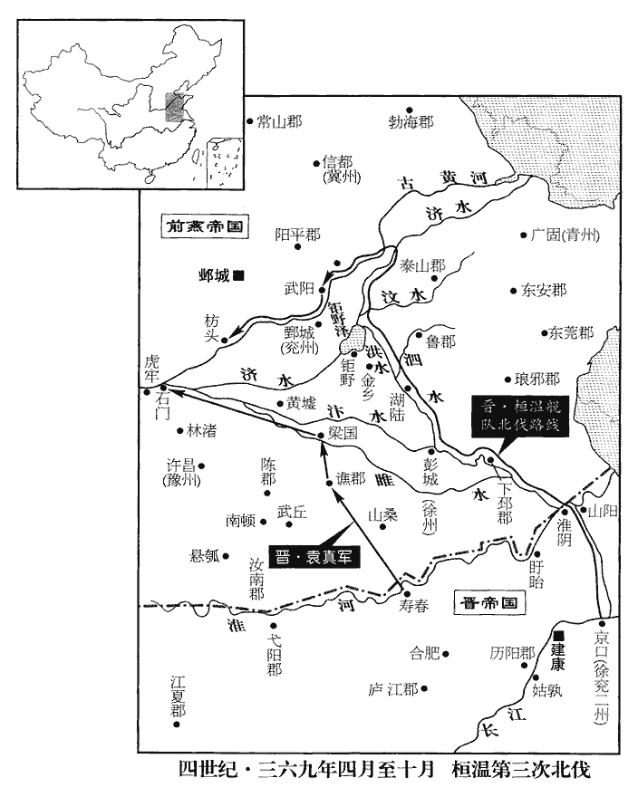
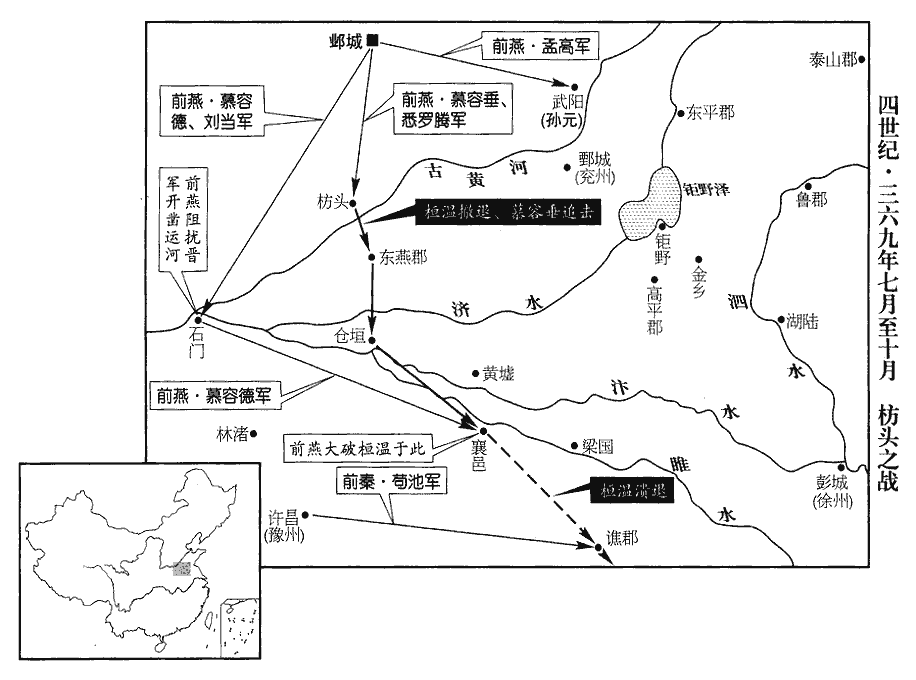
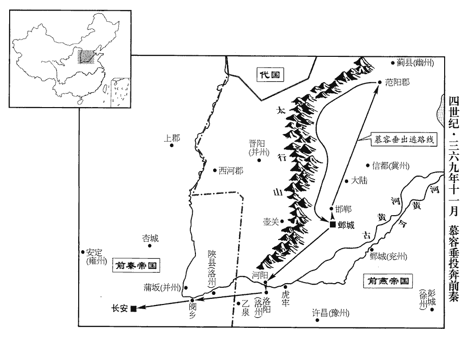
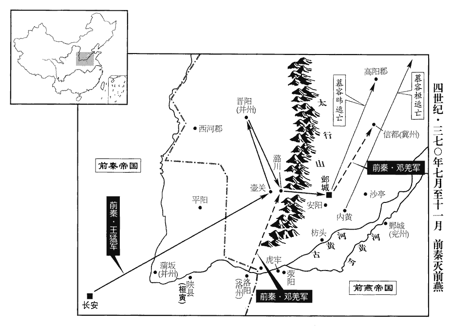
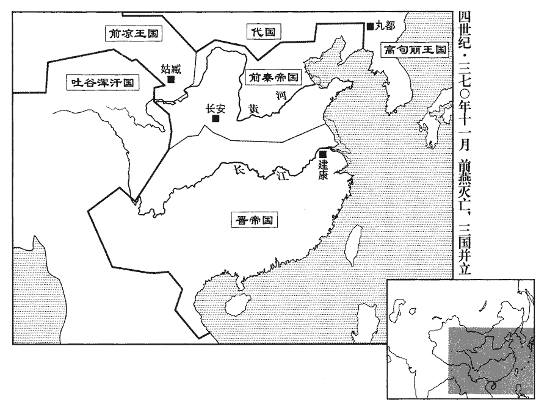

 晉紀二十四起屠維大荒落（己巳），盡上章敦牂（庚午），凡二年。

# 海西公下

## 太和四年（己巳、三六九）

1春，三月，大司馬溫請與徐、兗二州‹府京口，江苏镇江›刺史郗愔、江州‹府寻阳，江西九江›刺史桓沖、豫州‹府寿春，安徽寿县›刺史袁真等伐燕‹都邺，河北临漳西南邺镇›。慕容恪死，溫乃伐燕，自謂相時而動，可以制勝，豈知為慕容垂所敗哉！郗，丑之翻。愔，挹淫翻。初，愔在北府，晉都建康，以京口‹江苏镇江›為北府，歷陽為西府，姑孰為南州。溫常云：「京口酒可飲，兵可用。」京口兵可用，蓋山川風氣然也，豈必至謝玄用之而後敵人知畏哉！深不欲愔居之；而愔暗於事機，乃遺溫牋，遺，于季翻。欲共獎王室，請督所部出河上。愔子超為溫參軍，取視，寸寸毀裂；乃更作愔牋，更，工衡翻。自陳非將帥才，不堪軍旅，將，即亮翻。帥，所類翻。老病，乞閒地自養，勸溫并領己所統。溫得牋大喜，即轉愔冠軍將軍、會稽‹绍兴›內史。冠，古玩翻。會稽為王國，改太守為內史。會，工外翻。溫自領徐、兗二州刺史。夏，四月，庚戌‹一›，溫帥步騎五萬發姑孰‹安徽当涂›。帥，讀曰率。騎，奇寄翻。

〖译文〗 [1]春季，三月，大司马桓温请求与徐兖二州刺史郗、江州刺史桓冲、豫州刺史袁真等讨伐前燕。当初，郗在京口的北府时，桓温经常说：“京口酒可饮，兵可用。”对郗身居北府深为不满。而郗却不识时务，还给桓温写去信，想要共同辅佐王室，请求督领自己的部队渡越黄可北上。郗的儿子郗超是桓温的参军，拿来信看过后，便把信撕碎，重新改写了一封，信中诉说自己不是将帅之才，不能胜任军旅重任，而且年老多病，请求找一个悠闲的地方休养，劝说桓温把郗自己的部队一并统领。桓温见信后大喜过望，当即把郗调任为冠军将军、会稽内史。桓温自己兼任徐、兖二州刺史。夏季，四月，庚戌（初一），桓温率领步、骑兵五万人从姑孰出发。

2甲子‹十五›，燕主暐‹本年二十岁›立皇后可足渾氏，太后從弟尚書令豫章公翼之女也。從，才用翻。

〖译文〗 [2]甲子（十五日），前燕国主慕容立可足浑氏为皇后，她是太后的堂弟尚书令豫章公可足浑翼的女儿。

3大司馬溫自兗州‹江苏中部›伐燕。郗超曰：「道遠，汴水又淺，兵亂之餘，汴水填淤，未嘗有人浚治，故淺。汴，皮變翻。恐漕運難通。」溫不從。六月，辛丑，溫至金鄉‹山东金乡北›，金鄉縣，後漢屬山陽郡，晉屬高平郡，隋屬濟陰郡，唐屬兗州，我宋屬濟州，縣在州東南九十里。天旱，水道絕，溫使冠軍將軍毛虎生鑿鉅野‹山东巨野›三百里，引汶水會于清水。班固地理志，汶水出泰山萊蕪縣西南，入濟。水經註：濟水東北入鉅野，其故瀆又東北右合洪水；洪水上承鉅野薛訓渚，謂之桓公瀆，濟自是北注。杜佑曰：濟水，因王莽末渠涸不復截河過，今東平、濟南、淄川、北海界中有水流入海，謂之清河，實菏澤、汶水合流，亦曰濟河，蓋因舊名，非濟水也。汶，音問。虎生，寶之子也。毛寶預有平蘇峻之功。註又見前。溫引舟師自清水入河，舳艫數百里。舳zhú，音逐。艫，音盧。郗超曰：「清水入河，難以通運。自清水入河，皆是泝流，又道里回遠，故言難以通運。若寇不戰，運道又絕，因敵為資，復無所得，復，扶又翻。此危道也。不若盡舉見眾直趨鄴城，見，賢遍翻。趨，七喻翻。彼畏公威名，必望風逃潰，北歸遼、碣。碣，音竭。若能出戰，則事可立決。若欲城鄴而守之，則當此盛夏，難為功力，百姓布野，盡為官有，易水以南必交臂請命矣。但恐明公以此計輕銳，勝負難必，欲務持重，則莫若頓兵河、濟，濟，子禮翻。控引漕運，俟資儲充備，至來夏乃進兵；雖如賒遲，賒，遠也。然期於成功而已。捨此二策而連軍北上，上，時掌翻。進不速決，退必愆乏。愆qiān，差爽也。乏，匱竭也。此言糧運。賊因此勢以日月相引，漸及秋冬，水更澀滯。澀，色立翻。且北土早寒，三軍裘褐者少，少，詩沼翻。恐於時所憂，非獨無食而已。」溫又不從。郗超之謀略，豈常人所及哉，宜桓溫重之也。重之而不從其計者，直趨鄴城，決勝負於一戰，溫所不敢；頓兵河、濟以待來年，使燕得為備，溫亦不為也。

〖译文〗 [3]大司马桓温从兖州出发讨伐前燕。郗超说：“路途遥远，汴水又浅，恐怕运送粮食的水道难以畅通。”桓温没有听从。六月，辛丑（疑误），桓温抵达金乡，因为天旱，水路断绝，桓温让冠军将军毛虎生在钜野开凿三百里水路，引来汶水会合于清水。毛虎生是毛宝的儿子。桓温带领水军从清水进入黄河，船只绵延数百里。郗超说：“从清水进入黄河，运输难以畅通。如果敌人不与我们交战，运输通道又断绝，只能靠着敌人的积蓄来作给养，那又会一无所得，这是危险的办法。不如让现有部队全部径直开向邺城，他们害怕您的威赫名声，一定会闻风溃逃，北归辽东、碣石。如果他们能出来迎战，那么事情就可以立见分晓。如果他们想盘踞邺城固守，那么值此盛夏之时，难以进行行动，百姓遍布各地，全都为官府所控制，易水以南的人一定会恭敬地向我们请求指令。只是怕明公您认为此计虽说锋锐但欠稳妥，胜负难定，而想一定要持有万全之策，那就不如停兵于黄河、济水，控制水路运输，等到储备充足，到明年夏天再进军。虽说拖延了时间，然而这只是期望必定成功而已。舍此二策而让绵延百里的军队北上，进不能迅速取胜，退则必然导致差错与粮晌匮乏。敌人顺应这种形势和我们周旋时日，渐渐地就到了秋冬季节，水路更加难以畅通。而且北方寒冷较早，三军将士穿皮衣冬装的很少，恐怕到那时所忧虑的，就不仅仅是没有粮食了。”桓温又没有听从。

溫遣建威將軍檀玄攻湖陸‹山东鱼台东南›，拔之，湖陸縣，前漢曰湖陵，屬山陽郡，章帝更名湖陸；晉分屬高平郡。賢曰：湖陸故城在今兗州方與縣東南。獲燕寧東將軍慕容忠。燕主暐以下邳王厲為征討大都督，帥步騎二萬逆戰于黃墟‹河南兰考境›，水經註：陳留小黃縣有黃鄉。杜預曰：外黃縣東有黃城，兵亂之後，城邑丘墟，故曰黃墟。帥，讀曰率。騎，奇寄翻。厲兵大敗，單馬奔還。高平‹山东金乡西北昌邑镇›太守徐翻舉郡來降。前鋒鄧遐、朱序敗燕將傅顏於林渚‹河南新郑境›。水經註：華水東逕棐fěi城北，即北林亭也。春秋諸侯會于棐林以救鄭，遇于北林。按林鄉故城在新鄭北；又有白鴈陂，在長社東北，林鄉西南。敗，補邁翻。暐復遣樂安王臧統諸軍拒溫，復，扶又翻。臧不能抗，乃遣散騎常侍李鳳求救于秦。散，悉亶翻。騎，奇寄翻。

〖译文〗 桓温派建威将军檀玄攻打湖陆，攻了下来，擒获了前燕宁东将军慕容忠。前燕国主慕容任命下邳王慕容历为征讨大都督，率领二万步、骑兵在黄墟迎战，慕容厉的部队大败，他本人只身匹马逃了回去。高平太守徐翻带领全郡向东晋投降。前锋邓遐、朱序在林渚打败了前燕将领傅颜。慕容又派乐安王慕容臧统领众军抵抗桓温，慕容臧抵抗不住，就派散骑常侍李凤去向前秦求救。

 

秋，七月，溫屯武陽‹山东莘县南›，此東武陽也，漢屬東郡，魏、晉屬陽平郡，唐改曰朝城縣、屬魏州。燕故兗州刺史孫元帥其族黨起兵應溫，溫至枋頭‹河南淇县东南淇门渡›。帥，讀曰率。枋，音方。暐及太傅評大懼，謀奔和龍‹辽宁朝阳›。吳王垂曰：「臣請擊之；若其不捷，走未晚也。」暐乃以垂代樂安王臧為使持節、南討大都督，使，疏吏翻。帥征南將軍范陽王德等眾五萬以拒溫。垂表司徒左長史申胤、黃門侍郎封孚、尚書郎悉羅騰皆從軍。悉羅騰，蓋夷人，以部落為氏，如魏書官氏志所載，神元時餘部諸姓內入者叱羅氏、如羅氏之類。胤，鍾之子；孚，放之子也。申鍾見九十五卷成帝咸和九年。封放見九十九卷穆帝永和七年。

〖译文〗 秋季，七月，桓温驻扎在武阳，前燕过去的兖州刺史孙元率领他的亲族同党起兵响应桓温，桓温抵达枋头。慕容及太傅慕容评十分恐惧，谋划要逃奔到和龙。吴王慕容垂说：“我请求去攻打他们。如果不能取胜，再逃奔也不晚。”慕容于是任命慕容垂代替乐安王慕容臧为使持节、南讨大都督，率领征南将军范阳王慕容德等兵众五万人去抵御桓温。慕容垂上表，让司徒左长史申胤、黄门侍郎封孚、尚书郎悉罗腾全都跟随部队一同前往。申胤是申钟的儿子；封孚是封放的儿子。

暐又遣散騎侍郎樂嵩請救于秦，許賂以虎牢‹河南荥阳西北汜水镇›以西之地。秦王堅‹本年三十二岁›引群臣議于東堂，皆曰：「昔桓溫伐我，至灞上‹西安东灞河畔›，見九十九卷永和十年。燕不救我；今溫伐燕，我何救焉！且燕不稱藩於我，我何為救之！」王猛密言於堅曰：「燕雖強大，慕容評非溫敵也。若溫舉山東，進屯洛邑‹洛阳东白马寺东›，收幽、冀之兵，引并、豫之粟，觀兵崤、澠，澠，彌兗翻。則陛下大事去矣。今不如與燕合兵以退溫；溫退，燕亦病矣，然後我承其弊而取之，不亦善乎！」王猛之取李儼，其計亦出此堅從之。八月，遣將軍苟池、洛州刺史鄧羌帥步騎二萬以救燕，出自洛陽‹洛阳东白马寺东›，軍至潁川；潁川郡，治許昌‹河南許昌东›。又遣散騎侍郎姜撫報使于燕。使，疏吏翻。以王猛為尚書令。

〖译文〗 慕容又派散骑侍郎乐嵩去前秦请求救援，许诺把虎牢以西的地域送给他们。前秦王苻坚召郡臣到东堂商议，群臣们都说：“过去桓温讨伐我们，到达灞上，燕国不救援我们；如今桓温讨伐燕国，我们为什么要救援！而且燕国不向我们称藩，我们为什么要去救他！”王猛悄悄地对苻坚进言说：“燕国虽然强大，但慕容评不是桓温的对手。如果桓温占据了整个崤山以东地区，进军驻扎在洛邑，收揽幽州、冀州的兵力，调来并州、豫州的粮食，在崤谷、渑池炫耀兵威，那么陛下统一天下的大业就全完了。眼下不如与燕国汇合兵力来打退桓温。桓温撤退以后，燕国也就精疲力竭了，然后我们乘着他的疲惫而攻取他，不是很好的事情吗！”苻坚听从了王猛的意见。八月，苻坚派将军苟池、洛州刺史邓羌率领步、骑兵二万人去救援前燕，从洛阳出发，到颍川后驻扎。又派散骑侍郎姜抚出使前燕报告。任命王猛为尚书令。

太子太傅封孚問於申胤曰：「溫眾強士整，乘流直進，今大軍徒逡巡高岸，兵不接刃，未見克殄之理，事將何如?」胤曰：「以溫今日聲勢，似能有為，然在吾觀之，必無成功。何則?晉室衰弱，溫專制其國，晉之朝臣未必皆與之同心。朝，直遙翻。故溫之得志，眾所不願也，必將乖阻以敗其事。乖，異也。阻，隔也。敗，補邁翻。又，溫驕而恃眾，怯於應變。大眾深入，值可乘之會，反更逍遙中流，不出赴利，欲望持久，坐取全勝；溫之為計正如此，申胤料之審矣。若糧廩愆懸，情見勢屈，必不戰自敗，此自然之數。」溫攻秦而不渡霸水，攻燕而徘徊枋頭，人皆咎其不進，知彼知己，溫蓋臨敵而方有見乎此也。溫之智雖不足以禁暴定功，然其去眾人亦遠矣。愆，謂糧運失期不至。懸，絕也。見，賢遍翻。

〖译文〗 太子太傅封孚问申胤说：“桓温兵众强壮整齐，顺流直下，如今大军只在高岸上徘徊，兵不交锋，看不到取胜的迹象，事情将会怎样呢？”申胤说：“以桓温今天的声势，似乎能有所作为，然而在我看来，肯定不会成就功业。为什么呢？晋室衰微软弱，桓温专擅国家的权力，晋王室的朝臣未必都与他同心同德。所以桓温的得志，是众人所不愿看到的，他们必将从中阻挠以败坏他的事业。再有，桓温倚仗着军队人数众多而骄傲，不善于应变。大军深入以后，正值有机可乘的时候，他反而让部队在中途徘徊，不出击争取胜利，指望相持下去，坐取全胜。如果运输误期，粮食断绝，衰落的威势就会如实地显露出来，肯定是不战自败，这是当然之理。”

溫以燕降人段思為鄉導，降，戶江翻。鄉，讀曰嚮。悉羅騰與溫戰，生擒思；溫使故趙將李述徇趙、魏，騰又與虎賁中郎將染干津擊斬之；染干，亦夷姓，如悉羅之類。溫軍奪氣。

〖译文〗 桓温让前燕投降过来的人段思作向导，悉罗腾与桓温交战，活捉了段思。桓温让赵国的旧将李述带兵巡行过去的赵、魏之地，悉罗腾又与虎贲中郎将染干津攻击并斩杀了他。桓温军队的士气低落。

初，溫使豫州刺史袁真攻譙‹安徽亳州›、梁‹河南商丘›，開石門以通水運，真克譙、梁而不能開石門‹河南省荥阳县北›，譙、梁，譙郡及梁國也。水運路塞。塞，悉則翻。

〖译文〗 当初，桓温让豫州刺史袁真攻打谯郡、梁国，开辟石门以使水运之路畅通，袁真攻克了谯郡、梁国，但没能开通石门，水运之路堵塞。

九月，燕范陽王德帥騎一萬、蘭臺【章：十二行本「臺」下有「治書」二字；乙十一行本同；退齋校同。】侍御史劉當帥騎五千屯石門，豫州刺史李邽帥州兵五千斷溫糧道。燕豫州刺史治許昌。斷，丁管翻。當，佩之子也。劉佩為慕容皝將，卻石虎，攻宇文，皆有功。德使將軍慕容宙帥騎一千為前鋒，與晉兵遇，宙曰：「晉人輕剽，剽，匹妙翻；急也。怯於陷敵，勇於乘退，宜設餌以釣之。」乃使二百騎挑戰，挑，徒了翻。分餘騎為三伏。挑戰者兵未交而走，晉兵追之，宙帥伏以擊之，晉兵死者甚眾。

〖译文〗 九月，前燕范阳王慕容德率领骑兵一万人、兰台侍御史刘当率领骑兵五千人驻扎在石门，豫州刺史李率领本州士兵五千为截断桓温运粮的通道。刘当是刘佩的儿子。慕容德派将军慕容宙率领骑兵一千人作为前锋，与东晋的军队相遇，慕容宙说：“晋人轻浮急躁，害怕攻入敌阵，勇于乘退追击，应该设诱饵以使他们上钩。”于是就让二百骑兵前去挑战，其他骑兵则分别埋伏在三处。去挑战的骑兵未交战就退逃，晋兵追击，慕容宙率领埋伏的骑兵展开攻击，晋兵战死的很多。

溫戰數不利，糧儲復竭，數，所角翻。復，扶又翻；下同。又聞秦兵將至，丙申‹十九›，焚舟，棄輜重、鎧仗，重，直用翻。自陸道奔還。以毛虎生督東燕等四郡諸軍事，領東燕‹河南延津东北›太守。沈約曰：東燕郡，江左分濮陽所立也。余按石虎分東燕郡屬洛州，則是郡蓋祖逖在豫州時所置也。燕，於賢翻。

〖译文〗 桓温交战屡屡失利，粮食储备又已空竭，又听说前秦的军队将要到来，丙申（十九日），焚烧了舟船，丢弃了装备、武器，从陆路向回逃奔。任命毛虎生督察东燕等四郡的各种军务，兼任东燕太守。

 

溫自東燕出倉垣‹河南开封东北›，鑿井而飲，汴水、濟瀆皆自北而南，恐追兵毒其上流，故鑿井而飲。行七百餘里。燕之諸將爭欲追之，吳王垂曰：「不可，溫初退惶恐，必嚴設警備，簡精銳為後拒，擊之未必得志，不如緩之。彼幸吾未至，必晝夜疾趨，俟其士眾力盡氣衰，然後擊之，無不克矣。」乃帥八千騎徐行躡其後。溫果兼道而進。數日，垂告諸將曰：「溫可擊矣。」乃急追之，及溫於襄邑‹河南睢县›。襄邑縣，自漢以來屬陳留郡。范陽王德先帥勁騎四千伏於襄邑東澗中，與垂夾擊溫，大破之，斬首三萬級。秦苟池邀擊溫於譙‹安徽亳州›，又破之，死者復以萬計。孫元遂據武陽‹山东莘县南›以拒燕，燕左衛將軍孟高討擒之。

〖译文〗 桓温从东燕出了仓垣，一路上掘井饮水，走了七百多里。前燕的众将领都争着要追击桓温，吴王慕容垂说：“不行，桓温刚刚溃退，惊恐未定，一定会严加戒备，选择精锐士兵来殿后，攻击他未必能遂愿，不如暂缓一下。他庆幸我们没有追上，一定会昼夜急行，等他的士兵们力量耗尽，士气衰落，然后再去攻击他，攻无不克。”于是慕容垂就率领八千骑兵跟在桓温的后边慢慢前进。桓温果然兼程行进。过了几天，慕容垂告诉众将领说：“可以攻打桓温了。”于是就迅速追击，在襄邑追上了桓温。范阳王慕容德先率领精锐骑兵四千人埋伏在襄邑东面的山涧中，与慕容垂夹击桓温，桓温大败，被斩首三万多人。前秦人苟池在谯郡迎击桓温，又攻破了他，战死的兵众又数以万计。孙元乘机占据了武阳以与前燕抵抗，前燕左卫将军孟高讨伐并擒获了他。

冬，十月，己巳‹二十二›，大司馬溫收散卒，屯于山陽‹江苏淮安›。劉昫曰：山陽，漢射陽縣地；晉置山陽郡，改為山陽縣，唐為楚州治所。溫深恥喪敗，喪，息浪翻。乃歸罪於袁真，以石門不開、糧運不繼為真罪。奏免真為庶人；又免冠軍將軍鄧遐官。冠，古玩翻。真以溫誣己，不服，表溫罪狀；朝廷不報。真遂據壽春‹安徽寿县›叛降燕，且請救；亦遣使如秦。降，戶江翻。使，疏吏翻；下同。溫以毛虎生領淮南太守，守歷陽‹安徽和县›。淮南太守本治壽春，壽春既叛，以虎生領淮南而守歷陽。歷陽本淮南屬縣，虎生守之，外以備壽春，內以衛江南。

〖译文〗 冬季，十月，乙巳（二十二日），大司马桓温收拢溃散的士兵，驻扎在山阳。桓温对遭受失败深感耻辱，于是就把罪过归咎于袁真，奏请黜免袁真为庶人，还奏请罢免冠军将军邓遐的官职。袁真认为桓温诬陷自己，不服，于是就进上表章陈述桓温的罪行。朝廷没有回音。袁真于是便占据寿春反叛，投降了前燕，而且请求前燕救援，也派遣使者去到了前秦。桓温任命毛虎生兼任淮南太守，戌守历阳。

4燕、秦既結好，好，呼到翻。使者數往來。數，所角翻。燕散騎侍郎【章：十二行本「郎」下有「太原」二字；乙十一行本同；孔本同；張校同。】郝晷、給事黃門侍郎梁琛相繼如秦。琛，丑林翻。晷與王猛有舊，猛接以平生，問以東方之事。晷見燕政不脩而秦大治，治，直吏翻。【章：十二行本「治」下有「知燕將亡」四字；乙十一行本同；孔本同；張校同；退齋校同。】陰欲自託於猛，頗泄其實。

〖译文〗 [4]前燕、前秦缔结友好关系后，使者便频繁往来。前燕散骑侍郎郝晷、给事黄门侍郎梁琛相继到前秦。郝晷与王猛有旧交，王猛和他叙说往事，向他询问东边的事情。郝晷看到前燕朝政混乱而前秦天下大治，暗中想依附于王猛，于是便泄露了很多实情。

琛至長安，秦王堅方畋於萬年‹陕西临潼东北›，萬年，秦之櫟陽，漢高帝更名，屬馮翊，晉屬京兆。欲引見琛，見，賢遍翻。琛曰：「秦使至燕，燕之君臣朝服備禮，灑掃宮庭，朝，直遙翻。灑，所賣翻，又如字。掃，所報翻，又如字。然後敢見。今秦王欲野見之，使臣不敢聞命！」尚書郎辛勁謂琛曰：「賓客入境，惟主人所以處之，君焉得專制其禮！且天子稱乘輿，處，昌呂翻。焉，於虔翻。乘，繩證翻。所至曰行在所，何常居之有！又，春秋亦有遇禮，春秋：隱四年，公‹姬息姑›及宋公‹子与夷›遇于清‹山东省东阿县南›。公羊傳曰：遇者何?不期也。杜預曰：遇者，草次之期，二國各簡其禮，若道路相逢遇也。何為不可乎！」琛曰：「晉室不綱，靈祚歸德，靈祚，猶班彪王命論所謂神明之祚也。二方承運，俱受明命。而桓溫猖狂，闚我王略，左傳：侵敗王略。杜預註曰：略，經略法度。余謂此略，封略也，如左傳「王與之武公之略」之略。燕危秦孤，勢不獨立，是以秦主同恤時患，要結好援。要，一遙翻。好，呼到翻；下同。東朝君臣，引領西望，愧其不競，以為鄰憂，競，強也。朝，直遙翻；下同。西使之辱，敬待有加。今強寇既退，交聘方始，謂宜崇禮篤義以固二國之歡；若忽慢使臣，是卑燕也，豈脩好之義乎！夫天子以四海為家，故行曰乘輿，止曰行在。今海縣分裂，騶衍曰：中國有赤縣神州，赤縣神州內有九州，禹所敘九州是也；其外有裨海環之。海縣之說，蓋本諸此。天光分曜，安得以乘輿、行在為言哉！禮，不期而見曰遇；蓋因事權行，其禮簡略，豈平居容與之所為哉！客使單行，誠勢屈於主人；然苟不以禮，亦不敢從也。」堅乃為之設行宮，為，于偽翻。百僚陪位，然後延客，如燕朝之儀。

〖译文〗 梁琛抵达长安，前秦王苻坚正在万年打猎，要把梁琛带到这里见面。梁琛说：“秦国的使者到了燕国，燕国的君主臣下都穿好朝服，备好礼仪，打扫干净宫庭，然后才敢见面。如今秦王要在郊野会见我，使臣不敢听命！”尚书郎辛劲对梁琛说：“宾客入境，只能是客随主便，你怎么能专断别人的礼仪呢！况且天子称为乘舆，所到的地方叫行在所，哪里有固定的居所呢！再有，《春秋》当中也有路途相遇的礼节，又有什么不可以的呢！”梁琛说：“晋室纲纪混乱，神明的赐福归于有道，秦、燕二国继承天运，全都接受了神明的赐命。然而桓温猖狂无忌，窥视我们的王土，如果燕国遭受危险，秦国必然孤立，势必难以独立于世，所以秦国的主上和我们一样对时患感到忧虑，相邀结为友好，互相支援。我们燕国的君主臣下，翘首西望，深为燕国软弱、给邻国带来忧虑而惭愧，秦国的使臣前来辱见，我们都十分尊敬地对待他。如今强敌已经后退，我们的交往刚刚开始，照我看应该崇尚礼仪，笃行大义，以加强两国的友好关系。如果忽视慢待使臣，就是看不起燕国，这难道是友好的象征吗？天子以四海为家，所以天子出行叫乘舆，停留叫行在。如今天下分裂，天光分照二国，怎么能以乘舆、行在作为托辞呢！根据礼制，事先没有约定而偶然相见称为遇。因为这是顺便行事，所以礼节简略，难道是平常闲居在家时所应该遵奉的吗！使者只身单行，威势确实低于主人，但是假若不以礼相待，也不敢从命。”于是，苻坚就为梁琛设置行宫，让众多的官吏奉陪，然后才请客人前来，就像前燕的礼仪一样。

事畢，堅與之私宴，倣古私覿dí之禮也。問：「東朝名臣為誰?」琛曰：「太傅上庸王評，明德茂親，光輔王室；車騎大將軍吳王垂，雄略冠世，冠，古玩翻。折衝禦侮：其餘或以文進，或以武用，官皆稱職，稱，尺證翻。野無遺賢。」

〖译文〗 事情结束以后，苻坚又为梁琛摆设私宴，问道：“燕国以贤能著称的臣下是谁？”梁琛说：“太傅上庸王慕容评，是有完美德性与才能的亲属，光大、辅佐王室；车骑大将军吴王慕容垂，勇武和谋略冠世，抗击敌人抵御外侮；其他人有的以文才进身，有的以武略被用，官吏全都称职，民间没有被遗漏的贤能人才。”

琛從兄奕為秦尚書郎，從，才用翻。堅使典客，館琛於奕舍。漢有典客之官，後改為大鴻臚。此特臨時使之典客耳。館，音貫；下果館同。琛曰：「昔諸葛瑾為吳聘蜀，與諸葛亮惟公朝相見，退無私面，瑾、亮兄弟也。為，于偽翻。余竊慕之。今使之即安私室，所不敢也。」乃不果館。奕數來就邸舍與琛臥起，閒問琛東國事，數，所角翻，閒，古莧翻。琛曰：「今二方分據，兄弟並蒙榮寵，論其本心，各有所在。琛欲言東國之美，恐非西國之所欲聞；燕在關東，秦在關西，二方分據，故謂燕為東國，秦為西國。欲言其惡，又非使臣之所得論也。使，疏吏翻。兄何用問為！」

〖译文〗 梁琛的堂哥梁奕是前秦的尚书郎，苻坚让他主管接待来客，他让梁琛住在梁奕的馆舍里。梁琛说：“过去诸葛瑾为吴国出使蜀国，与诸葛亮只在办公事的朝堂上见面，退下朝堂后就没有个人的接触，我私下里对此非常敬慕。如今我出使秦国就把我安置在私人的馆舍居住，这是我所不敢接受的。”于是就没有居住。梁奕多次来到梁琛居住的馆舍，与梁琛共同起居，间或也向他询问前燕的事情。梁琛说：“如今秦、燕二国分据，你我则同时在二国蒙受荣誉和宠信，然而要论本心，则各有向往。梁琛我想说燕国的好处，恐怕不是秦国人所想听的；你想让我说燕国的坏处，又不是使臣所应该说的。哥哥你还用得着问我吗？”

堅使太子延琛相見。秦人欲使琛拜太子，先諷之曰：「鄰國之君，猶其君也；鄰國之儲君，亦何以異乎！」琛曰：「天子之子視元士，欲其由賤以登貴也。禮記郊特牲曰：天子之元子，士也，天下無生而貴者也。尚不敢臣其父之臣，況他國之臣乎！苟無純敬，則禮有往來，情豈忘恭，但恐降屈為煩耳。」言當答拜也。乃不果拜。

〖译文〗 苻坚派太子去邀请梁琛见面。前秦人想让梁琛对太子行拜礼，事先含蓄地暗示他说：“邻国的君主，就像自己的君主一样；邻国的太子，又有什么不同呢！”梁琛说：“天子的儿子被视同于一般士人，希望他能由低贱进升到高贵。他自己尚且不敢以他父亲的臣下作为臣下，何况是别国的臣下呢！假如是真诚的恭敬，则礼尚往来，内心岂能忘记恭敬，只是怕屈身降格惹出许多麻烦来。”梁琛最终也没有对太子行拜礼。

王猛劝坚留琛，坚不许。

〖译文〗 王猛劝苻坚留下梁琛，苻坚没有同意。

5燕主暐遣大鴻臚溫統拜袁真使持節、都督淮南諸軍事、征南大將軍、揚州刺史，封宣城公。臚，陵如翻。使，疏吏翻。統未踰淮而卒。

〖译文〗 [5]前燕国主慕容派大鸿胪温统授予袁真使持节、都督淮南诸军事、征南大将军、扬州刺史，封为宣城公。结果温统没过淮河就死了。

6吳王垂自襄邑‹河南睢县›還鄴，威名益振，太傅評愈忌之。垂奏「所募將士忘身立効，將軍孫蓋等椎鋒陷陳，立効，句絕。椎，擣也，直擣其鋒也。應蒙殊賞。」評皆抑而不行。垂數以為言，與評廷爭，怨隙愈深。數，所角翻。爭，讀如字。太后可足渾氏素惡垂，事見一百卷穆帝升平元年。惡，烏路翻。毀其戰功，與評密謀誅之。太宰恪之子楷及垂舅蘭建知之，以告垂曰：「先發制人兵法曰：先發制人，後發者人制之。但除評及樂安王臧，餘無能為矣。」垂曰：「骨肉相殘而首亂於國，吾有死而已，不忍為也。」頃之，二人又以告，曰：「內意已決，內意，謂可足渾后之意也。不可不早發。」垂曰：「必不可彌縫，吾寧避之於外，餘非所議。」

〖译文〗 [6]吴王慕容垂从襄邑返回邺城，威武的名声越发高涨，太傅慕容评也更加忌恨他。慕容垂上奏章说：“所招募的将士舍生忘死，建立战功，将军孙盖等人冲锋陷阵，应该受到特殊的奖赏。”慕容评全都压着不办。慕容垂多次陈说，与慕容评在朝廷争论，结果二人的怨恨隔阂更加深重。太后可足浑氏历来厌恶慕容垂，诋毁他的战功，与慕容评密谋要杀掉他。太宰慕容恪的儿子慕容楷以及慕容垂的舅舅兰建知道此事，便告诉了慕容垂，并说：“先发制人，只要除掉慕容评及乐安王慕容臧，其他的人就无能为力了。”慕容垂说：“骨肉互相残杀而带头在国家作乱，我只有一死而已，不忍心那样干。”过了不久，这俩人又来报告，说：“可足浑氏已经下了决心，不能不早动手了。”慕容垂说：“如果一定不能消除隔阂的话，我宁愿到外边去躲避他们，其余的不是所要商议的。”

垂內以為憂，而未敢告諸子。世子令請曰：「尊比者如有憂色，令呼其父曰尊。比，毗至翻。豈非以主上‹慕容暐，时年二十岁›幼沖，太傅疾賢，功高望重，愈見猜邪?」垂曰：「然。吾竭力致命以破強寇，本欲保全家國，豈知功成之後，返令身無所容。汝既知吾心，何以為吾謀?」令曰：「主上闇弱，委任太傅，一旦禍發，疾於駭機。機，弩牙也。譬之彀gòu弩，不虞而機先發，使人震駭，故曰駭機。今欲保族全身，不失大義，莫若逃之龍城‹辽宁朝阳›，遜辭謝罪，以待主上之察，若周公之居東，庶幾感寤而得還，此幸之大者也。書：武王有疾，周公冊祝于太王、王季、文王，請以身代。武王既喪，管叔及其群弟流言曰：「公將不利於孺子。」周公東征之。周公居東二年，則罪人斯得，乃為詩以詒yí王，名之曰鴟鴞；王亦未敢誚qiào公。天大雷電以風，王啟金縢téng，得周公代武王之說，乃執書以泣，迎周公而歸。幾，居希翻。如其不然，則內撫燕、代，外懷群夷，守肥如‹河北迁西县北盧龍塞›之險以自保，亦其次也。」肥如之險，即盧龍之塞也。垂曰：「善！」

〖译文〗 慕容垂内心里十分忧虑，而又没敢告诉儿子们。长子慕容令恭敬地问道：“您近来好像面有忧色，难道不是因为主上年幼，太傅妒忌贤能，您功高望重，越来越被猜忌吗？”慕容垂说：“是这样。我竭尽全力，不惜生命打败了强敌，本来是想保全宗族与国家，岂知功业成就以后，反而使得自己无容身之处。你既然了解我的心思，将怎样为我谋划？”慕容令说：“主上昏庸而懦弱，将重任交给太傅，一旦灾祸发生，就会苦于猝不及防。如今想要保全宗族与自身，又不失大义，不如逃到龙城，以恭顺的言辞谢罪，等待主上的明察，就像当年周公居东一样，也许主上能够有所感而觉悟，使您得以返还，如能这样，则是大幸。如果主上不这样做，您则可以对内安抚燕、代之地，对外怀柔群夷部族，坚守肥如之险以自我保全，这也是等而次之的办法。”慕容垂说：“好！”

十一月，辛亥朔‹一›，垂請畋于大陸‹河北隆尧东›，續漢志曰：鉅鹿，故大鹿，有大陸澤，即廣阿澤。因微服出鄴，將趨龍城；至邯鄲‹河北邯郸›，趨，七喻翻。邯鄲縣，漢屬趙國，本趙都也；晉屬廣平郡，東魏廢，隋復置，唐屬磁州。邯鄲，音寒丹。少子麟，素不為垂所愛，逃還告狀，少，詩照翻。垂左右多亡叛。太傅評白燕主暐，遣西平公強帥精騎追之，帥，讀曰率。騎，奇寄翻；下同。及於范陽‹河北涿州›；世子令斷後，斷，丁管翻。強不敢逼。會日暮，令謂垂曰：「本欲保東都以自全，燕既都鄴，謂龍城為東都。今事已泄，謀不及設；秦主方招延英傑，不如往歸之。」垂曰：「今日之計，舍此安之！」舍，讀曰捨。乃散騎滅迹，傍南山復還鄴，傍，步浪翻。自范陽傍南山，蓋由中山、常山山谷間南還也。隱于趙之顯原陵。顯原陵，趙主石虎虛葬處。俄有獵者數百騎四面而來，抗之則不能敵，逃之則無路，不知所為。會獵者鷹皆飛颺，眾騎散去，降，戶章翻。垂乃殺白馬以祭天，且盟從者。從，才用翻。

〖译文〗 十一月，辛亥朔（疑误），慕容垂请求到大陆打猎，因此换上便装出了邺城，准备到龙城去。到达邯郸后，小儿子慕容麟因为慕容垂平时不喜欢他，跑回去告了状，慕容垂周围的人大多都逃跑背叛。太傅慕容评把此事告诉了前燕国主慕容，并派西平公慕容强率领精锐骑兵追赶，到范阳后追了上去。长子慕容令在慕容垂后面掩护，所以慕容强也不敢逼近。这时正好太阳落山，慕容令对慕容垂说：“本来想守住东都龙城以自我保全，如今事情已经泄露，计谋来不及实施了。前秦国主正在广招英杰，不如前去归附他。”慕容垂说：“如今来谋划，舍此还能去哪里呢！”于是他们就遣散骑兵，消灭痕迹，沿着南山又返回了邺城，隐藏在后赵主石虎的显原陵。不一会儿，有数百名骑着马打猎的人从四面奔来。抵抗，显然无法匹敌；逃跑，又无路可走，不知道该怎么办。恰好这时打猎人捕猎的老鹰全都飞走了，骑马打猎的人们也就散走了。慕容垂于是便杀掉了白马以祭祀上天，而且和跟随他的人对天盟誓。

 

世子令言於垂曰：「太傅忌賢疾能，搆事以來，人尤忿恨。謂搆殺垂之謀也。今鄴城之中，莫知尊處，如嬰兒之思母，夷、夏同之，夏，戶雅翻。若順眾心，襲其無備，取之如指掌耳。事定之後，革弊簡能，大匡朝政，朝，直遙翻。以輔主上，安國存家，功之大者也。今日之便，誠不可失，願給騎數人，足以辦之。」垂曰：「如汝之謀，事成誠為大福，不成悔之何及！不如西奔，可以萬全。」子馬奴潛謀逃歸，殺之而行。至河陽‹河南孟县›，為津吏所禁，斬之而濟。遂自洛陽與段夫人、世子令、令弟寶、農、隆、兄子楷、舅蘭建、郎中令高弼俱奔秦‹都西安›，留妃可足渾氏於鄴。段夫人，垂前妃之女弟。可足渾妃，可足渾太后之妹也，詳見一百卷穆帝升平二年。高弼，垂之國卿。乙泉‹河南洛宁东北›戍主吳歸追及於闅wén鄉‹河南灵宝西›，乙泉戍，即魏該所保乙泉塢也，在宜陽縣西南，洛水之北原上。闅鄉在弘農湖縣。闅，音旻mín。世子令擊之而退。

〖译文〗 长子慕容令向慕容垂进言说：“太傅嫉贤妒能，自从谋划杀掉您以来，人们对他尤其愤恨。如今邺城里的民众，没有人知道您的去向，他们想念您就像婴儿想念母亲一样，夷、夏百姓全都心有此情。如果能顺应民心，乘慕容评毫无防备对他进行袭击，擒获他易如翻掌。事情成功以后，革除弊害，选拔贤能，大力整顿朝政，用以辅佐主上，安定国家，保全宗族，这是大功大德。如今这样的有利时机，实在不可丧失。愿您调给我骑兵数人，就足以办成此事。”慕容垂说：“像你这样的计谋，事情如能成功，确实是大福，如果不成，后悔怎么来得及？不如向西逃奔，可以万无一失。”慕容垂儿子的马夫暗中谋划要逃跑回去，慕容垂杀掉了他们开始西行。到河阳后，被管理渡口的官吏挡住了，慕容垂杀掉了官吏后渡过了河。于是慕容垂和段夫人、长子慕容令、慕容令的弟弟慕容宝、慕容农、慕容隆、哥哥的儿子慕容楷、舅舅兰建、郎中令高弼全都从洛阳逃奔到前秦，妃可足浑氏被留在邺城。戍卫乙泉的首领吴归追到乡，长子慕容令将他击退。

初，秦王堅聞太宰恪卒，陰有圖燕之志，憚垂威名，不敢發。及聞垂至，大喜，郊迎，執手曰：「天生賢傑，必相與共成大功，此自然之數也。要當與卿共定天下，告成岱宗，然後還卿本邦，世封幽州‹河北北部›，使卿去國不失為子之孝，歸朕不失事君之忠，不亦美乎！」垂謝曰：「羇jī旅之臣，免罪為幸；本邦之榮，非所敢望！」堅復愛世子令及慕容楷之才，復，扶又翻。皆厚禮之，賞賜鉅萬，每進見，屬目觀之。見，賢遍翻。屬，之欲翻。關中士民素聞垂父子名，皆嚮慕之。王猛言於堅曰：「慕容垂父子，譬如龍虎，非可馴之物，馴，擾也，從也，順也。豢養猛獸，使之擾狎順人之意曰馴。馴，詳遵翻。若借以風雲，將不可復制，不如早除之。」堅曰：「吾方收攬英雄以清四海，柰何殺之！且其始來，吾已推誠納之矣；匹夫猶不棄言，況萬乘乎！」乃以垂為冠軍將軍，封賓徒侯，乘，繩證翻。冠，古玩翻。賓徒，漢縣名，屬遼西郡。楷為積弩將軍。

〖译文〗 当初，前秦王苻坚听说太宰慕容恪去世，暗中怀有图谋前燕的想法，只是因为惧怕慕容垂的威武名声，才没敢发兵。等到听说慕容垂来到后，十分高兴，亲自到郊外迎接，拉着慕容垂的手说：“上天降于人世的贤杰，一定会相互携手共同成就大的功业，这是天然的气数。眼下重要的是与您共同平定天下，在泰山上告慰上天，然后把您的故国归还给您，世代封居幽州，使您离开故国不失掉作为儿子的孝顺，归依朕下也不失掉事奉君主的忠诚，不也是很好的事情吗！”慕容垂谢罪说：“寄居他人的臣下，能被免罪就是大幸，世居故国的殊荣，不是我所敢企望的！”苻坚又爱惜长子慕容令以及慕容楷的才能，全都给他们以厚重的礼遇，赏赐数万，每当他们进见，苻坚都注目端详他们。关中的士人百姓历来知道慕容垂父子的名声，全都向往倾慕他们。王猛对苻坚进言说：“慕容垂父子，就像龙虎，不是能够驯服驾驭的人，如果他们得到风云际会的机会，那将无法控制，不如尽早把他们除掉。”苻坚说：“我正要招揽各路英雄以廓清四海，为什么要杀掉他们！况且他们刚刚到来，我已经诚心诚意地接纳了他们，庶民百姓尚不食言，何况是万乘之君呢！”于是苻坚任命慕容垂为冠军将军，封为宾徒侯，任命慕容楷为积弩将军。

燕魏尹范陽王德素與垂善，及車騎從事中郎高泰，皆坐免官。垂在燕為車騎大將軍，以泰為從事中郎。尚書右丞申紹言於太傅評曰：「今吳王出奔，外口籍籍，師古曰：籍籍，猶紛紛也。宜徵王僚屬之賢者顯進之，粗可消謗。」粗，坐五翻。評曰：「誰可者?」紹曰：「高泰其領袖也。」乃以泰為尚書郎。泰，瞻之從子；高瞻見九十一卷元帝太興二年。從，才用翻。紹，胤之子【章：十二行本「子」作「兄」；乙十一行本同；退齋校同。】也。

〖译文〗 前燕魏尹范阳王慕容德平素与慕容垂关系很好，还有车骑从事中郎高泰，全都坐罪被免官。尚书右丞申绍向太傅慕容评进言说：“如今吴王出走，外边的人议论纷纷，应该征召吴王僚属中的贤明者给予破格提升，大致可以消除人们的指责。”慕容评说：“谁可以呢？”申绍说：“高泰是他们的代表。”于是任命高泰为尚书郎。高泰是高瞻的侄子；申绍是申胤的儿子。

秦留梁琛月餘，乃遣歸。琛兼程而進，程，驛程也。謂行者以二驛為程，若一程而行四驛，是兼程也。比至鄴，比，必寐翻。吳王垂已奔秦。琛言於太傅評曰：「秦人日閱軍旅，多聚糧於陝‹河南三门峡›東；陝，失冉翻。以琛觀之，為和必不能久。今吳王又往歸之，秦必有窺燕之謀，宜早為之備。」評曰：「秦豈肯受叛臣而敗和好哉！」敗，補邁翻。好，呼到翻；下同。琛曰：「今二國分據中原，常有相吞之志；桓溫之入寇，彼以計相救，非愛燕也；若燕有釁，彼豈忘其本志哉！」苻堅、王猛之為謀，梁琛固已窺見之矣。評曰：「秦主何如人?」琛曰：「明而善斷。」斷，丁亂翻。問王猛，曰：「名不虛得。」評皆不以為然。琛又以告燕主暐，暐亦不然之。以告皇甫真，真深憂之，上疏言：「苻堅雖聘問相尋，然實有窺上國之心，非能慕樂德義，不忘久要也。樂，音洛。要，一遙翻。朱熹曰：久要，舊約也。前出兵洛川，謂苟池、鄧羌救燕時也。及使者繼至，使，疏吏翻。國之險易虛實，易，以豉翻。彼皆得之矣。今吳王垂又往從之，為其謀主；伍員之禍，不可不備。伍員去楚奔吳，借吳兵以報楚入郢，事見左傳。員，音云。洛陽‹河南洛阳东白马寺东›、太原‹山西太原›、壺關‹山西长治北›，皆宜選將益兵，以防未然。」秦後伐燕之路，果如真所料。杜佑曰：潞州上黨縣，漢為壺關縣。暐召太傅評謀之，評曰：「秦國小力弱，恃我為援；且苻堅庶幾善道，言苻堅雖未能純以善道交鄰，猶庶幾焉。幾，居希翻。終不肯納叛臣之言，絕二國之好；不宜輕自驚擾以啟寇心。」卒不為備。卒，子恤翻。

〖译文〗 前秦挽留了梁琛一个多月，才让他返回。梁琛兼程赶路，等到抵达邺城时，吴王慕容垂已经出走前秦。梁琛对太傅慕容评进言说：“秦国人每天检阅军队，在陕城以东储备了许多粮食，照我看来，与他们的和好一定不会长久。如今吴王又前去归附了他们，秦国一定会有窥视燕国的打算，应该及早防备。”慕容评说：“秦国怎么肯接受背叛之臣而败坏我们的和好呢！”梁琛说：“如今二国分别占据着中原，一直有互相吞并的志向。桓温入侵的时候，他们是有自己的打算前来救援，并不是爱护燕国。如果燕国出现灾祸，他们岂能忘记本来的志向呢！”慕容评说：“秦国主是一个什么样的人？”梁琛说：“明达而且善于决断。”慕容评又问王猛如何，梁琛说：“名不虚传。”慕容评对这样的说法全都不以为然。梁琛又把这些告诉了前燕国主慕容，慕容也不以为然。又告诉了皇甫真，皇甫真对此深感忧虑，上疏说：“苻坚虽然不断派使者前来访问，但实际上却怀有窥探我国之心，他不是向往于道德大义，也不是不会忘记平时的和好之约的。由于以前他出兵洛川，以及使者的相继抵达，我们国家地形的险易，兵力的虚实，他已经都知道了。如今吴王慕容垂又前去归附，作为他的主谋，春秋时楚国的伍员带领吴国的军队攻入楚国那样的祸患，不能不防。洛阳、太原、壶关，都应该选择将领，增加兵力，以防患于未然。”慕容召来太傅慕容评商量此事，慕容评说：“秦国国小力弱，还要靠我们作为后援。而且苻坚大体上还能以友好的态度与邻国交往，最终也不会采纳叛臣的意见，断绝两国的和好。我们不应该轻举妄动，自我惊扰，以启发他们的进犯之心。”前燕最终没作防备。

秦遣黃門郎石越聘於燕，太傅評示之以奢，欲以誇燕之富盛。高泰及太傅參軍河間‹河北献县›劉靖言於評曰：「越言誕而視遠，非求好也，乃觀釁也。宜耀兵以示之，用折其謀。今乃示之以奢，益為其所輕矣。」評不從。泰遂謝病歸。

〖译文〗 前秦派黄门郎石越访问前燕，太傅慕容评向他显示自己的奢豪，想以此炫耀前燕的富裕程度。高泰以及太傅参军河间人刘靖向慕容评进言说：“石越嘴里说着荒诞之词，眼睛窥视远方，不是来寻求和好的，而是来观察祸患的。应该炫耀兵力让他看，用以挫败他的阴谋。如今却向他显示奢豪，这就更被他所轻视了。”慕容评没有听从。高泰于是就称病辞谢回去了。

是時，太后可足渾氏侵橈國政，太傅評貪昧無厭，橈náo，奴教翻，又奴巧翻。厭，於鹽翻。貪昧者，貪財昧利，不顧其害也。貨賂上流，流，水行也。水行就下，無逆而上流之理。貨賂上行，謂之上流，言其逆於常理也。上，時掌翻；下同。官非才舉，群下怨憤。尚書左丞申紹上疏，以為：「守宰者，致治之本。治，直吏翻。今之守宰，率非其人，或武臣出於行伍，或貴戚生長綺紈，既非鄉曲之選，又不更朝廷之職。守，式又翻。行，戶剛翻。長，知兩翻。更，工衡翻。加之黜陟無法，貪惰者無刑罰之懼，清修者無旌賞之勸。是以百姓困弊，寇盜充斥，綱頹紀紊，莫相糾攝。糾，督也。攝，錄也。紊，音問。又官吏猥多，踰於前世，公私紛然，不勝煩擾。勝，音升。大燕戶口，數兼二寇，以晉、秦為二寇。弓馬之勁，四方莫及；而比者戰則屢北，皆由守宰賦調不平，比，毗至翻。調，徒釣翻。侵漁無已，行留俱窘，莫肯致命故也。後宮之女四千餘人，僮侍廝役尚在其外，廝，音斯。一日之費，厥直萬金；士民承風，競為奢靡。彼秦、吳僭僻，謂秦僭號而吳僻在一隅也。猶能條治所部，有兼并之心，治，直之翻。而我上下因循，日失其序；我之不脩，彼之願也。謂宜精擇守宰，併官省職，存恤兵家，使公私兩遂，節抑浮靡，愛惜用度，賞必當功，罰必當罪。如此則溫、猛可梟，謂桓溫、王猛。梟xiāo，堅堯翻。二方可取，豈特保境安民而已哉！又，索頭什翼犍疲病昏悖，蕭子顯曰：鮮卑被髮左衽，故呼為索頭。索，昔各翻。犍，居言翻。悖，蒲內翻。雖乏貢御，御，進也。無能為患，而勞兵遠戍，有損無益。燕戍雲中以備代。不若移於并土，控制西河‹山西离石›，南堅壺關，北重晉陽‹山西太原›，西寇來則拒守，過則斷後，斷，丁管翻。猶愈於戍孤城守無用之地也。」疏奏，不省。省，悉景翻。

〖译文〗 这时太后可足浑氏干涉扰乱国家的政事，太傅慕容评贪得无厌，财货贿赂流入上层，官员不按才能选拔，群臣百官一片怨恨愤怒。尚书左丞申绍上疏，认为：“郡县地方官吏，是实现天下大治的根本。如今的地方官，大约都是任非其人，有的武臣就出自军队，有的贵戚就生长于富贵人家，既不是经由乡里选举，又曾经历朝廷的职务，再加上提升黜免毫无准则，贪婪懒惰者没有遭受刑罚的畏惧，清廉勤勉者没有获得奖赏的激励，所以百姓穷困凋弊，坏人盗贼充斥，政纲颓废，法度紊乱，没有人能互相监督震慑。再加上官吏冗多，超过前代，公私纠葛，不胜其烦。大燕国的户数人口，数量相当于晋朝、秦国之和，武器战马的精良强劲，天下没有谁能比，然而近来屡战屡败，这全都是由于地方官吏征调赋税不公平，侵吞渔肉无休无止，出征的和留下的全都窘困，没有人肯舍生战斗的缘故。朝廷后宫的嫔妃有四千多人，童仆、侍者、奴隶、差役尚不包括在内，一天的费用，就值万金。官吏百姓顺承这种风气，竞相奢侈浪费。秦国僭越封号，晋朝偏居一隅，尚且能有条不紊地治理国家，怀有兼并天下之心，而我们却上行下效因循陋习，越来越失去秩序。我们的混乱，正是他们的愿望。我认为应该精心选择地方长官，裁撤冗官冗职，安抚士兵的家属，使公私双方都遂心顺意，抑止浮华靡费，珍惜支出费用，奖赏一定与功劳相称，刑罚一定与罪行相当。如此则桓温、王猛可以斩杀，晋朝、秦国也可以攻取，岂只是保全国境安定百姓而已！再有，索头人拓跋什翼犍老朽昏庸，虽然很少贡奉，但也没有能力作乱，而我们却劝勉士兵远征戍卫，这有损无益。不如将兵力调至并州，控制西河，在南面使壶关得以坚固，在北面使晋阳得到加强，西边的敌人来犯，则可以抵御防守，路过，则可以断其后路，这也胜于保卫孤城戍守无用之地。”奏疏进上，没有回音。

6辛丑‹二十五›，丞相昱與大司馬溫會涂中‹滁河流域›，楊正衡曰：涂，音除。涂中，今滁州全椒縣、真州六合縣地。以謀後舉；以溫世子熙為豫州刺史、假節。

〖译文〗 [7]辛丑（二十五日），丞相司马昱和大司马桓温在涂中会面，共同商量以后的行动。任命桓温的长子桓熙为豫州刺史、假节。

7初，燕人許割虎牢以西賂秦；晉兵既退，燕人悔之，謂秦人曰：「行人失辭。謂使者許割地為失辭也。有國有家者，分災救患，理之常也。」秦王堅大怒，遣輔國將軍王猛、建威將軍梁成、洛州刺史鄧羌帥步騎三萬伐燕。十二月，進攻洛陽。帥，讀曰率。騎，奇寄翻。考異曰：燕少帝紀，此年十二月，王猛攻洛，明年正月，拔洛。十六國秦春秋，十一月，王猛伐燕，遺慕容紀書，紀請降；十二月，猛受降而歸。今按獻莊紀云：「慕容令之奔還鄴，建熙元年二月也。」時王猛猶在洛。又猛遺紀書云：「去年桓溫起師。」故從燕書。

〖译文〗 [8]当初，前燕人许诺把虎牢以西的地域割送给前秦，东晋的军队撤退以后，前燕人反悔了，对前秦人说：“那是派去的使者言辞失当。有国有家的人，分担灾难救助祸患，这是常理。”前秦王苻坚勃然大怒，派辅国将军王猛、建威将军梁成、洛州刺史邓羌率领步、骑兵三万人讨伐前燕。十二月，进军攻打洛阳。

8大司馬溫發徐、兗州民築廣陵城‹江苏扬州›，徙鎮之。時征役既頻，加之疫癘，死者什四五，百姓嗟怨。祕書監孫【章：十二行本「孫」上有「太原」二字；乙十一行本同；孔本同；退齋校同。】盛漢桓帝置祕書監；晉武帝以祕書併中書省；惠帝復置祕書監，其屬有丞、有郎，并統著作省。作晉春秋，直書時事。大司馬溫見之，怒，謂盛子曰：「枋頭誠為失利，何至乃如尊君所言！晉人於人子之前稱其父為尊君、尊公。若此史遂行，自是關君門戶事！」言欲滅其門也。其子遽拜謝請改之。時盛年老家居，性方嚴，有軌度，子孫雖斑白，待之愈峻。至是諸子乃共號泣稽顙，請為百口切計。稽，音啟。盛大怒，不許；諸子遂私改之。盛先已寫別本，傳之外國。及孝武帝購求異書，得之於遼東人，與見本不同，見，賢遍翻。遂兩存之。史言桓溫雖以威逼改孫盛之書，終不能沒其實。

〖译文〗 [9]大司马桓温征派徐州、兖州的百姓建筑广陵城，他迁往那里镇守。当时征调劳役已经很频繁，再加上瘟疫流行，死亡的人有十之四五，百姓们慨叹怨恨。秘书监孙盛著《晋春秋》，真实地记述了当时的事情。大司马桓温见到后很愤怒，对孙盛的儿子说：“在枋头确实是失利了，但哪至于像你父亲所说的那样！如果这部史书最终流行开来，自然是有关你家门户的事情！”孙盛的儿子急忙叩拜谢罪请求修改。当时孙盛年老居家，性格方正严肃，做事严守规矩准则，子孙们虽然也已头发半白，但孙盛对待他们却更为严厉。到这时，儿子们便一起痛哭叩首，请求他为整个家族百口人的生命着想。孙盛勃然大怒，没有答应。儿子们于是就私下做了修改。孙盛在此前已另外抄写了一部，并已传送到了其他国家。到东晋孝武帝求购珍本图书时，从辽东人手中得到了这部抄本，与当时所见的版本不同，于是二者并存。

## 五年（庚午、三七零）

1春，正月，己亥‹二十四›，袁真以梁國內史沛郡‹安徽淮北›朱憲及弟汝南內史斌陰通大司馬溫，殺之。斌，音彬。

〖译文〗 [1]春季，正月，己亥（二十四日），袁真因为梁国内史沛郡人朱宪以及弟弟汝南内史朱斌暗通大司马桓温，把他们杀掉。

2秦‹都长安，陕西西安›王猛遺燕‹都邺城，河北临漳西南邺镇›荊州刺史武威王筑書遺，于季翻。燕荊州治洛陽。筑，張六翻。曰：「國家今已塞成皋‹河南荥阳西北汜水镇›之險，塞，悉則翻。杜盟津‹河南孟津东黄河渡口›之路，盟，讀曰孟。大駕虎旅百萬，自軹關‹河南济源西›取鄴都‹河北临漳西南邺镇›，金墉‹洛阳西北角›窮戍，外無救援，城下之師，將軍所監，監，視也。猶言目所見也。豈三百弊卒所能支也！」筑懼，以洛陽降；降，戶江翻。猛陳師受之。燕衛大將軍樂安王臧城新樂‹河南新乡›，破秦兵于石門，石門在滎陽；新樂亦當在滎陽界。宋白曰：衛州新鄉縣治古新樂城。新樂城，十六國時，燕將樂安王臧所築。執秦將楊猛。

〖译文〗 [2]前秦王猛给前燕荆州刺史武威王慕容筑去信，说：“秦国如今已占据了成皋的险关，切断了盟津的通道，秦王劲旅百万，从轵关攻取邺都，金墉城困厄戍守，外无救援，城下的军队，将军您也看到了，岂是你三百疲惫兵卒所能应付的！”慕容筑十分害怕，将洛阳献出投降了前秦，王猛带领着部队列阵接受慕容筑投降。前燕卫大将军乐安王慕容臧驻守新乐城，他在石门攻破了前秦的军队，抓获了前秦将领杨猛。

王猛之發長安也，請慕容令參其軍事，以為鄉導。將行，造慕容垂飲酒，從容謂垂曰：鄉，讀曰嚮。造，七到翻。從，千容翻。「今當遠別，何以贈我?使我覩物思人。」垂脫佩刀贈之。猛至洛陽，賂垂所親金熙，使詐為垂使者，謂令曰：「吾父子來此，以逃死也。今王猛疾人如讎，讒毀日深；秦王雖外相厚善，其心難知。丈夫逃死而卒不免，卒，子恤翻。將為天下笑。吾聞東朝比來始更悔悟，朝，直遙翻。比，毗至翻。主、后相尤。主、后，謂燕主暐及可足渾后也。相尤，言相責過。吾今還東，故遣告汝；吾已行矣；便可速發。」令疑之，躊躇終日，躊，直留翻。躇，陳如翻。猶豫、住足之意。又不可審覆。乃將舊騎，舊騎，自燕奔秦所從者。騎，奇寄翻；下同。詐為出獵，遂奔樂安王臧於石門。猛表令叛狀，垂懼而出走，及藍田‹陕西蓝田›，為追騎所獲。秦王堅‹本年三十三岁›引見東堂，勞之曰：勞，力到翻。「卿家國失和，委身投朕。賢子心不忘本，猶懷首丘，禮記檀弓曰：太公封於齊，五世皆反葬於周。君子曰：樂樂其所自生，禮不忘其本。古之人有言曰：「狐死正丘首，仁也。」首，式又翻。亦各其志，不足深咎。然燕之將亡，非令所能存，惜其徒入虎口耳。且父子兄弟，罪不相及，晉臼季薦冀缺於晉文公，公曰：「其父有罪，可乎?」對曰：「舜之罪也，殛鯀；其舉也，興禹。」康誥曰：父不慈，子不祗，兄不友，弟不共，不相及也。卿何為過懼而狼狽如是乎！」狼，進則跋其胡，退則疐zhì其尾。狽，狼屬也。生子，欠一足。二者相附而後能行，故世謂進退不可而不能行者為狼狽。待之如舊。燕人以令叛而復還，其父為秦所厚，疑令為反間，復，扶又翻。間，古莧翻。徙之沙城，在龍都‹辽宁朝阳›東北六百里。沙城，在沙野。龍都，即龍城。

〖译文〗 王猛发兵长安的时候，请慕容令参与军事行动，让他们作为向导。将要出发。时，慕容令到慕容垂那里喝酒，不慌不忙地对慕容垂说：“值此远别之时，赠送我点什么东西呢？以使我见物思人。”慕容垂解下佩刀赠送给了他。王猛抵达洛阳以后，贿赂慕容垂的亲信金熙，让他装作慕容垂的使者，对慕容令说：“我们父子来到这里，是因为要逃避一死。如今王猛憎恨我们如同仇敌，谗言诋毁日益深重，秦王虽然表面上对我们仁厚友善，但内心难知。大丈夫逃避死难而最终却不能幸免，将被天下人耻笑。我听说燕朝近来开始翻然悔悟，国主、王后相互自责过错，我现在要返回燕国，所以派使者去告诉你。我已经上路了，你有机会也可以迅速出发。”慕容令对此十分怀疑，整整一天犹豫不决，但又无法去核实。于是就带领着他过去的随从，谎称外出打猎，逃到石门，投奔乐安王慕容臧。王猛上表陈述慕容令叛逃的罪行，慕容垂因为害怕也出逃了。逃至蓝田，被追赶的骑兵擒获。前秦王苻坚在东堂召见他，安慰他说：“你因为自家、朝廷争斗，委身投靠于朕。贤人心不忘本，仍然怀念故土，这也是人各有志，不值得深咎。然而燕国行将灭亡，不是慕容令所能拯救的，可惜的只是他白白地进了虎口而已。况且父子兄弟，罪不株连，你为什么过分惧怕而狼狈到如此地步呢！”苻坚对待慕容垂同过去一样。前燕人因为慕容令是背叛后而又返回，他的父亲又被前秦所厚待，便怀疑他是派回来的奸细，把他迁徙到沙城，此地在龙都东北六百里处。

臣光曰：昔周得微子而革商命，殷紂暴虐日甚，微子抱祭器而奔周。武王乃告諸侯曰：「殷有重罪，不可不伐。」遂伐紂，殺之，而革殷命。秦得由余而霸西戎，史記：戎使由余使於秦，繆公留由余而遺戎王以女樂，戎王受而說之，繆公乃歸由余。由余數諫不聽，繆公使人間要由余，由余遂降秦。繆公問以伐戎之形，并國十二，開地千里，遂霸西戎。吳得伍員而克強楚，楚殺伍奢，其子員奔吳，吳王闔閭用其謀而伐楚，破楚入郢‹湖北江陵›。漢得陳平而誅項籍，事見九卷漢高帝二年至四年。魏得許攸而破袁紹；事見六十三卷漢獻帝建安五年。彼敵國之材臣，來為己用，進取之良資也。王猛知慕容垂之心久而難信，獨不念燕尚未滅，垂以材高功盛，無罪見疑，窮困歸秦，未有異心，遽以猜忌殺之，是助燕為無道而塞來者之門也，塞，悉則翻。如何其可哉！故秦王堅禮之以收燕望，親之以盡燕情，寵之以傾燕眾，信之以結燕心，未為過矣。猛何汲汲於殺垂，乃為市井鬻賣之行，行，下孟翻。有如嫉其寵而讒之者，豈雅德君子所宜為哉！

〖译文〗 臣司马光曰：过去周朝得到了微子而革殷商之命，秦朝得到了由余而称霸西戎，吴国得到了伍员而攻克强楚，汉朝得到了陈平而诛杀项籍，魏国得到了许攸而大破袁绍。那些敌国的贤能之臣，投奔过来后以为己用，这是进攻取胜的良好凭借。王猛知道慕容垂的心时间一久就难以信任，偏偏不考虑燕国尚未消灭，慕容垂因为才能杰出、功勋卓著，无罪而被怀疑，穷困无路，才归依秦国，并没有异端之心，而竟要因为猜忌杀害他，这是帮助燕国施行无道而向投奔者关闭门户，这怎么能行呢！所以秦王苻坚以礼对待慕容垂，用以招揽燕国人的期望，亲近慕容垂，用以断绝燕国对他的情义，宠爱慕容垂，用以吸引燕国的百姓，信任慕容垂，用以结交燕国人的心，这些都不过分。王猛为什么要一心想着杀慕容垂，竟然干出了市井叫卖者的欺骗勾当，就像嫉妒别人得宠进而就用谗言加以诋毁的人一样，这难道是具有高尚道德的君子应该干的事情吗！

3樂安王臧進屯滎陽‹河南荥阳›，王猛遣建威將軍梁成、洛州‹府设陕城河南省三门峡市›刺史鄧羌擊走之；留羌鎮金墉，以輔國司馬桓寅為弘農‹河南灵宝东北›太守，猛為輔國將軍，以寅為司馬。代羌戍陝城‹河南三门峡›而還。秦初以洛州刺史鎮陝；今鄧羌既進屯金墉，故以桓寅代戍陝。陝，失冉翻。

〖译文〗 [3]前燕乐安王慕容臧进军驻扎在荥阳，王猛派建威将军梁成、洛州刺史邓羌打跑了他，留下邓羌镇守金墉，任命辅国司马桓寅为弘农太守，代替邓羌戍守陕城，然后王猛返回。

秦王堅以王猛為司徒，錄尚書事，封平陽郡侯。猛固辭曰：「今燕、吳未平，戎車方駕，而始得一城，即受三事之賞，三事，三公也。若克殄二寇，將何以加之！」堅曰：「苟不蹔zàn抑朕心，何以顯卿謙光之美！已詔有司權聽所守；封爵酬庸，庸，功也。其勉從朕命！」

〖译文〗 前秦王苻坚任命王猛为司徒，录尚书事，封为平阳郡侯。王猛固执地辞让，说：“如今燕、晋尚未平定，战车正在行驶，刚刚攻下了一城，我就接受了三公这样的奖赏，如果攻克了燕、晋二敌，那将再怎样奖赏呢！”苻坚说：“朕假如不暂时有所让步，何以显示出你谦虚风范的光彩！我已诏令有关部门暂且就保持你现在的职位，至于赐封爵位，是酬劳战功，你就勉为其难服从朕的决定吧！”

4二月，癸酉‹二十八›，袁真卒。陳郡‹河南淮阳›太守朱輔立真子瑾為建威將軍、豫州刺史，以保壽春，遣其子乾之及司馬爨亮如鄴請命。燕人以瑾為揚州‹府设寿春›刺史，輔為荊州‹府设鲁阳河南省鲁山县›刺史。瑾，渠吝翻。

〖译文〗 [4]二月，癸酉（二十八日），袁真去世。陈郡太守朱辅拥立袁真的儿子袁瑾为建威将军、豫州刺史，以保全寿春，派他的儿子朱乾之及司马亮到邺城请求指令。前燕人任命袁瑾为扬州刺史，朱辅为荆州刺史。

5三月，秦王堅以吏部尚書權翼為尚書右僕射。夏，四月，復以王猛為司徒，錄尚書事；復，扶又翻；下同。猛固辭，乃止。

〖译文〗 [5]三月，前秦王苻坚任命吏部尚书权翼为尚书右仆射。夏季，四月，又任命王猛为司徒，录尚书事。王猛坚决推辞，这才作罢。

6燕、秦皆遣兵助袁瑾，大司馬溫遣督護竺瑤等禦之。燕兵先至，瑤等與戰于武丘‹河南沈丘东南›，破之。武丘，即丘頭，文王平諸葛誕，改曰武丘，以旌武功。杜佑曰：丘頭即潁州沈丘縣。南頓‹河南项城›太守桓石虔克其南城。惠帝分汝南，立南頓郡。南城，壽春南城也。石虔，溫之弟子也。

〖译文〗 [6]前燕、前秦全都派兵帮助袁瑾，大司马桓温派督护竺瑶等抵御他们。前燕的军队先到达，竺瑶等与他们在武丘交战，攻破了他们。南顿太守桓石虔攻下了寿春的南城。桓石虔是桓温弟弟的儿子。

7秦王堅復遣王猛督鎮南將軍楊安等十將，步騎六萬，以伐燕。

〖译文〗 [7]前秦王苻坚又派王猛督领镇南将军杨安等十名将领的步、骑兵六万人讨伐前燕。

8慕容令自度終不得免，度，徒洛翻。密謀起兵，沙城‹辽宁省朝阳市东北三百千米›中讁戍士數千人，令皆厚撫之。讁zhé，陟革翻。五月，庚午，令殺牙門孟媯guī。城大涉圭懼，請自效。姓譜：涉，姓也。左傳晉有大夫涉佗。媯guī，居為翻。令信之，引置左右。遂帥讁戍士東襲威德城，威德城，即宇文涉夜干所居城也，燕王皝改曰威德城。殺城郎慕容倉，據城部署，遣人招東西諸戍，翕然皆應之。鎮東將軍勃海王亮鎮龍城‹辽宁朝阳›，令將襲之；其弟麟以告亮，亮閉城拒守。癸酉，涉圭因侍，直擊令，令引涉圭置左右，故得因侍直而擊之。令單馬走，其黨皆潰。涉圭追令至薛黎澤，擒而殺之，詣龍城白亮。亮為誅涉圭，為，于偽翻。收令尸而葬之。

〖译文〗 [8]慕容令自己推测最终也不能免祸，密谋起兵反叛。沙城中被贬谪来戍守的士卒有数千人，慕容令全都优厚地安抚他们。五月，庚午（疑误），慕容令杀掉了衙门官孟妫，任城大职的涉圭害怕了，自动请求效忠。慕容令相信了他，把他安置在自己身边。于是慕容令便率领被贬谪戍守沙城的士卒东进，袭击威德城，杀掉了城郎慕容仓，占据沙城，部署兵力，派人征召驻扎在东西各处的戍卒，他们全都欣然响应。镇东将军勃海王慕容亮镇守龙城，慕容令准备袭击他。他的弟弟慕容麟将这一消息告诉了慕容亮，慕容亮紧闭城门抵御固守。癸酉（疑误），涉圭利用当班侍卫的机会攻击慕容令，慕容令只身匹马逃走，他的同党全都溃散。涉圭追赶慕容令到薛黎泽，擒获并斩杀了他，然后到龙城向慕容亮报告。慕容亮为此杀了涉圭，收拾了慕容令的尸体后安葬了。

9六月，乙卯‹十二›，秦王堅送王猛於灞上‹西安东灞河畔›，曰：「今委卿以關東之任，當先破壺關‹山西长治北›，平上黨‹山西黎城西南›，魏收曰：秦置上黨郡，治壺關城，前漢治長子城，董卓治壺關城，慕容氏治安民城，後遷壺關城。長驅取鄴，所謂『疾雷不及掩耳。』淮南子之言。吾當親督萬眾，繼卿星發，星發，謂戴星而發行也。舟車糧運，水陸俱進，卿勿以為後慮也。」猛曰：「臣杖威靈，奉成算，盪平殘胡，盪，徒朗翻。如風掃葉，願不煩鑾輿親犯塵霧，但願速敕所司部置鮮卑之所。」言預為治舍，以待其至。堅大悅。

〖译文〗 [9]六月，乙卯（十二日），前秦王苻坚在灞上为王猛送行，说：“如今把关东的重任委托给你，你应当先攻破壶关，平定上党，长驱直入夺取邺城，此所谓‘迅雷不及掩耳’。我要亲自督帅数以万计的兵众，紧随你星夜出发，车船运粮，水陆并进，你不必再有后顾之忧。”王猛说：“臣仰仗您的声威，遵奉您的成熟的计划，涤荡残胡，如风扫落叶，愿不必麻烦您的车乘亲自披尘出征，只愿您能尽快命令有关部门预先安排好鲜卑的官府。”苻坚听后十分高兴。

10秋，七月，癸酉朔‹一›，日有食之。

〖译文〗 [10]秋季，七月，癸酉朔（初一），出现日食。

秦王猛攻壺關‹山西长治北›，楊安攻晉陽‹山西太原›。八月，燕主暐‹慕容暐，本年二十一岁›命太傅上庸王評將中外精兵三十萬以拒秦。考異曰：載記云「四十萬」，今從晉春秋。暐以秦寇為憂，召散騎侍郎李鳳、散，悉亶翻。騎，奇寄翻；下同。黃門侍郎梁琛、中書侍郎樂嵩問曰：「秦兵眾寡何如?今大軍既出，秦能戰乎?」鳳曰：「秦國小兵弱，非王師之敵；景略常才，又非太傅之比，不足憂也。」王猛，字景略。琛、嵩曰：「勝敗在謀，不在眾寡。秦遠來為寇，安肯不戰！且吾當用謀以求勝，豈可冀其不戰而已乎！」暐不悅。王猛克壺關，執上黨太守南安王越，所過郡縣，皆望風降附。降，戶江翻。燕人大震。

〖译文〗 [11]前秦王猛攻打壶关，杨安攻打晋阳。八月，前燕国主慕容命令太傅上庸王慕容评统率宫廷内外的精兵三十万人以抵抗前秦。慕容对前秦的进犯深以为忧，召来散骑侍郎李凤、黄门侍郎梁琛、中书侍郎乐嵩问道：“秦国的兵力到底有多少？如今大军已经出发，秦国能够交战吗？”李凤说：“秦国国小兵弱，不是国王军队的对手；王猛是一般的人，又无法与太傅相比，不值得忧虑。”梁琛、乐嵩说：“胜败在于谋略，不在兵力多寡。秦国远道而来进犯，怎么肯不交战呢！再说我们应当用谋略以求胜，怎么能希望他仅仅不交战就行了呢！”慕容不高兴。王猛攻克壶关，抓获了上党太守南安王慕容越，所经过的郡县，全都闻风归附投降。前燕人十分震惊。

黃門侍郎封孚問司徒長史申胤曰：「事將何如?」胤歎曰：「鄴必亡矣，吾屬今茲將為秦虜。然越得歲而吳伐之，卒受其禍。左傳：昭三十二年，吳伐越。史墨曰：「不及四十年，越其有吳乎！越得歲而吳伐之，必受其凶。」杜預註曰：此年歲在星紀，星紀，吳、越之分也。歲星所在，其國有福，吳先用兵，故反受其殃。卒，子恤翻。今福德在燕，福德在燕，亦謂歲星在燕分也。後苻堅所謂「昔吾滅燕，亦犯歲而捷」是也。秦雖得志，而燕之復建，不過一紀耳。」為後燕復興張本。復，扶又翻，又如字。

〖译文〗 黄门侍郎封孚问司徒长史申胤说：“事情将会如何？”申胤叹息道：“邺城必定灭亡，我们如今将要被秦国俘虏了。然而越国占有岁星，吴国讨伐他们，最终还是要自食其祸。如今福气与道德在燕国，秦国虽然一时得地志，但燕国的复兴，不会超过十二年。”

大司馬溫自廣陵‹江苏扬州›帥眾二萬討袁瑾；以襄城太守劉波為淮南內史，將五千人鎮石頭。波，隗之孫也。元帝之末，劉隗避王敦之難，因北奔于後趙。帥，讀曰率。將，即亮翻；下同。癸丑‹十一›，溫敗瑾于壽春‹安徽寿县›，敗，補邁翻。遂圍之。燕左衛將軍孟高將騎兵救瑾，至淮北‹淮河北岸›，未渡，會秦伐燕，燕召高還。還，從宣翻，又如字。

〖译文〗 [12]大司马桓温从广陵出发率领二万兵众讨伐袁瑾，任命襄城太守刘波为淮南内史，统领五千人镇守石头。刘波是刘隗的孙子。癸丑（十一日），桓温在寿春打败了袁瑾，于是就包围了他。前燕左卫将军孟高统领骑兵救援袁瑾，到达淮河以北，尚未渡河，恰逢前秦讨伐前燕，前燕便召孟高返回。

廣漢‹四川廣漢›妖賊李弘，詐稱漢歸義侯勢之子，聚眾萬餘人，自稱聖王，年號鳳凰。妖，於驕翻。隴西‹甘肃隴西›人李高，詐稱成主雄之子，攻破涪城‹四川绵阳›，涪，音浮。逐梁州刺史楊亮。九月，益州刺史周楚遣子瓊討高，又使瓊子梓潼太守虓xiāo討弘，皆平之。虓，虛交翻。

〖译文〗 [13]广汉的妖贼李弘，诈称是汉归义侯李势的儿子，聚集了兵众一万多人，自称圣王，定年号为凤凰。陇西人李高，诈称是成国主李雄的儿子，攻破了涪城，驱逐了梁州刺史杨亮。九月，益州刺史周楚派儿子周琼讨伐李高，又派周琼的儿子梓潼太守周讨伐李弘，把他们全都平定。

秦楊安攻晉陽‹山西太原›，晉陽兵多糧足，久之未下。王猛留屯騎校尉苟長戍壺關，「苟長」，恐當作「苟萇」。引兵助安攻晉陽，為地道，使虎牙將軍張蚝帥壯士數百潛入城中，大呼斬關，納秦兵。呼，火故翻。辛巳‹十›，猛、安入晉陽，執燕并州刺史東海王莊。太傅評畏猛不敢進，屯于潞川‹漳水上游浊漳河›。據水經註：潞川在上黨潞縣北。闞駰曰：潞水，即漳水也。為冀州浸。冬，十月，辛亥‹十›，猛留將軍武都‹甘肃成县›毛當戍晉陽，進兵潞川，與慕容評相持。

〖译文〗 [14]前秦杨安攻打晋阳，晋阳兵多粮足，久攻不下。王猛留下屯骑校尉苟长戍守壶关，自己带兵帮助杨安攻打晋阳。他们挖了地道，让虎牙将军张蚝率领勇士数百人潜入城中，大声呼喊着冲破了关卡，接秦兵入城。辛巳（初十），王猛、杨安进入晋阳城，抓获了前燕并州刺史东海王慕容庄。太傅慕容评惧怕王猛，不敢继续前进，驻扎在潞川。冬季，十月，辛亥（初十），王猛留下将军武都人毛当戍守晋阳，自己进军潞川，与慕容评相对峙。

 

壬戌‹二十一›，猛遣將軍徐成覘燕軍形要，形者，見於外；要者，有諸中。覘見其形，未足以決勝負；覘見其要，則勝負之機決矣。覘chān，丑廉翻，又丑豔翻。期以日中；及昏而返，猛怒，將斬之。鄧羌請之曰：「今賊眾我寡，詰朝將戰；杜預曰：詰朝，平旦也。詰，去吉翻。朝，如字。成，大將也，宜且宥之。」猛曰：「若不殺成，軍法不立。」羌固請曰：「成，羌之郡將也，成蓋為羌本郡太守。將，即亮翻；下同。雖違期應斬，羌願與成効戰以贖之。」効戰，謂効力決戰也。猛弗許。羌怒，還營，嚴鼓勒兵，將攻猛。猛問其故，羌曰：「受詔討遠賊；今有近賊，自相殺，欲先除之！」猛謂羌義而有勇，使語之曰：「將軍止，吾今赦之。」成既免，羌詣猛謝。猛執其手曰：「吾試將軍耳，將軍於郡將尚爾，況國家乎，吾不復憂賊矣！」語，牛倨翻。復，扶又翻。

〖译文〗 壬戌（二十一日），王猛派将军徐成去侦察前燕军队的布阵要略，要求他日到中天时返回，而他到了黄昏时分才回来。王猛大怒，要把他杀掉。邓羌向王猛请求说：“如今敌众我寡，明天一早将要开战。徐成是大将，应该姑且宽恕他。”王猛说：“如果不杀掉徐成，军法就无法确立。”邓羌坚持请求说：“徐成是我邓羌本郡的将领，虽然说延误了期限应该斩首，但邓羌愿意和徐成一起效力决战以赎罪。”王猛不同意。邓羌大怒，回到军营，急促地敲响战鼓，率领着士兵，将要攻打王猛。王猛询问邓羌这样做的缘故，邓羌说：“我们接受诏令讨伐远敌，现在却有近敌一味地要自相残杀，我想要先把他除掉！”王猛赞扬邓羌仗义而又勇敢，派人去告诉他说：“将军别这样干了，我现在赦免徐成。”徐成获免以后，邓羌去到王猛那里谢罪。王猛拉着他的手说：“我这是考验将军罢了，将军对本郡的将领尚且如此，何况是对国家呢，我不再忧虑敌人了！”

太傅評以猛懸軍深入，欲以持久制之。評為人貪鄙，鄣固山泉，鬻樵及水，山者，樵之所仰；泉者，汲之所仰。障固山泉，使軍士不得樵汲，而鬻薪水以牟利。積錢帛如丘陵；賈公彥曰：高曰丘，大阜曰陵。士卒怨憤，莫有鬬志。猛聞之，笑曰：「慕容評真奴才，雖億兆之眾不足畏，況數十萬乎！吾今茲破之必矣。」乃遣游擊將軍郭慶帥騎五千，夜從間道出評營後，燒評輜重，火見鄴中。間，古莧翻。重，直用翻。見，賢遍翻。潞川地形高而近鄴，且火盛，故鄴中望而見之。燕主暐懼，遣侍中蘭伊讓評曰：「王，高祖之子也，慕容廆廟號高祖。當以宗廟社稷為憂，柰何不撫戰士而榷què賣樵水，專以貨殖為心乎！榷，古岳翻。府庫之積，朕與王共之，何憂於貧！若賊兵遂進，家國喪亡，喪，息浪翻。王持錢帛欲安所置之！」乃命悉以其錢帛散之軍士，酈道元曰：評鬻水與軍人，絹匹，與水二石。且趨使戰。趨，讀曰趣，音趨玉翻。評大懼，遣使請戰於猛。使，疏吏翻。

〖译文〗 太傅慕容评认为王猛孤军深入，想用持久对峙的办法来制服他。慕容评为人贪婪鄙俗，命令封山禁泉，自己则贩柴卖水，从中渔利，积攒的钱帛堆积如山，士卒们都怨恨愤慨，没有人心怀斗志。王猛听说后笑着说：“慕容评真是个奴才，就是有亿兆兵众也不值得害怕，何况只有数十万呢！我今天在这儿打败他是肯定的了。”于是就派游击将军郭庆率领五千骑兵，趁夜顺着小路出现在慕容评军营的后面，焚烧了他的轻重装备，火光在邺城中都能看到。前燕国主慕容十分害怕，派侍中兰伊责备慕容评说：“你是高祖慕容的儿子，应当为宗庙国家担忧，为什么不安抚战士反而贩柴卖水，只执迷于钱财呢！府库里的积蓄，朕与你共享，哪里有什么贫穷可忧虑！如果敌人最终进占，家国全都灭亡，你拥有钱帛又想往哪里放呢！”于是就命令把他的钱帛全部发给军中士兵，而且督促他出战。慕容评十分害怕，派使者去和王猛请战。

甲子‹二十三›，猛陳於渭源而誓之按渭水不出潞縣。水經註有涅水出潞縣西覆甑zèng山。或者「渭」字其「涅」字之誤乎?又按溫公稽古錄，書王猛破評于清原。杜預曰：河東聞喜縣北有清原。其地又與潞川相遠，姑存疑以待知者。杜佑通典作「潞源」。陳，讀曰陣；下同。曰：「王景略受國厚恩，任兼內外，今與諸君深入賊地，當竭力致死，有進無退，共立大功，以報國家；受爵明君之朝，稱觴父母之室，不亦美乎！」受爵明君之朝，謂有功而受賞於朝也。稱觴父母之室，謂受賞而歸，舉酒為父母壽也。朝，直遙翻。眾皆踴躍，破釜棄糧，大呼競進。呼，火故翻。

〖译文〗 甲子（二十三日），王猛在渭源布开战阵并告诫士兵们说：“我王猛接受了国家的厚恩，肩负朝廷内外的重任，如今与诸君深入敌境，应当竭尽全力，殊死战斗，有进无退，共立大功，以报效国家。凯旋后接受贤明君主的封爵，在父母面前举杯庆祝，不也是很美妙的事情吗！”兵众全都踊跃争先，破釜弃粮，高声呼喊着竞相前进。

猛望燕兵之眾，謂鄧羌曰：「今日之事，非將軍不能破勍敵，勍qíng，渠京翻。成敗之機，在茲一舉，將軍勉之！」羌曰：「若能以司隸見與者，公勿以為憂。」猛曰：「此非吾所及也。必以安定‹甘肃镇原东南曙光乡›太守、萬戶侯相處。」秦雍州刺史治安定，安定在秦中為大郡。處，昌呂翻。羌不悅而退。俄而兵交，猛召羌，羌寢不應。猛馳就許之，羌乃大飲帳中，與張蚝、徐成等跨馬運矛，馳赴燕陳，出入數四，旁若無人，所殺傷數百。及日中，燕兵大敗，俘斬五萬餘人，乘勝追擊，所殺及降者又十萬餘人。降，戶江翻。評單騎走還鄴。

〖译文〗 王猛望见前燕的兵力众多，对邓羌说：“今天的战事，非将军不能攻破强大的敌人，成败的关键，在此一举，将军为此尽力吧！”邓羌说：“如果能委任我以司隶校尉的话，您不必为此担心。”王猛说：“这不是我所能做到的。我一定任命你为安定太守、万户侯。”邓羌不高兴，退走了。不一会儿，双方军队交战，王猛召唤邓羌，邓羌沉默不答应。王猛驰马跑到邓羌身边，答应了委任他为司隶校尉的要求，邓羌于是就在军帐中畅怀大饮，然后与张蚝、徐成等跨上战马，挥舞战矛，奔向前燕军阵。四番出入，旁若无人，杀伤数百人。到中午时分，前燕军大败，被俘获斩首的有五万多人，前秦军乘胜追击，前燕被斩杀和投降的又有十万多人。慕容评只身匹马逃回邺城。

崔鴻曰：鄧羌請郡將以撓法，徇私也；撓，奴教翻，又女巧翻。勒兵欲攻王猛，無上也；臨戰豫求司隸，邀君也；有此三者，罪孰大焉！猛能容其所短，收其所長，若馴猛虎，馭悍馬，以成大功。詩曰：「采葑采菲，無以下體。」詩谷風之辭。毛氏曰：葑，須也；菲，芴wù也；下體，根莖也。鄭氏曰：此二菜者，蔓菁與葍fú之類也，皆上下可食，然而其根有美時，有惡時；采之者，不可以根惡時并棄其葉。陸璣草木疏曰：葑，蕪菁也。菲，息菜。郭璞曰：葑，菘菜也。江南有菘，江北有蔓菁，相似而異。菲，芴，土瓜也。息菜似蕪菁，華紫赤色，可食。葍，大葉，白華，根如指，色白可食。葍，方六翻。猛之謂矣！

〖译文〗 崔鸿曰：邓羌为本郡将领求情而扰乱军法，这是枉徇私情；想要率兵攻打王猛，这是目中无上；临战先要求委任司隶校尉，这是邀官求赏。有这三种行为，还有比这些更大的罪吗！王猛能容忍他的短处，利用他的长处，有如驯服猛虎，驾驭烈马，终成大功。《诗经》曰：“蔓菁萝收进门，难道要叶不要根。”说的就是王猛啊！

秦兵長驅而東，自潞川而東攻鄴。丁卯‹二十六›，圍鄴。猛上疏稱：「臣以甲子之日‹二十三›，大殲醜類。謂甲子之日克勝，事同周武王克紂。殲，息廉翻。順陛下仁愛之志，使六州士庶，不覺易主，自非守迷違命，一無所害。」秦王堅報之曰：「將軍役不踰時，三月為一時。而元惡克舉，勳高前古。朕今親帥六軍，星言電赴。詩曰：星言夙駕。謂早駕見星而行也。電赴，言其疾也。帥，讀曰率。將軍其休養將士，以待朕至，然後取之。」

〖译文〗 [15]前秦的军队长驱东进，丁卯（二十六日），包围了邺城。王猛上疏称：“臣在甲子（二十三日）那天，痛歼敌人。顺承陛下仁爱的心志，使六州之内的官吏百姓，在不知不觉中就改换了君主，除非执着迷误，违背命令的人，对官吏百姓一无伤害。”前秦王苻坚回复王猛说：“将军此次出战时间没超过三月，而首恶元凶已被攻克，功高前古。朕现在亲自率领六军，星夜启程，火速赶赴。将军可以让士兵休整一下，等朕赶到以后，再攻取邺城。”

猛之未至也，鄴旁剽劫公行，剽，匹妙翻。及猛至，遠近帖然；號令嚴明，軍無私犯，言軍士不敢私犯鄴民也。法簡政寬，燕民各安其業，更相謂曰：「不圖今日復見太原王！」更，工衡翻。復，扶又翻。王猛聞之，歎曰：「慕容玄恭信奇士也，可謂古之遺愛矣！」慕容恪，字玄恭，封太原王。設太牢以祭之。

〖译文〗 王猛还没有抵达的时候，邺城周围有人公然抢劫，等王猛来到后，远近秩序井然。王猛军令严明，部队秋毫无犯。他又简化法律，放宽政令，前燕的百姓安居乐业，都互相称颂说：“没想到今天又见到了太原王慕容恪！”王猛听到这话后，感叹地说：“慕容恪真是不同寻常的人，可以称得上是具有古代遗留下来的仁爱风范啊！”于是便设置太牢来祭奠他。

十一月，秦王堅留李威輔太子守長安，陽平公融鎮洛陽，自帥精銳十萬赴鄴，七日而至安陽‹河南安陽›，晉志：安陽縣屬魏郡。魏收志曰：天平初，併蕩陰、安陽屬鄴。又汲郡北脩武縣有安陽城。宴祖父時故老。苻洪父子先屯枋頭，有故老尚存，聞堅之來，迎於安陽，故宴之。猛潛如安陽謁堅，堅曰：「昔周亞夫不迎漢文帝，見十五卷漢文帝後六年。今將軍臨敵而棄軍，何也?」猛曰：「亞夫前卻人主以求名，臣竊少之。少，詩沼翻。且臣奉陛下威靈，擊垂亡之虜，譬如釜中之魚，何足慮也！監國沖幼，太子守曰監國。監，工銜翻。鸞駕遠臨，脫有不虞，悔之何及！陛下忘臣灞上之言邪！」

〖译文〗 十一月，前秦王苻坚留下李威辅佐太子守卫长安，让阳平公苻融镇守洛阳，自己率领十万精锐士兵奔赴邺城，七天后抵达了安阳，宴请祖父、父亲时的故旧相识。王猛悄悄地来到安阳谒见苻坚，苻坚说：“过去周亚夫不迎接汉文帝，如今将军面对敌人而抛下部队，为什么呢？”王猛说：“周亚夫不迎接汉文帝是为了求取名声，我私下里很看不起他。而且我承奉陛下的声威，攻击行将灭亡的敌虏，就像釜中抓鱼，哪里值得多虑！太子年幼留守，君王乘远行，万一有不测，后悔莫及！陛下忘记了臣在灞上所说的话了吗！”

初，燕宜都王桓帥眾萬餘屯沙亭‹河北大名东北›，杜預曰：陽平元城縣有沙亭。為太傅評後繼，聞評敗，引兵屯內黃‹河南内黄西›。內黃縣自漢以來屬魏郡。堅使鄧羌攻信都‹河北冀县›。丁丑‹六›，桓帥鮮卑五千奔龍城。戊寅‹七›，燕散騎侍郎餘蔚帥扶餘‹大兴安岭东东北平原›、高句麗‹都丸都，吉林集安›及上黨質子五百餘人，蔚，於勿翻。燕蓋遣兵戍上黨，取其子弟留於鄴以為質。餘蔚，扶餘王子，故陰率諸質子開門以納秦兵。質，音致。句，如字，又音駒。麗，力知翻。夜，開鄴北門納秦兵，燕主暐與上庸王評、樂安王臧、定襄王淵、左衛將軍孟高、殿中將軍艾朗等奔龍城。姓譜：艾姓，晏子春秋齊有大夫艾孔。風俗通有龐儉母艾氏。辛巳‹十›，秦王堅入鄴宮。

〖译文〗 当初，前燕宜都王慕容桓率领一万多兵众驻扎在沙亭，作为太傅慕容评的后继部队，听说慕容评失败后，他带兵移驻内黄。苻坚派邓羌攻打信都。丁丑（初六），慕容桓率领五千鲜卑人逃奔龙城。戊寅（初七），前燕散骑侍郎余蔚率领王百多扶馀、高句丽及上党的人质，趁夜打开邺城北门让前秦的军队进入，前燕国主慕容与上庸王慕容评、乐安王慕容臧、定襄王慕容渊、左卫将军孟高、殿中将军艾朗等逃奔龙城。辛巳（初十），前秦王苻坚进入邺城的王宫。

慕容垂見燕公卿大夫及故時僚吏，有慍色。慍yùn，於問翻。高弼言於垂曰：「大王憑祖宗積累之資，負英傑高世之略，遭值迍阨，迍zhūn，株倫翻。棲集外邦。今雖家國傾覆，安知其不為興運之始邪！愚謂國之舊人，宜恢江海之量，有以慰結其心，以立覆簣kuì之基，成九仞之功，言譬如為山，自覆一簣而進成九仞之功。簣，求位翻，土籠也。八尺曰仞。柰何以一怒捐之，愚竊為大王不取也！」高弼先從垂奔秦，故敢進言。為，于偽翻。垂悅，從之。

〖译文〗 慕容垂见到前燕的公卿大夫及过去的僚属官吏后，面有怒色。高弼向慕容垂进言说：“大王依靠祖宗积累的成果，具有英明杰出的才能，遭遇挫折，滞留外域。如今虽然宗族国家倾覆，怎么知道这不是中兴之运的开始呢！我认为对国家的故旧元老，应该具有江海那样的宽广肚量，这样才能安慰取得大家的心，以奠定光复的基础，成就宏大的功业，为什么因愤怒而抛弃他们，我私下里认为大王的态度不足取。”慕容垂高兴了，听从了他的意见。

燕主暐之出鄴也，衛士猶千餘騎，既出城，皆散，惟十餘騎從行；秦王堅使游擊將軍郭慶追之。時道路艱難，孟高扶侍暐，經護二王，二王，謂樂安王臧、定襄王淵也。極其勤瘁，瘁，秦醉翻。又所在遇盜，轉鬬而前。數日，行至福祿，依冢解息，解息，解鞍息馬也。冢，知隴翻。盜二十餘人猝至，皆挾xié弓矢，高持刀與戰，殺傷數人。高力極，力疲極也。自度必死，乃直前抱一賊，頓擊於地，大呼曰：「男兒窮矣！」餘賊從旁射高，殺之。度，徒洛翻。射，而亦翻。艾朗見高獨戰，亦還趨賊，并死。趨，七喻翻。暐失馬步走，郭慶追及於高陽‹河北博野东南›，部將巨武將縛之，姓譜：巨，姓也。暐曰：「汝何小人，敢縛天子！」武曰：「我受詔追賊，何謂天子！」執以詣秦王堅，堅詰其不降而走之狀，詰，去吉翻。降，戶江翻；下同。對曰：「狐死首丘，欲歸死於先人墳墓耳。」慕容氏之先皆葬昌黎‹辽宁义县›。堅哀而釋之，令還宮，帥文武出降。晉穆帝永和八年，燕主儁改元稱帝，傳子暐，共十九年而亡。帥，讀曰率。暐稱孟高、艾朗之忠於堅，堅命厚加斂葬，斂，力贍翻。拜其子為郎中。

〖译文〗 前燕国主慕容逃出邺城的时候，尚有一千多骑兵侍卫，等到出城以后，他们全都逃散，只有十多个骑兵跟随。前秦王苻坚让游击将军郭庆追击他们。当时道路艰难，孟高搀扶侍奉慕容，还要跑前跑后地保护乐安王慕容臧和定襄王慕容渊，竭尽辛劳。再加上途中遇上强盗，只得边打边走。几天以后，走到福禄，靠着坟墓休息时，有二十多个强盗突然来到，全都手持弓箭，孟高挥刀与他们搏斗，杀死杀伤了数人。孟高疲劳至极，自觉得必死无疑，于是就冲上前去抱住一个强盗，把他打倒在地，大喊道：“男儿完了！”其他强盗从旁边向孟高射击，射死了他。艾朗看到孟高独自搏斗，也返回来冲向强盗，一并被射死了。慕容失去了马匹，只好步行，郭庆在高阳追上了他，部将巨武正要把他捆绑起来，慕容说：“你是哪里的小人，胆敢捆绑天子！”巨武说：“我接受诏令追击盗贼，什么叫天子！”于是就押着他到了前秦王苻坚那里。苻坚责问慕容为什么不投降而逃跑，慕容回答说：“狐狸要死在自己的洞穴，我想归葬于先人的墓地罢了。”苻坚为他感到悲哀，释放了他，命令他返回王宫，率领文武大臣出来投降。慕容向苻坚称颂孟高、艾朗的忠诚，苻坚命令对他们加以厚葬，提升他们的儿子为郎中。

郭慶進至龍城，太傅評奔高句麗，高句麗執評，送於秦。宜都王桓殺鎮東將軍勃海王亮，并其眾，奔遼東‹辽宁辽阳›。遼東太守韓稠，先已降秦，桓至，不得入，攻之，不克。郭慶遣將軍朱嶷擊之，桓棄眾單走，嶷獲而殺之。嶷，魚力翻。

〖译文〗 郭庆继续前进，抵达龙城，太傅慕容评逃奔到高句丽，高句丽拘捕了慕容评，把他送到前秦。宜都王慕容桓杀掉了镇东将军勃海王慕容亮，吞并了他的兵众，逃奔辽东。辽东太守韩稠，此前已经投降了前秦，慕容桓来到后，没能进入。攻打韩稠，没有攻克。郭庆派将军朱嶷攻打慕容桓，慕容桓丢下兵众只身逃跑，朱嶷擒获并斩杀了他。

諸州牧守及六夷渠帥盡降於秦，帥，所類翻。凡得郡百五十七，戶二百四十六萬，口九百九十九萬。以燕宮人、珍寶分賜將士。將，即亮翻。下詔大赦曰：「朕以寡薄，猥承休命，不能懷遠以德，柔服四維，四維，東南維，西南維，東北維，西北維。至使戎車屢駕，有害斯民，雖百姓之過，然亦朕之罪也。其大赦天下，與之更始。」更，工衡翻。

〖译文〗 各州州牧、太守以及六夷首领全都向前秦投降，前秦共得到一百五十七郡，二百四十六万户，九百九十九万人。苻坚将前燕的宫女、珍宝分别赏赐给众将士。下达大赦诏令称：“朕以寡薄之德，辱承尊命，不能以道义安抚远方的民众，以怀柔征服天下，以致于使战车屡屡出征，有害于百姓，虽然这是百姓的过错，然而也是朕的罪行。现在大赦天下，与百姓一起从头开始。”

 

初，梁琛之使秦也，使，疏吏翻。以侍輦苟純為副。侍輦之官，蓋燕所置近臣也。琛每應對，不先告純；純恨之，歸言於燕主暐曰：「琛在長安，與王猛甚親善，疑有異謀。」琛又數稱秦王堅及王猛之美，數，所角翻。且言秦將興師，宜為之備。已而秦果伐燕，皆如琛言，暐乃疑琛知其情。及慕容評敗，遂收琛繫獄。秦王堅入鄴而釋之，除中書著作郎，秦蓋循晉初之制，併祕書於中書省也。引見，見，賢遍翻。謂之曰：「卿昔言上庸王、吳王皆將相奇材，將，即亮翻。相，息亮翻。何為不能謀畫，自使亡國?」對曰：「天命廢興，豈二人所能移也！」堅曰：「卿不能見幾而作，虛稱燕美，忠不自防，反為身禍，可謂智乎?」對曰：「臣聞『幾者動之微，吉【章：十二行本「吉」下有「凶」字；乙十一行本同；退齋校同。】之先見者也。』易大傳之辭。幾，居希翻。見，賢遍翻。如臣愚暗，實所不及。然為臣莫如忠，為子莫如孝，自非有一至之心者，莫能保忠孝之始終。是以古之烈士，臨危不改，見死不避，以徇君親。彼知幾者，心達安危，身擇去就，不顧家國，臣就使知之，尚不忍為，況非所及邪！」梁琛忠於所事，秦王堅不能顯而庸之，識者有以知秦祚之不長矣。

〖译文〗 当初，梁琛出使前秦的时候，以侍辇苟纯作为副手。梁琛每逢应酬对答，不事先告诉苟纯，苟纯很忌恨他，回来后告诉前燕国主慕容说：“梁琛在长安，与王猛非常亲密友好，我怀疑他有反叛的图谋。”梁琛又多次称赞前秦王苻坚及王猛的美善，而且说前秦将要起兵，对此应该防备。此后前秦果然讨伐前燕，全都和梁琛所说的一样，慕容便怀疑梁琛知道实情。等慕容评失败以后，就将梁琛逮捕下狱。前秦王苻坚进入邺城后释放了他。授职中书著作郎，召见时对他说：“你过去就上庸王慕容评、吴王慕容垂全都是不同寻常的将相之才，为什么不能出谋划策，情愿让国家灭亡？”梁琛回答说：“天命的废兴，难道是这两个人所能改变的！”苻坚说：“你没能洞察燕国危机的征兆而有所作为，还虚称燕国的美善，忠诚不能保全自己，反而招来灾祸，这能说是明智吗？”梁琛回答说：“我听说：‘所谓征兆，是运动中的隐微苗头，是吉凶的事先表现。’像我这般愚昧，实在无法洞察。然而作为臣下，没有什么能与忠诚相比，作为儿子，没有什么能与孝顺相比，自己没有一贯之心的人，没有谁能始终保持忠和孝。所以古代的刚强之士，临危不改变初衷，见死不加以逃避，以此来殉身君主、父母。那些了解征兆的人，心知安危，便身择去留，不再顾及宗族国家，我即使知道征兆，尚且不忍心去做，何况了解征兆还是力不能及的呢！”

堅聞悅綰之忠，悅綰事見上卷三年。恨不及見，拜其子為郎中。

〖译文〗 苻坚听说了悦绾的忠诚，只遗憾没能见到他，授予他的儿子郎中职务。

堅以王猛為使持節、都督關東六州諸軍事、車騎大將軍、開府儀同三司、冀州牧，鎮鄴，使，疏吏翻。騎，奇寄翻。進爵清河郡侯，悉以慕容評第中之物賜之。賜楊安爵博平縣侯：以鄧羌為使【章：十二行本無「使」字；乙十一行本同；退齋校同。】持節、征虜將軍、安定‹甘肃镇原东南曙光乡›太守，賜爵真定郡侯，郭慶為持節、都督幽州諸軍事、幽州刺史，鎮薊‹北京›，薊，音計。賜爵襄城侯。賜爵者，賜之侯爵，非有國有土也。一曰，先未列爵，今始賜之。其餘將士封賞各有差。

〖译文〗 苻坚任命王猛为使持节、都督关东六州诸军事、车骑大将军、开府仪同三司、冀州牧，镇守邺城，进升爵位为清河郡侯，将慕容评宅第中的东西全都赐给了他。赐封杨安博平县侯爵位。任命邓羌为使持节、征虏将军、定安太守，赐封真定郡侯爵位。任命郭庆为持节、都督幽州诸军事、幽州刺史，镇宁蓟城，赐封襄城侯爵位。对其余将士的赐封奖赏各有等差。

堅以京兆‹西安›韋鐘為魏郡太守，彭豹為陽平‹河北馆陶›太守；燕都鄴，以魏郡太守為京尹。陽平，輔郡也，故堅皆以秦人守之。其餘州縣牧、守、令、長，皆因舊以授之。盡易州縣牧、守、令、長，既駭觀聽，且人情新舊不相安，故皆因舊。以燕常山‹河北正定›太守申紹為散騎侍郎，使與散騎侍郎京兆韋儒俱為繡衣使者，循行關東州郡，觀省風俗，行，下孟翻。省，悉景翻。勸課農桑，振恤窮困，收葬死亡，旌顯節行，燕政有不便於民者，皆變除之。並用燕、秦之人為繡衣使者。用燕人者，以其習關東風俗；用秦人者，使宣堅之德意也。行，下孟翻。

〖译文〗 苻坚任命京兆人韦钟为魏郡太守，彭豹为阳平太守，其余州县的牧、守、令、长，全都根据过去的人选加以任命。任命前燕的常山太守申绍为散骑侍郎，让他和散骑侍郎京兆人韦儒一起作为绣衣使者，巡视关东州郡，观察风俗民情，劝勉农耕蚕桑，赈济抚恤贫困，收敛安葬死者，表彰节义行为，前燕的政令有不利于百姓的，全都加以修改、废除。

十二月，秦王堅遷慕容暐及燕后妃、王公、百官并鮮卑四萬餘戶于長安‹西安›。為後鮮卑乘亂攻秦張本。

〖译文〗 十二月，前秦王苻坚把慕容以及前燕的王后、妃嫔、王公、百官连同四万多户鲜卑人，一起迁移到了长安。

王猛表留梁琛為主簿，領記室督。晉制：諸公府有主簿、記室督各一人。今猛以琛兼之。他日，猛與僚屬宴，語及燕朝使者，猛曰：「人心不同：昔梁君至長安，專美本朝；樂君但言桓溫軍盛；郝君微說國弊。」梁琛、樂嵩、郝晷也。本朝、國弊，皆謂燕也。朝，直遙翻。使，疏吏翻。參軍馮誕曰：「今三子皆為國臣，此國謂秦也。敢問取臣之道何先?」猛曰：「郝君知幾為先。」幾，居希翻。誕曰：「然則明公賞丁公而誅季布也。」言取臣之道，與漢高帝異。猛大笑。

〖译文〗 王猛上表请求留下梁琛任主簿，兼记室督。有一天，王猛和僚属聚宴，说到了燕朝的使者，王猛说：“人心不同。过去梁琛到了长安，专门美化自己的朝廷；乐嵩只说桓温的军队强盛；郝晷暗地里说到了国家的弊端。”参军冯诞说：“如今这三人全都成了前秦的国臣，敢问您任用臣下的策略，应该优先考虑谁？”王猛说：“郝晷能洞察隐微的征兆，应该优先。”冯诞说：“然而汉高祖刘邦却奖赏丁公而要诛杀季布。”王猛大笑。

秦王堅自鄴如枋頭‹河南淇县东南淇门渡›，宴父老，改枋頭曰永昌，復之終世。復，方目翻，除賦役也；復除賦役，終秦王之世也。甲寅‹十四›，至長安，封慕容暐為新興侯；以燕故臣慕容評為給事中，皇甫真為奉車都尉，李洪為駙馬都尉，皆奉朝請；三人者，燕之三公也。李邽為尚書，封衡為尚書郎，慕容德為張掖‹甘肃張掖›太守，為德兄子超留張掖而入姚氏張本。燕國平叡ruì為宣威將軍，悉羅騰為三署郎；漢有五官署郎、左署郎、右署郎，故曰三署郎。舊制：郎年五十以上，屬五官，其次分在左右署；秦遂以三署郎為官稱。其餘封署各有差。衡，裕之子也。慕容皝之興也，封裕以忠諫顯。

〖译文〗 前秦王苻坚从邺城到枋头，宴请父老，把枋头改称永昌，终世免除该地的赋税劳役。甲寅（十四日），苻坚抵达长安，封慕容为新兴侯，任命前燕旧臣慕容评为给事中，皇甫真为奉车都尉，李洪为驸马都尉，全都给予他们在春、秋朝见天子的资格。任命李为尚书，封衡为尚书郎，慕容德为张掖太守，燕国人平睿为宣威将军，悉罗腾为三署郎。对其他人的赐封任命各有等差。封衡是封裕的儿子。

燕故太史黃泓歎曰：「燕必中興，其在吳王乎！恨吾老，不及見耳！」慕容之初興，黃泓歸之。及儁之取中原，黃泓贊其決：泓知數者也。汲郡‹河南卫辉›趙秋曰：「天道在燕，謂歲星在燕分也。不【章：十二行本「不」上有「而秦滅之」四字；乙十一行本同；退齋校同；張校同，云無註本亦脫。】及十五年，秦必復為燕有。」

〖译文〗 前燕过去的太史黄泓叹息道：“燕朝一定能中兴，大概是在吴王慕容垂了！遗憾的是我已年老，来不及看到了！”汲郡人赵秋说：“天道在燕，用不了十五年，秦国必定又为燕国所有。”

慕容桓之子鳳，年十一，陰有復讎之志，鮮卑、丁零有氣幹者皆傾身與之交結。為後慕容鳳與丁零起兵攻秦張本。權翼見而謂之曰：「兒方以才望自顯，勿效爾父不識天命！」鳳厲色曰：「先王欲建忠而不遂，此乃人臣之節；君侯之言，豈獎勸將來之義乎！」翼改容謝之。言於秦王堅曰：「慕容鳳忼慨有才器；但狼子野心，恐終不為人用耳。」左傳：楚令尹子文曰：「狼子野心。」史言燕之臣子非久下人者。

〖译文〗 慕容桓的儿子慕容凤，年龄十一，暗中怀有复仇之志，鲜卑、丁零有才干的人全都俯身与他结交。权翼见到后对慕容凤说：“小儿正以才能名望自我显露，不要效法你父亲不识天命！”慕容凤脸色严厉地说：“先父想建立忠诚而没能遂愿，这是作为人臣的节操；你所说的话，难道是奖掖后辈的意思吗！”权翼脸色一变称谢离开，向前秦王苻坚进言说：“慕容凤慷慨而有才能与气度，只是豺狼之子不可驯服，恐怕最终也不会被人所用。”

秦省雍州。秦置雍州於安定，今省雍州入司隸校尉。

〖译文〗 [16]前秦取消了雍州建制。

是歲，仇池‹甘肃西和南›公楊世卒，子纂立，始與秦絕。叔父武都‹甘肃成县›太守統與之爭國，起兵相攻。為秦攻仇池張本。

〖译文〗 [17]这一年，仇池公杨世去世，儿子杨纂继位，开始与前秦绝交。杨纂的叔父武都太守杨统与杨纂争夺封国，互相起兵攻打。

