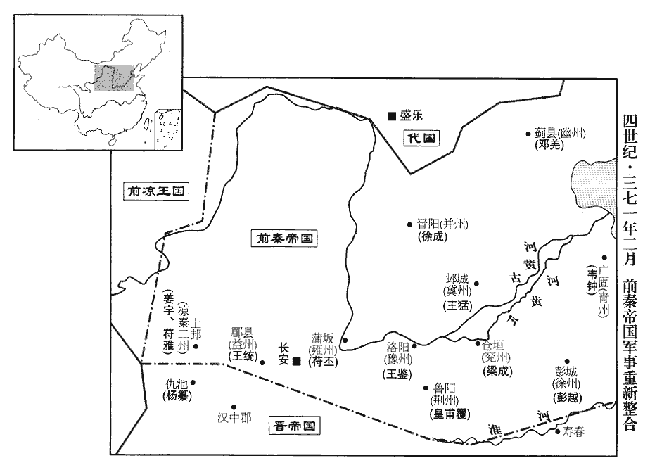
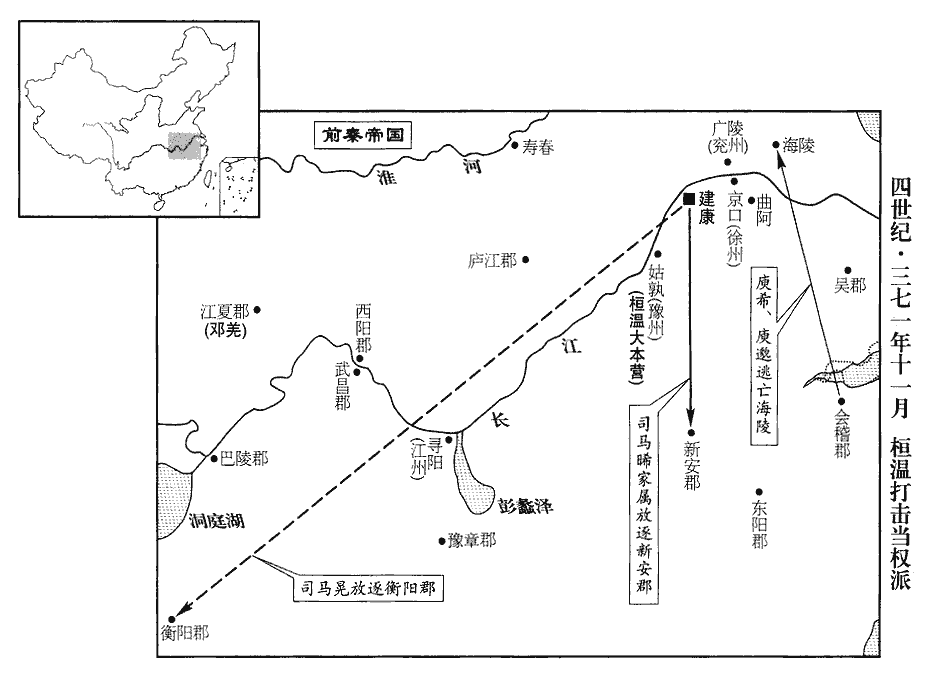
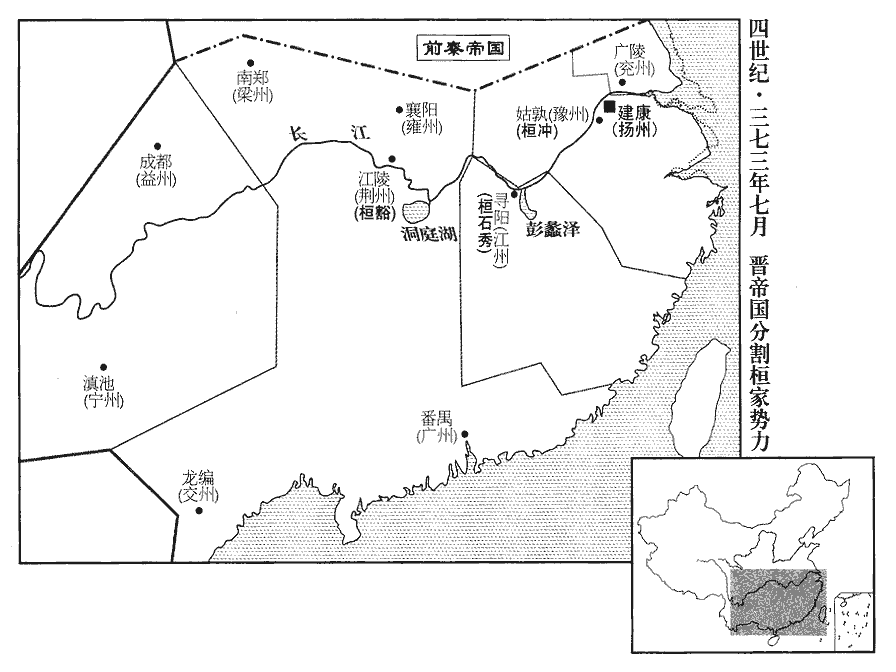
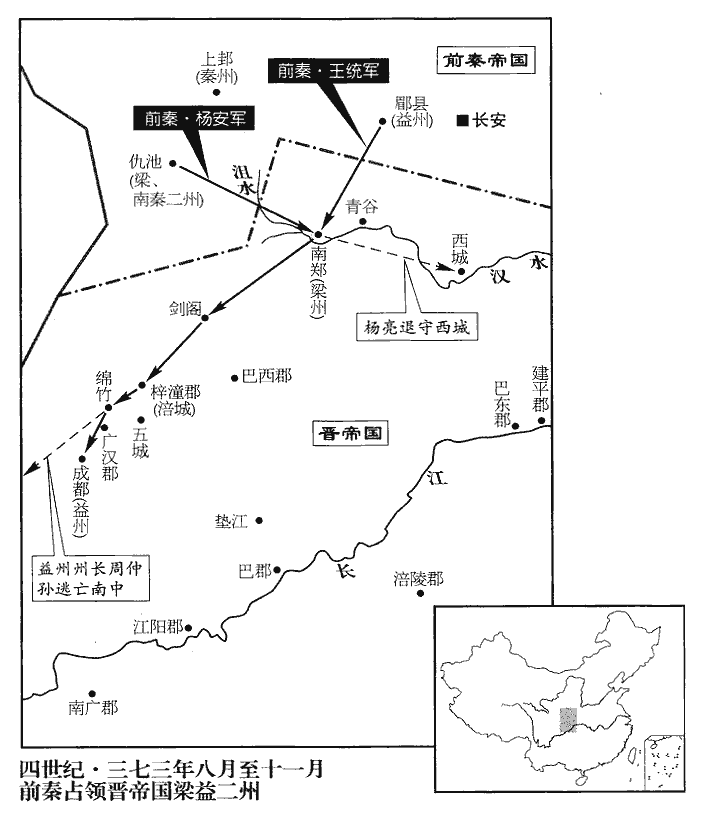

 晉紀二十五起重光協洽（辛未），盡旃蒙大淵獻（乙亥），凡五年。

# 太宗簡文皇帝諱昱，字道萬，元帝之少子也；封琅邪王，後徙封會稽王。海西即位，琅邪絕嗣，復徙封琅邪，固讓；故雖封琅邪而不去會稽之號。諡法：一德不懈曰簡；道德博聞曰文。

## 咸安元年（辛未、三七一）是年十一月，海西廢，帝即位，始改元咸安。通鑑編年，因以新元繫之。

1春，正月，袁瑾、朱輔求救於秦，秦王堅‹本年三十四岁›以瑾為揚州刺史瑾，渠吝翻。輔為交州刺史，遣武衛將軍武都王鑒、前將軍張蚝帥步騎二萬救之。蚝háo，七吏翻。帥，讀曰率。騎，奇寄翻。大司馬溫遣淮南‹安徽寿县›太守桓伊、南頓‹河南项城›太守桓石虔等擊鑒、蚝於石橋‹淮河、肥水之间›，據桓溫傳，石橋在肥水北。守，式又翻。大破之，秦兵退屯慎城‹安徽颖上›。慎縣，漢屬汝南郡，晉分屬汝陰郡。唐廬州之慎縣，則梁、魏之間南梁郡之慎縣，漢九江逡遒qiú縣之地，非此慎城。伊，宣之子也。桓宣佐祖逖，拒祖約，守襄陽，皆有功。丁亥‹十七›，溫拔壽春、擒瑾及輔，并其宗族送建康，斬之。

〖译文〗 [1]春季，正月，袁瑾、朱辅向前秦求救，前秦王苻坚任命袁瑾为扬州刺史，朱辅为交州刺史，派武卫将军武都人王鉴、前将军张蚝率领步、骑兵二万人前去救援。大司马桓温派淮南太守桓伊、南顿太守桓石虔等在石桥迎击王鉴、张蚝，把他们打得大败，前秦的军队后退驻扎在慎城。桓伊是桓宣的儿子。丁亥（十七日），桓温攻下了寿春，擒获了袁瑾及朱辅，连同他们的宗族亲属一起送往建康，杀掉了他们。

2秦王堅徙關東豪傑及雜夷十五萬戶于關中‹山西中部›，處烏桓于馮翊‹陕西大荔›、北地‹陕西耀县›，丁零翟斌于新安‹河南渑池›、澠池‹河南洛宁西北›。為翟斌乘秦亂起兵張本。處，昌呂翻。澠，彌兗翻。斌，音彬。諸因亂流移，欲還舊業者，悉聽之。

〖译文〗 [2]前秦王苻坚迁徙关东豪杰及杂夷部族十五万户到关中地区，把乌桓人安置在冯翊、北地，把丁零人翟斌的部族安置在新安、渑池。众多因战乱而流离失所，如今想重归故里恢复旧业的人，全部听任他们自己的安排。

3二月，秦以魏郡‹河北临漳西南邺镇›太守韋鍾為青州刺史，青州刺史治廣固‹山东青州›。中壘將軍梁成為兗州刺史，射聲校尉徐成為并州刺史，武衛將軍王鑒為豫州刺史，左將軍彭越為徐州刺史，太尉司馬皇甫覆為荊州刺史，晉志曰：秦既滅燕，以兗州刺史鎮倉垣‹河南开封东北›，并州刺史鎮晉陽‹山西太原›，豫州刺史鎮洛陽‹河南洛阳东白马寺东›，徐州刺史鎮彭城‹江苏徐州›。秦初以荊州刺史鎮豐陽，後移襄陽。余按此時秦未得襄陽，蓋仍燕之舊鎮魯陽‹河南鲁山›也。屯騎校尉天水‹甘肃天水›姜宇為涼州刺史，扶風‹陕西眉县›內史王統為益州刺史，涼州屬張天錫。益州，晉土也。秦蓋置涼州於天水界，置益州於扶風界。校，戶教翻。秦州刺史、西縣侯雅為使持節、都督秦•晉•涼•雍州諸軍事、秦州牧，雅，苻氏也。前此未有晉州；涼之張氏分西平界置晉興郡，秦蓋於此置晉州也。雍，於用翻。吏部尚書楊安為使持節、都督益•梁州諸軍事、梁州刺史。堅欲進圖梁、益，故置梁、益二州刺史。楊安既克仇池，始加督南秦州，鎮仇池。使，疏吏翻。復置雍州，治蒲阪‹山西永济›；秦省雍州見上卷上年。復，扶又翻。雍，於用翻。阪，音反。以長樂公丕為使持節、征東大將軍、雍州刺史。樂，音洛。使，疏吏翻。成，平老之子；統，擢之子也。穆帝永和十年，王擢降秦。堅以關東初平，守令宜得人，令王猛以便宜簡召英俊，補六州守令，授訖，言臺除正。奏上秦朝，除為正官也。嗚呼！荀卿子有言：兼并易也，堅凝之難。以苻堅之明，王猛之略，簡召六州英俊以補守令，然鮮卑乘亂一呼，翕然為燕，以此知天下之勢，但觀人心向背何如耳。

〖译文〗 [3]二月，前秦任命魏郡太守韦钟为青州刺史，中垒将军梁成为兖州刺史，射声校尉徐成为并州刺史，武卫将军王鉴为豫州刺史，左将军彭越为徐州刺史，太尉司马皇甫覆为荆州刺史，屯骑校尉天水人姜宇为凉州刺史，扶风内史王统为益州刺史，秦州刺史、西县侯苻雅为使持节，都督秦、晋、凉、雍各州诸军事，秦州牧，吏部尚书杨安为使持节，都督益、梁州诸军事，梁州刺史。重新设置雍州，治所为蒲阪，任命长乐公苻丕为使持节、征东大将军、雍州刺史。梁成是梁平老的儿子；王统是王擢的儿子。苻坚认为关东刚刚平定，郡守县令应该有合适的人选，于是就命令王猛根据具体情况选拔征召英俊杰出之士，充实六州的郡守县令，授官以后，上报朝廷正式任命。

 

4三月，壬辰‹二十三›，益州刺史建成定公周楚卒。諡法：大慮靜民曰定。

〖译文〗 [4]三月，壬辰（二十三日），益州刺史建成定公周楚去世。

5秦後將軍金城‹甘肃兰州›俱難攻蘭陵‹山东苍山西南兰陵镇›太守張閔子于桃山‹山东滕州东南十公里›，俱，姓；難，名。魏收地形志：蘭陵昌慮縣有桃山。大司馬溫遣兵擊卻之。

〖译文〗 [5]前秦后将军金城人俱难在桃山攻打兰陵太守张闵的儿子，大司马桓温派兵击退了他。

6秦西縣侯雅、楊安、王統、徐成及羽林左監朱肜róng、揚武將軍姚萇帥步騎七萬伐仇池公楊纂。肜，余中翻。萇，仲良翻。帥，讀曰率。騎，奇寄翻。

〖译文〗 [6]前秦西县侯苻雅、杨安、王统、徐成以及羽林左监朱肜、扬武将军姚苌率领步、骑兵七万人讨伐仇池公杨纂。

7代‹都盛乐，内蒙和林格尔›將長孫斤謀弒代王什翼犍，世子寔格之，傷脅，遂執斤，殺之。代之先拓跋鄰，以次兄為拔拔氏，後改為長孫氏。將，即亮翻。犍，居言翻。

〖译文〗 [7]代国将领长孙斤图谋杀掉代王拓跋什翼犍，世子拓跋攻打他，伤了两肋，但终于擒获了长孙斤，把他杀掉了。

8夏，四月，戊午‹二十›，大赦。

〖译文〗 [8]夏季，四月，戊午（二十日），东晋实行大赦。

9秦兵至鷲峽；鷲峽在仇池北，亦謂之塞峽。鷲，音就。楊纂帥眾五萬拒之。梁州刺史弘農‹河南灵宝东北›楊亮遣督護郭寶、卜靖帥千餘騎助纂，與秦兵戰于峽中；纂兵大敗，死者什三、四，寶等亦沒，纂收散兵遁還。西縣侯雅進攻仇池‹甘肃西和南›，楊統帥武都之眾降秦。統與纂爭國，見上卷上年。降，戶江翻；下同。纂懼，面縛出降，雅送纂于長安。以統為南秦州刺史；秦置秦州於上邽‹甘肃天水›，仇池在其南，故置南秦州。加楊安都督南秦州諸軍事，鎮仇池‹甘肃西和南›。

〖译文〗 [9]前秦的军队抵达鹫峡，杨纂率领五万兵众抵御他们。梁州刺史弘农人杨亮派督护郭宝、卜靖率领一千多骑兵帮助杨纂，与前秦的军队在峡中交战，杨纂的军队大败，十之三四的人死亡，郭宝等人也战死，杨纂收罗了逃散的兵众逃了回去。西县侯苻雅进军攻打仇池，杨统率领武都的民众投降了前秦。杨纂十分害怕，两手反绑于身后出来投降，苻雅把他送到了长安。任命杨统为南秦州刺史，让杨安担任都督南秦州诸军事，镇守仇池。

王猛之破張天錫於枹罕‹甘肃临夏›也，事見一百一卷海西公太和元年。枹，音膚。獲其將敦煌陰據及甲士五千人。敦，徒門翻。秦王堅既克楊纂，遣據帥其甲士還涼州，使著作郎梁殊、閻負送之，穆帝永和十二年，秦遣殊、負使涼，今復遣之。因命王猛為書諭天錫‹本年二十六岁›曰：「昔貴先公稱藩劉、石者，惟審於強弱也。張茂稱藩於劉曜，事見九十二卷明帝太寧元年。張駿稱藩於石勒，事見九十四卷成帝咸和五年。今論涼土之力，則損於往時；語大秦之德，則非二趙之匹；而將軍翻然自絕，絕秦見一百一卷太和元年。無乃非宗廟之福也歟！以秦之威，旁振無外，可以回弱水使東流，返江、河使西注，禹之治水，高高下下，因天地之性，弱水西流，江、河東注。今言能反之回之，喻秦威力之強也。關東既平，將移兵河右，恐非六郡士民所能抗也。涼州六郡，以張軌初鎮河西之時，統治武威‹甘肃武威›、張掖‹甘肃张掖›、酒泉‹甘肃酒泉›、敦煌‹甘肃敦煌›、西郡‹甘肃永昌西北›、西海‹内蒙额济纳旗›六郡言之也。元康以後，張氏所分置，其為郡多矣。劉表謂漢南‹汉水以南›可保，事見漢獻帝紀。將軍謂西河‹黄河以西›可全，吉凶在身，元龜不遠，直深算妙慮，自求多福，無使六世之業一旦而墜地也！」自張軌保據河西，至天錫凡九主。今言六世者，不以曜靈、祚、玄靚為世數。天錫大懼，遣使謝罪稱藩。堅拜天錫使持節、都督河右諸軍事、驃騎大將軍、開府儀同三司、涼州刺史、西平公。使，疏吏翻；下同。驃，匹妙翻。騎，奇寄翻。

〖译文〗 王猛在罕攻破张天锡的时候，俘获了他的将领敦煌人阴据及披甲士兵五千人。前秦王苻坚平定了杨纂以后，派阴据率领他的披甲士兵返回凉州，让著作郎梁殊、阎负去送他们，顺便命令王猛写信告诉张天锡说：“过去你的先公向刘曜、石勒称藩的原因，只是考虑了力量的强弱。如今要论凉国的力量，则不如过去；要说大秦的德威，也不是二赵所能匹敌，而将军却反而与秦国绝交，这恐怕不是祖先的福份吧！以秦国的威力，只要一动作就没有谁能够阻挡，可以让弱水掉头东流，让长江、黄河回流西向，关东既已平定，就将移师黄河以西，恐怕不是你六郡的士人百姓所能抵抗的。刘表说汉水以南可以自保，将军说黄河以西可以保全，凶吉祸福全都系于你身上，可以借鉴的往事并不遥远，你应该深思熟虑，自己多谋求一点福份，不要让六代人经营的大业毁于一旦！”张天锡十分害怕，派使者向前秦谢罪称藩。苻坚授予张天锡使持节、都督河右诸军事、骠骑大将军、开府仪同三司、凉州刺史、西平公。

吐谷渾‹青海›王辟奚聞楊纂敗，五月，遣使獻馬千匹、金銀五百斤于秦。吐，從暾入聲。谷，音浴。秦以辟奚為安遠將軍、漒川侯。辟奚，葉延之子也，葉延見九十四卷成帝咸和四年。漒，其良翻。好學仁厚，無威斷，好，呼到翻。斷，丁亂翻；下無斷同。三弟專恣，國人患之。長史鍾惡地，西漒羌豪也，漒qiáng，渠良翻。羌人據漒川‹甘肃卓尼›之地，分為東西。謂司馬乞宿雲曰：「三弟縱橫，勢出王右，橫，戶孟翻。右，上也。幾亡國矣。幾，居希翻。吾二人位為元輔，長史，司馬，府之元僚。豈得坐而視之！」詰朝月望，日行遲，一年一周天；月行速，一月一周天而與日會。日月之會，謂之合朔。自合朔之後，月又先日而行，至十五日，日月相望，謂之月望。詰，去吉翻。文武並會，吾將討焉。王之左右皆吾羌子，轉目一顧，立可擒也。」宿雲請先白王，惡地曰：「王仁而無斷，白之必不從；萬一事泄，吾屬無類矣。事已出口，何可中變！」遂於坐收三弟，殺之。坐，徂臥翻。辟奚驚怖，怖，普布翻。自投床下，惡地、宿雲趨而扶之曰：「臣昨夢先王敕臣云：『三弟將為逆，不可不討。』故誅之耳。」辟奚由是發病恍惚，人無精爽，謂之恍惚。命世子視連曰：「吾禍及同生，何以見之於地下！國事大小，任汝治之，吾餘年殘命，寄食而已。」遂以憂卒。卒，子恤翻；下同。

〖译文〗 吐谷浑王辟奚听说杨纂失败，五月，派使者向前秦进献一千匹马、五百斤金银。前秦任命辟奚为安远将军、川侯。辟奚是叶延的儿子，好学，待人仁慈宽厚，但缺乏威严决断，他的三个弟弟专权放纵，国人对他们都很厌恨。长史钟恶地，是西羌族中有势力的人，他对司马乞宿云说：“辟奚的三个弟弟横行无忌，权势高出了君王，快要亡国了。我们二人位居辅臣之首，岂能坐而视之！明天早晨日月相望，文官武将都要会集，我将要在那里讨伐他。国王周围全都是我们羌族子弟，只要我一使眼色，马上就可以擒获他。”乞宿云请求先告诉国王，钟恶地说：“国王仁慈而优柔寡断，告诉他一定不会同意，万一事情败露，我们就要被斩尽杀绝。事情已经说出来了，怎么能中途改变！”于是钟恶地按计划在座位上拘捕了辟奚的三个弟弟，把他们杀掉了。辟奚惊慌恐怖，躲到了床下，钟恶地、乞宿云上前扶起他说：“臣昨晚梦见先王敕令臣说：‘你的三个弟弟将要干叛逆之事，不能不讨伐他们。’所以才把他们杀掉了。”辟奚因此得了病，神志不清，他告诉世子视连说：“我祸及亲生弟弟，怎么能在地下与他们相见？国家的大小事情，听凭你去治理，我的余年残命，依附于你而已。”于是辟奚因忧郁而死亡。

視連立，不飲酒遊畋者七年，軍國之事，委之將佐。將，即亮翻。鍾惡地諫，以為人主當自娛樂，樂，音洛。建威布德。視連泣曰：「孤自先世以來，以仁孝忠恕相承。先王念友愛之不終，悲憤而亡。孤雖纂業，尸存而已，聲色遊娛，豈所安也！威德之建，當付之將來耳。」辟奚之死，視連之立，其事非皆在是年。通鑑因辟奚入貢于秦，遂連而書之，以見辟奚父子天性仁孝，不可以夷狄異類視之也。

〖译文〗 视连继立，七年拒绝饮酒游猎，军队国家的事务，全都委托给将领、辅臣们处理。钟恶地劝他，认为人主应当自己欢娱行乐，建立威势，传布道德。视连哭泣着说：“我家从祖上以来，以仁孝忠恕相承续。先王念及友善仁爱没有贯彻到底，悲愤而死。我虽然继承王位，不过是空占着位置而已，岂敢安于声色娱乐！威势和道德的建立，只好交给后人吧！”

10代世子寔病傷而卒。格長孫斤而被傷也。

〖译文〗 [10]代国的世子拓跋因伤势恶化而死亡。

秋，七月，秦王堅如洛陽。

〖译文〗 [11]秋季，七月，前秦王苻坚到洛阳。

代世子寔娶東部大人賀野干之女，據北史，賀野干，即賀蘭部酋長。魏書官氏志，北方賀蘭，後改為賀氏。有遺腹子，甲戌‹七›，生男，代王什翼犍為之赦境內，為，于偽翻。名曰涉圭。拓跋珪造魏事始此。

〖译文〗 [12]代国世子拓跋娶东部大人贺野干的女儿为妻，他死时妻子怀有身孕，甲戌（初七），生下一个儿子，代王拓跋什翼犍为此在境内实行大赦，给他起名叫涉圭。

大司馬溫以梁‹四川东北及陕西南部›、益‹四川中部›多寇，周氏世有威名，周訪、周撫、周楚皆著威名於梁、益。八月，以寧州‹府滇池，云南晋宁东晋城镇›刺史周仲孫監益、梁二州諸軍事，領益州刺史。監，工銜翻。仲孫，光之子也。周光見九十三卷明帝太寧二年。

〖译文〗 [13]大司马桓温考虑到梁州、益州多有寇贼，周氏则世代都有显赫的名声，八月，任命宁州刺史周仲孙监益、梁二州诸军事，兼任益州刺史。周仲孙是周光的儿子。

秦以光祿勳李儼為河州刺史，鎮武始‹府狄道，甘肃临洮›。河西張駿以興晉、金城、武始、南安、永晉、大夏、武城、漢中為河州。武始郡，治狄道，亦張駿所置。

〖译文〗 [14]前秦任命光禄勋李俨为河州刺史，镇守武始。

王猛以潞川‹山西黎城南›之功，見上卷上年。請以鄧羌為司隸。秦王堅下詔曰：「司隸校尉，董牧皇畿，吏責甚重，非所以優禮名將。光武不以吏事處功臣，見四十三卷漢光武建武十三年。處，昌呂翻。實貴之也。羌有廉、李之才，廉、李，謂廉頗、李牧。朕方委以征伐之事，北平匈奴，南蕩揚、越，羌之任也，司隸何足以嬰之！其進號鎮軍將軍，位特進。」

〖译文〗 [15]王猛依据洛川的战功，请求任命邓羌为司隶校尉。前秦王苻坚下达诏令说：“司隶校尉负责督察京城周围的地区，职责重大，不能用来优待名将。汉光武帝不以政务官职赏赐功臣，实际上是更看重他们。邓羌有廉颇、李牧那样的才能，朕准备将征伐的事情交给他，在北方平定匈奴，在南方扫除扬、越，这才是邓羌的重任，司隶校尉怎么值得交给他呢！进升他的封号为镇军将军，赐位特进。”

九月，秦王堅還長安。歸安元侯李儼卒于上邽、諡法：能思辨眾曰元；行義說民曰元。晉武受禪，當時之臣死，多有諡元者，固非以行定諡也。堅復以儼子辯為河州刺史。復，扶又翻。

〖译文〗 [16]九月，前秦王苻坚返回长安。归安元侯李俨在上去世，苻坚又任命李俨的儿子李辩为河州刺史。

冬，十月，秦王堅如鄴，獵于西山，旬餘忘返。伶人王洛叩馬諫曰：鄭玄曰：伶官，樂官也。伶氏世掌樂官而善焉，故後世多號樂官為伶官。「陛下群生所繫，今久獵不歸，一旦患生不虞，柰太后、天下何！」堅為之罷獵還宮。為，于偽翻。王猛因進言曰：「畋獵誠非急務，王洛之言，不可忘也。」堅賜洛帛百匹，拜官箴左右，左傳：昔周辛甲之為太史，命百官官箴王闕，於虞人之箴曰：「芒芒禹迹，畫為九州，經啟九道。民有寢廟，獸有茂草，各有攸處，德用不擾。在帝夷羿，冒于原獸，忘其國恤而思其麀yōu牡。武不可重，用不恢于夏家。獸臣司原，敢告僕夫。」虞箴如是，以戒獵也。堅倣其意拜洛為官箴左右。自是不復獵。復，扶又翻。

〖译文〗 [17]冬季，十月，前秦王苻坚到邺城，在西山打猎，竟然十多天还留连忘返。乐官王洛勒住马劝谏说：“陛下为百姓所依托，如今久猎不归，一旦出现不测之患，让太后、天下人怎么办呢！”苻坚因此停止打猎回到了王宫。王猛接着进言说：“打猎确实不是当务之急，王洛的话，不可忘记。”苻坚赏赐王洛一百匹帛，授官箴左右，从此就不再打猎了。

大司馬溫，恃其材略位望，陰蓄不臣之志，嘗撫枕歎曰：「男子不能流芳百世，亦當遺臭萬年！」桓溫心迹，固不畏人之知之也，然而不獲逞者，制於命也，孰謂天位可以智力奸邪！術士杜炅炅guì，古迥翻。能知人貴賤，溫問炅以祿位所至。炅曰：「明公勳格宇宙，據孔安國尚書註，格，至也。位極人臣。」溫不悅。其志願不止於此，故不悅。溫欲先立功河朔‹黄河以北›以收時望，還受九錫。及枋頭‹河南淇县东南淇门渡›之敗，威名頓挫。枋頭之敗，事見上卷太和四年。既克壽春，謂參軍郗超曰：郗chī，丑之翻。「足以雪枋頭之恥乎?」超曰：「未也。」久之，超就溫宿，中夜，謂溫曰：「明公都無所慮乎?」溫曰：「卿欲有言邪?」超曰：「明公當天下重任，今以六十之年，敗於大舉，不建不世之勳，不足以鎮愜民望！」愜，苦叶翻。溫曰：「然則柰何?」超曰：「明公不為伊、霍之舉者，無以立大威權，鎮壓四海。」溫素有心，深以為然，遂與之定議。超知溫心而迎合之，溫遂與定議。以帝‹司马奕，本年三十岁›素謹無過，而床笫易誣，笫zǐ，側里翻，又壯士翻，床簀zé也。易，以豉翻。乃言「帝早有痿疾，楊正衡曰：字林：痿，痹也，人垂翻，又於隹zhuī翻。余謂此蓋言陰痿也。嬖人相龍、計好、朱靈寶等，相與計，皆姓也。何承天姓苑，相，悉良翻。范曄後漢書有計子勳。參侍內寢，二美人田氏、孟氏生三男，將建儲立王，傾移皇基。」密播此言於民間，時人莫能審其虛實。

〖译文〗 [18]大司马桓温，倚仗他的才能与地位、声望，暗中怀有背叛皇帝的心志，曾经抚枕慨叹道：“男子汉不能流芳百世，也应当遗臭万年！”方术之士杜炅，能预测人的贵贱，桓温问他自己的官位能到什地步。杜炅说：“明公的功勋举世无双，官位能到大臣的顶峰。”桓温听后不高兴。桓温想先在河朔建立战功，以此为自己赢得更大的声望，回来后接受加九锡的礼遇。等到在枋头失败，他的威赫名声陷于困顿，受到挫折。攻克寿春以后，桓温对参军郗超说：“这足以雪枋头的耻辱了吧？”郗超说：“没有。”过了许久，郗超到桓温的住所留宿，半夜时分对桓温说：“明公在这里没有考虑什么吗？”桓温说：“你想有话对我说吗？”郗超说：“明公承担着天下的重任，如今以六十高龄，却在一次大规模的行动中失败，如果不建立非常的功勋，就不足以镇服、满足百姓的愿望！”桓温说：“那么该怎么办呢？”郗超说：“明公不干伊尹放逐太甲、霍光废黜昌邑王那样的事情，就无法建立大的威势与权力，镇压四海。”桓温历来怀有此心，对郗超所说的深以为然，于是就和他商定计议。考虑到海西公平素谨慎小心，没有什么过错，而利用床第之事则容易对他进行诬陷，于是就说：“皇上早就患有阳痿，宠臣相龙、计好、朱灵宝等，参与服侍起居床第之事，与田氏、孟氏两位美人生下了三个儿子，将要设立太子赐封王位，转移皇上的基业。”并将这话密秘地传播到民间，当时的人们都无法辨别真假。

十一月，癸卯‹九›，溫自廣陵‹江苏扬州›將還姑孰‹安徽当涂›，屯于白石‹安徽马鞍山采石矶西南›。此白石蓋在牛渚西南，桓玄破譙王尚之處。非陶侃令庾亮所守白石壘也。丁未‹十三›，詣建康，諷褚太后‹褚蒜子，本年四十八岁›，請廢帝立丞相會稽王昱，并作令草呈之。先草定太后令而呈之於太后。會，工外翻。太后方在佛屋燒香，建屋於宮中以奉佛，故謂之佛屋。內侍啟云：「外有急奏。」太后出，倚戶視奏數行，行，戶剛翻；下數十行同。乃曰：「我本自疑此！」至半，便止，索筆益之曰：索，山客翻。「未亡人不幸罹此百憂，感念存沒，心焉如割！」杜預曰：婦人既寡，自稱未亡人。

〖译文〗 十一月，癸卯（初九），桓温准备从广陵返回姑孰，驻扎在白石。丁未（十三日），抵达建康，含蓄地劝说褚太后，请求废黜废帝司马奕，立丞相会稽王司马昱，同时还草拟了诏令进呈给褚太后。太后正在佛室烧香，内侍报告说：“外边有紧急奏章。”褚太后出来，倚着门看奏章，刚看了几行字就说：“我自己本来就怀疑是这样！”看了一半，就停下来了，向内侍要来笔加上了这样的话：“我不幸遭受了这样的种种忧患，想到死去的和活着的，心如刀绞！”

己酉‹十五›，溫集百官於朝堂。朝，直遙翻；下同。廢立既曠代所無，莫有識其故典者，百官震慄。溫亦色動，不知所為。尚書左僕射王彪之知事不可止，乃謂溫曰：「公阿衡皇家，伊尹曰阿衡，放太甲于桐。喻溫廢立，行伊尹之事也。孔安國曰：阿，倚；衡，平。當倚傍先代。」傍，蒲浪翻。乃命取漢書霍光傳，禮度儀制，定於須臾。用霍光廢昌邑王故事。傳，直戀翻。彪之朝服當階，神彩毅然，曾無懼容，文武儀準，莫不取定，朝廷以此服之。晉朝以此服王彪之，余甚恨彪之得此名於晉朝也。彪之父彬，不畏死以折王敦，此為可服耳。於是宣太后令，廢帝為東海王，以丞相、錄尚書事、會稽王昱‹司马昱，本年五十二岁›統承皇極。會，工外翻。百官入太極前殿，溫使督護竺瑤、散騎侍郎劉亨收帝璽綬。散，悉亶翻。騎，奇寄翻。璽，斯氏翻。綬，音受。考異曰：帝紀、三十國春秋，「亨」皆作「享」。後魏書僭晉傳作「亨」，今從之。帝著白帢單衣，著，側略翻。帢qià，苦洽翻。步下西堂，乘犢車出神虎門，晉制，諸公給朝車、安車、皁zào輪犢車各一乘。東漢都雒陽，宮有廣義、神虎門。賢註曰：廣義、神虎，洛陽宮西門也，在金商門外。然則神虎門亦建康宮西門乎?群臣拜辭，莫不歔欷。歔，音虛。欷，許既翻，又音希。侍御史、殿中監將兵百人衛送東海第。殿中監，掌監天子服御之事。將，即亮翻。溫帥百官具乘輿法駕，迎會稽王于會稽邸。帥，讀曰率。乘，繩證翻。會，工外翻。王於朝堂變服，著平巾幘、單衣，東向流涕，拜受璽綬，平巾幘，蓋即平上幘。單衣，江左諸人所以見尊者之服，所謂巾褠gōu也。是日，即皇帝位，改元。改元咸安。溫出次中堂，分兵屯衛。溫有足疾，詔乘輿入殿。乘，如字。溫撰辭，欲陳述廢立本意，撰，雛免翻。預撰辭，欲入見而陳之。帝引見，見，賢遍翻。便泣下數十行，行，戶剛翻。溫兢懼，竟不能一言而出。

〖译文〗 己酉（十五日），桓温把百官召集到朝堂。废立皇帝既然是历代所没有过的事情，所以没有人知道过去的典则，百官们都震惊恐惧。桓温也神色紧张，不知该怎么办。尚书左仆射王彪之知道事情不能半途而废，就对桓温说：“您废立皇帝，应当效法前代的成规。”于是就命令取来《汉书·霍光传》，礼节仪制很快就决定了。王彪之身穿朝服面对朝廷，神情沉着，毫无惧色，文武仪规典则，全都由他决定，朝廷百官因此而服了他。于是就宣布太后的诏令，废黜废帝司马奕为东海王，以丞相、录尚书事、会稽王司马昱继承皇位。百官进入太极前殿，桓温让督护竺瑶、散骑侍郎刘亨收取了废帝的印玺绶带。司马奕戴着白色便帽，身穿大臣的仅次于朝服的盛装，走下西堂，乘着牛车出了神虎门，群臣叩拜辞别，没有谁不哽咽。侍御史、殿中监带领一百多名卫兵把他护送到东海王的宅第。桓温率领百官准备好皇帝的车乘，到会稽王的官邸去迎接会稽王司马昱。会稽王在朝堂更换了服装，戴着平顶的头巾，穿着单衣，面朝东方流涕，叩拜接受了印玺绶带。这天，会稽王司马昱即皇帝位，改年号为咸安。桓温临时住在中堂，分派兵力屯驻守卫。桓温的脚有毛病，简文帝诏令可以让他乘车进入殿堂。桓温事先准备好辞章，想陈述他黜废司马奕的本意，简文帝引见，一见他便流下了眼泪，但桓温战战兢兢，始终没能说出一句话。

太宰武陵王晞xī，好習武事，好，呼到翻。為溫所忌，欲廢之，以事示王彪之。彪之曰：「武陵親尊，武陵王晞，亦元帝子，出繼武陵王喆zhé後。未有顯罪，不可以猜嫌之間便相廢徙。公建立聖明，當崇獎王室，與伊、周同美；此大事，宜更深詳！」溫曰：「此已成事，卿勿復言！」王彪之能全晞於會稽輔政之時，而不能全之於會稽纘zuǎn服之日，會稽可以理喻，而習武者桓溫之所忌也。復，扶又翻。乙卯‹二十一›，溫表「晞聚納輕剽，剽，匹妙翻。息綜矜忍；息，子也。袁真叛逆，事相連染。頃日猜懼，將成亂階。溫以此誣晞。請免晞官，以王歸藩。」從之。并免其世子綜、梁王㻱等官。㻱，與璡jīn同，音津。溫使魏郡太守毛安之帥所領宿衛殿中。沈約曰：南徐州備有徐、兗、幽、冀、青、并、揚七州郡邑。安之，虎生之弟也。

〖译文〗 太宰武陵王司马，喜好习武练兵，被桓温所忌恨，想废黜他，就把此事告诉了王彪之。王彪之说：“武陵王是皇室的亲族尊者，没有明显的罪过，不能因为猜忌随便废黜他。您要建立贤明的君主，应当尊崇辅佐王室，与伊尹、周公具有同样的美德。这件大事，应该再仔细考虑！”桓温说：“这已经是我决定了的事情，你不要再说了！”乙卯（二十一日），桓温进上表章：“司马收罗招纳轻浮之士，儿子司马综自负残忍。袁真叛逆，事情与他有牵连。近来他猜疑恐惧，将会成为祸乱的缘由。请求免除司马的官职，让他以王的身份返回藩地。”简文帝同意了。同时还免除了司马的世子司马综、梁王司马等人的官职。桓温让魏郡太守毛安之率领所统领的军队宿卫皇宫。毛安之是毛虎生的弟弟。

庚戌‹十六›，尊褚太后‹褚蒜子›曰崇德太后。

〖译文〗 庚戌（十六日），尊奉褚太后为崇德太后。

初，殷浩卒，大司馬溫使人齎書弔之。浩子涓不答，涓，圭淵翻。亦不詣溫，而與武陵王晞遊。廣州‹府番禺，广东广州›刺史庾蘊，希之弟也，素與溫有隙。溫惡殷、庾宗強，欲去之。惡，烏路翻。去，羌呂翻。辛亥‹十七›，使其弟祕逼新蔡王晃晃父邈，本汝南王祐之子也，嗣新蔡王後。詣西堂叩頭自列，西堂，太極殿西堂也。自列，自陳列其事。稱與晞及子綜、著作郎殷涓、太宰長史庾倩、掾曹秀、舍人劉彊、散騎常侍庾柔等謀反；帝對之流涕，溫皆收付廷尉。倩、柔，皆蘊之弟也。倩，千甸翻。掾，于絹翻。癸丑‹十九›，溫殺東海王三子及其母。即田氏、孟氏及所生三男也。甲寅‹二十›，御史中丞譙王恬承溫旨，請依律誅武陵王晞。詔曰：「悲惋惶怛，惋，烏貫翻。非所忍聞，況言之哉！其更詳議！」恬，承之孫也。譙王氶死於王敦之難。「承」，當作「氶」，音註見前。乙卯‹二十一›，溫重表固請誅晞，詞甚酷切。帝乃賜溫手詔曰：「若晉祚靈長，公便宜奉行前詔；如其大運去矣，請避賢路。」溫覽之，流汗變色，乃奏廢晞及其三子，家屬皆徙新安郡‹浙江淳安›。吳孫權分丹楊立新都郡，武帝太康元年，更名新安郡，唐為歙shè州，今之徽州。丙辰‹二十二›，免新蔡王晃為庶人，徙衡陽‹湖南湘潭西南古城乡›，吳孫亮分長沙西部都尉置衡陽郡，今之衡州。殷涓、庾倩、曹秀、劉彊、庾柔皆族誅，庾蘊飲酖死。蘊兄東陽‹浙江金华›太守友子婦，桓豁之女也，故溫特赦之。庾希聞難，難，乃旦翻。與弟會稽【章：十二行本「稽」下有「王」字；乙十一行本同；孔本同。】參軍邈及子攸之逃于海陵‹江苏泰州›陂澤中。海陵縣，前漢屬臨淮郡，後漢、晉屬廣陵郡，今泰州即其地。

〖译文〗 当初，殷浩去世的时候，大司马桓温派人送信吊唁他。殷浩的儿子殷涓没有答复，也没有到桓温那里去，而是与武陵王司马游玩。广州刺史庚庾蕴，是庾希的弟弟，一直和桓温有隔阂。桓温厌恨殷涓、庾蕴宗族的强大，想要灭掉他们。辛亥（十七日），桓温派他的弟弟桓秘逼迫新蔡王司马晃到西堂去叩头自述，称与司马及他的儿子司马综、著作郎殷涓、太宰长史庾倩、掾曹秀、舍人刘强、散骑常侍庾柔等阴谋反叛。简文帝面对他流下了眼泪，桓温把他们全都抓起来送交廷尉。庾倩、庾柔，都是庾蕴的弟弟。癸丑（十九日），桓温杀掉了东海王司马奕的三个儿子和他们的母亲。甲寅（二十日），御史中丞谯王司马恬禀承桓温的旨意，请求依据法律。简文帝下达诏令说：“悲痛惋惜，惊恐不安，不忍心耳闻，何况是诉说呢！再仔细商议吧！”司马恬是司马的孙子。乙卯（二十一日），桓温再次进上表章，坚持请求杀掉司马，言词非常激烈恳切。简文帝于是就亲手写下诏令赐予桓温说：“如果晋王朝的神灵悠长，你就不必请示，尊奉执行以前的诏令；如果晋王朝的大运已去，我就请求避让贤人晋升之路。”桓温看了以后，惊慌失色，汗流满面，于是就奏请黜废司马及他的三个儿子，将其家人全都迁徙到新安郡。丙辰（二十二日），黜免新蔡王司马晃为庶人，将他迁徙到衡阳，殷涓、庾倩、曹秀、刘强、庾柔全都被满门诛杀，庾蕴服毒而死。庾蕴的哥哥东阳太守庾友的儿媳，是桓豁的女儿，所以桓温特别地赦免了她。庾希听说了这桩灾难，与弟弟会稽参军庾邈及儿子庾攸之逃到了海陵的湖泽中。

溫既誅殷、庾，威勢翕赫，翕，盛也。赫，炎之極也。侍中謝安見溫遙拜。溫驚曰：「安石，卿何事乃爾?」安曰：「未有君拜於前，臣揖於後。」當是時，晉之君臣，蓋可知矣。春秋之義所謂微而顯者也。

〖译文〗 桓温诛杀了殷、庾等人以后，威势显赫至极，侍中谢安看见桓温，在很远的地方就开始叩拜。桓温吃惊地说：“谢安，你为什么要这样呢？”谢安说：“没有君主叩拜于前，臣下拱手还礼于后的。”

戊午‹二十四›，大赦，增文武位二等。

〖译文〗 戊午（二十四日），东晋实行大赦，为文武官员增加品位二等。

己未‹二十五›，溫如白石，上書求歸姑孰。庚申‹二十六›，詔進溫丞相，大司馬如故，留京師輔政；溫固辭，乃請還鎮。辛酉‹二十七›，溫自白石還姑孰。

〖译文〗 己未（二十五日），桓温到白石，上书请求返归姑孰。庚申（二十六日），简文帝下达诏令，进升桓温为丞相，大司马职位则仍旧，留在京师辅佐朝政。桓温固执地辞让，还请求回到镇所。辛酉（二十七日），桓温从白石返回姑孰。

秦王堅聞溫廢立，謂群臣曰：「溫前敗灞上，見九十九卷穆帝永和十年。後敗枋頭，見上卷太和四年。不能思愆自貶以謝百姓，方更廢君以自說，「說」，載記作「悅」，讀當從悅。一曰：說，讀如字，謂自解說也。六十之叟，舉動如此，將何以自容於四海乎！諺曰：『怒其室而作色於父，』其桓溫之謂矣。」

〖译文〗 前秦王苻坚听说了桓温废立皇帝的事情，对群臣们说：“桓温先在灞上失败，后又在枋头失败，不能反思过错自我贬责以向百姓谢罪，反而还废黜君主以自我解说，六十岁的老叟，举动如此，将怎样自容于天下呢！民谚曰：‘对妻子愤怒就向父亲耍脸色’，大概说得就是桓温吧。”

 

秦車騎大將軍王猛，以六州任重，言於秦王堅，請改授親賢；及府選便宜，輒已停寢，騎，奇寄翻。堅先是命猛以便宜選賢俊補六州郡縣守令。別乞一州自效。堅報曰：「朕之於卿，義則君臣，親踰骨肉，雖復桓、昭之有管、樂，齊桓公有管仲，燕昭王有樂毅。玄德之有孔明，自謂踰之。夫人主勞於求才，逸於得士。王褒聖主得賢人頌曰：君人者，勤於求賢，而逸於得人。既以六州相委，則朕無東顧之憂，非所以為優崇，乃朕自求安逸也。夫取之不易，守之亦難，易，以豉翻。苟任非其人，患生慮表，表，外也。孔穎達曰：界外之畔為表。豈獨朕之憂，亦卿之責也，故虛位台鼎而以分陝為先。陝，式冉翻。卿未照朕心，殊乖素望。新政俟才，宜速銓補；俟東方化洽，當袞衣西歸。」周公東征，周大夫為作九罭yù之詩，其辭曰：「九罭之魚鱒魴，我覯之子，袞衣繡裳。」又曰：「是以有袞衣兮，無以我公歸兮，無使我心悲兮。」箋云：王迎周公當以上公之服。仍遣侍中梁讜詣鄴‹河北临漳西南邺镇›諭旨，猛乃視事如故。史言苻堅、王猛君臣相與之至，所以猛得展其才。讜dǎng，多朗翻。

〖译文〗 [19]前秦车骑大将军王猛，考虑到都督六州的责任重大，向前秦王苻坚进言，请求将此重任改授给亲近而又贤明的人。还有受命相机选拔六州郡县官吏的工作，也已经停止了，王猛请求自己去镇守一州以效力。苻坚回复王猛说：“朕和你的关系，从道义上讲是君臣，从亲情上讲则胜过骨肉，虽然这又像齐桓公、燕昭王拥有管仲、乐毅，刘备拥有孔明，但我认为要超过他们。人主寻求有才能的人时辛劳费力，得到人才就省力放心了。既然把六州委托给你，那么朕就解除了东顾之忧，不是以此来对你表示优待尊崇，而是朕自己寻求消闲安逸。打江山不易，坐江山也难，假如任非其人，祸患出现于我们预料之外，岂止仅是朕的忧患，也是你的责任，所以宁肯让三公的职位空虚也要首先分职陕东。你不了解朕的心愿，有违朕本来的期望。刚刚建立的政权急需人才，应该尽快选拔充实官吏，等到东方教化融洽以后，理当让你身着上公礼服西返。”苻坚于是派侍中梁谠到邺城去传达诏令，王猛也就像从前一样地处理政事。

十二月，大司馬溫奏：「廢放之人，屏之以遠，屏，必政翻，又必郢翻。不可以臨黎元。東海王宜依昌邑故事，昌邑事見二十四卷漢昭帝元平元年。築第吳郡‹苏州›。」太后詔曰：「使為庶人，情有不忍，可特封王。」溫又奏：「可封海西縣侯。」庚寅‹二十六›，封海西縣公。考異曰：海西公紀云：「咸安二年，正月，降封，」今從簡文帝紀。

〖译文〗 [20]十二月，大司马桓温上奏章说：“废黜放逐之人，应该把他屏弃到遥远的地方，不能让他接近黎民百姓。对东海王司马奕，应该按照过去废黜昌邑王的办法，让他到吴郡居住。”太后下达诏令说：“让东海王成为庶人，于心不忍，可以特别地封他为王。”桓温又上奏章说：“可以封他为海西县侯。”庚寅（二十六日），封司马奕为海西县公。

溫威振內外，帝雖處尊位，處，昌呂翻。拱默而已，常懼廢黜。先是，熒惑守太微端門，天文志：太微南蕃中二星間曰端門。先，悉薦翻。踰月而海西廢。辛卯‹二十七›，熒惑逆行入太微，帝甚惡之。惡，烏路翻。中書侍郎郗超在直，入直省中也。帝謂超曰：「命之脩短，本所不計，故當無復近日事邪?」帝之為撫軍也，辟超為掾，故於今敢以情問之。復，扶又翻。超曰：「大司馬臣溫，方內固社稷，外恢經略，非常之事，臣以百口保之。」及超請急省其父，晉令：急假者，五日一急，一歲以六十日為限。史書所稱取急、請急，皆謂假也。省，悉景翻。帝曰：「致意尊公，家國之事，遂至於此，由吾不能以道匡衛，愧歎之深，言何能諭！」因詠庾闡詩云：「志士痛朝危，忠臣哀主辱。」遂泣下霑襟。此亦清談，但情溢於言外耳。朝，直遙翻；下同。帝美風儀，善容止，留心典籍，凝塵滿席，湛如也。雖神識恬暢，然無濟世大略，謝安以為惠帝之流，但清談差勝耳。清談無益於國事；謝安當此之時，能立此論，可謂拔乎流俗者也。

〖译文〗 桓温威振朝廷内外，简文帝虽然身处至尊地位，实际上也仅仅是拱手沉默而已，常常害怕被废黜。此前，火星居于太微、南蕃之间，过了一个月，司马奕就被废黜。辛卯（二十七日），火星逆行进入太微星坦，简文帝对此很讨厌。中书侍郎郗超在宫中当班，简文帝对郗超说：“命运长短，本来就并不计较，所以应该不再出现前不久废黜皇帝那样的事情了吧？”郗超说：“大司马臣桓温，正在对内稳定国家，对外开拓江山，我愿用百余家口来保他，不会发生那种不正常的事变。”等到郗超急于要请假回去看望他父亲时，简文帝说：“告诉尊父，宗族国家之事，最终到了这种地步，是因为我不能用道德去匡正守卫的缘故，惭愧慨叹之深，怎么能用语言来表达！”接着便吟诵了庾阐的诗，道：“志士为朝廷危险而痛心，忠臣为君主受辱而悲哀。”吟诵得潸然泪下，打湿了衣襟。简文帝风度仪表堂堂，言谈举止得体，用心于典籍，翻阅典籍常常弄得满席尘土，一派湛然自得的样子。他虽然神情恬淡，见识通达，但没有济世大略，谢安认为他是晋惠帝一类的人物，只是清淡方面比晋惠帝略胜一筹。

郗超以溫故，朝中皆畏事之。謝安嘗與左衛將軍王坦之共詣超，日旰未得前，旰，古案翻。坦之欲去，安曰：「獨不能為性命忍須臾邪?」史言謝安於風流之中，能處事應物。又郗超勢燄如此，桓溫既死之後，超得終於牖下，蓋以智免也。為，于偽翻。

〖译文〗 郗超因为桓温的缘故，朝廷里的人都害怕事奉他。谢安曾经与左卫将军王坦之一起到郗超那里，太阳快落山了还没被召见，王坦之想离去，谢安说：“你唯独不能为保全性命忍耐一会儿吗？”

秦以河州‹府狄道，甘肃临洮›刺史李辯領興晉太守，還鎮枹罕。興晉、枹罕，河西張氏皆置為郡。興晉亦當近枹罕界。徙涼州治金城‹甘肃兰州›。自天水徙治金城。張天錫聞秦有兼并之志，大懼，以秦徙鎮逼之，故懼。立壇於姑臧‹甘肃武威›西，刑三牲，帥其官屬，遙與晉三公盟。帥，讀曰率；下同。遣從事中郎韓博奉表送盟文，并獻書於大司馬溫，期以明年夏會【章：十二行本「會」上有「同大舉」三字；乙十一行本同；孔本同。】于上邽‹甘肃天水›。欲使晉起兵攻蜀而出會于上邽也。

〖译文〗 [21]前秦任命河州刺史李辩兼任兴晋太守，回去镇守罕。将凉州的治所迁移到金城。张天锡听说前秦有兼并他的想法，十分害怕，便在姑臧城西设立祭坛，杀了牛、羊、猪三牲，率领他的官属们遥望东晋，与东晋的三公致意起誓结盟。派从事中郎韩博去奉献表章，送达盟约，同时还带信给大司马桓温，约定明年夏天在上盟会。

是歲，秦益州刺史王統攻隴西‹甘肃隴西›鮮卑乞伏司繁於度堅山‹甘肃靖远西›，司繁帥騎三萬拒統于苑川‹甘肃榆中东北›。統潛襲度堅山‹甘肃省靖远县西›，乞伏氏先自漠北南出、屯高平川，又自高平西南遷麥田山，司繁又自麥田遷于度堅山。水經註：苑川在天水勇士縣界。杜佑曰：在蘭州五泉縣界。以下文乞伏吐雷為勇士護軍觀之，則水經註為是。司繁部落五萬餘皆降於統；其眾聞妻子已降秦，不戰而潰。司繁無所歸，亦詣統降。降，戶江翻。秦王堅以司繁為南單于，留之長安‹西安›；以司繁從叔吐雷為勇士‹甘肃榆中北›護軍，勇士，漢縣，晉省。此因漢縣名而置護軍。撫其部眾。為後乞伏步頹以鮮卑叛秦張本。

〖译文〗 [22]这一年，前秦益州刺史王统在度坚山攻打陇西的鲜卑人乞伏司繁，乞伏司繁率领三万骑兵在苑川抵抗王统。王统偷袭了度坚山，乞伏司繁部落的五万多部众全都投降了王统，他的兵众们听说妻子儿女已经投降了前秦，不战而溃。乞伏司繁无处可走，也到王统那里投降了。前秦王苻坚任命乞伏司繁为南单于，把他留在长安。任命乞伏司繁的堂叔乞伏吐雷为勇士护军，去安抚其部众。

## 二年（壬申、三七二）

1春，二月，秦以清河‹山东临清›房曠為尚書左丞，徵曠兄默及清河崔逞、燕國‹北京›韓胤為尚書郎，北平‹河北遵化›陽陟、田勰、陽瑤為著作佐郎，晉志：著作郎一人，謂之大著作，專掌史任。又置佐著作郎八人。勰，音協。郝略為清河相：皆關東士望，王猛所薦也。瑤，騖之子也。陽騖仕燕，歷事三朝。騖，音務。

〖译文〗 [1]春季，二月，前秦任命清河人房旷为尚书左丞，征召房旷的哥哥房默以及清河人崔逞、燕国人韩胤为尚北郎，北平人阳陟、田勰、阳瑶为著作佐郎，郝略为清河相。这些人全都是关东享有声望的士人，由王猛所荐举的。阳瑶是阳鹜的儿子。

冠軍將軍慕容垂言於秦王堅‹本年三十五岁›曰：「臣叔父評，燕之惡來輩也，惡來以多力事紂，紂嬖之以亡國。「惡來輩」，一作「惡來革」。史記曰：惡來善毀讒，諸侯以此益疏。「輩」，當作「革」。不宜復污聖朝，復，扶又翻。污，烏故翻。願陛下為燕戮之。」為，于偽翻；下為人同。堅乃出評為范陽‹河北涿州›太守，燕之諸王悉補邊郡。

〖译文〗 冠军将军慕容垂对前秦王苻坚进言说：“臣的叔父慕容评，是燕国像商代的恶来一样的人，不应该让他再玷污圣朝，愿陛下为燕国杀掉他。”苻坚于是调动慕容评任范阳太守，前燕的诸王全都被任命为边境州郡的太守。

臣光曰：古之人，滅人之國而人悅，何哉?為人除害故也。此惟湯、武足以當之，下此則漢高帝猶庶幾焉。為，于偽翻。彼慕容評者，蔽君專政，忌賢疾功，愚闇貪虐以喪其國，喪，息浪翻。國亡不死，逃遁見禽。事見上卷海西公太和五年。秦王堅不以為誅首，又從而寵秩之，秩，序也，官也。寵秩，謂寵而序其官，使不失次也。是愛一人而不愛一國之人也，其失人心多矣。是以施恩於人而人莫之恩，盡誠於人而人莫之誠，卒於功名不遂，容身無所，卒，子恤翻。由不得其道故也。

〖译文〗 臣司马光曰：上古时候的人，有时他们的国家被灭了他们反而高兴，为什么呢？因为替他们除掉祸害。那个慕容评，蒙蔽君主，专擅朝政，猜忌贤能，嫉恨功臣，愚顽昏暗，贪婪暴虐，最终丧失了他的国家。国家灭亡了，他本人还不死，逃亡躲避，终被擒获。秦王苻坚不把他杀掉，又对他放纵并给以宠爱，授以官秩，这是爱一个人而不爱一国人，肯定要丧失很多人心。所以对人施以恩惠而人们并不以恩相报，对人待以诚意而人们并不以诚相报，最终导致功名不成，无处容身，这是由于不得要领的缘故。

2三月，戊午‹二十五›，遣侍中王坦之徵大司馬溫入輔；溫復辭。復，扶又翻。

〖译文〗 [2]三月，戊午（二十五日），东晋朝廷派侍中王坦之征召大司马桓温入朝辅政，桓温又一次推辞了。

3秦王堅詔：「關東之民學通一經、才成一藝者，在所以【章：十二行本「以」上有「郡縣」二字；乙十一行本同；孔本同；退齋校同。】禮送之。在官百石以上，學不通一經、才不成一藝者，罷遣還民。」苻堅之政如此而猶不能終，況不及苻堅者乎！

〖译文〗 [3]前秦王苻坚下达诏令说：“关东的百姓有学问能够精通一经，才能具有一技之长的人，所在州县应按礼仪把他们送到官府。享受百石以上俸禄的官吏，学问不能精通一经，才能没有一技之长的，罢官遣送，恢复普通百姓的身份。”

4夏，四月，徙海西公於吳縣‹苏州›西柴里，敕吳國內史刁彝防衛，又遣御史顧允監察之。監，工銜翻。彝，協之子也。刁協，元帝信用之。

〖译文〗 [4]夏季，四月，将海西公司马奕迁徙到吴县的西柴里，敕令吴国内史刁彝负责防卫，又派御史顾允前去监察。刁彝是刁协的儿子。

5六月，癸酉‹十二›，秦以王猛為丞相、中書監、尚書令、太子太傅、司隸校尉，特進、常侍、持節、將軍、侯如故；仍帶特進、散騎常侍、使持節、車騎大將軍、清河郡侯印綬也。陽平公融為使持節、都督六州諸軍事、鎮東大將軍、冀州牧。代王猛鎮鄴。使，疏吏翻。

〖译文〗 [5]六月，癸酉（十二日），前秦任命王猛为丞相、中书监、尚书令、太子太傅、司隶校尉，其特进、常侍、持节、将军、侯爵则仍旧保留。任命阳平公苻融为使持节、都督六州诸军事、镇东大将军、冀州牧。

6庾希、庾邈與故青州刺史武沈之子遵聚眾夜入京口城‹江苏镇江›，沈，持林翻。晉陵‹府京口，江苏镇江›太守卞眈踰城奔曲阿‹江苏丹阳›。眈，丁含翻。沈約曰：吳時分無錫以西為毗陵郡，治丹徒，後復還毗陵。東海王越世子名毗。東海國故食毗陵，永嘉五年，改為晉陵；太興初，郡及丹徒縣悉治京口。希詐稱受海西公密旨誅大司馬溫。建康震擾，內外戒嚴。卞眈發諸縣兵二千人擊希，希敗，閉城自守。溫遣東海內史周少孫討之。元帝割吳郡海虞縣之北境為東海郡。秋，七月，壬辰‹一›，拔其城，擒希、邈及其親黨，皆斬之。庾亮之後滅矣。眈，壸之子也。卞壸事元、明二帝，死於蘇峻之難。

〖译文〗 [6]庾希、庾邈与过去的青州刺史武沈的儿子武遵聚集兵众，趁夜进入京口城，晋陵太守卞眈翻越出城逃奔到曲河。庾希诈称接受了海西公的秘密旨令，诛杀大司马桓温。建康城里震惊混乱，内外都严加戒备。卞眈派出各县的兵众二千人攻击庚希，庾希失败，紧闭城门自我固守。桓温派东海内史周少孙讨伐庚希。秋季，七月，壬辰（初一），攻下了京口城，擒获了庾希、庾邈以及他们的亲信同党，把他们全都杀掉了。卞眈是卞的儿子。

7甲寅‹二十三›，帝不豫，急召大司馬溫入輔，一日一夜發四詔；溫辭不至。初，帝為會稽王，娶王述從妹為妃，生世子道生及弟俞生。道生疏躁無行，從，才用翻。行，下孟翻。母子皆以幽廢死。餘三子，郁、朱生、天流，皆早夭。夭，於紹翻。諸姬絕孕將十年，王使善相者視之，孕，以證翻。相，息亮翻；下同。皆曰：「非其人。」又使視諸婢媵，媵yìng，以證翻。卑女為婢。婢，女之下者。送女從嫁曰媵。有李陵容者，在織坊中，黑而長，宮人謂之「崑崙」‹马来人›，謂其人如崑崙也。崑崙國，在南海外。崙，盧昆翻。相者驚曰：「此其人也！」王召之侍寢，生子昌明及道子。晉書曰：初，簡文帝見讖曰：「晉祚盡昌明。」及孝武帝之在孕也，李太后夢神人謂之曰：汝生男，以昌明為字。及產，東方始明，因以為名焉。帝後悟，乃流涕。及孝武帝崩，晉自此傾矣。己未‹二十八›，立昌明為皇太子‹本年十一岁›，生十年矣。以道子為琅邪王，領會稽國‹绍兴›，以奉帝母鄭太妃‹郑阿春›之祀。帝封琅邪王，所生母鄭夫人薨，固請服重，徙封會稽王，追號鄭夫人為會稽太妃。會，工外翻。遺詔：「大司馬溫依周公居攝故事。」又曰：「少子可輔者輔之，如不可，君自取之。」用漢昭烈屬諸葛亮之言。少，詩照翻。侍中王坦之自持詔入，於帝前毀之。帝曰：「天下，儻來之運，卿何所嫌！」坦之曰：「天下，宣‹司马懿›、元‹司马睿›之天下，宣帝肇基帝業，元帝中興，故云然。陛下何得專之！」帝乃使坦之改詔曰：「家國事一稟大司馬，如諸葛武侯、王丞相故事。」王丞相，導也。是日，帝崩。年五十三。

〖译文〗 [7]甲寅（二十三日），简文帝身体不适，紧急征召大司马桓温入朝辅政，一天一夜接连发出四道诏令，桓温推辞不来。当初，简文帝为会稽王时，娶了王述的堂妹为妃，生下了长子司马道生及弟弟司马俞生。司马道生粗鲁急躁，品行不端，母子全都因此被囚禁废黜而死。其他三个儿子，司马郁、司马朱生、司马天流，全都早年夭折。众姬妾绝孕将近十年，会稽王让会相面的人来观察她们，会相面的人都说：“能生儿子的不是这些人。”会稽王又让相面的人去观察女仆女佣。有一个叫李陵容的，在纺织作坊里，长得又高又黑，宫女们都叫她“昆仑”。相面的人见到她后吃惊地说：“这就是会生儿子的人！”会稽王召她服侍起居，生下了儿子司马昌明及司马道子。己未（二十八日），立司马昌明为皇太子，这时，他已经十岁了。任命司马道子为琅邪王，兼领会稽国，以尊奉帝母郑太妃的祀位。简文帝下达遗诏：“大司马桓温依据周公的旧例，代理皇帝摄政。”又说：“对年轻的儿子，可以辅佐就辅佐，如果不能辅佐，君则自己取而代之。”侍中王坦之自己手持诏书进入宫中，在简文帝面前把诏书撕掉了。简文帝说：“天下，来自于意外的命运，你有什么不满意的！”王坦之说：“天下，是宣帝、元帝的天下，陛下怎么能独断专行！”于是简文帝就让王坦之修改了诏书，说：“宗族国家之事，一概听命于大司马桓温，就像诸葛亮、王导辅政时的做法一样。”这一天，简文帝驾崩。

群臣疑惑，未敢立嗣，或曰：「當須大司馬處分。」處，昌呂翻。分，扶問翻。尚書僕射王彪之正色曰：「天子崩，太子代立，大司馬何容得異！若先面諮，必反為所責。」朝議乃定。朝，直遙翻。太子即皇帝位，大赦。崇德太后‹褚蒜子›令，康獻褚太后既歸政于穆帝，居崇德宮，及哀帝、海西公之世，復臨朝稱制。海西既廢，簡文即位，尊后為崇德太后。以帝沖幼，加在諒闇，闇，音陰。令溫依周公居攝故事。事已施行，王彪之曰：「此異常大事，大司馬必當固讓，使萬機停滯，稽廢山陵，未敢奉令，謹具封還。」事遂不行。此事即封還詔書之始也。

〖译文〗 群臣疑惑不解，没敢确立嗣子。有人说：“应当让大司马桓温来处理。”尚书仆射王彪之脸色严厉地说：“天子驾崩，太子代立，大司马怎能有资格提出异议！如果事先当面向他询问，一定反而会被他责备。”于是经过朝臣讨论就决定了。太子即皇帝位，实行大赦。崇德太后发布命令，因为孝武帝年幼，加上他得居丧，命令桓温依据周公摄政的旧例行事。命令已经公布，王彪之说：“这是非常大事，大司马桓温一定会固执地辞让，从而导致政务停顿，耽误先帝陵墓的修筑，我不敢遵奉命令，谨将诏书密封归还。”于是事情也就没能实行。

溫望簡文‹司马昱›臨終禪位於己，不爾便當居攝。既不副所望，甚憤怨，與弟沖書曰：「遺詔使吾依武侯、王公故事耳。」溫疑王坦之、謝安所為，心銜之。詔謝安徵溫入輔；溫又辭。

〖译文〗 桓温希望简文帝临终前将皇位禅让给自己，不这样的话，也应当让他摄政。此后这个愿望没能实现，非常怨恨愤怒，给弟弟桓冲写信说：“简文帝遗诏让我按诸葛亮、王导的旧例辅政。”桓温怀疑这事是王坦之、谢安干的，对他们怀恨在心。朝廷诏令谢安前去征召桓温入朝辅政，桓温又推辞了。

8八月，秦丞相猛至長安，復加都督中外諸軍事。復，扶又翻。猛辭曰：「元相之重，儲傅之尊，端右事繁，京牧任大，總督戎機，出納帝命，元相，丞相也。儲傅，太子太傅也。端右，尚書令也。京牧，司隸校尉也。總督戎機，都督中外諸軍事也。出納帝命，中書監、常侍之職也。文武兩寄，巨細並關，以伊、呂、蕭、鄧之賢，尚不能兼，謂伊尹、呂望、蕭何、鄧禹也。況臣猛之無似！」無似，猶言不肖也。章三四上，上，時掌翻。秦王堅不許，曰：「朕方混壹四海，非卿無可委者；卿之不得辭宰相，猶朕不得辭天下也。」

〖译文〗 [8]八月，前秦丞相王猛抵达长安，又加任都督中外诸军事。王猛推辞说：“丞相的重任，太傅的尊位，尚书令政务纷繁，司隶校尉责任重大，总领督察军务，上传下达皇帝的命令，文武职务集于一身，大小事务都要亲躬，以伊尹、吕望、萧何、邓禹那样的贤明，尚且不能兼备，何况臣王猛这样不肖呢！”表示辞让的表章进上了三四次，前秦王苻坚不同意，说：“朕正在统一四海，除了你再没有人可以委以重任。你不能推辞宰相，就像朕不能推辞天下一样。”

猛為相，堅端拱於上，百官總己於下，軍國內外之事，無不由之。猛剛明清肅，善惡著白，放黜尸素，尸素，尸位素餐者也。顯拔幽滯，勸課農桑，練習軍旅，官必當才，刑必當罪。由是國富兵強，戰無不克，秦國大治。治，直吏翻。堅赦太子宏及長樂公丕等曰：「汝事王公，如事我也。」樂，音洛。

〖译文〗 王猛为宰相，苻坚敛手无为于其上，百官统属其下，军队及国家内政外交事务，没有不经由他手的。王猛刚正贤明，清廉严肃，褒贬鲜明，放逐罢免尸位素餐者，提拔重用有才而不得志者，劝勉农耕桑蚕，训练军队，任用职官都符合他们的才能，刑罚一定依据罪恶。因此国富兵强，战无不胜，秦国大治。苻坚敕令太子苻宏及长乐公苻丕等人说：“你们事奉王猛，要像事奉我一样。”

陽平公融在冀州，高選綱紀，綱紀，謂官屬綱紀眾事者也。以尚書郎房默、河間‹河北献县›相申紹為治中別駕，姓譜：房姓本自丹朱，舜封為房邑侯，子陵以父封為氏。清河‹山东临清›崔宏為州從事，管記室。融年少，為政好新奇，貴苛察；申紹數規正，少，詩照翻。好，呼到翻。數，所角翻；下同。導以寬和，融雖敬之，未能盡從。後紹出為濟北‹山东东阿东›太守，濟，子禮翻。融屢以過失聞，數致譴讓，乃自恨不用紹言。

〖译文〗 阳平公苻融在冀州，以严格的标准选择州府官吏，任命尚书郎房默、河间相申绍为治中别驾，清河人崔宏为州从事，掌管记室。苻融年轻，为政喜好新奇，推崇以苛刻烦琐的方式体现精明。申绍多次劝他改正，转向实行宽容和缓的政策，苻融虽然尊敬申绍，却未能完全听从他的意见。后来申绍调任济北太守，苻融屡屡因为犯有过错而失去声望，多次导致被谴责，这才自己悔恨没有听从申绍的话。

融嘗坐擅起學舍為有司所糾，遣主簿李纂詣長安‹西安›自理；纂憂懼，道卒。卒，子恤翻。融問申紹：「誰可使者?」紹曰：「燕尚書郎高泰，清辯有膽智，可使也。」先是丞相猛及融屢辟泰，泰不起，先，悉薦翻。至是，融謂泰曰：「君子救人之急，卿不得復辭！」復，扶又翻。泰乃從命。至長安，猛見之，笑曰：「高子伯於今乃來，何其遲也！」高泰，字子伯。泰曰：「罪人來就刑，何問遲速！」猛曰：「何謂也?」泰曰：「昔魯僖公‹姬申›以泮pàn宮發頌，詩魯頌泮水，頌僖公能脩泮宮也。齊宣王‹田氏，名辟疆›以稷下垂聲，史記：齊宣王喜文學遊說之士，騶衍、淳于髡、田駢、慎到、接予、環淵之徒七十六人，皆賜列第，稷下學士且數百千人。劉向別錄曰：齊有稷門，城門也。談說之士，期會於稷下也。虞喜曰：齊有稷山，立館其下以待遊士。今陽平公開建學宮，追蹤齊、魯，未聞明詔褒美，乃更煩有司舉劾。劾，戶概翻，又戶得翻。明公阿衡聖朝，懲勸如此，下吏何所逃其罪乎！」猛曰：「是吾過也。」事遂得釋。猛因歎曰：「高子伯豈陽平所宜吏乎！」言於秦王堅。堅召見，悅之，問以為治之本。對曰：「治本在得人，得人在審舉，審舉在核真，未有官得其人而國家不治者也。」治，直吏翻。堅曰：「可謂辭簡而理博矣。」以為尚書郎；泰固請還州，還冀州‹府邺城›也。堅許之。

〖译文〗 苻融曾经因为擅自建造学舍而被官府纠劾，他派主簿李纂到长安去陈述理由。李纂担心害怕，半路上就死了。苻融问申绍：“还有谁可以派去？”申绍说：“燕国尚书郎高泰，清晰明辩，有胆有谋，可以派去。”此前丞相王猛及苻融多次征召高泰，高泰都不就任，到这时，苻融对高泰说：“君子救助别人的危急，你不能再推辞了！”高泰于是就听从了命令。到达长安后，王猛见到他笑着说：“高泰到今天才来，为什么这样迟呢！”高泰说：“犯了罪的人前来接受刑罚，还问什么迟早！”王猛说：“你说的是什么意思？”高泰说：“过去鲁僖公因为在泮水建立学宫而被歌颂，齐宣王因为在稷下建立学宫而声名远扬，如今阳平公开辟建立学宫，追从齐、鲁，没有听说下达诏令加以褒奖，反而还烦请官府罗织罪名加以弹劾。明公辅佐圣朝，如此惩罚劝勉，下面的官吏到什么地方能逃避罪责呢！”王猛说：“这是我的过错。”事情于是就圆满解决。王猛因而感叹道：“高泰怎么能是阳平公可以当作属吏的呢！”他把这话告诉了前秦王苻坚。苻紧召见高泰，很喜欢他，向他询问治国的根本。高泰回答说：“治国之本在于获得人才，获得人才在于审慎选拔，审慎选拔在于调查真情，没有任官得到合适的人才而国家不能实现大治的。”苻坚说：“这话真可谓言辞简略而道理博深呀！”任命高泰为尚书郎。高泰固执地请求返回冀州，苻坚同意了。

9九月，【章：十二行本「月」下有「甲寅」二字；乙十一行本同；孔本同；張校同；退齋校同。】追尊故會稽王妃王氏‹王简姬›曰順皇后，即王述從妹也。會，工外翻。尊帝母李氏‹李陵容›為淑妃。

〖译文〗 [9]九月，东晋追尊过去的会稽王妃王氏为顺皇后，尊孝武帝的生母李氏为淑妃。

10冬，十月，丁卯‹八›，葬簡文帝‹司马昱›于高平陵‹建康城东蒋山西南›。

〖译文〗 [10]冬季，十月，丁卯（初八），东晋在高平陵安葬了简文帝。

彭城‹侨郡·江苏镇江›妖人盧悚晉氏南渡，僑置彭城郡於晉陵界。妖，於驕翻。自稱大道祭酒，事之者八百餘家。十一月，遣弟子許龍如吳‹苏州›，晨，到海西公門，稱太后密詔，奉迎興復；公‹司马奕›初欲從之，納保母諫而止。龍曰：「大事垂捷，焉用兒女子言乎！」焉，於虔翻。公曰：「我得罪於此，幸蒙寬宥，豈敢妄動！且太后有詔，便應官屬來，何獨使汝也?汝必為亂！」因叱左右縛之，龍懼而走。甲午‹五›，悚帥眾三百人，晨攻廣莫門，廣莫門，建康城北門也。帥，讀曰率；下同。詐稱海西公還，由雲龍門突入殿庭，雲龍門，建康宮門也。略取武庫甲仗，門下吏士駭愕不知所為。吏士守衛雲龍門者也。游擊將軍毛安之聞難，帥眾直入雲龍門，難，乃旦翻。帥，讀曰率。手自奮擊；左衛將軍殷康、中領軍桓祕入止車門，與安之并力討誅之，并黨與死者數百人。海西公‹司马奕›深慮橫禍，橫，戶孟翻。專飲酒，恣聲色，有子不育，時人憐之。朝廷知其安於屈辱，故不復為虞。虞，防也，備也。復，扶又翻。

〖译文〗 [11]彭城妖人卢悚，自称是大道祭酒，效忠他的人有八百多家。十一月，卢悚派弟子许龙去到吴县，早晨，到了海西公司马奕门口，称太后下达秘密诏令，奉迎海西公复兴大业。海西公开始想听从他的话，后来采纳了抚养子女的保姆的劝告而没这样干。许龙说：“大事快要成功了，怎么能听儿童女人的话呢！”海西公说：“我获罪在此，有幸蒙受宽赦，岂敢轻举妄动！而且太后如有诏令，就应该让官属前来，为什么只派你来呢？你一定是要作乱！”接着就喝令左右的人把他捆起来，许龙害怕了，转身逃走。甲午（初五），卢悚率领兵众三百人，在早晨攻打广莫门，诈称海西公回来了，从云龙门突入宫殿的庭院，夺取武器库中的盔甲兵杖，守卫云龙门的卫士十分惊骇，不知所措。游击将军毛安之听说发生了祸难，率领兵众直接开进云龙门，亲身奋力搏击；左卫将军殷康、中领军桓秘进入止车门，与毛安之一起讨伐斩杀他们，打死贼党数百名。海西公深深地担心横祸发生，专事饮酒，恣意音乐美色，有儿子也不养育，当时的人都很怜悯他。朝廷知道他安于屈辱，所以对他也就不再防备了。

秦都督北蕃諸軍事、鎮北大將軍、開府儀同三司、朔方桓侯梁平老卒。平老在鎮‹朔方，内蒙杭锦旗北黄河南岸›十餘年，鮮卑、匈奴憚而愛之。平老鎮朔方，始一百卷穆帝升平三年。

〖译文〗 [12]前秦都督北蕃诸军事、镇北大将军、开府仪同三司、朔方桓侯梁平老去世。梁平老镇守朔方十多年，鲜卑、匈奴人对他既怕又爱。

三吳大旱，【章：十二行本「旱」下有「饑」字；乙十一行本同。】人多餓死。吳郡‹江苏苏州›、吳興‹浙江湖州›、義興‹江苏宜兴›為三吳，註已見前。

〖译文〗 [13]三吴地区发生大旱，许多人都饿死了。

# 烈宗孝武皇帝上之上諱曜，字昌明，簡文帝第三子。諡法：五宗安之曰孝；克定禍亂曰武。

## 寧康元年（癸酉、三七三）

1春，正月，己卯【嚴：「卯」改「丑」。】朔‹一›，大赦改元。

〖译文〗 [1]春季，正月，己卯朔（初一），东晋实行大赦，改换年号为宁康。

2二月，大司馬溫來朝：朝，直遙翻。辛巳‹二十四›，‹司马昌明，本年十二岁›詔吏部尚書謝安、侍中王坦之迎于新亭‹南京西南›。是時，都下人情恟恟，恟，許勇翻。或云欲誅王、謝，因移晉室。坦之甚懼，安神色不變，曰：「晉祚存亡，決於此行。」溫既至，百官拜於道側。溫大陳兵衛，延見朝士；朝，直遙翻。有位望者皆戰慴shè失色；位，列位也；中庭左右謂之位。孟子曰：賢者在位，能者在職，則有位者公卿大臣也。望，名望也。慴，質涉翻。坦之流汗沾衣，倒執手版。沈約曰：手版則古笏hù矣。尚書令、僕射、尚書，手版頭復有白筆，以紫皮裹之，名笏。安從容就席，從，千容翻。坐定，謂溫曰：「安聞諸侯有道，守在四鄰，左傳：楚沈尹戌曰：天子守在四夷，諸侯守在四鄰。明公何須壁後置人邪！」溫笑曰：「正自不能不爾。」遂命左右撤之，與安笑語移日。史言王坦之雖忠於晉室而識度劣於謝安。移日，言笑語之久，不覺日晷之移。郗超常為溫謀主，郗，丑之翻。安與坦之見溫，溫使超臥帳中聽其言。風動帳開，安笑曰：「郗生可謂入幕之賓矣。」時天子幼弱，外有強臣，安與坦之盡忠輔衛，卒安晉室。卒，子恤翻。

〖译文〗 [2]二月，大司马桓温来晋见孝武帝。辛巳（二十四日），孝武帝诏令吏部尚书谢安、侍中王坦之到新亭迎接。这时，都城里人心浮动，有人说桓温要杀掉王坦之、谢安，接着晋王室的天下就要转落他人之手。王坦之非常害怕，谢安则神色不变，说：“晋朝国运的存亡，取决于此行。”桓温抵达朝廷以后，百官夹道叩拜。桓温部署重兵守卫，接待会见朝廷百官，有地位名望的人全都惊慌失色。王坦之汗流浃背，连手版都拿倒了。谢安从容就座，坐定以后，对桓温说：“谢安听说诸侯有道，守卫在四邻，明公哪里用得着在墙壁后面安置人呀！”桓温笑着说：“正是由于不能不这样做。”于是就命令左右的人让他们撤走，与谢安笑谈良久。郗超经常作为桓温的主谋，谢安和王坦之去见桓温，桓温让郗超藏在帐子中听他们谈话。风吹开了帐子，谢安笑着说：“郗超可谓入帐之宾。”当时天子年幼力弱，外边又有强臣，谢安与王坦之竭尽忠诚辅佐护卫，最终使晋王室得以安稳。

溫治盧悚入宮事，治，直之翻。收尚書陸始付廷尉，免桓祕官，連坐者甚眾；遷毛安之為左衛將軍。桓祕由是怨溫。

〖译文〗 桓温处理卢悚攻入宫廷的事件，拘捕了尚书陆始，并送交廷尉处置，罢免了桓秘的官职，株连坐罪的人很多。提升毛安之为左卫将军。桓秘从此开始怨恨桓温。

三月，溫有疾，停建康十四日，甲午‹七›，還姑孰‹安徽当涂›。

〖译文〗 三月，桓温生病，在建康停留了十四天，甲午（初七），返回姑孰。

3夏，代‹府盛乐内蒙古和林格尔县›王什翼犍使燕鳳入貢于秦‹都西安›。犍，居言翻。燕，於賢翻，姓也。

〖译文〗 [3]夏季，代王拓跋什翼犍让燕凤去向前秦进献贡奉。

4秋，七月，己亥‹十四›，南郡宣武公桓溫薨‹年六十二岁›。

〖译文〗 [4]秋季，七月，己亥（十四日），南郡宣武公桓温去世。

初，溫疾篤，諷朝廷求九錫，屢使人趣之。趣，讀曰促。謝安、王坦之故緩其事，有心為之謂之故。使袁宏具草。宏以示王彪之，彪之歎其文辭之美，因曰：「卿固大才，安可以此示人！」言不當為此文也。謝安見其草，輒改之，由是歷旬不就。宏密謀於彪之，彪之曰：「聞彼病日增，亦當不復支久，自可更小遲迴。」安晉之功，人皆歸之謝安、王坦之，彪之實預有力於其間。復，扶又翻。

〖译文〗 当初，桓温病重的时候，暗示朝廷给他以加九锡的礼遇，多次派人去催促。谢安、王垣之故意拖延此事，让袁宏草拟诏令。袁宏草拟完以后让王彪之审阅，王彪之赞叹他文辞的优美，接着说：“你本来是杰出的人才，怎么能写这样的文章让别人看呢！”谢安见到了袁宏写的草稿，就对其加以修改，因此前后十多天也没有最后定稿。袁宏暗地里和王彪之商量，王彪之说：“听说桓温的病情日益严重，应该不会再支持多久了，自然可以再稍微晚一点回复。”

溫【章：十二行本「溫」上有「宏從之」三字；乙十一行本同；孔本同；張校同；退齋校同。】弟江州‹府寻阳，江西九江›刺史沖，問溫以謝安、王坦之所任，溫曰：「渠等不為汝所處分。」吳俗謂他人為渠儂。處，昌呂翻。分，扶問翻。其意以為，己存，彼必不敢立異，死則非沖所制；若害之，無益於沖，更失時望故也。觀桓溫所以待安、坦之者如此，二人者豈易及哉！

〖译文〗 桓温的弟弟江州刺史桓冲，向桓温询问谢安、王坦之应该担任什么职务，桓温说：“他们不由你来安排。”这话的意思是，自己活着的时候，他们一定不敢公开抗衡，自己死了以后，则不是桓冲所能控制的，如果谋害了他们，无益于桓冲，因为这反而会失去声望。

溫以世子熙才弱，使沖領其眾。於是桓祕與熙弟濟謀共殺沖，沖密知之，不敢入。俄頃，溫薨，沖先遣力士拘錄熙、濟而後臨喪。錄，收也。祕遂被廢棄，熙、濟俱徙長沙‹湖南长沙›。詔葬溫依漢霍光及安平獻王故事。沖稱溫遺命，以少子玄為嗣，為桓玄篡晉張本。少，詩照翻。時方五歲，襲封南郡公。

〖译文〗 桓温考虑到世子桓熙才能不足，就让桓冲统领他的兵众。因为桓秘和桓熙的弟弟桓济谋划，要一起去杀掉桓冲。桓冲私下里知道了此事，不敢进入府内。不久，桓温死了，桓冲先派身强力壮的士兵拘捕了桓熙、桓济，然后才前去吊丧。桓秘于是也被废黜了，桓熙、桓济都被迁徙到长沙。孝武帝下诏，安葬桓温依据汉代霍光及安平献王的旧例。桓冲称桓温留下遗嘱，以小儿子桓玄为继承人。当时桓玄刚刚五岁，继承南郡公的爵位。

庚戌‹二十五›，加右將軍荊州‹府江陵，湖北江陵›刺史桓豁征西將軍、督荊•楊•雍•交•廣五州諸軍事。「楊」，恐當作「梁」。雍，於用翻。桓【章：十二行本「桓」上有「以江州刺史」五字；乙十一行本同；孔本同；張校同；退齋校同。】沖為中軍將軍、都督揚•豫•江三州諸軍事、揚•豫二州刺史，鎮姑孰‹安徽当涂›；竟陵‹湖北钟祥›太守桓石秀為寧遠將軍、江州刺史，鎮尋陽‹江西九江›。三分溫所統以授其弟姪。石秀，豁之子也。沖既代溫居任，盡忠王室；或勸沖誅除時望，專執時權；沖不從。始，溫在鎮，死罪皆專決不請。沖以為生殺之重，當歸朝廷，凡大辟皆先上，辟，毗亦翻。上，時掌翻。須報，然後行之。史言桓沖事晉朝忠順。

〖译文〗 庚戌（二十五日），东晋朝廷加任右将军荆州刺史桓豁为征西将军，督荆、扬、雍、交、广五州诸军事。桓冲任中军将军，都督扬、豫、江三州诸军事及扬、豫二州刺史，镇守姑孰。竟陵太守桓石秀任宁远将军、江州刺史，镇守寻阳。桓石秀是桓豁的儿子。桓冲代替桓温就任以后，对王室竭尽忠诚。有人劝桓冲杀掉那些有威信、有声望人，独掌大权，桓冲没有听从。当初，桓温在任时，对人处以死罪全都是擅自决定，不请示朝廷批准。桓冲认为生杀这样的大事，应当由朝廷核准，于是凡属死刑全都事先上报，等待批准以后，再去执行。

 

謝安以天子幼沖，新喪元輔，喪，息浪翻。欲請崇德太后‹褚蒜子›臨朝。王彪之曰：「前世人主幼在襁褓，母子一體，故可臨朝；朝，直遙翻；下同。太后亦不能決事，要須顧問大臣。今上年出十歲，垂及冠婚，冠，古玩翻。反令從嫂臨朝，帝元帝之孫，於康帝為從弟，故太后為從嫂。從，才用翻。示人主幼弱，豈所以光揚聖德乎！諸公必欲行此，豈僕所制，所惜者大體耳。」安不欲委任桓沖，故使太后臨朝，己得以專獻替裁決，遂不從彪之之言。史言彪之所陳者正義，謝安所行者時宜。八月，壬子，太后‹褚蒜子›復臨朝攝政。復，扶又翻。

〖译文〗 谢安因为太子年幼，辅佐首臣又刚刚死去，想请崇德太后临朝处理国政。王彪之说：“前代人主年幼，尚在襁褓，母子不可分离，所以可以让太后临时朝。即便如此，太后也不能擅自决定国事，还需要征求大臣们的意见。如今主上已经十多岁，快到加冠完婚的年龄了，反而让堂嫂临朝，显示人主年幼力弱，这难道是用来发扬光大圣德的做法吗？你们如果一定要这样做，我无法制止，所痛惜的是丧失了伦理大义。”谢安不想把重任交给桓冲，所以让太后临朝，自己得以专权裁决，于是就没有听从王彪之的话。八月，壬子（疑误），太后又临朝主持国政。

5梁州刺史楊亮遣其子廣襲仇池‹甘肃西和南›，簡文帝咸安元年，秦取仇池。與秦梁州刺史楊安戰，廣兵敗，沮水諸戍皆委城奔潰。班志，沮水出武都沮縣東狼谷，東流合為漢水。晉蓋阻沮水列戍以備秦。沮，子余翻。亮懼，退守磬險。九月，安進攻漢川‹陕西南部›。漢川即漢中郡之地。

〖译文〗 [5]梁州刺史杨亮派他的儿子杨广攻袭仇池，与前秦梁州刺史杨安交战，杨广的军队被打败，沮水一带的戍卫部队全都弃城溃逃。杨亮十分害怕，退守磬险。九月，杨安进军攻打汉川。

6丙申‹十二›，以王彪之為尚書令，謝安為僕射，領吏部，共掌朝政。朝，直遙翻。安每歎曰：「朝廷大事，眾所不能決者，以諮王公，無不立決！」

〖译文〗 [6]丙申（十二日），东晋任命王彪之为尚书令，谢安为仆射，兼管吏部，共同执掌朝政。谢安每每感叹地说：“朝廷大事，众人不能决断的，去询问王彪之，无不马上决断！”

7以吳國‹江苏苏州›內史刁彝為徐、兗二州刺史，鎮廣陵‹江苏扬州›。

〖译文〗 [7]东晋任命吴国内史刁彝为徐、兖二州刺史，镇守广陵。

8冬，秦王堅‹本年三十六岁›使益州‹府郿县，陕西眉县›刺史王統、祕書監朱肜róng帥卒二萬出漢川，肜，余沖翻。帥，讀曰率；下同。前禁將軍毛當、秦置左、右、前、後四禁將軍。鷹揚將軍徐成帥卒三萬出劍門‹四川剑阁北剑门关›，入寇梁、益；梁州刺史楊亮帥巴獠萬餘拒之，蜀先無獠，李勢之時，始自山出。獠，盧皓翻。戰于青谷‹陕西洋县西北›。新唐志：洋州真符縣，本華陽縣，開元十八年，析興道置。天寶八載，開清水谷路。興道縣，即興勢之地。亮兵敗，奔固西城‹陕西安康›。西城縣，漢屬漢中郡，魏、晉屬魏興郡。奔固者，奔西城以自固也。肜遂拔漢中‹陕西汉中›。徐成攻劍閣，【章：十二行本「閣」作「門」；乙十一行本同。】克之。楊安進攻梓潼‹四川绵阳›，梓潼太守周虓xiāo固守涪城，遣步騎數千送母、妻自漢水趣江陵‹湖北江陵›，朱肜邀而獲之，此漢水，蓋蜀人所謂西漢水也，與涪水會，至渝州入江，順江而下，則達江陵。然朱肜克漢中，因得邀獲虓母、妻，則又似自漢中之漢水趣江陵。但秦兵已至梓潼，自涪以北，皆為秦有，虓母、妻安能越劍閣，取漢水路而趣江陵乎！意謂當以此漢水為西漢水。虓xiāo，虛交翻。涪，音浮。趣，七喻翻。虓遂降於安。降，戶江翻；下同。十一月，安克梓潼‹四川绵阳›。梓潼縣，漢屬廣漢郡。劉蜀分為梓潼郡，治涪。潼，音同。荊州刺史桓豁遣江夏‹湖北云梦›相竺瑤救梁、益；瑤聞廣漢太守趙長戰死，引兵退。益州刺史周仲孫勒兵拒朱肜于緜竹‹四川德阳北黄许镇›，聞毛當將至成都‹四川成都›，仲孫帥騎五千奔于南中‹云南›。秦遂取梁、益二州，邛‹四川西昌›、莋zuó‹四川汉源›、夜郎‹贵州关岭›皆附於秦。邛，渠容翻。莋zuó，才各翻。秦王堅以楊安為益州牧，鎮成都；毛當為梁州刺史，鎮漢中；姚萇為寧州刺史，屯墊江‹重庆合川›；墊，音疊。王統為南秦州刺史，鎮仇池‹甘肃西和南›。

〖译文〗 [8]冬季，前秦王苻坚让益州刺史王统、秘书监朱肜率领二万士卒从汉川出征，让前禁将军毛当、鹰扬将军徐成率领三万士卒从剑门出征，入侵梁州、益州。梁州刺史杨亮率领一万多巴獠人抵抗，在青谷交战。杨亮的军队被打败，逃奔到西城固守。朱肜于是就攻下了汉中。徐成攻打剑门，攻了下来。杨安进军攻打梓潼，梓潼太守周固守涪城，派步、骑兵数千人护送母亲、妻子自汉水去江陵，朱肜半路截击，擒获了她们，周于是就投降了杨安。十一月，杨安攻克了梓潼。荆州刺史桓豁派江夏相竺瑶救援梁州、益州，竺瑶听说广汉太守赵长战死，就带兵撤退了。益州刺史周仲孙统率兵众在绵竹抵御朱肜，听说毛当将要抵达成都，便率领骑兵五千逃奔到南中。前秦于是就夺取了梁、益二州，邛、、夜郎等地全都归附于前秦。前秦王苻坚任命杨安为益州牧，镇守成都；任命毛当为梁州刺史，镇守汉中；任命姚苌为守州刺史，驻扎在垫江；任命王统为南秦州刺史，镇守仇池。

 

秦王堅欲以周虓xiāo為尚書郎，虓曰：「蒙晉厚恩，但老母見獲，失節於此。母子獲全，秦之惠也。雖公侯之貴，不以為榮，況郎官乎！」遂不仕。每見堅，或箕踞而坐，呼為氐賊。堅本氐也，故以氐賊呼之。此必虓母死後事。嘗值元會，正月一日為元日，是日朝會為元會。儀衛甚盛，堅問之曰：「晉朝元會，與此何如?」虓攘袂厲聲曰：「犬羊相聚，何敢比擬天朝！」秦之君臣，皆六夷也，故詆之為犬羊。天朝，謂晉也。朝，直遙翻。秦人以虓不遜，屢請殺之；堅待之彌厚。

〖译文〗 前秦王苻坚想任命周为尚书郎，周说：“我蒙受了晋朝厚重的恩宠，只是因为老母亲被擒获，才丧失气节，落身秦国。母子得以全身，这是秦国的恩惠。即使给我以公、侯的高贵地位，我都不以为荣，何况是一个郎官呢！”于是便拒绝就任。每当见到苻坚，周有时就叉开腿傲慢地一坐，喊苻坚为氐贼。有一次正当正月初一的朝会，仪仗隆重，卫士众多，苻坚问周说：“晋朝正月初一的朝会，与此相比怎么样？”周捋起袖子厉言正色地说：“犬羊相聚，怎么敢和天朝相比！”前秦人因为周不恭顺，多次请求把他杀掉，而苻坚却对待他更加优厚。

周仲孫坐失守免官。桓沖以冠軍將軍毛虎生為益州刺史，領建平‹重庆巫山›太守，冠，古玩翻。以虎生子球為梓潼‹四川绵阳›太守。虎生與球伐秦，至巴西‹四川阆中›，以糧乏，退屯巴東‹重庆奉节东›。

〖译文〗 周仲孙因益州失守坐罪而被免官。桓冲任命冠军将军毛虎生为益州刺史，兼建平太守，任命毛虎生的儿子毛球为梓潼太守。毛虎生与毛球讨伐前秦，已经到达了巴西，因为粮食缺乏，退到巴东驻扎。

9以侍中王坦之為中書令，領丹楊尹。

〖译文〗 [9]东晋任命王坦之为中书令，兼任丹杨尹。

10是歲，鮮卑勃寒掠隴右，勃寒，亦隴西鮮卑也。秦王堅使乞伏司繁討之，勃寒請降；遂使司繁鎮勇士川‹甘肃榆中北›。勇士川即漢天水勇士縣之地。

〖译文〗 [10]这一年，鲜卑人勃寒攻掠陇右，前秦王苻坚派乞伏司繁讨伐他，勃寒请求投降。于是让乞伏司繁镇守勇士川。

有彗星出于尾箕，長十餘丈，彗，祥歲翻，又旋芮翻，又徐醉翻。長，直亮翻。經太微，掃東井；自四月始見，及秋冬不滅。秦太史令張孟【嚴：「孟」改「猛」。】言於秦王堅曰：「尾、箕，燕分；東井，秦分。天文志：尾九星，箕四星，燕、幽州分。東井八星，秦、雍州分。見，賢遍翻。分，扶問翻。今彗起尾、箕而掃東井，十年之後，燕當滅秦；二十年之後，代當滅燕。按天文志，雲中入東井一度，定襄入東井八度，鴈門入東井十六度，代郡入東井二十八度，是皆拓跋氏所有之地也。所以知代當滅燕者，天道好還，彗起燕分而掃秦分，此燕滅秦之徵。秦已滅矣，代乘天道好還之運，反而滅燕，自然之大數也。太元十年，慕容沖破長安，距是歲僅十一年。安帝隆安元年，拓跋珪guī克中山，距是歲二十三年。慕容暐父子兄弟，我之仇敵，而布列朝廷，貴盛莫二，臣竊憂之，宜翦其魁桀者以消天變。」堅不聽。

〖译文〗 [11]有彗星出现在尾宿、箕宿之间，长达十多丈，经过太微星垣，扫掠东井星宿。从四月开始出现，到秋冬还未消失。前秦太史令张孟对前秦王苻坚进言说：“尾宿、箕宿，是燕国的分野；东井，是秦国的分野。如今彗星出现于尾宿、箕宿而扫掠东井，十年以后，燕国要灭掉秦国；二十年以后，代国要灭掉燕国。慕容的父子兄弟，是我们的仇敌，然而却布满了朝廷，尊贵显赫无人可比，臣私下里为此担忧，应该杀掉他们的首领以消除上天的灾变。”苻坚没听从。

陽平公融上疏曰：「東胡跨據六州，鮮卑，東胡之餘種也。南面稱帝，陛下勞師累年，然後得之，事見上卷海西公太和四年、五年。本非慕義而來。今陛下親而幸之，使其父兄子弟森然滿朝，木多為森。森然，猶林然也。朝，直遙翻。執權履職，勢傾勳舊。臣愚以為狼虎之心，終不可養，星變如此，願少留意！」堅報曰：「朕方混六合為一家，視夷狄為赤子，汝宜息慮，勿懷耿介。詩曰：憂心耿耿。賢曰：介介，猶耿耿也。夫惟修德可以禳災，苟能內求諸己，何懼外患乎！」史言苻堅養虎自遺患，為悔不用融言張本。

〖译文〗 阳平公苻融上疏说：“东胡人占据的领土横跨六州，面南称帝，陛下兴师动众多年，然后才制服了他们，他们本来就不是倾慕道义才来的。如今陛下对他们亲近而又宠幸，让他们父子兄弟林立于朝廷，掌握权力，行使职责，威势超过了功勋旧臣。我愚昧地认为虎狼之心，终究不能畜养，星象如此变化，愿陛下稍加注意！”苻坚回复说：“朕正要统一天下为一家，把夷狄当赤子看待，你应该去掉忧虑，不要心怀不安。只有修治德性才可以消除灾祸，假如能完善自己，还怕什么外患呢！”

## 二年（甲戌、三七四）

1春，正月，癸未朔‹一›，大赦。

〖译文〗 [1]春季，正月，癸未朔（初一），东晋实行大赦。

2己酉‹二十七›，刁彝卒。二月，癸丑‹一›，以王坦之為都督徐•兗•青三州諸軍事、徐•兗二州刺史，鎮廣陵‹江苏扬州›。‹司马昌明，本年十三岁›詔謝安總中書。王坦之出鎮，安兼總中書。安好聲律，朞功之慘，不廢絲竹，朞功，朞及大功、小功之喪也。好，呼到翻。士大夫效之，遂以成俗。王坦之屢以書苦諫之曰：「天下之寶，當為天下惜之。」為，于偽翻。言禮法為天下之寶。安不能從。

〖译文〗 [2]己酉（二十七日），刁彝去世。二月，癸丑（初一），任命王坦之为都督徐、兖、青三州诸军事及徐、兖二州刺史，镇守广陵。诏令谢安总领中书职事。谢安喜好音乐，就连悲惨的服丧期间，也不停奏丝竹器乐。士大夫们效仿他，以致于成为一种时尚。王坦之屡屡写信恳切地劝谏他，说：“礼仪法度，是天下之宝，应当为天下而爱惜它。”谢安没能听从劝告。

3三月，秦太尉建寧烈公李威卒。

〖译文〗 [3]三月，前秦太尉建宁烈公李威去世。

4夏，五月，蜀‹成都›人張育、楊光起兵擊秦，有眾二萬，遣使來請兵。使，疏吏翻。秦王堅‹本年三十七岁›遣鎮軍將軍鄧羌帥甲士五萬討之。帥，讀曰率。益州刺史竺瑤、威遠將軍桓石虔帥眾三萬攻墊江‹重庆合川›，姚萇兵敗，退屯五城‹四川中江›。晉志，廣漢郡有五城縣，武帝咸寧四年立，唐梓州之玄武縣也。華陽國志云：漢時立倉於此，發五縣人尉部主之，後因以為五城縣，有五城山。瑤、石虔屯巴東‹重庆奉节东›。張育自號蜀王，與巴獠酋帥張重、尹萬萬餘人進圍成都‹四川成都›。獠，魯皓翻。酋，慈由翻。帥，所類翻。六月，育改元黑龍。秋，七月，張育與張重等爭權，舉兵相攻，秦楊安、鄧羌襲育，敗之，敗，補邁翻；下同。育與楊光退屯緜竹‹四川德阳北黄许镇›。八月，鄧羌敗晉兵于涪西。九月，楊安敗張重、尹萬于成都南，敗，補邁翻。重死，斬首二萬三千級。鄧羌擊張育、楊光于緜竹，皆斬之。益州復入于秦。復，扶又翻。

〖译文〗 [4]夏季，五月，蜀人张育、杨光起兵攻打前秦，拥有兵众二万人，派使者来东晋请求援军。前秦王苻坚派镇军将军邓羌率领五万披甲士兵讨伐他们。益州刺史竺瑶、威远将军桓石虔率领三万兵众攻打垫江，姚苌的军队被打败，退到五城驻城。竺瑶、桓石虔驻扎在巴东。张育自称蜀王，与巴獠酋长张重、尹万的一万多人进军包围了成都。六月，张育改年号为黑龙。秋季，七月，张育与张重等人争夺权力，起兵相攻，前秦杨安、邓羌攻袭张育，打败了他，张育与杨光退守绵竹。八月，邓羌在涪西打败了东晋的军队。九月，杨安在成都以南打败了张重、尹万，张重战死，士兵被斩首的有二万三千人。邓羌在绵竹攻打张育、杨光，全都斩杀了他们。益州又归前秦所有。

5冬，十二月，有人入秦明光殿大呼曰：「甲申‹三八四年›、乙酉‹三八五年›，魚羊食人，悲哉無復遺！」「魚羊」合成「鮮」字，謂鮮卑也。是後慕容起兵攻秦，果在甲申、乙酉之歲。呼，火故翻。秦王堅命執之，不獲。祕書監朱肜、祕書侍郎略陽‹甘肃天水东›趙整晉祕書省有丞、有郎，無侍郎。秦以整為祕書郎，內侍左右，故曰侍郎。固請誅鮮卑，堅不聽。整，宦官也，博聞強記，能屬文；屬，之欲翻。好直言，上書及面諫，前後五十餘事。好，呼到翻。上，時掌翻。慕容垂夫人得幸於堅，即段夫人也。堅與之同輦游于後庭，整歌曰：「不見雀來入燕室，但見浮雲蔽白日。」堅改容謝之，命夫人下輦。

〖译文〗 [5]冬季，十二月，有人进入前秦的明光殿大喊道：“甲申、乙酉之年，鱼羊吃人，悲惨啊，没有人活着剩下来！”（鱼羊合为“鲜”字，暗指鲜卑人。）前秦王苻坚命令抓住此人，但没有抓获。秘书监朱肜、秘书侍郎略阳人赵整坚持请求诛杀鲜卑人，苻坚没有听从。赵整是宦官，博闻强记，善于写文章，喜欢直言，上书以及当面劝谏，前后有五十多次。慕容垂的夫人深得苻坚的宠幸，苻坚和她同乘一车在后庭游玩，赵整作歌唱道：“不见雀来入燕室，但见浮云蔽白日。”苻坚听到后脸色一变，向赵整道歉，同时命令这位夫人下车。

6是歲，代‹府盛乐内蒙古和林格尔县›王什翼犍擊劉衛辰，南走。「衛辰」之下更有「衛辰」字，文意乃足。為下衛辰求救於秦張本。犍，居言翻。

〖译文〗 [6]这一年，代王拓跋什翼犍攻打刘卫辰，向南逃走。

## 三年（乙亥、三七五）

1春，正月，辛亥‹五›，大赦。

〖译文〗 [1]春季，正月，辛亥（初五），东晋实行大赦。

2夏，五月，丙午‹二›，藍田獻侯王坦之卒‹年四十六岁›；臨終與謝安、桓沖書，惟以國家為憂，言不及私。

〖译文〗 [2]夏季，五月，丙午（初二），蓝田献侯王坦之去世。临终前给谢安、桓冲写信。只是对国家的事情表示忧虑，没有谈及个人的事情。

3桓沖以謝安素有重望，欲以揚州讓之，自求外出。桓氏族黨皆以為非計，莫不扼腕固諫，腕，烏貫翻。郗超亦深止之，揚州統攝京畿，權任要重，故皆止沖。沖皆不聽，處之澹然。處，昌呂翻。澹，徒覽翻。甲寅‹十›，詔以沖都督徐•豫•兗•青•揚五州諸軍事、徐州刺史，鎮京口‹江苏镇江›；以安領揚州刺史，並加侍中。

〖译文〗 [3]桓冲考虑到谢安历来深孚重望，想把扬州让给他，自己则请求到外地任职。桓氏家庭的人都认为这不是好办法，全都扼腕痛惜，苦苦劝谏，郗超也竭力劝阻他，桓冲全都不予听从，恬静地对待此事。甲寅（初十），朝廷下达诏令，任命桓冲为都督徐、豫、兖、青、扬五州诸军事及徐州刺史，镇守京口；任命谢安兼扬州刺史，全都加任侍中。

4六月，秦清河武侯王猛寢疾，秦王堅‹本年三十八岁›親為之祈南、北郊及宗廟、社稷，為，于偽翻；下同。分遣侍臣徧禱河、嶽諸神。蓋黃河及華嶽諸神，不盡徧四嶽也。猛疾少瘳chōu，為之赦殊死以下。身首橫分為殊死。少，詩沼翻。猛上疏曰：「不圖陛下以臣之命而虧天地之德，開闢已來，未之有也，臣聞報德莫如盡言，謹以垂沒之命，竊獻遺欵，欵kuǎn，誠也。伏惟陛下威烈振乎八荒，八方之外為八荒。爾雅：觚竹、北戶、西王母、日下，謂之四荒。聲教光乎六合，六合，天、地、東、西、南、北。九州百郡，十居其七，平燕定蜀，有如拾芥。師古曰：草芥之橫在地上者，俛fǔ而拾之，言易而必得也。夫善作者不必善成，善始者不必善終，樂毅答燕惠王書之言。是以古先哲王，知功業之不易，戰戰兢兢，如臨深谷。詩：小宛：惴惴小心，如臨于谷；戰戰兢兢，如履薄冰。易，以豉翻。伏惟陛下，追蹤前聖，天下幸甚。」堅覽之悲慟。秋，七月，堅親至猛第視疾，訪以後事。猛曰：「晉雖僻處江南，然正朔相承，王猛事秦，亦知正統之在江南。徐光之論非矣。處，昌呂翻。上下安和，臣沒之後，願勿以晉為圖。鮮卑、西羌，我之仇敵，終為人患，後卒如猛言。宜漸除之，以便社稷。」言終而卒‹年五十一岁›。堅比斂，三臨哭，比，必寐翻，及也。斂，力贍翻。臨，如字。謂太子宏曰：「天不欲使吾平壹六合邪，何奪吾景略之速也?」葬之如漢霍光故事。

〖译文〗 [4]六月，前秦清河武侯王猛患病卧床不起，前秦王苻坚亲自为他到南、北郊以及宗庙、社稷坛祈求神灵，并分派侍卫大臣前往黄河、华岳遍祈诸神。王猛的病情稍有好转，苻坚又为此而对判死刑以下的罪犯实行赦免。王猛上疏说：“没想到陛下因为臣的性命而损害了天地之德，这是开天辟地以来没有过的事情。臣听说回报恩德没有什么能比得上尽情直言，谨以我行将完结的生命，私下里向陛下进献剩下的一点忠诚。臣想到陛下威德功业震动八方以外，声望教化照耀天地之中，九州百郡，十有其七，平定燕、蜀，有如俯拾小草。善于开创的人不一定善于完成，善于起始的人不一定善于结束，所以古代的圣哲帝王，知道建功立业的不易，都是战战兢兢，如临深渊。臣盼望陛下能够追随前代的圣哲帝王，这是天下的大幸。”苻坚看了王猛的上疏，十分悲痛。秋季，七月，苻坚亲自到王猛的宅第察看他的病情，并向他询问后事。王猛说：“晋朝虽然偏居长江以南，但他们是正宗相沿，上下安定和睦，臣死了以后，愿不要把晋朝作为图谋的对象。鲜卑、西羌，是我们的仇敌，最终也要成为我们的祸患，应该逐渐消灭他们，以使江山安定。”说完这话，王猛就死了。苻坚亲自参与装殓王猛，三次前往痛哭，并对太子苻宏说：“上天不想让我统一天下吗？为什么这么快就夺走了我的王猛呢？”依照汉代霍光的旧例安葬了王猛。

5八月，癸巳‹二十›，立皇后王氏‹王法慧，本年十七岁›，大赦。后，濛之孫也。王濛善清談，與劉惔tán齊名。以后父晉陵太守蘊為光祿大夫，領五兵尚書，魏始置五兵尚書，謂總錄中兵、外兵、別兵、都兵、騎兵事也。封建昌【章：十二行本「昌」下有「縣」字；乙十一行本同。】侯；蘊固辭不受。

〖译文〗 [5]八月，癸巳（二十日），东晋立王氏为皇后，实行大赦。王皇后是王的孙女。任命王皇后的父亲晋陵太守王蕴为光禄大夫，兼五兵尚书，封为建昌侯。王蕴坚决辞让，不接受任命。

6九月，帝講孝經，始覽典籍，延儒士。謝安薦東莞‹山东莒县›徐邈補中書舍人，晉初，中書置通事、舍人各一人，掌呈奏案及掌詔命。沈約曰：晉置中書侍郎，又置舍人一人，通事一人。江左初合舍人、通事，謂之通事舍人，掌呈案奏章；後省通事。莞，音官。每被顧問，多所匡益。帝或宴集，酣樂之後，好為手詔詩章以賜侍臣，或文詞率爾，所言穢雜；邈應時收斂還省省謂中書省。被，皮義翻。樂，音洛。好，呼到翻。刊削，皆使可觀，經帝重覽，重，直龍翻。然後出之。時議以此多邈。

〖译文〗 [6]九月，东晋孝武帝讲习《孝经》，开始阅览典籍，邀请儒士。谢安荐举东莞人徐邈补中书舍人，他经常接受孝武帝的询问，匡正补益颇多。孝武帝有时宴集群臣，酣饮歌乐之后，喜欢随手写些诗章赐给侍臣，有的诗章文词草率，内容污杂，徐邈按时把这些诗章搜集起来带回中书省加以修改，使它们全都适宜观览，经过孝武帝重新审阅，然后再传播出去。当时的人们都因此而称赞徐邈。

7冬，十月，癸酉朔‹一›，日有食之。

〖译文〗 [7]冬季，十月，癸酉朔（初一），出现日食。

8秦王堅下詔曰：「新喪賢輔，百司或未稱朕心，可置聽訟觀於未央南，喪，息浪翻。稱，尺證翻；下同。觀，古玩翻。朕五日一臨，以求民隱。今天下雖未大定，權可偃武脩文，以稱武侯雅旨。其增崇儒教；禁老、莊、圖讖之學，犯者棄市。」王猛諡武侯。稱，尺證翻。讖，楚譖翻。妙簡學生，太子及公侯百僚之子皆就學受業；中外四禁、二衛、四軍長上將士，皆令受學。秦有中軍、外軍將軍。前禁、後禁、左禁、右禁將軍，是為四禁。左衛、右衛將軍，是為二衛。衛軍、撫軍、鎮軍、冠軍將軍，是為四軍。長上者，長上宿衛將士也。上，時掌翻。將，即亮翻。二十人給一經生，教讀音句，後宮置典學以教掖庭，選閹人及女隸敏慧者詣博士授經。女隸，沒入為官婢者，奚官女是也。尚書郎王佩讀讖，堅殺之：學讖者遂絕。

〖译文〗 [8]前秦王苻坚下达诏令说：“刚刚丧失了贤明的辅佐，百官当中有的不称朕的心愿，可以在未央宫以南设置听理诉讼的台观，朕五天亲临一次，以访求隐没在民间的人才。如今天下虽然还没有完全平定，但暂且可以停息武备，修明文教，以实现王猛高雅的旨趣。应该进一步尊崇儒家学说，禁止老子、庄子及宣扬符命占验的学说，有犯者斩首示众。”适宜地选择生员，太子以及公侯百官的子弟全都就学受业，朝廷内外的四禁、二卫、四军中长期宿卫的将士，全都命令他们参加学习。每二十人配备一名经生，负责教授诵读音句，在后宫设置学官，用来教授妃嫔，选择宦官以及女仆中的聪慧敏捷者到博士那里去学习经书。尚书郎王佩阅读宣扬谶纬符命的书籍，苻坚把他杀掉了，从此学习谶纬的人也就绝迹了。

