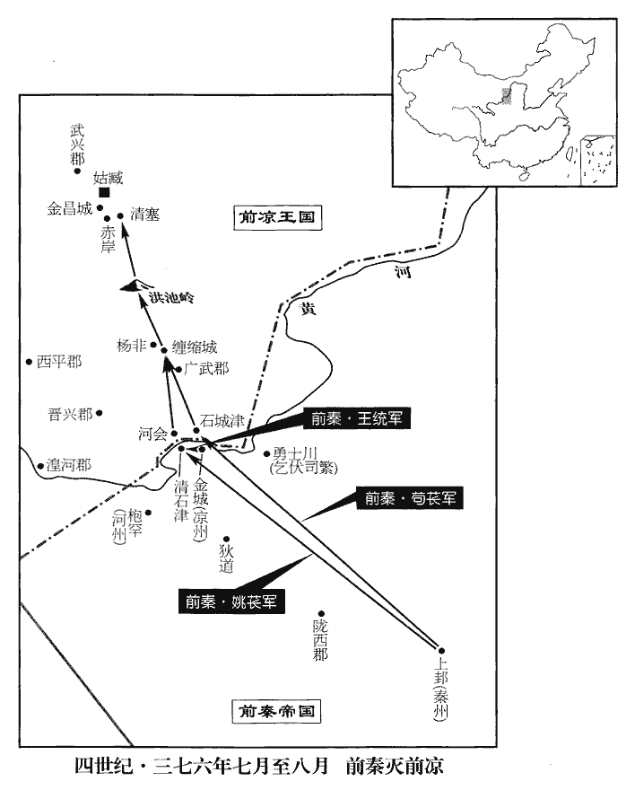
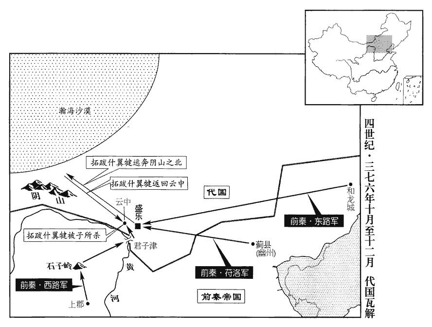
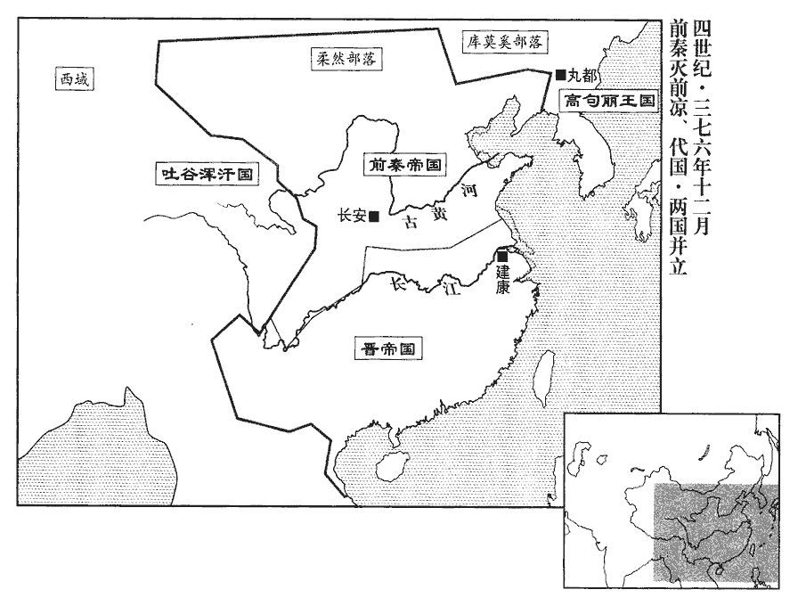
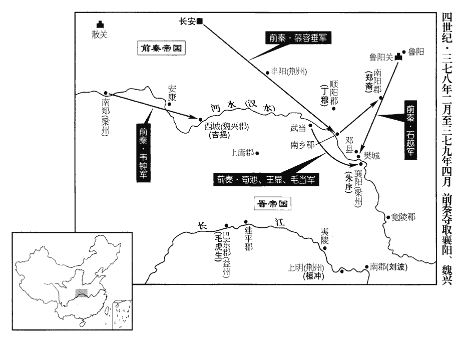
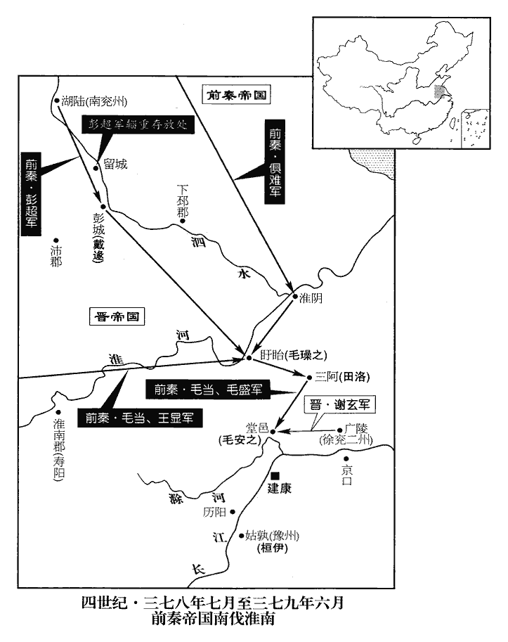
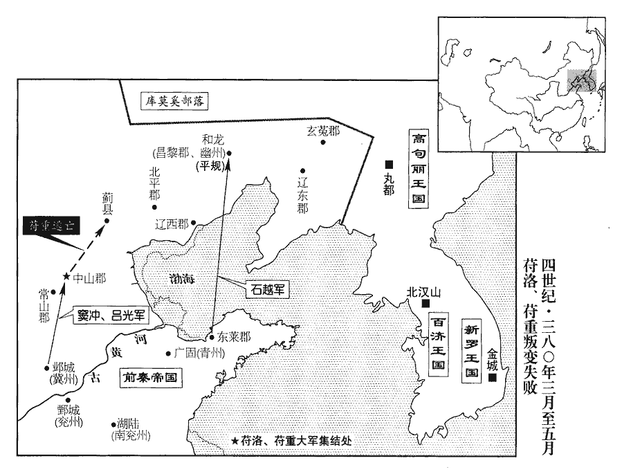
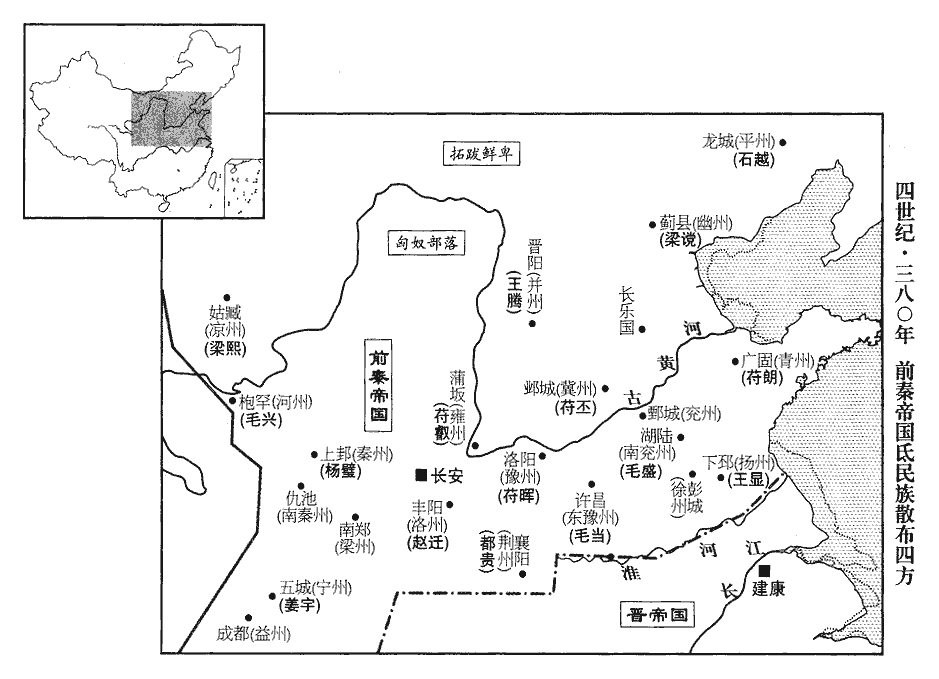

 晉紀二十六起柔兆困敦（丙子），盡玄黓敦牂（壬午），凡七年。

# 烈宗孝武皇帝上之中

## 太元元年（丙子、三七六）

1春，正月，壬寅朔‹一›，帝‹司马昌明，本年十五岁›加元服；皇太后‹褚蒜子›下詔歸政，太后攝政，見上卷上年。復稱崇德太后。甲辰‹三›，大赦，改元。丙午‹五›，帝始臨朝。朝，直遙翻。以會稽‹浙江绍兴›內史郗愔為鎮軍大將軍、都督浙江‹钱塘江›東五郡諸軍事；浙江東五郡，會稽、東陽、臨海、永嘉、新安也。會，工外翻。郗，丑之翻。愔，挹淫翻。徐州‹府京口，江苏镇江›刺史桓沖為車騎將軍、都督豫、江二州之六郡諸軍事，豫州之歷陽‹安徽和县›、淮南‹安徽寿县›、廬江‹安徽舒城›、安豐‹安徽霍邱›、襄城‹侨郡·安徽繁昌›及江州之尋陽‹江西九江›，共六郡。騎，奇寄翻。自京口‹江苏镇江›徙鎮姑孰‹安徽当涂›。謝安欲以王蘊為方伯，故先解沖徐州。乙卯‹十四›，加謝安中書監，錄尚書事。

〖译文〗 [1]春季，正月，壬寅朔（初一），东晋孝武帝加冠，皇太后下达诏令，将朝政归还给他，自己恢复崇德太后的称号。甲辰（初三），实行大赦，改年号为太元。丙午（初五），孝武帝开始临朝主持国政。任命会稽内史郗为镇军大将军、都督浙江东五郡诸军事；任命徐州刺史桓冲为车骑将军、都督豫江二州之六郡诸军事，从京口调到姑孰镇守。谢安想让王蕴做地方长官，所以先解除桓冲在徐州的职务。乙卯（十四），让谢安担任中书监，录尚书事。

2二月，辛丑‹二十一›，秦王堅‹本年三十九岁›下詔曰：「朕聞王者勞於求賢，逸於得士，齊桓公用管仲之言。斯言何其驗也。往得丞相，常謂帝王易為。易，以豉翻。自丞相違世，鬚髮中白，丞相，謂王猛。中，半也。中，丁仲翻。每一念之，不覺酸慟。今天下既無丞相，或政教淪替，替，廢也。可分遣侍臣周巡郡縣，問民疾苦。」

〖译文〗 [2]二月，辛卯（二十一日），前秦王苻坚下达诏令说：“朕听说作为帝王，应该在搜求贤能的人时辛劳，得到合适的人才后就省心省力了。这话多么符合实际呀！过去我得到了丞相王猛，经常说帝王非常容易做。自从丞相去世以后，我已经操劳得胡须头发都半白了，每当想到王猛，酸楚悲痛就油然而生。如今天下既然失去丞相，政事教化或许会陷于沦废，可以分派侍臣周游巡视各郡县，询问民间疾苦。”

3三月，秦兵寇南鄉‹河南淅川南›，拔之，山蠻‹时居湖北省襄樊市之西山区›三萬戶降秦。自春秋之時，伊、洛以南，巴、巫、漢、沔以北，大山長谷，皆蠻居之。文公十六年，庸人率群蠻以叛楚。庸，則漢之上庸縣也。哀公四年，楚人襲梁及霍以圍蠻氏，執蠻子赤。梁，則漢河南之梁縣；霍，則梁縣南之霍陽山也。漢高帝用巴渝蠻以定三秦，則板楯蠻也。後漢祭遵攻新城蠻、柏華蠻，破霍陽聚，則春秋蠻氏之聚落也。其後又有巫蠻、南郡蠻、江夏蠻。襄陽以西，中廬、宜城之西山，皆蠻居之，所謂山蠻也。宋、齊以後，謂之雍州蠻。降，戶江翻。

〖译文〗 [3]三月，前秦的军队进犯南乡，攻下该地，山蛮民众三万户投降前秦。

4夏，五月，甲寅‹十五›，大赦。

〖译文〗 [4]夏季，五月，甲寅（十五日），东晋实行大赦。

5初，‹前凉，都姑臧甘肃省武威市›張天錫‹本年三十一岁›之殺張邕也，劉肅及安定‹甘肃镇原东南曙光乡›梁景皆有功，事見一百一卷穆帝升平五年。二人由是有寵，賜姓張氏，以為己子，使預政事。天錫荒于酒色，不親庶務，黜世子大懷而立嬖妾【章：十二行本「妾」下有「焦氏」二字；乙十一行本同；張校同。】之子大豫，嬖，卑義翻，又博計翻。以焦氏為左夫人，人情憤怨；從弟從事中郎憲輿櫬切諫，不聽。從，才用翻。櫬chèn，初覲翻。

〖译文〗 当初，张天锡诛杀张邕的时候，刘肃以及安定人梁景全都有功，他们二人因此得宠，被赐姓张氏，张天锡把他们当作自己的儿子，让他们参与政事。张天锡沉湎于酒色，不亲自处理政务，废黜了世子张大怀，改立宠妾焦氏的儿子张大豫为世子，以焦氏作为左夫人，人们心里都很怨恨愤怒。堂弟从事中郎张宪用车拉着棺材，以死劝谏，张天锡也不听从。

秦王堅下詔曰：「張天錫雖稱藩受位，然臣道未純，可遣使持節•武衛將軍【章：十二行本「軍」下有「武都」二字；乙十一行本同；退齋校同。】苟萇、左將軍毛盛、中書令梁熙、步兵校尉姚萇等將兵臨西河；河水過敦煌、酒泉、張掖郡南，武威郡東北，為西河。使，疏吏翻。萇，仲良翻。將，即亮翻。尚書郎閻負、梁殊奉詔徵天錫入朝，朝，直遙翻。若有違王命，即進師撲討。」撲，普卜翻。是時，秦步騎十三萬，軍司段鏗謂周虓xiāo曰：「以此眾戰，誰能敵之！」用左傳齊桓公之言。鏗，丘耕翻。虓，虛交翻。虓曰：「戎狄以來，未之有也。」周虓拘執於秦，其尊本朝之心，雖造次不忘也。考異曰：虓傳曰：「呂光征西域，堅出餞之，戎士二十萬，旌旗數百里。問虓曰：『朕眾力何如?』虓曰：『戎夷以來，未之有也。』」按建元十八年，二月，虓謀反，徙朔方。十九年，正月，呂光發長安。故知在伐涼州時。今從十六國春秋。堅又命秦州‹府设上邽甘肃省天水市›刺史苟池、河州‹府设枹罕甘肃省临夏市›刺史李辯、涼州‹府设金城甘肃省兰州市›刺史王統帥三州之眾為苟萇後繼。帥，讀曰率。

〖译文〗 前秦王苻坚下达诏书说：“张天锡虽然对我们称藩，接受了我们授予的官位，但他为臣之道不纯，可以派遣使持节、武卫将军苟苌和左将军毛盛、中书令梁熙、步兵校尉姚苌等人统领军队逼近西河驻扎，让尚书郎阎负、梁殊尊奉诏令，征召张天锡前来朝廷，如果他违背命令，马上进军讨伐。”这时，前秦的步、骑兵有十三万人，军司段铿对周说：“以这么多的兵众出战，有谁能抵挡！”周说：“在戎狄之人这里，确实是从来也没有过的。”苻坚又命令秦州刺史苟池、河州刺史史李辩、凉州刺史王统率领三州的兵众作为苟苌的后继部队。

秋，七月，閻負、梁殊至姑臧。張天錫會官屬謀之，曰：「今入朝，必不返；如其不從，秦兵必至，將若之何?」禁中錄事席仂lè曰：禁中錄事，張氏所置，使總錄禁中事也。仂，與力同，又音勒。「以愛子為質，質，音致。賂以重寶，以退其師，然後徐為之計，此屈伸之術也。」眾皆怒，曰：「吾世事晉朝，朝，直遙翻。忠節著於海內。今一旦委身賊庭，辱及祖宗，醜莫大焉！且河西天險，百年無虞，若悉境內精兵，右招西域，北引匈奴以拒之，何遽知其不捷也！」天錫攘袂大言曰：「孤計決矣，言降者斬！」降，戶江翻；下同。使謂閻負、梁殊曰：「君欲生歸乎，死歸乎?」殊等辭氣不屈，天錫怒，縛之軍門，命軍士交射之，曰：「射而不中，射，而亦翻。中，竹仲翻。不與我同心者也。」其母嚴氏泣曰：「秦主以一州之地，橫制天下，東平鮮卑，南取巴、蜀，兵不留行；汝【章：十二行本「汝」上有「所向無敵」四字；乙十一行本同；退齋校同；張校同，云無註本亦說。】若降之，猶可延數年之命。今以蕞爾一隅，抗衡大國，蕞zuì，徂外翻。又殺其使者，亡無日矣！」天錫使龍驤將軍馬建帥眾二萬拒秦。驤，思將翻。帥，讀曰率。

〖译文〗 秋季，七月，阎负、梁殊抵达姑臧。张天锡召集手下的官员们商量，说：“如今前往朝廷，一定就无法返回了；如果不听从征召，前秦的军队一定会到来，该怎么办呢？”禁中录事席仂说：“以您心爱的儿子作为人质，再给他们奉赠贵重的宝物，以使他们的军队撤退，然后再从容计议，这是以屈求伸的办法。”众人听后全都愤怒，说：“我们世世代代奉事晋朝，忠诚节气闻名海内。如今一旦委身于秦贼门下，耻辱殃及祖宗。再也没有比这更大的羞耻了！况且凭仗河西的天险，百年无患，如果出动境内的全部精兵，再向西延请西域、向北延请匈奴的兵力抵抗他们，怎么就知道不能取胜呢！”张天锡捋起袖子大声说：“我主意已定，说投降者斩首！”于是张天锡派人告诉阎负、梁殊说：“你们是想活着回去呢，还是死着回去？”梁殊等人回答的语气毫不屈服，张天锡发怒，把他们捆绑在军营的门柱上，命令士兵乱箭射死他们，并说：“射不中的人，就是和我不一心。”张天锡的母亲严氏哭泣着说：“秦国主靠一州之地起家，横扫天下，向东平定了鲜卑，向南攻取了巴、蜀，军队丝毫没有被阻滞。你如果投降了，还可以延长几年性命。如今以此一隅之地，抗衡大国，又杀掉了他们的使者，离灭亡没有几天了！”张天锡派龙骧将军马建率领兵众二万人抵抗前秦。

秦人聞天錫殺閻負、梁殊，八月，梁熙、姚萇、王統、李辯濟自清石津‹甘肃兰州西北黄河渡口›，攻涼驍烈將軍梁濟於河會城‹兰州西河口镇›，降之。驍烈將軍，蓋張氏置。五代志：允吾縣有青巖山。水經註：湟河至允吾，與大河會。意者清石津在青巖山之下，河會城在二河之會歟?驍，堅堯翻。甲申‹十七›，苟萇濟自石城津‹兰州北黄河渡口›，闞駰曰：石城津在金城西北。與梁熙會攻纏縮城‹甘肃永登境›，拔之。馬建懼，自楊非‹纏縮城西北›退屯清塞‹甘肃武威东南›。水經註：逆水出允吾縣之參街谷，東南流逕街亭城南，又東南逕陽非亭北，又東南逕廣武城西。據載記，楊非在支陽東北三百餘里。天錫又遣征東將軍掌據帥眾三萬軍于洪池‹甘肃天祝西北乌鞘岭›，洪池，嶺名，在姑臧南。「掌據」，晉書作「常據」，當從之。天錫自將餘眾五萬，軍于金昌城。金昌城在赤岸西北。安西將軍敦煌宋皓言於天錫曰：敦，徒門翻。「臣晝察人事，夜觀天文，秦兵不可敵也，不如降之。」天錫怒，貶皓為宣威護軍。廣武‹甘肃永登›太守辛章曰：張寔分金城之令居、枝陽，置廣武郡。宋白曰：蘭州廣武縣本漢枝陽縣地，張駿分晉興置廣武郡。「馬建出於行陳，行，戶剛翻。陳，讀曰陣。必不為國家用。」苟萇使姚萇帥甲士三千為前驅。庚寅‹二十三›，馬建帥萬人迎降，餘兵皆散走。辛卯‹二十四›，苟萇及掌據戰于洪池，據兵敗，馬為亂兵所殺，其屬董儒授之以馬，據曰：「吾三督諸軍，再秉節鉞，八將禁旅，十總禁【章：十二行本「禁」作「外」；乙十一行本同；孔本同。】兵，寵任極矣。天錫之攻李儼也，常據首破其兵；蓋河西推為良將，故其言如此。今卒困於此，卒，子恤翻。此吾之死地也，尚安之乎！」乃就帳免冑，西向稽首，伏劍而死。稽，音啟。秦兵殺軍司席仂。癸巳‹二十六›，秦兵入清塞，天錫遣司兵趙充哲帥眾拒之。河西張氏置官僚，擬於王者而微異其名。司兵，蓋晉五兵尚書之職也。秦兵與充哲戰于赤岸，大破之，水經註：河水自左南而東，逕赤岸北，亦謂之河夾岸。秦州記曰：枹罕有河夾岸。俘斬三萬八千級，充哲死。天錫出城自戰，城內又叛。天錫與數千騎奔還姑臧‹甘肃武威›。甲午‹二十七›，秦兵至姑臧，天錫素車白馬，面縛輿櫬，降于軍門。苟萇釋縛焚櫬，送于長安‹西安›，惠帝永寧元年，張軌為涼州刺史，遂有涼土，共九主，七十五年而亡。櫬，初覲翻。涼州郡縣悉降於秦。

〖译文〗 前秦人听说张天锡杀掉阎负、梁殊，八月，梁熙、姚苌、王统、李辩从清石津渡过西河，在河会城攻打前凉骁烈将军梁济，降服了他们。甲申（十七日），荀苌由石城津渡河，与梁熙会合，攻取了缠缩城。马建畏惧，从杨非退守清塞。张天锡又派征东将军掌据率领三万兵众集结于洪池，张天锡亲自统领剩下的五万兵众，集结在金昌城。安西将军、敦煌人宋皓向张天锡进言说：“臣白天观察人际表现，晚上观察天文星象，秦国的军队不可抵挡，不如投降。”张天锡发怒，将宋皓贬为宣威护军。广武太守辛章说：“马建出身于行伍，一定不会为国家效力。”苟苌让姚苌率领三千甲士作为前锋部队。庚寅（二十三日），马建率领一万人向苟苌投降，其余的兵众全都逃散。辛卯（二十四日），苟苌与掌据在洪池交战，掌据的部队被打败，战马被乱兵杀死，属下董儒交给他一匹马，掌据说：“我三次督领各路军队，二次持符节斧钺，八次领宫中卫队，十次在外带兵，受到的重用宠信达到了顶峰。今天终于受困于此，这就是我的死亡之地，怎么还能安身活命呢！”于是进入军帐，褪下头盔甲胄，向西叩头，自刎而死。前秦的士兵杀死军司席仂。癸巳（二十六日），前秦的军队进入清塞，张天锡派司兵赵充哲率领兵众抵抗。前秦的军队与赵充哲在赤岸交战，彻底攻破了他们，俘获并斩首三万八千人，赵充哲战死。张天锡亲自出城迎战，城内又发生了反叛。张天锡与数千骑兵逃回姑臧。甲午（二十七日），前秦的军队抵达姑臧，张天锡以白车白马载着棺材，双手反绑于身后，在军营门前投降。苟苌为他松绑，焚烧了棺材，送他到长安，凉州的郡县全都投降了前秦。

 

九月，秦王堅以梁熙為涼州刺史，鎮姑臧。徙豪右七千餘戶于關中，餘皆按堵如故。封天錫為歸義侯，拜北部尚書。秦置北部尚書，以掌北蕃。初，秦兵之出也，先為天錫築第於長安，為，于偽翻。至則居之。以天錫晉興‹青海民和›太守隴西‹甘肃陇西›彭和正為黃門侍郎，張軌分西平界，置晉興郡。治中從事武興‹甘肃武威西北›蘇膺、張軌以秦、雍移人於姑臧西北，置武興郡。敦煌‹甘肃敦煌›太守張烈為尚書郎，敦，徒門翻。西平‹青海西宁›太守金城‹甘肃兰州›趙凝為金城太守，高昌‹新疆吐鲁番东›楊幹為高昌太守；高昌，漢車師之高昌壁也，張氏始置郡，後為高昌國，唐以其地置西州。餘皆隨才擢敘。

〖译文〗 九月，前秦王苻坚任命梁熙为凉州刺史，镇守姑臧。将七千多户豪强世族迁徙到关中，其余的全都让他们在原地安居。封张天锡为归义侯，授官北部尚书。当初，前秦的军队出征的时候，就预先为张天锡在长安建造了宅第，张天锡到达长安后就住在这里。任命张天锡手下的晋兴太守、陇西人彭和正为黄门侍郎，治中从事武兴人苏膺、敦煌太守张烈为尚书郎，西平太守金城人赵凝为金城太守，高昌人杨为高昌太守，其余的人全都根据才能如以任用。

梁熙清儉愛民，河右安之；為梁熙為呂光所殺張本。以天錫武威太守敦煌索泮為別駕，索，昔各翻。宋皓為主簿。西平郭護起兵攻秦，熙以皓為折衝將軍，討平之。

〖译文〗 梁熙清正节俭，爱护民众，黄河以西因此很安定。他任用张天锡手下的武威太守敦煌人索泮为别驾，宋皓为簿。西平人郭护起兵攻打前秦，梁熙任命宋皓为折冲将军，前去讨伐并平定了他们。

桓沖聞秦攻涼州，遣兗州刺史朱序、江州刺史桓石秀與荊州督護桓羆遊軍沔、漢，為涼州聲援；沔，彌兗翻。又遣豫州刺史桓伊帥眾向壽陽‹安徽寿县›，帥，讀曰率；下同。淮南太守劉波汎舟淮、泗，欲橈秦以救涼。橈，奴教翻。聞涼州敗沒，皆罷兵。

〖译文〗 桓冲听说前秦攻打凉州，派兖州刺史朱序、江州刺史桓石秀与荆州督护桓罴率兵在沔水、汉水一带游巡，声援凉州。又派豫州刺史桓伊率领兵众开向寿阳，淮南太守刘波的水军乘船在淮水、泗水巡游，想分散前秦的兵力，以救助凉州。当听说凉州失败覆没以后，全都停止了行动。

6初，哀帝‹司马丕›減田租，畝收二升。見一百一卷隆和元年。乙巳‹八›，除度田收租之制，度，徒洛翻。王公以下，口稅米三斛，蠲juān在役之身。

〖译文〗 [6]当初，东晋哀帝减少田租，每亩收租二升。乙巳（初八），废除了按田亩收租的制度，王公以下的人，每人交纳三斛米的赋税，对服兵役、劳役的人实行蠲免。

7冬，十月，移淮北民於淮南。畏秦也。

〖译文〗 [7]冬季，十月，东晋将淮河以北的百姓迁移到淮河以南。

8劉衛辰為代所逼，求救於秦，秦王堅以幽州刺史行唐公洛為北討大都督，帥幽、冀兵十萬擊代；帥，讀曰率。使并州刺史俱難、鎮軍將軍鄧羌、尚書趙遷、李柔、前將軍朱肜、前禁將軍張蚝、蚝háo，七吏翻。右禁將軍郭慶帥步騎二十萬，東出和龍‹辽宁朝阳›，西出上郡‹陕西榆林南鱼河堡›，皆與洛會，以衛辰為鄉導。洛，菁之弟也。秦主健之入關，菁有功焉。健之垂沒也，菁以逆誅。鄉，讀曰嚮。

〖译文〗 [8]刘卫辰受到了代国的威胁，向前秦求救，前秦王苻坚任命幽州刺史、行唐公苻洛为北讨大都督，率领幽州、冀州的十万军队攻击代国，让并州刺史俱难、镇军将军邓羌、尚书赵迁、李柔、前将军朱肜、前禁将军张蚝、右禁将军郭庆率领步兵、骑兵二十万人，东出和龙，西出上郡，全都与苻洛会合，让刘卫辰作向导。苻洛是苻菁的弟弟。

苟萇之伐涼州也，遣揚武將軍馬暉、建武將軍杜周帥八千騎西出恩宿‹甘肃永昌西›，邀張天錫走路，期會姑臧。暉等行澤中，值水失期，於法應斬，有司奏徵下獄。下，遐稼翻。秦王堅曰：「水春冬耗竭，秋夏盛漲，此乃苟萇量事失宜，量，音良。非暉等罪。今天下方有事，宜宥過責功。命暉等回赴北軍，擊索虜以自贖。」代本鮮卑索頭種，故謂之索虜。索，昔各翻。眾咸以為萬里召將，非所以應速，將，即亮翻；下同。堅曰：「暉等喜於免死，不可以常事疑也。」暉等果倍道疾驅，遂及東軍。暉等自西方回，故謂伐代之軍為東軍。

〖译文〗 苟苌讨伐凉州的时候，派扬武将军马晖、建武将军杜周率领八千骑兵西出恩宿，截断张天锡的退路，并让他们在一定的期限内到姑臧会合。马晖等行进到洼池，遇上了大水，延误了期限，按照军法应当斩首，有关部门奏请召回投入牢狱。前秦王苻坚说：“河水春季、冬季枯竭，秋季、夏季暴涨，这是苟苌估计上的失误，不是马晖等人的罪过。如今天下正有战事，应该宽恕罪过责成他们立功。命令马晖等人掉头奔赴北军，攻击代国的敌虏以自我赎罪。”众人都认为相距万里征召战将，难以迅速响应，苻坚说：“马晖等人对免于一死感到高兴，不能按常规去怀疑他们。”马晖等人果然日夜兼程，迅速行进，于是赶上了东军。

9十一月，己巳朔‹一›，日有食之。

〖译文〗 [9]十一月，己巳朔（疑误），出现日食。

10代王什翼犍使白部、獨孤部南禦秦兵，皆不勝，鮮卑有白部。後漢時鮮卑居白山者，最為強盛，後因曰白部。令狐德棻fēn曰：魏氏之初，三十六部，其先伏留屯者，與魏俱起，為部落大人，遂為獨孤部。犍，居言翻。又使南部大人劉庫仁將十萬騎禦之。庫仁者，衛辰之族，什翼犍之甥也，與秦兵戰於石子嶺‹内蒙乌审旗北›；石子嶺當雲中盛樂西南。新唐書曰：自夏州北渡烏水，一百二十里至可朱渾水源，又百餘里至石子嶺。庫仁大敗；什翼犍病，不能自將，乃帥諸部奔陰山之北。高車‹敕勒，蒙古北部›雜種盡叛，李延壽曰：高車，蓋赤狄之餘種也，北方以為高車丁零。其先，匈奴甥也。其遷徙隨水草，衣皮食肉，牛羊畜產並與柔然同；唯車輪高大，輻數至多，因以為號。種，章勇翻。四面寇鈔，鈔，楚交翻。不得芻牧，什翼犍復渡漠南‹瀚海沙漠群以南›。復，扶又翻。聞秦兵稍退，十二月，什翼犍還雲中‹内蒙托克托›。

〖译文〗 [10]代王拓跋什翼犍让白部、独孤部在南面抵御前秦的军队，都没有取胜。又让南部大人刘库仁统领十万骑兵去抵御。刘库仁与刘卫辰同族，是拓跋什翼犍的外甥。他与前秦的军队在石子岭交战，刘库仁大败。拓跋什翼犍患病，不能亲自带兵上阵，于是率领众部族逃奔到阴山以北。高车的各部族全都反叛，四面攻劫掠夺，由于无法牧养牲畜，拓跋什翼犍又到了沙漠以南。听说前秦的军队逐渐撤退，十二月，拓跋什翼犍回到云中。

 

初，什翼犍分國之半以授弟孤，事見九十六卷成帝咸康四年。孤卒，子斤失職怨望。不復得國之半，故自以為失職而怨。卒，子恤翻。世子寔及弟翰早卒，寔卒見上卷簡文帝咸安元年。寔子珪尚幼‹本年六岁›，慕容妃之子閼婆、壽鳩、紇hé根、地干、力真、窟咄皆長，閼，於葛翻。紇，下沒翻。窟，苦骨翻。咄，當沒翻。長，知兩翻；下同。慕容妃，燕女也。什翼犍娶燕女為妃，見九十七卷康帝建元二年。繼嗣未定。時秦兵尚在君子津‹内蒙托克托东南黄河渡口›，水經：河水南入雲中楨陵縣西北，又南過赤城東，又南過定襄桐過縣西。河水於二縣之間，濟有君子之名。酈道元註曰：昔漢桓帝西幸榆中，東行代地，洛陽大賈賫jī金貨隨帝後行，夜，迷失道，往投津長，曰子封，送之渡河。賈人卒死，津長埋之。其子尋求父喪，發冢舉尸，資貨一無所損。其子悉以金與之，津長不受。事聞於帝，曰：「君子也。」即名其津為君子濟。在雲中城西南二百餘里。諸子每夜執兵警衛。斤因說什翼犍之庶長子寔君曰：說，輸芮翻。「王將立慕容妃之子，欲先殺汝，故頃來諸子每夜戎服，以兵遶廬帳，北狄之長，居大氈zhān帳，環設兵衛。氈帳，漢人謂之穹廬，因曰廬帳。伺便將發耳。」伺，相吏翻。寔君信之，遂殺諸弟，并弒什翼犍‹拓跋什翼犍年五十七岁›。是夜，諸子婦及部人奔告秦軍，秦李柔、張蚝勒兵趨雲中，趨，七喻翻。部眾逃潰，國中大亂。珪母賀氏以珪走依賀訥nè。訥，野干之子也。賀野干見上卷簡文帝咸安元年。

〖译文〗 当初，拓跋什翼犍分出国土的一半授与弟弟拓跋孤，拓跋孤死后，儿子拓跋斤失去了继承的职位，因而心怀不满。拓跋什翼犍的长子拓跋及弟弟拓跋翰早年死亡，拓跋的儿子拓跋年龄尚幼，慕容妃的儿子拓跋阏婆、拓跋寿鸠、拓跋纥根、拓跋地干、拓跋力真、拓跋窟咄全都年长，由谁来继位还未确定。当时前秦的军队尚在君子津，慕容妃的儿子们每到夜晚都手持兵器警卫。拓跋斤借机劝说拓跋什翼犍的庶长子拓跋君说：“国王将要立慕容妃的儿子为继承人，想要先杀掉你，所以近来慕容妃儿子们每到夜晚都全副武装，领兵环绕庐帐，窥探好时机后就要动手了。”拓跋君信以为真，于是杀掉了弟弟们，把拓跋什翼犍也杀了。当晚，慕容妃儿子们的妻子以及部属跑去向前秦的军队报告，前秦的李柔、张蚝率兵开赴云中，代国的部属兵众溃逃，国内大乱。拓跋的母亲贺氏带着拓跋投奔了贺讷。贺讷是贺野干的儿子。

秦王堅召代長史燕鳳，問其所以亂故，鳳具以狀對。堅曰：「天下之惡一也。」左傳載石祁子之言。乃執寔君及斤，至長安，車裂之。堅欲遷珪於長安，鳳固請曰：「代王初亡，群下叛散，遺孫沖幼，莫相統攝。其別部大人劉庫仁，勇而有智，鐵弗衛辰，狡猾多變，劉衛辰本匈奴鐵弗種。李延壽曰：鐵弗，南單于苗裔。衛辰者，左賢王去卑之玄孫。北人謂胡父、為（衍）鮮卑母為鐵弗，因以為姓。皆不可獨任。宜分諸部為二，令此兩人統之；兩人素有深讎，其勢莫敢先發。俟其孫稍長，引而立之，是陛下有存亡繼絕之德於代，使其子子孫孫永為不侵不叛之臣，用左傳戎子駒支之言。此安邊之良策也。」堅從之。分代民為二部，自河以東屬庫仁，自河以西屬衛辰，各拜官爵，使統其眾。賀氏以珪歸獨孤部，與南部大人長孫嵩、拓跋鬱律生二子：長曰沙莫雄，次曰什翼犍。沙莫雄為南部大人，後改名仁，號為拔拔氏，生嵩。道武以嵩宗室之長，改為長孫氏。此言長孫所出，與前註略不同。元佗等皆依庫仁。行唐公洛以什翼犍子窟咄年長，長，知兩翻。遷之長安。堅使窟咄入太學讀書。

〖译文〗 前秦王苻坚召见代国长史燕凤，问他导致代国大乱的原因，燕凤把实情原原本本地告诉了他。苻坚说：“天下的丑恶都是一样的。”于是就将拓跋君及拓跋斤押解到长安，车裂了他们。苻坚想把拓跋迁移到长安，燕凤坚持请求说：“代王拓跋什翼犍刚刚死亡，群臣、部属背叛离散，留下来的孙子年幼，没有人再统领代国。代国的别部大人刘库仁，勇猛而有智谋，刘卫辰则狡猾多变，他们都不宜独担重任。应该将众部族一分为二，让这两人分别统领。他们两人历来有深仇，势必都不敢首先发难。等到拓跋逐渐长大，再将他立为王，这样陛下对代国有存亡继绝的恩德，从而使他们子子孙孙永远成为不侵犯、不背叛的臣属，这才是安定边境的良第。”苻坚听从了燕凤的意见。把代国的百姓分为两部分，自黄河以东属于刘库仁，自黄河以西属于刘卫辰，各授官职爵位，让他们统领自己的部众。贺氏带着拓跋返回了独孤部，与南部大人长孙嵩、元佗等都归依了刘库仁。行唐公苻洛考虑到拓跋什翼犍的儿子拓跋窟咄年长，把他迁移到了长安。苻坚让拓跋窟咄进入太学读书。

下詔曰：「張天錫承祖父之資，藉百年之業，擅命河右，叛換偏隅。鄭康成曰：叛換，猶跋扈也。韓詩曰：叛換，武強也。索頭世跨朔北‹河套以北›，中分區域，東賓穢貊‹朝鲜东北部›，「穢」，當作「濊」。西引烏孫‹都赤谷城，中亚伊赛克湖东南›，控弦百萬，虎視雲中。爰命兩師，兩師，謂苟萇伐河西之師，行唐公洛伐代之師也。分討黠虜，黠xiá，下八翻。役不淹歲，窮殄二兇，俘降百萬，降，戶江翻。闢土九千，五帝之所未賓，周、漢之所未至，莫不重譯來王，重，直龍翻。懷風率職。有司可速班功受爵，杜預曰：班，次也。「受」，當作「授」。戎士悉復之五歲，復，方目翻。賜爵三級。」於是加行唐公洛征西將軍，以鄧羌為并州刺史。

〖译文〗 苻坚下达诏书说：“张天锡继承了先辈的成果，凭借着延续百年的功业，擅自在黄河以西发号施令，偏居一隅飞扬跋扈。索头部族世代横跨朔北，在中部，分割地域，在东部，结交貊，在西部，召引乌孙，士兵百万，虎视云中。于时命令苟苌、苻洛二军，分别讨伐狡诈的敌虏，征战不到一年，就彻底消灭了这两个顽凶，俘获多达百万，开群领土九千。五帝所没有结交周朝、汉朝所没能到达的地方的人，全都经过辗转翻译前来朝见，感念我们的恩德，克尽职守。有关部门应当迅速依功授爵，军中将士全都免除赋税五年，赏赐爵位三级。”于是让行唐公苻洛担任征西将军，任命邓羌为并州刺史。

 

陽平國‹河北馆陶›常侍慕容紹私謂其兄楷曰：「秦恃其強大，務勝不休，北戍雲中，南守蜀、漢，轉運萬里，道殣jǐn相望，左傳之言。詩云：行有死人，尚或殣之。毛氏曰：墐jǐn，路冢也。殣，音覲jìn。說文曰：道中死人，人所覆也。又，餓殍piǎo為殣。兵疲於外，民困於內，危亡近矣。冠軍叔仁智度英拔，必能恢復燕祚，秦以慕容垂為冠軍將軍，楷、紹之叔父也。「叔仁」，當作「叔父」。冠，古玩翻。吾屬但當愛身以待時耳！」史言鮮卑窺秦，有乘釁xìn報復之志。

〖译文〗 阳平国常侍慕容绍私下里对他的哥哥慕容楷说：“前秦自恃强大，求胜不止，北面驻守云中，南面镇守蜀、汉，辗转运输，遥遥万里，道旁坟冢相望。军队疲惫在外，百姓困苦在内，危亡之时已经临近了。冠军叔父慕容垂的仁爱、智谋、气度出类拔萃，一定能宏扬光复燕国的国统，我们只需要多多保重以等待时机！”

初，秦人既克涼州，議討西障氐、羌，西障，西邊也。秦王堅曰：「彼種落雜居，種，章勇翻。不相統壹，不能為中國大患，宜先撫諭，徵其租稅，若不從命，然後討之。」乃使殿中將軍張旬前行宣慰，庭中將軍魏曷飛帥騎二萬七千隨之。庭中將軍，秦所置，蓋立仗殿庭中者也。帥，讀曰率。騎，奇寄翻。曷飛忿其恃險不服，縱兵擊之，大掠而歸。堅怒其違命，鞭之二百，斬前鋒督護儲安以謝氐、羌。氐、羌大悅，降附貢獻者八萬三千餘落。降，戶江翻。雍州士族先因亂流寓河西者，皆聽還本。雍，於用翻。

〖译文〗 当初，前秦人攻克了凉州以后，商议讨伐西方边境上的氐族、羌族部落。前秦王苻坚说：“他们不同种族部落混杂而居，并不统一，不能构成中原之国的大患，应该先加以安抚劝谕，征收他们的田租赋税，如果不服从命令，然后再去讨伐他们。”于是就让殿中将军张旬前往安抚，让庭中将军魏曷飞率领骑兵二万七千人紧随其后。魏曷飞对他们凭借险要的地势拒不降服非常气愤，就发兵对他们展开攻击，大肆抢掠以后返回。苻坚对他违背命令十分愤怒，打了他二百鞭，杀掉了前锋督护储安以向氐族、羌族人谢罪。氐族、羌族人十分高兴，向前秦投降归附进献贡奉的有八万三千多个部落。雍州士族先前因为战乱而流落寓居河西的人，全都听凭他们返回故土。

劉庫仁招撫離散，恩信甚著，奉事拓跋珪恩勤周備，不以廢興易意，常謂諸子曰：「此兒有高天下之志，必能恢隆祖業，汝曹當謹遇之。」天下之英雄，雖在童穉中，固不與群兒同也。秦王堅賞其功，加廣武將軍，給幢麾鼓蓋。幢，直江翻。

〖译文〗 刘库仁招纳安抚叛离逃散的百姓，恩德与信义十分明显，事奉拓跋殷勤周到，不因为他的废兴而改变主意，常对儿子们说：“这孩子有高于天下人的志向，一定能弘扬昌隆祖先的业绩，你们应当谨慎小心地对待他。”前秦王苻坚奖赏刘库仁的功绩，任命他为广武将军，并给予他旌族、战鼓、伞盖。

劉衛辰恥在庫仁之下，怒殺秦五原‹内蒙包头›太守而叛。五原，漢郡也；魏、晉省，棄其地於荒外；秦復置郡；隋、唐為豐、鹽二州。庫仁擊衛辰，破之，追至陰山西北千餘里，獲其妻子。又西擊庫狄部，徙其部落，置之桑乾川‹山西山阴南桑干河上游›。桑乾縣，漢屬代郡，晉省。孟康曰：乾，音干。拓跋魏後置桑乾郡；唐屬朔州善陽縣界。魏收志，拓跋力微時，次南諸部有庫狄部，後改為狄氏。久之，堅以衛辰為西單于，督攝河西雜類，屯代來城‹内蒙伊金霍洛旗西北›。代來城，在北河西，蓋秦築以居衛辰。言自代來者居此城也。單，音蟬。

〖译文〗 刘卫辰对位居刘库仁之下感到耻辱，愤怒地杀掉了前秦的五原太守后反叛。刘库仁攻打刘卫辰，攻破了他，一直追击到阴山西北一千多里的地方，俘获了他的妻儿。又向西攻击库狄部，迁徙他们的部落，安置在桑乾川。过了许久，苻坚任命刘卫辰为西单于，督率统领河西的各部族，驻扎在代来城。

是歲，乞伏司繁卒‹时驻勇士川甘肃省榆中县北›，子國仁立。為乞伏國仁乘秦亂據隴西張本。

〖译文〗 [11]这一年，乞伏司繁去世，儿子乞伏国仁继位。

## 二年（丁丑、三七七）

1春，高句麗‹都丸都，吉林集安›、新羅‹都金城，韩国庆州›、西南夷‹四川南部›皆遣使入貢于秦。新羅，弁biàn韓苗裔也，居漢樂浪地。杜佑曰：新羅本辰韓種，魏時為斬新盧國，晉、宋曰新羅。其國在百濟東南五百餘里，兼有沃沮、不耐、韓、濊huì地。句，如字，又音駒。麗，力知翻。使，疏吏翻。

〖译文〗 [1]春季，高句丽、新罗、西南夷全都派遣使者来向前秦进献贡奉。

2趙故將作功曹熊邈屢為秦王堅‹本年四十岁›言石氏宮室器玩之盛，堅以邈為將作長史，領將作丞，【章：十二行本「將作丞」作「尚方丞」；乙十一行本同；孔本同；張校同；退齋校同。】晉將作大匠有丞，無長史；長史蓋秦所置。屢為，于偽翻。大脩舟艦、兵器，飾以金銀，頗極精巧。艦，戶黯翻。慕容農私言於慕容垂曰：「自王猛之死，秦之法制，日以頹靡，今又重之以奢侈，重，直用翻。殃將至矣，圖讖之言，行當有驗。大王宜結納英傑以承天意，時不可失！」垂笑曰：「天下事非爾所及！」慕容農所見，猶紹、楷也。

〖译文〗 [2]原后赵国的将作功曹熊邈向前秦王苻坚讲述石氏宫室、器物古玩的华丽丰盛，苻坚任命熊邈为将作长史，兼尚方丞，大规模地修整舟船、兵器，用金银装饰，精巧之极。慕容农私下里对慕容垂说：“自从王猛死后，前秦的法律制度，日益荒废，如今再加上奢侈，灾祸快要临头了，图谶中的话，行将应验。大王应该结交招纳勇武杰出之人以禀承天意，时机不可丧失！”慕容垂笑着说：“天下大事不是你所能预知的。”

3桓豁表兗州‹府广陵，江苏扬州›刺史朱序為梁州刺史，鎮襄陽‹湖北襄樊›。

〖译文〗 [3]桓豁上表请求任命兖州刺史朱序为梁州刺史，镇守襄阳。

4秋，七月，丁未‹十六›，以尚書僕射謝安為司徒，安讓不拜；復加侍中、都督揚•豫•徐•兗•青五州諸軍事。復，扶又翻。

〖译文〗 [4]秋季，七月，丁未（疑误），东晋任命尚书仆射谢安为司徒，谢安辞让不予接受。又任命谢安为侍中，都督扬、豫、徐、兖、青五州诸军事。

丙辰‹二十五›，征西大將軍、荊州刺史桓豁卒‹年五十八岁›。冬，十月，辛丑‹十一›，以桓沖都督江、荊、梁、益、寧、交、廣七州諸軍事，領荊州刺史；以沖子嗣為江州刺史。又以五兵尚書王蘊都督江南諸軍事，領【章：十二行本「領」上有「假節」二字；乙十一行本同；孔本同；張校同。】徐州刺史；江南諸軍，謂晉陵諸軍也。征西司馬領南郡相謝玄為兗州刺史，領廣陵‹江苏扬州›相，監江北諸軍事。桓豁為征西將軍，以玄為司馬。監，工銜翻。

〖译文〗 丙辰（疑误），征西大将军、荆州刺史桓豁去世。冬季，十月，辛丑（十一日），任命桓冲都督江、荆、梁、益、宁、交、广七州诸军事，兼荆州刺史。任命桓冲的儿子桓嗣为江州刺史。又任命五兵尚书王蕴都督江南诸军事，兼徐州刺史，任命征西司马兼南郡相谢玄为兖州刺史，兼广陵相，监长江以北诸军事。

桓沖以秦人強盛，欲移阻江南，此江南即上明也。奏自江陵徙鎮上明‹湖北松滋西北›，晉志：上明在漢武陵郡孱陵縣界。水經註：上明城在枝江縣，其地夷敞，北據大江，江汜枝分，東入大江，縣治洲上，故以枝江為稱。杜佑曰：上明即今江陵松滋縣西廢大明城，桓沖所築也。沖疏曰：「南平孱陵縣界，地名上明，田土膏良，可以資業軍人。在吳時樂鄉城以上四十餘里，北枕大江，西接三峽。」宋白曰：上明城，桓沖所築，在今松滋縣西。使冠軍將軍劉波守江陵，冠，古玩翻。諮議參軍楊亮守江夏‹湖北安陆›。

〖译文〗 桓冲考虑到前秦人威势强盛，想移师固守长江以南，奏请从江陵移镇上明，让冠军将军刘波戍守江陵，谘议参军杨亮戍江夏。

王蘊固讓徐州‹府京口，江苏镇江›，謝安曰：「卿居后父之重，不應妄自菲薄，以虧時遇。」時遇，謂一時之恩遇也。蘊乃受命。

〖译文〗 王蕴坚持辞让徐州刺史的职务，谢安说：“你居皇后之父的重要身份，不应该妄自菲薄，以损害一时的恩遇。”王蕴于是接受任命。

初，中書郎郗超自以其父愔位遇應在謝安之右，而安入掌機權，愔優遊散地，郗愔自徐、兗二州刺史移鎮會稽‹浙江绍兴›。郗，丑之翻。愔yīn，挹淫翻。散，悉亶翻。常憤邑形於辭色，由是與謝氏有隙。是時朝廷方以秦寇為憂，‹司马昌明，本年十六岁›詔求文武良將可以鎮禦北方者，將，即亮翻。謝安以兄子玄應詔。超聞之，歎曰：「安之明，乃能違眾舉親；玄之才，足以不負所舉。」眾咸以為不然。超曰：「吾嘗與玄共在桓公府，桓公，謂桓溫。超、玄同府，事見一百一卷哀帝興寧元年。見其使才，雖履屐間未嘗不得其任，是以知之。」履，以皮為之；屐，以木為之。屐，竭戟翻。

〖译文〗 当初，中书郎郗超自认为他的父亲郗的职位待遇应该在谢安之上，然而谢安入朝掌握了重要的权力。郗却在一些闲散的职位上悠闲无事，所以郗超的愤恨抑郁之情时常溢于辞色，因此与谢氏产生了隔阂。这时朝廷正对前秦的侵扰深以为忧，下达诏书在文武良将中寻求可以镇守戍卫北方领土的人，谢安荐举他哥哥的儿子谢玄应诏。郗超听说以后，慨叹道：“谢安贤明，才能够违背凡俗荐举他的亲戚；谢玄的才能，足以不辜负谢安的荐举。”众人全都认为并非如此。郗超说：“我曾经与谢玄同在桓温的幕府共事，见他施展才能，虽然是履屐间的小事也从来不失职，所以我了解他。”

玄募驍勇之士，驍，堅堯翻。得彭城‹江苏徐州›劉牢之等數人。以牢之為參軍，常領精銳為前鋒，戰無不捷。時號「北府兵」，晉人謂京口‹江苏镇江›為北府。謝玄破俱難等，始兼領徐州。號北府兵者，史終言之。敵人畏之。

〖译文〗 谢玄招募敏捷勇猛之人，得到了彭城的刘牢之等数人。任命刘牢之为参军。他经常统领精锐部队作为前锋出战，战无不胜。当时的人称他们为“北府兵”，敌人对他们很害怕。

5壬寅‹十二›，護軍將軍、散騎常侍王彪之卒‹年七十三岁›。散，悉亶翻。騎，奇寄翻。初，謝安欲增脩宮室，彪之曰：「中興之初，即東府‹南京南›為宮，東府，在建康臺城之東。殊為儉陋。蘇峻之亂，成帝止蘭臺都坐，蘭臺，御史臺也。都坐，御史臺官會坐之地。坐，徂臥翻。殆不蔽寒暑，是以更營新宮。見九十四卷成帝咸和五年。比之漢、魏則為儉，比之初過江則為侈矣。今寇敵方強，豈可大興功役，勞擾百姓邪！」安曰：「宮室弊陋，後人謂人無能。」彪之曰：「凡任天下之重者，當保國寧家，緝熙政事，緝，續也；熙，廣也。鄭玄曰：緝熙，光明也。乃以脩室屋為能邪！」安不能奪其議，故終彪之之世，無所營造。

〖译文〗 [5]壬寅（十二日），护军将军、散骑常侍王彪之去世。当初，谢安想要增建宫室，王彪之说：“朝廷中兴之初，把东府作为宫廷，甚为简陋。苏峻之乱，成帝住在御史台官吏办公的地方，几乎连寒风酷暑也不能遮挡，所以才又营造了新宫。与汉、魏时代相比，还算简陋，但与刚刚渡过长江时相比，则算是奢侈了。如今正值敌寇强大，怎么能大兴土木，侵扰百姓呢！”谢安说：“宫室粗弊简陋，后人会说住在这里的人无能。”王彪之说：“凡承担天下重任的人，应当保全国家安定百姓，使政事光明显赫，怎么能以修建宫室为能事呢！”谢安无法改变他的意见，所以王彪之在世期间，什么宫室也没有营建。

6十二月，臨海‹浙江台州西北章安镇›太守郗超卒‹年四十二岁›。臨海，本會稽東部都尉治。沈約曰：前漢都尉治鄞yín；後漢分會稽為吳郡，疑是都尉徙治章安；孫亮太平二年，立臨海郡。初，超黨於桓氏，以父愔忠於王室，不令知之。及病甚，出一箱書授門生曰：「公年尊，我死之後，若以哀惋害寢食者，可呈此箱；不爾，即焚之。」既而愔果哀惋成疾，惋，烏貫翻。門生呈箱，皆與桓溫往反密計。愔大怒曰：「小子死已晚矣！」遂不復哭。復，扶又翻。

〖译文〗 [6]十二月，临海太守郗超去世。当初，郗超与桓氏结为同党，因为父亲郗忠诚于王室，所以没让父亲知道。等到他病重以后，拿出一箱子书信交给了门下的弟子，说：“父亲年纪大了，我死了以后，如果父亲因为悲痛惋惜而妨碍了起居饮食的时候，可以把这个箱子呈献给他；如果没有出现这种情况，就把箱子烧掉。”郗超死后，郗果然因悲痛惋惜而患病，弟子把箱子呈送给他，里面全是郗超与桓温商议密谋的往返信件。郗勃然大怒，说：“这小子死得已经晚了！”于是就不再为他悲痛流泪了。

## 三年（戊申、三七八）

1春，二月，乙巳‹十七›，作新宮，帝‹司马昌明，本年十七岁›移居會稽王邸。會，工外翻。

〖译文〗 [1]春季，二月，乙巳（十七日），开始建造新宫，孝武帝移居到会稽王的宫邸。

2秦王堅‹本年四十一岁›遣征南大將軍•都督征討諸軍事•守尚書令•長樂公丕、武衛將軍苟萇、尚書慕容暐帥步騎七萬寇襄陽‹湖北襄樊›，以荊州刺史楊安帥樊‹襄樊汉水北岸›、鄧‹襄樊北›之眾為前鋒，征虜將軍始平‹陕西兴平›石越帥精騎一萬出魯陽關‹河南鲁山›，南陽郡魯陽縣，有魯陽關。樂，音洛。萇，仲良翻。帥，讀曰率；下同。騎，奇寄翻；下同。京兆尹慕容垂、揚武將軍姚萇帥眾五萬出南鄉‹河南淅川南›，領軍將軍苟池、右將軍毛當、強弩將軍王顯帥眾四萬出武當‹湖北丹江口西北›，會攻襄陽。夏，四月，秦兵至沔‹汉水›北，沔，彌兗翻。梁州刺史朱序以秦無舟檝jí，不以為虞。虞，防也，備也。既而石越帥騎五千浮渡漢水，序惶駭，固守中城；越克其外郭，獲船百餘艘以濟餘軍。艘，蘇遭翻。長樂公丕督諸將攻中城。

〖译文〗 [2]前秦王苻坚派征南大将军、都督征讨诸军事、守尚书令、长乐公苻丕，武卫将军苟长和尚书慕容率领七万步、骑兵进犯襄阳，让荆州刺史扬杨率领樊州、邓州的兵众作为前锋，征虏将军始平人石越率领一万精锐骑兵出鲁阳关，京兆尹慕容垂、扬武将军姚苌率领五万兵众出南乡，领军将军苟池、右将军毛当、强弩将军王显率领四万兵众出武当，会合攻打襄阳。夏季，四月，前秦的军队抵达沔水以北，梁州刺史朱序认为前秦的军队没有舟船，未作防备。等到石越率领五千骑兵顺流渡过汉水，朱序惶恐惊骇，固守中城。石越攻克了他的外城，缴获了一百多艘船只，用来接运其余的兵众。长乐公苻丕统领众将领攻打中城。

 

序母韓氏聞秦兵將至，自登城履行，行，下孟翻。至西北隅，以為不固，帥百餘婢及城中女丁築邪城於其內。邪，即斜翻。及秦兵至，西北隅果潰，眾移守新城，襄陽人謂之夫人城。

〖译文〗 朱序的母亲韩氏听说前秦的军队将要到达，亲自登上城墙察看是否坚固。行至西北角，认为这里不够坚固，于是就率领女仆及城里的成年女子一百多人在城墙里边又斜着修筑了一道城墙。等到前秦的军队来到以后，西北角的城墙果然被攻破，兵众们转移到新城墙上防守，襄阳人称这段城墙为“夫人城”。

桓沖在上明‹湖北松滋西北›擁眾七萬，憚秦兵之強，不敢進。

〖译文〗 桓冲在上明拥有兵众七万人，由于害怕前秦的强大，不敢进军。

丕欲急攻襄陽，苟萇曰：「吾眾十倍於敵，糗糧山積，糗qiǔ，去九翻。但稍遷漢、沔之民於許‹河南许昌东›、洛‹洛阳东白马寺东›，塞其運道，塞，悉則翻。絕其援兵，譬如網中之禽，何患不獲，而多殺將士，急求成功哉！」丕從之。慕容垂拔南陽‹河南南陽›，執太守鄭裔，與丕會襄陽。

〖译文〗 苻丕想要急攻襄阳，苟苌说：“我们的兵众十倍于敌人，储备的粮食堆积如山，只要逐渐把汉水、沔水一带的百姓迁徙到许昌、洛阳，阻塞他们转运的通道，断绝他们的援军，他们就如同坠入罗网的鸟，还怕抓不到他们吗？何必要以将士们过多地伤亡为代价，而急切地求取成功呢！”苻丕听从了他的意见。慕容垂攻下了南阳，抓获太守郑裔，与苻丕在襄阳会合。

3秋，七月，新宮成；辛巳‹二十五›，帝入居之。

〖译文〗 [3]秋季，七月，新宫建成。辛巳（二十五日），孝武帝进入新宫居住。

4秦兗州‹南兖州，府湖陆，山东鱼台东南›刺史彭超請攻沛郡‹安徽淮北›太守戴𨔵dùn於彭城‹江苏徐州›，𨔵領沛郡太守，戍彭城。楊正衡曰：𨔵，古遁字。且曰：「願更遣重將攻淮南諸城，為征南棊qí劫之勢，征南，謂苻丕也，時督諸軍攻襄陽。棊劫者，以棊勢喻兵勢也。圍棊者，攻其右而敵手應之，則擊其左取之，謂之劫。東西並進，丹陽不足平也！」晉都建康‹南京›，漢丹陽秣陵縣地。秦王堅從之，使都督東討諸軍事；後將軍俱難、右禁將軍毛盛、洛州刺史邵保帥步騎七萬寇淮陽、盱眙。俱，姓也。秦初以洛州刺史治陝城；晉志曰：滅燕之後，移洛州治豐陽。參考前鄧羌以洛州刺史鎮洛陽，則是時洛州刺史猶治洛陽。是後北海公重以豫州刺史及平原公暉以豫州牧鎮洛陽，洛州刺史始移治豐陽。「淮陽」，晉書載記作「淮陰」，當從之。淮陰‹江苏淮阴›、盱眙‹江苏盱眙›，前漢並屬臨淮郡；後漢、晉以淮陰屬廣陵。超，越之弟，保，羌之從弟也。邵羌見一百一卷海西公太和二年。從，才用翻。八月，彭超攻彭城。詔右將軍毛虎生帥眾五萬鎮姑孰‹安徽当涂›以禦秦兵。

〖译文〗 [4]前秦兖州刺史彭超请求攻打在彭城的沛郡太守戴，而且说：“愿再派遣大将攻打淮河以南各城，以便与征南大将军苻丕形成围棋劫争之势，东西并进，丹阳不堪一击！”前秦王苻坚听从了他的意见，让他都督东讨诸军事。前秦后将军俱难、右禁将军毛盛、洛州刺史邵保率领七万步、骑兵进攻淮阳、盱眙。彭超是彭越的弟弟；邵保是郡羌的堂弟。八月，彭超攻打彭城。东晋诏令右将军毛虎生率领五万兵众镇守姑孰以抵御前秦的军队。

秦梁州刺史韋鍾圍魏興太守吉挹于西城。杜佑曰：金州西城縣南九里，吉挹於峻山築壘。今其山曰魏山。

〖译文〗 前秦梁州刺史韦钟在西城包围了魏兴太守吉挹。

5九月，秦王堅與群臣飲酒，以祕書監朱肜為正，正，酒正也。肜róng，余中翻。人【章：十二行本「人」上有「命人」二字；乙十一行本同；孔本同。】以極醉為限。祕書侍郎趙整作酒德之歌曰：「地列酒泉，天垂酒池，九州春秋曰：曹公禁酒，孔融以書嘲之曰：天有酒旗之星，地列酒泉之郡。天文志曰：軒轅右角南二星曰酒旗，酒官之旗也。此曰天垂酒池，既曰垂矣，「池」當作「旗」。杜康妙識，儀狄先知。魏武樂府短歌行云：何以解憂?唯有杜康。註云：杜康，古之造酒者。戰國策曰：昔帝女儀狄作酒以進於禹，禹飲而甘之，遂疏儀狄，曰：後世必有以酒亡國者。紂喪殷邦，桀傾夏國，由此言之，前危後則。」紂為酒池肉林長夜之飲以亡殷。史曰，夏桀淫驕，乃放鳴條，蓋亦以酒也。前危後則，謂前人之危，後人之法則也。喪，息浪翻。夏，戶雅翻。堅大悅，命整書之以為酒戒，自是宴群臣，禮飲而已。禮，臣侍君宴，不過三爵。

〖译文〗 [5]九月，前秦王苻坚与群臣饮酒，让秘书监朱肜当酒正官，让人们都喝到烂醉如泥的程度。秘书侍郎赵整编了一首《酒德之歌》说：“地上有酒泉，天上垂着酒池，杜康酒的美妙，帝女仪狄先知。纣丧失殷商之邦，桀倾毁夏朝之国，由此言之，前人的危亡，后人的法则。”苻坚听后十分高兴，命令赵整写出来以作为对饮酒的禁戒，从此再宴请群臣时，只是礼节性地喝一点酒而已。

6秦涼州‹府设姑臧甘肃省武威市›刺史梁熙遣使入西域‹新疆及中亚东部›，揚秦威德。冬，十月，大宛‹都贵山城，乌兹别克斯坦纳曼干市西北卡散赛城›獻汗血馬。使，疏吏翻。宛，於元翻。秦王堅曰：「吾嘗慕漢文帝‹刘恒›之為人，用千里馬何為！」文帝卻千里馬見十三卷元年。命群臣作止馬之詩而反之。反則反之，何以作詩為哉！此亦好名之過也。

〖译文〗 [6]前秦凉州刺史梁熙派遣使者进入西域，宣扬前秦的威势道德。冬季，十月，大宛进献汗血宝马。前秦王苻坚说：“我曾经羡慕汉文帝的为人，使用千里马干什么呢！”于是就命令群臣作《止马之诗》，送还汗血马。

7巴西‹四川阆中›人趙寶起兵涼【章：十二行本「涼」作「梁」；乙十一行本同；孔本同。】州‹陕西南部及四川东北›，自稱晉西蠻校尉、巴郡‹重庆›太守。史言蜀人思晉。

〖译文〗 [7]巴西人赵宝在凉州起兵，自称为晋朝西蛮校尉、巴郡太守。

8秦豫州刺史北海公重鎮洛陽，謀反；秦王堅曰：「長史呂光忠正，必不與之同。」即命光收重，檻車送長安，赦之，以公就第。重，洛之兄也。

〖译文〗 [8]前秦豫州刺史北海公苻重镇守洛阳，图谋反叛。前秦王苻坚说：“长史吕光忠诚正派，一定不会与他同流合污。”于是命令吕光拘捕了苻重，用囚车把他送到长安。苻坚赦免了他，让他以公爵的身份回家。苻重是苻洛的哥哥。

9十二月，秦御史中丞李柔劾奏：「長樂公丕等擁眾十萬，攻圍小城，日費萬金，久而無效，請徵下廷尉。」劾，戶概翻，又戶得翻。下，遐稼翻。秦王堅曰：「丕等廣費無成，實宜貶戮；但師已淹時，淹，滯也，久留也。不可虛返，其特原之，令以成功贖罪。」使黃門侍郎韋華持節切讓丕等，賜丕劍曰：「來春不捷，汝可自裁，勿復持面見吾也！」

〖译文〗 [9]十二月，前秦御史中丞李柔进上弹劾奏章说：“长乐公苻丕等人拥兵十万，围攻小城，每天耗费万金，但久围而不见功效，请求召回送交廷尉加以追究。”前秦王苻坚说：“苻丕等人大量耗费，不见成效，确实应该被贬责斩杀。只是军队出征已久，不能无功而返，特别地宽恕他们一次，让他们以成就战功来赎罪。”苻坚派黄门侍郎韦华持符节严厉地责备苻丕等人，并赐给苻丕一把剑，说：“明年春天还不能取胜的话，你就可以自杀，不要再厚颜来见我了！”

10周虓xiāo在秦，密與桓沖書，言秦陰計；又逃奔漢中‹陕西漢中›，秦人獲而赦之。虓，虛交翻。

〖译文〗 [10]周在前秦,秘密地给桓冲写信，报告前秦的密谋计策。后又逃奔到汉中，被前秦人抓获后赦免了。

## 四年（己卯、三七九）

1春，正月，辛酉‹八›，大赦。

〖译文〗 [1]春季，正月，辛酉（初八），东晋实行大赦。

2秦‹都西安›長樂公丕等得詔惶恐，乃命諸軍并力攻襄陽‹湖北襄樊›。秦王堅‹本年四十二岁›欲自將攻襄陽，將，即亮翻。詔陽平公融以關東六州之兵會壽春‹安徽寿县›，梁熙以河西之兵為後繼。陽平公融諫曰：「陛下欲取江南，固當博謀熟慮，不可倉猝。若止取襄陽，又豈足親勞大駕乎！未有動天下之眾而為一城者，為，于偽翻。所謂『以隨侯之珠彈千仞之雀』也！」呂氏春秋曰：以隨侯之珠彈千仞之雀，世必笑之；所用重，所要輕也。搜神記曰：隨侯行，見大蛇傷，救而治之。其後蛇含珠以報之，徑盈寸，純白，而夜光可燭堂，故歷世稱隨珠焉。梁熙諫曰：「晉主之暴，未如孫皓，江山險固，易守難攻。易，以豉翻。陛下必欲廓清江表，亦不過分命將帥，將，即亮翻。帥，所類翻。引關東之兵，南臨淮‹淮河›、泗‹泗水›，下梁、益之卒，東出巴‹巴东，奉节东›、峽‹三峡›，又何必親屈鸞輅lù，遠幸沮澤乎！沮jù，將豫翻；下濕之地曰沮。昔漢光武‹刘秀›誅公孫述，晉武帝‹司马炎›擒孫皓，未聞二帝自統六師，親執枹鼓，蒙矢石也。」光武用岑彭、吳漢以滅公孫述，晉武帝用王濬、王渾以平孫皓。苻融、梁熙未嘗離所鎮，皆上疏以諫。枹，音膚。堅乃止。

〖译文〗 [2]前秦长乐公苻丕等人见到诏令后十分惶恐，就命令各路部队协力攻打襄阳。前秦王苻坚想亲自统领军队攻打襄阳，诏令阳平公苻融率关东六州的兵众会集寿春，诏令梁熙率黄河以西的兵众作为后继部队。阳平公苻融劝谏说：“陛下想要夺取长江以南，本来应当广泛征求意见，深思熟虑，不可仓促行事。如果仅仅是攻取襄阳，又怎么值得亲劳大驾呢！没有动用整个天下的兵众而仅仅是为了区区一城的，正所谓‘以珍贵无比的随侯之珠来弹射高达千仞的小雀’呀！”梁熙劝谏说：“晋主的暴躁，不像孙，山河险峻坚固，易守难攻。陛下一定想要统一江南，也不过分别命令将帅带领关东的军队，南进淮河、泗水，让梁州、益州的士卒顺流而下，东出巴山、三峡就可以了，又何必亲自屈居鸾舆，远到洼湿之地呢！过去汉光武帝诛杀公孙述，晋武帝擒获孙，没有听说二位帝王亲自统领六军，亲自执掌战鼓，遭受箭石的攻击。”苻坚于是作罢。

詔冠軍將軍南郡‹湖北江陵›相劉波帥眾八千救襄陽，波畏秦，不敢進。朱序屢出戰，破秦兵，引退稍遠，序不設備。二月，襄陽督護李伯護密遣其子送款於秦，請為內應；長樂公丕命諸軍進攻之。戊午，克襄陽，執朱序，送長安。秦王堅以序能守節，拜度支尚書；曹魏置度支尚書。度，徒洛翻。以李伯護為不忠，斬之。

〖译文〗 东晋诏令冠军将军、南郡相刘波率领八千兵众救援襄阳，刘波畏惧前秦，不敢前进。朱序屡屡出战，攻破前秦的军队，秦兵逐渐远退，朱序不再设防。二月，襄阳督护李伯护秘密地派他的儿子到前秦去表示忠诚，请求作为内应。长乐公苻丕命令各路部队进攻襄阳。戊午（疑误），攻克了襄阳，抓获了朱序，把他送至长安。前秦王苻坚因为朱序能够保持气节，授官度支尚书。认为李伯护不忠诚，把他杀掉了。

秦將軍慕容越拔順陽‹河南淅川南›，晉志曰：太康中，置順陽郡；唐鄧州臨湍、菊潭二縣，古順陽地。執太守譙國‹安徽亳州›丁穆。堅欲官之，穆固辭不受。堅以中壘將軍梁成為荊州刺史，配兵一萬，鎮襄陽，選其才望，禮而用之。

〖译文〗 前秦将军慕容越攻下顺阳，抓获了太守、谯国人丁穆。苻坚想给他授官，丁穆固执地推辞不接受。苻坚任命中垒将军梁成为荆州刺史，给他配备了一万兵力，镇守襄阳，选拔当地有才能名望的人，给予礼遇，并加以任用。

桓沖以襄陽陷沒，上疏送章節，章：印也。上，時掌翻。請解職；不許。‹司马昌明，本年十八岁›詔免劉波官，俄復以為冠軍將軍。

〖译文〗 桓冲因为襄阳沦陷覆没，上疏要求送还印章符节，请求解除他的职务，没有被允许。朝廷下达诏令，免除刘波的官职，不久又任命他为冠军将军。

3秦以前將軍張蚝為并州‹府晋阳，山西太原›刺史。蚝háo，七吏翻。

〖译文〗 [3]前秦任命前将军张蚝为并州刺史。

4兗州刺史謝玄帥眾萬餘救彭城‹江苏徐州›，帥，讀曰率。軍于泗口‹江苏淮阴›，欲遣間使報戴𨔵dùn而不可得；間，古莧翻。部曲將田泓請沒水潛行趣彭城，趣，七喻翻。玄遣之。泓為秦人所獲，厚賂之，使云南軍已敗；泓偽許之，既而告城中曰：「南軍垂至，我單行來報，為賊所得，勉之！」秦人殺之。彭超置輜重於留城‹江苏沛县东南›，留縣城也。自漢以來屬彭城郡。重，直用翻；下同。謝玄揚聲遣後軍將軍何【章：十二行本「何」上有「東海」二字；乙十一行本同；孔本同；張校同。】謙向留城。超聞之，釋彭城圍，引兵還保輜重。戴𨔵dùn帥彭城之眾，隨謙奔玄，超遂據彭城‹江苏徐州›，考異曰：謝玄傳云：「何謙進解彭城圍」。又云「於是罷彭城、下邳二戍。」帝紀及諸傳皆不言此年彭城陷沒。而十六國秦春秋云：「超據彭城」。又云：「超分兵下邳，留徐褒守彭城。至七月，以毛當為徐州刺史，鎮彭城，王顯為揚州，戍下邳。」是二城俱陷也。留兗州治中徐褒守之，南攻盱眙‹江苏盱眙›。盱眙，音吁怡。俱難克淮陰‹江苏淮阴›，南北對境圖曰：淮陰縣距淮五十步，北對清河口十里，進可以窺山東，內則蔽沿江，晉、宋以為重鎮。留邵保戍之。

〖译文〗 [4]兖州刺史谢玄率领一万多兵众救援彭城，驻扎在泗口，想要派遣伺机行事的使者去向戴报告，但找不到合适的人。军中将领田泓请求潜水去彭城，谢玄派他去了。田泓被前秦人抓获，前秦人送给他很多财物，让他报告说南军已经失败。田泓佯装同意，但到达后却告诉城里的人说：“南军快要到达了，我独自前来报告，被敌人抓获，你们努力吧！”前秦人把田泓杀掉了。彭超在留城准备了轻重装备，谢玄扬言派遣后军将军何谦开赴留城。彭超听说后，放弃了对彭城的包围，率兵返回留城保护轻重装备。戴率领彭城的部众，跟随何廉投奔谢玄，彭超于是占据彭城，留下兖州治中徐褒守卫彭城、彭超南攻盱眙。俱难攻克了淮阴，留下邵保戍守。

5三月，壬戌‹十›，詔以「疆埸多虞，埸，音亦。年穀不登，其供御所須，事從儉約；九親供給，九親，即九族。眾官廩俸，權可減半。凡諸役費，自非軍國事要，皆宜停省。」

〖译文〗 [5]三月，壬戌（初十），东晋下达诏令认为：“边境多有忧患，谷物收成不佳，供奉御用所需，一律应该节简；九族的供给，百官的粮俸，暂且减掉一半。各种劳役费用，如果不是关系到军队和国家事务的关键，全都应该停止支出以求节省。”

6癸未，使右將軍毛虎生帥眾三萬擊巴中‹四川东北部›，以救魏興‹陕西安康›。巴中，即巴郡。前鋒督護趙福等至巴西‹四川阆中›，為秦將張紹等所敗，敗，補邁翻。亡七千餘人。虎生退屯巴東‹重庆奉节东›。蜀人‹成都›李烏聚眾二萬，圍成都以應虎生，秦王堅使破虜將軍呂光擊滅之。破虜將軍，蓋苻秦所置。夏，四月，戊申‹二十六›，韋鍾拔魏興‹陕西安康›，吉挹引刀欲自殺，左右奪其刀；會秦人至，執之，挹不言不食而死。秦王堅歎曰：「周孟威不屈於前，丁彥遠潔己於後，吉祖沖閉口而死，何晉氏之多忠臣也！」周虓xiāo，字孟威；丁穆，字彥遠；吉挹，字祖沖。挹參軍史穎得【章：十二行本「得」作「逃」；乙十一行本同；孔本同；退齋校同。】歸，得挹臨終手疏，詔贈益州刺史。

〖译文〗 [6]癸未（疑误），东晋派右将军毛虎生率领三万兵众攻打巴中，用以救援魏兴。前锋督护赵福等人抵达巴西后，被前秦将领张绍等打败，损失七千多人。毛虎生退到巴东驻扎。蜀人李乌聚集了二万兵众，包围了成都以响应毛虎生，前秦国王苻坚派破虏将军吕光攻打并消灭了他们。夏季，四月，戊申（二十六日），韦钟攻下了魏兴，吉挹正要拔刀自杀，左右的人夺下了他的刀。恰好这时前秦人到达，抓获了他，吉挹一言不发，粒米不进而死亡。前秦王苻坚感叹地说：“前有周不示屈服，后有丁穆洁身自好，如今吉挹又闭口而死，为什么晋朝有这么多的忠臣呢！”吉挹的参军史颖逃了回来，东晋朝廷得到了吉挹临终前亲笔写下的奏疏，下达诏令追赠他为益州刺史。

 

7秦毛當、王顯帥眾二萬自襄陽東會俱難、彭超攻淮南‹淮河以南›。五月，乙丑‹十四›，難、超拔盱眙‹江苏盱眙›，執高密‹府盱眙›內史毛璪zǎo之。高密，僑國也；璪之領內史，戍盱眙。璪，子皓翻。秦兵六萬圍幽州刺史田洛于三阿‹江苏金湖南›，晉僑置幽、冀、青、并四州於江北三阿，今寶應軍即其地。去廣陵‹扬州›百里；朝廷大震，臨江列戍，遣征虜將軍謝石帥舟師屯涂中‹滁河中游›。涂，讀曰除。石，安之弟也。

〖译文〗 [7]前秦毛当、王显率领二万兵众从襄阳东进，与俱难、彭超会合后攻打淮河以南地区。五月，乙丑（十四日），俱难、彭超攻下了盱眙，抓获了高密内史毛之。前秦的六万军队在三阿包围了幽州刺史田洛，离广陵只有一百里。东晋朝廷十分震惊，沿长江布署了戍卫力量，派遣征虏将军谢石率领水军驻扎在涂中。谢石是谢安的弟弟。

右衛將軍毛安之等帥眾四萬屯堂邑‹江苏六合›。秦毛當、毛盛帥騎二萬襲堂邑，安之等驚潰。兗州刺史謝玄自廣陵救三阿。丙子‹二十五›，難、超戰敗，退保盱眙。六月，戊子‹七›，玄與田洛帥眾五萬進攻盱眙，難、超又敗，退屯淮陰。玄遣何謙等帥舟師乘潮而上，夜，焚淮橋。秦作橋於淮水以渡兵。上，時掌翻。邵保戰死，難、超退屯淮北。玄與何謙、戴𨔵dùn、田洛共追之，戰于君川，今盱眙縣北六里有君山。此蓋君山之川也。復大破之，復，扶又翻。難、超北走，僅以身免。謝玄還廣陵，詔進號冠軍將軍，加領徐州刺史。冠，古玩翻。

〖译文〗 东晋右卫将军毛安之等率领四万兵众驻扎在堂邑。前秦毛当、毛盛率领二万骑兵攻袭堂邑，毛安之等惊慌溃逃。兖州刺史谢玄从广陵出发救援三阿。丙子（二十五日），俱难、彭超战败，退守盱眙。六月，戊子（初七），谢玄与田洛率领五万兵众进军攻打盱眙，俱难、彭超又被打败，退到淮阴驻扎。谢玄派何谦等人率领水军趁着涨潮沿河而上，夜间焚烧了淮桥。邵保战死，俱难、彭超后退驻扎于淮河以北。谢玄与何谦、戴、田洛一起追击他们，在君川交战，又大败了他们。俱难、彭超向北逃跑，仅仅逃脱了性命。谢玄返回广陵，朝廷下达诏令，晋升他的封号为冠军将军，授予兼领徐州刺史的官职。

秦王堅聞之，大怒。秋，七月，檻車徵超下廷尉，下，遐稼翻。超自殺。難削爵為民。

〖译文〗 前秦王苻坚听说此事，勃然大怒。秋季，七月，派囚车去征召彭超，要将他送交廷尉，彭超自杀。俱难被免除爵位降为庶民。

以毛當為徐州刺史，鎮彭城‹江苏徐州›；毛盛為兗州刺史，鎮湖陸；續漢志：湖陸，故湖陵，章帝更名。前漢志曰：王莽改曰湖陸。今按湖陸縣，漢屬山陽郡，晉分屬高平國。魏收地形志：高平縣有湖陵城。當在唐兗州任城縣界。王顯為揚州刺史，戍下邳‹江苏睢宁北古邳镇›。

〖译文〗 苻坚任命毛当为徐州刺史，镇守彭城；毛盛为兖州刺史，镇守湖陆；王显为扬州刺史，戍守下。

謝安為宰相，秦人屢入寇，邊兵失利，安【章：十二行本「安」上有「衆心危懼」四字；乙十一行本同；孔本同；張校同。】每鎮之以和靜。其為政，務舉大綱，不為小察。時人比安於王導，而謂其文雅過之。

〖译文〗 谢安做宰相时，前秦人屡屡进犯，进境的军队失利，而谢安却总是以沉着、平和的态度使大家镇静。他的施政方法，是务举大纲，不拘泥于小事。当时的人把谢安与王导相提并论，但认为谢安的文雅要超过王导。

8八月，丁亥‹七›，以左將軍王蘊為尚書僕射，頃之，遷丹陽尹。蘊自以國姻，蘊，后‹王法慧›父也。不欲在內，苦求外出，復以為都督浙江‹钱塘江›東五郡諸軍事。會稽‹绍兴›內史。蘊先督徐州，今復督浙東。復，扶又翻。會，工外翻。

〖译文〗 [8]八月丁亥（初七），东晋任命左将军王蕴为尚书仆射。不久，又提升为丹阳尹。王蕴认为自己是皇后的父亲，不想在朝廷内任职，苦苦请求到外地去，朝廷又任命他为都督浙江东五郡诸军事、会稽内史。

是歲，秦大饑。

〖译文〗 [9]这一年，前秦发生严重饥荒。

## 五年（庚辰、三八零）

1春，正月，秦王堅‹本年四十三岁›復以北海公重為鎮北大將軍，鎮薊‹北京›。重謀反而不誅，復任之以方面，宜其與弟洛反也。復，扶又翻。

〖译文〗 [1]春季，正月，前秦王苻坚又任命北海公苻重为镇北大将军，镇守蓟城。

二月，作教武堂於渭城‹陕西咸阳›，漢高帝元年，改咸陽曰新城；武帝元鼎三年，更名渭城；後漢、晉省；石勒置石安縣，苻秦復曰渭城。命太學生明陰陽兵法者教授諸將，將，即亮翻。祕書監朱肜róng諫曰：「陛下東征西伐，所向無敵，四海之地，什得其八，雖江南未服，蓋不足言。是宜稍偃武事，增脩文德。乃更始立學舍，教人戰鬬之術，殆非所以馴致升平也。馴，從也，言從此而致升平也。且諸將皆百戰之餘，何患不習於兵，而更使受教於書生，非所以強其志氣也。此無益於實而有損於名，惟陛下圖之！」堅乃止。

〖译文〗 二月，前秦在渭城建造了教武堂，命令太学生中明悉阴阳兵法的人教授众将领，秘书监朱肜劝谏苻坚说：“陛下东征西伐，所向无敌，四海之地，十得其八，虽然长江以南尚未征服，但不足挂齿。这时应该逐渐偃息战事，增加修行文德。然而刚刚开始建立学宫，就教人征战之术，这大概不是招致天下升平的办法。况且众将领都是身经百战，为什么还担心他们不熟悉军事，反而让他们受教于书生，这不是用来提高他们志气的办法。此事没有实际的好处，又损害了声名，愿陛下考虑！”于是苻坚停止了这种做法。

2秦征北將軍、幽州‹河北北部及辽宁›刺史行唐公洛，洛以幽州刺史鎮和龍‹辽宁朝阳›。行唐，戰國時趙邑，秦以為縣，魏、晉因之。勇而多力，能坐制奔牛，射洞犁耳；犁耳之鐵厚而堅。自以有滅代之功，滅代‹都盛乐，内蒙和林格尔›，見上元年。求開府儀同三司不得，由是怨憤。三月，秦王堅以洛為使持節、都督益•寧•西南夷諸軍事、征南大將軍、益州牧，使，疏吏翻。使自伊闕‹洛阳南›趨襄陽‹湖北襄樊›，泝漢‹汉水›而上。趨，七喻翻。上，時掌翻。洛謂官屬曰：「孤，帝室至親，洛，苻健兄子也。不得入為將相，而常擯棄邊鄙；今又投之西裔，復不聽過京師‹西安›，復，扶又翻。過，古禾翻。此必有陰計，欲使梁成沈孤於漢水耳！」【章：十二行本「耳」下有「於諸君意何如」六字；乙十一行本同；孔本同；退齋校同。】梁成時鎮襄陽。沈，持林翻。幽州治中平規曰：「逆取順守，湯‹子天乙›、武‹姬发›是也；漢陸賈曰：湯、武逆取而順守之。因禍為福，桓‹姜小白›、文‹姬重耳›是也。齊桓、晉文皆因兄弟爭國，得國而霸。主上雖不為昏暴，然窮兵黷武，民思有所息肩者，十室而九。若明公神旗一建，必率土雲從。今跨據全燕，地盡東海，北總烏桓、鮮卑，東引句麗、百濟，燕，於賢翻。句，音駒。麗，力知翻。控弦之士不減五十餘萬，柰何束手就徵，蹈不測之禍乎！」洛攘袂大言曰：「孤計決矣，沮謀者斬！」沮，在呂翻。於是自稱大將軍、大都督、秦王。以平規為幽州刺史，玄菟‹辽宁沈阳›太守吉貞為左長史，菟，同都翻。遼東‹辽宁辽阳›太守趙讚為左司馬，昌黎‹辽宁朝阳›太守王縕為右司馬，遼西‹河北卢龙›太守王琳、北平‹河北遵化›太守皇甫傑、牧官都尉魏敷等為從事中郎。漢邊郡有牧官。秦置牧官都尉。分遣使者徵兵於鮮卑、烏桓、高句麗‹都丸都，吉林集安›、百濟‹都北汉山，韩国首尔›、新羅‹都金城，韩国庆州›、休忍‹黑龙江下游›諸國，遣兵三萬助北海公重戍薊‹北京›。諸國皆曰：「吾為天子守藩，為，于偽翻。不能從行唐公為逆。」洛懼，欲止，猶豫未決。王縕、王琳、皇甫傑、魏敷知其無成，欲告之；洛皆殺之。吉貞、趙讚曰：「今諸國不從，事乖本圖，明公若憚益州之行者，當遣使奉表乞留，使，疏吏翻；下同。主上亦不慮不從。」平規曰：「今事形已露，何可中止！宜聲言受詔，盡幽州之兵，南出常山‹河北正定›，陽平公‹时驻邺，河北临漳西南邺镇›必郊迎，因而執之，進據冀州‹河北中部、南部›；陽平公融以冀州牧鎮鄴，平規使洛出中山以臨鄴。總關東之眾以圖西土，天下可指麾而定也！」洛從之。夏，四月，洛帥眾七萬發和龍‹辽宁朝阳›。帥，讀曰率；下同。

〖译文〗 [2]前秦征北将军、幽州刺史、行唐公苻洛，勇猛而又大力无比，能坐在那里制服奔牛，射穿坚硬而厚实的犁耳铁，自以为有消灭代国的功劳，要求开府仪同三司的资格，没有得到，因此便怨恨愤怒。三月，前秦王苻坚任命苻洛为使持节，都督益、宁、西南夷诸军事，征南大将军，益州牧，让他从伊阙开赴襄阳，逆汉水而上。苻洛对他的官属们说：“我是王室的至亲，不能进入朝廷成为将相，而一直被摈弃在边远之地。如今又把我投向西陲，还不让我路经京师，这里边一定有阴谋诡计，是想让梁成把我葬身于汉水！”幽州治中平规说：“逆取顺守，商汤、周武就是这样；因祸为福，齐桓、晋文就是这样。主上虽然还没干昏庸暴虐之事，然而穷兵黩武，百姓中盼望安身休息一下的人，十有九家。如果明公将神旗一竖，境域之内的百姓一定会随从如云。如今您横跨占据全燕，囊括东海，北边统领着乌桓、鲜卑，东面带领着高句丽、百济，士兵不下五十多万，为什么要束手服从征召，迈向不测之祸呢！”苻洛捋起袖子大声说：“我的主意已定，反对者斩首！”于是苻洛自称大将军、大都督、秦王。任命平规为幽州刺史，玄菟太守吉贞为左长史，辽东太守赵为左司马，昌黎太守王为右司马，辽西太守王琳、北平太守皇甫杰、牧官都尉魏敷等人为从事中郎。分别派遣使者到鲜卑、乌桓、高句丽、百济、新罗、休忍各国征召军队，派出三万兵力协助北海公苻重戍守蓟城。各国都说：“我们为天子守卫藩地，不能跟从行唐公苻洛作乱。”苻洛害怕了，想停手不干，又犹豫不决。王、王琳、皇甫杰、魏敷知道苻洛终将无成，想要告发他，苻洛把他们全都杀掉了。吉贞、赵说：“如今各国都不跟从，事情与我们的本意相背。明公您如果是因为害怕前往益州，应当派遣使者进奉表章，请求留下，主上也不会不加考虑地拒绝。”平规说：“如今事情的形迹已经败露，怎么能半途而废！应该声称接受诏令，实则带领幽州的全部军队，南出常山，阳平公苻融一定会远道迎接，乘势将他擒获，进军占据冀州，统领关东兵众以图谋西边的领土，天下弹指间就可以平定！”苻洛听从了平规的意见。夏季，四月，苻洛率领七万兵众从和龙出发。

秦王堅召群臣謀之，步兵校尉呂光曰：「行唐公以至親為逆，此天下所共疾。願假臣步騎五萬，取之如拾遺耳。」堅曰：「重、洛兄弟，據東北一隅，兵賦全資，未可輕也。」光曰：「彼眾迫於凶威，一時蟻聚耳。若以大軍臨之，勢必瓦解，不足憂也。」堅乃遣使讓洛，使還和龍，當以幽州永為世封。洛謂使者曰：「汝還白東海王，堅本封東海王。幽州褊狹，不足以容萬乘，須王秦中以承高祖之業。苻健廟號高祖。乘，繩證翻。王，于況翻。若能迎駕潼關‹陕西潼关›者，當位為上公，爵歸本國。」堅怒，遣左將軍武都‹甘肃成县›竇衝及呂光帥步騎四萬討之；右將軍都貴馳傳詣鄴‹河北临漳西南邺镇›，都，姓；貴，名。鄭公孫閼yān字子都，子孫以為氏。傳，株戀翻。將冀州兵三萬為前鋒；將，即亮翻。以陽平公融為征討大都督。

〖译文〗 前秦国王苻坚召集群臣商议此事，步兵校尉吕光说：“行唐公苻洛凭借王室至亲的身份作乱，这是天下人所共同痛恨的。愿您为臣配备五万步、骑兵，擒获他如同拣拾遗物那样容易。”苻坚说：“苻重、苻洛兄弟，占据着整个东北地区，兵员、赋税全都有所依凭，不可轻视。”吕光说：“他的兵众是迫于凶狠的威慑，才一时像蚂蚁一样聚集起来的。如果大军前往，势必瓦解，不值得忧虑。”苻坚于是便派使者去责备苻洛，让他返回和龙，许诺当会把幽州作为他世代承袭的封地。苻洛对使者说：“你回去告诉东海王苻坚，幽州地域狭小，不足以容纳万乘之主，我必须在秦中称王以继承高祖苻健的大业。如果他能亲自到潼关迎接大驾的话，我就让他位在上公，封爵后回归本国。”苻坚听了这话后十分愤怒，派左将军、武都人窦冲以及吕光率领四万步、骑兵讨伐苻洛，派右将军都贵驰马急行，到邺城，统率冀州的三万军队作为前锋，任命阳平公苻融为征讨大都督。

 

北海公重悉薊城之眾與洛會，屯中山‹河北定州›，有眾十萬。薊，音計。五月，竇衝等與洛戰于中山，洛兵大敗，生擒洛，送長安。北海公重走還薊，呂光追斬之。屯騎校尉石越自東萊‹山东莱州›帥騎一萬，浮海襲和龍‹辽宁朝阳›，斬平規，幽州悉平。堅赦洛不誅，徙涼州之西海郡‹内蒙额济纳旗›。漢獻帝興平二年，武威太守張雅請置西海郡於居延。

〖译文〗 北海公苻重率领蓟城的全部兵众与苻洛会合，驻扎在中山，共有兵众十万。五月，窦冲等与苻洛在中山交战，苻洛的军队大败，苻洛被活捉，送至长安。北海公苻重逃回蓟城，吕光追击并斩杀了他。屯骑校尉石越从东莱率领一万骑兵，渡海袭击和龙，斩杀了平规，幽州全部被平定。苻坚赦免了苻洛，没有诛杀他，把他迁徙到凉州的西海郡。

臣光曰：夫有功不賞，有罪不誅，雖堯、舜不能為治，用漢宣帝詔而略變其文。治，直吏翻。況他人乎！秦王堅每得反者輒宥之，使其臣狃於為逆，狃niǔ，狎也。行險徼幸，徼，堅堯翻。雖力屈被擒，猶不憂死，亂何自而息哉！書曰：「威克厥愛，允濟；愛克厥威，允罔功。」書胤征之辭。詩云：「毋縱詭隨，以謹罔極；式遏寇虐，無俾bǐ作慝tè。」詩民勞第三章之辭。今堅違之，能無亡乎！

〖译文〗 臣司马光曰：有功不赏，有罪不杀，就是尧、舜也不能实现大治，何况是其他人呢！前秦王苻坚每次擒获了反叛作乱的人就宽赦他们，从而使他的臣下对叛逆作乱习以为常，干险恶的勾当还心存侥幸，即便是力量不足被擒获，也不用担心被杀，这样祸乱从哪儿能停息呢！《尚书》曰：“以威胜爱，必定成功；以爱胜威，必定失败。”《诗经》云：“别听狡诈欺骗的话，警惕两面三刀；制止暴虐与劫掠，不使作恶把人欺。”如今苻坚违背了这些话，怎能不灭亡呢！

3朝廷以秦兵之退為謝安、桓沖之功，拜安衛將軍，與沖皆開府儀同三司。

〖译文〗 [3]东晋朝廷认为前秦军队的溃退是谢安、桓冲的功劳，给谢安授官卫将军，与桓冲都开府仪同三司。

4六月，甲子‹十九›，大赦。

〖译文〗 [4]六月，甲子（十九日），东晋实行大赦。

5丁卯‹二十二›，以會稽王道子為司徒；會，工外翻。固讓不拜。

〖译文〗 [5]丁卯（二十二日），东晋任命会稽王司马道子为司徒，司马道子坚持辞让，不接受。

6秦王堅召陽平公融為侍中、中書監、都督中外諸軍事、車騎大將軍、司隸校尉、錄尚書事；以征南大將軍、守尚書令、長樂公丕為都督關東諸軍事、征東大將軍、冀州牧。樂，音洛。堅以諸氐種類繁滋，種，章勇翻。秋，七月，分三原‹陕西三原›、九嵕zōng‹陕西礼泉北›、武都‹甘肃成县›、汧qiān‹陕西陇县›、雍‹陕西凤翔›氐十五萬戶，九嵕山，在漢馮翊雲陽縣界，唐在醴泉縣。嵕，祖紅翻。汧，苦堅翻。雍，於用翻。使諸宗親各領之，散居方鎮，如古諸侯。長樂公丕領氐三千戶，以仇池‹甘肃西和南›氐酋射聲校尉楊膺為征東左司馬，九嵕氐酋長水校尉齊午為右司馬，各領一千五百戶，為長樂‹河北冀县›世卿。古者封建諸侯国，命卿皆世其官。堅分諸宗親散居方鎮，各以種類為世卿。樂，音洛。酋，慈由翻。長樂郎中令略陽‹甘肃天水东›垣敞為錄事參軍，垣，氐姓也，後隨宋武南歸，遂為累世將家。侍講扶風‹陕西眉县›韋幹為參軍事，申紹為別駕。膺，丕之妻兄也；午，膺之妻父也。八月，分幽州置平州‹辽宁›，晉書曰：按平州，禹貢冀州之域，於周為幽州界，漢屬北平郡。後漢末，公孫度自號平州牧，至孫文懿為魏所滅，因置平州，統遼東、昌黎、玄菟、帶方五郡，後還合於幽州。苻秦滅燕，復分幽州置平州。公孫淵，字文懿；唐避高祖諱，稱其字。以石越為平州刺史，鎮龍城‹辽宁朝阳›。中書令梁讜為幽州刺史，鎮薊城‹北京›。撫軍將軍毛興為都督河•秦二州諸軍事、河州刺史，鎮枹罕‹甘肃临夏›。枹，音膚。長水校尉王騰為并州刺史，鎮晉陽‹山西太原›。河、并二州各配氐戶三千。興、騰並苻氏婚姻，氐之崇望也。平原公暉為都督豫•洛•荊•南兗。東豫•陽六州諸軍事、鎮東大將軍、豫州牧，鎮洛陽‹河南洛阳东白马寺东›。秦兗州刺史鎮倉垣，南兗州鎮湖陸。又，秦初以豫州刺史鎮許昌，滅燕之後，以豫州刺史鎮洛陽，於許昌置東豫州。「陽」，當作「揚」。按後魏書地形志：天平初，始置陽州於宜陽。苻堅以王顯為揚州刺史，戍下邳，正屬暉所統。移洛州刺史治豐陽‹陕西山阳›。苻秦初以洛州刺史鎮陝城，荊州刺史鎮豐陽。既得襄陽，以為荊州，徙洛州於豐陽。豐陽，漢上洛縣地也。宋白曰：豐陽，漢商縣地，晉泰始三年分置豐陽縣，在豐陽川。鉅鹿公叡為雍州刺史。【章：十二行本「史」下有「鎭蒲坂」‹山西永济›三字；乙十一行本同；孔本同；張校同；退齋校同。】雍，於用翻。各配氐戶三千二百。

〖译文〗 [6]前秦王苻坚征召阳平公苻融为侍中、中书监、都督中外诸军事、车骑大将军、司隶校尉、录尚书事。任命征南大将军、守尚书令、长乐公苻丕为都督关东诸军事、征东大将军、冀州牧。苻坚考虑到众氐族种族滋长繁杂，秋季，七月，将三原、九、武都、、雍氐的十五万户氐族人划分开来，让自己的各个亲属分别统领，散居一方，如同古代的诸侯国一样。长乐公苻丕统领了三千户氐族，任命仇池的氐族酋长、射声校尉杨膺为征东左司马，九的氏族酋长、长水校尉齐午为右司马，让他们各自统领一千五百户，作为长乐世代承袭的卿大夫。任命长乐郎中令、略阳人垣敞为录事参军，侍讲、扶风人韦为参军事，申绍为别驾。杨膺是苻丕妻子的哥哥；齐午是扬膺妻子的父亲。八月，在幽州分置平州，任命石越为平州刺史，镇守龙城。任命中书令梁谠为幽州刺史，镇守蓟城。任命抚军将军毛兴为都督河、秦二州诸军事及河州刺史，镇守罕。任命长水校尉王腾为并州刺史，镇守晋阳。河、并二州各自分配三千氐族民户。毛兴、王腾全都与苻氏联姻，是氐族中有崇高声望的人。任命平原公苻晖为都督豫、洛、荆、南兖、东豫、阳六州诸军事，镇东大将军，豫州牧，镇守洛阳。调动洛州刺史镇守丰阳。任命钜鹿公苻睿为雍州刺史。各自配给三千二百氐族民户。

 

堅送丕至灞上‹西安东灞河畔›，諸氐別其父兄，皆慟哭，哀感路人。趙整因侍宴，援琴而歌曰：項安世家說：伏羲作琴，長三尺六寸六分，象三百六十六日也；廣六寸，象六合也。文，上曰池，下曰宕。池，水平也。前廣後狹，象尊卑也。上圜下方，法天地也。五弦，官也。大弦，君也，寬和而溫。小弦，臣也，清廉而不亂。文王加三弦，合君臣恩也。援，于元翻。杜佑曰：世本云：琴，神農所造。琴操云：伏羲作琴，所以脩身理性，反其天真。白虎通曰：琴，禁也；禁止於邪，以正人心也。廣雅曰：文王、武王加二絃，以合君臣之恩也。揚雄琴清英曰：舜彈五絃而天下化，堯加二絃以合君臣之恩。「阿得脂，阿得脂，博勞舅父是仇綏，爾雅：鵙jú，伯勞。郭璞曰：伯勞似鶷xiá鶡hé而大，飛不能翱翔，竦翅上下而已。廣雅曰：伯勞，一曰博勞，一名伯趙。仇綏，不知為何物。尾長翼短不能飛。遠徙種人留鮮卑，謂徙諸氐而留慕容也。種，章勇翻。一旦緩急當語誰！」堅笑而不納。語，牛倨翻。

〖译文〗 苻坚把苻丕送到灞上，众氐族人在辞别他们父兄的时候，全都失声痛哭，悲哀气氛感动路人。赵整趁着陪同宴请的机会，弹琴唱道：“阿得脂，阿得脂，伯劳鸟的舅父是仇绥，尾长翼短不能飞。远徙氐人留鲜卑，一旦出现缓急应当告诉谁！”苻坚报之以微笑，但没有理会。

7九月，癸未‹十›，皇后王氏‹王法慧，年二十一›崩。

〖译文〗 [7]九月，癸未（初十），东晋皇后王氏去世。

8冬，十月，九真‹越南清化›太守李遜據交州‹府龙编，越南河内东北北宁府›反。

〖译文〗 [8]冬季，十月，九真太守李逊占据交州反叛。

9秦王堅以左禁將軍楊壁為秦州‹府上邽，甘肃天水›刺史，尚書趙遷為洛州‹府丰阳，陕西山阳›刺史，南巴校尉姜宇為寧州‹府五城，四川中江›刺史。苻秦於南中置南巴校尉。

〖译文〗 [9]前秦王苻坚任命左禁将军杨壁为秦州刺史，尚书赵迁为洛州刺史，南巴校尉姜宇为宁州刺史。

10十一月，乙酉‹十三›，葬定皇后‹王法慧›於隆平陵‹南京东蒋山西南›。

〖译文〗 [10]十一月，乙酉（十三日），东晋在隆平陵安葬了定皇后王氏。

十二月，秦以左將軍都貴為荊州刺史，鎮彭城。都貴鎮襄陽‹湖北襄樊›。彭城誤也。

〖译文〗 [11]十二月，前秦任命左将军都贵为荆州刺史，镇守彭城。

置東豫州，以毛當為刺史，鎮許昌‹河南许昌东›。

〖译文〗 [12]前秦设置东豫州，任命毛当为刺史，镇守许昌。

是歲，秦王堅遣高密‹侨郡，江苏盱眙›太守毛璪之等二百餘人來歸。毛璪之被禽，見上四年。

〖译文〗 [13]这一年，前秦王苻坚遣送高密太守毛之等二百多人回归东晋。

## 六年（辛巳、三八一）

1春，正月，帝‹司马昌明，本年二十岁›初奉佛法，立精舍於殿內，後漢書姜肱傳曰：就精廬求見徵君。賢曰：精廬，即精舍也，蓋以專精講習所業為義。今儒、釋肄yì業之地，通曰精舍。引諸沙門居之。尚書左丞王雅表諫，不從。雅，肅之曾孫也。王肅仕曹魏，以經學著名。武帝，肅外孫也。

〖译文〗 [1]春季，正月，东晋孝武帝刚刚开始尊奉佛教的法度，在殿内设置了精舍，让僧徒们居住。尚书左丞王雅上表劝谏，孝武帝不听。王雅是王肃的曾孙。

2丁酉‹二十六›，以尚書謝石為僕射。

〖译文〗 [2]丁酉（二十六日），东晋任命尚书谢石为仆射。

3二月，東夷、西域六十二國入貢于秦‹都西安›。

〖译文〗 [3]二月，东夷、西域六十二国向前秦进贡。

4夏，六月，庚子朔‹一›，日有食之。

〖译文〗 [4]夏季，六月，庚子朔（初一），出现日食。

5秋，七月，甲午‹二十五›，交趾太守‹府龙编，越南河内东北北宁府›杜瑗yuàn斬李遜，交州平。

〖译文〗 [5]秋季，七月，甲午（二十五日），交趾太守杜缓斩杀李逊，交州得以平定。

6冬，十月，故武陵王晞卒‹年六十六岁›于新安‹浙江淳安›，晞徙新安，見上卷簡文帝咸安元年。追封新寧郡王，命其子遵為嗣。

〖译文〗 [6]冬季，十月，原武陵王司马在新安去世，东晋追封他为新宁郡王，让他的儿子司马遵继嗣王位。

7十一月，己亥，以前會稽內史郗愔為司空；愔固辭不起。

〖译文〗 [7]十一月，己亥（疑误），任命前会稽内史郗为司空。郗固执地辞让，不肯就任。

8秦荊州刺史都貴遣其司馬閻振、中兵參軍吳仲帥眾二萬寇竟陵‹湖北钟祥›，竟陵，侯國，前漢屬江夏郡；惠帝分立竟陵郡。桓沖遣南平太守桓石虔、衛軍參軍桓石民等帥水陸二萬拒之。帥，讀曰率。石民，石虔之弟也。十二月，甲辰‹八›，石虔襲擊振、仲，大破之，振、仲退保管城。石虔進攻之，癸亥‹二十七›，拔管城，據載記，石虔襲破振仲于滶áo水，振仲退保管城。又據水經，沔水逕郡縣故城南，又東，滶水注之；滶水西南注于沔，寔曰滶口。沔水又南逕石城西；城因山為固，晉竟陵郡所治也。以此考之，管城當在滶水北。獲振、仲，斬首七千級，俘虜萬人。詔封桓沖子謙為宜陽侯。以桓石虔領河東太守。沈約曰：成帝咸康三年，征西將軍庾亮以司州僑戶立南河東郡，屬荊州。五代志：南郡松滋縣，江左置河東郡。

〖译文〗 [8]前秦荆州刺史都贵派遣其司马阎振、中兵参军吴仲率领二万兵众进犯竟陵，桓冲派南平太守桓石虔、卫军参军桓石民等率领二万水、陆军抵抗。桓石民是桓石虔的弟弟。十二月，甲辰（初八），桓石虔袭击阎振、吴仲，重创他们。阎振、吴仲退守管城。桓石虔进军攻打，癸亥（二十七日），攻克管城，擒获阎振、吴仲，斩首七千人，俘虏一万人。东晋朝廷下达诏书，封桓冲的儿子桓谦为宜阳侯。任命桓石虔兼河东太守。

9是歲，江東大饑。

〖译文〗 [9]这一年，长江以南发生严重饥荒。

## 七年（壬午、三八二）【章：十二行本「年」下有「春三月」三字；乙十一行本同；孔本同；張校同；退齋校同。】

1秦大司農東海公陽、員外散騎侍郎王皮、晉職官志：散騎侍郎四人，魏初與散騎常侍同置；員外散騎侍郎，晉武帝置。散，悉亶翻。騎，奇寄翻。尚書郎周虓謀反，虓xiāo，虛交翻。事覺，收下廷尉。下，遐稼翻。陽，法之子；皮，猛之子也。秦王堅‹本年四十五岁›問其反狀，陽曰：「臣父哀公死不以罪，法死見一百卷穆帝升平元年。臣為父復讎耳。」為，于偽翻；下嘗為同。堅泣曰：「哀公之死，事不在朕，卿豈不知之?」王皮曰：「臣父丞相，有佐命之勳，而臣不免貧賤，故欲圖富貴耳。」堅曰：「丞相臨終託卿，以十具牛為治田之資，未嘗為卿求官；治，直之翻。為，于偽翻。知子莫若父，何其明也！」周虓曰：「虓世荷晉恩，生為晉臣，死為晉鬼，復何問乎！」荷，下可翻。復，扶又翻；下同。先是，虓屢謀反叛，先，悉薦翻。左右皆請殺之；堅曰：「孟威烈士，秉志如此，豈憚死乎！殺之適足成其名耳！」皆赦，不誅，徙陽于涼州之高昌郡‹新疆吐鲁番东›，徵諸晉志，河西張氏未嘗置高昌郡。苻堅之平河西也，以高昌楊幹為高昌太守。疑張氏置是郡，苻氏因之。高昌，即漢車師後部高昌壁之地，註又見後。皮、虓于朔方‹河套›之北。虓卒于朔方。卒，子恤翻。陽勇力兼人，尋復徙鄯善‹新疆若羌›。及建元之末，秦國大亂，建元十九年，堅伐晉而敗，秦遂以亂。二十年，堅死，是建元十八年也。復，扶又翻。鄯，上扇翻。陽劫鄯善之相欲求東歸，鄯善王殺之。史終言之。

〖译文〗 [1]前秦大司农东海公苻阳、员外散骑侍郎王皮、尚书郎周图谋反叛，事情被发觉，被捕后送交廷尉治罪。苻阳是苻法的儿子；王皮是王猛的儿子。前秦王苻坚问他们谋反的情况及原因，苻阳说：“我的父亲哀公苻法无罪而死，我是为父亲复仇。”苻坚哭泣着说：“哀公苻法之死，责任不在朕身上，你难道不知道吗？”王皮说：“我的父亲身为丞相，有辅佐天命的功勋，而我却不免于贫贱，所以我想图谋富贵。”苻坚说：“丞相临终前嘱咐你，用十头牛作为种田的资本，未曾为你求取官位。了解儿子没有谁能比得上父亲，这话多么英明啊！”周说：“我世代承受晋朝的恩惠。生为晋臣，死为晋鬼，还有什么可问的呢！”此前，周多次图谋反叛，周围的人都请求苻坚把他杀掉，苻坚说：“周是刚烈之士，他持有如此的志向，岂能害怕一死！杀掉他正好足以成就他的名声！”于是将他们全部赦免不杀。把苻阳迁徙到凉州的高昌郡，把王皮，周迁徙到了朔方以北。周死于朔方。苻阳勇气力量过人，不久又被迁徙到鄯善。等到建元末年，前秦国中大乱，苻阳劫持鄯善丞相图谋东返，被鄯善王所杀。

2秦王堅徙鄴銅駝、銅馬、飛廉、翁仲於長安‹西安›。石虎所置於鄴者。

〖译文〗 [2]前秦王苻坚把邺城的铜驼、铜马、神禽飞廉像、巨人翁仲像迁移到长安。

3夏，四月，堅扶風‹陕西眉县›太守王永為幽州刺史。「堅」下當有「以」字。永，皮之兄也。皮凶險無行，而永清修好學，行，下孟翻。好，呼到翻。故堅用之。以陽平公融為司徒；融固辭不受。堅方謀伐晉，乃以融為征南大將軍、開府儀同三司。

〖译文〗 [3]夏季，四月，苻坚任命扶风太守王永为幽州刺史。王永是王皮的哥哥。王皮凶狠险恶，无德，而王永却清正修明，好学，所以被苻坚任用。又任命阳平公苻融为司徒，苻融固执地辞让，不接受。苻坚正在图谋讨伐东晋，就任命苻融为征南大将军、开府仪同三司。

4五月，幽州蝗生，廣袤千里。廣，古曠翻。秦王堅使散騎常侍彭城‹江苏徐州›劉蘭發幽、冀、青、并民撲除之。撲，普卜翻。

〖译文〗 [4]五月，幽州发生蝗灾，遍及千里。前秦王苻坚让散骑常侍彭城人刘兰发动幽、冀、青、并四州的百姓消灭蝗虫。

5秋，八月，癸卯‹十一›，大赦。

〖译文〗 [5]秋季，八月，癸卯（十一日），东晋实行大赦。

6秦王堅以諫議大夫裴元略為巴西‹四川阆中›、梓潼‹四川绵阳›二郡太守，使密具舟師。欲祖王濬之故智，順流東下而伐晉也。

〖译文〗 [6]前秦王苻坚任命谏议大夫裴元略为巴西、潼二郡太守，让他秘密地准备水军。

7九月，車師前部‹吐鲁番›王彌窴tián、鄯善‹新疆若羌›王休密馱窴，堂見翻。馱，堂何翻。入朝于秦，朝，直遙翻。請為鄉導，以伐西域之不服者，鄉，讀曰嚮。因如漢法置都護以統理之。秦王堅以驍騎將軍呂光為使持節、都督西域征討諸軍事，驍，堅堯翻。騎，奇寄翻；下同。使，疏吏翻。與淩江將軍姜飛、淩江將軍，晉文王所置，以授羅憲。輕車將軍彭晃、將軍杜進、康盛等杜進、康盛位至將軍，未有將軍號。總兵十萬，鐵騎五千，以伐西域。陽平公融諫曰：「西域荒遠，得其民不可使，得其地不可食，漢武征之，得不補失。謂漢武伐之大宛，破樓蘭、姑師，田車師也。今勞師萬里之外，以踵漢氏之過舉，臣竊惜之。」不聽。

〖译文〗 [7]九月，车师前部王弥、鄯善王休密驮来到前秦朝见，请求作为向导，以讨伐西域拒不臣服的部族，顺势效法汉代的办法设置都护来统领管辖他们。前秦王苻坚任命骁骑将军吕光为使持节、都督西域征讨诸军事，与凌江将军姜飞、轻车将军彭晃、将军杜进、康盛等统领十万军队，铁甲骑兵五千，讨伐西域。阳平公苻融劝谏说：“西域荒芜遥远，得到了那里的百姓也无法役使，得到了那里的土地也无法耕种，汉武帝征伐他们，得不偿失。如今让部队艰辛地出征万里之外，重犯汉武帝的错误，我私下里为此感到痛惜。”苻坚没有听从苻融的意见。

8桓沖使揚威將軍朱綽擊秦荊州‹府设上明湖北省松滋县西北›刺史都貴于襄陽，焚踐沔北屯田，掠六百餘戶而還。沔，彌兗翻。

〖译文〗 [8]桓冲让扬威将军朱绰攻打在襄阳的前秦荆州刺史都贵，焚烧破坏了沔水以北用以征收军晌的屯田，掳掠了六百多户百姓后返回。

9冬，十月，秦王堅會群臣于太極殿，議曰：「自吾承業，垂三十載，堅以升平元年自立，至是凡二十六年。惟年之久長，懼于不終，尚庶幾焉；乃欲疲民以逞，宜其亡也。四方略定，唯東南一隅，未霑王化。今略計吾士卒，可得九十七萬，吾欲自將以討之，將，即亮翻。何如?」祕書監朱肜róng曰：「陛下恭行天罰，必有征無戰，晉主不銜璧軍門，則走死江海，陛下返中國士民，使復其桑梓，謂永嘉之末避亂南渡之子孫也。然後回輿東巡，告成岱宗，杜佑曰：岱宗，東岳也。特謂太山為岱宗者，以其處東北，居寅丑之間，萬物終始之地，陰陽交代之所，為眾山之宗，故曰岱宗。此千載一時也。」載，子亥翻。堅喜曰：「是吾志也。」

〖译文〗 [9]冬季，十月，前秦王苻坚在太极殿会见群臣，和他们商量说：“自从我继承大业，已经三十年了，四方之地，大致平定，只有东南一隅，尚未蒙受君王的教化。如今粗略地计算一下我的士兵，能有九十七万，我想亲自统帅他们去讨伐晋朝，怎么样？”秘书监朱肜说：“陛下奉行上天的惩罚，一定是只有出征远行而不会发生战斗，晋朝国君不是在军营门前口含璧玉以示投降，就是怆惶出逃，葬身于江海，陛下让中原之国的士人百姓返回故土，让他们恢复家园，然后回车东巡，在岱宗泰山奉告成功，这是千载难逢的时机。”苻坚高兴地说：“这就是我的志向。”

尚書左僕射權翼曰：「昔紂為無道，三仁在朝，武王猶為之旋師。論語：微子去之，箕子為之奴，比干諫而死。孔子曰：「殷有三仁焉。」史記：武王即位九年，東觀兵至于盟津，諸侯不期而會者八百，皆曰：「紂可伐矣。」武王曰：「未可也，」乃還師。居二年，紂暴虐滋甚，殺王子比干，囚箕子，微子奔周。武王告諸侯曰：「殷有重罪，不可不伐！」遂滅之。朝，直遙翻。猶為，于偽翻。今晉雖微弱，未有大惡；謝安，桓沖皆江表偉人，君臣輯睦，內外同心，以臣觀之，未可圖也！」堅嘿然良久，曰：「諸君各言其志。」

〖译文〗 尚书左仆射权翼说：“过去商纣王无道，但微子、箕子、比干三位仁人在朝，周武王尚且因此回师，不予讨伐。如今晋朝虽然衰微软弱，但还没有大的罪恶，谢安、桓冲又都是长江一带才识卓越的人才，他们君臣和睦，内外同心，以我来看，不可图谋！”苻坚沉默了许久，说：“诸君各自发表自己的意见。”

太子左衛率石越曰：「今歲鎮守斗，福德在吳，歲，木星。鎮，土星。斗、牛、女，吳、越、揚州分。伐之，必有天殃。且彼據長江之險，民為之用，殆未可伐也！」堅曰：「昔武王伐紂，逆歲違卜。荀子曰：武王之誅紂也，東面而迎太歲。楊倞liàng註曰：迎，謂逆太歲也。尸子曰：武王伐紂，魚辛諫曰：「歲在北方，不可北征。」武王不從。史記齊世家：武王將伐紂，卜龜，兆不吉，風雨暴至，群公盡懼。唯太公強之，勸武王，武王遂行。天道幽遠，未易可知。易，以豉翻。夫差、孫皓皆保據江湖，不免於亡。今以吾之眾，投鞭於江，足斷其流，斷，丁管翻。又何險之足恃乎！」對曰：「三國之君皆淫虐無道，三國之君，謂紂、夫差、孫皓。故敵國取之，易於拾遺。易，以豉翻。今晉雖無德，未有大罪，願陛下且按兵積穀，以待其釁xìn。」於是群臣各言利害，久之不決。堅曰：「此所謂築舍道傍，無時可成。詩曰：如彼築室于道謀，是用不潰于成。吾當內斷於心耳！」斷，丁亂翻。

〖译文〗 太子左卫率石越说：“今木星、土星居于斗宿，福德在吴地，如果讨伐他们，必有天灾。而且他们凭借着长江天险，百姓又为其所用，恐怕不能讨伐！”苻坚说：“过去周武王讨伐商纣，就是逆太岁运行的方向而进，也违背了占卜的结果。天道隐微幽远，不容易确知。夫差、孙皓全都据守江湖，但也不能免于灭亡。如今凭借我兵众，把鞭子投之于长江，也足以断绝水流，又有什么天险足以凭借呢！”石越回答说：“商纣、夫差、孙皓这三国之君，全都淫虐无道，所以敌对的国家攻取他们，就像俯身拣拾遗物一样容易。如今晋朝虽然缺乏道德，但没有大的罪恶，愿陛下暂且按兵不动，积聚粮谷等，等待他们灾祸的降临。”于是群臣们各言利害，久久未能决定。苻坚说：“这正所谓在道路旁边修筑屋舍，没有什么时候能够建成。我要自我决断了！”

群臣皆出，獨留陽平公融，謂之曰：「自古定大事者，不過一二臣而已。今眾言紛紛，徒亂人意，吾當與汝決之。」對曰：「今伐晉有三難：天道不順，一也；晉國無釁，二也；我數戰兵疲，數，所角翻。民有畏敵之心，三也。群臣言晉不可伐者，皆忠臣也，願陛下聽之。」堅作色曰：「汝亦如此，吾復何望！復，扶又翻。吾強兵百萬，資仗如山；吾雖未為令主，亦非闇àn劣。劣，弱也。乘累捷之勢，擊垂亡之國，何患不克，豈可復留此殘寇，使長為國家之憂哉！」漢魏相有言：恃國家之大，矜人民之眾，欲見威於敵者，謂之驕兵。兵驕者滅。其苻堅之謂歟！復，扶又翻；下復留同。融泣曰：「晉未可滅，昭然甚明。今勞師大舉，恐無萬全之功。且臣之所憂，不止於此。陛下寵育鮮卑、羌、羯，布滿畿甸，此屬皆我之深仇。太子獨與弱卒數萬留守京師‹西安›，臣懼有不虞之變生於腹心肘掖，不可悔也。臣之頑愚，誠不足采；王景略一時英傑，陛下常比之諸葛武侯，諸葛亮諡武侯。獨不記其臨沒之言乎！」見上卷寧康三年。堅不聽。於是朝臣進諫者眾，堅曰：「以吾擊晉，校其強弱之勢，猶疾風之掃秋葉，而朝廷內外皆言不可，誠吾所不解也！」朝，直遙翻；下同。解，戶買翻，曉也。

〖译文〗 群臣们都出去了，唯独留下了阳平公苻融。苻坚对他说：“自古参与决定大事的人，不过是一两个大臣而已。如今众说纷纭，只能扰乱人心，我要与你来决定此事。”苻融对苻坚说：“如今讨伐晋朝有三难：天道不顺，此其一；晋国自身无灾祸，此其二；我们频繁征战，士兵疲乏，百姓怀有畏敌之心，此其三。群臣当中说不能讨伐晋朝的人，全都是忠臣，希望陛下听从他们的意见。”苻坚脸色一变说：“你也是如此，我还能寄希望于谁呢！我有强兵百万，资财兵器堆积如山；我虽然不是完美的君主，但也不是昏庸之辈。乘着捷报频传之势，攻击垂死挣扎之国，还怕攻不下来？怎么可以再留下这些残敌，使他们长久地成为国家的忧患呢！”苻融哭泣着说：“晋朝无法灭掉，事情非常明显。如今大规模地出动疲劳的军队，恐怕不会获得万无一失的战功。况且我所忧虑的，还不仅于此。陛下宠爱养育鲜卑人、羌人、羯人，让他们布满京师，这些人都对我们有深仇大恨。太子独自和数万弱兵留守京师，我害怕有不测之变出现在我们的心腹地区，后悔不及。我的愚妄之见，确实不值得采纳，王猛是一时的英明杰出之人，陛下常常把他比作诸葛亮，为什么唯独不铭记他的临终遗言呢！”苻坚依然没有听从。此时向苻坚进谏的朝臣很多，苻坚说：“以我们的力量攻打晋朝，比较双方的强弱之势，就像疾风扫秋叶一样，然而朝廷内外都说不能攻打，这确实令我百思不得其解！”

太子宏曰：「今歲在吳分，分，扶問翻。又晉君無罪、若大舉不捷，恐威名外挫，財力內竭，此群下所以疑也！」堅曰：「昔吾滅燕，亦犯歲而捷，天道固難知也。秦滅六國，六國之君豈皆暴虐乎！」

〖译文〗 太子苻宏说：“如今木星在吴地的分野，再加上晋朝国君没有罪恶，如果大举进攻而不能取胜，在外威风名声受挫，在内资财力量耗尽，这就是导致群臣们产生疑问的原因！”苻坚说：“过去我消灭燕国，也违背了木星的征兆，但取得了胜利，天道本来就是难以确知的。秦灭六国，六国之君难道全都是暴虐的君主吗！”

冠軍、京兆尹慕容垂冠軍，即冠軍將軍也。晉書載記所書，率書將軍號而不繫將軍；通鑑因之。冠，古玩翻。言於堅曰：「弱併於強，小併於大，此理勢自然，非難知也。以陛下神武應期，威加海外，虎旅百萬，韓、白滿朝，韓、白，謂韓信、白起。言秦多良將也。而蕞爾江南，蕞zuì，徂cú外翻，小也。獨違王命，豈可復留之以遺子孫哉！復，扶又翻。遺，于季翻。詩云：『謀夫孔多，是用不集。』詩小旻mín之辭。陛下斷自聖心足矣，斷，丁亂翻。何必廣詢朝眾！晉武‹司马炎›平吳，所仗者張、杜二三臣而已，若從朝眾之言，豈有混壹之功！」謂張華、杜預也。事見八十卷武帝咸寧五年。朝，直遙翻。堅大悅曰：「與吾共定天下者，獨卿而已。」賜帛五百匹。

〖译文〗 冠军将军、京兆尹慕容垂向苻坚进言说：“弱被强所并，小被大所吞，这是自然的道理与趋势，并不难理解。像陛下这样神明威武，适应天意，威名远播海外，拥有强兵劲旅百万，韩信、白起那样的良将布满朝廷，而江南弹丸之地，独敢违抗王命，岂能再留下他们而交给子孙后代呢！《诗经》云：‘出谋划策人太多，因此事情不成功。’陛下自己在内心做出决断就完全可以了，何必广泛地征询众朝臣的意见！晋武帝平定吴国，所倚仗的只有张华、杜预两三位大臣而已，如果听从众朝臣之言，难道能有统一天下的功业！”苻坚十分高兴地说：“与我共同平定天下的人，只有你而已。”赏赐给慕容垂五百匹帛。

堅銳意欲取江東，寢不能旦。陽平公融諫曰：「『知足不辱，知止不殆。』老子德經立戒篇之辭。自古窮兵極武，未有不亡者。且國家本戎狄也，正朔會不歸人。會，要也，言大要中國正朔相傳，不歸夷狄也。江東雖微弱僅存，然中華正統，天意必不絕之。」堅曰：「帝王曆數，豈有常邪，惟德之所在耳！劉禪豈非漢之苗裔邪，終為魏所滅。汝所以不如吾者，正病此不達變通耳！」

〖译文〗 苻坚专注于想要攻取长江以东，连睡觉也不能睡到早晨。阳平公苻融劝谏他说：“‘知道满足就不会感到耻辱，知道停止就不会出现危险。’自古以来，穷兵黩武的人没有不灭亡的。况且我们的国家本来就属戎狄之人，天下的正宗嫡传大概不会归于像我们这样的外族人。长江以南虽然衰微软弱，残喘生存，但他们是中华的正统，天意一定不会灭绝他们。”苻坚说：“帝王更替之道，怎么会有一成不变的呢，只看道德在哪里。刘禅难道不是汉朝的后裔吗？但最终被魏国所灭。你之所以不如我的原因，毛病正在于不了解变通的道理。”

堅素信重沙門道安，道安在襄陽，堅破襄陽，輿而致之。群臣使道安乘間進言。間，古莧翻。十一月，堅與道安同輦遊于東苑，堅曰：「朕將與公南遊吳、越，泛長江，臨滄海，不亦樂乎！」樂，音洛。安曰：「陛下應天御世，居中土而制四維，自足比隆堯、舜；何必櫛zhì風沐雨，經略遐方乎！且東南卑濕，沴lì氣易構，沴，音戾。五行之氣相克勝則為沴氣。虞舜遊而不歸，大禹往而不復，虞舜‹姚重华›南巡狩，崩于蒼梧‹湖南宁远南›之野。禹‹姒文命›東巡狩，至于會稽‹河南伊川›而崩。何足以上勞大駕也！」堅曰：「天生烝民而樹之君，使司牧之，朕豈敢憚勞，使彼一方獨不被澤乎！被，皮義翻。必如公言，是古之帝王皆無征伐也！」道安曰：「必不得已，陛下宜駐蹕洛陽，遣使者奉尺書於前，諸將總六師於後，彼必稽首入臣，不必親涉江、淮也。」稽，音啟。堅不聽。

〖译文〗 苻坚历来信任重视僧人道安，群臣们让道安寻找机会向苻坚进言。十一月，苻坚与道安同乘一车在东苑游览，苻坚说：“朕将要与你南游吴、越之地，泛舟长江，亲临沧海，不也是很快乐的事情吗！”道安说：“陛下顺应天意统治天下，身居中原而控制四方，自身的昌隆就足以与尧、舜相比，何必栉风沐雨，经营远方呢！而且东南地区低洼潮湿，容易造成灾害不祥之气，虞、舜前去游猎就再也没有返回，大禹去了一趟就再也没有第二趟，有什么值得劳您大驾的呢！”苻坚说：“上天生育了民众而为他们树立了君主，是让君主统治他们，朕岂敢害怕辛劳，唯独使那一方土地不承受恩泽呢！如果一定像你所说的那样，古代的帝王就全都没有征伐之事了！”道安说：“一定要干的话，陛下应该在洛阳停驻，先派遣使者给他们送去书信，众将领统领六军跟随于后，他们就一定会叩首称臣，您不必亲自涉足长江、淮河。”苻坚没有听从。

堅所幸張夫人諫曰：「妾聞天地之生萬物，聖王之治天下，治，直之翻。皆因其自然而順之，故功無不成。是以黃帝‹姬轩辕›服牛乘馬，因其性也；言因牛馬之性，故可引重而致遠。禹‹姒文命›濬九川，障九澤，因其勢也；言因高下之勢，故可滌源而陂澤。后稷‹姬弃›播殖百穀，因其時也；因天時而播殖，則百穀成。湯‹子天乙›、武‹姬发›帥天下而攻桀‹姒履癸›、紂‹子受辛›，因其心也；因人心而用兵，則天下服。帥，讀曰率。皆有因則成，無因則敗。今朝野之人皆言晉不可伐，陛下獨決意行之，妾不知陛下何所因也。書曰：『天聰明自我民聰明，』書皋陶謨之辭。天猶因民，而況人乎！妾又聞王者出師，必上觀天道，下順人心。今人心既不然矣，請驗之天道。諺云：『雞夜鳴者不利行師，犬群嗥háo者宮室將空，嗥，戶刀翻。兵動馬驚，軍敗不歸。』自秋、冬以來，眾雞夜鳴，群犬哀嗥，廄馬多驚，武庫兵器自動有聲，此皆非出師之祥也。」堅曰：「軍旅之事，非婦人所當預也！」

〖译文〗 苻坚所宠爱的张夫人劝谏他说：“妾听说天地滋生万物，圣王统治天下，全都是顺其自然，所以功业无所不成。黄帝之所以能驯服牛马，是顺应了它们的禀性；大禹之所以能疏通九川，挡住九泽，是顺应了它们的地势；后稷之所以能播种繁殖百谷，是顺应了天时；商汤、周武王之所以能率领天下人攻下夏桀、商纣，是顺应了他们的心愿，全都是顺应则成功，不顺应则失败。如今朝野之人都说晋朝不可讨伐，唯独陛下一意孤行，妾不知道陛下是顺应了什么。《尚书》曰：‘上天的聪慧明察来自于民众的聪慧明察。’上天尚且要顺应民意，何况是人呢！妾又听说君王出动军队，一定要上观天道，下顺人心。如今人心既然不同意讨伐晋朝，请您再与天道验证一下。俗谚说；‘鸡夜鸣时不利于出师，犬群嚎时宫室将空，兵器响动，圈马蹶惊，军败难归。’自从秋季、冬季以来，众鸡夜鸣，群犬哀嚎，圈马多惊，武库里的兵器自己响动，这些都是不能出师的预兆。”苻坚说：“军旅之事，不是妇人所应当参与的！”

堅幼子中山公詵shēn最有寵，亦諫曰：「臣聞國之興亡，繫賢人之用捨。今陽平公，國之謀主，而陛下違之，晉有謝安、桓沖，而陛下伐之，臣竊惑之！」堅曰：「天下大事，孺子安知！」

〖译文〗 苻坚的小儿子、中山公苻诜最受宠爱，他也劝谏苻坚说：“我听说国家的兴亡，与对贤明之人的弃用相联系。如今阳平公苻融，是国家的主谋，然而陛下却不听他的意见；晋朝有谢安、桓冲，然而陛下却要讨伐他们，我私下里感到大惑不解！”苻坚说：“天下大事，小孩子知道什么！”

10秦劉蘭討蝗，經秋冬不能滅。十二月，有司奏徵蘭下廷尉。下，遐稼翻。秦王堅曰：「災降自天，非人力所能除，此由朕之失政，蘭何罪乎！」

〖译文〗 [10]前秦刘兰从事灭蝗，经过秋季冬季仍未明显奏效。十二月，有关部门奏请将刘兰送交廷尉处理。前秦王苻坚说：“灾害降自上天，不是人力所能消除的，这是由于朕的政治混乱所致，刘兰何罪之有！”

是歲，秦大熟，上田畝收七十石，下者三十石，蝗不出幽州之境，不食麻、豆，上田畝收百石，下者五十石。物反常為妖。蝗之為災尚矣，蝗生而不食五穀，妖之大者也。農人服田力穡sè，至於有秋，自古以來，未有畝收百石、七十石之理，而畝收五十石、三十石，亦未之聞也。使其誠有之，又豈非反常之大者乎！使其無之，則州縣相與誣飾以罔上，亦不祥之大者也，秦亡宜矣！

〖译文〗 这一年，前秦大获丰收，上等农田每亩收获七十石，下等农田每亩收获三十石。蝗虫不出幽州之境，而且不吃麻豆五谷，这里的上等农田每亩收获一百石，下等农田每亩收获五十石。

