 晉紀二十七起昭陽協洽（癸未），盡閼逢涒灘（甲申），凡二年。

# 烈宗孝武皇帝上之下

## 太元八年（癸未、三八三）

1春，正月，秦呂光發長安‹西安›，以鄯善‹新疆若羌›王休密馱、車師前部‹吐鲁番›王彌窴為鄉導。鄯，上扇翻。馱，唐何翻。窴tián，徒賢翻，又唐見翻。鄉，讀曰嚮。

〖译文〗 [1]春季，正月，前秦吕光发兵长安，以鄯善王休密驮、车师前部王弥作为向导。

2三月，丁巳‹二十八›，大赦。

〖译文〗 [2]三月，丁巳（二十八日），东晋实行大赦。

3夏，五月，桓沖帥眾十萬伐秦，攻襄陽‹湖北襄樊›；帥，讀曰率。遣前將軍劉波等攻沔‹汉水›北諸城；沔，彌兗翻。輔國將軍楊亮攻蜀，拔五城‹四川中江›，進攻涪城‹四川绵阳›；涪，音浮。鷹揚將軍郭銓攻武當‹湖北丹江口西北›。六月，沖別將攻萬歲‹湖北穀城境›、筑陽‹湖北穀城›，拔之。萬歲，城名，蓋近筑陽。筑陽縣，漢屬南陽郡，晉屬順陽郡；春秋穀伯之國也；唐為襄州穀城縣。師古曰：筑，音逐。秦王堅‹本年四十六岁›遣征南將軍鉅鹿公叡、冠軍將軍慕容垂等帥步騎五萬救襄陽‹湖北襄樊›，冠，故玩翻。騎，奇寄翻。兗州刺史張崇救武當‹湖北丹江口西北›，後將軍張蚝、步兵校尉姚萇救涪城‹四川绵阳›；蚝，七吏翻。萇，仲良翻。叡軍于新野‹河南新野›，垂軍于鄧城‹湖北襄樊北›。鄧城縣，屬襄陽郡，蓋晉置也。桓沖退屯沔南。秋，七月，郭銓及冠軍將軍桓石虔敗張崇于武當，敗，補邁翻。掠二千戶以歸。鉅鹿公叡遣慕容垂為前鋒，進臨沔水。垂夜命軍士人持十炬，繫于樹枝，光照數十里。沖懼，退還上明。沖鎮上明見上卷二年。張蚝出斜谷‹陕西太白西南褒河山谷›；斜，余遮翻。谷，音浴，又古祿翻。楊亮引兵還。沖表其兄子石民領襄城【張：「城」作「陽」。】太守，戍夏口‹湖北武汉›。沖自求領江州刺史；‹司马昌明，本年二十二岁›詔許之。

〖译文〗 [3]夏季，五月，桓冲率领十万兵众讨伐前秦，攻打襄阳。派前将军刘波等攻打沔北各城。辅国将军杨亮攻打蜀地，攻下了五座城池，又进军攻打涪城。鹰扬将军郭铨攻打武当。六月，桓冲的别将攻打万岁、筑阳，攻了下来。前秦王苻坚派遣征南将军钜鹿公苻睿、冠军将军慕容垂等率领五万步、骑兵救援襄阳，派兖州刺史张崇救援武当，派后将军张蚝、步兵校尉姚苌救援涪城。桓睿驻军于新野，慕容垂驻军于邓城。桓冲后退驻扎在沔南。秋季，七月，郭铨以及冠军将军桓石虔在武当打败了张崇，掳掠了二千户百姓后返回。钜鹿公苻睿派慕容垂作为前锋，进军来到沔水。慕容垂夜晚命令军中士兵每人手持十个将束苇系在树枝上做成的火把，光照数十里。桓冲害怕了，退回上明。张蚝率兵出了斜谷，杨亮带兵返回。桓冲上表章请求让他哥哥的儿子桓石民兼任襄阳太守，戍守夏口。桓冲自我请求兼任江州刺史。朝廷下达诏令同意了。

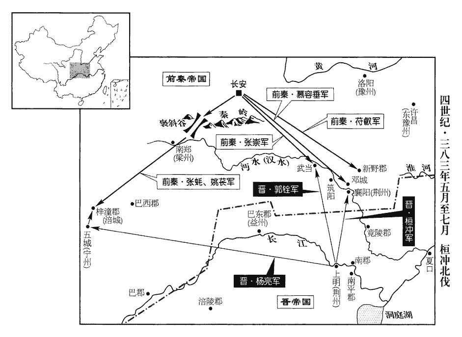 

4秦王堅下詔大舉入寇，民每十丁遣一兵；其良家子年二十已下，有材勇者，皆拜羽林郎。又曰：「其以司馬昌明為尚書左僕射，謝安為吏部尚書，桓沖為侍中；勢還不遠，謂以勢言之，克晉之期，近在旦夕，還師不遠也。還，音旋，又如字。可先為起第。」為，于偽翻。良家子至者三萬餘騎，騎，奇寄翻；下同。拜秦州主簿【章：十二行本「簿」下有「金城」二字；乙十一行本同；孔本同；張校同。】趙盛之為少年都統。都統，官名，起於此。少，詩照翻；下同。是時，朝臣皆不欲堅行，朝，直遙翻。獨慕容垂、姚萇及良家子勸之。陽平公融言於堅曰：「鮮卑、羌虜，我之仇讎，慕容垂，鮮卑也；姚萇，羌也；其國皆為秦所滅，雖曰臣服，其實仇讎。常思風塵之變以逞其志，所陳策畫，何可從也！良家少年皆富饒子弟，不閑軍旅，苟為諂諛之言以會陛下之意。會，會合也。今陛下信而用之，輕舉大事，臣恐功既不成，仍有後患，悔無及也！」堅不聽。

〖译文〗 [4]前秦王苻坚下达诏令，开始大举入侵东晋。百姓中每十个成年人选派一人充军，良家子弟中年龄在二十岁以下，有才能勇气的人，全都授官羽林郎。又说：“晋朝任命司马昌明为尚书左仆射，谢安为吏部尚书，桓冲为侍中。以此形势来看，凯旋的时间不会太远，可以先行起身于家，出任官职。”良家子弟应征的有三万多骑兵，苻坚任命秦州主簿赵盛之为少年都统。这时，满朝大臣都不想让苻坚出征，唯独慕容垂、姚苌及良家子弟对此加以劝勉。阳平公苻融向苻坚进言说：“鲜卑、羌族的虏臣，是我们的仇敌，经常盼望着风云变化以实现他们的心愿，他们所陈献的办法，怎么能听从呢！良家少年全都是富豪子弟，不熟悉军事，只是苟且进上阿谀奉承之言以迎合陛下的心愿。如今陛下相信并采纳了他们的话，轻率地进行大规模行动，臣恐怕既不能成就战功，随之还会产生后患，悔之不及！”苻坚没有听从。

八月，戊午‹二›，堅遣陽平公融督張蚝、慕容垂等步騎二十五萬為前鋒；以兗州刺史姚萇為龍驤將軍、督益•梁州諸軍事。堅謂萇曰：「昔朕以龍驤建業，堅以龍驤將軍殺符生，得秦國。驤，思將翻。未嘗輕以授人，卿其勉之！」左將軍竇衝曰：「王者無戲言，此不祥之徵也！」堅默然。

〖译文〗 八月，戊午（初二），苻坚派遣阳平公苻融督帅张蚝、慕容垂等人的步、骑兵二十五万人作为前锋，任命兖州刺史姚苌为龙骧将军，督益、梁州诸军事。苻坚对姚苌说：“过去我靠龙骧将军的官位建立了大业，未曾轻易地把这个官位授予别人，你努力干吧！”左将军窦冲说：“君王无戏言，这话是不祥之兆！”苻坚沉默不语。

慕容楷、慕容紹言於慕容垂曰：「主上驕矜已甚，叔父建中興之業，在此行也！」垂曰：「然。非汝，誰與成之！」至此，垂知堅必敗，方與兄子明言之。

〖译文〗 慕容楷、慕容绍向慕容垂进言说：“主上的骄纵傲慢已经非常严重，叔父建立中兴大业，就在此行！”慕容垂说：“对。除了你们，谁能和我一起成就大业呢！”

甲子‹八›，堅發長安，戎卒六十餘萬，騎二十七萬，旗鼓相望，前後千里。九月，堅至項城‹河南沈丘›，涼州‹河西走廊·甘肃省中部西部›之兵始達咸陽‹陕西咸陽›，蜀、漢之兵方順流而下，幽、冀之兵至于彭城‹江苏徐州›，東西萬里，水陸齊進，運漕萬艘。艘，蘇遭翻。陽平公融等兵三十萬，先至潁口‹颍水注入淮河处·安徽颖上东南正阳关›。潁水入淮之口也。地理志：潁水出陽城縣陽乾山，東至下蔡入淮。

〖译文〗 甲子（初八），苻坚发兵长安，将士共有六十多万，骑兵二十七万，旌旗战鼓遥遥相望，绵延千里。九月，苻坚抵达项城，凉州的军队刚刚到达咸阳，蜀、汉的军队正顺流而下，幽州、冀州的军队到了彭城，东西万里，水陆并进，运输军粮的船只多达万艘。阳平公苻融等人的部队三十万人，先期抵达颍口。

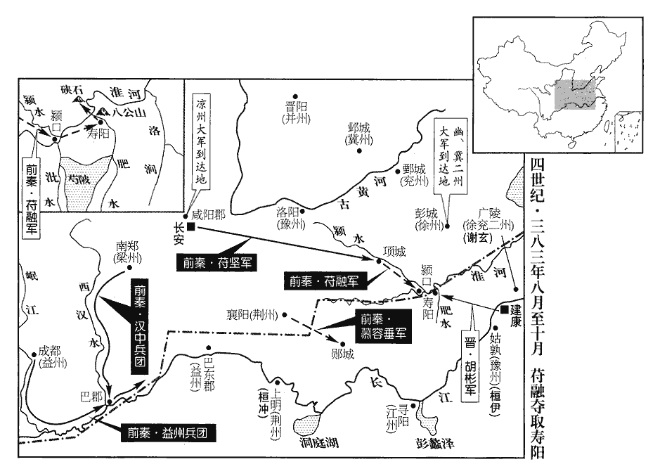 

詔以尚書僕射謝石為征虜將軍、征討大都督，以徐、兗二州刺史謝玄為前鋒都督，與輔國將軍謝琰yǎn、西中郎將桓伊等眾共八萬拒之；使龍驤將軍胡彬以水軍五千援壽陽‹安徽寿县›。琰，安之子也。

〖译文〗 东晋下达诏令，任命尚书仆射谢石为征虏将军、征讨大都督，任命徐、兖二州刺史谢玄为前锋都督，与辅国将军谢琰西中郎将桓伊等人的兵众八万人抵抗前秦。让龙骧将军胡彬带领五千水军援助寿阳。谢琰是谢安的儿子。

是時秦兵既盛，都下震恐。謝玄入，問計於謝安，安夷然，夷，坦也，平也。言坦然無異平日也。答曰：「已別有旨。」既而寂然。玄不敢復言，乃令張玄重請。復，扶又翻。重，直用翻。安遂命駕出遊山墅，墅，承與翻，園廬也。親朋畢集，與玄圍棋賭墅。安棋常劣於玄，是日，玄懼，便為敵手而又不勝。敵手，謂下子爭行劫，智算相敵也。玄意不在棋，故不能勝安。安遂游陟，至夜乃還。還，從宣翻，又如字。桓沖深以根本為憂，遣精銳三千入衛京師‹南京›；謝安固卻之，曰：「朝廷處分已定，處，昌呂翻。分，扶問翻。兵甲無闕，西藩宜留以為防。」沖對佐吏歎曰：諸藩府參佐為佐吏。「謝安石有廟堂之量，不閑將略。將，即亮翻。今大敵垂至，方遊談不暇，遣諸不經事少年拒之，眾又寡弱，天下事已可知，吾其左衽矣！」

〖译文〗 这时前秦的军队已经非常强盛，东晋京城里的人震惊恐惧。谢玄入朝，向谢安询问应对之策，谢安一副平静的样子，回答说：“已经另有打算了。”紧接着就闭口无言。谢玄不敢再问，就让张玄重新请求指令。谢安于是就命令驾车出游山间别墅，亲戚朋友云集，与谢玄在别墅玩围棋赌博。谢安的棋术一直不如谢玄，这天，谢玄由于内心恐惧，在有利的形势下投子打劫，反而还不能获胜。谢安于是就登山漫游，到晚上才回来。桓冲对国家的根基大业深以为忧，派精锐部队三千人入城保卫京师。谢安固执地阻拦他，说：“朝廷的处理办法已经决定，士兵武器都不缺乏，应该留在西藩之地以作防备。”桓冲对藩府参佐叹息道：“谢安有身居朝廷的气量，但不熟悉带兵打仗的方法。如今大敌临头，还尽情游玩，高谈阔论不止，只派遣未经战事的年轻人前去抵抗，再加上数量不足，力量软弱，天下的结局已经可以知道了，我们将要受外族的统治了！”

5以琅邪王道子錄尚書六條事。錄尚書六條事，始於劉聰。

〖译文〗 [5]东晋任命琅邪王司马道子为录尚书六条事。

6冬，十月，秦陽平公融等攻壽陽；癸酉‹十八›，克之，執平虜將軍徐元喜等。融以其參軍河南郭褒為淮南太守。淮南郡本治壽陽，秦既得之，以郭褒為太守。慕容垂拔鄖yún城‹湖北安陆›。杜預曰：江夏雲杜縣東南有鄖城。鄖，于分翻。胡彬聞壽陽陷，退保硤xiá石‹安徽凤台南›，水經註：淮水東過壽春縣北，右合肥水；又北逕山峽中，謂之峽石，對岸山上結二城，以防津要。杜佑曰：硤石，今汝陰郡下蔡縣。融進攻之。秦衛將軍梁成等帥眾五萬屯于洛澗‹安徽淮南东淮河支流›，柵淮以遏東兵。水經註：洛澗上承死馬塘水，北歷秦墟，下注淮，謂之洛口。帥，讀曰率；下同。謝石、謝玄等去洛澗二十五里而軍，憚成不敢進。胡彬糧盡，潛遣使告石等曰：「今賊盛糧盡，恐不復見大軍！」復，扶又翻。秦人獲之，送於陽平公融。融馳使白秦王堅曰：「賊少易擒，但恐逃去，宜速赴之！」使，疏吏翻；下同。融持議以為晉不可伐，今臨敵乃輕脫如此，亦天奪其鑒也。少，詩沼翻。易，以豉翻。堅乃留大軍於項城，引輕騎八千，兼道就融於壽陽。遣尚書朱序來說謝石等，以為：「強弱異勢，不如速降。」三年，堅執朱序於襄陽，拜為度支尚書。說，輸芮翻。降，戶江翻。序私謂石等曰：「若秦百萬之眾盡至，誠難與為敵。今乘諸軍未集，宜速擊之；若敗其前鋒，敗，補邁翻。則彼已奪氣，可遂破也。」

〖译文〗 [6]冬季，十月，前秦阳平公苻融等攻打寿阳。癸酉（十八日），攻克了寿阳，擒获了平虏将军徐元喜等人。苻融任命他的参军河南人郭褒为淮南太守。慕容垂攻下了郧城。胡彬听说寿阳被攻陷，后退守卫硖石，苻融进军攻打硖石。前秦卫将军梁成等率领五万兵众驻扎在洛涧，沿淮河布防以遏制东面的部队。谢石、谢玄等在距离洛涧二十五里的地方驻军，由于惧怕梁成而不敢前进。胡彬的粮食耗尽，秘密地派遣使者向谢石等报告说：“如今贼寇强盛而我的粮食已经耗尽，恐怕不能再见到大军了！”前秦人擒获了胡彬，把他送交给阳平公苻融。苻融急速派使者向前秦王苻坚报告说：“现在贼寇力量不足，容易擒获，只是怕他们逃走，应该迅速率兵前来。”苻坚于是就把大部队留在项城，带领八千轻装骑兵，日夜兼程赶赴寿阳与苻融汇合。苻坚派尚书朱序前去劝说谢石等人，认为：“形势强弱悬殊，不如迅速投降。”朱序私下里却对谢石等人说：“如果秦国的百万兵众全部抵达，确实难以与他们抗衡。如今乘着各路军队尚未会集，应该迅速攻击他们。如果能打败他们的前锋部队，那他们就已经丧失了士气，最终就可以攻破他们。”

石聞堅在壽陽，甚懼，欲不戰以老秦師。謝琰勸石從序言。十一月，謝玄遣廣陵‹扬州›相劉牢之帥精兵五千趣洛澗，趣，七喻翻。未至十里，梁成阻澗為陳以待之。陳，讀曰陣；下同。牢之直前渡水，擊成，大破之，斬成及弋陽‹河南潢川›太守王詠；曹魏分西陽、蘄qí春，置弋陽郡；秦未能有其地也，王詠領太守耳。弋陽，唐為光、蘄、黃三州之地。又分兵斷其歸津，斷，丁管翻。秦步騎崩潰，爭赴淮水，士卒死者萬五千人，執秦揚州刺史王顯等，盡收其器械軍實。於是謝石等諸軍，水陸繼進。秦王堅與陽平公融登壽陽城望之，見晉兵部陣嚴整，又望八公山上草木皆以為晉兵，八公山在今壽春縣北四里。世傳漢淮南王安好神仙，忽有八公皆鬚眉皓素，詣門求見。門者曰：「吾王好長生，今先生無駐衰之術，未敢以聞。」八公皆變成童。遂立廟於山上。或言今廟食于此山者，乃左吳、朱驕、伍被、雷被等八人，皆淮南王客，世以八公為仙，誤也。顧謂融曰：「此亦勍敵，何謂弱也！」勍qíng，渠京翻，強也。憮然始有懼色。憮wǔ，罔甫翻，悵然失意貌。

〖译文〗 谢石听说苻坚在寿阳，十分害怕，想用不交战的办法来拖垮前秦的军队。谢琰劝说谢石听从朱序的话。十一月，谢玄派广陵相刘牢之率领五千精兵开赴洛涧，在离洛涧十里的地方，梁成扼守山涧布署兵阵以等待刘牢之。刘牢之径直向前渡河，攻击梁成，大败梁成，斩杀了梁成以及弋阳太守王咏。又分派部队继绝了他们归途上的渡口，前秦的步、骑兵全都崩溃，争先恐后地逃向淮水，死亡的士兵有一万五千人，抓获了前秦扬州刺史王显等人，全部收缴了他们的武器军粮。于是谢石等各路军队，从水路、陆路相继进发。前秦王苻坚与阳平公苻融登上寿阳城观望，只见东晋的军队布阵严整，又望见了八公山上的草木，也以为都是东晋的士兵，苻坚掉头对苻融说：“这也是强敌，怎么能说他软弱呢！”茫然若失，脸上开始有了恐惧的神色。

秦兵逼肥水而陳，晉兵不得渡。謝玄遣使謂陽平公融曰：「君懸軍深入，而置陳逼水，此乃持久之計，非欲速戰者也。若移陳少卻，少，詩沼翻；下同。使晉兵得渡，以決勝負，不亦善乎！」秦諸將皆曰：「我眾彼寡，不如遏之，使不得上，上，時掌翻。可以萬全。」堅曰：「但引兵少卻，使之半渡，我以鐵騎蹙cù而殺之，蔑不勝矣！」融亦以為然，遂麾兵使卻。秦兵遂退，不可復止。兩陳相向，退者先敗，此用兵之常勢也。復，扶又翻。謝玄、謝琰、桓伊等引兵渡水擊之。融馳騎略陳，欲以帥退者，帥，讀曰率。馬倒，為晉兵所殺，秦兵遂潰。玄等乘勝追擊，至于青岡；青岡去今壽春縣‹安徽壽縣›三十里。秦兵大敗，自相蹈藉而死者，蔽野塞川。言敗兵自相蹈踐，枕藉而死也。藉，慈夜翻。塞，悉則翻。其走者聞風聲鶴唳，皆以為晉兵且至，晝夜不敢息，草行露宿，草行者，涉草而行，不敢由路；露宿者，宿於野次，不敢入人家；皆懼追兵也。重以飢凍，重，直用翻。死者什七、八。初，秦兵少卻，朱序在陳後呼曰：呼，火故翻。「秦兵敗矣！」眾遂大奔。序因與張天錫、徐元喜皆來奔。獲秦王堅所乘雲母車。【章：十二行本「車」下有「及儀服、器械、軍資、珍寶、畜產不可勝計」十五字；乙十一行本同；孔本同；張校同；退齋校同。】晉制：雲母車，以雲母飾犢車；臣下不得乘，以賜王公耳。趙彥絟quán續古今註：石虎皇后乘輦，以純雲母代紗，四望皆通徹。復取壽陽，執其淮南太守郭褒。晉復取壽陽，故秦所置太守見執。

〖译文〗 前秦的军队紧逼淝水而布阵，东晋的军队无法渡过。谢玄派使者对阳平公苻融说：“您孤军深入，然而却紧逼淝水部署军阵，这是长久相持的策略，不是想迅速交战的办法。如果能移动兵阵稍微后撤，让晋朝的军队得以渡河，以决胜负，不也是很好的事情吗！”前秦众将领都说：“我众敌寡，不如遏制他们，使他们不能上岸，这样可以万无一失。”苻坚说：“只带领兵众稍微后撤一点，让他们渡河渡到一半，我们再出动铁甲骑兵奋起攻杀，没有不胜的道理！”苻融也认为可以，于是就挥舞战旗，指挥兵众后退。前秦的军队一退就不可收拾。谢玄、谢琰、桓伊等率领军队渡过河攻击他们。苻融驰马巡视军阵，想来率领退逃的兵众，结果战马倒地，苻融被东晋的士兵杀掉，前秦的军队于是就崩溃了。谢玄等乘胜追击，一直追到青冈，前秦的军队大败，自相践踏而死的人，遮蔽山野堵塞山川。逃跑的人听到刮风的声音和鹤的鸣叫声，都以为是东晋的军队将要来到，昼夜不敢停歇，慌不择路，风餐露宿，冻饿交加，死亡的人十有七八。当初，前秦的军队稍微后撤时，朱序在军阵后面高声呼喊：“秦军失败了！”兵众们听到后就狂奔乱逃。朱序乘机与张天锡、徐元喜都来投奔东晋。缴获了前秦王苻坚所乘坐的装饰着云母的车乘。又攻取了寿阳，抓获了前秦的淮南太守郭褒。

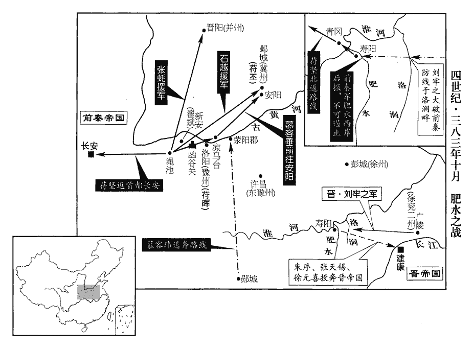 

堅中流矢，中，竹仲翻。單騎走至淮北，飢甚，民有進壺飧sūn、豚髀bì者，飧，蘇昆翻。熟食曰飧。字林曰：水澆飯也。堅食之，賜帛十匹，綿十斤。辭曰：「陛下厭苦安樂，樂，音洛。自取危困。臣為陛下子，陛下為臣父，安有子飼其父而求報乎！」弗顧而去。飼，祥吏翻。堅謂張夫人曰：「吾今復何面目治天下乎！」復，扶又翻。治，直之翻。潸然流涕。潸shān，所姦翻，涕流貌，又所版翻，所晏翻。

〖译文〗 苻坚中了流箭，单身匹马逃到淮河以北，十分饥饿，有的百姓送来了盛在壶里的水泡饭、猪骨头，苻坚吃了下去，赏赐给他们十匹布帛，十斤绵。这些人推辞说：“陛下厌倦困苦，安于享乐，自取危难。我是陛下的儿子，陛下是我的父亲，哪里有儿子给父亲饭吃还求取报偿的呢！”他们连赏赐的那些东西看也没看就离开了。苻坚对张夫人说：“我如今再以什么面目去治理天下呢！”说着便潸然泪下。

是時，諸軍皆潰，惟慕容垂所將三萬人獨全，垂別擊鄖城‹湖北安陆›，不與淝水之戰，且持軍嚴整，故諸軍皆潰而垂軍獨全。將，即亮翻。堅以千餘騎赴之。世子寶言於垂曰：「家國傾覆，天命人心皆歸至尊，但時運未至，故晦迹自藏耳。今秦主兵敗，委身於我，是天借之便以復燕祚，此時不可失也，願不以意氣微恩亡社稷之重！」意氣微恩，謂堅厚禮垂父子也。垂曰：「汝言是也。然彼以赤心投命於我，若之何害之！天苟棄之，不患不亡。不若保護其危以報德，徐俟其釁而圖之，既不負宿心，且可以義取天下。」慕容垂此言，猶有君人之度。奮威將軍慕容德曰：「秦強而并燕，秦弱而圖之，此為報仇雪恥，非負宿心也；兄柰何得而不取，釋數萬之眾以授人乎?」垂曰：「吾昔為太傅所不容，置身無所，逃死於秦，見一百二卷海西公太和四年。秦主以國士遇我，恩禮備至。後復為王猛所賣，復，扶又翻；下尚復、德復同。無以自明，秦主獨能明之，見太和五年。此恩何可忘也！若氐運必窮，吾當懷集關東，以復先業耳，關西會非吾有也。」冠軍行參軍趙秋曰：「明公當紹復燕祚，著於圖讖；冠，古玩翻。讖，楚譖翻。今天時已至，尚復何待！若殺秦主，據鄴都‹河北临漳西南邺镇›鼓行而西，三秦亦非苻氏之有也！」垂親黨多勸垂殺堅，垂皆不從，悉以兵授堅。平南將軍慕容暐屯鄖城‹湖北安陆›，聞堅敗，棄其眾遁去；至滎陽‹河南荥阳›，慕容德復說暐起兵以復燕祚，尚復、德復，扶又翻。說，輸芮翻。暐不從。

〖译文〗 这时，前秦的各路军队全都溃散，唯独慕容垂所统领的三万人完整保全，苻坚带领一千多骑兵到了他那里。长子慕容宝向慕容垂进言说：“宗族国家覆灭，天命人心全都归于极其尊贵的帝王，只是时运还未到来，所以应该掩饰形迹躲藏起来。如今秦主兵败，委身于我们，这是上天赐予的有利时机以恢复燕国的国统，这个时机不可丧失，愿您不要因为受到过恩义小惠而忘掉了国家的重任！”慕容垂说：“你说得对。然而他以一片赤诚之心把自身的安全交给我，为什么要伤害他！假如上天抛弃他，不用担心他不灭亡。不如在危难中保护他以报答他的恩德，慢慢地等待他的灾祸，然后再图谋他，这样既不违背往日的心愿，而且能够以道义征服天下。”奋威将军慕容德说：“秦国强大的时候吞并了燕国，秦国软弱的时候图谋他，这是报仇雪耻，不是违背往日的心愿。哥哥你为什么得到了却不占取，放弃数万兵众而授予别人呢？”慕容垂说：“我过去被太傅慕容评所不容，无处安身，逃死到了秦国，秦国主像对待国中才能出众的人那样对待我，恩义礼遇备至。以后我又被王猛所出卖，无法自我明辩，秦国主偏偏就能明察，这样的恩情怎么能忘记呢！如果氐族人的命运必定穷尽，我应当招纳关东的民众，以光复先帝的大业，关西之地必定不会归我所有！”冠军行参军赵秋说：“明公您应当继承光复燕国的国统，这已经明显地表现在图谶上了。如今天时已经来到，还要等待什么！如果杀掉秦国主苻坚，占据邺都后击鼓西行，三秦之地也就不会归苻氏所有了！”慕容垂的亲信党羽大多都劝他杀掉苻坚，慕容垂一概没有听从，命令把军队交给苻坚。平南将军慕容驻扎在郧城，听说苻坚失败后，抛弃了他的兵众而逃走。到达荥阳，慕容德又劝说慕容起兵以恢复前燕的国统，慕容没有听从。

謝安得驛書，知秦兵已敗，時方與客圍棋，攝書置牀上，了無喜色，攝，收也。圍棋如故。客問之，徐答曰：「小兒輩遂已破賊。」既罷，還內，過戶限，不覺屐齒之折。言其喜甚也。史言安矯情鎮物。人臣以安社稷為悅者也，大敵壓境，一戰而破之，安得不喜乎！屐齒之折，亦非安之訾zī也。

〖译文〗 谢安接到了驿站传递的书信，知道前秦的军队已经失败，当时他正与客人玩围棋，拿着信放到了床上，毫无高兴的样子，继续下棋。客人问他是什么事，他慢条斯理地回答说：“小孩子们已经最终攻破了寇贼。”下完棋以后，他返回屋里，过门槛时，高兴得竟然连屐齿被折断都没有发觉。

丁亥‹二›，謝石等歸建康，得秦樂工，能習舊聲，於是宗廟始備金石之樂。永嘉之亂，伶官樂器皆沒於劉、石。江左初立，宗廟以無雅樂及伶人，省太樂并鼓吹令；是後頗得登歌食舉之樂，猶有未備。太寧末，明帝又訪阮孚等增益之。咸和中，成帝乃復置太樂官，鳩集遺工，而尚未有金石也。及慕容儁平冉閔，兵戈之際，鄴下樂人頗亦有來者。謝尚鎮壽陽，採拾樂人以備太樂，并制石磬，雅樂始頗具。而王猛平鄴，慕容氏所得樂聲，又入關右；今破苻堅，獲其樂工楊蜀等，閑習舊樂，於是金石始備焉。乙未‹十›，以張天錫為散騎常侍，散，悉亶dǎn翻。騎，奇寄翻。朱序為琅邪內史。

〖译文〗 丁亥（初二），谢石等人返回建康，由于得到了前秦的音乐工匠，熟悉过去的音乐，从此宗庙当中开始有了钟磬乐器演奏音乐。乙未（初十），任命张天锡为散骑常侍，朱序为琅邪内史。

7秦王堅收集離散，比至洛陽，比，必寐翻。眾十餘萬，百官、儀物、軍容粗備。粗，坐五翻。

〖译文〗 [7]前秦王收拢逃散的兵众，等到抵达洛阳时，兵众已有十多万，属僚百官、礼仪器物、军事装备粗略齐备。

慕容農謂慕容垂曰：「尊不迫人於險，尊，謂其父垂也。慕容令亦呼垂為尊，蓋其父子間常稱也。其義聲足以感動天地。農聞祕記曰：『燕復興當在河陽。』燕，於賢翻。夫取果於未熟與自落，不過晚旬日之間，然其難易美惡，相去遠矣！」易，以豉翻。垂心善其言，行至澠池‹河南洛宁西北›，澠，彌兗翻。言於堅曰：「北鄙之民，聞王師不利，輕相扇動，臣請奉詔書以鎮慰安集之，因過謁陵廟。」垂欲因行自謁其祖父陵廟也。堅許之。權翼諫曰：「國兵新破，四方皆有離心，宜徵集名將，置之京師‹西安›，以固根本，鎮枝葉。將，即亮翻。垂勇略過人，世豪東夏，頃以避禍而來，其心豈止欲作冠軍而已哉！夏，戶雅翻。冠，古玩翻。譬如養鷹，飢則附人，每聞風飊biāo之起，常有陵霄之志，正宜謹其絛籠，飊，扶搖風也。釋曰：疾風自下而上曰飊，音卑遙翻。絛tāo，他刀翻；絲繩也，所以紲xiè鷹。豈可解縱，任其所欲哉！」堅曰：「卿言是也。然朕已許之，匹夫猶不食言，孔安國曰：食言者，食盡其言，偽不實。況萬乘乎！乘，繩證翻。若天命有廢興，固非智力所能移也。」翼曰：「陛下重小信而輕社稷，臣見其往而不返，關東之亂，自此始矣。」堅不聽，遣將軍李蠻、閔亮、尹固【章：十二行本「固」作「國」；乙十一行本同。】帥眾三千送垂。又遣驍騎將軍石越帥精卒三千戍鄴，驃騎將軍張蚝帥羽林五千戍并州‹府晋阳，山西太原›，鎮軍將軍毛當帥眾四千戍洛陽。驍，堅堯翻。騎，奇寄翻；下同。帥，讀曰率；下同。驃，匹妙翻。蚝háo，七吏翻。權翼密遣壯士邀垂於河橋南空倉中，垂疑之，自涼馬臺‹河南孟津东北›結草筏以渡，水經註：東郡白馬縣有涼城，河水逕其北；有神馬亭，西去白馬津可二十許里，實中層峙，南北二百步，東西五十許步。今按神馬亭既在東郡，白馬正對黎陽岸，垂安得越滎、洛而至此渡河乎！此涼馬臺蓋在富平津橋之西也。涼馬臺，由昔人於河渚浴馬，浴竟，驅馬就高納涼，因名。使典軍程同衣己衣，乘己馬，與僮僕趣河橋。典軍，蓋王國官，垂在燕為吳王時所置也。同衣，於既翻。趣，七喻翻。伏兵發，同馳馬獲免。

〖译文〗 慕容农对慕容垂说：“您不在险境里逼迫别人，这种道义的名声足以感动天地。我听说图谶中记载：‘燕国的复兴应当在河阳。’在尚未成熟时就摘取果实与等待瓜熟蒂落相比，从时间上看不过是十来天的差距，然而它们的难易美恶程度，却相差甚远。”慕容垂在内心里赞同他的话，行进到渑池时，他向苻坚进言说：“北方边远之地的百姓，听说您的军队出师不利，轻率地互相鼓动作乱，我请求尊奉诏书去镇抚招纳他们，顺便路过拜谒先帝的陵庙。”苻坚同意了。权翼劝谏苻坚说：“国家的军队刚刚失败，四方全都有离心倾向，应该征召集合名将，把他们安置在京城，以稳固根基，安定枝叶。慕容垂勇猛谋略过人，世代都是中原以东的豪杰，不久前因为躲避灾祸而前来归附，他的本心难道仅仅是想做一个冠军将军吗！就像养育苍鹰，它饥饿的时候依附于人，每当听到狂风骤起，就常常有飞越云霄的志向，正当应该紧闭藩笼的时候，岂能放纵它，听任它为所欲为呢！”苻坚说：“你说得对。然而朕已经同意了他，一般人尚不食言，何况是万乘君主呢！如果天命要有废兴的事变发生，本来就不是靠智慧与力量所能能改变的。”权翼说：“陛下重视小的信誉而轻视国家政权，依我之见，他一定是去而不返，关东之乱，从此就要开始了。”苻坚没有听，派遣将军李蛮、闵亮、尹国率领三千兵众护送慕容垂。又派骁骑将军石越率领三千精锐士兵戍守邺城，派骠骑将军张蚝率领五千羽林军戍卫并州，派镇军将军毛当率领四千兵众戍卫洛阳。权翼悄悄地派遣勇士邀请慕容垂到河桥以南的空仓房中，慕容垂对此产生了怀疑，用草绳编结成筏子从凉马台渡过了河，让典军程同穿上自己的衣服，骑上自己的马，与童仆一起奔赴河桥。权翼埋伏在这里的军队发起攻击，程同策马逃脱。

十二月，秦王堅至長安，哭陽平公而後入，諡曰哀公。大赦，復死事者家。復，方目翻，復其家之賦役也。

〖译文〗 十二月，前秦王苻坚抵达长安，痛哭了阳平公苻融之后才进入，给苻融定谥号为哀公。实行大赦，恢复征收战死者家属的赋税。

8庚午‹十五›，大赦。以謝石為尚書令。進謝玄號前將軍；固讓不受。

〖译文〗 [8]庚午（十五日），东晋实行大赦。任命谢石为尚书令。晋升谢玄的称号为前将军，谢玄固执地辞让，不接受。

9謝安婿王國寶，坦之之子也；安惡其為人，惡，烏路翻。每抑而不用，以為尚書郎。國寶自以望族，故事唯作吏部，不為餘曹，尚書郎，晉制三十五曹，置郎二十三人，更相統攝。及江左，無直事、右民、屯田、車部、別兵、都兵、騎兵、左•右士、運曹十曹郎。康、穆以後，又無虞曹、二千石二郎，但有殿中、祠部、吏部、儀曹、三公、比部、金部、倉部、度支、都官、左民、起部、水部、主客、駕部、庫部、中兵、外兵十八曹。後又省主客、起部、水部，餘十五曹，而吏部最為清選。固辭不拜，由是怨安。國寶從妹為會稽王道子妃，帝與道子皆嗜酒，狎昵邪諂，從，才用翻。昵，尼質翻。國寶乃譖安於道子，使離間之於帝。間，古莧翻。安功名既盛，而險詖bì求進之徒，多毀短安，帝由是稍踈忌之。詖，彼義翻。

〖译文〗 [9]谢安的女婿王国宝，是王坦之的儿子。谢安讨厌他的为人，总是压制着他而不加以任用，让他担任尚书郎。王国宝自以为出身于名门望族，按惯例只在吏部供职，其它官署一概不干，因此对于任命固执地辞让，不予就任。并因此而怨恨谢安。王国宝的表妹是会稽王司马道子的妃子，孝武帝与司马道子全都喜欢喝酒，互相亲昵邪媚，王国宝于是就向司马道子说谢安的坏话，让司马道子挑拨谢安与孝武帝的关系。谢安的功名已经非常显赫，然而那些行为邪恶，追求进升的人，却大都诋毁谢安，孝武帝从此逐渐疏远猜忌谢安。

10初開酒禁，漢建安中，曹公嚴酒禁。增民稅米，口五石。咸和五年，成帝始度百姓田，取十分之一，率畝稅米三升。哀帝即位，減田租，畝收二升。太元二年，帝除度田收租之制，公王以下，口稅三斛，唯蠲juān在役之身。至是年，又增稅米，口五石。

〖译文〗 [10]东晋开始放开禁酒的戒令，增加百姓的米粮税额，每人纳粮五石。

秦呂光行越流沙三百餘里，自玉門出，渡流沙，西行至鄯善，北行至車師。又，且末國在鄯善西，其國之西北，有流沙數百里，夏日有熱風，為行旅之患。風之所至，唯老駝預知之，即嗔而聚立，埋其口鼻於沙中，人每以為候，亦即將氈擁蔽鼻口。其風迅駛，斯須過盡，若不防者，必致危斃。桑欽曰：流沙地在張掖居延縣西北。杜佑曰：流沙在沙州，敦煌郡西八十里。酈道元曰：弱水入流沙。流沙，與水流行也。亦言出鍾山，西行極崦嵫之山，在西海郡北；流沙又逕浮渚，歷壑hè市之國，又逕于鳥山之東朝雲國，西歷崑山，西南出于過瀛之山。大荒山經曰：西南海之外，流沙出焉。焉耆‹新疆焉耆›等諸國等衍皆降。降，戶江翻。惟龜茲‹新疆库车›王帛純拒之，龜茲，音丘慈。嬰城固守，光進軍攻之。

〖译文〗 [11]前秦吕光率兵穿越沙漠三百多里，焉耆等各国全都投降。只有龟兹王帛纯抵抗他们，环城固守，吕光进军攻击他们。

秦王堅之入寇也，以乞伏國仁為前將軍，領先鋒騎；騎，奇寄翻。會國仁叔父步頹反於隴西‹甘肃陇西›，堅遣國仁還討之。國仁，代司繁鎮勇士，見上卷元年。步頹聞之，大喜，迎國仁於路。國仁置酒，大言曰：「苻氏疲民逞兵，殆將亡矣，吾當與諸君共建一方之業。」及堅敗，國仁遂迫脅諸部，有不從者，擊而併之，眾至十餘萬。

〖译文〗 [12]前秦王苻坚入侵东晋的时候，任命乞伏国仁为前将军，统领作为先锋的骑兵。恰巧乞伏国仁的叔父乞伏步颓在陇西反叛，苻坚派乞伏国仁返回去讨伐他。乞伏步颓听说以后，非常高兴，到半路去迎接乞伏国仁。乞伏国仁摆好酒大声说：“苻氏使民众疲惫而炫耀军队，大概快要灭亡了，我应当与诸君共同建立一方大业。”等到苻坚失败以后，乞伏国仁于是就胁迫各部族，有不听从的，就加以攻击，然后吞并，部众达到了十多万人。

慕容垂至安陽‹河南安阳›，安陽在鄴城西南。遣參軍田山修牋於長樂公丕。樂，音洛。丕聞垂北來，疑其欲為亂，然猶身自迎之。趙秋勸垂於座取丕，因據鄴起兵；垂不從。丕謀襲擊垂。侍郎天水‹甘肃天水›姜讓諫曰：晉制，王國置侍郎二人。「垂反形未著，而明公擅殺之，非臣子之義；不如待以上賓之禮，嚴兵衛之，密表情狀，聽敕而後圖之。」丕從之，館垂於鄴西。館，音貫。

〖译文〗 [13]慕容垂抵达安阳，参军田山写信给长乐公苻丕。苻丕听说慕容垂从北方来，怀疑他想作乱，但还是亲自去迎接他。赵秋劝慕容垂在座位上擒获苻丕，顺势占据邺城起兵，慕容垂没有听从。苻丕谋划袭击慕容垂，侍郎、天水人姜让劝谏他说：“慕容垂没有表露出反叛的迹象，然而明公您却要擅自杀掉他，这不是作为臣子的应有之义。不如用上宾之礼对待他，再派士兵严密地守护他，秘密地进上表章报告情况，听候敕令，然后再对他作出处置。”苻丕听从了这一意见，让慕容垂住在邺西的馆舍。

垂潛與燕之故臣謀復燕祚，會丁零翟斌起兵叛秦，丁零種落，本居中山，苻堅之滅燕也，徙於新安‹河南渑池›。斌仕秦為衛軍從事中郎。斌，音彬。謀攻豫州牧平原公暉於洛陽，秦王堅驛書使垂將兵討之。將，即亮翻。石越言於丕曰：「王師新敗，民心未安，負罪亡匿之徒，思亂者眾，故丁零一唱，旬日之中，眾已數千，此其驗也。慕容垂，燕之宿望，有興復舊業之心，今復資之以兵，此為虎傅翼也。」今復，扶又翻。為，于偽翻。傅，讀曰附。丕曰：「垂在鄴如藉虎寢蛟，藉，慈夜翻。常恐為肘腋之變，腋，音亦。今遠之於外，不猶愈乎！遠，于願翻。且翟斌凶悖，悖，蒲內翻，又蒲沒翻。必不肯為垂下，使兩虎相斃，吾從而制之，此卞莊子之術也。」乃以羸兵二千及鎧仗之弊者給垂，羸，倫為翻。鎧，可亥翻。又遣廣武將軍苻飛龍帥氐騎一千為垂之副。帥，讀曰率。騎，奇寄翻。密戒飛龍曰：「垂為三軍之帥，卿為謀垂之將，行矣，勉之！」成都王穎使和演圖王浚，殷浩使魏憬圖姚襄，苻丕使苻飛龍圖慕容垂，智略不足以濟，其敗同一轍也。帥，所類翻。將，即亮翻。

〖译文〗 慕容垂暗地里与前燕的旧臣图谋恢复前燕的国统，恰好这时丁零人翟斌起兵背叛了前秦，图谋在洛阳攻打豫州牧平原公苻晖，前秦王苻坚通过驿站送信，让慕容垂统领军队去讨伐他们。石越向苻丕进言说：“国王的军队刚遭失败，民心尚未安定，负罪逃亡之徒，渴望祸乱的人很多，所以丁零人一带头，十来天时间，响应的人已有数千，这就是证明。慕容垂，是燕国德高望重的人，有振兴恢复旧业的心愿，如今再交给他军队，这是为虎添翼。”苻丕说：“慕容垂在邺城犹如卧虎睡蛟，经常害怕他制造肘腋之变，如今让他远行在外，不是似乎更好一些吗？而且翟斌凶暴悖逆，一定不肯甘居下风，让两虎俱伤，我紧跟着去控制他们，这是卞庄子的策略。”于是苻丕就给了慕容垂二千老弱的士兵以及一些残次的铠甲兵器，又派广武将军苻飞龙率领一千氐族骑兵协助慕容垂。苻丕秘密地告诫苻飞龙说：“慕容垂是三军的主帅，你是图谋慕容垂的将领，出发，努力吧！”

垂請入鄴城拜廟，燕都鄴，故廟在鄴城。丕弗許，乃潛服而入；亭吏禁之，垂怒，斬吏燒亭而去。石越言於丕曰：「垂敢輕侮方鎮，殺吏燒亭，反形已露，可因此除之。」丕曰：「淮南之敗，垂侍衛乘輿，乘，繩證翻。此功不可忘也。」越曰：「垂尚不忠於燕，安能盡忠於我！失今不取，必為後患。」丕不從。越退，告人曰：「公父子好為小仁，不顧大計，終當為人禽耳。」丕父子後卒如越之言。好，呼到翻。

〖译文〗 慕容垂请求进入邺城拜谒宗庙，苻丕没有同意，慕容垂于是就穿上便服进了邺城。守卫宗庙的官吏不让他进去，慕容垂十分愤怒，杀掉官吏、烧毁庙亭后离开了。石越向苻丕进言说：“慕容垂胆敢轻视侮辱一方长官，杀官吏烧庙亭，反叛的形迹已经显露，可以就此而除掉他。”苻丕说：“在淮南失败的时候，慕容垂在主上车前马后奉侍守卫，这个功劳不能忘记。”石越说：“慕容垂对燕国尚且不忠，怎么能对我们尽忠呢！错过了今天就无法除掉他，肯定要成为后患。”苻丕没有听从。石越退下去以后，告诉人们说：“苻丕父子喜欢施行小恩小惠，而不顾天下大计，最终将会被别人所擒。”

垂留慕容農、慕容楷、慕容紹於鄴，行至安陽‹河南安阳›之湯池，閔亮、李毗自鄴來，以丕與苻飛龍所謀告垂。幾事不密則害成。苻飛龍固不足以辦垂，況其謀已泄邪！垂因激怒其眾曰：「吾盡忠於苻氏，而彼專欲圖吾父子，吾雖欲已，得乎！」已，止也。乃託言兵少，少，詩沼翻。停河內‹河南沁阳›募兵，旬日間，有眾八千。

〖译文〗 慕容垂把慕容农、慕容楷、慕容绍留在邺城，当他行进到安阳的汤池时，闵亮、李毗从邺城赶了上来，把苻丕与苻飞龙的图谋告诉了慕容垂。慕容垂以此激发兵众们的义愤，说：“我尽忠于苻氏，而他却专门想图谋我们父子，我虽然想善罢甘休，能行吗！”于是就借口兵力不足，停留在河内招募兵众，十天时间已经拥有八千兵众。

平原公暉遣使讓垂，趣使進兵。遣使，疏吏翻。趣，讀曰促。垂謂飛龍曰：「今寇賊不遠，河內距新安、洛陽，止隔大河耳，故云然。當晝止夜行，襲其不意。」飛龍以為然。壬午‹二十七›，夜，垂遣世子寶將兵居前，少子隆勒兵從己，將，即亮翻。少，詩照翻。令氐兵五人為伍；陰與寶約，聞鼓聲，前後合擊氐兵及飛龍，盡殺之，參佐家在西者皆遣還，并以書遺秦王堅，言所以殺飛龍之故。蓋言丕使飛龍圖己，故殺之也。遺，于季翻。

〖译文〗 平原公苻晖派遣使者责备慕容垂，督促他率兵前进。慕容垂告诉苻飞龙说：“如今离寇贼不远，应当白天休息夜间前进，以攻其不意。”苻飞龙认为有理。壬午（二十七日），夜晚，慕容垂派长子慕容宝统领军队居前，小儿子慕容隆带领军队跟随自己，命令氐族士兵每五人为一个编制单位。他暗地里与慕容宝已有约定，当听到战鼓声后，前后合击氐族士民以及苻飞龙，把他们全部杀尽，参佐当中有家在西方的人，慕容垂全都让他们还乡，并且给前秦王苻坚送信，陈述所以要杀掉苻飞龙的原因。

初垂從堅入鄴，見一百二卷海西公太和五年。以其子麟屢嘗告變於燕，事見太和四年。立殺其母，然猶不忍殺麟，置之外舍，希得侍見。見，賢遍翻。及殺苻飛龍，麟屢進策畫，啟發垂意，垂意所欲為，而思慮偶有所未及，麟能迎其機言之，故謂之啟發。垂更奇之，寵待與諸子均矣。為後麟亂燕張本。

〖译文〗 当初，慕容垂跟随苻坚进入邺城，因为他的儿子慕容麟曾经多次向前燕慕容评告发事变，所以立即杀掉了他的母亲，然而尚不忍心杀掉慕容麟，让他住在城外的馆舍，很少见他。等到杀了苻飞龙以后，慕容麟屡屡进献计策，对慕容垂多有启发，慕容垂转而认为他不一般，对他的宠爱和其他的儿子一样了。

慕容鳳及燕故臣之子燕郡‹北京›王騰、遼西‹河北卢龙›段延等段延蓋段國之種。燕，於賢翻。聞翟斌起兵，各帥部曲歸之。帥，讀曰率。平原公暉使武平武侯毛當討斌。慕容鳳曰：「鳳今將雪先王之恥，燕之亡也，鳳父桓死難，事見一百二卷海西公太和五年。請為將軍斬此氐奴。」為，于偽翻。乃擐甲直進，擐，音宦。丁零之眾，隨之，大敗秦兵，敗，補邁翻。斬毛當；遂進攻陵雲臺戍‹洛阳西›，克之，收萬餘人甲仗。陵雲臺，魏文帝所築，在洛城西，秦置戍焉。

〖译文〗 慕容凤以及前燕旧臣的儿子燕郡人王腾、辽西人段延等，听说翟斌起兵，各自率领部曲家兵归附了他。平原公苻晖让武平武侯毛当讨伐翟斌。慕容凤说：“我今天将要为先王雪耻，请求为将军斩杀这个氐奴。”于是就身披铠甲，一往直前，丁零的兵众紧随其后，大败前秦的军队，斩杀了毛当。接着又进军攻打戍卫陵云台的军队，攻克了他们，缴获了一万多人的铠甲兵器。

癸未‹二十八›，慕容垂濟河焚橋，有眾三萬，留遼東‹辽宁›鮮卑可足渾譚集兵於河內之沙城。言河內，以別魏郡之沙城。燕主皝后可足渾氏，譚蓋亦燕之戚黨也。垂遣田山如鄴，密告慕容農等使起兵相應。時日已暮，農與慕容楷留宿鄴中；慕容紹先出，至蒲池，蒲池在鄴城外，慕容儁與群臣宴處。盜丕駿馬數百匹以待農、楷。甲申晦‹二十九›，農、楷將數十騎微服出鄴，遂同奔列人‹河北肥乡东北›。列人縣，漢屬鉅鹿郡，魏、晉屬廣平郡，其地在鄴城東北。魏收地形志：魏郡臨漳縣有列人城；又別有列人縣，亦屬魏郡。

〖译文〗 癸未（二十八日），慕容垂渡过黄河以后焚烧了桥梁，拥有三万兵众，留下辽东的鲜卑人可足浑谭在河内的沙城会集兵众。慕容垂派田山到邺城，秘密地告诉慕容农等，让他们起兵响应。当时天色已晚，慕容农与慕容楷留在邺城中过夜。慕容绍先行出城，到了蒲池，偷盗了苻丕的数百匹骏马以等待慕容农、慕容楷。甲申晦（二十九日），慕容农、慕容楷带领数十名骑兵身着便服出了邺城，于是他们就一起奔赴列人县。

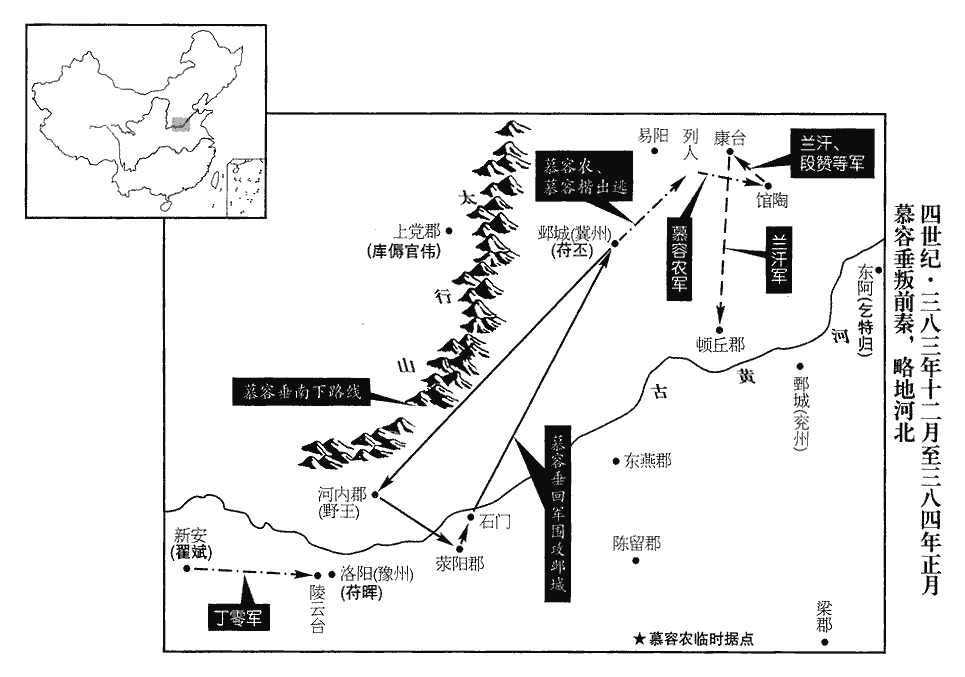 

## 九年（甲申、三八四）

1春，正月，乙酉朔‹一›，秦長樂公丕‹时驻邺城河北省临漳县西南邺镇›大會賓客，樂，音洛。請慕容農不得，始覺有變；遣人四出求之，三日，乃知其在列人‹河北肥乡东北›，已起兵矣。

〖译文〗 [1]春季，正月，乙酉朔（初一），前秦长乐公苻丕大规模地宴请宾客，邀请慕容农却没有见着人，方才发觉事有变故。派人四出寻找，三天以后，才知道他在列人县，已经起兵反叛了。

慕容鳳、王騰、段延皆勸翟斌奉慕容垂為盟主；斌從之。垂欲襲洛陽，且未知斌之誠偽，乃拒之曰：「吾來救豫州，秦平原公暉以豫州牧鎮洛陽。不來赴君。君既建大事，成享其福，敗受其禍，吾無預焉。」丙戌‹二›，垂至洛陽，平原公暉聞其殺苻飛龍，閉門拒之。翟斌復遣長史郭通往說垂，復，扶又翻。說，輸芮翻；下同。垂猶未許。通曰：「將軍所以拒通者，豈非以翟斌兄弟山野異類，無奇才遠略，必無所成故邪?獨不念將軍今日憑之，可以濟大業乎！」謂憑其眾可以成功也。垂乃許之。於是斌帥其眾來與垂會，帥，讀曰率；下同。勸垂稱尊號。垂曰：「新興侯，吾主也，秦獲慕容暐，封為新興侯。當迎歸返正耳。」

〖译文〗 慕容凤、王腾、段延全都劝翟斌尊奉慕容垂为盟主，翟斌听从了。慕容垂想袭击洛阳，但暂且还不知道翟斌是否有诚意，就拒绝他说：“我是来救援豫州的，不是来投奔您。您既然要干大事，成功则享受其福，失败则承受其祸，我不参与此事。”丙戌（初二），慕容垂抵达洛阳，平原公苻晖听说他杀了苻飞龙，把他拒之门外。翟证又派长史郭通前去劝说慕容垂，慕容垂还是没有同意做盟主。郭通说：“将军之所以拒绝郭通的原因，难道不是认为翟斌的弟兄们是身居山野的异族，没有超人的才能和远大的谋略，肯定无所作为的缘故吗？为什么唯独不考虑将军今天凭借他们，就可以成就大业呢！”听了这话，慕容垂就同意了。于是翟斌率领他的兵众前来与慕容垂会合，劝慕容垂称帝王的尊号。慕容垂说：“新兴侯慕容，是我们的国主，应当迎接他回去重归正统。”

垂以洛陽四面受敵，欲取鄴而據之，乃引兵而東。故扶餘王餘蔚為滎陽‹河南滎陽›太守，餘蔚，即太和五年開鄴北門納秦兵者。蔚，音紆勿翻。及昌黎‹辽宁朝阳›鮮卑衛駒各帥其眾降垂。降，戶江翻。垂至滎陽，群下固請上尊號，垂乃依晉中宗‹司马睿›故事，晉元帝廟號中宗。上，時掌翻。稱大將軍、大都督、燕王，承制行事，晉元帝稱王承制，見九十卷建武元年。謂之統府。群下稱臣，文表奏疏，封拜官爵，皆如王者。以弟德為車騎大將軍，封范陽王；騎，奇寄翻。兄子楷為征西大將軍，封太原王；燕本封德為范陽王，今復其故。楷，恪子也；恪封太原王，今令楷襲父爵。翟斌為建義大將軍，封河南王；餘蔚為征東將軍、統府左司馬，封扶餘王；衛駒為鷹揚將軍，慕容鳳為建策將軍。建策將軍，亦慕容垂一時所署置也。帥眾二十餘萬，帥，讀曰率。自石門‹河南滎陽北›濟河，長驅向鄴。

〖译文〗 慕容垂考虑到洛阳四面受敌，想攻取邺城据守，于是就率兵东进。过去的扶馀王馀蔚任荥阳太守，他和昌黎的鲜卑人卫驹各自率领自己的兵众投降了慕容垂。慕容垂抵达荥阳，众属下执意请求进上尊号，慕容垂就依据晋元帝的遗规，自称大将军、大都督、燕王，秉承君主的旨意行事，称为统府。众属下称臣，文表奏疏，封爵授官，全者和君王一样。慕容垂任命他的弟弟慕容德为车骑大将军，封为范阳王；任命哥哥的儿子慕容楷为征西大将军，封为太原王；任命翟斌为建义大将军，封为河南王；任命馀蔚为征东将军、统府左司马，封为扶馀王；任命卫驹为鹰扬将军，慕容凤为建策将军。率领二十多万兵众，从石门渡过了黄河，长驱直入，奔赴邺城。

慕容農之奔列人‹河北肥乡东北›也，止於烏桓魯利家，魯利本烏桓種，而家於列人。利為之置饌，為，于偽翻。饌zhuàn，雛皖翻，又雛戀翻，饔yōng也。農笑而不食。利謂其妻曰：「惡奴，句絕。惡奴，蓋詈其妻之語。郎貴人，家貧無以饌之，柰何?」妻曰：「郎有雄才大志，今無故而至，必將有異，非為飲食來也。為，于偽翻。君亟出，遠望以備非常。」利從之。農謂利曰：「吾欲集兵列人以圖興復，卿能從我乎?」利曰：「死生唯郎是從。」今世俗多呼其主為郎主，又呼其主之子為郎君。農乃詣烏桓張驤，說之曰：驤，思將翻。說，輸芮翻；下同。「家王已舉大事，翟斌等咸相推奉，遠近響應，故來相告耳。」驤再拜曰：「得舊主而奉之，敢不盡死！」於是農驅列人居民為士卒，斬桑榆為兵，裂襜裳為旗，襜chān，昌占翻。爾雅曰：衣蔽前也。郭璞曰：衣蔽膝也。使趙秋說屠各畢聰。聰與屠各卜勝、張延、李白、郭超及東夷餘和、敕勃、屠，直於翻。餘和、敕勃，蓋二人。易陽‹河北永年›烏桓劉大易陽縣，漢屬趙國，魏、晉屬陽平郡。劉昫曰：唐洺州臨洺縣，古易陽縣也，隋開皇六年更名。各帥部眾數千赴之。帥，讀曰率。農假張驤輔國將軍，劉大安遠將軍，魯利建威將軍。農自將攻破館陶‹河北館陶›，館陶縣，漢屬魏郡，魏、晉屬陽平郡。將，即亮翻。收其軍資器械，遣蘭汗、段讚、趙秋、慕輿悕略取康臺‹河北曲周东›牧馬數千匹。悕xī，香衣翻。魏收地形志：廣平郡平恩縣有康臺澤。杜預曰：不以道取曰略。汗，燕王垂之從舅；讚，聰之子也。從，才用翻。於是步騎雲集，眾至數萬，驤等共推農為使持節、都督河北諸軍事、驃騎大將軍，監統諸將，使，疏吏翻。驃，匹妙翻。騎，奇寄翻。監，工銜翻。隨才部署，上下肅然。農以燕王垂未至，不敢封賞將士。趙秋曰：「軍無賞，士不往，言無賞以獎激之，則士不往赴戰也。今之來者，皆欲建一時之功，規萬世之利，規，圖也。宜承制封拜，以廣中興之基。」農從之，於是赴者相繼；垂聞而善之。農間【章：十二行本「間」作「西」；乙十一行本同；孔本同；張校同。】招庫【嚴：「庫」改「厙」shè，下同。】傉nù官偉於上黨‹山西黎城西南›，東引乞特歸於東阿‹山东阳谷东北阿城镇›，北召光烈將軍平叡及叡兄汝陽‹河南商水›太守幼於燕國‹北京›，偉等皆應之。間，古莧翻。遣間使招之也。傉nù，奴沃翻。東阿縣，漢屬東郡，晉屬濟北郡，唐屬濟州。汝陽縣，漢、晉屬汝南郡，後分為汝陽郡。平幼蓋先嘗為汝陽太守時居燕國也。偉等皆燕之舊臣，故招之而應。光烈將軍，蓋亦前燕以授平叡。又遣蘭汗攻頓丘‹河南清丰›，克之。頓丘縣，漢屬東郡；武帝泰始二年，分置頓丘郡。農號令整肅，軍無私掠，言其軍不敢掠居民而私其物。士女喜悅。

〖译文〗 慕容农奔赴列人县的时候，在乌桓人鲁利家中停留，鲁利给他准备了食物，慕容农报之一笑，不吃。鲁利对他妻子说：“恶奴，君郎是贵人，家穷没有什么可给他吃，怎么办呢！”妻子说：“他有雄才大志，如今无缘无故地来到，必将有不寻常的事情，不是为了吃喝才来的。你赶快出去，望远处以防备不测。”鲁利听从妻子的吩咐。慕容农对鲁利说：“我想在列人县集结兵众以图谋复兴，你能跟我一起干吗？”鲁利说：“不论生死，都跟从君郎。”慕容农于是就到乌桓人张骧那里，劝他说：“我家君王已经发动了复兴旧业的大事，翟斌等人全都推举尊奉他，远近的民众全都响应，所以我来告诉你。”张骧叩头两拜，说：“得到了过去的君主而尊奉他，怎么敢不尽死效忠呢！”于是慕容农就让住在列人的居民作为士兵，砍桑树榆树作为兵器，撕下衣襟作为旗帜，派赵秋去劝说屠各人毕聪。毕聪与屠各人卜胜、张延、李白、郭超以及东夷人馀和、敕勃、易阳的乌桓人刘大各自率领部众数千人投奔慕容农。慕容农暂时任命张骧为辅国将军，刘大为安远将军，鲁利为建威将军。慕容农亲自率兵攻克了馆陶，收缴了那里的军粮武器，派兰汗、段、赵秋、慕舆掠夺了康台的牧马数千匹。兰汗是后燕王慕容垂的堂舅；段是段聪的儿子。于是步、骑兵云集，兵众多达数万，张骧等人共同推举慕容农为使持节、都督河北诸军事、骠骑大将军，对于众将领，则根据他们的才能加以任用，上上下下，恭敬顺从。慕容农考虑到后燕王慕容垂还未抵达，不敢擅自赐封将赏将士。赵秋说：“军队没有奖赏，士兵不会勇往直前，如今前来投奔的人，全都是想建立一时的战功，以谋求长远的利益，应该秉承国王的旨意对他们封爵授官，以扩大中兴大业的根基。”慕容农听从了他的意见，于是前来投奔的人络绎不绝。慕容垂听说了以后，对此加以赞扬。慕容农派使者招纳上党的库官伟，在东面延引东阿的乞特归，在北面征召后燕国的光烈将军平睿及平睿的哥哥汝阳太守平幼，库官伟等人全都响应他。慕容农又派兰汗攻打顿丘，攻了下来。慕容农号令严肃，军队秋毫无犯，男女百姓十分高兴。

長樂公丕使石越將步騎萬餘討之。農曰：「越有智勇之名，今不南拒大軍而來此，是畏王而陵我也；王謂慕容垂。必不設備，可以計取之。」眾請治列人城‹河北肥乡东北›，治，直之翻；下同。農曰：「善用兵者，結士以心，不以異物。異物，猶言別物也。今起義兵，唯敵是求，當以山河為城池，何列人之足治也！」辛卯‹七›，越至列人西，農使趙秋及參軍綦qí毌guàn滕擊越前鋒，破之。越之氣已挫矣。參軍太原‹山西太原›趙謙言於農曰：「越甲仗雖精，人心危駭，易破也，易，以豉翻。宜急擊之。」農曰：「彼甲在外，我甲在心，士心欲鬬，則雖無甲冑而勇於赴戰，故曰甲在心。晝戰，則士卒見其外貌而憚之，不如待暮擊之，可以必克。」令軍士嚴備以待，毋得妄動。越立柵自固，農笑謂諸將曰：「越兵精士眾，不乘初至之銳以擊我，方更立柵，吾知其無能為也。」向暮，農鼓譟出，陳于城西，陳，讀曰陣。牙門劉木請先攻越柵，農笑曰：「凡人見美食，誰不欲之，何得獨請！然汝猛銳可嘉，當以先鋒惠汝。」木乃帥壯士四百騰柵而入，秦兵披靡；帥，讀曰率；下同。披，普彼翻。農督大眾隨之，大敗秦兵，斬越，送首於垂。敗，補邁翻。越與毛當，皆秦之驍將也，驍，堅堯翻。將，即亮翻。故秦王堅‹本年四十七岁›使助二子鎮守；既而相繼敗沒，人情騷動，騷，愁也，擾也。所在盜賊群起。

〖译文〗 长乐公苻丕让石越统领一万多步、骑兵讨伐慕容农。慕容农说：“石越有多勇多谋的名声，如今不在南边抵抗大军而来这里，这是畏惧燕王慕容垂而欺负我。他们肯定没做防备，可以使用计谋战胜他们。”兵众们请求慕容农据守列人城，慕容农说：“善于用兵的人，凝聚兵众靠的是赢得人心，不靠别的什么东西。如今兴起义兵，只要是敌人就攻击，应当以山河作为城池，一个小小的列人城哪里值得据守呢！”辛卯（初七），石越抵达列人城西，慕容农让赵秋及参军綦毋滕攻打石越的前锋部队，打败了他们。参军太原人赵谦慕容农进言说：“石越的铠甲兵仗虽然精良，但人心惊恐畏惧，所以容易被攻破，应该迅速攻击他们。”慕容农说：“他们的铠甲在身外，我们的铠甲在心里，白天交战，则士兵们看见他们表面上的精良装备就会畏惧，不如等到晚上再攻击他们，必定取胜。”慕容农命令士兵严阵以待，不得轻举妄动。石越修建栅栏自守，慕容农笑着对众将领说：“石越武器精良，兵力众多，不乘着刚刚抵达后的锐气攻击我们，反而在建栅栏防御，我知道他们是没有能力进攻了。”等到天黑以后，慕容农击鼓呼喊出发，在城西摆开战阵，牙门刘木请求作为先锋攻击石越的栅栏，慕容农笑着说：“凡人见到美食，谁不想吃，怎么能够独自请求呢！然而你的勇猛锋锐值得赞赏，应当把先锋的角色优待给你。”刘木于是就率领四百名勇士越过栅栏冲入敌阵，前秦的军队惊慌溃逃。慕容农督率大军追击，大败了前秦的军队，斩杀了石越，把他的首级送了到慕容垂那里。石越与毛当，都是前秦的勇猛战将，所以前秦王苻坚让他们辅助两个儿子镇守，此后相继失败死亡，人心骚动，他们所在的地方盗贼群起。

庚戌‹二十六›，燕王垂‹本年五十九岁›至鄴，改秦建元二十年為燕元年，服色朝儀，皆如舊章。朝，直遙翻。以前岷山公厙shè傉nù官偉為左長史，前尚書段崇爲右長史，滎陽鄭豁等為從事中郎。凡帶前字者，皆前燕所授官也。慕容農引兵會垂於鄴，垂因其所稱之官而授之。即張驤等所推之官也。立世子寶為太子，封從弟拔等十七人及甥宇文輸、【嚴：「輸」改「翰」。】舅子蘭審皆為王；從，才用翻。其餘宗族及功臣封公者三十七人，侯、伯、子、男者八十九人。可足渾譚集兵得二萬餘人，攻野王‹河南沁阳›，拔之，垂使譚集兵於河內之沙城，遂因而攻拔野王。引兵會攻鄴。平幼及其弟叡、規亦帥眾數萬會垂於鄴‹河北临漳西南邺镇›。

〖译文〗 庚戌（二十六日），后燕王慕容垂抵达邺城，改前秦建元二十年为后燕元年，官员服饰的颜色及朝廷礼仪，全都一如旧制。任命从前的岷山公库官伟为左长史，从前的尚书段崇为右长史，荥阳人郑豁等人为从事中郎。慕容农带领军队与慕容垂在邺城会合，慕容垂将他自称的官职正式授予了他。立长子慕容宝为太子，封堂弟慕容拔等十七人以及外甥宇文输、舅舅的儿子兰审为王，其余的宗族亲属及有功之臣被封为公的有三十七人，被封为侯、伯、子、男的有八十九人。可足浑谭聚集到了二万兵众，攻打野王，攻了下来，又率领军队与慕容垂会合攻打邺城。平幼以及他的弟弟平睿、平规也率领数万兵众在邺城与慕容垂会合。

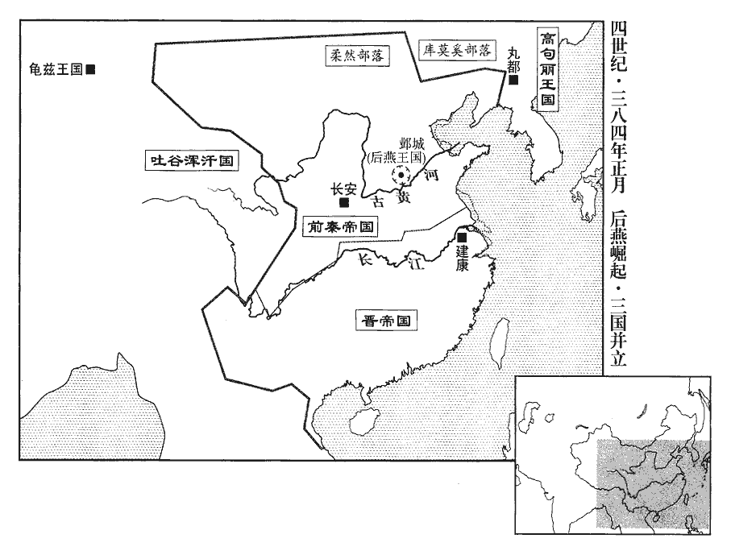 

長樂公丕使姜讓誚讓燕王垂，且說之曰：「過而能改，今猶未晚也。」誚，才笑翻。說，輸芮翻。垂曰：「孤受主上不世之恩，故欲安全長樂公，使盡眾赴京師，京師，謂長安也。然後脩復國家之業，與秦永為鄰好。好，呼到翻。何故闇於機運，不以鄴城見歸?若迷而不復，當窮極兵勢，恐單馬求生，亦不可得也。」讓厲色責之曰：「將軍不容於家國，投命聖朝，朝，直遙翻。燕之尺土，將軍豈有分乎?分，扶問翻。主上與將軍，風殊類別，言氐處關西，鮮卑在東北，既不同風，族類又別也。一見傾心，親如宗戚，寵踰勳舊，自古君臣際遇，有如是之厚者乎?一旦因王師小敗，遽有異圖！長樂公，主上元子，受分陝之任，陝，失冉翻。寧可束手輸將軍以百城之地乎?將軍欲裂冠毀冕，左傳，晉率陰戎伐潁。景王使詹桓伯辭於晉曰：「我在伯父，猶衣服之有冠冕，木水之有本原，民人之有謀主也。伯父若裂冠毀冕，拔本塞原，專棄謀主，雖戎狄，其何有余一人！」自可極其兵勢，奚更云云！但惜將軍以七十之年，懸首白旗，武王斬紂首，懸於大白之旗。高世之忠，更為逆鬼耳！」垂默然。姜讓之辭直，垂心內愧，故默然無以答。左右請殺之，垂曰：「彼各為其主耳，何罪！」禮而歸之，遺丕書及上秦王堅表，陳述利害，請送丕歸長安。堅及丕怒，復書切責之。為，于偽翻。遺，于季翻。上，時掌翻。

〖译文〗 长乐公苻丕派姜让谴责后燕王慕容垂，并且劝他说：“有过错而能够改正，如今还不晚。”慕容垂说：“我承受了主上罕见的恩惠，所以想保全长乐公，让他带领全部军队返回京师长安，然后我修整恢复国家的大业，与秦国永远结为友好邻邦。为什么他不识时务，不将邺城归还给我呢？如果他执迷不悟，我就应当动用全部兵力攻打，恐怕他想单身匹马逃窜求生，也是不可能的了。”姜让厉言正色地责备慕容垂说：“将军在自己的国家无处容身，投靠圣朝，燕国狭小的地域，难道能有你的份吗？主上与将军风俗不同，种族有异，然而却一见倾心，亲如一家，对你的宠待超过了功勋旧臣，自古君臣相遇，有像这样优厚的吗？一旦因为君王的军队遭受了小小的失败，你马上就另有图谋！长乐公是主上的嫡传长子，接受分治一方辅佐君王的重任，他难道能把百城之地拱手让给你吗？将军想背弃君主，自然可以大动兵威，哪里用得着说那么多话呢！只可惜将军以七十高龄，像被周武王杀掉的商纣一样把头颅悬挂在白旗上，往日超越世俗的忠诚，反而要变成叛逆之鬼！”慕容垂沉默不语。周围的人请求杀掉姜让，慕容垂说：“那是各为其主而已，有什么罪过！”对他以礼相待，送他回去了。并给苻丕送信，给前秦王苻坚进上表章，陈述利害，请求送苻丕返回长安。苻坚和苻丕十分愤怒，复信痛切地责备了慕容垂。

2鷹揚將軍劉牢之攻秦譙城‹安徽亳州›，拔之。桓沖遣上庸‹湖北竹山西南田家坝›太守郭寶攻秦魏興‹湖北白河县北›、上庸‹湖北竹山西南田家坝›、新城‹湖北房县›三郡，拔之。將軍楊佺期進據成固‹陕西城固›，擊秦梁州刺史潘猛，走之。佺期，亮之子也。楊亮見上卷太元二年。

〖译文〗 [2]东晋鹰扬将军刘牢之攻打前秦的谯城，攻了下来。桓冲派上庸太守郭宝攻打前秦的魏兴、上庸、新城三郡，攻了下来。将军杨期进军占据了成固，攻击前秦梁州刺史潘猛，赶跑了他。杨期是杨亮的儿子。

3壬子‹二十八›，燕王垂攻鄴，拔其外郭，長樂公丕退守中城。關東六州郡縣多送任請降於燕。降，戶江翻。癸丑‹二十九›，垂以陳留王紹行冀州刺史，屯廣阿‹河北隆尧东›。廣阿縣，前漢屬鉅鹿郡，後漢併入鉅鹿縣。有廣阿澤，在鉅鹿縣界，即大陸澤也。

〖译文〗 [3]壬子（二十八日），后燕王慕容垂攻打邺城，攻下了外城，长乐公苻丕退守中城。关东六州的郡县大都送来人质请求向后燕投降。癸丑（二十九日），慕容垂任命陈留王慕容绍代理冀州刺史，驻扎在广阿。

4豐城宣穆公桓沖聞謝玄等有功，自以失言，謂去年「吾其左衽」之言也。慙恨成疾；二月，辛巳‹二十七›，卒‹桓冲，年五十七岁›。朝議欲以謝玄為荊、江二州刺史。朝，直遙翻。謝安自以父子名位太盛，又懼桓氏失職怨望，乃以梁郡太守桓石民為荊州刺史，河東太守桓石虔為豫州刺史，豫州刺史桓伊為江州刺史。

〖译文〗 [4]丰城宣牧公桓冲听说谢玄等人建立了战功，自认为以前的话说错了，愧恨交加，酿成疾病。二月，辛巳（二十七日），桓冲去世。朝廷议论要让谢玄出任荆、江二州刺史。谢安自认为自己父子的名声职位太引人注目，又害怕桓氏家族的人因为失掉职位而怀恨在心，就任命梁郡太守桓石民为荆州刺史，河东太守桓石虔为豫州刺史，豫州刺史桓伊为江州刺史。

5燕王垂引丁零、烏桓之眾二十餘萬為飛梯地道以攻鄴，不拔；乃築長圍守之，分處老弱於肥鄉‹河北肥鄉›，晉志，肥鄉縣屬廣平郡。魏收曰：天平初，併入魏郡臨漳縣。隋復分置肥鄉縣，唐屬洺州。處，昌呂翻。築新興城以置輜重。重，直用翻。

〖译文〗 [5]后燕王慕容垂带领丁零、乌桓的二十多万兵众架设云梯、开挖地道用来攻打邺城，没有攻下。于是就建筑包围工事坚守，分别将老弱兵众安置在肥乡，建筑新兴城用来放置轻重装备。

6秦征東府官屬疑參軍高泰，燕之舊臣，有貳心，苻丕為征東大將軍。高泰先仕燕，慕容垂以為從事中郎。泰懼，與同郡虞曹從事吳韶逃歸勃海‹河北南皮›。秦征東府置虞曹從事，掌所部山澤。泰與韶，皆勃海人也。韶曰：「燕軍近在肥鄉，宜從之。」泰曰：「吾以避禍耳；去一君，事一君，吾所不為也！」申紹見而歎曰：「去就以道，可謂君子矣！」

〖译文〗 [6]前秦征东府的官属们怀疑参军高泰是前燕的旧臣，怀有二心，高泰害怕了，与同郡的虞曹从事吴韶逃回勃海。吴韶说：“燕国的军队近在肥乡，应该归附他们。”高泰说：“我们为的是逃避灾祸而已，离开一个君主，又去事奉另一个君主，这是我所不愿意干的！”申绍见到他后感叹地说：“离开与归附全都依循一定的道理，可以称得上是君子啊！”

7燕范陽王德擊秦枋頭‹河南淇县东南淇门渡›，取之，置戍而還。還，音旋，又讀如字。

〖译文〗 [7]后燕范阳王慕容德攻击前秦的枋头，攻了下来，设置了守卫力量后返回。

8東胡王晏據館陶‹河北馆陶›，為鄴中聲援，鮮卑、烏桓及郡縣民據塢壁，不從燕者尚眾；燕王垂遣太原王楷與鎮南將軍陳留王紹討之。楷謂紹曰：「鮮卑、烏桓及冀州之民，本皆燕臣，今大業始爾，人心未洽，所以小異；唯宜綏之以德，不可震之以威。吾當止一處，為軍聲之本，汝巡撫民夷，示以大義，彼必當聽從。」楷乃屯于辟陽‹河北枣强东南辟陽城›。地理風俗記曰：廣川西南六十里有辟陽亭，故縣也，漢高帝封審食其為侯國。魏收地形志，長樂郡信都縣有辟陽城。紹帥騎數百往說王晏，為陳禍福，帥，讀曰率。說，輸芮翻。為，于偽翻。晏隨紹詣楷降，於是鮮卑、烏桓及塢民降者數十萬口。降，戶江翻。楷留其老弱，置守宰以撫之，發其丁壯十餘萬，與王晏詣鄴。垂大悅曰：「汝兄弟才兼文武，足以繼先王矣！」言足以繼慕容恪也。

〖译文〗 [8]东胡人王晏占据着馆陶，声援邺中，鲜卑、乌桓以及郡县的民众据守坞堡壁垒不服从后燕的人尚有许多。后燕王慕容垂派太原王慕容楷与镇南将军陈留王慕容绍讨伐他们。慕容楷对慕容绍说：“鲜卑、乌桓以及冀州的民众，本来都是燕国的属臣，如今大业刚刚开始，人心尚未融洽，这就是导致小有不同的原因。只应该用仁德安抚他们，不能靠威势震慑他们。我应当停留在一个地方，作为军队声威的根基，你去巡视安抚民众夷狄，向他们展示大义，他们就一定会听命服从。”慕容楷于是就驻扎在辟阳。慕容绍率领数百骑兵前去劝说王晏，为他陈述祸福，王晏跟随慕容绍到慕容楷那里投降，于是鲜卑、乌桓以及守卫在坞堡中的民众投降的有数十万人。慕容楷将其中的老弱者留下，设置地方官吏以安抚他们，派遣其中十多万身强力壮的成年人，与王晏一起到邺城。慕容垂十分高兴地说：“你们弟兄的才能文武兼备，足以继承先王的事业！”

9三月，以衛將軍謝安為太保。

〖译文〗 [9]三月，东晋任命卫将军谢安为太保。

10秦北地‹陕西耀县›長史慕容泓聞燕王垂攻鄴，亡奔關東‹函谷关以东›，收集鮮卑，眾至數千，還屯華陰‹陕西華陰›，敗秦將軍強永，華，戶化翻。敗，補邁翻。強，其兩翻。其眾遂盛；自稱都督陝西諸軍事、大將軍、雍州牧、濟北王，陝，式冉翻。雍，於用翻。濟，子禮翻。推垂為丞相、都督陝東諸軍事、領大司馬、冀州牧、吳王。

〖译文〗 [10]前秦北地长史慕容泓听说后燕王慕容垂攻打邺城，逃奔到关东，收拢会集鲜卑人，多达数千，返回驻扎在华阴，打败了前秦将军强永，他的兵众于是就更多了。慕容泓自称都督陕西诸军事、大将军、雍州牧、济北王，推举慕容垂为丞相、都督陕东诸军事、领大司马、冀州牧、吴王。

秦王堅謂權翼曰：「不用卿言，謂不用翼之言而遣慕容垂也。使鮮卑至此。關東之地，吾不復與之爭，復，扶又翻。將若泓何?」乃以廣平公熙為雍州刺史，鎮蒲阪‹山西永济›。阪，音反。徵雍州牧鉅鹿公叡為都督中外諸軍事、衛大將軍、錄尚書事，配兵五萬；以左將軍竇衝為長史，龍驤將軍姚萇為司馬，以討泓。驤，思將翻。

〖译文〗 前秦王苻坚对权翼说：“没听你的话，让鲜卑人到了如此地步。关东之地，我不再和他们争夺，但拿慕容泓怎么办呢？”于是就任命广平公苻熙为雍州刺史，镇守蒲阪。征召雍州牧钜鹿公苻睿为都督中外诸军事、卫大将军、录尚书事，给他配备五万士兵；任命左将军窦冲为长史，龙骧将军姚苌为司马，来讨伐慕容泓。

平陽‹山西临汾›太守慕容沖亦起兵於平陽，有眾二萬，進攻蒲坂；堅使竇衝討之。

〖译文〗 平阳太守慕容冲也在平阳起兵，拥有二万兵众，进军攻打蒲阪。苻坚派窦冲去讨伐他。

厙shè傉nù官偉帥營部數萬至鄴，燕王垂封偉為安定王。

〖译文〗 [11]库官伟率领部众数万人抵达邺城，后燕王慕容垂封库官伟为安定王。

秦冀州刺史阜城侯定守信都‹河北冀县›，高城‹河北盐山›男紹在國，高城縣屬勃海郡，唐為滄州鹽山縣。高邑侯亮、重合侯謨守常山‹河北正定›，重，直龍翻。固安侯鑒守中山‹河北定州›。燕王垂遣前將軍、樂浪王溫督諸軍攻信都‹河北冀县›，不克；樂浪，音洛琅。夏，四月，丙辰‹三›，遣撫軍大將軍麟益兵助之。定、鑒、秦王堅之從叔；紹、謨，從弟；亮，從子也。從，才用翻。溫，燕王垂之弟子也。

〖译文〗 [12]前秦冀州刺史阜城侯苻定戍守信都，高城男爵苻绍在他的封地，高邑侯苻亮、重合侯苻谟戍守常山，固安侯苻鉴戍守中山。后燕王慕容垂派前将军、乐浪王慕容温督帅各路军队攻打信都，没有攻克。夏季，四月，丙辰（初三），派抚军大将军慕容麟增兵协助他们。苻定、苻鉴是前秦王苻坚的堂叔；苻绍、苻谟是他的堂弟；苻亮是他的侄子。慕容温是后燕王慕容垂弟弟的儿子。

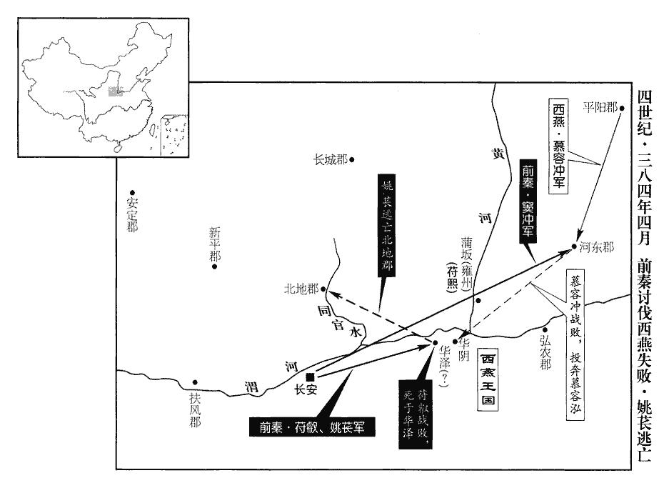 

慕容泓聞秦兵且至，懼，帥眾將奔關東。帥，讀曰率；下同。秦鉅鹿愍公叡粗猛輕敵，欲馳兵邀之。姚萇‹本年五十五岁›諫曰：「鮮卑皆有思歸之志，故起而為亂，宜驅令出關，不可遏也。夫執鼷鼠之尾，猶能反噬於人。鼷xī鼠，一名甘口鼠，食物不痛。爾雅曰：有螫shì毒者。鼷，音奚。彼自知困窮，致死於我，萬一失利，悔將何及。但可鳴鼓隨之，彼將奔敗不暇矣。」使苻叡能用姚萇之言，慕容泓必東奔，慕容沖敗而無所歸，必亦就禽矣。叡弗從，戰于華澤，華澤即華陰之澤也。華，戶化翻。叡兵敗，為泓所殺。萇遣龍驤長史趙都、參軍姜協詣秦王堅謝罪；驤，思將翻。堅怒，殺之。萇懼，奔渭北馬牧，馬牧，牧馬之地，猶漢之牧苑也。於是天水‹甘肃天水›尹緯、尹詳、南安‹甘肃陇西东南›龐演等龐，皮江翻。糾扇羌豪，帥其戶口歸萇者五萬餘家，帥，讀曰率。推萇為盟主。萇自稱大將軍、大單于、萬年秦王，大赦，改元白雀，通鑑目錄：年經國緯，自此以後，姚萇繫之後秦。單，音蟬。以尹詳、龐演為左、右長史，南安姚晃及尹緯為左、右司馬，天水狄伯支等為從事中郎，羌訓等為掾屬，王據等為參軍，王欽盧、姚方成等為將帥。掾，以絹翻。將，即亮翻。帥，所類翻。

〖译文〗 [13]慕容泓听说前秦的军队将要到达，很害怕，率领兵众准备逃奔关东。前秦钜鹿公苻睿鲁莽轻敌，想要迅速出兵在半路拦截他们。姚苌劝谏苻睿说：“鲜卑人全都有思念归返的心情，所以才起兵作乱，应该驱使他们出关，不能阻截。抓住了鼷鼠的尾巴，它还能反咬人一口。他们自知陷于穷途末路，必将要与我们拼命，万一失利，后悔将怎么来得及。只能击鼓紧随他们，他们将全力溃逃。”苻睿没有听从劝告，在华泽交战，苻睿的军队失败，苻睿被慕容泓杀掉。姚苌派龙骧长史赵都、参军姜协到前秦王苻坚那里谢罪，苻坚十分愤怒，杀掉了他们。姚苌害怕了，逃奔到渭北的牧马之地，于是天水人尹纬、尹详、南安人庞演等，纠集煽动羌族豪强，率领他们的民户丁口归附姚苌的，共有五万多家，推举姚苌为盟主。姚苌自称大将军、大单于、万年秦王，实行大赦，改年号为白雀，任命尹详、庞演为左、右长史，南安人姚晃及尹纬为左、右司马，天水人狄伯支等为从事中郎，羌训等为掾属，王据等为参军，王钦卢，姚方成等为将帅。

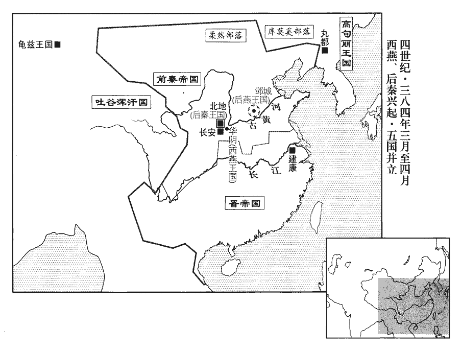 

秦竇衝擊慕容沖于河東‹山西夏县›，大破之；沖帥鮮卑騎八千奔慕容泓。泓眾至十餘萬，遣使謂秦王堅曰：「吳王已定關東，可速資備大駕，奉送家兄皇帝，暐，泓之兄也。泓當帥關中燕人翼衛乘輿，還返鄴都，乘，繩證翻。還，音旋，又如字。與秦以虎牢為界，永為鄰好。」好，呼到翻。堅大怒，召慕容暐責之曰：「今泓書如此，卿欲去者，朕當相資。卿之宗族，可謂人面獸心，不可以國士期也！」暐叩頭流血，涕泣陳謝。堅久之曰：「此自三豎所為，非卿之過。」三豎，謂垂、泓、沖。復其位，待之如初。命暐以書招諭泓、沖及垂。暐密遣使謂泓曰：「吾籠中之人，必無還理；且燕室之罪人也，暐不能保燕之社稷，故自謂為罪人。不足復顧。復，扶又翻。汝勉建大業，以吳王為相國，中山王為太宰、領大司馬，汝可為大將軍、領司徒，承制封拜，聽吾死問，汝便即尊位。」泓於是進向長安，改元燕興。

〖译文〗 [14]前秦窦冲在黄河以东攻击慕容冲，大败慕容冲。慕容冲率领八千鲜卑骑兵投奔慕容泓。慕容泓的兵众达到十多万，他派遣使者告诉前秦王苻坚说：“吴王慕容垂已经平定了关东，可以迅束就此准备车驾，奉送家兄慕容皇帝，慕容泓要率领关中的燕国人守卫车乘，返回邺都，与秦国以虎牢为界，永远结为友邻。”苻坚听后勃然大怒，召来慕容责备他说：“如今慕容泓的信中把话说到了这种地步，你想离开的时候，我将提供帮助。你的宗族亲戚，可以称得上是人面兽心，无法把他们作为国士来寄于期望！”慕容叩头叩得流了血，哭泣着表示谢罪。过了许久，苻坚说：“事情是由慕容垂、慕容泓、慕容冲三个家伙所干的，不是你的过错。”于是恢复了慕容的职位，对待他像当初一样。苻坚命令慕容写信招纳劝谕慕容泓、慕容冲以及慕容垂。慕容秘密地派使者告诉慕容泓说：“我是笼中之人，肯定没有回归的道理；况且我还是燕王室的罪人，不值得你们再顾念。你们努力建成大业，让吴王慕容垂做相国，中山王慕容冲做太宰、兼大司马，你可以做大将军、兼司徒，秉承我的旨意封爵授官，听到我死了的消息后，你就可以即皇帝的尊位。”慕容泓于是进军长安，改年号为燕兴。

燕王垂以鄴城猶固，會僚佐議之。右司馬封衡請引漳水灌之；用曹操攻鄴故智也。從之。垂行圍，行，下孟翻。因飲於華林園，洛都、鄴都皆有華林園；鄴之華林，則魏武所築也。秦人密出兵掩之，矢下如雨，垂幾不得出，幾，居依翻。冠軍大將軍隆將騎衝之，垂僅而得免。將，即亮翻。騎，奇寄翻。

〖译文〗 [15]后燕王慕容垂因为邺城尚在固守，会集僚属辅佐商议此事。右司马封衡请求引来漳水灌入城中，慕容垂听从了。慕容垂到了打猎场，顺便在华林园饮酒，前秦人秘密出兵对他突然袭击，乱箭如雨射来，慕容垂几乎没能逃出，冠军大将军慕容隆带领骑兵冲击敌人，慕容垂才幸免于难。

竟陵‹湖北鐘祥›太守趙統攻襄陽‹湖北襄樊›，秦荊州刺史都貴奔魯陽‹河南魯山›。

〖译文〗 [16]竟陵太守赵统攻打襄阳，前秦荆州刺史都贵逃奔鲁阳。

五月，秦洛州刺史張五虎據豐陽‹陕西山阳›來降。降，戶江翻。

〖译文〗 [17]五月，前秦洛州刺史张五虎占据丰阳，前来向东晋役降。

梁州刺史楊亮帥眾五萬伐蜀，帥，讀曰率。遣巴西太守費統將水陸兵三萬為前鋒。費，扶沸翻。將，即亮翻。亮屯巴郡‹重庆›，秦益州‹府成都，四川成都›刺史王廣遣巴西‹四川阆中›太守康回等拒之。姓譜：西胡自有康姓。

〖译文〗 [18]东晋梁州刺史杨亮率领五万兵众讨伐蜀，派遣巴西太守费统统率三万水军、陆军作为前锋。杨亮驻扎在巴郡，前秦益州刺史王广派巴西太守康回等人抵抗他们。

秦苻定、苻紹皆降於燕；定以信都降，紹以高城降。降，戶江翻；下同。燕慕容麟引兵西攻常山‹河北正定›。苻謨守常山。

〖译文〗 [19]前秦的苻定、苻绍全都投降了后燕。后燕慕容麟带领军队西攻常山。

後秦王萇進屯北地‹陕西耀县›，姚萇書後秦，以別於苻秦也。秦華陰‹陕西華陰›、北地、新平‹陕西彬县›、安定‹甘肃镇原东南曙光乡›羌胡降之者十餘萬。

〖译文〗 [20]后秦王姚苌进军驻扎在北地，前秦华阴、北地、新平、安定的羌人、胡人投降的有十多万。

六月，癸丑朔‹一›，崇德太后褚氏‹褚蒜子，年六十一›崩。

〖译文〗 [21]六月，癸丑朔（初一），东晋崇德太后褚氏去世。

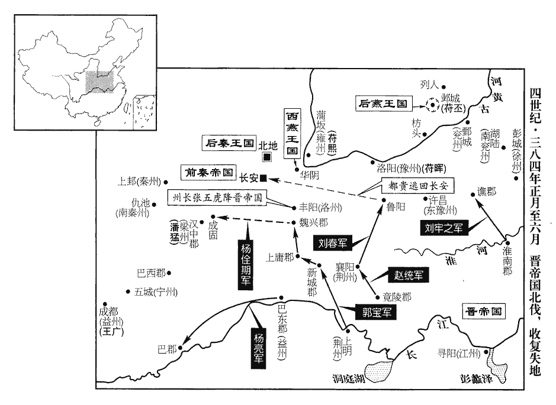 

秦王堅自帥步騎二萬以擊後秦，軍于趙氏塢，據晉書載記，趙氏塢在北地‹陕西耀县›。帥，讀曰率。騎，奇寄翻。使護軍將軍楊璧等分道攻之；後秦兵屢敗，斬後秦王萇之弟鎮軍將軍尹買。後秦軍中無井，秦人塞安公谷、堰同官水以困之。安公谷、同官水皆在今耀州界。魏收地形志，北地郡有銅官縣，真君七年置。杜佑曰：銅官本漢祋duì祤yǔ縣地‹陕西耀县东›，晉為頻陽；苻秦於祋祤北銅官川置銅官護軍，後魏太武罷護軍，置銅官縣；後周武帝移於今所；隋以後，唯作同官。塞，悉則翻。後秦人恟懼，有渴死者。恟，許拱翻。會天大雨，後秦營中水三尺，繞營百步之外，寸餘而已，後秦軍復振。復，扶又翻。秦王堅歎曰：「天亦佑賊乎！」天不助秦，不可復支矣。

〖译文〗 [22]前秦王苻坚亲自率领步、骑兵二万人攻打后秦，驻军于赵氏坞，让护军将军杨壁等人分路进攻。后秦的军队屡战屡败，后秦王姚苌的弟弟镇军将军姚尹买被斩杀。后秦驻军的地方没有水井，前秦人堵塞了安公谷、拦截了同官水以围困他们。后秦人惊慌恐惧，有人干渴而死。恰巧天下大雨，后秦的军营积水三尺，环绕军营百步以外，积水仅仅一寸多而已，后秦的军队又振奋了起来。前秦王苻坚叹息道：“上天也保佑寇贼啊！”

慕容泓謀臣高蓋等以泓德望不如慕容沖，且持法苛峻，乃殺泓，立沖‹慕容冲，本年二十六岁›為皇太弟，承制行事，置百官；以蓋為尚書令。後秦王萇遣子嵩為質於沖以請和。欲連兵以斃秦，且畏沖兵之強也。質，音致。

〖译文〗 [23]慕容泓的谋臣高盖等人认为慕容泓的道德威望不如慕容冲，而且执行法律苛刻严峻，于是就杀掉了慕容泓，立慕容冲为皇太弟，秉承国王的旨意行事，设置了百官。任命高盖为尚书令。后秦王姚苌派遣儿子姚嵩作为人质到慕容冲那里，以请求和好。

將軍劉春攻魯陽‹河南魯山›，都貴奔還長安‹西安›。

〖译文〗 [24]东晋将军刘春攻打鲁阳，都贵逃回长安。

後秦王萇帥眾七萬擊秦，秦王堅遣楊璧等拒之，為萇所敗；敗，補邁翻。獲楊璧及右將軍徐成、鎮軍將軍毛盛等將吏數十人，萇皆禮而遣之。

〖译文〗 [25]后秦王姚苌率领七万兵众攻打前秦，前秦王苻坚派杨壁等人抵抗，被姚苌打败。擒获了杨壁以及右将军徐成、镇军将军毛盛等将帅官吏数十人，姚苌对他们全都以礼相待，然后放他们回去了。

燕慕容麟拔常山，秦苻亮、苻謨皆降。降，戶江翻。麟進圍中山‹河北定州›，秋，七月，克之，執苻鑒。冀州皆為燕有，惟苻丕守鄴而已。麟威聲大振，留屯中山。

〖译文〗 [26]后燕慕容麟攻下了常山，前秦的苻亮、苻谟全都投降。慕容麟进军包围中山，秋季，七月，攻克了中山，抓获了苻鉴。慕容麟威势名声大振，留驻中山。

秦幽州刺史王永、平州‹辽宁›刺史苻沖帥二州之眾以擊燕。帥，讀曰率。燕王垂遣平【章：十二行本「平」作「寧」；乙十一行本同；張校同。】朔將軍平規擊永，此平規別是一平規，平幼之弟，非與苻洛同反之平規也。永遣昌黎‹辽宁朝阳›太守宋敞逆戰於范陽‹河北涿州›，敞兵敗，規進據薊‹北京›南。薊，音計。

〖译文〗 [27]前秦幽州刺史王永、平州刺史苻冲率领二州的兵众攻击后燕。后燕王慕容垂派平朔将军平规反击王永，王永派昌黎太守宋敞在范阳迎战，宋敞的军队被打败，平规进军占据了蓟城以南。

秦平原公暉帥洛陽、陝城之眾七萬歸于長安。陝，失冉翻。

〖译文〗 [28]前秦平原公苻晖率领洛阳、陕城的七万兵众回到了长安。

秦【章：十二行本「秦」上有「益州刺史王廣，遣將軍王虬帥蜀漢之衆三萬北救長安。」二十二字；乙十一行本同；孔本同；張校同；退齋校同。】王堅聞慕容沖去長安浸近，乃引兵歸，歸自北地趙氏塢，使沖不逼長安，堅尚與萇相持，勝負之勢，未有所定也。沖兵既逼，堅不容不還長安，萇得收嶺北以為資；堅，沖血戰而萇伺其敝；堅死而鮮卑東出，萇坐而取關中；真所謂鷸蚌相持，漁人之利也。遣撫軍大將軍方【章：十二行本「方」上有「高陽公」三字；乙十一行本同；孔本同；張校同。】戍驪山‹陕西临潼东南›，驪，力知翻。拜平原公暉為都督中外諸軍事，車騎大將軍、錄尚書事，配兵五萬以拒沖。沖與暉戰于鄭‹陕西华县›西，大破之。堅又遣前將軍姜宇與少子河間公琳帥眾三萬拒沖於灞上‹西安东灞河畔›；少，詩照翻。琳、宇皆敗死，沖遂據阿房城‹西安西›。即秦之阿房宮城。

〖译文〗 [29]前秦王苻坚听说慕容冲逐渐逼近长安，就带领军队返回，派抚军大将军苻方戍守骊山，任命平原公苻晖为都督中外诸军事、车骑大将军、录尚书事，配备五万兵众以抵抗慕容冲。慕容冲与苻晖在郑西交战，大败苻晖。苻坚又派前将军姜宇与小儿子河间公苻琳率领三万兵众在灞上抵抗慕容冲，苻琳、姜宇全都战败死亡，慕容冲于是就占据了阿房城。

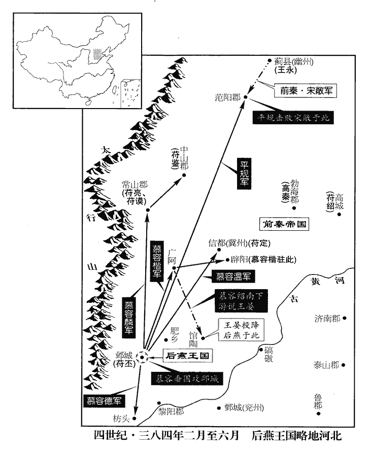 

秦康回兵數敗，數，所角翻。退還成都。梓潼‹四川绵阳›太守壘襲以涪城來降。此晉西師之捷。姓譜曰：後趙錄有壘澄，本姓裴氏。荊州刺史桓石民據魯陽，遣河南太守高茂北戍洛陽。此晉自襄、沔北向之師也。

〖译文〗 [30]前秦康回的军队多次失败，退回到成都。梓潼太守垒袭率涪城投降了东晋。荆州刺史桓石民占据了鲁阳，派河南太守高茂北进戍守洛阳。

己酉‹二十八›，葬康献皇后‹褚蒜子›于崇平陵‹康帝司马岳墓·南京城东蒋山西南›。

〖译文〗 [31]己酉（二十八日），东晋在崇平陵安葬了康献皇后。

燕翟斌恃功驕縱，邀求無厭，斌，音彬。厭，於鹽翻。又以鄴城久不下，潛有貳心。太子寶請除之，燕王垂曰：「河南之盟，不可負也；斌引兵會垂於洛陽，垂與之盟，蓋在河南縣。若其為難，難，乃旦翻。罪由於斌。今事未有形而殺之，人必謂我忌憚其功能；吾方收攬豪傑以隆大業，不可示人以狹，失天下之望也。藉彼有謀，吾以智防之，無能為也。」范陽王德、陳留王紹、驃騎大將軍農皆曰：「翟斌兄弟恃功而驕，必為國患。」垂曰：「驕則速敗，焉能為患！焉，於乾翻，何也。彼有大功，當聽其自斃耳。」禮遇彌重。

〖译文〗 [32]后燕的翟斌自恃有功，傲慢无忌，邀官求赏，贪得无厌。又因为邺城久围不下，私下里怀有背叛之心。太子慕容宝请求除掉他，后燕王慕容垂说：“河南的盟誓，不能背弃。如果他要发难，罪过出于翟斌。如今事情尚未发生而杀掉他，人们一定会说我忌恨害怕他的功劳与才能。我正在收罗招揽英雄豪杰以使大业昌盛，不能向人们表现出狭隘，以丧失天下人的期望。假如他怀有阴谋，我以智谋防范他，他也无所作为。”范阳王慕容德、陈留王慕容绍、骠骑大将军慕容农都说：“翟斌兄弟居功自傲，一定会成为国家的祸患。”慕容垂说：“傲慢必然导致迅速失败，怎么能成为祸患呢！他立有大功，应当听凭他自取灭亡。”慕容垂对翟斌的礼遇越发优厚。

斌諷丁零及其黨請斌為尚書令。垂曰：「翟王之功，宜居上輔；但臺既未建，此官不可遽置耳。」斌怒，密與前秦長樂公丕通謀，通鑑凡苻秦事，書曰秦；此「前」字衍。使丁零決隄潰水；燕引漳水以灌鄴，故斌欲決隄以潰之。事覺，垂殺斌及其弟檀、敏，餘皆赦之。

〖译文〗 翟斌暗示丁零人及自己的同党请求让他出任尚书令。慕容垂说：“以翟王的功劳，应该位居宰相，只是官署尚未建立，此官无法迅速设置。”翟斌非常愤怒，暗地里与前秦长乐公主苻丕互通计谋，让丁零人开决输引漳水的堤防，把水放走，事情泄露，慕容垂杀掉了翟斌及他的弟弟翟檀、翟敏，其余的人全都赦免了。

斌兄子真，夜將營眾北奔邯鄲‹河北邯郸›，將，即亮翻。邯鄲，音寒丹。引兵還向鄴圍，欲與丕內外相應；太子寶與冠軍大將軍隆擊破之。冠，古玩翻。真還走邯鄲。走，音奏。

〖译文〗 翟斌哥哥的儿子翟真，趁夜带领军营里的兵众向北逃向邯郸，途中又掉头开向后燕围攻邺城的包围圈，想和苻丕形成内外呼应之势。太子慕容宝与冠军大将军慕容隆打败了他们。翟真又掉头逃向邯郸。

太原王楷、陳留王紹言於垂曰：「丁零非有大志，但寵過為亂耳。今急之則屯聚為寇，緩之則自散，散而擊之，無不克矣。」垂從之。

〖译文〗 太原王慕容楷、陈留王慕容绍向慕容垂进言说：“丁零人并非胸怀大志，只是因为过分地宠待了他们，所以才背叛作乱罢了。如今若要迅速消灭他们，那他们就会聚集起来，成为寇贼，如果暂时不理睬他们，他们就会自我离散，等到离散以后再攻打他们，攻无不克。”慕容垂听从了这一意见。

龜茲‹都屈茨，新疆库车›王帛純窘急，呂光自去年進軍攻龜茲。龜茲，音丘慈。窘，渠隕翻。重賂獪kuài胡以求救；獪胡，蓋又在龜茲之西。楊正衡曰：獪，古邁翻。獪胡王遣其弟吶龍、侯將馗帥騎二十餘萬，吶龍一人，馗又一人，侯將，官稱也；漢時西域諸國，各有輔國侯，安國侯、左右將，其後蓋併侯將為一官。吶，女劣翻，又女鬱翻。將，即亮翻。馗，渠追翻。并引溫宿‹新疆乌什›、尉頭‹尉须，新疆阿合奇›【嚴：「頭」改「須」。】等諸國兵合七十餘萬以救龜茲；秦呂光與戰于城西，大破之。帛純出走，王侯降者三十餘國。降，戶江翻。光入其城；城如長安市邑，宮室甚盛。光撫寧西域，威恩甚著，遠方諸國，前世所不能服者，皆來歸附，上漢所賜節傳；上，時掌翻。傳，張戀翻。光皆表而易之，立帛純弟震為龜茲王。

〖译文〗 [33]龟兹王帛纯处境困窘危急，给狯胡送去优厚的礼物以求救援。狯胡王派他的弟弟呐龙、侯将馗率领二十多万骑兵，同时带领温宿、尉须等各国军队共计七十多万人前去救援龟兹。前秦吕光和他们在城西交战，大败了他们。帛纯出逃，三十多国的王侯投降。吕光进入龟兹人的城内，城里如同长安的都市，宫室非常华丽。吕光抚慰安宁西域地区，威势与恩德十分明显，远方各国，前代所未能臣服的，全都前来归附，并献上汉朝时赐给他们的苻节凭证。吕光全都进上表章请求为他们更换，立帛纯的弟弟帛震为龟兹王。

八月，翟真自邯鄲北走，燕王垂遣太原王楷、驃騎大將軍農帥騎追之，及【章：十二行本「及」上有「甲寅」‹三›二字；乙十一行本同；孔本同；張校同；退齋校同。】於下邑。楷欲戰，農曰：「士卒飢倦，且視賊營不見丁壯，殆有他伏。」楷不從，進戰，燕兵大敗。真北趨中山‹河北定州›，屯于承營。羸師示弱者，必有伏兵，眾所通知也，然而往往墮其中而不自覺以致覆軍者多矣。趨，七諭翻；下同。

〖译文〗 [34]八月，翟真从邯郸北逃，后燕王慕容垂派太原王慕容楷、骠骑大将军慕容农率领骑兵追击他，到下邑时追了上去。慕容楷想与他交战，慕容农说：“士兵饥饿疲倦，而且在敌人的军营中看不见身强力壮的成年人，恐怕在其他地方有埋伏。”慕容楷没有听从，进军交战，后燕的军队大败。翟真向北开赴中山，驻扎在承营。

鄴中芻糧俱盡，削松木以飼馬。飼，祥吏翻。燕王垂謂諸將曰：「苻丕窮寇，必無降理；降，戶江翻。不如退屯新城，即肥鄉之新興城也。開丕西歸之路，以謝秦王疇昔之恩，且為討翟真之計。」丙寅‹十五›夜，垂解圍趨新城。遣慕容農徇清河‹山东临清›、平原‹山东平原›，徵督租賦。農明立約束，均適有無，軍令嚴整，無所侵暴，由是穀帛屬路，軍資豐給。屬，之欲翻。

〖译文〗 [35]邺城中饲料、粮食全都耗尽，只能砍下松树枝喂马。后燕王慕容垂对众将领说：“苻丕是势穷力竭的敌寇，一定没有投降的道理。我们不如退驻新城，为苻丕让开西返的道路，以此来感谢秦王昔日的恩情，而且可以作为讨伐翟真的计策。”丙寅（十五日）那天夜晚，慕容垂解除了对邺城的包围，开赴新城。派慕容农带兵巡行清河、平原，监督征收田租赋税。慕容农明确地公布了条令，使贫富之家的分担适当，军纪严明，无所侵扰，因此交纳粮食、布匹的人络绎不绝，军队的给养丰富充足。

戊寅‹二十七›，南昌文穆公郗愔薨‹年七十二›。郗，丑之翻。愔，挹淫翻。

〖译文〗 [36]戊寅（二十七日），东晋南昌文穆公郗去世。

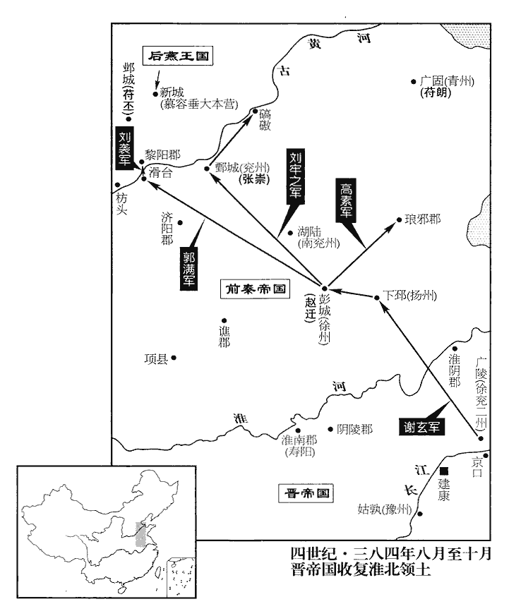 

太保安奏請乘苻氏傾敗，開拓中原，以徐、兗二州刺史謝玄為前鋒都督，帥豫州刺史桓石虔伐秦。帥，讀曰率。玄至下邳‹江苏睢宁北古邳镇›，秦徐州刺史趙遷棄彭城‹江苏徐州›走，玄進據彭城。此晉自淮、泗北向之師也。

〖译文〗 [37]东晋太保谢安进上奏章，请求乘苻氏失败之机，开拓中原地区，任命徐、兖二州刺史谢玄为前锋都督，率领豫州刺史桓石虔讨伐前秦。谢玄抵达下邳，前秦徐州刺史赵迁放弃彭城逃走，谢玄进军占据了彭城。

秦王堅聞呂光平西域，以光為都督玉門‹甘肃敦煌西北›以西諸軍事，西域校尉。道絕，不通。

〖译文〗 [38]前秦王苻坚听说吕光平定了西域，任命吕光为都督玉门以西诸军事、西域校尉。因为道路被阻绝，任命无法通达。

秦幽州刺史王永求救於振威將軍劉庫仁，先是，秦蓋授劉庫仁振武將軍。庫仁遣其妻兄公孫希帥騎三千救之，大破平規於薊‹北京›南，乘勝長驅，進據唐城‹河北唐县›。【章：十二行本「城」下有「與慕容麟相持」六字；乙十一行本同；孔本同；張校同；退齋校同。】中山郡之唐縣城也。

〖译文〗 [39]前秦幽州刺史王永向振威将军刘库仁求救，刘库仁派他妻子的哥哥公孙希率领三千骑兵前去救援，在蓟南大败平规的军队，乘胜长驱直入，进军占据了唐城。

九月，謝玄使彭城‹江苏徐州›內史劉牢之攻秦兗州刺史張崇。辛卯‹十一›，崇棄鄄城‹山东鄄城北›奔燕。牢之據鄄城，鄄，吉掾翻。河南城堡皆來歸附。

〖译文〗 [40]九月，谢玄让彭城内史刘牢之攻打前秦兖州刺史张崇。辛卯（十一日），张崇放弃了鄄城投奔后燕。刘牢之石据了鄄城，河南城邑村堡里的人全都前来归附东晋。

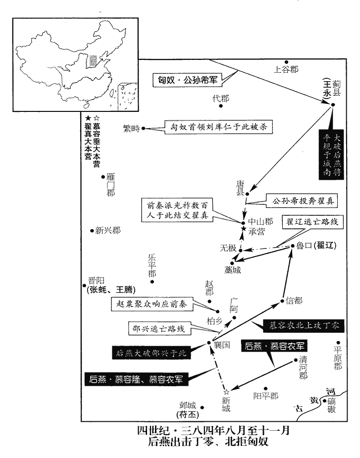 

太保安‹谢安›上疏自求北征；【章：十二行本征下有「甲午」‹十四›二字；乙十一行本同；退齋校同。】加安都督揚、江等十五州諸軍事，加黃鉞。十五州，蓋揚、徐、南徐、兗、南兗、豫、南豫、江、青、冀、幽、并、司、荊、雍也。

〖译文〗 [41]东晋太保谢安上疏，请求亲自出征北伐。朝廷让谢安担任都督扬、江等十五州诸军事，并授予他黄钺。

慕容沖進逼長安，秦王堅登城觀之，歎曰：「此虜何從出哉！」大呼責沖曰：呼，火故翻。「奴何苦来送死。」沖曰：「奴厌奴苦，欲取汝为代耳。」沖少有宠于坚，（沖少有龙阳之色，得幸于坚。少，诗照翻。）堅遣使以錦袍稱詔遺之。遺，于季翻。沖遣詹事稱皇太弟令答之曰：「孤今心在天下，豈顧一袍小惠！苟能知命，君臣束手，早送皇帝，皇帝謂慕容暐。自當寬貸苻氏以酬曩好。」好，呼到翻。堅大怒曰：「吾不用王景略、陽平公之言，事見一百三卷寧康三年及上卷太元七年。使白虜敢至於此！」載記曰：秦人率謂鮮卑為白虜。

〖译文〗 [42]慕容冲进军逼临长安，前秦王苻坚登上城墙观望，感叹地说：“这些敌虏是从哪里出来的呢！”接着大声责备慕容冲说：“你小子何苦来送死！”慕容冲说：“我厌倦了我的困苦，想捉拿你来代替！”慕容冲小的时候很得苻坚的宠爱，苻坚派使者带着锦袍宣称是皇帝诏令送给慕容冲的，慕容冲则派詹事宣称皇太弟他回答说：“我如今的志向在于夺取天下，岂能看得上一件锦袍这样的小恩小惠！假如能够知天命，君主臣下就应该停止抵抗，及早把皇帝慕容送来，自然就可以宽恕苻氏以酬报过去的好处。”苻坚勃然大怒，说：“我没有听从王猛、阳平公苻融的话，使鲜卑白虏胆敢放肆到这种地步！”

冬，十月，辛亥朔‹一›，日有食之。

〖译文〗 [43]冬季，十月，辛亥朔（初一），出现日食。

乙丑‹十五›，大赦。

〖译文〗 [44]乙丑（十五日），东晋实行大赦。

謝玄遣陰陵‹安徽定远西北›太守高素攻秦青州‹府广固，山东青州›刺史苻朗，陰陵縣，漢屬九江郡。晉書謝玄傳作「淮陵」。淮陵縣，前漢屬臨淮郡，後漢屬下邳郡，晉復屬臨淮郡，惠帝元康七年，分置淮陵郡。「陰」，當作「淮」。軍至琅邪‹山东临沂›，朗來降。朗，堅之從子也。降，戶江翻。從，才用翻。

〖译文〗 [45]谢玄派阴陵太守高素攻打前秦青州刺史苻朗，军队抵达琅邪，苻朗前来投降。苻朗是苻坚的侄子。

翟真在承營，與公孫希、宋敞遙相首尾。公孫希，劉庫仁所遣；宋敞，王永所遣。長樂公丕遣宦者冗從僕射清河‹山东临清›光祚姓譜：光姓，燕人田光之後，秦末子孫避地，以光為氏。冗rǒng，而隴翻。從，才用翻。將兵數百赴中山‹河北定州›，與真相結。又遣陽平太守邵興將數千騎招集冀州故郡縣，與祚期會襄國‹河北邢台›。是時，燕軍疲弊，秦勢復振，復，扶又翻。冀州郡縣皆觀望成敗，趙郡‹河北高邑›人趙粟等起兵柏鄉‹河北柏乡›以應興。魏收地形志：南趙郡柏人縣有柏鄉城。九域志曰：柏鄉故城，春秋時晉鄗hào邑。五代志：隋文帝開皇十六年，置柏鄉縣，屬趙郡。燕王垂遣冠軍大將軍隆、龍驤將軍張崇將兵邀擊興，命驃騎大將軍農自清河‹山东临清›引兵會之。冠，古玩翻。驤，思將翻。驃，匹妙翻。騎，奇寄翻。隆與興戰于襄國‹河北邢台›，大破之；興走至廣阿‹河北隆尧东›，遇慕容農，執之。光祚聞之，循西山‹太行山›走歸鄴。隆遂擊趙粟等，皆破之，冀州郡縣復從燕。復，扶又翻。

〖译文〗 [46]翟真在承营，与公孙希、宋敞首尾相应。长乐公苻丕派宦官冗从仆射清河人光祚带领数百兵众奔赴中山，与翟真相勾结。又派阳平太守邵兴带领数千骑兵招纳会集冀州过去的郡县，与光祚约期在襄国会合。这时，后燕的军队疲惫，而前秦的威势又重新振作，冀州的郡县全都观望成败，赵郡人赵粟等在柏乡起兵以响应邵兴。后燕王慕容垂派冠军大将军慕容隆、龙骧将军张崇带领兵众迎击邵兴，命令骠骑大将军慕容农带领军队从清河出发，与他们会合。慕容隆与邵兴在襄国交战，邵兴的军队大败，邵兴逃到了广阿，遇上了慕容农，抓获了他。光祚听说以后，沿着西山逃回邺城。慕容隆于是就攻击赵粟等人，把他们全都打败，冀州的郡县又归顺了后燕。

劉庫仁聞公孫希已破平規，欲大舉兵以救長樂公丕，發鴈門‹山西代县›、上谷‹河北怀来›、代郡‹河北蔚县›兵，屯繁畤‹山西浑源西南›。畤，音止。燕太子太保慕輿句之子文、零陵公慕輿虔之子常慕輿句見九十八卷穆帝永和六年。慕輿虔見一百一卷哀帝興寧三年。句，音鉤。時在庫仁所，知三郡兵不樂遠征，樂，音洛。因作亂，夜攻庫仁，殺之，竊其駿馬，奔燕。公孫希之眾聞亂自潰，希奔翟真。庫仁弟頭眷代領庫仁部眾。

〖译文〗 [47]刘库仁听说公孙希已经打败了平规的军队，想大举出兵以救援长乐公苻丕，他出动了雁门、上谷、代郡的军队，驻扎在繁。前燕太子太保慕舆句的儿子慕舆文、零陵公慕舆虔的儿子慕舆常，这时在刘库仁处，他们知道三郡的军队不愿意远征，因此就反叛作乱，趁夜攻打刘库仁，把他杀掉了，偷了他的骏马，逃奔后燕。公孙希的兵众听到叛乱的消息后自我溃散，公孙希投奔翟真。刘库仁的弟弟刘头眷代替刘库仁统领部众。

秦長樂公丕遣光祚及參軍封孚召驃騎將軍張蚝、并州刺史王騰於晉陽‹山西太原›以自救；蚝、騰以眾少不能赴。秦以鄧羌、張蚝為萬人敵。是時鄧羌死矣，張蚝卒不能救秦之亡。是知徒勇而無謀者，無益於成敗之數也。蚝，七吏翻。丕進退路窮，謀於僚佐。司馬楊膺請自歸於晉，丕未許。會謝玄遣龍驤將軍劉牢之等據碻qiāo磝áo‹山东茌chí平西南›，碻磝城，濟北郡治所，沿河要地也。碻，丘交翻。磝，牛交翻。楊正衡曰：碻，口勞翻。杜佑曰：碻，口交翻。磝，音敖。濟陽‹河南兰考东北堌阳镇›太守郭滿據滑臺‹河南滑县›，沈約曰：晉惠帝分陳留為濟陽國。滑臺，漢之白馬，唐之滑州也。宋南渡後，遣范成大北使，時河已南徙，滑州及白馬縣皆在河北，古滑州已淪於河中矣。剩水在濬jùn州西南，積水若湖；對濬州城，即黎陽山。濟，子禮翻。將軍颜肱、劉襲軍于河北；河北，滑臺之北岸也。丕遣將軍桑據屯黎陽‹河南浚县›以拒之。劉襲夜襲據，走之，遂克黎陽。丕懼，乃遣從弟就與參軍焦逵請救於玄，從，才用翻。致書稱「欲假塗求糧，西赴國難，難，乃旦翻。須援軍既接，以鄴與之。若西路不通，長安陷沒，請帥所領保守鄴城。」帥，讀曰率。逵與參軍姜讓密謂膺曰：「今喪敗如此，喪，息浪翻。長安阻絕，存亡不可知。屈節竭誠以求糧援，猶懼不獲；而公豪氣不除，方設兩端，事必無成。宜正書為表，許以王師之至，當致身南歸；如其不從，可逼縛與之。」膺自以力能制丕，楊膺，丕之妃兄，故自以為力能制丕。乃改書而遣之。

〖译文〗 [48]前秦长乐公苻丕派光祚及参军封孚到晋阳征召骠骑将军张蚝、并州刺史王腾救援自己，张蚝、王腾因为兵力不足不能前往。苻丕进退无路，便和僚属辅佐们商量。司马杨膺请求自动归附东晋，苻丕不同意。恰好这时谢玄派龙骧将军刘牢之等占据，派济阳太守郭满占据滑台，派将军颜肱、刘袭驻军于黄河以北，苻丕派将军桑据驻扎在黎阳以抵抗他们。刘袭夜晚袭击桑据，赶跑了他，于是攻克了黎阳。苻丕害怕了，就派堂苻就与参军焦逵向谢玄请求救援，给他写信说：“想借路求粮，西赴国难，等到援军一到，就把邺城拱手交出。如果西路不通，长安失陷，请求您率领军队来保全守卫邺城。”焦逵与参军姜让秘密地对杨膺说：“如今惨败到如此地步，长安的音讯隔绝，存亡不得而知。丧失气节竭尽诚意以求取粮食和援军，还害怕得不到。而你若不去掉感情义气，态度左右摇摆，事情也终将无成。应该把书信改为表章，告诉他君王的军队到达时，就将投身南归晋朝。如果苻丕不服从，可以逼迫捆绑他交给晋朝。”杨膺自以为他的力量能够控制苻丕，于是就改写了书信后送走了。

謝玄遣晉陵‹江苏镇江›太守滕恬之渡河守黎陽‹河南浚县›。恬之，脩之曾孫也。滕脩為吳將，孫皓之亡，脩歸晉。朝廷以兗、青、司、豫既平，加玄都督徐、兗、青、司、冀、幽、并七州諸軍事。

〖译文〗 [49]谢玄派晋陵太守滕恬之渡过黄河戍守黎阳。滕恬之是滕的曾孙。东晋朝廷认为兖、青、司、豫各州已经平定，任命谢玄为都督徐、兖、青、司、冀、幽、并七州诸军事。

後秦王萇聞慕容沖攻長安，會群僚議進止，皆曰：「大王宜先取長安，建立根本，然後經營四方。」萇曰：「不然。燕人因其眾有思歸之心以起兵，若得其志，必不久留關中，吾當移屯嶺北，嶺北，謂九嵕zōng‹陕西礼泉北›之北，凡新平、北地、安定之地皆是也。廣收資實，以待秦亡燕去，然後拱手取之耳。」乃留其長子興守北地‹陕西耀县›，長，知兩翻。使寧北將軍姚穆守同官川‹陕西铜川境›，自將其眾攻新平‹陕西彬县›。將，即亮翻。

〖译文〗 [50]后秦王姚苌听说慕容冲攻打长安，召集群臣商议是继续进军，还是停止前进，群臣们都说：大王应该先攻取长安，建立根基，然后再经营四方。”姚苌说：“不对。燕人是因为他们的兵众思归心切才起兵进攻，如果他们的志向得以实现，肯定不会在关中久留。我应当移驻九以北，广泛地储备粮食、物资，以等待秦国的灭亡，燕人的离去，然后就可以拱手获取关中。”于是姚苌就留下他的长子姚兴守卫北地，让宁北将军姚穆守卫同官川，自己统率兵众攻打新平。

初，新平人殺其郡將，秦王堅缺其城角以恥之，石虎之末，清河崔悅為新平相，為郡人所殺。悅子液仕堅，為尚書郎，自表父仇，不同天地，請還冀州。堅愍之，禁錮新平人，缺其城角以恥之。將，即亮翻。新平民望深以為病，民望，郡之賢豪，為一郡所宗嚮者。欲立忠義以雪之。及後秦王萇至新平，新平太守南安‹甘肃陇西东南›苟輔欲降之，苟輔，氐也，秦之外戚。降，戶江翻；下同。郡人遼西‹河北卢龙›太守馮傑、蓮勺‹陕西渭南东北›令馮羽、尚書郎趙義、汶山‹四川茂县›太守馮苗諫曰：「昔田單以一城存齊。傑等皆新平人。太康地志曰：汶山郡，漢武帝立；孝宣地節三年，合蜀郡；劉蜀又立郡。蓮，音輦。汶，讀曰岷。田單事見四卷周赧王三十六年。今秦之州鎮，猶連城過百，柰何遽為叛臣乎！」輔喜曰：「此吾志也；但恐久而無救，郡人橫被無辜。橫，戶孟翻。諸君能爾，吾豈顧生哉！」於是憑城固守。後秦為土山地道，輔亦於內為之，或戰地下，或戰山上，後秦之眾死者萬餘人。輔詐降以誘萇，萇將入城，覺之而返；輔伏兵邀擊，幾獲之，幾，巨依翻。又殺萬餘人。

〖译文〗 当初，新平人杀掉了本郡的将领，前秦王苻坚把他们的城墙去掉了一个角，用以羞辱他们，新平的贤俊豪杰都觉得这是一桩心病，想要建立忠义以洗涮耻辱。等到后秦王姚苌抵达新平，新平太守南安人苟辅想要投降，本郡人辽西太守冯杰、莲勺令冯羽、尚书郎赵义、汶山太守冯苗劝谏他说：“过去田单以一个城的力量保存了齐国。如今秦国的州镇，还有一百多城邑相连，为什么要匆忙地作叛臣呢！”苟辅高兴地说：“这正是我的心愿。只是怕时间长了无人救援，郡中的百姓横遭无辜之祸。诸君尚能如此，我难道还能怕死吗！”于是他们就凭借城墙固守。后秦的军队在城外修筑土山地道，苟辅在城内也同样修筑，双方有时在地道内交战，有时在土山上交战，后秦死亡的人有一万多。苟辅谎称投降以引诱姚苌，姚苌准备入城，发觉以后返回去。苟辅预先埋伏的军队半路迎击，差一点擒获了姚苌，又斩杀了一万多人。

隴西‹甘肃陇西›處士王嘉，隱居倒虎山‹陕西临潼东›，水經註：倒虎山在新豐縣南。處，昌呂翻。有異術，能知未然；秦人神之。秦王堅、後秦王萇及慕容沖皆遣使迎之。十一月，嘉入長安，眾聞之，以為堅有福，故聖人助之，三輔堡壁及四山氐、羌歸堅者四萬餘人。堅置嘉及沙門道安於外殿，動靜咨之。

〖译文〗 [51]陇西处士王嘉，隐居在倒虎山，有异常之术，能预知未来，秦国人把他当作神仙。前秦王苻坚、后秦王姚苌以及慕容冲全都派使者去迎接他。十一月，王嘉进入长安，众人听说以后，认为苻坚有福，所以圣人帮助他，三辅地区的村镇军营以及依山而居的氐族、羌族人归附苻坚的有四万多人。苻坚把王嘉及僧人道安安置在外殿，行动与否全都要向他们询问。

燕慕容農自信都‹河北冀县›西擊丁零翟遼於魯口‹河北饶阳›，破之。遼退屯無極‹河北无极›，農屯藁城‹河北柏乡北›以逼之。無極縣，漢屬中山，晉省；後魏復置無極縣，唐末為祁州治所。藁城縣，前漢屬真定，後漢屬鉅鹿，晉省。今所屯蓋故縣城也。唐復置藁城縣，屬恆州。遼，真之從兄也。從，才用翻。

〖译文〗 [52]后燕慕容农从信都向西到鲁口攻打丁零人翟辽，打败了他。翟辽退到无极县防守，慕容农驻扎在藁城以威逼他。翟辽是翟真的堂兄。

鮮卑在長安城中者猶千餘人，慕容紹之兄肅，與慕容暐陰謀結鮮卑為亂。十二月，暐白堅，以其子新昏，請堅幸其家，置酒，欲伏兵殺之。堅許之，會天大雨，不果往。事覺，堅召暐及肅，肅曰：「事必洩矣，入則俱死。今城內已嚴，已嚴者，謂鮮卑之眾也。不如殺使者馳出，既得出門，大眾便集。」暐不從，遂俱入。堅曰：「吾相待何如，而起此意?」暐飾辭以對。肅曰：「家國事重，何論意氣！」意氣，謂堅相待之厚。堅先殺肅，乃殺暐‹慕容暐，年三十五岁›及其宗族，城內鮮卑無少長、男女，皆殺之。少，詩照翻。長，知兩翻。燕王垂幼子柔，養於宦者宋牙家為牙子，故得不坐，與太子寶之子盛乘間得出，奔慕容沖。為後慕容盛等自長子歸燕張本。間，古莧翻。

〖译文〗 [53]在长安城中的鲜卑人尚有一千多，慕容绍的哥哥慕容肃与慕容暗地里谋划聚集鲜卑人作乱。十二月，慕容告诉苻坚说，因为他的儿子刚刚结婚，请苻坚到他家去，置酒招待，实则想埋伏士兵杀掉苻坚。苻坚答应了，恰巧天下大雨，没有去成。事情泄露，苻坚召见慕容及慕容肃，慕容肃说：“事情肯定泄露了，进去则全都被杀。如今城内已经严密布防，不如杀掉使者冲出去，逃出城门以后，我们的兵众就可以聚集起来。”慕容没听他的话，于是就一起入宫去见苻坚。苻坚说：“我待你们怎么样，你们反而产生了这样的意图！”慕容遮遮掩掩地搪塞。慕容肃说：“宗族国家事关重大，还谈什么感情义气！”于是苻坚先杀掉了慕容肃，接着又杀掉了慕容以及他的宗族亲属，城内的鲜卑人不论男女老幼，全都被杀。后燕王慕容垂的小儿子慕容柔，养育在宦官宋牙家里，作为宋牙的儿子，所以没有坐罪被杀，他与太子慕容宝的儿子慕容盛乘机逃出，投奔了慕容冲。

燕慕容麟、慕容農合兵襲翟遼，大破之，遼單騎奔翟真。

〖译文〗 [54]后燕慕容麟、慕容农会合军队袭击翟辽，大败翟辽，翟辽只身匹马投奔翟真。

燕王垂以秦長樂公丕猶據鄴不去，乃更引兵圍鄴，開其西走之路。垂志在得鄴，故開其走路，所謂圍城為之缺也。焦逵見謝玄，玄欲徵丕任子，然後出兵；逵固陳丕款誠，并述楊膺之意，玄乃遣劉牢之、滕恬之等帥眾二萬救鄴。帥，讀曰率。丕告飢，玄水陸運米二千斛以饋之。

〖译文〗 [55]后燕王慕容垂因为前秦长乐公苻丕还在据守邺城不肯离去，就又带领军队包围了邺城，同时为他放开了西逃的道路。焦逵见了谢玄，谢玄想要征召苻丕的人质，然后才出兵。焦逵恳切地陈述苻丕的忠诚，并且诉说了杨膺的意图，谢玄于是就派刘牢之、腾恬之等率领二万兵众救援邺城。苻丕报告粮食断绝，谢玄通过水路、陆路运去二千斛米送给他。

秦梁州刺史潘猛棄漢中‹陕西汉中›，奔長安。梁州之地，自此復歸于晉。

〖译文〗 [56]前秦梁州刺史潘猛放弃了汉中，逃奔到长安。

