 晉紀二十八起旃蒙作噩（乙酉），盡柔兆閹茂（丙戌），凡二年。

# 烈宗孝武皇帝中之上

## 太元十年（乙酉、三八五）

1春，正月，秦王堅‹苻坚，本年四十八岁›朝饗群臣。朝，直遙翻。時長安饑，人相食，諸將歸，吐肉以飼妻子。窮匱如此，外無救援，烏得不敗乎！飼，祥吏翻。

〖译文〗 [1]春季，正月，前秦王苻坚祭祀太庙，宴请群臣。当时长安正值饥荒，人相残食，众将领回家以后，都把吃进去的肉吐出来再让妻子儿女们吃。

2慕容沖‹本年二十七岁›即皇帝位于阿房‹西安西›，是為西燕。改元更始。沖有自得之志，賞罰任情。慕容盛年十三，謂慕容柔曰：「夫十人之長，長，知兩翻。亦須才過九人，然後得安。今中山王才不逮人，功未有成，而驕汰已甚，殆難濟乎！」沖在前燕時封中山王。汰，侈也，溢也。史言慕容盛幼而有識略，所以能自奮而有國。盛、柔歸沖，見上卷上年。

〖译文〗 [2]慕容冲在阿房城即皇帝位，改年号为更始。慕容冲踌躇满志，任意赏罚。慕容盛年方十三，对慕容柔说：“就是在十人中位居首位，也必须是才能超过其他九人，然后才能安稳。如今中山王慕容冲才能不及别人，没有建立战功，而骄奢傲慢已经十分严重，恐怕难以成功啊！”

3後秦王萇‹姚苌，本年五十六岁›留諸將攻新平‹陕西彬县›，自引兵擊安定‹甘肃镇原东南曙光乡›，擒秦安西將軍勃海公珍，嶺北諸城悉降之。降，戶江翻。

〖译文〗 [3]后秦王姚苌留下众将领攻打新平，自己带领军队去攻打安定，擒获了前秦安西将军勃海公苻珍，岭北各城全都投降了姚苌。

4甲寅，秦王堅與西燕主沖戰于仇班渠，大破之。慕容垂復興於山東，而沖稱號於關中，故書西燕以別之。乙卯，戰于雀桑，又破之。甲子，戰于白渠，白渠，即漢時白公所鑿者也。秦兵大敗。西燕兵圍秦王堅，殿中將軍鄧邁力戰卻之，堅乃得免。壬申，沖遣尚書令高蓋夜襲長安，入其南城，左將軍竇衝、前禁將軍李辯等擊破之，斬首八百級，分其屍而食之。乙亥，高蓋引兵攻渭北諸壘，太子宏與戰於成貳壁，成貳，蓋人姓名；關中大亂，立壁自保，因為地名。大破之，斬首三萬。

〖译文〗 [4]甲寅（疑误），前秦王苻坚与西燕国主慕容冲在仇班渠交战，大败慕容冲。乙卯（疑误），在雀桑交战，又打败了他。甲子（疑误），在白渠交战，前秦的军队大败。西燕的军队包围了前秦王苻坚，殿中将军邓迈奋力阻击，苻坚才得以幸免。壬申（疑误），慕容冲派尚书令高盖夜袭长安，进入了南城，前秦左将军窦冲、前禁将军李辩等打败了他们，斩首八百多人，士兵们把尸体分开吃掉。乙亥（疑误），高盖带领军队攻打渭北各营垒，太子苻宏与他在成贰壁交战，大败高盖，斩首三万人。

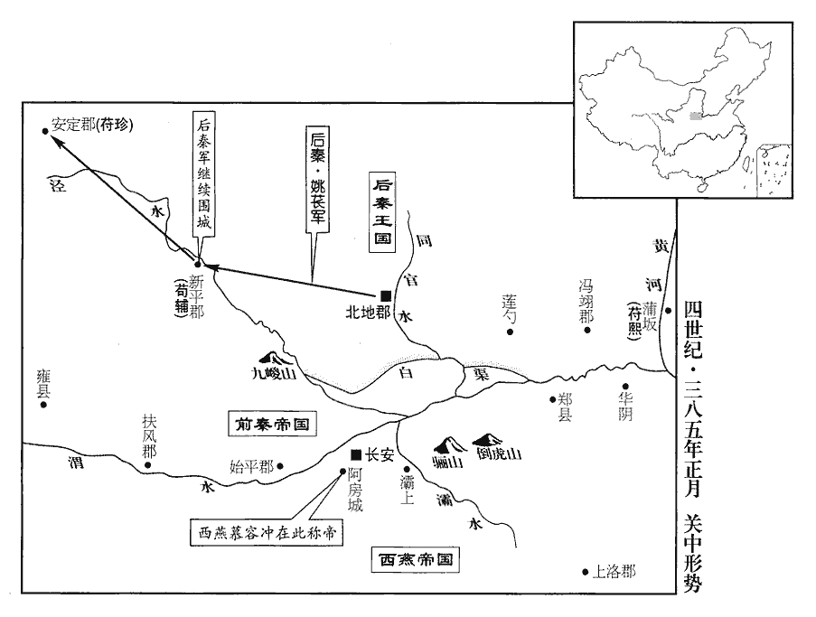 

5燕帶方王佐與寧朔將軍平規共攻薊‹北京›，薊，音計。王永兵屢敗。二月，永使宋敞燒和龍‹辽宁朝阳›及薊城‹北京›宮室，帥眾三萬奔壺關‹山西长治北›；帥，讀曰率。佐等入薊。

〖译文〗 [5]前燕带方王慕容佐与宁朔将军平规一起攻打蓟城，王永的军队屡战屡败。二月，王永让宋敞焚烧了和龙以及蓟城的宫室，率领三万兵众逃奔壶关。慕容佐等进入蓟城。

6慕容農引兵會慕容麟於中山‹河北定州›，與共攻翟真。麟、農先帥數千騎至承營‹河北定州南›，帥，讀曰率；下同。觀察形勢。翟真望見，陳兵而出。諸將欲退，農曰：「丁零非不勁勇，而翟真懦弱，今簡精銳，望真所在而衝之，真走，眾必散矣，乃邀門而蹙之，可盡殺也。」使驍騎將軍慕容國帥百餘騎衝之，驍，堅堯翻。騎，奇寄翻。真走，其眾爭門，自相蹈藉，藉，慈夜翻。死者太半，遂拔承營外郭。

〖译文〗 [6]慕容农带领军队与慕容麟在中山会合，与他共同攻打翟真。慕容麟、、慕容农先率领数千骑兵到了承营，察看地势。翟真远远望见，部署军队出动。众将领想要撤退，慕容农说：“丁零人不是不强劲勇猛，而翟真却很懦弱，现在应该选择精锐士兵，看准翟真所在的位置发起冲击，翟真一逃跑，其兵众必然溃散，就可以堵截城门围歼他们，可以把他们全部消灭。”于是就派骁骑将军慕容国率领一百多名骑兵冲击翟真，翟真逃跑，其兵众夺门溃逃，自相践踏，死者过半，于是就攻下了承营的外城。

7癸未，秦王堅與西燕主沖戰于城西，長安城西也。大破之，追奔至阿城。阿城，即阿房宮城，沖之巢穴也。諸將請乘勝入城，堅恐為沖所掩，引兵還。萬乘之主，固不可乘危徼幸；然秦喪敗若此，乘諸將之勝氣以圖萬一之功，可也；引兵而還，何歟！還，從宣翻。

〖译文〗 [7]癸未（疑误），前秦王苻坚与西燕国主慕容冲在长安城西交战，大败慕容冲，一直追击到阿城。众将领请求乘胜入城，苻坚担心被慕容冲包围，带领军队返回。

8乙酉，秦益州刺史王廣以蜀人江陽‹四川泸州›太守李丕為益州刺史，守成都‹四川成都›。沈約曰：江陽郡，劉璋分犍為立。守，式又翻。己丑，廣帥所部奔還隴西，【章：十二行本「西」下有「依其兄秦州刺史統」八字；乙十一行本同；孔本同；張校同；退齋校同。】蜀人隨之者三萬餘人。

〖译文〗 [8]乙酉（疑误），前秦益州刺史王广让蜀人江阳太守李丕出任益州刺史，戍守成都。己丑（疑误），王广率领部众逃回陇西，跟随他的蜀人有三万多。

9劉牢之至枋頭‹河南淇县东南淇门渡›。楊膺、姜讓謀泄，膺、讓謀見上卷上年。長樂公丕收殺之。枋，音方。樂，音洛。牢之聞之，盤桓不進。

〖译文〗 [9]刘牢之抵达枋头。杨膺、姜让的阴谋泄露，长乐公苻丕拘捕并斩杀了他们。刘牢之听说以后，便徘徊不进。

10秦平原悼公暉數為西燕主沖所敗，數，所角翻。敗，補邁翻。秦王堅讓之曰：「汝，吾之才子也，擁大眾與白虜小兒戰，而屢敗，何用生為！」三月，暉憤恚自殺。堅責怒暉，欲其死戰耳，豈意其自殺哉！恚，於避翻。

〖译文〗 [10]前秦平原悼公苻晖多次被西燕国主慕容冲打败，前秦王苻坚责备他说：“你是我有才能的儿子，带领众多的兵众与白虏的稚嫩小孩子作战，反而屡屡失败，活着还有什么用呢！”三月，苻晖愤恨自杀。

前禁將軍李辯、都水使者隴西彭和正恐長安不守，召集西州‹甘肃›人晉書職官志：都水長，屬大司農。沈約志：都水使者，掌舟航及運部。李辯，李儼之子，亦隴西人也。屯于韮園‹西安西›；堅召之，不至。為後堅襲韮園張本。韮，舉有翻。

〖译文〗 前禁将军李辩、都水使者陇西人彭和正担心长安失守，召集西方各州人驻扎在韭园。苻坚征召他们，他们却不到。

西燕主沖攻秦高陽愍公方於驪山‹陕西临潼东南›，殺之，苻方戍驪山，見上卷上年七月。執秦尚書韋鍾，以其子謙為馮翊‹陕西大荔›太守，使招集三輔之民。馮翊壘主邵安民等責謙曰：「君雍州望族，七相五公，雍州之望族，鍾蓋韋賢後也。雍，於用翻。今乃從賊，與之為不忠不義，何面目以行於世乎！」謙以告鍾，鍾自殺，謙來奔。

〖译文〗 [11]西燕国主慕容冲在骊山攻打前秦高阳愍公苻方，杀掉了他，抓获了前

秦左將軍苟池、右將軍俱石子與西燕主沖戰於驪山，兵敗。西燕將軍慕容永斬苟池，俱石子奔鄴‹河北临漳西南邺镇›。永，廆弟運之孫；石子，難之弟也。俱難見一百四卷太元三年。廆，戶罪翻。秦王堅遣領軍將軍楊定擊沖，大破之，虜鮮卑萬餘人而還，悉阬之。定，佛奴之孫【章：十二行本「孫」下有「堅之壻」三字；乙十一行本同；孔本同；張校同；退齋校同。】也。北史曰：定，佛奴之子；佛奴，宋奴之子也。

〖译文〗 秦左将军苟池、右将军俱石子与西燕主冲战于骊山，兵败。西燕将军慕容永斩苟池，俱石子奔邺。永，弟运之孙；石子，难之弟也。秦王坚遣领军将军杨定击冲，大破之，虏鲜卑万余人而还，悉坑之。定，佛奴之孙也。前秦左将军苟池、右将军俱石子与西燕国主慕容冲在骊山交战，战败。西燕将军慕容永斩杀了苟池，俱石子逃奔邺城。慕容永是慕容弟弟慕容运的孙子；俱石子是俱难的弟弟。前秦王苻坚派领军将军杨定攻打慕容冲，大败慕容冲，俘虏了一万多鲜卑人后返回，把他们全都活埋了。杨定是杨佛奴的孙子。

滎陽‹河南滎陽›人鄭燮xiè以郡來降。降，戶江翻。

〖译文〗 [12]荥阳人郑燮举郡向东晋投降。

燕王垂‹本年六十岁›攻鄴，久不下，將北詣冀州，乃命撫軍大將軍麟屯信都‹河北冀县›，樂浪王溫屯中山‹河北定州›，召驃騎大將軍農還鄴；樂浪，音洛琅。驃，匹妙翻。騎，奇寄翻。於是遠近聞之，以燕為不振，頗懷去就。

〖译文〗 [13]后燕王慕容垂攻打邺城，久攻不下，准备向北到冀州去，就命令抚军大将军慕容麟驻扎在信都，乐浪王慕容温驻扎在中山，征召骠骑大将军慕容农返回邺城。远近的人们听说以后，认为后燕威势不振，都在考虑归附还是离去的问题。

農至高邑‹河北柏乡北›，高邑本鄗縣，漢光武即位于此，改曰高邑，屬常山；晉志屬趙國。遣從事中郎眭suī邃近出，違期不還。師古曰：眭，息隨翻。長史張攀言於農曰：「邃目下參佐，目下參佐，言其近在眼前也。敢欺罔不還，請回軍討之。」農不應，敕備假版，以邃為高陽‹河北博野东南›太守，參佐家在趙北者，悉假署遣歸。趙北，趙國以北也。假署者，權時以假版署置其官，未以白燕王垂也。凡舉補太守三人，長史二十餘人，退謂攀曰：「君所見殊誤，當今豈可自相魚肉！俟吾北還，邃等自當迎於道左，君但觀之。」為後邃等迎農張本。

〖译文〗 慕容农抵达高邑，派从事中郎眭邃到附近外出，过了期限还没有返回。长史张攀向慕容农进言说：“眭邃是您身边的部下，胆敢欺骗蒙蔽您，逾期不归，请求回军讨伐他。”慕容农没有答应，敕令准备借国王名义下达的诏书，任命眭邃为高阳太守，僚属部下中凡是家在赵地以北的人，全都派他们回去暂时代理官职，共选拔补充了太守三人，长史二十多人。慕容农退下去以后对张攀说：“你的见解非常错误，当今之时，怎么能自相残杀！等我从北边返回来时，眭邃等人自然应当夹道欢迎，你只管等着瞧吧。”

樂浪王溫在中山‹河北定州›，兵力甚弱，丁零四布，分據諸城；溫謂諸將曰：「以吾之眾，攻則不足，守則有餘。驃騎、撫軍，首尾連兵，會須滅賊，但應聚糧厲兵以俟時耳。」於是撫舊招新，勸課農桑，民歸附者相繼，郡縣壁壘爭送軍糧，倉庫充溢。翟真夜襲中山‹河北定州›，溫擊破之，自是不敢復至。復，扶又翻；下復還同。溫乃遣兵一萬運糧以餉垂，且營中山宮室。欲迎垂都中山也。

〖译文〗 乐浪王慕容温在中山，兵力很弱，四周则布满了丁零人，分别占据着各城邑。慕容温对众将领说：“以我们的兵力，进攻则力量不足，防守则绰绰有余。骠骑将军、抚军将军的兵力汇集起来，应当能够消灭寇贼，只是需要聚集军粮、训练军队以等待时机。”于是他就安抚故旧，招纳新兵，劝勉督促农耕桑蚕，前来归附的民众络绎不绝，郡县村落争先恐后地运来军粮，仓库充实丰盈。翟真趁夜袭击中山，慕容温击败了他，从此翟真不敢再来了。慕容温于是派遣一万兵众运送粮食用以犒饷慕容垂，而且在中山营建宫室。

劉牢之攻燕黎陽‹河南浚县›太守劉撫于孫就柵‹河南浚县西北›，孫就，人姓名，蓋立柵于黎陽界，劉撫因屯焉。燕王垂留慕容農守鄴圍，自引兵救之。秦長樂公丕聞之，出兵乘虛夜襲燕營，農擊敗之。敗，補邁翻。劉牢之與垂戰，不勝，退屯黎陽‹河南浚县›，垂復還鄴。

〖译文〗 刘牢之在孙就栅攻打后燕黎阳太守刘抚，后燕王慕容垂留下慕容农镇守包围邺城的部队，亲自带领兵众救援刘抚。前秦长乐公苻丕听说以后，乘虚出兵夜袭后燕的军营，慕容农打败了他。刘牢之与慕容垂交战，没能获胜，退守黎阳，慕容垂又返回了邺城。

呂光以龜茲‹新疆库车›饒樂，龜茲，音丘慈。樂，音洛。欲留居之。天竺‹印度›沙門鳩摩羅什謂光曰：「此凶亡之地，不足留也；據載記，鳩摩羅，姓也；什，其名。將軍但東歸，中道自有福地可居。」鳩摩羅什知數，知呂光必得涼州之地而據之。光乃大饗將士，議進止，眾皆欲還。乃以駝二萬餘頭載外國珍寶奇玩，驅駿馬萬餘匹而還。還，音旋，又如字。

〖译文〗 [14]吕光因为龟兹富饶安乐，想在此居住久留。天竺僧人鸠摩罗什对吕光说：“这里是凶亡之地，不值得久留。将军只要东返，半路上自会有福地可以居住。”吕光于是就大肆宴请将士，讨论是否停留的问题，众人都想返回。于是就用二万多头骆驼载着境外之国的珍宝奇玩，驱赶了一万多匹骏马东返。

夏，四月，劉牢之進兵至鄴，燕王垂逆戰而敗，遂撤圍，退屯新城‹河北肥乡东北›，乙卯‹八›，自新城北遁。牢之不告秦長樂公丕，即引兵追之。丕聞之，發兵繼進。庚申‹十三›，牢之追及垂於董唐淵。垂曰：「秦、晉瓦合，相待為強，瓦合，言其勢不膠固，觸而動之，一瓦墜碎，則眾瓦俱解矣。「待」，當作「恃」。今觀待字，義亦自通。一勝則俱豪，一失則俱潰，非同心也。今兩軍相繼，勢既未合，宜急擊之。」牢之軍疾趨二百里，至五橋澤，五橋澤，在臨漳縣北。兵法，百里而趨利者蹶上將；況二百里乎！爭燕輜重，重，直用翻。垂邀擊，大破之，斬首數千級；牢之單馬走，會秦救至，得免。

〖译文〗 [15]夏季，四月，刘牢之进军抵达邺城，后燕王慕容垂迎战，但失败了，于是就撤除了对邺城的包围，退到新城驻扎。乙卯（初八），从新城向北逃走。刘牢之没有向前秦长乐公苻丕报告，就带领军队追击。苻丕听说以后，也紧跟着出兵追击。庚申（十三日），刘牢之在董唐渊追上了慕容垂。慕容垂说：“秦国、晋朝苟且聚合，互相依靠才显得强大，一方取胜则全都威风，一方失败则全都溃散，双方并不是同心同德。如今双方的军队相继而来，既然兵力尚未汇合，就应该迅速猛击他们。”刘牢之的军队急速行进了二百里，到了五桥泽，争抢后燕的轻重物资，慕容垂迎头攻击，大败他们，斩首数千人。刘牢之只身匹马逃跑，恰好前秦前来救助，才得以幸免。

燕冠軍將軍宜都王鳳冠，古玩翻。每戰奮不顧身，前後大小二百五十七戰，未嘗無功。垂戒之曰：「今大業甫濟，汝當先自愛！」使為車騎將軍德之副以抑其銳。以德持重也。

〖译文〗 后燕冠军将军宜都王慕容凤，每逢战斗都奋不顾身，前后参与了大小二百五十七次战役，没有不建立战功的。慕容垂告诫他说：“如今大业刚刚成就，你应当首先自爱！”让他做车骑将军慕容德的副手以抑制他的锐气。

鄴中饑甚，長樂公丕帥眾就晉穀於枋頭‹河南淇县东南淇门渡›。帥，讀曰率。劉牢之入鄴城，收集亡散，兵復少振；復，扶又翻。少，詩沼翻。坐軍敗，徵還。

〖译文〗 邺城中的饥荒十分严重，长乐公苻丕率领兵众到枋头去求东晋的粮谷。刘牢之进入邺城，收罗逃散的士兵，兵众又稍微有所振作。刘牢之因军队失败坐罪，朝廷征召他返回。

燕、秦相持經年，去年正月，垂攻鄴。幽、冀大饑，人相食，邑落蕭條。燕之軍士多餓死；燕王垂禁民養蠶，以桑椹為軍糧。

〖译文〗 后燕、前秦相持了一年多，幽州、冀州出现了严重饥荒，人相残食，城邑村落一片萧条。后燕的士兵有很多被锇死。后燕王慕容垂禁止百姓养蚕，以桑椹作为军粮。

垂將北趣中山‹河北定州›，趣，七喻翻。以驃騎大將軍農為前驅，前所假授吏眭suī邃等皆來迎候，上下如初，李攀【嚴：「李」改「張」。】乃服農之智略。前作「張攀」，此作「李攀」，未知孰是。

〖译文〗 慕容垂准备北赴中山，以骠骑大将军慕容农作为前锋，以前暂时授职的官吏眭邃等人全都前来迎候，上上下下和当初一样，张攀于是对慕容农的远见卓识表示折服。

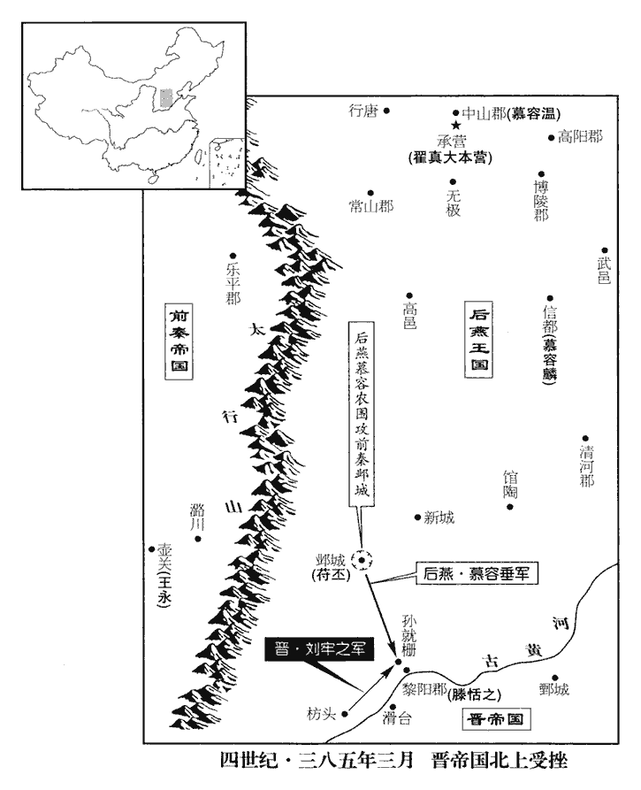 

會稽王道子好專權，好，呼到翻。復為姦諂者所構扇，復，扶又翻；下同。與太保安有隙。安欲避之，會秦王堅來求救，安乃請自將救之。將，即亮翻。壬戌‹十五›，出鎮廣陵‹江苏扬州›之步丘，築壘曰新城而居之。今揚州邵伯鎮，即其地也，在揚州城北六十里。晉史云：安於步丘築埭dài，後人謂之召伯埭。

〖译文〗 [16]会稽王司马道子喜好专权，又被奸邪谄媚者挑拨煽动，与太保谢安有了隔阂。谢安想躲避他，恰好前秦王苻坚前来求救，谢安就请求亲自率兵去救援苻坚。壬戌（十五日），离开朝廷去镇守广陵的步丘，建筑了叫做新城的营垒，居住在这里。

蜀郡‹成都›太守任權攻拔成都，斬秦益州刺史李丕，復取益州。秦取益州見一百三卷寧康元年。任，音壬。

〖译文〗 [17]蜀郡太守任权攻下了成都，斩杀了前秦益州刺史李丕，又夺取了益州。

新平‹陕西彬县›糧竭矢盡，後秦自去年攻新平。外救不至。後秦王萇使人謂苟輔曰：「吾方以義取天下，豈讎忠臣邪！卿但帥城中之人還長安，吾正欲得此城耳。」輔以為然，帥民五千口出城，萇圍而阬之，男女無遺。萇，仲良翻。帥，讀曰率。獨馮傑子終得脫，奔長安。馮傑勸輔拒後秦事見上卷上年。秦王堅追贈輔等官爵，皆諡曰節愍侯，以終為新平太守。

〖译文〗 [18]新平城内箭尽粮绝，外边救援的部队没有到达。后秦王姚苌派人对苟辅说：“我正在以道义夺取天下，怎么能仇恨忠臣呢！你只要率领城里的民众返回长安就行了，我只是想得到这座城邑。”苟辅认为此话有理，就率领民众五千人出了城，姚苌包围了他们，然后把他们全都活埋，不论男女，无一遗漏。只有冯杰的儿子冯终得以逃脱，逃到长安。前秦王苻坚给苟辅等人追赠了官职爵位，全都定谥号叫节愍侯，任命冯终为新平太守。

翟真自承營‹河北定州南›徙屯行唐‹河北行唐›，即漢之南行唐縣也，屬常山郡。燕王垂趣中山，真為所逼，故徙屯。真司馬鮮于乞殺真及諸翟zhái，自立為趙王。營人共殺乞，立真從弟成為主；其眾多降於燕。降，戶江翻。

〖译文〗 [19]翟真从承营转移到行唐驻扎，翟真的司马鲜于乞杀掉了翟真及其亲属，自立为赵王。军营里的人一起杀掉了鲜于乞，立翟真的堂弟翟成为主。其兵众大都投降了后燕。

五月，西燕主沖攻長安‹西安›，秦王堅身自督戰，飛矢滿體，流血淋漓。沖縱兵暴掠，關中士民流散，道路斷絕，千里無煙。有堡壁三十餘，推平遠將軍趙敖為主，安遠、平遠，二將軍號，蓋皆當時所置。相與結盟，冒難遣兵糧助堅，多為西燕所殺。堅謂之曰：「聞來者率不善達，此誠忠臣之義，然今寇難殷繁，難，乃旦翻。殷，眾也，盛也。繁，多也。非一人之力所能濟也，徒相隨入虎口，何益！汝曹宜為國自愛，為，于偽翻。畜糧厲兵，以俟天時，庶幾善不終否，有時而泰也！」幾，居希翻。否，皮鄙翻。

〖译文〗 [20]五月，西燕国主慕容冲攻打长安，前秦王苻坚亲自督战，被飞来的乱箭射得遍体麟伤，鲜血淋漓。慕容冲放纵军队残暴掠夺，关中士人百姓流离失所，道路被阻绝，千里不见炊烟。有三十多个堡寨营垒，推举平远将军赵敖为主，互相结盟，冒着危险派兵送粮救助苻坚，但大多都被西燕杀掉。苻坚对他们说：“听说前来救助的人大都不能顺利到达，这确实表现了忠臣的大义，但如今敌寇制造的祸难繁多，不是靠一个人的力量就能解决的，只能是白白地相继落入虎口，有什么好处！你们应该为了国家而自我保重，积蓄粮食，训练军队，以等待天时，也许做善事不会长久困顿，还会有时机否极泰来的！”

三輔之民為沖所略者，遣人密告堅，請遣兵攻沖，欲縱火為內應。堅曰：「甚哀諸卿忠誠！然吾猛士如虎豹，利兵如霜雪，困於烏合之虜，豈非天乎！恐徒使諸卿坐致夷滅，吾不忍也！」其人固請不已，乃遣七百騎赴之。沖營縱火者，反為風火所燒，其得免者什一、二，堅祭而哭之。史言關中之人，乃心為堅，而力不能濟，蓋天棄秦也。

〖译文〗 三辅地区被慕容冲掠夺的百姓派人秘密地向苻坚报告，请求苻坚派兵攻打慕容冲，他们想要在里边放火以作为内应。苻坚说：“非常怜悯你们的忠诚！然而我勇猛的将士如同虎豹，锋利的兵器如同霜雪，反而受困于乌合之众，这难道不是天意吗！恐怕会白白地让你们招致覆灭，我不忍心这样干！”派来的人不停地固执请求，苻坚就派遣七百骑兵前往。在慕容冲军营里放火的人，反而被乘风之火所烧，得以幸免的人只有十之一二，苻坚设祭痛哭他们。

衛將軍楊定與沖戰于城西，為沖所擒。定，秦之驍將也。驍，堅堯翻。將，即亮翻。堅大懼，以讖書云：「帝出五將久長得。」據載記，此讖書謂之古符傳賈錄。秦王堅始也禁人學讖，及喪敗之極，乃欲用讖書，奔五將山以求免，其顛倒錯繆甚矣，蓋死期將至也。讖，楚譖翻。乃留太子宏守長安，謂之曰：「天其或者欲導予出外。汝善守城，勿與賊爭利，吾當出隴收兵運糧以給汝。」遂帥騎數百與張夫人及中山公詵shēn、二女寶、錦出奔五將山‹陕西岐山东北›，新唐書地理志：京兆醴泉縣有武將山。水經註：扶風杜陽縣有五將山。又按唐杜佑，鳳翔府岐山縣有五將山。宣告州郡，期以孟冬救長安‹西安›。堅過襲韮園‹西安西›，李辯奔燕，奔西燕也。彭和正慙，自殺。

〖译文〗 卫将军杨定与慕容冲在城西交战，被慕容冲擒获。杨定是前秦的勇猛战将。苻坚十分害怕，依据谶书中所说：“帝王出走五将山才能得到长久的命运，”便留下太子苻宏守卫长安，对他说：“上天大概是想引导我外出。你好好地守卫城池，不要与寇贼争锋，我要走出陇地招集兵众运送粮食供给你。”于是苻坚就率领数百骑兵与张夫人、中山公苻诜及两个女儿苻宝、苻锦奔往五将山，向各州郡公开宣布，约定在初冬时拯救长安。苻坚顺路袭击了韭园，李辩逃奔后燕，彭和正感到惭愧，自杀而死。

閏月，以廣州‹两广›刺史羅友為益州‹四川中部›刺史，鎮成都。

〖译文〗 [21]闰五月，东晋任命广州刺史罗友为益州刺史，镇守成都。

庚戌‹四›，燕王垂至常山‹河北正定›，圍翟成於行唐。命帶方王佐鎮龍城‹辽宁朝阳›。六月，高句麗寇遼東‹辽宁辽阳›，句，如字，又音駒。麗，力知翻。佐遣司馬郝景將兵救之，為高句麗所敗，敗，補邁翻。高句麗遂陷遼東‹辽宁辽阳›、玄菟‹辽宁沈阳›。自此燕不能勝高句麗。菟，同都翻。

〖译文〗 [22]庚戌（初四），后燕王慕容垂抵达常山，在行唐包围了翟成。命令带方王慕容佐镇守龙城。六月，高句丽进犯辽东，慕容佐派司马郝景统帅军队救援，被高句丽打败，高句丽于是攻陷了辽东、玄菟。

秦太子宏不能守長安‹西安›，將數千騎與母、妻、宗室西奔下辨‹甘肃成县›；辨，皮莧翻。百官逃散，司隸校尉權翼等數百人奔後秦。權翼本姚襄僚屬，苻氏既敗，故奔後秦。西燕主沖入據長安，縱兵大掠，死者不可勝計。勝，音升。

〖译文〗 [23]前秦太子苻宏无法坚守长安，带领数千骑兵与母亲、妻子、宗室亲属向西逃奔到下辨。僚属百官全都逃散，司隶校尉权翼等数百人投奔后秦。西燕国主慕容冲进城占据了长安，放纵军队大肆抢掠，城中死亡的人不计其数。

秋，七月，旱，饑，井皆竭。

〖译文〗 [24]秋季，七月，东晋发生大旱、饥荒，水井全都枯竭。

後秦王萇自故縣‹安定，甘肃镇原东南›如新平‹陕西彬县›。漢安定郡有安定縣，後漢、晉省，故曰故縣。

〖译文〗 [25]后秦王姚苌从过去的安定县到新平。

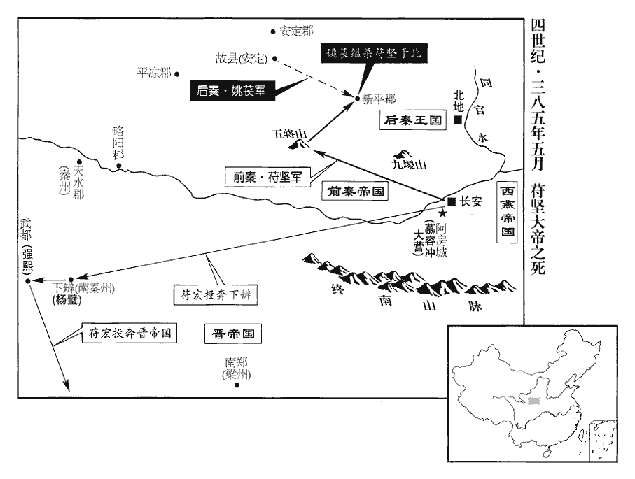 

秦王堅至五將山‹陕西岐山东北›，後秦王萇遣驍騎將軍吳忠帥騎圍之。秦兵皆散走，獨侍御十數人在側，堅神色自若，坐而待之，召宰人進食。俄而忠至，執之，送詣新平，幽於别室。

〖译文〗 [26]前秦王苻坚抵达五将山，后秦王姚苌派骁骑将军吴忠率领骑兵包围了他。前秦的兵众全都溃散逃走，只有十几个侍从官留在身边，苻坚神色自若，坐在那里等待吴忠的军队，召唤掌管膳食的官吏进上食物。不一会儿吴忠来到，拘捕了苻坚，把他送到新平，幽禁在特设的房间内。

太子宏至下辨‹甘肃成县›，南秦州刺史楊璧拒之。苻堅破仇池，置南秦州。楊璧，氐之種類，仕秦尚主，任居方面，以宏奔敗，拒而不納。孟子曰：「寡助之至，親戚叛之。」信哉斯言！璧妻，堅之女順陽公主也，棄其夫從宏。宏奔武都‹甘肃西和南›，投氐豪強熙，強，其兩翻。假道來奔，‹司马昌明，本年二十四岁›詔處之江州‹府寻阳，江西九江›。為苻宏附桓玄而誅張本。處，昌呂翻。

〖译文〗 太子苻宏抵达下辨，南秦州刺史杨壁拒绝接纳他。杨壁的妻子，是苻坚的女儿顺阳公主，她抛弃了丈夫，跟苻宏走了。苻宏逃奔到武都，投靠氐族豪强强熙，然后借道投奔东晋，朝廷下达诏令，把他安置在江州。

長樂公丕帥眾三萬自枋頭‹河南省淇县东南淇门渡›將歸鄴城，龍驤將軍檀玄擊之，戰于谷口，檀玄，晉將也。谷口在枋頭西。玄兵敗，丕復入鄴城。復，扶又翻。

〖译文〗 [27]长乐公苻丕率领三万兵众准备从枋头返回邺城，龙骧将军檀玄向他发起攻击，在谷口交战，檀玄的军队失败，苻丕又进入了邺城。

燕建節將軍餘巖叛，自武邑‹河北武邑›北趣幽州。趣，七喻翻。燕王垂馳使敕幽州將平規曰：使，疏吏翻。「固守勿戰，俟吾破丁零自討之。」規出戰，為巖所敗。敗，補邁翻。巖入薊‹北京›，掠千餘戶而去，遂據令支‹河北迁安›。令，音鈴，又郎定翻。支，音祁。癸酉‹二十八›，翟成長史鮮于得斬成出降，垂屠行唐，盡阬成眾。去年丁零叛燕，至是而滅。降，戶江翻。

〖译文〗 [28]后燕建节将军馀岩反叛，从武邑北赴幽州。后燕王慕容垂迅速派使者敕令幽州将领平规说：“加强固守，不要交战，等我攻破丁零以后亲自去讨伐他。”平规出兵迎战，被余岩打败。馀岩进入蓟城，掳掠了一千多户人后离去，于是占据了令支。癸酉（二十八日），翟成的长史鲜于得斩杀了翟成后出来投降，慕容垂在行唐大肆屠杀，将翟成的兵众全部活埋。

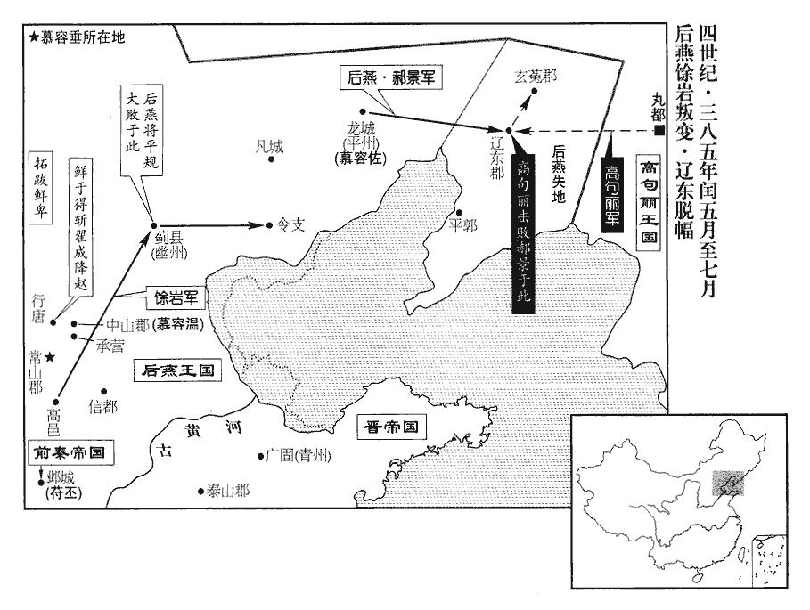 

太保安有疾求還，安屯廣陵‹扬州›步丘。詔許之；八月，安至建康。

〖译文〗 [29]太保谢安因病请求回建康，朝廷下达诏令同意了。八月，谢安回到了建康。

甲午‹十九›，大赦。

〖译文〗 [30]甲午（十九日），东晋实行大赦。

丁酉‹二十二›，建昌文靖公謝安薨‹年六十六›。諡法：柔德安眾曰靖；寬樂令終曰靖。詔加殊禮，如大司馬溫故事。晉以此崇寵謝安；安之雅志豈願與桓溫同哉！庚子‹二十五›，以司徒琅邪王道子‹司马道子，本年二十二岁›領揚州刺史、錄尚書，都督中外諸軍事；道子得權，晉自此亂。以尚書令謝石為衛將軍。

〖译文〗 [31]丁酉（二十二日），建昌文靖公谢安去世。朝廷下达诏令，按非常的礼仪安葬他，仿照大司马桓温的遗规。庚子（二十五日），任命司徒琅邪王司马道子兼扬州刺史、录尚书、都督中外诸军事，任命尚书令谢石为卫将军。

後秦王萇使求傳國璽於秦王堅璽，斯氏翻。曰：「萇次應曆數，可以為惠。」堅瞋目叱之曰：「小羌敢逼天子，五胡次序，無汝羌名。胡、羯、鮮卑、氐、羌，五胡之次序也。無汝羌名，謂讖文耳。姚萇自謂次應曆數，堅故亦以讖文為言。瞋，七人翻。璽已送晉，不可得也！」萇復遣右司馬尹緯說堅，求為禪代；復，扶又翻。說，輸芮翻。堅曰：「禪代，聖賢之事，姚萇叛賊，何得為之！」堅與緯語，問緯：「在朕朝何官?」朝，直遙翻。緯曰：「尚書令史。」後漢以來尚書有令史十八人，秩二百石。堅歎曰：「卿，王景略之儔，宰相才也，而朕不知卿，宜其亡也。」堅自以平生遇萇有恩，尤忿之，數罵萇求死，數，所角翻。謂張夫人曰：「豈可令羌奴辱吾兒。」乃先殺寶、錦。堅自知身死之後，女必當歸姚萇也。辛丑‹二十六›，萇遣人縊堅於新平‹陕西彬县›佛寺。年四十八。張夫人、中山公詵shēn皆自殺。後秦將士皆為之哀慟。為，于偽翻。萇欲隱其名，諡堅曰壯烈天王。

〖译文〗 [32]后秦王姚苌派人去向前秦王苻坚索取传国印玺，说：“姚苌按顺序承接天命，可以把玉玺交给我。”苻坚怒目斥责来人说：“小羌胆敢威逼天子，五胡的次序，没有你羌族的名称。传国印玺已经送到了晋朝，无法得到了！”姚苌又派右司马严纬劝说苻坚，要求苻坚把君主之位禅让给他，苻坚说：“禅让，是圣贤的事情，姚苌是叛贼，怎么能让他继位呢！”苻坚与尹纬谈论了一番，问尹纬：“你在朕的朝廷里做什么官？”尹纬说：“尚书令史。”苻坚叹息地说：“你是王猛那样人才，具有宰相的才能，然而朕却不知道你，应该灭亡了。”苻坚自认为平时对待姚苌有恩，越发愤恨他，多次痛骂姚苌，以求一死，对张夫人说：“岂能让羌奴侮辱我的儿女。”于是就先杀掉了苻宝、苻锦。辛丑（二十六日），姚苌派人把苻坚吊死在新平的佛寺。张夫人、中山公苻诜全都自杀。后秦的将士全都为他们悲痛。姚苌想隐埋苻坚的名字，给苻坚定谥号为壮烈天王。

臣光曰：論者皆以為秦王堅之亡，由不殺慕容垂、姚萇故也。臣獨以為不然。許劭謂魏武帝治世之能臣，亂世之姦雄。事見五十八卷漢靈帝中平元年。治，直吏翻。使堅治國無失其道，治，直之翻。則垂、萇皆秦之能臣也，烏能為亂哉！堅之所以亡，由驟勝而驕故也。魏文侯問李克，吳之所以亡，對曰：「數戰數勝。」文侯曰：「數戰數勝，國之福也，何故亡?」對曰：「數戰則民疲，數勝則主驕，數，所角翻。以驕主御疲民，未有不亡者也。」秦王堅似之矣。

〖译文〗 臣司马光曰：谈论这段历史的人都认为秦王苻坚的灭亡，是由于没有杀掉慕容垂、姚苌的缘故。臣唯独认为不是这样。许劭说魏武帝曹操是太平盛世的能臣，混乱世道的奸雄。假使苻坚治理国家不违背治国之道，那么慕容垂、姚苌全都是秦国的能臣，怎么能作乱呢！苻坚之所以灭亡的原因，是由于屡次取胜后骄傲的缘故。魏文侯问李克关于吴国失败的原因，李克回答说：“经常征战又经常胜利。”魏文侯说：“经常征战又经常胜利，这是国家的福份，为什么灭亡了呢？”李克回答说：“经常征战则民众疲惫，经常胜利则主上骄傲，以骄傲的君主统治疲惫的民众，没有不灭亡的道理。”秦王苻坚就与此相似。

長樂公丕在鄴，將西赴長安，樂，音洛。幽州刺史王永在壺關‹山西长治北›，是年春，王永自幽州奔壺關。遣使招丕，丕乃帥鄴中男女六萬餘口西如潞川‹山西黎城南›，使，疏吏翻。帥，讀曰率。驃騎將軍張蚝、并州刺史王騰迎之入晉陽‹山西太原›。驃，匹妙翻。騎，奇寄翻。蚝，七吏翻。丕【章：十二行本「丕」上有「王永留平州刺史苻沖守壺關，自帥騎一萬會丕于晉陽」二十二字；乙十一行本同；孔本同；張校同；退齋校同。】始知長安不守，堅已死，乃發喪，即皇帝位，丕字永叔，堅之庶長子也。追諡堅曰宣昭皇帝，廟號世祖，大赦，改元大安。

〖译文〗 [33]长乐公苻丕在邺城，准备西赴长安，幽州刺史王永在壶关，派使者去招纳苻丕，苻丕就率领邺城中的男女六万多人向西到潞川，骠骑将军张蚝、并州刺史王腾迎接他们进入晋阳。这时苻丕才知道长安已经失守，苻坚已经死亡，于是便公开宣布了苻坚死亡的消息，他自己即皇帝位，给苻坚定谥号为宣昭皇帝，庙号为世祖，实行大赦，改年号为大安。

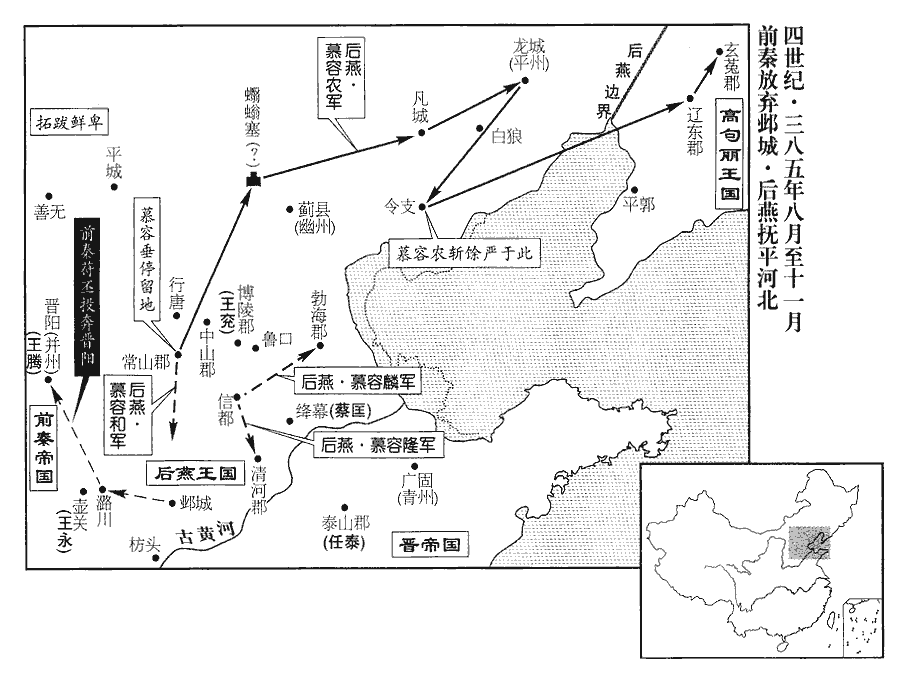 

燕王垂以魯王和為南中郎將，鎮鄴。遣慕容農出蠮螉塞‹居庸关›，蠮yē，於結翻。螉wēng，於公翻。歷凡城‹河北平泉南›，趣龍城‹辽宁朝阳›，趣，七喻翻。會兵討餘巖，慕容麟、慕容隆自信都‹河北冀县›徇勃海‹河北南皮›、清河‹山东临清›。麟擊勃海太守封懿，執之，因屯歷口‹河北枣强西北歷城亭›。水經註：清河自廣川東北流，逕歷縣故城南，前漢信都國之屬縣也。應劭曰：廣川縣西北三十里有歷城亭，故縣也。今亭在縣東津濟之所，謂之歷口渡。懿，放之子也。封放見九十九卷穆帝永和七年。

〖译文〗 [34]后燕王慕容垂任命鲁王慕容和为南中郎将，镇守邺城。派慕容农出塞，经过凡城，开赴龙城，会合兵力讨伐余岩，慕容麟、慕容隆从信都出发，带兵巡行勃海、清河。慕容麟攻打勃海太守封懿，抓获了他，顺势驻扎在历口。封懿是封放的儿子。

鮮卑劉頭眷擊破賀蘭部‹内蒙阴山山脉北›於善無‹山西右玉›，善無縣，前漢屬鴈門郡，後漢屬定襄郡，漢末日棄之荒外。又破柔然‹瀚海沙漠群›於意親山‹内蒙四子王旗北›。意親山蓋即意辛山，親、辛語相近。按魏書帝紀，道武登國五年，四月，幸意辛山，與質驎討賀蘭、紇突鄰、紇奚諸部，大破之，六月還幸牛川。則意辛山在牛川之北。頭眷子羅辰言於頭眷曰：「比來行兵，所向無敵；比，毗至翻。然心腹之疾，願早圖之！」頭眷曰：「誰也?」羅辰曰：「從兄顯，忍人也，從，才用翻。必將為亂。」頭眷不聽。顯，庫仁之子也。

〖译文〗 [35]鲜卑人刘头眷在善无击败了贺兰部，又在意亲山击败了柔然。刘头眷的儿子刘罗辰向刘头眷进言说：“近来的征战，所向无敌，然而对心腹之患，愿早作图谋！”刘头眷说：“谁是心腹之患？”刘罗辰说：“堂兄刘显，是残酷无情的人，必将要作乱。”刘头眷没有听从。刘显是刘库仁的儿子。

頃之，顯果殺頭眷自立。又將殺拓跋珪，珪依劉庫仁見一百四卷太元元年。顯弟亢埿妻，珪之姑也，埿，與泥同。以告珪母賀氏。顯謀主梁六眷，代王什翼犍之甥也，犍，居言翻；下同。亦使其部人穆崇、奚牧密告珪，魏書官氏志，拓跋氏之先，兼并他國，各有本部，部中別族為內姓。丘穆陵氏，後改為穆氏。又拓跋鄰以弟為達奚氏，後改為奚氏。且以其愛妻、駿馬付崇曰：「事泄，當以此自明。」賀氏夜飲顯酒，令醉，飲，於鴆翻。使珪陰與舊臣長孫犍、元他、羅結輕騎亡去。元他、羅結，二人也。他，唐何翻。向晨，賀氏故驚廄中群馬，使顯起視之。賀氏哭曰：「吾子適在此，今皆不見，汝等誰殺之邪?」顯以故不急追。珪遂奔賀蘭部‹内蒙阴山山脉北›，依其舅賀訥nè。賀訥本賀蘭訥，後魏孝文帝改北方舊姓，以賀蘭氏為賀氏，史因簡便而書之，如上文穆崇、奚牧之類皆是也。訥驚喜曰：「復國之後，當念老臣！」珪笑曰：「誠如舅言，不敢忘也。」

〖译文〗 不久，刘显果然杀掉了刘头眷而自立。又准备杀掉拓跋。刘显弟弟刘亢的妻子，是拓跋的姑姑，她把这一消息告诉了拓拔的母亲贺氏。刘显的主谋梁六眷，是代王拓跋什翼犍的外甥，他也派其部属穆崇、奚牧把消息秘密地报告了拓跋，并且把宠爱的妻子、骏马交给穆崇说：“如果事情泄露，就用这些来证明自己。”贺氏当晚让刘显喝酒，等他喝醉以后，让拓跋暗中与旧臣长孙犍、元他、罗结轻装骑马逃走。第二天早晨，贺氏故意惊动马厩中的马匹，让刘显起来察看。贺氏哭泣着说：“我的儿子们就在这里，现在全都不见了，你们谁杀了他们呢？”刘显因此没有急于追赶。拓跋于是就逃奔到贺兰部，投靠了他的舅舅贺讷。贺讷惊喜地说：“恢复国家以后，还应该想着老臣！”拓跋笑着说：“确实像舅舅所说，不敢忘记。”

顯疑梁六眷泄其謀，將囚之。穆崇宣言曰：「六眷不顧恩義，助顯為逆，我掠得其妻馬，足以解忿。」顯乃捨之。

〖译文〗 刘显怀疑梁六眷泄露了他的计谋，准备要把他囚禁起来。穆崇扬言说：“梁六眷不顾恩义，辅佐刘显却干出了叛逆之事，我夺取了他的妻子、骏马，足以解除愤恨。”刘显于是就不再理会梁六眷了。

賀氏從弟外朝大人賀悅舉所部以奉珪。賀悅，蓋什翼犍時為外朝大人。魏書官氏志曰：登國二年，因舊制置南北大人，對治二部；又置外朝大人，無常員，主受詔命，外使，出禁中，國有大喪大禮，皆與參知，隨所典焉。從，才用翻。顯怒，將殺賀氏，賀氏奔亢埿家，匿神車中三日，北人無室屋，逐水草，置神於車中而嚴事之，因謂之神車。亢埿舉家為之請，乃得免。為，于偽翻。

〖译文〗 贺氏的堂弟外朝大人贺悦带领所属部众尊奉拓跋。刘显很气愤，准备杀掉贺氏，贺氏逃奔到刘亢家，在供奉着神像的车子中躲藏了三天，刘亢全家人都为她求情，贺氏这才免于一死。

故南部大人長孫嵩帥所部七百餘家叛顯，【章：十二行本「顯」下有「將」字；乙十一行本同；孔本同；張校同。】奔五原‹内蒙包头›。嵩依劉氏，亦見一百四卷太元元年。五原，秦郡，魏、晉棄之荒外。帥，讀曰率。時拓跋寔君之子渥亦聚眾自立，嵩欲從之；烏渥謂嵩曰：「逆父之子，不足從也。寔君弑什翼犍，見太元元年。不如歸珪。」嵩從之。史言長孫嵩由此遂為拓跋珪佐命功臣，福流子孫。久之，劉顯所部有亂，故中部大人庾和辰奉賀氏奔珪。凡言故者，皆什翼犍舊所署置也。魏書官氏志：拓跋詰汾時餘部諸姓內入者，自有庾氏，非中國之庾氏也。

〖译文〗 过去的南部大人长孙嵩率领部众七百多家背叛了刘显，逃奔到五原。当时拓跋君的儿子拓跋渥也聚众自立，长孙嵩想归附他。乌渥对长孙嵩说：“叛逆之父的儿子，不值得归附，不如归附拓跋。”长孙嵩听从了他的意见。过了很久，刘显的部族内发生祸乱，过去的中部大人庾和辰侍奉着贺氏投奔跖跋。

賀訥弟染干以珪得眾心，忌之，使其黨侯引七突【嚴：「七」改「乙」；下同。】殺珪；代‹河北蔚县›人尉古真知之，以告珪，侯引七突不敢發。侯引七突，官氏志無此氏。志云：諸姓年世稍久，互以改易，興衰存滅，間有之；今舉其可知者，則其不可知而不舉者亦有之矣。西方尉遲氏，後改為尉氏。尉，讀如鬱。染干疑古真泄其謀，執而訊之，訊，鞠問也。以兩車輪【章：十二行本「輪」作「軸」；乙十一行本同；孔本同；張校同。】夾其頭，傷一目，不伏，乃免之。染干遂举兵圍珪，賀氏出，謂染干曰：「汝等欲於何置我，而殺吾子乎！」染干慙而去。史言賀訥兄弟不能舉部以奉拓跋珪，為珪攻賀蘭部張本。夫以珪備嘗險阻艱難以成大業，而卒斃於賀蘭氏，豈天道邪！

〖译文〗 贺讷的弟弟贺染干因为拓跋深得人心，便忌恨他，让自己的党羽侯引七突杀掉拓跋。代国人尉古真知道此事，把它告诉了拓跋，侯引七突不敢动手了。贺染干怀疑尉古真泄露了他的计谋。便把尉古真抓起来审讯，用两个车轮夹他的头部，伤害了他的一只眼睛，尉古真拒不承认，贺染干就放了他。贺染干于是就出兵包围了拓跋，贺氏出来对贺染干说：“你们想要把我发落到什么地方，而要杀我的儿子呢？”贺染干惭愧地离开了。

九月，秦主丕以張蚝為侍中、司空，蚝háo，七吏翻。王永為侍中、都督中外諸軍事、車騎大將軍、尚書令，王騰為中軍大將軍、司隸校尉，苻沖為尚書左僕射，封西平王；又以左長史楊輔為右僕射，右長史王亮為護軍將軍，立妃楊氏為皇后，子寧為皇太子，壽為長樂王，樂，音洛。鏘為平原王，懿為勃海王，昶為濟北王。

〖译文〗 [36]九月，前秦国主苻丕任命张蚝为侍中、司空，任命王永为侍中、都督中外诸军事、车骑大将军、尚书令，任命王腾为中军大将军、司隶校尉，任命苻冲为尚书左仆射，封为西平王。又任命左长史杨辅为右仆射，右长史王亮为护军将军，立妃杨氏为皇后，儿子苻宁为皇太子，苻寿为长乐王，苻锵为平原王，苻懿为勃海王，苻昶为济北王。

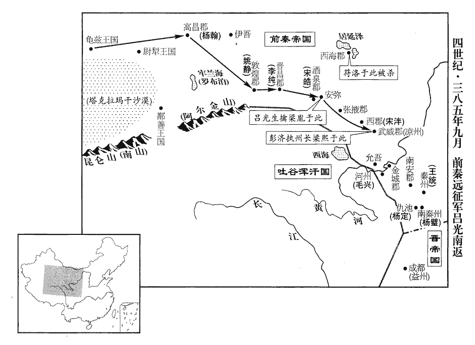 

呂光自龜茲‹新疆库车›還至宜禾‹甘肃安西›，班志：敦煌郡廣至縣昆侖障，宜禾都尉治，晉分為宜禾縣，屬晉昌郡。劉昫曰：瓜州常樂縣，漢廣至縣；魏分廣至置宜禾縣；李暠hào於此置涼興郡，隋廢，置常樂鎮，武德五年，改鎮為縣。龜茲，音丘慈。秦涼州‹府姑臧，甘肃武威›刺史梁熙謀閉境拒之。高昌‹吐鲁番东›太守楊翰言於熙曰：李延壽曰：高昌者，車師前王之故地。昔漢武帝遣兵西討，師旅頓弊，其中尤困者住焉，地勢高敞，人庶昌盛，因名高昌。其地有漢時高昌壘。晉為高昌郡；後因為國名。「呂光新破西域，兵強氣銳，聞中原喪亂，喪，息浪翻。必有異圖。河西‹甘肃中、西部›地方萬里，帶甲十萬，足以自保。若光出流沙，其勢難敵。高梧谷口‹新疆吐鲁番市境›險阻之要，宜先守之而奪其水；高梧谷口，當在高昌西界。彼既窮渴，可以坐制。如以為遠，伊吾關亦可拒也。伊吾縣‹新疆哈密›，晉置，屬晉昌郡，有伊吾關。度此二阨，雖有子房之策，無所施矣！」言地險既失，雖有張良之計，無所用也。熙弗聽。美水令犍為‹四川彭山›張統謂熙曰：「今關中大亂，京師存亡不可知。長安已陷，而涼州不知，道梗故也。犍，居言翻。呂光之來，其志難測，將軍何以抗之?」熙曰：「憂之，未知所出。」統曰：「光智略過人，今擁思歸之士，乘戰勝之氣，其鋒未易當也。易，以豉翻。將軍世受大恩，忠誠夙著，立勳王室，宜在今日。行唐公洛，上之從弟，勇冠一時，從，才用翻。冠，古玩翻。為將軍計，莫若奉為盟主以收眾望，推忠義以帥群豪，帥，讀曰率；下同。則光雖至，不敢有異心也。資其精銳，東兼毛興，毛興時刺河州‹府枹罕，甘肃临夏›。連王統、楊璧，王統時刺秦州‹府上邽，甘肃天水›，楊璧時刺南秦州‹府下辨，甘肃成县›。合四州之眾，掃兇逆，寧帝室，此桓、文之舉也。」熙又弗聽，殺洛于西海‹内蒙额济纳旗›。洛徙西海見一百四卷太元五年。梁熙既欲拒呂光，又殺苻洛，不過欲保據涼州，非有扶顛持危之志也。

〖译文〗 [37]吕光从龟兹返回到宜禾，前秦凉州刺史梁熙计划封锁边境拒绝他进入。高昌太守杨翰向梁熙进言说：“吕光刚刚攻破西域，兵力强盛，气势锋锐，听说中原动乱，一定会有不同寻常的图谋。河西地广万里，拥有十万披甲将士，足以自我保全。如果吕光走出沙漠，他的威势就难以抵挡了。高梧谷口是险阻的要塞，应该先据守那里，从而断绝他们的水源。等他们疲困干渴以后，我们就可以坐而制之。如果认为那里路途遥远，也可以在伊吾关拒守。除了这两处险阻要塞，就是有张良那样的谋略，也无处施展！”梁熙没有听从。美水令犍为人张统对梁熙说：“如今关中大乱，京师长安不知道是存是亡。吕光前来，其志向难以预测，将军怎样抵抗他？”梁熙说：“正对此事忧虑，但不知道该怎么办。”张统说：“吕光谋略过人，如今带领着盼望归家的将士，乘着交战取胜的气势，其锋芒不容易抵挡。将军您世代承受恩泽，历来以忠诚著称，为王室建立功勋，应该就在今天。行唐公苻洛，是主上的堂弟，勇猛冠绝一时，为将军着想，不如尊奉他为盟主以凝聚众人的期望，推举忠义之人以率领众豪强，如此则吕光虽然到来，也不敢怀有异心。凭借他的精锐部队，就可以兼并东面的毛兴，联合王统、杨壁，汇集四州的兵众，扫除顽凶叛逆，安定王室，这是像齐桓公、晋文公那样的举动。”梁熙又没有听从，在西海杀掉了苻洛。

光聞楊翰之謀，懼，不敢進。杜進曰：「梁熙文雅有餘，機鑒不足，終不能用翰之謀，不足憂也。宜及其上下離心，速進以取之。」光從之。進至高昌‹吐鲁番东›，楊翰以郡迎降。熙不能用楊翰之謀，翰遂降於光。降，戶江翻；下同。至玉門‹甘肃敦煌西北›，熙移檄責光擅命還師，以子胤為鷹揚將軍，與振威將軍南安‹甘肃陇西东南›姚皓、別駕衛翰帥眾五萬拒光于酒泉‹甘肃酒泉›。帥，讀曰率。敦煌‹甘肃敦煌›太守姚靜、晉昌‹甘肃安西›太守李純以郡降光。敦，徒門翻。光報檄涼州，責熙無赴難之志難，乃旦翻。而遏歸國之眾；遣彭晃、杜進、姜飛為前鋒，與胤戰于安彌‹甘肃酒泉东›，安彌縣自漢以來屬酒泉郡。大破，擒之。於是四山胡、夷皆附於光。武威太守彭濟執熙以降，光殺之。

〖译文〗 吕光听说了杨翰的计谋，很害怕，不敢前进。杜进说：“梁熙文雅有余，随机应变不足，最终也不会采纳杨翰的计谋，不值得担忧。应该乘着他上下离心的时机，迅速进军以攻取他”吕光听从了杜进的意见。前进到高昌，杨翰出来迎接，举郡投降。到了玉门，梁熙传递檄文责备吕光擅自命令军队返回，任命儿子梁胤为鹰扬将军，与振威将军南安人姚皓、别驾卫翰率领五万兵众在酒泉阻击吕光。敦煌太守姚静、晋昌太守李纯举郡投降了吕光。吕光向凉州发出了回复檄文，责备梁熙没有以身赴难的志向，反而阻止归国的兵众。派彭晃、杜进、姜飞作为前锋，与梁胤在安弥交战，大败梁胤的军队，擒获了梁胤。于是周围依山而居的胡人、夷人全都归附于吕光。武威太守彭济拘押着梁熙投降，吕光杀掉了梁熙。

光入姑臧‹甘肃武威›，自領涼州刺史，表杜進為武威太守，自餘將佐，各受職位。涼州郡縣皆降於光，獨酒泉太守宋皓、西郡‹甘肃永昌西北›太守宋【章：十二行本「宋」作「索」；乙十一行本同；孔本同；張校同；退齋校同。】泮pàn晉志曰：漢分張掖之日勒、刪丹等縣置西郡，其地當嶺要。城守不下。光攻而執之，讓泮曰：「吾受詔平西域，而梁熙絕我歸路，此朝廷之罪人，卿何為附之?」泮曰：「將軍受詔平西域，不受詔亂涼州，梁公何罪而將軍殺之?泮但苦力不足，不能報君父之讎耳，豈肯如逆氐彭濟之所為乎！主滅臣死，固其常也。」光殺泮及皓。

〖译文〗 吕光进入姑臧，自己兼任凉州刺史，上表请求任命杜进为武威太守，自己其余的将领辅佐，分别都接受了职位。凉州的郡县全都投降了吕光，只有酒泉太守宋皓、西郡太守索泮固守城池不投降。吕光发起攻击，抓获了他们，责备索泮说：“我接受诏令平定西域，而梁熙却断绝我的归路，这是朝廷的罪人，你为什么要依附他呢？”索泮说：“将军接受诏令平定西域，并没有接受诏令搞乱凉州，梁公有什么罪过而将军杀了他？我只是苦于力量不足，不能为君父报仇，怎么肯干像叛逆的氐人彭济那样的事情呢！主灭臣死，这本来就是千古不变之理。”吕光杀掉了索泮及宋皓。

主簿尉祐，姦佞傾險，尉，姓也，讀如字。與彭濟俱執梁熙，光寵信之；祐譖殺名士姚皓等十餘人，涼州人由是不悅。昔齊人伐燕，勝之。孟子曰：「取之而燕民悅，則取之；取之而燕民不悅，則勿取。」其後燕卒報齊。呂光始得涼土而無以收涼人之心，宜其有國不永也。光以祐為金城‹甘肃兰州›太守，祐至允吾‹甘肃永靖西北›，允吾，漢縣，屬金城郡，晉省。據水經註，允吾在廣武西北，其地在當時蓋屬廣武郡界。劉昫曰：唐鄯州龍支縣，本漢允吾縣，後漢改曰龍耆，後魏改曰金城，又改曰龍支。積石山在今縣南。允，音鉛。吾，音牙。襲據其城以叛；姜飛擊破之，祐奔，據興城。以載記參考水經，興城當在允吾之西，白土之東。

〖译文〗 主簿尉，奸佞凶险，与彭济一起抓获了梁熙，吕光对他宠爱信任。尉诬陷杀害了名士姚皓等十多人，凉州人因此很不高兴。吕光任命尉为金城太守，尉到了允吾，突然占据了该城反叛。姜飞攻破了他，尉逃奔，占据了兴城。

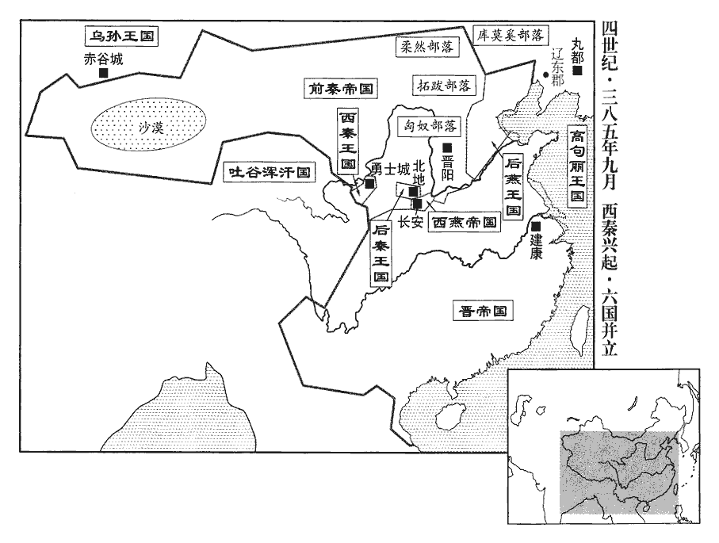 

乞伏國仁自稱大都督、大將軍、單于、領秦•河二州牧，單，音蟬。改元建義，以乙旃zhān童埿為左相，屋引出支為右相，獨孤匹蹄為左輔，武群勇士為右輔，乙旃、屋引、獨孤、武群，皆夷人複姓。乞伏與拓跋同出於鮮卑，故其部人亦有乙旃、獨孤二姓。埿，與泥同。弟乾歸為上將軍，分其地置武城‹甘肃临夏东›等十二郡，載記曰：置武城、武陽、安固‹甘肃临洮南›、武始‹甘肃临洮›、漢陽‹甘肃天水西南›、天水‹甘肃天水›、略陽‹甘肃天水东›、漒川‹甘肃舟曲西北›、甘松‹青海同德›、匡朋、白馬‹甘肃西和南›、苑川‹甘肃榆中东北›十二郡。築勇士城‹甘肃榆中北›而都之。水經註：苑川水出勇士縣之子城南山，北逕牧師苑，故漢牧苑之地也，有東、西二苑城，其城相去七里；西城即乞伏所都。

〖译文〗 [38]乞伏国仁自称大都督、大将军、单于、兼秦、河二州牧，改年号为建义，任命乙旃童为左相，屋引出支为右相，独孤匹蹄为左辅，武群勇士为右辅，弟弟乞伏乾归为上将军，在所辖领地分别设置了武城等十二郡，建筑了勇士城作为都城。

秦尚書令、魏昌公纂自關中奔晉陽‹山西太原›；秦主丕拜纂太尉，封東海王。

〖译文〗 [39]前秦尚书令、魏昌公苻纂从关中奔赴晋阳。前秦国主苻丕授予苻纂太尉官职，封他为东海王。

冬，十月，西燕主沖遣尚書令高蓋帥眾五萬伐後秦，戰于新平‹陕西彬县›南，蓋大敗，降於後秦。帥，讀曰率。降，戶江翻。初，蓋以楊定為子，及蓋敗，定亡奔隴右‹甘肃南部›，復收集其舊眾。【張：「衆」下脫「定，佛奴之孫也」六字。】定為西燕禽，財六月耳。復，扶又翻。

〖译文〗 [40]冬季，十月，西燕国主慕容冲派尚书令高盖率领五万兵众讨伐后秦，在新平以南交战，高盖大败，投降了后秦。当初，高盖把杨定作为儿子，等到高盖失败，杨定逃奔到陇右，又收集起了他过去的兵众。

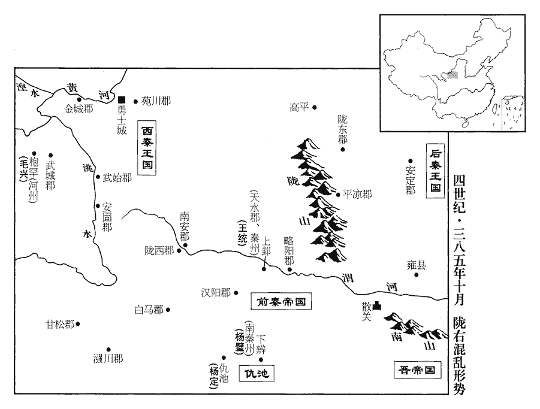 

苻定、苻紹、苻謨、苻亮聞秦主丕即位，皆自河北遣使謝罪；定，紹、謨、亮降燕，見上卷上年。中山‹河北定州›太守王兗，本新平‹陕西彬县›氐也，固守博陵‹河北安平›，為秦拒燕。為，于偽翻。十一月，丕以兗為平州刺史，定為冀州牧，紹為冀州都督，謨為幽州牧，亮為幽、平二州都督，並進爵郡公。左將軍竇衝據茲川‹灞水›，茲川，即霸川也；霸水，古曰滋水。秦穆公之霸也，更滋水曰霸水以顯霸功。今曰茲川，因古名也。有眾數萬，與秦州刺史王統、河州刺史毛興、益州刺史王廣、南秦州刺史楊璧、衛將軍楊定皆自隴右‹甘肃南部›遣使邀丕，共擊後秦。丕以定為雍州牧，雍，於用翻。衝為梁州牧，加統鎮西大將軍，興車騎大將軍，璧征南大將軍，並開府儀同三司，加廣安西將軍，皆進位州牧。

〖译文〗 [41]苻定、苻绍、苻谟、苻亮听说前秦国主苻丕即位，全都从河北派遣使者前来谢罪。中山太守王兖，本是新平的氐族人，他固守博陵，替前秦抵抗后燕。十一月，苻丕任命王兖为平州刺史，苻定为冀州牧，苻绍为冀州都督，苻谟为幽州牧，苻亮为幽、平二州都督，全都晋升爵位为郡公。左将军窦冲占据着兹川，拥有兵众数万，他与秦州刺史王统、河州刺史毛兴、益州刺史王广、南秦州刺史杨璧、卫将军杨定全都从陇右派遣使者邀请苻丕，共同攻打后秦。苻丕任命杨定为雍州牧，窦冲为梁州牧，让王统担任镇西大将军，毛兴担任车骑大将军，杨璧担任征南大将军，同时授予他们开府仪同三司，王广担任安西将军，全都晋升职位为州牧。

楊定尋徙治歷城‹甘肃西和北›，置儲蓄於百頃，百頃，自楊茂搜以來，保為巢穴。自稱龍驤將軍、仇池公，遣使來稱藩；驤，思將翻。使，疏吏翻。詔因其所號假之。其後又取天水‹甘肃天水›、略陽‹甘肃天水东›之地，自稱秦州刺史、隴西王。

〖译文〗 不久，杨定将治所迁移到历城，把储备物资安放在百顷，自称龙骧将军、仇池公，派遣使者前来向东晋称藩。朝廷下达诏令，把他自封的称号暂时授予他。而后他又夺取了天水、略阳的领地，自称秦州刺史、陇西王。

繹幕‹山东平原县西北›人蔡匡據城以叛燕，繹幕縣，自漢以來屬清河郡，至隋廢，入德州安樂縣。燕慕容麟、慕容隆共攻之。泰山‹山东泰安东›太守任泰潛師救匡，任，音壬。至匡壘南八里，燕人乃覺之。諸將以匡未下而外敵奄至，甚患之。隆曰：「匡恃外救，故不時下。今計泰之兵不過數千人，及其未合，擊之，泰敗，匡自降矣。」乃釋匡擊泰，大破之，斬首千餘級。匡遂降，降，戶江翻；下同。燕王垂殺之，且屠其壘。

〖译文〗 [42]绎幕人蔡匡据城背叛了后燕，后燕慕容麟、慕容隆共同攻打他。泰山太守任泰暗中出兵救援蔡匡。到了蔡匡营垒以南八里的地方，后燕人才发现了他们。众将领因为还没有攻下蔡匡而外面的敌人又突然到来，深以为患。慕容隆说：“蔡匡靠着外边的救援，所以不会马上攻下。如今考虑任泰的兵力不超过数千人，趁着他们尚未汇合，展开攻击，任泰一失败，蔡匡自然就会投降。”于是就丢开蔡匡去攻击任泰，大败任泰，斩首一千多人。蔡匡于是也就投降了，后燕王慕容垂杀掉了他，并且在他的营垒内大肆屠杀。

慕容農至龍城‹辽宁朝阳›，自蠮yē螉塞‹居庸关›歷凡城‹河北平泉南›，至龍城。休士馬十餘日。諸將皆曰：「殿下之來，取道甚速，今至此久留不進，何也?」農曰：「吾來速者，恐餘巖過山鈔盜，侵擾良民耳。此山，謂白狼山‹辽宁喀喇沁左翼西南›。鈔，楚交翻。巖才不踰人，誑誘飢兒，誑，居況翻。誘，音酉。烏集為群，非有綱紀；吾已扼其喉，久將離散，無能為也。今此田善熟，未收而行，徒自耗損，當俟收畢，往則梟之，梟，堅堯翻。亦不出旬日耳。」頃之，農將步騎三萬至令支‹河北迁安›，巖眾震駭，稍稍踰城歸農。巖計窮出降，農斬之；進擊高句麗‹都丸都，吉林集安›，復遼東‹辽宁辽阳›、玄菟‹辽宁沈阳›二郡。郝景之敗，高句麗陷遼東、玄菟。菟，同都翻。還至龍城‹辽宁朝阳›，上疏請繕脩陵廟。燕自慕容皝以前皆葬遼西，故陵廟在焉。

〖译文〗 [43]慕容农抵达龙城，让士兵军马休整了十多天。众将领都说：“殿下来的时候，选择道路非常迅速，如今到了这里却长久地停留而不再前进，这是为什么呢？”慕容农说：“我来得迅速的原因，是担心余馀会越过白狼山强取豪夺，侵扰百姓。馀岩没有过人之才，欺骗诱惑处于饥饿状态的人，乌合成群，并没有什么法度纪律。我现在已经扼制了他的咽喉，时间一久他们就会自行离散，不能为患了。如今这里的庄稼丰收，不收拾完就离开，只能白白地浪费掉，应当等收拾完以后，再去斩了他，也不过是十来天以后的事情。”不久，慕容农统率步、骑兵三万人抵达令支，馀岩的兵众非常震惊害怕，逐渐逃出城外归附了慕容农。馀岩无计可施，出来投降，慕容农斩杀了他。慕容农又进军攻打高句丽，夺回了辽东、玄菟二郡。返回龙城以后，上疏请求修缮先帝的陵庙。

燕王垂以農為使持節、都督幽•平二州、北狄諸軍事、幽州牧，鎮龍城。使，疏吏翻。徙平州‹辽宁›刺史帶方王佐鎮平郭‹辽宁盖州›。農於是創立法制，事從寬簡，清刑獄，省賦役，勸課農桑，居民富贍，四方流民前後至者數萬口。先是幽、冀流民多入高句麗，先，悉薦翻。農以驃騎司馬范陽‹河北涿州›龐淵為遼東太守，招撫之。

〖译文〗 后燕王慕容垂任命慕容农为使持节，都督幽州、平州、北狄诸军事及幽州牧，镇守龙城。调动平州刺史带方王慕容佐镇守平郭。慕容农于是便建立法律制度，实行宽松简略的政策，清理刑狱，减免赋役，鼓励督促人们种田养蚕，当地的民众十分富足，各地的流民前后来到这里的有数万人。此前，幽州、冀州的流民大多都去了高句丽，慕容农任命骠骑司马范阳人庞渊为辽东太守，招纳安抚他们。

慕容麟攻王兗于博陵‹河北安平›，城中糧竭矢盡，功曹張猗踰城出，聚眾以應麟。兗臨城數之曰：數，所具翻。「卿是秦民，吾是卿君，卿起兵應賊，自號『義兵』，何名實之相違也?古人求忠臣必於孝子之門，後漢韋彪之言。卿母在城，棄而不顧，吾何有焉！今人取卿一切之功則可矣；寧能忘卿不忠不孝之事乎?不意中州禮義之邦，乃有如卿者也！」十二月，麟拔博陵，執兗及苻鑑，殺之。昌黎‹府龙城，辽宁朝阳›太守宋敞帥烏桓、索頭之眾救兗，不及而還。帥，讀曰率。索，昔各翻。還，從宣翻，又如字。秦主丕以敞為平州刺史。敞時從王永在壺關。

〖译文〗 [44]慕容麟在博陵攻打王兖，博陵城中箭尽粮绝，功曹张猗翻越城墙逃出，聚集兵众以响应慕容麟。王兖登上城墙数说张猗：“你是秦国的臣民，我是你的君主，你起兵响应寇贼，自称‘义兵’，为什么名实不副呢？古人求取忠臣一定要到孝子家门，你的母亲在城里，你弃而不顾，对我有何损害呢？如今人们要记取你的一时功劳，当然可以，但难道能忘掉你所干的不忠不孝的事情吗？没想到在中州这样的礼义之邦，居然还有像你这样的人！”十二月，慕容麟攻下了博陵，抓获了王兖及苻鉴，杀掉了他们。昌黎太守宋敞率领乌桓、索头的兵众救援王兖，没有来得及，只好返回去了。前秦国主苻丕任命宋敞为平州刺史。

燕王垂北如中山‹河北定州›，謂諸將曰：「樂浪王招流離，實倉廩，外給軍糧，內營宮室，雖蕭何之功，何以加之！」樂浪王溫之功詳見上。漢高祖與項羽相拒，蕭何鎮撫關中，為之根本。丙申‹二十三›，垂始定都中山。杜佑曰：後燕都中山，今博陵郡唐昌縣。

〖译文〗 [45]后燕王慕容垂到北面的中山，对众将军领说：“乐浪王慕容温招纳流离失所的民众，充实粮仓谷库，在外军粮丰足，在内营建宫室，即使是萧何的功劳，又怎么能超过他！”丙申，（二十三日），慕容垂开始定都中山。

秦苻定據信都‹河北冀县›以拒燕，燕王垂以從弟北地王精為冀州刺史，將兵攻之。從，才用翻。將，即亮翻。

〖译文〗 [46]前秦苻定据守信都以抵抗后燕，后燕王慕容垂任命堂弟北地王慕容精为冀州刺史，带领军队攻打苻定。

拓跋珪從曾祖紇羅與其弟建及諸部大人共請賀訥推珪為主。從，才用翻。

〖译文〗 [47]拓跋的叔伯曾祖父拓跋纥罗与他的弟弟拓跋建以及各部大人一起向贺讷请求，推举拓跋为国主。

## 十一年（丙戌、三八六）

1春，正月，戊申‹六›，拓跋珪‹时年十六›大會於牛川‹内蒙兴和西›，自武周塞西出至牛川，牛川以北，皆大漠也。據魏紀，窟咄之來寇也，珪乞師于燕，自弩山至牛川，屯于延水，南出代谷以會燕師。又據水經註，于延水出長川城南，則長川即牛川也。班志，于延水出代郡且如塞外，則牛川亦當在且如塞外也。又明元帝大獮xiǎn于牛川，登釜山。括地志：釜山在媯州懷戎縣北三里。且如之且，音子如翻。即代王位，珪，什翼犍之嫡孫，世子寔之子。拓跋氏自此興矣。改元登國。以長孫嵩為南部大人，叔孫普洛為北部大人，分治其眾。魏書曰：魏初自北荒南遷，置四部大人，坐王庭，決辭訟，以言語約束，刻契記事，無囹圄考訊之法，諸犯罪者皆臨時決遣。治，直之翻；下同。以上谷‹河北怀来›張袞為左長史，許謙為右司馬，廣寧‹河北涿鹿›王建、代人和跋、叔孫建、庾岳為外朝大人，魏書官氏志：拓跋鄰命叔父之胤曰乙旃氏，後改叔孫氏。朝，直遙翻。奚牧為治民長，長，知兩翻。皆掌宿衛及參軍国謀議；長孫道生、賀毗等侍從左右，從，才用翻。出納教命。王建娶代王什翼犍之女；岳，和辰之弟；道生，嵩之從子也。庾和辰奉珪母賀氏以奔珪，長孫嵩帥部眾歸珪，事並見上。從，才用翻。

〖译文〗 [1]春季，正月，戊申（初六），拓跋在牛川与后燕的军队会合，拓跋即代王位，改年号为登国。任命长孙嵩为南部大人，叔孙普洛为北部大人，分别统领他们的部众。任命上谷人张兖为左长史，许谦为右司马，广宁人王建、代国人和跋、叔孙建、庾岳为外朝大人，任命奚牧为治民长，全都掌管宫中警卫及参与讨论军队国家的谋略。长孙道生、贺毗等人在拓跋左右侍从，传递命令。王建娶了代王拓跋什翼犍的女儿。庾岳是庾和辰的弟弟；长孙道生是长孙嵩的侄子。

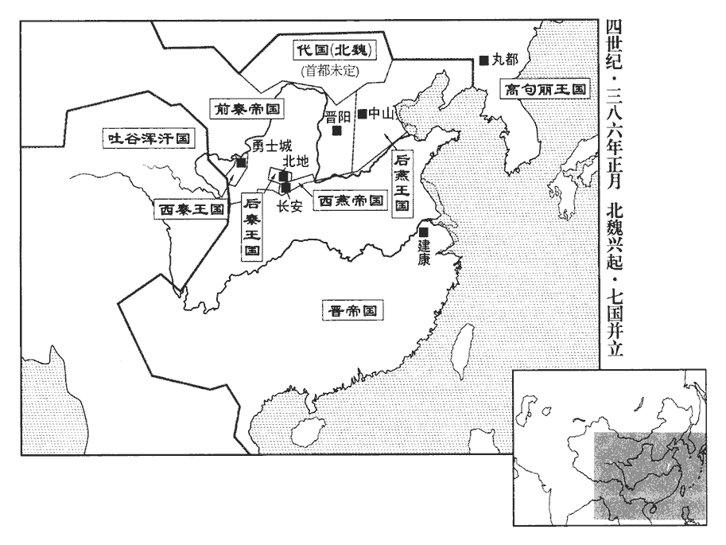 

2燕王垂即皇帝位‹时年六十一›。垂字道明，燕主皝之第五子。

〖译文〗 [2]后燕王慕容垂即皇帝位。

3後秦王萇‹时年五十七›如安定‹甘肃镇原东南曙光乡›。

〖译文〗 [3]后秦王姚苌到安定。

4南安‹甘肃陇西东南›祕宜祕，姓也。前漢書功臣表有戴侯祕彭。時祕氏為南安豪族。帥羌、胡五萬餘人攻乞伏國仁，國仁將兵五千逆擊，大破之。帥，讀曰率。將，即亮翻。宜奔還南安。

〖译文〗 [4]南安人秘宜率领五万多羌族、胡族人攻打乞伏国仁，乞伏国仁带领五千兵众迎击，大败秘宜。秘宜逃回了南安。

5鮮于乞之殺翟真也，翟真見殺，見上年四月。翟遼奔黎陽‹河南浚县›，黎陽太守滕恬之甚愛信之。恬之喜畋獵，喜，許記翻。不愛士卒，遼潛施姦惠以收眾心。恬之南攻鹿鳴城‹白马津，河南滑县东北›，黎陽在河北，鹿鳴城在河南。酈道元曰：按竹書紀年，梁惠成王十三年，取鄭鹿，即是城也。今城內有臺，尚謂之鹿鳴臺，又謂之鹿鳴城。遼於後閉門拒之，恬之東奔鄄城‹山东鄄城北›，鄄，吉掾翻。遼追執之，遂據黎陽‹河南浚县›。豫州刺史朱序遣將軍秦膺、童斌與淮‹淮河›、泗‹泗水›諸郡共討之。斌，音彬。

〖译文〗 [5]鲜于乞斩杀翟真的时候，翟辽逃奔到黎阳，黎阳太守滕恬之非常宠爱信任他。滕恬之喜欢打猎，不爱护士兵，翟辽暗中施行奸巧的恩惠以收买人心。滕恬之在南面攻打鹿鸣城，翟辽则在他身后紧闭城门不让他返回，滕恬之向东逃奔鄄城，翟辽追击并抓获了他，于是就占据了黎阳。豫州刺史朱序派将军秦膺、童斌与淮河、泗水一带的各郡共同讨伐翟辽。

6秦益州牧王廣自隴右引兵攻河州牧毛興於枹罕‹甘肃临夏›，興遣建節將軍衛平帥其宗人一千七百夜襲廣，大破之。帥，讀曰率。二月，秦州牧王統遣兵助廣攻興，興嬰城自守。去年王廣自成都依統。

〖译文〗 [6]前秦益州牧王广从陇右带领军队在罕攻打河州牧毛兴，毛兴派建节将军卫平率领他的一千七百多同族人夜袭王广，大败王广。二月，秦州牧王统派兵帮助王广攻打毛兴，毛兴环城自守。

7燕大赦，改元建興，置公卿尚書百官，繕宗廟、社稷。

〖译文〗 [7]后燕实行大赦，改年号为建兴，设置公卿尚书百官，修缮宗庙、社稷坛。

8西燕主沖樂在長安‹西安›，樂，音洛。且畏燕主垂之強，不敢東歸，課農築室，為久安之計；鮮卑咸怨之。鮮卑思東歸，而沖安於長安，故怨。傳曰：「以欲從人則可，以人從欲鮮濟。」其是之謂歟！左將軍韓延因衆心不悅，攻沖，殺之‹慕容冲，年二十八岁›，立沖將段隨為燕王，改元昌平。

〖译文〗 [8]西燕国主慕容冲喜欢住在长安，而且畏惧后燕国主慕容垂的强盛，不敢东归，便督促农耕，建筑宫室，作长久安居的打算。鲜卑人全都怨恨他。左将军韩延顺应众人心中的不满，攻打慕容冲，杀掉了他，立慕容冲的将领段随为西燕王，改年号为昌平。

9初，張天錫之南奔也，見上卷太元八年。秦長水校尉王穆匿其世子大豫，與俱奔河西，依禿髮思復鞬，思復鞬，烏孤之父也。鞬，居言翻。思復鞬送魏安‹甘肃古浪东›。五代志：武威郡昌松縣，後魏置昌松郡；後周廢郡，以揟xū次縣入焉。又有後魏魏安郡，後亦廢。載記言焦松等迎大豫於揟次，則魏安蓋後魏所置郡。晉書成於唐，唐史臣以後魏郡名書之耳。孟康曰：揟，音子如翻。次，音恣。魏安人焦松、齊肅、張濟等聚兵數千人迎大豫為主，攻呂光昌松郡‹甘肃武威南›，拔之，昌松，即漢倉松縣地，本屬武威郡，蓋河西張氏分置郡也。呂光後以郭黁nún言，改昌松為東張掖郡。執太守王世強。光使輔國將軍杜進擊之，進兵敗，大豫進逼姑臧‹甘肃武威›。王穆諫曰：「光糧豐城固，甲兵精銳，逼之非利；不如席卷嶺‹甘肃永昌南九条岭›西，卷，讀曰捲。礪兵積粟，然後東向與之爭，不及朞年，光可取也。」大豫不從，自號撫軍將軍、涼州牧，改元鳳凰，以王穆為長史，傳檄郡縣，使穆說諭嶺西諸郡，自西郡至張掖、酒泉、建康、晉昌，其地皆嶺西也。說，輸芮翻。建康‹甘肃酒泉东南›太守李隰、祁連‹甘肃张掖东南›都尉嚴純皆起兵應之，建康郡，張駿置，屬涼州。新唐書地理志：甘州張掖縣西北百九十里有祁連山，北有建康軍，蓋張氏置郡地也。晉書地理志，永興中，張祚置漢陽縣以守牧地，張玄靚改為祁連郡。有眾三萬，保據楊塢。楊塢在姑臧城‹武威›西。

〖译文〗 [9]当初，张天锡南逃的时候，前秦长水校尉王穆把他的长子张大豫藏了起来，后来与张大豫一起逃奔到河西，投靠了秃发思复，秃发思复把张大豫送到了魏安。魏安人焦松、齐肃、张济等聚集兵众数千人迎接张大豫为盟主，攻打吕光占据的昌松郡，攻了下来，抓获了太守王世强。吕光让辅国将军杜进攻打他们，结果杜进的军队失败，张大豫进军威逼姑臧。王穆劝谏张大豫说：“吕光粮食充足，城池坚固，武器精良，军队锋锐，威逼他于己不利，不如横扫岭西，训练军队积蓄粮食，然后再东进与他抗争，不用一年，就可以攻取吕光。”张大豫没有听从，自称抚军将军、凉州牧，改年号为凤凰，任命王穆为长吏，向郡县传递檄文，让王穆去游说劝谕岭西各郡，建康太守李隰、祁连都尉严纯全都起兵响应他，拥有兵众三万人，坚守杨坞。

10代王珪徙居定襄之盛樂‹内蒙和林格尔›，按盛樂，前漢書作成樂，屬定襄；後漢書作盛樂，屬雲中。疑定襄之盛樂，即雲中之盛樂也。然魏書帝紀，什翼犍立，三年，移都於雲中之盛樂；明年，築盛樂城於故城南八里，則已非後漢之盛樂城；疑定襄之盛樂，乃前漢之成樂城也。蓋建武之初，匈奴侵寇，塞下之民悉內徙。其後南單于內附，北單于勢屈，復歸內徙之民於塞下，郡縣城郭，掃地更為，必有非其故處者。考宋白續通典，唐振武軍，漢定襄郡之盛樂也，在陰山之陽，黃河之北，後魏所都盛樂是也；在唐朔州北三百餘里。後魏孝文遷洛之後，於定襄故城置朔州，領盛樂、廣牧二郡。唐初平突厥，置雲中都督府於盛樂。貞觀八年，移雲州雲中郡及定襄縣於今雲州，而雲中都督府後又改單于都護府，又改安北都護府。由是雲中、定襄，地名混亂不可考，而盛樂則一也。務農息民，國人悅之。史言拓跋珪所以興。

〖译文〗 [10]代王拓跋迁徙到定襄的盛乐居住，致力于农耕，让百姓休养生息，国内的人对此都很高兴。

三月，大赦。

〖译文〗 [11]三月，东晋实行大赦。

泰山‹山东泰安东›太守張願以郡叛降翟遼。降，戶江翻。初，謝玄欲使朱序屯梁國‹河南商丘›，玄自屯彭城‹江苏徐州›，以北固河上，西援洛陽。朝議以征役既久，欲令玄置戍而還。會翟遼、張願繼叛，北方騷動，玄謝罪，乞解職，‹司马昌明，本年二十五岁›詔慰諭，令還淮陰‹江苏淮陰›。

〖译文〗 [12]泰山太守张愿带领本郡背叛了东晋，投降翟辽。当初，谢玄想让朱序驻扎在梁国，谢玄自己驻扎彭城，用以在北面稳固黄河沿岸，西南支援洛阳。朝延商议认为在外征战已久，想让谢玄部署防守力量返回。恰好这时翟辽、张原相继背叛，北方动荡不安，谢玄谢罪，请求解除他的职务，朝廷下达诏令抚慰他，让他回到淮阴。

燕主垂追尊母蘭氏為文昭皇后；欲遷文明段后，以蘭氏配享太祖，段氏，燕王皝之元妃；蘭氏，皝之側室也。皝廟號太祖，諡文明皇帝。詔百官議之，皆以為當然。順垂指也。博士劉詳、董謐以為「堯母為帝嚳妃，位第三，不以貴陵姜原，帝王紀曰：帝嚳有四妃：元妃有邰氏女曰姜嫄，生后稷；次妃有娀氏女曰簡狄，生卨xiè；次妃陳豐氏女曰慶都，生放勛；次妃娵jū訾zī氏女曰常義，生摯。嚳kù，苦沃翻。明聖之道，以至公為先；文昭后宜立別廟。」垂怒，逼之，詳、謐曰：「上所欲為，無問於臣。臣按經奉禮，不敢有貳。」垂乃不復問諸儒，卒遷段后，以蘭后代之。復，扶又翻。卒，子戌翻。又以景昭可足渾后傾覆社稷，追廢之；尊烈祖昭儀段氏為景德皇后，配享烈祖。可足渾氏，燕王儁之元妃也。傾覆事見一百二卷，海西公太和四年。段氏，儁之側室也。儁廟號烈祖，諡景昭皇帝。

〖译文〗 [13]后燕国主慕容垂追尊母亲兰氏为文昭皇后，想要迁走文明段后的灵位，把兰氏的灵位和太祖慕容的灵位供奉在一起，便诏令百官讨论此事，百官都认为应当如此。博士刘详、董谧认为“尧的母亲是帝喾的妻子，位居第三，不因为尊贵就凌驾于姜原之上，清明圣哲之道，首先应该出以公心，文昭皇后的灵位应该另立庙。”慕容垂很愤怒，对他们施以威胁，刘详、董谧说：“主上想要这样做，就不要向臣下询问了。臣依据经典崇奉礼法，不敢违背。”慕容垂于是就不再询问众儒生，终于迁走了段后的灵位，而用兰后的灵位代替。又因为景昭可足浑后使国家倾覆，追废了她。尊奉烈祖慕容俊的昭仪段氏为景德皇后，与烈祖的灵位供奉在一起。

崔鴻曰：齊桓公命諸侯無以妾為妻。孟子曰：齊桓公葵丘‹河南民权东北›之會，初命曰：「誅不孝，無易樹子，無以妾為妻。」夫之於妻，猶不可以妾代之，況子而易其母乎！春秋所稱母以子貴者，君母既沒，得以妾母為小君也；春秋公羊傳曰：桓幼而貴，隱長而卑；隱長又賢，諸大夫扳隱而立之；隱之立，為桓立也。隱長又賢，何以不宜立?立適以長不以賢，立子以貴不以長。桓何以貴?母貴也。母貴，則子何以貴?子以母貴，母以子貴。左氏傳曰：惠公元妃孟子；孟子卒，繼室以聲子，生隱公。宋武公生仲子，為魯夫人，生桓公，而惠公薨，是以隱公立而奉之。至於享祀宗廟，則成風終不得配莊公也。魯莊公夫人姜氏。成風者，莊公之妾，僖公之母也。姜氏通于共仲，弒閔公而欲立共仲，不克，遂孫于邾，齊桓公殺之。僖公既立，請其喪，以夫人之禮葬之。君父之所為，臣子必習而效之，猶形聲之於影響也；寶之逼殺其母，事見後一百八卷太元二十一年。由垂為之漸也。堯、舜之讓，猶為之、噲之禍，事見二卷周慎靚王五年。況違禮而縱私者乎！昔文姜得罪於桓公，春秋不之廢。魯桓公之夫人曰文姜，通于齊襄公，桓公謫之。夫人以告，襄公遂殺桓公。至莊公二十一年，春秋書夫人姜氏薨；二十二年書葬我小君文姜，是不之廢也。可足渾氏雖有罪於前朝，朝，直遙翻。然小君之禮成矣；垂以私憾廢之，私憾，謂譖殺垂妃段氏，又譖垂而逐之奔秦也。又立兄妾之無子者，皆非禮也。

〖译文〗 崔鸿曰：齐桓公命令诸侯王不能以妾为妻。丈夫对于妻子，尚且不能以妾来代替，何况是儿子来改换他的母亲呢！《春秋》中所说的母亲因为儿子而尊贵的话，是指生母死后，可以让妾母转而为正。至于在宗庙里供奉的牌位，则鲁庄公之妾成风最终也不能和鲁庄公供奉在一起。君主、父亲之所为，臣下、儿子必然要学习而后效仿，这就像形体之于影子，声音之于回响一样。慕容宝威逼杀害他的母亲，就是从慕容垂那里受到了影响。战国时以尧、舜那样的禅让，尚且还出现了子之、燕王哙那样的祸乱，何况是违背礼法放纵私情的人呢！过去文姜在鲁桓公面前犯了罪，据《春秋》的记载后来也没有黜废她。可是浑氏虽然有罪于前朝，但对待她这样的皇后的礼法已有成规，慕容垂因为私恨而废黜了她，又立哥哥的妻妾中没有儿子的人作为皇太后，这些全都违背了礼法。

劉顯自善無‹山西右玉›南走馬邑‹山西朔州›，畏代之偪，且懼其脩怨也。其族人奴真帥所部請降於代。帥，讀曰率。降，戶江翻。奴真有兄鞬，先居賀蘭部‹内蒙古阴山山脉北›，鞬，居言翻。奴真言於代王珪，請召鞬而以所部讓之；珪許之。鞬既領部，遣弟去斤遺賀訥金馬。遺，于季翻。賀染干謂去斤曰：「我待汝兄弟厚，汝今領部，宜來從我。」去斤許之。奴真怒曰：「我祖父以來，世為代忠臣，故我以部讓汝等，欲為義也。今汝等無狀，乃謀叛國，義於何在！」遂殺鞬及去斤。染干聞之，引兵攻奴真，奴真奔代。珪遣使責染干，染干乃止。珪與賀蘭從此隙矣。使，疏吏翻。

〖译文〗 [14]刘显从善无向南逃奔到马邑，他的同族人刘奴真率领部众向代国请求投降。刘奴真有个哥哥叫刘，以前居住在贺兰部，刘奴真向代王拓跋进言，请求征召刘前来，让他统领自己的部众，拓跋同意了。刘统领了部众以后，派他的弟弟刘去斤给贺讷送去金子和马。贺染干对刘去斤说：“我对待你们兄弟很优厚，如今你们统领了部众，应该来归附我。”刘去斤答应了。刘奴真愤怒地说：“我们自从祖父以来，世代都是代国的忠臣，所以我才把部众交给了你们，想让你们奉行道义。如今你们毫无德行，反而阴谋叛国，道义何在！”于是就杀了刘及刘去斤。贺染干听说以后，带领军队攻打刘奴真，刘奴真逃奔到代国。拓跋派使者去责备贺染干，贺染干才停止了行动。

西燕僕【章：十二行本「僕」上有「左」字；十一行本同；孔本同；張校同。】射慕容恆、尚書慕容永襲段隨，殺之；立宜都王子顗yǐ為燕王，顗蓋燕宜都王桓之子。顗，魚豈翻。改元建明，帥鮮卑男女四十餘萬口去長安而東。海西公太和五年，秦遷鮮卑於長安，至是財十七年耳，而種類蕃育乃如此。唐太宗阿史那結社率之變，亦幸其早發耳。帥，讀曰率。恆弟護軍將軍韜誘顗，殺之於臨晉‹陕西大荔›，誘，音酉。恆怒，捨韜去。永與武衛將軍刁雲帥眾攻韜，韜敗，奔恆營。恆立西燕主沖之子瑤為帝，改元建平，諡沖曰威皇帝。眾皆去瑤奔永，永執瑤，殺之，立慕容泓子忠為帝，改元建武。忠以永為太尉，守尚書令，封河東公。永持法寬平，鮮卑安之。至聞喜‹山西闻喜›，聞燕主垂已稱尊號，不敢進，築燕熙城而居之。為燕主垂滅西燕張本。

〖译文〗 [15]西燕仆射慕容恒、尚书慕容永袭击段随，把他杀掉了。立宜都王慕容恒的儿子慕容为燕王，改年号为建明，率领鲜卑男女四十多万人离开长安东去。慕容恒的弟弟护军将军慕容韬诱骗慕容，在临晋杀掉了他，慕容恒很愤怒，丢下慕容韬离开了。慕容永与武卫将军刁云率领兵众攻打慕容韬，慕容韬失败，逃奔到慕容恒的军营。慕容恒立西燕国主慕容冲的儿子慕容瑶为帝，改年号为建平，给慕容冲定谥号为威皇帝。兵众全都离开慕容瑶投奔慕容永，慕容永抓获了慕容瑶，杀掉了他，立慕容泓的儿子慕容忠为帝，改年号为建武。慕容忠任命慕容永为太尉，暂任尚书令，封为河东公。慕容永施行法令宽松平和，鲜卑人安居乐业。慕容永到了闻喜，听说后燕国主慕容垂已经称帝号，不敢继续前进，修筑燕熙城居住。

鮮卑既東，長安空虛。前滎陽‹河南荥阳›【章：十二行本「陽」下有「太守」二字；乙十一行本同；孔本同；張校同。】高陵‹陕西高陵›趙穀等招杏城‹陕西黄陵›盧水胡郝奴帥戶四千入于長安‹西安›，渭北皆應之，帥，讀曰率；下同。以穀為丞相。扶風‹陕西眉县›王驎lín有眾數千，保據馬嵬wéi‹陕西兴平西马嵬坡›，馬嵬山在咸陽縣西，去長安城百餘里。杜佑曰：京兆金城縣有馬嵬故城。孫景安征塗記云：馬嵬所築，不知何代人。金城，周曰犬丘，秦曰廢丘，漢曰槐里。驎，離珍翻。嵬，吾回翻。奴遣弟多攻之。夏，四月，後秦王萇自安定‹甘肃镇原东南曙光乡›伐之，驎奔漢中‹陕西漢中›。萇執多而進，奴懼，請降，降，戶江翻。拜鎮北將軍、六谷大都督。長安南山‹秦岭›有六谷。

〖译文〗 [16]鲜卑人既已东去，长安空虚。从前的荥阳太守高陵人赵谷等人招纳杏城的卢水胡人郝奴率领四千户人家进入长安，渭北的人们全都响应他，以赵谷作为丞相。扶风人王有数千兵众，据守马嵬，郝奴派弟弟郝多攻打他。夏季，四月，后秦王姚苌从安定出发讨伐他们，王逃奔汉中。姚苌抓获了郝多以后继续前进，郝奴害怕了，请求投降，姚苌给他授官镇北将军、六谷大都督。

癸巳‹二十二›，以尚書僕射陸納為左僕射，譙王恬為右僕射。晉志曰：左右僕射或不兩置，但曰尚書僕射。納，玩之子也。陸玩，見九十四卷成帝咸和四年。

〖译文〗 [17]癸巳（二十三日），东晋任命尚书仆射陆纳为左仆射，谯王司马恬为右仆射。陆纳是陆玩的儿子。

毛興襲擊王廣，敗之，敗，補邁翻。廣奔秦州‹府上邽，甘肃天水›；隴西‹甘肃陇西›鮮卑匹蘭執廣送於後秦。興復欲攻王統於上邽‹甘肃天水›，枹罕‹甘肃临夏›諸氐皆厭苦兵事，諸氐，蓋秦王堅使毛興領之以鎮枹罕者也。復，扶又翻。枹，音膚。乃共殺興，推衛平為河州刺史，以衛平宗強，故推之。遣使請命于秦。使，疏吏翻；下同。

〖译文〗 [18]毛兴袭击王广，打败了他，王广逃奔秦州。陇西的鲜卑人匹兰抓获了王广，把他送到后秦。毛兴又想在上攻打王统，罕的众氐族人都厌恶战事，于是就一起杀掉了毛兴，推举卫平为河州刺史，派使者去前秦请求指令。

燕主垂封其子農為遼西王，麟為趙王，隆為高陽王。

〖译文〗 [19]后燕国主慕容垂封他的儿子慕容农为辽西王，慕容麟为赵王，慕容隆为高阳王。

代王珪初改稱魏王。拓跋氏自此國號魏。

〖译文〗 [20]代王拓跋开始改称魏王。

張大豫自楊塢進屯姑臧‹甘肃武威›城西，王穆及禿髮思復鞬子奚于帥眾三萬屯于城南；鞬，居言翻。呂光出擊，大破之，斬奚于等二萬餘級。

〖译文〗 [21]张大豫从杨坞进军驻扎在姑臧城西，王穆及秃发思复的儿子秃发奚于率领三万兵众驻扎在城南，吕光出城攻击，把他们打得大败，斩杀了秃发奚于等二万多人。

秦大赦，以衛平為撫軍將軍、河州刺史，呂光為車騎大將軍、涼州牧。騎，奇寄翻。使者皆沒於後秦，不能達。時秦主丕在晉陽，後秦隔其道，故不能達二鎮。

〖译文〗 [22]前秦实行大赦，任命卫平为抚军将军、河州刺史，任命吕光为车骑大将军、凉州牧。传达任命的使者全都落于后秦之手，没能到达目的地。

燕主垂以范陽王德為尚書令，太原王楷為左僕射，樂浪王溫為司隸校尉。溫守中山，有營宮室、建都邑之功，因用為司隸。樂浪，音洛琅。

〖译文〗 [23]后燕国主慕容垂任命范阳王慕容德为尚书令，太原王慕容楷为左仆射，乐浪王慕容温为司隶校尉。

後秦王萇即皇帝位于長安‹西安›，萇字景茂，姚弋仲之第二十四子也。大赦，改元建初，國號大秦。追尊其父弋仲為景元皇帝，立妻虵氏為皇后，類篇：虵，以者翻，虜姓也。姓譜：姚萇后虵氏，南安人也。虵，食遮翻，又音它。子興‹姚兴，本年二十一岁›為皇太子，置百官。萇與群臣宴，酒酣，言曰：「諸卿皆與朕北面秦朝，朝，直遙翻。今忽為君臣，得無恥乎！」趙遷曰：「天不恥以陛下為子，臣等何恥為臣！」萇大笑。

〖译文〗 [24]后秦王姚苌在长安即皇帝位，实行大赦，改年号为建初，立国号为大秦。追尊他的父亲姚弋仲为景元皇帝，立妻子氏为皇后，儿子姚兴为皇太子，设置百官。姚苌与群臣聚宴，酒喝到尽兴时，说道：“你们全都与朕北面称臣于秦朝，今天突然成为君臣关系，不感到耻辱吗？”赵迁说：“上天不耻于以陛下作为儿子，我们为什么耻于作为臣下呢！”姚苌开怀大笑。

魏王珪東如陵石，陵石，地名，在盛樂東。護佛侯部帥侯辰、乙佛部帥代題皆叛走。帥，所類翻。諸將請追之，珪曰：「侯辰等累世服役，有罪且當忍之。方今國家草創，人情未壹，愚者固宜前卻，一前一卻，言叛服不常也。不足追也！」史言珪能識時知變以安反側。

〖译文〗 [25]魏王拓跋到东面的陵石，护佛侯部的主帅侯辰、乙佛部的主帅代题全都背叛逃走。众将领请求追击他们，拓跋说：“侯辰等人世代为我们效劳，有罪过也应该暂且容忍他们。如今国家刚刚建立，人心尚未统一，愚昧的人本来就是进退无常，不值得追击！”

六月，庚寅‹二十›，以前輔國將軍楊亮為雍州刺史，鎮衛山陵。帝置雍州於襄陽；今遣亮帶雍州，鎮洛。雍，於用翻。荊州刺史桓石民遣將軍晏謙擊弘農‹河南灵宝东北›，下之。姓譜曰：左傳齊有晏氏，代為大夫。初置湖‹河南灵宝西›、陝‹河南三门峡›二戍。湖、陝二縣皆屬弘農。陝，式冉翻。

〖译文〗 [26]六月，庚寅（二十日），东晋任命以前的辅国将军杨亮为雍州刺史，镇守戍卫洛阳的陵庙。荆州刺史桓石民派将军晏谦攻打弘农，攻了下来。开始设置了湖、陕二县的戍卫。

西燕刁雲等杀西燕主忠，推慕容永為使持節、大都督中外諸軍事、大將軍、大單于、雍•秦•梁•涼四州牧、錄尚書事、河東王，稱藩於燕。稱藩於燕主垂也。使，疏吏翻。雍，於用翻。

〖译文〗 [27]西燕的刁云等人杀掉了西燕国主慕容忠，推举慕容永为使持节、大都督中外诸军事、大将军、大单于以及雍、秦、梁、凉四州牧，录尚书事，河东王，向后燕称藩。

燕主垂遣太原王楷、趙王麟、陳留王紹、章武王宙攻秦苻定、苻紹、苻謨、苻亮等；去年，苻定等背燕為秦。楷先以書與之，為陳禍福，定等皆降。降，戶江翻。垂封定等為侯，曰：「以酬秦主之德。」

〖译文〗 [28]后燕国主慕容垂派太原王慕容楷、赵王慕容麟、陈留王慕容绍、章武王慕容宙攻打前秦苻定、苻绍、苻谟、苻亮等。慕容楷先写信送给了他们，为他们陈述祸福，苻定等人全都投降。慕容垂封苻定等人为侯，说：“以此来报答秦国主苻坚的恩德。”

秦主丕以都督中外諸軍事、司徒、錄尚書事王永為左丞相，太尉、東海王纂為大司馬，司空張蚝為太尉，蚝，七吏翻。尚書令咸陽‹陕西咸陽›徐義為司空，司隸校尉王騰為驃騎大將軍、儀同三司。驃，匹妙翻。騎，奇寄翻。永傳檄四方公侯、牧守、壘主、民豪，共討姚萇、慕容垂，令各帥所統，以孟冬上旬會大駕于臨晉‹陕西大荔›。帥，讀曰率。於是天水姜延、馮翊‹陕西大荔›寇明、河東‹山西夏县›王昭、新平‹陕西彬县›張晏、京兆‹陕西西安›杜敏、扶風‹陕西眉县›馬朗、建忠將軍•高平‹宁夏固原›牧官都尉扶風王敏等建忠將軍，蓋亦苻氏創置。高平縣，漢屬安定郡；晉省，前趙劉曜以為朔州治所，秦置牧官都尉於其地。咸承檄起兵，各有眾數萬，遣使詣秦，使，疏吏翻。丕皆就拜將軍、郡守，封列侯。冠軍將軍鄧景擁眾五千據彭池，與竇衝為首尾，以擊後秦。「彭池」，恐當作「彪池」‹又名冰池、圣女泉，在西安西北›。彪池在長安西，詩所謂「滮池北流」者也。竇衝據茲川，在長安東南，可以相為首尾。又據新唐書地理志，寧州有彭池，但去茲川遠耳。丕以景為京兆尹。景，羌之子也。鄧羌，秦之名將。

〖译文〗 [29]前秦国主苻丕任命都督中外诸军事、司徒、录尚书事王永为左丞相，任命太尉、东海王苻纂为大司马，任命司空张蚝为太尉，任命尚书令咸阳人徐义为司空，任命司隶校尉王腾为骠骑大将军、仪同三司。王永向各地的公侯、州牧郡守、垒主、豪族传递檄文，共同讨伐姚苌、慕容垂，命令他们各自率领所统辖的部众，以十月上旬为期，在临晋与前秦国主汇合。于是天水人姜延、冯翊人寇明、河东人王昭、新平人张晏、京兆人杜敏、扶风人马朗及建忠将军、高平牧官都尉扶风人王敏等，全都禀承檄文起兵，各自拥有兵众数万人，派使者到前秦，苻丕全都授予他们将军、郡守职位，封为列侯。冠军将军邓景拥有五千兵众据守彭池，与窦冲首尾呼应，用以攻击后秦。苻丕任命邓景为京兆尹。邓景是邓羌的儿子。

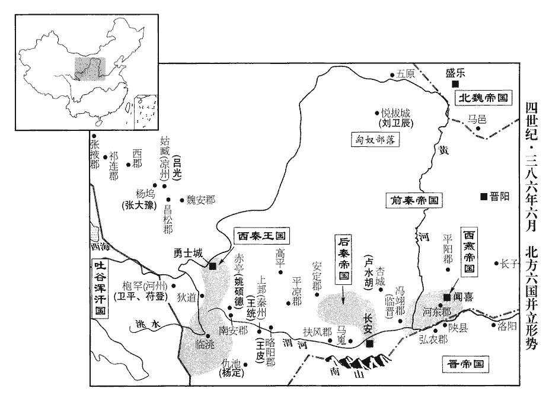 

後秦王萇徙安定‹甘肃镇原东南曙光乡›五千餘戶于長安‹西安›。

〖译文〗 [30]后秦王姚苌把安定的五千多户人家迁徙到长安。

秋，七月，秦平涼‹甘肃华亭›太守金熙、安定都尉沒弈干與後秦左將軍姚方成戰于孫丘谷，孫丘谷當在安定。方成兵敗。後秦主萇以其弟征虜將軍緒為司隸校尉，鎮長安；自將至安定將，即亮翻。擊熙等，大破之。金熙本東胡之種；秦謂鮮卑之種居遼碣jié者為東胡。種，章勇翻。沒弈干，鮮卑多蘭部帥也。帥，所類翻。

〖译文〗 [31]秋季，七月，前秦平凉太守金熙、安定都尉没弈干与后秦左将军姚方成在孙丘谷交战，姚方成的军队失败。后秦国主姚苌任命他的弟弟征虏将军姚绪为司隶校尉，镇守长安。自己统领部队抵达安定，攻打金熙等人，把他们打得大败。金熙本来属东胡种族；没弈干是鲜卑多兰部的首领。

枹罕‹甘肃临夏›諸氐枹，音膚。以衛平衰老，難與成功，議廢之，而憚其宗強，累日不決。氐啖青謂諸將曰：啖，徒覽翻，姓也。「大事宜時定，不然，變生。諸君但請衛公為會，觀我所為。」會七夕大宴，青抽劍而前曰：「今天下大亂，吾曹休戚同之，非賢主不可以濟大事。衛公老，宜返初服以避賢路。衛平，本毛興部將。狄道‹甘肃临洮›長苻登，長，知兩翻。雖王室疏屬，志略雄明，請共立之，以赴大駕。欲承王永檄赴秦主丕也。諸君有不同者，即下異議。」乃奮劍攘袂，將斬異己者。眾皆從之，莫敢仰視。於是推登為使持節、都督隴右諸軍事、撫軍大將軍、雍•河二州牧、略陽公，帥眾五萬，東下隴，攻南安‹甘肃陇西东南›，拔之，馳使請命于秦。登，秦主丕之族子也。苻登事始此。使，疏吏翻。雍，於用翻。帥，讀曰率；下同。

〖译文〗 [32]罕的众氐族部落，因为卫平年老，难以与他成就功业，商量要废黜他，但害怕他宗族的强大，好多天都没有决定下来，氐人啖青对众将领说：“重大事情应该及时决定，不然，就会产生变故。诸君只要请求卫平召集聚会就行了，看我的行动。”正逢七月初七大宴聚会，啖青拔剑上前说：“如今天下大乱，我们休戚与共，没有贤明的君主无法成就大事。卫公已经年老，应该辞去官职为贤人晋升让开道路，狄道首领苻登，虽然是王室的远亲，但志向才略宏伟英明，请求共同立他为首领，以奔赴秦国主苻丕。诸君如有不同意的，马上说出不同的看法。”接着就挥剑捋袖，准备斩杀持不同意见的人。众人全都服从了他，没有人敢仰头观望。于是便推举苻登为使持节、都督陇右诸军事、抚军大将军及雍、河二州牧，略阳公，率领五万兵众，东下陇郡，攻打南安，攻了下来，迅速派使者到前秦请求指令。苻登是前秦国主苻丕同族兄弟的儿子。

祕宜與莫侯悌眷帥其眾三萬餘戶降于乞伏國仁，國仁拜宜東秦州刺史，悌眷梁州刺史。莫侯，夷人複姓。降，戶江翻；下同。

〖译文〗 [33]秘宜与莫侯悌眷率领他们的三万多户部众投降了乞伏国仁，乞伏国仁给秘宜授官东秦州刺史，给莫侯悌眷授官梁州刺史。

己酉‹十›，魏王珪還盛樂，自陵石還也。代題復以部落來降，復，扶又翻。十餘日，又奔劉顯；珪使其孫倍斤代領其眾。劉顯弟肺泥帥眾降魏。

〖译文〗 [34]己酉（初十），魏王拓跋回到盛乐，代题又带领部落前来投降，十多天以后，又投奔了刘显。拓跋让他的孙子倍斤代替他统领其兵众。刘显的弟弟刘肺泥率领兵众投降了魏国。

八月，燕主垂留太子寶守中山‹河北定州›，以趙王麟為尚書右僕射，錄留臺。庚午‹一›，自帥范陽王德等南略地，使高陽王隆東徇平原‹山东平原县›。丁零鮮于乞保曲陽‹河北曲阳›西山，曲陽縣，屬常山郡。聞垂南伐，出營望都‹河北望都西北›，望都縣，屬中山郡。水經註：堯封於唐，堯山在東北，堯母慶都山在南，登堯山見都山，故望都縣以為名也。剽掠居民。剽，匹妙翻。趙王麟自出討之，諸將皆曰：「殿下虛鎮遠征，萬一無功而返，虧損威重，不如遣諸將討之。」麟曰：「乞聞大駕在外，無所畏忌，必不設備，一舉可取，不足憂也。」乃聲言至魯口‹河北饶阳›，夜，回趣乞，趣，七喻翻。比明，至其營，掩擊，擒之。比，必寐翻，及也。

〖译文〗 [35]八月，后燕国主慕容垂留下太子慕容宝守卫中山，任命赵王慕容麟为尚书右仆射，总领留台。庚午（初一），慕容垂亲自率领范阳王慕容德等人攻打南部地域，让高阳王慕容隆向东开辟平原地区。丁零人鲜于乞据守在曲阳以西的山岭，听说慕容垂到南方讨伐，出山驻扎在望都，抢掠当地民众。赵王慕容麟准备亲自出征讨伐他，众将领都说：“殿下使镇守之地空虚而远征讨伐，万一无功而返，有损威严，不如派遣众将领去讨伐他。”慕容麟说：“鲜于乞听说国主在外，无所畏惧，一定不会设防，一举就可以攻取他，不值得忧虑。”于是就扬言前往鲁口，夜晚，回师直奔鲜于乞，等到天亮时，到了他的营地，突然发起攻击，擒获了鲜于乞。

翟遼寇譙‹安徽亳州›，朱序擊走之。

〖译文〗 [36]翟辽进犯谯郡，朱序击退了他。

秦主丕以苻登為征西大將軍、開府儀同三司、南安王，持節、州牧、都督，皆因其所稱而授之。又以徐義為右丞相。留王騰守晉陽‹山西太原›，右僕射楊輔戍壺關‹山西长治北›，帥眾四萬，進屯平陽‹山西临汾›。帥，讀曰率。

〖译文〗 [37]前秦国主苻丕任命苻登为征西大将军、开府仪同三司、南安王，持节、州牧、都督，全都根据他的自称而加以正式任命。又任命徐义为右丞相。留下王腾镇守晋阳，右仆射杨辅戍守壶关，率领四万兵众，进军到平阳驻扎。

初，後秦主萇之弟碩德統所部羌居隴上‹甘肃南部›，聞萇起兵，自稱征西將軍，聚眾於冀城‹甘肃甘谷›以應之；以兄孫詳為安遠將軍，據隴城‹甘肃张家川›，從孫訓為安西將軍，據南安之赤亭‹甘肃陇西东›，諸姚本赤亭羌也。與秦秦州刺史王統相持。萇自安定引兵會碩德攻統，天水屠各、略陽‹甘肃天水东›羌胡應之者二萬餘戶。秦略陽太守王皮降之。屠，直於翻。降，戶江翻。

〖译文〗 [38]当初，后秦国主姚苌的弟弟姚硕德统领他的羌族部众驻守陇上，听说姚苌起兵后，就自称征西将军，在冀城聚集兵众以响应姚苌。姚苌任命哥哥的孙子姚详为安远将军，据守陇城，任命弟弟的孙子姚训为安西将军，据守南安的赤亭，与前秦秦州刺史王统相对峙。姚苌从安定带领军队与姚硕德会合攻打王统，天水的屠各人、略阳的羌胡人响应他的有二万多户。前秦略阳太守王皮投降了姚苌。

初，秦滅代，遷代王什翼犍少子窟咄于長安‹西安›，事見一百四卷太元元年。窟，苦骨翻。咄，當沒翻。從慕容永東徙，永以窟咄為新興‹山西忻州›太守。劉顯遣其弟亢埿迎窟咄，以兵隨之，逼魏南境，諸部騷動。魏王珪左右于桓等與部人謀執珪以應窟咄，幢將代‹河北蔚县›人莫題等亦潛與窟咄交通。魏收官氏志；道武登國元年，置幢將六人，主三郎衛士直宿禁中者，侍中已下、中散已上皆統之。拓跋詰汾時，餘部諸姓內入者，有莫那婁氏，後為莫氏。幢zhuàng，直江翻。桓舅穆崇告之，珪誅桓等五人，莫題等七姓悉原不問。為後珪殺莫題張本。珪懼內難，難，乃旦翻。北踰陰山，復依賀蘭部，復，扶又翻。遣外朝大人遼東‹辽宁辽阳›安同求救於燕，姓譜：安息王子入侍，遂為漢人。風俗通，漢有安成為太守。廬山記有安息國王子安高。朝，直遙翻。燕主垂遣趙王麟救之。

〖译文〗 [39]当初，前秦消灭了代国，把代王拓跋什翼犍的小儿子拓跋窟咄迁徙到了长安，后来他跟着慕容永向东迁徙，慕容永任命拓跋窟咄为新兴太守。刘显派他的弟弟刘亢迎接拓跋窟咄，并带领军队跟随着他，威逼魏国的南部边境，众部落骚动不安。魏王拓跋的身边侍从于桓等人与部落中的一些人谋划拘捕拓跋以响应拓跋窟咄，幢将代国人莫题等也暗中与拓跋窟咄相勾结。于桓的舅舅穆崇告发了他们，拓跋斩杀了于桓等五人，对莫题等七人则全部原谅不追究。拓跋害怕内部的人发难，便向北翻越阴山，又依附了贺兰部，派遣外朝大人辽东人安同去向后燕求救，后燕国主慕容垂派赵王慕容麟救援他们。

九月，王統以秦州降于後秦。降，戶江翻。後秦主萇以姚碩德為使持節、都督隴右諸軍事、秦州刺史，鎮上邽‹甘肃天水›。使，疏吏翻。

〖译文〗 [40]九月，王统献秦州投降了后秦。后秦国主姚苌任命姚硕德为使持节、都督陇右诸军事、秦州刺史，镇守上。

呂光‹本年五十岁›得秦王堅凶問，舉軍縞素，諡曰文昭皇帝。冬，十月，大赦，改元大安。晉書載記作「太安」。

〖译文〗 [41]吕光获悉前秦王苻坚死的消息，全军将士都身穿白色丧服志哀，给苻坚定谥号为文昭皇帝。冬季，十月，实行大赦，改年号为大安。

西燕慕容永遣使詣秦主丕求假道東歸，使，疏吏翻。丕弗許，與永戰于襄陵‹山西临汾东南›，襄陵縣，漢屬河東郡，晉屬平陽郡。秦兵大敗，左丞相王永、衛大將軍俱石子皆死。初，東海王纂自長安來，去年，纂奔丕。麾下壯士三千餘人，丕忌之，既敗，懼為纂所殺，帥騎數千南奔東垣‹山西垣曲›，東垣縣，漢已改為真定；此東垣在河南新安縣界。宋白曰：河南府王屋縣，漢為河東郡垣縣地。又，絳州垣縣，本河東郡縣名，其地即周、召分陝之所。又曰：河南府，漢為河南郡，治洛陽；後漢都洛陽，河南屬司隸校尉。魏陳留王奐合河南等五郡置司州，劉聰為荊州，石虎為洛州，苻堅為豫州；宋武入洛，更置東垣、西垣二縣，仍於虎牢置司州。帥，讀曰率。騎，奇寄翻。謀襲洛陽。揚威將軍馮該自陝邀擊之，陝，式冉翻。殺丕，執其太子寧、長樂王壽，送建康，樂，音洛。詔赦不誅，以付苻宏。苻宏去年來奔，處之江州‹府寻阳，江西九江›。纂與其弟尚書永平侯師奴，帥秦眾數萬走據杏城‹陕西黄陵›，其餘王公百官皆沒於永。

〖译文〗 [42]西燕慕容永派使者到前秦国主苻丕那里请求借道东返，苻丕不同意，与慕容永在襄陵交战，前秦的军队大败，左丞相王永、卫大将军俱石子全都战死。当初，东海王苻纂从长安来投奔苻丕，手下有勇士三千多人，苻丕非常忌恨他，等到苻丕失败以后，害怕被苻纂杀掉，就率领数千骑兵向南逃奔东垣，打算袭击洛阳。扬威将军冯该从陕城出发迎击他，斩杀了苻丕，抓获了他的太子苻宁、长东王苻寿，把他们送到了建康。朝廷下达诏令赦免他们，不予诛杀，把他们交给了苻宏。苻纂与他的弟弟尚书永平侯苻师奴率领前秦的数万兵众逃奔占据了杏城，其余的王公百官全都落入慕容永之手。

永遂進據長子‹山西长子›，即皇帝位，改元中興。將以秦后楊氏為上夫人，楊氏引劍刺永，刺，七亦翻。為永所殺。

〖译文〗 慕容永于是就进军占据了长子，即皇帝位，改年号为中兴。正准备要以前秦王后杨氏作为上夫人，杨氏拔剑刺击慕容永，被慕容永杀掉。

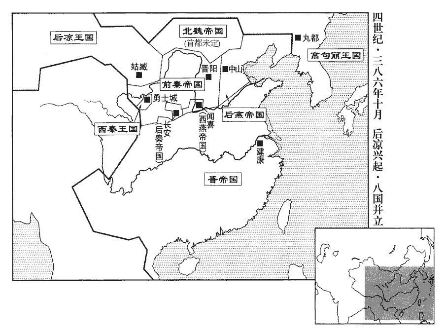 

甲申‹十六›，海西公奕薨于吳‹苏州›。年四十五。

〖译文〗 [43]甲申（十六日），海西公司马奕在吴郡去世。

燕寺人吳深據清河‹山东临清›反，寺，音侍，又如字。燕主垂攻之，不克。

〖译文〗 [44]后燕宦官吴深占据清河反叛，后燕国主慕容垂攻打他，没有攻克。

後秦主萇還安定。自上邽‹甘肃天水›還安定‹甘肃镇原东南曙光乡›也。

〖译文〗 [45]后秦国主姚苌回到了安定。

秦南安王登既克南安‹甘肃陇西东南›，夷、夏歸之者三萬餘戶，夏，戶雅翻。遂進攻姚碩德于秦州，後秦主萇自往救之。登與萇戰于胡奴阜‹甘肃天水西›，胡奴阜在上邽西。大破之，斬首二萬餘級，將軍啖青射萇，中之。射，而亦翻。中，竹仲翻。萇創重，創，初良翻。走保上邽，姚碩德代之統眾。

〖译文〗 [46]前秦南安王苻登攻克了南安以后，夷人、汉人归附他的人有三万多户，于是他就进军秦州，攻打姚硕德，后秦国主姚苌亲自前往救援。苻登与姚苌在胡奴阜交战，大败姚苌，斩首二万多人，将军啖青射击姚苌，射中了他。姚苌伤势严重，逃至上自保，姚硕德代替他统领部众。

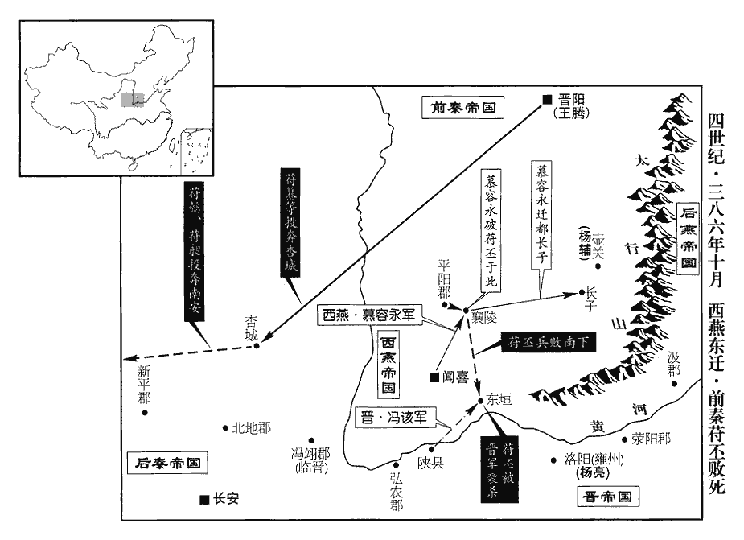 

燕趙王麟軍未至魏，拓跋窟咄稍前逼魏王珪，賀染干侵魏北部以應之。魏眾驚擾，北部大人叔孫普洛亡奔劉衛辰。麟聞之，遽遣安同等歸。魏人知燕軍在近，眾心少安。少，詩沼翻。窟咄進屯高柳‹山西阳高›，高柳縣，漢屬代郡，晉省。酈道元曰：高柳在代中，其山重巒疊巘yǎn，霞舉雲高，其山隱隱而東出遼塞。珪引兵與麟會擊之，窟咄大敗，奔劉衛辰，衛辰殺之。珪悉收其眾，以代人庫狄干為北部大人。魏書官氏志：次南諸部，有庫狄氏，後為狄氏。麟引兵還中山‹河北定州›。

〖译文〗 [47]后燕赵王慕容麟的军队没有抵达魏国，拓跋窟咄逐渐前进紧逼魏王拓跋，贺染干入侵魏国北部以响应他。魏国的兵众惊恐混乱，北部大人叔孙普洛投奔刘卫辰。慕容麟听说以后，迅速派安同等人返回。魏国人知道后燕的军队就在近处，众人的心里稍微安定了一点。拓跋窟咄进军驻扎在高柳，拓跋带领军队与慕容麟会合攻打他，拓跋窟咄大败，逃奔刘卫辰，刘卫辰杀掉了他。拓跋接收了他的全部兵众，任命代国人库狄干为北部大人。慕容麟带领军队返回了中山。

劉衛辰居朔方‹时驻悦拔城，内蒙伊金霍洛旗西北›，士馬甚盛。後秦主萇以衛辰為大將軍、大單于、河西王、幽州牧，單，音蟬。西燕主永以衛辰為大將軍、朔州牧。

〖译文〗 刘卫辰驻军朔方，士兵战马非常强盛。后秦国主姚苌任命刘卫辰为大将军、大单于、河西王、幽州牧，西燕国主慕容永任命刘卫辰为大将军、朔州牧。

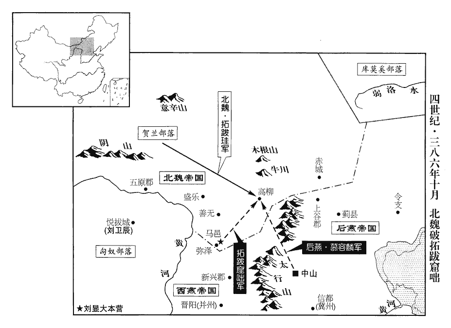 

十一月，秦尚書寇遺奉勃海王懿、濟北王昶自杏城‹陕西黄陵›奔南安‹甘肃陇西东南›，濟，子禮翻。南安王登發喪行服，諡秦主丕曰哀平皇帝。登議立懿為主，眾曰：「勃海王雖先帝之子，然年在幼沖，未堪多難，難，乃旦翻。今三虜窺覦，三虜，謂姚萇、慕容垂、慕容永也。宜立長君，長，知兩翻。非大王不可。」登乃為壇於隴東‹甘肃平凉西北›，即皇帝位‹苻登，时年四十四›，登，字文高，堅之族孫也。大赦，改元太初，置百官。

〖译文〗 [48]十一月，前秦尚书寇遗奉送勃海王苻懿、济北王苻昶从杏城投奔南安，南安王苻登公布了前秦国主苻丕死亡的消息，并为他服丧守孝，定立谥号为哀平皇帝。苻登商议立苻懿为国主，众人说：“勃海王苻懿虽然是先帝的儿子，但是年龄幼小，没有经历过多的磨难。如今三国的敌人都在窥伺图谋我们，应该立年长的君主，此人非大王不可。”苻登于是就在陇东设立了祭坛，即皇帝位，实行大赦，改年号为太初，设置百官。

慕容柔、慕容盛及盛弟會皆在長子‹山西长子›，太元九年，柔等自長安得脫，奔慕容沖；沖死，隨永東遷。盛謂柔、會曰：「主上已中興幽、冀，主上，謂燕主垂。東西未壹，東，謂燕主垂；西，謂燕主永。吾屬居嫌疑之地，為智為愚，皆將不免，不若以時東歸，無為坐待魚肉也！」遂相與亡歸燕。後歲餘，西燕主永悉誅燕主儁及燕主垂之子孫，男女無遺。史言慕容盛之智。

〖译文〗 [49]慕容柔、慕容盛以及慕容盛的弟弟慕容会全都在长子，慕容盛对慕容柔、慕容会说：“主上已在幽州、冀州中兴，但东西尚未统一，我们身居容易引起怀疑的地方，不管做得明智还是愚鲁，都将难免于祸，不如及时东归，不要干坐以待毙的事情！”于是他们就一起逃回了后燕。此后一年多，西燕国主慕容永将前燕国主慕容俊及后燕国主慕容垂的子孙们全部诛杀，不论男女，无一遗漏。

張大豫自西郡‹甘肃永昌西北›入臨洮‹甘肃岷县›，掠民五千餘戶，保據俱城。俱城在臨洮界。

〖译文〗 [50]张大豫从西郡进入临洮，掳掠了五千多户百姓，据守俱城。

十二月，呂光自稱使持節、侍中、中外大都督、督隴右•河西諸軍事、大將軍、涼州牧、酒泉公。使，疏吏翻。

〖译文〗 [51]十二月，吕光自称使持节、侍中、中外大都督、督陇右、河西诸军事、大将军、凉州牧、酒泉公。

秦主登立世祖神主於軍中，秦主堅廟號世祖。載以輜軿píng，車四面有屏蔽者曰輜軿。軿，蒲眠翻。建黃旗青蓋，以虎賁三百人衛之，賁，音奔。凡所欲為，必啟主而後行。引兵五萬，東擊後秦，將士皆刻鉾máo、鎧為「死」「休」字；鉾，頭牟。鎧，甲也。鉾，音牟móu。言欲復讎必死乃休也。楊正衡曰：字林：鉾，古矛字。每戰以劍矟為方圓大陣，矟shuò，色角翻，與槊同。知有厚薄，從中分配，故人自為戰，所向無前。

〖译文〗 [52]前秦国主苻登在军队中设立了世祖苻坚的牌位，放在四周遮蔽的车乘里，并给车乘装上黄色的旗帜，蓝色的车盖，让三百名虎贲士兵守卫，凡是想干的事情，一定要先向苻坚的牌位报告，然后才行动。苻登带领五万军队，东进攻打后秦，将士们全都在头盔铠甲上刻了“死”、“休”二字，每逢战斗都用剑矛组成方圆大阵，知道了力量分布不均后，再重新调整，所以人人各自为战，所向无敌。

初，長安之將敗也，謂苻堅為慕容沖所困之時。中壘將軍徐嵩、屯騎校尉胡空各聚眾五千，結壘自固；既而受後秦官爵。後秦主萇以王禮葬秦主堅於二壘之間‹徐嵩堡、胡空堡，都在今陕西省彬县西南›。及登至，嵩、空以眾降之。登拜嵩雍州刺史，空京兆尹，降，戶江翻。雍，於用翻。改葬堅以天子之禮。

〖译文〗 当初，长安将要失守的时候，中垒将军徐嵩、屯骑校尉胡空各自聚集五千兵众，构筑营垒自我固守。此后又接受了后秦授予的官职爵位。后秦国主姚苌以国王的礼仪把前秦国主苻坚安葬在二垒之间。等到苻登抵达，徐嵩、胡空带领兵众投降了苻登。苻登授予徐嵩雍州刺史，授予胡空京兆尹，按天子的礼仪重新安葬了苻坚。

乙酉‹十八›，燕主垂攻吳深壘，拔之，深單馬走。吳深時據清河以叛燕。垂進屯聊城‹山东聊城›之逢關陂。聊城縣，漢屬東郡，晉屬平原郡。初，燕太子洗馬溫詳來奔，以為濟北‹山东平阴西›太守，屯東阿‹山东阳谷东北阿城镇›。東阿縣，漢屬東郡，晉屬濟北郡。洗，悉薦翻。濟，子禮翻。燕主垂遣范陽王德、高陽王隆攻之，詳遣從弟攀守河南岸，子楷守碻qiāo磝áo‹山东茌chí平西南›以拒之。

〖译文〗 [53]乙酉（十八日），后燕国主慕容垂攻打吴深的营垒，攻了下来，吴深单身匹马逃走，慕容垂进军驻扎在聊城的逢关陂。当初，后燕太子洗马温详前来投奔东晋，东晋任命他为济北太守，驻扎东阿。后燕国主慕容垂派范阳王慕容德、高阳王慕容隆攻打他，温详派他的堂弟温攀坚守黄河南岸，派儿子温楷坚守以抵抗他们。

燕主垂以魏王珪為西單于，封上谷王；珪不受。珪不受燕封，其志不在小。單，音蟬。

〖译文〗 [54]后燕国主慕容垂任命魏王拓跋为西单于，封为上谷王。拓跋不予接受。

