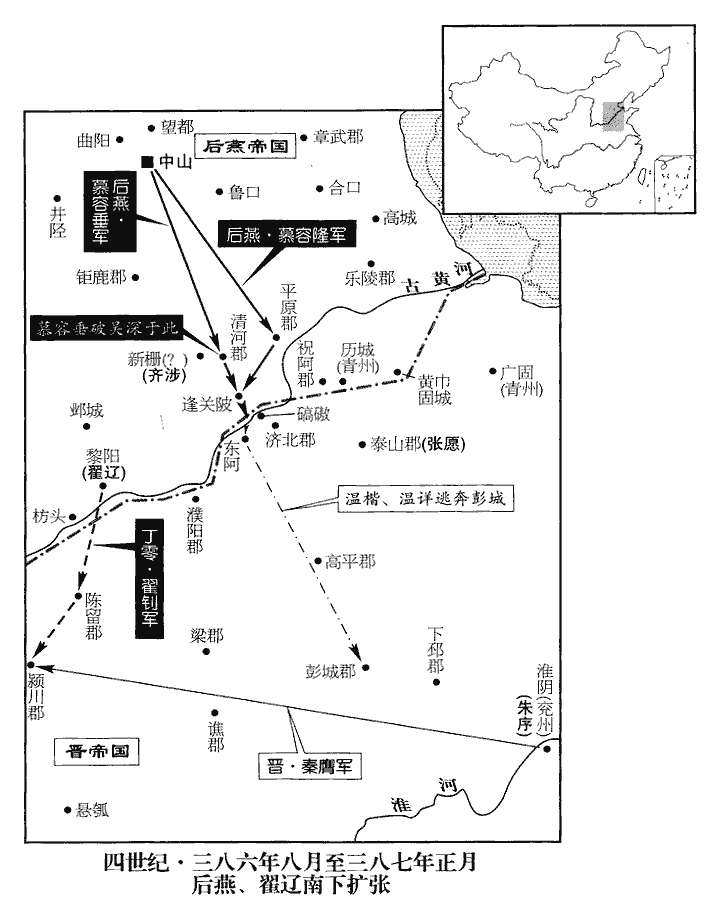
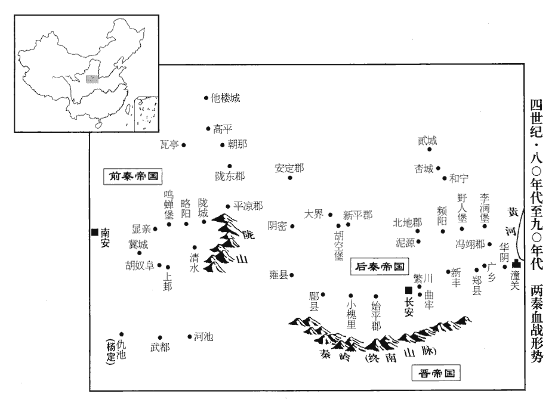
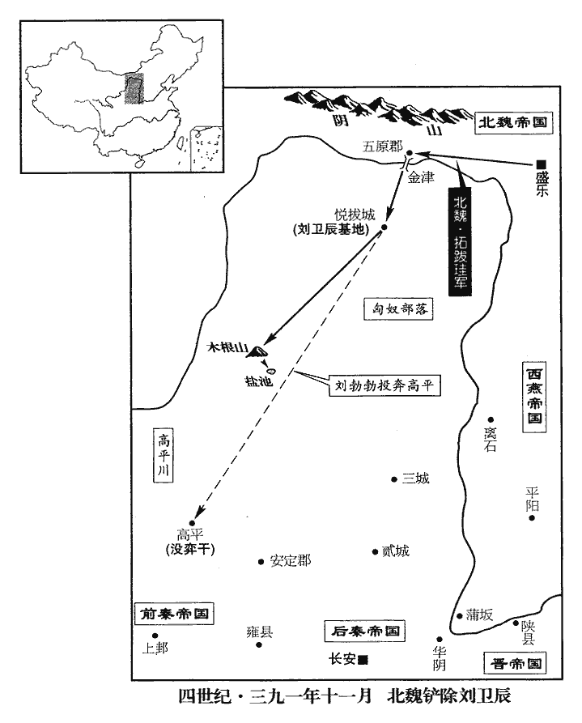

 晉紀二十九起強圉大淵獻（丁亥），盡重光單閼（辛卯），凡五年。

# 烈宗孝武皇帝中之下

## 太元十二年（丁亥、三八七）

1春，正月，乙巳‹八›，以朱序為青、兗二州刺史，代謝玄鎮彭城‹江苏徐州›；序求鎮淮陰‹江苏淮阴›，許之。序求鎮淮陰，以燕方強，必進取河南，彭城去建康道遠，聲援不接故也。以玄為會稽‹浙江绍兴›內史。優玄以內地也。會，工外翻。

〖译文〗 [1]春季，正月，乙已（初八），东晋任命朱序为青、兖二州剌史，代替谢玄镇守彭城；朱序请求改镇淮阴，得到了朝廷的允许。朝廷任命谢玄为会稽内史。

2丁未‹十›，大赦。

〖译文〗 [2]丁未（初十），宣布大赦。

3燕主垂‹慕容垂，本年六十二岁›觀兵河上，韋昭曰：觀，示也，陳兵以示威武。觀，古玩翻。高陽王隆曰：「溫詳之徒，皆白面儒生，烏合為群，徒恃長河‹黄河›以自固；若大軍濟河，必望旗震壞，不待戰也。」垂從之。戊午‹二十一›，遣鎮北將軍蘭汗、護軍將軍平幼於碻qiāo磝‹山东茌平西南›西四十里濟河，隆以大眾陳於北岸。陳，讀曰陣。溫攀、溫楷果走趣城，蓋趣東阿城‹山东阳谷东北阿城镇›也。趣，七喻翻。平幼追擊，大破之。詳夜將妻子奔彭城，其眾三萬餘戶皆降於燕。降，戶江翻。垂以太原王楷為兗州刺史，鎮東阿。

〖译文〗 [3]后燕国主慕容垂在黄河之上阅兵，高阳王慕容隆说：“温详这些人，都是白面儒生，乌合之众，只是依靠长河之险来保护自己；如果大军渡过黄河，他们一定会望旗自溃，不用一战。”慕容垂同意他的话。戊午（二十一日），慕容垂派遣镇北将军兰汗、护军将军平幼率军在以西四十里的地方渡黄河，慕容隆则把更多的军队布署在河北岸。温攀、温楷等果然向东阿城逃去。平幼跟踪追击，把这支败军打得大败。温详则趁夜携带妻子儿女逃奔彭城，他的部众三万多户都投降了后燕。慕容垂任命太原王慕容楷为兖州剌史，镇守东阿城。

初，垂在長安，秦王堅嘗與之交手語，【章：十二行本「語」下有「垂出」二字；乙十一行本同；孔本同；退齋校同。】宂rǒng從僕射光祚言於堅曰：宂，而隴翻，從，才用翻。「陛下頗疑慕容垂乎?垂非久為人下者也。」堅以告垂。及秦主丕自鄴‹河北临漳西南邺镇›奔晉陽‹山西太原›，事見上卷十年。祚與黃門侍郎封孚、鉅鹿‹河北宁晋西南›太守封勸皆來奔。祚從苻丕在鄴，見上卷九年。勸，奕之子也。封奕仕燕，燕興於昌黎，奕有力焉。垂之再圍鄴也，見一百五卷九年。秦故臣西河‹山西离石›朱肅等各以其眾來奔。‹司马昌明，本年二十六岁›詔以祚等為河北諸郡太守，皆營於濟北‹山东平阴西›、濮陽‹河南濮陽西南›，濟北、濮陽，二郡。濟，子禮翻。濮，博木翻。羈屬溫詳；師古曰：言羈縻屬之而已。詳敗，俱詣燕軍降。降，戶江翻。垂赦之，撫待如舊。垂見光祚，流涕沾衿，衿，音今。曰：「秦王待我深，吾事之亦盡；但為二公猜忌，二公，謂長樂公丕、平原公暉也。吾懼死而負之，事見一百五卷九年。每一念之，中宵不寐。」祚亦悲慟。垂賜祚金帛，祚固辭，垂曰：「卿猶復疑邪?」復，扶又翻。祚曰：「臣昔者惟知忠於所事，不意陛下至今懷之，臣敢逃其死！」垂曰：「此乃卿之忠，固吾所求也，前言戲之耳。」用孔子語。待之彌厚，以為中常侍。光祚，秦之宦者，故處以此官。

〖译文〗 当年，慕容垂在长安的时候，秦王苻坚曾经与他握手交谈，冗从仆射光祚曾对苻坚说：“陛下您很顾虑慕容垂吗？慕容垂可不是一个久居人下的人啊。”苻坚却把光祚这番话告诉了慕容垂。前秦国主苻丕从邺城逃奔晋阳后，光祚和黄门侍郎封孚、钜鹿太守封劝都来投奔东晋。封劝是封奕的儿子。慕容垂再次兵围邺城，前秦老臣西河的朱肃等人都各自率自己的部众来归顺东晋。朝廷下诏任命光祚等人为河北等几个郡的太守，都在济北、濮阳等处驻扎，羁縻从属于温详；温详失败后，他们都向后燕军投降。慕容垂赦免了他们，并像过去一样安抚厚待他们。慕容垂看见光祚也在其中，于是痛哭流涕，泪湿衣襟，说：“秦王苻坚待我恩深，我也尽自己全力为他办事；但是受到苻丕、苻晖二公的猜忌，我因为怕死才背叛了他们。现在每一想起这些，半夜也睡不着觉。”光祚也很悲恸。慕容垂赐给光祚金钱布帛，光祚坚决辞谢不收，慕容垂说：“您现在还怀疑我吗？”光祚说：“我过去只知道忠于我所侍奉的主人，想不到陛下您今天还把我这事挂在心上，我怎么能逃过死罪啊！”慕容垂说：“这是你的一片忠心，正是我所企求的，刚才那句话不过是玩笑罢了。”从此，慕容垂对待光祚更加优厚，任命他为中常侍。

 

4翟遼‹时驻黎阳河南省浚县›遣其子釗寇陳‹河南开封东›、潁‹河南许昌东›，朱序遣將軍秦膺擊走之。

〖译文〗 [4]丁零部酋长翟辽派遣他的儿子翟钊进犯东晋的属地陈留、颍川郡。朱序派将军秦膺击退翟钊。

5秦主登‹苻登，本年四十五岁›立妃毛氏為皇后，勃海王懿為太弟。后，興之女也。遣使拜東海王纂‹时驻杏城陕西省黄陵县›為使持節、都督中外諸軍事、太師、領大司馬，封魯王；使，疏吏翻。纂弟師奴為撫軍大將軍、并州牧，封朔方公。纂怒謂使者曰：「勃海王先帝之子，南安王何以不立而自立乎?」長史王旅諫曰：「南安已立，理無中改；今寇虜未滅，不可宗室之中自為仇敵也。」纂乃受命。於是盧水胡‹杏城陕西省黄陵县›一带匈奴人彭沛穀、屠各董成、張龍世、新平‹陕西彬县›羌雷惡地等皆附於纂，有眾十餘萬。以登、纂連兵，聲勢浸盛，故相與歸之。屠，直於翻。

〖译文〗 [5]前秦国主苻登册立王妃毛氏为皇后，封勃海王苻懿为皇太弟。毛皇后是毛兴的女儿。苻登派遣使节拜封东海王苻纂为使持节、都督中外诸军事、太师、兼大司马，并封为鲁王；任命苻纂的弟弟苻师奴为抚军大将军、并州牧，并封为朔方公。苻纂生气地对使节说：“勃海王苻懿是先帝苻丕的儿子，南安王苻登为什么不拥立他做皇帝，而却自己登上宝座呢？”长史王旅劝他说：“南安王既已做了皇帝，按道理便不能半途改变了；现在贼寇盗匪还没有消灭，皇族宗室之中不能自己先互相成为仇敌。”苻纂才接受了任命。从此，卢水的胡人彭沛谷，屠各人董成、张龙世，新平羌人雷恶地等便都归附于苻纂，苻纂的部众达到十余万人。

6後秦主萇‹姚苌，本年五十八岁›徙秦州豪傑三萬戶于安定‹甘肃镇原东南曙光乡›。去年萇徙安定民以實長安，今又徙秦州豪傑以實安定。蓋萇起兵以安定為根本，而欲都長安，故因道里遠近為次以漸徙之。

〖译文〗 [6]后秦国主姚苌，把秦州的强族豪门之士三万户强行送到安定居住。

7初，安次‹河北廊坊›人齊涉聚眾八千餘家據新柵，降燕，安次縣，前漢屬勃海，後漢屬廣陽國，晉屬燕國。新柵蓋在魏郡界。降，戶江翻。燕主垂拜涉魏郡太守。既而復叛，連張願，願自帥萬餘人進屯祝阿‹山东禹城›之瓮口，祝阿縣，漢屬平原郡，晉屬濟南郡。願自泰山進屯焉。劉昫曰：齊州禹城縣，漢祝阿縣，天寶元年，更名。宋白曰：祝阿，猶東阿也，古祝国黄帝之後。按古東阿，齊為東阿，漢為祝阿縣，故城在今豐齊縣東北二里；唐改禹城。復，扶又翻。帥，讀曰率。瓮，烏貢翻。招翟遼，共應涉。

〖译文〗 [7]当初，安次人齐涉聚集当地的民众八千余家，占据新栅归后燕，后燕国主慕容垂任命齐涉为魏郡太守。不久，齐涉又反叛后燕，与东晋叛将张愿联合。张愿统率一万多人进驻屯扎在祝阿的瓮口，并联络翟辽，共同呼应齐涉。

高陽王隆言於垂曰：「新柵堅固，攻之未易猝拔。易，以豉翻。若久頓兵於其城下，張願擁帥流民，西引丁零，丁零，謂翟遼。帥，讀曰率。為患方深。願眾雖多，然皆新附，未能力鬬。因其自至，宜先擊之。願父子恃其驍勇，驍，堅堯翻。必不肯避去，可一戰擒也。願破，則涉不能自存矣。」垂從之。

〖译文〗 高阳王慕容隆对慕容垂报告说：“新栅城池坚固，如果进攻，不容易马上攻破。如果长时间屯兵在那座城下，张愿裹胁率领他的流民部众，又从西方引来丁零部落的翟辽，可能会给我们造成深重的祸患。张愿的兵虽然多，但都是新近才归附的，不能替张愿奋力死战。应该趁他自己找上门来，先对他发动攻击。张愿父子依仗他们自己骁勇善战，一定不肯躲避而走，因此可以在一次战斗之中把他们擒住。张愿被击败，齐涉就不能独自存在。”慕容垂接受了他的建议。

二月，遣范陽王德、陳留王紹、龍驤將軍張崇驤，思將翻。帥步騎二萬會隆擊願。軍至斗城，去瓮口二十餘里，解鞍頓息。願引兵奄至，燕人驚遽，德兵退走，隆勒兵不動。願子龜出衝陳，陳，讀曰陣。隆遣左右王末逆擊，斬之。隆徐進戰，願兵乃退。德行里餘，復整兵，還與隆合，復，扶又翻。謂隆曰：「賊氣方銳，宜且緩之。」隆曰：「願乘人不備，宜得大捷；而吾士卒皆以懸隔河津，勢迫之故，人思自戰，言兵為河津所隔，前有強敵，退則溺死，故思之而各自為戰也。故能卻之。今賊不得利，氣竭勢衰，皆有進退之志，不能齊奮，宜亟擊之。」德曰：「吾唯卿所為耳。」遂進，戰於瓮口，大破之，斬首七千八百級；願脫身保三布口‹山东肥城东›。燕人進軍歷城‹山东济南›，歷城縣自漢以來屬濟南郡。青‹山东北部›、兗‹山东西部›、徐州‹江苏北部›郡縣壁壘多降。降，戶江翻。垂以陳留王紹為青州刺史，鎮歷城。德等還師，新柵人冬鸞執涉送之。果如慕容隆所料。唐韻：冬，姓也。垂誅涉父子，餘悉原之。

〖译文〗 二月，慕容垂派范阳王慕容德、陈留王慕容绍、龙骧将军张崇等统领步、骑兵二万人，会合慕容隆一起攻击张愿。大军抵达斗城，距瓮口二十里，下马解鞍，暂时休整。而张愿带兵突然袭击，后燕兵马惊慌失措，慕容德的部队撤退而走，慕容隆则压住阵脚不动。张愿的儿子张龟出马冲掠慕容隆的兵阵，慕容隆派身边将领王末迎上前去厮杀，杀了张龟。慕容隆慢慢挥军掩杀，张愿的军队才撤了回去。慕容德奔逃一里多远，重新整顿兵马，回来与慕容隆会合，对慕容隆说：“贼寇的气势正盛，我们应该暂时缓进。”慕容隆说：“张愿趁我们不加防备的时候，进行突然进攻，理应取得大胜；而我们的将士都因为被隔在黄河渡口的南岸，迫于形势，每个人都想到只有死战，所以才能把敌兵击退。现在敌兵没有得到便宜，士气衰竭、声势败微，进退战守都有各自的打算，因此不能齐心奋战，应该迅速去攻击他们。”慕容德说：“我完全听你的指挥。”于是开始进攻，在瓮口与敌兵会战，大破张愿的部队，杀死七千八百多人；张愿逃脱，退保三布口。后燕军队开进历城，青州、兖州、徐州等郡县与一些民堡，大多数投降。慕容垂任命陈留王慕容绍为青州刺史，镇守历城，慕容德等班师回朝。新栅人冬鸾抓住齐涉，押送到后燕。慕容垂下诏诛斩齐涉父子，其他的人都赦免。

8三月，秦主登以竇衝為南秦州牧，楊定為益州牧，楊壁為司空、梁州牧，乞伏國仁為大將軍、大單于、苑川王。杜佑曰：苑川在蘭州五泉縣，近大、小榆谷。余謂杜佑以意言之。單，音蟬。

〖译文〗 [8]三月，前秦国主苻登任命窦冲为南秦州牧，杨定为益州牧，杨壁为司空、梁州牧，封乞伏国仁为大将军、大单于、苑川王。

9燕上谷‹河北怀来›人王敏殺太守封戢；代郡‹河北蔚县›人許謙逐太守賈閏，各以郡附劉顯。為燕擊劉顯張本。

〖译文〗 [9]后燕上谷郡人王敏袭杀了太守封，代郡人许谦驱逐了太守贾闰，各自举郡城归顺匈奴部落的刘显。

10燕樂浪王溫為尚書右僕射。「燕」下當有「以」字。樂浪，音洛琅。

〖译文〗 [10]后燕乐浪王慕容温被任为尚书右仆射。

夏，四月，戊辰‹三›，尊帝母李氏‹李陵容›為皇太妃，儀服如太后。

〖译文〗 [11]夏季，四月，戊辰（初三），孝武帝司马曜尊封他的母亲李氏为皇太妃，仪礼服饰如同皇太后。

後秦征西將軍姚碩德為楊定所逼，退守涇陽‹甘肃平凉西北›。涇陽縣，前漢屬安定郡，後漢、晉省，秦屬隴東郡。杜佑曰：漢涇陽縣在今平涼郡界涇陽故城是。定與秦魯王纂共攻之，戰于涇陽，碩德大敗。後秦主萇自陰密‹甘肃灵台西南›救之，纂退屯敷陸‹陕西洛川东南›。陰密縣，屬安定郡，殷時密國也。敷陸，唐坊州鄜fū城縣，即其地。

〖译文〗 [12]后秦征西将军姚硕德由于受到前秦益州牧杨定的逼迫，撤退到泾阳据守。杨定与前秦鲁王苻纂一起攻击姚硕德，在泾阳决战，姚硕德大败。后秦国主姚苌从阴密赶来援救，苻纂退到敷陆屯守。

燕主垂自碻qiāo磝‹山东茌平西南›還中山‹河北定州›，慕容柔、慕容盛、慕容會來自長子‹山西长子›。柔等去年自長子逃歸，今始達中山。庚子‹十五›，【章：十二行本「子」作「辰」；乙十一行本同；孔本同；張校同；退齋校同。】垂為之大赦。喜子孫得全而東歸，故為之肆赦。為，于偽翻。垂問盛：「長子人情如何，為可取乎?」盛曰：「西軍擾擾，人有東歸之志，陛下唯當脩仁政以俟之耳。若大軍一臨，必投戈而來，若孝子之歸慈父也。」垂悅。癸未‹十八›，封柔為陽平王，盛為長樂公‹慕容盛，时年十五›，樂，音洛。會為清河公。

〖译文〗 [13]后燕国主慕容垂从回到中山。慕容柔、慕容盛、慕容会也从长子县赶回。庚子（疑误），慕容垂因为他们重新回到都城，下令大赦。慕容垂问慕容盛说：“长子那个地方人们的心情怎么样，可以争取吗？”慕容盛说：“西方常有军事搔扰，因此，人们都有归顺东部的意思，陛下您只应当施行仁政、耐心等待时机罢了。如果大军一旦逼临，他们一定会拿着武器前来归顺，就像孝顺的儿子归附仁慈的父亲那样。”慕容垂大喜。癸未（十八日），慕容垂封慕容柔为阳平王，慕容盛为长乐公，慕容会为清河公。

高平‹山东金乡西北昌邑镇›人翟暢執太守徐含遠，以郡降翟遼。降，戶江翻。燕主垂謂諸將曰：「遼以一城之眾，反覆三國之間，三國，謂晉及燕、西燕不可不討。」五月，以章武王宙監中外諸軍事，監，工銜翻。輔太子寶守中山‹河北定州›；垂自帥諸將南攻遼，帥，讀曰率；下同。以太原王楷為前鋒都督。遼眾皆燕、趙之人，聞楷至，皆曰：「太原王子，吾之父母也！」楷父恪相燕，燕、趙之人懷之，故云然。相帥歸之。遼懼，遣使請降；垂以遼為徐州牧，封河南公，前至黎陽，受降而還。降，戶江翻。

〖译文〗 [14]高平人翟畅抓住了太守徐含远，并率全郡投降了翟辽。后燕国主慕容垂对各位将领说：“翟辽只不过凭借着一个城池的部众，却在三个国家之间反复归叛，不能不去讨伐。”五月，慕容垂命令章武王慕容宙为监中外诸军事，辅佐太子慕容宝镇守都城中山；慕容垂则亲自统率各位将领向南进攻翟辽。他任命太原王慕容楷为前锋都督。翟辽的部众都是燕赵一带的人，听说慕容楷率军到了，都说：“太原王的儿子，是我们的父母！”于是都互相带领着归顺慕容楷。翟辽恐惧异常，派遣使节到后燕军中请求投降。慕容垂任命翟辽为徐州牧，并封为河南公，并往黎阳地方，办理受降后，班师回朝。

井陘‹河北井陉北›人賈鮑，井陘縣屬常山郡。陘，音刑。招引北山‹太行山六岭关、黑山关一带山区，皆在河北省平山县西境›丁零翟遙等五千餘人，夜襲中山‹后燕首都，河北定州›，陷其外郭。章武王宙以奇兵出其外，太子寶鼓譟於內，合擊，大破之，盡俘其眾，唯遙、鮑單馬走免。

〖译文〗 井陉人贾鲍，招引来北山丁零部落翟遥等五千多人，趁黑夜偷袭后燕都城中山，攻陷了中山的外城。章武王慕容宙派遣一支奇兵在外边攻击，太子慕容宝在城内擂鼓呐喊呼应，内外合击，把丁零部打得大败，全部俘虏敌军，只有翟遥、贾鲍二人单骑逃走幸免。

劉顯‹时驻马邑山西省朔州市›地廣兵強，雄於北方。會其兄弟乖爭，魏長史張衮言於魏王珪‹拓跋珪，本年十七岁›曰：「顯志在并吞，今不乘其內潰而取之，奴真、肺埿相繼來降，故云然。必為後患。然吾不能獨克，請與燕共攻之。」珪從之，復遣安同乞師於燕。去年魏遣安同乞師於燕以破窟咄，故此言復。復，扶又翻。

〖译文〗 [15]匈奴都首领刘显属地广大、兵马强壮，在北方称雄。正巧遇到兄弟之间发生权力争斗，北魏长史张兖便对魏王拓跋说：“刘显这个人的志向就是要吞并我们，现在如果不趁他们内部崩溃而消灭他们，一定会成为我们的后患。但是我们又没有能力自己战胜他们，不妨请燕国和我们一起进攻他。”拓跋听从了他的话，又派安同去后燕国请求出兵。

詔徵會稽處士戴逵，會，工外翻。處，昌呂翻。逵累辭不就；郡縣敦逼不已，逵逃匿于吳‹江苏苏州›。謝玄上疏曰：「逵自求其志，論語曰：隱居以求其志。今王命未回，將罹風霜之患。陛下既已愛而器之，亦宜使其身名並存，請絕召命。」帝許之。玄為會稽內史，故為逵上疏。逵，𨔵dùn之兄也。戴𨔵dùn見一百四卷四年。

〖译文〗 [16]孝武帝下诏征召会稽郡的隐士戴逵，戴逵几次推辞不肯接受。郡里县里的人敦促逼迫不停，戴逵无奈，只好逃到吴郡去藏了起来。谢玄上奏章说：“戴逵自己追求他那隐居的志向，现在您下的征召他的命令没有收回，将要使他承受在外流浪的风霜之苦。陛下您既然已经爱惜他又器重他，就应该使他的身体与声名一同存在，请您收回征召他的命令。”孝武帝答应了他的请求。戴逵是戴的哥哥。

秦主登以其兄同成為司徒、守尚書令，封潁川王；弟廣為中書監，封安成王；子崇為尚書左僕射，封東平王。

〖译文〗 [17]前秦国主苻登任命他的哥哥苻同成为司徒、守尚书令，封颍川王。任命他的弟弟苻广为中书监，封为安成王。任命他的儿子苻崇为尚书左仆射，封为东平王。

燕主垂自黎陽還中山。

〖译文〗 [18]后燕国主慕容垂从黎阳回到中山。

吳深殺燕清河‹山东临清›太守丁國，章武‹河北大城›人王祖殺太守白欽，勃海‹河北南皮›人張申據高城‹河北盐山›以叛；高城縣屬勃海郡。賢曰：高城故城，在今滄州鹽山縣南。燕主垂命樂浪王溫討之。

〖译文〗 [19]后燕叛将吴深杀了后燕清河太守丁国，章武人王祖杀了太守白钦，勃海人张申占据高城反叛，慕容垂命令乐浪王慕容温发兵去讨伐他们。

‹西秦，都勇士城甘肃省榆中县北›苑川王國仁帥騎三萬襲鮮卑大人密貴、裕苟、提倫三部于六泉‹宁夏固原境›。密貴為一部，裕苟為一部，提倫為一部。六泉在高平。帥，讀曰率。騎，奇寄翻。秋，七月，與沒弈干、金熙戰于渴渾川‹勇士城东北›，據載記，國仁襲三部，而沒弈干、金熙連兵襲國仁，故遇戰于渴渾川，其地當在天水勇士縣東北。沒弈干、金熙大敗，三部皆降。降，戶江翻。

〖译文〗 [20]西秦苑川王乞伏国仁统领骑兵三万人袭击鲜卑部落的首领密贵、裕苟、提伦等三部所据守的六泉。秋天，七月，乞伏国仁与前秦安定都尉没弈干、金熙，在渴浑川展开大战，没弈干、金熙大败，鲜卑三个部落也都归降了西秦。

秦主登軍于瓦亭‹宁夏西吉东南›，後秦主萇攻彭沛穀堡‹陕西黄陵西北›，拔之，穀奔杏城‹陕西黄陵›。彭沛穀，盧水胡也，立堡於貳縣。杜佑曰：杏城在坊州西。萇還陰密‹甘肃灵台西南›，以太子興鎮長安。

〖译文〗 [21]前秦国主苻登在瓦亭集结军队，后秦国主姚苌进攻卢胡人彭沛谷的堡垒，攻破后，彭沛谷逃奔杏城。姚苌则还兵阴密，派太子姚兴镇守长安。

燕趙王麟討王敏于上谷‹河北怀来›，斬之。

〖译文〗 [22]后燕赵王慕容麟发兵去上谷讨伐变民首领王敏，并杀了他。

劉衛辰獻馬於燕，劉顯掠之。燕主垂怒，遣太原王楷將兵助趙王麟擊顯，大破之。將，即亮翻。顯奔馬邑西山。魏王珪引兵會麟擊顯於彌澤，按魏書帝紀，彌澤在馬邑南。又破之。顯奔西燕，麟悉收其部眾，獲馬牛羊以千萬數。劉顯滅而拓跋氏強矣。為慕容氏計者，莫若兩利而俱存之，可以無他日亡國之禍。

〖译文〗 [23]朔方部落首领刘卫辰向后燕进献马匹，被刘显抢走。后燕国主慕容垂勃然大怒，派遣太原王慕容楷率领兵马协助赵王慕容麟进攻刘显，把刘显打得大败。刘显逃奔到马邑的西部山区。魏王拓跋又带领兵马与慕容麟一起在弥泽攻击刘显，再一次打败了他。刘显走投无路，投奔西燕。慕容麟接收了刘显残留下来的全部兵马，缴获马、牛、羊等战利品成千上万。

‹后凉，都姑臧甘肃省武威市›呂光‹本年五十一岁›將彭晃、徐炅攻張大豫于臨洮‹甘肃岷县›，破之。張大豫奔臨洮，見上卷上年。洮，土刀翻。大豫奔廣武‹甘肃永登›，王穆奔建康‹甘肃酒泉东南›。八月，廣武人執大豫送姑臧‹甘肃武威›，斬之，穆襲據酒泉‹甘肃酒泉›，自稱大將軍、涼州牧。

〖译文〗 [24]后凉吕光带领彭晃、徐炅在临洮进攻张大豫，大破张大豫军。张大豫逃奔广武，长史王穆逃奔建康。八月，广武人擒获张大豫押送到姑臧之后斩首。王穆则攻袭占据了酒泉，自称为大将军、凉州牧。

辛巳‹十八›，立皇子德宗為太子‹司马德宗，时年六岁›，大赦。

〖译文〗 [25]辛已（十八日），立皇子司马德宗为太子，宣布大赦。

燕主垂立劉顯弟可泥為烏桓王，以撫其眾，徙八千餘落于中山。

〖译文〗 [26]后燕国主慕容垂封立刘显的弟弟刘可泥为乌桓王，来安抚他残余的部众，把八千多帐落的人迁到中山。

秦馮翊太守蘭櫝帥眾二萬自頻陽‹陕西富平东北›入和寧‹陕西黄陵东南›，頻陽縣，秦厲公置，自漢以來屬馮翊。應劭曰：在頻水之陽。據載記，和寧在嶺北杏城之東南。帥，讀曰率。與魯王纂謀攻長安‹西安›。纂弟師奴勸纂稱尊號，纂不從；師奴殺纂而代之，櫝遂與師奴絕。西燕主永攻櫝，櫝【章：十二行本「櫝」下有「遣使」二字；乙十一行本同；孔本同；張校同。】請救於後秦，後秦主萇欲自救之。尚書令姚旻mín、左僕射尹緯曰：「苻登近在瓦亭，將乘虛襲吾後。」萇曰：「苻登眾盛，非旦夕可制；【嚴：「制」改「至」。】登遲重少決，必不能輕軍深入。比兩月間，比，必寐翻，及也。吾必破賊而返，登雖至，無能為也。」九月，萇軍于泥源‹陕西耀县›。漢書地理志：北地郡有泥陽縣。應劭註云：泥水出郁郅北蠻中。師奴逆戰，大敗，亡奔鮮卑。後秦盡收其眾，屠各董成等皆降。苻纂兄弟既敗，苻登之勢孤矣。屠，直於翻。

〖译文〗 [27]前秦冯翊太守兰椟率领军队二万人，从频阳到和宁驻扎，跟鲁王苻纂谋划攻取长安。苻纂的弟弟苻师奴劝苻纂登极称尊当皇帝，苻纂没有听从。苻师奴杀了苻纂，取代了他的权位，兰椟于是与苻师奴断绝了来往。西燕国主慕容永进攻兰椟，兰椟派人到后秦求救，后秦国主姚苌想要亲自带兵去救兰椟。尚书令姚、左仆射尹纬对姚苌说：“苻登大军就屯聚在离我们最近的瓦亭，势将乘虚袭击我们的背后。”姚苌说：“苻登的军队虽然强大，不是一两天内就可以到达的。苻登为人反应迟钝滞重而缺乏决断力，一定不会轻易地指挥大军迅速深入袭击我们。差不多两个月之内，我一定会打败贼兵慕容永而返回，那时虽然苻登兵到，也已没有什么可作为了。”九月，姚苌率兵来到泥源。苻师奴迎战，被打得大败，逃命到鲜卑。后秦收编了他的部众，屠各人董成等也都投降。

秦主登進據胡空堡‹陕西彬县西南›，秦屯騎校尉胡空所築堡也，在新平界。戎、夏歸之十餘萬。夏，戶雅翻。

〖译文〗 [28]前秦国主苻登进兵据守胡空堡，戎族人与汉人前来归附的有十多万人。

冬，十月，翟遼復叛燕，復，扶又翻；下同。遣兵與王祖、張申寇抄清河‹山东临清›、平原‹山东平原›。抄，楚交翻。

〖译文〗 [29]冬季，十月，翟辽又一次反叛后燕，派兵与王祖、张申的军队配合，在清河、平原一带烧杀抢劫。

後秦主萇進擊西燕王永於河西‹陕西宜川、韩城一带›，「西燕王」當作「西燕主」。此龍門至華陰，河之西也。永走。蘭櫝復列兵拒守，萇攻之；十二月，禽櫝，遂如杏城‹陕西黄陵›。

〖译文〗 [30]后秦国主姚苌率兵挺进，在河西一带袭击西燕国主慕容永的部队。慕容永撤退。兰椟又排开兵阵拒守，姚苌又来攻击他。十二月，姚苌生擒兰椟，于是进入杏城。

後秦姚方成攻秦雍州刺史徐嵩壘，拔之，執嵩而數之。雍，於用翻。數，所具翻。嵩罵曰：「汝姚萇罪當萬死，苻黃眉欲斬之，先帝止之。謂穆帝升平元年姚襄敗時也。授任內外，榮寵極矣。曾不如犬馬識所養之恩，親為大逆。謂殺秦王堅於新平佛寺也。汝羌輩豈可以人理期也，何不速殺我！」【章：十二行本「我」下有「早見先帝取姚萇於地下治之」十二字；乙十一行本同；孔本同；張校同；退齋校同。】方成怒，三斬嵩，三斬者，斬其足，斬其腰，斬其頸也。悉阬其士卒，以妻子賞軍。後秦主萇掘秦主堅尸，鞭撻無數，剝衣倮形，薦之以棘，坎土而埋之。堅葬於徐嵩、胡空二壘之間，徐嵩之壘既陷，故姚萇得掘墓鞭尸以逞其忿。倮，郎果翻。薦，藉也。

〖译文〗 [31]后秦将领姚方成进攻前秦雍州刺史徐嵩的寨垒，攻克后抓住徐嵩，历数他的罪恶。徐嵩大骂说：“你们姚苌才是罪该万死，当初苻黄眉打算杀了他，幸亏先帝苻坚阻止，救了他一命，还任命他担任朝廷和地方的重要官职，荣耀宠爱都达到极点。可是姚苌却不如犬马那般知道被主人养育的恩德，亲自做出大逆不道的事。你们这些羌人怎么可以用做人道理来要求呢？为什么不快来杀我！”姚方成恼羞成怒，分三次斩杀徐嵩，把徐嵩的士卒全部推到坑里活埋，又把这些士卒的妻子女儿赏给自己的军卒。后秦国主姚苌把他的恩主、前秦国主苻坚的尸首挖出来，用皮鞭抽打不计其数，并且剥掉了他的衣服，露出尸体，用荆棘再包起来，挖了一个坑埋了起来。

涼州‹甘肃武威›大饑，米斗值錢五百，人相食，死者太半。

〖译文〗 [32]凉州发生了严重饥荒，普通的谷米每斗竟然值五百钱。人们饥饿难忍，出现了人吃人的事。死亡的人超过总人口的一半。

呂光西平‹青海西宁›太守康寧自稱匈奴王，殺湟河‹青海化隆›太守強禧以叛。西平郡，東漢之末，分金城置，唐之鄯州，即其地也。湟河郡，河西張氏置，蓋亦在鄯州界內。強，其兩翻。張掖‹甘肃张掖›太守彭晃亦叛，東結康寧，西通王穆。光欲自擊晃，諸將皆曰：「今康寧在南，伺釁而動，伺，相吏翻。若晃、穆未誅，康寧復至，復，扶又翻。進退狼狽，勢必大危。」光曰：「實如卿言。然我今不往，是坐待其來也。若三寇連兵，三寇，謂康寧、彭晃、王穆。東西交至，則城外皆非吾有，大事去矣。今晃初叛，與寧、穆情契未密，出其倉猝，取之差易耳。」易，以豉翻。乃自帥騎三萬，帥，讀曰率。騎，奇寄翻。倍道兼行，既至，攻之二旬，拔其城，誅晃。

〖译文〗 [33]吕光的西原太守康宁，自称为匈奴王，刺杀了湟河太守强禧后叛变。张掖太守彭晃也相继反叛，向东结交康宁，向西通好王穆。吕光想亲自带兵去袭击彭晃，各位将领都说：“现在康宁在南方，等待着机会动手，如果彭晃、王穆还没有被诛，康宁又带兵杀到，我们就会进退两难，处境狼狈，局势一定会非常危险。”吕光说：“确实像你们所说的那样。但是我们现在如果不去打败他们，就是坐在这里等待他们来打我们。如果这三支匪寇联合起来，东西夹攻我们，城外就都不会属于我们所有了，大事也就无法挽救了。现在彭晃刚刚叛变，与康宁、王穆在感情联络上还不亲密，我们采取出乎他们意料的进攻，使他们处于仓猝之境，战胜他们就比较容易了。”于是他亲自率领骑兵三万人，以比平时加倍的速度急行军，到达张掖后猛烈进攻二十天左右，攻破城池，杀了彭晃。

初，王穆起兵，遣使招敦煌‹甘肃敦煌›處士郭瑀，使，疏吏翻。敦，徒門翻。處，昌呂翻。瑀歎曰：「今民將左衽，吾忍不救之邪！」乃與同郡索嘏gǔ起兵應穆，索，昔各翻。運粟三萬石以餉之。穆以瑀為太府左長史、軍師將軍，嘏為敦煌太守。既而穆聽讒言，引兵攻嘏，瑀諫不聽，出城大哭，舉手謝城曰：「吾不復見汝矣！」復，扶又翻。還而引被覆面，覆，敷又翻。不與人言，不食而卒。卒，子恤翻。呂光聞之曰：「二虜相攻，此成禽也，不可以憚屢戰之勞而失永逸之機也。一勞永逸，古語有之。遂帥步騎二萬攻酒泉，克之。進屯涼興‹甘肃安西西南万佛峡›，涼興郡，河西張氏置，在唐瓜州常樂縣界。穆引兵東還，未至，眾潰，穆單騎走，騂xīng馬‹甘肃玉门东北›令郭文斬其首送之。騂馬縣屬酒泉郡，蓋魏、晉間所置也。騂，思榮翻。呂光新得河西，黨叛於內，敵攻於外，雖數戰數勝，而根本不固，宜不足以貽yí子孫也。

〖译文〗 当初，王穆聚众起兵时，曾经派使节征召敦煌的隐士郭，郭叹息说：“现在黎民就要像戎人那样穿左边开襟的衣服了，我怎么能忍心不去拯救他们呢！”于是他与同郡人索嘏一起拉起队伍响应王穆，并给王穆运送去三万石粮食用来款待他的部队。王穆任命郭为太府左长史、军师将军，任命索嘏为敦煌太守。不久王穆便听信谗言，率领部队去进攻索嘏。郭尽力劝阻，王穆不听，郭只好辞职离城，挥泪大哭，并举起手来向城谢罪说：“我恐怕不会再看见你了！”回到家后，郭拉开被子盖住自己的脸面，不跟别人说一句话，绝食而死。吕光听到这个消息之后说：“两个匪寇自己互相攻击，这样就已成被捉之势了。我们万万不可因为害怕不断战斗的劳苦而失去一劳永逸的良机。”于是，他亲自统率步、骑兵二万人进攻酒泉，攻克后，又进军在凉兴集结。王穆见势只好带着自己的部队向东撤退，还没有跑回自己的老巢，部众便溃不成军。王穆只身单骑逃走，马县令郭文砍下他的首级送给了吕光。

## 十三年（戊子、三八八）

1春，正月，康樂獻武公謝玄卒‹年四十六›。樂，音洛。康樂縣，屬豫章郡。

〖译文〗 [1]春季，正月，东晋会稽郡太守、康乐献武公谢玄去世。

2二月，秦主登‹时年四十六›軍朝那‹宁夏彭阳西古城乡›，朝那縣自漢以來屬安定郡。後秦主萇‹姚苌，本年五十九岁›軍武都‹甘肃成县›。此武都亦當在安定界。五代志：朝那縣，西魏置安武郡。安武，漢舊縣名；武都之名當是因安武而名。

〖译文〗 [2]二月，前秦国主苻登驻军朝那，后秦国主姚苌驻军武都。

3翟遼遣司馬眭瓊詣燕謝罪；眭suī，姓也；師古息隨翻。類篇宜為翻。燕主垂‹本年六十三岁›以其數反覆，斬瓊以絕之。數，所角翻。遼乃自稱魏天王，改元建光，置百官。

〖译文〗 [3]翟辽派遣司马眭琼，前往后燕认罪。后燕国主慕容垂因为他几次反复，便斩了眭琼，拒绝他的请求。翟辽于是自称为魏天王，改年号为“建光”，设立文武百官。

4燕青州刺史陳留王紹為平原太守辟閭渾所逼，退屯黃巾固‹山东章丘›。漢末黃巾保聚於其地，因以為名。齊人謂壘堡為固。紹自歷城‹山东济南›退屯焉，其地在濟南郡章丘城北。燕主垂更以紹為徐州刺史。渾，蔚之子也，辟閭蔚見一百卷穆帝永和十二年。蔚，紆忽翻。因苻氏亂，據齊地來降。後辟閭渾為慕容德所殺。降，戶江翻。

〖译文〗 [4]后燕青州刺史陈留王慕容绍受到东晋平原太守辟闾浑的逼迫，退兵到黄巾固驻扎。后燕国主慕容垂调任慕容绍为徐州刺史。辟闾浑是辟闾蔚的儿子，因为苻氏内部混乱，趁机占据故齐国的地域投降东晋。

5三月，乙亥‹十五›，燕主垂以太子寶‹慕容宝，本年三十四岁›錄尚書事，授之以政，自總大綱而已。

〖译文〗 [5]三月，乙亥（十五日），后燕国主慕容垂命太子慕容宝任录尚书事，把政事交付给他，自己不过在总体上把握而已。

6燕趙王麟擊許謙，破之，去年許謙叛燕附劉顯。謙奔西燕。遂廢代郡‹河北蔚县›，悉徙其民於龍城‹辽宁朝阳›。

〖译文〗 [6]后燕赵王慕容麟攻击许谦，把他们打得大败，许谦逃奔西燕。后燕于是取消了代郡，把这里的居民统统迁到龙城。

7呂光‹本年五十二岁›之定涼州也，杜進功居多，光以為武威太守，事見上卷十年。貴寵用事，群僚莫及。光甥石聰自關中來，光問之曰：「中州人言我為政何如?」聰曰：「但聞有杜進耳，不聞有舅。」光由是忌進而殺之。

〖译文〗 [7]后凉吕光当初平定凉州的时候，杜进所立的功劳最多，吕光任命他为武威太守，他受蒙宠专权。其他同僚都赶不上。吕光的外甥石聪从关中地方前来，吕光问他说：“中州那里的人说我治理朝政怎么样？”石聪说：“只听说有一个杜进罢了，没听说有舅舅。”吕光因此忌恨杜进而借故把他杀了。

光與群寮宴，語及政事，參軍京兆段業曰：「明公用法太峻。」光曰：「吳起無恩而楚強，商鞅嚴刑而秦興。」業曰：「起喪其身，鞅亡其家，皆殘酷之致也。吳起事見一卷周安王十五年，商鞅事見二卷顯王三十一年。喪，息浪翻。明公方開建大業，景行堯、舜，詩曰：高山仰止，景行行止。毛萇曰：景，大也。鄭玄曰：景，明。庶幾古人，有高德者，則慕仰之，有明行者，則而行之。行，下孟翻。猶懼不濟；乃慕起、鞅之為治，治，直吏翻。豈此州士女所望哉！」光改容謝之。沮渠蒙遜兄弟舉兵，所以推段業為重，亦由此言為涼州人士所歸敬也。

〖译文〗 吕光跟一些幕僚聚餐，谈到朝政方面的事，参军京兆人段业说：“明公您施用刑法太严峻了。”吕光说：“吴起当年刻薄寡恩，但楚国因此强大，商鞅当年刑律森严，但秦国因此振兴。”段业说：”吴起自己被杀、商鞅全家遭到屠戮，都是因为他们残酷到了极点。明公您才刚刚开始创建大业，效法学习尧、舜还恐怕不能成功，竟然去仰慕吴起、商鞅那样的治理方法，这难道是本州的百姓所期望的吗！”吕光肃然变色，感谢段业的这番衷告。

8夏，四月，戊午‹二十九›，以朱序為都督司•雍•梁•秦四州諸軍事、雍州刺史，戍洛陽。雍，於用翻。以譙王恬代序為都督兗•冀•幽•并【章：十二行本「幷」下有「四州」二字；乙十一行本同；孔本同。】諸軍事、青•兗二州刺史。

〖译文〗 [8]夏季，四月，戊午（二十九日），东晋任命朱序为都督司、雍、梁、秦四州诸军事和雍州刺史，戍守洛阳。任命谯王司马恬代替朱序为都督兖、冀、幽、并等州诸军事和青、兖二州刺史。

9苑川王國仁破鮮卑越質叱黎於平襄‹甘肃通渭›，平襄縣，漢屬天水郡，晉屬略陽郡。越質蓋鮮卑部落之號，後以為氏。獲其子詰歸。

〖译文〗 [9]西秦苑川王乞伏国仁在平襄击败鲜卑越质叱黎，俘获他的儿子越质诘归。

10丁亥，燕主垂立夫人段氏‹段元妃›為皇后，以太子寶領大單于。單，音蟬。段氏，右光祿大夫儀之女；其妹適范陽王德。儀，寶之舅也。為後寶逼殺段后張本。追諡前妃段氏為成昭皇后。段氏死見一百卷穆帝升平二年。

〖译文〗 [10]丁亥（疑误），后燕国主慕荣垂册立他的夫人段氏为皇后，命太子慕容宝兼任大单于。段氏是右光禄大夫段仪的女儿；他的妹妹嫁给了范阳王慕容德。段仪是慕容宝的舅舅。慕容垂追尊以前的妃子段氏为成昭皇后。

五月，秦太弟懿卒，諡曰獻哀。

〖译文〗 [11]五月，前秦皇太弟苻弟苻懿去世，谥号为献哀。

翟遼徙屯滑臺‹河南滑县›。遼自黎陽徙屯滑臺，既與燕絕，欲阻河為固也。滑臺城在白馬縣西，春秋鄭廩延邑也，唐為滑州。

〖译文〗 [12]翟辽迁往滑台驻扎。

六月，苑川王乞伏國仁卒，諡曰宣烈，廟號烈祖。其子公府尚幼，群下推國仁弟乾歸為大都督、大將軍、大單于、河南王，時乞伏氏跨有涼州河南之地，遂為國號。為後公府殺乾歸張本。單，音蟬。大赦，改元太初。

〖译文〗 [13]六月，西秦苑川王乞伏国仁去世，谥号宣烈，庙号为烈祖。他的儿子乞伏公府还很幼小，因此，属下百官拥推乞伏国仁的弟弟乞伏乾归为大都督、大将军、大单于、河南王，并下令大赦，改年号为太初。

魏王珪‹时年十八›破庫莫奚於弱落水‹饶乐水，内蒙沙拉木伦河›南，新唐書曰：奚亦東胡種，為匈奴所破，保烏丸山；漢曹操斬蹋頓，蓋其後也。弱落水即饒樂水，在奚中。秋，七月，庫莫奚復襲魏營，復，扶又翻。珪又破之。庫莫奚者，本屬宇文部，與契丹同類而異種，其先皆為燕王皝所破，徙居松漠之間‹内蒙沙拉木伦河上游›，契丹國自西樓東去四十里，至真珠寨，又東行，地勢漸高，西望松林鬱然，數十里，遂入平川。契，欺訖翻。洪邁曰：契丹之讀如喫chī，惟新唐書有音。種，章勇翻。

〖译文〗 [14]魏王拓跋在弱落水的南岸将库莫奚打得大败。秋天，七月，库莫奚又来袭击魏营，拓跋再次打败了他。库莫奚本来属于宇文部落，跟契丹同是一个民族但不是一个支派，他们的祖先都曾被前燕王慕容打败，迁移到松漠一带居住。

秦、後秦自春相持，屢戰，互有勝負，至是各解歸。關西豪桀以後秦久無成功，多去而附秦。

〖译文〗 [15]前秦与后秦从春天开始相持不下，交战了好几次，互有胜败，这时各自罢兵返回。关西的一些英雄豪杰因为后秦兴起这么久而仍不能成功，有很多便离去而归附了前秦。

河南王乾歸立其妻邊氏為王后；置百官，倣漢制，以南川侯出連乞都為丞相，出連亦以部落之號為氏。梁州刺史悌眷為御史大夫，金城‹甘肃兰州›邊芮為左長史，東秦州刺史祕宜為右長史，乞伏氏置東秦州於南安‹甘肃陇西东南›。武始翟勍為左司馬，勍qíng，渠京翻。略陽‹甘肃天水东›王松壽為主簿，從弟軻彈為梁州牧，弟益州為秦州牧，屈眷為河州牧。乞伏乾歸所置州牧，不過分居河、隴之間。從，才用翻。

〖译文〗 [16]西秦河南王乞伏乾归册立他的妻子边氏为王后；设置文武百官，摹仿汉族的制度，任命南川侯出连乞都为丞相，梁州刺史悌眷为御史大夫，金城人边芮为左长史，东秦州刺史秘宜为右长史，武始人翟为左司马，略阳人王松寿为主簿，任命他的堂弟乞伏轲弹为梁州牧，他的弟弟乞伏益州为秦州牧，乞伏屈眷为河州牧。

八月，秦主登立子崇為皇太子，弁為南安王，尚為北海王。

〖译文〗 [17]八月，前秦国主苻登立自己的儿子苻崇为皇太子，苻弁为南安王，苻尚为北海王。

燕護軍將軍平幼會章武王宙討吳深，破之，深走保繹幕‹山东平原县西北›。繹幕縣，自漢以來屬清河郡。

〖译文〗 [18]后燕护军将军平幼会同章武王慕容宙一起讨伐并打败吴深，吴深逃到绎幕固守。

魏王珪陰有圖燕之志，遣九原公儀奉使至中山‹河北定州›，燕主垂詰之曰：使，疏吏翻。詰，去吉翻。「魏王何以不自來?」儀曰：「先王與燕並事晉室，世為兄弟，魏與燕皆鮮卑種也。拓跋力微與慕容涉歸並事晉室。臣今奉使，於理未失。」垂曰：「吾今威加四海，豈得以昔日為比！」儀曰：「燕若不脩德禮，欲以兵威自強，此乃將帥之事，將，即亮翻。帥，所類翻。非使臣所知也。」儀還，言於珪曰：「燕主‹慕容垂，本年六十三岁›衰老，太子闇àn弱，范陽王自負材氣，是時慕容德在燕宗室中固自有與人不同者。非少主臣也。少，詩照翻。燕主既沒，內難必作，難，乃旦翻。於時乃可圖也。今則未可。」珪善之。為後魏攻燕張本。儀，珪母弟【嚴：「母弟」改「從父」。】翰之子也。

〖译文〗 [19]魏王拓跋暗中有图谋后燕的野心，派遣九原公拓跋仪担任使者来到后燕都城中山。后燕国主慕容垂盘问他说：“魏王为什么不自己来？”拓跋仪说：“我们的先王与燕国的祖先曾经一起为晋朝的帝室作事，世世代代情同兄弟。我今天奉使前来，在情理上没有失误。”慕容垂说：“今天我的威望，已经传播影响到四面八方去了，怎么能够与过去相比呢！”拓跋仪说：”后燕如果不遵守道德，不循奉礼仪，而只打算依靠军事威力使自己强大，那只是将帅们的事情，不是我这个作使臣的人所知道的。”拓跋仪回国后，对拓跋说：“后燕国主慕容垂已经年老体衰，太子慕容宝又庸碌懦弱，范阳王慕容德对自己的才干气质非常自负，绝不是将来少主的臣下。慕容垂一旦死去，内部一定会发生争斗，到那个时候才可以图谋他们。现在却还不行。”拓跋对他的看法大为称赞。拓跋仪是拓跋叔父拓跋翰的儿子。

九月，河南王乾歸遷都金城‹甘肃兰州›。

〖译文〗 [20]九月，西秦河南王乞伏乾归把都城迁到金城。

張申攻廣平‹河北曲周东北›，王祖攻樂陵‹山东阳信东南›；壬午‹二十五›，燕高陽王隆將兵討之。

〖译文〗 [21]后燕张申率领部众进攻广平，王祖率兵进攻乐陵。壬午（二十五日），后燕高阳王慕容隆率兵讨伐他们。

冬，十月，後秦主萇還安定‹甘肃镇原东南曙光乡›；秦主登就食新平‹陕西彬县›，帥眾萬餘圍萇營，帥，讀曰率。四面大哭，萇命營中哭以應之，登乃退。

〖译文〗 [22]冬季，十月，后秦国主姚苌返回安定。前秦国主苻登前往新平谋取军粮，率领一万多兵众围住姚苌的军营，在四面放声大哭。姚苌也命令军营中的士卒用哭来回应他们，苻登的军队才退去。

十二月，庚子‹十五›，尚書令南康襄公謝石卒‹年六十二›。

〖译文〗 [23]十二月，庚子（十五日），东晋尚书令、南康襄公谢石去世。

燕太原王楷、趙王麟將兵會高陽王隆於合口‹河北沧州西›，水經：衡漳水過勃海建成縣，又東，左會呼沱別河故瀆。又東北入清河，謂之合口。魏收地形志曰：浮陽縣西接漳水，衡水入焉，今謂之合口。以擊張申；王祖帥諸壘共救之，帥，讀曰率。夜犯燕軍，燕人逆擊，走之。隆欲追之，楷、麟曰：「王祖老賊，或恐詐而設伏，不如俟明。」隆曰：「此白地群盜，烏合而來，徼幸一決，徼，堅堯翻。非素有約束，能壹其進退也。今失利而去，眾莫為用，乘勢追之，不過數里，可盡擒也。申之所恃，唯在於祖，祖破，則申降矣。」降，戶江翻；下同。乃留楷、麟守申壘，隆與平幼分道擊之，比明，比，必利翻，及也。大獲而還，懸所獲之首以示申。甲寅‹二十九›，申出降，祖亦歸罪。

〖译文〗 [24]后燕太原王慕容楷、赵王慕容麟，率领兵马在合口与高阳王慕容隆会合，来攻击张申。王祖率领各个堡垒的兵卒一起赶来救张申，趁夜袭击后燕军营，后燕部队迎战，王祖败走。慕容隆想要追击，慕容楷、慕容麟说：“王祖那个老贼，恐怕他假败却在外设下伏兵，不如等到明天天亮再说。”慕容隆说；“他们不过是一群穷土地上的盗匪，乌合在一起而来，只希望偶然的机会一战而胜，不是训练有素能够统一步调进退的。现在他们没有捞到好处而退走，部众已不能再接受指挥。如果现在趁势追击，不超过几里路，就可以全部抓获。张申所依仗的，也只有王祖，王祖被打败，那么张申就得投降了。”于是留下慕容楷、慕容麟困守张申的堡垒，慕容隆与平幼分两路带人追击王祖。等到天亮，他们获得大胜回来，把所砍下的王祖兵士的脑袋悬挂起来向张申等部众展示。甲寅（二十九日），张申出城投降，王祖也回来投降请罪。

秦以潁川王同成為太尉。同成，秦主登之兄。

〖译文〗 [25]前秦任命颍川王苻同成为太尉。

## 十四年（己丑、三八九）

1春，正月，燕以陽平王柔鎮襄國‹河北邢台›。

〖译文〗 [1]春季，正月，后燕命令阳平王慕容柔镇守襄国。

遼西王農在龍城‹辽宁朝阳›五年，庶務脩舉，乃上表曰：「臣頃因征即鎮，農誅餘巖，擊高句麗，因鎮龍城，見上卷十年。所統將士安逸積年，青、徐、荊、雍遺寇尚繁，雍，於用翻。願時代還，展竭微效，生無餘力，沒無遺恨，臣之志也！」庚申‹五›，燕主垂‹时年六十四›召農為侍中、司隸校尉；以高陽王隆為都督幽•平二州諸軍事、征北大將軍、幽州牧；建留臺於龍城，以隆錄留臺尚書事。又以護軍將軍平幼為征北長史，散騎常侍封孚為司馬，散，悉亶翻。騎，奇寄翻。並兼留臺尚書。隆因農舊規，脩而廣之，遼‹辽宁›、碣‹河北东北›遂安。遼、碣，謂遼水、碣石。碣，其謁翻。

〖译文〗 辽西王慕容农驻守龙城五年。庞杂的事务处理得很得法，于是上奏章说：“我当年因为征讨敌军，就顺便镇守在这里，我所统领的将帅士卒已经过了几年安定闲逸的生活，然而青州、徐州、荆州、雍州等地的遗留的匪寇还很多，我希望能够早日派人来接替我的职务，让我回去，尽量施展我微弱的能力来报效国家，使我在活着的时候不遗留未使出之力，死后也没有什么遗憾，这就是我的愿望！”庚申（初五），后燕国主慕容垂召回慕容农，任命为侍中、司隶校尉，又任命高阳王慕容隆为都督幽、平二州诸军事，征北大将军和幽州牧。在龙城建立留台，任命慕容隆为留台录尚书事。又任命护军将军平幼为征北长史，散骑常侍封孚为司马，并兼任龙城留台尚书。慕容隆遵循、保留了慕容农的旧的规章制度，加以修订扩充，于是，辽水、碣石一带更加安定。

2後秦主萇‹时年六十›以秦戰屢勝，謂得秦王堅之神助，亦於軍中立堅像而禱之曰：「臣兄襄敕臣復讎，穆帝升平元年，姚襄，為秦所殺。新平‹陕西彬县›之禍，見上卷十年。臣行襄之命，非臣罪也。苻登，陛下疏屬，猶欲復讎，況臣敢忘其兄乎！且陛下命臣以龍驤建業，見一百五卷八年。驤，思將翻。臣敢違之！今為陛下立像，為，于偽翻。陛下勿追計臣過也。」秦主登升樓，遙謂萇曰：「為臣弒君，而立像求福，庸有益乎！」因大呼曰：呼，火故翻。「弒君賊姚萇何不自出！吾與汝決之！」萇不應。久之，以戰未有利，軍中每夜數驚，數，所角翻。乃斬像首以送秦。

〖译文〗 [2]后秦国主姚苌因为前秦军队屡次获胜利，以为那是得到了前秦国主苻坚的神灵帮助的结果，因此也在军营中竖立苻坚的神像，并且向他祷告说：“我的哥哥姚襄临死时嘱咐我为他报仇，那次在新平城缢死您的祸事，就是我在执行哥哥姚襄的遗命，不是我的罪过呀。苻登，不过是陛下您的比较疏远的亲属，还想着为您复仇，何况我是弟弟，怎么敢忘掉哥哥的大仇呢？况且陛下您又命令我以龙骧将军的身分建立大业，我又怎敢违背您的教诲？今天我为陛下您立这尊神像，希望陛下不要再追究计较臣下我的过错。”前秦国主苻登爬上军营中的指挥楼，从远处告诉姚苌说：“作为臣子而杀害了自己的君主，却又立像求福，能有什么好处呢！”因此，他又大声呼喊说：“杀害了自己君主的奸贼姚苌为什么不自己出来！我和你决一死战！”姚苌不答应。可是，时间一长，因为在交战时并没有得到什么好处，而他自己在军营中每夜都要受几次惊吓，所以，姚苌才把神像的头斩了下来送给了前秦。

3秦主登以河南王乾歸為大將軍、大單于、金城王。單，音蟬。

〖译文〗 [3]前秦国主苻登任命河南王乞伏乾归为大将军、大单于，封为金城王。

4甲寅，魏王珪‹拓跋珪，本年十九岁›襲高車‹蒙古北部›，破之。

〖译文〗 [4]甲寅（疑误），魏王拓跋袭击位于北方的高车部落，大破高车军。

5二月，呂光‹本年五十三岁›自稱三河王，呂光，字世明。光時有涼州河西之地，未能兼有三河也。大赦，改元麟嘉，置百官。光妻石氏、子紹、弟德世自仇池‹甘肃西河南›來至姑臧‹甘肃武威›，長安之亂，呂光之家奔仇池依楊氏。光立石氏為妃，紹為世子。

〖译文〗 [5]二月，后凉吕光自称为三河王，实行大赦，改年号为麟嘉，设置文武百官。吕光的妻子石氏、儿子吕绍、弟弟吕德世从仇池来到姑臧。吕光册立石氏为王妃，吕绍为世子。

6癸巳‹九›，魏王珪擊吐突鄰部於女水‹内蒙武川›，女水在弱落水西，去平城三千餘里，後魏顯祖改曰武川。大破之，盡徙其部落而還。

〖译文〗 [6]癸巳（初九），魏王拓跋在女水攻击吐突邻部，把他们打得大败，又强行将这个部落全部迁走，才班师回朝。

7秦主登留輜重於大界‹陕西彬县西北›，大界，當在安定、新平之間。重，直用翻。自將輕騎萬餘攻安定‹甘肃镇原东南曙光乡›羌密造保，克之。將，即亮翻。騎，奇寄翻。「保」，當作「堡」。

〖译文〗 [7]秦国主苻登把部队的一些需要搬运的笨重物资留在大界，亲自率领一支一万多人的轻装骑兵部队进攻据守安定的羌族密造保，并攻克了他们的地域。

8夏，四月，翟遼寇滎陽‹河南滎陽›，執太守張卓。

〖译文〗 [8]夏季，四月，翟辽侵犯荥阳，抓住了荥阳太守张卓。

9燕以長樂公盛鎮薊城‹北京›，脩繕舊宮。燕主儁初自龍城徙都薊，有舊宮在焉。樂，音洛。薊，音計。

〖译文〗 [9]后燕派遣长乐公慕容盛镇守蓟城，修理整顿旧有宫殿。

五月，清河‹山东临清›民孔金斬吴深，送首中山‹河北定州›。吴深反，事始上卷十一年。

〖译文〗 五月，清河人孔金杀死了后燕的叛官吴深，并把他的首级送到了后燕的都城中山。

10金城王乾歸擊侯年部，大破之。於是秦、涼鮮卑、羌、胡多附乾歸，乾歸悉授以官爵。

〖译文〗 [10]西秦金城王乞伏乾归袭击侯年部落，并把侯年部落打得大败。从此秦州、凉州的百姓以及鲜卑人、羌人、胡人等大多数都归附了乞伏乾归，乞伏乾归对他们中的头目都加授官爵。

11後秦主萇與秦主登戰數敗，數，所角翻。乃遣中軍將軍姚崇襲大界；登邀擊之於安丘‹甘肃平凉东›，魏收地形志：安定陰盤縣有安城。又敗之。敗，補邁翻。

〖译文〗 [11]后秦国主姚苌和前秦国主苻登会战，多次失败，于是就派中军将军姚崇突袭大界。苻登在安丘把他截住厮杀，又一次把他们打败。

12燕范陽王德、趙王麟擊賀訥，追奔至勿根山‹内蒙商都南›，訥窮迫，請降，降，戶江翻。徙之上谷‹河北怀来›，質其弟染干於中山‹河北定州›。質，音致。

〖译文〗 [12]后燕范阳王慕容德、赵王慕容麟袭击贺兰部落的贺讷，将他打跑并追到勿根山。贺讷走投无路，只好请求投降，并把部众调遣到上谷，把自己的弟弟染干送到中山去当人质。

13秋，七月，以驃騎長史王忱為荊州刺史、都督荊•益•寧三州諸軍。驃，匹妙翻。騎，奇寄翻。忱chén，是壬翻。忱，國寶之弟也。

〖译文〗 [13]秋季，七月，东晋任命骠骑长史王忱为荆州刺史，都督荆、益、宁三州诸军事。王忱是王国宝的弟弟。

14秦主登攻後秦右將軍吳忠等於平涼‹甘肃华亭›，克之。八月，登據苟頭原以逼安定‹甘肃镇原东南曙光乡›。諸將勸後秦主萇決戰，萇曰：「與窮寇競勝，兵家之忌也；吾將以計取之。」乃留尚書令姚旻守安定，夜，帥騎三萬帥，讀曰率；下同。襲秦輜重于大界‹陕西彬县西北›，克之，重戰輕防，此苻登所以敗也。重，直用翻。殺毛后及南安王【章：十二行本「王」下有「弁、北海王」四字；乙十一行本擠刻字數同；孔本同；張校同。】尚，尚，秦主登之子也。擒名將數十人，驅掠男女五萬餘口而還。毛氏美而勇，善騎射。後秦兵入其營，毛氏猶彎弓跨馬，帥壯士數百人【章：十二行本「人」作「力」；乙十一行本同；孔本同；張校同。】戰，眾【章：十二行本「衆」上有「殺七百餘人」五字；乙十一行本同；孔本同；張校同；退齋校同。】寡不敵，為後秦所執。萇將納之，毛氏罵且哭曰：「姚萇，汝先已殺天子，謂殺秦王堅也。今又欲辱皇后，皇天后土，寧汝容乎！」萇殺之。諸將欲因秦軍駭亂擊之，萇曰：「登眾雖亂，怒氣猶盛，未可輕也。」遂止。兵勝者驕，兵怒者奮，以奮乘驕，則先敗而後勝者多矣。姚萇見兵勢，所以收眾而止。登收餘眾屯胡空堡‹陕西彬县西南›。萇使姚碩德鎮安定，徙安定千餘家于陰密‹甘肃灵台西南›，遣其弟征南將軍靖鎮之。

〖译文〗 [14]前秦国主苻登在平凉进攻后秦右将军吴忠等人，攻克了平凉。八月，苻登守苟头原，以此威逼安定。几位将军劝说后秦主姚苌与前秦决一死战，姚苌说：“和走投无路的强盗在战场上争胜，是用兵人的大忌。我准备用计谋战胜他。”于是留下尚书令姚镇守安定，自己在深夜率领骑兵三万人直奔大界，偷袭前秦等待搬运的粮草等笨重物资，果然攻克了大界，杀死了毛皇后以及南安王苻弁、北海王苻尚，俘获名将几十人，并且驱赶、掠走男女兵丁五万余人，凯旋而归。毛皇后貌美而勇武，善于骑马射箭，后秦的兵马冲进她的营帐的时候，毛氏还曾跨上马匹，弯弓反击，带领指挥几百个壮健的兵士死战。但是寡不敌众，被后秦俘获。姚苌有意收她为妾，毛氏边哭边骂着说：“姚苌，你先前就已经杀害了天子，今天又想来侮辱皇后，皇天后土，怎么还能容你！”姚苌杀了毛皇后。他部下众将想趁前秦军惊骇混乱之机继续攻击，姚苌说：“苻登的部众虽然一时陷于混乱，但是激愤之气还仍然很大，不可轻敌。”于是停止继续进攻。苻登也集结残兵败将，屯聚在胡空堡。姚苌派遣姚硕德镇守安定，并把安定居民一千余家迁到阴密，又派他的弟弟征南将军姚靖到阴密镇守。

15九月，庚午‹十九›，以左僕射陸納為尚書令。

〖译文〗 [15]九月，庚午（十九日），东晋擢升左仆射陆纳为尚书令。

16秦主登之東也，後秦主萇使姚碩德置秦州守宰，以從弟常戍隴城‹甘肃秦安东北›，從，才用翻。隴城縣，漢屬天水郡，晉省。此時當屬略陽郡。邢奴戍冀城‹甘肃甘谷›，姚詳戍略陽‹甘肃天水东›。楊定攻隴、冀，克之，斬常，執邢奴；詳棄略陽，奔陰密‹甘肃灵台西南›。定自稱秦州牧、隴西王；秦因其所稱而授之。

〖译文〗 [16]前秦国主苻登向东退守时，后秦国主姚苌命令姚硕德选拔任命秦州的一些守宰。姚硕德于是便派他的堂弟姚常戍守陇城，邢奴戍守冀城，姚详戍守略阳。杨定发兵攻破陇城、冀城，斩杀了姚常，擒获了邢奴，姚详则放弃略阳，逃奔阴密。于是杨定便自称为秦州牧、陇西王。前秦后来也就按照他所自称的，委任他官职。

 

17冬，十月，秦主登以竇衝為大司馬、都督隴東諸軍事、雍州牧，雍，於用翻。楊定為左丞相、都督中外諸軍事、秦•梁二州牧，【章：十二行本「牧」下有「楊壁爲都督隴右諸軍事、南秦•益二州牧」十六字；孔本同；張校同。按乙十一行本亦脫。】約共攻後秦；又約監河西諸軍事•并州刺史楊政；都督河東諸軍事•冀州刺史楊楷各帥其眾會長安。帥，讀曰率；下同。政、楷皆河東‹山西夏县›人。秦主丕既敗，政、楷收集流民數萬戶，政據河西，楷據湖‹河南灵宝西›、陝‹河南三门峡›之間，遣使請命於秦，登因而授之。大界既陷，苻登之兵勢衰矣，故約竇衝等共攻後秦。陝，式冉翻。使，疏吏翻。

〖译文〗 [17]冬季，十月，前秦国主苻登任命窦冲为大司马、都督陇东诸军事，雍州牧；杨定为左丞相、都督中外诸军事及秦、梁二州牧，约定一起进攻后秦。苻登又分别通知监河西诸军事、并州刺史杨政，都督河东诸军事、冀州刺史杨楷，各自统率他们的军队在长安会师。杨政、杨楷都是河东人，前秦国主苻丕当年失败的时候，杨政、杨楷招集收容逃亡的难民几万户，杨政占据河西，杨楷占据湖县、陕城一带地方，并派遣信使向前秦请求任命官职，苻登按照他们的功劳分别授给官职。

18燕樂浪悼王溫為冀州刺史，燕冀州刺史治信都‹河北冀县›。樂浪，音洛琅。翟遼遣丁零故堤詐降於溫帳，何承天姓苑有故姓。帳，謂帳下。【章：十二行本正作「帳下」，「帳」上有「爲溫」二字；乙十一行本擠刻均同；孔本同；張校同。】乙酉‹四›，刺溫，殺之，刺，七亦翻。并其長史司馬驅，帥守兵二百戶奔西燕‹都长子，山西长子›。燕遼西王農邀擊刺溫者於襄國‹河北邢台›，盡獲之，惟堤走免。

〖译文〗 [18]后燕乐浪悼王慕容温任冀州刺史，翟辽派遣部下丁零人故堤去慕容温帐下诈降。乙酉（初四），故堤刺杀了慕容温和他的长史司马驱，然后带着守卫部队的二百户人家逃奔西燕。后燕辽西王慕容农在襄国拦击参预刺杀司马温的人，并且全部抓获，只有故堤逃走而幸免。

19十一月，枹罕‹甘肃临夏›羌彭奚念附於乞伏乾歸，以奚念為北河州刺史。枹罕舊為河州治所。乞伏氏先於境內置河州，以屈眷為牧，故以枹罕為北河州，以奚念為刺史。枹，音膚。

〖译文〗 [19]十一月，罕部落羌人首领彭奚念归附乞伏乾归，乞伏乾归便任命彭奚念为北河州刺史。

20初，帝‹司马昌明，年二十八›既親政事，太元元年，崇德太后歸政，帝始親政事。威權己出，有人主之量。已而溺於酒色，委事於琅邪王道子；道子亦嗜酒，日夕與帝以酣歌為事。又崇尚浮屠，窮奢極費，所親暱者皆姏mán姆、僧尼。暱，尼質翻。姏mán，姑三翻，老女稱。姆，莫補翻，女師也，又音茂。左右近習，爭弄權柄，交通請託，賄賂公行，官賞濫雜，刑獄謬亂。尚書令陸納望宮闕歎曰：「好家居，纖兒欲撞壞之邪！」撞，丈降翻。纖者，小之至。言為纖兒，謂不及小兒也。左衛領營將軍會稽‹绍兴›許營以左衛將軍領營兵，是為左衛領營將軍。許營，一作「榮」。上疏曰：「今臺府局吏、直衛武官及僕隸婢兒取母之姓者，官婢私合而生子，不能審知其父，取母之姓為姓。本無鄉邑品第，皆得為郡守縣令，或帶職在內，及僧尼乳母，競進親黨，又受貨賂；輒臨官領眾，政教不均，暴濫無罪，禁令不明，劫盜公行。昔年下書敕群下盡規，而眾議兼集，無所採用。臣聞佛者，清遠玄虛之神，今僧尼往往依傍法服，傍，步浪翻。謂依傍佛法，服僧尼之服而不遵其教也。五誡粗法尚不能遵，況精妙乎！佛有五戒，不淫，不盜，不殺，不妄語，不遭酒敗。而流惑之徒，競加敬事，又侵漁百姓，取財為惠，亦未合布施之道也。」施，式吏翻。疏奏，不省。省，悉景翻。

〖译文〗 [20]当初，孝武帝亲自处理国家的政事后，权力与威望出自己手，很有君主的气度。但不久便沉溺于美酒和女色之中，把朝廷的政事统统推给琅邪王司马道子代管。但司马道子也是嗜好喝酒，从早到晚都和孝武帝一起把高歌狂饮当成主要事情。孝武帝又迷信佛教，极端奢侈挥霍，浪费在这方面的钱财很多。他所亲近的人又都是三姑六婆、和尚尼姑，所以他左右的侍从人员，便乘机争权夺利，互相勾结，公开进行贿赂，封官加赏又杂又滥，刑罚惩诫混乱冤错。尚书令陆纳遥望着皇宫叹息着说道：“这么好的一个家，小孩子要把它折腾坏呀！”左卫领营将军会稽人许营呈上一道奏章说：“现在朝廷小吏、军中武官，下至男仆女奴那些不知生父只取母姓的人，本来没有经过官府的考察举荐，却都能当上郡守县令，甚至进入朝中当官，至于那些和尚、尼姑、乳娘等人，更是争先恐后地引进他们的亲朋好友，接受财物贿赂。以至于任用官吏、管辖百姓、政治与教化都没有标准，对无罪之人滥施暴行，当禁当行的法令不明确公布，抢劫、偷盗却公然横行。过去，陛下也曾下令命臣属们知无不言，尽可以规劝讽谏，但是等大家把建议提出来集中到一起呈给陛下时，却没有一个建议被采用。我听说佛是一个清淡、玄妙虚旷的神祗，但是现在的这些和尚尼姑往往虽穿着僧服，却连佛义中最粗浅的教义不淫、不盗、不杀、不说谎、不酗酒这五戒也还不能遵守，更何况精妙的佛法了！而那些受流行的歪风迷惑的人，更是一方面纷纷争相拜佛，一方面又欺凌搜刮黎民百姓，以掠夺来的财产作为实惠，这也不符合佛家`布施'的道理。”奏章呈上之后，没有回音。

道子勢傾內外，遠近奔湊；帝漸不平，然猶外加優崇。侍中王國寶以讒佞有寵於道子，扇動朝眾，朝，直遙翻。諷八座啟道子宜進位丞相、楊州牧，假黃鉞，加殊禮。晉氏渡江，有吏部、祠部、五兵、左民、度支五尚書，二僕射，一令，為八坐。護軍將軍南平‹湖北公安›車胤曰：沈約曰：秦時有護軍都尉。漢陳平為護軍中尉，盡護諸將。李廣為驍騎將軍，屬護軍將軍。蓋護軍，護諸將軍。魏武以韓浩為護軍。資重為護軍將軍，資輕為中護軍。車，尺遮翻。「此乃成王‹姬诵›所以尊周公‹姬旦›也。今主上當陽，人主南面鄉明而立以治天下，故曰當陽。非成王之比；相王在位，豈得為周公乎！」乃稱疾不署。不署名也。疏奏，帝大怒，而嘉胤有守。

〖译文〗 司马道子的权势在朝廷内外都达到极点，远近官员也都前来投靠。孝武帝的心里渐渐有些不高兴，但在表面上对司马道子还是多加优待尊崇。侍中王国宝奸佞而善于谄媚，得到了司马道子的宠爱。他在背地里鼓动朝中众臣，暗示八座重要大臣联名上奏章给孝武帝，请求擢升司马道子为丞相兼任扬州牧，赐给他皇帝诛杀时专用的铜斧，并加以特别尊崇的礼节等。护军将军、南平人车胤说：“这是周成王姬诵尊敬他叔父周公姬旦的办法。而现在主上在位，不能和成王相比，相王处在这地位怎么能成为周公呢！”于是托辞有病，没在奏章上签名。这个奏章呈上后，孝武帝勃然大怒，而夸奖车胤有自己的节操。

中書侍郎范寧、徐邈為帝所親信，數進忠言，數，所角翻。補正闕失，指斥姦黨。王國寶，寧之甥也，寧尤疾其阿諛，勸帝黜之。陳郡‹河南淮阳›袁悅之有寵於道子，國寶使悅之因尼【章：十二行本「尼」下有「支」字；乙十一行本同；孔本同；張校同。】妙音致書於太子母陳淑媛‹陳归女›云：「國寶忠謹，宜見親信。」帝知之，發怒，以他事斬悅之。國寶大懼，與道子共譖范寧，出為豫章‹江西南昌›太守。寧臨發，上疏言：「今邊烽不舉而倉庫空匱；古者使民，歲不過三日，記王制：古者用民之力，歲不過三日，任老者之事，食壯者之食。今之勞擾，殆無三日之休，至有生兒不復舉養，復，扶又翻。鰥寡不敢嫁娶。【章：十二行本「娶」下有「臣恐社稷之憂」六字；乙十一行本同；孔本同；張校同；退齋校同。】厝cuò火積薪，不足喻也。」厝火積薪，賈誼之言。寧又上言：「中原士民流寓江左，歲月漸久，人安其業。凡天下之人，原其先祖，皆隨世遷移，何至於今而獨不可。謂宜正其封疆，戶口皆以土斷。晉時中原士民南渡者，皆於江左僑立郡縣以居之，不以土著為斷。斷，丁亂翻。又，人性無涯，奢儉由勢；今并兼之室，亦多不贍，非其財力不足，蓋由用之無節，爭以靡麗相高，無有限極故也。禮十九為長殤，以其未成人也。未成人而死曰殤，其喪禮殺於成人。長，知兩翻。今以十六為全丁，十三為半丁。所任非復童幼之事，任，音壬。豈不傷天理、困百姓乎！謂宜以二十為全丁，十六為半丁，則人無夭折，生長繁滋矣。」夭，於兆翻。長，知兩翻。帝多納用之。

〖译文〗 中书侍郎范宁、徐邈深受孝武帝信任亲近。他们几次进献忠言，弥补修正朝中错误遗漏的地方，当面指责痛斥奸邪之辈。王国宝是范宁的外甥，范宁尤其痛恨他阿谀谄媚的行径，劝说孝武帝罢免革除王国宝的官职。陈郡人袁悦之也受司马道子的宠爱，王国宝让袁悦之请尼姑妙音写信给太子司马德宗的母亲陈淑媛，说：“王国宝忠实而又谨慎，可以亲近信任。”孝武帝知道这件事后，大发雷霆，借口别的事杀了袁悦之。王国宝异常恐惧，和马司道子一起诬陷范宁，并把他逐出朝廷，贬为豫章太守。范宁临走的时候，呈上一道奏章说：“现在边疆并没有点起战争的烽火，但是国家的府库也还是空乏。古代的统治者征召民工应差，一年内不超过三天。现在百姓所遭受的辛劳搔扰，一年内几乎没有三天休息，致使百姓中竟有生下男孩不敢抚养哺育，独身的男子和寡妇也不敢再迎娶出嫁的现象。这是用柴堆之下点火也不足以形容的危机呀！”范宁又上奏章说：“北方中原一带的民众士子当初逃难，流亡江南并在这里居住下来，时间已经比较久了，他们也都渐渐地安居乐业。凡是在天底下生活的人，追溯他们的祖先，都能随着世情的变化而迁徙移动，为什么单单到了今天，反而不允许呢？我认为应该确定他们拥有的土地，确认户籍乡里也都按照他们现在居住的地域断定办理。另外，人的性情也是没有一定限度的，无论豪奢还是节俭，都是由于环境和形势决定的。现在，那些曾经兼并过别人财产的豪门大族，也已大多数不能维持，这并不是因为他们财力不足，主要是因为他们花销没有节制，争着以奢靡豪华来比试高下，根本没有限度的缘故。古代的礼法规定，十九岁的时候死了，称做长殇，因为他还没有成年。现在把十六岁的孩子就作为全丁，十三岁的孩子就作为半丁，他们所承担的事不再是孩童的事，这岂不是伤天害理，虐待人民吗？我认为应该规定二十岁的人当全丁，十六岁的人当半丁，那样的话就不会再有人因此而夭折，人口才能正常生长繁衍。”他的这些建议，孝武帝有很多都采纳施用了。

寧在豫章‹江西南昌›，遣十五議曹下屬城，豫章領南昌‹江西南昌›、海昏‹江西新建东北›、新淦‹江西樟树›、建成‹江西高安›、望蔡‹江西上高›、永脩‹江西永修›、建昌‹江西宜丰东北›、吳平‹江西樟树西南›、豫宁‹江西武宁›、彭澤‹江西湖口东›、艾‹江西修水›、康樂‹江西万载›、豐城‹江西丰城›、新昌‹江西奉新›、宜豐‹江西宜丰›、鍾陵‹江西进贤›十六縣。一縣負郭，餘十五縣各遣一議曹。下，遐稼翻。採求風政；并吏假還，訊問官長得失。假，居訝翻。假還，謂吏休假日滿而還府者。徐邈與寧書曰：「足下聽斷明允，庶事無滯，則吏慎其負負，謂罪也。吏畏罪，則每事加謹。斷，丁亂翻。而人聽不惑矣，人聽，即民聽。晉書史臣避唐太宗諱，改「民」為「人」，通鑑因之。豈須邑至里詣，飾其游聲哉！非徒不足致益，寔乃蠶漁之所資；蠶漁，謂所遣者蠶食漁取於民。鄭玄曰：趙、魏之東，寔、實同聲。寔，是也。詩：「實墉實壑，實畝實籍。」「實」當作「寔」。言韓侯之先祖微弱，所受之國多滅絕。今復舊職，繼絕世，故築治是城，修是壑井，牧是田畝，收斂是賦稅，使如故常。孔穎達曰：凡言實者，已有其事而後實之。今此方說所為不宜為實，故轉為寔，訓之為是也。趙、魏之東，寔、實同聲，鄭以時事驗之也。春秋桓六年，「州公寔來。」是由聲同，故字有變異也。余按徐邈所謂寔訓之為是，於義亦通。豈有善人君子而干非其事，多所告白者乎！自古以來，欲為左右耳目，無非小人，皆先因小忠而成其大不忠，先藉小信而成其大不信，遂使讒諂並進，善惡倒置，可不戒哉！足下慎選綱紀，郡以僚佐為綱紀。必得國士以攝諸曹，諸曹皆得良吏以掌文按，攝，總也，整也。按，據也。文按，謂諸曹文書留為按據者。又擇公方之人以為監司，監，工銜翻。則清濁能否，與事而明；足下但平心處之，處，昌呂翻。何取於耳目哉！昔明德馬后未嘗顧左右與言，漢明帝后馬氏諡明德皇后。可謂遠識，況大丈夫而不能免此乎！」

〖译文〗 范宁在豫章任上，派遣十五名官吏分别下到十五个属城去，探采访求当地的风俗习惯及治理情况。遇到官吏回来休假时，他就仔细问询民间对官长的评价与反应。徐邈给范宁写信说：“你审理官司，明正公允，日常的很多杂事小事也不积压，这样，官员自然对他职权份内应负责任的事更加谨慎，而人们的心里也就不再觉得迷惑不解了，何必还要到乡里村落听取伪饰的虚名呢？那样做，不仅无助于获得好处，实际上是为掠夺百姓提供了可乘之机。哪有正人君子对于不是他的事，而愿意说长道短的？自古以来，愿意当别人左右耳目的人，没有不是小人的，都是先依靠小小的忠心而逐渐获得方便时机，酿成他的大不忠，先是凭借小小的信义蒙骗别人，最后才得以干出大不信的丑事的。于是就使谗害别人和谄媚别人的人并进，也使善恶混淆，岂可不加以特别警惕！你能谨慎地选择任用部属下官，一定能够找到经国济世的栋梁之才来领导各个部门，各部门都能有优秀的官吏来掌管主持事务，再遴选公允方正廉明的人来担任监督，那么，这个机构的清廉污浊、有才能与否，在办事过程中便可了解清楚。你只平心静气地泰然自若处理事务，何必要借耳目而来访查呢！从前，汉代明德皇后马氏从来没有跟左右侍从的人员谈论公事，可以说是有远见卓识，何况身为大丈夫反而不能避免这样呢？”

21十二月，後秦主萇使其東門將軍任瓫pén東門將軍，萇使守安定東門者也。任，音壬。瓫，與盆同，音蒲奔翻。詐遣使招秦主登，許開門納之。使，疏吏翻。登將從之，征東將軍雷惡地將兵在外，將，即亮翻。聞之，馳騎見登，騎，奇寄翻。曰：「姚萇多詐，不可信也！」登乃止。萇聞惡地詣登，謂諸將曰：「此羌見登，事不成矣！」登以惡地勇略過人，陰憚之。惡地懼，降於後秦，降，戶江翻。萇以惡地為鎮軍將軍。

〖译文〗 [21]十二月，后秦国主姚苌命令他的东门将军任诈降前秦国主苻登，并派信使给苻登送信，答应打开城门把苻登放进来。苻登打算接受。征东将军雷恶地带领部队在外驻防，听说了这个消息，骑着马飞快地跑来晋见苻登说：“姚苌诡计多端，绝不可以相信。”苻登才停了下来。姚苌听说雷恶地返营拜见苻登，就对各位将领说：“这个羌人见了苻登，我的计划就不能成功了。”苻登因为雷恶地勇猛和韬略都超过常人，因此心中暗暗忌惮。雷恶地为此很恐惧，就投降了后秦，姚苌任命他为镇军将军。

22秦以安成王廣為司徒。

〖译文〗 [22]前秦任命安成王苻广为司徒。

## 十五年（庚寅、三九零）

1春，正月，乙亥‹二十六›，譙敬王恬薨。

〖译文〗 [1]春季，正月，乙亥（二十六日），东晋青州、兖州刺史谯敬王司马恬去世。

2西燕主永引兵向洛陽‹河南洛阳东白马寺东›，朱序自河陰‹河南孟津东›北濟河，擊敗之。【章：十二行本「之」下有「永走還上黨」五字；乙十一行本同；孔本同；張校同。】敗，補邁翻。序追至白水，水經註：白水出上黨高都縣故城西，東流歷天井關。序所至處，去長子一百六十里。會翟遼謀向洛陽，序乃引兵還，擊走之；留鷹揚將軍朱黨戍石門‹河南荥阳北›，使其子略督護洛陽，以參軍趙蕃佐之，身還襄陽‹湖北襄樊›。

〖译文〗 [2]西燕国主慕容永率领部队直奔洛阳，东晋雍州刺史朱序从河阴向北渡过黄河迎战，并把他们打败。朱序追击败退的西燕残兵到达白水，正好翟辽此时正打算进攻洛阳，所以朱序才带着部队赶回，打跑了翟辽。朱序留下鹰扬将军朱党守卫石门，又派他的儿子朱略镇守洛阳，并让参军赵蕃辅佐帮助他，自己回到襄阳。

3琅琊王道子恃寵驕恣、侍宴酣醉，或虧禮敬。帝‹司马昌明，本年二十九岁›益不能平。欲選時望為藩鎮以潛制道子，問於太子左衛率王雅曰：「吾欲用王恭、殷仲堪何如?」雅曰：「王恭風神簡貴，志氣方嚴；仲堪謹於細行，行，下孟翻。以文義著稱。然皆峻狹自是，且幹略不長；若委以方面，天下無事，足以守職，若其有事，必為亂階矣！」帝不從。為後王、殷稱兵張本。恭，蘊之子；王蘊，后父也。仲堪，融之孫也。殷融見九十六卷成帝咸康五年。二月，辛巳‹二›，以中書令王恭為都督青•兗•幽•并•冀五州諸軍事、兗•青二州刺史，鎮京口‹江苏镇江›。

〖译文〗 [3]琅邪王司马道子依仗自己得到孝武帝的宠爱而骄横强蛮，过于放纵自己，每次陪同孝武帝宴饮，都喝得酩酊大醉，有时竟然有失对孝武帝的礼节与尊敬。孝武帝越发不满，因此打算遴选几位在当时有名望的人充任地方上的权要，暗地里节制司马道子，于是，他向太子左卫率王雅问道：“我想重用王恭、殷促堪，你看怎么样？”王雅说：“王恭风度神韵优雅高贵，志向气质端方严肃；殷仲堪则小心谨慎、行为检点，他的文章道义被人广泛称道。然而他们都心胸狭窄，自以为是，而且缺乏干才谋略。如果让他们独当一面，天下太平没变乱时，尽可以忠于职守，但如果一旦有事，就一定会成为祸乱的根源！”孝武帝没有信从他的话。王恭是王蕴的儿子。殷仲堪是殷融的孙子。二月，辛巳（初二），孝武帝任命中书令王恭为都督青、兖、幽、并、冀五州诸军事，兖、青二州刺史，镇守京口。

4三月，戊辰‹二十›，大赦。

〖译文〗 [4]三月，戊辰（二十日），东晋宣布大赦。

5後秦主萇‹姚苌，本年六十一岁›攻秦扶风太守齊益男於新羅堡，克之，益男走。秦主登‹苻登，本年四十八岁›攻後秦天水太守張業生于隴東‹甘肃平凉西北›，隴東，安定涇陽縣之地。萇救之，登引去。

〖译文〗 [5]后秦国主姚苌在新罗堡进攻前秦扶风太守齐益男，攻克之后，齐益男逃走。而前秦国主苻登又在陇东进攻后秦天水太守张业生，姚苌赶去解救他，苻登率兵退去。

6夏，四月，秦鎮東將軍魏揭飛自稱衝天王，晉書載記作「魏褐飛」。太元元年，秦遣庭中將軍魏曷飛擊氐、羌，意即此人也。帥氐、胡攻後秦安北將軍姚當成於杏城‹陕西黄陵›；帥，讀曰率。鎮軍將軍雷惡地叛應之，攻鎮東將軍姚漢得於李潤‹陕西大荔北›。李潤，地名，在邢望南。李延壽曰：馮翊東有李潤鎮。按魏書宗室列傳，安定王燮除華州刺史表曰：「謹惟州居李潤堡，雖是少梁舊地，晉、芮錫壤，然胡夷內附，遂為戎落，請徙馮翊古城。」後秦主萇欲自擊之，群臣皆曰：「陛下不憂六十里苻登，時登趣長安，據新豐‹陕西临潼›之千戶固。乃憂六百里魏揭飛，何也?」萇曰：「登非可猝滅，吾城亦非登所能猝拔。惡地智略非常，若南引揭飛，東結董成，董成，屠各種也，時據北地‹陕西耀县›。得杏城‹陕西黄陵›、李潤‹陕西大荔北›而據之，長安東北非吾有也。」乃潛引精兵一千六百赴之。揭飛、惡地有眾數萬，氐、胡赴之者前後不絕。萇每見一軍至，輒喜。群臣怪而問之，萇曰：「揭飛等扇誘同惡，種類甚繁，種，章勇翻。吾雖克其魁帥，帥，所類翻。餘黨未易猝平；易，以豉翻。今烏集而至，吾乘勝取之，可一舉無餘也。」此曹操取馬超、韓遂故智耳。揭飛等見後秦兵少，少，詩沼翻。悉眾攻之；萇固壘不戰，示之以弱，潛遣其子中軍將軍崇帥騎數百出其後。揭飛兵擾亂，萇遣鎮遠將軍王超等縱兵擊之，斬揭飛及其將士萬餘級。惡地請降，降，戶江翻。萇待之如初，惡地謂人曰：「吾自謂智勇傑出一時，而每遇姚翁輒困，固其分也！」分，扶問翻。史言姚萇能服雷惡地之心。

〖译文〗 [6]夏季，四月，前秦镇东将军魏揭飞自称为冲天王，率领着氐人、胡人组成的部队，在杏城向后秦安北将军姚当成发起攻击。镇军将军雷恶地此时也叛变后秦响应魏揭飞，在李润镇袭击后秦镇东将军姚汉得。后秦国主姚苌打算自己亲自率军攻击魏揭飞，众大臣说：“陛下不担心近在六十里的强敌苻登，却在忧虑远在六百里以外的魏揭飞，这是为什么？”姚苌说：“苻登不是马上就可消灭的，我的城池也不是苻登马上可以攻破的。但是雷恶地智谋韬略非常人可比，如果他向南结交魏揭飞，向东结交董成，而且占领杏城、李润，并据守不去，那么，长安东北的一带就不是我们的了。”于是，姚苌秘密率领一支一千六百人的精锐部队奔赴那里。魏揭飞、雷恶地拥有部众几万人，而且氐人、胡人前往投军的络绎不绝。姚苌每次看到一支军队前来，总是十分高兴。他手下的大臣都觉得奇怪，问他为什么高兴，姚苌说：“魏揭飞等人煽动诱惑那些一样险恶的贼人共同作恶，但他们的种族和部落却繁多纷乱，我虽然能够制服他们的首领主帅，但是他们的余党却不容易一下子铲除。现在他们像乌鸦一样聚合到这里，我乘胜而来消灭他们，可以一网打尽没有遗漏。”魏揭飞等人发现后秦军的人数很少，便全军出动攻击他们。姚苌则固守自己的堡垒，不与对方接战，把自己的力量微弱的假象有意暴露给敌方，又暗地里派自己的儿子中军将军姚崇率领骑兵几百名迂回到敌兵的背后，进行偷袭。魏揭飞的部队霎时乱作一团。姚苌趁机派镇远将军王超等人发动所有的兵力进行攻击，斩杀魏揭飞以及他所属的将士一万多人。雷恶地请求投降，姚苌对待他像当初一样。雷恶地对人说：“我自己以为我的智谋勇力在目前是高出常人的，但是每次遇到姚翁就难以施展，这一定是我的命运！”

萇命姚當成於所營之地，每柵孔中輒樹一木以旌戰功。掘地作孔，豎木以為柵，故有柵孔。歲餘，問之，當成曰：「營地太小，已廣之矣。」萇曰：「吾自結髮以來，與人戰，未嘗如此之快，以千餘兵破三萬之眾，營地惟小為奇，豈以大為貴哉！」

〖译文〗 姚苌命令姚当成在他的营地的每个栅栏小孔中都立一个木牌，用来表彰战功。一年多后，姚苌问这事怎么样了，姚当成说：“因为表功的木牌太多，因此显得营地就太小了，我已经把营地扩大了。”姚苌说：“我从成人以来，跟别人作战，从来没有像现在这么痛快，用一千多名兵卒击破三万多人的敌军，这真是军营只因为其小才是奇迹，怎么能够以军营大为可贵呢？”

7吐谷渾‹青海›視連遣使獻見於金城王乾歸，乾歸拜視連沙州牧、白蘭王。河西張茂以敦煌、晉昌、西域都護、校尉、玉門大護軍三郡三營為沙州；吐谷渾未能有其地也。李延壽曰：此以吐谷渾部內有黃沙，周迴數百里，不生草木，因號沙州。使，疏吏翻。見，賢遍翻。

〖译文〗 [7]吐谷浑汗国可汗慕容视连派遣使节晋见西秦金城王乞伏乾归。乞伏乾归任命慕容视连为沙州牧，封白兰王。

8丙寅，魏王珪‹拓跋珪，本年二十岁›會燕趙王麟於意辛山‹内蒙四子王旗西北›，意辛山在牛川北，賀蘭部所居也。據北史，踰陰山而北，即賀蘭部。擊賀蘭、紇突鄰、紇奚三部，破之，紇突鄰、紇奚皆降於魏。史言燕為魏驅除。降，戶江翻。

〖译文〗 [8]丙寅（疑误），魏王拓跋与后燕赵王慕容麟在意辛山会合，共同进攻贺兰、纥突邻、纥奚三个部落，把他们全部打得大败。纥突邻、纥奚两个部落都向拓跋投降。

9秋，七月，馮翊‹陕西大荔›人郭質起兵於廣鄉‹陕西华县境›以應秦，魏收地形志，鄭縣有廣鄉原。鄭縣時屬京兆。移檄三輔‹关中，陕西中部›曰：「姚萇凶虐，毒被神人。被，皮義翻。吾屬世蒙先帝堯、舜之仁，先帝，謂秦主堅。非常伯、納言之子，常伯，侍中也。納言，尚書也。即卿校、牧守之孫也。校，戶教翻。與其含恥而存，孰若蹈道而死。」於是三輔壁壘皆應之；獨鄭縣‹陕西华县›人苟曜【章：十二行本「曜」下有「不從」二字；乙十一行本同；孔本同。】聚眾數千附於後秦。秦以質為馮翊太守。後秦以曜為豫州刺史。苟曜後持兩端，為後秦所殺，事見後。

〖译文〗 [9]秋季，七月，冯翊人郭质在广乡聚众起兵，来响应投靠前秦，并向三辅的百姓发布檄文说：“姚苌这个家伙凶恶残暴，他的祸害遍及天神和民众。我们世世代代蒙受先帝苻坚像尧和舜那样的恩德仁政，即使不是侍中、尚书一类官的儿子，那么也应该是卿、校、牧、守之类的地方官员的孙子了。与其忍受屈辱活着，不如为追求正义而死。”于是，三辅一带所有的民堡都起兵响应他的号召，惟独郑县人苟曜召集部众数千人去归附了后秦。前秦任命郭质为冯翊太守。后秦则任命苟曜为豫州刺史。

10‹匈奴首府悦拔城内蒙古伊金霍洛旗西北›劉衛辰遣子直力鞮攻賀蘭部，賀訥困急，請降於魏。丙子‹三十›，魏王珪引兵救之，直力鞮退。鞮dī，田黎翻。珪徙訥部落。處之東境。處，昌呂翻。

〖译文〗 [10]受后秦、西燕封爵的匈奴部落首领刘卫辰，派遣自己的儿子刘直力进攻贺兰部落。贺兰部落首领贺讷处境窘急，请求向魏投降。丙子（三十日），魏王拓跋亲自率兵前去解救他，打退了刘直力。拓跋于是迁移贺讷的部洛，把它安排在东部边境一带。

11八月，劉牢之擊翟釗於鄄城‹山东鄄城北›，釗走河北；又敗翟遼於滑臺，張願來降。翟遼、張願叛，見上卷十一年。走，音奏。敗，補邁翻。鄄，音絹。

〖译文〗 [11]八月，东晋刘牢之在鄄城袭击翟钊的部队，翟钊逃到了黄河以北。刘牢之又在滑台击败了翟辽军。叛将张愿重新回来投降。

12九月，北平‹河北遵化›人吳柱聚眾千餘，立沙門法長為天子，破北平郡，轉寇廣都‹辽宁建昌›，入白狼城‹辽宁喀喇沁左翼西南白狼山下›。白狼縣，前漢屬右北平郡，後漢、晉省。魏收地形志：後魏真君八年，置建德郡，治白狼城，廣都縣屬焉。燕時當屬北平郡。燕幽州牧高陽王隆方葬其夫人，郡縣守宰皆會之，眾聞柱反，請隆還城，遣大兵討之。隆曰：「今閭閻安業，民不思亂，柱等以詐謀惑愚夫，誘脅相聚，無能為也。」誘，音酉。遂留葬訖，遣廣平太守、廣都令先歸，「廣平」，當作「北平」。續遣安昌侯進將百餘騎趨白狼城，趨，七喻翻。柱眾聞之，皆潰，窮捕，斬之。

〖译文〗 [12]九月，北平人吴柱聚集一千多人的部队，拥立一名叫法长的佛门和尚为天子，攻破了北平郡，转而进攻广都，突进了白狼城。后燕幽州牧高阳王慕容隆此时正在安葬他的妻子，各郡县的官员都聚集在这里参加葬礼，大家一听说吴柱武装叛乱，纷纷请求慕容隆回城，派遣大部队前去讨伐吴柱。慕容隆说：“现在，老百姓都安居乐业，并不希望发生战乱，吴柱等人用谎言和诈骗来迷惑愚昧的民众，在诱骗和裹胁之下，他们才能暂时聚在一起，根本没有什么作为。”于是仍然留下来安葬完妻子，派遣广平太守、广都令先行返回，接着又派安昌侯慕容进带领一百余名骑兵奔袭白狼城。吴柱的部众听说慕容隆派兵前来，霎时溃散。慕容进严密搜捕吴柱，把他抓到后便斩了。

13以侍中王國寶為中書令，俄兼中領軍。道子主之也。

〖译文〗 [13]东晋任命侍中王国宝为中书令，不久，又兼任中领军。

14丁未‹一›，以吳郡‹苏州›太守王珣xún為尚書右僕射。

〖译文〗 [14]丁未（初一），东晋又调任吴郡太守王为尚书右仆射。

15吐谷渾視連卒，子視羆pí立。視羆以其父祖慈仁，為四鄰所侵侮，吐谷渾辟奚、視連慈仁，見一百三卷簡文帝咸安元年。乃督厲將士，欲建功業。冬，十月，金城王乾歸遣使拜視羆沙州牧、白蘭王；視羆不受。為後乞伏乾歸伐吐谷渾張本。

〖译文〗 [15]吐谷浑可汗、白兰王慕容视连去世，他的儿子慕容视罴继位。慕容视罴认为他的父亲、祖父由于秉性仁慈和善，而受到四周邻国的侵略欺侮，于是，他常常督促激励将士，加强军事训练，打算以此建立功业。冬季，十月，西秦金城王乞伏乾归派遣使者委任慕容视罴为沙州牧，并封白兰王，慕容视罴拒绝接受。

16十二月，郭質及苟曜戰于鄭‹陕西华县›東，質敗，奔洛陽。鄭東，鄭縣之東也。

〖译文〗 [16]十二月，郭质的部队与苟曜的部队在郑县东部展开激战。郭质战败，逃奔洛阳。

17越質詰歸據平襄‹甘肃通渭›，叛金城王乾歸。十二年，越質詰歸附于乞伏氏。

〖译文〗 [17]西秦国鲜卑部落首领越质诘归据守平襄，背叛了金城王乞伏乾归。

## 十六年（辛卯、三九一）

1春，正月，燕置行臺於薊‹北京›，加長樂公盛‹慕容盛，本年十九岁›錄行臺尚書事。薊，音計。樂，音洛。

〖译文〗 [1]春季，正月，后燕在蓟城设置行台，任命长乐公慕容盛录行台尚书事。

2金城王乾歸擊越質詰歸；詰歸降，降，戶江翻。乾歸以宗女妻之。妻，七細翻。

〖译文〗 [2]西秦金城王乞伏乾归进攻刚刚反叛的鲜卑首领越质诘归，越质诘归再度归降。乞伏乾归把本族的一位女儿嫁给了越质诘归。

3賀染干謀殺其兄訥，訥知之，舉兵相攻。魏王珪‹拓跋珪，本年二十一岁›告于燕，請為鄉導以討之。鄉，讀曰嚮。二月，甲戌，燕主垂‹慕容垂，本年六十六岁›遣趙王麟將兵擊訥，鎮北將軍蘭汗帥龍城‹辽宁朝阳›之兵擊染干。賀染干部落，蓋居賀蘭部之東偏，故燕以龍城之兵擊之。將，即亮翻。帥，讀曰率。

〖译文〗 [3]贺兰部落的贺染干准备谋杀亲哥哥贺讷，贺讷得知后派兵攻打。魏王拓跋把这个消息告诉后燕，请求担任向导而带兵去讨伐他们。二月，甲戌（疑误），后燕国主慕容垂派遣赵王慕容麟带领部队去袭击贺讷，又派镇北将军兰汗统率龙城的守军去袭击贺染干。

4三月，秦主登‹苻登，本年四十九岁›自雍‹陕西凤翔›攻後秦安東將軍金榮于范氏堡，克之；雍，於用翻。遂渡渭水，攻京兆太守韋範于段氏堡，不克；進據曲牢‹西安东南›。曲牢在杜縣東北。

〖译文〗 [4]三月，前秦国主苻登从雍城出发，去范氏堡进攻后秦安东将军金荣，攻克了范氏堡。于是，苻登又渡过渭水，去进攻京兆太守韦范所据守的段氏堡，没有攻克。苻登因此进入并据守曲牢。

5夏，四月，燕蘭汗破賀染干於牛都‹山西大同西北›。都，聚也，其地當在牛川，夷人放牧，於此聚會，因名。

〖译文〗 [5]夏季，四月，后燕兰汗在牛都将贺染干的部队打败。

6苟曜有眾一萬，密召秦主登，許為內應；登自曲牢向繁川，繁川，蓋即杜陵縣之樊川也。軍于馬頭原。五月，後秦主萇‹姚苌，本年六十二岁›引兵逆戰，登擊破之，斬其右將軍吳忠。萇收眾復戰，復，扶又翻；下同。姚碩德曰：「陛下慎於輕戰，每欲以計取之，今戰失利而更前逼賊，何也?」萇曰：「登用兵遲緩，不識虛實。今輕兵直進，遙據吾東，馬頭原之地蓋在長安東。此必苟曜豎子與之有謀也。善用兵者，觀敵之動而察知其情，是以能制敵。緩之則其謀得成，故及其交之未合，急擊之以敗散其事耳。」敗，補邁翻。遂進戰，大破之。登退屯於郿‹陕西眉县›。郿，音媚，今音眉。

〖译文〗 [6]苟曜拥有一万部众，秘密招请前秦国主苻登来，并答应作为内应。苻登从曲牢向繁川开进，把部队集结在马头原。五月，后秦国主姚苌带领大部队前来迎战，苻登击退了他的进攻，并且斩杀了他的右将军吴忠。姚苌收集余下的兵卒重新战斗，姚硕德说：“陛下一向十分谨慎，避免轻率地出战，常常希望能够用计策夺取胜利，今天一战已经失利，但是却要更加奋勇上前逼战贼兵，这是什么原因？”姚苌说：“苻登本来调配部队一向迟缓，不了解敌人的虚实。今天他能不顾一切，派遣轻装部队长驱直入，一下子远远地扼守住了我们的东部，这一定是苟曜这小子和他暗中有预谋的。如果我们的攻势稍缓，他们的阴谋就要得逞，因此我要在他们还没有得以汇合的时候，就急速袭击他们，而打破他们的计划啊！”于是，他们又进逼死战，将苻登打得大败。苻登则退到县屯兵据守。

7秦兗州刺史強金槌chuí據新平‹陕西彬县›，降後秦，以其子逵為質。強，其兩翻。降，戶江翻。質，音致。後秦主萇將數百騎入金槌營。群下諫之，萇曰：「金槌既去苻登，又欲圖我，將安所歸乎！且彼初來款附，宜推心以結之，奈何復以不信疑之乎！」復，扶又翻。既而群氐欲取萇，金槌不從。強金槌，氐種，秦之戚黨也。姚萇推心待之，以攜苻登之黨。

〖译文〗 [7]前秦兖州刺史强金槌在新平据守，投降了后秦，并把他的儿子强逵送到后秦去做人质。后秦国主姚苌仅带领几百名骑兵直接进入强金槌的兵营，他的部属们纷纷劝阻他。姚苌说：“强金槌既然已经背叛了苻登，而如果又打算谋害我的话，那么他要到哪里去安身呢？况且他又是刚刚前来归附我，我更应该推心置腹地来结讷他，为什么还要不信任他而使他怀疑呢？”姚苌入强金槌大营后，氐人都要抓姚苌，强金槌没有听从。

8六月，甲辰‹三›，燕趙王麟破賀訥於赤城‹河北赤城›，禽之，水經：河水自雲中楨陵縣南過赤城東，又南過定襄桐過縣西。又魏書帝紀，登國三年，幸東赤城。明元泰常八年，築長城於長川之南，起自赤城，西至五原，延袤二千餘里。降其部落數萬。降，戶江翻。燕主垂命麟歸訥部落。徙染干於中山‹河北定州›。麟歸，言於垂曰：「臣觀拓跋珪舉動，終為國患，不若攝之還朝，使其弟監國事。」垂不從。攝，錄也，收也。慕容麟之姦詐，知拓跋珪之終不可制，而慕容垂不從其言，天將啟珪以滅燕，雖以垂之明，略不之覺也。監，工銜翻。

〖译文〗 [8]六月，甲辰（初三），后燕赵王慕容麟在赤城大破贺讷的部队，活捉了贺讷。贺讷的部落几万人投降。后燕国主慕容垂命令慕容麟将贺讷送回他的部落，并把贺染干迁移到中山去。慕容麟回来后，告诉慕容垂说：“我观察拓跋的一举一动，他终究要成为我们的祸患，不如强行让他前来都城，让他的弟弟代他处理魏国的大事。”慕容垂没有答应。

9西燕主永寇河南‹河南洛阳东白马寺东›，太守楊佺期擊破之。

〖译文〗 [9]西燕国主慕容永进犯东晋的河南郡，太守杨期率守兵打败了慕容永。

10秋，七月，壬申‹二›，燕主垂如范陽‹河北涿州›。范陽縣，漢屬涿郡，魏文帝改涿郡為范陽郡。

〖译文〗 [10]秋季，七月，壬申（初二），后燕国主慕容垂来到范阳。

11魏王珪遣其弟觚gū獻見於燕；見，賢遍翻。燕主垂衰老‹时年六十六›，子弟用事，留觚以求良馬。魏王珪弗與，遂與燕絕；為燕、魏搆難張本。使長史張袞求好於西燕。好，呼到翻。觚逃歸，燕太子寶追獲之，垂待之如初。

〖译文〗 [11]魏王拓跋派遣他的弟弟拓跋觚到后燕去进贡晋见。后燕国主慕容垂年老体衰，他的子弟掌权，扣留拓跋觚，要求拓跋用好马来赎。魏王拓跋没有给他们良马，于是便和后燕断绝了交往。拓跋派使节长史张兖去向西燕请求和好。拓跋觚逃走，又被后燕太子慕容宝追上抓获，慕容垂对待他仍与过去一样。

12秦主登攻新平‹陕西彬县›，後秦主萇救之，登引去。

〖译文〗 [12]前秦国主苻登进攻新平，后秦国主姚苌率兵赶去解救。苻登带兵退走。

13秦驃騎將軍沒弈干驃，匹妙翻。騎，奇寄翻。以其二子為質於金城王乾歸，質，音致。請共擊鮮卑大兜。乾歸與沒弈干攻大兜於鳴蟬堡‹甘肃秦安境›，克之。據載記，大兜時據安陽城。安陽城在唐秦州隴城縣界；鳴蟬堡亦當在其地。兜微服走，乾歸收其部眾而還，還，從宣翻，又如字。歸沒弈干二子。沒弈干尋叛，東合劉衛辰。八月，乾歸帥騎一萬討沒弈干，帥，讀曰率。沒弈干奔他樓城‹宁夏固原北›，他樓城在高平，唐太宗貞觀六年，以突厥降戶置緣州，治平高之他樓城；高宗置他樓縣，後省入原州蕭關縣界。乾歸射之，中目。射，而亦翻。中，竹仲翻。

〖译文〗 [13]前秦骠骑将军没弈干，把他的两个儿子当人质送到金城王乞伏乾归处，请求他发兵共同袭击鲜卑部落的首领大兜。乞伏乾归和没弈干一起进攻大兜所据守的鸣蝉堡，攻克了它。大兜换上平民的衣服逃跑了。乞伏乾归收编了大兜的部众班师回朝，并且把没弈干的两个儿子送了回去。没弈干不久就反叛了乞伏乾归，又向东与刘卫辰联合起来。八月，乞伏乾归率领一万骑兵讨伐没弈干，没弈干逃奔到他楼城，乞付乾归用箭射没弈干，射中了他的眼睛。

14九月，癸未‹十四›，以尚書右僕射王珣為左僕射，太子詹事謝琰為右僕射。太學博士范弘之論殷浩宜加贈諡，因敘桓溫不臣之迹。是時桓氏猶盛，王珣，溫之故吏也，王珣先為溫府主簿。以為溫廢昏立明，有忠貞之節；黜弘之為餘杭令。餘杭縣‹浙江余杭西南余杭镇›，漢屬會稽郡。顧來曰：縣，秦始皇立，後漢分屬吳郡，吳分屬吳興郡。弘之，汪之孫也。范汪得罪於桓溫，見一百一卷哀帝升平五年。

〖译文〗 [14]九月，癸未（十四日），东晋任命尚书右仆射，王为左仆射，太子詹事谢琰为右仆射。太学博士范弘之提议殷浩应该追加谥号，又顺便述说了桓温叛逆的事情。这个时候，桓氏家族的气势仍然很大，王以前也是桓温的属官，认为桓温废黜昏君，拥立明君，是具有忠贞的节操的，因此，便把范弘之逐出京都，贬为余杭令。范弘之是范汪的孙子。

15冬，十月，壬辰，燕主垂還中山‹河北定州›。自范陽‹河北涿州›還也。

〖译文〗 [15]冬季，十月，壬辰（疑误），后燕国主慕容垂回到中山。

16初，柔然部人世服於代，魏收曰：神元之末，掠騎得一奴，髮始齊肩，忘本姓名，其主字之曰木骨閭。木骨閭者，首禿也。木骨閭與「郁久閭」聲相近，故後子孫因以為氏。木骨閭既壯，免奴為騎卒，穆帝時，坐後期當斬，亡匿廣漠谿谷間，收合逋bū逃，得百餘人，依紇突鄰。木骨閭死，子車鹿會雄健，始有部眾，自號柔然。其大人郁久閭地粟袁卒，部落分為二：長子匹候跋繼父居東邊，次子縕紇提別居西邊。長，知兩翻。縕yùn，於粉翻。紇，戶骨翻。秦王堅滅代，滅代見一百四卷元年。柔然附於劉衛辰。

〖译文〗 [16]当初，柔然部落世世代代都臣服于代国。后来，部落首领郁久闾地粟袁死了，这个部落便一分为二：他的长子郁久闾匹候跋继承父位，居住在东部；他的二儿子郁久闾纥提住在西部。前秦苻坚消灭代国以后，柔然部落便转而归附刘卫辰。

及魏王珪即位，攻擊高車等諸部，率皆服從，獨柔然不事魏。戊戌，珪引兵擊之，柔然舉部遁走，珪追奔六百里。諸將因張袞言於珪曰：「賊遠糧盡，不如早還。」珪問諸將：「若殺副馬，為三日食，足乎?」凡北人用騎兵，各乘一馬，又有一馬為副馬。皆曰：「足。」乃復倍道追之，及於大磧qì南牀山下‹蒙古南部戈壁阿尔泰山，在瀚海沙漠群西北›，是時魏盛，跨有代北。柔然西奔南牀山，蓋在大磧之西。北史帝紀作「南商山」。復，扶又翻。大破之，虜其半部，匹候跋及別部帥屋擊，各收餘眾遁走。帥，所類翻。珪遣長孫嵩、長孫肥追之。珪謂將佐曰：「卿曹知吾前問三日糧意乎?」曰：「不知也。」珪曰：「柔然驅畜產奔走數日，至水必留；我以輕騎追之，計其道里，不過三日及之矣。」皆曰：「非所及也。」嵩追斬屋擊於平望川。肥追匹候跋至涿邪山‹蒙古满达勒戈壁以南一带›，匹候跋舉眾降，降，戶江翻；下同。獲縕紇提之子曷hé多汗、汗，音寒。兄子社崙、斛律等宗黨數百人。崙lún，盧昆翻。縕紇提將奔劉衛辰，珪追及之，縕紇提亦降，珪悉徙其部眾於雲中‹内蒙托克托›。為社崙復叛去而建國張本。

〖译文〗 魏王拓跋登上王位后，攻击高车等部落，这些部落大多数都甘心臣服，只有柔然部落拒不接受北魏的指使。戊戌（疑误），拓跋带兵前来攻打柔然部落，柔然部落全部一起逃走。拓跋带兵追击奔跑六百里。北魏各将领委托张衮向拓跋请求说：“贼匪已逃得太远，而我们的粮草也已断绝，不如早些回去吧。”拓跋问各位将领：“如果宰杀备用的马匹充当粮草，当做三天的粮食，够不够？”都说：“足够。”于是，他们又更加倍地快速追击逃敌。追到大碛南床山下的时候，果然追上，并且把柔然部落逃兵打得大败，俘虏了他们的一半人。郁久闾匹候跋和他的另一支部落的首领屋击各自收拾残兵逃走。拓跋又派长孙嵩、长孙肥继续追击。拓跋告诉左右的将佐说：“你们知道我前几天问三天粮食的话的意思了吗？”众将领说：”不知道。”拓跋说：“柔然部落驱赶家畜等奔逃几天，到了有水的地方一定滞留。我用轻装骑兵去追赶他们，计算道路的远近，我料定不超过三天一定能赶上他们。”大家都说：“这不是我们所能想到的。”长孙嵩赶到平望川，追上并斩杀了屋击。长孙肥追击郁久闾匹候跋来到涿邪山，郁久闾率领余下的部众投降，并抓获了郁久闾纥提的儿子郁久闾曷多汗、侄儿郁久闾社仑、郁久闾斛律等亲属亲友几百人。郁久闾纥提打算投奔刘卫辰，拓跋也追上了他。郁久闾纥提也投降了。拓跋把柔然部落的居民部众全部迁移到云中郡。

17翟遼卒，子釗代立，改元定鼎。攻燕鄴城‹河北临漳西南邺镇›，燕遼西王農擊卻之。為燕滅翟釗張本。

〖译文〗 [17]翟辽去世，他的儿子翟钊继位，改年号为定鼎。翟钊攻击后燕邺城，后燕辽西王慕容农把他击退。

18三河王光‹时年五十五›遣兵乘虛伐金城王乾歸；乘其伐沒弈干之虛也。乾歸聞之，引兵還，光兵亦退。

〖译文〗 [18]后凉三河王吕光趁西秦国内虚空而派遣部队征伐。乞伏乾归听了这个消息之后，马上从讨伐没弈干的战场上带兵赶回都城。吕光的部队也退了回去。

劉衛辰遣子直力鞮帥眾八九萬攻魏南部。鞮dī，田黎翻，又丁奚翻。帥，讀曰率。十一月，己卯‹十›，魏王珪引兵五六千人拒之，壬午‹十三›，大破直力鞮於鐵岐山南，直力鞮單騎走。騎，奇寄翻；下同。乘勝追之，戊子‹十九›，自五原金津‹内蒙包头西南黄河渡口›南濟河，金津當在五原郡宜梁、九原二縣間。徑入衛辰國，衛辰部落駭亂。辛卯‹二十二›，珪直抵其所居悅跋城，考之載記，悅跋城即代來城也。衛辰父子出走。壬辰‹二十三›，分遣諸將輕騎追之，將軍伊謂禽直力鞮於木根山‹内蒙鄂托克前旗南›，魏書官氏志，拓跋鄰以次弟為伊婁氏，後改為伊氏。木根山在五原河西。衛辰為其部下所殺。十二月，珪軍于鹽池‹内蒙鄂托克前旗东南›，漢地理志，五原郡成宜縣有鹽官。唐鹽州五原縣有烏、白等池鹽。宋白曰：青、白鹽池在鹽州北。誅衛辰宗黨五千餘人，皆投尸于河‹黄河›，報元年衛辰藉兵於秦以滅代之怨也。自河以南諸部悉降，降，戶江翻。獲馬三十餘萬匹，牛羊四百餘萬頭，國用由是遂饒。

〖译文〗 [19]刘卫辰派遣他的儿子刘直力统率兵卒八九万人进攻魏南部。十一月，己卯（初十），魏王拓跋带兵五六千人迎战。壬午（十三日），拓跋在铁岐山以南将刘直力打得大败。刘直力匹马逃走。北魏部队乘胜追击，戊子（十九日），从五原金津向南渡过黄河，径直进入刘卫辰的国界。刘卫辰部落惊骇异常，顿时大乱。辛卯（二十二日），拓跋直接抵达刘卫辰所居住的悦跋城，刘卫辰父子仓惶逃走。壬辰（二十三日），拓跋分别派遣将领率领轻装骑兵追击。将军伊谓在木根山生擒刘直力，刘卫辰则被他自己的部下杀死。十二月，拓跋在盐池驻扎，诛杀刘卫辰的家属亲戚以及同事朋友等五千多人，把这些人的尸体全部扔进黄河。从些，黄河以南各部落便全部投降，北魏缴获三十多万匹马，牛羊四百多万头。北魏国的经济财力因此强大充裕起来。

19衛辰少子勃勃亡奔薛干部，少，詩照翻。珪使人求之。薛干部帥太悉仗【張：「太悉」作「大悉」。】【章：十二行本「仗」作「伏」；乙十一行本同；張校同；退齋校同。】出勃勃以示使者曰：帥，所類翻。使，疏吏翻。「勃勃國破家亡，以窮歸我，我寧與之俱亡，何忍執以與魏。」乃送勃勃於沒弈干，沒弈干以女妻之。為勃勃殺沒弈干復建國張本。妻，七細翻。

〖译文〗 刘卫辰最小的儿子刘勃勃，逃奔到薛干部落，拓跋派人到薛干部落去索要刘勃勃。薛干部落的首领太悉仗把刘勃勃叫出来让使者看着说：“刘勃勃国破家亡，因为无路可走才跑到我这里来，我宁可和他一起死，怎么能够忍心抓住他送给魏呢！”于是，又把刘勃勃护送到没弈干那里去。没弈干把自己的女儿嫁给了刘勃勃。

 

20戊申‹十›，燕主垂如魯口‹河北饶阳›。

〖译文〗 [20]戊申（初十），后燕国主慕容垂来到鲁口。

21秦主登攻安定‹甘肃镇原东南曙光乡›，後秦主萇如陰密‹甘肃灵台西南›以拒之，謂太子興曰：「苟曜聞吾北行，自長安如陰密為北行。必來見汝，汝執誅之。」曜果見興於長安，興使尹緯讓而誅之。善制敵者，能因事而為功。苟曜反覆於苻、姚之間，而長安去鄭‹陕西华县›三百里耳，此姚氏腹脇之癰疽jū也，使萇召之，曜必不來。萇在長安，曜亦畏憚而不敢來。萇外出以誘之，曜亦疑而不敢來。二秦交兵，邊遽狎至，萇之北行若不得已者。苟曜無疑畏之心，謂姚興居守為無能為者，輕於一來，卒以送死。姚氏腹脇之疾去矣，此非能因事而為功乎！

〖译文〗 [21]前秦国主苻登进攻安定，后秦国主姚苌来到阴密对抗他的进攻，他对太子姚兴说：“苟曜听说我向北进军，一定会来晋见你，你趁机把他抓住杀了。”得姚苌走后，苟曜果然到长安来见姚兴。姚兴派尹纬责问并杀掉了苟曜。

萇敗登於安定城東，敗，補邁翻。登退據路承堡。路承，人姓名，築堡自守，時因以為名。萇置酒高會，諸將皆曰：「若值魏武王，姚萇僭號，追諡兄襄為魏武王。不令此賊至今，陛下將牢太過耳。」將牢，謂先自固而不妄動也，猶今人之言把穩。萇笑曰：「吾不如亡兄有四：身長八尺五寸，長，直亮翻。臂垂過膝，人望而畏之，一也；將十萬之眾，與天下爭衡，望麾而進，前無橫陳，二也；將，即亮翻。陳，讀曰陣。溫古知今，講論道藝，收羅英雋，三也；董帥大眾，上下咸悅，人盡死力，四也。帥，讀曰率。所以得建立功業，驅策群賢者，正望算略中有片長耳。」群臣咸稱萬歲。

〖译文〗 姚苌在安定城以东打败了苻登。苻登退到路承堡去据守。姚苌摆下酒席大宴将士。各位将领都说：“这要是在魏武王姚襄执政的时候，他就不会让苻登这个奸贼猖狂到今天这种地步。陛下未免谨慎稳重得太过度了吧！”姚苌笑着说：“我赶不上我死去的哥哥的地方有四个：第一是不像他那样身高有八尺五寸，两臂下垂长过膝盖，让人一看就要畏惧他。第二是不像他那样能统领十万人那样庞大的部队，与天下所有的英雄争高低、相抗衡，手下的将士望见军旗所指的方向，奋勇冲杀，没有人可以阻挡。第三是不像他那样可以通晓历史，了解时势，讲解论说道理和艺文，并能广泛招览、集结贤能英才。第四是不能像他那样统帅大军，使上下全部都心悦诚服，人人能尽死力而战斗。我之所以还能够建立一些功业，领导指挥你们这么多俊杰，正是还算在计谋策略上有那么一点长处罢了。”文武大臣都口称万岁。

